# JEDEC STANDARD

DDR5 SDRAM

JESD79-5C.01\_v1.31

(Editorial Revision of JESD79-5C\_v1.30, April 2024)

July 2024

JEDEC SOLID STATE TECHNOLOGY ASSOCIATION

JEDEC

# NOTICE

JEDEC standards and publications contain material that has been prepared, reviewed, and approved through the JEDEC Board of Directors level and subsequently reviewed and approved by the JEDEC legal counsel.

JEDEC standards and publications are designed to serve the public interest through eliminating misunderstandings between manufacturers and purchasers, facilitating interchangeability and improvement of products, and assisting the purchaser in selecting and obtaining with minimum delay the proper product for use by those other than JEDEC members, whether the standard is to be used either domestically or internationally.

JEDEC standards and publications are adopted without regard to whether or not their adoption may involve patents or articles, materials, or processes. By such action JEDEC does not assume any liability to any patent owner, nor does it assume any obligation whatever to parties adopting the JEDEC standards or publications.

The information included in JEDEC standards and publications represents a sound approach to product specification and application, principally from the solid state device manufacturer viewpoint. Within the JEDEC organization there are procedures whereby a JEDEC standard or publication may be further processed and ultimately become an ANSI standard.

No claims to be in conformance with this standard may be made unless all requirements stated in the standard are met.

Inquiries, comments, and suggestions relative to the content of this JEDEC standard or publication should be addressed to JEDEC at the address below, or refer to www.jedec.org under Standards and Documents for alternative contact information.

Published by

©JEDEC Solid State Technology Association 2024

3103 10th Street North

Suite 240S

Arlington, VA 22201

JEDEC retains the copyright on this material. By downloading this file the individual agrees not to charge for or resell the resulting material.

# PRICE: Contact JEDEC

Printed in the U.S.A.

All rights reserved

# DO NOT VIOLATE

THE

LAW!

This document is copyrighted by JEDEC and may not be reproduced without permission.

For information, contact:

JEDEC Solid State Technology Association

3103 10th Street North

Suite 240S

Arlington, VA 22201

https://www.jedec.org/contact

This page intentionally left blank

# DDR5 SDRAM

# Contents

# Page

1. Scope ......

1.1. JM7 Verbal Forms and Terms..

2. DDR5 SDRAM Package, Pinout Description, and Addressing .

2.1. DDR5 SDRAM Row for X4, X8.. 2

2.2. DDR5 SDRAM Ball Pitch ..............

2.3. DDR5 SDRAM Columns for X4, X8.............. 2

2.4. DDR5 SDRAM x4/8 Ballout Using MO-210.. ..3

2.5. DDR5 SDRAM x16 Ballout using MO-210.. 4

2.6. Pinout Description ............ .....5

2.7. DDR5 SDRAM Addressing ............

3. Functional Description ...... 9

3.1. Simplified State Diagram ............. ......9

3.2. Basic Functionality............. ......10

3.3. RESET and Initialization Procedure ............. ...... 11

3.3.1. Power-up Initialization Sequence . .11

3.3.2. Reset Initialization with Stable Power ..... .14

3.3.3. Input Voltage Power-up and Power-Down Sequence ........... .....15

3.4. Mode Register Definition . ...16

3.4.1. Mode Register Read (MRR) ...16

3.4.2. Mode Register WRITE (MRW) .20

3.4.3. DFE Mode Register Write Update Timing . ..20

3.4.4. Mode Register Truth Tables and Timing Constraints ..21

3.5. Mode Registers .. .24

3.5.1. Mode Register Assignment and Definition in DDR5 SDRAM ..24

3.5.2. MR0 (MA[7:0]=00H) Burst Length and CAS Latency .......... ....31

3.5.3. MR1 (MA [7:0] = 01H) - PDA Mode Details ..32

3.5.4. MR2 (MA [7:0] = 02H) - Functional Modes ........ ....33

3.5.5. MR3 (MA[7:0]=03H) - DQS Training ......... ....34

3.5.6. MR4 (MA[7:0]=04H) - Refresh Settings ............ ....35

3.5.7. MR5 (MA[7:0]=05H) - IO Settings . ..37

3.5.8. MR6 (MA[7:0]=06H) - Write Recovery Time and tRTP ....38

3.5.9. MR7 (MA[7:0]=07H) - Write Leveling Internal +0.5tCK Alignment Offset ..... ...39

3.5.10. MR8 (MA[7:0]=08H) - Preamble / Postamble . ...40

3.5.11. MR9 (MA[7:0]=09H) - Writeback Suppression and TM . ..41

3.5.12. MR10 (MA[7:0]=0AH) - VrefDQ Calibration Value . .42

3.5.13. MR11 (MA[6:0]=0BH) - Vref CA Calibration Value . ..43

3.5.14. MR12 (MA[7:0]=0CH) - Vref CS Calibration Value ..44

3.5.15. 7MR13 (MA [7:0] = 0DH) - SRX/NOP Clock-Sync / CS Geardown / tCCD\_L /tCCD\_L\_WR/ tCCD\_L\_WR2 / tDLLK. .45

3.5.16. MR14 (MA[7:0]=0EH) - Transparency ECC Configuration ...46

# DDR5 SDRAM

# Contents (cont’d)

3.5.17. MR15 (MA[7:0]=0FH) - Transparency ECC Threshold per Gb of Memory Cells and Automatic ECS in Self Refresh ..47   
3.5.18. MR16 (MA [7:0] = 10H) - Row Address with Max Errors 1 ..... ...48   
3.5.19. MR17 (MA [7:0] = 11H) - Row Address with Max Errors 2 . ..48   
3.5.20. MR18 (MA [7:0] = 12H) - Row Address with Max Errors 3 ..48   
3.5.21. MR19 (MA [7:0] = 13H) - Max Row Error Count ....... ...49   
3.5.22. MR20 (MA [7:0] = 14H) - Error Count (EC) . .49   
3.5.23. MR21 (MA [7:0] = 15H) - Rx CTLE Control Setting (DQS) .50   
3.5.24. MR22 (MA [7:0] = 16H) - MBIST/mPPR Transparency, Rx CTLE Control Setting (Support Indicator, CA, and CS\_n) . ..51   
3.5.25. MR23 (MA [7:0] = 17H) - MBIST/PPR Settings .52   
3.5.26. MR24 (MA [7:0] = 18H) - PPR Guard Key ..... .52   
3.5.27. MR25 (MA[7:0]=19H) - Read Training Mode Settings ..53   
3.5.28. MR26 (MA[7:0]=1AH) - Read Pattern Data0 / LFSR0 ..54   
3.5.29. MR27 (MA[7:0]=1BH) - Read Pattern Data1 / LFSR1 ..54   
3.5.30. MR28 (MA[7:0]=1CH) - Read Pattern Invert DQL7:0 (DQ7:0) ..... ..55   
3.5.31. MR29 (MA[7:0]= DH) - Read Pattern Invert DQU7:0 (DQ15:8) . ...56   
3.5.32. MR30 (MA[7:0]=1EH) - Read LFSR Assignments ........ ...57   
3.5.33. MR31 (MA[7:0]=1FH) - Read Training Pattern Address ..57   
3.5.34. MR32 (MA[7:0]=20H) - CK and CS ODT ..... .....58   
3.5.35. MR33 (MA[7:0]=21H) - CA and DQS\_PARK ODT .... ...59   
3.5.36. MR34 (MA[7:0]=22H) - RTT\_PARK and RTT\_WR ..60   
3.5.37. MR35 (MA[7:0]=23H) - RTT\_NOM\_WR and RTT\_NOM\_RD .61   
3.5.38. MR36 (MA[7:0]=24H) - RTT Loopback . .62   
3.5.39. MR37 (MA[7:0]= 25H) - ODTL Write Control Offset .63   
3.5.40. MR38 (MA[7:0]=26H) - ODTL NT Write Control Offset . ..64   
3.5.41. MR39 (MA[7:0]=27H) - ODTL NT Read Control Offset ... ..65   
3.5.42. MR40 (MA[7:0]=28H) - Read DQS Offset Timing ...... ....66   
3.5.43. MR41 (MA[7:0]=29H) - RFU ...66   
3.5.44. MR42 (MA[7:0]=2AH) - DCA Types Supported ...67   
3.5.45. MR43 (MA[7:0]=2BH) - DCA Settings 1 ........ .....69   
3.5.46. MR44 (MA[7:0]=2CH) - DCA Settings 2 ........ .....70   
3.5.47. MR45 (MA[7:0]=2DH) - DQS Interval Control .... ....71   
3.5.48. MR46 (MA[7:0]=2EH) - DQS Osc Count - LSB ....72   
3.5.49. MR47 (MA[7:0]=2FH) - DQS Osc Count - MSB ....72   
3.5.50. MR48 (MA[7:0]=30H) - Write Pattern Mode ....... .....73   
3.5.51. MR50 (MA[7:0]=32H) - Write CRC Settings ..... ..74   
3.5.52. MR51 (MA[7:0]=33H) - Write CRC Auto-Disable Threshold . ...75  
3.5.53. MR52 (MA[7:0]=34H) - Write CRC Auto-Disable Window ........ .....75   
3.5.54. MR53 (MA[7:0]=35H) - Loopback ....... .....76   
3.5.55. MR54 (MA[7:0]=36H) - hPPR Resources . 77

# DDR5 SDRAM

# Contents (cont’d)

3.5.56. MR55 (MA[7:0]=37H) - hPPR Resources . ..78

3.5.57. MR56 (MA[7:0]=38H) - hPPR Resources . ...79

3.5.58. MR57 (MA[7:0]=39H) - hPPR Resources . ...80

3.5.59. MR58 (MA[7:0]=3AH) - Refresh Management . ...81

3.5.60. MR59 (MA[7:0]=3BH) - DRFM, ARFM, RFM RAA Counter .... ...82

3.5.61. MR60 Partial Array Self Refresh ....... .....83

3.5.62. MR61 (MA[7:0]=3DH) - Package Output Driver Test Mode ....... ...84

3.5.63. MR62 (MA[7:0]=3EH) - Vendor Specified ...85

3.5.64. MR63 (MA[7:0]=3FH) - DRAM Scratch Pad ....... .....85

3.5.64.1. RCD Control Word Usage Example ........... .....85

3.5.65. MR64 (MA[7:0]=40H) - NVRAM Paging (RFU) .....86

3.5.66. MR65 (MA[7:0]=41H) - Serial Number 1 .86

3.5.67. MR66 (MA[7:0]=42H) - Serial Number 2 ...... .....86

3.5.68. MR67 (MA[7:0]=43H) - Serial Number 3 ...... .....87

3.5.69. MR68 (MA[7:0]=44H) - Serial Number 4 .87

3.5.70. MR69 (MA[7:0]=45H) - Serial Number 5 .87

3.5.71. MR70 (MA[7:0]=46H) thru MR75 (MA[7:0]=4BH) . .88

3.5.72. Mode Register Definitions for DFE .88

3.5.73. MR103 (MA[7:0]=67H) - DQSL\_t DCA for IBCLK and QCLK . ..89

3.5.74. MR104 (MA[7:0]=68H) - DQSL\_t DCA for QBCLK . ...89

3.5.75. MR105 (MA[7:0]=69H) - DQSL\_c DCA for IBCLK and QCLK .. ...90

3.5.76. MR106 (MA[7:0]=6AH) - DQSL\_c DCA for QBCLK . ...90

3.5.77. MR107 (MA[7:0]=6BH) - DQSU\_t DCA for IBCLK and QCLK . ..91

3.5.78. MR108 (MA[7:0]=6CH) - DQSU\_t DCA for QBCLK . ...91

3.5.79. MR109 (MA[7:0]=6DH) - DQSU\_c DCA for IBCLK and QCLK .. ..92

3.5.80. MR110 (MA[7:0]=6EH) - DQSU\_c DCA for QBCLK ...92

3.5.81. MR111 (MA[7:0]=6FH) - DFE Global Settings ..93

3.5.82. MR112 (MA[7:0]=70H) thru MR248 (MA[7:0]=F8H) - DFE Gain Bias ..... ..94

3.5.83. MR113 (MA[7:0]=71H) thru MR249 (MA[7:0]=F9H) - DFE Tap-1 ....... ...95

3.5.84. MR114 (MA[7:0]=72H) thru MR250 (MA[7:0]=FAH) - DFE Tap-2 ...96

3.5.85. MR115 (MA[7:0]=73H) thru MR251 (MA[7:0]=FBH) - DFE Tap-3 . .97

3.5.86. MR116 (MA[7:0]=74H) thru MR252 (MA[7:0]=FCH) - DFE Tap-4 ....... ...98

3.5.87. MR117 (MA[7:0]=75H) - RFU ...... .....98

3.5.88. MR118 (MA[7:0]=76H) - DML VrefDQ Offset . ..99

3.5.89. MR126 (MA[7:0]=7EH) - DMU VrefDQ Offset ..99

3.5.90. MR133 (MA[7:0]=85H) - DQL0 DCA for IBCLK and QCLK ..100

3.5.91. MR134 (MA[7:0]=86H) - DQL0 DCA for QBCLK and DQL0 VrefDQ Offset . ...100

3.5.92. MR141 (MA[7:0]=8DH) - DQL1 DCA for IBCLK and QCLK . ..101

3.5.93. MR142 (MA[7:0]=8EH) - DQL1 DCA for QBCLK and DQL1 VrefDQ Offset . ...101

3.5.94. MR149 (MA[7:0]=95H) - DQL2 DCA for IBCLK and QCLK . ...102

3.5.95. MR150 (MA[7:0]=96H) - DQL2 DCA for QBCLK and DQL2 VrefDQ Offset . ...102

# DDR5 SDRAM

# Contents (cont’d)

3.5.96. MR157 (MA[7:0]=9DH) - DQL3 DCA for IBCLK and QCLK . ...103

3.5.97. MR158 (MA[7:0]=9EH) - DQL3 DCA for QBCLK and DQL3 VrefDQ Offset . ...103

3.5.98. MR165 (MA[7:0]=A5H) - DQL4 DCA for IBCLK and QCLK . ...104

3.5.99. MR166 (MA[7:0]=A6H) - DQL4 DCA for QBCLK and DQL4 VrefDQ Offset . ...104

3.5.100. MR173 (MA[7:0]=ADH) - DQL5 DCA for IBCLK and QCLK . ...105

3.5.101. MR174 (MA[7:0]=AEH) - DQL5 DCA for QBCLK and DQL5 VrefDQ Offset ...... ...105

3.5.102. MR181 (MA[7:0]=B5H) - DQL6 DCA for IBCLK and QCLK . ....106

3.5.103. MR182 (MA[7:0]=B6H) - DQL6 DCA for QBCLK and DQL6 VrefDQ Offset ...106

3.5.104. MR189 (MA[7:0]=BDH) - DQL7 DCA for IBCLK and QCLK . ...107

3.5.105. MR190 (MA[7:0]=BEH) - DQL7 DCA for QBCLK and DQL7 VrefDQ Offset ...... ..107

3.5.106. MR197 (MA[7:0]=C5H) - DQU0 DCA for IBCLK and QCLK . ....108

3.5.107. MR198 (MA[7:0]=C6H) - DQU0 DCA for QBCLK and DQU0 VrefDQ Offset .. ...108

3.5.108. MR205 (MA[7:0]=CDH) - DQU1 DCA for IBCLK and QCLK ....109

3.5.109. MR206 (MA[7:0]=CEH) - DQU1 DCA for QBCLK and DQU1 VrefDQ Offset ....... ....109

3.5.110. MR213 (MA[7:0]=D5H) - DQU2 DCA for IBCLK and QCLK . 110

3.5.111. MR214 (MA[7:0]=D6H) - DQU2 DCA for QBCLK and DQU2 VrefDQ Offset .. .110

3.5.112. MR221 (MA[7:0]=DDH) - DQU3 DCA for IBCLK and QCLK . . 111

3.5.113. MR222 (MA[7:0]=DEH) - DQU3 DCA for QBCLK and DQU3 VrefDQ Offset .. . 111

3.5.114. MR229 (MA[7:0]=E5H) - DQU4 DCA for IBCLK and QCLK .. 112

3.5.115. MR230 (MA[7:0]=E6H) - DQU4 DCA for QBCLK and DQU4 VrefDQ Offset .. .. 112

3.5.116. MR237 (MA[7:0]=EDH) - DQU5 DCA for IBCLK and QCLK . ..... 113

3.5.117. MR238 (MA[7:0]=EEH) - DQU5 DCA for QBCLK and DQU5 VrefDQ Offset .. .. 113

3.5.118. MR245 (MA[7:0]=F5H) - DQU6 DCA for IBCLK and QCLK ... 114

3.5.119. MR246 (MA[7:0]=F6H) - DQU6 DCA for QBCLK and DQU6 VrefDQ Offset . .. 114

3.5.120. MR253 (MA[7:0]=FDH) - DQU7 DCA for IBCLK and QCLK . ..... 115

3.5.121. MR254 (MA[7:0]=FEH) - DQU7 DCA for QBCLK and DQU7 VrefDQ Offset ........ .... 115

3.5.122. Undefined Mode Registers Spaced in DFE, per Bit DCA and per Bit VrefDQ Section .. 116

4. DDR5 SDRAM Command Description and Operation ......... .....117

4.1. Command Truth Table ............... .............. 117

4.1.1. 2-Cycle Command Cancel .............. ............... 118

4.2. Burst Length, Type and Order ..... .120

4.2.1. Burst Type and Burst Order for Optional BL32 Mode .......... ....121

4.3. Precharge Command ............. .....122

4.3.1. Precharge Command Modes .122

4.4. Programmable Preamble and Postamble.. .123

4.4.1. Read Preamble and Postamble . .123

4.4.2. Write Preamble and Postamble .124

4.4.3. Read and Write Preamble and Postamble Timings .. ..125

4.4.4. tWPRE and tRRPE Measurement . ..129

4.4.5. tWPST and tRPST Measurement ......... ......129

4.5. Interamble... ...130

# DDR5 SDRAM

# Contents (cont’d)

4.5.1. Read Interamble Timing Diagrams ...130

4.5.2. Write Interamble Timing Diagrams .... ...132

4.6. Activate Command .. ...134

4.6.1. Non-Binary Density Considerations . ...134

4.7. Read Operation .... ....135

4.7.1. READ Burst Operation .............. ...............135

4.7.2. Burst Read Operation Followed by a Precharge ............ .....137

4.7.2.1. CLK to Read DQS Timing Parameters . ...138

4.7.3. Read Burst Operation for Optional BL32 Mode ............ ......140

4.7.4. Read and Write Command Interval .......... ........143

4.7.5. Read and Write Command Interval for Optional BL32 Modes .......... ......145

4.7.6. Read and Write Command Interval for 3DS . ...146

4.8. Write Operation................. ...............146

4.8.1. Write Data Mask .............. ..............146

4.8.2. Write Burst Operation . ...147

4.8.3. Write Timing Parameters .... ...149

4.8.4. Write Burst Operation for Optional BL32 Mode ...150

4.8.5. Same Bank Group Write to Write Timings . ...152

4.8.6. Different Bank-Group Write to Write Timings ... ....153

4.8.7. Write Timing Violations ...154

4.8.7.1. Motivation ............ ...............154

4.8.7.2. Data to Strobe Eye Height or Width Violations ...154

4.8.7.3. Strobe and Strobe to Clock Timing Violations ...154

4.8.8. Write Enable Timings .............. ...............155

4.8.8.1. Introduction ............ ..............155

4.9. Self Refresh Operation .............. .......157

4.9.1. Self Refresh in 2N Mode ............. .........160

4.9.2. Partial Array Self Refresh (PASR) ........... .......161

4.10. Power-Down Mode ................ .........162

4.10.1. Power-Down Entry and Exit . ...162

4.11. Input Clock Frequency Change ..... ...164

4.11.1. Frequency Change Steps .............. ...............164

4.12. Maximum Power Saving Mode (MPSM).. ...166

4.12.1. MPSM Idle State ...166

4.12.2. MPSM Power Down State .... ...167

4.12.3. MPSM Deep Power Down State ............ ......167

4.12.4. MPSM Command Timings . ...167

4.13. Refresh Operation .... ....168

4.13.1. Refresh Modes ...169

4.13.2. Changing Refresh Mode ............... ...............169

4.13.3. Same Bank Refresh ...172

# DDR5 SDRAM

# Contents (cont’d)

4.13.4. tREFI and tRFC Parameters .... ...174

4.13.5. tREFI and tRFC Parameters for 3DS Devices . ..174

4.13.6. Refresh Operation Scheduling Flexibility ..176

4.13.7. Self Refresh Entry and Exit .177

4.14. Temperature Sensor .... ..179

4.14.1. Temperature Sensor Usage for 3D Stacked (3DS) Devices ......... ....180

4.14.2. Temperature Encoding ..180

4.14.3. MR4 Definition for Reference only - See Mode Register Section for Details . ..181

4.15. Multi-Purpose Command (MPC).. ..182

4.15.1. Introduction . ..182

4.15.2. MPC Opcodes ..183

4.15.3. MPC Function Timings ...................... .......184

4.16. Per DRAM Addressability (PDA).. ..187

4.16.1. PDA Enumerate ID Programming ..188

4.16.1.1. Timing Diagram of PDA Enumerate Programming with Resulting “Enumerate” . ..190

4.16.1.2. Timing Diagram of PDA Enumerate Programming with Resulting “Don’t Enumerate” ...193

4.16.2. PDA Select ID Operation .197

4.17. Read Training Pattern.. ..201

4.17.1. Introduction . .201

4.17.2. LFSR Pattern Generation . .203

4.17.3. Read Training Pattern Examples .205

4.17.4. Read Training Pattern Timing Diagrams . .208

4.18. Read Preamble Training Mode.. ..210

4.18.1. Introduction . .210

4.18.2. Entry and Exit for Preamble Training Mode ..210

4.18.3. Preamble Training Mode Operation .210

4.19. CA Training Mode (CATM)........ ......212

4.19.1. Introduction . .212

4.19.2. Entry and Exit for CA Training Mode . .212

4.19.3. CA Training Mode (CATM) Operation .212

4.19.3.1. CA Loopback Equations ..213

4.19.3.2. Output Equations ..214

4.20. CS Training Mode (CSTM) .. ..215

4.20.1. Introduction . ..215

4.20.2. Entry and Exit for CS Training Mode ..215

4.20.3. CS Training Mode (CSTM) Operation ............. .....215

4.20.3.1. Output Signals ..218

4.21. Write Leveling Training Mode . ..219

4.21.1. Introduction . ..219

4.21.2. Write Leveling Mode Registers .. .220

4.21.3. External Write Leveling Training Operation ..220

# DDR5 SDRAM

# Contents (cont’d)

4.21.4. Write Leveling Internal Cycle Alignment Operation ...223

4.21.5. Write Leveling Internal Phase Alignment and Final Host DQS Timing Operation . ..229

4.21.6. DRAM Termination During Write Leveling ...230

4.22. Connectivity Test (CT) Mode .... ...231

4.22.1. Introduction ...231

4.22.2. Pin Mapping ............... .....231

4.22.3. Logic Equations .............. ......232

4.22.3.1. Min Term Equations ..232

4.22.3.2. Output Equations .............. .....232

4.23. ZQ Calibration Commands ............... ...233

4.23.1. ZQ Calibration Description ............... ......233

4.23.2. ZQ External Resistor, Tolerance, and Capacitive Loading ... ..234

4.24. VrefCA Command .............. ......234

4.24.1. Introduction ............ ......234

4.24.2. VrefCA Command Timing ...234

4.25. VrefCS Command... ..235

4.25.1. Introduction ...235

4.25.2. VrefCS Command Timing . ...236

4.26. VrefCA Training Specification .. ...237

4.27. VrefCS Training Specification .. ...243

4.28. VrefDQ Calibration Specification ............. ......248

4.29. Post Package Repair (PPR) ... ...254

4.29.1. Hard PPR (hPPR) . ...255

4.29.1.1. hPPR Fail Row Address Repair ............... ......256

4.29.1.2. Required Timing Parameters ............ ....257

4.29.2. Soft Post Package Repair (sPPR) ........... ...258

4.29.2.1. sPPR Repair of a Fail Row Address ............. ...258

4.29.2.2. sPPR Undo ............. ......260

4.29.2.3. sPPR Lock .............. ......260

4.30. MBIST/mPPR . ..260

4.30.1. MBIST Sequence . ..261

4.30.2. mPPR Sequence .............. ......262

4.31. Decision Feedback Equalization.. ..264

4.31.1. Introduction ...264

4.31.2. Pulse Response of a Reflective Memory Channel ...264

4.31.3. Components of the DFE . .....265

4.32. DQS Interval Oscillator ... ...270

4.33. tRX\_DQS2DQ Offset Due to Temperature and Voltage Variation . ...275

4.34. 2N Mode ... ..276

4.34.1. 1N / 2N Mode Clarifications ..277

4.35. Write Pattern Command .. ...278

# DDR5 SDRAM

# Contents (cont’d)

4.36. On-Die ECC. ..280

4.36.1. SEC Overview ..280

4.37. DDR5 ECC Transparency and Error Scrub . ..281

4.37.1. Mode Register and DRAM Initialization Prior to ECS Mode Operation ..281

4.37.2. ECS Operation .282

4.37.3. ECS Threshold Filter ..284

4.37.4. ECS Error Tracking . .284

4.37.5. 3DS Operation .285

4.37.6. ECS Operation with PASR Support . .285

4.38. CRC. ..285

4.38.1. CRC Polynomial and Logic Equation . .285

4.38.2. CRC Data Bit Mapping for x4 Devices . ..287

4.38.3. CRC Data Bit Mapping for x8 Devices . .287

4.38.4. CRC Data Bit Mapping for x16 Devices . .287

4.38.5. Write CRC for x4, x8, and x16 Devices ..288

4.38.6. Write CRC Auto-disable ..288

4.38.7. Read CRC for x4, x8, and x16 Devices .... ..289

4.38.8. CRC Burst Order ..289

4.38.9. Write CRC Error Handling .... ..290

4.38.10. CRC Bit Mapping in BC8 Mode .291

4.38.11. CRC Bit Mapping in BL32 Mode ..291

4.39. Loopback ... .292

4.39.1. Loopback Output Definition ... .292

4.39.2. Loopback Phase . .292

4.39.3. Loopback Output Mode .293

4.39.3.1. Loopback Normal Output Mode (Default) .293

4.39.3.2. Loopback Normal Output Mode Timing Diagrams . .294

4.39.3.3. Loopback Normal Mode with CRC Output Timings ..295

4.39.3.4. Loopback Write Burst Output Mode . .296

4.39.3.5. Loopback Write Burst Output Mode Timing Diagrams .297

4.39.3.6. Loopback Write Burst with CRC Output Mode Timing Diagrams ..298

4.39.4. Loopback Timing and Levels ..298

4.40. CA\_ODT Strap Operation.. .299

4.40.1. CA/CS/CK ODT Settings ..300

4.41. Duty Cycle Adjuster (DCA) .. ..301

4.41.1. Duty Cycle Adjuster Range ... .301

4.41.2. The Relationship between DCA Code Change and Single/Two-phase Internal Clock(s)/DQS Timing .... .301

4.41.3. Relationship between DCA Code Change and 4-phase Internal Clock(s)/DQS Timing ..303

4.41.4. Relationship between DCA Code Change and DQs Output/DQS Timing ..304

4.42. Refresh Management (RFM)... .304

# DDR5 SDRAM

# Contents (cont’d)

4.42.1. Adaptive Refresh Management (ARFM) .. ...306

4.42.2. Directed Refresh Management (DRFM) . ...307

4.42.2.1. Bounded Refresh Configuration and tDRFM . ...308

4.42.2.2. BRC Support Level ... ...309

4.43. Package Output Driver Test Mode (Optional).. ...309

4.44. CS Geardown Mode ............... .....310

4.45. IO Features and Modes .............. .....312

4.45.1. Data Output Disable . ...312

4.45.2. TDQS/DM ......... ......312

4.45.2.1. TDQS ......... ......312

4.45.2.2. DM .............. ......312

4.45.2.3. TDQS/DM Disable ..312

5. On-Die Termination .......... ....313

5.1. On-Die Termination for DQ, DQS, DM, and TDQS........ .....313

5.2. ODT Modes, Timing Diagrams, and State Table .... ...313

5.3. Dynamic ODT ... ...316

5.3.1. ODT Functional Description .... ...316

5.3.2. ODT tADC Clarifications . ...320

5.3.3. ODT Timing Diagrams ...321

5.4. On-Die Termination for CA, CS, CK\_t, CK\_c... ...327

5.4.1. Supported On-Die Termination Values ........... .....328

5.5. On-Die Termination for Loopback Signals .. ...329

5.6. On-Die Termination Timing Definitions . ...330

5.6.1. Test Load for ODT Timings ............... ......330

5.6.2. tADC Measurement Method ...... ......330

6. AC and DC Operating Conditions ....... ....333

6.1. Absolute Maximum Ratings ............... ......333

6.2. DC Operating Conditions................ ......333

6.3. DRAM Component Operating Temperature Range.............. .....334

7. AC and DC Global Definitions ....... ..335

7.1. Bit Error Rate ... ..335

7.1.1. Introduction .............. .....335

7.1.2. General Equation . ..335

7.1.3. Minimum Bit Error Rate (BER) Requirements ... ...336

7.2. Unit Interval and Jitter Definitions ... ...336

7.2.1. Unit Interval (UI) . ...336

7.2.2. UI Jitter Definition .... ..337

7.2.3. UI-UI Jitter Definition .... ...337

7.2.4. Accumulated Jitter (Over “N” UI) ...337

8. AC and DC Input Measurement Levels ....... ....338

8.1. Overshoot and Undershoot Specifications for CAC - No Ballot.. ...338

# DDR5 SDRAM

# Contents (cont’d)

8.2. CA Rx Voltage and Timings . ...338

8.3. Input Clock Jitter Specification... ..343

8.3.1. Overview ... ..343

8.3.2. Specification for DRAM Input Clock Jitter .. ..344

8.4. Differential Input Clock (CK\_t, CK\_c) Cross Point Voltage (VIX).. ..347

8.5. Differential Input Clock Voltage Sensitivity .. ..347

8.5.1. Differential Input Clock Voltage Sensitivity Parameter .. ..348

8.5.2. Differential Input Voltage Levels for Clock ....... .....349

8.5.3. Differential Input Slew Rate Definition for Clock (CK\_t, CK\_c) . ..349

8.6. Rx DQS Jitter Sensitivity... ..350

8.6.1. Rx DQS Jitter Sensitivity Specification ............ .....351

8.6.2. Test Conditions for Rx DQS Jitter Sensitivity Tests ........ ...354

8.7. Rx DQS Voltage Sensitivity .............. .....356

8.7.1. Overview ............. .....356

8.7.2. Receiver DQS Voltage Sensitivity Parameter .. ..357

8.8. Differential Strobe (DQS\_t, DQS\_c) Input Cross Point Voltage (VIX) .. ...358

8.9. Rx DQ Voltage Sensitivity.... ..358

8.9.1. Overview .. ..358

8.9.2. Receiver DQ Input Voltage Sensitivity Parameters ..359

8.9.3. Differential Input Levels for DQS ..360

8.9.4. Differential Input Slew Rate for DQS\_t, DQS\_c .. ..360

8.10. Rx Stressed Eye... ...361

8.10.1. Parameters for DDR5 Rx Stressed Eye Tests ..362

8.11. Connectivity Test Mode - Input level and Timing Requirement . ..364

8.11.1. Connectivity Test (CT) Mode Input Levels ..365

8.11.2. CMOS Rail to Rail Input Levels for RESET\_n ..366

9. AC and DC Output Measurement Levels and Timing ........... ....367

9.1. Output Driver DC Electrical Characteristics for DQS and DQ . ..367

9.2. Output Driver DC Electrical Characteristics for Loopback Signals LBDQS, LBDQ . ..369

9.3. Loopback Output Timing........... ......370

9.3.1. ALERT\_n Output Drive Characteristic ....... ....372

9.3.2. Output Driver Characteristic of Connectivity Test (CT) Mode ....... ...373

9.4. Single-ended Output Levels - VOL/VOH .. ...374

9.4.1. DDP Single-ended Output Levels - VOL/VOH . ...374

9.5. Single-Ended Output Levels - VOL/VOH for Loopback Signals . ...375

9.5.1. DDP Single-Ended Output Levels - VOL/VOH for Loopback Signals . ..375

9.6. Single-ended Output Slew Rate . ...376

9.6.1. DDP Single-Ended Output Slew Rate .. ..377

9.7. Differential Output Levels .... ..378

9.7.1. DDP Differential Output Levels . ..378

9.8. Differential Output Slew Rate .. ..379

# DDR5 SDRAM

# Contents (cont’d)

9.8.1. DDP Differential Output Slew Rate . ...380

9.9. Tx DQS Jitter ... ..380

9.10. Tx DQ Jitter ... ..384

9.10.1. Overview ... ..384

9.10.2. Tx DQ Jitter Parameters . ..385

9.11. Tx DQ Stressed Eye .............. .....388

9.11.1. Tx DQ Stressed Eye Parameters ............. .....389

10. Speed Bins .... .392

10.1. DDR5-3200 Speed Bins and Operations............. ....392

10.2. DDR5-3600 Speed Bins and Operations............. ....393

10.3. DDR5-4000 Speed Bins and Operations............. ....394

10.4. DDR5-4400 Speed Bins and Operations... ..395

10.5. DDR5-4800 Speed Bins and Operations............. ....396

10.6. DDR5-5200 Speed Bins and Operations............. ...397

10.7. DDR5-5600 Speed Bins and Operations. ..398

10.8. DDR5-6000 Speed Bins and Operations.. ..399

10.9. DDR5-6400 Speed Bins and Operations.. ...400

10.10. DDR5-6800 Speed Bins and Operations.. ...401

10.11. DDR5-7200 Speed Bins and Operations.. ...402

10.12. DDR5-7600 Speed Bins and Operations.. ...403

10.13. DDR5-8000 Speed Bins and Operations............ .......404

10.14. DDR5-8400 Speed Bins and Operations.. ...405

10.15. DDR5-8800 Speed Bins and Operations.. ...406

10.16. 3DS DDR5-3200 Speed Bins and Operations............ ......409

10.17. 3DS DDR5-3600 Speed Bins and Operations............ ......409

10.18. 3DS DDR5-4000 Speed Bins and Operations............ ..........410

10.19. 3DS DDR5-4400 Speed Bins and Operations............ ............... 411

10.20. 3DS DDR5-4800 Speed Bins and Operations............ .......412

10.21. 3DS DDR5-5200 Speed Bins and Operations............ ...............413

10.22. 3DS DDR5-5600 Speed Bins and Operations.. ...414

10.23. 3DS DDR5-6000 Speed Bins and Operations.. ...415

10.24. 3DS DDR5-6400 Speed Bins and Operations............ ...............416

10.25. 3DS DDR5-6800 Speed Bins and Operations.. ..417

10.26. 3DS DDR5-7200 Speed Bins and Operations... ...418

10.27. 3DS DDR5-7600 Speed Bins and Operations... ...419

10.28. 3DS DDR5-8000 Speed Bins and Operations. ...420

10.29. 3DS DDR5-8400 Speed Bins and Operations... ...421

10.30. 3DS DDR5-8800 Speed Bins and Operations... ..422

11. IDD, IDDQ, and IPP Specification Parameters and Test conditions ..... ..425

11.1. IDD, IPP, and IDDQ Measurement Conditions4 ....... ...25

11.2. IDD0, IDDQ0, IPP0 Pattern .. ...430

# DDR5 SDRAM

# Contents (cont’d)

11.3. IDD0F, IDDQ0F, IPP0F Pattern.... ...431

11.4. IDD2N, IDD3N Pattern.. ..432

11.5. IDD2NT, IDDQ2NT, IPP2NT Pattern... ..432

11.6. IDD4R, IDDQ4R, IPP4R Pattern.. ...433

11.7. IDD4W, IDDQ4W, IPP4W Pattern.. ...434

11.8. IDD5B, IDDQ5B, IPP5B, IDD5F, IDDQ5F, IPP5F Pattern . ...435

11.9. IDD5C, IDDQ5C and IPP5C Patterns. ...435

11.10. IDD6N, IDDQ6N, IPP6N, IDD6E, IDDQ6E, IPP6E, IDD6R, IDDQ6R, IPP6R Pattern.. ...436

11.11. IDD7, IDDQ7 and IPP7 Patterns.. ..437

12. Input/Output Capacitance ..438

12.1. Electrostatic Discharge Sensitivity Characteristics. ...443

13. Electrical Characteristics and AC Timing ..... ...444

13.1. Reference Load for AC Timing and Output Slew Rate - No Ballot................ ...444

13.2. Rounding Definitions and Algorithms.. ..445

13.2.1. Example 1, Using Integer Math to Convert tWR(min) from ns to nCK . ..446

13.3. Timing Parameters by Speed Grade . ..447

13.3.1. Timing Parameters for DDR5-3200 to DDR5-4000 .............. ...447

13.3.2. Timing Parameters for DDR-4400 to DDR5-5200 ...448

13.3.3. Timing Parameters for DDR-5600 to DDR5-6400 ...449

13.3.4. Timing Parameters for DDR-6800 to DDR5-7600 ...450

13.3.5. Timing Parameters for DDR-8000 to DDR5-8800 ..451

13.3.6. Timing Parameters for 3DS-DDR5-3200 to 3DS-DDR5-4000 x4 2H and 4H . ..453

13.3.7. Timing Parameters for 3DS-DDR5-4400 to 3DS-DDR5-5200 x4 2H and 4H . ..454

13.3.8. Timing Parameters for 3DS-DDR5-5600 to 3DS-DDR5-6400 x4 2H and 4H . ...455

13.3.9. Timing Parameters for 3DS-DDR5-6800 to 3DS-DDR5-7600 x4 2H and 4H . ..456

13.3.10. Timing Parameters for 3DS-DDR5-8000 to 3DS-DDR5-8800 x4 2H and 4H . ..457

14. DDR5 Module Rank and Channel Timings . ..459

14.1. Module Rank and Channel Limitations for DDR5 DIMMs.. ..459

15. DDR5 System RAS Improvement .. ...460

15.1. Design Guidelines for DDR5 Bounded Fault RAS Improvement.. ...460

15.1.1. DDR5 Reliability Design Guidelines Overview ................. ...460

15.1.2. Reliability Design Guidelines ............... ...460

15.2. Single Error Correction (SEC) Code Properties . ...462

15.3. Writeback of Data During ECS and x4 RMW Operations.. ...463

16. DDR5 Per Row Activation Counting .................. .......464

16.1. Introduction ......................... ...464

16.2. Activation Counter Initialization. ...465

16.3. Per Row Activation Counting Core Timing Parameters . ...466

16.3.1. Refresh Operation Scheduling Flexibility ...467

16.3.2. Precharge Timing ..467

16.4. Per Row Activation Counting Response.. ...468

# DDR5 SDRAM

# Contents (cont’d)

16.4.1. Targeted Refresh ...468   
16.4.2. Targeted RFM . ...468   
16.5. Back-off Protocol . ...469   
16.5.1. Alert Back-Off Protocol ...469   
16.5.1.1. PRAC Triggered Alert Back-off ...469   
16.5.1.2. Alert Back-off ........... ......470   
16.5.1.3. Alert Back-Off Delays ........... ......471   
16.6. ALERT\_n Priorities ... ...471   
16.7. Activation Counter Errors............. .......471   
16.8. Per Row Activation Counting Testing........... ......472   
16.9. ALERT\_n Verification.............. ......472   
16.10. PRAC and ABO Mode Register Definition... ...473

ANNEX A - (Informative) Differences between JESD79-5A and JESD79-5 .....476

ANNEX B - (Informative) Differences between JESD79-5B and JESD79-5A ...... .....481

B.1. General Editorial Changes .. ...481   
B.2. Changes from JC-42.3 Meetings.. ...481   
B.3. Changes from Task Group Meetings... ...482

ANNEX C - (Informative) Differences between JESD79-5C and JESD79-5B . ...484

C.1. Editorial Changes... ...484   
C.2. Modifications ... ...485

ANNEX D - (Informative) Differences between JESD79-5C.01 and JESD79-5C . .....488

# DDR5 SDRAM

# Contents (cont’d)

# List of Figures

# Page

Figure 1 — DDR5 Ball Assignments for the x4/8 Component . .3

Figure 2 — DDR5 Ball Assignments for the x16 Component ..... .4

Figure 3 — Simplified State Diagram ............ .....9

Figure 4 — RESET\_n and Initialization Sequence at Power-on Ramping ..... .12

Figure 5 — Reset Procedure at Stable Power .............. ......14

Figure 6 — Requirement for Voltage Ramp Control........ ......15

Figure 7 — Mode Register Read Timing ......... ......16

Figure 8 — Mode Register Write Timing... .20

Figure 9 — DFE Update Setting ............ ....20

Figure 10 — Example MRR to MRW Timing Diagram for Same Physical Rank ....... ..21

Figure 11 — Command Cancel Timing .... ..119

Figure 12 — Example of Read Preamble Modes (Default) with 0.5 tCK Postamble.. .123

Figure 13 — Example of Read Preamble Modes (Default) with 1.5 tCK Postamble.. .123

Figure 14 — Example of Read Preamble Modes with 3tCK DQS Offset and with 1.5 tCK Postamble .. .124

Figure 15 — Example of Write Preamble Modes (Default) with 0.5tCK Postamble . ..124

Figure 16 — Example of Write Preamble Modes (Default) with 1.5tCK Postamble . .124

Figure 17 — DQS Timing while 2tCK Write Preamble and 0.5tCK Postamble..... ...125

Figure 18 — DQS Timing while 4tCK Write Preamble and 1.5tCK Postamble..... ...125

Figure 19 — DQS Timing while 2tCK Read Preamble and 0.5tCK Postamble . ..125

Figure 20 — DQS Timing while 4tCK Read Preamble and 1.5tCK Postamble ..... ....126

Figure 21 — Method for Measuring Preamble Start and End Points ........ ....129

Figure 22 — Method for Measuring Postamble Start and End Points ......... ....129

Figure 23 — Example of Seamless Reads Operation: tCCD=Min .. ...130

Figure 24 — Example of Consecutive Reads Operation: tCCD=Min+1 ....... .....130

Figure 25 — Example of Consecutive Reads Operation: tCCD=Min+2 .. .....130

Figure 26 — Example of Consecutive Reads Operation: tCCD=Min+3 .. ..131

Figure 27 — Example of Consecutive Reads Operation: tCCD=Min+4 .. ..131

Figure 28 — Example of Consecutive Reads Operation: tCCD=Min+5 .. ..131

Figure 29 — Example of Seamless Writes Operation: tCCD=Min . ..132

Figure 30 — Example of Consecutive Writes Operation: tCCD=Min+1 . ..132

Figure 31 — Example of Consecutive Writes Operation: tCCD=Min+2 . ..132

Figure 32 — Example of Consecutive Writes Operation: tCCD=Min+3 . .....133

Figure 33 — Example of Consecutive Writes Operation: tCCD=Min+4 . ...133

Figure 34 — Example of Consecutive Writes Operation: tCCD=Min+5 . ...133

Figure 35 — READ Burst Operation (BL16).. ..135

Figure 36 — Read Burst Operation (BC8)........ ......135

Figure 37 — READ to READ, Different Ranks Operation with Read DQS Offset Usage (BL16)...... ....136

Figure 38 — READ to PRECHARGE with 1tCK Preamble . ...137

Figure 39 — READ to PRECHARGE with 2tCK Preamble .......... ......137

# DDR5 SDRAM

# Contents (cont’d)

Figure 40 — TDQSCK Timing Definition ............. ......139

Figure 41 — Read Timing for fixed BL32 and BL32 in BL32 OTF Mode......... .....140

Figure 42 — Read Timings for BL16 in BL32 OTF Mode............. ......140

Figure 43 — Read to Read to Different Bank Group for BL16 in BL32 OTF .. ..141

Figure 44 — Read to Read to Same Bank Group for BL16 in BL32 OTF ..141

Figure 45 — Read with Auto-Precharge for Fixed BL32 and BL32 in BL32 OTF Mode ...... ...141

Figure 46 — Read with Auto-Precharge for BL16 in BL32 OTF Mode ..... ...142

Figure 47 — Timing Diagram for Write to Read.. ..143

Figure 48 — Timing Diagram for Write to Read AutoPrecharge in Same Bank .. ..144

Figure 49 — WRITE Burst Operation (BL16) . ..147

Figure 50 — Write Burst Operation (BC8) . ..147

Figure 51 — WRITE (BL16) to PRECHARGE Operation with 2tCK Preamble . ...148

Figure 52 — WRITE (BL16) with Auto PRECHARGE Operation and 2tCK Preamble.. ...148

Figure 53 — DDR5 Write Timing Parameters.. ..149

Figure 54 — Write Timing for Fixed BL32 and BL32 in BL32 OTF Mode.. ..150

Figure 55 — Write Timings for BL16 in BL32 OTF mode .. ..150

Figure 56 — Write to Write to Different Bank Group for BL16 in BL32 OTF... ..151

Figure 57 — Write to Write to Same Bank Group for BL16 in BL32 OTF . ....151

Figure 58 — Write with Auto-Precharge for Fixed BL32 and BL32 in BL32 OTF Mode.. ..151

Figure 59 — Write with Auto-Precharge for BL16 in BL32 OTF Mode ........ ....152

Figure 60 — tDQSS: DRAM External CLK-to-DQS Variation............ ......155

Figure 61 — tDQSD: DRAM Internal CLK-to-DQS Variation ............ ......155

Figure 62 — Self-Refresh Entry/Exit Timing with 2-Cycle Exit Command.. ..159

Figure 63 — Self-Refresh Entry/Exit Timing with 1-Cycle Exit Command.. ..159

Figure 64 — Self-Refresh Entry/Exit Timing in 2N Mode with 1-Cycle Exit Command .... ....160

Figure 65 — Power-Down Entry and Exit Mode. ..162

Figure 66 — Frequency Change during Self Refresh... ...165

Figure 67 — State Diagram for Maximum Power Saving Mode.. ...166

Figure 68 — Maximum Power Saving Mode Exit Timings.. ..167

Figure 69 — Refresh Command Timing (Example of Normal Refresh Mode).. ..168

Figure 70 — Refresh Command Timing (Example of Fine Granularity Refresh Mode).. ..168

Figure 71 — Refresh Mode Change Command Timing.. ..169

Figure 72 — Refresh Mode Change from FGR 2x to Normal 1x Command Timing.. ...170

Figure 73 — 16 Gb and Higher Density DRAM Refresh Mode Change from FGR 2x REFsb to Normal 1x Command Timing . .171

Figure 74 — Postponing Refresh Commands (Example of Normal Refresh Mode - tREFI1, tRFC1)....... ....176

Figure 75 — Postponing Refresh Commands (Example of Fine Granularity Refresh Mode - tREFI2, tRFC2)...........176

Figure 76 — FGR 2x to SREF Command Timing.. .177

Figure 77 — 16 Gb and Higher Density DRAM FGR 2x REFsb to SREF Command Timing.......... ...178

Figure 78 — Temperature Sensor Timing Diagram ............. ......180

Figure 79 — MPC Function Timing to 1-Cycle Command.. ..185

# DDR5 SDRAM

# Contents (cont’d)

Figure 80 — MPC Function Timing to 2-Cycle Command... ......185

Figure 81 — Single Device PDA Enumerate Programming in Legacy Mode ...... ....190

Figure 82 — Single Device PDA Enumerate Programming in Continuous DQS Toggle Mode ...... ...190

Figure 83 — Multi-Device PDA Enumerate Programming in Legacy Mode with Dedicated DQS. ..191

Figure 84 — Multi-Device PDA Enumerate Programming in Legacy Mode with all DQSs. ..191

Figure 85 — Multi-Device PDA Enumerate Programming in Continuous DQS Toggle Mode ........ ...192

Figure 86 — Single Device PDA Enumerate Programming “Don’t enumerate” Case in Legacy Mode.. ..193

Figure 87 — Single Device PDA Enumerate Programming “Don’t Enumerate” Case in Continuous DQS Toggle Mode . .193

Figure 88 — Single Device PDA Enumerate Programming “Don’t Enumerate” Case for DQ Held HIGH with any DQS State .. .194

Figure 89 — Single Device PDA Enumerate Programming “Don’t Enumerate” Case for DQ is VALID and DQS is Differentially LOW . .194

Figure 90 — Multi Device PDA Enumerate Programming “Don’t Enumerate” Case in Legacy Mode. ..195

Figure 91 — Multi Device PDA Enumerate Programming “Don’t Enumerate” Case in Continuous DQS Toggle Mode . .195

Figure 92 — Multi Device PDA Enumerate Programming “Don’t Enumerate” Case for DQ Held HIGH and any DQS State .. .196

Figure 93 — Multi Device PDA Enumerate Programming “Don’t Enumerate” Case for VALID DQ and Differentially Low DQS . .196

Figure 94 — Timing Diagram Showing Multi-Cycle MPC Command Sequencing with PDA Enumerate and PDA Select ID . .197

Figure 95 — Read Training Pattern LFSR.. ..203

Figure 96 — Timing Diagram for Read Training Pattern.. ..208

Figure 97 — Timing Diagram for Back to Back Read Training Patterns.. ..208

Figure 98 — Timing Diagram for Continuous Burst Mode Read Training Patterns . ..209

Figure 99 — Timing Diagram for Read Preamble Training Mode Entry, Read Training Pattern Access, and Read Preamble Training Mode Exit ..211

Figure 100 — Timing Diagram for CA Training Mode ............. .....212

Figure 101 — Timing Diagram for CS Training Mode with Consecutive Output Samples = 0... ...216

Figure 102 — Timing Diagram for CS Training Mode with Output Sample Toggle. ..216

Figure 103 — Timing Diagram for CS Training Mode with Multiple DRAMs Output Sample Toggle .. ..217

Figure 104 — Write Leveling Training Mode Timing Diagram (External Training, 2N Mode, 0 Sample) ..221

Figure 105 — Write Leveling Training Mode Timing Diagram (External Training, 1N Mode, 0 Sample) ...... ..221

Figure 106 — Write Leveling Training Mode Timing Diagram (External Training, 2N Mode, 1 Sample) ..221

Figure 107 — Write Leveling Training Mode Timing Diagram (External Training, 1N Mode, 1 Sample) .222

Figure 108 — Consecutive Write commands during Write Leveling Training Mode Example (External Training, 2N Mode, 4 Samples) . .223

Figure 109 — Write Leveling Training Flow with Half Step WICA . .224

Figure 110 — Write Leveling Training Mode Timing Diagram (Internal Cycle Alignment, 2N Mode, 0 Sample) ........225

Figure 111 — Write Leveling Training Mode Timing Diagram (Internal Cycle Alignment, 1N Mode, 0 Sample) ........226

Figure 112 — Write Leveling Training Mode Timing Diagram (Internal Cycle Alignment, 2N Mode, 1 Sample) ........226

Figure 113 — Write Leveling Training Mode Timing Diagram (Internal Cycle Alignment, 1N Mode, 1 Sample) ........227

# DDR5 SDRAM

# Contents (cont’d)

Figure 114 — Consecutive Write Commands during Write Leveling Training Mode Example (Internal Training, 2N Mode, 4 Samples) .. .228

Figure 115 — Timing Diagram for Final Timings after Write Leveling Training is Complete (2N Mode) .......... ..229

Figure 116 — Timing Diagram for Final Timings after Write Leveling Training is Complete (1N Mode) .... ..229

Figure 117 — Timing Diagram for VrefCA Command.. ..235

Figure 118 — Timing Diagram for VrefCS Command....... ...236

Figure 119 — VrefCA Operating Range (Vrefmin, Vrefmax).. .237

Figure 120 — Example of Vref Set Tolerance (only Max Case is Shown) and Stepsize. ..238

Figure 121 — Vref\_Time Timing Diagram . ..239

Figure 122 — Vref Step Single Stepsize Increment Case.. ..240

Figure 123 — Vref Step Single Stepsize Decrement Case .. ..240

Figure 124 — Vref Full Step from Vrefmin to Vrefmax Case . ..241

Figure 125 — Vref Full Step from Vrefmax to Vrefmin Case ............ ...241

Figure 126 — VrefCS Operating Range (Vrefmin, Vrefmax) . ...243

Figure 127 — Example of Vref Set Tolerance (only Max Case is Shown) and Stepsize. ..244

Figure 128 — Vref\_Time Timing Diagram ............. ....245

Figure 129 — Vref Step Single Stepsize Increment Case ............. ...246

Figure 130 — Vref Step Single Stepsize Decrement Case ........... ....246

Figure 131 — Vref Full Step from Vrefmin to Vrefmax Case . ..247

Figure 132 — Vref Full Step from Vrefmax to Vrefmin Case ............ ...247

Figure 133 — VrefDQ Operating Range (VrefDQmin, VrefDQmax)... ...248

Figure 134 — Example of Vref Set Tolerance (only Max Case is Shown) and Stepsize. .249

Figure 135 — VrefDQ\_Time Timing Diagram.. ..250

Figure 136 — VrefDQ Step Single Stepsize Increment Case . ..251

Figure 137 — VrefDQ Step Single Stepsize Decrement Case........... ...251

Figure 138 — VrefDQ Full Step from VrefDQmin to VrefDQmax Case .. ..252

Figure 139 — VrefDQ Full Step from VrefDQmax to VrefDQmin Case .. ..252

Figure 140 — Guard Key Timing Diagram.. .254

Figure 141 — hPPR Fail Row Repair. .257

Figure 142 — sPPR Fail Row Repair . .259

Figure 143 — MBIST Procedure .... ..261

Figure 144 — mPPR Row Repair............. .....263

Figure 145 — MBIST/mPPR Flow Chart ............. ....263

Figure 146 — Example of Memory Subsystem with DFE Circuit on the DRAM.. ...264

Figure 147 — Example of Pulse Response of a Reflective Channel.... ...265

Figure 148 — 4-Tap DFE Example........... ....265

Figure 149 — Example to be Revised for INL/DNL..... ...267

Figure 150 — 1-Way Interleave 4-Tap DFE Example. ..267

Figure 151 — 2-Way Interleave 4-Tap DFE Example............. ...268

Figure 152 — 4-Way Interleave 4-Tap DFE Example............. ....269

Figure 153 — Interval Oscillator Offset (OSCoffset).. ..272

# DDR5 SDRAM

# Contents (cont’d)

Figure 154 — DQS Interval Oscillator Manual Mode Timing Diagram ............ ...274

Figure 155 — DQS Interval Oscillator Automatic Mode Timing Diagram ........... ..274

Figure 156 — Example of 1N vs 2N Mode - for Reference Only......... ...276

Figure 157 — Example of Write Pattern Command . ..279

Figure 158 — On Die ECC Block Diagram.. ..280

Figure 159 — Example of an ECC Transparency and Error Scrub Functional Block Diagram ........ ..281

Figure 160 — ECS Operation Timing Diagram.. ..282

Figure 161 — CRC Bit Mapping for x4 Device . ..287

Figure 162 — CRC Bit Mapping for x8 Device . ..287

Figure 163 — CRC Bit Mapping for x16 Device . ..287

Figure 164 — CRC Error Reporting Timing Diagram ..... ..290

Figure 165 — CRC Bit Mapping in BC8 Modes for x4 Device.. ..291

Figure 166 — CRC Bit Mapping in BC8 Modes for x8 Device.. ..291

Figure 167 — CRC Bit Mapping in BC8 Modes for x16 Device.. .291

Figure 168 — Example of 4-Way Interleave Loopback Circuit on an x4 SDRAM . ..293

Figure 169 — Loopback Normal Output Mode Entry.. ..294

Figure 170 — Loopback Normal Output 4-Way Mode PhaseB Example . ..294

Figure 171 — Loopback Normal Output Mode 4-Way PhaseB 1CK Mid Gap Example ....... ..294

Figure 172 — Loopback Normal Output Mode 4-Way PhaseB 2CK Gap Example . ..294

Figure 173 — Loopback Normal Output Mode 4-Way PhaseC 2CK Gap Example ....... ..294

Figure 174 — Loopback Normal Output Mode 4-Way PhaseB with CRC, no Gap Example ....... ..295

Figure 175 — Loopback Normal Output Mode 4-Way PhaseB with CRC,1CK Gap Example ........ ..295

Figure 176 — Loopback Normal Output Mode 4-Way PhaseB with CRC, 2CK Gap Example . .295

Figure 177 — Loopback Write Burst Output Mode 4-Way PhaseB WPRE=2CK Example . ..297

Figure 178 — Loopback Write Burst Output Mode 4-Way PhaseC WPRE=2CK Example........ ..297

Figure 179 — Loopback Write Burst Output Mode 4-Way PhaseB Data Burst Bit and PhaseD Strobe Alignment WPRE=4CK Optional Example . .297

Figure 180 — Loopback Write Burst Output Mode 4-Way PhaseC Data Burst Bit and PhaseA Strobe Alignment WPRE=4CK Optional Example . ..297

Figure 181 — Loopback Write Burst with CRC Output Mode 4-Way PhaseB with CRC, No Gap Example ............ ...298

Figure 182 — Duty Cycle Adjuster Range.. .301

Figure 183 — Relationship between DCA Code Change and the Single/Two-phase Internal Clock(s)/DQS Waveform (Example).. ..302

Figure 184 — Relationship between DCA Code Change for QCLK and the 4-phase Internal Clocks/DQS Waveform (Example).. ..303

Figure 185 — Relationship between DCA Code Change for IBCLK and the 4-phase Internal Clocks/DQS Waveform (Example) ... ..303

Figure 186 — Relationship between DCA Code Change for QBCLK and the 4-phase Internal Clocks/DQS Waveform (Example). .304

Figure 187 — Geardown during Initializations.. ..310

Figure 188 — Geardown Enabled during SRX.. .311

Figure 189 — Functional Representation of ODT . ..313

# DDR5 SDRAM

# Contents (cont’d)

Figure 190 — On Die Termination .............. ......315

Figure 191 — tADC Clarification - Example 1 - DQ RTT Park to Read...... ...320

Figure 192 — tADC Clarification - Example 2 - DQS RTT Park to Read ..... ..320

Figure 193 — Example 1 of Burst Write Operation ODT Latencies and Control Diagrams . .321

Figure 194 — Example 2 of Burst Write Operation ODT Latencies and Control Diagrams . .321

Figure 195 — Example 3 of Burst Write Operation ODT Latencies and Control Diagrams ....... .322

Figure 196 — Example 4 of Burst Write Operation ODT Latencies and Control Diagrams . .322

Figure 197 — Example of Write to Write Turn Around, Different Ranks .. .323

Figure 198 — WRITE (BL16) to WRITE (BL16), Different Bank, Seamless Bursts . .323

Figure 199 — WRITE (BL16) to WRITE (BL16), Different Bank, 1 tCK Gap.. .324

Figure 200 — WRITE (BL16) to WRITE (BL16), Different Bank, 2 tCK Gap... .324

Figure 201 — WRITE (BL16) to WRITE (BL16), Different Bank, 3 tCK Gap... .325

Figure 202 — Example of Read to Write Turn Around, Different Ranks.. .325

Figure 203 — Example of Burst Read Operation ODT Latencies and Control Diagrams . .326

Figure 204 — Example of Burst Read Operation with ODTLon\_RD\_NT\_offset Set Incorrectly . ..326

Figure 205 — A Simple Functional Representation of the DRAM CA ODT Feature... .327

Figure 206 — A Functional Representation of the On-die Termination.. .327

Figure 207 — Functional Representation of Loopback ODT... ...329

Figure 208 — ODT Timing Reference Load .. .330

Figure 209 — tADC Measurement Method Target DRAM Write .......... ...331

Figure 210 — tADC Measurement Method Non-Target DRAM Write........ ...331

Figure 211 — tADC Measurement Method Non-Target DRAM Read... ...332

Figure 212 — Zprofile/Z(f) of the System at the DRAM Package Solder Ball (without DRAM Component) .......... ...333

Figure 213 — Simplified Z(f) Electrical Model and Frequency Response of PDN at the DRAM Pin without the DRAM Component . .334

Figure 214 — UI Definition in Terms of Adjacent Edge Timings ..... ..336

Figure 215 — UI Definition using Clock Waveforms.. ..336

Figure 216 — UI Jitter for “nth” UI Definition (in Terms of Ideal UI) . ..337

Figure 217 — UI-UI Jitter Definitions . ..337

Figure 218 — Definition of Accumulated Jitter (over “N” UI).. .337

Figure 219 — Definition of UI . .337

Figure 220 — CA Receiver (Rx) Mask.. ..338

Figure 221 — Across Pin VREFCA Voltage Variation.. .338

Figure 222 — CA Timings at the DRAM Pins . ..339

Figure 223 — CA TcIPW and SRIN\_cIVW Definition (for Each Input Pulse).. ...339

Figure 224 — CA VIHL\_AC Definition (for Each Input Pulse) ...... ....340

Figure 225 — HOST Driving Clock Signals to the DRAM .. .343

Figure 226 — VIX Definition (CK).. .347

Figure 227 — Example of DDR5 Memory Interconnect ....... ....347

Figure 228 — VRx\_CK ............ ......348

Figure 229 — Differential Input Slew Rate Definition for CK\_t, CK\_c .. ..349

# DDR5 SDRAM

# Contents (cont’d)

Figure 230 — SDRAM’s Rx Forwarded Strobes for Jitter Sensitivity Testing.......... ...350

Figure 231 — Example of DDR5 Memory Interconnect ......... ....356

Figure 232 — VRx\_DQS ..... .....357

Figure 233 — VIX Definition (DQS).. ..358

Figure 234 — Example of DDR5 Memory Interconnect .. ..358

Figure 235 — VRx\_DQ...... .....359

Figure 236 — Differential Input Slew Rate Definition for DQS\_t, DQS\_c.. ..360

Figure 237 — Example of Rx Stressed Test Setup in the Presence of ISI, Jitter, and Crosstalk . ..361

Figure 238 — Example of Rx Stressed Eye Height and Eye Width . ..362

Figure 239 — Timing Diagram for Connectivity Test (CT) Mode ... ..365

Figure 240 — TEN Input Slew Rate Definition .. ..366

Figure 241 — RESET\_n Input Slew Rate Definition... ..366

Figure 242 — Strong (Low Ron) and Weak Mode (High Ron) Output Buffer.. ..367

Figure 243 — Output Driver for Loopback Signals. ..369

Figure 244 — Loopback Strobe to Data Relationship . .371

Figure 245 — Output Buffer Ron .. ..372

Figure 246 — Output Driver... ..373

Figure 247 — Single-ended Output Slew Rate Definition.............. ....376

Figure 248 — Single-ended Output Slew Rate Definition.. ..377

Figure 249 — Differential Output Slew Rate Definition............. .....379

Figure 250 — Differential Output Slew Rate Definition............. ....380

Figure 251 — Tx DQS Jitter .............. .....380

Figure 252 — Random Jitter Rj . ..384

Figure 253 — Example of DDR5 Memory Interconnect .. ..388

Figure 254 — Read Burst Example for Pin DQx Depicting Bit 0 and 5 Relative to the DQS Edge for 0 UI Skew ......388

Figure 255 — Read Burst Example for Pin DQx Depicting Bit 0 and 5 Relative to the DQS Edge for 2 UI Skew with Read DQS Offset Timing Set to 1 Clock (2UI) ... .388

Figure 256 — Measurement Setup and Test Load for IDD, IPP, and IDDQ Measurements . ..425

Figure 257 — Correlation from Simulated Channel IO Power to Actual Channel IO Power Supported by IDDQ Measurement. ..426

Figure 258 — Reference Load for AC Timing and Output Slew Rate... ..444

Figure 259 — Examples of x8 Fault Boundaries .. ..460

Figure 260 — Example of x4 Fault Boundary.. ..461

Figure 261 — Example of Fault Boundaries versus On-die ECC Data Blocks... ..462

Figure 262 — Example ACT-PRE with ACU.. ..466

Figure 263 — Example ACT-WR-PRE with ACU... ..466

Figure 264 — Example ACT-RD-PRE with ACU .. ...467

Figure 265 — Example Duration to ALERT\_n Assertion for PRE Command . ...469

Figure 266 — Alert Back-Off Timing Diagram............. ......470

Figure 267 — Back to Back Alert Back-Off Delay.............. ......471

Figure 268 — Alert Verification Mode . ..472

# DDR5 SDRAM

# Contents (cont’d)

# List of Tables

# Page

Table 1 — DDR5 SDRAM x4/8 Ballout Using MO-210. 3

Table 2 — DDR5 SDRAM x16 Ballout using MO-210 . ..4

Table 3 — Pinout Description ............. .....5

Table 4 — 8 Gb Addressing Table ............

Table 5 — 16 Gb Addressing Table .............

Table 6 — 24 Gb Addressing Table .............

Table 7 — 32 Gb Addressing Table .............

Table 8 — 64 Gb Addressing Table .8

Table 9 — MR Default Settings............. ..... 11

Table 10 — Voltage Ramp Conditions .......... ...... 11

Table 11 — Initialization Timing Parameters.. .13

Table 12 — Reset Timing Parameters.. ..15

Table 13 — Input Voltage Slew Rates and Power Ramp Down Time... ...15

Table 14 — DQ Output Mapping for x4 Device... ...16

Table 15 — DQ Output Mapping for x8 Device... .17

Table 16 — DQ Output Mapping for x16 Device (OSC Count - MR46 and MR47 only).. .17

Table 17 — DQ Output Mapping for x16 Device (DFE Registers Excluded).. .....18

Table 18 — DQ Output Mapping for x16 Device (DFE Lower Byte - DQ[0:7], DML)..... .....18

Table 19 — DQ Output Mapping for x16 Device (DFE Upper Byte - DQ[15:8], DMU) . ..19

Table 20 — Mode Register Read/Write AC Timing............. ...21

Table 21 — Truth Table for Mode Register Read (MRR) and Mode Register Write (MRW).. .22

Table 22 — MRR/MRW Timing Constraints: DQ ODT is Disable ....... ..22

Table 23 — MRR/MRW Timing Constraints: DQ ODT is Enable... .23

Table 24 — Mode Register Assignment in DDR5 SDRAM....... ...24

Table 25 — VrefDQ Setting Range ............ ....42

Table 26 — VrefCA Setting Range . ..43

Table 27 — VrefCS Setting Range . ..44

Table 28 — tCCD\_L/tCCD\_L\_WR/tCCD\_L\_WR2/tDLLK Encoding Details . ...45

Table 29 — Visual Representation of DFE, per bit DCA, and per bit VrefDQ Mode Register Mapping.. .88

Table 30 — Command Truth Table . .117

Table 32 — Burst Type and Burst Order for READ. .120

Table 33 — Burst Type and Burst Order for WRITE. .120

Table 34 — Burst Type and Burst Order for READ BL32 . .121

Table 35 — Burst Type and Burst Order for WRITE BL32.. .121

Table 36 — Precharge Encodings .. .122

Table 37 — Strobe Preamble and Postamble Timing Parameters for DDR5-3200 to 4800 . .127

Table 38 — Strobe Preamble and Postamble Timing Parameters for DDR5-5200 to 8800 . ...128

Table 39 — VswM Reference Voltages for Preamble and Postamble Timing Measurements . ..129

Table 40 — Activate Command (for Reference) ...... ......134

# DDR5 SDRAM

# Contents (cont’d)

Table 41 — CLK to Read DQS Timing Parameters DDR5-3200 to DDR5-4800. ...138

Table 42 — CLK to Read DQS Timing Parameters DDR5-5200 to DDR5-6800. ..138

Table 43 — CLK to Read DQS Timing Parameters DDR5-7200 to DDR5-8800. ..138

Table 44 — Minimum Read and Write Command Timings. ..143

Table 45 — Minimum Read to Read Timings - Same Bank Group... ..145

Table 46 — Minimum Read to Read Timings - Different Bank Group ........ .....145

Table 47 — Minimum Write to Write Timings - Same Bank Group ........... .....145

Table 48 — Minimum Write to Write Same Bank Group Timings, x8/x16 Devices.. ..145

Table 49 — Minimum Write to Write Timings - Different Bank Group.. ..145

Table 50 — Minimum Read and Write Command Timings for x4 3DS ... .....146

Table 51 — JW (Just-Write) Access and RMW (Read-Modify-Write) Access Definition........ ...152

Table 52 — Same Bank-Group Write Access to RMW Access Timings . .152

Table 53 — Same Bank-Group Write Access to JW Access Timings........... ....153

Table 54 — Different Bank-Group Write to Write Timings............. .....153

Table 55 — Write Enable Timing Parameters DDR5 3200 to 8400 . ..156

Table 56 — Self-Refresh Timing Parameters .. ..160

Table 57 — MR60 Definition. ..161

Table 58 — PASR Segment Row Address Bits . ..161

Table 59 — Power-Down Entry Definitions... ..163

Table 60 — Power Down Timing Parameters. ..163

Table 61 — Valid Command During Power-Down with ODT Enabled.. .....164

Table 62 — Self Refresh with Frequency Change (for Reference).. ..165

Table 63 — Self-Refresh Frequency Change Timing Parameters.. ..165

Table 64 — MPSM Configuration Options.. ..166

Table 65 — Maximum Power Saving Mode Timing Parameters........... ....167

Table 66 — Mode Register Definition for Refresh Mode ........... .....169

Table 67 — 16Gb and Higher Density DRAM Bank and Refresh Counter Increment Behavior.. .172

Table 68 — Refresh Command Scheduling Separation Requirements....... ....173

Table 69 — tREFI Parameters for REFab and REFsb Commands (including 3DS) ...... ..174

Table 70 — tRFC Parameters by Device Density............. .....174

Table 71 — 3DS and DDP tRFC Parameters by Logical Rank Density . ..175

Table 72 — Same Bank Refresh Parameters........... .....175

Table 73 — Refresh Parameters for 3DS 2H, 4H ............. .....175

Table 74 — Temperature Sensor Parameters . .179

Table 75 — MR4 Register Information.. ..181

Table 76 — MR4 Register Encoding ..181

Table 77 — MPC Function Definition.. ..182

Table 78 — MPC Function Definition for OP[7:0] . ..183

Table 79 — PDA Enumerate and Select ID Encoding . ..184

Table 80 — MPC, VrefCA, and VrefCS CS Assertion Duration ............ .....185

Table 81 — AC Parameters for MPC Function .. ..185

# DDR5 SDRAM

# Contents (cont’d)

Table 82 — MPC Functions Requiring All Banks Idle State 1... ....186

Table 83 — MPC Functions Independent of Bank State . ...186

Table 84 — PRE Timing Constraints Related to ZQCal Start. ..186

Table 85 — RD/WR Timing Constraints Related to MPC, VrefCS and VrefCA for All Banks Idle Cases ... .186

Table 86 — Commands that Support or Do Not Support PDA Select ID Usage .. .187

Table 87 — PDA Mode Register Fields ............ ......188

Table 88 — PDA Enumerate Results............. ......189

Table 89 — PDA Parametric Timings DDR5-3200 to DDR5-3600. ..198

Table 90 — PDA Parametric Timings DDR5-4000 to DDR5-4400. ..199

Table 91 — PDA Parametric Timings DDR5-4800 to DDR5-8800.. ...200

Table 92 — Read Training Pattern Address............ ....201

Table 93 — Read Training Mode Settings .... .202

Table 94 — Read Pattern Data0 / LFSR0........ .....202

Table 95 — Read Pattern Data1 / LFSR1. ..202

Table 96 — Read Pattern Invert - Lower DQ Bits. ...202

Table 97 — Read Pattern Invert - Upper DQ Bits ..202

Table 98 — Read LFSR Assignments . ..203

Table 99 — Serial Bit Sequence Example. ..205

Table 100 — LFSR Bit Sequence Example. ..206

Table 101 — LFSR Bit Sequence Example. ..207

Table 102 — Timing Parameters for Read Training Patterns ........... ...209

Table 103 — MR2 Register Information - for Reference only - See Mode Register Section for Details ...210

Table 104 — Timing parameters for Preamble Training Mode . .. 211

Table 105 — AC Parameters for CA Training Mode . ...213

Table 106 — CA Training Mode Output ............ .....213

Table 107 — Output Equations per Interface Width ........... .....214

Table 108 — Sample Evaluation for Intermediate Output[0].. ...215

Table 109 — Sample Evaluation for Intermediate Output[1]... ....215

Table 110 — Sample Evaluation for Final CSTM Output....... .....215

Table 111 — AC Parameters for CS Training Mode........ ....217

Table 112 — CS Sampled Output per Interface Width . ..218

Table 113 — WL\_ADJ\_Start and WL\_ADJ\_End Values per tWPRE Setting ......... .224

Table 114 — Timing Parameter Ranges Associated with Write Leveling Training Mode...... ..230

Table 115 — DRAM Termination During Write Leveling . ..230

Table 116 — Pin Classification of DDR5 Memory Device in Connectivity Test(CT) Mode 1, 2 . ..231

Table 117 — Signal Description.. .231

Table 118 — Min Term Equations . ..232

Table 119 — Output Equations per Interface Width ..232

Table 120 — ZQ Calibration Timing Parameters ... ..233

Table 121 — ODT Temperature and Voltage Sensitivity............. ...233

Table 122 — Ron Temperature and Voltage Sensitivity.. ..234

# DDR5 SDRAM

# Contents (cont’d)

Table 123 — VrefCA Command Definition.. ..234

Table 124 — AC Parameters for VrefCA Command . ..235

Table 125 — VrefCS Command Definition . ..235

Table 126 — AC Parameters for VrefCS Command.. ..236

Table 127 — CA Internal VREF Specifications.. .242

Table 128 — CS Internal VREF Specifications.. ..248

Table 129 — VrefDQ Internal Specifications . ..253

Table 130 — Guard Key Encoding for MR24.. .254

Table 131 — sPPR vs hPPR vs mPPR ........ ...255

Table 132 — hPPR Timings.. .257

Table 133 — sPPR Timings. .259

Table 134 — MBIST Timing Parameter .. ..261

Table 135 — mPPR Timings.. ..263

Table 136 — Min/Max Ranges for the DFE Gain Adjustment....... ...266

Table 137 — Min/Max Ranges for the DFE Tap Coefficients.. ..266

Table 138 — DQS Oscillator Matching Error Specification. ..273

Table 139 — DQS Interval Oscillator Readout AC Timing.. ..273

Table 140 — tRX\_DQS2DQ Offset Due to Temperature and Voltage Variation for DDR5-3200 to 4800.. ..275

Table 141 — tRX\_DQS2DQ Offset Due to Temperature and Voltage Variation for DDR5-5200 to 6800.. ..275

Table 142 — tRX\_DQS2DQ Offset Due to Temperature and Voltage Variation for DDR5-7200 to 8800.. ..275

Table 143 — MR2 Functional Modes (for Reference Only) 1.. ..276

Table 144 — 2N Mode Register Config . ..276

Table 145 — CS\_n and CA Bus Required Behaviors.. .277

Table 147 — MR14 ECC Transparency and Error Scrub Mode Register Information.. ..281

Table 148 — ECS Operation Timing Parameter.. ..282

Table 149 — Number of Code Words per DRAM. .283

Table 150 — Average Periodic ECS Interval (tECSint).. ..283

Table 151 — MR15 Transparency ECC Error Threshold Count per Gb of Memory Cells and Automatic ECS in Self-Refresh.. .284

Table 152 — MR20 Number of Rows or Code Word Errors per DRAM Die.. ..284

Table 153 — MR16-MR19 Address of Row with Max Errors and Error Count . ..285

Table 154 — Row Error Threshold Count (RETC).. ...285

Table 155 — Error Detection Details ..286

Table 156 — Read CRC Latency Adder ... ..289

Table 157 — CRC Error Handling Timing Parameters . .290

Table 158 — Loopback Output Definition . ..292

Table 159 — Loopback Output Phase. .296

Table 160 — Loopback LBDQS Output Timing . ..298

Table 161 — CA\_ODT Pinlist .. .299

Table 162 — MR32 Definition.. .299

Table 163 — MR33 Definition.. .299

# DDR5 SDRAM

# Contents (cont’d)

Table 164 — MPC Opcodes ... ...300

Table 165 — DCA Range . ..301

Table 166 — DCA Range Examples (not All Possible Combinations).. ..302

Table 167 — Mode Register Definition for Refresh Management . ..304

Table 168 — Mode Register Definition for the RAA Initial Management Threshold (RAAIMT) . .305

Table 169 — tRFM parameters............. .....305

Table 170 — Mode Register Definition for RAA Maximum Management Threshold (RAAMMT) .. ..305

Table 171 — Mode Register Definition for RAA Counter Decrement per REF Command .306

Table 172 — Mode Register Definition for Adaptive RFM Levels. ..306

Table 173 — RFM Commands Perceived by DRAM....... ...307

Table 174 — Command Truth Table with DRFM Address Sample Commands...... ..307

Table 175 — Command Truth Table with DRFM Commands. ..308

Table 176 — tRRF by Device Density ............ ....308

Table 177 — tDRFM and Blast Radius Configuration (BRC).. ..309

Table 178 — MPC Function Definition for OP[7:0] . ..310

Table 179 — CS Geardown Parameters .. .311

Table 180 — x8 TDQS Function Matrix .... .312

Table 181 — Termination State Table.. ..314

Table 182 — ODT Electrical Characteristics RZQ=240Ω +/-1% Entire Temperature Operation Range; after Proper ZQ Calibration.. .315

Table 183 — Allowable Write ODTL Offset Combinations ........... ....317

Table 184 — Allowable Write NT ODTL Offset Combinations .. ..317

Table 185 — Allowable Read NT ODTL Offset Combinations .. ..317

Table 186 — Latencies and Timing Parameters Relevant for Dynamic ODT and CRC Disabled ..... ...318

Table 187 — RTT Change Skew for Dynamic ODT and CRC Disabled for DDR5-3200 thru 6400 . ...319

Table 188 — RTT Change Skew for Dynamic ODT and CRC Disabled for DDR5-6800 thru 7600 . ...319

Table 189 — RTT Change Skew for Dynamic ODT and CRC Disabled for DDR5-8000 thru 8800 . ...319

Table 190 — ODT Electrical Characteristics RZQ=240Ω +/-1% Entire Temperature Operation Range; after Proper ZQ Calibration; VDD=VDDQ.. .328

Table 191 — ODT Electrical Characteristics RZQ=240Ω +/-1% Entire Temperature Operation Range; after Proper ZQ Calibration; VDD=VDDQ. .329

Table 192 — tADC Measurement Timing Definitions ............. .....330

Table 193 — Reference Setting for ODT Timing Measurement . ..330

Table 194 — Absolute Maximum DC Ratings.. ..333

Table 195 — DC Operating Conditions... ..333

Table 196 — DC Operating Temperature Range.. ..334

Table 197 — Estimated Number of Transmitted Bits (n) for the Confidence Level of 70% to 99.5% . .335

Table 198 — Minimum BER Requirements for Rx/Tx Timing and Voltage Tests.. ..336

Table 199 — DRAM CA, CS Parametric Values for DDR5-3200 to 4800.. ...340

Table 202 — DRAM CA, CS Parametric Values for DDR5-6800 to 7200.. ...342

Table 205 — DRAM Input Clock Jitter Specifications for DDR5-3200 to 4400.. ..344

# DDR5 SDRAM

# Contents (cont’d)

Table 206 — DRAM Input Clock Jitter Specifications for DDR5-5200 to 6400. ...345

Table 207 — DRAM Input Clock Jitter Specifications for DDR5-6800 to 8400. ...346

Table 208 — Crosspoint Voltage (VIX) for Differential Input Clock . ...347

Table 209 — Differential Input Clock Voltage Sensitivity Parameter for DDR5-3200 to 4800 . ...348

Table 210 — Differential Input Clock Voltage Sensitivity Parameter for DDR5-5200 to 6400 . ...348

Table 211 — Differential Input Clock Voltage Sensitivity Parameter for DDR5-6800 to 8400 ..... ...348

Table 212 — Differential Clock (CK\_t, CK\_c) Input Levels for DDR5-3200 to DDR5-6400..... ...349

Table 213 — Differential Clock (CK\_t, CK\_c) Input Levels for DDR5-6800 to DDR5-8800. ...349

Table 214 — Differential Input Slew Rate Definition for CK\_t, CK\_c ......... ....349

Table 215 — Differential Input Slew Rate for CK\_t, CK\_c for DDR5-3200 to DDR5-4800.. ...350

Table 216 — Differential Input Slew Rate for CK\_t, CK\_c for DDR5-5200 to DDR5-6400.. ...350

Table 217 — Differential Input Slew Rate for CK\_t, CK\_c for DDR5-6800 to DDR5-8800. ..350

Table 218 — Rx DQS Jitter Sensitivity Specification for DDR5-3200 to 4800.. ...351

Table 219 — Rx DQS Jitter Sensitivity Specification for DDR5-5200 to 6400.. ...352

Table 220 — Rx DQS Jitter Sensitivity Specification for DDR5-6800 to 8800.. ..353

Table 221 — Test Conditions for Rx DQS Jitter Sensitivity Testing for DDR5-3200 to 4800 . ..354

Table 222 — Test Conditions for Rx DQS Jitter Sensitivity Testing for DDR5-5200 to 6400 . ..355

Table 223 — Test Conditions for Rx DQS Jitter Sensitivity Testing for DDR5-6800 to 8800 . ..356

Table 224 — Rx DQS Input Voltage Sensitivity Parameter for DDR5-3200 to 4800 .. ..357

Table 225 — Rx DQS Input Voltage Sensitivity Parameter for DDR5-5200 to 6400 .. ..357

Table 226 — Rx DQS Input Voltage Sensitivity Parameter for DDR5-6800 to 8800 ...... ...357

Table 227 — Crosspoint Voltage (VIX) for DQS Differential Input Signals ...358

Table 228 — Rx DQ Input Voltage Sensitivity Parameters for DDR5-3200 to 4800.. ..359

Table 229 — Rx DQ Input Voltage Sensitivity Parameters for DDR5-5200 to 6400. ..359

Table 230 — Rx DQ Input Voltage Sensitivity Parameters for DDR5-6800 to 8800... ...359

Table 231 — Differential Input Levels for DQS (DQS\_t, DQS\_c) for DDR5-3200 to DDR5-6400 ..... ...360

Table 232 — Differential Input Levels for DQS (DQS\_t, DQS\_c) for DDR5-6800 to DDR5-8800 . ..360

Table 233 — Differential Input Slew Rate Definition for DQS\_t, DQS\_c ........... ...360

Table 234 — Differential Input Slew Rate for DQS\_t, DQS\_c for DDR5-3200 to 4800 .. ...361

Table 235 — Differential Input Slew Rate for DQS\_t, DQS\_c for DDR5-5200 to 6400 .. ...361

Table 236 — Differential Input Slew Rate for DQS\_t, DQS\_c for DDR5-6800 to 8800 . ..361

Table 237 — Test Conditions for Rx Stressed Eye Tests for DDR5-3200 to 4800 ..... ...362

Table 238 — Test Conditions for Rx Stressed Eye Tests for DDR5-5200 to 6400 ..... ...363

Table 239 — Test Conditions for Rx Stressed Eye Tests for DDR5-6800 to 8800 . ..364

Table 240 — AC Parameters for Connectivity Test (CT) Mode. ..365

Table 241 — CMOS Rail to Rail Input Levels for TEN, CS\_n, and Test inputs . ..365

Table 242 — CMOS Rail to Rail Input Levels for RESET\_n.. ..366

Table 243 — Output Driver DC Electrical Characteristics, Assuming RZQ = 240 Ohms; Entire Operating Temperature Range; after Proper ZQ Calibration . ..368

Table 244 — Output Driver DC Electrical Characteristics, Assuming RZQ = 240 Ohms; Entire Operating Temperature Range; after Proper ZQ Calibration.. .369

# DDR5 SDRAM

# Contents (cont’d)

Table 245 — Loopback Output Timing Parameters for DDR5-3200 to 4800.. ...370

Table 246 — Loopback Output Timing Parameters for DDR5-5200 to 6400. ..370

Table 247 — Loopback Output Timing Parameters for DDR5-6800 to 8400.. ...370

Table 248 — Loopback Output Timing Parameters for DDR5-8800. ...371

Table 249 — Output Driver Impedance RON . ...372

Table 250 — Output Driver Characteristic of Connectivity Test (CT) Mode........ ...373

Table 251 — Single-ended Output Levels for DDR5-3200 to DDR5-6400.. ...374

Table 252 — Single-ended Output Levels for DDR5-6800 to DDR5-8800. ...374

Table 253 — DDP Single-Ended Output Levels for DDR5 DDP 3200 to 6400.. ..374

Table 254 — Single-ended Output Levels for Loopback Signals DDR5-3200 to DDR5-6400.. ...375

Table 255 — Single-ended Output Levels for Loopback Signals DDR5-6800 to DDR5-8800.. ...375

Table 256 — DDP Single-ended Output Levels for Loopback Signals DDR5 DDP 3200 to 6400.. ..375

Table 257 — Single-ended Output Slew Rate Definition .............. .....376

Table 258 — Single-ended Output Slew Rate for DDR5-3200 to DDR5-4800. ...376

Table 259 — Single-ended Output Slew Rate for DDR5-5200 to DDR5-6400. ..376

Table 260 — Single-ended Output Slew Rate for DDR5-6800 to DDR5-8800. ..376

Table 261 — DDP Single-ended Output Slew Rate Definition.. ..377

Table 262 — DDP Single-ended Output Slew Rate for DDR5-3200 to DDR5-6400 ..377

Table 263 — Differential Output levels for DDR5-3200 to DDR5-6400 . ...378

Table 264 — Differential AC and DC Output Levels for DDR5-6800 to DDR5-8800.. ...378

Table 265 — DDP Differential Output Levels for DDR5-3200 to DDR5-6400 ..... ...378

Table 266 — Differential Output Slew Rate Definition . ...379

Table 267 — Differential Output Slew Rate for DDR5-3200 to DDR5-4800.. ...379

Table 268 — Differential Output Slew Rate for DDR5-5200 to DDR5-6400.. ...379

Table 269 — Differential Output Slew Rate for DDR5-6800 to DDR5-8800.. ...379

Table 270 — DDP Differential output slew rate definition ............. ....380

Table 271 — DDP Differential Output Slew Rate for DDR5-3200 to DDR5-6400 . ...380

Table 272 — Tx DQS Jitter Parameters for DDR5-3200 to 4800 . ....381

Table 273 — Tx DQS Jitter Parameters for DDR5-5200 to 6400 . ....382

Table 274 — Tx DQS Jitter Parameters for DDR5-6800 to 8800 . ....383

Table 276 — Tx DQ Jitter Parameters for DDR5-5200 to 6400.. ..386

Table 277 — Tx DQ Jitter Parameters for DDR5-6800 to 8800.. ....387

Table 278 — Tx DQ Stressed Eye Parameters for DDR5-3200 to 4800..... ...389

Table 279 — Tx DQ Stressed Eye Parameters for DDR5-5200 to 6400.. ..390

Table 280 — Tx DQ Stressed Eye Parameters for DDR5-6800 to 8400.. ..391

Table 281 — DDR5-3200 Speed Bins and Operations... ..392

Table 282 — DDR5-3600 Speed Bins and Operations... ..393

Table 283 — DDR5-4000 Speed Bins and Operations... ..394

Table 284 — DDR5-4400 Speed Bins and Operations... ...395

Table 285 — DDR5-4800 Speed Bins and Operations............. ....396

Table 286 — DDR5-5200 Speed Bins and Operations... ...397

# DDR5 SDRAM

# Contents (cont’d)

Table 287 — DDR5-5600 Speed Bins and Operations.. ...398

Table 288 — DDR5-6000 Speed Bins and Operations... ..399

Table 289 — DDR5-6400 Speed Bins and Operations.. ..400

Table 290 — DDR5-6800 Speed Bins and Operations... ...401

Table 291 — DDR5-7200 Speed Bins and Operations... ...402

Table 292 — DDR5-7600 Speed Bins and Operations.. ..403

Table 293 — DDR5-8000 Speed Bins and Operations.. ..404

Table 294 — DDR5-8400 Speed Bins and Operations.. ..405

Table 295 — DDR5-8800 Speed Bins and Operations............. ......406

Table 296 — 3DS DDR5-3200 Speed Bins and Operations............ ......409

Table 297 — 3DS DDR5-3600 Speed Bins and Operations............ ......409

Table 298 — 3DS DDR5-4000 Speed Bins and Operations.. ...410

Table 299 — 3DS DDR5-4400 Speed Bins and Operations............ ...... 411

Table 300 — 3DS DDR5-4800 Speed Bins and Operations............ ......412

Table 301 — 3DS DDR5-5200 Speed Bins and Operations.. ...413

Table 302 — 3DS DDR5-5600 Speed Bins and Operations.. ...414

Table 303 — 3DS DDR5-6000 Speed Bins and Operations.. ...415

Table 304 — 3DS DDR5-6400 Speed Bins and Operations.. ...416

Table 305 — 3DS DDR5-6800 Speed Bins and Operations.. ...417

Table 306 — 3DS DDR5-7200 Speed Bins and Operations.. ...418

Table 307 — 3DS DDR5-7600 Speed Bins and Operations............ ......419

Table 308 — 3DS DDR5-8000 Speed Bins and Operations.. ...420

Table 309 — 3DS DDR5-8400 Speed Bins and Operations.. ...421

Table 310 — 3DS DDR5-8800 Speed Bins and Operations.. ..422

Table 311 — Basic IDD, IDDQ, and IPP Measurement Conditions .......... ...426

Table 312 — IDD0, IDDQ0, IPP0......... ......430

Table 313 — IDD0F, IDDQ0F, IPP0F. ...431

Table 314 — IDD2N, IDDQ2N, IPP2N, IDD3N, IDDQ3N, IPP3N .... .....432

Table 315 — IDD2NT, IDDQ2NT, IPP2NT........ ......432

Table 316 — IDD4R, IDDQ4R, IPP4R ..... ......433

Table 317 — IDD4W, IDDQ4W, IPP4W . ..434

Table 318 — IDD5B, IDD5B, IDDQ5B, IPP5B, IDD5F, IDDQ5F, IPP5F.. ...435

Table 319 — IDD5C, IDDQ5C, IPP5C.... ......435

Table 320 — IDD6N, IDDQ6N, IPP6N, IDD6E, IDDQ6E, IPP6E.. ...436

Table 321 — IDD7, IDD7Q, IPP7.. ..437

Table 322 — Silicon Pad I/O Capacitance DDR5-3200 to DDR5-6400.. ...438

Table 323 — Silicon Pad I/O Capacitance DDR5-6800 to DDR5-8800.. ...439

Table 324 — Silicon Pad I/O Capacitance DDR5 DDP 3200 to 6400 . ...440

Table 325 — DRAM Package Electrical Specifications (x4/x8) .. ...441

Table 326 — DRAM Package Electrical Specifications (x16). ..442

Table 327 — DRAM DDP Package Electrical Specifications (x4/x8).. ...443

# DDR5 SDRAM

# Contents (cont’d)

Table 328 — Electrostatic Discharge Sensitivity Characteristics.. ...443

Table 329 — Example 1, Using Round Down only Integer Number Math. ...446

Table 330 — Timing Parameters for DDR5-3200 to DDR5-4000 . ...447

Table 331 — Timing Parameters for DDR5-4400 to DDR5-5200 . ...448

Table 332 — Timing Parameters for DDR5-5600 to DDR5-6400 . ...449

Table 333 — Timing Parameters for DDR5-6800 to DDR5-7600 . .....450

Table 334 — Timing Parameters for DDR5-8000 to DDR5-8800 . .....451

Table 335 — Timing Parameters for x4 2H and 4H 3DS-DDR5-3200 to 3DS-DDR5-4000.. ..453

Table 336 — Timing Parameters for x4 2H and 4H 3DS-DDR5-4400 to 3DS-DDR5-5200... ...454

Table 337 — Timing Parameters for x4 2H and 4H 3DS-DDR5-5600 to 3DS-DDR5-6400.. ...455

Table 338 — Timing Parameters for x4 2H and 4H 3DS-DDR5-6800 to 3DS-DDR5-7600.. ...456

Table 339 — Timing Parameters for x4 2H and 4H 3DS-DDR5-8000 to 3DS-DDR5-8800.. ..457

Table 340 — DDR5 Module Rank and Channel Timings for DDR5 DIMMs ......... ...459

Table 341 — MR9 or MR15 Register Information.............. ......463

Table 342 — SDRAM Fault Handling and Temperature Sense.. ...463

Table 343 — Per Row Activation Counting (PRAC) Core Timing Parameters.. ...466

Table 344 — Per Row Activation Counting (PRAC) Precharge Timing ..... ...467

Table 345 — Example Bank Activation Threshold (BAT). ...468

Table 346 — Per Row Refresh Timing... ...468

Table 347 — Refresh Management Command Timing.. ...468

Table 348 — Duration to ALERT\_n Assertion.. ..469

Table 349 — Alert Back-off Timing Parameters .. ..470

Table 350 — Alert Back-Off Delay Parameter .. ..471

Table 351 — MR6 Register Information.. ..473

Table 352 — MR70 Register Information.. ..474

Table 353 — MR71 Register Information.. ..474

Table 354 — MR72 Register Information.. ..475

Table 355 — MR73 Register Information.. ..475

Table 356 — MR74 Register Information.. ..475

Table 357 — MR75 Register Information.. ..475

This page intentionally left blank

# DDR5 SDRAM

From JEDEC Board Ballot JCB-24-03, formulated under the cognizance of the JC-42.3 Subcommittee on Dynamic RAMs (DDRx), item number 1848.99O.

# 1 Scope

This standard defines the DDR5 SDRAM specification, including features, functionalities, AC and DC characteristics, packages, and ball/signal assignments. The purpose of this Standard is to define the minimum set of requirements for JEDEC compliant 8 Gb through 32 Gb for x4, x8, and x16 DDR5 SDRAM devices. This standard was created based on the DDR4 standards (JESD79-4) and some aspects of the DDR, DDR2, DDR3, and LPDDR4 standards (JESD79, JESD79-2, JESD79-3, and JESD209-4).

# 1.1 JM7 Verbal Forms and Terms

JEDEC publication JM7 provides examples and directives for the use of verbal forms (e.g., ‘shall’ compared with ‘should’ and ‘may’ compared with ‘can’).

This specification adheres to the verbal forms defined in JM7.01 July 2010 revision.

# 2 DDR5 SDRAM Package, Pinout Description, and Addressing

# 2.1 DDR5 SDRAM Row for X4, X8

The DDR5 SDRAM x4/x8 component shall have 13 electrical rows of balls. Electrical is defined as rows that contain signal ball or power/ground balls. There may be additional rows of inactive balls for mechanical support.

# 2.2 DDR5 SDRAM Ball Pitch

The DDR5 SDRAM component shall use a ball pitch of 0.8mm by 0.8mm.

The number of fully depopulated columns is 3.

# 2.3 DDR5 SDRAM Columns for X4, X8

The DDR5 SDRAM x4/x8 component shall have 6 electrical columns of balls in 2 sets of 3 columns. There shall be columns between the electrical columns where there are no balls populated. The number of these is 3. Electrical is defined as columns that contain signal ball or power/ground balls. There may be additional columns of inactive balls for mechanical support.

# 2.4 DDR5 SDRAM x4/8 Ballout Using MO-210

Table 1 — DDR5 SDRAM x4/8 Ballout Using MO-210 

<table><tr><td rowspan="2">ANAL</td><td>1</td><td>2</td><td>3</td><td>4</td><td>5</td><td>6</td><td>7</td><td>8</td><td>9</td><td>10</td><td>11</td></tr><tr><td></td><td>1</td><td>2</td><td>3</td><td>4</td><td>5</td><td>6</td><td>7</td><td>8</td><td>9</td><td></td></tr><tr><td>A</td><td>DNU</td><td>LBDQ</td><td>VSS</td><td>VPP</td><td rowspan="13" colspan="3"></td><td> $ZQ^7$ </td><td>VSS</td><td>LBDQS</td><td>DNU</td></tr><tr><td>B</td><td rowspan="11"></td><td>VDD</td><td>VDDQ</td><td>DQ2</td><td>DQ3</td><td>VDDQ</td><td>VDD</td><td rowspan="11"></td></tr><tr><td>C</td><td>VSS</td><td>DQ0</td><td>DQS_t</td><td>DM_n4,TDQS_t2</td><td>DQ1</td><td>VSS</td></tr><tr><td>D</td><td>VDDQ</td><td>VSS</td><td>DQS_c</td><td>TDQS_c3</td><td>VSS</td><td>VDDQ</td></tr><tr><td>E</td><td>VDD</td><td> $DQ4^1$ </td><td> $DQ6^1$ </td><td>DQ71</td><td>DQ51</td><td>VDD</td></tr><tr><td>F</td><td>VSS</td><td>VDDQ</td><td>VSS</td><td>VSS</td><td>VDDQ</td><td>VSS</td></tr><tr><td>G</td><td>CA_ODT</td><td>MIR</td><td>VDD</td><td>CK_t</td><td>VDDQ</td><td>TEN5( $CS1\_n^5$ )</td></tr><tr><td>H</td><td>ALERT_n</td><td>VSS</td><td>CS_n</td><td>CK_c</td><td>VSS</td><td>VDD</td></tr><tr><td>J</td><td>VDDQ</td><td>CA4</td><td>CA0</td><td>CA1</td><td>CA5</td><td>VDDQ</td></tr><tr><td>K</td><td>VDD</td><td>CA6</td><td>CA2</td><td>CA3</td><td>CA7</td><td>VDD</td></tr><tr><td>L</td><td>VDDQ</td><td>VSS</td><td>CA8</td><td>CA9</td><td>VSS</td><td>VDDQ</td></tr><tr><td>M</td><td>CAI,  $ZQ1^8$ </td><td>CA10</td><td>CA12</td><td>CA13</td><td>CA11</td><td>RESET_n</td></tr><tr><td>N</td><td>DNU</td><td>VDD</td><td>VSS</td><td>VDD</td><td>VPP</td><td>VSS</td><td>VDD</td><td>DNU</td></tr><tr><td colspan="12">NOTE 1 DQ4-DQ7 are higher order DQ pins and are not connected for the x4 configuration.</td></tr><tr><td colspan="12">NOTE 2 TDQS_t is not valid for the x4 configuration</td></tr><tr><td colspan="12">NOTE 3 TDQS_c is not available for the x4 configuration</td></tr><tr><td colspan="12">NOTE 4 DM_n not valid for the x4 configuration</td></tr><tr><td colspan="12">NOTE 5 For single die package (SDP) or 3DS, this pin is TEN; CS1_n is not connected, and is used as Test Mode Enable. For dual die package (DDP), this pin is CS1_n; and TEN is disconnected, and is used as CS1_n.</td></tr><tr><td colspan="12">NOTE 6 The electrical parameters for DDP package are TBD and will be covered from future ballots.</td></tr><tr><td colspan="12">NOTE 7 For dual die package (DDP), ZQ is connected to bottom die (Rank 0).</td></tr><tr><td colspan="12">NOTE 8 For single die package (SDP) or 3DS, CAI is used to indicate Command Address Inversion (ZQ1 is not applicable). However, for dual die package (DDP), CAI die pads are grounded inside the package, and ZQ1 pin is connected to the top die ZQ pad (Rank 1).</td></tr></table>

MO-210-AL (x4/x8) 

<table><tr><td></td><td>1</td><td>2</td><td>3</td><td>4</td><td>5</td><td>6</td><td>7</td><td>8</td><td>9</td></tr><tr><td>A</td><td>○</td><td>○</td><td>○</td><td>+</td><td>+</td><td>+</td><td>○</td><td>○</td><td>○</td></tr><tr><td>B</td><td>○</td><td>○</td><td>○</td><td>+</td><td>+</td><td>+</td><td>○</td><td>○</td><td>○</td></tr><tr><td>C</td><td>○</td><td>○</td><td>○</td><td>+</td><td>+</td><td>+</td><td>○</td><td>○</td><td>○</td></tr><tr><td>D</td><td>○</td><td>○</td><td>○</td><td>+</td><td>+</td><td>+</td><td>○</td><td>○</td><td>○</td></tr><tr><td>E</td><td>○</td><td>○</td><td>○</td><td>+</td><td>+</td><td>+</td><td>○</td><td>○</td><td>○</td></tr><tr><td>F</td><td>○</td><td>○</td><td>○</td><td>+</td><td>+</td><td>+</td><td>○</td><td>○</td><td>○</td></tr><tr><td>G</td><td>○</td><td>○</td><td>○</td><td>+</td><td>+</td><td>+</td><td>○</td><td>○</td><td>○</td></tr><tr><td>H</td><td>○</td><td>○</td><td>○</td><td>+</td><td>+</td><td>+</td><td>○</td><td>○</td><td>○</td></tr><tr><td>J</td><td>○</td><td>○</td><td>○</td><td>+</td><td>+</td><td>+</td><td>○</td><td>○</td><td>○</td></tr><tr><td>K</td><td>○</td><td>○</td><td>○</td><td>+</td><td>+</td><td>+</td><td>○</td><td>○</td><td>○</td></tr><tr><td>L</td><td>○</td><td>○</td><td>○</td><td>+</td><td>+</td><td>+</td><td>○</td><td>○</td><td>○</td></tr><tr><td>M</td><td>○</td><td>○</td><td>○</td><td>+</td><td>+</td><td>+</td><td>○</td><td>○</td><td>○</td></tr><tr><td>N</td><td>○</td><td>○</td><td>○</td><td>+</td><td>+</td><td>+</td><td>○</td><td>○</td><td>○</td></tr></table>

MO-210-AN (x4/x8) with support balls 

<table><tr><td></td><td>1</td><td>2</td><td>3</td><td>4</td><td>5</td><td>6</td><td>7</td><td>8</td><td>9</td><td>10</td><td>11</td></tr><tr><td>A</td><td>○</td><td>○</td><td>○</td><td>○</td><td>+</td><td>+</td><td>+</td><td>○</td><td>○</td><td>○</td><td>○</td></tr><tr><td>B</td><td>+</td><td>○</td><td>○</td><td>○</td><td>+</td><td>+</td><td>+</td><td>○</td><td>○</td><td>○</td><td>+</td></tr><tr><td>C</td><td>+</td><td>○</td><td>○</td><td>○</td><td>+</td><td>+</td><td>+</td><td>○</td><td>○</td><td>○</td><td>+</td></tr><tr><td>D</td><td>+</td><td>○</td><td>○</td><td>○</td><td>+</td><td>+</td><td>+</td><td>○</td><td>○</td><td>○</td><td>+</td></tr><tr><td>E</td><td>+</td><td>○</td><td>○</td><td>○</td><td>+</td><td>+</td><td>+</td><td>○</td><td>○</td><td>○</td><td>+</td></tr><tr><td>F</td><td>+</td><td>○</td><td>○</td><td>○</td><td>+</td><td>+</td><td>+</td><td>○</td><td>○</td><td>○</td><td>+</td></tr><tr><td>G</td><td>+</td><td>○</td><td>○</td><td>○</td><td>+</td><td>+</td><td>+</td><td>○</td><td>○</td><td>○</td><td>+</td></tr><tr><td>H</td><td>+</td><td>○</td><td>○</td><td>○</td><td>+</td><td>+</td><td>+</td><td>○</td><td>○</td><td>○</td><td>+</td></tr><tr><td>J</td><td>+</td><td>○</td><td>○</td><td>○</td><td>+</td><td>+</td><td>+</td><td>○</td><td>○</td><td>○</td><td>+</td></tr><tr><td>K</td><td>+</td><td>○</td><td>○</td><td>○</td><td>+</td><td>+</td><td>+</td><td>○</td><td>○</td><td>○</td><td>+</td></tr><tr><td>L</td><td>+</td><td>○</td><td>○</td><td>○</td><td>+</td><td>+</td><td>+</td><td>○</td><td>○</td><td>○</td><td>+</td></tr><tr><td>M</td><td>+</td><td>○</td><td>○</td><td>○</td><td>+</td><td>+</td><td>+</td><td>○</td><td>○</td><td>○</td><td>+</td></tr><tr><td>N</td><td>○</td><td>○</td><td>○</td><td>○</td><td>+</td><td>+</td><td>+</td><td>○</td><td>○</td><td>○</td><td>○</td></tr></table>

Populated ball

Ball not populated

NOTE(s):

1. Additional columns and rows of inactive balls in MO-210 Terminal Pattern AN (x4/x8) with support balls are for mechanical support only, and should not be tied to either electrically high or low.

2. Some of the additional support balls can be selectively populated under the supplier’s discretion. Refer to supplier’s datasheet.

Figure 1 — DDR5 Ball Assignments for the x4/8 Component

# 2.5 DDR5 SDRAM x16 Ballout using MO-210

Table 2 — DDR5 SDRAM x16 Ballout using MO-210 

<table><tr><td rowspan="2">AUAT</td><td>1</td><td>2</td><td>3</td><td>4</td><td>5</td><td>6</td><td>7</td><td>8</td><td>9</td><td>10</td><td>11</td></tr><tr><td></td><td>1</td><td>2</td><td>3</td><td>4</td><td>5</td><td>6</td><td>7</td><td>8</td><td>9</td><td></td></tr><tr><td>A</td><td>DNU</td><td>LBDQ</td><td>VSS</td><td>VPP</td><td></td><td></td><td></td><td>ZQ</td><td>VSS</td><td>LBDQS</td><td>DNU</td></tr><tr><td>B</td><td></td><td>VDD</td><td>VDDQ</td><td>DQU2</td><td></td><td></td><td></td><td>DQU3</td><td>VDDQ</td><td>VDD</td><td></td></tr><tr><td>C</td><td></td><td>VSS</td><td>DQU0</td><td>DQSU_t</td><td></td><td></td><td></td><td>DMU_n</td><td>DQU1</td><td>VSS</td><td></td></tr><tr><td>D</td><td></td><td>VDDQ</td><td>VSS</td><td>DQSU_c</td><td></td><td></td><td></td><td>RFU</td><td>VSS</td><td>VDDQ</td><td></td></tr><tr><td>E</td><td></td><td>VDD</td><td>DQU4</td><td>DQU6</td><td></td><td></td><td></td><td>DQU7</td><td>DQU5</td><td>VDD</td><td></td></tr><tr><td>F</td><td></td><td>VDD</td><td>VDDQ</td><td>DQL2</td><td></td><td></td><td></td><td>DQL3</td><td>VDDQ</td><td>VDD</td><td></td></tr><tr><td>G</td><td></td><td>VSS</td><td>DQL0</td><td>DQSL_t</td><td></td><td></td><td></td><td>DML_n</td><td>DQL1</td><td>VSS</td><td></td></tr><tr><td>H</td><td></td><td>VDDQ</td><td>VSS</td><td>DQSL_c</td><td></td><td></td><td></td><td>RFU</td><td>VSS</td><td>VDDQ</td><td></td></tr><tr><td>J</td><td></td><td>VDD</td><td>DQL4</td><td>DQL6</td><td></td><td></td><td></td><td>DQL7</td><td>DQL5</td><td>VDD</td><td></td></tr><tr><td>K</td><td></td><td>VSS</td><td>VDDQ</td><td>VSS</td><td></td><td></td><td></td><td>VSS</td><td>VDDQ</td><td>VSS</td><td></td></tr><tr><td>L</td><td></td><td>CA_ODT</td><td>MIR</td><td>VDD</td><td></td><td></td><td></td><td>CK_t</td><td>VDDQ</td><td>TEN</td><td></td></tr><tr><td>M</td><td></td><td>ALERT_n</td><td>VSS</td><td>CS_n</td><td></td><td></td><td></td><td>CK_c</td><td>VSS</td><td>VDD</td><td></td></tr><tr><td>N</td><td></td><td>VDDQ</td><td>CA4</td><td>CA0</td><td></td><td></td><td></td><td>CA1</td><td>CA5</td><td>VDDQ</td><td></td></tr><tr><td>P</td><td></td><td>VDD</td><td>CA6</td><td>CA2</td><td></td><td></td><td></td><td>CA3</td><td>CA7</td><td>VDD</td><td></td></tr><tr><td>R</td><td></td><td>VDDQ</td><td>VSS</td><td>CA8</td><td></td><td></td><td></td><td>CA9</td><td>VSS</td><td>VDDQ</td><td></td></tr><tr><td>T</td><td></td><td>CAI</td><td>CA10</td><td>CA12</td><td></td><td></td><td></td><td>CA13</td><td>CA11</td><td>RESET_n</td><td></td></tr><tr><td>U</td><td>DNU</td><td>VDD</td><td>VSS</td><td>VDD</td><td></td><td></td><td></td><td>VPP</td><td>VSS</td><td>VDD</td><td>DNU</td></tr></table>

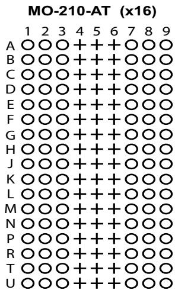

text_image

MO-210-AT (x16)
1 2 3 4 5 6 7 8 9
A ○○○+ + + + ○○○
B ○○○+ + + + ○○○
C ○○○+ + + + ○○○
D ○○○+ + + + ○○○
E ○○○+ + + + ○○○
F ○○○+ + + + ○○○
G ○○○+ + + + ○○○
H ○○○+ + + + ○○○
J ○○○+ + + + ○○○
K ○○○+ + + + ○○○
L ○○○+ + + + ○○○
M ○○○+ + + + ○○○
N ○○○+ + + + ○○○
P ○○○+ + + + ○○○
R ○○○+ + + + ○○○
T ○○○+ + + + ○○○
U ○○○+ + + + ○○○

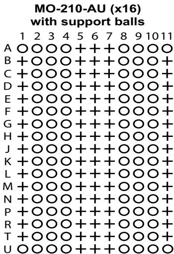

text_image

MO-210-AU (x16)
with support balls
1 2 3 4 5 6 7 8 9 10 11
A ○○○○○+ + + ○○○○
B +○○○○+ + + ○○○○+
C +○○○○+ + + ○○○○+
D +○○○○+ + + ○○○○+
E +○○○○+ + + ○○○○+
F +○○○○+ + + ○○○○+
G +○○○○+ + + ○○○○+
H +○○○○+ + + ○○○○+
J +○○○○+ + + ○○○○+
K +○○○○+ + + ○○○○+
L +○○○○+ + + ○○○○+
M +○○○○+ + + ○○○○+
N +○○○○+ + + ○○○○+
P +○○○○+ + + ○○○○+
R +○○○○+ + + ○○○○+
T +○○○○+ + + ○○○○+
U ○○○○+ + + ○○○○

Populated ball

Ball not populated

# NOTE(s):

1. Additional columns and rows of inactive balls in MO-210 Terminal Pattern AU (x16) with support balls are for mechanical support only, and should not be tied to either electrically high or low.   
2. Some of the additional support balls can be selectively populated under the supplier’s discretion. Refer to supplier’s datasheet.

Figure 2 — DDR5 Ball Assignments for the x16 Component

# 2.6 Pinout Description

Table 3 — Pinout Description 

<table><tr><td>Symbol</td><td>Type</td><td>Function</td></tr><tr><td>CK_t, CK_c</td><td>Input</td><td>Clock: CK_t and CK_c are differential clock inputs. All address and control input signals are sampled on the crossing of the positive edge of CK_t and negative edge of CK_c.</td></tr><tr><td>CS_n, (CS1_)</td><td>Input</td><td>Chip Select: All commands are masked when CS_n is registered HIGH. CS_n provides for external Rank selection on systems with multiple Ranks. CS_n is considered part of the command code. CS_n is also used to enter and exit the parts from power down modes.</td></tr><tr><td>DM_n, DMU_n, DML_n</td><td>Input</td><td>Input Data Mask: DM_n is an input mask signal for write data. Input data is masked when DM_n is sampled LOW coincident with that input data during a Write access. DM_n is sampled on both edges of DQS. For x8 device, the function of DM_n is enabled by MR5:OP[5]=1. DM is not supported for x4 device.</td></tr><tr><td>CA [13:0]</td><td>Input</td><td>Command/Address Inputs: CA signals provide the command and address inputs according to the Command Truth Table. Note: Since some commands are Multi-Cycle, the pins may not be interchanged between devices on the same bus.</td></tr><tr><td>RESET_n</td><td>Input</td><td>Active Low Asynchronous Reset: Reset is active when RESET_n is LOW, and inactive when RESET_n is HIGH. RESET_n must be HIGH during normal operation. RESET_n is a CMOS rail to rail signal with DC high and low at 80% and 20% of  $V_{DDQ}$ .</td></tr><tr><td>DQ</td><td>Input / Output</td><td>Data Input/Output: Bi-directional data bus. If CRC is enabled via Mode register then CRC code is added at the end of Data Burst.</td></tr><tr><td>DQS_t, DQS_c, DQSU_t, DQSU_c, DQSL_t, DQSL_c</td><td>Input / Output</td><td>Data Strobe: output with read data, input with write data. Edge-aligned with read data, centered in write data. For the x16, DQSL corresponds to the data on DQL0-DQL7; DQSU corresponds to the data on DQU0-DQU7. The data strobe DQS_t, DQSL_t and DQSU_t are paired with differential signals DQS_c, DQSL_c, and DQSU_c, respectively, to provide differential pair signaling to the system during reads and writes. DDR5 SDRAM supports differential data strobe only and does not support single-ended.</td></tr><tr><td>TDQS_t, TDQS_c</td><td>Output</td><td>Termination Data Strobe: TDQS_t/TDQS_c is applicable for x8 DRAMs only. When enabled via MR5:OP[4]=1, the DRAM shall enable the same termination resistance function on TDQS_t/TDQS_c that is applied to DQS_t/DQS_c. When disabled via MR5:OP[4]=0, DM_n/TDQS_t shall provide the data mask function depending on MR5:OP[5]; TDQS_c is not used. x4/x16 DRAMs must disable the TDQS function via MR5:OP[4]=0.</td></tr><tr><td>ALERT_n</td><td>Input/Output</td><td>Alert: If a CRC error is detected, ALERT_n goes LOW for a time interval and goes back HIGH. During Connectivity Test mode, this pin works as an input. Optional use of this signal is dependent on the system. If the ALERT_n is not used, the ALERT_n pin must be pulled to VDDQ on the board.</td></tr><tr><td>TEN</td><td>Input</td><td>Connectivity Test Mode Enable: Required on x4, x8 &amp; x16 devices. HIGH in this pin shall enable Connectivity Test Mode operation along with other pins. It is a CMOS rail to rail signal with AC high and low at 80% and 20% of  $V_{DDQ}$ . Using this signal or not is dependent on System. This pin may be DRAM internally pulled low through a weak pull-down resistor to VSS.</td></tr><tr><td>MIR</td><td>Input</td><td>Mirror: Used to inform SDRAM device that it is being configured for Mirrored mode vs. Standard mode. With the MIR pin connected (strapped) to VDDQ, the SDRAM internally swaps even numbered CA with the next higher odd number CA. Normally the MIR pin must be tied to VSS if no CA mirror is required. Mirror pair examples: CA2 with CA3 (not CA1) CA4 with CA5 (not CA3). Note that the CA[13] function is only relevant for certain densities (including stacking) of DRAM component. In the case that CA[13] is not used, its ball location, considering whether MIR is used or not, should be connected (Strapped) to VDDQ. No active signaling requirements defined.</td></tr><tr><td>CAI</td><td>Input</td><td>Command &amp; Address Inversion: With the CAI pin connected (strapped) to VDDQ, DRAM internally inverts the logic level present on all the CA signals. Normally the CAI pin must be connected to VSS if no CA inversion is required. No active signaling requirements defined.</td></tr><tr><td>CA_ODT</td><td>Input</td><td>ODT for Command and Address. Apply Group A settings if the pin is connected (strapped) to VSS and apply Group B settings if the pin is connected (strapped) to  $V_{DDQ}$ . No active signalling requirements defined.</td></tr><tr><td>LBDQ</td><td>Output</td><td>Loopback Data Output: The output of this device on the Loopback Output Select defined in MR53:OP[4:0]. When Loopback is enabled, it is in driver mode using the default RON described in the Loopback Function section. When Loopback is disabled, the pin is either terminated or HiZ based on MR36:OP[2:0].</td></tr><tr><td>LBDQS</td><td>Output</td><td>Loopback Data Strobe: This is a single ended strobe with the Rising edge-aligned with Loopback data edge, falling edge aligned with data center. When Loopback is enabled, it is in driver mode using the default RON described in the Loopback Function section. When Loopback is disabled, the pin is either terminated or HiZ based on MR36:OP[2:0].</td></tr><tr><td>RFU</td><td>Input/Output</td><td>Reserved for future use</td></tr><tr><td>NC</td><td></td><td>No Connect: No internal electrical connection is present.</td></tr><tr><td>VDDQ</td><td>Supply</td><td>DQ Power Supply: 1.1 V</td></tr><tr><td>VDD</td><td>Supply</td><td>Power Supply: 1.1 V</td></tr><tr><td>VSS</td><td>Supply</td><td>Ground</td></tr><tr><td>VPP</td><td>Supply</td><td>DRAM Activating Power Supply: 1.8 V</td></tr><tr><td>ZQ, (ZQ1)</td><td>Reference</td><td>Reference Pin for ZQ calibration. This ball is tied to an external 240 ohm resistor(RZQ), which is tied to  $V_{SS}$ .</td></tr></table>

# 2.7 DDR5 SDRAM Addressing

Table 4 — 8 Gb Addressing Table 

<table><tr><td colspan="2">Configuration</td><td>2 Gb x4</td><td>1 Gb x8</td><td>512 Mb x16</td></tr><tr><td rowspan="3">Bank Address</td><td>BG Address</td><td>BG0~BG2</td><td>BG0~BG2</td><td>BG0~BG1</td></tr><tr><td>Bank Address in a BG</td><td>BA0</td><td>BA0</td><td>BA0</td></tr><tr><td># BG / # Banks per BG / # Banks</td><td>8 / 2 / 16</td><td>8 / 2 / 16</td><td>4 / 2 / 8</td></tr><tr><td colspan="2">Row Address</td><td>R0~R15</td><td>R0~R15</td><td>R0~R15</td></tr><tr><td colspan="2">Column Address</td><td>C0~C10</td><td>C0~C9</td><td>C0~C9</td></tr><tr><td colspan="2">Page size</td><td>1KB</td><td>1KB</td><td>2KB</td></tr><tr><td colspan="2">Chip IDs / Maximum Stack Height</td><td>CID0~3 / 16H</td><td>CID0~3 / 16H</td><td>CID0~3 / 16H</td></tr></table>

Table 5 — 16 Gb Addressing Table 

<table><tr><td colspan="2">Configuration</td><td>4 Gb x4</td><td>2 Gb x8</td><td>1 Gb x16</td></tr><tr><td rowspan="3">Bank Address</td><td>BG Address</td><td>BG0~BG2</td><td>BG0~BG2</td><td>BG0~BG1</td></tr><tr><td>Bank Address in a BG</td><td>BA0~BA1</td><td>BA0~BA1</td><td>BA0~BA1</td></tr><tr><td># BG / # Banks per BG / # Banks</td><td>8 / 4 / 32</td><td>8 / 4 / 32</td><td>4 / 4 / 16</td></tr><tr><td colspan="2">Row Address</td><td>R0~R15</td><td>R0~R15</td><td>R0~R15</td></tr><tr><td colspan="2">Column Address</td><td>C0~C10</td><td>C0~C9</td><td>C0~C9</td></tr><tr><td colspan="2">Page size</td><td>1KB</td><td>1KB</td><td>2KB</td></tr><tr><td colspan="2">Chip IDs / Maximum Stack Height</td><td>CID0~3 / 16H</td><td>CID0~3 / 16H</td><td>CID0~3 / 16H</td></tr></table>

Table 6 — 24 Gb Addressing Table 

<table><tr><td colspan="2">Configuration</td><td>6 Gb x4</td><td>3 Gb x8</td><td>1.5 Gb x16</td></tr><tr><td rowspan="3">Bank Address</td><td>BG Address</td><td>BG0~BG2</td><td>BG0~BG2</td><td>BG0~BG1</td></tr><tr><td>Bank Address in a BG</td><td>BA0~BA1</td><td>BA0~BA1</td><td>BA0~BA1</td></tr><tr><td># BG / # Banks per BG / # Banks</td><td>8 / 4 / 32</td><td>8 / 4 / 32</td><td>4 / 4 / 16</td></tr><tr><td colspan="2">Row Address</td><td>R0~R16</td><td>R0~ R16</td><td>R0~R16</td></tr><tr><td colspan="2">Column Address</td><td>C0~C10</td><td>C0~C9</td><td>C0~C9</td></tr><tr><td colspan="2">Page size</td><td>1KB</td><td>1KB</td><td>2KB</td></tr><tr><td colspan="2">Chip IDs / Maximum Stack Height</td><td>CID0~3 / 16H</td><td>CID0~3 / 16H</td><td>CID0~3 / 16H</td></tr><tr><td colspan="5">NOTE 1 For non-binary memory densities, a quarter of the row address space is invalid. When the MSB address bit is “HIGH”, the MSB-1 address bit shall be “LOW”.</td></tr></table>

Table 7 — 32 Gb Addressing Table 

<table><tr><td colspan="2">Configuration</td><td>8 Gb x4</td><td>4 Gb x8</td><td>2 Gb x16</td></tr><tr><td rowspan="3">Bank Address</td><td>BG Address</td><td>BG0~BG2</td><td>BG0~BG2</td><td>BG0~BG1</td></tr><tr><td>Bank Address in a BG</td><td>BA0~BA1</td><td>BA0~BA1</td><td>BA0~BA1</td></tr><tr><td># BG / # Banks per BG / # Banks</td><td>8 / 4 / 32</td><td>8 / 4 / 32</td><td>4 / 4 / 16</td></tr><tr><td colspan="2">Row Address</td><td>R0~R16</td><td>R0~R16</td><td>R0~R16</td></tr><tr><td colspan="2">Column Address</td><td>C0~C10</td><td>C0~C9</td><td>C0~C9</td></tr><tr><td colspan="2">Page size</td><td>1KB</td><td>1KB</td><td>2KB</td></tr><tr><td colspan="2">Chip IDs / Maximum Stack Height</td><td>CID0~3 / 16H</td><td>CID0~3 / 16H</td><td>CID0~3 / 16H</td></tr></table>

# 2.7 DDR5 SDRAM Addressing (cont’d)

Table 8 — 64 Gb Addressing Table 

<table><tr><td colspan="2">Configuration</td><td>16 Gb x4</td><td>8 Gb x8</td><td>4 Gb x16</td></tr><tr><td rowspan="3">Bank Address</td><td>BG Address</td><td>BG0~BG2</td><td>BG0~BG2</td><td>BG0~BG1</td></tr><tr><td>Bank Address in a BG</td><td>BA0~BA1</td><td>BA0~BA1</td><td>BA0~BA1</td></tr><tr><td># BG / # Banks per BG / # Banks</td><td>8 / 4 / 32</td><td>8 / 4 / 32</td><td>4 / 4 / 16</td></tr><tr><td colspan="2">Row Address</td><td>R0~R17</td><td>R0~R17</td><td>R0~R17</td></tr><tr><td colspan="2">Column Address</td><td>C0~C10</td><td>C0~C9</td><td>C0~C9</td></tr><tr><td colspan="2">Page size</td><td>1KB</td><td>1KB</td><td>2KB</td></tr><tr><td colspan="2">Chip IDs / Maximum Stack Height</td><td>CID0~2 / 8H</td><td>CID0~2 / 8H</td><td>CID0~2 / 8H</td></tr></table>

# 3 Functional Description

# 3.1 Simplified State Diagram

This Simplified State Diagram is intended to provide an overview of the possible state transitions and the commands to control them. In particular, situations involving more than one bank, the enabling or disabling of on-die termination, and some other events are not captured in full detail.

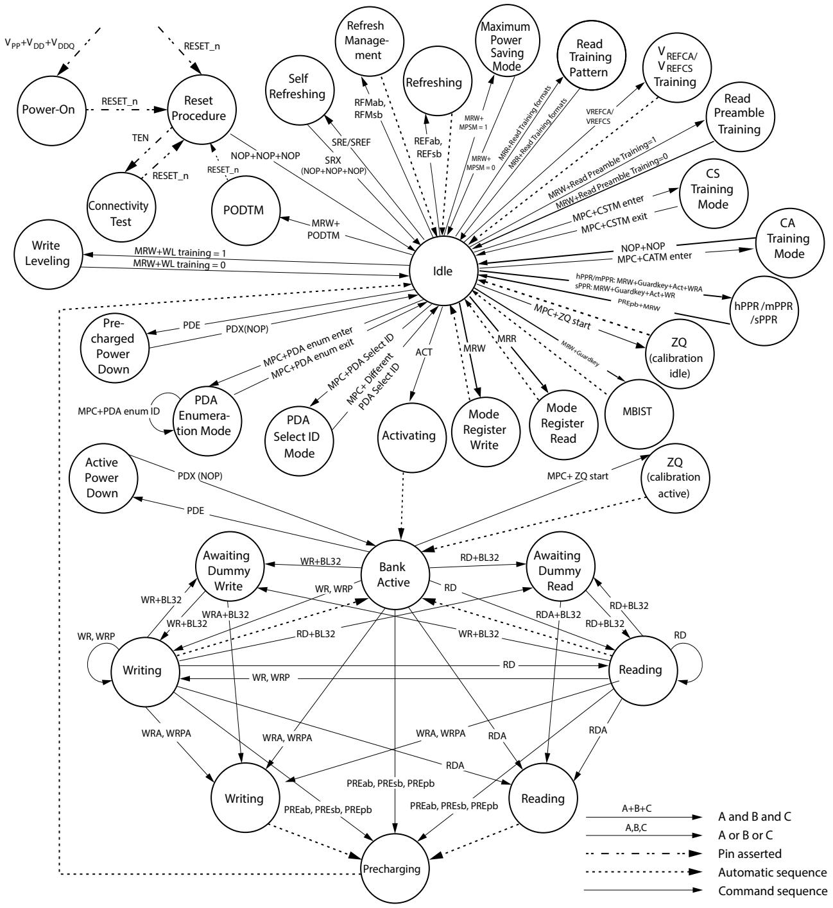

flowchart

```mermaid
graph TD
    subgraph Idle
        A["Power-On"] -->|Vpp+VDD+VDDQ| B["Reset Procedure"]
        B -->|RESET_n| C["Self Refreshing"]
        C -->|REFab, REFsb| D["Refreeing"]
        D -->|SRX (NOP+NOP+NOP)| E["Refreeing"]
        E -->|RFMab, RFMSb| F["Refreeing"]
        F -->|MRR+ MPSM=1| G["Read Training Pattern"]
        G -->|VREFCA/VREFCS Training| H["Read Preamble Training"]
        H -->|MRW+Read Preamble Training=0| I["CS Training Mode"]
        I -->|MRW+Read Preamble Training=1| J["CA Training Mode"]
        J -->|MRW+WL training=0| K["Write Leveling"]
        K -->|MRW+WL training=1| L["Connectivity Test"]
        L -->|TEN| M["PostgreSQL"]
        M -->|RESET_n| N["Write Leveling"]
        N -->|MRW+WL training=0| O["Write Leveling"]
        O -->|MRW+WL training=1| P["Write Leveling"]
        P -->|MRW+WL training=0| Q["Write Leveling"]
        Q -->|MRW+WL training=1| R["Write Leveling"]
        R -->|MRW+WL training=0| S["Write Leveling"]
        S -->|MRW+WL training=1| T["Write Leveling"]
        T --> U["Write Leveling"]
        U --> V["PDA Enumeration Mode"]
        V --> W["PDA Select ID Mode"]
        W --> X["PDA Select ID"]
        X --> Y["Activating"]
        Y --> Z["Mode Register Write"]
        Z --> AA["Mode Register Read"]
        AA --> AB["MBIST"]
        AB --> AC["ZQ (calibration idle)"]
        AC --> AD["hPPR/mPPR /sPPR"]
        AD --> AE["hPPR/mPPR:MRW+Guardkey+Act+WRA sPPR:MRW+Guardkey+Act+WR PREpb+MRW"]
        AE --> AF["ZQ (calibration active)"]
        AF --> AG["ZQ (calibration active)"]
        AG --> AH["Active Power Down"]
        AH --> AI["PDX (NOP)"]
        AI --> AJ["PDA Enumeration Mode"]
        AJ --> AK["PDA Select ID Mode"]
        AK --> AL["Activating"]
        AL --> AM["Mode Register Write"]
        AM --> AN["Mode Register Read"]
        AN --> AO["MBRIST"]
        AO --> AP["ZQ (calibration active)"]
        AP --> AQ["Active Power Down"]
        AQ --> AR["PDX (NOP)"]
        AR --> AS["Bank Active"]
        AS --> AT["Awaiting Dummy Write"]
        AS --> AU["Awaiting Dummy Read"]
        AS --> AV["Reading"]
        AV --> AW["Writing"]
        AW --> AX["Writing"]
        AX --> AY["Writing"]
        AY --> AZ["Precharging"]
    end

    subgraph Bank Active
        BA["Bank Active"]
        BB["Awaiting Dummy Read"]
        BC["Reading"]
    end

    subgraph Writing
        BA
        BB
        AC
        AD
    end

    subgraph Writing
        BA
        BB
        AC
        AD
    end

    subgraph Precharging
        AE
        AF
    end

    style Idle fill:#f9f9f9,stroke:#333,stroke-width:2px
    style Bank Active fill:#e6f7ff,stroke:#333,stroke-width:2px
    style Writing fill:#e6f7ff,stroke:#333,stroke-width:2px
    subgraph Writing
        BA
        BB
        AC
        AD
    end

    subgraph Writing
        BA
        BB
        AC
        AD
    end

    subgraph Precharging
        AE
        AF
    end

    note1["WR+BL32"]
    note2["WR, WRP"]
    note3["WR, WRPA"]
    note4["PREab, PREsb, PREpb"]
    note5["PREab, PREsb, PREpb"]
    note6["WR+BL32"]
    note7["WR, WRP"]
    note8["WRA, WRPA"]
    note9["WR+BL32"]
    note10["RD+BL32"]
    note11["RD"]
    note12["WR+BL32"]
    note13["RD"]
    note14["WR+, BL32"]
    note15["RDA"]
    note16["RWA, WRPA"]
    note17["RDA"]
    note18["PREab, PREsb, PREpb"]
    note19["PREab, PREsb, PREpb"]
    note20["WR+, BL32"]
    note21["WR+, WRP"]
    note22["WR+BL32"]
    note23["WR+, WRPA"]
    note24["WR+, BL32"]
    note25["RD"]
    note26["RD"]
    note27["WR+, BL32"]
    note28["RDA"]
    note29["RWA, WRPA"]
    note30["RDA"]
    note31["PREab, PREsb, PREpb"]
    note32["PREab, PREsb, PREpb"]
    note33["WR+, BL32"]
    note34["WR+, WRP"]
    note35["WR+, WRPA"]
    note36["WR+, BL32"]
    note37["RD"]
    note38["RD"]
    note39["WR+, BL32"]
    note40["WR+, WRP"]
    note41["WR+, WRPA"]
    note42["WR+, BL32"]
    note43["RD"]
    note44["RD"]
    note45["WR+, BL32"]
    note46["WR+, WRP"]
    note47["WR+, WRPA"]
    note48["WR+, BL32"]
    note49["RD"]
    note50["RD"]
    note51["WR+, BL32"]
    note52["WR+, WRP"]
    note53["WR+, WRPA"]
    note54["WR+, BL32"]
    note55["RD"]
    note56["RD"]
    note57["WR+, BL32"]
    note58["WR+, WRP"]
    note59["WR+, WRPA"]
    note60["WR+, BL32"]
    note61["RD"]
    note62["RD"]
    note63["WR+, BL32"]
    note64["WR+, WRP"]
    note65["WR+, WRPA"]
    note66["WR+, BL32"]
    note67["RD"]
    note68["RD"]
    note69["WR+, BL32"]
    note70["WR+, WRP"]
    note71["WR+, WRPA"]
    note72["WR+, BL32"]
    note73["RD"]
    note74["RD"]
    note75["WR+, BL32"]
    note76["WR+, WRP"]
    note77["WR+, WRPA"]
    note78["WR+, BL32"]
    note79["RD"]
    note80["RD"]
    note81["WR+, BL32"]
    note82["WR+, WRP"]
    note83["WR+, WRPA"]
    note84["WR+, BL32"]
    note85["RD"]
    note86["RD"]
    note87["WR+, BL32"]
    note88["WR+, WRP"]
    note89["WR+, WRPA"]
    note90["WR+, BL32"]
    note91["RD"]
    note92["RD"]
    note93["WR+, BL32"]
    note94["WR+, WRP"]
    note95["WR+, WRPA"]
    note96["WR+, BL32"]
    note97["RD"]
    note98["RD"]
    note99["WR+, BL32"]
```

Figure 3 — Simplified State Diagram

# 3.2 Basic Functionality

The DDR5 SDRAM is a high-speed dynamic random-access memory. To ease transition from DDR4 to DDR5, the introductory density (8 Gb) shall be internally configured as 16-bank, 8 bank group with 2 banks for each bank group for x4/x8 and 8-bank, 4 bank group with 2 banks for each bankgroup for x16 DRAM. When the industry transitions to higher densities (=>16 Gb), it doubles the bank resources and internally be configured as 32-bank, 8 bank group with 4 banks for each bank group for x4/x8 and 16-bank, 4-bank group with 4 banks for each bankgroup for x16 DRAM.

The DDR5 SDRAM uses a 16n prefetch architecture to achieve high-speed operation. The 16n prefetch architecture is combined with an interface designed to transfer two data words per clock cycle at the I/O pins. A single read or write operation for the DDR5 SDRAM consists of a single 16n-bit wide, eight clock data transfer at the internal DRAM core and sixteen corresponding n-bit wide, one-half clock cycle data transfers at the I/O pins.

Read and write operation to the DDR5 SDRAM are burst oriented, start at a selected location, and continue for a burst length of sixteen or a ‘chopped’ burst of eight in a programmed sequence. Operation begins with the registration of an ACTIVATE Command, which is then followed by a Read or Write command. The address bits registered with the ACTIVATE Command are used to select the bank and row to be activated (i.e. in a 16Gb part, BG0-BG2 in a x4/8 and BG0-BG1 in x16 select the bankgroup; BA0-BA1 select the bank; R0-R17 select the row; refer to “DDR5 SDRAM Addressing” for specific requirements). The address bits registered with the Read or Write command are used to select the starting column location for the burst operation, determine if the auto precharge command is to be issued (CA10=L), and select BC8 on-the-fly (OTF), fixed BL16, fixed BL32 (optional), or BL32 OTF (optional) mode if enabled in the mode register.

Prior to normal operation, the DDR5 SDRAM must be powered up and initialized in a predefined manner.

The following sections provide detailed information covering device reset and initialization, register definition, command descriptions, and device operation.

# 3.3 RESET and Initialization Procedure

For power-up and reset initialization, in order to prevent DRAM from functioning improperly, default values for the following MR settings need to be defined.

Table 9 — MR Default Settings 

<table><tr><td>Item</td><td>Mode Register</td><td>Default Setting</td><td>Description</td></tr><tr><td>Burst Length</td><td>MR0 OP[1:0]</td><td> $00_B$ </td><td>BL16</td></tr><tr><td>Read Latency</td><td>MR0 OP[6:2]</td><td> $00010_B$ </td><td>RL(CL) = 26 @3200</td></tr><tr><td>Write Latency</td><td>n/a</td><td>WL=RL-2 (CWL=CL-2)</td><td>Fixed based on RL (CL)</td></tr><tr><td>Write Recovery (tWR)</td><td>MR6 OP[3:0]</td><td> $0000_B$ </td><td>WR = 48nCK @3200 or 30ns</td></tr><tr><td>Read to Precharge Delay (tRTP)</td><td>MR6 OP[7:4]</td><td> $0000_B$ </td><td>tRTP=12nCK @3200 or 7.5ns</td></tr><tr><td>VrefDQ Value</td><td>MR10</td><td> $0010\ 1101_B$ </td><td>VREF(DQ) Range: 75% of  $V_{DDQ}$ </td></tr><tr><td>VrefCA Value</td><td>MR11</td><td> $0010\ 1101_B$ </td><td>VREF(CA) Range: 75% of  $V_{DDQ}$ </td></tr><tr><td>VrefCS Value</td><td>MR12</td><td>0010 1101B</td><td>VREF(CS) Range: 75% of VDDQ</td></tr><tr><td>ECS Error Threshold Count (ETC)</td><td>MR15</td><td>011B</td><td>256</td></tr><tr><td>Post Package Repair</td><td>MR23 OP[1:0]</td><td>00B</td><td>hPPR and sPPR Disabled</td></tr><tr><td>CK ODT</td><td>MR32 OP[2:0]</td><td>CK ODT is based on strap value</td><td>Group A= RTT_OFF=000B Group B= 40 Ohms=111B</td></tr><tr><td>CS ODT</td><td>MR32 OP[5:3]</td><td>CS ODT is based on strap value</td><td>Group A= RTT_OFF=000B Group B= 40 Ohms=111B</td></tr><tr><td>CA ODT</td><td>MR33 OP[2:0]</td><td>CA ODT is based on strap value</td><td>Group A= RTT_OFF=000B Group B= 80 Ohms=100B</td></tr><tr><td>DQS_RTT_PARK</td><td>MR33 OP[5:3]</td><td>000B</td><td>RTT OFF</td></tr><tr><td>RTT_PARK</td><td>MR34 OP[2:0]</td><td>000B</td><td>RTT OFF</td></tr><tr><td>RTT_WR</td><td>MR34 OP[5:3]</td><td>001B</td><td>240 Ohm</td></tr><tr><td>RTT_NOM_WR</td><td>MR35 OP[2:0]</td><td>011B</td><td>80 Ohm</td></tr><tr><td>RTT_NOM_RD</td><td>MR35 OP[5:3]</td><td>011B</td><td>80 Ohm</td></tr><tr><td>RTT Loopback</td><td>MR36 OP[2:0]</td><td>000B</td><td>RTT OFF</td></tr><tr><td>RFM RAAIMT</td><td>MR58 OP[4:1]</td><td>vendor specific</td><td>vendor specific</td></tr><tr><td>RFM RAAMMT</td><td>MR58 OP[7:5]</td><td>vendor specific</td><td>vendor specific</td></tr><tr><td>RFM RAA Counter</td><td>MR59 OP[7:6]</td><td>vendor specific</td><td>vendor specific</td></tr></table>

# 3.3.1 Power-up Initialization Sequence

The following sequence shall be used to power up the DDR5 device. Unless specified otherwise, these steps are mandatory.

1. While applying power (after Ta), RESET\_n is recommended to be LOW (≤0.2 x VDDQ) and all other inputs may be undefined. The device outputs remain disabled while $\mathsf { R E S E T \_ n }$ is held LOW. Power supply voltage ramp requirements are provided in Table 10 VPP shall ramp at the same time or earlier than VDD.

Table 10 — Voltage Ramp Conditions 

<table><tr><td>After</td><td>Application Conditions</td></tr><tr><td>Ta is reached</td><td>VPP shall be greater than VDD</td></tr><tr><td colspan="2">NOTE 1 Ta is the point when any power supply first reaches 300 mVNOTE 2 Voltage ramp conditions in the table above apply between (Ta) and Power-off (controlled or uncontrolled).NOTE 3 Tb is the point at which all supply and reference voltages are within their defined ranges.NOTE 4 Power ramp duration (Tb-Ta) shall not exceed tINIT0.</td></tr></table>

2. Following the completion of the voltage ramp (Tb), RESET\_n shall be maintained LOW. DQ, DQS\_t, DQS\_c, voltage levels shall be between VSS and VDDQ to avoid latch-up. CS\_n, CK\_t, CK\_c and CA input levels shall be between VSS and VDDQ to avoid latch-up.   
3. Beginning at Tb, RESET\_n shall be maintained LOW for a minimum of tINIT1 (Tb to Tc), after which RESET\_n may be de-asserted to HIGH (Tc). At least tINIT2 before RESET\_n de-assertion, CS\_n is required to be set LOW. All other input signals are “Don’t Care”. The DRAM shall support the ability for RESET\_n to be held indefinitely.

# 3.3.1 Power-up Initialization Sequence (cont’d)

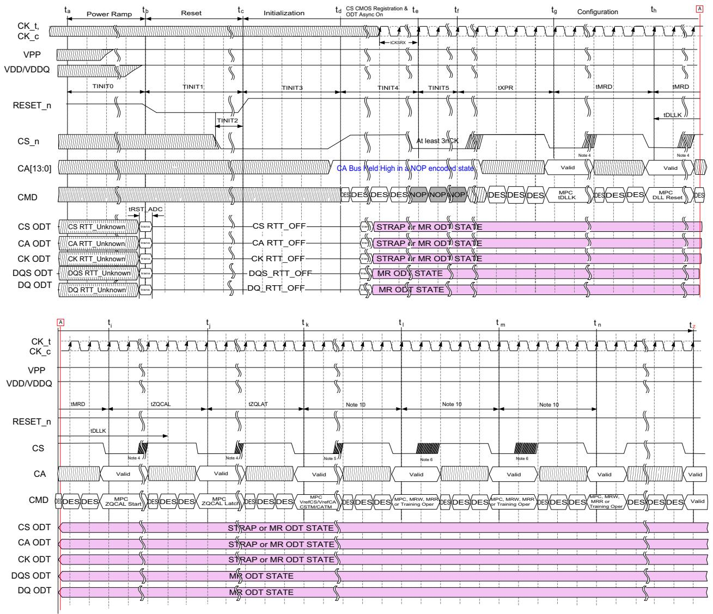

text_image

CK_t,
CK_c
VPP
VDD/VDDQ
TINIT0
TINIT1
TINIT2
TINIT3
TINIT4
TINIT5
tXPR
tMRD
tMRD
RESET_n
CS_n
CA[13:0]
CMD
CS ODT
CA ODT
CK ODT
DQS ODT
DQ ODT
IRST_ADC
CS RTT_Unknown
CS RTT_OFF
STRAP or MR ODY STATE
CA RTT_Unknown
CA RTT_OFF
STRAP or MR ODY STATE
CK RTT_Unknown
CK RTT_OFF
STRAP or MR ODY STATE
DQS RTT_Unknown
DQS RTT_OFF
MR ODY STATE
DQ RTT_OFF
MR ODY STATE
A
CK_t
CK_c
VPP
VDD/VDDQ
RESET_n
CS
CA
CMD
TS DES DES MPC ZQCAL Start DES DES MPC ZQCAL Latch DES DES DES MPC VrefCS/VrefCA CSTM/CATM DES DES MPC, MRW, MRR or Training Oper DES DES MPC, MRW, MRR or Training Oper DES DES MPC, MRW, MRR or Training Oper DES DES MPDC DLL Reset DES MPDC DLL Reset DES MPDC DLL Reset DES MPDC DLL Reset DES MPDC DLL Reset DES MPDC DLL Reset DES MPDC DLL Reset DES MPDC DLL Reset DES MPDC DLL Reset DES MPDC DLL Reset DES MPDC DLL Reset DES MPDC DLL Reset DES MPDC DLL Reset DES MPDC DLL Reset DES MPDC DLL Reset DES MPDC DLL Reset DES MPDC DLL Reset DES MPDC DLL Reset DES MPDC DLL Reset DES MPDC DLL Reset DES MPDC DLLReset DES MPDC DLLReset DES MPDC DLLReset DES MPDC DLLReset DES MPDC DLLReset DES MPDC DLLReset DES MPDC DLLReset DES MPDC DLLReset DES MPDC DLLReset DES MPDC DLLReset DES MPDC DLLReset DES MPDC DLLReset DES MPDC DLLReset DES MPDC DLLReset DES MPDC DLLReset DES MPDC DLLReset DES MPDC DLLReset DES MPDC DLLReset DES MPDC DLLReset DES MPDC DLLReset DES MPDC DLLSetTES MPDC DLLSETTES MPDC DLLSETTES MPDC DLLSETTES MPDC DLLSETTES MPDC DLLSETTES MPDC DLLSETTES MPDC DLLSETTES MPDC DLLSETTES MPDC DLLSETTES MPDC DLLSETTES MPDC DLLSETTES MPDC DLLSETTES MPDC DLLSETTES MPDC DLLSETTES MPDC DLLSETTES MPDC DLLSETTES MPDC DLLSETTES MPDC DLLSETTES MPDC DLLSETTES MPDC DLLSETTES MPDC DLLSetTES MPDC DLLSetTES MPDC DLLSetTES MPDC DLLSetTES MPDC DLLSetTES MPDC DLLSetTES MPDC DLLSetTES MPDC DLLSetTES MPDC DLLSetTES MPDC DLLSetTES MPDC DLLSetTES MPDC DLLSetTES MPDC DLLSetTES MPDC DLLSetTES MPDC DLLSetTES MPDC DLLSetTES MPDC DLLSetTES MPDC DLLSetTES MPDC DLLSetTES MPDC DLLSetTES MPDC DLLSETTES MPDC DLLSETTES MPDC DLLSETTES MPDC DLLSETTES MPDC DLLSETTES MPDC DLLSETTES MPDC DLLSETTES MPDC DLLSETTES MPDC DLLSETTES MPDC DLLSETTES MPDC DLLSETTES MPDC DLLSETTES MPDC DLLSETTES MPDC DLLSETTES MPDC DLLSETTES MPDC DLLSETTES MPDC DLLSETTES MPDC DLLSETTES MPDC DLLSETTEMSMPC DQ DQ DQ DQ DQ DQ DQ DQ DQ DQ DQ DQ DQ DQ DQ DQ DQ DQ DQ DQ DQ DQ DQ DQ DQ DQ DQ DQ DQ DQ DQ DQ DQ DQ DQ DQ DQ DQ DQ DQ DQ DQ DQ DQ DQ DQ DQ DQ DQ DQ Dq d q d q d q d q d q d q d q d q d q d q d q d q d q d q d q d q d q d q d q d q d q d q d q d q d q d q d q d q d q d q d q d q d q d q d q d q d q d q d q d q d q d q d q d q d q d q d q d q d q d q d Qd d Qd d Qd d Qd d Qd d Qd d Qd d Qd d Qd d Qd d Qd d Qd d Qd d Qd d Qd d Qd d Qd d Qd d Qd d Qd d Qd d Qd d Qd d Qd d Qd d Qd d Qd d Qd d Qd d Qd d Qd d Qd d Qd d Qd t k t l t m t n t 2
CK_t
CK_c
VPP
VDD/VDDQ
TS DES DES MCOS Registration & ODT Async On
ICKSRX
At least 3nCK
At least 3nCK
At least 3nCK
At least 3nCK
At least 3nCK
At least 3nCK
At least 3nCK
At least 3nCK
At least 3nCK
At least 3nCK
At least 3nCK
At least 3nCK
At least 3nCK
At least 3nCK
At least 3nCK
AT least 3nCK
AT least 3nCK
AT least 3nCK
AT least 3nCK
AT least 3nCK
AT least 3nCK
AT least 3nCK
AT least 3nCK
AT least 3nCK
AT least 3nCK
AT least 3nCK
AT least 3nCK
AT least 3nCK
AT least 3nCK
AT least NOK P NOP ENOID state Valid Valid Valid Valid Valid Valid Valid Valid Valid Valid Valid Valid Valid Valid Valid Valid Valid Valid Valid Valid Valid Valid Valid Valid Valid Valid Valid Valid Valid Valid Valid Valid Valid Valid Valid Valid Valid Valid Valid Valid Valid Valid Valid Valid Valid Valid Valid Valid Valid Valid Valid Valid Valid Valid Valid Valid Valid Valid Valid Valid Valid Valid Valid Valid Valid Valid Valid Valid Valid Valid Valid Valid Valid Valid Valid Valid Valid Valid Valid Valid Valid Valid Valid Valid Valid Valid Valid Valid Valid Valid Valid Valid Valid Valid Valid Valid Valid Valid Valid ValidValidValidValidValidValidValidValidValidValidValidValidValidValidValidValidValidValidValidValidValidValidValidValidValidValidValidValidValidValidValidValidValidValidValidValidValidValidValidValidValidValidValidValidValidValidValidValidValidValidValidValidValidValidValidValidValidValidValidValidValidValidValidValidValidValidValidValidValidValidValidValidValidValidValidValidValidValidValidValidValidValidValidValidValidValidValidValidValidValidValidValidValidValidValidValidValidValidValidValidValidolidescuelelllelllelllelllelllelllelllelllelllelllelllelllelllelllelllelllelllelllelllelllelllelllelllelllelllelllelllelllelllelllelllelllelllelllelllelllelllelllelllelllelllelllelllelllelllelllelllelllelllellleccuilelllelllelllelllelllelllelllelllelllelllelllelllelllelllelllelllelllelllelllelllelllelllelllelllelllelllclccuilelclccuilelclccuilelclccuilelclccuilelclccuilelclccuilelclccuilelclccuilelclccuilelclccuilelclccuilelclccuilelclccuilelclccuilelclccuilelclccuilelclccuilelclccuilelclccuilelclccuulelclccuilelclccuilelclccuilelclccuilelclccuilelclccuilelclccuilelclccuilelclccuilelclccuilelclccuilelclccuilelclccuilelclccuilelclccuilelclccuilelclccuilelclccuilelclccuilelclccuiculclccuilelclccuilelclccuilelclccuilelclccuilelclccuilelclccuilelclccuilelclccuilelclccuilelclccuilelclccuilelclccuilelclccuilelclccuilelclccuilelclccuilelclccuilelclccuilelclccuilemclccuilelclccuilelclccuilelclccuilelclccuilelclccuilelclccuilelclccuilelclccuilelclccuilelclccuilelclccuilelclccuilelclccuilelclccuilelclccuilelclccuilelclccuilelclccuilelclccuilerslcscscscscscscscscscscscscscscscscscscscscscscscscscscscscscscscscscscscscscscscscscscscscscscscscscscscscscscscscscscscscscscscscscscscscscscscscscscscscscscscscscscscscscscscscscscscscscscscscscscscscsucultcucultcucultcucultcucultcucultcucultcucultcucultcucultcucultcucultcucultcucultcucultcucultcucultcucultcucultcucultcucultcucultcucultcucultcucultcucultcucultcucultcucultcucultcucultcucultcucultcucultcugcrssca##ca##ca##ca##ca##ca##ca##ca##ca##ca##ca##ca##ca##ca##ca##ca##ca##ca##ca##ca##ca##ca##ca##ca##ca##ca##ca##ca##ca##ca##ca##ca##ca##ca######
A t i t j t k t l t m t n t 2 A t i t j t k t l t l t m t n t 2 A t i t j t k t l t l t m t n t 2 A t i t j t k t l t l t m t n t 2 A t i t j t k t l t l t m t n t 2 A t i t j t k t l t l t m t n t 2 A t i t j t k t l t l t m t n t 2 B c c c c c c c c c c c c c c c c c c c c c c c c c c c c c c c c c c c c c c c c c c c c c c c c c c c c c c c c c c c c c c c c c c c c c c c c c c c c c c c c c c c c c c c c c c c c c c c c c c c c 0000000000000000000000000000000000000000000000000000000000000000000000000000000000000000000000000000B C C C C C C C C C C C C C C C C C C C C C C C C C C C C C C C C C C C C C C C C C C C C C C C C C C C C C C C C C C C C C C C C C C C C C C C C C C C C C C C C C C C C C C C C C C C C C C C C C C C C CC UCC UCC UCC UCC UCC UCC UCC UCC UCC UCC UCC UCC UCC UCC UCC UCC UCC UCC UCC UCC UCC UCC UCC UCC UCC UCC UCC UCC UCC UCC UCC UCC UCC UCC UCC UCC UCC UCC UCC UCC UCC UCC UCC UCC UCC UCC UCC UCC UCC UCC USSUCCUCCUCCUCCUCCUCCUCCUCCUCCUCCUCCUCCUCCUCCUCCUCCUCCUCCUCCUCCUCCUCCUCCUCCUCCUCCUCCUCCUCCUCCUCCUCCUCCUCCUCCUCCUCCUCCUCCUCCUCCUCCUCCUCCUCCUCCUCCUCCUCCUCCUCCC UCCC UCCC UCCC UCCC UCCC UCCC UCCC UCCC UCCC UCCC UCCC UCCC UCCC UCCC UCCC UCCC UCCC UCCC UCCC UCCC UCCC UCCC UCCC UCCC UCCC UCCC UCCC UCCC UCCC UCCC UCCC UCCC UCCC UCCC UCCC UCCC UCCC UCCC UCCC UCCC UCCC UCCC UCCC UCCC UCCC UCCC UCCC UCCC UCCC UCCC ucccuscsuscsuscsuscsuscsuscsuscsuscsuscsuscsuscsuscsuscsuscsuscsuscsuscsuscsuscsuscsuscsuscsuscsuscsuscsuscsuscsuscsuscsuscsuscsuscsuscsuscsuscsuscsuscsuscsuscsuscsuscsuscsuscsuscsuscsuscsuscsuscsuscsuscsuscesiuscsuscsuscsuscsuscsuscsuscsuscsuscsuscsuscsuscsuscsuscsuscsuscsuscsuscsuscsuscsuscsuscsuscsuscsuscsuscsuscsuscsuscsuscsuscsuscsuscsuscsuscsuscsuscsuscsuscsuscsuscsuscsuscsuscsuscsuscsuscsuscsuscsuscsushesunununununununununununununununununununununununununununununununununununununununununununununununununununununununununununununununununununununununununununununununununununununununununununununununununununum<fcel>A<fcel>A<fcel>A<fcel>A<fcel>A<fcel>A<fcel>A<fcel>A<fcel>A<fcel>A<fcel>A<fcel>A<fcel>A<fcel>A<fcel>A<fcel>A<fcel>A<fcel>A<fcel>A<fcel>A<fcel>A<fcel>A<fcel>A<fcel>A<fcel>A<fcel>A<fcel>A<fcel>A<fcel>A<fcel>A<fcel>A<fcel>A<fcel>A<fcel>A<fcel>A<fcel>A<fcel>A<fcel>A<fcel>A<fcel>A<fcel>A<fcel>A<fcel>A<fcel>A<fcel>A<fcel>A<fcel>A<fcel>A<fcel>A<fcel>A<fcel><nl>

# NOTES:

1. From time point (Ta) until (Tb), RTT\_OFF may not be guaranteed due to the limitation for the DRAM to control the RTT status during the Power Ramp period.   
2. From time point (Td) until (Te), the command/address (CA) bus shall be held high in a NOP encoded state.   
3. From time point (Te) until (Tf), NOP commands shall be applied on the command/address (CA) bus.   
4. From time point (Tf) until (Tk), DES commands must be applied between legal commands (MRR, MRW, MPC, VREFCS & VREFCA). MRR and MRW command, while legal, may not execute properly until CS and CA training routines are completed.   
5. Prior to ZQcal completion at (Tk), MPC commands shall be Multi-Cycle as described in the MPC command Timings section.   
6. From time point (Tk) until (Tl) all MPC, VREFCS and VREFCA commands prior to CS and CA training successfully completing, shall be Multi-Cycle (MR2:OP[4]=0) as described in the MPC, VREFCS, and VREFCA timing sections.   
7. At time point (Tl), with successful completion of CS and CA training, an MRW command setting MR2:OP[4] =1 is recommended and allows for MPC,VREFCS, VREFCA commands to be single-cycle, improving training duration.   
8. From time point (Tk) until (Tz), DES commands shall be applied between legal commands (MRR, MRW, MPC, VREFCS & VREFCA).   
9. Starting at TI, MRW Commands shall be issued to all Mode Registers that require defined settings.   
10. Default ODT tolerances are wider prior to ZQ calibration.   
11, All MPC/MRW/MRR to MPC/MRW/MRR commands shall meet the timing restrictions required.   
12. Between (Tk to Tz), the SRX/NOP Clock-Sync feature can be enabled through an MRW command by programming MR13:OP[5]=1. When it is enabled, after CSTM/CATM prior to DCA training, host shall issue an SRE/SRX pair to ensure that the Clock-Sync is in effect during DCA training. It is also applied for CS Geardown Initialization sequence (for example, after Power-Up Initialization, CSTM, MPC (CS Geardown enable), Sync Pulse, CATM, MRW (SRX/NOP Clock-Sync enable), then host shall issue an SRE/SRX pair). Host (including RCD and Clock Driver) is responsible to ensure the same phases of the system clock all the time during DCA training.

Figure 4 — RESET\_n and Initialization Sequence at Power-on Ramping

4. After RESET\_n is de-asserted (Tc), wait at least tINIT3 before driving CS\_n high.

# 3.3.1 Power-up Initialization Sequence (cont’d)

5. After setting CS\_n high (Td), wait a minimum of tINIT4 to allow the DRAM CMOS based receiver to register the exit and allow the CS\_n, CK, CA, DQ and DQS ODT to go to the defined strap or MRS state (Te). Clock (CK\_t, CK\_c) is required to be started and stabilized for tCKSRX before exit of tINIT4 (Te). Upon the completion of Te, all ODT states (CA, CS\_n, CK, DQ and DQS ODT) should be valid and the DRAM’s CS\_n receiver should no longer be in its CMOS based mode. ODT termination states will be uncalibrated until completion of ZQcal at (Tj)   
6. Upon (Te), NOP commands shall be issued for a minimum of tINIT5 to conclude exit of initialization process and start tXPR timer at (Tf). The system shall wait at least tXPR before issuing any legal configuration commands (Tg). During early configuration steps (Tg to Tk), only MRR, MRW, MPC, VREFCS and VREFCA commands are legal. MRR and MRW command, while legal, may not execute properly until CS and CA training routines are completed.   
7. Between (Tg to Tj), the following initial configuration modes shall be completed prior to other training modes:

- MPC for setting MR13 (tCCD\_L\*/tDLLK) shall be issued before the MPC command to reset the DLL.   
- MPC to execute DLL RESET shall be issued before ZQCal Start   
- MPC to execute ZQCal Start followed by ZQCal Latch shall be issued before any other training modes such as VrefCS, VrefCA, CS and CA Training.

8. Between (Tk to Tz), any number of legal configuration commands are allowed. Many training based commands are optional and may be done at the system architect’s discretion and may vary depending on the systems, though proper setting of certain registers, such as those related to Write Leveling Training, is required. The host shall follow Multi-Cycle MPC timing requirements in cases where the alignment between CS\_n, CA, and CK is unknown, (ie., prior to successfully completing VREFCS, VREFCA, CS, and CA training commands or host provided successful training solutions). MRW and MRR commands can be used once the alignment between CS\_n, CA and CK are known. Single-cycle CS\_n assertion are allowed after setting MR2:OP[4]=1.   
9. Between (Tk to Tz), the SRX/NOP Clock-Sync feature can be enabled through an MRW command by programming MR13:OP[5]=1. When it is enabled, after CSTM/CATM prior to DCA training, host shall issue an SRE/SRX pair to ensure that the Clock-Sync is in effect during DCA training. It is also applied for CS Geardown Init sequence (for example, after PowerUp Initialization, CSTM, MPC (CS Geardown enable), Sync Pulse, CATM, MRW (SRX/NOP Clock-Sync enable), then host shall issue an SRE/SRX pair). Host (including RCD and Clock Driver) is responsible to ensure the same phases of the system clock all the time during DCA training to make the DCA training effective with the consistent phases of system and DRAM internal clocks.   
10. After (Tz), and the completion of any training or calibration timing parameters (i.e. tZQLAT is satisfied), the DDR5 device is ready for normal operation and is able to accept any valid command. Any additional mode registers that have not previously been set up for normal operation should be written at this time. If host use writeback suppression mode, it should be set after the initial write process to prevent aliasing to 2-bit errors.   
11. After all mode registers have been programmed for normal operation, optional MBIST mode can be entered by writing MR23:OP[4] to HIGH, followed by subsequent MR24 PPR guard keys, then DRAM will drive ALERT\_n to LOW for a maximum of tSELFTEST time. DRAM will drive ALERT\_n to HIGH to indicate that this operation is completed. After ALERT\_n is driven high, the DRAM is immediately ready to receive valid commands. The MBIST/mPPR transparency status shall subsequently be checked in MR22:OP[2:0] in order to determine whether mPPR should be performed. Please refer to Ch. 4.30 MBIST/mPPR for more detailed operation procedures.

Table 11 — Initialization Timing Parameters 

<table><tr><td rowspan="2">Parameter</td><td rowspan="2">Symbol</td><td colspan="2">Value</td><td rowspan="2">Units</td><td rowspan="2">Note(s)</td></tr><tr><td>MIN</td><td>MAX</td></tr><tr><td>Maximum voltage-ramp time</td><td>tINIT0</td><td>-</td><td>20</td><td>ms</td><td></td></tr><tr><td>Minimum RESET_n LOW time after completion of voltage ramp</td><td>tINIT1</td><td>200</td><td></td><td>μs</td><td></td></tr><tr><td>Minimum CS_n LOW time before RESET_n HIGH</td><td>tINIT2</td><td>10</td><td>-</td><td>ns</td><td></td></tr><tr><td>Minimum CS_n LOW time after RESET_n HIGH</td><td>tINIT3</td><td>4</td><td>-</td><td>ms</td><td></td></tr><tr><td>Minimum time for DRAM to register EXIT on CS_n with CMOS.</td><td>tINIT4</td><td>2</td><td>-</td><td>μs</td><td></td></tr><tr><td>Minimum cycles required after CS_n HIGH</td><td>tINIT5</td><td>3</td><td>-</td><td>nCK</td><td>1</td></tr><tr><td>Minimum time from Exit Reset to first valid Configuration Command</td><td>tXPR</td><td>tXS</td><td>-</td><td>ns</td><td></td></tr><tr><td>Minimum stable clock time</td><td>tCKSRX</td><td colspan="2">SEE Self Refresh Timing Table</td><td></td><td></td></tr><tr><td colspan="6">NOTE 1 Min number of NOP commands issued after CS_n High (tINIT4).</td></tr></table>

# 3.3.2 Reset Initialization with Stable Power

The following sequence is required for RESET at no power interruption initialization as shown in Figure 5.

1. Assert RESET\_n below 0.2 x VDDQ anytime when reset is needed. RESET\_n needs to be maintained for a minimum of tPW\_RESET. CS\_n shall be pulled LOW at least tINIT2 before de-asserting RESET\_n.   
2. Repeat steps 4 to 11 in Section 3.3.1

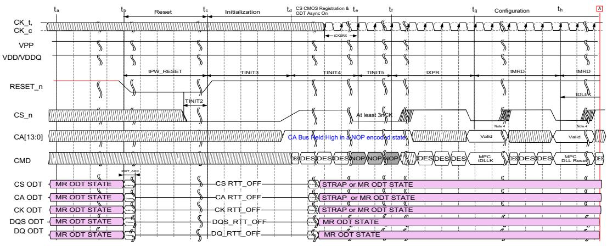

text_image

CK_t
CK_c
VPP
VDD/VDDQ
t_a
t_b
Reset
t_c
Initialization
t_d
CS CMOS Registration &
ODT Asymc On
t_e
t_f
t_g
Configuration
t_h
IPWR_RESET
TINIT3
TINIT4
TINIT5
tXPR
IMRD
IMRD
RESET_n
TINIT2
At least 3nCK
CS_n
CA[13:0]
CA Bus Held High in a NOP encoded state
Valid
Valid
CMD
CS ODT
MR ODT STATE
CS RTT_OFF
STRAP or MR ODT STATE
CA ODT
MR ODT STATE
CA RTT_OFF
STRAP or MR ODT STATE
CK ODT
MR ODT STATE
CK RTT_OFF
STRAP or MR ODT STATE
DQS ODT
MR ODT STATE
DQS_RTT_OFF
MR ODT STATE
DQ RTT_OFF
MR ODT STATE

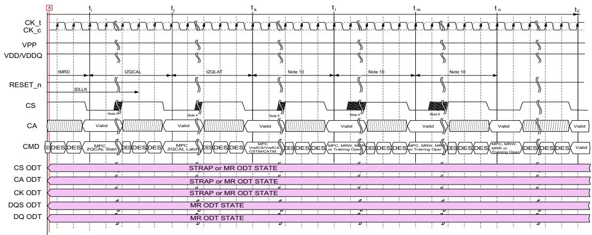

text_image

Timing diagram of a digital signal protocol showing clock, VPP, RESET, and control signals with labeled timing intervals and state transitions.

# NOTES:

1. From time point (Td) until (Te), the command/address (CA) bus shall be held high in a NOP encoded state.   
2. From time point (Te) until (Tf), NOP commands shall be applied on the command/address (CA) bus.   
3. From time point (Tf) until (Tk), DES commands shall be applied between legal commands (MRR, MRW, MPC, VREFCS & VREFCA). MRR and MRW command while legal, may not execute properly until CS and CA training routines are completed.   
4. Prior to ZQcal completion at (Tk), MPC commands shall be Multi-Cycle as described in the MPC command Timings section.   
5. From time point (Tk) until (Tl) all MPC, VREFCS and VREFCA commands prior to CS and CA training successfully completing, shall be Multi-Cycle (MR2:OP[4]=0) as described in the MPC, VREFCS, and VREFCA timing sections.   
6. At time point (Tl), with successful completion of CS and CA training, an MRW command setting MR2:OP[4] =1 is recommended and allows for MPC, VREFCS, VREFCA commands to be single-cycle, improving training duration.   
7. From time point (Tk) until (Tz), DES commands shall be applied between legal commands (MRR, MRW, MPC, VREFCS & VREFCA).   
8. Starting at Tl, MRW Commands shall be issued to all Mode Registers that require defined settings.   
9. Default ODT tolerances are wider prior to ZQ calibration.   
10. All MPC/MRW/MRR to MPC/MRW/MRR commands shall meet the timing restrictions required.   
11. MRR is legal after DLL\_reset.   
12. Between (Tk to Tz), the SRX/NOP Clock-Sync feature can be enabled through an MRW command by programming MR13:OP[5]=1. When it is enabled, after CSTM/CATM prior to DCA training, host shall issue an SRE/SRX pair to ensure that the Clock-Sync is in effect during DCA training. It is also applied for CS Geardown Initialization sequence (for example, after Power-Up Initialization, CSTM, MPC (CS Geardown enable), Sync Pulse, CATM, MRW (SRX/NOP Clock-Sync enable), then host shall issue an SRE/SRX pair). Host (including RCD and Clock Driver) is responsible to ensure the same phases of the system clock all the time during DCA training.

Figure 5 — Reset Procedure at Stable Power

# 3.3.2 Reset Initialization with Stable Power (cont’d)

Table 12 — Reset Timing Parameters 

<table><tr><td rowspan="2">Parameter</td><td rowspan="2">Symbol</td><td colspan="2">Value</td><td rowspan="2">Units</td><td rowspan="2">Note(s)</td></tr><tr><td>Min</td><td>Max</td></tr><tr><td>Minimum RESET_n low time for Reset Initialization with stable power</td><td>tPW_RESET</td><td>1</td><td>-</td><td>μS</td><td></td></tr><tr><td>Maximum time after RESET_n assertion to ODT off</td><td>tRST_ADC</td><td>-</td><td>50</td><td>nS</td><td></td></tr></table>

# 3.3.3 Input Voltage Power-up and Power-Down Sequence

Rail to Rail Requirements   
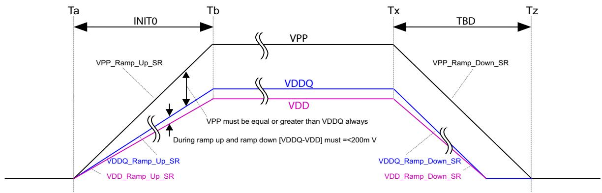

text_image

Ta INIT0 Tb Tx TBD Tz
VPP
VPP_Ramp_Up_SR VDDQ VPP_Ramp_Down_SR
VDDQ
VDD
VPP must be equal or greater than VDDQ always
During ramp up and ramp down [VDDQ-VDD] must =<200m V
VDDQ_Ramp_Up_SR VDD_Ramp_Down_SR
VDD_Ramp_Up_SR VDD_Ramp_Down_SR

Figure 6 — Requirement for Voltage Ramp Control

Table 13 — Input Voltage Slew Rates and Power Ramp Down Time 

<table><tr><td>Description</td><td>Symbol</td><td>Min</td><td>Max</td><td>Units</td><td>Notes</td></tr><tr><td rowspan="2">VPP Rail</td><td>VPP_Ramp_Up_SR</td><td>0.2</td><td>5</td><td>V/ms</td><td rowspan="6">1,2,3,4,5</td></tr><tr><td>VPP_Ramp_Down_SR</td><td>0.1</td><td>4.5</td><td>V/ms</td></tr><tr><td rowspan="2">VDD Rail</td><td>VDD_Ramp_Up_SR</td><td>0.1</td><td>4.5</td><td>V/ms</td></tr><tr><td>VDD_Ramp_Down_SR</td><td>0.1</td><td>4.5</td><td>V/ms</td></tr><tr><td rowspan="2">VDDQ Rail</td><td>VDDQ_Ramp_Up_SR</td><td>0.1</td><td>4.5</td><td>V/ms</td></tr><tr><td>VDDQ_Ramp_Down_SR</td><td>0.1</td><td>4.5</td><td>V/ms</td></tr><tr><td>Power Ramp Down Time</td><td>tPRD</td><td>-</td><td>19.08</td><td>ms</td><td></td></tr><tr><td colspan="6">NOTE 1 Both VDD and VPP supply measurements made between 10% and 90% nominal voltageNOTE 2 1Mhz bandwidth limited measurementNOTE 3 VPP shall be equal to or greater than VDD/VDDQ at all times.NOTE 4 During ramp up and ramp down [VDDQ-VDD] must be equal or less than 200 mV.NOTE 5 After tINIT0, all supplies shall be within their specified tolerance, as defined in the DC Operating Tables.</td></tr></table>

# 3.4 Mode Register Definition

# 3.4.1 Mode Register Read (MRR)

The Mode Register Read (MRR) command is used to read configuration and status data from the DDR5-SDRAM registers. The MRR command is initiated with CS\_n and CA[13:0] in the proper state as defined by the Command Truth Table. The mode register address operands (MA[7:0]) allow the user to select one of 256 registers. The mode register contents are available on the second 8 UI’s of the burst and are repeated across all DQ’s after the CL following the MRR command. To avoid a potentially worst-case pattern, every odd DQ bit (represented with !) shall have its contents inverted. Data in the burst (BL0-7) shall be either “0” or “1”, with “1” indicating that the content of the later UI’s (BL8-15) are inverted.

MRR commands require all banks to be idle on the DRAM. For 3DS, MRR commands require all banks to be idle on all logical ranks, The 3DS base die (CID[3:0]=0x0) is the targeted logical rank for most Mode Register Reads, however the CID setting of MR14:OP[3:0] designates the targeted logical rank for MRR commands to MR14-MR20, MR22 and MR54-MR57, and still requires all banks to be idle not only on the targeted logical rank but also on all other logical ranks.

DQS is toggled for the duration of the MRR burst. The MRR has a command burst length 16 regardless of the MR0 setting, the training mode or the mode register address. MRR termination control and ODT timings are the same as for the Read command. The MRR operation must not be interrupted. Non-Target ODT encoding is available for MRR, just like a normal Read. MRR NT ODT termination control and ODT timings are the same as for the Read NT command.

In the case that CRC is enabled, MRR’s output will come with BL18 (BL16 plus 2 CRC-bit), but the host has the option to consider the 17th and 18th bits “don’t care” for MRR handling. Regardless on if the host uses the 17th and 18th bits, while CRC is enabled, the strobe needs to toggle for BL18.

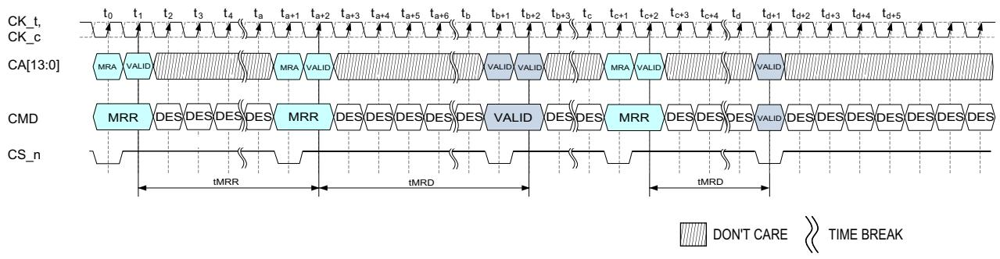

text_image

CK_t,
CK_c
CA[13:0]
CMD
CS_n
t0 t1 t2 t3 t4 ta ta+1 ta+2 ta+3 ta+4 ta+5 ta+6 tb tb+1 tb+2 tb+3 tc tc+1 tc+2 tc+3 tc+4 td td+1 td+2 td+3 td+4 td+5
MRA VALID MRA VALID VALID VALID MRA VALID VALID
MRR DES DES DES MRR DES DES DES DES VALID DES DES MRR DES DES DES VALID DES DES DES
tMRR tMRD tMRD
DON'T CARE TIME BREAK

Figure 7 — Mode Register Read Timing

Table 14 — DQ Output Mapping for x4 Device 

<table><tr><td>BL</td><td>0-7</td><td>8</td><td>9</td><td>10</td><td>11</td><td>12</td><td>13</td><td>14</td><td>15</td></tr><tr><td>DQ0</td><td>0</td><td>OP0</td><td>OP1</td><td>OP2</td><td>OP3</td><td>OP4</td><td>OP5</td><td>OP6</td><td>OP7</td></tr><tr><td>DQ1</td><td>1</td><td>!OP0</td><td>!OP1</td><td>!OP2</td><td>!OP3</td><td>!OP4</td><td>!OP5</td><td>!OP6</td><td>!OP7</td></tr><tr><td>DQ2</td><td>0</td><td>OP0</td><td>OP1</td><td>OP2</td><td>OP3</td><td>OP4</td><td>OP5</td><td>OP6</td><td>OP7</td></tr><tr><td>DQ3</td><td>1</td><td>!OP0</td><td>!OP1</td><td>!OP2</td><td>!OP3</td><td>!OP4</td><td>!OP5</td><td>!OP6</td><td>!OP7</td></tr><tr><td colspan="10">NOTE 1 The read pre-amble and post-amble of MRR are same as normal read.</td></tr></table>

# 3.4.1 Mode Register Read (MRR) (cont’d)

Table 15 — DQ Output Mapping for x8 Device 

<table><tr><td>BL</td><td>0-7</td><td>8</td><td>9</td><td>10</td><td>11</td><td>12</td><td>13</td><td>14</td><td>15</td></tr><tr><td>DQ0</td><td>0</td><td>OP0</td><td>OP1</td><td>OP2</td><td>OP3</td><td>OP4</td><td>OP5</td><td>OP6</td><td>OP7</td></tr><tr><td>DQ1</td><td>1</td><td>!OP0</td><td>!OP1</td><td>!OP2</td><td>!OP3</td><td>!OP4</td><td>!OP5</td><td>!OP6</td><td>!OP7</td></tr><tr><td>DQ2</td><td>0</td><td>OP0</td><td>OP1</td><td>OP2</td><td>OP3</td><td>OP4</td><td>OP5</td><td>OP6</td><td>OP7</td></tr><tr><td>DQ3</td><td>1</td><td>!OP0</td><td>!OP1</td><td>!OP2</td><td>!OP3</td><td>!OP4</td><td>!OP5</td><td>!OP6</td><td>!OP7</td></tr><tr><td>DQ4</td><td>0</td><td>OP0</td><td>OP1</td><td>OP2</td><td>OP3</td><td>OP4</td><td>OP5</td><td>OP6</td><td>OP7</td></tr><tr><td>DQ5</td><td>1</td><td>!OP0</td><td>!OP1</td><td>!OP2</td><td>!OP3</td><td>!OP4</td><td>!OP5</td><td>!OP6</td><td>!OP7</td></tr><tr><td>DQ6</td><td>0</td><td>OP0</td><td>OP1</td><td>OP2</td><td>OP3</td><td>OP4</td><td>OP5</td><td>OP6</td><td>OP7</td></tr><tr><td>DQ7</td><td>1</td><td>!OP0</td><td>!OP1</td><td>!OP2</td><td>!OP3</td><td>!OP4</td><td>!OP5</td><td>!OP6</td><td>!OP7</td></tr><tr><td colspan="10">NOTE 1 The read pre-amble and post-amble of MRR are same as normal read.</td></tr></table>

Table 16 — DQ Output Mapping for x16 Device (OSC Count - MR46 and MR47 only) 

<table><tr><td>BL</td><td>0-7</td><td>8</td><td>9</td><td>10</td><td>11</td><td>12</td><td>13</td><td>14</td><td>15</td></tr><tr><td>DQ0</td><td>0</td><td>OP0</td><td>OP1</td><td>OP2</td><td>OP3</td><td>OP4</td><td>OP5</td><td>OP6</td><td>OP7</td></tr><tr><td>DQ1</td><td>1</td><td>!OP0</td><td>!OP1</td><td>!OP2</td><td>!OP3</td><td>!OP4</td><td>!OP5</td><td>!OP6</td><td>!OP7</td></tr><tr><td>DQ2</td><td>0</td><td>OP0</td><td>OP1</td><td>OP2</td><td>OP3</td><td>OP4</td><td>OP5</td><td>OP6</td><td>OP7</td></tr><tr><td>DQ3</td><td>1</td><td>!OP0</td><td>!OP1</td><td>!OP2</td><td>!OP3</td><td>!OP4</td><td>!OP5</td><td>!OP6</td><td>!OP7</td></tr><tr><td>DQ4</td><td>0</td><td>OP0</td><td>OP1</td><td>OP2</td><td>OP3</td><td>OP4</td><td>OP5</td><td>OP6</td><td>OP7</td></tr><tr><td>DQ5</td><td>1</td><td>!OP0</td><td>!OP1</td><td>!OP2</td><td>!OP3</td><td>!OP4</td><td>!OP5</td><td>!OP6</td><td>!OP7</td></tr><tr><td>DQ6</td><td>0</td><td>OP0</td><td>OP1</td><td>OP2</td><td>OP3</td><td>OP4</td><td>OP5</td><td>OP6</td><td>OP7</td></tr><tr><td>DQ7</td><td>1</td><td>!OP0</td><td>!OP1</td><td>!OP2</td><td>!OP3</td><td>!OP4</td><td>!OP5</td><td>!OP6</td><td>!OP7</td></tr><tr><td>DQ8</td><td>0</td><td>OP0</td><td>OP1</td><td>OP2</td><td>OP3</td><td>OP4</td><td>OP5</td><td>OP6</td><td>OP7</td></tr><tr><td>DQ9</td><td>1</td><td>!OP0</td><td>!OP1</td><td>!OP2</td><td>!OP3</td><td>!OP4</td><td>!OP5</td><td>!OP6</td><td>!OP7</td></tr><tr><td>DQ10</td><td>0</td><td>OP0</td><td>OP1</td><td>OP2</td><td>OP3</td><td>OP4</td><td>OP5</td><td>OP6</td><td>OP7</td></tr><tr><td>DQ11</td><td>1</td><td>!OP0</td><td>!OP1</td><td>!OP2</td><td>!OP3</td><td>!OP4</td><td>!OP5</td><td>!OP6</td><td>!OP7</td></tr><tr><td>DQ12</td><td>0</td><td>OP0</td><td>OP1</td><td>OP2</td><td>OP3</td><td>OP4</td><td>OP5</td><td>OP6</td><td>OP7</td></tr><tr><td>DQ13</td><td>1</td><td>!OP0</td><td>!OP1</td><td>!OP2</td><td>!OP3</td><td>!OP4</td><td>!OP5</td><td>!OP6</td><td>!OP7</td></tr><tr><td>DQ14</td><td>0</td><td>OP0</td><td>OP1</td><td>OP2</td><td>OP3</td><td>OP4</td><td>OP5</td><td>OP6</td><td>OP7</td></tr><tr><td>DQ15</td><td>1</td><td>!OP0</td><td>!OP1</td><td>!OP2</td><td>!OP3</td><td>!OP4</td><td>!OP5</td><td>!OP6</td><td>!OP7</td></tr><tr><td colspan="10">NOTE 1 The read pre-amble and post-amble of MRR are same as normal read.NOTE 2 Output map excludes per bit DFE, DCA and VrefDQ mode registers (MR103 through MR255)</td></tr></table>

# 3.4.1 Mode Register Read (MRR) (cont’d)

Table 17 — DQ Output Mapping for x16 Device (DFE Registers Excluded) 

<table><tr><td>BL</td><td>0-7</td><td>8</td><td>9</td><td>10</td><td>11</td><td>12</td><td>13</td><td>14</td><td>15</td></tr><tr><td>DQ0</td><td>0</td><td>OP0</td><td>OP1</td><td>OP2</td><td>OP3</td><td>OP4</td><td>OP5</td><td>OP6</td><td>OP7</td></tr><tr><td>DQ1</td><td>1</td><td>!OP0</td><td>!OP1</td><td>!OP2</td><td>!OP3</td><td>!OP4</td><td>!OP5</td><td>!OP6</td><td>!OP7</td></tr><tr><td>DQ2</td><td>0</td><td>OP0</td><td>OP1</td><td>OP2</td><td>OP3</td><td>OP4</td><td>OP5</td><td>OP6</td><td>OP7</td></tr><tr><td>DQ3</td><td>1</td><td>!OP0</td><td>!OP1</td><td>!OP2</td><td>!OP3</td><td>!OP4</td><td>!OP5</td><td>!OP6</td><td>!OP7</td></tr><tr><td>DQ4</td><td>0</td><td>OP0</td><td>OP1</td><td>OP2</td><td>OP3</td><td>OP4</td><td>OP5</td><td>OP6</td><td>OP7</td></tr><tr><td>DQ5</td><td>1</td><td>!OP0</td><td>!OP1</td><td>!OP2</td><td>!OP3</td><td>!OP4</td><td>!OP5</td><td>!OP6</td><td>!OP7</td></tr><tr><td>DQ6</td><td>0</td><td>OP0</td><td>OP1</td><td>OP2</td><td>OP3</td><td>OP4</td><td>OP5</td><td>OP6</td><td>OP7</td></tr><tr><td>DQ7</td><td>1</td><td>!OP0</td><td>!OP1</td><td>!OP2</td><td>!OP3</td><td>!OP4</td><td>!OP5</td><td>!OP6</td><td>!OP7</td></tr><tr><td>DQ8</td><td rowspan="8" colspan="9">Don&#x27;t Care</td></tr><tr><td>DQ9</td></tr><tr><td>DQ10</td></tr><tr><td>DQ11</td></tr><tr><td>DQ12</td></tr><tr><td>DQ13</td></tr><tr><td>DQ14</td></tr><tr><td>DQ15</td></tr><tr><td colspan="10">NOTE 1 The read pre-amble and post-amble of MRR are same as normal read.NOTE 2 Output of mode register data is only duplicated and inverted across the first 8 bits of a x16 device.NOTE 3 Output map excludes per bit DFE, DCA and VrefDQ mode registers (MR103 through MR255)</td></tr></table>

Table 18 — DQ Output Mapping for x16 Device (DFE Lower Byte - DQ[0:7], DML) 

<table><tr><td>BL</td><td>0-7</td><td>8</td><td>9</td><td>10</td><td>11</td><td>12</td><td>13</td><td>14</td><td>15</td></tr><tr><td>DQ0</td><td>0</td><td>OP0</td><td>OP1</td><td>OP2</td><td>OP3</td><td>OP4</td><td>OP5</td><td>OP6</td><td>OP7</td></tr><tr><td>DQ1</td><td>1</td><td>!OP0</td><td>!OP1</td><td>!OP2</td><td>!OP3</td><td>!OP4</td><td>!OP5</td><td>!OP6</td><td>!OP7</td></tr><tr><td>DQ2</td><td>0</td><td>OP0</td><td>OP1</td><td>OP2</td><td>OP3</td><td>OP4</td><td>OP5</td><td>OP6</td><td>OP7</td></tr><tr><td>DQ3</td><td>1</td><td>!OP0</td><td>!OP1</td><td>!OP2</td><td>!OP3</td><td>!OP4</td><td>!OP5</td><td>!OP6</td><td>!OP7</td></tr><tr><td>DQ4</td><td>0</td><td>OP0</td><td>OP1</td><td>OP2</td><td>OP3</td><td>OP4</td><td>OP5</td><td>OP6</td><td>OP7</td></tr><tr><td>DQ5</td><td>1</td><td>!OP0</td><td>!OP1</td><td>!OP2</td><td>!OP3</td><td>!OP4</td><td>!OP5</td><td>!OP6</td><td>!OP7</td></tr><tr><td>DQ6</td><td>0</td><td>OP0</td><td>OP1</td><td>OP2</td><td>OP3</td><td>OP4</td><td>OP5</td><td>OP6</td><td>OP7</td></tr><tr><td>DQ7</td><td>1</td><td>!OP0</td><td>!OP1</td><td>!OP2</td><td>!OP3</td><td>!OP4</td><td>!OP5</td><td>!OP6</td><td>!OP7</td></tr><tr><td>DQ8</td><td rowspan="8" colspan="9">Don&#x27;t Care</td></tr><tr><td>DQ9</td></tr><tr><td>DQ10</td></tr><tr><td>DQ11</td></tr><tr><td>DQ12</td></tr><tr><td>DQ13</td></tr><tr><td>DQ14</td></tr><tr><td>DQ15</td></tr><tr><td colspan="10">NOTE 1 The read pre-amble and post-amble of MRR are same as normal read.NOTE 2 Output of mode register data is only duplicated and inverted across the first 8 bits of a x16 device when reading from a DFE register associated with a lower byte DQ or DML.NOTE 3 Output map is ONLY for per bit DFE, DCA and VrefDQ mode registers (MR103 through MR255)</td></tr></table>

# 3.4.1 Mode Register Read (MRR) (cont’d)

Table 19 — DQ Output Mapping for x16 Device (DFE Upper Byte - DQ[15:8], DMU) 

<table><tr><td>BL</td><td>0-7</td><td>8</td><td>9</td><td>10</td><td>11</td><td>12</td><td>13</td><td>14</td><td>15</td></tr><tr><td>DQ0</td><td rowspan="8" colspan="9">Don&#x27;t Care</td></tr><tr><td>DQ1</td></tr><tr><td>DQ2</td></tr><tr><td>DQ3</td></tr><tr><td>DQ4</td></tr><tr><td>DQ5</td></tr><tr><td>DQ6</td></tr><tr><td>DQ7</td></tr><tr><td>DQ8</td><td>0</td><td>OP0</td><td>OP1</td><td>OP2</td><td>OP3</td><td>OP4</td><td>OP5</td><td>OP6</td><td>OP7</td></tr><tr><td>DQ9</td><td>1</td><td>!OP0</td><td>!OP1</td><td>!OP2</td><td>!OP3</td><td>!OP4</td><td>!OP5</td><td>!OP6</td><td>!OP7</td></tr><tr><td>DQ10</td><td>0</td><td>OP0</td><td>OP1</td><td>OP2</td><td>OP3</td><td>OP4</td><td>OP5</td><td>OP6</td><td>OP7</td></tr><tr><td>DQ11</td><td>1</td><td>!OP0</td><td>!OP1</td><td>!OP2</td><td>!OP3</td><td>!OP4</td><td>!OP5</td><td>!OP6</td><td>!OP7</td></tr><tr><td>DQ12</td><td>0</td><td>OP0</td><td>OP1</td><td>OP2</td><td>OP3</td><td>OP4</td><td>OP5</td><td>OP6</td><td>OP7</td></tr><tr><td>DQ13</td><td>1</td><td>!OP0</td><td>!OP1</td><td>!OP2</td><td>!OP3</td><td>!OP4</td><td>!OP5</td><td>!OP6</td><td>!OP7</td></tr><tr><td>DQ14</td><td>0</td><td>OP0</td><td>OP1</td><td>OP2</td><td>OP3</td><td>OP4</td><td>OP5</td><td>OP6</td><td>OP7</td></tr><tr><td>DQ15</td><td>1</td><td>!OP0</td><td>!OP1</td><td>!OP2</td><td>!OP3</td><td>!OP4</td><td>!OP5</td><td>!OP6</td><td>!OP7</td></tr><tr><td colspan="10">NOTE 1 The read pre-amble and post-amble of MRR are same as normal read.NOTE 2 Output of mode register data is only duplicated and inverted across the last 8 bits of a x16 device when reading from a DFE register associated with an upper byte DQ or DMU.NOTE 3 Output map is ONLY for per bit DFE, DCA and VrefDQ mode registers (MR103 through MR255)</td></tr></table>

# 3.4.2 Mode Register WRITE (MRW)

The Mode Register Write (MRW) command is used to write configuration data to the mode registers. The MRW command is initiated with CS\_n and CA[13:0] in the proper state as defined by the Command Truth Table. The mode register address and the data written to the mode registers is contained in CA[13:0] according to the Command Truth Table. The MRW command period is defined by tMRW. Mode Register Writes to read-only registers have no impact on the functionality of the device.

MRW commands require all banks to be idle on the DRAM. For 3DS, MRW commands are broadcast across all logical ranks,requiring all banks to be idle on all logical ranks. For 3DS, MBIST Enable (MR23:OP[4]=1) is only enabled on the target logical rank designated by CID[3:0] and programmed by MRW via MR14:OP[3:0], but still requires all banks to be idle on all logical ranks.

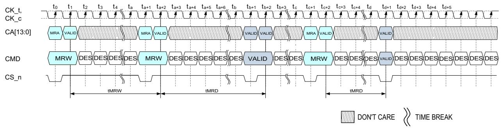

flowchart

```mermaid
graph TD
    subgraph CLK_t
        A["CK_t"] --> B["CA[13:0"]]
        C["CK_c"] --> D["CMD"]
        E["CS_n"] --> F["Time Break"]
    end

    subgraph_CA["CA[13:0"]]
        G["CK_t"] --> H["CA[13:0"]]
        I["CK_c"] --> J["CA[13:0"]]
        K["CMD"] --> L["CS_n"]

    end

    subgraph CMD
        M["CK_t"] --> N["CS_n"]

    end

    subgraph CS_n
        O["CK_t"] --> P["CS_n"]

    end

    style CLK_t fill:#f9f,stroke:#333
    style_CA["CA[13:0"]]
    style CMD fill:#ccf,stroke:#333
    style CS_n fill:#cfc,stroke:#333

    note right of M
        Don't Care
        Time Break
    end
```

Figure 8 — Mode Register Write Timing

# 3.4.3 DFE Mode Register Write Update Timing

This Mode Register update timing parameter applies for MR112 (MA[7:0]=70H) thru MR248 (MA[7:0]=F8H) - Mode Registers for DFE including DFE Gain Bias, DFE Tap-1, DFE Tap-2, DFE Tap-3, DFE Tap-4 mode registers

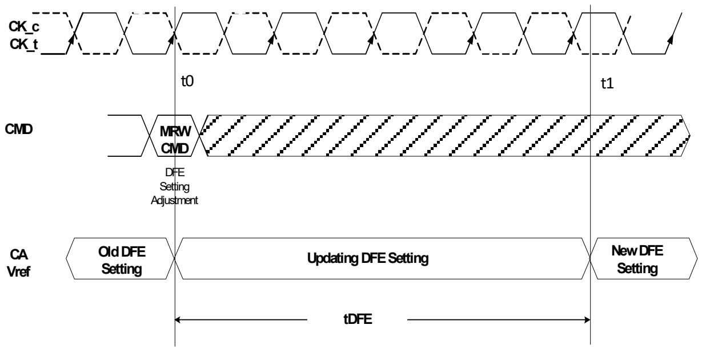

flowchart

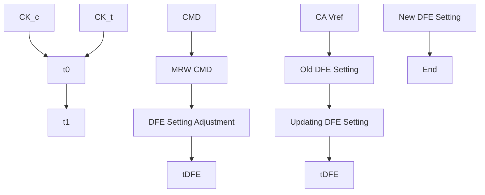
```mermaid
graph TD
    A["CK_c"] --> B["t0"]
    C["CK_t"] --> B
    B --> D["t1"]
    E["CMD"] --> F["MRW CMD"]
    F --> G["DFE Setting Adjustment"]
    G --> H["tDFE"]
    I["CA Vref"] --> J["Old DFE Setting"]
    J --> K["Updating DFE Setting"]
    K --> L["tDFE"]
    M["New DFE Setting"] --> N["End"]
```

Figure 9 — DFE Update Setting

# 3.4.4 Mode Register Truth Tables and Timing Constraints

Table 20 — Mode Register Read/Write AC Timing 

<table><tr><td>Parameter</td><td>Symbol</td><td>Min/Max</td><td>Value</td><td>Unit</td><td>Note</td></tr><tr><td>Mode Register Read command period</td><td>tMRR</td><td>Min</td><td>max(14ns, 16nCK)</td><td>nCK</td><td>1</td></tr><tr><td>Mode Register Read Pattern to Mode Register Read Pattern Command spacing</td><td>tMRR_p</td><td>Min</td><td>8</td><td>nCK</td><td></td></tr><tr><td>Mode Register Write command period</td><td>tMRW</td><td>Min</td><td>max(5ns, 8nCK)</td><td>nCK</td><td>1</td></tr><tr><td>Mode Register Set command delay</td><td>tMRD</td><td>Min</td><td>max(14ns, 16nCK)</td><td>nCK</td><td></td></tr><tr><td>DFE Mode Register Write Update Delay Time</td><td>tDFE</td><td>Min</td><td>80</td><td>ns</td><td>2</td></tr><tr><td colspan="6">NOTE 1 MRR and MRW commands require all banks idle.NOTE 2 This parameter applies only to MRW&#x27;s to DFE registers and is defined as the settling time before a new DFE setting is active.</td></tr></table>

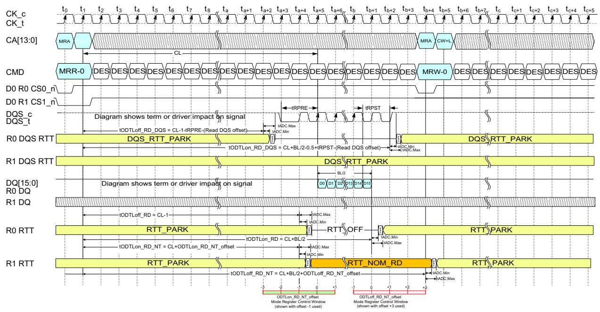

text_image

CK_c
CK_t
CA[13:0]
MRA
CL
MRA CW=L
CMD
D0 R0 CS0_n
D0 R1 CS1_n
DQS_c
DQS_t
Diagram shows term or driver impact on signal
tODTLoff_RD_DQS = CL-1-tRPRE-(Read DQS offset)
tADC.Max
tRPST
R0 DQS RTT
DQS_RTT_PARK
tODTLon_RD_DQS = CL+BL/2-0.5+IRPST-(Read DQS offset)
tADC.Min
tADC.Max
DQS_RTT_PARK
R1 DQS RTT
DQS_RTT_PARK
DQ[15:0]
R0 DQ
Diagram shows term or driver impact on signal
D0 D1 D2 D3 D4 D5
R1 DQ
tODTLoff_RD = CL-1
tADC.Max
tADC_Min
R0 RTT
RTT_PARK
tODTLon_RD = CL+BL/2
tADC.Max
tADC_Max
RTT_PARK
R1 RTT
RTT_PARK
tODTLoff_RD_NT = CL+BL/2+ODTLoff_RD_NT_offset
tADC_Lon_RD_NT_offset
Mode Register Control Window
(shown with offset -1 used)
ODTLoff_RD_NT_offset
Mode Register Control Window
(shown with offset +3 used)

# NOTES:

1. Example details ODTLoff\_RD\_Offset configured for -1, ODTLon\_RD\_Offset configured for 0, ODTLon\_RD\_NT\_offset configured for -1, ODTLoff\_RD\_NT\_offset configured for +3. Read DQS Offset programmed at 0.   
2. Timing constraints for 1-cycle MPC/VrefCS/VrefCA commands are affected by ODTLoff\_RD\_NT\_Offset the same as MRW in the diagram.   
3. The tODTLoff\_RD\_NT minimum timing constraint begins when the MRR command is registered in the second cycle of the command, and ends on the first cycle of the MRW command. The MRW command will not be registered until the second cycle of the command, however the minimum timing spec shall be maintained as illustrated.

Figure 10 — Example MRR to MRW Timing Diagram for Same Physical Rank

# 3.4.4 Mode Register Truth Tables and Timing Constraints (cont’d)

Table 21 — Truth Table for Mode Register Read (MRR) and Mode Register Write (MRW) 

<table><tr><td>Current State</td><td rowspan="2">Command</td><td>Intermediate State</td><td>Next State</td></tr><tr><td>SDRAM</td><td>SDRAM</td><td>SDRAM</td></tr><tr><td rowspan="2">All Banks Idle</td><td>MRR</td><td>Mode Register Reading(All Banks Idle)</td><td>All Banks Idle</td></tr><tr><td>MRW</td><td>Mode Register Writing(All Banks Idle)</td><td>All Banks Idle</td></tr><tr><td colspan="4">NOTE 1 For 3DS, both MRR and MRW commands require all banks to be idle on all logical ranks</td></tr></table>

Table 22 — MRR/MRW Timing Constraints: DQ ODT is Disable 

<table><tr><td>From Command</td><td>To Command</td><td>Minimum Delay between “From Command” and “To Command”</td><td>Unit</td><td>Note</td></tr><tr><td rowspan="5">MRR</td><td>MRR</td><td>tMRR/tMRR_p</td><td>-</td><td>2,4</td></tr><tr><td>MRW</td><td>CL+BL/2+max[1,ODTLoff_RD_NT_Offset]</td><td>tCK</td><td>2,3</td></tr><tr><td>MPC</td><td>CL+BL/2+max[1,ODTLoff_RD_NT_Offset]</td><td>tCK</td><td>2,3</td></tr><tr><td>VrefCA/VrefCS</td><td>CL+BL/2+max[1,ODTLoff_RD_NT_Offset]</td><td>tCK</td><td>2,3</td></tr><tr><td>Any other valid command</td><td>tMRD</td><td>-</td><td>1,2</td></tr><tr><td rowspan="2">MRW</td><td>MRW</td><td>tMRW</td><td>-</td><td></td></tr><tr><td>Any other valid command</td><td>tMRD</td><td>-</td><td></td></tr><tr><td rowspan="2">WRA</td><td>MRR</td><td>CWL + BL/2 + tWR + tRP</td><td>-</td><td></td></tr><tr><td>MRW</td><td>CWL + BL/2 + tWR + tRP</td><td>-</td><td></td></tr><tr><td rowspan="2">RDA</td><td>MRR</td><td>tRTP + tRP</td><td></td><td></td></tr><tr><td>MRW</td><td>tRTP + tRP</td><td></td><td></td></tr><tr><td rowspan="2">PRE</td><td>MRR</td><td>tRP</td><td>-</td><td></td></tr><tr><td>MRW</td><td>tRP</td><td>-</td><td></td></tr><tr><td rowspan="2">REF</td><td>MRR</td><td>tRFC</td><td>-</td><td></td></tr><tr><td>MRW</td><td>tRFC</td><td>-</td><td></td></tr><tr><td colspan="5">NOTE 1 All data should be completed before entry into self refresh or power down.NOTE 2 MRR can refer to both Target ODT MRR and Non-Target ODT MRRNOTE 3 Minimum delay is 1 clock after the burst or until the ODT offset requirements for DQS/DQ are met.NOTE 4 During Read Training, MRR to MRR command spacing can be tMRR_p.</td></tr></table>

# 3.4.4 Mode Register Truth Tables and Timing Constraints (cont’d)

Table 23 — MRR/MRW Timing Constraints: DQ ODT is Enable 

<table><tr><td>From Command</td><td>To Command</td><td>Minimum Delay between “From Command” and “To Command”</td><td>Unit</td><td>Note</td></tr><tr><td rowspan="6">MRR</td><td>MRR</td><td rowspan="6">Same as ODT Disable Case</td><td>-</td><td></td></tr><tr><td>MRW</td><td>-</td><td></td></tr><tr><td>MPC</td><td>-</td><td></td></tr><tr><td>VrefCA/VrefCS</td><td>-</td><td></td></tr><tr><td rowspan="2">Any other valid command</td><td>-</td><td></td></tr><tr><td>-</td><td></td></tr><tr><td rowspan="3">MRW</td><td>MRW</td><td rowspan="3">Same as ODT Disable Case</td><td>-</td><td></td></tr><tr><td rowspan="2">Any other valid command</td><td>-</td><td></td></tr><tr><td>-</td><td></td></tr><tr><td rowspan="2">RDA</td><td>MRR</td><td rowspan="2">Same as ODT Disable Case</td><td>-</td><td></td></tr><tr><td>MRW</td><td>-</td><td></td></tr><tr><td rowspan="2">WRA</td><td>MRR</td><td rowspan="2">Same as ODT Disable Case</td><td>-</td><td></td></tr><tr><td>MRW</td><td>-</td><td></td></tr><tr><td rowspan="2">PRE</td><td>MRR</td><td rowspan="2">Same as ODT Disable Case</td><td>-</td><td></td></tr><tr><td>MRW</td><td>-</td><td></td></tr><tr><td rowspan="2">REF</td><td>MRR</td><td rowspan="2">Same as ODT Disable Case</td><td>-</td><td></td></tr><tr><td>MRW</td><td>-</td><td></td></tr></table>

# 3.5 Mode Registers

With DDR5, the utilization and programming method shall change from the traditional addressing scheme found in DDR3 and DDR4, and shall move to the method used by LPDDR, where the Mode Register Addresses (MRA) and Payload placed in Op Codes (OP) are all packeted in the command bus encoding method. Please refer to the Command Truth Table 30 for Mode Register Read (MRR) and Mode Register Write (MRW) command protocol.

For DDR5, the SDRAM shall support up to 8 MRA’s, each with a byte-wide payload. Allowing for up to 256 byte-wide registers.

# 3.5.1 Mode Register Assignment and Definition in DDR5 SDRAM

Table 24 shows the mode registers for DDR5 SDRAM. Each bit in a register byte (MR#) is denoted as "R" if it can be read but not written, "W" if it can be written but reads shall always produce a ZERO for those specific bits, and "R/W" if it can be read and written. Additionally, a DRAM read-only bit combined with a Host write-only bit is denoted as a “SR/W” bit. This bit allows the DRAM to return a defined status during a read of that bit (SR = Status Read), independent of what the Host may have written to the bit.

A defined register byte (MR#), is any MR# that has at least one of the bits defined.

When the entire MR# is marked RFU, then it is considered undefined and all the bits from the DRAM shall be don’t care for reads or writes. These undefined mode registers (completely empty bytes, not individual bits of an MR) may not be supported in the DRAM. When a defined register byte (MR#) contains an “RFU” bit, the host must write a ZERO for those specific bits and the DRAM does not guarantee any operation of those specific RFU bits. When the host issues an MRR to a defined register (MR#) that contains RFU bits in it, those specific bits shall always produce a ZERO.

For cases in which a mode register is specific to a particular device configuration (x16, x8, x4) and/or density (32Gb, 16Gb, 8Gb), the following rules shall be applied:

- When the DRAM is configured as a x4/x8, an entire MR# used only for a x16 shall be considered RFU. These bits are don’t care for reads and writes, and they may be unsupported.   
- When a bit field within a register is used by a different configuration or density than a given DRAM, the host may write/read programmed values to these fields, but DRAM operation will not be affected.

A Mode Register Read command is used to read a mode register. A Mode Register Write command is used to write a mode register.

Table 24 — Mode Register Assignment in DDR5 SDRAM 

<table><tr><td>MR#</td><td>OP[7]</td><td>OP[6]</td><td>OP[5]</td><td>OP[4]</td><td>OP[3]</td><td>OP[2]</td><td>OP[1]</td><td>OP[0]</td></tr><tr><td>0</td><td>RFU</td><td colspan="5">CAS Latency (RL)</td><td colspan="2">Burst Length</td></tr><tr><td>1</td><td colspan="4">PDA Select ID</td><td colspan="4">PDA Enumerate ID</td></tr><tr><td>2</td><td>Internal Write Timing</td><td>Reserved</td><td>Device 15 MPSM</td><td>CS Assertion Duration (MPC)</td><td>Max Power Saving Mode (MPSM)</td><td>2N Mode</td><td>Write Leveling Training</td><td>Read Preamble Training</td></tr><tr><td>3</td><td colspan="4">Write Leveling Internal Cycle Alignment - Upper Byte</td><td colspan="4">Write Leveling Internal Cycle Alignment - Lower Byte</td></tr><tr><td>4</td><td>TUF</td><td>RFU</td><td>Wide Range (Optional)</td><td>Refresh tRFC Mode</td><td>Refresh Interval Rate Indicator</td><td colspan="3">Minimum Refresh Rate</td></tr><tr><td>5</td><td colspan="2">Pull-Down Output Driver Impedance</td><td>DM Enable</td><td>TDQS Enable</td><td>PODTM Support</td><td colspan="2">Pull-up Output Driver Impedance</td><td>Data Output Disable</td></tr><tr><td>6</td><td colspan="4">tRTP</td><td colspan="4">Write Recovery Time</td></tr><tr><td>7</td><td colspan="6">RFU</td><td>(Optional) Write Leveling Internal +0.5tCK Alignment Offset - Upper Byte</td><td>(Optional) Write Leveling Internal +0.5tCK Alignment Offset - Lower Byte</td></tr><tr><td>8</td><td>Write Postamble Settings</td><td>Read Postam-ble Set-tings</td><td>RFU</td><td colspan="2">Write Preamble Settings</td><td colspan="3">Read Preamble Settings</td></tr><tr><td>9</td><td>TM</td><td colspan="5">RFU</td><td>x4 Writes</td><td>ECS Write-back</td></tr><tr><td>10</td><td colspan="8">VrefDQ Calibration Value</td></tr><tr><td>11</td><td colspan="8">VrefCA Calibration Value</td></tr><tr><td>12</td><td colspan="8">VrefCS Calibration Value</td></tr><tr><td>13</td><td colspan="4">RFU</td><td colspan="4">tCCD_L / tDLLK</td></tr><tr><td>14</td><td>ECS Mode</td><td>Reset ECS Counter</td><td>Row Mode/Code Word Mode</td><td>RFU</td><td>CID3</td><td>CID2</td><td>CID1</td><td>CID0</td></tr><tr><td>15</td><td>x4 Writes</td><td>ECS Writeback</td><td colspan="2">RFU</td><td>Automatic ECS in Self Refresh</td><td colspan="3">ECS Error Threshold Count (ETC)</td></tr><tr><td>16</td><td colspan="8">Transparency - Row Address with Max Errors 1 - See MR for encoding details</td></tr><tr><td>17</td><td colspan="8">Transparency - Row Address with Max Errors 2 - See MR for encoding details</td></tr><tr><td>18</td><td colspan="8">Transparency - Row Address with Max Errors 3 - See MR for encoding details</td></tr><tr><td>19</td><td>PASR</td><td>RFU</td><td colspan="6">Transparency - Max Row Error Count - See MR for encoding details</td></tr><tr><td>20</td><td colspan="8">Transparency - Error Count (EC) - See MR for encoding details</td></tr><tr><td>21</td><td colspan="5">RFU</td><td colspan="3">Rx DQS CTLE Control (Optional)</td></tr><tr><td>22</td><td colspan="2">Rx CS_n CTLE Contorl (Optional)</td><td colspan="2">Rx CA CTLE Control (Optional)</td><td>Rx CTLE Support</td><td colspan="3">MBIST/mPPR Transparency (Optional)</td></tr><tr><td>23</td><td colspan="2">RFU</td><td>RFU</td><td>MBIST (Optional)</td><td>mPPR (Optional)</td><td colspan="2">sPPR</td><td>hPPR</td></tr><tr><td>24</td><td colspan="8">PPR Guard Key</td></tr><tr><td>25</td><td colspan="4">RFU</td><td>Continuous Burst Mode</td><td>LFSR1 Pattern Option</td><td>LFSR0 Pattern Option</td><td>Read Training Pattern Format</td></tr><tr><td>26</td><td colspan="8">Read Training Pattern Data0 / LFSR0 Seed</td></tr><tr><td>27</td><td colspan="8">Read Training Pattern Data1 / LFSR1 Seed</td></tr><tr><td>28</td><td colspan="8">Read Training Pattern Invert DQL7:0 (DQ7:0)</td></tr><tr><td>29</td><td colspan="8">Read Training Pattern Invert DQU7:0 (DQ15:8)</td></tr><tr><td>30</td><td>LFSR Assignment DQL7/DQU7</td><td>LFSR Assign-ment DQL6/DQU6</td><td>LFSR Assign-ment DQL5/DQU5</td><td>LFSR Assign-ment DQL4/DQU4</td><td>LFSR Assign-ment DQL3/DQU3</td><td>LFSR Assign-ment DQL2/DQU2</td><td>LFSR Assignment DQL1/DQU1</td><td>LFSR Assignment DQL0/DQU0</td></tr><tr><td>31</td><td colspan="8">Read Training Pattern Address</td></tr><tr><td>32</td><td>RFU</td><td>CA_ODT Strap Value</td><td colspan="3">CS ODT</td><td colspan="3">CK ODT</td></tr><tr><td>33</td><td colspan="2">RFU</td><td colspan="3">DQS_RTT_PARK</td><td colspan="3">CA ODT</td></tr><tr><td>34</td><td colspan="2">RFU</td><td colspan="3">RTT_WR</td><td colspan="3">RTT_PARK</td></tr><tr><td>35</td><td colspan="2">RFU</td><td colspan="3">RTT_NOM_RD</td><td colspan="3">RTT_NOM_WR</td></tr><tr><td>36</td><td colspan="5">RFU</td><td colspan="3">RTT_Loopback</td></tr><tr><td>37</td><td colspan="2">RFU</td><td colspan="3">ODTLoff_WR_offset</td><td colspan="3">ODTLon_WR_offset</td></tr><tr><td>38</td><td colspan="2">RFU</td><td colspan="3">ODTLoff_WR_NT_offset</td><td colspan="3">ODTLon_WR_NT_offset</td></tr><tr><td>39</td><td colspan="2">RFU</td><td colspan="3">ODTLoff_RD_NT_offset</td><td colspan="3">ODTLon_RD_NT_offset</td></tr><tr><td>40</td><td colspan="5">RFU</td><td colspan="3">Read DQS offset timing</td></tr><tr><td>41</td><td colspan="8">RFU</td></tr><tr><td>42</td><td colspan="4">DCA Training Assist Mode II (Optional)</td><td colspan="2">DCA Training Assist Mode I</td><td colspan="2">DCA Types Supported</td></tr><tr><td>43</td><td>Sign Bit for OP[6:4]</td><td colspan="3">DCA for IBCLK in 4-phase clocks</td><td colspan="2">Sign Bit for OP[2:0]</td><td colspan="2">DCA for single/two-phase clock(s) or QCLK in 4-phase clocks</td></tr><tr><td>44</td><td colspan="4">RFU</td><td colspan="2">Sign Bit for QBCLK in 4-phase clocks</td><td colspan="2">DCA for QBCLK in 4-phase clocks</td></tr><tr><td>45</td><td colspan="8">DQS Interval Timer Run Time</td></tr><tr><td>46</td><td colspan="8">DQS Oscillator Count - LSB</td></tr><tr><td>47</td><td colspan="8">DQS Oscillator Count - MSB</td></tr><tr><td>48</td><td colspan="8">Write Pattern Mode</td></tr><tr><td>49</td><td colspan="8">RFU</td></tr><tr><td>50</td><td>RFU</td><td>RFU</td><td>Write CRC auto-disable status</td><td>Write CRC auto-disable enable</td><td>Write CRC error status</td><td>Write CRC enable upper nibble</td><td>Write CRC enable lower nibble</td><td>Read CRC enable</td></tr><tr><td>51</td><td>RFU</td><td colspan="7">Write CRC Auto-Disable Threshold - See MR for encoding details</td></tr><tr><td>52</td><td>RFU</td><td colspan="7">Write CRC Auto-Disable Window - See MR for encoding details</td></tr><tr><td>53</td><td>Loopback Output Mode</td><td colspan="2">Loopback Select Phase</td><td colspan="5">Loopback Output Select</td></tr><tr><td>54</td><td>hPPR Resource BG1 Bank 3</td><td>hPPR Resource BG1 Bank 2</td><td>hPPR Resource BG1 Bank 1</td><td>hPPR Resource BG1 Bank 0</td><td>hPPR Resource BG0 Bank 3</td><td>hPPR Resource BG0 Bank 2</td><td>hPPR Resource BG0 Bank 1</td><td>hPPR Resource BG0 Bank 0</td></tr><tr><td>55</td><td>hPPR Resource BG3 Bank 3</td><td>hPPR Resource BG3 Bank 2</td><td>hPPR Resource BG3 Bank 1</td><td>hPPR Resource BG3 Bank 0</td><td>hPPR Resource BG2 Bank 3</td><td>hPPR Resource BG2 Bank 2</td><td>hPPR Resource BG2 Bank 1</td><td>hPPR Resource BG2 Bank 0</td></tr><tr><td>56</td><td>hPPR Resource BG5 Bank 3</td><td>hPPR Resource BG5 Bank 2</td><td>hPPR Resource BG5 Bank 1</td><td>hPPR Resource BG5 Bank 0</td><td>hPPR Resource BG4 Bank 3</td><td>hPPR Resource BG4 Bank 2</td><td>hPPR Resource BG4 Bank 1</td><td>hPPR Resource BG4 Bank 0</td></tr><tr><td>57</td><td>hPPR Resource BG7 Bank 3</td><td>hPPR Resource BG7 Bank 2</td><td>hPPR Resource BG7 Bank 1</td><td>hPPR Resource BG7 Bank 0</td><td>hPPR Resource BG6 Bank 3</td><td>hPPR Resource BG6 Bank 2</td><td>hPPR Resource BG6 Bank 1</td><td>hPPR Resource BG6 Bank 0</td></tr><tr><td>58</td><td colspan="3">RAAMMT[2:0]</td><td colspan="4">RAAIMT[3:0]</td><td>RFM Required</td></tr><tr><td>59</td><td colspan="2">RFM RAA Counter</td><td colspan="2">ARFM</td><td>BRC Support Level</td><td colspan="2">Bounded Refresh Configuration</td><td>DRFM Enable</td></tr><tr><td>60</td><td colspan="8">PASR Segment Mask</td></tr><tr><td>61</td><td colspan="3">RSVD</td><td colspan="5">Package Output Driver Test Mode</td></tr><tr><td>62</td><td colspan="8">Vendor Specified</td></tr><tr><td>63</td><td colspan="8">DRAM Scratch Pad</td></tr><tr><td>64</td><td colspan="8">Reserved</td></tr><tr><td>65</td><td colspan="8">Serial Number 1</td></tr><tr><td>66</td><td colspan="8">Serial Number 2</td></tr><tr><td>67</td><td colspan="8">Serial Number 3</td></tr><tr><td>68</td><td colspan="8">Serial Number 4</td></tr><tr><td>69</td><td colspan="8">Serial Number 5</td></tr><tr><td>70</td><td>ALERT_n Verification</td><td>ALERT_n Verification Support (Optional)</td><td>Alert Back-Off Flag</td><td>RFU</td><td>Activation Counter Initialization Complete</td><td>Activation Counter Initialization</td><td>Per Row Activation Counting and Alert Back-Off Enable/Disable</td><td>Per Row Activation Counting and Alert Back-Off Support (Optional)</td></tr><tr><td>71</td><td>RFU</td><td>PRAC Testing Initialization</td><td>PRAC Testing Enable/Disable</td><td>PRAC Testing Support (Optional)</td><td colspan="2">Adaptive Per Row Activation Counting</td><td colspan="2">Min RFMab Commands during Recovery Period (ABO_RFM) and min ACT commands during Alert Back-Off Delay (ABO_Delay)</td></tr></table>

Table 24 — Mode Register Assignment in DDR5 SDRAM (cont’d) 

<table><tr><td>72</td><td colspan="5">RFU</td><td>Counter Address Report Flag</td><td>Counter Error Flag</td></tr><tr><td>73</td><td colspan="7">8 bits of the row address</td></tr><tr><td>74</td><td colspan="7">8 bits of the row address</td></tr><tr><td>75</td><td>RFU</td><td colspan="2">3 bits of the bank group</td><td colspan="2">2 bits of the bank address</td><td colspan="2">2 bits of the row address</td></tr><tr><td>76~102</td><td colspan="7">RFU</td></tr><tr><td>103</td><td>DQSL_t IBCLK Sign</td><td>RFU</td><td>DQSL_t DCA for IBCLK</td><td>DQSL_t QCLK Sign</td><td>RFU</td><td colspan="2">DQSL_t DCA for QCLK</td></tr><tr><td>104</td><td colspan="3">RFU</td><td>DQSL_t QBCLK Sign</td><td>RFU</td><td colspan="2">DQSL_t DCA for QBCLK</td></tr><tr><td>105</td><td>DQSL_c IBCLK Sign</td><td>RFU</td><td>DQSL_c DCA for IBCLK</td><td>DQSL_c QCLK Sign</td><td>RFU</td><td colspan="2">DQSL_c DCA for QCLK</td></tr><tr><td>106</td><td colspan="3">RFU</td><td>DQSL_c QBCLK Sign</td><td>RFU</td><td colspan="2">DQSL_c DCA for QBCLK</td></tr><tr><td>107</td><td>DQSU_t IBCLK Sign</td><td>RFU</td><td>DQSU_t DCA for IBCLK</td><td>DQSU_t QCLK Sign</td><td>RFU</td><td colspan="2">DQSU_t DCA for QCLK</td></tr><tr><td>108</td><td colspan="3">RFU</td><td>DQSU_t QBCLK Sign</td><td>RFU</td><td colspan="2">DQSU_t DCA for QBCLK</td></tr><tr><td>109</td><td>DQSU_c IBCLK Sign</td><td>RFU</td><td>DQSU_c DCA for IBCLK</td><td>DQSU_c QCLK Sign</td><td>RFU</td><td colspan="2">DQSU_c DCA for QCLK</td></tr><tr><td>110</td><td colspan="3">RFU</td><td>DQSU_c QBCLK Sign</td><td>RFU</td><td colspan="2">DQSU_c DCA for QBCLK</td></tr><tr><td>111</td><td colspan="2">RFU</td><td>Global DFE Tap-4 Enable</td><td>Global DFE Tap-3 Enable</td><td>Global DFE Tap-2 Enable</td><td>Global DFE Tap-1 Enable</td><td>Global DFE gain Enable</td></tr><tr><td>112</td><td colspan="3">RFU</td><td colspan="4">DML DFE Gain Bias - See MR for encoding details</td></tr><tr><td>113</td><td colspan="7">DML DFE Tap-1 Bias - See MR for encoding details</td></tr><tr><td>114</td><td colspan="7">DML DFE Tap-2 Bias - See MR for encoding details</td></tr><tr><td>115</td><td colspan="7">DML DFE Tap-3 Bias - See MR for encoding details</td></tr><tr><td>116</td><td colspan="7">DML DFE Tap-4 Bias - See MR for encoding details</td></tr><tr><td>117</td><td colspan="7">RFU</td></tr><tr><td>118</td><td>DML VREFDQ sign</td><td colspan="2">DML VREFDQ Offset</td><td colspan="4">RFU</td></tr><tr><td>119</td><td colspan="7">RFU</td></tr><tr><td>120</td><td colspan="3">RFU</td><td colspan="4">DMU DFE Gain Bias - See MR for encoding details</td></tr><tr><td>121</td><td colspan="7">DMU DFE Tap-1 Bias - See MR for encoding details</td></tr><tr><td>122</td><td colspan="7">DMU DFE Tap-2 Bias - See MR for encoding details</td></tr><tr><td>123</td><td colspan="7">DMU DFE Tap-3 Bias - See MR for encoding details</td></tr><tr><td>124</td><td colspan="7">DMU DFE Tap-4 Bias - See MR for encoding details</td></tr><tr><td>125</td><td colspan="7">RFU</td></tr><tr><td>126</td><td>DMU VREFDQ sign</td><td colspan="2">DMU VREFDQ Offset</td><td colspan="4">RFU</td></tr><tr><td>127</td><td colspan="7">RFU</td></tr><tr><td>128</td><td colspan="3">RFU</td><td colspan="4">DQL0 DFE Gain Bias - See MR for encoding details</td></tr><tr><td>129</td><td colspan="7">DQL0 DFE Tap-1 Bias - See MR for encoding details</td></tr><tr><td>130</td><td colspan="7">DQL0 DFE Tap-2 Bias - See MR for encoding details</td></tr><tr><td>131</td><td colspan="7">DQL0 DFE Tap-3 Bias - See MR for encoding details</td></tr><tr><td>132</td><td colspan="7">DQL0 DFE Tap-4 Bias - See MR for encoding details</td></tr><tr><td>133</td><td>DQL0 IBCLK Sign</td><td>RFU</td><td>DQL0 DCA for IBCLK</td><td>DQL0 QCLK Sign</td><td>RFU</td><td colspan="2">DQL0 DCA for QCLK</td></tr><tr><td>134</td><td>DQL0 VREFDQ Sign</td><td colspan="2">DQL0 VREFDQ Offset</td><td>DQL0 QBCLK Sign</td><td>RFU</td><td colspan="2">DQL0 DCA for QBCLK</td></tr><tr><td>135</td><td colspan="7">RFU</td></tr></table>

Table 24 — Mode Register Assignment in DDR5 SDRAM (cont’d) 

<table><tr><td>136</td><td colspan="3">RFU</td><td colspan="3">DQL1 DFE Gain Bias - See MR for encoding details</td></tr><tr><td>137</td><td colspan="6">DQL1 DFE Tap-1 Bias - See MR for encoding details</td></tr><tr><td>138</td><td colspan="6">DQL1 DFE Tap-2 Bias - See MR for encoding details</td></tr><tr><td>139</td><td colspan="6">DQL1 DFE Tap-3 Bias - See MR for encoding details</td></tr><tr><td>140</td><td colspan="6">DQL1 DFE Tap-4 Bias - See MR for encoding details</td></tr><tr><td>141</td><td>DQL1 IBCLK Sign</td><td>RFU</td><td>DQL1 DCA for IBCLK</td><td>DQL1 QCLK Sign</td><td>RFU</td><td>DQL1 DCA for QCLK</td></tr><tr><td>142</td><td>DQL1 VREFDQ Sign</td><td colspan="2">DQL1 VREFDQ Offset</td><td>DQL1 QBCLK Sign</td><td>RFU</td><td>DQL1 DCA for QBCLK</td></tr><tr><td>143</td><td colspan="6">RFU</td></tr><tr><td>144</td><td colspan="3">RFU</td><td colspan="3">DQL2 DFE Gain Bias - See MR for encoding details</td></tr><tr><td>145</td><td colspan="6">DQL2 DFE Tap-1 Bias - See MR for encoding details</td></tr><tr><td>146</td><td colspan="6">DQL2 DFE Tap-2 Bias - See MR for encoding details</td></tr><tr><td>147</td><td colspan="6">DQL2 DFE Tap-3 Bias - See MR for encoding details</td></tr><tr><td>148</td><td colspan="6">DQL2 DFE Tap-4 Bias - See MR for encoding details</td></tr><tr><td>149</td><td>DQL2 IBCLK Sign</td><td>RFU</td><td>DQL2 DCA for IBCLK</td><td>DQL2 QCLK Sign</td><td>RFU</td><td>DQL2 DCA for QCLK</td></tr><tr><td>150</td><td>DQL2 VREFDQ Sign</td><td colspan="2">DQL2 VREFDQ Offset</td><td>DQL2 QBCLK Sign</td><td>RFU</td><td>DQL2 DCA for QBCLK</td></tr><tr><td>155</td><td colspan="6">RFU</td></tr><tr><td>152</td><td colspan="3">RFU</td><td colspan="3">DQL3 DFE Gain Bias - See MR for encoding details</td></tr><tr><td>153</td><td colspan="6">DQL3 DFE Tap-1 Bias - See MR for encoding details</td></tr><tr><td>154</td><td colspan="6">DQL3 DFE Tap-2 Bias - See MR for encoding details</td></tr><tr><td>155</td><td colspan="6">DQL3 DFE Tap-3 Bias - See MR for encoding details</td></tr><tr><td>156</td><td colspan="6">DQL3 DFE Tap-4 Bias - See MR for encoding details</td></tr><tr><td>157</td><td>DQL3 IBCLK Sign</td><td>RFU</td><td>DQL3 DCA for IBCLK</td><td>DQL3 QCLK Sign</td><td>RFU</td><td>DQL3 DCA for QCLK</td></tr><tr><td>158</td><td>DQL3 VREFDQ Sign</td><td colspan="2">DQL3 VREFDQ Offset</td><td>DQL3 QBCLK Sign</td><td>RFU</td><td>DQL3 DCA for QBCLK</td></tr><tr><td>159</td><td colspan="6">RFU</td></tr><tr><td>160</td><td colspan="3">RFU</td><td colspan="3">DQL4 DFE Gain Bias - See MR for encoding details</td></tr><tr><td>161</td><td colspan="6">DQL4 DFE Tap-1 Bias - See MR for encoding details</td></tr><tr><td>162</td><td colspan="6">DQL4 DFE Tap-2 Bias - See MR for encoding details</td></tr><tr><td>163</td><td colspan="6">DQL4 DFE Tap-3 Bias - See MR for encoding details</td></tr><tr><td>164</td><td colspan="6">DQL4 DFE Tap-4 Bias - See MR for encoding details</td></tr><tr><td>165</td><td>DQL4 IBCLK Sign</td><td>RFU</td><td>DQL4 DCA for IBCLK</td><td>DQL4 QCLK Sign</td><td>RFU</td><td>DQL4 DCA for QCLK</td></tr><tr><td>166</td><td>DQL4 VREFDQ Sign</td><td colspan="2">DQL4 VREFDQ Offset</td><td>DQL4 QBCLK Sign</td><td>RFU</td><td>DQL4 DCA for QBCLK</td></tr><tr><td>167</td><td colspan="6">RFU</td></tr><tr><td>168</td><td colspan="3">RFU</td><td colspan="3">DQL5 DFE Gain Bias - See MR for encoding details</td></tr><tr><td>169</td><td colspan="6">DQL5 DFE Tap-1 Bias - See MR for encoding details</td></tr><tr><td>170</td><td colspan="6">DQL5 DFE Tap-2 Bias - See MR for encoding details</td></tr><tr><td>171</td><td colspan="6">DQL5 DFE Tap-3 Bias - See MR for encoding details</td></tr><tr><td>172</td><td colspan="6">DQL5 DFE Tap-4 Bias - See MR for encoding details</td></tr><tr><td>173</td><td>DQL5 IBCLK Sign</td><td>RFU</td><td>DQL5 DCA for IBCLK</td><td>DQL5 QCLK Sign</td><td>RFU</td><td>DQL5 DCA for QCLK</td></tr><tr><td>174</td><td>DQL5 VREFDQ Sign</td><td colspan="2">DQL5 VREFDQ Offset</td><td>DQL5 QBCLK Sign</td><td>RFU</td><td>DQL5 DCA for QBCLK</td></tr><tr><td>175</td><td colspan="6">RFU</td></tr><tr><td>176</td><td colspan="3">RFU</td><td colspan="3">DQL6 DFE Gain Bias - See MR for encoding details</td></tr><tr><td>177</td><td colspan="6">DQL6 DFE Tap-1 Bias - See MR for encoding details</td></tr><tr><td>178</td><td colspan="6">DQL6 DFE Tap-2 Bias - See MR for encoding details</td></tr><tr><td>179</td><td colspan="6">DQL6 DFE Tap-3 Bias - See MR for encoding details</td></tr><tr><td>180</td><td colspan="6">DQL6 DFE Tap-4 Bias - See MR for encoding details</td></tr><tr><td>181</td><td>DQL6 IBCLK Sign</td><td>RFU</td><td>DQL6 DCA for IBCLK</td><td>DQL6 QCLK Sign</td><td>RFU</td><td>DQL6 DCA for QCLK</td></tr><tr><td>182</td><td>DQL6 VREFDQ Sign</td><td colspan="2">DQL6 VREFDQ Offset</td><td>DQL6 QBCLK Sign</td><td>RFU</td><td>DQL6 DCA for QBCLK</td></tr><tr><td>183</td><td colspan="6">RFU</td></tr><tr><td>184</td><td colspan="3">RFU</td><td colspan="3">DQL7 DFE Gain Bias - See MR for encoding details</td></tr><tr><td>185</td><td colspan="6">DQL7 DFE Tap-1 Bias - See MR for encoding details</td></tr><tr><td>186</td><td colspan="6">DQL7 DFE Tap-2 Bias - See MR for encoding details</td></tr><tr><td>187</td><td colspan="6">DQL7 DFE Tap-3 Bias - See MR for encoding details</td></tr><tr><td>188</td><td colspan="6">DQL7 DFE Tap-4 Bias - See MR for encoding details</td></tr><tr><td>189</td><td>DQL7 IBCLK Sign</td><td>RFU</td><td>DQL6 DCA for IBCLK</td><td>DQL7 QCLK Sign</td><td>RFU</td><td>DQL7 DCA for QCLK</td></tr><tr><td>190</td><td>DQL7 VREFDQ Sign</td><td colspan="2">DQL7 VREFDQ Offset</td><td>DQL7 QBCLK Sign</td><td>RFU</td><td>DQL7 DCA for QBCLK</td></tr><tr><td>191</td><td colspan="6">RFU</td></tr><tr><td>192</td><td colspan="3">RFU</td><td colspan="3">DQU0 DFE Gain Bias - See MR for encoding details</td></tr><tr><td>193</td><td colspan="6">DQU0 DFE Tap-1 Bias - See MR for encoding details</td></tr><tr><td>194</td><td colspan="6">DQU0 DFE Tap-2 Bias - See MR for encoding details</td></tr><tr><td>195</td><td colspan="6">DQU0 DFE Tap-3 Bias - See MR for encoding details</td></tr><tr><td>196</td><td colspan="6">DQU0 DFE Tap-4 Bias - See MR for encoding details</td></tr><tr><td>197</td><td>DQU0 IBCLK Sign</td><td>RFU</td><td>DQU0 DCA for IBCLK</td><td>DQU0 QCLK Sign</td><td>RFU</td><td>DQU0 DCA for QCLK</td></tr><tr><td>198</td><td>DQU0 VREFDQ Sign</td><td colspan="2">DQU0 VREFDQ Offset</td><td>DQU0 QBCLK Sign</td><td>RFU</td><td>DQU0 DCA for QBCLK</td></tr><tr><td>199</td><td colspan="6">RFU</td></tr><tr><td>200</td><td colspan="3">RFU</td><td colspan="3">DQU1 DFE Gain Bias - See MR for encoding details</td></tr><tr><td>201</td><td colspan="6">DQU1 DFE Tap-1 Bias - See MR for encoding details</td></tr><tr><td>202</td><td colspan="6">DQU1 DFE Tap-2 Bias - See MR for encoding details</td></tr><tr><td>203</td><td colspan="6">DQU1 DFE Tap-3 Bias - See MR for encoding details</td></tr><tr><td>204</td><td colspan="6">DQU1 DFE Tap-4 Bias - See MR for encoding details</td></tr><tr><td>205</td><td>DQU1 IBCLK Sign</td><td>RFU</td><td>DQU1 DCA for IBCLK</td><td>DQU1 QCLK Sign</td><td>RFU</td><td>DQU1 DCA for QCLK</td></tr><tr><td>206</td><td>DQU1 VREFDQ Sign</td><td colspan="2">DQU1 VREFDQ Offset</td><td>DQU1 QBCLK Sign</td><td>RFU</td><td>DQU1 DCA for QBCLK</td></tr><tr><td>207</td><td colspan="6">RFU</td></tr><tr><td>208</td><td colspan="3">RFU</td><td colspan="3">DQU2 DFE Gain Bias - See MR for encoding details</td></tr><tr><td>209</td><td colspan="6">DQU2 DFE Tap-1 Bias - See MR for encoding details</td></tr><tr><td>210</td><td colspan="6">DQU2 DFE Tap-2 Bias - See MR for encoding details</td></tr><tr><td>211</td><td colspan="6">DQU2 DFE Tap-3 Bias - See MR for encoding details</td></tr><tr><td>212</td><td colspan="6">DQU2 DFE Tap-4 Bias - See MR for encoding details</td></tr><tr><td>213</td><td>DQU2 IBCLK Sign</td><td>RFU</td><td>DQU2 DCA for IBCLK</td><td>DQU2 QCLK Sign</td><td>RFU</td><td>DQU2 DCA for QCLK</td></tr><tr><td>214</td><td>DQU2 VREFDQ Sign</td><td colspan="2">DQU2 VREFDQ Offset</td><td>DQU2 QBCLK Sign</td><td>RFU</td><td>DQU2 DCA for QBCLK</td></tr><tr><td>215</td><td colspan="6">RFU</td></tr><tr><td>216</td><td colspan="3">RFU</td><td colspan="3">DQU3 DFE Gain Bias - See MR for encoding details</td></tr><tr><td>217</td><td colspan="6">DQU3 DFE Tap-1 Bias - See MR for encoding details</td></tr><tr><td>218</td><td colspan="6">DQU3 DFE Tap-2 Bias - See MR for encoding details</td></tr><tr><td>219</td><td colspan="6">DQU3 DFE Tap-3 Bias - See MR for encoding details</td></tr><tr><td>220</td><td colspan="6">DQU3 DFE Tap-4 Bias - See MR for encoding details</td></tr><tr><td>221</td><td>DQU3 IBCLK Sign</td><td>RFU</td><td>DQU3 DCA for IBCLK</td><td>DQU3 QCLK Sign</td><td>RFU</td><td>DQU3 DCA for QCLK</td></tr><tr><td>222</td><td>DQU3 VREFDQ Sign</td><td colspan="2">DQU3 VREFDQ Offset</td><td>DQU3 QBCLK Sign</td><td>RFU</td><td>DQU3 DCA for QBCLK</td></tr><tr><td>223</td><td colspan="6">RFU</td></tr><tr><td>224</td><td colspan="3">RFU</td><td colspan="3">DQU4 DFE Gain Bias - See MR for encoding details</td></tr><tr><td>225</td><td colspan="6">DQU4 DFE Tap-1 Bias - See MR for encoding details</td></tr><tr><td>226</td><td colspan="6">DQU4 DFE Tap-2 Bias - See MR for encoding details</td></tr><tr><td>227</td><td colspan="6">DQU4 DFE Tap-3 Bias - See MR for encoding details</td></tr><tr><td>228</td><td colspan="6">DQU4 DFE Tap-4 Bias - See MR for encoding details</td></tr><tr><td>229</td><td>DQU4 IBCLK Sign</td><td>RFU</td><td>DQU4 DCA for IBCLK</td><td>DQU4 QCLK Sign</td><td>RFU</td><td>DQU4 DCA for QCLK</td></tr><tr><td>230</td><td>DQU4 VREFDQ Sign</td><td colspan="2">DQU4 VREFDQ Offset</td><td>DQU4 QBCLK Sign</td><td>RFU</td><td>DQU4 DCA for QBCLK</td></tr><tr><td>231</td><td colspan="6">RFU</td></tr><tr><td>232</td><td colspan="3">RFU</td><td colspan="3">DQU5 DFE Gain Bias - See MR for encoding details</td></tr><tr><td>233</td><td colspan="6">DQU5 DFE Tap-1 Bias - See MR for encoding details</td></tr><tr><td>234</td><td colspan="6">DQU5 DFE Tap-2 Bias - See MR for encoding details</td></tr><tr><td>235</td><td colspan="6">DQU5 DFE Tap-3 Bias - See MR for encoding details</td></tr><tr><td>236</td><td colspan="6">DQU5 DFE Tap-4 Bias - See MR for encoding details</td></tr><tr><td>237</td><td>DQU5 IBCLK Sign</td><td>RFU</td><td>DQU5 DCA for IBCLK</td><td>DQU5 QCLK Sign</td><td>RFU</td><td>DQU5 DCA for QCLK</td></tr><tr><td>238</td><td>DQU5 VREFDQ Sign</td><td colspan="2">DQU5 VREFDQ Offset</td><td>DQU5 QBCLK Sign</td><td>RFU</td><td>DQU5 DCA for QBCLK</td></tr><tr><td>239</td><td colspan="6">RFU</td></tr><tr><td>240</td><td colspan="3">RFU</td><td colspan="3">DQU6 DFE Gain Bias - See MR for encoding details</td></tr><tr><td>241</td><td colspan="6">DQU6 DFE Tap-1 Bias - See MR for encoding details</td></tr><tr><td>242</td><td colspan="6">DQU6 DFE Tap-2 Bias - See MR for encoding details</td></tr><tr><td>243</td><td colspan="6">DQU6 DFE Tap-3 Bias - See MR for encoding details</td></tr><tr><td>244</td><td colspan="6">DQU6 DFE Tap-4 Bias - See MR for encoding details</td></tr><tr><td>245</td><td>DQU6 IBCLK Sign</td><td>RFU</td><td>DQU6 DCA for IBCLK</td><td>DQU6 QCLK Sign</td><td>RFU</td><td>DQU6 DCA for QCLK</td></tr><tr><td>246</td><td>DQU6 VREFDQ Sign</td><td colspan="2">DQU6 VREFDQ Offset</td><td>DQU6 QBCLK Sign</td><td>RFU</td><td>DQU6 DCA for QBCLK</td></tr><tr><td>247</td><td colspan="6">RFU</td></tr><tr><td>248</td><td colspan="3">RFU</td><td colspan="3">DQU7 DFE Gain Bias - See MR for encoding details</td></tr><tr><td>249</td><td colspan="6">DQU7 DFE Tap-1 Bias - See MR for encoding details</td></tr><tr><td>250</td><td colspan="6">DQU7 DFE Tap-2 Bias - See MR for encoding details</td></tr><tr><td>251</td><td colspan="6">DQU7 DFE Tap-3 Bias - See MR for encoding details</td></tr><tr><td>252</td><td colspan="6">DQU7 DFE Tap-4 Bias - See MR for encoding details</td></tr><tr><td>253</td><td>DQU7 IBCLK Sign</td><td>RFU</td><td>DQU7 DCA for IBCLK</td><td>DQU7 QCLK Sign</td><td>RFU</td><td>DQU7 DCA for QCLK</td></tr><tr><td>254</td><td>DQU7 VREFDQ Sign</td><td colspan="2">DQU7 VREFDQ Offset</td><td>DQU7 QBCLK Sign</td><td>RFU</td><td>DQU7 DCA for QBCLK</td></tr><tr><td>255</td><td colspan="6">RFU</td></tr></table>

# 3.5.2 MR0 (MA[7:0]=00H) Burst Length and CAS Latency

MR0 Register Information 

<table><tr><td>OP[7]</td><td>OP[6]</td><td>OP[5]</td><td>OP[4]</td><td>OP[3]</td><td>OP[2]</td><td>OP[1]</td><td>OP[0]</td></tr><tr><td colspan="6">CAS Latency (CL)</td><td colspan="2">Burst Length</td></tr></table>

<table><tr><td>Function</td><td>Register Type</td><td>Operand</td><td>Data</td><td>Notes</td></tr><tr><td>Burst Length</td><td>R/W</td><td>OP[1:0]</td><td>00B: BL1601B: BC8 OTF10B: BL32 (Optional)11B: BL32 OTF (Optional)</td><td></td></tr><tr><td>CAS Latency (CL)</td><td>R/W</td><td>OP[7:2]</td><td>000000B: 22000001B: 24000010B: 26000011B: 28...010011B: 60010100B: 62010101B: 64010110B: 66010111B: 68011000B: 70011001B: 72...011101B: 80011110B: 82011111B: 84100000B: 86100001B: 88100010B: 90All other encodings reserved.</td><td>1, 2</td></tr><tr><td colspan="5">NOTE 1 Range covers both Monolithic DDR5 and 3DS-DDR5 devices up to 8800NOTE 2 CWL=CL-2, also known as WL=RL-2.</td></tr></table>

# 3.5.3 MR1 (MA [7:0] = 01H) - PDA Mode Details

MR1 Register Information 

<table><tr><td>OP[7]</td><td>OP[6]</td><td>OP[5]</td><td>OP[4]</td><td>OP[3]</td><td>OP[2]</td><td>OP[1]</td><td>OP[0]</td></tr><tr><td colspan="4">PDA Select ID</td><td colspan="4">PDA Enumerate ID</td></tr></table>

<table><tr><td>Function</td><td>Register Type</td><td>Operand</td><td>Data</td><td>Notes</td></tr><tr><td>PDA Enumerate ID</td><td>R</td><td>OP[3:0]</td><td>This is a Read Only MR field, which is only programmed through an MPC command with the PDA Enumerate ID opcode.  $xxxx_B$  Encoding is set with MPC command with the PDA Enumerate ID opcode. This can only be set when PDA Enumerate Programming Mode is enabled and the associated DRAM&#x27;s DQ0 is asserted LOW. The PDA Enumerate ID opcode includes 4 bits for this encoding. Default setting is  $1111_B$ </td><td></td></tr><tr><td>PDA Select ID</td><td>R</td><td>OP[7:4]</td><td>This is a Read Only MR field, which is only programmed through an MPC command with the PDA Select ID opcode.  $xxxx_B$  Encoding is set with MPC command with the PDA Select ID opcode. The PDA Select ID opcode includes 4 bits for this encoding.  $1111_B$  = all DRAMs execute MRW, MPC, and VrefCA commands For all other encodings, DRAMs execute MRW, MPC, and VrefCA commands only if PDA Select ID[3:0] = PDA Enumerate ID[3:0], with some exceptions for specific MPC commands that execute regardless of PDA Select ID. Default setting is  $1111_B$ </td><td></td></tr></table>

# 3.5.4 MR2 (MA $[ 7 ; 0 ] = 0 2 _ { \mathsf { H } } )$ - Functional Modes

MR2 Register Information 

<table><tr><td>OP[7]</td><td>OP[6]</td><td>OP[5]</td><td>OP[4]</td><td>OP[3]</td><td>OP[2]</td><td>OP[1]</td><td>OP[0]</td></tr><tr><td>Internal Write Timing</td><td>Reserved</td><td>Device 15 MPSM</td><td>CS Assertion Duration (MPC)</td><td>Max Power Saving Mode (MPSM)</td><td>2N Mode</td><td>Write Leveling Training</td><td>Read Preamble Training</td></tr></table>

<table><tr><td>Function</td><td>Register Type</td><td>Operand</td><td>Data</td><td>Notes</td></tr><tr><td>Read Preamble Training</td><td>R/W</td><td>OP[0]</td><td>0B: Normal Mode (Default)1B: Read Preamble Training</td><td></td></tr><tr><td>Write Leveling</td><td>R/W</td><td>OP[1]</td><td>0B: Normal Mode (Default)1B: Write Leveling</td><td>1, 2, 3</td></tr><tr><td>2N Mode</td><td>R</td><td>OP[2]</td><td>0B: 2N Mode (Default)1B: 1N Mode</td><td>4</td></tr><tr><td>Max Power Saving Mode</td><td>R/W</td><td>OP[3]</td><td>0B: Disable (Default)1B: Enable</td><td></td></tr><tr><td>CS Assertion Duration (MPC)</td><td>R/W</td><td>OP[4]</td><td>0B: Only Multiple cycles of CS assertion supported for MPC, VrefCA and VrefCS commands (Default)1B: Only a single cycle of CS assertion supported for MPC, VrefCA and VrefCS commands</td><td></td></tr><tr><td>Device 15 Maximum Power Savings Mode</td><td>R/W</td><td>OP[5]</td><td>0B: Disable (Default)1B: Enable</td><td></td></tr><tr><td>Reserved</td><td>Reserved</td><td>OP[6]</td><td>Reserved</td><td></td></tr><tr><td>Internal Write Timing</td><td>R/W</td><td>OP[7]</td><td>0B: Disable1B: Enable</td><td>5</td></tr><tr><td colspan="5">NOTE 1 To enter WL Training Mode the MR field must be programmed to 1. WL Training Mode is used when Internal Write Timing = 0 (External WL Training) and when Internal Write Timing = 1 (Internal WL Training).NOTE 2 To exit WL Training Mode the MR field must be programmed to 0.NOTE 3 MRR&#x27;s are not supported during Write Leveling.NOTE 4 This mode register is programmed via an explicit MPC command only.NOTE 5 This is set during WL Training, after the host DQS has been aligned to the ideal External WL timings. The Internal Write Timing is enabled and the WL Internal Timing Alignment is set to ensure the internal Write Enable aligns within tDQS2CK of the external WL Trained location.When Internal Write Timing is Disabled, the WL Internal Cycle Alignment setting does not change the behavior of the write timings</td></tr></table>

# 3.5.5 MR3 (MA[7:0]=03H) - DQS Training

MR3 Register Information 

<table><tr><td>OP[7]</td><td>OP[6]</td><td>OP[5]</td><td>OP[4]</td><td>OP[3]</td><td>OP[2]</td><td>OP[1]</td><td>OP[0]</td></tr><tr><td colspan="4">Write LevelingInternal CycleAlignment - Upper Byte</td><td colspan="4">Write LevelingInternal CycleAlignment - Lower Byte</td></tr></table>

<table><tr><td>Function</td><td>Register Type</td><td>Operand</td><td>Data</td><td>Notes</td></tr><tr><td>Write LevelingInternal CycleAlignment - Lower Byte</td><td>R/W</td><td>OP[3:0]</td><td> $0000_B$ : 0 tCK (Default) $0001_B$ : -1 tCK $0010_B$ : -2 tCK $0011_B$ : -3 tCK $0100_B$ : -4 tCK $0101_B$ : -5 tCK $0110_B$ : -6 tCK(Optional OPcode:  $0111_B$  through  $1111_B$ ) $0111_B$ : -7 tCK $1000_B$ : -8 tCK... $1110_B$ : -14 tCK $1111_B$ : -15 tCK</td><td>1, 2, 3, 5</td></tr><tr><td>Write LevelingInternal CycleAlignment - Upper Byte</td><td>R/W</td><td>OP[7:4]</td><td> $0000_B$ : 0 tCK (Default) $0001_B$ : -1 tCK $0010_B$ : -2 tCK $0011_B$ : -3 tCK $0100_B$ : -4 tCK $0101_B$ : -5 tCK $0110_B$ : -6 tCK(Optional OPcode;  $0111_B$  through  $1111_B$ ) $0111_B$ : -7 tCK $1000_B$ : -8 tCK... $1110_B$ : -14 tCK $1111_B$ : -15 tCK</td><td>1, 2, 4, 5</td></tr><tr><td colspan="5">NOTE 1 This is set during WL Training, after the host DQS has been aligned to the ideal External WL timings. The Internal Write Timing is enabled and the WL Internal Timing Alignment is set to ensure the internal Write Enable aligns within tDQS2CK of the external WL Trained location.When Internal Write Timing is Disabled, the WL Internal Cycle Alignment setting does not change the behavior of the write timings.NOTE 2 The DRAM implementation may optionally have the same behavior when the Internal Write Timing is enabled vs disabled. This would mean that the CK and DQS timing paths remain matched internally. The WL Internal Cycle Alignment setting must still support pulling the Internal WL Pulse earlier so that the same WL Training Flow will produce the correct result.NOTE 3 Lower Byte WL Internal Cycle Alignment is intended for x4, x8, and x16 configurations.NOTE 4 Upper Byte WL Internal Cycle Alignment is intended for x16 configuration only. Although training of the Lower and Upper Bytes is independent, contact the DRAM vendor regarding recommendations for setting the WICA values to the same offset.NOTE 5 Optional OPcode may be needed for certain speed bins.</td></tr></table>

# 3.5.6 MR4 (MA[7:0]=04H) - Refresh Settings

MR4 Register Information 

<table><tr><td>OP[7]</td><td>OP[6]</td><td>OP[5]</td><td>OP[4]</td><td>OP[3]</td><td>OP[2]</td><td>OP[1]</td><td>OP[0]</td></tr><tr><td>TUF</td><td>RFU</td><td>Wide Range (Optional)</td><td>Refresh tRFC Mode</td><td>Refresh Interval Rate Indicator</td><td colspan="3">Minimum Refresh Rate</td></tr></table>

Refresh Settings MR4 Register Information Table 

<table><tr><td>Function</td><td>Register Type</td><td>Operand</td><td>Data</td><td>Notes</td></tr><tr><td>Minimum Refresh Rate</td><td>R</td><td>OP[2:0]</td><td>If Wide Range is not supported (OP[5]=0): $000_{B}$ : RFU $001_{B}$ : tREFI x1 (1x Refresh Rate), &lt;80 °C nominal $010_{B}$ : tREFI x1 (1x Refresh Rate), 80-85 °C nominal $011_{B}$ : tREFI /2 (2x Refresh Rate), 85-90 °C nominal $100_{B}$ : tREFI /2 (2x Refresh Rate), 90-95 °C nominal $101_{B}$ : tREFI /2 (2x Refresh Rate), &gt;95 °C nominal $110_{B}$ : RFU $111_{B}$ : RFUIf Wide Range is supported (OP[5]=1): $000_{B}$ : tREFI x1 (1x Refresh Rate), &lt;75 °C nominal $001_{B}$ : tREFI x1 (1x Refresh Rate), 75-80 °C nominal $010_{B}$ : tREFI x1 (1x Refresh Rate), 80-85 °C nominal $011_{B}$ : tREFI /2 (2x Refresh Rate), 85-90 °C nominal $100_{B}$ : tREFI /2 (2x Refresh Rate), 90-95 °C nominal $100_{B}$ : tREFI /2 (2x Refresh Rate), 95-100 °C nominal $110_{B}$ : tREFI /2 (2x Refresh Rate), &gt;100 °C nominal $111_{B}$ : RFU</td><td>1, 2, 3, 4, 5,6, 7, 8</td></tr><tr><td>Refresh Interval Rate Indicator</td><td>SR/W</td><td>OP[3]</td><td>DRAM Status Read (SR): $0_{B}$ : Not implemented (Default) $1_{B}$ : ImplementedHost Write (W): $0_{B}$ : Disabled (Default) $1_{B}$ : Enabled</td><td></td></tr><tr><td>Refresh tRFC Mode</td><td>R/W</td><td>OP[4]</td><td> $0_{B}$ : Normal Refresh Mode (tRFC1) $1_{B}$ : Fine Granularity Refresh Mode (tRFC2)</td><td></td></tr><tr><td>Wide Range (Optional)</td><td>R</td><td>OP[5]</td><td> $0_{B}$ : Wide range is not supported $1_{B}$ : Wide range is supported (Optional)</td><td></td></tr><tr><td>RFU</td><td>RFU</td><td>OP[6]</td><td>RFU</td><td></td></tr><tr><td>TUF (Temperature Update Flag)</td><td>R</td><td>OP[7]</td><td> $0_{B}$ : No change in OP[2:0] since last MR4 read (default) $1_{B}$ : Change in OP[2:0] since last MR4 read</td><td></td></tr></table>

# Refresh Settings MR4 Register Information Table (cont’d)

NOTE 1 The minimum required refresh rate for each OP[2:0] setting applies to tREFI1 and tREFI2. Each OP[2:0] setting specifies a nominal temperature range. The ranges defined by OP[2:0] are determined by temperature thresholds used by the system for proper operation.   
NOTE 2 When OP[5]=0, the four temperature thresholds are nominally at 80 °C, 85 °C, 90 °C, and 95 °C. The <80 °C threshold has no minimum value specified and the >95°C threshold has no maximum temperature value specified. When OP[5]=1, the six temperature thresholds are nominally $a \mathsf { t } 7 5 ^ { \circ } \mathsf { C } , 8 0 ^ { \circ } \mathsf { C } , 8 5 ^ { \circ } \mathsf { C } , 9 0 ^ { \circ } \mathsf { C } , 9 5 ^ { \circ } \mathsf { C } ,$ and $1 0 0 ^ { \circ } \mathsf { C } .$ The <75 °C threshold has no minimum value specified and the ${ \tt > } 1 0 0 { \ } ^ { \circ } \mathrm { C }$ threshold has no maximum temperature value specified   
NOTE 3 DRAM vendors must report all of the possible settings over the operating temperature range of the device. Each vendor guarantees that their device will work at any temperature within the range when the system refresh interval follows there guidelines:   
 Threshold ≤ 85 °C: tREFI x1 (1x Refresh Rate) or faster may be used   
 Threshold > 85 °C: tREFI /2 (2x Refresh Rate) or faster is required   
 Data integrity at thresholds >95°C is not assured regardless of refresh rate   
NOTE 4 The 2x Refresh Rate must be provided by the system before the DRAM Tj has gone up by more than 2 °C (Temperature Margin) since the first report out of OP[2:0]=011B. This condition is reset when OP[2:0] is equal to 010B.   
NOTE 5 The device may not operate properly when OP[2:0]=101B, if the DRAM Tj has gone up by more than 2 °C (Temperature Margin) since the first report out of OP[2:0]=101B. This condition is reset when OP[2:0] is equal to 100B. OP[2:0]=101B must be a temporary condition of the DRAM, to be addressed by immediately reducing the Tj of the DRAM by throttling its power, and/or the power of nearby devices.   
NOTE 6 OP[7] = 0 at power-up. OP[2:0] bits are valid after initialization sequence (Te).   
NOTE 7 See the section on “Temperature Sensor” for information on the recommended frequency of reading MR4   
NOTE 8 Support for wide range temperature sensor ranges does not indicate that the DDR5 DRAM device may operate properly at temperature ranges above 95 °C – side effects may include loss of data integrity

# 3.5.7 MR5 (MA[7:0]=05H) - IO Settings

MR5 Register Information 

<table><tr><td>OP[7]</td><td>OP[6]</td><td>OP[5]</td><td>OP[4]</td><td>OP[3]</td><td>OP[2]</td><td>OP[1]</td><td>OP[0]</td></tr><tr><td colspan="2">Pull-DownOutput Driver Impedance</td><td>DM Enable</td><td>TDQSEnable</td><td>PODTMSupport</td><td colspan="2">Pull-upOutput Driver Impedance</td><td>DataOutputDisable</td></tr></table>

<table><tr><td>Function</td><td>Register Type</td><td>Operand</td><td>Data</td><td>Notes</td></tr><tr><td>Data Output Disable</td><td>W</td><td>OP[0]</td><td> $0_B$ : Normal Operation (Default) $1_B$ : Outputs Disabled</td><td></td></tr><tr><td>Pull-up Output Driver Impedance</td><td>R/W</td><td>OP[2:1]</td><td> $00_B$ : RZQ/7 (34) $01_B$ : RZQ/6 (40) $10_B$ : RZQ/5 (48) $11_B$ : RFU</td><td></td></tr><tr><td>Package Output Driver Test Mode Supported</td><td>R</td><td>OP[3]</td><td>0B: Function Not Supported1B: Function Supported</td><td></td></tr><tr><td>TDQS Enable</td><td>R/W</td><td>OP[4]</td><td>0B: Disable (Default)1B: Enable</td><td></td></tr><tr><td>DM Enable</td><td>R/W</td><td>OP[5]</td><td>0B: Disable (Default)1B: Enable</td><td></td></tr><tr><td>Pull-Down Output Driver Impedance</td><td>R/W</td><td>OP[7:6]</td><td>00B: RZQ/7 (34)01B: RZQ/6 (40)10B: RZQ/5 (48)11B: RFU</td><td></td></tr></table>

# 3.5.8 MR6 (MA[7:0]=06H) - Write Recovery Time and tRTP

MR6 Register Information 

<table><tr><td>OP[7]</td><td>OP[6]</td><td>OP[5]</td><td>OP[4]</td><td>OP[3]</td><td>OP[2]</td><td>OP[1]</td><td>OP[0]</td></tr><tr><td colspan="4">tRTP</td><td colspan="4">Write Recovery Time</td></tr></table>

<table><tr><td>Function</td><td>Register Type</td><td>Operand</td><td>Data</td><td>Notes</td></tr><tr><td>Write Recovery Time Legacy / PRAC</td><td>R/W</td><td>OP[3:0]</td><td> $0000_{B}$ : 48nCK(Legacy) / 16nCK (PRAC) $0001_{B}$ : 54nCK (Legacy) / 18nCK (PRAC) $0010_{B}$ : 60nCK(Legacy) / 20nCK (PRAC) $0011_{B}$ : 66nCK(Legacy) / 22nCK (PRAC) $0100_{B}$ : 72nCK(Legacy) / 24nCK (PRAC) $0101_{B}$ : 78nCK(Legacy) / 26nCK (PRAC) $0110_{B}$ : 84nCK(Legacy) / 28nCK (PRAC) $0111_{B}$ : 90nCK(Legacy) / 30nCK (PRAC) $1000_{B}$ : 96nCK(Legacy) / 32nCK (PRAC) $1001_{B}$ : 102nCK (Legacy) / 34nCK (PRAC) $1010_{B}$ : 108nCK (Legacy) / 36nCK (PRAC) $1011_{B}$ : 114nCK (Legacy) / 38nCK (PRAC) $1100_{B}$ : 120nCK (Legacy) / 40nCK (PRAC) $1101_{B}$ : 126nCK (Legacy) / 42nCK (PRAC) $1110_{B}$ : 132nCK (Legacy) / 44nCK (PRAC) $1111_{B}$ : RFU</td><td>1</td></tr><tr><td>tRTP Legacy / PRAC</td><td>R/W</td><td>OP[7:4]</td><td> $0000_{B}$ : 12nCK(Legacy) / 8nCK (PRAC) $0001_{B}$ : 14nCK(Legacy) / 9nCK (PRAC) $0010_{B}$ : 15nCK(Legacy) / 10nCK (PRAC) $0011_{B}$ : 17nCK(Legacy) / 11nCK (PRAC) $0100_{B}$ : 18nCK(Legacy) / 12nCK (PRAC) $0101_{B}$ : 20nCK (Legacy) / 13nCK (PRAC) $0110_{B}$ : 21nCK (Legacy) / 14nCK (PRAC) $0111_{B}$ : 23nCK (Legacy) / 15nCK (PRAC) $1000_{B}$ : 24nCK (Legacy) / 16nCK (PRAC) $1001_{B}$ : 26nCK (Legacy) / 17nCK (PRAC) $1010_{B}$ : 27nCK (Legacy) / 18nCK (PRAC) $1011_{B}$ : 29nCK (Legacy) / 19nCK (PRAC) $1100_{B}$ : 30nCK (Legacy) / 20nCK (PRAC) $1101_{B}$ : 32nCK (Legacy) / 21nCK (PRAC) $1110_{B}$ : 33nCK (Legacy) / 22nCK (PRAC) $1111_{B}$ : RFU</td><td>2</td></tr><tr><td colspan="5">NOTE 1 tWR,min is defined in the “Timing Parameters” tables (Table 330 - Table 332). Host must operate with MR settings resulting in tCK * MR6:OP[3:0] &gt;= tWR,min.NOTE 2 tRTP, min is defined in the “Timing Parameters” tables (Table 328 - Table 330). Host must operate with MR settings resulting in tCK * MR6:OP[7:4]&gt;= tRTP,min.NOTE 3 All nCK conversions require rounding algorithm consideration.</td></tr></table>

# 3.5.9 MR7 $( \mathsf { M A } [ 7 : 0 ] = 0 7 _ { \mathsf { H } } )$ - Write Leveling Internal +0.5tCK Alignment Offset

MR7 Register Information 

<table><tr><td>OP[7]</td><td>OP[6]</td><td>OP[5]</td><td>OP[4]</td><td>OP[3]</td><td>OP[2]</td><td>OP[1]</td><td>OP[0]</td></tr><tr><td colspan="6">RFU</td><td>(Optional)WriteLevelingInternal+0.5tCKAlignmentOffset -Upper Byte</td><td>(Optional)WriteLevelingInternal+0.5tCKAlignmentOffset -Lower Byte</td></tr></table>

<table><tr><td>Function</td><td>Register Type</td><td>Operand</td><td>Data</td><td>Notes</td></tr><tr><td>(Optional) Write Leveling Internal +0.5tCK Alignment Offset - Lower Byte</td><td>R/W</td><td>OP[0]</td><td>0B: Disabled (Default)1B: 0.5tCK</td><td>1, 2</td></tr><tr><td>(Optional) Write Leveling Internal +0.5tCK Alignment Offset - Upper Byte</td><td>R/W</td><td>OP[1]</td><td>0B: Disabled (Default)1B: 0.5tCK</td><td>1, 3</td></tr><tr><td>RFU</td><td>RFU</td><td>OP[7:2]</td><td>RFU</td><td></td></tr><tr><td colspan="5">NOTE 1 The WICA 0.5 tCK offset is a positive adjustment to the target WICA value. (Ex. MR3:OP[3:0] = -3 tCK (0011B) and MR7:OP[0] = 1, WICA + WICAhalfCycle = -3 tCK + 0.5 tCK = -2.5 tCK)NOTE 2 Lower Byte WL Internal Cycle Alignment is intended for x4, x8, and x16 configurations.NOTE 3 Upper Byte WL Internal Cycle Alignment is intended for x16 configuration only. Although training of the Lower and Upper Bytes is independent, contact the DRAM vendor regarding recommendations for setting the WICA values to the same offset.NOTE 4 When operating at 1980-2100 MT/s (CL=22), the host shall not apply the WICA 0.5tCK offset.</td></tr></table>

# 3.5.10 MR8 (MA[7:0]=08 ) - Preamble / Postamble

MR8 Register Information 

<table><tr><td>OP[7]</td><td>OP[6]</td><td>OP[5]</td><td>OP[4]</td><td>OP[3]</td><td>OP[2]</td><td>OP[1]</td><td>OP[0]</td></tr><tr><td>Write Postamble Settings</td><td>Read Postamble Settings</td><td>RFU</td><td colspan="2">Write Preamble Settings</td><td colspan="3">Read Preamble Settings</td></tr></table>

<table><tr><td>Function</td><td>Register Type</td><td>Operand</td><td>Data</td><td>Notes</td></tr><tr><td>Read Preamble Settings</td><td>R/W</td><td>OP[2:0]</td><td>000B: 1 tCK - 10 Pattern001B: 2 tCK - 0010 Pattern010B: 2 tCK - 1110 Pattern (DDR4 Style)011B: 3 tCK - 000010 Pattern100B: 4 tCK - 00001010 Pattern101B: Reserved110B: Reserved111B: Reserved</td><td>1</td></tr><tr><td>Write Preamble Settings</td><td>R/W</td><td>OP[4:3]</td><td>00B: Reserved01B: 2 tCK - 0010 Pattern (Default)10B: 3 tCK - 000010 Pattern11B: 4 tCK - 00001010 Pattern</td><td></td></tr><tr><td>RFU</td><td>RFU</td><td>OP[5]</td><td>RFU</td><td></td></tr><tr><td>Read Postamble Settings</td><td>R/W</td><td>OP[6]</td><td>0B: 0.5 tCK - 0 Pattern1B: 1.5 tCK - 010 Pattern</td><td></td></tr><tr><td>Write Postamble Settings</td><td>R/W</td><td>OP[7]</td><td>0B: 0.5 tCK - 0 Pattern1B: 1.5 tCK - 000 Pattern</td><td></td></tr><tr><td colspan="5">NOTE 1 Please refer to the Preamble Specification for details on the Read Preamble modes and patterns.</td></tr></table>

# 3.5.11 MR9 (MA[7:0]=09H) - Writeback Suppression and TM

MR9 Register Information 

<table><tr><td>OP[7]</td><td>OP[6]</td><td>OP[5]</td><td>OP[4]</td><td>OP[3]</td><td>OP[2]</td><td>OP[1]</td><td>OP[0]</td></tr><tr><td>TM</td><td colspan="5">RFU</td><td>x4 Write</td><td>ECS Write-back</td></tr></table>

<table><tr><td>Function</td><td>Register Type</td><td>Operand</td><td>Data</td><td>Notes</td></tr><tr><td>ECS Writeback</td><td>R/W</td><td>OP[0]</td><td>0B: Do not suppress writeback of Data and ECC Check Bits (Default)1B: Suppress writeback of Data and ECC Check Bits (Optional)</td><td>1</td></tr><tr><td>x4 Writes</td><td>R/W</td><td>OP[1]</td><td>0B: Do not suppress writeback of Data during RMW (Default)1B: Suppress writeback of Data during RMW (Optional)</td><td>1</td></tr><tr><td>RFU</td><td>RFU</td><td>OP[6:2]</td><td>RFU</td><td></td></tr><tr><td>TM</td><td>W</td><td>OP[7]</td><td>0B: Normal (Default)1B: Test Mode</td><td></td></tr><tr><td colspan="5">NOTE 1 DDR5 SPD Byte 14 Bits[2:1] indicates if feature is supported and will also indicate whether to use MR9 or MR15 for enabling the modes.</td></tr></table>

# 3.5.12 MR10 (MA[7:0]=0AH) - VrefDQ Calibration Value

MR10 Register Information 

<table><tr><td>OP[7]</td><td>OP[6]</td><td>OP[5]</td><td>OP[4]</td><td>OP[3]</td><td>OP[2]</td><td>OP[1]</td><td>OP[0]</td></tr><tr><td colspan="8">VrefDQ Calibration Value</td></tr></table>

<table><tr><td>Function</td><td>Register Type</td><td>Operand</td><td>Data</td><td>Notes</td></tr><tr><td>VrefDQ Cal Value</td><td>R/W</td><td>OP[7:0]</td><td>0000:0000B:--Thru--1111:1111B: See Table 25</td><td></td></tr></table>

Table 25 — VrefDQ Setting Range 

<table><tr><td>Function</td><td>Operand</td><td></td><td></td><td></td><td></td><td></td><td>Notes</td></tr><tr><td rowspan="27">VrefDQ Cal Value for MR10</td><td rowspan="27">OP</td><td> $0000\ 0000_{B}:97.5\%$ </td><td> $0001\ 1011_{B}:84.0\%$ </td><td> $0011\ 0110_{B}:70.5\%$ </td><td> $0101\ 0001_{B}:57.0\%$ </td><td> $0110\ 1100_{B}:43.5\%$ </td><td></td></tr><tr><td> $0000\ 0001_{B}:97.0\%$ </td><td> $0001\ 1100_{B}:83.5\%$ </td><td> $0011\ 0111_{B}:70.0\%$ </td><td> $0101\ 0010_{B}:56.5\%$ </td><td> $0110\ 1101_{B}:43.0\%$ </td><td></td></tr><tr><td> $0000\ 0010_{B}:96.5\%$ </td><td> $0001\ 1101_{B}:83.0\%$ </td><td> $0011\ 1000_{B}:69.5\%$ </td><td> $0101\ 0011_{B}:56.0\%$ </td><td> $0110\ 1110_{B}:42.5\%$ </td><td></td></tr><tr><td> $0000\ 0011_{B}:96.0\%$ </td><td> $0001\ 1110_{B}:82.5\%$ </td><td> $0011\ 1001_{B}:69.0\%$ </td><td> $0101\ 0100_{B}:55.5\%$ </td><td> $0110\ 1111_{B}:42.0\%$ </td><td></td></tr><tr><td> $0000\ 0100_{B}:95.5\%$ </td><td> $0001\ 1111_{B}:82.0\%$ </td><td> $0011\ 1010_{B}:68.5\%$ </td><td> $0101\ 0101_{B}:55.0\%$ </td><td> $0111\ 0000_{B}:41.5\%$ </td><td></td></tr><tr><td> $0000\ 0101_{B}:95.0\%$ </td><td> $0010\ 0000_{B}:81.5\%$ </td><td> $0011\ 1011_{B}:68.0\%$ </td><td> $0101\ 0110_{B}:54.5\%$ </td><td> $0111\ 0001_{B}:41.0\%$ </td><td></td></tr><tr><td> $0000\ 0110_{B}:94.5\%$ </td><td> $0010\ 0001_{B}:81.0\%$ </td><td> $0011\ 1100_{B}:67.5\%$ </td><td> $0101\ 0111_{B}:54.0\%$ </td><td> $0111\ 0010_{B}:40.5\%$ </td><td></td></tr><tr><td> $0000\ 0111_{B}:94.0\%$ </td><td> $0010\ 0010_{B}:80.5\%$ </td><td> $0011\ 1101_{B}:67.0\%$ </td><td> $0101\ 1000_{B}:53.5\%$ </td><td> $0111\ 0011_{B}:40.0\%$ </td><td></td></tr><tr><td> $0000\ 1000_{B}:93.5\%$ </td><td> $0010\ 0011_{B}:80.0\%$ </td><td> $0011\ 1110_{B}:66.5\%$ </td><td> $0101\ 1001_{B}:53.0\%$ </td><td> $0111\ 0100_{B}:39.5\%$ </td><td></td></tr><tr><td> $0000\ 1001_{B}:93.0\%$ </td><td> $0010\ 0100_{B}:79.5\%$ </td><td> $0011\ 1111_{B}:66.0\%$ </td><td> $0101\ 1010_{B}:52.5\%$ </td><td> $0111\ 0101_{B}:39.0\%$ </td><td></td></tr><tr><td> $0000\ 1010_{B}:92.5\%$ </td><td> $0010\ 0101_{B}:79.0\%$ </td><td> $0100\ 0000_{B}:65.5\%$ </td><td> $0101\ 1011_{B}:52.0\%$ </td><td> $0111\ 0110_{B}:38.5\%$ </td><td></td></tr><tr><td> $0000\ 1011_{B}:92.0\%$ </td><td> $0010\ 0110_{B}:78.5\%$ </td><td> $0100\ 0001_{B}:65.0\%$ </td><td> $0101\ 1100_{B}:51.5\%$ </td><td> $0111\ 0111_{B}:38.0\%$ </td><td></td></tr><tr><td> $0000\ 1100_{B}:91.5\%$ </td><td> $0010\ 0111_{B}:78.0\%$ </td><td> $0100\ 0010_{B}:64.5\%$ </td><td> $0101\ 1101_{B}:51.0\%$ </td><td> $0111\ 1000_{B}:37.5\%$ </td><td></td></tr><tr><td> $0000\ 1101_{B}:91.0\%$ </td><td> $0010\ 1000_{B}:77.5\%$ </td><td> $0100\ 0011_{B}:64.0\%$ </td><td> $0101\ 1110_{B}:50.5\%$ </td><td> $0111\ 1001_{B}:37.0\%$ </td><td></td></tr><tr><td> $0000\ 1110_{B}:90.5\%$ </td><td> $0010\ 1001_{B}:77.0\%$ </td><td> $0100\ 0100_{B}:63.5\%$ </td><td> $0101\ 1111_{B}:50.0\%$ </td><td> $0111\ 1010_{B}:36.5\%$ </td><td></td></tr><tr><td> $0000\ 1111_{B}:90.0\%$ </td><td> $0010\ 1010_{B}:76.5\%$ </td><td> $0100\ 0101_{B}:63.0\%$ </td><td> $0110\ 0000_{B}:49.5\%$ </td><td> $0111\ 1011_{B}:36.0\%$ </td><td></td></tr><tr><td> $0001\ 0000_{B}:89.5\%$ </td><td> $0010\ 1011_{B}:76.0\%$ </td><td> $0100\ 0110_{B}:62.5\%$ </td><td> $0110\ 0001_{B}:49.0\%$ </td><td> $0111\ 1100_{B}:35.5\%$ </td><td></td></tr><tr><td> $0001\ 0001_{B}:89.0\%$ </td><td> $0010\ 1100_{B}:75.5\%$ </td><td> $0100\ 0111_{B}:62.0\%$ </td><td> $0110\ 0010_{B}:48.5\%$ </td><td> $0111\ 1101_{B}:35.0\%$ </td><td></td></tr><tr><td> $0001\ 0010_{B}:88.5\%$ </td><td> $0010\ 1101_{B}:75.0\%$ </td><td> $0100\ 1000_{B}:61.5\%$ </td><td> $0110\ 0011_{B}:48.0\%$ </td><td rowspan="9">All Others:Reserved</td><td></td></tr><tr><td> $0001\ 0011_{B}:88.0\%$ </td><td> $0010\ 1110_{B}:74.5\%$ </td><td> $0100\ 1001_{B}:61.0\%$ </td><td> $0110\ 0100_{B}:47.5\%$ </td><td></td></tr><tr><td> $0001\ 0100_{B}:87.5\%$ </td><td> $0010\ 1111_{B}:74.0\%$ </td><td> $0100\ 1010_{B}:60.5\%$ </td><td> $0110\ 0101_{B}:47.0\%$ </td><td></td></tr><tr><td> $0001\ 0101_{B}:87.0\%$ </td><td> $0011\ 0000_{B}:73.5\%$ </td><td> $0100\ 1011_{B}:60.0\%$ </td><td> $0110\ 0110_{B}:46.5\%$ </td><td></td></tr><tr><td> $0001\ 0110_{B}:86.5\%$ </td><td> $0011\ 0001_{B}:73.0\%$ </td><td> $0100\ 1100_{B}:59.5\%$ </td><td> $0110\ 0111_{B}:46.0\%$ </td><td></td></tr><tr><td> $0001\ 0111_{B}:86.0\%$ </td><td> $0011\ 0010_{B}:72.5\%$ </td><td> $0100\ 1101_{B}:59.0\%$ </td><td> $0110\ 1000_{B}:45.5\%$ </td><td></td></tr><tr><td> $0001\ 1000_{B}:85.5\%$ </td><td> $0011\ 0011_{B}:72.0\%$ </td><td> $0100\ 1110_{B}:58.5\%$ </td><td> $0110\ 1001_{B}:45.0\%$ </td><td></td></tr><tr><td> $0001\ 1001_{B}:85.0\%$ </td><td> $0011\ 0100_{B}:71.5\%$ </td><td> $0100\ 1111_{B}:58.0\%$ </td><td> $0110\ 1010_{B}:44.5\%$ </td><td></td></tr><tr><td> $0001\ 1010_{B}:84.5\%$ </td><td> $0011\ 0101_{B}:71.0\%$ </td><td> $0101\ 0000_{B}:57.5\%$ </td><td> $0110\ 1011_{B}:44.0\%$ </td><td></td></tr></table>

# 3.5.13 MR11 (MA[6:0]=0BH) - Vref CA Calibration Value

MR11 Register Information 

<table><tr><td>OP[7]</td><td>OP[6]</td><td>OP[5]</td><td>OP[4]</td><td>OP[3]</td><td>OP[2]</td><td>OP[1]</td><td>OP[0]</td></tr><tr><td colspan="8">VrefCA Calibration Value</td></tr></table>

<table><tr><td>Function</td><td>Register Type</td><td>Operand</td><td>Data</td><td>Notes</td></tr><tr><td rowspan="2">VrefCA Cal Value</td><td>R</td><td>OP[6:0]</td><td>000:0000B:--Thru--111:1111B: See Table 26</td><td rowspan="2">1, 2</td></tr><tr><td>R</td><td>OP[7]</td><td>V: Valid</td></tr><tr><td colspan="5">NOTE 1 Since VREF CA Calibration setting has an explicit command (VrefCA COMMAND), it can only be programmed via that command and its mode register is therefore read only.NOTE 2 Since the state of CA12 is used to differentiate the VrefCA vs VrefCS command, the MR11/12 OP[7] value is defined as valid.</td></tr></table>

Table 26 — VrefCA Setting Range 

<table><tr><td>Function</td><td>Operand</td><td></td><td></td><td></td><td></td><td></td><td>Notes</td></tr><tr><td rowspan="27">VrefCA Cal Value for MR11</td><td rowspan="27">OP</td><td> $V000\ 0000_B:97.5\%$ </td><td> $V001\ 1011_B:84.0\%$ </td><td> $V011\ 0110_B:70.5\%$ </td><td> $V101\ 0001_B:57.0\%$ </td><td> $V110\ 1100_B:43.5\%$ </td><td></td></tr><tr><td> $V000\ 0001_B:97.0\%$ </td><td> $V001\ 1100_B:83.5\%$ </td><td> $V011\ 0111_B:70.0\%$ </td><td> $V101\ 0010_B:56.5\%$ </td><td> $V110\ 1101_B:43.0\%$ </td><td></td></tr><tr><td> $V000\ 0010_B:96.5\%$ </td><td> $V001\ 1101_B:83.0\%$ </td><td> $V011\ 1000_B:69.5\%$ </td><td> $V101\ 0011_B:56.0\%$ </td><td> $V110\ 1110_B:42.5\%$ </td><td></td></tr><tr><td> $V000\ 0011_B:96.0\%$ </td><td> $V001\ 1110_B:82.5\%$ </td><td> $V011\ 1001_B:69.0\%$ </td><td> $V101\ 0100_B:55.5\%$ </td><td> $V110\ 1111_B:42.0\%$ </td><td></td></tr><tr><td> $V000\ 0100_B:95.5\%$ </td><td> $V001\ 1111_B:82.0\%$ </td><td> $V011\ 1010_B:68.5\%$ </td><td> $V101\ 0101_B:55.0\%$ </td><td> $V111\ 0000_B:41.5\%$ </td><td></td></tr><tr><td> $V000\ 0101_B:95.0\%$ </td><td> $V010\ 0000_B:81.5\%$ </td><td> $V011\ 1011_B:68.0\%$ </td><td> $V101\ 0110_B:54.5\%$ </td><td> $V111\ 0001_B:41.0\%$ </td><td></td></tr><tr><td> $V000\ 0110_B:94.5\%$ </td><td> $V010\ 0001_B:81.0\%$ </td><td> $V011\ 1100_B:67.5\%$ </td><td> $V101\ 0111_B:54.0\%$ </td><td> $V111\ 0010_B:40.5\%$ </td><td></td></tr><tr><td> $V000\ 0111_B:94.0\%$ </td><td> $V010\ 0010_B:80.5\%$ </td><td> $V011\ 1101_B:67.0\%$ </td><td> $V101\ 1000_B:53.5\%$ </td><td> $V111\ 0011_B:40.0\%$ </td><td></td></tr><tr><td> $V000\ 1000_B:93.5\%$ </td><td> $V010\ 0011_B:80.0\%$ </td><td> $V011\ 1110_B:66.5\%$ </td><td> $V101\ 1001_B:53.0\%$ </td><td> $V111\ 0100_B:39.5\%$ </td><td></td></tr><tr><td> $V000\ 1001_B:93.0\%$ </td><td> $V010\ 0100_B:79.5\%$ </td><td> $V011\ 1111_B:66.0\%$ </td><td> $V101\ 1010_B:52.5\%$ </td><td> $V111\ 0101_B:39.0\%$ </td><td></td></tr><tr><td> $V000\ 1010_B:92.5\%$ </td><td> $V010\ 0101_B:79.0\%$ </td><td> $V100\ 0000_B:65.5\%$ </td><td> $V101\ 1011_B:52.0\%$ </td><td> $V111\ 0110_B:38.5\%$ </td><td></td></tr><tr><td> $V000\ 1011_B:92.0\%$ </td><td> $V010\ 0110_B:78.5\%$ </td><td> $V100\ 0001_B:65.0\%$ </td><td> $V101\ 1100_B:51.5\%$ </td><td> $V111\ 0111_B:38.0\%$ </td><td></td></tr><tr><td> $V000\ 1100_B:91.5\%$ </td><td> $V010\ 0111_B:78.0\%$ </td><td> $V100\ 0010_B:64.5\%$ </td><td> $V101\ 1101_B:51.0\%$ </td><td> $V111\ 1000_B:37.5\%$ </td><td></td></tr><tr><td> $V000\ 1101_B:91.0\%$ </td><td> $V010\ 1000_B:77.5\%$ </td><td> $V100\ 0011_B:64.0\%$ </td><td> $V101\ 1110_B:50.5\%$ </td><td> $V111\ 1001_B:37.0\%$ </td><td></td></tr><tr><td> $V000\ 1110_B:90.5\%$ </td><td> $V010\ 1001_B:77.0\%$ </td><td> $V100\ 0100_B:63.5\%$ </td><td> $V101\ 1111_B:50.0\%$ </td><td> $V111\ 1010_B:36.5\%$ </td><td></td></tr><tr><td> $V000\ 1111_B:90.0\%$ </td><td> $V010\ 1010_B:76.5\%$ </td><td> $V100\ 0101_B:63.0\%$ </td><td> $V110\ 0000_B:49.5\%$ </td><td> $V111\ 1011_B:36.0\%$ </td><td></td></tr><tr><td> $V001\ 0000_B:89.5\%$ </td><td> $V010\ 1011_B:76.0\%$ </td><td> $V100\ 0110_B:62.5\%$ </td><td> $V110\ 0001_B:49.0\%$ </td><td> $V111\ 1100_B:35.5\%$ </td><td></td></tr><tr><td> $V001\ 0001_B:89.0\%$ </td><td> $V010\ 1100_B:75.5\%$ </td><td> $V100\ 0111_B:62.0\%$ </td><td> $V110\ 0010_B:48.5\%$ </td><td> $V111\ 1101_B:35.0\%$ </td><td></td></tr><tr><td> $V001\ 0010_B:88.5\%$ </td><td> $V010\ 1101_B:75.0\%$ </td><td> $V100\ 1000_B:61.5\%$ </td><td> $V110\ 0011_B:48.0\%$ </td><td rowspan="9">All Others:Reserved</td><td></td></tr><tr><td> $V001\ 0011_B:88.0\%$ </td><td> $V010\ 1110_B:74.5\%$ </td><td> $V100\ 1001_B:61.0\%$ </td><td> $V110\ 0100_B:47.5\%$ </td><td></td></tr><tr><td> $V001\ 0100_B:87.5\%$ </td><td> $V010\ 1111_B:74.0\%$ </td><td> $V100\ 1010_B:60.5\%$ </td><td> $V110\ 0101_B:47.0\%$ </td><td></td></tr><tr><td> $V001\ 0101_B:87.0\%$ </td><td> $V011\ 0000_B:73.5\%$ </td><td> $V100\ 1011_B:60.0\%$ </td><td> $V110\ 0110_B:46.5\%$ </td><td></td></tr><tr><td> $V001\ 0110_B:86.5\%$ </td><td> $V011\ 0001_B:73.0\%$ </td><td> $V100\ 1100_B:59.5\%$ </td><td> $V110\ 0111_B:46.0\%$ </td><td></td></tr><tr><td> $V001\ 0111_B:86.0\%$ </td><td> $V011\ 0010_B:72.5\%$ </td><td> $V100\ 1101_B:59.0\%$ </td><td> $V110\ 1000_B:45.5\%$ </td><td></td></tr><tr><td> $V001\ 1000_B:85.5\%$ </td><td> $V011\ 0011_B:72.0\%$ </td><td> $V100\ 1110_B:58.5\%$ </td><td> $V110\ 1001_B:45.0\%$ </td><td></td></tr><tr><td> $V001\ 1001_B:85.0\%$ </td><td> $V011\ 0100_B:71.5\%$ </td><td> $V100\ 1111_B:58.0\%$ </td><td> $V110\ 1010_B:44.5\%$ </td><td></td></tr><tr><td> $V001\ 1010_B:84.5\%$ </td><td> $V011\ 0101_B:71.0\%$ </td><td> $V101\ 0000_B:57.5\%$ </td><td> $V110\ 1011_B:44.0\%$ </td><td></td></tr><tr><td colspan="8">NOTE “V” = Valid.</td></tr></table>

# 3.5.14 MR12 (MA[7:0]=0CH) - Vref CS Calibration Value

MR12 Register Information 

<table><tr><td>OP[7]</td><td>OP[6]</td><td>OP[5]</td><td>OP[4]</td><td>OP[3]</td><td>OP[2]</td><td>OP[1]</td><td>OP[0]</td></tr><tr><td colspan="8">VrefCS Calibration Value</td></tr></table>

<table><tr><td>Function</td><td>Register Type</td><td>Operand</td><td>Data</td><td>Notes</td></tr><tr><td rowspan="2">VrefCS Cal Value</td><td>R</td><td>OP[6:0]</td><td>000:0000B:--Thru--111:1111B: See Table 27</td><td rowspan="2">1, 2</td></tr><tr><td>R</td><td>OP[7]</td><td>V: Valid</td></tr><tr><td colspan="5">NOTE 1 Since VREF CS Calibration setting has an explicit command (VrefCS COMMAND), it can only be programmed via that command and its mode register is therefore read only.NOTE 2 Since the state of CA12 is used to differentiate the VrefCA vs VrefCS command, the MR11/12 OP[7] value is defined as valid.</td></tr></table>

Table 27 — VrefCS Setting Range 

<table><tr><td>Function</td><td>Operand</td><td></td><td></td><td></td><td></td><td></td><td>Notes</td></tr><tr><td rowspan="27">VrefCS Cal Value for MR12</td><td rowspan="27">OP</td><td>V000 0000B: 97.5%</td><td>V001 1011B: 84.0%</td><td>V011 0110B: 70.5%</td><td>V101 0001B: 57.0%</td><td>V110 1100B: 43.5%</td><td></td></tr><tr><td>V000 0001B: 97.0%</td><td>V001 1100B: 83.5%</td><td>V011 0111B: 70.0%</td><td>V101 0010B: 56.5%</td><td>V110 1101B: 43.0%</td><td></td></tr><tr><td>V000 0010B: 96.5%</td><td>V001 1101B: 83.0%</td><td>V011 1000B: 69.5%</td><td>V101 0011B: 56.0%</td><td>V110 1110B: 42.5%</td><td></td></tr><tr><td>V000 0011B: 96.0%</td><td>V001 1110B: 82.5%</td><td>V011 1001B: 69.0%</td><td>V101 0100B: 55.5%</td><td>V110 1111B: 42.0%</td><td></td></tr><tr><td>V000 0100B: 95.5%</td><td>V001 1111B: 82.0%</td><td>V011 1010B: 68.5%</td><td>V101 0101B: 55.0%</td><td>V111 0000B: 41.5%</td><td></td></tr><tr><td>V000 0101B: 95.0%</td><td>V010 0000B: 81.5%</td><td>V011 1011B: 68.0%</td><td>V101 0110B: 54.5%</td><td>V111 0001B: 41.0%</td><td></td></tr><tr><td>V000 0110B: 94.5%</td><td>V010 0001B: 81.0%</td><td>V011 1100B: 67.5%</td><td>V101 0111B: 54.0%</td><td>V111 0010B: 40.5%</td><td></td></tr><tr><td>V000 0111B: 94.0%</td><td>V010 0010B: 80.5%</td><td>V011 1101B: 67.0%</td><td>V101 1000B: 53.5%</td><td>V111 0011B: 40.0%</td><td></td></tr><tr><td>V000 1000B: 93.5%</td><td>V010 0011B: 80.0%</td><td>V011 1110B: 66.5%</td><td>V101 1001B: 53.0%</td><td>V111 0100B: 39.5%</td><td></td></tr><tr><td>V000 1001B: 93.0%</td><td>V010 0100B: 79.5%</td><td>V011 1111B: 66.0%</td><td>V101 1010B: 52.5%</td><td>V111 0101B: 39.0%</td><td></td></tr><tr><td>V000 1010B: 92.5%</td><td>V010 0101B: 79.0%</td><td>V100 0000B: 65.5%</td><td>V101 1011B: 52.0%</td><td>V111 0110B: 38.5%</td><td></td></tr><tr><td>V000 1011B: 92.0%</td><td>V010 0110B: 78.5%</td><td>V100 0001B: 65.0%</td><td>V101 1100B: 51.5%</td><td>V111 0111B: 38.0%</td><td></td></tr><tr><td>V000 1100B: 91.5%</td><td>V010 0111B: 78.0%</td><td>V100 0010B: 64.5%</td><td>V101 1101B: 51.0%</td><td>V111 1000B: 37.5%</td><td></td></tr><tr><td>V000 1101B: 91.0%</td><td>V010 1000B: 77.5%</td><td>V100 0011B: 64.0%</td><td>V101 1110B: 50.5%</td><td>V111 1001B: 37.0%</td><td></td></tr><tr><td>V000 1110B: 90.5%</td><td>V010 1001B: 77.0%</td><td>V100 0100B: 63.5%</td><td>V101 1111B: 50.0%</td><td>V111 1010B: 36.5%</td><td></td></tr><tr><td>V000 1111B: 90.0%</td><td>V010 1010B: 76.5%</td><td>V100 0101B: 63.0%</td><td>V110 0000B: 49.5%</td><td>V111 1011B: 36.0%</td><td></td></tr><tr><td>V001 0000B: 89.5%</td><td>V010 1011B: 76.0%</td><td>V100 0110B: 62.5%</td><td>V110 0001B: 49.0%</td><td>V111 1100B: 35.5%</td><td></td></tr><tr><td>V001 0001B: 89.0%</td><td>V010 1100B: 75.5%</td><td>V100 0111B: 62.0%</td><td>V110 0010B: 48.5%</td><td>V111 1101B: 35.0%</td><td></td></tr><tr><td>V001 0010B: 88.5%</td><td>V010 1101B: 75.0%</td><td>V100 1000B: 61.5%</td><td>V110 0011B: 48.0%</td><td rowspan="9">All Others: Reserved</td><td></td></tr><tr><td>V001 0011B: 88.0%</td><td>V010 1110B: 74.5%</td><td>V100 1001B: 61.0%</td><td>V110 0100B: 47.5%</td><td></td></tr><tr><td>V001 0100B: 87.5%</td><td>V010 1111B: 74.0%</td><td>V100 1010B: 60.5%</td><td>V110 0101B: 47.0%</td><td></td></tr><tr><td>V001 0101B: 87.0%</td><td>V011 0000B: 73.5%</td><td>V100 1011B: 60.0%</td><td>V110 0110B: 46.5%</td><td></td></tr><tr><td>V001 0110B: 86.5%</td><td>V011 0001B: 73.0%</td><td>V100 1100B: 59.5%</td><td>V110 0111B: 46.0%</td><td></td></tr><tr><td>V001 0111B: 86.0%</td><td>V011 0010B: 72.5%</td><td>V100 1101B: 59.0%</td><td>V110 1000B: 45.5%</td><td></td></tr><tr><td>V001 1000B: 85.5%</td><td>V011 0011B: 72.0%</td><td>V100 1110B: 58.5%</td><td>V110 1001B: 45.0%</td><td></td></tr><tr><td>V001 1001B: 85.0%</td><td>V011 0100B: 71.5%</td><td>V100 1111B: 58.0%</td><td>V110 1010B: 44.5%</td><td></td></tr><tr><td>V001 1010B: 84.5%</td><td>V011 0101B: 71.0%</td><td>V101 0000B: 57.5%</td><td>V110 1011B: 44.0%</td><td></td></tr><tr><td colspan="8">NOTE “V” = Valid.</td></tr></table>

# 3.5.15 MR13 (MA [7:0] = 0DH) - SRX/NOP Clock-Sync / CS Geardown / tCCD\_L / tCCD\_L\_WR / tCCD\_L\_WR2 / tDLLK

MR13 Register Information

<table><tr><td>OP[7]</td><td>OP[6]</td><td>OP[5]</td><td>OP[4]</td><td>OP[3]</td><td>OP[2]</td><td>OP[1]</td><td>OP[0]</td></tr><tr><td colspan="2">RFU</td><td>SRX/NOPClock-SyncSupport andEnable/Disable at nextSRX(Optional)</td><td>CS Gear-downEnable/Disable atnext SREF</td><td colspan="4">tCCD_L / tCCD_L_WR / tCCD_L_WR2 / tDLLK</td></tr></table>

<table><tr><td>Function</td><td>Register Type</td><td>Operand</td><td>Data</td><td>Notes</td></tr><tr><td>tCCD_L / tCCD_L_WR / tCCD_L_WR2 / tDLLK</td><td>R</td><td>OP[3:0]</td><td>0000B:--Thru--1111B: See Table Below</td><td></td></tr><tr><td>CS Geardown Enable/Disable at next SREF</td><td>W/R</td><td>OP[4]</td><td>0B: CS Geardown is disabled at next SREF (Default).1B: CS Geardown is enabled at next SREF.</td><td></td></tr><tr><td>SRX/NOP Clock-Sync Support and Enable/Disable at next SRX (Optional)</td><td>SR/W</td><td>OP[5]</td><td>DRAM Status Read (SR):0B: SRX/NOP Clock-Sync not supported (Default).1B: SRX/NOP Clock-Sync supported.Host Write (W):0B: Disable SRX/NOP Clock-Sync (Default).1B: Enable SRX/NOP Clock-Sync.</td><td>1</td></tr><tr><td>RFU</td><td>RFU</td><td>OP[7:6]</td><td>RFU</td><td></td></tr><tr><td colspan="5">NOTE 1 Host shall program MR13:OP[5]=1 via MRW command to update to enable/disable the SRX/NOP Clock-Sync feature at next SRX, if needed. During the next Self-Refresh, DRAM will automatically apply the update to the function.</td></tr></table>

Table 28 — tCCD\_L/tCCD\_L\_WR/tCCD\_L\_WR2/tDLLK Encoding Details 

<table><tr><td>Function</td><td>OP[3:0]</td><td>tCCD_L.min (nCK)</td><td>tCCD_L_WR2. min (nCK)</td><td>tCCD_L_WR. min (nCK)</td><td>tDLLK.min (nCK)</td><td>Details</td><td>Notes</td></tr><tr><td rowspan="16">tCCD_L / tCCD_L_WR / tCCD_L_WR2/ tDLLK</td><td>0000</td><td>8</td><td>16</td><td>32</td><td>1024</td><td>1980 MT/s ≤ Data Rate ≤ 2100 MT/s &amp; 2933 MT/s ≤ Data Rate =&lt; 3200 MT/s</td><td rowspan="16">1, 2, 3</td></tr><tr><td>0001</td><td>9</td><td>18</td><td>36</td><td>1024</td><td>3200 MT/s &lt; Data Rate ≤ 3600 MT/s</td></tr><tr><td>0010</td><td>10</td><td>20</td><td>40</td><td>1280</td><td>3600 MT/s &lt; Data Rate ≤ 4000 MT/s</td></tr><tr><td>0011</td><td>11</td><td>22</td><td>44</td><td>1280</td><td>4000 MT/s &lt; Data Rate ≤ 4400 MT/s</td></tr><tr><td>0100</td><td>12</td><td>24</td><td>48</td><td>1536</td><td>4400 MT/s &lt; Data Rate ≤ 4800 MT/s</td></tr><tr><td>0101</td><td>13</td><td>26</td><td>52</td><td>1536</td><td>4800 MT/s &lt; Data Rate ≤ 5200 MT/s</td></tr><tr><td>0110</td><td>14</td><td>28</td><td>56</td><td>1792</td><td>5200 MT/s &lt; Data Rate ≤ 5600 MT/s</td></tr><tr><td>0111</td><td>15</td><td>30</td><td>60</td><td>1792</td><td>5600 MT/s &lt; Data Rate ≤ 6000 MT/s</td></tr><tr><td>1000</td><td>16</td><td>32</td><td>64</td><td>2048</td><td>6000 MT/s &lt; Data Rate ≤ 6400 MT/s</td></tr><tr><td>1001</td><td>17</td><td>34</td><td>68</td><td>2048</td><td>6400 MT/s &lt; Data Rate ≤ 6800 MT/s</td></tr><tr><td>1010</td><td>18</td><td>36</td><td>72</td><td>2304</td><td>6800 MT/s &lt; Data Rate ≤ 7200 MT/s</td></tr><tr><td>1011</td><td>19</td><td>38</td><td>76</td><td>2304</td><td>7200 MT/s &lt; Data Rate ≤ 7600 MT/s</td></tr><tr><td>1100</td><td>20</td><td>40</td><td>80</td><td>2560</td><td>7600 MT/s &lt; Data Rate ≤ 8000 MT/s</td></tr><tr><td>1101</td><td>21</td><td>42</td><td>84</td><td>2560</td><td>8000 MT/s &lt; Data Rate ≤ 8400 MT/s</td></tr><tr><td>1110</td><td>22</td><td>44</td><td>88</td><td>2816</td><td>8400 MT/s &lt; Data Rate ≤ 8800 MT/s</td></tr><tr><td>1111</td><td colspan="5">Reserved</td></tr><tr><td colspan="8">NOTE 1 tCCD_L/tCCD_L_WR/tCCD_L_WR2/tDLLK are programmed according to the value defined in the AC parametric table per operating frequency. NOTE 2 The register type is “R” (read only) since MR13 is set by the “Configure tDLLK/tCCD_L/tCCD_L_WR/tCCD_L_WR2” MPC command. NOTE 3 Data rate ranges align with Speed Bin Table definitions.</td></tr></table>

# 3.5.16 MR14 (MA[7:0]=0EH) - Transparency ECC Configuration

MR14 Register Information 

<table><tr><td>OP[7]</td><td>OP[6]</td><td>OP[5]</td><td>OP[4]</td><td>OP[3]</td><td>OP[2]</td><td>OP[1]</td><td>OP[0]</td></tr><tr><td>ECS Mode</td><td>Reset ECS Counter</td><td>Row Mode/Code Word Mode</td><td>RFU</td><td>CID3</td><td>CID2</td><td>CID1</td><td>CID0</td></tr></table>

<table><tr><td>Function</td><td>Register Type</td><td>Operand</td><td>Data</td><td>Notes</td></tr><tr><td>ECS Error Register Index/MBIST Rank Select</td><td>R/W</td><td>OP[3:0]</td><td>CID[3:0]</td><td>1, 2, 3, 4</td></tr><tr><td>RFU</td><td>RFU</td><td>OP[4]</td><td>RFU</td><td></td></tr><tr><td>Code Word/Row Count</td><td>R/W</td><td>OP[5]</td><td>0B: ECS counts Rows with errors1B: ECS counts Code words with errors</td><td>1</td></tr><tr><td>ECS Reset Counter</td><td>W</td><td>OP[6]</td><td>0B: Normal (Default)1B: Reset ECC Counter</td><td>1,4</td></tr><tr><td>ECS Mode</td><td>R/W</td><td>OP[7]</td><td>0B: Manual ECS Mode Disabled (Default)1B: Manual ECS Mode Enabled</td><td>1</td></tr><tr><td colspan="5">NOTE 1 MR14:OP[3:0] must be setup by MRW to indicate which slice in the 3DS-DDR5 stack is referenced by the MRR for MR14MR20 ECS transparency data, MR22 MBIST transparency data, and MR54-MR57 hPPR resource availability. On 3DS devices that support optional MBIST/mPPR, prior to MBIST initialization via MR23:OP[4] followed by guard keys, MR14:OP[3:0] must be programmed by MRW according to the logical rank that is desired to perform MBIST.NOTE 2 CID[3:0] encoding is based on the stack height of the device and varies depending on the number of dies in the stack.NOTE 3 For Monolithic DDR5, CID[3:0] should be set to 0.NOTE 4 ECS stands for Error Check Scrub operation.</td></tr></table>

# 3.5.17 MR15 $( \mathsf { M A } [ 7 : 0 ] = 0 \mathsf { F } _ { \mathsf { H } } )$ - Transparency ECC Threshold per Gb of Memory Cells and Automatic ECS in Self Refresh

MR15 Register Information 

<table><tr><td>OP[7]</td><td>OP[6]</td><td>OP[5]</td><td>OP[4]</td><td>OP[3]</td><td>OP[2]</td><td>OP[1]</td><td>OP[0]</td></tr><tr><td>x4 Writes</td><td>ECS Writeback</td><td colspan="2">RFU</td><td>Automatic ECS in Self Refresh</td><td colspan="3">ECS Error Threshold Count (ETC)</td></tr></table>

<table><tr><td>Function</td><td>Register Type</td><td>Operand</td><td>Data</td><td>Notes</td></tr><tr><td>ECS Error Threshold Count (ETC)</td><td>R/W</td><td>OP[2:0]</td><td>000B: 4001B: 16010B: 64011B: 256 (Default)100B: 1024101B: 4096110B: RFU111B: RFU</td><td></td></tr><tr><td>Automatic ECS in Self Refresh</td><td>W</td><td>OP[3]</td><td>0B: Automatic ECS disabled in Self-Refresh in Manual ECS mode (default)1B: Automatic ECS enabled in Self-Refresh in Manual ECS mode</td><td></td></tr><tr><td>RFU</td><td>RFU</td><td>OP[5:4]</td><td>RFU</td><td></td></tr><tr><td>ECS Writeback</td><td>R/W</td><td>OP[6]</td><td>0B: Do not suppress writeback of Data and ECC Check Bits (Default)1B: Suppress writeback of Data and ECC Check Bits (Optional)</td><td>4</td></tr><tr><td>x4 Writes</td><td>R/W</td><td>OP[7]</td><td>0B: Do not suppress writeback of Data during RMW (Default)1B: Suppress writeback of Data during RMW (Optional)</td><td>4</td></tr><tr><td colspan="5">NOTE 1 MR14:OP[3:0] applies to CID[3:0] for 3DS-DDR5 and must be setup to indicate which slice in the 3DS-DDR5 stack is referenced in the MR14 through MR20 transparency data.NOTE 2 DDR5 performs Automatic ECS operation while in Self-Refresh mode either by enabling MR15:OP[3]= $1_B$ (Automatic ECS in Self-Refresh enable) or disabling MR14:OP[7]= $0_B$ (Automatic ECS mode enable).NOTE 3 If the Automatic ECS in Self-Refresh is enabled, transparency mode-registers updated cannot be controlled by the number of Manual ECS operation MPC command since the ECS counter is increased by both manual ECS command and the Automatic ECS Operation in Self-Refresh mode.NOTE 4 DDR5 SPD Byte 14 Bits[2:1] indicates if feature is supported and will also indicate whether to use MR9 or MR15 for enabling the modes.</td></tr></table>

# 3.5.18 MR16 (MA $[ 7 ; 0 ] = 1 0 _ { \mathsf { H } } )$ - Row Address with Max Errors 1

MR16 Register Information 

<table><tr><td>OP[7]</td><td>OP[6]</td><td>OP[5]</td><td>OP[4]</td><td>OP[3]</td><td>OP[2]</td><td>OP[1]</td><td>OP[0]</td></tr><tr><td>R7</td><td>R6</td><td>R5</td><td>R4</td><td>R3</td><td>R2</td><td>R1</td><td>R0</td></tr></table>

<table><tr><td>Function</td><td>Register Type</td><td>Operand</td><td>Data</td><td>Notes</td></tr><tr><td>Max Row Error Address R[7:0]</td><td>R</td><td>OP[7:0]</td><td>Contains 8 bits of the row address with the highest error count</td><td>1</td></tr><tr><td colspan="5">NOTE 1 MR14:OP[3:0] applies to CID[3:0] for 3DS-DDR5 and must be setup to indicate which slice in the 3DS-DDR5 stack is referenced in the MR14 through MR20 transparency data</td></tr></table>

# 3.5.19 MR17 $( \mathsf { M A } \left[ 7 ; 0 \right] = 1 1 _ { \mathsf { H } } )$ - Row Address with Max Errors 2

MR17 Register Information 

<table><tr><td>OP[7]</td><td>OP[6]</td><td>OP[5]</td><td>OP[4]</td><td>OP[3]</td><td>OP[2]</td><td>OP[1]</td><td>OP[0]</td></tr><tr><td>R15</td><td>R14</td><td>R13</td><td>R12</td><td>R11</td><td>R10</td><td>R9</td><td>R8</td></tr></table>

<table><tr><td>Function</td><td>Register Type</td><td>Operand</td><td>Data</td><td>Notes</td></tr><tr><td>Max Row Error Address R[15:8]</td><td>R</td><td>OP[7:0]</td><td>Contains 8 bits of the row address with the highest error count</td><td>1</td></tr><tr><td colspan="5">NOTE 1 MR14:OP[3:0] applies to CID[3:0] for 3DS-DDR5 and must be setup to indicate which slice in the 3DS-DDR5 stack is referenced in the MR14 through MR20 transparency data</td></tr></table>

# 3.5.20 MR18 (MA $[ 7 ; 0 ] = 1 2 _ { \mathsf { H } } )$ - Row Address with Max Errors 3

MR18 Register Information 

<table><tr><td>OP[7]</td><td>OP[6]</td><td>OP[5]</td><td>OP[4]</td><td>OP[3]</td><td>OP[2]</td><td>OP[1]</td><td>OP[0]</td></tr><tr><td>RFU</td><td>BG2</td><td>BG1</td><td>BG0</td><td>BA1</td><td>BA0</td><td>R17</td><td>R16</td></tr></table>

<table><tr><td>Function</td><td>Register Type</td><td>Operand</td><td>Data</td><td>Notes</td></tr><tr><td>Max Row Error Address BG[2:0],BA[1,0], R[17,16]</td><td>R</td><td>OP[6:0]</td><td>Contains 7 bits of the row address with the highest error count</td><td>1, 2, 3, 4, 5</td></tr><tr><td>RFU</td><td>RFU</td><td>OP[7]</td><td>RFU</td><td></td></tr><tr><td colspan="5">NOTE 1 MR14:OP[3:0] applies to CID[3:0] for 3DS-DDR5 and must be setup to indicate which slice in the 3DS-DDR5 stack is referenced in the MR14 through MR20 transparency data.NOTE 2 BG2 is don&#x27;t care for x16.NOTE 3 BA1 is don&#x27;t care for 8 Gb.NOTE 4 R16 is don&#x27;t care for 8 Gb and 16 Gb.NOTE 5 R17 is don&#x27;t care for 8 Gb, 16 Gb, 24 Gb, and 32 Gb.</td></tr></table>

# 3.5.21 MR19 (MA $[ 7 : 0 ] = 1 3 _ { \mathsf { H } } )$ - Max Row Error Count

MR19 Register Information 

<table><tr><td>OP[7]</td><td>OP[6]</td><td>OP[5]</td><td>OP[4]</td><td>OP[3]</td><td>OP[2]</td><td>OP[1]</td><td>OP[0]</td></tr><tr><td>PASR</td><td>RFU</td><td>REC5</td><td>REC4</td><td>REC3</td><td>REC2</td><td>REC1</td><td>REC0</td></tr></table>

<table><tr><td>Function</td><td>Register Type</td><td>Operand</td><td>Data</td><td>Notes</td></tr><tr><td>Max Row Error Count REC[5:0]</td><td>R</td><td>OP[5:0]</td><td>Contains number of errors within the row with the most errors</td><td>1</td></tr><tr><td>RFU</td><td>RFU</td><td>OP[6]</td><td>RFU</td><td></td></tr><tr><td>PASR</td><td>R</td><td>OP[7]</td><td>0 = PASR not supported1 = PASR supported</td><td>2</td></tr><tr><td colspan="5">NOTE 1 MR14:OP[3:0] applies to CID[3:0] for 3DS-DDR5 and must be setup to indicate which slice in the 3DS-DDR5 stack is referenced in the MR14 through MR20 transparency data.NOTE 2 Support of PASR has been deprecated starting with spec working revision 1.90 of JESD79-5C-v1.30.</td></tr></table>

# 3.5.22 MR20 (MA $[ 7 ; 0 ] = 1 4 _ { \mathsf { H } } )$ - Error Count (EC)

MR20 Register Information 

<table><tr><td>OP[7]</td><td>OP[6]</td><td>OP[5]</td><td>OP[4]</td><td>OP[3]</td><td>OP[2]</td><td>OP[1]</td><td>OP[0]</td></tr><tr><td>EC7</td><td>EC6</td><td>EC5</td><td>EC4</td><td>EC3</td><td>EC2</td><td>EC1</td><td>EC0</td></tr></table>

<table><tr><td>Function</td><td>Register Type</td><td>Operand</td><td>Data</td><td>Notes</td></tr><tr><td>Error Count EC[7:0]</td><td>R</td><td>OP[7:0]</td><td>Contains the error count range data</td><td>1</td></tr><tr><td colspan="5">NOTE 1 MR14:OP[3:0] applies to CID[3:0] for 3DS-DDR5 and must be setup to indicate which slice in the 3DS-DDR5 stack is referenced in the MR14 through MR20 transparency data.</td></tr></table>

# 3.5.23 MR21 (MA $[ 7 : 0 ] = 1 5 _ { \mathsf { H } } )$ - Rx CTLE Control Setting (DQS)

MR21 Register Information 

<table><tr><td>OP[7]</td><td>OP[6]</td><td>OP[5]</td><td>OP[4]</td><td>OP[3]</td><td>OP[2]</td><td>OP[1]</td><td>OP[0]</td></tr><tr><td>RFU</td><td>RFU</td><td>RFU</td><td>RFU</td><td>RFU</td><td colspan="3">Rx DQS CTLE Control (Optional)</td></tr></table>

<table><tr><td>Function</td><td>Register Type</td><td>Operand</td><td>Data</td><td>Notes</td></tr><tr><td>Rx DQS CTLE Control (Optional)</td><td>W</td><td>OP[2:0]</td><td>000B: Vendor Optimized Setting (Default)001B: Vendor defined010B: Vendor defined011B: Vendor defined100B: Vendor defined101B: Vendor defined110B: Vendor defined111B: Vendor defined</td><td>1, 2, 3, 4, 5</td></tr><tr><td>RFU</td><td>RFU</td><td>OP[7:3]</td><td>RFU</td><td></td></tr><tr><td colspan="5">NOTE 1 Rx CTLE is an optional feature on DDR5. It may be needed for DRAMs that operate at &gt;=6000Mbps. MR22:OP[3] indicates host whether Rx CTLE is supported or not.NOTE 2 Refer to the vendor data sheets for more information regarding Rx CTLE Control Settings.NOTE 3 Since CTLE circuits can not be typically bypassed, a disable option is not provided. Instead, a vendor optimized setting is given. It should be noted that the settings are not specifically linear in relationship to the vendor optimized setting, so the host may opt to instead walk through all the provided options and use the setting that works best in their environment.NOTE 4 The host can step through all possible combinations of MR bit allocation and choose the settings that is best optimized for the system based on the performance metric of interest.NOTE 5 MR21:OP[2:0] controls both upper and lower DQS (U/LDQS) for X16 DRAMs.</td></tr></table>

# 3.5.24 MR22 (MA $[ 7 : 0 ] = 1 6 _ { \mathsf { H } } )$ - MBIST/mPPR Transparency, Rx CTLE Control Setting (Support Indicator, CA, and CS\_n)

MR22 Register Information 

<table><tr><td>OP[7]</td><td>OP[6]</td><td>OP[5]</td><td>OP[4]</td><td>OP[3]</td><td>OP[2]</td><td>OP[1]</td><td>OP[0]</td></tr><tr><td colspan="2">Rx CS_n CTLE Control(Optional)</td><td colspan="2">Rx CA CTLE Control(Optional)</td><td>Rx CTLESupport</td><td colspan="3">MBIST/mPPR Transparency (Optional)</td></tr></table>

<table><tr><td>Function</td><td>Register Type</td><td>Operand</td><td>Data</td><td>Notes</td></tr><tr><td rowspan="5">MBIST/mPPR Transparency (Optional)</td><td rowspan="5">R</td><td rowspan="5">OP[2:0]</td><td>000B: MBIST hasn&#x27;t run since INIT OR no fails remain after most recent run (Default)</td><td>1, 2</td></tr><tr><td>001B: Fails remain</td><td>2</td></tr><tr><td>010B: Unrepairable fails remain</td><td>2</td></tr><tr><td>011B: MBIST should be run again</td><td>2</td></tr><tr><td>100B-111B: Reserved</td><td>2</td></tr><tr><td>Rx CTLE Support</td><td>R</td><td>OP[3]</td><td>0B: Rx CTLE not supported1B: Rx CTLE supported</td><td>3</td></tr><tr><td>Rx CA CTLE Control</td><td>R/W</td><td>OP[5:4]</td><td>00B: Vendor Optimized Setting (Default)01B: Vendor defined10B: Vendor defined11B: Vendor defined</td><td>3, 4, 5, 6</td></tr><tr><td>Rx CS CTLE Control</td><td>R/W</td><td>OP[7:6]</td><td>00B: Vendor Optimized Setting (Default)01B: Vendor defined10B: Vendor defined11B: Vendor defined</td><td>3, 4, 5, 6</td></tr><tr><td colspan="5">NOTE 1 The host should track whether MBIST has run since INIT. If MBIST is run and finds no fails, this transparency state will remain set to  $000_B$ .NOTE 2 MR14:OP[3:0] must be programmed by MRW to indicate which slice in the 3DS-DDR5 stack is referenced by the MRR for reading MR22 MBIST transparency data.NOTE 3 Rx CTLE is an optional feature on DDR5. It may be needed for DRAMs that operate at &gt;=6000Mbps. MR22:OP[3] indicates host whether Rx CTLE is supported or not.NOTE 4 Refer to the vendor data sheets for more information regarding Rx CTLE Control Settings.NOTE 5 Since CTLE circuits can not be typically bypassed, a disable option is not provided. Instead, a vendor optimized setting is given. It should be noted that the settings are not specifically linear in relationship to the vendor optimized setting, so the host may opt to instead walk through all the provided options and use the setting that works best in their environment.NOTE 6 The host can step through all possible combinations of MR bit allocation and choose the settings that is best optimized for the system based on the performance metric of interest.</td></tr></table>

# 3.5.25 MR23 (MA [7:0] = 17H) - MBIST/PPR Settings

MR23 Register Information 

<table><tr><td>OP[7]</td><td>OP[6]</td><td>OP[5]</td><td>OP[4]</td><td>OP[3]</td><td>OP[2]</td><td>OP[1]</td><td>OP[0]</td></tr><tr><td colspan="2">RFU</td><td>RFU</td><td>MBIST(Optional)</td><td>mPPR(Optional)</td><td colspan="2">sPPR</td><td>hPPR</td></tr></table>

<table><tr><td>Function</td><td>Register Type</td><td>Operand</td><td>Data</td><td>Notes</td></tr><tr><td>hPPR</td><td>R/W</td><td>OP[0]</td><td>0B: Disable1B: Enable</td><td>1</td></tr><tr><td rowspan="2">sPPR</td><td>R/W</td><td>OP[1]</td><td>0B: Disable1B: EnableSee OP[2] for definition with sPPR Undo/Lock Implemented</td><td>1</td></tr><tr><td>SR/W</td><td>OP[2]</td><td>DRAM Status Read (SR):0B: Not Implemented (Default)1B: sPPR Undo/Lock ImplementedHost Write (W) for OP[2:1]00B: Disabled (Normal Operation)01B: sPPR Enabled10B: sPPR Undo Enabled11B: sPPR Lock Enabled</td><td></td></tr><tr><td>mPPR</td><td>W</td><td>OP[3]</td><td>0B: Disable1B: Enable (Optional)</td><td>1</td></tr><tr><td>MBIST</td><td>SR/W</td><td>OP[4]</td><td>DRAM Status Read (SR):0B: No MBIST/mPPR Support1B: Supports MBIST/mPPR (Optional)Host Write (W):0B: MBIST Disabled1B: MBIST Enable</td><td>1,2</td></tr><tr><td>RFU</td><td>RFU</td><td>OP[7:5]</td><td>RFU</td><td></td></tr><tr><td colspan="5">NOTE 1 Only one of these opcode bits may be programmed by the host to 1 at any given time. If any one of these opcode bits are enabled, the remaining bits must be programmed to 0.NOTE 2 DRAM will automatically write to 0 when MBIST completes. Therefore, the host is not required to program to zero before performing MBIST again.NOTE 3 For 3DS-DDR5 devices, MBIST Enable (MR23:OP[4]=1) is only enabled on the target logical rank designated by CID[3:0] and programmed by MRW via MR14:OP[3:0].</td></tr></table>

# 3.5.26 MR24 (MA [7:0] = 18H) - PPR Guard Key

MR24 Register Information 

<table><tr><td>OP[7]</td><td>OP[6]</td><td>OP[5]</td><td>OP[4]</td><td>OP[3]</td><td>OP[2]</td><td>OP[1]</td><td>OP[0]</td></tr><tr><td colspan="8">PPR Guard Key</td></tr></table>

<table><tr><td>Function</td><td>Register Type</td><td>Operand</td><td>Data</td><td>Notes</td></tr><tr><td>PPR Guard Key</td><td>W</td><td>OP[7:0]</td><td>See PPR Section for Sequence</td><td></td></tr></table>

# 3.5.27 MR25 $( \mathsf { M A } [ 7 : 0 ] = 1 9 _ { \mathsf { H } } )$ - Read Training Mode Settings

MR25 Register Information 

<table><tr><td>OP[7]</td><td>OP[6]</td><td>OP[5]</td><td>OP[4]</td><td>OP[3]</td><td>OP[2]</td><td>OP[1]</td><td>OP[0]</td></tr><tr><td colspan="4">RFU</td><td>Continuous Burst Mode</td><td>LFSR1 Pattern Option</td><td>LFSR0 Pattern Option</td><td>Read Training Pattern Format</td></tr></table>

<table><tr><td>Function</td><td>Register Type</td><td>Operand</td><td>Data</td><td>Notes</td></tr><tr><td>Read Training Pattern Format</td><td>R/W</td><td>OP[0]</td><td>0B: Serial1B: LFSR</td><td></td></tr><tr><td>LFSR0 Pattern Option</td><td>R/W</td><td>OP[1]</td><td>0B: LFSR1B: Clock</td><td></td></tr><tr><td>LFSR1 Pattern Option</td><td>R/W</td><td>OP[2]</td><td>0B: LFSR1B: Clock</td><td></td></tr><tr><td>Continuous Burst Mode</td><td>R/W</td><td>OP[3]</td><td>0B: MRR command based (Default)1B: Continuous Burst Output</td><td></td></tr><tr><td>RFU</td><td>RFU</td><td>OP[7:4]</td><td>RFU</td><td></td></tr></table>

# 3.5.28 MR26 $( \mathsf { M A } [ 7 : 0 ] = 1 \mathsf { A } _ { \mathsf { H } } )$ - Read Pattern Data0 / LFSR0

MR26 Register Information 

<table><tr><td>OP[7]</td><td>OP[6]</td><td>OP[5]</td><td>OP[4]</td><td>OP[3]</td><td>OP[2]</td><td>OP[1]</td><td>OP[0]</td></tr><tr><td colspan="8">Read Training Pattern Data0 / LFSR0 Seed</td></tr></table>

<table><tr><td>Function</td><td>Register Type</td><td>Operand</td><td>Data</td><td>Notes</td></tr><tr><td>Read Pattern / LFSR Seed UI 0</td><td>R/W</td><td>OP[0]</td><td rowspan="8">UI&lt;7:0&gt; data for serial mode, LFSR0 seed for LFSR mode</td><td rowspan="8">1</td></tr><tr><td>Read Pattern / LFSR Seed UI 1</td><td>R/W</td><td>OP[1]</td></tr><tr><td>Read Pattern / LFSR Seed UI 2</td><td>R/W</td><td>OP[2]</td></tr><tr><td>Read Pattern / LFSR Seed UI 3</td><td>R/W</td><td>OP[3]</td></tr><tr><td>Read Pattern / LFSR Seed UI 4</td><td>R/W</td><td>OP[4]</td></tr><tr><td>Read Pattern / LFSR Seed UI 5</td><td>R/W</td><td>OP[5]</td></tr><tr><td>Read Pattern / LFSR Seed UI 6</td><td>R/W</td><td>OP[6]</td></tr><tr><td>Read Pattern / LFSR Seed UI 7</td><td>R/W</td><td>OP[7]</td></tr><tr><td colspan="5">NOTE 1 The default value for the Read Training Pattern Data0/LFSR0 register setting is: 0x5A.</td></tr></table>

# 3.5.29 MR27 $( \mathsf { M A } [ 7 : 0 ] = 1 \mathsf { B } _ { \mathsf { H } } )$ - Read Pattern Data1 / LFSR1

MR27 Register Information 

<table><tr><td>OP[7]</td><td>OP[6]</td><td>OP[5]</td><td>OP[4]</td><td>OP[3]</td><td>OP[2]</td><td>OP[1]</td><td>OP[0]</td></tr><tr><td colspan="8">Read Training Pattern Data1 / LFSR1 Seed</td></tr></table>

<table><tr><td>Function</td><td>Register Type</td><td>Operand</td><td>Data</td><td>Notes</td></tr><tr><td>Read Pattern / LFSR Seed UI 8</td><td>R/W</td><td>OP[0]</td><td rowspan="8">UI&lt;15:8&gt; data for serial mode, LFSR1 seed for LFSR mode</td><td rowspan="8">1</td></tr><tr><td>Read Pattern / LFSR Seed UI 9</td><td>R/W</td><td>OP[1]</td></tr><tr><td>Read Pattern / LFSR Seed UI 10</td><td>R/W</td><td>OP[2]</td></tr><tr><td>Read Pattern / LFSR Seed UI 11</td><td>R/W</td><td>OP[3]</td></tr><tr><td>Read Pattern / LFSR Seed UI 12</td><td>R/W</td><td>OP[4]</td></tr><tr><td>Read Pattern / LFSR Seed UI 13</td><td>R/W</td><td>OP[5]</td></tr><tr><td>Read Pattern / LFSR Seed UI 14</td><td>R/W</td><td>OP[6]</td></tr><tr><td>Read Pattern / LFSR Seed UI 15</td><td>R/W</td><td>OP[7]</td></tr><tr><td colspan="5">NOTE 1 The default value for the Read Training Pattern Data1/LFSR1 register setting is: 0x3C.</td></tr></table>

# 3.5.30 MR28 $( \mathsf { M A } [ 7 : 0 ] = 1 \mathsf { C } _ { \mathsf { H } } )$ - Read Pattern Invert DQL7:0 (DQ7:0)

MR28 Register Information 

<table><tr><td>OP[7]</td><td>OP[6]</td><td>OP[5]</td><td>OP[4]</td><td>OP[3]</td><td>OP[2]</td><td>OP[1]</td><td>OP[0]</td></tr><tr><td colspan="8">Read Training Pattern Invert DQL7:0 (DQ7:0)</td></tr></table>

<table><tr><td>Function</td><td>Register Type</td><td>Operand</td><td>Data</td><td>Notes</td></tr><tr><td rowspan="8">DQ Invert (Lower DQ Bits)</td><td>R/W</td><td>OP[0]</td><td>DQL0 (DQ0)0B: Normal1B: Invert</td><td rowspan="8">1</td></tr><tr><td>R/W</td><td>OP[1]</td><td>DQL1 (DQ1)0B: Normal1B: Invert</td></tr><tr><td>R/W</td><td>OP[2]</td><td>DQL2 (DQ2)0B: Normal1B: Invert</td></tr><tr><td>R/W</td><td>OP[3]</td><td>DQL3 (DQ3)0B: Normal1B: Invert</td></tr><tr><td>R/W</td><td>OP[4]</td><td>DQL4 (DQ4)0B: Normal1B: Invert</td></tr><tr><td>R/W</td><td>OP[5]</td><td>DQL5 (DQ5)0B: Normal1B: Invert</td></tr><tr><td>R/W</td><td>OP[6]</td><td>DQL6 (DQ6)0B: Normal1B: Invert</td></tr><tr><td>R/W</td><td>OP[7]</td><td>DQL7 (DQ7)0B: Normal1B: Invert</td></tr></table>

NOTE 1 The default value for the Read Training Pattern Invert DQL7:0 (DQ7:0) register setting is: 0x00.

# 3.5.31 MR29 $( \mathsf { M A } [ 7 : 0 ] = \mathsf { D } _ { \mathsf { H } } )$ - Read Pattern Invert DQU7:0 (DQ15:8)

MR29 Register Information 

<table><tr><td>OP[7]</td><td>OP[6]</td><td>OP[5]</td><td>OP[4]</td><td>OP[3]</td><td>OP[2]</td><td>OP[1]</td><td>OP[0]</td></tr><tr><td colspan="8">Read Training Pattern Invert DQU7:0 (DQ15:8)</td></tr></table>

<table><tr><td>Function</td><td>Register Type</td><td>Operand</td><td>Data</td><td>Notes</td></tr><tr><td rowspan="8">DQ Invert (Upper DQ Bits)</td><td>R/W</td><td>OP[0]</td><td>DQU0 (DQ8)0B: Normal1B: Invert</td><td rowspan="8">1</td></tr><tr><td>R/W</td><td>OP[1]</td><td>DQU1 (DQ9)0B: Normal1B: Invert</td></tr><tr><td>R/W</td><td>OP[2]</td><td>DQU2 (DQ10)0B: Normal1B: Invert</td></tr><tr><td>R/W</td><td>OP[3]</td><td>DQU3 (DQ11)0B: Normal1B: Invert</td></tr><tr><td>R/W</td><td>OP[4]</td><td>DQU4 (DQ12)0B: Normal1B: Invert</td></tr><tr><td>R/W</td><td>OP[5]</td><td>DQLU5 (DQ13)0B: Normal1B: Invert</td></tr><tr><td>R/W</td><td>OP[6]</td><td>DQU6 (DQ14)0B: Normal1B: Invert</td></tr><tr><td>R/W</td><td>OP[7]</td><td>DQU7 (DQ15)0B: Normal1B: Invert</td></tr></table>

NOTE 1 The default value for the Read Training Pattern Invert DQU7:0 (DQ15:8) register setting is: 0x00.

# 3.5.32 MR30 $( \mathsf { M A } [ 7 : 0 ] = 1 \mathsf { E } _ { \mathsf { H } } )$ - Read LFSR Assignments

MR30 Register Information 

<table><tr><td>OP[7]</td><td>OP[6]</td><td>OP[5]</td><td>OP[4]</td><td>OP[3]</td><td>OP[2]</td><td>OP[1]</td><td>OP[0]</td></tr><tr><td>LFSR</td><td>LFSR</td><td>LFSR</td><td>LFSR</td><td>LFSR</td><td>LFSR</td><td>LFSR</td><td>LFSR</td></tr><tr><td>Assignment</td><td>Assignment</td><td>Assignment</td><td>Assignment</td><td>Assignment</td><td>Assignment</td><td>Assignment</td><td>Assignment</td></tr><tr><td>DQL7/</td><td>DQL6/</td><td>DQL5/</td><td>DQL4/</td><td>DQL3/</td><td>DQL2/</td><td>DQL1/</td><td>DQL0/</td></tr><tr><td>DQU7</td><td>DQU6</td><td>DQU5</td><td>DQU4</td><td>DQU3</td><td>DQU2</td><td>DQU1</td><td>DQU0</td></tr></table>

<table><tr><td>Function</td><td>Register Type</td><td>Operand</td><td>Data</td><td>Notes</td></tr><tr><td>LFSR Assignment DQL0/DQU0</td><td>R/W</td><td>OP[0]</td><td>0B: Read Pattern Data0/LFSR01B: Read Pattern Data1/LFSR1</td><td rowspan="8">1</td></tr><tr><td>LFSR Assignment DQL1/DQU1</td><td>R/W</td><td>OP[1]</td><td>0B: Read Pattern Data0/LFSR01B: Read Pattern Data1/LFSR1</td></tr><tr><td>LFSR Assignment DQL2/DQU2</td><td>R/W</td><td>OP[2]</td><td>0B: Read Pattern Data0/LFSR01B: Read Pattern Data1/LFSR1</td></tr><tr><td>LFSR Assignment DQL3/DQU3</td><td>R/W</td><td>OP[3]</td><td>0B: Read Pattern Data0/LFSR01B: Read Pattern Data1/LFSR1</td></tr><tr><td>LFSR Assignment DQL4/DQU4</td><td>R/W</td><td>OP[4]</td><td>0B: Read Pattern Data0/LFSR01B: Read Pattern Data1/LFSR1</td></tr><tr><td>LFSR Assignment DQL5/DQU5</td><td>R/W</td><td>OP[5]</td><td>0B: Read Pattern Data0/LFSR01B: Read Pattern Data1/LFSR1</td></tr><tr><td>LFSR Assignment DQL6/DQU6</td><td>R/W</td><td>OP[6]</td><td>0B: Read Pattern Data0/LFSR01B: Read Pattern Data1/LFSR1</td></tr><tr><td>LFSR Assignment DQL7/DQU7</td><td>R/W</td><td>OP[7]</td><td>NOTE 10B: Read Pattern Data0/LFSR01B: Read Pattern Data1/LFSR1</td></tr><tr><td colspan="5">NOTE 1 The default value for the Read LFSR Assignments register setting is: 0xFE.</td></tr></table>

# 3.5.33 MR31 $( \mathsf { M A } [ 7 : 0 ] = 1 \mathsf { F } _ { \mathsf { H } } )$ - Read Training Pattern Address

MR31 Register Information 

<table><tr><td>OP[7]</td><td>OP[6]</td><td>OP[5]</td><td>OP[4]</td><td>OP[3]</td><td>OP[2]</td><td>OP[1]</td><td>OP[0]</td></tr><tr><td colspan="8">Read Training Pattern Address</td></tr></table>

<table><tr><td>Function</td><td>Register Type</td><td>Operand</td><td>Data</td><td>Notes</td></tr><tr><td>Read Training Pattern Address</td><td>R</td><td>OP[7:0]</td><td>This MR address is reserved. There are no specific register fields associated with this address. In response to the MRR to this address the DRAM shall send the BL16 read training pattern. All 8 bits associated with this MR address are reserved.</td><td></td></tr></table>

# 3.5.34 MR32 (MA[7:0]=20H) - CK and CS ODT

MR32 Register Information 

<table><tr><td>OP[7]</td><td>OP[6]</td><td>OP[5]</td><td>OP[4]</td><td>OP[3]</td><td>OP[2]</td><td>OP[1]</td><td>OP[0]</td></tr><tr><td>RFU</td><td>CA_ODTStrap Value</td><td colspan="3">CS ODT</td><td colspan="3">CK ODT</td></tr></table>

<table><tr><td>Function</td><td>Register Type</td><td>Operand</td><td>Data</td><td>Notes</td></tr><tr><td>CK ODT</td><td>R</td><td>OP[2:0]</td><td> $000_{B}$ : RTT_OFF (Disable) Group A default $001_{B}$ : RZQ/0.5 (480) $010_{B}$ : RZQ/1 (240) $011_{B}$ : RZQ/2 (120) $100_{B}$ : RZQ/3 (80) $101_{B}$ : RZQ/4 (60) $110_{B}$ : RFU $111_{B}$ : RZQ/6 (40) Group B default</td><td>1, 2</td></tr><tr><td>CS ODT</td><td>R</td><td>OP[5:3]</td><td> $000_{B}$ : RTT_OFF (Disable) Group A default $001_{B}$ : RZQ/0.5 (480) $010_{B}$ : RZQ/1 (240) $011_{B}$ : RZQ/2 (120) $100_{B}$ : RZQ/3 (60) $101_{B}$ : RZQ/4 (60) $110_{B}$ : RFU $111_{B}$ : RZQ/6 (40) Group B default</td><td>1, 2</td></tr><tr><td>CA_ODTStrap Value</td><td>R</td><td>OP[6]</td><td> $0_{B}$ : Strap Configured to Group A $1_{B}$ : Strap Configured to Group B</td><td>3</td></tr><tr><td>RFU</td><td>RFU</td><td>OP[7]</td><td>RFU</td><td></td></tr><tr><td colspan="5">NOTE 1 This mode register is programmed via an explicit MPC command only.NOTE 2 CK ODT RZQ/2 (120 Ω) and CS ODT RZQ/2 (120 Ω) are only supported at &gt;5200 MT/s data rates.NOTE 3 Strapping for ODT on Command and Address. The DRAM applies to Group A settings if the CA_ODT pin is connected to VSS and applies Group B settings if the pin is connected to VDD. This MR is used to confirm the DRAM&#x27;s setting for that config.</td></tr></table>

# 3.5.35 MR33 (MA[7:0]=21H) - CA and DQS\_PARK ODT

MR33 Register Information 

<table><tr><td>OP[7]</td><td>OP[6]</td><td>OP[5]</td><td>OP[4]</td><td>OP[3]</td><td>OP[2]</td><td>OP[1]</td><td>OP[0]</td></tr><tr><td colspan="2">RFU</td><td colspan="3">DQS_RTT_PARK</td><td colspan="3">CA ODT</td></tr></table>

<table><tr><td>Function</td><td>Register Type</td><td>Operand</td><td>Data</td><td>Notes</td></tr><tr><td>CA ODT</td><td>R</td><td>OP[2:0]</td><td>000B: RTT_OFF (Disable) Group A default001B: RZQ/0.5 (480)010B: RZQ/1 (240)011B: RZQ/2 (120)100B: RZQ/3 (80) Group B default101B: RZQ/4 (60)110B: RFU111B: RZQ/6 (40)</td><td>1,2</td></tr><tr><td>DQS_RTT_PARK</td><td>R</td><td>OP[5:3]</td><td>000B: RTT_OFF default001B: RZQ (240)010B: RZQ/2 (120)011B: RZQ/3 (80)100B: RZQ/4 (60)101B: RZQ/5 (48)110B: RZQ/6 (40)111B: RZQ/7 (34)</td><td>1</td></tr><tr><td>RFU</td><td>RFU</td><td>OP[7:6]</td><td>RFU</td><td></td></tr><tr><td colspan="5">NOTE 1 This mode register is programmed via an explicit MPC command only.NOTE 2 CA ODT RZQ/2 (120Ω) is only supported at &gt;5200 MT/s data rates.</td></tr></table>

# 3.5.36 MR34 (MA[7:0]=22H) - RTT\_PARK and RTT\_WR

MR34 Register Information 

<table><tr><td>OP[7]</td><td>OP[6]</td><td>OP[5]</td><td>OP[4]</td><td>OP[3]</td><td>OP[2]</td><td>OP[1]</td><td>OP[0]</td></tr><tr><td colspan="2">RFU</td><td colspan="3">RTT_WR</td><td colspan="3">RTT_PARK</td></tr></table>

<table><tr><td>Function</td><td>Register Type</td><td>Operand</td><td>Data</td><td>Notes</td></tr><tr><td>RTT_PARK</td><td>R</td><td>OP[2:0]</td><td> $000_B$ : RTT_OFF default $001_B$ : RZQ (240) $010_B$ : RZQ/2 (120) $011_B$ : RZQ/3 (80) $100_B$ : RZQ/4 (60) $101_B$ : RZQ/5 (48) $110_B$ : RZQ/6 (40) $111_B$ : RZQ/7 (34)</td><td>1</td></tr><tr><td>RTT_WR</td><td>R/W</td><td>OP[5:3]</td><td> $000_B$ : RTT_OFF $001_B$ : RZQ (240) default $010_B$ : RZQ/2 (120) $011_B$ : RZQ/3 (80) $100_B$ : RZQ/4 (60) $101_B$ : RZQ/5 (48) $110_B$ : RZQ/6 (40) $111_B$ : RZQ/7 (40)</td><td></td></tr><tr><td>RFU</td><td>RFU</td><td>OP[7:6]</td><td>RFU</td><td></td></tr><tr><td colspan="5">NOTE 1 This mode register is programmed via an explicit MPC command only.</td></tr></table>

# 3.5.37 MR35 (MA[7:0]=23H) - RTT\_NOM\_WR and RTT\_NOM\_RD

MR35 Register Information 

<table><tr><td>OP[7]</td><td>OP[6]</td><td>OP[5]</td><td>OP[4]</td><td>OP[3]</td><td>OP[2]</td><td>OP[1]</td><td>OP[0]</td></tr><tr><td colspan="2">RFU</td><td colspan="3">RTT_NOM_RD</td><td colspan="3">RTT_NOM_WR</td></tr></table>

<table><tr><td>Function</td><td>Register Type</td><td>Operand</td><td>Data</td><td>Notes</td></tr><tr><td>RTT_NOM_WR</td><td>R/W</td><td>OP[2:0]</td><td>000B: RTT_OFF001B: RZQ (240)010B: RZQ/2 (120)011B: RZQ/3 (80) default100B: RZQ/4 (60)101B: RZQ/5 (48)110B: RZQ/6 (40)111B: RZQ/7 (34)</td><td></td></tr><tr><td>RTT_NOM_RD</td><td>R/W</td><td>OP[5:3]</td><td>000B: RTT_OFF001B: RZQ (240)010B: RZQ/2 (120)011B: RZQ/3 (80) default100B: RZQ/4 (60)101B: RZQ/5 (48)110B: RZQ/6 (40)111B; RZQ/7 (34)</td><td></td></tr><tr><td>RFU</td><td>RFU</td><td>OP[7:6]</td><td>RFU</td><td></td></tr></table>

# 3.5.38 MR36 (MA[7:0]=24H) - RTT Loopback

MR36 Register Information 

<table><tr><td>OP[7]</td><td>OP[6]</td><td>OP[5]</td><td>OP[4]</td><td>OP[3]</td><td>OP[2]</td><td>OP[1]</td><td>OP[0]</td></tr><tr><td colspan="5">RFU</td><td colspan="3">RTT Loopback</td></tr></table>

<table><tr><td>Function</td><td>Register Type</td><td>Operand</td><td>Data</td><td>Notes</td></tr><tr><td>RTT Loopback</td><td>R/W</td><td>OP[2:0]</td><td>000B: RTT_OFF Default001B: RFU010B: RFU011B: RFU100B: RFU101B: RZQ/5 (48)110B: RFU111B: RFU</td><td>1, 2</td></tr><tr><td>RFU</td><td>RFU</td><td>OP[7:3]</td><td>RFU</td><td></td></tr><tr><td colspan="5">NOTE 1 When Loopback is disabled, both LBDQS and LBDQ pins are either at HiZ or Termination Mode this configuration. When Loopback is enabled, it is in driver mode.</td></tr></table>

# 3.5.39 MR37 (MA[7:0]= 25 ) - ODTL Write Control Offset

# MR37 Register Information

This byte is setup to allow the host controller to push out or pull in the Write RTT enable time (tODTLon\_WR) or the Write RTT disable time (tODTLoff\_WR) outside of the default setting. The default state is based on internal DRAM design and is defined in Table 183 in the ODT Configuration section. The DRAM is not responsible for inappropriate states set by the host controller using this register.

<table><tr><td>OP[7]</td><td>OP[6]</td><td>OP[5]</td><td>OP[4]</td><td>OP[3]</td><td>OP[2]</td><td>OP[1]</td><td>OP[0]</td></tr><tr><td colspan="2">RFU</td><td colspan="3">ODTLoff_WR_Offset</td><td colspan="3">ODTLon_WR_Offset</td></tr></table>

<table><tr><td>Function</td><td>Register Type</td><td>Operand</td><td>Data</td><td>Notes</td></tr><tr><td>ODTLon_WR_Offset</td><td>R/W</td><td>OP[2:0]</td><td>000B: RFU001B: -4 Clocks010B: -3 Clocks011B: -2 Clocks100B: -1 Clock - Default101B: 0 Clock110B: +1 Clock111B: +2 Clocks</td><td>1</td></tr><tr><td>ODTLoff_WR_Offset</td><td>R/W</td><td>OP[5:3]</td><td>000B: RFU001B: +4 Clocks010B: +3 Clocks011B: +2 Clocks100B: +1 Clock101B: 0 Clock - Default110B: -1 Clock111B: -2 Clocks</td><td>1</td></tr><tr><td>RFU</td><td>RFU</td><td>OP[7:6]</td><td>RFU</td><td></td></tr><tr><td colspan="5">NOTE 1 The Write ODTLon -4 offset and ODTLoff +4 offset is not allowed for 1980-2100 data rates.</td></tr></table>

# 3.5.40 MR38 (MA[7:0]=26H) - ODTL NT Write Control Offset

# MR38 Register Information

This byte is setup to allow the host controller to push out or pull in the Non-Target Write RTT enable time (tODTLon\_WR\_NT) or the Non-Target Write RTT disable time (tODTLoff\_WR\_NT) outside of the default setting. The default state is based on internal DRAM design and is defined in Table 183 in the ODT Configuration section. The DRAM is not responsible for inappropriate states set by the host controller using this register.

<table><tr><td>OP[7]</td><td>OP[6]</td><td>OP[5]</td><td>OP[4]</td><td>OP[3]</td><td>OP[2]</td><td>OP[1]</td><td>OP[0]</td></tr><tr><td colspan="2">RFU</td><td colspan="3">ODTLoff_WR_NT_Offset</td><td colspan="3">ODTLon_WR_NT_Offset</td></tr></table>

<table><tr><td>Function</td><td>Register Type</td><td>Operand</td><td>Data</td><td>Notes</td></tr><tr><td>ODTLon_WR_NT_Offset</td><td>R/W</td><td>OP[2:0]</td><td>000B: RFU001B: -4 Clocks010B: -3 Clocks011B: -2 Clocks100B: -1 Clock - Default101B: 0 Clock110B: +1 Clock111B: +2 Clocks</td><td>1</td></tr><tr><td>ODTLoff_WR_NT_Offset</td><td>R/W</td><td>OP[5:3]</td><td>000B: RFU001B: +4 Clocks010B: +3 Clocks011B: +2 Clocks100B: +1 Clock101B: 0 Clock - Default110B: -1 Clock111B: -2 Clocks</td><td>1</td></tr><tr><td>RFU</td><td>RFU</td><td>OP[7:6]</td><td>RFU</td><td></td></tr></table>

NOTE 1 The Write NT ODTLon -4 offset and ODTLoff +4 offset is not allowed for 1980-2100 data rates.

# 3.5.41 MR39 (MA[7:0]=27H) - ODTL NT Read Control Offset

# MR39 Register Information

This byte is setup to allow the host controller to push out or pull in the Non-Target Read RTT enable time (tODTLon\_RD\_NT) or the Non-Target Read RTT disable time (tODTLoff\_RD\_NT) outside of the default setting. The default state is based on internal DRAM design and is defined in Table 183 in the ODT Configuration section. The DRAM is not responsible for inappropriate states set by the host controller using this register.

<table><tr><td>OP[7]</td><td>OP[6]</td><td>OP[5]</td><td>OP[4]</td><td>OP[3]</td><td>OP[2]</td><td>OP[1]</td><td>OP[0]</td></tr><tr><td colspan="2">RFU</td><td colspan="3">ODTLoff_RD_NT_Offset</td><td colspan="3">ODTLon_RD_NT_Offset</td></tr></table>

<table><tr><td>Function</td><td>Register Type</td><td>Operand</td><td>Data</td><td>Notes</td></tr><tr><td>ODTLon_RD_NT_Offset</td><td>R/W</td><td>OP[2:0]</td><td> $000_B$ : RFU $001_B$ : RFU $010_B$ : -3 Clocks $011_B$ : -2 Clocks $100_B$ : -1 Clock - Default $101_B$ : 0 Clock $110_B$ : +1 Clock $111_B$ : RFU</td><td></td></tr><tr><td>ODTLoff_RD_NT_Offset</td><td>R/W</td><td>OP[5:3]</td><td> $000_B$ : RFU $001_B$ : RFU $010_B$ : +3 Clocks $011_B$ : +2 Clocks $100_B$ : +1 Clock $101_B$ : 0 Clock - Default $110_B$ : -1 Clock $111_B$ : RFU</td><td></td></tr><tr><td>RFU</td><td>RFU</td><td>OP[7:6]</td><td>RFU</td><td></td></tr></table>

# 3.5.42 MR40 $( \mathsf { M A } [ 7 : 0 ] = 2 8 _ { \mathsf { H } } )$ - Read DQS Offset Timing

# MR40 Register Information

This byte is used for configuring the DRAM to support different HOST receiver designs.

<table><tr><td>OP[7]</td><td>OP[6]</td><td>OP[5]</td><td>OP[4]</td><td>OP[3]</td><td>OP[2]</td><td>OP[1]</td><td>OP[0]</td></tr><tr><td colspan="5">RFU</td><td colspan="3">Read DQS offset timing</td></tr></table>

<table><tr><td>Function</td><td>Register Type</td><td>Operand</td><td>Data</td><td>Notes</td></tr><tr><td>Read DQS offset timing</td><td>R/W</td><td>OP[2:0]</td><td> $000_{B}$ : 0 Clock (DEFAULT) $001_{B}$ : 1 Clock $010_{B}$ : 2 Clocks $011_{B}$ : 3 Clocks $100_{B}$ : RFU $101_{B}$ : RFU $110_{B}$ : RFU $111_{B}$ : RFU</td><td></td></tr><tr><td>RFU</td><td>RFU</td><td>OP[7:3]</td><td>RFU</td><td></td></tr><tr><td colspan="5">NOTE 1 When operating at low speed (CL &lt;= 30), tRPRE + Read DQS Offset &gt;= 5 Clocks cannot be supported.</td></tr></table>

<table><tr><td rowspan="5">WhenCL &lt;= 30</td><td>tRPRE DQS Offset</td><td>0</td><td>1</td><td>2</td><td>3</td></tr><tr><td>1</td><td>O</td><td>O</td><td>O</td><td>O</td></tr><tr><td>2</td><td>O</td><td>O</td><td>O</td><td>X</td></tr><tr><td>3</td><td>O</td><td>O</td><td>X</td><td>X</td></tr><tr><td>4</td><td>O</td><td>X</td><td>X</td><td>X</td></tr></table>

# 3.5.43 MR41 (MA[7:0]=29H) - RFU

# MR41 Register Information

<table><tr><td>OP[7]</td><td>OP[6]</td><td>OP[5]</td><td>OP[4]</td><td>OP[3]</td><td>OP[2]</td><td>OP[1]</td><td>OP[0]</td></tr><tr><td colspan="8">RFU</td></tr></table>

<table><tr><td>Function</td><td>Register Type</td><td>Operand</td><td>Data</td><td>Notes</td></tr><tr><td></td><td></td><td></td><td></td><td></td></tr><tr><td></td><td></td><td></td><td></td><td></td></tr><tr><td></td><td></td><td></td><td></td><td></td></tr></table>

# 3.5.44 MR42 (MA[7:0]=2AH) - DCA Types Supported

# MR42 Register Information

This byte is used for configuring DCA

<table><tr><td>OP[7]</td><td>OP[6]</td><td>OP[5]</td><td>OP[4]</td><td>OP[3]</td><td>OP[2]</td><td>OP[1]</td><td>OP[0]</td></tr><tr><td colspan="4">DCA Training Assist Mode II (Optional)</td><td colspan="2">DCA Training Assist Mode I</td><td colspan="2">DCA Types Supported</td></tr></table>

MR42 Table 

<table><tr><td>Function</td><td>Register Type</td><td>Operand</td><td>Data</td><td>Notes</td></tr><tr><td>DCA Types Supported</td><td>R</td><td>OP[1:0]</td><td> $00_B$ : Device does not support DCA $01_B$ : Device supports DCA for single/two-phase internal clock(s) $10_B$ : Device supports DCA for 4-phase internal clocks $11_B$ : RFU</td><td></td></tr><tr><td>DCA Training Assist Mode I</td><td>R/W</td><td>OP[3:2]</td><td> $00_B$ : Disable (default) $01_B$ : MRR (or Read) synchronized with IBCLK is blocked $10_B$ : MRR (or Read) synchronized with ICLK is blocked $11_B$ : RFU</td><td>1, 2, 3, 4, 5, 6, 9</td></tr><tr><td rowspan="2">DCA Training Assist Mode II(Optional)</td><td>R/W</td><td>OP[6:4]</td><td> $000_B$ : Disable (default) $001_B$ : DQ fires 0001 data pattern $010_B$ : DQ fires 0011 data pattern $011_B$ : DQ fires 0111 data pattern $100_B$ : DQ fires 1000 data pattern $101_B$ : DQ fires 1100 data pattern $110_B$ : DQ fires 1110 data pattern $111_B$ : RFU</td><td rowspan="2">3, 4, 5, 7, 8, 9, 10,11</td></tr><tr><td>SR/W</td><td>OP[7]</td><td>DRAM Status Read (SR) $0_B$ : DCA Training Assist Mode II is not supported $1_B$ : DCA Training Assist Mode II is supportedHost Write (W): $0_B$ : MRR based (Default) $1_B$ : Continuous Burst output</td></tr></table>

MR42 Table (cont’d) 

<table><tr><td>NOTE 1</td><td>When “MRR (or Read) synchronized with IBCLK is blocked” is set by MR42 OP[3:2]=01b, DQs caused by MRR (or Read) synchronized with IBCLK are driven HIGH.</td></tr><tr><td>NOTE 2</td><td>When “MRR (or Read) synchronized with ICLK is blocked” is set by MR42 OP[3:2]=10b, DQs caused by MRR (or Read) synchronized with ICLK are driven HIGH.</td></tr><tr><td>NOTE 3</td><td>DQS_t/DQS_c output normal toggling waveforms meaning that DQS_t/DQS_c are not affected by the settings of DCA Assist Mode MR42 OP[3:2].</td></tr><tr><td>NOTE 4</td><td>The CRC function is not supported during DCA Training Assist Mode.</td></tr><tr><td>NOTE 5</td><td>DCA Training Assist Mode is only supported by DRAMs with DCAs that have 4-phase internal clocks</td></tr><tr><td>NOTE 6</td><td>If MR42:OP[3:2] is set to either 01B or 10B, odd-gap READ or odd-gap Mode Register Read Pattern commands should follow the tMRR timing spec.</td></tr><tr><td>NOTE 7</td><td>The MRR based mode of DCA Training Assist Mode II is enabled when the host sets MR42 OP[6:4]≠000 &amp; OP[7]=0. DRAM will provide selected predefined pattern when the host issues MRR to MR42 command to the DRAM. For MRR, issuing any MRR other than to MR42 is invalid and may result in unexpected DQ behavior, requiring the host to issue a Reset to exit MRR based mode and restart the training with an MRR to MR42.The returned data will be a predefined pattern instead of the contents of a mode register. The timing of the read data return is the same as for an MRR command, including the operation of the strobes (DQS_t, DQS_c). The host can issue MRW to MR42:OP[6:4]≠000Bto change data pattern during MRR based mode. The host needs to issue MRW to MR42:OP[6:4]=000Bto exit the MRR based mode.</td></tr><tr><td>NOTE 8</td><td>Continuous burst output mode is available for DCA Training Assist Mode II and is enabled with MRW to MR42 OP[6:4]≠000B&amp; OP[7]=1.Once this mode is enabled, MRR to MR42 will start the pattern output and will automatically continue to output the appropriate pattern until it is stopped by either a system reset or issuing an MRW MR42 OP[7]=0 command that reverts it to the “MRR based (Default)” mode. Issuing any MRR other than to MR42 is invalid and may result in unexpected DQ behavior, requiring the host to issue a Reset to exit continuous burst output mode and restart the training with an MRR to MR42. Once the MR42 OP[7]=0 “MRR based (Default)” is registered by the DRAM, it will stop all pattern traffic by tCont_Exit. Since there is no min time for tCont_Exit, the DRAM may stop the pattern prior to tCont_Exit, potentially truncating any current burst pattern. To ensure that the DRAM’s state-machine doesn’t get into some meta-stability while turning off the output pattern, the host must issue a second MR42 OP[7]=0 “MRR based (Default)” after waiting tMRR, which will then start tCont_Exit_delay. After tCont_Exit_delay has expired, any other valid command is then legal. Issuing any MRW other than MRW to MR 42 OP[7]=0 during Continuous Burst Mode after predefined pattern output started is invalid and may result in unexpected DQ behavior, requiring the host to issue a Reset to exit continuous burst output mode and restart the training with an MRR to MR 42</td></tr><tr><td>NOTE 9</td><td>The DCA Training Assist Mode I and II can not be enabled at the same time by the host. That is, while the DCA Training Assist Mode II is enabled, the DCA Training Assist Mode I shall be disabled by Host and vice versa.</td></tr><tr><td>NOTE 10</td><td>Depending on relationship of internal clocks and MRR command, DRAM may start outputting from the 3rd bit of data pattern. The data pattern is defined with ICLK bases (1st=ICLK, 2nd=QCLK, 3rd=IBCLK and 4th=QBCLK), but MRR burst may start from IBCLK.</td></tr><tr><td>NOTE 11</td><td>In DCA Assist Mode II, MRR to MR42 outputs the repetitive data pattern through all DQ bits for a 16-bit burst. For example, if MR42:OP[7:4]=0010B, and MRR to MR42 is issued, all DQs output the same 0011001100110011 data pattern.</td></tr></table>

# 3.5.45 MR43 (MA[7:0]=2BH) - DCA Settings 1

# MR43 Register Information

This byte is used for configuring DCA

<table><tr><td>OP[7]</td><td>OP[6]</td><td>OP[5]</td><td>OP[4]</td><td>OP[3]</td><td>OP[2]</td><td>OP[1]</td><td>OP[0]</td></tr><tr><td>Sign Bit for OP[6:4]</td><td colspan="3">DCA for IBCLK in 4-phase clocks</td><td>Sign Bit for OP[2:0]</td><td colspan="3">DCA for single/two-phase clock(s) or QCLK in 4-phase clocks</td></tr></table>

<table><tr><td>Function</td><td>Register Type</td><td>Operand</td><td>Data</td><td>Notes</td></tr><tr><td>DCA for single/two-phase clock(s) or QCLK in 4-phase clocks</td><td>W</td><td>OP[2:0]</td><td> $000_{B}$ : DCA step +0 (default) $001_{B}$ : DCA step +1 $010_{B}$ : DCA step +2 $011_{B}$ : DCA step +3 $100_{B}$ : DCA step +4 $101_{B}$ : DCA step +5 $110_{B}$ : DCA step +6 $111_{B}$ : DCA step +7</td><td>1</td></tr><tr><td>Sign Bit for OP[2:0]</td><td>W</td><td>OP[3]</td><td> $0_{B}$ : Positive Offset (default) $1_{B}$ : Negative Offset</td><td>1</td></tr><tr><td>DCA for IBCLK in 4-phase clocks</td><td>W</td><td>OP[6:4]</td><td> $000_{B}$ : DCA step +0 (default) $001_{B}$ : DCA step +1 $010_{B}$ : DCA step +2 $011_{B}$ : DCA step +3 $100_{B}$ : DCA step +4 $101_{B}$ : DCA step +5 $110_{B}$ : DCA step +6 $11I_{B}$ : DCA step +7</td><td>2</td></tr><tr><td>Sign Bit for OP[6:4]</td><td>W</td><td>OP[7]</td><td> $0_{B}$ : Positive Offset (default) $1_{B}$ : Negative Offset</td><td>2</td></tr><tr><td colspan="5">NOTE 1 These settings can only be applied if MR42:OP[1:0] = $01_{B}$  or  $10_{B}$ .NOTE 2 These settings can only be applied if MR42:OP[1:0] = $10_{B}$ .</td></tr></table>

# 3.5.46 MR44 (MA[7:0]=2CH) - DCA Settings 2

# MR44 Register Information

This byte is used for configuring DCA

<table><tr><td>OP[7]</td><td>OP[6]</td><td>OP[5]</td><td>OP[4]</td><td>OP[3]</td><td>OP[2]</td><td>OP[1]</td><td>OP[0]</td></tr><tr><td colspan="4">RFU</td><td>Sign Bit for QBCLK in 4-phase clocks</td><td colspan="3">DCA for QBCLK in 4-phase clocks</td></tr></table>

<table><tr><td>Function</td><td>Register Type</td><td>Operand</td><td>Data</td><td>Notes</td></tr><tr><td>DCA for QBCLK in 4-phase clocks</td><td>W</td><td>OP[2:0]</td><td>000B: DCA step +0 (default)001B: DCA step +1010B: DCA step +2011B: DCA step +3100B: DCA step +4101B: DCA step +5110B: DCA step +6111B: DCA step +7</td><td>1</td></tr><tr><td>Sign Bit for QBCLK in 4-phase clocks</td><td>W</td><td>OP[3]</td><td>0B: Positive Offset (default)1B: Negative Offset</td><td>1</td></tr><tr><td>RFU</td><td>RFU</td><td>OP[7:4]</td><td>RFU</td><td></td></tr><tr><td colspan="5">NOTE 1 These settings can only be applied if MR42 OP[1:0]= $10_{B}$ .</td></tr></table>

# 3.5.47 MR45 (MA[7:0]=2D ) - DQS Interval Control

MR45 Register Information 

<table><tr><td>OP[7]</td><td>OP[6]</td><td>OP[5]</td><td>OP[4]</td><td>OP[3]</td><td>OP[2]</td><td>OP[1]</td><td>OP[0]</td></tr><tr><td colspan="8">DQS Interval Timer Run Time</td></tr></table>

<table><tr><td>Function</td><td>Register Type</td><td>Operand</td><td>Data</td><td>Notes</td></tr><tr><td>DQS Interval Timer Run Time</td><td>W</td><td>OP[7:0]</td><td>0000 0000B: DQS interval timer stop via MPC Command (Default)0000 0001B: DQS timer stops automatically at 16th clocks after timer start0000 0010B: DQS timer stops automatically at 32nd clocks after timer start0000 0011B: DQS timer stops automatically at 48th clocks after timer start0000 0100B: DQS timer stops automatically at 64th clocks after timer start---- Thru ----0011 1111B: DQS timer stops automatically at (63X16)th clocks after timer start01XX XXXXB: DQS timer stops automatically at 2048th clocks after timer start10XX XXXXB: DQS timer stops automatically at 4096th clocks after timer start11XX XXXXB: DQS timer stops automatically at 8192nd clocks after timer start</td><td>1, 2</td></tr><tr><td colspan="5">NOTE 1 MPC command with OP[7:0]=0000 0110B(Stop DQS Interval Oscillator) stops DQS interval timer in case of MR45:OP[7:0] = 00000000B.NOTE 2 MPC command with OP[7:0]=0000 0110B(Stop DQS Interval Oscillator) is illegal with non-zero values in MR45:OP[7:0].</td></tr></table>

# 3.5.48 MR46 (MA[7:0]=2E ) - DQS Osc Count - LSB

MR46 Register Information 

<table><tr><td>OP[7]</td><td>OP[6]</td><td>OP[5]</td><td>OP[4]</td><td>OP[3]</td><td>OP[2]</td><td>OP[1]</td><td>OP[0]</td></tr><tr><td colspan="8">DQS Oscillator Count - LSB</td></tr></table>

<table><tr><td>Function</td><td>Register Type</td><td>Operand</td><td>Data</td><td>Notes</td></tr><tr><td>DQS Oscillator Count - LSB</td><td>R</td><td>OP[7:0]</td><td>0 - 255 LSB DRAM DQS Oscillator Count</td><td></td></tr><tr><td colspan="5">NOTE 1 MR46 reports the LSB bits of the DRAM DQS Oscillator count. The DRAM DQS Oscillator count value is used to train DQS to the DQ data valid window. The value reported by the DRAM in this mode register can be used by the memory controller to periodically adjust the phase of DQS relative to DQ.NOTE 2 Both MR46 and MR47 must be read (MRR) and combined to get the value of the DQS Oscillator count.NOTE 3 A new MPC [Start DQS Oscillator] should be issued to reset the contents of MR46/MR47.</td></tr></table>

# 3.5.49 MR47 (MA[7:0]=2F ) - DQS Osc Count - MSB

MR47 Register Information 

<table><tr><td>OP[7]</td><td>OP[6]</td><td>OP[5]</td><td>OP[4]</td><td>OP[3]</td><td>OP[2]</td><td>OP[1]</td><td>OP[0]</td></tr><tr><td colspan="8">DQS Oscillator Count - MSB</td></tr></table>

<table><tr><td>Function</td><td>Register Type</td><td>Operand</td><td>Data</td><td>Notes</td></tr><tr><td>DQS Oscillator Count - MSB</td><td>R</td><td>OP[7:0]</td><td>0 - 255 MSB DRAM DQS Oscillator Count</td><td></td></tr><tr><td colspan="5">NOTE 1 MR47 reports the MSB bits of the DRAM DQS Oscillator count. The DRAM DQS Oscillator count value is used to train DQS to the DQ data valid window. The value reported by the DRAM in this mode register can be used by the memory controller to periodically adjust the phase of DQS relative to DQ.NOTE 2 Both MR46 and MR47 must be read (MRR) and combined to get the value of the DQS Oscillator count.NOTE 3 A new MPC [Start DQS Oscillator] should be issued to reset the contents of MR46/MR47.</td></tr></table>

# 3.5.50 MR48 (MA[7:0]=30 ) - Write Pattern Mode

MR48 Register Information 

<table><tr><td>OP[7]</td><td>OP[6]</td><td>OP[5]</td><td>OP[4]</td><td>OP[3]</td><td>OP[2]</td><td>OP[1]</td><td>OP[0]</td></tr><tr><td colspan="8">Write Pattern Mode</td></tr></table>

<table><tr><td>Function</td><td>Register Type</td><td>Operand</td><td>Data</td><td>Notes</td></tr><tr><td>DQL0/DQU0</td><td>R/W</td><td>OP[0]</td><td rowspan="8">Valid</td><td rowspan="8">1, 2</td></tr><tr><td>DQL1/DQU1</td><td>R/W</td><td>OP[1]</td></tr><tr><td>DQL2/DQU2</td><td>R/W</td><td>OP[2]</td></tr><tr><td>DQL3/DQU3</td><td>R/W</td><td>OP[3]</td></tr><tr><td>DQL4/DQU4</td><td>R/W</td><td>OP[4]</td></tr><tr><td>DQL5/DQU5</td><td>R/W</td><td>OP[5]</td></tr><tr><td>DQL6/DQU6</td><td>R/W</td><td>OP[6]</td></tr><tr><td>DQL7/DQU7</td><td>R/W</td><td>OP[7]</td></tr><tr><td colspan="5">NOTE 1 OP[7:0] can be independently programmed with either “0” or “1”.NOTE 2 Default is all zeros for OP[7:0]</td></tr></table>

# 3.5.51 MR50 (MA[7:0]=32H) - Write CRC Settings

MR50 Register Information 

<table><tr><td>OP[7]</td><td>OP[6]</td><td>OP[5]</td><td>OP[4]</td><td>OP[3]</td><td>OP[2]</td><td>OP[1]</td><td>OP[0]</td></tr><tr><td>RFU</td><td>RFU</td><td>Write CRC auto-disable status</td><td>Write CRC auto-dis-able enable</td><td>Write CRC error status</td><td>Write CRC enable upper nibble</td><td>Write CRC enable lower nibble</td><td>Read CRC enable</td></tr></table>

<table><tr><td>Function</td><td>Register Type</td><td>Operand</td><td>Data</td><td>Notes</td></tr><tr><td>Read CRC enable</td><td>R/W</td><td>OP[0]</td><td>0B: Disable (Default)1B: Enable</td><td></td></tr><tr><td>Write CRC enable lower nibble</td><td>R/W</td><td>OP[1]</td><td>0B: Disable (Default)1B: Enable</td><td>1</td></tr><tr><td>Write CRC enable upper nibble</td><td>R/W</td><td>OP[2]</td><td>0B: Disable (Default)1B: Enable</td><td>1</td></tr><tr><td>Write CRC error status</td><td>R/W</td><td>OP[3]</td><td>0B: Clear1B: Error</td><td>2</td></tr><tr><td>Write CRC auto-disable enable</td><td>R/W</td><td>OP[4]</td><td>0B: Disable (Default)1B: Enable</td><td></td></tr><tr><td>Write CRC auto-disable status</td><td>R/W</td><td>OP[5]</td><td>0B: Not triggered1B: Triggered</td><td></td></tr><tr><td>RFU</td><td>RFU</td><td>OP[6]</td><td>RFU</td><td></td></tr><tr><td>RFU</td><td>RFU</td><td>OP[7]</td><td>RFU</td><td></td></tr><tr><td colspan="5">NOTE 1 When at least one of the two write CRC enable bits is set to &#x27;1&#x27; in x8, the timing of write CRC enable mode is applied to the entire device (i.e. both nibbles). When write CRC is enabled in one nibble and disabled in the other nibble in x8, then the DRAM does not check CRC errors on the disabled nibble, and hence the ALERT_n signal and any internal status bit related to CRC error is not impacted by the disabled nibble.NOTE 2 The host shall disable Write CRC, if it was enabled, prior to entering Write Leveling Training mode.</td></tr></table>

# 3.5.52 MR51 $( \mathsf { M A } [ 7 : 0 ] = 3 3 _ { \mathsf { H } } )$ - Write CRC Auto-Disable Threshold

MR51 Register Information

<table><tr><td>OP[7]</td><td>OP[6]</td><td>OP[5]</td><td>OP[4]</td><td>OP[3]</td><td>OP[2]</td><td>OP[1]</td><td>OP[0]</td></tr><tr><td>RFU</td><td>bit[6]</td><td>bit[5]</td><td>bit[4]</td><td>bit[3]</td><td>bit[2]</td><td>bit[1]</td><td>bit[0]</td></tr></table>

<table><tr><td>Function</td><td>Register Type</td><td>Operand</td><td>Data</td><td>Notes</td></tr><tr><td>Write CRC auto-disable threshold</td><td>R/W</td><td>OP[6:0]</td><td>0000000B: 0...1111111B: 127</td><td></td></tr><tr><td>RFU</td><td>RFU</td><td>OP[7]</td><td>RFU</td><td></td></tr></table>

# 3.5.53 MR52 $( \mathsf { M A } [ 7 : 0 ] = 3 4 _ { \mathsf { H } } )$ - Write CRC Auto-Disable Window

MR52 Register Information 

<table><tr><td>OP[7]</td><td>OP[6]</td><td>OP[5]</td><td>OP[4]</td><td>OP[3]</td><td>OP[2]</td><td>OP[1]</td><td>OP[0]</td></tr><tr><td>RFU</td><td>bit[6]</td><td>bit[5]</td><td>bit[4]</td><td>bit[3]</td><td>bit[2]</td><td>bit[1]</td><td>bit[0]</td></tr></table>

<table><tr><td>Function</td><td>Register Type</td><td>Operand</td><td>Data</td><td>Notes</td></tr><tr><td>Write CRC auto-disable window</td><td>R/W</td><td>OP[6:0]</td><td>0000000B: 0...1111111B: 127</td><td></td></tr><tr><td>RFU</td><td>RFU</td><td>OP[7]</td><td>RFU</td><td></td></tr></table>

# 3.5.54 MR53 (MA[7:0]=35H) - Loopback

MR53 Register Information 

<table><tr><td>OP[7]</td><td>OP[6]</td><td>OP[5]</td><td>OP[4]</td><td>OP[3]</td><td>OP[2]</td><td>OP[1]</td><td>OP[0]</td></tr><tr><td>Loopback Output Mode</td><td colspan="2">Loopback Select Phase</td><td colspan="5">Loopback Output Select</td></tr></table>

<table><tr><td>Function</td><td>Register Type</td><td>Operand</td><td>Data</td><td>Notes</td></tr><tr><td>Loopback Output Select</td><td>R/W</td><td>OP[4:0]</td><td>00000B: Loopback Disabled (Default)00001B: Loopback DML (X8 and X16 only)00010B: Loopback DMU (X16 only)00011B: Vendor Specific00100B: Vendor Specific00101B: RFU...thru01111B: RFU10000B: Loopback DQL010001B: Loopback DQL110010B: Loopback DQL210011B: Loopback DQL310100B: Loopback DQL4 (X8 and X16 only)10101B: Loopback DQL5 (X8 and X16 only)10110B: Loopback DQL6 (X8 and X16 only)10111B: Loopback DQL7 (X8 and X16 only)11000B: Loopback DQU0 (X16 only)11001B: Loopback DQU1 (X16 only)11010B: Loopback DQU2 (X16 only)11011B: Loopback DQU3 (X16 only)11100B: Loopback DQU4 (X16 only)11101B: Loopback DQU5 (X16 only)11110B: Loopback DQU6 (X16 only)11111B: Loopback DQU7 (X16 only)</td><td>1, 2, 5</td></tr><tr><td>LoopbackSelect Phase</td><td>R/W</td><td>OP[6:5]</td><td>00B: Loopback Select Phase A01B: Loopback Select Phase B (4-way and 2-wayinterleave only)10B: Loopback Select Phase C (4-way interleave only)11B: Loopback Select Phase D (4-way interleave only)</td><td>3</td></tr><tr><td>Loopback Output Mode</td><td>R/W</td><td>OP[7]</td><td>0B: Normal Output (Default)1B: Write Burst Output</td><td>4</td></tr><tr><td colspan="5">NOTE 1 When Loopback is disabled, both LBDQS and LBDQ pins are either at HiZ or Termination Mode per MR36:OP[2:0]. Loopback Termination default value is 48 ohmsNOTE 2 When Loopback is enabled, both LBDQS and LBDQ pins are in driver mode using default RON of 34 ohmsNOTE 3 Phase A through D selects which bit in the multiplexer is being selected for Loopback outputNOTE 4 This configures the DRAM Loopback output to either send data out every time the DQS toggles in Normal Output Mode, or to only send data out when enabled by the Write command, so that only write burst data is send out via Loopback.NOTE 5 The DM function shall be enabled (MR5:OP[5]=1) when loopback output from the DML or DMU pin is selected for Loopback measurement (MR53:OP[4:0]=00001B or 00010B).</td></tr></table>

# 3.5.55 MR54 (MA[7:0]=36H) - hPPR Resources

With hPPR, DDR5 can correct one Row address per Bank Group and the Electrical-fuse cannot be switched back to un-fused states once it is programmed. The controller should prevent unintended the hPPR mode entry and repair. (i.e. During the Command/ Address training period). Entry into hPPR is through a register enable, ACT command is used to transmit the bank and row address of the row to be replaced in DRAM. After tRCD time, a WR command is used to select the individual DRAM through the DQ bits and to transfer the repair address to the DRAM. After program time, and PRE, the hPPR mode can be exited and normal operation can resume.

MR54 Register Information

<table><tr><td>OP[7]</td><td>OP[6]</td><td>OP[5]</td><td>OP[4]</td><td>OP[3]</td><td>OP[2]</td><td>OP[1]</td><td>OP[0]</td></tr><tr><td>hPPRResourceBG1 Bank 3</td><td>hPPRResourceBG1 Bank 2</td><td>hPPRResourceBG1 Bank 1</td><td>hPPRResourceBG1 Bank 0</td><td>hPPRResourceBG0 Bank 3</td><td>hPPRResourceBG0 Bank 2</td><td>hPPRResourceBG0 Bank 1</td><td>hPPRResourceBG0 Bank 0</td></tr></table>

<table><tr><td>Function</td><td>Register Type</td><td>Operand</td><td>Data</td><td>Notes</td></tr><tr><td>hPPR Resource BG0 Bank 0</td><td rowspan="8">R</td><td>OP[0]</td><td>0B: hPPR Resource is not available1B: hPPR Resource is available</td><td>3</td></tr><tr><td>hPPR Resource BG0 Bank 1</td><td>OP[1]</td><td>0B: hPPR Resource is not available1B: hPPR Resource is available</td><td>3</td></tr><tr><td>hPPR Resource BG0 Bank 2</td><td>OP[2]</td><td>0B: hPPR Resource is not available1B: hPPR Resource is available</td><td>1, 3</td></tr><tr><td>hPPR Resource BG0 Bank 3</td><td>OP[3]</td><td>0B: hPPR Resource is not available1B: hPPR Resource is available</td><td>1, 3</td></tr><tr><td>hPPR Resource BG1 Bank 0</td><td>OP[4]</td><td>0B: hPPR Resource is not available1B: hPPR Resource is available</td><td>3</td></tr><tr><td>hPPR Resource BG1 Bank 1</td><td>OP[5]</td><td>0B: hPPR Resource is not available1B: hPPR Resource is available</td><td>3</td></tr><tr><td>hPPR Resource BG1 Bank 2</td><td>OP[6]</td><td>0B: hPPR Resource is not available1B: hPPR Resource is available</td><td>1, 3</td></tr><tr><td>hPPR Resource BG1 Bank 3</td><td>OP[7]</td><td>0B: hPPR Resource is not available1B: hPPR Resource is available</td><td>1, 3</td></tr><tr><td colspan="5">NOTE 1 Don&#x27;t care for 8 Gb.NOTE 2 Don&#x27;t care for x16. (This note is not used in the table above but left for consistency across MR54-57 hPPR Resources).NOTE 3 MR14:OP[3:0] applies to CID[3:0] for 3DS-DDR5 and must be setup to indicate which slice in the 3DS DDR5 Stack is referenced in the MR54 through MR57 hPPR resource information.</td></tr></table>

# 3.5.56 MR55 (MA[7:0]=37H) - hPPR Resources

MR55 Register Information 

<table><tr><td>OP[7]</td><td>OP[6]</td><td>OP[5]</td><td>OP[4]</td><td>OP[3]</td><td>OP[2]</td><td>OP[1]</td><td>OP[0]</td></tr><tr><td>hPPRResourceBG3 Bank 3</td><td>hPPRResourceBG3 Bank 2</td><td>hPPRResourceBG3 Bank 1</td><td>hPPRResourceBG3 Bank 0</td><td>hPPRResourceBG2 Bank 3</td><td>hPPRResourceBG2 Bank 2</td><td>hPPRResourceBG2 Bank 1</td><td>hPPRResourceBG2 Bank 0</td></tr></table>

<table><tr><td>Function</td><td>Register Type</td><td>Operand</td><td>Data</td><td>Notes</td></tr><tr><td>hPPR Resource BG2 Bank 0</td><td rowspan="8">R</td><td>OP[0]</td><td>0B: hPPR Resource is not available1B: hPPR Resource is available</td><td>3</td></tr><tr><td>hPPR Resource BG2 Bank 1</td><td>OP[1]</td><td>0B: hPPR Resource is not available1B: hPPR Resource is available</td><td>3</td></tr><tr><td>hPPR Resource BG2 Bank 2</td><td>OP[2]</td><td>0B: hPPR Resource is not available1B: hPPR Resource is available</td><td>1, 3</td></tr><tr><td>hPPR Resource BG2 Bank 3</td><td>OP[3]</td><td>0B: hPPR Resource is not available1B: hPPR Resource is available</td><td>1, 3</td></tr><tr><td>hPPR Resource BG3 Bank 0</td><td>OP[4]</td><td>0B: hPPR Resource is not available1B: hPPR Resource is available</td><td>3</td></tr><tr><td>hPPR Resource BG3 Bank 1</td><td>OP[5]</td><td>0B: hPPR Resource is not available1B: hPPR Resource is available</td><td>3</td></tr><tr><td>hPPR Resource BG3 Bank 2</td><td>OP[6]</td><td>0B: hPPR Resource is not available1B: hPPR Resource is available</td><td>1, 3</td></tr><tr><td>hPPR Resource BG3 Bank 3</td><td>OP[7]</td><td>0B: hPPR Resource is not available1B: hPPR Resource is available</td><td>1, 3</td></tr><tr><td colspan="5">NOTE 1 Don&#x27;t care for 8 Gb.NOTE 2 Don&#x27;t care for x16. (This note is not used in the table above but left for consistency across MR54-57 hPPR Resources).NOTE 3 MR14:OP[3:0] applies to CID[3:0] for 3DS-DDR5 and must be setup to indicate which slice in the 3DS DDR5 Stack is referenced in the MR54 through MR57 hPPR resource information.</td></tr></table>

# 3.5.57 MR56 (MA[7:0]=38H) - hPPR Resources

MR56 Register Information 

<table><tr><td>OP[7]</td><td>OP[6]</td><td>OP[5]</td><td>OP[4]</td><td>OP[3]</td><td>OP[2]</td><td>OP[1]</td><td>OP[0]</td></tr><tr><td>hPPRResourceBG5 Bank 3</td><td>hPPRResourceBG5 Bank 2</td><td>hPPRResourceBG5 Bank 1</td><td>hPPRResourceBG5 Bank 0</td><td>hPPRResourceBG4 Bank 3</td><td>hPPRResourceBG4 Bank 2</td><td>hPPRResourceBG4 Bank 1</td><td>hPPRResourceBG4 Bank 0</td></tr></table>

<table><tr><td>Function</td><td>Register Type</td><td>Operand</td><td>Data</td><td>Notes</td></tr><tr><td>hPPR Resource BG4 Bank 0</td><td rowspan="8">R</td><td>OP[0]</td><td>0B: hPPR Resource is not available1B: hPPR Resource is available</td><td>2,3</td></tr><tr><td>hPPR Resource BG4 Bank 1</td><td>OP[1]</td><td>0B: hPPR Resource is not available1B: hPPR Resource is available</td><td>2,3</td></tr><tr><td>hPPR Resource BG4 Bank 2</td><td>OP[2]</td><td>0B: hPPR Resource is not available1B: hPPR Resource is available</td><td>1,2,3</td></tr><tr><td>hPPR Resource BG4 Bank 3</td><td>OP[3]</td><td>0B: hPPR Resource is not available1B: hPPR Resource is available</td><td>1,2,3</td></tr><tr><td>hPPR Resource BG5 Bank 0</td><td>OP[4]</td><td>0B: hPPR Resource is not available1B: hPPR Resource is available</td><td>2,3</td></tr><tr><td>hPPR Resource BG5 Bank 1</td><td>OP[5]</td><td>0B: hPPR Resource is not available1B: hPPR Resource is available</td><td>2,3</td></tr><tr><td>hPPR Resource BG5 Bank 2</td><td>OP[6]</td><td>0B: hPPR Resource is not available1B: hPPR Resource is available</td><td>1,2,3</td></tr><tr><td>hPPR Resource BG5 Bank 3</td><td>OP[7]</td><td>0B: hPPR Resource is not available1B: hPPR Resource is available</td><td>1,2,3</td></tr><tr><td colspan="5">NOTE 1 Don&#x27;t care for 8Gb.NOTE 2 Don&#x27;t care for x16.NOTE 3 MR14:OP[3:0] applies to CID[3:0] for 3DS-DDR5 and must be setup to indicate which slice in the 3DS DDR5 Stack is referenced in the MR54 through MR57 hPPR resource information.</td></tr></table>

# 3.5.58 MR57 (MA[7:0]=39H) - hPPR Resources

MR57 Register Information 

<table><tr><td>OP[7]</td><td>OP[6]</td><td>OP[5]</td><td>OP[4]</td><td>OP[3]</td><td>OP[2]</td><td>OP[1]</td><td>OP[0]</td></tr><tr><td>hPPRResourceBG7 Bank 3</td><td>hPPRResourceBG7 Bank 2</td><td>hPPRResourceBG7 Bank 1</td><td>hPPRResourceBG7 Bank 0</td><td>hPPRResourceBG6 Bank 3</td><td>hPPRResourceBG6 Bank 2</td><td>hPPRResourceBG6 Bank 1</td><td>hPPRResourceBG6 Bank 0</td></tr></table>

<table><tr><td>Function</td><td>Register Type</td><td>Operand</td><td>Data</td><td>Notes</td></tr><tr><td>hPPR Resource BG6 Bank 0</td><td rowspan="8">R</td><td>OP[0]</td><td>0B: hPPR Resource is not available1B: hPPR Resource is available</td><td>2,3</td></tr><tr><td>hPPR Resource BG6 Bank 1</td><td>OP[1]</td><td>0B: hPPR Resource is not available1B: hPPR Resource is available</td><td>2,3</td></tr><tr><td>hPPR Resource BG6 Bank 2</td><td>OP[2]</td><td>0B: hPPR Resource is not available1B: hPPR Resource is available</td><td>1,2,3</td></tr><tr><td>hPPR Resource BG6 Bank 3</td><td>OP[3]</td><td>0B: hPPR Resource is not available1B: hPPR Resource is available</td><td>1,2,3</td></tr><tr><td>hPPR Resource BG7 Bank 0</td><td>OP[4]</td><td>0B: hPPR Resource is not available1B: hPPR Resource is available</td><td>2,3</td></tr><tr><td>hPPR Resource BG7 Bank 1</td><td>OP[5]</td><td>0B: hPPR Resource is not available1B: hPPR Resource is available</td><td>2,3</td></tr><tr><td>hPPR Resource BG7 Bank 2</td><td>OP[6]</td><td>0B: hPPR Resource is not available1B: hPPR Resource is available</td><td>1,2,3</td></tr><tr><td>hPPR Resource BG7 Bank 3</td><td>OP[7]</td><td>0B: hPPR Resource is not available1B: hPPR Resource is available</td><td>1,2,3</td></tr><tr><td colspan="5">NOTE 1 Don&#x27;t care for 8 Gb.NOTE 2 Don&#x27;t care for x16.NOTE 3 MR14:OP[3:0] applies to CID[3:0] for 3DS-DDR5 and must be setup to indicate which slice in the 3DS DDR5 Stack is referenced in the MR54 through MR57 hPPR resource information.</td></tr></table>

# 3.5.59 MR58 $( \mathsf { M A } [ 7 : 0 ] = 3 \mathsf { A } _ { \mathsf { H } } )$ - Refresh Management

MR58 Register Information 

<table><tr><td>OP[7]</td><td>OP[6]</td><td>OP[5]</td><td>OP[4]</td><td>OP[3]</td><td>OP[2]</td><td>OP[1]</td><td>OP[0]</td></tr><tr><td colspan="3">RAAMMT[2:0]</td><td colspan="4">RAAIMT[3:0]</td><td>RFM Required</td></tr></table>

<table><tr><td>Function</td><td>Register Type</td><td>Operand</td><td>Data</td><td>Notes</td></tr><tr><td>RFM Required</td><td>R</td><td>OP[0]</td><td>0B: Refresh Management not required1B: Refresh Management required</td><td>1</td></tr><tr><td>Rolling Accumulated ACTInitial Management Threshold (RAAIMT)</td><td>R</td><td>OP[4:1]</td><td>0000B- 0011B: RFU0100B: 32 (Normal), 16 (FGR)0101B: 40 (Normal), 20 (FGR)...1001B: 72 (Normal), 36 (FGR)1010B: 80 (Normal), 40 (FGR)1011B-1111B: RFU</td><td>1, 2</td></tr><tr><td>Rolling Accumulated ACTMaximum Management Threshold (RAAMMT)</td><td>R</td><td>OP[7:5]</td><td>000B-010B: RFU011B: 3x (Normal), 6x (FGR)100B: 4x (Normal), 8x (FGR)101B: 5x (Normal), 10x (FGR)110B: 6x (Normal), 12x (FGR)111B: RFU</td><td>1, 2</td></tr><tr><td colspan="5">NOTE 1 Refresh Management settings are vendor specific by the MR settings.NOTE 2 Only applicable if the Refresh Management Required bit is set to “1” (MR58 OP[0]=1)</td></tr></table>

# 3.5.60 MR59 (MA[7:0]=3BH) - DRFM, ARFM, RFM RAA Counter

MR59 Register Information 

<table><tr><td>OP[7]</td><td>OP[6]</td><td>OP[5]</td><td>OP[4]</td><td>OP[3]</td><td>OP[2]</td><td>OP[1]</td><td>OP[0]</td></tr><tr><td colspan="2">RFM RAA Counter</td><td colspan="2">ARFM</td><td>BRC Suppor Level</td><td colspan="2">Bounded Refresh Configuration</td><td>DRFE</td></tr></table>

<table><tr><td>Function</td><td>Register Type</td><td>Operand</td><td>Data</td><td>Note</td></tr><tr><td>DRFM Enable (DRFE)</td><td>SR/W</td><td>OP[0]</td><td>DRAM Status Read (SR):0B: DRFM not implemented (Default)1B: DRFM implementedHost Write (W):0B: DRFM disable (Default)1B: DRFM enable</td><td>3(Host Write)</td></tr><tr><td>Bounded Refresh Configuration (BRC)</td><td>R/W</td><td>OP[2:1]</td><td>00B: BRC 2 (default)01B: BRC 310B: BRC 411B: RFU</td><td>3</td></tr><tr><td>BRC Support Level</td><td>R</td><td>OP[3]</td><td>0B: BRC2, 3, 4 (Default)1B: BRC2 Only</td><td>3</td></tr><tr><td>Adaptive RFM (ARFM)</td><td>R/W</td><td>OP[5:4]</td><td>00B: Default - RAAIMT, RAAMMT, RAADEC01B: Level A - RAAIMT-A, RAAMMT-A, RAADEC-A10B: Level B - RAAIMT-B, RAAMMT-B, RAADEC-B11B: Level C - RAAIMT-C, RAAMMT-C, RAADEC-C</td><td>1</td></tr><tr><td>RAA Counter Decrement per REF Command</td><td>R</td><td>OP[7:6]</td><td>00B: RAAIMT01B: RAAIMT * 0.510B: RFU11B: RFU</td><td>1, 2</td></tr><tr><td colspan="5">NOTE 1 Refresh Management settings are vendor specific by the MR settings.NOTE 2 Only applicable if the Refresh Management Required bit is set to “1” (MR58 OP[0]=1).NOTE 3 Only applicable if the DRFM function is supported (Status Read MR59:OP[0]=1).</td></tr></table>

# 3.5.61 MR60 Partial Array Self Refresh

PASR has been deprecated starting with spec working revision 1.90, JESD79-5C-v1.30. All MR60 bits will behave as RFU on devices that do not support PASR.

MR60 Register Information 

<table><tr><td>OP[7]</td><td>OP[6]</td><td>OP[5]</td><td>OP[4]</td><td>OP[3]</td><td>OP[2]</td><td>OP[1]</td><td>OP[0]</td></tr><tr><td colspan="8">PASR Segment Mask</td></tr></table>

<table><tr><td>Function</td><td>Register Type</td><td>Operand</td><td>Data</td><td>Notes</td></tr><tr><td>Segment 0 (000)</td><td>W</td><td>OP0</td><td>0=Normal, 1=Masked</td><td></td></tr><tr><td>Segment 1 (001)</td><td>W</td><td>OP1</td><td>0=Normal, 1=Masked</td><td></td></tr><tr><td>Segment 2 (010)</td><td>W</td><td>OP2</td><td>0=Normal, 1=Masked</td><td></td></tr><tr><td>Segment 3 (011)</td><td>W</td><td>OP3</td><td>0=Normal, 1=Masked</td><td></td></tr><tr><td>Segment 4 (100)</td><td>W</td><td>OP4</td><td>0=Normal, 1=Masked</td><td></td></tr><tr><td>Segment 5 (101)</td><td>W</td><td>OP5</td><td>0=Normal, 1=Masked</td><td></td></tr><tr><td>Segment 6 (110)</td><td>W</td><td>OP6</td><td>0=Normal, 1=Masked</td><td>Must be 0 for 24Gbit and 48 Gbit devices.</td></tr><tr><td>Segment 7 (111)</td><td>W</td><td>OP7</td><td>0=Normal, 1=Masked</td><td>Must be 0 for 24Gbit and 48 Gbit devices.</td></tr></table>

# 3.5.62 MR61 (MA[7:0]=3DH) - Package Output Driver Test Mode

# MR61 Register Information

This MR is used for the characterization of the DRAM package. Refer to the Package Output Driver Test Mode function for more details.

<table><tr><td>OP[7]</td><td>OP[6]</td><td>OP[5]</td><td>OP[4]</td><td>OP[3]</td><td>OP[2]</td><td>OP[1]</td><td>OP[0]</td></tr><tr><td colspan="3">RSVD</td><td colspan="5">Package Output Driver Test Mode</td></tr></table>

<table><tr><td>Function</td><td>Register Type</td><td>Operand</td><td>Data</td><td>Notes</td></tr><tr><td>Package Output Driver Test Mode</td><td>W</td><td>OP[4:0]</td><td>00000B: Package Test Disabled (Default)00001B: Package Test DML00010B: Package Test DMU (X16 only)00011B: RFU00100B: RFU00101B: RFU...thru01111B: RFU10000B: Package Test DQL010001B: Package Test DQL110010B: Package Test DQL210011B: Package Test DQL310100B: Package Test DQL4 (X8 and X16 only)10101B: Package Test DQL5 (X8 and X16 only)10110B: Package Test DQL6 (X8 and X16 only)10111B: Package Test DQL7 (X8 and X16 only)11000B: Package Test DQU0 (X16 only)11001B: Package Test DQU1 (X16 only)11010B: Package Test DQU2 (X16 only)11011B: Package Test DQU3 (X16 only)11100B: Package Test DQU4 (X16 only)11101B: Package Test DQU5 (X16 only)11110B: Package Test DQU6 (X16 only)11111B: Package Test DQU7 (X16 only)</td><td></td></tr><tr><td>RSVD</td><td>W</td><td>OP[7:5]</td><td>Must be programmed to 000</td><td></td></tr></table>

# 3.5.63 MR62 (MA[7:0]=3E ) - Vendor Specified

MR62 Register Information 

<table><tr><td>OP[7]</td><td>OP[6]</td><td>OP[5]</td><td>OP[4]</td><td>OP[3]</td><td>OP[2]</td><td>OP[1]</td><td>OP[0]</td></tr><tr><td colspan="8">Vendor Specified</td></tr></table>

<table><tr><td>Function</td><td>Register Type</td><td>Operand</td><td>Data</td><td>Notes</td></tr><tr><td></td><td></td><td></td><td></td><td></td></tr><tr><td></td><td></td><td></td><td></td><td></td></tr><tr><td></td><td></td><td></td><td></td><td></td></tr><tr><td></td><td></td><td></td><td></td><td></td></tr><tr><td></td><td></td><td></td><td></td><td></td></tr><tr><td></td><td></td><td></td><td></td><td></td></tr><tr><td></td><td></td><td></td><td></td><td></td></tr></table>

# 3.5.64 MR63 (MA[7:0]=3FH) - DRAM Scratch Pad

# MR63 Register Information

This MR is used by the host controller to read back Control Words from the RCD. Control Words are the RCD equivalent of the DRAM MR registers. The DRAM implements MR63 as a simple read/write register, writable via an MRW to address 3Fh, and readable via an MRR to address 3Fh.

<table><tr><td>OP[7]</td><td>OP[6]</td><td>OP[5]</td><td>OP[4]</td><td>OP[3]</td><td>OP[2]</td><td>OP[1]</td><td>OP[0]</td></tr><tr><td colspan="8">DRAM Scratch Pad</td></tr></table>

<table><tr><td>Function</td><td>Register Type</td><td>Operand</td><td>Data</td><td>Notes</td></tr><tr><td>DRAM Scratch Pad</td><td>R/W</td><td>OP[7:0]</td><td>Any value is valid</td><td>1</td></tr><tr><td colspan="5">NOTE 1 The contents of this register have no function in the DRAM. Details for this function can be found in the DDR5 RCD01 Specification.</td></tr></table>

The following data are just for reference and are not part of the DRAM specification.

# 3.5.64.1 RCD Control Word Usage Example

The method to read an RCD Control Word is as follows:

 The host controller writes to the RCD’s CW Read Pointer, which selects the RCD control word to be read.   
 The host controller then does an MRW to DRAM MR63. This MRW passes through the RCD to the DRAMs, but is modified by the RCD. The RCD will detect this write to MR63 and replace the data from the host controller with the contents of the RCD register pointed to by the CW Read Pointer.   
 The host controller will then read the DRAM’s MR63, which now contains the value from the desired RCD control word. All DRAMs in the rank will return this same value to the host controller

# 3.5.65 MR64 $( \mathsf { M A } [ 7 : 0 ] = 4 0 _ { \mathsf { H } } )$ - NVRAM Paging (RFU)

# MR64 Register Information

This MR is reserved for NVRAM paging.

<table><tr><td>OP[7]</td><td>OP[6]</td><td>OP[5]</td><td>OP[4]</td><td>OP[3]</td><td>OP[2]</td><td>OP[1]</td><td>OP[0]</td></tr><tr><td colspan="8">RFU</td></tr></table>

<table><tr><td>Function</td><td>Register Type</td><td>Operand</td><td>Data</td><td>Notes</td></tr><tr><td></td><td></td><td></td><td></td><td></td></tr></table>

# 3.5.66 MR65 $( \mathsf { M A } [ 7 : 0 ] = 4 1 _ { \mathsf { H } } )$ - Serial Number 1

# MR65 Register Information

<table><tr><td>OP[7]</td><td>OP[6]</td><td>OP[5]</td><td>OP[4]</td><td>OP[3]</td><td>OP[2]</td><td>OP[1]</td><td>OP[0]</td></tr><tr><td colspan="8">Serial Number 1</td></tr></table>

<table><tr><td>Function</td><td>Register Type</td><td>Operand</td><td>Data</td><td>Notes</td></tr><tr><td>Serial Number 1</td><td>R</td><td>OP[7:0]</td><td>Serial Number 1</td><td>1, 2</td></tr><tr><td colspan="5">NOTE 1 The serial number of 0x00 in all bytes is not allowedNOTE 2 This byte definition is optional feature, but expect mandatory implementation upon next DDR5 DRAM die release.</td></tr></table>

# 3.5.67 MR66 $( \mathsf { M A } [ 7 : 0 ] = 4 2 _ { \mathsf { H } } )$ - Serial Number 2

# MR66 Register Information

<table><tr><td>OP[7]</td><td>OP[6]</td><td>OP[5]</td><td>OP[4]</td><td>OP[3]</td><td>OP[2]</td><td>OP[1]</td><td>OP[0]</td></tr><tr><td colspan="8">Serial Number 2</td></tr></table>

<table><tr><td>Function</td><td>Register Type</td><td>Operand</td><td>Data</td><td>Notes</td></tr><tr><td>Serial Number 2</td><td>R</td><td>OP[7:0]</td><td>Serial Number 2</td><td>1, 2</td></tr><tr><td colspan="5">NOTE 1 The serial number of 0x00 in all bytes is not allowedNOTE 2 This byte definition is optional feature, but expect mandatory implementation upon next DDR5 DRAM die release.</td></tr></table>

# 3.5.68 MR67 $( \mathsf { M A } [ 7 : 0 ] = 4 3 _ { \mathsf { H } } )$ - Serial Number 3

# MR67 Register Information

<table><tr><td>OP[7]</td><td>OP[6]</td><td>OP[5]</td><td>OP[4]</td><td>OP[3]</td><td>OP[2]</td><td>OP[1]</td><td>OP[0]</td></tr><tr><td colspan="8">Serial Number 3</td></tr></table>

<table><tr><td>Function</td><td>Register Type</td><td>Operand</td><td>Data</td><td>Notes</td></tr><tr><td>Serial Number 3</td><td>R</td><td>OP[7:0]</td><td>Serial Number 3</td><td>1, 2</td></tr><tr><td colspan="5">NOTE 1 The serial number of 0x00 in all bytes is not allowedNOTE 2 This byte definition is optional feature, but expect mandatory implementation upon next DDR5 DRAM die release.</td></tr></table>

# 3.5.69 MR68 $( \mathsf { M A } [ 7 : 0 ] = 4 4 _ { \mathsf { H } } )$ - Serial Number 4

# MR68 Register Information

<table><tr><td>OP[7]</td><td>OP[6]</td><td>OP[5]</td><td>OP[4]</td><td>OP[3]</td><td>OP[2]</td><td>OP[1]</td><td>OP[0]</td></tr><tr><td colspan="8">Serial Number 4</td></tr></table>

<table><tr><td>Function</td><td>Register Type</td><td>Operand</td><td>Data</td><td>Notes</td></tr><tr><td>Serial Number 4</td><td>R</td><td>OP[7:0]</td><td>Serial Number 4</td><td>1, 2</td></tr><tr><td colspan="5">NOTE 1 The serial number of 0x00 in all bytes is not allowedNOTE 2 This byte definition is optional feature, but expect mandatory implementation upon next DDR5 DRAM die release.</td></tr></table>

# 3.5.70 MR69 $( \mathsf { M A } [ 7 : 0 ] = 4 5 _ { \mathsf { H } } )$ - Serial Number 5

# MR69 Register Information

<table><tr><td>OP[7]</td><td>OP[6]</td><td>OP[5]</td><td>OP[4]</td><td>OP[3]</td><td>OP[2]</td><td>OP[1]</td><td>OP[0]</td></tr><tr><td colspan="8">Serial Number 5</td></tr></table>

<table><tr><td>Function</td><td>Register Type</td><td>Operand</td><td>Data</td><td>Notes</td></tr><tr><td>Serial Number 5</td><td>R</td><td>OP[7:0]</td><td>Serial Number 5</td><td>1, 2</td></tr><tr><td colspan="5">NOTE 1 The serial number of 0x00 in all bytes is not allowedNOTE 2 This byte definition is optional feature, but expect mandatory implementation upon next DDR5 DRAM die release.</td></tr></table>

# 3.5.71 MR70 $( \mathsf { M A } [ 7 : 0 ] = 4 6 _ { \mathsf { H } } )$ thru MR75 $( \mathsf { M A } [ 7 : 0 ] = 4 \mathsf { B } _ { \mathsf { H } } )$

# MR70 thru MR75 Register Information

These Mode Registers are used when optional feature PRAC is enabled. Detailed Mode Register information can be found from Section 16.10.

# 3.5.72 Mode Register Definitions for DFE

The following mode registers are used to configure the Decision Feedback Equalization (DFE), Per Bit Duty Cycle Adjuster and Per Bit VrefDQ features of the DRAM. The Mode Registers $\mathsf { M A } [ 7 : 0 ] = 7 0 - \mathsf { F F } _ { \mathsf { H } }$ are organized in a way such that mode registers for programming of DFE, DCA & VrefDQ configuration per DQ or DM are grouped together. For example:

DQL0 starts at $\mathsf { M A } [ 7 : 0 ] = 8 0 _ { \mathsf { H } } ,$ , MR128

DQL1 starts at $\mathsf { M A } [ 7 : 0 ] = 8 8 _ { \mathsf { H } } ,$ , MR136

DQU6 starts at $\mathsf { M A } [ 7 : 0 ] = \mathsf { F } 0 _ { \mathsf { H } } ,$ MR240

DQU7 starts at ${ \mathsf { M A } } [ 7 : 0 ] { = } \mathsf { F } 8 _ { \mathsf { H } } ,$ MR248

Looking further into the 8-bit binary encoding, MA[6:3] is defined as a direct mapping for DQL0 to DQU7, i.e.,

MA[7:0]=1000:0XXXb for DQ0,

MA[7:0]=1000:1XXXb for DQ1,

$\mathsf { M A } [ 7 : 0 ] = 1 1 1 1 : 0 \times \times \times \mathsf { b }$ for DQU6

$\mathsf { M A } [ 7 : 0 ] = 1 1 1 1 : 1 \times \times \times \mathsf { b }$ for DQU7.

Table 29 — Visual Representation of DFE, per Bit DCA, and per Bit VrefDQ Mode Register Mapping 

<table><tr><td rowspan="2">MRW Address, Binary</td><td rowspan="2">Function</td><td colspan="8">MRW address bits [2:0]</td></tr><tr><td>000b</td><td>001b</td><td>010b</td><td>011b</td><td>100b</td><td>101b</td><td>110b</td><td>111b</td></tr><tr><td>0111-0XXX</td><td>DML</td><td rowspan="18">Gain</td><td rowspan="18">Tap1</td><td rowspan="18">Tap2</td><td rowspan="18">Tap3</td><td rowspan="18">Tap4</td><td rowspan="18" colspan="3">MR Address Space not currently used</td></tr><tr><td>0111-1XXX</td><td>DMU</td></tr><tr><td>1000-0XXX</td><td>DQL0</td></tr><tr><td>1000-1XXX</td><td>DQL1</td></tr><tr><td>1001-0XXX</td><td>DQL2</td></tr><tr><td>1001-1XXX</td><td>DQL3</td></tr><tr><td>1010-0XXX</td><td>DQL4</td></tr><tr><td>1010-1XXX</td><td>DQL5</td></tr><tr><td>1011-0XXX</td><td>DQL6</td></tr><tr><td>1011-1XXX</td><td>DQL7</td></tr><tr><td>1100-0XXX</td><td>DQU0</td></tr><tr><td>1100-1XXX</td><td>DQU1</td></tr><tr><td>1101-0XXX</td><td>DQU2</td></tr><tr><td>1101-1XXX</td><td>DQU3</td></tr><tr><td>1110-0XXX</td><td>DQU4</td></tr><tr><td>1110-1XXX</td><td>DQU5</td></tr><tr><td>1111-0XXX</td><td>DQU6</td></tr><tr><td>1111-1XXX</td><td>DQU7</td></tr></table>

# 3.5.73 MR103 (MA[7:0]=67 ) - DQSL\_t DCA for IBCLK and QCLK

MR103 Register Information 

<table><tr><td>OP[7]</td><td>OP[6]</td><td>OP[5]</td><td>OP[4]</td><td>OP[3]</td><td>OP[2]</td><td>OP[1]</td><td>OP[0]</td></tr><tr><td>DQSL_tIBCLK Sign</td><td>RFU</td><td colspan="2">DQSL_t DCA for IBCLK</td><td>DQSL_t QCLK sign</td><td>RFU</td><td colspan="2">DQSL_t DCA for QCLK</td></tr></table>

<table><tr><td>Function</td><td>Register Type</td><td>Operand</td><td>Data</td><td>Notes</td></tr><tr><td>DQSL_t DCA for QCLK</td><td>W</td><td>OP[1:0]</td><td> $00_B$ : disable (Default) $01_B$ : step +1 $10_B$ : step +2 $11_B$ : step +3</td><td>Range: -3 ~ +3 LSB CodesStep Size: 1LSB</td></tr><tr><td>RFU</td><td></td><td>OP[2]</td><td></td><td></td></tr><tr><td>DQSL_t QCLK sign</td><td>W</td><td>OP[3]</td><td> $0_B$ : positive (Default) $1_B$ : negative</td><td></td></tr><tr><td>DQSL_t DCA for IBCLK</td><td>W</td><td>OP[5:4]</td><td> $00_B$ : disable (Default) $01_B$ : step +1 $10_B$ : step +2 $11_B$ : step +3</td><td>Range: -3 ~ +3 LSB CodesStep Size: 1LSB</td></tr><tr><td>RFU</td><td></td><td>OP[6]</td><td></td><td></td></tr><tr><td>DQSL_t IBCLK sign</td><td>W</td><td>OP[7]</td><td> $0_B$ : positive (Default) $1_B$ : negative</td><td></td></tr></table>

# 3.5.74 MR104 (MA[7:0]=68H) - DQSL\_t DCA for QBCLK

MR104 Register Information 

<table><tr><td>OP[7]</td><td>OP[6]</td><td>OP[5]</td><td>OP[4]</td><td>OP[3]</td><td>OP[2]</td><td>OP[1]</td><td>OP[0]</td></tr><tr><td colspan="4">RFU</td><td>DQSL_tQBCLK Sign</td><td>RFU</td><td colspan="2">DQSL_t DCA for QBCLK</td></tr></table>

<table><tr><td>Function</td><td>Register Type</td><td>Operand</td><td>Data</td><td>Notes</td></tr><tr><td>DQSL_t DCA for QBCLK</td><td>W</td><td>OP[1:0]</td><td>00B: disable (Default)01B: step +110B: step +211B: step +3</td><td>Range: -3 ~ +3 LSB CodesStep Size: 1LSB</td></tr><tr><td>RFU</td><td></td><td>OP[2]</td><td></td><td></td></tr><tr><td>DQSL_t QBCLK sign</td><td>W</td><td>OP[3]</td><td>0B: positive (Default)1B: negative</td><td></td></tr><tr><td>RFU</td><td></td><td>OP[7:4]</td><td></td><td></td></tr></table>

# 3.5.75 MR105 (MA[7:0]=69H) - DQSL\_c DCA for IBCLK and QCLK

MR105 Register Information 

<table><tr><td>OP[7]</td><td>OP[6]</td><td>OP[5]</td><td>OP[4]</td><td>OP[3]</td><td>OP[2]</td><td>OP[1]</td><td>OP[0]</td></tr><tr><td>DQSL_cIBCLK Sign</td><td>RFU</td><td colspan="2">DQSL_c DCA for IBCLK</td><td>DQSL_c QCLK sign</td><td>RFU</td><td colspan="2">DQSL_c DCA for QCLK</td></tr></table>

<table><tr><td>Function</td><td>Register Type</td><td>Operand</td><td>Data</td><td>Notes</td></tr><tr><td>DQSL_c DCA for QCLK</td><td>W</td><td>OP[1:0]</td><td>00B: disable (Default)01B: step +110B: step +211B: step +3</td><td>Range: -3 ~ +3 LSB CodesStep Size: 1LSB</td></tr><tr><td>RFU</td><td></td><td>OP[2]</td><td></td><td></td></tr><tr><td>DQSL_c QCLK sign</td><td>W</td><td>OP[3]</td><td>0B: positive (Default)1B: negative</td><td></td></tr><tr><td>DQSL_c DCA for IBCLK</td><td>W</td><td>OP[5:4]</td><td>00B: disable (Default)01B: step +110B: step +211B: step +3</td><td>Range: -3 ~ +3 LSB CodesStep Size: 1LSB</td></tr><tr><td>RFU</td><td></td><td>OP[6]</td><td></td><td></td></tr><tr><td>DQSL_c IBCLK sign</td><td>W</td><td>OP[7]</td><td>0B: positive (Default)1B: negative</td><td></td></tr></table>

# 3.5.76 MR106 (MA[7:0]=6AH) - DQSL\_c DCA for QBCLK

MR106 Register Information 

<table><tr><td>OP[7]</td><td>OP[6]</td><td>OP[5]</td><td>OP[4]</td><td>OP[3]</td><td>OP[2]</td><td>OP[1]</td><td>OP[0]</td></tr><tr><td colspan="4">RFU</td><td>DQSL_cQBCLK Sign</td><td>RFU</td><td colspan="2">DQSL_c DCA for QBCLK</td></tr></table>

<table><tr><td>Function</td><td>Register Type</td><td>Operand</td><td>Data</td><td>Notes</td></tr><tr><td>DQSL_c DCA for QBCLK</td><td>W</td><td>OP[1:0]</td><td>00B: disable (Default)01B: step +110B: step +211B: step +3</td><td>Range: -3 ~ +3 LSB CodesStep Size: 1LSB</td></tr><tr><td>RFU</td><td></td><td>OP[2]</td><td></td><td></td></tr><tr><td>DQSL_c QBCLK sign</td><td>W</td><td>OP[3]</td><td>0B: positive (Default)1B: negative</td><td></td></tr><tr><td>RFU</td><td></td><td>OP[7:4]</td><td></td><td></td></tr></table>

# 3.5.77 MR107 (MA[7:0]=6BH) - DQSU\_t DCA for IBCLK and QCLK

MR107 Register Information 

<table><tr><td>OP[7]</td><td>OP[6]</td><td>OP[5]</td><td>OP[4]</td><td>OP[3]</td><td>OP[2]</td><td>OP[1]</td><td>OP[0]</td></tr><tr><td>DQSU_t IBCLK Sign</td><td>RFU</td><td colspan="2">DQSU_t DCA for IBCLK</td><td>DQSU_t QCLK sign</td><td>RFU</td><td colspan="2">DQSU_t DCA for QCLK</td></tr></table>

<table><tr><td>Function</td><td>Register Type</td><td>Operand</td><td>Data</td><td>Notes</td></tr><tr><td>DQSU_t DCA for QCLK</td><td>W</td><td>OP[1:0]</td><td>00B: disable (Default)01B: step +110B: step +211B: step +3</td><td>Range: -3 ~ +3 LSB CodesStep Size: 1LSB</td></tr><tr><td>RFU</td><td></td><td>OP[2]</td><td></td><td></td></tr><tr><td>DQSU_t QCLK sign</td><td>W</td><td>OP[3]</td><td>0B: positive (Default)1B: negative</td><td></td></tr><tr><td>DQSU_t DCA for IBCLK</td><td>W</td><td>OP[5:4]</td><td>00B: disable (Default)01B: step +110B: step +211B: step +3</td><td>Range: -3 ~ +3 LSB CodesStep Size: 1LSB</td></tr><tr><td>RFU</td><td></td><td>OP[6]</td><td></td><td></td></tr><tr><td>DQSU_t IBCLK sign</td><td>W</td><td>OP[7]</td><td>0B: positive (Default)1B: negative</td><td></td></tr></table>

# 3.5.78 MR108 (MA[7:0]=6CH) - DQSU\_t DCA for QBCLK

MR108 Register Information 

<table><tr><td>OP[7]</td><td>OP[6]</td><td>OP[5]</td><td>OP[4]</td><td>OP[3]</td><td>OP[2]</td><td>OP[1]</td><td>OP[0]</td></tr><tr><td colspan="4">RFU</td><td>DQSU_tQBCLK Sign</td><td>RFU</td><td colspan="2">DQSU_t DCA for QBCLK</td></tr></table>

<table><tr><td>Function</td><td>Register Type</td><td>Operand</td><td>Data</td><td>Notes</td></tr><tr><td>DQSU_t DCA for QBCLK</td><td>W</td><td>OP[1:0]</td><td>00B: disable (Default)01B: step +110B: step +211B: step +3</td><td>Range: -3 ~ +3 LSB CodesStep Size: 1LSB</td></tr><tr><td>RFU</td><td></td><td>OP[2]</td><td></td><td></td></tr><tr><td>DQSU_t QBCLK sign</td><td>W</td><td>OP[3]</td><td>0B: positive (Default)1B: negative</td><td></td></tr><tr><td>RFU</td><td></td><td>OP[7:4]</td><td></td><td></td></tr></table>

# 3.5.79 MR109 (MA[7:0]=6D ) - DQSU\_c DCA for IBCLK and QCLK

MR109 Register Information 

<table><tr><td>OP[7]</td><td>OP[6]</td><td>OP[5]</td><td>OP[4]</td><td>OP[3]</td><td>OP[2]</td><td>OP[1]</td><td>OP[0]</td></tr><tr><td>DQSU_cIBCLK Sign</td><td>RFU</td><td colspan="2">DQSU_c DCA for IBCLK</td><td>DQSU_cQCLK sign</td><td>RFU</td><td colspan="2">DQSU_c DCA for QCLK</td></tr></table>

<table><tr><td>Function</td><td>Register Type</td><td>Operand</td><td>Data</td><td>Notes</td></tr><tr><td>DQSU_c DCA for QCLK</td><td>W</td><td>OP[1:0]</td><td>00B: disable (Default)01B: step +110B: step +211B: step +3</td><td>Range: -3 ~ +3 LSB CodesStep Size: 1LSB</td></tr><tr><td>RFU</td><td></td><td>OP[2]</td><td></td><td></td></tr><tr><td>DQSU_c QCLK sign</td><td>W</td><td>OP[3]</td><td>0B: positive (Default)1B: negative</td><td></td></tr><tr><td>DQSU_c DCA for IBCLK</td><td>W</td><td>OP[5:4]</td><td>00B: disable (Default)01B: step +110B: step +211B: step +3</td><td>Range: -3 ~ +3 LSB CodesStep Size: 1LSB</td></tr><tr><td>RFU</td><td></td><td>OP[6]</td><td></td><td></td></tr><tr><td>DQSU_c IBCLK sign</td><td>W</td><td>OP[7]</td><td>0B: positive (Default)1B: negative</td><td></td></tr></table>

# 3.5.80 MR110 (MA[7:0]=6EH) - DQSU\_c DCA for QBCLK

MR110 Register Information 

<table><tr><td>OP[7]</td><td>OP[6]</td><td>OP[5]</td><td>OP[4]</td><td>OP[3]</td><td>OP[2]</td><td>OP[1]</td><td>OP[0]</td></tr><tr><td colspan="4">RFU</td><td>DQSU_cQBCLK Sign</td><td>RFU</td><td colspan="2">DQSU_c DCA for QBCLK</td></tr></table>

<table><tr><td>Function</td><td>Register Type</td><td>Operand</td><td>Data</td><td>Notes</td></tr><tr><td>DQSU_c DCA for QBCLK</td><td>W</td><td>OP[1:0]</td><td>00B: disable (Default)01B: step +110B: step +211B: step +3</td><td>Range: -3 ~ +3 LSB CodesStep Size: 1LSB</td></tr><tr><td>RFU</td><td></td><td>OP[2]</td><td></td><td></td></tr><tr><td>DQSU_c QBCLK sign</td><td>W</td><td>OP[3]</td><td>0B: positive (Default)1B: negative</td><td></td></tr><tr><td>RFU</td><td></td><td>OP[7:4]</td><td></td><td></td></tr></table>

# 3.5.81 MR111 (MA[7:0]=6FH) - DFE Global Settings

MR111 Register Information 

<table><tr><td>OP[7]</td><td>OP[6]</td><td>OP[5]</td><td>OP[4]</td><td>OP[3]</td><td>OP[2]</td><td>OP[1]</td><td>OP[0]</td></tr><tr><td colspan="3">RFU</td><td>Global DFETap-4Enable</td><td>Global DFETap-3Enable</td><td>Global DFETap-2Enable</td><td>Global DFETap-1Enable</td><td>Global DFGain Enable</td></tr></table>

<table><tr><td>Function</td><td>Register Type</td><td>Operand</td><td>Data</td><td>Notes</td></tr><tr><td>Global DFE Gain Enable</td><td>R/W</td><td>OP[0]</td><td>0B: DFE Gain Enabled (DEFAULT)1B: DFE Gain Disabled</td><td>1, 2</td></tr><tr><td>Global DFE Tap-1 Enable</td><td>R/W</td><td>OP[1]</td><td>0B: DFE Tap-1 Enabled (DEFAULT)1B: DFE Tap-1 Disabled</td><td>1, 2</td></tr><tr><td>Global DFE Tap-2 Enable</td><td>R/W</td><td>OP[2]</td><td>0B: DFE Tap-2 Enabled (DEFAULT)1B: DFE Tap-2 Disabled</td><td>1, 2</td></tr><tr><td>Global DFE Tap-3 Enable</td><td>R/W</td><td>OP[3]</td><td>0B: DFE Tap-3 Enabled (DEFAULT)1B: DFE Tap-3 Disabled</td><td>1, 2</td></tr><tr><td>Global DFE Tap-4 Enable</td><td>R/W</td><td>OP[4]</td><td>0B: DFE Tap-4 Enabled (DEFAULT)1B: DFE Tap-4 Disabled</td><td>1, 2</td></tr><tr><td>RFU</td><td>RFU</td><td>OP[7:5]</td><td>RFU</td><td></td></tr><tr><td colspan="5">NOTE 1 This bit applies to all DM and DQ pins.NOTE 2 Setting MR111:OP[4:0] = 11111 $_B$ disables the DFE.</td></tr></table>

# 3.5.82 MR112 $( \mathsf { M A } [ 7 : 0 ] = 7 0 _ { \mathsf { H } } )$ thru MR248 $( \mathsf { M A } [ 7 : 0 ] = \mathsf { F } \& )$ - DFE Gain Bias

# MR112 Register Information

This definition covers registers for DML, DMU, DQL[7:0], and DQU[7:0] for DFE Gain Bias. The MRs are positioned every 8 MRs (MR112, MR120, MR128, etc.) until all pins are covered. Refer to Mode Register Assignment table for details.

<table><tr><td>OP[7]</td><td>OP[6]</td><td>OP[5]</td><td>OP[4]</td><td>OP[3]</td><td>OP[2]</td><td>OP[1]</td><td>OP[0]</td></tr><tr><td colspan="4">RFU</td><td>Sign Bit Gain Bias</td><td colspan="3">DFE Gain Bias</td></tr></table>

<table><tr><td>Function</td><td>Register Type</td><td>Operand</td><td>Data</td><td>Notes</td></tr><tr><td>DFE Gain Bias</td><td>R/W</td><td>OP[2:0]</td><td>000B: DFE Gain Bias Step 0 (Default)001B: DFE Gain Bias Step 1010B: DFE Gain Bias Step 2011B: DFE Gain Bias Step 3100B: RFU101B: RFU111B: RFU</td><td>1, 2, 3, 4</td></tr><tr><td>Sign Bit Gain Bias</td><td>R/W</td><td>OP[3]</td><td>0B: Positive DFE Gain Bias (Default)1B: Negative DFE Gain Bias</td><td>4</td></tr><tr><td>RFU</td><td>RFU</td><td>OP[7:4]</td><td>RFU</td><td></td></tr><tr><td colspan="5">NOTE 1 Refer to the DDR5 DFE specification for information on Step Size, Step Size Tolerance, and Range valuesNOTE 2 The step size and step values are related to the min/max ranges specified in the DFE Gain Adjustment and Tap Coefficient tablesNOTE 3 The number of step size, step values and range are speed dependentNOTE 4 Setting all DFE Gain Bias bits (MR112, MR120, MR128, etc.) OP[3:0]= $0000_{B}$  and all DFE Tap 1-4 Bias bits (MR113, MR114, MR115, MR116, etc.) OP[7:0]= $00000000_{B}$  disables DFE.</td></tr></table>

# 3.5.83 MR113 (MA[7:0]=71H) thru MR249 (MA[7:0]=F9H) - DFE Tap-1

# MR113 Register Information

This definition covers registers for DML, DMU, DQL[7:0], and DQU[7:0] for DFE Tap-1. The MRs are positioned every 8 MRs (MR113, MR121, MR129, etc.) until all pins are covered. Refer to Mode Register Assignment table for details.

<table><tr><td>OP[7]</td><td>OP[6]</td><td>OP[5]</td><td>OP[4]</td><td>OP[3]</td><td>OP[2]</td><td>OP[1]</td><td>OP[0]</td></tr><tr><td>Enable/Disable DFE Tap-1</td><td>Sign Bit DFE Tap-1 Bias</td><td colspan="6">DFE Tap-1 Bias Programming</td></tr></table>

<table><tr><td>Function</td><td>Register Type</td><td>Operand</td><td>Data</td><td>Notes</td></tr><tr><td>DFE Tap-1 Bias</td><td>R/W</td><td>OP[5:0]</td><td>000000B: DFE Tap-1 Bias Step 0 (Default)000001B: DFE Tap-1 Bias Step 1000010B: DFE Tap-1 Bias Step 2000011B: DFE Tap-1 Bias Step 3000100B: DFE Tap-1 Bias Step 4000101B: DFE Tap-1 Bias Step 5:100110B: DFE Tap-1 Bias Step 38100111B: DFE Tap-1 Bias Step 39101000B: DFE Tap-1 Bias Step 40101001B: RFU:111111B: RFU</td><td>1, 2, 3, 4</td></tr><tr><td>Sign BitDFE Tap-1 Bias</td><td>R/W</td><td>OP[6]</td><td>0B: Positive DFE Tap-1 Bias (Default)1B: Negative DFE Tap-1 Bias</td><td>4</td></tr><tr><td>Enable/DisableDFE Tap-1</td><td>R/W</td><td>OP[7]</td><td>0B: DFE Tap-1 Disable (Default)1B: DFE Tap-1 Enable</td><td>4</td></tr><tr><td colspan="5">NOTE 1 Refer to the DDR5 DFE specification for information on Step Size, Step Size Tolerance, and Range valuesNOTE 2 The step size and step values are related to the min/max ranges specified in the DFE Gain Adjustment and Tap Coefficient tablesNOTE 3 The number of step size, step values and range are speed dependentNOTE 4 Setting all DFE Gain Bias bits (MR112, MR120, MR128, etc.) OP[3:0]= $0000_{B}$  and all DFE Tap 1-4 Bias bits (MR113, MR114, MR115, MR116,etc.) OP[7:0]= $00000000_{B}$  disables DFE.</td></tr></table>

# 3.5.84 MR114 $( \mathsf { M A } [ 7 : 0 ] = 7 2 _ { \mathsf { H } } )$ thru MR250 (MA[7:0]=FAH) - DFE Tap-2

# MR114 Register Information

This definition covers registers for DML, DMU, DQL[7:0], and DQU[7:0] for DFE Tap-2. The MRs are positioned every 8 MRs (MR114, MR122, MR130, etc.) until all pins are covered. Refer to Mode Register Assignment table for details.

<table><tr><td>OP[7]</td><td>OP[6]</td><td>OP[5]</td><td>OP[4]</td><td>OP[3]</td><td>OP[2]</td><td>OP[1]</td><td>OP[0]</td></tr><tr><td>Enable/Disable DFE Tap-2</td><td>Sign Bit DFE Tap-2 Bias</td><td colspan="6">DFE Tap-2 Bias Programming</td></tr></table>

<table><tr><td>Function</td><td>Register Type</td><td>Operand</td><td>Data</td><td>Notes</td></tr><tr><td>DFE Tap-2 Bias</td><td>R/W</td><td>OP[5:0]</td><td>000000B: DFE Tap-2 Bias Step 0 (Default)000001B: DFE Tap-2 Bias Step 1000010B: DFE Tap-2 Bias Step 2000011B: DFE Tap-2 Bias Step 3000100B: DFE Tap-2 Bias Step 4000101B: DFE Tap-2 Bias Step 5:001101B: DFE Tap-2 Bias Step 13001110B: DFE Tap-2 Bias Step 14001111B: DFE Tap-2 Bias Step 15010000B: RFU:111111B: RFU</td><td>1, 2, 3, 4</td></tr><tr><td>Sign BitDFE Tap-2 Bias</td><td>R/W</td><td>OP[6]</td><td>0B: Positive DFE Tap-2 Bias (Default)1B: Negative DFE Tap-2 Bias</td><td>4</td></tr><tr><td>Enable/DisableDFE Tap-2</td><td>R/W</td><td>OP[7]</td><td>0B: DFE Tap-2 Disable (Default)1B: DFE Tap-2 Enable</td><td>4</td></tr><tr><td colspan="5">NOTE 1 Refer to the DDR5 DFE specification for information on Step Size, Step Size Tolerance, and Range valuesNOTE 2 The step size and step values are related to the min/max ranges specified in the DFE Gain Adjustment and Tap Coefficient tablesNOTE 3 The number of step size, step values and range are speed dependentNOTE 4 Setting all DFE Gain Bias bits (MR112, MR120, MR128, etc.) OP[3:0]= $0000_{B}$  and all DFE Tap 1-4 Bias bits (MR113, MR114, MR115, MR116,etc.) OP[7:0]= $00000000_{B}$  disables DFE.</td></tr></table>

# 3.5.85 MR115 (MA[7:0]=73H) thru MR251 (MA[7:0]=FBH) - DFE Tap-3

# MR115 Register Information

This definition covers registers for DML, DMU, DQL[7:0], and DQU[7:0] for DFE Gain Bias. The MRs are positioned every 8 MRs (MR115, MR123, MR131, etc.) until all pins are covered. Refer to Mode Register Assignment table for details.

<table><tr><td>OP[7]</td><td>OP[6]</td><td>OP[5]</td><td>OP[4]</td><td>OP[3]</td><td>OP[2]</td><td>OP[1]</td><td>OP[0]</td></tr><tr><td>Enable/Disable DFE Tap-3</td><td>Sign Bit DFE Tap-3 Bias</td><td colspan="6">DFE Tap-3 Bias Programming</td></tr></table>

<table><tr><td>Function</td><td>Register Type</td><td>Operand</td><td>Data</td><td>Notes</td></tr><tr><td>DFE Tap-3 Bias</td><td>R/W</td><td>OP[5:0]</td><td>000000B: DFE Tap-3 Bias Step 0 (Default)000001B: DFE Tap-3 Bias Step 1000010B: DFE Tap-3 Bias Step 2000011B: DFE Tap-3 Bias Step 3000100B: DFE Tap-3 Bias Step 4000101B: DFE Tap-3 Bias Step 5:001010B: DFE Tap-3 Bias Step 10001011B: DFE Tap-3 Bias Step 11001100B: DFE Tap-3 Bias Step 12001101B: RFU:111111B: RFU</td><td>1, 2, 3, 4</td></tr><tr><td>Sign BitDFE Tap-3 Bias</td><td>R/W</td><td>OP[6]</td><td>0B: Positive DFE Tap-3 Bias (Default)1B: Negative DFE Tap-3 Bias</td><td>4</td></tr><tr><td>Enable/DisableDFE Tap-3</td><td>R/W</td><td>OP[7]</td><td>0B: DFE Tap-3 Disable (Default)1B: DFE Tap-3 Enable</td><td>4</td></tr><tr><td colspan="5">NOTE 1 Refer to the DDR5 DFE specification for information on Step Size, Step Size Tolerance, and Range valuesNOTE 2 The step size and step values are related to the min/max ranges specified in the DFE Gain Adjustment and Tap Coefficient tablesNOTE 3 The number of step size, step values and range are speed dependentNOTE 4 Setting all DFE Gain Bias bits (MR112, MR120, MR128, etc.) OP[3:0]=0000 $_{B}$  and all DFE Tap 1-4 Bias bits (MR113, MR114, MR115, MR116,etc.) OP[7:0]=00000000 $_{B}$  disables DFE.</td></tr></table>

# 3.5.86 MR116 $( \mathsf { M A } [ 7 : 0 ] = 7 4 _ { \mathsf { H } } )$ thru MR252 $( \mathsf { M A } [ 7 : 0 ] = \mathsf { F C } _ { \mathsf { H } } )$ - DFE Tap-4

# MR116 Register Information

This definition covers registers for DML, DMU, DQL[7:0], and DQU[7:0] for DFE Tap-4. The MRs are positioned every 8 MRs (MR116, MR124, MR132, etc.) until all pins are covered. Refer to Mode Register Assignment table for details.

<table><tr><td>OP[7]</td><td>OP[6]</td><td>OP[5]</td><td>OP[4]</td><td>OP[3]</td><td>OP[2]</td><td>OP[1]</td><td>OP[0]</td></tr><tr><td>Enable/Disable DFE Tap-4</td><td>Sign Bit DFE Tap-4 Bias</td><td colspan="6">DFE Tap-4 Bias Programming</td></tr></table>

<table><tr><td>Function</td><td>Register Type</td><td>Operand</td><td>Data</td><td>Notes</td></tr><tr><td>DFE Tap-4 Bias</td><td>R/W</td><td>OP[5:0]</td><td>000000B: DFE Tap-4 Bias Step 0 (Default)000001B: DFE Tap-4 Bias Step 1000010B: DFE Tap-4 Bias Step 2000011B: DFE Tap-4 Bias Step 3000100B: DFE Tap-4 Bias Step 4000101B: DFE Tap-4 Bias Step 5000110B: DFE Tap-4 Bias Step 6000111B: DFE Tap-4 Bias Step 7001000B: DFE Tap-4 Bias Step 8001001B: DFE Tap-4 Bias Step 9001010B: RFU:111111B: RFU</td><td>1, 2, 3, 4</td></tr><tr><td>Sign BitDFE Tap-4 Bias</td><td>R/W</td><td>OP[6]</td><td>0B: Positive DFE Tap-4 Bias (Default)1B: Negative DFE Tap-4 Bias</td><td>4</td></tr><tr><td>Enable/DisableDFE Tap-4</td><td>R/W</td><td>OP[7]</td><td>0B: DFE Tap-4 Disable (Default)1B: DFE Tap-4 Enable</td><td>4</td></tr><tr><td colspan="5">NOTE 1 Refer to the DDR5 DFE specification for information on Step Size, Step Size Tolerance, and Range valuesNOTE 2 The step size and step values are related to the min/max ranges specified in the DFE Gain Adjustment and Tap Coefficient tablesNOTE 3 The number of step size, step values and range are speed dependentNOTE 4 Setting all DFE Gain Bias bits (MR112, MR120, MR128, etc.) OP[3:0]= $0000_{B}$  and all DFE Tap 1-4 Bias bits (MR113, MR114, MR115, MR116,etc.) OP[7:0]= $00000000_{B}$  disables DFE.</td></tr></table>

# 3.5.87 MR117 $( \mathsf { M A } [ 7 : 0 ] = 7 5 _ { \mathsf { H } } )$ - RFU

# 3.5.88 MR118 (MA[7:0]=76 ) - DML VrefDQ Offset

MR118 Register Information 

<table><tr><td>OP[7]</td><td>OP[6]</td><td>OP[5]</td><td>OP[4]</td><td>OP[3]</td><td>OP[2]</td><td>OP[1]</td><td>OP[0]</td></tr><tr><td>DML VREFDQ sign</td><td colspan="3">DML VREFDQ Offset</td><td colspan="4">RFU</td></tr></table>

<table><tr><td>Function</td><td>Register Type</td><td>Operand</td><td>Data</td><td>Notes</td></tr><tr><td>RFU</td><td></td><td>OP[3:0]</td><td></td><td></td></tr><tr><td>DML VREFDQ Offset</td><td>W</td><td>OP[6:4]</td><td>000B: disable (Default)001B: step +1010B: step +2011B: step +3100B ~ 111B: RFU</td><td>Range: -3 ~ +3 LSB CodesStep Size: 1LSB</td></tr><tr><td>DML VREFDQ sign</td><td>W</td><td>OP[7]</td><td>0B: positive (Default)1B: negative</td><td></td></tr></table>

# 3.5.89 MR126 (MA[7:0]=7EH) - DMU VrefDQ Offset

MR126 Register Information 

<table><tr><td>OP[7]</td><td>OP[6]</td><td>OP[5]</td><td>OP[4]</td><td>OP[3]</td><td>OP[2]</td><td>OP[1]</td><td>OP[0]</td></tr><tr><td>DMU VREFDQ sign</td><td colspan="3">DMU VREFDQ Offset</td><td colspan="4">RFU</td></tr></table>

<table><tr><td>Function</td><td>Register Type</td><td>Operand</td><td>Data</td><td>Notes</td></tr><tr><td>RFU</td><td></td><td>OP[3:0]</td><td></td><td></td></tr><tr><td>DMU VREFDQ Offset</td><td>W</td><td>OP[6:4]</td><td>000B: disable (Default)001B: step +1010B: step +2011B: step +3100B ~ 111B: RFU</td><td>Range: -3 ~ +3 LSB CodesStep Size: 1LSB</td></tr><tr><td>DMU VREFDQ sign</td><td>W</td><td>OP[7]</td><td>0B: positive (Default)1B: negative</td><td></td></tr></table>

# 3.5.90 MR133 (MA[7:0]=85H) - DQL0 DCA for IBCLK and QCLK

MR133 Register Information

<table><tr><td>OP[7]</td><td>OP[6]</td><td>OP[5]</td><td>OP[4]</td><td>OP[3]</td><td>OP[2]</td><td>OP[1]</td><td>OP[0]</td></tr><tr><td>DQL0 IBCLK Sign</td><td>RFU</td><td colspan="2">DQL0 DCA for IBCLK</td><td>DQL0 QCLK sign</td><td>RFU</td><td colspan="2">DQL0 DCA for QCLK</td></tr></table>

<table><tr><td>Function</td><td>Register Type</td><td>Operand</td><td>Data</td><td>Notes</td></tr><tr><td>DQL0 DCA for QCLK</td><td>W</td><td>OP[1:0]</td><td>00B: disable (Default)01B: step +110B: step +211B: step +3</td><td>Range: -3 ~ +3 LSB CodesStep Size: 1LSB</td></tr><tr><td>RFU</td><td></td><td>OP[2]</td><td></td><td></td></tr><tr><td>DQL0 QCLK sign</td><td>W</td><td>OP[3]</td><td>0B: positive (Default)1B: negative</td><td></td></tr><tr><td>DQL0 DCA for IBCLK</td><td>W</td><td>OP[5:4]</td><td>00B: disable (Default)01B: step +110B: step +211B: step +3</td><td>Range: -3 ~ +3 LSB CodesStep Size: 1LSB</td></tr><tr><td>RFU</td><td></td><td>OP[6]</td><td></td><td></td></tr><tr><td>DQL0 IBCLK sign</td><td>W</td><td>OP[7]</td><td>0B: positive (Default)1B: negative</td><td></td></tr></table>

# 3.5.91 MR134 (MA[7:0]=86H) - DQL0 DCA for QBCLK and DQL0 VrefDQ Offset

MR134 Register Information

<table><tr><td>OP[7]</td><td>OP[6]</td><td>OP[5]</td><td>OP[4]</td><td>OP[3]</td><td>OP[2]</td><td>OP[1]</td><td>OP[0]</td></tr><tr><td>DQL0 VREFDQ sign</td><td colspan="3">DQL0 VREFDQ Offset</td><td>DQL0 QBCLK Sign</td><td>RFU</td><td colspan="2">DQL0 DCA for QBCLK</td></tr></table>

<table><tr><td>Function</td><td>Register Type</td><td>Operand</td><td>Data</td><td>Notes</td></tr><tr><td>DQL0 DCA for QBCLK</td><td>W</td><td>OP[1:0]</td><td>00B: disable (Default)01B: step +110B: step +211B: step +3</td><td>Range: -3 ~ +3 LSB CodesStep Size: 1LSB</td></tr><tr><td>RFU</td><td></td><td>OP[2]</td><td></td><td></td></tr><tr><td>DQL0 QBCLK sign</td><td>W</td><td>OP[3]</td><td>0B: positive (Default)1B: negative</td><td></td></tr><tr><td>DQL0 VREFDQ Offset</td><td>W</td><td>OP[6:4]</td><td>000B: disable (Default)001B: step +1010B: step +2011B: step +3100B ~ 111B: RFU</td><td>Range: -3 ~ +3 LSB CodesStep Size: 1LSB</td></tr><tr><td>DQL0 VREFDQ sign</td><td>W</td><td>OP[7]</td><td>0B: positive (Default)1B: negative</td><td></td></tr></table>

# 3.5.92 MR141 (MA[7:0]=8DH) - DQL1 DCA for IBCLK and QCLK

MR141 Register Information 

<table><tr><td>OP[7]</td><td>OP[6]</td><td>OP[5]</td><td>OP[4]</td><td>OP[3]</td><td>OP[2]</td><td>OP[1]</td><td>OP[0]</td></tr><tr><td>DQL1 IBCLK Sign</td><td>RFU</td><td colspan="2">DQL1 DCA for IBCLK</td><td>DQL1 QCLK sign</td><td>RFU</td><td colspan="2">DQL1 DCA for QCLK</td></tr></table>

<table><tr><td>Function</td><td>Register Type</td><td>Operand</td><td>Data</td><td>Notes</td></tr><tr><td>DQL1 DCA for QCLK</td><td>W</td><td>OP[1:0]</td><td>00B: disable (Default)01B: step +110B: step +211B: step +3</td><td>Range: -3 ~ +3 LSB CodesStep Size: 1LSB</td></tr><tr><td>RFU</td><td></td><td>OP[2]</td><td></td><td></td></tr><tr><td>DQL1 QCLK sign</td><td>W</td><td>OP[3]</td><td>0B: positive (Default)1B: negative</td><td></td></tr><tr><td>DQL1 DCA for IBCLK</td><td>W</td><td>OP[5:4]</td><td>00B: disable (Default)01B: step +110B: step +211B: step +3</td><td>Range: -3 ~ +3 LSB CodesStep Size: 1LSB</td></tr><tr><td>RFU</td><td></td><td>OP[6]</td><td></td><td></td></tr><tr><td>DQL1 IBCLK sign</td><td>W</td><td>OP[7]</td><td>0B: positive (Default)1B: negative</td><td></td></tr></table>

# 3.5.93 MR142 (MA[7:0]=8EH) - DQL1 DCA for QBCLK and DQL1 VrefDQ Offset

MR142 Register Information 

<table><tr><td>OP[7]</td><td>OP[6]</td><td>OP[5]</td><td>OP[4]</td><td>OP[3]</td><td>OP[2]</td><td>OP[1]</td><td>OP[0]</td></tr><tr><td>DQL1 VREFDQ sign</td><td colspan="3">DQL1 VREFDQ Offset</td><td>DQL1 QBCLK Sign</td><td>RFU</td><td colspan="2">DQL1 DCA for QBCLK</td></tr></table>

<table><tr><td>Function</td><td>Register Type</td><td>Operand</td><td>Data</td><td>Notes</td></tr><tr><td>DQL1 DCA for QBCLK</td><td>W</td><td>OP[1:0]</td><td>00B: disable (Default)01B: step +110B: step +211B: step +3</td><td>Range: -3 ~ +3 LSB CodesStep Size: 1LSB</td></tr><tr><td>RFU</td><td></td><td>OP[2]</td><td></td><td></td></tr><tr><td>DQL1 QBCLK sign</td><td>W</td><td>OP[3]</td><td>0B: positive (Default)1B: negative</td><td></td></tr><tr><td>DQL1 VREFDQ Offset</td><td>W</td><td>OP[6:4]</td><td>000B: disable (Default)001B: step +1010B: step +2011B: step +3100B ~ 111B: RFU</td><td>Range: -3 ~ +3 LSB CodesStep Size: 1LSB</td></tr><tr><td>DQL1 VREFDQ sign</td><td>W</td><td>OP[7]</td><td>0B: positive (Default)1B: negative</td><td></td></tr></table>

# 3.5.94 MR149 (MA[7:0]=95H) - DQL2 DCA for IBCLK and QCLK

MR149 Register Information 

<table><tr><td>OP[7]</td><td>OP[6]</td><td>OP[5]</td><td>OP[4]</td><td>OP[3]</td><td>OP[2]</td><td>OP[1]</td><td>OP[0]</td></tr><tr><td>DQL2 IBCLK Sign</td><td>RFU</td><td colspan="2">DQL2 DCA for IBCLK</td><td>DQL2 QCLK sign</td><td>RFU</td><td colspan="2">DQL2 DCA for QCLK</td></tr></table>

<table><tr><td>Function</td><td>Register Type</td><td>Operand</td><td>Data</td><td>Notes</td></tr><tr><td>DQL2 DCA for QCLK</td><td>W</td><td>OP[1:0]</td><td>00B: disable (Default)01B: step +110B: step +211B: step +3</td><td>Range: -3 ~ +3 LSB CodesStep Size: 1LSB</td></tr><tr><td>RFU</td><td></td><td>OP[2]</td><td></td><td></td></tr><tr><td>DQL2 QCLK sign</td><td>W</td><td>OP[3]</td><td>0B: positive (Default)1B: negative</td><td></td></tr><tr><td>DQL2 DCA for IBCLK</td><td>W</td><td>OP[5:4]</td><td>00B: disable (Default)01B: step +110B: step +211B: step +3</td><td>Range: -3 ~ +3 LSB CodesStep Size: 1LSB</td></tr><tr><td>RFU</td><td></td><td>OP[6]</td><td></td><td></td></tr><tr><td>DQL2 IBCLK sign</td><td>W</td><td>OP[7]</td><td>0B: positive (Default)1B: negative</td><td></td></tr></table>

# 3.5.95 MR150 (MA[7:0]=96H) - DQL2 DCA for QBCLK and DQL2 VrefDQ Offset

MR150 Register Information 

<table><tr><td>OP[7]</td><td>OP[6]</td><td>OP[5]</td><td>OP[4]</td><td>OP[3]</td><td>OP[2]</td><td>OP[1]</td><td>OP[0]</td></tr><tr><td>DQL2 VREFDQ sign</td><td colspan="3">DQL2 VREFDQ Offset</td><td>DQL2 QBCLK Sign</td><td>RFU</td><td colspan="2">DQL2 DCA for QBCLK</td></tr></table>

<table><tr><td>Function</td><td>Register Type</td><td>Operand</td><td>Data</td><td>Notes</td></tr><tr><td>DQL2 DCA for QBCLK</td><td>W</td><td>OP[1:0]</td><td>00B: disable (Default)01B: step +110B: step +211B: step +3</td><td>Range: -3 ~ +3 LSB CodesStep Size: 1LSB</td></tr><tr><td>RFU</td><td></td><td>OP[2]</td><td></td><td></td></tr><tr><td>DQL2 QBCLK sign</td><td>W</td><td>OP[3]</td><td>0B: positive (Default)1B: negative</td><td></td></tr><tr><td>DQL2 VREFDQ Offset</td><td>W</td><td>OP[6:4]</td><td>000B: disable (Default)001B: step +1010B: step +2011B: step +3100B ~ 111B: RFU</td><td>Range: -3 ~ +3 LSB CodesStep Size: 1LSB</td></tr><tr><td>DQL2 VREFDQ sign</td><td>W</td><td>OP[7]</td><td>0B: positive (Default)1B: negative</td><td></td></tr></table>

# 3.5.96 MR157 (MA[7:0]=9DH) - DQL3 DCA for IBCLK and QCLK

MR157 Register Information 

<table><tr><td>OP[7]</td><td>OP[6]</td><td>OP[5]</td><td>OP[4]</td><td>OP[3]</td><td>OP[2]</td><td>OP[1]</td><td>OP[0]</td></tr><tr><td>DQL3 IBCLK Sign</td><td>RFU</td><td colspan="2">DQL3 DCA for IBCLK</td><td>DQL3 QCLK sign</td><td>RFU</td><td colspan="2">DQL3 DCA for QCLK</td></tr></table>

<table><tr><td>Function</td><td>Register Type</td><td>Operand</td><td>Data</td><td>Notes</td></tr><tr><td>DQL3 DCA for QCLK</td><td>W</td><td>OP[1:0]</td><td>00B: disable (Default)01B: step +110B: step +211B: step +3</td><td>Range: -3 ~ +3 LSB CodesStep Size: 1LSB</td></tr><tr><td>RFU</td><td></td><td>OP[2]</td><td></td><td></td></tr><tr><td>DQL3 QCLK sign</td><td>W</td><td>OP[3]</td><td>0B: positive (Default)1B: negative</td><td></td></tr><tr><td>DQL3 DCA for IBCLK</td><td>W</td><td>OP[5:4]</td><td>00B: disable (Default)01B: step +110B: step +211B: step +3</td><td>Range: -3 ~ +3 LSB CodesStep Size: 1LSB</td></tr><tr><td>RFU</td><td></td><td>OP[6]</td><td></td><td></td></tr><tr><td>DQL3 IBCLK sign</td><td>W</td><td>OP[7]</td><td>0B: positive (Default)1B: negative</td><td></td></tr></table>

# 3.5.97 MR158 (MA[7:0]=9EH) - DQL3 DCA for QBCLK and DQL3 VrefDQ Offset

MR158 Register Information 

<table><tr><td>OP[7]</td><td>OP[6]</td><td>OP[5]</td><td>OP[4]</td><td>OP[3]</td><td>OP[2]</td><td>OP[1]</td><td>OP[0]</td></tr><tr><td>DQL3 VREFDQ sign</td><td colspan="3">DQL3 VREFDQ Offset</td><td>DQL3 QBCLK Sign</td><td>RFU</td><td colspan="2">DQL3 DCA for QBCLK</td></tr></table>

<table><tr><td>Function</td><td>Register Type</td><td>Operand</td><td>Data</td><td>Notes</td></tr><tr><td>DQL3 DCA for QBCLK</td><td>W</td><td>OP[1:0]</td><td>00B: disable (Default)01B: step +110B: step +211B: step +3</td><td>Range: -3 ~ +3 LSB CodesStep Size: 1LSB</td></tr><tr><td>RFU</td><td></td><td>OP[2]</td><td></td><td></td></tr><tr><td>DQL3 QBCLK sign</td><td>W</td><td>OP[3]</td><td>0B: positive (Default)1B: negative</td><td></td></tr><tr><td>DQL3 VREFDQ Offset</td><td>W</td><td>OP[6:4]</td><td>000B: disable (Default)001B: step +1010B: step +2011B: step +3100B ~ 111B: RFU</td><td>Range: -3 ~ +3 LSB CodesStep Size: 1LSB</td></tr><tr><td>DQL3 VREFDQ sign</td><td>W</td><td>OP[7]</td><td>0B: positive (Default)1B: negative</td><td></td></tr></table>

# 3.5.98 MR165 (MA[7:0]=A5H) - DQL4 DCA for IBCLK and QCLK

MR165 Register Information 

<table><tr><td>OP[7]</td><td>OP[6]</td><td>OP[5]</td><td>OP[4]</td><td>OP[3]</td><td>OP[2]</td><td>OP[1]</td><td>OP[0]</td></tr><tr><td>DQL4 IBCLK Sign</td><td>RFU</td><td colspan="2">DQL4 DCA for IBCLK</td><td>DQL4 QCLK sign</td><td>RFU</td><td colspan="2">DQL4 DCA for QCLK</td></tr></table>

<table><tr><td>Function</td><td>Register Type</td><td>Operand</td><td>Data</td><td>Notes</td></tr><tr><td>DQL4 DCA for QCLK</td><td>W</td><td>OP[1:0]</td><td>00B: disable (Default)01B: step +110B: step +211B: step +3</td><td>Range: -3 ~ +3 LSB CodesStep Size: 1LSB</td></tr><tr><td>RFU</td><td></td><td>OP[2]</td><td></td><td></td></tr><tr><td>DQL4 QCLK sign</td><td>W</td><td>OP[3]</td><td>0B: positive (Default)1B: negative</td><td></td></tr><tr><td>DQL4 DCA for IBCLK</td><td>W</td><td>OP[5:4]</td><td>00B: disable (Default)01B: step +110B: step +211B: step +3</td><td>Range: -3 ~ +3 LSB CodesStep Size: 1LSB</td></tr><tr><td>RFU</td><td></td><td>OP[6]</td><td></td><td></td></tr><tr><td>DQL4 IBCLK sign</td><td>W</td><td>OP[7]</td><td>0B: positive (Default)1B: negative</td><td></td></tr></table>

# 3.5.99 MR166 (MA[7:0]=A6H) - DQL4 DCA for QBCLK and DQL4 VrefDQ Offset

MR166 Register Information 

<table><tr><td>OP[7]</td><td>OP[6]</td><td>OP[5]</td><td>OP[4]</td><td>OP[3]</td><td>OP[2]</td><td>OP[1]</td><td>OP[0]</td></tr><tr><td>DQL4VREFDQ sign</td><td colspan="3">DQL3 VREFDQ Offset</td><td>DQL3 QBCLKSign</td><td>RFU</td><td colspan="2">DQL3 DCA for QBCLK</td></tr></table>

<table><tr><td>Function</td><td>Register Type</td><td>Operand</td><td>Data</td><td>Notes</td></tr><tr><td>DQL4 DCA for QBCLK</td><td>W</td><td>OP[1:0]</td><td>00B: disable (Default)01B: step +110B: step +211B: step +3</td><td>Range: -3 ~ +3 LSB CodesStep Size: 1LSB</td></tr><tr><td>RFU</td><td></td><td>OP[2]</td><td></td><td></td></tr><tr><td>DQL4 QBCLK sign</td><td>W</td><td>OP[3]</td><td>0B: positive (Default)1B: negative</td><td></td></tr><tr><td>DQL4 VREFDQ Offset</td><td>W</td><td>OP[6:4]</td><td>000B: disable (Default)001B: step +1010B: step +2011B: step +3100B ~ 111B: RFU</td><td>Range: -3 ~ +3 LSB CodesStep Size: 1LSB</td></tr><tr><td>DQL4 VREFDQ sign</td><td>W</td><td>OP[7]</td><td>0B: positive (Default)1B: negative</td><td></td></tr></table>

# 3.5.100 MR173 (MA[7:0]=ADH) - DQL5 DCA for IBCLK and QCLK

MR173 Register Information 

<table><tr><td>OP[7]</td><td>OP[6]</td><td>OP[5]</td><td>OP[4]</td><td>OP[3]</td><td>OP[2]</td><td>OP[1]</td><td>OP[0]</td></tr><tr><td>DQL5 IBCLK Sign</td><td>RFU</td><td colspan="2">DQL5 DCA for IBCLK</td><td>DQL5 QCLK sign</td><td>RFU</td><td colspan="2">DQL5 DCA for QCLK</td></tr></table>

<table><tr><td>Function</td><td>Register Type</td><td>Operand</td><td>Data</td><td>Notes</td></tr><tr><td>DQL5 DCA for QCLK</td><td>W</td><td>OP[1:0]</td><td>00B: disable (Default)01B: step +110B: step +211B: step +3</td><td>Range: -3 ~ +3 LSB CodesStep Size: 1LSB</td></tr><tr><td>RFU</td><td></td><td>OP[2]</td><td></td><td></td></tr><tr><td>DQL5 QCLK sign</td><td>W</td><td>OP[3]</td><td>0B: positive (Default)1B: negative</td><td></td></tr><tr><td>DQL5 DCA for IBCLK</td><td>W</td><td>OP[5:4]</td><td>00B: disable (Default)01B: step +110B: step +211B: step +3</td><td>Range: -3 ~ +3 LSB CodesStep Size: 1LSB</td></tr><tr><td>RFU</td><td></td><td>OP[6]</td><td></td><td></td></tr><tr><td>DQL5 IBCLK sign</td><td>W</td><td>OP[7]</td><td>0B: positive (Default)1B: negative</td><td></td></tr></table>

# 3.5.101 MR174 $( \mathsf { M A } [ 7 : 0 ] = \mathsf { A E } _ { \mathsf { H } } )$ - DQL5 DCA for QBCLK and DQL5 VrefDQ Offset

MR174 Register Information 

<table><tr><td>OP[7]</td><td>OP[6]</td><td>OP[5]</td><td>OP[4]</td><td>OP[3]</td><td>OP[2]</td><td>OP[1]</td><td>OP[0]</td></tr><tr><td>DQL5 VREFDQ sign</td><td colspan="3">DQL5 VREFDQ Offset</td><td>DQL5 QBCLK Sign</td><td>RFU</td><td colspan="2">DQL5 DCA for QBCLK</td></tr></table>

<table><tr><td>Function</td><td>Register Type</td><td>Operand</td><td>Data</td><td>Notes</td></tr><tr><td>DQL5 DCA for QBCLK</td><td>W</td><td>OP[1:0]</td><td>00B: disable (Default)01B: step +110B: step +211B: step +3</td><td>Range: -3 ~ +3 LSB CodesStep Size: 1LSB</td></tr><tr><td>RFU</td><td></td><td>OP[2]</td><td></td><td></td></tr><tr><td>DQL5 QBCLK sign</td><td>W</td><td>OP[3]</td><td>0B: positive (Default)1B: negative</td><td></td></tr><tr><td>DQL5 VREFDQ Offset</td><td>W</td><td>OP[6:4]</td><td>000B: disable (Default)001B: step +1010B: step +2011B: step +3100B ~ 111B: RFU</td><td>Range: -3 ~ +3 LSB CodesStep Size: 1LSB</td></tr><tr><td>DQL5 VREFDQ sign</td><td>W</td><td>OP[7]</td><td>0B: positive (Default)1B: negative</td><td></td></tr></table>

# 3.5.102 MR181 (MA[7:0]=B5H) - DQL6 DCA for IBCLK and QCLK

MR181 Register Information 

<table><tr><td>OP[7]</td><td>OP[6]</td><td>OP[5]</td><td>OP[4]</td><td>OP[3]</td><td>OP[2]</td><td>OP[1]</td><td>OP[0]</td></tr><tr><td>DQL6 IBCLK Sign</td><td>RFU</td><td colspan="2">DQL6 DCA for IBCLK</td><td>DQL6 QCLK sign</td><td>RFU</td><td colspan="2">DQL6 DCA for QCLK</td></tr></table>

<table><tr><td>Function</td><td>Register Type</td><td>Operand</td><td>Data</td><td>Notes</td></tr><tr><td>DQL6 DCA for QCLK</td><td>W</td><td>OP[1:0]</td><td>00B: disable (Default)01B: step +110B: step +211B: step +3</td><td>Range: -3 ~ +3 LSB CodesStep Size: 1LSB</td></tr><tr><td>RFU</td><td></td><td>OP[2]</td><td></td><td></td></tr><tr><td>DQL6 QCLK sign</td><td>W</td><td>OP[3]</td><td>0B: positive (Default)1B: negative</td><td></td></tr><tr><td>DQL6 DCA for IBCLK</td><td>W</td><td>OP[5:4]</td><td>00B: disable (Default)01B: step +110B: step +211B: step +3</td><td>Range: -3 ~ +3 LSB CodesStep Size: 1LSB</td></tr><tr><td>RFU</td><td></td><td>OP[6]</td><td></td><td></td></tr><tr><td>DQL6 IBCLK sign</td><td>W</td><td>OP[7]</td><td>0B: positive (Default)1B: negative</td><td></td></tr></table>

# 3.5.103 MR182 (MA[7:0]=B6H) - DQL6 DCA for QBCLK and DQL6 VrefDQ Offset

MR182 Register Information 

<table><tr><td>OP[7]</td><td>OP[6]</td><td>OP[5]</td><td>OP[4]</td><td>OP[3]</td><td>OP[2]</td><td>OP[1]</td><td>OP[0]</td></tr><tr><td>DQL6 VREFDQ sign</td><td colspan="3">DQL6 VREFDQ Offset</td><td>DQL6 QBCLK Sign</td><td>RFU</td><td colspan="2">DQL6 DCA for QBCLK</td></tr></table>

<table><tr><td>Function</td><td>Register Type</td><td>Operand</td><td>Data</td><td>Notes</td></tr><tr><td>DQL6 DCA for QBCLK</td><td>W</td><td>OP[1:0]</td><td>00B: disable (Default)01B: step +110B: step +211B: step +3</td><td>Range: -3 ~ +3 LSB CodesStep Size: 1LSB</td></tr><tr><td>RFU</td><td></td><td>OP[2]</td><td></td><td></td></tr><tr><td>DQL6 QBCLK sign</td><td>W</td><td>OP[3]</td><td>0B: positive (Default)1B: negative</td><td></td></tr><tr><td>DQL6 VREFDQ Offset</td><td>W</td><td>OP[6:4]</td><td>000B: disable (Default)001B: step +1010B: step +2011B: step +3100B ~ 111B: RFU</td><td>Range: -3 ~ +3 LSB CodesStep Size: 1LSB</td></tr><tr><td>DQL6 VREFDQ sign</td><td>W</td><td>OP[7]</td><td>0B: positive (Default)1B: negative</td><td></td></tr></table>

# 3.5.104 MR189 (MA[7:0]=BDH) - DQL7 DCA for IBCLK and QCLK

MR189 Register Information 

<table><tr><td>OP[7]</td><td>OP[6]</td><td>OP[5]</td><td>OP[4]</td><td>OP[3]</td><td>OP[2]</td><td>OP[1]</td><td>OP[0]</td></tr><tr><td>DQL7 IBCLK Sign</td><td>RFU</td><td colspan="2">DQL7 DCA for IBCLK</td><td>DQL7 QCLK sign</td><td>RFU</td><td colspan="2">DQL7 DCA for QCLK</td></tr></table>

<table><tr><td>Function</td><td>Register Type</td><td>Operand</td><td>Data</td><td>Notes</td></tr><tr><td>DQL7 DCA for QCLK</td><td>W</td><td>OP[1:0]</td><td>00B: disable (Default)01B: step +110B: step +211B: step +3</td><td>Range: -3 ~ +3 LSB CodesStep Size: 1LSB</td></tr><tr><td>RFU</td><td></td><td>OP[2]</td><td></td><td></td></tr><tr><td>DQL7 QCLK sign</td><td>W</td><td>OP[3]</td><td>0B: positive (Default)1B: negative</td><td></td></tr><tr><td>DQL7 DCA for IBCLK</td><td>W</td><td>OP[5:4]</td><td>00B: disable (Default)01B: step +110B: step +211B: step +3</td><td>Range: -3 ~ +3 LSB CodesStep Size: 1LSB</td></tr><tr><td>RFU</td><td></td><td>OP[6]</td><td></td><td></td></tr><tr><td>DQL7 IBCLK sign</td><td>W</td><td>OP[7]</td><td>0B: positive (Default)1B: negative</td><td></td></tr></table>

# 3.5.105 MR190 (MA[7:0]=BEH) - DQL7 DCA for QBCLK and DQL7 VrefDQ Offset

MR190 Register Information 

<table><tr><td>OP[7]</td><td>OP[6]</td><td>OP[5]</td><td>OP[4]</td><td>OP[3]</td><td>OP[2]</td><td>OP[1]</td><td>OP[0]</td></tr><tr><td>DQL7 VREFDQ sign</td><td colspan="3">DQL7 VREFDQ Offset</td><td>DQL7 QBCLK Sign</td><td>RFU</td><td colspan="2">DQL7 DCA for QBCLK</td></tr></table>

<table><tr><td>Function</td><td>Register Type</td><td>Operand</td><td>Data</td><td>Notes</td></tr><tr><td>DQL7 DCA for QBCLK</td><td>W</td><td>OP[1:0]</td><td>00B: disable (Default)01B: step +110B: step +211B: step +3</td><td>Range: -3 ~ +3 LSB CodesStep Size: 1LSB</td></tr><tr><td>RFU</td><td></td><td>OP[2]</td><td></td><td></td></tr><tr><td>DQL7 QBCLK sign</td><td>W</td><td>OP[3]</td><td>0B: positive (Default)1B: negative</td><td></td></tr><tr><td>DQL7 VREFDQ Offset</td><td>W</td><td>OP[6:4]</td><td>000B: disable (Default)001B: step +1010B: step +2011B: step +3100B ~ 111B: RFU</td><td>Range: -3 ~ +3 LSB CodesStep Size: 1LSB</td></tr><tr><td>DQL7 VREFDQ sign</td><td>W</td><td>OP[7]</td><td>0B: positive (Default)1B: negative</td><td></td></tr></table>

# 3.5.106 MR197 (MA[7:0]=C5 ) - DQU0 DCA for IBCLK and QCLK

MR197 Register Information 

<table><tr><td>OP[7]</td><td>OP[6]</td><td>OP[5]</td><td>OP[4]</td><td>OP[3]</td><td>OP[2]</td><td>OP[1]</td><td>OP[0]</td></tr><tr><td>DQU0 IBCLK Sign</td><td>RFU</td><td colspan="2">DQU0 DCA for IBCLK</td><td>DQU0 QCLK sign</td><td>RFU</td><td colspan="2">DQU0 DCA for QCLK</td></tr></table>

<table><tr><td>Function</td><td>Register Type</td><td>Operand</td><td>Data</td><td>Notes</td></tr><tr><td>DQU0 DCA for QCLK</td><td>W</td><td>OP[1:0]</td><td>00B: disable (Default)01B: step +110B: step +211B: step +3</td><td>Range: -3 ~ +3 LSB CodesStep Size: 1LSB</td></tr><tr><td>RFU</td><td></td><td>OP[2]</td><td></td><td></td></tr><tr><td>DQU0 QCLK sign</td><td>W</td><td>OP[3]</td><td>0B: positive (Default)1B: negative</td><td></td></tr><tr><td>DQU0 DCA for IBCLK</td><td>W</td><td>OP[5:4]</td><td>00B: disable (Default)01B: step +110B: step +211B: step +3</td><td>Range: -3 ~ +3 LSB CodesStep Size: 1LSB</td></tr><tr><td>RFU</td><td></td><td>OP[6]</td><td></td><td></td></tr><tr><td>DQU0 IBCLK sign</td><td>W</td><td>OP[7]</td><td>0B: positive (Default)1B: negative</td><td></td></tr></table>

# 3.5.107 MR198 (MA[7:0]=C6H) - DQU0 DCA for QBCLK and DQU0 VrefDQ Offset

MR198 Register Information 

<table><tr><td>OP[7]</td><td>OP[6]</td><td>OP[5]</td><td>OP[4]</td><td>OP[3]</td><td>OP[2]</td><td>OP[1]</td><td>OP[0]</td></tr><tr><td>DQU0 VREFDQ sign</td><td colspan="3">DQU0 VREFDQ Offset</td><td>DQU0 QBCLK Sign</td><td>RFU</td><td colspan="2">DQU0 DCA for QBCLK</td></tr></table>

<table><tr><td>Function</td><td>Register Type</td><td>Operand</td><td>Data</td><td>Notes</td></tr><tr><td>DQU0 DCA for QBCLK</td><td>W</td><td>OP[1:0]</td><td>00B: disable (Default)01B: step +110B: step +211B: step +3</td><td>Range: -3 ~ +3 LSB CodesStep Size: 1LSB</td></tr><tr><td>RFU</td><td></td><td>OP[2]</td><td></td><td></td></tr><tr><td>DQU0 QBCLK sign</td><td>W</td><td>OP[3]</td><td>0B: positive (Default)1B: negative</td><td></td></tr><tr><td>DQU0 VREFDQ Offset</td><td>W</td><td>OP[6:4]</td><td>000B: disable (Default)001B: step +1010B: step +2011B: step +3100B ~ 111B: RFU</td><td>Range: -3 ~ +3 LSB CodesStep Size: 1LSB</td></tr><tr><td>DQU0 VREFDQ sign</td><td>W</td><td>OP[7]</td><td>0B: positive (Default)1B: negative</td><td></td></tr></table>

# 3.5.108 MR205 (MA[7:0]=CDH) - DQU1 DCA for IBCLK and QCLK

MR205 Register Information 

<table><tr><td>OP[7]</td><td>OP[6]</td><td>OP[5]</td><td>OP[4]</td><td>OP[3]</td><td>OP[2]</td><td>OP[1]</td><td>OP[0]</td></tr><tr><td>DQU1 IBCLK Sign</td><td>RFU</td><td colspan="2">DQU1 DCA for IBCLK</td><td>DQU1 QCLK sign</td><td>RFU</td><td colspan="2">DQU1 DCA for QCLK</td></tr></table>

<table><tr><td>Function</td><td>Register Type</td><td>Operand</td><td>Data</td><td>Notes</td></tr><tr><td>DQU1 DCA for QCLK</td><td>W</td><td>OP[1:0]</td><td>00B: disable (Default)01B: step +110B: step +211B: step +3</td><td>Range: -3 ~ +3 LSB CodesStep Size: 1LSB</td></tr><tr><td>RFU</td><td></td><td>OP[2]</td><td></td><td></td></tr><tr><td>DQU1 QCLK sign</td><td>W</td><td>OP[3]</td><td>0B: positive (Default)1B: negative</td><td></td></tr><tr><td>DQU1 DCA for IBCLK</td><td>W</td><td>OP[5:4]</td><td>00B: disable (Default)01B: step +110B: step +211B: step +3</td><td>Range: -3 ~ +3 LSB CodesStep Size: 1LSB</td></tr><tr><td>RFU</td><td></td><td>OP[6]</td><td></td><td></td></tr><tr><td>DQU1 IBCLK sign</td><td>W</td><td>OP[7]</td><td>0B: positive (Default)1B: negative</td><td></td></tr></table>

# 3.5.109 MR206 $( \mathsf { M A } [ 7 : 0 ] { = } \mathsf { C E } _ { \mathsf { H } } )$ - DQU1 DCA for QBCLK and DQU1 VrefDQ Offset

MR206 Register Information 

<table><tr><td>OP[7]</td><td>OP[6]</td><td>OP[5]</td><td>OP[4]</td><td>OP[3]</td><td>OP[2]</td><td>OP[1]</td><td>OP[0]</td></tr><tr><td>DQU1 VREFDQ sign</td><td colspan="3">DQU1 VREFDQ Offset</td><td>DQU1 QBCLK Sign</td><td>RFU</td><td colspan="2">DQU1 DCA for QBCLK</td></tr></table>

<table><tr><td>Function</td><td>Register Type</td><td>Operand</td><td>Data</td><td>Notes</td></tr><tr><td>DQU1 DCA for QBCLK</td><td>W</td><td>OP[1:0]</td><td>00B: disable (Default)01B: step +110B: step +211B: step +3</td><td>Range: -3 ~ +3 LSB CodesStep Size: 1LSB</td></tr><tr><td>RFU</td><td></td><td>OP[2]</td><td></td><td></td></tr><tr><td>DQU1 QBCLK sign</td><td>W</td><td>OP[3]</td><td>0B: positive (Default)1B: negative</td><td></td></tr><tr><td>DQU1 VREFDQ Offset</td><td>W</td><td>OP[6:4]</td><td>000B: disable (Default)001B: step +1010B: step +2011B: step +3100B ~ 111B: RFU</td><td>Range: -3 ~ +3 LSB CodesStep Size: 1LSB</td></tr><tr><td>DQU1 VREFDQ sign</td><td>W</td><td>OP[7]</td><td>0B: positive (Default)1B: negative</td><td></td></tr></table>

# 3.5.110 MR213 (MA[7:0]=D5H) - DQU2 DCA for IBCLK and QCLK

MR213 Register Information 

<table><tr><td>OP[7]</td><td>OP[6]</td><td>OP[5]</td><td>OP[4]</td><td>OP[3]</td><td>OP[2]</td><td>OP[1]</td><td>OP[0]</td></tr><tr><td>DQU2 IBCLK Sign</td><td>RFU</td><td colspan="2">DQU2 DCA for IBCLK</td><td>DQU2 QCLK sign</td><td>RFU</td><td colspan="2">DQU2 DCA for QCLK</td></tr></table>

<table><tr><td>Function</td><td>Register Type</td><td>Operand</td><td>Data</td><td>Notes</td></tr><tr><td>DQU2 DCA for QCLK</td><td>W</td><td>OP[1:0]</td><td>00B: disable (Default)01B: step +110B: step +211B: step +3</td><td>Range: -3 ~ +3 LSB CodesStep Size: 1LSB</td></tr><tr><td>RFU</td><td></td><td>OP[2]</td><td></td><td></td></tr><tr><td>DQU2 QCLK sign</td><td>W</td><td>OP[3]</td><td>0B: positive (Default)1B: negative</td><td></td></tr><tr><td>DQU2 DCA for IBCLK</td><td>W</td><td>OP[5:4]</td><td>00B: disable (Default)01B: step +110B: step +211B: step +3</td><td>Range: -3 ~ +3 LSB CodesStep Size: 1LSB</td></tr><tr><td>RFU</td><td></td><td>OP[6]</td><td></td><td></td></tr><tr><td>DQU2 IBCLK sign</td><td>W</td><td>OP[7]</td><td>0B: positive (Default)1B: negative</td><td></td></tr></table>

# 3.5.111 MR214 (MA[7:0]=D6H) - DQU2 DCA for QBCLK and DQU2 VrefDQ Offset

MR214 Register Information 

<table><tr><td>OP[7]</td><td>OP[6]</td><td>OP[5]</td><td>OP[4]</td><td>OP[3]</td><td>OP[2]</td><td>OP[1]</td><td>OP[0]</td></tr><tr><td>DQU2 VREFDQ sign</td><td colspan="3">DQU2 VREFDQ Offset</td><td>DQU2 QBCLK Sign</td><td>RFU</td><td colspan="2">DQU2 DCA for QBCLK</td></tr></table>

<table><tr><td>Function</td><td>Register Type</td><td>Operand</td><td>Data</td><td>Notes</td></tr><tr><td>DQU2 DCA for QBCLK</td><td>W</td><td>OP[1:0]</td><td>00B: disable (Default)01B: step +110B: step +211B: step +3</td><td>Range: -3 ~ +3 LSB CodesStep Size: 1LSB</td></tr><tr><td>RFU</td><td></td><td>OP[2]</td><td></td><td></td></tr><tr><td>DQU2 QBCLK sign</td><td>W</td><td>OP[3]</td><td>0B: positive (Default)1B: negative</td><td></td></tr><tr><td>DQU2 VREFDQ Offset</td><td>W</td><td>OP[6:4]</td><td>000B: disable (Default)001B: step +1010B: step +2011B: step +3100B ~ 111B: RFU</td><td>Range: -3 ~ +3 LSB CodesStep Size: 1LSB</td></tr><tr><td>DQU2 VREFDQ sign</td><td>W</td><td>OP[7]</td><td>0B: positive (Default)1B: negative</td><td></td></tr></table>

# 3.5.112 MR221 $( \mathsf { M A } [ 7 : 0 ] = \mathsf { D D } _ { \mathsf { H } } )$ - DQU3 DCA for IBCLK and QCLK

MR221 Register Information 

<table><tr><td>OP[7]</td><td>OP[6]</td><td>OP[5]</td><td>OP[4]</td><td>OP[3]</td><td>OP[2]</td><td>OP[1]</td><td>OP[0]</td></tr><tr><td>DQU3 IBCLK Sign</td><td>RFU</td><td colspan="2">DQU3 DCA for IBCLK</td><td>DQU3 QCLK sign</td><td>RFU</td><td colspan="2">DQU3 DCA for QCLK</td></tr></table>

<table><tr><td>Function</td><td>Register Type</td><td>Operand</td><td>Data</td><td>Notes</td></tr><tr><td>DQU3 DCA for QCLK</td><td>W</td><td>OP[1:0]</td><td>00B: disable (Default)01B: step +110B: step +211B: step +3</td><td>Range: -3 ~ +3 LSB CodesStep Size: 1LSB</td></tr><tr><td>RFU</td><td></td><td>OP[2]</td><td></td><td></td></tr><tr><td>DQU3 QCLK sign</td><td>W</td><td>OP[3]</td><td>0B: positive (Default)1B: negative</td><td></td></tr><tr><td>DQU3 DCA for IBCLK</td><td>W</td><td>OP[5:4]</td><td>00B: disable (Default)01B: step +110B: step +211B: step +3</td><td>Range: -3 ~ +3 LSB CodesStep Size: 1LSB</td></tr><tr><td>RFU</td><td></td><td>OP[6]</td><td></td><td></td></tr><tr><td>DQU3 IBCLK sign</td><td>W</td><td>OP[7]</td><td>0B: positive (Default)1B: negative</td><td></td></tr></table>

# 3.5.113 MR222 $( \mathsf { M A } [ 7 : 0 ] = \mathsf { D E } _ { \mathsf { H } } )$ - DQU3 DCA for QBCLK and DQU3 VrefDQ Offset

MR222 Register Information 

<table><tr><td>OP[7]</td><td>OP[6]</td><td>OP[5]</td><td>OP[4]</td><td>OP[3]</td><td>OP[2]</td><td>OP[1]</td><td>OP[0]</td></tr><tr><td>DQU3 VREFDQ sign</td><td colspan="3">DQU3 VREFDQ Offset</td><td>DQU3 QBCLK Sign</td><td>RFU</td><td colspan="2">DQU3 DCA for QBCLK</td></tr></table>

<table><tr><td>Function</td><td>Register Type</td><td>Operand</td><td>Data</td><td>Notes</td></tr><tr><td>DQU3 DCA for QBCLK</td><td>W</td><td>OP[1:0]</td><td>00B: disable (Default)01B: step +110B: step +211B: step +3</td><td>Range: -3 ~ +3 LSB CodesStep Size: 1LSB</td></tr><tr><td>RFU</td><td></td><td>OP[2]</td><td></td><td></td></tr><tr><td>DQU3 QBCLK sign</td><td>W</td><td>OP[3]</td><td>0B: positive (Default)1B: negative</td><td></td></tr><tr><td>DQU3 VREFDQ Offset</td><td>W</td><td>OP[6:4]</td><td>000B: disable (Default)001B: step +1010B: step +2011B: step +3100B ~ 111B: RFU</td><td>Range: -3 ~ +3 LSB CodesStep Size: 1LSB</td></tr><tr><td>DQU3 VREFDQ sign</td><td>W</td><td>OP[7]</td><td>0B: positive (Default)1B: negative</td><td></td></tr></table>

# 3.5.114 MR229 (MA[7:0]=E5H) - DQU4 DCA for IBCLK and QCLK

MR229 Register Information 

<table><tr><td>OP[7]</td><td>OP[6]</td><td>OP[5]</td><td>OP[4]</td><td>OP[3]</td><td>OP[2]</td><td>OP[1]</td><td>OP[0]</td></tr><tr><td>DQU4 IBCLK Sign</td><td>RFU</td><td colspan="2">DQU4 DCA for IBCLK</td><td>DQU4 QCLK sign</td><td>RFU</td><td colspan="2">DQU4 DCA for QCLK</td></tr></table>

<table><tr><td>Function</td><td>Register Type</td><td>Operand</td><td>Data</td><td>Notes</td></tr><tr><td>DQU4 DCA for QCLK</td><td>W</td><td>OP[1:0]</td><td>00B: disable (Default)01B: step +110B: step +211B: step +3</td><td>Range: -3 ~ +3 LSB CodesStep Size: 1LSB</td></tr><tr><td>RFU</td><td></td><td>OP[2]</td><td></td><td></td></tr><tr><td>DQU4 QCLK sign</td><td>W</td><td>OP[3]</td><td>0B: positive (Default)1B: negative</td><td></td></tr><tr><td>DQU4 DCA for IBCLK</td><td>W</td><td>OP[5:4]</td><td>00B: disable (Default)01B: step +110B: step +211B: step +3</td><td>Range: -3 ~ +3 LSB CodesStep Size: 1LSB</td></tr><tr><td>RFU</td><td></td><td>OP[6]</td><td></td><td></td></tr><tr><td>DQU4 IBCLK sign</td><td>W</td><td>OP[7]</td><td>0B: positive (Default)1B: negative</td><td></td></tr></table>

# 3.5.115 MR230 (MA[7:0]=E6H) - DQU4 DCA for QBCLK and DQU4 VrefDQ Offset

MR230 Register Information 

<table><tr><td>OP[7]</td><td>OP[6]</td><td>OP[5]</td><td>OP[4]</td><td>OP[3]</td><td>OP[2]</td><td>OP[1]</td><td>OP[0]</td></tr><tr><td>DQU4 VREFDQ sign</td><td colspan="3">DQU4 VREFDQ Offset</td><td>DQU4 QBCLK Sign</td><td>RFU</td><td colspan="2">DQU4 DCA for QBCLK</td></tr></table>

<table><tr><td>Function</td><td>Register Type</td><td>Operand</td><td>Data</td><td>Notes</td></tr><tr><td>DQU4 DCA for QBCLK</td><td>W</td><td>OP[1:0]</td><td>00B: disable (Default)01B: step +110B: step +211B: step +3</td><td>Range: -3 ~ +3 LSB CodesStep Size: 1LSB</td></tr><tr><td>RFU</td><td></td><td>OP[2]</td><td></td><td></td></tr><tr><td>DQU4 QBCLK sign</td><td>W</td><td>OP[3]</td><td>0B: positive (Default)1B: negative</td><td></td></tr><tr><td>DQU4 VREFDQ Offset</td><td>W</td><td>OP[6:4]</td><td>000B: disable (Default)001B: step +1010B: step +2011B: step +3100B ~ 111B: RFU</td><td>Range: -3 ~ +3 LSB CodesStep Size: 1LSB</td></tr><tr><td>DQU4 VREFDQ sign</td><td>W</td><td>OP[7]</td><td>0B: positive (Default)1B: negative</td><td></td></tr></table>

# 3.5.116 MR237 $( \mathsf { M A } [ 7 : 0 ] = \mathsf { E D } _ { \mathsf { H } } )$ - DQU5 DCA for IBCLK and QCLK

MR237 Register Information 

<table><tr><td>OP[7]</td><td>OP[6]</td><td>OP[5]</td><td>OP[4]</td><td>OP[3]</td><td>OP[2]</td><td>OP[1]</td><td>OP[0]</td></tr><tr><td>DQU5 IBCLK Sign</td><td>RFU</td><td colspan="2">DQU5 DCA for IBCLK</td><td>DQU5 QCLK sign</td><td>RFU</td><td colspan="2">DQU5 DCA for QCLK</td></tr></table>

<table><tr><td>Function</td><td>Register Type</td><td>Operand</td><td>Data</td><td>Notes</td></tr><tr><td>DQU5 DCA for QCLK</td><td>W</td><td>OP[1:0]</td><td>00B: disable (Default)01B: step +110B: step +211B: step +3</td><td>Range: -3 ~ +3 LSB CodesStep Size: 1LSB</td></tr><tr><td>RFU</td><td></td><td>OP[2]</td><td></td><td></td></tr><tr><td>DQU5 QCLK sign</td><td>W</td><td>OP[3]</td><td>0B: positive (Default)1B: negative</td><td></td></tr><tr><td>DQU5 DCA for IBCLK</td><td>W</td><td>OP[5:4]</td><td>00B: disable (Default)01B: step +110B: step +211B: step +3</td><td>Range: -3 ~ +3 LSB CodesStep Size: 1LSB</td></tr><tr><td>RFU</td><td></td><td>OP[6]</td><td></td><td></td></tr><tr><td>DQU5 IBCLK sign</td><td>W</td><td>OP[7]</td><td>0B: positive (Default)1B: negative</td><td></td></tr></table>

# 3.5.117 MR238 $( \mathsf { M A } [ 7 : 0 ] = \mathsf { E E } _ { \mathsf { H } } )$ - DQU5 DCA for QBCLK and DQU5 VrefDQ Offset

MR238 Register Information 

<table><tr><td>OP[7]</td><td>OP[6]</td><td>OP[5]</td><td>OP[4]</td><td>OP[3]</td><td>OP[2]</td><td>OP[1]</td><td>OP[0]</td></tr><tr><td>DQU5 VREFDQ sign</td><td colspan="3">DQU5 VREFDQ Offset</td><td>DQU5 QBCLK Sign</td><td>RFU</td><td colspan="2">DQU5 DCA for QBCLK</td></tr></table>

<table><tr><td>Function</td><td>Register Type</td><td>Operand</td><td>Data</td><td>Notes</td></tr><tr><td>DQU5 DCA for QBCLK</td><td>W</td><td>OP[1:0]</td><td>00B: disable (Default)01B: step +110B: step +211B: step +3</td><td>Range: -3 ~ +3 LSB CodesStep Size: 1LSB</td></tr><tr><td>RFU</td><td></td><td>OP[2]</td><td></td><td></td></tr><tr><td>DQU5 QBCLK sign</td><td>W</td><td>OP[3]</td><td>0B: positive (Default)1B: negative</td><td></td></tr><tr><td>DQU5 VREFDQ Offset</td><td>W</td><td>OP[6:4]</td><td>000B: disable (Default)001B: step +1010B: step +2011B: step +3100B ~ 111B: RFU</td><td>Range: -3 ~ +3 LSB CodesStep Size: 1LSB</td></tr><tr><td>DQU5 VREFDQ sign</td><td>W</td><td>OP[7]</td><td>0B: positive (Default)1B: negative</td><td></td></tr></table>

# 3.5.118 MR245 (MA[7:0]=F5H) - DQU6 DCA for IBCLK and QCLK

MR245 Register Information 

<table><tr><td>OP[7]</td><td>OP[6]</td><td>OP[5]</td><td>OP[4]</td><td>OP[3]</td><td>OP[2]</td><td>OP[1]</td><td>OP[0]</td></tr><tr><td>DQU6 IBCLK Sign</td><td>RFU</td><td colspan="2">DQU6 DCA for IBCLK</td><td>DQU6 QCLK sign</td><td>RFU</td><td colspan="2">DQU6 DCA for QCLK</td></tr></table>

<table><tr><td>Function</td><td>Register Type</td><td>Operand</td><td>Data</td><td>Notes</td></tr><tr><td>DQU6 DCA for QCLK</td><td>W</td><td>OP[1:0]</td><td>00B: disable (Default)01B: step +110B: step +211B: step +3</td><td>Range: -3 ~ +3 LSB CodesStep Size: 1LSB</td></tr><tr><td>RFU</td><td></td><td>OP[2]</td><td></td><td></td></tr><tr><td>DQU6 QCLK sign</td><td>W</td><td>OP[3]</td><td>0B: positive (Default)1B: negative</td><td></td></tr><tr><td>DQU6 DCA for IBCLK</td><td>W</td><td>OP[5:4]</td><td>00B: disable (Default)01B: step +110B: step +211B: step +3</td><td>Range: -3 ~ +3 LSB CodesStep Size: 1LSB</td></tr><tr><td>RFU</td><td></td><td>OP[6]</td><td></td><td></td></tr><tr><td>DQU6 IBCLK sign</td><td>W</td><td>OP[7]</td><td>0B: positive (Default)1B: negative</td><td></td></tr></table>

# 3.5.119 MR246 (MA[7:0]=F6H) - DQU6 DCA for QBCLK and DQU6 VrefDQ Offset

MR246 Register Information 

<table><tr><td>OP[7]</td><td>OP[6]</td><td>OP[5]</td><td>OP[4]</td><td>OP[3]</td><td>OP[2]</td><td>OP[1]</td><td>OP[0]</td></tr><tr><td>DQU6 VREFDQ sign</td><td colspan="3">DQU6 VREFDQ Offset</td><td>DQU6 QBCLK Sign</td><td>RFU</td><td colspan="2">DQU6 DCA for QBCLK</td></tr></table>

<table><tr><td>Function</td><td>Register Type</td><td>Operand</td><td>Data</td><td>Notes</td></tr><tr><td>DQU6 DCA for QBCLK</td><td>W</td><td>OP[1:0]</td><td>00B: disable (Default)01B: step +110B: step +211B: step +3</td><td>Range: -3 ~ +3 LSB CodesStep Size: 1LSB</td></tr><tr><td>RFU</td><td></td><td>OP[2]</td><td></td><td></td></tr><tr><td>DQU6 QBCLK sign</td><td>W</td><td>OP[3]</td><td>0B: positive (Default)1B: negative</td><td></td></tr><tr><td>DQU6 VREFDQ Offset</td><td>W</td><td>OP[6:4]</td><td>000B: disable (Default)001B: step +1010B: step +2011B: step +3100B ~ 111B: RFU</td><td>Range: -3 ~ +3 LSB CodesStep Size: 1LSB</td></tr><tr><td>DQU6 VREFDQ sign</td><td>W</td><td>OP[7]</td><td>0B: positive (Default)1B: negative</td><td></td></tr></table>

# 3.5.120 MR253 $( \mathsf { M A } [ 7 : 0 ] = \mathsf { F D } _ { \mathsf { H } } )$ - DQU7 DCA for IBCLK and QCLK

MR253 Register Information 

<table><tr><td>OP[7]</td><td>OP[6]</td><td>OP[5]</td><td>OP[4]</td><td>OP[3]</td><td>OP[2]</td><td>OP[1]</td><td>OP[0]</td></tr><tr><td>DQU7 IBCLK Sign</td><td>RFU</td><td colspan="2">DQU7 DCA for IBCLK</td><td>DQU7 QCLK sign</td><td>RFU</td><td colspan="2">DQU7 DCA for QCLK</td></tr></table>

<table><tr><td>Function</td><td>Register Type</td><td>Operand</td><td>Data</td><td>Notes</td></tr><tr><td>DQU7 DCA for QCLK</td><td>W</td><td>OP[1:0]</td><td>00B: disable (Default)01B: step +110B: step +211B: step +3</td><td>Range: -3 ~ +3 LSB CodesStep Size: 1LSB</td></tr><tr><td>RFU</td><td></td><td>OP[2]</td><td></td><td></td></tr><tr><td>DQU7 QCLK sign</td><td>W</td><td>OP[3]</td><td>0B: positive (Default)1B: negative</td><td></td></tr><tr><td>DQU7 DCA for IBCLK</td><td>W</td><td>OP[5:4]</td><td>00B: disable (Default)01B: step +110B: step +211B: step +3</td><td>Range: -3 ~ +3 LSB CodesStep Size: 1LSB</td></tr><tr><td>RFU</td><td></td><td>OP[6]</td><td></td><td></td></tr><tr><td>DQU7 IBCLK sign</td><td>W</td><td>OP[7]</td><td>0B: positive (Default)1B: negative</td><td></td></tr></table>

# 3.5.121 MR254 $( \mathsf { M A } [ 7 : 0 ] = \mathsf { F E } _ { \mathsf { H } } )$ - DQU7 DCA for QBCLK and DQU7 VrefDQ Offset

MR254 Register Information 

<table><tr><td>OP[7]</td><td>OP[6]</td><td>OP[5]</td><td>OP[4]</td><td>OP[3]</td><td>OP[2]</td><td>OP[1]</td><td>OP[0]</td></tr><tr><td>DQU7 VREFDQ sign</td><td colspan="3">DQU7 VREFDQ Offset</td><td>DQU7 QBCLK Sign</td><td>RFU</td><td colspan="2">DQU7 DCA for QBCLK</td></tr></table>

<table><tr><td>Function</td><td>Register Type</td><td>Operand</td><td>Data</td><td>Notes</td></tr><tr><td>DQU7 DCA for QBCLK</td><td>W</td><td>OP[1:0]</td><td>00B: disable (Default)01B: step +110B: step +211B: step +3</td><td>Range: -3 ~ +3 LSB CodesStep Size: 1LSB</td></tr><tr><td>RFU</td><td></td><td>OP[2]</td><td></td><td></td></tr><tr><td>DQU7 QBCLK sign</td><td>W</td><td>OP[3]</td><td>0B: positive (Default)1B: negative</td><td></td></tr><tr><td>DQU7 VREFDQ Offset</td><td>W</td><td>OP[6:4]</td><td>000B: disable (Default)001B: step +1010B: step +2011B: step +3100B ~ 111B: RFU</td><td>Range: -3 ~ +3 LSB CodesStep Size: 1LSB</td></tr><tr><td>DQU7 VREFDQ sign</td><td>W</td><td>OP[7]</td><td>0B: positive (Default)1B: negative</td><td></td></tr></table>

# 3.5.122 Undefined Mode Registers Spaced in DFE, per Bit DCA, and per Bit VrefDQ Section

There are currently no plans to utilize these MR addresses.

# 4 DDR5 SDRAM Command Description and Operation

# 4.1 Command Truth Table

(a) Notes 1, 2, and 14 apply to the entire Command truth table   
(b) To improve command decode time, the table has been optimized to orient all 1-cycle commands together and all 2-cycle commands together; allowing CA1 to be used to identify the difference between a 1-cycle and a 2-cycle command.

[BG=Bank Group Address, BA=Bank Address, R=Row Address, C=Column Address, MRA=Mode Register Address, OP=Op Code, CID=Chip ID, CW=Control Word, X=Don’t Care, V=Valid].

Table 30 — Command Truth Table 

<table><tr><td rowspan="2">Function</td><td rowspan="2">Abbreviation</td><td rowspan="2">CS_n</td><td colspan="14">CA Pins</td><td rowspan="2">NOTES</td></tr><tr><td>CA0</td><td>CA1</td><td>CA2</td><td>CA3</td><td>CA4</td><td>CA5</td><td>CA6</td><td>CA7</td><td>CA8</td><td>CA9</td><td>CA10</td><td>CA11</td><td>CA12</td><td>CA13</td></tr><tr><td rowspan="2">Activate</td><td rowspan="2">ACT</td><td>L</td><td>L</td><td>L</td><td>R0</td><td>R1</td><td>R2</td><td>R3</td><td>BA0</td><td>BA1</td><td>BG0</td><td>BG1</td><td>BG2</td><td>CID0</td><td>CID1</td><td>CID2</td><td rowspan="2">11, 17, 20</td></tr><tr><td>H</td><td>R4</td><td>R5</td><td>R6</td><td>R7</td><td>R8</td><td>R9</td><td>R10</td><td>R11</td><td>R12</td><td>R13</td><td>R14</td><td>R15</td><td>R16</td><td>CID3/R17</td></tr><tr><td rowspan="2">RFU</td><td rowspan="2">RFU</td><td>L</td><td>H</td><td>L</td><td>L</td><td>L</td><td>L</td><td>V</td><td>V</td><td>V</td><td>V</td><td>V</td><td>V</td><td>V</td><td>V</td><td>V</td><td rowspan="2"></td></tr><tr><td>H</td><td>V</td><td>V</td><td>V</td><td>V</td><td>V</td><td>V</td><td>V</td><td>V</td><td>V</td><td>V</td><td>V</td><td>V</td><td>V</td><td>V</td></tr><tr><td rowspan="2">RFU</td><td rowspan="2">RFU</td><td>L</td><td>H</td><td>L</td><td>L</td><td>L</td><td>H</td><td>V</td><td>V</td><td>V</td><td>V</td><td>V</td><td>V</td><td>V</td><td>V</td><td>V</td><td rowspan="2"></td></tr><tr><td>H</td><td>V</td><td>V</td><td>V</td><td>V</td><td>V</td><td>V</td><td>V</td><td>V</td><td>V</td><td>V</td><td>V</td><td>V</td><td>V</td><td>V</td></tr><tr><td rowspan="2">Write Pattern</td><td rowspan="2">WRP</td><td>L</td><td>H</td><td>L</td><td>L</td><td>H</td><td>L</td><td>H</td><td>BA0</td><td>BA1</td><td>BG0</td><td>BG1</td><td>BG2</td><td>CID0</td><td>CID1</td><td>CID2</td><td rowspan="2">11, 15, 18, 19, 20</td></tr><tr><td>H</td><td>V</td><td>C3</td><td>C4</td><td>C5</td><td>C6</td><td>C7</td><td>C8</td><td>C9</td><td>C10</td><td>V</td><td>H</td><td>H</td><td>V</td><td>CID3</td></tr><tr><td rowspan="2">Write Pattern w/ Auto Precharge</td><td rowspan="2">WRPA</td><td>L</td><td>H</td><td>L</td><td>L</td><td>H</td><td>L</td><td>H</td><td>BA0</td><td>BA1</td><td>BG0</td><td>BG1</td><td>BG2</td><td>CID0</td><td>CID1</td><td>CID2</td><td rowspan="2">11, 15, 18, 19, 20</td></tr><tr><td>H</td><td>V</td><td>C3</td><td>C4</td><td>C5</td><td>C6</td><td>C7</td><td>C8</td><td>C9</td><td>C10</td><td>V or DRFM=L</td><td>AP=L</td><td>H</td><td>V</td><td>CID3</td></tr><tr><td rowspan="2">RFU</td><td rowspan="2">RFU</td><td>L</td><td>H</td><td>L</td><td>L</td><td>H</td><td>H</td><td>V</td><td>V</td><td>V</td><td>V</td><td>V</td><td>V</td><td>V</td><td>V</td><td>V</td><td></td></tr><tr><td>H</td><td>V</td><td>V</td><td>V</td><td>V</td><td>V</td><td>V</td><td>V</td><td>V</td><td>V</td><td>V</td><td>V</td><td>V</td><td>V</td><td>V</td><td></td></tr><tr><td rowspan="2">Mode Register Write</td><td rowspan="2">MRW</td><td>L</td><td>H</td><td>L</td><td>H</td><td>L</td><td>L</td><td>MRA0</td><td>MRA1</td><td>MRA2</td><td>MRA3</td><td>MRA4</td><td>MRA5</td><td>MRA6</td><td>MRA7</td><td>V</td><td rowspan="2">8, 11, 13, 20</td></tr><tr><td>H</td><td>OP0</td><td>OP1</td><td>OP2</td><td>OP3</td><td>OP4</td><td>OP5</td><td>OP6</td><td>OP7</td><td>V</td><td>V</td><td>CW</td><td>V</td><td>V</td><td>V</td></tr><tr><td rowspan="2">Mode Register Read</td><td rowspan="2">MRR</td><td>L</td><td>H</td><td>L</td><td>H</td><td>L</td><td>H</td><td>MRA0</td><td>MRA1</td><td>MRA2</td><td>MRA3</td><td>MRA4</td><td>MRA5</td><td>MRA6</td><td>MRA7</td><td>V</td><td rowspan="2">8, 13, 21, 20</td></tr><tr><td>H</td><td>L</td><td>L</td><td>V</td><td>V</td><td>V</td><td>V</td><td>V</td><td>V</td><td>V</td><td>V</td><td>CW</td><td>V</td><td>V</td><td>V</td></tr><tr><td rowspan="2">Write</td><td rowspan="2">WR</td><td>L</td><td>H</td><td>L</td><td>H</td><td>H</td><td>L</td><td>BL*=L</td><td>BA0</td><td>BA1</td><td>BG0</td><td>BG1</td><td>BG2</td><td>CID0</td><td>CID1</td><td>CID2</td><td rowspan="2">8, 12, 15, 19, 20</td></tr><tr><td>H</td><td>V</td><td>C3</td><td>C4</td><td>C5</td><td>C6</td><td>C7</td><td>C8</td><td>C9</td><td>C10</td><td>V</td><td>H</td><td>WR Partial=L</td><td>V</td><td>CID3</td></tr><tr><td rowspan="2">Write w/Auto Precharge</td><td rowspan="2">WRA</td><td>L</td><td>H</td><td>L</td><td>H</td><td>H</td><td>L</td><td>BL*=L</td><td>BA0</td><td>BA1</td><td>BG0</td><td>BG1</td><td>BG2</td><td>CID0</td><td>CID1</td><td>CID2</td><td rowspan="2">8, 12, 15, 19, 20</td></tr><tr><td>H</td><td>V</td><td>C3</td><td>C4</td><td>C5</td><td>C6</td><td>C7</td><td>C8</td><td>C9</td><td>C10</td><td>V or DRFM=L</td><td>AP=L</td><td>WR Partial=L</td><td>V</td><td>CID3</td></tr><tr><td rowspan="2">Read</td><td rowspan="2">RD</td><td>L</td><td>H</td><td>L</td><td>H</td><td>H</td><td>H</td><td>BL*=L</td><td>BA0</td><td>BA1</td><td>BG0</td><td>BG1</td><td>BG2</td><td>CID0</td><td>CID1</td><td>CID2</td><td rowspan="2">8, 15, 19, 20</td></tr><tr><td>H</td><td>C2</td><td>C3</td><td>C4</td><td>C5</td><td>C6</td><td>C7</td><td>C8</td><td>C9</td><td>C10</td><td>V</td><td>H</td><td>V</td><td>V</td><td>CID3</td></tr><tr><td rowspan="2">Read w/Auto Precharge</td><td rowspan="2">RDA</td><td>L</td><td>H</td><td>L</td><td>H</td><td>H</td><td>H</td><td>BL*=L</td><td>BA0</td><td>BA1</td><td>BG0</td><td>BG1</td><td>BG2</td><td>CID0</td><td>CID1</td><td>CID2</td><td rowspan="2">8, 15, 19, 20</td></tr><tr><td>H</td><td>C2</td><td>C3</td><td>C4</td><td>C5</td><td>C6</td><td>C7</td><td>C8</td><td>C9</td><td>C10</td><td>V or DRFM=L</td><td>AP=L</td><td>V</td><td>V</td><td>CID3</td></tr><tr><td>VrefCA Command</td><td>VrefCA</td><td>L</td><td>H</td><td>H</td><td>L</td><td>L</td><td>L</td><td>OP0</td><td>OP1</td><td>OP2</td><td>OP3</td><td>OP4</td><td>OP5</td><td>OP6</td><td>L</td><td>V</td><td></td></tr><tr><td>VrefCS Command</td><td>VrefCS</td><td>L</td><td>H</td><td>H</td><td>L</td><td>L</td><td>L</td><td>OP0</td><td>OP1</td><td>OP2</td><td>OP3</td><td>OP4</td><td>OP5</td><td>OP6</td><td>H</td><td>V</td><td></td></tr><tr><td>Refresh All</td><td>REFab</td><td>L</td><td>H</td><td>H</td><td>L</td><td>L</td><td>H</td><td>CID3</td><td>V</td><td>V</td><td>V or RIR</td><td>V or H</td><td>L</td><td>CID0</td><td>CID1</td><td>CID2</td><td>3, 23, 24</td></tr><tr><td>Refresh Management All</td><td>RFMab</td><td>L</td><td>H</td><td>H</td><td>L</td><td>L</td><td>H</td><td>CID3 or DRFM=L</td><td>V</td><td>V</td><td>V</td><td>L</td><td>L</td><td>CID0</td><td>CID1</td><td>CID2</td><td>3, 20</td></tr><tr><td>Refresh Same Bank</td><td>REFsb</td><td>L</td><td>H</td><td>H</td><td>L</td><td>L</td><td>H</td><td>CID3</td><td>BA0</td><td>BA1</td><td>V or RIR</td><td>V or H</td><td>H</td><td>CID0</td><td>CID1</td><td>CID2</td><td>4, 20, 23, 24</td></tr><tr><td>Refresh Manage-ment Same Bank</td><td>RFMsb</td><td>L</td><td>H</td><td>H</td><td>L</td><td>L</td><td>H</td><td>CID3 or DRFM=L</td><td>BA0</td><td>BA1</td><td>V</td><td>L</td><td>H</td><td>CID0</td><td>CID1</td><td>CID2</td><td>4, 20</td></tr><tr><td>Precharge All</td><td>PREab</td><td>L</td><td>H</td><td>H</td><td>L</td><td>H</td><td>L</td><td>CID3</td><td>V</td><td>V</td><td>V</td><td>V</td><td>L</td><td>CID0</td><td>CID1</td><td>CID2</td><td>5, 20</td></tr><tr><td>Precharge Same Bank</td><td>PREsb</td><td>L</td><td>H</td><td>H</td><td>L</td><td>H</td><td>L</td><td>CID3</td><td>BA0</td><td>BA1</td><td>V</td><td>V</td><td>H</td><td>CID0</td><td>CID1</td><td>CID2</td><td>6, 20</td></tr><tr><td>Precharge</td><td>PREpb</td><td>L</td><td>H</td><td>H</td><td>L</td><td>H</td><td>H</td><td>CID3 or DRFM=L</td><td>BA0</td><td>BA1</td><td>BG0</td><td>BG1</td><td>BG2</td><td>CID0</td><td>CID1</td><td>CID2</td><td>7, 20</td></tr><tr><td>RFU</td><td>RFU</td><td>L</td><td>H</td><td>H</td><td>H</td><td>L</td><td>L</td><td>V</td><td>V</td><td>V</td><td>V</td><td>V</td><td>V</td><td>V</td><td>V</td><td>V</td><td></td></tr><tr><td>Self Refresh Entry</td><td>SRE</td><td>L</td><td>H</td><td>H</td><td>H</td><td>L</td><td>H</td><td>V</td><td>V</td><td>V</td><td>V</td><td>H</td><td>L</td><td>V</td><td>V</td><td>V</td><td>9</td></tr><tr><td>Self Refresh Entry w/Frequency Change</td><td>SREF</td><td>L</td><td>H</td><td>H</td><td>H</td><td>L</td><td>H</td><td>V</td><td>V</td><td>V</td><td>V</td><td>L</td><td>L</td><td>V</td><td>V</td><td>V</td><td>9</td></tr><tr><td>Power Down Entry</td><td>PDE</td><td>L</td><td>H</td><td>H</td><td>H</td><td>L</td><td>H</td><td>V</td><td>V</td><td>V</td><td>V</td><td>V</td><td>H</td><td>ODT=L</td><td>V</td><td>V</td><td>10,16</td></tr><tr><td>MPC</td><td>MPC</td><td>L</td><td>H</td><td>H</td><td>H</td><td>H</td><td>L</td><td>OP0</td><td>OP1</td><td>OP2</td><td>OP3</td><td>OP4</td><td>OP5</td><td>OP6</td><td>OP7</td><td>V</td><td>20</td></tr><tr><td>NOP</td><td>NOP</td><td>L</td><td>H</td><td>H</td><td>H</td><td>H</td><td>H</td><td>V</td><td>V</td><td>V</td><td>V</td><td>V</td><td>V</td><td>V</td><td>V</td><td>V</td><td>26</td></tr><tr><td>Power Down Exit</td><td>PDX</td><td>L</td><td>H</td><td>H</td><td>H</td><td>H</td><td>H</td><td>V</td><td>V</td><td>V</td><td>V</td><td>V</td><td>V</td><td>V</td><td>V</td><td>V</td><td></td></tr><tr><td>Deselect</td><td>DES</td><td>H</td><td>X</td><td>X</td><td>X</td><td>X</td><td>X</td><td>X</td><td>X</td><td>X</td><td>X</td><td>X</td><td>X</td><td>X</td><td>X</td><td>X</td><td></td></tr><tr><td colspan="2">Reserved</td><td>L</td><td>L</td><td>H</td><td colspan="13">Reserved</td></tr><tr><td colspan="18">NOTE 1 V means H or L (a defined logic level). X means don't care in which case the signal may be floated.</td></tr><tr><td colspan="18">NOTE 2 Bank group addresses BG[2:0] and Bank addresses BA[1:0] determine which bank is to be operated upon in a specific bank group.</td></tr><tr><td colspan="18">NOTE 3 The Refresh All and Refresh Management All commands are applied to all banks in all bank groups. CA6 and CA7 are required to be valid ("V")</td></tr><tr><td colspan="18">NOTE 4 The Refresh Same Bank and Refresh Management Same Bank commands refresh the same bank in all bank group bits. The bank bits, BA0 and BA1 on CA6 and CA7, respectively, specify the bank within each bank group.</td></tr><tr><td colspan="18">NOTE 5 The Precharge All command applies to all open banks in all bank groups.</td></tr><tr><td colspan="18">NOTE 6 The Precharge Same Bank command applies to the same bank in all bank groups. The bank bits specify the bank within each bank group.</td></tr><tr><td colspan="18">NOTE 7 The Precharge command applies to a single bank as specified by bank address and bank group bits.</td></tr><tr><td colspan="18">NOTE 8 CS_n=LOW during the 2nd cycle of a two cycle command controls ODT in non-target ranks for WR, RD and MRR commands.</td></tr><tr><td colspan="18">NOTE 9 The SRE command places the DRAM in self refresh state</td></tr><tr><td colspan="18">NOTE 10 The PDE command places the DRAM in power down state</td></tr><tr><td colspan="18">NOTE 11 Two cycle commands with no ODT control (ACT, MRW, WRP). DRAM does not execute the command if it receives CS as LOW on 2nd cycle.</td></tr><tr><td colspan="18">NOTE 12 WR command with WR_Partial (WR_P) = Low indicates a partial write command. This is to help DRAM start an internal read for 'read modify write'.</td></tr><tr><td colspan="18">NOTE 13 If CW=Low during the MRW command then DRAM should execute the command, Mode Register will be written. If CW=HIGH then DRAM ignores the MRW command, and the Mode Register is not changed. If CW=Low, DRAM should execute the MRR command. If CW=High, DRAM may or may not execute MRR command.</td></tr><tr><td colspan="18">NOTE 14 CID[3:0] bits are used for 3DS stacking support. When CID[3:0] bits are not used, they are required to be Valid ("V").</td></tr><tr><td colspan="18">NOTE 15 If CA5:BL*=L, the command places the DRAM into the alternate Burst mode described by MR0[1:0] instead of the default Burst Length 16 mode.</td></tr><tr><td colspan="18">NOTE 16 ODT=L is defined to allow On Die Termination (ODT) to persist when the device is in Power Down Mode.</td></tr><tr><td colspan="18">NOTE 17 CID3/R17 is a multi-mode pin allowing for either 16H 3DS stacking with the CID3 bit usage or R17 for high bit density monolithic usage. These usages are mutually exclusive.</td></tr><tr><td colspan="18">NOTE 18 Write Pattern only supports BL16 and BL32.</td></tr><tr><td colspan="18">NOTE 19 When CID3 is not used, its required to be Valid ("V").</td></tr><tr><td colspan="18">NOTE 20 In the case of a DRAM where the density or stacking doesn't require CA[13] the ball location for that function (considering the state of MIR) shall be connected to VDDQ, and the DRAM shall decode CA[13]=L so that the proper selection of die and RA is provided.</td></tr><tr><td colspan="18">NOTE 21 CA[0:1] =[L:L] on the second cycle for burst ordering.</td></tr><tr><td colspan="18">NOTE 22 When host issue MRR with CRC enabled, data comes out with CRC bit.</td></tr><tr><td colspan="18">NOTE 23 If the Refresh Management Required bit is "0" (MR58 OP[0]=0), CA9 is only required to be valid ("V") for a REF command, and the DRAM will treat a RFM command as a REF command. If MR58 OP[0]=1, a REF command requires CA9=H.</td></tr><tr><td colspan="18">NOTE 24 If the Refresh Interval Rate indicator bit is disabled (MR4:OP[3]=0) by the host, CA8 is only required to be valid ("V"). If the Refresh Interval Rate indicator bit is enabled (MR4:OP[3]=1) by the host, the host is required to set CA8=H for REF commands issued at the 1x refresh interval rate and CA8=L for REF commands issued at the 2x refresh interval rate. If the host issues 2x REF commands with CA8=L while MR4:OP[3]=1, but the Refresh rate requirement is 1x as determined internally by the DRAM, the DRAM may internally align to the 1x refresh rate.</td></tr><tr><td colspan="18">NOTE 25 Command Truth Table bits such as BG2, BA1, R16, R17, C10, and CID[3:0] which are unused based on a device's density, configuration width, and stacking options, the CA decode is defined as VALID when in these unused states.</td></tr><tr><td colspan="18">NOTE 26 Unlike DES, NOP is considered a valid command, and timing from a preceding valid command must satisfy any associated command timings.</td></tr></table>

# 4.1.1 2-Cycle Command Cancel

DDR5 DRAM commands ACT, WRP, WRPA and MRW are 2-cycle commands without associated ODT control requirements. The DRAMwill not execute these2-cycle commands if the CS\_n is LOW on the 2nd cycle (command cancel). If the RCD detects a parity error on the 2nd cycle of two-cycle command, the CS\_n will remain LOW for both 1st and 2nd cycle of the command. If the command is either Read, Write or MRR, then it will be converted to non-target termination command in the DRAM. If the command is either ACT, WRP, WRPA or MRW, then the erroneous command will be canceled in the DRAM. Command cancel is not intended by the host rather it is a result of CA parity error detected by the RCD. So the relationship between canceled command and the next valid command shall not be illegal. For example, MRR cannot be issued after canceled ACT even with tCMD\_cancel satisfied. In that case, the host is supposed to issue PRE first before issuing MRR.

# 4.1.1 2-Cycle Command Cancel (cont’d)

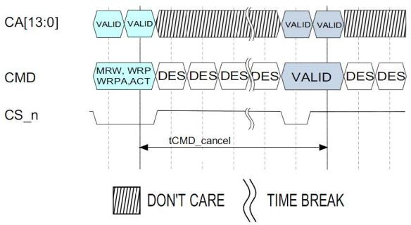

text_image

CA[13:0]
VALID VALID VALID VALID VALID
CMD MRW, WRP DES DES DES VALID DES DES
WRPA_ACT DES DES DES VALID DES DES
CS_n tCMD_cancel
DON'T CARE TIME BREAK

Figure 11 — Command Cancel Timing

Table 31 — Command Cancel Timing 

<table><tr><td rowspan="2">Parameter</td><td rowspan="2">Symbol</td><td colspan="2">DDR5 3200 ~ 6400</td><td colspan="2">DDR5 6800 ~ 8800</td><td rowspan="2">Unit</td></tr><tr><td>Min</td><td>Max</td><td>Min</td><td>Max</td></tr><tr><td>Command cancel timing for ACT, WRP, WRPA, MRW when CS_n is low on 2nd cycle</td><td>tCMD_cancel</td><td>8</td><td>-</td><td>8</td><td>-</td><td>nCK</td></tr></table>

# 4.2 Burst Length, Type, and Order

Accesses within a given burst is currently limited to only sequential, interleaved is not supported. The ordering of accesses within a burst is determined by the burst length and the starting column address as shown in Table . The burst length is defined by bits OP[1:0] of Mode Register MR0. Burst length options include BC8 OTF, BL16, BL32 (optional) and BL32 OTF.

Table 32 — Burst Type and Burst Order for READ 

<table><tr><td rowspan="2">Burst Length</td><td rowspan="2">Burst Type</td><td rowspan="2">C3</td><td rowspan="2">C2</td><td rowspan="2">C1</td><td rowspan="2">C0</td><td colspan="16">Read Burst Cycle and Burst Address Sequence</td></tr><tr><td>1</td><td>2</td><td>3</td><td>4</td><td>5</td><td>6</td><td>7</td><td>8</td><td>9</td><td>10</td><td>11</td><td>12</td><td>13</td><td>14</td><td>15</td><td>16</td></tr><tr><td rowspan="4">BC8</td><td rowspan="4">SEQ</td><td>0</td><td>0</td><td>V</td><td>V</td><td>0</td><td>1</td><td>2</td><td>3</td><td>4</td><td>5</td><td>6</td><td>7</td><td>T</td><td>T</td><td>T</td><td>T</td><td>T</td><td>T</td><td>T</td><td>T</td></tr><tr><td>0</td><td>1</td><td>V</td><td>V</td><td>4</td><td>5</td><td>6</td><td>7</td><td>0</td><td>1</td><td>2</td><td>3</td><td>T</td><td>T</td><td>T</td><td>T</td><td>T</td><td>T</td><td>T</td><td>T</td></tr><tr><td>1</td><td>0</td><td>V</td><td>V</td><td>8</td><td>9</td><td>A</td><td>B</td><td>C</td><td>D</td><td>E</td><td>F</td><td>T</td><td>T</td><td>T</td><td>T</td><td>T</td><td>T</td><td>T</td><td>T</td></tr><tr><td>1</td><td>1</td><td>V</td><td>V</td><td>C</td><td>D</td><td>E</td><td>F</td><td>8</td><td>9</td><td>A</td><td>B</td><td>T</td><td>T</td><td>T</td><td>T</td><td>T</td><td>T</td><td>T</td><td>T</td></tr><tr><td rowspan="4">BL16</td><td rowspan="4">SEQ</td><td>0</td><td>0</td><td>V</td><td>V</td><td>0</td><td>1</td><td>2</td><td>3</td><td>4</td><td>5</td><td>6</td><td>7</td><td>8</td><td>9</td><td>A</td><td>B</td><td>C</td><td>D</td><td>E</td><td>F</td></tr><tr><td>0</td><td>1</td><td>V</td><td>V</td><td>4</td><td>5</td><td>6</td><td>7</td><td>0</td><td>1</td><td>2</td><td>3</td><td>C</td><td>D</td><td>E</td><td>F</td><td>8</td><td>9</td><td>A</td><td>B</td></tr><tr><td>1</td><td>0</td><td>V</td><td>V</td><td>8</td><td>9</td><td>A</td><td>B</td><td>C</td><td>D</td><td>E</td><td>F</td><td>0</td><td>1</td><td>2</td><td>3</td><td>4</td><td>5</td><td>6</td><td>7</td></tr><tr><td>1</td><td>1</td><td>V</td><td>V</td><td>C</td><td>D</td><td>E</td><td>F</td><td>8</td><td>9</td><td>A</td><td>B</td><td>4</td><td>5</td><td>6</td><td>7</td><td>0</td><td>1</td><td>2</td><td>3</td></tr></table>

Table 33 — Burst Type and Burst Order for WRITE 

<table><tr><td rowspan="2">Burst Length</td><td rowspan="2">Burst Type</td><td rowspan="2">C3</td><td rowspan="2">C2</td><td rowspan="2">C1</td><td rowspan="2">C0</td><td colspan="16">Write Burst Cycle and Burst Address Sequence</td></tr><tr><td>1</td><td>2</td><td>3</td><td>4</td><td>5</td><td>6</td><td>7</td><td>8</td><td>9</td><td>10</td><td>11</td><td>12</td><td>13</td><td>14</td><td>15</td><td>16</td></tr><tr><td rowspan="2">BC8</td><td rowspan="2">SEQ</td><td>0</td><td>V</td><td>V</td><td>V</td><td>0</td><td>1</td><td>2</td><td>3</td><td>4</td><td>5</td><td>6</td><td>7</td><td>X</td><td>X</td><td>X</td><td>X</td><td>X</td><td>X</td><td>X</td><td>X</td></tr><tr><td>1</td><td>V</td><td>V</td><td>V</td><td>8</td><td>9</td><td>A</td><td>B</td><td>C</td><td>D</td><td>E</td><td>F</td><td>X</td><td>X</td><td>X</td><td>X</td><td>X</td><td>X</td><td>X</td><td>X</td></tr><tr><td>BL16</td><td>SEQ</td><td>V</td><td>V</td><td>V</td><td>V</td><td>0</td><td>1</td><td>2</td><td>3</td><td>4</td><td>5</td><td>6</td><td>7</td><td>8</td><td>9</td><td>A</td><td>B</td><td>C</td><td>D</td><td>E</td><td>F</td></tr><tr><td colspan="22">NOTE 1 T: Output driver for data and strobes are in RTT_PARK.NOTE 2 V: A valid logic level (0 or 1), but respective buffer input ignores level on input pins.NOTE 3 X: Don&#x27;t Care.</td></tr></table>

# 4.2.1 Burst Type and Burst Order for Optional BL32 Mode

DDR5 DRAM supports an optional fixed BL32 mode and optional BL32 OTF (On the fly) mode for x4 devices only.

Table 34 — Burst Type and Burst Order for READ BL32 

<table><tr><td rowspan="2">Burst Length</td><td rowspan="2">Burst Type</td><td rowspan="2">C10</td><td rowspan="2">C3</td><td rowspan="2">C2</td><td rowspan="2">C1</td><td rowspan="2">C0</td><td colspan="8">Read Burst Cycle and Burst Address Sequence</td></tr><tr><td>1-4</td><td>5-8</td><td>9-12</td><td>13-16</td><td>17-20</td><td>21-24</td><td>25-28</td><td>29-32</td></tr><tr><td rowspan="8">BL32</td><td rowspan="16">SEQ</td><td>0</td><td>0</td><td>0</td><td>V</td><td>V</td><td>0-3</td><td>4-7</td><td>8-B</td><td>C-F</td><td>10-13</td><td>14-17</td><td>18-1B</td><td>1C-1F</td></tr><tr><td>0</td><td>0</td><td>1</td><td>V</td><td>V</td><td>4-7</td><td>0-3</td><td>C-F</td><td>8-B</td><td>14-17</td><td>10-13</td><td>1C-1F</td><td>18-1B</td></tr><tr><td>0</td><td>1</td><td>0</td><td>V</td><td>V</td><td>8-B</td><td>C-F</td><td>0-3</td><td>4-7</td><td>18-1B</td><td>1C-1F</td><td>10-13</td><td>14-17</td></tr><tr><td>0</td><td>1</td><td>1</td><td>V</td><td>V</td><td>C-F</td><td>8-B</td><td>4-7</td><td>0-3</td><td>1C-1F</td><td>18-1B</td><td>14-17</td><td>10-13</td></tr><tr><td>1</td><td>0</td><td>0</td><td>V</td><td>V</td><td>10-13</td><td>14-17</td><td>18-1B</td><td>1C-1F</td><td>0-3</td><td>4-7</td><td>8-B</td><td>C-F</td></tr><tr><td>1</td><td>0</td><td>1</td><td>V</td><td>V</td><td>14-17</td><td>10-13</td><td>1C-1F</td><td>18-1B</td><td>4-7</td><td>0-3</td><td>C-F</td><td>8-B</td></tr><tr><td>1</td><td>1</td><td>0</td><td>V</td><td>V</td><td>18-1B</td><td>1C-1F</td><td>10-13</td><td>14-17</td><td>8-B</td><td>C-F</td><td>0-3</td><td>4-7</td></tr><tr><td>1</td><td>1</td><td>1</td><td>V</td><td>V</td><td>1C-1F</td><td>18-1B</td><td>14-17</td><td>10-13</td><td>C-F</td><td>8-B</td><td>4-7</td><td>0-3</td></tr><tr><td rowspan="8">BL16 in BL32 OTF</td><td>0</td><td>0</td><td>0</td><td>V</td><td>V</td><td>0-3</td><td>4-7</td><td>8-B</td><td>C-F</td><td>X</td><td>X</td><td>X</td><td>X</td></tr><tr><td>0</td><td>0</td><td>1</td><td>V</td><td>V</td><td>4-7</td><td>0-3</td><td>C-F</td><td>8-B</td><td>X</td><td>X</td><td>X</td><td>X</td></tr><tr><td>0</td><td>1</td><td>0</td><td>V</td><td>V</td><td>8-B</td><td>C-F</td><td>0-3</td><td>4-7</td><td>X</td><td>X</td><td>X</td><td>X</td></tr><tr><td>0</td><td>1</td><td>1</td><td>V</td><td>V</td><td>C-F</td><td>8-B</td><td>4-7</td><td>0-3</td><td>X</td><td>X</td><td>X</td><td>X</td></tr><tr><td>1</td><td>0</td><td>0</td><td>V</td><td>V</td><td>10-13</td><td>14-17</td><td>18-1B</td><td>1C-1F</td><td>X</td><td>X</td><td>X</td><td>X</td></tr><tr><td>1</td><td>0</td><td>1</td><td>V</td><td>V</td><td>14-17</td><td>10-13</td><td>1C-1F</td><td>18-1B</td><td>X</td><td>X</td><td>X</td><td>X</td></tr><tr><td>1</td><td>1</td><td>0</td><td>V</td><td>V</td><td>18-1B</td><td>1C-1F</td><td>10-13</td><td>14-17</td><td>X</td><td>X</td><td>X</td><td>X</td></tr><tr><td>1</td><td>1</td><td>1</td><td>V</td><td>V</td><td>1C-1F</td><td>18-1B</td><td>14-17</td><td>10-13</td><td>X</td><td>X</td><td>X</td><td>X</td></tr></table>

Table 35 — Burst Type and Burst Order for WRITE BL32 

<table><tr><td rowspan="2">Burst Length</td><td rowspan="2">Burst Type</td><td rowspan="2">C10</td><td rowspan="2">C3</td><td rowspan="2">C2</td><td rowspan="2">C1</td><td rowspan="2">C0</td><td colspan="4">Write Burst Cycle and Burst Address Sequence</td></tr><tr><td>1-8</td><td>9-16</td><td>17-24</td><td>25-32</td></tr><tr><td>BL32</td><td rowspan="3">SEQ</td><td>0</td><td>V</td><td>V</td><td>V</td><td>V</td><td>0-7</td><td>8-F</td><td>17-24</td><td>25-32</td></tr><tr><td rowspan="2">BL16 in BL32 OTF</td><td>0</td><td>V</td><td>V</td><td>V</td><td>V</td><td>0-7</td><td>8-F</td><td>X</td><td>X</td></tr><tr><td>1</td><td>V</td><td>V</td><td>V</td><td>V</td><td>10-17</td><td>18-1F</td><td>X</td><td>X</td></tr><tr><td colspan="11">NOTE 1 In case of BL16 in BL32 OTF mode by setting MR0[OP1:0=11], the internal write operation starts eight cycles earlier than for BL32 mode.This means that the starting point for tWR and tWTR shall be pulled in by eight clocks.</td></tr><tr><td colspan="11">NOTE 2 T: Output driver for data and strobes are in high impedance.</td></tr><tr><td colspan="11">NOTE 3 V: A valid logic level (0 or 1), but respective buffer input ignores level on input pins.</td></tr><tr><td colspan="11">NOTE 4 X: Don&#x27;t Care.</td></tr></table>

# 4.3 Precharge Command

The PRECHARGE command is used to deactivate the open row in a particular bank or the open row in all banks. The bank(s) shall be available for a subsequent row activation a specified time (tRP) after the PRECHARGE command is issued. Once a bank has been precharged, it is in the idle state and must be activated prior to any READ or WRITE commands being issued to that bank. A PRECHARGE command is allowed if there is no open row in that bank (idle state) or if the previously open row is already in the process of precharging. However, the precharge period shall be determined by the last PRECHARGE command issued to the bank.

If CA10 on the 2nd pulse of a Read or Write command is LOW, (shown as AP=L in the command truth table) then the auto-precharge function is engaged. This feature allows the precharge operation to be partially or completely hidden during burst read cycles (dependent upon CAS latency) thus improving system performance for random data access. The RAS lockout circuit internally delays the precharge operation until the array restore operation has been completed (tRAS satisfied) so that the auto precharge command may be issued with any read. Auto-precharge is also implemented during Write commands. The precharge operation engaged by the Auto precharge command shall not begin until the last data of the burst write sequence is properly stored in the memory array. The bank shall be available for a subsequent row activation a specified time (tRP) after hidden PRECHARGE command (AutoPrecharge) is issued to that bank.

The precharge to precharge delay is defined by tPPD in the core timing tables. tPPD applies to any combination of precharge commands (PREab, PREsb, PREpb). tPPD also applies to any combination of precharge commands to a different die in a 3DS DDR5 SDRAM.

# 4.3.1 Precharge Command Modes

DDR5 supports three different types of precharge commands: Precharge, Precharge All and Precharge Same Bank

The Precharge Command (PREpb) applies precharge to a specific bank defined by BA[1:0] {if applicable} in a specific bank group defined by BG[2:0], while a Precharge All (PREab) applies precharge to all banks in all bank groups and a Precharge Same Bank (PREsb) applies precharge to a specific bank defined by BA[1:0] in all bank groups. In the case of a 3DS DDR5 SDRAM device, CID[3:0] shall also be selected to identify the target die.

Table 36 shows the different encodes for PREpb, PREab and PREsb.

Table 36 — Precharge Encodings 

<table><tr><td rowspan="2">Function</td><td rowspan="2">Abbreviation</td><td rowspan="2">CS_n</td><td colspan="14">CA Pins</td><td rowspan="2">NOTES</td></tr><tr><td>CA0</td><td>CA1</td><td>CA2</td><td>CA3</td><td>CA4</td><td>CA5</td><td>CA6</td><td>CA7</td><td>CA8</td><td>CA9</td><td>CA10</td><td>CA11</td><td>CA12</td><td>CA13</td></tr><tr><td>Precharge All</td><td>PREab</td><td>L</td><td>H</td><td>H</td><td>L</td><td>H</td><td>L</td><td>CID3</td><td>V</td><td>V</td><td>V</td><td>V</td><td>L</td><td>CID0</td><td>CID1</td><td>CID2</td><td></td></tr><tr><td>Precharge Same Bank</td><td>PREsb</td><td>L</td><td>H</td><td>H</td><td>L</td><td>H</td><td>L</td><td>CID3</td><td>BA0</td><td>BA1</td><td>V</td><td>V</td><td>H</td><td>CID0</td><td>CID1</td><td>CID2</td><td></td></tr><tr><td>Precharge</td><td>PREpb</td><td>L</td><td>H</td><td>H</td><td>L</td><td>H</td><td>H</td><td>CID3</td><td>BA0</td><td>BA1</td><td>BG0</td><td>BG1</td><td>BG2</td><td>CID0</td><td>CID1</td><td>CID2</td><td></td></tr><tr><td colspan="18">NOTE See Command Truth Table for details</td></tr></table>

# 4.4 Programmable Preamble and Postamble

DDR5 shall support programmable preambles and postambles.

# 4.4.1 Read Preamble and Postamble

DDR5 supports a programmable read preamble and postamble. Read Preamble is configured as 1tCK, 2tCK (two unique modes), 3tCK and 4tCK via MR8:OP[2:0].

<table><tr><td>Function</td><td>Register Type</td><td>Operand</td><td>Data</td></tr><tr><td>Read Preamble Settings</td><td>R/W</td><td>OP[2:0]</td><td>000B: 1 tCK - 10 Pattern001B: 2 tCK - 0010 Pattern010B: 2 tCK - 1110 Pattern (DDR4 Style)011B: 3 tCK - 000010 Pattern100B: 4 tCK - 00001010 Pattern101B: Reserved110B: Reserved111B: Reserved</td></tr></table>

Read Postamble is configured as 0.5tCK or 1.5tCK via MR8:OP[6]

NOTE: DQS shall have an option to drive early by x-tCK to accommodate different HOST receiver designs as controlled by the Read DQS Offset in MR40:OP[2:0].

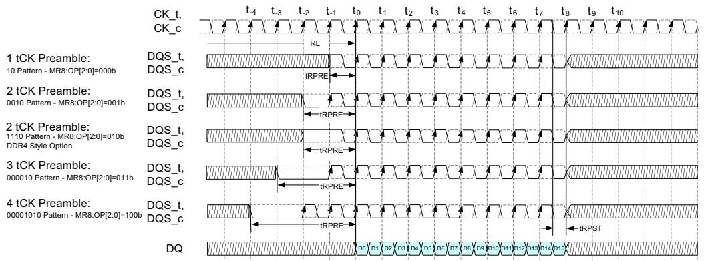  
Figure 12 — Example of Read Preamble Modes (Default) with 0.5 tCK Postamble

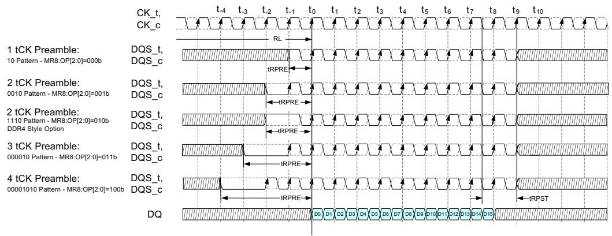  
Figure 13 — Example of Read Preamble Modes (Default) with 1.5 tCK Postamble

# 4.4.1 Read Preamble and Postamble (cont’d)

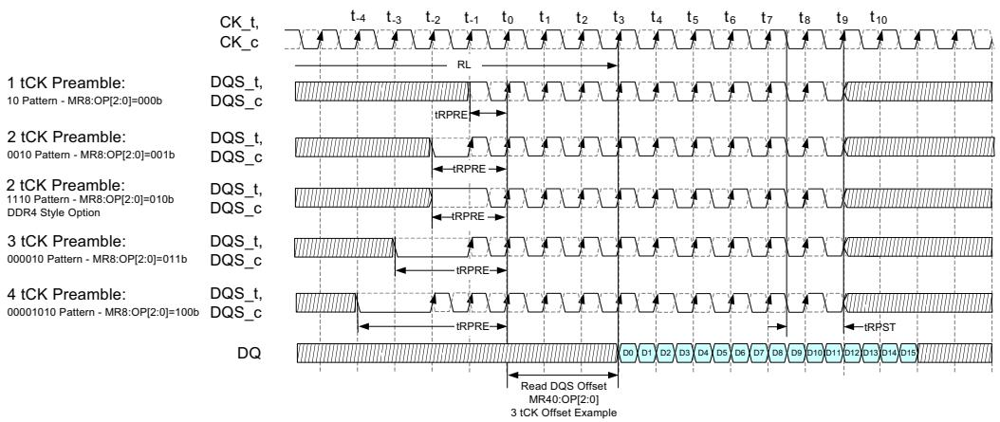

other

| Signal | Pattern | Data Flow |
|--------|---------|-----------|
| 1 tCK Preamble | 10 | DQS_t, DQS_c |
| 2 tCK Preamble | 0010 | DQS_t, DQS_c |
| 2 tCK Preamble | 1110 | DQS_t, DQS_c |
| 3 tCK Preamble | 000010 | DQS_t, DQS_c |
| 4 tCK Preamble | 00001010 | DQS_t, DQS_c |
| 1 tCK Preamble | MR8:OP[2:0]=000b | DQ |
| 2 tCK Preamble | MR8:OP[2:0]=001b | DQ |
| 3 tCK Preamble | MR8:OP[2:0]=011b | DQ |
| 4 tCK Preamble | MR8:OP[2:0]=100b | DQ |

Figure 14 — Example of Read Preamble Modes with 3tCK DQS Offset and with 1.5 tCK Postamble

# 4.4.2 Write Preamble and Postamble

DDR5 supports a programmable write preamble and postamble.

Write Preamble is configured as 2tCK, 3tCK, and 4tCK via MR8:OP[4:3]

Write Postamble is configured as 0.5tCK or 1.5tCK via MR8:OP[7]

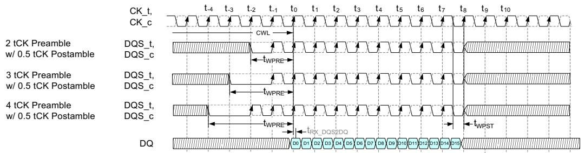

other

| Preamble Type | Time Interval | Label        |
| -------------- | ------------- | ------------ |
| CK_t           | t_4           | CK_c         |
| DQS_t          | t_3           | DQS_t        |
| DQS_c          | t_2           | DQS_c        |
| 2 tCK Preamble | t_1           | CWL          |
| 3 tCK Preamble | t_0           | twPRE        |
| 4 tCK Preamble | t_1           | DQS_t        |
|            |             | DQS_c        |
|            |             | twPRE        |
|            |             | DQ           |
|            |             | DQ_D1        |
|            |             | DQ_D2        |
|            |             | DQ_D3        |
|            |             | DQ_D4        |
|            |             | DQ_D5        |
|            |             | DQ_D6        |
|            |             | DQ_D7        |
|            |             | DQ_D8        |
|            |             | DQ_D9        |
|            |             | DQ_D10       |
|            |             | DQ_D11       |
|            |             | DQ_D12       |
|            |             | DQ_D13       |
|            |             | DQ_D14       |
|            |             | DQ_D15       |
|            |             | DQ_WPST      |
|            |             | DQ_DQ        |
|            |             | DQ_DQ_DQ_DQ  |
|            |             | DQ_DQ_DQ_DQ  |
|            |             | DQ_DQ_DQ_DQ  |
|            |             | DQ_DQ_DQ_DQ  |
|            |             | DQ_DQ_DQ_DQ  |
|            |             | DQ_DQ_DQ_DQ  |
|            |             | DQ_DQ_DQ_DQ  |
|            |             | DQ_D0        |
|            |             | DQ_D1        |
|            |             | DQ_D2        |
|            |             | DQ_D3        |
|            |             | DQ_D4        |
|            |             | DQ_D5        |
|            |             | DQ_D6        |
|            |             | DQ_D7        |
|            |             | DQ_D8        |
|            |             | DQ_D9        |

Figure 15 — Example of Write Preamble Modes (Default) with 0.5tCK Postamble

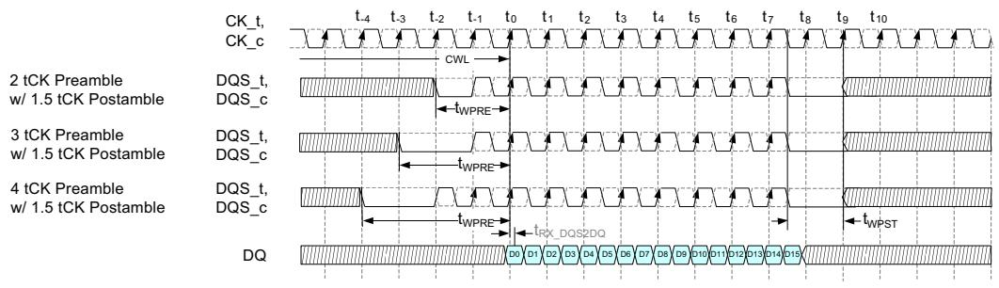  
Figure 16 — Example of Write Preamble Modes (Default) with 1.5tCK Postamble

# 4.4.3 Read and Write Preamble and Postamble Timings

During Read and Write operations, the input receiver strobe shall be aligned with the DQ according to the Preamble and Postamble settings, and the strobe shall meet the specified timing requirements to guarantee enough timing margin by setting the window for the strobe during the Preamble and Postamble time frame. When the DRE is enabled, the DQs shall be high for a minimum of 4-UI prior to the first Write data bit to ensure propoer DFE synchronization. Read Preamble is set by MR8:OP[2:0], and Write Preamble is set by MR8 OP[4:3]. Read Postamble is set by MR8:OP[6], and Write Postamble is set by MR8:OP[7].

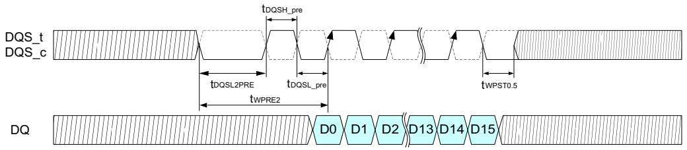

text_image

DQS_t
DQS_c
tDQSH_pre
tDQSL2PRE
tDWPRE2
tDWSL_pre
tWPST0.5
DQ
D0 D1 D2 D13 D14 D15

# NOTES:

1. BL=16.   
2. tDQSH\_pre and tDQSL\_pre are shown, and apply to all toggles during the Preamble.   
3. 2nd Preamble during Write to Write operation shall follow the same requirement.

Figure 17 — DQS Timing while 2tCK Write Preamble and 0.5tCK Postamble   
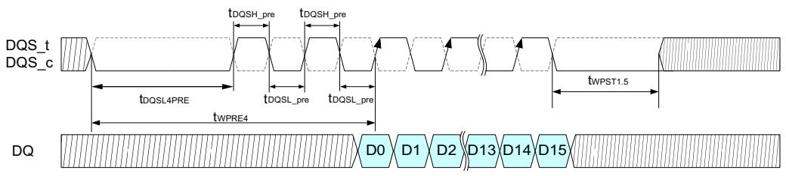

text_image

DQS_t
DQS_c
tDQSH_pre
tDQSH_pre
tDQSL4PRE
tDQSL_pre
tDQSL_pre
twPST1.5
twPRE4
DQ
D0 D1 D2 D13 D14 D15

# NOTES:

1. BL=16   
2. tDQSH\_pre and tDQSL\_pre are shown, and apply to all toggles during the Preamble.   
3. 2nd Preamble during Write to Write operation shall follow the same requirement.

Figure 18 — DQS Timing while 4tCK Write Preamble and 1.5tCK Postamble   
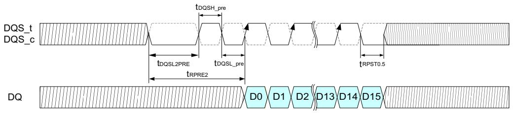

text_image

DQS_t
DQS_c
tDQSH_pre
tDQSL2PRE
tDQSL_pre
tRPST0.5
tRPRE2
DQ
D0 D1 D2 D13 D14 D15

# NOTES:

1. BL=16.   
2. tDQSH\_pre and tDQSL\_pre are shown, and apply to all toggles during the Preamble.   
3. 2nd Preamble during Read to Read operation shall follow the same requirement.

Figure 19 — DQS Timing while 2tCK Read Preamble and 0.5tCK Postamble

# 4.4.3 Read and Write Preamble and Postamble Timings (cont’d)

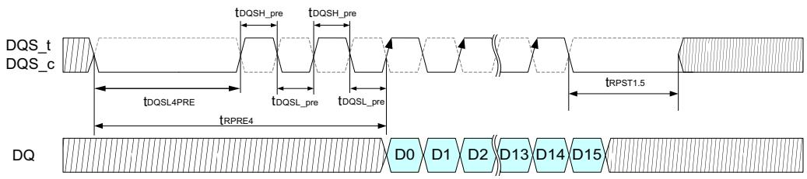

text_image

DQS_t
DQS_c
tDQSH_pre
tDQSH_pre
tDQSL4PRE
tDQSL_pre
tDQSL_pre
tRPST1.5
tRPRE4
DQ
D0 D1 D2 D13 D14 D15

# NOTES:

1. BL=16.   
2. tDQSH\_pre and tDQSL\_pre are shown, and apply to all toggles during the Preamble.   
3. 2nd Preamble during Read to Read operation shall follow the same requirement.

Figure 20 — DQS Timing while 4tCK Read Preamble and 1.5tCK Postamble

# 4.4.3 Read and Write Preamble and Postamble Timings (cont’d)

Table 37 — Strobe Preamble and Postamble Timing Parameters for DDR5-3200 to 4800 

<table><tr><td rowspan="2">Parameter</td><td rowspan="2">Symbol</td><td colspan="2">DDR5 3200 - 3600</td><td colspan="2">DDR5 4000 - 4400</td><td colspan="2">DDR5 4800</td><td rowspan="2">Unit</td></tr><tr><td>Min</td><td>Max</td><td>Min</td><td>Max</td><td>Min</td><td>Max</td></tr><tr><td>DQS_t, DQS_c differential READ Preamble (1tCK Preamble)</td><td>tRPRE1</td><td>0.900</td><td>-</td><td>-</td><td>-</td><td>-</td><td>-</td><td>tCK(avg)</td></tr><tr><td>DQS_t, DQS_c differential READ Preamble (2tCK Preamble)</td><td>tRPRE2</td><td>1.800</td><td>-</td><td>1.800</td><td>-</td><td>1.800</td><td>-</td><td>tCK(avg)</td></tr><tr><td>DQS_t, DQS_c differential READ Preamble DDR4 (2tCK Preamble)</td><td>tRPRE2_D4</td><td>1.800</td><td>-</td><td>1.800</td><td>-</td><td>1.800</td><td>-</td><td>tCK(avg)</td></tr><tr><td>DQS_t, DQS_c differential READ Preamble (3tCK Preamble)</td><td>tRPRE3</td><td>-</td><td>-</td><td>2.700</td><td>-</td><td>2.700</td><td>-</td><td>tCK(avg)</td></tr><tr><td>DQS_t, DQS_c differential READ Preamble (4tCK Preamble)</td><td>tRPRE4</td><td>-</td><td>-</td><td>-</td><td>-</td><td>-</td><td>-</td><td>tCK(avg)</td></tr><tr><td>DQS_t, DQS_c differential READ Postamble (0.5tCK Postamble)</td><td>tRPST0.5</td><td>0.450</td><td>-</td><td>0.450</td><td>-</td><td>0.450</td><td>-</td><td>tCK(avg)</td></tr><tr><td>DQS_t, DQS_c differential READ Postamble (1.5tCK Postamble)</td><td>tRPST1.5</td><td>1.200</td><td>-</td><td>1.200</td><td>-</td><td>1.200</td><td>-</td><td>tCK(avg)</td></tr><tr><td>DQS_t, DQS_c differential WRITE Preamble (2tCK Preamble)</td><td>tWPRE2</td><td>1.800</td><td>-</td><td>1.800</td><td>-</td><td>1.800</td><td>-</td><td>tCK(avg)</td></tr><tr><td>DQS_t, DQS_c differential WRITE Preamble (3tCK Preamble)</td><td>tWPRE3</td><td>-</td><td>-</td><td>2.700</td><td>-</td><td>2.700</td><td>-</td><td>tCK(avg)</td></tr><tr><td>DQS_t, DQS_c differential WRITE Preamble (4tCK Preamble)</td><td>tWPRE4</td><td>-</td><td>-</td><td>3.600</td><td>-</td><td>3.600</td><td>-</td><td>tCK(avg)</td></tr><tr><td>DQS_t, DQS_c differential WRITE Postamble (0.5tCK Postamble)</td><td>tWPST0.5</td><td>0.45</td><td>-</td><td>0.45</td><td>-</td><td>0.45</td><td>-</td><td>tCK(avg)</td></tr><tr><td>DQS_t, DQS_c differential WRITE Postamble (1.5tCK Postamble)</td><td>tWPST1.5</td><td>-</td><td>-</td><td>1.20</td><td>-</td><td>1.20</td><td>-</td><td>tCK(avg)</td></tr><tr><td>DQS_t, DQS_c differential high toggle pulse width during DDR4 READ Preamble (2tCK Preamble)</td><td>tDQSH2PRE_D4</td><td>1.350</td><td>-</td><td>1.350</td><td>-</td><td>1.350</td><td>-</td><td>tCK(avg)</td></tr><tr><td>DQS_t, DQS_c differential initial low pulse width during Preamble (2tCK Preamble)</td><td>tDQSL2PRE</td><td>0.900</td><td>-</td><td>0.900</td><td>-</td><td>0.900</td><td>-</td><td>tCK(avg)</td></tr><tr><td>DQS_t, DQS_c differential initial low pulse width during Preamble (3tCK Preamble)</td><td>tDQSL3PRE</td><td>-</td><td>-</td><td>1.800</td><td>-</td><td>1.800</td><td>-</td><td>tCK(avg)</td></tr><tr><td>DQS_t, DQS_c differential initial low pulse width during READ Preamble (4tCK Preamble)</td><td>tDQSL4PRE</td><td>-</td><td>-</td><td>-</td><td>-</td><td>-</td><td>-</td><td>tCK(avg)</td></tr><tr><td>DQS_t, DQS_c differential initial low pulse width during WRITE Preamble (4tCK Preamble)</td><td>tDQSL4PRE</td><td>-</td><td>-</td><td>1.800</td><td>-</td><td>1.800</td><td>-</td><td>tCK(avg)</td></tr><tr><td>DQS_t, DQS_c differential high toggle pulse width during WRITE Preamble</td><td>tDQSH_pre</td><td>0.395</td><td>0.605</td><td>0.395</td><td>0.605</td><td>0.430</td><td>0.570</td><td>tCK(avg)</td></tr><tr><td>DQS_t, DQS_c differential low toggle pulse width during WRITE Preamble</td><td>tDQSL_pre</td><td>0.395</td><td>0.605</td><td>0.395</td><td>0.605</td><td>0.430</td><td>0.570</td><td>tCK(avg)</td></tr><tr><td colspan="9">NOTES:1. The 1tCK Read Preamble is valid for the DDR5-3200/3600 speed grades.2. The 2tCK Read and Write Preamble is valid for the DDR5-3200/3600/4000/4400/4800 speed grades.3. The 2tCK DDR4 Read Preamble is valid for the DDR5-3200/3600/4000/4400/4800 speed grades.4. The 3tCK Read and Write Preamble is valid for the DDR5-4000/4400/4800/5200/5600/6000/6400 speed grades.5. The 4tCK Read and Write Preamble is valid for the DDR5-4000/4400/4800/5200/5600/6000/6400/6800/7200/7600/8000/8400/8800 speed grades.6. The 0.5tCK Read and Write Postamble is valid for the DDR5-3200/3600/4000/4400/4800 speed grades.7. The 1.5tCK Read Postamble is valid for the DDR5-3200/3600/4000/4400/4800/5200/5600/6000/6400/6800/7200/7600/8000/8400/8800 speed grades.8. The 1.5tCK Write Postamble is valid for the DDR5-4000/4400/4800/5200/5600/6000/6400/6800/7200/7600/8000/8400/8800 speed grades.9. The strobe preamble and postamble timing parameter values shall follow the operating frequency.</td></tr></table>

# 4.4.3 Read and Write Preamble and Postamble Timings (cont’d)

Table 38 — Strobe Preamble and Postamble Timing Parameters for DDR5-5200 to 8800 

<table><tr><td rowspan="2">Parameter</td><td rowspan="2">Symbol</td><td colspan="2">DDR5 5200</td><td colspan="2">DDR5 5600 - 6400</td><td colspan="2">DDR5 6800 - 7200</td><td colspan="2">DDR5 7600- 8800</td><td rowspan="2">Unit</td></tr><tr><td>Min</td><td>Max</td><td>Min</td><td>Max</td><td>Min</td><td>Max</td><td>Min</td><td>Max</td></tr><tr><td>DQS_t, DQS_c differential READ Preamble (1tCK Preamble)</td><td>tRPRE1</td><td>-</td><td>-</td><td>-</td><td>-</td><td>-</td><td>-</td><td>-</td><td>-</td><td>tCK(avg)</td></tr><tr><td>DQS_t, DQS_c differential READ Preamble (2tCK Preamble)</td><td>tRPRE2</td><td>-</td><td>-</td><td>-</td><td>-</td><td>-</td><td>-</td><td>-</td><td>-</td><td>tCK(avg)</td></tr><tr><td>DQS_t, DQS_c differential READ Preamble DDR4 (2tCK Preamble)</td><td>tRPRE2_D4</td><td>2.700</td><td>-</td><td>2.700</td><td>-</td><td>-</td><td>-</td><td>-</td><td>-</td><td>tCK(avg)</td></tr><tr><td>DQS_t, DQS_c differential READ Preamble (3tCK Preamble)</td><td>tRPRE3</td><td>2.700</td><td>-</td><td>2.700</td><td>-</td><td>-</td><td>-</td><td>-</td><td>-</td><td>tCK(avg)</td></tr><tr><td>DQS_t, DQS_c differential READ Preamble (4tCK Preamble)</td><td>tRPRE4</td><td>-</td><td>-</td><td>3.600</td><td>-</td><td>3.600</td><td>-</td><td>3.600</td><td>-</td><td>tCK(avg)</td></tr><tr><td>DQS_t, DQS_c differential READ Postamble (0.5tCK Preamble)</td><td>tRPST0.5</td><td>-</td><td>-</td><td>-</td><td>-</td><td>-</td><td>-</td><td>-</td><td>-</td><td>tCK(avg)</td></tr><tr><td>DQS_t, DQS_c differential READ Postamble (1.5tCK Preamble)</td><td>tRPST1.5</td><td>1.200</td><td>-</td><td>1.200</td><td>-</td><td>1.200</td><td>-</td><td>1.300</td><td>-</td><td>tCK(avg)</td></tr><tr><td>DQS_t, DQS_c differential WRITE Preamble (2tCK Preamble)</td><td>tWPRE2</td><td>-</td><td>-</td><td>-</td><td>-</td><td>-</td><td>-</td><td>-</td><td>-</td><td>tCK(avg)</td></tr><tr><td>DQS_t, DQS_c differential WRITE Preamble (3tCK Preamble)</td><td>tWPRE3</td><td>2.700</td><td>-</td><td>2.700</td><td>-</td><td>-</td><td>-</td><td>-</td><td>-</td><td>tCK(avg)</td></tr><tr><td>DQS_t, DQS_c differential WRITE Preamble (4tCK Preamble)</td><td>tWPRE4</td><td>3.600</td><td>-</td><td>3.600</td><td>-</td><td>3.600</td><td>-</td><td>3.600</td><td>-</td><td>tCK(avg)</td></tr><tr><td>DQS_t, DQS_c differential WRITE Postamble (0.5tCK Postamble)</td><td>tWPST0.5</td><td>-</td><td>-</td><td>-</td><td>-</td><td>-</td><td>-</td><td>-</td><td>-</td><td>tCK(avg)</td></tr><tr><td>DQS_t, DQS_c differential WRITE Postamble (1.5tCK Postamble)</td><td>tWPST1.5</td><td>1.200</td><td>-</td><td>1.200</td><td>-</td><td>1.200</td><td>-</td><td>1.200</td><td>-</td><td>tCK(avg)</td></tr><tr><td>DQS_t, DQS_c differential high toggle pulse width during DDR4 READ Preamble (2tCK Preamble)</td><td>tDQSH2PRE_D4</td><td>-</td><td>-</td><td>-</td><td>-</td><td>-</td><td>-</td><td>-</td><td>-</td><td>tCK(avg)</td></tr><tr><td>DQS_t, DQS_c differential initial low pulse width during WRITE Preamble (2tCK Preamble)</td><td>tDQSL2PRE</td><td>-</td><td>-</td><td>-</td><td>-</td><td>-</td><td>-</td><td>-</td><td>-</td><td>tCK(avg)</td></tr><tr><td>DQS_t, DQS_c differential initial low pulse width during Preamble (3tCK Preamble)</td><td>tDQSL3PRE</td><td>1.800</td><td>-</td><td>1.800</td><td>-</td><td>-</td><td>-</td><td>-</td><td>-</td><td>tCK(avg)</td></tr><tr><td>DQS_t, DQS_c differential initial low pulse width during READ Preamble (4tCK Preamble)</td><td>tDQSL4PRE</td><td>-</td><td>-</td><td>1.800</td><td>-</td><td>1.800</td><td>-</td><td>1.800</td><td>-</td><td>tCK(avg)</td></tr><tr><td>DQS_t, DQS_c differential initial low pulse width during WRITE Preamble (4tCK Preamble)</td><td>tDQSL4PRE</td><td>1.800</td><td>-</td><td>1.800</td><td>-</td><td>1.800</td><td>-</td><td>1.800</td><td>-</td><td>tCK(avg)</td></tr><tr><td>DQS_t, DQS_c differential high toggle pulse width during WRITE Preamble</td><td>tDQSH_pre</td><td>0.430</td><td>0.570</td><td>0.430</td><td>0.570</td><td>0.450</td><td>0.550</td><td>0.450</td><td>0.550</td><td>tCK(avg)</td></tr><tr><td>DQS_t, DQS_c differential low toggle pulse width during WRITE Preamble</td><td>tDQSL_pre</td><td>0.430</td><td>0.570</td><td>0.430</td><td>0.570</td><td>0.450</td><td>0.550</td><td>0.450</td><td>0.550</td><td>tCK(avg)</td></tr><tr><td colspan="11">NOTES:1. The 1tCK Read Preamble is valid for the DDR5-3200/3600 speed grades.2. The 2tCK Read and Write Preamble is valid for the DDR5-3200/3600/4000/4400/4800 speed grades.3. the 2tCK DDR4 Read Preamble is valid for the DDR5-3200/3600/4000/4400/4800 speed grades.4. The 3tCK Read and Write Preamble is valid for the DDR5-4000/4400/4800/5200/5600/6000/6400 speed grades.5. The 4tCK Read Preamble is valid for the DDR5-5600/6000/6400/6800/7200/7600/8000/8400/8800 speed grades.6. The 4tCK Write Preamble is valid for the DDR5-4000/4400/4800/5200/5600/6000/6400/6800/7200/7600/8000/8400/8800 speed grades.7. The 0.5tCK Read and Write Postamble is valid for the DDR5-3200/3600/4000/4400/4800 speed grades.8. The 1.5tCK Read Postamble is valid for the DDR5-3200/3600/4000/4400/4800/5200/5600/6000/6400/6800/7200/7600/8000/8400/8800 speed grades.9. The 1.5tCK Write Postamble is valid for the DDR5-4000/4400/4800/5200/5600/6000/6400/6800/7200/7600/8000/8400/8800 speed grades.10. The strobe preamble and postamble timing parameter values shall follow the operating frequency.</td></tr></table>

# 4.4.4 tWPRE and tRRPE Measurement

tWPRE and tRPRE are measured from a starting point at VswM HIGH or LOW (as defined in the table below) to the differential crossing point of DQS\_t/DQS\_c corresponding to the first burst bit of data as the ending point. The method is applicable for all programmable Preamble durations.

Examples of the method for measuring the duration of tWPRE and tRPRE are shown in Figure 21:

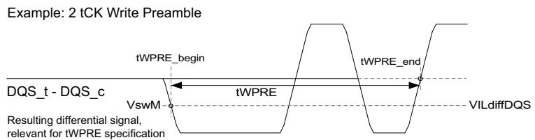

line

| Time Segment       | Signal Level |
| ------------------ | ------------ |
| tWPRE_begin         | VswM         |
| tWPRE_end          | VIldiffDQS   |

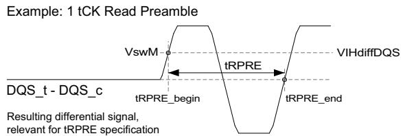

line

| Time Segment       | Signal        |
| ------------------ | ------------- |
| tRPRE_begin         | VswM          |
| tRPRE_end          | VIHdiffDQS    |

Figure 21 — Method for Measuring Preamble Start and End Points

Table 39 — VswM Reference Voltages for Preamble and Postamble Timing Measurements 

<table><tr><td>Measured Parameter</td><td>Reference</td><td>Unit</td></tr><tr><td>VswM HIGH</td><td>VIHdiffDQS</td><td>mV</td></tr><tr><td>VswM LOW</td><td>VILdiffDQS</td><td>mV</td></tr></table>

# 4.4.5 tWPST and tRPST Measurement

tWPST and tRPST are measured from a starting point at the differential crossing point of DQS\_t/DQS\_c corresponding to the last burst bit of data to the VswM LOW ending point. The method is applicable for all programmable Postamble durations.

Examples of the method for measuring the duration of tWPST and tRPST are shown in the Figure 22:

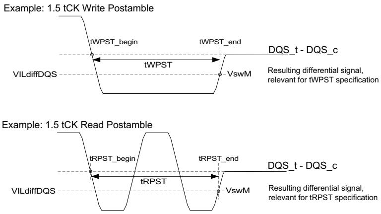

text_image

Example: 1.5 tCK Write Postamble
VILdiffDQS
tWPST_begin
tWPST_end
DQS_t - DQS_c
Resulting differential signal,
relevant for tWPST specification
VswM
Example: 1.5 tCK Read Postamble
VILdiffDQS
tRPST_begin
tRPST_end
DQS_t - DQS_c
Resulting differential signal,
relevant for tRPST specification

Figure 22 — Method for Measuring Postamble Start and End Points

# 4.5 Interamble

The DQS strobe for the device requires a preamble prior to the first latching edge (the rising edge of DQS\_t with data valid), and it requires a postamble after the last latching edge. The preamble and postamble options are set via Mode Register Write commands. Additionally, the postamble and preamble configured size shall NOT force the HOST to add command gaps in the command interval just to satisfy postamble or preamble settings. (i.e., Preamble=4tCK + Postamble=1.5tCK shall not force tCCD+5).

# 4.5.1 Read Interamble Timing Diagrams

In Read to Read operations with tCCD=BL/2, postamble for 1st command and preamble for 2nd command shall disappear to create consecutive DQS latching edge for seamless burst operations.

In the case of Read to Read operations with command interval of tCCD+1, tCCD+2, etc., if the postamble and preambles overlap, the toggles take precedence over static preambles.

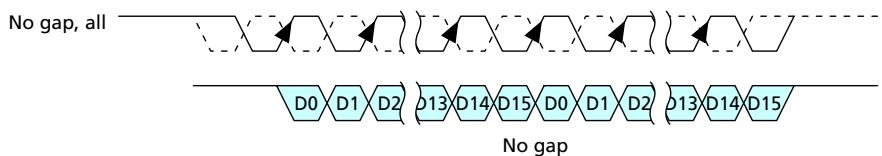

flowchart

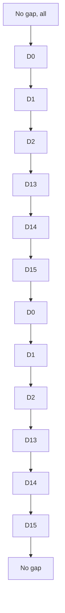
```mermaid
graph TD
    A["No gap, all"] --> B["D0"]
    B --> C["D1"]
    C --> D["D2"]
    D --> E["D13"]
    E --> F["D14"]
    F --> G["D15"]
    G --> H["D0"]
    H --> I["D1"]
    I --> J["D2"]
    J --> K["D13"]
    K --> L["D14"]
    L --> M["D15"]
    M --> N["No gap"]
```

Figure 23 — Example of Seamless Reads Operation: tCCD=Min

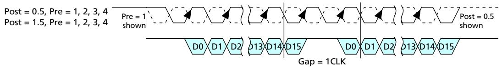

flowchart

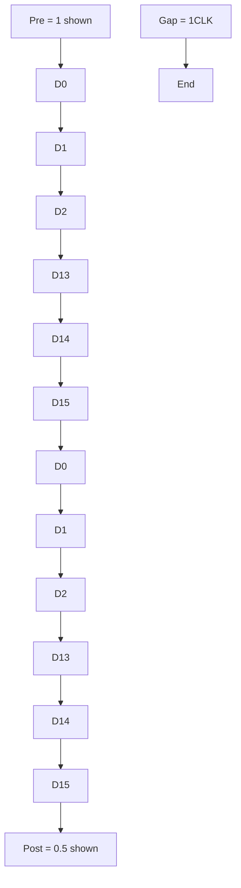
```mermaid
graph TD
    A["Pre = 1 shown"] --> B["D0"]
    B --> C["D1"]
    C --> D["D2"]
    D --> E["D13"]
    E --> F["D14"]
    F --> G["D15"]
    G --> H["D0"]
    H --> I["D1"]
    I --> J["D2"]
    J --> K["D13"]
    K --> L["D14"]
    L --> M["D15"]
    M --> N["Post = 0.5 shown"]
    O["Gap = 1CLK"] --> P["End"]
```

Figure 24 — Example of Consecutive Reads Operation: tCCD=Min+1

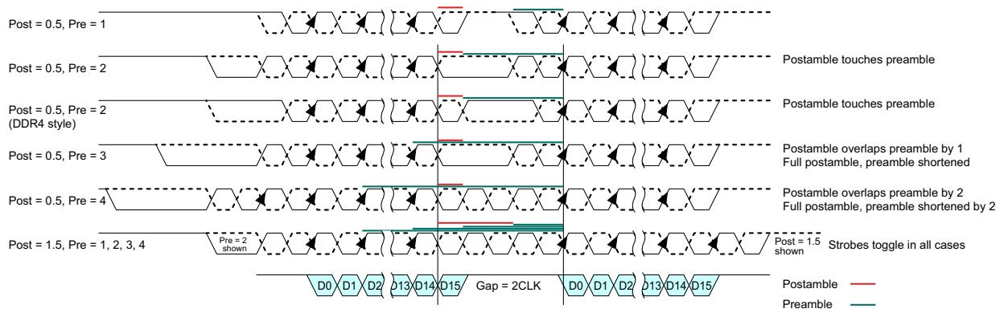

other

| State | Pre | Preamble | State |
|-------|-----|----------|-------|
| Post = 0.5 | 1 | - | - |
| Post = 0.5 | 2 | - | - |
| Post = 0.5 | 3 | - | - |
| Post = 0.5 | 4 | - | - |
| Post = 1.5 | 1, 2, 3, 4 | - | - |
| Post = 1.5 | - | - | - |
| Post = 1.5 | - | - | Strobes toggle in all cases |
| Post = 1.5 | - | - | - |
| Post = 1.5 | - | - | - |
| Post = 1.5 | - | - | - |
| Post = 1.5 | - | - | - |
| Post = 1.5 | - | - | - |
| Post = 1.5 | - | - | - |
| Post = 1.5 | - | - | - |
| Post = 1.5 | - | - | - |
D0 | D1 | D2 | D3 |
| Post = 1.5 | D2 | D3 | D4 |
| Post = 1.5 | D4 | D5 | D6 |
| Post = 1.5 | D5 | - | - |
| Post = 1.5 | - | - | - |
| Post = 1.5 | - | - | - |
| Post = 1.5 | - | - | - |
| Post = 1.5 | - | - | - |
| Post = 1.5 | - | - | - |
| Post = 1.5 | - | - | - |
| Post = 1.5 | - | D0 | D1 |
| Post = 1.5 | - | D1 | D2 |
| Post = 1.5 | - | D2 | D3 |
| Post = 1.5 | - | D3 | D4 |
| Post = 1.5 | - | D4 | D5 |
| Post = 1.5 | - | D5 | D6 |
| Post = 1.5 | - | D6 | D7 |
| Post = 1.5 | - | D7 | D8 |
| Post = 1.5 | - | D8 | D9 |
| Post = 1.5 | - | D9 | D10 |
| Post = 1.5 | - | D10 | D11 |
| Post = 1.5 | - | D11 | D12 |
| Post = 1.5 | - | D12 | D13 |
| Post = 1.5 | - | D13 | D14 |
| Post = 1.5 | - | D14 | D15 |
Gap = 2CLK
Gap = 2CLK
Gap = 2CLK
Gap = 2CLK
Gap = 2CLK
Gap = 2CLK
Gap = 2CLK
Gap = 2CLK
Gap = 2CLK
Gap = 2CLK
Gap = 2CLK
Gap = 2CLK
Gap = 2CLK
Gap = 2CLK
Gap = 2CLK
Gap = 2CLK
Gap = 2CLK
Gap = 70000000000000000000000000000000000000000000000000000000000000000000000000000000000000000000000000000
Preamble
Preamble
Preamble
Preamble
Preamble
Preamble
Preamble
Preamble
Preamble
Preamble
Preamble
Preamble
Preamble
Preamble
Preamble
Preamble
Preamble
Preamble
Preamble
Preamble
Preamble
Preamble
Preamble
Preamble
Preamble
Preamble
Preamble
Preamble
Preamble
Preamble
Preamble
Preamble
Preamble
Preamble

Figure 25 — Example of Consecutive Reads Operation: tCCD=Min+2

# 4.5.1 Read Interamble Timing Diagrams (cont’d)

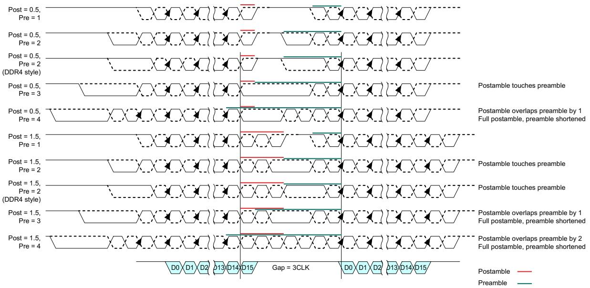

other

| Pre | State | State Type |
| --- | --- | --- |
| 0.5 | Postable | Preamble |
| 0.5 | Preamble | Preamble |
| 0.5 | Preamble | Preamble |
| 0.5 | Preamble | Preamble |
| 0.5 | Preamble | Preamble |
| 1.5 | Postable | Preamble |
| 1.5 | Preamble | Preamble |
| 1.5 | Preamble | Preamble |
| 1.5 | Preamble | Preamble |
| 1.5 | Preamble | Preamble |
| 2 | Postable | Preamble |
| 2 | Preamble | Preamble |
| 2 | Preamble | Preamble |
| 2 | Preamble | Preamble |
| 2 | Preamble | Preamble |
| 3 | Postable | Preamble |
| 3 | Preamble | Preamble |
| 3 | Preamble | Preamble |
| 3 | Preamble | Preamble |
| 3 | Preamble | Preamble |
| 4 | Postable | Preamble |
| 4 | Preamble | Preamble |
| 4 | Preamble | Preamble |
| 4 | Preamble | Preamble |
| 4 | Preamble | Preamble |
| Postable touches preamble by 1
Full postamble, preamble shortened
Postable overlaps preamble by 1
Full postamble, preamble shortened
Postable touches preamble
Postable overlaps preamble by 1
Full postamble, preamble shortened
Postable overlaps preamble by 2
Full postamble, preamble shortened
Gap = 3CLK

Figure 26 — Example of Consecutive Reads Operation: tCCD=Min+3

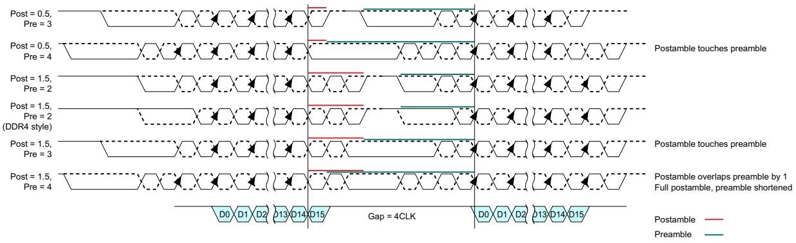

other

| Pre/Post Condition | State | State Type |
| ------------------- | ----- | ---------- |
| Post = 0.5, Pre = 3 | D0    | Preamble   |
| Post = 0.5, Pre = 3 | D1    | Preamble   |
| Post = 0.5, Pre = 3 | D2    | Preamble   |
| Post = 0.5, Pre = 3 | D3    | Preamble   |
| Post = 0.5, Pre = 3 | D4    | Preamble   |
| Post = 0.5, Pre = 3 | D5    | Preamble   |
| Post = 0.5, Pre = 3 | D6    | Preamble   |
| Post = 0.5, Pre = 3 | D7    | Preamble   |
| Post = 0.5, Pre = 3 | D8    | Preamble   |
| Post = 0.5, Pre = 3 | D9    | Preamble   |
| Post = 0.5, Pre = 3 | D10   | Preamble   |
| Post = 0.5, Pre = 3 | D11   | Preamble   |
| Post = 0.5, Pre = 3 | D12   | Preamble   |
| Post = 0.5, Pre = 3 | D13   | Preamble   |
| Post = 0.5, Pre = 3 | D14   | Preamble   |
| Post = 0.5, Pre = 3 | D15   | Preamble   |
| Post = 0.5, Pre = 4 | D0    | Preamble   |
| Post = 0.5, Pre = 4 | D1    | Preamble   |
| Post = 0.5, Pre = 4 | D2    | Preamble   |
| Post = 0.5, Pre = 4 | D3    | Preamble   |
| Post = 0.5, Pre = 4 | D4    | Preamble   |
| Post = 0.5, Pre = 4 | D5    | Preamble   |
| Post = 0.5, Pre = 4 | D6    | Preamble   |
| Post = 0.5, Pre = 4 | D7    | Preamble   |
| Post = 0.5, Pre = 4 | D8    | Preamble   |
| Post = 0.5, Pre = 4 | D9    | Preamble   |
| Post = 0.5, Pre = 4 | D10   | Preamble   |
| Post = 0.5, Pre = 4 | D11   | Preamble   |
| Post = 0.5, Pre = 4 | D12   | Preamble   |
| Post = 0.5, Pre = 4 | D13   | Preamble   |
| Post = 0.5, Pre = 4 | D14   | Preamble   |
| Post = 0.5, Pre = 4 | D15   | Preamble   |
| Post = 1.5, Pre = 2 | D0    | Preamble   |
| Post = 1.5, Pre = 2 | D1    | Preamble   |
| Post = 1.5, Pre = 2 (DDR4 style) | D2    | Preamble   |
| Post = 1.5, Pre = 2 (DDR4 style) | D3    | Preamble   |
| Post = 1.5, Pre = 2 (DDR4 style) | D4    | Preamble   |
| Post = 1.5, Pre = 2 (DDR4 style) | D5    | Preamble   |
| Post = 1.5, Pre = 2 (DDR4 style) | D6    | Preamble   |
| Post = 1.5, Pre = 2 (DDR4 style) | D7    | Preamble   |
| Post = 1.5, Pre = 2 (DDR4 style) | D8    | Preamble   |
| Post = 1.5, Pre = 2 (DDR4 style) | D9    | Preamble   |
| Post = 1.5, Pre = 2 (DDR4 style) | D10   | Preamble   |
| Post = 1.5, Pre = 2 (DDR4 style) | D11   | Preamble   |
| Post = 1.5, Pre = 2 (DDR4 style) | D12   | Preamble   |
| Post = 1.5, Pre = 2 (DDR4 style) | D13   | Preamble   |
| Post = 1.5, Pre = 2 (DDR4 style) | D14   | Preamble   |
| Post = 1.5, Pre = 2 (DDR4 style) | D15   | Preamble   |
| Post = 1.5, Pre = 3 | D0    | Preamble   |
| Post = 1.5, Pre = 3 | D1    | Preamble   |
| Post = 1.5, Pre = 3 (DDR4 style) | D2    | Preamble   |
| Post = 1.5, Pre = 3 (DDR4 style) | D3    | Preamble   |
| Post = 1.5, Pre = 3 (DDR4 style) | D4    | Preamble   |
| Post = 1.5, Pre = 3 (DDR4 style) | D5    | Preamble   |
| Post = 1.5, Pre = 3 (DDR4 style) | D6    | Preamble   |
| Post = 1.5, Pre = 3 (DDR4 style) | D7    | Preamble   |
| Post = 1.5, Pre = 3 (DDR4 style) | D8    | Preamble   |
| Post = 1.5, Pre = 3 (DDR4 style) | D9    | Preamble   |
| Post = 1.5, Pre = 3 (DDR4 style) | D10   | Preamble   |
| Post = 1.5, Pre = 3 (DDR4 style) | D11   | Preamble   |
| Post = 1.5, Pre = 3 (DDR4 style) | D12   | Preamble   |
| Post = 1.5, Pre = 3 (DDR4 style) | D13   | Preamble   |
| Post = 1.5, Pre = 3 (DDR4 style) | D14   | Preamble   |
| Post = 1.5, Pre = 3 (DDR4 style) | D15   | Preamble   |
| Post ≤q <q <q <q <q <q <q <q <q <q <q <q <q <q <q <q <q <q <q <q <q <q <q <q <q <q <q <q <q <q <q <q <q <q <q <q <q <q <q <q <q <q <q <q <q <q <q <q <q <q <q

Figure 27 — Example of Consecutive Reads Operation: tCCD=Min+4

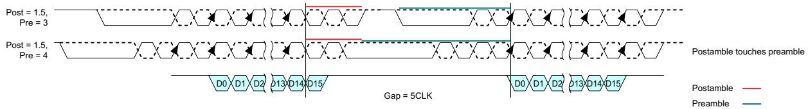

flowchart

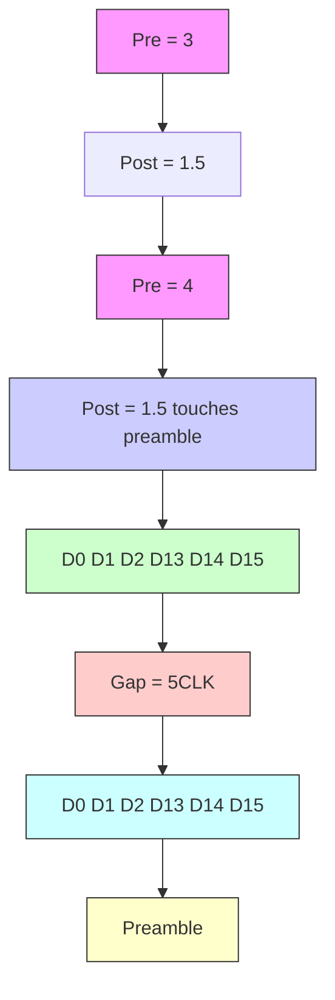
```mermaid
graph TD
    A["Pre = 3"] --> B["Post = 1.5"]
    B --> C["Pre = 4"]
    C --> D["Post = 1.5 touches preamble"]
    D --> E["D0 D1 D2 D13 D14 D15"]
    E --> F["Gap = 5CLK"]
    F --> G["D0 D1 D2 D13 D14 D15"]
    G --> H["Preamble"]
    style A fill:#f9f,stroke:#333
    style C fill:#f9f,stroke:#333
    style D fill:#ccf,stroke:#333
    style E fill:#cfc,stroke:#333
    style F fill:#fcc,stroke:#333
    style G fill:#cff,stroke:#333
    style H fill:#ffc,stroke:#333
```

Figure 28 — Example of Consecutive Reads Operation: tCCD=Min+5

# 4.5.2 Write Interamble Timing Diagrams

In Write to Write operations with tCCD=BL/2, postamble for 1st command and preamble for 2nd command shall disappear to create consecutive DQS latching edge for seamless burst operations.

In the case of Write to Write operations with command interval of tCCD+1, tCCD+2, etc., if the postamble and preambles overlap, the toggles take precedence over static preambles.

When the DFE is enabled, the DQs shall be high during Interamble for a minimum of 4UI prior to the first Write data bit of the second Write command. If there are 4UI or less and DFE is enabled, the host shall drive DQs high during the full Write Interamble period.

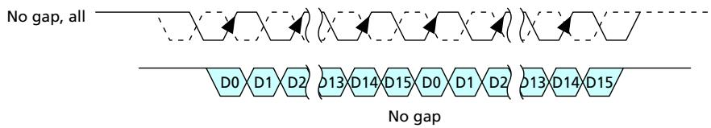

flowchart

```mermaid
graph TD
    A["No gap, all"] --> B["D0"]
    B --> C["D1"]
    C --> D["D2"]
    D --> E["D13"]
    E --> F["D14"]
    F --> G["D15"]
    G --> H["D0"]
    H --> I["D1"]
    I --> J["D2"]
    J --> K["D13"]
    K --> L["D14"]
    L --> M["D15"]
    M --> N["No gap"]
```

Figure 29 — Example of Seamless Writes Operation: tCCD=Min

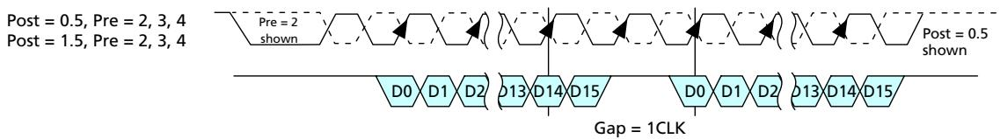

flowchart

```mermaid
graph TD
    A["Pre = 2 shown"] --> B["D0"]
    B --> C["D1"]
    C --> D["D2"]
    D --> E["D13"]
    E --> F["D14"]
    F --> G["D15"]
    G --> H["D0"]
    H --> I["D1"]
    I --> J["D2"]
    J --> K["D13"]
    K --> L["D14"]
    L --> M["D15"]
    M --> N["Post = 0.5 shown"]
    style A fill:#f9f,stroke:#333
    style N fill:#bbf,stroke:#333
    note right of N "Gap = 1CLK"
```

Figure 30 — Example of Consecutive Writes Operation: tCCD=Min+1

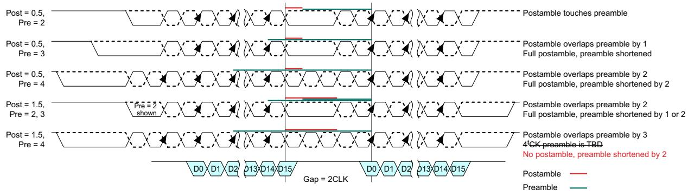

flowchart

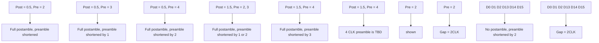
```mermaid
graph TD
    A["Post = 0.5, Pre = 2"] --> B["Full postamble, preamble shortened"]
    C["Post = 0.5, Pre = 3"] --> D["Full postamble, preamble shortened by 1"]
    E["Post = 0.5, Pre = 4"] --> F["Full postamble, preamble shortened by 2"]
    G["Post = 1.5, Pre = 2, 3"] --> H["Full postamble, preamble shortened by 1 or 2"]
    I["Post = 1.5, Pre = 4"] --> J["Full postamble, preamble shortened by 3"]
    K["Post = 1.5, Pre = 4"] --> L["4 CLK preamble is TBD"]
    M["Pre = 2"] --> N["shown"]
    O["Pre = 2"] --> P["Gap = 2CLK"]
    Q["D0 D1 D2 D13 D14 D15"] --> R["No postamble, preamble shortened by 2"]
    S["D0 D1 D2 D13 D14 D15"] --> T["Gap = 2CLK"]
```

Figure 31 — Example of Consecutive Writes Operation: tCCD=Min+2

# 4.5.2 Write Interamble Timing Diagrams (cont’d)

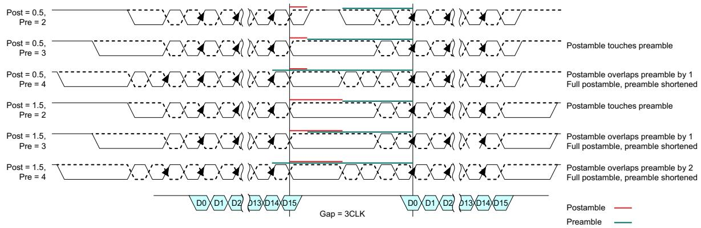

other

| Post | Pre | State |
|------|-----|-------|
| Post | 2   | Pre   |
| Post | 3   | Pre   |
| Post | 4   | Pre   |
| Post | 2   | Pre   |
| Post | 3   | Pre   |
| Post | 4   | Pre   |
| Post | 2   | Pre   |
| Post | 3   | Pre   |
| Post | 4   | Pre   |
| Post | 2   | Mid   |
| Post | 3   | Mid   |
| Post | 4   | Mid   |
| Post | 2   | Mid   |
| Post | 3   | Mid   |
| Post | 4   | Mid   |
| Post | 2   | Mid   |
| Post | 3   | Mid   |
| Post | 4   | Mid   |
| Post | 2   | Mid   |
| Post | 3   | Mid   |
| Post | 4   | Mid   |
| Post | 2   | Full  |
| Post | 3   | Full  |
| Post | 4   | Full  |
| Post | 2   | Full  |
| Post | 3   | Full  |
| Post | 4   | Full  |
| Post | 2   | Full  |
| Preamble | -   | Mid   |
| Preamble | -   | Mid   |
| Preamble | -   | Mid   |
| Preamble | -   | Mid   |
| Preamble | -   | Mid   |
| Preamble | -   | Mid   |
| Preamble | -   | Mid   |
| Preamble | -   | Mid   |
| Preamble | -   | Mid   |
| Preamble | -   | Mid   |
| Preamble | -   | Mid  |
| Preamble | -   | Mid  |
| Preamble | -   | Mid  |
| Preamble | -   | Mid  |
| Preamble | -   | Mid  |
| Preamble | -   | Mid  |
| Preamble | -   | Mid  |
| Preamble | -   | Mid  |
| Preamble | -   | Mid  |
| Preamble | -   | Mid  |
| Preamble | -   | Mid    |
| Preamble | -   | Mid    |
| Preamble | -   | Mid    |
| Preamble | -   | Mid    |
| Preamble | -   | Mid    |
| Preamble | -   | Mid    |
| Preamble | -   | Mid    |
| Preamble | -   | Mid    |
| Preamble | -   | Mid    |
| Preamble | -   | Mid    |
| Preamble | -   | Mid  |
| Preamble | -   | Mid    |
| Preamble | -   | Mid    |
| Preamble | -   | Mid    |
| Preamble | -   | Mid    |
| Preamble | -   | Mid    |
| Preamble | -   | Mid    |
| Preamble | -   | Mid    |
| Preamble | -   | Mid    |
| Preamble | -   | Mid  |
| Preamble | -   | Mid  |
| Preamble | -   | Mid  |
| Preamble | -   | Mid  |
| Preamble | -   | Mid  |
| Preamble | -   | Mid  |
| Preamble | -   | Mid  |
| Preamble | -   | Mid  |
| Preamble | -   | Mid  |
| Preamble | -   | Mid      |
| Preamble | -   | Mid      |
| Preamble | -   | Mid      |
| Preamble | -   | Mid      |
| Preamble | -   | Mid      |
| Preamble | -   | Mid      |
| Preamble | -   | Mid      |
| Preamble | -   | Mid      |
| Preamble | -   | Mid      |
| Preamble | -   | Mid      |
| Preamble | -   | Mid     |
| Preamble | -   | Mid     |
| Preamble | -   | Mid     |
| Preamble | -   | Mid     |
| Preamble | -   | Mid     |
| Preamble | -   | Mid     |
| Preamble | -   | Mid     |
| Preamble | -   | Mid     |
| Preamble | -   | Mid     |
| Preamble | -   | Mid     |
| Preamble | -   | Mid    |
| Preamble | -   | Mid    |
| Preamble | -   | Mid    |
| Preamble | -   | Mid    |
| Preamble | -   | Mid    |
| Preamble | -   | Mid    |
| Preamble | -   | Mid    |
| Preamble | -   | Mid    |
| Preamble | -   | Mid    |
| Preamble | -   | Mid     |
| Preamble | -   | Mid    |
| Preamble | -   | Mid    |
| Preamble | -   | Mid    |
| Preamble | -   | Mid    |
| Preamble (Post)       (Postamble touches preamble) / (Postamble overlaps preamble by 1 Full postamble, preamble shortened) / (Postamble touches preamble) / (Postamble overlaps preamble by 1 Full postamble, preamble shortened) / (Postamble overlaps preamble by 1 Full postamble, preamble shortened) / (Postamble overlaps preamble by 1 Full postamble, preamble shortened) / (Postamble overlaps preamble by 1 Full postamble, preamble shortened) / (Postamble overlaps preamble by 1 Full postamble, preamble shortened) / (Postamble overlaps preamble by 1 Full postamble, preamble shortened) / (Postamble overlaps preamble by 1 Full postamble & preamble shortened) / (Postamble overlaps preamble by 1 Full postamble & preamble shortened) / (Postamble overlaps preamble by 1 Full postamble & preamble shortened) / (Postamble overlaps preamble by 1 Full postamble & preamble shortened) / (Postamble overlaps preamble by 1 Full postamble & preamble shortened) / (Postamble overlaps preamble by 1 Full postamble & preamble shortened) / (Postamble overlaps preamble by 1 Full preamble & preamble shortened) / (Postamble overlaps preamble by 1 Full postamble & preamble shortened) / (Postamble overlaps preamble by 1 Full postamble & preamble shortened) / (Postamble overlaps preamble by 1 Full postamble & preamble shortened) / (Postamble overlaps preamble by 1 Full postamble & preamble shortened) / (Postamble overlaps preamble by 1 Full postamble & preamble shortened) / (Postamble overlaps preamble by 1 Froul postamble & preamble shortened) / (Postamble overlaps preamble by 1 Froul postamble & preamble shortened) / (Postamble overlaps preamble by 1 Froul postamble & preamble shortened) / (Postamble overlaps preamble by 1 Froul postamble & preamble shortened) / (Postamble overlaps preamble by 1 Froul postamble & preamble shortened) / (Postamble overlaps preamble by 1 Froul postamble & preamble shortest) / (Postamble overlaps preamble by 1 Froul postamble & preamble shortest) / (Postamble overlaps preamble by 1 Froul postamble & preamble shortest) / (Postamble overlaps preamble by 1 Froul postamble & preamble shortest) / (Postamble overlaps preamble by 1 Froul postamble & preamble shortest) / (Postamble overlaps preamble by 1 Froul postamble & preamble shortest) / (Posttamble overlaps preamble by 1 Froul postamble & preamble shortened) / (Posttamble overlaps preamble by 1 Froul postamble & preamble shortened) / (Posttamble overlaps preamble by 1 Froul postamble & preamble shortened) / (Posttamble overlaps preamble by 1 Froul postamble & preamble shortened) / (Posttamble overlaps preamble by 1 Froul postamble & preamble shortened) / (Posttamble overlaps preamble by 1 Froul postamble & preamble shortening) / (Posttamble overlaps preamble by 1 Froul postamble & preamble shortening) / (Posttamble overlaps preamble by 1 Froul postamble & preamble shortening) / (Posttamble overlaps preamble by 1 Froul postamble & preamble shortening) / (Posttamble overlaps preamble by 1 Froul postamble & preamble shortening) / (Posttamble overlaps preamble by 1 Froul postamble & preamble shortened) / (Posttamble overlaps preamble by 1 Froul postamble & preamble shortened) / (Posttamble overlaps preamble by 1 Froul postamble & preamble shortened) / (Posttamble overlaps preamble by 1 Froul postamble & preamble shortened) / (Posttamble overlaps preamble by 1 Froul postamble & preamble short enlarged) / (Posttamble overlaps preamble by 1 Froul postamble & preamble short enlarged) / (Posttamble overlaps preamble by 1 Froul postamble & preamble short enlarged) / (Posttamble overlaps preamble by 1 Froul postamble & preamble short enlarged) / (Posttamble overlaps preamble by 1 Froul postamble & preamble short enlarged) / (Posttamble overlaps preamble by 1 Froul postamble & preamble short magnified) / (Posttamble overlaps preamble by 1 Froul postamble & preamble short magnified) / (Posttamble overlaps preamble by 1 Froul postamble & preamble short magnified) / (Posttamble overlaps preamble by 1 Froul postamble & preamble short magnified) / (Posttamble overlaps preamble by 1 Froul postamble & preamble short magnified) / (Posttamble overlaps preamble by 1 Froul post覺ible & preamble short magnified) / (Posttamble overlaps preamble by 1 Froul post覺ible & preamble short magnified) / (Posttamble overlaps preamble by 1 Froul post覺ible & preamble short magnified) / (Posttamble overlaps preamble by 1 Froul post覺ible & preamble short magnified) / (Posttamble overlaps preamble by 1 Froul post覺ible & preamble short magnified) / (Posttamble compares between two positions: one in both positions, one in the other). Gap = 3CLK.

Figure 32 — Example of Consecutive Writes Operation: tCCD=Min+3

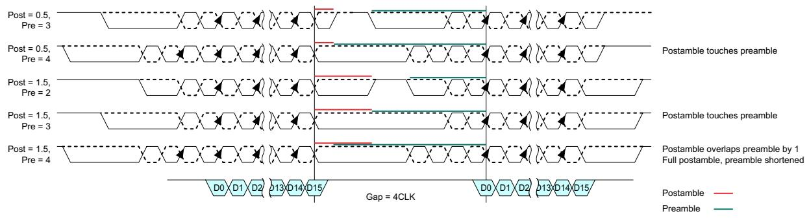

flowchart

```mermaid
graph TD
    A["Post = 0.5, Pre = 3"] --> B["Time Pulse"]
    C["Post = 0.5, Pre = 4"] --> D["Time Pulse"]
    E["Post = 1.5, Pre = 2"] --> F["Time Pulse"]
    G["Post = 1.5, Pre = 3"] --> H["Time Pulse"]
    I["Post = 1.5, Pre = 4"] --> J["Time Pulse"]
    K["Post = 0.5, Pre = 3"] --> L["Time Pulse"]
    M["Post = 0.5, Pre = 4"] --> N["Time Pulse"]
    O["Post = 1.5, Pre = 2"] --> P["Time Pulse"]
    Q["Post = 1.5, Pre = 3"] --> R["Time Pulse"]
    S["Post = 1.5, Pre = 4"] --> T["Time Pulse"]
    U["Post = 0.5, Pre = 3"] --> V["Time Pulse"]
    W["Post = 0.5, Pre = 4"] --> X["Time Pulse"]
    Y["Post = 1.5, Pre = 2"] --> Z["Time Pulse"]
    AA["Post = 1.5, Pre = 3"] --> AB["Time Pulse"]
    AC["Post = 1.5, Pre = 4"] --> AD["Time Pulse"]
    AE["Post = 0.5, Pre = 3"] --> AF["Time Pulse"]
    AG["Post = 0.5, Pre = 4"] --> AH["Time Pulse"]
    AI["Post = 1.5, Pre = 2"] --> AJ["Time Pulse"]
    AK["Post = 1.5, Pre = 3"] --> AL["Time Pulse"]
    AM["Post = 1.5, Pre = 4"] --> AN["Time Pulse"]
    AO["Post = 0.5, Pre = 3"] --> AP["Time Pulse"]
    AQ["Post = 0.5, Pre = 4"] --> AR["Time Pulse"]
    AS["Post = 1.5, Pre = 2"] --> AT["Time Pulse"]
    AU["Post = 1.5, Pre = 3"] --> AV["Time Pulse"]
    AW["Post = 1.5, Pre = 4"] --> AX["Time Pulse"]
    AY["Post = 0.5, Pre = 3"] --> AZ["Time Pulse"]
    BA["Post = 0.5, Pre = 4"] --> BB["Time Pulse"]
    BC["Post = 1.5, Pre = 2"] --> BD["Time Pulse"]
    BE["Post = 1.5, Pre = 3"] --> BF["Time Pulse"]
    BG["Post = 1.5, Pre = 4"] --> BH["Time Pulse"]
    BI["Post = 0.5, Pre = 3"] --> BJ["Time Pulse"]
    BK["Post = 0.5, Pre = 4"] --> BL["Time Pulse"]
    BM["Post = 1.5, Pre = 2"] --> BN["Time Pulse"]
    BO["Post = 1.5, Pre = 3"] --> BP["Time Pulse"]
    BQ["Post = 1.5, Pre = 4"] --> BR["Time Pulse"]
    BS["D0 D1 D2 D3 D4 D5"] --> BT["D0 D1 D2 D3 D4 D5"]
    BU["D0 D1 D2 D3 D4 D5"] --> BV["D0 D1 D2 D3 D4 D5"]
    BW["D0 D1 D2 D3 D4 D5"] --> BX["D0 D1 D2 D3 D4 D5"]
    BY["D0 D1 D2 D3 D4 D5"] --> BZ["D0 D1 D2 D3 D4 D5"]
```

Figure 33 — Example of Consecutive Writes Operation: tCCD=Min+4

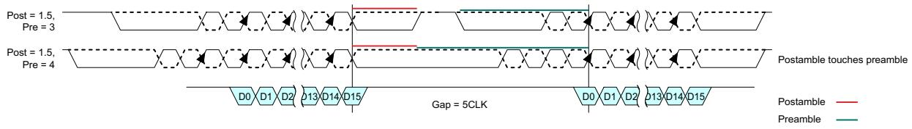

flowchart

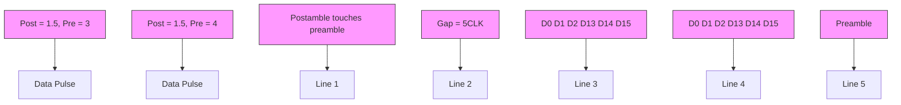
```mermaid
graph TD
    A["Post = 1.5, Pre = 3"] --> B["Data Pulse"]
    C["Post = 1.5, Pre = 4"] --> D["Data Pulse"]
    E["Postamble touches preamble"] --> F["Line 1"]
    G["Gap = 5CLK"] --> H["Line 2"]
    I["D0 D1 D2 D13 D14 D15"] --> J["Line 3"]
    K["D0 D1 D2 D13 D14 D15"] --> L["Line 4"]
    M["Preamble"] --> N["Line 5"]
    style A fill:#f9f,stroke:#333
    style C fill:#f9f,stroke:#333
    style E fill:#f9f,stroke:#333
    style G fill:#f9f,stroke:#333
    style I fill:#f9f,stroke:#333
    style K fill:#f9f,stroke:#333
    style M fill:#f9f,stroke:#333
```

Figure 34 — Example of Consecutive Writes Operation: tCCD=Min+5

# 4.6 Activate Command

The ACTIVATE command is used to open (or activate) a row in a particular bank for a subsequent access. The value on the BG[2:0] in X4/8 and BG[1:0] in X16 select the bankgroup; BA[1:0] inputs selects the bank within the bankgroup, and the address provided on the appropriate CA pins for R[17:0] to select the row (see Table 40 below). In the case of a 3DS DDR5 SDRAM device, the CID[3:0] shall also be selected to identify the correct die in the stack. This row remains active (or open) for accesses until a precharge command is issued to that bank or a precharge all command is issued. A bank must be precharged before opening a different row in the same bank.

Bank-to-bank command timing for ACTIVATE commands uses two different timing parameters, depending on whether the banks are in the same or different bank group. tRRD\_S (short) is used for timing between banks located in different bank groups. tRRD\_L (long) is used for timing between banks located in the same bank group. Consecutive ACTIVATE commands, allowed to be issued at tRRDmin, are restricted to a maximum of four within the time period tFAW (four activate window).

Table 40 — Activate Command (for Reference) 

<table><tr><td rowspan="2">Function</td><td rowspan="2">Abbreviation</td><td rowspan="2">CS_n</td><td colspan="14">CA Pins</td><td rowspan="2">NOTES</td></tr><tr><td>CA0</td><td>CA1</td><td>CA2</td><td>CA3</td><td>CA4</td><td>CA5</td><td>CA6</td><td>CA7</td><td>CA8</td><td>CA9</td><td>CA10</td><td>CA11</td><td>CA12</td><td>CA13</td></tr><tr><td rowspan="2">Activate</td><td rowspan="2">ACT</td><td>L</td><td>L</td><td>L</td><td>R0</td><td>R1</td><td>R2</td><td>R3</td><td>BA0</td><td>BA1</td><td>BG0</td><td>BG1</td><td>BG2</td><td>CID0</td><td>CID1</td><td>CID2</td><td rowspan="2">1</td></tr><tr><td>H</td><td>R4</td><td>R5</td><td>R6</td><td>R7</td><td>R8</td><td>R9</td><td>R10</td><td>R11</td><td>R12</td><td>R13</td><td>R14</td><td>R15</td><td>R16</td><td>CID3/R17</td></tr><tr><td colspan="18">NOTE 1 See Command Truth Table for details</td></tr></table>

# 4.6.1 Non-Binary Density Considerations

An ACT command with row address inputs which violate the 'MSB address bit “HIGH”, MSB-1 address bit “LOW”' non-binary density address restriction shall follow all timing and protocol rules as though the ACT were valid.

Any RD or RDA command following an ACT to the invalid address space within the same bank shall drive the DQS strobes with normal timing but shall not output data on the DQs that can be used to learn about data stored in cells with valid addresses. DQ data that coincidentally matches cell array data is permissible (for example: always sending the all 1s and cell data sometimes being all 1s). Consistently exposing data from a previous read or previous activate is not permissible.

Any WR, WRA, WRP or WRPA command following an ACT to the invalid address space within the same bank shall not result in new databeing written anywhere within the DRAM.

The DRAM will operate normally for Read and Write commands to banks which have pages open for valid rows.

# 4.7 Read Operation

The Read Operation causes the DRAM to retrieve and output data stored in its array. The Read Operation is initiated by the Read Command during which the beginning column address and bank/group address for the data to be retrieved from the array is provided. The data is driven by the DRAM on its DQ pins RL (CL) cycles after the Read Command along with the proper waveform on the DQS inputs. Read Latency (RL or CL) is defined from the Read command to data and is not affected by the Read DQS offset timing (MR40 OP[2:0]).

# 4.7.1 READ Burst Operation

During a READ or WRITE command, DDR5 shall support BC8, BL16, BL32 (optional) and BL32 OTF (optional) during the READ or WRITE. MR0[1:0] is used to select burst operation mode.

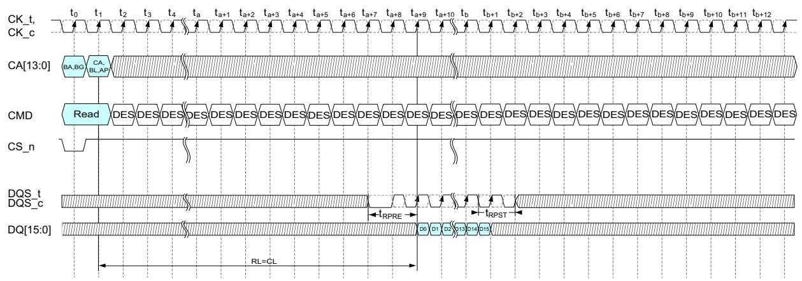

text_image

CK_t,
CK_c
t0 t1 t2 t3 t4 ta ta+1 ta+2 ta+3 ta+4 ta+5 ta+6 ta+7 ta+8 ta+9 ta+10 tb tb+1 tb+2 tb+3 tb+4 tb+5 tb+6 tb+7 tb+8 tb+9 tb+10 tb+11 tb+12
CA[13:0]
BA_BO CA
BL_AP
CMD Read DES DES DES DES DES DES DES DES DES DES DES DES DES DES DES DES DES DES DES DES DES DES DES DES DES DES DES DES DES DES DES DES DES DES DES DES DES DES DES DES DES DES DES DES DES DES DES DES DES DES DES DES DES DES DES DES DES DES DES DES DES DES DES DES DES DES DES DES DES DES DES DES DES DES DES DES DES DES DES DES DES DES DES DES DES DES DES DES DES DES DES DES DES DES DES DES DES DES DES DES DE
CS_n
DQS_t
DQS_c
DQ[15:0]
tRPRE tRPST
DL D0 D1 D2 D3 D4 D5
RL=CL

NOTES:

1. BL=16, Preamble = 2tCK - 0010 Pattern Preamble, 1.5tCK Postamble

2. DES commands are shown for ease of illustration; other commands may be valid at these times.

3. In this example, Read DQS Offset Timing is set to 0 Clocks.

Figure 35 — READ Burst Operation (BL16)   
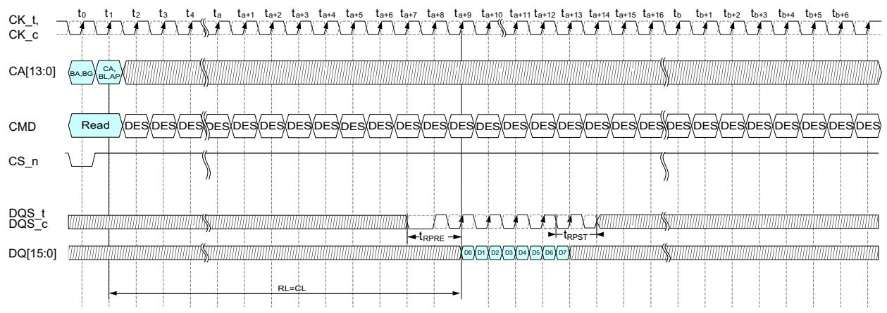

text_image

CK_t,
CK_c
t0 t1 t2 t3 t4 ta ta+1 ta+2 ta+3 ta+4 ta+5 ta+6 ta+7 ta+8 ta+9 ta+10 ta+11 ta+12 ta+13 ta+14 ta+15 ta+16 tb tb+1 tb+2 tb+3 tb+4 tb+5 tb+6
CA[13:0]
BA_BO CA_
BL_AP
CMD Read DES DES DES DES DES DES DES DES DES DES DES DES DES DES DES DES DES DES DES DES DES DES DES DES DES DES DES DES DES DES DES DES DES DES DES DES DES DES DES DES DES DES DES DES DES DES DES DES DES DES DES DES DES DES DES DES DES DES DES DES DES DES DES DES DES DES DES DES DES DES DES DES DES DES DES DES DES DES DES DES DES DES DES DES DES DES DES DES DES DES DES DES DES DES DES DES DES DES DES DES DE
CS_n
DQS_t
DQS_c
DQ[15:0]
tRPRE
D0 D1 D2 D3 D4 D5 D6 D7
RL=CL

NOTES:

1. BC=8, Preamble = 2tCK - 0010 Pattern Preamble, 1.5tCK Postamble

2. DES commands are shown for ease of illustration; other commands may be valid at these times.

3. In this example, Read DQS Offset Timing is set to 0 Clocks

4. In non-CRC mode, DQS\_t and DQS\_c stop toggling at the completion of the BC8 data bursts, plus the postamble.

Figure 36 — Read Burst Operation (BC8)

# 4.7.1 READ Burst Operation (cont’d)

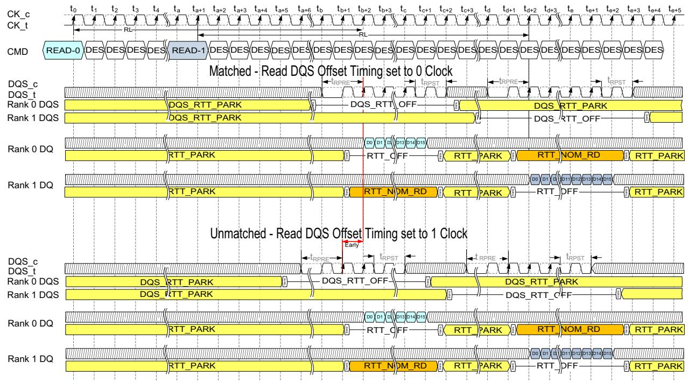

text_image

CK_c
CK_t
CMD READ-0 DES DES DES READ-1 DES DES DES DES DES DES DES DES DES DES DES DES DES DES DES DES DES DES DES DES DES DES DES DES DES DES DES DES DES DES DES DES DES DES DES DES DES DES DES DES DES DES DES DES DES DES DES DES DES DES DES DES DES DES DES DES DES DES DES DES DES DES DES DES DES DES DES DES DES DES DES DES DES DES DES DES DES DES DES DES DES DES DES DES DES DES DES DES DES DES DES DES DES DES DES DES DES DES DES DES DE
Matched - Read DQS Offset Timing set to 0 Clock
DQS_c
DQS_t
Rank 0 DQS
Rank 1 DQS
DQS_RTT_PARK
DQS_RTT_PARK
DQS_RTT_OFF
DQS_RTT_PARK
DQS_RTT_OFF
DQS_RTT_OFF
DQS_RTT_OFF
DQS_RTT_OFF
RTT_PARK
RTT_OFF
RTT_PARK
RTT_NOM_RD
RTT_PARK
RTT_OFF
RTT_PARK
RTT_NOM_RD
RTT_PARK
RTT_OFF
RTT_PARK
RTT_NOM_RD
RTT_PARK
RTT_OFF
RTT_PARK
RTT_NOM_RD
RTT_PARK
RTT_OFF
RTT_PARK
RTT_NOM_RD
RTT_PARK
RTT_OFF
RTT_PARK
RTT_NOM RD
RTT_PARK
RTT_NOM_RD
RTT_PARK
RTT_NOM_RD
RTT_PARK
RTT_NOM_RD
RTT_PARK
RTT_NOM_RD
RTT_PARK
RTT_NOM_RD
RTT_PARK
RTT_NOM_RD
RTT_PARK
RTT_NOM_RD
RTT_PARK
RTT_NOM_RD
RTT_PARK
RTT_NOM_RD
RTT_PARK
RTT_NOM_RD

NOTES:

1. BL=16, Preamble = 2tCK - 0010 Pattern Preamble, 1.5tCK Postamble

2. DES commands are shown for ease of illustration; other commands may be valid at these times.

3. Two different examples are shown side by side, the top with the default setting for Read DQS Offset = 0 Clock, the lower with a 1 Clock setting. In the lower case, the DQS is started 1 clock earlier than normal with respect to RL (CL).

4. In both cases, the Data does not move

Figure 37 — READ to READ, Different Ranks Operation with Read DQS Offset Usage (BL16)

# 4.7.2 Burst Read Operation Followed by a Precharge

The minimum external Read command to Precharge command spacing to the same bank is equal to tRTP with tRTP being the Internal Read Command to Precharge Command Delay. Note that the minimum ACT to PRE timing, tRAS, must be satisfied as well. The minimum value for the Internal Read Command to Precharge Command Delay is given by tRTP.min. A new bank active command may be issued to the same bank if the following two conditions are satisfied simultaneously:

1. The minimum RAS precharge time (tRP.MIN) has been satisfied from the clock at which the precharge begins.   
2. The minimum RAS cycle time (tRC.MIN) from the previous bank activation has been satisfied.

Examples of Read commands followed by Precharge are shown in Figure 38 and Figure 39.

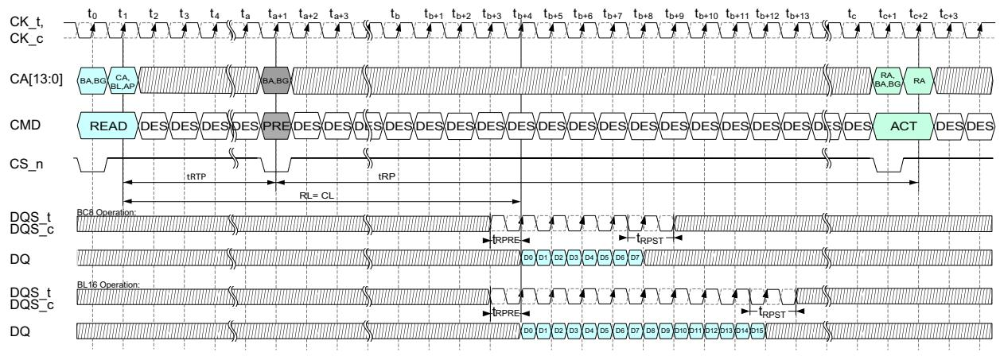

text_image

CK_t,
CK_c
t0 t1 t2 t3 t4 ta ta+1 ta+2 ta+3 tb tb+1 tb+2 tb+3 tb+4 tb+5 tb+6 tb+7 tb+8 tb+9 tb+10 tb+11 tb+12 tb+13 tc tc+1 tc+2 tc+3
CA[13:0]
BA.BG CA.
BL.AP
BA.BG
RA.
BA.BG RA
CMD READ DES DES DES PRE DES DES DES DES DES DES DES DES DES DES DES DES DES DES DES DES DES DES DES DES DES DES DES DES DES DES DES DES DES DES DES DES DES DES DES DES DES DES DES DES DES DES DES DES DES DES DES DES DES DES DES DES DES DES DES DES DES DES DES DES DES DES DES DES DES DES DES DES DES DES DES DES DES DES DES DES DES DES DES DES DES DES DES DES DES DES DES DES DES DES DES DES DES DES DES DES DES DES DES DES DE
ACT DES DES
CS_n
tRTP
tRP
RL=CL
DQS_t BC4 Operation
DQS_c
DQ
DQS_t BL16 Operation:
DQS_c
DQ
DQ D0 D1 D2 D3 D4 D5 D6 D7
D0 D1 D2 D3 D4 D5 D6 D7 D8 D9 E10 E11 E12 E13 E14 E15
D0 D1 D2 D3 D4 D5 D6 D7 D8 D9 E10 E11 E12 E13 E14 E15

# NOTES:

1. BL = 16, 1tCK Preamble, 1.5tCK Postamble   
2. DES commands are shown for ease of illustration; other commands may be valid at these times.   
3. The example assumes tRAS. MIN is satisfied at Precharge command time(ta+1) and that tRC. MIN is satisfied at the next Active command time(tc+2).

Figure 38 — READ to PRECHARGE with 1tCK Preamble   
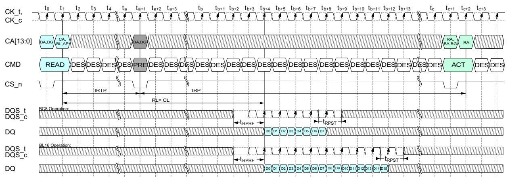

text_image

CK_t,
CK_c
t0 t1 t2 t3 t4 ta ta+1 ta+2 ta+3 tb tb+1 tb+2 tb+3 tb+4 tb+5 tb+6 tb+7 tb+8 tb+9 tb+10 tb+11 tb+12 tb+13 tc tc+1 tc+2 tc+3
CA[13:0]
BA.BG CA.
BL.AP
BA.BG
RA
BA.BG RA
CMD
READ DES DES DES PRE DES DES DES DES DES DES DES DES DES DES DES DES DES DES DES DES DES DES DES DES DES DES DES DES DES DES DES DES DES DES DES DES DES DES DES DES DES DES DES DES DES DES DES DES DES DES DES DES DES DES DES DES DES DES DES DES DES DES DES DES DES DES DES DES DES DES DES DES DES DES DES DES DES DES DES DES DES DES DES DES DES DES DES DES DES DES DES DES DES DES DES DES DES DES DES DES DES DES DES DES DE
ACT DES DES
CS_n
tRTP
tRP
RL=CL
DQS_t
BC8 Operation:
DQS_c
tRPRE
tRPST
DQ
DQ
BL16 Operation:
DQS_t
DQS_c
tRPRE
tRPST
DQ
DQ
tRPRE
tRPST

# NOTES:

1. BL = 16, 2tCK - 0010 Pattern Preamble, 1.5tCK Postamble,   
2. DES commands are shown for ease of illustration; other commands may be valid at these times.   
3. The example assumes tRAS. MIN is satisfied at Precharge command time(ta+1) and that tRC. MIN is satisfied at the next Active command time(tc+2).

Figure 39 — READ to PRECHARGE with 2tCK Preamble

# 4.7.2.1 CLK to Read DQS Timing Parameters

Following parameters shall be defined for CK to read DQS timings.

Table 41 — CLK to Read DQS Timing Parameters DDR5-3200 to DDR5-4800 

<table><tr><td colspan="2">Speed</td><td colspan="2">DDR5-3200</td><td colspan="2">DDR5-3600</td><td colspan="2">DDR5-4000</td><td colspan="2">DDR5-4400</td><td colspan="2">DDR5-4800</td><td rowspan="2">Units</td><td rowspan="2">NOTE</td></tr><tr><td>Parameter</td><td>Symbol</td><td>Min</td><td>Max</td><td>Min</td><td>Max</td><td>Min</td><td>Max</td><td>Min</td><td>Max</td><td>Min</td><td>Max</td></tr><tr><td>DQS_t, DQS_c rising edge output timing location from rising CK_t, CK_c</td><td>tDQSCK</td><td>-0.240</td><td>0.240</td><td>-0.252</td><td>0.252</td><td>-0.270</td><td>0.270</td><td>-0.286</td><td>0.286</td><td>-0.300</td><td>0.300</td><td>tCK</td><td>1, 4, 5</td></tr><tr><td>DQS_t, DQS_c rising edge output variance window</td><td>tDQSCKi</td><td>-</td><td>0.410</td><td>-</td><td>0.430</td><td>-</td><td>0.460</td><td>-</td><td>0.475</td><td>-</td><td>0.490</td><td>tCK</td><td>2, 3, 4, 5, 6</td></tr><tr><td colspan="14">NOTE 1 Measured over full VDD and Temperature spec ranges.NOTE 2 Measured for a given DRAM part, and for each DQS_t/DQS_c pair in case of x16 (part variation is excluded).NOTE 3 These parameters are verified by design and characterization, and may not be subject to production test.NOTE 4 Assume no jitter on input clock signals to the DRAM.NOTE 5 Refer to Section 4.7.1 READ Timing Definitions.NOTE 6 Measured at a fixed and constant VDD and Temperature condition.</td></tr></table>

Table 42 — CLK to Read DQS Timing Parameters DDR5-5200 to DDR5-6800 

<table><tr><td colspan="2">Speed</td><td colspan="2">DDR5-5200</td><td colspan="2">DDR5-5600</td><td colspan="2">DDR5-6000</td><td colspan="2">DDR5-6400</td><td colspan="2">DDR5-6800</td><td rowspan="2">Units</td><td rowspan="2">NOTE</td></tr><tr><td>Parameter</td><td>Symbol</td><td>Min</td><td>Max</td><td>Min</td><td>Max</td><td>Min</td><td>Max</td><td>Min</td><td>Max</td><td>Min</td><td>Max</td></tr><tr><td>DQS_t, DQS_c rising edge output timing location from rising CK_t, CK_c</td><td>tDQSCK</td><td>-0.313</td><td>0.313</td><td>-0.325</td><td>0.325</td><td>-0.337</td><td>0.337</td><td>-0.348</td><td>0.348</td><td>-0.359</td><td>0.359</td><td>tCK</td><td>1, 4, 5</td></tr><tr><td>DQS_t, DQS_c rising edge output variance window</td><td>tDQSCKi</td><td>-</td><td>0.510</td><td>-</td><td>0.530</td><td>-</td><td>0.549</td><td>-</td><td>0.567</td><td>-</td><td>0.585</td><td>tCK</td><td>2, 3, 4, 5, 6</td></tr><tr><td colspan="14">NOTE 1 Measured over full VDD and Temperature spec ranges.NOTE 2 Measured for a given DRAM part, and for each DQS_t/DQS_c pair in case of x16 (part variation is excluded).NOTE 3 These parameters are verified by design and characterization, and may not be subject to production test.NOTE 4 Assume no jitter on input clock signals to the DRAM.NOTE 5 Refer to Section 4.7.1 READ Timing Definitions.NOTE 6 Measured at a fixed and constant VDD and Temperature condition.</td></tr></table>

Table 43 — CLK to Read DQS Timing Parameters DDR5-7200 to DDR5-8800 

<table><tr><td colspan="2">Speed</td><td colspan="2">DDR5-7200</td><td colspan="2">DDR5-7600</td><td colspan="2">DDR5-8000</td><td colspan="2">DDR5-8400</td><td colspan="2">DDR5-8800</td><td rowspan="2">Units</td><td rowspan="2">NOTE</td></tr><tr><td>Parameter</td><td>Symbol</td><td>Min</td><td>Max</td><td>Min</td><td>Max</td><td>Min</td><td>Max</td><td>Min</td><td>Max</td><td>Min</td><td>Max</td></tr><tr><td>DQS_t, DQS_c rising edge output timing location from rising CK_t, CK_c</td><td>tDQSCK</td><td>-0.370</td><td>0.370</td><td>-0.380</td><td>0.380</td><td>-0.390</td><td>0.390</td><td>-0.400</td><td>0.400</td><td>-0.410</td><td>0.410</td><td>tCK</td><td>1, 4, 5</td></tr><tr><td>DQS_t, DQS_c rising edge output variance window</td><td>tDQSCKi</td><td>-</td><td>0.602</td><td>-</td><td>0.619</td><td>-</td><td>0.635</td><td>-</td><td>0.651</td><td>-</td><td>0.667</td><td>tCK</td><td>2, 3, 4, 5, 6</td></tr><tr><td colspan="14">NOTE 1 Measured over full VDD and Temperature spec ranges.NOTE 2 Measured for a given DRAM part, and for each DQS_t/DQS_c pair in case of x16 (part variation is excluded).NOTE 3 These parameters are verified by design and characterization, and may not be subject to production test.NOTE 4 Assume no jitter on input clock signals to the DRAM.NOTE 5 Refer to Section 4.7.1 READ Timing Definitions.NOTE 6 Measured at a fixed and constant VDD and Temperature condition.</td></tr></table>

# 4.7.2.1 CLK to Read DQS Timing Parameters (cont’d)

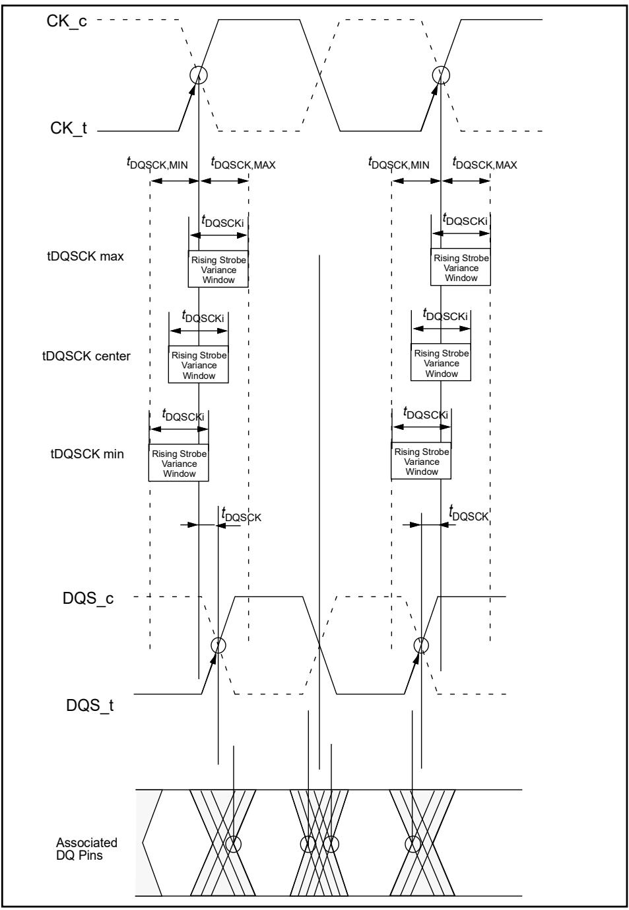

flowchart

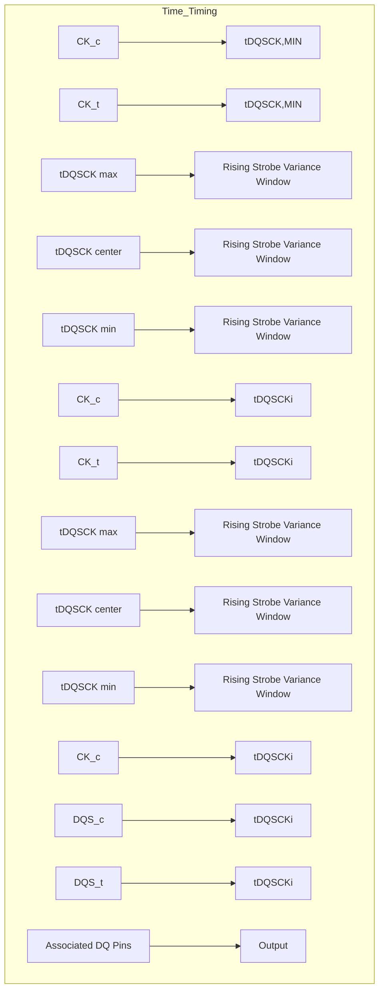
```mermaid
graph TD
    subgraph Time_Timing
        A["CK_c"] --> B["tDQSCK,MIN"]
        C["CK_t"] --> D["tDQSCK,MIN"]
        E["tDQSCK max"] --> F["Rising Strobe Variance Window"]
        G["tDQSCK center"] --> H["Rising Strobe Variance Window"]
        I["tDQSCK min"] --> J["Rising Strobe Variance Window"]
    end
    subgraph Time_Timing
        K["CK_c"] --> L["tDQSCKi"]
        M["CK_t"] --> N["tDQSCKi"]
        O["tDQSCK max"] --> P["Rising Strobe Variance Window"]
        Q["tDQSCK center"] --> R["Rising Strobe Variance Window"]
        S["tDQSCK min"] --> T["Rising Strobe Variance Window"]
    end
    subgraph Time_Timing
        U["CK_c"] --> V["tDQSCKi"]
        W["DQS_c"] --> X["tDQSCKi"]
        Y["DQS_t"] --> Z["tDQSCKi"]
        AA["Associated DQ Pins"] --> AB["Output"]
    end
```

Figure 40 — TDQSCK Timing Definition

# 4.7.3 Read Burst Operation for Optional BL32 Mode

The following read timing diagrams cover read timings for fixed BL32 BL32 in BL32 OTF mode and BL16 in BL32 OTF mode for x4 devices only.

In these read timing diagrams, for clarity of illustration, CK and DQS are shown aligned. As well, DQS and DQ are shown edgealigned. Offset between CK and DQS, and between DQS and DQ may be appropriate.

A dummy CAS command is required for second half of the transfer of BL32. If non-target ODT is needed in the system then a dummy ODT command must be issued to the non-target rank for second half of the transfer of BL32.

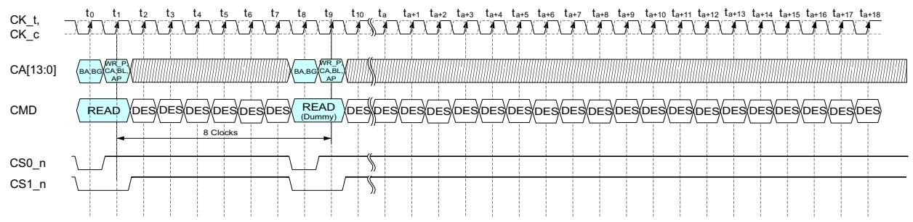

text_image

CK_t,
CK_c
t0 t1 t2 t3 t4 t5 t6 t7 t8 t9 t10 ta ta+1 ta+2 ta+3 ta+4 ta+5 ta+6 ta+7 ta+8 ta+9 ta+10 ta+11 ta+12 ta+13 ta+14 ta+15 ta+16 ta+17 ta+18
CA[13:0]
BA,BG WR_P
CA,BL
AP
BA,BG WR_P
CA,BL
AP
CMD
READ DES/DES/DES/DES/DES READ
(Dummy) DES/DES/DES/DES/DES/DES/DES/DES/DES/DES/DES/DES/DES/DES/DES/DES/DES/DES/DES/DES/DES/DES/DES/DES/DES/DES/DES/DES/DES/DES/DES/DES/DES/DES/DES/DES/DES/DES/DES/DES/DES/DES/DES/DES/DES/DES/DES/DES/DES/DES/DES/Des
8 Clocks
CS0_n
CS1_n

# NOTES:

1. DES commands are shown for ease of illustration; other commands may be valid at these times.   
2. A dummy RD command is required for the second half of the transfer with a delay of 8 clocks from the first RD command.   
3. The figure also shows a dummy ODT command being issued to non-target rank 1 for the second half of the transfer.   
4. C10 is used for burst ordering and can be LOW or HIGH for the first RD command. C10 for the dummy RD command must be the opposite value from the first RD command.   
5. DDR5 DRAM supports an optional fixed BL32 mode and optional BL32 OTF (On the fly) mode for x4 devices only.   
6. CA bits other than C10 and AP in dummy CAS command are the same as the first CAS command.

Figure 41 — Read Timing for fixed BL32 and BL32 in BL32 OTF Mode   
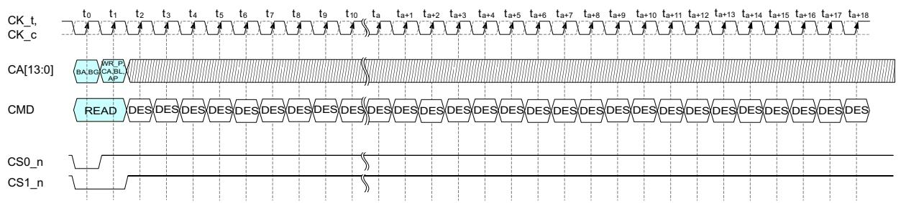

text_image

CK_t,
CK_c
t0 t1 t2 t3 t4 t5 t6 t7 t8 t9 t10 ta ta+1 ta+2 ta+3 ta+4 ta+5 ta+6 ta+7 ta+8 ta+9 ta+10 ta+11 ta+12 ta+13 ta+14 ta+15 ta+16 ta+17 ta+18
CA[13:0]
BA,BG AIR P
CA,BL
AP
CMD
READ DES DES DES DES DES DES DES DES DES DES DES DES DES DES DES DES DES DES DES DES DES DES DES DES DES DES DES DES DES DES DES DES DES DES DES DES DES DES DES DES DES DES DES DES DES DES DES DES DES DES DES DES DES DES DES DES DES DES DES DES DES DES DES DES DES DES DES DES DES DES DES DES DES DES DES DES DES DES DES DES DES DES DES DES DES DES DES DES DES DES DES DES DES DES DES DES DES DES DES DES DEDES
CS0_n
CS1_n

# NOTES:

1. Figure shows BL16 read operation when MR0 is programmed to use BL32 OTF mode. In this case, no dummy RD command is required as transfer size is BL16.   
2. DES commands are shown for ease of illustration; other commands may be valid at these times including commands to allow data transfer from the same die after transfer of BL16.   
3. DDR5 DRAM supports an optional fixed BL32 mode and optional BL32 OTF (On the fly) mode for x4 devices only.

Figure 42 — Read Timings for BL16 in BL32 OTF Mode

# 4.7.3 Read Burst Operation for Optional BL32 Mode (cont’d)

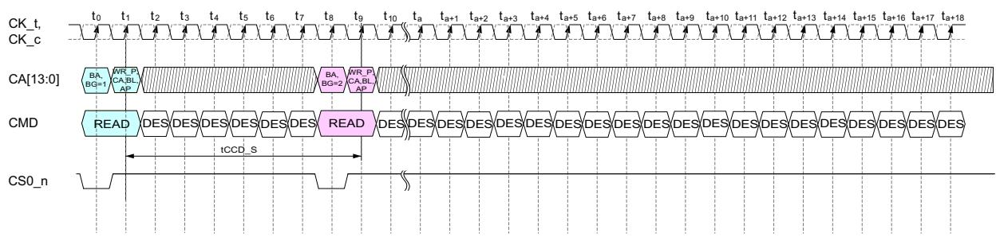

text_image

CK_t,
CK_c
t0 t1 t2 t3 t4 t5 t6 t7 t8 t9 t10 t11 t12 t13 t14 t15 t16 t17 t18
CA[13:0]
BA BG=1 WR_P CA_BL AP
BA BG=2 WR_P CA_BL AP
CMD
READ DES DES DES DES DES DES DES DES DES DES DES DES DES DES DES DES DES DES DES DES DES DES DES DES DES DES DES DES DES DES DES DES DES DES DES DES DES DES DES DES DES DES DES DES DES DES DES DES DES DES DES DES DES DES DES DES DES DES DES DES DES DES DES DES DES DES DES DES DES DES DES DES DES DES DES DES DES DES DES DES DES DES DES DES DES DES DES DES DES DES DES DES DES DES DES DES DES DES DES DES DE
tCCD_S
CS0_n

NOTES:   
1. Figure shows back to back BL16 writes to different bank groups.   
2. DDR5 DRAM supports an optional fixed BL32 mode and optional BL32 OTF (On the fly) mode for x4 devices only.

Figure 43 — Read to Read to Different Bank Group for BL16 in BL32 OTF   
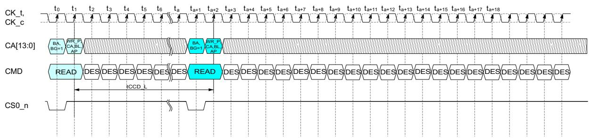

text_image

CK_t,
CK_c
t0 t1 t2 t3 t4 t5 t6 ta ta+1 ta+2 ta+3 ta+4 ta+5 ta+6 ta+7 ta+8 ta+9 ta+10 ta+11 ta+12 ta+13 ta+14 ta+15 ta+16 ta+17 ta+18
CA[13:0]
BA
BG=1 WR_P
CA_BL
AP
BA
BG=1 WR_P
CA_BL
AP
CMD
READ DES DES DES DES DES DES DES DES DES DES DES DES DES DES DES DES DES DES DES DES DES DES DES DES DES DES DES DES DES DES DES DES DES DES DES DES DES DES DES DES DES DES DES DES DES DES DES DES DES DES DES DES DES DES DES DES DES DES DES DES DES DES DES DES DES DES DES DES DES DES DES DES DES DES DES DES DES DES DES DES DES DES DES DES DES DES DES DES DES DES DES DES DES DES DES DES DES DES DES DES DEDES
tCCD_L
CSO_n

NOTES::   
1. Figure shows back to back BL16 reads to same bank group using a timing of tCCD\_L.   
2. DDR5 DRAM supports an optional fixed BL32 mode and optional BL32 OTF (On the fly) mode for x4 devices only.

Figure 44 — Read to Read to Same Bank Group for BL16 in BL32 OTF   
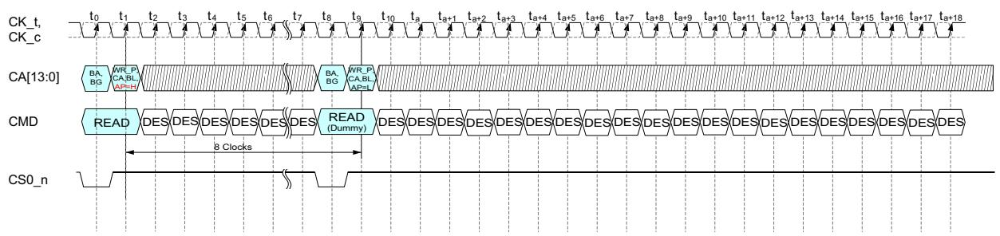

text_image

CK_t,
CK_c
CA[13:0]
CMD
CS0_n
t0 t1 t2 t3 t4 t5 t6 t7 t8 t9 t10 t1a ta+1 ta+2 ta+3 ta+4 ta+5 ta+6 ta+7 ta+8 ta+9 ta+10 ta+11 ta+12 ta+13 ta+14 ta+15 ta+16 ta+17 ta+18
BA BG WR_P CA_BL AP=1
BA BG WR_P CA_BL AP=1
READ DES DES DES DES DES READ (Dummy) DES DES DES DES DES DES DES DES DES DES DES DES DES DES DES DES DES DES DES DES DES DES DES DES DES DES DES DES DES DES DES DES DES DES DES DES DES DES DES DES DES DES DES DES DES DES DES DES DES DES DES DES DES DES DES DES DES DES DES DES DES DES DES DES DES DES DES DES DES DES DES DES DES DES DES DES DES DES DES DES DES DES DES DES DES DES DES DES DES DES DES DES DES DES DES DES DES DES DES DES DEDES
8 Clocks

NOTES:   
1. AP bit must be set HIGH for first CAS and LOW for dummy CAS command.   
2. DDR5 DRAM supports an optional fixed BL32 mode and optional BL32 OTF (On the fly) mode for x4 devices only.   
3. CA bits other than C10 and AP in dummy CAS command are the same as the first CAS command.

Figure 45 — Read with Auto-Precharge for Fixed BL32 and BL32 in BL32 OTF Mode

# 4.7.3 Read Burst Operation for Optional BL32 Mode (cont’d)

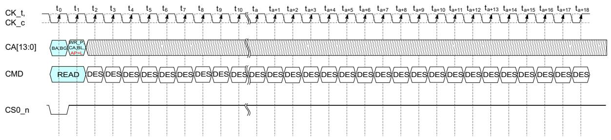

text_image

CK_t,
CK_c
t0 t1 t2 t3 t4 t5 t6 t7 t8 t9 t10 ta ta+1 ta+2 ta+3 ta+4 ta+5 ta+6 ta+7 ta+8 ta+9 ta+10 ta+11 ta+12 ta+13 ta+14 ta+15 ta+16 ta+17 ta+18
CA[13:0]
BA BG
WR_P
CA_BL
AP-L
CMD
READ DES DES DES DES DES DES DES DES DES DES DES DES DES DES DES DES DES DES DES DES DES DES DES DES DES DES DES DES DES DES DES DES DES DES DES DES DES DES DES DES DES DES DES DES DES DES DES DES DES DES DES DES DES DES DES DES DES DES DES DES DES DES DES DES DES DES DES DES DES DES DES DES DES DES DES DES DES DES DES DES DES DES DES DES DES DES DES DES DES DES DES DES DES DES DES DES DES DES DES DES DEDES
CS0_n

# NOTES:

1. AP bit must be set to LOW with the CAS command.   
2. DDR5 DRAM supports an optional fixed BL32 mode and optional BL32 OTF (On the fly) mode for x4 devices only.

Figure 46 — Read with Auto-Precharge for BL16 in BL32 OTF Mode

# 4.7.4 Read and Write Command Interval

Table 44 — Minimum Read and Write Command Timings 

<table><tr><td>Bank Group</td><td>Timing Parameter</td><td>DDR5-3200 ~ 8800</td><td>Units</td><td>Notes</td></tr><tr><td rowspan="3">same</td><td>Minimum Read to Write</td><td>tCCD_L_RTW</td><td></td><td>1, 3, 4</td></tr><tr><td>Minimum Write to Read</td><td>tCCD_L_WTR</td><td></td><td>2, 4</td></tr><tr><td>Minimum Write to Read AP, same bank</td><td>tCCD_WTRA</td><td></td><td>2, 4</td></tr><tr><td rowspan="2">different</td><td>Minimum Read to Write</td><td>tCCD_S_RTW</td><td></td><td>1, 3, 4</td></tr><tr><td>Minimum Write to Read</td><td>tCCD_S_WTR</td><td></td><td>2, 4</td></tr><tr><td colspan="5">NOTE 1 RBL: Read burst length associated with Read commandRBL = 32 (36 w/ RCRC on) for fixed BL32 and BL32 in BL32 OTF modeRBL = 16 (18 w/ RCRC on) for fixed BL16 and BL16 in BL32 OTF modeRBL = 16 (18 w/ RCRC on) for BL16 in BC8 OTF mode and BC8 in BC8 OTF mode</td></tr><tr><td colspan="5">NOTE 2 WBL: Write burst length associated with Write commandWBL = 32 (36 w/ WCRC on) for fixed BL32 and BL32 in BL32 OTF modeWBL = 16 (18 w/ WCRC on) for fixed BL16 and BL16 in BL32 OTF modeWBL = 16 (18 w/ WCRC on) for BL16 in BC8 OTF mode and BC8 in BC8 OTF mode</td></tr><tr><td colspan="5">NOTE 3 The following is considered for tRTW equation1tCK needs to be added due to tDQS2CKRead DQS offset timing can pull in the tRTW timing1tCK needs to be added when 1.5tCK postamble</td></tr><tr><td colspan="5">NOTE 4 CWL=CL-2</td></tr></table>

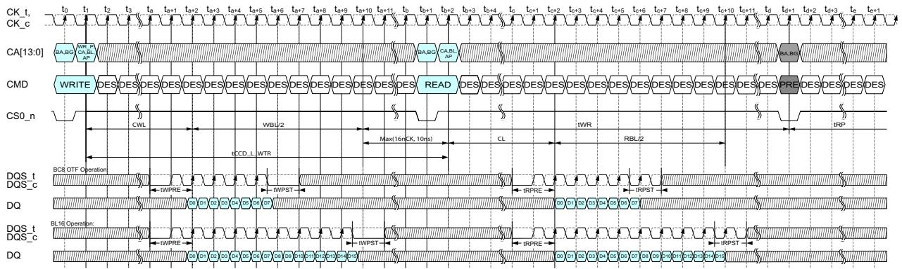

text_image

CK_t,
CK_c
CA[13:0]
CMD
CS0_n
DQS_t
DQS_c
DQ
DQS_t
DQS_c
tWR
RBL/2
CL
tWR
RBP
tRP
tCCD_L_WTR
tWPRE
WPST
tWPRE
tWPRE
tWPRE
tWPRE
tWPRE
tWPRE
tWPRE
tWPRE
tWPRE
tWPRE
tWPRE
tWPRE
tWPRE
tWPRE
tWPRE
tWPRE
tWPRE
tWPRE
tWPRE
tWPRE
tWPRE
tWPRE
tWPRE
tWPRE
tWPRE
tWPREC
tWPREC
tWPREC
tWPREC
tWPREC
tWPREC
tWPREC
tWPREC
tWPREC
tWPREC
tWPREC
tWPREC
tWPREC
tWPREC
tWPREC
tWPREC
tWPREC
tWPREC
tWPREC
tWPREC
tWPREC
tWPREC
tWPREC
tWPREC
tWPREC
tWINC
tWINC
tWINC
tWINC
tWINC
tWINC
tWINC
tWINC
tWINC
tWINC
tWINC
tWINC
tWINC
tWINC
tWINC
tWINC
tWINC
tWINC
tWINC
tWINC
tWINC
tWINC
tWINC
tWINC
tWINC
tWNC
tWNC
tWNC
tWNC
tWNC
tWNC
tWNC
tWNC
tWNC
tWNC
tWNC
tWNC
tWNC
tWNC
tWNC
tWNC
tWNC
tWNC
tWNC
tWNC
tWNC
tWNC

# NOTES:

1. BC OTF=8 or BL=16, Preamble = 2tCK - 0010 pattern, Postamble = 1.5tCK   
2. DES commands are shown for ease of illustration; other commands may be valid at these times.   
3. The write recovery time (tWR) is referenced from the first rising clock edge after the last write data shown at Ta+10.   
tWR specifies the last burst write cycle until the precharge command can be issued to the same bank.   
4. The DQ signal is shown as “Don’t Care” before the first Write data bit indicating DFE is disabled. When DFE is enabled, the DQ signal shall be high for a minimum of 4UI prior to the first Write data bit for proper DFE synchronization.

Figure 47 — Timing Diagram for Write to Read

# 4.7.4 Read and Write Command Interval (cont’d)

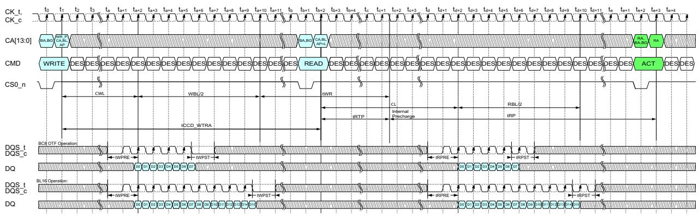

text_image

CK_t
CK_c
CA[13:0]
CMD
CS0_n
DQS_t
DQS_c
DQ
DQS_t
DQS_c
DQ
t0 t1 t2 t3 t4 ta ta-1 ta-2 ta-3 ta-4 ta-5 ta-6 ta-7 ta-8 ta-9 ta-10 ta-11 tb tc-1 tc-2 tc-3 tc-4 tc-1 tc-2 tc-3 tc-4 tc-1 tc-2 tc-3
BA Bog CA.B.O.
WR P
CA.B.O.
WBL/2
ICCD_WTRA
WR
IRTP
CL
Internal
Pacharge
IRP
RBL/2
IRPST
IRPRE
IRPRE
IRPRE
IRPRE
IRPRE
IRPRE
IRPRE
IRPRE
IRPRE
IRPRE
IRPRE
IRPRE
IRPRE
IRPRE
IRPRE
IRPRE
IRPRE
IRPRE
IRPRE
IRPRE
IRPRE
IRPRE
IRPRE
IRPRE
IRPRE
IRPRE
IRPRE
IRPRE
IRPRE
IRPRE
IRPRE
IRPRE
IRPRE
IRPRE

# NOTES:

1. BC OTF=8 or BL=16, Preamble = 2tCK - 0010 pattern, Postamble = 1.5tCK   
2. DES commands are shown for ease of illustration; other commands may be valid at these times.   
3. The write recovery time (tWR) is referenced from the first rising clock edge after the last write data shown at Ta+10. The internal precharge after the Read AutoPrecharge command cannot begin before tWR is satisfied, which is equivalent to tWTRA + tRTP

4. The DQ signal is shown as “Don’t Care” before the first Write data bit indicating DFE is disabled. When DFE is enabled, the DQ signal shall be high for a minimum of 4UI prior to the first Write data bit for proper DFE synchronization.

Figure 48 — Timing Diagram for Write to Read AutoPrecharge in Same Bank

# 4.7.5 Read and Write Command Interval for Optional BL32 Modes

Table 45 — Minimum Read to Read Timings - Same Bank Group 

<table><tr><td rowspan="2">From</td><td colspan="2">To</td><td rowspan="2">Units</td><td rowspan="2">Notes</td></tr><tr><td>BL16 in BL32 OTF Mode</td><td>BL32 in BL32 OTF Mode</td></tr><tr><td>BL16 in BL32 OTF Mode</td><td>tCCD_L</td><td>tCCD_L</td><td></td><td>1</td></tr><tr><td>BL32 in BL32 OTF Mode</td><td>Max(16nCK, 5ns)</td><td>Max(16nCK, 5ns)</td><td></td><td>1</td></tr><tr><td colspan="5">NOTE 1 DDR5 DRAM supports an optional fixed BL32 mode and optional BL32 OTF (On the fly) mode for x4 devices only.</td></tr></table>

Table 46 — Minimum Read to Read Timings - Different Bank Group 

<table><tr><td rowspan="2">From</td><td colspan="2">To</td><td rowspan="2">Units</td><td rowspan="2">Notes</td></tr><tr><td>BL16 in BL32 OTF Mode</td><td>BL32 in BL32 OTF Mode</td></tr><tr><td>BL16 in BL32 OTF Mode</td><td>tCCD_S</td><td>tCCD_S</td><td></td><td>1</td></tr><tr><td>BL32 in BL32 OTF Mode</td><td>2*tCCD_S</td><td>2*tCCD_S</td><td></td><td>1</td></tr><tr><td colspan="5">NOTE 1 DDR5 DRAM supports an optional fixed BL32 mode and optional BL32 OTF (On the fly) mode for x4 devices only.</td></tr></table>

Table 47 — Minimum Write to Write Timings - Same Bank Group 

<table><tr><td rowspan="2">From</td><td colspan="2">To</td><td rowspan="2">Units</td><td rowspan="2">Notes</td></tr><tr><td>BL16 in BL32 OTF Mode</td><td>BL32 in BL32 OTF Mode</td></tr><tr><td>BL16 in BL32 OTF Mode</td><td>tCCD_L_WR</td><td>tCCD_L_WR2</td><td></td><td>1</td></tr><tr><td>BL32 in BL32 OTF Mode</td><td>8nCK+tCCD_L_WR</td><td>9nCK+tCCD_L_WR2</td><td></td><td>1</td></tr><tr><td colspan="5">NOTE 1 DDR5 DRAM supports an optional fixed BL32 mode and optional BL32 OTF (On the fly) mode for x4 devices only.</td></tr></table>

DDR5 x8 and x16 devices will have different write to write same bank group timings, based on whether the second write requires a read-modify-write (RMW), the Burst Length mode of the device set by MR0: OP[1:0], and whether data masking is enabled by MR5:OP[5]. BL16 Partial Writes and BC8 Writes require a RMW on x8/x16 devices. BL16 non-partial writes do not require RMW. See Timing parameters per speed grade for details on parametric timings.

Table 48 — Minimum Write to Write Same Bank Group Timings, x8/x16 Devices 

<table><tr><td rowspan="2">From</td><td colspan="3">To</td><td rowspan="2">Units</td><td rowspan="2">Notes</td></tr><tr><td>BC8</td><td>BL16 Partial Write</td><td>BL16 not Partial Write</td></tr><tr><td>BC8 or BL16</td><td>tCCD_L_WR</td><td>tCCD_L_WR</td><td>tCCD_L_WR2</td><td></td><td></td></tr></table>

Table 49 — Minimum Write to Write Timings - Different Bank Group 

<table><tr><td rowspan="2">From</td><td colspan="2">To</td><td rowspan="2">Units</td><td rowspan="2">Notes</td></tr><tr><td>BL16 in BL32 OTF Mode</td><td>BL32 in BL32 OTF Mode</td></tr><tr><td>BL16 in BL32 OTF Mode</td><td>tCCD_S_WR</td><td>tCCD_S_WR</td><td></td><td>1</td></tr><tr><td>BL32 in BL32 OTF Mode</td><td>2*tCCD_S_WR</td><td>2*tCCD_S_WR</td><td></td><td>1</td></tr><tr><td colspan="5">NOTE 1 DDR5 DRAM supports an optional fixed BL32 mode and optional BL32 OTF (On the fly) mode for x4 devices only.</td></tr></table>

# 4.7.6 Read and Write Command Interval for 3DS

Table 50 — Minimum Read and Write Command Timings for x4 3DS 

<table><tr><td>Logical Rank</td><td>Bank Group</td><td>Parameter Name</td><td>Timing Parameter</td><td>3DS DDR5 3200 ~ 8800</td><td>Units</td><td>Note</td></tr><tr><td rowspan="8">same</td><td rowspan="4">same</td><td>tCCD_L_slr</td><td>Minimum Read to Read</td><td rowspan="12">See Chapter 13, Timing Parameters by Speed Grade for 3DS</td><td>nCK</td><td></td></tr><tr><td>tCCD_L_WR_slr</td><td>Minimum Write to Write</td><td>nCK</td><td></td></tr><tr><td>tCCD_L_RTW_slr</td><td>Minimum Read to Write</td><td>nCK</td><td></td></tr><tr><td>tCCD_L_WTR_slr</td><td>Minimum Write to Read</td><td>nCK</td><td></td></tr><tr><td rowspan="4">different</td><td>tCCD_S_slr</td><td>Minimum Read to Read</td><td>nCK</td><td></td></tr><tr><td>tCCD_S_slr</td><td>Minimum Write to Write</td><td>nCK</td><td></td></tr><tr><td>tCCD_S_RTW_slr</td><td>Minimum Read to Write</td><td>nCK</td><td></td></tr><tr><td>tCCD_S_WTR_slr</td><td>Minimum Write to Read</td><td>nCK</td><td></td></tr><tr><td rowspan="4">different</td><td rowspan="4">same or different</td><td>tCCD_S_dlr</td><td>Minimum Read to Read</td><td>nCK</td><td></td></tr><tr><td>tCCD_S_dlr</td><td>Minimum Write to Write</td><td>nCK</td><td></td></tr><tr><td>tCCD_S_RTW_dlr</td><td>Minimum Read to Write</td><td>nCK</td><td></td></tr><tr><td>tCCD_S_WTR_dlr</td><td>Minimum Write to Read</td><td>nCK</td><td></td></tr></table>

# 4.8 Write Operation

The Write Operation stores data to the DRAM. It is initiated by the Write command during which the beginning column address and bank/group address for the data to be written to the array is provided. The data is provided to the DRAM on the DQ inputs CAS Write Latency (CWL) cycles after the Write command along with the proper waveform on the DQS inputs. CAS Write Latency is defined and measured from final cycle of the Write command to the first effective rising DQS (excluding write preamble).

# 4.8.1 Write Data Mask

One write data mask (DM\_n) pin for each byte data group is supported on x8 and x16 DDR5 SDRAMs. The DM\_n pin/function is enabled via mode register. For the x4 configuration SDRAM, the DM mode register setting must be disabled. The DM\_n pin has identical timings and termination functionality on write operations as the DQ pins, as shown in Figure 43. The DM\_n pin is not used for read cycles and the pin should behave like a DQ pin driving high or be terminated to RTT\_PARK. When the DM function is disabled by MR, the DRAM disables the DM input and output receiver and does not expect nor drive any valid logic level.

Each data mask burst bit position corresponds to the same bit position in the DQ data burst across the corresponding byte group.

The WR\_Partial (WR\_P) = Low as part of the write command must be used in conjunction with the DM\_n data. The WR\_Partial (WR\_P) = Low is to help DRAM start an internal read for 'read modify write' during masked writes. If WR\_Partial (WR\_P) = High during write, then the mask data on DM\_n must be high. If DM is disabled, MR5 OP[5] = 0, WR\_Partial (WR\_P) must be “H”. DM\_n may be high or low.

# 4.8.2 Write Burst Operation

The following write timing diagrams are to help understand the meaning of each write parameter; the diagrams are just examples. The details of each parameter are defined separately.

In these write timing diagrams, for clarity of illustration, CK and DQS are shown aligned. As well, DQS and DQ are shown center-aligned. Offset between CK and DQS, and between DQS and DQ may be appropriate.

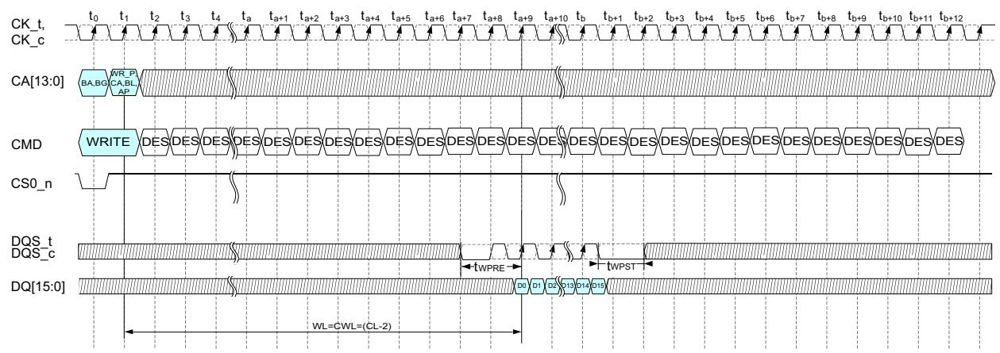

text_image

CK_t,
CK_c
t0 t1 t2 t3 t4 ta ta+1 ta+2 ta+3 ta+4 ta+5 ta+6 ta+7 ta+8 ta+9 ta+10 tb tb+1 tb+2 tb+3 tb+4 tb+5 tb+6 tb+7 tb+8 tb+9 tb+10 tb+11 tb+12
CA[13:0]
WR_P
BA,BG CA,BL
AP
CMD WRITE DES DES DES DES DES DES DES DES DES DES DES DES DES DES DES DES DES DES DES DES DES DES DES DES DES DES DES DES DES DES DES DES DES DES DES DES DES DES DES DES DES DES DES DES DES DES DES DES DES DES DES DES DES DES DES DES DES DES DES DES DES DES DES DES DES DES DES DES DES DES DES DES DES DES DES DES DES DES DES DES DES DES DES DES DES DES DES DES DES DES DES DES DES DES DES DES DES DES DES DES DE
CS0_n
DQS_t
DQS_c
DW[15:0]
DW=CWL=(CL-2)
DWPRE
DWST

# NOTES:

1. BL=16, 2tCK Preamble, 1.5tCK Postamble   
2. DES commands are shown for ease of illustration; other commands may be valid at these times.   
3. The DQ signal is shown as “Don’t Care” before the first Write data bit indicating DFE is disabled. When DFE is enabled, the DQ signal shall be high for a minimum of 4UI prior to the first Write data bit for proper DFE synchronization.

Figure 49 — WRITE Burst Operation (BL16)   
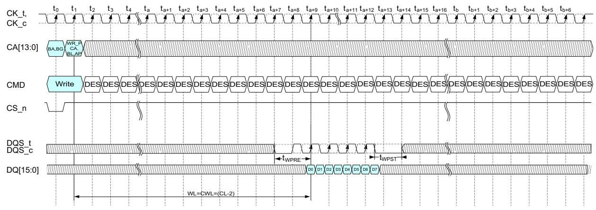

text_image

CK_t,
CK_c
t0 t1 t2 t3 t4 ta ta+1 ta+2 ta+3 ta+4 ta+5 ta+6 ta+7 ta+8 ta+9 ta+10 ta+11 ta+12 ta+13 ta+14 ta+15 ta+16 tb tb+1 tb+2 tb+3 tb+4 tb+5 tb+6
CA[13:0]
BA_BG WR_P
CA,
BL_AP
CMD Write DES DES DES DES DES DES DES DES DES DES DES DES DES DES DES DES DES DES DES DES DES DES DES DES DES DES DES DES DES DES DES DES DES DES DES DES DES DES DES DES DES DES DES DES DES DES DES DES DES DES DES DES DES DES DES DES DES DES DES DES DES DES DES DES DES DES DES DES DES DES DES DES DES DES DES DES DES DES DES DES DES DES DES DES DES DES DES DES DES DES DES DES DES DES DES DES DES DES DES DES DE
CS_n
DQS_t
DQS_c
DQ[15:0]
t_WPRE
t_WPST
WL=CWL=(CL-2)

# NOTES:

1. BC=8, 2tCK Preamble, 1.5tCK Postamble   
2. DES commands are shown for ease of illustration; other commands may be valid at these times.   
3. In non-CRC mode, DQS\_t and DQS\_c stop toggling at the completion of the BC8 data bursts, plus the postamble.   
4. The DQ signal is shown as “Don’t Care” before the first Write data bit indicating DFE is disabled. When DFE is enabled, the DQ signal shall be high for a minimum of 4UI prior to the first Write data bit for proper DFE synchronization.

Figure 50 — Write Burst Operation (BC8)

# 4.8.2 Write Burst Operation (cont’d)

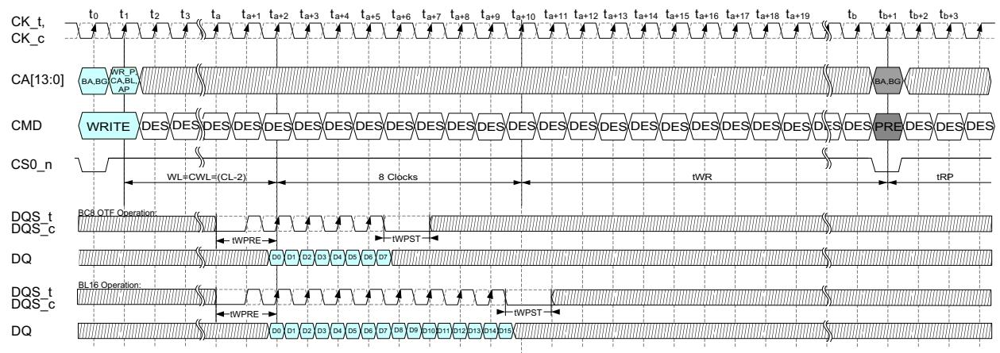

text_image

CK_t,
CK_c
t0 t1 t2 t3 ta ta+1 ta+2 ta+3 ta+4 ta+5 ta+6 ta+7 ta+8 ta+9 ta+10 ta+11 ta+12 ta+13 ta+14 ta+15 ta+16 ta+17 ta+18 ta+19 tb tb+1 tb+2 tb+3
CA[13:0]
BA,BG WR_P
CA,BL
AP
B.A.BG
CMD WRITE DES DES DES DES DES DES DES DES DES DES DES DES DES DES DES DES DES DES DES DES DES DES DES DES DES DES DES DES DES DES DES DES DES DES DES DES DES DES DES DES DES DES DES DES DES DES DES DES DES DES DES DES DES DES DES DES DES DES DES DES DES DES DES DES DES DES DES DES DES DES DES DES DES DES DES DES DES DES DES DES DES DES DES DES DES DES DES DES DES DES DES DES DES DES DES DES DES DES DES DES DEPREDESDESDES
CS0_n
WL=CWL=(CL-2) 8 Clocks tWR tRP
DQS_t BC8 OTF Operation:
DQS_c twPPE DQ D1 D2 D3 D4 D5 D6 D7
DQ BL16 Operation:
DQS_c twPPE DQ D1 D2 D3 D4 D5 D6 D7 D8 D9 D10 D11 D12 D13 D14 D15
DQ

# NOTES:

1. BC=8 or BL=16, Preamble = 2tCK - 0010 pattern, Postamble = 1.5tCK   
2. DES commands are shown for ease of illustration; other commands may be valid at these times.   
3. The write recovery time (tWR) is referenced from the first rising clock edge after the last write data shown at Ta+10   
tWR specifies the last burst write cycle until the precharge command can be issued to the same bank.   
4. The DQ signal is shown as “Don’t Care” before the first Write data bit indicating DFE is disabled. When DFE is enabled, the DQ signal shall be high for a minimum of 4UI prior to the first Write data bit for proper DFE synchronization.

Figure 51 — WRITE (BL16) to PRECHARGE Operation with 2tCK Preamble   
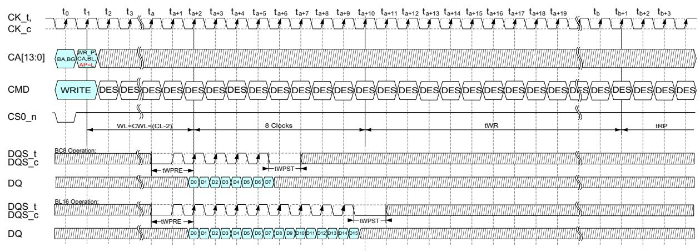

text_image

CK_t,
CK_c
t0 t1 t2 t3 ta ta+1 ta+2 ta+3 ta+4 ta+5 ta+6 ta+7 ta+8 ta+9 ta+10 ta+11 ta+12 ta+13 ta+14 ta+15 ta+16 ta+17 ta+18 ta+19 tb tb+1 tb+2 tb+3
CA[13:0]
BABG WR_P
CA,BL
AP=LP
CMD WRITE DES DES DES DES DES DES DES DES DES DES DES DES DES DES DES DES DES DES DES DES DES DES DES DES DES DES DES DES DES DES DES DES DES DES DES DES DES DES DES DES DES DES DES DES DES DES DES DES DES DES DES DES DES DES DES DES DES DES DES DES DES DES DES DES DES DES DES DES DES DES DES DES DES DES DES DES DES DES DES DES DES DES DES DES DES DES DES DES DES DES DES DES DES DES DES DES DES DES DES DES DE
CSO_n WL=CWL=(CL-2) 8 Clocks tWR tRP
DQS_t BC8 Operation:
DQS_c twPRE-D5-D6-D7
DQ BL16 Operation:
DQS_c twPRE-D5-D6-D7-D8-D9-D10-D11-D12-D13-D14-D15
DQ

# NOTES:

1. BC OTF=8 or BL=16, Preamble = 2tCK - 0010 pattern, Postamble = 1.5tCK   
2. DES commands are shown for ease of illustration; other commands may be valid at these times.   
3. The write recovery time (WR) is referenced from the first rising clock edge after the last write data shown at Ta+10.   
WR specifies the last burst write cycle until the precharge command can be issued to the same bank.   
4. The DQ signal is shown as “Don’t Care” before the first Write data bit indicating DFE is disabled. When DFE is enabled, the DQ signal shall be high for a minimum of 4UI prior to the first Write data bit for proper DFE synchronization.

Figure 52 — WRITE (BL16) with Auto PRECHARGE Operation and 2tCK Preamble

# 4.8.3 Write Timing Parameters

The following figure is for example only to enumerate the strobe edges for a particular write burst. For a valid burst, all timing parameters for each edge of a burst must be satisfied.

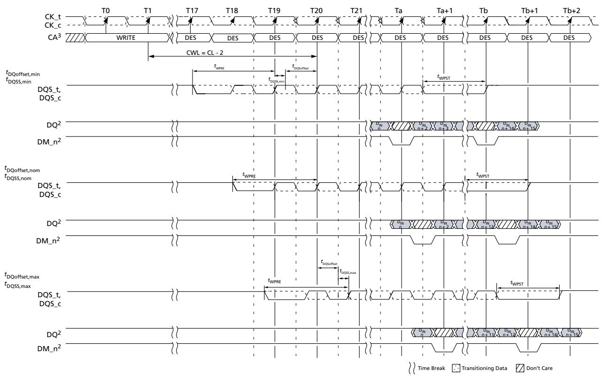

other

| Signal Type           | Time Break | Transitioning Data | Don't Care |
|-----------------------|------------|--------------------|------------|
| CK_t                 |            |                    |            |
| CK_c                 |            |                    |            |
| CA³                   | WRITE      | DES                |            |
| CWL = CL - 2          |            |                      | CWL = CL - 2 |
| t_DQoffset,min        |            |                    |            |
| t_DQSS,min            |            |                      |            |
| DQS_t, DQS_c          |            |                    |            |
| DQ²                   |            |                    |            |
| DM_n²                 |            |                      |            |
| t_DQoffset,nom       |            |                    |            |
| t_DQSS,nom           |            |                      |            |
| DQS_t, DQS_c          |            |                    |            |
| DQ²                   |            |                    |            |
| DM_n²                 |            |                      |            |
| t_DQoffset,max       |            |                    |            |
| t_DQSS,max           |            |                      |            |
| DQS_t, DQS_c          |            |                    |            |
| DQ²                   |            |                    |            |
| DM_n²                 |            |                      |            |
| t_DQoffset,min       |            |                    |            |
| t_DQSS,min           |            |                      |            |
| DQS_t, DQS_c          |            |                    |            |
| DQ²                   |            |                    |            |
| DM_n²                 |            |                      |            |
| t_DQoffset,max       |            |                    |            |
| t_DQSS,max           |            |                      |            |
| DQS_t, DQS_c          |            |                    |            |
| DQ²                   |            (t_DQoffset) |                      | (t_DQSS,max) |
| DM_n²                 |            (t_DQoffset) |                      | (t_DQSS,max) |
| t_DQoffset,min       |            (t_DQSWmin) |                      | (t_DQSWmin) |
| t_DQSS,min           |            (t_DQSWmin) |                      | (t_DQSWmin) |
| DQS_t, DQS_c          |            (t_DQSWmin) |                      | (t_DQSWmin) |
| DQ²                   | (t_DQSWmin)     |                      | (t_DQSWmin) |
| DM_n²                 | (t_DQSWmin)     |                      | (t_DQSWmin) |
| t_DQoffset,min       |            (t_DQSWmin) |                      | (t_DQSWmin) |
| t_DQSS,min           |            (t_DQSWmin) |                      | (t_DQSWmin) |
| DQS_t, DQS_c          |            (t_DQSWmin) |                      | (t_DQSWmin) |
| DQ²                   | (t_DQSWmin)     (t_DQSWmin)|                      | (t_DQSWmin) |
| DM_n²                 | (t_DQSWmin)     (t_DQSWmin)|                      | (t_DQSWmin) |
| t_DQoffset,max       |            (t_DQSWmax) |                      | (t_DQSWmax) |
| t_DQSS,max           |            (t_DQSWmax) |                      | (t_DQSWmax) |
| DQS_t, DQS_c          |            (t_DQSWmax) |                      | (t_DQSWmax) |
| DQ²                   | (t_DQSWmax)     (t_DQSWmax)|                      | (t_DQSWmax) |
| DM_n²                 | (t_DQSWmax)     (t_DQSWmax)|                      | (t_DQSWmax) |
| t_DQoffset,min       |            (t_DQSWmin) |                      | (t_DQSWmin) |
| t_DQSS,min           |            (t_DQSWmin) |                      | (t_DQSWmin) |
| DQS_t, DQS_c          |            (t_DQSWmin) |                      | (t_DQSWmin) |
| DQ²                   | (t_DQSWmin)     ((t_DQSWmin))         |                      | (t_DQSWmin) |
| DM_n²                 |             (t_DQSWmin)   |                      | (t_DQSWmin) |
| t_DQoffset,max       |            (t_DQSWmin)   ((t_DQSWmin))         |                      | (t_DQSWmin) |
| t_DQSS,max           |            (t_DQSWmin)   ((t_DQSWmin))         |                      | (t_DQSWmin) |
| DQS_t, DQS_c          |            (t_DQSWmin)   ((t_DQSWmin))         |                      | (t_DQSWmin) |
| DQ²                   |             (t_DQSWmin)   ((t_DQSWmin))         |                      | (t_DQSWmin) |
| DM_n²                 |             (t_DQSWmin)   ((t_DQSWmin))         |                      | (t_DQSWmin) |
| t_DQoffset,min       |            (t_DQSWmin)   ((t_DQSWmin))         |                      | (t_DQSWmin) |
| t_DQSS,min           |            (t_DQSWmin)   ((t_DQSWmin))         |                      | (t_DQSWmin) |
| DQS_t, DQS_c          |            (t_DQSWmin)   ((t_DQSWmin))         |                      | (t_DQSWmin) |
| DQ²                   |             (t_DQSWmin)   ((t_DQSWmin))         |                      | (t_DQSW min) |
| DM_n²                 |             (t_DQSWmin)   ((t_DQSW min))        |                      | (t_DQ SW min) |
| t_DQoffset,max       |            (t_DQSWmin)   ((t_DQSWmin))         |                      | (t_0D0FF min)|

# NOTES:

1. BL=16, Preamble=2CK - 0010 pattern, Postamble=1.5CK,   
2. DES commands are shown for ease of illustration, other commands may be valid at these times.   
3. tDQSS must be met at each rising clock edge.   
4. Figure assumes DRAM internal WL training complete.

5. DQ/DM\_n pulse timing and DQS to DQ skew defined by Rx Strobe Jitter Sensitivity Specifications for the respective speed bin.

Figure 53 — DDR5 Write Timing Parameters

# 4.8.4 Write Burst Operation for Optional BL32 Mode

The following write timing diagrams cover write timings for fixed BL32, BL32 in BL32 OTF mode and BL16 in BL32 OTF mode for x4 devices only.

In these write timing diagrams, for clarity of illustration, CK and DQS are shown aligned. As well, DQS and DQ are shown centeraligned. Offset between CK and DQS, and between DQS and DQ may be appropriate.

A dummy CAS command is required for second half of the transfer of BL32. If non-target ODT is needed in the system then a dummy ODT command must be issued to the non-target rank for second half of the transfer of BL32.

When the DFE is enabled, the DQs shall be high for a minimum of 4UI prior to the first Write data bit to ensure proper DFE synchronization.

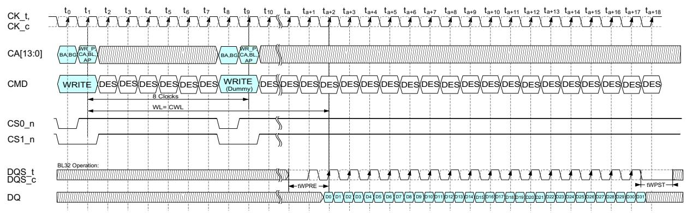

text_image

CK_t,
CK_c
t0 t1 t2 t3 t4 t5 t6 t7 t8 t9 t10 ta ta+1 ta+2 ta+3 ta+4 ta+5 ta+6 ta+7 ta+8 ta+9 ta+10 ta+11 ta+12 ta+13 ta+14 ta+15 ta+16 ta+17 ta+18
CA[13:0]
BA,BG WR_P
CA,BL
AP
BA,BG WR_P
CA,BL
AP
CMD
WRITE DES/DES/DES/DES/DES/DES/DES/DES/DES/DES/DES/DES/DES/DES/DES/DES/DES/DES/DES/DES/DES/DES/DES/DES/DES/DES/DES/DES/DES/DES/DES/DES/DES/DES/DES/DES/DES/DES/DES/DES/DES/DES/DES/DES/DES/DES/DES/DES/DES/DES/DES/Des
8 Clocks
WL=CWL
CS0_n
CS1_n
DQS_t
DQS_c
BL32 Operation:
DWPRE
tWPST
DQ

# NOTES:

1. BL=32, 2tCK Preamble, 1.5tCK Postamble   
2. DES commands are shown for ease of illustration; other commands may be valid at these times.   
3. A dummy WR command is required for the second half of the transfer with a delay of 8 clocks from the first WR command.   
4. The figure also shows a dummy ODT command being issued to non-target rank 1 for the second half of the transfer.   
5. C10 is used for burst ordering and shall be LOW for the first WR command, and be HIGH for dummy WR command.   
6. DDR5 DRAM supports an optional fixed BL32 mode and optional BL32 OTF (On the fly) mode for x4 devices only.   
7. CA bits other than C10 and AP in dummy CAS command are the same as the first CAS command.   
8. The DQ signal is shown as “Don’t Care” before the first Write data bit indicating DFE is disabled. When DFE is enabled, the DQ signal shall be high for a minimum of 4UI prior to the first Write data bit for proper DFE synchronization.

Figure 54 — Write Timing for Fixed BL32 and BL32 in BL32 OTF Mode   
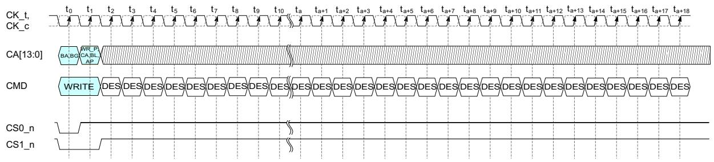

text_image

CK_t,
CK_c
t0 t1 t2 t3 t4 t5 t6 t7 t8 t9 t10 ta ta+1 ta+2 ta+3 ta+4 ta+5 ta+6 ta+7 ta+8 ta+9 ta+10 ta+11 ta+12 ta+13 ta+14 ta+15 ta+16 ta+17 ta+18
CA[13:0]
BA,BG AIR_P
CA,BL
AP
CMD
WRITE DES DES DES DES DES DES DES DES DES DES DES DES DES DES DES DES DES DES DES DES DES DES DES DES DES DES DES DES DES DES DES DES DES DES DES DES DES DES DES DES DES DES DES DES DES DES DES DES DES DES DES DES DES DES DES DES DES DES DES DES DES DES DES DES DES DES DES DES DES DES DES DES DES DES DES DES DES DES DES DES DES DES DES DES DES DES DES DES DES DES DES DES DES DES DES DES DES DES DES DES DEDES
CS0_n
CS1_n

# NOTES:

1. Figure shows BL16 write operation when MR0 is programmed to use BL32 OTF mode. In this case, no dummy WR command is required as transfer size is BL16.   
2. DES commands are shown for ease of illustration; other commands may be valid at these times including commands to allow data transfer from the same die after transfer of BL16.   
3. DDR5 DRAM supports an optional fixed BL32 mode and optional BL32 OTF (On the fly) mode for x4 devices only.

Figure 55 — Write Timings for BL16 in BL32 OTF mode

# 4.8.4 Write Burst Operation for Optional BL32 Mode (cont’d)

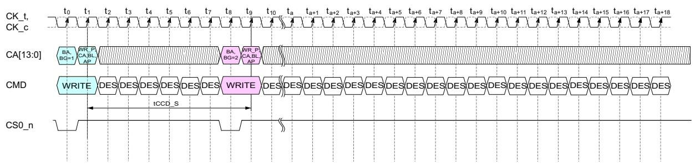

text_image

CK_t,
CK_c
t0 t1 t2 t3 t4 t5 t6 t7 t8 t9 t10 t11 t12 t13 t14 t15 t16 t17 t18
CA[13:0]
BA
BG=1 WR_P
CA,BL
AP
BA
BG=2 WR_P
CA,BL
AP
CMD
WRITE DES DES DES DES DES DES DES DES DES DES DES DES DES DES DES DES DES DES DES DES DES DES DES DES DES DES DES DES DES DES DES DES DES DES DES DES DES DES DES DES DES DES DES DES DES DES DES DES DES DES DES DES DES DES DES DES DES DES DES DES DES DES DES DES DES DES DES DES DES DES DES DES DES DES DES DES DES DES DES DES DES DES DES DES DES DES DES DES DES DES DES DES DES DES DES DES DES DES DES DES DEDES
tCCD_S
CS0_n

NOTES:   
1. Figure shows back to back BL16 writes to different bank groups.   
2. DDR5 DRAM supports an optional fixed BL32 mode and optional BL32 OTF (On the fly) mode for x4 devices only.

Figure 56 — Write to Write to Different Bank Group for BL16 in BL32 OTF   
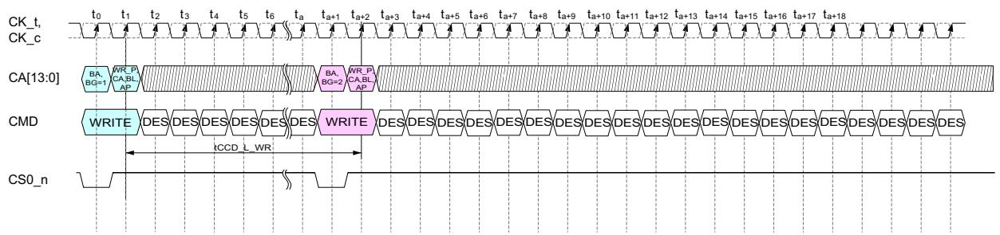

text_image

CK_t,
CK_c
t0 t1 t2 t3 t4 t5 t6 ta ta+1 ta+2 ta+3 ta+4 ta+5 ta+6 ta+7 ta+8 ta+9 ta+10 ta+11 ta+12 ta+13 ta+14 ta+15 ta+16 ta+17 ta+18
CA[13:0]
BA
BG=1 WR_P
CA_BL
AP
BA
BG=2 WR_P
CA_BL
AP
CMD
WRITE DES DES DES DES DES DES DES DES DES DES DES DES DES DES DES DES DES DES DES DES DES DES DES DES DES DES DES DES DES DES DES DES DES DES DES DES DES DES DES DES DES DES DES DES DES DES DES DES DES DES DES DES DES DES DES DES DES DES DES DES DES DES DES DES DES DES DES DES DES DES DES DES DES DES DES DES DES DES DES DES DES DES DES DES DES DES DES DES DES DES DES DES DES DES DES DES DES DES DES DES DE S
tCCD_L_WR
CSO_n

NOTES:   
1. Figure shows back to back BL16 writes to same bank group using a timing of tCCD\_L\_WR.   
2. Back to Back BL32 writes to same bank group shall have a minimum separation of 16 clocks.   
3. DDR5 DRAM supports an optional fixed BL32 mode and optional BL32 OTF (On the fly) mode for x4 devices only.

Figure 57 — Write to Write to Same Bank Group for BL16 in BL32 OTF   
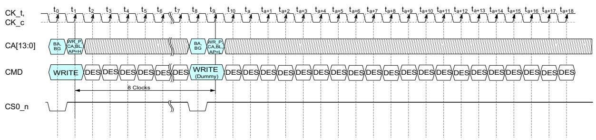

text_image

CK_t,
CK_c
CA[13:0]
CMD
CS0_n
t0 t1 t2 t3 t4 t5 t6 t7 t8 t9 t10 t1a ta+1 ta+2 ta+3 ta+4 ta+5 ta+6 ta+7 ta+8 ta+9 ta+10 ta+11 ta+12 ta+13 ta+14 ta+15 ta+16 ta+17 ta+18
BA_BG WR_P
BG_CA,BL
AP=H
BA_BG WR_P
BG_CA,BL
AP=I
WRITE (Dummy)
DES DES DES DES DES DES DES DES DES DES DES DES DES DES DES DES DES DES DES DES DES DES DES DES DES DES DES DES DES DES DES DES DES DES DES DES DES DES DES DES DES DES DES DES DES DES DES DES DES DES DES DES DES DES DES DES DES DES DES DES DES DES DES DES DES DES DES DES DES DES DES DES DES DES DES DES DES DES DES DES DES DES DES DES DES DES DES DES DES DES DES DES DES DES DES DES DES DES DES DES DES DE
8 Clocks

NOTES:   
1. AP bit must be set HIGH for first CAS and LOW for dummy CAS command.   
2. DDR5 DRAM supports an optional fixed BL32 mode and optional BL32 OTF (On the fly) mode for x4 devices only.   
3. CA bits other than C10 and AP in dummy CAS command are the same as the first CAS command.

Figure 58 — Write with Auto-Precharge for Fixed BL32 and BL32 in BL32 OTF Mode

# 4.8.4 Write Burst Operation for Optional BL32 Mode (cont’d)

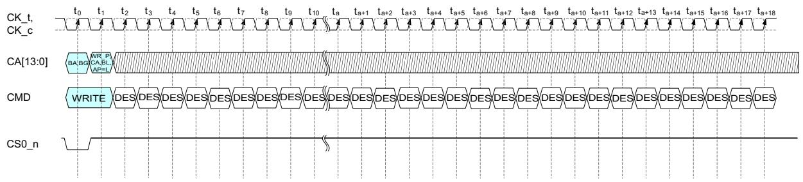

text_image

CK_t,
CK_c
t0 t1 t2 t3 t4 t5 t6 t7 t8 t9 t10 ta ta+1 ta+2 ta+3 ta+4 ta+5 ta+6 ta+7 ta+8 ta+9 ta+10 ta+11 ta+12 ta+13 ta+14 ta+15 ta+16 ta+17 ta+18
CA[13:0]
WR_P
BA,BG     CA,BL
AP=L
CMD
WRITE DES DES DES DES DES DES DES DES DES DES DES DES DES DES DES DES DES DES DES DES DES DES DES DES DES DES DES DES DES DES DES DES DES DES DES DES DES DES DES DES DES DES DES DES DES DES DES DES DES DES DES DES DES DES DES DES DES DES DES DES DES DES DES DES DES DES DES DES DES DES DES DES DES DES DES DES DES DES DES DES DES DES DES DES DES DES DES DES DES DES DES DES DES DES DES DES DES DES DES DES DEDES
CSO_n

NOTES:   
1. AP bit must be set to LOW with the CAS command.   
2. DDR5 DRAM supports an optional fixed BL32 mode and optional BL32 OTF (On the fly) mode for x4 devices only.

Figure 59 — Write with Auto-Precharge for BL16 in BL32 OTF Mode

# 4.8.5 Same Bank Group Write to Write Timings

DDR5 devices will have separate same bank group write timings, based on whether the second write requires an RMW (Read-Modify-Write) access or JW (Just-Write) access. In JW access, DDR5 updates all 128 bits of data on the addressed codeword, while in RMW access, a part of 128 bits is updated.

Table 51 — JW (Just-Write) Access and RMW (Read-Modify-Write) Access Definition 

<table><tr><td rowspan="2">Configuration</td><td colspan="2">BL16</td><td colspan="2">BC8</td><td rowspan="2">Optional BL32</td><td rowspan="2">Notes</td></tr><tr><td>Normal</td><td>Data Mask</td><td>Normal</td><td>Data Mask</td></tr><tr><td>x4</td><td>RMW</td><td>—</td><td>RMW</td><td>—</td><td>JW</td><td>1, 2, 3</td></tr><tr><td>x8 / x16</td><td>JW</td><td colspan="3">RMW</td><td>—</td><td>1, 2, 3</td></tr><tr><td colspan="7">NOTE 1 BC8 refers to BC8 OTF mode enabled by MR0 OP[1:0]=01B, where Write command is issued with BL=L in CA5.NOTE 2 Optional BL32 refers to BL32 OTF mode (enabled by MR0 OP[1:0]=11B), where Write command is issued with BL=L in CA5, or BL32 fixed mode (enabled by MR0 OP[1:0]=10B).NOTE 3 Data Mask refers to Data Mask mode enabled by MR5 OP[5]=1B, where Write command is issued with WP=L in CA11.</td></tr></table>

Table 52 — Same Bank-Group Write Access to RMW Access Timings 

<table><tr><td rowspan="2">From</td><td colspan="2">To</td><td rowspan="2">Notes</td></tr><tr><td>BL16</td><td>BC8</td></tr><tr><td>BL16</td><td>tCCD_L_WR</td><td>tCCD_L_WR</td><td>1, 2, 3</td></tr><tr><td>BC8</td><td>tCCD_L_WR</td><td>tCCD_L_WR</td><td>1, 2, 3</td></tr><tr><td>Optional BL32</td><td>8nCK+tCCD_L_WR</td><td>—</td><td>1, 2, 3, 4, 5</td></tr><tr><td colspan="4">NOTE 1 BC8 refers to BC8 OTF mode enabled by MR0 OP[1:0]=01B, where Write command is issued with BL=L in CA5. NOTE 2 Optional BL32 refers to BL32 OTF mode (enabled by MR0 OP[1:0]=11B), where Write command is issued with BL=L in CA5, or BL32 fixed mode (enabled by MR0 OP[1:0]=10B). NOTE 3 In Optional BL32 case, this timing table affects to the 1st Write command only, not the dummy Write command. NOTE 4 There is no BL32 to BC8 case. NOTE 5 When Write CRC is enabled, the timing increases by 1nCK, i.e., 9nCK+tCCD_L_WR</td></tr></table>

# 4.8.5 Same Bank Group Write to Write Timings (cont’d)

Table 53 — Same Bank-Group Write Access to JW Access Timings 

<table><tr><td rowspan="2">From</td><td colspan="2">To</td><td rowspan="2">Notes</td></tr><tr><td>BL16</td><td>Optional BL32</td></tr><tr><td>BL16</td><td>tCCD_L_WR2</td><td>tCCD_L_WR2</td><td>1, 2, 3</td></tr><tr><td>BC8</td><td>tCCD_L_WR2</td><td>—</td><td>1, 2, 3, 4</td></tr><tr><td>Optional BL32</td><td>—</td><td>8nCK+tCCD_L_WR2</td><td>1, 2, 3, 5</td></tr><tr><td colspan="4">NOTE 1 BC8 refers to BC8 OTF mode enabled by MR0 OP[1:0]=01B, where Write command is issued with BL=L in CA5.</td></tr><tr><td colspan="4">NOTE 2 Optional BL32 refers to BL32 OTF mode (enabled by MR0 OP[1:0]=11B), where Write command is issued with BL=L in CA5, or BL32 fixed mode (enabled by MR0 OP[1:0]=10B).</td></tr><tr><td colspan="4">NOTE 3 In Optional BL32 case, this timing table affects to the 1st Write command only, not the dummy Write command.</td></tr><tr><td colspan="4">NOTE 4 There is no BC8 to BL32 case.</td></tr><tr><td colspan="4">NOTE 5 When Write CRC is enabled, the timing increases by 1nCK, i.e., 9nCK+tCCD_L_WR</td></tr></table>

# 4.8.6 Different Bank-Group Write to Write Timings

Table 54 — Different Bank-Group Write to Write Timings 

<table><tr><td rowspan="2">From</td><td colspan="3">To</td><td rowspan="2">Notes</td></tr><tr><td>BL16</td><td>BC8</td><td>Optional BL32</td></tr><tr><td>BL16</td><td>8nCK</td><td>8nCK</td><td>8nCK</td><td>1, 2, 3</td></tr><tr><td>BC8</td><td>8nCK</td><td>8nCK</td><td>—</td><td>1, 2, 3, 4</td></tr><tr><td>Optional BL32</td><td>16nCK</td><td>—</td><td>16nCK</td><td>1, 2, 3, 4</td></tr><tr><td colspan="5">NOTE 1 BC8 refers to BC8 OTF mode enabled by MR0 OP[1:0]=01B, where Write command is issued with BL=L in CA5.NOTE 2 Optional BL32 refers to BL32 OTF mode (enabled by MR0 OP[1:0]=11B), where Write command is issued with BL=L in CA5, or BL32 fixed mode (enabled by MR0 OP[1:]=11B).NOTE 3 In Optional BL32 case, this timing table affects to the 1st Write command only, not the dummy Write command.NOTE 4 There is no BC8 to BL32 case.</td></tr></table>

# 4.8.7 Write Timing Violations

# 4.8.7.1 Motivation

Generally, if Write timing parameters are violated, a complete reset/initialization procedure has to be initiated to make sure that the DRAM works properly. However, it is desirable, for certain violations as specified below, the DRAM is guaranteed to not “hang up,” and that errors are limited to that particular operation.

For the following, it will be assumed that there are no timing violations with regards to the Write command itself (including ODT, etc.) and that it does satisfy all timing requirements not mentioned below.

# 4.8.7.2 Data to Strobe Eye Height or Width Violations

Should the required data to strobe timing or voltage parameters be violated (Such as: tRx\_RDQ\_tMargin, tRx\_DQS2DQ\_Skew, VRx\_DQS, VRx\_DQ, etc.), for any of the data/strobe timing edges or data/strobe voltage limits associated with a write burst data eye, then incorrect data might be written to the memory locations addressed with this WRITE command.

Subsequent reads from that location might results in unpredictable read data, however the DRAM will work properly otherwise.

# 4.8.7.3 Strobe and Strobe to Clock Timing Violations

Should the strobe timing requirements (tWPRE, tWPST) or the strobe to clock timing requirements (tDQSS, tDQSoffset) be violated for any of the strobe edges associated with a Write burst, then wrong data might be written to the memory location addressed with the offending WRITE command. Subsequent reads from that location might result in unpredictable read data, however the DRAM will work properly otherwise with the following constraints:

(1) Both Write CRC and data burst OTF are disabled; timing specifications other than tWPRE, tWPST, tDQSS, tDQSoffset are not violated.   
(2) The offending write strobe (and preamble) arrive no earlier or later than six DQS transition edges from the Write-Latency position.   
(3) A Read command following an offending Write command from any open bank is allowed.   
(4) One or more subsequent WR or a subsequent WRA {to same bank as offending WR} may be issued tCCD\_L later but incorrect data could be written; subsequent WR and WRA can be either offending or non-offending Writes. Reads from these Writes may provide incorrect data.   
(5) One or more subsequent WR or a subsequent WRA {to a different bank group} may be issued tCCD\_S later but incorrect data could be written; subsequent WR and WRA can be either offending or non-offending Writes. Reads from these Writes may provide incorrect data.   
(6) Once one or more precharge commands (PREpb, PREsb, or PREab) are issued to DDR5 after offending WRITE command and all banks become precharged state (idle state), a subsequent, non-offending WR or WRA to any open bank shall be able to write correct data.   
(7) DQS strobes including preamble must align to each Write commands data burst length configuration. If the DRAM fails to capture or incorrectly de-serializes the incoming data stream because of misalignment or missing strobe edges, errors may occur. These errors will propagate indefinitely until the DRAM is put into an idle state, i.e., all banks are in the precharged state with tRP satisfied.

# 4.8.8 Write Enable Timings

# 4.8.8.1 Introduction

The following specifies the relationship between the write enable timing window tWPRE\_EN\_ntck and the DRAM related DQS to CK drift window tDQSD as well as the system related DQS to CK drift window tDQSS around the final DQS to CK offset trained pass/fail point tDQSoffset based on write leveling feedback in order to support n-tck pre-amble mode. Functional operation requires that the following condition is met:

$\begin{array} { r l } { - } & { { } \mathsf { t W P R E \_ E N _ { \_ } n t c k } > = | \mathsf { t D O S S m i n } | + \mathsf { t D O S S m a x } + | \mathsf { t D O S D m i n } | + \mathsf { t D O S D m a x } } \end{array}$

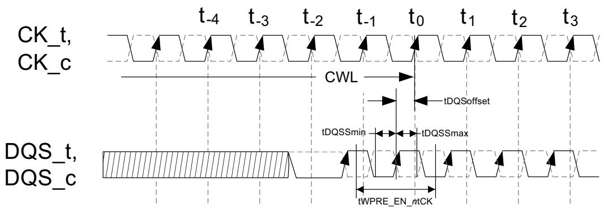

other

| Signal     | Time  | Label             |
|------------|-------|-------------------|
| CK_t      | t-4   | CWL               |
| CK_c      | t-4   | CWL               |
| DQS_t      | t-4   | CWL               |
| DQS_c      | t-4   | CWL               |
| CWL        | t-3   | CWL               |
| CWL        | t-3   | CWL               |
| CWL        | t-3   | CWL               |
| CWL        | t-3   | CWL               |
| CWL        | t-3   | CWL               |
| CWL        | t-2   | CWL               |
| CWL        | t-2   | CWL               |
| CWL        | t-2   | CWL               |
| CWL        | t-2   | CWL               |
| CWL        | t-2   | CWL               |
| CWL        | t-1   | CWL               |
| CWL        | t-1   | CWL               |
| CWL        | t-1   | CWL               |
| CWL        | t-1   | CWL               |
| CWL        | t-1   | CWL               |
| CWL        | t0    | CWL               |
| CWL        | t0    | CWL               |
| CWL        | t0    | CWL               |
| CWL        | t0    | CWL               |
| CWL        | t1    | CWL               |
| CWL        | t1    | CWL               |
| CWL        | t1    | CWL               |
| CWL        | t1    | CWL               |
| CWL        | t1    | CWL               |
| CWL        | t2    | CWL               |
| CWL        | t2    | CWL               |
| CWL        | t2    | CWL               |
| CWL        | t2    | CWL               |
| CWL        | t2    | CWL               |
| CWL        | t3    | CWL               |
| CWL        | t3    | CWL               |
| CWL        | t3    | CWL               |
| CWL        | t3    | CWL               |
| DWPRE_EN_ntCK | t-4   | DWPRE_EN_ntCK  |
| DWPRE_EN_ntCK | t-4   | DWPRE_EN_ntCK  |
| DWPRE_EN_ntCK | t-4   | DWPRE_EN_ntCK  |
| DWPRE_EN_ntCK | t-4   | DWPRE_EN_ntCK  |
| DWPRE_EN_ntCK | t-3   | DWPRE_EN_ntCK  |
| DWPRE_EN_ntCK | t-3   | DWPRE_EN_ntCK  |
| DWPRE_EN_ntCK | t-3   | DWPRE_EN_ntCK  |
| DWPRE_EN_ntCK | t-3   | DWPRE_EN_ntCK  |
| DWPRE_EN_ntCK | t-2   | DWPRE_EN_ntCK  |
| DWPRE_EN_ntCK | t-2   | DWPRE_EN_ntCK  |
| DWPRE_EN_ntCK | t-2   | DWPRE_EN_ntCK  |
| DWPRE_EN_ntCK | t-2   | DWPRE_EN_ntCK  |
| DWPRE_EN_ntCK | t-1   | DWPRE_EN_ntCK  |
| DWPRE_EN_ntCK | t-1   | DWPRE_EN_ntCK  |
| DWPRE_EN_ntCK | t-1   | DWPRE_EN_ntCK  |
| DWPRE_EN_ntCK | t0    | DWPRE_EN_ntCK  |
| DWPRE_EN_ntCK | t0    | DWPRE_EN_ntCK  |
| DWPRE_EN_ntCK | t0    | DWPRE_EN_ntCK  |
| DWPRE_EN_ntCK | t1    | DWPRE_EN_ntCK  |
| DWPRE_EN_ntCK | t1    | DWPRE_EN_ntCK  |
| DWPRE_EN_ntCK | t1    | DWPRE_EN_ntCK  |
| DWPRE_EN_ntCK | t2    | DWPRE_EN_ntCK  |
| DWPRE_EN_ntCK | t2    | DWPRE_EN_ntCK  |
| DWPRE_EN_ntCK | t2    | DWPRE_EN_ntCK  |
| DWPRE_EN_ntCK | t3    | DWPRE_EN_ntCK  |
| DWPRE_Soffset(1)     |       | CWL              |
| DWQSSmin(2)         |       | CWL               |
| DWQSSmax(3)         |       | CWL               |
| DWQSSmin(4)         |       | CWL               |
| DWQSSmax(5)         |       | CWL               |
| DWQSSmin(6)         |       | CWL               |
| DWQSSmax(7)         |       | CWL               |
| DWQSSmin(8)         |       | CWL               |
| DWQSSmax(9)         |       | CWL               |
| DWQSSmin(10)        |       | CWL               |
| DWQSSmax(11)        |       | CWL               |
| DWQSSmin(12)        |       | CWL               |
| DWQSSmax(13)        |       | CWL               |
| DWQSSmin(14)        |       | CWL               |
| DWQSSmax(15)        |       | CWL               |
| DWQSSmin(16)        |       | CWL               |
| DWQSSmax(17)        |       | CWL               |
| DWQSSmin(18)        |       | CWL               |
| DWQSSmax(19)        |       | CWL               |
| DWQSSmin(20)        |       | CWL               |
| DWQSSmax(21)        |       | CWL               |
| DWQSSmin(22)        |       | CWL               |
| DWQSSmax(23)        |       | CWL               |
| DWQSSmin(24)        |       | CWL               |
| DWQSSmax(25)        |       | CWL               |
| DWQSSmin(26)        |       | CWL               |
| DWQSSmax(27)        |       | CWL               |
| DWQSSmin(28)        |       | CWL               |
| DWQSSmax(29)        |       | CWL               |
| DWQSSmin(30)        |       | CWL               |
| DWQSSmax(31)        |       | CWL               |
| DWQSSmin(32)        |       | CWL               |
| DWQSSmax(33)        |       | CWL               |
| DWQSSmin(34)        |       | CWL               |
| DWQSSmax(35)        |       | CWL               |
| DWQSSmin(36)        |       | CWL               |
| DWQSSmax(37)        |       | CWL               |
| DWQSSmin(38)        |       | CWL               |
| DWQSSmax(39)        |       | CWL               |
| DWQSSmin(40)        |       | CWL               |
| DWQSSmax(41)        |       | CWL               |
| DWQSSmin(42)        |       | CWL               |
| DWQSSmax(43)        |       | CWL               |
| DWQSSmin(44)        |       | CWL               |
| DWQSSmax(45)        |       | CWL               |
| DWQSSmin(46)        |       | CWL               |
| DWQSSmax(47)        |       | CWL               |
| DWQSSmin(48)        |       | CWL               |
| DWQSSmax(49)        |       | CWL               |
| DWQSSmin(50)        |       | CWL               |
| DWQSSmax(51)        |       | CWL               |
| DWQSSmin(52)        |       | CWL               |
| DWQSSmax(53)        |       | CWL               |
| DWQSSmin(54)        |       | CWL               |
| DWQSSmax(55)        |       | CWL               |
| DWQSSmin(56)        |       | CWL               |
| DWQSSmax(57)        |       | CWL               |
| DWQSSmin(58)        |       | CWL               |
| DWQSSmax(59)        |       | CWL               |
| DWQSSmin(60)        |       | CWL               |
| DWQSSmax(61)        |       | CWL               |
| DWQSSmin(62)        |       | CWL               |
| DWQSSmax(63)        |       | CWL               |
| DWQSSmin(64)        |       | CWL               |
| DWQSSmax(65)        |       | CWL               |
| DWQSSmin(66)        |       | CWL               |
| DWQSSmax(67)        |       | CWL               |
| DWQSSmin(68)        |       | CWL               |
| DWQSSmax(69)        |       | CWL               |
| DWQSSmin(70)        |       | CWL               |
| DWQSSmax(71)        |       | CWL               |
| DWQSSmin(72)        |       |           |
| DWQSSmax(73)        |       |           |
| DWQSSmin(74)        |       |           |
| DWQSSmax(75)        |       |           |
| DWQSSmin(76)        |       |           |
| DWQSSmax(77)        |       |           |
| DWQSSmin(78)        |       |           |
| DWQSSmax(79)        |       |           |
| DWQSSmin(80)        |       |           |
| DWQSSmax(81)        |       |           |
| DWQSSmin(82)        |       |           |
| DWQSSmax(83)        |       |           |
| DWQSSmin(84)        |       |           |
| DWQSSmax(85)        |       |           |
| DWQSSmin(86)        |       |           |
| DWQSSmax(87)        |       |           |
| DWQSSmin(88)        |       |           |
| DWQSSmax(89)        |       |           |
| DWQSSmin(90)        |       |           |
| DWQSSmax(91)        |       |           |
| DWQSSmin(92)        |       |           |
| DWQSSmax(93)        |       |           |
| DWQSSmin(94)        |       |           |
| DWQSSmax(95)        |       |           |
| DWQSSmin(96)        |       |           |
| DWQSSmax(97)        |       |           |
| DWQSSmin(98)        |       |           |
| DWQSSmax(99)        |       |           |
| DWQSSmin(100)|       |\            |

The data is extracted from the image. The labels for the data are 'CW_L' and 'CW_C' in the chart. The values for 'CW_L' and 'CW_C' are not explicitly provided in the code. The labels for 'CW_L' and 'CW_C' are the same as the original data. The labels for 'CW_L' and 'CW_C' are the same as 'CW_L'. The labels for 'CW_L' and 'CW_C' are the same as 'CW_L'. The labels for 'CW_L' and 'CW_C' are the same as 'CW_L'. The labels for 'CW_L' and 'CW_C' are the same as 'CW_L'. The labels for 'CW_L' and 'CW_C' are the same as 'CW_L'. The labels for 'CW_L' and 'CW_C' are the same as 'CW_L' but differ in width. The labels for 'CW_L' and 'CW_C' are the same as 'CW_L'. The labels for 'CW_L' and 'CW_C' are the same as 'CW_L'. The labels for 'CW_L' and 'CW_C' are the same as 'CW_L'. The labels for 'CW_L' and 'CW_C' are the same as 'CW_L'.

Figure 60 — tDQSS: DRAM External CLK-to-DQS Variation

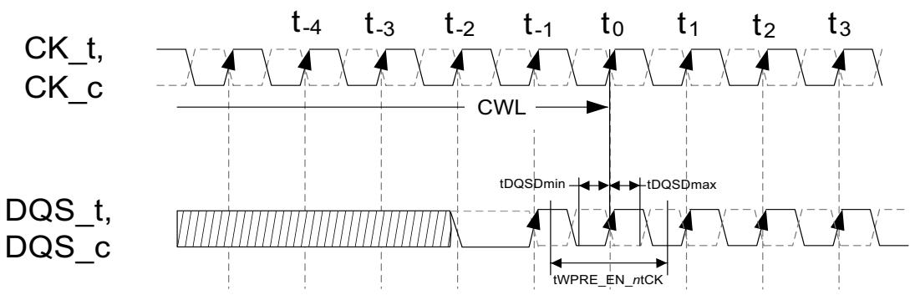

other

| Signal     | Time  | Label           |
|------------|-------|-----------------|
| CK_t       | t-4   | CWL             |
| CK_c       | t-4   | CWL             |
| DQS_t      | t-4   | CWL             |
| DQS_c      | t-4   | CWL             |
| CK_t       | t-3   | CWL             |
| CK_c       | t-3   | CWL             |
| DQS_t      | t-3   | CWL             |
| DQS_c      | t-3   | CWL             |
| CK_t       | t-2   | CWL             |
| CK_c       | t-2   | CWL             |
| DQS_t      | t-2   | CWL             |
| DQS_c      | t-2   | CWL             |
| CK_t       | t-1   | CWL             |
| CK_c       | t-1   | CWL             |
| DQS_t      | t-1   | CWL             |
| DQS_c      | t-1   | CWL             |
| CK_t       | t_0   | CWL             |
| CK_c       | t_0   | CWL             |
| DQS_t      | t_0   | CWL             |
| DQS_c      | t_0   | CWL             |
| CK_t       | t_1   | CWL             |
| CK_c       | t_1   | CWL             |
| DQS_t      | t_1   | CWL             |
| DQS_c      | t_1   | CWL             |
| CK_t       | t_2   | CWL             |
| CK_c       | t_2   | CWL             |
| DQS_t      | t_2   | CWL             |
| DQS_c      | t_2   | CWL             |
| CK_t       | t_3   | CWL             |
| CK_c       | t_3   | CWL             |
| DQS_t      | t_3   | CWL             |
| DQS_c      | t_3   | CWL             |

Figure 61 — tDQSD: DRAM Internal CLK-to-DQS Variation

# 4.8.8.1 Introduction (cont’d)

Table 55 — Write Enable Timing Parameters DDR5 3200 to 8400 

<table><tr><td rowspan="2">Parameter</td><td rowspan="2">Symbol</td><td colspan="2">Speed BinsDDR5 3200-8800</td><td rowspan="2">Unit</td><td rowspan="2">Notes</td></tr><tr><td>Min</td><td>Max</td></tr><tr><td>2-tck Write pre-amble enable window</td><td>tWPRE_EN_2tck</td><td>1.5</td><td>-</td><td>tCK</td><td></td></tr><tr><td>3-tck Write pre-amble enable window</td><td>tWPRE_EN_3tck</td><td>2.5</td><td>-</td><td>tCK</td><td></td></tr><tr><td>4-tck Write pre-amble enable window</td><td>tWPRE_EN_4tck</td><td>2.5</td><td>-</td><td>tCK</td><td></td></tr><tr><td>Final trained value of host DQS_t-DQS_c timing relative to CWL CK_t-CK_c edge</td><td>tDQSoffset</td><td>-0.5</td><td>0.5</td><td>tCK</td><td>2</td></tr><tr><td>DRAM voltage/temperature drift window of first rising DQS_t pre-amble edge relative to CWL CK_t-CK_c edge</td><td>tDQSD</td><td>-0.25*tWPRE_EN_ntCK(min)</td><td>0.25*tWPRE_EN_ntCK(min)</td><td>tCK</td><td>1</td></tr><tr><td>Host and system voltage/temperature drift window of first rising DQS_t pre-amble edge relative to CWL CK_t-CK_c edge</td><td>tDQSS</td><td>-0.25*tWPRE_EN_ntCK(min)</td><td>0.25*tWPRE_EN_ntCK(min)</td><td>tCK</td><td>1, 3</td></tr><tr><td colspan="6">NOTE 1 Measured relative to the write leveling feedback, after write leveling training has been completed.NOTE 2 When measuring the tDQSoffset, tWLS/H are reflected in the tDQSoffset result.NOTE 3 DDR5-3200 timings apply for data rates &lt;2933 MT/s. For example, at 2000 MT/s, tDQSS(max) = (2000/2933)*0.25*tWPRE_EN_ntck(min) = 0.17*tWPRE_EN_ntck(min).</td></tr></table>

<table><tr><td>Symbol</td><td>Description</td><td>Min</td><td>Max</td><td>Unit</td></tr><tr><td>tWLS/H</td><td>Write Leveling Setup/Hold Time</td><td>-80</td><td>+80</td><td>ps</td></tr></table>

# 4.9 Self Refresh Operation

The Self-Refresh command can be used to retain data in the DDR5 SDRAM, even if the rest of the system is powered down. When in the Self-Refresh mode, the DDR5 SDRAM retains data without external clocking. The DDR5 SDRAM device has a built-in timer to accommodate Self-Refresh operation. While in Self Refresh, the DDR5 SDRAM adjusts and updates its internal average periodic refresh interval, as needed, based on its own temperature sensor. The internal average periodic refresh interval adjustment (increasing, decreasing or staying constant) does not require any external control.

Self Refresh entry is command based (SRE), while the Self-Refresh Exit Command is defined by the transition of CS\_n LOW to HIGH with a defined pulse width tCSH\_SRexit, followed by three or more NOP commands (tCSL\_SRexit) to ensure DRAM stability in recognizing the exit. This is described below in more detail.

Before issuing the Self-Refresh-Entry command, the DDR5 SDRAM must be idle with all bank precharge state with tRP satisfied. ‘Idle state’ is defined as all banks are closed (tRP, etc. satisfied), no data bursts are in progress, and all timings from previous operations are satisfied (tMRD, tRFC, etc.). A Deselect command must be registered on the last positive clock edge before issuing Self Refresh Entry command. Once the Self Refresh Entry command is registered, Deselect commands must also be registered at the next positive clock edges until tCPDED is satisfied. After tCPDED has been satisfied, CS\_n must transition low. After CS\_n transitions low at the end of tCPDED, the CS\_n shall stay low until exit. The DDR5 SDRAM may switch to a CMOS based receiver to save more power and that transition should coincide with CS\_n going low.

When the CS\_n is held low, the DRAM automatically disables ODT termination and sets Hi-Z as termination state regardless RTT configuration for the duration of Self-Refresh mode. Upon exiting Self-Refresh, DRAM automatically enables ODT termination and set RTT\_PARK (for DQs) asynchronously during tXSDLL when RTT\_PARK is enabled. CA/CS/CK ODT shall revert to its strapped or its MR ODT Setting state if previously applied. During normal operation (DLL on) the DLL is automatically disabled upon entering Self-Refresh and is automatically enabled (including a DLL-Reset) upon exiting Self-Refresh.

When the DDR5 SDRAM has entered Self-Refresh mode, all of the external control signals, except CS\_n and RESET\_n, are “don’t care.” For proper Self-Refresh operation, all power supply and reference pins (VDD, VDDQ, VSS, VSS, and VPP) must be at valid levels. DRAM internal VrefDQ and/or VrefCA generator circuitry may remain ON or turned OFF depending on DRAM design. If DRAM internal VrefDQ and/or VrefCA circuitry is turned OFF in self refresh, when DRAM exits from self refresh state, it ensures that VrefDQ and/or VrefCA and generator circuitry is powered up and stable within tXS period. First Write operation or first Write Leveling Activity may not occur earlier than tXS after exit from Self Refresh. The DRAM initiates a minimum of one Refresh command internally once it enters Self-Refresh mode.

The clocks must stay on until tCKLCS but can be DON’T CARE after tCKLCS expires but it should be noted that shortly after tCPDED, the termination for the clocks will be off. The clock is internally disabled (in the DRAM) during Self-Refresh Operation to save power. The minimum time that the DDR5 SDRAM must remain in Self-Refresh mode is tCSL. The user may change the external clock frequency or halt the external clock tCKLCS after Self-Refresh entry is registered, however, the clock must be restarted and stable tCKSRX before the device can exit Self-Refresh operation.

The procedure for exiting Self-Refresh requires a sequence of events. Since the DRAM will switch to a CMOS based driver to save power, the DRAM will trigger Self-Refresh exit upon seeing the CS\_n transition from low to high and stay high for tCSH\_SRExit. tCASRX prior to CS\_n transitioning high, the CA bus must be driven high. Once tCSH\_SRExit is satisfied, three NOP commands must be issued, otherwise the DRAM could be put into an unknown state. The clocks must be valid for tCKSRX prior to issuing the NOP commands that completes the Self Refresh exit sequence. Once a Self-Refresh Exit is registered, the following timing delay must be satisfied:

1. Commands that do not require locked DLL: tXS - ACT, MPC, MRW, PDE, PDX, PRE(ab,sb,pb), REF(ab,sb), RFM(ab,sb), SRE, VREFCA   
2. Commands that require locked DLL: tXS\_DLL - RD, MRR, WR, WRP

There are some Host system requirements and restrictions to use the optional SRX/NOP Clock-Sync feature. The Clock-Sync feature is intended to address issue in a system where Host Clock has Duty Cycle Distortion that is different from cycle to cycle in even/odd clock in repeating manner where Clock mis-alignment between Host Clock and DRAM internal 4-phase clock can results in worse performance than initially trained. If Host Clock can guarantee the consistent duty cycle on every even/odd clock as far as meeting CK input spec, the Clock-Sync feature is not needed. If Host CLK has the consistent duty cycle on every even/odd clocks but changes direction (i.e., from 46% to 54%) after SRX, the Clock-Sync feature won’t be able to address such issue.

# 4.9 Self Refresh Operation (cont’d)

This Clock-Sync feature can be used only with Host system tracking clock from the first SRX Clock-Sync prior to DCA training and guarantee to issue subsequent SRX with exact same phase. Host system applications that cannot guarantee the consistent system clock phase between the first SRX Clock-Sync prior to DCA training and subsequent SRX at the first NOP (for example, like a system where system clock is stopped to put host system in low power mode or to do frequency change and put DRAM into self-refresh) cannot use the Clock Sync feature and therefore should not enable this feature.

The SRX/NOP Clock-Sync scheme helps the DRAMs that have 4-phase internal clock to determine whether ICLK or IBCLK will be the first one that is synchronized with Host Clock after Self-Refresh Exit (SRX). It also helps host to identify the right DCA MR setting that was pre-trained during the initialization process to the clock edge. DRAMs are responsible to align the first NOP after SRX (tc+1 in Figure 58 and Figure 59) to the internal clock edge that existed during the DCA training. For instance on the DRAM that aligns the first NOP with internal Odd clock, while in SREF, the DRAM detects whether the first NOP arrives via the Even or the Odd commanddecode pipeline. Then if the first NOP arrives via the Odd pipeline, the DRAM does do nothing. If the first NOP arrives via the Even Pipeline, the DRAM does initiate the Clock-Sync scheme to sync the first NOP after SRX to the internal Odd clock. For all subsequent SRE/SRX sequences, the DRAM will sync its internal clocks with what existed during the DCA training. In order for DRAM to do this, host is required to send SRX first NOP on the exact same clock phase that was used during the DCA training. In this way, the SRX/ NOP Clock-Sync feature enforces repeatability of clock phases to an Odd phase upon SRX. It also helps on minimizing repeatability of the additive/subtractive effect of the DCA training on Tx jitter. If host sends SRX first NOP on different clock phase than the phase used during DCA training while the Clock-Sync feature is enabled, DCA adjustment may be in the wrong direction and could result in worse performance than without DCA adjustment. The SRX/NOP Clock-Sync scheme is an optional feature on DDR5. MR13:OP[5] indicates host whether the SRX/NOP Clock-Sync feature is supported or not.

When SRX/NOP Clock-Sync feature is enabled by MRW to MR13:OP[5]=1, to make the Clock-Sync Scheme fully functional, (1) Host (including RCD, Clock Driver) is responsible to ensure the phases of the system clock before and after SRX. (2) Host shall issue an initial SRE/SRX pair after CSTM/CATM prior to DCA training to ensure that the Clock-Sync is in effect during DCA training, (3) the continuous system clock during Self-Refresh is not required to make the Clock-Sync feature fully functional, but every first NOP registered after each tCSH\_SRexit shall be the same phase of system clock (for example, Odd) that existed at the first NOP at tc+1 cycle in the initial SRX sequence prior to DCA training so that DRAM can get the consistent phases of system clock when DRAM does do the clock sync, and (4) for DCA training at multiple frequencies, the first NOP after SRX for a given clock frequency shall be the same phase of system clock (for example, Odd) that existed at exit Self Refresh w/Frequency Change mode prior to DCA training for that frequency.

Depending on the system environment and the amount of time spent in Self-Refresh, ZQ calibration commands may be required to compensate for the voltage and temperature drift as described in “ZQ Calibration Commands”. To issue ZQ calibration commands, applicable timing requirements must be satisfied.

Upon exiting Self Refresh, tREFI begins when CS\_n rises with tCSH\_SRexit (tb+3 in Figure 62). One additional refresh shall be issued in addition to refreshes normally scheduled. This additional refresh is not counted toward the computation of the average refresh interval (tREFI). If this refresh isn’t issued by tREFI after $\mathsf { C S \_ n }$ rises with tCSH\_SRexit, then it counts toward the maximum number of refreshes which may be postponed. This additional refresh does not replace the regularly periodic refresh that’s also scheduled at tREFI after $\mathsf { C S \_ n }$ rises with tCSH\_SRexit (both of these refresh commands count toward the maximum number of refreshes which may be postponed). The additional refresh consists of a single REFab command or n \* REFsb, where n is the number of banks in a bank group. If Self Refresh is to be re-entered and no regularly scheduled periodic refresh commands have been issued, the additional refresh shall be issued prior to Self Refresh re-entry. Plus, FGR mode may require extra Refresh command(s), in addition the aforementioned additional Refresh, depending on the condition of the Self Refresh entry (refer to Section 4.13.7 for more information)

The exit timing from self-refresh exit to first valid command not requiring a locked DLL is tXS. The value of tXS is (tRFC). This delay is to allow for any refreshes started by the DRAM to complete. tRFC continues to grow with higher density devices so tXS will grow as well.

# 4.9 Self Refresh Operation (cont’d)

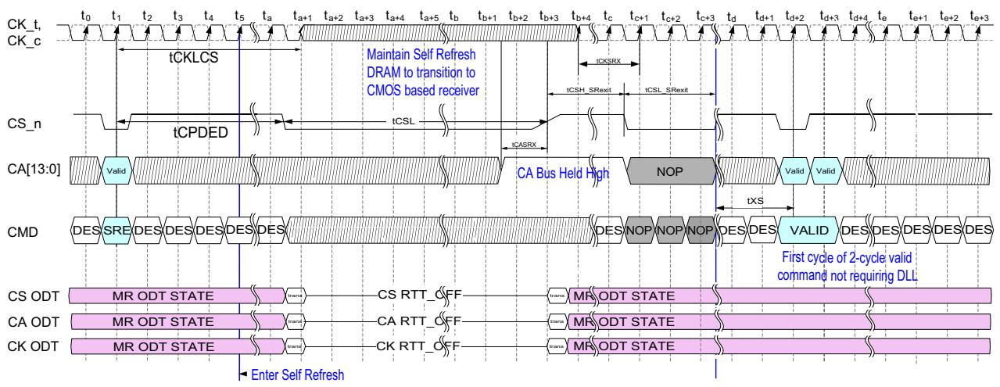

text_image

CK_t,
CK_c
t0 t1 t2 t3 t4 t5 ta ta+1 ta+2 ta+3 ta+4 ta+5 tb tb+1 tb+2 tb+3 tb+4 tc tc+1 tc+2 tc+3 td td+1 td+2 td+3 td+4 te te+1 te+2 te+3
tCKLCS
Maintain Self Refresh DRAM to transition to CMOS based receiver
tCKSRX
tCSH_SRexit tCSL_SRexit
tCPDED
tCSL
tCASRX
CA[13:0]
Valid
CAL Bus Held High NOP
Valid Valid
CMD
DES SRE DES DES DES DES DES DES DES DES DES DES DES DES DES DES DES DES DES DES DES DES DES DES DES DES DES DES DES DES DES DES DES DES DES DES DES DES DES DES DES DES DES DES DES DES DES DES DES DES DES DES DES DES DES DES DES DES DES DES DES DES DES DES DES DES DES DES DES DES DES DES DES DES DES DES DES DES DES DES DES DES DES DES DES DES DES DES DES DES DES DES DES DES DES DES DES DES DES DES DES DES DE
First cycle of 2-cycle valid command not requiring DLL
CS ODT MR ODT STATE trans CA RTT_OFF trans MR ODT STATE
CA ODT MR ODT STATE trans CA RTT_OFF trans MR ODT STATE
CK ODT MR ODT STATE trans CK RTT_OFF trans MR ODT STATE
Enter Self Refresh

# NOTES:

1. While in 2N mode, tCSL\_SRexit will not be statically held low (as shown above), as it will pulse for each 2 cycle period. Refer to the 2N mode section for more details.   
2 Both tCSH\_SRexit and tCSL\_SRexit timings must be satisfied to guarantee DRAM operation.   
3. When tCSH\_SRexit,min expires, the CA bus is allowed to transition from all bits High to any valid (V) level. Prior to CS\_n being registered Low at tc+1, the CA bus must transition to NOP conforming to the CAI state of the DRAM and complying with applicable DRAM input timing parameters.

Figure 62 — Self-Refresh Entry/Exit Timing with 2-Cycle Exit Command   
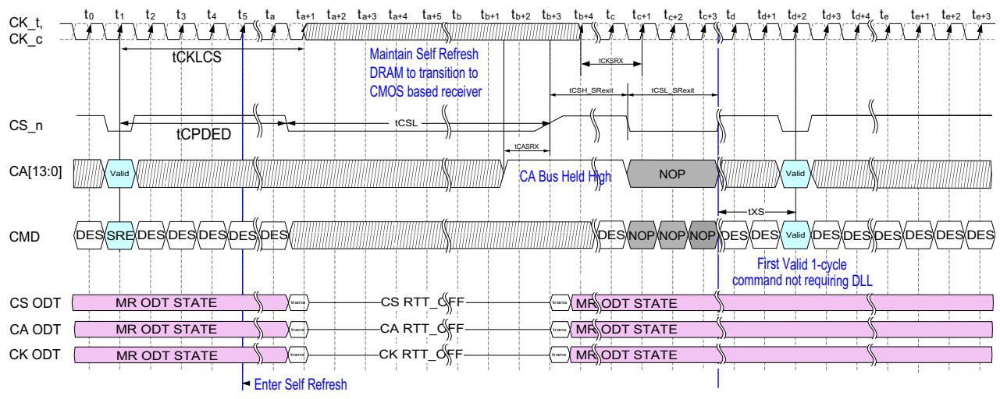

flowchart

```mermaid
graph TD
    subgraph Time_Signments
        A["CK_t, CK_c"] --> B["t0 t1 t2 t3 t4 t5 ta ta+1 ta+2 ta+3 ta+4 ta+5 tb tb+1 tb+2 tb+3 tb+4 tc tc+1 tc+2 tc+3 td td+1 td+2 td+3 td+4 te te+1 te+2 te+3"]
        C["CS_n"] --> D["tCPDED"] --> E["tCSL"] --> F["tCASRX"] --> G["CA Bus Held High NOP"] --> H["Valid"]
    end
    I["CMD"] --> J["DES SRE DES DES DES DES DES DES DES DES DES DES DES DES DES DES DES DES DES DES DES DES DES DES DES DES DES DES DES DES DES DES DES DES DES DES DES DES DES DES DES DES DES DES DES DES DES DES DES DES DES DES DES DES DES DES DES DES DES DES DES DES DES DES DES DES DES DES DES DES DES DES DES DES DES DES DES DES DES DES DES DES DES DES DES DES DE"]
    I --> K["CS ODT"] --> L["MR ODT STATE"] --> M["CS RTT_OFF"] --> N["MR ODT STATE"] --> O["First Valid 1-cycle command not requiring DLL"]
    P["CA ODT"] --> Q["MR ODT STATE"] --> R["CA RTT_OFF"] --> S["MR ODT STATE"] --> T["First Valid 1-cycle command not requiring DLL"]
    U["CK ODT"] --> V["MR ODT STATE"] --> W["CK RTT_OFF"] --> X["MR ODT STATE"] --> Y["First Valid 1-cycle command not requiring DLL"]
    Z["CK_LCS"] --> AA["tCKLCS"] --> AB["maintain Self Refresh DRAM to transition to CMOS based receiver"]
    AC["CS_n"] --> AD["tCPDED"] --> AE["tCSL"] --> AF["tCASRX"] --> AG["CA Bus Held High NOP"] --> AH["Valid"]
    AI["CA[13:0"]] --> AJ["Valid"]
    AK["CMD"] --> AL["DES SRE DES DES DES DES DES DES DES DES DES DES DES DES DES DES DE"]
    AL --> AM["DES NOP NOP NOP"] --> AN["DES NOP NOP NOP"] --> AO["DES NOP NOP NOP NOP"] --> AP["DES NOP NOP NOP NOP NOP NOP NOP NOP NOP NOP NOP NOP NOP NOP NOP NOP NOP NOP NOP NOP NOP NOP NOP NOP NOP NOP NOP NOP NOP NOP NOP NOP NOP NOP NOP NOP NOP NOP NOP NOP NOP NOP NOP NOP NOP NOP NOP NOP NOP NOP NOp"]
    AQ["CS ODT"] --> AR["MR ODT STATE"] --> AS["CS RTT_OFF"] --> AT["MR ODT STATE"] --> AU["First Valid 1-cycle command not requiring DLL"]
    AV["CA ODT"] --> AW["MR ODT STATE"] --> AX["CA RTT_OFF"] --> AY["MR ODT STATE"] --> AZ["First Valid 1-cycle command not requiring DLL"]
```

# NOTES:

1. While in 2N mode, tCSL\_SRexit will not be statically held low (as shown above), as it will pulse for each 2 cycle period. Refer to the 2N mode section for more details.   
2. Both tCSH\_SRexit and tCSL\_SRexit timings must be satisfied to guarantee DRAM operation.   
3. When tCSH\_SRexit,min expires, the CA bus is allowed to transition from all bits High to any valid (V) level. Prior to CS\_n being registered Low at tc+1, the CA bus must transition to NOP conforming to the CAI state of the DRAM and complying with applicable DRAM input timing parameters.

Figure 63 — Self-Refresh Entry/Exit Timing with 1-Cycle Exit Command

# 4.9 Self Refresh Operation (cont’d)

Table 56 — Self-Refresh Timing Parameters 

<table><tr><td>Parameter</td><td>Symbol</td><td>Min</td><td>Max</td><td>Unit</td><td>Note</td></tr><tr><td>Command pass disable delay</td><td>tCPDED</td><td>max(5ns, 8nCK)</td><td>-</td><td>nCK, ns</td><td></td></tr><tr><td>Self-Refresh CS_n low Pulse width</td><td>tCSL</td><td>10</td><td>-</td><td>ns</td><td></td></tr><tr><td>Self-Refresh exit CS_n High Pulse width</td><td>tCSH_SRexit</td><td>13</td><td>200</td><td>ns</td><td></td></tr><tr><td>Self-Refresh exit CS_n Low Pulse width</td><td>tCSL_SRexit</td><td>3nCK</td><td>30ns</td><td>nCK, ns</td><td>1</td></tr><tr><td>Valid Clock Requirement before SRX</td><td>tCKSRX</td><td>max(3.5ns, 8tCK)</td><td>-</td><td>nCK, ns</td><td></td></tr><tr><td>Valid Clock Requirement after SRE</td><td>tCKLCS</td><td>tCPDED + 1nCK</td><td>-</td><td>nCK, ns</td><td></td></tr><tr><td>Self-Refresh exit CS_n high</td><td>tCASRX</td><td>0</td><td></td><td>ns</td><td></td></tr><tr><td>Exit Self-Refresh to next valid command NOT requiring a DLL</td><td>tXS</td><td>tRFC1</td><td>-</td><td>ns</td><td></td></tr><tr><td>3DS exit Self-Refresh to next valid command NOT requiring a DLL</td><td>tXS_3DS</td><td>tRFC1_slr+10ns</td><td>-</td><td>ns</td><td>2, 3, 4</td></tr><tr><td>Exit Self-Refresh to next valid command requiring a DLL</td><td>tXS_DLL</td><td>tDLLK</td><td></td><td>ns</td><td></td></tr><tr><td colspan="6">NOTE 1 While in 2N mode, tCSL_SRexit will not be statically held low, as it will pulse for each 2-cycle period for a min of 6nCK. Refer to the 2N mode section for more details.NOTE 2 Upon exit from Self-Refresh, the 3D Stacked DDR5 SDRAM requires a minimum of one extra refresh command to all logical ranksbefore it is put back into Self-Refresh Mode.NOTE 3 This parameter utilizes a value that varies based on density. Refer to the 3DS Refresh section for more information.NOTE 4 These timings are for x4 2H and 4H 3Ds devices.</td></tr></table>

# 4.9.1 Self Refresh in 2N Mode

The timing diagram in Figure 64 shows details for Self Refresh entry/exit in 2N Mode. Only SRX, with a pulsing CS\_n (NOP-DES-NOP-DES-NOP) during tCSL\_SRexit, to a 1-cycle command is shown, but behavior is similar for SRX to a 2-cycle command. Behavior is similar for Frequency Change during Self Refresh, with or without VREF and/or ODT changes. Pulsing CS\_n during tCSL\_SRexit is not required for Self Refresh exit (for example, CS\_n may be held low for the full tCSL\_SRexit duration).

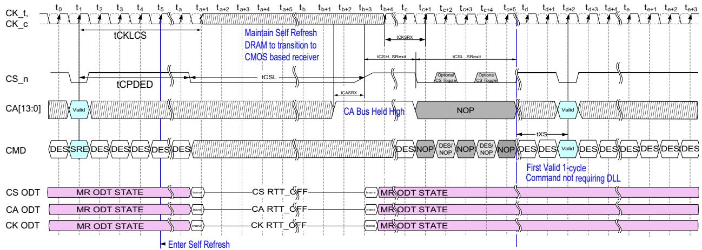

flowchart

```mermaid
graph TD
    A["CK_t, CK_c"] --> B["tCKLCS"]
    B --> C["ICSH_SRexit"]
    C --> D["ICSL_SRexit"]
    D --> E["Optional CS Toggle"]
    E --> F["Optional CS Toggle"]
    F --> G["CA Bus Held High"]
    G --> H["NOP"]
    H --> I["Valid"]
    J["CS_n"] --> K["tCPDED"]
    K --> L["ICASRX"]
    L --> M["ICSH_SRexit"]
    M --> N["Optional CS Toggle"]
    N --> O["Optional CS Toggle"]
    O --> P["CA Bus Held High"]
    P --> Q["NOP"]
    Q --> R["Valid"]
    S["CA[13:0"]] --> T["Valid"]
    U["CMD"] --> V["DES_SRE"]
    V --> W["DES_DES"]
    W --> X["DES_DES"]
    X --> Y["DES_DES"]
    Y --> Z["DES_NOP"]
    Z --> AA["NOP_DES/NOP"]
    AA --> AB["NOP_DES/DES"]
    AB --> AC["DES_DES"]
    AC --> AD["Valid"]
    AE["CS ODT"] --> AF["MR ODT STATE"]
    AF --> AG["CS RTT_OFF"]
    AG --> AH["MR ODT STATE"]
    AI["CA ODT"] --> AJ["MR ODT STATE"]
    AJ --> AK["CA RTT_OFF"]
    AK --> AL["MR ODT STATE"]
    AM["CK ODT"] --> AN["MR ODT STATE"]
    AN --> AO["CK RTT_OFF"]
    AO --> AP["MR ODT STATE"]
    AQ["Enter Self Refresh"] --> AR["First Valid 1-cycle Command not requiring DLL"]
```

# NOTES:

1. Both tCSH\_SRexit and tCSL\_SRexit timings must be satisfied to guarantee DRAM operation.   
2. When tCSH\_SRexit,min expires, the CA bus is allowed to transition from all bits High to any valid (V) level. Prior to CS\_n being registered Low at tc+1, the CA bus must transition to NOP conforming to the CAI state of the DRAM and complying with applicable DRAM input timing parameters.

Figure 64 — Self-Refresh Entry/Exit Timing in 2N Mode with 1-Cycle Exit Command

# 4.9.2 Partial Array Self Refresh (PASR)

PASR has been deprecated starting with spec working revision 1.90, JESD79-5C-v1.30. All MR60 bits will behave as RFU on devices that do not support PASR.

DDR5 DRAMs may contain an optional feature that disables refresh to selected segments in each bank when in self refresh. The feature allows for lower self refresh power if portions of the DRAMs are not required to retain data. Each bank is divided into six or eight segments based on the three highest row address bits supported by the DRAM device’s density. Non-Binary density devices are divided into 6 segments as the 110 and 111 encodings of the PASR segment row bits are not used.

Binary densities are divided into 8 segments.

MR60 provides the segment mask for all banks, with one bit per segment. A 0 (default) in the bit position provides normal refresh operation for the segment while a 1 masks that segment. Masked segments are NOT refreshed during self refresh. Note that this affects Self Refresh only. All segments are refreshed by refresh command when out of self refresh.

Segments which are masked are not guaranteed to retain their data if self refresh is entered. ECS Transparency will not produce accurate results if any mask bit is set, but ECS scrubbing will still occur if enabled.

MR19 bit 7 is indicates whether the DRAM supports PASR. 0 = Not Supported, 1 = Supported

Table 57 — MR60 Definition 

<table><tr><td>Segment (PASR Row Bits)</td><td>Type</td><td>Operand</td><td>Data</td><td>Notes</td></tr><tr><td>Segment 0 (000)</td><td>W</td><td>OP0</td><td>0=Normal, 1=Masked</td><td></td></tr><tr><td>Segment 1 (001)</td><td>W</td><td>OP1</td><td>0=Normal, 1=Masked</td><td></td></tr><tr><td>Segment 2 (010)</td><td>W</td><td>OP2</td><td>0=Normal, 1=Masked</td><td></td></tr><tr><td>Segment 3 (011)</td><td>W</td><td>OP3</td><td>0=Normal, 1=Masked</td><td></td></tr><tr><td>Segment 4 (100)</td><td>W</td><td>OP4</td><td>0=Normal, 1=Masked</td><td></td></tr><tr><td>Segment 5 (101)</td><td>W</td><td>OP5</td><td>0=Normal, 1=Masked</td><td></td></tr><tr><td>Segment 6 (110)</td><td>W</td><td>OP6</td><td>0=Normal, 1=Masked</td><td>Must be 0 for 24 Gbit and 48 Gbit devices.</td></tr><tr><td>Segment 7 (111)</td><td>W</td><td>OP7</td><td>0=Normal, 1=Masked</td><td>Must be 0 for 24 Gbit and 48 Gbit devices.</td></tr></table>

Table 58 — PASR Segment Row Address Bits 

<table><tr><td>DRAM Density</td><td>PASR Row Bits</td><td>Segments</td></tr><tr><td>8 Gbit</td><td>R15:13</td><td>8</td></tr><tr><td>16 Gbit</td><td>R15:13</td><td>8</td></tr><tr><td>24 Gbit</td><td>R16:14</td><td>6</td></tr><tr><td>32 Gbit</td><td>R16:14</td><td>8</td></tr><tr><td>48 Gbit</td><td>R17:15</td><td>6</td></tr><tr><td>64 Gbit</td><td>R17:15</td><td>8</td></tr></table>

# 4.10 Power-Down Mode

DDR5’s Power-Down (PD) mode is new to the DDR family, as it no longer has a CKE pin to control entry and exit. Instead, the Power-Down Entry (PDE)/Power-Down Exit (PDX) move to command based, triggered by the CS\_n. Once in PD mode, the CS\_n acts effectively like the historic CKE pin, waiting for it to transition from HIGH to LOW (with its command). In PD mode, CS\_n should be sampled on every edge.

# 4.10.1 Power-Down Entry and Exit

Power-Down is entered when the PDE command is registered. Unlike Self Refresh Mode, CS\_n will NOT be held low constantly while in Power-Down. Timing diagrams are shown in Figure 65 with details for entry and exit of Power-Down.

The DLL should be in a locked state when Power-Down is entered for fastest Power-Down exit timing. SDRAM design provides all AC and DC timing and voltage specification as well as proper DLL operation as long as DRAM controller complies with SDRAM specifications.

During Power-Down, if all banks are closed after any in-progress commands are completed, the device will be in precharge Power-Down mode; if any bank is open after in-progress commands are completed, the device will be in active Power-Down mode.

Entering Power-Down deactivates the input and output buffers, excluding CK\_t, CK\_c, CS\_n, RESET\_n which remain enabled throughout the duration of Power-Down. If CA11=L during the PDE command, command input buffers CA1 and CA4 remain enabled, allowing the appropriate Non-Target (NT) On-Die Termination (ODT) command to be passed through and decoded by the non-target DRAM in Power-Down (i.e. the DRAM will monitor commands that utilize NT ODT and will not exit Power-Down as a result of a valid NT ODT command being registered). Optionally, command input buffers CA0, CA2, CA3 and CA5 may remain enabled if needed by the DRAM to properly decode the NT ODT commands during PDE and PDX.

If CA11=H during the PDE command, only the PDX command, qualified by CS\_n, is legal during Power-Down. If CA11=L during the PDE command, only NT ODT commands and PDX commands, qualified by CS\_n, are legal during Power-Down. Refer to the command truth table for more information.

Although MRR is BL16 regardless of the MR0 Burst Length setting, the host shall not issue MRR NT ODT commands during Power-Down when MR0:OP[1:0]=01.

When Power-Down is entered with NT ODT control enabled (CA11=L), the DRAM will continue to accept NT commands throughout the Power-Down process, including entry and exit. Upon Power-Down entry during the tCPDED period, the DRAM will be switching from decoding all CA bus command bits to only decoding CA1 and CA4. During this time all CA command bits must be valid when CS\_n is asserted with the full Read or Write command, as the DRAM may still be decoding the full command. Following tCPDED, only CA1 and CA4 need be valid as the DRAM will be ignoring the others. Following the PDX command, all CA command bits must be valid for NT termination commands also, as the DRAM will be transitioning to decoding all bits. In the optional case where command input buffers CA0, CA2, CA3 and CA5 remain enabled, all CA command bits must be valid when CS\_n is asserted between the PDE command and the completion of tXP upon PDX. It is only the time between tCPDED completion and tXP start that non-CA command bits (CA13:6) and CA command bits not being used for the NT ODT command decode need not be valid.

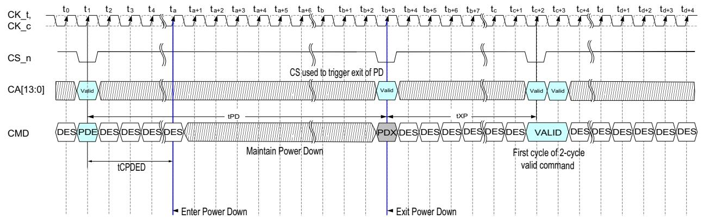

flowchart

```mermaid
graph TD
    A["CK_t, CK_c"] --> B["t0 t1 t2 t3 t4 ta ta+1 ta+2 ta+3 ta+4 ta+5 ta+6 tb tb+1 tb+2 tb+3 tb+4 tb+5 tb+6 tb+7 tc tc+1 tc+2 tc+3 tc+4 td td+1 td+2 td+3 td+4"]
    C["CS_n"] --> D["Valid"]
    E["CA[13:0"]] --> F["Valid"]
    G["CMD"] --> H["DES PDE DES DES DES DES"]
    H --> I["tCPDED"]
    I --> J["Enter Power Down"]
    J --> K["PDX DES DES DES DES DES"]
    K --> L["tXP"]
    L --> M["First cycle of 2-cycle valid command"]
    N["Exit Power Down"] --> O["Exit Power Down"]
    style A fill:#f9f,stroke:#333
    style C fill:#f9f,stroke:#333
    style E fill:#f9f,stroke:#333
    style G fill:#f9f,stroke:#333
    style N fill:#f9f,stroke:#333
    style B fill:#ccf,stroke:#333
    style D fill:#ccf,stroke:#333
    style F fill:#ccf,stroke:#333
    style H fill:#ccf,stroke:#333
    style K fill:#ccf,stroke:#333
    style L fill:#ccf,stroke:#333
    style M fill:#ccf,stroke:#333
    style O fill:#ccf,stroke:#333
```

NOTES:   
1. There is no specific PDX command. In the case of systems with register using CAI, the encoding out of the register may be inverted from a NOP type command.   
2. Diagram above is shown with a valid 2-cycle command after tXP for simplicity. 1-cycle valid commands are also legal.   
3. CS\_n shall be held HIGH, not toggled, during Power-Down, except Non-Target ODT command when PDE with CA11=L is asserted.

Figure 65 — Power-Down Entry and Exit Mode

# 4.10.1 Power-Down Entry and Exit (cont’d)

Table 59 — Power-Down Entry Definitions 

<table><tr><td>Status of DRAM</td><td>DLL</td><td>PD Exit</td><td>Relevant Parameters</td></tr><tr><td>Active(One or more banks open)</td><td>On</td><td>Fast</td><td>tXP</td></tr><tr><td>Precharge(All banks precharged)</td><td>On</td><td>Fast</td><td>tXP</td></tr></table>

The DLL is kept enabled during Precharge Power-Down or Active Power-Down. (If RESET\_n goes low during Power-Down, the DRAM will be out of PD mode and into reset state). Power-down duration is limited by tPD(max) of the device.

Table 60 — Power Down Timing Parameters 

<table><tr><td>Parameter</td><td>Symbol</td><td>Min</td><td>Max</td><td>Unit</td><td>Note</td></tr><tr><td>Command pass disable delay</td><td>tCPDED</td><td>max(5ns, 8nCK)</td><td>-</td><td>ns, nCK</td><td></td></tr><tr><td>Power-Down duration</td><td>tPD</td><td>max(7.5ns, 8nCK)</td><td>5 * tREFI1 (Normal)9 * tREFI2 (FGR)</td><td>ns, nCK</td><td>8</td></tr><tr><td>Power-Down Exit command to next valid command (excluding NT ODT commands when PDE with CA11=L)</td><td>tXP</td><td>max(7.5ns, 8nCK)</td><td></td><td>ns, nCK</td><td></td></tr><tr><td>Activate command to Power Down Entry command</td><td>tACTPDEN</td><td>2</td><td></td><td>nCK</td><td>1</td></tr><tr><td>Precharge, Precharge All, or Pre-charge Same Bank command to Power-Down Entry command</td><td>tPRPDEN</td><td>2</td><td></td><td>nCK</td><td>1</td></tr><tr><td>Read or Read w/Auto Precharge command to Power-Down Entry command</td><td>tRDPDEN</td><td>CL+RBL/2+1</td><td></td><td>nCK</td><td>4, 6</td></tr><tr><td>Write command to Power-Down Entry command</td><td>tWRPDEN</td><td>CWL+WBL/2+WR+1</td><td></td><td>nCK</td><td>2, 4, 7</td></tr><tr><td>Write w/Auto Precharge command to Power-Down Entry command</td><td>tWRAPDEN</td><td>CWL+WBL/2+WR+1</td><td></td><td>nCK</td><td>2, 3, 4, 7</td></tr><tr><td>Refresh All or Refresh Same Bank command to Power-Down Entry command</td><td>tREFPDEN</td><td>2</td><td></td><td>nCK</td><td></td></tr><tr><td>MRR command to Power-Down Entry command</td><td>tMRRPDEN</td><td>CL+8+1</td><td></td><td>nCK</td><td>4</td></tr><tr><td>MRW command to Power-Down Entry command</td><td>tMRWPDEN</td><td>tMRD(min)</td><td></td><td>nCK</td><td></td></tr><tr><td>MPC command to Power-Down Entry command</td><td>tMPCPDEN</td><td>tMPC_delay</td><td></td><td>nCK</td><td>5</td></tr><tr><td colspan="6">NOTE 1 Power-Down command can be sent while operations such as Activation, Precharge, Auto-Precharge or Refresh are in progress but IDD spec will not be applied until the operations are finished.NOTE 2 Write Recovery (WR) is calculated from tWR by using the Rounding Algorithm. Refer to the Rounding Definitions and Algorithm section for more information.NOTE 3 Write Recovery (WR) in clock cycles as programmed in MR6.NOTE 4 Read/Write/MRR can refer to both Target command and Non-Target command when CA11=H during PDE command.NOTE 5 tMPC_delay is a valid timing parameter for all MPC functions except:a) Enter CS training Mode, Enter CA Training Mode, PDA Enumerate ID Program Mode because Power Down Entry is not supported for these MPC commands.b) Apply VrefCA, VrefCS and RTT_CA/CS/CK because this MPC command requires waiting for VrefCA_time/VREFCS_time.NOTE 6 RBL: Read burst length associated with Read commanda) RBL = 32 (36 with RCRC on) for fixed BL32 and BL32 in BL32 OTF modeb) RBL = 16 (18 with RCRC on) for fixed BL16 and BL16 in BL32 OTF modec) RBL = 16 (18 with RCRC on) for BL16 in BC8 OTF mode and BC8 in BC8 OTF modeNOTE 7 WBL: Write burst length associated with Write commanda) WBL = 32 (36 with WCRC on) for fixed BL32 and BL32 in BL32 OTF modeb) WBL = 16 (18 with WCRC on) for fixed BL16 and BL16 in BL32 OTF modec) WBL = 16 (18 with WCRC on) for BL16 in BC8 OTF mode and BC8 in BC8 OTF modeNOTE 8 tPD(max) shall always be less than or equal to 5*tREFI1(max) during Normal Refresh Mode and less than or equal toNOTE 9 tREFI2(max) during Fine Granularity Refresh Mode, and when using the rounding algorithms, nPD(max) shall always be less than or equal to 5*nREFI1(max) during Normal Refresh Mode and less than or equal to 9*nREFI2(max) during Fine Granularity Refresh Mode.</td></tr></table>

# 4.10.1 Power-Down Entry and Exit (cont’d)

Table 61 — Valid Command During Power-Down with ODT Enabled 

<table><tr><td>CA1</td><td>CA4</td><td>Command</td><td>Operation of DRAM in Power Down</td></tr><tr><td>L</td><td>L</td><td>Write</td><td>DRAM will enable ODT_WR_NOM</td></tr><tr><td>L</td><td>H</td><td>Read</td><td>DRAM will enable ODT_RD_NOM</td></tr><tr><td>H</td><td>L</td><td>Illegal</td><td>Illegal. CS_n will NOT be asserted to a powered down DRAM with this combination</td></tr><tr><td>H</td><td>H</td><td>PDX(NOP)</td><td>Exit Power Down</td></tr><tr><td colspan="4">NOTE 1 MRR NT ODT commands during Power-Down are not allowed when MR0:OP[1:0]=01.</td></tr></table>

# 4.11 Input Clock Frequency Change

Once the DDR5 SDRAM is initialized, the DDR5 SDRAM requires the clock to be “stable” during almost all states of normal operation. This means that, once the clock frequency has been set and is to be in the “stable state”, the clock period is not allowed to deviate except for what is allowed for by the clock jitter and SSC (spread spectrum clocking) specifications.

The input clock frequency can be changed from one stable clock rate to another stable clock rate under Self Refresh with Frequency Change mode. Outside Self-Refresh w/Frequency Change mode, it is illegal to change the clock frequency.

Prior to entering Self-Refresh with Frequency Change mode, the host must program tCCD\_L/tCCD\_L\_WR/tCCD\_L\_WR2/tDLLK via MPC Command to update MR13 shadow register to the desired target frequency and configure VREFCA, VREFCS, RTT\_CK, RTT\_CS and RTT\_CA (MR11, MR12, MR32, and MR33) shadow registers if needed.

Once the DDR5 SDRAM has been successfully placed into Self-Refresh w/Frequency Change mode and tCKLCS has been satisfied, the state of the clock becomes a don’t care. Once a don’t care, changing the clock frequency is permissible, provided the new clock frequency is stable prior to tCKSRX. During tCSL\_FreqChg and prior to exiting Self-Refresh, the DRAM will automatically apply the changes to tCCD\_L/tCCD\_L\_WR/tCCD\_L\_WR2/tDLLK, VREFCA, VREFCSRTT\_CK, RTT\_CS, and RTT\_CA. When entering and exiting Self-Refresh mode for the sole purpose of changing the clock frequency, the Self-Refresh entry and exit specifications must still be met as outlined in Section 4.9 “Self-Refresh Operation”. For the new clock frequency, Mode Registers may need to be configured (to program the appropriate CL, Preambles, Write Leveling Internal Cycle Alignment, DFE, DCA, etc.) prior to normal operation.

The DDR5 SDRAM input clock frequency is allowed to change only within the minimum and maximum operating frequency specified for the particular speed grade.

# 4.11.1 Frequency Change Steps

The following steps must be taken:

1. Prior to executing the SREF command, the shadow register of Mode Registers MR11/MR12/MR13/MR32/MR33 can be pre-loaded anytime if DRAM is in an IDLE state:

1a. The host MUST program tCCD\_L/tCCD\_L\_WR/tCCD\_L\_WR2/tDLLK via MR13:OP[3:0] to the desired target frequency. During this stage, the values are stored in the MR13 shadow register and shall be applied to MR13 automatically when running SREF w/ CA9=”L” on the DRAM. This change occurs during tCSL\_FreqChg when exiting Self-Refresh with Frequency Change.   
1b. The host can configure the appropriate CS/CA/CK ODT settings via Mode Register (MR32 and MR33) if new values are needed for the new target frequency. During this stage, the values are stored in the MR32 and MR33 shadow registers and shall be applied to MR32 and MR33 automatically when running SREF with CA9=”L” on the DRAM. This change occurs during tCSL\_FreqChg when exiting Self-Refresh w/Frequency Change.   
1c. The host can configure the VREFCA and VREF CS via the VREFCA or VREFCS command(s). During this stage, the values are stored in the MR11 and MR12 shadow registers and shall be applied to MR11 and MR12 automatically when running SREF with CA9=”L” on the DRAM. This change occurs during tCSL\_FreqChg when exiting Self-Refresh with Frequency Change.   
1d. Entering and exiting Self-Refresh with the SREF command shall replace the values of MR11, MR12, MR13, MR32, and MR33 with their shadow register values.

2. Enter Self Refresh with Frequency Change by sending the SREF command (SRE with CA9=’L’).

# 4.11.1 Frequency Change Steps (cont’d)

3. After tCPDED(min), the host will transition CS\_n low, indicating to the DRAM that the terminations are safe to turn off.   
4. After tCKLCS, the host can turn the clocks off.   
5. Device enters Self Refresh.   
6. At this time, changing the clock frequency is permissible, provided the new clock frequency is stable prior to tCKSRX   
7. Exiting Self-Refresh w/Frequency Change follows the same process as normal Self-Refresh exit.   
8. After tXS, any additional mode registers requiring the DLL that are needed for the new frequency can be configured or other commands not requiring a DLL may be issued. (ACT, MPC, MRW, PDE, PDX, PREab, PREsb, PREpb, REFab, REFsb, RFMab, RFMsb, SRE, VREFCA, VREFCS)   
9. After tXS\_DLL, normal operations resume and all commands are legal.

Table 62 — Self Refresh with Frequency Change (for Reference) 

<table><tr><td rowspan="2">Function</td><td rowspan="2">Abbreviation</td><td rowspan="2">CS</td><td colspan="15">CA Pins</td><td rowspan="2">NOTES</td></tr><tr><td>CA0</td><td>CA1</td><td>CA2</td><td>CA3</td><td>CA4</td><td>CA5</td><td>CA6</td><td>CA7</td><td>CA8</td><td>CA9</td><td>CA10</td><td>CA11</td><td>CA12</td><td>CA13</td><td></td></tr><tr><td>Self Refresh Entry with Frequency Change</td><td>SREF</td><td>L</td><td>H</td><td>H</td><td>H</td><td>L</td><td>H</td><td>V</td><td>V</td><td>V</td><td>V</td><td>L</td><td>L</td><td>V</td><td>V</td><td>V</td><td>1</td><td></td></tr><tr><td colspan="19">NOTE 1 See Command Truth Table for details</td></tr></table>

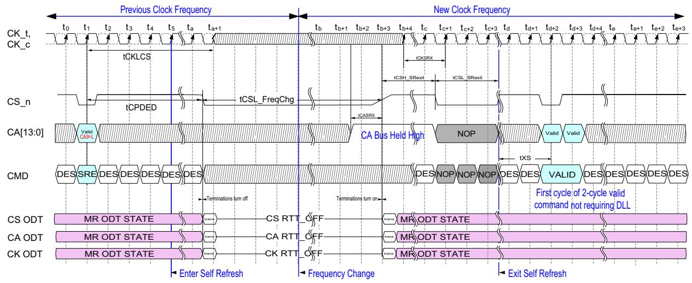

text_image

Previous Clock Frequency
New Clock Frequency
CK_t,
CK_c
t0 t1 t2 t3 t4 t5 ta ta+1
tCKLCS
tCS_L_FreqChg
tCSH_SRexit
tCSL_SRexit
ICASRX
CA[13:0]
Valid
CAL=1
ICA Bus Held High
NOP
Valid Valid
CMD
DES SRE DES DES DES DES DES
DES NOP NOP NOP DES DES VALID DES DES DES DES
TERMINATIONS TURN OFF
Terminations TURN ON
First cycle of 2-cycle valid
command not requiring DLL
CS ODT
MR ODT STATE
CS RTT OFF
MR ODT STATE
CA ODT
MR ODT STATE
CA RTT OFF
MR ODT STATE
CK ODT
MR ODT STATE
CK RTT OFF
MR ODT STATE
Enter Self Refresh
Frequency Change
Exit Self Refresh

# NOTES:

1. While in 2N mode, tCSL\_SRexit will not be statically held low (as shown above), as it will pulse for each 2 cycle period. Refer to the 2N mode section for more details.   
2. Both tCSH\_SRexit and tCSL\_SRexit timings must be satisfied to guarantee DRAM operation.   
3. Diagram above is shown with a valid 2-cycle command after tXS for simplicity. 1-cycle valid commands are also legal.   
4. When tCSH\_SRexit,min expires, the CA bus is allowed to transition from all bits High to any valid (V) level. Prior to CS\_n being registered Low at tc+1, the CA bus must transition to NOP conforming to the CAI state of the DRAM and complying with applicable DRAM input timing parameters.

Figure 66 — Frequency Change during Self Refresh   
Table 63 — Self-Refresh Frequency Change Timing Parameters 

<table><tr><td>Parameter</td><td>Symbol</td><td>Min</td><td>Max</td><td>Unit</td><td>Note</td></tr><tr><td>Self-Refresh CS_n low Pulse width with Freq Change</td><td>tCSL_FreqChg</td><td>VrefCA_time</td><td>-</td><td>ns</td><td>1</td></tr><tr><td colspan="6">NOTE 1 Since frequency can require VREFCA, VREFCS and CA/CK/CS ODT Changes, the min time is longer than the traditional tCSL when the SRE command with CA9=L is used.</td></tr></table>

# 4.12 Maximum Power Saving Mode (MPSM)

When Maximum Power Saving Mode is enabled by setting the MPSM enable (MR2:OP[3]) bit to ‘1’ using MRW command, the device enters Maximum Power Saving Mode Idle (MPSM Idle) state. When Maximum Power Saving Mode for Device 15 is enabled by setting the Device 15 MPSM enable bit (MR2:OP[5]) to ‘1’ using MRW command, and the device’s PDA Enumerate ID (MR1 bits OP[3:0]) are equal to 15, the device enters Maximum Power Saving Mode Idle (MPSM Idle) state. Setting the Device 15 MSPM enable bit to ‘1’ must be done after PDA device enumeration is complete. Once the DRAM is placed into the MPSM Idle state, it can stay in that state indefinitely, or it can further enter either Maximum Power Saving Mode Power Down (MPSM Power Down) state or Maximum Power Saving Mode Self Refresh (MPSM Self Refresh) state.

Data retention is not guaranteed when DRAM is in any of MPSM states. Mode register status and Soft PPR information is preserved.

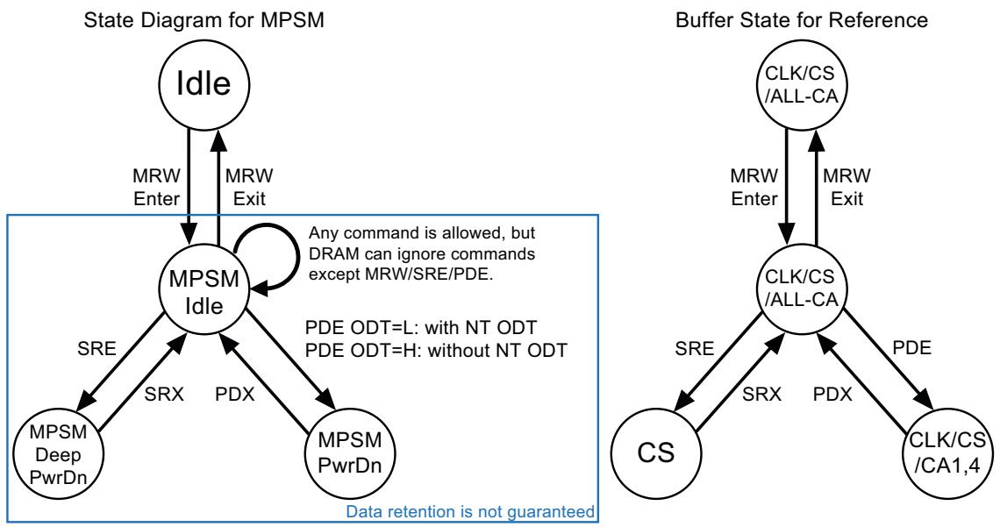

flowchart

```mermaid
graph TD
    subgraph_State_Diagram["State Diagram for MPSM"]
        Idle["Idle"] --> MRW_Enter["MRW Enter"]
        Idle --> MRW_Exit["MRW Exit"]
        MPMSM_Idle["MPSM Idle"] --> MRW_Enter
        MPMSM_Idle --> MRW_Exit
        MPMSM_Idle --> MRW_Enter
        MPMSM_Idle --> MRW_Exit
        MPMSM_Idle --> MRW_Enter
        MPMSM_Idle --> MRW_Exit
        MPMSM_Idle --> MRW_Enter
        MPMSM_Idle --> MRW_Exit
        MPMSM_Idle --> MRW_Enter
        MPMSM_Idle --> MRW_Exit
        MPMSM_Idle --> MRW_Enter
        MPSM_PwrDn["MPSM Deep PwrDn"] --> MRW_Enter
        MPSM_PwrDn --> MRW_Exit
        MPSM_PwrDn --> MRW_Enter
        MPSM_PwrDn --> MRW_Exit
        MPMSPwrDn["MPSM PwrDn"] --> MRW_Enter
        MPMSPwrDn --> MRW_Exit
        MPMSPwrDn --> MRW_Enter
        MPMSPwrDn --> MRW_Exit
        MPMSPwrDn --> MRW_Enter
        MPMSPwrDn --> MRW_Exit
    end

    subgraph_Buffer_State["Buffer State for Reference"]
        CLK_CS_ALL-CA["CLK/CS ALL-CA"] --> MRW_Enter["MRW Enter"]
        CLK_CS_ALL-CA --> MRW_Exit["MRW Exit"]
        CLK_CS_ALL-CA --> MRW_Enter
        CLK_CS_ALL-CA --> MRW_Exit
        CLK_CS_ALL-CA --> SRE["SRE"]
        CLK_CS_ALL-CA --> SRX["SRX"]
        CLK_CS_ALL-CA --> PDX["PDX"]
        CLK_CS_ALL-CA --> PDE["PDE"]
        CLK_CS_ALL-CA --> CS["CS"]
        CLK_CS_ALL-CA --> CS
        CLK_CS_ALL-CA --> CS1["CLK/CS/CA1,4"]
    end

    style State_Diagram fill:#f9f,stroke:#333
    style Buffer_State fill:#bbf,stroke:#333
```

Figure 67 — State Diagram for Maximum Power Saving Mode

Table 64 — MPSM Configuration Options 

<table><tr><td>MPSM MR2:OP[3]</td><td>Device 15 MPSM MR2:OP[5]</td><td>PDA Enumeration ID MR1:OP[3:0]</td><td>Action</td></tr><tr><td>1</td><td>X</td><td>X</td><td>Enter MPSM on MRW</td></tr><tr><td>X</td><td>1</td><td>1111</td><td>Enter MPSM on MRW</td></tr><tr><td>0</td><td>0</td><td>X</td><td>Exit MPSM on MRW</td></tr><tr><td>0</td><td>X</td><td>Not equal to 1111</td><td>Exit MPSM on MRW</td></tr></table>

# 4.12.1 MPSM Idle State

When DDR5 SDRAM is in this state, it ignores all types of commands except MRW, ODT, Power Down Entry (PDE) and Self Refresh Entry (SRE) commands. Only MRW commands to Exit MPST Idle, as described in Table 64, shall be issued. For any other MRW command the DRAM shall first be taken out of MPSM Idle, then the MRW command may be issued. ODT, PDE and SRE commands are executed normally. DRAM shall not respond to any other command except these four command types. DLL status is same as in normal idle state. DRAM continues to drive CA ODT as programmed.

Normal command timing parameters are applied in this state, except that tREFI doesn’t need to be satisfied as Refresh command doesn’t need to be issued in this state.