# 5.3.3 ODT Timing Diagrams (cont’d)

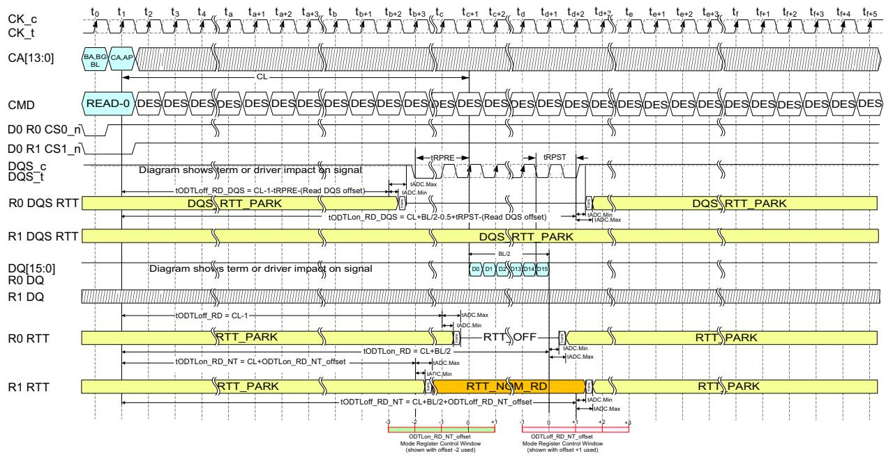

<details>
<summary>other</summary>

| Signal Type | Time (s) |
|-------------|----------|
| CK_c        | 0        |
| CK_t        | 0        |
| CA[13:0]    | t_a      |
| CA[13:0]    | t_b      |
| CA[13:0]    | t_c      |
| CMD         | t_d      |
| CMD         | t_d+1    |
| CMD         | t_d+2    |
| CMD         | t_d+3    |
| CMD         | t_e      |
| CMD         | t_e+1    |
| CMD         | t_e+2    |
| CMD         | t_e+3    |
| CMD         | t_f      |
| CMD         | t_f+1    |
| CMD         | t_f+2    |
| CMD         | t_f+3    |
| CMD         | t_f+4    |
| CMD         | t_f+5    |
| D0 R0 CS0_n | t_0      |
| D0 R1 CS1_n | t_1      |
| DQS_c       | t_DQ     |
| DQS_t       | t_DQ     |
| R0 DQS RTT  | t_DQ     |
| R1 DQS RTT  | t_DQ     |
| DQ[15:0]    | t_DQ     |
| R0 DQ       | t_DQ     |
| R1 DQ       | t_DQ     |
| R0 RTT      | t_RTT     |
| R1 RTT      | t_RTT     |
</details>

# NOTES:

1. The entire range of ODTL control is now shown for simplicity.   
2. Example shown with NT\_ODT overlapping normal read disable by 1tCK on both sides (ODTLon\_RD\_NT\_offset = -2 & ODTLoff\_RD\_NT\_offset = +1)

Figure 203 — Example of Burst Read Operation ODT Latencies and Control Diagrams   
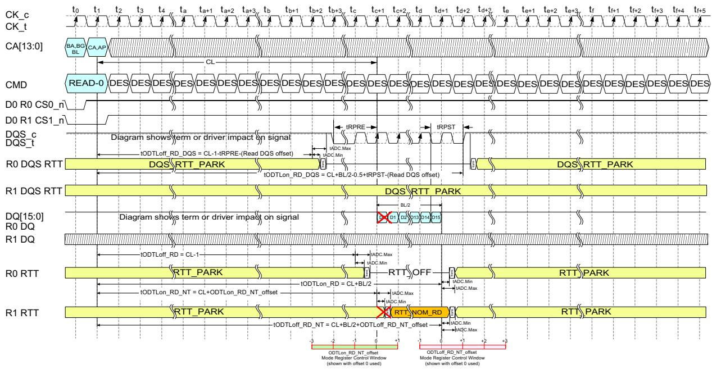

<details>
<summary>text_image</summary>

CK_c
CK_t
CA[13:0]
BA,BG
BL
CA,AP
CL
CMD
READ-0
DES
DES
DES
DES
DES
DES
DES
DES
DES
DES
DES
DES
DES
DES
DES
DES
DES
DES
D0 R0 CS0_n
D0 R1 CS1_n
DQS_c
DQS_t
Diagram shows term or driver impact on signal
tODTLoff_RD_DQS = CL-1-IRPRE-(Read DQS offset)
tADC_Max
tADC_Min
tRPST
R0 DQS RTT
DQS_RTT_PARK
tODTLon_RD_DQS = CL+BL/2-0.5+IRPST-(Read DQS offset)
DQS_RTT_PARK
R1 DQS RTT
DQS_RTT_PARK
DQ[15:0]
R0 DQ
R1 DQ
Diagram shows term or driver impact on signal
D1_D2_D3_D4_D5_D6_D7_D8_D9
tDDLoff_RD = CL-1
tAOC_Max
tADC_Min
R0 RTT
RTT_PARK
tODTLon_RD = CL+ODTLon_RD_NT_offset
RTT_OFF
tAOC_Max
tADC_Min
R1 RTT
RTT_PARK
tODTLoff_RD_NT = CL+BL/2+ODTLoff_RD_NT_offset
RTT_NOM_RD
RTT_PARK
RTT_PARK
3 - 2 - 1 0 +1 1 0 +2 +3 0 +4 1 +5 0 +6 1 +7 0 +8 1 +9 0 +10 1 +11 0 +12 1 +13 0 +14 1 +15 0 +16 1 +17 0 +18 1 +19 0 +20 1 +21 0 +22 1 +23 0 +24 1 +25 0 +26 1 +27 0 +28 1 +29 0 +30 1 +31 0 +32 1 +33 0 +34 1 +35 0 +36 1 +37 0 +38 1 +39 0 +40 1 +41 0 +42 1 +43 0 +44 1 +45 0 +46 1 +47 0 +48 1 +49 0 +50 1 +51 0 +52 1 +53 0 +54 1 +55 0 +56 1 +57 0 +58 1 +59 0 +60 1 +61 0 +62 1 +63 0 +64 1 +65 0 +66 1 +67 0 +68 1 +69 0 +70 1 +71 0 +72 1 +73 0 +74 1 +75 0 +76 1 +77 0 +78 1 +79 0 +80 1 +81 0 +82 1 +83 0 +84 1 +85 0 +86 1 +87 0 +88 1 +89 0 +90 1 +91 0 +92 1 +93 0 +94 1 +95 0 +96 1 +97 0 +98 1 +99 0 +100
</details>

# NOTES:

1. The entire range of ODTL control is now shown for simplicity.   
2. Since the ODTLon\_RD\_NT\_Offset was left at zero offset and tADC still had to be considered, the NT RTT turned on too late for the non-target device. tADC is not instantaneous.   
3. Since the tODTLoff\_RD\_NT is referenced from the CL, it is not affected by the offset used for the ‘on’ time and would turn off 1 clock earlier than the read disable RTT if programed to zero offset. tODTLon\_RD\_NT and tODTLoff\_RD\_NT are independently set and calculated from CL.

Figure 204 — Example of Burst Read Operation with ODTLon\_RD\_NT\_offset Set Incorrectly

# 5.4 On-Die Termination for CA, CS, CK\_t, CK\_c

The DDR5 DRAM includes ODT (On-Die Termination) termination resistance for CK\_t, CK\_c, CS and CA signals.

The ODT feature is designed to improve signal integrity of the memory channel by allowing the DRAM controller to turn on and off termination resistance for any target DRAM devices via MR setting.

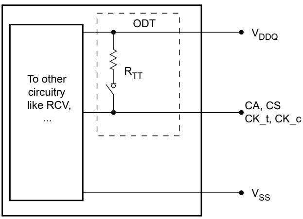

<details>
<summary>text_image</summary>

To other circuitry
like RCV,
...
ODT
RTT
VDDQ
CA, CS
CK_t, CK_c
VSS
</details>

Figure 205 — A Simple Functional Representation of the DRAM CA ODT Feature

The ODT termination resistance during power up will be set to the default values based on MR32 and MR33. The ODT resistance values can be configured by those same registers.

On-Die Termination effective resistance RTT is define by MRS bits. ODT is applied to CK\_t, CK\_c, CS, and CA pins

$$
R T T = \frac {V D D Q - V o u t}{| I o u t |}
$$

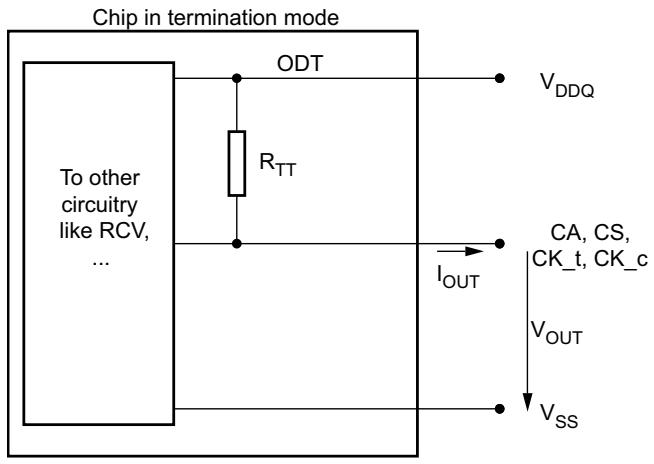

<details>
<summary>text_image</summary>

Chip in termination mode
To other circuitry
like RCV,
...
ODT
R_TT
I_OUT
V_DDQ
CA, CS,
CK_t, CK_c
V_OUT
V_SS
</details>

Figure 206 — A Functional Representation of the On-die Termination

# 5.4.1 Supported On-Die Termination Values

On-die termination effective Rtt values supported are 480, 240,120, 80, 60, and 40 ohms

Table 190 — ODT Electrical Characteristics RZQ=240 Ω +/-1% Entire Temperature Operation Range; after Proper ZQ Calibration; VDD=VDDQ 

<table><tr><td>MR</td><td>RTT</td><td>Vout</td><td>Min</td><td>Nom</td><td>Max</td><td>Unit</td><td>Note</td></tr><tr><td>MR32 for CK &amp; CS</td><td rowspan="3">480 Ω</td><td> $V_{OLdc}$ = 0.5* VDDQ</td><td>0.7</td><td>1</td><td>1.4</td><td> $R_{ZQ}$ *2</td><td>1, 2, 4</td></tr><tr><td rowspan="2">MR33 for CA</td><td> $V_{OMdc}$ = 0.8* VDDQ</td><td>0.7</td><td>1</td><td>1.3</td><td> $R_{ZQ}$ *2</td><td>1, 2, 4</td></tr><tr><td> $V_{OHdc}$ = 0.95* VDDQ</td><td>0.6</td><td>1</td><td>1.3</td><td> $R_{ZQ}$ *2</td><td>1, 2, 4</td></tr><tr><td>MR32 for CK &amp; CS</td><td rowspan="3">240 Ω</td><td> $V_{OLdc}$ = 0.5* VDDQ</td><td>0.9</td><td>1</td><td>1.25</td><td> $R_{ZQ}$ </td><td>1, 2, 4</td></tr><tr><td rowspan="2">MR33 for CA</td><td> $V_{OMdc}$ = 0.8* VDDQ</td><td>0.9</td><td>1</td><td>1.1</td><td> $R_{ZQ}$ </td><td>1, 2, 4</td></tr><tr><td> $V_{OHdc}$ = 0.95* VDDQ</td><td>0.8</td><td>1</td><td>1.1</td><td> $R_{ZQ}$ </td><td>1, 2, 4</td></tr><tr><td>MR32 for CK &amp; CS</td><td rowspan="3">120 Ω</td><td> $V_{OLdc}$ = 0.5* VDD</td><td>0.9</td><td>1</td><td>1.25</td><td> $R_{ZQ}$ /2</td><td>1, 2, 4, 5</td></tr><tr><td rowspan="2">MR33 for CA</td><td> $V_{OMdc}$ = 0.8* VDD</td><td>0.9</td><td>1</td><td>1.1</td><td> $R_{ZQ}$ /2</td><td>1, 2, 4, 5</td></tr><tr><td> $V_{OHdc}$ = 0.95* VDD</td><td>0.8</td><td>1</td><td>1.1</td><td> $R_{ZQ}$ /2</td><td>1, 2, 4, 5</td></tr><tr><td>MR32 for CK &amp; CS</td><td rowspan="3">80 Ω</td><td> $V_{OLdc}$ = 0.5* VDDQ</td><td>0.9</td><td>1</td><td>1.25</td><td> $R_{ZQ}$ /3</td><td>1, 2, 4</td></tr><tr><td rowspan="2">MR33 for CA</td><td> $V_{OMdc}$ = 0.8* VDDQ</td><td>0.9</td><td>1</td><td>1.1</td><td> $R_{ZQ}$ /3</td><td>1, 2, 4</td></tr><tr><td> $V_{OHdc}$ = 0.95* VDDQ</td><td>0.8</td><td>1</td><td>1.1</td><td> $R_{ZQ}$ /3</td><td>1, 2, 4</td></tr><tr><td>MR32 for CK &amp; CS</td><td rowspan="3">60 Ω</td><td> $V_{OLdc}$ = 0.5* VDDQ</td><td>0.9</td><td>1</td><td>1.25</td><td> $R_{ZQ}$ /4</td><td>1, 2, 4</td></tr><tr><td rowspan="2">MR33 for CA</td><td> $V_{OMdc}$ = 0.8* VDDQ</td><td>0.9</td><td>1</td><td>1.1</td><td> $R_{ZQ}$ /4</td><td>1, 2, 4</td></tr><tr><td> $V_{OHdc}$ = 0.95* VDDQ</td><td>0.8</td><td>1</td><td>1.1</td><td> $R_{ZQ}$ /4</td><td>1, 2, 4</td></tr><tr><td>MR32 for CK &amp; CS</td><td rowspan="3">40 Ω</td><td> $V_{OLdc}$ = 0.5* VDDQ</td><td>0.9</td><td>1</td><td>1.25</td><td> $R_{ZQ}$ /6</td><td>1, 2, 4</td></tr><tr><td rowspan="2">MR33 for CA</td><td> $V_{OMdc}$ = 0.8* VDDQ</td><td>0.9</td><td>1</td><td>1.1</td><td> $R_{ZQ}$ /6</td><td>1, 2, 4</td></tr><tr><td> $V_{OHdc}$ = 0.95* VDDQ</td><td>0.8</td><td>1</td><td>1.1</td><td> $R_{ZQ}$ /6</td><td>1, 2, 4</td></tr><tr><td colspan="2">Mismatch CA-CA within Device</td><td>0.8* VDDQ</td><td>0</td><td></td><td>10</td><td>%</td><td>1, 2, 3, 4</td></tr><tr><td colspan="8">NOTE 1 The tolerance limits are specified after calibration with stable voltage and temperature. For the behavior of the tolerance limits if temperature or voltage changes after calibration, see “ZQ Calibration Commands” section.NOTE 2 Pull-up ODT resistors are recommended to be calibrated at 0.8*VDDQ. Other calibration schemes may be used to achieve the linearity spec shown above, e.g., calibration at 0.5*VDDQ and 0.95*VDDQ.NOTE 3 CA to CA mismatch within device variation for a given component including CS, CK_t and CK_c (characterized)CA-CA Mismatch in a Device =  $\left( \frac{RTTMax - RTTMin}{RTTNOM} \right) \times 100$ NOTE 4 Without ZQ calibration ODT effective RTT values have an increased tolerance of +/- 30%NOTE 5 CK ODT RZQ/2 (120Ω), CS ODT RZQ/2 (120Ω), and CA ODT RZQ/2 (120 Ω) are only supported at &gt;5200 MT/s data rates.</td></tr></table>

# 5.5 On-Die Termination for Loopback Signals

The DDR5 DRAM includes ODT (On-Die Termination) termination resistance for the Loopback signals LBDQS and LBDQ. The ODT feature is designed to improve signal integrity of the memory channel by allowing the DRAM controller to turn on and off termination resistance for any target DRAM devices via MR setting.

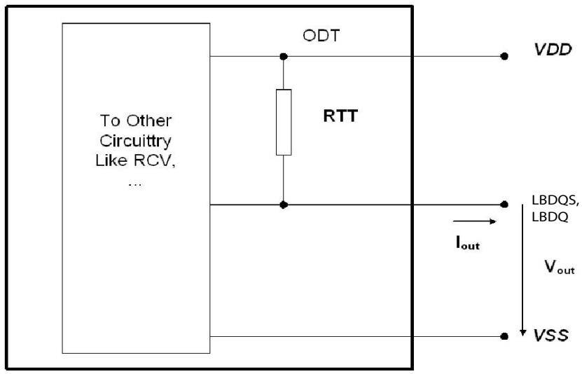

<details>
<summary>text_image</summary>

To Other Circuitry
Like RCV,
...
ODT
RTT
VDD
Iout
LBDQS,
LBDQ
Vout
VSS
</details>

Figure 207 — Functional Representation of Loopback ODT

The ODT termination resistance during power up will be set to the default RTT\_OFF values based on MR36:OP[2:0] definition. The ODT resistance values can be configured by MR26:OP[2:0].

On-Die Termination effective resistance RTT is defined by MR36:OP[2:0] bits = 48 ohms.

ODT is applied to Loopback signals LBDQS and LBDQ. On die termination effective Rtt values supported for the Loopback pins is 48 ohms.

$$
R T T = \frac {V D D Q - V o u t}{| l o u t |}
$$

Table 191 — ODT Electrical Characteristics RZQ=240 Ω +/-1% Entire Temperature Operation Range; after Proper ZQ Calibration; VDD=VDDQ 

<table><tr><td>RTT</td><td>Vout</td><td>Min</td><td>Nom</td><td>Max</td><td>Unit</td><td>NOTE</td></tr><tr><td rowspan="3">48 ohms</td><td>VOLdc= 0.5* VDDQ</td><td>0.9</td><td>1</td><td>1.25</td><td>RZQ/5</td><td>1, 2</td></tr><tr><td>VOMdc= 0.8* VDDQ</td><td>0.9</td><td>1</td><td>1.1</td><td>RZQ/5</td><td>1, 2</td></tr><tr><td>VOHdc= 0.95* VDDQ</td><td>0.8</td><td>1</td><td>1.1</td><td>RZQ/5</td><td>1, 2</td></tr><tr><td>Mismatch LBDQS - LBDQ within device</td><td>VOMdc = 0.8* VDDQ</td><td>0</td><td></td><td>8</td><td>%</td><td>1, 2, 3</td></tr><tr><td colspan="7">NOTE 1 The tolerance limits are specified after calibration with stable voltage and temperature. For the behavior of the tolerance limits if temperature or voltage changes after calibration, see “ZQ Calibration Commands” section.NOTE 2 Pull-up ODT resistors are recommended to be calibrated at 0.8*VDDQ. Other calibration schemes may be used to achieve the linearity spec shown above, e.g. calibration at 0.5*VDDQ and 0.95*VDDQ.NOTE 3 Loopback ODT mismatch within device variation for a given component including LBDQS and LBDQLBDQS-LBDQ Mismatch in a Device =  $\left( \frac{RTTMax- RTTMin}{RTTNOM} \right) \times 100$ </td></tr></table>

# 5.6 On-Die Termination Timing Definitions

# 5.6.1 Test Load for ODT Timings

The reference load for On-Die Termination (ODT) timings is defined in Figure 208:

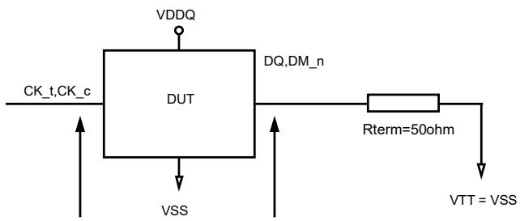

<details>
<summary>flowchart</summary>

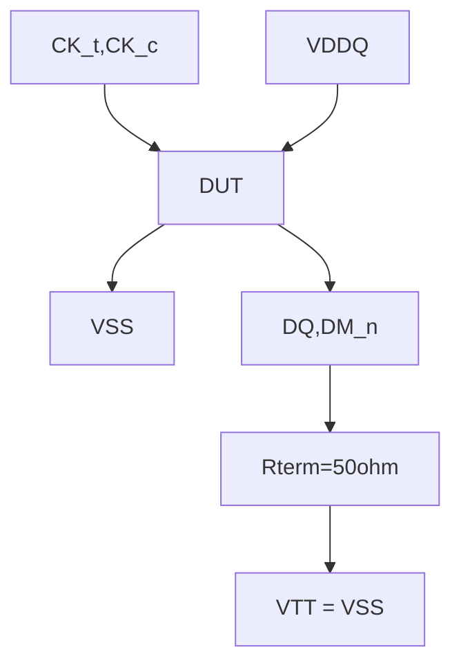
```mermaid
graph TD
    A["CK_t,CK_c"] --> B["DUT"]
    B --> C["VSS"]
    B --> D["DQ,DM_n"]
    D --> E["Rterm=50ohm"]
    E --> F["VTT = VSS"]
    G["VDDQ"] --> B
```
</details>

Timing Reference Point   
Figure 208 — ODT Timing Reference Load

# 5.6.2 tADC Measurement Method

Table 192 — tADC Measurement Timing Definitions 

<table><tr><td>Measured Parameter</td><td>Begin Point Definition</td><td>End Point Definition</td><td>Figure</td></tr><tr><td rowspan="2">tADC for Target DRAM Write</td><td>End of tODTLoff_WR at CK_t/CK_c differential crossing point</td><td>Extrapolated point at VRTT_WR</td><td rowspan="2">Figure 209</td></tr><tr><td>End of tODTLon_WR at CK_t/CK_c differential crossing point</td><td>Extrapolated point at VSS</td></tr><tr><td rowspan="2">tADC for Non Target DRAM Write</td><td>End of tODTLoff_WR_NT at CK_t/CK_c differential crossing point</td><td>Extrapolated point at VRTT_NOM_WR</td><td rowspan="2">Figure 210</td></tr><tr><td>End of tODTLon_WR_NT at CK_t/CK_c differential crossing point</td><td>Extrapolated point at VSS</td></tr><tr><td rowspan="2">tADC for Non Target DRAM Read</td><td>End of tODTLoff_RD_NT at CK_t/CK_c differential crossing point</td><td>Extrapolated point at VRTT_NOM_RD</td><td rowspan="2">Figure 211</td></tr><tr><td>End of tODTLon_RD_NT at CK_t/CK_c differential crossing point</td><td>Extrapolated point at VSS</td></tr></table>

Table 193 — Reference Setting for ODT Timing Measurement 

<table><tr><td>Measured Parameter</td><td>RTT_PARK</td><td>RTT_WR</td><td>RTT_NOM_WR</td><td>RTT_NOM_RD</td><td>Vsw1</td><td>Vsw2</td><td>Figure</td><td>Note</td></tr><tr><td>tADC for Target DRAM Write</td><td>RTT_OFF</td><td>RZQ/7</td><td>-</td><td>-</td><td>0.20V</td><td>0.40V</td><td>208</td><td>1, 4</td></tr><tr><td>tADC for Non Target DRAM Write</td><td>RTT_OFF</td><td>-</td><td>RZQ/7</td><td>-</td><td>0.20V</td><td>0.40V</td><td>209</td><td>2, 4</td></tr><tr><td>tADC for Non Target DRAM Read</td><td>RTT_OFF</td><td>-</td><td>-</td><td>RZQ/7</td><td>0.20V</td><td>0.40V</td><td>210</td><td>3, 4</td></tr><tr><td colspan="9">NOTE 1 MR34 OP[2:0]=000B (RTT_PARK Setting); MR34 OP[5:3]=111B (RTT_WR Setting)NOTE 2 MR34 OP[2:0]=000B (RTT_PARK Setting); MR35 OP[2:0]=111B (RTT_NOM_WR Setting)NOTE 3 MR34 OP[2:0]=000B (RTT_PARK Setting); MR35 OP[5:3]=111B (RTT_NOM_RD Setting)NOTE 4 tADC measurement method applies to DQs/DM only. It does not apply to DQS_t, DQS_c, TDQS_t and TDQS_c since there is no transition from DQS_RTT_PARK.</td></tr></table>

# 5.6.2 tADC Measurement Method (cont’d)

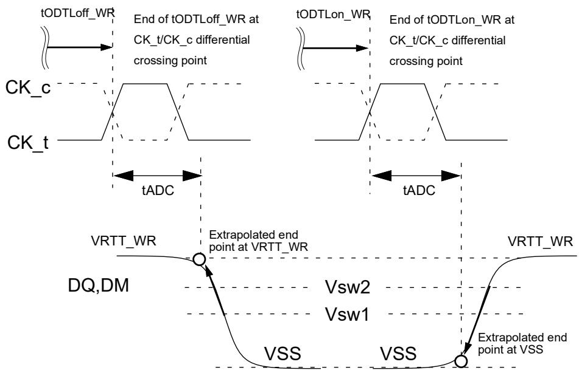

<details>
<summary>flowchart</summary>

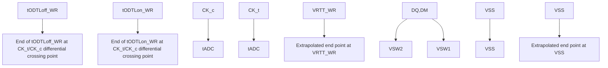
```mermaid
graph TD
    A["tODTLoff_WR"] --> B["End of tODTLoff_WR at CK_t/CK_c differential crossing point"]
    C["tODTLon_WR"] --> D["End of tODTLon_WR at CK_t/CK_c differential crossing point"]
    E["CK_c"] --> F["tADC"]
    G["CK_t"] --> H["tADC"]
    I["VRTT_WR"] --> J["Extrapolated end point at VRTT_WR"]
    K["DQ,DM"] --> L["VSW2"]
    K --> M["VSW1"]
    N["VSS"] --> O["VSS"]
    P["VSS"] --> Q["Extrapolated end point at VSS"]
```
</details>

Figure 209 — tADC Measurement Method Target DRAM Write


<details>
<summary>flowchart</summary>

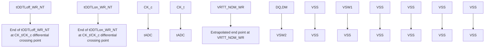
```mermaid
graph TD
    A["tODTLoff_WR_NT"] --> B["End of tODTLoff_WR_NT at CK_t/CK_c differential crossing point"]
    C["tODTLon_WR_NT"] --> D["End of tODTLon_WR_NT at CK_t/CK_c differential crossing point"]
    E["CK_c"] --> F["tADC"]
    G["CK_t"] --> H["tADC"]
    I["VRTT_NOM_WR"] --> J["Extrapolated end point at VRTT_NOM_WR"]
    K["DQ,DM"] --> L["VSW2"]
    M["VSS"] --> N["VSS"]
    O["VSW1"] --> P["VSS"]
    Q["VSS"] --> R["VSS"]
    S["VSS"] --> T["VSS"]
    U["VSS"] --> V["VSS"]
    W["VSS"] --> X["VSS"]
```
</details>

Figure 210 — tADC Measurement Method Non-Target DRAM Write

# 5.6.2 tADC Measurement Method (cont’d)

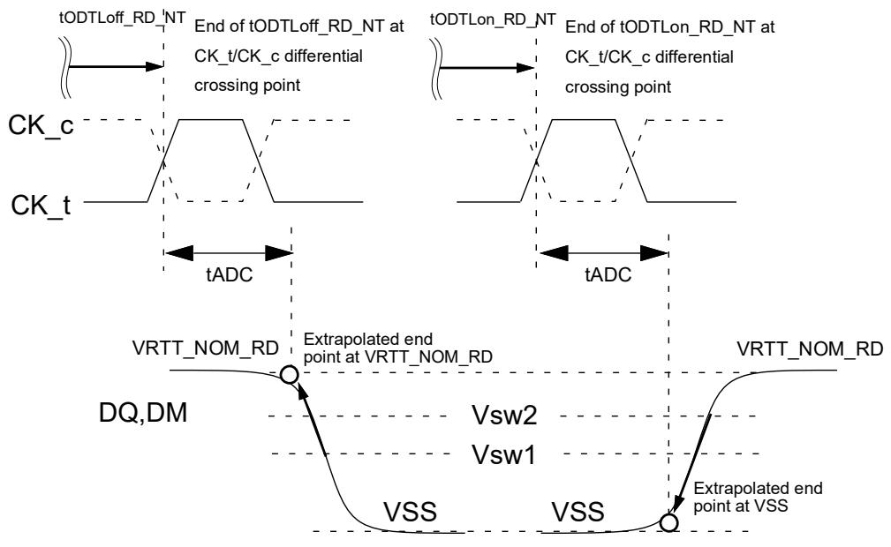

<details>
<summary>flowchart</summary>

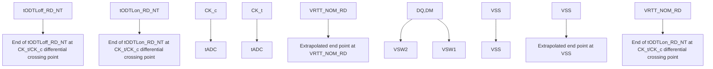
```mermaid
graph TD
    A["tODTLoff_RD_NT"] --> B["End of tODTLoff_RD_NT at CK_t/CK_c differential crossing point"]
    C["tODTLon_RD_NT"] --> D["End of tODTLon_RD_NT at CK_t/CK_c differential crossing point"]
    E["CK_c"] --> F["tADC"]
    G["CK_t"] --> H["tADC"]
    I["VRTT_NOM_RD"] --> J["Extrapolated end point at VRTT_NOM_RD"]
    K["DQ,DM"] --> L["VSW2"]
    K --> M["VSW1"]
    N["VSS"] --> O["VSS"]
    P["VSS"] --> Q["Extrapolated end point at VSS"]
    R["VRTT_NOM_RD"] --> S["End of tODTLon_RD_NT at CK_t/CK_c differential crossing point"]
```
</details>

Figure 211 — tADC Measurement Method Non-Target DRAM Read

# 6 AC and DC Operating Conditions

# 6.1 Absolute Maximum Ratings

Table 194 — Absolute Maximum DC Ratings 

<table><tr><td>Symbol</td><td>Parameter</td><td>Rating</td><td>Units</td><td>NOTE</td></tr><tr><td>VDD</td><td>Voltage on VDD pin relative to Vss</td><td>-0.3 ~ 1.4</td><td>V</td><td>1, 3</td></tr><tr><td>VDDQ</td><td>Voltage on VDDQ pin relative to Vss</td><td>-0.3 ~ 1.4</td><td>V</td><td>1, 3</td></tr><tr><td>VPP</td><td>Voltage on VPP pin relative to Vss</td><td>-0.3 ~ 2.1</td><td>V</td><td>4</td></tr><tr><td> $V_{IN}, V_{OUT}$ </td><td>Voltage on any pin relative to Vss</td><td>-0.3 ~ 1.4</td><td>V</td><td>1, 3, 5</td></tr><tr><td> $T_{STG}$ </td><td>Storage Temperature</td><td>-55 to +100</td><td>°C</td><td>1, 2</td></tr><tr><td colspan="5">NOTE 1 Stresses greater than those listed under “Absolute Maximum Ratings” may cause permanent damage to the device. This is a stress rating only and functional operation of the device at these or any other conditions above those indicated in the operational sections of this specification is not implied. Exposure to absolute maximum rating conditions for extended periods may affect reliability</td></tr><tr><td colspan="5">NOTE 2 Storage Temperature is the case surface temperature on the center/top side of the DRAM. For the measurement conditions, please refer to JESD51-2 standard.</td></tr><tr><td colspan="5">NOTE 3 VDD and VDDQ must be within 300 mV of each other at all times. When VDD and VDDQ are less than 500 mV</td></tr><tr><td colspan="5">NOTE 4 VPP must be equal or greater than VDD/VDDQ at all times.</td></tr><tr><td colspan="5">NOTE 5 Overshoot area above 1.5 V is specified in Section 8.3.4, Section 8.3.5, and Section 8.3.6.</td></tr></table>

# 6.2 DC Operating Conditions

Table 195 — DC Operating Conditions 

<table><tr><td rowspan="2">Symbol</td><td rowspan="2">Parameter</td><td colspan="4">Low Freq Voltage SpecFreq: DC to 2 MHz</td><td colspan="2"> $Z(f)^{4}$  SpecFreq: 2 MHz to10 MHz</td><td colspan="2"> $Z(f)^{4}$  SpecFreq: 20 MHz</td><td rowspan="2">Notes</td></tr><tr><td>Min.</td><td>Typ.</td><td>Max.</td><td>Unit</td><td>Zmax</td><td>Unit</td><td>Zmax</td><td>Unit</td></tr><tr><td>VDD</td><td>Device Supply Voltage</td><td>1.067(-3%)</td><td>1.1</td><td>1.166(+6%)</td><td>V</td><td>10</td><td>mOhm</td><td>20</td><td>mOhm</td><td>1, 2, 3</td></tr><tr><td>VDDQ</td><td>Supply Voltage for I/O</td><td>1.067(-3%)</td><td>1.1</td><td>1.166(+6%)</td><td>V</td><td>10</td><td>mOhm</td><td>20</td><td>mOhm</td><td>1, 2, 3</td></tr><tr><td>VPP</td><td>Core Power Voltage</td><td>1.746(-3%)</td><td>1.8</td><td>1.908(+6%)</td><td>V</td><td>10</td><td>mOhm</td><td>20</td><td>mOhm</td><td>3</td></tr><tr><td colspan="11">NOTE 1 VDD must be within 66 mv of VDDQNOTE 2 AC parameters are measured with VDD and VDDQ tied together.NOTE 3 This includes all voltage noise from DC to 2 MHz at the DRAM package ball.NOTE 4 Z(f) is defined for all pins per voltage domain. Z(f) does not include the DRAM package and silicon die.</td></tr></table>

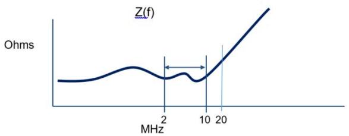

<details>
<summary>line</summary>

| Frequency (MHz) | Ohms |
| --------------- | ---- |
| 0               | ~0   |
| 2               | ~0   |
| 10              | ~0   |
| 20              | ~0   |
</details>

Figure 212 — Zprofile/Z(f) of the System at the DRAM Package Solder Ball (without DRAM Component)

# 6.2 DC Operating Conditions (cont’d)

A simplified electrical system load model for Z(F) with the general frequency response is shown in Figure 213. The resistance and inductance can be scaled to generalize the spec response to the DRAM pin.

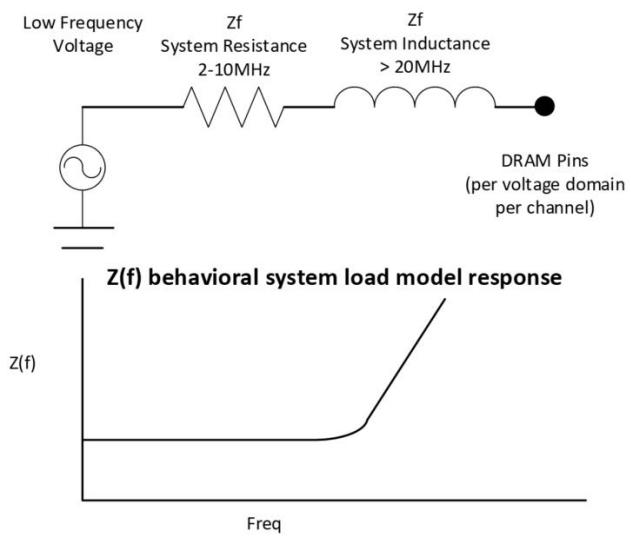

<details>
<summary>text_image</summary>

Low Frequency Voltage
Zf System Resistance
2-10MHz
Zf System Inductance
> 20MHz
DRAM Pins
(per voltage domain
per channel)
Z(f) behavioral system load model response
Z(f)
Freq
</details>

Figure 213 — Simplified Z(f) Electrical Model and Frequency Response of PDN at the DRAM Pin without the DRAM Component

# 6.3 DRAM Component Operating Temperature Range

Table 196 — DC Operating Temperature Range 

<table><tr><td rowspan="2">Symbol</td><td rowspan="2">Parameter</td><td colspan="2">Temperature Range (Unit: °C)</td><td rowspan="2">Grade</td><td rowspan="2">Notes</td></tr><tr><td>Min</td><td>Max</td></tr><tr><td>Toper_normal</td><td>Normal Operating Temperature</td><td>0</td><td>85</td><td>NT</td><td>1, 2, 3, 4</td></tr><tr><td>Toper_extended</td><td>Extended Operating Temperature</td><td>0</td><td>95</td><td>XT</td><td>1, 2, 3, 4, 5</td></tr><tr><td colspan="6">NOTE 1 All operating temperature symbols, ranges, acronyms are referred from JESD402-1.</td></tr><tr><td colspan="6">NOTE 2 Operating Temperature is the case surface temperature on the center/top side of the DRAM. For the measurement conditions, please refer to JESD51-2 standard.</td></tr><tr><td colspan="6">NOTE 3 All DDR5 SDRDAMs are required to operate in NT and XT temperature ranges.</td></tr><tr><td colspan="6">NOTE 4 When operating above 85 °C, the host shall provide appropriate Refresh mode controls associated with the increased temperature range. The full description of these settings are defined in Table 68 in section 4.13.5</td></tr><tr><td colspan="6">NOTE 5 Operating Temperature for 3DS needs to be derated by the number of DRAM dies as: [ $T_{OPER} - (2.5\ ^{\circ}C \times \log_2N)$ ], where N is the number of the stacked dies.</td></tr></table>

# 7 AC and DC Global Definitions

# 7.1 Bit Error Rate

# 7.1.1 Introduction

This section provides an overview of the Bit Error Rate (BER) and the desired Statistical Level of Confidence.

# 7.1.2 General Equation

$$
n = \left(\frac {1}{B E R}\right) \Bigg [ - \ln (1 - S L C) + \ln \left(\sum_ {k = 0} ^ {N} \frac {(n \cdot B E R) ^ {k}}{k !}\right) \Bigg ]
$$

Where:

n = number of bits in a trial

SLC = statistical level of confidence

BER = Bit Error Rate

k = intermediate number of specific errors found in trial

N = number of errors recorded during trial

If no, errors are assumed in a given test period, the second term drops out and the equation becomes:

$$
n = \left(\frac {1}{B E R}\right) [ - \ln (1 - S L C) ]
$$

JEDEC recommends testing to 99.5% confidence levels; however, one may choose a number that is viable for their own manufacturing levels. To determine how many bits of data should be sent (again, assuming zero errors, or N=0), using ${ \sf B E R = E ^ { - 9 } }$ and confidence level SLC=99.5%, the result is $\mathsf { n } = ( 1 / \mathsf { B E R } ) ( - \mathsf { I n } ( 1 - 0 . 9 9 5 ) = 5 . 2 9 8 \times 1 0 ^ { 9 } .$ .

Results for commonly used confidence levels of 99.5% down to 70% are shown in Table 197.

Table 197 — Estimated Number of Transmitted Bits (n) for the Confidence Level of 70% to 99.5% 

<table><tr><td rowspan="2">Number Errors</td><td colspan="8">n = -ln(1-SLC)/BER</td></tr><tr><td>99.5%</td><td>99%</td><td>95%</td><td>90%</td><td>85%</td><td>80%</td><td>75%</td><td>70%</td></tr><tr><td>0</td><td>5.298/BER</td><td>4.61/BER</td><td>2.99/BER</td><td>2.3/BER</td><td>1.90/BER</td><td>1.61/BER</td><td>1.39/BER</td><td>1.20/BER</td></tr></table>

# 7.1.3 Minimum Bit Error Rate (BER) Requirements

Table 198 specifies the UIavg and Bit Error Rate requirements over which certain receiver and transmitter timing and voltage specifications need to be validated assuming a 99.5% confidence level at ${ \sf B E R = E ^ { - 9 } }$ .

Table 198 — Minimum BER Requirements for Rx/Tx Timing and Voltage Tests 

<table><tr><td rowspan="2">Parameter</td><td rowspan="2">Symbol</td><td colspan="3">DDR5-3200 to DDR5-8800</td><td rowspan="2">Unit</td><td rowspan="2">Notes</td></tr><tr><td>Min</td><td>Nom</td><td>Max</td></tr><tr><td>Average UI</td><td> $UI_{AVG}$ </td><td>0.999* nominal</td><td>1000/f</td><td>1.001* nominal</td><td>ps</td><td>1</td></tr><tr><td>Number of UI (min)</td><td> $N_{Min\_UI\_Validation}$ </td><td>5.3x109</td><td>-</td><td>-</td><td>UI</td><td>2</td></tr><tr><td>Bit Error Rate</td><td> $BER_{Lane}$ </td><td>-</td><td>-</td><td>E-16</td><td>Events</td><td>3, 4, 5</td></tr><tr><td colspan="7">NOTE 1 Average UI size, “f” is data rateNOTE 2 # of UI over which certain Rx/Tx timing and voltage specifications need to be validated assuming a 99.5% confidence level at BER= $E^{-9}$ .NOTE 3 This is a system parameter. It is the raw bit error rate for every lane before any logical PHY or link layer based correction. It may not be possible to have a validation methodology for this parameter for a standalone transmitter or standalone receiver, therefore, this parameter has to be validated in selected systems using a suitable methodology as deemed by the platform.NOTE 4 Bit Error Rate per lane. This is a raw bit error rate before any correction. This parameter is primarily used to determine electrical margins during electrical analysis and measurements that are located between two interconnected devices.NOTE 5 This is the minimum BER requirements for testing timing and voltage parameters listed in Input Clock Jitter, Rx DQS &amp; DQ Voltage Sensitivity, Rx DQS Jitter Sensitivity, Rx DQ Stressed Eye, Tx DQS Jitter, Tx DQ Jitter, and Tx DQ Stressed EH/EW specifications.</td></tr></table>

# 7.2 Unit Interval and Jitter Definitions

This section describes the Unit Interval (UI) and UI Jitter definitions associated with the jitter parameters specified in the Input Clock Jitter, Rx Stressed Eye, Tx DQS Jitter, and Tx DQ Jitter sections of this specification.

# 7.2.1 Unit Interval (UI)

The definition of Unit Interval (UI) is a minimum time interval between condition changes of a signal. DDR-based signals are referenced to the differential crossing point of $\mathsf { C K \_ t }$ and ${ \mathsf { C K } } \_ { \mathsf { C } } .$ 2UI=1tCK for DDR-based signals (for example, DQ, DQS).

The UI definitions shown in Figure 214 and Figure 215 are for DDR-based signals. The times at which the differential crossing points of the clock occur are defined at t1, $\displaystyle \mathrm { t } 2 , \ldots ,$ tn-1, tn. The UI at index $" \mathsf { n } ^ { \ast }$ is defined as an arbitrary time in steady state, where n=0 is chosen as the starting crossing point.

$$
U I _ {n} = t _ {n} - t _ {n - 1}
$$

Figure 214 — UI Definition in Terms of Adjacent Edge Timings   
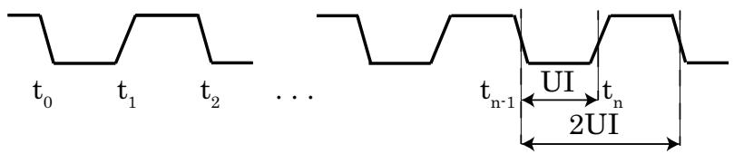

<details>
<summary>text_image</summary>

t₀ t₁ t₂ ... tₙ₋₁ UI tₙ
2UI
</details>

Figure 215 — UI Definition Using Clock Waveforms

# 7.2.2 UI Jitter Definition

If a number of UI edges are computed or measured at times t1, $\mathsf { t } 2 , . . . , \mathsf { t n } . 1 , \mathsf { t n } , . . . , \mathsf { t K } ,$ , where K is the maximum number of samples, then the UI jitter at any instance “n” is defined in Figure 216, where T = the ideal UI size.

$$
U I (j i t) _ {n} = \left(t _ {n} - t _ {n - 1}\right) - T, \quad n = 1, 2, 3, \dots , K
$$

# Figure 216 — UI Jitter for “nth” UI Definition (in Terms of Ideal UI)

In a large sample with random Gaussian-like jitter (therefore very close to symmetric distribution), the average of all UI sizes usually turns out to be very close to the ideal UI size.

The equation described in Figure 216 assumes starting from an instant steady state, where n=0 is chosen as the starting point. 1 UI = one bit, which means ${ 2 } \cup | =$ one full cycle or time period of the forwarded strobe. Example: For 6.4 GT/s signaling, the forwarded strobe frequency is 3.2 GHz, or $1 \cup 1 = \dot { 1 } 5 6 . 2 5 \ : \mathsf { p s }$ .

Deterministic jitter is analyzed in terms of the peak-to-peak value and in terms of specific frequency components present in the jitter, isolating the causes for each frequency. Random jitter is unbounded and analyzed in terms of statistical distribution to convert to a bit error rate (BER) for the link.

# 7.2.3 UI-UI Jitter Definition

UI-UI (read as “UI to UI”) jitter is defined to be the jitter between two consecutive UI as shown in Figure 217.

$$
\Delta U I _ {n} = U I _ {n} - U I _ {n - 1} \quad \mathrm{n=2,3,...,K}
$$

Figure 217 — UI-UI Jitter Definitions

# 7.2.4 Accumulated Jitter (Over $" 6 1 > 3 3$ UI)

Accumulated jitter is defined as the jitter accumulated over any consecutive $" \mathsf { N } ^ { \flat }$ UI as shown in Figure 218.

$$
\mathrm{T} _ {\text {acc}} ^ {\mathrm{N}} = \sum_ {\mathrm{p} = \mathrm{m}} ^ {\mathrm{m} + \mathrm{N} - 1} (\mathrm{UI} _ {\mathrm{p}} - \overline {{\mathrm{UI}}}) \quad \mathrm{m} = 1, 2, \dots , \mathrm{K} - \mathrm{N}
$$

Figure 218 — Definition of Accumulated Jitter (over “N” UI)

where $\overline { { \mathsf { U I } } }$ is defined in the equation shown in Figure 219.

$$
\overline {{\mathrm{UI}}} = \frac {\sum_ {\mathrm{p} = 1} ^ {\mathrm{K}} \mathrm{UI} _ {\mathrm{p}}}{\mathrm{K}} \quad \mathrm{p=1,2,...,N,...,K}
$$

Figure 219 — Definition of $\overline { { \mathbf { u } \mathbf { I } } }$

8

AC and DC Input Measurement Levels

# 8.1 Overshoot and Undershoot Specifications for CAC - No Ballot

# 8.2 CA Rx Voltage and Timings

Note: The following draft assumes internal CA VREF. If the VREF is external, the specs will be modified accordingly.

The command and address (CA) including CS input receiver compliance mask for voltage and timing is shown in Figure 220. All CA signals apply the same compliance mask and CS signal applies its own compliance mask independently. All signals applied to the compliance mask operate in single data rate mode.

The CA input receiver mask for voltage and timing is shown in the figure below is applied across all CA pins. The receiver mask (Rx Mask) defines the area that the input signal must not encroach in order for the DRAM input receiver to be expected to be able to successfully capture a valid input signal; it is not the valid data-eye.

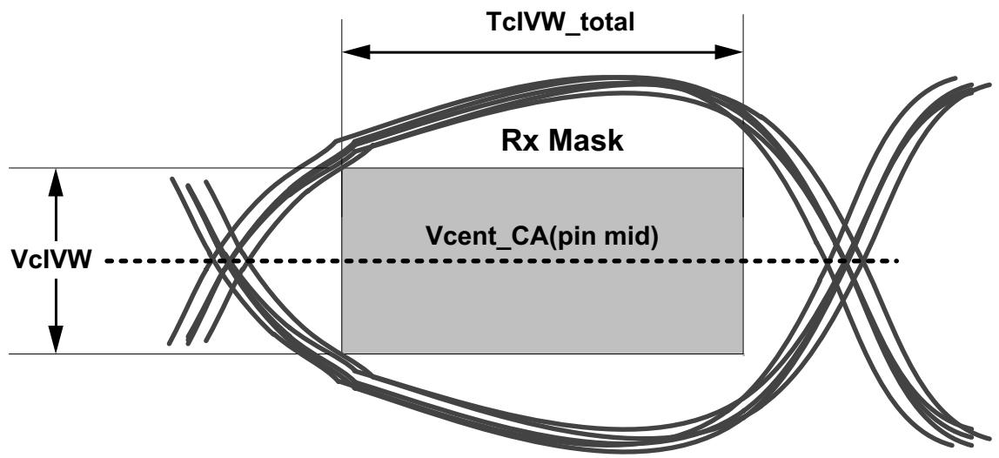

<details>
<summary>text_image</summary>

TcIVW_total
Rx Mask
Vcent_CA(pin mid)
VcIVW
</details>

Figure 220 — CA Receiver (Rx) Mask

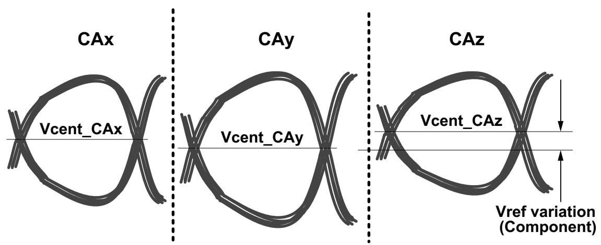

<details>
<summary>text_image</summary>

CAx
Vcent_CAx
CAy
Vcent_CAy
CAz
Vcent_CAz
Vref variation
(Component)
</details>

Figure 221 — Across Pin $V _ { R E F } C A$ Voltage Variation

Vcent\_CA(pin mid) is defined as the midpoint between the largest Vcent\_CA voltage level and the smallest Vcent\_CA voltage level across all CA and CS pins for a given DRAM component. Each CA Vcent level is defined by the center, i.e., widest opening, of the cumulative data input eye as depicted in Figure 221. This clarifies that any DRAM component level variation must be accounted for within the DRAM CA Rx mask. The component level $V _ { \mathsf { R E F } }$ will be set by the system to account for Ron and ODT settings.

# 8.2 CA Rx Voltage and Timings (cont’d)

CK\_t, CK\_c, CA Eye at DRAM Pin

Optimally centered Rx mask

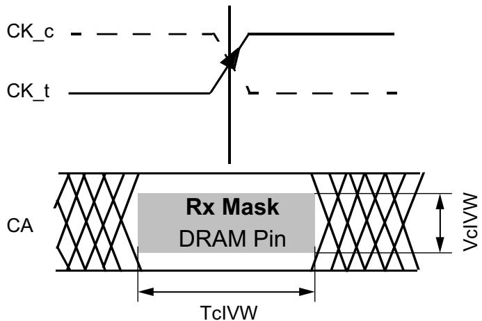

<details>
<summary>text_image</summary>

CK_c
CK_t
CA
Rx Mask
DRAM Pin
TcIVW
VcIVW
</details>

TcIVW is not necessarily center aligned on CK\_t/CK\_c crossing at the DRAM pin, but is assumed to be center aligned at the DRAM Latch.

Figure 222 — CA Timings at the DRAM Pins   
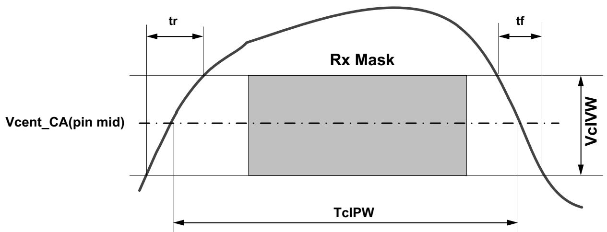

<details>
<summary>text_image</summary>

tr
tf
Rx Mask
Vcent_CA(pin mid)
TcIPW
Vclvw
</details>

Note   
1. SRIN\_cIVW=VcIVW\_Total/(tr or tf), signal must be monotonic within tr and tf range.

Figure 223 — CA TcIPW and SRIN\_cIVW Definition (for Each Input Pulse)

# 8.2 CA Rx Voltage and Timings (cont’d)

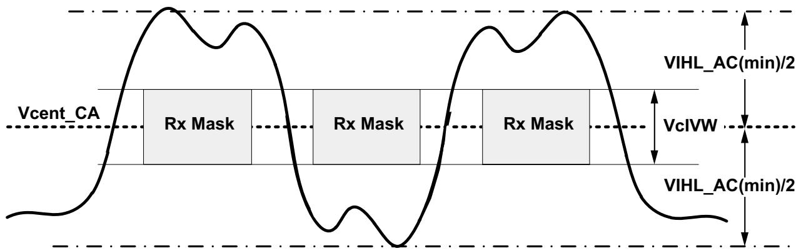

<details>
<summary>line</summary>

| Time Segment       | Description         |
| ------------------ | ------------------- |
| Start              | Vcent_CA            |
| Midpoint           | Rx Mask             |
| End                | VIHL_AC(min)/2      |
| Midpoint           | Rx Mask             |
| End                | VcIVW               |
| End                | VIHL_AC(min)/2      |
</details>

Figure 224 — CA VIHL\_AC Definition (for Each Input Pulse)

Table 199 — DRAM CA, CS Parametric Values for DDR5-3200 to 4800 

<table><tr><td rowspan="3">Parameter</td><td rowspan="3">Symbol</td><td colspan="10">x4, x8, and x16 Devices</td><td rowspan="3">Unit</td><td rowspan="3">Notes</td></tr><tr><td colspan="2">DDR5-3200</td><td colspan="2">DDR5-3600</td><td colspan="2">DDR5-4000</td><td colspan="2">DDR5-4400</td><td colspan="2">DDR5-4800</td></tr><tr><td>Min</td><td>Max</td><td>Min</td><td>Max</td><td>Min</td><td>Max</td><td>Min</td><td>Max</td><td>Min</td><td>Max</td></tr><tr><td>Rx Mask voltage - p-p</td><td>VciVW</td><td>140</td><td>-</td><td>140</td><td>-</td><td>140</td><td>-</td><td>130</td><td>-</td><td>130</td><td>-</td><td>mV</td><td>1, 2, 4</td></tr><tr><td>Rx Timing Window</td><td>TcIVW</td><td>0.2</td><td>-</td><td>0.2</td><td>-</td><td>0.2</td><td>-</td><td>0.2</td><td>-</td><td>0.2</td><td>-</td><td>tCK</td><td>1, 2, 3, 4</td></tr><tr><td>CA Input Pulse Amplitude</td><td>VIHL_AC</td><td>160</td><td></td><td>160</td><td></td><td>160</td><td></td><td>150</td><td></td><td>150</td><td></td><td>mV</td><td>7</td></tr><tr><td>CA Input Pulse Width</td><td>TcIPW</td><td>0.58</td><td></td><td>0.58</td><td></td><td>0.58</td><td></td><td>0.58</td><td></td><td>0.58</td><td></td><td>tCK</td><td>5</td></tr><tr><td>Input Slew Rate over VcIVW</td><td>SRIN_cIVW</td><td>1</td><td>7</td><td>1</td><td>7</td><td>1</td><td>7</td><td>1</td><td>7</td><td>1</td><td>7</td><td>V/ns</td><td>6</td></tr><tr><td colspan="14">NOTE 1 CA Rx mask voltage and timing parameters at the pin including voltage and temperature drift.NOTE 2 Rx mask voltage VcIVW total(max) must be centered around Vcent_CA(pin mid).NOTE 3 Rx differential CA to CK jitter total timing window at the VcIVW voltage levels.NOTE 4 Defined over the CA internal  $V_{REF}$  range. The Rx mask at the pin must be within the internal  $V_{REF}$  CA range irrespective of the input signal common mode.NOTE 5 CA only minimum input pulse width defined at the Vcent_CA(pin mid).NOTE 6 Input slew rate over VcIVW Mask centered at Vcent_CA(pin mid).NOTE 7 VIHL_AC does not have to be met when no transitions are occurring.</td></tr></table>

# 8.2 CA Rx Voltage and Timings (cont’d)

Table 200 — DRAM CA, CS Parametric Values for DDR5-5200 to 5600 

<table><tr><td rowspan="5">Parameter</td><td rowspan="5">Symbol</td><td colspan="12">x4 and x8 Devices</td><td rowspan="3" colspan="2">x16 Device</td><td rowspan="5">Unit</td><td rowspan="5">Notes</td></tr><tr><td colspan="4">Option 3</td><td colspan="4">Option 2</td><td colspan="4">Option 1</td></tr><tr><td colspan="4">10 ps &lt;= Tpkg_Delay_CA&lt;=29 ps</td><td colspan="4">29 ps &lt; Tpkg_Delay_CA&lt;=32 ps</td><td colspan="4">32 ps &lt; Tpkg_Delay_CA&lt;=35 ps</td></tr><tr><td colspan="2">DDR5-5200</td><td colspan="2">DDR5-5600</td><td colspan="2">DDR5-5200</td><td colspan="2">DDR5-5600</td><td colspan="2">DDR5-5200</td><td colspan="2">DDR5-5600</td><td colspan="2">DDR5-5200 to 5600</td></tr><tr><td>Min</td><td>Max</td><td>Min</td><td>Max</td><td>Min</td><td>Max</td><td>Min</td><td>Max</td><td>Min</td><td>Max</td><td>Min</td><td>Max</td><td>Min</td><td>Max</td></tr><tr><td>Rx Mask voltage - p-p</td><td>VciVW</td><td>110</td><td>-</td><td>110</td><td>-</td><td>95(CI max=0.55 pF)100(CI max=0.5 pF)</td><td>-</td><td>95(CI max=0.55 pF)100(CI max=0.5 pF)</td><td>-</td><td>80(CI max=0.55 pF)85(CI max=0.5 pF)</td><td>-</td><td>80(CI max=0.55 pF)85(CI max=0.5 pF)</td><td>-</td><td>110</td><td>-</td><td>mV</td><td>1, 2, 4</td></tr><tr><td>Rx Timing Window</td><td>TcIVW</td><td>0.2</td><td>-</td><td>0.2</td><td>-</td><td>0.2</td><td>-</td><td>0.2</td><td>-</td><td>0.2</td><td>-</td><td>0.2</td><td>-</td><td>0.2</td><td>-</td><td>UI*</td><td>1, 2, 3, 4, 8</td></tr><tr><td>CA Input Pulse Amplitude</td><td>VIHL_AC</td><td>125</td><td>-</td><td>125</td><td>-</td><td>115</td><td>-</td><td>115</td><td>-</td><td>110</td><td>-</td><td>110</td><td>-</td><td>125</td><td>-</td><td>mV</td><td>7</td></tr><tr><td>CA Input Pulse Width</td><td>TcIPW</td><td>0.58</td><td></td><td>0.58</td><td></td><td>0.58</td><td></td><td>0.58</td><td></td><td>0.58</td><td></td><td>0.58</td><td></td><td>0.58</td><td></td><td>UI*</td><td>5, 8</td></tr><tr><td>Input Slew Rate over VcIVW</td><td>SRIN_cIVW</td><td>1</td><td>7</td><td>1</td><td>7</td><td>1</td><td>7</td><td>1</td><td>7</td><td>1</td><td>7</td><td>1</td><td>7</td><td>1</td><td>7</td><td>V/ns</td><td>6</td></tr><tr><td colspan="18">NOTE 1 CA Rx mask voltage and timing parameters at the pin including voltage and temperature drift.NOTE 2 Rx mask voltage VcIVW total(max) must be centered around Vcent_CA(pin mid).NOTE 3 Rx differential CA to CK jitter total timing window at the VcIVW voltage levels.NOTE 4 Defined over the CA internal  $V_{REF}$  range. The Rx mask at the pin must be within the internal  $V_{REF}$  CA range irrespective of the input signal common mode.NOTE 5 CA only minimum input pulse width defined at the Vcent_CA(pin mid).NOTE 6 Input slew rate over VcIVW Mask centered at Vcent_CA(pin mid).NOTE 7 VIHL_AC does not have to be met when no transitions are occurring.NOTE 8 * UI=tck(avg)min</td></tr></table>

Table 201 — DRAM CA, CS Parametric Values for DDR5-6000 to 6400 

<table><tr><td rowspan="5">Parameter</td><td rowspan="5">Symbol</td><td colspan="12">x4 and x8 Devices</td><td rowspan="3" colspan="2">x16 Device</td><td rowspan="5">Unit</td><td rowspan="5">Notes</td></tr><tr><td colspan="4">Option 3</td><td colspan="4">Option 2</td><td colspan="4">Option 1</td></tr><tr><td colspan="4">10 ps &lt;= Tpkg_Delay_CA&lt;=29 ps</td><td colspan="4">29 ps &lt; Tpkg_Delay_CA&lt;=32 ps</td><td colspan="4">32 ps &lt; Tpkg_Delay_CA&lt;=35 ps</td></tr><tr><td colspan="2">DDR5-6000</td><td colspan="2">DDR5-6400</td><td colspan="2">DDR5-6000</td><td colspan="2">DDR5-6400</td><td colspan="2">DDR5-6000</td><td colspan="2">DDR5-6400</td><td colspan="2">DDR5-6000 to 6400</td></tr><tr><td>Min</td><td>Max</td><td>Min</td><td>Max</td><td>Min</td><td>Max</td><td>Min</td><td>Max</td><td>Min</td><td>Max</td><td>Min</td><td>Max</td><td>Min</td><td>Max</td></tr><tr><td>Rx Mask voltage - p-p</td><td>VciVW</td><td>95</td><td>-</td><td>95</td><td>-</td><td>85</td><td>-</td><td>85</td><td>-</td><td>80</td><td>-</td><td>80</td><td>-</td><td>95</td><td>-</td><td>mV</td><td>1, 2, 4</td></tr><tr><td>Rx Timing Window</td><td>TcIVW</td><td>0.2</td><td>-</td><td>0.2</td><td>-</td><td>0.2</td><td>-</td><td>0.2</td><td>-</td><td>0.2</td><td>-</td><td>0.2</td><td>-</td><td>0.2</td><td>-</td><td>UI*</td><td>1, 2, 3, 4, 8</td></tr><tr><td>CA Input Pulse Amplitude</td><td>VIHL_AC</td><td>115</td><td>-</td><td>115</td><td>-</td><td>105</td><td>-</td><td>105</td><td>-</td><td>100</td><td>-</td><td>100</td><td>-</td><td>115</td><td>-</td><td>mV</td><td>7</td></tr><tr><td>CA Input Pulse Width</td><td>TcIPW</td><td>0.58</td><td></td><td>0.58</td><td></td><td>0.58</td><td></td><td>0.58</td><td></td><td>0.58</td><td></td><td>0.58</td><td></td><td>0.58</td><td></td><td>UI*</td><td>5, 8</td></tr><tr><td>Input Slew Rate over VcIVW</td><td>SRIN_cIVW</td><td>1</td><td>7</td><td>1</td><td>7</td><td>1</td><td>7</td><td>1</td><td>7</td><td>1</td><td>7</td><td>1</td><td>7</td><td>1</td><td>7</td><td>V/ns</td><td>6</td></tr><tr><td colspan="18">NOTE 1 CA Rx mask voltage and timing parameters at the pin including voltage and temperature drift.NOTE 2 Rx mask voltage VcIVW total(max) must be centered around Vcent_CA(pin mid).NOTE 3 Rx differential CA to CK jitter total timing window at the VcIVW voltage levels.NOTE 4 Defined over the CA internal  $V_{REF}$  range. The Rx mask at the pin must be within the internal  $V_{REF}$  CA range irrespective of the input signal common mode.NOTE 5 CA only minimum input pulse width defined at the Vcent_CA(pin mid).NOTE 6 Input slew rate over VcIVW Mask centered at Vcent_CA(pin mid).NOTE 7 VIHL_AC does not have to be met when no transitions are occurring.NOTE 8 * UI=tck(avg)min</td></tr></table>

# 8.2 CA Rx Voltage and Timings (cont’d)

Table 202 — DRAM CA, CS Parametric Values for DDR5-6800 to 7200 

<table><tr><td rowspan="5">Parameter</td><td rowspan="5">Symbol</td><td colspan="12">x4 and x8 Devices</td><td rowspan="3" colspan="2">x16 Device</td><td rowspan="5">Unit</td><td rowspan="5">Notes</td></tr><tr><td colspan="4">Option 3</td><td colspan="4">Option 2</td><td colspan="4">Option 1</td></tr><tr><td colspan="4">10 ps &lt;= Tpkg_Delay_CA&lt;=29 ps</td><td colspan="4">29 ps &lt; Tpkg_Delay_CA&lt;=32 ps</td><td colspan="4">32 ps &lt; Tpkg_Delay_CA&lt;=35 ps</td></tr><tr><td colspan="2">DDR5-6800</td><td colspan="2">DDR5-7200</td><td colspan="2">DDR5-6800</td><td colspan="2">DDR5-7200</td><td colspan="2">DDR5-6800</td><td colspan="2">DDR5-7200</td><td colspan="2">DDR5-6800 to 7200</td></tr><tr><td>Min</td><td>Max</td><td>Min</td><td>Max</td><td>Min</td><td>Max</td><td>Min</td><td>Max</td><td>Min</td><td>Max</td><td>Min</td><td>Max</td><td>Min</td><td>Max</td></tr><tr><td>Rx Mask voltage - p-p</td><td>VciVW</td><td>90</td><td>-</td><td>90</td><td>-</td><td>80</td><td>-</td><td>80</td><td>-</td><td>50</td><td>-</td><td>50</td><td>-</td><td>90</td><td>-</td><td>mV</td><td>1, 2, 4</td></tr><tr><td>Rx Timing Window</td><td>TcIVW</td><td>0.2</td><td>-</td><td>0.2</td><td>-</td><td>0.2</td><td>-</td><td>0.2</td><td>-</td><td>0.2</td><td>-</td><td>0.2</td><td>-</td><td>0.2</td><td>-</td><td>UI*</td><td>1, 2, 3, 4, 8</td></tr><tr><td>CA Input Pulse Amplitude</td><td>VIHL_AC</td><td>110</td><td>-</td><td>110</td><td>-</td><td>100</td><td>-</td><td>100</td><td>-</td><td>70</td><td>-</td><td>70</td><td>-</td><td>110</td><td>-</td><td>mV</td><td>7</td></tr><tr><td>CA Input Pulse Width</td><td>TcIPW</td><td>0.58</td><td></td><td>0.58</td><td></td><td>0.58</td><td></td><td>0.58</td><td></td><td>0.58</td><td></td><td>0.58</td><td></td><td>0.58</td><td></td><td>UI*</td><td>5, 8</td></tr><tr><td>Input Slew Rate over VcIVW</td><td>SRIN_clVW</td><td>1</td><td>7</td><td>1</td><td>7</td><td>1</td><td>7</td><td>1</td><td>7</td><td>1</td><td>7</td><td>1</td><td>7</td><td>1</td><td>7</td><td>V/ns</td><td>6</td></tr><tr><td colspan="18">NOTE 1 CA Rx mask voltage and timing parameters at the pin including voltage and temperature drift.NOTE 2 Rx mask voltage VcIVW total(max) must be centered around Vcent_CA(pin mid).NOTE 3 Rx differential CA to CK jitter total timing window at the VcIVW voltage levels.NOTE 4 Defined over the CA internal  $V_{REF}$  range. The Rx mask at the pin must be within the internal  $V_{REF}$  CA range irrespective of the input signal common mode.NOTE 5 CA only minimum input pulse width defined at the Vcent_CA(pin mid).NOTE 6 Input slew rate over VcIVW Mask centered at Vcent_CA(pin mid).NOTE 7 VIHL_AC does not have to be met when no transitions are occurring.NOTE 8 * UI=tck(avg)min</td></tr></table>

Table 203 — DRAM CA, CS Parametric Values for DDR5-7600 to 8000 

<table><tr><td rowspan="5">Parameter</td><td rowspan="5">Symbol</td><td colspan="12">x4 and x8 Devices</td><td rowspan="3" colspan="2">x16 Device</td><td rowspan="5">Unit</td><td rowspan="5">Notes</td></tr><tr><td colspan="4">Option 3</td><td colspan="4">Option 2</td><td colspan="4">Option 1</td></tr><tr><td colspan="4">10 ps &lt;= Tpkg_Delay_CA&lt;=29 ps</td><td colspan="4">29 ps &lt; Tpkg_Delay_CA&lt;=32 ps</td><td colspan="4">32ps &lt; Tpkg_Delay_CA&lt;=35 ps</td></tr><tr><td colspan="2">DDR5-7600</td><td colspan="2">DDR5-8000</td><td colspan="2">DDR5-7600</td><td colspan="2">DDR5-8000</td><td colspan="2">DDR5-7600</td><td colspan="2">DDR5-8000</td><td colspan="2">DDR5-7600 to 8000</td></tr><tr><td>Min</td><td>Max</td><td>Min</td><td>Max</td><td>Min</td><td>Max</td><td>Min</td><td>Max</td><td>Min</td><td>Max</td><td>Min</td><td>Max</td><td>Min</td><td>Max</td></tr><tr><td>Rx Mask voltage - p-p</td><td>VciVW</td><td>85</td><td>-</td><td>85</td><td>-</td><td>75</td><td>-</td><td>75</td><td>-</td><td>45</td><td>-</td><td>45</td><td>-</td><td>85</td><td>-</td><td>mV</td><td>1, 2, 4</td></tr><tr><td>Rx Timing Window</td><td>TcIVW</td><td>0.2</td><td>-</td><td>0.2</td><td>-</td><td>0.2</td><td>-</td><td>0.2</td><td>-</td><td>0.2</td><td>-</td><td>0.2</td><td>-</td><td>0.2</td><td>-</td><td>UI*</td><td>1, 2, 3, 4, 8</td></tr><tr><td>CA Input Pulse Amplitude</td><td>VIHL_AC</td><td>105</td><td>-</td><td>105</td><td>-</td><td>95</td><td>-</td><td>95</td><td>-</td><td>65</td><td>-</td><td>65</td><td>-</td><td>105</td><td>-</td><td>mV</td><td>7</td></tr><tr><td>CA Input Pulse Width</td><td>TcIPW</td><td>0.58</td><td></td><td>0.58</td><td></td><td>0.58</td><td></td><td>0.58</td><td></td><td>0.58</td><td></td><td>0.58</td><td></td><td>0.58</td><td></td><td>UI*</td><td>5, 8</td></tr><tr><td>Input Slew Rate over VcIVW</td><td>SRIN_cIVW</td><td>1</td><td>7</td><td>1</td><td>7</td><td>1</td><td>7</td><td>1</td><td>7</td><td>1</td><td>7</td><td>1</td><td>7</td><td>1</td><td>7</td><td>V/ns</td><td>6</td></tr><tr><td colspan="18">NOTE 1 CA Rx mask voltage and timing parameters at the pin including voltage and temperature drift.NOTE 2 Rx mask voltage VcIVW total(max) must be centered around Vcent_CA(pin mid).NOTE 3 Rx differential CA to CK jitter total timing window at the VcIVW voltage levels.NOTE 4 Defined over the CA internal  $V_{REF}$  range. The Rx mask at the pin must be within the internal  $V_{REF}$  CA range irrespective of the input signal common mode.NOTE 5 CA only minimum input pulse width defined at the Vcent_CA(pin mid).NOTE 6 Input slew rate over VcIVW Mask centered at Vcent_CA(pin mid).NOTE 7 VIHL_AC does not have to be met when no transitions are occurring.NOTE 8 * UI=tck(avg)min</td></tr></table>

# 8.2 CA Rx Voltage and Timings (cont’d)

Table 204 — DRAM CA, CS Parametric Values for DDR5-8400 to 8800 

<table><tr><td rowspan="5">Parameter</td><td rowspan="5">Symbol</td><td colspan="12">x4 and x8 Devices</td><td rowspan="3" colspan="2">x16 Device</td><td rowspan="5">Unit</td><td rowspan="5">Notes</td></tr><tr><td colspan="4">Option 3</td><td colspan="4">Option 2</td><td colspan="4">Option 1</td></tr><tr><td colspan="4">10 ps &lt;= Tpkg_Delay_CA&lt;=29 ps</td><td colspan="4">29 ps &lt; Tpkg_Delay_CA&lt;=32 ps</td><td colspan="4">32 ps &lt; Tpkg_Delay_CA&lt;=35 ps</td></tr><tr><td colspan="2">DDR5-8400</td><td colspan="2">DDR5-8800</td><td colspan="2">DDR5-8400</td><td colspan="2">DDR5-8800</td><td colspan="2">DDR5-8400</td><td colspan="2">DDR5-8800</td><td colspan="2">DDR5-8400 to 8800</td></tr><tr><td>Min</td><td>Max</td><td>Min</td><td>Max</td><td>Min</td><td>Max</td><td>Min</td><td>Max</td><td>Min</td><td>Max</td><td>Min</td><td>Max</td><td>Min</td><td>Max</td></tr><tr><td>Rx Mask voltage - p-p</td><td>VciVW</td><td>80</td><td>-</td><td>80</td><td>-</td><td>70</td><td>-</td><td>70</td><td>-</td><td>40</td><td>-</td><td>40</td><td>-</td><td>80</td><td>-</td><td>mV</td><td>1, 2, 4</td></tr><tr><td>Rx Timing Window</td><td>TcIVW</td><td>0.2</td><td>-</td><td>0.2</td><td>-</td><td>0.2</td><td>-</td><td>0.2</td><td>-</td><td>0.2</td><td>-</td><td>0.2</td><td>-</td><td>0.2</td><td>-</td><td>UI*</td><td>1, 2, 3, 4, 8</td></tr><tr><td>CA Input Pulse Amplitude</td><td>VIHL_AC</td><td>100</td><td>-</td><td>100</td><td>-</td><td>90</td><td>-</td><td>90</td><td>-</td><td>60</td><td>-</td><td>60</td><td>-</td><td>100</td><td>-</td><td>mV</td><td>7</td></tr><tr><td>CA Input Pulse Width</td><td>TcIPW</td><td>0.58</td><td></td><td>0.58</td><td></td><td>0.58</td><td></td><td>0.58</td><td></td><td>0.58</td><td></td><td>0.58</td><td></td><td>0.58</td><td></td><td>UI*</td><td>5, 8</td></tr><tr><td>Input Slew Rate over VcIVW</td><td>SRIN_cIVW</td><td>1</td><td>7</td><td>1</td><td>7</td><td>1</td><td>7</td><td>1</td><td>7</td><td>1</td><td>7</td><td>1</td><td>7</td><td>1</td><td>7</td><td>V/ns</td><td>6</td></tr><tr><td colspan="18">NOTE 1 CA Rx mask voltage and timing parameters at the pin including voltage and temperature drift.NOTE 2 Rx mask voltage VcIVW total(max) must be centered around Vcent_CA(pin mid).NOTE 3 Rx differential CA to CK jitter total timing window at the VcIVW voltage levels.NOTE 4 Defined over the CA internal  $V_{REF}$  range. The Rx mask at the pin must be within the internal  $V_{REF}$  CA range irrespective of the input signal common mode.NOTE 5 CA only minimum input pulse width defined at the Vcent_CA(pin mid).NOTE 6 Input slew rate over VcIVW Mask centered at Vcent_CA(pin mid).NOTE 7 VIHL_AC does not have to be met when no transitions are occurring.NOTE 8 * UI=tck(avg)min</td></tr></table>

# 8.3 Input Clock Jitter Specification

# 8.3.1 Overview

The clock is being driven to the DRAM either by the RCD for L/RDIMM modules, or by the host for U/SODIMM modules (Figure 225).

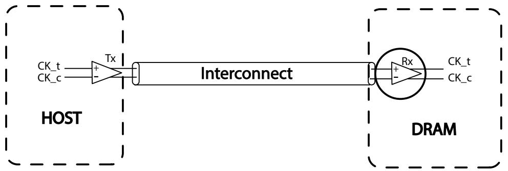

<details>
<summary>flowchart</summary>

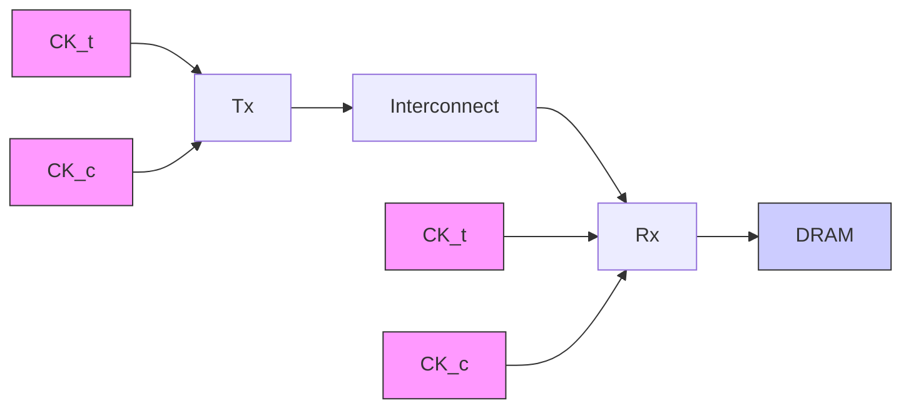
```mermaid
graph LR
    A["CK_t"] --> B["Tx"]
    C["CK_c"] --> B
    B --> D["Interconnect"]
    D --> E["Rx"]
    F["CK_t"] --> E
    G["CK_c"] --> E
    E --> H["DRAM"]
    style A fill:#f9f,stroke:#333
    style C fill:#f9f,stroke:#333
    style F fill:#f9f,stroke:#333
    style G fill:#f9f,stroke:#333
    style H fill:#ccf,stroke:#333
```
</details>

Figure 225 — HOST Driving Clock Signals to the DRAM

# 8.3.2 Specification for DRAM Input Clock Jitter

The Random Jitter (Rj) specified is a random jitter meeting a Gaussian distribution. The Deterministic Jitter (Dj) specified is bounded. Input clock violating the min/max jitter values may result in malfunction of the DDR5 SDRAM device.

Table 205 — DRAM Input Clock Jitter Specifications for DDR5-3200 to 4400   
[BUJ=Bounded Uncorrelated Jitter; DCD=Duty Cycle Distortion; Dj=Deterministic Jitter; Rj=Random Jitter; Tj=Total jitter; pp=Peak-to-Peak] 

<table><tr><td rowspan="2">Parameter</td><td rowspan="2">Symbol</td><td colspan="2">DDR5-3200</td><td colspan="2">DDR5-3600</td><td colspan="2">DDR5-4000</td><td colspan="2">DDR5-4400</td><td colspan="2">DDR5-4800</td><td rowspan="2">Unit</td><td rowspan="2">Notes</td></tr><tr><td>Min</td><td>Max</td><td>Min</td><td>Max</td><td>Min</td><td>Max</td><td>Min</td><td>Max</td><td>Min</td><td>Max</td></tr><tr><td>DRAM Reference clock frequency</td><td>tCK</td><td>0.9999* f0</td><td>1.0001* f0</td><td>0.9999* f0</td><td>1.0001* f0</td><td>0.9999* f0</td><td>1.0001* f0</td><td>0.9999* f0</td><td>1.0001* f0</td><td>0.9999* f0</td><td>1.0001* f0</td><td>MHz</td><td>1, 11</td></tr><tr><td>Duty Cycle Error</td><td>tCK_Duty_UI_Error</td><td>-</td><td>0.05</td><td>-</td><td>0.05</td><td>-</td><td>0.05</td><td>-</td><td>0.05</td><td></td><td>0.05</td><td>UI</td><td>1, 4, 11</td></tr><tr><td>Rj RMS value of 1- UI Jitter</td><td>tCK_1UI_Rj_NoBUJ</td><td>-</td><td>0.0037</td><td>-</td><td>0.0037</td><td>-</td><td>0.0037</td><td>-</td><td>0.0037</td><td>-</td><td>0.0037</td><td>UI (RMS)</td><td>3, 5, 11</td></tr><tr><td>Dj pp value of 1- UI Jitter</td><td>tCK_1UI_Dj_NoBUJ</td><td>-</td><td>0.030</td><td>-</td><td>0.030</td><td>-</td><td>0.030</td><td>-</td><td>0.030</td><td>-</td><td>0.030</td><td>UI</td><td>3, 6, 11</td></tr><tr><td>Tj value of 1- UI Jitter</td><td>tCK_1UI_Tj_NoBUJ</td><td>-</td><td>0.090</td><td>-</td><td>0.090</td><td>-</td><td>0.090</td><td>-</td><td>0.090</td><td>-</td><td>0.090</td><td>UI</td><td>3, 6, 11</td></tr><tr><td>Rj RMS value of N- UI Jitter, where N=2,3</td><td>tCK_NUI_Rj_NoBUJ, where N=2,3</td><td>-</td><td>0.0040</td><td>-</td><td>0.0040</td><td>-</td><td>0.0040</td><td>-</td><td>0.0040</td><td>-</td><td>0.0040</td><td>UI (RMS)</td><td>3, 7, 11</td></tr><tr><td>Dj pp value of N- UI Jitter, where N=2,3</td><td>tCK_NUI_Dj_NoBUJ, where N=2,3</td><td>-</td><td>0.074</td><td>-</td><td>0.074</td><td>-</td><td>0.074</td><td>-</td><td>0.074</td><td>-</td><td>0.074</td><td>UI</td><td>3, 7, 11</td></tr><tr><td>Tj value of N- UI Jitter, where N=2,3</td><td>tCK_NUI_Tj_NoBUJ, where N=2,3</td><td>-</td><td>0.140</td><td>-</td><td>0.140</td><td>-</td><td>0.140</td><td>-</td><td>0.140</td><td>-</td><td>0.140</td><td>UI</td><td>3, 8, 11</td></tr><tr><td>Rj RMS value of N- UI Jitter, where N=4,5,6,...,30</td><td>tCK_NUI_Rj_NoBUJ, where N=4,5,6,...,30</td><td>-</td><td>-</td><td>-</td><td>-</td><td>-</td><td>-</td><td>-</td><td>-</td><td>-</td><td>-</td><td>UI (RMS)</td><td>3, 9, 11, 12</td></tr><tr><td>Dj pp value of N- UI Jitter, N=4,5,6,...,30</td><td>tCK_NUI_Dj_NoBUJ, where N=4,5,6,...,30</td><td>-</td><td>-</td><td>-</td><td>-</td><td>-</td><td>-</td><td>-</td><td>-</td><td>-</td><td>-</td><td>UI</td><td>3, 10, 11, 12</td></tr><tr><td>Tj value of N- UI Jitter, N=4,5,6,...,30</td><td>tCK_NUI_Tj_NoBUJ, where N=4,5,6,...,30</td><td>-</td><td>-</td><td>-</td><td>-</td><td>-</td><td>-</td><td>-</td><td>-</td><td>-</td><td>-</td><td>UI</td><td>3, 10, 11, 12</td></tr><tr><td colspan="13">NOTE 1 f0 = Data Rate/2, example: if data rate is 3200 MT/s, then f0=1600NOTE 2 Rise and fall time slopes (V / nsec) are measured between +100 mV and -100 mV of the differential output of reference clockNOTE 3 On-die noise similar to that occurring with all the transmitter and receiver lanes toggling need to be stimulated. When there is no socket in transmitter measurement setup, in many cases, the contribution of the cross-talk is not significant or can be estimated within tolerable error even with all the transmitter lanes sending patterns. When a socket is present, such as DUT being DRAM component, the contribution of the cross-talk could be significant. To minimize the impact of crosstalk on the measurement results, a small group of selected lanes in the vicinity of the lane under test may be turned off (sending DC), while the remaining Tx lanes send patterns to the corresponding Rx receivers so as to excite realistic on-die noise profile from device switching. Note that there may be cases when one of Dj and Rj specs is met and another violated in which case the signaling analysis should be run to determine link feasibilityNOTE 4 Duty Cycle Error defined as absolute difference between average value of all UI with that of average of odd UI, which in magnitude would equal absolute difference between average of all UI and average of all even UI.NOTE 5 Rj RMS value of 1- UI jitter without BUJ, but on-die system-like noise present. This extraction is to be done after software correction of DCDNOTE 6 Dj pp value of 1- UI jitter (after software assisted DCC). Without BUJ, but on-die system like noise present. Dj indicates Djdd of dual-Dirac fitting, after software correction of DCDNOTE 7 Rj RMS value of N- UI jitter without BUJ, but on-die system like noise present. Evaluated for 1 &lt; N &lt; 4. This extraction is to be done after software correction of DCDNOTE 8 Dj pp value of N- UI jitter without BUJ, but on-die system like noise present. Evaluated for 1 &lt; N &lt; 4. Dj indicates Djdd of dual-Dirac fitting, after software correction of DCDNOTE 9 Rj RMS value of N- UI jitter without BUJ, but on-die system like noise present. Evaluated for 3 &lt; N &lt; 31. This extraction is to be done after software correction of DCDNOTE 10 Dj pp value of N- UI jitter without BUJ, but on-die system like noise present. Evaluated for 3 &lt; N &lt; 31. Dj indicates Djdd of dual-Dirac fitting, after software correction of DCDNOTE 11 The validation methodology for these parameters will be covered in future ballots.NOTE 12 If the clock meets total jitter Tj at BER of  $1E^{-16}$ , then meeting the individual Rj and Dj components of the spec can be considered optional. Tj is defined as Dj + 16.2*Rj for BER of  $1E^{-16}$ </td><td></td></tr></table>

# 8.3.2 Specification for DRAM Input Clock Jitter (cont’d)

Table 206 — DRAM Input Clock Jitter Specifications for DDR5-5200 to 6400   
[BUJ=Bounded Uncorrelated Jitter; DCD=Duty Cycle Distortion; Dj=Deterministic Jitter; Rj=Random Jitter; Tj=Total jitter; pp=Peak-to-Peak] 

<table><tr><td rowspan="2">Parameter</td><td rowspan="2">Symbol</td><td colspan="2">DDR5-5200</td><td colspan="2">DDR5-5600</td><td colspan="2">DDR5-6000</td><td colspan="2">DDR5-6400</td><td rowspan="2">Unit</td><td rowspan="2">Notes</td></tr><tr><td>Min</td><td>Max</td><td>Min</td><td>Max</td><td>Min</td><td>Max</td><td>Min</td><td>Max</td></tr><tr><td>DRAM Reference clock frequency</td><td>tCK</td><td>0.9999*f0</td><td>1.0001*f0</td><td>0.9999*f0</td><td>1.0001*f0</td><td>0.9999*f0</td><td>1.0001*f0</td><td>0.9999*f0</td><td>1.0001*f0</td><td>MHz</td><td>1, 11</td></tr><tr><td>Duty Cycle Error</td><td>tCK_Duty_UI_Error</td><td>-</td><td>0.05</td><td>-</td><td>0.05</td><td>-</td><td>0.05</td><td>-</td><td>0.05</td><td>UI</td><td>1, 4, 11</td></tr><tr><td>Rj RMS value of 1-UI Jitter</td><td>tCK_1UI_Rj_NoBUJ</td><td>-</td><td>0.0037</td><td>-</td><td>0.0037</td><td>-</td><td>0.0037</td><td>-</td><td>0.0037</td><td>UI (RMS)</td><td>3, 5, 11</td></tr><tr><td>Dj pp value of 1-UI Jitter</td><td>tCK_1UI_Dj_NoBUJ</td><td>-</td><td>0.030</td><td>-</td><td>0.030</td><td>-</td><td>0.030</td><td>-</td><td>0.030</td><td>UI</td><td>3, 6, 11</td></tr><tr><td>Tj value of 1-UI Jitter</td><td>tCK_1UI_Tj_NoBUJ</td><td>-</td><td>0.090</td><td>-</td><td>0.090</td><td>-</td><td>0.090</td><td>-</td><td>0.090</td><td>UI</td><td>3, 6, 11</td></tr><tr><td>Rj RMS value of N-UI Jitter, where N=2,3,4,5</td><td>tCK_NUI_Rj_NoBUJ, where N=2,3,4,5</td><td>-</td><td>0.0040</td><td>-</td><td>0.0040</td><td>-</td><td>0.0040</td><td>-</td><td>0.0040</td><td>UI (RMS)</td><td>3, 7, 11</td></tr><tr><td>Dj pp value of N-UI Jitter, where N=2,3,4,5</td><td>tCK_NUI_Dj_NoBUJ, where N=2,3,4,5</td><td>-</td><td>0.074</td><td>-</td><td>0.074</td><td>-</td><td>0.074</td><td>-</td><td>0.074</td><td>UI</td><td>3, 7, 11</td></tr><tr><td>Tj value of N-UI Jitter, where N=2,3,4,5</td><td>tCK_NUI_Tj_NoBUJ, where N=2,3,4,5</td><td>-</td><td>0.140</td><td>-</td><td>0.140</td><td>-</td><td>0.140</td><td>-</td><td>0.140</td><td>UI</td><td>3, 8, 11</td></tr><tr><td>Rj RMS value of N-UI Jitter, where N=6,...,30</td><td>tCK_NUI_Rj_NoBUJ, where N=6,...,30</td><td>-</td><td>-</td><td>-</td><td>-</td><td>-</td><td>-</td><td>-</td><td>-</td><td>UI (RMS)</td><td>3, 9, 11, 12</td></tr><tr><td>Dj pp value of N-UI Jitter, N=6,...,30</td><td>tCK_NUI_Dj_NoBUJ, where N=6,...,30</td><td>-</td><td>-</td><td>-</td><td>-</td><td>-</td><td>-</td><td>-</td><td>-</td><td>UI</td><td>3, 10, 11, 12</td></tr><tr><td>Tj value of N-UI Jitter, N=6,...,30</td><td>tCK_NUI_Tj_NoBUJ, where N=6,...,30</td><td>-</td><td>-</td><td>-</td><td>-</td><td>-</td><td>-</td><td>-</td><td>-</td><td>UI</td><td>3, 10, 11, 12</td></tr><tr><td colspan="11">NOTE 1 f0 = Data Rate/2, example: if data rate is 3200 MT/s, then f0=1600NOTE 2 Rise and fall time slopes (V / nsec) are measured between +100 mV and -100 mV of the differential output of reference clockNOTE 3 On-die noise similar to that occurring with all the transmitter and receiver lanes toggling need to be stimulated. When there is no socket in transmitter measurement setup, in many cases, the contribution of the cross-talk is not significant or can be estimated within tolerable error even with all the transmitter lanes sending patterns. When a socket is present, such as DUT being DRAM component, the contribution of the cross-talk could be significant. To minimize the impact of crosstalk on the measurement results, a small group of selected lanes in the vicinity of the lane under test may be turned off (sending DC), while the remaining Tx lanes send patterns to the corresponding Rx receivers so as to excite realistic on-die noise profile from device switching. Note that there may be cases when one of Dj and Rj specs is met and another violated in which case the signaling analysis should be run to determine link feasibilityNOTE 4 Duty Cycle Error defined as absolute difference between average value of all UI with that of average of odd UI, which in magnitude would equal absolute difference between average of all UI and average of all even UI.NOTE 5 Rj RMS value of 1-UI jitter without BUJ, but on-die system-like noise present. This extraction is to be done after software correction of DCDNOTE 6 Dj pp value of 1-UI jitter (after software assisted DCC). Without BUJ, but on-die system like noise present. Dj indicates Djdd of dual-Dirac fitting, after software correction of DCDNOTE 7 Rj RMS value of N-UI jitter without BUJ, but on-die system like noise present. Evaluated for 1 &lt; N &lt; 4. This extraction is to be done after software correction of DCDNOTE 8 Dj pp value of N-UI jitter without BUJ, but on-die system like noise present. Evaluated for 1 &lt; N &lt; 4. Dj indicates Djdd of dual-Dirac fitting, after software correction of DCDNOTE 9 Rj RMS value of N-UI jitter without BUJ, but on-die system like noise present. Evaluated for 3 &lt; N &lt; 31. This extraction is to be done after software correction of DCDNOTE 10 Dj pp value of N-UI jitter without BUJ, but on-die system like noise present. Evaluated for 3 &lt; N &lt; 31. Dj indicates Djdd of dual-Dirac fitting, after software correction of DCDNOTE 11 The validation methodology for these parameters will be covered in future ballots.NOTE 12 If the clock meets total jitter Tj at BER of  $1E^{-16}$ , then meeting the individual Rj and Dj components of the spec can be considered optional. Tj is defined as Dj + 16.2*Rj for BER of  $1E^{-16}$ </td><td></td></tr></table>

# 8.3.2 Specification for DRAM Input Clock Jitter (cont’d)

Table 207 — DRAM Input Clock Jitter Specifications for DDR5-6800 to 8400   
[BUJ=Bounded Uncorrelated Jitter; DCD=Duty Cycle Distortion; Dj=Deterministic Jitter; Rj=Random Jitter; Tj=Total jitter; pp=Peak-to-Peak] 

<table><tr><td rowspan="2">Parameter</td><td rowspan="2">Symbol</td><td colspan="2">DDR5-6800</td><td colspan="2">DDR5-7200</td><td colspan="2">DDR5-7600-8800</td><td rowspan="2">Unit</td><td rowspan="2">Notes</td></tr><tr><td>Min</td><td>Max</td><td>Min</td><td>Max</td><td>Min</td><td>Max</td></tr><tr><td>DRAM Reference clock frequency</td><td>tCK</td><td>0.9999*f0</td><td>1.0001*f0</td><td>0.9999*f0</td><td>1.0001*f0</td><td>0.9999*f0</td><td>1.0001*f0</td><td>MHz</td><td>1, 11</td></tr><tr><td>Duty Cycle Error</td><td>tCK_Duty_UI_Error</td><td>-</td><td>0.05</td><td>-</td><td>0.05</td><td>-</td><td>0.05</td><td>UI</td><td>1, 4, 11</td></tr><tr><td>Rj RMS value of 1-UI Jitter</td><td>tCK_1UI_Rj_NoBUJ</td><td>-</td><td>0.003145</td><td>-</td><td>0.003145</td><td>-</td><td>0.003145</td><td>UI (RMS)</td><td>3, 5, 11</td></tr><tr><td>Dj pp value of 1-UI Jitter</td><td>tCK_1UI_Dj_NoBUJ</td><td>-</td><td>0.0255</td><td>-</td><td>0.0255</td><td>-</td><td>0.0255</td><td>UI</td><td>3, 6, 11</td></tr><tr><td>Tj value of 1-UI Jitter</td><td>tCK_1UI_Tj_NoBUJ</td><td>-</td><td>0.0765</td><td>-</td><td>0.0765</td><td>-</td><td>0.0765</td><td>UI</td><td>3, 6, 11</td></tr><tr><td>Rj RMS value of N-UI Jitter, where N=2,3,4,5</td><td>tCK_NUI_Rj_NoBUJ, where N=2,3,4,5</td><td>-</td><td>0.0034</td><td>-</td><td>0.0034</td><td>-</td><td>0.0034</td><td>UI (RMS)</td><td>3, 7, 11</td></tr><tr><td>Dj pp value of N-UI Jitter, where N=2,3,4,5</td><td>tCK_NUI_Dj_NoBUJ, where N=2,3,4,5</td><td>-</td><td>0.0629</td><td>-</td><td>0.0629</td><td>-</td><td>0.0629</td><td>UI</td><td>3, 7, 11</td></tr><tr><td>Tj value of N-UI Jitter, where N=2,3,4,5</td><td>tCK_NUI_Tj_NoBUJ, where N=2,3,4,5</td><td>-</td><td>0.119</td><td>-</td><td>0.119</td><td>-</td><td>0.119</td><td>UI</td><td>3, 8, 11</td></tr><tr><td>Rj RMS value of N-UI Jitter, where N=6,...,30</td><td>tCK_NUI_Rj_NoBUJ, where N=6,...,30</td><td>-</td><td>-</td><td>-</td><td>-</td><td>-</td><td>-</td><td>UI (RMS)</td><td>3, 9, 11, 12</td></tr><tr><td>Dj pp value of N-UI Jitter, N=6,...,30</td><td>tCK_NUI_Dj_NoBUJ, where N=6,...,30</td><td>-</td><td>-</td><td>-</td><td>-</td><td>-</td><td>-</td><td>UI</td><td>3,1 0, 11, 12</td></tr><tr><td>Tj value of N-UI Jitter, N=6,...,30</td><td>tCK_NUI_Tj_NoBUJ, where N=6,...,30</td><td>-</td><td>-</td><td>-</td><td>-</td><td>-</td><td>-</td><td>UI</td><td>3, 10, 11, 12</td></tr><tr><td colspan="10">NOTE 1 f0 = Data Rate/2, example: if data rate is 3200 MT/s, then f0=1600NOTE 2 Rise and fall time slopes (V / nsec) are measured between +100 mV and -100 mV of the differential output of reference clockNOTE 3 On-die noise similar to that occurring with all the transmitter and receiver lanes toggling need to be stimulated. When there is no socket in transmitter measurement setup, in many cases, the contribution of the cross-talk is not significant or can be estimated within tolerable error even with all the transmitter lanes sending patterns. When a socket is present, such as DUT being DRAM component, the contribution of the cross-talk could be significant. To minimize the impact of crosstalk on the measurement results, a small group of selected lanes in the vicinity of the lane under test may be turned off (sending DC), while the remaining Tx lanes send patterns to the corresponding Rx receivers so as to excite realistic on-die noise profile from device switching. Note that there may be cases when one of Dj and Rj specs is met and another violated in which case the signaling analysis should be run to determine link feasibilityNOTE 4 Duty Cycle Error defined as absolute difference between average value of all UI with that of average of odd UI, which in magnitude would equal absolute difference between average of all UI and average of all even UI.NOTE 5 Rj RMS value of 1-UI jitter without BUJ, but on-die system-like noise present. This extraction is to be done after software correction of DCDNOTE 6 Dj pp value of 1-UI jitter (after software assisted DCC). Without BUJ, but on-die system like noise present. Dj indicates Djdd of dual-Dirac fitting, after software correction of DCDNOTE 7 Rj RMS value of N-UI jitter without BUJ, but on-die system like noise present. Evaluated for 1 &lt; N &lt; 4. This extraction is to be done after software correction of DCDNOTE 8 Dj pp value of N-UI jitter without BUJ, but on-die system like noise present. Evaluated for 1 &lt; N &lt; 4. Dj indicates Djdd of dual-Dirac fitting, after software correction of DCDNOTE 9 Rj RMS value of N-UI jitter without BUJ, but on-die system like noise present. Evaluated for 3 &lt; N &lt; 31. This extraction is to be done after software correction of DCDNOTE 10 Dj pp value of N-UI jitter without BUJ, but on-die system like noise present. Evaluated for 3 &lt; N &lt; 31. Dj indicates Djdd of dual-Dirac fitting, after software correction of DCDNOTE 11 The validation methodology for these parameters will be covered in future ballots.NOTE 12 If the clock meets total jitter Tj at BER of  $1E^{-16}$ , then meeting the individual Rj and Dj components of the spec can be considered optional. Tj is defined as Dj + 16.2*Rj for BER of  $1E^{-16}$ </td></tr></table>

# 8.4 Differential Input Clock (CK\_t, CK\_c) Cross Point Voltage (VIX)

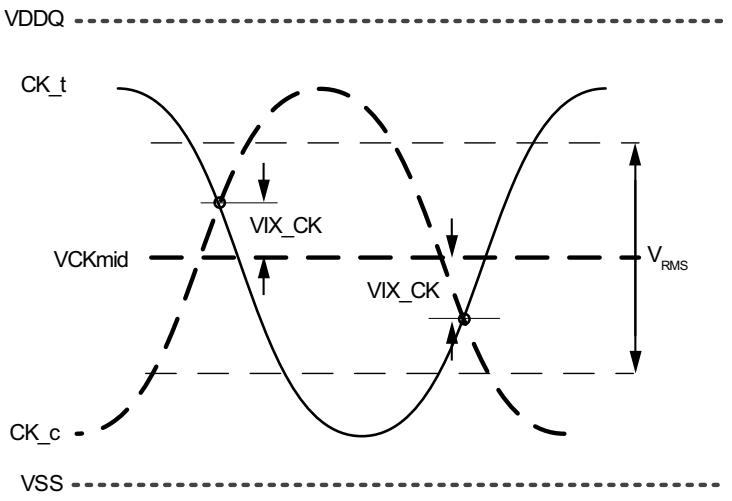

<details>
<summary>text_image</summary>

VDDQ
CK_t
VIX_CK
VCKmid
VIX_CK
V_RMS
CK_c
VSS
</details>

Figure 226 — VIX Definition (CK)

Table 208 — Crosspoint Voltage (VIX) for Differential Input Clock 

<table><tr><td rowspan="2">Parameter</td><td rowspan="2">Symbol</td><td colspan="2">DDR5-3200 - 8800</td><td rowspan="2">Unit</td><td rowspan="2">Notes</td></tr><tr><td>Min</td><td>Max</td></tr><tr><td>Clock differential input crosspoint voltage ratio</td><td>VIX_CK_Ratio</td><td>-</td><td>50</td><td>%</td><td>1, 2, 3</td></tr><tr><td colspan="6">NOTE 1 The VIX_CK voltage is referenced to VCKmid(mean) = (CK_t voltage + CK_c voltage) /2, where the mean is over 8 UINOTE 2 VIX_CK_Ratio = (|VIX_CK| / |VRMS|)*100%, where VRMS = RMS(CK_t voltage - CK_c voltage)NOTE 3 Only applies when both CK_t and CK_c are transitioning</td></tr></table>

# 8.5 Differential Input Clock Voltage Sensitivity

The differential input clock voltage sensitivity test provides the methodology for testing the receiver’s sensitivity to clock by varying input voltage in the absence of Inter-Symbol Interference (ISI), jitter (Rj, Dj, DCD) and crosstalk noise. This specifies the Rx voltage sensitivity requirement. The system input swing to the DRAM must be larger than the DRAM Rx at the specified BER

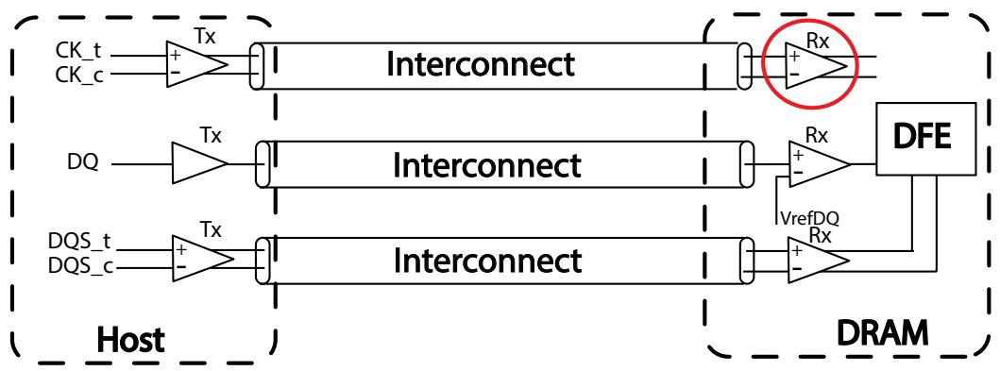

<details>
<summary>flowchart</summary>

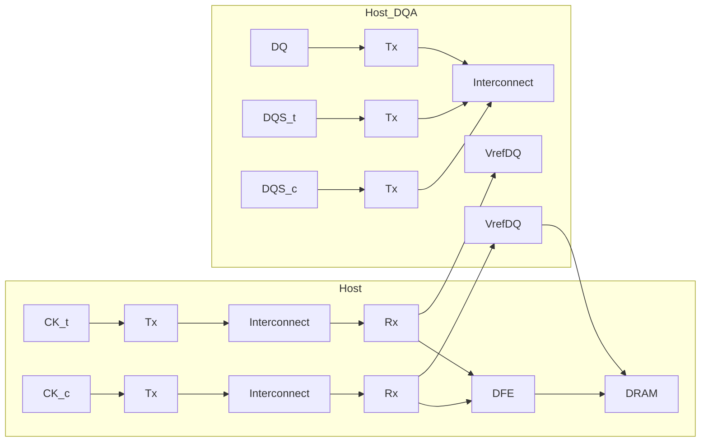
```mermaid
graph LR
    subgraph Host
        CK_t["CK_t"] --> Tx1["Tx"]
        CK_c["CK_c"] --> Tx2["Tx"]
        Tx1 --> Interconnect1["Interconnect"]
        Tx2 --> Interconnect2["Interconnect"]
        Interconnect1 --> Rx1["Rx"]
        Interconnect2 --> Rx2["Rx"]
        Rx1 --> DFE["DFE"]
        Rx2 --> DFE
        DFE --> DRAM["DRAM"]
    end
    subgraph Host_DQA
        DQ["DQ"] --> Tx3["Tx"]
        DQS_t["DQS_t"] --> Tx4["Tx"]
        DQS_c["DQS_c"] --> Tx5["Tx"]
        Tx3 --> Interconnect3["Interconnect"]
        Tx4 --> Interconnect3
        Tx5 --> Interconnect3
        Rx1 --> VrefDQ["VrefDQ"]
        Rx2 --> Rx3["VrefDQ"]
        Rx3 --> DRAM
    end
```
</details>

Figure 227 — Example of DDR5 Memory Interconnect

# 8.5.1 Differential Input Clock Voltage Sensitivity Parameter

Differential input clock (CK\_t, CK\_c) VRx\_CK is defined and measured as shown in Table 209 through Table 211. The clock receiver must pass the minimum BER requirements for DDR5.

Table 209 — Differential Input Clock Voltage Sensitivity Parameter for DDR5-3200 to 4800 

<table><tr><td rowspan="2">Parameter</td><td rowspan="2">Symbol</td><td colspan="2">DDR5-3200</td><td colspan="2">DDR5-3600</td><td colspan="2">DDR5-4000</td><td colspan="2">DDR5-4400</td><td colspan="2">DDR5-4800</td><td rowspan="2">Unit</td><td rowspan="2">Notes</td></tr><tr><td>Min</td><td>Max</td><td>Min</td><td>Max</td><td>Min</td><td>Max</td><td>Min</td><td>Max</td><td>Min</td><td>Max</td></tr><tr><td>Input Clock Voltage Sensitivity (differential pp)</td><td>VRx_CK</td><td>-</td><td>200</td><td>-</td><td>200</td><td>-</td><td>180</td><td>-</td><td>180</td><td>-</td><td>160</td><td>mV</td><td>1, 2</td></tr><tr><td colspan="14">NOTE 1 Refer to the minimum BER requirements for DDR5NOTE 2 The validation methodology for this parameter will be covered in future ballot(s)</td></tr></table>

Table 210 — Differential Input Clock Voltage Sensitivity Parameter for DDR5-5200 to 6400 

<table><tr><td rowspan="2">Parameter</td><td rowspan="2">Symbol</td><td colspan="2">DDR5-5200</td><td colspan="2">DDR5-5600</td><td colspan="2">DDR5-6000</td><td colspan="2">DDR5-6400</td><td rowspan="2">Unit</td><td rowspan="2">Notes</td></tr><tr><td>Min</td><td>Max</td><td>Min</td><td>Max</td><td>Min</td><td>Max</td><td>Min</td><td>Max</td></tr><tr><td>Input Clock Voltage Sensitivity (differential pp)</td><td>VRx_CK</td><td>-</td><td>140</td><td>-</td><td>120</td><td>-</td><td>100 (*120)</td><td>-</td><td>100 (*120)</td><td>mV</td><td>1, 2, 3</td></tr><tr><td colspan="12">NOTE 1 Refer to the minimum BER requirements for DDR5NOTE 2 The validation methodology for this parameter will be covered in future ballot(s)NOTE 3 * indicates that it&#x27;s supported if the CK buffer is present on the module.</td></tr></table>

Table 211 — Differential Input Clock Voltage Sensitivity Parameter for DDR5-6800 to 8400 

<table><tr><td rowspan="2">Parameter</td><td rowspan="2">Symbol</td><td colspan="2">DDR5-6800</td><td colspan="2">DDR5-7200</td><td colspan="2">DDR5-7600</td><td colspan="2">DDR5-8000</td><td colspan="2">DDR5-8400</td><td colspan="2">DDR5-8800</td><td rowspan="2">Unit</td><td rowspan="2">Notes</td></tr><tr><td>Min</td><td>Max</td><td>Min</td><td>Max</td><td>Min</td><td>Max</td><td>Min</td><td>Max</td><td>Min</td><td>Max</td><td>Min</td><td>Max</td></tr><tr><td>Input Clock Voltage Sensitivity (differential pp)</td><td>VRx_CK</td><td>-</td><td>100 (*120)</td><td>-</td><td>100 (*120)</td><td>-</td><td>100 (*120)</td><td>-</td><td>100 (*120)</td><td>-</td><td>100 (*120)</td><td>-</td><td>100 (*120)</td><td>mV</td><td>1, 2</td></tr><tr><td colspan="16">NOTE 1 Refer to the minimum BER requirements for DDR5NOTE 2 The validation methodology for this parameter will be covered in future ballot(s)NOTE 3 * indicates that it&#x27;s supported if the CK buffer is present on the module.</td></tr></table>

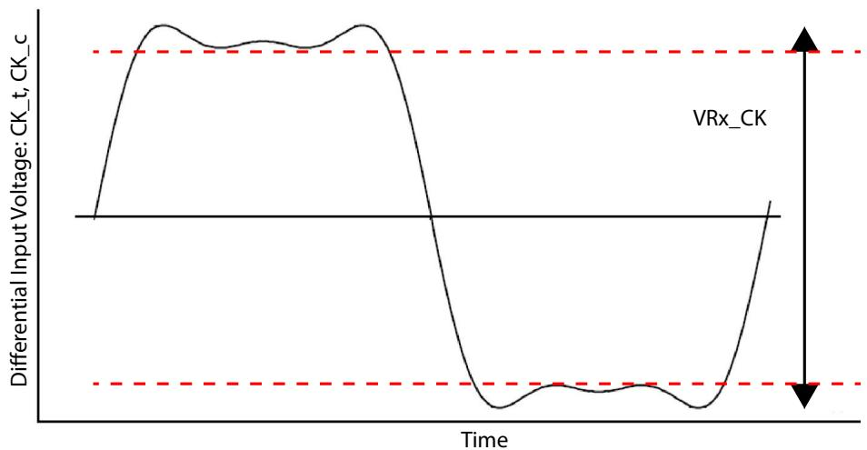

<details>
<summary>line</summary>

| Time | Differential Input Voltage |
|------|---------------------------|
| t    | 1000                      |
| 0    | 0                         |
| 1    | -500                      |
| 2    | 0                         |
| 3    | 1000                      |
| 4    | 0                         |
| 5    | -500                      |
| 6    | 0                         |
| 7    | 1000                      |
| 8    | 0                         |
| 9    | -500                      |
| 10   | 0                         |
| 11   | 1000                      |
| 12   | 0                         |
| 13   | -500                      |
| 14   | 0                         |
| 15   | 1000                      |
| 16   | 0                         |
| 17   | -500                      |
| 18   | 0                         |
| 19   | 1000                      |
| 20   | 0                         |
| 21   | -500                      |
| 22   | 0                         |
| 23   | 1000                      |
| 24   | 0                         |
| 25   | -500                      |
| 26   | 0                         |
| 27   | 1000                      |
| 28   | 0                         |
| 29   | -500                      |
| 30   | 0                         |
| 31   | 1000                      |
| 32   | 0                         |
| 33   | -500                      |
| 34   | 0                         |
| 35   | 1000                      |
| 36   | 0                         |
| 37   | -500                      |
| 38   | 0                         |
| 39   | 1000                      |
| 40   | 0                         |
| 41   | -500                      |
| 42   | 0                         |
| 43   | 1000                      |
| 44   | 0                         |
| 45   | -500                      |
| 46   | 0                         |
| 47   | 1000                      |
| 48   | 0                         |
| 49   | -500                      |
| 50   | 0                         |
| 51   | 1000                      |
| 52   | 0                         |
| 53   | -500                      |
| 54   | 0                         |
| 55   | 1000                      |
| 56   | 0                         |
| 57   | -500                      |
| 58   | 0                         |
| 59   | 1000                      |
| 60   | 0                         |
| 61   | -500                      |
| 62   | 0                         |
| 63   | 1000                      |
| 64   | 0                         |
| 65   | -500                      |
| 66   | 0                         |
| 67   | 1000                      |
| 68   | 0                         |
| 69   | -500                      |
| 70   | 0                         |
| 71   | 1000                      |
| 72   | 0                         |
| 73   | -500                      |
| 74   | 0                         |
| 75   | 1000                      |
| 76   | 0                         |
| 77   | -500                      |
| 78   | 0                         |
| 79   | 1000                      |
| 80   | 0                         |
| 81   | -500                      |
| 82   | 0                         |
| 83   | 1000                      |
| 84   | 0                         |
| 85   | -500                      |
| 86   | 0                         |
| 87   | 1000                      |
| 88   | 0                         |
| 89   | -500                      |
| 90   | 0                         |
| 91   | 1000                      |
| 92   | 0                         |
| 93   | -500                      |
| 94   | 0                         |
| 95   | 1000                      |
| 96   | 0                         |
| 97   | -500                      |
| 98   | 0                         |
| 99   | 1000                      |
| 100  | 0                         |
</details>

Figure 228 — VRx\_CK

# 8.5.2 Differential Input Voltage Levels for Clock

Table 212 — Differential Clock (CK\_t, CK\_c) Input Levels for DDR5-3200 to DDR5-6400 

<table><tr><td>From</td><td>Parameter3</td><td>DDR53200-6400</td><td>Note</td></tr><tr><td> $V_{IHdiff}CK$ </td><td>Differential input high measurement level (CK_t, CK_c)</td><td> $0.75 \times V_{diffpk-pk}$ </td><td>1, 2</td></tr><tr><td> $V_{ILdiff}CK$ </td><td>Differential input low measurement level (CK_t, CK_c)</td><td> $0.25 \times V_{diffpk-pk}$ </td><td>1, 2</td></tr><tr><td colspan="4">NOTE 1  $V_{diffpk-pk}$  defined in Figure 229NOTE 2  $V_{diffpk-pk}$  is the mean high voltage minus the mean low voltage over 8UI samplesNOTE 3 All parameters are defined over the entire clock common mode range</td></tr></table>

Table 213 — Differential Clock (CK\_t, CK\_c) Input Levels for DDR5-6800 to DDR5-8800 

<table><tr><td>From</td><td>Parameter3</td><td>DDR56800-8800</td><td>Note</td></tr><tr><td> $V_{IHdiff}CK$ </td><td>Differential input high measurement level (CK_t, CK_c)</td><td> $0.75 \times V_{diffpk-pk}$ </td><td>1, 2</td></tr><tr><td> $V_{ILdiff}CK$ </td><td>Differential input low measurement level (CK_t, CK_c)</td><td> $0.25 \times V_{diffpk-pk}$ </td><td>1, 2</td></tr><tr><td colspan="4">NOTE 1  $V_{diffpk-pk}$  defined in Figure 229NOTE 2  $V_{diffpk-pk}$  is the mean high voltage minus the mean low voltage over 8UI samplesNOTE 3 All parameters are defined over the entire clock common mode range</td></tr></table>

# 8.5.3 Differential Input Slew Rate Definition for Clock (CK\_t, CK\_c)

Input slew rate for differential signals (CK\_t, CK\_c) are defined and measured as shown in Figure 229.

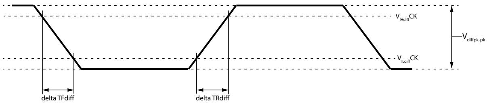

<details>
<summary>line</summary>

| Time Segment       | Delta Phase | Reference Voltage |
| ------------------ | ----------- | ----------------- |
| Delta TFdiff       | Delta TFdiff | V_iHdiff CK      |
| Delta TRdiff       | Delta TRdiff | V_Ldiff CK        |
| Peak (Δ)           | Delta TFdiff | V_diffpk-pk       |
</details>

Figure 229 — Differential Input Slew Rate Definition for CK\_t, CK\_c

Table 214 — Differential Input Slew Rate Definition for CK\_t, CK\_c 

<table><tr><td rowspan="2">Parameter</td><td colspan="2">Measured</td><td rowspan="2">Defined by</td><td rowspan="2">Notes</td></tr><tr><td>From</td><td>To</td></tr><tr><td>Differential Input slew rate for rising edge (CK_t - CK_c)</td><td> $\text{VIL}_{\text{diff}}\text{CK}$ </td><td> $\text{VIH}_{\text{diff}}\text{CK}$ </td><td> $(\text{VIH}_{\text{diff}}\text{CK} - \text{VIL}_{\text{diff}}\text{CK}) / \text{deltaTRdiff}$ </td><td></td></tr><tr><td>Differential Input slew rate for falling edge (CK_t - CK_c)</td><td> $\text{VIH}_{\text{diff}}\text{CK}$ </td><td> $\text{VIL}_{\text{diff}}\text{CK}$ </td><td> $(\text{VIH}_{\text{diff}}\text{CK} - \text{VIL}_{\text{diff}}\text{CK}) / \text{deltaTFdiff}$ </td><td></td></tr></table>

# 8.5.3 Differential Input Slew Rate Definition for Clock (CK\_t, CK\_c) (cont’d)

Table 215 — Differential Input Slew Rate for CK\_t, CK\_c for DDR5-3200 to DDR5-4800 

<table><tr><td rowspan="2">Parameter</td><td rowspan="2">Symbol</td><td colspan="2">DDR5-3200</td><td colspan="2">DDR5-3600</td><td colspan="2">DDR5-4000</td><td colspan="2">DDR5-4400</td><td colspan="2">DDR5-4800</td><td rowspan="2">Unit</td><td rowspan="2">Notes</td></tr><tr><td>Min</td><td>Max</td><td>Min</td><td>Max</td><td>Min</td><td>Max</td><td>Min</td><td>Max</td><td>Min</td><td>Max</td></tr><tr><td>Differential Input Slew Rate for CK_t, CK_c</td><td>SRIdiff_CK</td><td>2</td><td>14</td><td>2</td><td>14</td><td>2</td><td>14</td><td>2</td><td>14</td><td>2</td><td>14</td><td>V/ns</td><td></td></tr></table>

Table 216 — Differential Input Slew Rate for CK\_t, CK\_c for DDR5-5200 to DDR5-6400 

<table><tr><td rowspan="2">Parameter</td><td rowspan="2">Symbol</td><td colspan="2">DDR5-5200</td><td colspan="2">DDR5-5600</td><td colspan="2">DDR5-6000</td><td colspan="2">DDR5-6400</td><td rowspan="2">Unit</td><td rowspan="2">Notes</td></tr><tr><td>Min</td><td>Max</td><td>Min</td><td>Max</td><td>Min</td><td>Max</td><td>Min</td><td>Max</td></tr><tr><td>Differential Input Slew Rate for CK_t, CK_c</td><td>SRIdiff_CK</td><td>2</td><td>30</td><td>2</td><td>30</td><td>2</td><td>30</td><td>2</td><td>30</td><td>V/ns</td><td></td></tr></table>

Table 217 — Differential Input Slew Rate for CK\_t, CK\_c for DDR5-6800 to DDR5-8800 

<table><tr><td rowspan="2">Parameter</td><td rowspan="2">Symbol</td><td colspan="2">DDR5-6800</td><td colspan="2">DDR5-7200</td><td colspan="2">DDR5-7600</td><td colspan="2">DDR5-8000</td><td colspan="2">DDR5-8400</td><td colspan="2">DDR5-8800</td><td rowspan="2">Unit</td><td rowspan="2">Notes</td></tr><tr><td>Min</td><td>Max</td><td>Min</td><td>Max</td><td>Min</td><td>Max</td><td>Min</td><td>Max</td><td>Min</td><td>Max</td><td>Min</td><td>Max</td></tr><tr><td>Differential Input Slew Rate for CK_t, CK_c</td><td>SRldiff _CK</td><td>2</td><td>30</td><td>2</td><td>30</td><td>2</td><td>30</td><td>2</td><td>30</td><td>2</td><td>30</td><td>2</td><td>30</td><td>V/ns</td><td></td></tr></table>

# 8.6 Rx DQS Jitter Sensitivity

The receiver DQS jitter sensitivity test provides the methodology for testing the receiver’s strobe sensitivity to an applied duty cycle distortion (DCD) and/or random jitter $( \mathsf { R j } )$ at the forwarded strobe input without adding jitter, noise and ISI to the data. The receiver must pass the appropriate BER rate when no cross-talk nor ISI is applied, and must pass through the combination of applied DCD and Rj.

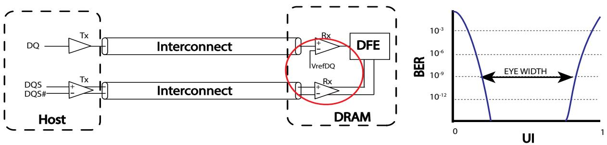

<details>
<summary>text_image</summary>

DQ
Tx
Interconnect
Rx
VrefDQ
DFE
Host
DQS
Tx
Interconnect
Rx
DRAM
BER
0
1
U1
EYE WIDTH
</details>

Figure 230 — SDRAM’s Rx Forwarded Strobes for Jitter Sensitivity Testing

# 8.6.1 Rx DQS Jitter Sensitivity Specification

Table 218 provides Rx DQS Jitter Sensitivity Specification for the DDR5 DRAM receivers when operating at various possible transfer rates. These parameters are tested on the CTC2 card without Rx Equalization set. Additive DFE Gain Bias can be set.

Table 218 — Rx DQS Jitter Sensitivity Specification for DDR5-3200 to 4800   
[BER = Bit Error Rate; DCD = Duty Cycle Distortion; Rj =Random Jitter] 

<table><tr><td rowspan="2">Parameter</td><td rowspan="2">Symbol</td><td colspan="2">DDR5-3200</td><td colspan="2">DDR5-3600</td><td colspan="2">DDR5-4000</td><td colspan="2">DDR5-4400</td><td colspan="2">DDR5-4800</td><td rowspan="2">Unit</td><td rowspan="2">Notes</td></tr><tr><td>Min</td><td>Max</td><td>Min</td><td>Max</td><td>Min</td><td>Max</td><td>Min</td><td>Max</td><td>Min</td><td>Max</td></tr><tr><td>DQ Timing Width</td><td>tRx_DQ_tMargin</td><td>0.900</td><td>-</td><td>0.875</td><td>-</td><td>0.825</td><td>-</td><td>0.825</td><td>-</td><td>0.825</td><td>-</td><td>UI</td><td>1, 2, 3, 8, 9, 10</td></tr><tr><td>Degradation of timing width compared to tRx_DQ_tMargin, with DCD injection in DQS</td><td>ΔtRx_DQ_tMargin_DQS_DCD</td><td>-</td><td>0.06</td><td>-</td><td>0.06</td><td>-</td><td>0.06</td><td>-</td><td>0.06</td><td>-</td><td>0.06</td><td>UI</td><td>1, 4, 8, 9, 10</td></tr><tr><td>Degradation of timing width compared to tRx_DQ_tMargin, with Rj injection in DQS</td><td>ΔtRx_DQ_tMargin_DQS_Rj</td><td>-</td><td>0.09</td><td>-</td><td>0.09</td><td>-</td><td>0.09</td><td>-</td><td>0.09</td><td>-</td><td>0.09</td><td>UI</td><td>1, 5, 8, 9, 10</td></tr><tr><td>Degradation of timing width compared to tRx_DQ_tMargin, with both DCD and Rj injection in DQS</td><td>ΔtRx_DQ_tMargin_DQS_DCD_Rj</td><td>-</td><td>0.15</td><td>-</td><td>0.15</td><td>-</td><td>0.15</td><td>-</td><td>0.15</td><td>-</td><td>0.15</td><td>UI</td><td>1, 2, 6, 8, 9, 10</td></tr><tr><td>Delay of any data lane relative to the DQS_t/DQS_c crossing</td><td>tRx_DQS2DQ</td><td>114</td><td>937</td><td>114</td><td>833</td><td>114</td><td>750</td><td>114</td><td>738</td><td>114</td><td>729</td><td>ps</td><td>1, 7, 8, 9, 10</td></tr><tr><td>Delay of any data lane relative to any other data lane</td><td>tRX_DQ2DQ</td><td>-</td><td>50</td><td>-</td><td>50</td><td>-</td><td>50</td><td>-</td><td>50</td><td>-</td><td>50</td><td>ps</td><td>1, 7, 8, 9, 10, 11, 12</td></tr><tr><td colspan="13">NOTE 1 Validation methodology will be defined in future ballots. 2UI is defined as 1tCK for this parameterNOTE 2 Each of ΔtRx_DQ_tMargin_DQS_DCD, ΔtRx_DQ_tMargin_DQS_Rj, and ΔtRx_DQ_tMargin_DQS_DCD_Rj can be relaxed by up to 5% if tRx_DQ_tMargin exceeds the spec by 5% or moreNOTE 3 DQ Timing Width - timing width for any data lane using repetitive patterns (check note 4 for the pattern) measured at BER=E-9NOTE 4 Magnitude of degradation of timing width for any data lane using repetitive no ISI patterns with DCD injection in forwarded strobe DQS compared to tRx_DQ_tMargin, measured at BER=E-9. The magnitude of DCD is specified under Test Conditions for Rx DQS Jitter Sensitivity Testing. Test using clock-like pattern of repeating 3 “1s” and 3 “0s”NOTE 5 Magnitude of degradation of timing width for any data lane using repetitive no ISI patterns with only Rj injection in forwarded strobe DQS measured at BER=E-9, compared to tRx_tMargin. The magnitude of Rj is specified under Test Conditions for Rx DQS Jitter Sensitivity Testing.NOTE 6 Magnitude of degradation of timing width for any data lane using repetitive no ISI patterns with DCD and Rj injection in forwarded strobe DQS measured at BER=E-9, compared to tRx_tMargin. The magnitudes of DCD and Rj are specified under Test Conditions for Rx DQS Jitter Sensitivity Testing.NOTE 7 Delay of any data lane relative to the strobe lane, as measured at the end of Tx+Channel. This parameter is a collective sum of effects of data clock mismatches in Tx and on the medium connecting Tx and Rx.NOTE 8 All measurements at BER=E-9NOTE 9 This test should be done after the DQS and DQ Voltage Sensitivity tests are completed and passingNOTE 10 The user has the freedom to set the voltage swing and slew rates for strobe and DQ signals as long as they meet the specification. The DQS and DQ input voltage swing and/or slew rate can be adjusted, without exceeding the specifications, for this test.NOTE 11 DQ to DQ offset is skew between DQs within a nibble (x4) or a byte (x8, x16) at the DDR5 SDRAM balls.NOTE 12 This parameter is relative to the per-pin trained DQS2DQ value, and only applies after per-pin DQS2DQ training is complete.</td><td></td></tr></table>

# 8.6.1 Rx DQS Jitter Sensitivity Specification (cont’d)

Table 219 — Rx DQS Jitter Sensitivity Specification for DDR5-5200 to 6400   
[BER = Bit Error Rate; DCD = Duty Cycle Distortion; Rj =Random Jitter] 

<table><tr><td rowspan="2">Parameter</td><td rowspan="2">Symbol</td><td colspan="2">DDR5-5200</td><td colspan="2">DDR5-5600</td><td colspan="2">DDR5-6000</td><td colspan="2">DDR5-6400</td><td rowspan="2">Unit</td><td rowspan="2">Notes</td></tr><tr><td>Min</td><td>Max</td><td>Min</td><td>Max</td><td>Min</td><td>Max</td><td>Min</td><td>Max</td></tr><tr><td>DQ Timing Width</td><td>tRx_DQ_tMargin</td><td>0.835</td><td>-</td><td>0.835</td><td>-</td><td>0.845</td><td>-</td><td>0.845</td><td>-</td><td>UI</td><td>1, 2, 3, 8, 9, 10</td></tr><tr><td>Degradation of timing width compared to tRx_DQ_tMargin, with DCD injection in DQS</td><td>ΔtRx_DQ_tMargin_DQS_DCD</td><td>-</td><td>0.06</td><td>-</td><td>0.06</td><td>-</td><td>0.06</td><td>-</td><td>0.06</td><td>UI</td><td>1, 4, 8, 9, 10</td></tr><tr><td>Degradation of timing width compared to tRx_DQ_tMargin, with Rj injection in DQS</td><td>ΔtRx_DQ_tMargin_DQS_Rj</td><td>-</td><td>0.09</td><td>-</td><td>0.09</td><td>-</td><td>0.09</td><td>-</td><td>0.09</td><td>UI</td><td>1, 5, 8, 9, 10</td></tr><tr><td>Degradation of timing width compared to tRx_DQ_tMargin, with both DCD and Rj injection in DQS</td><td>ΔtRx_DQ_tMargin_DQS_DCD_Rj</td><td>-</td><td>0.15</td><td>-</td><td>0.15</td><td>-</td><td>0.15</td><td>-</td><td>0.15</td><td>UI</td><td>1, 2, 6, 8, 9, 10</td></tr><tr><td>Delay of any data lane relative to the DQS_t/DQS_c crossing</td><td>tRx_DQS2DQ</td><td>114</td><td>721</td><td>114</td><td>714</td><td>114</td><td>708</td><td>114</td><td>703</td><td>ps</td><td>1, 7, 8, 9, 10</td></tr><tr><td>Delay of any data lane relative to any other data lane</td><td>tRX_DQ2DQ</td><td>-</td><td>50</td><td>-</td><td>50</td><td>-</td><td>50</td><td>-</td><td>50</td><td>ps</td><td>1, 7, 8, 9, 10, 11, 12</td></tr><tr><td colspan="12">NOTE 1 Validation methodology will be defined in future ballots. 2UI is defined as 1tCK for this parameterNOTE 2 Each of ΔtRx_DQ_tMargin_DQS_DCD, ΔtRx_DQ_tMargin_DQS_Rj, and ΔtRx_DQ_tMargin_DQS_DCD_Rj can be relaxed by up to 5% if tRx_DQ_tMargin exceeds the spec by 5% or moreNOTE 3 DQ Timing Width - timing width for any data lane using repetitive patterns (check note 4 for the pattern) measured at BER=E-9NOTE 4 Magnitude of degradation of timing width for any data lane using repetitive no ISI patterns with DCD injection in forwarded strobe DQS compared to tRx_DQ_tMargin, measured at BER=E-9. The magnitude of DCD is specified under Test Conditions for Rx DQS Jitter Sensitivity Testing. Test using clock-like pattern of repeating 3 “1s” and 3 “0s”NOTE 5 Magnitude of degradation of timing width for any data lane using repetitive no ISI patterns with only Rj injection in forwarded strobe DQS measured at BER=E-9, compared to tRx_tMargin. The magnitude of Rj is specified under Test Conditions for Rx DQS Jitter Sensitivity Testing.NOTE 6 Magnitude of degradation of timing width for any data lane using repetitive no ISI patterns with DCD and Rj injection in forwarded strobe DQS measured at BER=E-9, compared to tRx_tMargin. The magnitudes of DCD and Rj are specified under Test Conditions for Rx DQS Jitter Sensitivity Testing.NOTE 7 Delay of any data lane relative to the strobe lane, as measured at the end of Tx+Channel. This parameter is a collective sum of effects of data clock mismatches in Tx and on the medium connecting Tx and Rx.NOTE 8 All measurements at BER=E-9NOTE 9 This test should be done after the DQS and DQ Voltage Sensitivity tests are completed and passingNOTE 10 The user has the freedom to set the voltage swing and slew rates for strobe and DQ signals as long as they meet the specification. The DQS and DQ input voltage swing and/or slew rate can be adjusted, without exceeding the specifications, for this test.NOTE 11 DQ to DQ offset is skew between DQs within a nibble (x4) or a byte (x8, x16) at the DDR5 SDRAM balls.NOTE 12 This parameter is relative to the per-pin trained DQS2DQ value, and only applies after per-pin DQS2DQ training is complete.</td></tr></table>

# 8.6.1 Rx DQS Jitter Sensitivity Specification (cont’d)

Table 220 — Rx DQS Jitter Sensitivity Specification for DDR5-6800 to 8800   
[BER = Bit Error Rate; DCD = Duty Cycle Distortion; Rj =Random Jitter] 

<table><tr><td rowspan="2">Parameter</td><td rowspan="2">Symbol</td><td colspan="2">DDR5-6800</td><td colspan="2">DDR5-7200</td><td colspan="2">DDR5-7600</td><td colspan="2">DDR5-8000</td><td colspan="2">DDR5-8400</td><td colspan="2">DDR5-8800</td><td rowspan="2">Unit</td><td rowspan="2">Notes</td></tr><tr><td>Min</td><td>Max</td><td>Min</td><td>Max</td><td>Min</td><td>Max</td><td>Min</td><td>Max</td><td>Min</td><td>Max</td><td>Min</td><td>Max</td></tr><tr><td>DQ Timing Width</td><td>tRx_DQ_tMargin</td><td>0.845</td><td>-</td><td>0.845</td><td>-</td><td>0.845</td><td>-</td><td>0.845</td><td>-</td><td>0.845</td><td>-</td><td>0.845</td><td>-</td><td>UI</td><td>1, 2, 3, 8, 9, 10</td></tr><tr><td>Degradation of timing width compared to tRx_DQ_tMargin, with DCD injection in DQS</td><td>ΔtRx_DQ_tMargin_DQS_DCD</td><td>-</td><td>0.06</td><td>-</td><td>0.06</td><td>-</td><td>0.06</td><td>-</td><td>0.06</td><td>-</td><td>0.06</td><td>-</td><td>0.06</td><td>UI</td><td>1, 4, 8, 9, 10</td></tr><tr><td>Degradation of timing width compared to tRx_DQ_tMargin, with Rj injection in DQS</td><td>ΔtRx_DQ_tMargin_DQS_Rj</td><td>-</td><td>0.09</td><td>-</td><td>0.09</td><td>-</td><td>0.09</td><td>-</td><td>0.09</td><td>-</td><td>0.09</td><td>-</td><td>0.09</td><td>UI</td><td>1, 5, 8, 9, 10</td></tr><tr><td>Degradation of timing width compared to tRx_DQ_tMargin, with both DCD and Rj injection in DQS</td><td>ΔtRx_DQ_tMargin_DQS_DCD_Rj</td><td>-</td><td>0.15</td><td>-</td><td>0.15</td><td>-</td><td>0.15</td><td>-</td><td>0.15</td><td>-</td><td>0.15</td><td>-</td><td>0.15</td><td>UI</td><td>1, 2, 6, 8, 9, 10</td></tr><tr><td>Delay of any data lane relative to the DQS_t/DQS_c crossing</td><td>tRx_DQS2DQ</td><td>114</td><td>703</td><td>114</td><td>703</td><td>114</td><td>703</td><td>114</td><td>703</td><td>114</td><td>703</td><td>114</td><td>703</td><td>ps</td><td>1, 7, 8, 9, 10</td></tr><tr><td>Delay of any data lane relative to any other data lane</td><td>tRX_DQ2DQ</td><td>-</td><td>50</td><td>-</td><td>50</td><td>-</td><td>50</td><td>-</td><td>50</td><td>-</td><td>50</td><td>-</td><td>50</td><td>ps</td><td>1, 7, 8, 9, 10, 11, 12</td></tr><tr><td colspan="16">NOTE 1 Validation methodology will be defined in future ballots. 2UI is defined as 1tCK for this parameterNOTE 2 Each of ΔtRx_DQ_tMargin_DQS_DCD, ΔtRx_DQ_tMargin_DQS_Rj, and ΔtRx_DQ_tMargin_DQS_DCD_Rj can be relaxed by up to 5% if tRx_DQ_tMargin exceeds the spec by 5% or moreNOTE 3 DQ Timing Width - timing width for any data lane using repetitive patterns (check note 4 for the pattern) measured at BER=E-9NOTE 4 Magnitude of degradation of timing width for any data lane using repetitive no ISI patterns with DCD injection in forwarded strobe DQS compared to tRx_DQ_tMargin, measured at BER=E-9. The magnitude of DCD is specified under Test Conditions for Rx DQS Jitter Sensitivity Testing. Test using clock-like pattern of repeating 3 “1s” and 3 “0s”NOTE 5 Magnitude of degradation of timing width for any data lane using repetitive no ISI patterns with only Rj injection in forwarded strobe DQS measured at BER=E-9, compared to tRx_tMargin. The magnitude of Rj is specified under Test Conditions for Rx DQS Jitter Sensitivity Testing.NOTE 6 Magnitude of degradation of timing width for any data lane using repetitive no ISI patterns with DCD and Rj injection in forwarded strobe DQS measured at BER=E-9, compared to tRx_tMargin. The magnitudes of DCD and Rj are specified under Test Conditions for Rx DQS Jitter Sensitivity Testing.NOTE 7 Delay of any data lane relative to the strobe lane, as measured at the end of Tx+Channel. This parameter is a collective sum of effects of data clock mismatches in Tx and on the medium connecting Tx and Rx.NOTE 8 All measurements at BER=E-9NOTE 9 This test should be done after the DQS and DQ Voltage Sensitivity tests are completed and passingNOTE 10 The user has the freedom to set the voltage swing and slew rates for strobe and DQ signals as long as they meet the specification. The DQS and DQ input voltage swing and/or slew rate can be adjusted, without exceeding the specifications, for this test.NOTE 11 DQ to DQ offset is skew between DQs within a nibble (x4) or a byte (x8, x16) at the DDR5 SDRAM balls.NOTE 12 This parameter is relative to the per-pin trained DQS2DQ value, and only applies after per-pin DQS2DQ training is complete.</td></tr></table>

# 8.6.2 Test Conditions for Rx DQS Jitter Sensitivity Tests

Table 221 lists the amount of Duty Cycle Distortion (DCD) and/or Random Jitter (Rj) that must be applied to the forwarded strobe when measuring the Rx DQS Jitter Sensitivity parameters specified in Table 218 and Table 219.

Table 221 — Test Conditions for Rx DQS Jitter Sensitivity Testing for DDR5-3200 to 4800 

<table><tr><td rowspan="2">Parameter</td><td rowspan="2">Symbol</td><td colspan="2">DDR5-3200</td><td colspan="2">DDR5-3600</td><td colspan="2">DDR5-4000</td><td colspan="2">DDR5-4400</td><td colspan="2">DDR5-4800</td><td rowspan="2">Unit</td><td rowspan="2">Notes</td></tr><tr><td>Min</td><td>Max</td><td>Min</td><td>Max</td><td>Min</td><td>Max</td><td>Min</td><td>Max</td><td>Min</td><td>Max</td></tr><tr><td>Applied DCD to the DQS</td><td>tRx_DQS_DCD</td><td>-</td><td>0.045</td><td>-</td><td>0.045</td><td>-</td><td>0.045</td><td>-</td><td>0.045</td><td>-</td><td>0.045</td><td>UI</td><td>1, 2, 3, 6, 7, 10</td></tr><tr><td>Applied Rj RMS to the DQS</td><td>tRx_DQS_Rj</td><td>-</td><td>0.0075</td><td>-</td><td>0.0075</td><td>-</td><td>0.0075</td><td>-</td><td>0.0075</td><td>-</td><td>0.0075</td><td>UI (RMS)</td><td>1, 2, 4, 6, 8, 10</td></tr><tr><td>Applied DCD and Rj RMS to the DQS</td><td>tRx_DQS_DCD_Rj</td><td>-</td><td>0.045UIDCD + 0.0075UIRj RMS</td><td>-</td><td>0.045UIDCD + 0.0075UIRj RMS</td><td>-</td><td>0.045UIDCD + 0.0075UIRj RMS</td><td>-</td><td>0.045UIDCD + 0.0075UIRj RMS</td><td>-</td><td>0.045UIDCD + 0.0075UIRj RMS</td><td>UI</td><td>1, 2, 5, 6, 7, 9, 10</td></tr><tr><td colspan="14">NOTE 1 While imposing this spec, the strobe lane is stressed, but the data input is kept large amplitude and no jitter or ISI injection. The specified voltages are at the Rx input pin. The DQS and DQ input voltage swing and/or slew rate can be adjusted, without exceeding the specifications, for this test.NOTE 2 The jitter response of the forwarded strobe channel will depend on the input voltage, primarily due to bandwidth limitations of the clock receiver. For this revision, no separate specification of jitter as a function of input amplitude is specified, instead the response characterization done at the specified clock amplitude only. The specified voltages are at the Rx input pinNOTE 3 Various DCD values should be tested, complying within the maximum limitsNOTE 4 Various Rj values should be tested, complying within the maximum limitsNOTE 5 Various combinations of DCD and Rj should be tested, complying within the maximum limits. The maximum timing margin degradation as a result of these injected jitter is specified in a separate tableNOTE 6 Although DDR5 has bursty traffic, current available BERTs that can be used for this test do not support burst traffic patterns. A continuous strobe and continuous DQ are used for this parameter. The clock like pattern repeating 3 “1s” and 3 “0s” is used for this test.NOTE 7 Duty Cycle Distortion (in UI DCD) as applied to the input forwarded DQS from BERT (UI)NOTE 8 RMS value of Rj (specified as Edge jitter) applied to the input forwarded DQS from BERT (values of the edge jitter RMS values specified as % of UI)NOTE 9 Duty cycle distortion (specified as UI DCD) and rms values of Rj (specified as edge jitter) applied to the input forwarded DQS from BERT (values of the edge jitter RMS values specified as % of UI)NOTE 10 The user has the freedom to set the voltage swing and slew rates for strobe and DQ signals as long as they meet the specification. The DQS and DQ input voltage swing and/or slew rate can be adjusted, without exceeding the specifications, for this test.</td></tr></table>

# 8.6.2 Test Conditions for Rx DQS Jitter Sensitivity Tests (cont’d)

Table 222 — Test Conditions for Rx DQS Jitter Sensitivity Testing for DDR5-5200 to 6400 

<table><tr><td rowspan="2">Parameter</td><td rowspan="2">Symbol</td><td colspan="2">DDR5-5200</td><td colspan="2">DDR5-5600</td><td colspan="2">DDR5-6000</td><td colspan="2">DDR5-6400</td><td rowspan="2">Unit</td><td rowspan="2">Notes</td></tr><tr><td>Min</td><td>Max</td><td>Min</td><td>Max</td><td>Min</td><td>Max</td><td>Min</td><td>Max</td></tr><tr><td>Applied DCD to the DQS</td><td>tRx_DQS_DCD</td><td>-</td><td>0.045</td><td>-</td><td>0.045</td><td>-</td><td>0.045</td><td>-</td><td>0.045</td><td>UI</td><td>1, 2, 3, 6, 7, 10</td></tr><tr><td>Applied Rj RMS to the DQS</td><td>tRx_DQS_Rj</td><td>-</td><td>0.0075</td><td>-</td><td>0.0075</td><td>-</td><td>0.0075</td><td>-</td><td>0.0075</td><td>UI (RMS)</td><td>1, 2, 4, 6, 8, 10</td></tr><tr><td>Applied DCD and Rj RMS to the DQS</td><td>tRx_DQS_DCD_Rj</td><td>-</td><td>0.045UI DCD + 0.0075UI Rj RMS</td><td>-</td><td>0.045UI DCD + 0.0075UI Rj RMS</td><td>-</td><td>0.045UI DCD + 0.0075UI Rj RMS</td><td>-</td><td>0.045UI DCD + 0.0075UI Rj RMS</td><td>UI</td><td>1, 2, 5, 6, 7, 9, 10</td></tr><tr><td colspan="12">NOTE 1 While imposing this spec, the strobe lane is stressed, but the data input is kept large amplitude and no jitter or ISI injection. The specified voltages are at the Rx input pin. The DQS and DQ input voltage swing and/or slew rate can be adjusted, without exceeding the specifications, for this test.NOTE 2 The jitter response of the forwarded strobe channel will depend on the input voltage, primarily due to bandwidth limitations of the clock receiver. For this revision, no separate specification of jitter as a function of input amplitude is specified, instead the response characterization done at the specified clock amplitude only. The specified voltages are at the Rx input pinNOTE 3 Various DCD values should be tested, complying within the maximum limitsNOTE 4 Various Rj values should be tested, complying within the maximum limitsNOTE 5 Various combinations of DCD and Rj should be tested, complying within the maximum limits. The maximum timing margin degradation as a result of these injected jitter is specified in a separate tableNOTE 6 Although DDR5 has bursty traffic, current available BERTs that can be used for this test do not support burst traffic patterns. A continuous strobe and continuous DQ are used for this parameter. The clock like pattern repeating 3 “1s” and 3 “0s” is used for this test.NOTE 7 Duty Cycle Distortion (in UI DCD) as applied to the input forwarded DQS from BERT (UI)NOTE 8 RMS value of Rj (specified as Edge jitter) applied to the input forwarded DQS from BERT (values of the edge jitter RMS values specified as % of UI)NOTE 9 Duty cycle distortion (specified as UI DCD) and rms values of Rj (specified as edge jitter) applied to the input forwarded DQS from BERT (values of the edge jitter RMS values specified as % of UI)NOTE 10 The user has the freedom to set the voltage swing and slew rates for strobe and DQ signals as long as they meet the specification. The DQS and DQ input voltage swing and/or slew rate can be adjusted, without exceeding the specifications, for this test.</td></tr></table>

# 8.6.2 Test Conditions for Rx DQS Jitter Sensitivity Tests (cont’d)

Table 223 — Test Conditions for Rx DQS Jitter Sensitivity Testing for DDR5-6800 to 8800 

<table><tr><td rowspan="2">Parameter</td><td rowspan="2">Symbol</td><td colspan="2">DDR5-6800</td><td colspan="2">DDR5-7200</td><td colspan="2">DDR5-7600</td><td colspan="2">DDR5-8000</td><td colspan="2">DDR5-8400</td><td colspan="2">DDR5-8800</td><td rowspan="2">Unit</td><td rowspan="2">Notes</td></tr><tr><td>Min</td><td>Max</td><td>Min</td><td>Max</td><td>Min</td><td>Max</td><td>Min</td><td>Max</td><td>Min</td><td>Max</td><td>Min</td><td>Max</td></tr><tr><td>Applied DCD to the DQS</td><td>tRx_DQS_DCD</td><td>-</td><td>0.045</td><td>-</td><td>0.045</td><td>-</td><td>0.045</td><td>-</td><td>0.045</td><td>-</td><td>0.045</td><td>-</td><td>0.045</td><td>UI</td><td>3, 6, 7, 10</td></tr><tr><td>Applied Rj RMS to the DQS</td><td>tRx_DQS_Rj</td><td>-</td><td>0.0075</td><td>-</td><td>0.0075</td><td>-</td><td>0.0075</td><td>-</td><td>0.0075</td><td>-</td><td>0.0075</td><td>-</td><td>0.0075</td><td>UI (RMS)</td><td>4, 6, 8, 10</td></tr><tr><td>Applied DCD and Rj RMS to the DQS</td><td>tRx_DQS_DCD_Rj</td><td>-</td><td>0.045UIDCD + 0.0075UIRj RMS</td><td>-</td><td>0.045UIDCD + 0.0075UIRj RMS</td><td>-</td><td>0.045UIDCD + 0.0075UIRj RMS</td><td>-</td><td>0.045UIDCD + 0.0075UIRj RMS</td><td>-</td><td>0.045UIDCD + 0.0075UIRj RMS</td><td>-</td><td>0.045UIDCD +0.0075UIRj RMS</td><td>UI</td><td>5, 6, 7,9, 10</td></tr><tr><td colspan="16">NOTE 1 While imposing this spec, the strobe lane is stressed, but the data input is kept large amplitude and no jitter or ISI injection. The specified voltages are at the Rx input pin. The DQS and DQ input voltage swing and/or slew rate can be adjusted, without exceeding the specifications, for this test.NOTE 2 The jitter response of the forwarded strobe channel will depend on the input voltage, primarily due to bandwidth limitations of the clock receiver. For this revision, no separate specification of jitter as a function of input amplitude is specified, instead the response characterization done at the specified clock amplitude only. The specified voltages are at the Rx input pinNOTE 3 Various DCD values should be tested, complying within the maximum limitsNOTE 4 Various Rj values should be tested, complying within the maximum limitsNOTE 5 Various combinations of DCD and Rj should be tested, complying within the maximum limits. The maximum timing margin degradation as a result of these injected jitter is specified in a separate tableNOTE 6 Although DDR5 has bursty traffic, current available BERTs that can be used for this test do not support burst traffic patterns. A continuous strobe and continuous DQ are used for this parameter. The clock like pattern repeating 3 “1s” and 3 “0s” is used for this test.NOTE 7 Duty Cycle Distortion (in UI DCD) as applied to the input forwarded DQS from BERT (UI)NOTE 8 RMS value of Rj (specified as Edge jitter) applied to the input forwarded DQS from BERT (values of the edge jitter RMS values specified as % of UI)NOTE 9 Duty cycle distortion (specified as UI DCD) and rms values of Rj (specified as edge jitter) applied to the input forwarded DQS from BERT (values of the edge jitter RMS values specified as % of UI)NOTE 10 The user has the freedom to set the voltage swing and slew rates for strobe and DQ signals as long as they meet the specification. The DQS and DQ input voltage swing and/or slew rate can be adjusted, without exceeding the specifications, for this test.</td></tr></table>

# 8.7 Rx DQS Voltage Sensitivity

# 8.7.1 Overview

The receiver DQS (strobe) input voltage sensitivity test provides the methodology for testing the receiver’s sensitivity to varying input voltage in the absence of Inter-Symbol Interference (ISI), jitter (Rj, Dj, DCD) and crosstalk noise.

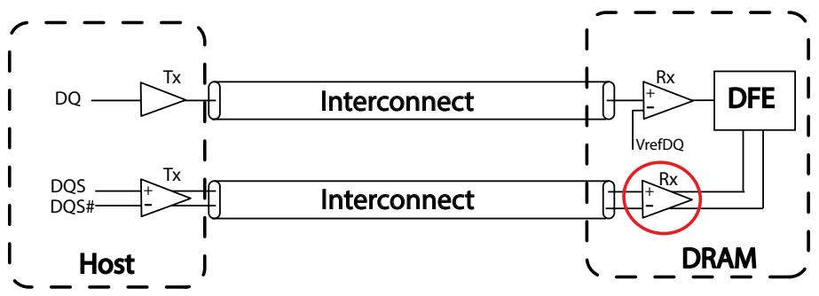

<details>
<summary>flowchart</summary>

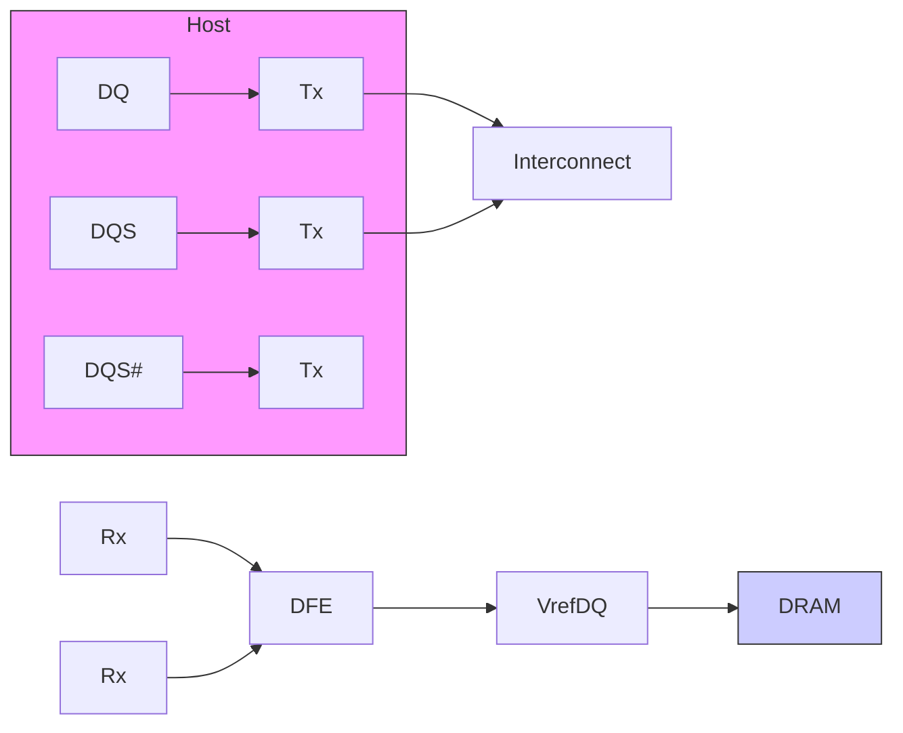
```mermaid
graph LR
    subgraph Host
        DQ --> Tx1["Tx"]
        DQS --> Tx2["Tx"]
        DQS# --> Tx3["Tx"]
    end
    Tx1 --> Interconnect["Interconnect"]
    Tx2 --> Interconnect["Interconnect"]
    Rx1["Rx"] --> DFE["DFE"]
    Rx2["Rx"] --> DFE
    DFE --> VrefDQ["VrefDQ"]
    VrefDQ --> DRAM["DRAM"]
    style Host fill:#f9f,stroke:#333
    style DRAM fill:#ccf,stroke:#333
```
</details>

Figure 231 — Example of DDR5 Memory Interconnect

# 8.7.2 Receiver DQS Voltage Sensitivity Parameter

Input differential (DQS\_t, DQS\_c) VRx\_DQS is defined and measured as shown in Table 224 through Table 226. The receiver must pass the minimum BER requirements for DDR5. These parameters are tested on the CTC2 card with neither additive gain nor Rx Equalization set.

Table 224 — Rx DQS Input Voltage Sensitivity Parameter for DDR5-3200 to 4800 

<table><tr><td rowspan="2">Parameter</td><td rowspan="2">Symbol</td><td colspan="2">DDR5-3200</td><td colspan="2">DDR5-3600</td><td colspan="2">DDR5-4000</td><td colspan="2">DDR5-4400</td><td colspan="2">DDR5-4800</td><td rowspan="2">Unit</td><td rowspan="2">Notes</td></tr><tr><td>Min</td><td>Max</td><td>Min</td><td>Max</td><td>Min</td><td>Max</td><td>Min</td><td>Max</td><td>Min</td><td>Max</td></tr><tr><td>DQS Rx Input Voltage Sensitivity (differential pp)</td><td>VRx_DQS</td><td>-</td><td>130</td><td>-</td><td>115</td><td>-</td><td>105</td><td>-</td><td>100</td><td>-</td><td>100</td><td>mV</td><td>1, 2, 3</td></tr><tr><td colspan="14">NOTE 1 Refer to the minimum BER requirements for DDR5NOTE 2 The validation methodology for this parameter will be covered in future ballot(s)NOTE 3 Test using clock like pattern of repeating 3 “1s” and 3 “0s”</td></tr></table>

Table 225 — Rx DQS Input Voltage Sensitivity Parameter for DDR5-5200 to 6400 

<table><tr><td rowspan="2">Parameter</td><td rowspan="2">Symbol</td><td colspan="2">DDR5-5200</td><td colspan="2">DDR5-5600</td><td colspan="2">DDR5-6000</td><td colspan="2">DDR5-6400</td><td colspan="2">DDR5-6800</td><td rowspan="2">Unit</td><td rowspan="2">Notes</td></tr><tr><td>Min</td><td>Max</td><td>Min</td><td>Max</td><td>Min</td><td>Max</td><td>Min</td><td>Max</td><td>Min</td><td>Max</td></tr><tr><td>DQS Rx Input Voltage Sensitivity (differential pp)</td><td>VRx_DQS</td><td>-</td><td>90</td><td>-</td><td>90</td><td>-</td><td>83</td><td>-</td><td>83</td><td>-</td><td>80</td><td>mV</td><td>1, 2, 3</td></tr><tr><td colspan="14">NOTE 1 Refer to the minimum BER requirements for DDR5NOTE 2 The validation methodology for this parameter will be covered in future ballot(s)NOTE 3 Test using clock like pattern of repeating 3 “1s” and 3 “0s”</td></tr></table>

Table 226 — Rx DQS Input Voltage Sensitivity Parameter for DDR5-6800 to 8800 

<table><tr><td rowspan="2">Parameter</td><td rowspan="2">Symbol</td><td colspan="2">DDR5-7200</td><td colspan="2">DDR5-7600</td><td colspan="2">DDR5-8000</td><td colspan="2">DDR5-8400</td><td colspan="2">DDR5-8800</td><td rowspan="2">Unit</td><td rowspan="2">Notes</td></tr><tr><td>Min</td><td>Max</td><td>Min</td><td>Max</td><td>Min</td><td>Max</td><td>Min</td><td>Max</td><td>Min</td><td>Max</td></tr><tr><td>DQS Rx Input Voltage Sensitivity (differential pp)</td><td>VRx_DQS</td><td>-</td><td>80</td><td>-</td><td>77.5</td><td>-</td><td>77.5</td><td>-</td><td>75</td><td>-</td><td>75</td><td>mV</td><td>1, 2, 3</td></tr><tr><td colspan="14">NOTE 1 Refer to the minimum BER requirements for DDR5NOTE 2 The validation methodology for this parameter will be covered in future ballot(s)NOTE 3 Test using clock like pattern of repeating 3 “1s” and 3 “0s”</td></tr></table>

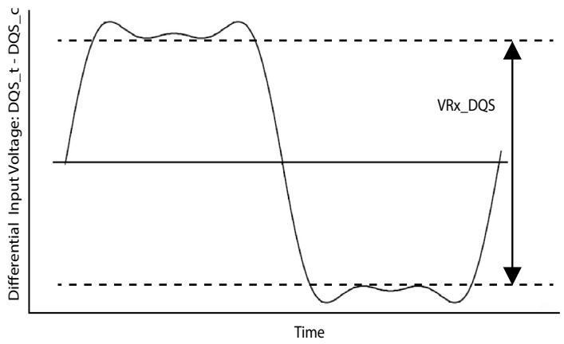

<details>
<summary>line</summary>

| Time | Differential Input Voltage |
|------|-----------------------------|
| 0    | 0                           |
| 1    | ~0.8                        |
| 2    | ~0.9                        |
| 3    | ~0.7                        |
| 4    | ~0.6                        |
| 5    | ~0.4                        |
| 6    | ~0.1                        |
| 7    | ~-0.2                       |
| 8    | ~-0.3                       |
| 9    | ~-0.1                       |
| 10   | ~0.1                        |
| 11   | ~0.3                        |
| 12   | ~0.5                        |
| 13   | ~0.7                        |
| 14   | ~0.9                        |
| 15   | ~1.0                        |
| 16   | ~0.8                        |
| 17   | ~0.6                        |
| 18   | ~0.4                        |
| 19   | ~0.2                        |
| 20   | ~0.1                        |
| 21   | ~0.3                        |
| 22   | ~0.5                        |
| 23   | ~0.7                        |
| 24   | ~0.9                        |
| 25   | ~1.0                        |
| 26   | ~0.8                        |
| 27   | ~0.6                        |
| 28   | ~0.4                        |
| 29   | ~0.2                        |
| 30   | ~0.1                        |
| 31   | ~0.3                        |
| 32   | ~0.5                        |
| 33   | ~0.7                        |
| 34   | ~0.9                        |
| 35   | ~1.0                        |
| 36   | ~0.8                        |
| 37   | ~0.6                        |
| 38   | ~0.4                        |
| 39   | ~0.2                        |
| 40   | ~0.1                        |
| 41   | ~0.3                        |
| 42   | ~0.5                        |
| 43   | ~0.7                        |
| 44   | ~0.9                        |
| 45   | ~1.0                        |
| 46   | ~0.8                        |
| 47   | ~0.6                        |
| 48   | ~0.4                        |
| 49   | ~0.2                        |
| 50   | ~0.1                        |
| 51   | ~0.3                        |
| 52   | ~0.5                        |
| 53   | ~0.7                        |
| 54   | ~0.9                        |
| 55   | ~1.0                        |
| 56   | ~0.8                        |
| 57   | ~0.6                        |
| 58   | ~0.4                        |
| 59   | ~0.2                        |
| 60   | ~0.1                        |
| 61   | ~0.3                        |
| 62   | ~0.5                        |
| 63   | ~0.7                        |
| 64   | ~0.9                        |
| 65   | ~1.0                        |
| 66   | ~0.8                        |
| 67   | ~0.6                        |
| 68   | ~0.4                        |
| 69   | ~0.2                        |
| 70   | ~0.1                        |
| 71   | ~0.3                        |
| 72   | ~0.5                        |
| 73   | ~0.7                        |
| 74   | ~0.9                        |
| 75   | ~1.0                        |
| 76   | ~0.8                        |
| 77   | ~0.6                        |
| 78   | ~0.4                        |
| 79   | ~0.2                        |
| 80   | ~0.1                        |
| 81   | ~0.3                        |
| 82   | ~0.5                        |
| 83   | ~0.7                        |
| 84   | ~0.9                        |
| 85   | ~1.0                        |
| 86   | ~0.8                        |
| 87   | ~0.6                        |
| 88   | ~0.4                        |
| 89   | ~0.2                        |
| 90   | ~0.1                        |
| 91   | ~0.3                        |
| 92   | ~0.5                        |
| 93   | ~0.7                        |
| 94   | ~0.9                        |
| 95   | ~1.0                        |
| 96   | ~0.8                        |
| 97   | ~0.6                        |
| 98   | ~0.4                        |
| 99   | ~0.2                        |
| 100  | ~0.1                        |
</details>

Figure 232 — VRx\_DQS

# 8.8 Differential Strobe (DQS\_t, DQS\_c) Input Cross Point Voltage (VIX)

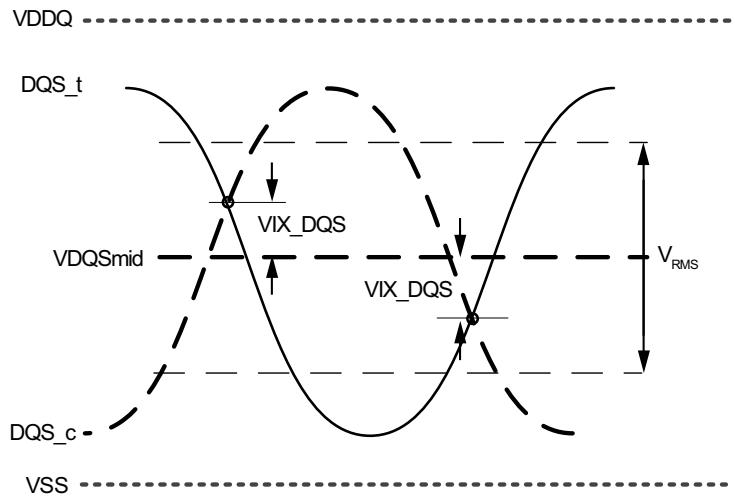

<details>
<summary>line</summary>

| Label       | Value |
|-------------|-------|
| VDDQ        | -     |
| VIX_DQS     | Peak  |
| VIX_DQS     | Low   |
| VIX_DQS     | -     |
| VIX_DQS     | -     |
| VIX_DQS     | -     |
| VIX_DQS     | -     |
| VIX_DQS     | -     |
| VIX_DQS     | -     |
| VIX_DQS     | -     |
| VIX_DQS     | -     |
| VIX_DQS     | -     |
| VIX_DQS     | -     |
| VIX_DQS     | -      |
| VIX_DQS     | -      |
| VIX_DQS     | -      |
| VIX_DQS     | -      |
| VIX_DQS     | -      |
| VIX_DQS     | -      |
| VIX_DQS     | -      |
| VIX_DQS     | -      |
| VIX_DQS     | -      |
| VIX_DQS     | -      |
| VIX_DQS     | -    |
| VIX_DQS     | -    |
| VIX_DQS     | -    |
| VIX_DQS     | -    |
| VIX_DQS     | -    |
| VIX_DQS     | -    |
| VIX_DQS     | -    |
| VIX_DQS     | -    |
| VIX_DQS     | -    |
| VIX_DQS     | -    |
| VIX_DQS     | - 100 |
| VIX_DQS     | -    |
| VIX_DQS     | -    |
| VIX_DQS     | -    |
| VIX_DQS     | -    |
| VIX_DQS     | -    |
| VIX_DQS     | -    |
| VIX_DQS     | -    |
| VIX_DQS     | -    |
| VIX_DQS     | -    |
| VIX_DQS     | -100 |
| VIX_DQS     | -    |
| VIX_DQS     | -    |
| VIX_DQS     | -    |
| VIX_DQS     | -    |
| VIX_DQS     | -    |
| VIX_DQS     | -    |
| VIX_DQS     | -    |
| VIX_DQS     | -100 |
| VIX_DQS     | -    |
| VIX_DQS     (dashed) | -   |
| VIX_DQS (dashed) | -   |
| VIX_DQS (dashed) | -   |
| VIX_DQS (dashed) | -   |
| VIX_DQS (dashed) | -   |
| VIX_DQS (dashed) | -   |
| VIX_DQS (dashed) | -   |
| VIX_DQS (dashed) | -   |
| VIX_DQS (dashed) | -   |
|
| VIX_DQS (dashed) | -   |
| VIX_DQS (dashed) | -   |
| VIX_DQS (dashed) | -   |
| VIX_DQS (dashed) | -   |
| VIX_DQS (dashed) | -   |
| VIX_DQS (dashed) | -   |
| VIX_DQS (dashed) | -   |
| VIX_DQS (dashed)| 0     |
| VIX_DQS (dashed)| 0     |
| VIX_DQS (dashed)| 0     |
| VIX_DQS (dashed)| 0     |
| VIX_DQS (dashed)| 0     |
| VIX_DQS (dashed)| 0     |
| VIX_DQS (dashed)| 0     |
| VIX_DQS (dashed)| 0     |
| VIX_DQS (dotted)| 0     |
| VIX_DQS (dotted)| 0     |
| VIX_DQS (dotted)| 0     |
| VIX_DQS (dotted)| 0     |
| VIX_DQS (dotted)| 0     |
| VIX_DQS (dotted)| 0     |
| VIX_DQS (dotted)| 0     |
| VIX_DQS (dotted)| 0     |
| VIX_Solid   | 0     |
| DQST        | 0     |
| DQST        | 0     |
| DQST        | 0     |
| DQST        | 0     |
| DQST        | 0     |
| DQST        | 0     |
| DQST        | 0     |
| DQST        | 0     |
| DQST        | 0     |
| DQST        | 0     |
| DQST2       | 0     |
| DQST2       | 0     |
| DQST2       | 0     |
| DQST2       | 0     |
| DQST2       | 0     |
| DQST2       | 0     |
| DQST2       | 0     |
| DQST2       | 0     |
| DQST2       | 0     |
| DQST2       (dotted)| 0    |
| DQST2       (dotted)| 0    |
| DQST2       (dotted)| 0    |
| DQST2       (dotted)| 0    |
| DQST2       (dotted)| 0    |
| DQST2       (dotted)| 0    |
| DQST2       (dotted)| 0    |
| DQST2       (dotted)| 0    |
|
| DQST2       (solid)| 0    |
| DQST        | 0    |
| DQST        | 0    |
| DQST        | 0    |
| DQST        | 0    |
| DQST        | 0    |
| DQST        | 0    |
| DQST        | 0    |
| DQST        | 0    |
| DQST        | 0    |
|
DQST       | 0    |
| DQST       | 0    |
| DQST       | 0    |
| DQST       | 0    |
| DQST       | 0    |
| DQST       | 0    |
| DQST       | 0    |
| DQST       | 0    |
|
DQST       | 0    |
|
DQST       | 0    |
|
DQST       | 0    |
|
DQST       | 0    |
|
DQST       | 0    |
|
DQST       | 0    |
|
DQST       | 0    |
|
DQST       | 0    |
|
DQST       | 0    |
|
DQST       | 0    |
|
VSS         | 0    |
|
VSS         | 0    |
|
VSS         | 0    |
|
VSS         | 0    |
|
VSS         | 0    |
|
VSS         | 0    |
|
VSS         | 0    |
|
VSS         | 0    |
|
VSS         | 0    |
|
VSS         | 0    |
|
VSS         | 0    |
|
VSS         = 100|
|
VSS         = 100|
|
VSS         = 100|
|
VSS         = 100|
|
VSS         = 100|
|
VSS         = 100|
|
VSS         = 100|
|
VSS         = 100|
|
VSS         = 100|
|
VSS         = 100|
|
VSS         = 100
|
|
VSS         = 100|
|
VSS         = 100|
|
VSS         = 100|
|
VSS         = 100|
|
VSS         = 100|
|
VSS         = 100|
|
VSS         = 100|
|
VSS         = 100|
|
VSS         = 100|
|
VSS         = 105|
|
VSS         = 105|
|
VSS         = 105|
|
VSS         = 105|
|
VSS         = 105|
|
VSS         = 105|
|
VSS         = 105|
|
VSS         = 105|
|
VSS         = 115|
|
VSS         = 115|
|
VSS         = 115|
|
VSS         = 115|
|
VSS         = 115|
|
VSS         = 115|
|
VSS         = 115|
|
VSS         = 115|
|
VSS         = 115|
|
VSS         = 125|
|
VSS         = 125|
|
VSS         = 125|
|
VSS         = 125|
|
VSS         = 125|
|
VSS         = 125|
|
VSS         = 125|
|
VSS         = 125|
|
VSS         = 135|
|
VSS         = 135|
|
VSS         = 135|
|
VSS         = 135|
|
VSS         = 135|
|
VSS         = 135|
|
VSS         = 135|
|
VSS         = 135|
|
VSS         = 145|
|
VSS         = 145|
|
VSS         = 145|
|
VSS         = 145|
|
VSS         = 145|
|
VSS         = 145|
|
VSS         = 145|
|
VSS         = 145|
|
VSS         = 165
|
|
VSS         = 165
|
|
VSS         = 165
|
|
VSS         = 165
|
|
VSS         = 165
|
|
VSS         = 165
|
|
VSS         = 165
|
|
VSS         = 165
|
|
VSS         = 165
|
|
VSS         = 175
|
|
VSS         = 175
|
|
VSS         = 175
|
|
VSS         = 175
|
|
VSS         = 175
|
|
VSS         = 175
|
|
VSS         = 175
|
|
VSS         = 185
|
|
VSS         = 185
|
|
VSS         = 185
|
|
VSS         = 185
|
|
VSS         = 185
|
|
VSS         = 185
|
|
VSS         = 185
|
|
VSS         = 295
|
|
VSS         = 295
|
| VIX_DQS      | Peak at ~9.78, Peak at ~9.78, Peak at ~9.78, Peak at ~9.78, Peak at ~9.78, Peak at ~9.78, Peak at ~9.78, Peak at ~9.78, Peak at ~9.78, Peak at ~9.78, Peak at ~9.78, Peak at ~9.78, Peak at ~9.78, Peak at ~8.78, Peak at ~8.78, Peak at ~8.78, Peak at ~8.78, Peak at ~8.78, Peak at ~8.78, Peak at ~8.78, Peak at ~8.78, Peak at ~8.78, Peak at ~8.78, Peak at ~8.78, Peak at ~8.78, Peak at ~8.78<nl>
<fcel>DQST        | Peak at ~9.78, Peak at ~9.78, Peak at ~9.78, Peak at ~9.78, Peak at ~9.78, Peak at ~9.78, Peak at ~9.78, Peak at ~9.78, Peak at ~9.78, Peak at ~9.78, Peak at ~9.78, Peak at ~9.78, Peak at (~9.78), Peak at ~9.78, Peak at ~9.78, Peak at ~9.78, Peak at ~9.78, Peak at ~9.78, Peak at ~9.78, Peak at ~9.78, Peak at ~9.78, Peak at ~9.78, Peak at ~9.78, Peak at ~9.78, Peak at ~9.78, Peak at ~36.66, Peak at ~36.66, Peak at ~36.66, Peak at ~36.66, Peak at ~36.66, Peak at ~36.66, Peak at ~36.66, Peak at ~36.66, Peak at ~36.66, Peak at ~36.66, Peak at ~36.66, Peak at ~36.66
</details>

Figure 233 — VIX Definition (DQS)

Table 227 — Crosspoint Voltage (VIX) for DQS Differential Input Signals 

<table><tr><td rowspan="2">Parameter</td><td rowspan="2">Symbol</td><td colspan="2">DDR5-3200 - 8800</td><td rowspan="2">Unit</td><td rowspan="2">Notes</td></tr><tr><td>Min</td><td>Max</td></tr><tr><td>DQS differential input crosspoint voltage ratio</td><td>VIX_DQS_Ratio</td><td>-</td><td>50</td><td>%</td><td>1, 2, 3</td></tr><tr><td colspan="6">NOTE 1 The VIX_DQS voltage is referenced to VDQSmid(mean) = (DQS_t voltage + DQS_c voltage) /2, where the mean is over 8 UINOTE 2 VIX_DQS_Ratio = (|VIX_DQS| / |VRMS|)*100%, where VRMS = RMS(DQS_t voltage - DQS_c voltage)NOTE 3 Only applies when both DQS_t and DQS_c are transitioning (including preamble)</td></tr></table>

# 8.9 Rx DQ Voltage Sensitivity

# 8.9.1 Overview

The receiver data input voltage sensitivity test provides the methodology for testing the receiver’s sensitivity to varying input voltage in the absence of Inter-Symbol Interference (ISI), jitter (Rj, Dj, DCD) and crosstalk noise.

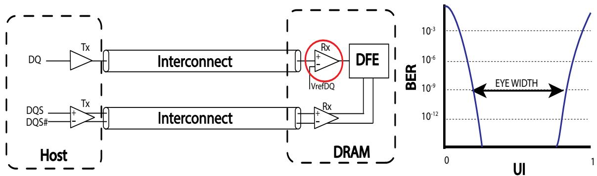

<details>
<summary>flowchart</summary>

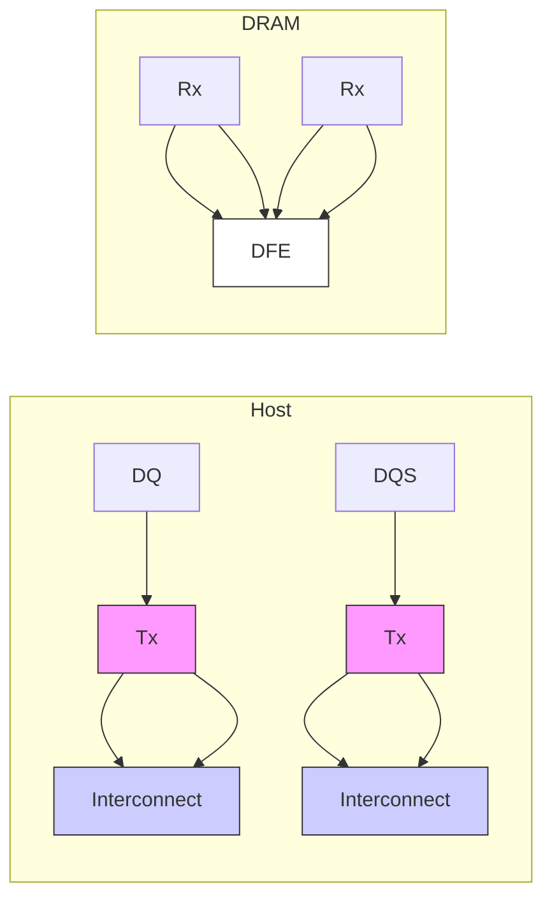
```mermaid
graph LR
    subgraph Host
        DQ --> Tx1["Tx"]
        DQS --> Tx2["Tx"]
        Tx1 --> Interconnect1["Interconnect"]
        Tx2 --> Interconnect2["Interconnect"]
    end

    subgraph DRAM
        Rx1["Rx"] --> DFE["DFE"]
        Rx2["Rx"] --> DFE
        Rx1 --> DFE
        Rx2 --> DFE
    end

    Tx1 --> Interconnect1
    Tx2 --> Interconnect2
    style Tx1 fill:#f9f,stroke:#333
    style Tx2 fill:#f9f,stroke:#333
    style Interconnect1 fill:#ccf,stroke:#333
    style Interconnect2 fill:#ccf,stroke:#333
    style DFE fill:#fff,stroke:#333
```
</details>

Figure 234 — Example of DDR5 Memory Interconnect

# 8.9.2 Receiver DQ Input Voltage Sensitivity Parameters

Input single-ended VRx\_DQ is defined and measured as shown below. The receiver must pass the minimum BER requirements for DDR5. These parameters are tested on the CTC2 card with neither additive gain nor Rx Equalization set.

Table 228 — Rx DQ Input Voltage Sensitivity Parameters for DDR5-3200 to 4800 

<table><tr><td rowspan="2">Parameter</td><td rowspan="2">Symbol</td><td colspan="2">DDR5-3200</td><td colspan="2">DDR5-3600</td><td colspan="2">DDR5-4000</td><td colspan="2">DDR5-4400</td><td colspan="2">DDR5-4800</td><td rowspan="2">Unit</td><td rowspan="2">Notes</td></tr><tr><td>Min</td><td>Max</td><td>Min</td><td>Max</td><td>Min</td><td>Max</td><td>Min</td><td>Max</td><td>Min</td><td>Max</td></tr><tr><td>Minimum DQ Rx input voltage sensitivity applied around Vref</td><td>VRx_DQ</td><td>-</td><td>85</td><td>-</td><td>75</td><td>-</td><td>70</td><td>-</td><td>65</td><td>-</td><td>65</td><td>mV</td><td>1, 2, 3</td></tr><tr><td colspan="14">NOTE 1 Refer to the minimum BER requirements for DDR5NOTE 2 The validation methodology for this parameter will be covered in future ballot(s)NOTE 3 Test using clock like pattern of repeating 3 “1s” and 3 “0s”</td></tr></table>

Table 229 — Rx DQ Input Voltage Sensitivity Parameters for DDR5-5200 to 6400 

<table><tr><td rowspan="2">Parameter</td><td rowspan="2">Symbol</td><td colspan="2">DDR5-5200</td><td colspan="2">DDR5-5600</td><td colspan="2">DDR5-6000</td><td colspan="2">DDR5-6400</td><td colspan="2">DDR5-6800</td><td rowspan="2">Unit</td><td rowspan="2">Notes</td></tr><tr><td>Min</td><td>Max</td><td>Min</td><td>Max</td><td>Min</td><td>Max</td><td>Min</td><td>Max</td><td>Min</td><td>Max</td></tr><tr><td>Minimum DQ Rx input voltage sensitivity applied around Vref</td><td>VRx_DQ</td><td>-</td><td>60</td><td>-</td><td>60</td><td>-</td><td>55</td><td>-</td><td>55</td><td>-</td><td>50</td><td>mV</td><td>1, 2, 3</td></tr><tr><td colspan="14">NOTE 1 Refer to the minimum BER requirements for DDR5NOTE 2 The validation methodology for this parameter will be covered in future ballot(s)NOTE 3 Test using clock like pattern of repeating 3 “1s” and 3 “0s”</td></tr></table>

Table 230 — Rx DQ Input Voltage Sensitivity Parameters for DDR5-6800 to 8800 

<table><tr><td rowspan="2">Parameter</td><td rowspan="2">Symbol</td><td colspan="2">DDR5-7200</td><td colspan="2">DDR5-7600</td><td colspan="2">DDR5-8000</td><td colspan="2">DDR5-8400</td><td colspan="2">DDR5-8800</td><td rowspan="2">Unit</td><td rowspan="2">Notes</td></tr><tr><td>Min</td><td>Max</td><td>Min</td><td>Max</td><td>Min</td><td>Max</td><td>Min</td><td>Max</td><td>Min</td><td>Max</td></tr><tr><td>Minimum DQ Rx input voltage sensitivity applied around Vref</td><td>VRx_DQ</td><td>-</td><td>50</td><td>-</td><td>50</td><td>-</td><td>50</td><td>-</td><td>47.5</td><td>-</td><td>47.5</td><td>mV</td><td>1, 2, 3</td></tr><tr><td colspan="14">NOTE 1 Refer to the minimum BER requirements for DDR5NOTE 2 The validation methodology for this parameter will be covered in future ballot(s)NOTE 3 Test using clock like pattern of repeating 3 “1s” and 3 “0s”</td></tr></table>

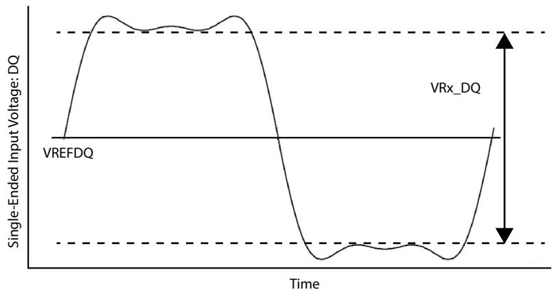

<details>
<summary>line</summary>

| Time | Single-Ended Input Voltage: DQ |
|------|--------------------------------|
| 0    | VREFDQ                         |
| 1    | High                           |
| 2    | Medium                         |
| 3    | Low                            |
| 4    | Very Low                       |
| 5    | High                           |
| 6    | Medium                         |
| 7    | Low                            |
| 8    | Very Low                       |
| 9    | High                           |
| 10   | Medium                         |
| 11   | Low                            |
| 12   | Very Low                       |
| 13   | High                           |
| 14   | Medium                         |
| 15   | Low                            |
| 16   | Very Low                       |
| 17   | High                           |
| 18   | Medium                         |
| 19   | Low                            |
| 20   | Very Low                       |
| 21   | High                           |
| 22   | Medium                         |
| 23   | Low                            |
| 24   | Very Low                       |
| 25   | High                           |
| 26   | Medium                         |
| 27   | Low                            |
| 28   | Very Low                       |
| 29   | High                           |
| 30   | Medium                         |
| 31   | Low                            |
| 32   | Very Low                       |
| 33   | High                           |
| 34   | Medium                         |
| 35   | Low                            |
| 36   | Very Low                       |
| 37   | High                           |
| 38   | Medium                         |
| 39   | Low                            |
| 40   | Very Low                       |
| 41   | High                           |
| 42   | Medium                         |
| 43   | Low                            |
| 44   | Very Low                       |
| 45   | High                           |
| 46   | Medium                         |
| 47   | Low                            |
| 48   | Very Low                       |
| 49   | High                           |
| 50   | Medium                         |
| 51   | Low                            |
| 52   | Very Low                       |
| 53   | High                           |
| 54   | Medium                         |
| 55   | Low                            |
| 56   | Very Low                       |
| 57   | High                           |
| 58   | Medium                         |
| 59   | Low                            |
| 60   | Very Low                       |
| 61   | High                           |
| 62   | Medium                         |
| 63   | Low                            |
| 64   | Very Low                       |
| 65   | High                           |
| 66   | Medium                         |
| 67   | Low                            |
| 68   | Very Low                       |
| 69   | High                           |
| 70   | Medium                         |
| 71   | Low                            |
| 72   | Very Low                       |
| 73   | High                           |
| 74   | Medium                         |
| 75   | Low                            |
| 76   | Very Low                       |
| 77   | High                           |
| 78   | Medium                         |
| 79   | Low                            |
| 80   | Very Low                       |
| 81   | High                           |
| 82   | Medium                         |
| 83   | Low                            |
| 84   | Very Low                       |
| 85   | High                           |
| 86   | Medium                         |
| 87   | Low                            |
| 88   | Very Low                       |
| 89   | High                           |
| 90   | Medium                         |
| 91   | Low                            |
| 92   | Very Low                       |
| 93   | High                           |
| 94   | Medium                         |
| 95   | Low                            |
| 96   | Very Low                       |
| 97   | High                           |
| 98   | Medium                         |
| 99   | Low                            |
| 100  | Very Low                       |
</details>

Figure 235 — VRx\_DQ

# 8.9.3 Differential Input Levels for DQS

Table 231 — Differential Input Levels for DQS (DQS\_t, DQS\_c) for DDR5-3200 to DDR5-6400 

<table><tr><td>From</td><td>Parameter</td><td>DDR53200-6400</td><td>Note</td></tr><tr><td> $V_{IHdiff}DQS$ </td><td>Differential input high measurement level (DQS_t, DQS_c)</td><td> $0.75 \times V_{diffpk-pk}$ </td><td>1, 2, 3</td></tr><tr><td> $V_{ILdiff}DQS$ </td><td>Differential input low measurement level (DQS_t, DQS_c)</td><td> $0.25 \times V_{diffpk-pk}$ </td><td>1, 2, 3</td></tr><tr><td colspan="4">NOTE 1  $V_{diffpk-pk}$  defined in Figure 236NOTE 2  $V_{diffpk-pk}$  is the mean high voltage minus the mean low voltage over 8UI samplesNOTE 3 All parameters are defined over the entire clock common mode range</td></tr></table>

Table 232 — Differential Input Levels for DQS (DQS\_t, DQS\_c) for DDR5-6800 to DDR5-8800 

<table><tr><td>From</td><td>Parameter</td><td>DDR56800-8800</td><td>Note</td></tr><tr><td> $V_{IHdiff}DQS$ </td><td>Differential input high measurement level (DQS_t, DQS_c)</td><td> $0.75 \times V_{diffpk-pk}$ </td><td>1, 2, 3</td></tr><tr><td> $V_{ILdiff}DQS$ </td><td>Differential input low measurement level (DQS_t, DQS_c)</td><td> $0.25 \times V_{diffpk-pk}$ </td><td>1, 2, 3</td></tr><tr><td colspan="4">NOTE 1  $V_{diffpk-pk}$  defined in Figure 236NOTE 2  $V_{diffpk-pk}$  is the mean high voltage minus the mean low voltage over 8UI samplesNOTE 3 All parameters are defined over the entire clock common mode range</td></tr></table>

# 8.9.4 Differential Input Slew Rate for DQS\_t, DQS\_c

Input slew rate for differential signals are defined and measured as shown in Figure 236.

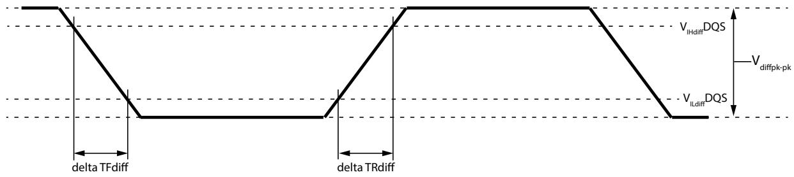  
Figure 236 — Differential Input Slew Rate Definition for DQS\_t, DQS\_c

Table 233 — Differential Input Slew Rate Definition for DQS\_t, DQS\_c 

<table><tr><td rowspan="2">Parameter</td><td colspan="2">Measured</td><td rowspan="2">Defined by</td><td rowspan="2">Notes</td></tr><tr><td>From</td><td>To</td></tr><tr><td>Differential Input slew rate for rising edge (DQS_t, DQS_c)</td><td> $V_{ILdiff}$ DQS</td><td> $V_{IHdiff}$ DQS</td><td> $(V_{IHdiff}$ DQS -  $V_{ILdiff}$ DQS) /deltaTRdiff</td><td>1, 2, 3</td></tr><tr><td>Differential Input slew rate for falling edge (DQS_t, DQS_c)</td><td> $V_{IHdiff}$ DQS</td><td> $V_{ILdiff}$ DQS</td><td> $(V_{IHdiff}$ DQS -  $V_{ILdiff}$ DQS) /deltaTFdiff</td><td>1, 2, 3</td></tr></table>

# 8.9.4 Differential Input Slew Rate for DQS\_t, DQS\_c (cont’d)

Table 234 — Differential Input Slew Rate for DQS\_t, DQS\_c for DDR5-3200 to 4800 

<table><tr><td rowspan="2">Parameter</td><td rowspan="2">Symbol</td><td colspan="2">DDR5-3200</td><td colspan="2">DDR5-3600</td><td colspan="2">DDR5-4000</td><td colspan="2">DDR5-4400</td><td colspan="2">DDR5-4800</td><td rowspan="2">Unit</td><td rowspan="2">Notes</td></tr><tr><td>Min</td><td>Max</td><td>Min</td><td>Max</td><td>Min</td><td>Max</td><td>Min</td><td>Max</td><td>Min</td><td>Max</td></tr><tr><td>Differential Input Slew Rate for DQS_t, DQS_c</td><td>SRIdiff_DQS</td><td>1.5</td><td>30</td><td>1.5</td><td>30</td><td>1.5</td><td>30</td><td>1.5</td><td>30</td><td>1.5</td><td>30</td><td>V/ns</td><td>1</td></tr><tr><td colspan="14">NOTE 1 Only applies when both DQS_t and DQS_c are transitioning.</td></tr></table>

Table 235 — Differential Input Slew Rate for DQS\_t, DQS\_c for DDR5-5200 to 6400 

<table><tr><td rowspan="2">Parameter</td><td rowspan="2">Symbol</td><td colspan="2">DDR5-5200</td><td colspan="2">DDR5-5600</td><td colspan="2">DDR5-6000</td><td colspan="2">DDR5-6400</td><td rowspan="2">Unit</td><td rowspan="2">Notes</td></tr><tr><td>Min</td><td>Max</td><td>Min</td><td>Max</td><td>Min</td><td>Max</td><td>Min</td><td>Max</td></tr><tr><td>Differential Input Slew Rate for DQS_t, DQS_c</td><td>SRIdiff_DQS</td><td>2.0</td><td>30</td><td>2.0</td><td>30</td><td>2.0</td><td>30</td><td>2.0</td><td>30</td><td>V/ns</td><td>1</td></tr><tr><td colspan="12">NOTE 1 Only applies when both DQS_t and DQS_c are transitioning.</td></tr></table>

Table 236 — Differential Input Slew Rate for DQS\_t, DQS\_c for DDR5-6800 to 8800 

<table><tr><td rowspan="2">Parameter</td><td rowspan="2">Symbol</td><td colspan="2">DDR5-6800</td><td colspan="2">DDR5-7200</td><td colspan="2">DDR5-7600</td><td colspan="2">DDR5-8000</td><td colspan="2">DDR5-8400</td><td colspan="2">DDR5-8800</td><td rowspan="2">Unit</td><td rowspan="2">Notes</td></tr><tr><td>Min</td><td>Max</td><td>Min</td><td>Max</td><td>Min</td><td>Max</td><td>Min</td><td>Max</td><td>Min</td><td>Max</td><td>Min</td><td>Max</td></tr><tr><td>Differential Input Slew Rate for DQS_t, DQS_c</td><td>SRIdiff_DQS</td><td>2.0</td><td>30</td><td>2.0</td><td>30</td><td>2.0</td><td>30</td><td>2.0</td><td>30</td><td>2.0</td><td>30</td><td>2.0</td><td>30</td><td>V/ns</td><td>1</td></tr><tr><td colspan="12">NOTE 1 Only applies when both DQS_t and DQS_c are transitioning.</td><td></td><td></td><td></td><td></td></tr></table>

# 8.10 Rx Stressed Eye

The stressed eye tests provide the methodology for creating the appropriate stress for the DRAM’s receiver with the combination of ISI (both loss and reflective), jitter (Rj, Dj, DCD), and crosstalk noise. The receiver must pass the appropriate BER rate when the equivalent stressed eye is applied through the combination of ISI, jitter and crosstalk.

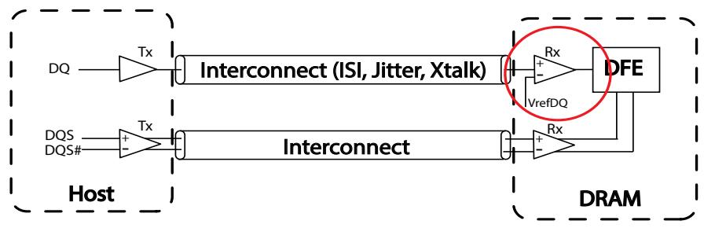

<details>
<summary>flowchart</summary>

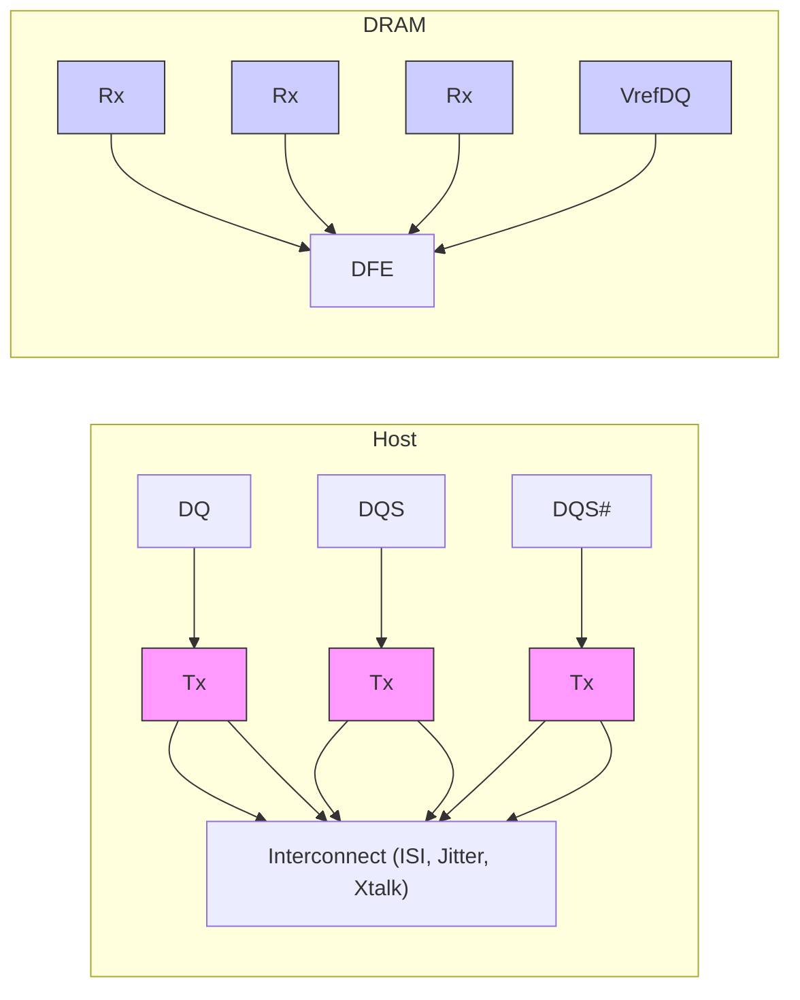
```mermaid
graph LR
    subgraph Host
        DQ --> Tx1["Tx"]
        Tx1 --> Interconnect["Interconnect (ISI, Jitter, Xtalk)"]
        DQS --> Tx2["Tx"]
        Tx2 --> Interconnect
        DQS# --> Tx3["Tx"]
        Tx3 --> Interconnect
    end

    subgraph DRAM
        Rx1["Rx"] --> DFE["DFE"]
        Rx2["Rx"] --> DFE
        Rx3["Rx"] --> DFE
        Rx4["VrefDQ"] --> DFE
    end

    Tx1 --> Interconnect
    Tx2 --> Interconnect
    Tx3 --> Interconnect
    style Tx1 fill:#f9f,stroke:#333
    style Tx2 fill:#f9f,stroke:#333
    style Tx3 fill:#f9f,stroke:#333
    style Rx1 fill:#ccf,stroke:#333
    style Rx2 fill:#ccf,stroke:#333
    style Rx3 fill:#ccf,stroke:#333
    style Rx4 fill:#ccf,stroke:#333
```
</details>

Figure 237 — Example of Rx Stressed Test Setup in the Presence of ISI, Jitter, and Crosstalk

# 8.10 Rx Stressed Eye (cont’d)

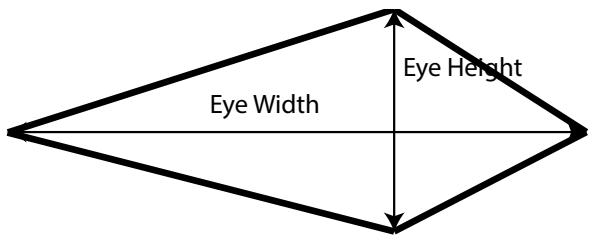

<details>
<summary>text_image</summary>

Eye Width
Eye Height
</details>

Figure 238 — Example of Rx Stressed Eye Height and Eye Width

# 8.10.1 Parameters for DDR5 Rx Stressed Eye Tests

Table 237 — Test Conditions for Rx Stressed Eye Tests for DDR5-3200 to 4800   
[BER=Bit Error Rate; DCD=Duty Cycle Distortion; Rj=Random Jitter; Sj=Sinusoidal Jitter; p-p =peak to peak] 

<table><tr><td rowspan="2">Parameter</td><td rowspan="2">Symbol</td><td colspan="2">DDR5-3200</td><td colspan="2">DDR5-3600</td><td colspan="2">DDR5-4000</td><td colspan="2">DDR5-4400</td><td colspan="2">DDR5-4800</td><td rowspan="2">Unit</td><td rowspan="2">Notes</td></tr><tr><td>Min</td><td>Max</td><td>Min</td><td>Max</td><td>Min</td><td>Max</td><td>Min</td><td>Max</td><td>Min</td><td>Max</td></tr><tr><td>Eye height of stressed eye for Golden Reference Channel 1</td><td>RxEH_Stressed_Eye_Golden_Ref_Channel_1</td><td>95</td><td>-</td><td>85</td><td>-</td><td>80</td><td>-</td><td>75</td><td>-</td><td>70</td><td>-</td><td>mV</td><td>1, 2, 3, 4, 5, 6, 7, 8, 9, 10</td></tr><tr><td>Eye width of stressed eye Golden Reference Channel 1</td><td>RxEW_Stressed_Eye_Golden_Ref_Channel_1</td><td>0.25</td><td>-</td><td>0.25</td><td>-</td><td>0.25</td><td>-</td><td>0.25</td><td>-</td><td>0.25</td><td>-</td><td>UI</td><td>1, 2, 3, 4, 5, 6, 7, 8, 9, 10</td></tr><tr><td>Vswing stress to meet above data eye</td><td>Vswing_Stressed_Eye_Golden_Ref_Channel_1</td><td>-</td><td>600</td><td>-</td><td>600</td><td>-</td><td>600</td><td>-</td><td>600</td><td>-</td><td>600</td><td>mV</td><td>1.2</td></tr><tr><td>Injected sinusoidal jitter at 200 MHz to meet above data eye</td><td>Sj_Stressed_Eye_Golden_Ref_Channel_1</td><td>0</td><td>0.45</td><td>0</td><td>0.45</td><td>0</td><td>0.45</td><td>0</td><td>0.45</td><td>0</td><td>0.45</td><td>UI p-p</td><td>1, 2</td></tr><tr><td>Injected Random wide band (10 MHz-1 GHz) Jitter to meet above data eye</td><td>Rj_Stressed_Eye_Golden_Ref_Channel_1</td><td>0</td><td>0.04</td><td>0</td><td>0.04</td><td>0</td><td>0.04</td><td>0</td><td>0.04</td><td>0</td><td>0.04</td><td>UI RMS</td><td>1, 2</td></tr><tr><td>Injected voltage noise as PRBS23, or Injected voltage noise at 2.1 GHz</td><td>Vnoise_Stressed_Eye_Golden_Ref_Channel_1</td><td>0</td><td>125</td><td>0</td><td>125</td><td>0</td><td>125</td><td>0</td><td>125</td><td>0</td><td>125</td><td>mV p-p</td><td>1, 2</td></tr><tr><td>Golden Reference Channel 1 Characteristics as measured at TBD</td><td>Golden_Ref_Channel_1 Characteristics</td><td>TBD</td><td>TBD</td><td>TBD</td><td>TBD</td><td>TBD</td><td>TBD</td><td>TBD</td><td>TBD</td><td>TBD</td><td>TBD</td><td>dB</td><td>3</td></tr><tr><td colspan="14">NOTE 1 Must meet minimum BER of  $1E^{-16}$  or better requirement with the stressed eye at the slice of the receiver (after equalization is applied in the summer). The eye shape is verified by measuring to BER  $E^{-9}$  and extrapolating to BER  $E^{-16}$ .NOTE 2 These parameters are applied on the defined golden reference channel with parameters TBD.NOTE 3 DFE Tap 1-4 Bias settings that give the best eye margin are used and referring to Table 131, Min/Max Ranges for the DFE Tap Coefficients. DFE tap range limits apply: sum of absolute values of Tap-2, Tap-3, and Tap-4 shall be less than 60 mV ( $|Tap-2| + |Tap-3| + |Tap-4| < 60$  mV) after the tap multiflier is applied.NOTE 4 Evaluated with no DC supply voltage drift.NOTE 5 Evaluated with no temperature drift.NOTE 6 Supply voltage noise limited according to DC bandwidth spec, see DC Operating ConditionsNOTE 7 The stressed eye is to be assumed to have a diamond shapeNOTE 8 The VREFDQ, DFE Gain Bias Step, and DFE Taps 1,2,3,4 Bias Step can be adjusted as needed, without exceeding the specifications, for this test, including the limits placed in Note 3.NOTE 9 The stressed eye is defined as centered on the DQS_t/DQS_c crossing during the calibration. Measurement includes an optimal set of DQS_t/DQS_c location, VrefDQ, and DFE solution to give the best eye margin.NOTE 10 The Rx stressed eye spec applies at 2933 MT/s and faster data rates.NOTE 11 EH/EW are measured at the slicer of the receiver</td></tr></table>

# 8.10.1 Parameters for DDR5 Rx Stressed Eye Tests (cont’d)

Table 238 — Test Conditions for Rx Stressed Eye Tests for DDR5-5200 to 6400   
[BER=Bit Error Rate; DCD=Duty Cycle Distortion; Rj=Random Jitter; Sj=Sinusoidal Jitter; p-p =peak to peak] 

<table><tr><td rowspan="2">Parameter</td><td rowspan="2">Symbol</td><td colspan="2">DDR5-5200</td><td colspan="2">DDR5-5600</td><td colspan="2">DDR5-6000</td><td colspan="2">DDR5-6400</td><td rowspan="2">Unit</td><td rowspan="2">Notes</td></tr><tr><td>Min</td><td>Max</td><td>Min</td><td>Max</td><td>Min</td><td>Max</td><td>Min</td><td>Max</td></tr><tr><td>Eye height of stressed eye for Golden Reference Channel 1</td><td>RxEH_Stressed_Eye_Golden_Ref_Channel_1</td><td>65</td><td>-</td><td>60</td><td>-</td><td>57.5</td><td>-</td><td>57.5</td><td>-</td><td>mV</td><td>1, 2, 3, 4, 5, 6, 7, 8, 9, 10</td></tr><tr><td>Eye width of stressed eye Golden Reference Channel 1</td><td>RxEW_Stressed_Eye_Golden_Ref_Channel_1</td><td>0.235</td><td>-</td><td>0.235</td><td>-</td><td>0.230</td><td>-</td><td>0.230</td><td>-</td><td>UI</td><td>1, 2, 3, 4, 5, 6, 7, 8, 9, 10</td></tr><tr><td>Vswing stress to meet above data eye</td><td>Vswing_Stressed_Eye_Golden_Ref_Channel_1</td><td>-</td><td>600</td><td>-</td><td>600</td><td>-</td><td>600</td><td>-</td><td>600</td><td>mV</td><td>1, 2</td></tr><tr><td>Injected sinusoidal jitter at 200 MHz to meet above data eye</td><td>Sj_Stressed_Eye_Golden_Ref_Channel_1</td><td>-</td><td>0.45</td><td>-</td><td>0.45</td><td>-</td><td>0.45</td><td>-</td><td>0.45</td><td>UI p-p</td><td>1, 2</td></tr><tr><td>Injected Random wide band (10 MHz-1 GHz) Jitter to meet above data eye</td><td>Rj_Stressed_Eye_Golden_Ref_Channel_1</td><td>0</td><td>0.04</td><td>0</td><td>0.04</td><td>0</td><td>0.04</td><td>0</td><td>0.04</td><td>UI RMS</td><td>1, 2</td></tr><tr><td>Injected voltage noise as PRBS23, or Injected voltage noise at 2.1 GHz</td><td>Vnoise_Stressed_Eye_Golden_Ref_Channel_1</td><td>0</td><td>125</td><td>0</td><td>125</td><td>0</td><td>125</td><td>0</td><td>125</td><td>mV p-p</td><td>1, 2</td></tr><tr><td>Golden Reference Channel 1 Characteristics as measured at TBD</td><td>Golden_Ref_Channel_1 Characteristics</td><td>TBD</td><td>TBD</td><td>TBD</td><td>TBD</td><td>TBD</td><td>TBD</td><td>TBD</td><td>TBD</td><td>dB</td><td>3</td></tr><tr><td colspan="12">NOTE 1 Must meet minimum BER of  $1E^{-16}$  or better requirement with the stressed eye at the slice of the receiver (after equalization is applied in the summer). The eye shape is verified by measuring to BER  $E^{-9}$  and extrapolating to BER  $E^{-16}$ .NOTE 2 These parameters are applied on the defined golden reference channel with parameters TBD.NOTE 3 DFE tap range limits apply: sum of absolute values of Tap-2, Tap-3, and Tap-4 shall be less than 6 0mV ( $|Tap-2| + |Tap-3| + |Tap-4| < 60$  mV).NOTE 4 Evaluated with no DC supply voltage drift.NOTE 5 Evaluated with no temperature drift.NOTE 6 Supply voltage noise limited according to DC bandwidth spec, see DC Operating ConditionsNOTE 7 The stressed eye is to be assumed to have a diamond shapeNOTE 8 The VREFDQ, DFE Gain Bias Step, and DFE Taps 1,2,3,4 Bias Step can be adjusted as needed, without exceeding the specifications, for this test, including the limits placed in Note 3.NOTE 9 The stressed eye is defined as centered on the DQS_t/DQS_c crossing during the calibration. Measurement includes an optimal set of DQS_t/DQS_c location, VrefDQ, and DFE solution to give the best eye margin.NOTE 10 EH/WE are measured at the slicer of the receiver.</td></tr></table>

# 8.10.1 Parameters for DDR5 Rx Stressed Eye Tests (cont’d)

Table 239 — Test Conditions for Rx Stressed Eye Tests for DDR5-6800 to 8800   
[BER=Bit Error Rate; DCD=Duty Cycle Distortion; Rj=Random Jitter; Sj=Sinusoidal Jitter; p-p =peak to peak] 

<table><tr><td rowspan="2">Parameter</td><td rowspan="2">Symbol</td><td colspan="2">DDR5-6800</td><td colspan="2">DDR5-7200</td><td colspan="2">DDR5-7600</td><td colspan="2">DDR5-8000</td><td colspan="2">DDR5-8400</td><td colspan="2">DDR-8800</td><td rowspan="2">Unit</td><td rowspan="2">Notes</td></tr><tr><td>Min</td><td>Max</td><td>Min</td><td>Max</td><td>Min</td><td>Max</td><td>Min</td><td>Max</td><td>Min</td><td>Max</td><td>Min</td><td>Max</td></tr><tr><td>Eye height of stressed eye for Golden Reference Channel 1</td><td>RxEH_Stressed_Eye_Golden_Ref_Channel_1</td><td>55</td><td>-</td><td>55</td><td>-</td><td>54</td><td>-</td><td>54</td><td>-</td><td>53</td><td>-</td><td>53</td><td>-</td><td>mV</td><td>1, 2, 3, 4, 5, 6, 7, 8, 9</td></tr><tr><td>Eye width of stressed eye Golden Reference Channel 1</td><td>RxEW_Stressed_Eye_Golden_Ref_Channel_1</td><td>0.230</td><td>-</td><td>0.230</td><td>-</td><td>0.230</td><td>-</td><td>0.230</td><td>-</td><td>0.230</td><td>-</td><td>0.230</td><td>-</td><td>UI</td><td>1, 2, 3, 4, 5, 6, 7, 8, 9</td></tr><tr><td>Vswing stress to meet above data eye</td><td>Vswing_Stressed_Eye_Golden_Ref_Channel_1</td><td>-</td><td>600</td><td>-</td><td>600</td><td>-</td><td>600</td><td>-</td><td>600</td><td>-</td><td>600</td><td>-</td><td>600</td><td>mV</td><td>1, 2</td></tr><tr><td>Injected sinusoidal jitter at 200 MHz to meet above data eye</td><td>Sj_Stressed_Eye_Golden_Ref_Channel_1</td><td>-</td><td>0.45</td><td>-</td><td>0.45</td><td>-</td><td>0.45</td><td>-</td><td>0.45</td><td>-</td><td>0.45</td><td>-</td><td>0.45</td><td>UI p-p</td><td>1, 2</td></tr><tr><td>Injected Random wide band (10 MHz-1 GHz) Jitter to meet above data eye</td><td>Rj_Stressed_Eye_Golden_Ref_Channel_1</td><td>0</td><td>0.04</td><td>0</td><td>0.04</td><td>0</td><td>0.04</td><td>0</td><td>0.04</td><td>-</td><td>0.04</td><td>-</td><td>0.04</td><td>UI RMS</td><td>1, 2</td></tr><tr><td>Injected voltage noise as PRBS23, or Injected voltage noise at 2.1 GHz</td><td>Vnoise_Stressed_Eye_Golden_Ref_Channel_1</td><td>0</td><td>125</td><td>0</td><td>125</td><td>0</td><td>125</td><td>0</td><td>125</td><td>-</td><td>125</td><td>-</td><td>125</td><td>mV p-p</td><td>1, 2</td></tr><tr><td>Golden Reference Channel 1 Characteristics as measured at TBD</td><td>Golden_Ref_Channel_1 Characteristics</td><td>TBD</td><td>TBD</td><td>TBD</td><td>TBD</td><td>TBD</td><td>TBD</td><td>TBD</td><td>TBD</td><td>TBD</td><td>TBD</td><td>TBD</td><td>TBD</td><td>dB</td><td>3</td></tr><tr><td colspan="16">NOTE 1 Must meet minimum BER of  $1E^{-16}$  or better requirement with the stressed eye at the slice of the receiver (after equalization is applied in the summer). The eye shape is verified by measuring to BER  $E^{-9}$  and extrapolating to BER  $E^{-16}$ .NOTE 2 These parameters are applied on the defined golden reference channel with parameters TBD.NOTE 3 DFE tap range limits apply: sum of absolute values of Tap-2, Tap-3, and Tap-4 shall be less than 60mV ( $|Tap-2| + |Tap-3| + |Tap-4| < 60$  mV).NOTE 4 Evaluated with no DC supply voltage drift.NOTE 5 Evaluated with no temperature drift.NOTE 6 Supply voltage noise limited according to DC bandwidth spec, see DC Operating Conditions.NOTE 7 The stressed eye is to be assumed to have a diamond shapeNOTE 8 The VREFDQ, DFE Gain Bias Step, and DFE Taps 1,2,3,4 Bias Step can be adjusted as needed, without exceeding the specifications, for this test, including the limits placed in Note 3.NOTE 9 The stressed eye is defined as centered on the DQS_t/DQS_c crossing during the calibration. Measurement includes an optimal set of DQS_t/DQS_c location, VrefDQ, and DFE solution to give the best eye margin.</td></tr></table>

# 8.11 Connectivity Test Mode - Input level and Timing Requirement

During CT Mode, input levels are defined below.

TEN pin: CMOS rail-to-rail with AC high and low at 80% and 20% of VDDQ

CS\_n: CMOS rail-to-rail with AC high and low at 80% and 20% of VDDQ.

Test Input pins: CMOS rail-to-rail with AC high and low at 80% and 20% of VDDQ.

RESET\_n: CMOS rail-to-rail with AC high and low at 80% and 20% of VDDQ.

Prior to the assertion of the TEN pin, all voltage supplies must be valid and stable.

Upon the assertion of the TEN pin, the CK\_t and CK\_c signals will be ignored and the DDR5 memory device will enter into the CT mode after time tCT\_Enable. In the CT mode, no refresh activities in the memory arrays, initiated either externally (i.e., auto-refresh) or internally (i.e., self-refresh), will be maintained.

# 8.11.1 Connectivity Test Mode - Input level and Timing Requirement (cont’d)

The TEN pin may be asserted after the DRAM has completed power-on, after RESET\_n has de-asserted, the wait time after the RESET\_n de-assertion has elapsed, and prior to starting clocks (CK\_t, CK\_c).

The TEN pin may be de-asserted at any time in the CT mode. Upon exiting the CT mode, the states of the DDR5 memory device are unknown and the integrity of the original content of the memory array is not guaranteed; therefore, the reset initialization sequence is required.

All output signals at the test output pins will be stable within tCT\_valid after the test inputs have been applied to the test input pins with TEN input and $\mathsf { C S \_ n }$ input maintained High and Low, respectively.

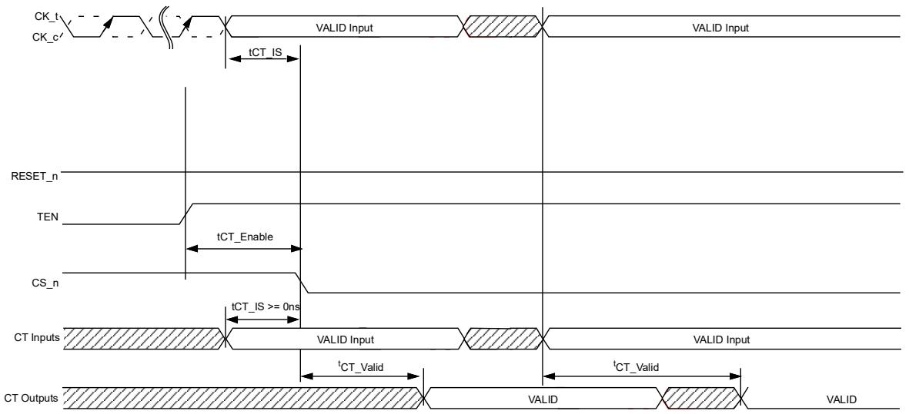

<details>
<summary>flowchart</summary>

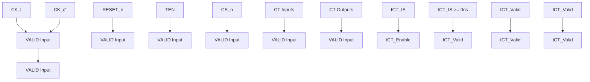
```mermaid
graph TD
    A["CK_t"] --> B["VALID Input"]
    C["CK_c'"] --> B
    B --> D["VALID Input"]
    E["RESET_n"] --> F["VALID Input"]
    G["TEN"] --> H["VALID Input"]
    I["CS_n"] --> J["VALID Input"]
    K["CT Inputs"] --> L["VALID Input"]
    M["CT Outputs"] --> N["VALID Input"]
    O["tCT_IS"] --> P["tCT_Enable"]
    Q["tCT_IS >= 0ns"] --> R["tCT_Valid"]
    S["tCT_Valid"] --> T["tCT_Valid"]
    U["tCT_Valid"] --> V["tCT_Valid"]
```
</details>

Figure 239 — Timing Diagram for Connectivity Test (CT) Mode

Table 240 — AC Parameters for Connectivity Test (CT) Mode 

<table><tr><td>Symbol</td><td>Min</td><td>Max</td><td>Unit</td></tr><tr><td>tCT_IS</td><td>0</td><td>-</td><td>ns</td></tr><tr><td>tCT_Enable</td><td>200</td><td>-</td><td>ns</td></tr><tr><td>tCT_Valid</td><td>-</td><td>200</td><td>ns</td></tr></table>

# 8.11.1 Connectivity Test (CT) Mode Input Levels

Following input parameters will be applied for DDR5 SDRAM Input Signals during Connectivity Test Mode.

Table 241 — CMOS Rail to Rail Input Levels for TEN, CS\_n, and Test inputs 

<table><tr><td>Parameter</td><td>Symbol</td><td>Min</td><td>Max</td><td>Unit</td><td>Notes</td></tr><tr><td>TEN AC Input High Voltage</td><td>VIH(AC)_TEN</td><td>0.8 * VDDQ</td><td>VDDQ</td><td>V</td><td>1</td></tr><tr><td>TEN DC Input High Voltage</td><td>VIH(DC)_TEN</td><td>0.7 * VDDQ</td><td>VDDQ</td><td>V</td><td></td></tr><tr><td>TEN DC Input Low Voltage</td><td>VIL(DC)_TEN</td><td>VSS</td><td>0.3 * VDDQ</td><td>V</td><td></td></tr><tr><td>TEN AC Input Low Voltage</td><td>VIL(AC)_TEN</td><td>VSS</td><td>0.2 * VDDQ</td><td>V</td><td>2</td></tr><tr><td>TEN Input signal Falling time</td><td>TF_input_TEN</td><td>-</td><td>10</td><td>ns</td><td></td></tr><tr><td>TEN Input signal Rising time</td><td>TR_input_TEN</td><td>-</td><td>10</td><td>ns</td><td></td></tr><tr><td colspan="6">NOTE 1 Overshoot might occur. It should be limited by the Absolute Maximum DC Ratings.NOTE 2 Undershoot might occur. It should be limited by Absolute Maximum DC Ratings.</td></tr></table>

# 8.11.1 Connectivity Test (CT) Mode Input Levels (cont’d)

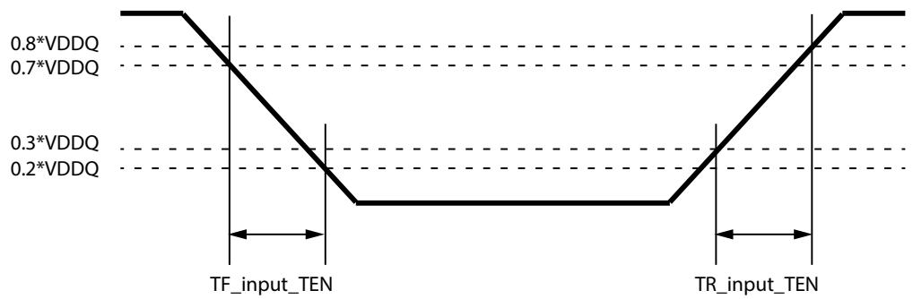

<details>
<summary>line</summary>

| Input Type       | VDDQ Value |
| ---------------- | ---------- |
| TF_input_TEN     | 0.8*VDDQ   |
| TF_input_TEN     | 0.7*VDDQ   |
| TF_input_TEN     | 0.3*VDDQ   |
| TF_input_TEN     | 0.2*VDDQ   |
| TR_input_TEN     | 0.8*VDDQ   |
| TR_input_TEN     | 0.7*VDDQ   |
| TR_input_TEN     | 0.3*VDDQ   |
| TR_input_TEN     | 0.2*VDDQ   |
</details>

Figure 240 — TEN Input Slew Rate Definition

# 8.11.2 CMOS Rail to Rail Input Levels for RESET\_n

Table 242 — CMOS Rail to Rail Input Levels for RESET\_n 

<table><tr><td>Parameter</td><td>Symbol</td><td>Min</td><td>Max</td><td>Unit</td><td>Note</td></tr><tr><td>AC Input High Voltage</td><td>VIH(AC)_RESET</td><td>0.8*VDDQ</td><td>VDDQ</td><td>V</td><td>5</td></tr><tr><td>DC Input High Voltage</td><td>VIH(DC)_RESET</td><td>0.7*VDDQ</td><td>VDDQ</td><td>V</td><td>2</td></tr><tr><td>DC Input Low Voltage</td><td>VIL(DC)_RESET</td><td>VSS</td><td>0.3*VDDQ</td><td>V</td><td>1</td></tr><tr><td>AC Input Low Voltage</td><td>VIL(AC)_RESET</td><td>VSS</td><td>0.2*VDDQ</td><td>V</td><td>6</td></tr><tr><td>Rising time</td><td>TR_RESET</td><td>-</td><td>1.0</td><td>μs</td><td></td></tr><tr><td>RESET pulse width</td><td>tPW_RESET</td><td>1.0</td><td>-</td><td>μs</td><td>3, 4</td></tr><tr><td colspan="6">NOTE 1 After RESET_n is registered LOW, RESET_n level shall be maintained below VIL(DC)_RESET during tPW_RESET, otherwise, SDRAM may not be reset.NOTE 2 Once RESET_n is registered HIGH, RESET_n level must be maintained above VIH(DC)_RESET, otherwise, SDRAM operation will not be guaranteed until it is reset asserting RESET_n signal LOW.NOTE 3 RESET is destructive to data contents.NOTE 4 This definition is applied only for “Reset Procedure at Power Stable”.NOTE 5 Overshoot might occur. It should be limited by the Absolute Maximum DC Ratings.NOTE 6 Undershoot might occur. It should be limited by Absolute Maximum DC Ratings</td></tr></table>

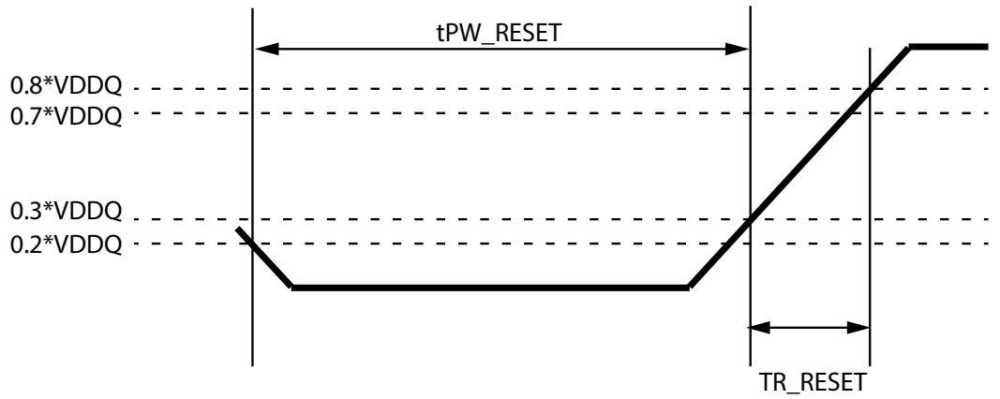

<details>
<summary>line</summary>

| Time/Step | Power Level |
| --------- | ----------- |
| tPW_RESET | 0.8*VDDQ    |
| TR_RESET  | 0.2*VDDQ    |
</details>

Figure 241 — RESET\_n Input Slew Rate Definition

# 9 AC and DC Output Measurement Levels and Timing

# 9.1 Output Driver DC Electrical Characteristics for DQS and DQ

The DDR5 driver supports two different Ron values. These Ron values are referred as strong(low Ron) and weak mode(high Ron). A functional representation of the output buffer is shown in Figure 242.

Output driver impedance RON is defined as follows:

The individual pull-up and pull-down resistors $( \mathsf { R O N } _ { \mathsf { P u } }$ and $R { \mathsf { O N } } _ { \mathsf { P d } } )$ are defined as follows:

$$
R O N _ {P u} = \frac {V D D Q - V o u t}{| I o u t |} \quad \text { under   the   condition   that } R O N P d \text { is   off }
$$

$$
R O N _ {P d} = \frac {\text { Vout }}{| I \text { out } |} \quad \text { under   the   condition   that   RONPu   is   off }
$$

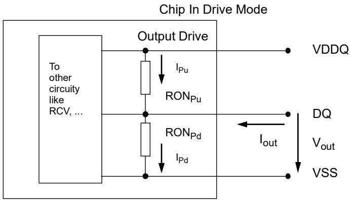

<details>
<summary>flowchart</summary>

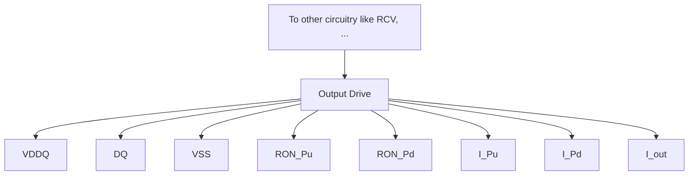
```mermaid
graph TD
    A["To other circuitry like RCV, ..."] --> B["Output Drive"]
    B --> C["VDDQ"]
    B --> D["DQ"]
    B --> E["VSS"]
    B --> F["RON_Pu"]
    B --> G["RON_Pd"]
    B --> H["I_Pu"]
    B --> I["I_Pd"]
    B --> J["I_out"]
```
</details>

Figure 242 — Strong (Low Ron) and Weak Mode (High Ron) Output Buffer

# 9.1 Output Driver DC Electrical Characteristics for DQS and DQ (cont’d)

Table 243 — Output Driver DC Electrical Characteristics, Assuming RZQ = 240 Ohms; Entire Operating Temperature Range; after Proper ZQ Calibration 

<table><tr><td> $RON_{NOM}$ </td><td>Resistor</td><td>Vout</td><td>Min</td><td>Nom</td><td>Max</td><td>Unit</td><td>Notes</td></tr><tr><td rowspan="6">34Ω</td><td rowspan="3">RON34Pd</td><td>VOLdc= 0.5*VDDQ</td><td>0.73</td><td>1</td><td>1.1</td><td>RZQ/7</td><td>1,2</td></tr><tr><td>VOMdc= 0.8* VDDQ</td><td>0.83</td><td>1</td><td>1.1</td><td>RZQ/7</td><td>1,2</td></tr><tr><td>VOHdc= 0.95* VDDQ</td><td>0.83</td><td>1</td><td>1.25</td><td>RZQ/7</td><td>1,2</td></tr><tr><td rowspan="3">RON34Pu</td><td>VOLdc= 0.5* VDDQ</td><td>0.9</td><td>1</td><td>1.25</td><td>RZQ/7</td><td>1,2</td></tr><tr><td>VOMdc= 0.8* VDDQ</td><td>0.9</td><td>1</td><td>1.1</td><td>RZQ/7</td><td>1,2</td></tr><tr><td>VOHdc= 0.95* VDDQ</td><td>0.8</td><td>1</td><td>1.1</td><td>RZQ/7</td><td>1,2</td></tr><tr><td rowspan="6">48Ω</td><td rowspan="3">RON48Pd</td><td>VOLdc= 0.5*VDDQ</td><td>0.73</td><td>1</td><td>1.1</td><td>RZQ/5</td><td>1,2</td></tr><tr><td>VOMdc= 0.8* VDDQ</td><td>0.83</td><td>1</td><td>1.1</td><td>RZQ/5</td><td>1,2</td></tr><tr><td>VOHdc= 0.95* VDDQ</td><td>0.83</td><td>1</td><td>1.25</td><td>RZQ/5</td><td>1,2</td></tr><tr><td rowspan="3">RON48Pu</td><td>VOLdc= 0.5* VDDQ</td><td>0.9</td><td>1</td><td>1.25</td><td>RZQ/5</td><td>1,2</td></tr><tr><td>VOMdc= 0.8* VDDQ</td><td>0.9</td><td>1</td><td>1.1</td><td>RZQ/5</td><td>1,2</td></tr><tr><td>VOHdc= 0.95* VDDQ</td><td>0.8</td><td>1</td><td>1.1</td><td>RZQ/5</td><td>1,2</td></tr><tr><td colspan="2">Mismatch between pull-up and pull-down, MMPuPd</td><td>VOMdc= 0.8* VDDQ</td><td>-10</td><td></td><td>10</td><td>%</td><td>1,2,3,4</td></tr><tr><td colspan="2">Mismatch DQ-DQ within byte variation pull-up, MMPudd</td><td>VOMdc= 0.8* VDDQ</td><td></td><td></td><td>10</td><td>%</td><td>1,2,4</td></tr><tr><td colspan="2">Mismatch DQ-DQ within byte variation pull-dn, MMPddd</td><td>VOMdc= 0.8* VDDQ</td><td></td><td></td><td>10</td><td>%</td><td>1,2,4</td></tr><tr><td colspan="8">NOTE 1 The tolerance limits are specified after calibration with stable voltage and temperature. For the behavior of the tolerance limits if temperature or voltage changes after calibration, see “ZQ Calibration Commands” section.NOTE 2 Pull-up and pull-dn output driver impedances are recommended to be calibrated at 0.8 * VDDQ. Other calibration schemes may be used to achieve the linearity spec shown above, e.g. calibration at 0.5 * VDDQ and 0.95 * VDDQ.NOTE 3 Measurement definition for mismatch between pull-up and pull-down, MMPuPd : Measure RONPu and RONPD both at 0.8*VDD separately; Ronnom is the nominal Ron value $MMPuPd = \frac{RONPu - RONPd}{RONNOM}$  *100NOTE 4 RON variance range ratio to RON Nominal value in a given component, including DQS_t and DQS_c. $MMPudd = \frac{RONPuMax - RONPuMin}{RONNOM}$ *100 $MMPddd = \frac{RONPdMax - RONPdMin}{RONNOM}$ *100NOTE 5 This parameter of x16 device is specified for Upper byte and Lower byte.</td></tr></table>

# 9.2 Output Driver DC Electrical Characteristics for Loopback Signals LBDQS, LBDQ

The DDR5 Loopback driver supports 34 ohms. A functional representation of the output buffer is shown in Figure 243.

$$
R O N _ {P u} = \frac {V D D Q - V o u t}{| I o u t |} \quad \text { under   the   condition   that } R O N P d \text { is   off }
$$

$$
R O N _ {P d} = \frac {\text { Vout }}{| I \text { out } |} \quad \text { under   the   condition   that   RONPu   is   off }
$$

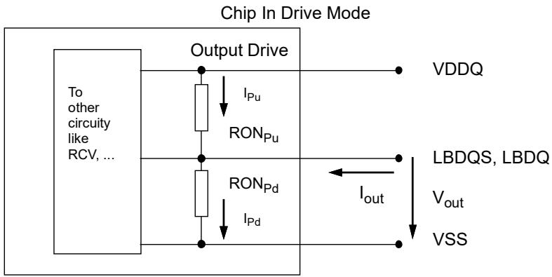

<details>
<summary>flowchart</summary>

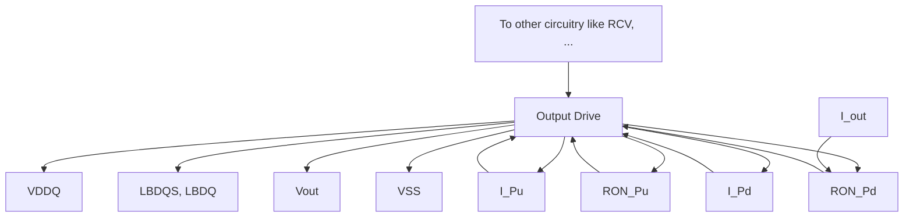
```mermaid
graph TD
    A["To other circuitry like RCV, ..."] --> B["Output Drive"]
    B --> C["VDDQ"]
    B --> D["LBDQS, LBDQ"]
    B --> E["Vout"]
    B --> F["VSS"]
    B --> G["I_Pu"]
    B --> H["RON_Pu"]
    B --> I["RON_Pd"]
    B --> J["I_Pd"]
    G --> B
    H --> B
    I --> B
    J --> B
    K["I_out"] --> I
```
</details>

Figure 243 — Output Driver for Loopback Signals

Table 244 — Output Driver DC Electrical Characteristics, Assuming RZQ = 240 Ohms; Entire Operating Temperature Range; after Proper ZQ Calibration 

<table><tr><td> $RON_{NOM}$ </td><td>Resistor</td><td>Vout</td><td>Min</td><td>Nom</td><td>Max</td><td>Unit</td><td>Notes</td></tr><tr><td rowspan="6">34Ω</td><td rowspan="3">RON34Pd</td><td>VOLdc= 0.5*VDDQ</td><td>0.8</td><td>1</td><td>1.1</td><td>RZQ/7</td><td>1, 2</td></tr><tr><td>VOMdc= 0.8* VDDQ</td><td>0.9</td><td>1</td><td>1.1</td><td>RZQ/7</td><td>1, 2</td></tr><tr><td>VOHdc= 0.95* VDDQ</td><td>0.9</td><td>1</td><td>1.25</td><td>RZQ/7</td><td>1, 2</td></tr><tr><td rowspan="3">RON34Pu</td><td>VOLdc= 0.5* VDDQ</td><td>0.9</td><td>1</td><td>1.25</td><td>RZQ/7</td><td>1, 2</td></tr><tr><td>VOMdc= 0.8* VDDQ</td><td>0.9</td><td>1</td><td>1.1</td><td>RZQ/7</td><td>1, 2</td></tr><tr><td>VOHdc= 0.95* VDDQ</td><td>0.8</td><td>1</td><td>1.1</td><td>RZQ/7</td><td>1, 2</td></tr><tr><td colspan="2">Mismatch between pull-up and pull-down, MMPuPd</td><td>VOMdc= 0.8* VDDQ</td><td>-10</td><td></td><td>10</td><td>%</td><td>1, 2, 3, 4</td></tr><tr><td colspan="2">Mismatch LBDQS-LBDQ within device variation pull-up, MMPudd</td><td>VOMdc= 0.8* VDDQ</td><td></td><td></td><td>10</td><td>%</td><td>1, 2, 4</td></tr><tr><td colspan="2">Mismatch LBDQS-LBDQ within device variation pull-dn, MMPddd</td><td>VOMdc= 0.8* VDDQ</td><td></td><td></td><td>10</td><td>%</td><td>1, 2, 4</td></tr></table>

NOTE 1 The tolerance limits are specified after calibration with stable voltage and temperature. For the behavior of the tolerance limits if temperature or voltage changes after calibration, see “ZQ Calibration Commands” section.   
NOTE 2 Pull-up and pull-dn output driver impedances are recommended to be calibrated at 0.8 \* VDDQ. Other calibration schemes may be used to achieve the linearity spec shown above, e.g. calibration at 0.5 \* VDDQ and 0.95 \* VDDQ.   
NOTE 3 Measurement definition for mismatch between pull-up and pull-down, MMPuPd : Measure RONPu and RONPD both at 0.8\*VDD separately; Ronnom is the nominal Ron value

$$
\mathrm{MMPuPd} = \frac {\text {RONPu-RONPd}}{\text {RONNOM}} * 1 0 0
$$

NOTE 4 RON variance range ratio to RON Nominal value in a given component, including LBDQS and LBDQ.

$$
\mathrm{MMPudd} = \frac {\text { RONPuMax   -RONPuMin }}{\text { RONNOM }} * 1 0 0
$$

$$
\mathrm{MMPddd} = \frac {\text {RONPdMax - RONPdMin}}{\text {RONNOM}} * 1 0 0
$$

# 9.3 Loopback Output Timing

Loopback strobe LBDQS to Loopback data LBDQ relationship is illustrated in Figure 244.

- tLBQSH describes the single-ended LBDQS strobe high pulse width   
- tLBQSL describes the single-ended LBDQS strobe low pulse width   
- tLBQ\_Set describes the setup time of LBDQS and where LBDQ needs to remain stable   
- tLBQ\_Hld describes the hold time of LBDQS and where LBDQ needs to remain stable   
- tLBDVW describes the data valid window per device per UI

Table 245 — Loopback Output Timing Parameters for DDR5-3200 to 4800 

<table><tr><td colspan="2">Speed</td><td colspan="2">DDR5-3200</td><td colspan="2">DDR5-3600</td><td colspan="2">DDR5-4000</td><td colspan="2">DDR5-4400</td><td colspan="2">DDR5-4800</td><td rowspan="2">Units</td><td rowspan="2">Note</td></tr><tr><td>Parameter</td><td>Symbol</td><td>MIN</td><td>MAX</td><td>MIN</td><td>MAX</td><td>MIN</td><td>MAX</td><td>MIN</td><td>MAX</td><td>MIN</td><td>MAX</td></tr><tr><td colspan="14">Loopback Timing</td></tr><tr><td>Loopback LBDQS Output Low Time</td><td>tLBQSL</td><td>0.7</td><td>-</td><td>0.7</td><td>-</td><td>0.7</td><td>-</td><td>0.7</td><td>-</td><td>0.7</td><td>-</td><td>tCK</td><td>1</td></tr><tr><td>Loopback LBDQS Output High Time</td><td>tLBQSH</td><td>0.7</td><td>-</td><td>0.7</td><td>-</td><td>0.7</td><td>-</td><td>0.7</td><td>-</td><td>0.7</td><td>-</td><td>tCK</td><td>1</td></tr><tr><td>Loopback Setup time for LBDQS</td><td>tLBQ_Set</td><td>0.5</td><td></td><td>0.5</td><td></td><td>0.5</td><td></td><td>0.5</td><td></td><td>0.5</td><td></td><td>tCK</td><td>1, 2</td></tr><tr><td>Loopback Hold time for LBDQS</td><td>tLBQ_Hld</td><td>0.5</td><td>-</td><td>0.5</td><td>-</td><td>0.5</td><td>-</td><td>0.5</td><td>-</td><td>0.5</td><td>-</td><td>tCK</td><td>1, 2</td></tr><tr><td>Loopback Data valid window of each UI per DRAM</td><td>tLBDVW</td><td>1.6</td><td>-</td><td>1.6</td><td>-</td><td>1.6</td><td>-</td><td>1.6</td><td>-</td><td>1.6</td><td>-</td><td>tCK</td><td>1</td></tr><tr><td colspan="14">NOTE 1 Based on Loopback 4-way interleave setting (see MR53)NOTE 2 tLBQ_Set is measured from LBDQ first transition to LBDQS falling edge and tLBQ_Hld is measured from LBDQS falling edge to LBDQ last transition.</td></tr></table>

Table 246 — Loopback Output Timing Parameters for DDR5-5200 to 6400 

<table><tr><td colspan="2">Speed</td><td colspan="2">DDR5-5200</td><td colspan="2">DDR5-5600</td><td colspan="2">DDR5-6000</td><td colspan="2">DDR5-6400</td><td rowspan="2">Units</td><td rowspan="2">Note</td></tr><tr><td>Parameter</td><td>Symbol</td><td>MIN</td><td>MAX</td><td>MIN</td><td>MAX</td><td>MIN</td><td>MAX</td><td>MIN</td><td>MAX</td></tr><tr><td colspan="12">Loopback Timing</td></tr><tr><td>Loopback LBDQS Output Low Time</td><td>tLBQSL</td><td>0.7</td><td>-</td><td>0.7</td><td>-</td><td>0.75</td><td>-</td><td>0.75</td><td>-</td><td>tCK</td><td>1</td></tr><tr><td>Loopback LBDQS Output High Time</td><td>tLBQSH</td><td>0.7</td><td>-</td><td>0.7</td><td>-</td><td>0.75</td><td>-</td><td>0.75</td><td>-</td><td>tCK</td><td>1</td></tr><tr><td>Loopback Setup time for LBDQS</td><td>tLBQ_Set</td><td>0.5</td><td></td><td>0.5</td><td></td><td>0.5</td><td></td><td>0.5</td><td></td><td>tCK</td><td>1, 2</td></tr><tr><td>Loopback Hold time for LBDQS</td><td>tLBQ_Hld</td><td>0.5</td><td>-</td><td>0.5</td><td>-</td><td>0.5</td><td>-</td><td>0.5</td><td>-</td><td>tCK</td><td>1, 2</td></tr><tr><td>Loopback Data valid window of each UI per DRAM</td><td>tLBDVW</td><td>1.6</td><td>-</td><td>1.6</td><td>-</td><td>1.6</td><td>-</td><td>1.6</td><td>-</td><td>tCK</td><td>1</td></tr><tr><td colspan="12">NOTE 1 Based on Loopback 4-way interleave setting (see MR53)NOTE 2 tLBQ_Set is measured from LBDQ first transition to LBDQS falling edge and tLBQ_Hld is measured from LBDQS falling edge to LBDQ last transition.</td></tr></table>

Table 247 — Loopback Output Timing Parameters for DDR5-6800 to 8400 

<table><tr><td colspan="2">Speed</td><td colspan="2">DDR5-6800</td><td colspan="2">DDR5-7200</td><td colspan="2">DDR5-7600</td><td colspan="2">DDR5-8000</td><td colspan="2">DDR5-8400</td><td rowspan="2">Units</td><td rowspan="2">Note</td></tr><tr><td>Parameter</td><td>Symbol</td><td>MIN</td><td>MAX</td><td>MIN</td><td>MAX</td><td>MIN</td><td>MAX</td><td>MIN</td><td>MAX</td><td>MIN</td><td>MAX</td></tr><tr><td colspan="14">Loopback Timing</td></tr><tr><td>Loopback LBDQS Output Low Time</td><td>tLBQSL</td><td>0.75</td><td>-</td><td>0.75</td><td>-</td><td>0.75</td><td>-</td><td>0.75</td><td>-</td><td>0.75</td><td>-</td><td>tCK</td><td>1</td></tr><tr><td>Loopback LBDQS Output High Time</td><td>tLBQSH</td><td>0.75</td><td>-</td><td>0.75</td><td>-</td><td>0.75</td><td>-</td><td>0.75</td><td>-</td><td>0.75</td><td>-</td><td>tCK</td><td>1</td></tr><tr><td>Loopback Setup time for LBDQS</td><td>tLBQ_Set</td><td>0.55</td><td>-</td><td>0.55</td><td>-</td><td>0.55</td><td>-</td><td>0.55</td><td>-</td><td>0.55</td><td>-</td><td>tCK</td><td>1, 2</td></tr><tr><td>Loopback Hold time for LBDQS</td><td>tLBQ_Hld</td><td>0.55</td><td>-</td><td>0.55</td><td>-</td><td>0.55</td><td>-</td><td>0.55</td><td>-</td><td>0.55</td><td>-</td><td>tCK</td><td>1, 2</td></tr><tr><td>Loopback Data valid window of each UI per DRAM</td><td>tLBDVW</td><td>1.6</td><td>-</td><td>1.6</td><td>-</td><td>1.6</td><td>-</td><td>1.6</td><td>-</td><td>1.6</td><td>-</td><td>tCK</td><td>1</td></tr><tr><td colspan="14">NOTE 1 Based on Loopback 4-way interleave setting (see MR53)NOTE 2 tLBQ_Set is measured from LBDQ first transition to LBDQS falling edge and tLBQ_Hld is measured from LBDQS falling edge to LBDQ last transition.</td></tr></table>

# 9.3.1 Loopback Output Timing (cont’d)

Table 248 — Loopback Output Timing Parameters for DDR5-8800 

<table><tr><td colspan="2">Speed</td><td colspan="2">DDR5-8800</td><td rowspan="2">Units</td><td rowspan="2">NOTE</td></tr><tr><td>Parameter</td><td>Symbol</td><td>MIN</td><td>MAX</td></tr><tr><td colspan="6">Loopback Timing</td></tr><tr><td>Loopback LBDQS Output Low Time</td><td>tLBQSL</td><td>0.75</td><td>-</td><td>tCK</td><td>1</td></tr><tr><td>Loopback LBDQS Output High Time</td><td>tLBQSH</td><td>0.75</td><td>-</td><td>tCK</td><td>1</td></tr><tr><td>Loopback Setup time for LBDQS</td><td>tLBQ_Set</td><td>0.55</td><td>-</td><td>tCK</td><td>1, 2</td></tr><tr><td>Loopback Hold time for LBDQS</td><td>tLBQ_Hld</td><td>0.55</td><td>-</td><td>tCK</td><td>1, 2</td></tr><tr><td>Loopback Data valid window of each UI per DRAM</td><td>tLBDVW</td><td>1.6</td><td>-</td><td>tCK</td><td>1</td></tr><tr><td colspan="6">NOTE 1 Based on Loopback 4-way interleave setting (see MR53)NOTE 2 tLBQ_Set is measured from LBDQ first transition to LBDQS falling edge and tLBQ_Hld is measured from LBDQS falling edge to LBDQ last transition.</td></tr></table>

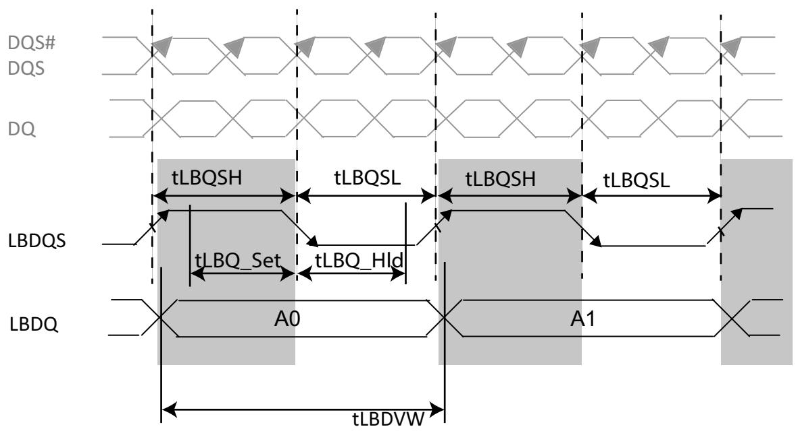

<details>
<summary>text_image</summary>

DQS#
DQS
DQ
tLBQSH
tLBQSL
tLBQSH
tLBQSL
LBDQS
tLBQ_Set
tLBQ_HId
LBDQ
A0
A1
tLBDVW
</details>

Figure 244 — Loopback Strobe to Data Relationship

# 9.3.1 ALERT\_n Output Drive Characteristic

A functional representation of the output buffer is shown in Figure 245. Output driver impedance RON is defined as follows:

$$
\mathrm{RON} _ {\mathrm{Pd}} = \frac {\text {Vout}}{\mid \text {Iout} \mid} _ {\text {under the condition that RON} _ {\mathrm{Pu}} \text {is off}}
$$

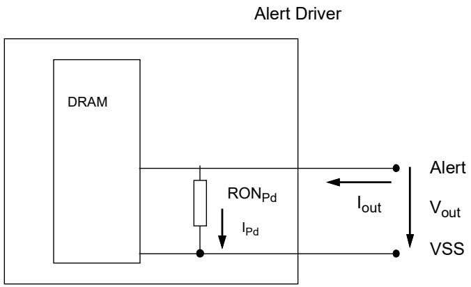

<details>
<summary>text_image</summary>

Alert Driver
DRAM
RONPd
IPd
Iout
Alert
Vout
VSS
</details>

Figure 245 — Output Buffer Ron

Table 249 — Output Driver Impedance RON 

<table><tr><td>Resistor</td><td>Vout</td><td>Min</td><td>Max</td><td>Unit</td><td>Note</td></tr><tr><td rowspan="3"> $RON_{Pd}$ </td><td> $VOLdc= 0.1* VDDQ$ </td><td>0.3</td><td>1.1</td><td> $R_{ZQ}/7$ </td><td></td></tr><tr><td> $V_{OMdc}= 0.8* VDDQ$ </td><td>0.4</td><td>1.1</td><td> $R_{ZQ}/7$ </td><td></td></tr><tr><td> $V_{OHdc}= 0.95* VDDQ$ </td><td>0.4</td><td>1.25</td><td> $R_{ZQ}/7$ </td><td></td></tr></table>

# 9.3.2 Output Driver Characteristic of Connectivity Test (CT) Mode

Following Output driver impedance RON will be applied to the Test Output Pin during Connectivity Test (CT) Mode.

The individual pull-up and pull-down resistors (RONPu\_CT and RONPd\_CT) are defined as follows:

$$
R O N _ {P u \_ C T} = \frac {V _ {D D Q} - V _ {O U T}}{I l o u t I}
$$

$$
R O N _ {P d \_ C T} = \frac {V _ {O U T}}{I l o u t I}
$$

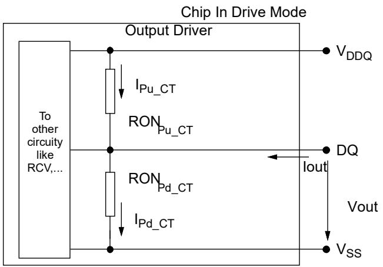

<details>
<summary>text_image</summary>

Chip In Drive Mode
Output Driver
V_DDQ
I_Pu_CT
RON_Pu_CT
To other circuitry like RCV...
RON_Pd_CT
I_Pd_CT
DQ
Iout
Vout
V_SS
</details>

Figure 246 — Output Driver

Table 250 — Output Driver Characteristic of Connectivity Test (CT) Mode 

<table><tr><td>RONNOM_CT</td><td>Resistor</td><td>Vout</td><td>Max</td><td>Units</td><td>Note</td></tr><tr><td rowspan="8">34 Ω</td><td rowspan="4">RONPd_CT</td><td>VOBdc = 0.2 x VDDQ</td><td>1.9</td><td> $R_{ZQ}/7$ </td><td>1, 2</td></tr><tr><td>VOLdc = 0.5 x VDDQ</td><td>2.0</td><td> $R_{ZQ}/7$ </td><td>1, 2</td></tr><tr><td>VOMdc = 0.8 x VDDQ</td><td>2.2</td><td> $R_{ZQ}/7$ </td><td>1, 2</td></tr><tr><td>VOHdc = 0.95 x VDDQ</td><td>2.5</td><td> $R_{ZQ}/7$ </td><td>1, 2</td></tr><tr><td rowspan="4">RONPu_CT</td><td>VOBdc = 0.2 x VDDQ</td><td>1.9</td><td> $R_{ZQ}/7$ </td><td>1, 2</td></tr><tr><td>VOLdc = 0.5 x VDDQ</td><td>2.0</td><td> $R_{ZQ}/7$ </td><td>1, 2</td></tr><tr><td>VOMdc = 0.8 x VDDQ</td><td>2.2</td><td> $R_{ZQ}/7$ *</td><td>1, 2</td></tr><tr><td>VOHdc = 0.95 x VDDQ</td><td>2.5</td><td> $R_{ZQ}/7$ </td><td>1, 2</td></tr><tr><td colspan="6">NOTE 1 Connectivity test mode uses un-calibrated drivers, showing the full range over PVT. No mismatch between pull up and pull down is defined.NOTE 2 Uncalibrated drive strength tolerance is specified at +/- 30%</td></tr></table>

# 9.4 Single-ended Output Levels - VOL/VOH

Table 251 — Single-ended Output Levels for DDR5-3200 to DDR5-6400 

<table><tr><td>Symbol</td><td>Parameter</td><td>DDR5-3200-6400</td><td>Units</td><td>Notes</td></tr><tr><td> $V_{OH}$ </td><td>Output high measurement level (for output SR)</td><td> $0.75 \times V_{pk-pk}$ </td><td>V</td><td>1</td></tr><tr><td> $V_{OL}$ </td><td>Output low measurement level (for output SR)</td><td> $0.25 \times V_{pk-pk}$ </td><td>V</td><td>1</td></tr><tr><td colspan="5">NOTE 1  $V_{pk-pk}$  is the mean high voltage minus the mean low voltage over 8UI samples.</td></tr></table>

Table 252 — Single-ended Output Levels for DDR5-6800 to DDR5-8800 

<table><tr><td>Symbol</td><td>Parameter</td><td>DDR5-6800-8800</td><td>Units</td><td>Notes</td></tr><tr><td>VOH</td><td>Output high measurement level (for output SR)</td><td>0.75 x Vpk-pk</td><td>V</td><td>1</td></tr><tr><td>VOL</td><td>Output low measurement level (for output SR)</td><td>0.25 x Vpk-pk</td><td>V</td><td>1</td></tr><tr><td colspan="5">NOTE 1  $V_{pk-pk}$  is the mean high voltage minus the mean low voltage over 8UI samples.</td></tr></table>

# 9.4.1 DDP Single-ended Output Levels - VOL/VOH

Table 253 — DDP Single-Ended Output Levels for DDR5 DDP 3200 to 6400 

<table><tr><td>Symbol</td><td>Parameter</td><td>DDR5 DDP 3200-6400</td><td>Units</td><td>Notes</td></tr><tr><td>VOH</td><td>Output high measurement level (for output SR)</td><td> $0.75 \times V_{pk-pk}$ </td><td>V</td><td>1</td></tr><tr><td>VOL</td><td>Output low measurement level (for output SR)</td><td> $0.25 \times V_{pk-pk}$ </td><td>V</td><td>1</td></tr><tr><td colspan="5">NOTE 1  $V_{pk-pk}$  is the mean high voltage minus the mean low voltage over 8UI samples.</td></tr></table>

# 9.5 Single-Ended Output Levels - VOL/VOH for Loopback Signals

Table 254 — Single-ended Output Levels for Loopback Signals DDR5-3200 to DDR5-6400 

<table><tr><td>Symbol</td><td>Parameter</td><td>DDR5-3200-6400</td><td>Units</td><td>Notes</td></tr><tr><td> $V_{OH}$ </td><td>Output high measurement level (for output SR)</td><td> $0.75 \times V_{pk-pk}$ </td><td>V</td><td>1</td></tr><tr><td> $V_{OL}$ </td><td>Output low measurement level (for output SR)</td><td> $0.25 \times V_{pk-pk}$ </td><td>V</td><td>1</td></tr><tr><td colspan="5">NOTE 1  $V_{pk-pk}$  is the mean high voltage minus the mean low voltage over 8UI samples.</td></tr></table>

Table 255 — Single-ended Output Levels for Loopback Signals DDR5-6800 to DDR5-8800 

<table><tr><td>Symbol</td><td>Parameter</td><td>DDR5-6800-8800</td><td>Units</td><td>Notes</td></tr><tr><td> $V_{OH}$ </td><td>Output high measurement level (for output SR)</td><td> $0.75 \times V_{pk-pk}$ </td><td>V</td><td>1</td></tr><tr><td> $V_{OL}$ </td><td>Output low measurement level (for output SR)</td><td> $0.25 \times V_{pk-pk}$ </td><td>V</td><td>1</td></tr><tr><td colspan="5">NOTE 1  $V_{pk-pk}$  is the mean high voltage minus the mean low voltage over 8UI samples.</td></tr></table>

# 9.5.1 DDP Single-Ended Output Levels - VOL/VOH for Loopback Signals

Table 256 — DDP Single-ended Output Levels for Loopback Signals DDR5 DDP 3200 to 6400 

<table><tr><td>Symbol</td><td>Parameter</td><td>DDR5 DDP 3200-6400</td><td>Units</td><td>Notes</td></tr><tr><td> $V_{OH}$ </td><td>Output high measurement level (for output SR)</td><td> $0.75 \times V_{pk-pk}$ </td><td>V</td><td>1</td></tr><tr><td> $V_{OL}$ </td><td>Output low measurement level (for output SR)</td><td> $0.25 \times V_{pk-pk}$ </td><td>V</td><td>1</td></tr><tr><td colspan="5">NOTE 1  $V_{pk-pk}$  is the mean high voltage minus the mean low voltage over 8UI samples.</td></tr></table>

# 9.6 Single-ended Output Slew Rate

With the reference load for timing measurements, output slew rate for falling and rising edges is defined and measured between $\mathsf { V } _ { \mathsf { O L } }$ and $\mathsf { V } _ { \mathsf { O H } }$ for single ended signals as shown in Table 257 and Figure 247.

Table 257 — Single-ended Output Slew Rate Definition 

<table><tr><td rowspan="2">Description</td><td colspan="2">Measured</td><td rowspan="2">Defined by</td></tr><tr><td>From</td><td>To</td></tr><tr><td>Single ended output slew rate for rising edge</td><td> $V_{OL}$ </td><td> $V_{OH}$ </td><td> $[V_{OH}-V_{OL}] / delta TRse$ </td></tr><tr><td>Single ended output slew rate for falling edge</td><td> $V_{OH}$ </td><td> $V_{OL}$ </td><td> $[V_{OH}-V_{OL}] / delta TFse$ </td></tr><tr><td colspan="4">NOTE 1 Output slew rate is verified by design and characterization, and may not be subject to production test.</td></tr></table>

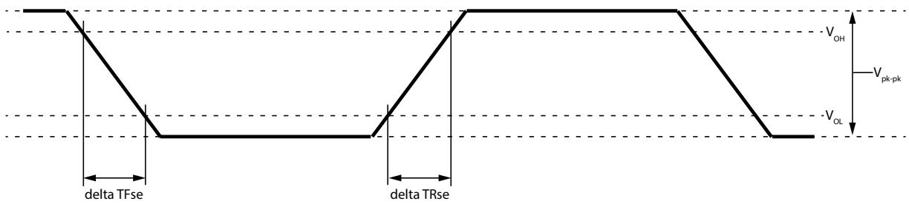

<details>
<summary>line</summary>

| Time Segment     | Voltage Level |
| ---------------- | ------------- |
| Delta TFse       | V_OH          |
| Delta TRse       | V_OL          |
| Delta TFse + Delta TRse | V_pk-pk        |
| Delta TFse + Delta TRse | V_OL         |
</details>

Figure 247 — Single-ended Output Slew Rate Definition

Table 258 — Single-ended Output Slew Rate for DDR5-3200 to DDR5-4800 

<table><tr><td colspan="2">Speed</td><td colspan="2">DDR5-3200</td><td colspan="2">DDR5-3600</td><td colspan="2">DDR5-4000</td><td colspan="2">DDR5-4400</td><td colspan="2">DDR5-4800</td><td rowspan="2">Units</td><td rowspan="2">NOTE</td></tr><tr><td>Parameter</td><td>Symbol</td><td>MIN</td><td>MAX</td><td>MIN</td><td>MAX</td><td>MIN</td><td>MAX</td><td>MIN</td><td>MAX</td><td>MIN</td><td>MAX</td></tr><tr><td>Single ended output slew rate</td><td>SRQse</td><td>8</td><td>24</td><td>8</td><td>24</td><td>8</td><td>24</td><td>8</td><td>24</td><td>8</td><td>24</td><td>V/ns</td><td></td></tr></table>

Table 259 — Single-ended Output Slew Rate for DDR5-5200 to DDR5-6400 

<table><tr><td colspan="2">Speed</td><td colspan="2">DDR5-5200</td><td colspan="2">DDR5-5600</td><td colspan="2">DDR5-6000</td><td colspan="2">DDR5-6400</td><td rowspan="2">Units</td><td rowspan="2">NOTE</td></tr><tr><td>Parameter</td><td>Symbol</td><td>MIN</td><td>MAX</td><td>MIN</td><td>MAX</td><td>MIN</td><td>MAX</td><td>MIN</td><td>MAX</td></tr><tr><td>Single ended output slew rate</td><td>SRQse</td><td>12</td><td>24</td><td>12</td><td>24</td><td>12</td><td>24</td><td>12</td><td>24</td><td>V/ns</td><td></td></tr></table>

Table 260 — Single-ended Output Slew Rate for DDR5-6800 to DDR5-8800 

<table><tr><td colspan="2">Speed</td><td colspan="2">DDR5-6800</td><td colspan="2">DDR5-7200</td><td colspan="2">DDR5-7600</td><td colspan="2">DDR5-8000</td><td colspan="2">DDR5-8400</td><td colspan="2">DDR5-8800</td><td rowspan="2">Units</td><td rowspan="2">NOTE</td></tr><tr><td>Parameter</td><td>Symbol</td><td>MIN</td><td>MAX</td><td>MIN</td><td>MAX</td><td>MIN</td><td>MAX</td><td>MIN</td><td>MAX</td><td>MIN</td><td>MAX</td><td>MIN</td><td>MAX</td></tr><tr><td>Single ended output slew rate</td><td>SRQse</td><td>12</td><td>24</td><td>12</td><td>24</td><td>12</td><td>24</td><td>12</td><td>24</td><td>12</td><td>24</td><td>12</td><td>24</td><td>V/ns</td><td></td></tr></table>

# 9.6.1 DDP Single-Ended Output Slew Rate

With the reference load for timing measurements, output slew rate for falling and rising edges is defined and measured between $\mathsf { V } _ { \mathsf { O L } }$ and $\mathsf { V } _ { \mathsf { O H } }$ for single ended signals as shown in Table 261 and Figure 248.

Table 261 — DDP Single-ended Output Slew Rate Definition 

<table><tr><td rowspan="2">Description</td><td colspan="2">Measured</td><td rowspan="2">Defined by</td></tr><tr><td>From</td><td>To</td></tr><tr><td>Single ended output slew rate for rising edge</td><td> $V_{OL}$ </td><td> $V_{OH}$ </td><td> $[V_{OH}-V_{OL}] / delta TRse$ </td></tr><tr><td>Single ended output slew rate for falling edge</td><td> $V_{OH}$ </td><td> $V_{OL}$ </td><td> $[V_{OH}-V_{OL}] / delta TFse$ </td></tr><tr><td colspan="4">NOTE 1 Output slew rate is verified by design and characterization, and may not be subject to production test.</td></tr></table>

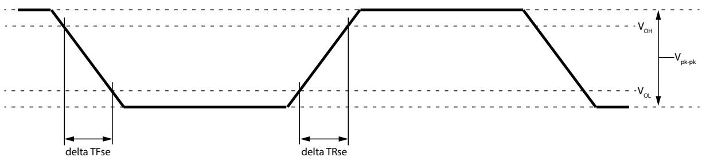

<details>
<summary>line</summary>

| Time Segment     | Voltage Level |
| ----------------- | ------------- |
| Delta TFse        | -VOH          |
| Delta TRse        | -VOH          |
| Delta TFse        | -Vpk-pk       |
| Delta TRse        | -VOL          |
</details>

Figure 248 — Single-ended Output Slew Rate Definition

Table 262 — DDP Single-ended Output Slew Rate for DDR5-3200 to DDR5-6400 

<table><tr><td colspan="2">Speed</td><td colspan="2">DDR5 DDP 3200-6400</td><td rowspan="2">Units</td><td rowspan="2">NOTE</td></tr><tr><td>Parameter</td><td>Symbol</td><td>MIN</td><td>MAX</td></tr><tr><td>Single ended output slew rate</td><td>SRQse</td><td>4</td><td>15</td><td>V/ns</td><td></td></tr></table>

# 9.7 Differential Output Levels

Table 263 — Differential Output levels for DDR5-3200 to DDR5-6400 

<table><tr><td>Symbol</td><td>Parameter</td><td>DDR5-3200-6400</td><td>Units</td><td>Notes</td></tr><tr><td> $V_{OHdiff}$ </td><td>Differential output high measurement level (for output SR)</td><td> $0.75 \times V_{diffpk-pk}$ </td><td>V</td><td>1</td></tr><tr><td> $V_{OLdiff}$ </td><td>Differential output low measurement level (for output SR)</td><td> $0.25 \times V_{diffpk-pk}$ </td><td>V</td><td>1</td></tr><tr><td colspan="5">NOTE 1  $V_{diffpk-pk}$  is the mean high voltage minus the mean low voltage over 8UI samples.</td></tr></table>

Table 264 — Differential AC and DC Output Levels for DDR5-6800 to DDR5-8800 

<table><tr><td>Symbol</td><td>Parameter</td><td>DDR5-6800-8800</td><td>Units</td><td>Notes</td></tr><tr><td> $V_{OHdiff}$ </td><td>Differential output high measurement level (for output SR)</td><td> $0.75 \times V_{diffpk-pk}$ </td><td>V</td><td>1</td></tr><tr><td> $V_{OLdiff}$ </td><td>Differential output low measurement level (for output SR)</td><td> $0.25 \times V_{diffpk-pk}$ </td><td>V</td><td>1</td></tr><tr><td colspan="5">NOTE 1  $V_{diffpk-pk}$  is the mean high voltage minus the mean low voltage over 8UI samples.</td></tr></table>

# 9.7.1 DDP Differential Output Levels

Table 265 — DDP Differential Output Levels for DDR5-3200 to DDR5-6400 

<table><tr><td>Symbol</td><td>Parameter</td><td>DDR5-3200-6400</td><td>Units</td><td>Notes</td></tr><tr><td> $V_{OHdiff}$ </td><td>Differential output high measurement level (for output SR)</td><td> $0.75 \times V_{diffpk-pk}$ </td><td>V</td><td>1</td></tr><tr><td> $V_{OLdiff}$ </td><td>Differential output low measurement level (for output SR)</td><td> $0.25 \times V_{diffpk-pk}$ </td><td>V</td><td>1</td></tr><tr><td colspan="5">NOTE 1  $V_{diffpk-pk}$  is the mean high voltage minus the mean low voltage over 8UI samples.</td></tr></table>

# 9.8 Differential Output Slew Rate

With the reference load for timing measurements, output slew rate for falling and rising edges is defined and measured between $V _ { \mathrm { O L } }$ - diff and VOHdiff for differential signals as shown in Table 266 and Figure 249

Table 266 — Differential Output Slew Rate Definition 

<table><tr><td rowspan="2">Description</td><td colspan="2">Measured</td><td rowspan="2">Defined by</td></tr><tr><td>From</td><td>To</td></tr><tr><td>Differential output slew rate for rising edge</td><td> $V_{OLdiff}$ </td><td> $V_{OHdiff}$ </td><td> $[V_{OHdiff}-V_{OLdiff}]$ / delta TRdiff</td></tr><tr><td>Differential output slew rate for falling edge</td><td> $V_{OHdiff}$ </td><td> $V_{OLdiff}$ </td><td> $[V_{OHdiff}-V_{OLdiff}]$ / delta TFdiff</td></tr><tr><td colspan="4">NOTE 1 Output slew rate is verified by design and characterization, and may not be subject to production test.</td></tr></table>

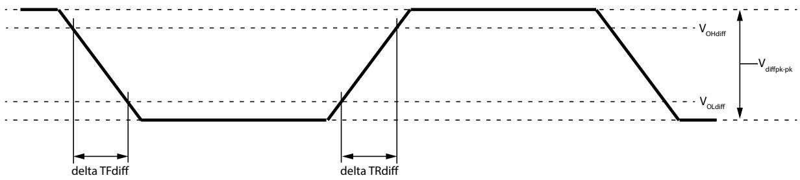

<details>
<summary>line</summary>

| Time Segment       | Delta Phase | Voltage |
| ------------------ | ----------- | ------- |
| Delta TFdiff       | High        | -       |
| Delta TFdiff       | Low         | -       |
| Delta TRdiff       | High        | -       |
| Delta TRdiff       | Low         | -       |
| High (Δ)           | High        | -       |
| High (Δ)           | Low         | -       |
| Low (Δ)            | High        | -       |
| Low (Δ)            | Low         | -       |
</details>

Figure 249 — Differential Output Slew Rate Definition

Table 267 — Differential Output Slew Rate for DDR5-3200 to DDR5-4800 

<table><tr><td colspan="2">Speed</td><td colspan="2">DDR5-3200</td><td colspan="2">DDR5-3600</td><td colspan="2">DDR5-4000</td><td colspan="2">DDR5-4400</td><td colspan="2">DDR5-4800</td><td rowspan="2">Units</td><td rowspan="2">NOTE</td></tr><tr><td>Parameter</td><td>Symbol</td><td>MIN</td><td>MAX</td><td>MIN</td><td>MAX</td><td>MIN</td><td>MAX</td><td>MIN</td><td>MAX</td><td>MIN</td><td>MAX</td></tr><tr><td>Differential output slew rate</td><td>SRQdiff</td><td>16</td><td>48</td><td>16</td><td>48</td><td>16</td><td>48</td><td>16</td><td>48</td><td>16</td><td>48</td><td>V/ns</td><td></td></tr></table>

Table 268 — Differential Output Slew Rate for DDR5-5200 to DDR5-6400 

<table><tr><td colspan="2">Speed</td><td colspan="2">DDR5-5200</td><td colspan="2">DDR5-5600</td><td colspan="2">DDR5-6000</td><td colspan="2">DDR5-6400</td><td rowspan="2">Units</td><td rowspan="2">NOTE</td></tr><tr><td>Parameter</td><td>Symbol</td><td>MIN</td><td>MAX</td><td>MIN</td><td>MAX</td><td>MIN</td><td>MAX</td><td>MIN</td><td>MAX</td></tr><tr><td>Differential output slew rate</td><td>SRQdiff</td><td>24</td><td>48</td><td>24</td><td>48</td><td>24</td><td>48</td><td>24</td><td>48</td><td>V/ns</td><td></td></tr></table>

Table 269 — Differential Output Slew Rate for DDR5-6800 to DDR5-8800 

<table><tr><td colspan="2">Speed</td><td colspan="2">DDR5-6800</td><td colspan="2">DDR5-7200</td><td colspan="2">DDR5-7600</td><td colspan="2">DDR5-8000</td><td colspan="2">DDR5-8400</td><td colspan="2">DDR5-8800</td><td rowspan="2">Units</td><td rowspan="2">NOTE</td></tr><tr><td>Parameter</td><td>Symbol</td><td>MIN</td><td>MAX</td><td>MIN</td><td>MAX</td><td>MIN</td><td>MAX</td><td>MIN</td><td>MAX</td><td>MIN</td><td>MAX</td><td>MIN</td><td>MAX</td></tr><tr><td>Differential output slew rate</td><td>SRQdiff</td><td>24</td><td>48</td><td>24</td><td>48</td><td>24</td><td>48</td><td>24</td><td>48</td><td>24</td><td>48</td><td>24</td><td>48</td><td>V/ns</td><td></td></tr></table>

# 9.8.1 DDP Differential Output Slew Rate

With the reference load for timing measurements, output slew rate for falling and rising edges is defined and measured between ${ \mathsf { V } } _ { \mathsf { O L d i f f } }$ and ${ \mathsf { V } } _ { \mathsf { O H d i f f } }$ for differential signals as shown in Table 270 and Figure 250

Table 270 — DDP Differential output slew rate definition 

<table><tr><td rowspan="2">Description</td><td colspan="2">Measured</td><td rowspan="2">Defined by</td></tr><tr><td>From</td><td>To</td></tr><tr><td>Differential output slew rate for rising edge</td><td> $V_{OLdiff}$ </td><td> $V_{OHdiff}$ </td><td> $[V_{OHdiff}-V_{OLdiff}] / delta TRdiff$ </td></tr><tr><td>Differential output slew rate for falling edge</td><td> $V_{OHdiff}$ </td><td> $V_{OLdiff}$ </td><td> $[V_{OHdiff}-V_{OLdiff}] / delta TFdiff$ </td></tr><tr><td colspan="4">NOTE 1 Output slew rate is verified by design and characterization, and may not be subject to production test.</td></tr></table>

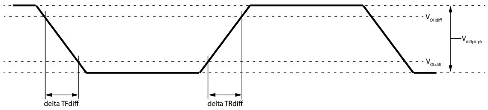

<details>
<summary>text_image</summary>

delta TFdiff
delta TRdiff
V_OHdiff
V_diffpk-pk
V_OLdiff
</details>

Figure 250 — Differential Output Slew Rate Definition

Table 271 — DDP Differential Output Slew Rate for DDR5-3200 to DDR5-6400 

<table><tr><td colspan="2">Speed</td><td colspan="2">DDR5 DDP 3200-6400</td><td rowspan="2">Units</td><td rowspan="2">NOTE</td></tr><tr><td>Parameter</td><td>Symbol</td><td>MIN</td><td>MAX</td></tr><tr><td>Differential output slew rate</td><td>SRQdiff</td><td>8</td><td>30</td><td>V/ns</td><td></td></tr></table>

# 9.9 Tx DQS Jitter

The Random Jitter (Rj) specified is a random jitter meeting a Gaussian distribution. The Deterministic Jitter (Dj) specified is bounded. The DDR5 device output jitter must not exceed maximum values specified in Table 272.

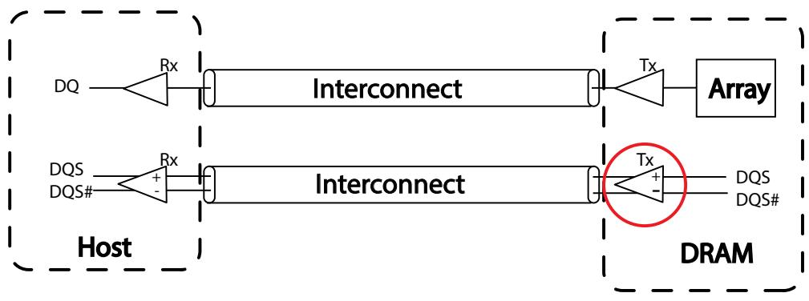

<details>
<summary>flowchart</summary>

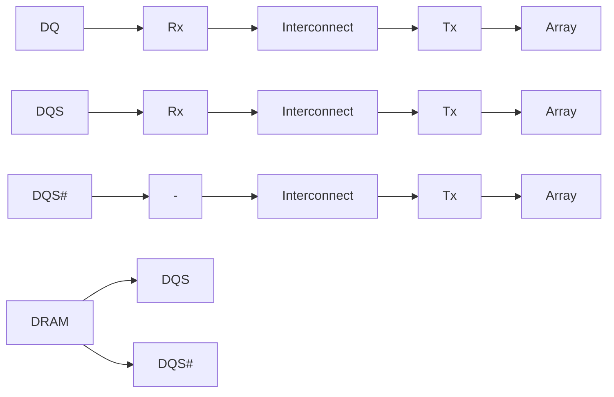
```mermaid
graph LR
    A["DQ"] --> B["Rx"]
    B --> C["Interconnect"]
    C --> D["Tx"]
    D --> E["Array"]
    F["DQS"] --> G["Rx"]
    G --> H["Interconnect"]
    H --> I["Tx"]
    I --> J["Array"]
    K["DQS#"] --> L["-"]
    L --> M["Interconnect"]
    M --> N["Tx"]
    N --> O["Array"]
    P["DRAM"] --> Q["DQS"]
    P --> R["DQS#"]
```
</details>

Figure 251 — Tx DQS Jitter

# 9.9 Tx DQS Jitter (cont’d)

Table 272 — Tx DQS Jitter Parameters for DDR5-3200 to 4800   
[Dj=Deterministic Jitter; Rj=Random Jitter; DCD=Duty Cycle Distortion; BUJ=Bounded Uncorrelated Jitter; pp=Peak to Peak] 

<table><tr><td rowspan="2">Parameter</td><td rowspan="2">Symbol</td><td colspan="2">DDR5-3200</td><td colspan="2">DDR5-3600</td><td colspan="2">DDR5-4000</td><td colspan="2">DDR5-4400</td><td colspan="2">DDR5-4800</td><td rowspan="2">Unit</td><td rowspan="2">Notes</td></tr><tr><td>Min</td><td>Max</td><td>Min</td><td>Max</td><td>Min</td><td>Max</td><td>Min</td><td>Max</td><td>Min</td><td>Max</td></tr><tr><td>Rj RMS Value of 1-UI Jitter without BUJ</td><td>tTx_DQS_1UI_Rj_NoBUJ</td><td>-</td><td>tCK_1UI_Rj_NoBUJ+0.002</td><td>-</td><td>tCK_1UI_Rj_NoBUJ+0.002</td><td>-</td><td>tCK_1UI_Rj_NoBUJ+0.002</td><td>-</td><td>tCK_1UI_Rj_NoBUJ+0.002</td><td>-</td><td>tCK_1UI_Rj_NoBUJ+0.002</td><td>UI (RMS)</td><td>1, 2, 3, 4, 5, 6, 7, 8, 9, 10, 11, 12</td></tr><tr><td>Dj pp Value of 1-UI Jitter without BUJ</td><td>tTx_DQS_1UI_Dj_NoBUJ</td><td>-</td><td>0.150</td><td>-</td><td>0.150</td><td>-</td><td>0.150</td><td>-</td><td>0.150</td><td>-</td><td>0.150</td><td>UI</td><td>1, 2, 3, 5, 6, 7, 8, 9, 10, 11</td></tr><tr><td>Rj RMS Value of N-UI jitter without BUJ, where 1-tCK_NUI_Rj_NoBUJ- tCK_NUI_Rj_NoBUJ+0.002- tCK_NUI_Rj_NoBUJ+0.002- tCK_NUI_Rj_NoBUJ+0.002- tCK_NUI_Rj_NoBUJ+0.002UI (RMS)1, 2, 3, 5, 6, 7, 8, 9, 10, 11, 12</td><td>tTx_DQS_NUI_Rj_NoBUJ</td><td>-</td><td>tCK_NUI_Rj_NoBUJ+0.002</td><td>-</td><td>tCK_NUI_Rj_NoBUJ+0.002</td><td>-</td><td>tCK_NUI_Rj_NoBUJ+0.002</td><td>-</td><td>tCK_NUI_Rj_NoBUJ+0.002</td><td>-</td><td>tCK_NUI_Rj_NoBUJ+0.002</td><td>UI (RMS)</td><td>1, 2, 3, 5, 6, 7, 8, 9, 10, 11, 12</td></tr><tr><td>Dj pp Value of N-UI Jitter without BUJ, where 1-tTx_DQS_NUI_Dj_NoBUJ- 0.150- 0.150- 0.150- 0.150- 0.150- 0.150UI1, 2, 3, 5, 6, 7, 8, 9, 10, 11</td><td>tTx_DQS_NUI_Dj_NoBUJ</td><td>-</td><td>0.150</td><td>-</td><td>0.150</td><td>-</td><td>0.150</td><td>-</td><td>0.150</td><td>-</td><td>0.150</td><td>UI</td><td>1, 2, 3, 5, 6, 7, 8, 9, 10, 11</td></tr><tr><td colspan="13">NOTE 1 On-die noise similar to that occurring with all the transmitter and receiver lanes toggling need to be stimulated. When there is no socket in transmitter measurement setup, in many cases, the contribution of the cross-talk is not significant or can be estimated within tolerable error even with all the transmitter lanes sending patterns. When a socket is present, such as DUT being DRAM component, the contribution of the cross-talk could be significant. To minimize the impact of crosstalk on the measurement results, a small group of selected lanes in the vicinity of the lane under test may be turned off (sending DC), while the remaining TX lanes send patterns to the corresponding RX receivers so as to excite realistic on-die noise profile from device switching. Note that there may be cases when one of Dj and Rj specs is met and another violated in which case the signaling analysis should be run to determine link feasibilityNOTE 2 On-die noise similar to that occurring with all the transmitter and receiver lanes toggling need to be stimulated. When there is no socket in transmitter measurement setup, in many cases the contribution of BUJ is not significant or can be estimated within tolerable error even with all the transmitter lanes sending patterns. When a socket is present, such as DUT being DRAM component, the contribution of the cross-talk could be significant. To minimize the impact of crosstalk on the measurement results, a small group of selected lanes in the vicinity of the lane under test may be turned off (sending DC), while the remaining TX lanes send patterns to the corresponding RX receivers, so as to excite realistic on-die noise profile from device switching. Note that there may be cases when one of Dj and Rj specs is met and another violated in which case the signaling analysis should be run to determine link feasibilityNOTE 3 The validation methodology for these parameters will be covered in future ballotsNOTE 4 Rj RMS value of 1-UI jitter. Without BUJ, but on-die system like noise present. This extraction is to be done after software correction of DCDNOTE 5 See Section 7.1 for details on the minimum BER requirementsNOTE 6 See Section 7.2 for details on UI, NUI and Jitter definitionsNOTE 7 Duty Cycle of the DQ pins must be adjusted as close to 50% as possible using the Global and Per Pin Duty Cycle Adjuster feature prior to running the Tx DQ Jitter testNOTE 8 The Mode Registers for the Duty Cycle Adjuster are MR43 and MR44, and the Mode Registers for the Per Pin DCA of DQS are MR103 - MR110.NOTE 9 Spread Spectrum Clocking (SSC) must be disabled while running the Tx DQ Jitter testNOTE 10 These parameters are tested using the continuous clock pattern which are sent out from the dram device without the need for sending out continuous MRR commands. The MR25 OP[3] is set to “1” to enable this feature.NOTE 11 Tested on the CTC2 card onlyNOTE 12 The max value of tTx_DQS_Rj_1UI_NoBUJ and tTx_DQS_Rj_NUI_NoBUJ can be 6 mUI RMS</td><td></td></tr></table>

# 9.9 Tx DQS Jitter (cont’d)

Table 273 — Tx DQS Jitter Parameters for DDR5-5200 to 6400   
[Dj=Deterministic Jitter; Rj=Random Jitter; DCD=Duty Cycle Distortion; BUJ=Bounded Uncorrelated Jitter; pp=Peak to Peak] 

<table><tr><td rowspan="2">Parameter</td><td rowspan="2">Symbol</td><td colspan="2">DDR5-5200</td><td colspan="2">DDR5-5600</td><td colspan="2">DDR5-6000</td><td colspan="2">DDR5-6400</td><td rowspan="2">Unit</td><td rowspan="2">Notes</td></tr><tr><td>Min</td><td>Max</td><td>Min</td><td>Max</td><td>Min</td><td>Max</td><td>Min</td><td>Max</td></tr><tr><td>Rj RMS Value of 1-UI Jitter without BUJ</td><td>tTx_DQS_1UI_Rj_NoBUJ</td><td>-</td><td>tCK_1UI_Rj_NoBUJ+0.002</td><td>-</td><td>tCK_1UI_Rj_NoBUJ+0.002</td><td>-</td><td>tCK_1UI_Rj_NoBUJ+0.002</td><td>-</td><td>tCK_1UI_Rj_NoBUJ+0.002</td><td>UI (RMS)</td><td>1, 2, 3, 4, 5, 6, 7, 8, 9, 10, 11, 12</td></tr><tr><td>Dj pp Value of 1-UI Jitter without BUJ</td><td>tTx_DQS_1UI_Dj_NoBUJ</td><td>-</td><td>0.130</td><td>-</td><td>0.130</td><td>-</td><td>0.130</td><td>-</td><td>0.130</td><td>UI</td><td>1, 2, 3, 5, 6, 7, 8, 9, 10, 11</td></tr><tr><td>Rj RMS Value of N-UI jitter without BUJ, where 1-tk_NUI_Rj_NoBUJ-no0.002-tk_NUI_Rj_NoBUJ+0.002---UI (RMS)1, 2, 3, 5, 6, 7, 8, 9, 10, 11, 12</td><td>tTx_DQS_NUI_Rj_NoBUJ</td><td>-</td><td>tCK_NUI_Rj_NoBUJ+0.002</td><td>-</td><td>tCK_NUI_Rj_NoBUJ+0.002</td><td>-</td><td>-</td><td>-</td><td>-</td><td>UI (RMS)</td><td>1, 2, 3, 5, 6, 7, 8, 9, 10, 11, 12</td></tr><tr><td>Dj pp Value of N-UI Jitter without BUJ, where 1-tk_DQS_NUI_Dj_NoBUJ-no0.130--0.130---UI1, 2, 3, 5, 6, 7, 8, 9, 10, 11</td><td>tTx_DQS_NUI_Dj_NoBUJ</td><td>-</td><td>0.130</td><td>-</td><td>0.130</td><td>-</td><td>-</td><td>-</td><td>-</td><td>UI</td><td>1, 2, 3, 5, 6, 7, 8, 9, 10, 11</td></tr><tr><td>Rj RMS Value of N-UI jitter without BUJ, where 1-tk_DQS_NUI_Rj_NoBUJ-no0.002---tck_1UI_Rj_NoBUJ+0.002-tck_1UI_Rj_NoBUJ+0.002UI (RMS)1, 2, 3, 5, 6, 7, 8, 9, 10, 11, 12</td><td>tTx_DQS_NUI_Rj_NoBUJ</td><td>-</td><td>-</td><td>-</td><td>-</td><td>-</td><td>tCK_1UI_Rj_NoBUJ+0.002</td><td>-</td><td>tCK_1UI_Rj_NoBUJ+0.002</td><td>UI (RMS)</td><td>1, 2, 3, 5, 6, 7, 8, 9, 10, 11, 12</td></tr><tr><td>Dj pp Value of N-UI Jitter without BUJ, where 1-tk_DQS_NUI_Dj_NoBUJ-no0.130--0.130UI1, 2, 3, 5, 6, 7, 8, 9, 10, 11</td><td>tTx_DQS_NUI_Dj_NoBUJ</td><td>-</td><td>-</td><td>-</td><td>-</td><td>-</td><td>0.130</td><td>-</td><td>0.130</td><td>UI</td><td>1, 2, 3, 5, 6, 7, 8, 9, 10, 11</td></tr><tr><td colspan="12">NOTE 1 On-die noise similar to that occurring with all the transmitter and receiver lanes toggling need to be stimulated. When there is no socket in transmitter measurement setup, in many cases, the contribution of the cross-talk is not significant or can be estimated within tolerable error even with all the transmitter lanes sending patterns. When a socket is present, such as DUT being DRAM component, the contribution of the cross-talk could be significant. To minimize the impact of crosstalk on the measurement results, a small group of selected lanes in the vicinity of the lane under test may be turned off (sending DC), while the remaining TX lanes send patterns to the corresponding RX receivers so as to excite realistic on-die noise profile from device switching. Note that there may be cases when one of Dj and Rj specs is met and another violated in which case the signaling analysis should be run to determine link feasibilityNOTE 2 On-die noise similar to that occurring with all the transmitter and receiver lanes toggling need to be stimulated. When there is no socket in transmitter measurement setup, in many cases the contribution of BUJ is not significant or can be estimated within tolerable error even with all the transmitter lanes sending patterns. When a socket is present, such as DUT being DRAM component, the contribution of the cross-talk could be significant. To minimize the impact of crosstalk on the measurement results, a small group of selected lanes in the vicinity of the lane under test may be turned off (sending DC), while the remaining TX lanes send patterns to the corresponding RX receivers, so as to excite realistic on-die noise profile from device switching. Note that there may be cases when one of Dj and Rj specs is met and another violated in which case the signaling analysis should be run to determine link feasibilityNOTE 3 The validation methodology for these parameters will be covered in future ballotsNOTE 4 Rj RMS value of 1-UI jitter. Without BUJ, but on-die system like noise present. This extraction is to be done after software correction of DCDNOTE 5 See Section 7.1 for details on the minimum BER requirementsNOTE 6 See Section 7.2 for details on UI, NUI and Jitter definitionsNOTE 7 Duty Cycle of the DQ pins must be adjusted as close to 50% as possible using the Global and Per Pin Duty Cycle Adjuster feature prior to running the Tx DQ Jitter testNOTE 8 The Mode Registers for the Duty Cycle Adjuster are MR43 and MR44, and the Mode Registers for the Per Pin DCA of DQS are MR103 - MR110.NOTE 9 Spread Spectrum Clocking (SSC) must be disabled while running the Tx DQ Jitter testNOTE 10 These parameters are tested using the continuous clock pattern which are sent out from the dram device without the need for sending out continuous MRR commands. The MR25 OP[3] is set to &quot;1&quot; to enable this feature.NOTE 11 Tested on the CTC2 card onlyNOTE 12 The max value of tTx_DQS_Rj_1UI_NoBUJ and tTx_DQS_Rj_NUI_NoBUJ can be 6 mUI RMS</td></tr></table>

# 9.9 Tx DQS Jitter (cont’d)

Table 274 — Tx DQS Jitter Parameters for DDR5-6800 to 8800   
[Dj=Deterministic Jitter; Rj=Random Jitter; DCD=Duty Cycle Distortion; BUJ=Bounded Uncorrelated Jitter; pp=Peak to Peak] 

<table><tr><td rowspan="2">Parameter</td><td rowspan="2">Symbol</td><td colspan="2">DDR5-6800</td><td colspan="2">DDR5-7200</td><td colspan="2">DDR5-7600</td><td colspan="2">DDR5-8000</td><td colspan="2">DDR5-8400</td><td colspan="2">DDR5-8800</td><td rowspan="2">Unit</td><td rowspan="2">Notes</td></tr><tr><td>Min</td><td>Max</td><td>Min</td><td>Max</td><td>Min</td><td>Max</td><td>Min</td><td>Max</td><td>Min</td><td>Max</td><td>Min</td><td>Max</td></tr><tr><td>Rj RMS Value of 1-UI Jitter without BUJ</td><td>tTx_DQS_1UI_Rj_NoBUJ</td><td>-</td><td>0.006</td><td>-</td><td>0.006</td><td>-</td><td>0.006</td><td>-</td><td>0.006</td><td>-</td><td>0.006</td><td>-</td><td>0.006</td><td>UI (RMS)</td><td>1,2,3,4,5,6,7,8,9,10,11,12</td></tr><tr><td>Dj pp Value of 1-UI Jitter without BUJ</td><td>tTx_DQS_1UI_Dj_NoBUJ</td><td>-</td><td>0.130</td><td>-</td><td>0.130</td><td>-</td><td>0.130</td><td>-</td><td>0.130</td><td>-</td><td>0.130</td><td>-</td><td>0.130</td><td>UI</td><td>1,2,3,5,6,7,8,9,10,11</td></tr><tr><td>Rj RMS Value of N-UI jitter without BUJ, where 1&lt;TN&lt;6</td><td>tTx_DQS_NUI_Rj_NoBUJ</td><td>-</td><td>0.006</td><td>-</td><td>0.006</td><td>-</td><td>0.006</td><td>-</td><td>0.006</td><td>-</td><td>0.006</td><td>-</td><td>0.006</td><td>UI (RMS)</td><td>1,2,3,5,6,7,8,9,10,11,12</td></tr><tr><td>Dj pp Value of N-UI Jitter without BUJ, where 1&lt;TN&lt;6</td><td>tTx_DQS_NUI_Dj_NoBUJ</td><td>-</td><td>0.130</td><td>-</td><td>0.130</td><td>-</td><td>0.130</td><td>-</td><td>0.130</td><td>-</td><td>0.130</td><td>-</td><td>0.130</td><td>UI</td><td>1,2,3,5,6,7,8,9,10,11</td></tr><tr><td colspan="15">NOTE 1 On-die noise similar to that occurring with all the transmitter and receiver lanes toggling need to be stimulated. When there is no socket in transmitter measurement setup, in many cases, the contribution of the cross-talk is not significant or can be estimated within tolerable error even with all the transmitter lanes sending patterns. When a socket is present, such as DUT being DRAM component, the contribution of the cross-talk could be significant. To minimize the impact of crosstalk on the measurement results, a small group of selected lanes in the vicinity of the lane under test may be turned off (sending DC), while the remaining TX lanes send patterns to the corresponding RX receivers so as to excite realistic on-die noise profile from device switching. Note that there may be cases when one of Dj and Rj specs is met and another violated in which case the signaling analysis should be run to determine link feasibilityNOTE 2 On-die noise similar to that occurring with all the transmitter and receiver lanes toggling need to be stimulated. When there is no socket in transmitter measurement setup, in many cases the contribution of BUJ is not significant or can be estimated within tolerable error even with all the transmitter lanes sending patterns. When a socket is present, such as DUT being DRAM component, the contribution of the cross-talk could be significant. To minimize the impact of crosstalk on the measurement results, a small group of selected lanes in the vicinity of the lane under test may be turned off (sending DC), while the remaining TX lanes send patterns to the corresponding RX receivers, so as to excite realistic on-die noise profile from device switching. Note that there may be cases when one of Dj and Rj specs is met and another violated in which case the signaling analysis should be run to determine link feasibilityNOTE 3 The validation methodology for these parameters will be covered in future ballotsNOTE 4 Rj RMS value of 1-UI jitter. Without BUJ, but on-die system like noise present. This extraction is to be done after software correction of DCDNOTE 5 See Section 7.1 for details on the minimum BER requirementsNOTE 6 See Section 7.2 for details on UI, NUI and Jitter definitionsNOTE 7 Duty Cycle of the DQ pins must be adjusted as close to 50% as possible using the Global and Per Pin Duty Cycle Adjuster feature prior to running the Tx DQ Jitter testNOTE 8 The Mode Registers for the Duty Cycle Adjuster are MR43 and MR44.NOTE 9 Spread Spectrum Clocking (SSC) must be disabled while running the Tx DQ Jitter testNOTE 10 These parameters are tested using the continuous clock pattern which are sent out from the dram device without the need for sending out continuous MRR commands. The MR25 OP[3] is set to “1” to enable this feature.NOTE 11 Tested on the CTC2 card onlyNOTE 12 The max value of tTx_DQS_Rj_1UI_NoBUJ and tTx_DQS_Rj_NUI_NoBUJ can be 6 mUI RMS</td><td></td></tr></table>

# 9.10 Tx DQ Jitter

# 9.10.1 Overview

The Random Jitter (Rj) specified is a random jitter meeting a Gaussian distribution. The Deterministic Jitter (Dj) specified is bounded. The DDR5 device output jitter must not exceed maximum values specified in Table 275.

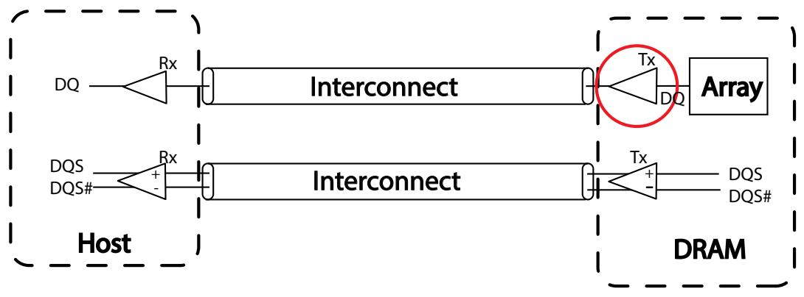

<details>
<summary>flowchart</summary>

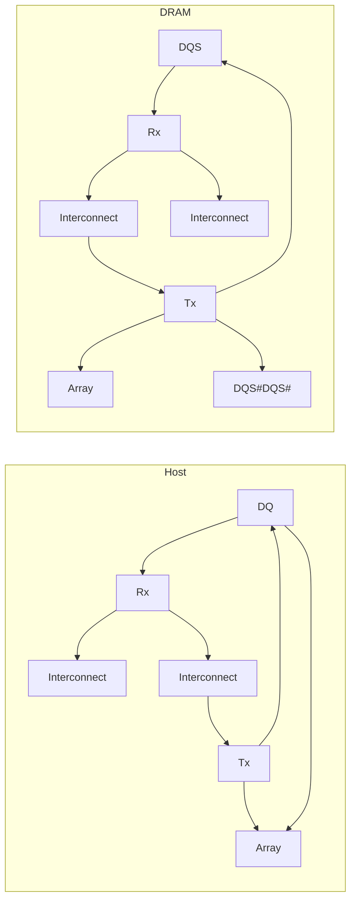
```mermaid
graph LR
    subgraph Host
        DQ --> Rx1["Rx"] --> Interconnect["Interconnect"]
        Rx1 --> Interconnect2["Interconnect"]
        Interconnect2 --> TxTx["Tx"] --> Array["Array"]
        TxTx --> DQ["DQ"]
        DQ --> Array
    end
    subgraph DRAM
        DQS --> Rx2["Rx"] --> Interconnect3["Interconnect"]
        Rx2 --> Interconnect4["Interconnect"]
        Interconnect3 --> TxTx2["Tx"] --> Array2["Array"]
        TxTx2 --> DQS["DQS"]
        TxTx2 --> DQS#DQS#
    end
```
</details>

Figure 252 — Random Jitter $\mathsf { R } _ { \mathrm { j } }$

# 9.10.2 Tx DQ Jitter Parameters

Table 275 — Tx DQ Jitter Parameters for DDR5-3200 to 4800   
[Dj=Deterministic Jitter; Rj=Random Jitter; DCD=Duty Cycle Distortion; BUJ=Bounded Uncorrelated Jitter; pp=Peak to Peak] 

<table><tr><td rowspan="2">Parameter</td><td rowspan="2">Symbol</td><td colspan="2">DDR5-3200</td><td colspan="2">DDR5-3600</td><td colspan="2">DDR5-4000</td><td colspan="2">DDR5-4400</td><td colspan="2">DDR5-4800</td><td rowspan="2">Unit</td><td rowspan="2">Notes</td></tr><tr><td>Min</td><td>Max</td><td>Min</td><td>Max</td><td>Min</td><td>Max</td><td>Min</td><td>Max</td><td>Min</td><td>Max</td></tr><tr><td>Rj RMS of 1-UI jitter without BUJ</td><td>tTx_DQ_1UI_Rj_NoBUJ</td><td>-</td><td>tCK_1UI_Rj_NoBUJ+0.002</td><td>-</td><td>tCK_1UI_Rj_NoBUJ+0.002</td><td>-</td><td>tCK_1UI_Rj_NoBUJ+0.002</td><td>-</td><td>tCK_1UI_Rj_NoBUJ+0.002</td><td>-</td><td>tCK_1UI_Rj_NoBUJ+0.002</td><td>UI (RMS)</td><td>1, 3, 4, 5, 7, 8, 9, 10, 11, 12, 13, 14</td></tr><tr><td>Dj pp 1-UI jitter without BUJ</td><td>tTx_DQ_1UI_Dj_NoBUJ</td><td>-</td><td>0.150</td><td>-</td><td>0.150</td><td>-</td><td>0.150</td><td>-</td><td>0.150</td><td>-</td><td>0.150</td><td>UI</td><td>3, 5, 7, 8, 9, 10, 11, 12, 13</td></tr><tr><td>Rj RMS of N-UI jitter without BUJ, where 1-tCK_NUI_Rj_NoBUJ- tCK_NUI_Rj_NoBUJ+0.002- tCK_NUI_Rj_NoBUJ+0.002- tCK_NUI_Rj_NoBUJ+0.002- tCK_NUI_Rj_NoBUJ+0.002- tCK_NUI_Rj_NoBUJ+0.002- tCK_NUI_Rj_NoBUJ+0.002- tCK_NUI_Rj_NoBUJ+0.002- tCK_PSSS</td><td>tTx_DQ_NUI_Rj_NoBUJ</td><td>-</td><td>tCK_NUI_Rj_NoBUJ+0.002</td><td>-</td><td>tCK_NUI_Rj_NoBUJ+0.002</td><td>-</td><td>tCK_NUI_Rj_NoBUJ+0.002</td><td>-</td><td>tCK_NUI_Rj_NoBUJ+0.002</td><td>-</td><td>tCK_NUI_Rj_NoBUJ+0.002</td><td>UI (RMS)</td><td>3, 5, 7, 8, 9, 10, 11, 12, 13, 14</td></tr><tr><td>Dj pp N-UI jitter without BUJ, where 1-tTx_DQ_NUI_Dj_NoBUJ-0.150-0.150-0.150-0.150-0.150-0.150-0.150-0.150-0.150-0.150-0.150-0.150-0.150-0.150-0.150-0.150-0.150-0.0</td><td>tTx_DQ_NUI_Dj_NoBUJ</td><td>-</td><td>0.150</td><td>-</td><td>0.150</td><td>-</td><td>0.150</td><td>-</td><td>0.150</td><td>-</td><td>0.150</td><td>UI</td><td>3, 6, 7, 8, 9, 10, 11, 12, 13</td></tr><tr><td>Delay of any data lane relative to strobe lane</td><td>tTx_DQS2DQ</td><td>-0.100</td><td>0.100</td><td>-0.100</td><td>0.100</td><td>-0.100</td><td>0.100</td><td>-0.100</td><td>0.100</td><td>-0.100</td><td>0.100</td><td>UI</td><td>3, 5, 6, 7, 9, 10, 11, 12, 13</td></tr><tr><td colspan="13">NOTE 1 On-die noise similar to that occurring with all the transmitter and receiver lanes toggling need to be stimulated. When there is no socket in transmitter measurement setup, in many cases, the contribution of the cross-talk is not significant or can be estimated within tolerable error even with all the transmitter lanes sending patterns. When a socket is present, such as DUT being DRAM component, the contribution of the cross-talk could be significant. To minimize the impact of crosstalk on the measurement results, a small group of selected lanes in the vicinity of the lane under test may be turned off (sending DC), while the remaining TX lanes send patterns to the corresponding RX receivers so as to excite realistic on-die noise profile from device switching. Note that there may be cases when one of Dj and Rj specs is met and another violated in which case the signaling analysis should be run to determine link feasibility.NOTE 2 On-die noise similar to that occurring with all the transmitter and receiver lanes toggling need to be stimulated. When there is no socket in transmitter measurement setup, in many cases, the contribution of BUJ is not significant or can be estimated within tolerable error even with all the transmitter lanes sending patterns. When a socket is present, such as DUT being DRAM component, the contribution of the cross-talk could be significant. To minimize the impact of crosstalk on the measurement results, a small group of selected lanes in the vicinity of the lane under test may be turned off (sending DC), while the remaining TX lanes send patterns to the corresponding RX receivers so as to excite realistic on -die noise profile from device switching. Note that there may be cases when one of Dj and Rj specs is met and another violated in which case the signaling analysis should be run to determine link feasibilityNOTE 3 The validation methodology for these parameters will be covered in future ballotsNOTE 4 Rj RMS value of 1-UI jitter without BUJ, but on-die system like noise present. This extraction is to be done after software correction of DCDNOTE 5 Delay of any data lane relative to strobe lane, as measured at Tx outputNOTE 6 Vref noise level to DQ jitter should be adjusted to minimize DCDNOTE 7 See Chapter 7 for details on the minimum BER requirementsNOTE 8 See Chapter 7 for details on UI, NUI and Jitter definitionsNOTE 9 Duty Cycle of the DQ pins must be adjusted as close to 50% as possible using the Global and Per Pin Duty Cycle Adjuster feature prior to running this testNOTE 10 The Mode Registers for the Duty Cycle Adjuster are MR43 and MR44. Also the Mode Registers for the Per Pin DCA of DQLx are MR(133+8x) and MR(134+8x), where 0≤x≤7, and the Mode Registers for the Per Pin DCA of DQUy are MR(197+8y) and MR(198+8y), where 0≤y≤7.NOTE 11 Spread Spectrum Clocking (SSC) must be disabled while running this testNOTE 12 These parameters are tested using the continuous clock pattern which are sent out from the dram device without the need for sending out continuous MRR commands. The MR25 OP[3] is set to “1” to enable this feature.NOTE 13 Tested on the CTC2 card onlyNOTE 14 The max value of tTx_DQ_Rj_1UI_NoBUJ and tTx_DQ_Rj_NUI_NoBUJ can be 6 mUI RMS</td><td></td></tr></table>

# 9.10.2 Tx DQ Jitter Parameters (cont’d)

Table 276 — Tx DQ Jitter Parameters for DDR5-5200 to 6400   
[Dj=Deterministic Jitter; Rj=Random Jitter; DCD=Duty Cycle Distortion; BUJ=Bounded Uncorrelated Jitter; pp=Peak to Peak] 

<table><tr><td rowspan="2">Parameter</td><td rowspan="2">Symbol</td><td colspan="2">DDR5-5200</td><td colspan="2">DDR5-5600</td><td colspan="2">DDR5-6000</td><td colspan="2">DDR5-6400</td><td rowspan="2">Unit</td><td rowspan="2">Notes</td></tr><tr><td>Min</td><td>Max</td><td>Min</td><td>Max</td><td>Min</td><td>Max</td><td>Min</td><td>Max</td></tr><tr><td>Rj RMS of 1-UI jitter without BUJ</td><td>tTx_DQ_1UI_Rj_NoBUJ</td><td>-</td><td>tCK_1UI_Rj_NoBUJ+0.002</td><td>-</td><td>tCK_1UI_Rj_NoBUJ+0.002</td><td>-</td><td>tCK_1UI_Rj_NoBUJ+0.002</td><td>-</td><td>tCK_1UI_Rj_NoBUJ+0.002</td><td>UI(RMS)</td><td>1,3,4,5,7,8,9,10,11,12,13,14,</td></tr><tr><td>Dj pp 1-UI jitter without BUJ</td><td>tTx_DQ_1UI_Dj_NoBUJ</td><td>-</td><td>0.130</td><td>-</td><td>0.130</td><td>-</td><td>0.130</td><td>-</td><td>0.130</td><td>UI</td><td>3,5,7,8,9,10,11,12,13</td></tr><tr><td>Rj RMS of N-UI jitter without BUJ, where 1&lt;tN&lt;4</td><td>tTx_DQ_NUI_Rj_NoBUJ</td><td>-</td><td>tCK_NUI_Rj_NoBUJ+0.002</td><td>-</td><td>tCK_NUI_Rj_NoBUJ+0.002</td><td>-</td><td>-</td><td>-</td><td>-</td><td>UI(RMS)</td><td>3,5,7,8,9,10,11,12,13,14</td></tr><tr><td>Dj pp N-UI jitter without BUJ, where 1&lt;tN&lt;4</td><td>tTx_DQ_NUI_Dj_NoBUJ</td><td>-</td><td>0.130</td><td>-</td><td>0.130</td><td>-</td><td>-</td><td>-</td><td>-</td><td>UI</td><td>3,6,7,8,9,10,11,12,13</td></tr><tr><td>Rj RMS of N-UI jitter without BUJ, where 1&lt;tN&lt;5</td><td>tTx_DQ_NUI_Rj_NoBUJ</td><td>-</td><td>-</td><td>-</td><td>-</td><td>-</td><td>tCK_1UI_Rj_NoBUJ+0.002</td><td>-</td><td>tCK_1UI_Rj_NoBUJ+0.002</td><td>UI(RMS)</td><td></td></tr><tr><td>Dj pp N-UI jitter without BUJ, where 1&lt;tN&lt;5</td><td>tTx_DQ_NUI_Dj_NoBUJ</td><td>-</td><td>-</td><td>-</td><td>-</td><td>-</td><td>0.130</td><td></td><td>0.130</td><td>UI</td><td></td></tr><tr><td>Delay of any data lane relative to strobe lane</td><td>tTx_DQS2DQ</td><td>-0.100</td><td>0.100</td><td>-0.100</td><td>0.100</td><td>-0.100</td><td>0.100</td><td>-0.100</td><td>0.100</td><td>UI</td><td>3,5,6,7,9,10,11,12,13</td></tr><tr><td colspan="11">NOTE 1 On-die noise similar to that occurring with all the transmitter and receiver lanes toggling need to be stimulated. When there is no socket in transmitter measurement setup, in many cases, the contribution of the cross-talk is not significant or can be estimated within tolerable error even with all the transmitter lanes sending patterns. When a socket is present, such as DUT being DRAM component, the contribution of the cross-talk could be significant. To minimize the impact of crosstalk on the measurement results, a small group of selected lanes in the vicinity of the lane under test may be turned off (sending DC), while the remaining TX lanes send patterns to the corresponding RX receivers so as to excite realistic on-die noise profile from device switching. Note that there may be cases when one of Dj and Rj specs is met and another violated in which case the signaling analysis should be run to determine link feasibility.NOTE 2 On-die noise similar to that occurring with all the transmitter and receiver lanes toggling need to be stimulated. When there is no socket in transmitter measurement setup, in many cases, the contribution of BUJ is not significant or can be estimated within tolerable error even with all the transmitter lanes sending patterns. When a socket is present, such as DUT being DRAM component, the contribution of the cross-talk could be significant. To minimize the impact of crosstalk on the measurement results, a small group of selected lanes in the vicinity of the lane under test may be turned off (sending DC), while the remaining TX lanes send patterns to the corresponding RX receivers so as to excite realistic on -die noise profile from device switching. Note that there may be cases when one of Dj and Rj specs is met and another violated in which case the signaling analysis should be run to determine link feasibilityNOTE 3 The validation methodology for these parameters will be covered in future ballotsNOTE 4 Rj RMS value of 1-UI jitter without BUJ, but on-die system like noise present. This extraction is to be done after software correction of DCDNOTE 5 Delay of any data lane relative to strobe lane, as measured at Tx outputNOTE 6 Vref noise level to DQ jitter should be adjusted to minimize DCDNOTE 7 See Chapter 7 for details on the minimum BER requirementsNOTE 8 See Chapter 7 for details on UI, NUI and Jitter definitionsNOTE 9 Duty Cycle of the DQ pins must be adjusted as close to 50% as possible using the Global and Per Pin Duty Cycle Adjuster feature prior to running this testNOTE 10 The Mode Registers for the Duty Cycle Adjuster are MR43 and MR44. Also the Mode Registers for the Per Pin DCA of DQLx are MR(133+8x) and MR(134+8x), where 0≤x≤7, and the Mode Registers for the Per Pin DCA of DQUy are MR(197+8y) and MR(198+8y), where 0≤y≤7.NOTE 11 Spread Spectrum Clocking (SSC) must be disabled while running this testNOTE 12 These parameters are tested using the continuous clock pattern which are sent out from the dram device without the need for sending out continuous MRR commands. The MR25 OP[3] is set to “1” to enable this feature.NOTE 13 Tested on the CTC2 card onlyNOTE 14 The max value of tTx_DQ_Rj_1UI_NoBUJ and tTx_DQ_Rj_NUI_NoBUJ can be 6mUI RMS</td><td></td></tr></table>

# 9.10.2 Tx DQ Jitter Parameters (cont’d)

Table 277 — Tx DQ Jitter Parameters for DDR5-6800 to 8800   
[Dj=Deterministic Jitter; Rj=Random Jitter; DCD=Duty Cycle Distortion; BUJ=Bounded Uncorrelated Jitter; pp=Peak to Peak] 

<table><tr><td rowspan="2">Parameter</td><td rowspan="2">Symbol</td><td colspan="2">DDR5-6800</td><td colspan="2">DDR5-7200</td><td colspan="2">DDR5-7600</td><td colspan="2">DDR5-8000</td><td colspan="2">DDR5-8400</td><td colspan="2">DDR5-8800</td><td rowspan="2">Unit</td><td rowspan="2">Notes</td></tr><tr><td>Min</td><td>Max</td><td>Min</td><td>Max</td><td>Min</td><td>Max</td><td>Min</td><td>Max</td><td>Min</td><td>Max</td><td>Min</td><td>Max</td></tr><tr><td>Rj RMS of 1-UI jitter without BUJ</td><td>tTx_DQ_1UI_Rj_NoBUJ</td><td>-</td><td>0.006</td><td>-</td><td>0.006</td><td>-</td><td>0.006</td><td>-</td><td>0.006</td><td>-</td><td>0.006</td><td>-</td><td>0.006</td><td>UI (RMS)</td><td>1,3,5,9,11,12,13,14,15,16,17,18</td></tr><tr><td>Dj pp 1-UI jitter without BUJ</td><td>tTx_DQ_1UI_Dj_NoBUJ</td><td>-</td><td>0.130</td><td>-</td><td>0.130</td><td>-</td><td>0.130</td><td>-</td><td>0.130</td><td>-</td><td>0.130</td><td>-</td><td>0.130</td><td>UI</td><td>3,6,9,11,12,13,14,15,16,17</td></tr><tr><td>Rj RMS of N-UI jitter without BUJ, where 1-tx_DQ_NUI_Rj_NoBUJ</td><td>tTx_DQ_NUI_Rj_NoBUJ</td><td>-</td><td>0.006</td><td>-</td><td>0.006</td><td>-</td><td>0.006</td><td>-</td><td>0.006</td><td>-</td><td>0.006</td><td>-</td><td>0.006</td><td>UI (RMS)</td><td>3,7,9,11,12,13,14,15,16,17,18</td></tr><tr><td>Dj pp N-UI jitter without BUJ, where 1-tx_DQ_NUI_Dj_NoBUJ</td><td>tTx_DQ_NUI_Dj_NoBUJ</td><td>-</td><td>0.130</td><td>-</td><td>0.130</td><td>-</td><td>0.130</td><td>-</td><td>0.130</td><td>-</td><td>0.130</td><td>-</td><td>0.130</td><td>UI</td><td>3,8,10,11,12,13,14,15,16,17</td></tr><tr><td>Delay of any data lane relative to strobe lane</td><td>tTx_DQS2DQ</td><td>-0.100</td><td>0.100</td><td>-0.100</td><td>0.100</td><td>-0.100</td><td>0.100</td><td>-0.100</td><td>0.100</td><td>-0.100</td><td>0.100</td><td>-0.100</td><td>0.100</td><td>UI</td><td>3,9,10,11,13,14,15,16,17</td></tr><tr><td colspan="16">NOTE 1 On-die noise similar to that occurring with all the transmitter and receiver lanes toggling need to be stimulated. When there is no socket in transmitter measurement setup, in many cases, the contribution of the cross-talk is not significant or can be estimated within tolerable error even with all the transmitter lanes sending patterns. When a socket is present, such as DUT being DRAM component, the contribution of the cross-talk could be significant. To minimize the impact of crosstalk on the measurement results, a small group of selected lanes in the vicinity of the lane under test may be turned off (sending DC), while the remaining TX lanes send patterns to the corresponding RX receivers so as to excite realistic on-die noise profile from device switching. Note that there may be cases when one of Dj and Rj specs is met and another violated in which case the signaling analysis should be run to determine link feasibility.</td></tr><tr><td colspan="16">NOTE 2 On-die noise similar to that occurring with all the transmitter and receiver lanes toggling need to be stimulated. When there is no socket in transmitter measurement setup, in many cases, the contribution of BUJ is not significant or can be estimated within tolerable error even with all the transmitter lanes sending patterns. When a socket is present, such as DUT being DRAM component, the contribution of the cross-talk could be significant. To minimize the impact of crosstalk on the measurement results, a small group of selected lanes in the vicinity of the lane under test may be turned off (sending DC), while the remaining TX lanes send patterns to the corresponding RX receivers so as to excite realistic on -die noise profile from device switching. Note that there may be cases when one of Dj and Rj specs is met and another violated in which case the signaling analysis should be run to determine link feasibility</td></tr><tr><td colspan="16">NOTE 3 The validation methodology for these parameters will be covered in future ballots</td></tr><tr><td colspan="16">NOTE 4 Rj RMS value of 1-UI jitter without BUJ, but on-die system like noise present. This extraction is to be done after software correction of DCD</td></tr><tr><td colspan="16">NOTE 5 Delay of any data lane relative to strobe lane, as measured at Tx output</td></tr><tr><td colspan="16">NOTE 6 Vref noise level to DQ jitter should be adjusted to minimize DCD</td></tr><tr><td colspan="16">NOTE 7 See Chapter 7 for details on the minimum BER requirements</td></tr><tr><td colspan="16">NOTE 8 See Chapter 7 for details on UI, NUI and Jitter definitions</td></tr><tr><td colspan="16">NOTE 9 Duty Cycle of the DQ pins must be adjusted as close to 50% as possible using the Duty Cycle Adjuster feature prior to running this test</td></tr><tr><td colspan="16">NOTE 10 The Mode Registers for the Duty Cycle Adjuster are MR43 and MR44</td></tr><tr><td colspan="16">NOTE 11 Spread Spectrum Clocking (SSC) must be disabled while running this test</td></tr><tr><td colspan="16">NOTE 12 These parameters are tested using the continuous clock pattern which are sent out from the dram device without the need for sending out continuous MRR commands. The MR25 OP[3] is set to “1” to enable this feature.</td></tr><tr><td colspan="16">NOTE 13 Tested on the CTC2 card only</td></tr><tr><td colspan="16">NOTE 14 The max value of tTx_DQ_Rj_1UI_NoBUJ and tTx_DQ_Rj_NU_NoBUJ can be 6mUI RMS</td></tr></table>

# 9.11 Tx DQ Stressed Eye

Tx DQ stressed eye height and eye width must meet minimum specification values at ${ \sf B E R = } { \sf E } ^ { . 9 }$ and confidence level 99.5%. Tx DQ Stressed Eye shows the DQS to DQ skew for both Eye Width and Eye Height. In order to support different Host Receiver (Rx) designs, it is the responsibility of the Host to insure the advanced DQS edges are adjusted accordingly via the Read DQS Offset Timing mode register settings (MR40 OP[3:0]).

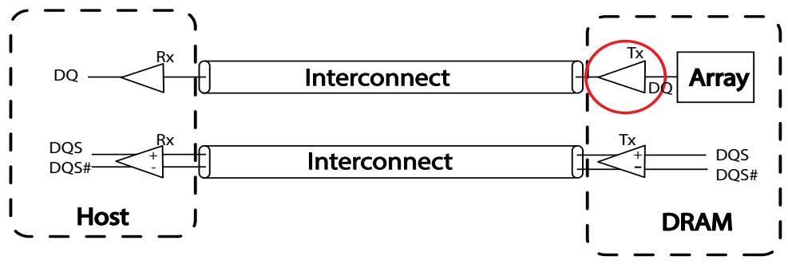

<details>
<summary>flowchart</summary>

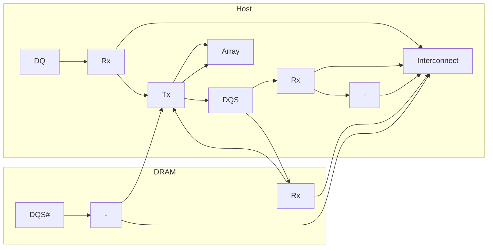
```mermaid
graph LR
    subgraph Host
        DQ --> Rx1["Rx"] --> Interconnect["Interconnect"]
        DQS --> Rx2["Rx"] --> Interconnect
        Rx1 --> TxTx["Tx"] --> Array["Array"]
        Rx2 --> Rx3["-"] --> Interconnect
    end
    subgraph DRAM
        DQS --> Rx4["Rx"] --> Interconnect
        DQS# --> Rx5["-"] --> Interconnect
        Rx4 --> TxTx["Tx"] --> Array
        Rx5 --> TxTx
        TxTx --> DQS["DQS"]
    end
```
</details>

Figure 253 — Example of DDR5 Memory Interconnect

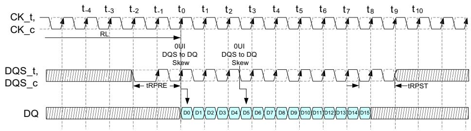

<details>
<summary>text_image</summary>

CK_t,
CK_c
t-4 t-3 t-2 t-1 t0 t1 t2 t3 t4 t5 t6 t7 t8 t9 t10
RL
0UI
DQS to DQ
Skew
0UI
DQS to DQ
Skew
tRPRE
tRPST
DQS_t,
DQS_c
DQ
D0 D1 D2 D3 D4 D5 D6 D7 D8 D9 D10 D11 D12 D13 D14 D15
</details>

Figure 254 — Read Burst Example for Pin DQx Depicting Bit 0 and 5 Relative to the DQS Edge for 0 UI Skew

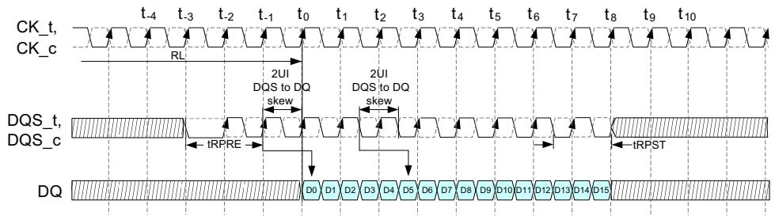

<details>
<summary>text_image</summary>

CK_t,
CK_c
t-4 t-3 t-2 t-1 t0 t1 t2 t3 t4 t5 t6 t7 t8 t9 t10
RL
2UI
DQS to DQ
skew
2UI
DQS to DQ
skew
tRPRE
tRPST
DQS_t,
DQS_c
tRPRE
DQ
D0 D1 D2 D3 D4 D5 D6 D7 D8 D9 D10 D11 D12 D13 D14 D15
</details>

Figure 255 — Read Burst Example for Pin DQx Depicting Bit 0 and 5 Relative to the DQS Edge for 2 UI Skew with Read DQS Offset Timing Set to 1 Clock (2UI)

# 9.11.1 Tx DQ Stressed Eye Parameters

Table 278 — Tx DQ Stressed Eye Parameters for DDR5-3200 to 4800   
[EH=Eye Height, EW=Eye Width; BER=Bit Error Rate, SES=Stressed Eye Skew] 

<table><tr><td rowspan="2">Parameter</td><td rowspan="2">Symbol</td><td colspan="2">DDR5-3200</td><td colspan="2">DDR5-3600</td><td colspan="2">DDR5-4000</td><td colspan="2">DDR5-4400</td><td colspan="2">DDR5-4800</td><td rowspan="2">Unit</td><td rowspan="2">Notes</td></tr><tr><td>Min</td><td>Max</td><td>Min</td><td>Max</td><td>Min</td><td>Max</td><td>Min</td><td>Max</td><td>Min</td><td>Max</td></tr><tr><td>Eye Width specified at the transmitter with a skew between DQ and DQS of 1UI</td><td>TxEW_DQ_SES_1UI</td><td>0.72</td><td>-</td><td>0.72</td><td>-</td><td>0.72</td><td>-</td><td>0.72</td><td>-</td><td>0.72</td><td>-</td><td>UI</td><td>1, 2, 3, 4, 6, 7, 8, 9, 10, 11</td></tr><tr><td>Eye Width specified at the transmitter with a skew between DQ and DQS of 2UI</td><td>TxEW_DQ_SES_2UI</td><td>0.72</td><td>-</td><td>0.72</td><td>-</td><td>0.72</td><td>-</td><td>0.72</td><td>-</td><td>0.72</td><td>-</td><td>UI</td><td>1, 2, 3, 4, 6, 7, 8, 9, 10, 11</td></tr><tr><td>Eye Width specified at the transmitter with a skew between DQ and DQS of 3UI</td><td>TxEW_DQ_SES_3UI</td><td>0.72</td><td>-</td><td>0.72</td><td>-</td><td>0.72</td><td>-</td><td>0.72</td><td>-</td><td>0.72</td><td>-</td><td>UI</td><td>1, 2, 3, 4, 6, 7, 8, 9, 10, 11</td></tr><tr><td colspan="14">NOTE 1 Minimum BER  $E^{-9}$  and Confidence Level of 99.5% per pinNOTE 2 Refer to the minimum Bit Error Rate (BER) requirements for DDR5NOTE 3 The validation methodology for these parameters will be covered in future ballot(s)NOTE 4 Mismatch is defined as DQS to DQ mismatch, in UI incrementsNOTE 5 The number of UI&#x27;s accumulated will depend on the speed of the link. For higher speeds, higher UI accumulation may be specified. For lower speeds, N=4,5 UI may not be applicableNOTE 6 Duty Cycle of the DQ pins must be adjusted as close to 50% as possible using the Global and Per Pin Duty Cycle Adjuster feature prior to running this testNOTE 7 The Mode Registers for the Duty Cycle Adjuster are MR43 and MR44. Also the Mode Registers for the Per Pin DCA of DQS are MR103-MR110, the Mode Registers for the Per Pin DCA of DQLx are MR(133+8x) and MR(134+8x), where 0≤x≤7, and the Mode Registers for the Per Pin DCA of DQUy are MR(197+8y) and MR(198+8y), where 0≤y≤7.NOTE 8 Spread Spectrum Clocking (SSC) must be disabled while running this testNOTE 9 These parameters are tested using the continuous PRBS8 LFSR training pattern which are sent out on all DQ lanes off the dram device without the need for sending out continuous MRR commands. The MR25 OP[3] is set to “1” to enable this feature.NOTE 10 Tested on the CTC2 card onlyNOTE 11 Matched DQS to DQ would require the DQs to be adjusted by 0.5UI to place it in the center of the DQ eye. 1UI mismatch would require the DQS to be adjusted 1.5 UI. Generally, for XUI mismatch the DQ must be adjusted XUI + 0.5 UI to be placed in the center of the eye.</td></tr></table>

# 9.11.1 Tx DQ Stressed Eye Parameters (cont’d)

Table 279 — Tx DQ Stressed Eye Parameters for DDR5-5200 to 6400   
[EH=Eye Height, EW=Eye Width; BER=Bit Error Rate] 

<table><tr><td rowspan="2">Parameter</td><td rowspan="2">Symbol</td><td colspan="2">DDR5-5200</td><td colspan="2">DDR5-5600</td><td colspan="2">DDR5-6000</td><td colspan="2">DDR5-6400</td><td rowspan="2">Unit</td><td rowspan="2">Notes</td></tr><tr><td>Min</td><td>Max</td><td>Min</td><td>Max</td><td>Min</td><td>Max</td><td>Min</td><td>Max</td></tr><tr><td>Eye Width specified at the transmitter with a skew between DQ and DQS of 1UI</td><td>TxEW_DQ_SES_1UI</td><td>0.74</td><td>-</td><td>0.74</td><td>-</td><td>0.75</td><td>-</td><td>0.75</td><td>-</td><td>UI</td><td>1, 2, 3, 4, 6, 7, 8, 9, 10, 11</td></tr><tr><td>Eye Width specified at the transmitter with a skew between DQ and DQS of 2UI</td><td>TxEW_DQ_SES_2UI</td><td>0.74</td><td>-</td><td>0.74</td><td>-</td><td>0.75</td><td>-</td><td>0.75</td><td>-</td><td>UI</td><td>1, 2, 3, 4, 6, 7, 8, 9, 10, 11</td></tr><tr><td>Eye Width specified at the transmitter with a skew between DQ and DQS of 3UI</td><td>TxEW_DQ_SES_3UI</td><td>0.74</td><td>-</td><td>0.74</td><td>-</td><td>0.75</td><td>-</td><td>0.75</td><td>-</td><td>UI</td><td>1, 2, 3, 4, 6, 7, 8, 9, 10, 11</td></tr><tr><td>Eye Width specified at the transmitter with a skew between DQ and DQS of 4UI</td><td>TxEW_DQ_SES_4UI</td><td>0.74</td><td>-</td><td>0.74</td><td>-</td><td>0.75</td><td>-</td><td>0.75</td><td>-</td><td>UI</td><td>1, 2, 3, 4, 5, 6, 7, 8, 9, 10, 11</td></tr><tr><td>Eye Width specified at the transmitter with a skew between DQ and DQS of 5UI</td><td>TxEW_DQ_SES_5UI</td><td>-</td><td>-</td><td>-</td><td>-</td><td>0.75</td><td>-</td><td>0.75</td><td>-</td><td>UI</td><td>1, 2, 3, 4, 5, 6, 7, 8, 9, 10, 11</td></tr><tr><td colspan="12">NOTE 1 Minimum BER  $E^{-9}$  and Confidence Level of 99.5% per pinNOTE 2 Refer to the minimum Bit Error Rate (BER) requirements for DDR5NOTE 3 The validation methodology for these parameters will be covered in future ballot(s)NOTE 4 Mismatch is defined as DQS to DQ mismatch, in UI incrementsNOTE 5 The number of UI&#x27;s accumulated will depend on the speed of the link. For higher speeds, higher UI accumulation may be specified. For lower speeds, N=4,5 UI may not be applicableNOTE 6 Duty Cycle of the DQ pins must be adjusted as close to 50% as possible using the Global and Per Pin Duty Cycle Adjuster feature prior to running this testNOTE 7 The Mode Registers for the Duty Cycle Adjuster are MR43 and MR44. Also the Mode Registers for the Per Pin DCA of DQS are MR103-MR110, the Mode Registers for the Per Pin DCA of DQLx are MR(133+8x) and MR(134+8x), where 0≤x≤7, and the Mode Registers for the Per Pin DCA of DQUy are MR(197+8y) and MR(198+8y), where 0≤y≤7NOTE 8 Spread Spectrum Clocking (SSC) must be disabled while running this testNOTE 9 These parameters are tested using the continuous PRBS8 LFSR training pattern which are sent out on all DQ lanes off the dram device without the need for sending out continuous MRR commands. The MR25 OP[3] is set to “1” to enable this feature.NOTE 10 Tested on the CTC2 card onlyNOTE 11 Matched DQS to DQ would require the DQs to be adjusted by 0.5UI to place it in the center of the DQ eye. 1UI mismatch would require the DQS to be adjusted 1.5UI. Generally, for XUI mismatch the DQ must be adjusted XUI + 0.5UI to be placed in the center of the eye.</td></tr></table>

# 9.11.1 Tx DQ Stressed Eye Parameters (cont’d)

Table 280 — Tx DQ Stressed Eye Parameters for DDR5-6800 to 8400   
[EH=Eye Height, EW=Eye Width; BER=Bit Error Rate] 

<table><tr><td rowspan="2">Parameter</td><td rowspan="2">Symbol</td><td colspan="2">DDR5-6800</td><td colspan="2">DDR5-7200</td><td colspan="2">DDR5-7600</td><td colspan="2">DDR5-8000</td><td colspan="2">DDR5-8400</td><td colspan="2">DDR5-8800</td><td rowspan="2">Unit</td><td rowspan="2">Notes</td></tr><tr><td>Min</td><td>Max</td><td>Min</td><td>Max</td><td>Min</td><td>Max</td><td>Min</td><td>Max</td><td>Min</td><td>Max</td><td>Min</td><td>Max</td></tr><tr><td>Eye Width specified at the transmitter with a skew between DQ and DQS of 1UI</td><td>TxEW_DQ_SES_1UI</td><td>0.76</td><td>-</td><td>0.76</td><td>-</td><td>0.76</td><td>-</td><td>0.76</td><td>-</td><td>0.76</td><td>-</td><td>0.76</td><td>-</td><td>UI</td><td>1, 2, 3, 4, 6, 7, 8, 9, 10, 11</td></tr><tr><td>Eye Width specified at the transmitter with a skew between DQ and DQS of 2UI</td><td>TxEW_DQ_SES_2UI</td><td>0.76</td><td>-</td><td>0.76</td><td>-</td><td>0.76</td><td>-</td><td>0.76</td><td>-</td><td>0.76</td><td>-</td><td>0.76</td><td>-</td><td>UI</td><td>1, 2, 3, 4, 6, 7, 8, 9, 10, 11</td></tr><tr><td>Eye Width specified at the transmitter with a skew between DQ and DQS of 3UI</td><td>TxEW_DQ_SES_3UI</td><td>0.76</td><td>-</td><td>0.76</td><td>-</td><td>0.76</td><td>-</td><td>0.76</td><td>-</td><td>0.76</td><td>-</td><td>0.76</td><td>-</td><td>UI</td><td>1, 2, 3, 4, 6, 7, 8, 9, 10, 11</td></tr><tr><td>Eye Width specified at the transmitter with a skew between DQ and DQS of 4UI</td><td>TxEW_DQ_SES_4UI</td><td>0.76</td><td>-</td><td>0.76</td><td>-</td><td>0.76</td><td>-</td><td>0.76</td><td>-</td><td>0.76</td><td>-</td><td>0.76</td><td>-</td><td>UI</td><td>1, 2, 3, 4, 5, 6, 7, 8, 9, 10, 11</td></tr><tr><td>Eye Width specified at the transmitter with a skew between DQ and DQS of 5UI</td><td>TxEW_DQ_SES_5UI</td><td>0.76</td><td>-</td><td>0.76</td><td>-</td><td>0.76</td><td>-</td><td>0.76</td><td>-</td><td>0.76</td><td>-</td><td>0.76</td><td>-</td><td>UI</td><td>1, 2, 3, 4, 5, 6, 7, 8, 9, 10, 11</td></tr><tr><td colspan="16">NOTE 1 Minimum BER  $E^{-9}$  and Confidence Level of 99.5% per pinNOTE 2 Refer to the minimum Bit Error Rate (BER) requirements for DDR5NOTE 3 The validation methodology for these parameters will be covered in future ballot(s)NOTE 4 Mismatch is defined as DQS to DQ mismatch, in UI incrementsNOTE 5 The number of UI&#x27;s accumulated will depend on the speed of the link. For higher speeds, higher UI accumulation may be specified. For lower speeds, N=4,5 UI may not be applicableNOTE 6 Duty Cycle of the DQ pins must be adjusted as close to 50% as possible using the Duty Cycle Adjuster feature prior to running this testNOTE 7 The Mode Registers for the Duty Cycle Adjuster are MR43 and MR44NOTE 8 Spread Spectrum Clocking (SSC) must be disabled while running this testNOTE 9 These parameters are tested using the continuous PRBS8 LFSR training pattern which are sent out on all DQ lanes off the dram device without the need for sending out continuous MRR commands. The MR25 OP[3] is set to “1” to enable this feature.NOTE 10 Tested on the CTC2 card onlyNOTE 11 Matched DQS to DQ would require the DQs to be adjusted by 0.5UI to place it in the center of the DQ eye. 1UI mismatch would require the DQS to be adjusted 1.5UI. Generally, for XUI mismatch the DQ must be adjusted XUI + 0.5UI to be placed in the center of the eye.</td></tr></table>

10

# Speed Bins

DDR5 Standard Speed Bins defined as:

3200 / 3600 / 4000 / 4400 / 4800 / 5200 / 5600 / 6000 / 6400 / 6800 / 7200 / 7600 / 8000 / 8400 / 8800

# 10.1 DDR5-3200 Speed Bins and Operations

Table 281 — DDR5-3200 Speed Bins and Operations 

<table><tr><td colspan="4">Speed Bin</td><td colspan="2">DDR5-3200AN</td><td colspan="2">DDR5-3200B</td><td colspan="2">DDR5-3200BN</td><td colspan="2">DDR5-3200C</td><td rowspan="3">Unit</td><td rowspan="3">Note</td></tr><tr><td colspan="4">CL-nRCD-nRP</td><td colspan="2">24-24-24</td><td colspan="2">26-26-26</td><td colspan="2">26-26-26</td><td colspan="2">28-28-28</td></tr><tr><td colspan="3">Parameter</td><td>Symbol</td><td>Min</td><td>Max</td><td>Min</td><td>Max</td><td>Min</td><td>Max</td><td>Min</td><td>Max</td></tr><tr><td colspan="3">Read command to first data</td><td>tAA</td><td>15.000</td><td>22.222</td><td>16.250</td><td>22.222</td><td>16.250</td><td>22.222</td><td>17.500</td><td>22.222</td><td>ns</td><td>12</td></tr><tr><td colspan="3">Activate to Read or Write command delay time</td><td>tRCD</td><td>15.000</td><td>-</td><td>16.250</td><td>-</td><td>16.250</td><td>-</td><td>17.500</td><td>-</td><td>ns</td><td>7</td></tr><tr><td colspan="3">Row Precharge time</td><td>tRP</td><td>15.000</td><td>-</td><td>16.250</td><td>-</td><td>16.250</td><td>-</td><td>17.500</td><td>-</td><td>ns</td><td>7</td></tr><tr><td colspan="3">Activate to Precharge command period</td><td>tRAS</td><td>32.000</td><td>5 x*tREFI1(Norm)9*tREFI2(FGR)</td><td>32.000</td><td>5 x*tREFI1(Norm)9*tREFI2(FGR)</td><td>32.000</td><td>5 x*tREFI1(Norm)9*tREFI2(FGR)</td><td>32.000</td><td>5 x*tREFI1(Norm)9*tREFI2(FGR)</td><td>ns</td><td>7,13</td></tr><tr><td colspan="3">Activate to Activate or Refresh command period</td><td>tRC(tRAS+tRP)</td><td>47.000</td><td>-</td><td>48.250</td><td>-</td><td>48.250</td><td>-</td><td>49.500</td><td>-</td><td>ns</td><td>7,8</td></tr><tr><td colspan="3">CAS Write Latency</td><td>CWL</td><td colspan="8">CL-2</td><td>nCK</td><td>12</td></tr><tr><td> $Speed\ Bin^5$ </td><td>tAAmin(ns) $^5$ </td><td>tRCDmintRPmin(ns) $^5$ </td><td>Read $CL^{12}$ </td><td colspan="10">Supported Frequency Down Bins</td></tr><tr><td>-</td><td>20.952</td><td>-</td><td>22</td><td>tCK(AVG)</td><td>0.952</td><td>1.010</td><td>0.952</td><td>1.010</td><td>0.952</td><td>1.010</td><td>0.952</td><td>1.010</td><td>ns</td></tr><tr><td>3200C</td><td>17.500</td><td>17.500</td><td>28</td><td>tCK(AVG)</td><td>0.625</td><td>0.681</td><td>0.625</td><td>0.681</td><td>0.625</td><td>0.681</td><td>0.625</td><td>0.681</td><td>ns</td></tr><tr><td>3200BN,B</td><td>16.250</td><td>16.250</td><td>26</td><td>tCK(AVG)</td><td>0.625</td><td>0.681</td><td>0.625</td><td>0.681</td><td>0.625</td><td>0.681</td><td colspan="2">RESERVED</td><td>ns</td></tr><tr><td>3200AN</td><td>15.000</td><td>15.000</td><td>24</td><td>tCK(AVG)</td><td>0.625</td><td>0.681</td><td colspan="6">RESERVED</td><td>ns</td></tr><tr><td colspan="5">Supported CL</td><td colspan="2">22,24,26,28</td><td colspan="2">22,26,28</td><td colspan="2">22,26,28</td><td colspan="2">22,28</td><td>nCK</td></tr></table>

# 10.2 DDR5-3600 Speed Bins and Operations

Table 282 — DDR5-3600 Speed Bins and Operations 

<table><tr><td colspan="4">Speed Bin</td><td colspan="2">DDR5-3600AN</td><td colspan="2">DDR5-3600B</td><td colspan="2">DDR5-3600BN</td><td colspan="2">DDR5-3600C</td><td rowspan="3">Unit</td><td rowspan="3">Note</td></tr><tr><td colspan="4">CL-nRCD-nRP</td><td colspan="2">26-26-26</td><td colspan="2">30-30-30</td><td colspan="2">30-30-30</td><td colspan="2">32-32-32</td></tr><tr><td colspan="3">Parameter</td><td>Symbol</td><td>Min</td><td>Max</td><td>Min</td><td>Max</td><td>Min</td><td>Max</td><td>Min</td><td>Max</td></tr><tr><td colspan="3">Read command to first data</td><td>tAA</td><td>14.444</td><td>22.222</td><td>16.250</td><td>22.222</td><td>16.666</td><td>22.222</td><td>17.500</td><td>22.222</td><td>ns</td><td>12</td></tr><tr><td colspan="3">Activate to Read or Write command delay time</td><td>tRCD</td><td>14.444</td><td>-</td><td>16.250</td><td>-</td><td>16.666</td><td>-</td><td>17.500</td><td>-</td><td>ns</td><td>7</td></tr><tr><td colspan="3">Row Precharge time</td><td>tRP</td><td>14.444</td><td>-</td><td>16.250</td><td>-</td><td>16.666</td><td>-</td><td>17.500</td><td>-</td><td>ns</td><td>7</td></tr><tr><td colspan="3">Activate to Precharge command period</td><td>tRAS</td><td>32.000</td><td>5* tREFI1 (Norm)9*tREFI2 (FGR)</td><td>32.000</td><td>5* tREFI1 (Norm)9*tREFI2 (FGR)</td><td>32.000</td><td>5* tREFI1 (Norm)9*tREFI2 (FGR)</td><td>32.000</td><td>5* tREFI1 (Norm)9*tREFI2 (FGR)</td><td>ns</td><td>7,13</td></tr><tr><td colspan="3">Activate to Activate or Refresh command period</td><td>tRC (tRAS +tRP)</td><td>46.444</td><td>-</td><td>48.250</td><td>-</td><td>48.666</td><td>-</td><td>49.500</td><td>-</td><td>ns</td><td>7,8</td></tr><tr><td colspan="3">CAS Write Latency</td><td>CWL</td><td colspan="8">CL-2</td><td>nCK</td><td>12</td></tr><tr><td> $Speed\ Bin^5$ </td><td>tAAmin (ns) $^5$ </td><td>tRCDmin tRPmin (ns) $^5$ </td><td>Read  $CL^{12}$ </td><td colspan="10">Supported Frequency Down Bins</td></tr><tr><td>-</td><td>20.952</td><td>-</td><td>22</td><td>tCK(AVG)</td><td>0.952</td><td>1.010</td><td>0.952</td><td>1.010</td><td>0.952</td><td>1.010</td><td>0.952</td><td>1.010</td><td>ns</td></tr><tr><td>3200C</td><td>17.500</td><td>17.500</td><td>28</td><td>tCK(AVG)</td><td>0.625</td><td>0.681</td><td>0.625</td><td>0.681</td><td>0.625</td><td>0.681</td><td>0.625</td><td>0.681</td><td>ns</td></tr><tr><td>3200BN,B</td><td>16.250</td><td>16.250</td><td>26</td><td>tCK(AVG)</td><td>0.625</td><td>0.681</td><td>0.625</td><td>0.681</td><td colspan="4">RESERVED</td><td>ns</td></tr><tr><td>3200AN</td><td>15.000</td><td>15.000</td><td>24</td><td>tCK(AVG)</td><td>0.625</td><td>0.681</td><td colspan="6">RESERVED</td><td>ns</td></tr><tr><td>3600C</td><td>17.777</td><td>17.777</td><td>32</td><td>tCK(AVG)</td><td>0.555</td><td>&lt;0.625</td><td>0.555</td><td>&lt;0.625</td><td>0.555</td><td>&lt;0.625</td><td>0.555</td><td>&lt;0.625</td><td>ns</td></tr><tr><td>3600BN,B</td><td>16.666</td><td>16.666</td><td>30</td><td>tCK(AVG)</td><td>0.555</td><td>&lt;0.625</td><td>0.555</td><td>&lt;0.625</td><td>0.555</td><td>&lt;0.625</td><td colspan="2">RESERVED</td><td>ns</td></tr><tr><td>3600AN</td><td>14.444</td><td>14.444</td><td>26</td><td>tCK(AVG)</td><td>0.555</td><td>&lt;0.625</td><td colspan="6">RESERVED</td><td>ns</td></tr><tr><td colspan="5">Supported CL</td><td colspan="2">22,24,26,28,30,32</td><td colspan="2">22,26,28,30,32</td><td colspan="2">22,28,30,32</td><td colspan="2">22,28,32</td><td>nCK</td></tr></table>

# 10.3 DDR5-4000 Speed Bins and Operations

Table 283 — DDR5-4000 Speed Bins and Operations 

<table><tr><td colspan="4">Speed Bin</td><td colspan="2">DDR5-4000AN</td><td colspan="2">DDR5-4000B</td><td colspan="2">DDR5-4000BN</td><td colspan="2">DDR5-4000C</td><td rowspan="3">Unit</td><td rowspan="3">Note</td><td></td></tr><tr><td colspan="4">CL-nRCD-nRP</td><td colspan="2">28-28-28</td><td colspan="2">32-32-32</td><td colspan="2">32-32-32</td><td colspan="2">36-35-35</td><td></td></tr><tr><td colspan="3">Parameter</td><td>Symbol</td><td>Min</td><td>Max</td><td>Min</td><td>Max</td><td>Min</td><td>Max</td><td>Min</td><td>Max</td><td></td></tr><tr><td colspan="3">Read command to first data</td><td>tAA</td><td>14.000</td><td>22.222</td><td>16.000</td><td>22.222</td><td>16.000</td><td>22.222</td><td>17.500</td><td>22.222</td><td>ns</td><td>12</td><td></td></tr><tr><td colspan="3">Activate to Read or Write command delay time</td><td>tRCD</td><td>14.000</td><td>-</td><td>16.000</td><td>-</td><td>16.000</td><td>-</td><td>17.500</td><td>-</td><td>ns</td><td>7</td><td></td></tr><tr><td colspan="3">Row Precharge time</td><td>tRP</td><td>14.000</td><td>-</td><td>16.000</td><td>-</td><td>16.000</td><td>-</td><td>17.500</td><td>-</td><td>ns</td><td>7</td><td></td></tr><tr><td colspan="3">Activate to Precharge command period</td><td>tRAS</td><td>32.000</td><td>5* tREFI1 (Norm)9*tREFI2 (FGR)</td><td>32.000</td><td>5* tREFI1 (Norm)9*tREFI2 (FGR)</td><td>32.000</td><td>5* tREFI1 (Norm)9*tREFI2 (FGR)</td><td>32.000</td><td>5* tREFI1 (Norm)9*tREFI2 (FGR)</td><td>ns</td><td>7,13</td><td></td></tr><tr><td colspan="3">Activate to Activate or Refresh command period</td><td>tRC (tRAS +tRP)</td><td>46.000</td><td>-</td><td>48.000</td><td>-</td><td>48.000</td><td>-</td><td>49.500</td><td>-</td><td>ns</td><td>7,8</td><td></td></tr><tr><td colspan="3">CAS Write Latency</td><td>CWL</td><td colspan="8">CL-2</td><td>nCK</td><td>12</td><td></td></tr><tr><td> $Speed\ Bin^5$ </td><td>tAAmin (ns) $^5$ </td><td>tRCDmin tRPmin (ns) $^5$ </td><td>Read  $CL^{12}$ </td><td colspan="10">Supported Frequency Down Bins</td><td></td></tr><tr><td>-</td><td>20.952</td><td>-</td><td>22</td><td>tCK(AVG)</td><td>0.952</td><td>1.010</td><td>0.952</td><td>1.010</td><td>0.952</td><td>1.010</td><td>0.952</td><td>1.010</td><td>ns</td><td></td></tr><tr><td>3200C</td><td>17.500</td><td>17.500</td><td>28</td><td>tCK(AVG)</td><td>0.625</td><td>0.681</td><td>0.625</td><td>0.681</td><td>0.625</td><td>0.681</td><td>0.625</td><td>0.681</td><td>ns</td><td></td></tr><tr><td>3200BN,B</td><td>16.250</td><td>16.250</td><td>26</td><td>tCK(AVG)</td><td>0.625</td><td>0.681</td><td>0.625</td><td>0.681</td><td>0.625</td><td>0.681</td><td colspan="2">RESERVED</td><td>ns</td><td></td></tr><tr><td>3200AN</td><td>15.000</td><td>15.000</td><td>24</td><td>tCK(AVG)</td><td>0.625</td><td>0.681</td><td colspan="6">RESERVED</td><td>ns</td><td></td></tr><tr><td>3600C</td><td>17.777</td><td>17.777</td><td>32</td><td>tCK(AVG)</td><td>0.555</td><td>&lt;0.625</td><td>0.555</td><td>&lt;0.625</td><td>0.555</td><td>&lt;0.625</td><td>0.555</td><td>&lt;0.625</td><td>ns</td><td></td></tr><tr><td>3600BN,B</td><td>16.666</td><td>16.666</td><td>30</td><td>tCK(AVG)</td><td>0.555</td><td>&lt;0.625</td><td>0.555</td><td>&lt;0.625</td><td>0.555</td><td>&lt;0.625</td><td colspan="2">RESERVED</td><td>ns</td><td></td></tr><tr><td>3600AN</td><td>14.444</td><td>14.444</td><td>26</td><td>tCK(AVG)</td><td>0.555</td><td>&lt;0.625</td><td colspan="6">RESERVED</td><td>ns</td><td></td></tr><tr><td>4000C</td><td>18.000</td><td>17.500</td><td>36</td><td>tCK(AVG)</td><td>0.500</td><td>&lt;0.555</td><td>0.500</td><td>&lt;0.555</td><td>0.500</td><td>&lt;0.555</td><td>0.500</td><td>&lt;0.555</td><td>ns</td><td></td></tr><tr><td>4000BN,B</td><td>16.000</td><td>16.000</td><td>32</td><td>tCK(AVG)</td><td>0.500</td><td>&lt;0.555</td><td>0.500</td><td>&lt;0.555</td><td>0.500</td><td>&lt;0.555</td><td colspan="2">RESERVED</td><td>ns</td><td></td></tr><tr><td>4000AN</td><td>14.000</td><td>14.000</td><td>28</td><td>tCK(AVG)</td><td>0.500</td><td>&lt;0.555</td><td colspan="6">RESERVED</td><td>ns</td><td></td></tr><tr><td colspan="5">Supported CL</td><td colspan="2">22,24,26,28, 30,32,36</td><td colspan="2">22,26,28, 30,32,36</td><td colspan="2">22,26,28,30,32,36</td><td colspan="2">22,28,32,36</td><td>nCK</td><td>12</td></tr></table>

# 10.4 DDR5-4400 Speed Bins and Operations

Table 284 — DDR5-4400 Speed Bins and Operations 

<table><tr><td colspan="4">Speed Bin</td><td colspan="2">DDR5-4400AN</td><td colspan="2">DDR5-4400B</td><td colspan="2">DDR5-4400BN</td><td colspan="2">DDR5-4400C</td><td rowspan="3">Unit</td><td rowspan="3">Note</td></tr><tr><td colspan="4">CL-nRCD-nRP</td><td colspan="2">32-32-32</td><td colspan="2">36-36-36</td><td colspan="2">36-36-36</td><td colspan="2">40-39-39</td></tr><tr><td colspan="3">Parameter</td><td>Symbol</td><td>Min</td><td>Max</td><td>Min</td><td>Max</td><td>Min</td><td>Max</td><td>Min</td><td>Max</td></tr><tr><td colspan="3">Read command to first data</td><td>tAA</td><td>14.545</td><td>22.222</td><td>16.000</td><td>22.222</td><td>16.363</td><td>22.222</td><td>17.500</td><td>22.222</td><td>ns</td><td>12</td></tr><tr><td colspan="3">Activate to Read or Write command delay time</td><td>tRCD</td><td>14.545</td><td>-</td><td>16.000</td><td>-</td><td>16.363</td><td>-</td><td>17.500</td><td>-</td><td>ns</td><td>7</td></tr><tr><td colspan="3">Row Precharge time</td><td>tRP</td><td>14.545</td><td>-</td><td>16.000</td><td>-</td><td>16.363</td><td>-</td><td>17.500</td><td>-</td><td>ns</td><td>7</td></tr><tr><td colspan="3">Activate to Precharge command period</td><td>tRAS</td><td>32.000</td><td>5 * tREFI1 (Norm)9 * tREFI2 (FGR)</td><td>32.000</td><td>5 * tREFI1 (Norm)9 * tREFI2 (FGR)</td><td>32.000</td><td>5 * tREFI1 (Norm)9 * tREFI2 (FGR)</td><td>32.000</td><td>5 * tREFI1 (Norm)9 * tREFI2 (FGR)</td><td>ns</td><td>7, 13</td></tr><tr><td colspan="3">Activate to Activate or Refresh command period</td><td>tRC (tRAS +tRP)</td><td>46.545</td><td>-</td><td>48.000</td><td>-</td><td>48.363</td><td>-</td><td>49.500</td><td>-</td><td>ns</td><td>7, 8</td></tr><tr><td colspan="3">CAS Write Latency</td><td>CWL</td><td colspan="8">CL-2</td><td>nCK</td><td>12</td></tr><tr><td> $Speed\ Bin^5$ </td><td>tAmin (ns) $^5$ </td><td>tRCDmin tRPmin (ns) $^5$ </td><td>Read  $CL^{12}$ </td><td colspan="10">Supported Frequency Down Bins</td></tr><tr><td>-</td><td>20.952</td><td>-</td><td>22</td><td>tCK(AVG)</td><td>0.952</td><td>1.010</td><td>0.952</td><td>1.010</td><td>0.952</td><td>1.010</td><td>0.952</td><td>1.010</td><td>ns</td></tr><tr><td>3200C</td><td>17.500</td><td>17.500</td><td>28</td><td>tCK(AVG)</td><td>0.625</td><td>0.681</td><td>0.625</td><td>0.681</td><td>0.625</td><td>0.681</td><td>0.625</td><td>0.681</td><td>ns</td></tr><tr><td>3200BN,B</td><td>16.250</td><td>16.250</td><td>26</td><td>tCK(AVG)</td><td>0.625</td><td>0.681</td><td>0.625</td><td>0.681</td><td colspan="4">RESERVED</td><td>ns</td></tr><tr><td>3200AN</td><td>15.000</td><td>15.000</td><td>24</td><td>tCK(AVG)</td><td>0.625</td><td>0.681</td><td colspan="6">RESERVED</td><td>ns</td></tr><tr><td>3600C</td><td>17.777</td><td>17.777</td><td>32</td><td>tCK(AVG)</td><td>0.555</td><td>&lt;0.625</td><td>0.555</td><td>&lt;0.625</td><td>0.555</td><td>&lt;0.625</td><td>0.555</td><td>&lt;0.625</td><td>ns</td></tr><tr><td>3600BN,B</td><td>16.666</td><td>16.666</td><td>30</td><td>tCK(AVG)</td><td>0.555</td><td>&lt;0.625</td><td>0.555</td><td>&lt;0.625</td><td>0.555</td><td>&lt;0.625</td><td colspan="2">RESERVED</td><td>ns</td></tr><tr><td>3600AN</td><td>14.444</td><td>14.444</td><td>26</td><td>tCK(AVG)</td><td colspan="8">RESERVED</td><td>ns</td></tr><tr><td>4000C</td><td>18.000</td><td>17.500</td><td>36</td><td>tCK(AVG)</td><td>0.500</td><td>&lt;0.555</td><td>0.500</td><td>&lt;0.555</td><td>0.500</td><td>&lt;0.555</td><td>0.500</td><td>&lt;0.555</td><td>ns</td></tr><tr><td>4000BN,B</td><td>16.000</td><td>16.000</td><td>32</td><td>tCK(AVG)</td><td>0.500</td><td>&lt;0.555</td><td>0.500</td><td>&lt;0.555</td><td colspan="4">RESERVED</td><td>ns</td></tr><tr><td>4000AN</td><td>14.000</td><td>14.000</td><td>28</td><td>tCK(AVG)</td><td colspan="8">RESERVED</td><td>ns</td></tr><tr><td>4400C</td><td>18.181</td><td>17.727</td><td>40</td><td>tCK(AVG)</td><td>0.454</td><td>&lt;0.500</td><td>0.454</td><td>&lt;0.500</td><td>0.454</td><td>&lt;0.500</td><td>0.454</td><td>&lt;0.500</td><td>ns</td></tr><tr><td>4400BN,B</td><td>16.363</td><td>16.363</td><td>36</td><td>tCK(AVG)</td><td>0.454</td><td>&lt;0.500</td><td>0.454</td><td>&lt;0.500</td><td>0.454</td><td>&lt;0.500</td><td colspan="2">RESERVED</td><td>ns</td></tr><tr><td>4400AN</td><td>14.545</td><td>14.545</td><td>32</td><td>tCK(AVG)</td><td>0.454</td><td>&lt;0.500</td><td colspan="6">RESERVED</td><td>ns</td></tr><tr><td colspan="4">Supported CL</td><td colspan="2">22,24,26,28,30,32,36,40</td><td colspan="2">22,26,28,30,32,36,40</td><td colspan="2">22,28,30,32,36,40</td><td colspan="2">22,28,32,36,40</td><td>nCK</td><td>12</td></tr></table>

# 10.5 DDR5-4800 Speed Bins and Operations

Table 285 — DDR5-4800 Speed Bins and Operations 

<table><tr><td colspan="4">Speed Bin</td><td colspan="2">DDR5-4800AN</td><td colspan="2">DDR5-4800B</td><td colspan="2">DDR5-4800BN</td><td colspan="2">DDR5-4800C</td><td rowspan="3">Unit</td><td rowspan="3">Note</td></tr><tr><td colspan="4">CL-nRCD-nRP</td><td colspan="2">34-34-34</td><td colspan="2">40-39-39</td><td colspan="2">40-40-40</td><td colspan="2">42-42-42</td></tr><tr><td colspan="3">Parameter</td><td>Symbol</td><td>Min</td><td>Max</td><td>Min</td><td>Max</td><td>Min</td><td>Max</td><td>Min</td><td>Max</td></tr><tr><td colspan="3">Read command to first data</td><td>tAA</td><td>14.166</td><td>22.222</td><td>16.000</td><td>22.222</td><td>16.666</td><td>22.222</td><td>17.500</td><td>22.222</td><td>ns</td><td>12</td></tr><tr><td colspan="3">Activate to Read or Write command delay time</td><td>tRCD</td><td>14.166</td><td>-</td><td>16.000</td><td>-</td><td>16.666</td><td>-</td><td>17.500</td><td>-</td><td>ns</td><td>7</td></tr><tr><td colspan="3">Row Precharge time</td><td>tRP</td><td>14.166</td><td>-</td><td>16.000</td><td>-</td><td>16.666</td><td>-</td><td>17.500</td><td>-</td><td>ns</td><td>7</td></tr><tr><td colspan="3">Activate to Precharge command period</td><td>tRAS</td><td>32.000</td><td>5* tREFI1 (Norm) 9 * tREFI2 (FGR)</td><td>32.000</td><td>5* tREFI1 (Norm) 9 * tREFI2 (FGR)</td><td>32.000</td><td>5* tREFI1 (Norm) 9 * tREFI2 (FGR)</td><td>32.000</td><td>5* tREFI1 (Norm) 9 * tREFI2 (FGR)</td><td>ns</td><td>7, 13</td></tr><tr><td colspan="3">Activate to Activate or Refresh command period</td><td>tRC (tRAS +tRP)</td><td>46.166</td><td>-</td><td>48.000</td><td>-</td><td>48.666</td><td>-</td><td>49.500</td><td>-</td><td>ns</td><td>7, 8</td></tr><tr><td colspan="3">CAS Write Latency</td><td>CWL</td><td colspan="8">CL-2</td><td>nCK</td><td>12</td></tr><tr><td> $Speed\ Bin^5$ </td><td>tAmin (ns) $^5$ </td><td>tRCDmin tRPmin (ns) $^5$ </td><td>Read  $CL^{12}$ </td><td colspan="10">Supported Frequency Down Bins</td></tr><tr><td>-</td><td>20.952</td><td>-</td><td>22</td><td>tCK(AVG)</td><td>0.952</td><td>1.010</td><td>0.952</td><td>1.010</td><td>0.952</td><td>1.010</td><td>0.952</td><td>1.010</td><td>ns</td></tr><tr><td>3200C</td><td>17.500</td><td>17.500</td><td>28</td><td>tCK(AVG)</td><td>0.625</td><td>0.681</td><td>0.625</td><td>0.681</td><td>0.625</td><td>0.681</td><td>0.625</td><td>0.681</td><td>ns</td></tr><tr><td>3200BN,B</td><td>16.250</td><td>16.250</td><td>26</td><td>tCK(AVG)</td><td>0.625</td><td>0.681</td><td>0.625</td><td>0.681</td><td colspan="4">RESERVED</td><td>ns</td></tr><tr><td>3200AN</td><td>15.000</td><td>15.000</td><td>24</td><td>tCK(AVG)</td><td>0.625</td><td>0.681</td><td colspan="6">RESERVED</td><td>ns</td></tr><tr><td>3600C</td><td>17.777</td><td>17.777</td><td>32</td><td>tCK(AVG)</td><td>0.555</td><td>&lt;0.625</td><td>0.555</td><td>&lt;0.625</td><td>0.555</td><td>&lt;0.625</td><td>0.555</td><td>&lt;0.625</td><td>ns</td></tr><tr><td>3600BN,B</td><td>16.666</td><td>16.666</td><td>30</td><td>tCK(AVG)</td><td>0.555</td><td>&lt;0.625</td><td>0.555</td><td>&lt;0.625</td><td>0.555</td><td>&lt;0.625</td><td colspan="2">RESERVED</td><td>ns</td></tr><tr><td>3600AN</td><td>14.444</td><td>14.444</td><td>26</td><td>tCK(AVG)</td><td>0.555</td><td>&lt;0.625</td><td colspan="6">RESERVED</td><td>ns</td></tr><tr><td>4000C</td><td>18.000</td><td>17.500</td><td>36</td><td>tCK(AVG)</td><td>0.500</td><td>&lt;0.555</td><td>0.500</td><td>&lt;0.555</td><td>0.500</td><td>&lt;0.555</td><td>0.500</td><td>&lt;0.555</td><td>ns</td></tr><tr><td>4000BN,B</td><td>16.000</td><td>16.000</td><td>32</td><td>tCK(AVG)</td><td>0.500</td><td>&lt;0.555</td><td>0.500</td><td>&lt;0.555</td><td colspan="4">RESERVED</td><td>ns</td></tr><tr><td>4000AN</td><td>14.000</td><td>14.000</td><td>28</td><td>tCK(AVG)</td><td colspan="8">RESERVED</td><td>ns</td></tr><tr><td>4400C</td><td>18.181</td><td>17.727</td><td>40</td><td>tCK(AVG)</td><td>0.454</td><td>&lt;0.500</td><td>0.454</td><td>&lt;0.500</td><td>0.454</td><td>&lt;0.500</td><td>0.454</td><td>&lt;0.500</td><td>ns</td></tr><tr><td>4400BN,B</td><td>16.363</td><td>16.363</td><td>36</td><td>tCK(AVG)</td><td>0.454</td><td>&lt;0.500</td><td>0.454</td><td>&lt;0.500</td><td colspan="4">RESERVED</td><td>ns</td></tr><tr><td>4400AN</td><td>14.545</td><td>14.545</td><td>32</td><td>tCK(AVG)</td><td>0.454</td><td>&lt;0.500</td><td colspan="6">RESERVED</td><td>ns</td></tr><tr><td>4800C</td><td>17.500</td><td>17.500</td><td>42</td><td>tCK(AVG)</td><td>0.416</td><td>&lt;0.454</td><td>0.416</td><td>&lt;0.454</td><td>0.416</td><td>&lt;0.454</td><td>0.416</td><td>&lt;0.454</td><td>ns</td></tr><tr><td>4800BN</td><td>16.666</td><td>16.666</td><td>40</td><td>tCK(AVG)</td><td>0.416</td><td>&lt;0.454</td><td>0.416</td><td>&lt;0.454</td><td>0.416</td><td>&lt;0.454</td><td colspan="2">RESERVED</td><td>ns</td></tr><tr><td>4800B</td><td>16.666</td><td>16.250</td><td>40</td><td>tCK(AVG)</td><td>0.416</td><td>&lt;0.454</td><td>0.416</td><td>&lt;0.454</td><td colspan="4">RESERVED</td><td>ns</td></tr><tr><td>4800AN</td><td>14.166</td><td>14.166</td><td>34</td><td>tCK(AVG)</td><td>0.416</td><td>&lt;0.454</td><td colspan="6">RESERVED</td><td>ns</td></tr><tr><td colspan="4">Supported CL</td><td colspan="2">22,24,26,28,30,32,34, 36,40,42</td><td colspan="2">22,26,28,30,32,36, 40,42</td><td colspan="2">22,28,30,32,36,40,42</td><td colspan="2">22,28,32,36,40,42</td><td>nCK</td><td>12</td></tr></table>

Table 286 — DDR5-5200 Speed Bins and Operations 

<table><tr><td colspan="4">Speed Bin</td><td colspan="2">DDR5-5200AN</td><td colspan="2">DDR5-5200B</td><td colspan="2">DDR5-5200BN</td><td colspan="2">DDR5-5200C</td><td rowspan="3">Unit</td><td rowspan="3">Note</td></tr><tr><td colspan="4">CL-nRCD-nRP</td><td colspan="2">38-38-38</td><td colspan="2">42-42-42</td><td colspan="2">42-42-42</td><td colspan="2">46-46-46</td></tr><tr><td colspan="3">Parameter</td><td>Symbol</td><td>Min</td><td>Max</td><td>Min</td><td>Max</td><td>Min</td><td>Max</td><td>Min</td><td>Max</td></tr><tr><td colspan="3">Read command to first data</td><td>tAA</td><td>14.615</td><td>22.222</td><td>16.000</td><td>22.222</td><td>16.153</td><td>22.222</td><td>17.500</td><td>22.222</td><td>ns</td><td>12</td></tr><tr><td colspan="3">Activate to Read or Write command delay time</td><td>tRCD</td><td>14.615</td><td>-</td><td>16.000</td><td>-</td><td>16.153</td><td>-</td><td>17.500</td><td>-</td><td>ns</td><td>7</td></tr><tr><td colspan="3">Row Precharge time</td><td>tRP</td><td>14.615</td><td>-</td><td>16.000</td><td>-</td><td>16.153</td><td>-</td><td>17.500</td><td>-</td><td>ns</td><td>7</td></tr><tr><td colspan="3">Activate to Precharge command period</td><td>tRAS</td><td>32.000</td><td>5*x tREFI1 (Norm)9*tREFI2 (FGR)</td><td>32.000</td><td>5*x tREFI1 (Norm)9*tREFI2 (FGR)</td><td>32.000</td><td>5*x tREFI1 (Norm)9*tREFI2 (FGR)</td><td>32.000</td><td>5*x tREFI1 (Norm)9*tREFI2 (FGR)</td><td>ns</td><td>7, 13</td></tr><tr><td colspan="3">Activate to Activate or Refresh command period</td><td>tRC (tRAS +tRP)</td><td>46.615</td><td>-</td><td>48.000</td><td>-</td><td>48.153</td><td>-</td><td>49.500</td><td>-</td><td>ns</td><td>7, 8</td></tr><tr><td colspan="3">CAS Write Latency</td><td>CWL</td><td colspan="8">CL-2</td><td>nCK</td><td>12</td></tr><tr><td> $Speed\ Bin^5$ </td><td>tAmin (ns) $^5$ </td><td>tRCDmin tRPmin (ns) $^5$ </td><td>Read  $CL^{12}$ </td><td colspan="10">Supported Frequency Table</td></tr><tr><td>-</td><td>20.952</td><td>-</td><td>22</td><td>tCK(AVG)</td><td>0.952</td><td>1.010</td><td>0.952</td><td>1.010</td><td>0.952</td><td>1.010</td><td>0.952</td><td>1.010</td><td>ns</td></tr><tr><td>3200C</td><td>17.500</td><td>17.500</td><td>28</td><td>tCK(AVG)</td><td>0.625</td><td>0.681</td><td>0.625</td><td>0.681</td><td>0.625</td><td>0.681</td><td>0.625</td><td>0.681</td><td>ns</td></tr><tr><td>3200BN,B</td><td>16.250</td><td>16.250</td><td>26</td><td>tCK(AVG)</td><td>0.625</td><td>0.681</td><td>0.625</td><td>0.681</td><td>0.625</td><td>0.681</td><td colspan="2">RESERVED</td><td>ns</td></tr><tr><td>3200AN</td><td>15.000</td><td>15.000</td><td>24</td><td>tCK(AVG)</td><td>0.625</td><td>0.681</td><td colspan="6">RESERVED</td><td>ns</td></tr><tr><td>3600C</td><td>17.777</td><td>17.777</td><td>32</td><td>tCK(AVG)</td><td>0.555</td><td>&lt;0.625</td><td>0.555</td><td>&lt;0.625</td><td>0.555</td><td>&lt;0.625</td><td>0.555</td><td>&lt;0.625</td><td>ns</td></tr><tr><td>3600BN,B</td><td>16.666</td><td>16.666</td><td>30</td><td>tCK(AVG)</td><td>0.555</td><td>&lt;0.625</td><td>0.555</td><td>&lt;0.625</td><td>0.555</td><td>&lt;0.625</td><td colspan="2">RESERVED</td><td>ns</td></tr><tr><td>3600AN</td><td>14.444</td><td>14.444</td><td>26</td><td>tCK(AVG)</td><td colspan="8">RESERVED</td><td>ns</td></tr><tr><td>4000C</td><td>18.000</td><td>17.500</td><td>36</td><td>tCK(AVG)</td><td>0.500</td><td>&lt;0.555</td><td>0.500</td><td>&lt;0.555</td><td>0.500</td><td>&lt;0.555</td><td>0.500</td><td>&lt;0.555</td><td>ns</td></tr><tr><td>4000BN,B</td><td>16.000</td><td>16.000</td><td>32</td><td>tCK(AVG)</td><td>0.500</td><td>&lt;0.555</td><td>0.500</td><td>&lt;0.555</td><td colspan="4">RESERVED</td><td>ns</td></tr><tr><td>4000AN</td><td>14.000</td><td>14.000</td><td>28</td><td>tCK(AVG)</td><td colspan="8">RESERVED</td><td>ns</td></tr><tr><td>4400C</td><td>18.181</td><td>17.727</td><td>40</td><td>tCK(AVG)</td><td>0.454</td><td>&lt;0.500</td><td>0.454</td><td>&lt;0.500</td><td>0.454</td><td>&lt;0.500</td><td>0.454</td><td>&lt;0.500</td><td>ns</td></tr><tr><td>4400BN,B</td><td>16.363</td><td>16.363</td><td>36</td><td>tCK(AVG)</td><td>0.454</td><td>&lt;0.500</td><td>0.454</td><td>&lt;0.500</td><td>0.454</td><td>&lt;0.500</td><td colspan="2">RESERVED</td><td>ns</td></tr><tr><td>4400AN</td><td>14.545</td><td>14.545</td><td>32</td><td>tCK(AVG)</td><td colspan="8">RESERVED</td><td>ns</td></tr><tr><td>4800C</td><td>17.500</td><td>17.500</td><td>42</td><td>tCK(AVG)</td><td>0.416</td><td>&lt;0.454</td><td>0.416</td><td>&lt;0.454</td><td>0.416</td><td>&lt;0.454</td><td>0.416</td><td>&lt;0.454</td><td>ns</td></tr><tr><td>4800BN</td><td>16.666</td><td>16.666</td><td>40</td><td>tCK(AVG)</td><td>0.416</td><td>&lt;0.454</td><td>0.416</td><td>&lt;0.454</td><td>0.416</td><td>&lt;0.454</td><td colspan="2">RESERVED</td><td>ns</td></tr><tr><td>4800B</td><td>16.666</td><td>16.250</td><td>40</td><td>tCK(AVG)</td><td>0.416</td><td>&lt;0.454</td><td>0.416</td><td>&lt;0.454</td><td>0.416</td><td>&lt;0.454</td><td colspan="2">RESERVED</td><td>ns</td></tr><tr><td>4800AN</td><td>14.166</td><td>14.166</td><td>34</td><td>tCK(AVG)</td><td colspan="8">RESERVED</td><td>ns</td></tr><tr><td>5200C</td><td>17.692</td><td>17.692</td><td>46</td><td>tCK(AVG)</td><td>0.384</td><td>&lt;0.416</td><td>0.384</td><td>&lt;0.416</td><td>0.384</td><td>&lt;0.416</td><td>0.384</td><td>&lt;0.416</td><td>ns</td></tr><tr><td>5200BN,B</td><td>16.153</td><td>16.153</td><td>42</td><td>tCK(AVG)</td><td>0.384</td><td>&lt;0.416</td><td>0.384</td><td>&lt;0.416</td><td>0.384</td><td>&lt;0.416</td><td colspan="2">RESERVED</td><td>ns</td></tr><tr><td>5200AN</td><td>14.615</td><td>14.615</td><td>38</td><td>tCK(AVG)</td><td>0.384</td><td>&lt;0.416</td><td colspan="6">RESERVED</td><td>ns</td></tr><tr><td colspan="5">Supported CL</td><td colspan="2">22,24,26,28,30,32,36,38,40,42,46</td><td colspan="2">22,26,28,30,32,36,40,42,46</td><td colspan="2">22,26,28,30,32,36,40,42,46</td><td colspan="2">22,28,32,36,40,42,46</td><td>nCK</td></tr></table>

# 10.7 DDR5-5600 Speed Bins and Operations

Table 287 — DDR5-5600 Speed Bins and Operations 

<table><tr><td colspan="4">Speed Bin</td><td colspan="2">DDR5-5600AN</td><td colspan="2">DDR5-5600B</td><td colspan="2">DDR5-5600BN</td><td colspan="2">DDR5-5600C</td><td rowspan="3">Unit</td><td rowspan="3">Note</td><td></td></tr><tr><td colspan="4">CL-nRCD-nRP</td><td colspan="2">40-40-40</td><td colspan="2">46-45-45</td><td colspan="2">46-46-46</td><td colspan="2">50-49-49</td><td></td></tr><tr><td colspan="3">Parameter</td><td>Symbol</td><td>Min</td><td>Max</td><td>Min</td><td>Max</td><td>Min</td><td>Max</td><td>Min</td><td>Max</td><td></td></tr><tr><td colspan="3">Read command to first data</td><td>tAA</td><td>14.285</td><td>22.222</td><td>16.000</td><td>22.222</td><td>16.428</td><td>22.222</td><td>17.500</td><td>22.222</td><td>ns</td><td>12</td><td></td></tr><tr><td colspan="3">Activate to Read or Write command delay time</td><td>tRCD</td><td>14.285</td><td>-</td><td>16.000</td><td>-</td><td>16.428</td><td>-</td><td>17.500</td><td>-</td><td>ns</td><td>7</td><td></td></tr><tr><td colspan="3">Row Precharge time</td><td>tRP</td><td>14.285</td><td>-</td><td>16.000</td><td>-</td><td>16.428</td><td>-</td><td>17.500</td><td>-</td><td>ns</td><td>7</td><td></td></tr><tr><td colspan="3">Activate to Precharge command period</td><td>tRAS</td><td>32.000</td><td>5 x* tREFI1 (Norm) 9 * tREFI2 (FGR)</td><td>32.000</td><td>5 x* tREFI1 (Norm) 9 * tREFI2 (FGR)</td><td>32.000</td><td>5 x* tREFI1 (Norm) 9 * tREFI2 (FGR)</td><td>32.000</td><td>5 x* tREFI1 (Norm) 9 * tREFI2 (FGR)</td><td>ns</td><td>7, 13</td><td></td></tr><tr><td colspan="3">Activate to Activate or Refresh command period</td><td>tRC (tRAS +tRP)</td><td>46.285</td><td>-</td><td>48.000</td><td>-</td><td>48.428</td><td>-</td><td>49.500</td><td>-</td><td>ns</td><td>7,8</td><td></td></tr><tr><td colspan="3">CAS Write Latency</td><td>CWL</td><td colspan="8">CL-2</td><td>nCK</td><td>12</td><td></td></tr><tr><td> $Speed\ Bin^5$ </td><td>tAAmin (ns) $^5$ </td><td>tRCDmin tRPmin (ns) $^5$ </td><td>Read  $CL^{12}$ </td><td colspan="10">Supported Frequency Table</td><td></td></tr><tr><td>-</td><td>20.952</td><td>-</td><td>22</td><td>tCK(AVG)</td><td>0.952</td><td>1.010</td><td>0.952</td><td>1.010</td><td>0.952</td><td>1.010</td><td>0.952</td><td>1.010</td><td>ns</td><td></td></tr><tr><td>3200C</td><td>17.500</td><td>17.500</td><td>28</td><td>tCK(AVG)</td><td>0.625</td><td>0.681</td><td>0.625</td><td>0.681</td><td>0.625</td><td>0.681</td><td>0.625</td><td>0.681</td><td>ns</td><td></td></tr><tr><td>3200BN,B</td><td>16.250</td><td>16.250</td><td>26</td><td>tCK(AVG)</td><td>0.625</td><td>0.681</td><td>0.625</td><td>0.681</td><td colspan="4">RESERVED</td><td>ns</td><td></td></tr><tr><td>3200AN</td><td>15.000</td><td>15.000</td><td>24</td><td>tCK(AVG)</td><td>0.625</td><td>0.681</td><td colspan="6">RESERVED</td><td>ns</td><td></td></tr><tr><td>3600C</td><td>17.777</td><td>17.777</td><td>32</td><td>tCK(AVG)</td><td>0.555</td><td>&lt;0.625</td><td>0.555</td><td>&lt;0.625</td><td>0.555</td><td>&lt;0.625</td><td>0.555</td><td>&lt;0.625</td><td>ns</td><td></td></tr><tr><td>3600BN,B</td><td>16.666</td><td>16.666</td><td>30</td><td>tCK(AVG)</td><td>0.555</td><td>&lt;0.625</td><td>0.555</td><td>&lt;0.625</td><td>0.555</td><td>&lt;0.625</td><td colspan="2">RESERVED</td><td>ns</td><td></td></tr><tr><td>3600AN</td><td>14.444</td><td>14.444</td><td>26</td><td>tCK(AVG)</td><td>0.555</td><td>&lt;0.625</td><td colspan="6">RESERVED</td><td>ns</td><td></td></tr><tr><td>4000C</td><td>18.000</td><td>17.500</td><td>36</td><td>tCK(AVG)</td><td>0.500</td><td>&lt;0.555</td><td>0.500</td><td>&lt;0.555</td><td>0.500</td><td>&lt;0.555</td><td>0.500</td><td>&lt;0.555</td><td>ns</td><td></td></tr><tr><td>4000BN,B</td><td>16.000</td><td>16.000</td><td>32</td><td>tCK(AVG)</td><td>0.500</td><td>&lt;0.555</td><td>0.500</td><td>&lt;0.555</td><td colspan="4">RESERVED</td><td>ns</td><td></td></tr><tr><td>4000AN</td><td>14.000</td><td>14.000</td><td>28</td><td>tCK(AVG)</td><td colspan="8">RESERVED</td><td>ns</td><td></td></tr><tr><td>4400C</td><td>18.181</td><td>17.727</td><td>40</td><td>tCK(AVG)</td><td>0.454</td><td>&lt;0.500</td><td>0.454</td><td>&lt;0.500</td><td>0.454</td><td>&lt;0.500</td><td>0.454</td><td>&lt;0.500</td><td>ns</td><td></td></tr><tr><td>4400BN,B</td><td>16.363</td><td>16.363</td><td>36</td><td>tCK(AVG)</td><td>0.454</td><td>&lt;0.500</td><td>0.454</td><td>&lt;0.500</td><td colspan="4">RESERVED</td><td>ns</td><td></td></tr><tr><td>4400AN</td><td>14.545</td><td>14.545</td><td>32</td><td>tCK(AVG)</td><td>0.454</td><td>&lt;0.500</td><td colspan="6">RESERVED</td><td>ns</td><td></td></tr><tr><td>4800C</td><td>17.500</td><td>17.500</td><td>42</td><td>tCK(AVG)</td><td>0.416</td><td>&lt;0.454</td><td>0.416</td><td>&lt;0.454</td><td>0.416</td><td>&lt;0.454</td><td>0.416</td><td>&lt;0.454</td><td>ns</td><td></td></tr><tr><td>4800BN</td><td>16.666</td><td>16.666</td><td>40</td><td>tCK(AVG)</td><td>0.416</td><td>&lt;0.454</td><td>0.416</td><td>&lt;0.454</td><td>0.416</td><td>&lt;0.454</td><td colspan="2">RESERVED</td><td>ns</td><td></td></tr><tr><td>4800B</td><td>16.666</td><td>16.250</td><td>40</td><td>tCK(AVG)</td><td>0.416</td><td>&lt;0.454</td><td>0.416</td><td>&lt;0.454</td><td colspan="4">RESERVED</td><td>ns</td><td></td></tr><tr><td>4800AN</td><td>14.166</td><td>14.166</td><td>34</td><td>tCK(AVG)</td><td colspan="8">RESERVED</td><td>ns</td><td></td></tr><tr><td>5200C</td><td>17.692</td><td>17.692</td><td>46</td><td>tCK(AVG)</td><td>0.384</td><td>&lt;0.416</td><td>0.384</td><td>&lt;0.416</td><td>0.384</td><td>&lt;0.416</td><td>0.384</td><td>&lt;0.416</td><td>ns</td><td></td></tr><tr><td>5200BN,B</td><td>16.153</td><td>16.153</td><td>42</td><td>tCK(AVG)</td><td>0.384</td><td>&lt;0.416</td><td>0.384</td><td>&lt;0.416</td><td colspan="4">RESERVED</td><td>ns</td><td></td></tr><tr><td>5200AN</td><td>14.615</td><td>14.615</td><td>38</td><td>tCK(AVG)</td><td>0.384</td><td>&lt;0.416</td><td colspan="6">RESERVED</td><td>ns</td><td></td></tr><tr><td>5600C</td><td>17.857</td><td>17.500</td><td>50</td><td>tCK(AVG)</td><td>0.357</td><td>&lt;0.384</td><td>0.357</td><td>&lt;0.384</td><td>0.357</td><td>&lt;0.384</td><td>0.357</td><td>&lt;0.384</td><td>ns</td><td></td></tr><tr><td>5600BN</td><td>16.428</td><td>16.428</td><td>46</td><td>tCK(AVG)</td><td>0.357</td><td>&lt;0.384</td><td>0.357</td><td>&lt;0.384</td><td>0.357</td><td>&lt;0.384</td><td colspan="2">RESERVED</td><td>ns</td><td></td></tr><tr><td>5600B</td><td>16.428</td><td>16.071</td><td>46</td><td>tCK(AVG)</td><td>0.357</td><td>&lt;0.384</td><td>0.357</td><td>&lt;0.384</td><td colspan="4">RESERVED</td><td>ns</td><td></td></tr><tr><td>5600AN</td><td>14.285</td><td>14.285</td><td>40</td><td>tCK(AVG)</td><td>0.357</td><td>&lt;0.384</td><td colspan="6">RESERVED</td><td>ns</td><td></td></tr><tr><td colspan="5">Supported CL</td><td colspan="2">22,24,26,28,30,32,36, 38,40,42,46,50</td><td colspan="2">22,26,28,30,32,36,40, 42,46,50</td><td colspan="2">22,28,30,32,36,40,42, 46,50</td><td colspan="2">22,28,32,36,40,42, 46,50</td><td>nCK</td><td>12</td></tr></table>

Table 288 — DDR5-6000 Speed Bins and Operations 

<table><tr><td colspan="4">Speed Bin</td><td colspan="2">DDR5-6000AN</td><td colspan="2">DDR5-6000B</td><td colspan="2">DDR5-6000BN</td><td colspan="2">DDR5-6000C</td><td rowspan="3">Unit</td><td rowspan="3">Note</td><td></td></tr><tr><td colspan="4">CL-nRCD-nRP</td><td colspan="2">42-42-42</td><td colspan="2">48-48-48</td><td colspan="2">48-48-48</td><td colspan="2">54-53-53</td><td></td></tr><tr><td colspan="3">Parameter</td><td>Symbol</td><td>Min</td><td>Max</td><td>Min</td><td>Max</td><td>Min</td><td>Max</td><td>Min</td><td>Max</td><td></td></tr><tr><td colspan="3">Read command to first data</td><td>tAA</td><td>14.000</td><td>22.222</td><td>16.000</td><td>22.222</td><td>16.000</td><td>22.222</td><td>17.500</td><td>22.222</td><td>ns</td><td>12</td><td></td></tr><tr><td colspan="3">Activate to Read or Write command delay time</td><td>tRCD</td><td>14.000</td><td>-</td><td>16.000</td><td>-</td><td>16.000</td><td>-</td><td>17.500</td><td>-</td><td>ns</td><td>7</td><td></td></tr><tr><td colspan="3">Row Precharge time</td><td>tRP</td><td>14.000</td><td>-</td><td>16.000</td><td>-</td><td>16.000</td><td>-</td><td>17.500</td><td>-</td><td>ns</td><td>7</td><td></td></tr><tr><td colspan="3">Activate to Precharge command period</td><td>tRAS</td><td>32.000</td><td>5 x* tREFI1 (Norm)9*tREFI2 (FGR)</td><td>32.000</td><td>5 x* tREFI1 (Norm)9*tREFI2 (FGR)</td><td>32.000</td><td>5 x* tREFI1 (Norm)9*tREFI2 (FGR)</td><td>32.000</td><td>5 x* tREFI1 (Norm)9*tREFI2 (FGR)</td><td>ns</td><td>7,13</td><td></td></tr><tr><td colspan="3">Activate to Activate or Refresh command period</td><td>tRC (tRAS+tRP)</td><td>46.000</td><td>-</td><td>48.000</td><td>-</td><td>48.000</td><td>-</td><td>49.500</td><td>-</td><td>ns</td><td>7,8</td><td></td></tr><tr><td colspan="3">CAS Write Latency</td><td>CWL</td><td colspan="8">CL-2</td><td>nCK</td><td>12</td><td></td></tr><tr><td> $Speed\ Bin^5$ </td><td>tAmin (ns) $^5$ </td><td>tRCDmin tRPmin (ns) $^5$ </td><td>Read  $CL^{12}$ </td><td colspan="10">Supported Frequency Table</td><td></td></tr><tr><td>-</td><td>20.952</td><td>-</td><td>22</td><td>tCK(AVG)</td><td>0.952</td><td>1.010</td><td>0.952</td><td>1.010</td><td>0.952</td><td>1.010</td><td>0.952</td><td>1.010</td><td>ns</td><td></td></tr><tr><td>3200C</td><td>17.500</td><td>17.500</td><td>28</td><td>tCK(AVG)</td><td>0.625</td><td>0.681</td><td>0.625</td><td>0.681</td><td>0.625</td><td>0.681</td><td>0.625</td><td>0.681</td><td>ns</td><td></td></tr><tr><td>3200BN,B</td><td>16.250</td><td>16.250</td><td>26</td><td>tCK(AVG)</td><td>0.625</td><td>0.681</td><td>0.625</td><td>0.681</td><td>0.625</td><td>0.681</td><td colspan="2">RESERVED</td><td>ns</td><td></td></tr><tr><td>3200AN</td><td>15.000</td><td>15.000</td><td>24</td><td>tCK(AVG)</td><td>0.625</td><td>0.681</td><td colspan="6">RESERVED</td><td>ns</td><td></td></tr><tr><td>3600C</td><td>17.777</td><td>17.777</td><td>32</td><td>tCK(AVG)</td><td>0.555</td><td>&lt;0.625</td><td>0.555</td><td>&lt;0.625</td><td>0.555</td><td>&lt;0.625</td><td>0.555</td><td>&lt;0.625</td><td>ns</td><td></td></tr><tr><td>3600BN,B</td><td>16.666</td><td>16.666</td><td>30</td><td>tCK(AVG)</td><td>0.555</td><td>&lt;0.625</td><td>0.555</td><td>&lt;0.625</td><td>0.555</td><td>&lt;0.625</td><td colspan="2">RESERVED</td><td>ns</td><td></td></tr><tr><td>3600AN</td><td>14.444</td><td>14.444</td><td>26</td><td>tCK(AVG)</td><td>0.555</td><td>&lt;0.625</td><td colspan="6">RESERVED</td><td>ns</td><td></td></tr><tr><td>4000C</td><td>18.000</td><td>17.500</td><td>36</td><td>tCK(AVG)</td><td>0.500</td><td>&lt;0.555</td><td>0.500</td><td>&lt;0.555</td><td>0.500</td><td>&lt;0.555</td><td>0.500</td><td>&lt;0.555</td><td>ns</td><td></td></tr><tr><td>4000BN,B</td><td>16.000</td><td>16.000</td><td>32</td><td>tCK(AVG)</td><td>0.500</td><td>&lt;0.555</td><td>0.500</td><td>&lt;0.555</td><td>0.500</td><td>&lt;0.555</td><td colspan="2">RESERVED</td><td>ns</td><td></td></tr><tr><td>4000AN</td><td>14.000</td><td>14.000</td><td>28</td><td>tCK(AVG)</td><td>0.500</td><td>&lt;0.555</td><td colspan="6">RESERVED</td><td>ns</td><td></td></tr><tr><td>4400C</td><td>18.181</td><td>17.727</td><td>40</td><td>tCK(AVG)</td><td>0.454</td><td>&lt;0.500</td><td>0.454</td><td>&lt;0.500</td><td>0.454</td><td>&lt;0.500</td><td>0.454</td><td>&lt;0.500</td><td>ns</td><td></td></tr><tr><td>4400BN,B</td><td>16.363</td><td>16.363</td><td>36</td><td>tCK(AVG)</td><td>0.454</td><td>&lt;0.500</td><td>0.454</td><td>&lt;0.500</td><td>0.454</td><td>&lt;0.500</td><td colspan="2">RESERVED</td><td>ns</td><td></td></tr><tr><td>4400AN</td><td>14.545</td><td>14.545</td><td>32</td><td>tCK(AVG)</td><td>0.454</td><td>&lt;0.500</td><td colspan="6">RESERVED</td><td>ns</td><td></td></tr><tr><td>4800C</td><td>17.500</td><td>17.500</td><td>42</td><td>tCK(AVG)</td><td>0.416</td><td>&lt;0.454</td><td>0.416</td><td>&lt;0.454</td><td>0.416</td><td>&lt;0.454</td><td>0.416</td><td>&lt;0.454</td><td>ns</td><td></td></tr><tr><td>4800BN</td><td>16.666</td><td>16.666</td><td>40</td><td>tCK(AVG)</td><td>0.416</td><td>&lt;0.454</td><td>0.416</td><td>&lt;0.454</td><td>0.416</td><td>&lt;0.454</td><td colspan="2">RESERVED</td><td>ns</td><td></td></tr><tr><td>4800B</td><td>16.666</td><td>16.250</td><td>40</td><td>tCK(AVG)</td><td>0.416</td><td>&lt;0.454</td><td>0.416</td><td>&lt;0.454</td><td>0.416</td><td>&lt;0.454</td><td colspan="2">RESERVED</td><td>ns</td><td></td></tr><tr><td>4800AN</td><td>14.166</td><td>14.166</td><td>34</td><td>tCK(AVG)</td><td>0.416</td><td>&lt;0.454</td><td colspan="6">RESERVED</td><td>ns</td><td></td></tr><tr><td>5200C</td><td>17.692</td><td>17.692</td><td>46</td><td>tCK(AVG)</td><td>0.384</td><td>&lt;0.416</td><td>0.384</td><td>&lt;0.416</td><td>0.384</td><td>&lt;0.416</td><td>0.384</td><td>&lt;0.416</td><td>ns</td><td></td></tr><tr><td>5200BN,B</td><td>16.153</td><td>16.153</td><td>42</td><td>tCK(AVG)</td><td>0.384</td><td>&lt;0.416</td><td>0.384</td><td>&lt;0.416</td><td>0.384</td><td>&lt;0.416</td><td colspan="2">RESERVED</td><td>ns</td><td></td></tr><tr><td>5200AN</td><td>14.615</td><td>14.615</td><td>38</td><td>tCK(AVG)</td><td>0.384</td><td>&lt;0.416</td><td colspan="6">RESERVED</td><td>ns</td><td></td></tr><tr><td>5600C</td><td>17.857</td><td>17.500</td><td>50</td><td>tCK(AVG)</td><td>0.357</td><td>&lt;0.384</td><td>0.357</td><td>&lt;0.384</td><td>0.357</td><td>&lt;0.384</td><td>0.357</td><td>&lt;0.384</td><td>ns</td><td></td></tr><tr><td>5600BN</td><td>16.428</td><td>16.428</td><td>46</td><td>tCK(AVG)</td><td>0.357</td><td>&lt;0.384</td><td>0.357</td><td>&lt;0.384</td><td>0.357</td><td>&lt;0.384</td><td colspan="2">RESERVED</td><td>ns</td><td></td></tr><tr><td>5600B</td><td>16.428</td><td>16.071</td><td>46</td><td>tCK(AVG)</td><td>0.357</td><td>&lt;0.384</td><td>0.357</td><td>&lt;0.384</td><td>0.357</td><td>&lt;0.384</td><td colspan="2">RESERVED</td><td>ns</td><td></td></tr><tr><td>5600AN</td><td>14.285</td><td>14.285</td><td>40</td><td>tCK(AVG)</td><td>0.357</td><td>&lt;0.384</td><td colspan="6">RESERVED</td><td>ns</td><td></td></tr><tr><td>6000C</td><td>18.000</td><td>17.666</td><td>54</td><td>tCK(AVG)</td><td>0.333</td><td>&lt;0.357</td><td>0.333</td><td>&lt;0.357</td><td>0.333</td><td>&lt;0.357</td><td>0.333</td><td>&lt;0.357</td><td>ns</td><td></td></tr><tr><td>6000BN,B</td><td>16.000</td><td>16.000</td><td>48</td><td>tCK(AVG)</td><td>0.333</td><td>&lt;0.357</td><td>0.333</td><td>&lt;0.357</td><td>0.333</td><td>&lt;0.357</td><td colspan="2">RESERVED</td><td>ns</td><td></td></tr><tr><td>6000AN</td><td>14.000</td><td>14.000</td><td>42</td><td>tCK(AVG)</td><td>0.333</td><td>&lt;0.357</td><td colspan="6">RESERVED</td><td>ns</td><td></td></tr><tr><td colspan="5">Supported CL</td><td colspan="2">22,24,26,28,30,32,34,36,38,40,42,46,48,50,54</td><td colspan="2">22,26,28,30,32,36,40,42,46,48,50,54</td><td colspan="2">22,26,28,30,32,36,40,42,46,48,50,54</td><td colspan="2">22,28,32,36,40,42,46,50,54</td><td>nCK</td><td>12</td></tr></table>

# 10.9 DDR5-6400 Speed Bins and Operations

Table 289 — DDR5-6400 Speed Bins and Operations 

<table><tr><td colspan="4">Speed Bin</td><td colspan="2">DDR5-6400AN</td><td colspan="2">DDR5-6400B</td><td colspan="2">DDR5-6400BN</td><td colspan="2">DDR5-6400C</td><td rowspan="3">Unit</td><td rowspan="3">Note</td><td></td></tr><tr><td colspan="4">CL-nRCD-nRP</td><td colspan="2">46-46-46</td><td colspan="2">52-52-52</td><td colspan="2">52-52-52</td><td colspan="2">56-56-56</td><td></td></tr><tr><td colspan="3">Parameter</td><td>Symbol</td><td>Min</td><td>Max</td><td>Min</td><td>Max</td><td>Min</td><td>Max</td><td>Min</td><td>Max</td><td></td></tr><tr><td colspan="3">Read command to first data</td><td>tAA</td><td>14.375</td><td>22.222</td><td>16.000</td><td>22.222</td><td>16.250</td><td>22.222</td><td>17.500</td><td>22.222</td><td>ns</td><td>12</td><td></td></tr><tr><td colspan="3">Activate to Read or Write command delay time</td><td>tRCD</td><td>14.375</td><td>-</td><td>16.000</td><td>-</td><td>16.250</td><td>-</td><td>17.500</td><td>-</td><td>ns</td><td>7</td><td></td></tr><tr><td colspan="3">Row Precharge time</td><td>tRP</td><td>14.375</td><td>-</td><td>16.000</td><td>-</td><td>16.250</td><td>-</td><td>17.500</td><td>-</td><td>ns</td><td>7</td><td></td></tr><tr><td colspan="3">Activate to Precharge command period</td><td>tRAS</td><td>32.000</td><td>5* tREFI1 (Norm)9*tREFI2 (FGR)</td><td>32.000</td><td>5* tREFI1 (Norm)9*tREFI2 (FGR)</td><td>32.000</td><td>5* tREFI1 (Norm)9*tREFI2 (FGR)</td><td>32.000</td><td>5* tREFI1 (Norm)9*tREFI2 (FGR)</td><td>ns</td><td>7, 13</td><td></td></tr><tr><td colspan="3">Activate to Activate or Refresh command period</td><td>tRC (tRAS +tRP)</td><td>46.375</td><td>-</td><td>48.000</td><td>-</td><td>48.250</td><td>-</td><td>49.500</td><td>-</td><td>ns</td><td>7, 8</td><td></td></tr><tr><td colspan="3">CAS Write Latency</td><td>CWL</td><td colspan="8">CL-2</td><td>nCK</td><td>12</td><td></td></tr><tr><td> $Speed\ Bin^5$ </td><td>tAAmin (ns) $^5$ </td><td>tRCDmin tRPmin (ns) $^5$ </td><td>Read  $CL^{12}$ </td><td colspan="10">Supported Frequency Table</td><td></td></tr><tr><td>-</td><td>20.952</td><td>-</td><td>22</td><td>tCK(AVG)</td><td>0.952</td><td>1.010</td><td>0.952</td><td>1.010</td><td>0.952</td><td>1.010</td><td>0.952</td><td>1.010</td><td>ns</td><td></td></tr><tr><td>3200C</td><td>17.500</td><td>17.500</td><td>28</td><td>tCK(AVG)</td><td>0.625</td><td>0.681</td><td>0.625</td><td>0.681</td><td>0.625</td><td>0.681</td><td>0.625</td><td>0.681</td><td>ns</td><td></td></tr><tr><td>3200BN,B</td><td>16.250</td><td>16.250</td><td>26</td><td>tCK(AVG)</td><td>0.625</td><td>0.681</td><td>0.625</td><td>0.681</td><td>0.625</td><td>0.681</td><td colspan="2">RESERVED</td><td>ns</td><td></td></tr><tr><td>3200AN</td><td>15.000</td><td>15.000</td><td>24</td><td>tCK(AVG)</td><td>0.625</td><td>0.681</td><td colspan="6">RESERVED</td><td>ns</td><td></td></tr><tr><td>3600C</td><td>17.777</td><td>17.777</td><td>32</td><td>tCK(AVG)</td><td>0.555</td><td>&lt;0.625</td><td>0.555</td><td>&lt;0.625</td><td>0.555</td><td>&lt;0.625</td><td>0.555</td><td>&lt;0.625</td><td>ns</td><td></td></tr><tr><td>3600BN,B</td><td>16.666</td><td>16.666</td><td>30</td><td>tCK(AVG)</td><td>0.555</td><td>&lt;0.625</td><td>0.555</td><td>&lt;0.625</td><td>0.555</td><td>&lt;0.625</td><td colspan="2">RESERVED</td><td>ns</td><td></td></tr><tr><td>3600AN</td><td>14.444</td><td>14.444</td><td>26</td><td>tCK(AVG)</td><td>0.555</td><td>&lt;0.625</td><td colspan="6">RESERVED</td><td>ns</td><td></td></tr><tr><td>4000C</td><td>18.000</td><td>17.500</td><td>36</td><td>tCK(AVG)</td><td>0.500</td><td>&lt;0.555</td><td>0.500</td><td>&lt;0.555</td><td>0.500</td><td>&lt;0.555</td><td>0.500</td><td>&lt;0.555</td><td>ns</td><td></td></tr><tr><td>4000BN,B</td><td>16.000</td><td>16.000</td><td>32</td><td>tCK(AVG)</td><td>0.500</td><td>&lt;0.555</td><td>0.500</td><td>&lt;0.555</td><td colspan="4">RESERVED</td><td>ns</td><td></td></tr><tr><td>4000AN</td><td>14.000</td><td>14.000</td><td>28</td><td>tCK(AVG)</td><td colspan="8">RESERVED</td><td>ns</td><td></td></tr><tr><td>4400C</td><td>18.181</td><td>17.727</td><td>40</td><td>tCK(AVG)</td><td>0.454</td><td>&lt;0.500</td><td>0.454</td><td>&lt;0.500</td><td>0.454</td><td>&lt;0.500</td><td>0.454</td><td>&lt;0.500</td><td>ns</td><td></td></tr><tr><td>4400BN,B</td><td>16.363</td><td>16.363</td><td>36</td><td>tCK(AVG)</td><td>0.454</td><td>&lt;0.500</td><td>0.454</td><td>&lt;0.500</td><td>0.454</td><td>&lt;0.500</td><td colspan="2">RESERVED</td><td>ns</td><td></td></tr><tr><td>4400AN</td><td>14.545</td><td>14.545</td><td>32</td><td>tCK(AVG)</td><td>0.454</td><td>&lt;0.500</td><td colspan="6">RESERVED</td><td>ns</td><td></td></tr><tr><td>4800C</td><td>17.500</td><td>17.500</td><td>42</td><td>tCK(AVG)</td><td>0.416</td><td>&lt;0.454</td><td>0.416</td><td>&lt;0.454</td><td>0.416</td><td>&lt;0.454</td><td>0.416</td><td>&lt;0.454</td><td>ns</td><td></td></tr><tr><td>4800BN</td><td>16.666</td><td>16.666</td><td>40</td><td>tCK(AVG)</td><td>0.416</td><td>&lt;0.454</td><td>0.416</td><td>&lt;0.454</td><td>0.416</td><td>&lt;0.454</td><td colspan="2">RESERVED</td><td>ns</td><td></td></tr><tr><td>4800B</td><td>16.666</td><td>16.250</td><td>40</td><td>tCK(AVG)</td><td>0.416</td><td>&lt;0.454</td><td>0.416</td><td>&lt;0.454</td><td>0.416</td><td>&lt;0.454</td><td colspan="2">RESERVED</td><td>ns</td><td></td></tr><tr><td>4800AN</td><td>14.166</td><td>14.166</td><td>34</td><td>tCK(AVG)</td><td colspan="8">RESERVED</td><td>ns</td><td></td></tr><tr><td>5200C</td><td>17.692</td><td>17.692</td><td>46</td><td>tCK(AVG)</td><td>0.384</td><td>&lt;0.416</td><td>0.384</td><td>&lt;0.416</td><td>0.384</td><td>&lt;0.416</td><td>0.384</td><td>&lt;0.416</td><td>ns</td><td></td></tr><tr><td>5200BN,B</td><td>16.153</td><td>16.153</td><td>42</td><td>tCK(AVG)</td><td>0.384</td><td>&lt;0.416</td><td>0.384</td><td>&lt;0.416</td><td colspan="4">RESERVED</td><td>ns</td><td></td></tr><tr><td>5200AN</td><td>14.615</td><td>14.615</td><td>38</td><td>tCK(AVG)</td><td>0.384</td><td>&lt;0.416</td><td colspan="6">RESERVED</td><td>ns</td><td></td></tr><tr><td>5600C</td><td>17.857</td><td>17.500</td><td>50</td><td>tCK(AVG)</td><td>0.357</td><td>&lt;0.384</td><td>0.357</td><td>&lt;0.384</td><td>0.357</td><td>&lt;0.384</td><td>0.357</td><td>&lt;0.384</td><td>ns</td><td></td></tr><tr><td>5600BN</td><td>16.428</td><td>16.428</td><td>46</td><td>tCK(AVG)</td><td>0.357</td><td>&lt;0.384</td><td>0.357</td><td>&lt;0.384</td><td>0.357</td><td>&lt;0.384</td><td colspan="2">RESERVED</td><td>ns</td><td></td></tr><tr><td>5600B</td><td>16.428</td><td>16.071</td><td>46</td><td>tCK(AVG)</td><td>0.357</td><td>&lt;0.384</td><td>0.357</td><td>&lt;0.384</td><td colspan="4">RESERVED</td><td>ns</td><td></td></tr><tr><td>5600AN</td><td>14.285</td><td>14.285</td><td>40</td><td>tCK(AVG)</td><td colspan="8">RESERVED</td><td>ns</td><td></td></tr><tr><td>6000C</td><td>18.000</td><td>17.666</td><td>54</td><td>tCK(AVG)</td><td>0.333</td><td>&lt;0.357</td><td>0.333</td><td>&lt;0.357</td><td>0.333</td><td>&lt;0.357</td><td>0.333</td><td>&lt;0.357</td><td>ns</td><td></td></tr><tr><td>6000BN,B</td><td>16.000</td><td>16.000</td><td>48</td><td>tCK(AVG)</td><td>0.333</td><td>&lt;0.357</td><td>0.333</td><td>&lt;0.357</td><td colspan="4">RESERVED</td><td>ns</td><td></td></tr><tr><td>6000AN</td><td>14.000</td><td>14.000</td><td>42</td><td>tCK(AVG)</td><td colspan="8">RESERVED</td><td>ns</td><td></td></tr><tr><td>6400C</td><td>17.500</td><td>17.500</td><td>56</td><td>tCK(AVG)</td><td>0.312</td><td>&lt;0.333</td><td>0.312</td><td>&lt;0.333</td><td>0.312</td><td>&lt;0.333</td><td>0.312</td><td>&lt;0.333</td><td>ns</td><td></td></tr><tr><td>6400BN,B</td><td>16.250</td><td>16.250</td><td>52</td><td>tCK(AVG)</td><td>0.312</td><td>&lt;0.333</td><td>0.312</td><td>&lt;0.333</td><td>0.312</td><td>&lt;0.333</td><td colspan="2">RESERVED</td><td>ns</td><td></td></tr><tr><td>6400AN</td><td>14.375</td><td>14.375</td><td>46</td><td>tCK(AVG)</td><td>0.312</td><td>&lt;0.333</td><td colspan="6">RESERVED</td><td>ns</td><td></td></tr><tr><td colspan="5">Supported CL</td><td colspan="2">22,24,26,28,30,32,36,38,40,42,46,48,50,52,54,56</td><td colspan="2">22,26,28,30,32,36,40,42,46,48,50,52,54,56</td><td colspan="2">22,26,28,30,32,36,40,42,46,50,52,54,56</td><td colspan="2">22,28,32,36,40,42,46,50,54,56</td><td>nCK</td><td>12</td></tr></table>

# 10.10

# DDR5-6800 Speed Bins and Operations

Table 290 — DDR5-6800 Speed Bins and Operations 

<table><tr><td colspan="4">Speed Bin</td><td colspan="2">DDR5-6800AN</td><td colspan="2">DDR5-6800B</td><td colspan="2">DDR5-6800BN</td><td colspan="2">DDR5-6800C</td><td rowspan="3">Unit</td><td rowspan="3">Note</td></tr><tr><td colspan="4">CL-nRCD-nRP</td><td colspan="2">48-48-48</td><td colspan="2">56-55-55</td><td colspan="2">56-56-56</td><td colspan="2">60-60-60</td></tr><tr><td colspan="3">Parameter</td><td>Symbol</td><td>Min</td><td>Max</td><td>Min</td><td>Max</td><td>Min</td><td>Max</td><td>Min</td><td>Max</td></tr><tr><td colspan="3">Read command to first data</td><td>tAA</td><td>14.117</td><td>-</td><td>16.000</td><td>-</td><td>16.470</td><td>-</td><td>17.500</td><td>-</td><td>ns</td><td>12</td></tr><tr><td colspan="3">Activate to Read or Write command delay time</td><td>tRCD</td><td>14.117</td><td>-</td><td>16.000</td><td>-</td><td>16.470</td><td>-</td><td>17.500</td><td>-</td><td>ns</td><td>7</td></tr><tr><td colspan="3">Row Precharge time</td><td>tRP</td><td>14.117</td><td>-</td><td>16.000</td><td>-</td><td>16.470</td><td>-</td><td>17.500</td><td></td><td>ns</td><td>7</td></tr><tr><td colspan="3">Activate to Precharge command period</td><td>tRAS</td><td>32.000</td><td>5 * tREFI1 (Norm) 9 * tREFI2 (FGR)</td><td>32.000</td><td>5 * tREFI1 (Norm) 9 * tREFI2 (FGR)</td><td>32.000</td><td>5 * tREFI1 (Norm) 9 * tREFI2 (FGR)</td><td>32.000</td><td>5 * tREFI1 (Norm) 9 * tREFI2 (FGR)</td><td>ns</td><td>7,13</td></tr><tr><td colspan="3">Activate to Activate or Refresh command period</td><td>tRC (tRAS +tRP)</td><td>46.117</td><td>-</td><td>48.000</td><td>-</td><td>48.000</td><td></td><td>49.500</td><td>-</td><td>ns</td><td>7,8</td></tr><tr><td colspan="3">CAS Write Latency</td><td>CWL</td><td colspan="8">CL-2</td><td>nCK</td><td>12</td></tr><tr><td> $Speed\ Bin^5$ </td><td>tAAmin (ns) $^5$ </td><td>tRCDmin tRPmin (ns) $^5$ </td><td>Read  $CL^{12}$ </td><td colspan="10">Supported Frequency Table</td></tr><tr><td>-</td><td>20.952</td><td>-</td><td>22</td><td>tCK(AVG)</td><td>0.952</td><td>1.010</td><td>0.952</td><td>1.010</td><td>0.952</td><td>1.010</td><td>0.952</td><td>1.010</td><td>ns</td></tr><tr><td>3200C</td><td>17.500</td><td>17.500</td><td>28</td><td>tCK(AVG)</td><td>0.625</td><td>0.681</td><td>0.625</td><td>0.681</td><td>0.625</td><td>0.681</td><td>0.625</td><td>0.681</td><td>ns</td></tr><tr><td>3200BN,B</td><td>16.250</td><td>16.250</td><td>26</td><td>tCK(AVG)</td><td>0.625</td><td>0.681</td><td>0.625</td><td>0.681</td><td colspan="4">RESERVED</td><td>ns</td></tr><tr><td>3200AN</td><td>15.000</td><td>15.000</td><td>24</td><td>tCK(AVG)</td><td>0.625</td><td>0.681</td><td colspan="6">RESERVED</td><td>ns</td></tr><tr><td>3600C</td><td>17.777</td><td>17.777</td><td>32</td><td>tCK(AVG)</td><td>0.555</td><td>&lt;0.625</td><td>0.555</td><td>&lt;0.625</td><td>0.555</td><td>&lt;0.625</td><td>0.555</td><td>&lt;0.625</td><td>ns</td></tr><tr><td>3600BN,B</td><td>16.666</td><td>16.666</td><td>30</td><td>tCK(AVG)</td><td>0.555</td><td>&lt;0.625</td><td>0.555</td><td>&lt;0.625</td><td>0.555</td><td>&lt;0.625</td><td colspan="2">RESERVED</td><td>ns</td></tr><tr><td>3600AN</td><td>14.444</td><td>14.444</td><td>26</td><td>tCK(AVG)</td><td>0.555</td><td>&lt;0.625</td><td colspan="6">RESERVED</td><td>ns</td></tr><tr><td>4000C</td><td>18.000</td><td>17.500</td><td>36</td><td>tCK(AVG)</td><td>0.500</td><td>&lt;0.555</td><td>0.500</td><td>&lt;0.555</td><td>0.500</td><td>&lt;0.555</td><td>0.500</td><td>&lt;0.555</td><td>ns</td></tr><tr><td>4000BN,B</td><td>16.000</td><td>16.000</td><td>32</td><td>tCK(AVG)</td><td>0.500</td><td>&lt;0.555</td><td>0.500</td><td>&lt;0.555</td><td colspan="4">RESERVED</td><td>ns</td></tr><tr><td>4000AN</td><td>14.000</td><td>14.000</td><td>28</td><td>tCK(AVG)</td><td colspan="8">RESERVED</td><td>ns</td></tr><tr><td>4400C</td><td>18.181</td><td>17.727</td><td>40</td><td>tCK(AVG)</td><td>0.454</td><td>&lt;0.500</td><td>0.454</td><td>&lt;0.500</td><td>0.454</td><td>&lt;0.500</td><td>0.454</td><td>&lt;0.500</td><td>ns</td></tr><tr><td>4400BN,B</td><td>16.363</td><td>16.363</td><td>36</td><td>tCK(AVG)</td><td>0.454</td><td>&lt;0.500</td><td>0.454</td><td>&lt;0.500</td><td colspan="4">RESERVED</td><td>ns</td></tr><tr><td>4400AN</td><td>14.545</td><td>14.545</td><td>32</td><td>tCK(AVG)</td><td>0.454</td><td>&lt;0.500</td><td colspan="6">RESERVED</td><td>ns</td></tr><tr><td>4800C</td><td>17.500</td><td>17.500</td><td>42</td><td>tCK(AVG)</td><td>0.416</td><td>&lt;0.454</td><td>0.416</td><td>&lt;0.454</td><td>0.416</td><td>&lt;0.454</td><td>0.416</td><td>&lt;0.454</td><td>ns</td></tr><tr><td>4800BN</td><td>16.666</td><td>16.666</td><td>40</td><td>tCK(AVG)</td><td>0.416</td><td>&lt;0.454</td><td>0.416</td><td>&lt;0.454</td><td>0.416</td><td>&lt;0.454</td><td colspan="2">RESERVED</td><td>ns</td></tr><tr><td>4800B</td><td>16.666</td><td>16.250</td><td>40</td><td>tCK(AVG)</td><td>0.416</td><td>&lt;0.454</td><td>0.416</td><td>&lt;0.454</td><td colspan="4">RESERVED</td><td>ns</td></tr><tr><td>4800AN</td><td>14.166</td><td>14.166</td><td>34</td><td>tCK(AVG)</td><td>0.416</td><td>&lt;0.454</td><td colspan="6">RESERVED</td><td>ns</td></tr><tr><td>5200C</td><td>17.692</td><td>17.692</td><td>46</td><td>tCK(AVG)</td><td>0.384</td><td>&lt;0.416</td><td>0.384</td><td>&lt;0.416</td><td>0.384</td><td>&lt;0.416</td><td>0.384</td><td>&lt;0.416</td><td>ns</td></tr><tr><td>5200BN,B</td><td>16.153</td><td>16.153</td><td>42</td><td>tCK(AVG)</td><td>0.384</td><td>&lt;0.416</td><td>0.384</td><td>&lt;0.416</td><td colspan="4">RESERVED</td><td>ns</td></tr><tr><td>5200AN</td><td>14.615</td><td>14.615</td><td>38</td><td>tCK(AVG)</td><td>0.384</td><td>&lt;0.416</td><td colspan="6">RESERVED</td><td>ns</td></tr><tr><td>5600C</td><td>17.857</td><td>17.500</td><td>50</td><td>tCK(AVG)</td><td>0.357</td><td>&lt;0.384</td><td>0.357</td><td>&lt;0.384</td><td>0.357</td><td>&lt;0.384</td><td>0.357</td><td>&lt;0.384</td><td>ns</td></tr><tr><td>5600BN</td><td>16.428</td><td>16.428</td><td>46</td><td>tCK(AVG)</td><td>0.357</td><td>&lt;0.384</td><td>0.357</td><td>&lt;0.384</td><td colspan="4">RESERVED</td><td>ns</td></tr><tr><td>5600B</td><td>16.428</td><td>16.071</td><td>46</td><td>tCK(AVG)</td><td>0.357</td><td>&lt;0.384</td><td>0.357</td><td>&lt;0.384</td><td colspan="4">RESERVED</td><td>ns</td></tr><tr><td>5600AN</td><td>14.285</td><td>14.285</td><td>40</td><td>tCK(AVG)</td><td>0.357</td><td>&lt;0.384</td><td colspan="6">RESERVED</td><td>ns</td></tr><tr><td>6000C</td><td>18.000</td><td>17.666</td><td>54</td><td>tCK(AVG)</td><td>0.333</td><td>&lt;0.357</td><td>0.333</td><td>&lt;0.357</td><td>0.333</td><td>&lt;0.357</td><td>0.333</td><td>&lt;0.357</td><td>ns</td></tr><tr><td>6000BN,B</td><td>16.000</td><td>16.000</td><td>48</td><td>tCK(AVG)</td><td>0.333</td><td>&lt;0.357</td><td>0.333</td><td>&lt;0.357</td><td colspan="4">RESERVED</td><td>ns</td></tr><tr><td>6000AN</td><td>14.000</td><td>14.000</td><td>42</td><td>tCK(AVG)</td><td colspan="8">RESERVED</td><td>ns</td></tr><tr><td>6400C</td><td>17.500</td><td>17.500</td><td>56</td><td>tCK(AVG)</td><td>0.312</td><td>&lt;0.333</td><td>0.312</td><td>&lt;0.333</td><td>0.312</td><td>&lt;0.333</td><td>0.312</td><td>&lt;0.333</td><td>ns</td></tr><tr><td>6400BN,B</td><td>16.250</td><td>16.250</td><td>52</td><td>tCK(AVG)</td><td>0.312</td><td>&lt;0.333</td><td>0.312</td><td>&lt;0.333</td><td colspan="4">RESERVED</td><td>ns</td></tr><tr><td>6400AN</td><td>14.375</td><td>14.375</td><td>46</td><td>tCK(AVG)</td><td>0.312</td><td>&lt;0.333</td><td colspan="6">RESERVED</td><td>ns</td></tr><tr><td>6800C</td><td>17.647</td><td>17.647</td><td>60</td><td>tCK(AVG)</td><td>0.294</td><td>&lt;0.312</td><td>0.294</td><td>&lt;0.312</td><td>0.294</td><td>&lt;0.312</td><td>0.294</td><td>&lt;0.312</td><td>ns</td></tr><tr><td>6800BN</td><td>16.470</td><td>16.470</td><td>56</td><td>tCK(AVG)</td><td>0.294</td><td>&lt;0.312</td><td>0.294</td><td>&lt;0.312</td><td>0.294</td><td>&lt;0.312</td><td colspan="2">RESERVED</td><td>ns</td></tr><tr><td>6800B</td><td>16.470</td><td>16.176</td><td>56</td><td>tCK(AVG)</td><td>0.294</td><td>&lt;0.312</td><td>0.294</td><td>&lt;0.312</td><td colspan="4">RESERVED</td><td>ns</td></tr><tr><td>6800AN</td><td>14.117</td><td>14.117</td><td>48</td><td>tCK(AVG)</td><td>0.294</td><td>&lt;0.312</td><td colspan="6">RESERVED</td><td>ns</td></tr><tr><td colspan="5">Supported CL</td><td colspan="2">22,24,26,28,30,32,34,36,38,40,42,46,48,50,52,54,56,60</td><td colspan="2">22,26,28,30,32,36,40,42,46,48,50,52,54,56,60</td><td colspan="4">22,28,30,32,36,40,42,46,50,54,56,60</td><td>nCK</td></tr></table>

# 10.11 DDR5-7200 Speed Bins and Operations

Table 291 — DDR5-7200 Speed Bins and Operations 

<table><tr><td colspan="4">Speed Bin</td><td colspan="2">DDR5-7200AN</td><td colspan="2">DDR5-7200B</td><td colspan="2">DDR5-7200BN</td><td colspan="2">DDR5-7200C</td><td rowspan="3">Unit</td><td rowspan="3">Note</td></tr><tr><td colspan="4">CL-nRCD-nRP</td><td colspan="2">52-52-52</td><td colspan="2">58-58-58</td><td colspan="2">58-58-58</td><td colspan="2">64-63-63</td></tr><tr><td colspan="3">Parameter</td><td>Symbol</td><td>Min</td><td>Max</td><td>Min</td><td>Max</td><td>Min</td><td>Max</td><td>Min</td><td>Max</td></tr><tr><td colspan="3">Read command to first data</td><td>tAA</td><td>14.444</td><td>-</td><td>16.000</td><td>-</td><td>16.111</td><td>-</td><td>17.500</td><td>-</td><td>ns</td><td>12</td></tr><tr><td colspan="3">Activate to Read or Write command delay time</td><td>tRCD</td><td>14.444</td><td>-</td><td>16.000</td><td>-</td><td>16.111</td><td>-</td><td>17.500</td><td>-</td><td>ns</td><td>7</td></tr><tr><td colspan="3">Row Precharge time</td><td>tRP</td><td>14.444</td><td>-</td><td>16.000</td><td>-</td><td>16.111</td><td>-</td><td>17.500</td><td>-</td><td>ns</td><td>7</td></tr><tr><td colspan="3">Activate to Precharge command period</td><td>tRAS</td><td>32.000</td><td>5*tREF1(Norm)9*tREF12(FGR)</td><td>32.000</td><td>5*tREF1(Norm)9*tREF12(FGR)</td><td>32.000</td><td>5*tREF1(Norm)9*tREF12(FGR)</td><td>32.000</td><td>5*tREF1(Norm)9*tREF12(FGR)</td><td>ns</td><td>7, 13</td></tr><tr><td colspan="3">Activate to Activate or Refresh command period</td><td>tRC(tRAS+tRP)</td><td>46.444</td><td>-</td><td>48.000</td><td>-</td><td>48.111</td><td>-</td><td>49.500</td><td>-</td><td>ns</td><td>7, 8</td></tr><tr><td colspan="3">CAS Write Latency</td><td>CWL</td><td colspan="8">CL-2</td><td>nCK</td><td>12</td></tr><tr><td>Speed $Bin^5$ </td><td>tAAmin( $ns^5$ )</td><td>tRCDmintRPmin( $ns^5$ )</td><td>Read $CL^{12}$ </td><td colspan="10">Supported Frequency Table</td></tr><tr><td>-</td><td>20.952</td><td>-</td><td>22</td><td>tCK(AVG)</td><td>0.952</td><td>1.010</td><td>0.952</td><td>1.010</td><td>0.952</td><td>1.010</td><td>0.952</td><td>1.010</td><td>ns</td></tr><tr><td>3200C</td><td>17.500</td><td>17.500</td><td>28</td><td>tCK(AVG)</td><td>0.625</td><td>0.681</td><td>0.625</td><td>0.681</td><td>0.625</td><td>0.681</td><td>0.625</td><td>0.681</td><td>ns</td></tr><tr><td>3200BN,B</td><td>16.250</td><td>16.250</td><td>26</td><td>tCK(AVG)</td><td>0.625</td><td>0.681</td><td>0.625</td><td>0.681</td><td>0.625</td><td>0.681</td><td colspan="2">RESERVED</td><td>ns</td></tr><tr><td>3200AN</td><td>15.000</td><td>15.000</td><td>24</td><td>tCK(AVG)</td><td>0.625</td><td>0.681</td><td colspan="6">RESERVED</td><td>ns</td></tr><tr><td>3600C</td><td>17.777</td><td>17.777</td><td>32</td><td>tCK(AVG)</td><td>0.555</td><td>&lt;0.625</td><td>0.555</td><td>&lt;0.625</td><td>0.555</td><td>&lt;0.625</td><td>0.555</td><td>&lt;0.625</td><td>ns</td></tr><tr><td>3600BN,B</td><td>16.666</td><td>16.666</td><td>30</td><td>tCK(AVG)</td><td>0.555</td><td>&lt;0.625</td><td>0.555</td><td>&lt;0.625</td><td>0.555</td><td>&lt;0.625</td><td colspan="2">RESERVED</td><td>ns</td></tr><tr><td>3600AN</td><td>14.444</td><td>14.444</td><td>26</td><td>tCK(AVG)</td><td>0.555</td><td>&lt;0.625</td><td colspan="6">RESERVED</td><td>ns</td></tr><tr><td>4000C</td><td>18.000</td><td>17.500</td><td>36</td><td>tCK(AVG)</td><td>0.500</td><td>&lt;0.555</td><td>0.500</td><td>&lt;0.555</td><td>0.500</td><td>&lt;0.555</td><td>0.500</td><td>&lt;0.555</td><td>ns</td></tr><tr><td>4000BN,B</td><td>16.000</td><td>16.000</td><td>32</td><td>tCK(AVG)</td><td>0.500</td><td>&lt;0.555</td><td>0.500</td><td>&lt;0.555</td><td colspan="4">RESERVED</td><td>ns</td></tr><tr><td>4000AN</td><td>14.000</td><td>14.000</td><td>28</td><td>tCK(AVG)</td><td colspan="8">RESERVED</td><td>ns</td></tr><tr><td>4400C</td><td>18.181</td><td>17.727</td><td>40</td><td>tCK(AVG)</td><td>0.454</td><td>&lt;0.500</td><td>0.454</td><td>&lt;0.500</td><td>0.454</td><td>&lt;0.500</td><td>0.454</td><td>&lt;0.500</td><td>ns</td></tr><tr><td>4400BN,B</td><td>16.363</td><td>16.363</td><td>36</td><td>tCK(AVG)</td><td>0.454</td><td>&lt;0.500</td><td>0.454</td><td>&lt;0.500</td><td>0.454</td><td>&lt;0.500</td><td colspan="2">RESERVED</td><td>ns</td></tr><tr><td>4400AN</td><td>14.545</td><td>14.545</td><td>32</td><td>tCK(AVG)</td><td>0.454</td><td>&lt;0.500</td><td colspan="6">RESERVED</td><td>ns</td></tr><tr><td>4800C</td><td>17.500</td><td>17.500</td><td>42</td><td>tCK(AVG)</td><td>0.416</td><td>&lt;0.454</td><td>0.416</td><td>&lt;0.454</td><td>0.416</td><td>&lt;0.454</td><td>0.416</td><td>&lt;0.454</td><td>ns</td></tr><tr><td>4800BN</td><td>16.666</td><td>16.666</td><td>40</td><td>tCK(AVG)</td><td>0.416</td><td>&lt;0.454</td><td>0.416</td><td>&lt;0.454</td><td>0.416</td><td>&lt;0.454</td><td colspan="2">RESERVED</td><td>ns</td></tr><tr><td>4800B</td><td>16.666</td><td>16.250</td><td>40</td><td>tCK(AVG)</td><td>0.416</td><td>&lt;0.454</td><td>0.416</td><td>&lt;0.454</td><td>0.416</td><td>&lt;0.454</td><td colspan="2">RESERVED</td><td>ns</td></tr><tr><td>4800AN</td><td>14.166</td><td>14.166</td><td>34</td><td>tCK(AVG)</td><td colspan="8">RESERVED</td><td>ns</td></tr><tr><td>5200C</td><td>17.692</td><td>17.692</td><td>46</td><td>tCK(AVG)</td><td>0.384</td><td>&lt;0.416</td><td>0.384</td><td>&lt;0.416</td><td>0.384</td><td>&lt;0.416</td><td>0.384</td><td>&lt;0.416</td><td>ns</td></tr><tr><td>5200BN,B</td><td>16.153</td><td>16.153</td><td>42</td><td>tCK(AVG)</td><td>0.384</td><td>&lt;0.416</td><td>0.384</td><td>&lt;0.416</td><td>0.384</td><td>&lt;0.416</td><td colspan="2">RESERVED</td><td>ns</td></tr><tr><td>5200AN</td><td>14.615</td><td>14.615</td><td>38</td><td>tCK(AVG)</td><td>0.384</td><td>&lt;0.416</td><td colspan="6">RESERVED</td><td>ns</td></tr><tr><td>5600C</td><td>17.857</td><td>17.500</td><td>50</td><td>tCK(AVG)</td><td>0.357</td><td>&lt;0.384</td><td>0.357</td><td>&lt;0.384</td><td>0.357</td><td>&lt;0.384</td><td>0.357</td><td>&lt;0.384</td><td>ns</td></tr><tr><td>5600BN</td><td>16.428</td><td>16.428</td><td>46</td><td>tCK(AVG)</td><td>0.357</td><td>&lt;0.384</td><td>0.357</td><td>&lt;0.384</td><td>0.357</td><td>&lt;0.384</td><td colspan="2">RESERVED</td><td>ns</td></tr><tr><td>5600B</td><td>16.428</td><td>16.071</td><td>46</td><td>tCK(AVG)</td><td>0.357</td><td>&lt;0.384</td><td>0.357</td><td>&lt;0.384</td><td>0.357</td><td>&lt;0.384</td><td colspan="2">RESERVED</td><td>ns</td></tr><tr><td>5600AN</td><td>14.285</td><td>14.285</td><td>40</td><td>tCK(AVG)</td><td colspan="8">RESERVED</td><td>ns</td></tr><tr><td>6000C</td><td>18.000</td><td>17.666</td><td>54</td><td>tCK(AVG)</td><td>0.333</td><td>&lt;0.357</td><td>0.333</td><td>&lt;0.357</td><td>0.333</td><td>&lt;0.357</td><td>0.333</td><td>&lt;0.357</td><td>ns</td></tr><tr><td>6000BN,B</td><td>16.000</td><td>16.000</td><td>48</td><td>tCK(AVG)</td><td>0.333</td><td>&lt;0.357</td><td>0.333</td><td>&lt;0.357</td><td colspan="4">RESERVED</td><td>ns</td></tr><tr><td>6000AN</td><td>14.000</td><td>14.000</td><td>42</td><td>tCK(AVG)</td><td colspan="8">RESERVED</td><td>ns</td></tr><tr><td>6400C</td><td>17.500</td><td>17.500</td><td>56</td><td>tCK(AVG)</td><td>0.312</td><td>&lt;0.333</td><td>0.312</td><td>&lt;0.333</td><td>0.312</td><td>&lt;0.333</td><td>0.312</td><td>&lt;0.333</td><td>ns</td></tr><tr><td>6400BN,B</td><td>16.250</td><td>16.250</td><td>52</td><td>tCK(AVG)</td><td>0.312</td><td>&lt;0.333</td><td>0.312</td><td>&lt;0.333</td><td>0.312</td><td>&lt;0.333</td><td colspan="2">RESERVED</td><td>ns</td></tr><tr><td>6400AN</td><td>14.375</td><td>14.375</td><td>46</td><td>tCK(AVG)</td><td colspan="8">RESERVED</td><td>ns</td></tr><tr><td>6800C</td><td>17.647</td><td>17.647</td><td>60</td><td>tCK(AVG)</td><td>0.294</td><td>&lt;0.312</td><td>0.294</td><td>&lt;0.312</td><td>0.294</td><td>&lt;0.312</td><td>0.294</td><td>&lt;0.312</td><td>ns</td></tr><tr><td>6800BN</td><td>16.470</td><td>16.470</td><td>56</td><td>tCK(AVG)</td><td>0.294</td><td>&lt;0.312</td><td>0.294</td><td>&lt;0.312</td><td>0.294</td><td>&lt;0.312</td><td colspan="2">RESERVED</td><td>ns</td></tr><tr><td>6800B</td><td>16.470</td><td>16.176</td><td>56</td><td>tCK(AVG)</td><td>0.294</td><td>&lt;0.312</td><td>0.294</td><td>&lt;0.312</td><td>0.294</td><td>&lt;0.312</td><td colspan="2">RESERVED</td><td>ns</td></tr><tr><td>6800AN</td><td>14.117</td><td>14.117</td><td>48</td><td>tCK(AVG)</td><td colspan="8">RESERVED</td><td>ns</td></tr><tr><td>7200C</td><td>17.777</td><td>17.500</td><td>64</td><td>tCK(AVG)</td><td>0.277</td><td>&lt;0.294</td><td>0.277</td><td>&lt;0.294</td><td>0.277</td><td>&lt;0.294</td><td>0.277</td><td>&lt;0.294</td><td>ns</td></tr><tr><td>7200BN,B</td><td>16.111</td><td>16.111</td><td>58</td><td>tCK(AVG)</td><td>0.277</td><td>&lt;0.294</td><td>0.277</td><td>&lt;0.294</td><td>0.277</td><td>&lt;0.294</td><td colspan="2">RESERVED</td><td>ns</td></tr><tr><td>7200AN</td><td>14.444</td><td>14.444</td><td>52</td><td>tCK(AVG)</td><td>0.277</td><td>&lt;0.294</td><td colspan="6">RESERVED</td><td>ns</td></tr><tr><td colspan="5">Supported CL</td><td colspan="2">22,24,26,28,30,32,36,38,40,42,46,48,50,52,54,56,58,60,64</td><td colspan="6">22,26,28,30,32,36,40,42,46,48,50,52,54,56,58,60,64</td><td>nCK</td></tr></table>

# 10.12 DDR5-7600 Speed Bins and Operations

Table 292 — DDR5-7600 Speed Bins and Operations 

<table><tr><td colspan="4">Speed Bin</td><td colspan="2">DDR5-7600AN</td><td colspan="2">DDR5-7600B</td><td colspan="2">DDR5-7600BN</td><td colspan="2">DDR5-7600C</td><td rowspan="3">Unit</td><td rowspan="3">Note</td><td></td></tr><tr><td colspan="4">CL-nRCD-nRP</td><td colspan="2">54-54-54</td><td colspan="2">62-61-61</td><td colspan="2">62-62-62</td><td colspan="2">68-67-67</td><td></td></tr><tr><td colspan="3">Parameter</td><td>Symbol</td><td>Min</td><td>Max</td><td>Min</td><td>Max</td><td>Min</td><td>Max</td><td>Min</td><td>Max</td><td></td></tr><tr><td colspan="3">Read command to first data</td><td>tAA</td><td>14.210</td><td>-</td><td>16.000</td><td>-</td><td>16.315</td><td>-</td><td>17.500</td><td>-</td><td>ns</td><td>12</td><td></td></tr><tr><td colspan="3">Activate to Read or Write command delay time</td><td>tRCD</td><td>14.210</td><td>-</td><td>16.000</td><td>-</td><td>16.315</td><td>-</td><td>17.500</td><td>-</td><td>ns</td><td>7</td><td></td></tr><tr><td colspan="3">Row Precharge time</td><td>tRP</td><td>14.210</td><td>-</td><td>16.000</td><td>-</td><td>16.315</td><td>-</td><td>17.500</td><td>-</td><td>ns</td><td>7</td><td></td></tr><tr><td colspan="3">Activate to Precharge command period</td><td>tRAS</td><td>32.000</td><td>5* tREF11 (Norm) 9* tREF12 (FGR)</td><td>32.000</td><td>5* tREF11 (Norm) 9* tREF12 (FGR)</td><td>32.000</td><td>5* tREF11 (Norm) 9* tREF12 (FGR)</td><td>32.000</td><td>5* tREF11 (Norm) 9* tREF12 (FGR)</td><td>ns</td><td>7, 13</td><td></td></tr><tr><td colspan="3">Activate to Activate or Refresh command period</td><td>tRC (tRAS +tRP)</td><td>46.210</td><td>-</td><td>48.000</td><td>-</td><td>48.315</td><td>-</td><td>49.500</td><td>-</td><td>ns</td><td>7, 8</td><td></td></tr><tr><td colspan="3">CAS Write Latency</td><td>CWL</td><td colspan="8">CL-2</td><td>nCK</td><td>12</td><td></td></tr><tr><td> $Speed\ Bin^5$ </td><td>tAmin (ns) $^5$ </td><td>tRCDmin tRPmin (ns) $^5$ </td><td>Read  $CL^{12}$ </td><td colspan="10">Supported Frequency Table</td><td></td></tr><tr><td>-</td><td>20.952</td><td>-</td><td>22</td><td>tCK(AVG)</td><td>0.952</td><td>1.010</td><td>0.952</td><td>1.010</td><td>0.952</td><td>1.010</td><td>0.952</td><td>1.010</td><td>ns</td><td></td></tr><tr><td>3200C</td><td>17.500</td><td>17.500</td><td>28</td><td>tCK(AVG)</td><td>0.625</td><td>0.681</td><td>0.625</td><td>0.681</td><td>0.625</td><td>0.681</td><td>0.625</td><td>0.681</td><td>ns</td><td></td></tr><tr><td>3200BN,B</td><td>16.250</td><td>16.250</td><td>26</td><td>tCK(AVG)</td><td>0.625</td><td>0.681</td><td>0.625</td><td>0.681</td><td colspan="4">RESERVED</td><td>ns</td><td></td></tr><tr><td>3200AN</td><td>15.000</td><td>15.000</td><td>24</td><td>tCK(AVG)</td><td>0.625</td><td>0.681</td><td colspan="6">RESERVED</td><td>ns</td><td></td></tr><tr><td>3600C</td><td>17.777</td><td>17.777</td><td>32</td><td>tCK(AVG)</td><td>0.555</td><td>&lt;0.625</td><td>0.555</td><td>&lt;0.625</td><td>0.555</td><td>&lt;0.625</td><td>0.555</td><td>&lt;0.625</td><td>ns</td><td></td></tr><tr><td>3600BN,B</td><td>16.666</td><td>16.666</td><td>30</td><td>tCK(AVG)</td><td>0.555</td><td>&lt;0.625</td><td>0.555</td><td>&lt;0.625</td><td>0.555</td><td>&lt;0.625</td><td colspan="2">RESERVED</td><td>ns</td><td></td></tr><tr><td>3600AN</td><td>14.444</td><td>14.444</td><td>26</td><td>tCK(AVG)</td><td>0.555</td><td>&lt;0.625</td><td colspan="6">RESERVED</td><td>ns</td><td></td></tr><tr><td>4000C</td><td>18.000</td><td>17.500</td><td>36</td><td>tCK(AVG)</td><td>0.500</td><td>&lt;0.555</td><td>0.500</td><td>&lt;0.555</td><td>0.500</td><td>&lt;0.555</td><td>0.500</td><td>&lt;0.555</td><td>ns</td><td></td></tr><tr><td>4000BN,B</td><td>16.000</td><td>16.000</td><td>32</td><td>tCK(AVG)</td><td>0.500</td><td>&lt;0.555</td><td>0.500</td><td>&lt;0.555</td><td colspan="4">RESERVED</td><td>ns</td><td></td></tr><tr><td>4000AN</td><td>14.000</td><td>14.000</td><td>28</td><td>tCK(AVG)</td><td colspan="8">RESERVED</td><td>ns</td><td></td></tr><tr><td>4400C</td><td>18.181</td><td>17.727</td><td>40</td><td>tCK(AVG)</td><td>0.454</td><td>&lt;0.500</td><td>0.454</td><td>&lt;0.500</td><td>0.454</td><td>&lt;0.500</td><td>0.454</td><td>&lt;0.500</td><td>ns</td><td></td></tr><tr><td>4400BN,B</td><td>16.363</td><td>16.363</td><td>36</td><td>tCK(AVG)</td><td>0.454</td><td>&lt;0.500</td><td>0.454</td><td>&lt;0.500</td><td>0.454</td><td>&lt;0.500</td><td colspan="2">RESERVED</td><td>ns</td><td></td></tr><tr><td>4400AN</td><td>14.545</td><td>14.545</td><td>32</td><td>tCK(AVG)</td><td>0.454</td><td>&lt;0.500</td><td colspan="6">RESERVED</td><td>ns</td><td></td></tr><tr><td>4800C</td><td>17.500</td><td>17.500</td><td>42</td><td>tCK(AVG)</td><td>0.416</td><td>&lt;0.454</td><td>0.416</td><td>&lt;0.454</td><td>0.416</td><td>&lt;0.454</td><td>0.416</td><td>&lt;0.454</td><td>ns</td><td></td></tr><tr><td>4800BN</td><td>16.666</td><td>16.666</td><td>40</td><td>tCK(AVG)</td><td>0.416</td><td>&lt;0.454</td><td>0.416</td><td>&lt;0.454</td><td>0.416</td><td>&lt;0.454</td><td colspan="2">RESERVED</td><td>ns</td><td></td></tr><tr><td>4800B</td><td>16.666</td><td>16.250</td><td>40</td><td>tCK(AVG)</td><td>0.416</td><td>&lt;0.454</td><td>0.416</td><td>&lt;0.454</td><td colspan="4">RESERVED</td><td>ns</td><td></td></tr><tr><td>4800AN</td><td>14.166</td><td>14.166</td><td>34</td><td>tCK(AVG)</td><td colspan="8">RESERVED</td><td>ns</td><td></td></tr><tr><td>5200C</td><td>17.692</td><td>17.692</td><td>46</td><td>tCK(AVG)</td><td>0.384</td><td>&lt;0.416</td><td>0.384</td><td>&lt;0.416</td><td>0.384</td><td>&lt;0.416</td><td>0.384</td><td>&lt;0.416</td><td>ns</td><td></td></tr><tr><td>5200BN,B</td><td>16.153</td><td>16.153</td><td>42</td><td>tCK(AVG)</td><td>0.384</td><td>&lt;0.416</td><td>0.384</td><td>&lt;0.416</td><td colspan="4">RESERVED</td><td>ns</td><td></td></tr><tr><td>5200AN</td><td>14.615</td><td>14.615</td><td>38</td><td>tCK(AVG)</td><td>0.384</td><td>&lt;0.416</td><td colspan="6">RESERVED</td><td>ns</td><td></td></tr><tr><td>5600C</td><td>17.857</td><td>17.500</td><td>50</td><td>tCK(AVG)</td><td>0.357</td><td>&lt;0.384</td><td>0.357</td><td>&lt;0.384</td><td>0.357</td><td>&lt;0.384</td><td>0.357</td><td>&lt;0.384</td><td>ns</td><td></td></tr><tr><td>5600BN</td><td>16.428</td><td>16.428</td><td>46</td><td>tCK(AVG)</td><td>0.357</td><td>&lt;0.384</td><td>0.357</td><td>&lt;0.384</td><td>0.357</td><td>&lt;0.384</td><td colspan="2">RESERVED</td><td>ns</td><td></td></tr><tr><td>5600B</td><td>16.428</td><td>16.071</td><td>46</td><td>tCK(AVG)</td><td>0.357</td><td>&lt;0.384</td><td>0.357</td><td>&lt;0.384</td><td colspan="4">RESERVED</td><td>ns</td><td></td></tr><tr><td>5600AN</td><td>14.285</td><td>14.285</td><td>40</td><td>tCK(AVG)</td><td>0.357</td><td>&lt;0.384</td><td colspan="6">RESERVED</td><td>ns</td><td></td></tr><tr><td>6000C</td><td>18.000</td><td>17.666</td><td>54</td><td>tCK(AVG)</td><td>0.333</td><td>&lt;0.357</td><td>0.333</td><td>&lt;0.357</td><td>0.333</td><td>&lt;0.357</td><td>0.333</td><td>&lt;0.357</td><td>ns</td><td></td></tr><tr><td>6000BN,B</td><td>16.000</td><td>16.000</td><td>48</td><td>tCK(AVG)</td><td>0.333</td><td>&lt;0.357</td><td>0.333</td><td>&lt;0.357</td><td colspan="4">RESERVED</td><td>ns</td><td></td></tr><tr><td>6000AN</td><td>14.000</td><td>14.000</td><td>42</td><td>tCK(AVG)</td><td colspan="8">RESERVED</td><td>ns</td><td></td></tr><tr><td>6400C</td><td>17.500</td><td>17.500</td><td>56</td><td>tCK(AVG)</td><td>0.312</td><td>&lt;0.333</td><td>0.312</td><td>&lt;0.333</td><td>0.312</td><td>&lt;0.333</td><td>0.312</td><td>&lt;0.333</td><td>ns</td><td></td></tr><tr><td>6400BN,B</td><td>16.250</td><td>16.250</td><td>52</td><td>tCK(AVG)</td><td>0.312</td><td>&lt;0.333</td><td colspan="6">RESERVED</td><td>ns</td><td></td></tr><tr><td>6400AN</td><td>14.375</td><td>14.375</td><td>46</td><td>tCK(AVG)</td><td>0.312</td><td>&lt;0.333</td><td colspan="6">RESERVED</td><td>ns</td><td></td></tr><tr><td>6800C</td><td>17.647</td><td>17.647</td><td>60</td><td>tCK(AVG)</td><td>0.294</td><td>&lt;0.312</td><td>0.294</td><td>&lt;0.312</td><td>0.294</td><td>&lt;0.312</td><td>0.294</td><td>&lt;0.312</td><td>ns</td><td></td></tr><tr><td>6800BN</td><td>16.470</td><td>16.470</td><td>56</td><td>tCK(AVG)</td><td>0.294</td><td>&lt;0.312</td><td>0.294</td><td>&lt;0.312</td><td>0.294</td><td>&lt;0.312</td><td colspan="2">RESERVED</td><td>ns</td><td></td></tr><tr><td>6800B</td><td>16.470</td><td>16.176</td><td>56</td><td>tCK(AVG)</td><td>0.294</td><td>&lt;0.312</td><td>0.294</td><td>&lt;0.312</td><td colspan="4">RESERVED</td><td>ns</td><td></td></tr><tr><td>6800AN</td><td>14.117</td><td>14.117</td><td>48</td><td>tCK(AVG)</td><td colspan="8">RESERVED</td><td>ns</td><td></td></tr><tr><td>7200C</td><td>17.777</td><td>17.500</td><td>64</td><td>tCK(AVG)</td><td>0.277</td><td>&lt;0.294</td><td>0.277</td><td>&lt;0.294</td><td>0.277</td><td>&lt;0.294</td><td>0.277</td><td>&lt;0.294</td><td>ns</td><td></td></tr><tr><td>7200BN,B</td><td>16.111</td><td>16.111</td><td>58</td><td>tCK(AVG)</td><td>0.277</td><td>&lt;0.294</td><td>0.277</td><td>&lt;0.294</td><td colspan="4">RESERVED</td><td>ns</td><td></td></tr><tr><td>7200AN</td><td>14.444</td><td>14.444</td><td>52</td><td>tCK(AVG)</td><td>0.277</td><td>&lt;0.294</td><td colspan="6">RESERVED</td><td>ns</td><td></td></tr><tr><td>7600C</td><td>17.894</td><td>17.631</td><td>68</td><td>tCK(AVG)</td><td>0.263</td><td>&lt;0.277</td><td>0.263</td><td>&lt;0.277</td><td>0.263</td><td>&lt;0.277</td><td>0.263</td><td>&lt;0.277</td><td>ns</td><td></td></tr><tr><td>7600BN</td><td>16.315</td><td>16.315</td><td>62</td><td>tCK(AVG)</td><td>0.263</td><td>&lt;0.277</td><td>0.263</td><td>&lt;0.277</td><td>0.263</td><td>&lt;0.277</td><td colspan="2">RESERVED</td><td>ns</td><td></td></tr><tr><td>7600B</td><td>16.315</td><td>16.052</td><td>62</td><td>tCK(AVG)</td><td>0.263</td><td>&lt;0.277</td><td>0.263</td><td>&lt;0.277</td><td colspan="4">RESERVED</td><td>ns</td><td></td></tr><tr><td>7600AN</td><td>14.210</td><td>14.210</td><td>54</td><td>tCK(AVG)</td><td>0.263</td><td>&lt;0.277</td><td colspan="6">RESERVED</td><td>ns</td><td></td></tr><tr><td colspan="5">Supported CL</td><td colspan="2">22,24,26,28,30,32,36,38,40,42,46,48,50,52,54,56,58,60,62,64,68</td><td colspan="3">22,26,28,30,32,36,40,42,46,48,50,52,54,56,58,60,62,64,68</td><td colspan="3">22,28,30,32,36,40,42,46,50,54,56,60,62,64,68</td><td>nCK</td><td>12</td></tr></table>

# 10.13 DDR5-8000 Speed Bins and Operations

Table 293 — DDR5-8000 Speed Bins and Operations 

<table><tr><td colspan="4">Speed Bin</td><td colspan="2">DDR5-8000AN</td><td colspan="2">DDR5-8000B</td><td colspan="2">DDR5-8000BN</td><td colspan="2">DDR5-8000C</td><td rowspan="3">Unit</td><td rowspan="3">Note</td></tr><tr><td colspan="4">CL-nRCD-nRP</td><td colspan="2">56-56-56</td><td colspan="2">64-64-64</td><td colspan="2">64-64-64</td><td colspan="2">70-70-70</td></tr><tr><td colspan="3">Parameter</td><td>Symbol</td><td>Min</td><td>Max</td><td>Min</td><td>Max</td><td>Min</td><td>Max</td><td>Min</td><td>Max</td></tr><tr><td colspan="3">Read command to first data</td><td>tAA</td><td>14.000</td><td>-</td><td>16.000</td><td></td><td>16.000</td><td>-</td><td>17.500</td><td>-</td><td>ns</td><td>12</td></tr><tr><td colspan="3">Activate to Read or Write command delay time</td><td>tRCD</td><td>14.000</td><td>-</td><td>16.000</td><td>-</td><td>16.000</td><td>-</td><td>17.500</td><td>-</td><td>ns</td><td>7</td></tr><tr><td colspan="3">Row Precharge time</td><td>tRP</td><td>14.000</td><td>-</td><td>16.000</td><td>-</td><td>16.000</td><td>-</td><td>17.500</td><td>-</td><td>ns</td><td>7</td></tr><tr><td colspan="3">Activate to Precharge command period</td><td>tRAS</td><td>32.000</td><td>5*tREFI1(Norm)9*tREFI2(FGR)</td><td>32.000</td><td>5*tREFI1(Norm)9*tREFI2(FGR)</td><td>32.000</td><td>5*tREFI1(Norm)9*tREFI2(FGR)</td><td>32.000</td><td>5*tREFI1(Norm)9*tREFI2(FGR)</td><td>ns</td><td>7, 13</td></tr><tr><td colspan="3">Activate to Activate or Refresh command period</td><td>tRC(tRAS+tRP)</td><td>46.000</td><td>-</td><td>48.000</td><td>-</td><td>48.000</td><td>-</td><td>49.500</td><td>-</td><td>ns</td><td>7, 8</td></tr><tr><td colspan="3">CAS Write Latency</td><td>CWL</td><td colspan="8">CL-2</td><td>nCK</td><td>12</td></tr><tr><td> $Speed\ Bin^5$ </td><td>tAAmin(ns) $^5$ </td><td>tRCDmintRPmin(ns) $^5$ </td><td>Read  $CL^{12}$ </td><td colspan="10">Supported Frequency Table</td></tr><tr><td>-</td><td>20.952</td><td>-</td><td>22</td><td>tCK(AVG)</td><td>0.952</td><td>1.010</td><td>0.952</td><td>1.010</td><td>0.952</td><td>1.010</td><td>0.952</td><td>1.010</td><td>ns</td></tr><tr><td>3200C</td><td>17.500</td><td>17.500</td><td>28</td><td>tCK(AVG)</td><td>0.625</td><td>0.681</td><td>0.625</td><td>0.681</td><td>0.625</td><td>0.681</td><td>0.625</td><td>0.681</td><td>ns</td></tr><tr><td>3200BN,B</td><td>16.250</td><td>16.250</td><td>26</td><td>tCK(AVG)</td><td>0.625</td><td>0.681</td><td>0.625</td><td>0.681</td><td>0.625</td><td>0.681</td><td colspan="2">RESERVED</td><td>ns</td></tr><tr><td>3200AN</td><td>15.000</td><td>15.000</td><td>24</td><td>tCK(AVG)</td><td>0.625</td><td>0.681</td><td colspan="6">RESERVED</td><td>ns</td></tr><tr><td>3600C</td><td>17.777</td><td>17.777</td><td>32</td><td>tCK(AVG)</td><td>0.555</td><td>&lt;0.625</td><td>0.555</td><td>&lt;0.625</td><td>0.555</td><td>&lt;0.625</td><td>0.555</td><td>&lt;0.625</td><td>ns</td></tr><tr><td>3600BN,B</td><td>16.666</td><td>16.666</td><td>30</td><td>tCK(AVG)</td><td>0.555</td><td>&lt;0.625</td><td>0.555</td><td>&lt;0.625</td><td>0.555</td><td>&lt;0.625</td><td colspan="2">RESERVED</td><td>ns</td></tr><tr><td>3600AN</td><td>14.444</td><td>14.444</td><td>26</td><td>tCK(AVG)</td><td>0.555</td><td>&lt;0.625</td><td colspan="6">RESERVED</td><td>ns</td></tr><tr><td>4000C</td><td>18.000</td><td>17.500</td><td>36</td><td>tCK(AVG)</td><td>0.500</td><td>&lt;0.555</td><td>0.500</td><td>&lt;0.555</td><td>0.500</td><td>&lt;0.555</td><td>0.500</td><td>&lt;0.555</td><td>ns</td></tr><tr><td>4000BN,B</td><td>16.000</td><td>16.000</td><td>32</td><td>tCK(AVG)</td><td>0.500</td><td>&lt;0.555</td><td>0.500</td><td>&lt;0.555</td><td>0.500</td><td>&lt;0.555</td><td colspan="2">RESERVED</td><td>ns</td></tr><tr><td>4000AN</td><td>14.000</td><td>14.000</td><td>28</td><td>tCK(AVG)</td><td>0.500</td><td>&lt;0.555</td><td colspan="6">RESERVED</td><td>ns</td></tr><tr><td>4400C</td><td>18.181</td><td>17.727</td><td>40</td><td>tCK(AVG)</td><td>0.454</td><td>&lt;0.500</td><td>0.454</td><td>&lt;0.500</td><td>0.454</td><td>&lt;0.500</td><td>0.454</td><td>&lt;0.500</td><td>ns</td></tr><tr><td>4400BN,B</td><td>16.363</td><td>16.363</td><td>36</td><td>tCK(AVG)</td><td>0.454</td><td>&lt;0.500</td><td>0.454</td><td>&lt;0.500</td><td>0.454</td><td>&lt;0.500</td><td colspan="2">RESERVED</td><td>ns</td></tr><tr><td>4400AN</td><td>14.545</td><td>14.545</td><td>32</td><td>tCK(AVG)</td><td>0.454</td><td>&lt;0.500</td><td colspan="6">RESERVED</td><td>ns</td></tr><tr><td>4800C</td><td>17.500</td><td>17.500</td><td>42</td><td>tCK(AVG)</td><td>0.416</td><td>&lt;0.454</td><td>0.416</td><td>&lt;0.454</td><td>0.416</td><td>&lt;0.454</td><td>0.416</td><td>&lt;0.454</td><td>ns</td></tr><tr><td>4800BN</td><td>16.666</td><td>16.666</td><td>40</td><td>tCK(AVG)</td><td>0.416</td><td>&lt;0.454</td><td>0.416</td><td>&lt;0.454</td><td>0.416</td><td>&lt;0.454</td><td colspan="2">RESERVED</td><td>ns</td></tr><tr><td>4800B</td><td>16.666</td><td>16.250</td><td>40</td><td>tCK(AVG)</td><td>0.416</td><td>&lt;0.454</td><td>0.416</td><td>&lt;0.454</td><td>0.416</td><td>&lt;0.454</td><td colspan="2">RESERVED</td><td>ns</td></tr><tr><td>4800AN</td><td>14.166</td><td>14.166</td><td>34</td><td>tCK(AVG)</td><td>0.416</td><td>&lt;0.454</td><td colspan="6">RESERVED</td><td>ns</td></tr><tr><td>5200C</td><td>17.692</td><td>17.692</td><td>46</td><td>tCK(AVG)</td><td>0.384</td><td>&lt;0.416</td><td>0.384</td><td>&lt;0.416</td><td>0.384</td><td>&lt;0.416</td><td>0.384</td><td>&lt;0.416</td><td>ns</td></tr><tr><td>5200BN,B</td><td>16.153</td><td>16.153</td><td>42</td><td>tCK(AVG)</td><td>0.384</td><td>&lt;0.416</td><td>0.384</td><td>&lt;0.416</td><td>0.384</td><td>&lt;0.416</td><td colspan="2">RESERVED</td><td>ns</td></tr><tr><td>5200AN</td><td>14.615</td><td>14.615</td><td>38</td><td>tCK(AVG)</td><td>0.384</td><td>&lt;0.416</td><td colspan="6">RESERVED</td><td>ns</td></tr><tr><td>5600C</td><td>17.857</td><td>17.500</td><td>50</td><td>tCK(AVG)</td><td>0.357</td><td>&lt;0.384</td><td>0.357</td><td>&lt;0.384</td><td>0.357</td><td>&lt;0.384</td><td>0.357</td><td>&lt;0.384</td><td>ns</td></tr><tr><td>5600BN</td><td>16.428</td><td>16.428</td><td>46</td><td>tCK(AVG)</td><td>0.357</td><td>&lt;0.384</td><td>0.357</td><td>&lt;0.384</td><td>0.357</td><td>&lt;0.384</td><td colspan="2">RESERVED</td><td>ns</td></tr><tr><td>5600B</td><td>16.428</td><td>16.071</td><td>46</td><td>tCK(AVG)</td><td>0.357</td><td>&lt;0.384</td><td>0.357</td><td>&lt;0.384</td><td>0.357</td><td>&lt;0.384</td><td colspan="2">RESERVED</td><td>ns</td></tr><tr><td>5600AN</td><td>14.285</td><td>14.285</td><td>40</td><td>tCK(AVG)</td><td>0.357</td><td>&lt;0.384</td><td colspan="6">RESERVED</td><td>ns</td></tr><tr><td>6000C</td><td>18.000</td><td>17.666</td><td>54</td><td>tCK(AVG)</td><td>0.333</td><td>&lt;0.357</td><td>0.333</td><td>&lt;0.357</td><td>0.333</td><td>&lt;0.357</td><td>0.333</td><td>&lt;0.357</td><td>ns</td></tr><tr><td>6000BN,B</td><td>16.000</td><td>16.000</td><td>48</td><td>tCK(AVG)</td><td>0.333</td><td>&lt;0.357</td><td>0.333</td><td>&lt;0.357</td><td>0.333</td><td>&lt;0.357</td><td colspan="2">RESERVED</td><td>ns</td></tr><tr><td>6000AN</td><td>14.000</td><td>14.000</td><td>42</td><td>tCK(AVG)</td><td>0.333</td><td>&lt;0.357</td><td colspan="6">RESERVED</td><td>ns</td></tr><tr><td>6400C</td><td>17.500</td><td>17.500</td><td>56</td><td>tCK(AVG)</td><td>0.312</td><td>&lt;0.333</td><td>0.312</td><td>&lt;0.333</td><td>0.312</td><td>&lt;0.333</td><td>0.312</td><td>&lt;0.333</td><td>ns</td></tr><tr><td>6400BN,B</td><td>16.250</td><td>16.250</td><td>52</td><td>tCK(AVG)</td><td>0.312</td><td>&lt;0.333</td><td>0.312</td><td>&lt;0.333</td><td>0.312</td><td>&lt;0.333</td><td colspan="2">RESERVED</td><td>ns</td></tr><tr><td>6400AN</td><td>14.375</td><td>14.375</td><td>46</td><td>tCK(AVG)</td><td>0.312</td><td>&lt;0.333</td><td colspan="6">RESERVED</td><td>ns</td></tr><tr><td>6800C</td><td>17.647</td><td>17.647</td><td>60</td><td>tCK(AVG)</td><td>0.294</td><td>&lt;0.312</td><td>0.294</td><td>&lt;0.312</td><td>0.294</td><td>&lt;0.312</td><td>0.294</td><td>&lt;0.312</td><td>ns</td></tr><tr><td>6800BN</td><td>16.470</td><td>16.470</td><td>56</td><td>tCK(AVG)</td><td>0.294</td><td>&lt;0.312</td><td>0.294</td><td>&lt;0.312</td><td>0.294</td><td>&lt;0.312</td><td colspan="2">RESERVED</td><td>ns</td></tr><tr><td>6800B</td><td>16.470</td><td>16.176</td><td>56</td><td>tCK(AVG)</td><td>0.294</td><td>&lt;0.312</td><td>0.294</td><td>&lt;0.312</td><td>0.294</td><td>&lt;0.312</td><td colspan="2">RESERVED</td><td>ns</td></tr><tr><td>6800AN</td><td>14.117</td><td>14.117</td><td>48</td><td>tCK(AVG)</td><td>0.294</td><td>&lt;0.312</td><td colspan="6">RESERVED</td><td>ns</td></tr><tr><td>7200C</td><td>17.777</td><td>17.500</td><td>64</td><td>tCK(AVG)</td><td>0.277</td><td>&lt;0.294</td><td>0.277</td><td>&lt;0.294</td><td>0.277</td><td>&lt;0.294</td><td>0.277</td><td>&lt;0.294</td><td>ns</td></tr><tr><td>7200BN,B</td><td>16.111</td><td>16.111</td><td>58</td><td>tCK(AVG)</td><td>0.277</td><td>&lt;0.294</td><td>0.277</td><td>&lt;0.294</td><td>0.277</td><td>&lt;0.294</td><td colspan="2">RESERVED</td><td>ns</td></tr><tr><td>7200AN</td><td>14.444</td><td>14.444</td><td>52</td><td>tCK(AVG)</td><td>0.277</td><td>&lt;0.294</td><td colspan="6">RESERVED</td><td>ns</td></tr><tr><td>7600C</td><td>17.894</td><td>17.631</td><td>68</td><td>tCK(AVG)</td><td>0.263</td><td>&lt;0.277</td><td>0.263</td><td>&lt;0.277</td><td>0.263</td><td>&lt;0.277</td><td>0.263</td><td>&lt;0.277</td><td>ns</td></tr><tr><td>7600BN</td><td>16.315</td><td>16.315</td><td>62</td><td>tCK(AVG)</td><td>0.263</td><td>&lt;0.277</td><td>0.263</td><td>&lt;0.277</td><td>0.263</td><td>&lt;0.277</td><td colspan="2">RESERVED</td><td>ns</td></tr><tr><td>7600B</td><td>16.315</td><td>16.052</td><td>62</td><td>tCK(AVG)</td><td>0.263</td><td>&lt;0.277</td><td>0.263</td><td>&lt;0.277</td><td>0.263</td><td>&lt;0.277</td><td colspan="2">RESERVED</td><td>ns</td></tr><tr><td>7600AN</td><td>14.210</td><td>14.210</td><td>54</td><td>tCK(AVG)</td><td>0.263</td><td>&lt;0.277</td><td colspan="6">RESERVED</td><td>ns</td></tr><tr><td>8000C</td><td>17.500</td><td>17.500</td><td>70</td><td>tCK(AVG)</td><td>0.250</td><td>&lt;0.263</td><td>0.250</td><td>&lt;0.263</td><td>0.250</td><td>&lt;0.263</td><td>0.250</td><td>&lt;0.263</td><td>ns</td></tr><tr><td>8000BN,B</td><td>16.000</td><td>16.000</td><td>64</td><td>tCK(AVG)</td><td>0.250</td><td>&lt;0.263</td><td>0.250</td><td>&lt;0.263</td><td>0.250</td><td>&lt;0.263</td><td colspan="2">RESERVED</td><td>ns</td></tr><tr><td>8000AN</td><td>14.000</td><td>14.000</td><td>56</td><td>tCK(AVG)</td><td>0.250</td><td>&lt;0.263</td><td colspan="6">RESERVED</td><td>ns</td></tr><tr><td colspan="4">Supported CL</td><td colspan="10">22,24,26,28,30,32,34,36,38,40,42,46,48,50,52,54,56,58,60,62,64,68,70</td></tr></table>

# 10.14 DDR5-8400 Speed Bins and Operations

Table 294 — DDR5-8400 Speed Bins and Operations 

<table><tr><td colspan="4">Speed Bin</td><td colspan="2">DDR5-8400AN</td><td colspan="2">DDR5-8400B</td><td colspan="2">DDR5-8400BN</td><td colspan="2">DDR5-8400C</td><td rowspan="3">Unit</td><td rowspan="3">Note</td></tr><tr><td colspan="4">CL-nRCD-nRP</td><td colspan="2">60-60-60</td><td colspan="2">68-68-68</td><td colspan="2">68-68-68</td><td colspan="2">74-74-74</td></tr><tr><td colspan="3">Parameter</td><td>Symbol</td><td>Min</td><td>Max</td><td>Min</td><td>Max</td><td>Min</td><td>Max</td><td>Min</td><td>Max</td></tr><tr><td colspan="3">Read command to first data</td><td>tAA</td><td>14.285</td><td>-</td><td>16.000</td><td>-</td><td>16.190</td><td>-</td><td>17.500</td><td>-</td><td>ns</td><td>12</td></tr><tr><td colspan="3">Activate to Read or Write command delay time</td><td>tRCD</td><td>14.285</td><td>-</td><td>16.000</td><td>-</td><td>16.190</td><td>-</td><td>17.500</td><td>-</td><td>ns</td><td>7</td></tr><tr><td colspan="3">Row Precharge time</td><td>tRP</td><td>14.285</td><td>-</td><td>16.000</td><td>-</td><td>16.190</td><td>-</td><td>17.500</td><td></td><td>ns</td><td>7</td></tr><tr><td colspan="3">Activate to Precharge command period</td><td>tRAS</td><td>32.000</td><td>5*tREF1(Norm)g*tREF2(FGR)</td><td>32.000</td><td>5*tREF1(Norm)g*tREF2(FGR)</td><td>32.000</td><td>5*tREF1(Norm)g*tREF2(FGR)</td><td>32.000</td><td>5*tREF1(Norm)g*tREF2(FGR)</td><td>ns</td><td>7, 13</td></tr><tr><td colspan="3">Activate to Activate or Refresh command period</td><td>tRC(tRAS+tRP)</td><td>46.285</td><td>-</td><td>48.000</td><td>-</td><td>48.190</td><td>-</td><td>49.500</td><td>-</td><td>ns</td><td>7, 8</td></tr><tr><td colspan="3">CAS Write Latency</td><td>CWL</td><td colspan="8">CL-2</td><td>nCK</td><td>12</td></tr><tr><td> $Speed\ Bin^5$ </td><td>tAAmin(ns) $^5$ </td><td>tRCDmintRPmin(ns) $^5$ </td><td>Read  $CL^{12}$ </td><td colspan="10">Supported Frequency Table</td></tr><tr><td>-</td><td>20.952</td><td>-</td><td>22</td><td>tCK(AVG)</td><td>0.952</td><td>1.010</td><td>0.952</td><td>1.010</td><td>0.952</td><td>1.010</td><td>0.952</td><td>1.010</td><td>ns</td></tr><tr><td>3200C</td><td>17.500</td><td>17.500</td><td>28</td><td>tCK(AVG)</td><td>0.625</td><td>0.681</td><td>0.625</td><td>0.681</td><td>0.625</td><td>0.681</td><td>0.625</td><td>0.681</td><td>ns</td></tr><tr><td>3200BN,B</td><td>16.250</td><td>16.250</td><td>26</td><td>tCK(AVG)</td><td>0.625</td><td>0.681</td><td>0.625</td><td>0.681</td><td>0.625</td><td>0.681</td><td colspan="2">RESERVED</td><td>ns</td></tr><tr><td>3200AN</td><td>15.000</td><td>15.000</td><td>24</td><td>tCK(AVG)</td><td>0.625</td><td>0.681</td><td colspan="6">RESERVED</td><td>ns</td></tr><tr><td>3600C</td><td>17.777</td><td>17.777</td><td>32</td><td>tCK(AVG)</td><td>0.555</td><td>&lt;0.625</td><td>0.555</td><td>&lt;0.625</td><td>0.555</td><td>&lt;0.625</td><td>0.555</td><td>&lt;0.625</td><td>ns</td></tr><tr><td>3600BN,B</td><td>16.666</td><td>16.666</td><td>30</td><td>tCK(AVG)</td><td>0.555</td><td>&lt;0.625</td><td>0.555</td><td>&lt;0.625</td><td>0.555</td><td>&lt;0.625</td><td colspan="2">RESERVED</td><td>ns</td></tr><tr><td>3600AN</td><td>14.444</td><td>14.444</td><td>26</td><td>tCK(AVG)</td><td>0.555</td><td>&lt;0.625</td><td colspan="6">RESERVED</td><td>ns</td></tr><tr><td>4000C</td><td>18.000</td><td>17.500</td><td>36</td><td>tCK(AVG)</td><td>0.500</td><td>&lt;0.555</td><td>0.500</td><td>&lt;0.555</td><td>0.500</td><td>&lt;0.555</td><td>0.500</td><td>&lt;0.555</td><td>ns</td></tr><tr><td>4000BN,B</td><td>16.000</td><td>16.000</td><td>32</td><td>tCK(AVG)</td><td>0.500</td><td>&lt;0.555</td><td>0.500</td><td>&lt;0.555</td><td colspan="4">RESERVED</td><td>ns</td></tr><tr><td>4000AN</td><td>14.000</td><td>14.000</td><td>28</td><td>tCK(AVG)</td><td colspan="8">RESERVED</td><td>ns</td></tr><tr><td>4400C</td><td>18.181</td><td>17.727</td><td>40</td><td>tCK(AVG)</td><td>0.454</td><td>&lt;0.500</td><td>0.454</td><td>&lt;0.500</td><td>0.454</td><td>&lt;0.500</td><td>0.454</td><td>&lt;0.500</td><td>ns</td></tr><tr><td>4400BN,B</td><td>16.363</td><td>16.363</td><td>36</td><td>tCK(AVG)</td><td>0.454</td><td>&lt;0.500</td><td>0.454</td><td>&lt;0.500</td><td>0.454</td><td>&lt;0.500</td><td colspan="2">RESERVED</td><td>ns</td></tr><tr><td>4400AN</td><td>14.545</td><td>14.545</td><td>32</td><td>tCK(AVG)</td><td>0.454</td><td>&lt;0.500</td><td colspan="6">RESERVED</td><td>ns</td></tr><tr><td>4800C</td><td>17.500</td><td>17.500</td><td>42</td><td>tCK(AVG)</td><td>0.416</td><td>&lt;0.454</td><td>0.416</td><td>&lt;0.454</td><td>0.416</td><td>&lt;0.454</td><td>0.416</td><td>&lt;0.454</td><td>ns</td></tr><tr><td>4800BN</td><td>16.666</td><td>16.666</td><td>40</td><td>tCK(AVG)</td><td>0.416</td><td>&lt;0.454</td><td>0.416</td><td>&lt;0.454</td><td>0.416</td><td>&lt;0.454</td><td colspan="2">RESERVED</td><td>ns</td></tr><tr><td>4800B</td><td>16.666</td><td>16.250</td><td>40</td><td>tCK(AVG)</td><td>0.416</td><td>&lt;0.454</td><td>0.416</td><td>&lt;0.454</td><td>0.416</td><td>&lt;0.454</td><td colspan="2">RESERVED</td><td>ns</td></tr><tr><td>4800AN</td><td>14.166</td><td>14.166</td><td>34</td><td>tCK(AVG)</td><td colspan="8">RESERVED</td><td>ns</td></tr><tr><td>5200C</td><td>17.692</td><td>17.692</td><td>46</td><td>tCK(AVG)</td><td>0.384</td><td>&lt;0.416</td><td>0.384</td><td>&lt;0.416</td><td>0.384</td><td>&lt;0.416</td><td>0.384</td><td>&lt;0.416</td><td>ns</td></tr><tr><td>5200BN,B</td><td>16.153</td><td>16.153</td><td>42</td><td>tCK(AVG)</td><td>0.384</td><td>&lt;0.416</td><td>0.384</td><td>&lt;0.416</td><td colspan="4">RESERVED</td><td>ns</td></tr><tr><td>5200AN</td><td>14.615</td><td>14.615</td><td>38</td><td>tCK(AVG)</td><td>0.384</td><td>&lt;0.416</td><td colspan="6">RESERVED</td><td>ns</td></tr><tr><td>5600C</td><td>17.857</td><td>17.500</td><td>50</td><td>tCK(AVG)</td><td>0.357</td><td>&lt;0.384</td><td>0.357</td><td>&lt;0.384</td><td>0.357</td><td>&lt;0.384</td><td>0.357</td><td>&lt;0.384</td><td>ns</td></tr><tr><td>5600BN</td><td>16.428</td><td>16.428</td><td>46</td><td>tCK(AVG)</td><td>0.357</td><td>&lt;0.384</td><td>0.357</td><td>&lt;0.384</td><td>0.357</td><td>&lt;0.384</td><td colspan="2">RESERVED</td><td>ns</td></tr><tr><td>5600B</td><td>16.428</td><td>16.071</td><td>46</td><td>tCK(AVG)</td><td>0.357</td><td>&lt;0.384</td><td>0.357</td><td>&lt;0.384</td><td colspan="4">RESERVED</td><td>ns</td></tr><tr><td>5600AN</td><td>14.285</td><td>14.285</td><td>40</td><td>tCK(AVG)</td><td>0.357</td><td>&lt;0.384</td><td colspan="6">RESERVED</td><td>ns</td></tr><tr><td>6000C</td><td>18.000</td><td>17.666</td><td>54</td><td>tCK(AVG)</td><td>0.333</td><td>&lt;0.357</td><td>0.333</td><td>&lt;0.357</td><td>0.333</td><td>&lt;0.357</td><td>0.333</td><td>&lt;0.357</td><td>ns</td></tr><tr><td>6000BN,B</td><td>16.000</td><td>16.000</td><td>48</td><td>tCK(AVG)</td><td>0.333</td><td>&lt;0.357</td><td>0.333</td><td>&lt;0.357</td><td colspan="4">RESERVED</td><td>ns</td></tr><tr><td>6000AN</td><td>14.000</td><td>14.000</td><td>42</td><td>tCK(AVG)</td><td colspan="8">RESERVED</td><td>ns</td></tr><tr><td>6400C</td><td>17.500</td><td>17.500</td><td>56</td><td>tCK(AVG)</td><td>0.312</td><td>&lt;0.333</td><td>0.312</td><td>&lt;0.333</td><td>0.312</td><td>&lt;0.333</td><td>0.312</td><td>&lt;0.333</td><td>ns</td></tr><tr><td>6400BN,B</td><td>16.250</td><td>16.250</td><td>52</td><td>tCK(AVG)</td><td>0.312</td><td>&lt;0.333</td><td>0.312</td><td>&lt;0.333</td><td>0.312</td><td>&lt;0.333</td><td colspan="2">RESERVED</td><td>ns</td></tr><tr><td>6400AN</td><td>14.375</td><td>14.375</td><td>46</td><td>tCK(AVG)</td><td>0.312</td><td>&lt;0.333</td><td colspan="6">RESERVED</td><td>ns</td></tr><tr><td>6800C</td><td>17.647</td><td>17.647</td><td>60</td><td>tCK(AVG)</td><td>0.294</td><td>&lt;0.312</td><td>0.294</td><td>&lt;0.312</td><td>0.294</td><td>&lt;0.312</td><td>0.294</td><td>&lt;0.312</td><td>ns</td></tr><tr><td>6800BN</td><td>16.470</td><td>16.470</td><td>56</td><td>tCK(AVG)</td><td>0.294</td><td>&lt;0.312</td><td>0.294</td><td>&lt;0.312</td><td>0.294</td><td>&lt;0.312</td><td colspan="2">RESERVED</td><td>ns</td></tr><tr><td>6800B</td><td>16.470</td><td>16.176</td><td>56</td><td>tCK(AVG)</td><td>0.294</td><td>&lt;0.312</td><td>0.294</td><td>&lt;0.312</td><td colspan="4">RESERVED</td><td>ns</td></tr><tr><td>6800AN</td><td>14.117</td><td>14.117</td><td>48</td><td>tCK(AVG)</td><td colspan="8">RESERVED</td><td>ns</td></tr><tr><td>7200C</td><td>17.777</td><td>17.500</td><td>64</td><td>tCK(AVG)</td><td>0.277</td><td>&lt;0.294</td><td>0.277</td><td>&lt;0.294</td><td>0.277</td><td>&lt;0.294</td><td>0.277</td><td>&lt;0.294</td><td>ns</td></tr><tr><td>7200BN,B</td><td>16.111</td><td>16.111</td><td>58</td><td>tCK(AVG)</td><td>0.277</td><td>&lt;0.294</td><td>0.277</td><td>&lt;0.294</td><td colspan="4">RESERVED</td><td>ns</td></tr><tr><td>7200AN</td><td>14.444</td><td>14.444</td><td>52</td><td>tCK(AVG)</td><td>0.277</td><td>&lt;0.294</td><td colspan="6">RESERVED</td><td>ns</td></tr><tr><td>7600C</td><td>17.894</td><td>17.631</td><td>68</td><td>tCK(AVG)</td><td>0.263</td><td>&lt;0.277</td><td>0.263</td><td>&lt;0.277</td><td>0.263</td><td>&lt;0.277</td><td>0.263</td><td>&lt;0.277</td><td>ns</td></tr><tr><td>7600BN</td><td>16.315</td><td>16.315</td><td>62</td><td>tCK(AVG)</td><td>0.263</td><td>&lt;0.277</td><td>0.263</td><td>&lt;0.277</td><td>0.263</td><td>&lt;0.277</td><td colspan="2">RESERVED</td><td>ns</td></tr><tr><td>7600B</td><td>16.315</td><td>16.052</td><td>62</td><td>tCK(AVG)</td><td>0.263</td><td>&lt;0.277</td><td>0.263</td><td>&lt;0.277</td><td colspan="4">RESERVED</td><td>ns</td></tr><tr><td>7600AN</td><td>14.210</td><td>14.210</td><td>54</td><td>tCK(AVG)</td><td colspan="8">RESERVED</td><td>ns</td></tr><tr><td>8000C</td><td>17.500</td><td>17.500</td><td>70</td><td>tCK(AVG)</td><td>0.250</td><td>&lt;0.263</td><td>0.250</td><td>&lt;0.263</td><td>0.250</td><td>&lt;0.263</td><td>0.250</td><td>&lt;0.263</td><td>ns</td></tr><tr><td>8000BN,B</td><td>16.000</td><td>16.000</td><td>64</td><td>tCK(AVG)</td><td>0.250</td><td>&lt;0.263</td><td>0.250</td><td>&lt;0.263</td><td colspan="4">RESERVED</td><td>ns</td></tr><tr><td>8000AN</td><td>14.000</td><td>14.000</td><td>56</td><td>tCK(AVG)</td><td colspan="8">RESERVED</td><td>ns</td></tr><tr><td>8400C</td><td>17.619</td><td>17.619</td><td>74</td><td>tCK(AVG)</td><td>0.238</td><td>&lt;0.250</td><td>0.238</td><td>&lt;0.250</td><td>0.238</td><td>&lt;0.250</td><td>0.238</td><td>&lt;0.250</td><td>ns</td></tr><tr><td>8400BN,B</td><td>16.190</td><td>16.190</td><td>68</td><td>tCK(AVG)</td><td>0.238</td><td>&lt;0.250</td><td>0.238</td><td>&lt;0.250</td><td>0.238</td><td>&lt;0.250</td><td colspan="2">RESERVED</td><td>ns</td></tr><tr><td>8400AN</td><td>14.285</td><td>14.285</td><td>60</td><td>tCK(AVG)</td><td>0.238</td><td>&lt;0.250</td><td colspan="6">RESERVED</td><td>ns</td></tr><tr><td colspan="5">Supported CL</td><td colspan="2">22,24,26,28,30,32,36,38,40,42,46,48,50,52,54,56,58,60,62,64,68,70,74</td><td colspan="6">22,26,28,30,32,36,40,42,46,48,50,52,54,56,60,62,64,68,70,74</td><td>nCK</td></tr></table>

# 10.15 DDR5-8800 Speed Bins and Operations

Table 295 — DDR5-8800 Speed Bins and Operations 

<table><tr><td colspan="4">Speed Bin</td><td colspan="2">DDR5-8800AN</td><td colspan="2">DDR5-8800B</td><td colspan="2">DDR5-8800BN</td><td colspan="2">DDR5-8800C</td><td rowspan="3">Unit</td><td rowspan="3">Note</td></tr><tr><td colspan="4">CL-nRCD-nRP</td><td colspan="2">62-62-62</td><td colspan="2">72-71-71</td><td colspan="2">72-72-72</td><td colspan="2">78-77-77</td></tr><tr><td colspan="3">Parameter</td><td>Symbol</td><td>Min</td><td>Max</td><td>Min</td><td>Max</td><td>Min</td><td>Max</td><td>Min</td><td>Max</td></tr><tr><td colspan="3">Read command to first data</td><td>tAA</td><td>14.090</td><td>-</td><td>16.000</td><td>-</td><td>16.363</td><td>-</td><td>17.500</td><td>-</td><td>ns</td><td>12</td></tr><tr><td colspan="3">Activate to Read or Write command delay time</td><td>tRCD</td><td>14.090</td><td>-</td><td>16.000</td><td>-</td><td>16.363</td><td>-</td><td>17.500</td><td>-</td><td>ns</td><td>7</td></tr><tr><td colspan="3">Row Precharge time</td><td>tRP</td><td>14.090</td><td>-</td><td>16.000</td><td>-</td><td>16.363</td><td>-</td><td>17.500</td><td></td><td>ns</td><td>7</td></tr><tr><td colspan="3">Activate to Precharge command period</td><td>tRAS</td><td>32.000</td><td>5*tREFI1(Norm)9*tREFI2(FGR)</td><td>32.000</td><td>5*tREFI1(Norm)9*tREFI2(FGR)</td><td>32.000</td><td>5*tREFI1(Norm)9*tREFI2(FGR)</td><td>32.000</td><td>5*tREFI1(Norm)9*tREFI2(FGR)</td><td>ns</td><td>7, 13</td></tr><tr><td colspan="3">Activate to Activate or Refresh command period</td><td>tRC(tRAS+tRP)</td><td>46.090</td><td>-</td><td>48.000</td><td>-</td><td>48.363</td><td>-</td><td>49.500</td><td>-</td><td>ns</td><td>7, 8</td></tr><tr><td colspan="3">CAS Write Latency</td><td>CWL</td><td colspan="8">CL-2</td><td>nCK</td><td>12</td></tr><tr><td> $Speed\ Bin^5$ </td><td>tAAmin(ns) $^5$ </td><td>tRCDmintRPmin(ns) $^5$ </td><td>Read  $CL^{12}$ </td><td colspan="10">Supported Frequency Table</td></tr><tr><td>-</td><td>20.952</td><td>-</td><td>22</td><td>tCK(AVG)</td><td>0.952</td><td>1.010</td><td>0.952</td><td>1.010</td><td>0.952</td><td>1.010</td><td>0.952</td><td>1.010</td><td>ns</td></tr><tr><td>3200C</td><td>17.500</td><td>17.500</td><td>28</td><td>tCK(AVG)</td><td>0.625</td><td>0.681</td><td>0.625</td><td>0.681</td><td>0.625</td><td>0.681</td><td>0.625</td><td>0.681</td><td>ns</td></tr><tr><td>3200BN,B</td><td>16.250</td><td>16.250</td><td>26</td><td>tCK(AVG)</td><td>0.625</td><td>0.681</td><td>0.625</td><td>0.681</td><td colspan="4">RESERVED</td><td>ns</td></tr><tr><td>3200AN</td><td>15.000</td><td>15.000</td><td>24</td><td>tCK(AVG)</td><td>0.625</td><td>0.681</td><td colspan="6">RESERVED</td><td>ns</td></tr><tr><td>3600C</td><td>17.777</td><td>17.777</td><td>32</td><td>tCK(AVG)</td><td>0.555</td><td>&lt;0.625</td><td>0.555</td><td>&lt;0.625</td><td>0.555</td><td>&lt;0.625</td><td>0.555</td><td>&lt;0.625</td><td>ns</td></tr><tr><td>3600BN,B</td><td>16.666</td><td>16.666</td><td>30</td><td>tCK(AVG)</td><td>0.555</td><td>&lt;0.625</td><td>0.555</td><td>&lt;0.625</td><td>0.555</td><td>&lt;0.625</td><td colspan="2">RESERVED</td><td>ns</td></tr><tr><td>3600AN</td><td>14.444</td><td>14.444</td><td>26</td><td>tCK(AVG)</td><td>0.555</td><td>&lt;0.625</td><td colspan="6">RESERVED</td><td>ns</td></tr><tr><td>4000C</td><td>18.000</td><td>17.500</td><td>36</td><td>tCK(AVG)</td><td>0.500</td><td>&lt;0.555</td><td>0.500</td><td>&lt;0.555</td><td>0.500</td><td>&lt;0.555</td><td>0.500</td><td>&lt;0.555</td><td>ns</td></tr><tr><td>4000BN,B</td><td>16.000</td><td>16.000</td><td>32</td><td>tCK(AVG)</td><td>0.500</td><td>&lt;0.555</td><td>0.500</td><td>&lt;0.555</td><td colspan="4">RESERVED</td><td>ns</td></tr><tr><td>4000AN</td><td>14.000</td><td>14.000</td><td>28</td><td>tCK(AVG)</td><td colspan="8">RESERVED</td><td>ns</td></tr><tr><td>4400C</td><td>18.181</td><td>17.727</td><td>40</td><td>tCK(AVG)</td><td>0.454</td><td>&lt;0.500</td><td>0.454</td><td>&lt;0.500</td><td>0.454</td><td>&lt;0.500</td><td>0.454</td><td>&lt;0.500</td><td>ns</td></tr><tr><td>4400BN,B</td><td>16.363</td><td>16.363</td><td>36</td><td>tCK(AVG)</td><td>0.454</td><td>&lt;0.500</td><td>0.454</td><td>&lt;0.500</td><td>0.454</td><td>&lt;0.500</td><td colspan="2">RESERVED</td><td>ns</td></tr><tr><td>4400AN</td><td>14.545</td><td>14.545</td><td>32</td><td>tCK(AVG)</td><td>0.454</td><td>&lt;0.500</td><td colspan="6">RESERVED</td><td>ns</td></tr><tr><td>4800C</td><td>17.500</td><td>17.500</td><td>42</td><td>tCK(AVG)</td><td>0.416</td><td>&lt;0.454</td><td>0.416</td><td>&lt;0.454</td><td>0.416</td><td>&lt;0.454</td><td>0.416</td><td>&lt;0.454</td><td>ns</td></tr><tr><td>4800BN</td><td>16.666</td><td>16.666</td><td>40</td><td>tCK(AVG)</td><td>0.416</td><td>&lt;0.454</td><td>0.416</td><td>&lt;0.454</td><td>0.416</td><td>&lt;0.454</td><td colspan="2">RESERVED</td><td>ns</td></tr><tr><td>4800B</td><td>16.666</td><td>16.250</td><td>40</td><td>tCK(AVG)</td><td>0.416</td><td>&lt;0.454</td><td>0.416</td><td>&lt;0.454</td><td colspan="4">RESERVED</td><td>ns</td></tr><tr><td>4800AN</td><td>14.166</td><td>14.166</td><td>34</td><td>tCK(AVG)</td><td>0.416</td><td>&lt;0.454</td><td colspan="6">RESERVED</td><td>ns</td></tr><tr><td>5200C</td><td>17.692</td><td>17.692</td><td>46</td><td>tCK(AVG)</td><td>0.384</td><td>&lt;0.416</td><td>0.384</td><td>&lt;0.416</td><td>0.384</td><td>&lt;0.416</td><td>0.384</td><td>&lt;0.416</td><td>ns</td></tr><tr><td>5200BN,B</td><td>16.153</td><td>16.153</td><td>42</td><td>tCK(AVG)</td><td>0.384</td><td>&lt;0.416</td><td>0.384</td><td>&lt;0.416</td><td colspan="4">RESERVED</td><td>ns</td></tr><tr><td>5200AN</td><td>14.615</td><td>14.615</td><td>38</td><td>tCK(AVG)</td><td>0.384</td><td>&lt;0.416</td><td colspan="6">RESERVED</td><td>ns</td></tr><tr><td>5600C</td><td>17.857</td><td>17.500</td><td>50</td><td>tCK(AVG)</td><td>0.357</td><td>&lt;0.384</td><td>0.357</td><td>&lt;0.384</td><td>0.357</td><td>&lt;0.384</td><td>0.357</td><td>&lt;0.384</td><td>ns</td></tr><tr><td>5600BN</td><td>16.428</td><td>16.428</td><td>46</td><td>tCK(AVG)</td><td>0.357</td><td>&lt;0.384</td><td>0.357</td><td>&lt;0.384</td><td>0.357</td><td>&lt;0.384</td><td colspan="2">RESERVED</td><td>ns</td></tr><tr><td>5600B</td><td>16.428</td><td>16.071</td><td>46</td><td>tCK(AVG)</td><td>0.357</td><td>&lt;0.384</td><td>0.357</td><td>&lt;0.384</td><td colspan="4">RESERVED</td><td>ns</td></tr><tr><td>5600AN</td><td>14.285</td><td>14.285</td><td>40</td><td>tCK(AVG)</td><td>0.357</td><td>&lt;0.384</td><td colspan="6">RESERVED</td><td>ns</td></tr><tr><td>6000C</td><td>18.000</td><td>17.666</td><td>54</td><td>tCK(AVG)</td><td>0.333</td><td>&lt;0.357</td><td>0.333</td><td>&lt;0.357</td><td>0.333</td><td>&lt;0.357</td><td>0.333</td><td>&lt;0.357</td><td>ns</td></tr><tr><td>6000BN,B</td><td>16.000</td><td>16.000</td><td>48</td><td>tCK(AVG)</td><td>0.333</td><td>&lt;0.357</td><td>0.333</td><td>&lt;0.357</td><td colspan="4">RESERVED</td><td>ns</td></tr><tr><td>6000AN</td><td>14.000</td><td>14.000</td><td>42</td><td>tCK(AVG)</td><td colspan="8">RESERVED</td><td>ns</td></tr><tr><td>6400C</td><td>17.500</td><td>17.500</td><td>56</td><td>tCK(AVG)</td><td>0.312</td><td>&lt;0.333</td><td>0.312</td><td>&lt;0.333</td><td>0.312</td><td>&lt;0.333</td><td>0.312</td><td>&lt;0.333</td><td>ns</td></tr><tr><td>6400BN,B</td><td>16.250</td><td>16.250</td><td>52</td><td>tCK(AVG)</td><td>0.312</td><td>&lt;0.333</td><td>0.312</td><td>&lt;0.333</td><td colspan="4">RESERVED</td><td>ns</td></tr><tr><td>6400AN</td><td>14.375</td><td>14.375</td><td>46</td><td>tCK(AVG)</td><td>0.312</td><td>&lt;0.333</td><td colspan="6">RESERVED</td><td>ns</td></tr><tr><td>6800C</td><td>17.647</td><td>17.647</td><td>60</td><td>tCK(AVG)</td><td>0.294</td><td>&lt;0.312</td><td>0.294</td><td>&lt;0.312</td><td>0.294</td><td>&lt;0.312</td><td>0.294</td><td>&lt;0.312</td><td>ns</td></tr><tr><td>6800BN</td><td>16.470</td><td>16.470</td><td>56</td><td>tCK(AVG)</td><td>0.294</td><td>&lt;0.312</td><td>0.294</td><td>&lt;0.312</td><td>0.294</td><td>&lt;0.312</td><td colspan="2">RESERVED</td><td>ns</td></tr><tr><td>6800B</td><td>16.470</td><td>16.176</td><td>56</td><td>tCK(AVG)</td><td>0.294</td><td>&lt;0.312</td><td>0.294</td><td>&lt;0.312</td><td colspan="4">RESERVED</td><td>ns</td></tr><tr><td>6800AN</td><td>14.117</td><td>14.117</td><td>48</td><td>tCK(AVG)</td><td>0.294</td><td>&lt;0.312</td><td colspan="6">RESERVED</td><td>ns</td></tr><tr><td>7200C</td><td>17.777</td><td>17.500</td><td>64</td><td>tCK(AVG)</td><td>0.277</td><td>&lt;0.294</td><td>0.277</td><td>&lt;0.294</td><td>0.277</td><td>&lt;0.294</td><td>0.277</td><td>&lt;0.294</td><td>ns</td></tr><tr><td>7200BN,B</td><td>16.111</td><td>16.111</td><td>58</td><td>tCK(AVG)</td><td>0.277</td><td>&lt;0.294</td><td>0.277</td><td>&lt;0.294</td><td colspan="4">RESERVED</td><td>ns</td></tr><tr><td>7200AN</td><td>14.444</td><td>14.444</td><td>52</td><td>tCK(AVG)</td><td>0.277</td><td>&lt;0.294</td><td colspan="6">RESERVED</td><td>ns</td></tr><tr><td>7600C</td><td>17.894</td><td>17.631</td><td>68</td><td>tCK(AVG)</td><td>0.263</td><td>&lt;0.277</td><td>0.263</td><td>&lt;0.277</td><td>0.263</td><td>&lt;0.277</td><td>0.263</td><td>&lt;0.277</td><td>ns</td></tr></table>

Table 295 — DDR5-8800 Speed Bins and Operations (cont’d) 

<table><tr><td>7600BN</td><td>16.315</td><td>16.315</td><td>62</td><td>tCK(AVG)</td><td>0.263</td><td>&lt;0.277</td><td>0.263</td><td>&lt;0.277</td><td colspan="4">RESERVED</td><td>ns</td><td></td></tr><tr><td>7600B</td><td>16.315</td><td>16.052</td><td>62</td><td>tCK(AVG)</td><td>0.263</td><td>&lt;0.277</td><td>0.263</td><td>&lt;0.277</td><td colspan="4">RESERVED</td><td>ns</td><td></td></tr><tr><td>7600AN</td><td>14.210</td><td>14.210</td><td>54</td><td>tCK(AVG)</td><td>0.263</td><td>&lt;0.277</td><td colspan="6">RESERVED</td><td>ns</td><td></td></tr><tr><td>8000C</td><td>17.500</td><td>17.500</td><td>70</td><td>tCK(AVG)</td><td>0.250</td><td>&lt;0.263</td><td>0.250</td><td>&lt;0.263</td><td>0.250</td><td>&lt;0.263</td><td>0.250</td><td>&lt;0.263</td><td>ns</td><td></td></tr><tr><td>8000BN,B</td><td>16.000</td><td>16.000</td><td>64</td><td>tCK(AVG)</td><td>0.250</td><td>&lt;0.263</td><td>0.250</td><td>&lt;0.263</td><td colspan="4">RESERVED</td><td>ns</td><td></td></tr><tr><td>8000AN</td><td>14.000</td><td>14.000</td><td>56</td><td>tCK(AVG)</td><td colspan="8">RESERVED</td><td>ns</td><td></td></tr><tr><td>8400C</td><td>17.619</td><td>17.619</td><td>74</td><td>tCK(AVG)</td><td>0.238</td><td>&lt;0.250</td><td>0.238</td><td>&lt;0.250</td><td>0.238</td><td>&lt;0.250</td><td>0.238</td><td>&lt;0.250</td><td>ns</td><td></td></tr><tr><td>8400BN,B</td><td>16.190</td><td>16.190</td><td>68</td><td>tCK(AVG)</td><td>0.238</td><td>&lt;0.250</td><td>0.238</td><td>&lt;0.250</td><td colspan="4">RESERVED</td><td>ns</td><td></td></tr><tr><td>8400AN</td><td>14.285</td><td>14.285</td><td>60</td><td>tCK(AVG)</td><td>0.238</td><td>&lt;0.250</td><td colspan="6">RESERVED</td><td>ns</td><td></td></tr><tr><td>8800C</td><td>17.727</td><td>17.500</td><td>78</td><td>tCK(AVG)</td><td>0.227</td><td>&lt;0.238</td><td>0.227</td><td>&lt;0.238</td><td>0.227</td><td>&lt;0.238</td><td>0.227</td><td>&lt;0.238</td><td>ns</td><td></td></tr><tr><td>8800BN</td><td>16.363</td><td>16.363</td><td>72</td><td>tCK(AVG)</td><td>0.227</td><td>&lt;0.238</td><td>0.227</td><td>&lt;0.238</td><td>0.227</td><td>&lt;0.238</td><td colspan="2">RESERVED</td><td>ns</td><td></td></tr><tr><td>8800B</td><td>16.363</td><td>16.136</td><td>72</td><td>tCK(AVG)</td><td>0.227</td><td>&lt;0.238</td><td>0.227</td><td>&lt;0.238</td><td colspan="4">RESERVED</td><td>ns</td><td></td></tr><tr><td>8800AN</td><td>14.090</td><td>14.090</td><td>62</td><td>tCK(AVG)</td><td>0.227</td><td>&lt;0.238</td><td colspan="6">RESERVED</td><td>ns</td><td></td></tr><tr><td colspan="5">Supported CL</td><td colspan="2">22,24,26,28,30,32,34,36,38,40,42,46,48,50,52,54,56,58,60,62,64,68,70,72,74,78</td><td colspan="2">22,26,28,30,32,36,40,42,46,48,50,52,54,56,58,60,62,64,68,70,72,74,78</td><td colspan="2">22,28,30,32,36,40,42,46,50,54,56,60,64,68,70,72,74,78</td><td colspan="2">22,28,32,36,40,42,46,50,54,56,60,64,68,70,74,78</td><td>nCK</td><td>12</td></tr></table>

# DDR5 Speed Bin Table Notes:

1. Minimum timing parameters are defined according to the rules in the Rounding Definitions and Algorithms section.   
2. The translation of all timing parameters from ns values to nCK values shall follow the Rounding Algorithm. The translation of tAA to CL shall follow the explicit combinations listed in the Speed Bin Tables.   
3. The CL setting and CWL setting result in tCK(avg).MIN and tCK(avg).MAX requirements. When selecting tCK(avg), requirements from the CL setting as well as requirements from the CWL setting shall be fulfilled.   
4. ‘Reserved’ settings are not allowed. The user shall program a different value.   
5. This column shows the intended native speed bin timings to be replaced and supported when down clocking. This column does not necessarily show the actual minimum speed bin timings allowed and supported when down clocking because the timings could be faster according to the Rounding Algorithm, depending on the specific speed bin and down clock frequency combination.   
6. DDR5-3200 AC timings apply if the DRAM operates slower than the 2933 MT/s data rate. This is not limited to only the Speed Bin Table timings.   
7. Parameters apply from tCK(avg)min to tCK(avg)max.   
8. tRC(min) shall always be greater than or equal to tRAS(min) + tRP(min), and when using the appropriate rounding algorithms, nRC(min) shall always be greater than or equal to nRAS(min) + nRP(min).   
9. tCK(avg).max of 1.010 ns (1980 MT/s data rate) is defined to allow for 1% SSC down-spreading at a data rate of 2000 MT/s according to JESD404-1.   
10. Each speed bin lists the timing requirements that need to be supported in order for a given DRAM to be JEDEC standard. The JEDEC standard does not require support for all speed bins within a given speed. The JEDEC standard requires meeting the parameters for a least one of the listed speed bins.   
11. Any speed bin also supports functional operation at slower frequencies as shown in the table which are not subject to Production Tests but are verified by Design/Characterization.   
12. The CL Algorithm can be used to mathematically determine the valid CAS Latencies listed in the Speed Bin Tables. The CL Algorithm calculates supported CAS Latencies by rounding the operating frequency up to the next faster native speed bin (i.e., 3200 MT/s, 3600 MT/s...). Using the resulting tCK(AVG)min, and the bin target timings, the CL Algorithm then uses the Rounding Algorithm to calculate the valid CAS Latency. Because the DDR5 SDRAM specification only supports even CAS Latencies, odd CAS Latencies are rounded up to the next even CAS Latency. The 1980-2100 MT/s data rate always uses CL22. If tAA (corrected) or tRCDtRP(corrected) are violated, the CL Algorithm uses a slower combination of tAA(target) and tRCDtRP(target) to return slower valid CAS Latencies. The DDR5 SDRAM can support up to four valid CAS Latencies, CL(AN), CL(B), CL(BN), and CL(C), for a given frequency. tAA(corrected) and tRCDtRP(corrected) are calculated by reducing tAA(min), tRCD(min), and tRP(min) by the Rounding Algorithm correction factor. The proper setting of CL shall be determined by the memory controller, either by using the Speed Bin Tables, or by using the CL Algorithm, or by some other means. Refer to the Rounding Definitions and Algorithm section for more information. When Read CRC is enabled, CL is increased according to the Read CRC Latency Adder. When Write CRC is enabled, there is no Write CRC Latency Adder.

<table><tr><td colspan="4">// Variables already defined in other areas of the DDR5 SDRAM specification</td></tr><tr><td>CorrFact</td><td>= 0.30</td><td>// (%)</td><td>Rounding Algorithm correction factor</td></tr><tr><td>ScaledCorrFact</td><td>= 997</td><td>//</td><td>Scaled correction factor (1000*(1-0.30%))</td></tr><tr><td>tCKreal</td><td>=1011-952, 682-238</td><td>// (ps)</td><td>Real application tCK(AVG) (1980-2100MT/s, 2933-8800MT/s)</td></tr><tr><td>tAAmin</td><td>MONO=14000-17500, 3DS=16000-20000</td><td>// (ps)</td><td>From Speed Bin Tables and DIMM SPD bytes 30-31</td></tr><tr><td>tRCDtRPmin</td><td>MONO=14000-17500, 3DS=14000-17500</td><td>// (ps)</td><td>From Speed Bin Tables and DIMM SPD bytes 32-33 (tRCD=tRP)</td></tr><tr><td>tAAcorr</td><td>= TRUNC(tAAmin*ScaledCorrFactor/1000)</td><td>// (ps)</td><td>Corrected tAA(min) per the Rounding Algorithm rules</td></tr><tr><td>tRCDtRPcorr</td><td>= TRUNC(tRCDtRPmin*ScaledCorrFactor/1000)</td><td>// (ps)</td><td>Corrected tRCD(min), tRP(min) per the Rounding Algorithm</td></tr><tr><td>FUNC[RA(targ)]</td><td>= TRUNC((targ*ScaledCorrFact/tCKstd+1000)/1000)</td><td>// (nCK)</td><td>Use Rounding Algorithm to convert bin target timing to nCK</td></tr></table>

DDR5 Speed Bin Table Notes: (cont’d)   
// Round tCKreal down to the next faster standard frequency (tCK in ps)
IF (TRUNC(2000000/(2000*99%))>=TRUNC(tCKreal)>=TRUNC(2000000/(2000*105%)))
    tCKstd=TRUNC(2000000/2000)    // Assign standard 2000 tCK (ps)
ELSE IF (TRUNC(2000000/(2000+7*(133+1/3)))>=TRUNC(tCKreal)>=TRUNC(2000000/3200))    // Check for 2933-3200 nominal data rates
    tCKstd=TRUNC(2000000/3200)    // Assign standard 3200 tCK (ps)
ELSE
    FOR (DataRateNom=3200; DataRateNom<=8400; DataRateNom=DataRateNom+400)    // Check for >3200-8800 nominal data rates
    IF (TRUNC(2000000/DataRateNom)>TRUNC(tCKreal)>=TRUNC(2000000/(DataRateNom+400)))
    tCKstd=TRUNC(2000000/(DataRateNom+400))    // Assign standard 3600-8800 tCK (ps)
    ELSE
    tCKstd=RESERVED    // No valid data rate found

// Timing targets (ps) that have been used to define the Speed Bin Tables
// MONO targets    3DS targets
    BinAN_tAAtarg = 14000 BinAN_tAAtarg = 16000    // tAA target for AN bins
    BinB_tAAtarg = 16000 BinB_tAAtarg = 18500    // tAA target for AN, B bins
    BinBN_tAAtarg = 16000 BinBN_tAAtarg = 18500    // tAA target for AN, B, BN bins
    BinC_tAAtarg = 17500 BinC_tAAtarg = 20000    // tAA target for AN, B, BN, C bins
    BinAN_tRCDtRPtarg = 14000 BinAN_tRCDtRPtarg = 14000    // tRCD, tRP target for AN bins
    BinBN_tRCDtRPtarg = 16000 BinBN_tRCDtRPtarg = 16000    // tRCD, tRP target for AN, B, BN bins
    BinC_tRCDtRPtarg = 17500 BinC_tRCDtRPtarg = 17500    // tRCD, tRP target for AN, B, BN, C bins
IF (TRUNC(2000000/3600)>tCKstd)    // tRCD, tRP target for B bins is frequency dependent
    BinB_tRCDtRPtarg = 16000 BinB_tRCDtRPtarg = 16000    // tRCD, tRP target for AN, B bins data rates faster than 3600
ELSE
    // 16250=(2000000/3200)*EVEN(TRUNC((BinB_tRCDtRPtarg*ScaledCorrFact/(2000000/3200)+1000)/1000))
    BinB_tRCDtRPtarg = 16250 BinB_tRCDtRPtarg = 16250    // tRCD, tRP target for AN, B bins for data rates 3600 and slower

// CL Algorithm using variables defined above
// Up to four valid CL's can be returned for a specific freq: CL(AN), CL(B), CL(BN), CL(C), depending on tAAmin, tRCDmin, tRPmin
// The B and BN bins return the same CL
// Only even CL's (not odd CL's) are valid per the DDR5 SDRAM specification
// nRCD, nRP are only even at standard native frequencies for the AN, BN bins (can be even or odd at intermediate frequencies)
// nRCD, nRP may be even or odd at standard native frequencies for the B, C bins (can be even or odd at intermediate frequencies)
IF (TRUNC(2000000/2) = tCKstd)    // CL22 is the only valid CL for 1980-2100 data rates
    CL(AN)=22    // Valid even CL for AN bins
    CL(B)=22    // Valid even CL for AN, B, bins
    CL(BN)=22    // Valid even CL for AN, B, BN bins
    CL(C)=22    // Valid even CL for AN, B, BN, C bins
ELSE IF (TRUNC(2000000/32) >= tCKstd >= TRUNC(200000/88) )// Valid CL for 2933-88. Data rates
IF ((EVEN(RA(BinAN_tAAtarg))*tCKstd >= tAAcorr) AND(EVEN(RA(BinAN_tRCDtRPtarg))*tCKstd >= tRCDtRPcorr)) // nRCD, nRP even only
CL(AN)=EVEN(RA(BinAN_tAAtarg)) // Valid even CL for AN bins
CL(B)=EVEN(RA(BinB_tAAtarg)) // Valid even CL for AN, B bins
CL(BN)=EVEN(RA(BinBN_tAAtarg)) // Valid even CL for AN, B, BN bins
CL(C)=EVEN(RA(BinC_tAAtarg)) // Valid even CL for AN, B, BN, C bins
ELSE IF ((EVEN(RA(BinBN_tAAtarg))*tCKstd >= tAAcorr) AND(EVEN(RA(BinBN_tRCDtRPtarg))*tCKstd >= tRCDtRPcorr)) // nRCD, nRP even only
CL(AN)=RESERVED    // Valid even CL for AN bins
CL(B)=RESERVED    // Valid even CL for AN, B bins
CL(BN)=EVEN(RA(BinBN_tAAtarg)) // Valid even CL for AN, B, BN bins
CL(C)=EVEN(RA(BinC_tAAtarg)) // Valid even CL for AN, B, BN, C bins
ELSE IF ((EVEN(RA(BinBN_tAAtarg))*tCKstd >= tAAcorr) AND((RA(BinBN_tRCDtRPtarg))*tCKstd >= tRCDtRPcorr)) // nRCD, nRP even only
CL(AN)=RESERVED    // Valid even CL for AN bins
CL(B)=RESERVED    // Valid even CL for AN, B bins
CL(BN)=RESERVED    // Valid even CL for AN, B, BN bins
CL(C)=EVEN(RA(BinC_tAAtarg)) // Valid even CL for AN, B, BN, C bins
ELSE IF ((EVEN(RA(BinC_tAAtarg))*tCKstd >= tAAcorr) AND((RA(BinC_tRCDtRPtarg))*tCKstd >= tRCDtRPcorr)) // nRCD, nRP even only
CL(AN)=RESERVED    // Valid even CL for AN bins
CL(B)=RESERVED    // Valid even CL for AN, B bins
CL(BN)=RESERVED    // Valid even CL for AN, B, BN bins
CL(C)=EVEN(RA(BinC_tAAtarg)) // Valid even CL for EN, B, BN, C bins
ELSE IF ((EVEN(RA(BinBN_tAAtarg))*tCKstd >= tAAcorr) AND((RA(BinBN_tRCDtRPtarg))*tCKstd >= tRCDtRPcorr)) // nRCD, nRP even only

13. tRAS(max) shall always be less than or equal to 5\*tREFI1(max) during Normal Refresh Mode and less than or equal to 9\*tREFI2(max) during Fine Granularity Refresh Mode, and when using the rounding algorithms, nRAS(max) shall always be less than or equal to 5\*nREFI1(max) during Normal Refresh Mode and less than or equal to 9\*nREFI2(max) during Fine Granularity Refresh Mode.

# 10.16 3DS DDR5-3200 Speed Bins and Operations

Table 296 — 3DS DDR5-3200 Speed Bins and Operations 

<table><tr><td colspan="4">Speed Bin</td><td colspan="2">DDR5-3200AN 3DS</td><td colspan="2">DDR5-3200B 3DS</td><td colspan="2">DDR5-3200BN 3DS</td><td colspan="2">DDR5-3200C 3DS</td><td rowspan="3">Unit</td><td rowspan="3">NOTE</td></tr><tr><td colspan="4">CL-nRCD-nRP</td><td colspan="2">26-24-24</td><td colspan="2">30-26-26</td><td colspan="2">30-26-26</td><td colspan="2">32-28-28</td></tr><tr><td colspan="3">Parameter</td><td>Symbol</td><td>Min</td><td>Max</td><td>Min</td><td>Max</td><td>Min</td><td>Max</td><td>Min</td><td>Max</td></tr><tr><td colspan="3">Read command to first data</td><td>tAA</td><td>16.250</td><td>22.222</td><td>18.750</td><td>22.222</td><td>18.750</td><td>22.222</td><td>20.000</td><td>22.222</td><td>ns</td><td>12</td></tr><tr><td colspan="3">Activate to Read or Write command delay time</td><td>tRCD</td><td>15.000</td><td>-</td><td>16.250</td><td>-</td><td>16.250</td><td>-</td><td>17.500</td><td>-</td><td>ns</td><td>7</td></tr><tr><td colspan="3">Row Precharge time</td><td>tRP</td><td>15.000</td><td>-</td><td>16.250</td><td>-</td><td>16.250</td><td>-</td><td>17.500</td><td>-</td><td>ns</td><td>7</td></tr><tr><td colspan="3">Activate to Precharge command period</td><td>tRAS</td><td>32.000</td><td>5 * tREFI1 (Norm)9 * tREFI2 (FGR)</td><td>32.000</td><td>5 * tREFI1 (Norm)9 * tREFI2 (FGR)</td><td>32.000</td><td>5 * tREFI1 (Norm)9 * tREFI2 (FGR)</td><td>32.000</td><td>5 * tREFI1 (Norm)9 * tREFI2 (FGR)</td><td>ns</td><td>7</td></tr><tr><td colspan="3">Activate to Activate or Refresh command period</td><td>tRC (tRAS +tRP)</td><td>47.000</td><td>-</td><td>48.250</td><td>-</td><td>48.250</td><td>-</td><td>49.500</td><td>-</td><td>ns</td><td>7,8</td></tr><tr><td colspan="3">CAS Write Latency</td><td>CWL</td><td colspan="8">CL-2</td><td>nCK</td><td>12</td></tr><tr><td> $Speed\ Bin^5$ </td><td>tAAmin (ns) $^5$ </td><td>tRCDmin tRPmin (ns) $^5$ </td><td>Read  $CL^{12}$ </td><td colspan="10">Supported Frequency Down Bins</td></tr><tr><td>-</td><td>20.952</td><td>-</td><td>22</td><td>tCK(AVG)</td><td>0.952</td><td>1.010</td><td>0.952</td><td>1.010</td><td>0.952</td><td>1.010</td><td>0.952</td><td>1.010</td><td>ns</td></tr><tr><td>3200C</td><td>20.000</td><td>17.500</td><td>32</td><td>tCK(AVG)</td><td>0.625</td><td>0.681</td><td>0.625</td><td>0.681</td><td>0.625</td><td>0.681</td><td>0.625</td><td>0.681</td><td>ns</td></tr><tr><td>3200BN,B</td><td>18.750</td><td>16.250</td><td>30</td><td>tCK(AVG)</td><td>0.625</td><td>0.681</td><td>0.625</td><td>0.681</td><td>0.625</td><td>0.681</td><td colspan="2">RESERVED</td><td>ns</td></tr><tr><td>3200AN</td><td>16.250</td><td>15.000</td><td>26</td><td>tCK(AVG)</td><td>0.625</td><td>0.681</td><td colspan="6">RESERVED</td><td>ns</td></tr><tr><td colspan="5">Supported CL</td><td colspan="2">22,26,30,32</td><td colspan="2">22,30,32</td><td colspan="2">22,30,32</td><td colspan="2">22,32</td><td>nCK</td></tr></table>

# 10.17 3DS DDR5-3600 Speed Bins and Operations

Table 297 — 3DS DDR5-3600 Speed Bins and Operations 

<table><tr><td colspan="4">Speed Bin</td><td colspan="2">DDR5-3600AN 3DS</td><td colspan="2">DDR5-3600B 3DS</td><td colspan="2">DDR5-3600BN 3DS</td><td colspan="2">DDR5-3600C 3DS</td><td rowspan="3">Unit</td><td rowspan="3">NOTE</td></tr><tr><td colspan="4">CL-nRCD-nRP</td><td colspan="2">30-26-26</td><td colspan="2">34-30-30</td><td colspan="2">34-30-30</td><td colspan="2">36-32-32</td></tr><tr><td colspan="3">Parameter</td><td>Symbol</td><td>Min</td><td>Max</td><td>Min</td><td>Max</td><td>Min</td><td>Max</td><td>Min</td><td>Max</td></tr><tr><td colspan="3">Read command to first data</td><td>tAA</td><td>16.666</td><td>22.222</td><td>18.750</td><td>22.222</td><td>18.888</td><td>22.222</td><td>20.000</td><td>22.222</td><td>ns</td><td>12</td></tr><tr><td colspan="3">Activate to Read or Write command delay time</td><td>tRCD</td><td>14.444</td><td>-</td><td>16.250</td><td>-</td><td>16.666</td><td>-</td><td>17.500</td><td>-</td><td>ns</td><td>7</td></tr><tr><td colspan="3">Row Precharge time</td><td>tRP</td><td>14.444</td><td>-</td><td>16.250</td><td>-</td><td>16.666</td><td>-</td><td>17.500</td><td>-</td><td>ns</td><td>7</td></tr><tr><td colspan="3">Activate to Precharge command period</td><td>tRAS</td><td>32.000</td><td>5 x tREFI1</td><td>32.000</td><td>5 x tREFI1</td><td>32.000</td><td>5 x tREFI1</td><td>32.000</td><td>5 x tREFI1</td><td>ns</td><td>7</td></tr><tr><td colspan="3">Activate to Activate or Refresh command period</td><td>tRC (tRAS +tRP)</td><td>46.444</td><td>-</td><td>48.250</td><td>-</td><td>48.666</td><td>-</td><td>49.500</td><td>-</td><td>ns</td><td>7, 8</td></tr><tr><td colspan="3">CAS Write Latency</td><td>CWL</td><td colspan="8">CL-2</td><td>nCK</td><td></td></tr><tr><td> $Speed\ Bin^{5}$ </td><td>tAmin (ns) $^{5}$ </td><td>tRCDmin tRPmin (ns) $^{5}$ </td><td>Read  $CL^{12}$ </td><td colspan="10">Supported Frequency Down Bins</td></tr><tr><td>-</td><td>20.952</td><td>-</td><td>22</td><td>tCK(AVG)</td><td>0.952</td><td>1.010</td><td>0.952</td><td>1.010</td><td>0.952</td><td>1.010</td><td>0.952</td><td>1.010</td><td>ns</td></tr><tr><td>3200C</td><td>20.000</td><td>17.500</td><td>32</td><td>tCK(AVG)</td><td>0.625</td><td>0.681</td><td>0.625</td><td>0.681</td><td>0.625</td><td>0.681</td><td>0.625</td><td>0.681</td><td>ns</td></tr><tr><td>3200BN,B</td><td>18.750</td><td>16.250</td><td>30</td><td>tCK(AVG)</td><td>0.625</td><td>0.681</td><td>0.625</td><td>0.681</td><td colspan="4">RESERVED</td><td>ns</td></tr><tr><td>3200AN</td><td>16.250</td><td>15.000</td><td>26</td><td>tCK(AVG)</td><td colspan="8">RESERVED</td><td>ns</td></tr><tr><td>3600C</td><td>20.000</td><td>17.777</td><td>36</td><td>tCK(AVG)</td><td>0.555</td><td>&lt;0.625</td><td>0.555</td><td>&lt;0.625</td><td>0.555</td><td>&lt;0.625</td><td>0.555</td><td>&lt;0.625</td><td>ns</td></tr><tr><td>3600BN,B</td><td>18.888</td><td>16.666</td><td>34</td><td>tCK(AVG)</td><td>0.555</td><td>&lt;0.625</td><td>0.555</td><td>&lt;0.625</td><td>0.555</td><td>&lt;0.625</td><td colspan="2">RESERVED</td><td>ns</td></tr><tr><td>3600AN</td><td>16.666</td><td>14.444</td><td>30</td><td>tCK(AVG)</td><td>0.555</td><td>&lt;0.625</td><td colspan="6">RESERVED</td><td>ns</td></tr><tr><td colspan="5">Supported CL</td><td colspan="2">22,30,32,34,36</td><td colspan="2">22,30,32,34,36</td><td colspan="2">22,32,34,36</td><td colspan="2">22,32,36</td><td>nCK</td></tr></table>

# 10.18 3DS DDR5-4000 Speed Bins and Operations

Table 298 — 3DS DDR5-4000 Speed Bins and Operations 

<table><tr><td colspan="5">Speed Bin</td><td colspan="2">DDR5-4000AN 3DS</td><td colspan="2">DDR5-4000B 3DS</td><td colspan="2">DDR5-4000BN 3DS</td><td colspan="2">DDR5-4000C 3DS</td><td rowspan="3">Unit</td><td rowspan="3">NOTE</td></tr><tr><td colspan="5">CL-nRCD-nRP</td><td colspan="2">32-28-28</td><td colspan="2">38-32-32</td><td colspan="2">38-32-32</td><td colspan="2">40-35-35</td></tr><tr><td colspan="4">Parameter</td><td>Symbol</td><td>Min</td><td>Max</td><td>Min</td><td>Max</td><td>Min</td><td>Max</td><td>Min</td><td>Max</td></tr><tr><td colspan="4">Read command to first data</td><td>tAA</td><td>16.000</td><td>22.222</td><td>18.750</td><td>22.222</td><td>19.000</td><td>22.222</td><td>20.000</td><td>22.222</td><td>ns</td><td>12</td></tr><tr><td colspan="4">Activate to Read or Write command delay time</td><td>tRCD</td><td>14.000</td><td>-</td><td>16.000</td><td>-</td><td>16.000</td><td>-</td><td>17.500</td><td>-</td><td>ns</td><td>7</td></tr><tr><td colspan="4">Row Precharge time</td><td>tRP</td><td>14.000</td><td>-</td><td>16.000</td><td>-</td><td>16.000</td><td>-</td><td>17.500</td><td>-</td><td>ns</td><td>7</td></tr><tr><td colspan="4">Activate to Precharge command period</td><td>tRAS</td><td>32.000</td><td>5 x tREFI1</td><td>32.000</td><td>5 x tREFI1</td><td>32.000</td><td>5 x tREFI1</td><td>32.000</td><td>5 x tREFI1</td><td>ns</td><td>7</td></tr><tr><td colspan="4">Activate to Activate or Refresh command period</td><td>tRC (tRAS +tRP)</td><td>46.000</td><td>-</td><td>48.000</td><td>-</td><td>48.000</td><td>-</td><td>49.500</td><td>-</td><td>ns</td><td>7,8</td></tr><tr><td colspan="4">CAS Write Latency</td><td>CWL</td><td colspan="8">CL-2</td><td>nCK</td><td></td></tr><tr><td> $Speed\ Bin^5$ </td><td>tAAmin (ns) $^5$ </td><td>tRCDmin tRPmin (ns) $^5$ </td><td>Read  $CL^{12}$ </td><td colspan="11">Supported Frequency Down Bins</td></tr><tr><td>-</td><td>20.952</td><td>-</td><td>22</td><td>tCK(AVG)</td><td>0.952</td><td>1.010</td><td>0.952</td><td>1.010</td><td>0.952</td><td>1.010</td><td>0.952</td><td>1.010</td><td>ns</td><td>6,9</td></tr><tr><td>3200C</td><td>20.000</td><td>17.500</td><td>32</td><td>tCK(AVG)</td><td>0.625</td><td>0.681</td><td>0.625</td><td>0.681</td><td>0.625</td><td>0.681</td><td>0.625</td><td>0.681</td><td>ns</td><td></td></tr><tr><td>3200BN,B</td><td>18.750</td><td>16.250</td><td>30</td><td>tCK(AVG)</td><td>0.625</td><td>0.681</td><td>0.625</td><td>0.681</td><td colspan="4">RESERVED</td><td>ns</td><td></td></tr><tr><td>3200AN</td><td>16.250</td><td>15.000</td><td>26</td><td>tCK(AVG)</td><td>0.625</td><td>0.681</td><td colspan="6">RESERVED</td><td>ns</td><td></td></tr><tr><td>3600C</td><td>20.000</td><td>17.777</td><td>36</td><td>tCK(AVG)</td><td>0.555</td><td>&lt;0.625</td><td>0.555</td><td>&lt;0.625</td><td>0.555</td><td>&lt;0.625</td><td>0.555</td><td>&lt;0.625</td><td>ns</td><td></td></tr><tr><td>3600BN,B</td><td>18.888</td><td>16.666</td><td>34</td><td>tCK(AVG)</td><td>0.555</td><td>&lt;0.625</td><td>0.555</td><td>&lt;0.625</td><td colspan="4">RESERVED</td><td>ns</td><td></td></tr><tr><td>3600AN</td><td>16.666</td><td>14.444</td><td>30</td><td>tCK(AVG)</td><td>0.555</td><td>&lt;0.625</td><td colspan="6">RESERVED</td><td>ns</td><td></td></tr><tr><td>4000C</td><td>20.000</td><td>17.500</td><td>40</td><td>tCK(AVG)</td><td>0.500</td><td>&lt;0.555</td><td>0.500</td><td>&lt;0.555</td><td>0.500</td><td>&lt;0.555</td><td>0.500</td><td>&lt;0.555</td><td>ns</td><td></td></tr><tr><td>4000BN,B</td><td>19.000</td><td>16.000</td><td>38</td><td>tCK(AVG)</td><td>0.500</td><td>&lt;0.555</td><td>0.500</td><td>&lt;0.555</td><td>0.500</td><td>&lt;0.555</td><td colspan="2">RESERVED</td><td>ns</td><td></td></tr><tr><td>4000AN</td><td>16.000</td><td>14.000</td><td>32</td><td>tCK(AVG)</td><td>0.500</td><td>&lt;0.555</td><td colspan="6">RESERVED</td><td>ns</td><td></td></tr><tr><td colspan="5">Supported CL</td><td colspan="2">22,26,30,32,34,36,38, 40</td><td colspan="2">22,30,32,34,36,38, 40</td><td colspan="2">22,32,36,38,40</td><td colspan="2">22,32,36,40</td><td>nCK</td><td></td></tr></table>

# 10.19 3DS DDR5-4400 Speed Bins and Operations

Table 299 — 3DS DDR5-4400 Speed Bins and Operations 

<table><tr><td colspan="4">Speed Bin</td><td colspan="2">DDR5-4400AN3DS</td><td colspan="2">DDR5-4400B3DS</td><td colspan="2">DDR5-4400BN3DS</td><td colspan="2">DDR5-4400C3DS</td><td rowspan="3">Unit</td><td rowspan="3">NOTE</td></tr><tr><td colspan="4">CL-nRCD-nRP</td><td colspan="2">36-32-32</td><td colspan="2">42-36-36</td><td colspan="2">42-36-36</td><td colspan="2">44-39-39</td></tr><tr><td colspan="3">Parameter</td><td>Symbol</td><td>Min</td><td>Max</td><td>Min</td><td>Max</td><td>Min</td><td>Max</td><td>Min</td><td>Max</td></tr><tr><td colspan="3">Read command to first data</td><td>tAA</td><td>16.363</td><td>22.222</td><td>18.750</td><td>22.222</td><td>19.090</td><td>22.222</td><td>20.000</td><td>22.222</td><td>ns</td><td>12</td></tr><tr><td colspan="3">Activate to Read or Write command delay time</td><td>tRCD</td><td>14.545</td><td>-</td><td>16.000</td><td>-</td><td>16.363</td><td>-</td><td>17.500</td><td>-</td><td>ns</td><td>7</td></tr><tr><td colspan="3">Row Precharge time</td><td>tRP</td><td>14.545</td><td>-</td><td>16.000</td><td>-</td><td>16.363</td><td>-</td><td>17.500</td><td>-</td><td>ns</td><td>7</td></tr><tr><td colspan="3">Activate to Precharge command period</td><td>tRAS</td><td>32.000</td><td>5 x tREFI1</td><td>32.000</td><td>5 x tREFI1</td><td>32.000</td><td>5 x tREFI1</td><td>32.000</td><td>5 x tREFI1</td><td>ns</td><td>7</td></tr><tr><td colspan="3">Activate to Activate or Refresh command period</td><td>tRC (tRAS +tRP)</td><td>46.545</td><td>-</td><td>48.000</td><td>-</td><td>48.363</td><td>-</td><td>49.500</td><td>-</td><td>ns</td><td>7, 8</td></tr><tr><td colspan="3">CAS Write Latency</td><td>CWL</td><td colspan="8">CL-2</td><td>nCK</td><td></td></tr><tr><td> $Speed\ Bin^5$ </td><td>tAAmin (ns) $^5$ </td><td>tRCDmin tRPmin (ns) $^5$ </td><td>Read  $CL^{12}$ </td><td colspan="10">Supported Frequency Down Bins</td></tr><tr><td>-</td><td>20.952</td><td>-</td><td>22</td><td>tCK(AVG)</td><td>0.952</td><td>1.010</td><td>0.952</td><td>1.010</td><td>0.952</td><td>1.010</td><td>0.952</td><td>1.010</td><td>ns</td></tr><tr><td>3200C</td><td>20.000</td><td>17.500</td><td>32</td><td>tCK(AVG)</td><td>0.625</td><td>0.681</td><td>0.625</td><td>0.681</td><td>0.625</td><td>0.681</td><td>0.625</td><td>0.681</td><td>ns</td></tr><tr><td>3200BN,B</td><td>18.750</td><td>16.250</td><td>30</td><td>tCK(AVG)</td><td>0.625</td><td>0.681</td><td>0.625</td><td>0.681</td><td colspan="4">RESERVED</td><td>ns</td></tr><tr><td>3200AN</td><td>16.250</td><td>15.000</td><td>26</td><td>tCK(AVG)</td><td colspan="8">RESERVED</td><td>ns</td></tr><tr><td>3600C</td><td>20.000</td><td>17.777</td><td>36</td><td>tCK(AVG)</td><td>0.555</td><td>&lt;0.625</td><td>0.555</td><td>&lt;0.625</td><td>0.555</td><td>&lt;0.625</td><td>0.555</td><td>&lt;0.625</td><td>ns</td></tr><tr><td>3600BN,B</td><td>18.888</td><td>16.666</td><td>34</td><td>tCK(AVG)</td><td>0.555</td><td>&lt;0.625</td><td>0.555</td><td>&lt;0.625</td><td colspan="4">RESERVED</td><td>ns</td></tr><tr><td>3600AN</td><td>16.666</td><td>14.444</td><td>30</td><td>tCK(AVG)</td><td colspan="8">RESERVED</td><td>ns</td></tr><tr><td>4000C</td><td>20.000</td><td>17.500</td><td>40</td><td>tCK(AVG)</td><td>0.500</td><td>&lt;0.555</td><td>0.500</td><td>&lt;0.555</td><td>0.500</td><td>&lt;0.555</td><td>0.500</td><td>&lt;0.555</td><td>ns</td></tr><tr><td>4000BN,B</td><td>19.000</td><td>16.000</td><td>38</td><td>tCK(AVG)</td><td>0.500</td><td>&lt;0.555</td><td>0.500</td><td>&lt;0.555</td><td colspan="4">RESERVED</td><td>ns</td></tr><tr><td>4000AN</td><td>16.000</td><td>14.000</td><td>32</td><td>tCK(AVG)</td><td colspan="8">RESERVED</td><td>ns</td></tr><tr><td>4400C</td><td>20.000</td><td>17.727</td><td>44</td><td>tCK(AVG)</td><td>0.454</td><td>&lt;0.500</td><td>0.454</td><td>&lt;0.500</td><td>0.454</td><td>&lt;0.500</td><td>0.454</td><td>&lt;0.500</td><td>ns</td></tr><tr><td>4400BN,B</td><td>19.090</td><td>16.363</td><td>42</td><td>tCK(AVG)</td><td>0.454</td><td>&lt;0.500</td><td>0.454</td><td>&lt;0.500</td><td>0.454</td><td>&lt;0.500</td><td colspan="2">RESERVED</td><td>ns</td></tr><tr><td>4400AN</td><td>16.363</td><td>14.545</td><td>36</td><td>tCK(AVG)</td><td>0.454</td><td>&lt;0.500</td><td colspan="6">RESERVED</td><td>ns</td></tr><tr><td colspan="5">Supported CL</td><td colspan="2">22,30,32,34,36,38,40, 42,44</td><td colspan="2">22,30,32,34,36,38,40, 42,44</td><td colspan="2">22,32,36,40,42,44</td><td colspan="2">22,32,36,40,44</td><td>nCK</td></tr></table>

# 10.20 3DS DDR5-4800 Speed Bins and Operations

Table 300 — 3DS DDR5-4800 Speed Bins and Operations 

<table><tr><td colspan="4">Speed Bin</td><td colspan="2">DDR5-4800AN 3DS</td><td colspan="2">DDR5-4800B 3DS</td><td colspan="2">DDR5-4800BN 3DS</td><td colspan="2">DDR5-4800C 3DS</td><td rowspan="3">Unit</td><td rowspan="3">NOTE</td></tr><tr><td colspan="4">CL-nRCD-nRP</td><td colspan="2">40-34-34</td><td colspan="2">46-39-39</td><td colspan="2">46-40-40</td><td colspan="2">48-42-42</td></tr><tr><td colspan="3">Parameter</td><td>Symbol</td><td>Min</td><td>Max</td><td>Min</td><td>Max</td><td>Min</td><td>Max</td><td>Min</td><td>Max</td></tr><tr><td colspan="3">Read command to first data</td><td>tAA</td><td>16.666</td><td>22.222</td><td>18.750</td><td>22.222</td><td>19.166</td><td>22.222</td><td>20.000</td><td>22.222</td><td>ns</td><td>12</td></tr><tr><td colspan="3">Activate to Read or Write command delay time</td><td>tRCD</td><td>14.166</td><td>-</td><td>16.000</td><td>-</td><td>16.666</td><td>-</td><td>17.500</td><td>-</td><td>ns</td><td>7</td></tr><tr><td colspan="3">Row Precharge time</td><td>tRP</td><td>14.166</td><td>-</td><td>16.000</td><td>-</td><td>16.666</td><td>-</td><td>17.500</td><td>-</td><td>ns</td><td>7</td></tr><tr><td colspan="3">Activate to Precharge command period</td><td>tRAS</td><td>32.000</td><td>5 x tREFI1</td><td>32.000</td><td>5 x tREFI1</td><td>32.000</td><td>5 x tREFI1</td><td>32.000</td><td>5 x tREFI1</td><td>ns</td><td>7</td></tr><tr><td colspan="3">Activate to Activate or Refresh command period</td><td>tRC (tRAS +tRP)</td><td>46.166</td><td>-</td><td>48.000</td><td>-</td><td>48.666</td><td>-</td><td>49.500</td><td>-</td><td>ns</td><td>7,8</td></tr><tr><td colspan="3">CAS Write Latency</td><td>CWL</td><td colspan="8">CL-2</td><td>nCK</td><td></td></tr><tr><td> $Speed\ Bin^5$ </td><td>tAAmin (ns) $^5$ </td><td>tRCDmin tRPmin (ns) $^5$ </td><td>Read  $CL^{12}$ </td><td colspan="10">Supported Frequency Down Bins</td></tr><tr><td>-</td><td>20.952</td><td>-</td><td>22</td><td>tCK(AVG)</td><td>0.952</td><td>1.010</td><td>0.952</td><td>1.010</td><td>0.952</td><td>1.010</td><td>0.952</td><td>1.010</td><td>ns</td></tr><tr><td>3200C</td><td>20.000</td><td>17.500</td><td>32</td><td>tCK(AVG)</td><td>0.625</td><td>0.681</td><td>0.625</td><td>0.681</td><td>0.625</td><td>0.681</td><td>0.625</td><td>0.681</td><td>ns</td></tr><tr><td>3200BN,B</td><td>18.750</td><td>16.250</td><td>30</td><td>tCK(AVG)</td><td>0.625</td><td>0.681</td><td>0.625</td><td>0.681</td><td colspan="4">RESERVED</td><td>ns</td></tr><tr><td>3200AN</td><td>16.250</td><td>15.000</td><td>26</td><td>tCK(AVG)</td><td colspan="8">RESERVED</td><td>ns</td></tr><tr><td>3600C</td><td>20.000</td><td>17.777</td><td>36</td><td>tCK(AVG)</td><td>0.555</td><td>&lt;0.625</td><td>0.555</td><td>&lt;0.625</td><td>0.555</td><td>&lt;0.625</td><td>0.555</td><td>&lt;0.625</td><td>ns</td></tr><tr><td>3600BN,B</td><td>18.888</td><td>16.666</td><td>34</td><td>tCK(AVG)</td><td>0.555</td><td>&lt;0.625</td><td>0.555</td><td>&lt;0.625</td><td colspan="4">RESERVED</td><td>ns</td></tr><tr><td>3600AN</td><td>16.666</td><td>14.444</td><td>30</td><td>tCK(AVG)</td><td>0.555</td><td>&lt;0.625</td><td colspan="6">RESERVED</td><td>ns</td></tr><tr><td>4000C</td><td>20.000</td><td>17.500</td><td>40</td><td>tCK(AVG)</td><td>0.500</td><td>&lt;0.555</td><td>0.500</td><td>&lt;0.555</td><td>0.500</td><td>&lt;0.555</td><td>0.500</td><td>&lt;0.555</td><td>ns</td></tr><tr><td>4000BN,B</td><td>19.000</td><td>16.000</td><td>38</td><td>tCK(AVG)</td><td>0.500</td><td>&lt;0.555</td><td>0.500</td><td>&lt;0.555</td><td colspan="4">RESERVED</td><td>ns</td></tr><tr><td>4000AN</td><td>16.000</td><td>14.000</td><td>32</td><td>tCK(AVG)</td><td colspan="8">RESERVED</td><td>ns</td></tr><tr><td>4400C</td><td>20.000</td><td>17.727</td><td>44</td><td>tCK(AVG)</td><td>0.454</td><td>&lt;0.500</td><td>0.454</td><td>&lt;0.500</td><td>0.454</td><td>&lt;0.500</td><td>0.454</td><td>&lt;0.500</td><td>ns</td></tr><tr><td>4400BN,B</td><td>19.090</td><td>16.363</td><td>42</td><td>tCK(AVG)</td><td>0.454</td><td>&lt;0.500</td><td>0.454</td><td>&lt;0.500</td><td colspan="4">RESERVED</td><td>ns</td></tr><tr><td>4400AN</td><td>16.363</td><td>14.545</td><td>36</td><td>tCK(AVG)</td><td colspan="8">RESERVED</td><td>ns</td></tr><tr><td>4800C</td><td>20.000</td><td>17.500</td><td>48</td><td>tCK(AVG)</td><td>0.416</td><td>&lt;0.454</td><td>0.416</td><td>&lt;0.454</td><td>0.416</td><td>&lt;0.454</td><td>0.416</td><td>&lt;0.454</td><td>ns</td></tr><tr><td>4800BN</td><td>19.166</td><td>16.666</td><td>46</td><td>tCK(AVG)</td><td>0.416</td><td>&lt;0.454</td><td>0.416</td><td>&lt;0.454</td><td>0.416</td><td>&lt;0.454</td><td colspan="2">RESERVED</td><td>ns</td></tr><tr><td>4800B</td><td>19.166</td><td>16.250</td><td>46</td><td>tCK(AVG)</td><td>0.416</td><td>&lt;0.454</td><td>0.416</td><td>&lt;0.454</td><td colspan="4">RESERVED</td><td>ns</td></tr><tr><td>4800AN</td><td>16.666</td><td>14.166</td><td>40</td><td>tCK(AVG)</td><td>0.416</td><td>&lt;0.454</td><td colspan="6">RESERVED</td><td>ns</td></tr><tr><td colspan="4">Supported CL</td><td colspan="2">22,30,32,34,36,38,40, 42,44,46,48</td><td colspan="2">22,30,32,34,36,38,40, 42,44,46,48</td><td colspan="2">22,32,36,40,44,46,48</td><td colspan="2">22,32,36,40,44,48</td><td>nCK</td><td></td></tr></table>

# 10.21 3DS DDR5-5200 Speed Bins and Operations

Table 301 — 3DS DDR5-5200 Speed Bins and Operations 

<table><tr><td colspan="4">Speed Bin</td><td colspan="2">DDR5-5200AN 3DS</td><td colspan="2">DDR5-5200B 3DS</td><td colspan="2">DDR5-5200BN 3DS</td><td colspan="2">DDR5-5200C 3DS</td><td rowspan="3">Unit</td><td rowspan="3">NOTE</td><td></td></tr><tr><td colspan="4">CL-nRCD-nRP</td><td colspan="2">42-38-38</td><td colspan="2">50-42-42</td><td colspan="2">50-42-42</td><td colspan="2">52-46-46</td><td></td></tr><tr><td colspan="3">Parameter</td><td>Symbol</td><td>Min</td><td>Max</td><td>Min</td><td>Max</td><td>Min</td><td>Max</td><td>Min</td><td>Max</td><td></td></tr><tr><td colspan="3">Read command to first data</td><td>tAA</td><td>16.153</td><td>22.222</td><td>18.750</td><td>22.222</td><td>19.230</td><td>22.222</td><td>20.000</td><td>22.222</td><td>ns</td><td>12</td><td></td></tr><tr><td colspan="3">Activate to Read or Write command delay time</td><td>tRCD</td><td>14.615</td><td>-</td><td>16.000</td><td>-</td><td>16.153</td><td>-</td><td>17.500</td><td>-</td><td>ns</td><td>7</td><td></td></tr><tr><td colspan="3">Row Precharge time</td><td>tRP</td><td>14.615</td><td>-</td><td>16.000</td><td>-</td><td>16.153</td><td>-</td><td>17.500</td><td>-</td><td>ns</td><td>7</td><td></td></tr><tr><td colspan="3">Activate to Precharge command period</td><td>tRAS</td><td>32.000</td><td>5 x tREFI1</td><td>32.000</td><td>5 x tREFI1</td><td>32.000</td><td>5 x tREFI1</td><td>32.000</td><td>5 x tREFI1</td><td>ns</td><td>7</td><td></td></tr><tr><td colspan="3">Activate to Activate or Refresh command period</td><td>tRC (tRAS +tRP)</td><td>46.615</td><td>-</td><td>48.000</td><td>-</td><td>48.153</td><td>-</td><td>49.500</td><td>-</td><td>ns</td><td>7, 8</td><td></td></tr><tr><td colspan="3">CAS Write Latency</td><td>CWL</td><td colspan="8">CL-2</td><td>nCK</td><td></td><td></td></tr><tr><td> $Speed\ Bin^5$ </td><td>tAmin (ns) $^5$ </td><td>tRCDmin tRPmin (ns) $^5$ </td><td>Read  $CL^{12}$ </td><td colspan="10">Supported Frequency Down Bins</td><td></td></tr><tr><td>-</td><td>20.952</td><td>-</td><td>22</td><td>tCK(AVG)</td><td>0.952</td><td>1.010</td><td>0.952</td><td>1.010</td><td>0.952</td><td>1.010</td><td>0.952</td><td>1.010</td><td>ns</td><td></td></tr><tr><td>3200C</td><td>20.000</td><td>17.500</td><td>32</td><td>tCK(AVG)</td><td>0.625</td><td>0.681</td><td>0.625</td><td>0.681</td><td>0.625</td><td>0.681</td><td>0.625</td><td>0.681</td><td>ns</td><td></td></tr><tr><td>3200BN,B</td><td>18.750</td><td>16.250</td><td>30</td><td>tCK(AVG)</td><td>0.625</td><td>0.681</td><td>0.625</td><td>0.681</td><td colspan="4">RESERVED</td><td>ns</td><td></td></tr><tr><td>3200AN</td><td>16.250</td><td>15.000</td><td>26</td><td>tCK(AVG)</td><td>0.625</td><td>0.681</td><td colspan="6">RESERVED</td><td>ns</td><td></td></tr><tr><td>3600C</td><td>20.000</td><td>17.777</td><td>36</td><td>tCK(AVG)</td><td>0.555</td><td>&lt;0.625</td><td>0.555</td><td>&lt;0.625</td><td>0.555</td><td>&lt;0.625</td><td>0.555</td><td>&lt;0.625</td><td>ns</td><td></td></tr><tr><td>3600BN,B</td><td>18.888</td><td>16.666</td><td>34</td><td>tCK(AVG)</td><td>0.555</td><td>&lt;0.625</td><td>0.555</td><td>&lt;0.625</td><td colspan="4">RESERVED</td><td>ns</td><td></td></tr><tr><td>3600AN</td><td>16.666</td><td>14.444</td><td>30</td><td>tCK(AVG)</td><td colspan="8">RESERVED</td><td>ns</td><td></td></tr><tr><td>4000C</td><td>20.000</td><td>17.500</td><td>40</td><td>tCK(AVG)</td><td>0.500</td><td>&lt;0.555</td><td>0.500</td><td>&lt;0.555</td><td>0.500</td><td>&lt;0.555</td><td>0.500</td><td>&lt;0.555</td><td>ns</td><td></td></tr><tr><td>4000BN,B</td><td>19.000</td><td>16.000</td><td>38</td><td>tCK(AVG)</td><td>0.500</td><td>&lt;0.555</td><td>0.500</td><td>&lt;0.555</td><td colspan="4">RESERVED</td><td>ns</td><td></td></tr><tr><td>4000AN</td><td>16.000</td><td>14.000</td><td>32</td><td>tCK(AVG)</td><td colspan="8">RESERVED</td><td>ns</td><td></td></tr><tr><td>4400C</td><td>20.000</td><td>17.727</td><td>44</td><td>tCK(AVG)</td><td>0.454</td><td>&lt;0.500</td><td>0.454</td><td>&lt;0.500</td><td>0.454</td><td>&lt;0.500</td><td>0.454</td><td>&lt;0.500</td><td>ns</td><td></td></tr><tr><td>4400BN,B</td><td>19.090</td><td>16.363</td><td>42</td><td>tCK(AVG)</td><td>0.454</td><td>&lt;0.500</td><td>0.454</td><td>&lt;0.500</td><td colspan="4">RESERVED</td><td>ns</td><td></td></tr><tr><td>4400AN</td><td>16.363</td><td>14.545</td><td>36</td><td>tCK(AVG)</td><td colspan="8">RESERVED</td><td>ns</td><td></td></tr><tr><td>4800C</td><td>20.000</td><td>17.500</td><td>48</td><td>tCK(AVG)</td><td>0.416</td><td>&lt;0.454</td><td>0.416</td><td>&lt;0.454</td><td>0.416</td><td>&lt;0.454</td><td>0.416</td><td>&lt;0.454</td><td>ns</td><td></td></tr><tr><td>4800BN</td><td>19.166</td><td>16.666</td><td>46</td><td>tCK(AVG)</td><td>0.416</td><td>&lt;0.454</td><td>0.416</td><td>&lt;0.454</td><td colspan="4">RESERVED</td><td>ns</td><td></td></tr><tr><td>4800B</td><td>19.166</td><td>16.250</td><td>46</td><td>tCK(AVG)</td><td>0.416</td><td>&lt;0.454</td><td>0.416</td><td>&lt;0.454</td><td colspan="4">RESERVED</td><td>ns</td><td></td></tr><tr><td>4800AN</td><td>16.666</td><td>14.166</td><td>40</td><td>tCK(AVG)</td><td colspan="8">RESERVED</td><td>ns</td><td></td></tr><tr><td>5200C</td><td>20.000</td><td>17.692</td><td>52</td><td>tCK(AVG)</td><td>0.384</td><td>&lt;0.416</td><td>0.384</td><td>&lt;0.416</td><td>0.384</td><td>&lt;0.416</td><td>0.384</td><td>&lt;0.416</td><td>ns</td><td></td></tr><tr><td>5200BN,B</td><td>19.230</td><td>16.153</td><td>50</td><td>tCK(AVG)</td><td>0.384</td><td>&lt;0.416</td><td>0.384</td><td>&lt;0.416</td><td>0.384</td><td>&lt;0.416</td><td colspan="2">RESERVED</td><td>ns</td><td></td></tr><tr><td>5200AN</td><td>16.153</td><td>14.615</td><td>42</td><td>tCK(AVG)</td><td>0.384</td><td>&lt;0.416</td><td colspan="6">RESERVED</td><td>ns</td><td></td></tr><tr><td colspan="5">Supported CL</td><td colspan="2">22,26,30,32,34,36,38, 40,42,44,46,48,50,52</td><td colspan="2">22,30,32,34,36,38, 40,42,44,46,48,50,52</td><td colspan="2">22,32,36,40,44,48,50, 52</td><td colspan="2">22,32,36,40,44,48,52</td><td>nCK</td><td></td></tr></table>

# 10.22 3DS DDR5-5600 Speed Bins and Operations

Table 302 — 3DS DDR5-5600 Speed Bins and Operations 

<table><tr><td colspan="5">Speed Bin</td><td colspan="2">DDR5-5600AN 3DS</td><td colspan="2">DDR5-5600B 3DS</td><td colspan="2">DDR5-5600BN 3DS</td><td colspan="2">DDR5-5600C 3DS</td><td rowspan="3">Unit</td><td rowspan="3">NOTE</td></tr><tr><td colspan="5">CL-nRCD-nRP</td><td colspan="2">46-40-40</td><td colspan="2">52-45-45</td><td colspan="2">52-46-46</td><td colspan="2">56-49-49</td></tr><tr><td colspan="4">Parameter</td><td>Symbol</td><td>Min</td><td>Max</td><td>Min</td><td>Max</td><td>Min</td><td>Max</td><td>Min</td><td>Max</td></tr><tr><td colspan="4">Read command to first data</td><td>tAA</td><td>16.428</td><td>22.222</td><td>18.571</td><td>22.222</td><td>18.571</td><td>22.222</td><td>20.000</td><td>22.222</td><td>ns</td><td>12</td></tr><tr><td colspan="4">Activate to Read or Write command delay time</td><td>tRCD</td><td>14.285</td><td>-</td><td>16.000</td><td>-</td><td>16.428</td><td>-</td><td>17.500</td><td>-</td><td>ns</td><td>7</td></tr><tr><td colspan="4">Row Precharge time</td><td>tRP</td><td>14.285</td><td>-</td><td>16.000</td><td>-</td><td>16.4228</td><td>-</td><td>17.500</td><td>-</td><td>ns</td><td>7</td></tr><tr><td colspan="4">Activate to Precharge command period</td><td>tRAS</td><td>32.000</td><td>5 x tREFI1</td><td>32.000</td><td>5 x tREFI1</td><td>32.000</td><td>5 x tREFI1</td><td>32.000</td><td>5 x tREFI1</td><td>ns</td><td>7</td></tr><tr><td colspan="4">Activate to Activate or Refresh command period</td><td>tRC (tRAS +tRP)</td><td>46.285</td><td>-</td><td>48.000</td><td>-</td><td>48.428</td><td>-</td><td>49.500</td><td>-</td><td>ns</td><td>7, 8</td></tr><tr><td colspan="4">CAS Write Latency</td><td>CWL</td><td colspan="8">CL-2</td><td>nCK</td><td></td></tr><tr><td> $Speed\ Bin^5$ </td><td>tAAmin (ns) $^5$ </td><td>tRCDmin tRPmin (ns) $^5$ </td><td>Read  $CL^{12}$ </td><td colspan="11">Supported Frequency Down Bins</td></tr><tr><td>-</td><td>20.952</td><td>-</td><td>22</td><td>tCK(AVG)</td><td>0.952</td><td>1.010</td><td>0.952</td><td>1.010</td><td>0.952</td><td>1.010</td><td>0.952</td><td>1.010</td><td>ns</td><td>6, 9</td></tr><tr><td>3200C</td><td>20.000</td><td>17.500</td><td>32</td><td>tCK(AVG)</td><td>0.625</td><td>0.681</td><td>0.625</td><td>0.681</td><td>0.625</td><td>0.681</td><td>0.625</td><td>0.681</td><td>ns</td><td></td></tr><tr><td>3200BN,B</td><td>18.750</td><td>16.250</td><td>30</td><td>tCK(AVG)</td><td>0.625</td><td>0.681</td><td>0.625</td><td>0.681</td><td colspan="4">RESERVED</td><td>ns</td><td></td></tr><tr><td>3200AN</td><td>16.250</td><td>15.000</td><td>26</td><td>tCK(AVG)</td><td colspan="8">RESERVED</td><td>ns</td><td></td></tr><tr><td>3600C</td><td>20.000</td><td>17.777</td><td>36</td><td>tCK(AVG)</td><td>0.555</td><td>&lt;0.625</td><td>0.555</td><td>&lt;0.625</td><td>0.555</td><td>&lt;0.625</td><td>0.555</td><td>&lt;0.625</td><td>ns</td><td></td></tr><tr><td>3600BN,B</td><td>18.888</td><td>16.666</td><td>34</td><td>tCK(AVG)</td><td>0.555</td><td>&lt;0.625</td><td>0.555</td><td>&lt;0.625</td><td>0.555</td><td>&lt;0.625</td><td colspan="2">RESERVED</td><td>ns</td><td></td></tr><tr><td>3600AN</td><td>16.666</td><td>14.444</td><td>30</td><td>tCK(AVG)</td><td>0.555</td><td>&lt;0.625</td><td colspan="6">RESERVED</td><td>ns</td><td></td></tr><tr><td>4000C</td><td>20.000</td><td>17.500</td><td>40</td><td>tCK(AVG)</td><td>0.500</td><td>&lt;0.555</td><td>0.500</td><td>&lt;0.555</td><td>0.500</td><td>&lt;0.555</td><td>0.500</td><td>&lt;0.555</td><td>ns</td><td></td></tr><tr><td>4000BN,B</td><td>19.000</td><td>16.000</td><td>38</td><td>tCK(AVG)</td><td>0.500</td><td>&lt;0.555</td><td>0.500</td><td>&lt;0.555</td><td colspan="4">RESERVED</td><td>ns</td><td></td></tr><tr><td>4000AN</td><td>16.000</td><td>14.000</td><td>32</td><td>tCK(AVG)</td><td colspan="8">RESERVED</td><td>ns</td><td></td></tr><tr><td>4400C</td><td>20.000</td><td>17.727</td><td>44</td><td>tCK(AVG)</td><td>0.454</td><td>&lt;0.500</td><td>0.454</td><td>&lt;0.500</td><td>0.454</td><td>&lt;0.500</td><td>0.454</td><td>&lt;0.500</td><td>ns</td><td></td></tr><tr><td>4400BN,B</td><td>19.090</td><td>16.363</td><td>42</td><td>tCK(AVG)</td><td>0.454</td><td>&lt;0.500</td><td>0.454</td><td>&lt;0.500</td><td colspan="4">RESERVED</td><td>ns</td><td></td></tr><tr><td>4400AN</td><td>16.363</td><td>14.545</td><td>36</td><td>tCK(AVG)</td><td colspan="8">RESERVED</td><td>ns</td><td></td></tr><tr><td>4800C</td><td>20.000</td><td>17.500</td><td>48</td><td>tCK(AVG)</td><td>0.416</td><td>&lt;0.454</td><td>0.416</td><td>&lt;0.454</td><td>0.416</td><td>&lt;0.454</td><td>0.416</td><td>&lt;0.454</td><td>ns</td><td></td></tr><tr><td>4800BN</td><td>19.166</td><td>16.666</td><td>46</td><td>tCK(AVG)</td><td>0.416</td><td>&lt;0.454</td><td>0.416</td><td>&lt;0.454</td><td>0.416</td><td>&lt;0.454</td><td colspan="2">RESERVED</td><td>ns</td><td></td></tr><tr><td>4800B</td><td>19.166</td><td>16.250</td><td>46</td><td>tCK(AVG)</td><td>0.416</td><td>&lt;0.454</td><td>0.416</td><td>&lt;0.454</td><td colspan="4">RESERVED</td><td>ns</td><td></td></tr><tr><td>4800AN</td><td>16.666</td><td>14.166</td><td>40</td><td>tCK(AVG)</td><td colspan="8">RESERVED</td><td>ns</td><td></td></tr><tr><td>5200C</td><td>20.000</td><td>17.692</td><td>52</td><td>tCK(AVG)</td><td>0.384</td><td>&lt;0.416</td><td>0.384</td><td>&lt;0.416</td><td>0.384</td><td>&lt;0.416</td><td>0.384</td><td>&lt;0.416</td><td>ns</td><td></td></tr><tr><td>5200BN,B</td><td>19.230</td><td>16.153</td><td>50</td><td>tCK(AVG)</td><td>0.384</td><td>&lt;0.416</td><td>0.384</td><td>&lt;0.416</td><td colspan="4">RESERVED</td><td>ns</td><td></td></tr><tr><td>5200AN</td><td>16.153</td><td>14.615</td><td>42</td><td>tCK(AVG)</td><td colspan="8">RESERVED</td><td>ns</td><td></td></tr><tr><td>5600C</td><td>20.000</td><td>17.500</td><td>56</td><td>tCK(AVG)</td><td>0.357</td><td>&lt;0.384</td><td>0.357</td><td>&lt;0.384</td><td>0.357</td><td>&lt;0.384</td><td>0.357</td><td>&lt;0.384</td><td>ns</td><td></td></tr><tr><td>5600BN</td><td>18.571</td><td>16.428</td><td>52</td><td>tCK(AVG)</td><td>0.357</td><td>&lt;0.384</td><td>0.357</td><td>&lt;0.384</td><td>0.357</td><td>&lt;0.384</td><td colspan="2">RESERVED</td><td>ns</td><td></td></tr><tr><td>5600B</td><td>18.571</td><td>16.071</td><td>52</td><td>tCK(AVG)</td><td>0.357</td><td>&lt;0.384</td><td>0.357</td><td>&lt;0.384</td><td colspan="4">RESERVED</td><td>ns</td><td></td></tr><tr><td>5600AN</td><td>16.428</td><td>14.285</td><td>46</td><td>tCK(AVG)</td><td>0.357</td><td>&lt;0.384</td><td colspan="6">RESERVED</td><td>ns</td><td></td></tr><tr><td colspan="5">Supported CL</td><td colspan="2">22,30,32,34,36,38,40, 42,44,46,48,50,52,56</td><td colspan="2">22,30,32,34,36,38,40, 42,44,46,48,50,52,56</td><td colspan="2">22,32,34,36,40,44,46, 48,52,56</td><td colspan="2">22,32,36,40,44,48,52, 56</td><td>nCK</td><td></td></tr></table>

# 10.23 3DS DDR5-6000 Speed Bins and Operations

Table 303 — 3DS DDR5-6000 Speed Bins and Operations 

<table><tr><td colspan="4">Speed Bin</td><td colspan="2">DDR5-6000AN 3DS</td><td colspan="2">DDR5-6000B 3DS</td><td colspan="2">DDR5-6000BN 3DS</td><td colspan="2">DDR5-6000C 3DS</td><td rowspan="3">Unit</td><td rowspan="3">NOTE</td><td></td></tr><tr><td colspan="4">CL-nRCD-nRP</td><td colspan="2">48-42-42</td><td colspan="2">56-48-48</td><td colspan="2">56-48-48</td><td colspan="2">60-53-53</td><td></td></tr><tr><td colspan="3">Parameter</td><td>Symbol</td><td>Min</td><td>Max</td><td>Min</td><td>Max</td><td>Min</td><td>Max</td><td>Min</td><td>Max</td><td></td></tr><tr><td colspan="3">Read command to first data</td><td>tAA</td><td>16.000</td><td>22.222</td><td>18.571</td><td>22.222</td><td>18.666</td><td>22.222</td><td>20.000</td><td>22.222</td><td>ns</td><td>12</td><td></td></tr><tr><td colspan="3">Activate to Read or Write command delay time</td><td>tRCD</td><td>14.000</td><td>-</td><td>16.000</td><td>-</td><td>16.000</td><td>-</td><td>17.500</td><td>-</td><td>ns</td><td>7</td><td></td></tr><tr><td colspan="3">Row Precharge time</td><td>tRP</td><td>14.000</td><td>-</td><td>16.000</td><td>-</td><td>16.000</td><td>-</td><td>17.500</td><td>-</td><td>ns</td><td>7</td><td></td></tr><tr><td colspan="3">Activate to Precharge command period</td><td>tRAS</td><td>32.000</td><td>5 x tREFI1</td><td>32.000</td><td>5 x tREFI1</td><td>32.000</td><td>5 x tREFI1</td><td>32.000</td><td>5 x tREFI1</td><td>ns</td><td>7</td><td></td></tr><tr><td colspan="3">Activate to Activate or Refresh command period</td><td>tRC (tRAS +tRP)</td><td>46.000</td><td>-</td><td>48.000</td><td>-</td><td>48.000</td><td>-</td><td>49.500</td><td>-</td><td>ns</td><td>7,8</td><td></td></tr><tr><td colspan="3">CAS Write Latency</td><td>CWL</td><td colspan="8">CL-2</td><td>nCK</td><td></td><td></td></tr><tr><td> $Speed\ Bin^5$ </td><td>tAAmin (ns) $^5$ </td><td>tRCDmin tRPmin (ns) $^5$ </td><td>Read  $CL^{12}$ </td><td colspan="10">Supported Frequency Down Bins</td><td></td></tr><tr><td>-</td><td>20.952</td><td>-</td><td>22</td><td>tCK(AVG)</td><td>0.952</td><td>1.010</td><td>0.952</td><td>1.010</td><td>0.952</td><td>1.010</td><td>0.952</td><td>1.010</td><td>ns</td><td></td></tr><tr><td>3200C</td><td>20.000</td><td>17.500</td><td>32</td><td>tCK(AVG)</td><td>0.625</td><td>0.681</td><td>0.625</td><td>0.681</td><td>0.625</td><td>0.681</td><td>0.625</td><td>0.681</td><td>ns</td><td></td></tr><tr><td>3200BN,B</td><td>18.750</td><td>16.250</td><td>30</td><td>tCK(AVG)</td><td>0.625</td><td>0.681</td><td>0.625</td><td>0.681</td><td>0.625</td><td>&lt;0.681</td><td colspan="2">RESERVED</td><td>ns</td><td></td></tr><tr><td>3200AN</td><td>16.250</td><td>15.000</td><td>26</td><td>tCK(AVG)</td><td>0.625</td><td>0.681</td><td colspan="6">RESERVED</td><td>ns</td><td></td></tr><tr><td>3600C</td><td>20.000</td><td>17.777</td><td>36</td><td>tCK(AVG)</td><td>0.555</td><td>&lt;0.625</td><td>0.555</td><td>&lt;0.625</td><td>0.555</td><td>&lt;0.625</td><td>0.555</td><td>&lt;0.625</td><td>ns</td><td></td></tr><tr><td>3600BN,B</td><td>18.888</td><td>16.666</td><td>34</td><td>tCK(AVG)</td><td>0.555</td><td>&lt;0.625</td><td>0.555</td><td>&lt;0.625</td><td>0.555</td><td>&lt;0.625</td><td colspan="2">RESERVED</td><td>ns</td><td></td></tr><tr><td>3600AN</td><td>16.666</td><td>14.444</td><td>30</td><td>tCK(AVG)</td><td>0.555</td><td>&lt;0.625</td><td colspan="6">RESERVED</td><td>ns</td><td></td></tr><tr><td>4000C</td><td>20.000</td><td>17.500</td><td>40</td><td>tCK(AVG)</td><td>0.500</td><td>&lt;0.555</td><td>0.500</td><td>&lt;0.555</td><td>0.500</td><td>&lt;0.555</td><td>0.500</td><td>&lt;0.555</td><td>ns</td><td></td></tr><tr><td>4000BN,B</td><td>19.000</td><td>16.000</td><td>38</td><td>tCK(AVG)</td><td>0.500</td><td>&lt;0.555</td><td>0.500</td><td>&lt;0.555</td><td>0.500</td><td>&lt;0.555</td><td colspan="2">RESERVED</td><td>ns</td><td></td></tr><tr><td>4000AN</td><td>16.000</td><td>14.000</td><td>32</td><td>tCK(AVG)</td><td>0.500</td><td>&lt;0.555</td><td colspan="6">RESERVED</td><td>ns</td><td></td></tr><tr><td>4400C</td><td>20.000</td><td>17.727</td><td>44</td><td>tCK(AVG)</td><td>0.454</td><td>&lt;0.500</td><td>0.454</td><td>&lt;0.500</td><td>0.454</td><td>&lt;0.500</td><td>0.454</td><td>&lt;0.500</td><td>ns</td><td></td></tr><tr><td>4400BN,B</td><td>19.090</td><td>16.363</td><td>42</td><td>tCK(AVG)</td><td>0.454</td><td>&lt;0.500</td><td>0.454</td><td>&lt;0.500</td><td>0.454</td><td>&lt;0.500</td><td colspan="2">RESERVED</td><td>ns</td><td></td></tr><tr><td>4400AN</td><td>16.363</td><td>14.545</td><td>36</td><td>tCK(AVG)</td><td>0.454</td><td>&lt;0.500</td><td colspan="6">RESERVED</td><td>ns</td><td></td></tr><tr><td>4800C</td><td>20.000</td><td>17.500</td><td>48</td><td>tCK(AVG)</td><td>0.416</td><td>&lt;0.454</td><td>0.416</td><td>&lt;0.454</td><td>0.416</td><td>&lt;0.454</td><td>0.416</td><td>&lt;0.454</td><td>ns</td><td></td></tr><tr><td>4800BN</td><td>19.166</td><td>16.666</td><td>46</td><td>tCK(AVG)</td><td>0.416</td><td>&lt;0.454</td><td>0.416</td><td>&lt;0.454</td><td>0.416</td><td>&lt;0.454</td><td colspan="2">RESERVED</td><td>ns</td><td></td></tr><tr><td>4800B</td><td>19.166</td><td>16.250</td><td>46</td><td>tCK(AVG)</td><td>0.416</td><td>&lt;0.454</td><td>0.416</td><td>&lt;0.454</td><td>0.416</td><td>&lt;0.454</td><td colspan="2">RESERVED</td><td>ns</td><td></td></tr><tr><td>4800AN</td><td>16.666</td><td>14.166</td><td>40</td><td>tCK(AVG)</td><td>0.416</td><td>&lt;0.454</td><td colspan="6">RESERVED</td><td>ns</td><td></td></tr><tr><td>5200C</td><td>20.000</td><td>17.692</td><td>52</td><td>tCK(AVG)</td><td>0.384</td><td>&lt;0.416</td><td>0.384</td><td>&lt;0.416</td><td>0.384</td><td>&lt;0.416</td><td>0.384</td><td>&lt;0.416</td><td>ns</td><td></td></tr><tr><td>5200BN,B</td><td>19.230</td><td>16.153</td><td>50</td><td>tCK(AVG)</td><td>0.384</td><td>&lt;0.416</td><td>0.384</td><td>&lt;0.416</td><td>0.384</td><td>&lt;0.416</td><td colspan="2">RESERVED</td><td>ns</td><td></td></tr><tr><td>5200AN</td><td>16.153</td><td>14.615</td><td>42</td><td>tCK(AVG)</td><td>0.384</td><td>&lt;0.416</td><td colspan="6">RESERVED</td><td>ns</td><td></td></tr><tr><td>5600C</td><td>20.000</td><td>17.500</td><td>56</td><td>tCK(AVG)</td><td>0.357</td><td>&lt;0.384</td><td>0.357</td><td>&lt;0.384</td><td>0.357</td><td>&lt;0.384</td><td>0.357</td><td>&lt;0.384</td><td>ns</td><td></td></tr><tr><td>5600BN</td><td>18.571</td><td>16.428</td><td>52</td><td>tCK(AVG)</td><td>0.357</td><td>&lt;0.384</td><td>0.357</td><td>&lt;0.384</td><td colspan="4">RESERVED</td><td>ns</td><td></td></tr><tr><td>5600B</td><td>18.571</td><td>16.071</td><td>52</td><td>tCK(AVG)</td><td>0.357</td><td>&lt;0.384</td><td>0.357</td><td>&lt;0.384</td><td colspan="4">RESERVED</td><td>ns</td><td></td></tr><tr><td>5600AN</td><td>16.428</td><td>14.285</td><td>46</td><td>tCK(AVG)</td><td>0.357</td><td>&lt;0.384</td><td colspan="6">RESERVED</td><td>ns</td><td></td></tr><tr><td>6000C</td><td>20.000</td><td>17.666</td><td>60</td><td>tCK(AVG)</td><td>0.333</td><td>&lt;0.357</td><td>0.333</td><td>&lt;0.357</td><td>0.333</td><td>&lt;0.357</td><td>0.333</td><td>&lt;0.357</td><td>ns</td><td></td></tr><tr><td>6000BN,B</td><td>18.666</td><td>16.000</td><td>56</td><td>tCK(AVG)</td><td>0.333</td><td>&lt;0.357</td><td>0.333</td><td>&lt;0.357</td><td>0.333</td><td>&lt;0.357</td><td colspan="2">RESERVED</td><td>ns</td><td></td></tr><tr><td>6000AN</td><td>16.600</td><td>14.000</td><td>48</td><td>tCK(AVG)</td><td>0.333</td><td>&lt;0.357</td><td colspan="6">RESERVED</td><td>ns</td><td></td></tr><tr><td colspan="4">Supported CL</td><td colspan="3">22,26,30,32,34,36,38,40,42,44,46,48,50,52,56,60</td><td colspan="3">22,30,32,34,36,38,40,42,44,46,48),50,52,56,60</td><td colspan="3">22,30,32,34,36,38,40,42,44,46,48,50,52,56,60</td><td>nCK</td><td></td></tr></table>

# 10.24 3DS DDR5-6400 Speed Bins and Operations

Table 304 — 3DS DDR5-6400 Speed Bins and Operations 

<table><tr><td colspan="5">Speed Bin</td><td colspan="2">DDR5-6400AN3DS</td><td colspan="2">DDR5-6400B3DS</td><td colspan="2">DDR5-6400BN3DS</td><td colspan="2">DDR5-6400C3DS</td><td rowspan="3">Unit</td><td rowspan="3">NOTE</td></tr><tr><td colspan="5">CL-nRCD-nRP</td><td colspan="2">52-46-46</td><td colspan="2">60-52-52</td><td colspan="2">60-52-52</td><td colspan="2">64-56-56</td></tr><tr><td colspan="4">Parameter</td><td>Symbol</td><td>Min</td><td>Max</td><td>Min</td><td>Max</td><td>Min</td><td>Max</td><td>Min</td><td>Max</td></tr><tr><td colspan="4">Read command to first data</td><td>tAA</td><td>16.250</td><td>22.222</td><td>18.571</td><td>22.222</td><td>18.750</td><td>22.222</td><td>20.000</td><td>22.222</td><td>ns</td><td>12</td></tr><tr><td colspan="4">Activate to Read or Write command delay time</td><td>tRCD</td><td>14.375</td><td>-</td><td>16.000</td><td>-</td><td>16.250</td><td>-</td><td>17.500</td><td>-</td><td>ns</td><td>7</td></tr><tr><td colspan="4">Row Precharge time</td><td>tRP</td><td>14.375</td><td>-</td><td>16.000</td><td>-</td><td>16.250</td><td>-</td><td>17.500</td><td>-</td><td>ns</td><td>7</td></tr><tr><td colspan="4">Activate to Precharge command period</td><td>tRAS</td><td>32.000</td><td>5 x tREFI1</td><td>32.000</td><td>5 x tREFI1</td><td>32.000</td><td>5 x tREFI1</td><td>32.000</td><td>5 x tREFI1</td><td>ns</td><td>7</td></tr><tr><td colspan="4">Activate to Activate or Refresh command period</td><td>tRC (tRAS +tRP)</td><td>46.375</td><td>-</td><td>48.000</td><td>-</td><td>48.250</td><td>-</td><td>49.500</td><td>-</td><td>ns</td><td>7, 8</td></tr><tr><td colspan="4">CAS Write Latency</td><td>CWL</td><td colspan="8">CL-2</td><td>nCK</td><td></td></tr><tr><td> $Speed\ Bin^5$ </td><td>tAAmin (ns) $^5$ </td><td>tRCDmin tRPmin (ns) $^5$ </td><td>Read  $CL^{12}$ </td><td colspan="11">Supported Frequency Down Bins</td></tr><tr><td>-</td><td>20.952</td><td>-</td><td>22</td><td>tCK(AVG)</td><td>0.952</td><td>1.010</td><td>0.952</td><td>1.010</td><td>0.952</td><td>1.010</td><td>0.952</td><td>1.010</td><td>ns</td><td>6, 9</td></tr><tr><td>3200C</td><td>20.000</td><td>17.500</td><td>32</td><td>tCK(AVG)</td><td>0.625</td><td>0.681</td><td>0.625</td><td>0.681</td><td>0.625</td><td>0.681</td><td>0.625</td><td>0.681</td><td>ns</td><td></td></tr><tr><td>3200BN,B</td><td>18.750</td><td>16.250</td><td>30</td><td>tCK(AVG)</td><td>0.625</td><td>0.681</td><td>0.625</td><td>0.681</td><td>0.625</td><td>0.681</td><td colspan="2">RESERVED</td><td>ns</td><td></td></tr><tr><td>3200AN</td><td>16.250</td><td>15.000</td><td>26</td><td>tCK(AVG)</td><td>0.625</td><td>0.681</td><td colspan="6">RESERVED</td><td>ns</td><td></td></tr><tr><td>3600C</td><td>20.000</td><td>17.777</td><td>36</td><td>tCK(AVG)</td><td>0.555</td><td>&lt;0.625</td><td>0.555</td><td>&lt;0.625</td><td>0.555</td><td>&lt;0.625</td><td>0.555</td><td>&lt;0.625</td><td>ns</td><td></td></tr><tr><td>3600BN,B</td><td>18.888</td><td>16.666</td><td>34</td><td>tCK(AVG)</td><td>0.555</td><td>&lt;0.625</td><td>0.555</td><td>&lt;0.625</td><td>0.555</td><td>&lt;0.625</td><td colspan="2">RESERVED</td><td>ns</td><td></td></tr><tr><td>3600AN</td><td>16.666</td><td>14.444</td><td>30</td><td>tCK(AVG)</td><td>0.555</td><td>&lt;0.625</td><td colspan="6">RESERVED</td><td>ns</td><td></td></tr><tr><td>4000C</td><td>20.000</td><td>17.500</td><td>40</td><td>tCK(AVG)</td><td>0.500</td><td>&lt;0.555</td><td>0.500</td><td>&lt;0.555</td><td>0.500</td><td>&lt;0.555</td><td>0.500</td><td>&lt;0.555</td><td>ns</td><td></td></tr><tr><td>4000BN,B</td><td>19.000</td><td>16.000</td><td>38</td><td>tCK(AVG)</td><td>0.500</td><td>&lt;0.555</td><td>0.500</td><td>&lt;0.555</td><td colspan="4">RESERVED</td><td>ns</td><td></td></tr><tr><td>4000AN</td><td>16.000</td><td>14.000</td><td>32</td><td>tCK(AVG)</td><td colspan="8">RESERVED</td><td>ns</td><td></td></tr><tr><td>4400C</td><td>20.000</td><td>17.727</td><td>44</td><td>tCK(AVG)</td><td>0.454</td><td>&lt;0.500</td><td>0.454</td><td>&lt;0.500</td><td>0.454</td><td>&lt;0.500</td><td>0.454</td><td>&lt;0.500</td><td>ns</td><td></td></tr><tr><td>4400BN,B</td><td>19.090</td><td>16.363</td><td>42</td><td>tCK(AVG)</td><td>0.454</td><td>&lt;0.500</td><td>0.454</td><td>&lt;0.500</td><td>0.454</td><td>&lt;0.500</td><td colspan="2">RESERVED</td><td>ns</td><td></td></tr><tr><td>4400AN</td><td>16.363</td><td>14.545</td><td>36</td><td>tCK(AVG)</td><td>0.454</td><td>&lt;0.500</td><td colspan="6">RESERVED</td><td>ns</td><td></td></tr><tr><td>4800C</td><td>20.000</td><td>17.500</td><td>48</td><td>tCK(AVG)</td><td>0.416</td><td>&lt;0.454</td><td>0.416</td><td>&lt;0.454</td><td>0.416</td><td>&lt;0.454</td><td>0.416</td><td>&lt;0.454</td><td>ns</td><td></td></tr><tr><td>4800BN</td><td>19.166</td><td>16.666</td><td>46</td><td>tCK(AVG)</td><td>0.416</td><td>&lt;0.454</td><td>0.416</td><td>&lt;0.454</td><td>0.416</td><td>&lt;0.454</td><td colspan="2">RESERVED</td><td>ns</td><td></td></tr><tr><td>4800B</td><td>19.166</td><td>16.250</td><td>46</td><td>tCK(AVG)</td><td>0.416</td><td>&lt;0.454</td><td>0.416</td><td>&lt;0.454</td><td>0.416</td><td>&lt;0.454</td><td colspan="2">RESERVED</td><td>ns</td><td></td></tr><tr><td>4800AN</td><td>16.666</td><td>14.166</td><td>40</td><td>tCK(AVG)</td><td colspan="8">RESERVED</td><td>ns</td><td></td></tr><tr><td>5200C</td><td>20.000</td><td>17.692</td><td>52</td><td>tCK(AVG)</td><td>0.384</td><td>&lt;0.416</td><td>0.384</td><td>&lt;0.416</td><td>0.384</td><td>&lt;0.416</td><td>0.384</td><td>&lt;0.416</td><td>ns</td><td></td></tr><tr><td>5200BN,B</td><td>19.230</td><td>16.153</td><td>50</td><td>tCK(AVG)</td><td>0.384</td><td>&lt;0.416</td><td>0.384</td><td>&lt;0.416</td><td colspan="4">RESERVED</td><td>ns</td><td></td></tr><tr><td>5200AN</td><td>16.153</td><td>14.615</td><td>42</td><td>tCK(AVG)</td><td colspan="8">RESERVED</td><td>ns</td><td></td></tr><tr><td>5600C</td><td>20.000</td><td>17.500</td><td>56</td><td>tCK(AVG)</td><td>0.357</td><td>&lt;0.384</td><td>0.357</td><td>&lt;0.384</td><td>0.357</td><td>&lt;0.384</td><td>0.357</td><td>&lt;0.384</td><td>ns</td><td></td></tr><tr><td>5600BN</td><td>18.571</td><td>16.428</td><td>52</td><td>tCK(AVG)</td><td>0.357</td><td>&lt;0.384</td><td>0.357</td><td>&lt;0.384</td><td colspan="4">RESERVED</td><td>ns</td><td></td></tr><tr><td>5600B</td><td>18.571</td><td>16.071</td><td>52</td><td>tCK(AVG)</td><td>0.357</td><td>&lt;0.384</td><td>0.357</td><td>&lt;0.384</td><td colspan="4">RESERVED</td><td>ns</td><td></td></tr><tr><td>5600AN</td><td>16.428</td><td>14.285</td><td>46</td><td>tCK(AVG)</td><td colspan="8">RESERVED</td><td>ns</td><td></td></tr><tr><td>6000C</td><td>20.000</td><td>17.666</td><td>60</td><td>tCK(AVG)</td><td>0.333</td><td>&lt;0.357</td><td>0.333</td><td>&lt;0.357</td><td>0.333</td><td>&lt;0.357</td><td>0.333</td><td>&lt;0.357</td><td>ns</td><td></td></tr><tr><td>6000BN,B</td><td>18.666</td><td>16.000</td><td>56</td><td>tCK(AVG)</td><td>0.333</td><td>&lt;0.357</td><td>0.333</td><td>&lt;0.357</td><td colspan="4">RESERVED</td><td>ns</td><td></td></tr><tr><td>6000AN</td><td>16.600</td><td>14.000</td><td>48</td><td>tCK(AVG)</td><td colspan="8">RESERVED</td><td>ns</td><td></td></tr><tr><td>6400C</td><td>20.000</td><td>17.500</td><td>64</td><td>tCK(AVG)</td><td>0.312</td><td>&lt;0.333</td><td>0.312</td><td>&lt;0.333</td><td>0.312</td><td>&lt;0.333</td><td>0.312</td><td>&lt;0.333</td><td>ns</td><td></td></tr><tr><td>6400BN,B</td><td>18.750</td><td>16.250</td><td>60</td><td>tCK(AVG)</td><td>0.312</td><td>&lt;0.333</td><td>0.312</td><td>&lt;0.333</td><td>0.312</td><td>&lt;0.333</td><td colspan="2">RESERVED</td><td>ns</td><td></td></tr><tr><td>6400AN</td><td>16.250</td><td>14.375</td><td>52</td><td>tCK(AVG)</td><td>0.312</td><td>&lt;0.333</td><td colspan="6">RESERVED</td><td>ns</td><td></td></tr><tr><td colspan="5">Supported CL</td><td colspan="2">22,26,30,32,34,36,38,40,42,44,46,48,50,52,56,60,64</td><td colspan="2">22,30,32,34,36,38,40,42,44,46,48,50,52,56,60,64</td><td colspan="2">22,30,32,34,36,40,42,44,46,48,52,56,60,64</td><td colspan="2">22,32,36,40,44,48,52,56,60,64</td><td>nCK</td><td></td></tr></table>

# 10.25 3DS DDR5-6800 Speed Bins and Operations

Table 305 — 3DS DDR5-6800 Speed Bins and Operations 

<table><tr><td colspan="4">Speed Bin</td><td colspan="2">DDR5-6800AN3DS</td><td colspan="2">DDR5-6800B3DS</td><td colspan="2">DDR5-6800BN3DS</td><td colspan="2">DDR5-6800C3DS</td><td rowspan="3">Unit</td><td rowspan="3">Note</td><td></td></tr><tr><td colspan="4">CL-nRCD-nRP</td><td colspan="2">56-48-48</td><td colspan="2">64-55-55</td><td colspan="2">64-56-56</td><td colspan="2">68-60-60</td><td></td></tr><tr><td colspan="3">Parameter</td><td>Symbol</td><td>Min</td><td>Max</td><td>Min</td><td>Max</td><td>Min</td><td>Max</td><td>Min</td><td>Max</td><td></td></tr><tr><td colspan="3">Read command to first data</td><td>tAA</td><td>16.470</td><td>22.222</td><td>18.571</td><td>22.222</td><td>18.823</td><td>22.222</td><td>20.000</td><td>22.222</td><td>ns</td><td>12</td><td></td></tr><tr><td colspan="3">Activate to Read or Write command delay time</td><td>tRCD</td><td>14.117</td><td>-</td><td>16.000</td><td>-</td><td>16.470</td><td>-</td><td>17.500</td><td>-</td><td>ns</td><td>7</td><td></td></tr><tr><td colspan="3">Row Precharge time</td><td>tRP</td><td>14.117</td><td>-</td><td>16.000</td><td>-</td><td>16.470</td><td>-</td><td>17.500</td><td></td><td>ns</td><td>7</td><td></td></tr><tr><td colspan="3">Activate to Precharge command period</td><td>tRAS</td><td>32.000</td><td>5*tREF1(Norm)9*tREFI2(FGR)</td><td>32.000</td><td>5*tREF1(Norm)9*tREFI2(FGR)</td><td>32.000</td><td>5*tREF1(Norm)9*tREFI2(FGR)</td><td>32.000</td><td>5*tREF1(Norm)9*tREFI2(FGR)</td><td>ns</td><td>7, 13</td><td></td></tr><tr><td colspan="3">Activate to Activate or Refresh command period</td><td>tRC(tRAS+tRP)</td><td>46.117</td><td>-</td><td>48.000</td><td>-</td><td>48.000</td><td></td><td>49.500</td><td>-</td><td>ns</td><td>7, 8</td><td></td></tr><tr><td colspan="3">CAS Write Latency</td><td>CWL</td><td colspan="8">CL-2</td><td>nCK</td><td>12</td><td></td></tr><tr><td> $Speed\ Bin^5$ </td><td>tAAmin( $ns^5$ )</td><td>tRCDmintRPmin( $ns^5$ )</td><td>Read  $CL^{12}$ </td><td colspan="10">Supported Frequency Table</td><td></td></tr><tr><td>-</td><td>20.952</td><td>-</td><td>22</td><td>tCK(AVG)</td><td>0.952</td><td>1.010</td><td>0.952</td><td>1.010</td><td>0.952</td><td>1.010</td><td>0.952</td><td>1.010</td><td>ns</td><td></td></tr><tr><td>3200C</td><td>20.000</td><td>17.500</td><td>32</td><td>tCK(AVG)</td><td>0.625</td><td>0.681</td><td>0.625</td><td>0.681</td><td>0.625</td><td>0.681</td><td>0.625</td><td>0.681</td><td>ns</td><td></td></tr><tr><td>3200BN,B</td><td>18.750</td><td>16.250</td><td>30</td><td>tCK(AVG)</td><td>0.625</td><td>0.681</td><td>0.625</td><td>0.681</td><td colspan="4">RESERVED</td><td>ns</td><td></td></tr><tr><td>3200AN</td><td>16.250</td><td>15.000</td><td>26</td><td>tCK(AVG)</td><td colspan="8">RESERVED</td><td>ns</td><td></td></tr><tr><td>3600C</td><td>20.000</td><td>17.777</td><td>36</td><td>tCK(AVG)</td><td>0.555</td><td>&lt;0.625</td><td>0.555</td><td>&lt;0.625</td><td>0.555</td><td>&lt;0.625</td><td>0.555</td><td>&lt;0.625</td><td>ns</td><td></td></tr><tr><td>3600BN,B</td><td>18.888</td><td>16.666</td><td>34</td><td>tCK(AVG)</td><td>0.555</td><td>&lt;0.625</td><td>0.555</td><td>&lt;0.625</td><td>0.555</td><td>&lt;0.625</td><td colspan="2">RESERVED</td><td>ns</td><td></td></tr><tr><td>3600AN</td><td>16.666</td><td>14.444</td><td>30</td><td>tCK(AVG)</td><td>0.555</td><td>&lt;0.625</td><td colspan="6">RESERVED</td><td>ns</td><td></td></tr><tr><td>4000C</td><td>20.000</td><td>17.500</td><td>40</td><td>tCK(AVG)</td><td>0.500</td><td>&lt;0.555</td><td>0.500</td><td>&lt;0.555</td><td>0.500</td><td>&lt;0.555</td><td>0.500</td><td>&lt;0.555</td><td>ns</td><td></td></tr><tr><td>4000BN,B</td><td>19.000</td><td>16.000</td><td>38</td><td>tCK(AVG)</td><td>0.500</td><td>&lt;0.555</td><td>0.500</td><td>&lt;0.555</td><td colspan="4">RESERVED</td><td>ns</td><td></td></tr><tr><td>4000AN</td><td>16.000</td><td>14.000</td><td>32</td><td>tCK(AVG)</td><td colspan="8">RESERVED</td><td>ns</td><td></td></tr><tr><td>4400C</td><td>20.000</td><td>17.727</td><td>44</td><td>tCK(AVG)</td><td>0.454</td><td>&lt;0.500</td><td>0.454</td><td>&lt;0.500</td><td>0.454</td><td>&lt;0.500</td><td>0.454</td><td>&lt;0.500</td><td>ns</td><td></td></tr><tr><td>4400BN,B</td><td>19.090</td><td>16.363</td><td>42</td><td>tCK(AVG)</td><td>0.454</td><td>&lt;0.500</td><td>0.454</td><td>&lt;0.500</td><td colspan="4">RESERVED</td><td>ns</td><td></td></tr><tr><td>4400AN</td><td>16.363</td><td>14.545</td><td>36</td><td>tCK(AVG)</td><td colspan="8">RESERVED</td><td>ns</td><td></td></tr><tr><td>4800C</td><td>20.000</td><td>17.500</td><td>48</td><td>tCK(AVG)</td><td>0.416</td><td>&lt;0.454</td><td>0.416</td><td>&lt;0.454</td><td>0.416</td><td>&lt;0.454</td><td>0.416</td><td>&lt;0.454</td><td>ns</td><td></td></tr><tr><td>4800BN</td><td>19.166</td><td>16.666</td><td>46</td><td>tCK(AVG)</td><td>0.416</td><td>&lt;0.454</td><td>0.416</td><td>&lt;0.454</td><td>0.416</td><td>&lt;0.454</td><td colspan="2">RESERVED</td><td>ns</td><td></td></tr><tr><td>4800B</td><td>19.166</td><td>16.250</td><td>46</td><td>tCK(AVG)</td><td>0.416</td><td>&lt;0.454</td><td>0.416</td><td>&lt;0.454</td><td colspan="4">RESERVED</td><td>ns</td><td></td></tr><tr><td>4800AN</td><td>16.666</td><td>14.166</td><td>40</td><td>tCK(AVG)</td><td>0.416</td><td>&lt;0.454</td><td colspan="6">RESERVED</td><td>ns</td><td></td></tr><tr><td>5200C</td><td>20.000</td><td>17.692</td><td>52</td><td>tCK(AVG)</td><td>0.384</td><td>&lt;0.416</td><td>0.384</td><td>&lt;0.416</td><td>0.384</td><td>&lt;0.416</td><td>0.384</td><td>&lt;0.416</td><td>ns</td><td></td></tr><tr><td>5200BN,B</td><td>19.230</td><td>16.153</td><td>50</td><td>tCK(AVG)</td><td>0.384</td><td>&lt;0.416</td><td>0.384</td><td>&lt;0.416</td><td colspan="4">RESERVED</td><td>ns</td><td></td></tr><tr><td>5200AN</td><td>16.153</td><td>14.615</td><td>42</td><td>tCK(AVG)</td><td colspan="8">RESERVED</td><td>ns</td><td></td></tr><tr><td>5600C</td><td>20.000</td><td>17.500</td><td>56</td><td>tCK(AVG)</td><td>0.357</td><td>&lt;0.384</td><td>0.357</td><td>&lt;0.384</td><td>0.357</td><td>&lt;0.384</td><td>0.357</td><td>&lt;0.384</td><td>ns</td><td></td></tr><tr><td>5600BN</td><td>18.571</td><td>16.428</td><td>52</td><td>tCK(AVG)</td><td>0.357</td><td>&lt;0.384</td><td>0.357</td><td>&lt;0.384</td><td colspan="4">RESERVED</td><td>ns</td><td></td></tr><tr><td>5600B</td><td>18.571</td><td>16.071</td><td>52</td><td>tCK(AVG)</td><td>0.357</td><td>&lt;0.384</td><td>0.357</td><td>&lt;0.384</td><td colspan="4">RESERVED</td><td>ns</td><td></td></tr><tr><td>5600AN</td><td>16.428</td><td>14.285</td><td>46</td><td>tCK(AVG)</td><td colspan="8">RESERVED</td><td>ns</td><td></td></tr><tr><td>6000C</td><td>20.000</td><td>17.666</td><td>60</td><td>tCK(AVG)</td><td>0.333</td><td>&lt;0.357</td><td>0.333</td><td>&lt;0.357</td><td>0.333</td><td>&lt;0.357</td><td>0.333</td><td>&lt;0.357</td><td>ns</td><td></td></tr><tr><td>6000BN,B</td><td>18.666</td><td>16.000</td><td>56</td><td>tCK(AVG)</td><td>0.333</td><td>&lt;0.357</td><td>0.333</td><td>&lt;0.357</td><td colspan="4">RESERVED</td><td>ns</td><td></td></tr><tr><td>6000AN</td><td>16.000</td><td>14.000</td><td>48</td><td>tCK(AVG)</td><td colspan="8">RESERVED</td><td>ns</td><td></td></tr><tr><td>6400C</td><td>20.000</td><td>17.500</td><td>64</td><td>tCK(AVG)</td><td>0.312</td><td>&lt;0.333</td><td>0.312</td><td>&lt;0.333</td><td>0.312</td><td>&lt;0.333</td><td>0.312</td><td>&lt;0.333</td><td>ns</td><td></td></tr><tr><td>6400BN,B</td><td>18.750</td><td>16.250</td><td>60</td><td>tCK(AVG)</td><td>0.312</td><td>&lt;0.333</td><td>0.312</td><td>&lt;0.333</td><td colspan="4">RESERVED</td><td>ns</td><td></td></tr><tr><td>6400AN</td><td>16.250</td><td>14.375</td><td>52</td><td>tCK(AVG)</td><td colspan="8">RESERVED</td><td>ns</td><td></td></tr><tr><td>6800C</td><td>20.000</td><td>17.647</td><td>68</td><td>tCK(AVG)</td><td>0.294</td><td>&lt;0.312</td><td>0.294</td><td>&lt;0.312</td><td>0.294</td><td>&lt;0.312</td><td>0.294</td><td>&lt;0.312</td><td>ns</td><td></td></tr><tr><td>6800BN</td><td>18.823</td><td>16.470</td><td>64</td><td>tCK(AVG)</td><td>0.294</td><td>&lt;0.312</td><td>0.294</td><td>&lt;0.312</td><td>0.294</td><td>&lt;0.312</td><td colspan="2">RESERVED</td><td>ns</td><td></td></tr><tr><td>6800B</td><td>18.823</td><td>16.176</td><td>64</td><td>tCK(AVG)</td><td>0.294</td><td>&lt;0.312</td><td>0.294</td><td>&lt;0.312</td><td colspan="4">RESERVED</td><td>ns</td><td></td></tr><tr><td>6800AN</td><td>16.470</td><td>14.117</td><td>56</td><td>tCK(AVG)</td><td>0.294</td><td>&lt;0.312</td><td colspan="6">RESERVED</td><td>ns</td><td></td></tr><tr><td colspan="5">Supported CL</td><td colspan="2">22,30,32,34,36,38,40,42,44,46,48,50,52,56,60,64,68</td><td colspan="2">22,30,32,34,36,38,40,42,44,46,48,50,52,56,60,64,68</td><td colspan="2">22,32,34,36,40,44,46,48,56,60,64,68</td><td colspan="2">22,32,36,40,44,48,52,56,60,64,68</td><td>nCK</td><td>12</td></tr></table>

# 10.26 3DS DDR5-7200 Speed Bins and Operations

Table 306 — 3DS DDR5-7200 Speed Bins and Operations 

<table><tr><td colspan="4">Speed Bin</td><td colspan="2">DDR5-7200AN3DS</td><td colspan="2">DDR5-7200B3DS</td><td colspan="2">DDR5-7200BN3DS</td><td colspan="2">DDR5-7200C3DS</td><td rowspan="3">Unit</td><td rowspan="3">Note</td></tr><tr><td colspan="4">CL-nRCD-nRP</td><td colspan="2">58-52-52</td><td colspan="2">68-58-58</td><td colspan="2">68-58-58</td><td colspan="2">72-63-63</td></tr><tr><td colspan="3">Parameter</td><td>Symbol</td><td>Min</td><td>Max</td><td>Min</td><td>Max</td><td>Min</td><td>Max</td><td>Min</td><td>Mmax</td></tr><tr><td colspan="3">Read command to first data</td><td>tAA</td><td>16.111</td><td>22.222</td><td>18.571</td><td>22.222</td><td>18.888</td><td>22.222</td><td>20.000</td><td>22.222</td><td>ns</td><td>12</td></tr><tr><td colspan="3">Activate to Read or Write command delay time</td><td>tRCD</td><td>14.444</td><td>-</td><td>16.000</td><td>-</td><td>16.111</td><td>-</td><td>17.500</td><td>-</td><td>ns</td><td>7</td></tr><tr><td colspan="3">Row Precharge Time</td><td>tRP</td><td>14.444</td><td>-</td><td>16.000</td><td>-</td><td>16.111</td><td>-</td><td>17.500</td><td>-</td><td>ns</td><td>7</td></tr><tr><td colspan="3">Activate to Precharge command period</td><td>tRAS</td><td>32.000</td><td>5*tREFI1(Norm)9*tREFI2(FGR)</td><td>32.000</td><td>5*tREFI1(Norm)9*tREFI2(FGR)</td><td>32.000</td><td>5*tREFI1(Norm)9*tREFI2(FGR)</td><td>32.000</td><td>5*tREFI1(Norm)9*tREFI2(FGR)</td><td>ns</td><td>7,13</td></tr><tr><td colspan="3">Activate to Activate or Refresh command period</td><td>tRC(tRAS+tRP)</td><td>46.444</td><td>-</td><td>48.000</td><td>-</td><td>48.111</td><td>-</td><td>49.500</td><td>-</td><td>ns</td><td>7,8</td></tr><tr><td colspan="3">CAS Write Latency</td><td>CWL</td><td colspan="8">CL-2</td><td>nCK</td><td>12</td></tr><tr><td> $Speed\ Bin^5$ </td><td>tAAmin(ns) $^5$ </td><td>tRCDmintRPmin(ns) $^5$ </td><td>Read  $CL^{12}$ </td><td colspan="10">Supported Frequency Table</td></tr><tr><td>-</td><td>20.952</td><td>-</td><td>22</td><td>tCK(AVG)</td><td>0.952</td><td>1.010</td><td>0.952</td><td>1.010</td><td>0.952</td><td>1.010</td><td>0.952</td><td>1.010</td><td>ns</td></tr><tr><td>3200C</td><td>20.000</td><td>17.500</td><td>32</td><td>tCK(AVG)</td><td>0.625</td><td>0.681</td><td>0.625</td><td>0.681</td><td>0.625</td><td>0.681</td><td>0.625</td><td>0.681</td><td>ns</td></tr><tr><td>3200BN,B</td><td>18.750</td><td>16.250</td><td>30</td><td>tCK(AVG)</td><td>0.625</td><td>0.681</td><td>0.625</td><td>0.681</td><td colspan="4">RESERVED</td><td>ns</td></tr><tr><td>3200AN</td><td>16.250</td><td>15.000</td><td>26</td><td>tCK(AVG)</td><td>0.625</td><td>0.681</td><td colspan="6">RESERVED</td><td>ns</td></tr><tr><td>3600C</td><td>20.000</td><td>17.777</td><td>36</td><td>tCK(AVG)</td><td>0.555</td><td>&lt;0.625</td><td>0.555</td><td>&lt;0.625</td><td>0.555</td><td>&lt;0.625</td><td>0.555</td><td>&lt;0.625</td><td>ns</td></tr><tr><td>3600BN,B</td><td>18.888</td><td>16.666</td><td>34</td><td>tCK(AVG)</td><td>0.555</td><td>&lt;0.625</td><td>0.555</td><td>&lt;0.625</td><td>0.555</td><td>&lt;0.625</td><td colspan="2">RESERVED</td><td>ns</td></tr><tr><td>3600AN</td><td>16.666</td><td>14.444</td><td>30</td><td>tCK(AVG)</td><td>0.555</td><td>&lt;0.625</td><td colspan="6">RESERVED</td><td>ns</td></tr><tr><td>4000C</td><td>20.000</td><td>17.500</td><td>40</td><td>tCK(AVG)</td><td>0.500</td><td>&lt;0.555</td><td>0.500</td><td>&lt;0.555</td><td>0.500</td><td>&lt;0.555</td><td>0.500</td><td>&lt;0.555</td><td>ns</td></tr><tr><td>4000BN,B</td><td>19.000</td><td>16.000</td><td>38</td><td>tCK(AVG)</td><td>0.500</td><td>&lt;0.555</td><td>0.500</td><td>&lt;0.555</td><td colspan="4">RESERVED</td><td>ns</td></tr><tr><td>4000AN</td><td>16.000</td><td>14.000</td><td>32</td><td>tCK(AVG)</td><td colspan="8">RESERVED</td><td>ns</td></tr><tr><td>4400C</td><td>20.000</td><td>17.727</td><td>44</td><td>tCK(AVG)</td><td>0.454</td><td>&lt;0.500</td><td>0.454</td><td>&lt;0.500</td><td>0.454</td><td>&lt;0.500</td><td>0.454</td><td>&lt;0.500</td><td>ns</td></tr><tr><td>4400BN,B</td><td>19.090</td><td>16.363</td><td>42</td><td>tCK(AVG)</td><td>0.454</td><td>&lt;0.500</td><td>0.454</td><td>&lt;0.500</td><td>0.454</td><td>&lt;0.500</td><td colspan="2">RESERVED</td><td>ns</td></tr><tr><td>4400AN</td><td>16.363</td><td>14.545</td><td>36</td><td>tCK(AVG)</td><td>0.454</td><td>&lt;0.500</td><td colspan="6">RESERVED</td><td>ns</td></tr><tr><td>4800C</td><td>20.000</td><td>17.500</td><td>48</td><td>tCK(AVG)</td><td>0.416</td><td>&lt;0.454</td><td>0.416</td><td>&lt;0.454</td><td>0.416</td><td>&lt;0.454</td><td>0.416</td><td>&lt;0.454</td><td>ns</td></tr><tr><td>4800BN</td><td>19.166</td><td>16.666</td><td>46</td><td>tCK(AVG)</td><td>0.416</td><td>&lt;0.454</td><td>0.416</td><td>&lt;0.454</td><td>0.416</td><td>&lt;0.454</td><td colspan="2">RESERVED</td><td>ns</td></tr><tr><td>4800B</td><td>19.166</td><td>16.250</td><td>46</td><td>tCK(AVG)</td><td>0.416</td><td>&lt;0.454</td><td>0.416</td><td>&lt;0.454</td><td>0.416</td><td>&lt;0.454</td><td colspan="2">RESERVED</td><td>ns</td></tr><tr><td>4800AN</td><td>16.666</td><td>14.166</td><td>40</td><td>tCK(AVG)</td><td colspan="8">RESERVED</td><td>ns</td></tr><tr><td>5200C</td><td>20.000</td><td>17.692</td><td>52</td><td>tCK(AVG)</td><td>0.384</td><td>&lt;0.416</td><td>0.384</td><td>&lt;0.416</td><td>0.384</td><td>&lt;0.416</td><td>0.384</td><td>&lt;0.416</td><td>ns</td></tr><tr><td>5200BN,B</td><td>19.230</td><td>16.153</td><td>50</td><td>tCK(AVG)</td><td>0.384</td><td>&lt;0.416</td><td>0.384</td><td>&lt;0.416</td><td>0.384</td><td>&lt;0.416</td><td colspan="2">RESERVED</td><td>ns</td></tr><tr><td>5200AN</td><td>16.153</td><td>14.615</td><td>42</td><td>tCK(AVG)</td><td>0.384</td><td>&lt;0.416</td><td colspan="6">RESERVED</td><td>ns</td></tr><tr><td>5600C</td><td>20.000</td><td>17.500</td><td>56</td><td>tCK(AVG)</td><td>0.357</td><td>&lt;0.384</td><td>0.357</td><td>&lt;0.384</td><td>0.357</td><td>&lt;0.384</td><td>0.357</td><td>&lt;0.384</td><td>ns</td></tr><tr><td>5600BN</td><td>18.571</td><td>16.428</td><td>52</td><td>tCK(AVG)</td><td>0.357</td><td>&lt;0.384</td><td>0.357</td><td>&lt;0.384</td><td colspan="4">RESERVED</td><td>ns</td></tr><tr><td>5600B</td><td>18.571</td><td>16.071</td><td>52</td><td>tCK(AVG)</td><td>0.357</td><td>&lt;0.384</td><td>0.357</td><td>&lt;0.384</td><td colspan="4">RESERVED</td><td>ns</td></tr><tr><td>5600AN</td><td>16.428</td><td>14.285</td><td>46</td><td>tCK(AVG)</td><td colspan="8">RESERVED</td><td>ns</td></tr><tr><td>6000C</td><td>20.000</td><td>17.666</td><td>60</td><td>tCK(AVG)</td><td>0.333</td><td>&lt;0.357</td><td>0.333</td><td>&lt;0.357</td><td>0.333</td><td>&lt;0.357</td><td>0.333</td><td>&lt;0.357</td><td>ns</td></tr><tr><td>6000BN,B</td><td>18.666</td><td>16.000</td><td>56</td><td>tCK(AVG)</td><td>0.333</td><td>&lt;0.357</td><td>0.333</td><td>&lt;0.357</td><td colspan="4">RESERVED</td><td>ns</td></tr><tr><td>6000AN</td><td>16.000</td><td>14.000</td><td>48</td><td>tCK(AVG)</td><td colspan="8">RESERVED</td><td>ns</td></tr><tr><td>6400C</td><td>20.000</td><td>17.500</td><td>64</td><td>tCK(AVG)</td><td>0.312</td><td>&lt;0.333</td><td>0.312</td><td>&lt;0.333</td><td>0.312</td><td>&lt;0.333</td><td>0.312</td><td>&lt;0.333</td><td>ns</td></tr><tr><td>6400BN,B</td><td>18.750</td><td>16.250</td><td>60</td><td>tCK(AVG)</td><td>0.312</td><td>&lt;0.333</td><td>0.312</td><td>&lt;0.333</td><td colspan="4">RESERVED</td><td>ns</td></tr><tr><td>6400AN</td><td>16.250</td><td>14.375</td><td>52</td><td>tCK(AVG)</td><td colspan="8">RESERVED</td><td>ns</td></tr><tr><td>6800C</td><td>20.000</td><td>17.647</td><td>68</td><td>tCK(AVG)</td><td>0.294</td><td>&lt;0.312</td><td>0.294</td><td>&lt;0.312</td><td>0.294</td><td>&lt;0.312</td><td>0.294</td><td>&lt;0.312</td><td>ns</td></tr><tr><td>6800BN</td><td>18.823</td><td>16.470</td><td>64</td><td>tCK(AVG)</td><td>0.294</td><td>&lt;0.312</td><td>0.294</td><td>&lt;0.312</td><td colspan="4">RESERVED</td><td>ns</td></tr><tr><td>6800B</td><td>18.823</td><td>16.176</td><td>64</td><td>tCK(AVG)</td><td>0.294</td><td>&lt;0.312</td><td>0.294</td><td>&lt;0.312</td><td colspan="4">RESERVED</td><td>ns</td></tr><tr><td>6800AN</td><td>16.470</td><td>14.117</td><td>56</td><td>tCK(AVG)</td><td colspan="8">RESERVED</td><td>ns</td></tr><tr><td>7200C</td><td>20.000</td><td>17.500</td><td>72</td><td>tCK(AVG)</td><td>0.277</td><td>&lt;0.294</td><td>0.277</td><td>&lt;0.294</td><td>0.277</td><td>&lt;0.294</td><td>0.277</td><td>&lt;0.294</td><td>ns</td></tr><tr><td>7200BN,B</td><td>18.888</td><td>16.111</td><td>68</td><td>tCK(AVG)</td><td>0.277</td><td>&lt;0.294</td><td>0.277</td><td>&lt;0.294</td><td>0.277</td><td>&lt;0.294</td><td colspan="2">RESERVED</td><td>ns</td></tr><tr><td>7200AN</td><td>16.111</td><td>14.444</td><td>58</td><td>tCK(AVG)</td><td>0.277</td><td>&lt;0.294</td><td colspan="6">RESERVED</td><td>ns</td></tr><tr><td colspan="5">Supported CL</td><td colspan="2">22,26,30,32,34,36,38,40,42,44,46,48,50,52,56,58,60,64,68,72</td><td colspan="2">22,30,32,34,36,38,40,42,44,46,48,50,52,56,60,64,68,72</td><td colspan="4">22,32,34,36,40,42,44,46,48,50,52,56,60,64,68,72</td><td>nCK</td></tr></table>

# 10.27 3DS DDR5-7600 Speed Bins and Operations

Table 307 — 3DS DDR5-7600 Speed Bins and Operations 

<table><tr><td colspan="5">Speed Bin</td><td colspan="2">DDR5-7600AN3DS</td><td colspan="2">DDR5-7600B3DS</td><td colspan="2">DDR5-7600BN3DS</td><td colspan="2">DDR5-7600C3DS</td><td rowspan="3">Unit</td><td rowspan="3">Note</td></tr><tr><td colspan="5">CL-nRCD-nRP</td><td colspan="2">62-54-54</td><td colspan="2">72-61-61</td><td colspan="2">72-62-62</td><td colspan="2">76-67-67</td></tr><tr><td colspan="4">Parameter</td><td>Symbol</td><td>Min</td><td>Max</td><td>Min</td><td>Max</td><td>Min</td><td>Max</td><td>Min</td><td>Max</td></tr><tr><td colspan="4">Read command to first data</td><td>tAA</td><td>16.315</td><td>22.222</td><td>18.571</td><td>22.222</td><td>18.947</td><td>22.222</td><td>20.000</td><td>22.222</td><td>ns</td><td>12</td></tr><tr><td colspan="4">Activate to Read or Write command delay time</td><td>tRCD</td><td>14.210</td><td>-</td><td>16.000</td><td>-</td><td>16.315</td><td>-</td><td>17.500</td><td>-</td><td>ns</td><td>7</td></tr><tr><td colspan="4">Row Precharge time</td><td>tRP</td><td>14.210</td><td>-</td><td>16.000</td><td>-</td><td>16.315</td><td>-</td><td>17.500</td><td>-</td><td>ns</td><td>7</td></tr><tr><td colspan="4">Activate to Precharge command period</td><td>tRAS</td><td>32.000</td><td>5*tREF1(Norm)9*tREFI2(FGR)</td><td>32.000</td><td>5*tREF1(Norm)9*tREFI2(FGR)</td><td>32.000</td><td>5*tREF1(Norm)9*tREFI2(FGR)</td><td>32.000</td><td>5*tREF1(Norm)9*tREFI2(FGR)</td><td>ns</td><td>7, 13</td></tr><tr><td colspan="4">Activate to Activate or Refresh command period</td><td>tRC(tRAS+tRP)</td><td>46.210</td><td>-</td><td>48.000</td><td>-</td><td>48.315</td><td>-</td><td>49.500</td><td>-</td><td>ns</td><td>7, 8</td></tr><tr><td colspan="4">CAS Write Latency</td><td>CWL</td><td colspan="8">CL-2</td><td>nCK</td><td>12</td></tr><tr><td> $Speed\ Bin^5$ </td><td>tAAmin(ns) $^5$ </td><td>tRCDmintRPmin(ns) $^5$ </td><td>Read $CL^{12}$ </td><td colspan="11">Supported Frequency Table</td></tr><tr><td>-</td><td>20.952</td><td>-</td><td>22</td><td>tCK(AVG)</td><td>0.952</td><td>1.010</td><td>0.952</td><td>1.010</td><td>0.952</td><td>1.010</td><td>0.952</td><td>1.010</td><td>ns</td><td>6, 9</td></tr><tr><td>3200C</td><td>20.000</td><td>17.500</td><td>32</td><td>tCK(AVG)</td><td>0.625</td><td>0.681</td><td>0.625</td><td>0.681</td><td>0.625</td><td>0.681</td><td>0.625</td><td>0.681</td><td>ns</td><td></td></tr><tr><td>3200BN,B</td><td>18.750</td><td>16.250</td><td>30</td><td>tCK(AVG)</td><td>0.625</td><td>0.681</td><td>0.625</td><td>0.681</td><td colspan="4">RESERVED</td><td>ns</td><td></td></tr><tr><td>3200AN</td><td>16.250</td><td>15.000</td><td>26</td><td>tCK(AVG)</td><td colspan="8">RESERVED</td><td>ns</td><td></td></tr><tr><td>3600C</td><td>20.000</td><td>17.777</td><td>36</td><td>tCK(AVG)</td><td>0.555</td><td>&lt;0.625</td><td>0.555</td><td>&lt;0.625</td><td>0.555</td><td>&lt;0.625</td><td>0.555</td><td>&lt;0.625</td><td>ns</td><td></td></tr><tr><td>3600BN,B</td><td>18.888</td><td>16.666</td><td>34</td><td>tCK(AVG)</td><td>0.555</td><td>&lt;0.625</td><td>0.555</td><td>&lt;0.625</td><td>0.555</td><td>&lt;0.625</td><td colspan="2">RESERVED</td><td>ns</td><td></td></tr><tr><td>3600AN</td><td>16.666</td><td>14.444</td><td>30</td><td>tCK(AVG)</td><td>0.555</td><td>&lt;0.625</td><td colspan="6">RESERVED</td><td>ns</td><td></td></tr><tr><td>4000C</td><td>20.000</td><td>17.500</td><td>40</td><td>tCK(AVG)</td><td>0.500</td><td>&lt;0.555</td><td>0.500</td><td>&lt;0.555</td><td>0.500</td><td>&lt;0.555</td><td>0.500</td><td>&lt;0.555</td><td>ns</td><td></td></tr><tr><td>4000BN,B</td><td>19.000</td><td>16.000</td><td>38</td><td>tCK(AVG)</td><td>0.500</td><td>&lt;0.555</td><td>0.500</td><td>&lt;0.555</td><td colspan="4">RESERVED</td><td>ns</td><td></td></tr><tr><td>4000AN</td><td>16.000</td><td>14.000</td><td>32</td><td>tCK(AVG)</td><td colspan="8">RESERVED</td><td>ns</td><td></td></tr><tr><td>4400C</td><td>20.000</td><td>17.727</td><td>44</td><td>tCK(AVG)</td><td>0.454</td><td>&lt;0.500</td><td>0.454</td><td>&lt;0.500</td><td>0.454</td><td>&lt;0.500</td><td>0.454</td><td>&lt;0.500</td><td>ns</td><td></td></tr><tr><td>4400BN,B</td><td>19.090</td><td>16.363</td><td>42</td><td>tCK(AVG)</td><td>0.454</td><td>&lt;0.500</td><td>0.454</td><td>&lt;0.500</td><td>0.454</td><td>&lt;0.500</td><td colspan="2">RESERVED</td><td>ns</td><td></td></tr><tr><td>4400AN</td><td>16.363</td><td>14.545</td><td>36</td><td>tCK(AVG)</td><td>0.454</td><td>&lt;0.500</td><td colspan="6">RESERVED</td><td>ns</td><td></td></tr><tr><td>4800C</td><td>20.000</td><td>17.500</td><td>48</td><td>tCK(AVG)</td><td>0.416</td><td>&lt;0.454</td><td>0.416</td><td>&lt;0.454</td><td>0.416</td><td>&lt;0.454</td><td>0.416</td><td>&lt;0.454</td><td>ns</td><td></td></tr><tr><td>4800BN</td><td>19.166</td><td>16.666</td><td>46</td><td>tCK(AVG)</td><td>0.416</td><td>&lt;0.454</td><td>0.416</td><td>&lt;0.454</td><td>0.416</td><td>&lt;0.454</td><td colspan="2">RESERVED</td><td>ns</td><td></td></tr><tr><td>4800B</td><td>19.166</td><td>16.250</td><td>46</td><td>tCK(AVG)</td><td>0.416</td><td>&lt;0.454</td><td>0.416</td><td>&lt;0.454</td><td colspan="4">RESERVED</td><td>ns</td><td></td></tr><tr><td>4800AN</td><td>16.666</td><td>14.166</td><td>40</td><td>tCK(AVG)</td><td colspan="8">RESERVED</td><td>ns</td><td></td></tr><tr><td>5200C</td><td>20.000</td><td>17.692</td><td>52</td><td>tCK(AVG)</td><td>0.384</td><td>&lt;0.416</td><td>0.384</td><td>&lt;0.416</td><td>0.384</td><td>&lt;0.416</td><td>0.384</td><td>&lt;0.416</td><td>ns</td><td></td></tr><tr><td>5200BN,B</td><td>19.230</td><td>16.153</td><td>50</td><td>tCK(AVG)</td><td>0.384</td><td>&lt;0.416</td><td>0.384</td><td>&lt;0.416</td><td colspan="4">RESERVED</td><td>ns</td><td></td></tr><tr><td>5200AN</td><td>16.153</td><td>14.615</td><td>42</td><td>tCK(AVG)</td><td colspan="8">RESERVED</td><td>ns</td><td></td></tr><tr><td>5600C</td><td>20.000</td><td>17.500</td><td>56</td><td>tCK(AVG)</td><td>0.357</td><td>&lt;0.384</td><td>0.357</td><td>&lt;0.384</td><td>0.357</td><td>&lt;0.384</td><td>0.357</td><td>&lt;0.384</td><td>ns</td><td></td></tr><tr><td>5600BN</td><td>18.571</td><td>16.428</td><td>52</td><td>tCK(AVG)</td><td>0.357</td><td>&lt;0.384</td><td>0.357</td><td>&lt;0.384</td><td>0.357</td><td>&lt;0.384</td><td colspan="2">RESERVED</td><td>ns</td><td></td></tr><tr><td>5600B</td><td>18.571</td><td>16.071</td><td>52</td><td>tCK(AVG)</td><td>0.357</td><td>&lt;0.384</td><td>0.357</td><td>&lt;0.384</td><td colspan="4">RESERVED</td><td>ns</td><td></td></tr><tr><td>5600AN</td><td>16.428</td><td>14.285</td><td>46</td><td>tCK(AVG)</td><td>0.357</td><td>&lt;0.384</td><td colspan="6">RESERVED</td><td>ns</td><td></td></tr><tr><td>6000C</td><td>20.000</td><td>17.666</td><td>60</td><td>tCK(AVG)</td><td>0.333</td><td>&lt;0.357</td><td>0.333</td><td>&lt;0.357</td><td>0.333</td><td>&lt;0.357</td><td>0.333</td><td>&lt;0.357</td><td>ns</td><td></td></tr><tr><td>6000BN,B</td><td>18.666</td><td>16.000</td><td>56</td><td>tCK(AVG)</td><td>0.333</td><td>&lt;0.357</td><td>0.333</td><td>&lt;0.357</td><td colspan="4">RESERVED</td><td>ns</td><td></td></tr><tr><td>6000AN</td><td>16.000</td><td>14.000</td><td>48</td><td>tCK(AVG)</td><td colspan="8">RESERVED</td><td>ns</td><td></td></tr><tr><td>6400C</td><td>20.000</td><td>17.500</td><td>64</td><td>tCK(AVG)</td><td>0.312</td><td>&lt;0.333</td><td>0.312</td><td>&lt;0.333</td><td>0.312</td><td>&lt;0.333</td><td>0.312</td><td>&lt;0.333</td><td>ns</td><td></td></tr><tr><td>6400BN,B</td><td>18.750</td><td>16.250</td><td>60</td><td>tCK(AVG)</td><td>0.312</td><td>&lt;0.333</td><td>0.312</td><td>&lt;0.333</td><td colspan="4">RESERVED</td><td>ns</td><td></td></tr><tr><td>6400AN</td><td>16.250</td><td>14.375</td><td>52</td><td>tCK(AVG)</td><td colspan="8">RESERVED</td><td>ns</td><td></td></tr><tr><td>6800C</td><td>20.000</td><td>17.647</td><td>68</td><td>tCK(AVG)</td><td>0.294</td><td>&lt;0.312</td><td>0.294</td><td>&lt;0.312</td><td>0.294</td><td>&lt;0.312</td><td>0.294</td><td>&lt;0.312</td><td>ns</td><td></td></tr><tr><td>6800BN</td><td>18.823</td><td>16.470</td><td>64</td><td>tCK(AVG)</td><td>0.294</td><td>&lt;0.312</td><td>0.294</td><td>&lt;0.312</td><td>0.294</td><td>&lt;0.312</td><td colspan="2">RESERVED</td><td>ns</td><td></td></tr><tr><td>6800B</td><td>18.823</td><td>16.176</td><td>64</td><td>tCK(AVG)</td><td>0.294</td><td>&lt;0.312</td><td>0.294</td><td>&lt;0.312</td><td colspan="4">RESERVED</td><td>ns</td><td></td></tr><tr><td>6800AN</td><td>16.470</td><td>14.117</td><td>56</td><td>tCK(AVG)</td><td colspan="8">RESERVED</td><td>ns</td><td></td></tr><tr><td>7200C</td><td>20.000</td><td>17.500</td><td>72</td><td>tCK(AVG)</td><td>0.277</td><td>&lt;0.294</td><td>0.277</td><td>&lt;0.294</td><td>0.277</td><td>&lt;0.294</td><td>0.277</td><td>&lt;0.294</td><td>ns</td><td></td></tr><tr><td>7200BN,B</td><td>18.888</td><td>16.111</td><td>68</td><td>tCK(AVG)</td><td>0.277</td><td>&lt;0.294</td><td>0.277</td><td>&lt;0.294</td><td colspan="4">RESERVED</td><td>ns</td><td></td></tr><tr><td>7200AN</td><td>16.111</td><td>14.444</td><td>58</td><td>tCK(AVG)</td><td colspan="8">RESERVED</td><td>ns</td><td></td></tr><tr><td>7600C</td><td>20.000</td><td>17.631</td><td>76</td><td>tCK(AVG)</td><td>0.263</td><td>&lt;0.277</td><td>0.263</td><td>&lt;0.277</td><td>0.263</td><td>&lt;0.277</td><td>0.263</td><td>&lt;0.277</td><td>ns</td><td></td></tr><tr><td>7600BN</td><td>18.347</td><td>16.315</td><td>72</td><td>tCK(AVG)</td><td>0.263</td><td>&lt;0.277</td><td>0.263</td><td>&lt;0.277</td><td>0.263</td><td>&lt;0.277</td><td colspan="2">RESERVED</td><td>ns</td><td></td></tr><tr><td>7600B</td><td>18.347</td><td>16.052</td><td>72</td><td>tCK(AVG)</td><td>0.263</td><td>&lt;0.277</td><td>0.263</td><td>&lt;0.277</td><td colspan="4">RESERVED</td><td>ns</td><td></td></tr><tr><td>7600AN</td><td>16.315</td><td>14.210</td><td>62</td><td>tCK(AVG)</td><td>0.263</td><td>&lt;0.277</td><td colspan="6">RESERVED</td><td>ns</td><td></td></tr><tr><td colspan="5">Supported CL</td><td colspan="2">22,30,32,34,36,38,40,42,44,46,48,50,52,56,60,62,64,68,72,76</td><td colspan="3">22,30,32,34,36,38,40,42,44,46,48,50,52,56,60,64,68,72,76</td><td colspan="3">22,32,36,40,44,48,52,56,60,64,68,72,76</td><td>nCK</td><td>12</td></tr></table>

# 10.28 3DS DDR5-8000 Speed Bins and Operations

Table 308 — 3DS DDR5-8000 Speed Bins and Operations 

<table><tr><td colspan="4">Speed Bin</td><td colspan="2">DDR5-8000AN3DS</td><td colspan="2">DDR5-8000B3DS</td><td colspan="2">DDR5-8000BN3DS</td><td colspan="2">DDR5-8000C3DS</td><td rowspan="3">Unit</td><td rowspan="3">Note</td></tr><tr><td colspan="4">CL-nRCD-nRP</td><td colspan="2">64-56-56</td><td colspan="2">74-64-64</td><td colspan="2">74-64-64</td><td colspan="2">80-70-70</td></tr><tr><td colspan="3">Parameter</td><td>Symbol</td><td>Min</td><td>Max</td><td>Min</td><td>Max</td><td>Min</td><td>Max</td><td>Min</td><td>Max</td></tr><tr><td colspan="3">Read command to first data</td><td>tAA</td><td>16.000</td><td>22.222</td><td>18.500</td><td>22.222</td><td>18.500</td><td>22.222</td><td>20.000</td><td>22.222</td><td>ns</td><td>12</td></tr><tr><td colspan="3">Activate to Read or Write command delay time</td><td>tRCD</td><td>14.000</td><td>-</td><td>16.000</td><td>-</td><td>16.000</td><td>-</td><td>17.500</td><td>-</td><td>ns</td><td>7</td></tr><tr><td colspan="3">Row Precharge time</td><td>tRP</td><td>14.000</td><td>-</td><td>16.000</td><td>-</td><td>16.000</td><td>-</td><td>17.500</td><td>-</td><td>ns</td><td>7</td></tr><tr><td colspan="3">Activate to Precharge command period</td><td>tRAS</td><td>32.000</td><td>5*tREFI1(Norm)9*tREFI2(FGR)</td><td>32.000</td><td>5*tREFI1(Norm)9*tREFI2(FGR)</td><td>32.000</td><td>5*tREFI1(Norm)9*tREFI2(FGR)</td><td>32.000</td><td>5*tREFI1(Norm)9*tREFI2(FGR)</td><td>ns</td><td>7,13</td></tr><tr><td colspan="3">Activate to Activate or Refresh command period</td><td>tRC(tRAS+tRP)</td><td>46.000</td><td>-</td><td>48.000</td><td>-</td><td>48.000</td><td>-</td><td>49.500</td><td>-</td><td>ns</td><td>7,8</td></tr><tr><td colspan="3">CAS Write Latency</td><td>CWL</td><td colspan="8">CL-2</td><td>nCK</td><td>12</td></tr><tr><td> $Speed\ Bin^5$ </td><td>tAAmin(ns) $^5$ </td><td>tRCDmintRPmin(ns) $^5$ </td><td>Read $CL^{12}$ </td><td colspan="10">Supported Frequency Table</td></tr><tr><td>-</td><td>20.952</td><td>-</td><td>22</td><td>tCK(AVG)</td><td>0.952</td><td>1.010</td><td>0.952</td><td>1.010</td><td>0.952</td><td>1.010</td><td>0.952</td><td>1.010</td><td>ns</td></tr><tr><td>3200C</td><td>20.000</td><td>17.500</td><td>32</td><td>tCK(AVG)</td><td>0.625</td><td>0.681</td><td>0.625</td><td>0.681</td><td>0.625</td><td>0.681</td><td>0.625</td><td>0.681</td><td>ns</td></tr><tr><td>3200BN,B</td><td>18.750</td><td>16.250</td><td>30</td><td>tCK(AVG)</td><td>0.625</td><td>0.681</td><td>0.625</td><td>0.681</td><td>0.625</td><td>0.681</td><td colspan="2">RESERVED</td><td>ns</td></tr><tr><td>3200AN</td><td>16.250</td><td>15.000</td><td>26</td><td>tCK(AVG)</td><td>0.625</td><td>0.681</td><td colspan="6">RESERVED</td><td>ns</td></tr><tr><td>3600C</td><td>20.000</td><td>17.777</td><td>36</td><td>tCK(AVG)</td><td>0.555</td><td>&lt;0.625</td><td>0.555</td><td>&lt;0.625</td><td>0.555</td><td>&lt;0.625</td><td>0.555</td><td>&lt;0.625</td><td>ns</td></tr><tr><td>3600BN,B</td><td>18.888</td><td>16.666</td><td>34</td><td>tCK(AVG)</td><td>0.555</td><td>&lt;0.625</td><td>0.555</td><td>&lt;0.625</td><td>0.555</td><td>&lt;0.625</td><td colspan="2">RESERVED</td><td>ns</td></tr><tr><td>3600AN</td><td>16.666</td><td>14.444</td><td>30</td><td>tCK(AVG)</td><td>0.555</td><td>&lt;0.625</td><td colspan="6">RESERVED</td><td>ns</td></tr><tr><td>4000C</td><td>20.000</td><td>17.500</td><td>40</td><td>tCK(AVG)</td><td>0.500</td><td>&lt;0.555</td><td>0.500</td><td>&lt;0.555</td><td>0.500</td><td>&lt;0.555</td><td>0.500</td><td>&lt;0.555</td><td>ns</td></tr><tr><td>4000BN,B</td><td>19.000</td><td>16.000</td><td>38</td><td>tCK(AVG)</td><td>0.500</td><td>&lt;0.555</td><td>0.500</td><td>&lt;0.555</td><td>0.500</td><td>&lt;0.555</td><td colspan="2">RESERVED</td><td>ns</td></tr><tr><td>4000AN</td><td>16.000</td><td>14.000</td><td>32</td><td>tCK(AVG)</td><td>0.500</td><td>&lt;0.555</td><td colspan="6">RESERVED</td><td>ns</td></tr><tr><td>4400C</td><td>20.000</td><td>17.727</td><td>44</td><td>tCK(AVG)</td><td>0.454</td><td>&lt;0.500</td><td>0.454</td><td>&lt;0.500</td><td>0.454</td><td>&lt;0.500</td><td>0.454</td><td>&lt;0.500</td><td>ns</td></tr><tr><td>4400BN,B</td><td>19.090</td><td>16.363</td><td>42</td><td>tCK(AVG)</td><td>0.454</td><td>&lt;0.500</td><td>0.454</td><td>&lt;0.500</td><td>0.454</td><td>&lt;0.500</td><td colspan="2">RESERVED</td><td>ns</td></tr><tr><td>4400AN</td><td>16.363</td><td>14.545</td><td>36</td><td>tCK(AVG)</td><td>0.454</td><td>&lt;0.500</td><td colspan="6">RESERVED</td><td>ns</td></tr><tr><td>4800C</td><td>20.000</td><td>17.500</td><td>48</td><td>tCK(AVG)</td><td>0.416</td><td>&lt;0.454</td><td>0.416</td><td>&lt;0.454</td><td>0.416</td><td>&lt;0.454</td><td>0.416</td><td>&lt;0.454</td><td>ns</td></tr><tr><td>4800BN</td><td>19.166</td><td>16.666</td><td>46</td><td>tCK(AVG)</td><td>0.416</td><td>&lt;0.454</td><td>0.416</td><td>&lt;0.454</td><td>0.416</td><td>&lt;0.454</td><td colspan="2">RESERVED</td><td>ns</td></tr><tr><td>4800B</td><td>19.166</td><td>16.250</td><td>46</td><td>tCK(AVG)</td><td>0.416</td><td>&lt;0.454</td><td>0.416</td><td>&lt;0.454</td><td>0.416</td><td>&lt;0.454</td><td colspan="2">RESERVED</td><td>ns</td></tr><tr><td>4800AN</td><td>16.666</td><td>14.166</td><td>40</td><td>tCK(AVG)</td><td>0.416</td><td>&lt;0.454</td><td colspan="6">RESERVED</td><td>ns</td></tr><tr><td>5200C</td><td>20.000</td><td>17.692</td><td>52</td><td>tCK(AVG)</td><td>0.384</td><td>&lt;0.416</td><td>0.384</td><td>&lt;0.416</td><td>0.384</td><td>&lt;0.416</td><td>0.384</td><td>&lt;0.416</td><td>ns</td></tr><tr><td>5200BN,B</td><td>19.230</td><td>16.153</td><td>50</td><td>tCK(AVG)</td><td>0.384</td><td>&lt;0.416</td><td>0.384</td><td>&lt;0.416</td><td>0.384</td><td>&lt;0.416</td><td colspan="2">RESERVED</td><td>ns</td></tr><tr><td>5200AN</td><td>16.153</td><td>14.615</td><td>42</td><td>tCK(AVG)</td><td>0.384</td><td>&lt;0.416</td><td colspan="6">RESERVED</td><td>ns</td></tr><tr><td>5600C</td><td>20.000</td><td>17.500</td><td>56</td><td>tCK(AVG)</td><td>0.357</td><td>&lt;0.384</td><td>0.357</td><td>&lt;0.384</td><td>0.357</td><td>&lt;0.384</td><td>0.357</td><td>&lt;0.384</td><td>ns</td></tr><tr><td>5600BN</td><td>18.571</td><td>16.428</td><td>52</td><td>tCK(AVG)</td><td>0.357</td><td>&lt;0.384</td><td>0.357</td><td>&lt;0.384</td><td>0.357</td><td>&lt;0.384</td><td colspan="2">RESERVED</td><td>ns</td></tr><tr><td>5600B</td><td>18.571</td><td>16.071</td><td>52</td><td>tCK(AVG)</td><td>0.357</td><td>&lt;0.384</td><td>0.357</td><td>&lt;0.384</td><td>0.357</td><td>&lt;0.384</td><td colspan="2">RESERVED</td><td>ns</td></tr><tr><td>5600AN</td><td>16.428</td><td>14.285</td><td>46</td><td>tCK(AVG)</td><td>0.357</td><td>&lt;0.384</td><td colspan="6">RESERVED</td><td>ns</td></tr><tr><td>6000C</td><td>20.000</td><td>17.666</td><td>60</td><td>tCK(AVG)</td><td>0.333</td><td>&lt;0.357</td><td>0.333</td><td>&lt;0.357</td><td>0.333</td><td>&lt;0.357</td><td>0.333</td><td>&lt;0.357</td><td>ns</td></tr><tr><td>6000BN,B</td><td>18.666</td><td>16.000</td><td>56</td><td>tCK(AVG)</td><td>0.333</td><td>&lt;0.357</td><td>0.333</td><td>&lt;0.357</td><td>0.333</td><td>&lt;0.357</td><td colspan="2">RESERVED</td><td>ns</td></tr><tr><td>6000AN</td><td>16.000</td><td>14.000</td><td>48</td><td>tCK(AVG)</td><td>0.333</td><td>&lt;0.357</td><td colspan="6">RESERVED</td><td>ns</td></tr><tr><td>6400C</td><td>20.000</td><td>17.500</td><td>64</td><td>tCK(AVG)</td><td>0.312</td><td>&lt;0.333</td><td>0.312</td><td>&lt;0.333</td><td>0.312</td><td>&lt;0.333</td><td>0.312</td><td>&lt;0.333</td><td>ns</td></tr><tr><td>6400BN,B</td><td>18.750</td><td>16.250</td><td>60</td><td>tCK(AVG)</td><td>0.312</td><td>&lt;0.333</td><td>0.312</td><td>&lt;0.333</td><td>0.312</td><td>&lt;0.333</td><td colspan="2">RESERVED</td><td>ns</td></tr><tr><td>6400AN</td><td>16.250</td><td>14.375</td><td>52</td><td>tCK(AVG)</td><td>0.312</td><td>&lt;0.333</td><td colspan="6">RESERVED</td><td>ns</td></tr><tr><td>6800C</td><td>20.000</td><td>17.647</td><td>68</td><td>tCK(AVG)</td><td>0.294</td><td>&lt;0.312</td><td>0.294</td><td>&lt;0.312</td><td>0.294</td><td>&lt;0.312</td><td>0.294</td><td>&lt;0.312</td><td>ns</td></tr><tr><td>6800BN</td><td>18.823</td><td>16.470</td><td>64</td><td>tCK(AVG)</td><td>0.294</td><td>&lt;0.312</td><td>0.294</td><td>&lt;0.312</td><td>0.294</td><td>&lt;0.312</td><td colspan="2">RESERVED</td><td>ns</td></tr><tr><td>6800B</td><td>18.823</td><td>16.176</td><td>64</td><td>tCK(AVG)</td><td>0.294</td><td>&lt;0.312</td><td>0.294</td><td>&lt;0.312</td><td>0.294</td><td>&lt;0.312</td><td colspan="2">RESERVED</td><td>ns</td></tr><tr><td>6800AN</td><td>16.470</td><td>14.117</td><td>56</td><td>tCK(AVG)</td><td>0.294</td><td>&lt;0.312</td><td colspan="6">RESERVED</td><td>ns</td></tr><tr><td>7200C</td><td>20.000</td><td>17.500</td><td>72</td><td>tCK(AVG)</td><td>0.277</td><td>&lt;0.294</td><td>0.277</td><td>&lt;0.294</td><td>0.277</td><td>&lt;0.294</td><td>0.277</td><td>&lt;0.294</td><td>ns</td></tr><tr><td>7200BN,B</td><td>18.888</td><td>16.111</td><td>68</td><td>tCK(AVG)</td><td>0.277</td><td>&lt;0.294</td><td>0.277</td><td>&lt;0.294</td><td>0.277</td><td>&lt;0.294</td><td colspan="2">RESERVED</td><td>ns</td></tr><tr><td>7200AN</td><td>16.111</td><td>14.444</td><td>58</td><td>tCK(AVG)</td><td>0.277</td><td>&lt;0.294</td><td colspan="6">RESERVED</td><td>ns</td></tr><tr><td>7600C</td><td>20.000</td><td>17.631</td><td>76</td><td>tCK(AVG)</td><td>0.263</td><td>&lt;0.277</td><td>0.263</td><td>&lt;0.277</td><td>0.263</td><td>&lt;0.277</td><td>0.263</td><td>&lt;0.277</td><td>ns</td></tr><tr><td>7600BN</td><td>18.347</td><td>16.315</td><td>72</td><td>tCK(AVG)</td><td>0.263</td><td>&lt;0.277</td><td>0.263</td><td>&lt;0.277</td><td>0.263</td><td>&lt;0.277</td><td colspan="2">RESERVED</td><td>ns</td></tr><tr><td>7600B</td><td>18.347</td><td>16.052</td><td>72</td><td>tCK(AVG)</td><td>0.263</td><td>&lt;0.277</td><td>0.263</td><td>&lt;0.277</td><td>0.263</td><td>&lt;0.277</td><td colspan="2">RESERVED</td><td>ns</td></tr><tr><td>7600AN</td><td>16.315</td><td>14.210</td><td>62</td><td>tCK(AVG)</td><td>0.263</td><td>&lt;0.277</td><td colspan="6">RESERVED</td><td>ns</td></tr><tr><td>8000C</td><td>20.000</td><td>17.500</td><td>80</td><td>tCK(AVG)</td><td>0.250</td><td>&lt;0.263</td><td>0.250</td><td>&lt;0.263</td><td>0.250</td><td>&lt;0.263</td><td>0.250</td><td>&lt;0.263</td><td>ns</td></tr><tr><td>8000BN,B</td><td>18.500</td><td>16.000</td><td>74</td><td>tCK(AVG)</td><td>0.250</td><td>&lt;0.263</td><td>0.250</td><td>&lt;0.263</td><td>0.250</td><td>&lt;0.263</td><td colspan="2">RESERVED</td><td>ns</td></tr><tr><td>8000AN</td><td>16.000</td><td>14.000</td><td>64</td><td>tCK(AVG)</td><td>0.250</td><td>&lt;0.263</td><td colspan="6">RESERVED</td><td>ns</td></tr><tr><td colspan="5">Supported CL</td><td colspan="2">22,26,30,32,34,36,38,40,42,44,46,48,50,52,56,58,60,62,64,68,72,74,76,80</td><td colspan="7">22,30,32,34,36,38,40,42,44,46,48,50,52,56,60,64,68,72,74,76,80</td></tr></table>

# 10.29 3DS DDR5-8400 Speed Bins and Operations

Table 309 — 3DS DDR5-8400 Speed Bins and Operations 

<table><tr><td colspan="4">Speed Bin</td><td colspan="2">DDR5-8400AN3DS</td><td colspan="2">DDR5-8400B3DS</td><td colspan="2">DDR5-8400BN3DS</td><td colspan="2">DDR5-8400C3DS</td><td rowspan="3">Unit</td><td rowspan="3">Note</td></tr><tr><td colspan="4">CL-nRCD-nRP</td><td colspan="2">68-60-60</td><td colspan="2">78-68-68</td><td colspan="2">78-68-68</td><td colspan="2">84-74-74</td></tr><tr><td colspan="3">Parameter</td><td>Symbol</td><td>Min</td><td>Max</td><td>Min</td><td>Max</td><td>Min</td><td>Max</td><td>Min</td><td>Max</td></tr><tr><td colspan="3">Read command to first data</td><td>tAA</td><td>16.190</td><td>22.222</td><td>18.500</td><td>22.222</td><td>18.571</td><td>22.222</td><td>20.000</td><td>22.222</td><td>ns</td><td>12</td></tr><tr><td colspan="3">Activate to Read or Write command delay time</td><td>tRCD</td><td>14.285</td><td>-</td><td>16.000</td><td>-</td><td>16.190</td><td>-</td><td>17.500</td><td>-</td><td>ns</td><td>7</td></tr><tr><td colspan="3">Row Precharge time</td><td>tRP</td><td>14.285</td><td>-</td><td>16.000</td><td>-</td><td>16.190</td><td>-</td><td>17.500</td><td></td><td>ns</td><td>7</td></tr><tr><td colspan="3">Activate to Precharge command period</td><td>tRAS</td><td>32.000</td><td>5*tREF11(Norm)9*tREFI2(FGR)</td><td>32.000</td><td>5*tREF11(Norm)9*tREFI2(FGR)</td><td>32.000</td><td>5*tREF11(Norm)9*tREFI2(FGR)</td><td>32.000</td><td>5*tREF11(Norm)9*tREFI2(FGR)</td><td>ns</td><td>7, 13</td></tr><tr><td colspan="3">Activate to Activate or Refresh command period</td><td>tRC(tRAS+tRP)</td><td>46.285</td><td>-</td><td>48.000</td><td>-</td><td>48.190</td><td>-</td><td>49.500</td><td>-</td><td>ns</td><td>7, 8</td></tr><tr><td colspan="3">CAS Write Latency</td><td>CWL</td><td colspan="8">CL-2</td><td>nCK</td><td>12</td></tr><tr><td> $Speed\ Bin^5$ </td><td>tAAmin(ns) $^5$ </td><td>tRCDmintRPmin(ns) $^5$ </td><td>Read $CL^{12}$ </td><td colspan="10">Supported Frequency Table</td></tr><tr><td>-</td><td>20.952</td><td>-</td><td>22</td><td>tCK(AVG)</td><td>0.952</td><td>1.010</td><td>0.952</td><td>1.010</td><td>0.952</td><td>1.010</td><td>0.952</td><td>1.010</td><td>ns</td></tr><tr><td>3200C</td><td>20.000</td><td>17.500</td><td>32</td><td>tCK(AVG)</td><td>0.625</td><td>0.681</td><td>0.625</td><td>0.681</td><td>0.625</td><td>0.681</td><td>0.625</td><td>0.681</td><td>ns</td></tr><tr><td>3200BN,B</td><td>18.750</td><td>16.250</td><td>30</td><td>tCK(AVG)</td><td>0.625</td><td>0.681</td><td>0.625</td><td>0.681</td><td>0.625</td><td>0.681</td><td colspan="2">RESERVED</td><td>ns</td></tr><tr><td>3200AN</td><td>16.250</td><td>15.000</td><td>26</td><td>tCK(AVG)</td><td>0.625</td><td>0.681</td><td colspan="6">RESERVED</td><td>ns</td></tr><tr><td>3600C</td><td>20.000</td><td>17.777</td><td>36</td><td>tCK(AVG)</td><td>0.555</td><td>&lt;0.625</td><td>0.555</td><td>&lt;0.625</td><td>0.555</td><td>&lt;0.625</td><td>0.555</td><td>&lt;0.625</td><td>ns</td></tr><tr><td>3600BN,B</td><td>18.888</td><td>16.666</td><td>34</td><td>tCK(AVG)</td><td>0.555</td><td>&lt;0.625</td><td>0.555</td><td>&lt;0.625</td><td>0.555</td><td>&lt;0.625</td><td colspan="2">RESERVED</td><td>ns</td></tr><tr><td>3600AN</td><td>16.666</td><td>14.444</td><td>30</td><td>tCK(AVG)</td><td>0.555</td><td>&lt;0.625</td><td colspan="6">RESERVED</td><td>ns</td></tr><tr><td>4000C</td><td>20.000</td><td>17.500</td><td>40</td><td>tCK(AVG)</td><td>0.500</td><td>&lt;0.555</td><td>0.500</td><td>&lt;0.555</td><td>0.500</td><td>&lt;0.555</td><td>0.500</td><td>&lt;0.555</td><td>ns</td></tr><tr><td>4000BN,B</td><td>19.000</td><td>16.000</td><td>38</td><td>tCK(AVG)</td><td>0.500</td><td>&lt;0.555</td><td>0.500</td><td>&lt;0.555</td><td colspan="4">RESERVED</td><td>ns</td></tr><tr><td>4000AN</td><td>16.000</td><td>14.000</td><td>32</td><td>tCK(AVG)</td><td colspan="8">RESERVED</td><td>ns</td></tr><tr><td>4400C</td><td>20.000</td><td>17.727</td><td>44</td><td>tCK(AVG)</td><td>0.454</td><td>&lt;0.500</td><td>0.454</td><td>&lt;0.500</td><td>0.454</td><td>&lt;0.500</td><td>0.454</td><td>&lt;0.500</td><td>ns</td></tr><tr><td>4400BN,B</td><td>19.090</td><td>16.363</td><td>42</td><td>tCK(AVG)</td><td>0.454</td><td>&lt;0.500</td><td>0.454</td><td>&lt;0.500</td><td>0.454</td><td>&lt;0.500</td><td colspan="2">RESERVED</td><td>ns</td></tr><tr><td>4400AN</td><td>16.363</td><td>14.545</td><td>36</td><td>tCK(AVG)</td><td>0.454</td><td>&lt;0.500</td><td colspan="6">RESERVED</td><td>ns</td></tr><tr><td>4800C</td><td>20.000</td><td>17.500</td><td>48</td><td>tCK(AVG)</td><td>0.416</td><td>&lt;0.454</td><td>0.416</td><td>&lt;0.454</td><td>0.416</td><td>&lt;0.454</td><td>0.416</td><td>&lt;0.454</td><td>ns</td></tr><tr><td>4800BN</td><td>19.166</td><td>16.666</td><td>46</td><td>tCK(AVG)</td><td>0.416</td><td>&lt;0.454</td><td>0.416</td><td>&lt;0.454</td><td>0.416</td><td>&lt;0.454</td><td colspan="2">RESERVED</td><td>ns</td></tr><tr><td>4800B</td><td>19.166</td><td>16.250</td><td>46</td><td>tCK(AVG)</td><td>0.416</td><td>&lt;0.454</td><td>0.416</td><td>&lt;0.454</td><td colspan="4">RESERVED</td><td>ns</td></tr><tr><td>4800AN</td><td>16.666</td><td>14.166</td><td>40</td><td>tCK(AVG)</td><td colspan="8">RESERVED</td><td>ns</td></tr><tr><td>5200C</td><td>20.000</td><td>17.692</td><td>52</td><td>tCK(AVG)</td><td>0.384</td><td>&lt;0.416</td><td>0.384</td><td>&lt;0.416</td><td>0.384</td><td>&lt;0.416</td><td>0.384</td><td>&lt;0.416</td><td>ns</td></tr><tr><td>5200BN,B</td><td>19.230</td><td>16.153</td><td>50</td><td>tCK(AVG)</td><td>0.384</td><td>&lt;0.416</td><td>0.384</td><td>&lt;0.416</td><td colspan="4">RESERVED</td><td>ns</td></tr><tr><td>5200AN</td><td>16.153</td><td>14.615</td><td>42</td><td>tCK(AVG)</td><td colspan="8">RESERVED</td><td>ns</td></tr><tr><td>5600C</td><td>20.000</td><td>17.500</td><td>56</td><td>tCK(AVG)</td><td>0.357</td><td>&lt;0.384</td><td>0.357</td><td>&lt;0.384</td><td>0.357</td><td>&lt;0.384</td><td>0.357</td><td>&lt;0.384</td><td>ns</td></tr><tr><td>5600BN</td><td>18.571</td><td>16.428</td><td>52</td><td>tCK(AVG)</td><td>0.357</td><td>&lt;0.384</td><td>0.357</td><td>&lt;0.384</td><td>0.357</td><td>&lt;0.384</td><td colspan="2">RESERVED</td><td>ns</td></tr><tr><td>5600B</td><td>18.571</td><td>16.071</td><td>52</td><td>tCK(AVG)</td><td>0.357</td><td>&lt;0.384</td><td>0.357</td><td>&lt;0.384</td><td colspan="4">RESERVED</td><td>ns</td></tr><tr><td>5600AN</td><td>16.428</td><td>14.285</td><td>46</td><td>tCK(AVG)</td><td>0.357</td><td>&lt;0.384</td><td colspan="6">RESERVED</td><td>ns</td></tr><tr><td>6000C</td><td>20.000</td><td>17.666</td><td>60</td><td>tCK(AVG)</td><td>0.333</td><td>&lt;0.357</td><td>0.333</td><td>&lt;0.357</td><td>0.333</td><td>&lt;0.357</td><td>0.333</td><td>&lt;0.357</td><td>ns</td></tr><tr><td>6000BN,B</td><td>18.666</td><td>16.000</td><td>56</td><td>tCK(AVG)</td><td>0.333</td><td>&lt;0.357</td><td>0.333</td><td>&lt;0.357</td><td colspan="4">RESERVED</td><td>ns</td></tr><tr><td>6000AN</td><td>16.000</td><td>14.000</td><td>48</td><td>tCK(AVG)</td><td colspan="8">RESERVED</td><td>ns</td></tr><tr><td>6400C</td><td>20.000</td><td>17.500</td><td>64</td><td>tCK(AVG)</td><td>0.312</td><td>&lt;0.333</td><td>0.312</td><td>&lt;0.333</td><td>0.312</td><td>&lt;0.333</td><td>0.312</td><td>&lt;0.333</td><td>ns</td></tr><tr><td>6400BN,B</td><td>18.750</td><td>16.250</td><td>60</td><td>tCK(AVG)</td><td>0.312</td><td>&lt;0.333</td><td>0.312</td><td>&lt;0.333</td><td>0.312</td><td>&lt;0.333</td><td colspan="2">RESERVED</td><td>ns</td></tr><tr><td>6400AN</td><td>16.250</td><td>14.375</td><td>52</td><td>tCK(AVG)</td><td>0.312</td><td>&lt;0.333</td><td colspan="6">RESERVED</td><td>ns</td></tr><tr><td>6800C</td><td>20.000</td><td>17.647</td><td>68</td><td>tCK(AVG)</td><td>0.294</td><td>&lt;0.312</td><td>0.294</td><td>&lt;0.312</td><td>0.294</td><td>&lt;0.312</td><td>0.294</td><td>&lt;0.312</td><td>ns</td></tr><tr><td>6800BN</td><td>18.823</td><td>16.470</td><td>64</td><td>tCK(AVG)</td><td>0.294</td><td>&lt;0.312</td><td>0.294</td><td>&lt;0.312</td><td>0.294</td><td>&lt;0.312</td><td colspan="2">RESERVED</td><td>ns</td></tr><tr><td>6800B</td><td>18.823</td><td>16.176</td><td>64</td><td>tCK(AVG)</td><td>0.294</td><td>&lt;0.312</td><td>0.294</td><td>&lt;0.312</td><td colspan="4">RESERVED</td><td>ns</td></tr><tr><td>6800AN</td><td>16.470</td><td>14.117</td><td>56</td><td>tCK(AVG)</td><td colspan="8">RESERVED</td><td>ns</td></tr><tr><td>7200C</td><td>20.000</td><td>17.500</td><td>72</td><td>tCK(AVG)</td><td>0.277</td><td>&lt;0.294</td><td>0.277</td><td>&lt;0.294</td><td>0.277</td><td>&lt;0.294</td><td>0.277</td><td>&lt;0.294</td><td>ns</td></tr><tr><td>7200BN,B</td><td>18.888</td><td>16.111</td><td>68</td><td>tCK(AVG)</td><td>0.277</td><td>&lt;0.294</td><td>0.277</td><td>&lt;0.294</td><td colspan="4">RESERVED</td><td>ns</td></tr><tr><td>7200AN</td><td>16.111</td><td>14.444</td><td>58</td><td>tCK(AVG)</td><td colspan="8">RESERVED</td><td>ns</td></tr><tr><td>7600C</td><td>20.000</td><td>17.631</td><td>76</td><td>tCK(AVG)</td><td>0.263</td><td>&lt;0.277</td><td>0.263</td><td>&lt;0.277</td><td>0.263</td><td>&lt;0.277</td><td>0.263</td><td>&lt;0.277</td><td>ns</td></tr><tr><td>7600BN</td><td>18.347</td><td>16.315</td><td>72</td><td>tCK(AVG)</td><td>0.263</td><td>&lt;0.277</td><td>0.263</td><td>&lt;0.277</td><td colspan="4">RESERVED</td><td>ns</td></tr><tr><td>7600B</td><td>18.347</td><td>16.052</td><td>72</td><td>tCK(AVG)</td><td>0.263</td><td>&lt;0.277</td><td>0.263</td><td>&lt;0.277</td><td colspan="4">RESERVED</td><td>ns</td></tr><tr><td>7600AN</td><td>16.315</td><td>14.210</td><td>62</td><td>tCK(AVG)</td><td colspan="8">RESERVED</td><td>ns</td></tr><tr><td>8000C</td><td>20.000</td><td>17.500</td><td>80</td><td>tCK(AVG)</td><td>0.250</td><td>&lt;0.263</td><td>0.250</td><td>&lt;0.263</td><td>0.250</td><td>&lt;0.263</td><td>0.250</td><td>&lt;0.263</td><td>ns</td></tr><tr><td>8000BN,B</td><td>18.500</td><td>16.000</td><td>74</td><td>tCK(AVG)</td><td>0.250</td><td>&lt;0.263</td><td>0.250</td><td>&lt;0.263</td><td colspan="4">RESERVED</td><td>ns</td></tr><tr><td>8000AN</td><td>16.000</td><td>14.000</td><td>64</td><td>tCK(AVG)</td><td colspan="8">RESERVED</td><td>ns</td></tr><tr><td>8400C</td><td>20.000</td><td>17.619</td><td>84</td><td>tCK(AVG)</td><td>0.238</td><td>&lt;0.250</td><td>0.238</td><td>&lt;0.250</td><td>0.238</td><td>&lt;0.250</td><td>0.238</td><td>&lt;0.250</td><td>ns</td></tr><tr><td>8400BN,B</td><td>18.571</td><td>16.190</td><td>78</td><td>tCK(AVG)</td><td>0.238</td><td>&lt;0.250</td><td>0.238</td><td>&lt;0.250</td><td>0.238</td><td>&lt;0.250</td><td colspan="2">RESERVED</td><td>ns</td></tr><tr><td>8400AN</td><td>16.190</td><td>14.285</td><td>68</td><td>tCK(AVG)</td><td>0.238</td><td>&lt;0.250</td><td colspan="6">RESERVED</td><td>ns</td></tr><tr><td colspan="5">Supported CL</td><td colspan="9">22,26,30,32,34,36,38,40,42,44,46,48,50,52,56,60,64,68,72,74,76,78,80,84</td></tr></table>

# 10.30 3DS DDR5-8800 Speed Bins and Operations

Table 310 — 3DS DDR5-8800 Speed Bins and Operations 

<table><tr><td colspan="4">Speed Bin</td><td colspan="2">DDR5-8800AN 3DS</td><td colspan="2">DDR5-8800B 3DS</td><td colspan="2">DDR5-8800BN 3DS</td><td colspan="2">DDR5-8800C 3DS</td><td rowspan="3">Unit</td><td rowspan="3">Note</td></tr><tr><td colspan="4">CL-nRCD-nRP</td><td colspan="2">72-62-62</td><td colspan="2">82-71-71</td><td colspan="2">82-72-72</td><td colspan="2">88-77-77</td></tr><tr><td colspan="3">Parameter</td><td>Symbol</td><td>Min</td><td>Max</td><td>Min</td><td>Max</td><td>Min</td><td>Max</td><td>Min</td><td>Max</td></tr><tr><td colspan="3">Read command to first data</td><td>tAA</td><td>16.363</td><td>22.222</td><td>18.500</td><td>22.222</td><td>18.636</td><td>22.222</td><td>20.000</td><td>22.222</td><td>ns</td><td>12</td></tr><tr><td colspan="3">Activate to Read or Write command delay time</td><td>tRCD</td><td>14.090</td><td>-</td><td>16.000</td><td>-</td><td>16.363</td><td>-</td><td>17.500</td><td>-</td><td>ns</td><td>7</td></tr><tr><td colspan="3">Row Precharge time</td><td>tRP</td><td>14.090</td><td>-</td><td>16.000</td><td>-</td><td>16.363</td><td>-</td><td>17.500</td><td></td><td>ns</td><td>7</td></tr><tr><td colspan="3">Activate to Precharge command period</td><td>tRAS</td><td>32.000</td><td>5 * tREFI1 (Norm) 9 * tREFI2 (FGR)</td><td>32.000</td><td>5 * tREFI1 (Norm) 9 * tREFI2 (FGR)</td><td>32.000</td><td>5 * tREFI1 (Norm) 9 * tREFI2 (FGR)</td><td>32.000</td><td>5 * tREFI1 (Norm) 9 * tREFI2 (FGR)</td><td>ns</td><td>7, 13</td></tr><tr><td colspan="3">Activate to Activate or Refresh command period</td><td>tRC (tRAS +tRP)</td><td>46.090</td><td>-</td><td>48.000</td><td>-</td><td>48.363</td><td>-</td><td>49.500</td><td>-</td><td>ns</td><td>7, 8</td></tr><tr><td colspan="3">CAS Write Latency</td><td>CWL</td><td colspan="8">CL-2</td><td>nCK</td><td>12</td></tr><tr><td> $Speed\ Bin^5$ </td><td>tAmin (ns) $^5$ </td><td>tRCDmin tRPmin (ns) $^5$ </td><td>Read  $CL^{12}$ </td><td colspan="10">Supported Frequency Table</td></tr><tr><td>-</td><td>20.952</td><td>-</td><td>22</td><td>tCK(AVG)</td><td>0.952</td><td>1.010</td><td>0.952</td><td>1.010</td><td>0.952</td><td>1.010</td><td>0.952</td><td>1.010</td><td>ns</td></tr><tr><td>3200C</td><td>20.000</td><td>17.500</td><td>32</td><td>tCK(AVG)</td><td>0.625</td><td>0.681</td><td>0.625</td><td>0.681</td><td>0.625</td><td>0.681</td><td>0.625</td><td>0.681</td><td>ns</td></tr><tr><td>3200BN,B</td><td>18.750</td><td>16.250</td><td>30</td><td>tCK(AVG)</td><td>0.625</td><td>0.681</td><td>0.625</td><td>0.681</td><td colspan="4">RESERVED</td><td>ns</td></tr><tr><td>3200AN</td><td>16.250</td><td>15.000</td><td>26</td><td>tCK(AVG)</td><td colspan="8">RESERVED</td><td>ns</td></tr><tr><td>3600C</td><td>20.000</td><td>17.777</td><td>36</td><td>tCK(AVG)</td><td>0.555</td><td>&lt;0.625</td><td>0.555</td><td>&lt;0.625</td><td>0.555</td><td>&lt;0.625</td><td>0.555</td><td>&lt;0.625</td><td>ns</td></tr><tr><td>3600BN,B</td><td>18.888</td><td>16.666</td><td>34</td><td>tCK(AVG)</td><td>0.555</td><td>&lt;0.625</td><td>0.555</td><td>&lt;0.625</td><td>0.555</td><td>&lt;0.625</td><td colspan="2">RESERVED</td><td>ns</td></tr><tr><td>3600AN</td><td>16.666</td><td>14.444</td><td>30</td><td>tCK(AVG)</td><td>0.555</td><td>&lt;0.625</td><td colspan="6">RESERVED</td><td>ns</td></tr><tr><td>4000C</td><td>20.000</td><td>17.500</td><td>40</td><td>tCK(AVG)</td><td>0.500</td><td>&lt;0.555</td><td>0.500</td><td>&lt;0.555</td><td>0.500</td><td>&lt;0.555</td><td>0.500</td><td>&lt;0.555</td><td>ns</td></tr><tr><td>4000BN,B</td><td>19.000</td><td>16.000</td><td>38</td><td>tCK(AVG)</td><td>0.500</td><td>&lt;0.555</td><td>0.500</td><td>&lt;0.555</td><td colspan="4">RESERVED</td><td>ns</td></tr><tr><td>4000AN</td><td>16.000</td><td>14.000</td><td>32</td><td>tCK(AVG)</td><td colspan="8">RESERVED</td><td>ns</td></tr><tr><td>4400C</td><td>20.000</td><td>17.727</td><td>44</td><td>tCK(AVG)</td><td>0.454</td><td>&lt;0.500</td><td>0.454</td><td>&lt;0.500</td><td>0.454</td><td>&lt;0.500</td><td>0.454</td><td>&lt;0.500</td><td>ns</td></tr><tr><td>4400BN,B</td><td>19.090</td><td>16.363</td><td>42</td><td>tCK(AVG)</td><td>0.454</td><td>&lt;0.500</td><td>0.454</td><td>&lt;0.500</td><td>0.454</td><td>&lt;0.500</td><td colspan="2">RESERVED</td><td>ns</td></tr><tr><td>4400AN</td><td>16.363</td><td>14.545</td><td>36</td><td>tCK(AVG)</td><td>0.454</td><td>&lt;0.500</td><td colspan="6">RESERVED</td><td>ns</td></tr><tr><td>4800C</td><td>20.000</td><td>17.500</td><td>48</td><td>tCK(AVG)</td><td>0.416</td><td>&lt;0.454</td><td>0.416</td><td>&lt;0.454</td><td>0.416</td><td>&lt;0.454</td><td>0.416</td><td>&lt;0.454</td><td>ns</td></tr><tr><td>4800BN</td><td>19.166</td><td>16.666</td><td>46</td><td>tCK(AVG)</td><td>0.416</td><td>&lt;0.454</td><td>0.416</td><td>&lt;0.454</td><td>0.416</td><td>&lt;0.454</td><td colspan="2">RESERVED</td><td>ns</td></tr><tr><td>4800B</td><td>19.166</td><td>16.250</td><td>46</td><td>tCK(AVG)</td><td>0.416</td><td>&lt;0.454</td><td>0.416</td><td>&lt;0.454</td><td colspan="4">RESERVED</td><td>ns</td></tr><tr><td>4800AN</td><td>16.666</td><td>14.166</td><td>40</td><td>tCK(AVG)</td><td>0.416</td><td>&lt;0.454</td><td colspan="6">RESERVED</td><td>ns</td></tr><tr><td>5200C</td><td>20.000</td><td>17.692</td><td>52</td><td>tCK(AVG)</td><td>0.384</td><td>&lt;0.416</td><td>0.384</td><td>&lt;0.416</td><td>0.384</td><td>&lt;0.416</td><td>0.384</td><td>&lt;0.416</td><td>ns</td></tr><tr><td>5200BN,B</td><td>19.230</td><td>16.153</td><td>50</td><td>tCK(AVG)</td><td>0.384</td><td>&lt;0.416</td><td>0.384</td><td>&lt;0.416</td><td colspan="4">RESERVED</td><td>ns</td></tr><tr><td>5200AN</td><td>16.153</td><td>14.615</td><td>42</td><td>tCK(AVG)</td><td></td><td></td><td colspan="6">RESERVED</td><td>ns</td></tr><tr><td>5600C</td><td>20.000</td><td>17.500</td><td>56</td><td>tCK(AVG)</td><td>0.357</td><td>&lt;0.384</td><td>0.357</td><td>&lt;0.384</td><td>0.357</td><td>&lt;0.384</td><td>0.357</td><td>&lt;0.384</td><td>ns</td></tr><tr><td>5600BN</td><td>18.571</td><td>16.428</td><td>52</td><td>tCK(AVG)</td><td>0.357</td><td>&lt;0.384</td><td>0.357</td><td>&lt;0.384</td><td colspan="4">RESERVED</td><td>ns</td></tr><tr><td>5600B</td><td>18.571</td><td>16.071</td><td>52</td><td>tCK(AVG)</td><td>0.357</td><td>&lt;0.384</td><td>0.357</td><td>&lt;0.384</td><td colspan="4">RESERVED</td><td>ns</td></tr><tr><td>5600AN</td><td>16.428</td><td>14.285</td><td>46</td><td>tCK(AVG)</td><td>0.357</td><td>&lt;0.384</td><td colspan="6">RESERVED</td><td>ns</td></tr><tr><td>6000C</td><td>20.000</td><td>17.666</td><td>60</td><td>tCK(AVG)</td><td>0.333</td><td>&lt;0.357</td><td>0.333</td><td>&lt;0.357</td><td>0.333</td><td>&lt;0.357</td><td>0.333</td><td>&lt;0.357</td><td>ns</td></tr><tr><td>6000BN,B</td><td>18.666</td><td>16.000</td><td>56</td><td>tCK(AVG)</td><td>0.333</td><td>&lt;0.357</td><td>0.333</td><td>&lt;0.357</td><td colspan="4">RESERVED</td><td>ns</td></tr><tr><td>6000AN</td><td>16.000</td><td>14.000</td><td>48</td><td>tCK(AVG)</td><td colspan="8">RESERVED</td><td>ns</td></tr><tr><td>6400C</td><td>20.000</td><td>17.500</td><td>64</td><td>tCK(AVG)</td><td>0.312</td><td>&lt;0.333</td><td>0.312</td><td>&lt;0.333</td><td>0.312</td><td>&lt;0.333</td><td>0.312</td><td>&lt;0.333</td><td>ns</td></tr><tr><td>6400BN,B</td><td>18.750</td><td>16.250</td><td>60</td><td>tCK(AVG)</td><td>0.312</td><td>&lt;0.333</td><td>0.312</td><td>&lt;0.333</td><td colspan="4">RESERVED</td><td>ns</td></tr><tr><td>6400AN</td><td>16.250</td><td>14.375</td><td>52</td><td>tCK(AVG)</td><td colspan="8">RESERVED</td><td>ns</td></tr><tr><td>6800C</td><td>20.000</td><td>17.647</td><td>68</td><td>tCK(AVG)</td><td>0.294</td><td>&lt;0.312</td><td>0.294</td><td>&lt;0.312</td><td>0.294</td><td>&lt;0.312</td><td>0.294</td><td>&lt;0.312</td><td>ns</td></tr><tr><td>6800BN</td><td>18.823</td><td>16.470</td><td>64</td><td>tCK(AVG)</td><td>0.294</td><td>&lt;0.312</td><td>0.294</td><td>&lt;0.312</td><td>0.294</td><td>&lt;0.312</td><td colspan="2">RESERVED</td><td>ns</td></tr><tr><td>6800B</td><td>18.823</td><td>16.176</td><td>64</td><td>tCK(AVG)</td><td>0.294</td><td>&lt;0.312</td><td>0.294</td><td>&lt;0.312</td><td colspan="4">RESERVED</td><td>ns</td></tr><tr><td>6800AN</td><td>16.470</td><td>14.117</td><td>56</td><td>tCK(AVG)</td><td>0.294</td><td>&lt;0.312</td><td colspan="6">RESERVED</td><td>ns</td></tr><tr><td>7200C</td><td>20.000</td><td>17.500</td><td>72</td><td>tCK(AVG)</td><td>0.277</td><td>&lt;0.294</td><td>0.277</td><td>&lt;0.294</td><td>0.277</td><td>&lt;0.294</td><td>0.277</td><td>&lt;0.294</td><td>ns</td></tr><tr><td>7200BN,B</td><td>18.888</td><td>16.111</td><td>68</td><td>tCK(AVG)</td><td>0.277</td><td>&lt;0.294</td><td>0.277</td><td>&lt;0.294</td><td colspan="4">RESERVED</td><td>ns</td></tr><tr><td>7200AN</td><td>16.111</td><td>14.444</td><td>58</td><td>tCK(AVG)</td><td colspan="8">RESERVED</td><td>ns</td></tr></table>

Table 310 — 3DS DDR5-8800 Speed Bins and Operations (cont’d) 

<table><tr><td>7600C</td><td>20.000</td><td>17.631</td><td>76</td><td>tCK(AVG)</td><td>0.263</td><td>&lt;0.277</td><td>0.263</td><td>&lt;0.277</td><td>0.263</td><td>&lt;0.277</td><td>0.263</td><td>&lt;0.277</td><td>ns</td><td></td></tr><tr><td>7600BN</td><td>18.347</td><td>16.315</td><td>72</td><td>tCK(AVG)</td><td>0.263</td><td>&lt;0.277</td><td>0.263</td><td>&lt;0.277</td><td colspan="4">RESERVED</td><td>ns</td><td></td></tr><tr><td>7600B</td><td>18.347</td><td>16.052</td><td>72</td><td>tCK(AVG)</td><td>0.263</td><td>&lt;0.277</td><td>0.263</td><td>&lt;0.277</td><td colspan="4">RESERVED</td><td>ns</td><td></td></tr><tr><td>7600AN</td><td>16.315</td><td>14.210</td><td>62</td><td>tCK(AVG)</td><td colspan="8">RESERVED</td><td>ns</td><td></td></tr><tr><td>8000C</td><td>20.000</td><td>17.500</td><td>80</td><td>tCK(AVG)</td><td>0.250</td><td>&lt;0.263</td><td>0.250</td><td>&lt;0.263</td><td>0.250</td><td>&lt;0.263</td><td>0.250</td><td>&lt;0.263</td><td>ns</td><td></td></tr><tr><td>8000BN,B</td><td>18.500</td><td>16.000</td><td>74</td><td>tCK(AVG)</td><td>0.250</td><td>&lt;0.263</td><td>0.250</td><td>&lt;0.263</td><td colspan="4">RESERVED</td><td>ns</td><td></td></tr><tr><td>8000AN</td><td>16.000</td><td>14.000</td><td>64</td><td>tCK(AVG)</td><td colspan="8">RESERVED</td><td>ns</td><td></td></tr><tr><td>8400C</td><td>20.000</td><td>17.619</td><td>84</td><td>tCK(AVG)</td><td>0.238</td><td>&lt;0.250</td><td>0.238</td><td>&lt;0.250</td><td>0.238</td><td>&lt;0.250</td><td>0.238</td><td>&lt;0.250</td><td>ns</td><td></td></tr><tr><td>8400BN,B</td><td>18.571</td><td>16.190</td><td>78</td><td>tCK(AVG)</td><td>0.238</td><td>&lt;0.250</td><td>0.238</td><td>&lt;0.250</td><td colspan="4">RESERVED</td><td>ns</td><td></td></tr><tr><td>8400AN</td><td>16.190</td><td>14.285</td><td>68</td><td>tCK(AVG)</td><td colspan="8">RESERVED</td><td>ns</td><td></td></tr><tr><td>8800C</td><td>20.000</td><td>17.500</td><td>88</td><td>tCK(AVG)</td><td>0.227</td><td>&lt;0.238</td><td>0.227</td><td>&lt;0.238</td><td>0.227</td><td>&lt;0.238</td><td>0.227</td><td>&lt;0.238</td><td>ns</td><td></td></tr><tr><td>8800BN</td><td>18.636</td><td>16.363</td><td>82</td><td>tCK(AVG)</td><td>0.227</td><td>&lt;0.238</td><td>0.227</td><td>&lt;0.238</td><td>0.227</td><td>&lt;0.238</td><td colspan="2">RESERVED</td><td>ns</td><td></td></tr><tr><td>8800B</td><td>18.636</td><td>16.136</td><td>82</td><td>tCK(AVG)</td><td>0.227</td><td>&lt;0.238</td><td>0.227</td><td>&lt;0.238</td><td colspan="4">RESERVED</td><td>ns</td><td></td></tr><tr><td>8800AN</td><td>16.363</td><td>14.090</td><td>72</td><td>tCK(AVG)</td><td>0.227</td><td>&lt;0.238</td><td colspan="6">RESERVED</td><td>ns</td><td></td></tr><tr><td colspan="5">Supported CL</td><td colspan="2">22,30,32,34,36,38,40,42,44,46,48,50,52,56,60,64,68,72,74,76,78,80,82,84,88</td><td colspan="2">22,30,32,34,36,38,40,42,44,46,48,50,52,56,60,64,68,72,74,76,78,80,82,84,88</td><td colspan="2">22,32,34,36,40,42,44,46,48,52,56,60,64,68,72,76,80,82,84,88</td><td colspan="2">22,32,36,40,44,48,52,56,60,64,68,72,76,80,84,88</td><td>nCK</td><td>12</td></tr></table>

# DDR5 Speed Bin Table Notes:

1. Minimum timing parameters are defined according to the rules in the Rounding Definitions and Algorithms section.   
2. The translation of all timing parameters from ns values to nCK values shall follow the Rounding Algorithm. The translation of tAA to CL shall follow the explicit combinations listed in the Speed Bin Tables.   
3. The CL setting and CWL setting result in tCK(avg).MIN and tCK(avg).MAX requirements. When selecting tCK(avg), requirements from the CL setting as well as requirements from the CWL setting shall be fulfilled.   
4. ‘Reserved’ settings are not allowed. The user shall program a different value.   
5. This column shows the intended native speed bin timings to be replaced and supported when down clocking. This column does not necessarily show the actual minimum speed bin timings allowed and supported when down clocking because the timings could be faster according to the Rounding Algorithm, depending on the specific speed bin and down clock frequency combination.   
6. DDR5-3200 AC timings apply if the DRAM operates slower than the 2933 MT/s data rate. This is not limited to only the Speed Bin Table timings.   
7. Parameters apply from tCK(avg)min to tCK(avg)max.   
8. tRC(min) shall always be greater than or equal to tRAS(min) + tRP(min), and when using the appropriate rounding algorithms, nRC(min) shall always be greater than or equal to nRAS(min) + nRP(min).   
9. tCK(avg).max of 1.010 ns (1980 MT/s data rate) is defined to allow for 1% SSC down-spreading at a data rate of 2000 MT/s according to JESD404-1.   
10. Each speed bin lists the timing requirements that need to be supported in order for a given DRAM to be JEDEC standard. The JEDEC standard does not require support for all speed bins within a given speed. The JEDEC standard requires meeting the parameters for a least one of the listed speed bins.   
11. Any speed bin also supports functional operation at slower frequencies as shown in the table which are not subject to Production Tests but are verified by Design/Characterization.   
12. The CL Algorithm can be used to mathematically determine the valid CAS Latencies listed in the Speed Bin Tables. The CL Algorithm calculates supported CAS Latencies by rounding the operating frequency up to the next faster native speed bin (i.e., 3200 MT/s, 3600 MT/s...). Using the resulting tCK(AVG)min, and the bin target timings, the CL Algorithm then uses the Rounding Algorithm to calculate the valid CAS Latency. Because the DDR5 SDRAM specification only supports even CAS Latencies, odd CAS Latencies are rounded up to the next even CAS Latency. The 1980-2100 MT/s data rate always uses CL22. If tAA(corrected) or tRCDtRP(corrected) are violated, the CL Algorithm uses a slower combination of tAA(target) and tRCDtRP(target) to return slower valid CAS Latencies. The DDR5 SDRAM can support up to four valid CAS Latencies, CL(AN), CL(B), CL(BN), and CL(C), for a given frequency. tAA(corrected) and tRCDtRP(corrected) are calculated by reducing tAA(min), tRCD(min), and tRP(min) by the Rounding Algorithm correction factor. The proper setting of CL shall be determined by the memory controller, either by using the Speed Bin Tables, or by using the CL Algorithm, or by some other means. Refer to the Rounding Definitions and Algorithm section for more information. When Read CRC is enabled, CL is increased according to the Read CRC Latency Adder. When Write CRC is enabled, there is no Write CRC Latency Adder.

DDR5 Speed Bin Table Notes (cont’d):   
// Variables already defined in other areas of the DDR5 SDRAM specification
CorrFact = 0.30    // (%) Rounding Algorithm correction factor
ScaledCorrFact = 997    // Scaled correction factor (1000*(1-0.30%))
tCKreal =1011-952, 682-238    // (ps) Real application tCK(AVG) (1980-2100MT/s, 2933-8800MT/s)
tAmin MONO=14000-17500, 3DS=16000-20000    // (ps) From Speed Bin Tables and DIMM SPD bytes 30-31
tRCDtRPmin MONO=14000-17500, 3DS=14000-17500    // (ps) From Speed Bin Tables and DIMM SPD bytes 32-33 (tRCD=tRP)
tAAcorr = TRUNC(tAmin*ScaledCorrFactor/1000)    // (ps) Corrected tAA(min) per the Rounding Algorithm rules
tRCDtRPcorr = TRUNC(tRCDtRPmin*ScaledCorrFactor/1000)    // (ps) Corrected tRCD(min), tRP(min) per the Rounding Algorithm
FUNC[RA(targ)] = TRUNC((targ*ScaledCorrFact/tCKstd+1000)/1000)    // (nCK) Use Rounding Algorithm to convert bin target timing to nCK
// Round tCKreal down to the next faster standard frequency (tCK in ps)
IF (TRUNC(2000000/(2000*99%))>=TRUNC(tCKreal)>=TRUNC(2000000/(2000*105%)))    // Check for 1980-2100 nominal data rates
tCKstd=TRUNC(2000000/2000)    // Assign standard 2000 tCK (ps)
ELSE IF (TRUNC(2000000/(2000+7*(133+1/3)))>=TRUNC(tCKreal)>=TRUNC(2000000/3200))    // Check for 2933-3200 nominal data rates
tCKstd=TRUNC(2000000/3200)    // Assign standard 3200 tCK (ps)
ELSE
FOR (DataRateNom=3200; DataRateNom<=8400; DataRateNom=DataRateNom+400)    // Check for >3200-8800 nominal data rates
IF (TRUNC(2000000/DataRateNom)>TRUNC(tCKreal)>=TRUNC(2000000/(DataRateNom+400)))
    tCKstd=TRUNC(2000000/(DataRateNom+400))    // Assign standard 3600-8800 tCK (ps)
ELSE
    tCKstd=RESERVED    // No valid data rate found

// Timing targets (ps) that have been used to define the Speed Bin Tables
// MONO targets 3DS targets
BinAN_tAAtarg = 14000 BinAN_tAAtarg = 16000    // tAA target for AN bins
BinB_tAAtarg = 16000 BinB_tAAtarg = 18500    // tAA target for AN, B bins
BinBN_tAAtarg = 16000 BinBN_tAAtarg = 18500    // tAA target for AN, B, BN bins
BinC_tAAtarg = 17500 BinC_tAAtarg = 20000    // tAA target for AN, B, BN, C bins
BinAN_tRCDtRPtarg = 14000 BinAN_tRCDtRPtarg = 14000    // tRCD, tRP target for AN bins
BinBN_tRCDtRPtarg = 16000 BinBN_tRCDtRPtarg = 16000    // tRCD, tRP target for AN, B, BN bins
BinC_tRCDtRPtarg = 17500 BinC_tRCDtRPtarg = 17500    // tRCD, tRP target for AN, B, BN, C bins
IF (TRUNC(200000/36/):>tCKstd)    // tRCD, tRP target for B bins is frequency dependent
BinB_tRCDtRPtarg = 165/:  BinB_tRCDtRPtarg = 165/:  // tRCD, tRP target for AN, B bins data rates faster than 36/: 
ELSE
// 1625= (2(2)(2)(2)(2)(2)(2)(2)(2)(2)(2)(2)(2)(2)(2)(2)(2)(2)(2)(2)(2)(2)(2)(2)(2)(2)(2)(2)(2)(2)(2)(2)(2)(2)(2)(2)(2)(2)(2)(2)(2)(2)(2)(2)(2)(2)(2)(2)(2)(2)(2)(2)

13. tRAS(max) shall always be less than or equal to 5\*tREFI1(max) during Normal Refresh Mode and less than or equal to 9\*tREFI2(max) during Fine Granularity Refresh Mode, and when using the rounding algorithms, nRAS(max) shall always be less than or equal to 5\*nREFI1(max) during Normal Refresh Mode and less than or equal to 9\*nREFI2(max) during Fine Granularity Refresh Mode.

# 11 IDD, IDDQ, and IPP Specification Parameters and Test conditions

# 11.1 IDD, IPP, and IDDQ Measurement Conditions

In this chapter, IDD, IPP, and IDDQ measurement conditions such as test load and patterns are defined. Figure 256 shows the setup and test load for IDD, IPP, and IDDQ measurements.

IDD currents (such as IDD0, IDDQ0, IPP0, IDD0F, IDDQ0F, IPP0F, IDD2N, IDDQ2N, IPP2N, IDD2NT, IDDQ2NT, IPP2NT, IDD2P, IDDQ2P, IPP2P, IDD3N, IDDQ3N, IPP3N, IDD3P, IDDQ3P, IPP3P, IDD4R, IDDQ4R, IPP4R, IDD4RC, IDD4W, IDDQ4W, IPP4W, IDD4WC, IDD5F, IDDQ5F, IPP5F, IDD5B, IDDQ5B, IPP5B, IDD5C, IDDQ5C, IPP5C, IDD6N, IDDQ6N, IPP6N, IDD6E, IDDQ6E, IPP6E, IDD7, IDDQ7, IPP7, IDD8, IDDQ8, IPP8 and IDD9, IDDQ9, IPP9) are measured as time-averaged currents with all VDD balls of the DDR5 SDRAM under test tied together. Any IDDQ or IPP current is not included in IDD currents.   
 IDDQ currents are measured as time-averaged currents with all VDDQ balls of the DDR5 SDRAM under test tied together. Any IDD or IPP current is not included in IDDQ currents.   
 IPP currents are measured as time-averaged currents with all VPP balls of the DDR5 SDRAM under test tied together. Any IDD or IDDQ current is not included in IPP currents.

Attention: IDDQ values cannot be directly used to calculate IO power of the DDR5 SDRAM. They can be used to support correlation of simulated IO power to actual IO power as outlined in Figure 257.

For IDD, IPP, and IDDQ measurements, the following definitions apply:

 “0” and “LOW” is defined as VIN <= VILAC(max).   
 “1” and “HIGH” is defined as VIN >= VIHAC(min).   
 “MID-LEVEL” is defined as inputs are VREF = 0.75 \* VDDQ.   
 Basic IDD, IPP and IDDQ Measurement Conditions are described in Table 311.   
 Detailed IDD, IPP and IDDQ Measurement-Loop Patterns are described in Chapter 11.2 through Chapter 11.11.

 IDD Measurements are done after properly initializing and training the DDR5 SDRAM. This includes but is not limited to setting TDQS\_t disabled in MR5;

CRC disabled in MR50;

DM disabled in MR5;

1N mode enabled and set CS assertion duration (MR2:OP[4]) as 1 in MR2, unless otherwise specified in the IDD, IDDQ, and IPP patterns’ conditions definitions;

 Attention: The IDD, IPP and IDDQ Measurement-Loop Patterns need to be executed at least one time before actual IDD, IDDQ or IPP measurement is started, with the exception of IDD9 which can be measured any time after the DRAM has entered MBIST mode.

 TCASE defined as 0 - 95 °C, unless stated in the specific condition definition Table 311.

 For all IDD, IDDQ and IPP measurement loop timing parameters, refer to the timing parameters defined in the spec to calculate the nCK required.

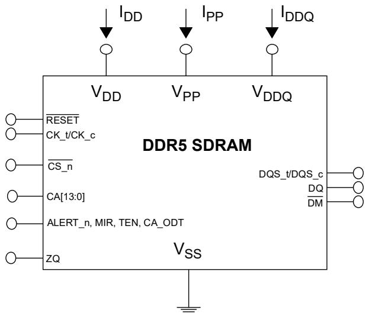

<details>
<summary>text_image</summary>

I_DD
I_PP
I_DDQ
V_DD V_PP V_DDQ
DDR5 SDRAM
RESET
CK_t/CK_c
CS_n
CA[13:0]
ALERT_n, MIR, TEN, CA_ODT
ZQ V_SS
DQS_t/DQS_c
DQ
DM
</details>

NOTES:   
1. DIMM level Output test load condition may be different from above

Figure 256 — Measurement Setup and Test Load for IDD, IPP, and IDDQ Measurements

# 11.1 IDD, IPP, and IDDQ Measurement Conditions (cont’d)

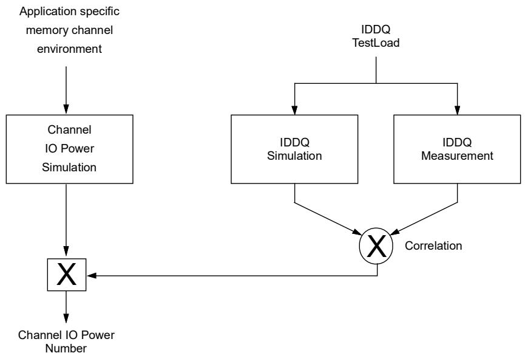

<details>
<summary>flowchart</summary>

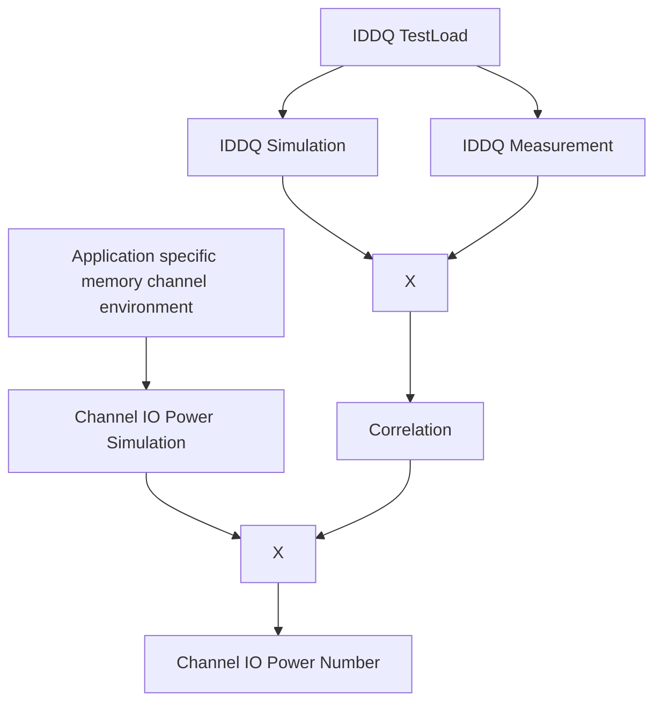
```mermaid
graph TD
    A["Application specific memory channel environment"] --> B["Channel IO Power Simulation"]
    B --> C["X"]
    D["IDDQ TestLoad"] --> E["IDDQ Simulation"]
    D --> F["IDDQ Measurement"]
    E --> G["X"]
    F --> G
    G --> H["Correlation"]
    H --> C
    C --> I["Channel IO Power Number"]
```
</details>

Figure 257 — Correlation from Simulated Channel IO Power to Actual Channel IO Power Supported by IDDQ Measurement

Table 311 — Basic IDD, IDDQ, and IPP Measurement Conditions 

<table><tr><td>Symbol</td><td>Description</td></tr><tr><td>IDD0</td><td>Operating One Bank Active-Precharge CurrentExternal clock: On; tCK, nRC, nRAS, nRP, nRRD: refer to Chapter 13.3 Timing Parameters by Speed Grade; BL:  $16^1$ ; CS_n: High between ACT and PRE; CA Inputs: partially toggling according to Table 312; Data IO: VDDQ; DM_n: stable at 1; Bank Activity: Cycling with one bank active at a time: 0,0,1,1,2,2,... (see Table 312); Output Buffer and RTT: Enabled in Mode Registers $^2$ ; Pattern Details: see Table 312</td></tr><tr><td>IDDQ0</td><td>Operating One Bank Active-Precharge IDDQ CurrentSame condition with IDD0, however measuring IDDQ current instead of IDD current</td></tr><tr><td>IPP0</td><td>Operating One Bank Active-Precharge IPP CurrentSame condition with IDD0, however measuring IPP current instead of IDD current</td></tr><tr><td>IDD0F</td><td>Operating Four Bank Active-Precharge CurrentExternal clock: On; tCK, nRC, nRAS, nRP, nRRD: refer to Chapter 13.3 Timing Parameters by Speed Grade; BL:  $16^1$ ; CS_n: High between ACT and PRE; CA Inputs: partially toggling according to Table 313; Data IO: VDDQ; DM_n: stable at 1; Bank Activity: Cycling with four bank active at a time: (see Table 313); Output Buffer and RTT: Enabled in Mode Registers $^2$ ; Pattern Details: see Table 313</td></tr><tr><td>IDDQ0F</td><td>Operating Four Bank Active-Precharge IDDQ CurrentSame condition with IDD0F, however measuring IDDQ current instead of IDD current</td></tr><tr><td>IPP0F</td><td>Operating Four Bank Active-Precharge IPP CurrentSame condition with IDD0F, however measuring IPP current instead of IDD current</td></tr><tr><td>IDD2N</td><td>Precharge Standby CurrentExternal clock: On; tCK: refer to Chapter 13.3 Timing Parameters by Speed Grade; CS_n: stable at 1; CA Inputs: partially toggling according to Table 314; Data IO: VDDQ; DM_n: stable at 1; Bank Activity: all banks closed; Output Buffer and RTT: Enabled in Mode Registers $^2$ ; Pattern Details: see Table 314</td></tr><tr><td>IDDQ2N</td><td>Precharge Standby IDDQ CurrentSame condition with IDD2N, however measuring IDDQ current instead of IDD current</td></tr><tr><td>IPP2N</td><td>Precharge Standby IPP CurrentSame condition with IDD2N, however measuring IPP current instead of IDD current</td></tr><tr><td>IDD2NT</td><td>Precharge Standby Non-Target Command CurrentExternal clock: On; tCK: refer to Chapter 13.3 Timing Parameters by Speed Grade; BL:  $16^1$ ; CS_n: High between WRITE commands; CS_n, CA Inputs: partially toggling according to Table 315; Data IO: VDDQ; DM_n: stable at 1; Bank Activity: all banks closed; Output Buffer and RTT: Enabled in Mode Registers $^2$ ; Pattern Details: see Table 315</td></tr><tr><td>IDDQ2NT(Optional)</td><td>Precharge Standby Non-Target Command IDDQ CurrentSame condition with IDD2NT, however measuring IDDQ current instead of IDD current</td></tr><tr><td>IPP2NT(Optional)</td><td>Precharge Standby Non-Target Command IPP CurrentSame condition with IDD2NT, however measuring IPP current instead of IDD current</td></tr><tr><td>IDD2P</td><td>Precharge Power-DownDevice in Precharge Power-Down, External clock: On; tCK: refer to Chapter 13.3 Timing Parameters by Speed Grade; CS_n: stable at 1 after Power Down Entry command; CA Inputs: stable at 1; CA11=H during the PDE command; Data IO: VDDQ; DM_n: stable at 1; Bank Activity: all banks closed; Output Buffer and RTT: Enabled in Mode Registers2;</td></tr><tr><td>IDDQ2P</td><td>Precharge Power-DownSame condition with IDD2P, however measuring IDDQ current instead of IDD current</td></tr><tr><td>IPP2P</td><td>Precharge Power-DownSame condition with IDD2P, however measuring IPP current instead of IDD current</td></tr><tr><td>IDD3N</td><td>Active Standby CurrentExternal clock: On; tCK: refer to Chapter 13.3 Timing Parameters by Speed Grade; CS_n: stable at 1; CA Inputs: partially toggling according to Table 314; Data IO: VDDQ; DM_n: stable at 1; Bank Activity: all banks open; Output Buffer and RTT: Enabled in Mode Registers2; Pattern Details: see Table 314</td></tr><tr><td>IDDQ3N</td><td>Active Standby IDDQ CurrentSame condition with IDD3N, however measuring IDDQ current instead of IDD current</td></tr><tr><td>IPP3N</td><td>Active Standby IPP CurrentSame condition with IDD3N, however measuring IPP current instead of IDD current</td></tr><tr><td>IDD3P</td><td>Active Power-Down CurrentDevice in Active Power-Down, External clock: On; tCK: refer to Chapter 13.3 Timing Parameters by Speed Grade; CS_n: stable at 1 after Power Down Entry command; CA Inputs: stable at 1; CA11=H during the PDE command; Data IO: VDDQ; DM_n: stable at 1; Bank Activity: all banks open; Output Buffer and RTT: Enabled in Mode Registers2;</td></tr><tr><td>IDDQ3P</td><td>Active Power-Down IDDQ CurrentSame condition with IDD3P, however measuring IDDQ current instead of IDD current</td></tr><tr><td>IPP3P</td><td>Active Power-Down IPP CurrentSame condition with IDD3P, however measuring IPP current instead of IDD current</td></tr><tr><td>IDD4R</td><td>Operating Burst Read CurrentExternal clock: On; tCK, nCCD_S, CL: refer to Chapter 13.3 Timing Parameters by Speed Grade; BL: 161; CS_n: High between RD; CA Inputs: partially toggling according to Table 316; Data IO: seamless read data burst with different data between one burst and the next one according to Table 316; DM_n: stable at 1; Bank Activity: all banks open, RD commands cycling through banks: 0,0,1,1,2,2,... (see Table 316); Output Buffer and RTT: Enabled in Mode Registers2; Pattern Details: see Table 316</td></tr><tr><td>IDD4RC</td><td>Operating Burst Read Current with Read CRCRead CRC enabled4. Other conditions: see IDD4R</td></tr><tr><td>IDDQ4R</td><td>Operating Burst Read IDDQ CurrentSame definition like for IDD4R, however measuring IDDQ current instead of IDD current</td></tr><tr><td>IPP4R</td><td>Operating Burst Read IPP CurrentSame condition with IDD4R, however measuring IPP current instead of IDD current</td></tr><tr><td>IDD4W</td><td>Operating Burst Write CurrentExternal clock: On; tCK, nCCD_S_WR, CL: refer to Chapter 13.3 Timing Parameters by Speed Grade; BL: 161; CS_n: High between WR; CA Inputs: partially toggling according to Table 317; Data IO: seamless write data burst with different data between one burst and the next one according to Table 317; DM_n: stable at 1; Bank Activity: all banks open, WR commands cycling through banks: 0,0,1,1,2,2,... (see Table 317); Output Buffer and RTT: Enabled in Mode Registers2; Pattern Details: see Table 317</td></tr><tr><td>IDD4WC</td><td>Operating Burst Write Current with Write CRCWrite CRC enabled3, Other conditions: see IDD4W</td></tr><tr><td>IDDQ4W</td><td>Operating Burst Write IDDQ CurrentSame condition with IDD4W, however measuring IDDQ current instead of IDD current</td></tr><tr><td>IPP4W</td><td>Operating Burst Write IPP CurrentSame condition with IDD4W, however measuring IPP current instead of IDD current</td></tr><tr><td>IDD5B</td><td>Burst Refresh Current (Normal Refresh Mode)External clock: On; tCK, nRFC1: refer to Chapter 13.3 Timing Parameters by Speed Grade; BL: 161; CS_n: High between REF; CA Inputs: partially toggling according to Table 318; Data IO: VDDQ; DM_n: stable at 1; Bank Activity: REF command every nRFC1 (see Table 318); Output Buffer and RTT: Enabled in Mode Registers2; Pattern Details: see Table 318</td></tr><tr><td>IDDQ5B</td><td>Burst Refresh IDDQ Current (Normal Refresh Mode)Same condition with IDD5B, however measuring IDDQ current instead of IDD current</td></tr><tr><td>IPP5B</td><td>Burst Refresh IPP Current (Normal Refresh Mode)Same condition with IDD5B, however measuring IPP current instead of IDD current</td></tr><tr><td>IDD5F</td><td>Burst Refresh Current (Fine Granularity Refresh Mode)tRFC=tRFC2, Other conditions: see IDD5B</td></tr><tr><td>IDDQ5F</td><td>Burst Refresh IDDQ Current (Fine Granularity Refresh Mode)Same condition with IDD5F, however measuring IDDQ current instead of IDD current</td></tr><tr><td>IPP5F</td><td>Burst Refresh IPP Current (Fine Granularity Refresh Mode)Same condition with IDD5F, however measuring IPP current instead of IDD current</td></tr><tr><td>IDD5C</td><td>Burst Refresh Current (Same Bank Refresh Mode)External clock: On; tCK, nRFCsb: refer to Chapter 13.3 Timing Parameters by Speed Grade; BL:  $16^1$ ;CS_n: High between REF; CA Inputs: partially toggling according to Table 319; Data IO: VDDQ; DM_n: stable at 1; Bank Activity: REF command every nRFCsb (see Table 319); Output Buffer and RTT: Enabled in Mode Registers $^2$ ; Pattern Details: see Table 319</td></tr><tr><td>IDDQ5C</td><td>Burst Refresh IDDQPP Current (Same Bank Refresh Mode)Same condition with IDD5C, however measuring IDDQ current instead of IDD current</td></tr><tr><td>IPP5C</td><td>Burst Refresh IPP Current (Same Bank Refresh Mode)Same condition with IDD5C, however measuring IPP current instead of IDD current</td></tr><tr><td>IDD6N</td><td>Self Refresh Current: Normal Temperature RangeTCASE: 0 - 85 °C; External clock: Off; CK_t and CK_c: HIGH; tCK, nCPDED: refer to Chapter 13.3 Timing Parameters by Speed Grade; BL:  $16^1$ ; CS_n#: low; CA, Data IO: High; DM_n: stable at 1; Bank Activity: Self-Refresh operation; Output Buffer and RTT: Disabled by the DRAM upon entry into Self-Refresh</td></tr><tr><td>IDDQ6N</td><td>Self Refresh IDDQ Current: Normal Temperature RangeSame condition with IDD6N, however measuring IDDQ current instead of IDD current</td></tr><tr><td>IPP6N</td><td>Self Refresh IPP Current: Normal Temperature RangeSame condition with IDD6N, however measuring IPP current instead of IDD current</td></tr><tr><td>IDD6E</td><td>Self Refresh Current: Extended Temperature Range $T_{CASE}$ : 85 - 95 °C; Extended $^4$ ; External clock: Off; CK_t and CK_c: HIGH; tCK, nCPDED: refer to Chapter 13.3 Timing Parameters by Speed Grade; BL:  $16^1$ ; CS_n: low; CA, Data IO: High; DM_n: stable at 1; Bank Activity: Self-Refresh operation; Output Buffer and RTT: Disabled by the DRAM upon entry into Self-Refresh</td></tr><tr><td>IDDQ6E</td><td>Self Refresh IDDQ Current: Extended Temperature RangeSame condition with IDD6E, however measuring IDDQ current instead of IDD current</td></tr><tr><td>IPP6E</td><td>Self Refresh IPP Current: Extended Temperature RangeSame condition with IDD6E, however measuring IPP current instead of IDD current</td></tr><tr><td>IDD7</td><td>Operating Bank Interleave Read CurrentExternal clock: On; tCK, nRC, nRAS, nRCD, nRRD_S, nFAW, tCCD_S CL: refer to Chapter 13.3 Timing Parameters by Speed Grade; BL:  $16^1$ ; CS_n: High between ACT and RDA; CA Inputs: partially toggling according to Table 321; Data IO: read data bursts with different data between one burst and the next one according to Table 321; DM_n: stable at 1; Bank Activity: two times interleaved cycling through banks (0, 1, ...7) with different addressing, see Table 321; Output Buffer and RTT: Enabled in Mode Registers $^2$ ; Pattern Details: see Table 321</td></tr><tr><td>IDDQ7</td><td>Operating Bank Interleave Read IDDQ CurrentSame condition with IDD7, however measuring IDDQ current instead of IDD current</td></tr><tr><td>IPP7</td><td>Operating Bank Interleave Read IPP CurrentSame condition with IDD7, however measuring IPP current instead of IDD current</td></tr><tr><td>IDD8</td><td>Maximum Power Saving Deep Power Down CurrentExternal clock: Off; CK_t and CK_c: HIGH; tCK, nCPDED: refer to Chapter 13.3 Timing Parameters by Speed Grade; BL:  $16^1$ ; CS_n#: low; CA:High, DM_n: stable at 1; Bank Activity: All banks closed and device in MPSM deep power down mode5; Output Buffer and RTT: Enabled in Mode Registers $^2$ ; Patterns Details: same as IDD6N but MPSM is enabled in mode register.</td></tr><tr><td>IDDQ8</td><td>Maximum Power Saving Deep Power Down IDDQ CurrentSame condition with IDD8, however measuring IDDQ current instead of IDD current</td></tr><tr><td>IPP8</td><td>Maximum Power Saving Deep Power Down IPP CurrentSame condition with IDD8, however measuring IPP current instead of IDD current</td></tr><tr><td>IDD9 (Optional)</td><td>MBIST CurrentDevice in MBIST mode, External clock: On; CS_n: Stable at 1 after MBIST entry; CA Inputs: stable at 1; Data IO: VDDQ; Bank Activity: MBIST operation; Output Buffer and RTT: Enabled in Mode Registers $^2$ ;</td></tr><tr><td>IDDQ9 (Optional)</td><td>MBIST IDDQ CurrentSame condition with IDD9, however measuring IDDQ current instead of IDD current</td></tr><tr><td>IPP9 (Optional)</td><td>MBIST IPP CurrentSame condition with IDD9, however measuring IPP current instead of IDD current</td></tr><tr><td colspan="2">NOTE 1 Burst Length: BL16 fixed by MR0 OP[1:0]=00.</td></tr><tr><td colspan="2">NOTE 2 Output Buffer Enable- set MR5 OP[0] = 0] : Qoff = Output buffer enabled- set MR5 OP[2:1] = 00: Pull-Up Output Driver Impedance Control = RZQ/7- set MR5 OP[7:6] = 00: Pull-Down Output Driver Impedance Control = RZQ/7RTT_Nom enable- set MR35 OP[5:0] = 110110: RTT_NOM_WR = RTT_NOM_RD = RZQ/6RTT_WR enable- set MR34 OP[5:3] = 010 RTT_WR = RZQ/2CA/CS/CK ODT, DQS_RTT_PART, and RTT_PARK disable- set MR32 OP[5:0] = 000000- set/MR33 OP[5:0] = 000000- set MR34 OP[2:0] = 000</td></tr><tr><td colspan="2">NOTE 3 WRITE CRC enabled- set MR50 OP[2:1] = 11</td></tr><tr><td colspan="2">NOTE 4 Read CRC enabled- set MR50:OP[0]=1</td></tr><tr><td colspan="2">NOTE 5 MPSM Deep Power Down Mode- set MR2:OP[3]=1 if PDA Enumerate ID not equal to 15- set MR2:OP[5]=1 if PDA Enumerate ID equal to 15</td></tr></table>

# 11.2 IDD0, IDDQ0, IPP0 Pattern

Executes Active and PreCharge commands with tightest timing possible while exercising all Bank and Bank Group addresses. Note 2 applies to the entire table.

Table 312 — IDD0, IDDQ0, IPP0 

<table><tr><td>Sub-Loop</td><td>Sequence</td><td>Command</td><td>CS_n</td><td>C/A [13:0]</td><td>Row Address [17:0]</td><td>BA [1:0]</td><td>BG [2:0]</td><td>CID [2:0]</td><td>Special Instructions</td></tr><tr><td rowspan="10">0</td><td rowspan="2">0</td><td rowspan="2">ACT</td><td>L</td><td rowspan="2">-</td><td rowspan="2">0x00000</td><td rowspan="2">0x0</td><td rowspan="2">0x00</td><td rowspan="2">0x0</td><td rowspan="2"></td></tr><tr><td>H</td></tr><tr><td>1</td><td>DES</td><td>H</td><td> $Toggling^1$ </td><td></td><td></td><td></td><td></td><td>Repeat sequence to satisfy tRAS(min), truncate if required</td></tr><tr><td>2</td><td>PREpb</td><td>L</td><td>-</td><td></td><td>0x0</td><td>0x00</td><td>0x0</td><td></td></tr><tr><td>3</td><td>DES</td><td>H</td><td> $Toggling^1$ </td><td></td><td></td><td></td><td></td><td>Repeat sequence to satisfy tRP(min), truncate if required</td></tr><tr><td rowspan="2">4</td><td rowspan="2">ACT</td><td>L</td><td rowspan="2">-</td><td rowspan="2">0x03FFF</td><td rowspan="2">0x0</td><td rowspan="2">0x00</td><td rowspan="2">0x0</td><td rowspan="2"></td></tr><tr><td>H</td></tr><tr><td>5</td><td>DES</td><td>H</td><td> $Toggling^1$ </td><td></td><td></td><td></td><td></td><td>Repeat sequence to satisfy tRAS(min), truncate if required</td></tr><tr><td>6</td><td>PREpb</td><td>L</td><td>-</td><td></td><td>0x0</td><td>0x00</td><td>0x0</td><td></td></tr><tr><td>7</td><td>DES</td><td>H</td><td> $Toggling^1$ </td><td></td><td></td><td></td><td></td><td>Repeat sequence to satisfy tRP(min), truncate if required</td></tr><tr><td>1</td><td>8-15</td><td colspan="7">Repeat sub-loop 0, use BG[2:0]=0x1 instead</td><td></td></tr><tr><td>2</td><td>16-23</td><td colspan="7">Repeat sub-loop 0, use BG[2:0]=0x2 instead</td><td></td></tr><tr><td>3</td><td>24-31</td><td colspan="7">Repeat sub-loop 0, use BG[2:0]=0x3 instead</td><td></td></tr><tr><td>4</td><td>32-39</td><td colspan="7">Repeat sub-loop 0, use BG[2:0]=0x4 instead</td><td>skip for x16</td></tr><tr><td>5</td><td>40-47</td><td colspan="7">Repeat sub-loop 0, use BG[2:0]=0x5 instead</td><td>skip for x16</td></tr><tr><td>6</td><td>48-55</td><td colspan="7">Repeat sub-loop 0, use BG[2:0]=0x6 instead</td><td>skip for x16</td></tr><tr><td>7</td><td>56-63</td><td colspan="7">Repeat sub-loop 0, use BG[2:0]=0x7 instead</td><td>skip for x16</td></tr><tr><td>8-15</td><td>64-127</td><td colspan="7">Repeat sub loops 0-7, use BA[1:0]=0x1 instead</td><td></td></tr><tr><td>16-23</td><td>128-191</td><td colspan="7">Repeat sub loops 0-7, use BA[1:0]=0x2 instead</td><td></td></tr><tr><td>24-31</td><td>192-255</td><td colspan="7">Repeat sub loops 0-7, use BA[1:0]=0x3 instead</td><td></td></tr><tr><td>...</td><td>...</td><td colspan="7">Repeat sub loops 0-31 for each 3DS logical rank, if applicable</td><td>CID[2:0]=0x1-0x7</td></tr><tr><td colspan="10">NOTE 1 Utilize DESELECTs between commands while toggling all C/A bits per the 4-cycle sequence defined in the IDD2N, IDD3N pattern. NOTE 2 For 3DS, all banks of all “non-target” logical ranks are ldd2N condition.</td></tr></table>

# 11.3 IDD0F, IDDQ0F, IPP0F Pattern

Executes a rolling four bank group Active and PreCharge commands per tRC time while exercising all Bank, Bank, Group and CID addresses. Note 2 applies to the entire table.

Table 313 — IDD0F, IDDQ0F, IPP0F 

<table><tr><td>Sub-Loop</td><td>Sequence</td><td>Command</td><td>CS</td><td>C/A [13:0]</td><td>Row Address [17:0]</td><td>BA [1:0]</td><td>BG [2:0]</td><td>CID [2:0]</td><td>Special Instructions</td></tr><tr><td rowspan="21">0</td><td rowspan="2">0</td><td rowspan="2">ACT</td><td>L</td><td rowspan="2"></td><td rowspan="2">0x00000</td><td rowspan="2">0x0</td><td rowspan="2">0x00</td><td rowspan="2">0x0</td><td rowspan="2"></td></tr><tr><td>H</td></tr><tr><td>1</td><td>DES</td><td>H</td><td> $Toggling^1$ </td><td></td><td></td><td></td><td></td><td>Repeat to satisfy tRRD(min)(6 DES to meet 8nCK)</td></tr><tr><td rowspan="2">2</td><td rowspan="2">ACT</td><td>L</td><td rowspan="2"></td><td rowspan="2">0x00000</td><td rowspan="2">0x0</td><td rowspan="2">0x01</td><td rowspan="2">0x0</td><td rowspan="2"></td></tr><tr><td>H</td></tr><tr><td>3</td><td>DES</td><td>H</td><td> $Toggling^1$ </td><td></td><td></td><td></td><td></td><td>Repeat to satisfy tRRD(min)(6 DES to meet 8nCK)</td></tr><tr><td rowspan="2">4</td><td rowspan="2">ACT</td><td>L</td><td rowspan="2"></td><td rowspan="2">0x00000</td><td rowspan="2">0x0</td><td rowspan="2">0x02</td><td rowspan="2">0x0</td><td rowspan="2"></td></tr><tr><td>H</td></tr><tr><td>5</td><td>DES</td><td>H</td><td> $Toggling^1$ </td><td></td><td></td><td></td><td></td><td>Repeat to satisfy tRRD(min)(6 DES to meet 8nCK)</td></tr><tr><td rowspan="2">6</td><td rowspan="2">ACT</td><td>L</td><td rowspan="2"></td><td rowspan="2">0x00000</td><td rowspan="2">0x0</td><td rowspan="2">0x03</td><td rowspan="2">0x0</td><td rowspan="2"></td></tr><tr><td>H</td></tr><tr><td>7</td><td>DES</td><td>H</td><td> $Toggling^1$ </td><td></td><td></td><td></td><td></td><td>Repeat to satisfy tRAS(min)from Sequence 0</td></tr><tr><td>8</td><td>PREpb</td><td>L</td><td></td><td></td><td>0x0</td><td>0x00</td><td>0x0</td><td></td></tr><tr><td>9</td><td>DES</td><td>H</td><td> $Toggling^1$ </td><td></td><td></td><td></td><td></td><td>Repeat for tRRD(min) (7 DESto meet 8nCK) This allows fornext PRE to meet tRAS(min)</td></tr><tr><td>10</td><td>PREpb</td><td>L</td><td></td><td></td><td>0x0</td><td>0x01</td><td>0x0</td><td></td></tr><tr><td>11</td><td>DES</td><td>H</td><td> $Toggling^1$ </td><td></td><td></td><td></td><td></td><td>Repeat for tRRD(min) (7 DESto meet 8nCK) This allows fornext PRE to meet tRAS(min)</td></tr><tr><td>12</td><td>PREpb</td><td>L</td><td></td><td></td><td>0x0</td><td>0x02</td><td>0x0</td><td></td></tr><tr><td>13</td><td>DES</td><td>H</td><td> $Toggling^1$ </td><td></td><td></td><td></td><td></td><td>Repeat for tRRD(min) (7 DESto meet 8nCK) This allows fornext PRE to meet tRAS(min)</td></tr><tr><td>14</td><td>PREpb</td><td>L</td><td></td><td></td><td>0x0</td><td>0x03</td><td>0x0</td><td></td></tr><tr><td>15</td><td>DES</td><td>H</td><td> $Toggling^1$ </td><td></td><td></td><td></td><td></td><td>Repeat for tRRD(min) (7 DESto meet 8nCK) This allows fornext PRE to meet tRAS(min)</td></tr><tr><td>16</td><td>DES</td><td>H</td><td> $Toggling^1$ </td><td></td><td></td><td></td><td></td><td>Repeat for tRC(min) fromSequence 0 first ACTIVATE.This will be zeroDESELECTS for speed4000MT/s and slower.</td></tr><tr><td>1</td><td>17-33</td><td colspan="7">Repeat sub-loop 0, use Row Address = 0x03FFF for the ACT instead</td><td></td></tr><tr><td>2-3</td><td>34-67</td><td colspan="7">Repeat sub-loop 0-1, use BG[2:0]=0x4,0x5,0x6,0x7 instead of0x0,0x1,0x2,0x3</td><td>skip for x16</td></tr><tr><td>4-7</td><td>68-101</td><td colspan="7">Repeat sub-loops 0-3, use BA[1:0]=0x1 instead</td><td></td></tr><tr><td>8-11</td><td>102-135</td><td colspan="7">Repeat sub-loops 0-3, use BA[1:0]=0x2 instead</td><td></td></tr><tr><td>12-15</td><td>136-169</td><td colspan="7">Repeat sub-loops 0-3, use BA[1:0]=0x3 instead</td><td></td></tr><tr><td>...</td><td>...</td><td colspan="7">Repeat sub loops 0-15 for each 3DS logical rank, if applicable</td><td>CID[2:0]=0x1-0x7</td></tr><tr><td colspan="10">NOTE 1 Utilize DESELECTs between commands while toggling C/A bits per the 4-cycle sequence defined in the IDD2N, IDD3N pattern.NOTE 2 For 3DS, all banks of all “non-target” logical ranks are ldd2N condition.</td></tr></table>

# 11.4 IDD2N, IDD3N Pattern

Executes DESELECT commands while exercising all command/address pins in a predefined pattern. All notes apply to entire table.

Table 314 — IDD2N, IDDQ2N, IPP2N, IDD3N, IDDQ3N, IPP3N 

<table><tr><td>Sequence</td><td>Command</td><td>CS</td><td>C/A [13:0]</td></tr><tr><td>0</td><td>DES</td><td>H</td><td>0x0000</td></tr><tr><td>1</td><td>DES</td><td>H</td><td>0x3FFF</td></tr><tr><td>2</td><td>DES</td><td>H</td><td>0x3FFF</td></tr><tr><td>3</td><td>DES</td><td>H</td><td>0x3FFF</td></tr><tr><td colspan="4">NOTE 1 Data is pulled to VDDQNOTE 2 DQS_t and DQS_c are pulled to VDDQNOTE 3 Command / Address ODT is disabledNOTE 4 Repeat sequence 0 through 3.NOTE 5 All banks of all logical ranks mimic the same test condition.</td></tr></table>

# 11.5 IDD2NT, IDDQ2NT, IPP2NT Pattern

Executes Non-Target WRITE commands simulating Rank to Rank timing while exercising all C/A bits. Notes 3-6 apply to entire table.

Table 315 — IDD2NT, IDDQ2NT, IPP2NT 

<table><tr><td>Sequence</td><td>Command</td><td>CS_n</td><td>C/A [13:0]</td><td>Special Instructions</td></tr><tr><td rowspan="2">0</td><td rowspan="2">WRITE $^{1}$ </td><td>L</td><td>0x002D</td><td rowspan="2">All valid C/A inputs to VSS</td></tr><tr><td>L</td><td>0x0000</td></tr><tr><td>1</td><td>DES</td><td>H</td><td>Toggling $^{2}$ </td><td>Repeat sequence to meet 1*tCCD_S_WR (min), truncate if required</td></tr><tr><td rowspan="2">2</td><td rowspan="2">WRITE $^{1}$ </td><td>L</td><td>0x3FED</td><td rowspan="2">All valid C/A inputs to VDDQ</td></tr><tr><td>L</td><td>0x3FFF</td></tr><tr><td>3</td><td>DES</td><td>H</td><td>Toggling $^{2}$ </td><td>Repeat sequence to meet 1*tCCD_S_WR (min), truncate if required</td></tr><tr><td colspan="5">NOTE 1 WRITE with CS_n=L on both cycles indicated a non-target WRITE. NOTE 2 Utilize DESELECTs between commands while toggling C/A bits per the 4-cycle sequence defined in the IDD2N, IDD3N pattern. NOTE 3 Time between Non-Target WRITEs reflect 1 * tCCD_S_WR (min) for one ranks. NOTE 4 DQ signals are VDDQ. NOTE 5 DQS_t, DQS_c are VDDQ. NOTE 6 Repeat 0 through 3.</td></tr></table>

# 11.6 IDD4R, IDDQ4R, IPP4R Pattern

Executes READ commands with tightest timing possible while exercising all Bank, Bank Group and CID addresses. Notes 2-9 apply to entire table

Table 316 — IDD4R, IDDQ4R, IPP4R 

<table><tr><td>Sub-Loop</td><td>Sequence</td><td>Command</td><td>CS_n</td><td>C/A [13:0]</td><td>Column Address [10:0]</td><td>BA [1:0]</td><td>BG [2:0]</td><td>CID [3:0]</td><td>Data Burst (BL=16)</td><td>Special Instructions</td></tr><tr><td rowspan="3">0</td><td rowspan="2">0</td><td rowspan="2">READ</td><td>L</td><td rowspan="2">-</td><td rowspan="2">0x000</td><td rowspan="2">0x00</td><td rowspan="2">0x0</td><td rowspan="2">0x0</td><td rowspan="2">Pattern A</td><td rowspan="2">All &quot;Valid&quot; inputs = VDDQ</td></tr><tr><td>H</td></tr><tr><td>1</td><td>DES</td><td>H</td><td> $Toggling^1$ </td><td>-</td><td></td><td></td><td></td><td></td><td>Repeat sequence to satisfy tCCD_S(min), truncate if required</td></tr><tr><td rowspan="3">1</td><td rowspan="2">2</td><td rowspan="2">READ</td><td>L</td><td rowspan="2">-</td><td rowspan="2">0x3F0</td><td rowspan="2">0x00</td><td rowspan="2">0x1</td><td rowspan="2">0x0</td><td rowspan="2">Pattern B</td><td rowspan="2">All &quot;Valid&quot; inputs = VDDQ</td></tr><tr><td>H</td></tr><tr><td>3</td><td>DES</td><td>H</td><td> $Toggling^1$ </td><td>-</td><td></td><td></td><td></td><td></td><td>Repeat sequence to satisfy tCCD_S(min), truncate if required</td></tr><tr><td>2</td><td>4-5</td><td colspan="8">Repeat sub-loop 0, use BG[2:0]=0x2 instead</td><td></td></tr><tr><td>3</td><td>6-7</td><td colspan="8">Repeat sub-loop 1, use BG[2:0]=0x3 instead</td><td></td></tr><tr><td>4</td><td>8-9</td><td colspan="8">Repeat sub-loop 0, use BG[2:0]=0x4 instead</td><td>skip for x16</td></tr><tr><td>5</td><td>10-11</td><td colspan="8">Repeat sub-loop 1, use BG[2:0]=0x5 instead</td><td>skip for x16</td></tr><tr><td>6</td><td>12-13</td><td colspan="8">Repeat sub-loop 0, use BG[2:0]=0x6 instead</td><td>skip for x16</td></tr><tr><td>7</td><td>14-15</td><td colspan="8">Repeat sub-loop 1, use BG[2:0]=0x7 instead</td><td>skip for x16</td></tr><tr><td rowspan="3">8</td><td rowspan="2">16</td><td rowspan="2">READ</td><td>L</td><td rowspan="2">-</td><td rowspan="2">0x3F0</td><td rowspan="2">0x00</td><td rowspan="2">0x0</td><td rowspan="2">0x0</td><td rowspan="2">Pattern B</td><td rowspan="2">All &quot;Valid&quot; inputs = VDDQ</td></tr><tr><td>H</td></tr><tr><td>17</td><td>DES</td><td>H</td><td> $Toggling^1$ </td><td></td><td></td><td></td><td></td><td></td><td>Repeat sequence to satisfy tCCD_S(min), truncate if required</td></tr><tr><td rowspan="3">9</td><td rowspan="2">18</td><td rowspan="2">READ</td><td>L</td><td rowspan="2">-</td><td rowspan="2">0x000</td><td rowspan="2">0x00</td><td rowspan="2">0x1</td><td rowspan="2">0x0</td><td rowspan="2">Pattern A</td><td rowspan="2">All &quot;Valid&quot; inputs = VDDQ</td></tr><tr><td>H</td></tr><tr><td>19</td><td>DES</td><td>H</td><td> $Toggling^1$ </td><td></td><td></td><td></td><td></td><td></td><td>Repeat sequence to satisfy tCCD_S(min), truncate if required</td></tr><tr><td>10</td><td>20-21</td><td colspan="8">Repeat sub-loop 8, use BG[2:0]=0x2 instead</td><td></td></tr><tr><td>11</td><td>22-23</td><td colspan="8">Repeat sub-loop 9, use BG[2:0]=0x3 instead</td><td></td></tr><tr><td>12</td><td>24-25</td><td colspan="8">Repeat sub-loop 8, use BG[2:0]=0x4 instead</td><td>skip for x16</td></tr><tr><td>13</td><td>26-27</td><td colspan="8">Repeat sub-loop 9, use BG[2:0]=0x5 instead</td><td>skip for x16</td></tr><tr><td>14</td><td>28-29</td><td colspan="8">Repeat sub-loop 8, use BG[2:0]=0x6 instead</td><td>skip for x16</td></tr><tr><td>15</td><td>30-31</td><td colspan="8">Repeat sub-loop 9, use BG[2:0]=0x7 instead</td><td>skip for x16</td></tr><tr><td>16-31</td><td>32-33</td><td colspan="8">Repeat sub-loops 0-15, use BA[1:0]=0x1 instead</td><td></td></tr><tr><td>32-47</td><td>34-35</td><td colspan="8">Repeat sub-loops 0-15, use BA[1:0]=0x2 instead</td><td></td></tr><tr><td>48-63</td><td>36-37</td><td colspan="8">Repeat sub-loops 0-15, use BA[1:0]=0x3 instead</td><td></td></tr><tr><td>...</td><td>...</td><td colspan="8">Repeat sub-loops 0-63 for each 3DS logical rank, if applicable</td><td>CID[2:0]=0x1-0x7</td></tr><tr><td colspan="10">NOTE 1 Utilize DESELECTs between commands while toggling all C/A bits per the 4-cycle sequence defined in the IDD2N, IDD3N pattern. NOTE 2 READs performed with Auto Precharge = H, Burst Chop = H. NOTE 3 Row address is set to 0x0000 NOTE 4 Data reflects burst length of 16. NOTE 5 Data Pattern A for x4: 0x0, 0xF, 0xF, 0x0, 0x0, 0xF, 0x0, 0xF, 0xF, 0x0, 0xF, 0xF, 0x0, 0xF, 0xF, 0xF, 0xF, 0xF, 0xF, 0xF, 0xF, 0xF, 0xF, 0xF, 0xF, 0xF, 0xF, 0xF, 0xF, 0xF, 0xF, 0xF, 0xF, 0xF, 0xF, 0xF, 0xF, 0xF, 0x0, 0xF, 0xF, 0xF, 0xF, 0xF, 0xF, 0xF, 0xF, 0xF, 0xF, 0xF, 0xF, 0xF, 0xF, 0xF, 0xF, 0xF, 0xF, 0xF, 0xF, 0xF, 7. NOTE 7 Data Pattern for x8 each beat will reflect two like nibbles (Data Pattern A = 0x00, 0xFF, 0xFF...). NOTE 8 Data Pattern for x16 each beat will reflect two like bytes (Data Pattern A = 0x0000, 0xFFFF, 0xFFFF...). NOTE 9 Where C/A column is not populated, refer to command truth table, column address, BA, BG, and CID for the C/A state</td><td></td></tr></table>

# 11.7 IDD4W, IDDQ4W, IPP4W Pattern

Executes WRITE commands with tightest timing possible while exercising all Bank, Bank Group and CDI CID addresses. Notes 2-6 apply to entire table.

Table 317 — IDD4W, IDDQ4W, IPP4W 

<table><tr><td>Sub-Loop</td><td>Sequence</td><td>Command</td><td>CS_n</td><td>C/A [13:0]</td><td>Column Address [10:0]</td><td>BA [1:0]</td><td>BG [2:0]</td><td>CID [3:0]</td><td>Data Burst (BL=16)</td><td>Special Instructions</td></tr><tr><td rowspan="3">0</td><td rowspan="2">0</td><td rowspan="2">WRITE</td><td>L</td><td rowspan="2">-</td><td rowspan="2">0x000</td><td rowspan="2">0x00</td><td rowspan="2">0x0</td><td rowspan="2">0x0</td><td rowspan="2">Pattern A</td><td rowspan="2">All &quot;Valid&quot; inputs = VDDQ</td></tr><tr><td>H</td></tr><tr><td>1</td><td>DES</td><td>H</td><td> $Toggling^1$ </td><td>-</td><td></td><td></td><td></td><td></td><td>Repeat sequence to satisfy tCCD_S_WR (min), truncate if required</td></tr><tr><td rowspan="3">1</td><td rowspan="2">2</td><td rowspan="2">WRITE</td><td>L</td><td rowspan="2">-</td><td rowspan="2">0x3F0</td><td rowspan="2">0x00</td><td rowspan="2">0x1</td><td rowspan="2">0x0</td><td rowspan="2">Pattern B</td><td rowspan="2">All &quot;Valid&quot; inputs = VDDQ</td></tr><tr><td>H</td></tr><tr><td>3</td><td>DES</td><td>H</td><td> $Toggling^1$ </td><td>-</td><td></td><td></td><td></td><td></td><td>Repeat sequence to satisfy tCCD_S_WR (min), truncate if required</td></tr><tr><td>2</td><td>4-5</td><td colspan="8">Repeat sub-loop 0, use BG[2:0]=0x2 instead</td><td></td></tr><tr><td>3</td><td>6-7</td><td colspan="8">Repeat sub-loop 1, use BG[2:0]=0x3 instead</td><td></td></tr><tr><td>4</td><td>8-9</td><td colspan="8">Repeat sub-loop 0, use BG[2:0]=0x4 instead</td><td>skip for x16</td></tr><tr><td>5</td><td>10-11</td><td colspan="8">Repeat sub-loop 1, use BG[2:0]=0x5 instead</td><td>skip for x16</td></tr><tr><td>6</td><td>12-13</td><td colspan="8">Repeat sub-loop 0, use BG[2:0]=0x6 instead</td><td>skip for x16</td></tr><tr><td>7</td><td>14-15</td><td colspan="8">Repeat sub-loop 1, use BG[2:0]=0x7 instead</td><td>skip for x16</td></tr><tr><td rowspan="3">8</td><td rowspan="2">16</td><td rowspan="2">WRITE</td><td>L</td><td rowspan="2">-</td><td rowspan="2">0x3F0</td><td rowspan="2">0x00</td><td rowspan="2">0x0</td><td rowspan="2">0x0</td><td rowspan="2">Pattern B</td><td rowspan="2">All &quot;Valid&quot; inputs = VDDQ</td></tr><tr><td>H</td></tr><tr><td>17</td><td>DES</td><td>H</td><td> $Toggling^1$ </td><td></td><td></td><td></td><td></td><td></td><td>Repeat sequence to satisfy tCCD_S_WR (min), truncate if required</td></tr><tr><td rowspan="3">9</td><td rowspan="2">18</td><td rowspan="2">WRITE</td><td>L</td><td rowspan="2">-</td><td rowspan="2">0x000</td><td rowspan="2">0x00</td><td rowspan="2">0x1</td><td rowspan="2">0x0</td><td rowspan="2">Pattern A</td><td rowspan="2">All &quot;Valid&quot; inputs = VDDQ</td></tr><tr><td>H</td></tr><tr><td>19</td><td>DES</td><td>H</td><td> $Toggling^1$ </td><td></td><td></td><td></td><td></td><td></td><td>Repeat sequence to satisfy tCCD_S_WR (min), truncate if required</td></tr><tr><td>10</td><td>20-21</td><td colspan="8">Repeat sub-loop 8, use BG[2:0]=0x2 instead</td><td></td></tr><tr><td>11</td><td>22-23</td><td colspan="8">Repeat sub-loop 9, use BG[2:0]=0x3 instead</td><td></td></tr><tr><td>12</td><td>24-25</td><td colspan="8">Repeat sub-loop 8, use BG[2:0]=0x4 instead</td><td>skip for x16</td></tr><tr><td>13</td><td>26-27</td><td colspan="8">Repeat sub-loop 9, use BG[2:0]=0x5 instead</td><td>skip for x16</td></tr><tr><td>14</td><td>28-29</td><td colspan="8">Repeat sub-loop 8, use BG[2:0]=0x6 instead</td><td>skip for x16</td></tr><tr><td>15</td><td>30-31</td><td colspan="8">Repeat sub-loop 9, use BG[2:0]=0x7 instead</td><td>skip for x16</td></tr><tr><td>16-31</td><td>32-33</td><td colspan="8">Repeat sub-loops 0-15, use BA[1:0]=0x1 instead</td><td></td></tr><tr><td>32-47</td><td>34-35</td><td colspan="8">Repeat sub-loops 0-15, use BA[1:0]=0x2 instead</td><td></td></tr><tr><td>48-63</td><td>36-37</td><td colspan="8">Repeat sub-loops 0-15, use BA[1:0]=0x3 instead</td><td></td></tr><tr><td>...</td><td>...</td><td colspan="8">Repeat sub-loops 0-63 for each 3DS logical rank, if applicable</td><td>CID[2:0]=0x1-0x7</td></tr><tr><td colspan="11">NOTE 1 Utilize DESELECTs between commands per the 4-cycle sequence defined in the IDD2N, IDD3N pattern.NOTE 2 WRITEs performed with Auto Precharge = H, Burst Chop = H.NOTE 3 Row address is set to 0x0000.NOTE 4 Data reflects burst length of 16.NOTE 5 Refer to IDD4R measurement loop table for data pattern definition.NOTE 6 Where C/A column is not populated, refer to command truth table, column address, BA, BG, and CID for the C/A state.</td></tr></table>

# 11.8 IDD5B, IDDQ5B, IPP5B, IDD5F, IDDQ5F, IPP5F Pattern

Executes Refresh (all Banks) command at minimum tRFC. Notes 3-6 apply to entire table.

Table 318 — IDD5B, IDD5B, IDDQ5B, IPP5B, IDD5F, IDDQ5F, IPP5F 

<table><tr><td>Sequence</td><td>Command</td><td>CS</td><td>C/A [13:0]</td><td>CA[9:8]</td><td>CID [2:0]</td><td>Special Instructions</td></tr><tr><td>0</td><td>REFab</td><td>L</td><td>-</td><td>H</td><td>0x0</td><td>All “valid” inputs = VDDQ</td></tr><tr><td>1</td><td>DES</td><td>H</td><td> $Toggling^1$ </td><td>-</td><td>-</td><td>Repeat sequence to satisfy tRFC(min)2, truncate if required</td></tr><tr><td>2</td><td>REFab</td><td>L</td><td>-</td><td>H</td><td>0x0</td><td>All “valid” inputs = VDDQ</td></tr><tr><td>3</td><td>DES</td><td>H</td><td> $Toggling^1$ </td><td>-</td><td>-</td><td>Repeat sequence to satisfy tRFC(min)2, truncate if required</td></tr><tr><td>...</td><td colspan="5">Repeat sequence 0-3 for each 3DS logical rank, if applicable</td><td>CID[2:0]=0x1-0x7</td></tr><tr><td colspan="7">NOTE 1 Utilize DESELECTs between commands per the 4-cycle sequence defined in the IDD2N, IDD3N pattern.NOTE 2 For IDD5B, use tRFC1(min). For IDD5F, use tRFC2(min).NOTE 3 DQ signals are VDDQ.NOTE 4 All banks of all “non-target” logical ranks are ldd2N condition.NOTE 5 Where C/A[13:0] column is not populated, refer to command truth table, CA[9:8], and CID columns for the C/A state.NOTE 6 Must set CA8=H on REFab commands to indicate 1X refresh rate on devices that support RIR.</td></tr></table>

# 11.9 IDD5C, IDDQ5C and IPP5C Patterns

Executes Refresh (Same Bank) command at minimum tRFCsb. Notes 2-5 apply to entire table.

Table 319 — IDD5C, IDDQ5C, IPP5C 

<table><tr><td>Sequence</td><td>Command</td><td>CS</td><td>C/A [13:0]</td><td>CA[9:8]</td><td>BA [1:0]</td><td>CID [2:0]</td><td>Special Instructions</td></tr><tr><td>0</td><td>REFsb</td><td>L</td><td>-</td><td>H</td><td>0x0</td><td>0x0</td><td></td></tr><tr><td>1</td><td>DES</td><td>H</td><td> $Toggling^1$ </td><td>-</td><td></td><td></td><td>Repeat sequence to satisfy tRFCsb(min), truncate if required</td></tr><tr><td>2</td><td>REFsb</td><td>L</td><td>-</td><td>H</td><td>0x1</td><td>0x0</td><td></td></tr><tr><td>3</td><td>DES</td><td>H</td><td> $Toggling^1$ </td><td>-</td><td></td><td></td><td>Repeat sequence to satisfy tRFCsb(min), truncate if required</td></tr><tr><td>4</td><td>REFsb</td><td>L</td><td>-</td><td>H</td><td>0x2</td><td>0x0</td><td></td></tr><tr><td>5</td><td>DES</td><td>H</td><td> $Toggling^1$ </td><td>-</td><td></td><td></td><td>Repeat sequence to satisfy tRFCsb(min), truncate if required</td></tr><tr><td>6</td><td>REFsb</td><td>L</td><td>-</td><td>H</td><td>0x3</td><td>0x0</td><td></td></tr><tr><td>7</td><td>DES</td><td>H</td><td> $Toggling^1$ </td><td>-</td><td></td><td></td><td>Repeat sequence to satisfy tRFCsb(min), truncate if required</td></tr><tr><td>...</td><td colspan="6">Repeat sequence 0-7 for each 3DS logical rank, if applicable</td><td>CID[2:0]=0x1-0x7</td></tr><tr><td colspan="8">NOTE 1 Utilize DESELECTs between commands per the 4-cycle sequence defined in the IDD2N, IDD3N pattern.NOTE 2 DQ signals are VDDQ.NOTE 3 All banks of all “non-target” logical ranks are ldd2N condition.NOTE 4 Where C/A[13:0] column is not populated, refer to command truth table, CA[9:8], and CID columns for the C/A state.NOTE 5 All banks of all “non-target” logical ranks are ldd2N condition.</td></tr></table>

# 11.10 IDD6N, IDDQ6N, IPP6N, IDD6E, IDDQ6E, IPP6E, IDD6R, IDDQ6R, IPP6R Pattern

All notes apply to entire table.

Table 320 — IDD6N, IDDQ6N, IPP6N, IDD6E, IDDQ6E, IPP6E 

<table><tr><td>Sequence</td><td>Command</td><td>Clock</td><td>CS</td><td>C/A [13:0]</td><td>Special Instructions</td></tr><tr><td>0</td><td>SRE</td><td>Valid</td><td>L</td><td>0x3BF7</td><td>Clocks must be valid tCKLCS(min) time</td></tr><tr><td>1</td><td>DES</td><td>Valid</td><td>H</td><td>0x3FFF</td><td>Repeat sequence to satisfy tCPDED(min), truncate if required</td></tr><tr><td>2</td><td>All C/A=H</td><td>Valid</td><td>L</td><td>0x3FFF</td><td></td></tr><tr><td>3</td><td>All C/A = H</td><td>CK_t = CK_c = H</td><td>L</td><td>0x3FFF</td><td>Repeat sequence indefinitely</td></tr><tr><td colspan="6">NOTE 1 Data is pulled to VDDQNOTE 2 DQS_t and DQS_c are pulled to VDDQNOTE 3 For 3DS, all banks of all logical ranks mimic the same test condition.</td></tr></table>

# 11.11 IDD7, IDDQ7 and IPP7 Patterns

Executes ACTVATE, READ/A commands with tightest timing possible while exercising all Bank, Bank Group and CID addresses. Notes 2-6 apply to entire table.

Table 321 — IDD7, IDD7Q, IPP7 

<table><tr><td>Sub-Loop</td><td>Sequence</td><td>Command</td><td>CS</td><td>C/A[13:0]</td><td>Row Address[17:0]</td><td>Column Address[10:0]</td><td>BA[1:0]</td><td>BG[2:0]</td><td>CID[2:0]</td><td>Data Burst(BL=16)</td><td>Special Instructions</td></tr><tr><td rowspan="3">0</td><td rowspan="2">0</td><td rowspan="2">ACT</td><td>L</td><td rowspan="2">-</td><td rowspan="2">0x00000</td><td rowspan="2">-</td><td rowspan="2">0x0</td><td rowspan="2">0x0</td><td rowspan="2">0x0</td><td rowspan="2">-</td><td rowspan="2"></td></tr><tr><td>H</td></tr><tr><td>1</td><td>DES</td><td>H</td><td> $Toggling^1$ </td><td></td><td></td><td></td><td></td><td></td><td></td><td>Repeat sequence to satisfy tRRD_S(min), tFAW(min), and tRCD(min). Truncate if required.</td></tr><tr><td rowspan="3">1</td><td rowspan="2">2</td><td rowspan="2">ACT</td><td>L</td><td rowspan="2">-</td><td rowspan="2">0x03FFF</td><td rowspan="2">-</td><td rowspan="2">0x0</td><td rowspan="2">0x1</td><td rowspan="2">0x0</td><td rowspan="2">-</td><td rowspan="2"></td></tr><tr><td>H</td></tr><tr><td>3</td><td>DES</td><td>H</td><td> $Toggling^1$ </td><td></td><td></td><td></td><td></td><td></td><td></td><td>Repeat sequence to satisfy tRRD_S(min), tFAW(min), and tRCD(min). Truncate if required.</td></tr><tr><td>2</td><td>4-5</td><td colspan="9">Repeat sub-loop 0, use BG[2:0]=0x2 instead</td><td></td></tr><tr><td>3</td><td>6-7</td><td colspan="9">Repeat sub-loop 1, use BG[2:0]=0x3 instead</td><td></td></tr><tr><td>4</td><td>8-9</td><td colspan="9">Repeat sub-loop 0, use BG[2:0]=0x4 instead</td><td>skip for x16</td></tr><tr><td>5</td><td>10-11</td><td colspan="9">Repeat sub-loop 1, use BG[2:0]=0x5 instead</td><td>skip for x16</td></tr><tr><td>6</td><td>12-13</td><td colspan="9">Repeat sub-loop 0, use BG[2:0]=0x6 instead</td><td>skip for x16</td></tr><tr><td>7</td><td>14-15</td><td colspan="9">Repeat sub-loop 1, use BG[2:0]=0x7 instead</td><td>skip for x16</td></tr><tr><td rowspan="5">8</td><td rowspan="2">16</td><td rowspan="2">RDA</td><td>L</td><td rowspan="2">-</td><td rowspan="2">-</td><td rowspan="2">0x3F0</td><td rowspan="2">0x0</td><td rowspan="2">0x0</td><td rowspan="2">0x0</td><td rowspan="2">Pattern A</td><td rowspan="2"></td></tr><tr><td>H</td></tr><tr><td rowspan="2">17</td><td rowspan="2">ACT</td><td>L</td><td rowspan="2">-</td><td rowspan="2">0x00000</td><td rowspan="2">-</td><td rowspan="2">0x1</td><td rowspan="2">0x0</td><td rowspan="2">0x0</td><td rowspan="2">-</td><td rowspan="2"></td></tr><tr><td>H</td></tr><tr><td>18</td><td>DES</td><td>H</td><td> $Toggling^1$ </td><td></td><td></td><td></td><td></td><td></td><td></td><td>Repeat sequence to satisfy tCCD_S(min), tFAW(min), and tRCD(min). Truncate if required.</td></tr><tr><td rowspan="5">9</td><td rowspan="2">19</td><td rowspan="2">RDA</td><td>L</td><td rowspan="2">-</td><td rowspan="2">-</td><td rowspan="2">0x000</td><td rowspan="2">0x0</td><td rowspan="2">0x1</td><td rowspan="2">0x0</td><td rowspan="2">Pattern B</td><td rowspan="2"></td></tr><tr><td>H</td></tr><tr><td rowspan="2">20</td><td rowspan="2">ACT</td><td>L</td><td rowspan="2">-</td><td rowspan="2">0x03FFF</td><td rowspan="2">-</td><td rowspan="2">0x1</td><td rowspan="2">0x1</td><td rowspan="2">0x0</td><td rowspan="2">-</td><td rowspan="2"></td></tr><tr><td>H</td></tr><tr><td>21</td><td>DES</td><td>H</td><td> $Toggling^1$ </td><td></td><td></td><td></td><td></td><td></td><td></td><td>Repeat sequence to satisfy tCCD_S(min), tFAW(min), and tRCD(min). Truncate if required.</td></tr><tr><td>10</td><td>22-24</td><td colspan="9">Repeat sub-loop 8, use BG[2:0]=0x2 instead</td><td></td></tr><tr><td>11</td><td>25-27</td><td colspan="9">Repeat sub-loop 9, use BG[2:0]=0x3 instead</td><td></td></tr><tr><td>12</td><td>28-30</td><td colspan="9">Repeat sub-loop 8, use BG[2:0]=0x4 instead</td><td>skip for x16</td></tr><tr><td>13</td><td>31-33</td><td colspan="9">Repeat sub-loop 9, use BG[2:0]=0x5 instead</td><td>skip for x16</td></tr><tr><td>14</td><td>34-36</td><td colspan="9">Repeat sub-loop 8, use BG[2:0]=0x6 instead</td><td>skip for x16</td></tr><tr><td>15</td><td>37-39</td><td colspan="9">Repeat sub-loop 9, use BG[2:0]=0x7 instead</td><td>skip for x16</td></tr><tr><td>16-23</td><td>40-64</td><td colspan="9">Repeat sub-loops 8-15, use BA[1:0]=0x1 for the RDA and BA[1:0]=0x2 for the ACT</td><td></td></tr><tr><td>24-31</td><td>65-89</td><td colspan="9">Repeat sub-loops 8-15, use BA[1:0]=0x2 for the RDA and BA[1:0]=0x3 for the ACT</td><td></td></tr><tr><td>32-39</td><td>90-114</td><td colspan="9">Repeat sub-loops 8-15, use BA[1:0]=0x3 for the RDA and BA[1:0]=0x0 for the ACT</td><td></td></tr><tr><td>...</td><td>...</td><td colspan="9">Repeat sub-loops 0-18 for each 3DS logical rank, if applicable</td><td>CID[2:0]=0x1-0x7</td></tr><tr><td colspan="12">NOTE 1 Utilize DESELECTs between commands per the 4-cycle sequence defined in the IDD2N, IDD3N pattern.NOTE 2 READs performed with Auto Precharge = L, Burst Chop = H.NOTE 3 x8 or x16 may have different Bank or Bank Group Address.NOTE 4 Data reflects burst length of 16.NOTE 5 Refer to IDD4R measurement loop table for data pattern definitionNOTE 6 For 3DS, all banks of all &quot;non-target&quot; logical ranks are ldd2N condition</td></tr></table>

Table 322 — Silicon Pad I/O Capacitance DDR5-3200 to DDR5-6400 

<table><tr><td rowspan="2">Symbol</td><td rowspan="2">Parameter</td><td colspan="2">DDR5-3200/3600/4000</td><td colspan="2">DDR5-4400/4800</td><td colspan="2">DDR5-5200/5600</td><td colspan="2">DDR5-6000/6400</td><td rowspan="2">Unit</td><td rowspan="2">NOTE</td></tr><tr><td>Min</td><td>Max</td><td>Min</td><td>Max</td><td>Min</td><td>Max</td><td>Min</td><td>Max</td></tr><tr><td> $C_{IO}$ </td><td>Input/output capacitance (DQ, DM_n, DQS_t, DQS_c, TDQS_t, TDQS_c)</td><td>0.3</td><td>0.9</td><td>0.3</td><td>0.9</td><td>0.3</td><td>0.85</td><td>0.3</td><td>0.8</td><td>pF</td><td>1, 2</td></tr><tr><td> $C_{DIO}$ </td><td>Input/output capacitance delta (DQ, DM_c)</td><td>-0.1</td><td>0.1</td><td>-0.1</td><td>0.1</td><td>-0.1</td><td>0.1</td><td>-0.1</td><td>0.1</td><td>pF</td><td>1, 2, 8</td></tr><tr><td> $C_{DDQS}$ </td><td>Input/output capacitance delta (DQS_t and DQS_c)</td><td></td><td>0.04</td><td></td><td>0.04</td><td></td><td>0.04</td><td></td><td>0.04</td><td>pF</td><td>1, 2, 4</td></tr><tr><td> $C_{CK}$ </td><td>Input capacitance (CK_t and CK_c)</td><td>0.2</td><td>0.7</td><td>0.2</td><td>0.6</td><td>0.2</td><td>0.55</td><td>0.2</td><td>0.5</td><td>pF</td><td>1, 2</td></tr><tr><td> $C_{DCK}$ </td><td>Input capacitance delta (CK_t and CK_c)</td><td></td><td>0.05</td><td></td><td>0.05</td><td></td><td>0.05</td><td></td><td>0.05</td><td>pF</td><td>1, 2, 3</td></tr><tr><td> $C_I$ </td><td>Input capacitance (CS_n &amp; CA[13:0] pins only)</td><td>0.2</td><td>0.7</td><td>0.2</td><td>0.6</td><td>0.2</td><td>(CI Option1) 0.55 (CI Option2) 0.5</td><td>0.2</td><td>0.5</td><td>pF</td><td>1, 2, 5, 12</td></tr><tr><td> $C_{DI\_CS\_n}$ </td><td>Input capacitance delta (CS_n pin only)</td><td>-0.1</td><td>0.1</td><td>-0.1</td><td>0.1</td><td>-0.1</td><td>0.1</td><td>-0.1</td><td>0.1</td><td>pF</td><td>1, 2, 6</td></tr><tr><td> $C_{DI\_CA}$ </td><td>Input capacitance delta (CA[13:0] pins only)</td><td>-0.1</td><td>0.1</td><td>-0.1</td><td>0.1</td><td>-0.1</td><td>0.1</td><td>-0.1</td><td>0.1</td><td>pF</td><td>1, 2, 7</td></tr><tr><td> $C_{ALERT}$ </td><td>Input/output capacitance of ALERT</td><td>0.3</td><td>1.5</td><td>0.3</td><td>1.5</td><td>0.3</td><td>1.5</td><td>0.3</td><td>1.5</td><td>pF</td><td>1, 2</td></tr><tr><td> $C_{Loopback}$ </td><td>Input/output capacitance of Loopback (LBDQ, LBDQS)</td><td>0.3</td><td>1.0</td><td>0.3</td><td>1.0</td><td>0.3</td><td>1.0</td><td>0.3</td><td>1.0</td><td>pF</td><td>1, 2</td></tr><tr><td>CTEN</td><td>Input capacitance of TEN</td><td>0.2</td><td>2.3</td><td>0.2</td><td>2.3</td><td>0.2</td><td>2.3</td><td>0.2</td><td>2.3</td><td>pF</td><td>1, 2, 9</td></tr><tr><td> $C_{ZQ}$ </td><td>Input capacitance of ZQ</td><td>-</td><td>5</td><td>-</td><td>5</td><td>-</td><td>5</td><td>-</td><td>5</td><td>pF</td><td>1, 2, 11</td></tr><tr><td> $C_{STRAP}$ </td><td>Input capacitance of MIR, CAI, CA_ODT pins</td><td>-</td><td>10</td><td>-</td><td>10</td><td>-</td><td>10</td><td>-</td><td>10</td><td>pF</td><td>1, 2, 10</td></tr><tr><td colspan="12">NOTE 1 This parameter is not subject to production test. This parameter is measured by using vendor specific measurement methodology.NOTE 2 This parameter applies to monolithic devices only; stacked/dual-die devices are not covered hereNOTE 3 Absolute value CIO(CK_t)-CIO(CK_c)NOTE 4 Absolute value of CIO(DQS_t)-CIO(DQS_c)NOTE 5 CI applies to CS_n and CA[13:0]NOTE 6 CDI_CS_n = CI(CS_n)-0.5*(CI(CK_t)+CI(CK_c))NOTE 7 CDI_CA = CI(CA[13:0])-0.5*(CI(CK_t)+CI(CK_c))NOTE 8 CDIO = CIO(DQ,DM)-Avg(CIO(DQ,DM))NOTE 9 TEN pin may be DRAM internally pulled low through a weak pull-down resistor to VSS. In this case CTEN might not be valid and system shall verify TEN signal with Vendor specific information.NOTE 10 MIR, CAI, and CA_ODT are strap pins used to configure module or point to point use cases depending on power, signal integrity, and termination requirements. No active AC signaling requirements defined for these pins.NOTE 11 Maximum external load capacitance on ZQ pin: 25 pF. The ZQ functionality / accuracy with the max capacitive load is characterized.NOTE 12 CI Options are incorporated VclVW in Table 199 in Section 8.2.</td></tr></table>

# 12 Input/Output Capacitance (cont’d)

Table 323 — Silicon Pad I/O Capacitance DDR5-6800 to DDR5-8800 

<table><tr><td rowspan="2">Symbol</td><td rowspan="2">Parameter</td><td colspan="2">DDR5-6800/7200</td><td colspan="2">DDR5-7600/8000</td><td colspan="2">DDR5-8400/8800</td><td rowspan="2">Unit</td><td rowspan="2">NOTE</td></tr><tr><td>Min</td><td>Max</td><td>Min</td><td>Max</td><td>Min</td><td>Max</td></tr><tr><td> $C_{IO}$ </td><td>Input/output capacitance (DQ, DM_n, DQS_t, DQS_c, TDQS_t, TDQS_c)</td><td>0.3</td><td>0.8</td><td>0.3</td><td>0.75</td><td>0.3</td><td>0.70</td><td>pF</td><td>1, 2</td></tr><tr><td> $C_{DIO}$ </td><td>Input/output capacitance delta (DQ, DM_c)</td><td>-0.1</td><td>0.1</td><td>-0.1</td><td>0.1</td><td>-0.1</td><td>0.1</td><td>pF</td><td>1, 2, 8</td></tr><tr><td> $C_{DDQS}$ </td><td>Input/output capacitance delta (DQS_t and DQS_c)</td><td></td><td>0.04</td><td></td><td>0.04</td><td></td><td>0.04</td><td>pF</td><td>1, 2, 4</td></tr><tr><td> $C_{CK}$ </td><td>Input capacitance (CK_t and CK_c)</td><td>0.2</td><td>0.5</td><td>0.2</td><td>0.45</td><td>0.2</td><td>0.40</td><td>pF</td><td>1, 2</td></tr><tr><td> $C_{DCK}$ </td><td>Input capacitance delta (CK_t and CK_c)</td><td></td><td>0.05</td><td></td><td>0.05</td><td></td><td>0.05</td><td>pF</td><td>1, 2, 3</td></tr><tr><td> $C_I$ </td><td>Input capacitance (CS_n &amp; CA[13:0] pins only)</td><td>0.2</td><td>0.5</td><td>0.2</td><td>0.45</td><td>0.2</td><td>0.40</td><td>pF</td><td>1, 2, 5</td></tr><tr><td> $C_{DI\_CS\_n}$ </td><td>Input capacitance delta (CS_n pin only)</td><td>-0.1</td><td>0.1</td><td>-0.1</td><td>0.1</td><td>-0.1</td><td>0.1</td><td>pF</td><td>1, 2, 6</td></tr><tr><td> $C_{DI\_CA}$ </td><td>Input capacitance delta (CA[13:0] pins only)</td><td>-0.1</td><td>0.1</td><td>-0.1</td><td>0.1</td><td>-0.1</td><td>0.1</td><td>pF</td><td>1, 2, 7</td></tr><tr><td> $C_{ALERT}$ </td><td>Input/output capacitance of ALERT</td><td>0.3</td><td>1.5</td><td>0.3</td><td>1.5</td><td>0.3</td><td>1.5</td><td>pF</td><td>1, 2</td></tr><tr><td> $C_{Loopback}$ </td><td>Input/output capacitance of Loop-back (LBDQ, LBDQS)</td><td>0.3</td><td>1.0</td><td>0.3</td><td>1.0</td><td>0.3</td><td>1.0</td><td>pF</td><td>1, 2</td></tr><tr><td>CTEN</td><td>Input capacitance of TEN</td><td>0.2</td><td>2.3</td><td>0.2</td><td>2.3</td><td>0.2</td><td>2.3</td><td>pF</td><td>1, 2, 9</td></tr><tr><td> $C_{ZQ}$ </td><td>Input capacitance of ZQ</td><td>-</td><td>5</td><td>-</td><td>5</td><td>-</td><td>5</td><td>pF</td><td>1, 2, 11</td></tr><tr><td> $C_{STRAP}$ </td><td>Input capacitance of MIR, CAI, CA_ODT pins</td><td>-</td><td>10</td><td>-</td><td>10</td><td>-</td><td>10</td><td>pF</td><td>1, 2, 10</td></tr><tr><td colspan="10">NOTE 1 This parameter is not subject to production test. This parameter is measured by using vendor specific measurement methodology.NOTE 2 This parameter applies to monolithic devices only; stacked/dual-die devices are not covered hereNOTE 3 Absolute value CIO(CK_t)-CIO(CK_c)NOTE 4 Absolute value of CIO(DQS_t)-CIO(DQS_c)NOTE 5 CI applies to CS_n and CA[13:0]NOTE 6 CDI_CS_n = CI(CS_n)-0.5*(CI(CK_t)+CI(CK_c))NOTE 7 CDI_CA = CI(CA[13:0)-0.5*(CI(CK_t)+CI(CK_c))NOTE 8 CDIO = CIO(DQ,DM)-Avg(CIO(DQ,DM))NOTE 9 TEN pin may be DRAM internally pulled low through a weak pull-down resistor to VSS. In this case CTEN might not be valid and system shall verify TEN signal with Vendor specific information.NOTE 10 MIR, CAI, and CA_ODT are strap pins used to configure module or point to point use cases depending on power, signal integrity, and termination requirements. No active AC signaling requirements defined for these pins.NOTE 11 Maximum external load capacitance on ZQ pin: 25 pF. The ZQ functionality / accuracy with the max capacitive load is characterized.</td></tr></table>

# 12 Input/Output Capacitance (cont’d)

Table 324 — Silicon Pad I/O Capacitance DDR5 DDP 3200 to 6400 

<table><tr><td rowspan="2">Symbol</td><td rowspan="2">Parameter</td><td colspan="2">DDR5-3200/3600/4000 DDP</td><td colspan="2">DDR5-4400/4800 DDP</td><td colspan="2">DDR5-5200/5600 DDP</td><td colspan="2">DDR5-6000/6400 DDP</td><td rowspan="2">Unit</td><td rowspan="2">NOTE</td></tr><tr><td>Min</td><td>Max</td><td>Min</td><td>Max</td><td>Min</td><td>Max</td><td>Min</td><td>Max</td></tr><tr><td> $C_{IO}$ </td><td>Input/output capacitance (DQ, DM_n, DQS_t, DQS_c, TDQS_t, TDQS_c)</td><td>0.6</td><td>1.8</td><td>0.6</td><td>1.8</td><td>0.6</td><td>1.7</td><td>0.6</td><td>1.6</td><td>pF</td><td>1, 2</td></tr><tr><td> $C_{DIO}$ </td><td>Input/output capacitance delta (DQ, DM_c)</td><td>-0.2</td><td>0.2</td><td>-0.2</td><td>0.2</td><td>-0.2</td><td>0.2</td><td>-0.2</td><td>0.2</td><td>pF</td><td>1, 2, 9</td></tr><tr><td> $C_{DDQS}$ </td><td>Input/output capacitance delta (DQS_t and DQS_c)</td><td></td><td>0.08</td><td></td><td>0.08</td><td></td><td>0.08</td><td></td><td>0.08</td><td>pF</td><td>1, 2, 4</td></tr><tr><td> $C_{CK}$ </td><td>Input capacitance (CK_t and CK_c)</td><td>0.4</td><td>1.4</td><td>0.4</td><td>1.2</td><td>0.4</td><td>1.1</td><td>0.4</td><td>1.0</td><td>pF</td><td>1, 2</td></tr><tr><td> $C_{DCK}$ </td><td>Input capacitance delta (CK_t and CK_c)</td><td></td><td>0.1</td><td></td><td>0.1</td><td></td><td>0.1</td><td></td><td>0.1</td><td>pF</td><td>1, 2, 3</td></tr><tr><td> $C_{I\_CA}$ </td><td>Input capacitance (CA[13:0] pins)</td><td>0.4</td><td>1.4</td><td>0.4</td><td>1.2</td><td>0.4</td><td>1.1</td><td>0.4</td><td>1.0</td><td>pF</td><td>1, 2, 5, 12</td></tr><tr><td> $C_{I\_CS\_n}$ </td><td>Input capacitance (CS_n pin)</td><td>0.2</td><td>0.7</td><td>0.2</td><td>0.6</td><td>0.2</td><td>0.55</td><td>0.2</td><td>0.5</td><td>pF</td><td>1, 2, 6, 12</td></tr><tr><td> $C_{DI\_CS\_n}$ </td><td>Input capacitance delta (CS_n pin only)</td><td>-0.2</td><td>0.2</td><td>-0.2</td><td>0.2</td><td>-0.2</td><td>0.2</td><td>-0.2</td><td>0.2</td><td>pF</td><td>1, 2, 7</td></tr><tr><td> $C_{DI\_CA}$ </td><td>Input capacitance delta (CA[13:0] pins only)</td><td>-0.2</td><td>0.2</td><td>-0.2</td><td>0.2</td><td>-0.2</td><td>0.2</td><td>-0.2</td><td>0.2</td><td>pF</td><td>1, 2, 8</td></tr><tr><td> $C_{ALERT}$ </td><td>Input/output capacitance of ALERT</td><td>0.6</td><td>3.0</td><td>0.6</td><td>3.0</td><td>0.6</td><td>3.0</td><td>0.6</td><td>3.0</td><td>pF</td><td>1, 2</td></tr><tr><td> $C_{Loopback}$ </td><td>Input/output capacitance of Loopback (LBDQ, LBDQS)</td><td>0.6</td><td>2.0</td><td>0.6</td><td>2.0</td><td>0.6</td><td>2.0</td><td>0.6</td><td>2.0</td><td>pF</td><td>1, 2</td></tr><tr><td> $C_{ZQ}$ </td><td>Input capacitance of ZQ</td><td>-</td><td>5</td><td>-</td><td>5</td><td>-</td><td>5</td><td>-</td><td>5</td><td>pF</td><td>1, 2, 11, 13</td></tr><tr><td> $C_{STRAP}$ </td><td>Input capacitance of MIR, CAI, CA_ODT pins</td><td>-</td><td>20</td><td>-</td><td>20</td><td>-</td><td>20</td><td>-</td><td>20</td><td>pF</td><td>1, 2, 10</td></tr><tr><td colspan="12">NOTE 1 This parameter is not subject to production test. This parameter is measured by using vendor specific measurement methodology.NOTE 2 This parameter applies to DDP only, but does not include RDL layer portion. RDL layer portion is covered in package electrical specification.NOTE 3 Absolute value CCK(CK_t)-CCK(CK_c).NOTE 4 Absolute value of Cio(DQS_t)-Cio(DQS_c).NOTE 5 CI_CA applies to CA[13:0] pins.NOTE 6 CI_CS_n applies to CS_n pin and CS1_n pin individually.NOTE 7 CDI_CS_n = 2*CI_CS_n-0.5*(CCK(CK_t)+CCK(CK_c)).NOTE 8 CDI_CA = CI_CA[13:0]-0.5*(CCK(CK_t)+CCK(CK_c)).NOTE 9 CDIO = CIO(DQ,DM)-Avg(Cio(DQ,DM)).NOTE 10 MIR and CA_ODT are strap pins used to configure module or point to point use cases depending on power, signal integrity, and termination requirements. No active AC signaling requirements defined for these pins.NOTE 11 Maximum external load capacitance on ZQ pin: 25 pF. The ZQ functionality / accuracy with the max capacitive load is characterized.NOTE 12 CI_CA, CI_CS_n Options are incorporated VcIVW in Section 8.2.NOTE 13 Czq applies to ZQ pin and ZQ1 pin individually.</td></tr></table>

# 12 Input/Output Capacitance (cont’d)

Table 325 — DRAM Package Electrical Specifications (x4/x8) 

<table><tr><td rowspan="2">Parameter</td><td rowspan="2">Symbol</td><td colspan="2">DDR5-3200 to DDR5-4800</td><td colspan="2">DDR5-5200 to DDR5-6400</td><td colspan="2">DDR5-6800 to 8800</td><td rowspan="2">Unit</td><td rowspan="2">NOTE</td></tr><tr><td>Min</td><td>Max</td><td>Min</td><td>Max</td><td>Min</td><td>Max</td></tr><tr><td>Input/output Zpkg</td><td> $Z_{pkg\_DQ}$ </td><td>45</td><td>75</td><td>50</td><td>75</td><td>50</td><td>75</td><td>Ω</td><td>1, 2, 4, 5, 10</td></tr><tr><td>Input/output Pkg Delay</td><td> $T_{pkg\_delay\_DQ}$ </td><td>10</td><td>35</td><td>10</td><td>32</td><td>10</td><td>32</td><td>ps</td><td>1, 3, 4, 5, 10</td></tr><tr><td>DQS_t, DQS_c Zpkg</td><td> $Z_{pkg\_DQS}$ </td><td>45</td><td>75</td><td>50</td><td>75</td><td>50</td><td>75</td><td>Ω</td><td>1, 2, 5, 10, 12</td></tr><tr><td>DQS_t, DQS_c Pkg Delay</td><td> $T_{pkg\_delay\_DQS}$ </td><td>10</td><td>35</td><td>10</td><td>32</td><td>10</td><td>32</td><td>ps</td><td>1, 3, 5, 10, 12</td></tr><tr><td>Delta Zpkg DQS_t, DQS_c</td><td> $DZ_{pkg\_DQS}$ </td><td>-</td><td>5</td><td>-</td><td>5</td><td>-</td><td>5</td><td>Ω</td><td>1, 2, 5, 7, 10</td></tr><tr><td>Delta Delay DQS_t, DQS_c</td><td> $DT_{pkg\_delay\_DQS}$ </td><td>-</td><td>2</td><td>-</td><td>2</td><td>-</td><td>2</td><td>ps</td><td>1, 3, 5, 7, 10</td></tr><tr><td>Input- CTRL pins Zpkg</td><td> $Z_{pkg\_CTRL}$ </td><td>45</td><td>75</td><td>45</td><td>75</td><td>45</td><td>75</td><td>Ω</td><td>1, 2, 5, 9, 10</td></tr><tr><td>Input- CTRL pins Pkg Delay</td><td> $T_{pkg\_delay\_CTRL}$ </td><td>10</td><td>35</td><td>10</td><td>28</td><td>10</td><td>28</td><td>ps</td><td>1, 3, 5, 9, 10</td></tr><tr><td>Input- CMD ADD pins Zpkg</td><td> $Z_{pkg\_CA}$ </td><td>45</td><td>75</td><td>45</td><td>75</td><td>45</td><td>75</td><td>Ω</td><td>1, 2, 5, 8, 10</td></tr><tr><td>Input- CMD ADD pins Pkg Delay</td><td> $T_{pkg\_delay\_CA}$ </td><td>10</td><td>35</td><td>10</td><td>(Option 1) 35 (Option 2) 32 (Option 3) 29</td><td>10</td><td>(Option 1) 35 (Option 2) 32 (Option 3) 29</td><td>ps</td><td>1, 3, 5, 8, 10</td></tr><tr><td>CK_t &amp; CK_c Zpkg</td><td> $Z_{pkg\_CK}$ </td><td>45</td><td>75</td><td>45</td><td>75</td><td>45</td><td>75</td><td>Ω</td><td>1, 2, 5, 10</td></tr><tr><td>CK_t &amp; CK_c Pkg Delay</td><td> $T_{pkg\_delay\_CK}$ </td><td>10</td><td>30</td><td>10</td><td>25</td><td>10</td><td>25</td><td>ps</td><td>1, 3, 5, 10</td></tr><tr><td>Delta Zpkg CK_t &amp; CK_c</td><td> $DZ_{pkg\_delay\_CK}$ </td><td>-</td><td>5</td><td>-</td><td>5</td><td>-</td><td>5</td><td>Ω</td><td>1, 2, 5, 6, 10</td></tr><tr><td>Delta Delay CK_t &amp; CK_c</td><td> $DT_{pkg\_delay\_CK}$ </td><td>-</td><td>2</td><td>-</td><td>2</td><td>-</td><td>2</td><td>ps</td><td>1, 3, 5, 6, 10</td></tr><tr><td>ALERT Zpkg</td><td> $Z_{pkg\_ALERT}$ </td><td>45</td><td>75</td><td>45</td><td>75</td><td>45</td><td>75</td><td>Ω</td><td>1, 2, 5, 10</td></tr><tr><td>ALERT Delay</td><td> $T_{pkg\_delay\_ALERT}$ </td><td>10</td><td>60</td><td>10</td><td>60</td><td>10</td><td>60</td><td>ps</td><td>1, 3, 5, 10</td></tr><tr><td>Loopback Zpkg</td><td> $Z_{pkg\_Loopback}$ </td><td>45</td><td>75</td><td>45</td><td>75</td><td>45</td><td>75</td><td>Ω</td><td>1, 2, 5, 10, 11</td></tr><tr><td>Loopback Delay</td><td> $T_{pkg\_delay\_Loopback}$ </td><td>10</td><td>60</td><td>10</td><td>60</td><td>10</td><td>60</td><td>ps</td><td>1, 3, 5, 10, 11</td></tr><tr><td colspan="10">NOTE 1 This parameter is not subject to production test.NOTE 2 This parameter is measured by using vendor specific measurement methodology to calculate the average  $Z_{pkg\_xx}$  over the interval  $T_{pkg\_delay\_xx}$ NOTE 3 This parameter is measured by using vendor specific measurement methodology.NOTE 4  $Z_{pkg\_DQ}$  and  $T_{pkg\_delay\_DQ}$  applies to DQ, DMNOTE 5 This parameter applies to monolithic devices only; stacked/dual-die devices are not covered hereNOTE 6 Absolute value of  $Z_{pkg\_CK\_t}-Z_{pkg\_CK\_c}$  for impedance(Z) or absolute value of  $T_{pkg\_delay\_CK\_t}-T_{pkg\_delay\_CK\_c}$  for delay ( $T_{pkg\_delay}$ ).NOTE 7 Absolute value of  $Z_{pkg(DQS\_t)-Z_{pkg(DQS\_c)}}$  for impedance(Z) or absolute value of  $T_{pkg\_delay\_DQS\_t}-T_{pkg\_delay\_DQS\_c}$  for delay ( $T_{pkg\_delay}$ )NOTE 8  $Z_{pkg\_CA}$  and  $T_{pkg\_delay\_CA}$  applies to CA[13:0]NOTE 9  $Z_{pkg\_CTRL}$  and  $T_{pkg\_delay\_CTRL}$  applies to CS_nNOTE 10 Package implementations shall meet spec if the designed  $Z_{pkg}$  and  $T_{pkg\_delay}$  fall within the ranges shown.NOTE 11  $Z_{pkg\_Loopback}$  and  $T_{pkg\_delay\_Loopback}$  applies to LBDQ and LBDQS.NOTE 12  $Z_{pkg\_DQS}$  and  $T_{pkg\_delay\_DQS}$  applies to DQS_t &amp; DQS_c, TDQS_t and TDQS_c.</td></tr></table>

# 12 Input/Output Capacitance (cont’d)

Table 326 — DRAM Package Electrical Specifications (x16) 

<table><tr><td rowspan="2">Parameter</td><td rowspan="2">Symbol</td><td colspan="2">DDR5-3200 to DDR5-4800</td><td colspan="2">DDR5-5200 to DDR5-8800</td><td rowspan="2">Unit</td><td rowspan="2">NOTE</td></tr><tr><td>Min</td><td>Max</td><td>Min</td><td>Max</td></tr><tr><td>Input/output Zpkg</td><td> $Z_{pkg\_DQ}$ </td><td>45</td><td>75</td><td>45</td><td>75</td><td>Ω</td><td>1, 2, 4, 5, 10</td></tr><tr><td>Input/output Pkg Delay</td><td> $T_{pkg\_delay\_DQ}$ </td><td>10</td><td>40</td><td>10</td><td>38</td><td>ps</td><td>1, 3, 4, 5, 10</td></tr><tr><td>DQS_t, DQS_c Zpkg</td><td> $Z_{pkg\_DQS}$ </td><td>45</td><td>75</td><td>45</td><td>75</td><td>Ω</td><td>1, 2, 5, 10, 12</td></tr><tr><td>DQS_t, DQS_c Pkg Delay</td><td> $T_{pkg\_delay\_DQS}$ </td><td>10</td><td>40</td><td>10</td><td>38</td><td>ps</td><td>1, 3, 5, 10, 12</td></tr><tr><td>Delta Zpkg DQS_t, DQS_c</td><td> $DZ_{pkg\_DQS}$ </td><td>-</td><td>5</td><td>-</td><td>5</td><td>Ω</td><td>1, 2, 5, 7, 10</td></tr><tr><td>Delta Delay DQS_t, DQS_c</td><td> $DT_{pkg\_delay\_DQS}$ </td><td>-</td><td>2</td><td>-</td><td>2</td><td>ps</td><td>1, 3, 5, 7, 10</td></tr><tr><td>Input- CTRL pins Zpkg</td><td> $Z_{pkg\_CTRL}$ </td><td>45</td><td>75</td><td>45</td><td>75</td><td>Ω</td><td>1, 2, 5, 9, 10</td></tr><tr><td>Input- CTRL pins Pkg Delay</td><td> $T_{pkg\_delay\_CTRL}$ </td><td>10</td><td>40</td><td>10</td><td>40</td><td>ps</td><td>1, 3, 5, 9, 10</td></tr><tr><td>Input- CMD ADD pins Zpkg</td><td> $Z_{pkg\_CA}$ </td><td>45</td><td>75</td><td>45</td><td>75</td><td>Ω</td><td>1, 2, 5, 8, 10</td></tr><tr><td>Input- CMD ADD pins Pkg Delay</td><td> $T_{pkg\_delay\_CA}$ </td><td>10</td><td>45</td><td>10</td><td>44</td><td>ps</td><td>1, 3, 5, 8, 10</td></tr><tr><td>CK_t &amp; CK_c Zpkg</td><td> $Z_{pkg\_CK}$ </td><td>45</td><td>75</td><td>45</td><td>75</td><td>Ω</td><td>1, 2, 5, 10</td></tr><tr><td>CK_t &amp; CK_c Pkg Delay</td><td> $T_{pkg\_delay\_CK}$ </td><td>10</td><td>45</td><td>10</td><td>43</td><td>ps</td><td>1, 3, 5, 10</td></tr><tr><td>Delta Zpkg CK_t &amp; CK_c</td><td> $DZ_{pkg\_delay\_CK}$ </td><td>-</td><td>5</td><td>-</td><td>5</td><td>Ω</td><td>1, 2, 5, 6, 10</td></tr><tr><td>Delta Delay CK_t &amp; CK_c</td><td> $DT_{pkg\_delay\_CK}$ </td><td>-</td><td>2</td><td>-</td><td>2</td><td>ps</td><td>1, 3, 5, 6, 10</td></tr><tr><td>ALERT Zpkg</td><td> $Z_{pkg\_ALERT}$ </td><td>45</td><td>75</td><td>45</td><td>75</td><td>Ω</td><td>1, 2, 5, 10</td></tr><tr><td>ALERT Delay</td><td> $T_{pkg\_delay\_ALERT}$ </td><td>10</td><td>60</td><td>10</td><td>60</td><td>ps</td><td>1, 3, 5, 10</td></tr><tr><td>Loopback Zpkg</td><td> $Z_{pkg\_Loopback}$ </td><td>45</td><td>75</td><td>45</td><td>75</td><td>Ω</td><td>1, 2, 5, 10, 11</td></tr><tr><td>Loopback Delay</td><td> $T_{pkg\_delay\_Loopback}$ </td><td>10</td><td>60</td><td>10</td><td>60</td><td>ps</td><td>1, 3, 5, 10, 11</td></tr><tr><td colspan="8">NOTE 1 This parameter is not subject to production test.NOTE 2 This parameter is measured by using vendor specific measurement methodology.NOTE 3 This parameter is measured by using vendor specific measurement methodology.NOTE 4  $Z_{pkg\_DQ}$  and  $T_{pkg\_delay\_DQ}$  applies to DQ, DM.NOTE 5 This parameter applies to monolithic devices only; stacked/dual-die devices are not covered hereNOTE 6 Absolute value of  $Z_{pkg\_CK\_t}-Z_{pkg\_CK\_c}$  for impedance(Z) or absolute value of  $T_{pkg\_delay\_CK\_t}-T_{pkg\_delay\_CK\_c}$  for delay ( $T_{pkg\_delay}$ ).NOTE 7 Absolute value of  $Z_{pkg(DQS\_t)-Z_{pkg(DQS\_c)}}$  for impedance(Z) or absolute value of  $T_{pkg\_delay\_DQS\_t}-T_{pkg\_delay\_DQS\_c}$  for delay ( $T_{pkg\_delay}$ )NOTE 8  $Z_{pkg\_CA}$  and  $T_{pkg\_delay\_CA}$  applies to CA[13:0]NOTE 9  $Z_{pkg\_CA}$  and  $T_{pkg\_delay\_CTRL}$  applies to CS_nNOTE 10 Package implementations shall meet spec if the designed  $Z_{pkg}$  and  $T_{pkg\_delay}$  fall within the ranges shown.NOTE 11  $Z_{pkg\_Loopback}$  and  $T_{pkg\_delay\_Loopback}$  applies to LBDQ and LBDQS.NOTE 12  $Z_{pkg\_DQS}$  and  $T_{pkg\_delay\_DQS}$  applies to DQS_t &amp; DQS_c, TDQS_t &amp; TDQS_c.</td></tr></table>

# 12 Input/Output Capacitance (cont’d)

Table 327 — DRAM DDP Package Electrical Specifications (x4/x8) 

<table><tr><td rowspan="2">Parameter</td><td rowspan="2">Symbol</td><td colspan="2">DDR5-3200 to DDR5-6400</td><td rowspan="2">Unit</td><td rowspan="2">NOTE</td></tr><tr><td>Min</td><td>Max</td></tr><tr><td>Input/output Zpkg</td><td> $Z_{pkg\_DQ}$ </td><td>20</td><td>75</td><td>Ω</td><td>1, 2, 3, 4, 9</td></tr><tr><td>Input/output Pkg Delay</td><td> $T_{pkg\_delay\_DQ}$ </td><td>25</td><td>100</td><td>ps</td><td>1, 2, 3, 4, 9</td></tr><tr><td>DQS_t, DQS_c Zpkg</td><td> $Z_{pkg\_DQS}$ </td><td>20</td><td>75</td><td>Ω</td><td>1, 2, 4, 9, 11</td></tr><tr><td>DQS_t, DQS_c Pkg Delay</td><td> $T_{pkg\_delay\_DQS}$ </td><td>25</td><td>100</td><td>ps</td><td>1, 2, 4, 9, 11</td></tr><tr><td>Delta Zpkg DQS_t, DQS_c</td><td> $DZ_{pkg\_DQS}$ </td><td>-</td><td>5</td><td>Ω</td><td>1, 2, 4, 6, 9</td></tr><tr><td>Delta Delay DQS_t, DQS_c</td><td> $DT_{pkg\_delay\_DQS}$ </td><td>-</td><td>2</td><td>ps</td><td>1, 2, 4, 6, 9</td></tr><tr><td>Input- CTRL pins Zpkg</td><td> $Z_{pkg\_CTRL}$ </td><td>20</td><td>75</td><td>Ω</td><td>1, 2, 4, 8, 9</td></tr><tr><td>Input- CTRL pins Pkg Delay</td><td> $T_{pkg\_delay\_CTRL}$ </td><td>25</td><td>100</td><td>ps</td><td>1, 2, 4, 8, 9</td></tr><tr><td>Input- CMD ADD pins Zpkg</td><td> $Z_{pkg\_CA}$ </td><td>20</td><td>75</td><td>Ω</td><td>1, 2, 4, 7, 9</td></tr><tr><td>Input- CMD ADD pins Pkg Delay</td><td> $T_{pkg\_delay\_CA}$ </td><td>25</td><td>100</td><td>ps</td><td>1, 2, 4, 7, 9</td></tr><tr><td>CK_t &amp; CK_c Zpkg</td><td> $Z_{pkg\_CK}$ </td><td>20</td><td>75</td><td>Ω</td><td>1, 2, 4, 9</td></tr><tr><td>CK_t &amp; CK_c Pkg Delay</td><td> $T_{pkg\_delay\_CK}$ </td><td>25</td><td>100</td><td>ps</td><td>1, 2, 4, 9</td></tr><tr><td>Delta Zpkg CK_t &amp; CK_c</td><td> $DZ_{pkg\_delay\_CK}$ </td><td>-</td><td>5</td><td>Ω</td><td>1, 2, 4, 5, 9</td></tr><tr><td>Delta Delay CK_t &amp; CK_c</td><td> $DT_{pkg\_delay\_CK}$ </td><td>-</td><td>2</td><td>ps</td><td>1, 2, 4, 5, 9</td></tr><tr><td>ALERT Zpkg</td><td> $Z_{pkg\_ALERT}$ </td><td>20</td><td>75</td><td>Ω</td><td>1, 2, 4, 9</td></tr><tr><td>ALERT Delay</td><td> $T_{pkg\_delay\_ALERT}$ </td><td>25</td><td>100</td><td>ps</td><td>1, 2, 4, 9</td></tr><tr><td>Loopback Zpkg</td><td> $Z_{pkg\_Loopback}$ </td><td>20</td><td>75</td><td>Ω</td><td>1, 2, 4, 9, 10</td></tr><tr><td>Loopback Delay</td><td> $T_{pkg\_delay\_Loopback}$ </td><td>25</td><td>100</td><td>ps</td><td>1, 2, 4, 9, 10</td></tr><tr><td colspan="6">NOTE 1 This parameter is not subject to production test.NOTE 2 This parameter is verified by design.NOTE 3  $Z_{pkg\_DQ}$  and  $T_{pkg\_delay\_DQ}$  applies to DQ, DMNOTE 4 This parameter applies to DDPonly.NOTE 5 Absolute value of  $Z_{pkg\_CK\_t}-Z_{pkg\_CK\_c}$  for impedance(Z) or absolute value of  $T_{pkg\_delay\_CK\_t}-T_{pkg\_delay\_CK\_c}$  for delay ( $T_{pkg\_delay}$ ).NOTE 6 Absolute value of  $Z_{pkg(DQS\_t)-Z_{pkg(DQS\_c)}}$  for impedance(Z) or absolute value of  $T_{pkg\_delay\_DQS\_t}-T_{pkg\_delay\_DQS\_c}$  for delay ( $T_{pkg\_delay}$ )NOTE 7  $Z_{pkg\_CA}$  and  $T_{pkg\_delay\_CA}$  applies to CA[13:0]NOTE 8  $Z_{pkg\_CTRL}$  and  $T_{pkg\_delay\_CTRL}$  applies to CS_n and CS1_nNOTE 9 Package implementations shall meet spec if the designed  $Z_{pkg}$  and  $T_{pkg\_delay}$  fall within the ranges shown.NOTE 10  $Z_{pkg\_Loopback}$  and  $T_{pkg\_delay\_Loopback}$  applies to LBDQ and LBDQS.NOTE 11  $Z_{pkg\_DQS}$  and  $T_{pkg\_delay\_DQS}$  applies to DQS_t &amp; DQS_c, TDQS_t &amp; TDQS_c.</td></tr></table>

# 12.1 Electrostatic Discharge Sensitivity Characteristics

Table 328 — Electrostatic Discharge Sensitivity Characteristics 

<table><tr><td>Parameter1</td><td>Symbol</td><td>Min</td><td>Max</td><td>Unit</td><td>Notes</td></tr><tr><td>Human body model (HBM)</td><td>ESDHBM</td><td>1000</td><td>-</td><td>V</td><td>2</td></tr><tr><td>Charged-device model (CDM)</td><td> $ESD_{CDM}$ </td><td>250</td><td>-</td><td>V</td><td>3</td></tr><tr><td colspan="6">NOTE 1 State-of-the-art basic ESD control measures have to be in place when handling devicesNOTE 2 Refer to ESDA / JEDEC Joint Standard JS-001 for measurement procedures.NOTE 3 Refer to ESDA / JEDEC Joint Standard JS-002 f for measurement procedures</td></tr></table>

# 13

# Electrical Characteristics and AC Timing

# 13.1 Reference Load for AC Timing and Output Slew Rate - No Ballot

Figure 258 represents the effective reference load of 50 ohms used in defining the relevant AC timing parameters of the device as well as output slew rate measurements.

Ron nominal of DQ, DQS\_t and DQS\_c drivers uses 34 ohms to specify the relevant AC timing parameter values of the device.

The maximum DC High level of Output signal = 1.0 \* VDDQ,

The minimum DC Low level of Output signal = { 34 /( 34 + 50 ) } \*VDDQ = 0.4\* VDDQ

The nominal reference level of an Output signal can be approximated by the following:

The center of maximum DC High and minimum DC Low = { ( 1 + 0.4 ) / 2 } \* VDDQ = 0.7 \* VDDQ

The actual reference level of Output signal might vary with driver Ron and reference load tolerances. Thus, the actual reference level or midpoint of an output signal is at the widest part of the output signal’s eye. Prior to measuring AC parameters, the reference level of the verification tool should be set to an appropriate level.

It is not intended as a precise representation of any particular system environment or a depiction of the actual load presented by a production tester. System designers should use IBIS or other simulation tools to correlate the timing reference load to a system environment. Manufacturers correlate to their production test conditions, generally one or more coaxial transmission lines terminated at the tester electronics.

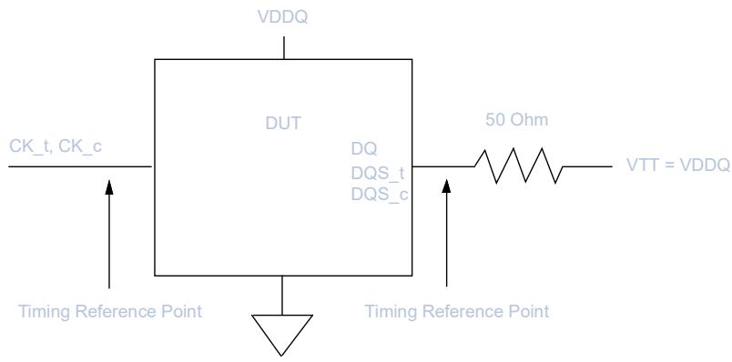

<details>
<summary>text_image</summary>

VDDQ
CK_t, CK_c
DUT
DQ
DQS_t
DQS_c
50 Ohm
VTT = VDDQ
Timing Reference Point
Timing Reference Point
</details>

Figure 258 — Reference Load for AC Timing and Output Slew Rate

# 13.2 Rounding Definitions and Algorithms

Software algorithms for calculation of timing parameters are subject to rounding errors from many sources. For example, a system may use a memory clock with a nominal frequency of 2200 MHz (4400 MT/s) for the DDR5-4400 speed bin, which mathematically yields a nominal clock period tCK(AVG) of 0.454545... ns. In most cases, it is impossible to express all digits after the decimal point exactly, and rounding must be used. The DDR5 SDRAM specification establishes a minimum granularity for timing parameters of 1 ps.

Rules for rounding must be defined to allow optimization of device performance without violating device parameters. All timing parameters specified in the time domain (ns, ps, etc.) which must then be converted to the clock domain (nCK units) shall be defined to align with these rules. The key point is, minimum and maximum timing parameter values shall generally use the same rounding rules used to define tCK(AVG)min and tCK(AVG)max. The resulting rounding algorithms rely on results that are within correction factors of device testing and specification to avoid losing performance due to rounding errors.

These rules are:

 DEFINING TIMING PARAMETER VALUES: Minimum and maximum timing parameter values, including tCK(AVG)min and tCK(AVG)max, are rounded down and to be defined to 1 ps of accuracy in the DDR5 SDRAM specification based on the non-rounded nominal tCK(AVG) for a given speed bin. If the nominal timing parameter values require more than 1 ps of accuracy, they can be rounded down (faster) to the next 1 ps according to the rounding algorithms, and the DDR5 SDRAM is responsible for absorbing the resulting small parameter extensions. In other words, the DDR5 SDRAM specification only lists the nominal parameter values rounded down to the next 1 ps. For example, this extends the DDR5-4400 tCK(AVG)min definition to be exactly 0.454 ns which is slightly smaller (faster) than the nominal memory clock period of 0.454545... ns by less than 1 ps.   
 CALCULATING THE REAL MINIMUM TIMING PARAMETER VALUES: For minimum timing parameters, other than tCK(AVG)min, to avoid losing performance due to additional erroneous nCKs and to calculate the true real minimum values, their nominal values listed in the DDR5 SDRAM specification must be reduced (faster) by the maximum %error (correction factor) used to define tCK(AVG)min. The DDR5 SDRAM is responsible for absorbing the resulting small parameter extensions. For example, tWRmin has a nominal value of 30.000 ns, however, applying the 0.30% correction factor allows a more aggressive timing (for example, 29.910 ns) to be supported, which allows the intended smaller (faster) nCK value to be maintained when rounding tCK(AVG)min down to the next 1 ps. Note, parameter values defined to be 0 ps do not need to be reduced by a correction factor, and therefore don’t require these rounding algorithms.   
 CALCULATING THE REAL MAXIMUM TIMING PARAMETER VALUES: For maximum timing parameters, including tCK(AVG)max, to avoid losing performance due to excluding erroneous nCKs and to calculate the true real maximum values, their nominal values listed in the DDR5 SDRAM specification must be increased (slower) by the maximum %error caused by rounding tCK(AVG) down to the next 1 ps. The DDR5 SDRAM is responsible for absorbing the resulting small parameter extensions. For example, tREFImax has a nominal value of 3.9 µs. And the DDR5-8400 speed bin mathematically yields a nominal clock period tCK(AVG) of 0.238095... ns, resulting in a theoretical maximum %error of 0.42% (0.239 ns/0.238 ns-100%). So the true real tREFImax value is 3.916386... µs (3.9 µs\*0.239 ns/ 0.238 ns) for the DDR5-8400 speed bin.   
 ROUNDING ALGORITHM FOR MINIMUM TIMING PARAMETER VALUES: Round down only integer number math is commonly used in the industry to calculate nCK values. This rounding algorithm for minimum timing parameters uses scaling by 1000 to allow use of integer math. Nominal minimum timing parameters like tWRmin, tRCDmin, etc. which are programmed in systems in numbers of clocks (nCK) but expressed in units of time(ps), are rounded down to the next 1ps, multiplied by the scaled inverse correction factor (1000-3=997) prior to division by the application memory clock period rounded down to the next 1ps, and adding 1 scaled by 1000 to that result effectively adds 1nCK. Division by 1000 undoes the scaling effects, resulting in a number of clocks as the final answer which has been effectively rounded up to the next 1 nCK by adding 1nCK in the previous step and then rounding down to the next 1 nCK. The caveat is, effectively adding 1 prior to rounding down is mostly equivalent to rounding up except when the result is equal to an integer, in which case the result won’t be rounded down as intended, and therefore performance would be lost. To address this, the maximum 0.28% correction factor needed for 3600 MHz (0.277ns/0.2777777...ns-100%) operation has been increased slightly to 0.30% in this rounding algorithms. This accounts for all integer boundary conditions, except for the specific case when the nominal minimum timing parameter value is defined to be 0 ps. No rounding is required for parameter values equal to 0 ps. This rounding algorithm is not optimized for parameter values that are less than or equal to 0ps, and may result in unintended lost performance if used for parameter values that are less than or equal to 0 ps.

$$
n C K = t r u n c a t e \left[ \frac {\left(\frac {t r u n c a t e [ \text {parameter\_nominal\_in\_ps} ] \times 9 9 7}{t r u n c a t e [ \text {tCK(AVG)\_real\_in\_ps} ]}\right) + 1 0 0 0}{1 0 0 0} \right]
$$

# 13.2 Rounding Definitions and Algorithms (cont’d)

 ROUNDING ALGORITHM FOR MAXIMUM TIMING PARAMETER VALUES: Round down only integer number math is commonly used in the industry to calculate nCK values. This rounding algorithm is used for maximum timing parameters. Nominal maximum timing parameters like tREFImax, etc. which programmed in systems in numbers of clocks (nCK) but expressed in units of time (ps), are rounded down to the next 1 ps prior to division by the application memory clock period rounded down to the next 1 ps, resulting in a number of clocks as the final answer which is rounded down to the next 1 nCK. No rounding is required for parameter values equal to 0 ps, but this rounding algorithm can still be used for parameter values equal to 0ps and no performance will be lost. This rounding algorithm is not optimized for parameter values that are less than 0 ps (negative parameter values), and may result in violating the parameter specification if used for parameter values that are less than 0 ps.

$$
n C K = \text { truncate } \left[ \frac {\text { truncate } [ \text { parameter\_nominal\_in\_ps } ]}{\text { truncate } [ t C K A V G) ]} \right]
$$

 CL ALGORITHM FOR STANDARD SPEED BINS: The math rounding algorithms shall be used for all timing parameters when converting from the time domain (ns, ps, etc.) to the clock domain (nCK units), except for when converting tAA to CL. If these rounding algorithms are used to convert tAA to CL, they’ll return invalid CL’s for some cases when down clocking (and the DIMM SPD CL Mask doesn’t protect against all of these cases). The proper setting of CL shall be determined by the memory controller, either by using the speed bin tables, or by using the CL algorithm, or by some other means. Refer to the Speed Bins and Operations section for more information. Note, the CL algorithm replaces the need to use the DIMM SPD CL Mask.   
 CL ALGORITHM FOR CUSTOM SPEED BINS: If the DDR5 SDRAM supports non-standard tCK, tAA, tRCD, and tRP speed bin timings, the CL algorithm will still only return valid CL’s as defined in the speed bin tables, which may not be the intended CL’s for non-standard speed bins. In these cases, the rounding algorithms may need to be used to convert tAA to CL, instead of the CL algorithm. The CL returned by the rounding algorithms shall be incremented up to the next supported CL according to the DIMM SPD CL Mask. Consult the memory vendor for more information.

# 13.2.1 Example 1, Using Integer Math to Convert tWR(min) from ns to nCK

// This algorithm reduces the nominal minimum timing parameter value by a 0.30% correction factor, // rounds tCK(AVG) down, calculates nCK, adds 1 nCK, and rounds nCK down to the next integer value

int TwrMin, Correction, ClockPeriod, TempTwr, TempNck, TwrInNck;

<table><tr><td>TwrMin = 30000;</td><td>// tWRmin in ps</td></tr><tr><td>Correction = 3</td><td>// 0.30% per the rounding algorithm</td></tr><tr><td>ClockPeriod = ApplicationTck;</td><td>// Clock period in ps is application specific</td></tr><tr><td>TempTwr = TwrMin * (1000 - Correction);</td><td>// Apply correction factor, scaled by 1000</td></tr><tr><td>TempNck = TempTwr / ClockPeriod ;</td><td>// Initial nCK calculation, scaled by 1000</td></tr><tr><td>TempNck = TempNck + 1000;</td><td>// Add 1, scaled by 1000, to effectively round up</td></tr><tr><td>TwrlnNck = (int)(TempNck / 1000);</td><td>// Round down to next integer</td></tr></table>

Table 329 — Example 1, Using Round Down only Integer Number Math 

<table><tr><td colspan="6">DDR5 Device Operating at Standard Application Frequencies Timing Parameter: tWR(min) = 30.000 ns = 30000 ps</td></tr><tr><td>Application Speed Grade</td><td>Device fWR</td><td>Application tCK</td><td>Device tWR / Application tCK</td><td>Device tWR * (1000 - Correction) / Application tCK + 1000</td><td>Truncate Corrected nCK / 1000</td></tr><tr><td>MT/s</td><td>ps</td><td>ps</td><td>nCK (real)</td><td>scaled nCK (corrected)</td><td>nCK (integer)</td></tr><tr><td>3200</td><td>30000</td><td>625</td><td>48.00</td><td>48856</td><td>48</td></tr><tr><td>3600</td><td>30000</td><td>555</td><td>54.05</td><td>54891</td><td>54</td></tr><tr><td>4000</td><td>30000</td><td>500</td><td>60.00</td><td>60820</td><td>60</td></tr><tr><td>4400</td><td>30000</td><td>454</td><td>66.08</td><td>66881</td><td>66</td></tr><tr><td>4800</td><td>30000</td><td>416</td><td>72.12</td><td>72899</td><td>72</td></tr></table>

# 13.3 Timing Parameters by Speed Grade

The analog timing parameters in this section have been defined based on nominal tCA(avg)min according to the rounding rules which can be found in the Rounding Definitions and Algorithms section.

# 13.3.1 Timing Parameters for DDR5-3200 to DDR5-4000

Table 330 — Timing Parameters for DDR5-3200 to DDR5-4000 

<table><tr><td colspan="2">Speed</td><td colspan="2">DDR5-3200</td><td colspan="2">DDR5-3600</td><td colspan="2">DDR5-4000</td><td rowspan="2">Units</td><td rowspan="2">Note</td></tr><tr><td>Parameter</td><td>Symbol</td><td>Min</td><td>Max</td><td>Min</td><td>Max</td><td>Min</td><td>Max</td></tr><tr><td colspan="10">Clock Timing</td></tr><tr><td>Average Clock Period</td><td>tCK(avg)</td><td>0.625</td><td>-</td><td>0.555</td><td>-</td><td>0.500</td><td>-</td><td>ns</td><td>1</td></tr><tr><td colspan="10">Command and Address Timing</td></tr><tr><td>Read to Read command delay for same bank in same bank group</td><td>tCCD_L</td><td colspan="6">Max(RBL/2, 5ns)</td><td>nCK,ns</td><td>8</td></tr><tr><td>Write to Write command delay for same bank in same bank group</td><td>tCCD_L_WR</td><td colspan="6">Max(32nCK, 20ns)</td><td>nCK,ns</td><td>8</td></tr><tr><td>Write to Write command delay for same bank group, second write not RMW</td><td>tCCD_L_WR2</td><td colspan="6">Max(16nCK, 10ns)</td><td>nCK,ns</td><td>8</td></tr><tr><td>Read to Write command delay for same bank group</td><td>tCCD_L_RTW</td><td colspan="6">CL - CWL + RBL/2 + 2tCK - (Read DQS offset) + (tRPST - 0.5tCK) + tWPRE</td><td>nCK,ns</td><td>3, 5, 6, 8</td></tr><tr><td>Write to Read command delay for same bank in same bank group</td><td>tCCD_L_WTR</td><td colspan="6">CWL + WBL/2 + Max(16nCK,10ns)</td><td>nCK,ns</td><td>4, 6, 8</td></tr><tr><td>Read to Read command delay for different bank in same bank group</td><td>tCCD_M</td><td colspan="6">tCCD_L</td><td>nCK,ns</td><td>8</td></tr><tr><td>Write to Write command delay for different bank in same bank group</td><td>tCCD_M_WR</td><td colspan="6">tCCD_L_WR</td><td>nCK,ns</td><td>8</td></tr><tr><td>Write to Read command delay for different bank in same bank group</td><td>tCCD_M_WTR</td><td colspan="6">tCCD_L_WTR</td><td>nCK,ns</td><td>4, 6, 8</td></tr><tr><td>Read to Read command delay for different bank group</td><td>tCCD_S</td><td colspan="6">RBL/2</td><td>nCK</td><td>8</td></tr><tr><td>Write to Write command delay for different bank group</td><td>tCCD_S_WR</td><td colspan="6">WBL/2</td><td>nCK</td><td>8</td></tr><tr><td>Read to Write command delay for different bank group</td><td>tCCD_S_RTW</td><td colspan="6">CL - CWL + RBL/2 + 2tCK - (Read DQS offset) + (tRPST - 0.5tCK) + tWPRE</td><td>nCK,ns</td><td>3, 5, 6, 8</td></tr><tr><td>Write to Read command delay for different bank group</td><td>tCCD_S_WTR</td><td colspan="6">CWL + WBL/2 + Max(4nCK,2.5ns)</td><td>nCK,ns</td><td>4, 6, 8</td></tr><tr><td>Write to Read with Auto Precharge command delay for same bank</td><td>tCCD_WTRA</td><td colspan="6">CWL + WBL/2 + tWR - tRTP</td><td>nCK,ns</td><td>2, 4, 6, 8</td></tr><tr><td>Activate to Activate command delay to same bank group for 1KB page size</td><td>tRRD_L(1K)</td><td colspan="6">Max(8nCK, 5ns)</td><td>nCK,ns</td><td>8</td></tr><tr><td>Activate to Activate command delay to same bank group for 2KB page size</td><td>tRRD_L(2K)</td><td colspan="6">Max(8nCK, 5ns)</td><td>nCK,ns</td><td>8</td></tr><tr><td>Activate to Activate command delay to different bank group for 1KB page size</td><td>tRRD_S(1K)</td><td colspan="6">8</td><td>nCK</td><td>8</td></tr><tr><td>Activate to Activate command delay to different bank group for 2 KB page size</td><td>tRRD_S(2K)</td><td colspan="6">8</td><td>nCK</td><td>8</td></tr><tr><td>Four activate window for 1 KB page size</td><td>tFAW (1K)</td><td>Max(32nCK, 20.000ns)</td><td>-</td><td>Max(32nCK, 17.777ns)</td><td>-</td><td>Max(32nCK, 16.000ns)</td><td>-</td><td>nCK, ns</td><td></td></tr><tr><td>Four activate window for 2 KB page size</td><td>tFAW (2K)</td><td>Max(40nCK, 25.000ns)</td><td>-</td><td>Max(40nCK, 22.222ns)</td><td>-</td><td>Max(40nCK, 20.000ns)</td><td>-</td><td>nCK, ns</td><td></td></tr><tr><td>Read to Precharge command delay</td><td>tRTP</td><td colspan="6">Max(12nCK, 7.5ns)</td><td>nCK,ns</td><td>8</td></tr><tr><td>Precharge to Precharge command delay</td><td>tPPD</td><td colspan="6">2</td><td>nCK</td><td>7, 8</td></tr><tr><td>Write recovery time</td><td>tWR</td><td colspan="6">30</td><td>ns</td><td>8</td></tr></table>

# 13.3.2 Timing Parameters for DDR-4400 to DDR5-5200

The analog timing parameters in this section have been defined based on nominal tCK(avg)min according to the rounding rules which can be found in the Rounding Definitions and Algorithms section.

Table 331 — Timing Parameters for DDR5-4400 to DDR5-5200 

<table><tr><td colspan="2">Speed</td><td colspan="2">DDR5-4400</td><td colspan="2">DDR5-4800</td><td colspan="2">DDR5-5200</td><td rowspan="2">Units</td><td rowspan="2">NOTE</td></tr><tr><td>Parameter</td><td>Symbol</td><td>Min</td><td>Max</td><td>Min</td><td>Max</td><td>Min</td><td>Max</td></tr><tr><td colspan="10">Clock Timing</td></tr><tr><td>Average Clock Period</td><td>tCK(avg)</td><td>0.454</td><td>-</td><td>0.416</td><td>-</td><td>0.384</td><td>-</td><td>ns</td><td>1</td></tr><tr><td colspan="10">Command and Address Timing</td></tr><tr><td>Read to Read command delay for same bank in same bank group</td><td>tCCD_L</td><td colspan="6">Max(RBL/2, 5ns)</td><td>nCK,ns</td><td>8</td></tr><tr><td>Write to Write command delay for same bank in same bank group</td><td>tCCD_L_WR</td><td colspan="6">Max(32nCK, 20ns)</td><td>nCK,ns</td><td>8</td></tr><tr><td>Write to Write command delay for same bank group, second write not RMW</td><td>tCCD_L_WR2</td><td colspan="6">Max(16nCK, 10ns)</td><td>nCK,ns</td><td>8</td></tr><tr><td>Read to Write command delay for same bank group</td><td>tC-CD_L_RTW</td><td colspan="6">CL - CWL + RBL/2 + 2tCK - (Read DQS offset) + (tRPST - 0.5tCK) + tWPRE</td><td>nCK,ns</td><td>3, 5, 6, 8</td></tr><tr><td>Write to Read command delay for same bank in same bank group</td><td>tCCD_L_WTR</td><td colspan="6">CWL + WBL/2 + Max(16nCK,10ns)</td><td>nCK,ns</td><td>4, 6, 8</td></tr><tr><td>Read to Read command delay for different bank in same bank group</td><td>tCCD_M</td><td colspan="6">tCCD_L</td><td>nCK,ns</td><td>8</td></tr><tr><td>Write to Write command delay for different bank in same bank group</td><td>tCCD_M_WR</td><td colspan="6">tCCD_L_WR</td><td>nCK,ns</td><td>8</td></tr><tr><td>Write to Read command delay for different bank in same bank group</td><td>tC-CD_M_WTR</td><td colspan="6">tCCD_L_WTR</td><td>nCK,ns</td><td>4, 6, 8</td></tr><tr><td>Read to Read command delay for different bank group</td><td>tCCD_S</td><td colspan="6">RBL/2</td><td>nCK</td><td>8</td></tr><tr><td>Write to Write command delay for different bank group</td><td>tCCD_S_WR</td><td colspan="6">WBL/2</td><td>nCK</td><td>8</td></tr><tr><td>Read to Write command delay for different bank group</td><td>tC-CD_S_RTW</td><td colspan="6">CL - CWL + RBL/2 + 2tCK - (Read DQS offset) + (tRPST - 0.5tCK) + tWPRE</td><td>nCK,ns</td><td>3, 5, 6, 8</td></tr><tr><td>Write to Read command delay for different bank group</td><td>tCCD_S_WTR</td><td colspan="6">CWL + WBL/2 + Max(4nCK,2.5ns)</td><td>nCK,ns</td><td>4, 6, 8</td></tr><tr><td>Write to Read with Auto Precharge command delay for same bank</td><td>tCCD_WTRA</td><td colspan="6">CWL + WBL/2 + tWR - tRTP</td><td>nCK,ns</td><td>2, 4, 6, 8</td></tr><tr><td>Activate to Activate command delay to same bank group for 1KB page size</td><td>tRRD_L(1K)</td><td colspan="6">Max(8nCK, 5ns)</td><td>nCK,ns</td><td>8</td></tr><tr><td>Activate to Activate command delay to same bank group for 2KB page size</td><td>tRRD_L(2K)</td><td colspan="6">Max(8nCK, 5ns)</td><td>nCK,ns</td><td>8</td></tr><tr><td>Activate to Activate command delay to different bank group for 1KB page size</td><td>tRRD_S(1K)</td><td colspan="6">8</td><td>nCK</td><td>8</td></tr><tr><td>Activate to Activate command delay to different bank group for 2KB page size</td><td>tRRD_S(2K)</td><td colspan="6">8</td><td>nCK</td><td>8</td></tr><tr><td>Four activate window for 1 KB page size</td><td>tFAW (1K)</td><td>Max(32nCK, 14.545ns)</td><td>-</td><td>Max(32nCK, 13.333ns)</td><td>-</td><td>Max(32nCK, 12.307ns)</td><td>-</td><td>nCK, ns</td><td></td></tr><tr><td>Four activate window for 2 KB page size</td><td>tFAW (2K)</td><td>Max(40nCK, 18.181ns)</td><td>-</td><td>Max(40nCK, 16.666ns)</td><td>-</td><td>Max(40nCK, 15.384ns)</td><td>-</td><td>nCK, ns</td><td></td></tr><tr><td>Read to Precharge command delay</td><td>tRTP</td><td colspan="6">Max(12nCK, 7.5ns)</td><td>nCK,ns</td><td>8</td></tr><tr><td>Precharge to Precharge command delay</td><td>tPPD</td><td colspan="6">2</td><td>nCK</td><td>7, 8</td></tr><tr><td>Write recovery time</td><td>tWR</td><td colspan="6">30</td><td>ns</td><td>8</td></tr></table>

# 13.3.3 Timing Parameters for DDR-5600 to DDR5-6400

Analog timing parameters in this section have been defined on nominal tCK(avg)min according to the rounding rules which can be found in the Rounding Definitions and Algorithms section.

Table 332 — Timing Parameters for DDR5-5600 to DDR5-6400 

<table><tr><td colspan="2">Speed</td><td colspan="2">DDR5-5600</td><td colspan="2">DDR5-6000</td><td colspan="2">DDR5-6400</td><td rowspan="2">Units</td><td rowspan="2">NOTE</td></tr><tr><td>Parameter</td><td>Symbol</td><td>Min</td><td>Max</td><td>Min</td><td>Max</td><td>Min</td><td>Max</td></tr><tr><td colspan="10">Clock Timing</td></tr><tr><td>Average Clock Period</td><td>tCK(avg)</td><td>0.357</td><td>-</td><td>0.333</td><td>-</td><td>0.312</td><td>-</td><td>ns</td><td>1</td></tr><tr><td colspan="10">Command and Address Timing</td></tr><tr><td>Read to Read command delay for same bank in same bank group</td><td>tCCD_L</td><td colspan="6">Max(RBL/2, 5ns)</td><td>nCK,ns</td><td>8</td></tr><tr><td>Write to Write command delay for same bank in same bank group</td><td>tCCD_L_WR</td><td colspan="6">Max(32nCK, 20ns)</td><td>nCK,ns</td><td>8</td></tr><tr><td>Write to Write command delay for same bank group, second write not RMW</td><td>tCCD_L_WR2</td><td colspan="6">Max(16nCK, 10ns)</td><td>nCK,ns</td><td>8</td></tr><tr><td>Read to Write command delay for same bank group</td><td>tC-CD_L_RTW</td><td colspan="6">CL - CWL + RBL/2 + 2tCK - (Read DQS offset) + (tRPST - 0.5tCK) + tWPRE</td><td>nCK,ns</td><td>3, 5, 6, 8</td></tr><tr><td>Write to Read command delay for same bank in same bank group</td><td>tCCD_L_WTR</td><td colspan="6">CWL + WBL/2 + Max(16nCK,10ns)</td><td>nCK,ns</td><td>4, 6, 8</td></tr><tr><td>Read to Read command delay for different bank in same bank group</td><td>tCCD_M</td><td colspan="6">tCCD_L</td><td>nCK,ns</td><td>8</td></tr><tr><td>Write to Write command delay for different bank in same bank group</td><td>tCCD_M_WR</td><td colspan="6">tCCD_L_WR</td><td>nCK,ns</td><td>8</td></tr><tr><td>Write to Read command delay for different bank in same bank group</td><td>tC-CD_M_WTR</td><td colspan="6">tCCD_L_WTR</td><td>nCK,ns</td><td>4, 6, 8</td></tr><tr><td>Read to Read command delay for different bank group</td><td>tCCD_S</td><td colspan="6">RBL/2</td><td>nCK</td><td>8</td></tr><tr><td>Write to Write command delay for different bank group</td><td>tCCD_S_WR</td><td colspan="6">WBL/2</td><td>nCK</td><td>8</td></tr><tr><td>Read to Write command delay for different bank group</td><td>tC-CD_S_RTW</td><td colspan="6">CL - CWL + RBL/2 + 2tCK - (Read DQS offset) + (tRPST - 0.5tCK) + tWPRE</td><td>nCK,ns</td><td>3, 5, 6, 8</td></tr><tr><td>Write to Read command delay for different bank group</td><td>tCCD_S_WTR</td><td colspan="6">CWL + WBL/2 + Max(4nCK,2.5ns)</td><td>nCK,ns</td><td>4, 6, 8</td></tr><tr><td>Write to Read with Auto Precharge command delay for same bank</td><td>tCCD_WTRA</td><td colspan="6">CWL + WBL/2 + tWR - tRTP</td><td>nCK,ns</td><td>2, 4, 6, 8</td></tr><tr><td>Activate to Activate command delay to same bank group for 1KB page size</td><td>tRRD_L(1K)</td><td colspan="6">Max(8nCK, 5ns)</td><td>nCK,ns</td><td>8</td></tr><tr><td>Activate to Activate command delay to same bank group for 2KB page size</td><td>tRRD_L(2K)</td><td colspan="6">Max(8nCK, 5ns)</td><td>nCK,ns</td><td>8</td></tr><tr><td>Activate to Activate command delay to different bank group for 1KB page size</td><td>tRRD_S(1K)</td><td colspan="6">8</td><td>nCK</td><td>8</td></tr><tr><td>Activate to Activate command delay to different bank group for 2KB page size</td><td>tRRD_S(2K)</td><td colspan="6">8</td><td>nCK</td><td>8</td></tr><tr><td>Four activate window for 1KB page size</td><td>tFAW (1K)</td><td>Max(32nCK, 11.428ns)</td><td>-</td><td>Max(32nCK, 10.666ns)</td><td>-</td><td>Max(32nCK, 10.000ns)</td><td>-</td><td>nCK, ns</td><td></td></tr><tr><td>Four activate window for 2KB page size</td><td>tFAW (2K)</td><td>Max(40nCK, 14.285ns)</td><td>-</td><td>Max(40nCK, 13.333ns)</td><td>-</td><td>Max(40nCK, 12.500ns)</td><td>-</td><td>nCK, ns</td><td></td></tr><tr><td>Read to Precharge command delay</td><td>tRTP</td><td colspan="6">Max(12nCK, 7.5ns)</td><td>nCK,ns</td><td>8</td></tr><tr><td>Precharge to Precharge command delay</td><td>tPPD</td><td colspan="6">2</td><td>nCK</td><td>7, 8</td></tr><tr><td>Write recovery time</td><td>tWR</td><td colspan="6">30</td><td>ns</td><td>8</td></tr></table>

# 13.3.4 Timing Parameters for DDR-6800 to DDR5-7600

The analog timing parameters in this section have been defined based on nominal tCK(avg)min according to the rounding rules which can be found in the Rounding Definitions and Algorithms section.

Table 333 — Timing Parameters for DDR5-6800 to DDR5-7600 

<table><tr><td colspan="2">Speed</td><td colspan="2">DDR5-6800</td><td colspan="2">DDR5-7200</td><td colspan="2">DDR5-7600</td><td rowspan="2">Units</td><td rowspan="2">NOTE</td></tr><tr><td>Parameter</td><td>Symbol</td><td>Min</td><td>Max</td><td>Min</td><td>Max</td><td>Min</td><td>Max</td></tr><tr><td>Average Clock Period</td><td>tCK(avg)</td><td>0.294</td><td>-</td><td>0.277</td><td>-</td><td>0.263</td><td>-</td><td>ns</td><td>1</td></tr><tr><td colspan="10">Command and Address Timing</td></tr><tr><td>Read to Read command delay for same bank in same bank group</td><td>tCCD_L</td><td colspan="4">max(RBL/2,5ns)</td><td colspan="2">max(RBL/2,5ns)</td><td>nCK,ns</td><td>8</td></tr><tr><td>Write to Write command delay for same bank in same bank group</td><td>tCCD_L_WR</td><td colspan="4">max(32nCK,20ns)</td><td colspan="2">max(32nCK,20ns)</td><td>nCK,ns</td><td>8</td></tr><tr><td>Write to Write command delay for same bank group, second write not RMW</td><td>tCCD_L_WR2</td><td colspan="4">Max(16nCK,10ns)</td><td colspan="2">Max(16nCK,10ns)</td><td>nCK,ns</td><td>8</td></tr><tr><td>Read to Write command delay for same bank group</td><td>tCCD_L_RTW</td><td colspan="4">CL - CWL + RBL/2 + 2tCK - (Read DQS offset) + (tRPST - 0.5tCK) + tWPRE</td><td colspan="2">CL - CWL + RBL/2 + 2tCK - (Read DQS offset) + (tRPST - 0.5tCK) + tWPRE</td><td>nCK,ns</td><td>3,5,6,8</td></tr><tr><td>Write to Read command delay for same bank in same bank group</td><td>tCCD_L_WTR</td><td colspan="4">CWL + WBL/2 + Max(16nCK,10ns)</td><td colspan="2">CWL + WBL/2 + Max(16nCK,10ns)</td><td>nCK,ns</td><td>4,6,8</td></tr><tr><td>Read to Read command delay for different bank in same bank group</td><td>tCCD_M</td><td>max(8nCK,4.705ns)</td><td>-</td><td>max(8nCK,4.444ns)</td><td>-</td><td>max(8nCK,4.210ns)</td><td>-</td><td>nCK,ns</td><td></td></tr><tr><td>Write to Write command delay for different bank in same bank group</td><td>tCCD_M_WR</td><td>max(32nCK,18.823ns)</td><td>-</td><td>max(32nCK,17.777ns)</td><td>-</td><td>max(32nCK,16.842ns)</td><td>-</td><td>nCK,ns</td><td></td></tr><tr><td>Write to Read command delay for different bank in same bank group</td><td>tCCD_M_WTR</td><td>CWL+WBL/2+Max(16nCK,9.411ns)</td><td>-</td><td>CWL+WBL/2+Max(16nCK,8.888ns)</td><td>-</td><td>CWL+WBL/2+Max(16nCK,8.421ns)</td><td>-</td><td>nCK,ns</td><td>4,6</td></tr><tr><td>Read to Read command delay for different bank group</td><td>tCCD_S</td><td colspan="6">RBL/2</td><td>nCK</td><td>8</td></tr><tr><td>Write to Write command delay for different bank group</td><td>tCCD_S_WR</td><td colspan="6">WBL/2</td><td>nCK</td><td>8</td></tr><tr><td rowspan="2">Read to Write command delay for different bank group</td><td rowspan="2">tCCD_S_RTW</td><td rowspan="2" colspan="4">CL - CWL + RBL/2 + 2tCK - (Read DQS offset) + (tRPST - 0.5tCK) + tWPRE</td><td rowspan="2" colspan="2">CL - CWL + RBL/2 + 2tCK - (Read DQS offset) + (tRPST - 0.5tCK) + tWPRE</td><td rowspan="2">nCK,ns</td><td rowspan="2">3,5,6,8</td></tr><tr></tr><tr><td>Write to Read command delay for different bank group</td><td>tCCD_S_WTR</td><td>CWL+WBL/2+Max(4nCK,2.352ns)</td><td>-</td><td>CWL+WBL/2+Max(4nCK,2.222ns)</td><td>-</td><td>CWL+WBL/2+Max(4nCK,2.105ns)</td><td>-</td><td>nCK,ns</td><td>4,6</td></tr><tr><td>Write to Read with Auto Precharge command delay for same bank</td><td>tCCD_WTRA</td><td colspan="4">CWL + WBL/2 + tWR - tRTP</td><td colspan="2">CWL + WBL/2 + tWR - tRTP</td><td>nCK,ns</td><td>2,4,6,8</td></tr><tr><td>Activate to Activate command delay to same bank group for 1KB page size</td><td>tRRD_L(1K)</td><td>max(8nCK,4.705ns)</td><td>-</td><td>max(8nCK,4.444ns)</td><td>-</td><td>max(8nCK,4.210ns)</td><td>-</td><td>nCK,ns</td><td></td></tr><tr><td>Activate to Activate command delay to same bank group for 2KB page size</td><td>tRRD_L(2K)</td><td>max(8nCK,4.705ns)</td><td>-</td><td>max(8nCK,4.444ns)</td><td>-</td><td>max(8nCK,4.210ns)</td><td>-</td><td>nCK,ns</td><td></td></tr><tr><td>Activate to Activate command delay to different bank group for 1KB page size</td><td>tRRD_S(1K)</td><td colspan="4">8</td><td colspan="2">8</td><td>nCK</td><td>8</td></tr><tr><td>Activate to Activate command delay to different bank group for 2KB page size</td><td>tRRD_S(2K)</td><td colspan="4">8</td><td colspan="2">8</td><td>nCK</td><td>8</td></tr><tr><td>Four activate window for 1KB page size</td><td>tFAW(1K)</td><td>Max(32nCK,9.411ns)</td><td>-</td><td>Max(32nCK,8.888ns)</td><td>-</td><td>Max(32nCK,8.421ns)</td><td>-</td><td>nCK,ns</td><td></td></tr><tr><td>Four activate window for 2KB page size</td><td>tFAW(2K)</td><td>Max(40nCK,11.764ns)</td><td>-</td><td>Max(40nCK,11.111ns)</td><td>-</td><td>Max(40nCK,10.526ns)</td><td>-</td><td>nCK,ns</td><td></td></tr><tr><td>Read to Precharge command delay</td><td>tRTP</td><td colspan="4">Max(12nCK,7.5ns)</td><td colspan="2">Max(12nCK,7.5ns)</td><td>nCK,ns</td><td>8</td></tr><tr><td>Precharge to Precharge command delay</td><td>tPPD</td><td colspan="4">2</td><td colspan="2">4</td><td>nCK</td><td>7,8</td></tr><tr><td>Write recovery time</td><td>tWR</td><td colspan="4">30</td><td colspan="2">30</td><td>ns</td><td>8</td></tr></table>

# 13.3.5 Timing Parameters for DDR-8000 to DDR5-8800

Table 334 — Timing Parameters for DDR5-8000 to DDR5-8800 

<table><tr><td colspan="2">Speed</td><td colspan="2">DDR5-8000</td><td colspan="2">DDR5-8400</td><td colspan="2">DDR5-8800</td><td rowspan="2">Units</td><td rowspan="2">NOTE</td></tr><tr><td>Parameter</td><td>Symbol</td><td>Min</td><td>Max</td><td>Min</td><td>Max</td><td>Min</td><td>Max</td></tr><tr><td>Average Clock Period</td><td>tCK(avg)</td><td>0.250</td><td>-</td><td>0.238</td><td>-</td><td>0.227</td><td>-</td><td>ns</td><td>1</td></tr><tr><td colspan="10">Command and Address Timing</td></tr><tr><td>Read to Read command delay for same bank in same bank group</td><td>tCCD_L</td><td colspan="6">Max(8nCK, 5ns)</td><td>nCK,ns</td><td>8</td></tr><tr><td>Write to Write command delay for same bank in same bank group</td><td>tCCD_L_WR</td><td colspan="6">Max(32nCK, 20ns)</td><td>nCK,ns</td><td>8</td></tr><tr><td>Write to Write command delay for same bank group, second write not RMW</td><td>tCCD_L_WR2</td><td colspan="6">Max(16nCK, 10ns)</td><td>nCK,ns</td><td>8</td></tr><tr><td>Read to Write command delay for same bank group</td><td>tCCD_L_RTW</td><td colspan="6">CL - CWL + RBL/2 + 2tCK - (Read DQS offset) + (tRPST - 0.5tCK) + tWPRE</td><td>nCK,ns</td><td>3, 5, 6, 8</td></tr><tr><td>Write to Read command delay for same bank in same bank group</td><td>tCCD_L_WTR</td><td colspan="6">CWL + WBL/2 + Max(16nCK,10ns)</td><td>nCK,ns</td><td>4, 6, 8</td></tr><tr><td>Read to Read command delay for different bank in same bank group</td><td>tCCD_M</td><td>max(8nCK, 4.000ns)</td><td>-</td><td>max(8nCK, 4.000ns)</td><td>-</td><td>max(8nCK, 3.863ns)</td><td>-</td><td>nCK,ns</td><td></td></tr><tr><td>Write to Write command delay for different bank in same bank group</td><td>tCCD_M_WR</td><td>max(32nCK, 16.000ns)</td><td>-</td><td>max(32nCK, 15.238ns)</td><td>-</td><td>max(32nCK, 14.545ns)</td><td>-</td><td>nCK,ns</td><td></td></tr><tr><td>Write to Read command delay for different bank in same bank group</td><td>tCCD_M_WTR</td><td>CWL+WBL/2+Max(16nCK, 8.000ns)</td><td>-</td><td>CWL+WBL/2+Max(16nCK, 7.619ns)</td><td>-</td><td>CWL+WBL/2+Max(16nCK, 7.272ns)</td><td>-</td><td>nCK,ns</td><td>4, 6, 8</td></tr><tr><td>Read to Read command delay for different bank group</td><td>tCCD_S</td><td colspan="6">RBL/2</td><td>nCK</td><td>8</td></tr><tr><td>Write to Write command delay for different bank group</td><td>tCCD_S_WR</td><td colspan="6">WBL/2</td><td>nCK</td><td>8</td></tr><tr><td>Read to Write command delay for different bank group</td><td>tCCD_S_RTW</td><td colspan="6">CL - CWL + RBL/2 + 2tCK - (Read DQS offset) + (tRPST - 0.5tCK) + tWPRE</td><td>nCK,ns</td><td>3, 5, 6, 8</td></tr><tr><td>Write to Read command delay for different bank group</td><td>tCCD_S_WTR</td><td>CWL + WBL/2 + Max(4nCK, 2.000ns)</td><td>-</td><td>CWL + WBL/2 + Max(4nCK, 1.904ns)</td><td>-</td><td>CWL + WBL/2 + Max(4nCK, 1.818ns)</td><td>-</td><td>nCK,ns</td><td>4, 6, 8</td></tr><tr><td>Write to Read with Auto Precharge command delay for same bank</td><td>tCCD_WTRA</td><td colspan="6">CWL + WBL/2 + tWR - tRTP</td><td>nCK,ns</td><td>2, 4, 6, 8</td></tr><tr><td>Activate to Activate command delay to same bank group for 1KB page size</td><td>tRRD_L(1K)</td><td>Max(8nCK, 4.000ns)</td><td>-</td><td>max(8nCK, 4.000ns)</td><td>-</td><td>max(8nCK, 3.863ns)</td><td>-</td><td>nCK,ns</td><td></td></tr><tr><td>Activate to Activate command delay to same bank group for 2KB page size</td><td>tRRD_L(2K)</td><td>Max(8nCK, 4.000ns)</td><td>-</td><td>max(8nCK, 4.000ns)</td><td>-</td><td>max(8nCK, 3.863ns)</td><td>-</td><td>nCK,ns</td><td></td></tr><tr><td>Activate to Activate command delay to different bank group for 1KB page size</td><td>tRRD_S(1K)</td><td colspan="6">8</td><td>nCK</td><td>8</td></tr><tr><td>Activate to Activate command delay to different bank group for 2KB page size</td><td>tRRD_S(2K)</td><td colspan="6">8</td><td>nCK</td><td>8</td></tr><tr><td>Four activate window for 1KB page size</td><td>tFAW (1K)</td><td>Max(32nCK, 8.000ns)</td><td>-</td><td>Max(32nCK, 7.619ns)</td><td>-</td><td>Max(32nCK, 7.272ns)</td><td>-</td><td>nCK, ns</td><td></td></tr><tr><td>Four activate window for 2KB page size</td><td>tFAW (2K)</td><td>Max(40nCK, 10.000ns)</td><td>-</td><td>Max(40nCK, 9.523ns)</td><td>-</td><td>Max(40nCK, 9.090ns)</td><td>-</td><td>nCK, ns</td><td></td></tr><tr><td>Read to Precharge command delay</td><td>tRTP</td><td colspan="6">Max(12nCK, 7.5ns)</td><td>nCK,ns</td><td>8</td></tr><tr><td>Precharge to Precharge command delay</td><td>tPPD</td><td colspan="6">4</td><td>nCK</td><td>7, 8</td></tr><tr><td>Write recovery time</td><td>tWR</td><td colspan="6">30</td><td>ns</td><td>8</td></tr></table>

# Timing Parameters Table Notes for DDR5-3200 to DDR5-8800:

1. tCK(avg)min listed for reference only, refer to the Speed Bins and Operations section which lists all valid tCK(avg) values.   
2. tCCD\_WTRA(min) shall always be greater than or equal to CWL + WBL/2 + tWR(min) - tRTP(min), and when using the appropriate rounding algorithms, nCCD\_WTRA(min) shall always be greater than or equal to CWL + WBL/2 + nWR(min) - nRTP(min).   
3. RBL: Read burst length associated with Read command:   
4. WBL: Write burst length associated with Write command:   
5. The following is considered for tRTW equation:   
6. CWL=CL-2   
7. tPPD applies to any combination of precharge commands (PREab, PREsb, PREpb). tPPD also applies to any combination of precharge commands to a different die in a 3DS DDR5 SDRAM.   
8. This parameter only specifies minimum values (there is no maximum value). The maximum value cells have been merged in the table to improve legibility.

```txt
RBL = 32 (36 w/ RCRC on) for fixed BL32 and BL32 in BL32 OTF mode
RBL = 16 (18 w/ RCRC on) for fixed BL16 and BL16 in BL32 OTF mode
RBL = 16 (18 w/ RCRC on) for BL16 in BC8 OTF mode and BC8 in BC8 OTF mode 
```

```txt
WBL = 32 (36 w/ WCRC on) for fixed BL32 and BL32 in BL32 OTF mode
WBL = 16 (18 w/ WCRC on) for fixed BL16 and BL16 in BL32 OTF mode
WBL = 16 (18 w/ WCRC on) for BL16 in BC8 OTF mode and BC8 in BC8 OTF mode 
```

```txt
1tCK needs to be added due to tDQS2CK
Read DQS offset timing can pull in the tRTW timing
1tCK needs to be added when 1.5tCK postamble 
```

# 13.3.6 Timing Parameters for 3DS-DDR5-3200 to 3DS-DDR5-4000 x4 2H and 4H

Analog timing parameters defined in this section are to be rounded to 1 ps of accuracy. Parameter min values which scale with tCKmin are to be defined using the tCKmin in the associated data rate.

Table 335 — Timing Parameters for x4 2H and 4H 3DS-DDR5-3200 to 3DS-DDR5-4000 

<table><tr><td colspan="2">Speed</td><td colspan="2">DDR5-3200</td><td colspan="2">DDR5-3600</td><td colspan="2">DDR5-4000</td><td rowspan="2">Units</td><td rowspan="2">Notes</td></tr><tr><td>Parameter</td><td>Symbol</td><td>Min</td><td>Max</td><td>Min</td><td>Max</td><td>Min</td><td>Max</td></tr><tr><td colspan="10">Clock Timing</td></tr><tr><td>Average Clock Period</td><td>tCK(avg)</td><td>0.625</td><td>-</td><td>0.555</td><td>-</td><td>0.500</td><td>-</td><td>ns</td><td>1</td></tr><tr><td colspan="10">Command and Address Timing for 3DS</td></tr><tr><td>Read to Read command delay for same bank group in same logical rank</td><td>tCCD_L_slr</td><td colspan="6">Max(8nCK, 5ns)</td><td>nCK,ns</td><td>15</td></tr><tr><td>Write to Write command delay for same bank group in same logical rank</td><td>tCCD_L_WR_slr</td><td colspan="6">Max(32nCK, 20ns)</td><td>nCK,ns</td><td>15</td></tr><tr><td>Write to Write command delay for same bank group in same logical rank, second write not RMW</td><td>tCCD_L_WR2_slr</td><td colspan="6">Max(16nCK, 10ns)</td><td>nCK,ns</td><td>15</td></tr><tr><td>Read to Write command delay for same bank group in same logical rank</td><td>tCCD_L_RTW_slr</td><td colspan="6">CL - CWL + RBL/2 + 2tCK - (Read DQS offset) + (tRPST - 0.5tCK) + tWPRE</td><td>nCK,ns</td><td>3, 5, 6</td></tr><tr><td>Write to Read command delay for same bank group in same logical rank</td><td>tCCD_L_WTR_slr</td><td colspan="6">CWL + WBL/2 + Max(16nCK,10ns)</td><td>nCK,ns</td><td>4, 6</td></tr><tr><td>Read to Read command delay for different bank in same bank group</td><td>tCCD_M_slr</td><td colspan="6">tCCD_L_slr</td><td>nCK,ns</td><td>15</td></tr><tr><td>Write to Write command delay for different bank in same bank group</td><td>tCCD_M_WR_slr</td><td colspan="6">tCCD_L_WR_slr</td><td>nCK,ns</td><td>15</td></tr><tr><td>Write to Read command delay for different bank in same bank group</td><td>tCCD_M_WTR_slr</td><td colspan="6">tCCD_L_WTR_slr</td><td>nCK,ns</td><td>4, 6, 15</td></tr><tr><td>Read to Read command delay for different bank group in same logical rank</td><td>tCCD_S_slr</td><td colspan="6">RBL/2</td><td>nCK</td><td>15</td></tr><tr><td>Write to Write command delay for different bank group in same logical rank</td><td>tCCD_S_WR_slr</td><td colspan="6">WBL/2</td><td>nCK</td><td>15</td></tr><tr><td>Read to Write command delay for different bank group in same logical rank</td><td>tCCD_S_RTW_slr</td><td colspan="6">CL - CWL + RBL/2 + 2tCK - (Read DQS offset) + (tRPST - 0.5tCK) + tWPRE</td><td>nCK,ns</td><td>3, 5, 6</td></tr><tr><td>Write to Read command delay for different bank group in same logical rank</td><td>tCCD_S_WTR_slr</td><td colspan="6">CWL + WBL/2 + Max(4nCK,2.5ns)</td><td>nCK,ns</td><td>4, 6</td></tr><tr><td>Write to Read with Auto Precharge command for same bank in same logic rank</td><td>tCCD_WTRA_slr</td><td colspan="6">CWL + WBL/2 + tWR_slr - tRTP_slr</td><td>nCK,ns</td><td>2, 4, 6</td></tr><tr><td>Activate to Activate command delay to same bank group in the same logical rank</td><td>tRRD_L_slr(1K)</td><td colspan="6">Max(8nCK, 5ns)</td><td>nCK,ns</td><td>15</td></tr><tr><td>Activate to Activate command delay to different bank group in the same logical rank</td><td>tRRD_S_slr(1K)</td><td colspan="6">8</td><td>nCK</td><td>15</td></tr><tr><td>Four activate window to the same logical rank</td><td>tFAW_slr(1K)</td><td>max(32nCK, 20.000ns)</td><td>-</td><td>max(32nCK, 17.777ns)</td><td>-</td><td>max(32nCK, 16.000ns)</td><td>-</td><td>nCK, ns</td><td>9</td></tr><tr><td>Read command to Precharge command delay in same logical rank</td><td>tRTP_slr</td><td colspan="6">Max(12nCK, 7.5ns)</td><td>nCK,ns</td><td>15</td></tr><tr><td>Precharge to Precharge delay in same logical rank</td><td>tPPD_slr</td><td colspan="6">2</td><td>nCK</td><td>7, 15</td></tr><tr><td>Write recovery time in same logical rank</td><td>tWR_slr</td><td colspan="6">30</td><td>ns</td><td>15</td></tr><tr><td>Read to Read command delay in different logical ranks</td><td>tCCD_dlr</td><td>Max(8nCK, 5.000ns)</td><td>-</td><td>Max(8nCK, 4.444ns)</td><td>-</td><td>Max(8nCK, 4.000ns)</td><td>-</td><td>nCK,ns</td><td></td></tr><tr><td>Write to Write command delay in different logical ranks</td><td>tCCD_WR_dlr</td><td>Max(8nCK, 5.000ns)</td><td>-</td><td>Max(8nCK, 4.444ns)</td><td>-</td><td>Max(8nCK, 4.000ns)</td><td>-</td><td>nCK,ns</td><td>12</td></tr><tr><td>Read to Write command delay in different logical ranks</td><td>tCCD_RTW_dlr</td><td colspan="6">CL - CWL + RBL/2 + 2tCK - (Read DQS offset) + (tRPST - 0.5tCK) + tWPRE</td><td>nCK,ns</td><td>3, 5, 6</td></tr><tr><td>Write to Read command delay in different logical ranks</td><td>tCCD_WTR_dlr</td><td colspan="6">CWL + WBL/2 + Max(4nCK,2.5ns)</td><td>nCK,ns</td><td>4, 6</td></tr><tr><td>Activate to Activate command delay to different logical ranks</td><td>tRRD_dlr</td><td>Max(4nCK, 2.500ns)</td><td>-</td><td>Max(4nCK, 2.222ns)</td><td>-</td><td>Max(4nCK, 2.000ns)</td><td>-</td><td>nCK,ns</td><td></td></tr><tr><td>Four activate window to different logical ranks</td><td>tFAW_dlr</td><td>Max(16nCK, 10.000ns)</td><td>-</td><td>Max(16nCK, 8.888ns)</td><td>-</td><td>Max(16nCK, 8.000ns)</td><td>-</td><td>nCK,ns</td><td></td></tr><tr><td>Precharge to Precharge delay in different logical rank</td><td>tPPD_dlr</td><td colspan="6">2</td><td>nCK</td><td>7, 15</td></tr><tr><td>Minimum Write to Write command delay in different 3DS or DDP physical ranks</td><td>tCCD_WR_dpr</td><td colspan="6">8</td><td>nCK</td><td>12, 13, 15</td></tr><tr><td>Activate window by DIMM channel</td><td>tDCAW</td><td colspan="6">128</td><td>nCK</td><td>10, 11, 13, 14, 15</td></tr><tr><td>DIMM Channel Activate Command Count in tDCAW</td><td>nDCAC</td><td colspan="6">32</td><td>ACT</td><td>10, 11, 13, 14, 16</td></tr></table>

# 13.3.7 Timing Parameters for 3DS-DDR5-4400 to 3DS-DDR5-5200 x4 2H and 4H

Analog timing parameters defined in this section are to be rounded to 1 ps of accuracy. Parameter min values which scale with tCKmin are to be defined using the tCKmin in the associated data rate.

Table 336 — Timing Parameters for x4 2H and 4H 3DS-DDR5-4400 to 3DS-DDR5-5200 

<table><tr><td colspan="2">Speed</td><td colspan="2">DDR5-4400</td><td colspan="2">DDR5-4800</td><td colspan="2">DDR5-5200</td><td rowspan="2">Units</td><td rowspan="2">Notes</td></tr><tr><td>Parameter</td><td>Symbol</td><td>Min</td><td>Max</td><td>Min</td><td>Max</td><td>Min</td><td>Max</td></tr><tr><td colspan="10">Clock Timing</td></tr><tr><td>Average Clock Period</td><td>tCK(avg)</td><td>0.454</td><td>-</td><td>0.416</td><td>-</td><td>0.384</td><td>-</td><td>ns</td><td>1</td></tr><tr><td colspan="10">Command and Address Timing for 3DS</td></tr><tr><td>Read to Read command delay for same bank group in same logical rank</td><td>tCCD_L_slr</td><td colspan="6">Max(8nCK, 5ns)</td><td>nCK,ns</td><td>15</td></tr><tr><td>Write to Write command delay for same bank group in same logical rank</td><td>tCCD_L_WR_slr</td><td colspan="6">Max(32nCK, 20ns)</td><td>nCK,ns</td><td>15</td></tr><tr><td>Write to Write command delay for same bank group in same logical rank, second write not RMW</td><td>tCCD_L_WR2_slr</td><td colspan="6">Max(16nCK, 10ns)</td><td>nCK,ns</td><td>15</td></tr><tr><td>Read to Write command delay for same bank group in same logical rank</td><td>tCCD_L_RTW_slr</td><td colspan="6">CL - CWL + RBL/2 + 2tCK - (Read DQS offset) + (tRPST - 0.5tCK) + tWPRE</td><td>nCK,ns</td><td>3, 5, 6</td></tr><tr><td>Write to Read command delay for same bank group in same logical rank</td><td>tCCD_L_WTR_slr</td><td colspan="6">CWL + WBL/2 + Max(16nCK,10ns)</td><td>nCK,ns</td><td>4, 6</td></tr><tr><td>Read to Read command delay for different bank in same bank group</td><td>tCCD_M_slr</td><td colspan="6">tCCD_L_slr</td><td>nCK,ns</td><td>15</td></tr><tr><td>Write to Write command delay for different bank in same bank group</td><td>tCCD_M_WR_slr</td><td colspan="6">tCCD_L_WR_slr</td><td>nCK,ns</td><td>15</td></tr><tr><td>Write to Read command delay for different bank in same bank group</td><td>tCCD_M_WTR_slr</td><td colspan="6">tCCD_L_WTR_slr</td><td>nCK,ns</td><td>4, 6, 15</td></tr><tr><td>Read to Read command delay for different bank group in same logical rank</td><td>tCCD_S_slr</td><td colspan="6">RBL/2</td><td>nCK</td><td>15</td></tr><tr><td>Write to Write command delay for different bank group in same logical rank</td><td>tCCD_S_WR_slr</td><td colspan="6">WBL/2</td><td>nCK</td><td>15</td></tr><tr><td>Read to Write command delay for different bank group in same logical rank</td><td>tCCD_S_RTW_slr</td><td colspan="6">CL - CWL + RBL/2 + 2tCK - (Read DQS offset) + (tRPST - 0.5tCK) + tWPRE</td><td>nCK,ns</td><td>3, 5, 6</td></tr><tr><td>Write to Read command delay for different bank group in same logical rank</td><td>tCCD_S_WTR_slr</td><td colspan="6">CWL + WBL/2 + Max(4nCK,2.5ns)</td><td>nCK,ns</td><td>4, 6</td></tr><tr><td>Write to Read with Auto Precharge command for same bank in same logic rank</td><td>tCCD_WTRA_slr</td><td colspan="6">CWL + WBL/2 + tWR_slr - tRTP_slr</td><td>nCK,ns</td><td>2, 4, 6</td></tr><tr><td>Activate to Activate command delay to same bank group in the same logical rank</td><td>tRRD_L_slr(1K)</td><td colspan="6">Max(8nCK, 5ns)</td><td>nCK,ns</td><td>15</td></tr><tr><td>Activate to Activate command delay to different bank group in the same logical rank</td><td>tRRD_S_slr(1K)</td><td colspan="6">8</td><td>nCK</td><td>15</td></tr><tr><td>Four activate window to the same logical rank</td><td>tFAW_slr(1K)</td><td>max(32nCK, 14.545ns)</td><td>-</td><td>max(32nCK, 13.333ns)</td><td>-</td><td>max(32nCK, 12.307ns)</td><td>-</td><td>nCK, ns</td><td>9</td></tr><tr><td>Read command to Precharge command delay in same logical rank</td><td>tRTP_slr</td><td colspan="6">Max(12nCK, 7.5ns)</td><td>nCK,ns</td><td>15</td></tr><tr><td>Precharge to Precharge delay in same logical rank</td><td>tPPD_slr</td><td colspan="6">2</td><td>nCK</td><td>7, 15</td></tr><tr><td>Write recovery time in same logical rank</td><td>tWR_slr</td><td colspan="6">30</td><td>ns</td><td>15</td></tr><tr><td>Read to Read command delay in different logical ranks</td><td>tCCD_dlr</td><td>Max(8nCK, 3.636ns)</td><td>-</td><td>Max(8nCK, 3.333ns)</td><td>-</td><td>Max(8nCK, 3.333ns)</td><td>-</td><td>nCK,ns</td><td></td></tr><tr><td>Write to Write command delay in different logical ranks</td><td>tCCD_WR_dlr</td><td>Max(8nCK, 3.636ns)</td><td>-</td><td>Max(8nCK, 3.333ns)</td><td>-</td><td>Max(8nCK, 3.333ns)</td><td>-</td><td>nCK,ns</td><td>12</td></tr><tr><td>Read to Write command delay in different logical ranks</td><td>tCCD_RTW_dlr</td><td colspan="6">CL - CWL + RBL/2 + 2tCK - (Read DQS offset) + (tRPST - 0.5tCK) + tWPRE</td><td>nCK,ns</td><td>3, 5, 6</td></tr><tr><td>Write to Read command delay in different logical ranks</td><td>tCCD_WTR_dlr</td><td colspan="6">CWL + WBL/2 + Max(4nCK,2.5ns)</td><td>nCK,ns</td><td>4, 6</td></tr><tr><td>Activate to Activate command delay to different logical ranks</td><td>tRRD_dlr</td><td>Max(4nCK, 1.818ns)</td><td>-</td><td>Max(4nCK, 1.666ns)</td><td>-</td><td>Max(4nCK, 1.666ns)</td><td>-</td><td>nCK,ns</td><td></td></tr><tr><td>Four activate window to different logical ranks</td><td>tFAW_dlr</td><td>Max(16nCK, 7.272ns)</td><td>-</td><td>Max(16nCK, 6.666ns)</td><td>-</td><td>Max(16nCK, 6.666ns)</td><td>-</td><td>nCK,ns</td><td></td></tr><tr><td>Precharge to Precharge delay in different logical rank</td><td>tPPD_dlr</td><td colspan="6">2</td><td>nCK</td><td>7, 15</td></tr><tr><td>Minimum Write to Write command delay in different 3DS or DDP physical ranks</td><td>tCCD_WR_dpr</td><td colspan="6">8</td><td>nCK</td><td>12, 13, 15</td></tr><tr><td>Activate window by DIMM channel</td><td>tDCAW</td><td colspan="6">128</td><td>nCK</td><td>10, 11, 13, 14, 15</td></tr><tr><td>DIMM Channel Activate Command Count in tDCAW</td><td>nDCAC</td><td colspan="6">32</td><td>ACT</td><td>10, 11, 13, 14, 16</td></tr></table>

# 13.3.8 Timing Parameters for 3DS-DDR5-5600 to 3DS-DDR5-6400 x4 2H and 4H

Analog timing parameters defined in this section are to be rounded to 1 ps of accuracy. Parameter min values which scale with tCKmin are to be defined using the tCKmin in the associated data rate.

Table 337 — Timing Parameters for x4 2H and 4H 3DS-DDR5-5600 to 3DS-DDR5-6400 

<table><tr><td colspan="2">Speed</td><td colspan="2">DDR5-5600</td><td colspan="2">DDR5-6000</td><td colspan="2">DDR5-6400</td><td rowspan="2">Units</td><td rowspan="2">Notes</td></tr><tr><td>Parameter</td><td>Symbol</td><td>Min</td><td>Max</td><td>Min</td><td>Max</td><td>Min</td><td>Max</td></tr><tr><td colspan="10">Clock Timing</td></tr><tr><td>Average Clock Period</td><td>tCK(avg)</td><td>0.357</td><td>-</td><td>0.333</td><td>-</td><td>0.312</td><td>-</td><td>ns</td><td>1</td></tr><tr><td colspan="10">Command and Address Timing for 3DS</td></tr><tr><td>Read to Read command delay for same bank group in same logical rank</td><td>tCCD_L_slr</td><td colspan="6">Max(8nCK, 5ns)</td><td>nCK,ns</td><td>15</td></tr><tr><td>Write to Write command delay for same bank group in same logical rank</td><td>tCCD_L_WR_slr</td><td colspan="6">Max(32nCK, 20ns)</td><td>nCK,ns</td><td>15</td></tr><tr><td>Write to Write command delay for same bank group in same logical rank, second write not RMW</td><td>tCCD_L_WR2_slr</td><td colspan="6">Max(16nCK, 10ns)</td><td>nCK,ns</td><td>15</td></tr><tr><td>Read to Write command delay for same bank group in same logical rank</td><td>tCCD_L_RTW_slr</td><td colspan="6">CL - CWL + RBL/2 + 2tCK - (Read DQS offset) + (tRPST - 0.5tCK) + tWPRE</td><td>nCK,ns</td><td>3, 5, 6</td></tr><tr><td>Write to Read command delay for same bank group in same logical rank</td><td>tCCD_L_WTR_slr</td><td colspan="6">CWL + WBL/2 + Max(16nCK,10ns)</td><td>nCK,ns</td><td>4, 6</td></tr><tr><td>Read to Read command delay for different bank in same bank group</td><td>tCCD_M_slr</td><td colspan="6">tCCD_L_slr</td><td>nCK,ns</td><td>15</td></tr><tr><td>Write to Write command delay for different bank in same bank group</td><td>tCCD_M_WR_slr</td><td colspan="6">tCCD_L_WR_slr</td><td>nCK,ns</td><td>15</td></tr><tr><td>Write to Read command delay for different bank in same bank group</td><td>tCCD_M_WTR_slr</td><td colspan="6">tCCD_L_WTR_slr</td><td>nCK,ns</td><td>4, 6, 15</td></tr><tr><td>Read to Read command delay for different bank group in same logical rank</td><td>tCCD_S_slr</td><td colspan="6">RBL/2</td><td>nCK</td><td>15</td></tr><tr><td>Write to Write command delay for different bank group in same logical rank</td><td>tCCD_S_WR_slr</td><td colspan="6">WBL/2</td><td>nCK</td><td>15</td></tr><tr><td>Read to Write command delay for different bank group in same logical rank</td><td>tCCD_S_RTW_slr</td><td colspan="6">CL - CWL + RBL/2 + 2tCK - (Read DQS offset) + (tRPST - 0.5tCK) + tWPRE</td><td>nCK,ns</td><td>3, 5, 6</td></tr><tr><td>Write to Read command delay for different bank group in same logical rank</td><td>tCCD_S_WTR_slr</td><td colspan="6">CWL + WBL/2 + Max(4nCK,2.5ns)</td><td>nCK,ns</td><td>4, 6</td></tr><tr><td>Write to Read with Auto Precharge command for same bank in same logic rank</td><td>tCCD_WTRA_slr</td><td colspan="6">CWL + WBL/2 + tWR_slr - tRTP_slr</td><td>nCK,ns</td><td>2, 4, 6</td></tr><tr><td>Activate to Activate command delay to same bank group in the same logical rank</td><td>tRRD_L_slr(1K)</td><td colspan="6">Max(8nCK, 5ns)</td><td>nCK,ns</td><td>15</td></tr><tr><td>Activate to Activate command delay to different bank group in the same logical rank</td><td>tRRD_S_slr(1K)</td><td colspan="6">8</td><td>nCK</td><td>15</td></tr><tr><td>Four activate window to the same logical rank</td><td>tFAW_slr(1K)</td><td>max(32nCK, 11.428ns)</td><td>-</td><td>max(32nCK, 10.666ns)</td><td>-</td><td>max(32nCK, 10.000ns)</td><td>-</td><td>nCK, ns</td><td>9</td></tr><tr><td>Read command to Precharge command delay in same logical rank</td><td>tRTP_slr</td><td colspan="6">Max(12nCK, 7.5ns)</td><td>nCK,ns</td><td>15</td></tr><tr><td>Precharge to Precharge delay in same logical rank</td><td>tPPD_slr</td><td colspan="6">2</td><td>nCK</td><td>7, 15</td></tr><tr><td>Write recovery time in same logical rank</td><td>tWR_slr</td><td colspan="6">30</td><td>ns</td><td>15</td></tr><tr><td>Read to Read command delay in different logical ranks</td><td>tCCD_dlr</td><td>Max(8nCK, 3.214ns)</td><td>-</td><td>Max(8nCK, 3.214ns)</td><td>-</td><td>Max(8nCK, 3.125ns)</td><td>-</td><td>nCK,ns</td><td></td></tr><tr><td>Write to Write command delay in different logical ranks</td><td>tCCD_WR_dlr</td><td>Max(8nCK, 3.214ns)</td><td>-</td><td>Max(8nCK, 3.214ns)</td><td>-</td><td>Max(8nCK, 3.125ns)</td><td>-</td><td>nCK,ns</td><td>12</td></tr><tr><td>Read to Write command delay in different logical ranks</td><td>tCCD_RTW_dlr</td><td colspan="6">CL - CWL + RBL/2 + 2tCK - (Read DQS offset) + (tRPST - 0.5tCK) + tWPRE</td><td>nCK,ns</td><td>3, 5, 6</td></tr><tr><td>Write to Read command delay in different logical ranks</td><td>tCCD_WTR_dlr</td><td colspan="6">CWL + WBL/2 + Max(4nCK,2.5ns)</td><td>nCK,ns</td><td>4, 6</td></tr><tr><td>Activate to Activate command delay to different logical ranks</td><td>tRRD_dlr</td><td>Max(4nCK, 1.666ns)</td><td>-</td><td>Max(4nCK, 1.666ns)</td><td>-</td><td>Max(4nCK, 1.666ns)</td><td>-</td><td>nCK,ns</td><td></td></tr><tr><td>Four activate window to different logical ranks</td><td>tFAW_dlr</td><td>Max(16nCK, 6.666ns)</td><td>-</td><td>Max(16nCK, 6.666ns)</td><td>-</td><td>Max(16nCK, 6.666ns)</td><td>-</td><td>nCK,ns</td><td></td></tr><tr><td>Precharge to Precharge delay in different logical rank</td><td>tPPD_dlr</td><td colspan="6">2</td><td>nCK</td><td>7, 15</td></tr><tr><td>Minimum Write to Write command delay in different 3DS or DDP physical ranks</td><td>tCCD_WR_dpr</td><td colspan="6">8</td><td>nCK</td><td>12, 13, 15</td></tr><tr><td>Activate window by DIMM channel</td><td>tDCAW</td><td colspan="6">128</td><td>nCK</td><td>10, 11, 13, 14, 15</td></tr><tr><td>DIMM Channel Activate Command Count in tDCAW</td><td>nDCAC</td><td colspan="6">32</td><td>ACT</td><td>10, 11, 13, 14, 16</td></tr></table>

# 13.3.9 Timing Parameters for 3DS-DDR5-6800 to 3DS-DDR5-7600 x4 2H and 4H

Analog timing parameters defined in this section are to be rounded to 1 ps of accuracy. Parameter min values which scale with tCKmin are to be defined using the tCKmin in the associated data rate

Table 338 — Timing Parameters for x4 2H and 4H 3DS-DDR5-6800 to 3DS-DDR5-7600 

<table><tr><td colspan="2">Speed</td><td colspan="2">DDR5-6800</td><td colspan="2">DDR5-7200</td><td colspan="2">DDR5-7600</td><td rowspan="2">Units</td><td rowspan="2">Notes</td></tr><tr><td>Parameter</td><td>Symbol</td><td>Min</td><td>Max</td><td>Min</td><td>Max</td><td>Min</td><td>Max</td></tr><tr><td colspan="10">Clock Timing</td></tr><tr><td>Average Clock Period</td><td>tCK(avg)</td><td>0.294</td><td>-</td><td>0.277</td><td>-</td><td>0.263</td><td>-</td><td>ns</td><td>1</td></tr><tr><td colspan="10">Command and Address Timing for 3DS</td></tr><tr><td>Read to Read command delay for same bank group in same logical rank</td><td>tCCD_L_slr</td><td colspan="6">Max(8nCK, 5ns)</td><td>nCK,ns</td><td>15</td></tr><tr><td>Write to Write command delay for same bank group in same logical rank</td><td>tCCD_L_WR_slr</td><td colspan="6">Max(32nCK, 20ns)</td><td>nCK,ns</td><td>15</td></tr><tr><td>Write to Write command delay for same bank group in same logical rank, second write not RMW</td><td>tCCD_L_WR2_slr</td><td colspan="6">Max(16nCK, 10ns)</td><td>nCK,ns</td><td>15</td></tr><tr><td>Read to Write command delay for same bank group in same logical rank</td><td>tCCD_L_RTW_slr</td><td colspan="6">CL — CWL + RBL/2 + 2tCK — (Read DQS Offset) + (tRPST—0.5tCK) + tWPRE</td><td>nCK,ns</td><td>3, 5, 6, 15</td></tr><tr><td>Write to Read command delay for same bank group in same logical rank</td><td>tCCD_L_WTR_slr</td><td colspan="6">CWL + WBL/2 + Max(16nCK,10ns)</td><td>nCK,ns</td><td>4, 6, 15</td></tr><tr><td>Read to Read command delay for different bank in same bank group</td><td>tCCD_M_slr</td><td>Max(8nCK, 4.705ns)</td><td>-</td><td>Max(8nCK, 4.444ns)</td><td>-</td><td>Max(8nCK, 4.210ns)</td><td>-</td><td>nCK,ns</td><td></td></tr><tr><td>Write to Write command delay for different bank in same bank group</td><td>tCCD_M_WR_slr</td><td>Max(32nCK, 18.823ns)</td><td>-</td><td>Max(32nCK, 17.777ns)</td><td>-</td><td>Max(32nCK, 16.842ns)</td><td>-</td><td>nCK,ns</td><td></td></tr><tr><td>Write to Read command delay for different bank in same bank group</td><td>tCCD_M_WTR_slr</td><td>CWL+WBL/2+Max(16nCK, 9.411ns)</td><td>-</td><td>CWL+WBL/2+Max(16nCK,8.888ns)</td><td>-</td><td>CWL+WBL/2+Max(16nCK, 8.421ns)</td><td>-</td><td>nCK,ns</td><td>4, 6</td></tr><tr><td>Read to Read command delay for different bank group in same logical rank</td><td>tCCD_S_slr</td><td colspan="6">RBL/2</td><td>nCK</td><td>15</td></tr><tr><td>Write to Write command delay for different bank group in same logical rank</td><td>tCCD_S_WR_slr</td><td colspan="6">WBL/2</td><td>nCK</td><td>15</td></tr><tr><td>Read to Write command delay for different bank group in same logical rank</td><td>tCCD_S_RTW_slr</td><td colspan="6">CL — CWL + RBL/2 + 2tCK — (Read DQS Offset) + (tRPST—0.5tCK) + tWPRE</td><td>nCK,ns</td><td>3, 5, 6, 15</td></tr><tr><td>Write to Read command delay for different bank group in same logical rank</td><td>tCCD_S_WTR_slr</td><td>CWL+WBL/2+Max(4nCK, 2.352ns)</td><td>-</td><td>CWL+WBL/2+Max(4nCK, 2.222ns)</td><td>-</td><td>CWL+WBL/2+Max(4nCK, 2.105ns)</td><td>-</td><td>nCK,ns</td><td>4, 6</td></tr><tr><td>Write to Read with Auto Precharge command for same bank in same logic rank</td><td>tCCD_WTRA_slr</td><td colspan="6">CWL + WBL/2 + tWR_slr — tRTP_slr</td><td>nCK,ns</td><td>2, 4, 6, 15</td></tr><tr><td>Activate to Activate command delay to same bank group in the same logical rank</td><td>tRRD_L_slr(1K)</td><td>Max(8nCK, 4.705ns)</td><td>-</td><td>Max(8nCK, 4.444ns)</td><td>-</td><td>Max(8nCK, 4.210ns)</td><td>-</td><td>nCK,ns</td><td></td></tr><tr><td>Activate to Activate command delay to different bank group in the same logical rank</td><td>tRRD_S_slr(1K)</td><td colspan="6">8</td><td>nCK</td><td>15</td></tr><tr><td>Four activate window to the same logical rank</td><td>tFAW_slr(1K)</td><td>Max(32nCK, 9.411ns)</td><td>-</td><td>Max(32nCK, 8.888ns)</td><td>-</td><td>Max(32nCK, 8.421ns)</td><td>-</td><td>nCK, ns</td><td>9</td></tr><tr><td>Read command to Precharge command delay in same logical rank</td><td>tRTP_slr</td><td colspan="6">Max(12nCK,7.5ns)</td><td>nCK,ns</td><td>15</td></tr><tr><td>Precharge to Precharge delay in same logical rank</td><td>tPPD_slr</td><td colspan="4">2</td><td colspan="2">4</td><td>nCK</td><td>7, 15</td></tr><tr><td>Write recovery time in same logical rank</td><td>tWR_slr</td><td colspan="6">30</td><td>ns</td><td>15</td></tr><tr><td>Read to Read command delay in different logical ranks</td><td>tCCD_dlr</td><td>Max(8nCK, 3.125ns)</td><td>-</td><td>Max(8nCK, 3.0560ns)</td><td>-</td><td>Max(8nCK, 3.056ns)</td><td>-</td><td>nCK,ns</td><td></td></tr><tr><td>Write to Write command delay in different logical ranks</td><td>tCCD_WR_dlr</td><td>Max(8nCK, 3.125ns)</td><td>-</td><td>Max(8nCK, 3.0560ns)</td><td>-</td><td>Max(8nCK, 3.056ns)</td><td>-</td><td>nCK,ns</td><td>12</td></tr><tr><td>Read to Write command delay in different logical ranks</td><td>tCCD_RTW_dlr</td><td colspan="6">CL — CWL + RBL/2 + 2tCK — (Read DQS Offset) + (tRPST—0.5tCK) + tWPRE</td><td>nCK,ns</td><td>3, 5, 6, 15</td></tr><tr><td>Write to Read command delay in different logical ranks</td><td>tCCD_WTR_dlr</td><td colspan="6">CWL + WBL/2 + Max(4nCK,2.5ns)</td><td>nCK,ns</td><td>4, 6, 15</td></tr><tr><td>Activate to Activate command delay to different logical ranks</td><td>tRRD_dlr</td><td colspan="6">Max(4nCK, 1.666ns)</td><td>nCK,ns</td><td>15</td></tr><tr><td>Four activate window to different logical ranks</td><td>tFAW_dlr</td><td colspan="6">Max(16nCK, 6.666ns)</td><td>nCK,ns</td><td>15</td></tr><tr><td>Precharge to Precharge delay in different logical rank</td><td>tPPD_dlr</td><td colspan="4">2</td><td colspan="2">4</td><td>nCK</td><td>7, 15</td></tr><tr><td>Minimum Write to Write command delay in different 3DS or DDP physical ranks</td><td>tCCD_WR_dpr</td><td colspan="6">8</td><td>nCK</td><td>12, 13, 15</td></tr><tr><td>Activate window by DIMM channel</td><td>tDCAW</td><td colspan="6">128</td><td>nCK</td><td>10, 11, 13, 14, 15</td></tr><tr><td>DIMM Channel Activate Command Count in tDCAW</td><td>nDCAC</td><td colspan="6">32</td><td>ACT</td><td>10, 11, 13, 14, 15, 16</td></tr></table>

# 13.3.10 Timing Parameters for 3DS-DDR5-8000 to 3DS-DDR5-8800 x4 2H and 4H

Analog timing parameters defined in this section are to be rounded to 1 ps of accuracy. Parameter min values which scale with tCKmin are to be defined using the tCKmin in the associated data rate.

Table 339 — Timing Parameters for x4 2H and 4H 3DS-DDR5-8000 to 3DS-DDR5-8800 

<table><tr><td colspan="2">Speed</td><td colspan="2">DDR5-8000</td><td colspan="2">DDR5-8400</td><td colspan="2">DDR5-8800</td><td rowspan="2">Units</td><td rowspan="2">Notes</td></tr><tr><td>Parameter</td><td>Symbol</td><td>Min</td><td>Max</td><td>Min</td><td>Max</td><td>Min</td><td>Max</td></tr><tr><td colspan="10">Clock Timing</td></tr><tr><td>Average Clock Period</td><td>tCK(avg)</td><td>0.250</td><td>-</td><td>0.238</td><td>-</td><td>0.227</td><td>-</td><td>ns</td><td>1</td></tr><tr><td colspan="10">Command and Address Timing for 3DS</td></tr><tr><td>Read to Read command delay for same bank group in same logical rank</td><td>tCCD_L_slr</td><td colspan="6">Max(8nCK, 5ns)</td><td>nCK,ns</td><td>15</td></tr><tr><td>Write to Write command delay for same bank group in same logical rank</td><td>tCCD_L_WR_slr</td><td colspan="6">Max(32nCK, 20ns)</td><td>nCK,ns</td><td>15</td></tr><tr><td>Write to Write command delay for same bank group in same logical rank, second write not RMW</td><td>tCCD_L_WR2_slr</td><td colspan="6">Max(16nCK, 10ns)</td><td>nCK,ns</td><td>15</td></tr><tr><td>Read to Write command delay for same bank group in same logical rank</td><td>tCCD_L_RTW_slr</td><td colspan="6">CL — CWL + RBL/2 + 2tCK — (Read DQS Offset) + (tRPST—0.5tCK) + tWPRE</td><td>nCK,ns</td><td>3, 5, 6, 15</td></tr><tr><td>Write to Read command delay for same bank group in same logical rank</td><td>tCCD_L_WTR_slr</td><td colspan="6">CWL + WBL/2 + Max(16nCK,10ns)</td><td>nCK,ns</td><td>4, 6, 15</td></tr><tr><td>Read to Read command delay for different bank in same bank group</td><td>tCCD_M_slr</td><td>Max(8nCK, 4.000ns)</td><td>-</td><td>Max(8nCK, 4.000ns)</td><td>-</td><td>Max(8nCK, 3.863ns)</td><td>-</td><td>nCK,ns</td><td></td></tr><tr><td>Write to Write command delay for different bank in same bank group</td><td>tCCD_M_WR_slr</td><td>Max(32nCK, 16.000ns)</td><td>-</td><td>Max(32nCK, 15.238ns)</td><td>-</td><td>Max(32nCK, 14.545ns)</td><td>-</td><td>nCK,ns</td><td></td></tr><tr><td>Write to Read command delay for different bank in same bank group</td><td>tCCD_M_WTR_slr</td><td>CWL+WBL/2+Max(16nCK, 8.000ns)</td><td>-</td><td>CWL+WBL/2+Max(16nCK,7.619ns)</td><td>-</td><td>CWL+WBL/2+Max(16nCK, 7.272ns)</td><td>-</td><td>nCK,ns</td><td>4, 6</td></tr><tr><td>Read to Read command delay for different bank group in same logical rank</td><td>tCCD_S_slr</td><td colspan="6">RBL/2</td><td>nCK</td><td>15</td></tr><tr><td>Write to Write command delay for different bank group in same logical rank</td><td>tCCD_S_WR_slr</td><td colspan="6">WBL/2</td><td>nCK</td><td>15</td></tr><tr><td>Read to Write command delay for different bank group in same logical rank</td><td>tCCD_S_RTW_slr</td><td colspan="6">CL — CWL + RBL/2 + 2tCK — (Read DQS Offset) + (tRPST—0.5tCK) + tWPRE</td><td>nCK,ns</td><td>3, 5, 6, 15</td></tr><tr><td>Write to Read command delay for different bank group in same logical rank</td><td>tCCD_S_WTR_slr</td><td>CWL+WBL/2+Max(4nCK, 2.000ns)</td><td>-</td><td>CWL+WBL/2+Max(4nCK, 1.904ns)</td><td>-</td><td>CWL+WBL/2+Max(4nCK, 1.818ns)</td><td>-</td><td>nCK,ns</td><td>4, 6</td></tr><tr><td>Write to Read with Auto Precharge command for same bank in same logic rank</td><td>tCCD_WTRA_slr</td><td colspan="6">CWL + WBL/2 + tWR_slr — tRTP_slr</td><td>nCK,ns</td><td>2, 4, 6, 15</td></tr><tr><td>Activate to Activate command delay to same bank group in the same logical rank</td><td>tRRD_L_slr(1K)</td><td>Max(8nCK, 4.000ns)</td><td>-</td><td>Max(8nCK, 4.000ns)</td><td>-</td><td>Max(8nCK, 3.863ns)</td><td>-</td><td>nCK,ns</td><td></td></tr><tr><td>Activate to Activate command delay to different bank group in the same logical rank</td><td>tRRD_S_slr(1K)</td><td colspan="6">8</td><td>nCK</td><td>15</td></tr><tr><td>Four activate window to the same logical rank</td><td>tFAW_slr(1K)</td><td>Max(32nCK, 8.000ns)</td><td>-</td><td>Max(32nCK, 7.619ns)</td><td>-</td><td>Max(32nCK, 7.272ns)</td><td>-</td><td>nCK, ns</td><td>9</td></tr><tr><td>Read command to Precharge command delay in same logical rank</td><td>tRTP_slr</td><td colspan="6">Max(12nCK,7.5ns)</td><td>nCK,ns</td><td>15</td></tr><tr><td>Precharge to Precharge delay in same logical rank</td><td>tPPD_slr</td><td colspan="6">4</td><td>nCK</td><td>7, 15</td></tr><tr><td>Write recovery time in same logical rank</td><td>tWR_slr</td><td colspan="6">30</td><td>ns</td><td>15</td></tr><tr><td>Read to Read command delay in different logical ranks</td><td>tCCD_dlr</td><td>Max(8nCK, 3.000ns)</td><td>-</td><td>Max(8nCK, 3.000ns)</td><td>-</td><td>Max(8nCK, 2.955ns)</td><td>-</td><td>nCK,ns</td><td></td></tr><tr><td>Write to Write command delay in different logical ranks</td><td>tCCD_WR_dlr</td><td>Max(8nCK, 3.000ns)</td><td>-</td><td>Max(8nCK, 3.000ns)</td><td>-</td><td>Max(8nCK, 2.955ns)</td><td>-</td><td>nCK,ns</td><td>12</td></tr><tr><td>Read to Write command delay in different logical ranks</td><td>tCCD_RTW_dlr</td><td colspan="6">CL — CWL + RBL/2 + 2tCK — (Read DQS Offset) + (tRPST—0.5tCK) + tWPRE</td><td>nCK,ns</td><td>3, 5, 6, 15</td></tr><tr><td>Write to Read command delay in different logical ranks</td><td>tCCD_WTR_dlr</td><td colspan="6">CWL + WBL/2 + Max(4nCK,2.5ns)</td><td>nCK,ns</td><td>4, 6, 15</td></tr><tr><td>Activate to Activate command delay to different logical ranks</td><td>tRRD_dlr</td><td colspan="6">Max(4nCK, 1.666ns)</td><td>nCK,ns</td><td>15</td></tr><tr><td>Four activate window to different logical ranks</td><td>tFAW_dlr</td><td colspan="6">Max(16nCK, 6.666ns)</td><td>nCK,ns</td><td>15</td></tr><tr><td>Precharge to Precharge delay in different logical rank</td><td>tPPD_dlr</td><td colspan="6">4</td><td>nCK</td><td>7, 15</td></tr><tr><td>Minimum Write to Write command delay in different 3DS or DDP physical ranks</td><td>tCCD_WR_dpr</td><td colspan="6">8</td><td>nCK</td><td>12, 13, 15</td></tr><tr><td>Activate window by DIMM channel</td><td>tDCAW</td><td colspan="6">128</td><td>nCK</td><td>10, 11, 13, 14, 15</td></tr><tr><td>DIMM Channel Activate Command Count in tDCAW</td><td>nDCAC</td><td colspan="6">32</td><td>ACT</td><td>10, 11, 13, 14, 15, 16</td></tr></table>

# Timing Parameters Table Notes for 3DS-DDR5-3200 to 3DS-DDR5-8800 x4 2H and 4H:

1. tCK(avg)min listed for reference only, refer to the Speed Bins and Operations section which lists all valid tCK(avg) values.   
2. tCCD\_WTRA\_slr(min) shall always be greater than or equal to CWL + WBL/2 + tWR\_slr(min) - tRTP\_slr(min), and when using the appropriate rounding algorithms, nCCD\_WTRA\_slr(min) shall always be greater than or equal to CWL + WBL/2 + nWR\_slr(min) - nRTP\_slr(min).

3. RBL: Read burst length associated with Read command RBL = 32 for fixed BL32 and BL32 in BL32 OTF mode RBL = 16 for fixed BL16 and BL16 in BL32 OTF mode RBL = 16 for BL16 in BC8 OTF mode and BC8 in BC8 OTF mode

4. WBL: Write burst length associated with Write command WBL = 32 for fixed BL32 and BL32 in BL32 OTF mode WBL = 16 for fixed BL16 and BL16 in BL32 OTF mode WBL = 16 for BL16 in BC8 OTF mode and BC8 in BC8 OTF mode

5. The following is considered for tRTW equation 1tCK needs to be added due to tDQS2CK Read DQS offset timing can pull in the tRTW timing 1tCK needs to be added when 1.5tCK postamble

6. CWL=CL-2

7. tPPD applies to any combination of precharge commands (PREab, PREsb, PREpb). tPPD also applies to any combination of precharge commands to a different die in a 3DS DDR5 SDRAM.

8. These timings contained in this table are for x4 2H and 4H 3Ds device

9. For x4 devices only.

10. Activate commands to different channels on the same DIMM may be issued on the same cycle, not requiring any stagger.

11. Activate commands to the same channel on a DIMM are subject to tDCAW. No more than nDCAC activate commands may be issued to the same channel on a DIMM within tDCAW.

12. tCCD\_ WR\_dlr and tCCD\_ WR\_dpr also apply to the WRITE PATTERN command.

13. Parameter applies to all DDP, or dual-physical-rank (36 and 40 placement) 3DS-based DIMMs built with JEDEC PMICXXXX, but may not apply to DIMMs built with higher current capacity PMICs.

14. Activate commands to a DIMM channel include all Activate commands to the same logical rank (SLR), all Activate commands to different logical ranks (DLR), and all Activate commands to different physical ranks (DPR).

15. This parameter only specifies minimum values (there is no maximum value). The maximum value cells have been merged in the table to improve legibility.

16. This parameter only specifies maximum values (there is no minimum value). The minimum value cells have been merged in the table to improve legibility.

# 14

# DDR5 Module Rank and Channel Timings

# 14.1 Module Rank and Channel Limitations for DDR5 DIMMs

To achieve efficient module power supply design for JEDEC-standard DDR5 DIMMs, minimum timings as well as limitations in the number of DRAMs are provided for Refresh, and Write operations occurring on a single module. As well, since these modules are organized as two independent 36-bit or 40-bit channels (32 bits for non-ECC DIMMs), additional restrictions apply in order to limit localized power delivery noise on the module. To provide best performance, the different channels may initiate commands on the same cycle provided the rank to rank timings are met, the maximum number of DRAMs in a given activity is not exceeded, and the applicable component timings shown elsewhere in this specification are met. The timing and operational relationships for DDR5 DIMMs are shown in Table 340.

Table 340 — DDR5 Module Rank and Channel Timings for DDR5 DIMMs 

<table><tr><td rowspan="3">DIMM Configuration</td><td colspan="4">Maximum Number of DRAM Die in Simultaneous or Overlapping Activity</td></tr><tr><td colspan="2">Refresh (All-Bank Refresh)</td><td colspan="2">Write, Write-Pattern</td></tr><tr><td>Die per Physical Rank</td><td>Die per DIMM</td><td>Die per Channel</td><td>Die per DIMM</td></tr><tr><td>SR x16</td><td colspan="4">No restriction</td></tr><tr><td>DR x16</td><td colspan="2">No restriction</td><td>2</td><td>4</td></tr><tr><td>SR x8</td><td colspan="4">No restriction</td></tr><tr><td>DR x8</td><td colspan="2">No restriction</td><td>5</td><td>10</td></tr><tr><td>SR x4</td><td colspan="4">No restriction</td></tr><tr><td>DR x4</td><td colspan="2">No restriction</td><td>10</td><td>20</td></tr><tr><td>DR x4 (2H 3DS)</td><td>No restriction</td><td>40</td><td>10</td><td>20</td></tr><tr><td>DR x4 (4H 3DS)</td><td>30</td><td>40</td><td>10</td><td>20</td></tr><tr><td>DR x4 (8H 3DS)</td><td>30</td><td>40</td><td>10</td><td>20</td></tr><tr><td>Notes</td><td colspan="2">1, 2, 3, 4, 7, 8, 9</td><td colspan="2">1, 5, 6, 7, 9</td></tr><tr><td colspan="5">NOTE 1 Any combination of commands with up to the maximum of die per channel and per DIMM, per condition is allowed. NOTE 2 Refresh commands to different channels do not require stagger. NOTE 3 tRFC_dlr must be met for refresh commands to different logical ranks within a package rank on the same channel. NOTE 4 Any DRAM is considered to be in Refresh mode until tRFC time has been met. NOTE 5 tCCD parameters must be met for Write and Write-Pattern commands to different logical ranks or physical ranks within the same channel; no overlapping write data bus activity is allowed on two physical or logical ranks within the same channel. NOTE 6 Write and Write-Pattern commands to different channels do not require stagger. NOTE 7 Each rank consists of one group of DRAMs making up a 36 or 40 bit channel (32 bits for non-ECC DIMMs). NOTE 8 These restrictions only apply to explicit all-banks refresh commands (REFab) and not to self-refresh entry or exit NOTE 9 Restrictions apply to DIMMs built with JEDEC PMICXXXX, but may not apply to DIMMs built with higher current capacity PMICs</td></tr></table>

# 15 DDR5 System RAS Improvement

# 15.1 Design Guidelines for DDR5 Bounded Fault RAS Improvement

# 15.1.1 DDR5 Reliability Design Guidelines Overview

These DDR5 reliability design guidelines aim to bound bits impacted by certain DRAM failures. This limits the number of failure patterns seen by the memory controller such that correction of many failures can be reliably performed in DIMMs with one ECC device.

Many internal DRAM failures may impact only a portion of the data from a fetch. The likelihood of a specific component failing may also vary between process generations and DRAM vendors. These guidelines can be used by DDR5 DRAM’s to bound failures from the components most likely to fail. These design guidelines can only address failures that impact a portion of the data from a 128-bit fetch. Failures that impact all the data in a 128-bit fetch from a device (e.g., device failure, bank failure) cannot be bounded as described here.

# 15.1.2 Reliability Design Guidelines

In a x8 device bounded failures are defined by the following qualities:

• A bounded fault will not impact more than 32 bits of data in a 128-bit fetch   
• The data bits impacted by a bounded failure will be confined to at most 2 DQs (i.e. the failures will be DQ aligned)   
• The DQs transmitting data impacted by the failure will both be in either the first nibble or the second nibble of a burst. That is, the impacted DQs will both be in the set of the first 4 DQs (DQ0, DQ1, DQ2, DQ3) or both in the set of the last four DQs (DQ4, DQ5, DQ6, DQ7)

Figure 259 shows examples of fault boundaries for x8 devices. Device on the left has a bounded fault in lanes DQ0 and DQ1 in the first nibble. Device on the right has a bounded fault in lanes DQ4 and DQ6 in the second nibble.   
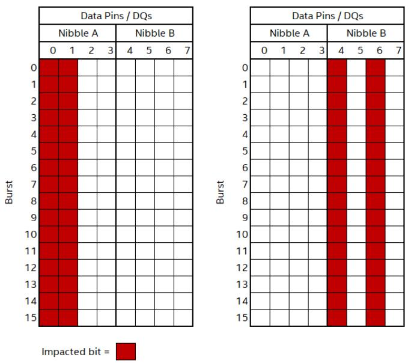  
Impacted bit =

Figure 259 — Examples of x8 Fault Boundaries

An x4 device has similarly defined qualities for the failure boundaries, with the noted exception of the number of bits impacted by a bounded failure. In a DRAM device in a 9x4 configuration bounded failures should not impact more than 16 bits. However, in a 10x4 device, the bounded failure may impact up to 32 bits.

# 15.1.2 Reliability Design Guidelines (cont’d)

In x4 devices bounded failures are defined by the following qualities:

• A bounded failure in a DRAM device in a 9x4 configuration shall not impact more than 16 bits of data in a 128-bit prefetch.   
• A bounded failure in a DRAM device in a 10x4 configuration shall not impact more than 32 bits of data in a 128-bit prefetch.   
• For a device in a 9x4 configuration, the data bits impacted by a bounded failure will be confined to one DQ.   
• For a device in a 10x4 configuration, the data bits impacted by a bounded failure will be confined to at most two DQs.

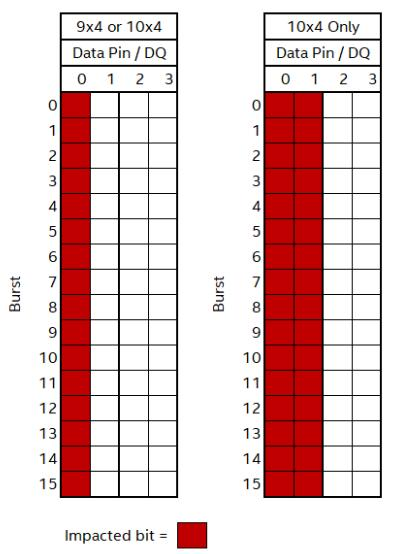

<details>
<summary>bar</summary>

| Burst | 9x4 or 10x4 Data Pin / DQ | 10x4 Only Data Pin / DQ |
|---|---|---|
| 0 | 0 | 0 |
| 1 | 1 | 1 |
| 2 | 2 | 2 |
| 3 | 3 | 3 |
| 4 | 4 | 4 |
| 5 | 5 | 5 |
| 6 | 6 | 6 |
| 7 | 7 | 7 |
| 8 | 8 | 8 |
| 9 | 9 | 9 |
| 10 | 10 | 10 |
| 11 | 11 | 11 |
| 12 | 12 | 12 |
| 13 | 13 | 13 |
| 14 | 14 | 14 |
| 15 | 15 | 15 |
Impacted bit = [Red] (9x4 or 10x4) or [Red] (10x4 Only)
</details>

Figure 260 — Example of x4 Fault Boundary

# 15.2 Single Error Correction (SEC) Code Properties

To maintain the bounded fault design guidelines, miscorrections by the on-die ECC must be restricted when a bounded fault causes a multi-bit error. In devices with bounded fault it is suggested that the DRAM vendor uses an on-die ECC code that maintains the fault boundaries. That is, if an error is contained in one boundary, then the on-die ECC should not spread the error into a second boundary by miscorrection. Note that if faults are not bounded in the device, then the on-die ECC does not need to have these properties.

To restrict miscorrection in devices following bounded fault design guidelines, the data may be divided into blocks aligned with the bounded fault and miscorrection should be restricted in the case an error is contained in a single data block. The 128 data bits used to compute a set of 8 check bits may be divided into data blocks up to 32 bits in size. These data blocks are to be determined by the memory vendor to best align with internal DRAM faults. For example, a common component fault may impact 32 bits per 128 data bits, then the vendor may choose to divide the 128 data bits into four 32-bit blocks each of which correspond to the bits impacted by one of the components failing.

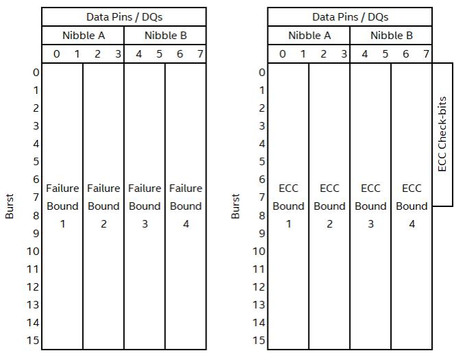

<details>
<summary>bar_stacked</summary>

| Burst | Data Pins / DQs | Nibble A | Nibble B |
|---|---|---|---|
| 0 | 0 | 0 | 0 |
| 1 | 1 | 1 | 1 |
| 2 | 2 | 2 | 2 |
| 3 | 3 | 3 | 3 |
| 4 | 4 | 4 | 4 |
| 5 | 5 | 5 | 5 |
| 6 | 6 | 6 | 6 |
| 7 | 7 | 7 | 7 |
| 8 | 8 | 8 | 8 |
| 9 | 9 | 9 | 9 |
| 10 | 10 | 10 | 10 |
| 11 | 11 | 11 | 11 |
| 12 | 12 | 12 | 12 |
| 13 | 13 | 13 | 13 |
| 14 | 14 | 14 | 14 |
| 15 | 15 | 15 | 15 |
ECC Bound 1: Data Pins / DQs; Eccles Bound 2: Data Pins / DQs; Eccles Bound 3: Data Pins / DQs; Eccles Bound 4: Data Pins / DQs; Eccles Bound 5: Data Pins / DQs; Eccles Bound 6: Data Pins / DQs; Eccles Bound 7: Data Pins / DQs; Eccles Bound 8: Data Pins / DQs; Eccles Bound 9: Data Pins / DQs; Eccles Bound 10: Data Pins / DQs; Eccles Bound 11: Data Pins / DQs; Eccles Bound 12: Data Pins / DQs; Eccles Bound 13: Data Pins / DQs; Eccles Bound 14: Data Pins / DQs; Eccles Bound 15: Data Pins / DQs; Eccles Bound 16: Data Pins / DQs; Eccles Bound 17: Data Pins / DQs; Eccles Bound 18: Data Pins / DQs; Eccles Bound 19: Data Pins / DQs; Eccles Bound 20: Data Pins / DQs; Eccles Bound 21: Data Pins / DQs; Eccles Bound 22: Data Pins / DQs; Eccles Bound 23: Data Pins / DQs; Eccles Bound 24: Data Pins / DQs; Eccles Bound 25: Data Pins / DQs; Eccles Bound 26: Data Pins / DQs; Eccles Bound 27: Data Pins / DQs; Eccles Bound 28: Data Pins / DQs; Eccles Bound 29: Data Pins / DQs; Eccles Bound 30: Data Pins / DQs; Eccles Bound 31: Data Pins / DQs; Eccles Bound 32: Data Pins / DQs; Eccles Bound 33: Data Pins / DQs; Eccles Bound 34: Data Pins / DQs; Eccles Bound 35: Data Pins / DQs; Eccles Bound 36: Data Pins / DQs; Eccles Bound 37: Data Pins / DQs; Eccles Bound 38: Data Pins / DQs; Eccles Bound 39: Data Pins / DQs; Eccles Bound 40: Data Pins / DQs; Eccles Bound 41: Data Pins / DQs; Eccles Bound 42: Data Pins / DQs; Eccles Bound 43: Data Pins / DQs; Eccles Bound 44: Data Pins / DQs; Eccles Bound 45: Data Pins / DQs; Eccles Bound 46: Data Pins / DQs; Eccles Bound 47: Data Pins / DQs; Eccles Bound 48: Data Pins / DQs; Eccles Bound 49: Data Pins / DQs; Eccles Bound 50: Data Pins / DQs; Eccles Bound 51: Data Pins / DQs; Eccles Bound 52: Data Pins / DQs; Eccles Bound 53: Data Pins / DQs; Eccles Bound 54: Data Pins / DQs; Eccles Bound 55: Data Pins / DQs; Eccles Bound 56: Data Pins / DQs; Eccles Bound 57: Data Pins / DQs; Eccles Bound 58: Data Pins / DQs; Eccles Bound 59: Data Pins / DQs; Eccles Bound 60: Data Pins / DQs; Eccles Bound 61: Data Pins / DQs; Eccles Bound 62: Data Pins / DQs; Eccles Bound 63: Data Pins / DQs; Eccles Bound 64: Data Pins / DQs; Eccles Bound 65: Data Pins / DQs; Eccles Bound 66: Data Pins / DQs; Eccles Bound 67: Data Pins / DQs; Eccles Bound 68: Data Pins / DQs; Eccles Bound 69: Data Pins / DQs; Eccles Bound 70: Data Pins / DQs; Eccles Bound 71: Data Pins / DQs; Eccles Bound 72: Data Pins / DQs; Eccles Bound 73: Data Pins / DQs; Eccles Bound 74: Data Pins / DQs; Eccles Bound 75: Data Pins / DQs; Eccles Bound 76: Data Pins / DQs; Eccles Bound 77: Data Pins / DQs; Eccles Bound 78: Data Pins / DQs; Eccles Bound 79: Data Pins / DQs; Eccles Bound 80: Data Pins / DQs; Eccles Bound 81: Data Pins / DQs; Eccles Bound 82: Data Pins / DQs; Eccles Bound 83: Data Pins / DQs; Eccles Bound 84: Data Pins / DQs; Eccles Bound 85: Data Pins / DQs; Eccles Bound 86: Data Pins / DQs; Eccles Bound 87: Data Pins / DQs; Eccles Bound 88: Data Pins / DQs; Eccles Bound 89: Data Pins / DQs; Eccles Bound 90: Data Pins / DQs; Eccles Bound 91: Data Pins / DQs; Eccles Bound 92: Data Pins / DQs; Eccles Bound 93: Data Pins / DQs; Eccles Bound 94: Data Pins / DQs; Eccles Bound 95: Data Pins / DQs; Eccles Bound 96: Data Pins / DQs; Eccles Bound 97: Data Pins / DQs; Eccles Bound 98: Data Pins / DQs; Eccles Bound 99: Data Pins / DQs; Eccles Bound 100 |
ECC Check-bits
</details>

Figure 261 — Example of Fault Boundaries versus On-die ECC Data Blocks

If a multi-bit error occurs on a read and is limited to one data block, then the on-die ECC SEC code should do one of the following:

• Miscorrect a bit in the data block containing the error   
• Miscorrect a bit in the on-die ECC check bits   
• Detect the error (a SEC code may detect some multi-bit errors, but detection of these errors is not guaranteed)

The selection of block size and data blocks is determined by the vendor to best suit the device architecture and possible modes of fault.

# 15.3 Writeback of Data During ECS and x4 RMW Operations

The DRAM device may optionally support the suppressing of the writeback for ECS operations and x4 RMW Read-Modify-Write (RMW) operations. DRAM may implement the feature in MR9 or MR15. DDR5 SPD Byte 14 Bits[2:1] indicates if feature is supported and will also indicate whether to use MR9 or MR15 for enabling the modes.

If MR9 OP1=1 or MR15 OP7=1, then x4 DRAM’s on writes will perform an internal ‘read-modify-write’ operation for BL16. BL32 mode does not requires an internal ‘read modify write’ operation. The DRAM will correct any single bit errors that result from the internal read of 128 bit data before merging the incoming 64 bit data and then re-compute 8 ECC Check bits. Note that ECC check bits are computed after merging of the incoming data with the corrected data from the array. DRAM will then write the incoming 64b data to the array along with recomputed 8 ECC Check bits. DRAM will suppress the writeback of 64 bit data that was fetched from the array irrespective of whether the 64 bit data needed any correction or not. Suppression of writeback (where applicable due to BC8 or DM usage) is not supported on x8/x16 devices; MR9:OP[1] or MR15:OP[7] must be set to $" 0 _ { \mathsf { B } } "$ . Suppression of writeback may or may not occur when BC8 mode is used on x4 devices.

If MR9 OP0=1 or MR15 OP6=1, then DRAM will suppress writeback of data and ECC Check bits during ECS operation for x4, x8, and x16 DDR5. DRAM will continue to count errors to provide transparency.

Table 341 — MR9 or MR15 Register Information 

<table><tr><td>Function</td><td>Register Type</td><td>Operand</td><td>Data</td><td>Notes</td></tr><tr><td>x4 Writes</td><td>R/W</td><td>MR9:OP[1] or MR15:OP[7]</td><td>0B: Do not suppress writeback of Data during RMW (Default)1B: Suppress writeback of Data during RMW (Optional)</td><td>1</td></tr><tr><td>ECS Write-back</td><td>R/W</td><td>MR9:OP[0] or MR15:OP[6]</td><td>0B: Do not suppress writeback of Data and ECC Check Bits (Default)1B: Suppress writeback of Data and ECC Check Bits (Optional)</td><td>1</td></tr><tr><td colspan="5">NOTE 1 DDR5 SPD Byte 14 Bits[2:1] indicates if feature is supported and will also indicate whether to use MR9 or MR15 for enabling the modes.</td></tr></table>

# DDR5 SPD Byte 14 Definition (Referenced from JESD400-5)

# Byte 14 (0x00E): SDRAM Fault Handling and Temperature Sense

This byte defines support for SDRAM fault handling features and for wide on-die temperature sensing range (see MR4). This value comes from the DDR5 SDRAM specification, JESD79-5.

Table 342 — SDRAM Fault Handling and Temperature Sense 

<table><tr><td colspan="4">SDRAM Fault Handling Features and Temperature Sense</td></tr><tr><td>Bit 7</td><td>Bit 6</td><td>Bit 5</td><td>Bit 4</td></tr><tr><td colspan="4">Reserved; must be coded as 0000</td></tr><tr><td>Bit 3</td><td>Bit 2</td><td>Bit 1</td><td>Bit 0</td></tr><tr><td>Wide Temperature Sense</td><td>x4 RMW/ECS Writeback Suppression</td><td>x4 RMW/ECS Writeback Suppression MR Selector</td><td>Bounded Fault</td></tr><tr><td>0: Wide temperature sense and reporting not supported1: Wide temperature sense and reporting supported</td><td>0: Writeback suppression not supported1: Writeback suppression supported</td><td>0: Writeback suppression control in MR91: Writeback suppression control in MR15</td><td>0: Bounded Fault not supported1: Bounded Fault supported</td></tr><tr><td colspan="4">NOTES:ECS = Error Check and ScrubRMW = Read-Modify-WriteMR = Mode Register</td></tr></table>

16

# DDR5 Per Row Activation Counting

# 16.1 Introduction

Deterministic counting of row activations is an optional feature on DDR5 16Gb and higher density devices, with support indicated by MR70:OP[0]. This feature detects row activity that may adversely affect the data stored in cells on physically adjacent rows within the DRAM. As one or more rows’ activation counts approach or reach a maximum activation threshold after a Refresh (REF) or Refresh Management (RFM) command, the host and DRAM may need to take action to prevent data in affected cells from flipping states.

The intended implementation for Per Row Activation Counting (PRAC) is to add Activation Counter bits to every row in the DRAM. These bits store a count associated with the number of activations received by a row since the last time it was refreshed. Activations to a row include the ACT, REF and RFM commands, and the MPC Manual ECS function.

A DDR5 design that supports PRAC shall continue to support “legacy” methods for maintaining data integrity in DRAM cells for backward compatibility. Designs supporting PRAC shall continue to support all features and functions as defined in this specification when running with PRAC disabled.

When PRAC is enabled, $( \mathsf { M R 7 0 : O P } [ 1 ] = 1 _ { \mathsf { B } } )$ , the following modes are disabled by the DRAM, with MR58 and MR59 retaining their access types and values and those MRs will reflect the values of any subsequent MRWs:

• RFM Required, as indicated by MR58:OP[0], is disabled internally by the DRAM and not required by the host regardless of value set in the MR   
• DRFM Enable, as configured by MR59:OP[0], is disabled internally by the DRAM regardless of host write value

Functionality of the PRAC RFM command is enabled when $\mathsf { M R 7 0 : O P } [ 1 ] = 1 _ { \mathsf { B } }$ and replaces the command usage described in Section 4.42 Refresh Management (RFM). If Refresh Management is not required, MR58: $\scriptstyle \cdot O P [ O ] = O _ { \mathsf { B } } ,$ , and PRAC is disabled, MR70:OP[1]=0B, CA9 is only required to be valid (“V”) for a REF command, and the DRAM will treat a RFM command as a REF command. If Refresh Management is required, $\mathsf { M R } 5 8 : \mathsf { O P } [ 0 ] = 1 _ { \mathsf { B } } .$ , or PRAC is enabled, MR70:OP[1]=1B, a REF command requires CA9=H.

DRFM functionality of the WRPA, WRA, RDA, PREpb and DRFM commands is disabled regardless of $\mathsf { M R } 5 9 : \mathsf { O P } [ 0 ]$ host write value when $\mathsf { M R 7 0 : O P } [ 1 ] = 1 _ { \mathsf { B } } .$ The DRFM address sampling operation is disabled for the WRPA, WRA, RDA, and PREpb commands. CA9 is only required to be valid (“V”) for WRPA, WRA, and RDA commands. When CID3 is not used, CA5 is required to be Valid (“V”) for RFM and PREpb commands.

The requirements for enabling and using PRAC are described in Sections 16.2-16.9. Updates to usage of the PRAC RFM command are described in Sections 16.4 and 16.5.

On-the-fly switching between modes is not permitted. Enabling PRAC requires initialization, as described below. Disabling PRAC (re-enabling legacy) requires a DRAM Reset.

When PRAC is supported $( \mathsf { M R 7 0 : O P } [ 0 ] = 1 _ { \mathsf { B } } )$ but disabled $( \mathsf { M R 7 0 : O P [ 1 ] = 0 _ { B } } ) .$ , all associated Mode Registers can be written to and read from, however no PRAC-related behaviors will be executed until PRAC is enabled $( \mathsf { M R 7 0 : O P } [ 1 ] = 1 _ { \mathsf { B } } )$ . Activation Counter Initialization, PRAC Testing, and Alert Verification shall be disabled prior to enabling PRAC.

# 16.2 Activation Counter Initialization

Upon power-up or any time that DRAM refresh requirements are violated, the Activation Counter bits may be in an unknown state, requiring an initialization to put the bits into a known state.

The default state for DDR5 Per Row Activation Counting (PRAC) is disabled $( \mathsf { M R 7 0 : O P [ 1 ] = 0 _ { B } } )$ , as this is an optional feature. Prior to initialization of the activation counter bits, the PRAC shall be enabled $( \mathsf { M R 7 0 : O P } [ 1 ] = 1 _ { \mathsf { B } } )$ by the host. Once the PRAC is enabled, a full array Activation Counter Initialization (ACI) shall be performed. The DRAM will not track activation counts, nor issue an Alert Back-Off (ABO), until the Activation Counter bits are initialized. Legacy mode for maintaining of data integrity will not be performed after PRAC is enabled.

To initialize the Activation Counter bits, the host sets $\mathsf { M R 7 0 : O P } [ 2 ] = 1 _ { \mathsf { B } }$ to indicate to the DRAM that a full array refresh will take place. Only REF and MRR commands are permitted during initialization. The REF commands during the initialization period may be issued by the host up to two times (2x) the normal refresh rate (Normal mode: 0.5\*tREFI1; FGR mode: 0.5\*tREFI2). Upon completion of a full refresh cycle, the DRAM shall indicate completion by setting $\mathsf { M R 7 0 : O P } [ 3 ] = 1 _ { \mathsf { B } }$ , which the host shall then follow by setting $\mathsf { M R 7 0 : O P } [ 2 ] = 0 _ { \mathsf { B } }$ . The DRAM shall start counting activations from that point forward and issue the ABO as necessary.

During ACI, the DRAM does not need to refresh the main array, and any data previously written may be corrupted.

If the host reenters Activation Counter Initialization by setting $\mathsf { M R 7 0 : O P } [ 2 ] = 1 _ { \mathsf { B } } ,$ the DRAM will reset $\mathsf { M R 7 0 : O P } [ 3 ] = 0 _ { \mathsf { B } }$ until the initialization has been completed. Likewise, a system reset to disable PRAC $( \mathsf { M R 7 0 : O P [ 1 ] = 0 _ { B } } )$ will also reset $\mathsf { M R 7 0 : O P } [ 3 ] = 0 _ { \mathsf { B } }$ .

Like normal DRAM cells, the Activation Counter bits require refresh to maintain the stored values. Any time refresh is violated during ACI or after ACI in modes like MPSM or other idle periods, the ACI shall be performed by the host to set the Activation Counter bits to a known state. Since array data is also corrupted by refresh violations, previous Activation Counter values become irrelevant.

The MBIST operation impacts the Activation Counter bit values, requiring an ACI to be performed prior to rewriting data following the MBIST/mPPR operation.

# 16.3 Per Row Activation Counting Core Timing Parameters

Per Row Activation Counting (PRAC) requires additional counter cells per row in the DRAM to store Activation (ACT) command counts. Updating the activation counter cells requires a read-modify-write to the activation counter cells, known as Activation Counter Update (ACU), resulting in a change in some of the core timing parameters, when Per Row Activation Counting is enabled (timings not noted here remain the same as when PRAC is disabled):

Table 343 — Per Row Activation Counting (PRAC) Core Timing Parameters 

<table><tr><td>Parameter</td><td>Symbol</td><td>Min</td><td>Max</td><td>Unit</td><td>Notes</td></tr><tr><td>ACT to PRE</td><td>tRAS</td><td>16</td><td>3 * tREFI1 (Normal),5 * tREFI2 (FGR)</td><td>nS</td><td>1</td></tr><tr><td>Row Precharge</td><td>tRP</td><td>36</td><td>-</td><td>nS</td><td>2</td></tr><tr><td>ACT to ACT / REF</td><td>tRC</td><td>52</td><td>-</td><td>nS</td><td></td></tr><tr><td>Read to Precharge</td><td>tRTP</td><td>5</td><td>-</td><td>nS</td><td>3</td></tr><tr><td>Write Recovery</td><td>tWR</td><td>10</td><td>-</td><td>nS</td><td>3</td></tr><tr><td colspan="6">NOTE 1 tRASmax is based on the maximum allowance for postponed REF commandsNOTE 2 Clock-based nRP timings are defined in the Speed Bin tables.NOTE 3 Clock-based nRTP and nWR timings are defined in MR6.</td></tr></table>

Examples of the timings affected by the updating of the activation counter bits are shown in Figure 262 through Figure 264. The “i” references DRAM internal commands, not external commands issued by the Host.

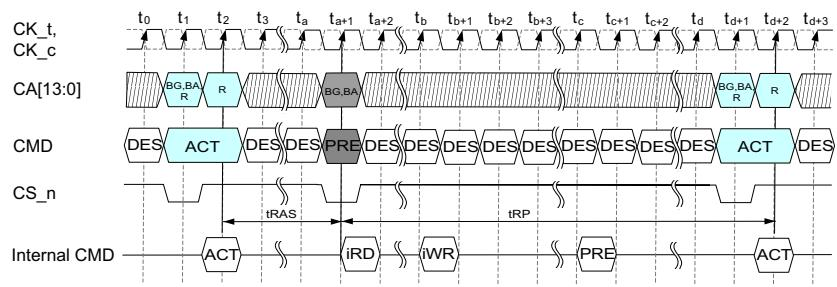

<details>
<summary>text_image</summary>

CK_t,
CK_c
t0 t1 t2 t3 ta ta+1 ta+2 tb tb+1 tb+2 tb+3 tc tc+1 tc+2 td td+1 td+2 td+3
BG_BAR R BG_BAR BG_BAR R
CA[13:0]
CMD DES ACT DES PRES DES DES DES DES DES DES DES DES DES DES DES DES DES DES DES DES DES DES DES DES DES DES DES DES DES DES DES DES DES DES DES DES DES DES DES DES DES DES DES DES DES DES DES DES DES DES DES DES DES DES DES DES DES DES DES DES DES DES DES DES DES DES DES DES DES DES DES DES DES DES DES DES DES DES DES DES DES DES DES DES DES DES DES DES DES DES DES DES DES DES DES DES DES DES DES DES DES DES DES DES DE
CS_n
Internal CMD ACT iRD iWR PRE ACT
</details>

Figure 262 — Example ACT-PRE with ACU

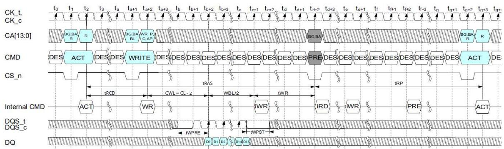

<details>
<summary>text_image</summary>

CK_t,
CK_c
t0 t1 t2 t3 ta ta+1 ta+2 ta+3 tb tb+1 tb+2 tb+3 tc tc+1 tc+2 td td+1 td+2 td+3 te te+1 tf tf+1 tf+2 tf+3 tg tg+1 tg+2 tg+3 tg+
CA[13:0]
BG.BA R BG.BA WR_P
BL C.AP BG.BA
CMD DES ACT DES DES WRITE DES DES DES DES DES DES DES DES PRE DES DES DES DES DES DES DES DES ACT
CS_n
tRCD tRAS tRP
Internal CMD ACT WR iWR iRD iWR PRE ACT
DQS_t
DQS_c
tWPRE tWPST
DQ D0 D1 D2 D3 D4 D5
</details>

Figure 263 — Example ACT-WR-PRE with ACU

# 16.3 Per Row Activation Counting Core Timing Parameters (cont’d)

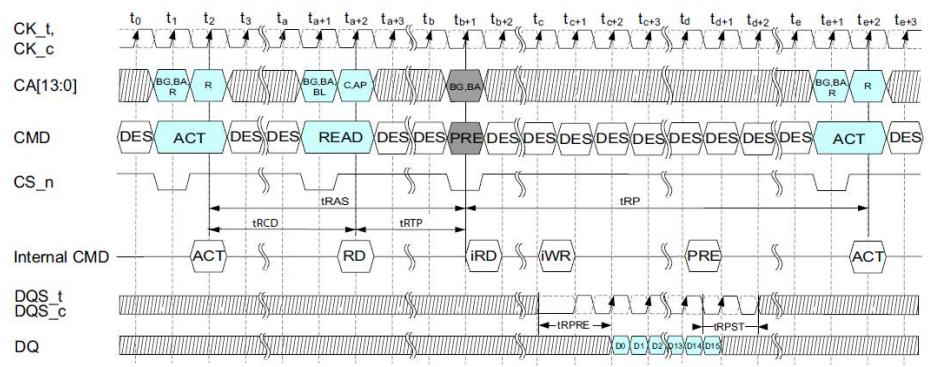

<details>
<summary>text_image</summary>

CK_t,
CK_c
t0 t1 t2 t3 ta ta+1 ta+2 ta+3 tb tb+1 tb+2 tc tc+1 tc+2 tc+3 td td+1 td+2 te te+1 te+2 te+3
BG.BA R BG.BA BL C.AP BG.BA BG.BA R
CA[13:0]
CMD DES ACT DES DES READ DES DES PRE DES DES DES DES DES DES DES DES DES ACT DES
CS_n
tRCD tRPS
Internal CMD ACT RD iRD iWR PRE ACT
DQS_t DQS_c
DQ
tRPRE DR D1 D2 D3 D4 D5
</details>

Figure 264 — Example ACT-RD-PRE with ACU

# 16.3.1 Refresh Operation Scheduling Flexibility

Refresh Operation Scheduling Flexibility is reduced when PRAC is enabled to allow targeted refreshes to occur at an improved rate.

In Normal Refresh mode, a maximum of 2 REFab command can be postponed. In the case that 2 REFab command is postponed, the resulting maximum interval between the surrounding REFab commands is limited to 3 × tREFI1. At any given time, a maximum of 2 REFab commands can be issued within 1 x tREFI1 window.

In FGR Mode, the maximum REFab commands that may be postponed is 4, with the resulting maximum interval between the surrounding REFab commands limited to 5 x tREFI2. At any given time, a maximum of 5 REFab commands can be issued within 1 x tREFI2 window.

# 16.3.2 Precharge Timing

Unlike the traditional Precharge (PRE) command, the PRAC PRE initiates an internal read followed by an internal write to increment the Activation Counting bits for all open rows affected by the PRE command. To allow for adequate power distribution network (PDN) recovery, the Row Precharge time, tRP, shall be scaled by the number of rows being closed.

Table 344 — Per Row Activation Counting (PRAC) Precharge Timing 

<table><tr><td>Parameter</td><td>Number of Rows</td><td>tRP Required</td><td>Notes</td></tr><tr><td>Per Bank Precharge (PREpb)</td><td>1</td><td>tRP,min</td><td></td></tr><tr><td>Same Bank Precharge (PREsb)</td><td>1 - 8</td><td>tRP,min</td><td></td></tr><tr><td>All Bank Precharge (PREab)</td><td>1 - 89 - 32</td><td>tRP,mintRP,min + 4 ns</td><td></td></tr></table>

# 16.4 Per Row Activation Counting Response

Since the DRAM is counting ACT commands on a per row basis, action may be required upon one or more rows reaching a counter threshold level or levels, or when a queue holding row addresses for targeted refreshing reaches or passes a critical level. This action is a request by the DRAM for the host to pause normal activity for a recovery period where refresh management (RFM commands) or other functions may be performed. This action is a “back-off”. The back-off protocol is described in the next section.

The counter and/or queue threshold level(s) may be changed (reduced) by setting the Adaptive Per Row Activation Counting level in MR71:OP[3:2] to something other than the default MR71:OP[3:2]=00B. These alternate levels are based on the default starting value. The threshold level(s) reductions are approximately Level A = default - 10%, Level B = default - 20%, and Level $\mathsf { C } = \mathsf { d e f a u l t } - 3 0 \%$ Changing levels requires an ACI or full array refresh to set/reset all counters to a known state below critical threshold levels and to empty the queue.

In addition to the back-off which is required to keep activation counts from exceeding the threshold level, the DRAM can proactively perform targeted refreshes during Refresh (REF) and/or Refresh Management (RFM) commands to reduce and/or prevent the occurrence of the Alert Back-Off being triggered.

# 16.4.1 Targeted Refresh

For targeted refreshing during Refresh commands, the DRAM will adjust the normal refreshes accordingly to allow time for the additional row refreshing to occur. The back-off protocol will exist for cases where the DRAM cannot keep up during normal Refresh commands. There is no change to tRFC when PRAC is enabled.

# 16.4.2 Targeted RFM

DDR5 does not require issuing RFM commands as proactive mitigation when PRAC is enabled.

However, as a guideline for a host that chooses to have the DRAM proactively perform targeted refreshing during Refresh Management commands, the host may track the level of activity that occurs on a per-bank or sub-bank basis. When the Bank Activation Threshold (BAT) is reached (example BAT shown in Table 345), the RFMsb or RFMab command is issued. The duration of the RFM command (tRFM) is sufficient for the Row Refresh Span of +/-1 and +/-2 physically adjacent rows and the target row to be refreshed. This tRFM duration is directly related to the time required to refresh the rows. Due to a single row being refreshed on multiple banks corresponding to the RFMab or RFMsb command being issued, the per row refresh duration is tRRF.

Table 345 — Example Bank Activation Threshold (BAT) 

<table><tr><td>Parameters</td><td>Symbol</td><td>Value</td><td>Units</td><td>Notes</td></tr><tr><td>Bank Activation Threshold</td><td>BAT</td><td>75</td><td>Activations</td><td>1</td></tr><tr><td colspan="5">NOTE 1 The example BAT is derived from tREFI1=3.9 μs / tRC,min=52 ns.</td></tr></table>

Table 346 — Per Row Refresh Timing 

<table><tr><td>Parameters</td><td>Symbol</td><td>Duration</td><td>Units</td><td>Notes</td></tr><tr><td>All bank per row refresh</td><td>tRRFab(min)</td><td>70</td><td>ns</td><td></td></tr><tr><td>Same bank per row refresh</td><td>tRRFsb(min)</td><td>60</td><td>ns</td><td></td></tr></table>

Table 347 — Refresh Management Command Timing 

<table><tr><td>Parameters</td><td>Symbol</td><td>Duration</td><td>Units</td><td>Notes</td></tr><tr><td>RFM All Bank (RFMab)</td><td>tRFMab</td><td> $(4+1)^{*}$  tRRFab</td><td>ns</td><td></td></tr><tr><td>RFM Same Bank (RFMsb)</td><td>tRFMsb</td><td> $(4+1)^{*}$  tRRFsb</td><td>ns</td><td></td></tr></table>

# 16.5 Back-off Protocol

DDR5 DRAM devices may support the optional Per Row Activation Counting (PRAC) for monitoring per row activity to ensure all rows are refreshed as needed to maintain data integrity. To facilitate the refresh activity, the DRAM may request the host pause normal activity for a maintenance period where refresh management (RFM commands) or other functions may be performed. This is called a “back-off”.

# 16.5.1 Alert Back-Off Protocol

The DDR5 back-off protocol uses the $\mathsf { A L E R T \_ n }$ signal and mode register settings to provide a handshake between the DRAM and the host. This is the Alert Back-Off (ABO).

# 16.5.1.1 PRAC Triggered Alert Back-off

The Alert Back-off (ABO) protocol is enabled when PRAC is enabled by setting MR70:OP[1]=1B. Upon reaching critical threshold levels by one or more rows, or when a queue holding addresses for targeted refreshing reaches or passes a critical level, the DRAM asserts $\mathsf { A L E R T \_ n }$ and sets the ABO Flag at $\mathsf { M R } 7 0 : \mathsf { O P } [ 5 ] = 1 _ { \mathsf { B } } .$ indicating that $\mathsf { A L E R T \_ n }$ was asserted due to additional refresh management (RFM) being required. All commands received by the DRAM are executed while ALERT\_n is asserted to maintain synchronization between DRAMs in the same rank on a DIMM.

Commands that may trigger the ABO include PREab/PREsb/PREpb, WRPA, WRA, RDA, REFab/REFsb and RFMab/RFMab and the MPC function Manual ECS. ALERT\_n will be asserted within tABO\_Assert, which occurs between issuing the trigger command and before the max(5ns,10nCK) following the completion of the respective command duration shown in Table 348.

Table 348 — Duration to ALERT\_n Assertion 

<table><tr><td>Symbol</td><td>Description</td><td>Command</td><td>Max</td></tr><tr><td rowspan="9">tABO_Assert</td><td rowspan="9">Duration to ALERT_n assertion</td><td>PREab/PREsb/PREpb</td><td>tRP+max(5ns, 10nCK)</td></tr><tr><td>WRPA/WRA</td><td>CWL+WBL/2+tWR+tRP+max(5ns,10nCK)</td></tr><tr><td>RDA</td><td>tRTP+tRP+max(5ns,10nCK)</td></tr><tr><td>REFab (Normal)</td><td>tRFC1+max(5ns,10nCK)</td></tr><tr><td>REFab (FGR)</td><td>tRFC2+max(5ns,10nCK)</td></tr><tr><td>REFsb</td><td>tRFCsb+max(5ns,10nCK)</td></tr><tr><td>RFMab</td><td>tRFMab+max(5ns,10nCK)</td></tr><tr><td>RFMsb</td><td>tRFMsb+max(5ns,10nCK)</td></tr><tr><td>MPC function Manual ECS</td><td>tECSc+max(5ns,10nCK)</td></tr></table>

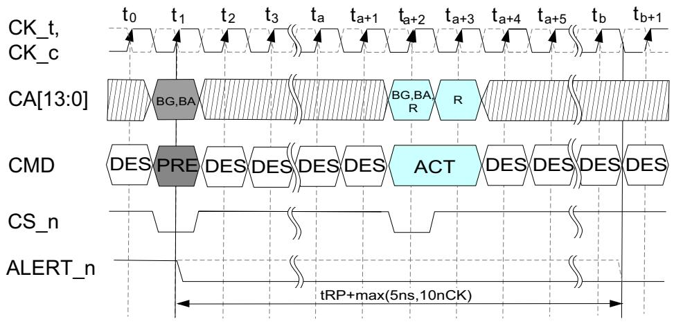

<details>
<summary>text_image</summary>

CK_t,
CK_c
t0 t1 t2 t3 ta ta+1 ta+2 ta+3 ta+4 ta+5 tb tb+1
CA[13:0]
BG,BA BG,BA R
CMD DES PRE DES DES DES DES ACT DES DES DES
CS_n
ALERT_n
tRP+max(5ns,10nCK)
</details>

Figure 265 — Example Duration to ALERT\_n Assertion for PRE Command

Since the PREpb required during hPPR/sPPR and the PREab during mPPR have different functions than closing a row, no counter bits will be incremented associated with the repaired row, therefore no ABO will be triggered in this instance.

# 16.5.1.2 Alert Back-off

To instantiate the ABO, ALERT\_n is asserted by the DRAM with a fixed duration of clock cycles as defined by tABO\_PW.

Table 349 — Alert Back-off Timing Parameters 

<table><tr><td>Symbol</td><td>Description</td><td>Min</td><td>Typ</td><td>Max</td><td>Unit</td><td>Note</td></tr><tr><td>tABO_PW</td><td>Alert Back-Off pulse width</td><td>-</td><td>640</td><td>-</td><td>nCK</td><td></td></tr><tr><td>tABO_ACT</td><td>Normal traffic to the DRAM allowed</td><td>-</td><td>-</td><td>180</td><td>ns</td><td></td></tr></table>

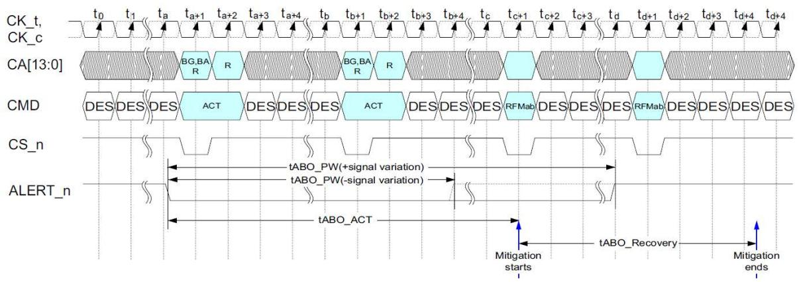

<details>
<summary>text_image</summary>

CK_t,
CK_c
t0 t1 ta ta+1 ta+2 ta+3 ta+4 tb tb+1 tb+2 tb+3 tb+4 tc tc+1 tc+2 tc+3 td td+1 td+2 td+3 td+4 td+4
BG,BA R R BG,BA R
CMD DES DES DES ACT DES DES DES ACT DES DES DES RFMab DES DES DES RFMab DES DES DES
CS_n
tABO_PW(+signal variation)
tABO_PW(-signal variation)
tABO_ACT
ALERT_n
Mitigation starts tABO_Recovery Mitigation ends
</details>

Figure 266 — Alert Back-Off Timing Diagram

After the ALERT\_n is asserted, a bounded number of Activate (ACT) commands are permitted before the host starts the RFM-based recovery period. Issuing ACT commands along with normal traffic is allowed within the tABO\_ACT window.

At the end of the tABO\_ACT window, the host begins issuing Refresh Management (RFM) commands. The only RFM commands allow during the tABO\_Recovery period are RFMab. The duration of the RFMab command is described in the previous section (Per Row Activation Counting Response). The number of RFMab commands required to be issued per ABO maintenance period are defined by mode register ABO\_RFM bits, MR71:OP[1:0]. Systems that have stricter requirements for isochronous bandwidth may limit the number of RFMab commands by setting MR71:OP[1:0] to a lower value.

The recovery period begins when host issues the first RFMab command in response to ALERT\_n. The DRAM self-clears the ABO flag by setting MR70:OP[5]=0B by the end of the tABO\_Recovery period, which ends tRFMab after the last RFMab command.

If additional RFM commands are needed, the Alert Back-Off protocol is restarted following the Alert Back-Off delay, as described below.

During the ABO\_Recovery period, a host may issue only RFMab, REFab/REFsb, PDE, PDX, SRE, PREab and MRR commands. Refresh commands issued are to ensure that DRAM refresh requirements are not violated. The Refresh commands do not perform any of the refresh management required.

If Power Down is entered after ABO has been asserted but before the ALERT\_n pulse has completed, the DRAM continues to assert ALERT\_n for the expected tABO\_PW duration, however the Host only resumes issuing RFM commands after exiting Power Down.

If Power Down is entered after ABO has been asserted and the tABO\_PW duration has completed, the Host is responsible for issuing all of the expected RFM commands as of combination of commands before entering and after exiting Power Down.

In Self Refresh, the DRAM de-asserts ALERT\_n. Upon exiting Self Refresh, the DRAM will reevaluate and issue a new ALERT\_n if ABO is still needed.

# 16.5.1.3 Alert Back-Off Delays

ABO\_Delay defines an interval in which DRAM shall service a minimum number of Activate commands before it can reassert ALERT\_n for another Alert Back-Off. ALERT\_n asserted for other operation such as Write DQ CRC errors is allowed with no timing restrictions.

ABO\_Delay is specified by the number of Activate commands in MR71:OP[1:0].Commands that activate one or more rows in a DRAM include ACT, REFab/REFsb and RFMab/RFMsb and the MPC function Manual ECS, and any that occur are included in the total ABO\_Delay Activates count allowed per bank.

Following ABO\_Delay, any of the commands included in section 16.5.1.1 may trigger the ABO, as well as an ACT command.

Table 350 — Alert Back-Off Delay Parameter 

<table><tr><td>Symbol</td><td>Description</td><td>Value</td><td>Unit</td><td>Note</td></tr><tr><td>ABO_Delay</td><td>Minimum number of Activate commands allowed</td><td>MR71:OP[1:0]</td><td>Activates</td><td></td></tr></table>

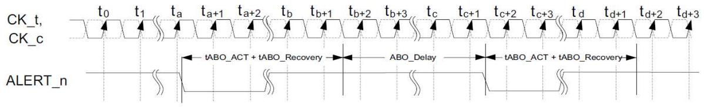

<details>
<summary>text_image</summary>

CK_t,
CK_c
t0 t1 ta ta+1 ta+2 tb tb+1 tb+2 tb+3 tc tc+1 tc+2 tc+3 td td+1 td+2 td+3
tABO_ACT + tABO_Recovery ABO_Delay tABO_ACT + tABO_Recovery
ALERT_n
</details>

Figure 267 — Back to Back Alert Back-Off Delay

# 16.6 ALERT\_n Priorities

At times, both Write CRC and Alert Back-Off may occur simultaneously resulting in an overlap of ALERT\_n assertions, or the occurrence of the two events back-to-back (non-overlapped) may result in a short “glitch” on ALERT\_n. For all events, the DRAM shall treat the ALERT\_n as a “NOR” function where ALERT\_n is issued whenever an event occurs, and the DRAM sets the corresponding Write CRC (MR50:OP[3]) or Alert Back-Off (MR70:OP[5] flag indicating which type of event, or possibly both, occurred.

# 16.7 Activation Counter Errors

The DRAM has the capability to detect errors that occur within the counter bits, and the following protocol defines how the DRAM will report the associated failing row address to the host.

If a counter bit error is detected, the DRAM sets the Counter Error Flag, $\mathsf { M R } 7 2 : \mathsf { O P } [ 0 ] = 1 _ { \mathsf { B } }$ .

While the Counter Error Flag is set, the counter function for the specific row with the error is disabled. The DRAM will not assert the Alert Back-Off to request RFM commands for errors associated with that row. All other rows without counter errors continue to count activity and assert ALERT\_n, if necessary.

During ECS (Manual or Auto mode), if the Counter Error Flag is set and the DRAM logs a failing row address, the DRAM will update MR73-MR75 with the failing row address and set the Counter Address Report Flag, $\mathsf { M R } 7 2 : \mathsf { O P } [ 1 ] = 1 _ { \mathsf { B } } ,$ when the ECS reaches the failing row. Only the first failing row will be reported. Additional rows will be reported in a subsequent scrub if they continue to fail after the Counter Address Report Flag is cleared by the host.

A counter RAS error that occurs during the ECS may still trigger the Counter Error Flag, but may not set the Counter Address Report Flag nor report the failing row address.

With the failing row address information, the host can repair the bad row with hPPR/sPPR or off-line that row.

The host clears the Counter Error Flag and Counter Address Report Flag, once the necessary information about the failing row has been collected and mitigative actions taken.

# 16.8 Per Row Activation Counting Testing

An optional test mode for PRAC may be included to check the ability of the DRAM to reach a threshold per row or fill the row address queue and issue the ABO. Test mode support is indicated by $\mathsf { M R 7 1 : O P } [ 4 ] = 1 _ { \mathsf { B } }$ .

PRAC Testing is enabled by setting $\mathsf { M R 7 1 : O P } [ 5 ] = 1 _ { \mathsf { B } } .$ Once enabled, the counter for target row to be tested is initialized by the host setting $\mathsf { M R 7 1 : O P } [ 6 ] = 1 _ { \mathsf { B } } .$ , followed by an ACT/PRE to the target row. The host then sets $\mathsf { M R 7 1 : O P } [ 6 ] = 0 _ { \mathsf { B } }$ and issues 32 ACT/PRE or fewer to the target row or rows to trigger the ABO (multiple increments to the counter bits may occur depending on tRAS duration, mimicking normal operation). ABO is required as describe previously before testing subsequent rows.

Depending on counter bit starting values, all DRAMs on a DIMM may not trigger the Alert Back-Off at the same time (detected by MR70:OP[5]), however all DRAMs will trigger within 32 Activations.

After PRAC Testing has been complete, the test mode is cleared by setting $\mathsf { M R 7 1 : O P } [ 5 ] = 0 _ { \mathsf { B } } .$ . Since the counter cells will be in an unknown state following testing, a full Activation Counter Initialization (ACI) is required before resuming normal operations.

Refresh commands are not allowed while PRAC Testing is enabled. Data in normal cells is not maintained during in PRAC Testing.

# 16.9 ALERT\_n Verification

Support for an optional mode to verify ALERT\_n is indicated by $\mathsf { M R 7 0 : O P } [ 6 ] = 1 _ { \mathsf { B } }$

$\mathsf { A L E R T \_ n }$ Verification is triggered by setting $\mathsf { M R 7 0 : O P } [ 7 ] = 1 _ { \mathsf { B } } .$ The DRAM asserts $\mathsf { A L E R T \_ n }$ and sets the ABO Flag at $\mathsf { M R 7 0 : O P } [ 5 ] = 1 _ { \mathsf { B } }$ within tMRD after the MRW and will keep ALERT\_n asserted for tABO\_PW. The host shall follow all normal ABO procedures for clearing the $\mathsf { A L E R T \_ n }$ . MR70:OP[7] and MR70:OP[5] will be self-cleared by the DRAM prior to the end of the tABO\_Recovery period.

Data in normal cells is maintained during $\mathsf { A L E R T \_ n }$ Verification, as long as refresh is maintained. No per row counter values nor thresholds are altered during this mode.

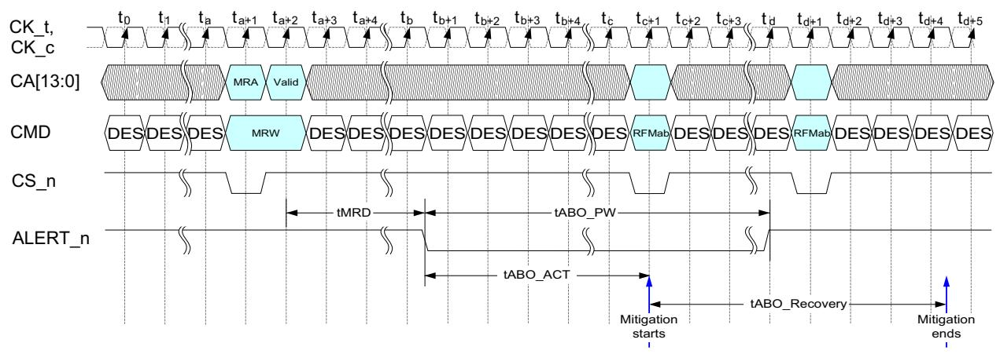

<details>
<summary>text_image</summary>

CK_t,
CK_c
t0 t1 ta ta+1 ta+2 ta+3 ta+4 tb tb+1 tb+2 tb+3 tb+4 tc tc+1 tc+2 tc+3 td td+1 td+2 td+3 td+4 td+5
CA[13:0]
CMD
MSR
MRW
DES DES DES DES DES DES DES DES DES DES RFMab DES DES DES RFMab DES DES DES DES
CS_n
tMRD tABO_PW
tABO_ACT
ALERT_n
Mitigation starts
tABO_Recovery
Mitigation ends
</details>

Figure 268 — Alert Verification Mode

# 16.10 PRAC and ABO Mode Register Definition

Table 351 — MR6 Register Information 

<table><tr><td>Function</td><td>Register Type</td><td>Operand</td><td>Description</td><td>Notes</td></tr><tr><td>Write Recovery Time Legacy / PRAC</td><td>R/W</td><td>OP[3:0]</td><td> $0000_{B}$ : 48nCK (Legacy) / 16nCK (PRAC) $0001_{B}$ : 54nCK (Legacy) / 18nCK (PRAC) $0010_{B}$ : 60nCK (Legacy) / 20nCK (PRAC) $0011_{B}$ : 66nCK (Legacy) / 22nCK (PRAC) $0100_{B}$ : 72nCK (Legacy) / 24nCK (PRAC) $0101_{B}$ : 78nCK (Legacy) / 26nCK (PRAC) $0110_{B}$ : 84nCK (Legacy) / 28nCK (PRAC) $0111_{B}$ : 90nCK (Legacy) / 30nCK (PRAC) $1000_{B}$ : 96nCK (Legacy) / 32nCK (PRAC) $1001_{B}$ : 102nCK (Legacy) / 34nCK (PRAC) $1010_{B}$ : 108nCK (Legacy) / 36nCK (PRAC) $1011_{B}$ : 114nCK (Legacy) / 38nCK (PRAC) $1110_{B}$ : 120nCK (Legacy) / 40nCK (PRAC) $1101_{B}$ : 126nCK (Legacy) / 42nCK (PRAC) $1110_{B}$ : 132nCK (Legacy) / 44nCK (PRAC)All other encodings reserved</td><td>1</td></tr><tr><td>tRTP Legacy / PRAC</td><td>R/W</td><td>OP[7:4]</td><td> $0000_{B}$ : 12nCK (Legacy) / 8nCK (PRAC) $0001_{B}$ : 14nCK (Legacy) / 9nCK (PRAC) $0010_{B}$ : 15nCK (Legacy) / 10nCK (PRAC) $0011_{B}$ : 17nCK (Legacy) / 11nCK (PRAC) $0100_{B}$ : 18nCK (Legacy) / 12nCK (PRAC) $0101_{B}$ : 20nCK (Legacy) / 13nCK (PRAC) $0110_{B}$ : 21nCK (Legacy) / 14nCK (PRAC) $0111_{B}$ : 23nCK (Legacy) / 15nCK (PRAC) $1000_{B}$ : 24nCK (Legacy) / 16nCK (PRAC) $1001_{B}$ : 26nCK (Legacy) / 17nCK (PRAC) $1010_{B}$ : 27nCK (Legacy) / 18nCK (PRAC) $1011_{B}$ : 29nCK (Legacy) / 19nCK (PRAC) $1110_{B}$ : 30nCK (Legacy) / 20nCK (PRAC) $1101_{B}$ : 32nCK (Legacy) / 21nCK (PRAC) $1110_{B}$ : 33nCK (Legacy) / 22nCK (PRAC)All other encodings reserved</td><td>2</td></tr><tr><td colspan="5">NOTE 1 tWR,min is defined in the “Timing Parameters” tables. Host must operate with MR settings resulting in tCK * MR6:OP[3:0] &gt;= tWR,min.NOTE 2 tRTP, min is defined in the “Timing Parameters” tables. Host must operate with MR settings resulting in tCK * MR6:OP[7:4]&gt;= tRTP,min.NOTE 3 All nCK conversions require rounding algorithm consideration.</td></tr></table>

# 16.10 PRAC and ABO Mode Register Definition (cont’d)

Table 352 — MR70 Register Information 

<table><tr><td>Function</td><td>Register Type</td><td>Operand</td><td>Description</td><td>Notes</td></tr><tr><td>Per Row Activation Counting and Alert Back-Off Support (Optional)</td><td>R</td><td>OP[0]</td><td> $0_B$ : PRAC and ABO not supported $1_B$ : PRAC and ABO supported</td><td></td></tr><tr><td>Per Row Activation Counting and Alert Back-Off Enable/Disable</td><td>R/W</td><td>OP[1]</td><td> $0_B$ : Disable PRAC and ABO (Default) $1_B$ : Enable PRAC and ABO</td><td>2</td></tr><tr><td>Activation Counter Initialization</td><td>R/W</td><td>OP[2]</td><td> $0_B$ : Normal operating mode (Default) $1_B$ : Initialization mode</td><td>2</td></tr><tr><td>Activation Counter Initialization Complete</td><td>R</td><td>OP[3]</td><td> $0_B$ : Initialization not completed $1_B$ : Initialization completed</td><td>2</td></tr><tr><td>RFU</td><td>RFU</td><td>OP[4]</td><td>RFU</td><td></td></tr><tr><td>Alert Back-Off Flag</td><td>R</td><td>OP[5]</td><td> $0_B$ : Clear $1_B$ : Source of ALERT_n</td><td>1</td></tr><tr><td>ALERT_n Verification Support (Optional)</td><td>R</td><td>OP[6]</td><td> $0_B$ : ALERT_n Verification not supported $1_B$ : ALERT_n Verification supported</td><td></td></tr><tr><td>ALERT_n Verification</td><td>R/W</td><td>OP[7]</td><td> $0_B$ : ALERT_n Verification Disabled (Default) $1_B$ : ALERT_n Verification Trigger</td><td></td></tr><tr><td colspan="5">NOTE 1 MR14:OP[3:0] applies to CID[3:0] for 3DS-DDR5 and must be setup to indicate which slice in the 3DS-DDR5 stack is referenced in the MR70:OP[5] Alert Back-Off Flag sourceNOTE 2 When PRAC is disabled, MR70:OP[1]= $0_B$ , both MR70:OP[2] and MR70:OP[3] are reset to the default  $0_B$  by the DRAM. Likewise when ACI is enabled, MR70:OP[2]= $1_B$ , MR70:OP[3] is reset to  $0_B$  by the DRAM.</td></tr></table>

Table 353 — MR71 Register Information 

<table><tr><td>Functions</td><td>Type</td><td>Operand</td><td>Description</td><td>Notes</td></tr><tr><td>Min RFMab Commands during Recovery Period (ABO_RFM) and min ACT commands during Alert Back-Off Delay (ABO_Delay)</td><td>R/W</td><td>OP[1:0]</td><td> $00_B$ : 4 (Default) $01_B$ : 2 $10_B$ : 1 $11_B$ : RFU</td><td></td></tr><tr><td>Adaptive Per Row Activation Counting</td><td>R/W</td><td>OP[3:2]</td><td> $00_B$ : Default Mitigation Threshold (Default) $01_B$ : Mitigation Threshold Level A $10_B$ : Mitigation Threshold Level B $11_B$ : Mitigation Threshold Level C</td><td></td></tr><tr><td>PRAC Testing Support (Optional)</td><td>R</td><td>OP[4]</td><td> $0_B$ : PRAC Testing not supported $1_B$ : PRAC Testing supported</td><td></td></tr><tr><td>PRAC Testing Enable/Disable</td><td>R/W</td><td>OP[5]</td><td> $0_B$ : Disable PRAC Testing (Default) $1_B$ : Enable PRAC Testing</td><td></td></tr><tr><td>PRAC Testing Initialization</td><td>R/W</td><td>OP[6]</td><td> $0_B$ : Disable PRAC Testing Initialization (Default) $1_B$ : Enable PRAC Testing Initialization</td><td></td></tr><tr><td>RFU</td><td>RFU</td><td>OP[7]</td><td>RFU</td><td></td></tr></table>

# 16.10 PRAC and ABO Mode Register Definition (cont’d)

Table 354 — MR72 Register Information 

<table><tr><td>Function</td><td>Register Type</td><td>Operand</td><td>Data</td><td>Notes</td></tr><tr><td>Counter Error Flag</td><td>R/W</td><td>OP[0]</td><td> $0_B$ : Clear $1_B$ : Counter error detected</td><td></td></tr><tr><td>Counter Address Report Flag</td><td>R/W</td><td>OP[1]</td><td> $0_B$ : Clear $1_B$ : Failing row address available in MR73-MR75</td><td></td></tr><tr><td>RFU</td><td>RFU</td><td>OP[7:2]</td><td>RFU</td><td></td></tr></table>

Table 355 — MR73 Register Information 

<table><tr><td>Function</td><td>Register Type</td><td>Operand</td><td>Data</td><td>Notes</td></tr><tr><td>8 bits of the row address</td><td>R</td><td>OP[7:0]</td><td>Activation Counter Error Row Address R[7:0]</td><td>1</td></tr><tr><td colspan="5">NOTE 1 MR14:OP[3:0] applies to CID[3:0] for 3DS-DDR5 and must be setup to indicate which slice in the 3DS-DDR5 stack is referenced in the MR73 through MR75 Activation Counter Error address data</td></tr></table>

Table 356 — MR74 Register Information 

<table><tr><td>Function</td><td>Register Type</td><td>Operand</td><td>Data</td><td>Notes</td></tr><tr><td>8 bits of the row address</td><td>R</td><td>OP[7:0]</td><td>Activation Counter Error Row Address R[15:8]</td><td>1</td></tr><tr><td colspan="5">NOTE 1 MR14:OP[3:0] applies to CID[3:0] for 3DS-DDR5 and must be setup to indicate which slice in the 3DS-DDR5 stack is referenced in the MR73 through MR75 Activation Counter Error address data</td></tr></table>

Table 357 — MR75 Register Information 

<table><tr><td>Function</td><td>Register Type</td><td>Operand</td><td>Data</td><td>Notes</td></tr><tr><td>2 bits of the row address</td><td>R</td><td>OP[1:0]</td><td>Activation Counter Error Row Address R[17:16]</td><td>1</td></tr><tr><td>2 bits of the bank address</td><td>R</td><td>OP[3:2]</td><td>Activation Counter Error Row Bank Address BA[1:0]</td><td>1</td></tr><tr><td>3 bits of the bank group</td><td>R</td><td>OP[6:4]</td><td>Activation Counter Error Row Bank Group BG[2:0]</td><td>1</td></tr><tr><td>RFU</td><td>RFU</td><td>OP[7]</td><td>RFU</td><td></td></tr><tr><td colspan="5">NOTE 1 MR14:OP[3:0] applies to CID[3:0] for 3DS-DDR5 and must be setup to indicate which slice in the 3DS-DDR5 stack is referenced in the MR73 through MR75 Activation Counter Error address data</td></tr></table>

This annex briefly describes most of the changes made to this standard, JESD79-5A, compared to its predecessor, JESD79-5 (July 2020). Some editorial changes are not included.

Changes Made in JESD79-5A 

<table><tr><td>Section</td><td>Description of Change</td></tr><tr><td>2.2</td><td>Updated Section</td></tr><tr><td>2.6</td><td>Updated Table 3</td></tr><tr><td>2.7</td><td>Updated Table 6</td></tr><tr><td>3.1</td><td>Updated Section</td></tr><tr><td>3.3</td><td>Updated Table 9</td></tr><tr><td>3.3.1</td><td>Updated Section</td></tr><tr><td>3.4.1</td><td>Updated Section</td></tr><tr><td>3.5</td><td>Updated Section</td></tr><tr><td>3.5.1</td><td>Updated Table 24</td></tr><tr><td>3.5.6</td><td>Updated Section</td></tr><tr><td>3.5.8</td><td>Updated Section</td></tr><tr><td>3.5.9</td><td>Updated Section</td></tr><tr><td>3.5.11</td><td>Updated Section</td></tr><tr><td>3.5.14</td><td>Updated Section</td></tr><tr><td>3.5.15</td><td>Updated SectionUpdated Table 28</td></tr><tr><td>3.5.16</td><td>Updated Section</td></tr><tr><td>3.5.17</td><td>Updated Section</td></tr><tr><td>3.5.21</td><td>Updated Section</td></tr><tr><td>3.5.23</td><td>Updated Section</td></tr><tr><td>3.5.24</td><td>Updated Section</td></tr><tr><td>3.5.25</td><td>Updated Section</td></tr><tr><td>3.5.44</td><td>Updated Section</td></tr><tr><td>3.5.51</td><td>Updated Section</td></tr><tr><td>3.5.59</td><td>Updated Section</td></tr><tr><td>3.5.60</td><td>Updated Section</td></tr><tr><td>3.5.61</td><td>Updated Section</td></tr><tr><td>3.5.65</td><td>Added Section</td></tr><tr><td>3.5.66</td><td>Added Section</td></tr><tr><td>3.5.67</td><td>Added Section</td></tr><tr><td>3.5.68</td><td>Added Section</td></tr><tr><td>3.5.69</td><td>Added Section</td></tr><tr><td>3.5.70</td><td>Added Section</td></tr><tr><td>3.5.80</td><td>Updated Section</td></tr></table>