## 8.4.3 Common Receiver Parameters §

§ Table 8-11 lists the common Receiver parameters that are not directly associated with stressed eye tolerancing. Values are separately defined for the four data rates.

Table 8-11 Common Receiver Parameters§

<table><tr><td>Symbol</td><td>Parameter</td><td>2.5 GT/s value</td><td>5.0 GT/s value</td><td>8.0 GT/s value</td><td>16.0 GT/s value</td><td>32.0 GT/s value</td><td>64.0 GT/s value</td><td>Units</td><td>Notes</td></tr><tr><td>UI (Rx)</td><td>Unit Interval</td><td>(min)399.88(max)400.12(300 PPM)</td><td>(min)199.94(max)200.06(300 PPM)</td><td>(min)124.9625(max)125.0375(300 PPM)</td><td>(min)62.48125(max)62.51875(300 PPM)</td><td>(min)31.246875(max)31.253125(100 PPM)</td><td>(min)31.246875(max)31.253125(100 PPM)</td><td>ps</td><td>UI tolerance does not include SSC effects</td></tr><tr><td> $BW_{RX-PKG-PLL1}$ </td><td>Rx PLL bandwidth corresponding to  $PKG_{RX-PLL1}$ </td><td>(max)22(min)1.5</td><td>(max)16.0(min)8</td><td>(max)4.0(min)0.5</td><td>(max)4.0(min)0.5</td><td>(max)1.8(min)0.5</td><td>(max)1.0(min)0.5</td><td>MHz</td><td>Second order PLL transfer bounding function. See Note 1.</td></tr><tr><td> $BW_{RX-PKG-PLL2}$ </td><td>Rx PLL bandwidth corresponding to  $PKG_{RX-PLL2}$ </td><td>Not Speci-fied</td><td>(max)16.0(min)5.0</td><td>(max)5.0(min)0.5</td><td>(max)5.0(min)0.5</td><td>N/A</td><td>N/A</td><td>MHz</td><td>Second order PLL transfer bounding function. See Note 1.</td></tr><tr><td> $PKG_{RX-PLL1}$ </td><td>Maximum Rx PLL peaking corresponding to  $BW_{RX-PKG-PLL1}$ </td><td>(max)3.0</td><td>3.0</td><td>2.0</td><td>2.0</td><td>2.0</td><td>2.0</td><td>dB</td><td>Second order PLL transfer bounding function. See Note 1.</td></tr><tr><td> $PKG_{RX-PLL2}$ </td><td>Maximum Rx PLL peaking corresponding to  $BW_{RX-PKG-PLL2}$ </td><td>Not speci-fied</td><td>1.0</td><td>1.0</td><td>1.0</td><td>N/A</td><td>N/A</td><td>dB</td><td>Second order PLL transfer bounding function. See Note 1.</td></tr><tr><td> $RL_{RX-DIFF}$ </td><td>Differential receiver return loss</td><td colspan="5">See § Figure 8-22</td><td>See § Figure 8-24</td><td>dB</td><td>Note 2</td></tr><tr><td> $RL_{RX-CM}$ </td><td>Common mode receiver return loss</td><td colspan="5">See § Figure 8-23</td><td>See § Figure 8-25</td><td>dB</td><td>Note 2</td></tr><tr><td> $T_{RX-GND-FLOAT}$ </td><td>Rx termination float time</td><td></td><td></td><td>(max)500</td><td>(max)500</td><td>(max)500</td><td>(max)500</td><td>μs</td><td>Note 5</td></tr><tr><td> $V_{RX-CM-AC-P}$ </td><td>Rx AC common Mode Voltage</td><td>(max)150</td><td>(max)150</td><td>(max)75</td><td>(max)75</td><td>(max)75</td><td>(max)37.5</td><td>mVP</td><td>Measured at Rx pins into a pair of 50Ω terminations to ground</td></tr><tr><td> $Z_{RX-DC}$ </td><td>Receiver DC single ended impedance</td><td>(min)40(max)60</td><td>(min)40(max)60</td><td>Not speci-fied</td><td>Not speci-fied</td><td>Not speci-fied</td><td>Not speci-fied</td><td>Ω</td><td>DC impedance lim-its are needed to guarantee Receiver detect. For 8.0,16.0, 32.0, and 64.0 GT/s it is bounded by  $RL_{RX-}CM$ . See Note 3.</td></tr><tr><td> $Z_{RX-HIGH-IMP-DC-POS}$ </td><td>DC input CM input impedance for V ≥ 0 during Reset or power-down</td><td>≥ 10K(0-200 mV)≥ 20K(&gt;200 mV)</td><td>≥ 10K(0-200 mV)≥ 20K(&gt;200 mV)</td><td>≥ 10K(0-200 mV)≥ 20K(&gt;200 mV)</td><td>≥ 10K(0-200 mV)≥ 20K(&gt;200 mV)</td><td>≥ 10K(0-200 mV)≤ 20K(&gt;200 mV)</td><td>≥ 10K(0-200 mV)≥ 20K(&gt;200 mV)</td><td>Ω</td><td>Voltage measured wrt. ground. Parameters may not scale with process technology. See Note 4.</td></tr><tr><td> $Z_{RX-HIGH-IMP-DC-NEG}$ </td><td>DC input CM input impedance for V &lt; 0 during Reset or power-down</td><td>1.0K (min)</td><td>1.0K (min)</td><td>1.0K (min)</td><td>1.0K (min)</td><td>1.0K (min)</td><td>1.0K (min)</td><td>Ω</td><td>Voltage measured over the range of -150 mV to 0 mV wrt. ground. Parameters may not scale with process technology. See Note 4.</td></tr><tr><td> $V_{RX-IDLE-DET-DIFF-PP}$ </td><td>Electrical Idle Detect threshold</td><td>(min)65(max)175</td><td>(min)65(max)175</td><td>(min)65(max)175</td><td>(min)65(max)175</td><td>(min)65(max)175</td><td>(min)65(max)175</td><td>mV</td><td> $V_{RX-IDLE-DET-DIFFp-p}=2×|V_{RX-D+}-V_{RX-D-}|$ </td></tr><tr><td> $T_{RX-IDLE-DET-DIFF-ENTERTIME}$ </td><td>Unexpected Electrical Idle Enter Detect Threshold Integration Time</td><td>(max)10</td><td>(max)10</td><td>(max)10</td><td>(max)10</td><td>(max)10</td><td>(max)10</td><td>ms</td><td>An unexpected Electrical Idle ( $V_{RX-DIFF-PP} < V_{RX-IDLE-DET-DIFFp-p}$ ) must be recognized no longer than  $T_{RX-IDLE-DET-DIFF-ENTER-TIME}$  to signal an unexpected idle condition.</td></tr><tr><td> $L_{RX-SKEW}$ </td><td>Lane to Lane skew</td><td>(max)20</td><td>(max)8</td><td>(max)6</td><td>(max)5</td><td>(max)5</td><td>(max)5</td><td>ns</td><td>Across all Lanes on a Port. $L_{RX-SKEW}$  comprehends Lane-Lane variations due to channel and repeater delay differences.</td></tr></table>

Notes:  
1. Two combinations of PLL BW and peaking are specified at 5.0 GT/s to permit designers to make tradeoffs between the two parameters. If the PLL's min BW is >= 8 MHz, then up to 3.0 dB of peaking is permitted. If the PLL's min BW is relaxed to ≥ 5.0 MHz, then a tighter peaking value of 1.0 dB must be met. Note: a PLL BW extends from zero up to the value(s) defined as the min or max in the above table. For 2.5 GT/s a single PLL bandwidth and peaking value of 1.5-22 MHz and 3.0 dB are defined.  
2. Measurements must be made for both common mode and differential return loss. In both cases the DUT must be powered up and DC isolated, and its D+/D- inputs must be in the low-Z state.

<table><tr><td>Symbol</td><td>Parameter</td><td>2.5 GT/s value</td><td>5.0 GT/s value</td><td>8.0 GT/s value</td><td>16.0 GT/s value</td><td>32.0 GT/s value</td><td>64.0 GT/s value</td><td>Units</td><td>Notes</td></tr></table>

3. The Rx DC single ended impedance must be present when the Receiver terminations are first enabled to ensure that the Receiver Detect occurs properly. Compensation of this impedance is permitted to start immediately and the Rx Common Mode Impedance (constrained by RLRX-CM to 50 Ω ±20%) must be within the specified range by the time Detect is entered.  
4. ZRX-HIGH-IMP-DC-NEG and ZRX-HIGH-IMP-DC-POS are defined respectively for negative and positive voltages at the input of the Receiver. Transmitter designers need to comprehend the large difference between >0 and <0 Rx impedances when designing Receiver detect circuits.  
5. Defines the time for the Receiver's input pads to settle to new common-mode on 2.5/5.0 GT/s transition to 8.0, 16.0, 32.0, and 64.0 GT/s.

## 8.4.3.1 5.0 GT/s Exit From Idle Detect (EFI) §

It is difficult to scale the capabilities of the EFI detect circuits with data rate, and for this reason the 5.0, 8.0, 16.0, 32.0, and 64.0 GT/s specification defines different data patterns in the FTS and the TS1 and TS2 Ordered Sets than are defined for 2.5 GT/s operation. In particular, repeated K28.7 patterns are defined to guarantee sufficient voltage and time requirements, as illustrated in the figure below. Concatenated EIE Symbols yield alternating one/zero run lengths of five UI each.

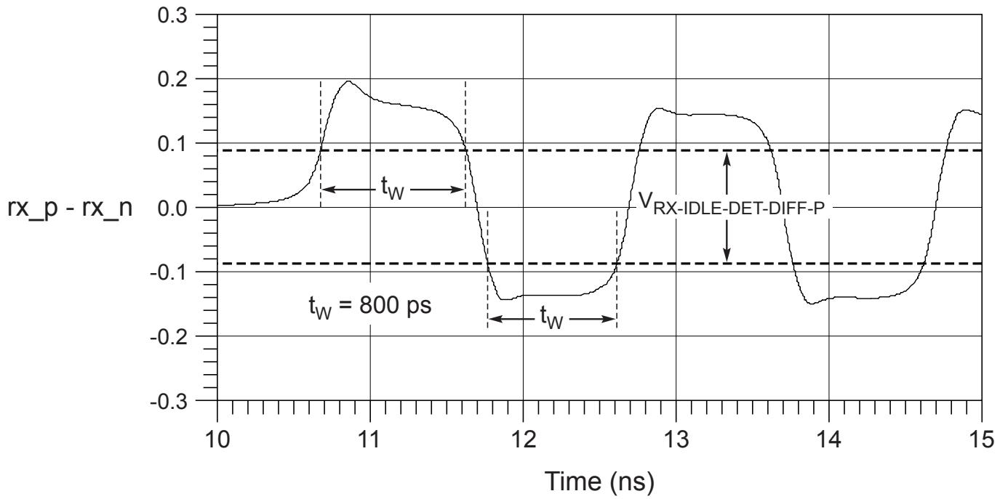

<details>
<summary>line chart</summary>

| Time (ns) | rx_p - rx_n |
| --------- | ----------- |
| 10        | 0.0         |
| 11        | 0.2         |
| 12        | -0.15       |
| 13        | 0.15        |
| 14        | -0.15       |
| 15        | 0.15        |
</details>

A-0564

Figure 8-53 Exit from Idle Voltage and Time Margins§

## 8.4.3.2 Receiver Return Loss §

The measurement methodology and frequency binning for differential and common mode Rx RL is identical to that for the Tx. For details refer to § Figure 8-22, § Figure 8-24, § Figure 8-23, and § Figure 8-25.

## 8.4.4 Lane Margining at the Receiver - Electrical Requirements §

PCI Express components including retimers that support the 16.0 GT/s rate are required to support Lane margining at the Receiver when operating at 16.0, 32.0, or 64.0 GT/s. Lane Margining enables system software to get the margin information of a given Lane while the Link is in L0 state. The margin information includes both voltage and time, in either direction from the current Receiver position. For 64.0 GT/s PAM4 signaling, the margin information includes both voltage and time for all the three eyes. The margin feature is not permitted to require any additional external hardware to function. Support of Lane margining for voltage is optional at 16.0 GT/s and required at 32.0 and 64.0 GT/s. Support of independent timing margin to the left or to the right is optional for all data rates. For simplicity, the margin commands and requirements described in the protocol chapter(s) of this specification are described in terms of moving the data sample location - but the actual margining method is implementation specific. For example - the timing margin could be implemented on the actual data sampler or an independent error sampler. Further the timing margin can be achieved by injecting an appropriate amount of stress/jitter to the data sample location, or by moving the data/error sample location. The parameters in § Table 8-12 are reported for 16.0, 32, and 64.0 GT/s and are allowed to be different for each speed.

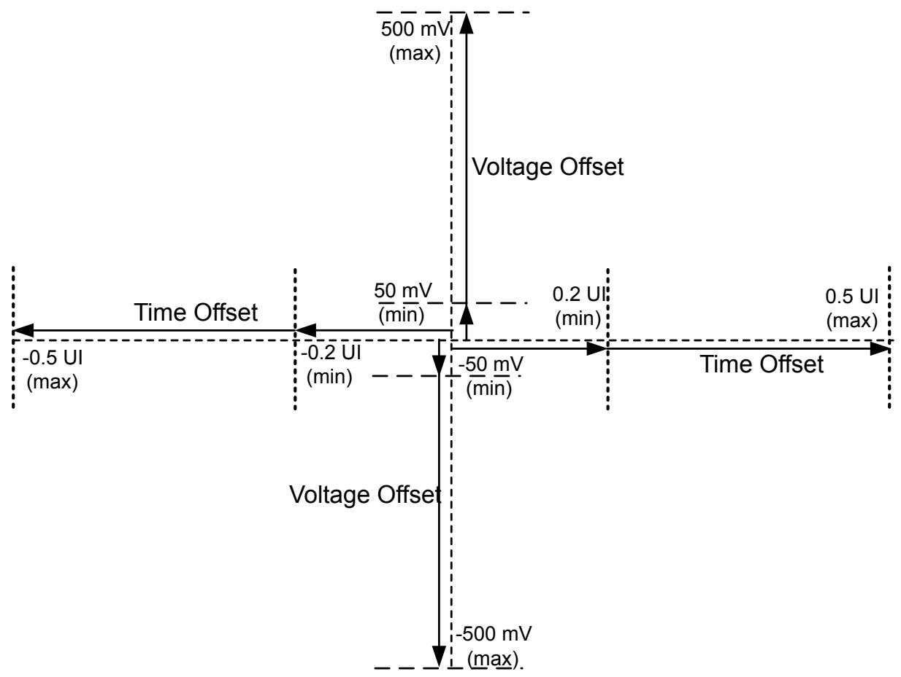

<details>
<summary>vector diagram</summary>

| Point Label       | Time Offset (min) | Voltage Offset (mV) |
| ----------------- | ----------------- | ------------------- |
| 0.2 UI (min)      | 0.2               | 50                  |
| 0.5 UI (max)      | 0.5               | 50                  |
| -0.2 UI (min)     | -0.2              | 50                  |
| -0.5 UI (max)     | -0.5              | 50                  |
</details>

Figure 8-54 Allowed Ranges for Maximum NRZ Timing and Voltage Margin§

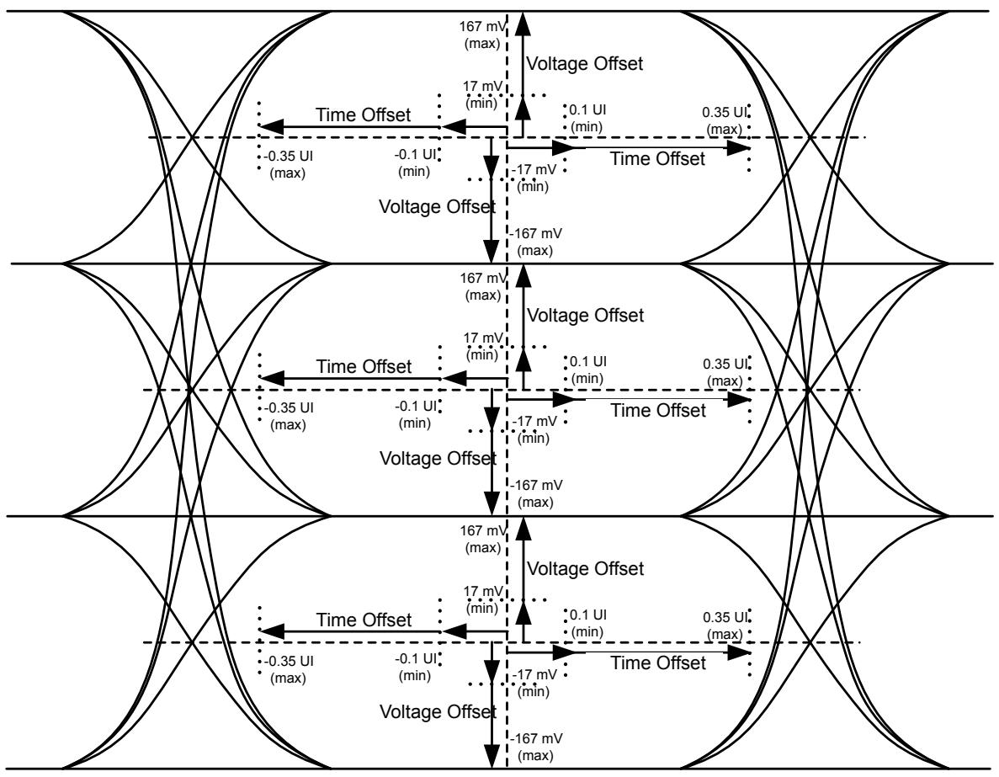

<details>
<summary>waveform diagram</summary>

| Channel | Time Offset (min) | Voltage Offset (min) |
|---------|-------------------|----------------------|
| Top Left | -0.35 UI (max)    | 167 mV (max)         |
| Top Right| -0.1 UI* (min)    | 17 mV (min)          |
| Bottom Left | -0.35 UI (max)   | -17 mV (min)        |
| Bottom Right | -0.1 UI* (min)   | -17 mV (min)        |
| Bottom Right | 0.1 UI (min)      | 0.35 UI* (max)       |
| Middle Left | -0.35 UI (max)   | 167 mV (max)         |
| Middle Right | -0.1 UI* (min)   | 17 mV (min)          |
| Middle Right | 0.1 UI (min)      | 0.35 UI* (max)       |
| Middle Right | 0.35 UI* (max)    | -17 mV (min)        |
| Bottom Right | -0.35 UI (max)   | -167 mV (max)        |
| Bottom Left | -0.1 UI* (min)   | 167 mV (max)         |
| Bottom Right | -0.1 UI* (min)   | 17 mV (min)          |
| Bottom Right | 0.1 UI (min)      | 0.35 UI* (max)       |
| Bottom Right | 0.35 UI* (max)    | -17 mV (min)        |
</details>

Figure 8-55 Allowed Ranges for Maximum PAM4 Timing and Voltage Margins§

§  
Table 8-12 Lane Margining

<table><tr><td>Parameter Name</td><td>Min</td><td>Max</td><td>Description</td></tr><tr><td> $M_{NumTimingSteps}$ </td><td>6</td><td>63</td><td>Number of time steps from default (to either left or right), range must be at least +/-0.2 UI Timing offset must increase monotonically The number of steps in both positive (toward the end of the unit interval) and negative (toward the beginning of the unit interval) must be identical</td></tr><tr><td> $M_{MaxTimingOffset}$ </td><td>20 %</td><td>50 %</td><td>Offset from default at maximum step value as percentage of a nominal UI A 0 value may be reported if the vendor chooses not to report the offset</td></tr><tr><td> $M_{NumVoltageSteps}$ </td><td>32</td><td>127</td><td>Number of voltage steps from default (either up or down), minimum range +/-50 mV as measured by the reference equalizer Voltage offset must increase monotonically The number of steps in both positive and negative direction from the default sample location must be identicalThis value is undefined if  $M_{VoltageSupported}$  is 0b</td></tr><tr><td> $M_{MaxVoltageOffset}$ </td><td>5 %</td><td>50 %</td><td>Offset from default at maximum step value as percentage of one voltA 0 value may be reported if the vendor chooses not to report the offset when  $M_{VoltageSupported}$  is 1bThis value is undefined if  $M_{VoltageSupported}$  is 0b</td></tr><tr><td> $M_{NumTimingStepsPAM4}$ </td><td>10</td><td>63</td><td>Number of time steps from default (to either left or right), range must be at least +/-0.1 UITiming offset must increase monotonicallyThe number of steps in both positive (toward the end of the unit interval) and negative (toward the beginning of the unit interval) must be identical</td></tr><tr><td> $M_{MaxTimingOffsetPAM4}$ </td><td>10 %</td><td>35 %</td><td>Offset from default at maximum step value as percentage of a nominal UIA 0 value may be reported if the vendor chooses not to report the offset</td></tr><tr><td> $M_{NumVoltageStepsPAM4}$ </td><td>64</td><td>127</td><td>Number of voltage steps from default (either up or down), minimum range +/-17 mV as measured by the reference equalizerVoltage offset must increase monotonicallyThe number of steps in both positive and negative direction from the default sample location must be identical</td></tr><tr><td> $M_{MaxVoltageOffsetPAM4}$ </td><td>5 %</td><td>50 %</td><td>Offset from default at maximum step value as percentage of one third volt</td></tr><tr><td> $M_{SamplingRateVoltage}$ </td><td>0</td><td>63</td><td>The ratio of bits tested to bits received during voltage margining. A value of 0 is a ratio of 1:64 (1 bit of every 64 bits received), and a value of 63 is a ratio of 64:64 (all bits received).</td></tr><tr><td> $M_{SamplingRateTiming}$ </td><td>0</td><td>63</td><td>The ratio of bits tested to bits received during timing margining. A value of 0 is a ratio of 1:64 (1 bit of every 64 bits received), and a value of 63 is a ratio of 64:64 (all bits received).</td></tr><tr><td> $M_{VoltageSupported}$ </td><td>0</td><td>1</td><td>1b indicates that voltage margining is supported</td></tr><tr><td> $M_{IndLeftRightTiming}$ </td><td>0</td><td>1</td><td>1b indicates independent left/right timing margin supported</td></tr><tr><td> $M_{IndUpDownVoltage}$ </td><td>0</td><td>1</td><td>1b independent up and down voltage margining supported</td></tr><tr><td> $M_{IndErrorSampler}$ </td><td>0</td><td>1</td><td>1b Margining will not produce errors (change in the error rate) in data stream (ie. error sampler is independent)0b Margining may produce errors in the data stream</td></tr><tr><td> $M_{MaxLanes}$ </td><td>0</td><td>31</td><td>Maximum number of Lanes minus 1 that can be margined at the same time. It is recommended that this value be greater than or equal to the number of Lanes in the Link minus 1. Encoding Behavior is undefined if software attempts to margin more than  $M_{MaxLanes}+1$  at the same time.Note: This value is permitted to exceed the number of Lanes in the Link minus 1.</td></tr><tr><td> $M_{\text{SampleReportingMethod}}$ </td><td>0</td><td>1</td><td>Indicates whether sampling rates ( $M_{\text{SamplingRateVoltage}}$  and  $M_{\text{SamplingRateTiming}}$ ) are supported (1) or a sample count is supported (0). One of the two methods is supported by each device.</td></tr><tr><td> $M_{\text{ErrorCount}}$ </td><td>0</td><td>63</td><td>If  $M_{\text{IndErrorSampler}}$  is 1b this is a count of the actual bit errors since margining started.If  $M_{\text{IndErrorSampler}}$  is 0b this is the actual count of the logical errors since margining started.See the Physical Layer Logical Block chapter for the definition of what errors are counted.The count saturates at 63.</td></tr><tr><td> $M_{\text{SampleCount}}$ </td><td>0</td><td>127</td><td>Value = 3*log2(number of bits margined).Where number of bits margined is a count of the actual number of bits tested during margining. The count stops when margining stops. The count saturates at 127 (after approximately 5.54 × 1012bits).The count resets to zero when a new margin command is received.</td></tr></table>

## 8.4.5 Low Frequency and Miscellaneous Signaling Requirements §

## 8.4.5.1 ESD Standards §

All PCI Express signal and power supply pins must be tested for ESD protection levels to the Human Body Model (HBM) and the Charged Device Model (CDM) standards in accordance with [ESDA-JEDEC-JS-001-2010] (for HBM) and in accordance with [JEDEC-JESD22-C101] (for CDM). Pins must meet or exceed the minimum levels recommended in [JEDEC-JEP155-JEP157] (HBM/CDM) or JEDEC approved superseding documents.

## 8.4.5.2 Channel AC Coupling Capacitors §

Each Lane of a PCI Express Link must be AC coupled. The minimum and maximum values for the capacitance are given in § Table 8-7. Capacitors must be placed on only one side of an interface that permits adapters to be plugged and unplugged. Form factor specifications must define the required location of the capacitor. In a topology where everything is located on a single substrate, the capacitors may be located anywhere along the channel. External capacitors are assumed because the values required are too large to feasibly construct on-chip.

## 8.4.5.3 Short Circuit Requirements §

All Transmitters and Receivers must support surprise hot insertion/removal without damage to the component. The Transmitter and Receiver must be capable of withstanding sustained short circuit to ground of D+ and D-.

## 8.4.5.4 Transmitter and Receiver Termination §

• The Transmitter is required to meet RLTX-DIFF and RLTX-CM (see § Figure 8-22, § Figure 8-24,§ Figure 8-23 and § Figure 8-25) any time functional differential signals are being transmitted.  
• The Transmitter is required only to meet ITX-SHORT (see § Table 8-7 any time functional differential signals are not being transmitted.  
• Note: The differential impedance during this same time is not defined.  
• The Receiver is required to meet RLRX-DIFF and RLRX-CM (see § Table 8-11) during all LTSSM states excluding only times during when the device is powered down, Fundamental Reset is asserted, or when explicitly specified.  
• The Receiver is required to meet ZRX-HIGH-IMP-DC-NEG and ZRX-HIGH-IMP-DC-POS (see § Table 8-11) any time adequate power is not provided to the Receiver, Fundamental Reset is asserted, or when explicitly specified.

## 8.4.5.5 Electrical Idle §

Electrical Idle is a steady state condition where the Transmitter D+ and D- voltages are held constant at the same value. Electrical Idle is primarily used in power saving and inactive states (e.g., Disabled).

Before a Transmitter enters Electrical Idle, it must always send the required number of EIOSs except for the LTSSM substates explicitly exempted from this requirement. After sending the last Symbol of the last of the required number of EIOSs, the Transmitter must be in a valid Electrical Idle state within the time as specified by TTX-IDLE-SET-TO-IDLE in § Table 8-7.

The successful reception of an EIOS occurs based on the rules defined in the Physical Layer Logical Block chapter. It should be noted that in substates (e.g., Loopback.Active for a Loopback Follower) where multiple consecutive EIOSs are expected, the Receiver must receive the appropriate number of EIOS sequences comprising of COM, IDL, IDL, IDL.

The low impedance common mode and differential Receiver termination values (see § Table 8-7 and § Table 8-11) must be met in Electrical Idle. The Transmitter can be in either a low or high impedance mode during Electrical Idle.

Any time a Transmitter enters Electrical Idle it must remain in Electrical Idle for a minimum of TTX-IDLE-MIN. The Receiver should expect the last EIOS followed by a minimum amount of time in Electrical Idle (TTX-IDLE-MIN) to arm its Electrical Idle Exit detector.

When the Transmitter transitions from Electrical Idle to a valid differential signal level it must meet the output return loss specifications described in § Figure 8-22, § Figure 8-24, § Figure 8-23, and § Figure 8-25.

Electrical Idle Exit shall not occur if a signal smaller than VRX-IDLE-DET-DIFFp-p minimum is detected at a Receiver. Electrical Idle Exit shall occur if a signal larger than VRX-IDLE-DET-DIFFp-p maximum is detected at a Receiver. Electrical Idle may be detected on the received signal regardless of its frequency components, or it may be detected only when the received signal is switching at a frequency of 125 MHz or higher.

## 8.4.5.6 DC Common Mode Voltage §

The Receiver DC common mode voltage is nominally 0 V when operating at 2.5 GT/s or 5.0 GT/s.

Transmitter DC common mode voltage is held at the same value during all states unless otherwise specified. The range of allowed Transmitter DC common mode values is specified in § Table 8-7 (VTX-DC-CM).

## 8.4.5.7 Receiver Detection §

The Receiver Detection circuit is implemented as part of a Transmitter and must correctly detect whether a load impedance equivalent to a DC impedance implied by the ZRX-DC parameter (40 Ω-60 Ω) is present. Note: Support for Rx detect, which only occurs at 2.5 GT/s, is the reason why 2.5 GT/s Receivers impedance at DC is specified.

The recommended behavior of the Receiver Detection sequence is described below:

Step 1. A Transmitter must start at a stable voltage prior to the detect common mode shift.

Step 2. A Transmitter changes the common mode voltage on D+ and D- consistent with meeting the VTX-RCV-DETECT parameter and consistent with detection of Receiver high impedance which is bounded by parameters ZRX -HIGH-IMP-DC-POS, ZRX-HIGH-IMP-DC-NEG in § Table 8-11. Receiver is detected based on the rate that the lines change to the new voltage.

a. The Receiver is not present if the voltage at the Transmitter charges at a rate dictated only by the Transmitter impedance and the capacitance of the interconnect and series capacitor.  
b. The Receiver is present if the voltage at the Transmitter charges at a rate dictated by the Transmitter impedance, the series capacitor, the interconnect capacitance, and the Receiver termination.

If the Receiver Detection circuit performs the detect sequence on each conductor of the differential pair (both D+ and D-) and detects a load impedance greater than ZRX-DC on either conductor, the Receiver Detection circuit shall interpret this as no termination load present and respond as if neither load were present.

It is required that the detect sequence be performed on both conductors of a differential pair.

## 8.5 Channel Tolerancing §

## 8.5.1 Channel Compliance Testing §

This section of the specification is relevant only for those cases where a platform design comprehends the relevant channel between Transmitter device pins and Receiver device pins. These types of platform designs are called “captive channels”. Designs that are not captive channels shall refer to the appropriate form factor (CEM is one example) specification, since in this case the form factor specification takes precedence over this specification and splits the channel between two different types of components.

The key components and processes of channel tolerancing are illustrated in § Figure 8-56 and § Figure 8-57. The major difference lies in the complexity of the Behavioral Tx and Rx equalization, which depends on the data rate. 2.5 and 5.0 GT/s utilize fixed Tx presets and assume no Rx equalization, whereas 8.0, 16.0, 32.0, and 64.0 GT/s assume multi-valued, adjustable Tx presets and a combination of Rx DFE and CTLE.

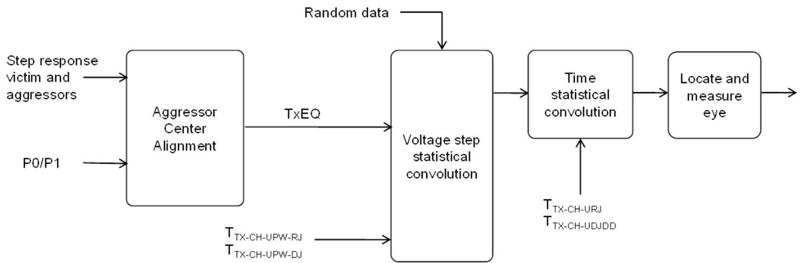

<details>
<summary>flowchart</summary>

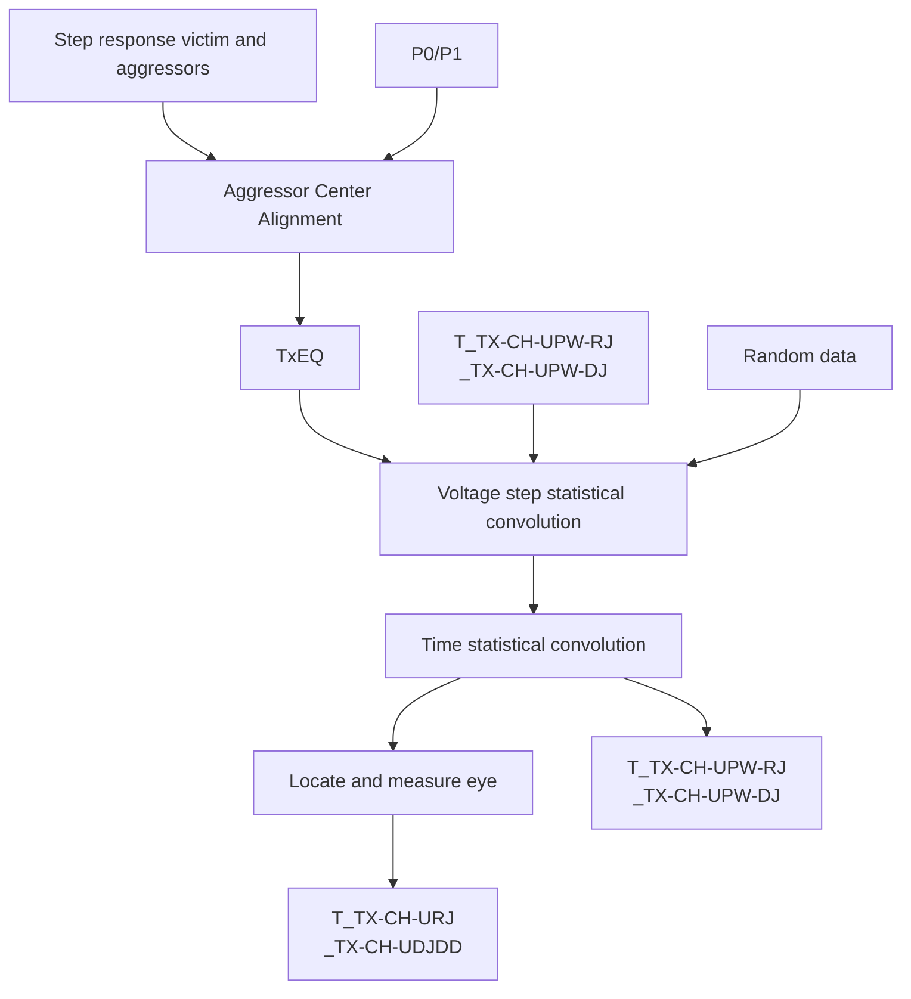
```mermaid
graph TD
  A["Step response victim and aggressors"] --> B["Aggressor Center Alignment"]
  C["P0/P1"] --> B
  B --> D["TxEQ"]
  D --> E["Voltage step statistical convolution"]
  F["T_TX-CH-UPW-RJ\n_TX-CH-UPW-DJ"] --> E
  G["Random data"] --> E
  E --> H["Time statistical convolution"]
  H --> I["Locate and measure eye"]
  I --> J["T_TX-CH-URJ\n_TX-CH-UDJDD"]
  H --> K["T_TX-CH-UPW-RJ\n_TX-CH-UPW-DJ"]
```
</details>

Figure 8-56 Flow Diagram for Channel Tolerancing at 2.5 and 5.0 GT/s§

The basic channel compliance approach is to first acquire the channel’s characteristics, usually by means of s-parameters or equivalent model. Behavioral Tx and Rx package models are then appended to the channel model to yield a die pad to die pad topology. The model shall include both victim path and a sufficient number of aggressor paths to accurately capture channel crosstalk effects. Using the Tx voltage and jitter limits defined in the Transmitter specification section it is possible to transform these parameters to what would appear at the die pad of a Tx.

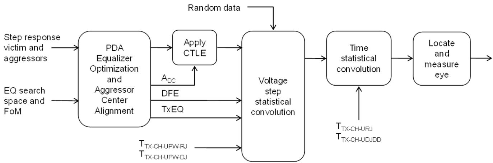

<details>
<summary>flowchart</summary>

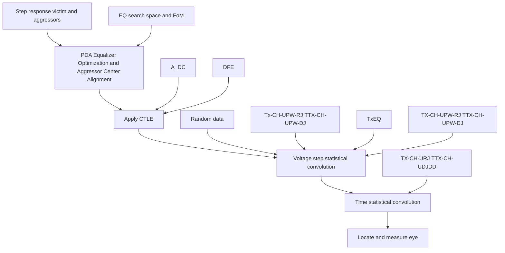
```mermaid
graph TD
  A["Step response victim and aggressors"] --> B["PDA Equalizer Optimization and Aggressor Center Alignment"]
  C["EQ search space and FoM"] --> B
  B --> D["Apply CTLE"]
  D --> E["Voltage step statistical convolution"]
  E --> F["Time statistical convolution"]
  F --> G["Locate and measure eye"]
  H["Random data"] --> E
  I["Tx-CH-UPW-RJ TTX-CH-UPW-DJ"] --> E
  J["A_DC"] --> D
  K["DFE"] --> D
  L["TxEQ"] --> E
  M["TX-CH-UPW-RJ TTX-CH-UPW-DJ"] --> E
  N["TX-CH-URJ TTX-CH-UDJDD"] --> F
```
</details>

Figure 8-57 Flow Diagram for Channel Tolerancing at 8.0 and 16.0 GT/s§

The resulting model is analyzed via simulation, yielding voltage and jitter at a point equivalent to the input latch of the Receiver. The signal observed at the Receiver’s latch is referenced to a recovered data clock from which an eye diagram may be constructed.

For 8.0, 16.0, 32.0, and 64.0 GT/s testing the simulation process must properly account for Tx and Rx equalization optimization as must be supported by a minimum capability Tx/Rx pair. This means the simulation process must be able to select the optimum values for the Tx presets or coefficients and Rx equalization settings based upon:

• $\mathsf { a 1 } ^ { \mathsf { s t } }$ order CTLE and a 1-tap DFE for 8.0 GT/s,  
• $\mathsf { a 1 } ^ { \mathsf { s t } }$ order CTLE and a 2-tap DFE for 16.0 GT/s,

• $\mathsf { a 2 } ^ { \mathsf { n d } }$ order CTLE and a 3-tap DFE for 32.0 GT/s, and  
• a CTLE transfer function with six poles and three zeros and a 16-tap DFE for 64.0 GT/s.

## 8.5.1.1 Behavioral Transmitter and Receiver Package Models §

Behavioral package models are defined in this specification to represent the combined die and package loss that is expected to interoperate with the targeted range of channels. Note that at 16.0 GT/s, the behavioral packages represent a high, but not worst-case, loss for many devices. (see § Section 8.3.3.11 and § Section 8.4.1.5 )

A separate pair of package models are defined for 8.0, 16.0, 32.0, and 64.0 GT/s. At 8.0 GT/s, separate package models are defined for TX and RX ports to reflect the smaller CPAD capacitance typical in most receiver implementations. At 16.0, 32.0, and 64.0 GT/s, separate package models are defined for devices containing Root Ports and all other devices to reflect the large and socketed nature of most devices containing Root Complexes. Channel testing for all three data rates typically requires testing in both directions.

The package models are included with the specification as design collateral. Each model for 8.0 and 16. 0 GT/s comprehends CPIN and CPAD parasitic capacitances plus a differential t-line element as illustrated in § Figure 8-58.

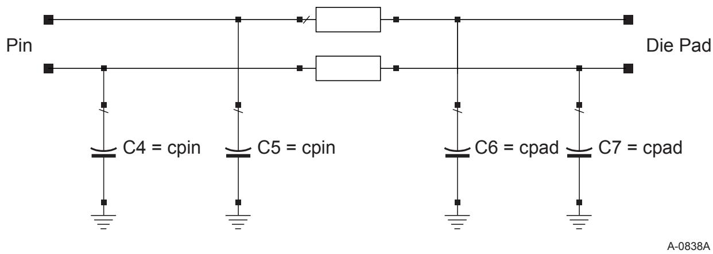

<details>
<summary>text_image</summary>

Pin
Die Pad
C4 = cpin
C5 = cpin
C6 = cpad
C7 = cpad
A-0838A
</details>

Figure 8-58 Tx/Rx Behavioral Package Models§

The $\mathsf { C p } \mathsf { N }$ and CPAD values used in the package model generation are provided for informative purposes only.

Table 8-13 Package Model Capacitance Values

<table><tr><td></td><td>8.0 GT/s Tx</td><td>8.0 GT/s Rx</td><td>16.0 GT/s</td></tr><tr><td> $C_{PIN}$ </td><td>0.25 pF</td><td>0.25 pF</td><td>0.25 pF</td></tr><tr><td> $C_{PAD}$ </td><td>1.0 pF</td><td>0.8 pF</td><td>0.5 pF</td></tr></table>

For ease of incorporation into the post processing flow the 8.0 and 16.0 behavioral package models are specified as 4-port s-parameter files. The files are specified with port designations, frequency range and granularity as listed below. The reference impedance for the s-parameters is 50 Ω. File format is Touchstone.

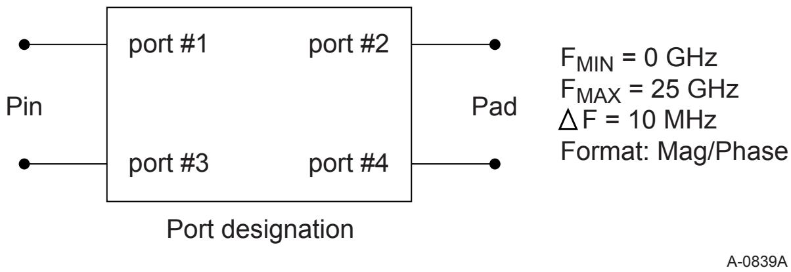

<details>
<summary>text_image</summary>

Pin
port #1 port #2
port #3 port #4
Port designation
Pad
F_MIN = 0 GHz
F_MAX = 25 GHz
ΔF = 10 MHz
Format: Mag/Phase
A-0839A
</details>

Figure 8-59 Behavioral Tx and Rx S-Port Designation for 8.0 and 16.0 GT/s Packages§

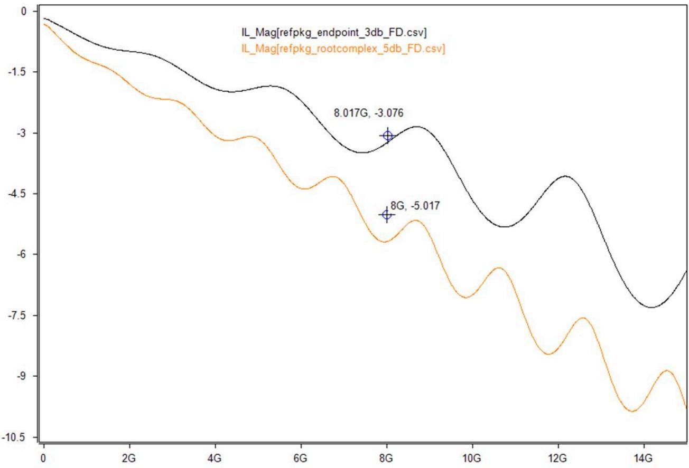

<details>
<summary>line chart</summary>

| Step | IL_Mag[refpkg_endpoint_3db_FD.csv] | IL_Mag[rootcomplex_5db_FD.csv] |
| ---- | ---------------------------------- | ------------------------------ |
| 8G   | -3.076                             | -5.017                         |
</details>

Figure 8-60 SDD21 Plots for Root and Non-Root Packages for 16.0 GT/s§

For 32.0 and 64.0 GT/s the package models are based on real package and socket models for the root package and package and BGA models for the non-root package.

For 32.0 GT/s, reference package models the die capacitive loads are included in the models. For 64.0 GT/s, the effective die cap has been replaced by the S-parameter representation of an on-die network that represents the insertion and return loss characteristics of on-die pad for a typical design. The reference impedance for the 32.0 and 64.0 GT/s reference package model s-parameters is 50 Ω. Figures below show 32.0 and 64.8 GT/s reference package insertion loss, return loss, FEXT, and NEXT S-parameter plots based on 50 Ω impedance. To account for the on-die inductive coil DC loss of about 3 Ω, the Tx and Rx DC termination should be set to 47 Ω in 64.0 GT/s channel compliance simulations.

Insertionloss  
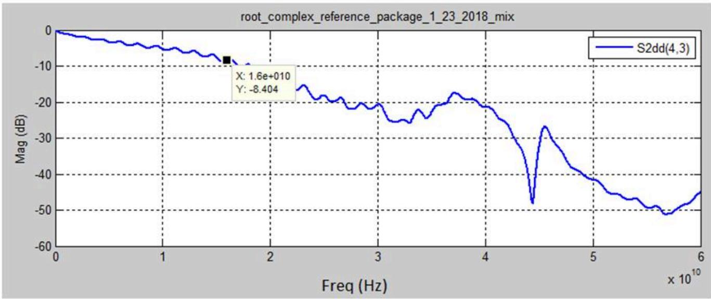

<details>
<summary>line chart</summary>

| Freq (Hz) | Mag (dB) |
| --------- | -------- |
| 0         | 0        |
| 1         | -5       |
| 2         | -10      |
| 3         | -20      |
| 4         | -30      |
| 5         | -45      |
| 6         | -50      |
</details>

Figure 8-61 Insertion Loss for Root Reference Package for 32.0 GT/s§

Return Loss (Board-side)  
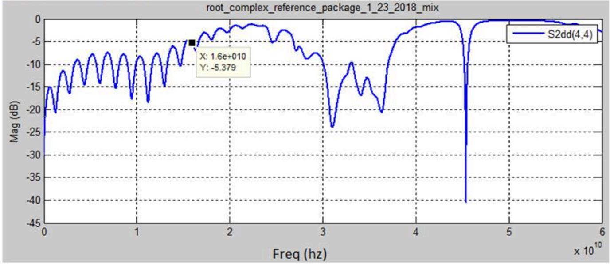

<details>
<summary>line chart</summary>

| Freq (Hz) | Mag (dB) |
| --------- | -------- |
| 0         | -20      |
| 1.6e+01   | -5.379   |
| 4.5e+10   | -40      |
</details>

Figure 8-62 Return Loss for Root Reference Package for 32.0 GT/s§

NEXT2  
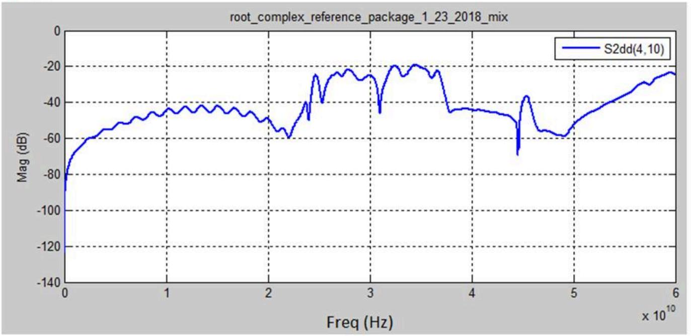

<details>
<summary>line chart</summary>

| Freq (Hz) | Mag (dB) |
| --------- | -------- |
| 0         | -90      |
| 1e10      | -45      |
| 2e10      | -55      |
| 3e10      | -20      |
| 4e10      | -45      |
| 5e10      | -60      |
| 6e10      | -25      |
</details>

Figure 8-63 NEXT for Root Reference Package (Worst-Case) for 32.0 GT/s§

FEXT1  
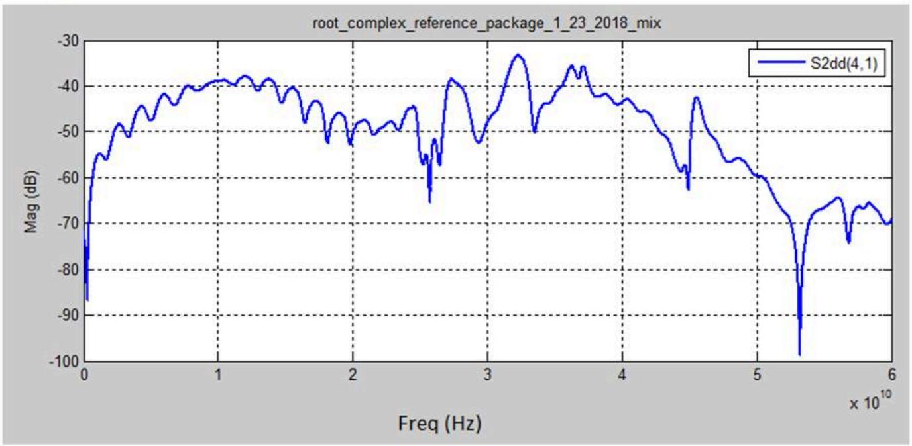

<details>
<summary>line chart</summary>

| Freq (Hz) | Mag (dB) |
| --------- | -------- |
| 0         | -85      |
| 1e10      | -40      |
| 2e10      | -50      |
| 3e10      | -35      |
| 4e10      | -45      |
| 5e10      | -60      |
| 6e10      | -70      |
</details>

Figure 8-64 FEXT for Root Reference Package (Worst-Case) for 32.0 GT/s§

Insertion loss  
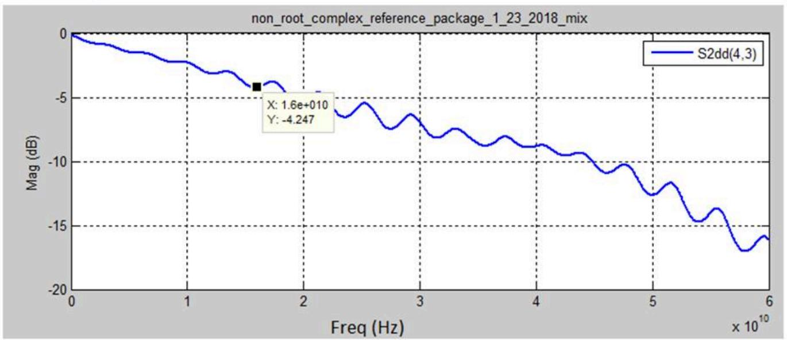

<details>
<summary>line chart</summary>

| Freq (Hz) | Mag (dB) |
| --------- | -------- |
| 0         | 0        |
| 1         | -2       |
| 2         | -5       |
| 3         | -7       |
| 4         | -9       |
| 5         | -12      |
| 6         | -16      |
</details>

Figure 8-65 Insertion Loss for Non-Root Reference Package for 32.0 GT/s§

Return Loss(Board-side)  
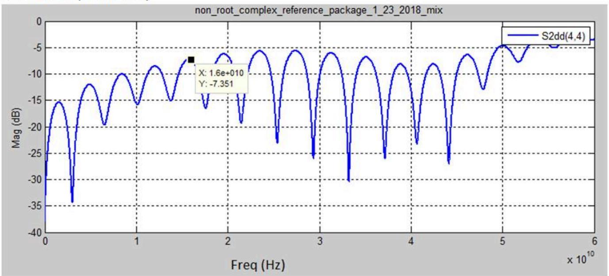

<details>
<summary>line chart</summary>

| Freq (Hz) | Mag (dB) |
| --------- | -------- |
| 0         | -35      |
| 1.6e+01   | -7.351   |
| 2.0       | -7.351   |
| 3.0       | -7.351   |
| 4.0       | -7.351   |
| 5.0       | -7.351   |
| 6.0       | -7.351   |
</details>

Figure 8-66 Return Loss for Non-Root Reference Package for 32.0 GT/s§

NEXT1  
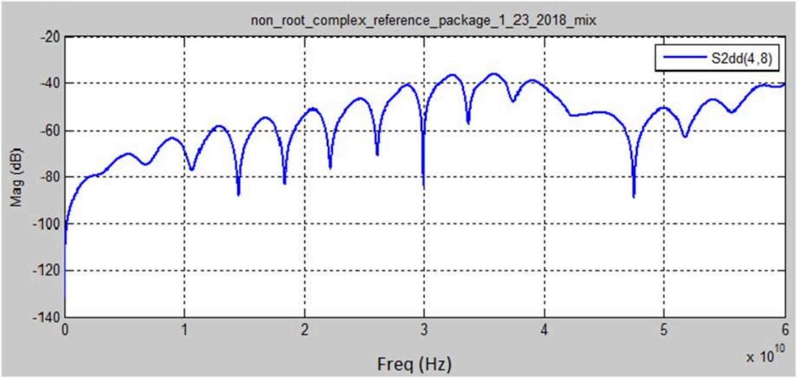

<details>
<summary>line chart</summary>

| Freq (Hz) | Mag (dB) |
| --------- | -------- |
| 0         | -100     |
| 1e10      | -60      |
| 2e10      | -50      |
| 3e10      | -40      |
| 4e10      | -50      |
| 5e10      | -60      |
| 6e10      | -40      |
</details>

Figure 8-67 NEXT for Non-Root Reference Package (Worst-Case) for 32.0 GT/s§

FEXT 2 (Die-side)  
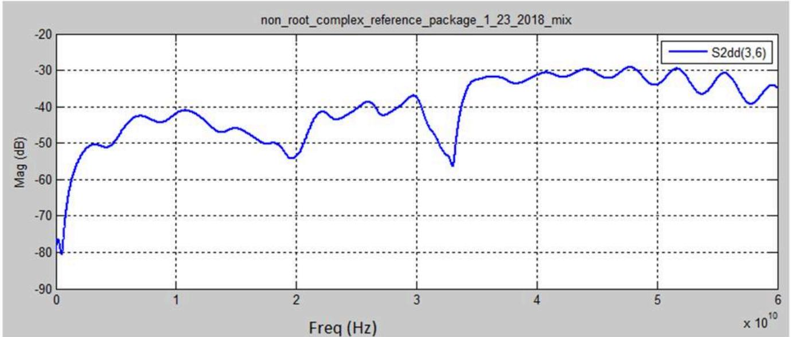

<details>
<summary>line chart</summary>

| Freq (Hz) | Mag (dB) |
| --------- | -------- |
| 0         | -80      |
| 1e10      | -40      |
| 2e10      | -55      |
| 3e10      | -40      |
| 4e10      | -30      |
| 5e10      | -30      |
| 6e10      | -35      |
</details>

Figure 8-68 FEXT for Non-Root Reference Package (Worst-Case) for 32.0 GT/s§

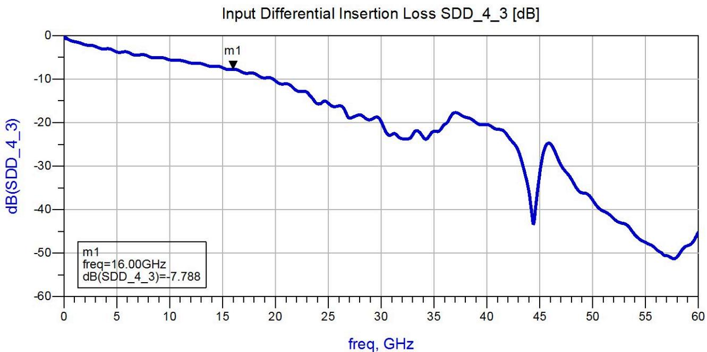

<details>
<summary>line chart</summary>

| freq, GHz | dB(SDD_4_3) |
| --------- | ----------- |
| 0         | 0           |
| 15        | -8          |
| 30        | -20         |
| 45        | -45         |
| 60        | -50         |
</details>

Figure 8-69 Insertion Loss for Root Reference Package for 64.0 GT/s§

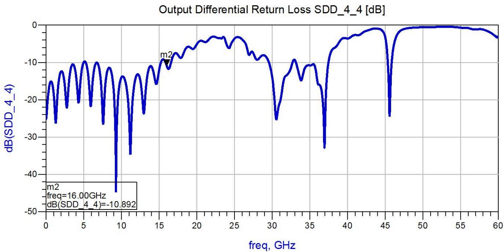

<details>
<summary>line chart</summary>

| freq, GHz | dB(SDD_4_4) |
| --------- | ----------- |
| 16.00     | -10.892     |
</details>

Figure 8-70 Return Loss for Root Reference Package for 64.0 GT/s§

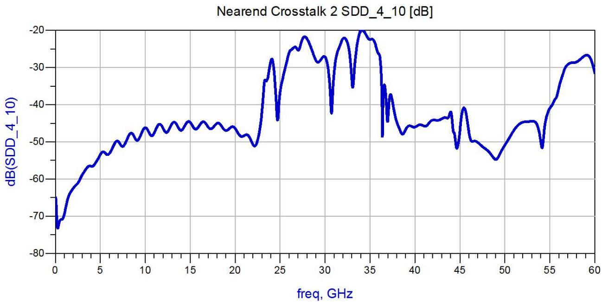

<details>
<summary>line chart</summary>

| freq, GHz | dB(SDD_4_10) |
| --------- | ------------ |
| 0         | -75          |
| 5         | -55          |
| 10        | -48          |
| 15        | -47          |
| 20        | -49          |
| 25        | -28          |
| 30        | -42          |
| 35        | -20          |
| 40        | -45          |
| 45        | -40          |
| 50        | -55          |
| 55        | -48          |
| 60        | -30          |
</details>

Figure 8-71 NEXT for Root Reference Package (Worst Case) for 64.0 GT/s§

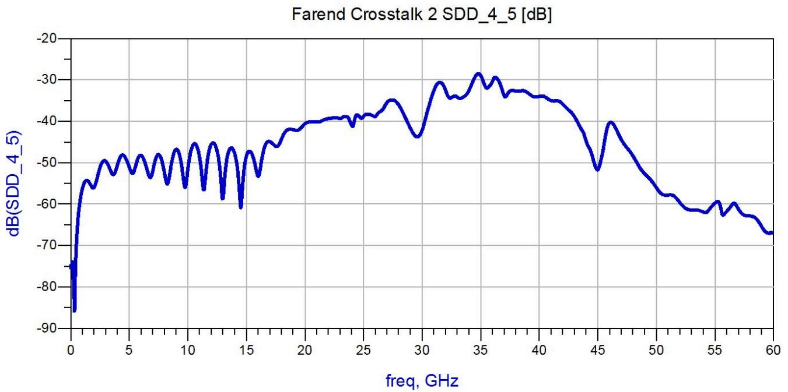

<details>
<summary>line chart</summary>

| freq, GHz | dB(SDD_4_5) |
| --------- | ----------- |
| 0         | -85         |
| 5         | -50         |
| 10        | -55         |
| 15        | -60         |
| 20        | -40         |
| 25        | -35         |
| 30        | -45         |
| 35        | -30         |
| 40        | -35         |
| 45        | -50         |
| 50        | -60         |
| 55        | -65         |
| 60        | -70         |
</details>

Figure 8-72 FEXT for Root Reference Package (Worst Case) for 64.0 GT/s§

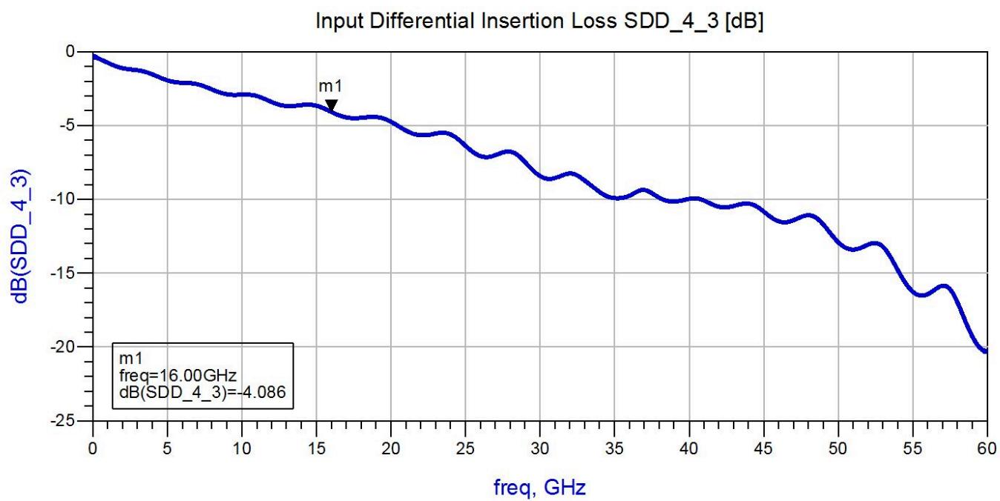

<details>
<summary>line chart</summary>

| freq, GHz | dB(SDD_4_3) |
| --------- | ----------- |
| 0         | 0           |
| 5         | -1          |
| 10        | -2          |
| 15        | -3          |
| 20        | -4          |
| 25        | -5          |
| 30        | -6          |
| 35        | -7          |
| 40        | -8          |
| 45        | -9          |
| 50        | -10         |
| 55        | -12         |
| 60        | -20         |
</details>

Figure 8-73 Insertion Loss for Non-Root Reference Package for 64.0 GT/s§

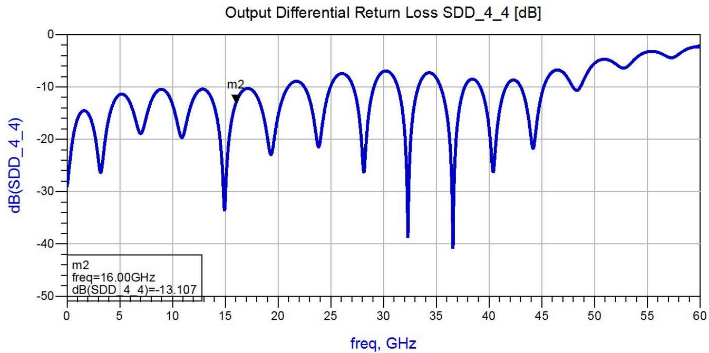

<details>
<summary>line chart</summary>

| freq, GHz | dB(SDD_4_4) |
| --------- | ----------- |
| 16.00     | -13.107     |
</details>

Figure 8-74 Return Loss for Non-Root Reference Package for 64.0 GT/s§

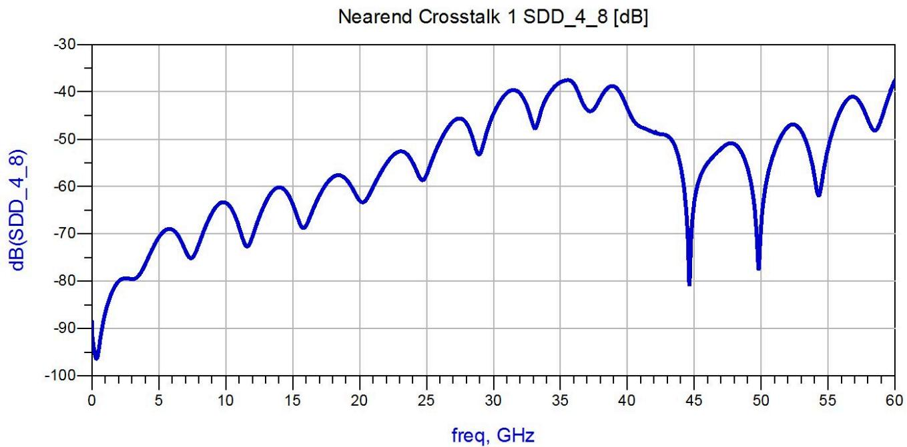

<details>
<summary>line chart</summary>

| freq, GHz | dB(SDD_4_8) |
| --------- | ----------- |
| 0         | -90         |
| 5         | -70         |
| 10        | -65         |
| 15        | -60         |
| 20        | -55         |
| 25        | -50         |
| 30        | -45         |
| 35        | -40         |
| 40        | -45         |
| 45        | -80         |
| 50        | -85         |
| 55        | -60         |
| 60        | -40         |
</details>

Figure 8-75 NEXT for Non-Root Reference Package (Worst Case) for 64.0 GT/s§

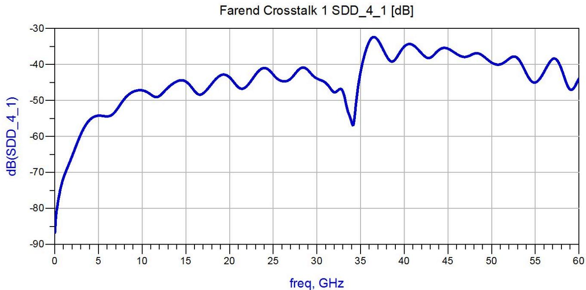

<details>
<summary>line chart</summary>

| freq, GHz | dB(SDD_4_1) |
| --------- | ----------- |
| 0         | -85         |
| 5         | -55         |
| 10        | -48         |
| 15        | -46         |
| 20        | -47         |
| 25        | -45         |
| 30        | -48         |
| 35        | -58         |
| 40        | -35         |
| 45        | -38         |
| 50        | -40         |
| 55        | -45         |
| 60        | -47         |
</details>

Figure 8-76 FEXT for Non-Root Reference Package (Worst Case) for 64.0 GT/s§

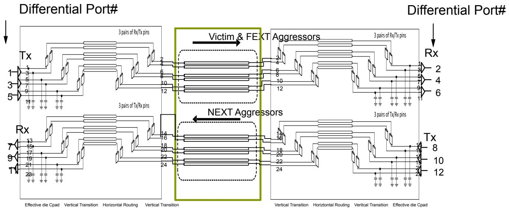

<details>
<summary>flowchart</summary>

Electrical circuit diagram showing differential port configurations with Rx/Tx pins, victim/fexnt aggressors, and vertical/horizontal routing paths.
</details>

Reference Package Channel (Pin to Pin) Reference Package  
Figure 8-77 32.0 and 64.0 GT/s Reference Package Port Connections for Pin to Pin Channel Evaluation§

§ Figure 8-77 shows the port connections for using the 32.0 and 64.0 GT/s reference packages to evaluate a pin to pin channel using the channel compliance methodology. Both directions (root transmitting and non-root transmitting) must be evaluated. The lane labeled channel 3 to channel 4 is intended as the worst-case victim channel and must be evaluated in both directions. Other channels in the reference package model are intended only for use as cross-talk aggressors (not victim channels).

## 8.5.1.2 Measuring Package Performance (16.0 GT/s only) §

Package insertion loss at 16.0 GT/s is an informative spec parameter. Some implementations at 16.0 GT/s (see § Section 8.3.3.11 ) are allowed to have packages that exceed reference packages in insertion loss and/or cross-talk. Actual package performance must be assessed by performing channel compliance with reference channels provided with the specification on the PCI-SIG website. A set of channel compliance simulations are run on the reference channels with one of the reference packages being replaced by the package that is being evaluated. If the eye height or eye width is smaller for any of the channels with the package that is being evaluated, then the package is considered to have worse performance than the reference package. An implementation with a package that has worse performance than the reference package must use the implementation package model in the channel compliance methodology and may optionally use the implementation package in the Receiver stressed eye calibration. Note that form factor and channel compliance (for a captive channel) overall requirements still need to be met regardless of package characteristics.

## 8.5.1.3 Simulation Tool Requirements §

Channel tolerancing is implemented by means of simulation, where the pass/fail criteria are defined in terms of a time domain eye diagram. The simulation tool must accept a prescribed set of inputs, including the channel under consideration and then simulate based upon a set of post processing requirements. This specification does not stipulate the use of any specific tool for simulating channels. However, any simulation tool must meet the following requirements.

## 8.5.1.3.1 Simulation Tool Chain Inputs §

Channel characteristics defined as S-parameters or equivalent model. The model must include the victim differential Lane plus as many aggressors as required to accurately capture crosstalk. In most cases this will be between 2 and 4 additional differential Lanes. Note that 32.0 and 64.0 GT/s are most likely to require additional aggressors to accurately capture worst-case cross-talk and most likely to require several NEXT aggressors to capture crosstalk accurately.  
• Behavioral Root and Non-Root package models. The models will be included as part of the specification in the form of s-parameter files (see § Section 8.5.1.1 ).  
• Transmitter Jitter and voltage: The voltage and jitter parameters input to the simulator may be directly obtained from a combination of the Transmitter and Refclk jitter. Since these parameters are fixed the simulation tool may choose to hard code their values.  
• Transmitter and Receiver Termination Impedance: The simulator shall use a 2 × 50 Ω termination for both the Transmitter and Receiver. This value matches the assumptions which are implicit in generating and measuring the stressed eye for Rx tolerancing.

## 8.5.1.3.2 Processing Steps §

• Time domain representation of the end-to-end connectivity: Included are the behavioral Tx and Rx packages and the channel under test.  
• Tx voltage and jitter: Voltage and jitter parameters defined for the Transmitter but have been recalculated to properly comprehend high and low frequency jitter components, and also include Refclk jitter contributions.  
• Behavioral Transmitter Equalization: The simulator shall replicate the Transmitter equailzation capabilities defined in the Transmitter section.  
• Behavioral Rx CTLE: The simulation tool shall implement a behavioral CTLE that replicates the CTLE function employed for Rx tolerancing.  
Behavioral DFE: The simulation tool shall implement a 1-tap (8.0 GT/s), a 2-tap (16.0 GT/s), a 3 tap DFE (32.0 GT/ s), and a 16-tap DFE (64.0 GT/s), where the dynamic range for the feedback coefficient is defined in § Section 8.4.1.10 .  
Optimizing Tx equalization and Rx DFE/CTLE settings: The simulation tool shall implement an optimization algorithm that selects the combination of Tx equalization and Rx CTLE and DFE settings that yields a maximum value for the eye height (at the data sample point) multiplied by the eye width at the far end of the channel. For details refer to § Section 8.4.1.8 .  
• Statistical Treatment of jitter: In order to avoid overestimating the effect of channel-data and channel-jitter interactions, the tool shall use a statistical analysis of these parameters to generate voltage/jitter eye margins.

## 8.5.1.3.3 Simulation Tool Outputs §

Output eye parameters: The simulator shall generate a statistically defined output that displays the eye width and eye height. EH will be measured as the peak eye height at the data sample location, while EW shall be measured at the zero-crossing line. Additionally the simulator shall have the capability to adjust the data sample point by ±0.1 UI from the mean center of the UI for 8.0 and 16.0 GT/s as shown in § Figure 8-79. For 32.0 GT/s the simulator shall adjust the sample point up to 0.30 UI to the left of the mean center of the UI sample position in 0.05 UI increments, computing the DFE coefficients for each sample location and selecting the result producing the maximum value for the eye height (at the data sample point) multiplied by the eye width. For 64.0 GT/s the simulator shall adjust the sample point up to

0.30 UI to the left of the mean center of the UI sample position in 0.015 UI increments, computing the DFE coefficients for each sample location and selecting the result producing the maximum value for the eye height (at the data sample point) multiplied by the eye width.

## 8.5.1.3.4 Open Source Simulation Tool §

An open source simulation tool shall be provided with the specification as design collateral. The tool will provide a turnkey capability, where the user provides the channel characteristics at the Receiver’s die pad as step responses, and the tool calculates a statistical eye showing pass/fail.

## 8.5.1.4 Behavioral Transmitter Parameters §

## 8.5.1.4.1 Deriving Voltage and Jitter Parameters §

This section is for informative purposes. The voltage and jitter parameters may be derived from the Transmitter voltage and jitter parameters but are referenced to the die pad. This is necessary to allow the channel simulation to include a behavioral Tx package and drive the package from the die pads. Additionally, the Tj terms must be decomposed into separate Rj and DjDD terms.

• VTX-CH-FS-NO-EQ and VTX-CH-RS-NO-EQ: These two parameters define the minimum peak-peak voltage corresponding to Vd in § Figure 8-6.  
• The jitter parameters are derived based on the following set of equations. Algebraic manipulation is used to extract the Rj implicitly defined by the combination of Tj and DjDD terms. The following numbers are based on 8.0 GT/s Tx jitter parameters based on values specified in § Table 8-6. The same approach is used to extract jitter parameters for 2.5, 5.0, 16.0, 32.0, and 64.0 GT/s where it is assumed that maximum data rate supported by the PCIe 6.0 device is 64.0 GT/s and the jitter values in § Table 8-6 are used in the extraction process.

$$
\begin{array}{l} \mathrm {jit\_hfrj\_nui} = (T _ {\mathrm{TX-UTJ}} - T _ {\mathrm{TX-UDJ-DD}}) / 1 4. 0 6 = 1. 1 1 \mathrm{ps} \\ T _ {T X - C H - U P W - R J} = \left(T _ {T X - U P W J - T J} - T _ {T X U P W J - D J D D}\right) / 1 4. 0 6 = 1. 0 0 p s \\ T _ {T X - C H - U P W - D J} = T _ {T X U P W J - D J D D} = 1 0. 0 \mathrm{ps} \\ T _ {T X - C H - U R J} = \operatorname{sqrt} (\text { jit\_hfrj\_nui } * * 2 - (T _ {T X - C H - U P W - R J} * 0. 7 0 7) * * 2 + T _ {R E F C L K - R M S} * * 2) = 1. 3 1 \mathrm{ps} \\ T _ {T X - C H - U D J D D} = T _ {T X - U D J - D D} - \left(T _ {T X U P W J - D J D D}\right) / 2 = 7. 0 0 p s \\ \end{array}
$$

A-0840A

Figure 8-78 Example Derivation of 8.0 GT/s Jitter Parameters for § Table 8-14§

A channel must be tested at all data rates, with the corresponding Tx jitter parameters, that it is intended to support during normal operation. For example, a channel intended to support a maximum data rate of 8.0 GT/s must be tested at 2.5, 5.0, and 8.0 GT/s.

Table 8-14 Jitter/Voltage Parameters for Channel Tolerancing§

<table><tr><td>Symbol</td><td>Parameter</td><td>Value</td><td>Units</td><td>Notes</td></tr><tr><td> $V_{TX-CH-FS-NO-EQ}$ </td><td>Full swing Tx voltage</td><td>804</td><td>mVPP</td><td>Full swing, No Tx Eq.</td></tr><tr><td> $V_{TX-CH-RS-NO-EQ}$ </td><td>Reduced swing Tx voltage</td><td>402</td><td>mVPP</td><td>Reduced swing, No Tx Eq.</td></tr></table>

2.5 GT/s Jitter Parameters and Voltage Parameters

<table><tr><td> $T_{TX-CH-URJ-2.5G}$ </td><td>Tx uncorrelated Rj</td><td>3.45</td><td>ps RMS</td><td>See Note 1</td></tr><tr><td> $T_{TX-CH-UDJDD-2.5G}$ </td><td>Tx uncorrelated DjDD</td><td>20</td><td>ps PP</td><td></td></tr><tr><td> $T_{TX-CH-UPW-RJ-2.5G}$ </td><td>Uncorrelated PW Rj</td><td>1.42</td><td>ps RMS</td><td>See Note 2</td></tr><tr><td> $T_{TX-CH-UPW-DJ-2.5G}$ </td><td>PW DDj</td><td>80</td><td>ps PP</td><td></td></tr><tr><td> $T_{TX-DIEPAD-EDGERATE-2.5G}$ </td><td>Signal edge rate at behavioral Tx die pad</td><td>140</td><td>ps</td><td>Measured 10% to 90% using a gaussian lowpass filter to shape the edge. See Note 3.</td></tr></table>

5.0 GT/s Jitter Parameters and Voltage Parameters

<table><tr><td> $T_{TX-CH-URJ-5G}$ </td><td>Tx uncorrelated Rj</td><td>3.45</td><td>ps RMS</td><td>See Note 1</td></tr><tr><td> $T_{TX-CH-UDJDD-5G}$ </td><td>Tx uncorrelated DjDD</td><td>20-</td><td>ps PP</td><td></td></tr><tr><td> $T_{TX-CH-UPW-RJ-5G}$ </td><td>Uncorrelated PW Rj</td><td>1.42</td><td>ps RMS</td><td></td></tr><tr><td> $T_{TX-CH-UPW-DJ-5G}$ </td><td>PW DDj</td><td>40</td><td>ps PP</td><td>See Note 2.</td></tr><tr><td> $T_{TX-DIEPAD-EDGERATE-5G}$ </td><td>Signal edge rate at behavioral Tx die pad</td><td>70</td><td>ps</td><td>Measured 10% to 90% using a gaussian lowpass filter to shape the edge. See Note 3.</td></tr></table>

8.0 GT/s Jitter Parameters and Voltage Parameters

<table><tr><td> $T_{TX-CH-URJ-8G}$ </td><td>Tx uncorrelated Rj</td><td>1.31</td><td>ps RMS</td><td>No DDj of HF jitter. See Note 1.</td></tr><tr><td> $T_{TX-CH-UDJDD-8G}$ </td><td>Tx uncorrelated DjDD</td><td>7.0</td><td>ps PP</td><td>No DDj of HF jitter</td></tr><tr><td> $T_{TX-CH-UPW-RJ-8G}$ </td><td>Uncorrelated PW Rj</td><td>1.0</td><td>ps RMS</td><td></td></tr><tr><td> $T_{TX-CH-UPW-DJ-8G}$ </td><td>PW DDj</td><td>10</td><td>ps PP</td><td>See Note 2.</td></tr><tr><td> $T_{TX-DIEPAD-EDGERATE-8G}$ </td><td>Signal edge rate at behavioral Tx die pad</td><td>43.75</td><td>ps</td><td>Measured 10% to 90% using a gaussian lowpass filter to shape the edge. See Note 3.</td></tr></table>

16.0 GT/s Jitter Parameters and Voltage Parameters

<table><tr><td> $T_{TX-CH-URJ-16G}$ </td><td>Tx uncorrelated Rj</td><td>0.71</td><td>ps RMS</td><td>See Note 1.</td></tr><tr><td> $T_{TX-CH-UDJDD-16G}$ </td><td>Tx uncorrelated DjDD</td><td>3.75</td><td>ps PP</td><td></td></tr><tr><td> $T_{TX-CH-UPW-RJ-16G}$ </td><td>Uncorrelated PW Rj</td><td>0.54</td><td>ps RMS</td><td></td></tr><tr><td> $T_{TX-CH-UPW-DJ-16G}$ </td><td>PW DDj</td><td>5.0</td><td>ps PP</td><td>See Note 2.</td></tr><tr><td>Symbol</td><td>Parameter</td><td>Value</td><td>Units</td><td>Notes</td></tr><tr><td> $T_{TX-DIEPAD-EDGERATE-16G}$ </td><td>Signal edge rate at behavioral Tx die pad</td><td>21.875</td><td>ps</td><td>Measured 10% to 90% using a gaussian lowpass filter to shape the edge. See Note 3.</td></tr></table>

32.0 GT/s Jitter Parameters and Voltage Parameters

<table><tr><td> $T_{TX-CH-URJ-32G}$ </td><td>Tx uncorrelated Rj</td><td>0.276</td><td>ps RMS</td><td>See Note 1.</td></tr><tr><td> $T_{TX-CH-UDJDD-32G}$ </td><td>Tx uncorrelated DjDD</td><td>1.875</td><td>ps PP</td><td></td></tr><tr><td> $T_{TX-CH-UPW-RJ-32G}$ </td><td>Uncorrelated PW Rj</td><td>0.27</td><td>ps RMS</td><td></td></tr><tr><td> $T_{TX-CH-UPW-DJ-32G}$ </td><td>PW DDj</td><td>2.5</td><td>ps PP</td><td>See Note 2.</td></tr><tr><td> $T_{TX-DIEPAD-EDGERATE-32G}$ </td><td>Signal edge rate at behavioral Tx die pad</td><td>10.94</td><td>ps</td><td>Measured 10% to 90% using a gaussian lowpass filter to shape the edge. See Note 3.</td></tr></table>

64.0 GT/s Jitter Parameters and Voltage Parameters

<table><tr><td> $T_{TX-CH-URJ-64G}$ </td><td>Tx uncorrelated Rj</td><td>0.215</td><td>ps RMS</td><td>See Note 1.</td></tr><tr><td> $T_{TX-CH-UDJDD-64G}$ </td><td>Tx uncorrelated DjDD</td><td>0.938</td><td>ps PP</td><td></td></tr><tr><td> $T_{TX-CH-UPW-RJ-64G}$ </td><td>Uncorrelated PW Rj</td><td>0.289</td><td>TX-CH-UPW-RJ-32G</td><td></td></tr><tr><td> $T_{TX-CH-UPW-DJ-64G}$ </td><td>PW DDj</td><td>1.25</td><td>ps PP</td><td>See Note 2.</td></tr><tr><td> $T_{TX-DIEPAD-EDGERATE-64G}$ </td><td>Signal edge rate at behavioral Tx die pad</td><td>10.94</td><td>ps</td><td>Measured 10% to 90% using a gaussian lowpass filter to shape the edge. See Note 3.</td></tr></table>

Notes:  
1. Includes low frequency (non F/2) Rj components from the Transmitter and Rj from the Refclk.  
2. Applied on a per edge basis as a dual Dirac model.  
3. Does not include parasitic die pad capacitance. See § Figure 8-58 for details of behavioral package.

## 8.5.1.4.2 Optimizing Tx/Rx Equalization (8.0, 16.0, 32.0, and 64.0 GT/s only)


The behavioral receiver selects the combination of Transmitter Equalization, CTLE, DFE and sample location (32.0 and 64.0 GT/s only) that produces the optimal eye area (eye width multiplied by eye height).

## 8.5.1.4.3 Pass/Fail Eye Characteristics §

The output of the simulation tool shall be in the form of pass/fail characteristics as defined by an eye mask as shown in § Figure 8-79. EH and EW must meet respectively the voltage and jitter parameters defined in § Table 8-15. Eye margins are defined at the die pad of the Receiver after the appropriate Tx and Rx equalization algorithms have been applied. In the case where the channel is being designed for a specific pair of silicon devices and the package models of these silicon devices including cross-talk aggressors are known the actual device packages may be used instead of the reference packages in running the pad to pad channel pass/fail compliance simulations.

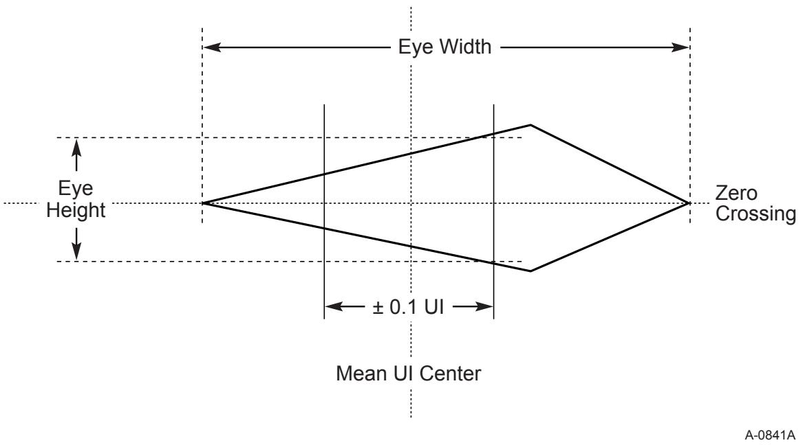

<details>
<summary>text_image</summary>

Eye Width
Eye Height
± 0.1 UI
Mean UI Center
Zero Crossing
A-0841A
</details>

§  
Figure 8-79 EH, EW Mask

Note that the pass/fail EH and EW limits shown in § Figure 8-79 are identical to the limits defined for Rx testing in § Table 8-10 for 8.0 and 16.0 GT/s. For 32.0 and 64.0 GT/s, the pass/fail EH and EW limits are still identical but they are computed at the optimal sample location. For 2.5 and 5.0 GT/s the limits for Rx testing are referenced to the package pins and the limits for channel tolerancing in this table are referenced to the Receiver pad after applying the same reference package used for 8.0 GT/s channel tolerancing.

Table 8-15 Channel Tolerancing Eye Mask Values§

<table><tr><td>Symbol</td><td>Parameter</td><td>Value</td><td>Units</td><td>Comments</td></tr></table>

2.5 GT/s Eye Margins

<table><tr><td> $V_{RX-CH-EH-2.5G}$ </td><td>Eye height</td><td>&lt;130 (min)</td><td>mVPP</td><td>Eye height at BER=10-12. Note 1</td></tr><tr><td> $T_{RX-CH-EW-2.5G}$ </td><td>Eye width at zero-crossing</td><td>&lt;0.35 (min)</td><td>UI</td><td>Eye width at BER=10-12</td></tr><tr><td> $T_{RX-DS-OFFSET-2.5G}$ </td><td>Peak EH offset from UI center</td><td>±0.1</td><td>UI</td><td>See § Figure 8-79 for details.</td></tr></table>

5.0 GT/s Eye Margins

<table><tr><td> $V_{RX-CH-EH-5G}$ </td><td>Eye height</td><td>&lt; 85 (min)</td><td>mVPP</td><td>Eye height at BER=10-12. Note 1</td></tr><tr><td> $T_{RX-CH-EW-5G}$ Symbol</td><td>Eye width at zero-crossingParameter</td><td>&lt;0.30 (min)Value</td><td>UIUnits</td><td>Eye width at BER=10-12Comments</td></tr><tr><td> $T_{RX-DS-OFFSET-5G}$ </td><td>Peak EH offset from UI center</td><td>±0.1</td><td>UI</td><td>See § Figure 8-79 for details.</td></tr></table>

8.0 GT/s Eye Margins

<table><tr><td> $V_{RX-CH-EH-8G}$ </td><td>Eye height</td><td>25 (min)</td><td>mVPP</td><td>Eye height at BER=10-12. Note 1.</td></tr><tr><td> $T_{RX-CH-EW-8G}$ </td><td>Eye width at zero-crossing</td><td>0.3 (min)</td><td>UI</td><td>Eye width at BER=10-12</td></tr><tr><td> $T_{RX-DS-OFFSET-8G}$ </td><td>Peak EH offset from UI center</td><td>±0.1</td><td>UI</td><td>See § Figure 8-79 for details.</td></tr><tr><td> $V_{RX-DFE-D1-8G}$ </td><td>Range for DFE d1 coefficient</td><td>±30</td><td>mV</td><td></td></tr></table>

16.0 GT/s Eye Margins

<table><tr><td> $V_{RX-CH-EH-16G}$ </td><td>Eye height</td><td>15 (min)</td><td>mVPP</td><td>Eye height at BER=10-12. Note 1.</td></tr><tr><td> $T_{RX-CH-EW-16G}$ </td><td>Eye width at zero-crossing</td><td>0.3 (min)</td><td>UI</td><td>Eye width at BER=10-12</td></tr><tr><td> $T_{RX-DS-OFFSET-16G}$ </td><td>Peak EH offset from UI center</td><td>±0.1</td><td>UI</td><td>See § Figure 8-79 for details.</td></tr><tr><td> $V_{RX-DFE-D1-16G}$ </td><td>Range for DFE d1 coefficient</td><td>±30</td><td>mV</td><td></td></tr><tr><td> $V_{RX-DFE-D2-16G}$ </td><td>Range for DFE d2 coefficient</td><td>±20</td><td>mV</td><td></td></tr></table>

32.0 GT/s Eye Margins

<table><tr><td> $V_{RX-CH-EH-32G}$ </td><td>Eye height</td><td>15 (min)</td><td>mVPP</td><td>Eye height at BER=10-12. Note 1.</td></tr><tr><td> $T_{RX-CH-EW-32G}$ </td><td>Eye width at zero-crossing</td><td>0.3 (min)</td><td>UI</td><td>Eye width at BER=10-12</td></tr><tr><td> $T_{RX-DS-OFFSET-32G}$ </td><td>Peak EH offset from UI center</td><td>N/A</td><td>UI</td><td>See § Figure 8-79 for details.</td></tr><tr><td> $T_{RX-SAMPLE-OFFSET-32G}$ </td><td>Max sample location offset to the left from UI center</td><td>0.30</td><td>UI</td><td>Note 2</td></tr><tr><td> $T_{RX-SAMPLE-GRANULARITY-32G}$ </td><td>Granularity for sample location offset</td><td>0.05</td><td>UI</td><td>Note 2</td></tr><tr><td> $V_{RX-DFE-D1-32G}$ </td><td>Range for DFE d1 coefficient</td><td>|d1| / d0 (cursor amplitude) ≤ 0.8</td><td></td><td></td></tr><tr><td> $V_{RX-DFE-D2-32G}$ </td><td>Range for DFE d2 coefficient</td><td>±20</td><td>mV</td><td></td></tr><tr><td> $V_{RX-DFE-D3-32G}$ </td><td>Range for DFE d3 coefficient</td><td>±20</td><td>mV</td><td></td></tr><tr><td>Symbol</td><td>Parameter</td><td>Value</td><td>Units</td><td>Comments</td></tr><tr><td colspan="5">64.0 GT/s Eye Margins</td></tr><tr><td> $V_{RX-CH-TOP-EH-64G}$ </td><td>Top Eye height</td><td>6 (min)</td><td>mVPP</td><td>Eye height at BER=10-6. Note 1.</td></tr><tr><td> $T_{RX-CH-TOP-EW-64G}$ </td><td>Top Eye width at zero-crossing</td><td>0.1 (min)</td><td>UI</td><td>Eye width at BER=10-6</td></tr><tr><td> $T_{RX-DS-OFFSET-64G}$ </td><td>Peak EH offset from UI center</td><td>N/A</td><td>UI</td><td></td></tr><tr><td> $T_{RX-SAMPLE-OFFSET-64G}$ </td><td>Max sample location offset to the left from UI center</td><td>0.30</td><td>UI</td><td>Note 2</td></tr><tr><td> $T_{RX-SAMPLE-GRANULARITY-64G}$ </td><td>Granularity for sample location offset</td><td>0.015</td><td>UI</td><td>Note 2</td></tr><tr><td> $V_{RX-DFE-D1-64G}$ </td><td>Range for DFE d1 coefficient</td><td>|d1| / d0 (cursor amplitude) &lt; 0.55</td><td></td><td></td></tr><tr><td> $V_{RX-DFE-TAPS-WEIGHTED-SUM-64G}$ </td><td>Range for weighted sum of absolute values of DFE d1-d16 coefficients</td><td>(|d1| + |d2| + 0.85 × |d3| + 0.6 × |d4| + 0.25 × |d5| + 0.1 × |d6| + 0.05 × { |d7| + |d8| + |d9| + |d10| + |d11| + |d12| + |d13| + |d14| + |d15| + |d16| }) / |d0| &lt; 0.85</td><td>mV</td><td></td></tr></table>

Notes:  
1. VRX-CH-EH is defined as max EH within an aperture of ±0.1 UI from mean UI center.  
2. The optimal eye area is computed at each offset from mean UI center -0.30 UI to mean UI center with the specified granularity.

## 8.5.1.4.4 Characterizing Channel Common Mode Noise §

A channel must meet the common mode requirements as they are defined in the receiver specification. In general, it is not possible to accurately simulate all the channel’s common mode noise contributions due to the large number of mechanisms that can generate CM noise, including the Transmitter. Typically channel common mode noise is a budgeted parameter, and the limits defined below assume a budgeting process. The channel’s CM limit is defined as the amount of CM noise that a channel can add and still meet the Rx CM limits assuming the worst-case Tx CM.

Note that the Tx and channel CM noise parameters cannot simply be added to obtain the Rx CM limit. This is due to the fact that a channel will attenuate some of high frequency Tx CM noise while propagating Tx LF CM noise through with little loss. The channel may also contribute both high and low frequency CM components of its own.

## 8.5.1.4.5 Verifying VCH-IDLE-DET-DIFF-pp §

VCH-IDLE-DET-DIFF-pp is defined to guarantee that, when a Transmitter issues an EIEOS sequence, the Receiver is guaranteed to detect it. Potentially larger Transmitter equalization boost ratios at 8.0, 16.0, 32.0, and 64.0 GT/s necessitate that this parameter be verified; this procedure was not necessary for 2.5 or 5.0 GT/s, where the max Transmitter equalization boost is smaller. Defining the launch and detect voltages at the Tx/Rx die pad permits VCH-IDLE-DET-DIFF-pp to be verified with the same channel and Tx/Rx package models used to determine eye margins. It is also acceptable to simulate from Tx pin to Rx pin (excluding the Tx and Rx behavioral package models), in which case the EIEOS and idle detect parameters defined in the Tx and Rx sections are applicable.

Long channels, where VTX-EIEOS-FS is applicable, are characterized by driving the channel under test with the EIEOS pattern and -11.0 dB de-emphasis and zero dB preshoot. For short channels, where VTX-EIEOS-RS is applicable, -4.5 dB of de-emphasis and zero dB of preshoot are applied.

Table 8-16 EIEOS Signaling Parameters§

<table><tr><td>Parameter</td><td>Description</td><td>Value</td><td>Units</td><td>Comments</td></tr><tr><td> $V_{CH-IDLE-EXIT-pp}$ </td><td>Idle detect voltage seen at the Rx die pad</td><td>172</td><td>mVPP</td><td>Assuming Rx RTERM of  $2 \times 50 \Omega$ </td></tr><tr><td> $V_{CH-EIEOS-FS-Vb}$ </td><td>PP voltage during Vb interval at behavioral Tx die pad for full swing signaling</td><td>255</td><td>mVPP</td><td>Assuming Tx RS of  $2 \times 50 \Omega$ </td></tr><tr><td> $V_{CH-EIEOS-RS-Vb}$ </td><td>PP voltage during Vb interval at behavioral Tx die pad for reduced swing signaling</td><td>237</td><td>mVPP</td><td>Assuming Tx RS of  $2 \times 50 \Omega$ </td></tr></table>

## 8.6 Refclk Specifications §

This version of the specification consolidates and streamlines the Refclk requirements. The 2.5 GT/s Refclk parameters are moved from the CEM spec to this spec so that all Refclk parameters for all data rates (2.5, 5.0, 8.0, 16.0, 32.0, and 64.0 GT/s) are now contained in this section.

## 8.6.1 Refclk Test Setup §

The test setup for the Refclk assumes that only the Refclk generator itself is present. Provision is made in the test setup to account for signal degradation that occurs between the pins of the Refclk generator and the Transmitter or Receiver in an actual system. The above described setup emulates the worst case signal degradation that is likely to occur at the pins of a PCI Express device. Note that the Refclk signal is tested into a load that represents the series (open) termination appearing at the Refclk input pins of a PCIe device for all requirements except 32.0 and 64.0 GT/s reference clock jitter. For 32.0 and 64.0 GT/s, the reference clock jitter is measured with an oscilloscope, and is tested with the reference clock terminated by 50 Ohm terminations without a channel.

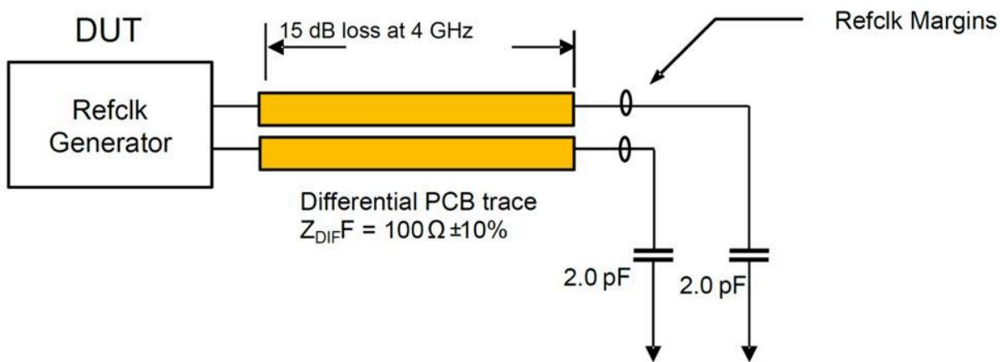

<details>
<summary>flowchart</summary>

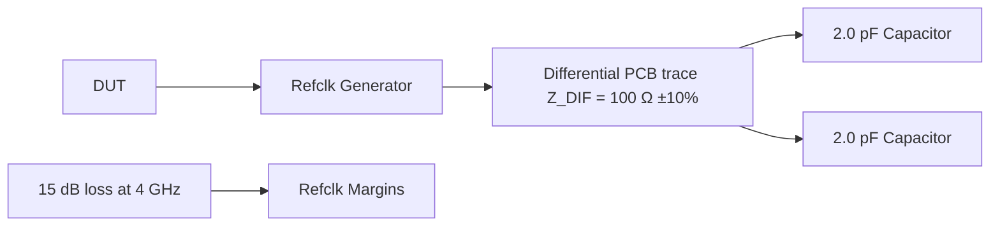
```mermaid
graph LR
  A["DUT"] --> B["Refclk Generator"]
  B --> C["Differential PCB trace Z_DIF = 100 Ω ±10%"]
  C --> D["2.0 pF Capacitor"]
  C --> E["2.0 pF Capacitor"]
  F["15 dB loss at 4 GHz"] --> G["Refclk Margins"]
```
</details>

Figure 8-80 Oscilloscope Refclk Test Setup for All Cases Except Jitter at 32.0 and 64.0 GT/s§

## 8.6.2 REFCLK AC Specifications §

All specifications in § Table 8-17 are to be measured using a test configuration as described in Note 11 with a circuit as shown in § Figure 8-80.

Table 8-17 REFCLK DC Specifications and AC Timing Requirements§

<table><tr><td rowspan="2">Symbol</td><td rowspan="2">Parameter</td><td colspan="2">100 MHz Input</td><td rowspan="2">Unit</td><td rowspan="2">Note</td></tr><tr><td>Min</td><td>Max</td></tr><tr><td>Rising Edge Rate</td><td>Rising Edge Rate</td><td>0.6</td><td>4.0</td><td>V/ns</td><td>2,3</td></tr><tr><td>Falling Edge Rate</td><td>Falling Edge Rate</td><td>0.6</td><td>4.0</td><td>V/ns</td><td>2,3</td></tr><tr><td> $V_{IH}$ </td><td>Differential Input High Voltage</td><td>+150</td><td></td><td>mV</td><td>2</td></tr><tr><td> $V_{IL}$ </td><td>Differential Input Low Voltage</td><td></td><td>-150</td><td>mV</td><td>2</td></tr><tr><td> $V_{CROSS}$ </td><td>Absolute crossing point voltage</td><td>+250</td><td>+550</td><td>mV</td><td>1,4,5</td></tr><tr><td> $V_{CROSS\ DELTA}$ </td><td>Variation of  $V_{CROSS}$  over all rising clock edges</td><td></td><td>+140</td><td>mV</td><td>1,4,9</td></tr><tr><td> $V_{RB}$ </td><td>Ring-back Voltage Margin</td><td>-100</td><td>+100</td><td>mV</td><td>2,12</td></tr><tr><td> $T_{STABLE}$ </td><td>Time before  $V_{RB}$  is allowed</td><td>500</td><td></td><td>ps</td><td>2,12</td></tr><tr><td> $T_{PERIOD\ AVG}$ </td><td>Average Clock Period Accuracy</td><td>-300</td><td>+2800</td><td>ppm</td><td>2,10,13</td></tr><tr><td> $T_{PERIOD\ AVG\_32G\_64G\_CC}$ </td><td>Average Clock Period Accuracy for devices that support 32.0 and 64.0 GT/s in CC Mode at any speed</td><td>-100</td><td>+2600</td><td>ppm</td><td>2,10,13</td></tr><tr><td> $T_{PERIOD}$ AVG_32G_64G_SRIS</td><td>Average Clock Period Accuracy for devices that support 32.0 and 64.0 GT/s in SRIS Mode at any speed</td><td>-100</td><td>+1600</td><td>ppm</td><td>2,10,13</td></tr><tr><td> $T_{PERIOD\ ABS}$ </td><td>Absolute Period (including Jitter and Spread Spectrum modulation)</td><td>9.847</td><td>10.203</td><td>ns</td><td>2,6</td></tr><tr><td> $T_{PERIOD}$ ABS_32G_64G_CC</td><td>Absolute Period (including Jitter and Spread Spectrum modulation) for devices that support 32.0 and 64.0 GT/s in CC Mode at any speed</td><td>9.849</td><td>10.201</td><td>ns</td><td>2,6</td></tr><tr><td> $T_{PERIOD}$ ABS_32G_64G_SRIS</td><td>Absolute Period (including Jitter and Spread Spectrum modulation) for devices that support 32.0 and 64.0 GT/s in SRIS Mode at any speed</td><td>9.849</td><td>10.181</td><td>ns</td><td>2,6</td></tr><tr><td> $T_{CCJITTER}$ </td><td>Cycle to Cycle jitter</td><td></td><td>150</td><td>ps</td><td>2</td></tr><tr><td> $V_{MAX}$ </td><td>Absolute Max input voltage</td><td></td><td>+1.15</td><td>V</td><td>1,7</td></tr><tr><td> $V_{MIN}$ </td><td>Absolute Min input voltage</td><td></td><td>-0.3</td><td>V</td><td>1,8</td></tr><tr><td>Duty Cycle</td><td>Duty Cycle</td><td>40</td><td>60</td><td>%</td><td>2</td></tr><tr><td>Rise-Fall Matching</td><td>Rising edge rate (REFCLK+) to falling edge rate (REFCLK-) matching</td><td></td><td>20</td><td>%</td><td>1,14</td></tr><tr><td> $Z_{C-DC}$ </td><td>Clock source DC impedance</td><td>40</td><td>60</td><td>W</td><td>1,11</td></tr></table>

Notes:  
1. Measurement taken from single ended waveform.  
2. Measurement taken from differential waveform.  
3. Measured from -150 mV to +150 mV on the differential waveform (derived from REFCLK+ minus REFCLK-). The signal must be monotonic through the measurement region for rise and fall time. The 300 mV measurement window is centered on the differential zero-crossing. See § Figure 8-85.  
4. Measured at crossing point where the instantaneous voltage value of the rising edge of REFCLK+ equals the falling edge of REFCLK-. See § Figure 8-81.  
5. Refers to the total variation from the lowest crossing point to the highest, regardless of which edge is crossing. Refers to all crossing points for this measurement. See § Figure 8-81.  
6. Defines as the absolute minimum or maximum instantaneous period. This includes cycle to cycle jitter, relative PPM tolerance, and spread spectrum modulation. See § Figure 8-84.  
7. Defined as the maximum instantaneous voltage including overshoot. See § Figure 8-81.  
8. Defined as the minimum instantaneous voltage including undershoot. See § Figure 8-81.  
9. Defined as the total variation of all crossing voltages of Rising REFCLK+ and Falling REFCLK-. This is the maximum allowed variance in VCROSS for any system. See § Figure 8-82.  
10. Note deleted.  
11. REFCLK+ and REFCLK- are to be measured at the load capacitors CL. Single ended probes must be used for measurements requiring single ended measurements. Either single ended probes with math or differential probe can be used for differential measurements. Test load CL = 2 pF.  
12. TSTABLE is the time the differential clock must maintain a minimum ±150 mV differential voltage after rising/falling edges before it is allowed to droop back into the VRB ±100 mV differential range. See § Figure 8-86.

<table><tr><td rowspan="2">Symbol</td><td rowspan="2">Parameter</td><td colspan="2">100 MHz Input</td><td rowspan="2">Unit</td><td rowspan="2">Note</td></tr><tr><td>Min</td><td>Max</td></tr></table>

13. PPM refers to parts per million and is a DC absolute period accuracy specification. 1 PPM is $1 / 1 , 0 0 0 , 0 0 0 ^ { \mathrm { t h } } \circ \mathsf { f }$ 100.000000 MHz exactly or 100 Hz. For example, for 300 PPM, then we have an error budget of 100 Hz/ PPM × 300 PPM = 30 kHz. The period is to be measured with a frequency counter with measurement window set to 100 ms or greater.

14. Matching applies to rising edge rate for REFCLK+ and falling edge rate for REFCLK-. It is measured using a ±75 mV window centered on the median cross point where REFCLK+ rising meets REFCLK- falling. The median cross point is used to calculate the voltage thresholds the oscilloscope is to use for the edge rate calculations. The Rise Edge Rate of REFCLK+ should be compared to the Fall Edge Rate of REFCLK-; the maximum allowed difference should not exceed 20% of the slowest edge rate. See § Figure 8-83.

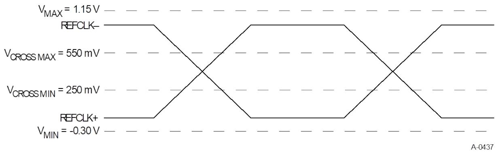

<details>
<summary>line chart</summary>

| Signal       | Value     |
| ------------ | --------- |
| V_MAX        | 1.15 V    |
| V_CROSS_MAX  | 550 mV    |
| V_CROSS_MIN  | 250 mV    |
| V_MIN        | -0.30 V   |
</details>

Figure 8-81 Single-Ended Measurement Points for Absolute Cross Point and Swing§

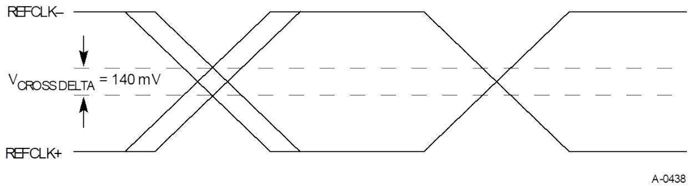

<details>
<summary>line chart</summary>

| Channel     | Voltage (mV) |
| ----------- | ------------ |
| REFCLK-     | 140          |
| REFCLK+     | 140          |
</details>

Figure 8-82 Single-Ended Measurement Points for Delta Cross Point§

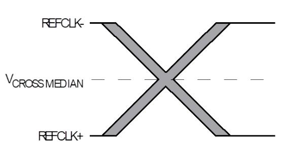

<details>
<summary>text_image</summary>

REFCLK-
V_CROSS_MEDIAN
REFCLK+
</details>

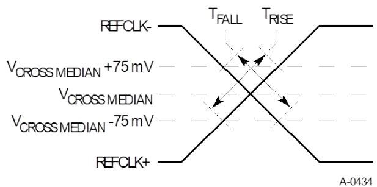

<details>
<summary>line chart</summary>

| Condition         | Threshold       | Value     |
| ----------------- | --------------- | --------- |
| REFCLK-           | T_FALL          | -         |
| REFCLK+           | T_RISE          | -         |
| V_CROSS MEDIAN    | T_FALL          | +75 mV    |
| V_CROSS MEDIAN    | T_RISE          | -         |
| V_CROSS MEDIAN    | T_FALL          | -75 mV    |
| REFCLK+           | T_RISE          | -         |
| A-0434            |                 |           |
</details>

Figure 8-83 Single-Ended Measurement Points for Rise and Fall Time Matching§

img alt="A-0435" data-orig="../Word/Chapter-8-0.7-Final\_files/image076.png" data-src="../Unknown-Art-File" src="../../Word/Chapter-8-0.7-Final\_files/image076.png" width="600">

Figure 8-84 Differential Measurement Points for Duty Cycle and Period§

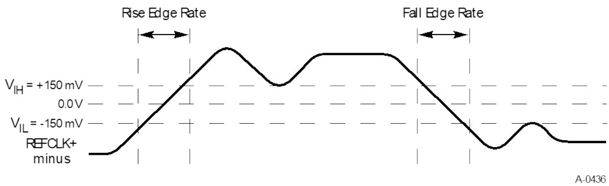

<details>
<summary>line chart</summary>

| Time Segment       | Voltage Level |
| ------------------ | ------------- |
| Rise Edge Rate     | +150 mV       |
| Rise Edge Rate     | 0.0 V         |
| Rise Edge Rate     | -150 mV       |
| Fall Edge Rate     | -150 mV       |
| Fall Edge Rate     | REFCLK+ minus  |
</details>

Figure 8-85 Differential Measurement Points for Rise and Fall Time§

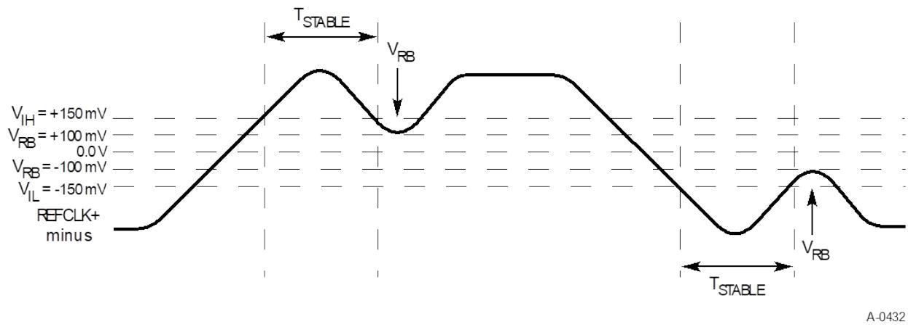

<details>
<summary>line chart</summary>

| Parameter       | Value     |
| --------------- | --------- |
| VIH             | +150 mV   |
| VRB             | +100 mV   |
| VRB             | -100 mV   |
| VIL             | -150 mV   |
| REFCLK+ minus  | minus     |
</details>

Figure 8-86 Differential Measurement Points for Ringback§

## 8.6.3 Data Rate Independent Refclk Parameters §

A number of Refclk parameters are data rate independent and are listed in the table below. TTRANSPORT-DELAY is defined in § Section 8.6.6 and illustrated in § Figure 8-89. It is relevant only for the Common Refclk architecture. For the SRIS mode the source of the SSC modulation is implementation dependent.

Table 8-18 Data Rate Independent Refclk Parameters§

<table><tr><td>Symbol</td><td>Description</td><td>Limits</td><td>Units</td><td>Notes</td></tr><tr><td> $F_{REFCLK}$ </td><td>Refclk Frequency</td><td>99.97 (min)100.03 (max)</td><td>MHz</td><td></td></tr><tr><td> $F_{REFCLK\_32G\_64G}$ </td><td>Refclk Frequency for devices that support 32.0 and 64.0 GT/s</td><td>99.99 (min)100.01 (max)</td><td>MHz</td><td></td></tr><tr><td> $F_{SSC}$ </td><td>SSC frequency range</td><td>30 (min)33 (max)</td><td>kHz</td><td>3</td></tr><tr><td> $T_{SSC-FREQ-DEVIATION}$ </td><td>SSC deviation</td><td>-0.5 (min)0.0 (max)</td><td>%</td><td>3</td></tr><tr><td> $T_{SSC-FREQ-DEVIATION\_32G\_64G\_SRIS}$ </td><td>SSC deviation for devices that support 32.0 and 64.0 GT/s and SRIS when operating in SRIS mode at all speeds</td><td>-0.3 (min)0.0 (max)</td><td>%</td><td>3</td></tr><tr><td> $T_{TRANSPORT-DELAY}$ </td><td>Tx-Rx transport delay</td><td>12 (max)</td><td>ns</td><td>1, 4</td></tr><tr><td> $T_{SSC-MAX-FREQ-SLEW}$ </td><td>Max SSC df/dt</td><td>1250</td><td>ppm/μs</td><td>2, 3</td></tr></table>

Notes:  
1. Parameter is relevant only for Common Refclk architecture.  
2. Measurement is made over 0.5 μs time interval with a 1st order LPF with an fc of 60x the modulation frequency.  
3. When testing the a device configured for the IR reference clock architecture the SSC related parameters must be tested with the Tx output data instead of the reference clock.  
4. There are form factors (for example topologies including long cables) that may exceed the transport delay limit. Extra jitter from the large transport delay must be accounted by these form factor specifications.

## 8.6.3.1 Low Frequency Refclk Jitter Limits §

Refclks supporting SSC must meet an additional jitter limit over a range of low frequencies. Low frequency Refclk jitter limits are defined as a continuous, piece-wise linear graph from 30 kHz to 500 kHz as shown below. Unfiltered Refclk phase jitter must fall below this graph over the frequency range of interest.

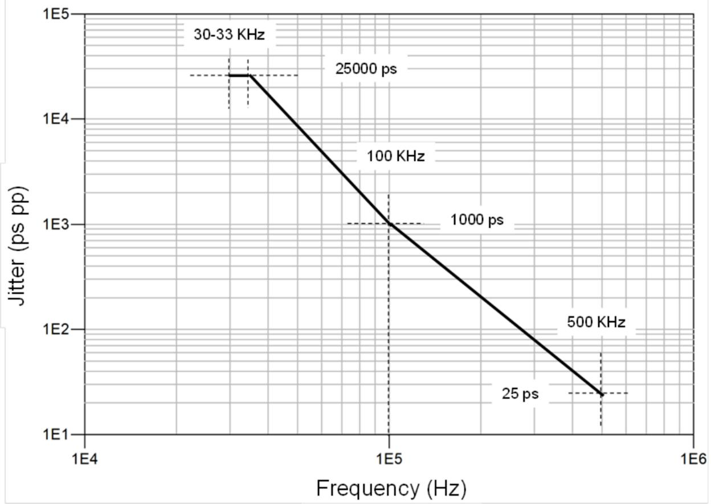

<details>
<summary>line chart</summary>

| Frequency (Hz) | Jitter (ps pp) |
| -------------- | -------------- |
| 1E4            | 25000          |
| 1E5            | 1000           |
| 1E6            | 25             |
</details>

Figure 8-87 Limits for phase jitter from the Reference with 5000 ppm SSC§

## 8.6.4 Refclk Architectures Supported §

Two Refclk architectures are supported: Common Refclk (CC) and Independent Refclk (IR). The CC clock architecture is described in terms of its topology and its corresponding jitter transfer function based on PLL and CDR characteristics. Finally, the corresponding Refclk jitter limits are given for each data rate. The jitter transfer function and corresponding jitter limits are not defined for the IR clock architecture. It is up to the implementer to trade off reference clock jitter and PLL characteristics to ensure that Transmitter requirements are met in the IR clocking mode.

## 8.6.5 Filtering Functions Applied to Raw Data §

Two types of filtering are applied to the raw Refclk data. The first, edge filtering, minimizes the measurement-induced jitter due to the finite sampling rate of the test equipment. The second, replicates the jitter filtering that is inherent in the combination of Tx/Rx PLLs, the Rx CDR and (where applicable) the transport delay. The combination of the preceding filter functions yields the effective Refclk jitter as it appears at the sample latch of the Receiver.

Note that the PLL and CDR filter functions represent minimally capable approximations to actual Receiver implementations and are not intended to define actual PLL or CDR implementations.

## 8.6.5.1 PLL Filter Transfer Function Example $\mathfrak { s }$

All PLLs are behaviorally modeled with a second order transfer function, H(s), as defined in § Figure 8-89. The parameters defining the transfer function include the damping factor ζ and the natural frequency $\omega _ { \mathsf { n } } .$ .

The relation between the $2 ^ { \mathsf { n d } }$ order PLL (lowpass) natural frequency, $\omega _ { \mathsf { n } }$ and the 3 dB point $\omega _ { Ḋ } 3 { \mathsf { d B } } ;$ is given by the following expression:

$$
\frac {\omega_ {3 d B}}{\omega_ {n}} = \sqrt {\left(\sqrt {\left(2 \zeta^ {2} + 1\right) ^ {2} + 1}\right) + 2 \zeta^ {2} + 1}
$$

Equation 8-16 Relationship between $2 ^ { n d }$ order PLL natural frequency and 3 dB point§

The following plot of a $2 ^ { \mathsf { n d } }$ order PLL illustrates the transfer function with an $\mathsf { f } _ { 3 \mathrm { d B } }$ of 5.0 MHz and 1.0 dB of peaking. This corresponds to $\zeta = 1 . 1 5 ,$ , and $\mathsf { c o } _ { \mathsf { n } } = 1 1 . 5 5$ Mrad/sec.

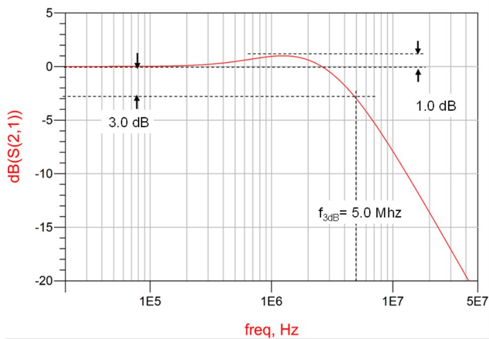

<details>
<summary>line chart</summary>

| freq, Hz | dB(S(2,1)) |
| -------- | ---------- |
| 1E5      | 0          |
| 1E6      | ~0         |
| 1E7      | -10        |
| 5E7      | -20        |
</details>

Figure 8-88 5 MHz PLL Transfer Function Example§

$$
\zeta = 1. 1 5 (1. 0 \mathrm{dB} \text { peaking })
$$

$$
f _ {3 \mathrm{dB}} = 5 \mathrm{MHz}
$$

$$
\omega_ {3 \mathrm{dB}} = 2 \pi f _ {3 \mathrm{dB}} = 3 1. 4 2 \mathrm{Mrad/sec}
$$

$$
\omega_ {3 \mathrm{dB}} / \omega_ {\mathrm{n}} = 2. 7 2
$$

$$
\omega_ {n} = 1 1. 5 5 \mathrm{Mrad/sec}
$$

## 8.6.5.2 CDR Transfer Function Examples §

Depending on the Refclk architecture and data rate, either a first or higher order transfer function shall be used as a behavioral CDR bounding limit.

For behavioral CDR functions refer to § Section 8.3.5.5

## 8.6.6 Common Refclk Rx Architecture (CC) §

This architecture utilizes a single Refclk source that is distributed to both the Tx and Rx. Most of the SSC jitter sourced by the Refclk is propagated equally through Tx and Rx PLLs, and so intrinsically tracks LF jitter. This is particularly true for SSC which tends to be low frequency. § Figure 8-89 illustrates the Common Refclk Rx architecture, showing key jitter, delay, and PLL and CDR transfer function sources for all data rates except 32.0 and 64.0 GT/s. At 32.0 and 64.0 GT/s the only difference in the figure is Behavioral CDR transfer function as defined in § Section 8.3.5.5 . The amount of jitter appearing at the CDR is then defined by the difference function between the Tx and Rx PLLs multiplied by the CDR highpass characteristic.

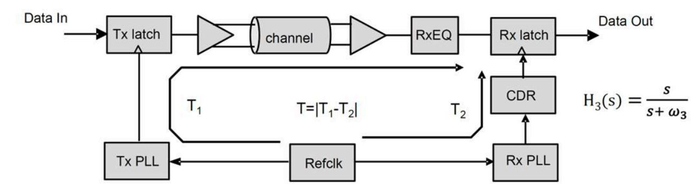

<details>
<summary>flowchart</summary>

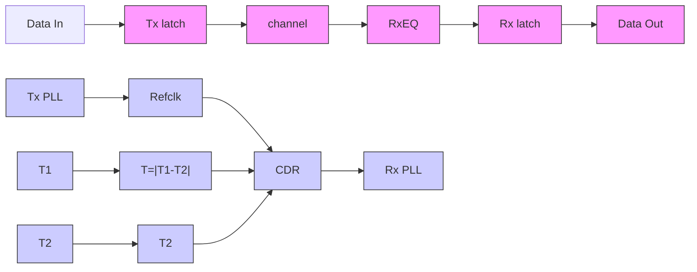
```mermaid
graph LR
  A["Data In"] --> B["Tx latch"]
  B --> C["channel"]
  C --> D["RxEQ"]
  D --> E["Rx latch"]
  E --> F["Data Out"]
  G["Tx PLL"] --> H["Refclk"]
  H --> I["CDR"]
  I --> J["Rx PLL"]
  K["T1"] --> L["T=|T1-T2|"]
  M["T2"] --> N["T2"]
  L --> I
  N --> I
    style B fill:#f9f,stroke:#333
    style C fill:#f9f,stroke:#333
    style D fill:#f9f,stroke:#333
    style E fill:#f9f,stroke:#333
    style F fill:#f9f,stroke:#333
    style G fill:#ccf,stroke:#333
    style H fill:#ccf,stroke:#333
    style I fill:#ccf,stroke:#333
    style J fill:#ccf,stroke:#333
    style K fill:#ccf,stroke:#333
    style L fill:#ccf,stroke:#333
    style M fill:#ccf,stroke:#333
    style N fill:#ccf,stroke:#333
```
</details>

$$
\mathrm{H} _ {1} (\mathrm{s}) = \frac {2 s \zeta_ {1} \omega_ {n 1} + \omega_ {n 1} ^ {2}}{s ^ {2} + 2 s \zeta_ {1} \omega_ {n 1} + \omega_ {n 1} ^ {2}}
$$

$$
\mathrm{H} _ {2} (\mathrm{s}) = \frac {2 s \zeta_ {2} \omega_ {n 2} + \omega_ {n 2} ^ {2}}{s ^ {2} + 2 s \zeta_ {2} \omega_ {n 2} + \omega_ {n 2} ^ {2}}
$$

$$
\begin{array}{l l} \text {Transfer Function:} & [ H _ {1} (s) e ^ {- s T} - H _ {2} (s) ] H _ {3} (s) \\ \text {Jitter at Rx latch} & \left. \begin{array}{l} X (s) [ H _ {1} (s) e ^ {- s T} - H _ {2} (s) ] H _ {3} (s) \\ X (s) [ H _ {2} (s) e ^ {- s T} - H _ {1} (s) ] H _ {3} (s) \end{array} \right\} \quad \text {Compute both and use the larger of the two} \end{array}
$$

Figure 8-89 Common Refclk Rx Architecture for all Data Rates Except 32.0 and 64.0 GT/s§

Based on the above clock architecture, it is possible to define a difference function that corresponds to the worst case mismatch between Tx and Rx PLLs. Second order PLL transfer functions are assumed, (even though most PLL transfer functions are 3rd order or higher), since a 2nd order function tends to yield a slightly conservative difference function vis-a-vis most actual PLL implementations.

In the Common Refclk Rx architecture it is also necessary to comprehend a maximum Transmitter to Receiver transport delay difference. This delay delta is illustrated in § Figure 8-89 and represents the delay difference between the Transmitter data and recovered Receiver clock as seen at the inputs to the receiver’s data latch.

## 8.6.6.1 Determining the Number of PLL BW and peaking Combinations §

A Tx or Rx PLL is defined by the combination of min/max bandwidth and peaking, making for a total of four possible limits. In the CC architecture both the Tx and Rx PLLs contribute to the jitter transfer function. At 2.5 GT/s only one set of BW/peaking limits is defined. If the combinations for the Tx and Rx PLLs limits are defined by the sets (ATX, BTX, CTX, DTX), (ARX, BRX, CRX, DRX) then it’s easily demonstrated that there are a total of ten ways of selecting one element from each set. The delay term $\mathsf { e } ^ { - \mathsf { s T } }$ can be applied to either $\mathsf { H } _ { 1 } ( \mathsf { s } )$ or ${ \sf H } _ { 2 } ( { \sf s } )$ , adding another six possibilities. Only six, as opposed to ten, terms are added when the delay term is considered because terms like $\mathsf { A T X } ,$ , ARX, are identical to ARX, ATX.

At 5.0 GT/s and higher data rates, two possible sets of limits of PLL bandwidth and peaking are defined, which may be defined by the sets $( A { \sf { T } } \mathsf { X } ,$ BTX, CTX, DTX) and (ERX, FRX, GRX, HRX). In this case the number of unique 2-element combinations from the above 4-element sets is 36, which increases to 64 when the delay term is considered.

## 8.6.6.2 CDR and PLL BW and Peaking Limits for Common Refclk §

The Common Refclk architecture filter function is dependent on the difference function defined by the BW and peaking of Tx and the Rx PLLs, plus the CDR high-pass characteristic. It is necessary to consider all corner case combinations of Tx and Rx PLL peaking and bandwidth plus the CDR characteristics at their minimum and maximum peaking values.

This procedure must be applied to all six data rates.

§ Figure 8-90 lists the PLL BW and CDR BW/peaking values that need to be applied as filter functions for 2.5 GT/s data rates. It is necessary to assign a min and a max value for peaking for the 2.5 GT/s PLL. The values of 0.01 dB and 3.0 dB represent best estimates of realistic PLL implementations.

The minimum peaking for 2.5 and 5.0 GT/s has been reduced to 0.01 dB to bring it into line with the 8.0 and 16.0 GT/s cases. Note that the Rx CDR is $1 ^ { \mathsf { s t } }$ order, so its natural frequency, $\omega _ { \mathsf { n } }$ can be directly obtained from its BW, unlike the $2 ^ { \mathsf { n d } }$ order CDRs, where $\omega _ { \mathsf { n } }$ is a function of both BW and peaking. For 32.0 GT/s, a 2nd-order CDR filter with 20 MHz BW described by § Equation 8-13 must be used.

<table><tr><td>PLL #1, PLL #2</td><td>0.01 dB peaking</td><td>3.0 dB peaking</td><td rowspan="3">BWCDR(min) = 1.5 MHz, 1storder</td><td rowspan="3">CDR</td></tr><tr><td>BWPLL(min) = 1.5 MHz</td><td>ωn1= .336 Mrad/s ζ1= 14</td><td>ωn1= 5.09 Mrad/s ζ1= 0.54</td></tr><tr><td>BWPLL(max) = 22 MHz</td><td>ωn1= 4.93 Mrad/s ζ1= 14</td><td>ωn1= 74.68 Mrad/s ζ1= 0.54</td></tr></table>

Figure 8-90 Common Refclk PLL and CDR Characteristics for 2.5 GT/s§

PLL and CDR jitter and peaking characteristics for 5.0, 8.0, and 16.0 GT/s yield a larger number of possible combinations because two sets of PLL BW and peaking limits are given. This choice to support two sets of BW and peaking was made to give designers as much latitude as possible when designing PLL circuits.

<table><tr><td>PLL #1</td><td>0.01 dB peaking</td><td>1.0 dB peaking</td><td>PLL #2</td><td>0.01 dB peaking</td><td>3.0 dB peaking</td></tr><tr><td> $BW_{PLL}$ (min) = 5.0 MHz</td><td> $\omega_{n1}$ = 1.12 Mrad/s $\zeta_1$  = 14</td><td> $\omega_{n1}$ = 11.01 Mrad/s $\zeta_1$  = 1.16</td><td> $BW_{PLL}$ (min) = 8.0 MHz</td><td> $\omega_{n2}$ = 1.79 Mrad/s $\zeta_2$  = 14</td><td> $\omega_{n2}$ = 26.86 Mrad/s $\zeta_2$  = 0.54</td></tr><tr><td> $BW_{PLL}$ (max) = 16 MHz</td><td> $\omega_{n1}$ = 3.58 Mrad/s $\zeta_1$  = 14</td><td> $\omega_{n1}$ = 35.26 Mrad/s $\zeta_1$  = 1.16</td><td> $BW_{PLL}$ (max) = 16 MHz</td><td> $\omega_{n2}$ = 3.58 Mrad/s $\zeta_2$  = 14</td><td> $\omega_{n2}$ = 53.73 Mrad/s $\zeta_2$  = 0.54</td></tr><tr><td> $BW_{CDR}$ (min) = 5 MHz, 1storder</td><td colspan="4">64 combinations</td><td>5 GT/s</td></tr></table>

Figure 8-91 Common Refclk PLL and CDR Characteristics for 5.0 GT/s§

<table><tr><td>PLL #1</td><td>0.01 dB peaking</td><td>2.0 dB peaking</td><td>PLL #2</td><td>0.01 dB peaking</td><td>1.0 dB peaking</td></tr><tr><td> $BW_{PLL}$ (min) = 2.0 MHz</td><td> $\omega_{n1}$ = 0.448 Mrad/s $\zeta_1$  = 14</td><td> $\omega_{n1}$ = 6.02 Mrad/s $\zeta_1$  = 0.73</td><td> $BW_{PLL}$ (min) = 2.0 MHz</td><td> $\omega_{n2}$ = 0.448 Mrad/s $\zeta_2$  = 14</td><td> $\omega_{n2}$ = 4.62 Mrad/s $\zeta_2$  = 1.15</td></tr><tr><td> $BW_{PLL}$ (max) = 4.0 MHz</td><td> $\omega_{n1}$ = 0.896 Mrad/s $\zeta_1$  = 14</td><td> $\omega_{n1}$ = 12.04 Mrad/s $\zeta_1$  = 0.73</td><td> $BW_{PLL}$ (max) = 5.0 MHz</td><td> $\omega_{n2}$ = 1.12Mrad/s $\zeta_2$  = 14</td><td> $\omega_{n2}$ = 11.53 Mrad/s $\zeta_2$  = 1.15</td></tr><tr><td> $BW_{CDR}$ (min) = 10 MHz, 1storder</td><td colspan="4">64 combinations</td><td>8.0, 16.0 GT/s</td></tr></table>

Figure 8-92 Common Refclk PLL and CDR Characteristics for 8.0 and 16.0 GT/s§

<table><tr><td>PLL #1, PLL #2</td><td>0.01 dB peaking</td><td>2.0 dB peaking</td><td>32.0 GT/s CC</td><td>CDR</td></tr><tr><td> $BW_{PLL}$ (min) = 0.5 MHz</td><td> $\omega_{n1} = 0.112 \text{ Mrad/s}$  $\zeta_1 = 14$ </td><td> $\omega_{n1} = 1.50 \text{ Mrad/s}$  $\zeta_1 = 0.73$ </td><td></td><td></td></tr><tr><td> $BW_{PLL}$ (max) = 1.8 MHz</td><td> $\omega_{n1} = 0.403 \text{ Mrad/s}$  $\zeta_1 = 14$ </td><td> $\omega_{n1} = 5.42 \text{ Mrad/s}$  $\zeta_1 = 0.73$ </td><td>16 combinations</td><td></td></tr></table>

Figure 8-93 Common Refclk PLL and CDR Characteristics for 32.0 GT/s§

<table><tr><td>PLL #1, PLL #2</td><td>0.01 dB peaking</td><td>2.0 dB peaking</td><td>64.0 GT/s CC</td><td>CDR</td></tr><tr><td> $BW_{PLL}$ (min) = 0.5 MHz</td><td> $\omega_{n1} = 0.112 \text{ Mrad/s}$  $\zeta_1 = 14$ </td><td> $\omega_{n1} = 1.50 \text{ Mrad/s}$  $\zeta_1 = 0.73$ </td><td></td><td></td></tr><tr><td> $BW_{PLL}$ (max) = 1.0 MHz</td><td> $\omega_{n1} = 0.224 \text{ Mrad/s}$  $\zeta_1 = 14$ </td><td> $\omega_{n1} = 3.00 \text{ Mrad/s}$  $\zeta_1 = 0.73$ </td><td>16 combinations</td><td></td></tr></table>

Figure 8-94 Common Refclk PLL and CDR Characteristics for 64.0 GT/s§

## 8.6.7 Jitter Limits for Refclk Architectures

§

§ Table 8-19 lists the jitter limits for the CC Refclk architecture at each of the four data rates.

Jitter at 2.5 GT/s is measured as a peak to peak jitter value, because a substantial proportion of the jitter is SSC harmonics which appears at the receiver as Dj. The combination of the 2.5 GT/s PLL and CDR bandwidths passes a significant amount of SSC residual, where it appears Dj.

For 5.0, 8.0, and 16.0 GT/s jitter is specified as an RMS (Rj) value. These signaling speeds utilize a lower PLL BW and a higher CDR BW, and the effect is to suppress SSC harmonics such that almost all the jitter appears as Rj.

Table 8-19 Jitter Limits for CC Architecture§

<table><tr><td>Data Rate</td><td>CC jitter Limit</td><td>Notes</td></tr><tr><td>2.5 GT/s</td><td>86 ps pp</td><td>1, 2</td></tr><tr><td>5.0 GT/s</td><td>3.1 ps RMS</td><td>1, 2</td></tr><tr><td>8.0 GT/s</td><td>1.0 ps RMS</td><td>1, 2</td></tr><tr><td>16.0 GT/s</td><td>0.5 ps RMS</td><td>1, 2, 3, 4</td></tr><tr><td>32.0 GT/s</td><td>0.15 ps RMS</td><td>1, 2, 3, 5</td></tr><tr><td>64.0 GT/s</td><td>0.1 ps RMS</td><td>1, 2, 3, 6</td></tr></table>

## Notes:

1. The Refclk jitter is measured after applying the filter function in § Figure 8-89  
2. Jitter measurements shall be made with a capture of at least 100,000 clock cycles captured by a real time oscilloscope (RTO) with a sample rate of 20 GS/s or greater. Broadband oscilloscope noise must be minimized in the measurement. The measured PP jitter is used (no extrapolation) for RTO measurements. Alternately - Jitter measurements may be used with a Phase Noise Analyzer (PNA) extending (flat) and integrating and folding the frequency content up to an offset from the carrier frequency of at least 200 MHz (at 300 MHz absolute frequency) below the Nyquist frequency. For PNA measurements for the 2.5 GT/s data rate the RMS jitter is converted to peak to peak jitter using a multiplication factor of 8.83. In the case where real time oscilloscope and PNA measurements have both been done and produce different results the RTO result must be used.  
3. For the 16.0, 32.0, and 64.0 GT/s CC measurements SSC spurs from the fundamental and harmonics are removed up to a cutoff frequency of 2 MHz taking care to minimize removal of any non-SSC content.  
4. Note that 0.7 ps RMS is to be used in channel simulations to account for additional noise in a real system.  
5. Note that 0.25 ps RMS is to be used in channel simulations to account for additional noise in a real system.  
6. Note that 0.15 ps RMS is to be used in channel simulations to account for additional noise in a real system.

## 8.6.8 Form Factor Requirements for RefClock Architectures


Each form factor specification must include the following table (see § Table 8-20) to provide a clear summary of the clocking architecture requirements for devices that support the form factor specification. For each clocking architecture the table indicates whether that architecture is required, optional, or not allowed for this form factor. Note that this refers to the operation of the device not the underlying silicon capabilities.

A form factor must provide the CLKREQ# signal if it supports L1 PM Substates. Form factor specifications must indicate if the CLKREQ# signal is required, optional, or not allowed.

Table 8-20 Form Factor Clocking Architecture Requirements§

<table><tr><td>Clock Architecture</td><td>System Board (Motherboard)</td><td>Add-in Card (Module)</td><td>Retimer</td></tr><tr><td>Common</td><td>**</td><td>**</td><td>**</td></tr><tr><td>SRNS</td><td>**</td><td>**</td><td>**</td></tr><tr><td>SRIS</td><td>**</td><td>**</td><td>**</td></tr><tr><td colspan="4">** Each entry in the table must be filled in with one of: Required, Optional, or Not Allowed</td></tr></table>

If the Common Reference Clock architecture is required or optional for the form factor, then there must be an additional table (see § Table 8-21) providing details for the common clock. Each entry in the table is marked required, optional, not allowed, or NA. “Clock Source” indicates the source of the common reference clock, if applicable. $" { \mathsf { S S C } } ^ { \prime \prime }$ indicates whether the clock source is spread.

Table 8-21 Form Factor Common Clock Architecture Details§

<table><tr><td>Common Clock Details</td><td>System Board (Motherboard)</td><td>Add-in Card (Module)</td><td>Retimer</td></tr><tr><td>Clock Source</td><td></td><td></td><td></td></tr><tr><td>SSC</td><td></td><td></td><td></td></tr></table>

If a form factor has clocking requirements that cannot be provided in this simple one or two table form then careful consideration must be given to ensure that the form factor requirements are supported by this specification.

As an example the populated tables are shown for a hypothetical form factor that requires all components use the common clock architecture and does not allow the use of any other clocking architecture (see § Table 8-22 and § Table 8-23). The common clock source is required to be provided by the motherboard component and may optionally have SSC. L1 PM Substates are not supported and therefore CLKREQ# is not defined as a connector signal for this example form factor.

Table 8-22 Form Factor Clocking Architecture Requirements Example§

<table><tr><td>Clock Architecture</td><td>System Board (Motherboard)</td><td>Add-in Card (Module)</td><td>Retimer</td></tr><tr><td>Common</td><td>Required</td><td>Required</td><td>Required</td></tr><tr><td>SRNS</td><td>Not Allowed</td><td>Not Allowed</td><td>Not Allowed</td></tr><tr><td>SRIS</td><td>Not Allowed</td><td>Not Allowed</td><td>Not Allowed</td></tr></table>

Table 8-23 Form Factor Common Clock Architecture Details Example§

<table><tr><td>Common Clock Details</td><td>System Board (Motherboard)</td><td>Add-in Card (Module)</td><td>Retimer</td></tr><tr><td>Clock Source</td><td>Required</td><td>Not Allowed</td><td>Not Allowed</td></tr><tr><td>SSC</td><td>Optional</td><td>N/A</td><td>N/A</td></tr></table>

It is important for form factor specifications to recognize that the CLKREQ# signal is required if L1 PM Substates are to be supported, and that for L1 PM Substates the CLKREQ# signal is used even if there is no common reference clock.

If a form factor has clocking requirements that cannot be provided in this simple one or two table form then careful consideration must be given to ensure that the form factor requirements are supported by this specification.

## 9. Single Root I/O Virtualization and Sharing §

## 9.1 SR-IOV Architectural Overview §

Within the industry, significant effort has been expended to increase the effective hardware resource utilization (i.e., application execution) through the use of virtualization technology. Single Root I/O Virtualization and Sharing (SR-IOV) enables multiple System Images (SI) to share PCI hardware resources.

To illustrate how this technology can be used to increase effective resource utilization, consider the generic platform configuration illustrated in § Figure 9-1.

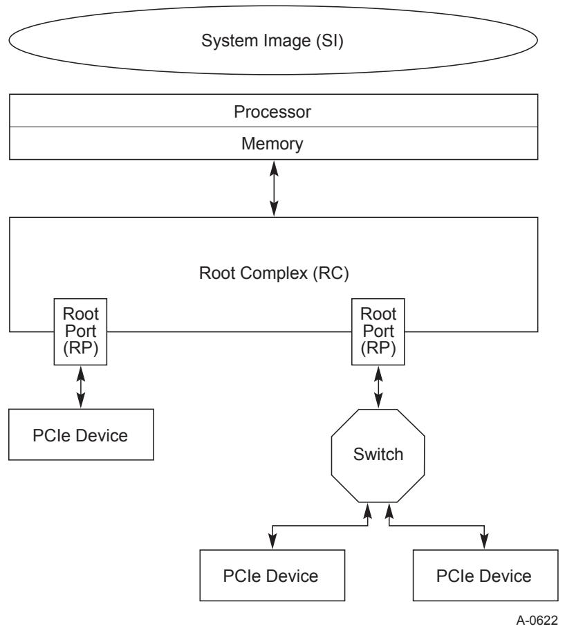

<details>
<summary>flowchart</summary>

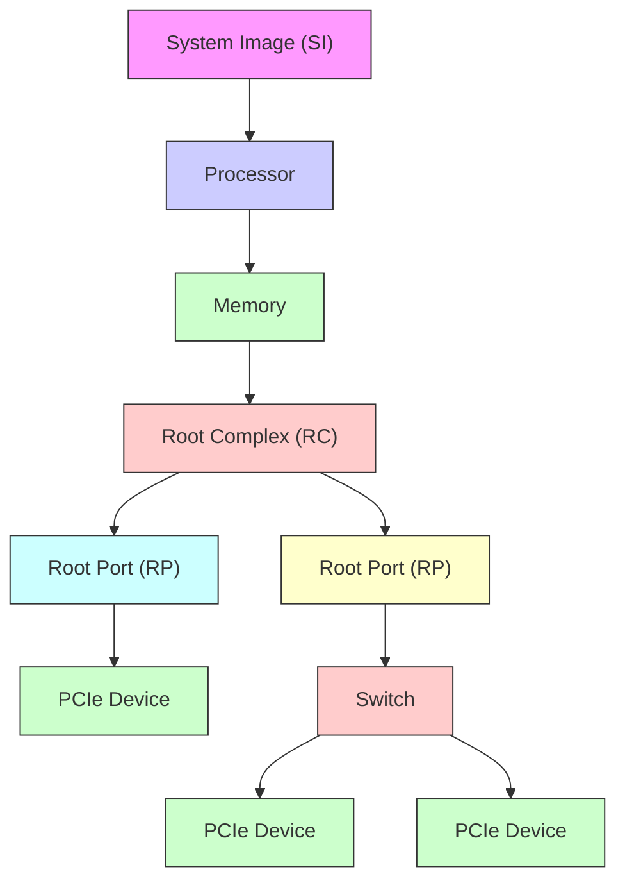
```mermaid
graph TD
  A["System Image (SI)"] --> B["Processor"]
  B --> C["Memory"]
  C --> D["Root Complex (RC)"]
  D --> E["Root Port (RP)"]
  D --> F["Root Port (RP)"]
  E --> G["PCIe Device"]
  F --> H["Switch"]
  H --> I["PCIe Device"]
  H --> J["PCIe Device"]
    style A fill:#f9f,stroke:#333
    style B fill:#ccf,stroke:#333
    style C fill:#cfc,stroke:#333
    style D fill:#fcc,stroke:#333
    style E fill:#cff,stroke:#333
    style F fill:#ffc,stroke:#333
    style G fill:#cfc,stroke:#333
    style H fill:#fcc,stroke:#333
    style I fill:#cfc,stroke:#333
    style J fill:#cfc,stroke:#333
```
</details>

Figure 9-1 Generic Platform Configuration§

The generic platform configuration is composed of the following components:

• PCIe Root Complex (RC), which includes:

◦ Processor - general purpose, embedded, or specialized processing element  
◦ Memory - general purpose or embedded

◦ Root Complex Integrated Endpoints (RCiEPs)  
◦ PCIe Root Ports (RP) - Each RP represents a separate hierarchy.

• PCIe Switch - provides I/O fan-out and connectivity

◦ PCIe Device - multiple I/O device types, (e.g., network, storage, etc.)  
◦ System Image - software such an operating system that is used to execute applications or trusted services, (e.g., a shared or non-shared I/O device driver.)

In order to increase the effective hardware resource utilization without requiring hardware modifications, multiple SI can be executed. Software termed a Virtualization Intermediary (VI) is interposed between the hardware and the SI as illustrated in § Figure 9-2.

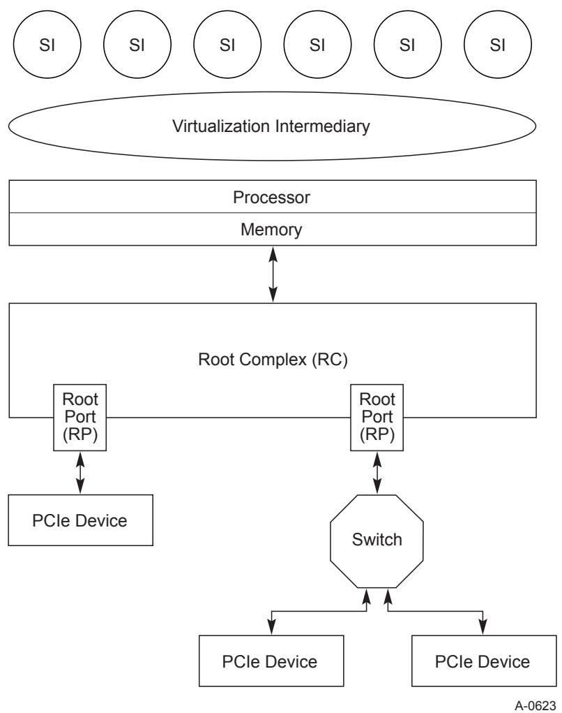

<details>
<summary>flowchart</summary>

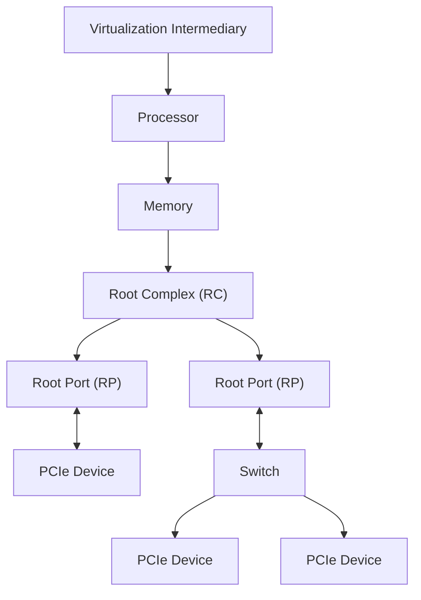
```mermaid
graph TD
  A["Virtualization Intermediary"] --> B["Processor"]
  B --> C["Memory"]
  C --> D["Root Complex (RC)"]
  D --> E["Root Port (RP)"]
  D --> F["Root Port (RP)"]
    E <--> G["PCIe Device"]
    F <--> H["Switch"]
  H --> I["PCIe Device"]
  H --> J["PCIe Device"]
```
</details>

Figure 9-2 Generic Platform Configuration with a VI and Multiple SI§

The VI takes sole ownership of the underlying hardware. Using a variety of methods outside of the scope of this specification, the VI abstracts the hardware to present each SI with its own virtual system. The actual hardware resources available to each SI can vary based on workload or customer-specific policies. While this approach works well for many environments, I/O intensive workloads can suffer significant performance degradation. Each I/O operation - inbound or outbound - must be intercepted and processed by the VI adding significant platform resource overhead.

SR-IOV provides tools to reduce these platform resources overheads. The benefits of SR-IOV are:

• The ability to eliminate VI involvement in main data movement actions - DMA, Memory space access, interrupt processing, etc. Elimination of VI interception and processing of each I/O operation can provide significant application and platform performance improvements.  
• Standardized method to control SR-IOV resource configuration and management through Single Root PCI Manager (SR-PCIM).

◦ Due to a variety of implementation options - system firmware, VI, operating system, I/O drivers, etc. - SR-PCIM implementation is outside the scope of this specification.

• The ability to reduce the hardware requirements and associated cost with provisioning potentially a significant number of I/O Functions within a device.  
• The ability to integrate SR-IOV with other I/O virtualization technologies such as Address Translation Services (ATS), Address Translation and Protection Table (ATPT) technologies, and interrupt remapping technologies to create robust, complete I/O virtualization solutions.

§ Figure 9-3 illustrates an example SR-IOV capable platform.

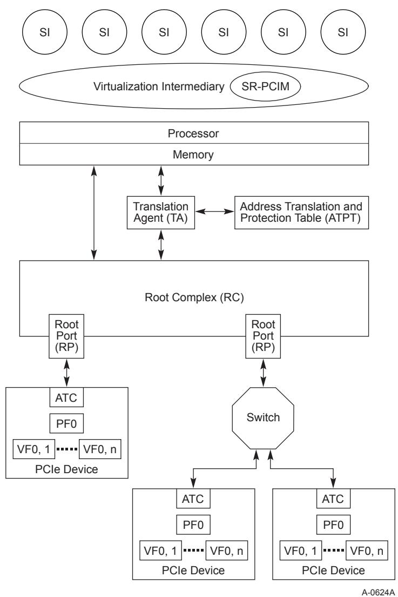

<details>
<summary>flowchart</summary>

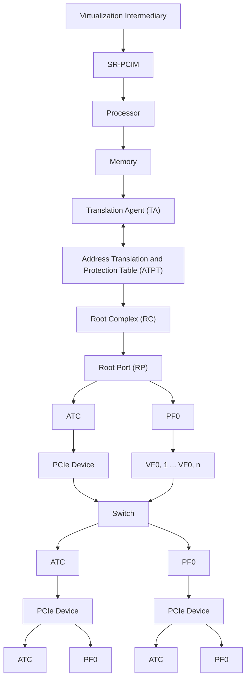
```mermaid
graph TD
  A["Virtualization Intermediary"] --> B["SR-PCIM"]
  B --> C["Processor"]
  C --> D["Memory"]
  D --> E["Translation Agent (TA)"]
    E <--> F["Address Translation and Protection Table (ATPT)"]
  F --> G["Root Complex (RC)"]
  G --> H["Root Port (RP)"]
  H --> I["ATC"]
  H --> J["PF0"]
  I --> K["PCIe Device"]
  J --> L["VF0, 1 ... VF0, n"]
  K --> M["Switch"]
  L --> M
  M --> N["ATC"]
  M --> O["PF0"]
  N --> P["PCIe Device"]
  O --> Q["PCIe Device"]
  P --> R["ATC"]
  P --> S["PF0"]
  Q --> T["ATC"]
  Q --> U["PF0"]
```
</details>

Figure 9-3 Generic Platform Configuration with SR-IOV and IOV Enablers§

The SR-IOV generic platform configuration is composed of the following additional functional elements:

• SR-PCIM - Software responsible for the configuration of the SR-IOV Extended Capability, management of Physical Functions and Virtual Functions, and processing of associated error events and overall device controls such as power management and hot-plug services.  
Optional Translation Agent (TA) - A TA is hardware or a combination of hardware and software responsible for translating an address within a PCIe transaction into the associated platform physical address. A TA may contain an Address Translation Cache (ATC) to accelerate translation table access. A TA may also support Address Translation Services (ATS) which enables a PCIe Function to obtain address translations a priori to DMA access to the associated memory. See § Chapter 10. for more details on ATS benefits and operation.  
• Optional Address Translation and Protection Table (ATPT) - An ATPT contains the set of address translations accessed by a TA to process PCIe requests - DMA Read, DMA Write, or interrupt requests. See Address Translation Services (§ Chapter 10. ) for additional details.

◦ In PCIe, interrupts are treated as memory write operations. Through the combination of a Requester Identifier and the address contained within a PCIe transaction, an interrupt can be routed to any target (e.g., a processor core) transparent to the associated I/O Function.  
◦ DMA Read and Write requests are translated through a combination of the Routing ID and the address contained within a PCIe transaction.

Optional Address Translation Cache (ATC) - An ATC can exist in two locations within a platform - within the TA which can be integrated within or sit above an RC - or within a PCIe Device. Within an RC, the ATC enables accelerated translation look ups to occur. Within a Device, the ATC is populated through ATS technology. PCIe transactions that indicate they contain translated addresses may bypass the platform’s ATC in order to improve performance without compromising the benefits associated with ATPT technology. See Address Translation Services (§ Chapter 10. ) for additional details.

• Optional Access Control Services (ACS) - ACS defines a set of control points within a PCI Express topology to determine whether a TLP should be routed normally, blocked, or redirected. In a system that supports SR-IOV, ACS may be used to prevent device Functions assigned to the VI or different SIs from communicating with one another or a peer device. Redirection may permit a Translation Agent to translate Upstream memory TLP addresses before a peer-to-peer forwarding decision is made. Selective blocking may be provided by the optional ACS P2P Egress Control. ACS is subject to interaction with ATS. See § Section 6.12 for additional details.

• Physical Function (PF) - A PF is a PCIe Function that supports the SR-IOV Extended Capability and is accessible to an SR-PCIM, a VI, or an SI.

• Virtual Function (VF) - A VF is a “light-weight” PCIe Function that is directly accessible by an SI.

◦ Minimally, resources associated with the main data movement of the Function are available to the SI. Configuration resources should be restricted to a trusted software component such as a VI or SR-PCIM.  
◦ A VF can be serially shared by different SI, (i.e., a VF can be assigned to one SI and then reset and assigned to another SI.)  
◦ A VF can be optionally migrated from one PF to another PF. The migration process itself is outside the scope of this specification but is facilitated through configuration controls defined within this specification.

• All VFs associated with a PF must be the same device type as the PF, (e.g., the same network device type or the same storage device type.)

To compare and contrast a PCIe Device with a PCIe SR-IOV capable device, examine the following set of figures. § Figure 9-4 illustrates an example PCIe-compliant Device.

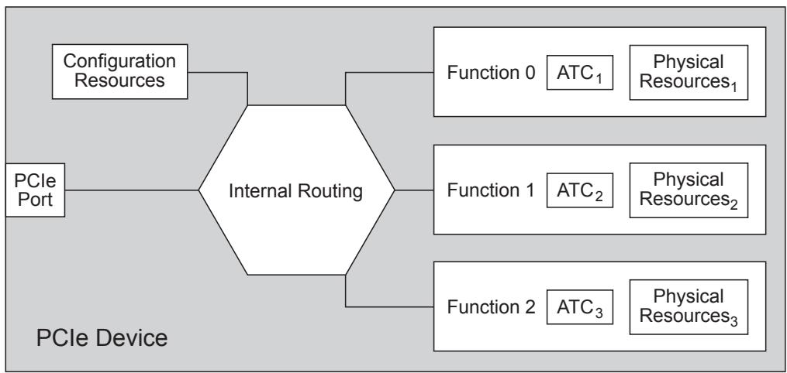

<details>
<summary>flowchart</summary>

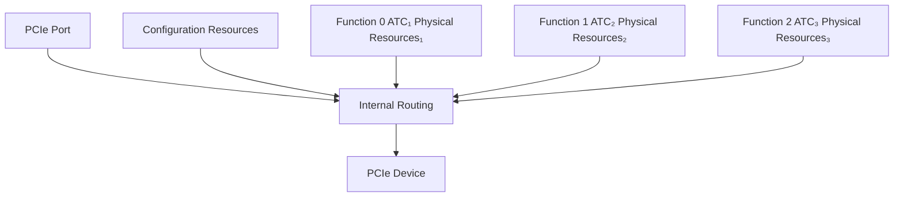
```mermaid
graph TD
  A["PCIe Port"] --> B["Internal Routing"]
  C["Configuration Resources"] --> B
  D["Function 0 ATC₁ Physical Resources₁"] --> B
  E["Function 1 ATC₂ Physical Resources₂"] --> B
  F["Function 2 ATC₃ Physical Resources₃"] --> B
  B --> G["PCIe Device"]
```
</details>

A-0625  
Figure 9-4 Example Multi-Function Device§

This figure illustrates an example multi-Function PCIe Device with the following characteristics:

• The PCIe Device shares a common PCIe Link. The Link and PCIe functionality shared by all Functions is managed through Function 0.  
◦ While this figure illustrates only three Functions, with the use of the Alternative Routing Identifier (ARI) capability, a PCIe Device can support up to 256 Functions.  
◦ All Functions use a single Bus Number captured through the PCI enumeration process.  
• In this example, each PCIe Function supports the ATS capability and therefore has an associated ATC to manage ATS obtained translated addresses.  
• Each PCIe Function has a set of unique physical resources including a separate configuration space and BAR.  
• Each PCIe Function can be assigned to an SI. To prevent one SI from impacting another, all PCIe configuration operations should be intercepted and processed by the VI.

As this figure illustrates, the hardware resources scale with the number of Functions provisioned. Depending upon the complexity and size of the device, the incremental cost per Function will vary. To reduce the incremental hardware cost, a device can be constructed using SR-IOV to support a single PF and multiple VFs as illustrated in § Figure 9-5.

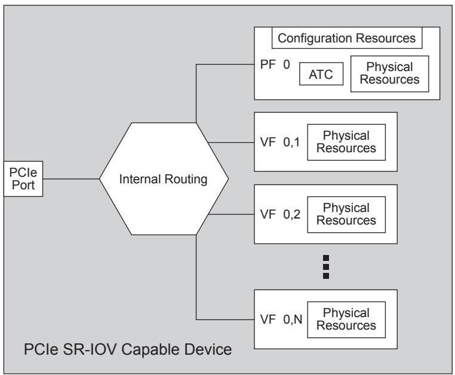

<details>
<summary>flowchart</summary>

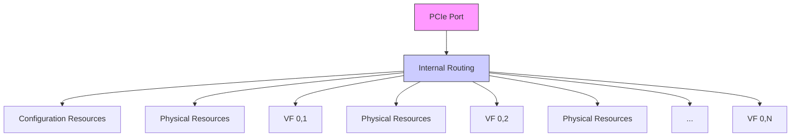
```mermaid
graph TD
  A["PCIe Port"] --> B["Internal Routing"]
  B --> C["Configuration Resources"]
  B --> D["Physical Resources"]
  B --> E["VF 0,1"]
  B --> F["Physical Resources"]
  B --> G["VF 0,2"]
  B --> H["Physical Resources"]
  B --> I["..."]
  B --> J["VF 0,N"]
    style A fill:#f9f,stroke:#333
    style B fill:#ccf,stroke:#333
```
</details>

A-0626A  
Figure 9-5 Example SR-IOV Single PF Capable Device§

The example in § Figure 9-5 illustrates a single PF with N VFs. Key observations to note:

• The PF is a PCIe-compliant.

◦ Initially and after a conventional reset, a PCIe Function that supports the SR-IOV capabilities defined in this specification shall have the SR-IOV capabilities disabled.  
◦ To discover the page sizes supported by a PF and its associated VF, the Supported Page Sizes configuration field is read. For additional information on how this field can be used to align PF or VF Memory space apertures on a system page boundary, see § Section 9.2.1.1.1 .

• PF nomenclature PF M designates the PF at Function number M.  
• VF nomenclature VF M,N designates the Nth VF associated with PF M. VFs are numbered starting with 1 so the first VF associated with PF M is VF M,1.  
• Each VF shares a number of common configuration space fields with the PF; (i.e., where the fields are applicable to all VF and controlled through a single PF. Sharing reduces the hardware resource requirements to implement each VF.)

◦ A VF uses the same configuration mechanisms and header types as a PF.  
◦ All VFs associated with a given PF share a VF BAR set (see § Section 9.3.3.14 ) and share a VF Memory Space Enable (MSE) bit in the SR-IOV extended capability (see § Section 9.3.3.3.4 ) that controls access to the VF Memory space. That is, if the VF MSE bit is Clear, the memory mapped space allocated for all VFs is disabled.  
◦ The InitialVFs and TotalVFs fields (see § Section 9.3.3.5 and § Section 9.3.3.6 ) are used to discover the maximum number of VFs that can be associated with a PF.  
◦ TotalVFs and InitialVFs shall contain the same value 171 .

• Each Function, PF, and VF is assigned a unique Routing ID. The Routing ID for each PF is constructed as per § Section 2.2.4.2 . The Routing ID for each VF is determined using the Routing ID of its associated PF and fields in that PF’s SR-IOV Extended Capability.  
• All PCIe and SR-IOV configuration access is assumed to be through a trusted software component such as a VI or an SR-PCIM.  
• Each VF contains a non-shared set of physical resources required to deliver Function-specific services, (e.g., resources such as work queues, data buffers, etc.) These resources can be directly accessed by an SI without requiring VI or SR-PCIM intervention.  
• One or more VF may be assigned to each SI. Assignment policies are outside the scope of this specification.  
• While this example illustrates a single ATC within the PF, the presence of any ATC is optional. In addition, this specification does not preclude an implementation from supporting an ATC per VF within the Device.  
• Internal routing is implementation specific.  
• While many potential usage models exist regarding PF operation, a common usage model is to use the PF to bootstrap the device or platform strictly under the control of a VI. Once the SR-IOV Extended Capability is configured enabling VF to be assigned to individual SI, the PF takes on a more supervisory role. For example, the PF can be used to manage device-specific functionality such as internal resource allocation to each VF, VF arbitration to shared resources such as the PCIe Link or the Function-specific Link (e.g., a network or storage Link), etc. These policy, management, and resource allocation operations are outside the scope of this specification.

Another example usage model is illustrated in § Figure 9-6. In this example, the device supports multiple PFs each with its own set of VFs.

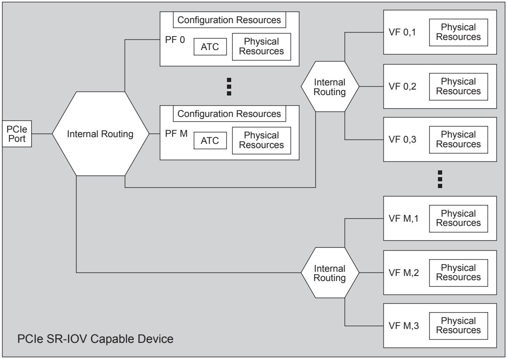

<details>
<summary>flowchart</summary>

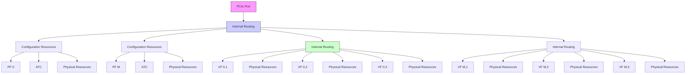
```mermaid
graph TD
  A["PCIe Port"] --> B["Internal Routing"]
  B --> C["Configuration Resources"]
  C --> D["PF 0"]
  C --> E["ATC"]
  C --> F["Physical Resources"]
  B --> G["Configuration Resources"]
  G --> H["PF M"]
  G --> I["ATC"]
  G --> J["Physical Resources"]
  B --> K["Internal Routing"]
  K --> L["VF 0,1"]
  K --> M["Physical Resources"]
  K --> N["VF 0,2"]
  K --> O["Physical Resources"]
  K --> P["VF 0,3"]
  K --> Q["Physical Resources"]
  B --> R["Internal Routing"]
  R --> S["VF M,1"]
  R --> T["Physical Resources"]
  R --> U["VF M,2"]
  R --> V["Physical Resources"]
  R --> W["VF M,3"]
  R --> X["Physical Resources"]
    style A fill:#f9f,stroke:#333
    style B fill:#ccf,stroke:#333
    style K fill:#cfc,stroke:#333
```
</details>

A-0627

Figure 9-6 Example SR-IOV Multi-PF Capable Device§

Key observations to note:

• Each PF can be assigned zero or more VFs. The number of VFs per PF is not required to be identical for all PFs within the device.  
The ARI Extended Capability enables Functions to be assigned to Function Groups and defines how Function Group arbitration can be configured. PFs and VFs can be assigned to Function Groups and take advantage of the associated arbitration capabilities. Within each Function Group, though, arbitration remains implementation specific.  
• Internal routing between PFs and VFs is implementation specific.  
• For some usage models, all PFs may be the same device type; (e.g., all PFs deliver the same network device or all deliver the same storage device functionality.) For other usage models, each PF may represent a different device type; (e.g., in § Figure 9-6, one PF might represent a network device while another represents an encryption device.)

◦ In situations where there is a usage model dependency between device types, such as for each VF that is a network device type, each SI also requires a VF that is an encryption device type. The SR-IOV Extended Capability provides a method to indicate these dependencies. The policies used to construct these dependencies as well as assign dependent sets of VF to a given SI are outside the scope of this specification.

As seen in the prior example, the number of PF and VF can vary based on usage model requirements. To support a wide range of options, an SR-IOV Device can support the following number and mix of PF and VF:

• Using the Alternative Routing Identifier (ARI) capability, a device may support up to 256 PFs. Function Number assignment is implementation specific and may be sparse throughout the 256 Function Number space.  
• A PF can only be associated with the Device’s captured Bus Number as illustrated in § Figure 9-7.  
• SR-IOV Devices may consume more than one Bus Number. A VF can be associated with any Bus Number within the Device’s Bus Number range - the captured Bus Number plus any additional Bus Numbers configured by software. See § Section 9.2.1.2 for details.

◦ Use of multiple Bus Numbers enables a device to support a very large number of VFs - up to the size of the Routing ID space minus the bits used to identify intervening busses.  
◦ If software does not configure sufficient additional Bus Numbers, then the VFs implemented for the additional Bus Numbers may not be visible.

## IMPLEMENTATION NOTE:

## FUNCTION CO-LOCATION §

The ARI Extended Capability enables a Device to support up to 256 Functions - Functions, PFs, or VFs in any combination - associated with the captured Bus Number. If a usage model does not require more than 256 Functions, implementations are strongly encouraged to co-locate all Functions, PFs, and VFs within the captured Bus Number and not require additional Bus Numbers to access VFs.

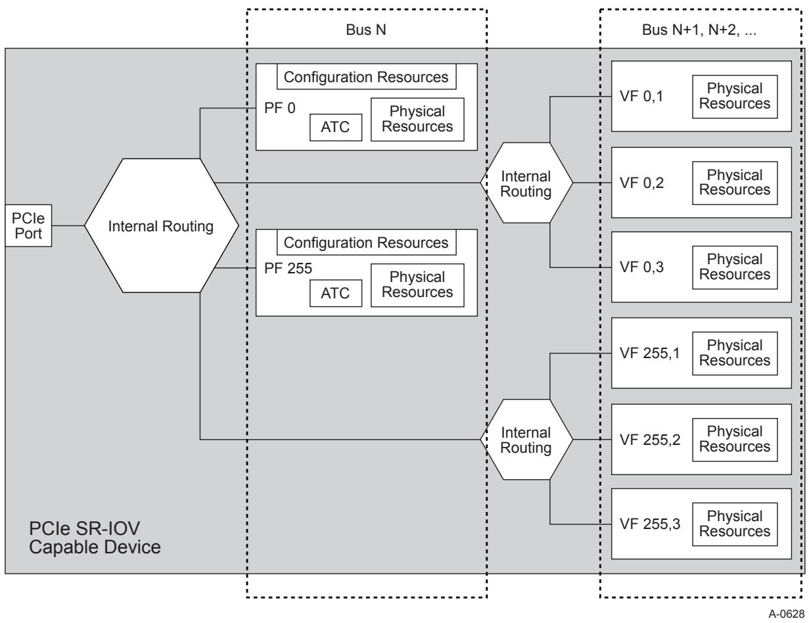

<details>
<summary>flowchart</summary>

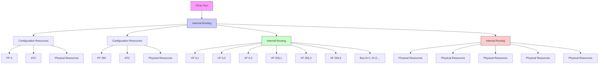
```mermaid
graph TD
  A["PCIe Port"] --> B["Internal Routing"]
  B --> C["Configuration Resources"]
  C --> D["PF 0"]
  C --> E["ATC"]
  C --> F["Physical Resources"]
  B --> G["Configuration Resources"]
  G --> H["PF 255"]
  G --> I["ATC"]
  G --> J["Physical Resources"]
  B --> K["Internal Routing"]
  K --> L["VF 0,1"]
  K --> M["VF 0,2"]
  K --> N["VF 0,3"]
  K --> O["VF 255,1"]
  K --> P["VF 255,2"]
  K --> Q["VF 255,3"]
  K --> R["Bus N+1, N+2,..."]
  B --> S["Internal Routing"]
  S --> T["Physical Resources"]
  S --> U["Physical Resources"]
  S --> V["Physical Resources"]
  S --> W["Physical Resources"]
  S --> X["Physical Resources"]
    style A fill:#f9f,stroke:#333
    style B fill:#ccf,stroke:#333
    style K fill:#cfc,stroke:#333
    style S fill:#fcc,stroke:#333
```
</details>

Figure 9-7 Example SR-IOV Device with Multiple Bus Numbers§

In this last example, § Figure 9-8, a device implementation may mix any number of Functions, PFs, and VFs.

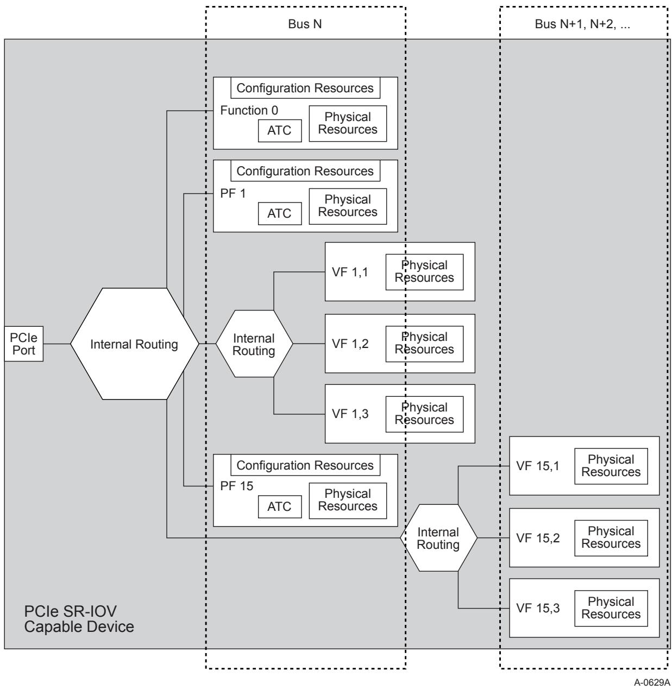

<details>
<summary>flowchart</summary>

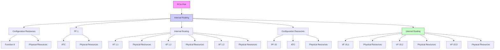
```mermaid
graph TD
  A["PCIe Port"] --> B["Internal Routing"]
  B --> C["Configuration Resources"]
  C --> D["Function 0"]
  C --> E["Physical Resources"]
  B --> F["PF 1"]
  F --> G["ATC"]
  F --> H["Physical Resources"]
  B --> I["Internal Routing"]
  I --> J["VF 1,1"]
  I --> K["Physical Resources"]
  I --> L["VF 1,2"]
  I --> M["Physical Resources"]
  I --> N["VF 1,3"]
  I --> O["Physical Resources"]
  B --> P["Configuration Resources"]
  P --> Q["PF 15"]
  P --> R["ATC"]
  P --> S["Physical Resources"]
  B --> T["Internal Routing"]
  T --> U["VF 15,1"]
  T --> V["Physical Resources"]
  T --> W["VF 15,2"]
  T --> X["Physical Resources"]
  T --> Y["VF 15,3"]
  T --> Z["Physical Resources"]
    style A fill:#f9f,stroke:#333
    style B fill:#ccf,stroke:#333
    style T fill:#cfc,stroke:#333
```
</details>

Figure 9-8 Example SR-IOV Device with a Mixture of Function Types§

Key observations to note:

• Each Device must contain a Function 0. Function 0 may be a PF (i.e., it may include the SR-IOV extended capability).  
• Any mix of Functions can be associated with the captured Bus Number.  
◦ Non-VFs can only be associated with the captured Bus Number.  
• If the ARI Extended Capability is supported, Functions can be assigned to Function Groups. The assignment policy is outside the scope of this specification. If the ARI Extended Capability is not supported, Functions can still use the Function arbitration capabilities as defined in § Section 6.3.3.4 .

## 9.2 SR-IOV Initialization and Resource Allocation §

## 9.2.1 SR-IOV Resource Discovery §

The following sections describe how software determines that a Device is SR-IOV capable and subsequently identifies VF resources through Virtual Function Configuration Space.

## 9.2.1.1 Configuring SR-IOV Capabilities §

This section describes the fields that must be configured before enabling a PF’s IOV Capabilities. The VFs are enabled by Setting the PF’s VF Enable bit (see § Section 9.3.3.3.1 ) in the SR-IOV extended capability.

The NumVFs field (see § Section 9.3.3.7 ) defines the number of VFs that are enabled when VF Enable is Set in the associated PF.

## 9.2.1.1.1 Configuring the VF BAR Mechanisms §

This section describes how the VF BARs are configured to map memory space. VFs do not support I/O Space and thus VF BARs shall not indicate I/O Space.

The System Page Size field (see § Section 9.3.3.13 ) defines the page size the system will use to map the VF’s PCIe memory addresses when the PF’s IOV Capabilities are enabled. The System Page Size field is used by the PF to align the Memory space aperture defined by each VF BAR to a system page boundary. The value chosen for the System Page Size must be one of the Supported Page Sizes (see § Section 9.3.3.12 ) in the SR-IOV extended capability.

The behavior of VF BARs is the same as the normal PCI Memory Space BARs (see § Section 7.5.1.2.1 ), except that a VF BAR describes the aperture for each VF, whereas a PCI BAR describes the aperture for a single Function. The attributes for some of the bits in the VF BARs are affected by the VF Resizable BAR Extended Capability (see § Section 7.8.7 ) if it is implemented.

• The behavior described in § Section 7.5.1.2.1 for determining the memory aperture of a Function’s BAR applies to each VF BAR. That is, the size of the memory aperture required for each VF BAR can be determined by writing all $^ { \mathfrak { s } } 1 ^ { \mathfrak { s } } { }$ and then reading the VF BAR. The results read back must be interpreted as described in § Section 7.5.1.2.1 .  
• The behavior for assigning the starting memory space address of each BAR associated with the first VF is also as described in § Section 7.5.1.2.1 . That is, the address written into each VF BAR is used by the Device for the starting address of the first VF.  
• The difference between VF BARs and BARs described in § Section 7.5.1.2.1 is that for each VF BAR, the memory space associated with the second and higher VFs is derived from the starting address of the first VF and the memory space aperture. For any given $\mathsf { V F } _ { v } ,$ the starting address of its Memory space aperture for any implemented $\mathsf { B A R } _ { b } )$ is calculated according to the following formula:

${ \mathsf { B A R } } _ { b } \mathsf { V F } _ { v }$ starting address = VF BARb + (v - 1) x (VF BARb aperture size)

where VF ${ \mathsf { B A R } } _ { \mathsf { b } }$ aperture size is the size of ${ \mathsf { V F B A R } } { \mathsf { b } }$ as determined by the usual BAR probing algorithm as described in § Section 9.3.3.14 .

VF memory space is not enabled until both VF Enable and VF MSE have been Set (see § Section 9.3.3.3.1 and § Section 9.3.3.3.4 ). Note that changing System Page Size (see § Section 9.3.3.13 ) may affect the VF BAR aperture size.

§ Figure 9-9 shows an example of the PF and VF Memory space apertures.

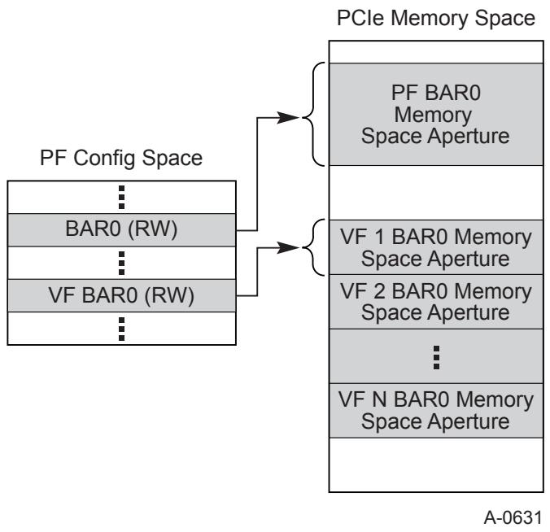

<details>
<summary>flowchart</summary>

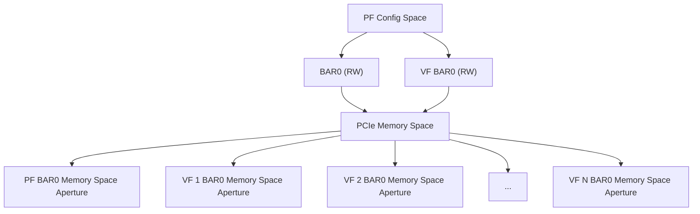
```mermaid
graph TD
  A["PF Config Space"] --> B["BAR0 (RW)"]
  A --> C["VF BAR0 (RW)"]
  B --> D["PCIe Memory Space"]
  C --> D
  D --> E["PF BAR0 Memory Space Aperture"]
  D --> F["VF 1 BAR0 Memory Space Aperture"]
  D --> G["VF 2 BAR0 Memory Space Aperture"]
  D --> H["..."]
  D --> I["VF N BAR0 Memory Space Aperture"]
```
</details>

Figure 9-9 BAR Space Example for Single BAR Device§

## 9.2.1.2 VF Discovery §

The First VF Offset and VF Stride fields in the SR-IOV extended capability are 16-bit Routing ID offsets. These offsets are used to compute the Routing IDs for the VFs with the following restrictions:

• The value in NumVFs in a PF (§ Section 9.3.3.7 ) may affect the values in First VF Offset (§ Section 9.3.3.9 ) and VF Stride (§ Section 9.3.3.10 ) of that PF.  
• The value in ARI Capable Hierarchy (§ Section 9.3.3.3.5 ) in the lowest-numbered PF of the Device (for example PF0) may affect the values in First VF Offset and VF Stride in all PFs of the Device.  
• NumVFs of a PF may only be changed when VF Enable (§ Section 9.3.3.3.1 ) of that PF is Clear.  
• ARI Capable Hierarchy (§ Section 9.3.3.3.5 ) may only be changed when VF Enable is Clear in all PFs of a Device.

## IMPLEMENTATION NOTE:

## NUMVFS AND ARI CAPABLE HIERARCHY §

After configuring NumVFs and ARI Capable Hierarchy where applicable, software may read First VF Offset and VF Stride to determine how many Bus Numbers would be consumed by the PF’s VFs. The additional Bus Numbers, if any, are not actually used until VF Enable is Set.

§ Table 9-1 describes the algorithm used to determine the Routing ID associated with each VF.

Table 9-1 VF Routing ID Algorithm§

<table><tr><td>VF Number</td><td>VF Routing ID</td></tr><tr><td>VF 1</td><td> $(PF\ Routing\ ID + First\ VF\ Offset)\ Modulo\ 2^{16}$ </td></tr><tr><td>VF 2</td><td> $(PF\ Routing\ ID + First\ VF\ Offset + VF\ Stride)\ Modulo\ 2^{16}$ </td></tr><tr><td>VF 3</td><td> $(PF\ Routing\ ID + First\ VF\ Offset + 2 * VF\ Stride)\ Modulo\ 2^{16}$ </td></tr><tr><td>...</td><td>...</td></tr><tr><td>VF N</td><td> $(PF\ Routing\ ID + First\ VF\ Offset + (N-1) * VF\ Stride)\ Modulo\ 2^{16}$ </td></tr><tr><td>...</td><td>...</td></tr><tr><td>VF NumVFs (last one)</td><td> $(PF\ Routing\ ID + First\ VF\ Offset + (NumVFs-1) * VF\ Stride)\ Modulo\ 2^{16}$ </td></tr></table>

All arithmetic used in this Routing ID computation is 16-bit unsigned dropping all carries.

All VFs and PFs must have distinct Routing IDs. The Routing ID of any PF or VF must not overlap with the Routing ID of any other PF or VF given any valid setting of NumVFs across all PFs of a device.

VF Stride and First VF Offset are constants. Except as stated earlier in this section, their values may not be affected by settings in this or other Functions of the Device.

VFs may reside on different Bus Number(s) than the associated PF. This can occur if, for example, First VF Offset has the value 0100h. A VF shall not be located on a Bus Number that is numerically smaller than its associated PF. A VF that is located on the same Bus Number as its associated PF shall not be located on a Device Number that is numerically smaller than the PF 172 .

VFs of an SR-IOV RCiEP Device are associated with the same Root Complex Event Collector (if any) as their PF. Such VFs are not reported in the Root Complex Event Collector Endpoint Association Extended Capability of the Root Complex Event Collector.

As per § Section 2.2.6.2 , SR-IOV capable Devices that are associated with an Upstream Port capture the Bus Number from any Type 0 Configuration Write Request. SR-IOV capable Devices do not capture the Bus Number from any Type 1 Configuration Write Requests. SR-IOV capable RCiEPs use an implementation specific mechanism to assign their Bus Numbers.

Note: Bus Numbers are a constrained resource. Devices are strongly encouraged to avoid leaving “holes” in their Bus Number usage to avoid wasting Bus Numbers.

All PFs must be located on the Device’s captured Bus Number.

## IMPLEMENTATION NOTE:

## VFS SPANNING MULTIPLE BUS NUMBERS §

As an example, consider an SR-IOV Device that supports a single PF. Initially, only PF 0 is visible. Software Sets ARI Capable Hierarchy. From the SR-IOV Extended Capability it determines: InitialVFs is 600, First VF Offset is 1 and VF Stride is 1.

• If software sets NumVFs in the range [0 … 255], then the Device uses a single Bus Number.  
• If software sets NumVFs in the range [256 … 511], then the Device uses two Bus Numbers.  
• If software sets NumVFs in the range [512 … 600], then the Device uses three Bus Numbers.

PF 0 and VF 0,1 through VF 0,255 are always on the first (captured) Bus Number. VF 0,256 through VF 0,511 are always on the second Bus Number (captured Bus Number plus 1). VF 0,512 through VF 0,600 are always on the third Bus Number (captured Bus Number plus 2).

Software should configure Switch Secondary and Subordinate Bus Number fields to route enough Bus Numbers to the Device. If sufficient Bus Numbers are not available, software should reduce a Device’s Bus Number requirements by not enabling SR-IOV and/or reducing NumVFs for some or all PFs of the Device prior to enabling SR-IOV.

After VF Enable is Set in some PF n, the Device must Enable VF n,1 through VF n,m (inclusive) where m is the smaller of InitialVFs and NumVFs. A Device receiving a Type 0 Configuration Request targeting an Enabled VF located on the captured Bus Number must process the Request normally. A Device receiving a Type 1 Configuration Request targeting an Enabled VF not located on the captured Bus Number must process the Request normally. A Device receiving a Type 1 Configuration Request targeting the Device's captured Bus Number must follow the rules for handling Unsupported Requests. Additionally, if VF MSE is Set, each Enabled VF must respond to PCIe Memory transactions addressing the memory space associated with that VF.

Functions that are not enabled (i.e., Functions for VFs above m) do not exist in the PCI Express fabric. As per § Section 2.3.1 , addressing Functions that do not exist will result in Unsupported Request (UR) being returned. This includes Functions on additional Bus Numbers.

## IMPLEMENTATION NOTE:

## MULTI-FUNCTION DEVICES WITH PFS AND SWITCH

## FUNCTIONS

SR-IOV devices may consume multiple bus numbers. Additional bus numbers beyond the first one are consecutive and immediately follow the first bus number assigned to the device. If an SR-IOV device also contains PCI-PCI Bridges (with Type 1 Configuration Space Headers), the SR-IOV usage must be accounted for when programming the Secondary Bus Number for those Bridges. Software should determine the last Bus Number used by VFs first and then configure any co-located Bridges to use Bus Numbers above that value.

## 9.2.1.3 Function Dependency Lists §

PCI Devices may have vendor-specific dependencies between Functions. For example, Functions 0 and 1 might provide different mechanisms for controlling the same underlying hardware. In such situations, the Device programming model might require that these dependent Functions be assigned to SIs as a set.

Function Dependency Lists are used to describe these dependencies (or to indicate that there are no Function dependencies). Software should assign PFs and VFs to SIs such that the dependencies are satisfied.

See § Section 9.3.3.8 for details.

## 9.2.1.4 Interrupt Resource Allocation §

PFs and VFs support either MSI, MSI-X interrupts, or both if interrupt resources are allocated. VFs shall not implement INTx. MSI and MSI-X interrupts are described in § Section 6.1.4 .

For MSI-X interrupts, special address range isolation requirements apply for the MSI-X structures in PF and VF MMIO regions. See in § Section 7.7.2 .

## 9.2.2 SR-IOV Reset Mechanisms §

This section describes how reset mechanisms defined in § Section 6.6 affect Devices that support SR-IOV. It also describes the mechanisms used to reset a single VF and a single PF with its associated VFs.

## 9.2.2.1 SR-IOV Conventional Reset §

A Conventional Reset to a Device that supports SR-IOV shall cause all Functions (including both PFs and VFs) to be reset to their original, power-on state as per the rules in § Section 6.6.1 . § Section 9.3 describes the behavior for the fields defined.

Note: Conventional Reset clears VF Enable in the PF. Thus, VFs no longer exist after a Conventional Reset.

## 9.2.2.2 FLR That Targets a VF

VFs must support Function Level Reset (FLR).

Note: Software may use FLR to reset a VF. FLR to a VF affects a VF’s state but does not affect its existence in PCI Configuration Space or PCI Bus address space. The VFs BARn values (see § Section 9.3.3.14 ) and VF MSE (see § Section 9.3.3.3.4 ) in the PF’s SR-IOV extended capability, and the VF Resizable BAR capability values (see § Section 7.8.7 ) are unaffected by FLRs issued to the VF.

## 9.2.2.3 FLR That Targets a PF §

PFs must support FLR.

FLR to a PF resets the PF state as well as the SR-IOV extended capability including VF Enable which means that VFs no longer exist.

## 9.2.3 IOV Re-initialization and Reallocation §

If VF Enable is Cleared after having been Set, all of the VFs associated with the PF no longer exist and must no longer issue PCIe transactions or respond to Configuration Space or Memory Space accesses. VFs must not retain any state after VF Enable has been Cleared (including sticky bits).

## 9.3 Configuration §

## 9.3.1 SR-IOV Configuration Overview §

This section provides SR-IOV-added requirements for implementing PFs and VFs.

PFs are discoverable in configuration space, as with all Functions. PFs contain the SR-IOV Extended Capability described in § Section 9.3.3 . PFs are used to discover, configure, and manage the VFs associated with the PF and for other things described in this specification.

## 9.3.2 Configuration Space §

PFs that support SR-IOV shall implement the SR-IOV Extended Capability as defined in the following sections. VFs shall implement configuration space fields and capabilities as defined in the following sections.

## 9.3.3 SR-IOV Extended Capability §

The SR-IOV Extended Capability defined here is a PCIe extended capability that must be implemented in each PF that supports SR-IOV. This Capability is used to describe and control a PF’s SR-IOV Capabilities.

For Multi-Function Devices, each PF that supports SR-IOV shall provide the Capability structure defined in this section. This Capability structure may be present in any Function with a Type 0 Configuration Space Header. This Capability must not be present in Functions with a Type 1 Configuration Space Header.

§ Figure 9-10 shows the SR-IOV Extended Capability structure.

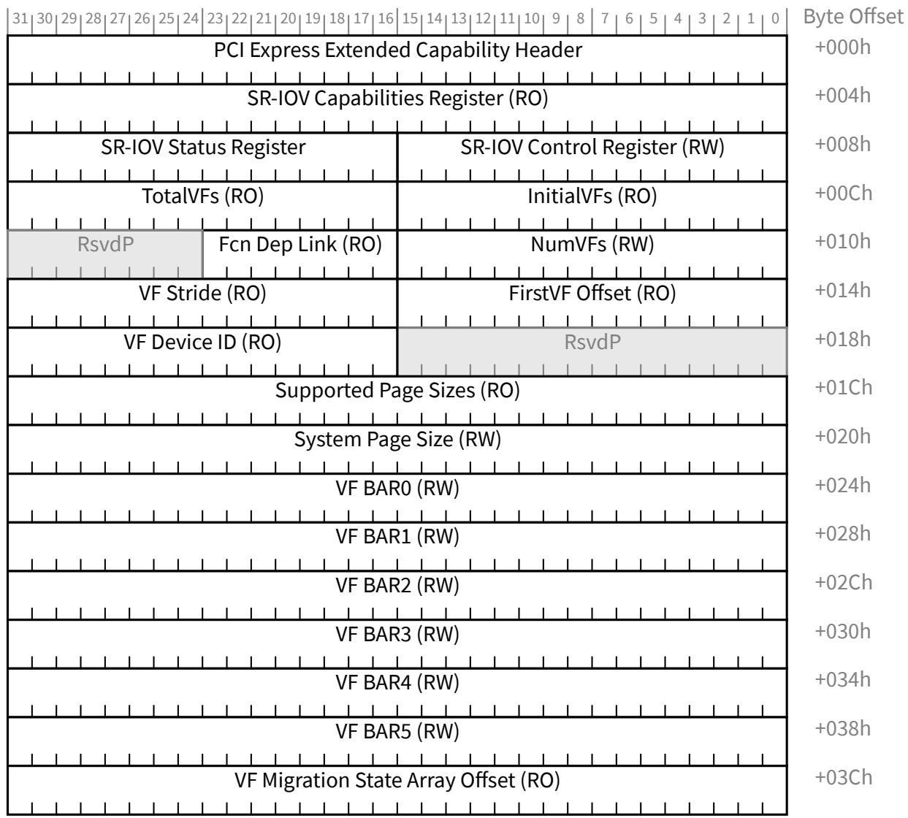

<details>
<summary>stacked bar chart</summary>

| Protocol | Bit Position | Bit Type | Bit Address |
| --- | --- | --- | --- |
| PCI Express Extended Capability Header | 31 | 30 | +000h |
| PCI Express Extended Capability Header | 29 | 28 | +004h |
| PCI Express Extended Capability Header | 27 | 26 | +008h |
| PCI Express Extended Capability Header | 25 | 24 | +00Ch |
| PCI Express Extended Capability Header | 23 | 22 | +010h |
| PCI Express Extended Capability Header | 21 | 20 | +014h |
| PCI Express Extended Capability Header | 19 | 18 | +018h |
| PCI Express Extended Capability Header | 17 | 16 | +01Ch |
| PCI Express Extended Capability Header | 16 | 15 | +020h |
| SR-IOV Capabilities Register (RO) | 31 | 30 | +024h |
| SR-IOV Capabilities Register (RO) | 29 | 28 | +028h |
| SR-IOV Capabilities Register (RO) | 27 | 26 | +02Ch |
| SR-IOV Capabilities Register (RO) | 25 | 24 | +030h |
| SR-IOV Capabilities Register (RO) | 23 | 22 | +034h |
| SR-IOV Capabilities Register (RO) | 21 | 20 | +038h |
| SR-IOV Capabilities Register (RO) | 19 | 18 | +03Ch |
| SR-IOV Capabilities Register (RO) | 17 | 16 | - |
| SR-IOV Capabilities Register (RO) | 16 | 15 | - |
| SR-IOV Status Register | 31 | 30 | - |
| SR-IOV Status Register | 29 | 28 | - |
| SR-IOV Status Register | 27 | 26 | - |
| SR-IOV Status Register | 25 | 24 | - |
| SR-IOV Status Register | 23 | 22 | - |
| SR-IOV Status Register | 21 | 20 | - |
| SR-IOV Status Register | 19 | 18 | - |
| SR-IOV Status Register | 17 | 16 | - |
| SR-IOV Status Register | 16 | 15 | - |
| SR-IOV Status Register | 15 | 14 | - |
| SR-IOV Status Register | 14 | 13 | - |
| SR-IOV Status Register | 13 | 12 | - |
| SR-IOV Status Register | 12 | 11 | - |
| SR-IOV Status Register | 11 | 10 | - |
| SR-IOV Status Register | 9 | 8 | - |
| SR-IOV Status Register | 8 | 7 | - |
| SR-IOV Status Register | 7 | 6 | - |
| SR-IOV Status Register | 6 | 5 | - |
| SR-IOV Status Register | 5 | 4 | - |
| SR-IOV Status Register | 4 | 3 | - |
| SR-IOV Status Register | 3 | 2 | - |
| SR-IOV Status Register | 2 | 1 | - |
| SR-IOV Status Register | 1 | 0 | - |
| TotalVFs (RO) | - | - | - |
| TotalVFs (RO) | - | - | - |
| TotalVFs (RO) | - | - | - |
| TotalVFs (RO) | - | - | - |
| TotalVFs (RO) | - | - | - |
| TotalVFs (RO) | - | - | - |
| TotalVFs (RO) | - | - | - |
| TotalVFs (RO) | - | - | RsvdP |
| TotalVFs (RO) | - | - | NumVFs (RW) |
| TotalVFs (RO) | - | - | NumVFs (RW) |
| VF Stride (RO) | - | - | - |
| VF Stride (RO) | - | - | - |
| VF Stride (RO) | - | - | FirstVF Offset (RO) |
| VF Device ID (RO) | - | - | RsvdP |
| VF Device ID (RO) | - | - | RsvdP |
</details>

Figure 9-10 SR-IOV Extended Capability§

## 9.3.3.1 SR-IOV Extended Capability Header (Offset 00h) §

§ Table 9-2 defines the SR-IOV Extended Capability header. The Capability ID for the SR-IOV Extended Capability is 0010h.


<details>
<summary>text_image</summary>

31
20 19 16 15 0
Next Capability Offset
0010h
PCI Express Extended Capability ID
Capability Version
</details>

Figure 9-11 SR-IOV Extended Capability Header§

Table 9-2 SR-IOV Extended Capability Header§

<table><tr><td>Bit Location</td><td>Register Description</td><td>Attributes</td></tr><tr><td>15:0</td><td>PCI Express Extended Capability ID - This field is a PCI-SIG defined ID number that indicates the nature and format of the Extended Capability.The Extended Capability ID for the SR-IOV Extended Capability is 0010h.</td><td>RO</td></tr><tr><td>19:16</td><td>Capability Version - This field is a PCI-SIG defined version number that indicates the version of the Capability structure present.Must be 1h for this version of the specification.</td><td>RO</td></tr><tr><td>31:20</td><td>Next Capability Offset - This field contains the offset to the next PCI Express Capability structure or 000h if no other items exist in the linked list of Capabilities.For Extended Capabilities implemented in Configuration Space, this offset is relative to the beginning of PCI-compatible Configuration Space and thus must always be either 000h (for terminating list of Capabilities) or greater than 0FFh.</td><td>RO</td></tr></table>

## 9.3.3.2 SR-IOV Capabilities Register (04h) §

§ Table 9-3 defines the layout of the SR-IOV Capabilities field.

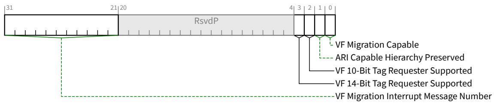

<details>
<summary>text_image</summary>

31
21 20
RsvdP
4 3 2 1 0
VF Migration Capable
ARI Capable Hierarchy Preserved
VF 10-Bit Tag Requester Supported
VF 14-Bit Tag Requester Supported
VF Migration Interrupt Message Number
</details>

Figure 9-12 SR-IOV Capabilities Register§

§ Table 9-3 SR-IOV Capabilities Register

<table><tr><td>Bit Location</td><td>Register Description</td><td>Attributes</td></tr><tr><td>0</td><td>VF Migration Capable- If Set, the PF is Migration Capable and operating under a Migration Capable MR-PCIM.Deprecated. New designs should hardwire this bit to 0b.</td><td>RO</td></tr><tr><td>1</td><td>ARI Capable Hierarchy PreservedPCI Express Endpoint:If Set, the ARI Capable Hierarchy bit is preserved across certain power state transitions.RCiEP:Not applicable - this bit MUST@FLIT be hardwired to 0b.</td><td>RO</td></tr><tr><td>2</td><td>VF 10-Bit Tag Requester Supported- If Set, all VFs associated with this PF must support 10-Bit Tag Requester capability. If Clear, VFs must not support 10-Bit Tag Requester capability.If the 10-Bit Tag Requester Supported bit in the PF’s Device Capabilities 2 register is Clear, this bit must be Clear.</td><td>HwInit</td></tr><tr><td>3</td><td>VF 14-Bit Tag Requester Supported- If Set, all VFs associated with this PF must support 14-Bit Tag Requester capability. If Clear, VFs must not support 14-Bit Tag Requester capability.If the 14-Bit Tag Requester Supported bit in the PF’s Device Capabilities 2 register is Clear, this bit must be Clear.</td><td>HwInit</td></tr><tr><td>31:21</td><td>VF Migration Interrupt Message Number- Indicates the MSI/MSI-X vector used for migration interrupts.The value in this field is undefined if VF Migration Capable is Clear.VF Migration is a feature associated with the deprecated MR-IOV. New designs should hardwire this field to 0.</td><td>RO</td></tr></table>

## 9.3.3.2.1 VF Migration Capable §

VF Migration Capable is Set to indicate that the PF supports VF Migration. If Clear, the PF does not support VF Migration.

VF Migration is a feature associated with the deprecated [MR-IOV]. This bit should be hardwired to 0b in new designs.

## 9.3.3.2.2 ARI Capable Hierarchy Preserved §

ARI Capable Hierarchy Preserved is Set to indicate that the PF preserves the ARI Capable Hierarchy bit across certain power state transitions (see § Section 9.3.3.3.5 ). Components must either Set this bit or Set the No\_Soft\_Reset bit (see § Section 5.10.2 ). It is recommended that components set this bit even if they also set No\_Soft\_Reset.

ARI Capable Hierarchy Preserved is only present in the lowest-numbered PF of a Device (for example PF0). ARI Capable Hierarchy Preserved is Read Only Zero in other PFs of a Device.

ARI Capable Hierarchy Preserved does not apply to RCiEPs, and its value is undefined (see § Section 9.3.3.3 ).

## 9.3.3.2.3 VF Larger-Tag Requester Support §

If a PF supports one or both larger-Tag Requester capabilities, its associated VFs are permitted to support the associated larger-Tag Requester capabilities as well, but this is optional. Especially for usage models where the bulk of the traffic is spread across several VFs concurrently, it may not be necessary for individual VFs to use larger Tags so they can support >256 outstanding Non-Posted Requests each.

For a given PF, it is required that either all or none of its associated VFs support larger-Tag Requester capabilities. This avoids unnecessary implementation and management complexity. See VF 14-Bit Tag Requester Supported and VF 10-Bit Tag Requester Supported.

VFs that support larger-Tag Requester capabilities have additional requirements beyond other Function types in order to simplify error handling and reduce the possibility of larger-Tag related errors with one VF impacting other traffic.

• If one of the VF larger-Tag Requester Enable bits in the SR-IOV Control Register is Set, then each VF must use the associated larger Tags for all Non-Posted Requests that it generates.  
• For each outstanding larger-Tag Request, if the VF receives a Completion that matches the outstanding Request other than Tag[13:8] being 00 0000b, the VF must prevent that Request from (eventually) generating a

Completion Timeout error, and instead handle the error via a device-specific mechanism that avoids data corruption.

It is strongly recommended that software not configure Unexpected Completion errors to be handled as Uncorrectable Errors. This avoids them triggering System Errors or hardware error containment mechanisms like Downstream Port Containment (DPC).

## IMPLEMENTATION NOTE:

## NO VF LARGER-TAG COMPLETER SUPPORTED BITS §

There are no VF 14-bit or VF 10-Bit Tag Completer Supported bits. If a PF supports one or both larger-Tag Completer capabilities, then all of its associated VFs are required support the associated Tag Completer capabilities as stated in 14-Bit Tag Completer Supported and 10-Bit Tag Completer Supported. This helps avoid the complexity of PCIe hierarchies where some Completers support larger-Tag capability and some do not.

## 9.3.3.2.4 VF Migration Interrupt Message Number §

VF Migration is associated with the now deprecated MR-IOV. New designs should hardwire this field to 0.

## 9.3.3.3 SR-IOV Control Register (Offset 08h) §

§ Table 9-4 defines the layout of the SR-IOV Control fields.

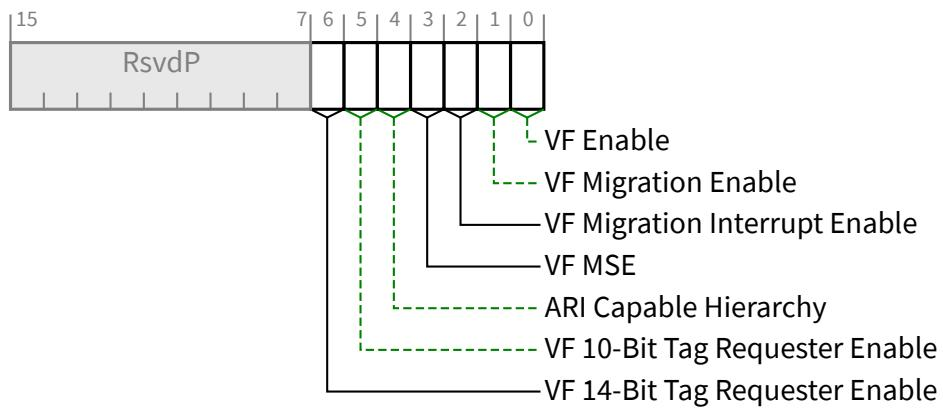

<details>
<summary>text_image</summary>

15
RsvdP
7 6 5 4 3 2 1 0
VF Enable
VF Migration Enable
VF Migration Interrupt Enable
VF MSE
ARI Capable Hierarchy
VF 10-Bit Tag Requester Enable
VF 14-Bit Tag Requester Enable
</details>

Figure 9-13 SR-IOV Control Register

§

§

Table 9-4 SR-IOV Control Register

<table><tr><td>Bit Location</td><td>Register Description</td><td>Attributes</td></tr><tr><td>0</td><td>VF Enable - Enables/Disables VFs. Default value is 0b.</td><td>RW</td></tr><tr><td>1</td><td>VF Migration Enable- Enables/Disables VF Migration Support. Default value is 0b. See § Section9.3.3.3.2.</td><td>RW or RO(see description)</td></tr><tr><td>2</td><td>VF Migration Interrupt Enable- Enables/Disables VF Migration State Change Interrupt. Default value is 0b.</td><td>RW</td></tr><tr><td>3</td><td>VF MSE- Memory Space Enable for Virtual Functions. Default value is 0b.</td><td>RW</td></tr><tr><td>4</td><td>ARI Capable Hierarchy -PCI Express Endpoint:This bit must be RW in the lowest-numbered PF of the Device and hardwired to 0b in all other PFs.If the value of this bit is 1b, the Device is permitted to locate VFs in Function Numbers 8 to 255 of the captured Bus Number. Otherwise, the Device must locate VFs as if it were a non-ARI Device.This bit is not affected by FLR of any PF or VF.Default value is 0b.RCiEP:Not applicable - this bit must be hardwired to 0b.Within the Root Complex, VFs are always permitted to be assigned to any Function Number allowed by First VF Offset and VF Stride rules (see § Section 9.3.3.9 and § Section 9.3.3.10).</td><td>RW or RO(see description)</td></tr><tr><td>5</td><td>VF 10-Bit Tag Requester Enable- If Set, all VFs must use 10-Bit Tags for all Non-Posted Requests they generate. If Clear, VFs must not use 10-Bit Tags for Non-Posted Requests they generate. See VF Larger-Tag Requester Support.This bit must not be Set if the VF 14-Bit Tag Requester Enable bit is Set; otherwise the result is undefined.If software changes the value of this bit while any VFs have outstanding Non-Posted Requests, the result is undefined.If the VF 10-Bit Tag Requester Supported bit in the SR-IOV Capabilities register is Clear, this bit is permitted to be hardwired to 0b.Default value is 0b.</td><td>RW or RO</td></tr><tr><td>6</td><td>VF 14-Bit Tag Requester Enable- If Set, all VFs must use 14-Bit Tags for all Non-Posted Requests they generate. If Clear, VFs must not use 14-Bit Tags for Non-Posted Requests they generate. See VF Larger-Tag Requester Support.This bit must not be Set if the VF 10-Bit Tag Requester Enable bit is Set; otherwise the result is undefined.If software changes the value of this bit while any VFs have outstanding Non-Posted Requests, the result is undefined.If the VF 14-Bit Tag Requester Supported bit in the SR-IOV Capabilities register is Clear, this bit is permitted to be hardwired to 0b.Default value is 0b.</td><td>RW or RO</td></tr></table>

## 9.3.3.3.1 VF Enable §

VF Enable manages the assignment of VFs to the associated PF. If VF Enable is Set, the VFs associated with the PF are accessible in the PCI Express fabric. When Set, VFs respond to and may issue PCI Express transactions following the rules for PCI Express Endpoint Functions.

If VF Enable is Clear, VFs are disabled and not visible in the PCI Express fabric; requests to these VFs shall receive UR and these VFs shall not issue PCI Express transactions.

To allow components to perform internal initialization, after changing the VF Enable bit from Cleared to Set, the system is not permitted to issue Requests to the VFs which are enabled by that VF Enable bit until one of the following is true:

• At least 100 ms has passed  
• An FRS Message has been received from the PF with a Reason Code of VF Enabled  
• At least VF Enable Time has passed. VF Enable Time is either (1) the Reset Time value in the Readiness Time Reporting capability associated with the VF, or (2) a value determined by system software / firmware 173 .

The Root Complex and/or system software must allow at least 1.0 s after Setting the VF Enable bit, before it may determine that a VF which fails to return a Successful Completion Status for a valid Configuration Request is broken. After Setting the VF Enable bit, the VFs enabled by that VF Enable bit are permitted to return a Configuration RRS status in response to Configuration Requests up to the 1.0 s limit, if they are not ready to provide a Successful Completion Status for a valid Configuration Request. After a PF transmits an FRS Message with a Reason Code of VF Enabled, no VF associated with that PF is permitted to return Configuration RRS in response to a Configuration Request without an intervening VF disable or other valid reset condition. After returning a Successful Completion to any Request, no VF is permitted to return Configuration RRS in response to a Configuration Request without an intervening VF disable or other valid reset condition.

Since VFs don't have an MSE bit (MSE in VFs is controlled by the VF MSE bit in the SR-IOV Extended Capability in the PF), it's possible for software to issue a Memory Request before the VF is ready to handle it. Therefore, Memory Requests must not be issued to a VF until at least one of the following conditions has been met:

• The VF has responded successfully (without returning RRS) to a Configuration Request.  
• After issuing an FLR to the VF, at least one of the following is true:

◦ At least 1.0 s has passed since the FLR was issued.

◦ The VF supports FRS and, after the FLR was issued, an FRS Message has been received from the VF with a Reason Code of FLR Completed.

◦ At least FLR Time has passed since the FLR was issued. FLR Time is either (1) the FLR Time value in the Readiness Time Reporting capability associated with the VF or (2) a value determined by system software / firmware153.

• After Setting VF Enable in a PF, at least one of the following is true:

◦ At least 1.0 s has passed since VF Enable was Set.  
◦ The PF supports FRS and, after VF Enable was Set, an FRS Message has been received from the PF with a Reason Code of VF Enabled.  
◦ At least VF Enable Time has passed since VF Enable was Set. VF Enable Time is either (1) the Reset Time value in the Readiness Time Reporting capability associated with the VF or (2) a value determined by system software / firmware 174

The VF is permitted to silently drop Memory Requests after an FLR has been issued to the VF or VF Enable has been Set in the associated PF's SR-IOV Extended Capability until the VF responds successfully to any Request (exclutind the retursn of RRS in response to a Configuration Request).

Clearing VF Enable effectively destroys the VFs. Setting VF Enable effectively creates VFs. Setting VF Enable after it has previously been Cleared shall result in a new set of VFs. If the PF is in the D0 power state, the new VFs are in the D0uninitialized state. If the PF is in a lower power state behavior is undefined (see Sections 9.6.1 and 9.6.2).

When Clearing VF Enable, a PF that supports FRS shall send an FRS Message with FRS Reason VF Disabled to indicate when this operation is complete. The PF is not permitted to send this Message if there are outstanding Non-Posted Requests issued by the PF or any of the VFs associated with the PF. The FRS Message may only be sent after these Requests have completed (or timed out).

After VF Enable is Cleared no field in the SR-IOV Extended Capability may be accessed until either:

• At least 1.0 s has elapsed after VF Enable was Cleared.  
• The PF supports FRS and after VF Enable was Cleared, an FRS Message has been received from the PF with a Reason Code of VF Disabled.

§ Section 9.3.3.7 NumVFs, § Section 9.3.3.5 InitialVFs, § Section 9.3.3.6 TotalVFs, § Section 9.3.3.9 First VF Offset, § Section 9.3.3.13 System Page Size, and § Section 9.3.3.14 VF BARx describe additional semantics associated with this field.

## 9.3.3.3.2 VF Migration Enable §

VF Migration Enable must be Set to allow VF Migration on this PF.

VF Migration is associated with the now-deprecated [MR-IOV]. New designs should hardwire this bit to 0b.

## 9.3.3.3.3 VF Migration Interrupt Enable §

VF Migration is associated with the now-deprecated MR-IOV. New designs should hardwire this bit to 0b.

## 9.3.3.3.4 VF MSE (Memory Space Enable) §

VF MSE controls memory space enable for all Active VFs associated with this PF, as with the Memory Space Enable bit in a Function’s PCI Command register. The default value for this bit is 0b.

When VF Enable is Set, VF memory space will respond only when VF MSE is Set. VFs shall follow the same error reporting rules as defined in the [PCIe] if an attempt is made to access a Virtual Function’s memory space when VF Enable is Set and VF MSE is Clear.

## IMPLEMENTATION NOTE: VF MSE AND VF ENABLE

VF memory space will respond with Unsupported Request when VF Enable is Clear. Thus, VF MSE is “don’t care” when VF Enable is Clear; however, software may choose to Set VF MSE after programming the VF BARn registers, prior to Setting VF Enable.

## 9.3.3.3.5 ARI Capable Hierarchy §

For Devices associated with an Upstream Port, ARI Capable Hierarchy is a hint to the Device that ARI has been enabled in the Root Port or Switch Downstream Port immediately above the Device. Software should set this bit to match the ARI Forwarding Enable bit in the Root Port or Switch Downstream Port immediately above the Device.

ARI Capable Hierarchy is only present in the lowest-numbered PF of a Device (for example PF0) and affects all PFs of the Device. ARI Capable Hierarchy is Read Only Zero in other PFs of a Device.

A Device may use the setting of ARI Capable Hierarchy to determine the values for First VF Offset (see § Section 9.3.3.9 ) and VF Stride (see § Section 9.3.3.10 ). The effect of changing ARI Capable Hierarchy is undefined if VF Enable is Set in any PF. This bit must be set to its default value upon Conventional Reset. This bit is not affected by FLR of any PF or VF. If either ARI Capable Hierarchy Preserved is Set (see § Section 9.3.3.2.2 ) or No\_Soft\_Reset is Set (see § Section 5.10.2 ), a power state transition of this PF from D3Hot to D0 does not affect the value of this bit (see § Section 5.10.2 ).

ARI Capable Hierarchy does not apply to RCiEPs.

## IMPLEMENTATION NOTE: ARI CAPABLE HIERARCHY §

For a Device associated with an Upstream Port, that Device has no way of knowing whether ARI has been enabled. If ARI is enabled, the Device can conserve Bus Numbers by assigning VFs to Function Numbers greater than 7 on the captured Bus Number. ARI is defined in § Section 6.13 .

Since RCiEPs are not associated with an Upstream Port, ARI does not apply, and VFs may be assigned to any Function Number within the Root Complex permitted by First VF Offset and VF Stride (see § Section 9.3.3.8 and § Section 9.3.3.9 ).

## 9.3.3.4 SR-IOV Status Register (Offset 0Ah) §

§ Table 9-5: defines the layout of the SR-IOV Status field.


<details>
<summary>text_image</summary>

15
RsvdZ
1 0
VF Migration Status
</details>

Figure 9-14 SR-IOV Status

§

Table 9-5 SR-IOV Status

<table><tr><td>Bit Location</td><td>Register Description</td><td>Attributes</td></tr><tr><td>0</td><td>VF Migration Status - VF Migration is associated with the now-deprecated [MR-IOV]. New designs should hardwire this bit to 0b.</td><td>RW1C</td></tr></table>

## 9.3.3.4.1 VF Migration Status §

VF Migration is associated with the now-deprecated [MR-IOV]. New designs should hardwire this bit to 0b.

## 9.3.3.5 InitialVFs (Offset 0Ch) §

VF Migration is associated with the now deprecated MR-IOV. New designs should encode this field as HwInit with a value equal to TotalVFs.

## 9.3.3.6 TotalVFs (Offset 0Eh) §

TotalVFs indicates the maximum number of VFs that are associated with the PF.

The minimum value of TotalVFs is 0.

This field is HwInit and must contain the same value as InitialVFs.

## 9.3.3.7 NumVFs (Offset 10h) §

NumVFs controls the number of VFs that are visible. SR-PCIM sets NumVFs as part of the process of creating VFs. This number of VFs shall be visible in the PCI Express fabric after both NumVFs is set to a valid value and VF Enable is Set.

The results are undefined if NumVFs is set to a value greater than TotalVFs.

NumVFs may only be written while VF Enable is Clear. If NumVFs is written when VF Enable is Set, the results are undefined.

The initial value of NumVFs is undefined.

## 9.3.3.8 Function Dependency Link (Offset 12h) §

The programming model for a Device may have vendor-specific dependencies between sets of Functions. The Function Dependency Link field is used to describe these dependencies.

This field describes dependencies between PFs. VF dependencies are the same as the dependencies of their associated PFs.

If a PF is independent from other PFs of a Device, this field shall contain its own Function Number.

If a PF is dependent on other PFs of a Device, this field shall contain the Function Number of the next PF in the same Function Dependency List. The last PF in a Function Dependency List shall contain the Function Number of the first PF in the Function Dependency List.

If $\mathsf { P F } _ { p }$ and $\mathsf { P F } _ { q }$ are in the same Function Dependency List, then any SI that is assigned $\mathsf { V } \mathsf { F } _ { p , n }$ shall also be assigned to ${ \mathsf { V F } } _ { q , n } .$

## IMPLEMENTATION NOTE:

## FUNCTION DEPENDENCY LINK EXAMPLE §

Consider the following scenario:

<table><tr><td>SR-IOV Field</td><td>PF 0</td><td>PF 1</td><td>PF 2</td></tr><tr><td>Function Dependency Link</td><td>1</td><td>0</td><td>2</td></tr><tr><td>NumVFs</td><td>4</td><td>4</td><td>6</td></tr><tr><td>First VF Offset</td><td>4</td><td>4</td><td>4</td></tr><tr><td>VF Stride</td><td>3</td><td>3</td><td>3</td></tr></table>

<table><tr><td>Function Number</td><td>Description</td><td>Independent</td></tr><tr><td>0</td><td>PF 0</td><td>No</td></tr><tr><td>1</td><td>PF 1</td><td>No</td></tr><tr><td>2</td><td>PF 2</td><td>Yes</td></tr><tr><td>3</td><td>Function not present</td><td></td></tr><tr><td>4</td><td>VF 0,1 (aka PF 0 VF 1)</td><td>No</td></tr><tr><td>5</td><td>VF 1,1 (aka PF 1 VF 1)</td><td>No</td></tr><tr><td>6</td><td>VF 2,1 (aka PF 2 VF 1)</td><td>Yes</td></tr><tr><td>7</td><td>VF 0,2</td><td>No</td></tr><tr><td>8</td><td>VF 1,2</td><td>No</td></tr><tr><td>9</td><td>VF 2,2</td><td>Yes</td></tr><tr><td>10</td><td>VF 0,3</td><td>No</td></tr><tr><td>11</td><td>VF 1,3</td><td>No</td></tr><tr><td>12</td><td>VF 2,3</td><td>Yes</td></tr><tr><td>13</td><td>VF 0,4</td><td>No</td></tr><tr><td>14</td><td>VF 1,4</td><td>No</td></tr><tr><td>15</td><td>VF 2,4</td><td>Yes</td></tr><tr><td>16 to 17</td><td>Functions not present</td><td></td></tr><tr><td>18</td><td>VF 2,5</td><td>Yes</td></tr><tr><td>19 to 20</td><td>Functions not present</td><td></td></tr><tr><td>21</td><td>VF 2,6</td><td>Yes</td></tr><tr><td>22 to 255</td><td>Functions not present</td><td></td></tr></table>

In this example, Functions 4 and 5 must be assigned to the same SI. Similarly, Functions 7 and 8, 10 and 11, and 13 and 14 must be assigned together. If PFs are assigned to SIs, Functions 0 and 1 must be assigned together as well. Functions 2, 6, 9, 12, 15, 18, and 21 are independent and may be assigned to SIs in any fashion.

All PFs in a Function Dependency List shall have the same values for the InitialVFs and TotalVFs fields.

SR-PCIM shall ensure that all PFs in a Function Dependency List have the same values for the NumVFs and VF Enable fields before any VF in that Function Dependency List is assigned to an SI.

VF Mapping operations occur independently for every VF. SR-PCIM shall not assign a VF to an SI until it can assign all dependent VFs.

Similarly, SR-PCIM shall not remove a VF from an SI until it can remove all dependent VFs.

## 9.3.3.9 First VF Offset (Offset 14h) §

First VF Offset is a constant and defines the Routing ID offset of the first VF that is associated with the PF that contains this Capability structure. The first VF’s 16-bit Routing ID is calculated by adding the contents of this field to the Routing ID of the PF containing this field ignoring any carry, using unsigned, 16-bit arithmetic.

A VF shall not be located on a Bus Number that is numerically smaller than its associated PF.

This field may change value when the lowest-numbered PF’s ARI Capable Hierarchy value changes or when this PF’s NumVFs value changes.

Note: First VF Offset is unused if NumVFs is 0. If NumVFs is greater than 0, First VF Offset must not be zero.

## 9.3.3.10 VF Stride (Offset 16h) §

VF Stride defines the Routing ID offset from one VF to the next one for all VFs associated with the PF that contains this Capability structure. The next VF’s 16-bit Routing ID is calculated by adding the contents of this field to the Routing ID of the current VF, ignoring any carry, using unsigned 16-bit arithmetic.

This field may change value when the lowest-numbered PF’s ARI Capable Hierarchy value changes or when this PF’s NumVFs value changes.

Note: VF Stride is unused if NumVFs is 0 or 1. If NumVFs is greater than 1, VF Stride must not be zero.

## 9.3.3.11 VF Device ID (Offset 1Ah) §

This field contains the Device ID that should be presented for every VF to the SI.

VF Device ID may be different from the PF Device ID. A VF Device ID must be managed by the vendor. The vendor must ensure that the chosen VF Device ID does not result in the use of an incompatible device driver.

## 9.3.3.12 Supported Page Sizes (Offset 1Ch) §

This field indicates the page sizes supported by the PF. This PF supports a page size of 2 n +12 if bit n is Set. For example, if bit 0 is Set, the PF supports 4-KB page sizes. PFs are required to support 4-KB, 8-KB, 64-KB, 256-KB, 1-MB, and 4-MB page sizes. All other page sizes are optional.

The page size describes the minimum alignment requirements for VF BAR resources as described in § Section 9.3.3.13 .

## IMPLEMENTATION NOTE: NON-PREFETCHABLE ADDRESS SPACE §

Non-prefetchable address space is limited to addresses below 4 GB. Pre-fetch address space in 32-bit systems is also limited. Vendors are strongly encouraged to utilize the System Page Size feature to conserve address space while also supporting systems with larger pages.

## 9.3.3.13 System Page Size (Offset 20h) §

This field defines the page size the system will use to map the VFs’ memory addresses. Software must set the value of the System Page Size to one of the page sizes set in the Supported Page Sizes field (see § Section 9.3.3.12 ). As with Supported Page Sizes, if bit n is Set in System Page Size, the VFs associated with this PF are required to support a page Size is zero. The results are undefined if more than one bit is Set in System Page Size. The results are undefined if a bit is Set in System Page Size that is not Set in Supported Page Sizes.

When System Page Size is set, the VF associated with this PF is required to align all BAR resources on a System Page Size boundary. Each VF BARn or VF BARn pair (see § Section 9.3.3.14 ) shall be aligned on a System Page Size boundary. Each VF BARn or VF BARn pair defining a non-zero address space shall be sized to consume an integer multiple of System Page Size bytes. All data structures requiring page size alignment within a VF shall be aligned on a System Page Size boundary.

VF Enable must be zero when System Page Size is written. The results are undefined if System Page Size is written when VF Enable is Set.

Default value is 0000 0001h (i.e., 4 KB).

## 9.3.3.14 VF BAR0 (Offset 24h), VF BAR1 (Offset 28h), VF BAR2 (Offset 2Ch), VF BAR3 (Offset 30h), VF BAR4 (Offset 34h), VF BAR5 (Offset 38h) §

These fields must define the VF’s Base Address Registers (BARs). These fields behave as normal PCI BARs, as described in § Section 7.5.1 . They can be sized by writing all 1s and reading back the contents of the BARs as described in § Section 7.5.1.2.1 , complying with the low order bits that define the BAR type fields.

These fields may have their attributes affected by the VF Resizable BAR Extended Capability (see § Section 7.8.7 ) if it is implemented.

The amount of address space decoded by each BAR shall be an integral multiple of System Page Size.

Each VF BARn, when “sized” by writing 1s and reading back the contents, describes the amount of address space consumed and alignment required by a single Virtual Function, per BAR. When written with an actual address value, and

VF Enable and VF MSE are Set, the BAR maps NumVFs BARs. In other words, the base address is the address of the first VF BARn associated with this PF and all subsequent VF BARn address ranges follow as described below.

VF BARs shall only support 32-bit and 64-bit memory space. PCI I/O Space is not supported in VFs. Bit 0 of any implemented VF BARx must be RO 0b except for a VF BARx used to map the upper 32 bits of a 64-bit memory VF BAR pair.

The alignment requirement and size read is for a single VF, but when VF Enable is Set and VF MSE is Set, the BAR contains the base address for all (NumVFs) VF BARn.

The algorithm to determine the amount of address space mapped by a VF BARn differs from the standard BAR algorithm as follows:

1. Resize the BAR via the VF Resizable BAR Extended Capability (see § Section 7.8.7 ) if it is implemented.  
2. After reading the low order bits to determine if the BAR is a 32-bit BAR or 64-bit BAR pair, determine the size and alignment requirements by writing all 1s to VF BARn (or VF BARn and VF BARn+1 for a 64-bit BAR pair) and reading back the contents of the BAR or BAR pair. Convert the bit mask returned by the read(s) to a size and alignment value as described in § Section 7.5.1.2.1 . This value is the size and alignment for a single VF.  
3. Multiply the value from step 2 by the value set in NumVFs to determine the total amount of space the BAR or BAR pair will map after VF Enable and VF MSE are Set.

For each VF BARn field, n corresponds to one of the VFs BAR spaces. § Table 9-8 shows the relationship between n and a Function’s BAR.

Table 9-8 BAR Offsets§

<table><tr><td>n</td><td>BAR Offset in a Type 0 Header</td></tr><tr><td>0</td><td>10h</td></tr><tr><td>1</td><td>14h</td></tr><tr><td>2</td><td>18h</td></tr><tr><td>3</td><td>1Ch</td></tr><tr><td>4</td><td>20h</td></tr><tr><td>5</td><td>24h</td></tr></table>

The contents of all VF BARn registers are indeterminate after System Page Size is changed.

## 9.3.3.15 VF Migration State Array Offset (Deprecated) (Offset 3Ch) §

VF Migration is associated with the now deprecated [MR-IOV]. New designs should hardwire this register to 0000 0000h.

## 9.3.4 PF/VF Configuration Space Header §

This section's material in previous versions of this specification has been integrated into § Section 7.5.1 .

## 9.3.5 PCI Express Capability Changes §

This section's material in previous versions of this specification has been integrated into § Section 7.5.3 .

## 9.3.6 PCI Standard Capabilities §

SR-IOV usage of PCI Standard Capabilities is described in § Table 9-9. Items marked n/a are not applicable to PFs or VFs.

Table 9-9 SR-IOV Usage of PCI Standard Capabilities§

<table><tr><td>Capability ID</td><td>Description</td><td>PF Attributes</td><td>VF Attributes</td></tr><tr><td>00h</td><td>Null Capability</td><td>Base</td><td>Base</td></tr><tr><td>01h</td><td>PCI Power Management Interface</td><td>Base</td><td>Optional. See § Section 5.10 .</td></tr><tr><td>02h</td><td>AGP</td><td>n/a</td><td>n/a</td></tr><tr><td>03h</td><td>VPD</td><td>Base</td><td>Optional. See § Section 7.9.18 .</td></tr><tr><td>04h</td><td>Slot Identification</td><td>n/a</td><td>n/a</td></tr><tr><td>05h</td><td>MSI</td><td>Base</td><td>See § Section 9.2.1.4 .</td></tr><tr><td>06h</td><td>CompactPCI Hot Swap</td><td>n/a</td><td>n/a</td></tr><tr><td>07h</td><td>PCI-X</td><td>n/a</td><td>n/a</td></tr><tr><td>08h</td><td>HyperTransport</td><td>n/a</td><td>n/a</td></tr><tr><td>09h</td><td>Vendor-specific</td><td>Base</td><td>Base</td></tr><tr><td>0Ah</td><td>Debug Port</td><td>Base</td><td>Base</td></tr><tr><td>0Bh</td><td>CompactPCI Central Resource Control</td><td>n/a</td><td>n/a</td></tr><tr><td>0Ch</td><td>PCI Hot Plug</td><td>Base</td><td>n/a</td></tr><tr><td>0Dh</td><td>PCI Bridge Subsystem ID</td><td>n/a</td><td>n/a</td></tr><tr><td>0Eh</td><td>AGP 8x</td><td>n/a</td><td>n/a</td></tr><tr><td>0Fh</td><td>Secure Device</td><td>n/a</td><td>n/a</td></tr><tr><td>10h</td><td>PCI Express</td><td>Base</td><td>See § Section 9.3.5 .</td></tr><tr><td>11h</td><td>MSI-X</td><td>See § Section 9.2.1.4 .</td><td>See § Section 9.2.1.4 .</td></tr><tr><td>12h</td><td>Serial ATA Data/Index Configuration</td><td>Base</td><td>n/a</td></tr><tr><td>13h</td><td>Advanced Features</td><td>n/a</td><td>n/a</td></tr><tr><td>14h</td><td>Enhanced Allocation</td><td>Base</td><td>Must not implement.</td></tr><tr><td>15h</td><td>Flattening Portal Bridge (FPB)</td><td>n/a</td><td>n/a</td></tr></table>

## 9.3.7 PCI Express Extended Capabilities Changes §

SR-IOV usage of PCI Express Extended Capabilities is described in § Table 9-10. Items marked n/a are not applicable to PFs or VFs (e.g., for capabilities only present in Root Complexes, only present in Function 0, or only for managing a Port).

Table 9-10 SR-IOV Usage of PCI Express Extended Capabilities§

<table><tr><td>Extended Capability ID</td><td>Description</td><td>PF Attributes</td><td>VF Attributes</td></tr><tr><td>0000h</td><td>Null Capability</td><td>Base</td><td>Base</td></tr><tr><td>0001h</td><td>Advanced Error Reporting Extended Capability (AER)</td><td>Base</td><td>See capability description</td></tr><tr><td>0002h</td><td>Virtual Channel Extended Capability (02h)</td><td>Base</td><td>Must not implement. See capability description</td></tr><tr><td>0003h</td><td>Device Serial Number Extended Capability</td><td>Base</td><td>See capability description</td></tr><tr><td>0004h</td><td>Power Budgeting Extended Capability</td><td>Base</td><td>Must not implement. See capability description</td></tr><tr><td>0005h</td><td>Root Complex Link Declaration Extended Capability</td><td>n/a</td><td>n/a</td></tr><tr><td>0006h</td><td>Root Complex Internal Link Control Extended Capability</td><td>n/a</td><td>n/a</td></tr><tr><td>0007h</td><td>Root Complex Event Collector Endpoint Association Extended Capability</td><td>n/a</td><td>n/a</td></tr><tr><td>0008h</td><td>Multi-Function Virtual Channel Extended Capability</td><td>Base</td><td>n/a; only present in Function 0</td></tr><tr><td>0009h</td><td>Virtual Channel Extended Capability (09h)</td><td>Base</td><td>Must not implement. See capability description</td></tr><tr><td>000Ah</td><td>RCRB Header Extended Capability</td><td>n/a</td><td>n/a</td></tr><tr><td>000Bh</td><td>Vendor-specific Extended Capability</td><td>Base</td><td>Base</td></tr><tr><td>000Ch</td><td>Deprecated; formerly used for theConfiguration Access Correlation Extended Capability</td><td>n/a</td><td>n/a</td></tr><tr><td>000Dh</td><td>ACS Extended Capability</td><td>See capability description</td><td>See capability description</td></tr><tr><td>000Eh</td><td>ARI Extended Capability (ARI)</td><td>See capability description</td><td>See capability description</td></tr><tr><td>000Fh</td><td>ATS Extended Capability</td><td>See capability description</td><td>See capability description</td></tr><tr><td>0010h</td><td>SR-IOV Extended Capability</td><td>See capability description</td><td>Must not implement. See capability description</td></tr><tr><td>0011h</td><td>Deprecated; formerly used for theMR-IOV Extended Capability(MR-IOV)</td><td>n/a</td><td>n/a</td></tr><tr><td>0012h</td><td>Multicast Extended Capability</td><td>See capability description</td><td>See capability description</td></tr><tr><td>0013h</td><td>Page Request Extended Capability (PRI)</td><td>See capability description</td><td>See capability description</td></tr><tr><td>0014h</td><td>Reserved for AMD</td><td>Base</td><td>Base</td></tr><tr><td>0015h</td><td>Resizable BAR Extended Capability</td><td>Base</td><td>Must not implement. See capability description</td></tr><tr><td>0016h</td><td>Dynamic Power Allocation Extended Capability (DPA)</td><td>See capability description</td><td>Must not implement. See capability description</td></tr><tr><td>0017h</td><td>TPH Requester Extended Capability (TPH)</td><td>See capability description</td><td>See capability description</td></tr><tr><td>0018h</td><td>LTR Extended Capability</td><td>Base</td><td>n/a; only present in Function 0</td></tr><tr><td>0019h</td><td>Secondary PCI Express Extended Capability</td><td>Base</td><td>n/a; only present in Function 0</td></tr><tr><td>001Ah</td><td>PMUX Extended Capability</td><td>Base</td><td>n/a; only for managing a Port</td></tr><tr><td>001Bh</td><td>PASID Extended Capability</td><td>Base</td><td>See capability description</td></tr><tr><td>001Ch</td><td>Deprecated; formerly used for the LN Requester Extended Capability</td><td>n/a</td><td>n/a</td></tr><tr><td>001Dh</td><td>DPC Extended Capability</td><td>n/a; only for managing a Port</td><td>n/a; only for managing a Port</td></tr><tr><td>001Eh</td><td>L1 PM Substates Extended Capability</td><td>Base</td><td>n/a; only present in Function 0</td></tr><tr><td>001Fh</td><td>Precision Time Management Extended Capability (PTM)</td><td>Base</td><td>n/a; only for managing a Port</td></tr><tr><td>0020h</td><td>PCI Express over M-PHY Extended Capability (M-PCIe)</td><td>Base</td><td>n/a; only for managing a Port</td></tr><tr><td>0021h</td><td>FRS Queueing Extended Capability</td><td>n/a</td><td>n/a</td></tr><tr><td>0022h</td><td>Readiness Time Reporting Extended Capability</td><td>Base</td><td>See capability description</td></tr><tr><td>0023h</td><td>Designated vendor-specific Extended Capability</td><td>Base</td><td>Base</td></tr><tr><td>0024h</td><td>VF Resizable BAR Extended Capability</td><td>See capability description</td><td>Must not implement. See capability description</td></tr><tr><td>0025h</td><td>Data Link Feature Extended Capability</td><td>Base</td><td>n/a; only for managing a Port</td></tr><tr><td>0026h</td><td>Physical Layer 16.0 GT/s Extended Capability</td><td>Base</td><td>n/a; only for managing a Port</td></tr><tr><td>0027h</td><td>Lane Margining at the Receiver Extended Capability</td><td>Base</td><td>n/a; only for managing a Port</td></tr><tr><td>0028h</td><td>Hierarchy ID Extended Capability</td><td>Base</td><td>Base</td></tr><tr><td>0029h</td><td>Native PCIe Enclosure Management Extended Capability (NPEM)</td><td>Base</td><td>n/a; only for managing a Port</td></tr><tr><td>002Ah</td><td>Physical Layer 32.0 GT/s Extended Capability</td><td>Base</td><td>Must not implement</td></tr><tr><td>002Bh</td><td>Alternate Protocol Extended Capability</td><td>Base</td><td>Must not implement</td></tr><tr><td>002Ch</td><td>SFI Extended Capability (System Firmware Intermediary)</td><td>Base</td><td>Must not implement</td></tr><tr><td>002Dh</td><td>Shadow Functions Extended Capability</td><td>Base</td><td>Base</td></tr><tr><td>002Eh</td><td>Data Object Exchange Extended Capability</td><td>Base</td><td>Base</td></tr><tr><td>002Fh</td><td>Device 3 Extended Capability</td><td>Base</td><td>Base</td></tr><tr><td>0030h</td><td>IDE Extended Capability</td><td>Base</td><td>n/a; only present in Function 0</td></tr><tr><td>0031h</td><td>Physical Layer 64.0 GT/s Extended Capability</td><td>Base</td><td>Must not implement</td></tr><tr><td>0032h</td><td>Flit Logging Extended Capability</td><td>Base</td><td>Must not implement</td></tr><tr><td>0033h</td><td>Flit Performance Measurement Extended Capability</td><td>Base</td><td>Must not implement</td></tr><tr><td>0034h</td><td>Flit Error Injection Extended Capability</td><td>Base</td><td>Must not implement</td></tr></table>

## 10. Address Translation Services (ATS) §

## 10.1 ATS Architectural Overview §

Most contemporary system architectures make provisions for translating addresses from DMA (bus mastering) I/O Functions. In many implementations, it has been common practice to assume that the physical address space seen by the CPU and by an I/O Function is equivalent. While in others, this is not the case. The address programmed into an I/O Function is a “handle” that is processed by the Root Complex (RC). The result of this processing is often a translation to a physical memory address within the central complex. Typically, the processing includes access rights checking to insure that the DMA Function is allowed to access the referenced memory location(s).

The purposes for having DMA address translation vary and include:

• Limiting the destructiveness of a “broken” or misprogrammed DMA I/O Function  
• Providing for scatter/gather  
• Address space conversion (32-bit I/O Function to larger system address space)  
• Virtualization support

• Ability to redirect message-signaled interrupts (e.g., MSI or MSI-X) to different address ranges without requiring coordination with the underlying I/O Function

Irrespective of the motivation, the presence of DMA address translation in the host system has certain performance implications for DMA accesses.

Depending on the implementation, DMA access time can be significantly lengthened due to the time required to resolve the actual physical address. If an implementation requires access to a main-memory-resident translation table, the access time can be significantly longer than the time for an untranslated access. Additionally, if each transaction requires multiple memory accesses (e.g., for a table walk), then the memory transaction rate (i.e., overhead) associated with DMA can be high.

To mitigate these impacts, designs often include address translation caches in the entity that performs the address translation. In a CPU, the address translation cache is most commonly referred to as a translation look-aside buffer (TLB). For an I/O TA, the term address translation cache or ATC is used to differentiate it from the translation cache used by the CPU.

While there are some similarities between TLB and ATC, there are important differences. A TLB serves the needs of a CPU that is nominally running one thread at a time. The ATC, however, is generally processing requests from multiple I/O Functions, each of which can be considered a separate thread. This difference makes sizing an ATC difficult depending upon cost models and expected technology reuse across a wide range of system configurations.

The mechanisms described in this specification allow an I/O Device to participate in the translation process and provide an ATC for its own memory accesses. The benefits of having an ATC within a Device include:

• Ability to alleviate TA resource pressure by distributing address translation caching responsibility (reduced probability of “thrashing” within the TA)  
• Enable ATC Devices to have less performance dependency on a system’s ATC size  
• Potential to ensure optimal access latency by sending pretranslated requests to central complex

This specification will provide the interoperability that allows PCIe Devices to be used in conjunction with a TA, but the TA and its Address Translation and Protection Table (ATPT) are treated as implementation specific and are outside the scope of this specification. While it may be possible to implement ATS within other PCIe Components, this specification is confined to PCIe Devices and PCIe Root Complex Integrated Endpoints (RCiEPs).

§ Figure 10-1 illustrates an example platform with a TA and ATPT, along with a set of PCIe Devices and RC Integrated Endpoints with integrated ATC. A TA and an ATPT are implementation specific and can be distinct or integrated components within a given system design.

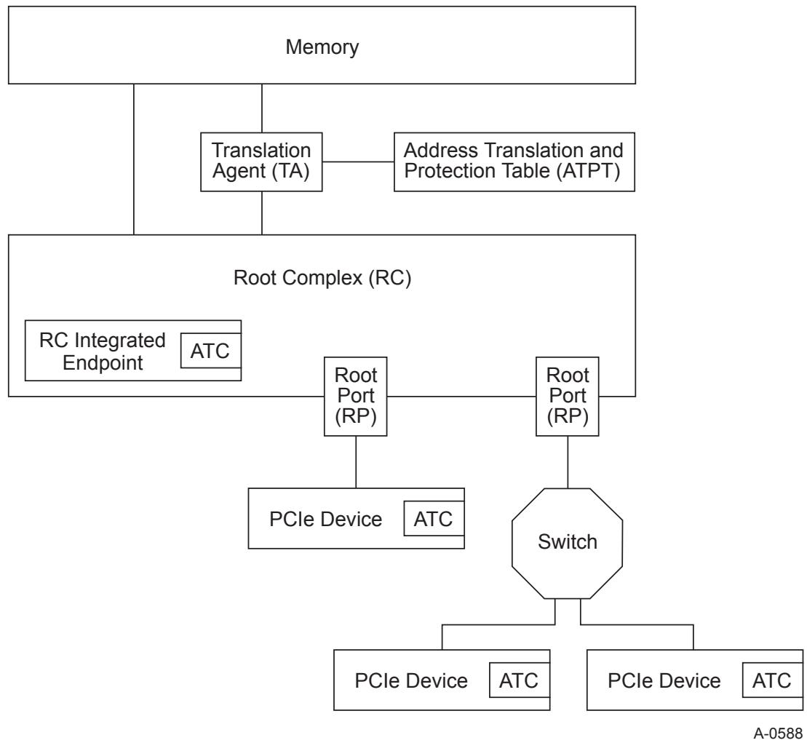

<details>
<summary>flowchart</summary>

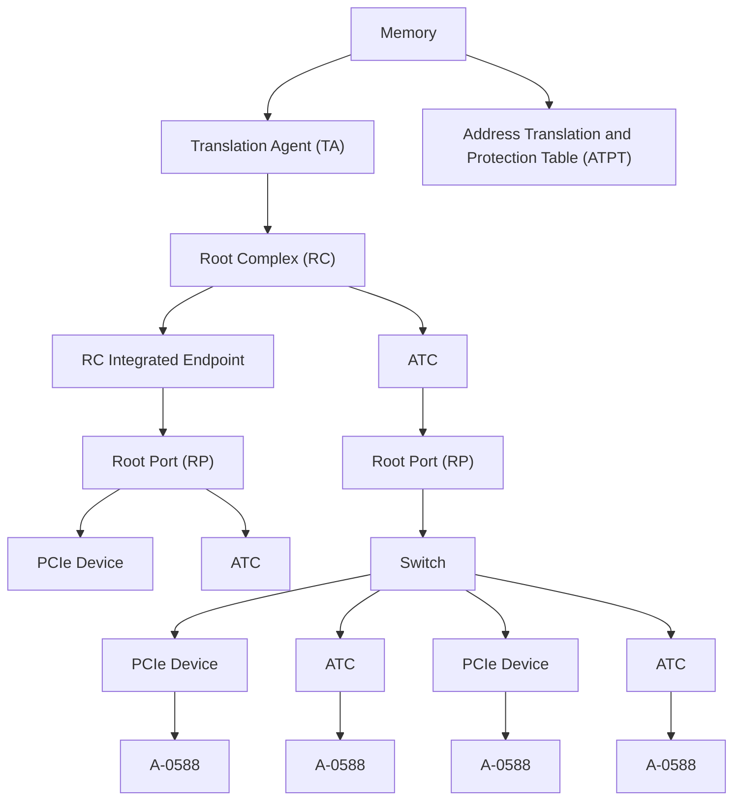
```mermaid
graph TD
  A["Memory"] --> B["Translation Agent (TA)"]
  A --> C["Address Translation and Protection Table (ATPT)"]
  B --> D["Root Complex (RC)"]
  D --> E["RC Integrated Endpoint"]
  D --> F["ATC"]
  E --> G["Root Port (RP)"]
  F --> H["Root Port (RP)"]
  G --> I["PCIe Device"]
  G --> J["ATC"]
  H --> K["Switch"]
  K --> L["PCIe Device"]
  K --> M["ATC"]
  K --> N["PCIe Device"]
  K --> O["ATC"]
  L --> P["A-0588"]
  M --> Q["A-0588"]
  N --> R["A-0588"]
  O --> S["A-0588"]
```
</details>

Figure 10-1 Example Illustrating a Platform with TA, ATPT, and ATC Elements§

## 10.1.1 Address Translation Services (ATS) Overview §

The ATS chapter provides a new set of TLP and associated semantics. ATS uses a request-completion protocol between a Device 175 and a Root Complex (RC) to provide translation services. In addition, a new AT field is defined within the Memory Read and Memory Write TLP. The new AT field enables an RC to determine whether a given request has been translated or not via the ATS protocol.

§ Figure 10-2 illustrates the basic flow of an ATS Translation Request operation.

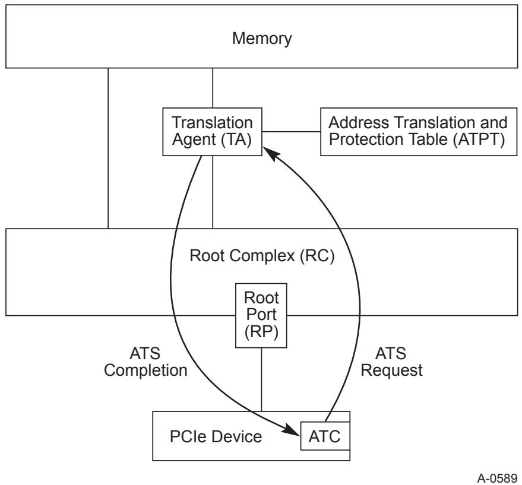

<details>
<summary>flowchart</summary>

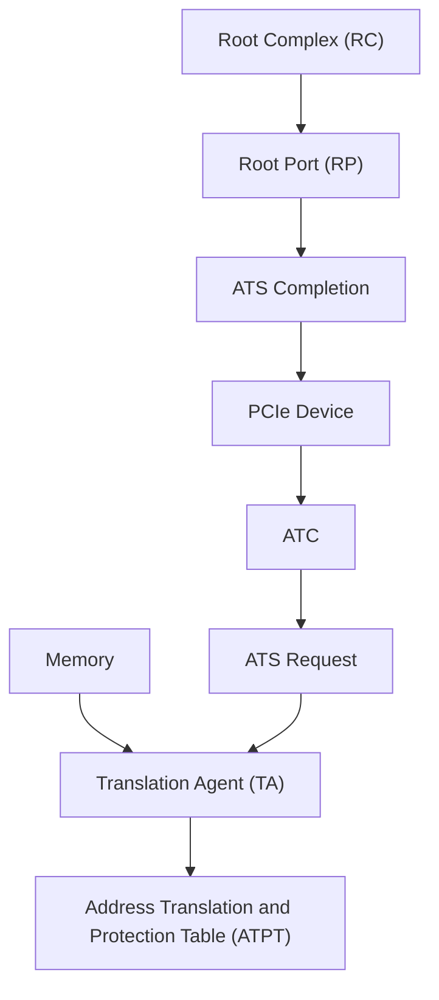
```mermaid
graph TD
  A["Memory"] --> B["Translation Agent (TA)"]
  B --> C["Address Translation and Protection Table (ATPT)"]
  D["Root Complex (RC)"] --> E["Root Port (RP)"]
  E --> F["ATS Completion"]
  F --> G["PCIe Device"]
  G --> H["ATC"]
  H --> I["ATS Request"]
  I --> B
```
</details>

Figure 10-2 Example ATS Translation Request/Completion Exchange§

In this example, a Function-specific work request is received by a single-Function PCIe Device. The Function determines through an implementation specific method that caching a translation within its ATC would be beneficial. There are a number of considerations a Function or software can use in making such a determination; for example:

• Memory address ranges that will be frequently accessed over an extended period of time or whose associated buffer content is subject to a significant update rate  
• Memory address ranges, such as work and completion queue structures, data buffers for low-latency communications, graphics frame buffers, host memory that is used to cache Function-specific content, and so forth

Given the variability in designs and access patterns, there is no single criteria that can be applied.

The Function generates an ATS Translation Request which is sent upstream through the PCIe hierarchy to the RC which then forwards it to the TA. An ATS Translation Request uses the same routing and ordering rules as defined in this specification. Further, multiple ATS Translation Requests can be outstanding at any given time; i.e., one may pipeline multiple requests on one or more TC. Each TC represents a unique ordering domain and defines the domain that must be used by the associated ATS Translation Completion.

Upon receipt of an ATS Translation Request, the TA performs the following basic steps:

1. Validates that the Function has been configured to issue ATS Translation Requests.  
2. Determines whether the Function may access the memory indicated by the ATS Translation Request and has the associated access rights.

3. Determines whether a translation can be provided to the Function. If yes, the TA issues a translation to the Function.

a. ATS is required to support a variety of page sizes to accommodate a range of ATPT and processor implementations.  
i. Page sizes are required to be a power of two and naturally aligned.  
ii. The minimum supported page size is 4096 bytes. ATS capable components are required to support this minimum page size.  
b. A Function must be informed of the minimum translation or invalidate size it will be required to support to provide the Function an opportunity to optimize its resource utilization. The smallest minimum translation size must be 4096 bytes.

4. The TA communicates the success or failure of the request to the RC which generates an ATS Translation Completion and transmits via a Response TLP through a RP to the Function.

a. An RC is required to generate at least one ATS Translation Completion per ATS Translation Request; i.e., there is minimally a 1:1 correspondence independent of the success or failure of the request.  
i. A successful translation can result in one or two ATS Translation Completion TLPs per request. The Translation Completion indicates the range of translation covered.  
ii. An RC may pipeline multiple ATS Translation Completions; i.e., an RC may return multiple ATS Translation Completions and these ATS Translation Completions may be in any order relative to ATS Translation Requests.  
iii. The RC is required to transmit the ATS Translation Completion using the same TC (Traffic Class) as the corresponding ATS Translation Request.  
b. The requested address may not be valid. The RC is required to issue a Translation Completion indicating that the requested address is not accessible.

When the Function receives the ATS Translation Completion and either updates its ATC to reflect the translation or notes that a translation does not exist. The Function proceeds with processing its work request and generates subsequent requests using either a translated address or an untranslated address based on the results of the Completion.

a. Similar to Read Completions, a Function is required to allocate resource space for each completion(s) without causing backpressure on the PCIe Link.  
b. A Function is required to discard Translation Completions that might be “stale”. Stale Translation Completions can occur for a variety of reasons.

As one can surmise, ATS Translation Request and Translation Completion processing is conceptually similar and, in many respects, identical to PCIe Read Request and Read Completion processing. This is intentional to reduce design complexity and to simplify integration of ATS into existing and new PCIe-based solutions. Keeping this in mind, ATS requires the following:

• ATS capable components must interoperate with [PCIe-1.1] compliant components.  
• ATS is enabled through a new Capability and associated configuration structure. To enable ATS, software must detect this Capability and enable the Function to issue ATS TLP. If a Function is not enabled, the Function is required not to issue ATS Translation Requests and is required to issue all DMA Read and Write Requests with the TLP AT field set to “untranslated”.  
• ATS TLPs are routed using either address-based or ID-based routing.  
• ATS TLPs are required to use the same ordering rules as specified in this specification.  
• ATS TLPs are required to flow unmodified through [PCIe-1.1] compliant Switches.  
• A Function is permitted to intermix translated and untranslated requests.

• ATS transactions are required not to rely upon the address field of a memory request to communicate additional information beyond its current use as defined by the PCI-SIG.

## IMPLEMENTATION NOTE: ADDRESS RANGE OVERLAP §

It is likely that the untranslated and translated address range will overlap, perhaps in their entirety. This is not a requirement of ATS but may be an implementation constraint on the TA so that memory requests will be properly routed.

In contrast to the prior example, § Figure 10-3 illustrates an example Multi-Function Device. In this example Device, there are three Functions. Key points to note in § Figure 10-3 are:

• Each ATC is associated with a single Function. Each ATS-capable Function must be able to source and sink at least one of each ATS Translation Request or Translation Completion type.  
• Each ATC is configured and accessed on a per Function basis. A Multi-Function Device is not required to implement ATS on every Function.  
• If the ATC implementation shares resources among a set of Functions, then the logical behavior is required to be consistent with fully independent ATC implementations.

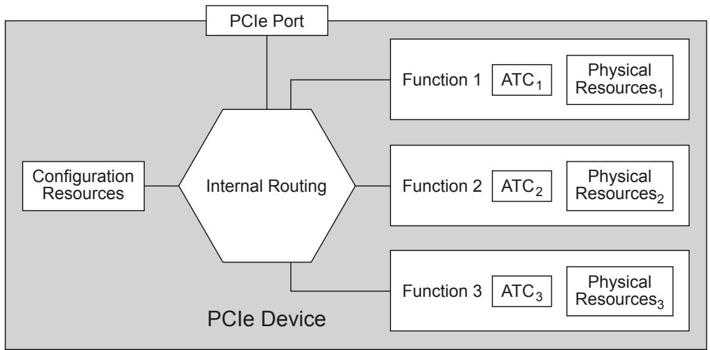

<details>
<summary>flowchart</summary>

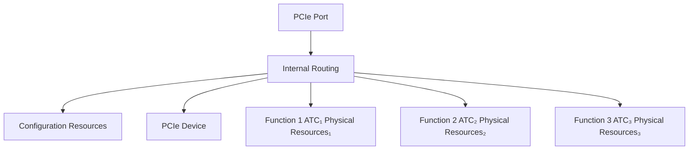
```mermaid
graph TD
  A["PCIe Port"] --> B["Internal Routing"]
  B --> C["Configuration Resources"]
  B --> D["PCIe Device"]
  B --> E["Function 1 ATC₁ Physical Resources₁"]
  B --> F["Function 2 ATC₂ Physical Resources₂"]
  B --> G["Function 3 ATC₃ Physical Resources₃"]
```
</details>

A-0592

Figure 10-3 Example Multi-Function Device with ATC per Function§

Independent of the number of Functions within a Device, the following are required:

• A Function is required not to issue any TLP with the AT field set unless the address within the TLP was obtained through the ATS Translation Request and Translation Completion protocol.

• Each ATC is required to only be populated using the ATS protocol; i.e., each entry within the ATC must be filled via an ATS Translation Completion in response to the Function issuing an ATS Translation Request for a given address.  
• Each ATC cannot be modified except through the ATS protocol. That is:

◦ Host system software cannot modify the ATC other than through the protocols defined in this specification except to invalidate one or more translations in an ATC. A Device or Function reset would be an example of an operation performed by software to change the contents of the ATC, but a reset is only allowed to invalidate entries not modify their contents.

◦ It must not be possible for host system software to use software executing on the Device to modify the ATC.

When a TA determines that a Function should no longer maintain a translation within its ATC, the TA initiates the ATS invalidation protocol. The invalidation protocol consists of a single Invalidation Request and one or more Invalidate Completions.

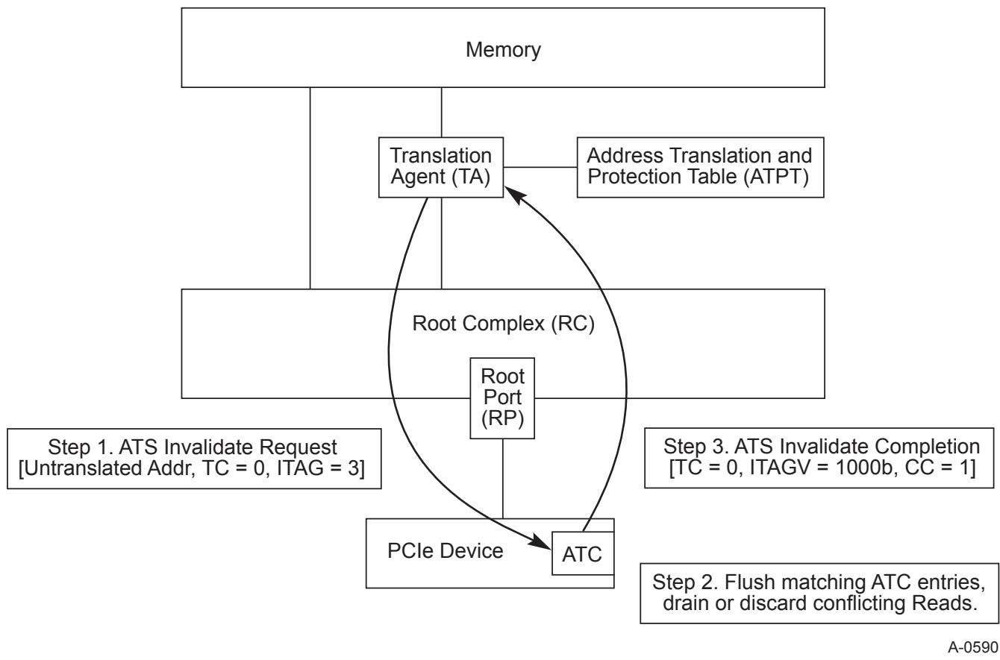

<details>
<summary>flowchart</summary>

```mermaid
graph TD
  A["Memory"] --> B["Translation Agent (TA)"]
  B --> C["Address Translation and Protection Table (ATPT)"]
  B --> D["Root Complex (RC)"]
  D --> E["Root Port (RP)"]
  E --> F["PCIe Device"]
  F --> G["ATC"]
  G --> H["Step 2. Flush matching ATC entries, drain or discard conflicting Reads."]
  D --> I["Step 3. ATS Invalidate Completion [TC = 0, ITAGV = 1000b, CC = 1"]]
  I --> J["Step 1. ATS Invalidate Request [Untranslated Addr, TC = 0, ITAG = 3"]]
```
</details>

Figure 10-4 Invalidation Protocol with a Single Invalidation Request and Completion§

As § Figure 10-4 illustrates, there are essentially three steps in the ATS Invalidation protocol:

1. The system software updates an entry in the tables used by the TA. After the table is changed, the TA determines that a translation should be invalidated in an ATC and initiates an Invalidation Request TLP which is transmitted from the RP to the example single-Function Device. The Invalidate Request communicates an untranslated address range, the TC, and an RP unique tag which is used to correlate Invalidate Completions with the Invalidation Request.

2. The Function receives the Invalidate Request and invalidates all matching ATC entries. A Function is not required to immediately flush all pending requests upon receipt of an Invalidate Request. If transactions are in a queue waiting to be sent, it is not necessary for the Function to expunge requests from the queue even if those transactions use an address that is being invalidated.

a. A Function is required not to indicate the invalidation has completed until all outstanding Read Requests or Translation Requests that reference the associated translated address have been retired or nullified.  
b. A Function is required to ensure that the Invalidate Completion indication to the RC will arrive at the RC after any previously posted writes that use the “stale” address.

3. When a Function has ascertained that all uses of the translated address are complete, it issues one or more ATS Invalidate Completions.

a. An Invalidate Completion is issued for each TC that may have referenced the range invalidated. These completions act as a flush mechanism to ensure the hierarchy is cleansed of any in-flight transactions which may contain references to the translated address.

i. The number of Completions required is communicated within each Invalidate Completion. A TA or RC implementation can maintain a counter to ensure that all Invalidate Completions are received before considering the translation to no longer be in use.  
ii. If more than one Invalidation Complete is sent, the Invalidate Completion sent in each TC must be identical in the fields detailed in § Section 10.3.2 .

b. An Invalidate Completion contains the ITAG from Invalidate Request to enable the RC to correlate Invalidate Requests and Completions.

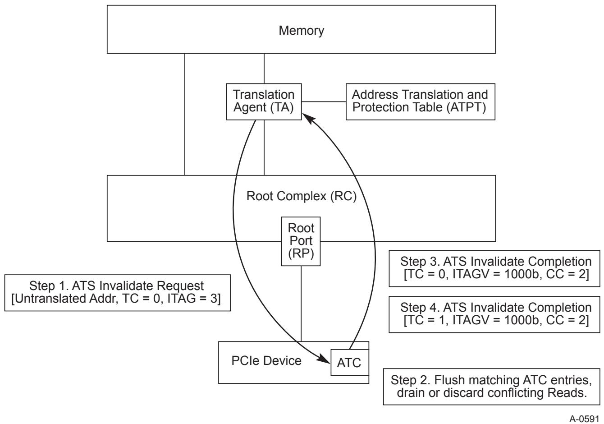

<details>
<summary>flowchart</summary>

```mermaid
graph TD
  A["Memory"] --> B["Translation Agent (TA)"]
  B --> C["Address Translation and Protection Table (ATPT)"]
  B --> D["Root Complex (RC)"]
  D --> E["Root Port (RP)"]
  E --> F["PCIe Device"]
  F --> G["ATC"]
  G --> H["Step 2. Flush matching ATC entries, drain or discard conflicting Reads."]
  D --> I["Step 1. ATS Invalidate Request [Untranslated Addr, TC = 0, ITAG = 3"]]
  D --> J["Step 3. ATS Invalidate Completion [TC = 0, ITAGV = 1000b, CC = 2"]]
  D --> K["Step 4. ATS Invalidate Completion [TC = 1, ITAGV = 1000b, CC = 2"]]
  A --> L["Ground"]
```
</details>

Figure 10-5 Single Invalidate Request with Multiple Invalidate Completions§

## 10.1.2 Page Request Interface Extension


ATS improves the behavior of DMA based data movement. An associated Page Request Interface (PRI) provides additional advantages by allowing DMA operations to be initiated without requiring that all the data to be moved into or out of system memory be pinned. 176 The overhead associated with pinning memory may be modest, but the negative impact on system performance of removing large portions of memory from the pageable pool can be significant.

PRI is functionally independent of the other aspects of ATS. That is, a device that supports ATS need not support PRI, but PRI is dependent on ATS’s capabilities.

Intelligent I/O devices can be constructed to make good use of a more dynamic memory interface. Pinning will always have the best performance characteristics from a device’s perspective-all the memory it wants to touch is guaranteed to be present. However, guaranteeing the residence of all the memory a device might touch can be problematic and force a sub-optimal level of device awareness on a host. Allowing a device to operate more independently (to page fault when it requires memory resources that are not present) provides a superior level of coupling between device and host. 177

The mechanisms used to take advantage of a Page Request Interface are very device specific. As an example of a model in which such an interface could improve overall system performance, let us examine a high-speed LAN device. Such a device knows its burst rate and need only have as much physical buffer space available for inbound data as it can receive within some quantum. A vector of unpinned virtual memory pages could be made available to the device, that the device then requests as needed to maintain its burst window. This minimizes the required memory footprint of the device and simplifies the interface with the host, both without negatively impacting performance.

The ability to page, begs the question of page table status flag management. Typical TAs associate flags (e.g., dirty and access indications) with each untranslated address. Without any additional hints about how to manage pages mapped to a Function, such TAs would need to conservatively assume that when they grant a Function permission to read or write a page, that Function will use the permission. Such writable pages would need to be marked as dirty before their translated addresses are made available to a Function.

This conservative dirty-on-write-permission-grant behavior is generally not a significant issue for Functions that do not support paging, where pages are pinned and the cost of saving a clean page to memory will seldom be paid. However, Functions that support the Page Request Interface could pay a significant penalty if all writable pages are treated as dirty, since such Functions operate without pinning their accessible memory footprints and may issue speculative page requests for performance. The cost of saving clean pages (instead of just discarding them) in such systems can diminish the value of otherwise attractive paging techniques. This can cause significant performance issues and risk functional issues in circumstances where the backing store is unable to be written, such as a CD-ROM.

The No Write (NW flag in Translation Requests indicates that a Function is willing to restrict its usage to only reading the page, independent of the access rights that would otherwise have been granted.

If a device chooses to request only read access by issuing a Translation Request with the NW flag Set and later determines that it needs to write to the page, then the device must issue a new Translation Request.

Upon receiving a Translation Request with the NW flag Clear, TAs are permitted to mark the associated pages dirty. Functions MUST@FLIT not issue such Requests unless they have been given explicit write permission. An example of write permission is where the host issues a command to a Function to load data from a storage device and write that data into memory.

## 10.1.3 Process Address Space ID (PASID) §

Certain TLPs can optionally be associated with a Process Address Space ID (PASID). This value is conveyed using the PASID TLP Prefix (NFM) or OHC-A1 (FM). The PASID TLP Prefix is defined in § Section 6.20 .

PASID is permitted for the following types of TLPs:

• Memory Requests (including AtomicOp Requests) with Address Type (AT) of Untranslated or Translated  
• Address Translation Requests (i.e., MRd with AT=01b)  
• Page Request Messages  
• ATS Invalidation Request Messages  
• PRG Response Messages

Usage of PASID for Untranslated Memory Requests is defined in § Section 6.20 . This section describes PASID for the remaining TLPs.

Each Function has an independent set of PASID values. The PASID field is 20 bits wide, although typically the number of active PASID values will be significantly lower than 2^20. PASID values may be allocated sparsely. If the usable width is constrained by the TA or the ATC, the unused upper bits of the PASID value must be 0b. All 2^usable\_width PASID values are usable. Function hardware is not permitted to assume there are “reserved” PASID values.

An ATC may optionally support Translated Requests with PASID. The Translated Requests with PASID feature is enabled when the Translated Requests with PASID Enable bit is Set. When Translated Requests with PASID Enable is Set, an ATC is permitted to issue Translated Requests with a PASID. When enabled, if the ATC obtained a translation using a Translation

Request with PASID, the corresponding Translated Request must carry the same PASID, and also the values for the Execute Requested and Privileged Mode Requested bits must match the Execute Permitted and Privileged Mode Access bit values, respectively, returned with the translation. Similarly, if the ATC obtained a translation using a Translation Request without a PASID, the corresponding Translated Request must not carry a PASID. If these rules are not followed the resulting system behavior is undefined.

## 10.1.4 ATS Memory Attributes §

ATS Memory Attributes (AMAs) provide hints for performing memory operations such as cache management. The AMAs may be supplied to an Endpoint device by a Translation Completion and stored in the ATC. If the ATS Memory Attributes Enable bit is Set, the Endpoint function retrieves the AMAs from the ATC and is permitted to provide AMAs with Memory Read/Write TLPs using the TPH TLP Prefix. This serves as a performance optimization by preventing the TA from having to perform a look-up. The TA and ATC are permitted to support AMAs. If the ATC does not support AMAs but the TA does, then the TA is permitted to perform a lookup to obtain AMAs when processing Memory Read/Write TLPs received from the Endpoint device. A TA that supports AMAs is permitted to always return AMAs in all ATS Translation Completions to all Endpoints.

## 10.2 ATS Translation Services §

A TA does translations. An ATC can cache those translations. If an ATC is separated from the TA by PCIe, the memory request from an ATC will need to be able to indicate if the address in the transaction is translated or not. The modifications to the memory transactions are described in this section, as are the transactions that are used to communicate translations between a remote ATC and a central TA.

When Shadow Functions are enabled, the TA must treat identically all Requests from the “main” Function and its Shadows (See Section 7.9.21). This usually involves ensuring that system software configures the translation tables used by the TA provide identical answers for the “main” Function and its Shadows. Depending on the architecture of a specific TA, more work may be required (e.g., managing dirty bits, ensuring caches are consistent, etc.). Such work is outside the scope of this specification.

## 10.2.1 Memory Requests with Address Type §

A Function with an ATC can send Memory Requests that contain either translated or untranslated addresses. The Address Type (AT) field is used to indicate the type of address that is present in the request header (see § Figure 10-6, § Figure 10-7, § Figure 10-8, and § Figure 10-9).

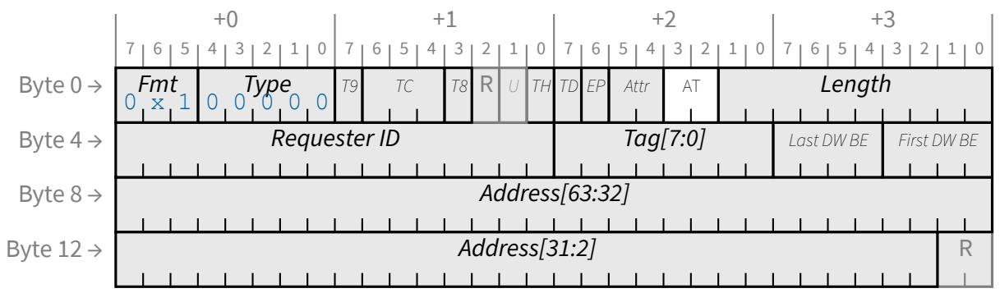

<details>
<summary>stacked bar chart</summary>

| Byte | Value |
| --- | --- |
| 0 | Fmt |
| 0 | x |
| 1 | Type |
| 0 | 0 |
| 0 | 0 |
| 0 | 0 |
| 0 | 0 |
| 0 | T9 |
| 0 | TC |
| 0 | T8 |
| 0 | R |
| 0 | U |
| 0 | TH |
| 0 | TD |
| 0 | EP |
| 0 | Attr |
| 0 | AT |
| 0 | Length |
| 4 | Requester ID |
| 4 | Address[63:32] |
</details>

Figure 10-6 Memory Request Header with 64-bit Address Highlighting AT Field§

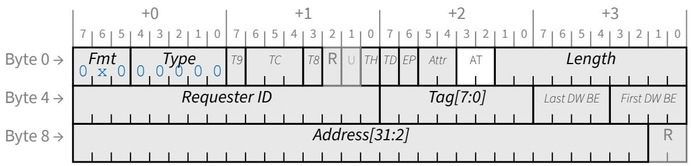

<details>
<summary>timing diagram</summary>

| Byte | Value |
|------|-------|
| 0    | +0    |
| 0    | 7     |
| 0    | 6     |
| 0    | 5     |
| 0    | 4     |
| 0    | 3     |
| 0    | 2     |
| 0    | 1     |
| 0    | 0     |
| 0    | 1     |
| 0    | 0     |
| 0    | 1     |
| 0    | 0     |
| 0    | 1     |
| 0    | 0     |
| 0    | 1     |
| 0    | 0     |
| 0    | 1     |
| 0    | 0     |
| 0    | 1       |
| 0    | 0       |
| 0    | 1       |
| 0    | 0       |
| 0    | 1       |
| 0    | 0       |
| 0    | 1       |
| 0    | 0       |
| 0    | 1       |
| 0    | 0       |
| 0    | 1       |
| 0    | 0       |
| 0    | 1       |
</details>

Figure 10-7 Memory Request Header with 32-bit Address Highlighting AT Field§

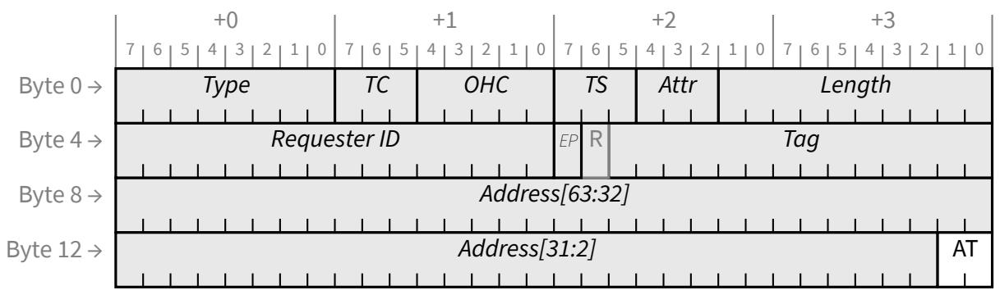

<details>
<summary>stacked bar chart</summary>

| Type |  | TC | OHC | TS | Attr | Length |
| --- | --- | --- | --- | --- | --- | --- |
| Requester ID |  |  |  | R | Tag |  |
| Address[63:32] |  |  |  |  |  |  |
| Address[31:2] |  |  |  |  |  |  |
|  | +0 | +1 | +2 | +3 |  |  |
|  | +1 | +2 | +3 |  |  |  |
|  | +2 |  |  |  |  |  |
|  | +3 |  |  |  |  |  |
|  |  |  |  |  |  |  |
|  |  |  |  |  |  |  |
|  |  |  |  |  |  |  |
|  |  |  |  |  |  |  |
|  |  |  |  |  |  |  |
|  |  |  |  |  |  |  |
|  |  |  |  |  |  | BT |
|  |  |  |  |  |  | BT |
</details>

Figure 10-8 Memory Request Header with 64-bit Address Highlighting AT Field - FLIT Mode§

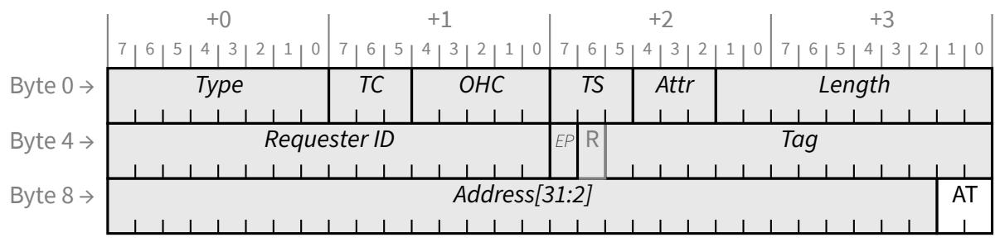

<details>
<summary>stacked bar chart</summary>

| Byte | Value |
|------|-------|
| 0    | +0    |
| 0    | +1    |
| 0    | +2    |
| 0    | +3    |
| Type | Type  |
| TC   | TC    |
| OHC  | OHC   |
| TS   | TS    |
| Attr | Attr  |
| Length | Length |
| Requester ID | Requester ID |
| EP   | EP    |
| R    | R     |
| Tag   | Tag   |
| Address[31:2] | Address[31:2] |
| AT   | AT    |
</details>

Figure 10-9 Memory Request Header with 32-bit Address Highlighting AT Field - FLIT Mode§

In NFM, the AT field in the Requests is a redefinition of a reserved field in earlier version of this specification.

Functions that do not implement an ATC will continue to set the AT field to its defined reserved value (00b). Functions that implement an ATC will set the AT field as listed in § Table 10-1.

Table 10-1 Address Type (AT) Field Encodings§

<table><tr><td>AT[1:0] Coding</td><td>Mnemonic</td><td>Meaning</td></tr><tr><td>00b</td><td>Untranslated</td><td>A TA may treat the address as either virtual or physical.</td></tr><tr><td>01b</td><td>Translation Request</td><td>The TA will return the translation of the address contained in the address field of the request as a read completion. This value only has meaning for an explicit Translation Request (see § Section 10.2.2). The TA will signal an Unsupported Request (UR) if it receives a TLP with the AT field set to 01b in a Memory Request other than Memory Read.</td></tr><tr><td>10b</td><td>Translated</td><td>The address in the transaction has been translated by an ATC. If the Function associated with the SourceID is allowed to present physical addresses to the system memory, then the TA might not translate this address. If the Function is not allowed to present physical addresses, then the TA may treat this as an UR.</td></tr><tr><td>11b</td><td>Reserved</td><td>The TA will signal an Unsupported Request (UR) if it receives a Memory Request TLP with the AT field set to 11b.</td></tr></table>

The AT field is only defined for Memory Requests. The field remains reserved for other TLPs.

## 10.2.2 Translation Requests §

A Translation Request has a format that is similar to that of a memory read. The AT field must be set to the value defined for "Translation Request" to differentiate a Translation Request from a normal Memory Read (see § Figure 10-10, § Figure 10-11, § Figure 10-12, and § Figure 10-13). In Flit Mode, OHC-A1 must be included, and the No Write (NW flag is contained in OHC-A1.

Translation Requests have the same completion timeout intervals as Read Requests.

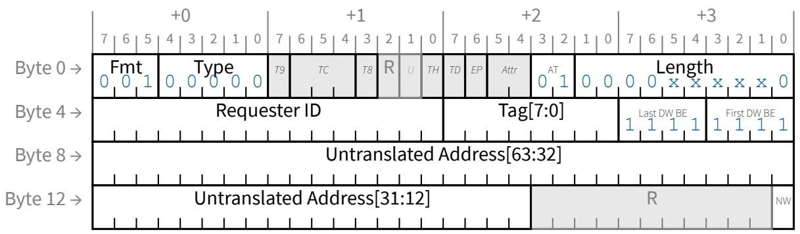  
Figure 10-10 Translation Request with 64-bit Address - Non-Flit Mode§

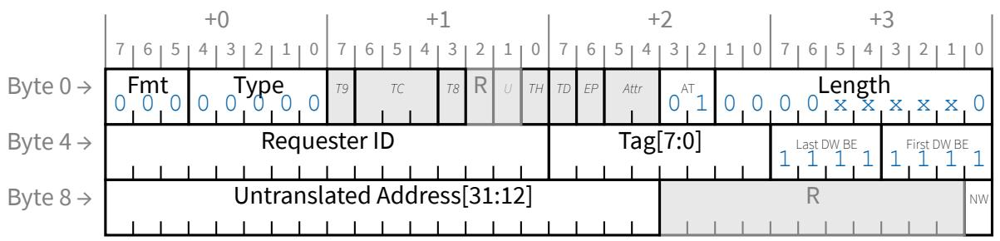

<details>
<summary>timing diagram</summary>

| Byte | Value |
|------|-------|
| 0    | 7     |
| 0    | 6     |
| 0    | 5     |
| 0    | 4     |
| 0    | 3     |
| 0    | 2     |
| 0    | 1     |
| 0    | 0     |
| 0    | +0    |
| 0    | +1    |
| 0    | +2    |
| 0    | +3    |
| 4    | Fmt   |
| 4    | Type  |
| 4    | T9    |
| 4    | TC    |
| 4    | T8    |
| 4    | R     |
| 4    | U     |
| 4    | TH    |
| 4    | TD    |
| 4    | EP    |
| 4    | Attr  |
| 4    | AT    |
| 4    | Length |
| 8    | Requester ID |
| 8    | Untranslated Address[31:12] |
| 8    | R     |
| 8    | NW    |
</details>

Figure 10-11 Translation Request with 32-bit Address - Non-Flit Mode§

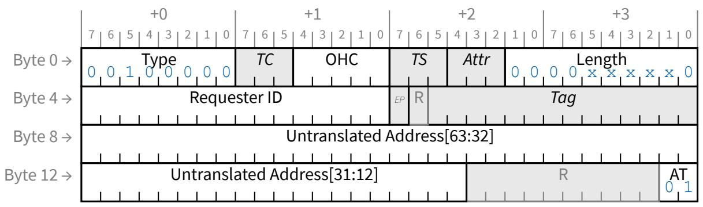

<details>
<summary>stacked bar chart</summary>

| Byte | Event Description | Value |
|------|-------------------|-------|
| 0    | Type              | TC    |
| 0    | Requester ID      | EP    |
| 4    | Length            | Attr  |
| 8    | Untranslated Address[63:32] | R     |
| 12   | Untranslated Address[31:12] | AT    |
</details>

Figure 10-12 Translation Request with 64-bit Address - Flit Mode 178§

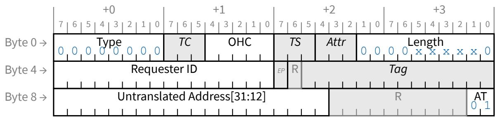

<details>
<summary>timing diagram</summary>

| Byte | Type | TC | OHC | TS | Attr | Length | Requester ID | Tag | Untranslated Address[31:12] | R | AT |
|------|------|----|-----|----|------|--------|--------------|-----|-----------------------------|---|----|
| 0    | 7    | 0  | 0   | 0  | 0    | 0      | 0            | 0   | 0                           | 0 | 0  |
| 6    | 6    | 0  | 0   | 0  | 0    | 0      | 0            | 0   | 0                           | 0 | 0  |
| 5    | 5    | 0  | 0   | 0  | 0    | 0      | 0            | 0   | 0                           | 0 | 0  |
| 4    | 4    | 0  | 0   | 0  | 0    | 0      | 0            | 0   | 0                           | 0 | 0  |
| 3    | 3    | 0  | 0   | 0  | 0    | 0      | 0            | 0   | 0                           | 0 | 0  |
| 2    | 2    | 0  | 0   | 0  | 0    | 0      | 0            | 0   | 0                           | 0 | 0  |
| 1    | 1    | 0  | 0   | 0  | 0    | 0      | 0            | 0   | 0                           | 0 | 0  |
| 0    | +1   | -1 | -1  | -1 | -1   | -1     | -1           | -1  | -1                          | -1| -1 |
| +2   | +2   | -2 | -2  | -2 | -2   | -2     | -2           | -2  | -2                          | -2| -2 |
| +3   | +3   | -3 | -3  | -3 | -3   | -3     | -3           | -3  | -3                          | -3| -3 |
| Type (Type)        Type         TCR          OHC          TS           Attr          Length         Requester ID       Tag           Untranslated Address[31:12]        R             AT
Byte 4 →        Requester ID        EP                 Tag                   R                   AT
Byte 8 →        Untranslated Address[31:12]                AT                     AT
</details>

Figure 10-13 Translation Request with 32-bit Address - Flit Mode 179§

## 10.2.2.1 Attribute Field §

For a Translation Request, the Relaxed Ordering (RO) bit is applicable and permitted to be Set, where it affects the ordering of its associated Translation Completions. The remainder of the Attr field is Reserved. The Requester of a Translation Request must not depend on the TA to guarantee any specific ordering relationship between Translation Completions and any other Requests or Completions. There are no ordering requirements for a Translation Request. A TA may reorder a Translation Request with respect to any other request.

## IMPLEMENTATION NOTE: TRANSLATION REQUEST ORDERING §

Because no ordering can be assumed between Translation Requests and other types of Requests, a Translation Request does not make an effective flushing/ordering primitive.

## 10.2.2.2 Length Field §

The Length field is set to indicate how many translations may be returned in response to this request. Each translation is 8 bytes in length and represents one or more STUs (Smallest Translation Unit). The maximum setting for the Length field is the RCB of the Root Port as determined by Read Completion Boundary (RCB) in the Link Control Register. The Length field in a Translation Request must always indicate an even number of DWORDs. If Length is set to indicate a value greater than allowed, or if the least-significant bit of the Length field is non-zero, then the TA will treat the request as a Malformed Packet.

If the Length field has a value greater than two, then the Function is requesting translations for a range of memory greater than a single STU. The additional translations, if provided, are assumed to be for sequentially-increasing, equal-sized, STU-aligned regions, starting at the requested address.

## 10.2.2.3 Tag Field §

The Tag field has the same meaning as in a Memory Read Request.

## 10.2.2.4 Untranslated Address Field §

A Translation Request includes either a 32-bit or a 64-bit Untranslated Address field. This field indicates the address to be translated. The TA will make decisions about the validity of the request, based on the address in the translation request. The TA is permitted to return fewer translations than requested, but it will not return more.

When multiple translations are requested, the TA will not return a translation if the range of that translation does not overlap the implied range of the Translation Request (this would only apply to translations after the initial value). The implied range of the Translation Request is [2STU+12 \* (Length/2)] bytes.

The Untranslated Address field in the Translation Request is any address in the range of the first STU. Address bits 11:0 are not present in the Translation Request and are implied to be zero. If a Requester has Page Aligned Request Set (see § Section 7.8.9.2 ), it must ensure that bits 11:2 are zero. If a Requester has Page Aligned Request Clear, it is permitted to supply any value for bits 11:2. 180 The TA must ignore bits 11:2 as well as any low-order bits not required to determine the translation.

For example, if using 64-bit addressing for a Function with the Page Aligned Request bit Set that is programmed with an STU of 1 (i.e., 8192-byte pages), bits 63:13 are significant, bit 12 is ignored by the TA and bits 11:0 are implied to be zero.

## 10.2.2.5 No Write (NW) Flag §

The No Write flag, when Set, indicates that the Function is requesting read-only access for this translation. 181

The TA may ignore the No Write Flag, however, if the TA responds with a translation marked as read-only then the Function must not issue Memory Write transactions using that translation. In this case, the Function may issue another translation request with the No Write flag Clear, which may result in a new translation completion with or without the W (Write) bit Set.

Upon receiving a Translation Request with the NW flag Clear, TAs are permitted to mark the associated pages dirty. Functions MUST@FLIT not issue such Requests unless they have been given explicit write permission.

In Flit Mode, the NW bit is part of OHC-A1.

## 10.2.2.6 PASID on Translation Request §

If a Translation Request has a PASID, the Untranslated Address Field is an address within the process address space indicated by the PASID field.

If a Translation Request has a PASID with either the Privileged Mode Requested or Execute Requested bit Set, these may be used in constructing the Translation Completion Data Entry.

The PASID Extended Capability indicates whether a Function supports and is enabled to send and receive TLPs with the PASID.

## 10.2.3 Translation Completion §

A Translation Completion (either a Cpl or a CplD) is sent by a TA for each Translation Request. This specification describes the meaning of fields in Translation Completions. Fields not defined in this chapter have the same meanings proscribed for Read Completions in Chapter 2. For a Translation Completion, the Relaxed Ordering (RO) bit is applicable and permitted to be Set if the corresponding Translation Request RO bit was set. The remainder of the Attr field is Reserved.

If the TA was not able to perform the requested translation, a Completion with no data (Cpl) must be returned.

## IMPLEMENTATION NOTE: BYTE COUNT FIELD FOR UNSUCCESSFUL TRANSLATION COMPLETIONS WITH NO DATA §

Previous versions of this specification indicated the Byte Count and Lower Address field should be 0000 0000 0000b for Unsuccessful Translation Completions with No Data. It is strongly recommended that implementations do not depend on the Byte Count and Lower Address field being set to any particular value in Unsuccessful Translation Completions with No Data.

Note that in Flit Mode, the Byte Count and Lower Address Fields are not present.

The values and meaning for the Completion Status field are listed in § Table 10-2, where return values other than Success indicate an error.

Table 10-2 Translation Completion with No Data Status Codes§

<table><tr><td>Value</td><td>Status</td><td>Meaning</td></tr><tr><td>000b</td><td>Success</td><td>This Completion Status has a nominal meaning of “success”. The TA will not return this value in a Cpl.</td></tr><tr><td>001b</td><td>Unsupported Request (UR)</td><td>Translation Requests from this Function are not supported by the TA. If a Function receives this Completion code, it must disable its ATC and not send requests using translated addresses until the ATC is re-enabled. For transactions the Function may internally have in flight, the Function may either terminate or complete them. The mechanism a Function receiving this code uses to report this condition is outside the scope of this specification. The TA detecting this error is a &quot;Completer Sending a Completion with UR/CA Status&quot; and shall behave as defined in this specification.</td></tr><tr><td>010b</td><td>RRS</td><td>This value is not allowed in any Completion to a Translation Request initiated by a PCI Express Function. If received by a Function, it shall be treated as a Malformed TLP.</td></tr><tr><td>100b</td><td>Completer Abort (CA)</td><td>The TA was not able to translate the address because of an error in the TA. This nominally causes an error to be reported to the device driver associated with the ATC. See AER in this specification.</td></tr><tr><td>All others</td><td>Reserved</td><td>A Translation Completion with a Reserved Completion Status value is treated as if the Completion Status was Unsupported Request (001b).</td></tr></table>

Completion header fields must be set in accordance with § Section 2.2.9 and § Section 2.3 .

Translation Completions must be sent using the same TC as the Translation Request. The Function is not required to verify that the same TC was used. A TA may optionally copy the RO bit of a Translation Request to the Translation Completion in accordance to the rule specified for the attribute field of completions in § Section 2.2.9 . It is strongly recommended that the TA copy the RO bit. However, if a TA does not copy the RO bit of a Translation Request to the Translation Completion, the TA must clear the RO bit in the Translation Completion.

A Translation Completion with RO Set must follow the ordering rules for Relaxed Ordered Completions as specified in § Section 2.4.1 . A Function that initiates a Translation Request with the RO bit Set but receives the associated Translation Completion with the RO bit Clear is permitted to order associated Translation Completions as if the RO bit is Set.

A Function that initiates a Translation Request with the RO bit Set, must not report an error if the associated Translation Completion has the RO bit Clear.

## IMPLEMENTATION NOTE:

## ATTRIBUTE FIELD COMPATIBILITY IN TRANSLATION COMPLETIONS

Some implementations of TA may not copy the Attribute field from the request to the completion as required by § Section 2.2.9 , since the Attr field is defined as Reserved in previous versions of this specification. Therefore, the following situations may occur and are handled as follows:

• A TA that does not copy the RO bit (as is typically done for completions as indicated in § Section 2.2.9 ) by forcing RO to 0 is coupled with a Function conforming to this specification that allows RO to be Set in the request. The Function will accept a Translation Completion with RO Clear and not log an error.  
• A TA that conforms to the Attr copy rule (in § Section 2.2.9 ) is coupled with a Function that does not support RO in Translation Requests. Translation Completions will return with RO Clear as the Function expects.

Therefore, the use of RO is made fully backward compatible. However, it is strongly recommended that the TA support the copy of the RO bit conforming to the rules in § Section 2.2.9 .

The Lower Address field contains a computed value that makes the packet consistent with RCB semantics. If the result is returned in a single packet, Lower Address contains RCB minus Byte Count. If the results are returned in two packets, Lower Address for the first packet contains RCB minus (Total Completion Length \* 4) Lower Address for subsequent packets contains 000 0000b. See § Section 10.2.4 for additional requirements for multiple packet completions.

If the Completion Status field is 000b, then the translation was successful and a data payload will follow the header. The contents of the data payload are shown in § Figure 10-14.

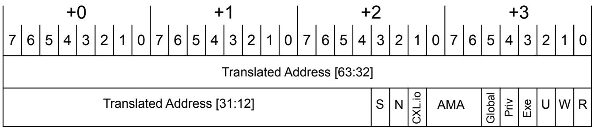

<details>
<summary>table</summary>

| Position | Value |
|---|---|
| +0 | 7 |
| +0 | 6 |
| +0 | 5 |
| +0 | 4 |
| +0 | 3 |
| +0 | 2 |
| +0 | 1 |
| +0 | 0 |
| +1 | 7 |
| +1 | 6 |
| +1 | 5 |
| +1 | 4 |
| +1 | 3 |
| +1 | 2 |
| +1 | 1 |
| +1 | 0 |
| +2 | 7 |
| +2 | 6 |
| +2 | 5 |
| +2 | 4 |
| +2 | 3 |
| +2 | 2 |
| +2 | 1 |
| +2 | 0 |
| +3 | 7 |
| +3 | 6 |
| +3 | 5 |
| +3 | 4 |
| +3 | 3 |
| +3 | 2 |
| +3 | 1 |
| +3 | 0 |
| Translated Address [63:32]<lcel><nl>
<fcel>Translated Address [31:12]<lcel><nl>
<ecel><fcel>S<nl>
<ucel><fcel>N<nl>
<ucel><fcel>CXL.io<nl>
<ucel><fcel>AMA<nl>
<ucel><fcel>Global<nl>
<ucel><fcel>Priv<nl>
<ucel><fcel>Exe<nl>
<ucel><fcel>U<nl>
<ucel><fcel>W<nl>
<ucel><fcel>R<nl>
</details>

A-0583B

Figure 10-14 Translation Completion Data Entry§  
Table 10-3 Translation Completion Data Fields§

<table><tr><td>Field</td><td colspan="2">Meaning</td></tr><tr><td>S</td><td colspan="2">Size of translation- This field is 0b if the translation applies to a 4096-byte range of memory. If this field is 1b, then the translation applies to a range of memory that is larger than 4096 bytes (see § Section 10.2.3.1).</td></tr><tr><td>N</td><td colspan="2">Non-snooped accesses- If this field is 1b, then the read and write requests that use this translation must Clear the No Snoop bit in the Attribute field. If it is 0b, then the Function may use other means to determine if No Snoop should be Set.</td></tr><tr><td>CXL.io</td><td colspan="2">This bit is Reserved for use by [CXL]. In non-CXL systems, this bit is Reserved.</td></tr><tr><td rowspan="3">AMA</td><td colspan="2">ATS Memory Attributes</td></tr><tr><td>AMA</td><td>ATS Memory Attributes</td></tr><tr><td>000b - 111b</td><td>ATS Memory Attribute values (implementation specific). The default value is 000b.</td></tr><tr><td>Global</td><td colspan="2">Global Mapping- If this bit is Set, the ATC is permitted to cache this mapping entry in all PASIDs. If Clear, the ATC is permitted to cache this mapping entry only in the PASID associated with the requesting PASID. This bit may only be Set if the associated Translation Request had a PASID.</td></tr><tr><td>Exe</td><td colspan="2">Execute Permitted- If this bit is Set, the requesting Function is permitted to execute code contained in the associated memory range.This bit may be Set only if the associated Translation Request had the Execute Requested bit Set. If this bit is Set, R must also be Set.The Priv bit indicates the Privilege level associated with the Exe bit. If Priv is Set, the Exe bit indicates permissions associated with Privileged Mode entities in the Function. If Priv is Clear, the Exe bit indicates permissions associated with Non- Privileged Mode entities in the Function.This value may be cached if R is Set.</td></tr><tr><td>Priv</td><td colspan="2">Privileged Mode Access- If this bit is Set, R, W and Exe refer to permissions associated with Privileged Mode entities. If this bit is Clear, R, W and Exe refer to permissions associated with Non-Privileged Mode entities.This bit may only be Set if the associated Translation Request had the Privileged Mode Requested bit Set.This value must be cached any of the R, W or Exe values are cached.</td></tr><tr><td>U</td><td colspan="2">Untranslated access only- When this field is Set, the indicated range may only be accessed using untranslated addresses, and the Translated Address field of this Translation Completion Data Entry may not be used in a subsequent Read/Write Request with AT set to Translated. This value may be cached if R or W is Set.</td></tr><tr><td>R,W</td><td colspan="2">Read, Write- These two fields indicate the transaction types that are allowed for requests using the translation. The encodings are:00b Neither read nor write transactions are allowed. This translation is considered not to be valid. The contents of the Translated Address, N, AMA, U, and Exe fields are undefined. A translation with this value must not be cached in the ATC (see § Section 10.2.3.5).01b Write Requests that target this range are allowed, but Read Requests are not unless they are zero-length reads.10b Read Requests that target this range are allowed (including zero-length reads), but Write Requests are not.11b Read and Write Requests that target this range are allowed.The Priv bit indicates the Privilege level associated with R and W. If Priv is Set, R and W indicate permissions associated with Privileged Mode entities in the Function. If Priv is Clear, R and W indicate permissions associated with Non- Privileged Mode entities in the Function.If AMA is enabled (AMAE bit is 1b), a zero-length Read Request using a translated address must include AMAs in the TPH TLP Prefix.</td></tr></table>

## 10.2.3.1 Translated Address Field §

If the R and W fields are both Clear, or if U is Set, then the Translated Address field may not be used by the Function for any purpose.

If either the R or W field is Set, and the U field is Clear, then the Translated Address field contains an address that can be used by the Function in a Memory Request with the AT field set to Translated and the Function may cache the Translated Address. When cached, the R and W fields must be stored with the same value as the Translation Completion entry. The address that is cached must be a subset of the address range indicated in the Translation Completion (the subset may include the entire range).

While the Translated Address is cached in the Function’s ATC, it shall not be possible for the Function to modify the entry other than to delete it. The entry must be deleted from the ATC when an Invalidation Request is received that has an indicated range that overlaps any portion of the cached address.

A Function is not allowed to make an entry into its ATC unless the entry is in a Translation Completion and the E (Enable) field within the ATS Capability is Set. Entries in an ATC cache that are written before the E field is Set must not be used in Memory Request. They must either be invalidated when the E field is Set or ignored and not used.

## 10.2.3.2 Translation Range Size (S) Field §

If S is Set, then the translation applies to a range that is larger than 4096 bytes. If S = 1b, then bit 12 of the Translated Address is used to indicate whether or not the range is larger than 8192 bytes. If bit 12 is 0b, then the range size is 8192 bytes, but it is larger than 8192 bytes if Set. If S = 1b and bit 12 = 1b, then bit 13 is used to determine if the range is larger than 16384 bytes or not. If bit 13 is 0b, then the range size is 16384 bytes, but it is larger than 16384 bytes if Set.

Low-order address bits are consumed in sequence to indicate the size of the range associated with the translation.

Note: This encoding method is also used to indicate the size of the memory range being invalidated.

Examples for different translation sizes are shown in § Table 10-5.

Table 10-5 Examples of Translation Size Using S Field§

<table><tr><td colspan="22">Address Bits</td><td rowspan="2">S</td><td rowspan="2">Translation Range Size in Bytes</td></tr><tr><td>63:32 *</td><td>31</td><td>30</td><td>29</td><td>28</td><td>27</td><td>26</td><td>25</td><td>24</td><td>23</td><td>22</td><td>21</td><td>20</td><td>19</td><td>18</td><td>17</td><td>16</td><td>15</td><td>14</td><td>13</td><td>12</td><td></td></tr><tr><td>x</td><td>x</td><td>x</td><td>x</td><td>x</td><td>x</td><td>x</td><td>x</td><td>x</td><td>x</td><td>x</td><td>x</td><td>x</td><td>x</td><td>x</td><td>x</td><td>x</td><td>x</td><td>x</td><td>x</td><td>x</td><td>x</td><td>0</td><td>4 K</td></tr><tr><td>x</td><td>x</td><td>x</td><td>x</td><td>x</td><td>x</td><td>x</td><td>x</td><td>x</td><td>x</td><td>x</td><td>x</td><td>x</td><td>x</td><td>x</td><td>x</td><td>x</td><td>x</td><td>x</td><td>x</td><td>x</td><td>0</td><td>1</td><td>8 K</td></tr><tr><td>x</td><td>x</td><td>x</td><td>x</td><td>x</td><td>x</td><td>x</td><td>x</td><td>x</td><td>x</td><td>x</td><td>x</td><td>x</td><td>x</td><td>x</td><td>x</td><td>x</td><td>x</td><td>x</td><td>0</td><td>1</td><td>1</td><td>16 K</td><td></td></tr><tr><td>x</td><td>x</td><td>x</td><td>x</td><td>x</td><td>x</td><td>x</td><td>x</td><td>x</td><td>x</td><td>x</td><td>x</td><td>0</td><td>1</td><td>1</td><td>1</td><td>1</td><td>1</td><td>1</td><td>1</td><td>1</td><td>1</td><td>2 M</td><td></td></tr><tr><td>x</td><td>x</td><td>x</td><td>0</td><td>1</td><td>1</td><td>1</td><td>1</td><td>1</td><td>1</td><td>1</td><td>1</td><td>1</td><td>1</td><td>1</td><td>1</td><td>1</td><td>1</td><td>1</td><td>1</td><td>1</td><td>1</td><td>1 G</td><td></td></tr><tr><td>x</td><td>0</td><td>1</td><td>1</td><td>1</td><td>1</td><td>1</td><td>1</td><td>1</td><td>1</td><td>1</td><td>1</td><td>1</td><td>1</td><td>1</td><td>1</td><td>1</td><td>1</td><td>1</td><td>1</td><td>1</td><td>1</td><td>4 G</td><td></td></tr></table>

<table><tr><td colspan="21">Address Bits</td><td rowspan="2">S</td><td rowspan="2">Translation Range Size in Bytes</td></tr><tr><td>63:32 *</td><td>31</td><td>30</td><td>29</td><td>28</td><td>27</td><td>26</td><td>25</td><td>24</td><td>23</td><td>22</td><td>21</td><td>20</td><td>19</td><td>18</td><td>17</td><td>16</td><td>15</td><td>14</td><td>13</td><td>12</td></tr></table>

Note:  
\* Upper address bits are used to indicate the size for ranges larger than 4 GB.

The size field is set to indicate the range size in multiples of 4096 bytes regardless of the setting of STU. For example, if STU is set to indicate that the minimum translation is 8192 bytes, then S should be Set on all translation returned in a Translation Completion and in all Invalidate Requests. If STU is set to indicate a 16384-byte minimum, then S and bit 12 would both be Set in all translation and invalidate ranges.

If S is Set and bits 63:12 are all 1b, then the behavior is undefined. If S is Set and bit 63 is 0b, and bits 62:12 are all 1b, then the request is to invalidate all translations.

If a Function receives a Translation Completion with a Translation Size field smaller than the Function’s programmed STU value, it shall treat the Translation Completion as if it had Completion Status UR.

## 10.2.3.3 Non-snooped (N) Field §

This field is Set to indicate that Read and Write Requests that target memory in the range of this translation must Clear the No Snoop Attribute bit in the Request header. When this field is 0b, the Function is allowed to Set the No Snoop Attribute bit in a Function-specific manner.

Note: When this field is Cleared, the Function is not allowed to Set No Snoop in a Memory Request if the Enable No Snoop field in the Device Control register is Cleared.

The N bit may be cached by the ATC if either R or W is Set.

When U is Set, the meaning of this field is undefined, and the TA may set this field to any value. A translation has a single value for the N field that is not affected by privilege level. An ATC is permitted to cache the N field without regard to the value of the Priv bit.

## 10.2.3.4 Untranslated Access Only (U) Field §

This field is Set when the Function is not allowed to access the implied range of memory using a translated address (the range is implied by the untranslated address in the Translation Request and the offset of the translation in the Translation Completion). The Function may use untranslated addresses to access the range as long as the accesses are allowed by the R and W fields. The Function may cache this translation value if either R or W is Set. If the U field is Set, the Translated Address field in the translation is not necessarily a valid memory address and the Function may not use the value in a Read or Write Request with AT set to Translated.

Note: One of the possible uses of this field is to avoid unnecessary invalidations. If a Function uses translated requests for some portions of memory, but not others, then the U field can be used on the portions for which translated requests are not used. When a translation changes if the U field is Set, then it will not necessarily be required that an Invalidate Request be sent to the Function. An example of this use is a Function with a ring buffer that is used for commands. The ring buffer may be allocated for a long period of time and have very high re-use (locality). For this reason, it is useful for the Function to use translated addresses in its memory request that target the command buffer. The same Function might access data buffers that have poor locality and low reuse. Accesses to the data buffers might best be handled by using untranslated Requests. Setting the U field for the data buffer translations ensures that the Function will not attempt to use a translated value to access the data buffer so, when the data buffer mappings are changed, no Invalidation Request is required. When U is Set and either R or W is Set, the ATC is permitted to cache U, R, W Exe, and Priv, as well as the Translation Range Size (see § Section 10.2.3.2 ). An Invalidation Request is required if these values change.

## 10.2.3.5 Read (R) and Write (W) Fields §

These fields indicate if the returned translation value may be used in a read or write memory request. The ATC is not permitted to issue a non-zero length read request using the translation value if the R field is Cleared. The ATC is not permitted to issue a write request using the translation value if the W field is Cleared. The ATC may not issue any type of request using the translation value if neither the R nor W fields are Set. If both R and W fields are Cleared, the range of the translation is still indicated, but the meaning of the other values in the translation is undefined.

Note: The range of a Translation entry is indicated even if R = W = 0b in order to allow a “hole” in the Translation Completion. For example, if the Translation Request has a Length of six DWs, then up to three translations could be included in the Translation Completion. The first and third translations may have Set R or W but the second could have R = W = 0b. To avoid ambiguity about the size of the indicated gap, the range of the gap is indicated in the Translation Completion even if R = W = 0b.

The R = 0b, W = 0b state is used to indicate that the ATC is not permitted to use address field in the translation to form a translated address value for a subsequent request.

When the host changes a translation in the TA from not valid to valid, the host is not required to send an invalidation indication to the ATC. As such the ATC will not be notified of such changes and thus the ATC is not permitted to cache a translation value of R = W = 0b.

When the host changes permissions associated with a translation in the TA, to grant additional permission (e.g., R = 1,W = 0b to R = W = 1b), the host is not required to send an invalidation indication to the ATC. As such, the ATC will not be notified of such changes. When the ATC requires permissions greater than the cached ATC entry, the ATC is permitted to request a fresh translation.

When the host changes permissions associated with a translation in the TA, to remove permission (e.g., R = W = 1b to R = 1b, W = 0b), the host is required to send an invalidation indication to the ATC. The subsequent invalidation completion tells the host that the ATC has stopped using the previously granted permissions.

If no table entry is found for the requested address, the TA must return a CplD with a single translation value with R = W = 0b.

Note: Implementations should not assume that receiving a translation response with the R or W bits Set (independent of the value of the U bit) implies that a subsequent read or write request with the same untranslated address will succeed. Although it may be possible for a device and its controlling software to ensure this property, the method for doing so is outside the scope of this specification.

When ACS Direct Translated P2P is enabled, Translated and Untranslated requests may take different paths between Requester and Completer. As such, PCI Express Ordering between Translated and Untranslated requests is not guaranteed. For transaction sequences that require ordering, Functions should avoid using a mixture of Translated and Untranslated Requests.

The Priv bit is used to qualify R and W. If Priv is Set, R and W indicate permissions granted to Privileged Mode entities in the Function. If Priv is Clear, R and W indicate permissions granted to Non-Privileged Mode entities in the Function. The R and W values for the two privilege levels are independent. The ATC must not assume any correlation between the Privileged Mode and Non-Privileged Mode permissions associated with a translation.

## 10.2.3.6 Execute Permitted (Exe) §

If Exe is Set, the requesting Function is permitted to execute code in the implied range of memory. If Exe is Clear, the requesting Function is not permitted to execute code in the implied range of memory.

The definition of what it means for a Function to execute code is outside the scope of this specification. Various system components may have different instruction sets. Behavior within the requesting Function when it attempts to execute code that is not permitted by this bit is outside the scope of this specification.

The Exe bit may only be Set the TA supports Execute permissions, the associated Translation Request had an effective value of 1b for the Execute Requested bit 182 and R is Set in the Translation Completion Data Entry. Otherwise, the Exe bit must be Clear.

This value may be cached if R is Set.

The Priv bit is used to qualify the Exe bit. If Priv is Set, the Exe bit indicates permission granted to Privileged Mode entities in the Function. If Priv is Clear, the Exe bit indicates permission granted to Non-Privileged Mode entities in the Function. The Exe bit values for the two privilege levels are independent. The ATC must not assume any correlation between the Privileged Mode and Non-Privileged Mode permissions associated with a translation.

Functions may optionally check that:

• If the Execute Requested bit is Clear in a Translation Request, the Exe bits in the associated Translation Completion Data Entries are also Clear.  
• If Exe is Set, R is also Set.

If either optional check fails, the Function shall signal Unexpected Completion (UC). These checks are independently optional.

## 10.2.3.7 Privileged Mode Access (Priv) §

If Priv is Set, R, W, and Exe refer to permissions granted to entities operating in Privileged Mode in the requesting Function. If Priv is Clear, R, W, and Exe refer to permissions granted to entities operating in Non-Privileged Mode in the requesting Function.

The meaning of Privileged Mode and Non-Privileged Mode and what it means for an entity to be operating as in Privileged Mode or in Non-Privileged Mode depends on the protection model of the system and is outside the scope of this specification.

Behavior is outside the scope of this specification when an entity in the requesting Function attempts to access memory that it is not permitted to access.

The Priv bit may only be Set if the TA supports Privileged Mode and the associated Translation Request had a PASID TLP Prefix (NFM) or OHC-A1 with an effective value of 1b for the Privileged Mode Requested 183 bit. Otherwise, the Priv bit must be Clear.

The Privileged and Non-Privileged Mode versions of R, W and Exe are independent. An ATC may cache either or both versions of R, W and Exe. An ATC that receives a translation with R=W=0b for one privilege level may not assume anything about what it might receive for the other privilege level.

This value may be cached if R or W is Set. This value must be cached when the corresponding R, W, or Exe values are cached.

Note: Since the Priv bit is Set only when the requesting Function Sets the Privileged Mode Requested bit, Functions that never set that bit should always receive the Priv bit Clear and thus don’t need to cache it.

Functions may optionally check that when the Privileged Mode Requested bit is Clear in a Translation Request, the Priv bits in the associated Translation Completion Data Entries are also Clear. If this optional check fails, the Function shall signal Unexpected Completion (UC).

## IMPLEMENTATION NOTE:

## EXECUTE PERMISSION AND PRIVILEGE MODE ENFORCEMENT

§

The requesting Function determines whether a particular Memory Request needs Execute permission or is associated with a Privileged Mode or Non-Privileged Mode entity. The ATC implements the protection checks indicated by the Exe and Priv bits.

## 10.2.3.8 Global Mapping (Global) §

If Global is Set, the requesting Function is permitted to create a Global Mapping entry in the ATC for this translation. If Global is Clear, the requesting Function is not permitted to create a Global Mapping entry in the ATC for this translation. Global Mapping entries apply to all PASIDs of the Function. They permit the ATC to reduce the number of translation requests needed and to reduce the memory needed for caching the results.

A Function is permitted to ignore this bit and always create non-Global Mapping entries in the ATC. This could result in multiple translations being requested for the same Untranslated Address under different PASIDs.

Functions that use this bit must also have the Global Invalidate Supported bit Set (see § Section 10.5.1.2 ).

## IMPLEMENTATION NOTE:

## TLP LENGTH, ADDRESS, AND BYTE OFFSET VALUES FOR TRANSLATION REQUEST COMPLETIONS §

The intention behind the rules for Translation Completions containing multiple translations is to make the TLPs look similar to those contained in a Memory Read Completion.

For single TLP Translation Completions, the goal is to make the Completion look as though it is a Memory Read Completion that ends on an RCB. As such, the Length and Byte Count will indicate the same value, and the Lower Address will contain the value that makes the TLP appear to end on an RCB.

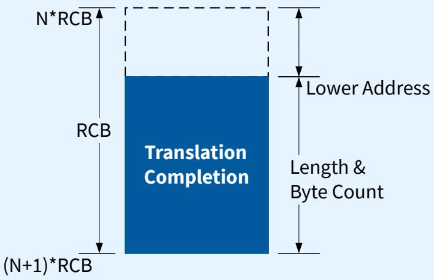

<details>
<summary>text_image</summary>

N*RCB
RCB
Translation Completion
Lower Address
Length &
Byte Count
(N+1)*RCB
</details>

Figure 10-15 Example Translation Completion with 1 TLP§

To intermediate components (which do not track the transaction) this TLP will be indistinguishable from a Memory Read Completion ending on an RCB.

For Translation Completions consisting of two TLPs, the goal is to make the Completion look as though it is a Memory Read Completion that crosses an RCB. As Such, the first Completion TLP will contain Lower Address & Length values which make the TLP appear to end on an RCB. The Byte Count of the first TLP will indicate the total length of all the Translation Completions sent in this transaction. For the second TLP, the Length and Byte Count fields will indicate the same value, and the Lower Address value will be 0.

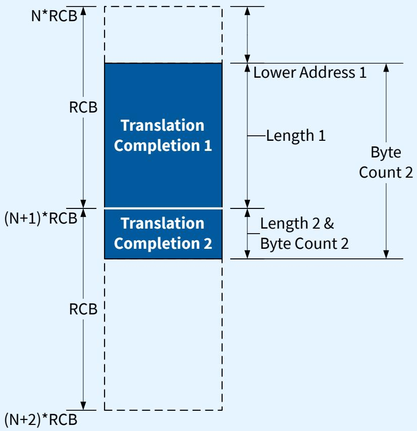

<details>
<summary>flowchart</summary>

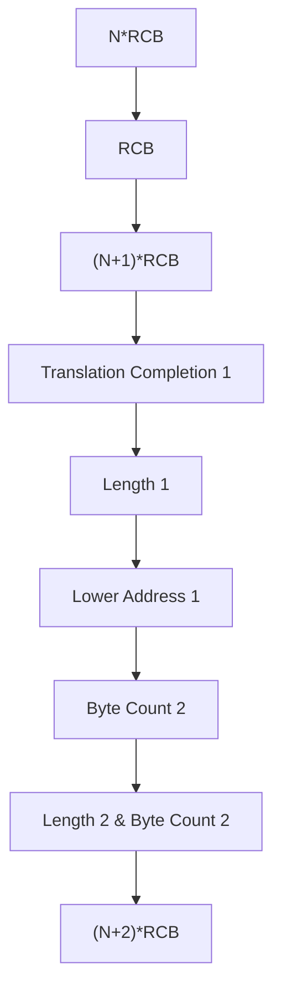
```mermaid
graph TD
  A["N*RCB"] --> B["RCB"]
  B --> C["(N+1)*RCB"]
  C --> D["Translation Completion 1"]
  D --> E["Length 1"]
  E --> F["Lower Address 1"]
  F --> G["Byte Count 2"]
  G --> H["Length 2 & Byte Count 2"]
  H --> I["(N+2)*RCB"]
```
</details>

Figure 10-16 Example Translation Completion with 2 TLPs§

To intermediate components (which do not track the transaction) this Completion transaction will be indistinguishable from a Memory Read Completion that crosses an RCB.

Note that the Length field is measures DWORDs, whereas the Lower Address and Byte Offset fields are measured in Bytes.

Provided the TLPs are properly formatted, A TA may choose to split the Translation Completion between any 2 Translation Completion Data Entries. Because an ATC cannot request more translations than can fit within a single RCB, the architectural maximum number of Translation Completion Data Entries can be sent in a single Completion TLP.

## 10.2.3.9 ATS Memory Attributes §

AMA values are associated with the Completer and are implementation specific. AMA values are opaque to the Requester, the Requester's ATC and the TA.

The method for detecting support of, and for enabling, the AMA mechanism in a TA is implementation specific. When the AMA mechanism is not enabled in both the Requester and the TA, the default AMA value is 000b. Behavior of the Completer for this case is implementation specific.

An ATC that supports AMA, caches AMA values along with other ATC information (Translated Address, Read, Write permission etc.) If the AMA value changes, for a page that could be cached in an ATC, software must issue an ATS Invalidation covering that page to ensure the ATC flushes the stale AMA value.

## IMPLEMENTATION NOTE:

## ATS MEMORY ATTRIBUTES §

ATS Memory Attributes (AMAs) are used with bus transactions on the Internal Coherent Bus (ICB) of devices as shown in the figure below. AMAs simplify processing at the TA. AMAs are simply passed through to the ICB avoiding a look-up at the TA.

AMAs may be supplied by a Translation Completion and stored in the ATC. The Endpoint may provide AMAs in Memory Read/Write TLPs using a TPH TLP Prefix. AMAs may also be provided using Vendor Defined Messages, however such methods are outside the scope of this specification.

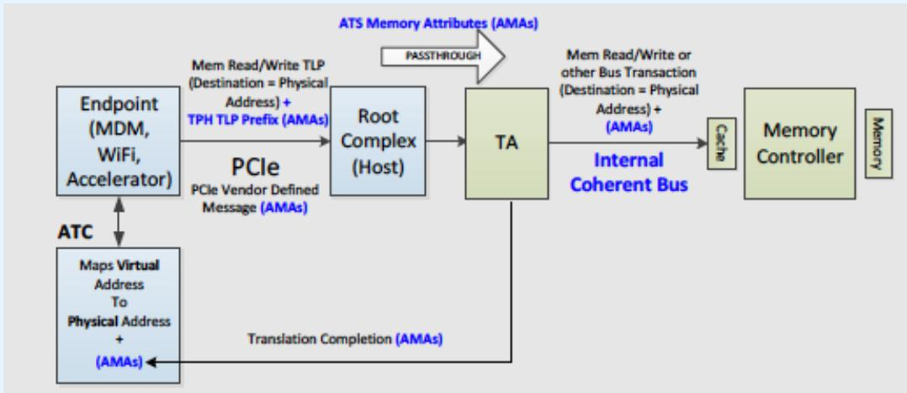

<details>
<summary>flowchart</summary>

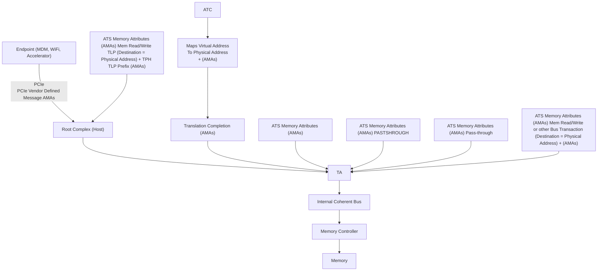
```mermaid
graph TD
  A["Endpoint (MDM, WiFi, Accelerator)"] -->|PCIe\nPCIe Vendor Defined Message AMAs| B["Root Complex (Host)"]
  B --> C["TA"]
  C --> D["Internal Coherent Bus"]
  D --> E["Memory Controller"]
  E --> F["Memory"]
  G["ATC"] --> H["Maps Virtual Address\nTo Physical Address\n+ (AMAs)"]
  H --> I["Translation Completion (AMAs)"]
  I --> C
  J["ATS Memory Attributes (AMAs)"] --> C
  K["ATS Memory Attributes (AMAs) PASTSHROUGH"] --> C
  L["ATS Memory Attributes (AMAs) Pass-through"] --> C
  M["ATS Memory Attributes (AMAs) Mem Read/Write or other Bus Transaction (Destination = Physical Address) + (AMAs)"] --> C
  N["ATS Memory Attributes (AMAs) Mem Read/Write TLP (Destination = Physical Address) + TPH TLP Prefix (AMAs)"] --> B
```
</details>

Figure 10-17 ATS Memory Attributes Example§

AMAs provide hints on performing cache management as well as behavior on the ICB for a particular transaction. For example, AMAs may hint:

• Data is cacheable or non-cacheable.  
• Write-hit policy. “Write back” may indicate that on a cache hit, update the cache, do not update memory. Mark the cache as dirty.  
• Write-miss policy. “Write allocate” may indicate that on a cache miss, update memory, bring the data block to the cache (allocate).

AMAs are similar to TLP Processing Hints but should be considered independent. Hence all permutations of AMAs and TLP Processing Hints are permitted. However, AMAs may convey different semantics than what is provided by TLP Processing Hints. The cache behavior conveyed by AMAs and TLP Processing Hints may not align.

Additionally, AMAs may convey semantics not addressed by TLP Processing Hints. For example, handling of transactions on the ICB when caching is not in use, such as, “reordering permitted/not permitted”, “early write acknowledgement permitted/not permitted.”

AMAs may be transmitted in peer-to-peer transactions. It is recommended that an application programming interface (API) be provided to enable AMAs to be configured into the Translation Agent (TA). Note: the TA might not be collocated with the Completer.

An example of memory attributes such as “strongly ordered device normal” may be found at http://infocenter.arm.com.

## 10.2.4 Completions with Multiple Translations §

An ATC is allowed to request that the TA provide translations for a virtually contiguous range of addresses. It does this by setting the Length field in the Translation Request to a value that is two times the number of requested translations as long as the request size (Total Completion Length \* 4) is not larger than Read Completion Boundary (RCB) in the Link Control Register.

If multiple translations are requested, the TA may return one or more translations as long as the number of translations does not exceed the number of requested translations. It is not an error for the TA to return fewer translations than requested and no error indication is sent unless there is an error in accessing the data.

If the Translation Completion contains multiple translations, all translations must have the same indicated size. Also, successive translations must apply to the virtual address range that abuts the previous translation in the same completion.

If a translation has both R = 0b and W = 0b, the TA must still set the Size field and the lower bits of the Translated Address field used to encode the completion size to appropriate values.

Each translation in a Translation Completion will have some overlap with the implied memory range of the Translation Request (see § Section 10.2.2 ).

A successful Translation Completion must consist of one or two CplDs. Each CplD must contain an integral number of Translations (i.e., Length must be a multiple of 2).

The TA is permitted to choose:

• the number of translations it returns for each Translation Request (e.g., Byte Count of the first or only CplD)  
• if it returns more than one translation, whether it uses one or two CplDs  
• if it returns two CplDs, how many translations are returned in each CplD

The Byte Count and Length fields in each CplD is used to convey these choices to the ATC. The Lower Address field should not be needed by the ATC (its value is computed as defined in Section 10.2.3 to satisfy RCB rules but the field otherwise conveys no additional information).

• If a Translation Completion CplD has a Byte Count that is greater than four times the Length field, then this is the first of two CplDs for the transaction.  
• If a Translation Completion CplD has a Byte Count that is equal to four times the Length field, then this is the second or only CplD for the request.

Note: There are multiple reasons that the TA may truncate the results of the completion. For example, the request might ask for a range of addresses, not all of which are defined. This could occur if the first translation is valid but located at the end of a page of translations. The TA, in looking up the next page of translations, may find that the page is not valid so the addresses are not valid. The range of addresses that are valid would be returned and no error indicated. When truncating a Translation Completion the TA is not allowed to pad the response with invalid entries (R = 0b, W = 0b).

Note: There are multiple reasons that the TA may break a Translation Completion into multiple TLPs. As an example, if the virtual address of the Translation Completion resolves to a table access that crosses an implementation specific address boundary, the completion to the TA may be broken into two completions. Rather than require that the TA accumulate the results, the TA is permitted to send each portion of the Translation Completion to a Function when it is received from memory.

## 10.3 ATS Invalidation §

ATS uses the messages shown in this section to maintain consistency between the TA and the ATC. This specification assumes there is a single TA associated with each ATC. The TA (in conjunction with its associated software) must ensure that the address translations cached in the ATC are not stale by issuing Invalidate Requests.

## 10.3.1 Invalidate Request §

When a translation is changed in the TA and that translation might be contained within an ATC in a Function, the TA (in conjunction with its associated software) must send an Invalidate Request to the ATC to maintain proper synchronization between the ATPT and the ATC. An Invalidate Request is used to clear a specific subset of the address range from the ATC. Invalidate Requests are constrained to cover power of 2 multiple of 4096-byte pages.

The format of an Invalidate Request is shown in § Figure 10-18 and § Figure 10-19.

<table><tr><td colspan="8">+0</td><td colspan="7">+1</td><td colspan="7">+2</td><td colspan="7">+3</td><td></td><td></td><td></td></tr><tr><td>7</td><td>6</td><td>5</td><td>4</td><td>3</td><td>2</td><td>1</td><td>0</td><td>7</td><td>6</td><td>5</td><td>4</td><td>3</td><td>2</td><td>1</td><td>0</td><td>7</td><td>6</td><td>5</td><td>4</td><td>3</td><td>2</td><td>1</td><td>0</td><td>7</td><td>6</td><td>5</td><td>4</td><td>3</td><td>2</td><td>1</td><td>0</td></tr><tr><td>0</td><td colspan="2">Fmt
1 1</td><td colspan="5">Type
1 0010</td><td>R</td><td colspan="2">TC</td><td>R</td><td>Attr
R</td><td>R</td><td>T
D</td><td>E
P</td><td colspan="2">Attr
R R</td><td colspan="2">R</td><td colspan="10">Length
00 0000 0010</td><td></td><td></td></tr><tr><td colspan="14">Requester ID</td><td>0</td><td>0</td><td colspan="2">0</td><td colspan="4">ITag</td><td colspan="7">Message Code
0000 0001</td><td></td><td></td><td></td></tr><tr><td colspan="14">Device ID</td><td colspan="15">Reserved</td><td></td><td></td><td></td></tr><tr><td colspan="28">Reserved</td><td></td><td></td><td></td><td></td></tr></table>

A-0584A

Figure 10-18 Invalidate Request Message - Non-Flit Mode§  
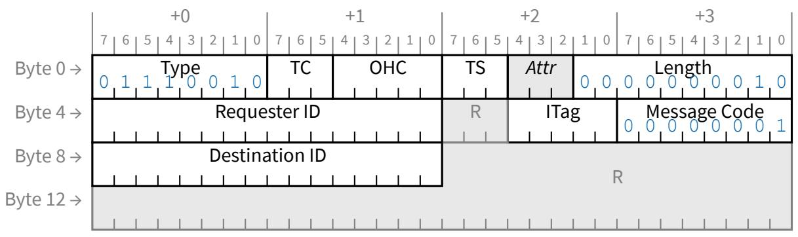

<details>
<summary>stacked bar chart</summary>

| Byte | +0 | +1 | +2 | +3 |
|------|----|----|----|----|
| 0    | 0  | TC | TS | Length |
| 4    | 1  | OHC | Attr | 0 0 |
| 8    | 0  | Requester ID | R   | ITag |
| 12   | 0  | Destination ID | R   | Message Code |
</details>

Figure 10-19 Invalidate Request Message - Flit Mode§

The Invalidate Request is a MsgD transaction with 64 bits of data. Invalidate Request messages may be sent in any TC. The ITag field is constrained to the values 0 to 31 and is used by the TA to uniquely identify requests it issues. A TA must ensure that once an ITag is used, it is not reused until either released by the corresponding Invalidate Completions or by a vendor-specific timeout mechanism (see below).

The TA may have a single pool of ITag values for all invalidates that it issues or it may have a pool for each Device ID or any other combination. A Device with multiple ATCs on different Functions must manage the ITags separately for each Requester ID.

The address range specified in an Invalidate Request may span one or more STU 4096-byte pages. Invalidation ranges are required to be naturally aligned and should not be smaller than STU 4096-byte pages. Upon receiving an Invalidate Request with a range less than STU an ATC may either (1) signal an Unsupported Request (not recommended) or (2) round the range of the request up to a value greater than or equal to the STU.

## IMPLEMENTATION NOTE: INVALIDATE COMPLETION TIMEOUT §

Devices should respond to Invalidate Requests within 1 minute (+50% -0%).Having a bounded time permits an ATPT to implement Invalidate Completion Timeouts and reuse the associated ITag values. ATPT designs are implementation specific. As such, Invalidate Completion Timeouts and their associated error handling are outside the scope of this specification.

The content of the payload is the untranslated address range to be invalidated. The payload format is shown in § Figure 10-20.

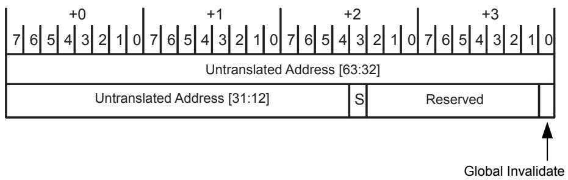

<details>
<summary>text_image</summary>

+0
+1
+2
+3
7 6 5 4 3 2 1 0 7 6 5 4 3 2 1 0 7 6 5 4 3 2 1 0
Untranslated Address [63:32]
Untranslated Address [31:12] S Reserved
Global Invalidate
</details>

Figure 10-20 Invalidate Request Message Body§

The S field is used to indicate if the range being invalidated is greater than 4096 bytes. Its meaning is the same as for the Translation Completion (see § Section 10.2.3.1 and § Section 10.2.3.2 ).

The Global Invalidate bit indicates that the Invalidation Request Message affects all PASID values (see § Section 10.3.8 ). This bit is Reserved unless the Invalidation Request has a PASID. The bit is ignored by the ATC if Global Invalidate Supported bit is Clear (see § Section 10.3.8 ).

## IMPLEMENTATION NOTE:

## INVALIDATION REQUESTS AND FUNCTION LEVEL RESET & DEVICE POWER STATE TRANSITIONS §

Invalidation requests received while a Function is undergoing Function Level Reset, or is in (or transitioning to) non-D0 device state, may be dropped by the Function. Similarly, invalidation requests already received but pending at the time of receiving initiate FLR or D-state transition request may be dropped the Function.

System software can avoid ATS invalidation race conditions on Function Level Reset and Device Power State transitions in a variety of ways. For example:

1. When disabling ATS on a Function, system software quiesces ATS invalidations to the Function (i.e., either responses are received for all invalidation requests issued to the Function, or any pending invalidation requests to the Function have timed out).  
2. Software ensures no invalidations are issued to a Function when its ATS capability is disabled.  
3. Before initiating the FLR (or Device power state transitions), software disables ATS as described in item 1. above.

## 10.3.2 Invalidate Completion


When a Function completes an Invalidate operation, it will send one or more Invalidate Completion messages to the TA. These messages must be tagged with information extracted from the Invalidate Request to enable the TA to associate the Invalidate Completions with the Invalidate Request.

The format of the Invalidate Completion message is shown in § Figure 10-21 and § Figure 10-22.

<table><tr><td colspan="8">+0</td><td colspan="7">+1</td><td colspan="7">+2</td><td colspan="7">+3</td><td></td><td></td><td></td></tr><tr><td>7</td><td>6</td><td>5</td><td>4</td><td>3</td><td>2</td><td>1</td><td>0</td><td>7</td><td>6</td><td>5</td><td>4</td><td>3</td><td>2</td><td>1</td><td>0</td><td>7</td><td>6</td><td>5</td><td>4</td><td>3</td><td>2</td><td>1</td><td>0</td><td>7</td><td>6</td><td>5</td><td>4</td><td>3</td><td>2</td><td>1</td><td>0</td></tr><tr><td>0</td><td colspan="2">Fmt
0 1</td><td colspan="5">Type
1 0 0 1 0</td><td>0</td><td colspan="3">TC</td><td>0</td><td>Attr
R</td><td>0</td><td>0</td><td>T
D</td><td>E
P</td><td colspan="2">Attr
R R</td><td colspan="2">R</td><td>0</td><td>0</td><td>0</td><td>0</td><td>0</td><td>0</td><td>0</td><td>0</td><td>0</td><td></td></tr><tr><td colspan="16">Requester ID</td><td colspan="7">Reserved</td><td colspan="7">Message Code
0000 0010</td><td></td><td></td></tr><tr><td colspan="16">Device ID</td><td colspan="12">Reserved</td><td>CC</td><td></td><td></td><td></td></tr><tr><td colspan="28">ITag Vector</td><td></td><td></td><td></td><td></td></tr></table>

A-0586A

Figure 10-21 Invalidate Completion Message Format - Non-Flit Mode§

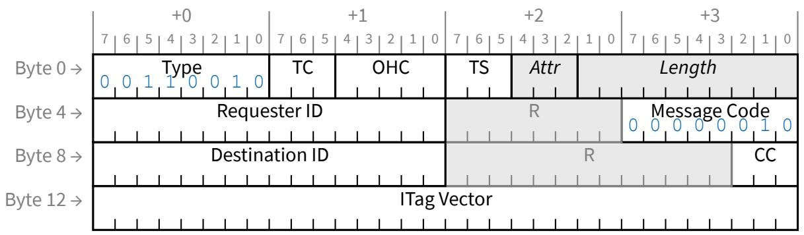

<details>
<summary>stacked bar chart</summary>

| Byte | +0 | +1 | +2 | +3 |
| --- | --- | --- | --- | --- |
| 0 | 7 | 6 | 5 | 4 |
| 1 | 4 | 3 | 2 | 1 |
| 2 | 1 | 0 | 0 | 0 |
| 3 | 0 | 0 | 0 | 0 |
| 4 | 0 | 0 | 0 | 0 |
| 5 | 0 | 0 | 0 | 0 |
| 6 | 0 | 0 | 0 | 0 |
| 7 | 0 | 0 | 0 | 0 |
| 8 | 0 | 0 | 0 | 0 |
| 9 | 0 | 0 | 0 | 0 |
| 10 | 0 | 0 | 0 | 0 |
| 11 | 0 | 0 | 0 | 0 |
| 12 | 0 | 0 | 0 | 0 |
| Type | TC | OHC | TS | Attr |
</details>

Figure 10-22 Invalidate Completion Message - Flit Mode§

The Invalidate Completion message is a Msg transaction routed by ID. The Requester ID field of the Invalidate Completion message is set to the Requester ID of the Function containing the ATC. The Device ID field of the Invalidate Completion is set to the Requester ID of the TA. The ATC may derive the Requester ID of the TA from the Requester ID field of the corresponding Invalidate Request. Alternatively, since the ATC is only associated with a single TA, the ATC may sample and store the Requester ID from the first Invalidate Request following a Fundamental Reset or FLR. Subsequent Invalidate Completion messages may use this value to set the Device ID field of Invalidate Completion messages.

The Completion Count (CC) field indicates the number of individual Invalidate Completion messages that must be sent for the associated Invalidate Request. Setting the CC field to 0 indicates that eight responses must be sent. The TA is responsible for collecting all the responses associated with a given Tag before considering the corresponding Invalidate Request to be complete.

Invalidate Completion messages may be sent on any TC, independent of the TC the originating Invalidate Request was received. This enables implementations to utilize the Invalidate Completion to push outstanding transactions to the TA to guarantee the required invalidation semantics are met. Implementations that utilize a single Upstream TC are required to send a single Invalidate Completion in the utilized TC.

The ITag Vector field is used to indicate which Invalidate Request has been completed. Each of the 32 possible ITag field values from the Invalidation Request is represented by a single bit in the ITag Vector field. The least significant bit (bit 0; i.e., the right-most bit in the schematic representation of the Invalidate Completion message shown in § Figure 10-21 and § Figure 10-22) of the ITag Vector field corresponds to the ITag field value of 0. The most significant bit (bit 31) of the ITag Vector field corresponds to the ITag field value of 31. Implementations are allowed to coalesce multiple Invalidate Completions by setting multiple ITag Vector bits in a single message provided the following conditions are met:

• The Invalidate Completions flow in the same TC.  
• The Invalidate Completions have the same CC value.  
• All fragments of an Invalidate Completion must have identical Request ID, CC, and ITag Vector fields.

A TA that receives an Invalidation Completion for an ITag that has no outstanding Invalidation Request shall report this error using implementation specific mechanisms. One possible such mechanism is to report the Invalidation Completion as an Unexpected Completion (UC).

Functions that do not support ATS will treat an Invalidate Request as UR.

Functions supporting ATS are required to send an Invalidate Completion in response to a Invalidate Request independent of whether the Bus Master Enable bit is Set or not. Note that the above conditions must be satisfied even when Bus Master Enable is Cleared. The method for a device to achieve this is implementation dependent.

## IMPLEMENTATION NOTE:

## BUS MASTER ENABLE CHANGE §

When Bus Master Enable changes from Set to Clear, no further memory requests should be queued. It is possible that queued write requests are present when BME is Cleared. These requests could block an Invalidate Completion. These requests must be either sent or dropped. This will ensure that all outstanding write transactions that are potentially dependent upon the outstanding invalidation are complete.

## 10.3.3 Invalidate Completion Semantics §

Before an ATC can return an Invalidate Completion for a given Invalidate Request, it must ensure the following conditions are satisfied:

• All new requests initiated by the Function (or its Shadows) will not utilize stale address translations.  
• All outstanding read requests initiated by the Function (or its Shadows) utilizing translated address matching the invalidated range have either completed or been tagged to be discarded (method to discard is implementation specific).  
All outstanding posted writes initiated by the Function (or its Shadows) utilizing a translated address matching the invalidated range have been pushed to the TA. The ATC is required to send a copy of the Invalidate Completion message in each TC in which a posted write has been issued but not known to have been pushed to the TA. The CC field must be set to the same value in each copy of the Invalidate Completion message indicating number of copies sent. The TA is responsible for collecting all sent responses before considering the invalidation to be complete.  
• Invalidate Completion Messages must contain the Requester ID used in the associated Invalidate Request.  
• When Shadow Functions are enabled, it is sufficient to issue a single Invalidate Request message targeting either the Function or one of its Shadows. Since IDO is Clear, the Invalidation Completion resulting from that Invalidation Request will push to the TA any earlier Posted Writes for both the Function and its Shadows.  
• Invalidation Completion behavior is independent of whether the associated Invalidate Request was issued to the Function or one of its Shadows.

## IMPLEMENTATION NOTE:

## IMPLIED TC FLUSHING §

When making the decision as to which TC to send Invalidate Completions, an ATC may infer, in an implementation specific manner, that an issued posted write has been pushed to the TA. For example, a Function that has sent a read transaction to a destination above the TA and received its corresponding response may infer that any preceding posted writes issued in the same TC have been pushed to the TA.

## 10.3.4 Request Acceptance Rules §

In accord with the request acceptance rules enumerated in this section, a Function is not allowed to create a dependency in which the acceptance of a posted transaction is dependent upon the transmission of a posted transaction. Given Invalidate Requests and Invalidate Completions both are posted transactions, Functions must not make the acceptance of an Invalidate Request dependent upon the transmission of an Invalidate Completion. The method for achieving this is implementation specific.

A Function with an ATS capability in its configuration space must be able to accept Invalidate Requests and send Invalidate Completions even if ATS is not enabled.

## IMPLEMENTATION NOTE: INVALIDATE QUEUE DEPTH

An ATC is only associated with a single TA. Each TA is limited to a total of 32 outstanding invalidations to any given ATC. This limits the number of outstanding Invalidation Requests active to a single ATC to 32. To avoid a post-to-post dependency, an ATC is required to accept up to 32 Invalidation Requests.

An ATC may choose to implement a maximally sized input queue holding Invalidate Requests. Alternatively, an ATC may choose to implement a maximally sized output queue holding Invalidate Completions. Note that queuing Invalidate Completions requires significantly less state per entry resulting in a potentially more efficient implementation than input queue buffering.

Note that the choice of whether to implement input queuing or output queuing (or a hybrid of both) has no impact on ensuring deadlock free behavior. But implementation choices with regard to queuing may have a significant impact on performance (see § Section 10.3.5 ).

## 10.3.5 Invalidate Flow Control §

Due to the variety of caching architectures and queuing strategies, implementations may vary greatly with respect to invalidation latency and throughput. It is possible that a TA may generate Invalidate Requests at a rate that exceeds the average ATC service rate. When this happens, the credit based flow control mechanisms will throttle the TA issue rate. A side effect of this is congestion spreading to other channels and Links through the credit based flow control mechanism. Depending on the frequency and duration of this congestion, performance may suffer. It is strongly recommended that TA and its associated software implement higher level flow control mechanisms.

To assist with the implementation of Invalidate Flow Control, an ATC must publish the number of Invalidate Requests it can buffer before back pressuring the Link. This field applies to all invalidations serviced by the Function, independent of the size of the invalidation. This value is communicated in the Invalidate Queue Depth field in the ATS capability structure (see § Section 7.8.9 ). A value of 0 0000b indicates that invalidate flow control is not necessary to this Function.

## IMPLEMENTATION NOTE: INVALIDATE FLOW CONTROL §

A Function may indicate that invalidate flow control is not required when one or more of the following is true:

1. The Function can handle invalidations at the maximum arrival rate of Invalidate Requests.  
2. The Function will not or very rarely cause Link backpressure (performance loss is negligible).  
3. The Function can fully buffer the maximum number of incoming invalidations without back pressuring the Link.

Each Function is required to implement sufficient queuing to ensure it can hold the maximum number of outstanding Invalidation Requests from a TA (using either input or output queuing). However, with an SR-IOV device, all VFs associated with a PF share a single Invalidation Request queue in the PF. To implement Invalidation flow control, the TA must ensure that the total number of outstanding Invalidate Requests targeting the shared PF queue does not exceed the value in the PF's Invalidate Queue Depth field.

## 10.3.6 Invalidate Ordering Semantics §

Invalidate Requests and Translation Completions may be sent using different TC and are, therefore, unordered with respect to each other (from the Link’s perspective). An ATC must ensure that the proper invalidation behavior is maintained when an Invalidate Request bypasses a Translation Completion to an overlapping region.

An ATC must “snoop” its outstanding translation request queue against all arriving Invalidate Requests. When snooping a request for a N\*STU sized translation (N is a power of 2), the ATC must snoop the range of addresses starting at the STU aligned region containing the specified address and ending (N-1) STU size pages later.

If an Invalidate Request overlaps the address range in an outstanding Translation Request, the Translation Request must be tagged as invalid and the results of its corresponding Translation Response must be discarded prior to transmission of the Invalidate Completion. If the Translation Response is received before the Invalidate Completion is sent, an implementation is free to issue requests utilizing the translation result provided the Invalidate Completion Semantics (see § Section 10.3.3 ) are satisfied.

## IMPLEMENTATION NOTE:

## REQUEST RANGE OVERLAP IN INVALIDATIONS §

In the description above, N is the number of STU sized translations that were requested in the Translation Request. This is equal to (Length field in Translation Request)/2.

As an example:

STU is 00 0010b indicating 16384-byte pages.

An outstanding Translation Request has a Length field of 00 0000 0100b indicating two translations covering a range of 32768 bytes.

The high-order 48 bits of the Translation Request are 0000 0FFF FFFFh.

The low-order 16 bits of the address in the request are 11xx xxxx xxxx xxxxb indicating that the translation request covers a range that overlaps a 32768-byte boundary (in fact, the request crosses a 16-TB boundary).

If two translations are returned, they would cover the two STU sized regions at 0000 0FFF FFFF C000h and 0000 1000 0000 0000h.

An Invalidate Request is received with the high-order 48 bits of 0000 1000 0000h and the low-order 16 bits of 0001 1xxx xxxx xxxxb.

The ATC must detect that a translation associated with a portion of the Translation Request is now invalidated and the Translation Completion associated with the invalidated region must be discarded (for simplification, the ATC is allowed to discard all of the Translation Completion).

It should be noted that, processing of the Invalidate Requests is simplified if Translation Requests do not cross alignment boundaries of the request. The Translation Request from the above example is not aligned to a 32768-byte boundary. If it were broken into two requests, it would be simpler to associate the range of the Invalidate Request with the address in the Translation Request. Breaking the Translation Requests into aligned requests is not a requirement.

## 10.3.7 Implicit Invalidation Events §

The following events will cause the invalidation of all ATC entries:

• Conventional Reset (all forms)  
• Function Level Reset  
• E field in ATS Capability changes from Clear to Set

The following events will cause the invalidation of all non-Global Mapping ATC entries that were requested using a specific PASID:

• Stopping the use of a PASID as defined in this specification.

No explicit Invalidate Completion message is sent when these implied invalidate events occur.

# IMPLEMENTATION NOTE:

# IMPLICIT INVALIDATION AND PASID §

Software may not change any of the PASID enable bits when the E field in the ATS Capability is Set. The invalidation that occurs when software Sets the E field also invalidates ATC entries with an associated PASID value.

## 10.3.8 PASID and Global Invalidate §

The requirements in this section apply to Functions that support the PASID. For Invalidation Requests that have a PASID, the ATC shall:

• Optionally signal Unsupported Request (UR) if the associated PASID value is greater than or equal to 2Max PASID ignored (see below).  
• Return an Invalidation Completion if PASID Enable is Clear.  
• If the Function supports Global Invalidate (see § Section 7.8.9.2 ):

◦ If the Global Invalidate bit in the Request is Set, invalidate Global and non-Global Mapping entries in the ATC within the indicated memory range associated with any PASID value and return an Invalidation Completion. The PASID value in the PASID is ignored.

◦ If the Global Invalidate bit in the Request is Clear, invalidate only non-Global Mapping entries in the ATC within the indicated memory range that were requested using the associated PASID value and return an Invalidation Completion.

Global Mapping entries in the ATC for some or all of the indicated memory range may be retained.

• If the Function does not support Global Invalidate (see § Section 7.8.9.2 ), invalidate entries in the ATC within the indicated memory range that were requested using the associated PASID value and return an Invalidation Completion.  
• If no matching entries are present in the ATC, invalidate no ATC entries and return an Invalidation Completion.

For Invalidation Requests that do not have a PASID, the ATC shall:

• Invalidate ATC entries within the indicate memory range that were requested without a PASID value.  
• Invalidate ATC entries at all addresses that were requested with any PASID value.

## 10.4 Page Request Services §

The general model for a page request is as follows:

1. A Function determines that it requires access to a page for which an ATS translation is not available.  
2. The Function causes the associated Page Request Interface to send a Page Request Message to its RC. A Page Request Message contains a page address and a Page Request Group (PRG) index. The PRG index is used to identify the transaction and is used to match requests with responses.

3. When the RC determines its response to the request (which will typically be to make the requested page resident), it sends a PRG Response Message back to the requesting Function.  
4. The Function can then employ ATS to request a translation for the requested page(s).

A Page Request Message is a PCIe Message Request that is Routed to the Root Complex with a Message Code of 4 (0000 0100b). The mechanism employed at the RC to buffer requests is implementation specific. The only requirement is that an RC not silently discard requests.

All Page Request Messages and PRG Response Messages travel in PCIe Traffic Class 0. A Page Request Message or PRG Response Message with a Traffic Class other than 0 shall be treated as Malformed TLPs by the RC or endpoint that receives the same. Intermediate routing elements (e.g., Switches) shall not detect this error.

The Relaxed Ordering and ID-Based Ordering bits in the Attr field of Page Request Messages and PRG Response messages may be used. The No Snoop bit in the Attr field is reserved.

The page request service allows grouping of page requests into Page Request Groups (PRGs). A PRG can contain one or more page requests. All pages in a PRG are responded to en mass by the host. Individual pages within a PRG are requested with independent Page Request Messages and are recognized as belonging to a common PRG by sharing the same PRG index. The last request of a PRG is marked as such within its Page Request Message. One request credit is consumed per page request (not per PRG).

A PRG Response Message is a PCIe Message Request that is Routed by ID back to the requesting Function. It is used by system software to alert a Function that the page request(s) associated with the corresponding PRG has (have) been satisfied. The page request mechanism does not guarantee any request completion order and all requests are inherently independent of all other concurrently outstanding requests. If a Function requires that a particular request be completed before another request, the initial request will need to complete before the subsequent request is issued. It is valid for a Function to speculatively request a page without ascertaining its residence state and/or to issue multiple concurrently outstanding requests for the same page.

A Page Request Interface is allocated a specific number of page request message credits. An RC (system software) can divide the available credits in any manner deemed appropriate. Any measures the host chooses to employ to ensure that credits are correctly metered by Page Request Interfaces (a Page Request Interface is not using more than its allocation) is an implementation choice. A Page Request Interface is not allowed to oversubscribe the available number of requests (doing so can result in the page request mechanism being disabled if the buffer limit is exceeded at the root). A Page Request Interface’s page request allocation is static. It is determined when the Page Request Interface is enabled and can only be changed by disabling and then re-enabling the interface.

## 10.4.1 Page Request Message §

A Function uses a Page Request Message to send page requests to its associated host. A page request indicates a page needed by the Function. The Page Request Interface associated with a Function is given a specific Page Request allocation. A Page Request Interface shall not issue page requests that exceed its page request allocation.

A page request contains the untranslated address of the page that is needed, the access permissions needed for that page, and a PRG index. A PRG Index is a 9-bit scalar that is assigned by the Function to identify the associated page request. Multiple pages may be requested using a single PRG index. When more than a single page is to be associated with a given PRG, the Last flag in the Page Request Record is cleared in all the requests except the last request associated with a given PRG (the flag is set in the last request). Page requests are responded to en mass. No response is possible (except for a Response Failure error) until the last request of a PRG has been received by the root. The number of PRGs that a Function can have outstanding at any given time is less than or equal to the associated Page Request Interface’s Outstanding Page Request Allocation. It is valid for a request group to contain multiple requests for the same page and for multiple outstanding PRGs to request the same page.

A Page Request Interface applies to the “main” Function and its enabled Shadow Functions (where the “main” is the Function that contains both the Page Request Extended Capability and the Shadow Function Extended Capability). All pages request messages of a single PRG must have the same Requester ID (of either the “main” Function or one of its Shadows).

The first two DWs of a Page Request Message contain a standard PCIe message header. The second two DWs of the message contain page request specific data fields.

<table><tr><td></td><td colspan="8">+0</td><td colspan="7">+1</td><td colspan="7">+2</td><td colspan="7">+3</td><td></td><td></td><td></td></tr><tr><td></td><td>7</td><td>6</td><td>5</td><td>4</td><td>3</td><td>2</td><td>1</td><td>0</td><td>7</td><td>6</td><td>5</td><td>4</td><td>3</td><td>2</td><td>1</td><td>0</td><td>7</td><td>6</td><td>5</td><td>4</td><td>3</td><td>2</td><td>1</td><td>0</td><td>7</td><td>6</td><td>5</td><td>4</td><td>3</td><td>2</td><td>1</td><td>0</td></tr><tr><td>00h</td><td>0</td><td>0</td><td>1</td><td colspan="5">Type (10000)</td><td>T9</td><td colspan="2">TC</td><td>T8</td><td>Attr</td><td colspan="2">R</td><td>TD</td><td>EP</td><td colspan="2">Attr</td><td colspan="2">R</td><td colspan="9">Length (0)</td><td></td><td></td></tr><tr><td>04h</td><td colspan="15">Requestor ID</td><td colspan="7">Tag</td><td colspan="7">Message Code (0000 0100b)</td><td></td><td></td><td></td></tr><tr><td>08h</td><td colspan="29">Page Address [63:32]</td><td></td><td></td><td></td></tr><tr><td>0Ch</td><td colspan="17">Page Address [31:12]</td><td colspan="6">Page Request Group Index</td><td>L</td><td>W</td><td>R</td><td></td><td></td><td></td><td></td><td></td><td></td></tr></table>

A-0737A

Figure 10-23 Page Request Message - Non-Flit Mode§  
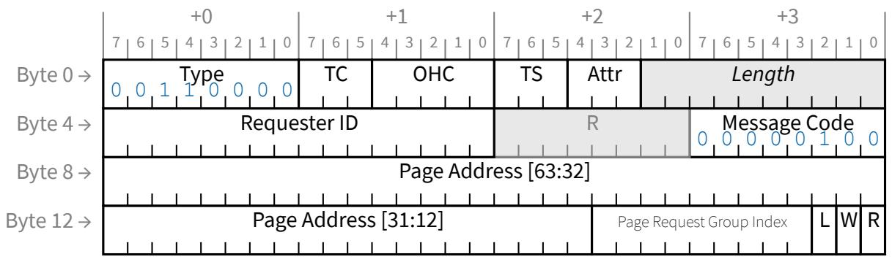  
Figure 10-24 Page Request Message - Flit Mode§

Table 10-6 Page Request Message Data Fields§

<table><tr><td>Field</td><td>Meaning</td></tr><tr><td>R</td><td>Read Access Requested- This field, when Set, indicates that the requesting Function seeks read access to the associated page. When Clear, this field indicates that the requesting Function will not read the associated page.The R field must be Set for Page Requests with a PASID and that have the Execute Requested bit Set.If R and W are both Clear and L is Set, this is a Stop Marker (see § Section 10.4.1.2.1).</td></tr><tr><td>W</td><td>Write Access Requested- This field, when Set, indicates that the requesting Function seeks write access and/or zero-length read access to the associated page. When Clear, this field indicates that the requesting Function will not write to the associated page.Upon receiving a Page Request Message with the W field Set, the host is permitted to mark the associated page dirty. Thus, Functions must not issue such Requests unless the Function has been given explicit write permission.If R and W are both Clear and L is Set, this is a Stop Marker (see § Section 10.4.1.2.1).</td></tr><tr><td>L</td><td>Last Request in PRG- This field, when Set, indicates that the associated page request is the last request of the associated PRG. A PRG can have a single entry, in which case the PRG consists of a single request in which this field is Set. When Clear, this field indicates that additional page requests will be posted using this record's PRG Index.If R and W are both Clear and L is Set, this is a Stop Marker (see § Section 10.4.1.2.1).</td></tr><tr><td>Page Request Group Index</td><td>Page Request Group Index- This field contains a Function supplied identifier for the associated page request. A Function need not employ the entire available range of PRG index values. A host shall never respond with a PRG Index that has not been previously issued by the Function and that is not currently an outstanding request PRG Index (except when issuing a Response Failure, in which case the host need not preserve the associated request's PRG Index value in the error response).</td></tr><tr><td>Page Address</td><td>Page Address- This field contains the untranslated address of the page to be loaded. For pages larger than 4096 bytes, the least significant bits of this field are ignored. For example, the least significant bit of this field is ignored when an 8096-byte page is being requested.</td></tr></table>

## IMPLEMENTATION NOTE:

## LAST BIT AND RELAXED ORDERING §

If multiple page requests are associated with a single PRG index, the last page request of a PRG should have the Relaxed Ordering attribute bit Clear in addition to having the Last flag Set. All other page request messages may have the Relaxed Ordering attribute bit set to any value.

## 10.4.1.1 PASID Usage §

The PASID Extended Capability indicates whether a Function supports PASID TLP Prefixes (NFM) or OHC-A1 with PASID (FM), and whether it is enabled to send and receive them.

Functions that support PASID are permitted to send a PASID on Page Request Messages. The PASID field contains the process address space of the page being requested and the Execute Requested and Privileged Mode Requested bits indicate the access being requested.

If one Page Request Message in a PRG has a PASID, all Page Request Messages in that PRG must contain identical PASID values. Behavior is undefined when the PASID values are inconsistent.

Functions that support PASID and have the PRG Response PASID Required bit Set (see § Section 10.5.2.3 ), expect that PRG Response Messages will contain a PASID if the associated Page Request Message had a PASID. For such PRG Response Messages, the Execute Requested and Privileged Mode Requested bits are reserved and the PASID field contains the PASID from the associated Page Request Message.

## 10.4.1.2 Managing PASID Usage on PRG Requests §

There are rules for stopping and starting the use of a PASID.

This section describes additional rules that apply to Functions that have issued Page Request Messages in a PASID that is being stopped. No additional rules are required to start the usage of the Page Request Interface for a PASID.

When stopping the use of a particular PASID, a Stop Marker Message may be optionally used to avoid waiting for PRG Response Messages before the Function indicates that the stop request for a particular PASID has completed.

To stop without using a Stop Marker Message, the Function shall:

1. Stop queueing new Page Request Messages for this PASID.  
2. Finish transmitting any multi-page Page Request Messages for this PASID (i.e., send the Page Request Message with the L bit Set).  
3. Wait for PRG Response Messages associated any outstanding Page Request Messages for the PASID.  
4. Indicate that the PASID has stopped using a device specific mechanism. This mechanism must indicate that a Stop Marker Message will not be generated.

To stop with the use of a Stop Marker Message the Function shall:

1. Stop queueing new Page Request Messages for this PASID.  
2. Finish transmitting any multi-page Page Request Messages for this PASID (i.e., send the Page Request Message with the L bit Set).  
3. Internally mark all outstanding Page Request Messages for this PASID as stale. PRG Response Messages associated with these requests will return Page Request Allocation credits and PRG Index values but are otherwise ignored. 184  
4. Indicate that the PASID has stopped using a device specific mechanism. This mechanism must indicate that a Stop Marker Message will be generated.  
5. Send a Stop Marker Message to indicate to the host that all subsequent Page Request Messages for this PASID are for a new use of the PASID value.

Note: Steps 4 and 5 may be performed in either order, or in parallel.

## 10.4.1.2.1 Stop Marker Messages §

A Stop Marker Message indicates that a Function has stopped using the Page Request Interface and has transmitted all pending Page Request Messages for a specific PASID. Stop Marker Messages are strongly ordered with respect to Page Request Messages and serve to push Page Request Messages toward the Host. When the Host receives the Stop Marker Message, this indicates that all Page Request Messages associated with the PASID being stopped have been delivered and that any subsequent Page Request Message with the same PASID value are associated with a new incarnation of that PASID value.

Stop Marker Messages do not have a response. They do not have a PRG Index and do not consume Page Request allocation (see § Section 10.5.2.5 ).

The Stop Marker Message bit layout is shown in § Figure 10-25.

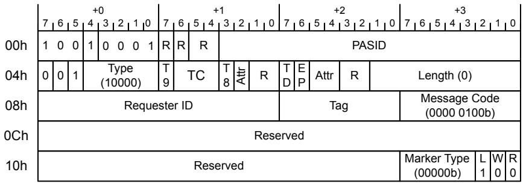

<details>
<summary>table</summary>

| Time | Bit Position | Type | Status | Value |
| --- | --- | --- | --- | --- |
| 00h | 7 | +0 | +1 | 7 |
| 00h | 6 | +0 | +1 | 7 |
| 00h | 5 | +0 | +1 | 7 |
| 00h | 4 | +0 | +1 | 7 |
| 00h | 3 | +0 | +1 | 7 |
| 00h | 2 | +0 | +1 | 7 |
| 00h | 1 | +0 | +1 | 7 |
| 00h | 0 | +0 | +1 | 7 |
| 00h | R | R | R | PASID |
| 04h | 0 | 0 | Type (10000) | 0 |
| 04h | 0 | 1 | Type (10000) | 0 |
| 04h | 1 | Type (10000) | Type (10000) | 1 |
| 08h | 7 | TC | T8 | Attr |
| 08h | 6 | TC | T8 | Attr |
| 08h | 5 | TC | Attr | Attr |
| 08h | 4 | TC | Attr | Attr |
| 08h | 3 | TC | Attr | Attr |
| 08h | 2 | TC | Attr | Attr |
| 08h | 1 | TC | Attr | Attr |
| 08h | 0 | TC | Attr | Attr |
| 10h | 7 | Tag | Tag | Message Code (0000 0100b) |
| 10h | 6 | Tag | Tag | Message Code (0000 0100b) |
| 10h | 5 | Tag | Tag | Message Code (0000 0100b) |
| 10h | 4 | Tag | Tag | Message Code (0000 0100b) |
| 10h | 3 | Tag | Tag | Message Code (0000 0100b) |
| 10h | 2 | Tag | Tag | Message Code (0000 0100b) |
| 10h | 1 | Tag | Tag | Message Code (0000 0100b) |
| 10h | 0 | Tag | Tag | Message Code (0000 0100b) |
| 12h | 7 | Reserved | Reserved | Marker Type (L) W R |
</details>

Figure 10-25 Stop Marker Message - Non-Flit Mode§

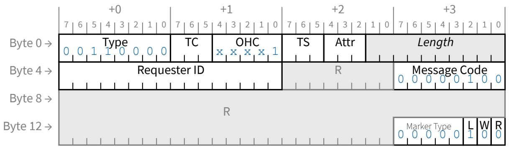

<details>
<summary>bitfield diagram</summary>

| Bit Position | Type | TC | OHC | TS | Attr | Length |
| --- | --- | --- | --- | --- | --- | --- |
| ------------ | ---- | -- | --- | -- | ---- | ------ |
| 0 | Type |  |  |  |  |  |
| 0 | 0 |  |  |  |  |  |
| 0 | 1 |  |  |  |  |  |
| 0 | 0 |  |  |  |  |  |
| 0 | 0 |  |  |  |  |  |
| 0 | 0 |  |  |  |  |  |
| 0 | 0 |  |  |  |  |  |
| 0 | 0 |  |  |  |  |  |
</details>

Figure 10-26 Stop Marker Message - Flit Mode§

A Stop Marker Message is encoded as a Page Request Message for which:

• In NFM, includes a PASID TLP Prefix.  
• The L, W and R fields contain 1b, 0b and 0b respectively.  
• The Untranslated Address field and upper bits of the PRG Index field are Reserved.  
• The Marker Type field contains 0 0000b to indicate that this is a Stop Marker Message.  
• The Traffic Class must be 0.  
• The Relaxed Ordering attribute bit must be Clear.  
• The ID-Based Ordering attribute bit may be Set.

• In FM, includes OHC-A1 with PASID. The Execute Requested and Privileged Mode Requested bits and the Last DW BW / 1st DW BE fields in the OHC-A1 are Reserved.

Behavior is undefined if a Stop Marker Message is received and any of the following are true:

• Marker Type not equal to 0 0000b.  
• No PASID TLP Prefix is present (NFM).  
• The PASID value does not match an outstanding stop request.  
• An incomplete Page Request Message for the PASID is outstanding (i.e., for some PRG Index, the most recently received Page Request Message did not have the L bit Set).

## 10.4.2 Page Request Group Response Message §

System hardware and/or software communicate with a Function’s page request interface via PRG Response Messages. A PRG Response Message is used by a host to signal the completion of a PRG, or the catastrophic failure of the interface. A single PRG Response Message is issued in response to a PRG, independent of the number of page requests associated with the PRG. There is no mechanism for indicating a partial request completion or partial request failure. If any of the pages associated with a given PRG cannot be satisfied, then the request is considered to have failed and the reason for the failure is supplied in the PRG Response Message. The host has no obligation to partially satisfy a multi-page request. If one of the requested pages cannot be made resident, then the entire request can, but need not, be discarded. That is, the residence of pages that share a PRG with a failed page request, but that are not associated with the failure, is indeterminate from the Function’s perspective.

There are four possible Page Request failures:

1. The requested page is not a valid Untranslated Address.  
2. PASID support exists, the Page Request has a PASID, and either PASID usage is not enabled for this request, the PASID value is not valid, or the Execute Requested bit is Set when R is Clear. 185  
3. The requested page does not have the requested access attributes (including Execute permission and/or Privileged Mode access when those bits are present).  
4. The system is, for an unspecified reason, unable to respond to the request. This response is terminal (the host may no longer respond to any page requests and may not supply any further replies to the Function until the Function’s page request interface has been reset). For example, a request that violates a Function’s assigned request limit or overflows the RC’s buffering capability may cause this type of failure.

A Function’s response to Page Request failure cases 1, 2, and 3 above is implementation dependent. The failure is not necessarily persistent, that is, a failed request may, in some instances succeed if re-issued. The range of possibilities precludes the precise specification of a generalized failure behavior, though on a per Function basis, the response to a failure will be an implementation dependent behavior.

All responses are sent to their associated Functions via PRG Response Messages. A Function must be capable of sinking multiple consecutive messages without losing any information. To avoid deadlock, a Function must able to process PRG Response Messages for all of the Function's outstanding Page Request Messages without depending on the Function sending or receiving any other TLP. 186 A PRG Response Message is an ID routed PCIe message. The only Page Request Interface specific fields in this message are the Response Code and PRG. All other fields are standard PCIe message fields. (Note: these messages are routed based on the ID in bytes 8 and 9; with bytes 4 and 5 containing the host’s Requester ID.)

Receipt of a PRG Response Message that contains a PRG Index that is not currently outstanding at a Function shall result in the UPRGI flag in the Page Request Extended Capability being Set, contingent upon the TLP otherwise being error free. Because of ambiguous language in earlier versions of this specification, it is permitted (though discouraged) to handle this case as an Unsupported Request (UR) or Unexpected Completion (UC) by the Function containing the Page Request Extended Capability, but otherwise no other error is permitted to be logged or signaled.

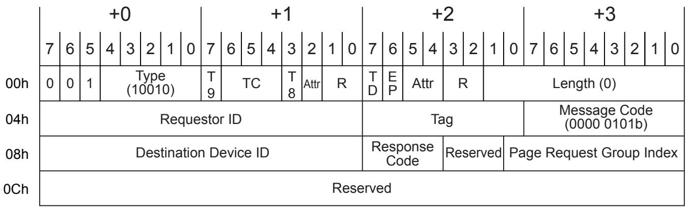  
A-0738A

Figure 10-27 PRG Response Message - Non-Flit Mode§  
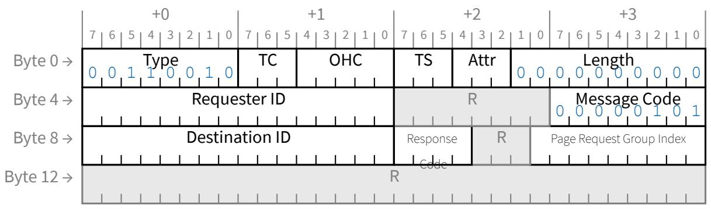

<details>
<summary>stacked bar chart</summary>

| Bit Position | Type | TC | OHC | TS | Attr | Length | Message Code | Destination ID | R | Page Request Group Index |
| --- | --- | --- | --- | --- | --- | --- | --- | --- | --- | --- |
| ------------ | ---- | -- | --- | -- | ---- | ------ | ------------ | -------------- | - | ------------------------- |
| 0 | 0 | 0 | 0 | 0 | 0 | 0 | 0 | 0 | R | 0 |
| 1 | 0 | 1 | 0 | 0 | 0 | 0 | 0 | 0 | R | 0 |
| 2 | 0 | 0 | 1 | 0 | 0 | 0 | 0 | 0 | R | 0 |
| 3 | 0 | 0 | 0 | 0 | 0 | 0 | 0 | 0 | R | 0 |
| 4 | 0 | 0 | 0 | 0 | 0 | 0 | 0 | 0 | R | 0 |
| ... | ... | ... | ... | ... | ... | ... | ... | ... | ... | ... |
| ... | ... | ... | ... | ... | ... | ... | ... | ... | ... | ... |
| ... | ... | ... | ... | ... | ... | ... | ... | ... | ... | ... |
| ... | ... | ... | ... | ... | ... | ... | ... | ... | ... | ... |
| ... | ... | ... | ... | ... | ... | ... | ... | ... | ... | ... |
| ... | ... | ... | ... | ... | ... | ... | ... | ... | ... | ... |
| ... | ... | ... | ... | ... | ... | ... | ... | ... | ... | ... |
| ... | ... | ... | ... | ... | ... | ... | ... | ... | ... | ... |
| ... | ... | ... | ... | ... | ... | ... | ... | ... | ... | ... |
| ... | ... | ... | ... | ... | ... | ... | ... | ... | ... | ... |
| ... | ... | ... | ... | ... | ... | ... | ... | ... | ... | ... |
| ... | ... | ... | ... | ... | ... | ... | ... | ... | ... | ... |
| ... | ... | ... | ... | ... | ... | ... | ... | ... | ... | ... |
| ... | ... | ... | ... | ... | ... | ... | ... | ... | ... | ... |
| ... | ... | ... | ... | ... | ... | ... | ... | ... | ... | ... |
</details>

Figure 10-28 PRG Response Message - FLIT Mode§

Table 10-7 PRG Response Message Data Fields§

<table><tr><td>Field</td><td>Meaning</td></tr><tr><td>Page Request Group Index</td><td>Page Request Group Index- This field contains a Function supplied index to which the RC is responding. A given PRG Index will receive exactly one response per instance of PRG (with the possible exception of a Response Failure).</td></tr><tr><td>Response Code</td><td>Response Code- This field contains the response type of the associated PRG. The encodings are presented in § Section 10.4.2.1 .</td></tr></table>

## 10.4.2.1 Response Code Field §

The values and meaning for the Response Code field are listed in § Table 10-8.

§

Table 10-8 Response Codes

<table><tr><td>Value</td><td>Status</td><td>Meaning</td></tr><tr><td>0000b</td><td>Success</td><td>All pages within the associated PRG were successfully made resident.</td></tr><tr><td>0001b</td><td>Invalid Request</td><td>One or more pages within the associated PRG do not exist or requests access privilege(s) that cannot be granted. Unless the page mapping associated with the Function is altered, re-issuance of the associated request will never result in success.</td></tr><tr><td>1110b:0010b</td><td>Unused</td><td>Unused Response Code values. A Function receiving such a message shall process it as if the message contained a Response Code of Response Failure.</td></tr><tr><td>1111b</td><td>Response Failure</td><td>One or more pages within the associated request group have encountered/caused a catastrophic error. This response disables the Page Request Interface at the Function. Any pending page requests for other PRGs will be satisfied at the convenience of the host. The Function shall ignore any subsequent PRG Response Messages, pending re-enablement of the Page Request Interface.</td></tr></table>

## 10.4.2.2 PASID Usage on PRG Responses §

If a Page Request has a PASID, the corresponding PRG Response Message may optionally contain one as well.

If the PRG Response PASID Required bit is Clear, PRG Response Messages do not have a PASID.

If the PRG Response PASID Required bit is Set, PRG Response Messages have a PASID if the Page Request also had one. The Function is permitted to use the PASID value from the prefix in conjunction with the PRG Index to match requests and responses.

When a PASID is attached to PRG Response Messages, the Execute Requested and Privileged Mode Requested bits are Reserved and the PASID value is copied from the PASID value of the Page Request.

## 10.5 ATS Configuration §

## 10.5.1 ATS Extended Capability §

Each Function that supports ATS (capable of generating Translation Requests) must have the ATS Extended Capability structure in its Extended Configuration Space. It is permitted to be implemented by Endpoints or RCiEPs.

ATS support is optional in SR-IOV devices. If a VF implements an ATS capability, its associated PF must implement an ATS capability. The ATS Capabilities in VFs and their associated PFs are permitted to be enabled independently.

§ Figure 10-29 details allocation of the register fields in the ATS Extended Capability structure.

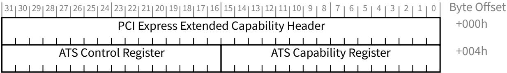

<details>
<summary>text_image</summary>

31 30 29 28 27 26 25 24 23 22 21 20 19 18 17 16 15 14 13 12 11 10 9 8 7 6 5 4 3 2 1 0
PCI Express Extended Capability Header
ATS Control Register	ATS Capability Register	Byte Offset
+000h
+004h
</details>

Figure 10-29 ATS Extended Capability Structure§

## 10.5.1.1 ATS Extended Capability Header (Offset 00h) §

§ Figure 10-30 details allocation of the register fields in the ATS Extended Capability Header; § Table 10-9 provides the respective field definitions.


<details>
<summary>text_image</summary>

31 20 19 16 15 0
Next Capability Offset 1h 000Fh
PCI Express Extended Capability ID
Capability Version
</details>

Figure 10-30 ATS Extended Capability Header§

Table 10-9 ATS Extended Capability Header§

<table><tr><td>Bit Location</td><td>Register Description</td><td>Attributes</td></tr><tr><td>15:0</td><td>PCI Express Extended Capability ID - Indicates the ATS Extended Capability structure. This field must return a Capability ID of &quot;000Fh&quot; indicating that this is an ATS Extended Capability structure.</td><td>RO</td></tr><tr><td>19:16</td><td>Capability Version - This field is a PCI-SIG defined version number that indicates the version of the Capability structure present.Must be &quot;1h&quot; for this version of the specification.</td><td>RO</td></tr><tr><td>31:20</td><td>Next Capability Offset - The offset to the next PCI Extended Capability structure or 000h if no other items exist in the linked list of capabilities.</td><td>RO</td></tr></table>

## 10.5.1.2 ATS Capability Register (Offset 04h) §

§ Figure 10-31 details the allocation of register fields of an ATS Capability Register; § Table 10-10 provides the respective bit definitions.

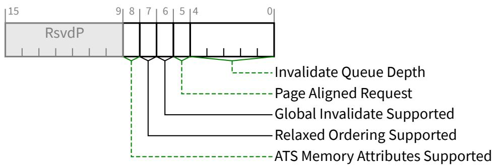

<details>
<summary>text_image</summary>

15
9 8 7 6 5 4 0
RsvdP
Invalidate Queue Depth
Page Aligned Request
Global Invalidate Supported
Relaxed Ordering Supported
ATS Memory Attributes Supported
</details>

Figure 10-31 ATS Capability Register (Offset 04h)§

Table 10-10 ATS Capability Register (Offset 04h)§

<table><tr><td>Bit Location</td><td>Register Description</td><td>Attributes</td></tr><tr><td>4:0</td><td>Invalidate Queue Depth- The number of Invalidate Requests that the Function can accept before putting backpressure on the Upstream connection. A value of Zero in a non-VF Function indicates that it can accept 32 Invalidate Requests.For VFs, this field must be hardwired to Zero. The associated PF&#x27;s value applies.</td><td>ROVF ROZ</td></tr><tr><td>5</td><td>Page Aligned Request- If Set, indicates the Untranslated Address is always aligned to a 4096 byte boundary. Setting this field is recommended. This field permits software to distinguish between implementations compatible with this specification and those compatible with an earlier version of this specification in which a Requester was permitted to supply anything in bits [11:2].</td><td>RO</td></tr><tr><td>6</td><td>Global Invalidate Supported- If Set, the Function supports Invalidation Requests that have the Global Invalidate bit Set. If Clear, the Function ignores the Global Invalidate bit in all Invalidate Requests (see § Section 10.3.8).This bit is 0b if the Function does not support PASID.</td><td>RO</td></tr><tr><td>7</td><td>Relaxed Ordering Supported- If Set, indicates this Function is permitted to Set the RO bit in Translation Requests when Enable Relaxed Ordering bit is Set.</td><td>RO</td></tr><tr><td>8</td><td>ATS Memory Attributes Supported– If Set, the Function supports using AMA values from ATS Translation Completions in the Function ATC. When Clear, the Function ignores the AMA field in ATS Translation Completions.</td><td>RO</td></tr></table>

## 10.5.1.3 ATS Control Register (Offset 06h) §

§ Figure 10-32 details the allocation of register fields of an ATS Control Register; § Table 10-11 provides the respective bit definitions.

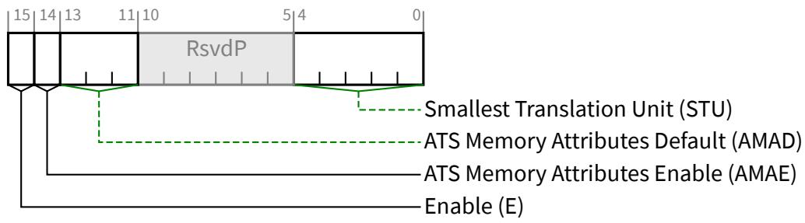

<details>
<summary>text_image</summary>

RsvdP
Smallest Translation Unit (STU)
ATS Memory Attributes Default (AMAD)
ATS Memory Attributes Enable (AMAE)
Enable (E)
</details>

Figure 10-32 ATS Control Register

§

§

Table 10-11 ATS Control Register

<table><tr><td>Bit Location</td><td colspan="2">Register Description</td><td>Attributes</td></tr><tr><td>4:0</td><td colspan="2">Smallest Translation Unit (STU) - This value indicates to the Function the minimum number of 4096-byte blocks that is indicated in a Translation Completions or Invalidate Requests. This is a power of 2 multiplier and the number of blocks is  $2^{STU}$ . A value of 0 0000b indicates one block and a value of 1 1111b indicates  $2^{31}$  blocks (or 8 TB total)For VFs, this field must be hardwired to Zero. The associated PF's value applies.Default value is 0 0000b.</td><td>RWVF ROZ</td></tr><tr><td rowspan="4">13:11</td><td colspan="2">ATS Memory Attributes Default (AMAD) – When Set, as a performance optimization, and when AMAE is Set, the Requestor is permitted to provide only non-default AMA values in Requests using the TPH TLP Prefix.</td><td rowspan="4">RW/RO</td></tr><tr><td>AMAD</td><td>ATS Memory Attributes</td></tr><tr><td>000b-111b</td><td>ATS Memory Attribute values.</td></tr><tr><td colspan="2">This field is permitted to be hardwired to 000b if ATS Memory Attributes Supported is Clear.Default value is 000b.</td></tr><tr><td>14</td><td colspan="2">ATS Memory Attributes Enable (AMAE) - When Set, the Requestor is permitted to provide AMA values in Requests using the TPH TLP Prefix.This bit is permitted to be hardwired to 0b if the ATS Memory Attributes Supported bit is Clear.Default value is 0b.</td><td>RW/RO</td></tr><tr><td>15</td><td colspan="2">Enable (E) - When Set, the Function is enabled to cache translations.Behavior is undefined if the Endpoint supports PASID, this bit is Set and any bit in the PASID Control Register is changed (see § Section 7.8.9.3 )Default value is 0b.</td><td>RW</td></tr></table>

## 10.5.2 Page Request Extended Capability Structure §

A Page Request Extended Capability Structure is used to configure the Page Request Interface mechanism. A Multi-Function Device or RCiEP Device may implement a Page Request Interface and the associated capability on any Endpoint Function within the Device. For SR-IOV devices, a single Page Request Interface is permitted for the PF and is shared between the PF and its associated VFs, in which case the PF implements this capability and its VFs must not. Every Page Request Interface mechanism operates independently.

For an SR-IOV device, even though the Page Request Interface is shared between its PFs and VFs, it sends the requesting Function’s ID (PF or VF) in the Requester ID field of the Page Request Message, and the requesting Function’s ID must be in the Destination Device ID field of the resulting PRG Response Message.

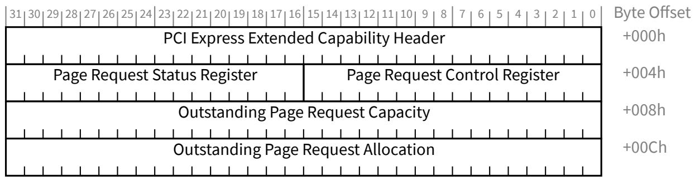

<details>
<summary>text_image</summary>

PCI Express Extended Capability Header
Page Request Status Register
Page Request Control Register
Outstanding Page Request Capacity
Outstanding Page Request Allocation
Byte Offset
+000h
+004h
+008h
+00Ch
</details>

Figure 10-33 Page Request Extended Capability Structure§

## 10.5.2.1 Page Request Extended Capability Header (Offset 00h) §

§ Figure 10-34 details allocation of the register fields in the Page Request Extended Capability Header; § Table 10-13 provides the respective field definitions.


<details>
<summary>text_image</summary>

31
20 19 16 15 0
Next Capability Offset 1h 0013h
PCI Express Extended Capability ID
Capability Version
</details>

Figure 10-34 Page Request Extended Capability Header§

Table 10-13 Page Request Extended Capability Header§

<table><tr><td>Bit Location</td><td>Register Description</td><td>Attributes</td></tr><tr><td>15:0</td><td>PCI Express Extended Capability ID - Indicates that the associated extended capability structure is a Page Request Extended Capability. This field must return a Capability ID of &quot;0013h&quot;.</td><td>RO</td></tr><tr><td>19:16</td><td>Capability Version - This field is a PCI-SIG defined version number that indicates the version of the Capability structure present.Must be &quot;1h&quot; for this version of the specification.</td><td>RO</td></tr><tr><td>31:20</td><td>Next Capability Offset - The offset to the next PCI Extended Capability structure or 000h if no other items exist in the linked list of capabilities.</td><td>RO</td></tr></table>

## 10.5.2.2 Page Request Control Register (Offset 04h) §

§ Figure 10-35 details allocation of the register fields in the Page Request Control Register; § Table 10-14 provides the respective field definitions.

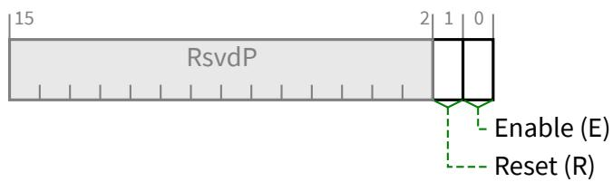

<details>
<summary>text_image</summary>

RsvdP
Enable (E)
Reset (R)
</details>

Figure 10-35 Page Request Control Register§

Table 10-14 Page Request Control Register§

<table><tr><td>Bit Location</td><td>Register Description</td><td>Attributes</td></tr><tr><td>0</td><td>Enable (E) - This field, when set, indicates that the Page Request Interface is allowed to make page requests. If this field is Clear, the Page Request Interface is not allowed to issue page requests. If both this field and the Stopped field are Clear, then the Page Request Interface will not issue new page requests, but has outstanding page requests that have been transmitted or are queued for transmission. When the Page Request Interface is transitioned from not-Enabled to Enabled, its status flags (Stopped, Response Failure, and Unexpected Page Request Group Index (UPRGI) flags) are cleared. Enabling a Page Request Interface that has not successfully Stopped has indeterminate results.Default value is 0b.</td><td>RW</td></tr><tr><td>1</td><td>Reset (R) - When the Enable field is clear, or is being cleared in the same register update that sets this field, writing a 1b to this field, clears the associated implementation dependent page request credit counter and pending request state for the associated Page Request Interface. No action is initiated if this field is written to 0b or if this field is written with any value while the Enable field is Set. Reads of this field return 0b</td><td>RW</td></tr></table>

## 10.5.2.3 Page Request Status Register (Offset 06h) §

§ Figure 10-36 details allocation of the register fields in the Page Request Error Register; § Table 10-15 provides the respective field definitions.

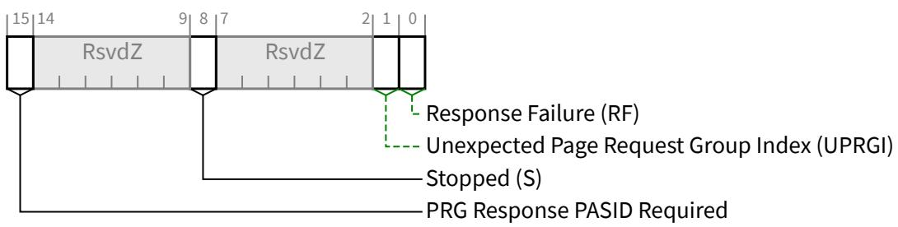

<details>
<summary>text_image</summary>

15 14 9 8 7 2 1 0
RsvdZ RsvdZ
Response Failure (RF)
Unexpected Page Request Group Index (UPRGI)
Stopped (S)
PRG Response PASID Required
</details>

Figure 10-36 Page Request Status Register§

Table 10-15 Page Request Status Register§

<table><tr><td>Bit Location</td><td>Register Description</td><td>Attributes</td></tr><tr><td>0</td><td>Response Failure (RF) - This field, when Set, indicates that the Function has received a PRG Response Message indicating a Response Failure. The Function expects no further responses from the host (any received are ignored). This field is Set by the Function and Cleared when a one is written to the field.For SR-IOV, this field is Set in the PF if any associated Function (PF or VF) receives a PRG Response Message indicating Response Failure.Default value is 0b.</td><td>RW1C</td></tr><tr><td>1</td><td>Unexpected Page Request Group Index (UPRGI) - This field, when Set, indicates that the Function has received a PRG Response Message containing a PRG index that has no matching request. This field is Set by the Function and cleared when a one is written to the field.For SR-IOV, this field is Set in the PF if any associated Function (PF or VF) receives a PRG Response Message that does has no matching request.Default value is 0b.</td><td>RW1C</td></tr><tr><td>8</td><td>Stopped (S) - When this field is Set, the associated page request interface has stopped issuing additional page requests and that all previously issued Page Requests have completed. When this field is Clear the associated page request interface either has not stopped or has stopped issuing new Page Requests but has outstanding Page Requests. This field is only meaningful if Enable is Clear. If Enable is Set, this field is undefined.When the Enable field is Cleared, after having been previously Set, the interface transitions to the stopping state and Clears this field. After all page requests currently outstanding at the Function(s) have completed, this field is Set and the interface enters the disabled state. If there were no outstanding page requests, this field may be Set immediately when Enable is Cleared. Resetting the interface will cause an immediate transition to the disabled state. While in the stopping state, receipt of a Response Failure message will result in the immediate transition to the disabled state (Setting this field).For SR-IOV, this field is Set only when all associated Functions (PF and VFs) have stopped issuing page requests.Default value is 1b.</td><td>RO</td></tr><tr><td>15</td><td>PRG Response PASID Required - If Set, the Function expects a PASID on PRG Response Messages when the corresponding Page Requests had a PASID. If Clear, the Function does not expect PASID on any PRG Response Message.Function behavior is undefined if this bit is Clear and the Function receives a PRG Response Message with a PASID.Function behavior is undefined if this bit is Set and the Function receives a PRG Response Message with no PASID when the corresponding Page Requests had a PASID.This bit is RsvdZ if the Function does not support PASID.</td><td>RO</td></tr></table>

## 10.5.2.4 Outstanding Page Request Capacity (Offset 08h)


This register contains the number of outstanding page request messages the associated Page Request Interface physically supports. This is the upper limit on the number of pages that can be usefully allocated to the Page Request Interface.

This register is Read Only.

## 10.5.2.5 Outstanding Page Request Allocation (Offset 0Ch)


This register contains the number of outstanding page request messages the associated Page Request Interface is allowed to issue (have outstanding at any given instance).

The number of PRGs a Page Request Interface has outstanding is less than or equal to the number of request messages it has issued. For example, if system software allocates 1000 messages to a Page Request Interface then a single PRG could use all 1000 of the possible requests. Conversely, at one request per PRG the Page Request Interface would run out of PRG indices (of which there are only 512) before it consumes all its page request credits. A Page Request Interface must pre-allocate its request availability for any given PRG, that is, all the requests required by a given PRG must be available before any of the requests may be issued.

When Shadow functions are enabled, this allocation applies to the Function containing this capability and its enabled Shadow Functions (See Section 7.9.21).

This register is Read/Write. Behavior is undefined if this register is changed while the Enable flag is set. Behavior is undefined if this register is written with a value larger than Outstanding Page Request Capacity. Default value is 0.

When PASID is supported, the Request Allocation remains associated with the Function and is shared across the Function as well as all PASIDs of the Function.

Stopping a PASID does not affect any allocation used by that PASID. The system should continue to respond with PRG Response Messages in order to return Page Request and PRG Index resources to the Function (see § Section 10.4.2.1 ).

Stop Marker Messages consume buffering but are not included in this allocation (see § Section 10.4.1.2.1 ). Systems should provide additional buffering for Stop Marker Messages and should limit the number of outstanding Stop Marker Messages to avoid overrunning this additional buffering.

## A. Isochronous Applications §

## A.1 Introduction §

The design goal of isochronous mechanisms in PCI Express is to ensure that isochronous traffic receives its allocated bandwidth over a relevant time period while also preventing starvation of other non-isochronous traffic.

Furthermore, there may exist data traffic that requires a level of service falling in between what is required for bulk data traffic and isochronous data traffic. This type of traffic can be supported through the use of Port arbitration within Switches, the use of TC labels [1:7], and optional additional VC resources. Policies for assignment of TC labels and VC resources that are not isochronous-focused are outside the scope of the PCI Express specification.

Two paradigms of PCI Express communication are supported by the PCI Express isochronous mechanisms: Endpoint-to-Root-Complex communication model and peer-to-peer (Endpoint-to-Endpoint) communication model. In the Endpoint-to-Root-Complex communication model, the primary isochronous traffic is memory read and write requests to the Root Complex and read completions from the Root Complex. § Figure A-1 shows an example of a simple system with both communication models. In the figure, devices A, B, called Requesters, are PCI Express Endpoints capable of issuing isochronous request transactions, while device C and Root Complex, called Completers, are capable of being the targets of isochronous request transactions. An Endpoint-to-Root-Complex communication is established between device A and the Root Complex, and a peer-to-peer communication is established between device B and device C. In the rest of this section, Requester and Completer will be used to make reference to PCI Express elements involved in transactions. The specific aspects of each communication model will be called out explicitly.

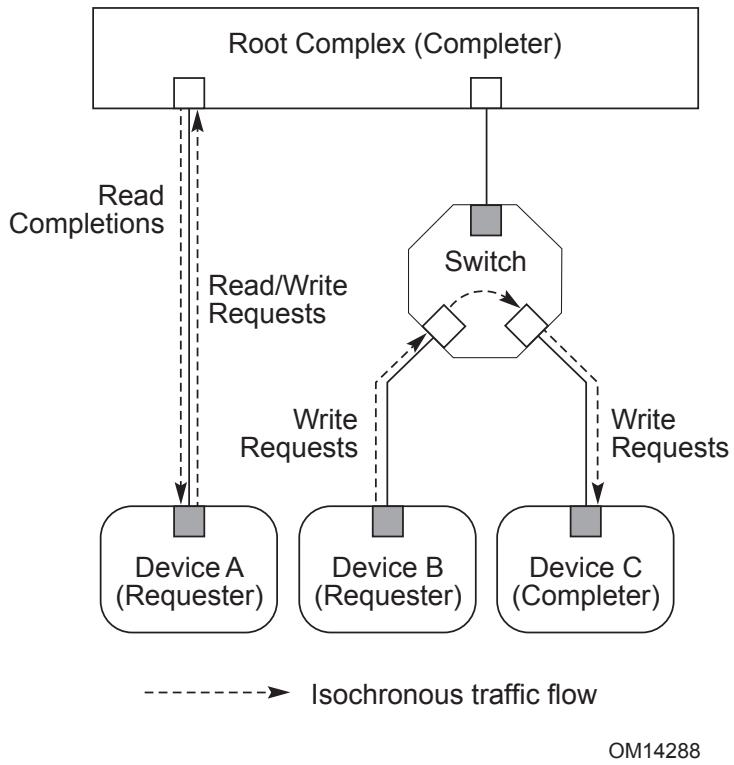

<details>
<summary>flowchart</summary>

```mermaid
graph TD
  A["Root Complex (Completer)"] -->|Read Completions| B["Device A (Requester)"]
  A -->|Read/Write Requests| C["Switch"]
  C -->|Write Requests| D["Device B (Requester)"]
  C -->|Write Requests| E["Device C (Completer)"]
    D -.-> F["Isochronous traffic flow"]
    E -.-> F
    style A fill:#f9f,stroke:#333
    style B fill:#ccf,stroke:#333
    style C fill:#cfc,stroke:#333
    style D fill:#fcc,stroke:#333
    style E fill:#fcc,stroke:#333
```
</details>

Figure A-1 An Example Showing Endpoint-to-Root-Complex and Peer-to-Peer Communication Models§

Guaranteed bandwidth and deterministic latency require end-to-end configuration of fabric resources. If isochronous traffic is intermixed with non-isochronous traffic, it may not be possible to provide any guarantees/determinism as required by the application usage model. It is recommended that system software configure and assign fabric resources such that traffic intermix either does not occur or is such that the application usage model guarantees can be met. This can be accomplished by assigning dedicated VC resources and corresponding TC labels to the isochronous traffic flow(s) on a given path within the fabric.

Note that there may be one or more isochronous traffic flows per VC/TC label and it is up to system software to insure that the aggregation of these flows does not exceed the requisite bandwidth and latency requirements.

It is also possible for a fabric to support multiple isochronous traffic flows separated across multiple VC (a given flow cannot span multiple VC/TC labels).

In general, as long as the device can meet the isochronous bandwidth and latency requirements, there is nothing to preclude a single VC device from supporting isochronous traffic if multiple TC labels are supported to delineate such traffic from non-isochronous traffic within the fabric.

## A.2 Isochronous Contract and Contract Parameters §

In order to support isochronous data transfer with guaranteed bandwidth and deterministic latency, an isochronous contract must be established between a Requester/Completer pair and the PCI Express fabric. This contract must enforce both resource reservation and traffic regulation. Without such a contract, two basic problems, over-subscription and congestion, may occur as illustrated in § Figure A-2. When interconnect bandwidth resources are over-subscribed, the increased latency may cause failure of isochronous service and starvation of non-isochronous services. Traffic congestion occurs when flow control credits are not returned possibly due to a higher than expected/provisioned packet injection rate. This may cause excessive service latencies for both isochronous traffic and non-isochronous traffic.

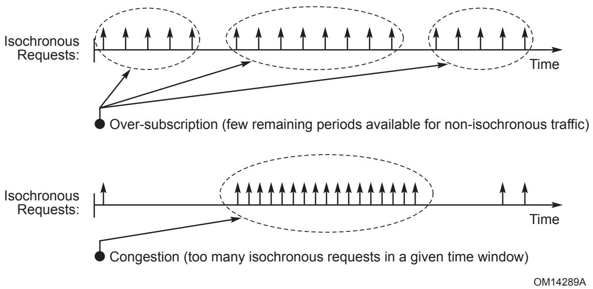

<details>
<summary>flowchart</summary>

```mermaid
graph TD
  A["Isochronous Requests"] --> B["Time Interval"]
  B --> C["Over-subscription (few remaining periods available for non-isochronous traffic)"]
  D["Isochronous Requests"] --> E["Time Interval"]
  E --> F["Congestion (too many isochronous requests in a given time window)"]
    style A fill:#f9f,stroke:#333
    style B fill:#ccf,stroke:#333
    style C fill:#cfc,stroke:#333
    style D fill:#fcc,stroke:#333
    style E fill:#cff,stroke:#333
    style F fill:#ffc,stroke:#333
```
</details>

Figure A-2 Two Basic Bandwidth Resourcing Problems: Over-Subscription and Congestion§

The isochronous transfer mechanism in this specification addresses these problems with traffic regulation including admission control and service discipline. Under a software managed admission control, a Requester must not issue isochronous transactions unless the required isochronous bandwidth and resource have been allocated. Specifically, the isochronous bandwidth is given by the following formula:

$$
B W = \frac {N * Y}{T}
$$

§

Equation A-1 Isochronous Bandwidth

The formula defines allocated bandwidth (BW) as a function of specified number (N) of transactions of a specified payload size (Y) within a specified time period (T). Another important parameter in the isochronous contract is latency. Based on the contract, isochronous transactions are completed within a specified latency (L). Once a Requester/ Completer pair is admitted for isochronous communication, the bandwidth and latency are guaranteed to the Requester (a PCI Express Endpoint) by the Completer (Root Complex for Endpoint-to-Root-Complex communication and another PCI Express Endpoint for peer-to-peer communication) and by the PCI Express fabric components (Switches).

Specific service disciplines must be implemented by isochronous-capable PCI Express components. The service disciplines are imposed to PCI Express Switches and Completers in such a manner that the service of isochronous requests is subject to a specific service interval (t). This mechanism is used to provide the method of controlling when an isochronous packet injected by a Requester is serviced. Consequently, isochronous traffic is policed in such manner that only packets that can be injected into the fabric in compliance with the isochronous contract are allowed to make immediate progress and start being serviced by the PCI Express fabric. A non-compliant Requester that tries to inject more isochronous transactions than what was being allowed by the contract is prevented from doing so by the flow-control mechanism thereby allowing compliant Requesters to correctly operate independent of non-compliant Requesters.

In the Endpoint-to-Root-Complex model, since the aggregated isochronous traffic is eventually limited by the host memory subsystem's bandwidth capabilities, isochronous read requests, and write requests (and Messages) are budgeted together. A Requester may divide the isochronous bandwidth between read requests and write requests as appropriate.

## A.2.1 Isochronous Time Period and Isochronous Virtual Timeslot §

The PCI Express isochronous time period (T) is uniformly divided into units of virtual timeslots (t). To provide precise isochronous bandwidth distribution only one isochronous request packet is allowed per virtual timeslot. The virtual timeslot supported by a PCI Express component is reported through the Reference Clock field in the Virtual Channel Capability structure or the Multi-Function Virtual Channel Capability structure. When Reference Clock = 00b, duration of a virtual timeslot t is 100 ns. Duration of isochronous time period T depends on the number of phases of the supported time-based WRR Port arbitration table size. When the time-based WRR Port Arbitration Table size equals to 128, there are 128 virtual timeslots (t) in an isochronous time period (i.e., T = 12.8 μs).

Note that isochronous period T as well as virtual timeslots t do not need to be aligned and synchronized among different PCI Express isochronous devices, i.e., the notion of {T, t} is local to each individual isochronous device.

## A.2.2 Isochronous Payload Size §

The payload size (Y) for isochronous transactions must not exceed Max\_Payload\_Size (see § Section 7.8.4 ). After configuration, the Max\_Payload\_Size is set and fixed for each path that supports isochronous service with a value required to meet isochronous latency. The fixed Max\_Payload\_Size value is used for isochronous bandwidth budgeting regardless of the actual size of data payload associated with isochronous transactions. For isochronous bandwidth budgeting, we have

$$
Y = \text { Max\_Payload\_Size }
$$

Equation A-2 Isochronous Payload Size

A transaction with partial writes is treated as a normally accounted transaction. A Completer must account for partial writes as part of bandwidth assignment (for worst case servicing time).

## A.2.3 Isochronous Bandwidth Allocation §

Given T, t and Y, the maximum virtual timeslots within a time period is

$$
N _ {\max} = \frac {T}{t}
$$

Equation A-3 $N _ { m a x }$

and the maximum specifiable isochronous bandwidth is

$$
B W _ {\max} = \frac {Y}{t}
$$

Equation A-4 BWmax

The granularity with which isochronous bandwidth can be allocated is defined as:

$$
B W _ {g r a n u l a r i t y} = \frac {Y}{T}
$$

Equation A-5 BWgranularity

Given T and t at 12.8 μs and 100 ns, respectively, $N _ { m a x }$ is 128. As shown in § Table A-1, $B W _ { m a x }$ and $B W _ { g }$ ranularity are functions of the isochronous payload size Y.

$\begin{array} { c } { { T a b l e A - 1 ~ I s o c h r o n o u s ~ B a n d w i d t h ~ R a n g e s ~ a n d } } \\ { { G r a n u l a r i t i e s } } \end{array}$

<table><tr><td>Y (bytes)</td><td>128</td><td>256</td><td>512</td><td>1024</td></tr><tr><td> $BW_{max}$  (MB/s)</td><td>1289</td><td>2560</td><td>5120</td><td>10240</td></tr><tr><td> $BW_{granularity}$  (MB/s)</td><td>10</td><td>20</td><td>40</td><td>80</td></tr></table>

Similar to bandwidth budgeting, isochronous service disciplines including arbitration schemes are based on counting requests (not the sizes of those requests). Therefore, assigning isochronous bandwidth $B W _ { I i n k }$ to a PCI Express Link is equivalent to assigning $N _ { l i n k }$ virtual timeslots per isochronous period, where $N _ { l i n k }$ is given by

$$
N _ {l i n k} = \frac {B W _ {l i n k}}{B W _ {g r a n u l a r i t y}}
$$

Equation A-6 Nlink

A Switch Port serving as an Egress Port (or an RCRB serving as a “virtual” Egress Port) for an isochronous traffic, the $N _ { m a x }$ virtual timeslots within T are represented by the time-based WRR Port Arbitration Table in the PCI Express Virtual Channel Capability structure detailed in § Section 7.9.1 . The table consists of $N _ { m a x }$ entries. An entry in the table represents one virtual timeslot in the isochronous time period. When a table entry is given a value of PN, it means that the timeslot is assigned to an Ingress Port (in respect to the isochronous traffic targeting the Egress Port) designated by a Port Number of PN. Therefore, $N _ { l i n k }$ virtual timeslots are assigned to the Ingress Port when there are $N _ { l i n k }$ entries in the table with value of PN. The Egress Port may admit one isochronous request transaction from the Ingress Port for further service only when the table entry reached by the Egress Port's isochronous time ticker (that increments by 1 every t time and wraps around when reaching T) is set to PN. Even if there are outstanding isochronous requests ready in the Ingress Port, they will not be served until next round of time-based WRR arbitration. In this manner, the time-based Port Arbitration Table serves for both isochronous bandwidth assignment and isochronous traffic regulation.

For an Endpoint serving as a Requester or a Completer, isochronous bandwidth allocation is accomplished through negotiation between system software and device driver, which is outside of the scope of this specification.

## A.2.4 Isochronous Transaction Latency §

Transaction latency is composed of the latency through the PCI Express fabric and the latency contributed by the Completer. Isochronous transaction latency is defined for each transaction and measured in units of virtual timeslot t.

• The read latency is defined as the round-trip latency. This is the delay from the time when the device submits a memory read request packet to its Transaction Layer (Transmit side) to the time when the corresponding read completion arrives at the device's Transaction Layer (Receive side).  
• The write latency is defined as the delay from the time when the Requester posts a memory write request to its PCI Express Transaction Layer (Transmit side) to the time when the data write becomes globally visible within the memory subsystem of the Completer. A write to memory reaches the point of global visibility when all agents accessing that memory address get the updated data.

When the upper bound and the lower bound of isochronous transaction latency are provided, the size of isochronous data buffers in a Requester can be determined. For most of common platforms, the minimum isochronous transaction latency is much smaller than the maximum. As a conservative measure, the minimum isochronous transaction latency is assumed to be zero; only guidelines on measuring the maximum isochronous transaction latency are provided here.

For a Requester, the maximum isochronous (read or write) transaction latency (L) can be accounted as the following:

$$
L = L _ {F a b r i c} + L _ {C o m p l e t e r}
$$

Equation A-7 Max Isochronous Transaction Latency

where $L _ { F a b r i c }$ is the maximum latency of the PCI Express fabric and $L _ { C o m p l e t e r }$ is the maximum latency of the Completer.

$L _ { F a b r i c }$ which applies to both read and write transactions, depends on the topology, latency across each PCI Express Link, and the arbitration point in the path between the Requester to the Completer. The latency on a PCI Express Link

depends on pipeline delays, width and operational frequency of the Link, transmission of electrical signals across the medium, wake up latency from low power states, and delays caused by Data Link Layer Retry.

A restriction on the PCI Express topology may be imposed for each targeted platform in order to provide a practically meaningful guideline for $L _ { F a b r i c }$ . The values of $L _ { F a b r i c }$ should be reasonable and serve as practical upper limits under normal operating conditions.

The value of $L _ { C o m p l e t e r }$ depends on the memory technology, memory configuration, and the arbitration policies in the Completer that comprehend PCI Express isochronous traffic. The target value for $L _ { C o m p l e t e r }$ should provide enough headroom to allow for implementation tradeoffs.

Definitions of read and write transaction latencies for a Completer are different:

Read transaction latency for the Completer is defined as the delay from the time a memory read transaction is available at the Receiver end of a PCI Express Port in the Completer to the time the corresponding read completion transaction is posted to the transmission end of the PCI Express Port.  
• Write transaction latency is defined as the delay from the time a memory write transaction is available at the Receiver end of a PCI Express Port in the Completer to the time that the transmitted data is globally visible.

All of the isochronous transaction latencies defined above are based on the assumption that the Requester injects isochronous transactions uniformly. According to an isochronous contract of {N, T, t}, the uniform traffic injection is defined such that up to N transactions are evenly distributed over the isochronous period T based on a ticker granularity of virtual timeslot t. For a Requester with non-uniform isochronous transaction injection, the Requester is responsible of accounting for any additional delay due to the deviation of its injection pattern from a uniform injection pattern.

## A.2.5 An Example Illustrating Isochronous Parameters §

§ Figure A-3 illustrates the key isochronous parameters using a simplified example with T = 20t and L = 22t. A Requester has reserved isochronous bandwidth of four transactions per T. The device shares the allocated isochronous bandwidths for both read requests and write requests. As shown, during one isochronous time period, the Requester issues two read requests and two write requests. All requests are completed within the designated transaction latency L. Also shown in the figure, there is no time dependency between the service time of write requests and the arrival time of read completions.

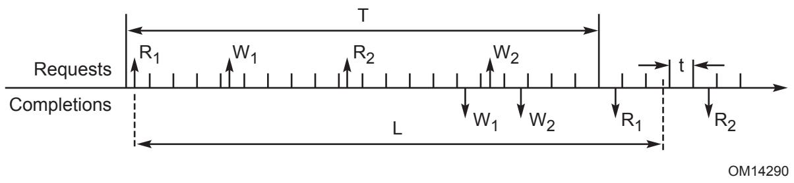

<details>
<summary>flowchart</summary>

```mermaid
graph LR
  A["Requests"] --> B["R1"]
  B --> C["W1"]
  C --> D["R2"]
  D --> E["W2"]
  E --> F["t"]
  F --> G["R2"]
  G --> H["L"]
  H --> I["Completions"]
    style A fill:#f9f,stroke:#333
    style F fill:#ccf,stroke:#333
    style H fill:#cfc,stroke:#333
```
</details>

Figure A-3 A Simplified Example Illustrating PCI Express Isochronous Parameters§

## A.3 Isochronous Transaction Rules §

Isochronous transactions follow the same rules as described in § Chapter 2. . In order to assist the Completer to meet latency requirements, the following additional rules further illustrate and clarify the proper behavior of isochronous transactions:

• The value in the Length field of requests must never exceed Max\_Payload\_Size.

## A.4 Transaction Ordering §

In general, isochronous transactions follow the ordering rules described in § Section 2.4 . The following ordering rule further illustrates and clarifies the proper behavior of isochronous transactions:

• There are no ordering guarantees between any isochronous and non-isochronous transactions because the traffic has been segregated into distinct VC resources.  
• Isochronous write requests are serviced on any PCI Express Link in strictly the same order as isochronous write requests are posted.  
• Switches must allow isochronous posted requests to pass isochronous read completions.

## A.5 Isochronous Data Coherency §

Cache coherency for isochronous transactions is an operating system software and Root Complex hardware issue. PCI Express provides the necessary mechanism to control Root Complex behavior in terms of enforcing hardware cache coherency on a per transaction basis.

For platforms where snoop latency in a Root Complex is either unbounded or can be excessively large, in order to meet tight maximum isochronous transaction latency LCompleter, or more precisely LRoot\_Complex, all isochronous transactions should have the No Snoop Attribute bit set.

A Root Complex must report the Root Complex's capability to the system software by setting the Reject Snoop Transactions field in the VC Resource Capability register (for any VC resource capable of supporting isochronous traffic) in its RCRB. Based on whether or not a Root Complex is capable of providing hardware enforced cache coherency for isochronous traffic while still meeting isochronous latency target, system software can then inform the device driver of Endpoints to set or unset the No Snoop Attribute bit for isochronous transactions.

Note that cache coherency considerations for isochronous traffic do not apply to peer-to-peer communication.

## A.6 Flow Control §

Completers and PCI Express fabric components should implement proper sizing of buffers such that under normal operating conditions, no backpressure due to flow control should be applied to isochronous traffic injected uniformly by a Requester. For Requesters that are compliant to the isochronous contract, but have bursty injection behavior, Switches and Completers may apply flow control backpressure as long as the admitted isochronous traffic is uniform and compliant to the isochronous contract. Under abnormal conditions when isochronous traffic jitter becomes significant or when isochronous traffic is oversubscribed due to excessive Data Link Layer Retry, flow control provides a natural mechanism to ensure functional correctness.

## A.7 Considerations for Bandwidth Allocation §

## A.7.1 Isochronous Bandwidth of PCI Express Links §

Isochronous bandwidth budgeting for PCI Express Links can be derived based on Link parameters such as isochronous payload size and the speed and width of the Link.

Isochronous bandwidth allocation for a PCI Express Link should be limited to certain percentage of the maximum effective Link bandwidth in order to leave sufficient bandwidth for non-isochronous traffic and to account for temporary Link bandwidth reduction due to retries. Link utilization is counted based on the actual cycles consumed on the physical PCI Express Link. The maximum number of virtual slots allowed per Link $( N _ { l i n k } )$ depends on the isochronous packet payload size and the speed and width of the Link.

As isochronous bandwidth allocation on a PCI Express Link is based on number of requests Nlink per isochronous period. There is no distinction between read requests and write requests in budgeting isochronous bandwidth on a PCI Express Link.

## A.7.2 Isochronous Bandwidth of Endpoints §

For peer-to-peer communication, the device driver is responsible for reporting to system software if the device is capable of being a Completer for isochronous transactions. In addition, the driver must report the device’s isochronous bandwidth capability. The specifics of the report mechanism are outside the scope of this specification.

## A.7.3 Isochronous Bandwidth of Switches §

Allocation of isochronous bandwidth for a Switch must consider the capacity and utilization of PCI Express Links associated with the Ingress Port and the Egress Port of the Switch that connect the Requester and the Completer, respectively. The lowest common denominator of the two determines if a requested isochronous bandwidth can be supported.

## A.7.4 Isochronous Bandwidth of Root Complex §

Isochronous bandwidth of Root Complex is reported to the software through its RCRB structure. Specifically, the Maximum Time Slots field of the VC Resource Capability register in VC Extended Capability structure indicates the total isochronous bandwidth shared by the Root Ports associated with the RCRB. Details of the platform budgeting for available isochronous bandwidth within a Root Complex are outside of the scope of this specification.

## A.8 Considerations for PCI Express Components §

## A.8.1 An Endpoint as a Requester §

Before an Endpoint as a Requester can start issuing isochronous request transactions, the following configuration steps must be performed by software:

• Configuration of at least one VC resource capable of supporting isochronous communication and assignment of at least one TC label.  
• Enablement of this VC resource.

When the Requester uniformly injects isochronous requests, the Receive Port, either a Switch Port or a Root Port, should issue Flow Control credits back promptly such that no backpressure should be applied to the associated VC. This type of Requester may size its buffer based on the PCI Express fabric latency LFabric plus the Completer's latency LCompleter.

When isochronous transactions are injected non-uniformly, either some transactions experience longer PCI Express fabric delay or the Requester gets back-pressured on the associated VC. This type of Requester must size its buffer to account for the deviation of its injection pattern from uniformity.

## A.8.2 An Endpoint as a Completer §

An Endpoint may serve as a Completer for isochronous peer-to-peer communication. Before an Endpoint starts serving isochronous transactions, system software must identify/configure a VC resource capable of supporting isochronous traffic and assigned a corresponding TC label.

An Endpoint Completer must observe the maximum isochronous transaction latency $\left( L _ { C o m p l e t e r } \right)$ . An Endpoint Completer does not have to regulate isochronous request traffic if attached to a Switch since Switches implement traffic regulation. However, an Endpoint Completer must size its internal buffer such that no backpressure should be applied to the corresponding VC.

## A.8.3 Switches §

A Switch may have multiple ports capable of supporting isochronous transactions. Before a Switch starts serving isochronous transactions for a Port, the software must perform the following configuration steps:

• Configuration/enablement of at least one VC resource capable of supporting isochronous communication.  
• Configuration of the Port as an Ingress Port:

◦ Configuration (or reconfiguration if the associated VC of the Egress Port is already enabled) of the time-based WRR Port Arbitration Table of the targeting Egress Port to include $N _ { l i n k }$ entries set to the Ingress Port's Port Number. Here $N _ { l i n k }$ is the isochronous allocation for the Ingress Port.

◦ Enabling the targeting Egress Port to load newly programmed Port Arbitration Table.

• Configuration of the Port as an Egress Port:

◦ Configuration of each VC's Port Arbitration Table with number of entries set according to the assigned isochronous bandwidth for all Ingress Ports.  
◦ Select proper VC Arbitration, e.g., as strict-priority based VC Arbitration.  
◦ If required, configuration of the Port's VC Arbitration Table with large weights assigned accordingly to each associated VC.

Each VC associated with isochronous traffic may be served as the highest priority in arbitrating for the shared PCI Express Link resource at an Egress Port. This is comprehended by a Switch's internal arbitration scheme.

In addition, a Switch Port may use “just in time” scheduling mechanism to reduce VC arbitration latency. Instead of pipelining non-isochronous Transport Layer packets to the Data Link Layer of the Egress Port in a manner that Data Link Layer transmit buffer becomes saturated, the Switch Port may hold off scheduling of a new non-isochronous packet to the Data Link Layer as long as it is possible without incurring unnecessary Link idle time.

When a VC configured to support isochronous traffic is enabled for a Switch Port (ingress) that is connected to a Requester, the Switch must enforce proper traffic regulation to ensure that isochronous traffic from the Port conforms to this specification. With such enforcement, normal isochronous transactions from compliant Requesters will not be impacted by ill behavior of any non-compliant Requester.

The above isochronous traffic regulation mechanism only applies to request transactions but not to completion transactions. When Endpoint-to-Root-Complex and peer-to-peer communications co-exist in a Switch, an Egress Port may mix isochronous write requests and read completions in the same direction. In the case of contention, the Egress Port must allow write requests to pass read completions to ensure the Switch meets latency requirement for isochronous requests.

## A.8.4 Root Complex §

A Root Complex may have multiple Root Ports capable of supporting isochronous transactions. Before a Root Complex starts serving isochronous transactions for a Root Port, the Port must be configured by software to enable VC to support isochronous traffic using the following configuration steps:

• Configuration of at least one VC resource capable of supporting isochronous communication and assignment of at least one TC label.  
• Configuration of the Root Port as an Ingress Port:

◦ Configuration (or reconfiguration if the associated VC in RCRB is already enabled) of the time-based WRR Port Arbitration Table of the targeting RCRB to include $N _ { l i n k }$ entries set to the Ingress Port's Port Number. Here $N _ { l i n k }$ is the isochronous allocation for the Port.

◦ Enabling the targeting RCRB to load newly programmed Port Arbitration Table.

• Configuration of the Root Port as an Egress Port:

◦ If supported, configuration of the Root Port's VC Arbitration Table with large weights assigned to the associated VC.

◦ If the Root Complex supports peer-to-peer traffic between Root Ports, configuration of the Root Port's Port Arbitration Table number of entries is set according to the assigned isochronous bandwidth for all Ingress Ports.

A Root Complex must observe the maximum isochronous transaction latency (LCompleter or more precisely LRoot\_Complex) that applies to all the Root Ports in the Root Complex. How a Root Complex schedules memory cycles for PCI Express isochronous transactions and other memory transactions is outside of the scope of this specification as long as LRoot\_Complex is met for PCI Express isochronous transactions.

When a VC is enabled to support isochronous traffic for a Root Port, the Root Complex must enforce proper traffic regulation to ensure that isochronous traffic from the Root Port conforms to this specification. With such enforcement, normal isochronous transactions from compliant Requesters will not be impacted by ill behavior of any non-compliant Requesters. Isochronous traffic regulation is implemented using the time-based Port Arbitration Table in RCRB.

Root Complex may perform the following operations for invalid isochronous transactions:

• Return partial completions for read requests with the value in the Length field exceeding Max\_Payload\_Size.

## B. Symbol Encoding §

§ Table B-1 shows the byte-to-Symbol encodings for data characters. § Table B-2 shows the Symbol encodings for the Special Symbols used for TLP/DLLP Framing and for interface management. RD- and RD+ refer to the Running Disparity of the Symbol sequence on a per-Lane basis.

Table B-1 8b/10b Data Symbol Codes§

<table><tr><td>Data Byte Name</td><td>Data Byte Value (hex)</td><td>Bits HGF EDCBA (binary)</td><td>Current RD- abcdei fghj (binary)</td><td>Current RD+ abcdei fghj (binary)</td></tr><tr><td>D0.0</td><td>00</td><td>000 00000</td><td>100111 0100</td><td>011000 1011</td></tr><tr><td>D1.0</td><td>01</td><td>000 00001</td><td>011101 0100</td><td>100010 1011</td></tr><tr><td>D2.0</td><td>02</td><td>000 00010</td><td>101101 0100</td><td>010010 1011</td></tr><tr><td>D3.0</td><td>03</td><td>000 00011</td><td>110001 1011</td><td>110001 0100</td></tr><tr><td>D4.0</td><td>04</td><td>000 00100</td><td>110101 0100</td><td>001010 1011</td></tr><tr><td>D5.0</td><td>05</td><td>000 00101</td><td>101001 1011</td><td>101001 0100</td></tr><tr><td>D6.0</td><td>06</td><td>000 00110</td><td>011001 1011</td><td>011001 0100</td></tr><tr><td>D7.0</td><td>07</td><td>000 00111</td><td>111000 1011</td><td>000111 0100</td></tr><tr><td>D8.0</td><td>08</td><td>000 01000</td><td>111001 0100</td><td>000110 1011</td></tr><tr><td>D9.0</td><td>09</td><td>000 01001</td><td>100101 1011</td><td>100101 0100</td></tr><tr><td>D10.0</td><td>0A</td><td>000 01010</td><td>010101 1011</td><td>010101 0100</td></tr><tr><td>D11.0</td><td>0B</td><td>000 01011</td><td>110100 1011</td><td>110100 0100</td></tr><tr><td>D12.0</td><td>0C</td><td>000 01100</td><td>001101 1011</td><td>001101 0100</td></tr><tr><td>D13.0</td><td>0D</td><td>000 01101</td><td>101100 1011</td><td>101100 0100</td></tr><tr><td>D14.0</td><td>0E</td><td>000 01110</td><td>011100 1011</td><td>011100 0100</td></tr><tr><td>D15.0</td><td>0F</td><td>000 01111</td><td>010111 0100</td><td>101000 1011</td></tr><tr><td>D16.0</td><td>10</td><td>000 10000</td><td>011011 0100</td><td>100100 1011</td></tr><tr><td>D17.0</td><td>11</td><td>000 10001</td><td>100011 1011</td><td>100011 0100</td></tr><tr><td>D18.0</td><td>12</td><td>000 10010</td><td>010011 1011</td><td>010011 0100</td></tr><tr><td>D19.0</td><td>13</td><td>000 10011</td><td>110010 1011</td><td>110010 0100</td></tr><tr><td>D20.0</td><td>14</td><td>000 10100</td><td>001011 1011</td><td>001011 0100</td></tr><tr><td>D21.0</td><td>15</td><td>000 10101</td><td>101010 1011</td><td>101010 0100</td></tr><tr><td>D22.0</td><td>16</td><td>000 10110</td><td>011010 1011</td><td>011010 0100</td></tr><tr><td>D23.0</td><td>17</td><td>000 10111</td><td>111010 0100</td><td>000101 1011</td></tr><tr><td>D24.0</td><td>18</td><td>000 11000</td><td>110011 0100</td><td>001100 1011</td></tr><tr><td>D25.0</td><td>19</td><td>000 11001</td><td>100110 1011</td><td>100110 0100</td></tr><tr><td>D26.0</td><td>1A</td><td>000 11010</td><td>010110 1011</td><td>010110 0100</td></tr><tr><td>D27.0</td><td>1B</td><td>000 11011</td><td>110110 0100</td><td>001001 1011</td></tr><tr><td>D28.0</td><td>1C</td><td>000 11100</td><td>001110 1011</td><td>001110 0100</td></tr><tr><td>D29.0</td><td>1D</td><td>000 11101</td><td>101110 0100</td><td>010001 1011</td></tr><tr><td>D30.0</td><td>1E</td><td>000 11110</td><td>011110 0100</td><td>100001 1011</td></tr><tr><td>D31.0</td><td>1F</td><td>000 11111</td><td>101011 0100</td><td>010100 1011</td></tr><tr><td>D0.1</td><td>20</td><td>001 00000</td><td>100111 1001</td><td>011000 1001</td></tr><tr><td>D1.1</td><td>21</td><td>001 00001</td><td>011101 1001</td><td>100010 1001</td></tr><tr><td>D2.1</td><td>22</td><td>001 00010</td><td>101101 1001</td><td>010010 1001</td></tr><tr><td>D3.1</td><td>23</td><td>001 00011</td><td>110001 1001</td><td>110001 1001</td></tr><tr><td>D4.1</td><td>24</td><td>001 00100</td><td>110101 1001</td><td>001010 1001</td></tr><tr><td>D5.1</td><td>25</td><td>001 00101</td><td>101001 1001</td><td>101001 1001</td></tr><tr><td>D6.1</td><td>26</td><td>001 00110</td><td>011001 1001</td><td>011001 1001</td></tr><tr><td>D7.1</td><td>27</td><td>001 00111</td><td>111000 1001</td><td>000111 1001</td></tr><tr><td>D8.1</td><td>28</td><td>001 01000</td><td>111001 1001</td><td>000110 1001</td></tr><tr><td>D9.1</td><td>29</td><td>001 01001</td><td>100101 1001</td><td>100101 1001</td></tr><tr><td>D10.1</td><td>2A</td><td>001 01010</td><td>010101 1001</td><td>010101 1001</td></tr><tr><td>D11.1</td><td>2B</td><td>001 01011</td><td>110100 1001</td><td>110100 1001</td></tr><tr><td>D12.1</td><td>2C</td><td>001 01100</td><td>001101 1001</td><td>001101 1001</td></tr><tr><td>D13.1</td><td>2D</td><td>001 01101</td><td>101100 1001</td><td>101100 1001</td></tr><tr><td>D14.1</td><td>2E</td><td>001 01110</td><td>011100 1001</td><td>011100 1001</td></tr><tr><td>D15.1</td><td>2F</td><td>001 01111</td><td>010111 1001</td><td>101000 1001</td></tr><tr><td>D16.1</td><td>30</td><td>001 10000</td><td>011011 1001</td><td>100100 1001</td></tr><tr><td>D17.1</td><td>31</td><td>001 10001</td><td>100011 1001</td><td>100011 1001</td></tr><tr><td>D18.1</td><td>32</td><td>001 10010</td><td>010011 1001</td><td>010011 1001</td></tr><tr><td>D19.1</td><td>33</td><td>001 10011</td><td>110010 1001</td><td>110010 1001</td></tr><tr><td>D20.1</td><td>34</td><td>001 10100</td><td>001011 1001</td><td>001011 1001</td></tr><tr><td>D21.1</td><td>35</td><td>001 10101</td><td>101010 1001</td><td>101010 1001</td></tr><tr><td>D22.1</td><td>36</td><td>001 10110</td><td>011010 1001</td><td>011010 1001</td></tr><tr><td>D23.1</td><td>37</td><td>001 10111</td><td>111010 1001</td><td>000101 1001</td></tr><tr><td>D24.1</td><td>38</td><td>001 11000</td><td>110011 1001</td><td>001100 1001</td></tr><tr><td>D25.1</td><td>39</td><td>001 11001</td><td>100110 1001</td><td>100110 1001</td></tr><tr><td>D26.1</td><td>3A</td><td>001 11010</td><td>010110 1001</td><td>010110 1001</td></tr><tr><td>D27.1</td><td>3B</td><td>001 11011</td><td>110110 1001</td><td>001001 1001</td></tr><tr><td>D28.1</td><td>3C</td><td>001 11100</td><td>001110 1001</td><td>001110 1001</td></tr><tr><td>D29.1</td><td>3D</td><td>001 11101</td><td>101110 1001</td><td>010001 1001</td></tr><tr><td>D30.1</td><td>3E</td><td>001 11110</td><td>011110 1001</td><td>100001 1001</td></tr><tr><td>D31.1</td><td>3F</td><td>001 11111</td><td>101011 1001</td><td>010100 1001</td></tr><tr><td>D0.2</td><td>40</td><td>010 00000</td><td>100111 0101</td><td>011000 0101</td></tr><tr><td>D1.2</td><td>41</td><td>010 00001</td><td>011101 0101</td><td>100010 0101</td></tr><tr><td>D2.2</td><td>42</td><td>010 00010</td><td>101101 0101</td><td>010010 0101</td></tr><tr><td>D3.2</td><td>43</td><td>010 00011</td><td>110001 0101</td><td>110001 0101</td></tr><tr><td>D4.2</td><td>44</td><td>010 00100</td><td>110101 0101</td><td>001010 0101</td></tr><tr><td>D5.2</td><td>45</td><td>010 00101</td><td>101001 0101</td><td>101001 0101</td></tr><tr><td>D6.2</td><td>46</td><td>010 00110</td><td>011001 0101</td><td>011001 0101</td></tr><tr><td>D7.2</td><td>47</td><td>010 00111</td><td>111000 0101</td><td>000111 0101</td></tr><tr><td>D8.2</td><td>48</td><td>010 01000</td><td>111001 0101</td><td>000110 0101</td></tr><tr><td>D9.2</td><td>49</td><td>010 01001</td><td>100101 0101</td><td>100101 0101</td></tr><tr><td>D10.2</td><td>4A</td><td>010 01010</td><td>010101 0101</td><td>010101 0101</td></tr><tr><td>D11.2</td><td>4B</td><td>010 01011</td><td>110100 0101</td><td>110100 0101</td></tr><tr><td>D12.2</td><td>4C</td><td>010 01100</td><td>001101 0101</td><td>001101 0101</td></tr><tr><td>D13.2</td><td>4D</td><td>010 01101</td><td>101100 0101</td><td>101100 0101</td></tr><tr><td>D14.2</td><td>4E</td><td>010 01110</td><td>011100 0101</td><td>011100 0101</td></tr><tr><td>D15.2</td><td>4F</td><td>010 01111</td><td>010111 0101</td><td>101000 0101</td></tr><tr><td>D16.2</td><td>50</td><td>010 10000</td><td>011011 0101</td><td>100100 0101</td></tr><tr><td>D17.2</td><td>51</td><td>010 10001</td><td>100011 0101</td><td>100011 0101</td></tr><tr><td>D18.2</td><td>52</td><td>010 10010</td><td>010011 0101</td><td>010011 0101</td></tr><tr><td>D19.2</td><td>53</td><td>010 10011</td><td>110010 0101</td><td>110010 0101</td></tr><tr><td>D20.2</td><td>54</td><td>010 10100</td><td>001011 0101</td><td>001011 0101</td></tr><tr><td>D21.2</td><td>55</td><td>010 10101</td><td>101010 0101</td><td>101010 0101</td></tr><tr><td>D22.2</td><td>56</td><td>010 10110</td><td>011010 0101</td><td>011010 0101</td></tr><tr><td>D23.2</td><td>57</td><td>010 10111</td><td>111010 0101</td><td>000101 0101</td></tr><tr><td>D24.2</td><td>58</td><td>010 11000</td><td>110011 0101</td><td>001100 0101</td></tr><tr><td>D25.2</td><td>59</td><td>010 11001</td><td>100110 0101</td><td>100110 0101</td></tr><tr><td>D26.2</td><td>5A</td><td>010 11010</td><td>010110 0101</td><td>010110 0101</td></tr><tr><td>D27.2</td><td>5B</td><td>010 11011</td><td>110110 0101</td><td>001001 0101</td></tr><tr><td>D28.2</td><td>5C</td><td>010 11100</td><td>001110 0101</td><td>001110 0101</td></tr><tr><td>D29.2</td><td>5D</td><td>010 11101</td><td>101110 0101</td><td>010001 0101</td></tr><tr><td>D30.2</td><td>5E</td><td>010 11110</td><td>011110 0101</td><td>100001 0101</td></tr><tr><td>D31.2</td><td>5F</td><td>010 11111</td><td>101011 0101</td><td>010100 0101</td></tr><tr><td>D0.3</td><td>60</td><td>011 00000</td><td>100111 0011</td><td>011000 1100</td></tr><tr><td>D1.3</td><td>61</td><td>011 00001</td><td>011101 0011</td><td>100010 1100</td></tr><tr><td>D2.3</td><td>62</td><td>011 00010</td><td>101101 0011</td><td>010010 1100</td></tr><tr><td>D3.3</td><td>63</td><td>011 00011</td><td>110001 1100</td><td>110001 0011</td></tr><tr><td>D4.3</td><td>64</td><td>011 00100</td><td>110101 0011</td><td>001010 1100</td></tr><tr><td>D5.3</td><td>65</td><td>011 00101</td><td>101001 1100</td><td>101001 0011</td></tr><tr><td>D6.3</td><td>66</td><td>011 00110</td><td>011001 1100</td><td>011001 0011</td></tr><tr><td>D7.3</td><td>67</td><td>011 00111</td><td>111000 1100</td><td>000111 0011</td></tr><tr><td>D8.3</td><td>68</td><td>011 01000</td><td>111001 0011</td><td>000110 1100</td></tr><tr><td>D9.3</td><td>69</td><td>011 01001</td><td>100101 1100</td><td>100101 0011</td></tr><tr><td>D10.3</td><td>6A</td><td>011 01010</td><td>010101 1100</td><td>010101 0011</td></tr><tr><td>D11.3</td><td>6B</td><td>011 01011</td><td>110100 1100</td><td>110100 0011</td></tr><tr><td>D12.3</td><td>6C</td><td>011 01100</td><td>001101 1100</td><td>001101 0011</td></tr><tr><td>D13.3</td><td>6D</td><td>011 01101</td><td>101100 1100</td><td>101100 0011</td></tr><tr><td>D14.3</td><td>6E</td><td>011 01110</td><td>011100 1100</td><td>011100 0011</td></tr><tr><td>D15.3</td><td>6F</td><td>011 01111</td><td>010111 0011</td><td>101000 1100</td></tr><tr><td>D16.3</td><td>70</td><td>011 10000</td><td>011011 0011</td><td>100100 1100</td></tr><tr><td>D17.3</td><td>71</td><td>011 10001</td><td>100011 1100</td><td>100011 0011</td></tr><tr><td>D18.3</td><td>72</td><td>011 10010</td><td>010011 1100</td><td>010011 0011</td></tr><tr><td>D19.3</td><td>73</td><td>011 10011</td><td>110010 1100</td><td>110010 0011</td></tr><tr><td>D20.3</td><td>74</td><td>011 10100</td><td>001011 1100</td><td>001011 0011</td></tr><tr><td>D21.3</td><td>75</td><td>011 10101</td><td>101010 1100</td><td>101010 0011</td></tr><tr><td>D22.3</td><td>76</td><td>011 10110</td><td>011010 1100</td><td>011010 0011</td></tr><tr><td>D23.3</td><td>77</td><td>011 10111</td><td>111010 0011</td><td>000101 1100</td></tr><tr><td>D24.3</td><td>78</td><td>011 11000</td><td>110011 0011</td><td>001100 1100</td></tr><tr><td>D25.3</td><td>79</td><td>011 11001</td><td>100110 1100</td><td>100110 0011</td></tr><tr><td>D26.3</td><td>7A</td><td>011 11010</td><td>010110 1100</td><td>010110 0011</td></tr><tr><td>D27.3</td><td>7B</td><td>011 11011</td><td>110110 0011</td><td>001001 1100</td></tr><tr><td>D28.3</td><td>7C</td><td>011 11100</td><td>001110 1100</td><td>001110 0011</td></tr><tr><td>D29.3</td><td>7D</td><td>011 11101</td><td>101110 0011</td><td>010001 1100</td></tr><tr><td>D30.3</td><td>7E</td><td>011 11110</td><td>011110 0011</td><td>100001 1100</td></tr><tr><td>D31.3</td><td>7F</td><td>011 11111</td><td>101011 0011</td><td>010100 1100</td></tr><tr><td>D0.4</td><td>80</td><td>100 00000</td><td>100111 0010</td><td>011000 1101</td></tr><tr><td>D1.4</td><td>81</td><td>100 00001</td><td>011101 0010</td><td>100010 1101</td></tr><tr><td>D2.4</td><td>82</td><td>100 00010</td><td>101101 0010</td><td>010010 1101</td></tr><tr><td>D3.4</td><td>83</td><td>100 00011</td><td>110001 1101</td><td>110001 0010</td></tr><tr><td>D4.4</td><td>84</td><td>100 00100</td><td>110101 0010</td><td>001010 1101</td></tr><tr><td>D5.4</td><td>85</td><td>100 00101</td><td>101001 1101</td><td>101001 0010</td></tr><tr><td>D6.4</td><td>86</td><td>100 00110</td><td>011001 1101</td><td>011001 0010</td></tr><tr><td>D7.4</td><td>87</td><td>100 00111</td><td>111000 1101</td><td>000111 0010</td></tr><tr><td>D8.4</td><td>88</td><td>100 01000</td><td>111001 0010</td><td>000110 1101</td></tr><tr><td>D9.4</td><td>89</td><td>100 01001</td><td>100101 1101</td><td>100101 0010</td></tr><tr><td>D10.4</td><td>8A</td><td>100 01010</td><td>010101 1101</td><td>010101 0010</td></tr><tr><td>D11.4</td><td>8B</td><td>100 01011</td><td>110100 1101</td><td>110100 0010</td></tr><tr><td>D12.4</td><td>8C</td><td>100 01100</td><td>001101 1101</td><td>001101 0010</td></tr><tr><td>D13.4</td><td>8D</td><td>100 01101</td><td>101100 1101</td><td>101100 0010</td></tr><tr><td>D14.4</td><td>8E</td><td>100 01110</td><td>011100 1101</td><td>011100 0010</td></tr><tr><td>D15.4</td><td>8F</td><td>100 01111</td><td>010111 0010</td><td>101000 1101</td></tr><tr><td>D16.4</td><td>90</td><td>100 10000</td><td>011011 0010</td><td>100100 1101</td></tr><tr><td>D17.4</td><td>91</td><td>100 10001</td><td>100011 1101</td><td>100011 0010</td></tr><tr><td>D18.4</td><td>92</td><td>100 10010</td><td>010011 1101</td><td>010011 0010</td></tr><tr><td>D19.4</td><td>93</td><td>100 10011</td><td>110010 1101</td><td>110010 0010</td></tr><tr><td>D20.4</td><td>94</td><td>100 10100</td><td>001011 1101</td><td>001011 0010</td></tr><tr><td>D21.4</td><td>95</td><td>100 10101</td><td>101010 1101</td><td>101010 0010</td></tr><tr><td>D22.4</td><td>96</td><td>100 10110</td><td>011010 1101</td><td>011010 0010</td></tr><tr><td>D23.4</td><td>97</td><td>100 10111</td><td>111010 0010</td><td>000101 1101</td></tr><tr><td>D24.4</td><td>98</td><td>100 11000</td><td>110011 0010</td><td>001100 1101</td></tr><tr><td>D25.4</td><td>99</td><td>100 11001</td><td>100110 1101</td><td>100110 0010</td></tr><tr><td>D26.4</td><td>9A</td><td>100 11010</td><td>010110 1101</td><td>010110 0010</td></tr><tr><td>D27.4</td><td>9B</td><td>100 11011</td><td>110110 0010</td><td>001001 1101</td></tr><tr><td>D28.4</td><td>9C</td><td>100 11100</td><td>001110 1101</td><td>001110 0010</td></tr><tr><td>D29.4</td><td>9D</td><td>100 11101</td><td>101110 0010</td><td>010001 1101</td></tr><tr><td>D30.4</td><td>9E</td><td>100 11110</td><td>011110 0010</td><td>100001 1101</td></tr><tr><td>D31.4</td><td>9F</td><td>100 11111</td><td>101011 0010</td><td>010100 1101</td></tr><tr><td>D0.5</td><td>A0</td><td>101 00000</td><td>100111 1010</td><td>011000 1010</td></tr><tr><td>D1.5</td><td>A1</td><td>101 00001</td><td>011101 1010</td><td>100010 1010</td></tr><tr><td>D2.5</td><td>A2</td><td>101 00010</td><td>101101 1010</td><td>010010 1010</td></tr><tr><td>D3.5</td><td>A3</td><td>101 00011</td><td>110001 1010</td><td>110001 1010</td></tr><tr><td>D4.5</td><td>A4</td><td>101 00100</td><td>110101 1010</td><td>001010 1010</td></tr><tr><td>D5.5</td><td>A5</td><td>101 00101</td><td>101001 1010</td><td>101001 1010</td></tr><tr><td>D6.5</td><td>A6</td><td>101 00110</td><td>011001 1010</td><td>011001 1010</td></tr><tr><td>D7.5</td><td>A7</td><td>101 00111</td><td>111000 1010</td><td>000111 1010</td></tr><tr><td>D8.5</td><td>A8</td><td>101 01000</td><td>111001 1010</td><td>000110 1010</td></tr><tr><td>D9.5</td><td>A9</td><td>101 01001</td><td>100101 1010</td><td>100101 1010</td></tr><tr><td>D10.5</td><td>AA</td><td>101 01010</td><td>010101 1010</td><td>010101 1010</td></tr><tr><td>D11.5</td><td>AB</td><td>101 01011</td><td>110100 1010</td><td>110100 1010</td></tr><tr><td>D12.5</td><td>AC</td><td>101 01100</td><td>001101 1010</td><td>001101 1010</td></tr><tr><td>D13.5</td><td>AD</td><td>101 01101</td><td>101100 1010</td><td>101100 1010</td></tr><tr><td>D14.5</td><td>AE</td><td>101 01110</td><td>011100 1010</td><td>011100 1010</td></tr><tr><td>D15.5</td><td>AF</td><td>101 01111</td><td>010111 1010</td><td>101000 1010</td></tr><tr><td>D16.5</td><td>B0</td><td>101 10000</td><td>011011 1010</td><td>100100 1010</td></tr><tr><td>D17.5</td><td>B1</td><td>101 10001</td><td>100011 1010</td><td>100011 1010</td></tr><tr><td>D18.5</td><td>B2</td><td>101 10010</td><td>010011 1010</td><td>010011 1010</td></tr><tr><td>D19.5</td><td>B3</td><td>101 10011</td><td>110010 1010</td><td>110010 1010</td></tr><tr><td>D20.5</td><td>B4</td><td>101 10100</td><td>001011 1010</td><td>001011 1010</td></tr><tr><td>D21.5</td><td>B5</td><td>101 10101</td><td>101010 1010</td><td>101010 1010</td></tr><tr><td>D22.5</td><td>B6</td><td>101 10110</td><td>011010 1010</td><td>011010 1010</td></tr><tr><td>D23.5</td><td>B7</td><td>101 10111</td><td>111010 1010</td><td>000101 1010</td></tr><tr><td>D24.5</td><td>B8</td><td>101 11000</td><td>110011 1010</td><td>001100 1010</td></tr><tr><td>D25.5</td><td>B9</td><td>101 11001</td><td>100110 1010</td><td>100110 1010</td></tr><tr><td>D26.5</td><td>BA</td><td>101 11010</td><td>010110 1010</td><td>010110 1010</td></tr><tr><td>D27.5</td><td>BB</td><td>101 11011</td><td>110110 1010</td><td>001001 1010</td></tr><tr><td>D28.5</td><td>BC</td><td>101 11100</td><td>001110 1010</td><td>001110 1010</td></tr><tr><td>D29.5</td><td>BD</td><td>101 11101</td><td>101110 1010</td><td>010001 1010</td></tr><tr><td>D30.5</td><td>BE</td><td>101 11110</td><td>011110 1010</td><td>100001 1010</td></tr><tr><td>D31.5</td><td>BF</td><td>101 11111</td><td>101011 1010</td><td>010100 1010</td></tr><tr><td>D0.6</td><td>C0</td><td>110 00000</td><td>100111 0110</td><td>011000 0110</td></tr><tr><td>D1.6</td><td>C1</td><td>110 00001</td><td>011101 0110</td><td>100010 0110</td></tr><tr><td>D2.6</td><td>C2</td><td>110 00010</td><td>101101 0110</td><td>010010 0110</td></tr><tr><td>D3.6</td><td>C3</td><td>110 00011</td><td>110001 0110</td><td>110001 0110</td></tr><tr><td>D4.6</td><td>C4</td><td>110 00100</td><td>110101 0110</td><td>001010 0110</td></tr><tr><td>D5.6</td><td>C5</td><td>110 00101</td><td>101001 0110</td><td>101001 0110</td></tr><tr><td>D6.6</td><td>C6</td><td>110 00110</td><td>011001 0110</td><td>011001 0110</td></tr><tr><td>D7.6</td><td>C7</td><td>110 00111</td><td>111000 0110</td><td>000111 0110</td></tr><tr><td>D8.6</td><td>C8</td><td>110 01000</td><td>111001 0110</td><td>000110 0110</td></tr><tr><td>D9.6</td><td>C9</td><td>110 01001</td><td>100101 0110</td><td>100101 0110</td></tr><tr><td>D10.6</td><td>CA</td><td>110 01010</td><td>010101 0110</td><td>010101 0110</td></tr><tr><td>D11.6</td><td>CB</td><td>110 01011</td><td>110100 0110</td><td>110100 0110</td></tr><tr><td>D12.6</td><td>CC</td><td>110 01100</td><td>001101 0110</td><td>001101 0110</td></tr><tr><td>D13.6</td><td>CD</td><td>110 01101</td><td>101100 0110</td><td>101100 0110</td></tr><tr><td>D14.6</td><td>CE</td><td>110 01110</td><td>011100 0110</td><td>011100 0110</td></tr><tr><td>D15.6</td><td>CF</td><td>110 01111</td><td>010111 0110</td><td>101000 0110</td></tr><tr><td>D16.6</td><td>D0</td><td>110 10000</td><td>011011 0110</td><td>100100 0110</td></tr><tr><td>D17.6</td><td>D1</td><td>110 10001</td><td>100011 0110</td><td>100011 0110</td></tr><tr><td>D18.6</td><td>D2</td><td>110 10010</td><td>010011 0110</td><td>010011 0110</td></tr><tr><td>D19.6</td><td>D3</td><td>110 10011</td><td>110010 0110</td><td>110010 0110</td></tr><tr><td>D20.6</td><td>D4</td><td>110 10100</td><td>001011 0110</td><td>001011 0110</td></tr><tr><td>D21.6</td><td>D5</td><td>110 10101</td><td>101010 0110</td><td>101010 0110</td></tr><tr><td>D22.6</td><td>D6</td><td>110 10110</td><td>011010 0110</td><td>011010 0110</td></tr><tr><td>D23.6</td><td>D7</td><td>110 10111</td><td>111010 0110</td><td>000101 0110</td></tr><tr><td>D24.6</td><td>D8</td><td>110 11000</td><td>110011 0110</td><td>001100 0110</td></tr><tr><td>D25.6</td><td>D9</td><td>110 11001</td><td>100110 0110</td><td>100110 0110</td></tr><tr><td>D26.6</td><td>DA</td><td>110 11010</td><td>010110 0110</td><td>010110 0110</td></tr><tr><td>D27.6</td><td>DB</td><td>110 11011</td><td>110110 0110</td><td>001001 0110</td></tr><tr><td>D28.6</td><td>DC</td><td>110 11100</td><td>001110 0110</td><td>001110 0110</td></tr><tr><td>D29.6</td><td>DD</td><td>110 11101</td><td>101110 0110</td><td>010001 0110</td></tr><tr><td>D30.6</td><td>DE</td><td>110 11110</td><td>011110 0110</td><td>100001 0110</td></tr><tr><td>D31.6</td><td>DF</td><td>110 11111</td><td>101011 0110</td><td>010100 0110</td></tr><tr><td>D0.7</td><td>E0</td><td>111 00000</td><td>100111 0001</td><td>011000 1110</td></tr><tr><td>D1.7</td><td>E1</td><td>111 00001</td><td>011101 0001</td><td>100010 1110</td></tr><tr><td>D2.7</td><td>E2</td><td>111 00010</td><td>101101 0001</td><td>010010 1110</td></tr><tr><td>D3.7</td><td>E3</td><td>111 00011</td><td>110001 1110</td><td>110001 0001</td></tr><tr><td>D4.7</td><td>E4</td><td>111 00100</td><td>110101 0001</td><td>001010 1110</td></tr><tr><td>D5.7</td><td>E5</td><td>111 00101</td><td>101001 1110</td><td>101001 0001</td></tr><tr><td>D6.7</td><td>E6</td><td>111 00110</td><td>011001 1110</td><td>011001 0001</td></tr><tr><td>D7.7</td><td>E7</td><td>111 00111</td><td>111000 1110</td><td>000111 0001</td></tr><tr><td>D8.7</td><td>E8</td><td>111 01000</td><td>111001 0001</td><td>000110 1110</td></tr><tr><td>D9.7</td><td>E9</td><td>111 01001</td><td>100101 1110</td><td>100101 0001</td></tr><tr><td>D10.7</td><td>EA</td><td>111 01010</td><td>010101 1110</td><td>010101 0001</td></tr><tr><td>D11.7</td><td>EB</td><td>111 01011</td><td>110100 1110</td><td>110100 1000</td></tr><tr><td>D12.7</td><td>EC</td><td>111 01100</td><td>001101 1110</td><td>001101 0001</td></tr><tr><td>D13.7</td><td>ED</td><td>111 01101</td><td>101100 1110</td><td>101100 1000</td></tr><tr><td>D14.7</td><td>EE</td><td>111 01110</td><td>011100 1110</td><td>011100 1000</td></tr><tr><td>D15.7</td><td>EF</td><td>111 01111</td><td>010111 0001</td><td>101000 1110</td></tr><tr><td>D16.7</td><td>F0</td><td>111 10000</td><td>011011 0001</td><td>100100 1110</td></tr><tr><td>D17.7</td><td>F1</td><td>111 10001</td><td>100011 0111</td><td>100011 0001</td></tr><tr><td>D18.7</td><td>F2</td><td>111 10010</td><td>010011 0111</td><td>010011 0001</td></tr><tr><td>D19.7</td><td>F3</td><td>111 10011</td><td>110010 1110</td><td>110010 0001</td></tr><tr><td>D20.7</td><td>F4</td><td>111 10100</td><td>001011 0111</td><td>001011 0001</td></tr><tr><td>D21.7</td><td>F5</td><td>111 10101</td><td>101010 1110</td><td>101010 0001</td></tr><tr><td>D22.7</td><td>F6</td><td>111 10110</td><td>011010 1110</td><td>011010 0001</td></tr><tr><td>D23.7</td><td>F7</td><td>111 10111</td><td>111010 0001</td><td>000101 1110</td></tr><tr><td>D24.7</td><td>F8</td><td>111 11000</td><td>110011 0001</td><td>001100 1110</td></tr><tr><td>D25.7</td><td>F9</td><td>111 11001</td><td>100110 1110</td><td>100110 0001</td></tr><tr><td>D26.7</td><td>FA</td><td>111 11010</td><td>010110 1110</td><td>010110 0001</td></tr><tr><td>D27.7</td><td>FB</td><td>111 11011</td><td>110110 0001</td><td>001001 1110</td></tr><tr><td>D28.7</td><td>FC</td><td>111 11100</td><td>001110 1110</td><td>001110 0001</td></tr><tr><td>D29.7</td><td>FD</td><td>111 11101</td><td>101110 0001</td><td>010001 1110</td></tr><tr><td>D30.7</td><td>FE</td><td>111 11110</td><td>011110 0001</td><td>100001 1110</td></tr><tr><td>D31.7</td><td>FF</td><td>111 11111</td><td>101011 0001</td><td>010100 1110</td></tr></table>

Table B-2 8b/10b Special Character Symbol Codes§

<table><tr><td>Data Byte Name</td><td>Data Byte Value (hex)</td><td>Bits HGF EDCBA (binary)</td><td>Current RD-abcdei fghj (binary)</td><td>Current RD+ abcdei fghj (binary)</td></tr><tr><td>K28.0</td><td>1C</td><td>000 11100</td><td>001111 0100</td><td>110000 1011</td></tr><tr><td>K28.1</td><td>3C</td><td>001 11100</td><td>001111 1001</td><td>110000 0110</td></tr><tr><td>K28.2</td><td>5C</td><td>010 11100</td><td>001111 0101</td><td>110000 1010</td></tr><tr><td>K28.3</td><td>7C</td><td>011 11100</td><td>001111 0011</td><td>110000 1100</td></tr><tr><td>K28.4</td><td>9C</td><td>100 11100</td><td>001111 0010</td><td>110000 1101</td></tr><tr><td>K28.5</td><td>BC</td><td>101 11100</td><td>001111 1010</td><td>110000 0101</td></tr><tr><td>K28.6</td><td>DC</td><td>110 11100</td><td>001111 0110</td><td>110000 1001</td></tr><tr><td>K28.7</td><td>FC</td><td>111 11100</td><td>001111 1000</td><td>110000 0111</td></tr><tr><td>K23.7</td><td>F7</td><td>111 10111</td><td>111010 1000</td><td>000101 0111</td></tr><tr><td>K27.7</td><td>FB</td><td>111 11011</td><td>110110 1000</td><td>001001 0111</td></tr><tr><td>K29.7</td><td>FD</td><td>111 11101</td><td>101110 1000</td><td>010001 0111</td></tr><tr><td>K30.7</td><td>FE</td><td>111 11110</td><td>011110 1000</td><td>100001 0111</td></tr></table>

## C. Physical Layer Appendix §

## C.1 8b/10b Data Scrambling Example §

The following subroutines encode and decode an 8-bit value contained in “inbyte” with the LFSR. This is presented as one example only; there are many ways to obtain the proper output. This example demonstrates how to advance the LFSR eight times in one operation and how to XOR the data in one operation. Many other implementations are possible but they must all produce the same output as that shown here.

The following algorithm uses the “C” programming language conventions, where “<<” and “>>” represent the shift left and shift right operators, “>” is the compare greater than operator, and “^” is the exclusive or operator, and “&” is the logical “AND” operator.

```solidity
/*
this routine implements the serial descrambling algorithm in parallel form
for the LSFR polynomial: x^16+x^5+x^4+x^3+1
this advances the LSFR 8 bits every time it is called
this requires fewer than 25 xor gates to implement (with a static register)
The XOR required to advance 8 bits/clock is:
bit 0 1 2 3 4 5 6 7 8 9 10 11 12 13 14 15
8 9 10 11 12 13 14 15 0 1 2 3 4 5 6 7
8 9 10 11 12 13 14 15
8 9 10 11 12 13 14 15
8 9 10 11 12 13 14 15
The serial data is just the reverse of the upper byte:
bit 0 1 2 3 4 5 6 7
15 14 13 12 11 10 9 8
*/
```

```c
int scramble_byte(int inbyte)
{
    static int scrambit[16];
    static int bit[16];
    static int bit_out[16];
    static unsigned short lfsr = 0xffff; // 16 bit short for polynomial
    int i, outbyte;

    if (inbyte == COMMA)    // if this is a comma
    {
    lfsr = 0xffff;    // reset the LFSR
    return (COMMA);    // and return the same data
    }

    if (inbyte == SKIP)    // don't advance or encode on skip
    return (SKIP);

    for (i=0; i<16;i++)    // convert LFSR to bit array for legibility
    bit[i] = (lfsr >> i) & 1;

    for (i=0; i<8; i++)    // convert byte to be scrambled for legibility
    scrambit[i] = (inbyte >> i) & 1;

    // apply the xor to the data
    if (! (inbyte & 0x100) &&    // if not a KCODE, scramble the data
    ! (TrainingSequence == TRUE))    // and if not in the middle of
    {
    scrambit[0] ^= bit[15];
    scrambit[1] ^= bit[14];
    scrambit[2] ^= bit[13];
    scrambit[3] ^= bit[12];
    scrambit[4] ^= bit[11];
    scrambit[5] ^= bit[10];
    scrambit[6] ^= bit[9];
    scrambit[7] ^= bit[8];
    }

    // Now advance the LFSR 8 serial clocks
    bit_out[0] = bit[8];
    bit_out[1] = bit[9];
    bit_out[2] = bit[10];
    bit_out[3] = bit[11] ^ bit[8];
    bit_out[4] = bit[12] ^ bit[9] ^ bit[8];
    bit_out[5] = bit[13] ^ bit[10] ^ bit[9] ^ bit[8];
    bit_out[6] = bit[14] ^ bit[11] ^ bit[10] ^ bit[9];
    bit_out[7] = bit[15] ^ bit[12] ^ bit[11] ^ bit[10];
    bit_out[8] = bit[0] ^ bit[13] ^ bit[12] ^ bit[11];
    bit_out[9] = bit[1] ^ bit[14] ^ bit[13] ^ bit[12];
    bit_out[10] = bit[2] ^ bit[15] ^ bit[14] ^ bit[13];
    bit_out[11] = bit[3] ^ bit[15] ^ bit[14];
    bit_out[12] = bit[4] ^ bit[15];
    bit_out[13] = bit[5];
    bit_out[14] = bit[6];
    bit_out[15] = bit[7];

    lfsr = 0;
    for (i=0; i < 16; i++)    // convert the LFSR back to an integer
    lfsr += (bit_out[i] << i);
```

```txt
outbyte = 0;
for (i= 0; i<8; i++) // convert data back to an integer
    outbyte += (scrambit[i] << i);
return outbyte;
}
```

```c
/* NOTE THAT THE DESCRAMBLE ROUTINE IS IDENTICAL TO THE SCRAMBLE ROUTINE
this routine implements the serial descrambling algorithm in parallel form
this advances the lfsr 8 bits every time it is called
this uses fewer than 25 xor gates to implement (with a static register)
The XOR tree is the same as the scrambling routine
*/

int unscramble_byte(int inbyte)
{
    static int descrambit[8];
    static int bit[16];
    static int bit_out[16];
    static unsigned short lfsr = 0xffff; // 16 bit short for polynomial
    int outbyte, i;

    if (inbyte == COMMA)    // if this is a comma
    {
    lfsr = 0xffff;    // reset the LFSR
    return (COMMA);    // and return the same data
    }
    if (inbyte == SKIP)    // don't advance or encode on skip
    return (SKIP);

    for (i=0; i<16;i++)    // convert the LFSR to bit array for legibility
    bit[i] = (lfsr >> i) & 1;

    for (i=0; i<8; i++)    // convert byte to be de-scrambled for legibility
    descrambit[i] = (inbyte >> i) & 1;

    // apply the xor to the data
    if (! (inbyte & 0x100) &&    // if not a KCODE, scramble the data
    ! (TrainingSequence == TRUE))    // and if not in the middle of
    {
    descrambit[0] ^= bit[15];
    descrambit[1] ^= bit[14];
    descrambit[2] ^= bit[13];
    descrambit[3] ^= bit[12];
    descrambit[4] ^= bit[11];
    descrambit[5] ^= bit[10];
    descrambit[6] ^= bit[9];
    descrambit[7] ^= bit[8];
    }

    // Now advance the LFSR 8 serial clocks
    bit_out[0] = bit[8];
    bit_out[1] = bit[9];
    bit_out[2] = bit[10];
    bit_out[3] = bit[11] ^ bit[8];
    bit_out[4] = bit[12] ^ bit[9] ^ bit[8];
    bit_out[5] = bit[13] ^ bit[10] ^ bit[9] ^ bit[8];
    bit_out[6] = bit[14] ^ bit[11] ^ bit[10] ^ bit[9];
    bit_out[7] = bit[15] ^ bit[12] ^ bit[11] ^ bit[10];
    bit_out[8] = bit[0] ^ bit[13] ^ bit[12] ^ bit[11];
    bit_out[9] = bit[1] ^ bit[14] ^ bit[13] ^ bit[12];
    bit_out[10] = bit[2] ^ bit[15] ^ bit[14] ^ bit[13];
    bit_out[11] = bit[3] ^ bit[15] ^ bit[14];
    bit_out[12] = bit[4] ^ bit[15];
    bit_out[13] = bit[5];
    bit_out[14] = bit[6];
    bit_out[15] = bit[7];

    lfsr = 0;
    for (i=0; i < 16; i++)    // convert the LFSR back to an integer
    lfsr += (bit_out[i] << i);

    outbyte = 0;

    for (i=0; i<8; i++)    // convert data back to an integer
    outbyte += (descrambit[i] << i);

    return outbyte;
}
```

The initial 16-bit values of the LFSR for the first 128 LFSR advances following a reset are listed below:

<table><tr><td></td><td>0,8</td><td>1,9</td><td>2,A</td><td>3,B</td><td>4,C</td><td>5,D</td><td>6,E</td><td>7,F</td></tr><tr><td>00</td><td>FFFF</td><td>E817</td><td>0328</td><td>284B</td><td>4DE8</td><td>E755</td><td>404F</td><td>4140</td></tr><tr><td>08</td><td>4E79</td><td>761E</td><td>1466</td><td>6574</td><td>7DBD</td><td>B6E5</td><td>FDA6</td><td>B165</td></tr><tr><td>10</td><td>7D09</td><td>02E5</td><td>E572</td><td>673D</td><td>34CF</td><td>CB54</td><td>4743</td><td>4DEF</td></tr><tr><td>18</td><td>E055</td><td>40E0</td><td>EE40</td><td>54BE</td><td>B334</td><td>2C7B</td><td>7D0C</td><td>07E5</td></tr><tr><td>20</td><td>E5AF</td><td>BA3D</td><td>248A</td><td>8DC4</td><td>D995</td><td>85A1</td><td>BD5D</td><td>4425</td></tr><tr><td>28</td><td>2BA4</td><td>A2A3</td><td>B8D2</td><td>CBF8</td><td>EB43</td><td>5763</td><td>6E7F</td><td>773E</td></tr><tr><td>30</td><td>345F</td><td>5B54</td><td>5853</td><td>5F18</td><td>14B7</td><td>B474</td><td>6CD4</td><td>DC4C</td></tr><tr><td>38</td><td>5C7C</td><td>70FC</td><td>F6F0</td><td>E6E6</td><td>F376</td><td>603B</td><td>3260</td><td>64C2</td></tr><tr><td>40</td><td>CB84</td><td>9743</td><td>5CBF</td><td>B3FC</td><td>E47B</td><td>6E04</td><td>0C3E</td><td>3F2C</td></tr><tr><td>48</td><td>29D7</td><td>D1D1</td><td>C069</td><td>7BC0</td><td>CB73</td><td>6043</td><td>4A60</td><td>6FFA</td></tr><tr><td>50</td><td>F207</td><td>1102</td><td>01A9</td><td>A939</td><td>2351</td><td>566B</td><td>6646</td><td>4FF6</td></tr><tr><td>58</td><td>F927</td><td>3081</td><td>85B0</td><td>AC5D</td><td>478C</td><td>82EF</td><td>F3F2</td><td>E43B</td></tr><tr><td>60</td><td>2E04</td><td>027E</td><td>7E72</td><td>79AE</td><td>A501</td><td>1A7D</td><td>7F2A</td><td>2197</td></tr><tr><td>68</td><td>9019</td><td>0610</td><td>1096</td><td>9590</td><td>8FCD</td><td>D0E7</td><td>F650</td><td>46E6</td></tr><tr><td>70</td><td>E8D6</td><td>C228</td><td>3AB2</td><td>B70A</td><td>129F</td><td>9CE2</td><td>FC3C</td><td>2B5C</td></tr><tr><td>78</td><td>5AA3</td><td>AF6A</td><td>70C7</td><td>CDF0</td><td>E3D5</td><td>C0AB</td><td>B9C0</td><td>D9C1</td></tr></table>

An 8-bit value of 0 repeatedly encoded with the LFSR after reset produces the following consecutive 8-bit values:

<table><tr><td></td><td>00</td><td>01</td><td>02</td><td>03</td><td>04</td><td>05</td><td>06</td><td>07</td><td>08</td><td>09</td><td>0A</td><td>0B</td><td>0C</td><td>0D</td><td>0E</td><td>0F</td></tr><tr><td>00</td><td>FF</td><td>17</td><td>C0</td><td>14</td><td>B2</td><td>E7</td><td>02</td><td>82</td><td>72</td><td>6E</td><td>28</td><td>A6</td><td>BE</td><td>6D</td><td>BF</td><td>8D</td></tr><tr><td>10</td><td>BE</td><td>40</td><td>A7</td><td>E6</td><td>2C</td><td>D3</td><td>E2</td><td>B2</td><td>07</td><td>02</td><td>77</td><td>2A</td><td>CD</td><td>34</td><td>BE</td><td>E0</td></tr><tr><td>20</td><td>A7</td><td>5D</td><td>24</td><td>B1</td><td>9B</td><td>A1</td><td>BD</td><td>22</td><td>D4</td><td>45</td><td>1D</td><td>D3</td><td>D7</td><td>EA</td><td>76</td><td>EE</td></tr><tr><td>30</td><td>2C</td><td>DA</td><td>1A</td><td>FA</td><td>28</td><td>2D</td><td>36</td><td>3B</td><td>3A</td><td>0E</td><td>6F</td><td>67</td><td>CF</td><td>06</td><td>4C</td><td>26</td></tr><tr><td>40</td><td>D3</td><td>E9</td><td>3A</td><td>CD</td><td>27</td><td>76</td><td>30</td><td>FC</td><td>94</td><td>8B</td><td>03</td><td>DE</td><td>D3</td><td>06</td><td>52</td><td>F6</td></tr><tr><td>50</td><td>4F</td><td>88</td><td>80</td><td>95</td><td>C4</td><td>6A</td><td>66</td><td>F2</td><td>9F</td><td>0C</td><td>A1</td><td>35</td><td>E2</td><td>41</td><td>CF</td><td>27</td></tr><tr><td>60</td><td>74</td><td>40</td><td>7E</td><td>9E</td><td>A5</td><td>58</td><td>FE</td><td>84</td><td>09</td><td>60</td><td>08</td><td>A9</td><td>F1</td><td>0B</td><td>6F</td><td>62</td></tr><tr><td>70</td><td>17</td><td>43</td><td>5C</td><td>ED</td><td>48</td><td>39</td><td>3F</td><td>D4</td><td>5A</td><td>F5</td><td>0E</td><td>B3</td><td>C7</td><td>03</td><td>9D</td><td>9B</td></tr><tr><td>80</td><td>8B</td><td>0D</td><td>8E</td><td>5C</td><td>33</td><td>98</td><td>77</td><td>AE</td><td>2D</td><td>AC</td><td>0B</td><td>3E</td><td>DA</td><td>0B</td><td>42</td><td>7A</td></tr><tr><td>90</td><td>7C</td><td>D1</td><td>CF</td><td>A8</td><td>1C</td><td>12</td><td>EE</td><td>41</td><td>C2</td><td>3F</td><td>38</td><td>7A</td><td>0D</td><td>69</td><td>F4</td><td>01</td></tr><tr><td>A0</td><td>DA</td><td>31</td><td>72</td><td>C5</td><td>A0</td><td>D7</td><td>93</td><td>0E</td><td>DC</td><td>AF</td><td>A4</td><td>55</td><td>E7</td><td>F0</td><td>72</td><td>16</td></tr><tr><td>B0</td><td>68</td><td>D5</td><td>38</td><td>84</td><td>DD</td><td>00</td><td>CD</td><td>18</td><td>9E</td><td>CA</td><td>30</td><td>59</td><td>4C</td><td>75</td><td>1B</td><td>77</td></tr><tr><td>C0</td><td>31</td><td>C5</td><td>ED</td><td>CF</td><td>91</td><td>64</td><td>6E</td><td>3D</td><td>FE</td><td>E8</td><td>29</td><td>04</td><td>CF</td><td>6C</td><td>FC</td><td>C4</td></tr><tr><td>D0</td><td>0B</td><td>5E</td><td>DA</td><td>62</td><td>BA</td><td>5B</td><td>AB</td><td>DF</td><td>59</td><td>B7</td><td>7D</td><td>37</td><td>5E</td><td>E3</td><td>1A</td><td>C6</td></tr><tr><td>E0</td><td>88</td><td>14</td><td>F5</td><td>4F</td><td>8B</td><td>C8</td><td>56</td><td>CB</td><td>D3</td><td>10</td><td>42</td><td>63</td><td>04</td><td>8A</td><td>B4</td><td>F7</td></tr><tr><td>F0</td><td>84</td><td>01</td><td>A0</td><td>01</td><td>83</td><td>49</td><td>67</td><td>EE</td><td>3E</td><td>2A</td><td>8B</td><td>A4</td><td>76</td><td>AF</td><td>14</td><td>D5</td></tr><tr><td>100</td><td>4F</td><td>AC</td><td>60</td><td>B6</td><td>79</td><td>D6</td><td>62</td><td>B7</td><td>43</td><td>E7</td><td>E5</td><td>2A</td><td>40</td><td>2C</td><td>6E</td><td>7A</td></tr><tr><td>110</td><td>56</td><td>61</td><td>63</td><td>20</td><td>6A</td><td>97</td><td>4A</td><td>38</td><td>05</td><td>E5</td><td>DD</td><td>68</td><td>0D</td><td>78</td><td>4C</td><td>53</td></tr><tr><td>120</td><td>8B</td><td>D6</td><td>86</td><td>57</td><td>B2</td><td>AA</td><td>1A</td><td>80</td><td>18</td><td>DC</td><td>BA</td><td>FC</td><td>03</td><td>A3</td><td>4B</td><td>30</td></tr></table>

At 2.5 GT/s, scrambling produces the power spectrum (in the 10-bit domain) shown in § Figure C-1.

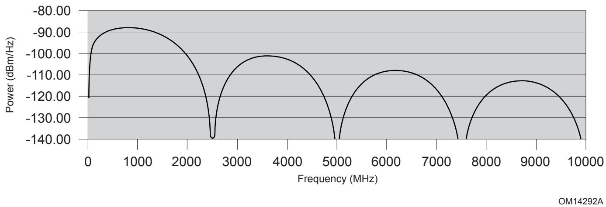

<details>
<summary>line chart</summary>

| Frequency (MHz) | Power (dBm/Hz) |
| --------------- | -------------- |
| 0               | -120.00        |
| 1000            | -90.00         |
| 2000            | -100.00        |
| 3000            | -140.00        |
| 4000            | -100.00        |
| 5000            | -140.00        |
| 6000            | -110.00        |
| 7000            | -140.00        |
| 8000            | -120.00        |
| 9000            | -110.00        |
| 10000           | -140.00        |
</details>

Figure C-1 Scrambling Spectrum at 2.5 GT/s for Data Value of 0§

## C.2 128b/130b Data Scrambling Example §

The following subroutines illustrate how calculate the next value of the 128b/130b scrambling LFSR and how to scramble (or descramble) an 8-bit value, both given the current value of the LFSR.

This is presented as one example only; there are many ways to obtain the proper output. This example demonstrates how to advance the LFSR eight times in one operation and how to XOR the data in one operation. Many other implementations are possible but they must all produce the same output as that shown here.

The following algorithm uses the “C” programming language conventions, where “<<” and “>>” represent the shift left and shift right operators, “^” is the exclusive or operator, and “|=” is the assignment by bitwise or operator.

#include <stdio.h>  
```c
// "Set Bit" - Sets bit number "bit" of "var" to the value "val". Bit "bit" of "var" must start cleared.
#define SB(var,bit,val) var |= (val & 1) << bit

// "Get Bit" - Returns the value of bit number "bit" of "var".
#define GB(var,bit) ((var >> bit) & 1)

// Function to advance the LFSR value by 8 bits, given the current LFSR value
unsigned long int calc_next_lfsr(unsigned long int lfsr) {
    unsigned long int next_lfsr = 0;
    SB(next_lfsr,22, GB(lfsr,14) ^ GB(lfsr,16) ^ GB(lfsr,18) ^ GB(lfsr,20) ^ GB(lfsr,21) ^ GB(lfsr,22));
    SB(next_lfsr,21, GB(lfsr,13) ^ GB(lfsr,15) ^ GB(lfsr,17) ^ GB(lfsr,19) ^ GB(lfsr,20) ^ GB(lfsr,21));
    SB(next_lfsr,20, GB(lfsr,12) ^ GB(lfsr,19) ^ GB(lfsr,21));
    SB(next_lfsr,19, GB(lfsr,11) ^ GB(lfsr,18) ^ GB(lfsr,20) ^ GB(lfsr,22));
    SB(next_lfsr,18, GB(lfsr,10) ^ GB(lfsr,17) ^ GB(lfsr,19) ^ GB(lfsr,21));
    SB(next_lfsr,17, GB(lfsr,9) ^ GB(lfsr,16) ^ GB(lfsr,18) ^ GB(lfsr,20) ^ GB(lfsr,22));
    SB(next_lfsr,16, GB(lfsr,8) ^ GB(lfsr,15) ^ GB(lfsr,17) ^ GB(lfsr,19) ^ GB(lfsr,21) ^ GB(lfsr,22));
    SB(next_lfsr,15, GB(lfsr,7) ^ GB(lfsr,22));
    SB(next_lfsr,14, GB(lfsr,6) ^ GB(lfsr,21));
    SB(next_lfsr,13, GB(lfsr,5) ^ GB(lfsr,20) ^ GB(lfsr,22));
    SB(next_lfsr,12, GB(lfsr,4) ^ GB(lfsr,19) ^ GB(lfsr,21) ^ GB(lfsr,22));
    SB(next_lfsr,11, GB(lfsr,3) ^ GB(lfsr,18) ^ GB(lfsr,20) ^ GB(lfsr,21) ^ GB(lfsr,22));
    SB(next_lfsr,10, GB(lfsr,2) ^ GB(lfsr,17) ^ GB(lfsr,19) ^ GB(lfsr,20) ^ GB(lfsr,21) ^ GB(lfsr,22));
    SB(next_lfsr,9, GB(lfsr,1) ^ GB(lfsr,16) ^ GB(lfsr,18) ^ GB(lfsr,19) ^ GB(lfsr,20) ^ GB(lfsr,21));
    SB(next_lfsr,8, GB(lfsr,0) ^ GB(lfsr,15) ^ GB(lfsr,17) ^ GB(lfsr,18) ^ GB(lfsr,19) ^ GB(lfsr,20));
    SB(next_lfsr,7, GB(lfsr,17) ^ GB(lfsr,19) ^ GB(lfsr,20) ^ GB(lfsr,21));
    SB(next_lfsr,6, GB(lfsr,16) ^ GB(lfsr,18) ^ GB(lfsr,19) ^ GB(lfsr,20) ^ GB(lfsr,22));
    SB(next_lfsr,5, GB(lfsr,15) ^ GB(lfsr,17) ^ GB(lfsr,18) ^ GB(lfsr,19) ^ GB(lfsr,21) ^ GB(lfsr,22));
    SB(next_lfsr,4, GB(lfsr,17));
    SB(next_lfsr,3, GB(lfsr,16));
    SB(next_lfsr,2, GB(lfsr,15) ^ GB(lfsr,22));
    SB(next_lfsr,1, GB(lfsr,16) ^ GB(lfsr,18) ^ GB(lfsr,20) ^ GB(lfsr,22));
    SB(next_lfsr,0, GB(lfsr,15) ^ GB(lfsr,17) ^ GB(lfsr,19) ^ GB(lfsr,21) ^ GB(lfsr,22));
    return(next_lfsr);
}

// Function to scramble a byte, given the current LFSR value
unsigned char scramble_data(unsigned long lfsr, unsigned char data_in) {
    unsigned char data_out = 0;
    SB(data_out, 7, GB(data_in,7) ^ GB(lfsr,15) ^ GB(lfsr,17) ^ GB(lfsr,19) ^ GB(lfsr,21) ^ GB(lfsr,22));
    SB(data_out, 6, GB(data_in,6) ^ GB(lfsr,16) ^ GB(lfsr,18) ^ GB(lfsr,20) ^ GB(lfsr,22));
    SB(data_out, 5, GB(data_in,5) ^ GB(lfsr,17) ^ GB(lfsr,19) ^ GB(lfsr,21));
    SB(data_out, 4, GB(data_in,4) ^ GB(lfsr,18) ^ GB(lfsr,20) ^ GB(lfsr,22));
    SB(data_out, 3, GB(data_in,3) ^ GB(lfsr,19) ^ GB(lfsr,21));
    SB(data_out, 2, GB(data_in,2) ^ GB(lfsr,20) ^ GB(lfsr,22));
    SB(data_out, 1, GB(data_in,1) ^ GB(lfsr,21));
    SB(data_out, 0, GB(data_in,0) ^ GB(lfsr,22));
    return(data_out);
}

// Example of LFSR and scrambled data "0" sequence for Lane 0
main() {
    unsigned long lfsr = 0x1DBFBC; // Lane 0 reset LFSR value
    unsigned char unscrambled_data = 0x00;
    int i;
    printf("Iteration LFSR Next LFSR Scrambled Data\n");
    printf("- -- -\n");
    for (i = 0; i < 128; i++) {
    unsigned char scrambled_data = scramble_data(Ifsr,,unscrambled_data);
    unsigned long next_lfsr = calc_next_lfsr(Ifsr);
    printf("%3d %06X %06X %02X\n", i,
    lvsrs,
    next_lvsrs,
    lvsrs = next_lvsrs;
    }
}
```

The initial 23-bit values of the LFSR for the first 128 LFSR advances for an 8-bit quantity following a reset for Lane 0 are listed below (ordered left to right, top to bottom):

<table><tr><td></td><td>0,8</td><td>1,9</td><td>2,A</td><td>3,B</td><td>4,C</td><td>5,D</td><td>6,E</td><td>7,F</td></tr><tr><td>00</td><td>1DBFBC</td><td>498C2E</td><td>1186E9</td><td>0FC5AD</td><td>7CB75D</td><td>3D8DA2</td><td>0ECC8F</td><td>379717</td></tr><tr><td>08</td><td>046BDF</td><td>21D462</td><td>423FCE</td><td>5177D6</td><td>1447EF</td><td>67CBA0</td><td>794F7A</td><td>6CA2AF</td></tr><tr><td>10</td><td>425060</td><td>3ED9D6</td><td>3DBF74</td><td>3C1A8F</td><td>7AE2E0</td><td>073E71</td><td>137D99</td><td>70B139</td></tr><tr><td>18</td><td>44F521</td><td>559720</td><td>1FBBA8</td><td>689D9F</td><td>376B02</td><td>597FFA</td><td>297C0E</td><td>7E450A</td></tr><tr><td>20</td><td>4BDE36</td><td>669B58</td><td>6BB530</td><td>78C3F9</td><td>0322C0</td><td>45C7FB</td><td>254F6A</td><td>323D89</td></tr><tr><td>28</td><td>07FDD2</td><td>71DFBC</td><td>68726B</td><td>799E27</td><td>1CFE8A</td><td>4AB864</td><td>42CB12</td><td>04AAF3</td></tr><tr><td>30</td><td>41F947</td><td>51F808</td><td>3A98CA</td><td>36A816</td><td>796895</td><td>4B4DAF</td><td>54037D</td><td>68E5C7</td></tr><tr><td>38</td><td>4F3302</td><td>60A51F</td><td>3AFCE3</td><td>528116</td><td>248131</td><td>1F65E6</td><td>17D2BA</td><td>34987E</td></tr><tr><td>40</td><td>6C0524</td><td>44DA45</td><td>7AF320</td><td>16FE71</td><td>5A5134</td><td>60B5F5</td><td>2A16E3</td><td>73AFF1</td></tr><tr><td>48</td><td>3D3ADA</td><td>18B5AA</td><td>4B9306</td><td>2BAB58</td><td>2D179E</td><td>5FDE68</td><td>46E1F8</td><td>644B91</td></tr><tr><td>50</td><td>3F78A4</td><td>7FCE1B</td><td>23CC59</td><td>7F017F</td><td>4DA97C</td><td>7EDF8B</td><td>705E13</td><td>0ADE04</td></tr><tr><td>58</td><td>6F1775</td><td>318CBE</td><td>70CC0C</td><td>39C021</td><td>0944ED</td><td>33F8AB</td><td>21DCBD</td><td>4AE0CE</td></tr><tr><td>60</td><td>1A6112</td><td>1B2F92</td><td>17ADD8</td><td>4BFA7E</td><td>42D358</td><td>1CE0F3</td><td>54C164</td><td>0BFDE2</td></tr><tr><td>68</td><td>0EF33F</td><td>082717</td><td>1200E1</td><td>4FCB73</td><td>39D53A</td><td>1C5FED</td><td>4ADE41</td><td>24EE12</td></tr><tr><td>70</td><td>7046E6</td><td>122B04</td><td>642E73</td><td>5A9AA4</td><td>0A24D0</td><td>34C250</td><td>362B24</td><td>5B5BB0</td></tr><tr><td>78</td><td>2833BF</td><td>73F640</td><td>648BDA</td><td>5E3281</td><td>490B97</td><td>373ECC</td><td>0CB1FA</td><td>6FE7A6</td></tr></table>

An 8-bit value of 0x00 repeatedly encoded with the LFSR after reset for Lane 0 produces the following consecutive 8-bit values (ordered left to right, top to bottom):

<table><tr><td></td><td>00</td><td>01</td><td>02</td><td>03</td><td>04</td><td>05</td><td>06</td><td>07</td><td>08</td><td>09</td><td>0A</td><td>0B</td><td>0C</td><td>0D</td><td>0E</td><td>0F</td></tr><tr><td>00</td><td>6C</td><td>BD</td><td>94</td><td>98</td><td>53</td><td>C6</td><td>D8</td><td>CE</td><td>50</td><td>6A</td><td>75</td><td>C1</td><td>04</td><td>4F</td><td>C3</td><td>07</td></tr><tr><td>10</td><td>75</td><td>26</td><td>C6</td><td>06</td><td>A3</td><td>B0</td><td>B4</td><td>AB</td><td>05</td><td>11</td><td>CC</td><td>57</td><td>4E</td><td>69</td><td>42</td><td>73</td></tr><tr><td>20</td><td>1D</td><td>0F</td><td>B7</td><td>03</td><td>E0</td><td>45</td><td>BA</td><td>5E</td><td>30</td><td>EB</td><td>D7</td><td>43</td><td>2C</td><td>5D</td><td>F5</td><td>D0</td></tr><tr><td>30</td><td>15</td><td>41</td><td>76</td><td>8E</td><td>C3</td><td>9D</td><td>D1</td><td>57</td><td>CD</td><td>FF</td><td>76</td><td>A1</td><td>7A</td><td>4C</td><td>64</td><td>2E</td></tr><tr><td>40</td><td>87</td><td>05</td><td>A3</td><td>24</td><td>89</td><td>FF</td><td>A2</td><td>4B</td><td>46</td><td>7C</td><td>1D</td><td>62</td><td>12</td><td>19</td><td>A5</td><td>2F</td></tr><tr><td>50</td><td>E6</td><td>B3</td><td>CA</td><td>33</td><td>ED</td><td>F3</td><td>2B</td><td>88</td><td>67</td><td>3E</td><td>AB</td><td>96</td><td>E8</td><td>9E</td><td>6A</td><td>5D</td></tr><tr><td>60</td><td>5C</td><td>1C</td><td>64</td><td>1D</td><td>F5</td><td>2C</td><td>51</td><td>C8</td><td>D8</td><td>A8</td><td>F4</td><td>4D</td><td>96</td><td>AC</td><td>5D</td><td>7A</td></tr><tr><td>70</td><td>2B</td><td>F4</td><td>2F</td><td>09</td><td>08</td><td>2E</td><td>0E</td><td>C9</td><td>02</td><td>4B</td><td>AF</td><td>D9</td><td>3D</td><td>4E</td><td>78</td><td>E7</td></tr></table>

## D. Request Dependencies §

This specification does not specify the rules governing the creation of resource dependencies between TLPs using different Traffic Classes. Dependencies between packets in different Traffic Classes can create potential deadlock if devices make different assumptions about what is allowed and what is not. Dependencies can be created when a packet is forwarded (transmitted verbatim) or translated (transmitted with modification) from an input Port to an output Port.

Resource dependencies are created when received packets are forwarded/translated on the same or a different Link. Due to the fact that the forwarding/translating device has finite buffer resources this behavior creates a dependency between the ability to receive a packet and the ability to transmit a packet (in potentially a different VC or sub-channel).

The following notation is used to create a framework to enumerate the possibilities:

$$
X (m) \rightarrow Y (n)
$$

This means:

• a request in sub-channel X(TC = m) is forwarded/translated in sub-channel Y(TC = n).  
• n and m are between 0-7.  
• X and Y are either P (Posted Request), N (Non-Posted Request), or C (Completion).

The list of possible dependencies is:

$$
\begin{array}{l} \mathrm{P} (\mathfrak {m}) \rightarrow \mathrm{P} (\mathfrak {n}) \\ P (m) \rightarrow N (n) \\ P (m) \rightarrow C (n) \\ N (m) \rightarrow P (n) \\ N (m) \rightarrow N (n) \\ N (m) \rightarrow C (n) \\ C (m) \rightarrow P (n) \\ C (m) \rightarrow N (n) \\ C (m) \rightarrow C (n) \\ \end{array}
$$

For a given system, each of these dependencies needs to be classified as legal or illegal for each of the following cases:

• Root Port forwarding to own Link.  
• Root Port forwarding to different Root Port’s Link.  
• Endpoint or Bridge forwarding to own Link.

A Switch is not allowed to modify the TLPs that flow through it, but must ensure complete independence of resources assigned to separate VCs. System software must comprehend the system dependency rules when configuring TC/VC mapping throughout the system.

One possible legal mapping is:

<table><tr><td></td><td>RC(Same Port)</td><td>RC(Different Port)</td><td>Endpoint</td></tr><tr><td>P(m) → P(n)</td><td>m ≤ n</td><td>m ≤ n</td><td>m &lt; n</td></tr><tr><td>P(m) → N(n)</td><td>m &lt; n</td><td>m &lt; n</td><td>m &lt; n</td></tr><tr><td>P(m) → C(n)</td><td>illegal</td><td>illegal</td><td>illegal</td></tr><tr><td>N(m) → P(n)</td><td>m &lt; n</td><td>m &lt; n</td><td>m &lt; n</td></tr><tr><td>N(m) → N(n)</td><td>m ≤ n</td><td>m ≤ n</td><td>m &lt; n</td></tr><tr><td>N(m) → C(n)</td><td>m = n</td><td>m = n</td><td>m = n</td></tr><tr><td>C(m) → P(n)</td><td>illegal</td><td>illegal</td><td>illegal</td></tr><tr><td>C(m) → N(n)</td><td>illegal</td><td>illegal</td><td>illegal</td></tr><tr><td>C(m) → C(n)</td><td>m ≥ n</td><td>m ≥ n</td><td>m &gt; n</td></tr></table>

Note that this discussion only deals with avoiding the deadlock caused by the creation of resource dependencies. It does not deal with the additional livelock issues (or lack of forward progress) caused by the system’s Virtual Channel arbitration policies.

Some of these potential dependencies are illegal or unreachable:

• P(m) → P(n), N(m) → N(n)

◦ m = n - This case is illegal and will lead to deadlock, except when a Request is being forwarded from one Port to another of a Switch or Root Complex.  
◦ m ≠ n - See discussion below.

• P(m) → N(n)

◦ m = n - This case is illegal and will lead to deadlock.  
◦ m ≠ n - See discussion below.

• N(m) → P(n) - See discussion below.  
• P(m) → C(n) - This case is illegal and will lead to deadlock.  
• N(m) → C(n)

◦ m = n - This case occurs during the normal servicing of a non-posted request by either a root complex or an endpoint.

◦ m ≠ n - This case is unreachable and should never happen. Completions always use the same TC as the corresponding request.

• C(m) → P(n), C(m) → N(n) - These cases are unreachable and should never happen due to the fact that completion buffers must be preallocated.  
• C(m) → C(n)

◦ m = n - This case is illegal and will lead to deadlock, except when a Completion is being forwarded from one Port to another of a Switch or Root Complex.

◦ m ≠ n - This case will occur if N(n)→N(m) dependencies are allowed.

Other potential dependencies may be legal when comprehended as part of a specific usage model. For example, these cases:

$$
P (m) \rightarrow P (n), \quad N (m) \rightarrow N (n), \quad P (m) \rightarrow N (n), \quad N (m) \rightarrow P (n) \quad \text { where } m \neq n
$$

might exist where a device services incoming requests by issuing modified versions of those requests using a different Traffic Class (for example, remapping the first requests address and generating the new request with the resulting address). In these cases, suitable rules must be applied to prevent circular dependencies that would lead to deadlock or livelock.

Examples of devices that may find the above mappings useful:

• Bridges to complex protocols that require state to be save/restored to/from host memory, i.e., PCI Express to Infiniband bridges.  
• Messaging engines that must do address translation based upon page tables stored in host memory.  
• UMA graphics devices that store their frame buffer in host memory.

## E. ID-Based Ordering Usage §

## E.1 Introduction §

ID-Based Ordering (IDO) is a mechanism that permits certain ordering restrictions to be relaxed as a means to improve performance. IDO permits certain TLPs to pass other TLPs in cases where otherwise such passing would be forbidden. The passing permitted by IDO is not required for proper operation (e.g., deadlock avoidance); it is only a means of improving performance.

For discussing IDO, it’s useful to introduce the concept of a “TLP stream”, which is a set of TLPs that all have the same originator. 187 For several important cases where TLP passing is normally forbidden, IDO permits such passing to occur if the TLPs belong to different TLP streams.

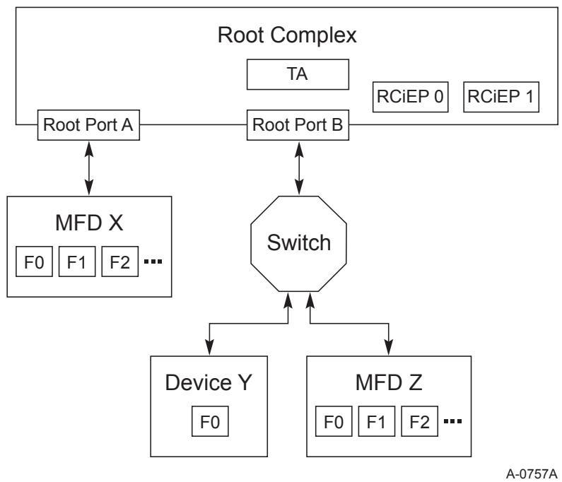

<details>
<summary>flowchart</summary>

```mermaid
graph TD
  A["Root Port A"] --> B["Switch"]
  C["Root Port B"] --> B
  D["Root Complex"] --> A
  E["MFD X"] --> A
  F["Device Y"] --> B
  G["MFD Z"] --> B
  H["TA"] --> A
  I["RCiEP 0"] --> A
  J["RCiEP 1"] --> A
  K["F0 F1 F2 ..."] --> A
  L["F0 F1 F2 ..."] --> B
```
</details>

Figure E-1 Reference Topology for IDO Use§

§ Figure E-1 shows a reference topology. The reference topology is not intended to discourage the use of IDO with other topologies, but rather to provide specific examples for discussion.

Devices X and Z are Multi-Function Devices (MFDs); device Y is a single-Function device. The RCiEPs are Root Complex Integrated Endpoint Functions, and might or might not be part of the same Device. We will assume that one or more Functions are using the Translation Agent (TA) in the Root Complex (RC).

Referring to the ordering table and descriptions in § Section 2.4.1 , having the IDO bit set in a Posted Request, Non-Posted Request, or Completion TLP permits that TLP to pass a Posted Request TLP if the two TLPs belong to different TLP streams. In the following examples, DMAR and DMAW stand for Direct Memory Access Read and Write; PIOR and PIOW stand for Programmed I/O Read and Write.

## E.2 Potential Benefits with IDO Use §

Here are some example potential benefits that are envisioned with IDO use. Generally, IDO provides the most benefit when multiple TLP streams share a common Link and that Link becomes congested, either due to high utilization or due to temporary lack of Flow Control (FC) credit.

## E.2.1 Benefits for MFD/RP Direct Connect §

Here are some examples in the context of traffic between MFD X and the RC in § Figure E-1.

• Posted Request passing another Posted Request: when a DMAW from F0 is stalled due to an TA miss, if IDO is set for a DMAW from F1, it is permitted within the RC for this DMAW to pass the stalled DMAW from F0.  
• Non-Posted Request passing a Posted Request: when a DMAW from F0 is stalled due to an TA miss, if IDO is set for a DMAR Request from F1, it is permitted within the RC for this DMAR Request to pass the stalled DMAW from F0.  
• Completion passing a Posted Request: when a DMAW from F0 is stalled due to an TA miss, if IDO is set for a PIOR Completion from F1, it is permitted within the RC for this PIOR Completion to pass the stalled DMAW from F0.

## E.2.2 Benefits for Switched Environments §

Here are some examples in the context of traffic within the Switch in § Figure E-1.

• Non-Posted Request passing a Posted Request: when a DMAW from Device Y is stalled within the Switch due to a lack of FC credit from Root Port B, if IDO is set for a DMAR Request from MFD Z, it is permitted within the Switch for this DMAR Request to pass the stalled DMAW from Device Y. The same also holds for a DMAR Request from one Function in MFD Z passing a stalled DMAW from a different Function in MFD Z.  
Completion passing a Posted Request: when a DMAW from Device Y is stalled within the Switch due to a lack of FC credit from Root Port B, if IDO is set for a PIOR Completion from MFD Z, it is permitted within the Switch for this PIOR Completion to pass the stalled DMAW from Device Y. The same also holds for a PIOR Completion from one Function in MFD Z passing a stalled DMAW from a different Function in MFD Z.  
• Posted Request passing another Posted Request: within a Switch, there is little or no envisioned benefit from having a DMAW from one TLP stream passing a DMAW from a different TLP stream. However, it is not prohibited for Switches to implement such passing as permitted by IDO.

## E.2.3 Benefits for Integrated Endpoints §

Here are some examples for the Root Complex Integrated Endpoints (RCiEPs) in § Figure E-1. The benefits are basically the same as for the MFD/RP Direct Connect case.

• Posted Request passing another Posted Request: when a DMAW from RCiEP 0 is stalled due to an TA miss, if IDO is set for a DMAW from RCiEP 1, it is permitted for this DMAW to pass the stalled DMAW from RCiEP 0.  
• Non-Posted Request passing a Posted Request: when a DMAW from RCiEP 0 is stalled due to an TA miss, if IDO is set for a DMAR Request from RCiEP 1, it is permitted for this DMAR Request to pass the stalled DMAW from RCiEP 0.

• Completion passing a Posted Request: when a DMAW from RCiEP 0 is stalled due to an TA miss, if IDO is set for a PIOR Completion from RCiEP 1, it is permitted for this PIOR Completion to pass the stalled DMAW from RCiEP 0.

## E.2.4 IDO Use in Conjunction with RO §

IDO and RO 188 are orthogonal. Certain instances of passing; for example, a Posted Request passing another Posted Request, might be permitted by IDO, RO, or both at the same time. While IDO and RO have significant overlap for some cases, it is strongly recommended that both be used whenever safely possible. RO permits certain TLP passing within the same TLP stream, which is never permitted by IDO. For traffic in different TLP streams, IDO permits control traffic to pass any other traffic, and generally it is not safe to Set RO with control traffic.

## E.3 When to Use IDO §

With Endpoint Functions 189 , it is safe to Set IDO in all applicable TLPs originated by the Endpoint when the Endpoint is directly communicating with only one other entity, most commonly the RC. For the RC case, “directly communicating” specifically includes DMA traffic, PIO traffic, and interrupt traffic; communicating with RCiEPs or communicating using P2P Root Port traffic constitutes communicating with multiple entities.

With a Root Port, there are no envisioned high-benefit use models where it is safe to Set IDO in all applicable TLPs that it originates. Use models where a Root Port Sets IDO in a subset of the applicable TLPs it originates are outside the scope of this specification.

## E.4 When Not to Use IDO §

## E.4.1 When Not to Use IDO with Endpoints §

With Endpoint Functions, it is not always safe to Set IDO in applicable TLPs it originates if the Endpoint directly communicates with multiple entities. It may be safe to Set IDO in some TLPs and not others, but such use models are outside the scope of this specification.

For example, in § Figure E-1 if Device Y and MFD Z are communicating with P2P traffic and also communicating via host memory, it is not always safe for them to Set IDO in the TLPs they originate. As an example failure case, let’s assume that Device Y does a DMAW (to host memory) followed by a P2P Write to MFD Z. Upon observing the P2P Write, let’s assume that MFD Z then does a DMAW to the same location earlier targeted by the DMAW from Device Y. Normal ordering rules would guarantee that the DMAW from Device Y would be observed by host memory before the DMAW from MFD Z. However, if IDO is set in the DMAW from MFD Z, the RC would be permitted to have the second DMAW pass the first, causing a different end result in host memory contents.

Synchronization techniques like performing zero-length Reads might be used to avoid such communication failures when IDO is used, but specific use models are outside the scope of this specification.

## E.4.2 When Not to Use IDO with Root Ports §

With Root Ports, it is not always safe to Set IDO in applicable TLPs it originates if Endpoint Functions in the hierarchy do any P2P traffic. It may be safe to Set IDO in some TLPs and not others, but such use models are outside the scope of this specification.

As an example, in § Figure E-1 if Device Y and MFD Z are communicating with P2P traffic and also communicating with host software, it is not always safe for Root Port B to Set IDO in the TLPs it originates. For example, let’s assume that Device Y does a P2P Write to MFD Z followed by a DMAW (to host memory). Upon observing the DMAW, let’s assume that the host does a PIOW to MFD Z. Normal ordering rules would guarantee that the P2P Write from Device Y would be observed by MFD Z before the PIOW from the host. However, if IDO is set in the PIOW from the host, the Switch would be permitted to have the PIOW pass the P2P Write, ultimately having the two Writes arrive at MFD Z out of order.

## IMPLEMENTATION NOTE:

## REQUESTER AND COMPLETER IDS FOR RC-ORIGINATED TLPS §

With RC implementations where the Requester ID in a PIO Request does not match the Completer ID in a DMAR Completion, this enables another potential communication failure case if IDO is Set in the Completion. For this case, if a PIOW is followed by a DMAR Completion with IDO Set, a Switch below the Root Port could permit the DMAR Completion to pass the PIOW, violating the normal ordering rule that a non-RO Read Completion must not pass Posted Requests. The PIOW and DMAR Completion would appear to belong to different TLP streams, though logically they belong to the same TLP stream. Special caution is advised in setting IDO with TLPs originating from such RCs.

## E.5 Software Control of IDO Use §

## E.5.1 Software Control of Endpoint IDO Use §

By default, Endpoints are not enabled to Set IDO in any TLPs they originate.

## IMPLEMENTATION NOTE:

## THE “SIMPLE” POLICY FOR IDO USE §

It is envisioned that Endpoints designed primarily to communicate directly with only one other entity (e.g., the RC) may find a “simple” policy for setting IDO to be adequate. Here’s the envisioned “simple” policy. If the IDO Request Enable bit is Set, the Endpoint Sets IDO in all applicable Request TLPs that it originates. If the IDO Completion Enable bit is Set, the Endpoint Sets IDO in all Completion TLPs that it originates.

It is envisioned that a software driver associated with each Endpoint will determine when it is safe for the Endpoint to set IDO in applicable TLPs it originates. A driver should be able to determine if the Endpoint is communicating with multiple other entities, and should know the Endpoint’s capabilities as far as setting IDO with all applicable TLPs when enabled, versus setting IDO selectively. If a driver determines that it is safe to enable the setting of IDO, the driver can set the IDO Request Enable and/or IDO Completion Enable bits either indirectly via OS services or directly, subject to OS policy.

If an Endpoint is designed for communication models where it is not safe to utilize the “simple” policy for IDO use, the Endpoint can implement more complex policies for determining when the Endpoint sets the IDO bit. Such implementations might utilize device-specific controls that are managed by the device driver. Such policies and device-specific control mechanisms are outside the scope of this specification.

## E.5.2 Software Control of Root Port IDO Use §

Since there are no envisioned high-benefit “simple” use models for Root Ports setting the IDO bit with TLPs they originate, and there are known communication failure cases if Root Ports set the IDO bit with all applicable TLPs they originate, it is anticipated that Root Ports will rarely be enabled to set IDO in TLPs they originate. Such use models and policies for Root Ports setting IDO are outside the scope of this specification.

## F. Message Code Usage §

§ Table F-1 contains a list of currently defined PCI Express Message Codes. Message codes are defined in this specification and in other specifications. This table will be updated as Messages are defined in other specifications but due to document release schedules, this table might not contain recently defined Messages.

§ Table F-1 Message Code Usage

<table><tr><td>Message Code</td><td>Routing r[2:0]</td><td>Type</td><td>Description</td></tr><tr><td>0000 0000</td><td>011</td><td>Msg</td><td>Unlock, see § Section 2.2.8.4</td></tr><tr><td>0000 0001</td><td>010</td><td>MsgD</td><td>Invalidate Request Message, see § Section 10.3.1</td></tr><tr><td>0000 0010</td><td>010</td><td>Msg</td><td>Invalidate Completion Message, see § Section 10.3.2</td></tr><tr><td>0000 0100</td><td>000</td><td>Msg</td><td>Page Request Message, see § Section 10.4.1</td></tr><tr><td>0000 0101</td><td>010</td><td>Msg</td><td>PRG Response Message, see § Section 10.4.2</td></tr><tr><td>0001 0000</td><td>100</td><td>Msg</td><td>Latency Tolerance Reporting (LTR) Message, see § Section 2.2.8.8</td></tr><tr><td>0001 0010</td><td>100</td><td>Msg</td><td>Optimized Buffer Flush/Fill (OBFF) Message, see § Section 2.2.8.9</td></tr><tr><td>0001 0100</td><td>100</td><td>Msg</td><td>PM_Active_State_Nak, see § Section 2.2.8.2</td></tr><tr><td>0001 1000</td><td>000</td><td>Msg</td><td>PM_PME, see § Section 2.2.8.2</td></tr><tr><td>0001 1001</td><td>011</td><td>Msg</td><td>PME_Turn_Off, see § Section 2.2.8.2</td></tr><tr><td>0001 1011</td><td>101</td><td>Msg</td><td>PME_TO_Ack, see § Section 2.2.8.2</td></tr><tr><td>0010 0000</td><td>100</td><td>Msg</td><td>Assert_INTA, see § Section 2.2.8.1</td></tr><tr><td>0010 0001</td><td>100</td><td>Msg</td><td>Assert_INTB, see § Section 2.2.8.1</td></tr><tr><td>0010 0010</td><td>100</td><td>Msg</td><td>Assert_INTC, see § Section 2.2.8.1</td></tr><tr><td>0010 0011</td><td>100</td><td>Msg</td><td>Assert_INTD, see § Section 2.2.8.1</td></tr><tr><td>0010 0100</td><td>100</td><td>Msg</td><td>Deassert_INTA, see § Section 2.2.8.1</td></tr><tr><td>0010 0101</td><td>100</td><td>Msg</td><td>Deassert_INTB, see § Section 2.2.8.1</td></tr><tr><td>0010 0110</td><td>100</td><td>Msg</td><td>Deassert_INTC, see § Section 2.2.8.1</td></tr><tr><td>0010 0111</td><td>100</td><td>Msg</td><td>Deassert_INTD, see § Section 2.2.8.1</td></tr><tr><td>0011 0000</td><td>000</td><td>Msg</td><td>ERR_COR, see § Section 2.2.8.3</td></tr><tr><td>0011 0001</td><td>000</td><td>Msg</td><td>ERR_NONFATAL, see § Section 2.2.8.3</td></tr><tr><td>0011 0011</td><td>000</td><td>Msg</td><td>ERR_FATAL, see § Section 2.2.8.3</td></tr><tr><td>0100 0000</td><td>100</td><td>Msg</td><td>Ignored Message, see § Section 2.2.8.7</td></tr><tr><td>0100 0001</td><td>100</td><td>Msg</td><td>Ignored Message, see § Section 2.2.8.7</td></tr><tr><td>0100 0011</td><td>100</td><td>Msg</td><td>Ignored Message, see § Section 2.2.8.7</td></tr><tr><td>0100 0100</td><td>100</td><td>Msg</td><td>Ignored Message, see § Section 2.2.8.7</td></tr><tr><td>0100 0101</td><td>100</td><td>Msg</td><td>Ignored Message, see § Section 2.2.8.7</td></tr><tr><td>0100 0111</td><td>100</td><td>Msg</td><td>Ignored Message, see § Section 2.2.8.7</td></tr><tr><td>0100 1000</td><td>100</td><td>Msg</td><td>Ignored Message, see § Section 2.2.8.7</td></tr><tr><td>0101 0000</td><td>100</td><td>MsgD</td><td>Set_Slot_Power_Limit, see § Section 2.2.8.5</td></tr><tr><td>0101 0010</td><td>100</td><td>Msg</td><td>PTM Request, see § Section 2.2.8.10</td></tr><tr><td>0101 0011</td><td>100</td><td>Msg/MsgD</td><td>PTM Response/PTM ResponseD, see § Section 2.2.8.10</td></tr><tr><td>0111 1110</td><td>000, 010, 011, or 100</td><td>Msg/MsgD</td><td>Vendor_Defined Type 0, see § Section 2.2.8.6</td></tr><tr><td>0111 1111</td><td>000, 010, 011, or 100</td><td>Msg/MsgD</td><td>Vendor_Defined Type 1, see § Section 2.2.8.6</td></tr><tr><td>0101 0100</td><td>010 / 100</td><td>Msg</td><td>IDE Sync (see § Section 2.2.8.11)</td></tr><tr><td>0101 0101</td><td>010 / 100</td><td>Msg</td><td>IDE Fail (see § Section 2.2.8.11)</td></tr></table>

§ Table F-2 contains a list of currently defined Subtype codes for PCI-SIG-Defined VDMs (see § Section 2.2.8.6.1 ). Subtype codes are defined in this specification and in other specifications. This table will be updated as Subtype codes are defined in other specifications but due to document release schedules, this table might not contain recently defined Subtypes.

Table F-2 PCI-SIG-Defined VDM Subtype Usage§

<table><tr><td>Subtype</td><td>Routing r[2:0]</td><td>Type</td><td>Description</td></tr><tr><td>0000 0000</td><td>010 or 011</td><td>MsgD</td><td>Deprecated; formerly used for LN Message (Lightweight Notification)</td></tr><tr><td>0000 0001</td><td>011</td><td>MsgD</td><td>Hierarchy ID Message, See § Section 2.2.8.6.4 and § Section 6.25</td></tr><tr><td>0000 1000</td><td>100</td><td>Msg</td><td>Device Readiness Status, see § Section 2.2.8.6.2</td></tr><tr><td>0000 1001</td><td>000</td><td>Msg</td><td>Function Readiness Status, see § Section 2.2.8.6.3</td></tr></table>

## G. Protocol Multiplexing §

The Protocol Multiplexing mechanism provides a standard mechanism to transport non-PCI Express protocols across a PCI Express Link. The mechanism supports the multiplexing of PMUX Packets and TLPs onto a single PCI Express Link.

An example system topology using Protocol Multiplexing is shown in § Figure G-1. In this example, the Link may operate in two modes:

• PCI Express Link. Protocol Multiplexing is disabled.  
• PMUX Link. Protocol Multiplexing is enabled. Both TLPs and PMUX Packets are used in a coordinated fashion. PMUX Packets may be used to support additional protocols efficiently.

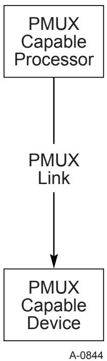

<details>
<summary>flowchart</summary>

```mermaid
graph TD
  A["PMUX Capable Processor"] --> B["PMUX Link"]
  B --> C["PMUX Capable Device"]
```
</details>

Figure G-1 Device and Processor Connected Using a PMUX Link§

A PMUX Link is shown in § Figure G-2. Arbitration and encapsulation occurs between the transmit queues and the Link. Demultiplexing and decapsulation occurs between the Link and the various receive queues. Packets are sent from transmit queues to the corresponding receive queues. Packets are identified as either PMUX Packets or TLPs.

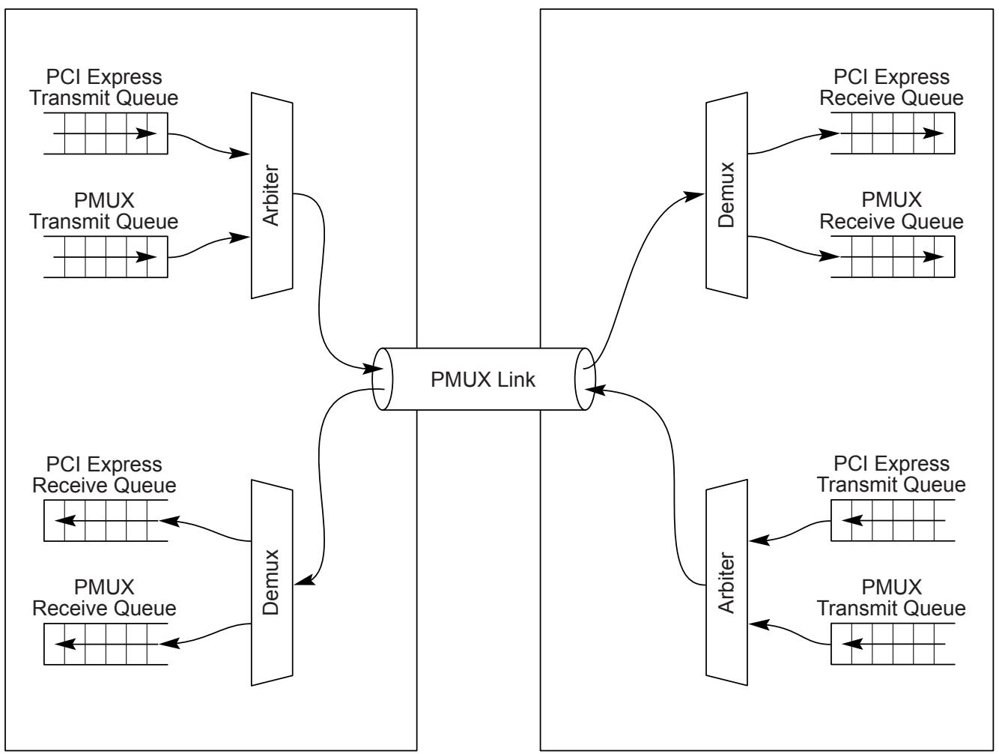

<details>
<summary>flowchart</summary>

```mermaid
graph TD
  A["PCI Express Transmit Queue"] --> B["Arbiter"]
  C["PMUX Transmit Queue"] --> B
  B --> D["PMUX Link"]
  D --> E["Demux"]
  E --> F["PCI Express Receive Queue"]
  E --> G["PMUX Receive Queue"]
  D --> H["Arbiter"]
  H --> I["PCI Express Transmit Queue"]
  H --> J["PMUX Transmit Queue"]
  D --> K["Demux"]
  K --> L["PCI Express Receive Queue"]
  K --> M["PMUX Receive Queue"]
  D --> N["Arbiter"]
  N --> O["PCI Express Transmit Queue"]
  N --> P["PMUX Transmit Queue"]
```
</details>

A-0845

§

Figure G-2 PMUX Link

Important attributes of the Protocol Multiplexing mechanism are:

• Protocol Multiplexing support is optional normative.  
• Protocol Multiplexing has no impact on PCI Express components that do not support it.  
• Protocol Multiplexing has no impact on PCI Express TLPs and DLLPs, even when it is enabled.  
• A Link may be used for both TLPs and PMUX Packets at the same time.  
• Protocol Multiplexing does not consume or interfere with PCI Express resources (sequence numbers, credits, etc.). PMUX Packets use distinct resources associated with the specific multiplexed protocol.  
• Protocol Multiplexing is disabled by default and is enabled by software. PMUX Packets must not be sent unless enabled by software. PMUX Packets received at Ports that support Protocol Multiplexing are ignored until Protocol Multiplexing is enabled by software.  
• Protocol Multiplexing is selectable on a per-Link basis. Protocol Multiplexing may be used on any collection of Links in a system.  
• A PMUX Link may support up to four simultaneously active PMUX Channels. Software configures the protocol used on each PMUX Channel.

• PMUX Packets contain an LCRC. This is used to provide data resiliency in a similar fashion as PCI Express TLPs.  
• PMUX Packets do not use the ACK/NAK mechanism of PCI Express. Multiplexed protocol specific acknowledgement mechanisms can be used to provide reliable delivery when needed.  
• PMUX Packets do not contain a TLP Sequence Number. Instead, they contain a 12 bit PMUX Packet Metadata field that is available for multiplexed protocol specific use.  
• PMUX Packet transmitters must contain some arbitration/QoS mechanism for scheduling sending of PMUX Packets, TLPs and DLLPs; however, the mechanism used is outside the scope of this specification.  
• The Protocol Multiplexing mechanism does not define any addressing or routing mechanism for PMUX Packets.

PMUX Packets are similar to PCI Express TLPs. The PMUX Packet Flow Through is shown in § Figure G-3. The PCI Express Packet flow through the layers is shown in § Figure 1-5. Changes from PCI Express Packet Flow Through are:

• PMUX Packets use a protocol specific PMUX Protocol Layer instead of the PCI Express Transaction Layer.

• PMUX Packets use a simplified Data Link Layer. The packet integrity portion of the Data Link Layer is mostly unchanged (LCRC computation uses a different seed value). The reliability and flow control aspects of the Data Link Layer are removed (the TLP Sequence Number field is repurposed as PMUX Packet Metadata).

• The Physical Layer is slightly modified to provide a mechanism to identify PMUX Packets.

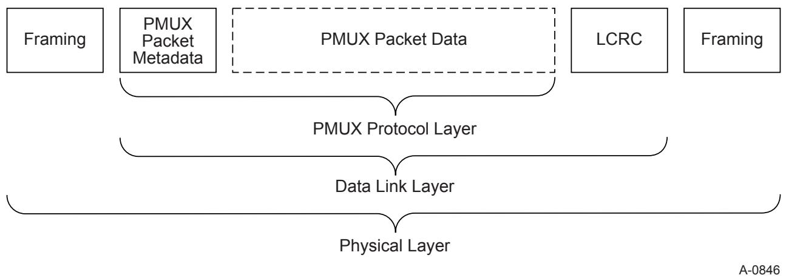

<details>
<summary>flowchart</summary>

```mermaid
graph TD
  A["Physical Layer"] --> B["Data Link Layer"]
  B --> C["PMUX Protocol Layer"]
  C --> D["PMUX Packet Data"]
  D --> E["Framing"]
  D --> F["LCRC"]
  D --> G["Framing"]
    style A fill:#f9f,stroke:#333
    style B fill:#ccf,stroke:#333
    style C fill:#cfc,stroke:#333
    style D fill:#fcc,stroke:#333
    style E fill:#ffc,stroke:#333
    style F fill:#fcc,stroke:#333
    style G fill:#ffc,stroke:#333
```
</details>

Figure G-3 PMUX Packet Flow Through the Layers§

## G.1 Protocol Multiplexing Interactions with PCI Express §

§ Table G-1 and § Table G-2 describe interactions between Protocol Multiplexing and PCI Express. § Table G-1 describes how PCI Express attributes affect Protocol Multiplexing. § Table G-2 describes how Protocol Multiplexing features affect PCI Express attributes.

Table G-1 PCI Express Attribute Impact on Protocol Multiplexing§

<table><tr><td>PCI Express Attribute</td><td>Impact on Protocol Multiplexing</td></tr><tr><td>Link Speed</td><td>All PMUX Channels are disabled when the Current Link Speed corresponds to a speed that is not supported by Protocol Multiplexing (see § Section G.5.4). A PMUX Channel may be disabled when the Current Link Speed corresponds to a speed that is not supported by the associated protocol. $^{190}$ Link speed can change either explicitly due to a change in the Target Link Speed field or automatically due to an autonomous Link speed change (see § Section 6.11).The PMUX Protocol Layer is permitted to influence the mechanism used by a component to determine when it requests an autonomous Link speed change. In addition, setting Hardware Autonomous Speed Disable at each end of the Link will prevent certain autonomous Link speed changes (see § Section 7.5.3.18).The PMUX Protocol Layer may be notified of the change.</td></tr><tr><td>Link Width</td><td>A PMUX Channel may be disabled when the Link Width corresponds to a width that is not supported by the associated protocol. $^{191}$ The PMUX Protocol Layer is permitted to influence the mechanism used by a component to determine when it requests a Link Width change.The PMUX Protocol Layer may be notified of the change.</td></tr><tr><td>FLR initiated</td><td>All PMUX Channels on a Link are disabled if an FLR is directed to the Upstream Port's Function 0. No PMUX Channels are affected if an FLR is directed to any other Function.</td></tr><tr><td>DL_Down</td><td>All PMUX Channels on a Link are disabled.</td></tr><tr><td>Hot Reset</td><td>All PMUX Channels on a Link are disabled.</td></tr><tr><td>PERST#</td><td>All PMUX Channels on a Link are disabled.</td></tr><tr><td>TLP Replay</td><td>No effect on Protocol Multiplexing.</td></tr><tr><td>DLLP Lost</td><td>No effect on Protocol Multiplexing.</td></tr><tr><td>TLP Prefix</td><td>No effect on Protocol Multiplexing.</td></tr><tr><td>Locked Transactions</td><td>No effect on Protocol Multiplexing (including no effect on any protocol specific forwarding of PMUX Packets).</td></tr><tr><td>AtomicOp Transactions</td><td>No effect on Protocol Multiplexing.</td></tr><tr><td>Multicast Transactions</td><td>No effect on Protocol Multiplexing.</td></tr><tr><td>Access Control Services (ACS)</td><td>No effect on Protocol Multiplexing.</td></tr><tr><td>Alternative Routing ID-Interpretation (ARI)</td><td>No effect on Protocol Multiplexing.</td></tr><tr><td>TPH Requester</td><td>No effect on Protocol Multiplexing.</td></tr><tr><td>Virtual Channels</td><td>No effect on Protocol Multiplexing. PCI Express Links remain capable of supporting a full complement of VCs.</td></tr><tr><td>Internal Error</td><td>Corrected or Uncorrectable Internal Errors in the PMUX Protocol Layer may be reported as PCI Express Internal Errors.</td></tr><tr><td>L0s Link Power State</td><td>Protocol Multiplexing tracks the Link state. The PMUX Protocol Layer may request the Link transition back to L0.</td></tr></table>

191. The mechanism software uses to determine what Link Widths are supported by a protocol is outside the scope of this specification.

<table><tr><td>PCI Express Attribute</td><td>Impact on Protocol Multiplexing</td></tr><tr><td>L1 Link Power State</td><td>Protocol Multiplexing tracks the Link state. The PMUX Protocol Layer may request the Link transition back to L0.</td></tr><tr><td>Disabled LTSSM State</td><td>Disabling a Link also disables all PMUX Channels on the Link.</td></tr><tr><td>Loopback LTSSM State</td><td>Entering Loopback state disables all PMUX Channels on the Link.</td></tr><tr><td>Recovery LTSSM State</td><td>No effect on Protocol Multiplexing. The PMUX Protocol Layer may be notified.</td></tr><tr><td>Receiver or Framing Error</td><td>The error is reported to the PMUX Protocol Layer to indicate that data might have been lost. This can be used to initiate protocol specific error recovery mechanisms. The Error is reported to software using PCI Express Mechanisms.</td></tr><tr><td>Lane Reversal</td><td>No effect on Protocol Multiplexing. Support for Lane Reversal remains optional.</td></tr><tr><td>Polarity Inversion</td><td>No effect on Protocol Multiplexing.</td></tr><tr><td>Crosslink</td><td>No effect on Protocol Multiplexing. Support for Crosslink remains optional. If supported, the PMUX Protocol Layer may be notified of the outcome of the Crosslink Upstream / Downstream negotiation.</td></tr><tr><td>Lane assignment rules</td><td>Placement and frequency rules for STP Symbols and STP Tokens are not changed (see § Section 4.2.1.2 and § Section 4.2.2.3.2). These rules apply identically to PCI Express TLPs and PMUX Packets.</td></tr><tr><td>PCI Power Management Power State</td><td>All PMUX Channels on a Link are disabled if the Upstream Port's Function 0 is sent to non-D0 state.</td></tr><tr><td>Dynamic Power Allocation (DPA)</td><td>No effect on Protocol Multiplexing. The PMUX Protocol Layer is notified of the change and may participate in the power reduction. PCI Express power management includes any power used by the PMUX Protocol Layer.</td></tr><tr><td>PCI Power Management Power Consumed / Power Dissipated / Aux_Current</td><td>Power required by the PMUX Protocol Layer is included in the PCI structures.</td></tr><tr><td>Power Budgeting</td><td>Power required by the PMUX Protocol Layer is included in the PCI Express structures.</td></tr><tr><td>Slot Power Limit</td><td>Slot Power Limit includes power available to PMUX Protocol Layer.</td></tr><tr><td>ASPM L0s Entry Condition</td><td>The definition of Idle is extended to include:No pending PMUX Packets to transmit over the Link.For PMUX Channels that use protocol specific Flow Control, no credits are available to send PMUX Packets in that PMUX Channel.</td></tr><tr><td>ASPM L1 Entry Condition</td><td>A Link may not enter L1 if PMUX Packets are pending or scheduled to be transmitted.</td></tr><tr><td>ASPM L0s/L1 Exit Conditions</td><td>A Link may be directed to exit L0s or L1 if a component needs to transmit a PMUX Packet. Routing of PMUX Packets through routing elements is outside the scope of this specification; the associated L0s/L1 exit rules are also unspecified.</td></tr><tr><td>Bus Renumbering</td><td>No effect on Protocol Multiplexing.</td></tr><tr><td>Hot Plug</td><td>No direct effect on Protocol Multiplexing. Note Hot Plug events indirectly affect Data Link State which, in turn affects Protocol Multiplexing.</td></tr><tr><td>TLP Sequence Number</td><td>No effect on Protocol Multiplexing. PMUX Packets do not consume TLP Sequence Numbers.</td></tr><tr><td>PCI Express Flow Control</td><td>No effect on Protocol Multiplexing. PMUX Packets do not consume PCI Express Flow Control credits. Flow Control Update DLLPs must be sent as required by PCI Express.</td></tr><tr><td>Error Reporting</td><td>No direct effect on Protocol Multiplexing. The PMUX Protocol Layer may be notified when an error is signaled or when an error message is received.</td></tr><tr><td>LCRC Errors in TLPs</td><td>No effect on Protocol Multiplexing.</td></tr><tr><td>Nullified TLPs</td><td>No effect on Protocol Multiplexing.</td></tr><tr><td>VC Arbitration</td><td>No effect on Protocol Multiplexing. Arbitration within PCI Express is unaffected by Protocol Multiplexing.</td></tr><tr><td>Port Arbitration</td><td>No effect on Protocol Multiplexing. Arbitration within PCI Express is unaffected by Protocol Multiplexing.</td></tr><tr><td>Electrical Idle Inference</td><td>PMUX Packets count as TLPs for the purpose of inferring Electrical Idle.</td></tr><tr><td>MR-IOV</td><td>Protocol Multiplexing may co-exist with MR-IOV. PMUX Packets are not part of any MR-IOV Virtual Hierarchy. Protocol Multiplexing is controlled using configuration space in the Management VH(s).</td></tr></table>

Table G-2 PMUX Attribute Impact on PCI Express§

<table><tr><td>PMUX Attribute</td><td>Impact on PCI Express</td></tr><tr><td>PMUX Protocol Error</td><td>No effect on PCI Express.</td></tr><tr><td>LCRC Errors in PMUX Packets</td><td>No effect on PCI Express. PMUX Packets with LCRC errors are discarded without triggering PCI Express replay. This error is reported to the PMUX Protocol Layer and can be used to initiate protocol specific error recovery and/or error reporting mechanisms.</td></tr><tr><td>Link Unreliability</td><td>The PMUX Protocol Layer is permitted to influence the mechanism used by a component to determine if it requests an autonomous link speed change.</td></tr><tr><td>Nullified PMUX Packets</td><td>No effect on PCI Express. It is protocol specific whether PMUX Packets within a specific PMUX Channel may be nullified. If supported, PMUX Packets are nullified in the same manner as TLPs (e.g., inverting the LCRC and signaling nullification at the Physical Layer). Receiving a nullified PMUX Packet may be reported to the PMUX Protocol Layer.</td></tr><tr><td>Electrical Idle Inference</td><td>PMUX Packets count as TLPs for the purpose of inferring Electrical Idle.</td></tr><tr><td>PMUX Protocol Layer directs LTSSM to enter Recovery</td><td>Both PCI Express and the PMUX Protocol Layer are permitted to direct a transition from L0 to Recovery.</td></tr><tr><td>PMUX Channel Enabled / Disabled</td><td>No effect on PCI Express</td></tr><tr><td>PMUX Packet Receiver Buffer Overflow</td><td>No effect on PCI Express. This is a protocol problem within the PMUX Channel. The PMUX Transport Layer must continue to accept such packets dispose of them using protocol specific mechanisms.</td></tr><tr><td>Received PMUX Packet larger or smaller than supported by the associated protocol</td><td>No effect on PCI Express. These are protocol problems within the PMUX Channel. The PMUX Transport Layer must accept such packets and dispose of them using protocol specific mechanisms.</td></tr><tr><td>Received PMUX Packet that contains more than</td><td>No effect on PCI Express. This is an invalid PMUX Packet. The PMUX Transport Layer must accept such a packet and dispose of it. A protocol specific mechanism may be used to report the error.</td></tr><tr><td>125 DWORDs of PMUX Packet Data</td><td>Note: This situation only exists for a packet encoded using 8b/10b. The TLP Length field of a packet encoded using 128b/130b cannot contain values that cause this situation.</td></tr><tr><td>PMUX Packet Received on disabled PMUX Channel</td><td>No effect on PCI Express. No effect on any other PMUX Channel. Receivers must silently ignore such packets regardless of packet length and regardless of whether or not the packet is nullified.PMUX Packets arriving on a disabled PMUX Channel may occur normally when software is in the process of initializing Protocol Multiplexing.</td></tr><tr><td>PMUX Packet Received at component that does not support Protocol Multiplexing</td><td>Software should not enable PMUX Packets unless both ends of a Link support Protocol Multiplexing.In the 128b/130b encoding, receiving a PMUX Packet by a component that does not support Protocol Multiplexing is a Framing Error (see § Section 4.2.2.3.1).In the 8b/10b encoding, the PMUX Packet LCRC is computed differently that the TLP LCRC. Receivers that do not support Protocol Multiplexing will interpret PMUX Packets as TLPs with LCRC errors and will not process them.</td></tr><tr><td>Large PMUX Packets when PCI Express Max_Payload_Size is small</td><td>Under certain conditions, it is possible for a large PMUX Packet to trigger a premature PCI Express replay. For example, this can occur when the time needed to transmit a PMUX Packet is larger than the REPLAY_TIMER (see § Section 3.6.2.1).To avoid this issue, implementations are permitted to not advance (hold) their REPLAY_TIMER during the reception of PMUX Packets.Note: The PCI Express REPLAY_TIMER mechanism has adequate headroom for most cases. This issue exists when (1) Max_Payload_Size is 000b, (2) PMUX Packets are larger than about 80 DWORDs, and (3) the REPLAY_TIMER is at the low end of the -0%/+100% tolerance.</td></tr></table>

## G.2 PMUX Packets §

A PMUX Packet contains the information shown in § Figure G-4.

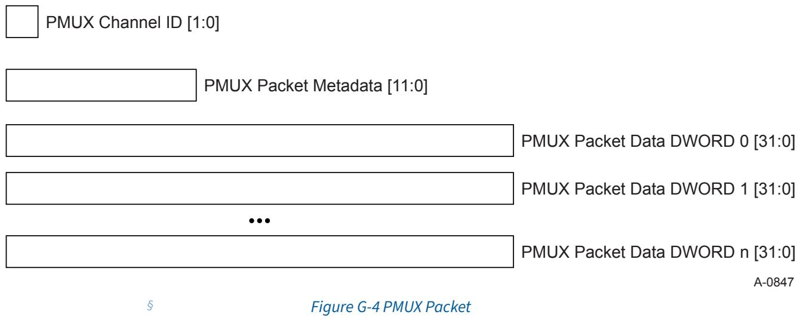

<details>
<summary>bar chart</summary>

| Category | Value |
| -------- | ----- |
| PMUX Channel ID [1:0] | 1 |
| PMUX Packet Metadata [11:0] | 11 |
| PMUX Packet Data DWORD 0 [31:0] | 31 |
| PMUX Packet Data DWORD 1 [31:0] | 31 |
| ... | ... |
| PMUX Packet Data DWORD n [31:0] | 31 |
| A-0847 | 0 |
</details>

PMUX Channel ID is a 2 bit field that identifies which protocol is associated with a PMUX Packet. PMUX Channel ID values are between 0 and 3 (inclusive).

PMUX Packet Metadata is a 12 bit field that provides information about the PMUX Packet. Definition of this field is protocol specific and is outside the scope of this specification.

A PMUX Packet consists of between 0 and 125 DWORDs of PMUX Packet Data. Layout and usage of these DWORDs is protocol specific and is outside the scope of this specification. A PMUX Packet need not have any PMUX Packet Data and may consist only of PMUX Channel ID and PMUX Packet Metadata.

## G.3 PMUX Packet Layout §

There are two layouts defined for PMUX Packets. One layout is used for 2.5 and 5.0 GT/s data rates and another layout is used for 8.0 GT/s and higher data rates. These layouts are discussed in the following sections.

## G.3.1 PMUX Packet Layout for 8b/10b Encoding §

§ Figure G-5 and § Table G-3 show the layout of PMUX Packets when using 8b/10b encoding. For reference, the 8b/10b encoding of a TLP is also shown (see § Section 4.2.1.2 for the official definition).

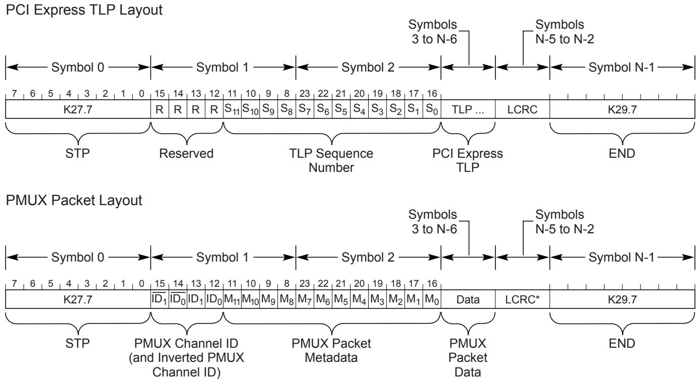

<details>
<summary>text_image</summary>

PCI Express TLP Layout
Symbol 0 → Symbol 1 → Symbol 2 → Symbol N-1
Symbols 3 to N-6
Symbols N-5 to N-2
7 6 5 4 3 2 1 0 15 14 13 12 11 10 9 8 23 22 21 20 19 18 17 16
K27.7 R R R R S11 S10 S9 S8 S7 S6 S5 S4 S3 S2 S1 S0 TLP ...
STP Reserved TLP Sequence Number PCI Express TLP END
PMUX Packet Layout
Symbol 0 → Symbol 1 → Symbol 2 → Symbol N-1
Symbols 3 to N-6
Symbols N-5 to N-2
7 6 5 4 3 2 1 0 15 14 13 12 11 10 9 8 23 22 21 20 19 18 17 16
KZ7.7 ID1 ID0 ID1 ID0 M11 M10 M9 M8 M7 M6 M5 M4 M3 M2 M1 M0 Data LCRC* KZ9.7
STP PMUX Channel ID PMUX Packet Metadata PMUX Packet Data END
</details>

\* LCRC for PMUX Packets uses a different starting seed than that used for TLPs. This avoids aliasing problems and potential errors if software misconfigures a link so that PMUX Packets are seen by existing silicon.

A-0848

Figure G-5 TLP and PMUX Packet Framing (8b/10b Encoding)§  
Table G-3 PMUX Packet Layout (8b/10b Encoding)§

<table><tr><td>Symbol</td><td>Field</td><td>Bit Position(s)</td><td>PMUX Packet Usage</td><td>TLP Usage</td></tr><tr><td>0</td><td>Start TLP Indicator</td><td>7:0</td><td colspan="2">K27.7</td></tr><tr><td rowspan="3">1</td><td>Inverted PMUX Channel ID[1:0]</td><td>7:6</td><td>Inverted (1s complement) of Symbol 1 bits 6:4</td><td>Reserved</td></tr><tr><td>PMUX Channel ID[1:0]</td><td>5:4</td><td>PMUX Channel ID</td><td>Reserved</td></tr><tr><td>PMUX Packet Metadata[11:8]</td><td>3:0</td><td>PMUX Packet Metadata[11:8]</td><td>TLP Sequence Number[11:8]</td></tr><tr><td>2</td><td>PMUX Packet Metadata[7:0]</td><td>7:0</td><td>PMUX Packet Metadata[7:0]</td><td>TLP Sequence Number[7:0]</td></tr><tr><td>3 to N-6</td><td>Packet</td><td>7:0</td><td>PMUX Packet</td><td>TLP</td></tr><tr><td>N-5 to N-2</td><td>LCRC</td><td>7:0</td><td>PMUX LCRC</td><td>PCI Express LCRC</td></tr><tr><td>N-1</td><td>END</td><td>7:0</td><td colspan="2">K29.7</td></tr></table>

For PMUX Packets, symbols 1 and 2 contain PMUX Packet Metadata in the same bit positions that TLPs use for TLP Sequence Number.

The PMUX LCRC algorithm is identical to the TLP LCRC algorithm as described in § Section 3.6.2 with the following modifications:

• The seed value is FB3E E248h (TLP LCRC uses FFFF FFFFh).  
• The PMUX Channel ID field in Symbol 1 bits 7:4 is included in the PMUX LCRC in the same manner as the 4 reserved bits in the TLP LCRC.  
• The PMUX Packet Metadata field is included in the PMUX LCRC in the same manner as the TLP Sequence Number field is included in the TLP LCRC.

## IMPLEMENTATION NOTE: PMUX PACKETS AT RECEIVERS THAT DO NOT SUPPORT PROTOCOL MULTIPLEXING §

The bits used for PMUX Channel ID are reserved unless Protocol Multiplexing is supported. As such, Receivers that do not support Protocol Multiplexing must ignore the PMUX Channel ID bits. If software misconfigures Protocol Multiplexing, a component that does not support Protocol Multiplexing could receive a PMUX Packet. To prevent that component from misinterpreting such a PMUX Packet as a valid TLP, the LCRC computation is changed for PMUX Packets. The result is that a valid PMUX Packet will never be misinterpreted as a valid TLP. These LCRC “errors” may trigger PCI Express replay and may result in REPLAY\_NUM Rollover correctable errors being reported.

## IMPLEMENTATION NOTE: PMUX PACKET LCRC §

The PMUX Channel ID field is covered by the LCRC. As such, when using 8b/10b encoding, receivers must wait until the LCRC is checked to make firm decisions based on the PMUX Channel ID value. The Inverted PMUX Channel ID can be compared against the PMUX Channel ID to make tentative decisions.

Note: The value of the LCRC associated with a given PMUX Packet is independent of the encoding used to transmit the packet.

## G.3.2 PMUX Packet Layout at 128b/130b Encoding §

§ Figure G-6 and § Table G-4 show the layout of PMUX Packets when using 128b/130b encoding. For reference, the 128b/ 130b encoding of a TLP is also shown (see § Section 4.2.2.2 for the official definition).

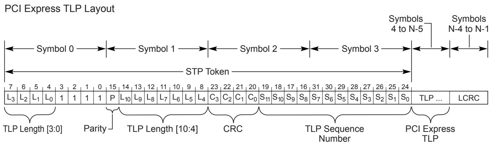

<details>
<summary>text_image</summary>

PCI Express TLP Layout
Symbol 0
Symbol 1
Symbol 2
Symbol 3
Symbols 4 to N-5
Symbols N-4 to N-1
STP Token
7 6 5 4 3 2 1 0 15 14 13 12 11 10 9 8 23 22 21 20 19 18 17 16 31 30 29 28 27 26 25 24
L3 L2 L1 L0 1 1 1 P L10 L9 L8 L7 L6 L5 L4 C3 C2 C1 C0 S11 S10 S9 S8 S7 S6 S5 S4 S3 S2 S1 S0 TLP ...
LCRC
TLP Length [3:0]
Parity
TLP Length [10:4]
CRC
TLP Sequence Number
PCI Express TLP
</details>

Note: TLP Length [10:0] = INT((N+1) / 4) TLP Length [10:7] < 1100b

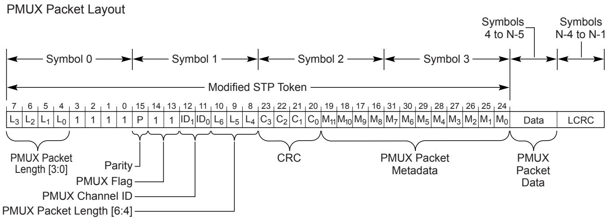

<details>
<summary>text_image</summary>

PMUX Packet Layout
Symbol 0
Symbol 1
Symbol 2
Symbol 3
Symbols 4 to N-5
Symbols N-4 to N-1
Modified STP Token
7 6 5 4 3 2 1 0 15 14 13 12 11 10 9 8 23 22 21 20 19 18 17 16 31 30 29 28 27 26 25 24
L₃ L₂ L₁ L₀ 1 1 1 1 P 1 1 ID₁ ID₀ L₆ L₅ L₄ C₃ C₂ C₁ C₀ M₁₁ M₁₀ M₉ M₈ M₇ M₆ M₅ M₄ M₃ M₂ M₁ M₀ Data LCRC
PMUX Packet Length [3:0]
Parity
PMUX Flag
PMUX Channel ID
CRC
PMUX Packet Metadata
PMUX Packet Data
PMUX Packet Length [6:4]
</details>

Notes:  
1. PMUX Packet Length [6:0] = INT((N+1) / 4)  
2. The LCRC used by PMUX at 128b/130b and at 8b10b are the same. Even though they do not appear in the PUMX Packet, the 128b/130b LCRC includes the four PMUX Channel ID bits that are located at Symbol 1 bits 15:12 of an 8b10b PMUX Packet. For 128b/130b Links, components construct an equivalent 4 bit value using the PMUX Channel ID value located at Symbol 1 bits 12:11 and include that constructed 4 bit value in the LCRC computation.

A-0849

Figure G-6 TLP and PMUX Packet Framing (128b/130b Encoding)§  
Table G-4 PMUX Packet Layout (128b/130b Encoding)§

<table><tr><td>Symbol</td><td>Field</td><td>Bit Position(s)</td><td>PMUX Packet Usage</td><td>TLP Usage</td></tr><tr><td rowspan="2">0</td><td>Start TLP Indicator</td><td>3:0</td><td colspan="2">Value of 1111b</td></tr><tr><td>PMUX Packet Length[3:0]</td><td>7:4</td><td>Bits [3:0] of the PMUX Packet Length. Bit 0 is the least significant PMUX Packet Length bit.</td><td>Bits [3:0] of the TLP Length field. Bit 0 is the least significant TLP Length bit.</td></tr><tr><td>1</td><td>Frame Parity (P)</td><td>7</td><td colspan="2">Even parity of Symbol 0 bits [7:4], Symbol 1 bits [6:0] and Symbol 2 bits [7:4]</td></tr><tr><td rowspan="3"></td><td>PMUX Packet Indicator</td><td>6:5</td><td>Value of 11b</td><td rowspan="3">Bits [10:4] of the TLP Length field. Bit 10 is the most significant TLP Length bit.</td></tr><tr><td>PMUX Channel ID[1:0]</td><td>4:3</td><td>PMUX Channel ID</td></tr><tr><td>PMUX Packet Length[6:4]</td><td>2:0</td><td>Bits [6:4] of PMUX Packet Length. Bit 6 is the most significant PMUX Packet Length bit.</td></tr><tr><td rowspan="2">2</td><td>PMUX Packet Metadata[11:8]</td><td>3:0</td><td>PMUX Packet Metadata[11:8]</td><td>TLP Sequence Number[11:8]</td></tr><tr><td>Frame CRC (C[3:0])</td><td>7:4</td><td colspan="2">CRC of Symbol 0, bits [7:4] and Symbol 1 bits [6:0]</td></tr><tr><td>3</td><td>PMUX Packet Metadata[7:0]</td><td>7:0</td><td>PMUX Packet Metadata[7:0]</td><td>TLP Sequence Number[7:0]</td></tr><tr><td>4 to N-5</td><td>Packet</td><td>7:0</td><td>PMUX Packet</td><td>TLP</td></tr><tr><td>N-4 to N-1</td><td>LCRC</td><td>7:0</td><td>PMUX LCRC</td><td>PCI Express LCRC</td></tr></table>

§ Table G-5 describes the encodings of Symbol 1 bits [6:3] in more detail. If these bits contain a value less than 1001b, the packet is a TLP and is processed as described in § Section 4.2.2 . 192 If these bits contain 1001b, 1010b, or 1011b, the encoding is reserved for future standardization and is processed as described in § Section 4.2.2.3.3 . If these bits contain a value greater than or equal to 1100b, the packet is a PMUX Packet is defined as specified in this appendix. 193

§ Table G-5 Symbol 1 Bits [6:3]

<table><tr><td>Symbol 1bits [6:3]</td><td>Meaning</td></tr><tr><td>0xxxb or 1000b</td><td>Packet is a TLP. Bits [6:3] are TLP Length [10:7].</td></tr><tr><td>1001b, 1010b, or 1011b</td><td>Encoding reserved for future standardization. Receivers detecting these encodings shall process them as described in § Section 4.2.2.3.3 .</td></tr><tr><td>1100b</td><td>Packet is a PMUX Packet. PMUX Channel ID is 0.</td></tr><tr><td>1101b</td><td>Packet is a PMUX Packet. PMUX Channel ID is 1.</td></tr><tr><td>1110b</td><td>Packet is a PMUX Packet. PMUX Channel ID is 2.</td></tr><tr><td>1111b</td><td>Packet is a PMUX Packet. PMUX Channel ID is 3.</td></tr></table>

For PMUX Packets, the packet length in DWORDs is contained in PMUX Packet Length [6:0]. Other than being a smaller field, PMUX Packet Length is interpreted in the same manner as TLP Length. Specifically, PMUX Packet Length also includes the framing and PMUX LCRC DWORDs (see § Section 4.2.2.2 ).

For PMUX Packets, symbols 2 and 3 contain PMUX Packet Metadata in the same bit positions that TLPs use for TLP Sequence Number.

The PMUX LCRC algorithm is identical to the TLP LCRC algorithm as described in § Section 3.6.2 with the following modifications:

• The seed value is FB3E E248h (TLP LCRC uses FFFF FFFFh).  
• The PMUX Channel ID field in Symbol 1 bits 4:3 is used to compute a 4 bit value that is included in the PMUX LCRC in the same manner as the 4 reserved bits in the TLP LCRC. This 4 bit value contains the value that would be used, by the 8b/10b encoding, for Symbol 1 bits 7:4. Specifically, the lower 2 bits of this 4 bit value contain the PMUX Channel ID and the upper 2 bits contain the inverse (1s complement) of the PMUX Channel ID.  
• The PMUX Packet Metadata field is included in the PMUX LCRC in the same manner as the TLP Sequence Number field is included in the TLP LCRC.

The Frame CRC and Frame Parity fields are computed as shown below. This is the same algorithm computed over the same bit positions as defined in § Section 4.2.2.2 .

```txt
C[0] = 1b ^    PMUX_Channel_ID[0]
    ^ L[6] ^ L[4] ^ L[2] ^ L[1] ^ L[0]
C[1] = 1b ^ 1b ^ PMUX_Channel_ID[0]
    ^ L[5] ^ L[4] ^ L[3] ^ L[2]
C[2] = 1b ^    PMUX_Channel_ID[1]
    ^ L[6] ^ L[4] ^ L[3] ^ L[2] ^ L[1]
C[3] =    PMUX_Channel_ID[1]
    ^ PMUX_Channel_ID[0]
    ^ L[5] ^ L[3] ^ L[2] ^ L[1] ^ L[0]
P = 1b ^ 1b ^ PMUX_Channel_ID[1]
    ^ PMUX_Channel_ID[0]
    ^ L[6] ^ L[5] ^ L[4] ^ L[3] ^ L[2] ^ L[1] ^ L[0]
    ^ C[3] ^ C[2] ^ C[1] ^ C[0]
```

## IMPLEMENTATION NOTE:

## PMUX CHANNEL ID AND FRAME CRC §

When using 128b/130b encoding, the PMUX Channel ID field is covered by the Frame CRC and Frame Parity fields. As such, receivers may make decisions based on the PMUX Channel ID value as soon as the Frame CRC and Frame Parity is checked and need not wait until the PMUX LCRC is checked.

Note: The PMUX Channel ID is also covered by the LCRC. The value of the LCRC associated with a given PMUX Packet is independent of the encoding used to transmit the packet.

## G.4 PMUX Control §

Protocol Multiplexing is disabled by default. Each PMUX Channel must be explicitly enabled by software at each end of the associated Link. Protocol Multiplexing is disabled whenever the link drops (Data Link Layer indicates DL\_Down).

A component that supports Protocol Multiplexing indicates such by the presence of the PMUX Extended Capability.

The following rules apply to components that support Protocol Multiplexing:

• PMUX Packets received in a PMUX Channel that is not enabled are silently ignored.

• PMUX Packets may not be transmitted unless the associated PMUX Channel is enabled. A PMUX Channel may also require additional, protocol specific, initialization mechanisms before PMUX Packets may be transmitted.

## G.5 PMUX Extended Capability §

§ Figure G-7 shows the PMUX Extended Capability structure. The presence of this capability indicates that the Port supports the optional Protocol Multiplexing mechanism. This capability is optional and may be present in any Downstream Port and in Function 0 of any Upstream Port. It must not be present in non-zero Functions of Upstream Ports or in RCRBs.

The length of the PMUX Extended Capability is determined by the PMUX Protocol Array Size field (see § Section G.5.2 ).

This capability contains a list of the protocols supported by the Link (the PMUX Protocol Array). It also contains the mechanism software uses to enable and configure PMUX Channels. This capability must be present in both the Upstream and Downstream Ports of a Link in order for Protocol Multiplexing to be successfully enabled.

Software may enable the Upstream and Downstream Ports of a Link in either order. Software may enable multiple PMUX Channels using a single write to the PMUX Control Register.

Behavior is undefined if software enables Protocol Multiplexing in one Port and the other Port of the Link does not support Protocol Multiplexing. Behavior is also undefined if software configures a PMUX Channel inconsistently (the same PMUX Channel in the Ports on each end of a Link configured with incompatible protocols).

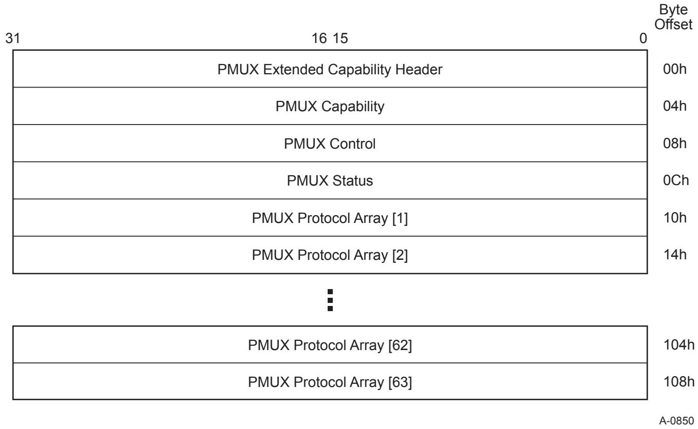

<details>
<summary>stacked bar chart</summary>

| Category                     | Value |
| ---------------------------- | ----- |
| PMUX Extended Capability Header | 00h   |
| PMUX Capability               | 04h   |
| PMUX Control                 | 08h   |
| PMUX Status                  | 0Ch   |
| PMUX Protocol Array [1]      | 10h   |
| PMUX Protocol Array [2]      | 14h   |
| PMUX Protocol Array [62]     | 104h  |
| PMUX Protocol Array [63]     | 108h  |
</details>

§ Figure G-7 PMUX Extended Capability

## G.5.1 PMUX Extended Capability Header (Offset 00h) §

§ Figure G-8 details the allocation of fields in the PMUX Extended Capability header; § Table G-6 provides the respective bit definitions.


<details>
<summary>text_image</summary>

31 20 19 16 15 0
Next Capability Offset 001Ah
PCI Express Extended Capability ID
Capability Version
</details>

Figure G-8 PMUX Extended Capability Header§

Table G-6 PMUX Extended Capability Header§

<table><tr><td>Bit Location</td><td>Register Description</td><td>Attributes</td></tr><tr><td>15:0</td><td>PCI Express Extended Capability ID - This field is a PCI-SIG defined ID number that indicates the nature and format of the Extended Capability.The Extended Capability ID for the PMUX Extended Capability is 001Ah.</td><td>RO</td></tr><tr><td>19:16</td><td>Capability Version - This field is a PCI-SIG defined version number that indicates the version of the Capability structure present. Must be 1h for this version of the specification.</td><td>RO</td></tr><tr><td>31:20</td><td>Next Capability Offset - This field contains the offset to the next PCI Express Capability structure or 000h if no other items exist in the linked list of capabilities.This offset is relative to the beginning of PCI compatible Configuration Space and thus must always be either 000h (for terminating the list of Capabilities) or greater than 0FFh.</td><td>RO</td></tr></table>

## G.5.2 PMUX Capability Register (Offset 04h) §

§ Figure G-9 details the allocation of fields in the PMUX Capability Register. § Table G-7 provides the respective bit definitions.

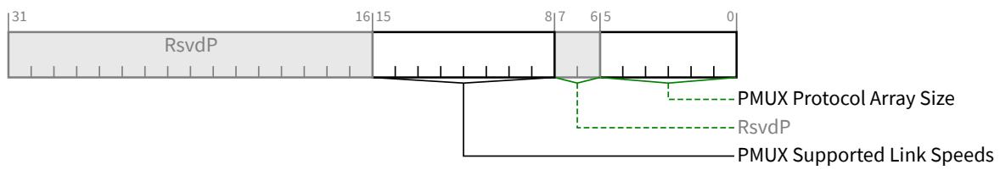

<details>
<summary>text_image</summary>

31
RsvdP
16 15
8 7
6 5
0
PMUX Protocol Array Size
RsvdP
PMUX Supported Link Speeds
</details>

§ Figure G-9 PMUX Capability Register

§

Table G-7 PMUX Capability Register

<table><tr><td>Bit Location</td><td>Register Description</td><td>Attributes</td></tr><tr><td>5:0</td><td>PMUX Protocol Array Size- Indicates the size of this Function&#x27;s PMUX Protocol Array. This field may be 0 to indicate that even though no protocols are supported, the Port will ignore all received PMUX Packets.</td><td>RO</td></tr><tr><td>15:8</td><td>PMUX Supported Link Speeds- This field indicates the Link speed(s) where Protocol Multiplexing is supported. Each bit corresponds to a Link speed. If a bit is Set, Protocol Multiplexing is supported at that Link speed. If a bit is Clear, Protocol Multiplexing is not supported at that Link speed.Bit definitions are:Bit 8 2.5 GT/sBit 9 5.0 GT/sBit 10 8.0 GT/sBit 11 16.0 GT/sBit 12 32.0 GT/sBits 15:13 RsvdPAt least one Link speed must be supported (i.e., the field must be non-zero). A Port may support any combination of Link speeds. For example, this field could contain the value 0000 0100b indicating that Protocol Multiplexing is only supported at 8.0 GT/s.This field must not indicate support for Link speeds that are not supported by the Link (see § Section 7.5.3.18 ).Note that this field indicates the Link speeds supported by Protocol Multiplexing for the Link. The Link speeds that a particular protocol supports and the mechanism used to report that information are protocol specific.</td><td>RO / RsvdP</td></tr></table>

## G.5.3 PMUX Control Register (Offset 08h) §

§ Figure G-10 details the allocation of fields in the PMUX Control Register. § Table G-8 provides the respective bit definitions.

Channel n is enabled and available for use by the PMUX Protocol Layer when all of the following are true:

• The Channel n Assignment field is non-zero.  
• The Channel n Assignment field is less than or equal to PMUX Protocol Array Size.  
• The Channel n Assignment field indicates an implemented entry in the PMUX Protocol Array (see § Section G.5.5 ).  
• All of the PMUX Channel n Disabled bits are Clear (see § Section G.5.4 ).

Otherwise, Channel n is disabled.

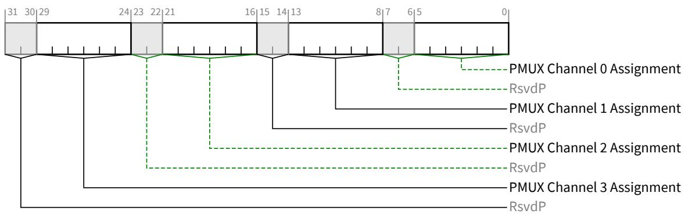

<details>
<summary>timing diagram</summary>

| Time | PMUX Channel 0 Assignment | PMUX Channel 1 Assignment | PMUX Channel 2 Assignment | PMUX Channel 3 Assignment |
| --- | --- | --- | --- | --- |
| 0 | 0 | 0 | 0 | 0 |
| 1 | 0 | 0 | 0 | 0 |
| 2 | 0 | 0 | 0 | 0 |
| 3 | 0 | 0 | 0 | 0 |
| 4 | 0 | 0 | 0 | 0 |
| 5 | 0 | 0 | 0 | 0 |
| 6 | 0 | 0 | 0 | 0 |
| 7 | 0 | 0 | 0 | 0 |
| 8 | 0 | 0 | 0 | 0 |
| 9 | 0 | 0 | 0 | 0 |
| 10 | 0 | 0 | 0 | 0 |
| 11 | 0 | 0 | 0 | 0 |
| 12 | 0 | 0 | 0 | 0 |
| 13 | 0 | 0 | 0 | 0 |
| 14 | 0 | 0 | 0 | 0 |
| 15 | 0 | 0 | 0 | 0 |
| 16 | 0 | 0 | 0 | 0 |
| 17 | 0 | 0 | 0 | 0 |
| 18 | 0 | 0 | 0 | 0 |
| 19 | 0 | 0 | 0 | 0 |
| 20 | 0 | 0 | 0 | 0 |
| 21 | 0 | 0 | 0 | 0 |
| 22 | 0 | 0 | 0 | 0 |
| 23 | 0 | 0 | 0 | 0 |
| 24 | 0 | 0 | 0 | 0 |
| 25 | 0 | 0 | 0 | 0 |
| 26 | 0 | 0 | 0 | 0 |
| 27 | 0 | 0 | 0 | 0 |
| 28 | 0 | 0 | 0 | 0 |
| 29 | 0 | 0 | 0 | 0 |
| 30 | 0 | 0 | 0 | 0 |
| 31 | -1 | -1 | -1 | -1 |
| Total | -1 | -1 | -1 | -1 |
| Currents | -1 | -1 | -1 | -1 |
| Currents (RsvdP) | -1 | -1 | -1 | -1 |
| Currents (PMUX Channel) | -1 | -1 | -1 | -1 |
| Currents (RsvdP) | -1 | -1 | -1 | -1 |
| Currents (PMUX Channel) | -1 | -1 | -1 | -1 |
| Currents (RsvdP) | -1 | -1 | -1 | -1 |
| Currents (PMUX Channel) (Total) | -1 | -1 | -1 | -1 |
| Currents (RsvdP) (Total) | -1 | -1 | -1 | -1 |
| Currents (PMUX Channel) (Total) (Total) | -1 | -1 | -1 | -1 |
</details>

Figure G-10 PMUX Control Register

§

§

Table G-8 PMUX Control Register

<table><tr><td>Bit Location</td><td>Register Description</td><td>Attributes</td></tr><tr><td>5:0</td><td>PMUX Channel 0 Assignment- This field indicates the protocol assigned to PMUX Channel 0. If the field is 0h, no protocol is assigned. If the field is non-zero, it is the index in the PMUX Protocol Array of the protocol assigned to PMUX Channel 0.If PMUX Protocol Array Size is less than 63 (see § Section G.5.2 ), unused upper bits of this field may be hardwired to 0b. If PMUX Protocol Array Size is 0, this entire field may be hardwired to 0.This field defaults to 0h.</td><td>RW</td></tr><tr><td>13:8</td><td>PMUX Channel 1 Assignment- This field indicates the protocol assigned to PMUX Channel 1. If the field is 0h, no protocol is assigned. If the field is non-zero, it is the index in the PMUX Protocol Array of the protocol assigned to PMUX Channel 1.If PMUX Protocol Array Size is less than 63 (see § Section G.5.2 ), unused upper bits of this field may be hardwired to 0b. If PMUX Protocol Array Size is 0, this entire field may be hardwired to 0.This field defaults to 0h.</td><td>RW</td></tr><tr><td>21:16</td><td>PMUX Channel 2 Assignment- This field indicates the protocol assigned to PMUX Channel 2. If the field is 0h, no protocol is assigned. If the field is non-zero, it is the index in the PMUX Protocol Array of the protocol assigned to PMUX Channel 2.If PMUX Protocol Array Size is less than 63 (see § Section G.5.2 ), unused upper bits of this field may be hardwired to 0b. If PMUX Protocol Array Size is 0, this entire field may be hardwired to 0.This field defaults to 0h.</td><td>RW</td></tr><tr><td>29:24</td><td>PMUX Channel 3 Assignment- This field indicates the protocol assigned to PMUX Channel 3. If the field is 0h, no protocol is assigned. If the field is non-zero, it is the index in the PMUX Protocol Array of the protocol assigned to PMUX Channel 3.If PMUX Protocol Array Size is less than 63 (see § Section G.5.2 ), unused upper bits of this field may be hardwired to 0b. If PMUX Protocol Array Size is 0, this entire field may be hardwired to 0.This field defaults to 0h.</td><td>RW</td></tr></table>

## G.5.4 PMUX Status Register (Offset 0Ch) §

§ Figure G-11 details the allocation of fields in the PMUX Status Register. § Table G-9 provides the respective bit definitions.

Each channel has a set of Disabled bits. When Channel n Assignment field is non-zero, the Channel n Disabled bits reflect the error status of the channel. The following Disabled bits are defined:

• PMUX Channel n Disabled: Link Speed  
• PMUX Channel n Disabled: Link Width  
• PMUX Channel n Disabled: Protocol Specific

When there are multiple reasons for disabling a channel, an implementation may choose which reason(s) to report. For example, if a protocol needs bandwidth equivalent to x1 8.0 GT/s, when there is inadequate bandwidth (e.g., the Link is operating at x1 5.0 GT/s, x1 2.5 GT/s, or x2 2.5 GT/s), it could disable the PMUX Channel by indicating any or all of Disabled: Link Width, Disabled: Link Speed, or Disabled: Protocol Specific.

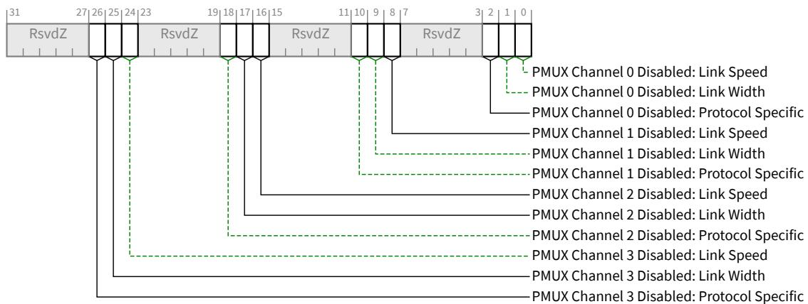

<details>
<summary>flowchart</summary>

```mermaid
graph TD
  A["RsvdZ"] --> B["27"]
  B --> C["26"]
  C --> D["25"]
  D --> E["24"]
  E --> F["23"]
  F --> G["19"]
  G --> H["18"]
  H --> I["17"]
  I --> J["16"]
  J --> K["15"]
  K --> L["11"]
  L --> M["10"]
  M --> N["9"]
  N --> O["8"]
  O --> P["7"]
  P --> Q["3"]
  Q --> R["2"]
  R --> S["1"]
  S --> T["0"]
    
    subgraph PNDBs
        PNDB1["PMUX Channel 0 Disabled: Link Speed"]
        PNDB2["PMUX Channel 0 Disabled: Link Width"]
        PNDB3["PMUX Channel 0 Disabled: Protocol Specific"]
        PNDB4["PMUX Channel 1 Disabled: Link Speed"]
        PNDB5["PMUX Channel 1 Disabled: Link Width"]
        PNDB6["PMUX Channel 1 Disabled: Protocol Specific"]
        PNDB7["PMUX Channel 2 Disabled: Link Speed"]
        PNDB8["PMUX Channel 2 Disabled: Link Width"]
        PNDB9["PMUX Channel 2 Disabled: Protocol Specific"]
        PNDB10["PMUX Channel 3 Disabled: Link Speed"]
        PNDB11["PMUX Channel 3 Disabled: Link Width"]
        PNDB12["PMUX Channel 3 Disabled: Protocol Specific"]
    end
```
</details>

§  
Figure G-11 PMUX Status Register

§  
Table G-9 PMUX Status Register

<table><tr><td>Bit Location</td><td>Register Description</td><td>Attributes</td></tr><tr><td>0</td><td>PMUX Channel 0 Disabled: Link Speed - If Set, Channel 0 is disabled because the Current Link Speed (§ Section 7.8.9) is not supported by Protocol Multiplexing or by the protocol assigned to Channel 0. This bit is 0 when no protocol is assigned to Channel 0 (i.e., Channel 0 Control field is 0h).</td><td>RO</td></tr><tr><td>1</td><td>PMUX Channel 0 Disabled: Link Width - If Set, Channel 0 is disabled because the current Link Width is not supported by the protocol assigned to Channel 0. This bit is 0 when no protocol is assigned to Channel 0 (i.e., PMUX Channel 0 Assignment field is 0h).</td><td>RO</td></tr><tr><td>2</td><td>PMUX Channel 0 Disabled: Protocol Specific - If Set, Channel 0 is disabled for protocol specific reasons. This bit is 0 when no protocol is assigned to Channel 0 (i.e., PMUX Channel 0 Assignment field is 0h).</td><td>RO</td></tr><tr><td>8</td><td>PMUX Channel 1 Disabled: Link Speed - If Set, Channel 1 is disabled because the Current Link Speed (§ Section 7.8.9) is not supported by Protocol Multiplexing or by the protocol assigned to Channel 1. This bit is 0 when no protocol is assigned to Channel 1 (i.e., PMUX Channel 1 Assignment field is 0h).</td><td>RO</td></tr><tr><td>9</td><td>PMUX Channel 1 Disabled: Link Width - If Set, Channel 1 is disabled because the current Link Width is not supported by the protocol assigned to Channel 1. This bit is 0 when no protocol is assigned to Channel 1 (i.e., PMUX Channel 1 Assignment field is 0h).</td><td>RO</td></tr><tr><td>10</td><td>PMUX Channel 1 Disabled: Protocol Specific - If Set, Channel 1 is disabled for protocol specific reasons. This bit is 0 when no protocol is assigned to Channel 1 (i.e., PMUX Channel 1 Assignment field is 0h).</td><td>RO</td></tr><tr><td>16</td><td>PMUX Channel 2 Disabled: Link Speed - If Set, Channel 2 is disabled because the Current Link Speed (§ Section 7.8.9) is not supported by Protocol Multiplexing or by the assigned protocol. This bit is 0 when no protocol is assigned to Channel 2 (i.e., PMUX Channel 2 Assignment field is 0h).</td><td>RO</td></tr><tr><td>17</td><td>PMUX Channel 2 Disabled: Link Width - If Set, Channel 2 is disabled because the current Link Width is not supported by the assigned protocol. This bit is 0 when no protocol is assigned to Channel 2 (i.e., PMUX Channel 2 Assignment field is 0h).</td><td>RO</td></tr><tr><td>18</td><td>PMUX Channel 2 Disabled: Protocol Specific - If Set, Channel 2 is disabled for protocol specific reasons. This bit is 0 when no protocol is assigned to Channel 2 (i.e., PMUX Channel 2 Assignment field is 0h).</td><td>RO</td></tr><tr><td>24</td><td>PMUX Channel 3 Disabled: Link Speed - If Set, Channel 3 is disabled because the Current Link Speed (§ Section 7.8.9) is not supported by Protocol Multiplexing or by the assigned protocol. This bit is 0 when no protocol is assigned to Channel 3 (i.e., PMUX Channel 3 Assignment field is 0h).</td><td>RO</td></tr><tr><td>25</td><td>PMUX Channel 3 Disabled: Link Width - If Set, Channel 3 is disabled because the current Link Width is not supported by the assigned protocol. This bit is 0 when no protocol is assigned to Channel 3 (i.e., PMUX Channel 3 Assignment field is 0h).</td><td>RO</td></tr><tr><td>26</td><td>PMUX Channel 3 Disabled: Protocol Specific - If Set, Channel 3 is disabled for protocol specific reasons. This bit is 0 when no protocol is assigned to Channel 3 (i.e., PMUX Channel 3 Assignment field is 0h).</td><td>RO</td></tr></table>

## G.5.5 PMUX Protocol Array (Offsets 10h through 48h) §

The PMUX Protocol Array consists of up to 63 entries. The size of the PMUX Protocol Array is indicated by the PMUX Protocol Array Size field (see § Section G.5.2 ).

§ Figure G-12 details the allocation of fields in each PMUX Protocol Array Entry. § Table G-10 provides the respective bit definitions.

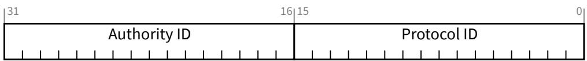

<details>
<summary>text_image</summary>

31
16 15
Authority ID Protocol ID
0
</details>

Figure G-12 PMUX Protocol Array Entry§

§ Table G-10 PMUX Protocol Array Entry

<table><tr><td>Bit Location</td><td>Register Description</td><td>Attributes</td></tr><tr><td>15:0</td><td>Protocol ID - In conjunction with Authority ID designates a specific protocol and the mechanism by which that protocol is mapped onto Protocol Multiplexing.This value is assigned by the Vendor associated with the Authority ID field.</td><td>RO</td></tr><tr><td>31:16</td><td>Authority ID - Designates the authority controlling the values used in the Protocol ID field.The Authority ID field contains a Vendor ID as assigned by the PCI-SIG.</td><td>RO</td></tr></table>

The value 0000 0000h indicates an unimplemented PMUX Protocol Array Entry. The PMUX Protocol Array is indexed starting at 1.

PMUX Channel n is enabled and configured to support the protocol associated with PMUX Protocol Array Entry at index m when the PMUX Channel n Assignment field contains the value m (see § Section G.5.3 ).

Entries in the PMUX Protocol Array with the Authority ID value 1 (0001h) represent protocols that are defined by the PCI-SIG.

Duplicate Entries in the PMUX Protocol Array may be used to represent multiple instances of a particular protocol. This permits software control of the mapping between PMUX Channel ID and a specific instance of a protocol.

## IMPLEMENTATION NOTE: MULTIPLE PROTOCOL INSTANCES §

A Link may have a single PMUX Protocol assigned to multiple PMUX Channels. Each PMUX Channel is assigned to a different instance of the protocol. Each instance of a protocol corresponds to an entry in the PMUX Protocol Array.

Consider a Port that supports two instances of protocol X. Two entries in the PMUX Protocol Array would indicate protocol X (indexes A and B for example). To assign instance A to PMUX Channel 0 and instance B to PMUX Channel 2, place the value A in the PMUX Channel 0 Assignment field and the value B in the PMUX Channel 2 Assignment field.

# H. Flow Control Update Latency and ACK Update Latency Calculations

This appendix is informational only and should not be considered normative. Earlier revisions of this specification outlined the method used to calculate the Flow Control Update Latency and Ack Update Latency. This appendix describes the method used to derive the values and preserves the UpdateFactor and AckFactor values.

## H.1 Flow Control Update Latency §

Recommended Flow Control Update Latency is described in the Implementation Note in § Section 2.6.1.2 entitled, Non-Flit Mode Flow Control Update Latency.

Flow Control Update Latency tables were simplified in the 4.0 Revision of this specification. At that time, the original tables were moved to this appendix. Note that in the 4.0 Revision of this specification, Tables 2-47 and 2-48 were distinct, but identical tables. The 5.0 Revision contains a single table that applies to 8.0 GT/s or higher.

<table><tr><td colspan="2">Original Tables</td><td colspan="2">Simplified Tables</td></tr><tr><td>Base 3.1</td><td>Base 4.0 or later</td><td>Base 4.0</td><td>Base 5.0 or later</td></tr><tr><td>Table 2-42</td><td>§ Table H-1</td><td>Table 2-45</td><td>§ Table 2-48</td></tr><tr><td>Table 2-43</td><td>§ Table H-2</td><td>Table 2-46</td><td>§ Table 2-49</td></tr><tr><td>Table 2-44</td><td>§ Table H-3</td><td>Table 2-47</td><td rowspan="2">§ Table 2-50</td></tr><tr><td>n/a</td><td>n/a</td><td>Table 2-48</td></tr></table>

The values in the Tables are measured starting from when the Receiver Transaction Layer makes additional receive buffer space available by processing a received TLP, to when the first Symbol of the corresponding UpdateFC DLLP is transmitted. The values are calculated as a function of the largest TLP payload size and Link width using the formula:

$$
\frac {\left(\text { Rx\_MPS\_Limit } + \text { TLPOverhead }\right) \times \text { UpdateFactor }}{\text { LinkWidth }} + \text { InternalDelay }
$$

Equation H-1 Max UpdateFC Latency

where:

## Rx\_MPS\_Limit

The Rx\_MPS\_Limit value as determined in § Section 2.2.2 . For a Multi-Function Device where different Functions have different Rx\_MPS\_Limit values, using the smallest Rx\_MPS\_Limit value across all Functions is strongly recommended.

## TLPOverhead

Represents the additional TLP components which consume Link bandwidth (TLP Prefix, header, LCRC, framing Symbols) and is treated here as a constant value of 28 Symbols.

## UpdateFactor

Represents the number of maximum size TLPs sent during the time between UpdateFC receptions, and is used to balance Link bandwidth efficiency and receive buffer sizes - the value varies according to Rx\_MPS\_Limit and Link width. § Table H-1, § Table H-2, and § Table H-3 below include the UpdateFactor(UF).

## LinkWidth

The operating width of the Link

## InternalDelay

Represents the internal processing delays for received TLPs and transmitted DLLPs, and is treated here as a constant value of 19 Symbol Times for 2.5 GT/s mode operation, 70 Symbol Times for 5.0 GT/s mode operation, and 115 Symbol Times for 8.0 GT/s and 16.0 GT/s modes of operation.

Table H-1 Maximum UpdateFC Transmission Latency Guidelines for 2.5 GT/s Mode Operation by Link Width and Max Payload (Symbol Times)§

<table><tr><td rowspan="2" colspan="2"></td><td colspan="7">Link Operating Width</td></tr><tr><td>x1</td><td>x2</td><td>x4</td><td>x8</td><td>x12</td><td>x16</td><td>x32</td></tr><tr><td rowspan="6">Rx_MPS_Limit(bytes)</td><td>128</td><td>237UF = 1.4</td><td>128UF = 1.4</td><td>73UF = 1.4</td><td>67UF = 2.5</td><td>58UF = 3.0</td><td>48UF = 3.0</td><td>33UF = 3.0</td></tr><tr><td>256</td><td>416UF = 1.4</td><td>217UF = 1.4</td><td>118UF = 1.4</td><td>107UF = 2.5</td><td>90UF = 3.0</td><td>72UF = 3.0</td><td>45UF = 3.0</td></tr><tr><td>512</td><td>559UF = 1.0</td><td>289UF = 1.0</td><td>154UF = 1.0</td><td>86UF = 1.0</td><td>109UF = 2.0</td><td>86UF = 2.0</td><td>52UF = 2.0</td></tr><tr><td>1024</td><td>1071UF = 1.0</td><td>545UF = 1.0</td><td>282UF = 1.0</td><td>150UF = 1.0</td><td>194UF = 2.0</td><td>150UF = 2.0</td><td>84UF = 2.0</td></tr><tr><td>2048</td><td>2095UF = 1.0</td><td>1057UF = 1.0</td><td>538UF = 1.0</td><td>278UF = 1.0</td><td>365UF = 2.0</td><td>278UF = 2.0</td><td>148UF = 2.0</td></tr><tr><td>4096</td><td>4143UF = 1.0</td><td>2081UF = 1.0</td><td>1050UF = 1.0</td><td>534UF = 1.0</td><td>706UF = 2.0</td><td>534UF = 2.0</td><td>276UF = 2.0</td></tr></table>

Table H-2 Maximum UpdateFC Transmission Latency Guidelines for 5.0 GT/s Mode Operation by Link Width and Max Payload (Symbol Times)§

<table><tr><td colspan="2" rowspan="2"></td><td colspan="7">Link Operating Width</td></tr><tr><td>x1</td><td>x2</td><td>x4</td><td>x8</td><td>x12</td><td>x16</td><td>x32</td></tr><tr><td rowspan="5">Rx_MPS_Limit(bytes)</td><td>128</td><td>288UF = 1.4</td><td>179UF = 1.4</td><td>124UF = 1.4</td><td>118UF = 2.5</td><td>109UF = 3.0</td><td>99UF = 3.0</td><td>84UF = 3.0</td></tr><tr><td>256</td><td>467UF = 1.4</td><td>268UF = 1.4</td><td>169UF = 1.4</td><td>158UF = 2.5</td><td>141UF = 3.0</td><td>123UF = 3.0</td><td>96UF = 3.0</td></tr><tr><td>512</td><td>610UF = 1.0</td><td>340UF = 1.0</td><td>205UF = 1.0</td><td>137UF = 1.0</td><td>160UF = 2.0</td><td>137UF = 2.0</td><td>103UF = 2.0</td></tr><tr><td>1024</td><td>1122UF = 1.0</td><td>596UF = 1.0</td><td>333UF = 1.0</td><td>201UF = 1.0</td><td>245UF = 2.0</td><td>201UF = 2.0</td><td>135UF = 2.0</td></tr><tr><td>2048</td><td>2146UF = 1.0</td><td>1108UF = 1.0</td><td>589UF = 1.0</td><td>329UF = 1.0</td><td>416UF = 2.0</td><td>329UF = 2.0</td><td>199UF = 2.0</td></tr><tr><td></td><td>4096</td><td>4194UF = 1.0</td><td>2132UF = 1.0</td><td>1101UF = 1.0</td><td>585UF = 1.0</td><td>757UF = 2.0</td><td>585UF = 2.0</td><td>327UF = 2.0</td></tr></table>

Table H-3 Maximum UpdateFC Transmission Latency Guidelines for 8.0 GT/s Operation by Link Width and Max Payload (Symbol Times)§

<table><tr><td rowspan="2" colspan="2"></td><td colspan="7">Link Operating Width</td></tr><tr><td>x1</td><td>x2</td><td>x4</td><td>x8</td><td>x12</td><td>x16</td><td>x32</td></tr><tr><td rowspan="6">Rx_MPS_Limit(bytes)</td><td>128</td><td>333UF = 1.4</td><td>224UF = 1.4</td><td>169UF = 1.4</td><td>163UF = 2.5</td><td>154UF = 3.0</td><td>144UF = 3.0</td><td>129UF = 3.0</td></tr><tr><td>256</td><td>512UF = 1.4</td><td>313UF = 1.4</td><td>214UF = 1.4</td><td>203UF = 2.5</td><td>186UF = 3.0</td><td>168UF = 3.0</td><td>141UF = 3.0</td></tr><tr><td>512</td><td>655UF = 1.0</td><td>385UF = 1.0</td><td>250UF = 1.0</td><td>182UF = 1.0</td><td>205UF = 2.0</td><td>182UF = 2.0</td><td>148UF = 2.0</td></tr><tr><td>1024</td><td>1167UF = 1.0</td><td>641UF = 1.0</td><td>378UF = 1.0</td><td>246UF = 1.0</td><td>290UF = 2.0</td><td>246UF = 2.0</td><td>180UF = 2.0</td></tr><tr><td>2048</td><td>2191UF = 1.0</td><td>1153UF = 1.0</td><td>634UF = 1.0</td><td>374UF = 1.0</td><td>461UF = 2.0</td><td>374UF = 2.0</td><td>244UF = 2.0</td></tr><tr><td>4096</td><td>4239UF = 1.0</td><td>2177UF = 1.0</td><td>1146UF = 1.0</td><td>630UF = 1.0</td><td>802UF = 2.0</td><td>630UF = 2.0</td><td>372UF = 2.0</td></tr></table>

## H.2 Ack Latency §

Ack Latency tables were simplified in the 4.0 Revision of this specification. At that time, the original tables were moved to this appendix. Note that in the 4.0 Revision of this specification, Tables 3-9 and 3-10 were distinct, but identical tables. The 5.0 Revision contains a single table that applies to 8.0 GT/s or higher.

<table><tr><td colspan="2">Original Tables</td><td colspan="2">Simplified Tables</td></tr><tr><td>Base 3.1</td><td>Base 4.0 or later</td><td>Base 4.0</td><td>Base 5.0 or later</td></tr><tr><td>Table 3-7</td><td>§ Table H-5</td><td>Table 3-7</td><td>§ Table 3-9</td></tr><tr><td>Table 3-8</td><td>§ Table H-6</td><td>Table 3-8</td><td>§ Table 3-10</td></tr><tr><td>Table 3-9</td><td>§ Table H-7</td><td>Table 3-9</td><td rowspan="2">§ Table 3-11</td></tr><tr><td>n/a</td><td>n/a</td><td>Table 3-10</td></tr></table>

The Maximum Ack Latency limits are calculated using the formula:

$$
\frac{(\text{Rx\_MPS\_Limit} + \text{TLPOverhead}) \times \text{UpdateFactor}}{\text{LinkWidth}} + \text{InternalDelay}
$$

Equation H-2 Max Ack Latency

where:

## Rx\_MPS\_Limit

The Rx\_MPS\_Limit value as determined in § Section 2.2.2 . For a Multi-Function Device where different Functions have different Rx\_MPS\_Limit values, using the smallest Rx\_MPS\_Limit value across all Functions is strongly recommended.

## TLPOverhead

represents the additional TLP components which consume Link bandwidth (TLP Prefix, header, LCRC, framing Symbols) and is treated here as a constant value of 28 Symbols.

## AckFactor

represents the number of maximum size TLPs which can be received before an Ack is sent, and is used to balance Link bandwidth efficiency and retry buffer size - the value varies according to Rx\_MPS\_Limit and Link width. Table H-4, Table H-5, and Table H-6 below include the AckFactor(AF).

## LinkWidth

is the operating width of the Link.

## InternalDelay

represents the internal processing delays for received TLPs and transmitted DLLPs, and is treated here as a constant value of 19 Symbol Times for 2.5 GT/s mode operation, 70 Symbol Times for 5.0 GT/s operation, and 115 Symbol Times for 8.0 GT/s and 16.0 GT/s operation.

Table H-5 Maximum Ack Latency Limit and AckFactor for 2.5 GT/s (Symbol Times)§

<table><tr><td rowspan="2" colspan="2"></td><td colspan="7">Link Operating Width</td></tr><tr><td>x1</td><td>x2</td><td>x4</td><td>x8</td><td>x12</td><td>x16</td><td>x32</td></tr><tr><td rowspan="6">Rx_MPS_Limit(bytes)</td><td>128</td><td>237AF = 1.4</td><td>128AF = 1.4</td><td>73AF = 1.4</td><td>67AF = 2.5</td><td>58AF = 3.0</td><td>48AF = 3.0</td><td>33AF = 3.0</td></tr><tr><td>256</td><td>416AF = 1.4</td><td>217AF = 1.4</td><td>118AF = 1.4</td><td>107AF = 2.5</td><td>90AF = 3.0</td><td>72AF = 3.0</td><td>45AF = 3.0</td></tr><tr><td>512</td><td>559AF = 1.0</td><td>289AF = 1.0</td><td>154AF = 1.0</td><td>86AF = 1.0</td><td>109AF = 2.0</td><td>86AF = 2.0</td><td>52AF = 2.0</td></tr><tr><td>1024</td><td>1071AF = 1.0</td><td>545AF = 1.0</td><td>282AF = 1.0</td><td>150AF = 1.0</td><td>194AF = 2.0</td><td>150AF = 2.0</td><td>84AF = 2.0</td></tr><tr><td>2048</td><td>2095AF = 1.0</td><td>1057AF = 1.0</td><td>538AF = 1.0</td><td>278AF = 1.0</td><td>365AF = 2.0</td><td>278AF = 2.0</td><td>148AF = 2.0</td></tr><tr><td>4096</td><td>4143AF = 1.0</td><td>2081AF = 1.0</td><td>1050AF = 1.0</td><td>534AF = 1.0</td><td>706AF = 2.0</td><td>534AF = 2.0</td><td>276AF = 2.0</td></tr></table>

Table H-6 Maximum Ack Transmission Latency Limit and AckFactor for 5.0 GT/s (Symbol Times)

<table><tr><td rowspan="2" colspan="2"></td><td colspan="7">Link Operating Width</td></tr><tr><td>x1</td><td>x2</td><td>x4</td><td>x8</td><td>x12</td><td>x16</td><td>x32</td></tr><tr><td rowspan="6">Rx_MPS_Limit(bytes)</td><td>128</td><td>288AF = 1.4</td><td>179AF = 1.4</td><td>124AF = 1.4</td><td>118AF = 2.5</td><td>109AF = 3.0</td><td>99AF = 3.0</td><td>84AF = 3.0</td></tr><tr><td>256</td><td>467AF = 1.4</td><td>268AF = 1.4</td><td>169AF = 1.4</td><td>158AF = 2.5</td><td>141AF = 3.0</td><td>123AF = 3.0</td><td>96AF = 3.0</td></tr><tr><td>512</td><td>610AF = 1.0</td><td>340AF = 1.0</td><td>205AF = 1.0</td><td>137AF = 1.0</td><td>160AF = 2.0</td><td>137AF = 2.0</td><td>103AF = 2.0</td></tr><tr><td>1024</td><td>1122AF = 1.0</td><td>596AF = 1.0</td><td>333AF = 1.0</td><td>201AF = 1.0</td><td>245AF = 2.0</td><td>201AF = 2.0</td><td>135AF = 2.0</td></tr><tr><td>2048</td><td>2146AF = 1.0</td><td>1108AF = 1.0</td><td>589AF = 1.0</td><td>329AF = 1.0</td><td>416AF = 2.0</td><td>329AF = 2.0</td><td>199AF = 2.0</td></tr><tr><td>4096</td><td>4194AF = 1.0</td><td>2132AF = 1.0</td><td>1101AF = 1.0</td><td>585AF = 1.0</td><td>757AF = 2.0</td><td>585AF = 2.0</td><td>327AF = 2.0</td></tr></table>

Table H-7 Maximum Ack Transmission Latency Limit and AckFactor for 8.0 GT/s (Symbol Times)

<table><tr><td rowspan="2" colspan="2"></td><td colspan="7">Link Operating Width</td></tr><tr><td>x1</td><td>x2</td><td>x4</td><td>x8</td><td>x12</td><td>x16</td><td>x32</td></tr><tr><td rowspan="6">Rx_MPS_Limit(bytes)</td><td>128</td><td>333AF = 1.4</td><td>224AF = 1.4</td><td>169AF = 1.4</td><td>163AF = 2.5</td><td>154AF = 3.0</td><td>144AF = 3.0</td><td>129AF = 3.0</td></tr><tr><td>256</td><td>512AF = 1.4</td><td>313AF = 1.4</td><td>214AF = 1.4</td><td>203AF = 2.5</td><td>186AF = 3.0</td><td>168AF = 3.0</td><td>141AF = 3.0</td></tr><tr><td>512</td><td>655AF = 1.0</td><td>385AF = 1.0</td><td>250AF = 1.0</td><td>182AF = 1.0</td><td>205AF = 2.0</td><td>182AF = 2.0</td><td>148AF = 2.0</td></tr><tr><td>1024</td><td>1167AF = 1.0</td><td>641AF = 1.0</td><td>378AF = 1.0</td><td>246AF = 1.0</td><td>290AF = 2.0</td><td>246AF = 2.0</td><td>180AF = 2.0</td></tr><tr><td>2048</td><td>2191AF = 1.0</td><td>1153AF = 1.0</td><td>634AF = 1.0</td><td>374AF = 1.0</td><td>461AF = 2.0</td><td>374AF = 2.0</td><td>244AF = 2.0</td></tr><tr><td>4096</td><td>4239AF = 1.0</td><td>2177AF = 1.0</td><td>1146AF = 1.0</td><td>630AF = 1.0</td><td>802AF = 2.0</td><td>630AF = 2.0</td><td>372AF = 2.0</td></tr></table>

## I. Async Hot-Plug Reference Model §

This appendix presents a recommended reference model for async hot-plug. The reference model covers three areas:

• Async hot-plug initial configuration  
• Async removal configuration and interrupt handling  
• Async hot-add configuration and interrupt handling

There are no normative requirements in this section. The entire reference model is contained in a series of implementation notes. The reference model documents how the various hot-plug mechanisms are envisioned be used to implement a robust asynchronous hot-plug model, but does not mandate that they be used that way.

For brevity and readability, this section uses the following acronyms:

## DLL

Data Link Layer

## DSP

Downstream Port

## FWF

firmware first

## HPS

Hot-Plug Surprise

## OOB

out-of-band

## OS

operating system

## PD

presence detect

## SFW

system firmware

The reference model covers both the HPS and DPC mechanisms. DPC is the recommended mechanism. The reference model covers FWF for DPC but not for HPS.

The reference model provides a recommended framework for DPC software to support Containment Error Recovery (CER) along with async hot-plug. The reference model does not explicitly cover CER outside of async hot-plug, but certain aspects can be leveraged for DPC support of CER when async hot-plug is not being used.

SFW may use the System Firmware Intermediary (SFI) Capability for async hot-plug, orderly removal hot-plug, or other operations. This reference model does not rely on its functionality nor cover its use.

The reference model refers to various bits or fields outlined in § Section 6.7.2 . For brevity, pointers to the associated registers are not replicated in this section.

## IMPLEMENTATION NOTE:

## IN-BAND PRESENCE DETECT MECHANISM DEPRECATED FOR ASYNC HOT-PLUG §

Due to architectural issues, the in-band (Physical-Layer-based) portion of the PD mechanism is deprecated for use with async hot-plug. One issue is that in-band PD as architected does not detect adapter removal during certain LTSSM states, notably the L1 and Disabled States. Another issue is that when both in-band and OOB PD are being used together, the Presence Detect State bit and its associated interrupt mechanism always reflect the logical OR of the inband and OOB PD states, and with some hot-plug hardware configurations, it is important for software to detect and respond to in-band and OOB PD events independently.

If OOB PD is being used and the associated DSP supports In-Band PD Disable, it is recommended that the In-Band PD Disable bit be Set, and the Presence Detect State bit and its associated interrupt mechanism be used exclusively for OOB PD.

As a substitute for in-band PD with async hot-plug, the reference model uses either the DPC or the DLL Link Active mechanism.

The reference model assumes and covers the configurations listed below. While these cover the bulk of the envisioned use cases, many minor variations are not explicitly covered. For example, there are multiple ways to determine if a slot supports OOB PD, and the reference model does not cover them. As another example, the reference model refers to adding or removing an adapter, but some hot-pluggable modules may include a Switch and multiple Endpoint components.

• Reference model assumptions:

◦ DSPs support DLL Link Active Reporting  
◦ DSPs support In-Band PD Disable  
◦ Operating systems support both HPS and DPC, using DPC if available

• Reference model covers:

◦ Slots that support HPS and/or DPC (SW never enables both at same time)  
◦ Slots with or without OOB PD  
◦ RPs with or without RP Extensions for DPC

## I.1 Async Hot-Plug Initial Configuration


## IMPLEMENTATION NOTE:

## ASYNC HOT-PLUG INITIAL CONFIGURATION §

<table><tr><td>Basic Steps</td><td>HPS</td><td>DPC</td></tr><tr><td>Determine capability control entity</td><td colspan="2">OS requests, and is granted control of PCIe Native Hot-PlugIf FWF, SFW retains control of AER and DPCElse OS requests and is granted control of AER and DPC</td></tr><tr><td>OS and SFW determine which async hot-plug mechanism to use; OS/SFW interactions here are outside scope of this specification</td><td colspan="2">If DPC capability thenIf HPS bit not Set, use DPCElse attempt to Clear HPS bit (§ Section 6.7.4.4)If successful, use DPCElse use HPSElse if HPS bit Set, use HPSElse async hot-plug cannot be supported by this slotConfigure DSP for selected mechanism</td></tr><tr><td>OS determines if adapter present</td><td colspan="2">If OOB PD supported, use it to determine if adapter is presentSet In-band PD Disable bit (SFW may have it Set by default)Read PD State bitElse allow Link to attempt to train; use DLL Link Active to determine if adapter is present (and at least minimally functional)</td></tr><tr><td>If adapter is present, OS waits for adapter to become ready for configuration</td><td colspan="2">If using Device Readiness Status (DRS), begin configuration if/after DSP receives a DRS MessageIf using Configuration RRS Software Visibility, can attempt first Configuration Read (of Vendor ID field) after 100 msOtherwise, must wait at least 1000 ms before attempting first Configuration Read</td></tr><tr><td>OS configures for appropriate case</td><td colspan="2">If adapter is present, configure system for handling async removalElse configure system for handling async hot-add</td></tr></table>

## I.2 Async Removal Configuration and Interrupt Handling §

## IMPLEMENTATION NOTE:

## ASYNC REMOVAL CONFIGURATION §

<table><tr><td>Basic Steps</td><td>HPS</td><td>DPC</td></tr><tr><td>OS/SFW configure appropriate error handling</td><td>If OS and driver support a non-CER error recovery approach, its policies may influence some of these error settingsConfigure the error handling supported by HPS</td><td>If OS and driver support CER, its policies may influence some of these error settingsEnable uncorrectable AER errors to trigger DPC, including Surprise DownIf using RP Extensions for DPC, configure RP PIO error handlingConfigure RP Completion Timeout handling per platform and OS policies</td></tr><tr><td rowspan="2">OS/SFW configure async removal interrupts</td><td>OS enables DLL State Changed interrupt</td><td>If FWF, configure DPC for ERR_COR signaling to enable SFW handlingElse configure DPC for interrupt to enable OS handling</td></tr><tr><td colspan="2">If OOB PD supported, OS enables PD Changed interrupt</td></tr></table>

IMPLEMENTATION NOTE:  
ASYNC REMOVAL INTERRUPT HANDLING §

<table><tr><td>Basic Steps</td><td>HPS</td><td>DPC</td></tr><tr><td rowspan="2">Service routine entry</td><td rowspan="2">If PD Changed or DLL State Change, OS is interrupted</td><td>If PD Changed, OS is interruptedIf FWF, OS invokes SFW; preferably via OS Setting DPC Software Trigger bit (if implemented)</td></tr><tr><td>If DPC triggeredIf FWF, DPC sends ERR_COR to signal SFWElse DPC interrupts OS</td></tr><tr><td>Prevent further Link activity</td><td>OS Sets Disable Link; Link goes down and stays downOS polls DLL Link Active until Clear</td><td>DPC automatically keeps Link down</td></tr><tr><td rowspan="2">Log errors from DSP&#x27;s AER/DPC</td><td></td><td>If FWF, SFW logs DSP errorsSFW invokes OS and exits</td></tr><tr><td colspan="2">OS logs and then clears DSP errors</td></tr><tr><td colspan="3">OS notifies impacted software/driver, which cease accessing the adapter</td></tr><tr><td>OS determines if adapter is still present</td><td colspan="2">Some FFs with OOB PD automatically power off slot and/or disable switched signalsIf OOB PD supported, use it to determine if adapter is physically presentIf adapter not determined to be absent, re-enable the Link and slotAs applicable, Clear Disable Link or release DPCWait until Link trains or adapter is deemed absent or non-functionalIf non-functional, optionally perform a slot reset (if supported)If still non-functional, optionally power-cycle the slot (if supported)</td></tr><tr><td>If OS determined adapter to be present</td><td colspan="2">OS waits for adapter to become ready for configurationOS enumerates and configures the adapterIf DPC and FWF, OS invokes SFW to log adapter AER errors</td></tr></table>