## IMPLEMENTATION NOTE:

## CLKREQ# CONNECTION TOPOLOGY WITH A RETIMER

## SUPPORTING L1 PM SUBSTATES §

In this platform configuration Downstream Port (A) has only a single CLKREQ# signal. The Upstream and Downstream Ports’ CLKREQ# (A and C), and the Retimer’s CLKREQB# signals are connected to each other. In this case, Downstream Port (A), must assert CLKREQ# signal whenever it requires a reference clock. Component A, Component B, and the Retimer have their REFCLKs removed/restored at the same time.


<details>
<summary>flowchart</summary>

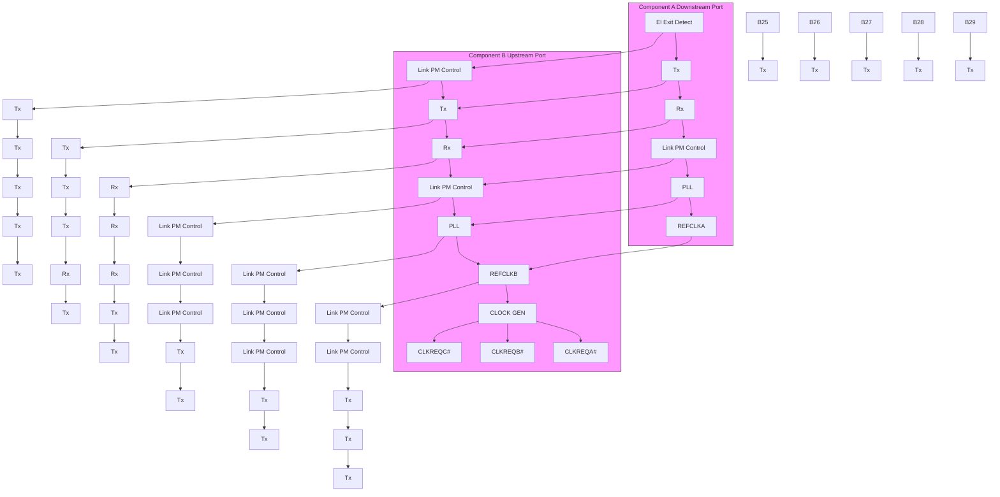
```mermaid
graph TD
    subgraph Component_A_Downstream_Port[Component A Downstream Port]
  A1["El Exit Detect"] --> A2["Tx"]
  A2 --> A3["Rx"]
  A3 --> A4["Link PM Control"]
  A4 --> A5["PLL"]
  A5 --> A6["REFCLKA"]
    end

    subgraph Component_B_Upstream_Port[Component B Upstream Port]
  B1["Link PM Control"] --> B2["Tx"]
  B2 --> B3["Rx"]
  B3 --> B4["Link PM Control"]
  B4 --> B5["PLL"]
  B5 --> B6["REFCLKB"]
  B6 --> C1["CLOCK GEN"]
  C1 --> C2["CLKREQA#"]
  C1 --> C3["CLKREQB#"]
  C1 --> C4["CLKREQC#"]
    end

  A1 --> B1
  A2 --> B2
  A3 --> B3
  A4 --> B4
  A5 --> B5
  A6 --> B6
  B1 --> B7["Tx"]
  B2 --> B8["Tx"]
  B3 --> B9["Rx"]
  B4 --> B10["Link PM Control"]
  B5 --> B11["Link PM Control"]
  B6 --> B12["Link PM Control"]
  B7 --> B13["Tx"]
  B8 --> B14["Tx"]
  B9 --> B15["Rx"]
  B10 --> B16["Link PM Control"]
  B11 --> B17["Link PM Control"]
  B12 --> B18["Link PM Control"]
  B13 --> B19["Tx"]
  B14 --> B20["Tx"]
  B15 --> B21["Rx"]
  B16 --> B22["Link PM Control"]
  B17 --> B23["Link PM Control"]
  B18 --> B24["Tx"]
  B19 --> B30["Tx"]
  B20 --> B31["Rx"]
  B21 --> B32["Tx"]
  B22 --> B33["Tx"]
  B23 --> B34["Tx"]
  B24 --> B35["Tx"]
  B25 --> B36["Tx"]
  B26 --> B37["Tx"]
  B27 --> B38["Tx"]
  B28 --> B39["Tx"]
  B29 --> B40["Tx"]
  B30 --> B41["Tx"]
  B31 --> B42["Tx"]
  B32 --> B43["Tx"]
  B33 --> B44["Tx"]
  B34 --> B45["Tx"]
  B35 --> B46["Tx"]
    style Component_A_Downstream_Port fill:#f9f,stroke:#333
    style Component_B_Upstream_Port fill:#f9f,stroke:#333
```
</details>

Figure 4-62 Retimer CLKREQ# Connection Topology§

## 4.3.11 Retimer Configuration Parameters

§

Retimers must provide an implementation specific mechanism to configure each of the parameters in this section.

The parameters are split into two groups: parameters that are configurable globally for the Retimer and parameters that are configurable for each physical Retimer Pseudo Port.

If a per Pseudo Port parameter only applies to an Upstream or a Downstream Pseudo Port the Retimer is not required to provide an implementation specific mechanism to configure the parameter for the other type of Pseudo Port.

## 4.3.11.1 Global Parameters §

• Port Orientation Method. This controls whether the Port Orientation is determined dynamically as described in § Section 4.3.6.2 , or statically based on vendor assignment of Upstream and Downstream Pseudo Ports. If the Port Orientation is set to static the Retimer is not required to dynamically adjust the Port Orientation as described in § Section 4.3.6.2 . The default behavior is for the Port Orientation to be dynamically determined.  
• Maximum Data Rate. This controls the maximum data rate that the Retimer sets in the Data Rate Identifier field of training sets that the Retimer transmits. Retimers that support only the 2.5 GT/s speed are permitted not to provide this configuration parameter.  
• SRIS Enable. This controls whether the Retimer is configured for SRIS and transmits SKP Ordered sets at the SRIS mode rate when in Execution mode. Retimers that do not support SRIS and at least one other clocking architecture are not required to provide this configuration parameter.  
• SRIS Link Payload Size. This controls the maximum payload size the Retimer supports while in SRIS. The value must be selectable from all the Maximum Payload Sizes shown in § Table 4-67. The default value of this parameter is to support a maximum payload size of 4096 bytes. Retimers that do not support SRIS are not required to provide this configuration parameter.

The following are examples of cases where it might be appropriate to configure the SRIS Link Payload Size to a smaller value than the default:

◦ A Retimer is part of a motherboard connected to Root Port that supports a maximum payload size less than 4096 bytes.  
◦ A Retimer is part of an adapter connected to an Upstream Port (e.g., Endpoint) that supports a maximum payload size less than 4096 bytes.  
◦ A Retimer is located Downstream of the Downstream Port of a Switch integrated as part of a system, the Root Port supports a maximum payload size less than 4096 bytes and the system does not support peer to peer traffic.

• Enhanced Link Behavior Control. This controls the ability for the Retimer to either bypass equalization to the highest data rate or completely bypass equalization when it supports 32.0 GT/s.

## 4.3.11.2 Per Physical Pseudo Port Parameters §

• Port Orientation. This is applicable only when the Port Orientation Method is configured for static determination. This is set for either Upstream or Downstream. Each Pseudo Port must be configured for a different orientation, or the behavior is undefined.  
Selectable De-emphasis. When the Downstream Pseudo Port is operating at 5.0 GT/s this controls the transmit de-emphasis of the Link to either -3.5 dB or -6 dB in specific situations and the value of the Selectable De-emphasis field in training sets transmitted by the Downstream Pseudo Port. See § Section 4.2.7 for detailed usage information. When the Link Segment is not operating at the 5.0 GT/s speed, the setting of this bit has no effect. Retimers that support only the 2.5 GT/s speed are permitted not to provide this configuration parameter.  
• Rx Impedance Control. This controls whether the Retimer dynamically applies and removes 50 Ω terminations or statically has 50 Ω terminations present. The value must be selectable from Dynamic, Off, and On. The default behavior is Dynamic.

Tx Compliance Disable. This controls whether the Retimer transmits the Compliance Pattern in the CompLoadBoard.Pattern state. The default behavior is for the Retimer to transmit the Compliance Pattern in the CompLoadBoard.Pattern state. If TX Compliance Pattern is set to disabled, the Retimer Transmitters remain in Electrical Idle and do not transmit Compliance Pattern in CompLoadBoard.Pattern - all other behavior in the CompLoadBoard state is the same.  
Pseudo Port Follower Loopback. This controls whether the Retimer operates in a Forwarding mode during loopback on the Link or enters Follower Loopback on the Pseudo Port. The default behavior is for the Retimer to operate in Forwarding mode during loopback. Retimers that do not support optional Follower Loopback are permitted not to provide this configuration parameter. This configuration parameter shall only be enabled for one physical Port. Retimer behavior is undefined if the parameter is enabled for more than one physical Port.  
Downstream Pseudo Port 8GT TX Preset. This controls the initial TX preset used by the Downstream Pseudo Port transmitter for 8.0 GT/s transmission. The default value is implementation specific. The value must be selectable from all applicable values in § Table 4-23.  
Downstream Pseudo Port 16GT TX Preset. This controls the initial TX preset used by the Downstream Pseudo Port transmitter for 16.0 GT/s transmission. The default value is implementation specific. The value must be selectable from all applicable values in § Table 4-23.  
Downstream Pseudo Port 32GT TX Preset. This controls the initial TX preset used by the Downstream Pseudo Port transmitter for 32.0 GT/s transmission. The default value is implementation specific. The value must be selectable for all applicable values in § Table 4-23.  
Downstream Pseudo Port 64GT TX Preset. This controls the initial TX preset used by the Downstream Pseudo Port transmitter for 64.0 GT/s transmission. The default value is implementation specific. The value must be selectable for all applicable values in § Table 4-23.  
Downstream Pseudo Port 8GT Requested TX Preset. This controls the initial transmitter preset value used in the EQ TS2 Ordered Sets transmitted by the Downstream Pseudo Port for use at 8.0 GT/s. The default value is implementation specific. The value must be selectable from all values in § Table 4-23.  
• Downstream Pseudo Port 16GT Requested TX Preset. This controls the initial transmitter preset value used in the 128b/130b EQ TS2 Ordered Sets transmitted by the Downstream Pseudo Port for use at 16.0 GT/s. The default value is implementation specific. The value must be selectable from all values in § Table 4-23.  
• Downstream Pseudo Port 32GT Requested TX Preset. This controls the initial transmitter preset value used in the 128b/130b EQ TS2 Ordered Sets transmitted by the Downstream Pseudo Port for use at 32.0 GT/s. The default value is implementation specific. The value must be selectable from all values in § Table 4-23.  
Downstream Pseudo Port 64GT Requested TX Preset. This controls the initial transmitter preset value used in the 128b/130b EQ TS2 Ordered Sets transmitted by the Downstream Pseudo Port for use at 64.0 GT/s. The default value is implementation specific. The value must be selectable from all values in § Table 4-23.  
• Downstream Pseudo Port 8GT RX Hint. This controls the Receiver Preset Hint value used in the EQ TS2 Ordered Sets transmitted by the Downstream Pseudo Port for use at 8.0 GT/s. The default value is implementation specific. The value must be selectable from all values in § Table 4-24.

## 4.3.12 In Band Register Access §

• Retimers operating at 16.0 GT/s or higher may optionally support inband read only access. Control SKP Ordered Sets at 16.0 GT/s or higher provide the mechanism via the Margin Command ‘Access Retimer Register’, see § Table 4-63. Retimers that support inband read only access must return a non-zero value for the DWORD at Registers offsets 80h and 84h. Retimers that do not support inband read only access must return a zero value.  
• Register offsets between A0h and FFh are designated as Vendor Defined register space.  
• Register offsets from 00h to 7Fh and 85H to 9Fh are Reserved for PCI-SIG future use.

## 5. Power Management §

This chapter describes power management (PM) capabilities and protocols.

## 5.1 Overview §

Power Management states are as follows:

• D states are associated with a particular Function  
◦ D0 is the operational state and consumes the most power  
◦ D1 and D2 are intermediate power saving states  
◦ D3Hot is a very low power state  
◦ $\mathsf { D } 3 \mathsf { c o } | \mathsf { d }$ is the power off state

• L states are associated with a particular Link

◦ L0 is the operational state  
◦ L0p is a reduced power sub-state of L0 (see § Section 4.2.6.7 )  
◦ L0s, L1, L1.0, L1.1, and L1.2 are various lower power states

Other specifications define related power states (e.g., S states). This specification does not describe relationships between those states and D/L states.

PM provides the following services:

• A mechanism to identify power management capabilities of a given Function  
• The ability to transition a Function into a certain power management state  
• Notification of the current power management state of a Function  
• The option to wakeup the system on a specific event

PM is compatible with the PCI Bus Power Management Interface Specification and the Advanced Configuration and Power Interface Specification. This chapter also defines PCI Express Native Power Management extensions.

PM defines Link power management states that a PCI Express physical Link is permitted to enter in response to either software driven D-state transitions or active state Link power management activities. PCI Express Link states are not visible directly to legacy bus driver software, but are derived from the power management state of the components residing on those Links. Defined Link states are L0, L0s, L1, L2, and L3. The power savings increase as the Link state transitions from L0 through L3.

Components may wakeup the system using a wakeup mechanism followed by a power management event (PME) Message. PCI Express systems may provide the optional auxiliary power supply (Vaux) needed for wakeup operation from states where the main power supplies are off.

The specific definition and requirements associated with Vaux are form-factor specific, and throughout this document the terms “auxiliary power” and “Vaux” should be understood in reference to the specific form factor in use.

Unlike earlier mechanisms, the PCI Express-PM PME mechanism separates the following two PME tasks:

• Reactivation (wakeup) of the associated resources (i.e., re-establishing reference clocks and main power rails to the PCI Express components)  
• Sending a PME Message to the Root Complex to provide the souce of the wakeup event

Active State Power Management (ASPM) is an autonomous hardware-based, active state mechanism that enables power savings even when the connected components are in the D0 state. After a period of idle Link time, an ASPM Physical-Layer protocol places the idle Link into a lower power state. Once in the lower-power state, transitions to the fully operative L0 state are triggered by traffic appearing on either side of the Link. ASPM may be disabled by software. Refer to § Section 5.4.1 for more information on ASPM.

## 5.2 Link State Power Management §

PCI Express defines Link power management states, replacing the bus power management states that were defined by the PCI Bus Power Management Interface Specification. Link states are not visible to PCI-PM legacy compatible software, and are either derived from the power management D-states of the corresponding components connected to that Link or by ASPM protocols (see § Section 5.4.1 ).

Note that the PCI Express Physical Layer may define additional intermediate states. Refer to § Chapter 4. for more detail on each state and how the Physical Layer handles transitions between states.

PCI Express-PM defines the following Link power management states:

• L0 (including the L0p sub-state) - Active state.  
L0 support is required for both ASPM and PCI-PM compatible power management.  
All PCI Express transactions and other operations are enabled.

• L0s - A low resume latency, energy saving “standby” state.

L0s support is optional for ASPM unless the applicable form factor specification for the Link explicitly requires L0s support.

All main power supplies, component reference clocks, and components' internal PLLs must be active at all times during L0s. TLP and DLLP transmission is disabled for a Port whose Link is in Tx\_L0s.

The Physical Layer provides mechanisms for quick transitions from this state to the L0 state. When common (distributed) reference clocks are used on both sides of a Link, the transition time from L0s to L0 is desired to be less than 100 Symbol Times.

It is possible for the Transmit side of one component on a Link to be in L0s while the Transmit side of the other component on the Link is in L0.

• L1 - Higher latency, lower power “standby” state.

L1 support is required for PCI-PM compatible power management. L1 is optional for ASPM unless specifically required by a particular form factor.

When L1 PM Substates is enabled by setting one or more of the enable bits in the L1 PM Substates Control 1 Register this state is referred to as the L1.0 substate.

All main power supplies must remain active during L1. As long as they adhere to the advertised L1 exit latencies, implementations are explicitly permitted to reduce power by applying techniques such as, but not limited to, periodic rather than continuous checking for Electrical Idle exit, checking for Electrical Idle exit on only one Lane, and powering off of unneeded circuits. All platform-provided component reference clocks must remain active during L1, except as permitted by Clock Power Management (using CLKREQ#) and/or L1 PM

Substates when enabled. A component's internal PLLs may be shut off during L1, enabling greater power savings at a cost of increased exit latency. 86

The L1 state is entered whenever all Functions of a Downstream component on a given Link are programmed to a D-state other than D0. The L1 state also is entered if the Downstream component requests L1 entry (ASPM) and receives positive acknowledgement for the request.

Exit from L1 is initiated by an Upstream-initiated transaction targeting a Downstream component, or by the Downstream component's initiation of a transaction heading Upstream. Transition from L1 to L0 is desired to be a few microseconds.

TLP and DLLP transmission is disabled for a Link in L1.

• L1 PM Substates - optional L1.1 and L1.2 substates of the L1 low power Link state for PCI-PM and ASPM.

In the L1.1 substate, the Link common mode voltages are maintained. The L1.1 substate is entered when the Link is in the L1.0 substate and conditions for entry into L1.1 substate are met. See § Section 5.5.1 for details.

In the L1.2 substate, the Link common mode voltages are not required to be maintained. The L1.2 substate is entered when the Link is in the L1.0 substate and conditions for entry into L1.2 substate are met. See § Section 5.5.1 . for details.

Exit from all L1 PM Substates is initiated when the CLKREQ# signal is asserted (see § Section 5.5.2.1 and § Section 5.5.3.3 ).

• L2/L3 Ready - Staging point for L2 or L3.

L2/L3 Ready transition protocol support is required.

L2/L3 Ready is a pseudo-state (corresponding to the LTSSM L2 state) that a given Link enters when preparing for the removal of power and clocks from the Downstream component or from both attached components. This process is initiated after PM software transitions a device into a D3 state, and subsequently calls power management software to initiate the removal of power and clocks. After the Link enters the L2/L3 Ready state the component(s) are ready for power removal. After main power has been removed, the Link will either transition to L2 if Vaux is provided and used, or it will transition to L3 if no Vaux is provided or used. Note that these are PM pseudo-states for the Link; under these conditions, the LTSSM will in, general, operate only on main power, and so will power off with main power removal.

The L2/L3 Ready state entry transition process must begin as soon as possible following the acknowledgment of a PME\_Turn\_Off Message, (i.e., the injection of a PME\_TO\_Ack TLP). The Downstream component initiates L2/L3 Ready entry by sending a PM\_Enter\_L23 DLLP. Refer to § Section 5.7 for further detail on power management system Messages.

TLP and DLLP transmission is disabled for a Link in L2/L3 Ready.

Note: Exit from L2/L3 Ready back to L0 will be through intermediate LTSSM states. Refer to § Chapter 4. for detailed information.

• L2 - Auxiliary-powered Link, deep-energy-saving state.

L2 support is optional, and dependent upon the presence of auxiliary power.

A component may only consume auxiliary power if enabled to do so as described in § Section 5.6 .

In L2, the component's main power supply inputs and reference clock inputs are shut off.

When in L2, any Link reactivation wakeup logic (Beacon or WAKE#), PME context, and any other “keep alive” logic is powered by auxiliary power.

TLP and DLLP transmission is disabled for a Link in L2.

• L3 - Link Off state.

When no power is present, the component is in the L3 state.

• LDn - A transitional Link Down pseudo-state prior to L0.

This pseudo-state is associated with the LTSSM states Detect, Polling, and Configuration, and, when applicable, Disabled, Loopback, and Hot Reset.

Refer to § Section 4.2 for further detail relating to entering and exiting each of the L-states between L0 and L2/L3 Ready (L2.Idle from the § Chapter 4. perspective). The L2 state is an abstraction for PM purposes distinguished by the presence of auxiliary power, and should not be construed to imply a requirement that the LTSSM remain active.

The electrical section specifies the electrical properties of drivers and Receivers when no power is applied. This is the L3 state but the electrical section does not refer to L3.

§ Figure 5-1 shows an overview of L-state transitions that may occur.  
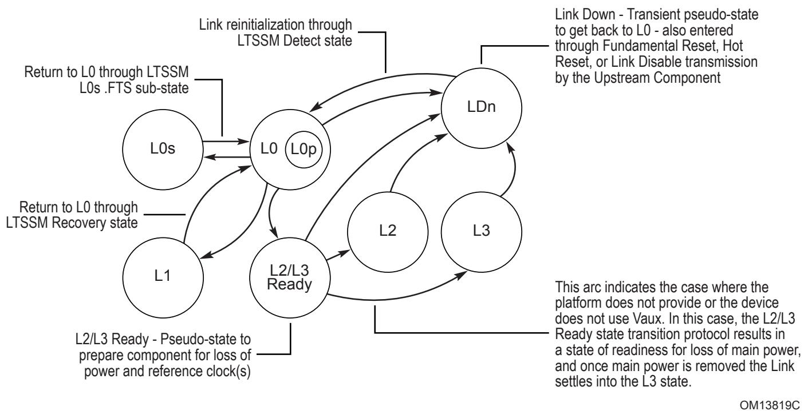

<details>
<summary>flowchart</summary>

```mermaid
graph TD
  L0s --> L0
  L0p --> L0
  L1 --> L0
  L2L3Ready["L2/L3 Ready"] --> L0
  L2 --> L0p
  L2L3Ready2["L2L3 Ready"] --> L0p
  L2L3Ready2 --> L1
  L2L3Ready2 --> L3
  L2L3Ready2 --> L0p
  L2L3Ready2 --> L1
  L2L3Ready2 --> L3
  L2L3Ready2 --> L0p
  L0p --> L0
  L0p --> L0p
  L0p --> L1
  L0p --> L2
  L0p --> L3
  L0p --> L4
  L0p --> L5
  L0p --> L6
  L0p --> L7
  L0p --> L8
  L0p --> L9
  L0p --> L10
  L0p --> L11
  L0p --> L12
  L0p --> L13
  L0p --> L14
  L0p --> L15
  L0p --> L16
  L0p --> L17
  L0p --> L18
  L0p --> L19
  L0p --> L20
  L0p --> L21
  L0p --> L22
  L0p --> L23
  L0p --> L24
  L0p --> L25
  L0p --> L26
  L0p --> L27
  L0p --> L28
  L0p --> L29
  L0p --> L30
  L0p --> L31
  L0p --> L32
  L0p --> L33
  L0p --> L34
  L0p --> L35
  L0p --> L36
  L0p --> L37
  L0p --> L38
  L0p --> L39
  L0p --> L40
    L1 & 1 & 2 & 3 & 4 & 5 & 6 & 7 & 8 & 9 & 10 & 11 & 12 & 13 & 14 & 15 & 16 & 17 & 18 & 19 & 20 & 21 & 22 & 23 & 24 & 25 & 26 & 27 & 28 & 29 & 30 & 31 & 32 & 33 & 34 & 35 & 36 & 37 & 38 & 39 & 40 & 41 & 42 & 43 & 44 & 45 & 46 & 47 & 48 & 49 & 50 & 51 & 52 & 53 & 54 & 55 & 56 & 57 & 58 & 59 & 60 & 61 & 62 & 63 & 64 & 65 & 66 & 67 & 68 & 69 & 70 & 71 & 72 & 73 & 74 & 75 & 76 & 77 & 78 & 79 & 80 & 81 & 82 & 83 & 84 & 85 & 86 & 87 & 88 & 89 & 90 & 91 & 92 & 93 & 94 & 95 & 96 & 97 & 98 & 99 & 100 C
    Link Reinitialization through LTSSM Detect state
    Link Down - Transient pseudo-state to get back to L0 - also entered through Fundamental Reset, Hot Reset, or Link Disable transmission by the Upstream Component
    This arc indicates the platform does not provide or the device does not use Vaux. In this case, the L2/L3 Ready state transition protocol results in a state of readiness for loss of main power, and once main power is removed the Link settles into the L3 state.
```
</details>

Figure 5-1 Link Power Management State Flow Diagram§

The L1 and L2/L3 Ready entry negotiations happen while in the L0 state. L1 and L2/L3 Ready are entered only after the negotiation completes. Link Power Management remains in L0 until the negotiation process is completed, unless LDn occurs. Note that these states and state transitions do not correspond directly to the actions of the Physical Layer LTSSM. For example in § Figure 5-1, L0 encompasses the LTSSM L0, Recovery, and, during LinkUp, Configuration states. Also, the LTSSM is typically powered by main power (not Vaux), so LTSSM will not be powered in either the L2 or the L3 state.

The following example sequence illustrates the multi-step Link state transition process leading up to entering a system sleep state:

1. System software directs all Functions of a Downstream component to ${ \sf D } 3 _ { \sf H o t }$ .

2. The Downstream component then initiates the transition of the Link to L1 as required.  
3. System software then causes the Root Complex to broadcast the PME\_Turn\_Off Message in preparation for removing the main power source.  
4. This Message causes the subject Link to transition back to L0 in order to send it and to enable the Downstream component to respond with PME\_TO\_Ack.  
5. After sending the PME\_TO\_Ack, the Downstream component initiates the L2/L3 Ready transition protocol.

$$
\mathrm{L0} \rightarrow \mathrm{L1} \rightarrow \mathrm{L0} \rightarrow \mathrm{L2} / \mathrm{L3} \text {   Ready   }
$$

As the following example illustrates, it is also possible to remove power without first placing all Functions into D3Hot:

1. System software causes the Root Complex to broadcast the PME\_Turn\_Off Message in preparation for removing the main power source.  
2. The Downstream components respond with PME\_TO\_Ack.  
3. After sending the PME\_TO\_Ack, the Downstream component initiates the L2/L3 Ready transition protocol.

$$
\mathrm{L0} \rightarrow \mathrm{L2} / \mathrm{L3} \text { Ready }
$$

The L1 entry negotiation (whether invoked via PCI-PM or ASPM mechanisms) and the L2/L3 Ready entry negotiation map to a state machine which corresponds to the actions described later in this chapter. This state machine is reset to an idle state. For a Downstream component, the first action taken by the state machine, after leaving the idle state, is to start sending the appropriate entry DLLPs depending on the type of negotiation. If the negotiation is interrupted, for example by a trip through Recovery, the state machine in both components is reset back to the idle state. The Upstream component must always go to the idle state, and wait to receive entry DLLPs. The Downstream component must always go to the idle state and must always proceed to sending entry DLLPs to restart the negotiation.

§ Table 5-1 summarizes each L-state, describing when they are used, and the platform and component behaviors that correspond to each.

A “Yes” entry indicates that support is required (unless otherwise noted). “On” and “Off” entries indicate the required clocking and power delivery. $^ { \mathfrak { a } } 0 \mathfrak { n } / 0 \mathsf { f f } ^ { \mathfrak { n } }$ indicates an optional design choice.

Table 5-1 Summary of PCI Express Link Power Management States§

<table><tr><td></td><td>L-State Description</td><td>Used by S/W Directed PM</td><td>Used by ASPM</td><td>Platform Reference Clocks</td><td>Platform Main Power</td><td>Component Internal PLL</td><td>Platform Vaux</td></tr><tr><td>L0 / L0p</td><td>Fully active Link</td><td>Yes (D0)</td><td>Yes (D0)</td><td>On</td><td>On</td><td>On</td><td>On/Off</td></tr><tr><td>L0s</td><td>Standby state</td><td>No</td><td> $Yes^1 (opt., D0)$ </td><td>On</td><td>On</td><td>On</td><td>On/Off</td></tr><tr><td>L1</td><td>Lower power standby</td><td>Yes (D1-D3Hot)</td><td>Yes (opt., D0)</td><td> $On/Off^6$ </td><td>On</td><td> $On/Off^2$ </td><td>On/Off</td></tr><tr><td>L2/L3 Ready (pseudo-state)</td><td>Staging point for power removal</td><td> $Yes^3$ </td><td>No</td><td> $On/Off^6$ </td><td>On</td><td>On/Off</td><td>On/Off</td></tr><tr><td>L2</td><td>Low power sleep state (all clocks, main power off)</td><td> $Yes^4$ </td><td>No</td><td>Off</td><td>Off</td><td>Off</td><td> $On^5$ </td></tr><tr><td>L3</td><td>Off (zero power)</td><td>n/a</td><td>n/a</td><td>Off</td><td>Off</td><td>Off</td><td>Off</td></tr><tr><td>LDn (pseudo-state)</td><td>Transitional state preceding L0</td><td>Yes</td><td>N/A</td><td>On</td><td>On</td><td>On/Off</td><td>On/Off</td></tr></table>

## Notes:

1. L0s exit latency will be greatest in Link configurations with independent reference clock inputs for components connected to opposite ends of a given Link (vs. a common, distributed reference clock).  
2. L1 exit latency will be greatest for components that internally shut off their PLLs during this state.  
3. L2/L3 Ready entry sequence is initiated at the completion of the PME\_Turn\_Off/PME\_TO\_Ack protocol handshake. It is not directly affiliated with either a D-State transition or a transition in accordance with ASPM policies and procedures.  
4. Depending upon the platform implementation, the system's sleep state may use the L2 state, transition to fully off (L3), or it may leave Links in the L2/L3 Ready state. L2/L3 Ready state transition protocol is initiated by the Downstream component following reception and TLP acknowledgement of the PME\_Turn\_Off TLP Message. While platform support for an L2 sleep state configuration is optional (depending on the availability of Vaux), component protocol support for transitioning the Link to the L2/L3 Ready state is required.  
5. L2 is distinguished from the L3 state only by the presence and use of Vaux. After the completion of the L2/L3 Ready state transition protocol and before main power has been removed, the Link has indicated its readiness for main power removal.  
6. Low-power mobile or handheld devices may reduce power by clock gating the reference clock(s) via the “clock request” (CLKREQ#) mechanism. As a result, components targeting these devices should be tolerant of the additional delays required to re-energize the reference clock during the low-power state exit.

## 5.3 PCI-PM Software Compatible Mechanisms §

## 5.3.1 Device Power Management States (D-States) of a Function §

While the concept of these power states is universal for all Functions in the system, the meaning, or intended functional behavior when transitioned to a given power management state, is dependent upon the type (or class) of the Function.

The D0 power management state is the normal operation state of the Function. Other states are various levels of reduced power, where the Function is either not operating or supports a limited set of operations. D1 and D2 are intermediate states that are intended to afford the system designer more flexibility in balancing power savings, restore time, and low power feature availability tradeoffs for a given device class. The D1 state could, for example, be supported as a slightly more power consuming state than D2, however one that yields a quicker restore time than could be realized from D2.

The D3 power management state constitutes a special category of power management state in that a Function could be transitioned into D3 either by software or by physically removing its power. In that sense, the two D3 variants have been designated as ${ \pmb { D } } { \pmb 3 } _ { H o t }$ and $\pmb { D 3 } _ { \pmb { C o l d } }$ where the subscript refers to the presence or absence of main power respectively. Functions in ${ \sf D } 3 _ { \sf H o t }$ are permitted to be transitioned to the D0 state via software by writing to the Function's PMCSR register. Functions in the $\mathsf { D } 3 \mathsf { c o } | \mathsf { d }$ state are permitted to be transitioned to the D0uninitialized state by reapplying main power and asserting Fundamental Reset.

All Functions must support the D0 and D3 states (both ${ \sf D } 3 _ { \sf H o t }$ and ${ \sf D } 3 ( { \sf c o l d } )$ . The D1 and D2 states are optional.

# IMPLEMENTATION NOTE:

# SWITCH AND ROOT PORT VIRTUAL BRIDGE BEHAVIOR IN NON-D0 STATES §

When a Type 1 Function associated with a Switch/Root Port (a “virtual bridge”) is in a non-D0 power state, it will emulate the behavior of a conventional PCI bridge in its handling of Memory, I/O, and Configuration Requests and Completions. All Memory and I/O requests flowing Downstream are terminated as Unsupported Requests. All Type 1 Configuration Requests are terminated as Unsupported Requests, however Type 0 Configuration Request handling is unaffected by the virtual bridge D state. Completions flowing in either direction across the virtual bridge are unaffected by the virtual bridge D state.

Note that the handling of Messages is not affected by the PM state of the virtual bridge.

## 5.3.1.1 D0 State §

All Functions must support the D0 state. D0 is divided into two distinct substates, the “un-initialized” substate and the “active” substate. When a component comes out of Conventional Reset all Functions of the component enter the D0uninitialized state. When a Function completes FLR, it enters the D0uninitialized state. After configuration is complete a Function enters the ${ \mathsf { D } } 0 _ { \mathsf { a c t i v e } }$ state, the fully operational state for a PCI Express Function. A Function enters the $D O _ { G C t i v e }$ state whenever any single or combination of the Function's Memory Space Enable, I/O Space Enable, or Bus Master Enable bits have been Set 87 .

## 5.3.1.2 D1 State §

D1 support is optional. While in the D1 state, a Function must not initiate any Request TLPs on the Link with the exception of Messages as defined in § Section 2.2.8 . Configuration and Message Requests are the only TLPs accepted by a Function in the D1 state. All other received Requests must be handled as Unsupported Requests, and all received Completions may optionally be handled as Unexpected Completions. If an error caused by a received TLP (e.g., an Unsupported Request) is detected while in D1, and reporting is enabled, the Link must be returned to L0 if it is not already in L0 and an error Message must be sent. If an error caused by an event other than a received TLP (e.g., a Completion Timeout) is detected while in D1, an error Message must be sent when the Function is programmed back to the D0 state.

Note that a Function's software driver participates in the process of transitioning the Function from D0 to D1. It contributes to the process by saving any functional state (if necessary), and otherwise preparing the Function for the transition to D1. As part of this quiescence process the Function's software driver must ensure that any mid-transaction TLPs (i.e., Requests with outstanding Completions), are terminated prior to handing control to the system configuration software that would then complete the transition to D1.

## 5.3.1.3 D2 State §

D2 support is optional. When a Function is not currently being used and probably will not be used for some time, it may be put into D2. This state requires the Function to provide significant power savings while still retaining the ability to fully recover to its previous condition. While in the D2 state, a Function must not initiate any Request TLPs on the Link with the exception of Messages as defined in § Section 2.2.8 . Configuration and Message requests are the only TLPs

accepted by a Function in the D2 state. All other received Requests must be handled as Unsupported Requests, and all received Completions may optionally be handled as Unexpected Completions. If an error caused by a received TLP (e.g., an Unsupported Request) is detected while in D2, and reporting is enabled, the Link must be returned to L0 if it is not already in L0 and an error Message must be sent. If an error caused by an event other than a received TLP (e.g., a Completion Timeout) is detected while in D2, an error Message must be sent when the Function is programmed back to the D0 state.

Note that a Function's software driver participates in the process of transitioning the Function from D0 to D2. It contributes to the process by saving any functional state (if necessary), and otherwise preparing the Function for the transition to D2. As part of this quiescence process the Function's software driver must ensure that any mid-transaction TLPs (i.e., Requests with outstanding Completions), are terminated prior to handing control to the system configuration software that would then complete the transition to D2.

System software must restore the Function to the ${ \mathsf { D } } 0 _ { \mathsf { a c t i v e } }$ state before memory or I/O space can be accessed. Initiated actions such as bus mastering and interrupt request generation can only commence after the Function has been restored to $\mathsf { D } 0 _ { \mathsf { a c t i v e } }$ .

There is a minimum recovery time requirement of 200 μs between when a Function is programmed from D2 to D0 and the next Request issued to the Function. Behavior is undefined for Requests received in this recovery time window (see § Section 7.9.16 ).

## 5.3.1.4 D3 State §

D3 support is required, (both the ${ \mathsf { D } } 3 { \mathsf { C o l d } }$ and the ${ \sf D } 3 _ { \sf H o t } { \sf s t a t e s } )$ ).

Functional context is required to be maintained by Functions in the ${ \sf D } 3 _ { \sf H o t }$ state if the No\_Soft\_Reset field in the PMCSR is Set. In this case, System Software is not required to re-initialize the Function after a transition from $\mathsf { D } 3 _ { \mathsf { H o t } }$ to D0 (the Function will be in the D0active state). If the No\_Soft\_Reset bit is Clear, functional context is not required to be maintained by the Function in the $\mathsf { D } 3 _ { \mathsf { H o t } }$ state, however it is not guaranteed that functional context will be cleared and software must not depend on such behavior. As a result, in this case System Software is required to fully re-initialize the Function after a transition to D0 as the Function will be in the ${ \mathsf { D } } 0 _ { \mathsf { L } }$ uninitialized state.

The Function will be reset if the Link state has transitioned to the L2/L3 Ready state regardless of the value of the No\_Soft\_Reset bit.

## IMPLEMENTATION NOTE: TRANSITIONING TO L2/L3 READY §

As described in § Section 5.2 , transition to the L2/L3 Ready state is initiated by platform power management software in order to begin the process of removing main power and clocks from the device. As a result, it is expected that a device will transition to $\mathsf { D } 3 \mathsf { c o } | \mathsf { d }$ shortly after its Link transitions to L2/L3 Ready, making the No\_Soft\_Reset bit, which only applies to $\mathsf { D } 3 _ { \mathsf { H o t } }$ , irrelevant. While there is no guarantee of this correlation between L2/L3 Ready and $\mathsf { D } 3 \mathsf { C o l d } .$ system software should ensure that the L2/L3 Ready state is entered only when the intent is to remove device main power. Device Functions, including those that are otherwise capable of maintaining functional context while in $\mathsf { D } 3 _ { \mathsf { H o t } }$ (i.e., set the No\_Soft\_Reset bit), are required to re-initialize internal state as described in § Section 2.9.1 when exiting L2/L3 Ready due to the required DL\_Down status indication.

Unless the Immediate\_Readiness\_on\_Return\_to\_D0 bit in the PCI-PM Power Management Capabilities register is Set, System Software must allow a minimum recovery time following $\mathsf { a } \mathsf { D } 3 _ { \mathsf { H o t } } \to \mathsf { D } 0$ transition of at least 10 ms (see § Section 7.9.16 ), prior to accessing the Function. This recovery time may, for example, be used by the $\mathsf { D } 3 _ { \mathsf { H o t } } \to \mathsf { D } 0$ transitioning component to bootstrap any of its component interfaces (e.g., from serial ROM) prior to being accessible. Attempts to target the Function during the recovery time (including configuration request packets) will result in undefined behavior.

## 5.3.1.4.1 D3Hot State §

Configuration and Message requests are the only TLPs accepted by a Function in the $\mathsf { D } 3 _ { \mathsf { H o t } }$ state. All other received Requests must be handled as Unsupported Requests, and all received Completions may optionally be handled as Unexpected Completions. If an error caused by a received TLP (e.g., an Unsupported Request) is detected while in ${ \sf D } 3 _ { \sf H o t } ,$ and reporting is enabled, the Link must be returned to L0 if it is not already in L0 and an error Message must be sent. If an error caused by an event other than a received TLP (e.g., a Completion Timeout) is detected while in $\mathsf { D } 3 _ { \mathsf { H o t } } ,$ an error Message may optionally be sent when the Function is programmed back to the D0 state. Once in $\mathsf { D } 3 _ { \mathsf { H o t } }$ the Function can later be transitioned into $\mathsf { D } 3 \mathsf { c o } 1 \mathsf { d }$ (by removing power from its host component).

Note that a Function's software driver participates in the process of transitioning the Function from D0 to $\mathsf { D } 3 _ { \mathsf { H o t } } .$ It contributes to the process by saving any functional state that would otherwise be lost with removal of main power, and otherwise preparing the Function for the transition to $\mathsf { D } 3 _ { \mathsf { H o t } } .$ . As part of this quiescence process the Function's software driver must ensure that any outstanding transactions $( \mathfrak { i . e . } ,$ Requests with outstanding Completions), are terminated prior to handing control to the system configuration software that would then complete the transition to ${ \sf D } 3 _ { \sf H o t }$ .

Note that ${ \sf D } 3 _ { \sf H o t }$ is also a useful state for reducing power consumption by idle components in an otherwise running system.

Functions that are in ${ \sf D } 3 _ { \sf H o t }$ are permitted to be transitioned by software (writing to their PMCSR PowerState field) to the $\mathsf { D } 0 _ { \mathsf { a c t i v e } }$ state or the ${ \mathsf { D } } 0 _ { \mathsf { I } }$ uninitialized state. Functions that are in $\mathsf { D } 3 _ { \mathsf { H o t } }$ must respond to Configuration Space accesses as long as power and clock are supplied so that they can be returned to D0 by software. Note that the Function is not required to generate an internal hardware reset during or immediately following its transition from $\mathsf { D } 3 _ { \mathsf { H o t } }$ to D0 (see usage of the No\_Soft\_Reset bit in the PMCSR).

If not requiring an internal reset, upon completion of the $\mathsf { D } 3 _ { \mathsf { H o t } }$ to $\mathsf { D } 0 _ { \mathsf { a c t i v e } }$ state, no additional operating system intervention is required beyond writing the PowerState field. If the internal reset is required, devices return to D0uninitialized and a full reinitialization is required on the device. The full reinitialization sequence returns the device to ${ \mathsf { D } } 0 _ { \mathsf { a c t i v e } } .$

If the device supports PME events, and PME\_En is Set, PME context must be preserved in $\mathsf { D } 3 _ { \mathsf { H o t } }$ . PME context must also be preserved in a PowerState command transition back to D0.

## IMPLEMENTATION NOTE:

## DEVICES NOT PERFORMING AN INTERNAL RESET §

Bus controllers to non-PCIe buses and resume from ${ \sf D } 3 _ { \sf H o t }$ bus controllers on PCIe buses that serve as interfaces to non-PCIe buses, (e.g., CardBus, USB, and IEEE 1394) are examples of bus controllers that would benefit from not requiring an internal reset upon resume from $\mathsf { D } 3 _ { \mathsf { H o t } } .$ If this internal reset is not required, the bus controller would not need to perform a downstream bus reset upon resume from $\mathsf { D } 3 _ { \mathsf { H o t } }$ on its secondary (non-PCIe) bus.

## IMPLEMENTATION NOTE:

## MULTI-FUNCTION DEVICE ISSUES WITH SOFT RESET §

With Multi-Function Devices (MFDs), certain control settings affecting overall device behavior are determined either by the collective settings in all Functions or strictly off the settings in Function 0. Here are some key examples:

• With non-ARI ${ \mathsf { M F D S } } ,$ certain controls in the Device Control register and Link Control registers operate off the collective settings of all Functions (see § Section 7.5.3.4 and § Section 7.5.3.7 ).  
• With ARI Devices, certain controls in the Device Control register and Link Control registers operate strictly off the settings in Function 0 (see § Section 7.5.3.4 and § Section 7.5.3.7 ).  
• With all MFDs, certain controls in the Device Control 2 and Link Control 2 registers operate strictly off the settings in Function 0 (see § Section 7.5.3.16 and § Section 7.5.3.19 ).

Performing a soft reset on any Function (especially Function 0) may disrupt the proper operation of other active Functions in the MFD. Since some Operating Systems transition a given Function between $\mathsf { D } 3 _ { \mathsf { H o t } }$ and D0 with the expectation that other Functions will not be impacted, it is strongly recommended that every Function in an MFD be implemented with the No\_Soft\_Reset bit Set in the Power Management Control/Status register. This way, transitioning a given Function from ${ \sf D } 3 _ { \sf H o t }$ to D0 will not disrupt the proper operation of other active Functions. For Functions that support Flit Mode, the No\_Soft\_Reset bit is required to be Set (see § Table 7-15).

It is also strongly recommended that every Endpoint Function in an MFD implement Function Level Reset (FLR) (i.e., Function Level Reset Capability is Set). FLR can be used to reset an individual Endpoint Function without impacting the settings that might affect other Functions, particularly if those Functions are active. As a result of FLR's quiescing, error recovery, and cleansing for reuse properties, FLR is also recommended for single-Function Endpoint devices.

## 5.3.1.4.2 ${ \tt D 3 0 1 d }$ State


A Function transitions to the $\mathsf { D } 3 \mathsf { c o } | \mathsf { d }$ state when its main power is removed. A power-on sequence with its associated Cold Reset transitions a Function from the $\mathsf { D } 3 \mathsf { c o } 1 \mathsf { d }$ state to the D0uninititialized state, and the power-on defaults will be restored to the Function by hardware just as at initial power up. At this point, software must perform a full initialization of the Function in order to re-establish all functional context, completing the restoration of the Function to its ${ \mathsf { D } } 0 _ { \mathsf { a c t i v e } }$ state.

When PME\_En is Set, Functions that support wakeup functionality from ${ \mathsf { D } } 3 { \mathsf { C o l d } }$ must maintain their PME context in the PMCSR for inspection by PME service routine software during the course of the resume process. Retention of additional context is implementation specific.

## IMPLEMENTATION NOTE:

## PME CONTEXT §

Examples of PME context include, but are not limited to, a Function's PME\_Status bit, the requesting agent's Requester ID, Caller ID if supported by a modem, IP information for IP directed network packets that trigger a resume event, etc.

A Function's PME assertion is acknowledged when system software performs a “write 1 to clear” configuration transaction to the asserting Function's PME\_Status bit of its PCI-PM compatible PMCSR.

An auxiliary power source must be used to support PME event detection within a Function, Link reactivation, and to preserve PME context from within ${ \mathsf { D } } 3 { \mathsf { c o l d } } .$ Note that once the I/O Hierarchy has been brought back to a fully communicating state, as a result of the Link reactivation, the waking agent then propagates a PME Message to the root of the Hierarchy indicating the source of the PME event. Refer to § Section 5.3.3 for further PME specific detail.

## 5.3.2 PM Software Control of the Link Power Management State §

The power management state of a Link is determined by the D-state of its Downstream component.

§ Table 5-2 depicts the relationships between the power state of a component (with an Upstream Port) and its Upstream Link.

Table 5-2 Relation Between Power Management States of Link and Components§

<table><tr><td>Downstream Component D-State</td><td>Permissible Upstream Component D-State</td><td>Permissible Interconnect State</td></tr><tr><td>D0</td><td>D0</td><td>L0, L0s,  $L1^{(1)}$ , L2/L3 Ready</td></tr><tr><td>D1</td><td>D0-D1</td><td>L1, L2/L3 Ready</td></tr><tr><td>D2</td><td>D0-D2</td><td>L1, L2/L3 Ready</td></tr><tr><td> $D3_{Hot}$ </td><td>D0-  $D3_{Hot}$ </td><td>L1, L2/L3 Ready</td></tr><tr><td> $D3_{Cold}$ </td><td>D0-  $D3_{Cold}$ </td><td> $L2^{(2)}$ , L3</td></tr></table>

Notes:  
1. Requirements for ASPM L0s and ASPM L1 support are form factor specific.  
2. If Vaux is provided by the platform, the Link sleeps in L2. In the absence of Vaux, the L-state is L3.

The following rules relate to PCI-PM compatible power management:

• Devices in D0, D1, D2, and $\mathsf { D } 3 _ { \mathsf { H o t } }$ must respond to the receipt of a PME\_Turn\_Off Message by the transmission of a PME\_TO\_Ack Message.  
• In any device D state, following the execution of a PME\_Turn\_Off/PME\_TO\_Ack handshake sequence, a Downstream component must request a Link transition to L2/L3 Ready using the PM\_Enter\_L23 DLLP. Following the L2/L3 Ready entry transition protocol the Downstream component must be ready for loss of main power and reference clock.  
The Upstream Port of a single-Function device must initiate a Link state transition to L1 based solely upon its Function being programmed to D1, D2, or D3Hot. In the case of the Switch, system software bears the responsibility of ensuring that any D-state programming of a Switch's Upstream Port is done in a compliant manner with respect to hierarchy-wide PM policies (i.e., the Upstream Port cannot be programmed to a D-state that is any less active than the most active Downstream Port and Downstream connected component/ Function(s)).  
• The Upstream Port of a non-ARI Multi-Function Device must not initiate a Link state transition to L1 (on behalf of PCI-PM) until all of its Functions have been programmed to a non-D0 D-state.

• The Upstream Port of an ARI Device must not initiate a Link state transition to L1 (on behalf of PCI-PM) until at least one of its Functions has been programmed to a non-D0 state, and all of its Functions are either in a non-D0 state or the D0uninitialized state.  
• With SR-IOV devices, the Link Power State is controlled solely by the setting in the PFs, regardless of the VFs' D-states. VF Power States do not affect the Link Power State.

## 5.3.2.1 Entry into the L1 State §

§ Figure 5-2 depicts the process by which a Link transitions into the L1 state as a direct result of power management software programming the Downstream connected component into a lower power state, (either D1, D2, or D3Hot state). This figure and the subsequent description outline the transition process for a single -Function Downstream component that is being programmed to a non-D0 state.

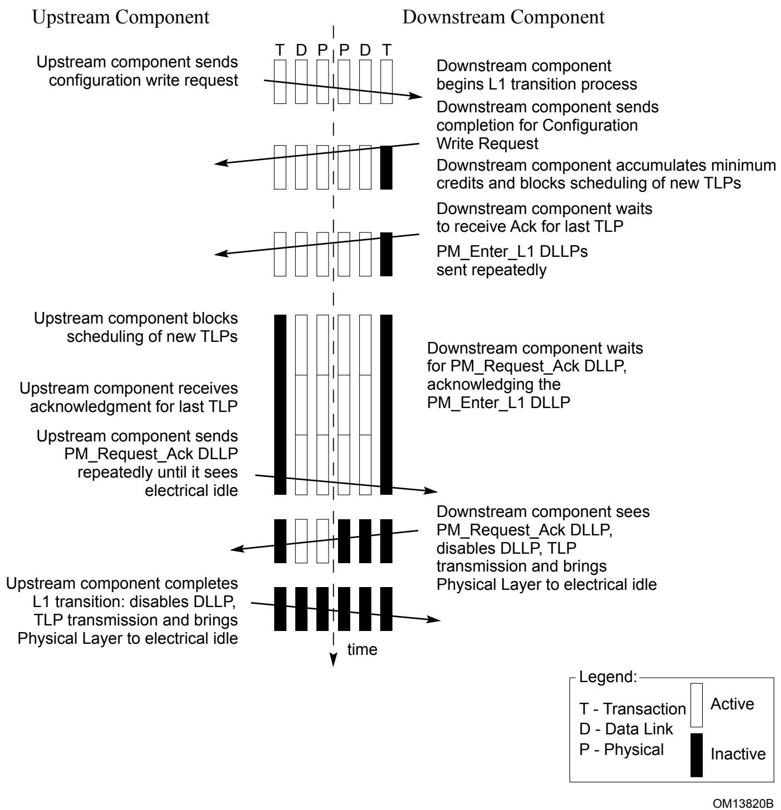

<details>
<summary>flowchart</summary>


```mermaid
graph TD
  A["Upstream Component"] --> B["Downstream Component"]
  B --> C["Upstream Component sends configuration write request"]
  C --> D["Downstream Component begins L1 transition process"]
  D --> E["Downstream component sends completion for Configuration Write Request"]
  E --> F["Downstream component accumulates minimum credits and blocks scheduling of new TLPs"]
  F --> G["Downstream component waits to receive Ack for last TLP"]
  G --> H["PM_Enter_L1 DLLPs sent repeatedly"]
  H --> I["Upstream component blocks scheduling of new TLPs"]
  I --> J["Downstream component waits for PM_Request_Ack DLLP, acknowledging the PM_Enter_L1 DLLP"]
  J --> K["Upstream component receives acknowledgment for last TLP"]
  K --> L["Downstream component sees PM_Request_Ack DLLP, disables DLLP, TLP transmission and brings Physical Layer to electrical idle"]
  L --> M["Upstream component sends PM_Request_Ack DLLP repeatedly until it sees electrical idle"]
  M --> N["Downstream component sees PM_Request_Ack DLLP, disables DLLP, TLP transmission and brings Physical Layer to electrical idle"]
  N --> O["Upstream component completes L1 transition: disables DLLP, TLP transmission and brings Physical Layer to electrical idle"]
  O --> P["time"]
```
</details>

§ Figure 5-2 Entry into the L1 Link State

The following text provides additional detail for the Link state transition process shown in § Figure 5-2.

PM Software Request:

1. PM software sends a Configuration Write Request TLP to the Downstream Function's PMCSR to change the Downstream Function's D-state (from D0 to D1 for example).

Downstream Component Link State Transition Initiation Process:

2. The Downstream component schedules the Completion corresponding to the Configuration Write Request to its PMCSR PowerState field and accounts for the completion credits required.  
3. The Downstream component must then wait until it accumulates at least the minimum number of credits required to send the largest possible packet for any FC type for all enabled VCs (if it does not already have such credits). All Transaction Layer TLP scheduling is then suspended.  
4. The Downstream component then waits until it receives an acknowledgement for the PMCSR Write Completion, and any other TLPs it had previously sent. The component must retransmit a TLP out of its appropriate Retry Buffer if required to do so by the Data Link Layer rules (when operating in Non Flit Mode) or the Flit Ack/Nak rules (when operating in Flit Mode).  
Once all of the Downstream components' TLPs have been acknowledged, the Downstream component starts to transmit PM\_Enter\_L1 DLLPs. The Downstream component sends this DLLP repeatedly with no more than eight (when using 8b/10b encoding) or 32 (when using 128b/130b encoding) Symbol times of idle between subsequent transmissions of the PM\_Enter\_L1 DLLP, in Non-Flit Mode. The transmission of other DLLPs and SKP Ordered Sets is permitted at any time between PM\_Enter\_L1 transmissions, and do not contribute to this idle time limit.

The Downstream component continues to transmit the PM\_Enter\_L1 DLLP as described above until it receives a response from the Upstream component 88 (PM\_Request\_Ack).

The Downstream component must continue to accept TLPs and DLLPs from the Upstream component, and continue to respond with DLLPs, including FC update DLLPs and Ack/Nak DLLPs, as required. Any TLPs that are blocked from transmission (including responses to TLP(s) received) must be stored for later transmission, and must cause the Downstream component to initiate L1 exit as soon as possible following L1 entry.

Upstream Component Link State Transition Process:

6. Upon receiving the PM\_Enter\_L1 DLLP, the Upstream component blocks the scheduling of all TLP transmissions.  
7. The Upstream component then must wait until it receives an acknowledgement for the last TLP it had previously sent. The Upstream component must retransmit a TLP from its appropriate Retry Buffer if required to do so by the Data Link Layer rules (when operating in Non Flit Mode) or the Flit Ack/Nak rules (when operating in Flit Mode).  
Once all of the Upstream component's TLPs have been acknowledged, the Upstream component must send PM\_Request\_Ack DLLPs Downstream, regardless of any outstanding Requests. The Upstream component sends this DLLP repeatedly with no more than eight (when using 8b/10b encoding) or 32 (when using 128b/ 130b encoding) Symbol times of idle between subsequent transmissions of the PM\_Request\_Ack DLLP, in Non-Flit Mode. The transmission of SKP Ordered Sets is permitted at any time between PM\_Request\_Ack transmissions, and does not contribute to this idle time limit.

The Upstream component continues to transmit the PM\_Request\_Ack DLLP as described above until it observes its receive Lanes enter into the Electrical Idle state. Refer to § Chapter 4. for more details on the Physical Layer behavior.

Completing the L1 Link State Transition:

9. Once the Downstream component has captured the PM\_Request\_Ack DLLP on its Receive Lanes (signaling that the Upstream component acknowledged the transition to L1 request), it then disables DLLP transmission and brings the Upstream directed physical Link into the Electrical Idle state.

10. When the Receive Lanes on the Upstream component enter the Electrical Idle state, the Upstream component stops sending PM\_Request\_Ack DLLPs, disables DLLP transmission, and brings its Transmit Lanes to Electrical Idle completing the transition of the Link to L1.

When two components' interconnecting Link is in L1 as a result of the Downstream component being programmed to a non-D0 state, both components suspend the operation of their Flow Control Update and, if implemented, Update FCP Timer (see § Section 2.6.1.2 ) counter mechanisms. Refer to § Chapter 4. for more detail on the Physical Layer behavior.

Refer to § Section 5.2 if the negotiation to L1 is interrupted.

Components on either end of a Link in L1 may optionally disable their internal PLLs in order to conserve more energy. Note, however, that platform supplied main power and reference clocks must continue to be supplied to components on both ends of an L1 Link in the L1.0 substate of L1.

Refer to § Section 5.5 for entry into the L1 PM Substates.

## 5.3.2.2 Exit from L1 State §

L1 exit can be initiated by the component on either end of a Link.

Upon exit from L1, it is recommended that the Downstream component send flow control update DLLPs for all enabled VCs and FC types starting within 1 μs of L1 exit.

The physical mechanism for transitioning a Link from L1 to L0 is described in detail in § Chapter 4. .

L1 exit must be initiated by a component if that component needs to transmit a TLP on the Link. An Upstream component must initiate L1 exit on a Downstream Port even if it does not have the flow control credits needed to transmit the TLP that it needs to transmit. Following L1 exit, the Upstream component must wait to receive the needed credit from the Downstream component. § Figure 5-3 outlines an example sequence that would trigger an Upstream component to initiate transition of the Link to the L0 state.

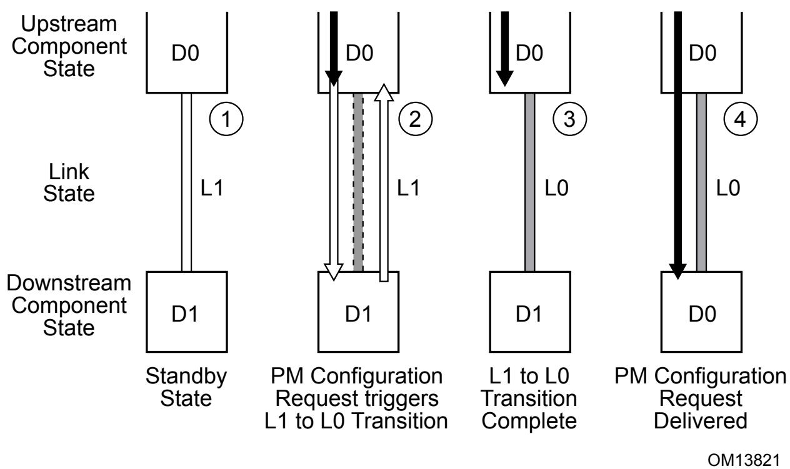

<details>
<summary>flowchart</summary>

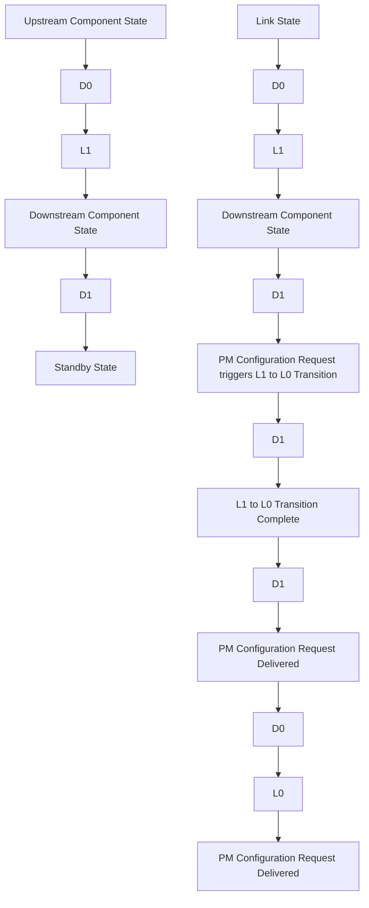
```mermaid
graph TD
  A["Upstream Component State"] --> B["D0"]
  B --> C["L1"]
  C --> D["Downstream Component State"]
  D --> E["D1"]
  E --> F["Standby State"]
    
  G["Link State"] --> H["D0"]
  H --> I["L1"]
  I --> J["Downstream Component State"]
  J --> K["D1"]
  K --> L["PM Configuration Request triggers L1 to L0 Transition"]
  L --> M["D1"]
  M --> N["L1 to L0 Transition Complete"]
  N --> O["D1"]
  O --> P["PM Configuration Request Delivered"]
  P --> Q["D0"]
  Q --> R["L0"]
  R --> S["PM Configuration Request Delivered"]
```
</details>

Figure 5-3 Exit from L1 Link State Initiated by Upstream Component§

## Sequence of events:

1. Power management software initiates a configuration cycle targeting a PM configuration register (the PowerState field of the PMCSR in this example) within a Function that resides in the Downstream component (e.g., to bring the Function back to the D0 state).  
2. The Upstream component detects that a configuration cycle is intended for a Link that is currently in a low power state, and as a result, initiates a transition of that Link into the L0 state.  
3. If the Link is in either L1.1 or L1.2 substates of L1, then the Upstream component initiates a transition of the Link into the L1.0 substate of L1.  
4. In accordance with the § Chapter 4. definition, both directions of the Link enter into Link training, resulting in the transition of the Link to the L0 state. The L1 → L0 transition is discussed in detail in § Chapter 4. .  
5. Once both directions of the Link are back to the active L0 state, the Upstream Port sends the configuration Packet Downstream.

## 5.3.2.3 Entry into the L2/L3 Ready State §

Transition to the L2/L3 Ready state follows a process that is similar to the L1 entry process. There are some minor differences between the two that are spelled out below.

• L2/L3 Ready entry transition protocol does not immediately result in an L2 or L3 Link state. The transition to L2/L3 Ready is effectively a handshake to establish the Downstream component's readiness for power removal. L2 or L3 is ultimately achieved when the platform removes the components' power and reference clock.  
• The time for L2/L3 Ready entry transition is indicated by the completion of the PME\_Turn\_Off/PME\_TO\_Ack handshake sequence. Any actions on the part of the Downstream component necessary to ready itself for loss

of power must be completed prior to initiating the transition to L2/L3 Ready. Once all preparations for loss of power and clock are completed, L2/L3 Ready entry is initiated by the Downstream component by sending the PM\_Enter\_L23 DLLP Upstream.

• L2/L3 Ready entry transition protocol uses the PM\_Enter\_L23 DLLP.

Note that the PM\_Enter\_L23 DLLPs are sent continuously until an acknowledgement is received or power is removed.

• Refer to § Section 5.2 if the negotiation to L2/L3 Ready is interrupted.

## 5.3.3 Power Management Event Mechanisms §

## 5.3.3.1 Motivation §

The PCI Express PME mechanism is software compatible with the [PCI] PME mechanism. Power Management Events are generated by Functions as a means of requesting a PM state change. Power Management Events are typically utilized to revive the system or an individual Function from a low power state.

Power management software may transition a Hierarchy into a low power state, and transition the Upstream Links of these devices into the non-communicating L2 state. 89 The PCI Express PME generation mechanism is, therefore, broken into two components:

• Waking a non-communicating Hierarchy (wakeup). This step is required only if the Upstream Link of the device originating the PME is in the non-communicating L2 state, since in that state the device cannot send a PM\_PME Message Upstream.  
• Sending a PM\_PME Message to the root of the Hierarchy

PME indications that originate from PCI Express Endpoints or PCI Express Legacy Endpoints are propagated to the Root Complex in the form of TLP messages. PM\_PME Messages identify the requesting agent within the Hierarchy (via the Requester ID of the PM\_PME Message header). Explicit identification within the PM\_PME Message is intended to facilitate quicker PME service routine response, and hence shorter resume time.

If an RCiEP is associated with a Root Complex Event Collector, any PME indications that originate from that RCiEP must be reported by that Root Complex Event Collector.

PME indications that originate from a Root Port itself are reported through the same Root Port.

## 5.3.3.2 Link Wakeup §

The Link wakeup mechanisms provide a means of signaling the platform to re-establish power and reference clocks to the components within its domain. There are two defined wakeup mechanisms: Beacon and WAKE#. The Beacon mechanism uses in-band signaling to implement wakeup functionality. For components that support wakeup functionality, the form factor specification(s) targeted by the implementation determine the support requirements for the wakeup mechanism. Switch components targeting applications where Beacon is used on some Ports of the Switch and WAKE# is used for other Ports must translate the wakeup mechanism appropriately (see the implementation note entitled “Example of WAKE# to Beacon Translation”in Section, 5.3.3.2). In applications where WAKE# is the only wakeup mechanism used, the Root Complex is not required to support the receipt of Beacon.

The WAKE# mechanism uses sideband signaling to implement wakeup functionality. WAKE# is an “open drain” signal asserted by components requesting wakeup and observed by the associated power controller. WAKE# is only defined for certain form factors, and the detailed specifications for WAKE# are included in the relevant form factor specifications. Specific form factor specifications may require the use of either Beacon or WAKE# as the wakeup mechanism.

When WAKE# is used as a wakeup mechanism, once WAKE# has been asserted, the asserting Function must continue to drive the signal low until main power has been restored to the component as indicated by Fundamental Reset going inactive.

The system is not required to route or buffer WAKE# in such a way that an Endpoint is guaranteed to be able to detect that the signal has been asserted by another Function.

Before using any wakeup mechanism, a Function must be enabled by software to do so by setting the Function's PME\_En bit in the PMCSR. The PME\_Status bit is sticky, and Functions must maintain the value of the PME\_Status bit through reset if auxiliary power is available and they are enabled for wakeup events (this requirement also applies to the PME\_En bit in the PMCSR and the Aux Power PM Enable bit in the Device Control Register).

Systems that allow PME generation from D3Cold state must provide auxiliary power to support Link wakeup when the main system power rails are off. A component may only consume auxiliary power if software has enabled it to do so as described in § Section 5.6 . Software is required to enable auxiliary power consumption in all components that participate in Link wakeup, including all components that must propagate the Beacon signal. In the presence of legacy system software, this is the responsibility of system firmware.

Regardless of the wakeup mechanism used, once the Link has been re-activated and trained, the requesting agent then propagates a PM\_PME Message Upstream to the Root Complex. From a power management point of view, the two wakeup mechanisms provide the same functionality, and are not distinguished elsewhere in this chapter.

## IMPLEMENTATION NOTE:

## EXAMPLE OF WAKE# TO BEACON TRANSLATION §

Switch components targeting applications that connect “Beacon domains” and “WAKE# domains” must translate the wakeup mechanism appropriately. § Figure 5-4 shows two example systems, each including slots that use the WAKE# wakeup mechanism. In Case 1, WAKE# is input directly to the Power Management Controller, and no translation is required. In Case 2, WAKE# is an input to the Switch, and in response to WAKE# being asserted the Switch must generate a Beacon that is propagated to the Root Complex/Power Management Controller.

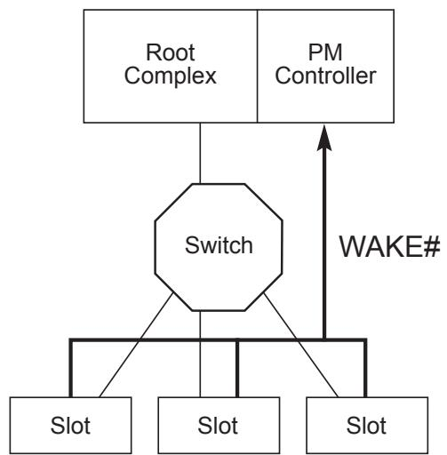

<details>
<summary>flowchart</summary>

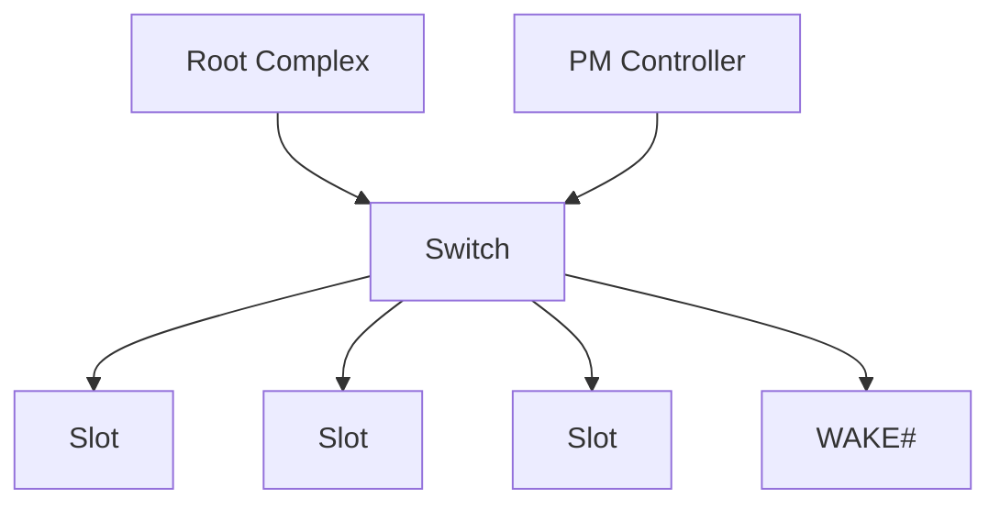
```mermaid
graph TD
  A["Root Complex"] --> C["Switch"]
  B["PM Controller"] --> C
  C --> D["Slot"]
  C --> E["Slot"]
  C --> F["Slot"]
  C --> G["WAKE#"]
```
</details>

Case 1: WAKE# routed directly to system Power Management Controller

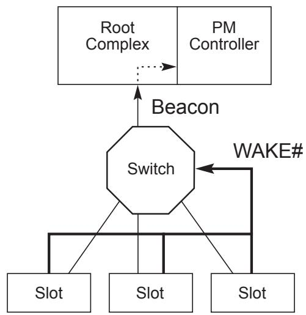

<details>
<summary>flowchart</summary>

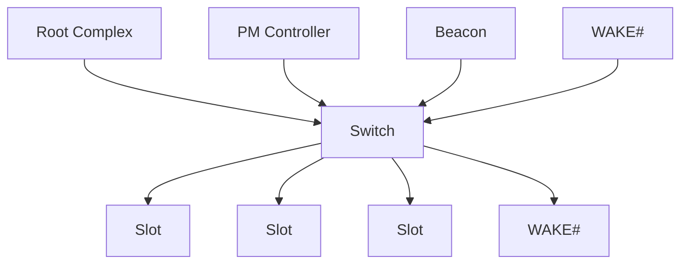
```mermaid
graph TD
  A["Root Complex"] --> B["Switch"]
  C["PM Controller"] --> B
  B --> D["Slot"]
  B --> E["Slot"]
  B --> F["Slot"]
  B --> G["WAKE#"]
  H["Beacon"] --> B
  I["WAKE#"] --> B
```
</details>

Case 2: WAKE# routed to Switch; Switch in turn generates Beacon

A-0334

Figure 5-4 Conceptual Diagrams Showing Two Example Cases of WAKE# Routing§

## 5.3.3.2.1 PME Synchronization §

PCI Express-PM introduces a fence mechanism that serves to initiate the power removal sequence while also coordinating the behavior of the platform's power management controller and PME handling by PCI Express agents.

PME\_Turn\_Off Broadcast Message

Before main component power and reference clocks are turned off, the Root Complex or Switch Downstream Port must issue a broadcast Message that instructs all agents Downstream of that point within the hierarchy to cease initiation of any subsequent PM\_PME Messages, effective immediately upon receipt of the PME\_Turn\_Off Message.

Each PCI Express agent is required to respond with a TLP “acknowledgement” Message, PME\_TO\_Ack that is always routed Upstream. In all cases, the PME\_TO\_Ack Message must terminate at the PME\_Turn\_Off Message's point of origin.

90

A Switch must report an “aggregate” acknowledgement only after having received PME\_TO\_Ack Messages from each of its Downstream Ports. Once a PME\_TO\_Ack Message has arrived on each Downstream Port, the Switch must then send a PME\_TO\_Ack packet on its Upstream Port. The occurrence of any one of the following must reset the aggregation mechanism: the transmission of the PME\_TO\_Ack Message from the Upstream Port, the receipt of any TLP at the Upstream Port, the removal of main power to the Switch, or Fundamental Reset.

All components with an Upstream Port must accept and acknowledge the PME\_Turn\_Off Message regardless of the D state of the associated device or any of its Functions for a Multi-Function Device. Once a component has sent a PME\_TO\_Ack Message, it must then prepare for removal of its power and reference clocks by initiating a transition to the L2/L3 Ready state.

A Switch must transition its Upstream Link to the L2/L3 Ready state after all of its Downstream Ports have entered the L2/ L3 Ready state.

The Links attached to the originator of the PME\_Turn\_Off Message are the last to assume the L2/L3 Ready state. This state transition serves as an indication to the power delivery manager 91 that all Links within that portion of the Hierarchy have successfully retired all in flight PME Messages to the point of PME\_Turn\_Off Message origin and have performed any necessary local conditioning in preparation for power removal.

In order to avoid deadlock in the case where one or more devices do not respond with a PME\_TO\_Ack Message and then put their Links into the L2/L3 Ready state, the power manager must implement a timeout after waiting for a certain amount of time, after which it proceeds as if the Message had been received and all Links put into the L2/L3 Ready state. The recommended limit for this timer is in the range of 1 ms to 10 ms.

The power delivery manager must wait a minimum of 100 ns after observing all Links corresponding to the point of origin of the PME\_Turn\_Off Message enter L2/L3 Ready before removing the components' reference clock and main power. This requirement does not apply in the case where the above mentioned timer triggers.

## IMPLEMENTATION NOTE:

## PME\_TO\_ACK MESSAGE PROXY BY SWITCHES §

One of the PME\_Turn\_Off/PME\_TO\_Ack handshake's key roles is to ensure that all in flight PME Messages are flushed from the PCI Express fabric prior to sleep state power removal. This is guaranteed to occur because PME Messages and the PME\_TO\_Ack Messages both use the posted request queue within VC0 and so all previously injected PME Messages will be made visible to the system before the PME\_TO\_Ack is received at the Root Complex. Once all Downstream Ports of the Root Complex receive a PME\_TO\_Ack Message the Root Complex can then signal the power manager that it is safe to remove power without loss of any PME Messages.

Switches create points of hierarchical expansion and, therefore, must wait for all of their connected Downstream Ports to receive a PME\_TO\_Ack Message before they can send a PME\_TO\_Ack Message Upstream on behalf of the sub-hierarchy that it has created Downstream. This can be accomplished very simply using common score boarding techniques. For example, once a PME\_Turn\_Off broadcast Message has been broadcast Downstream of the Switch, the Switch simply checks off each Downstream Port having received a PME\_TO\_Ack. Once the last of its active Downstream Ports receives a PME\_TO\_Ack, the Switch will then send a single PME\_TO\_Ack Message Upstream as a proxy on behalf of the entire sub-hierarchy Downstream of it. Note that once a Downstream Port receives a PME\_TO\_Ack Message and the Switch has scored its arrival, the Port is then free to drop the packet from its internal queues and free up the corresponding posted request queue FC credits.

## 5.3.3.3 PM\_PME Messages §

PM\_PME Messages are posted Transaction Layer Packets (TLPs) that inform the power management software which agent within the Hierarchy requests a PM state change. PM\_PME Messages, like all other Power Management system Messages, must use the general purpose Traffic Class, TC0.

PM\_PME Messages are always routed in the direction of the Root Complex. To send a PM\_PME Message on its Upstream Link, a device must transition the Link to the L0 state (if the Link was not in that state already). Unless otherwise noted, the device will keep the Link in the L0 state following the transmission of a PM\_PME Message.

## 5.3.3.3.1 PM\_PME “Backpressure” Deadlock Avoidance §

A Root Complex is typically implemented with local buffering to store temporarily a finite number of PM\_PME Messages that could potentially be simultaneously propagating through the Hierarchy. Given a limited number of PM\_PME Messages that can be stored within the Root Complex, there can be backpressure applied to the Upstream directed posted queue in the event that the capacity of this temporary PM\_PME Message buffer is exceeded.

Deadlock can occur according to the following example scenario:

1. Incoming PM\_PME Messages fill the Root Complex's temporary storage to its capacity while there are additional PM\_PME Messages still in the Hierarchy making their way Upstream.  
2. The Root Complex, on behalf of system software, issues a Configuration Read Request targeting one of the PME requester's PMCSR (e.g., reading its PME\_Status bit).  
3. The corresponding split completion Packet is required, as per producer/consumer ordering rules, to push all previously posted PM\_PME Messages ahead of it, which in this case are PM\_PME Messages that have no place to go.  
4. The PME service routine cannot make progress; the PM\_PME Message storage situation does not improve.  
5. Deadlock occurs.

Precluding potential deadlocks requires the Root Complex to always enable forward progress under these circumstances. This must be done by accepting any PM\_PME Messages that posted queue flow control credits allow for, and discarding any PM\_PME Messages that create an overflow condition. This required behavior ensures that no deadlock will occur in these cases; however, PM\_PME Messages will be discarded and hence lost in the process.

To ensure that no PM\_PME Messages are lost permanently, all agents that are capable of generating PM\_PME must implement a PME Service Timeout mechanism to ensure that their PME requests are serviced in a reasonable amount of time.

If after 100 ms (+50%/-5%), the PME\_Status bit of a requesting agent has not yet been cleared, the PME Service Timeout mechanism expires triggering the PME requesting agent to re-send the temporarily lost PM\_PME Message. If at this time the Link is in a non-communicating state, then, prior to re-sending the PM\_PME Message, the agent must reactivate the Link as defined in § Section 5.3.3.2 .

## 5.3.3.4 PME Rules §

• All device Functions must implement the PCI-PM Power Management Capabilities (PMC) register and the PMCSR in accordance with the PCI-PM specification. These registers reside in the PCI-PM compliant PCI Capability List format.

◦ PME capable Functions must implement the PME\_Status bit, and underlying functional behavior, in their PMCSR.  
◦ When a Function initiates Link wakeup, or issues a PM\_PME Message, it must set its PME\_Status bit.

• Switches must route a PM\_PME received on any Downstream Port to their Upstream Port  
• On receiving a PME\_Turn\_Off Message, the device must block the transmission of PM\_PME Messages and transmit a PME\_TO\_Ack Message Upstream. The component is permitted to send a PM\_PME Message after the Link is returned to an L0 state through LDn.  
• Before a Link or a portion of a Hierarchy is transferred into a non-communicating state (i.e., a state from which it cannot issue a PM\_PME Message), a PME\_Turn\_Off Message must be broadcast Downstream.

## 5.3.3.5 PM\_PME Delivery State Machine §

The following diagram conceptually outlines the PM\_PME delivery control state machine. This state machine determines the ability of a Link to service PME events by issuing PM\_PME immediately vs. requiring Link wakeup.

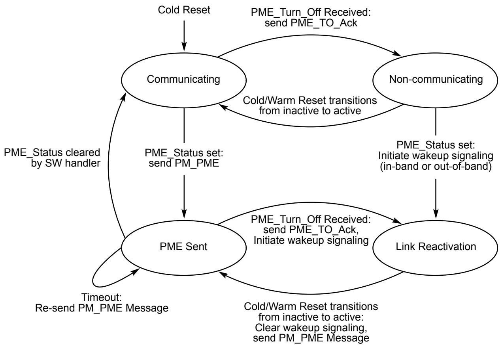

<details>
<summary>flowchart</summary>

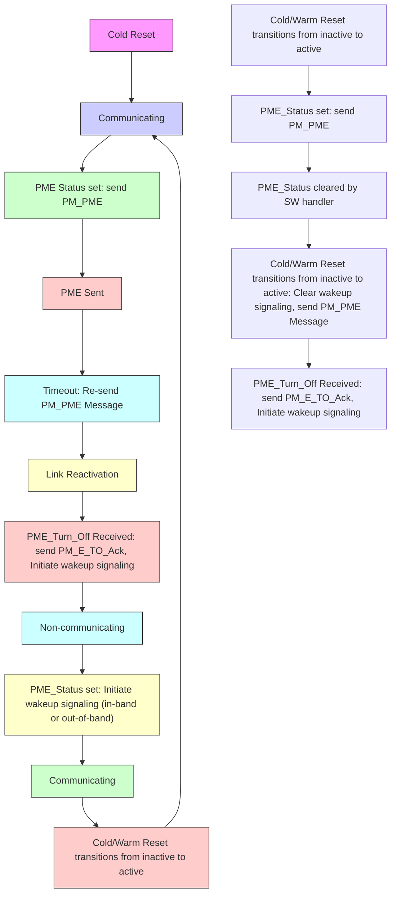
```mermaid
graph TD
  A["Cold Reset"] --> B["Communicating"]
  B --> C["PME Status set: send PM_PME"]
  C --> D["PME Sent"]
  D --> E["Timeout: Re-send PM_PME Message"]
  E --> F["Link Reactivation"]
  F --> G["PME_Turn_Off Received: send PM_E_TO_Ack, Initiate wakeup signaling"]
  G --> H["Non-communicating"]
  H --> I["PME_Status set: Initiate wakeup signaling (in-band or out-of-band)"]
  I --> J["Communicating"]
  J --> K["Cold/Warm Reset transitions from inactive to active"]
  K --> B
    style A fill:#f9f,stroke:#333
    style B fill:#ccf,stroke:#333
    style C fill:#cfc,stroke:#333
    style D fill:#fcc,stroke:#333
    style E fill:#cff,stroke:#333
    style F fill:#ffc,stroke:#333
    style G fill:#fcc,stroke:#333
    style H fill:#cff,stroke:#333
    style I fill:#ffc,stroke:#333
    style J fill:#cfc,stroke:#333
    style K fill:#fcc,stroke:#333
  style_L["Cold/Warm Reset transitions from inactive to active"] --> M["PME_Status set: send PM_PME"]
  M --> N["PME_Status cleared by SW handler"]
  N --> O["Cold/Warm Reset transitions from inactive to active: Clear wakeup signaling, send PM_PME Message"]
  O --> P["PME_Turn_Off Received: send PM_E_TO_Ack, Initiate wakeup signaling"]
```
</details>

OM13822A

Figure 5-5 A Conceptual PME Control State Machine§

Communicating State:

At initial power-up and associated reset, the Upstream Link enters the Communicating state

• If PME\_Status is asserted (assuming PME delivery is enabled), a PM\_PME Message will be issued Upstream, terminating at the root of the Hierarchy. The next state is the PME Sent state  
• If a PME\_Turn\_Off Message is received, the Link enters the Non-communicating state following its acknowledgment of the Message and subsequent entry into the L2/L3 Ready state.

## Non-communicating State:

• Following the restoration of power and clock, and the associated reset, the next state is the Communicating state.  
• If PME\_Status is asserted, the Link will transition to the Link Reactivation state, and activate the wakeup mechanism.

## PME Sent State

• If PME\_Status is cleared, the Function becomes PME Capable again. Next state is the Communicating state.  
• If the PME\_Status bit is not Clear by the time the PME service timeout expires, a PM\_PME Message is re-sent Upstream. Refer to § Section 5.3.3.3.1 for an explanation of the timeout mechanism.  
• If a PME Message has been issued but the PME\_Status has not been cleared by software when the Link is about to be transitioned into a messaging incapable state (a PME\_Turn\_Off Message is received), the Link transitions into Link Reactivation state after sending a PME\_TO\_Ack Message. The device also activates the wakeup mechanism.

## Link Reactivation State

• Following the restoration of power and clock, and the associated reset, the Link resumes a transaction-capable state. The device clears the wakeup signaling, if necessary, and issues a PM\_PME Upstream and transitions into the PME Sent state.

## 5.4 Native PCI Express Power Management Mechanisms §

The following sections define power management features that require new software. While the presence of these features in new PCI Express designs will not break legacy software compatibility, taking the full advantage of them requires new code to manage them.

These features are enumerated and configured using PCI Express native configuration mechanisms as described in § Chapter 7. of this specification. Refer to § Chapter 7. for specific register locations, bit assignments, and access mechanisms associated with these PCI Express-PM features.

## 5.4.1 Active State Power Management (ASPM) §

All Ports not associated with an Internal Root Complex Link or system Egress Port are required to support the minimum requirements defined herein for Active State Link PM. This feature must be treated as being orthogonal to the PCI-PM software compatible features from a minimum requirements perspective. For example, the Root Complex is exempt from the PCI-PM software compatible features requirements; however, it must implement the minimum requirements of ASPM.

Components in the D0 state (i.e., fully active state) normally keep their Upstream Link in the active L0 state, as defined in § Section 5.3.2 . ASPM defines a protocol for components in the D0 state to reduce Link power by placing their Links into a low power state and instructing the other end of the Link to do likewise. This capability allows hardware-autonomous, dynamic Link power reduction beyond what is achievable by software-only controlled (i.e., PCI-PM software driven) power management.

In Non-Flit Mode there are two low power “standby” Link states defined for ASPM, L0s and L1. In Flit Mode L0p effectively replaces L0s, and L1 remains as a "standby" Link state for ASPM.

The L0s low power Link state is optimized for short entry and exit latencies, while providing substantial power savings. If the L0s state is enabled in a device, it is recommended that the device bring its Transmit Link into the L0s state whenever that Link is not in use (refer to § Section 5.4.1.1.1 for details relating to the L0s invocation policy). Component support of the L0s Link state from within the D0 device state is optional unless the applicable form factor specification for the Link explicitly requires it.

The L0p low power Link state is optimized for short entry and longer exit latencies, while providing substantial power savings and supporting Link operation while a Link width change is in progress.

The L1 Link state is optimized for maximum power savings at a cost of longer entry and exit latencies. L1 reduces Link power beyond the L0s state for cases where very low power is required and longer transition times are acceptable. ASPM support for the L1 Link state is optional unless specifically required by a particular form factor.

Optional L1 PM Substates L1.1 and L1.2 are defined. These substates can further reduce Link power for cases where very low idle power is required, and longer transition times are acceptable.

Each component must report its level of support for ASPM in the ASPM Support field. As applicable, each component shall also report its L0s and L1 exit latency (the time that it requires to transition from the L0s or L1 state to the L0 state). Endpoint Functions must also report the worst-case latency that they can withstand before risking, for example, internal FIFO overruns due to the transition latency from L0s or L1 to the L0 state. Power management software can use the provided information to then enable the appropriate level of ASPM.

The L1 exit latency also applies to L0p, but when used for L0p, indicates the time required to widen the Link. The Link remains operational during this time period, but at lower bandwidth.

## NOTE: L0p and ASPM §

A future draft of this specification may define a mechanism to report the worst case latency an Endpoint can withstand at L0p reduced bandwidth. This may involve multiple latency requirement values depending on the beginning and ending Link widths. Power management software could use this information to enable appropriate L0p Link widths for ASPM.

The L0s exit latency may differ significantly if the reference clock for opposing sides of a given Link is provided from the same source, or delivered to each component from a different source. PCI Express-PM software informs each device of its clock configuration via the Common Clock Configuration bit in its Capability structure's Link Control register. This bit serves as the determining factor in the L0s exit latency value reported by the device. ASPM may be enabled or disabled by default depending on implementation specific criteria and/or the requirements of the associated form factor specification(s). Software can enable or disable ASPM using a process described in § Section 5.4.1.4.1 .

Power management software enables or disables ASPM in each Port of a component by programming the ASPM Control field. Note that new BIOS code can effectively enable or disable ASPM functionality when running with a legacy operating system, but a PCI Express-aware operating system might choose to override ASPM settings configured by the BIOS.

## IMPLEMENTATION NOTE:

## ISOCHRONOUS TRAFFIC AND ASPM §

Isochronous traffic requires bounded service latency. ASPM may add latency to isochronous transactions beyond expected limits. A possible solution would be to disable ASPM for devices that are configured with an Isochronous Virtual Channel.

For ARI Devices, ASPM Control is determined solely by the setting in Function 0, regardless of Function 0's D-state. The ASPM Control settings in other Functions are ignored by the component.

An Upstream Port of a non-ARI Multi-Function Device may be programmed with different values in their respective ASPM Control fields of each Function. The policy for such a component will be dictated by the most active common denominator among all D0 Functions according to the following rules:

• Functions in a non-D0 state (D1 and deeper) are ignored in determining the ASPM policy  
• If any of the Functions in the D0 state has its ASPM disabled (ASPM Control field = 00b) or if at least one of the Functions in the D0 state is enabled for L0s only (ASPM Control field = 01b) and at least one other Function in the D0 state is enabled for L1 only (ASPM Control field = 10b), then ASPM is disabled for the entire component  
• Else, if at least one of the Functions in the D0 state is enabled for L0s only (ASPM Control field = 01b), then ASPM is enabled for L0s only  
• Else, if at least one of the Functions in the D0 state is enabled for L1 only (ASPM Control field = 10b), then ASPM is enabled for L1 only  
• Else, ASPM is enabled for both L0s and L1 states

Note that the components must be capable of changing their behavior during runtime as device Functions enter and exit low power device states. For example, if one Function within a Multi-Function Device is programmed to disable ASPM, then ASPM must be disabled for that device while that Function is in the D0 state. Once the Function transitions to a non-D0 state, ASPM can be enabled if all other Functions are enabled for ASPM.

## 5.4.1.1 L0s ASPM State §

## IMPLEMENTATION NOTE:

## L0S ONLY WORKS IN NON-FLIT MODE WITH NO RETIMERS §

Flit Mode does not support L0s.

Retimers do not support L0s.

Device support of the L0s low power Link state is optional unless the applicable form factor specification for the Link explicitly requires it.

## IMPLEMENTATION NOTE:

## POTENTIAL ISSUES WITH LEGACY SOFTWARE WHEN L0S IS NOT SUPPORTED §

In earlier versions of this specification, device support of L0s was mandatory, and software could legitimately assume that all devices support L0s. Newer hardware components that do not support L0s may encounter issues with such “legacy software”. Such software might not even check the ASPM Support field in the Link Capabilities register, might not recognize the subsequently defined values (00b and 10b) for the ASPM Support field, or might not follow the policy of enabling L0s only if components on both sides of the Link each support L0s.

Legacy software (either operating system or firmware) that encounters the previously reserved value 00b (No ASPM Support), will most likely refrain from enabling L1, which is intended behavior. Legacy software will also most likely refrain from enabling L0s for that component's Transmitter (also intended behavior), but it is unclear if such software will also refrain from enabling L0s for the component on the other side of the Link. If software enables L0s on one side when the component on the other side does not indicate that it supports L0s, the result is undefined. Situations where the resulting behavior is unacceptable may need to be handled by updating the legacy software, establishing a list of configurations for which the legacy software is directed not to enable L0s, or simply not supporting the problematic system configurations.

On some platforms, firmware controls ASPM, and the operating system may either preserve or override the ASPM settings established by firmware. This will be influenced by whether the operating system supports controlling ASPM, and in some cases by whether the firmware permits the operating system to take control of ASPM. Also, ASPM control with hot-plug operations may be influenced by whether native PCI Express hot-plug versus ACPI hot-plug is used. Addressing any legacy software issues with L0s may require updating the firmware, the operating system, or both.

When a component does not advertise that it supports L0s, as indicated by its ASPM Support field value being 00b or 10b, it is recommended that the component's L0s Exit Latency field return a value of 111b, indicating the maximum latency range. Advertising this maximum latency range may help discourage legacy software from enabling L0s if it otherwise would do so, and thus may help avoid problems caused by legacy software mistakenly enabling L0s on this component or the component on the other side of the Link.

Transaction Layer and Link Layer timers are not affected by a transition to the L0s state (i.e., they must follow the rules as defined in their respective chapters).

## IMPLEMENTATION NOTE:

## MINIMIZING L0S EXIT LATENCY §

L0s exit latency depends mainly on the ability of the Receiver to quickly acquire bit and Symbol synchronization. Different approaches exist for high-frequency clocking solutions which may differ significantly in their L0s exit latency, and therefore in the efficiency of ASPM. To achieve maximum power savings efficiency with ASPM, L0s exit latency should be kept low by proper selection of the clocking solution.

## 5.4.1.1.1 Entry into the L0s State


Entry into the L0s state is managed separately for each direction of the Link. It is the responsibility of each device at either end of the Link to initiate an entry into the L0s state on its transmitting Lanes. Software must not enable L0s in either direction on a given Link unless components on both sides of the Link each support L0s; otherwise, the result is undefined.

A Port that is disabled for the L0s state must not transition its transmitting Lanes to the L0s state. However, if the Port advertises that it supports L0s, Port must be able to tolerate having its Receiver Port Lanes enter L0s, (as a result of the device at the other end bringing its transmitting Lanes into L0s state), and then later returning to the L0 state.

L0s Invocation Policy

Ports that are enabled for L0s entry generally should transition their Transmit Lanes to the L0s state if the defined idle conditions (below) are met for a period of time, recommended not to exceed 7 μs. Within this time period, the policy used by the Port to determine when to enter L0s is implementation specific. It is never mandatory for a Transmitter to enter L0s.

Definition of Idle

The definition of an “idle” Upstream Port varies with device Function category. An Upstream Port of a Multi-Function Device is considered idle only when all of its Functions are idle.

A non-Switch Port is determined to be idle if the following conditions are met:

• No TLP is pending to transmit over the Link, or no FC credits are available to transmit any TLPs  
• No DLLPs are pending for transmission

A Switch Upstream Port Function is determined to be idle if the following conditions are met:

• None of the Switch's Downstream Port Receive Lanes are in the L0, Recovery, or Configuration state  
• No pending TLPs to transmit, or no FC credits are available to transmit anything  
• No DLLPs are pending for transmission

A Switch's Downstream Port is determined to be idle if the following conditions are met:

• The Switch's Upstream Port's Receive Lanes are not in the L0, Recovery, or Configuration state  
• No pending TLPs to transmit on this Link, or no FC credits are available  
• No DLLPs are pending for transmission

Refer to § Section 4.2 for details on L0s entry by the Physical Layer.

## 5.4.1.1.2 Exit from the L0s State §

A component with its Transmitter in L0s must initiate L0s exit when it has a TLP or DLLP to transmit across the Link. Note that a transition from the L0s Link state does not depend on the status (or availability) of FC credits. The Link must be able to reach the L0 state, and to exchange FC credits across the Link. For example, if all credits of some type were consumed when the Link entered L0s, then any component on either side of the Link must still be able to transition the Link to the L0 state when new credits need to be sent across the Link. Note that it may be appropriate for a component to anticipate the end of the idle condition and initiate L0s transmit exit; for example, when a NP request is received.

Downstream Initiated Exit

The Upstream Port of a component is permitted to initiate an exit from the L0s low-power state on its Transmit Link, (Upstream Port Transmit Lanes in the case of a Downstream Switch), if it needs to communicate through the Link. The component initiates a transition to the L0 state on Lanes in the Upstream direction as described in § Section 4.2 .

If the Upstream component is a Switch (i.e., it is not the Root Complex), then it must initiate a transition on its Upstream Port Transmit Lanes (if the Upstream Port's Transmit Lanes are in a low-power state) as soon as it detects an exit from L0s on any of its Downstream Ports.

Upstream Initiated Exit

A Downstream Port is permitted to initiate an exit from L0s low power state on any of its Transmit Links if it needs to communicate through the Link. The component initiates a transition to the L0 state on Lanes in the Downstream direction as described in § Chapter 4. .

If the Downstream component contains a Switch, it must initiate a transition on all of its Downstream Port Transmit Lanes that are in L0s at that time as soon as it detects an exit from L0s on its Upstream Port. Links that are already in the L0 state are not affected by this transition. Links whose Downstream component is in a low-power state (i.e., D1- D3Hot states) are also not affected by the exit transitions.

For example, consider a Switch with an Upstream Port in L0s and a Downstream device in a D1 state. A configuration request packet travels Downstream to the Switch, intending ultimately to reprogram the Downstream device from D1 to D0. The Switch's Upstream Port Link must transition to the L0 state to allow the packet to reach the Switch. The Downstream Link connecting to the device in D1 state will not transition to the L0 state yet; it will remain in the L1 state. The captured packet is checked and routed to the Downstream Port that shares a Link with the Downstream device that is in D1. As described in § Section 4.2 , the Switch now transitions the Downstream Link to the L0 state. Note that the transition to the L0 state was triggered by the packet being routed to that particular Downstream L1 Link, and not by the transition of the Upstream Port's Link to the L0 state. If the packet's destination was targeting a different Downstream Link, then that particular Downstream Link would have remained in the L1 state.

## 5.4.1.2 ASPM L0p State §

L0p is a substate of L0 that provides power savings with short entry latency and a longer exit latency. Local L0p exit latency and remote L0p exit latency are visible to software and are reported in the Local L0p Exit Latency and Remote L0p Exit Latency fields of the Data Link Feature Extended Capability.

L0p is supported in Flit Mode only and can be used only when supported by both Link partners. When supported, ASPM L0p is controlled by the Hardware Autonomous Width Disable bit in the Link Control Register and by several Device Control 3 Register fields. the See § Section 4.2.6.7 for more detail on L0p.

## 5.4.1.3 ASPM L1 State §

A component may optionally support the ASPM L1 state; a state that provides greater power savings at the expense of longer exit latency. L1 exit latency is visible to software, and reported via the L1 Exit Latency field.

## IMPLEMENTATION NOTE:

## POTENTIAL ISSUES WITH LEGACY SOFTWARE WHEN ONLY L1 IS SUPPORTED §

In earlier versions of this specification, device support of L0s was mandatory, and there was no architected ASPM Support field value to indicate L1 support without L0s support. Newer hardware components that support only L1 may encounter issues with “legacy software”, i.e., software that does not recognize the subsequently defined value for the ASPM Support field.

Legacy software that encounters the previously reserved value 10b (L1 Support), may refrain from enabling both L0s and L1, which unfortunately avoids using L1 with new components that support only L1. While this may result in additional power being consumed, it should not cause any functional misbehavior. However, the same issues with respect to legacy software enabling L0s exist for this 10b case as are described in the Implementation Note “Potential Issues With Legacy Software When L0s is Not Supported” in § Section 5.4.1.1 .

When supported, L1 entry is controlled by the ASPM Control field. Software must enable ASPM L1 on the Downstream component only if it is supported by both components on a Link. Software must sequence the enabling and disabling of ASPM L1 such that the Upstream component is enabled before the Downstream component and disabled after the Downstream component.

## 5.4.1.3.1 ASPM Entry into the L1 State §

An Upstream Port on a component enabled for L1 ASPM entry may initiate entry into the L1 Link state.

See § Section 5.5.1 for details on transitions into either the L1.1 or L1.2 substates.

## IMPLEMENTATION NOTE:

## INITIATING L1 §

This specification does not dictate when a component with an Upstream Port must initiate a transition to the L1 state. The interoperable mechanisms for transitioning into and out of L1 are defined within this specification; however, the specific ASPM policy governing when to transition into L1 is left to the implementer.

One possible approach would be for the Downstream device to initiate a transition to the L1 state once the device has both its Receiver and Transmitter in the L0s state (RxL0s and TxL0s) for a set amount of time. Another approach would be for the Downstream device to initiate a transition to the L1 state once the Link has been idle in L0 for a set amount of time. This is particularly useful if L0s entry is not enabled. Still another approach would be for the Downstream device to initiate a transition to the L1 state if it has completed its assigned tasks. Note that a component's L1 invocation policy is in no way limited by these few examples.

Three power management Messages provide support for the ASPM L1 state:

• PM\_Active\_State\_Request\_L1 (DLLP)  
• PM\_Request\_Ack (DLLP)  
• PM\_Active\_State\_Nak (TLP)

Downstream components enabled for ASPM L1 entry negotiate for L1 entry with the Upstream component on the Link.

A Downstream Port must accept a request to enter L1 if all of the following conditions are true:

• The Port supports ASPM L1 entry, and ASPM L1 entry is enabled. 92  
• No TLP is scheduled for transmission  
• No Ack or Nak DLLP is scheduled for transmission (Non-Flit Mode)  
• No Flit Ack or Nak is scheduled for transmission (Flit Mode)

A Switch Upstream Port may request L1 entry on its Link provided all of the following conditions are true:

• The Upstream Port supports ASPM L1 entry and it is enabled  
• All of the Switch's Downstream Port Links are in the L1 state (or deeper)  
• No pending TLPs to transmit  
• No pending DLLPs to transmit  
• The Upstream Port's Receiver is idle for an implementation specific set amount of time

Note that it is legitimate for a Switch to be enabled for the ASPM L1 Link state on any of its Downstream Ports and to be disabled or not even supportive of ASPM L1 on its Upstream Port. In that case, Downstream Ports may enter the L1 Link state, but the Switch will never initiate an ASPM L1 entry transition on its Upstream Port.

ASPM L1 Negotiation Rules (see § Figure 5-6 and § Figure 5-7):

• In Non-Flit Mode, the Downstream component must not initiate ASPM L1 entry until it accumulates at least the minimum number of credits required to send the largest possible packet for any FC type.  
• In Flit Mode, for any FC/VC that was initialized with non-zero and non-infinite dedicated credits, the Downstream component must not initiate ASPM L1 entry until it accumulates at least the minimum number of dedicated credits on that VC required to send the largest possible packet for that FC type.  
• In Flit Mode, for any FC/VC that was initialized with zero dedicated credits, the Downstream component must not initiate ASPM L1 entry until it accumulates at least the minimum number of shared credits required to send the largest possible packet for that FC type.  
• Upon deciding to enter a low-power Link state, the Downstream component must block movement of all TLPs from the Transaction Layer to the Data Link Layer for transmission (including completion packets). If any TLPs become available from the Transaction Layer for transmission during the L1 negotiation process, the transition to L1 must first be completed and then the Downstream component must initiate a return to L0. Refer to § Section 5.2 if the negotiation to L1 is interrupted.

• In Non-Flit Mode, the Downstream component must wait until it receives a Link Layer acknowledgement for the last TLP it had previously sent (i.e., the retry buffer is empty). The component must retransmit a TLP out of its Data Link Layer Retry buffer if required by the Data Link Layer rules.

• In Flit Mode, the Downstream component must wait until it receives a Flit acknowledgement for the last Flit of the last TLP it had previously sent (i.e., the retry buffer is empty). The component must retransmit Flit(s) out of its Retry buffer if required by the Flit Ack/Nak rules.

The Downstream component then initiates ASPM negotiation by sending a PM\_Active\_State\_Request\_L1 DLLP onto its Transmit Lanes. The Downstream component sends this DLLP repeatedly with no more than eight (when using 8b/10b encoding) or 32 (when using 128b/130b encoding) Symbol times of idle between subsequent transmissions of the PM\_Active\_State\_Request\_L1 DLLP in Non-Flit Mode. The transmission of other DLLPs and SKP Ordered Sets must occur as required at any time between PM\_Active\_State\_Request\_L1 transmissions, and do not contribute to this idle time limit. Transmission of SKP Ordered Sets during L1 entry follows the clock tolerance compensation rules in § Section 4.2.8 .

• The Downstream component continues to transmit the PM\_Active\_State\_Request\_L1 DLLP as described above until it receives a response from the Upstream device (see below). The Downstream component remains in this loop waiting for a response from the Upstream component.

During this waiting period, the Downstream component must not initiate any Transaction Layer transfers. It must still accept TLPs and DLLPs from the Upstream component, storing for later transmission any TLP responses required. It continues to respond with DLLPs, including FC update DLLPs, as needed by the Link Layer protocol.

If the Downstream component for any reason needs to transmit a TLP on the Link, it must first complete the transition to the low-power Link state. Once in a lower power Link state, the Downstream component must then initiate exit of the low-power Link state to handle the transfer. Refer to § Section 5.2 if the negotiation to L1 is interrupted.

• The Upstream component must immediately (while obeying all other rules in this specification) respond to the request with either an acceptance or a rejection of the request. If the Upstream component is not able to accept the request, it must immediately (while obeying all other rules in this specification) reject the request.  
• Refer to § Section 5.2 if the negotiation to L1 is interrupted.

## Rules in case of rejection:

• In the case of a rejection, the Upstream component must schedule, as soon as possible, a rejection by sending the PM\_Active\_State\_Nak Message to the Downstream component. Once the PM\_Active\_State\_Nak Message is sent, the Upstream component is permitted to initiate any TLP or DLLP transfers.  
• If the request was rejected, it is generally recommended that the Downstream component immediately transition its Transmit Lanes into the L0s state, provided L0s is enabled and that conditions for L0s entry are met.  
Prior to transmitting a PM\_Active\_State\_Request\_L1 DLLP associated with a subsequent ASPM L1 negotiation sequence, the Downstream component must either enter and exit L0s on its Transmitter, or it must wait at least 10 μs from the last transmission of the PM\_Active\_State\_Request\_L1 DLLP associated with the preceding ASPM L1 negotiation. This 10 μs timer must count only time spent in the LTSSM L0 and L0s states. The timer must hold in the LTSSM Recovery state. If the Link goes down and comes back up, the timer is ignored and the component is permitted to issue new ASPM L1 request after the Link has come back up.

## IMPLEMENTATION NOTE:

## ASPM L1 ACCEPT/REJECT CONSIDERATIONS FOR THE UPSTREAM COMPONENT §

When the Upstream component has responded to the Downstream component's ASPM L1 request with a PM\_Request\_Ack DLLP to accept the L1 entry request, the ASPM L1 negotiation protocol clearly and unambiguously ends with the Link entering L1. However, if the Upstream component responds with a PM\_Active\_State\_Nak Message to reject the L1 entry request, the termination of the ASPM L1 negotiation protocol is less clear. Therefore, both components need to be designed to unambiguously terminate the protocol exchange. If this is not done, there is the risk that the two components will get out of sync with each other, and the results may be undefined. For example, consider the following case:

The Downstream component requests ASPM L1 entry by transmitting a sequence of PM\_Active\_State\_Request\_L1 DLLPs.  
Due to a temporary condition, the Upstream component responds with a PM\_Active\_State\_Nak Message to reject the L1 request.  
• The Downstream component continues to transmit the PM\_Active\_State\_Request\_L1 DLLPs for some time before it is able to respond to the PM\_Active\_State\_Nak Message.  
• Meanwhile, the temporary condition that previously caused the Upstream component to reject the L1 request is resolved, and the Upstream component erroneously sees the continuing PM\_Active\_State\_Request\_L1 DLLPs as a new request to enter L1, and responds by transmitting PM\_Request\_Ack DLLPs Downstream.

At this point, the result is undefined, because the Downstream component views the L1 request as rejected and finishing, but the Upstream component views the situation as a second L1 request being accepted.

To avoid this situation, the Downstream component needs to provide a mechanism to distinguish between one ASPM L1 request and another. The Downstream component does this by entering L0s (when supported and enabled), or by waiting a minimum of 10 μs from the transmission of the last PM\_Active\_State\_Request\_L1 DLLP associated with the first ASPM L1 request before starting transmission of the PM\_Active\_State\_Request\_L1 DLLPs associated with the second request (as described above).

If the Upstream component is capable of exhibiting the behavior described above, then it is necessary for the Upstream component to recognize the end of an L1 request sequence by detecting a transition to L0s on its Receiver (when supported and enabled) or a break in the reception of PM\_Active\_State\_Request\_L1 DLLPs of 9.5 μs measured while in L0/L0s or more as a separation between ASPM L1 requests by the Downstream component.

If there is a possibility of ambiguity, the Upstream component should reject the L1 request to avoid potentially creating the ambiguous situation outlined above.

## Rules in case of acceptance:

• If the Upstream component is ready to accept the request, it must block scheduling of any TLPs from the Transaction Layer.  
• In Non-Flit Mode, the Upstream component then must wait until it receives a Data Link Layer acknowledgement for the last TLP it had previously sent. The Upstream component must retransmit a TLP if required by the Data Link Layer rules.

• In Flit Mode, the Upstream component then must wait until it receives a Data Link Layer acknowledgement for the last Flit of the last TLP it had previously sent. The Upstream component must retransmit Flit(s) if required by the Data Link Layer rules.  
• Once all TLPs/Flits have been acknowledged, the Upstream component sends a PM\_Request\_Ack DLLP Downstream. The Upstream component sends this DLLP repeatedly with no more than eight (when using 8b/ 10b encoding) or 32 (when using 128b/130b encoding) Symbol times of idle between subsequent transmissions of the PM\_Request\_Ack DLLP in Non-Flit Mode. The transmission of SKP Ordered Sets must occur as required at any time between PM\_Request\_Ack transmissions, and do not contribute to this idle time limit. Transmission of SKP Ordered Sets during L1 entry follows the clock tolerance compensation rules in § Section 4.2.8 .  
• The Upstream component continues to transmit the PM\_Request\_Ack DLLP as described above until it observes its Receive Lanes enter into the Electrical Idle state. Refer to § Chapter 4. for more details on the Physical Layer behavior.  
If the Upstream component needs, for any reason, to transmit a TLP on the Link after it sends a PM\_Request\_Ack DLLP, it must first complete the transition to the low-power state, and then initiate an exit from the low-power state to handle the transfer once the Link is back to L0. Refer to § Section 5.2 if the negotiation to L1 is interrupted.

◦ The Upstream component must initiate an exit from L1 in this case even if it does not have the required flow control credit to transmit the TLP(s).

When the Downstream component detects a PM\_Request\_Ack DLLP on its Receive Lanes (signaling that the Upstream device acknowledged the transition to L1 request), the Downstream component then ceases sending the PM\_Active\_State\_Request\_L1 DLLP, disables DLLP, TLP transmission and brings its Transmit Lanes into the Electrical Idle state.  
• When the Upstream component detects an Electrical Idle on its Receive Lanes (signaling that the Downstream component has entered the L1 state), it then ceases to send the PM\_Request\_Ack DLLP, disables DLLP, TLP transmission and brings the Downstream direction of the Link into the Electrical Idle state.

## Notes:

1. The transaction Layer Completion Timeout mechanism is not affected by transition to the L1 state (i.e., it must keep counting).  
2. Flow Control Update timers are frozen while the Link is in L1 state to prevent a timer expiration that will unnecessarily transition the Link back to the L0 state.

Upstream Component  
Upstream component in active state  
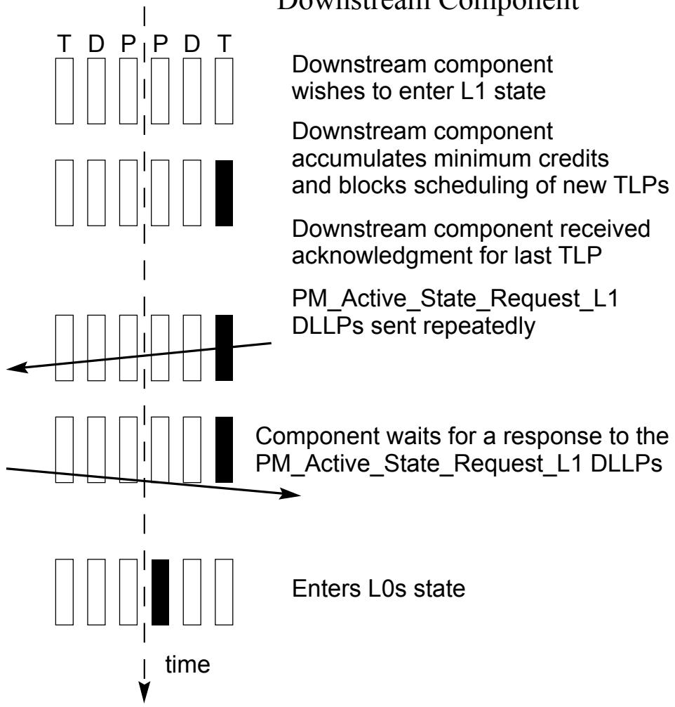

<details>
<summary>flowchart</summary>

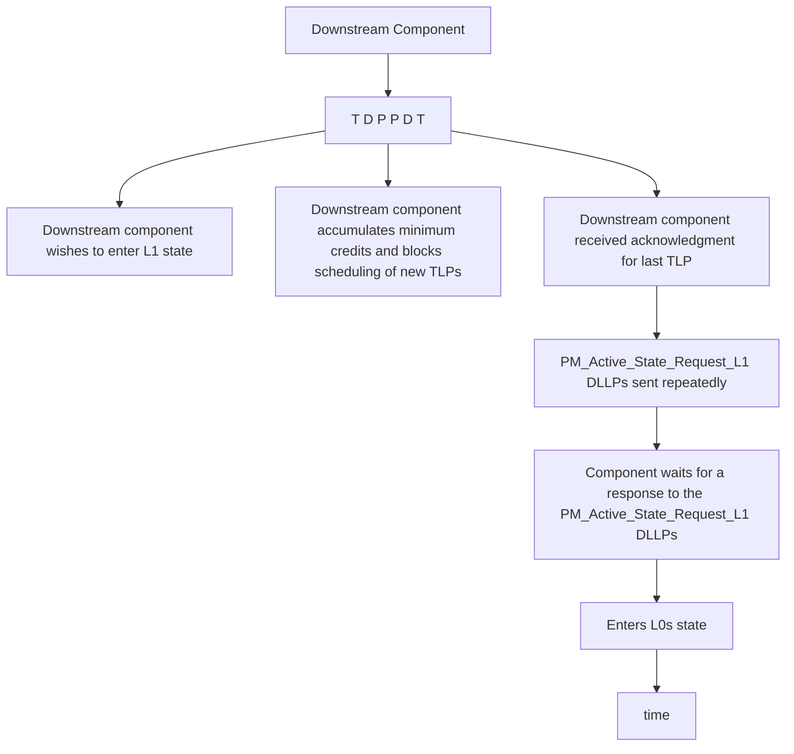
```mermaid
graph TD
  A["Downstream Component"] --> B["T D P P D T"]
  B --> C["Downstream component wishes to enter L1 state"]
  B --> D["Downstream component accumulates minimum credits and blocks scheduling of new TLPs"]
  B --> E["Downstream component received acknowledgment for last TLP"]
  E --> F["PM_Active_State_Request_L1 DLLPs sent repeatedly"]
  F --> G["Component waits for a response to the PM_Active_State_Request_L1 DLLPs"]
  G --> H["Enters L0s state"]
  H --> I["time"]
```
</details>

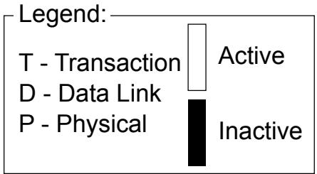

<details>
<summary>text_image</summary>

Legend:
T - Transaction
D - Data Link
P - Physical
Active
Inactive
</details>

OM13823B

Figure 5-6 L1 Transition Sequence Ending with a R§ ejection (L0s Enabled)

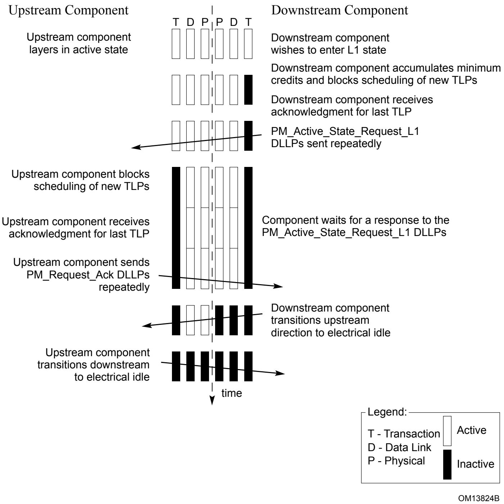

<details>
<summary>flowchart</summary>

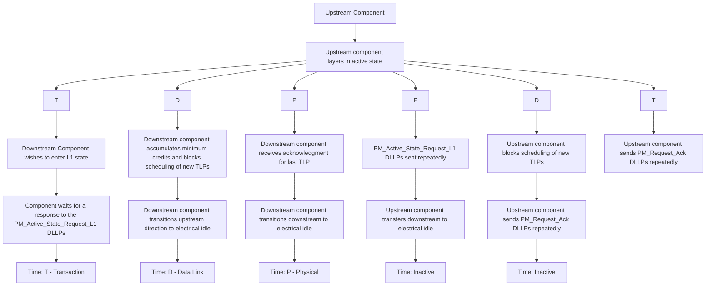
```mermaid
graph TD
  A["Upstream Component"] --> B["Upstream component layers in active state"]
  B --> C1["T"]
  B --> C2["D"]
  B --> C3["P"]
  B --> C4["P"]
  B --> C5["D"]
  B --> C6["T"]
  C1 --> D1["Downstream Component wishes to enter L1 state"]
  C2 --> D2["Downstream component accumulates minimum credits and blocks scheduling of new TLPs"]
  C3 --> D3["Downstream component receives acknowledgment for last TLP"]
  C4 --> D4["PM_Active_State_Request_L1 DLLPs sent repeatedly"]
  C5 --> D5["Upstream component blocks scheduling of new TLPs"]
  C6 --> D6["Upstream component sends PM_Request_Ack DLLPs repeatedly"]
  D1 --> E1["Component waits for a response to the PM_Active_State_Request_L1 DLLPs"]
  D2 --> E2["Downstream component transitions upstream direction to electrical idle"]
  D3 --> E3["Downstream component transitions downstream to electrical idle"]
  D4 --> E4["Upstream component transfers downstream to electrical idle"]
  D5 --> E5["Upstream component sends PM_Request_Ack DLLPs repeatedly"]
  E1 --> F1["Time: T - Transaction"]
  E2 --> F2["Time: D - Data Link"]
  E3 --> F3["Time: P - Physical"]
  E4 --> F4["Time: Inactive"]
  E5 --> F5["Time: Inactive"]
```
</details>

Figure 5-7 L1 Successful Transition Sequence§

## 5.4.1.3.2 Exit from the L1 State


Components on either end of a Link may initiate an exit from the L1 Link state.

See § Section 5.5.1 for details on transitions into either the L1.1 or L1.2 substates.

Upon exit from L1, it is recommended that the Downstream component send flow control update DLLPs for all enabled VCs and FC types starting within 1 μs of L1 exit.

Downstream Component Initiated Exit

An Upstream Port must initiate an exit from L1 on its Transmit Lanes if it needs to communicate through the Link. The component initiates a transition to the L0 state as described in § Chapter 4. . The Upstream component must respond by initiating a similar transition of its Transmit Lanes.

If the Upstream component is a Switch Downstream Port, (i.e., it is not a Root Complex Root Port), the Switch must initiate an L1 exit transition on its Upstream Port's Transmit Lanes, (if the Upstream Port's Link is in the L1 state), as soon as it detects the L1 exit activity on any of its Downstream Port Links. Since L1 exit latencies are relatively long, a Switch must not wait until its Downstream Port Link has fully exited to L0 before initiating an L1 exit transition on its Upstream Port Link. Waiting until the Downstream Link has completed the L0 transition will cause a Message traveling through several Switches to experience accumulating latency as it traverses each Switch.

A Switch is required to initiate an L1 exit transition on its Upstream Port Link after no more than 1 μs from the beginning of an L1 exit transition on any of its Downstream Port Links. Refer to § Section 4.2 for details of the Physical Layer signaling during L1 exit.

Consider the example in § Figure 5-8. The numbers attached to each Port represent the corresponding Port's reported Transmit Lanes L1 exit latency in units of microseconds.

Links 1, 2, and 3 are all in the L1 state, and Endpoint C initiates a transition to the L0 state at time T. Since Switch B takes 32 μs to exit L1 on its Ports, Link 3 will transition to the L0 state at T+32 (longest time considering T+8 for the Endpoint C, and T+32 for Switch B).

Switch B is required to initiate a transition from the L1 state on its Upstream Port Link (Link 2) after no more than 1 μs from the beginning of the transition from the L1 state on Link 3. Therefore, transition to the L0 state will begin on Link 2 at T+1. Similarly, Link 1 will start its transition to the L0 state at time T+2.

Following along as above, Link 2 will complete its transition to the L0 state at time T+33 (since Switch B takes longer to transition and it started at time T+1). Link 1 will complete its transition to the L0 state at time T+34 (since the Root Complex takes 32 μs to transition and it started at time T+2).

Therefore, among Links 1, 2, and 3, the Link to complete the transition to the L0 state last is Link 1 with a 34 μs delay. This is the delay experienced by the packet that initiated the transition in Endpoint C.

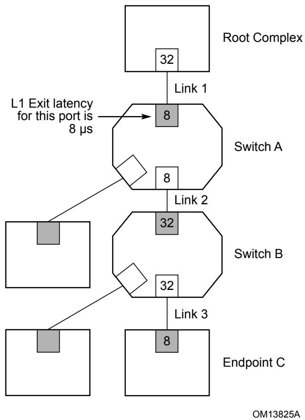

<details>
<summary>flowchart</summary>

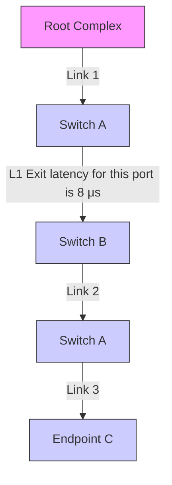
```mermaid
graph TD
  A["Root Complex"] -->|Link 1| B["Switch A"]
  B -->|L1 Exit latency for this port is 8 μs| C["Switch B"]
  C -->|Link 2| D["Switch A"]
  D -->|Link 3| E["Endpoint C"]
    style A fill:#f9f,stroke:#333
    style B fill:#ccf,stroke:#333
    style C fill:#ccf,stroke:#333
    style D fill:#ccf,stroke:#333
    style E fill:#ccf,stroke:#333
```
</details>

Figure 5-8 Example of L1 Exit Latency Computation§

Switches are not required to initiate an L1 exit transition on any other of their Downstream Port Links.

Upstream Component Initiated Exit

A Root Complex, or a Switch must initiate an exit from L1 on any of its Root Ports, or Downstream Port Links if it needs to communicate through that Link. The Switch or Root Complex must be capable of initiating L1 exit even if it does not have the flow control credits needed to transmit a given TLP. The component initiates a transition to the L0 state as described in § Chapter 4. . The Downstream component must respond by initiating a similar transition on its Transmit Lanes.

If the Downstream component contains a Switch, it must initiate a transition on all of its Downstream Links (assuming the Downstream Link is in an ASPM L1 state) as soon as it detects an exit from L1 state on its Upstream Port Link. Since L1 exit latencies are relatively long, a Switch must not wait until its Upstream Port Link has fully exited to L0 before initiating an L1 exit transition on its Downstream Port Links. If that were the case, a Message traveling through multiple Switches would experience accumulating latency as it traverses each Switch.

A Switch is required to initiate a transition from L1 state on all of its Downstream Port Links that are currently in L1 after no more than 1 μs from the beginning of a transition from L1 state on its Upstream Port. Refer to § Section 4.2 for details of the Physical Layer signaling during L1 exit. Downstream Port Links that are already in the L0 state do not participate in the exit transition. Downstream Port Links whose Downstream component is in a low power D-state (D1-D3Hot) are also not affected by the L1 exit transitions (i.e., such Links must not be transitioned to the L0 state).

## 5.4.1.4 ASPM Configuration §

All Functions must implement the following configuration bits in support of ASPM. Refer to § Chapter 7. for configuration register assignment and access mechanisms.

Each component reports its level of support for ASPM in the ASPM Support field below.

Table 5-3 Encoding of the ASPM Support Field

<table><tr><td>Field</td><td>Description</td></tr><tr><td rowspan="4">ASPM Support</td><td>00b No ASPM support</td></tr><tr><td>01b L0s supported</td></tr><tr><td>10b L1 supported</td></tr><tr><td>11b L0s and L1 supported</td></tr></table>

Software must not enable L0s in either direction on a given Link unless components on both sides of the Link each support L0s; otherwise, the result is undefined.

Each component reports the source of its reference clock in its Slot Clock Configuration bit located in its Capability structure's Link Status register.

Table 5-4 Description of the Slot Clock Configuration Bit§

<table><tr><td>Bit</td><td>Description</td></tr><tr><td>Slot Clock Configuration</td><td>This bit, when Set, indicates that the component uses the same physical reference clock that the platform provides on the connector.This bit, when Clear, indicates the component uses an independent clock irrespective of the presence of a reference on the connector.For Root and Switch Downstream Ports, this bit, when Set, indicates that the Downstream Port is using the same reference clock as the Downstream component or the slot.For Switch and Bridge Upstream Ports, this bit when Set, indicates that the Upstream Port is using the same reference clock that the platform provides.Otherwise it is Clear.</td></tr></table>

Each component must support the Common Clock Configuration bit in its Capability structure's Link Control register. Software writes to this register bit to indicate to the device whether it is sharing the same clock source as the device on the other end of the Link.

Table 5-5 Description of the Common Clock Configuration Bit§

<table><tr><td>Bit</td><td>Description</td></tr><tr><td>Common Clock Configuration</td><td>This bit, when Set, indicates that this component and the component at the opposite end of the Link are operating with a common clock source.This bit, when Clear, indicates that this component and the component at the opposite end of the Link are operating with separate reference clock sources.Default value of this bit is 0b.Components utilize this common clock configuration information to report the correct L0s and L1 Exit Latencies.</td></tr></table>

Each Port reports the L0s and L1 exit latency (the time that they require to transition their Receive Lanes from the L0s or L1 state to the L0 state) in the L0s Exit Latency and the L1 Exit Latency configuration fields, respectively. If a Port does not support L0s or ASPM L1, the value of the respective exit latency field is undefined.

Table 5-6 Encoding of the L0s Exit Latency Field §

<table><tr><td>Field</td><td>Description</td></tr><tr><td rowspan="8">L0s Exit Latency&gt;</td><td>000b Less than 64 ns</td></tr><tr><td>001b 64 ns to less than 128 ns</td></tr><tr><td>010b 128 ns to less than 256 ns</td></tr><tr><td>011b 256 ns to less than 512 ns</td></tr><tr><td>100b 512 ns to less than 1 μs</td></tr><tr><td>101b 1 μs to less than 2 μs</td></tr><tr><td>110b 2 μs to 4 μs</td></tr><tr><td>111b More than 4 μs</td></tr></table>

Table 5-7 Encoding of the L1 Exit Latency § Field

<table><tr><td>Field</td><td>Description</td></tr><tr><td rowspan="8">L1 Exit Latency</td><td>000b Less than 1 μs</td></tr><tr><td>001b 1 μs to less than 2 μs</td></tr><tr><td>010b 2 μs to less than 4 μs</td></tr><tr><td>011b 4 μs to less than 8 μs</td></tr><tr><td>100b 8 μs to less than 16 μs</td></tr><tr><td>101b 16 μs to less than 32 μs</td></tr><tr><td>110b 32 μs to 64 μs</td></tr><tr><td>111b More than 64 μs</td></tr></table>

Endpoints also report the additional latency that they can absorb due to the transition from L0s state or L1 state to the L0 state. This is reported in the Endpoint L0s Acceptable Latency and Endpoint L1 Acceptable Latency fields, respectively.

Power management software, using the latency information reported by all components in the Hierarchy, can enable the appropriate level of ASPM by comparing exit latency for each given path from Root to Endpoint against the acceptable latency that each corresponding Endpoint can withstand.

Table 5-8 Encoding of the Endpoint L0s Acceptable Latency Field§

<table><tr><td>Field</td><td>Description</td></tr><tr><td rowspan="8">Endpoint L0sAcceptable Latency</td><td>000b Maximum of 64 ns</td></tr><tr><td>001b Maximum of 128 ns</td></tr><tr><td>010b Maximum of 256 ns</td></tr><tr><td>011b Maximum of 512 ns</td></tr><tr><td>100b Maximum of 1 μs</td></tr><tr><td>101b Maximum of 2 μs</td></tr><tr><td>110b Maximum of 4 μs</td></tr><tr><td>111b No limit</td></tr></table>

Table 5-9 Encoding of the Endpoint L1 Acceptable Latency Field§

<table><tr><td>Field</td><td>Description</td></tr><tr><td rowspan="8">Endpoint L1 Acceptable Latency</td><td>000b Maximum of 1 μs</td></tr><tr><td>001b Maximum of 2 μs</td></tr><tr><td>010b Maximum of 4 μs</td></tr><tr><td>011b Maximum of 8 μs</td></tr><tr><td>100b Maximum of 16 μs</td></tr><tr><td>101b Maximum of 32 μs</td></tr><tr><td>110b Maximum of 64 μs</td></tr><tr><td>111b No limit</td></tr></table>

Power management software enables or disables ASPM in each component by programming the ASPM Control field.

Table 5-10 Encoding of the ASPM Control Field

<table><tr><td>Field</td><td>Description</td></tr><tr><td>ASPM Control</td><td>00b Disabled01b L0s Entry Enabled10b L1 Entry Enabled11b L0s and L1 Entry enabled</td></tr></table>

## ASPM Control = 00b

Port's Transmitter must not enter L0s.

Ports connected to the Downstream end of the Link must not issue a PM\_Active\_State\_Request\_L1 DLLP on its Upstream Link.

Ports connected to the Upstream end of the Link receiving a L1 request must respond with negative acknowledgement.

## ASPM Control = 01b

Port must bring a Link into L0s state if all conditions are met.

Ports connected to the Downstream end of the Link must not issue a PM\_Active\_State\_Request\_L1 DLLP on its Upstream Link.

Ports connected to the Upstream end of the Link receiving a L1 request must respond with negative acknowledgement.

## ASPM Control = 10b

Port's Transmitter must not enter L0s.

Ports connected to the Downstream end of the Link may issue PM\_Active\_State\_Request\_L1 DLLPs.

Ports connected to the Upstream end of the Link must respond with positive acknowledgement to a L1 request and transition into L1 if the conditions for the Root Complex Root Port or Switch Downstream Port in § Section 5.4.1.3.1 are met.

## ASPM Control = 11b

Port must bring a Link into the L0s state if all conditions are met.

Ports connected to the Downstream end of the Link may issue PM\_Active\_State\_Request\_L1 DLLPs.

Ports connected to the Upstream end of the Link must respond with positive acknowledgement to a L1 request and transition into L1 if the conditions for the Root Complex Root Port or Switch Downstream Port in § Section 5.4.1.3.1 are met.

## 5.4.1.4.1 Software Flow for Enabling or Disabling ASPM §

Following is an example software algorithm that highlights how to enable or disable ASPM in a component.

• PCI Express components power up with an appropriate value in their Slot Clock Configuration bit. The method by which they initialize this bit is device-specific.  
• PCI Express system software scans the Slot Clock Configuration bit in the components on both ends of each Link to determine if both are using the same reference clock source or reference clocks from separate sources. If the Slot Clock Configuration bits in both devices are Set, they are both using the same reference clock source, otherwise they're not.  
• PCI Express software updates the Common Clock Configuration bits in the components on both ends of each Link to indicate if those devices share the same reference clock and triggers Link retraining by writing 1b to the Retrain Link bit in the Link Control register of the Upstream component.

• Devices must reflect the appropriate L0s/L1 exit latency in their L0s/L1 Exit Latency fields, per the setting of the Common Clock Configuration bit.  
• PCI Express system software then reads and calculates the L0s/L1 exit latency for each Endpoint based on the latencies reported by each Port. Refer to § Section 5.4.1.3.2 for an example.  
For each component with one or more Endpoint Functions, PCI Express system software examines the Endpoint L0s Acceptable Latency /Endpoint L1 Acceptable Latency, as reported by each Endpoint Function in its Link Capabilities Register, and enables or disables L0s /L1 entry (via the ASPM Control field in the Link Control Register) accordingly in some or all of the intervening device Ports on that hierarchy.

## 5.5 L1 PM Substates §

L1 PM Substates establish a Link power management regime that creates lower power substates of the L1 Link state (see § Figure 5-9), and associated mechanisms for using those substates. The L1 PM Substates are:

## • L1.0 substate

◦ The L1.0 substate corresponds to the conventional L1 Link state. This substate is entered whenever the Link enters L1. The L1 PM Substate mechanism defines transitions from this substate to and from the L1.1 and L1.2 substates.  
◦ The Upstream and Downstream Ports must be enabled to detect Electrical Idle exit as required in § Section 4.2.7.7.2 .

## • L1.1 substate

◦ Link common mode voltages are maintained.  
◦ Uses a bidirectional open-drain clock request (CLKREQ#) signal for entry to and exit from this state.  
◦ The Upstream and Downstream Ports are not required to be enabled to detect Electrical Idle exit.

## • L1.2 substate

◦ Link common mode voltages are not required to be maintained.  
◦ Uses a bidirectional open-drain clock request (CLKREQ#) signal for entry to and exit from this state.  
◦ The Upstream and Downstream Ports are not required to be enabled to detect Electrical Idle exit.

Ports that support L1 PM Substates must not require a reference clock while in L1 PM Substates other than L1.0.

Ports that support L1 PM Substates and also support SRIS mode are required to support L1 PM Substates while operating in SRIS mode. In such cases the CLKREQ# signal is used by the L1 PM Substates protocol as defined in this section, but has no defined relationship to any local clocks used by either Port on the Link, and the management of such local clocks is implementation specific.

Ports that support the L1.2 substate for ASPM L1 must support Latency Tolerance Reporting (LTR).

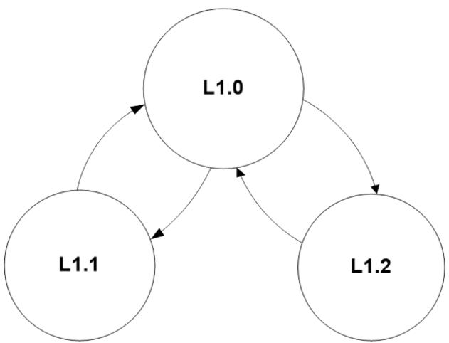

<details>
<summary>flowchart</summary>

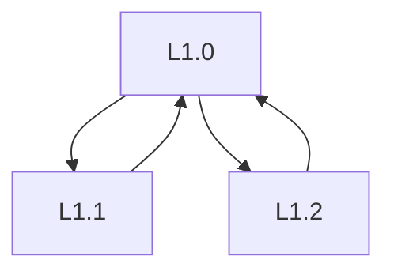
```mermaid
graph TD
  L10["L1.0"] --> L11["L1.1"]
  L10 --> L12["L1.2"]
  L11 --> L10
  L12 --> L10
```
</details>

Figure 5-9 State Diagram for L1 PM Substates§

• When enabled, the L1 PM Substates mechanism applies the following additional requirements to the CLKREQ# signal:The CLKREQ# signal must be supported as a bi-directional open drain signal by both the Upstream and Downstream Ports of the Link. Each Port must have a unique instance of the signal, and the Upstream and Downstream Port CLKREQ# signals must be connected.  
• It is permitted for the Upstream Port to deassert CLKREQ# when the Link is in the PCI-PM L1 or ASPM L1 states, or when the Link is in the L2/L3 Ready pseudo-state; CLKREQ# must be asserted by the Upstream Port when the Link is in any other state.  
• All other specifications related to the CLKREQ# signal that are not specifically defined or modified by L1 PM Substates continue to apply.

If these requirements cannot be satisfied in a particular system, then L1 PM Substates must not be enabled.

## IMPLEMENTATION NOTE:

## CLKREQ# CONNECTION TOPOLOGIES §

For an Upstream component the connection topologies for the CLKREQ# signal can vary. A few examples of CLKREQ# connection topologies are described below. For the Downstream component these cases are essentially the same, however from the Upstream component's perspective, there are some key differences that are described below.

Example 1: Single Downstream Port with a single PLL connected to a single Upstream Port (see § Figure 5-10).

In this platform configuration the Upstream component (A) has only a single CLKREQ# signal. The Upstream and Downstream Ports' CLKREQ# (A and B) signals are connected to each other. In this case, Upstream component (A), must assert CLKREQ# signal whenever it requires a reference clock.

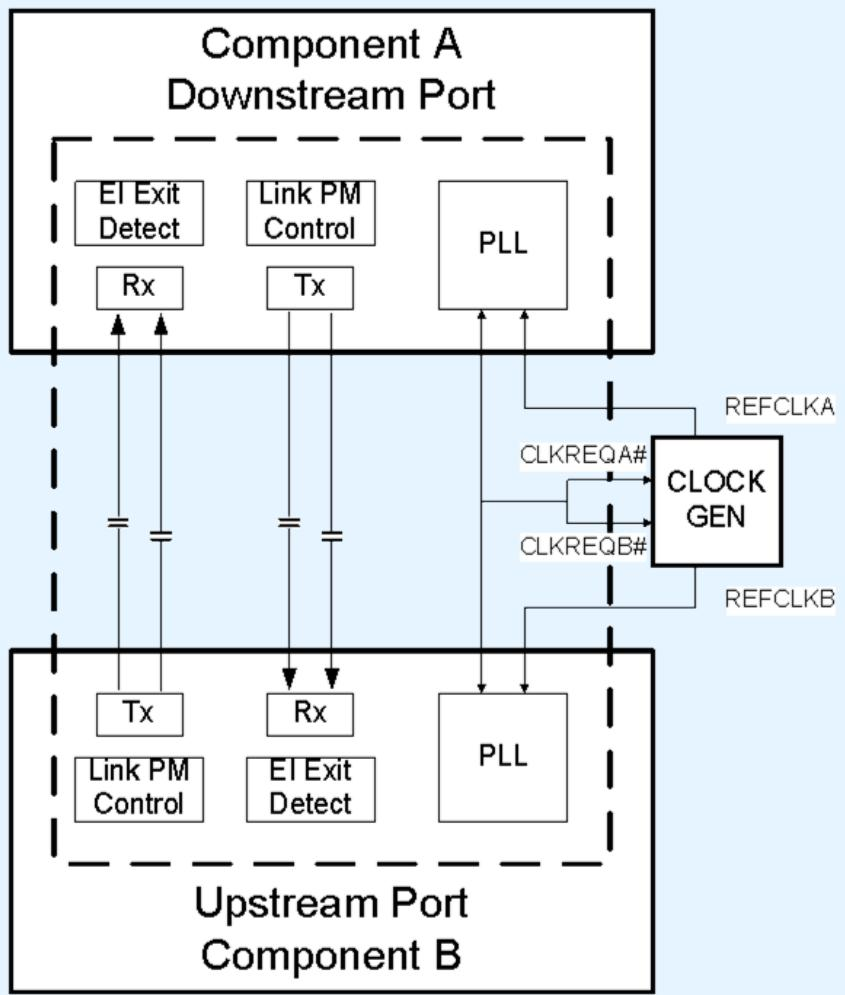

<details>
<summary>flowchart</summary>

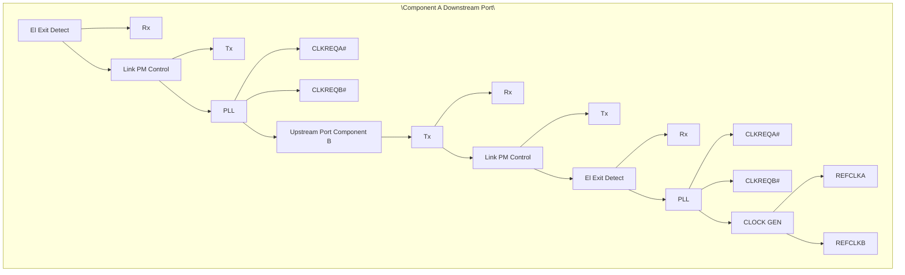
```mermaid
graph TD
    subgraph Component_A_Downstream_Port["\"Component A Downstream Port\""]
  A["El Exit Detect"] --> B["Rx"]
  C["Link PM Control"] --> D["Tx"]
  E["PLL"] --> F["CLKREQA#"]
  E --> G["CLKREQB#"]
        H["Upstream Port Component B"]
  I["Tx"] --> J["Rx"]
  K["Link PM Control"] --> L["Tx"]
  M["El Exit Detect"] --> N["Rx"]
  O["PLL"] --> P["CLKREQA#"]
  O --> Q["CLKREQB#"]
  R["CLOCK GEN"] --> S["REFCLKA"]
  R --> T["REFCLKB"]
    end
  A --> C
  C --> E
  E --> H
  H --> I
  I --> K
  K --> M
  M --> O
  O --> R
```
</details>

Figure 5-10 Downstream Port with a Single PLL§

Example 2: Upstream component with multiple Downstream Ports, with a common shared PLL, connected to separate Downstream components (see § Figure 5-11).

In this example configuration, there are three instances of CLKREQ# signal for the Upstream component (A), one per Downstream Port and a common shared CLKREQ# signal for the Upstream component (A). In this topology the Downstream Port CLKREQ# (CLKREQB#, CLKREQC#) signals are used to connect to the CLKREQ# signal of the Upstream Port of the Downstream components (B and C). The common shared CLKREQ# (CLKREQA#) signal for the Upstream component is used to request the reference clock for the shared PLL. The PLL control logic in Upstream component (A) can only be turned off and CLKREQA# be deasserted when both the Downstream Ports are in L1.1 or L1.2 Substates, and all internal (A) consumers of the PLL don't require a clock.

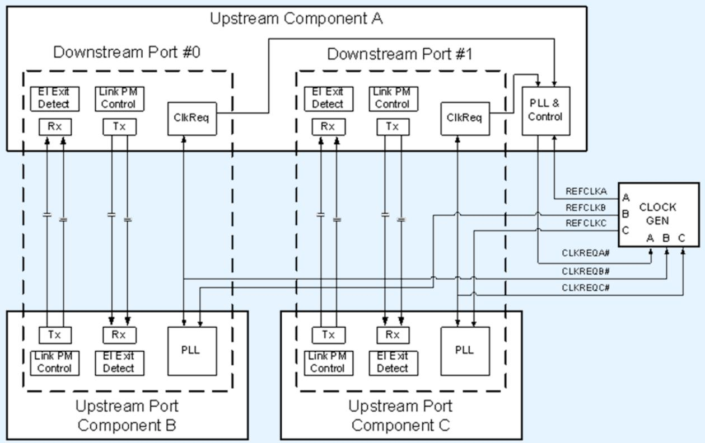

<details>
<summary>flowchart</summary>

```mermaid
graph TD
    subgraph Upstream Port A[Upstream Component A]
  A1["Downstream Port #0"] --> A2["Downstream Port #1"]
  A2 --> A3["Downstream Port #0"]
  A3 --> A4["Downstream Port #1"]
    end

    subgraph Upstream Port B[Upstream Port Component B]
  B1["Upstream Port Component B"] --> B2["Upstream Port Component B"]
  B2 --> B3["Upstream Port Component B"]
  B3 --> B4["Upstream Port Component B"]

    subgraph Downstream Port C[Downstream Port Component C]
  C1["Downstream Port Component C"] --> C2["Downstream Port Component C"]
  C2 --> C3["Downstream Port Component C"]

  A1 -->|Rx| B1
  A1 -->|Tx| B2
  A2 -->|Rx| B3
  A2 -->|Tx| B4
  A2 -->|Rx| B5
  A2 -->|Tx| B6
  A2 -->|Rx| B7
  A2 -->|Rx| B8
  A2 -->|Rx| B9
  A2 -->|Rx| B10
  A2 -->|Rx| B11
  A2 -->|Rx| B12
  A2 -->|Rx| B13
  A2 -->|Rx| B14
  A2 -->|Rx| B15
  A2 -->|Rx| B16
  A2 -->|Rx| B17
  A2 -->|Rx| B18
  A2 -->|Rx| B19
  A2 -->|Rx| B20
  A2 -->|Rx| B21
  A2 -->|Rx| B22
  A2 -->|Rx| B23
  A2 -->|Rx| B24
  A2 -->|Rx| B25
  A2 -->|Rx| B26
  A2 -->|Rx| B27
  A2 -->|Rx| B28
  A2 -->|Rx| B29
  A2 -->|Rx| B30
  A2 -->|Rx| B31
  A2 -->|Rx| B32
  A2 -->|Rx| B33
  A2 -->|Rx| B34
  A2 -->|Rx| B35
  A2 -->|Rx| B36
  A2 -->|Rx| B37
  A2 -->|Rx| B38
  A2 -->|Rx| B39
  A2 -->|Rx| B40
  A2 -->|Rx| B41
  A2 -->|Rx| B42
  A2 -->|Rx| B43
  A2 -->|Rx| B44
  A2 -->|Rx| B45
  A2 -->|Rx| B46
  A2 -->|Rx| B47
  A2 -->|Rx| B48
  A2 -->|Rx| B49
  A2 -->|Rx| B50
  A2 -->|Rx| B51
  A2 -->|Rx| B52
  A2 -->|Rx| B53
  A2 -->|Rx| B54
  A2 -->|Rx| B55
  A2 -->|Rx| B56
  A2 -->|Rx| B57
  A2 -->|Rx| B58
  A2 -->|Rx| B59
  A2 -->|Rx| B60
  A2 -->|Rx| B61
  A2 -->|Rx| B62
  A2 -->|Rx| B63
  A2 -->|Rx| B64
  A2 -->|Rx| B65
  A2 -->|Rx| B66
  A2 -->|Rx| B67
  A2 -->|Rx| B68
  A2 -->|Rx| B69
  A2 -->|Rx| B70
  A2 -->|Rx| B71
  A2 -->|Rx| B72
  A2 -->|Rx| B73
  A2 -->|Rx| B74
  A2 -->|Rx| B75
  A2 -->|Rx| B76
  A2 -->|Rx| B77
  A2 -->|Rx| B78
  A2 -->|Rx| B79
  A2 -->|Rx| B80
```
</details>

Figure 5-11 Multiple Downstream Ports with a shared PLL§

It is necessary for board implementers to consider what CLKREQ# topologies will be supported by components in order to make appropriate board level connections to support L1 PM Substates and for the reference clock generation.

## IMPLEMENTATION NOTE:

## AVOIDING UNINTENDED INTERACTIONS BETWEEN <A>L1 PM SUBSTATES</A> AND THE LTSSM §

It is often the case that implementation techniques which save power will also increase the latency to return to normal operation. When implementing L1 PM Substates, it is important for the implementer to ensure that any added delays will not negatively interact with other elements of the platform. It is particularly important to ensure that LTSSM timeout conditions are not unintentionally triggered. Although typical implementations will not approach the latencies that would cause such interactions, the responsibility lies with the implementer to ensure that correct overall operation is achieved.

## 5.5.1 Entry conditions for L1 PM Substates and L1.0 Requirements §

The Link is considered to be in PCI-PM L1.0 when the L1 PM Substate is L1.0 and the LTSSM entered L1 through PCI-PM compatible power management. The Link is considered to be in ASPM L1.0 when the L1 PM Substate is in L1.0 and LTSSM entered L1 through ASPM.

The following rules define how the L1.1 and L1.2 substates are entered:

• Both the Upstream and Downstream Ports must monitor the logical state of the CLKREQ# signal.  
• When in PCI-PM L1.0 and the PCI-PM L1.2 Enable bit is Set, the L1.2 substate must be entered when CLKREQ# is deasserted.  
• When in PCI-PM L1.0 and the PCI-PM L1.1 Enable bit is Set, the L1.1 substate must be entered when CLKREQ# is deasserted and the PCI-PM L1.2 Enable bit is Clear.  
• When in ASPM L1.0 and the ASPM L1.2 Enable bit is Set, the L1.2 substate must be entered when CLKREQ# is deasserted and all of the following conditions are true:

◦ The reported snooped LTR value last sent or received by this Port is greater than or equal to the value set by the LTR\_L1.2\_THRESHOLD Value and Scale fields, or there is no snoop service latency requirement.  
◦ The reported non-snooped LTR last sent or received by this Port value is greater than or equal to the value set by the LTR\_L1.2\_THRESHOLD Value and Scale fields, or there is no non-snoop service latency requirement.

• When in ASPM L1.0 and the ASPM L1.1 Enable bit is Set, the L1.1 substate must be entered when CLKREQ# is deasserted and the conditions for entering the L1.2 substate are not satisfied.

When the entry conditions for L1.2 are satisfied, the following rules apply:

• Both the Upstream and Downstream Ports must monitor the logical state of the CLKREQ# input signal.  
• An Upstream Port must not deassert CLKREQ# until the Link has entered L1.0.  
• It is permitted for either Port to assert CLKREQ# to prevent the Link from entering L1.2.  
• A Downstream Port intending to block entry into L1.2 must assert CLKREQ# before the Link enters L1.  
• When CLKREQ# is deasserted the Ports enter the L1.2.Entry substate of L1.2.

If a Downstream Port is in PCI-PM L1.0 and PCI-PM L1.1 Enable and/or PCI-PM L1.2 Enable are Set, or if a Downstream Port is in ASPM L1.0 and ASPM L1.1 Enable and/or ASPM L1.2 Enable are Set, and the Downstream Port initiates an exit to Recovery without having entered L1.1 or L1.2, the Downstream Port must assert CLKREQ# until the Link exits Recovery.

## 5.5.2 L1.1 Requirements §

Both Upstream and Downstream Ports are permitted to deactivate mechanisms for electrical idle (EI) exit detection and Refclk activity detection if implemented, however both ports must maintain common mode.

## 5.5.2.1 Exit from L1.1 §

If either the Upstream or Downstream Port needs to initiate exit from L1.1, it must assert CLKREQ# until the Link exits Recovery. The Upstream Port must assert CLKREQ# on entry to Recovery, and must continue to assert CLKREQ# until the next entry into L1, or other state allowing CLKREQ# deassertion.

• Next state is L1.0 if CLKREQ# is asserted.

◦ The Refclk will eventually be turned on as defined in the PCI Express Mini CEM spec, which may be delayed according to the LTR advertised by the Upstream Port.

§ Figure 5-12 illustrates entry into L1.1 with exit driven by the Upstream Port.  
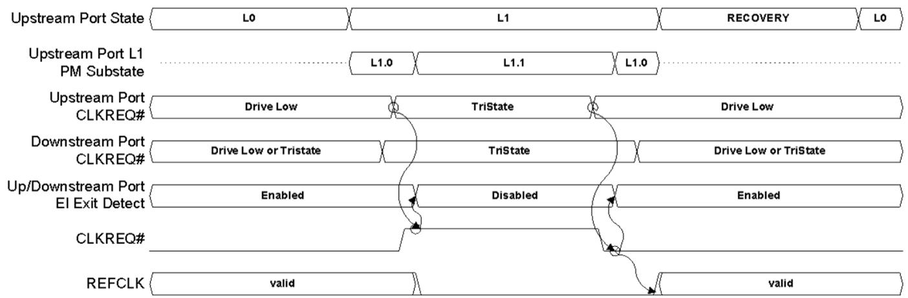

<details>
<summary>flowchart</summary>

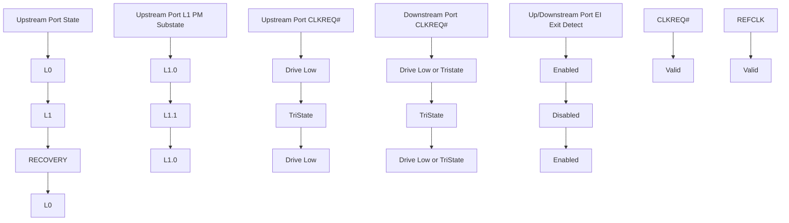
```mermaid
graph TD
  A["Upstream Port State"] --> B["L0"]
  B --> C["L1"]
  C --> D["RECOVERY"]
  D --> E["L0"]
  F["Upstream Port L1 PM Substate"] --> G["L1.0"]
  G --> H["L1.1"]
  H --> I["L1.0"]
  J["Upstream Port CLKREQ#"] --> K["Drive Low"]
  K --> L["TriState"]
  L --> M["Drive Low"]
  N["Downstream Port CLKREQ#"] --> O["Drive Low or Tristate"]
  O --> P["TriState"]
  P --> Q["Drive Low or TriState"]
  R["Up/Downstream Port EI Exit Detect"] --> S["Enabled"]
  S --> T["Disabled"]
  T --> U["Enabled"]
  V["CLKREQ#"] --> W["Valid"]
  X["REFCLK"] --> Y["Valid"]
```
</details>

Figure 5-12 Example: L1.1 Waveforms Illustrating Upstream Port Initiated Exit§  
§ Figure 5-13 illustrates entry into L1.1 with exit driven by the Downstream Port.

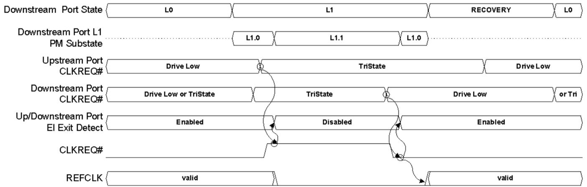

<details>
<summary>flowchart</summary>

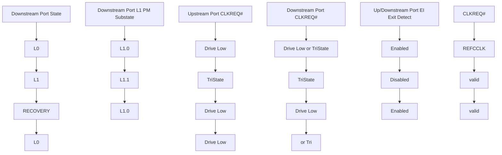
```mermaid
graph TD
  A["Downstream Port State"] --> B["L0"]
  B --> C["L1"]
  C --> D["RECOVERY"] --> E["L0"]
  F["Downstream Port L1 PM Substate"] --> G["L1.0"]
  G --> H["L1.1"]
  H --> I["L1.0"]
    
  J["Upstream Port CLKREQ#"] --> K["Drive Low"] --> L["TriState"] --> M["Drive Low"] --> N["Drive Low"]
  O["Downstream Port CLKREQ#"] --> P["Drive Low or TriState"] --> Q["TriState"] --> R["Drive Low"] --> S["or Tri"]
  T["Up/Downstream Port EI Exit Detect"] --> U["Enabled"] --> V["Disabled"] --> W["Enabled"]
  X["CLKREQ#"] --> Y["REFCCLK"]
  Y --> Z["valid"]
  Z --> AA["valid"]
```
</details>

Figure 5-13 Example: L1.1 Waveforms Illustrating Downstream Port Initiated Exit§

## 5.5.3 L1.2 Requirements §

All Link and PHY state must be maintained during L1.2, or must be restored upon exit using implementation specific means, and the LTSSM and corresponding Port state upon exit from L1.2 must be indistinguishable from the L1.0 LTSSM and Port state.

L1.2 has additional requirements that do not apply to L1.1 These requirements are documented in this section.  
L1.2 has three substates, which are defined below (see § Figure 5-14).

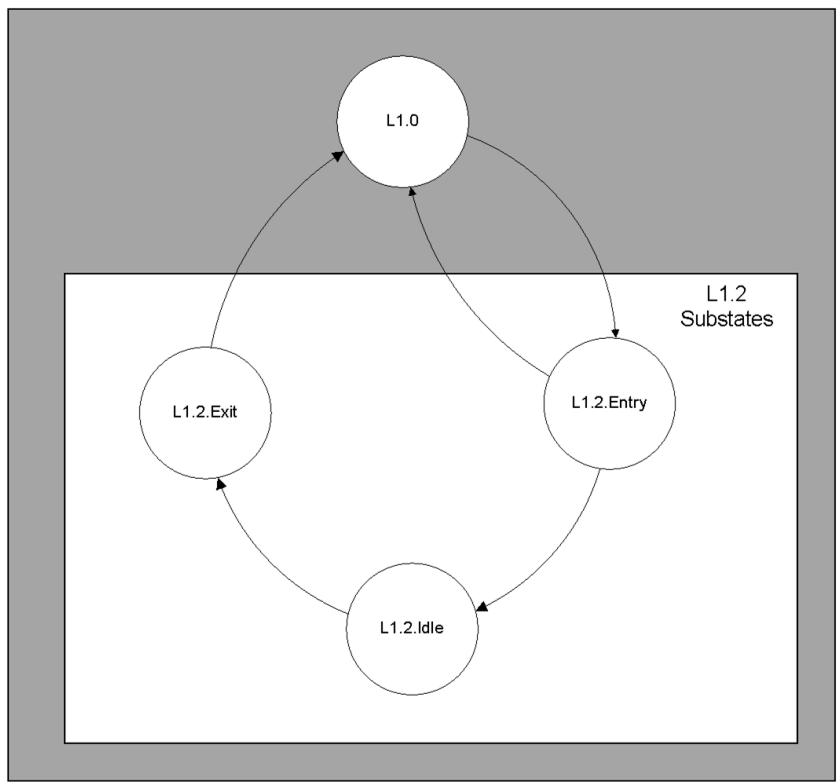

<details>
<summary>flowchart</summary>

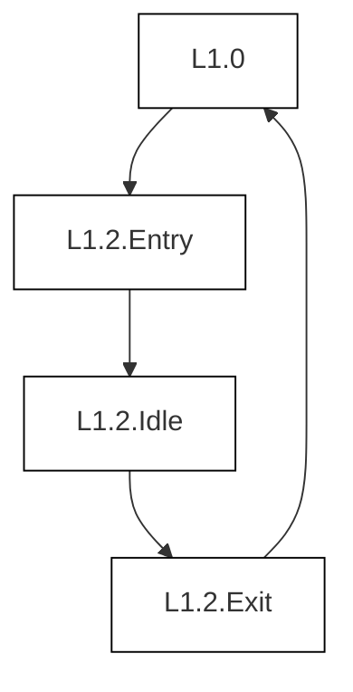
```mermaid
graph TD
  A["L1.0"] --> B["L1.2.Entry"]
  B --> C["L1.2.Idle"]
  C --> D["L1.2.Exit"]
  D --> A
    style A fill:#fff,stroke:#000
    style B fill:#fff,stroke:#000
    style C fill:#fff,stroke:#000
    style D fill:#fff,stroke:#000
```
</details>

Figure 5-14 L1.2 Substates

## 5.5.3.1 L1.2.Entry §

L1.2.Entry is a transitional state on entry into L1.2 to allow time for Refclk to turn off and to ensure both Ports have observed CLKREQ# deasserted. The following rules apply to L1.2.Entry:

• Both Upstream and Downstream Ports continue to maintain common mode.  
• Both Upstream and Downstream Ports may turn off their electrical idle (EI) exit detect circuitry.  
• The Upstream and Downstream Ports must not assert CLKREQ# in this state.  
• Refclk must be turned off within TL1O\_REFCLK\_OFF.  
• Next state is L1.0 if CLKREQ# is asserted, else the next state is L1.2.Idle after waiting for TPOWER\_OFF.

Note that there is a boundary condition which can occur when one Port asserts CLKREQ# shortly after the other Port deasserts CLKREQ#, but before the first Port has observed CLKREQ# deasserted. This is an unavoidable boundary condition that implementations must handle correctly. An example of this condition is illustrated in § Figure 5-15.

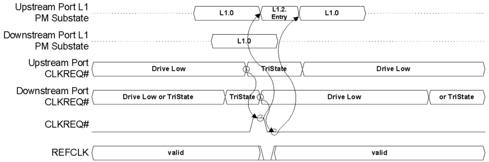

<details>
<summary>flowchart</summary>


```mermaid
graph TD
  A["Upstream Port L1\nPM Substate"] --> B["L1.0"]
  B --> C["L1.2. Entry"]
  C --> D["L1.0"]
  E["Downstream Port L1\nPM Substate"] --> F["L1.0"]
  F --> G["TriState"]
  G --> H["Upstream Port CLKREQ#"]
  H --> I["Drive Low"]
  I --> J["Drive Low or TriState"]
  J --> K["TriState"]
  K --> L["Downstream Port CLKREQ#"]
  L --> M["Drive Low or TriState"]
  M --> N["TriState"]
  N --> O["Downstream Port CLKREQ#"]
  O --> P["Drive Low"]
  P --> Q["Drive Low or TriState"]
  Q --> R["TriState"]
  R --> S["Downstream Port CLKREQ#"]
  S --> T["Drive Low or TriState"]
  T --> U["TriState"]
  U --> V["Downstream Port CLKREQ#"]
  V --> W["Drive Low or TriState"]
  W --> X["TriState"]
  X --> Y["Downstream Port CLKREQ#"]
  Y --> Z["Drive Low or TriState"]
  Z --> AA["TriState"]
  AA --> AB["Downstream Port CLKREQ#"]
  AB --> AC["Drive Low or TriState"]
  AC --> AD["TriState"]
  AD --> AE["Downstream Port CLKREQ#"]
  AE --> AF["Drive Low or TriState"]
  AF --> AG["TriState"]
  AG --> AH["Downstream Port CLKREQ#"]
  AH --> AI["Drive Low or TriState"]
  AI --> AJ["TriState"]
  AJ --> AK["Downstream Port CLKREQ#"]
  AK --> AL["Drive Low or TriState"]
  AL --> AM["TriState"]
  AM --> AN["Downstream Port CLKREQ#"]
  AN --> AO["Drive Low or TriState"]
  AO --> AP["TriState"]
  AP --> AQ["Downstream Port CLKREQ#"]
  AQ --> AR["Drive Low or TriState"]
  AR --> AS["TriState"]
  AS --> AT["Downstream Port CLKREQ#"]
  AT --> AU["Drive Low or TriState"]
  AU --> AV["TriState"]
  AV --> AW["Downstream Port CLKREQ#"]
  AW --> AX["Drive Low or TriState"]
  AX --> AY["TriState"]
  AY --> AZ["Downstream Port CLKREQ#"]
  AZ --> BA["Drive Low or TriState"]
  BA --> BB["TriState"]
  BB --> BC["Downstream Port CLKREQ#"]
  BC --> BD["Drive Low or TriState"]
  BD --> BE["TriState"]
  BE --> BF["Downstream Port CLKREQ#"]
  BF --> BG["Drive Low or TriState"]
  BG --> BH["TriState"]
  BH --> BI["Downstream Port CLKREQ#"]
  BI --> BJ["Drive Low or TriState"]
  BJ --> BK["TriState"]
  BK --> BL["Downstream Port CLKREQ#"]
  BL --> BM["Drive Low or TriState"]
  BM --> BN["TriState"]
  BN --> BO["Downstream Port CLKREQ#"]
  BO --> BP["Drive Low or TriState"]
  BP --> BQ["TriState"]
  BQ --> BR["Downstream Port CLKREQ#"]
  BR --> BS["Drive Low or TriState"]
  BS --> BT["TriState"]
  BT --> BU["Downstream Port CLKREQ#"]
  BU --> BV["Drive Low or TriState"]
  BV --> BW["TriState"]
  BW --> BX["Downstream Port CLKREQ#"]
  BX --> BY["Drive Low or TriState"]
  BY --> BZ["TriState"]
  BZ --> CA["Downstream Port CLKREQ#"]
  CA --> CB["Drive Low or TriState"]
  CB --> CC["TriState"]
  CC --> CD["Downstream Port CLKREQ#"]
  CD --> CE["Drive Low or TriState"]
  CE --> CF["TriState"]
  CF --> CG["Downstream Port CLKREQ#"]
  CG --> CH["Drive Low or TriState"]
  CH --> CI["TriState"]
  CI --> CJ["Downstream Port CLKREQ#"]
  CJ --> CK["Drive Low or TriState"]
  CK --> CL["TriState"]
  CL --> CM["Downstream Port CLKREQ#"]
  CM --> CN["Drive Low or TriState"]
  CN --> CO["TriState"]
  CO --> CP["Downstream Port CLKREQ#"]
  CP --> CQ["Drive Low or TriState"]
  CQ --> CR["TriState"]
  CR --> CS["Downstream Port CLKREQ#"]
  CS --> CT["Drive Low or TriState"]
  CT --> CU["TriState"]
  CU --> CV["Downstream Port CLKREQ#"]
  CV --> CW["Drive Low or TriState"]
  CW --> CX["TriState"]
  CX --> CY["Downstream Port CLKREQ#"]
  CY --> CZ["Drive Low or TriState"]
  CZ --> DA["TriState"]
  DA --> DB["Downstream Port CLKREQ#"]
  DB --> DC["Drive Low or TriState"]
  DC --> DD["TriState"]
  DD --> DE["Downstream Port CLKREQ#"]
  DE --> DF["Drive Low or TriState"]
  DF --> DG["TriState"]
  DG --> DH["Downstream Port CLKREQ#"]
  DH --> DI["Drive Low or TriState"]
  DI --> DJ["TriState"]
  DJ --> DK["TriState"]
```
</details>

Figure 5-15 Example: Illustration of Boundary Condition due to Different Sampling of CLKREQ#§

## 5.5.3.2 L1.2.Idle §

When requirements for the entry into L1.2.Idle state (see § Section 5.5.1 ) have been satisfied then the Ports enter the L1.2.Idle substate. The following rules apply in L1.2.Idle:

• Both Upstream and Downstream Ports may power-down any active logic, including circuits required to maintain common mode.  
• The PHY of both Upstream and Downstream Ports may have their power removed.

The following rules apply for L1.2.Idle state when using the CLKREQ#-based mechanism:

• If either the Upstream or Downstream Port needs to exit L1.2, it must assert CLKREQ# after ensuring that TL1.2 has been met.  
• If the Downstream Port is initiating exit from L1, it must assert CLKREQ# until the Link exits Recovery. The Upstream Port must assert CLKREQ# on entry to Recovery, and must continue to assert CLKREQ# until the next entry into L1, or other state allowing CLKREQ# deassertion.  
• If the Upstream Port is initiating exit from L1, it must continue to assert CLKREQ# until the next entry into L1, or other state allowing CLKREQ# deassertion.  
• Both the Upstream and Downstream Ports must monitor the logical state of the CLKREQ# input signal.  
• Next state is L1.2.Exit if CLKREQ# is asserted.

## 5.5.3.3 L1.2.Exit §

This is a transitional state on exit from L1.2 to allow time for both devices to power up. In L1.2.Exit, the following rules apply:

• The PHYs of both Upstream and Downstream Ports must be powered.  
• It must not be assumed that common mode has been maintained.

## 5.5.3.3.1 Exit from L1.2 §

• The following rules apply for L1.2.Exit using the CLKREQ#-based mechanism:  
• Both Upstream and Downstream Ports must power up any circuits required for L1.0, including circuits required to maintain common mode.  
• The Upstream and Downstream Ports must not change their driving state of CLKREQ# in this state.  
• Refclk must be turned on no earlier than ${ \mathsf { T } } _ { \mathsf { L } 1 0 _ { - } }$ \_REFCLK\_ON minimum time, and may take up to the amount of time allowed according to the LTR advertised by the Endpoint before becoming valid.  
• Next state is L1.0 after waiting for TPOWER\_ON.

◦ Common mode is permitted to be established passively during L1.0, and actively during Recovery. In order to ensure common mode has been established, the Downstream Port must maintain a timer, and the Downstream Port must continue to send TS1 training sequences until a minimum of TCOMMONMODE has elapsed since the Downstream Port has started transmitting TS1 training sequences and has detected electrical idle exit on any Lane of the configured Link.

§ Figure 5-16 illustrates the signal relationships and timing constraints associated with L1.2 entry and Upstream Port initiated exit.  
§ Figure 5-17 illustrates the signal relationships and timing constraints associated with L1.2 entry and Downstream Port initiated exit.  
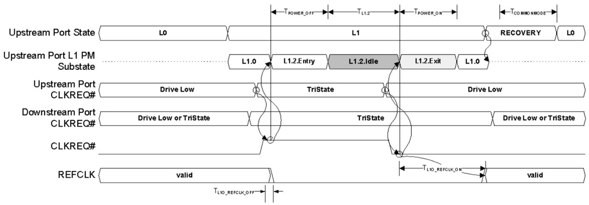

<details>
<summary>flowchart</summary>

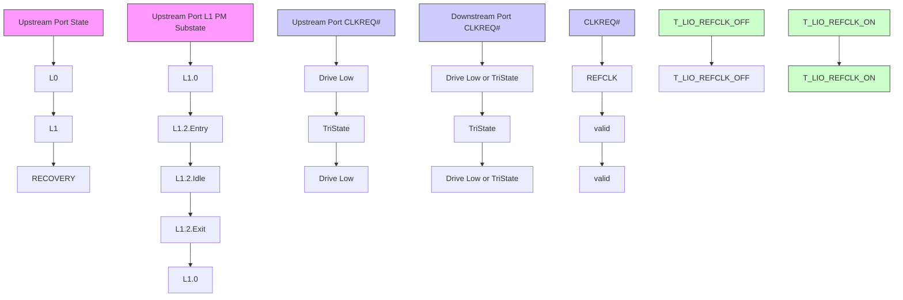
```mermaid
graph TD
  A["Upstream Port State"] --> B["L0"]
  B --> C["L1"]
  C --> D["RECOVERY"]
  E["Upstream Port L1 PM Substate"] --> F["L1.0"]
  F --> G["L1.2.Entry"]
  G --> H["L1.2.Idle"]
  H --> I["L1.2.Exit"]
  I --> J["L1.0"]
  K["Upstream Port CLKREQ#"] --> L["Drive Low"]
  L --> M["TriState"]
  M --> N["Drive Low"]
  O["Downstream Port CLKREQ#"] --> P["Drive Low or TriState"]
  P --> Q["TriState"]
  Q --> R["Drive Low or TriState"]
  S["CLKREQ#"] --> T["REFCLK"]
  T --> U["valid"]
  U --> V["valid"]
  W["T_LIO_REFCLK_OFF"] --> X["T_LIO_REFCLK_OFF"]
  Y["T_LIO_REFCLK_ON"] --> Z["T_LIO_REFCLK_ON"]
    style A fill:#f9f,stroke:#333
    style E fill:#f9f,stroke:#333
    style K fill:#ccf,stroke:#333
    style O fill:#ccf,stroke:#333
    style S fill:#ccf,stroke:#333
    style W fill:#cfc,stroke:#333
    style Y fill:#cfc,stroke:#333
    style Z fill:#cfc,stroke:#333
```
</details>

Figure 5-16 Example: L1.2 Waveforms Illustrating Upstream Port Initiated Exit§

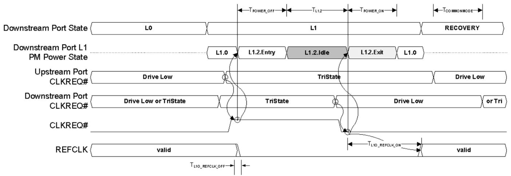

<details>
<summary>flowchart</summary>

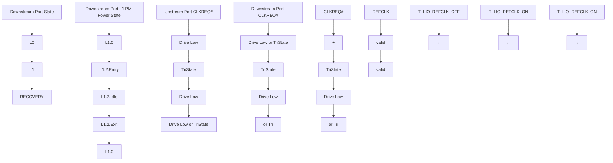
```mermaid
graph TD
  A["Downstream Port State"] --> B["L0"]
  B --> C["L1"]
  C --> D["RECOVERY"]
  E["Downstream Port L1 PM Power State"] --> F["L1.0"]
  F --> G["L1.2.Entry"]
  G --> H["L1.2.Idle"]
  H --> I["L1.2.Exit"]
  I --> J["L1.0"]
  K["Upstream Port CLKREQ#"] --> L["Drive Low"]
  L --> M["TriState"]
  M --> N["Drive Low"]
  N --> O["Drive Low or TriState"]
  P["Downstream Port CLKREQ#"] --> Q["Drive Low or TriState"]
  Q --> R["TriState"]
  R --> S["Drive Low"]
  S --> T["or Tri"]
  U["CLKREQ#"] --> V["+"]
  V --> W["TriState"]
  W --> X["Drive Low"]
  X --> Y["or Tri"]
  Z["REFCLK"] --> AA["valid"]
  AA --> AB["valid"]
  AC["T_LIO_REFCLK_OFF"] --> AD["←"]
  AE["T_LIO_REFCLK_ON"] --> AF["←"]
  AG["T_LIO_REFCLK_ON"] --> AH["→"]
```
</details>

Figure 5-17 Example: L1.2 Waveforms Illustrating Downstream Port Initiated Exit§

## 5.5.4 L1 PM Substates Configuration §

L1 PM Substates is considered enabled on a Port when any combination of the ASPM L1.1 Enable, ASPM L1.2 Enable, PCI-PM L1.1 Enable and PCI-PM L1.2 Enable bits associated with that Port are Set.

An L1 PM Substate enable bit must only be Set in the Upstream and Downstream Ports on a Link when the corresponding supported capability bit is Set by both the Upstream and Downstream Ports on that Link, otherwise the behavior is undefined.

The Setting of any enable bit must be performed at the Downstream Port before the corresponding bit is permitted to be Set at the Upstream Port. If any L1 PM Substates enable bit is at a later time to be cleared, the enable bit(s) must be cleared in the Upstream Port before the corresponding enable bit(s) are permitted to be cleared in the Downstream Port.

If setting either or both of the enable bits for ASPM L1 PM Substates, both ports must be configured as described in this section while ASPM L1 is disabled.

If setting either or both of the enable bits for PCI-PM L1 PM Substates, both ports must be configured as described in this section while in D0.

Prior to setting either or both of the enable bits for L1.2, the values for TPOWER\_ON, Common\_Mode\_Restore\_Time, and, if the ASPM L1.2 Enable bit is to be Set, the LTR\_L1.2\_THRESHOLD (both Value and Scale fields) must be programmed.

The TPOWER\_ON and Common\_Mode\_Restore\_Time fields must be programmed to the appropriate values based on the components and AC coupling capacitors used in the connection linking the two components. The determination of these values is design implementation specific.

When both the ASPM L1.2 Enable and PCI-PM L1.2 Enable bits are cleared, it is not required to program the TPOWER\_ON, Common\_Mode\_Restore\_Time, and LTR\_L1.2\_THRESHOLD Value and Scale fields, and hardware must not rely on these fields to have any particular values.

When programming LTR\_L1.2\_THRESHOLD Value and Scale fields, identical values must be programmed in both Ports.

## 5.5.5 L1 PM Substates Timing Parameters §

§ Table 5-11 defines the timing parameters associated with the L1.2 substates mechanism.

§ Table 5-11 L1.2 Timing Parameters

<table><tr><td>Parameter</td><td>Description</td><td>Min</td><td>Max</td><td>Units</td></tr><tr><td> $T_{POWER\_OFF}$ </td><td>CLKREQ# deassertion to entry into the L1.2.Idle substate</td><td></td><td>2</td><td>μs</td></tr><tr><td> $T_{COMMONMODE}$ </td><td>Restoration of Refclk to restoration of common mode established through active transmission of TS1 training sequences (see § Section 5.5.3.3.1)</td><td colspan="2">Programmable in range from 0 to 255</td><td>μs</td></tr><tr><td> $T_{L10\_REFCLK\_OFF}$ </td><td>CLKREQ# deassertion to Refclk reaching idle electrical state when entering L1.2</td><td>0</td><td>100</td><td>ns</td></tr><tr><td> $T_{L10\_REFCLK\_ON}$ </td><td>CLKREQ# assertion to Refclk valid when exiting L1.2</td><td> $T_{POWER\_ON}$ </td><td>LTR value advertised by the Endpoint</td><td>μs</td></tr><tr><td> $T_{POWER\_ON}$ </td><td>The minimum amount of time that each component must wait in L1.2.Exit after sampling CLKREQ# asserted before actively driving the interface to ensure no device is ever actively driving into an unpowered component.</td><td>Set in the L1 PM Substates Control 2 Register (range from 0 to 3100)</td><td></td><td>μs</td></tr><tr><td> $T_{L1.2}$ </td><td>Time a Port must stay in L1.2 when CLKREQ# must remain inactive</td><td>4</td><td></td><td>μs</td></tr></table>

## 5.5.6 Link Activation §

Link Activation is an optional mechanism to temporarily disable L1 Substates. Link Activation is used to bring a Link out of L1.1/L1.2, avoiding potential stalls. An example of one such stall is the stall associated with a Configuration Write to perform a D3Hot to D0 transition. Link Activation can also be used to indirectly indicate to a Device that it should avoid long-latency internal power management during latency-sensitive or time critical operations.

The following rules apply to Link Activation:

• A Downstream Port is permitted to support Link Activation, as indicated by the Link Activation Supported bit in the L1 PM Substates Capabilities Register being Set.  
• The Link Activation Control bit must have no effect on Port behavior unless one or more of the following bits are Set:

◦ PCI-PM L1.2 Enable

◦ PCI-PM L1.1 Enable

• When the Link Activation Control bit is Set, the Port that is about to enter L1 must assert, and while in L1 maintain as asserted, the CLKREQ# signal.  
• If the Link Activation Control bit is Clear, the Link Activation mechanism does not impose any additional requirements on the state of the CLKREQ# signal.  
• If the Port is enabled for edge-triggered interrupt signaling using MSI or MSI-X, an interrupt message must be sent every time the logical AND of the following conditions transitions from FALSE to TRUE:

◦ The associated vector is unmasked (not applicable if MSI does not support PVM)  
◦ The Link Activation Interrupt Enable bit is Set  
◦ The Link Activation Control bit is Set  
◦ The Link Activation Status bit is Set. Note that Link Activation interrupts always use the MSI or MSI-X vector indicated by the Interrupt Message Number field in the PCI Express Capabilities Register.

• If the Port is enabled for level-triggered interrupt signaling using the INTx messages, the virtual INTx wire must be asserted whenever and as long as the following conditions are satisfied:

◦ The Link Activation Interrupt Enable bit is Set  
◦ The Link Activation Control bit is Set  
◦ The Link Activation Status bit is Set

◦ The Interrupt Disable bit in the Command Register is Clear.

• The Link Activation Status bit must be Set every time the logical AND of the following conditions transitions from FALSE to TRUE:

◦ Either the PCI-PM L1.2 Enable bit or the PCI-PM L1.1 Enable bit (or both) are Set  
◦ The Link Activation Control bit is Set  
◦ The Link is not in an L1 Substate

## 5.6 Auxiliary Power Support §

The specific definition and requirements associated with auxiliary power are form factor specific, and the terms “auxiliary power” and “Vaux” should be understood in reference to the specific form factor in use. The specific mechanism(s) for supplying auxiliary power are not defined in this specification. The following text defines requirements that apply in all form factors.

Note that support for auxiliary power is optional. Some form factors do not support it. Also, some form factors have dedicated auxiliary power pins while other form factors use the main power pins in some fashion.

PCI Express PM provides a Aux Power PM Enable bit in the Device Control Register that provides the means for enabling a Function to draw the maximum allowance of auxiliary current independent of its level of support for PME generation.

A Function requests auxiliary power allocation by specifying a non-zero value in the Aux\_Current field of the PMC register. Refer to § Chapter 7. for the Aux Power PM Enable register bit assignment, and access mechanism.

Allocation of auxiliary power using Aux Power PM Enable and PME\_En is determined as follows:

Table 5-12 Aux Power Source and Availability§

<table><tr><td>Aux Power PM Enable</td><td>PME_En</td><td>Aux Power Detected</td><td>Aux Power Source</td><td>Aux Power Available</td></tr><tr><td>x</td><td>x</td><td>0b</td><td>None</td><td>None</td></tr><tr><td rowspan="2">0b</td><td>0b</td><td rowspan="3">1b</td><td>Form factor specific Aux Power rail / pins</td><td>Form factor specific (e.g., 10 mW in CEM)</td></tr><tr><td>1b</td><td>Form factor specific Aux Power rail / pins</td><td>Aux_Current value (PMC)</td></tr><tr><td>1b</td><td>x</td><td>Form factor specific Aux Power rail / pins</td><td>Aux_Current value (PMC)</td></tr></table>

## Aux Power PM Enable = 1b:

Auxiliary power is allocated as requested in the Aux\_Current field of the PMC register, independent of the PME\_En bit in the PMSCR. The PME\_En bit still controls the ability to master PME.

Additional Aux power is permitted to be allocated using a firmware based mechanism (see the Request D3Cold Aux Power Limit \_DSM call as defined in [Firmware]).

Additional Aux power is also permitted to be allocated by selecting a PM Sub State in the Power Limit mechanism (see § Section 7.8.1.3 ).

## Aux Power PM Enable = 0b:

Auxiliary power allocation is controlled by the PME\_En bit as defined in § Section 7.5.2.2 .

Additional Aux power is permitted to be allocated using a firmware based mechanism (see the Request $\mathsf { D } 3 \mathsf { c o } | \mathsf { d }$ Aux Power Limit \_DSM call as defined in [Firmware]).

Additional Aux power is also permitted to be allocated by selecting a PM Sub State in the Power Limit mechanism (see § Section 7.8.1.3 ).

The Aux Power PM Enable bit is sticky (see § Section 7.4 ) so its state is preserved in the D3Cold state, and is not affected by the transitions from the D3Cold state to the D0uninitialized state.

## 5.7 Power Management System Messages and DLLPs §

§ Table 5-13 defines the location of each PM packet in the PCI Express stack.  
Table 5-13 Power Management System Messages and DLLPs

<table><tr><td>Packet</td><td>Type</td></tr><tr><td>PM_Enter_L1</td><td>DLLP</td></tr><tr><td>PM_Enter_L23</td><td>DLLP</td></tr><tr><td>PM_Active_State_Request_L1</td><td>DLLP</td></tr><tr><td>PM_Request_Ack</td><td>DLLP</td></tr><tr><td>PM_Active_State_Nak</td><td>Transaction Layer Message</td></tr><tr><td>PM_PME</td><td>Transaction Layer Message</td></tr><tr><td>PME_Turn_Off</td><td>Transaction Layer Message</td></tr><tr><td>PME_TO_Ack</td><td>Transaction Layer Message</td></tr></table>

For information on the structure of the power management DLLPs, refer to § Section 3.5 .

Power Management Messages follow the general rules for all Messages. Power Management Message fields follow the following rules:

• Length field is Reserved.  
• Attribute field must be set to the default values (all 0's).  
• Address field is Reserved.  
• Requester ID - see § Table 2-23 in § Section 2.2.8.2 .  
• Traffic Class field must use the default class (TC0).

## 5.8 PCI Function Power State Transitions §

All PCI-PM power management state changes are explicitly controlled by software except for Fundamental Reset which brings all Functions to the $\mathsf { D } 0 _ { \mathsf { u n i n i t i a l i z e d } }$ state. § Figure 5-18 shows all supported state transitions. The unlabeled arcs represent a software initiated state transition (Set Power State operation).

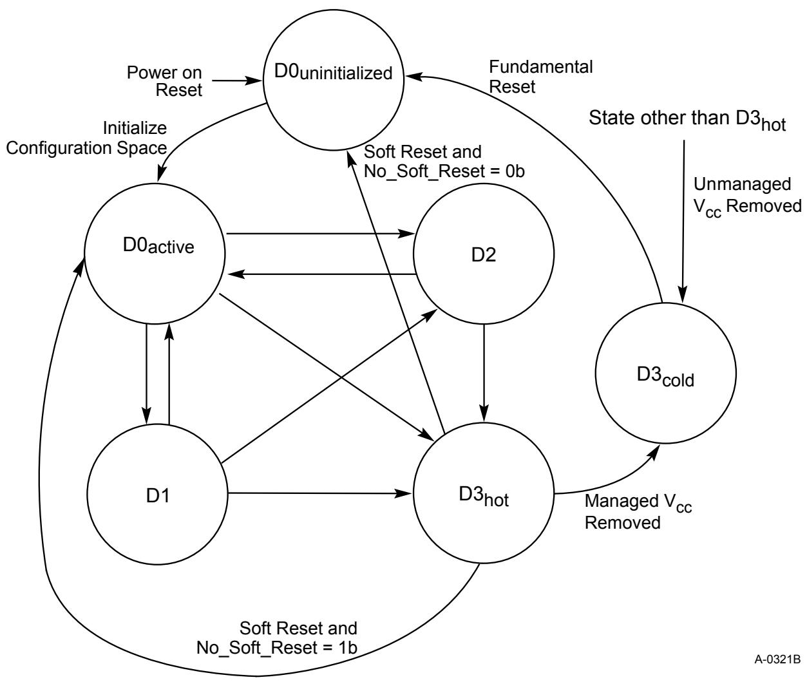

<details>
<summary>flowchart</summary>

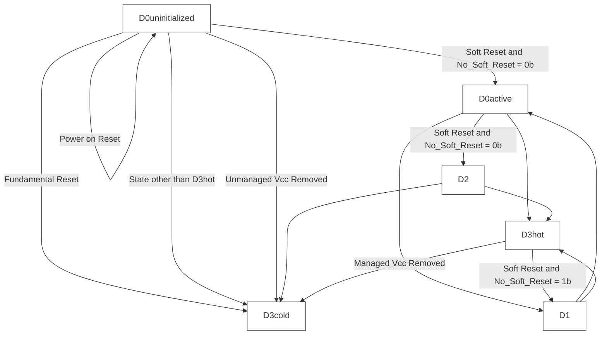
```mermaid
graph TD
  D0uninitialized -->|Power on Reset| D0uninitialized
  D0uninitialized -->|Fundamental Reset| D3cold
  D0uninitialized -->|State other than D3hot| D3cold
  D0uninitialized -->|Soft Reset and No_Soft_Reset = 0b| D0active
  D0uninitialized -->|Unmanaged Vcc Removed| D3cold
  D0active -->|Soft Reset and No_Soft_Reset = 0b| D2
  D0active --> D1
  D0active --> D3hot
  D2 --> D3hot
  D2 --> D3cold
  D3hot -->|Managed Vcc Removed| D3cold
  D3hot -->|Soft Reset and No_Soft_Reset = 1b| D1
  D1 --> D0active
  D1 --> D3hot
    style D0active fill:#f9f,stroke:#333
    style D2 fill:#ccf,stroke:#333
    style D3hot fill:#cfc,stroke:#333
    style D1 fill:#fcc,stroke:#333
    style D2 fill:#ffc,stroke:#333
    style D3cold fill:#fcc,stroke:#333
    style D0uninitialized fill:#fff,stroke:#333
    style D0active fill:#fff,stroke:#333
    style D1 fill:#fff,stroke:#333
    style D2 fill:#fff,stroke:#333
    style D3hot fill:#fff,stroke:#333
    style D3cold fill:#fff,stroke:#333
```
</details>

Figure 5-18 Function Power Management State Transitions§

## 5.9 State Transition Recovery Time Requirements §

§ Table 5-14 shows the minimum recovery times that system software must allow between the time that a Function is programmed to change state and the time that the function is next accessed (including Configuration Space), unless Readiness Notifications (see § Section 6.22 ) is used to indicate modified values to system software. For bridge Functions, this delay also constitutes a minimum delay between when the bridge's state is changed and when any Function on the logical bus that it originates can be accessed.

Table 5-14 PCI Function State Transition Delays§

<table><tr><td>Initial State</td><td>Next State</td><td>Minimum System Software Guaranteed Delays</td></tr><tr><td>D0</td><td>D1</td><td>0</td></tr><tr><td>D0 or D1</td><td>D2</td><td>200 μs</td></tr><tr><td>D0, D1 or D2</td><td> $D3_{Hot}$ </td><td>10 ms</td></tr><tr><td>D1</td><td>D0</td><td>0</td></tr><tr><td>D2</td><td>D0</td><td>200 μs</td></tr><tr><td> $D3_{Hot}$ </td><td>D0</td><td>10 ms</td></tr></table>

## 5.10 SR-IOV Power Management §

This section defines power management requirements that are unique to SR-IOV devices.

The Power Management Capability as described elsewhere in § Chapter 5. is required for PFs.

For VFs, the Power Management Capability is optional.

## 5.10.1 VF Device Power Management States §

If a VF does not implement the Power Management Capability, then the VF behaves as if it had been programmed into the equivalent power state of its associated PF.

If a VF implements the Power Management Capability, the functionality must be as defined in § Section 7.5.2 .

If a VF implements the Power Management Capability, the Device behavior is undefined if the PF is placed in a lower power state than the VF. Software should avoid this situation by placing all VFs in lower power state before lowering their associated PF’s power state.

A VF in the D0 state is in the ${ \mathsf { D } } 0 _ { \mathsf { a c t i v e } }$ state when the VF has completed its internal initialization and either the VF's Bus Master Enable bit or the VF MSE bit in the SR-IOV Control Register (see § Section 9.3.3.3 ) Extended Capability is Set. The VF’s internal initialization must have completed when any of the following conditions have occurred:

• The VF has responded successfully (without returning RRS) to a Configuration Request.  
• After issuing an FLR to the VF, one of the following is true:

◦ At least 1.0 s has passed since the FLR was issued.  
◦ The VF supports Function Readiness Status and, after the FLR was issued, an FRS Message from the VF with Reason Code FLR Completed has been received.  
◦ At least FLR time has passed since the FLR was issued. FLR Time is either (1) the FLR Time value in the Readiness Time Reporting capability associated with the VF or (2) a value determined by system software / firmware 93 .

• After Setting VF Enable in a PF, at least one of the following is true:

◦ At least 1.0 s has passed since VF Enable was Set.

◦ The PF supports Function Readiness Status and, after VF Enable was Set, an FRS Message from the PF with Reason Code VF Enabled has been received.

• After transitioning a VF from $\mathsf { D } 3 _ { \mathsf { H o t } }$ to D0, at least one of the following is true:

◦ At least 10 ms has passed since the request to enter D0 was issued.  
◦ The VF supports Function Readiness Status and, after the request to enter D0 was issued, an FRS Message from the VF with Reason Code $\mathsf { D } 3 _ { \mathsf { H o t } }$ to D0 Transition Completed has been received.  
◦ At least $\mathsf { D } 3 _ { \mathsf { H o t } }$ to D0 Time has passed since the request to enter D0 was issued. $\mathsf { D } 3 _ { \mathsf { H o t } }$ to D0 Time is either (1) the ${ \sf D } 3 _ { \sf H o t }$ to D0 Time in the Readiness Time Reporting capability associated with the VF or (2) a value determined by system software / firmware 94 .

## 5.10.2 PF Device Power Management States §

The PF’s power management state (D-state) has global impact on its associated VFs. If a VF does not implement the Power Management Capability, then it behaves as if it is in an equivalent power state of its associated PF.

If a VF implements the Power Management Capability, the Device behavior is undefined if the PF is placed in a lower power state than the VF. Software should avoid this situation by placing all VFs in lower power state before lowering their associated PF’s power state.

When the PF is placed into the ${ \sf D } 3 _ { \sf H o t }$ state:

• If the No\_Soft\_Reset bit is Clear then the PF performs an internal reset on the ${ \sf D } 3 _ { \sf H o t }$ to D0 transition and all its configuration state returns to the default values.  
Note: Resetting the PF resets VF Enable which means that VFs no longer exist and any VF specific context is lost after the $\mathsf { D } 3 _ { \mathsf { H o t } }$ to D0 transition is complete.  
• If the No\_Soft\_Reset bit is Set then the internal reset does not occur. The SR-IOV extended capability retains state, and associated VFs remain enabled.

When the PF is placed into the $\mathsf { D } 3 \mathsf { C o } 1 \mathsf { d }$ state VFs no longer exist, any VF specific context is lost and PME events can only be initiated by the PF.

## IMPLEMENTATION NOTE: NO\_SOFT\_RESET STRONGLY RECOMMENDED §

It is strongly recommended that the No\_Soft\_Reset bit be Set in all Functions of a Multi-Function Device. As indicated in the bit definition, all implementations that support Flit Mode are required to Set the No\_Soft\_Reset bit. This recommendation applies to PFs.

## 5.11 PCI Bridges and Power Management §

With power management under the direction of the operating system, each class of Functions must have a clearly defined criteria for feature availability as well as what functional context must be preserved when operating in each of the power management states. Some example Device-Class specifications have been proposed as part of the ACPI

specification for various Functions ranging from audio to network add-in cards. While defining Device-Class specific behavioral policies for most Functions is outside the scope of this specification, defining the required behavior for PCI bridge functions is within the scope of this specification. The definitions here apply to all three types of PCIe Bridges:

• Host bridge, PCI Express to expansion bus bridge, or other ACPI enumerated bridge  
• Switches  
• PCI Express to PCI bridge  
• PCI-to-CardBus bridge

The mechanisms for controlling the state of these Functions vary somewhat depending on which type of Originating Device is present. The following sections describe how these mechanisms work for the three types of bridges.

This section details the power management policies for PCI Express Bridge Functions. The PCI Express Bridge Function can be characterized as an Originating Device with a secondary bus downstream of it. This section describes the relationship of the bridge function's power management state to that of its secondary bus.

The shaded regions in § Figure 5-19 illustrate what is discussed in this section.

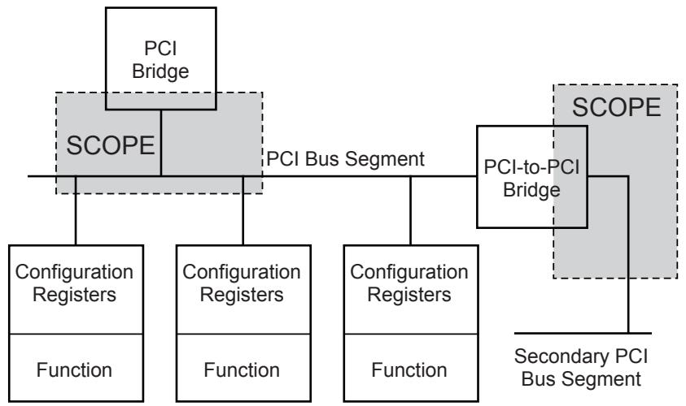

<details>
<summary>flowchart</summary>

```mermaid
graph TD
  A["PCI Bridge"] --> B["SCOPE"]
  B --> C["Configuration Registers"]
  B --> D["Configuration Registers"]
  B --> E["Function"]
  F["PCI to-PCI Bridge"] --> G["SCOPE"]
  G --> H["Secondary PCI Bus Segment"]
  G --> I["Function"]
  B --> J["PCI Bus Segment"]
    style A fill:#ccc,stroke:#333
    style F fill:#ccc,stroke:#333
    style G fill:#ccc,stroke:#333
```
</details>

A-0323

Figure 5-19 PCI Express Bridge Power Management Diagram§

As can be seen from § Figure 5-19, the PCI Express Bridge behavior described in this chapter is common, from the perspective of the operating system, to host bridges, Switches, and PCI Express to PCI bridges.

It is the responsibility of the system software to ensure that only valid, workable combinations of bus and downstream Function power management states are used for a given bus and all Functions residing on that bus.

## 5.11.1 Switches and PCI Express to PCI Bridges §

The power management policies for the secondary bus of a Switch or PCI Express to PCI bridge are identical to those defined for any Bridge Function.

The BPCC\_En and B2\_B3# bus power/clock control fields in the Bridge Function's PMCSR\_BSE register support the same functionality as for any other Bridges.

## 5.12 Power Management Events §

There are two varieties of Power Management Events:

• Wakeup Events  
• PME Generation

A Wakeup Event is used to request that power be turned on.

A PME Generation Event is used to identify to the system the Function requesting that power be turned on.

In conventional PCI, both events are associated with the PME# signal. The PME# signal is asserted by a Function to request a change in its power management state. When the PME\_En bit is Set and the event occurs, the Function sets the PME\_Status bit and asserts the PME# signal. It keeps the PME# signal asserted until either the PME\_En bit or the PME\_Status are Cleared (typically by software).

In PCI Express, the Wakeup Event is associated with the WAKE# signal. If supported, the WAKE# signal is defined in the associated form factor specification and is used by a Function to request a change in its PCI-PM power management state when the Function is in D3Cold and PME\_En is Set.

In PCI Express, after main power has been restored and the Link is trained, the Function(s) that initiated the wakeup (e.g., that asserted WAKE#), sends a PM\_PME Message to the Root Complex. The PM\_PME Message provides the Root Complex with the identity of the requesting Function(s) without requiring software to poll for the PME\_Status bit being Set.

## 6. System Architecture §

This chapter addresses various aspects of PCI Express interconnect architecture in a platform context.

## 6.1 Interrupt and PME Support §

The PCI Express interrupt model supports two mechanisms:

• INTx emulation  
• Message Signaled Interrupt (MSI/MSI-X)

For legacy compatibility, PCI Express provides a PCI INTx emulation mechanism to signal interrupts to the system interrupt controller (typically part of the Root Complex). This mechanism is compatible with existing PCI software, and provides the same level and type of service as the corresponding PCI interrupt signaling mechanism and is independent of system interrupt controller specifics. This legacy compatibility mechanism allows boot device support without requiring complex BIOS-level interrupt configuration/control service stacks. It virtualizes PCI physical interrupt signals by using an in-band signaling mechanism.

If an implementation supports interrupts, then this specification requires support of either MSI or MSI-X or both. PCI Compatible INTx interrupt emulation is optional. Switches are required to support forwarding the INTx interrupt emulation Messages (see § Section 2.2.8.1 ). The PCI Express MSI and MSI-X mechanisms are compatible with those originally defined in [PCI].

For SR-IOV devices, PFs are permitted to implement INTx, and VFs must not implement INTx. Each PF and VF must implement its own unique interrupt capabilities.

## 6.1.1 Rationale for PCI Express Interrupt Model §

PCI Express takes an evolutionary approach from PCI with respect to interrupt support.

As required for PCI/PCI-X interrupt mechanisms, each device Function is required to differentiate between INTx and MSI/ MSI-X modes of operation. The device complexity required to support both schemes is no different than that for PCI/ PCI-X devices. The advantages of this approach include:

• Compatibility with existing PCI Software Models  
• Direct support for boot devices  
• Easier End of Life (EOL) for INTx legacy mechanisms.

The existing software model is used to differentiate INTx vs. MSI/MSI-X modes of operation; thus, no special software support is required for PCI Express.

The software model does not support changing interrupt modes while the Function is in active operation. If software does this, interrupt conditions may be dropped or replicated.

## 6.1.2 PCI-compatible INTx Emulation §

PCI Express emulates the PCI interrupt mechanism including the Interrupt Pin and Interrupt Line registers of the PCI Configuration Space for PCI device Functions. PCI Express non-Switch devices may optionally support these registers for backwards compatibility. Switch devices are required to support them. Actual interrupt signaling uses in-band Messages rather than being signaled using physical pins.

Two types of Messages are defined, Assert\_INTx and Deassert\_INTx, for emulation of PCI INTx signaling, where x is A, B, C, and D for respective PCI interrupt signals. These Messages are used to provide “virtual wires” for signaling interrupts across a Link. Switches collect these virtual wires and present a combined set at the Switch’s Upstream Port. Ultimately, the virtual wires are routed to the Root Complex which maps the virtual wires to system interrupt resources. Devices must use assert/deassert Messages in pairs to emulate PCI interrupt level-triggered signaling. Actual mapping of PCI Express INTx emulation to system interrupts is implementation specific as is mapping of physical interrupt signals in conventional PCI.

The legacy INTx emulation mechanism may be deprecated in a future version of this specification.

## 6.1.3 INTx Emulation Software Model §

The software model for legacy INTx emulation matches that of PCI. The system BIOS reporting of chipset/platform interrupt mapping and the association of each device Function’s interrupt with PCI interrupt lines is handled in exactly the same manner as with conventional PCI systems. Legacy software reads from each device Function’s Interrupt Pin register to determine if the Function is interrupt driven. A value between 01h and 04h indicates that the Function uses an emulated interrupt pin to generate an interrupt.

Note that similarly to physical interrupt signals, the INTx emulation mechanism may potentially cause spurious interrupts that must be handled by the system software.

## 6.1.4 MSI and MSI-X Operation §

Message Signaled Interrupts (MSI) is an optional feature that enables a device Function to request service by writing a system-specified data value to a system-specified address (using a DWORD Memory Write transaction). System software initializes the message address and message data (from here on referred to as the “vector”) during device configuration, allocating one or more vectors to each MSI-capable Function.

Interrupt latency (the time from interrupt signaling to interrupt servicing) is system dependent. Consistent with current interrupt architectures, Message Signaled Interrupts do not provide interrupt latency time guarantees.

MSI-X defines a separate optional extension to basic MSI functionality. Compared to MSI, MSI-X supports a larger maximum number of vectors per Function, the ability for software to control aliasing when fewer vectors are allocated than requested, plus the ability for each vector to use an independent address and data value, specified by a table that resides in Memory Space. However, most of the other characteristics of MSI-X are identical to those of MSI.

For the sake of software backward compatibility, MSI and MSI-X use separate and independent Capability structures. On Functions that support both MSI and MSI-X, system software that supports only MSI can still enable and use MSI without any modification. MSI functionality is managed exclusively through the MSI Capability structure, and MSI-X functionality is managed exclusively through the MSI-X Capability structure.

A Function is permitted to implement both MSI and MSI-X, but system software is prohibited from enabling both at the same time. If system software enables both at the same time, the behavior is undefined.

All PCI Express device Functions that are capable of generating interrupts must support MSI or MSI-X or both. The MSI and MSI-X mechanisms deliver interrupts by performing Memory Write transactions. MSI and MSI-X are edge-triggered interrupt mechanisms; neither [PCI] nor this specification support level-triggered MSI/MSI-X interrupts. Certain PCI devices and their drivers rely on INTx-type level-triggered interrupt behavior (addressed by the PCI Express legacy INTx emulation mechanism). To take advantage of the MSI or MSI-X capability and edge-triggered interrupt semantics, these devices and their drivers may have to be redesigned.

MSI and MSI-X each support Per-Vector Masking (PVM). PVM is an optional 95 extension to MSI, and a standard feature with MSI-X. A Function that supports the PVM extension to MSI is backward compatible with system software that is unaware of the extension. MSI-X also supports a Function Mask bit, which when Set masks all of the vectors associated with a Function.

A Legacy Endpoint that implements MSI is required to support either the 32-bit or 64-bit Message Address version of the MSI Capability structure. A PCI Express Endpoint that implements MSI is required to support the 64-bit Message Address version of the MSI Capability structure.

The Requester of an MSI/MSI-X transaction must set the No Snoop and Relaxed Ordering attributes of the Transaction Descriptor to 0b. A Requester of an MSI/MSI-X transaction is permitted to Set the ID-Based Ordering (IDO) attribute if use of the IDO attribute is enabled.

Note that, unlike INTx emulation Messages, MSI/MSI-X transactions are not restricted to the TC0 traffic class.

## IMPLEMENTATION NOTE:

## SYNCHRONIZATION OF DATA TRAFFIC AND MESSAGE SIGNALED INTERRUPTS §

MSI/MSI-X transactions are permitted to use the TC that is most appropriate for the device's programming model. This is generally the same TC as is used to transfer data; for legacy I/O, TC0 should be used.

If a device uses more than one TC, it must explicitly ensure that proper synchronization is maintained between data traffic and interrupt Message(s) not using the same TC. Methods for ensuring this synchronization are implementation specific. One option is for a device to issue a zero-length Read (as described in § Section 2.2.5 ) using each additional TC used for data traffic prior to issuing the MSI/MSI-X transaction. Other methods are also possible. Note, however, that platform software (e.g., a device driver) is generally only capable of issuing transactions using TC0.

Within a device, different Functions are permitted to implement different sets of the MSI/MSI-X/INTx interrupt mechanisms, and system software manages each Function’s interrupt mechanisms independently.

## 6.1.4.1 MSI Configuration §

In this section, all register and field references are in the context of the MSI Capability structure.

System software reads the Message Control register to determine the Function’s MSI capabilities.

System software reads the Multiple Message Capable field (bits 3-1 of the Message Control register) to determine the number of requested vectors. MSI supports a maximum of 32 vectors per Function. System software writes to the Multiple Message Enable field (bits 6-4 of the Message Control register) to allocate either all or a subset of the requested vectors. For example, a Function can request four vectors and be allocated either four, two, or one vector. The number of vectors requested and allocated is aligned to a power of two (that is, a Function that requires three vectors must request four).

If the Per-Vector Masking Capable bit (bit 8 of the Message Control register) is Set and system software supports Per-Vector Masking, system software may mask one or more vectors by writing to the Mask Bits register.

If the 64-bit Address Capable bit (bit 7 of the Message Control register) is Set, system software initializes the MSI Capability structure’s Message Address register (specifying the lower 32 bits of the message address) and the Message Upper Address register (specifying the upper 32 bits of the message address) with a system-specified message address. System software may program the Message Upper Address register to zero so that the Function uses a 32-bit address for the MSI transaction. If this bit is Clear, system software initializes the MSI Capability structure’s Message Address register (specifying a 32-bit message address) with a system specified message address.

System software initializes the MSI Capability structure’s Message Data register with the lower 16 bits of a system specified data value. When the Extended Message Data Capable bit is Clear, care must be taken to initialize only the Message Data register (i.e., a 2-byte value) and not modify the upper two bytes of that DWORD location.

If the Extended Message Data Capable bit is Set and system software supports 32-bit vector values, system software may initialize the MSI capability structure’s Extended Message Data register with the upper 16 bits of a system specified data value, and then Set the Extended Message Data Enable bit.

## 6.1.4.2 MSI-X Configuration §

In this section, all register and field references are in the context of the MSI-X Capability, MSI-X Table, and MSI-X PBA structures.

System software allocates address space for the Function’s standard set of Base Address registers and sets the registers accordingly. One of the Function’s Base Address registers includes address space for the MSI-X Table, though the system software that allocates address space does not need to be aware of which Base Address register this is, or the fact the address space is used for the MSI-X Table. The same or another Base Address register includes address space for the MSI-X PBA, and the same point regarding system software applies.

Depending upon system software policy, system software, device driver software, or each at different times or environments may configure a Function’s MSI-X Capability and table structures with suitable vectors. For example, a booting environment will likely require only a single vector, whereas a normal operating system environment for running applications may benefit from multiple vectors if the Function supports an MSI-X Table with multiple entries. For the remainder of this section, “software” refers to either system software or device driver software.

Software reads the Table Size field from the Message Control register to determine the MSI-X Table size. The field encodes the number of table entries as N-1, so software must add 1 to the value read from the field to calculate the number of table entries N. MSI-X supports a maximum table size of 2048 entries.

Software calculates the base address of the MSI-X Table by reading the 32-bit value from the Table Offset/Table BIR register, masking off the lower 3 Table BIR bits, and adding the remaining QWORD-aligned 32-bit Table offset to the address taken from the Base Address register indicated by the Table BIR. Software calculates the base address of the MSI-X PBA using the same process with the PBA Offset/PBA BIR register.

For each MSI-X Table entry that will be used, software fills in the Message Address field, Message Upper Address field, Message Data field, and Vector Control field. The Vector Control field may contain optional Steering Tag fields. Software must not modify the Address, Data, or Steering Tag fields of an entry while it is unmasked. Refer to § Section 6.1.4.5 for details.

## IMPLEMENTATION NOTE:

## SPECIAL CONSIDERATIONS FOR QWORD ACCESSES §

Software is permitted to fill in MSI-X Table entry DWORD fields individually with DWORD writes, or software in certain cases is permitted to fill in appropriate pairs of DWORDs with a single QWORD write. Specifically, software is always permitted to fill in the Message Address and Message Upper Address fields with a single QWORD write. If a given entry is currently masked (via its Mask bit or the Function Mask bit), software is permitted to fill in the Message Data and Vector Control fields with a single QWORD write, taking advantage of the fact the Message Data field is guaranteed to become visible to hardware no later than the Vector Control field. However, if software wishes to mask a currently unmasked entry (without Setting the Function Mask bit), software must Set the entry’s Mask bit using a DWORD write to the Vector Control field, since performing a QWORD write to the Message Data and Vector Control fields might result in the Message Data field being modified before the Mask bit in the Vector Control field becomes Set.

For potential use by future specifications, the Reserved bits in the Vector Control field must have their default values preserved by software. If software does not preserve their values, the result is undefined.

For each MSI-X Table entry that software chooses not to configure for generating messages, software can simply leave the entry in its default state of being masked.

Software is permitted to configure multiple MSI-X Table entries with the same vector, and this may indeed be necessary when fewer vectors are allocated than requested.

## IMPLEMENTATION NOTE:

## HANDLING MSI-X VECTOR SHORTAGES §

For the case where fewer vectors are allocated to a Function than desired, software-controlled aliasing as enabled by MSI-X is one approach for handling the situation. For example, if a Function supports five queues, each with an associated MSI-X table entry, but only three vectors are allocated, the Function could be designed for software still to configure all five table entries, assigning one or more vectors to multiple table entries. Software could assign the three vectors {A,B,C} to the five entries as ABCCC, ABBCC, ABCBA, or other similar combinations.

Alternatively, the Function could be designed for software to configure it (using a device specific mechanism) to use only three queues and three MSI-X table entries. Software could assign the three vectors {A,B,C} to the five entries as ABC-, A-B-C, A-CB, or other similar combinations.

## 6.1.4.3 Enabling Operation §

To maintain backward compatibility, the MSI Enable bit in the Message Control Register for MSI and the MSI-X Enable bit in the Message Control Register for MSI-X are each Clear by default (MSI and MSI-X are both disabled). System configuration software Sets one of these bits to enable either MSI or MSI-X, but never both simultaneously. Behavior is undefined if both MSI and MSI-X are enabled simultaneously. Software disabling either mechanism during active operation may result in the Function dropping pending interrupt conditions or failing to recognize new interrupt conditions. While enabled for MSI or MSI-X operation, a Function is prohibited from using INTx interrupts (if implemented) to request service (MSI, MSI-X, and INTx are mutually exclusive).

## 6.1.4.4 Sending Messages §

Once MSI or MSI-X is enabled (the appropriate bit in one of the Message Control registers is Set), and one or more vectors is unmasked, the Function is permitted to send messages. To send a message, a Function does a DWORD Memory Write to the appropriate message address with the appropriate message data.

For MSI when the Extended Message Data Enable bit is Clear, the DWORD that is written is made up of the value in the MSI Message Data register in the lower two bytes and zeros in the upper two bytes. For MSI when the Extended Message Data Enable bit is Set, the DWORD that is written is made up of the value in the MSI Message Data register in the lower two bytes and the value in the MSI Extended Message Data register in the upper two bytes.

For MSI, if the Multiple Message Enable field (bits 6-4 of the Message Control Register for MSI) is non-zero, the Function is permitted to modify the low order bits of the message data to generate multiple vectors. For example, a Multiple Message Enable encoding of 010b indicates the Function is permitted to modify message data bits 1 and 0 to generate up to four unique vectors. If the Multiple Message Enable field is 000b, the Function is not permitted to modify the message data.

For MSI-X, the MSI-X Table contains at least one entry for every allocated vector, and the 32-bit Message Data field value from a selected table entry is used in the message without any modification to the low-order bits by the Function.

How a Function uses multiple vectors (when allocated) is device dependent. A Function must handle being allocated fewer vectors than requested.

## 6.1.4.5 Per-vector Masking and Function Masking §

Per-Vector Masking (PVM) is an optional 96 feature with MSI, and a standard feature in MSI-X.

Function Masking is a standard feature in MSI-X. When the MSI-X Function Mask bit is Set, all of the Function’s entries must behave as being masked, regardless of the per-entry Mask bit values. Function Masking is not supported in MSI, but software can readily achieve a similar effect by Setting all MSI Mask bits using a single DWORD write.

PVM in MSI-X is controlled by a Mask bit in each MSI-X Table entry. While more accurately termed “per-entry masking”, masking an MSI-X Table entry is still referred to as “vector masking” so similar descriptions can be used for both MSI and MSI-X. However, since software is permitted to program the same vector (a unique Address/Data pair) into multiple MSI-X table entries, all such entries must be masked in order to guarantee the Function will not send a message using that Address/Data pair.

For MSI and MSI-X, while a vector is masked, the Function is prohibited from sending the associated message, and the Function must Set the associated Pending bit whenever the Function would otherwise send the message. When software unmasks a vector whose associated Pending bit is Set, the Function must schedule sending the associated message, and Clear the Pending bit as soon as the message has been sent. Note that Clearing the MSI-X Function Mask bit may result in many messages needing to be sent.

If a masked vector has its Pending bit Set, and the associated underlying interrupt events are somehow satisfied (usually by software though the exact manner is Function-specific), the Function must Clear the Pending bit, to avoid sending a spurious interrupt message later when software unmasks the vector. However, if a subsequent interrupt event occurs while the vector is still masked, the Function must again Set the Pending bit.

Software is permitted to mask one or more vectors indefinitely, and service their associated interrupt events strictly based on polling their Pending bits. A Function must Set and Clear its Pending bits as necessary to support this “pure polling” mode of operation.

For MSI-X, a Function is permitted to cache Address and Data values from unmasked MSI-X Table entries. However, anytime software unmasks a currently masked MSI-X Table entry either by Clearing its Mask bit or by Clearing the Function Mask bit, the Function must update any Address or Data values that it cached from that entry. If software changes the Address or Data value of an entry while the entry is unmasked, the result is undefined.

## IMPLEMENTATION NOTE:

## PER VECTOR MASKING WITH MSI/MSI-X §

Devices and drivers that use MSI or MSI-X have the challenge of coordinating exactly when new interrupt messages are generated. If hardware fails to send an interrupt message that software expects, an interrupt event might be “lost”. If hardware sends an interrupt message that software is not expecting, a “spurious” interrupt might result.

Per-Vector Masking (PVM) can be used to assist in this coordination. For example, when a software interrupt service routine begins, it can mask the vector to help avoid “spurious” interrupts. After the interrupt service routine services all the interrupt conditions that it is aware of, it can unmask the vector. If any interrupt conditions remain, hardware is required to generate a new interrupt message, guaranteeing that no interrupt events are lost.

PVM is a standard feature with MSI-X and an optional 97 feature for MSI. For devices that implement MSI, implementing PVM as well is strongly recommended.

## 6.1.4.6 Hardware/Software Synchronization §

If a Function sends messages with the same vector multiple times before being acknowledged by software, only one message is guaranteed to be serviced. If all messages must be serviced, a device driver handshake is required. In other words, once a Function sends Vector A, it cannot send Vector A again until it is explicitly enabled to do so by its device driver (provided all messages must be serviced). If some messages can be lost, a device driver handshake is not required. For Functions that support multiple vectors, a Function can send multiple unique vectors and is guaranteed that each unique message will be serviced. For example, a Function can send Vector A followed by Vector B without any device driver handshake (both Vector A and Vector B will be serviced).

## IMPLEMENTATION NOTE:

## SERVICING MSI AND MSI-X INTERRUPTS §

When system software allocates fewer MSI or MSI-X vectors to a Function than it requests, multiple interrupt sources within the Function, each desiring a unique vector, may be required to share a single vector. Without proper handshakes between hardware and software, hardware may send fewer messages than software expects, or hardware may send what software considers to be extraneous messages.

A rather sophisticated but resource-intensive approach is to associate a dedicated event queue with each allocated vector, with producer and consumer pointers for managing each event queue. Such event queues typically reside in host memory. The Function acts as the producer and software acts as the consumer. Multiple interrupt sources within a Function may be assigned to each event queue as necessary. Each time an interrupt source needs to signal an interrupt, the Function places an entry on the appropriate event queue (assuming there’s room), updates a copy of the producer pointer (typically in host memory), and sends an interrupt message with the associated vector when necessary to notify software that the event queue needs servicing. The interrupt service routine for a given event queue processes all entries it finds on its event queue, as indicated by the producer pointer. Each event queue entry identifies the interrupt source and possibly additional information about the nature of the event. The use of event queues and producer/consumer pointers can be used to guarantee that interrupt events won't get dropped when multiple interrupt sources are forced to share a vector. There's no need for additional handshaking between sending multiple messages associated with the same event queue, to guarantee that every message gets serviced. In fact, various standard techniques for “interrupt coalescing” can be used to avoid sending a separate message for every event that occurs, particularly during heavy bursts of events.

In more modest implementations, the hardware design of a Function’s MSI or MSI-X logic sends a message any time a transition to assertion would have occurred on the virtual INTx wire if MSI or MSI-X had not been enabled. For example, consider a scenario in which two interrupt events (possibly from distinct interrupt sources within a Function) occur in rapid succession. The first event causes a message to be sent. Before the interrupt service routine has had an opportunity to service the first event, the second event occurs. In this case, only one message is sent, because the first event is still active at the time the second event occurs (a virtual INTx wire signal would have had only one transition to assertion).

One handshake approach for implementations like the above is to use standard Per-Vector Masking, and allow multiple interrupt sources to be associated with each vector. A given vector’s interrupt service routine Sets the vector’s Mask bit before it services any associated interrupting events and Clears the Mask bit after it has serviced all the events it knows about. (This could be any number of events.) Any occurrence of a new event while the Mask bit is Set results in the Pending bit being Set. If one or more associated events are still pending at the time the vector’s Mask bit is Cleared, the Function immediately sends another message.

A handshake approach for MSI Functions that do not implement Per-Vector Masking is for a vector’s interrupt service routine to re-inspect all of the associated interrupt events after Clearing what is presumed to be the last pending interrupt event. If another event is found to be active, it is serviced in the same interrupt service routine invocation, and the complete re-inspection is repeated until no pending events are found. This ensures that if an additional interrupting event occurs before a previous interrupt event is Cleared, whereby the Function does not send an additional interrupt message, that the new event is serviced as part of the current interrupt service routine invocation.

This alternative has the potential side effect of one vector’s interrupt service routine processing an interrupting event that has already generated a new interrupt message. The interrupt service routine invocation resulting from the new message may find no pending interrupt events. Such occurrences are sometimes referred to as spurious interrupts, and software using this approach must be prepared to tolerate them.

An MSI or MSI-X message, by virtue of being a Posted Request, is prohibited by transaction ordering rules from passing Posted Requests sent earlier by the Function. The system must guarantee that an interrupt service routine invoked as a result of a given message will observe any updates performed by Posted Requests arriving prior to that message. Thus, the interrupt service routine of a device driver is not required to read from a device register in order to ensure data consistency with previous Posted Requests. However, if multiple MSI-X Table entries share the same vector, the interrupt service routine may need to read from some device specific register to determine which interrupt sources need servicing.

## 6.1.4.7 Message Transaction Reception and Ordering Requirements §

As with all Memory Write transactions, the device that includes the target of the interrupt message (the interrupt receiver) is required to complete all interrupt message transactions as a Completer without requiring other transactions to complete first as a Requester. In general, this means that the message receiver must complete the interrupt message transaction independent of when the CPU services the interrupt. For example, each time the interrupt receiver receives an interrupt message, it could Set a bit in an internal register indicating that this message had been received and then complete the transaction on the bus. The appropriate interrupt service routine would later be dispatched because this bit was Set. The message receiver would not be allowed to delay the completion of the interrupt message on the bus pending acknowledgement from the processor that the interrupt was being serviced. Such dependencies can lead to deadlock when multiple devices send interrupt messages simultaneously.

Although interrupt messages remain strictly ordered throughout the PCI Express Hierarchy, the order of receipt of the interrupt messages does not guarantee any order in which the interrupts will be serviced. Since the message receiver must complete all interrupt message transactions without regard to when the interrupt was actually serviced, the message receiver will generally not maintain any information about the order in which the interrupts were received. This is true both of interrupt messages received from different devices and multiple messages received from the same device. If a device requires one interrupt message to be serviced before another, the device must not send the second interrupt message until the first one has been serviced.

## 6.1.5 PME Support §

PCI Express supports power management events from native PCI Express devices as well as PME-capable PCI devices.

PME signaling is accomplished using an in-band Transaction Layer PME Message (PM\_PME) as described in § Chapter 5. .

## 6.1.6 Native PME Software Model §

PCI Express-aware software can enable a mode where the Root Complex signals PME via an interrupt. When configured for native PME support, a Root Port receives the PME Message and sets the PME Status bit in its Root Status Register. If software has set the PME Interrupt Enable bit in the Root Control Register to 1b, the Root Port then generates an interrupt.

If the Root Port is enabled for level-triggered interrupt signaling using the INTx messages, the virtual INTx wire must be asserted whenever and as long as all of the following conditions are satisfied:

• The Interrupt Disable bit in the Command register is set to 0b.  
• The PME Interrupt Enable bit in the Root Control Register is set to 1b.  
• The PME Status bit in the Root Status register is set.

Note that all other interrupt sources within the same Function will assert the same virtual INTx wire when requesting service.

If the Root Port is enabled for edge-triggered interrupt signaling using MSI or MSI-X, an interrupt message must be sent every time the logical AND of the following conditions transitions from FALSE to TRUE:

• The associated vector is unmasked (not applicable if MSI does not support PVM).  
• The PME Interrupt Enable bit in the Root Control Register is set to 1b.  
• The PME Status bit in the Root Status Register is set.

Note that PME and Hot-Plug Event interrupts (when both are implemented) always share the same MSI or MSI-X vector, as indicated by the Interrupt Message Number field in the PCI Express Capabilities Register.

The software handler for this interrupt can determine which device sent the PME Message by reading the PME Requester ID field in the Root Status Register in a Root Port. It dismisses the interrupt by writing a 1b to the PME Status bit in the Root Status Register. Refer to § Section 7.5.3.14 for more details.

Root Complex Event Collectors provide support for the above described functionality for Root Complex Integrated Endpoints (RCiEPs).

## 6.1.7 Legacy PME Software Model §

Legacy software, however, will not understand this mechanism for signaling PME. In the presence of legacy system software, the system power management logic in the Root Complex receives the PME Message and informs system software through an implementation specific mechanism. The Root Complex may utilize the Requester ID in the PM\_PME to inform system software which device caused the power management event.

Since it is delivered by a Message, PME has edge-triggered semantics in PCI Express, which differs from the level-triggered PME mechanism used for conventional PCI. It is the responsibility of the Root Complex to abstract this difference from system software to maintain compatibility with conventional PCI systems.

## 6.1.8 Operating System Power Management Notification §

In order to maintain compatibility with non-PCI Express-aware system software, system power management logic must be configured by firmware to use the legacy mechanism of signaling PME by default. PCI Express-aware system software must notify the firmware prior to enabling native, interrupt-based PME signaling. In response to this notification, system firmware must, if needed, reconfigure the Root Complex to disable legacy mechanisms of signaling PME. The details of this firmware notification are beyond the scope of this specification, but since it will be executed at system run-time, the response to this notification must not interfere with system software. Therefore, following control handoff to the operating system, firmware must not write to available system memory or any PCI Express resources (e.g., Configuration Space structures) owned by the operating system.

## 6.1.9 PME Routing Between PCI Express and PCI Hierarchies §

PME-capable conventional PCI and PCI-X devices assert the PME# pin to signal a power management event. The PME# signal from PCI or PCI-X devices may either be converted to a PCI Express in-band PME Message by a PCI Express-PCI Bridge or routed directly to the Root Complex.

If the PME# signal from a PCI or PCI-X device is routed directly to the Root Complex, it signals system software using the same mechanism used in present PCI systems. A Root Complex may optionally provide support for signaling PME from PCI or PCI-X devices to system software via an interrupt. In this scenario, it is recommended for the Root Complex to detect the Bus, Device and Function Number of the PCI or PCI-X device that asserted PME#, and use this information to fill in the PME Requester ID field in the Root Port that originated the hierarchy containing the PCI or PCI-X device. If this is not possible, the Root Complex may optionally write the Requester ID of the Root Port to this field.

Since RCiEPs are not contained in any of the hierarchy domains originated by Root Ports, RCiEPs not associated with a Root Complex Event Collector signal system software of a PME using the same mechanism used in present PCI systems. A Root Complex Event Collector, if implemented, enables the PCI Express Native PME model for associated RCiEPs.

## 6.2 Error Signaling and Logging §

In this document, errors which must be checked and errors which may optionally be checked are identified. Each such error is associated either with the Port or with a specific device (or Function in a Multi-Function Device), and this association is given along with the description of the error. This section will discuss how errors are classified and reported.

## 6.2.1 Scope §

This section explains the error signaling and logging requirements for PCI Express components. This includes errors which occur on the PCI Express interface itself, those errors which occur on behalf of transactions initiated on PCI Express, and errors which occur within a component and are related to the PCI Express interface. This section does not focus on errors which occur within the component that are unrelated to a PCI Express interface. This type of error signaling is better handled through proprietary methods employing device-specific interrupts.

PCI Express defines two error reporting paradigms: baseline capability and Advanced Error Reporting (AER) capability. Baseline capability is required for all PCI Express devices, and it defines the minimum error reporting requirements. AER capability defines more robust error reporting and is implemented with a specific PCI Express Capability structure (refer to § Section 7.8.4 for a definition of this optional capability). This section explicitly calls out all error handling differences between baseline and AER capability.

All SR-IOV devices must support baseline Capability, with certain modifications to account for the goal of reduced cost and complexity of implementation. AER capability is optional, but if AER is not implemented in a PF, it must not be implemented in its associated VFs. If AER is implemented in the PF, it is optional in its VFs.

All PCI Express devices support existing, non-PCI Express-aware, software for error handling by mapping PCI Express errors to existing PCI reporting mechanisms, in addition to the PCI Express-specific mechanisms.

## 6.2.2 Error Classification §

PCI Express errors can be classified as two types: Uncorrectable errors and Correctable errors. This classification separates those errors resulting in functional failure from those errors resulting in degraded performance. Uncorrectable errors can further be classified as Fatal or Non-Fatal (see § Figure 6-1).

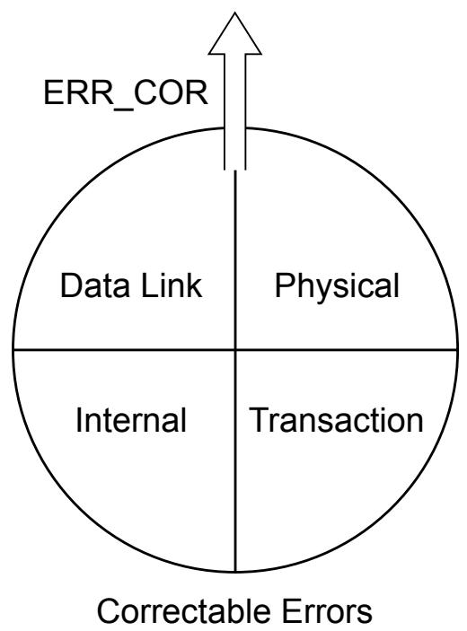

<details>
<summary>pie chart</summary>

| Category | Value |
|---|---|
| Data Link | 100 |
| Physical | 80 |
| Internal | 60 |
| Transaction | 40 |
| Error_COR | 20 |
Correctable Errors below the circle.
</details>

§

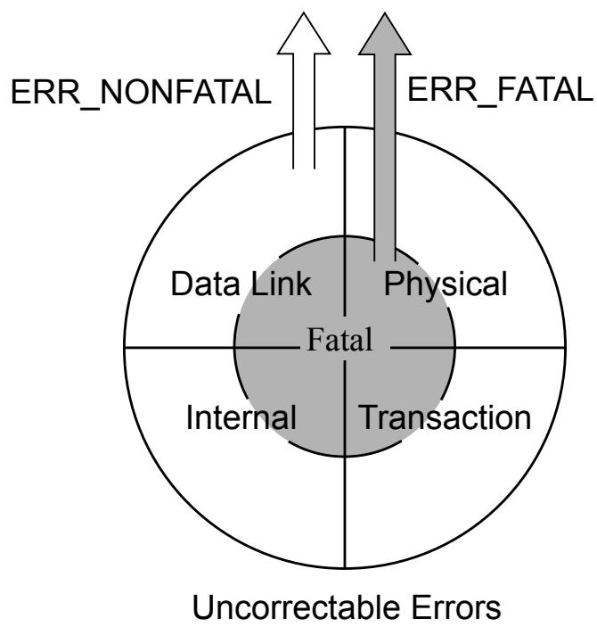

<details>
<summary>flowchart</summary>

```mermaid
graph TD
  A["Data Link"] --> B["Fatal"]
  C["Physical"] --> B
  D["Transaction"] --> B
  E["ERR_NONFATAL"] --> F["Err_FATAL"]
  G["Uncorrectable Errors"] --> H["Data Link"]
  I["Data Link"] --> J["Physical"]
  K["Data Link"] --> L["Transaction"]
```
</details>

OM13827A  
Figure 6-1 Error Classification

Classification of error severity as Fatal, Uncorrectable, and Correctable provides the platform with mechanisms for mapping the error to a suitable handling mechanism. For example, the platform might choose to respond to correctable errors with low priority, performance monitoring software. Such software could count the frequency of correctable errors and provide Link integrity information. On the other hand, a platform designer might choose to map Fatal errors to a system-wide reset. It is the decision of the platform designer to map these PCI Express severity levels onto platform level severities.

## 6.2.2.1 Correctable Errors §

Correctable errors include those error conditions where hardware can recover without any loss of information.

Hardware corrects these errors and software intervention is not required. For example, an LCRC error in a TLP that might be corrected by Data Link Level Retry is considered a correctable error. Measuring the frequency of Link-level correctable errors may be helpful for profiling the integrity of a Link.

Correctable errors also include transaction-level cases where one agent detects an error with a TLP, but another agent is responsible for taking any recovery action if needed, such as re-attempting the operation with a separate subsequent transaction. The detecting agent can be configured to report the error as being correctable since the recovery agent may be able to correct it. If recovery action is indeed needed, the recovery agent must report the error as uncorrectable if the recovery agent decides not to attempt recovery.

The triggering of Downstream Port Containment (DPC) is not handled as an error, but it can be signaled as if it were a correctable error, since software that takes advantage of DPC can sometimes recover from the uncorrectable error that triggered DPC. See § Section 6.2.11 . An ERR\_COR Message that’s used for DPC signaling is intended to target system firmware, and may indicate so via the ERR\_COR Subclass field.

Similarly, ERR\_COR may be used by the System Firmware Intermediary (SFI) capability to signal system firmware, and must indicate so via the ERR\_COR Subclass field. See § Section 6.7.4 .

## 6.2.2.2 Uncorrectable Errors §

Uncorrectable errors are those error conditions that impact functionality of the interface. There is no mechanism defined in this specification to correct these errors. Reporting an uncorrectable error is analogous to asserting SERR# in PCI/PCI-X. For more robust error handling by the system, this specification further classifies uncorrectable errors as Fatal and Non-fatal.

## 6.2.2.2.1 Fatal Errors §

Fatal errors are uncorrectable error conditions which render the particular Link and related hardware unreliable. For Fatal errors, a reset of the components on the Link may be required to return to reliable operation. Platform handling of Fatal errors, and any efforts to limit the effects of these errors, is platform implementation specific.

## 6.2.2.2.2 Non-Fatal Errors §

Non-fatal errors are uncorrectable errors which cause a particular transaction to be unreliable but the Link is otherwise fully functional. Isolating Non-fatal from Fatal errors provides Requester/Receiver logic in a device or system management software the opportunity to recover from the error without resetting the components on the Link and disturbing other transactions in progress. Devices not associated with the transaction in error are not impacted by the error.

## 6.2.3 Error Signaling §

There are three complementary mechanisms which allow the agent detecting an error to alert the system or another device that an error has occurred. The first mechanism is through a Completion Status, the second method is with in-band error Messages, and the third is with Error Forwarding (also known as data poisoning).

Note that it is the responsibility of the agent detecting the error to signal the error appropriately.

§ Section 6.2.7 describes all the errors and how the hardware is required to respond when the error is detected.

## 6.2.3.1 Completion Status §

The Completion Status field (when status is not Successful Completion) in the Completion header indicates that the associated Request failed (see § Section 2.2.8.10 ). This is one method of error reporting which enables the Requester to associate an error with a specific Request. In other words, since Non-Posted Requests are not considered complete until after the Completion returns, the Completion Status field gives the Requester an opportunity to “fix” the problem at some higher level protocol (outside the scope of this specification). For example, if a Read is issued to prefetchable Memory Space and the Completion returns with an Unsupported Request Completion Status, the Requester would not be in violation of this specification if it chose to reissue the Read Request. Note that from a PCI Express point of view, the reissued Read Request is a distinct Request, and there is no relationship (on PCI Express) between the initial Request and the reissued Request.

## 6.2.3.2 Error Messages §

Error Messages are sent to the Root Complex for reporting the detection of errors according to the severity of the error.

Error messages that originate from PCI Express or Legacy Endpoints are sent to corresponding Root Ports. Errors that originate from a Root Port itself are reported through the same Root Port.

If an optional Root Complex Event Collector is implemented, errors that originate from RCiEPs are sent to the corresponding Root Complex Event Collector. Errors that originate in a Root Complex Event Collector itself are reported through the same Root Complex Event Collector. The Root Complex Event Collector must declare supported RCiEPs as part of its capabilities; each RCiEP must be associated with no more than one Root Complex Event Collector.

When multiple errors of the same severity are detected, the corresponding error Messages with the same Requester ID may be merged for different errors of the same severity. At least one error Message must be sent for detected errors of each severity level. Note, however, that the detection of a given error in some cases will preclude the reporting of certain errors. Refer to § Section 6.2.3.2.3 . Also note special rules in § Section 6.2.4 regarding non-Function-specific errors in Multi-Function Devices.

§

Table 6-1 Error Messages

<table><tr><td>Error Message</td><td>Description</td></tr><tr><td>ERR_COR</td><td>This Message is issued when the Function or Device detects a correctable error on the PCI Express interface. Refer to § Section 6.2.2.1 for the definition of a correctable error.</td></tr><tr><td>ERR_NONFATAL</td><td>This Message is issued when the Function or Device detects a Non-fatal, uncorrectable error on the PCI Express interface. Refer to § Section 6.2.2.2.2 for the definition of a Non-fatal, uncorrectable error.</td></tr><tr><td>ERR_FATAL</td><td>This Message is issued when the Function or Device detects a Fatal, uncorrectable error on the PCI Express interface. Refer to § Section 6.2.2.2.1 for the definition of a Fatal, uncorrectable error.</td></tr></table>

For these Messages, the Root Complex identifies the initiator of the Message by the Requester ID of the Message header. The Root Complex translates these error Messages into platform level events.

## IMPLEMENTATION NOTE:

## USE OF ERR\_COR, ERR\_NONFATAL, AND ERR\_FATAL §

In [PCIe-1.0a], a given error was either correctable, non-fatal, or fatal. Assuming signaling was enabled, correctable errors were always signaled with ERR\_COR, non-fatal errors were always signaled with ERR\_NONFATAL, and fatal errors were always signaled with ERR\_FATAL.

In subsequent specifications that support Role-Based Error Reporting, non-fatal errors are sometimes signaled with ERR\_NONFATAL, sometimes signaled with ERR\_COR, and sometimes not signaled at all, depending upon the role of the agent that detects the error and whether the agent implements AER (see § Section 6.2.3.2.4 ). On some platforms, sending ERR\_NONFATAL will preclude another agent from attempting recovery or determining the ultimate disposition of the error. For cases where the detecting agent is not the appropriate agent to determine the ultimate disposition of the error, a detecting agent with AER can signal the non-fatal error with ERR\_COR, which serves as an advisory notification to software. For cases where the detecting agent is the appropriate one, the agent signals the non-fatal error with ERR\_NONFATAL.

For a given uncorrectable error that’s normally non-fatal, if software wishes to avoid continued hierarchy operation upon the detection of that error, software can configure detecting agents that implement AER to escalate the severity of that error to fatal. A detecting agent (if enabled) will always signal a fatal error with ERR\_FATAL, regardless of the agent’s role.

Software should recognize that a single transaction can be signaled by multiple agents using different types of error Messages. For example, a poisoned TLP might be signaled by intermediate Receivers with ERR\_COR, while the ultimate destination Receiver might signal it with ERR\_NONFATAL.

## 6.2.3.2.1 Uncorrectable Error Severity Programming (Advanced Error Reporting) §

For device Functions implementing the Advanced Error Reporting Capability, the Uncorrectable Error Severity register allows each uncorrectable error to be programmed to Fatal or Non-Fatal. Uncorrectable errors are not recoverable using defined PCI Express mechanisms. However, some platforms or devices might consider a particular error fatal to a Link or device while another platform considers that error non-fatal. The default value of the Uncorrectable Error Severity register serves as a starting point for this specification but the register can be reprogrammed if the device driver or platform software requires more robust error handling.

Baseline error handling does not support severity programming.

## 6.2.3.2.2 Masking Individual Errors §

§ Section 6.2.7 lists all the errors governed by this specification and describes when each of the above error Messages are issued. The transmission of these error Messages by class (correctable, non-fatal, fatal) is enabled using the Reporting Enable bits of the Device Control register (see § Section 7.5.3.4 ) or the SERR# Enable bit in the PCI Command register (see § Section 7.5.1.1.3 ).

For devices implementing the Advanced Error Reporting Capability the Uncorrectable Error Mask register and Correctable Error Mask register allows each error condition to be masked independently. If Messages for a particular class of error are not enabled by the combined settings in the Device Control register and the PCI Command register, then no Messages of that class will be sent regardless of the values for the corresponding mask register.

If an individual error is masked when it is detected, its error status bit is still affected, but no error reporting Message is sent to the Root Complex, and the error is not recorded in the Header Log, TLP Prefix Log, or First Error Pointer.

## 6.2.3.2.3 Error Pollution §

Error pollution can occur if error conditions for a given transaction are not isolated to the most significant occurrence. For example, assume the Physical Layer detects a Receiver Error. This error is detected at the Physical Layer and an error is reported to the Root Complex. To avoid having this error propagate and cause subsequent errors at upper layers (for example, a TLP error at the Data Link Layer), making it more difficult to determine the root cause of the error, subsequent errors which occur for the same packet will not be reported by the Data Link or Transaction layers. Similarly, when the Data Link Layer detects an error, subsequent errors which occur for the same packet will not be reported by the Transaction Layer. This behavior applies only to errors that are associated with a particular packet - other errors are reported for each occurrence.

Corrected Internal Errors are errors whose effect has been masked or worked around by a component; refer to § Section 6.2.10 for details. Therefore, Corrected Internal Errors do not contribute to error pollution and should be reported when detected.

For errors detected in the Transaction layer and Uncorrectable Internal Errors, it is permitted and recommended that no more than one error be reported for a single received TLP, and that the following precedence (from highest to lowest) be used:

• Uncorrectable Internal Error  
• Receiver Overflow  
• Malformed TLP  
• IDE Check Failed

• ECRC Check Failed  
• Misrouted IDE TLP  
• AtomicOp, DMWr, or TLP Translation Egress Blocked  
• TLP Prefix Blocked  
• ACS Violation  
• MC Blocked TLP  
• Unsupported Request (UR), Completer Abort (CA), or Unexpected Completion  
• PCRC Check Failed  
• Poisoned TLP Received or Poisoned TLP Egress Blocked

The Completion Timeout error is not in the above precedence list, since it is not detected by processing a received TLP. Errors listed under the same bullet are mutually exclusive, so their relative order does not matter.

## 6.2.3.2.4 Advisory Non-Fatal Error Cases §

In some cases the detector of a non-fatal error is not the most appropriate agent to determine whether the error is recoverable or not, or if it even needs any recovery action at all. For example, if software attempts to perform a configuration read from a non-existent device or Function, the resulting UR Status in the Completion will signal the error to software, and software does not need for the Completer in addition to signal the error by sending an ERR\_NONFATAL Message. In fact, on some platforms, signaling the error with ERR\_NONFATAL results in a System Error, which breaks normal software probing.

“Advisory Non-Fatal Error” cases are predominantly determined by the role of the detecting agent (Requester, Completer, or Receiver) and the specific error. In such cases, an agent with AER signals the non-fatal error (if enabled) by sending an ERR\_COR Message as an advisory to software, instead of sending ERR\_NONFATAL. An agent without AER sends no error Message for these cases, since software receiving ERR\_COR would be unable to distinguish Advisory Non-Fatal Error cases from the correctable error cases used to assess Link integrity.

Following are the specific cases of Advisory Non-Fatal Errors. Note that multiple errors from the same or different error classes (correctable, non-fatal, fatal) may be present with a single TLP. For example, an unexpected Completion might also be poisoned. Refer to § Section 6.2.3.2.3 for requirements and recommendations on reporting multiple errors. For the previous example, it is recommended that Unexpected Completion be reported, and that Poisoned TLP Received not be reported.

If software wishes for an agent with AER to handle what would normally be an Advisory Non-Fatal Error case as being more serious, software can escalate the severity of the uncorrectable error to fatal, in which case the agent (if enabled) will signal the error with ERR\_FATAL.

This section covers Advisory Non-Fatal Error handling for errors managed by the PCI Express Extended Capability and AER. § Section 6.2.11.3 covers the RP PIO error handling mechanism for Root Ports that support RP Extensions for DPC. RP PIO advisory errors are similar in concept to AER Advisory Non-Fatal Errors, but apply to different error cases and are managed by different controls.

## 6.2.3.2.4.1 Completer Sending a Completion with UR/CA Status §

A Completer generally sends a Completion with an Unsupported Request or Completer Abort (UR/CA) Status to signal an uncorrectable error for a Non-Posted Request. 98 If the severity of the UR/CA error 99 is non-fatal, the Completer must

handle this case as an Advisory Non-Fatal Error. 100 A Completer with AER signals the non-fatal error (if enabled) by sending an ERR\_COR Message. A Completer without AER sends no error Message for this case.

Even though there was an uncorrectable error for this specific transaction, the Completer must handle this case as an Advisory Non-Fatal Error, since the Requester upon receiving the Completion with UR/CA Status is responsible for reporting the error (if necessary) using a Requester-specific mechanism (see § Section 6.2.3.2.5 ).

## 6.2.3.2.4.2 Intermediate Receiver §

When a Receiver that’s not serving as the ultimate PCI Express destination for a TLP detects 101 a non-fatal error with the TLP, this “intermediate” Receiver must handle this case as an Advisory Non-Fatal Error. 102 A Receiver with AER signals the error (if enabled) by sending an ERR\_COR Message. A Receiver without AER sends no error Message for this case. An exception to the intermediate Receiver case for Root Complexes (RCs) is noted below.

An example where the intermediate Receiver case occurs is a Switch that detects poison or bad ECRC in a TLP that it is routing. Even though this was an uncorrectable (but non-fatal) error at this point in the TLP’s route, the intermediate Receiver handles it as an Advisory Non-Fatal Error, so that the ultimate Receiver of the TLP (i.e., the Completer for a Request TLP, or the Requester for a Completion TLP) is not precluded from handling the error more appropriately according to its error settings. For example, a given Completer that detects poison in a Memory Write Request 103 might have the error masked (and thus go unsignaled), whereas a different Completer in the same hierarchy might signal that error with ERR\_NONFATAL.

A Poisoned TLP Egress Blocked error is never handled as an intermediate Receiver case since it is not detected as a part of processing a received TLP.

If an RC detects a non-fatal error with a TLP it normally would forward peer-to-peer between Root Ports, but the RC does not support propagating the error related information (e.g., a TLP Digest, EP bit, or equivalent) with the forwarded transaction, the RC must signal the error (if enabled) with ERR\_NONFATAL and also must not forward the transaction. An example is an RC needing to forward a poisoned TLP peer-to-peer between Root Ports, but the RC’s internal fabric does not support poison indication.

## 6.2.3.2.4.3 Ultimate PCI Express Receiver of a Poisoned TLP or IDE TLP with PCRC Check Failed §

When a poisoned TLP is received by its ultimate PCI Express destination, if the severity is non-fatal and the Receiver legitimately chooses not to handle this case as an uncorrectable error (see below), the Receiver must handle this case as an Advisory Non-Fatal Error. 104 When a IDE TLP is determined at its ultimate destination Port to have a PCRC Check Failed error, if the severity is non-fatal and the Receiver deals with the poisoned data in a manner that permits continued operation, the Receiver must handle this case as an Advisory Non-Fatal Error. A Receiver with AER signals the error (if enabled) by sending an ERR\_COR Message. A Receiver without AER sends no error Message for this case.

A Receiver must not handle this case as an Advisory Non-Fatal Error if either of the following apply:

• Handling the error as a Correctable Error and continuing operation when configured correctly could lead to silent data corruption.  
• Rules in § Section 2.7.2.1 require this case to be handled as an uncorrectable error.

An example is a Root Complex that receives a poisoned Memory Write TLP that targets host memory. If the Root Complex propagates the poisoned data along with its indication to host memory, it signals the error (if enabled) with an ERR\_COR. If the Root Complex does not propagate the poison to host memory, it signals the error (if enabled) with ERR\_NONFATAL.

Another example is a Requester that receives a poisoned Memory Read Completion TLP. If the Requester propagates the poisoned data internally or handles the error like it would for a Completion with UR/CA Status, it signals the error (if enabled) with an ERR\_COR. If the Requester does not handle the poison in a manner that permits continued operation, it signals the error (if enabled) with ERR\_NONFATAL.

## 6.2.3.2.4.4 Requester with Completion Timeout §

This section applies to Requesters other than Root Ports performing programmed I/O (PIO). See § Section 6.2.11.3 for related RP PIO functionality in Root Ports that support RP Extensions for DPC.

When the Requester of a Non-Posted Request times out while waiting for the associated Completion, the Requester is permitted to attempt to recover from the error by issuing a separate subsequent Request. The Requester is permitted to attempt recovery zero, one, or multiple (finite) times, but must signal the error (if enabled) with an uncorrectable error Message if no further recovery attempt will be made.

If the severity of the Completion Timeout is non-fatal, and the Requester elects to attempt recovery by issuing a new request, the Requester must first handle the current error case as an Advisory Non-Fatal Error. 105 A Requester with AER signals the error (if enabled) by sending an ERR\_COR Message. A Requester without AER sends no error Message for this case.

Note that automatic recovery by the Requester from a Completion Timeout is generally possible only if the Non-Posted Request has no side-effects, but may also depend upon other considerations outside the scope of this specification.

## 6.2.3.2.4.5 Receiver of an Unexpected Completion §

When a Receiver receives an unexpected Completion and the severity of the Unexpected Completion error is non-fatal, the Receiver must handle this case as an Advisory Non-Fatal Error. 106 A Receiver with AER signals the error (if enabled) by sending an ERR\_COR Message. A Receiver without AER sends no error Message for this case.

If the unexpected Completion was a result of misrouting, the Completion Timeout mechanism at the associated Requester will trigger eventually, and the Requester may elect to attempt recovery. Interference with Requester recovery can be avoided by having the Receiver of the unexpected Completion handle the error as an Advisory Non-Fatal Error.

## 6.2.3.2.5 Requester Receiving a Completion with UR/CA Status §

When a Requester receives back a Completion with a UR/CA Status, generally the Completer has handled the error as an Advisory Non-Fatal Error, assuming the error severity was non-fatal at the Completer (see § Section 6.2.3.2.4.1 ). The Requester must determine if any error recovery action is necessary, what type of recovery action to take, and whether or not to report the error.

If the Requester needs to report the error, the Requester must do so solely through a Requester-specific mechanism. For example, many devices have an associated device driver that can report errors to software. As another important example, the Root Complex on some platforms returns all 1’s to software if a Configuration Read Completion has a UR/ CA Status.

§ Section 6.2.11.3 covers RP PIO controls for Root Ports that support RP Extensions for DPC. Outside of the RP PIO mechanisms, Requesters are not permitted to report the error using PCI Express logging and error Message signaling.

## 6.2.3.3 Error Forwarding (Data Poisoning) §

Error Forwarding, also known as data poisoning, is indicated by setting the EP bit in a TLP. Refer to § Section 2.7.2 . This is another method of error reporting in PCI Express that enables the Receiver of a TLP to associate an error with a specific Request or Completion. Unlike the Completion Status mechanism, Error Forwarding can be used with either Requests or Completions that contain data. In addition, “intermediate” Receivers along the TLP’s route, not just the Receiver at the ultimate destination, are required to detect and report (if enabled) receiving the poisoned TLP. This can help software determine if a particular Switch along the path poisoned the TLP.

## 6.2.3.4 Optional Error Checking §

This specification contains a number of optional error checks. Unless otherwise specified, behavior is undefined if an optional error check is not performed and the error occurs.

When an optional error check involves multiple rules, unless otherwise specified, each rule is independently optional. An implementation may check against all of the rules, none of them or any combination.

Unless otherwise specified, implementation specific criteria are used in determining whether an optional error check is performed.

## 6.2.4 Error Logging §

§ Section 6.2.7 lists all the errors governed by this specification and for each error, the logging requirements are specified. Device Functions that do not support the Advanced Error Reporting Capability log only the Device Status register bits indicating that an error has been detected. Note that some errors are also reported using the reporting mechanisms in the PCI-compatible (Type 00h and 01h) configuration registers. § Section 7.5.1 describes how these register bits are affected by the different types of error conditions described in this section.

For device Functions supporting the Advanced Error Reporting Capability, each of the errors in § Table 6-3, § Table 6-4, and § Table 6-5 corresponds to a particular bit in the Uncorrectable Error Status register or Correctable Error Status register. These registers are used by software to determine more precisely which error and what severity occurred. For specific Transaction Layer errors and Uncorrectable Internal Errors, the associated TLP header is recorded.

In a Multi-Function Device other than an SR-IOV device, PCI Express errors not specific to any single Function within the device must be logged in the corresponding status and logging registers of all Functions in that device.

In an SR-IOV device, errors identified as non-Function-specific must be logged in all PFs, and not in their associated VFs. Such errors must also be logged in any non-IOV Functions.

The following PCI Express errors are not Function-specific:

• All Physical Layer errors  
• All Data Link Layer errors  
• These Transaction Layer errors:  
◦ ECRC Check Failed  
◦ Unsupported Request, when caused by no Function claiming a TLP  
◦ Receiver Overflow

◦ Flow Control Protocol Error  
◦ Malformed TLP  
◦ Unexpected Completion, when caused by no Function claiming a Completion  
◦ Unexpected Completion, when caused by a Completion that cannot be forwarded by a Switch, and the Ingress Port is a Switch Upstream Port associated with a Multi-Function Device  
◦ Some Transaction Layer errors (e.g., Poisoned TLP Received) may be Function-specific or not, depending upon whether the associated TLP targets a single Function or all Functions in that device.

• Some Internal Errors

◦ The determination of whether an Internal Error is Function-specific or not is implementation specific.

On the detection of one of these errors, a Multi-Function Device should generate at most one error reporting Message of a given severity, where the Message must report the Requester ID of a Function of the device that is enabled to report that specific type of error. If no Function is enabled to send a reporting Message, the device does not send a reporting Message. If all reporting-enabled Functions have the same severity level set for the error, only one error Message is sent. If all reporting-enabled Functions do not have the same severity level set for the error, one error Message for each severity level is sent. Software is responsible for scanning all Functions in a Multi-Function Device when it detects one of those errors.

## 6.2.4.1 Root Complex Considerations (Advanced Error Reporting) §

## 6.2.4.1.1 Error Source Identification §

In addition to the above logging, a Root Port or Root Complex Event Collector that supports the Advanced Error Reporting Capability is required to implement the Error Source Identification register, which records the Requester ID of the first ERR\_NONFATAL/ERR\_FATAL (uncorrectable errors) and ERR\_COR (correctable errors) Messages received by the Root Port or Root Complex Event Collector. System software written to support Advanced Error Reporting can use the Root Error Status register to determine which fields hold valid information.

If an RCiEP is associated with a Root Complex Event Collector, the RCiEP must report its errors through that Root Complex Event Collector.

For both Root Ports and Root Complex Event Collectors, in order for a received error Message or an internally generated error Message to be recorded in the Root Error Status register and the Error Source Identification register, the error Message must be “transmitted”. Refer to § Section 6.2.8.1 for information on how received Messages are forwarded and transmitted. Internally generated error Messages are enabled for transmission with the SERR# Enable bit in the Command register (ERR\_NONFATAL and ERR\_FATAL) or the Reporting Enable bits in the Device Control register (ERR\_COR, ERR\_NONFATAL, and ERR\_FATAL).

## 6.2.4.1.2 Interrupt Generation §

The Root Error Command register allows further control of Root Complex response to Correctable, Non-Fatal, and Fatal error Messages than the basic Root Complex capability to generate system errors in response to error Messages. Bit fields enable or disable generation of interrupts for the three types of error Messages. System error generation in response to error Messages may be disabled via the PCI Express Capability structure.

If a Root Port or Root Complex Event Collector is enabled for level-triggered interrupt signaling using the INTx messages, the virtual INTx wire must be asserted whenever and as long as all of the following conditions are satisfied:

• The Interrupt Disable bit in the Command register is set to 0b.  
• At least one Error Reporting Enable bit in the Root Error Command register and its associated error Messages Received bit in the Root Error Status register are both set to 1b.

Note that all other interrupt sources within the same Function will assert the same virtual INTx wire when requesting service.

If a Root Port or Root Complex Event Collector is enabled for edge-triggered interrupt signaling using MSI or MSI-X, an interrupt message must be sent every time the logical AND of the following conditions transitions from FALSE to TRUE:

• The associated vector is unmasked (not applicable if MSI does not support PVM).  
• At least one Error Reporting Enable bit in the Root Error Command register and its associated error Messages Received bit in the Root Error Status register are both set to 1b.

Note that Advanced Error Reporting MSI/MSI-X interrupts always use the vector indicated by the Advanced Error Interrupt Message Number field in the Root Error Status register.

## 6.2.4.2 Multiple Error Handling (Advanced Error Reporting Capability) §

For the Advanced Error Reporting Capability, the Uncorrectable Error Status register and Correctable Error Status register accumulate the collection of errors which correspond to that particular PCI Express interface. The bits remain set until explicitly cleared by software or reset. Since multiple bits might be set in the Uncorrectable Error Status register, the First Error Pointer (when valid) points to the oldest uncorrectable error that is recorded. The First Error Pointer is valid when the corresponding bit of the Uncorrectable Error Status register is set. The First Error Pointer is invalid when the corresponding bit of the Uncorrectable Error Status register is not set, or is an undefined bit.

The Advanced Error Reporting Capability provides the ability to record headers 107 for errors that require header logging. An implementation may support the recording of multiple headers, but at a minimum must support the ability of recording at least one. The ability to record multiple headers is indicated by the state of the Multiple Header Recording Capable bit and enabled by the Multiple Header Recording Enable bit of the Advanced Error Capabilities and Control register. When multiple header recording is supported and enabled, errors are recorded in the order in which they are detected.

If no header recording resources are available when an unmasked uncorrectable error is detected, its error status bit is Set, but the error is not recorded. If an uncorrectable error is masked when it is detected, its error status bit is Set, but the error is not recorded.

When software is ready to dismiss a recorded error indicated by the First Error Pointer, software writes a 1b to the indicated error status bit to clear it, which causes hardware to free up the associated recording resources. If another instance of that error is still recorded, hardware is permitted but not required to leave that error status bit set. If any error instance is still recorded, hardware must immediately update the Header Log, TLP Prefix Log, TLP Prefix Log Present bit, First Error Pointer, and Uncorrectable Error Status register to reflect the next recorded error. If no other error is recorded, it is recommended that hardware update the First Error Pointer to indicate a status bit that it will never set, e.g., a Reserved status bit. See the Implementation Note below.

If multiple header recording is supported and enabled, and the First Error Pointer is valid, it is recommended that software not write a 1b to any status bit other than the one indicated by the First Error Pointer 108 . If software writes a 1b to such non-indicated bits, hardware is permitted to clear any associated recorded errors, but is not required to do so.

If software observes that the First Error Pointer is invalid, and software wishes to clear any unmasked status bits that were set because of earlier header recording resource overflow, software should be aware of the following race condition. If any new instances of those errors happen to be recorded before software clears those status bits, one or more of the newly recorded errors might be lost.

If multiple header recording is supported and enabled, software must use special care when clearing the Multiple Header Recording Enable bit. Hardware behavior is undefined if software clears that bit while the First Error Pointer is valid. Before clearing the Multiple Header Recording Enable bit, it is recommended that software temporarily mask all uncorrectable errors, and then repetitively dismiss each error indicated by the First Error Pointer.

Since an implementation only has the ability to record a finite number of headers, it is important that software services the First Error Pointer, Header Log, and TLP Prefix Log registers in a timely manner, to limit the risk of missing this information for subsequent errors. A Header Log Overflow occurs when an error that requires header logging is detected and either the number of recorded headers supported by an implementation has been reached, or the Multiple Header Recording Enable bit is not Set and the First Error Pointer is valid.

Implementations may optionally check for this condition and report a Header Log Overflow error. This is a reported error associated with the detecting Function.

The setting of Multiple Header Recording Capable and the checking for Header Log Overflow are independently optional.

## IMPLEMENTATION NOTE:

## FIRST ERROR POINTER REGISTER BEING VALID §

The First Error Pointer (FEP) field is defined to be valid when the corresponding bit of the Uncorrectable Error Status register is set. To avoid ambiguity with certain cases, the following is recommended:

• After an uncorrectable error has been recorded, when the associated bit in the Uncorrectable Error Status register is cleared by software writing a 1b to it, hardware should update the FEP to point to a status bit that it will never set, e.g., a Reserved status bit. (This assumes that the Function does not already have another recorded error to report, as could be the case if it supports multiple header recording.)  
• The default value for the FEP should point to a status bit that hardware will never set, e.g., a Reserved status bit.

Here is an example case of ambiguity with Unsupported Request (UR) if the above recommendations are not followed:

• UR and Advisory Non-Fatal Error are unmasked while system firmware does its Configuration Space probing.  
• The Function encounters a UR due to normal probing, logs it, and sets the FEP to point to UR.  
• System firmware clears the UR Status bit, and hardware leaves the FEP pointing to UR.  
• After the operating system has booted, it masks UR.  
• Normal probing sets the UR Status bit, but the error is not recorded since UR is masked.

At this point, there’s the ambiguity of the FEP pointing to a status bit that is set (thus being valid), when in fact, there is no recorded error that needs to be processed by software.

If hardware relies on this definition of the FEP being valid to determine when it’s possible to record a new error, the Function can fail to record new unmasked errors, falsely determining that it has no available recording resources. Hardware implementations that rely on other internal state to determine when it’s possible to record a new error might not have this problem; however, hardware implementations should still follow the above recommendations to avoid presenting this ambiguity to software.

## 6.2.4.2.1 Multiple Error Handling in VFs §

Header Log space for a PF is independent of that for its associated VFs, and must be implemented with dedicated storage space.

VFs that implement AER may share Header Log space among all the VFs associated with a single PF. Especially when sharing Header Log space, VFs may not have room to log a header associated with an error. In this case, the Function must update the Uncorrectable Error Status Register and Advanced Error Capabilities and Control register as required by § Section 6.2.4.2 ; however, when the Header Log Register is read, it must return all 1s to indicate an overflow condition and that no header was logged. If Flit Mode Supported is Set, in addition to returning all 1s, the associated Logged TLP Size field must contain 0.

The VF’s header log entry shall be locked and remain valid while that VF’s First Error Pointer is valid. As defined in § Section 6.2.4.2 , the First Error Pointer register is valid when the corresponding bit of the Uncorrectable Error Status register is Set. While the header log entry is locked, additional errors shall not overwrite the locked entry for this or any other VF. When a header entry is unlocked, it shall be available to record a new error for any VF sharing the header logs.

## 6.2.4.3 Advisory Non-Fatal Error Logging §

§ Section 6.2.3.2.4 describes Advisory Non-Fatal Error cases, under which an agent with AER detecting an uncorrectable error of non-fatal severity signals the error (if enabled) using ERR\_COR instead of ERR\_NONFATAL. For the same cases, an agent without AER sends no error Message. The remaining discussion in this section is in the context of agents that do implement AER.

For Advisory Non-Fatal Error cases, since an uncorrectable error is signaled using the correctable error Message, control/ status/mask bits involving both uncorrectable and correctable errors apply. § Figure 6-2 shows a flowchart of the sequence. Following are some of the unique aspects for logging Advisory Non-Fatal Errors.

First, the uncorrectable error needs to be of severity non-fatal, as determined by the associated bit in the Uncorrectable Error Severity register. If the severity is fatal, the error does not qualify as an Advisory Non-Fatal Error, and will be signaled (if enabled) with ERR\_FATAL.

Next, the specific error case needs to be one of the Advisory Non-Fatal Error cases documented in § Section 6.2.3.2.4 . If not, the error does not qualify as an Advisory Non-Fatal Error, and will be signaled (if enabled) with an uncorrectable error Message.

Next, the Advisory Non-Fatal Error Status bit is Set in the Correctable Error Status register to indicate the occurrence of the advisory error, and the Advisory Non-Fatal Error Mask bit in the Correctable Error Mask register is checked, and, if set, no further processing is done.

If the Advisory Non-Fatal Error Mask bit is clear, logging proceeds by setting the “corresponding” bit in the Uncorrectable Error Status register, based upon the specific uncorrectable error that’s being reported as an advisory error. If the “corresponding” uncorrectable error bit in the Uncorrectable Error Mask register is clear and the error is one that requires header logging, then the prefix and header are recorded, subject to the availability of resources. See § Section 6.2.4.2 .

Finally, an ERR\_COR Message is sent if the Correctable Error Reporting Enable bit is Set in the Device Control Register.

## 6.2.4.4 End-End TLP Prefix Logging - Non-Flit Mode §

For any device Function that supports both TLP Prefixes and Advanced Error Reporting the TLP Prefixes associated with the TLP in error are recorded in the TLP Prefix Log register according to the same rules as the Header Log register (such that both the TLP Prefix Log and Header Log registers always correspond to the error indicated in the First Error Pointer, when the First Error Pointer is valid).

The TLP Prefix Log Present bit (see § Section 7.8.4.7 ) indicates that the TLP Prefix Log register (see § Section 7.8.4.12 ) contains information.

Only End-End TLP Prefixes are logged by AER. Logging of Local TLP Prefixes may occur elsewhere using prefix-specific mechanisms.

End-End TLP Prefixes are logged in the TLP Prefix Log register. The underlying TLP Header is logged in the Header Log register subject to two exceptions:

• If the Extended Fmt Field Supported bit is Set (see § Section 7.5.3.15 ), a Function that does not support End-End TLP Prefixes and receives a TLP containing an End-End TLP Prefix must signal Malformed TLP, and the Header Log register must contain the first four DWs of the TLP (End-End TLP Prefixes followed by as much of the TLP Header as will fit).

• A Function that receives a TLP containing more End-End TLP Prefixes than are indicated by the Function’s Max End-End TLP Prefixes field must handle the TLP as an error (see § Section 2.2.10.4 for specifics) and store the first overflow End-End TLP Prefix in the 1st DW of the Header Log register with the remainder of the Header Log register being undefined.

## 6.2.5 Sequence of Device Error Signaling and Logging Operations §

§ Figure 6-2 shows the sequence of operations related to signaling and logging of errors detected by a device.

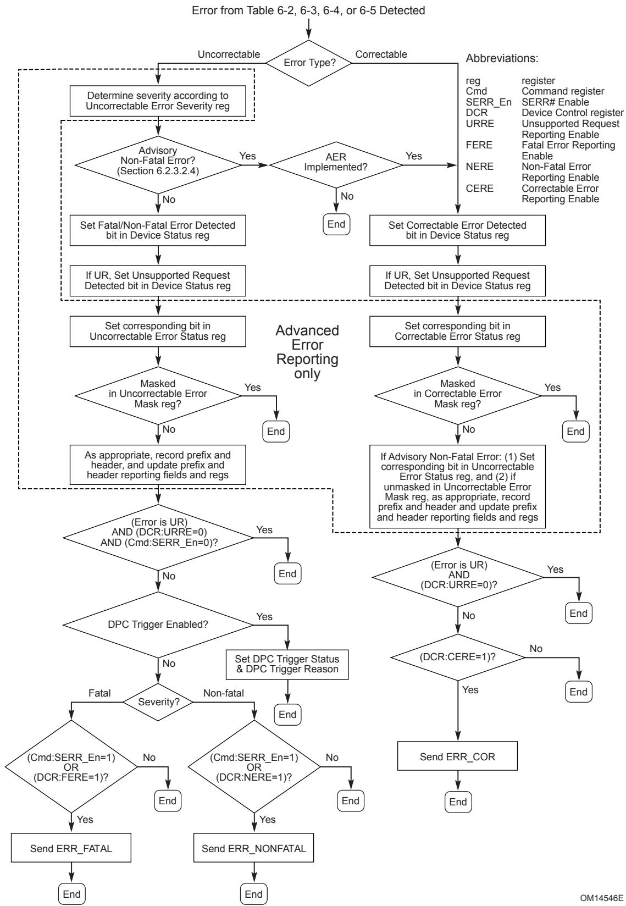

<details>
<summary>flowchart</summary>

```mermaid
graph TD
  A["Error from Table 6-2, 6-3, 6-4, or 6-5 Detected"] --> B{Error Type?}
  B -->|Uncorrectable| C["Determine severity according to Uncorrectable Error Severity reg"]
  B -->|Correctable| D{Advisory Non-Fatal Error? (Section 6.2.3.2.4)}
  D -->|Yes| E{AER Implemented?}
  D -->|No| F["Set Fatal/Non-Fatal Error Detected bit in Device Status reg"]
  E -->|Yes| G["End"]
  E -->|No| H["Set Correctable Error Detected bit in Device Status reg"]
  H --> I{If UR, Set Unsupported Request Detected bit in Device Status reg}
  I --> J["Set corresponding bit in Uncorrectable Error Status reg"]
  J --> K{Masked in Uncorrectable Error Mask reg?}
  K -->|Yes| L["End"]
  K -->|No| M["As appropriate, record prefix and header, and update prefix and header reporting fields and regs"]
  L --> N{Error is UR AND (DCR:URRE=0) AND (Cmd:SERR_En=0)?}
  N -->|Yes| O{DPC Trigger Enabled?}
  N -->|No| P["End"]
  O -->|Yes| Q["Set DPC Trigger Status & DPC Trigger Reason"]
  Q --> R{Severity?}
  R -->|Fatal| S["(Cmd:SERR_En=1) OR (DCR:FERE=1)?"]
  R -->|Non-fatal| T["(Cmd:SERR_En=1) OR (DCR:NERE=1)?"]
  T --> U{Error is UR AND (DCR:URRE=0)?}
  U -->|Yes| V["End"]
  U -->|No| W["(DCR:CERE=1)?"]
  W --> X{Error is UR?}
  X -->|Yes| Y["Send ERR_COR"]
  X -->|No| Z["End"]
  X -->|No| AA["Send ERR_NONFATAL"]
  AA --> AB["End"]
    style A fill:#f9f,stroke:#333
    style B fill:#ccf,stroke:#333
    style C fill:#cfc,stroke:#333
    style D fill:#fcc,stroke:#333
    style E fill:#cff,stroke:#333
    style F fill:#ffc,stroke:#333
    style G fill:#ffc,stroke:#333
    style H fill:#ffc,stroke:#333
    style I fill:#ffc,stroke:#333
    style J fill:#ffc,stroke:#333
    style K fill:#ffc,stroke:#333
    style L fill:#ffc,stroke:#333
    style M fill:#ffc,stroke:#333
    style N fill:#ffc,stroke:#333
    style O fill:#ffc,stroke:#333
    style P fill:#ffc,stroke:#333
    style Q fill:#ffc,stroke:#333
    style R fill:#ffc,stroke:#333
    style S fill:#ffc,stroke:#333
    style T fill:#ffc,stroke:#333
    style U fill:#ffc,stroke:#333
    style V fill:#ffc,stroke:#333
    style W fill:#ffc,stroke:#333
    style X fill:#ffc,stroke:#333
    style Y fill:#ffc,stroke:#333
```
</details>

Figure 6-2 Flowchart Showing Sequence of Device Error Signaling and Logging Oper § ations

## 6.2.6 Error Message Controls §

Error Messages have a complex set of associated control and status bits. § Figure 6-3 provides a high-level summary in the form of a pseudo logic diagram for how error Messages are generated, logged, forwarded, and ultimately notified to the system. Not all control and status bits are shown. The logic gates shown in this diagram are intended for conveying general concepts, and not for direct implementation.

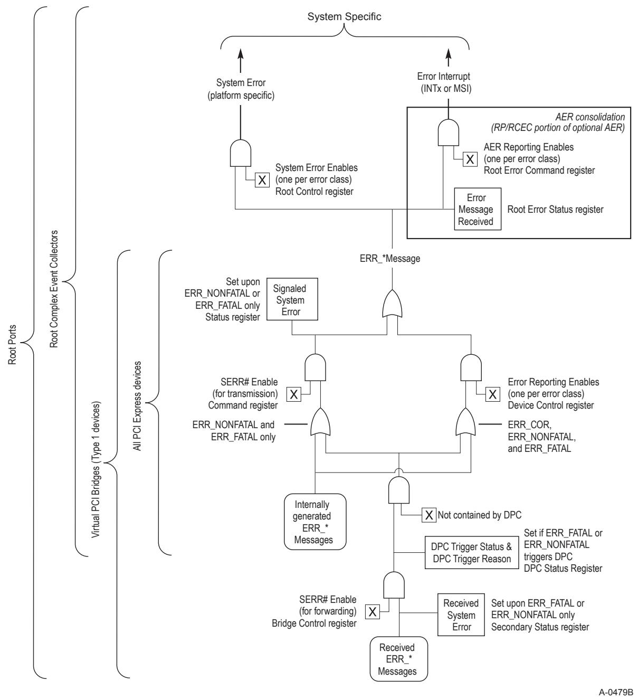

<details>
<summary>flowchart</summary>

```mermaid
graph TD
  A["Root Ports"] --> B["Root Complex Event Collectors"]
  B --> C["All PCI Express devices"]
  C --> D["Virtual PCI Bridges (Type 1 devices)"]
  D --> E["Error Interrupt (INTx or MSI)"]
  E --> F["System Specific"]
  F --> G["System Error (platform specific)"]
  G --> H["System Error Enables (one per error class) Root Control register"]
  H --> I["ERR_*Message"]
  I --> J["Signalled System Error"]
  J --> K["Serr# Enable (for transmission) Command register"]
  K --> L["ERR_NONFATAL and ERR_FATAL only"]
  L --> M["Internally generated ERR_*Messages"]
  M --> N["SERR# Enable (for forwarding) Bridge Control register"]
  N --> O["Received ERR_*Messages"]
  O --> P["Received System Error"]
  P --> Q["Set upon ERR_FATAL only Secondary Status register"]
  Q --> R["DPC Trigger Status & DPC Trigger Reason"]
  R --> S["Not contained by DPC"]
  S --> T["Error Reporting Enables (one per error class) Device Control register"]
  T --> U["Error Message Received"]
  U --> V["AER Consolidation (RP/RCEC portion of optional AER)"]
  V --> W["AER Reporting Enables (one per error class) Root Error Command register"]
  W --> X["Root Error Status register"]
```
</details>

Figure 6-3 Pseudo Logic Diagram for Selected Error Message Control and Status Bits§

## 6.2.7 Error Listing and Rules §

§ Table 6-2 through § Table 6-4 list all of the PCI Express errors that are defined by this specification. Each error is listed with a short-hand name, how the error is detected in hardware, the default severity of the error, and the expected action taken by the agent which detects the error. These actions form the rules for PCI Express error reporting and logging.

The Default Severity column specifies the default severity for the error without any software reprogramming. For device Functions supporting the Advanced Error Reporting Capability, the uncorrectable errors are programmable to Fatal or Non-fatal with the Error Severity register. Device Functions without Advanced Error Reporting Capability use the default associations and are not reprogrammable.

The detecting agent action for Downstream Ports that implement Downstream Port Containment (DPC) and have it enabled will be different if the error triggers DPC. DPC behavior is not described in the following tables. See § Section 6.2.11 for the description of DPC behavior.

Table 6-2 General PCI Express Error List§

<table><tr><td>Error Name</td><td>Error Type(Default Severity)</td><td>Detecting Agent Action $^{109}$ </td><td>References</td></tr><tr><td>Corrected Internal Error</td><td>Correctable(masked by default)</td><td>Component:Send ERR_COR to Root Complex.</td><td>§ Section6.2.10</td></tr><tr><td>Uncorrectable Internal Error</td><td>Uncorrectable(Fatal and masked by default)</td><td>Component: Send ERR_FATAL to Root Complex.Optionally, log the prefix/header of the first TLP associated with the error.</td><td>§ Section6.2.10</td></tr><tr><td>Header Log Overflow</td><td>Correctable(masked by default)</td><td>Component:Send ERR_COR to Root Complex.</td><td>§ Section6.2.4.2</td></tr></table>

Table 6-3 Physical Layer Error List§

<table><tr><td>Error Name</td><td>Error Type (Default Severity)</td><td>Detecting Agent Action110</td><td>References</td></tr><tr><td>Receiver Error</td><td>Correctable</td><td>Receiver:Send ERR_COR to Root Complex.</td><td>§ Section 4.2.1.1.3§ Section 4.2.1.2§ Section 4.2.5.8§ Section 4.2.7</td></tr></table>

§ Table 6-4 Data Link Layer Error List

<table><tr><td>Error Name</td><td>Error Type (Default Severity)</td><td>Detecting Agent Action111</td><td>References</td></tr><tr><td>Bad TLP</td><td rowspan="2">Correctable</td><td>Receiver:Send ERR_COR to Root Complex.</td><td>§ Section 3.6.3.1, § Section 3.6.2.2, and§ Section 3.6.2.3</td></tr><tr><td>Replay Timer Timeout</td><td>Transmitter:Send ERR_COR to Root Complex.</td><td>§ Section 3.6.2.1, § Section 4.2.3.4.2.1</td></tr><tr><td>Error Name</td><td>Error Type (Default Severity)</td><td>Detecting Agent Action</td><td>References</td></tr><tr><td>REPLAY_NUM Rollover</td><td></td><td>Transmitter: Send ERR_COR to Root Complex.</td><td>§ Section 3.6.2.1, § Section 4.2.3.4.2.1</td></tr><tr><td>Data Link Protocol Error</td><td rowspan="2">Uncorrectable (Fatal)</td><td>If checking, send ERR_FATAL to Root Complex.</td><td>§ Section 3.6.2.2, § Section 3.6.2.3, § Section 4.2.3.4.2.1</td></tr><tr><td>Surprise Down</td><td>If checking, send ERR_FATAL to Root Complex.</td><td>§ Section 3.2.1</td></tr></table>

§ Table 6-5 Transaction Layer Error List

<table><tr><td>Error Name</td><td>Error Type (Default Severity)</td><td> $Detecting\ Agent\ Action^{112}$ </td><td>References</td></tr><tr><td>Poisoned TLP Received</td><td rowspan="3">Uncorrectable (Non-Fatal)</td><td>Receiver:Send ERR_NONFATAL to Root Complex or ERR_COR for the Advisory Non-Fatal Error cases described in § Section 6.2.3.2.4.2 and § Section 6.2.3.2.4.3.Log the prefix/header of the Poisoned TLP. $^{113}$ </td><td>§ Section 2.7.2.1</td></tr><tr><td>Poisoned TLP Egress Blocked</td><td>Downstream Port Transmitter:Send ERR_NONFATAL to Root Complex or ERR_COR for the Advisory Non-Fatal Error case described in § Section 6.2.3.2.4.1.Log the prefix/header of the poisoned TLP.</td><td>§ Section 2.7.2.1</td></tr><tr><td>ECRC Check Failed</td><td>Receiver (if ECRC checking is supported):Send ERR_NONFATAL to Root Complex or ERR_COR for the Advisory Non-Fatal Error case described in § Section 6.2.3.2.4.1 and § Section 6.2.3.2.4.2.Log the prefix/header of the TLP that encountered the ECRC error.</td><td>§ Section 2.7.1</td></tr><tr><td>Unsupported Request (UR)</td><td>Uncorrectable (Non-Fatal)</td><td>Request Receiver:Send ERR_NONFATAL to Root Complex or ERR_COR for the</td><td>§ Table F-1, § Section 2.3.1, § Section 2.3.2, § Section 2.7.2.1, § Section 2.9.1, § Section 5.3.1, § Section 6.2.3.1, § Section 6.2.6</td></tr><tr><td>Error Name</td><td>Error Type (Default Severity)</td><td>Detecting Agent Action</td><td>References</td></tr><tr><td></td><td></td><td>Advisory Non-Fatal Error case described in § Section6.2.3.2.4.1.Log the prefix/header of the TLP that caused the error.</td><td>,§ Section 6.2.8.1,§ Section 6.5.7,§ Section 7.3.1,§ Section 7.3.3,§ Section 7.5.1.1.3,§ Section 7.5.1.1.4</td></tr><tr><td>Completion Timeout</td><td rowspan="4">Uncorrectable (Non-Fatal)</td><td>Requester:Send ERR_NONFATAL to Root Complex or ERR_COR for the Advisory Non-Fatal Error case described in § Section6.2.3.2.4.4.If the Completion Timeout Prefix/Header Log Capable bit is Set in the Advanced Error Capabilities and Control register, log the prefix/header of the Request TLP that encountered the error.</td><td>§ Section 2.8</td></tr><tr><td>Completer Abort</td><td>Completer:Send ERR_NONFATAL to Root Complex or ERR_COR for the Advisory Non-Fatal Error case described in § Section6.2.3.2.4.1.Log the prefix/header of the Request that encountered the error.</td><td>§ Section 2.3.1</td></tr><tr><td>Unexpected Completion</td><td>Receiver:Send ERR_COR to Root Complex. This is an Advisory Non-Fatal Error case described in § Section6.2.3.2.4.5.Log the prefix/header of the Completion that encountered the error.</td><td>§ Section 2.3.2</td></tr><tr><td>ACSViolation</td><td>Receiver (if checking):Send ERR_NONFATAL to Root Complex or ERR_COR for the Advisory Non-Fatal Error case described in § Section6.2.3.2.4.1.Log the prefix/header of the Request TLP that encountered the error.</td><td></td></tr><tr><td>MC Blocked TLP</td><td></td><td>Receiver (if checking):Send ERR_NONFATAL to Root Complex.Log the prefix/header of the Request TLP that encountered the error.</td><td>§ Section 6.14.4</td></tr><tr><td>AtomicOp Egress Blocked</td><td rowspan="4">Uncorrectable (Non-Fatal)</td><td>Egress Port:Send ERR_COR to Root Complex. This is an Advisory Non-Fatal Error case described in § Section 6.2.3.2.4.1.Log the prefix/header of the AtomicOp Request that encountered the error.</td><td>§ Section 6.15.2</td></tr><tr><td>DMWr Request Egress Blocked</td><td>Egress Port:Send ERR_COR to Root Complex. This is an Advisory Non-Fatal Error case described in § Section 6.2.3.2.4.1.Log the prefix/header of the DMWr Request that encountered the error.</td><td>§ Section 6.32</td></tr><tr><td>TLP Translation Egress Blocked</td><td>Egress Port:Send ERR_COR to Root Complex. This is an Advisory Non-Fatal Error case described in § Section 6.2.3.2.4.1.Log the prefix/header of the Flit Mode TLP that was not possible to translate to send in Non-Flit Mode on the Egress Port.</td><td></td></tr><tr><td>TLP Prefix Blocked</td><td>Egress Port:Send ERR_NONFATAL to Root Complex or ERR_COR for the Advisory Non-Fatal Error case described in § Section 6.2.3.2.4.1. Log the prefix/ header of the TLP that encountered the error.</td><td>§ Section 2.2.10.4</td></tr><tr><td>Receiver Overflow</td><td rowspan="4">Uncorrectable (Fatal)</td><td>Receiver (if checking): Send ERR_FATAL to Root Complex.</td><td>§ Section 2.6.1.2</td></tr><tr><td>Flow Control Protocol Error</td><td>Receiver (if checking): Send ERR_FATAL to Root Complex.</td><td>§ Section 2.6.1</td></tr><tr><td>Malformed TLP</td><td>Receiver: Send ERR_FATAL to Root Complex.Log the prefix/header of the TLP that encountered the error.</td><td>§ Section 2.2.2, § Section 2.2.3, § Section 2.2.5, § Section 2.2.7, § Section 2.2.8.1, § Section 2.2.8.2, § Section 2.2.8.3, § Section 2.2.8.4, § Section 2.2.8.5, § Section 2.2.8.10, § Section 2.2.10, § Section 2.2.10.2, § Section 2.2.10.4, § Section 2.3, § Section 2.3.1, § Section 2.3.1.1, § Section 2.3.2, § Section 2.5, § Section 2.5.3, § Section 2.6.1, § Section 2.6.1.2, § Section 6.2.4.4, § Section 6.3.2</td></tr><tr><td>IDE Check Failed</td><td>Receiving IDE Terminus: Enter InsecureAll subsequent IDE TLPs over this stream treated as having MAC check failureSend ERR_FATAL to root complex.Transmit IDE Fail Message to the Partner PortLog the prefix/header of the TLP that encountered the error</td><td>§ Section 6.33</td></tr><tr><td>Misrouted IDE TLP</td><td rowspan="2">Uncorrectable (Non-Fatal)</td><td>Ingress/Egress Port: Send ERR_NONFATAL to Root Complex.Log the prefix/header of the TLP that encountered the error</td><td>§ Section 6.33</td></tr><tr><td>PCRC Check Failed</td><td>Receiving IDE Terminus: Send ERR_NONFATAL to Root Complex or ERR_COR for the Advisory Non-Fatal Error cases described in § Section 6.2.3.2.4.3.Log the prefix/header of the TLP that encountered the error</td><td>§ Section 6.33</td></tr></table>

For all errors listed above, the appropriate status bit(s) must be set upon detection of the error. For Unsupported Request (UR), additional detection and reporting enable bits apply (see § Section 6.2.5 ).

# IMPLEMENTATION NOTE:

# DEVICE UR REPORTING COMPATIBILITY WITH LEGACY AND

# 1.0A SOFTWARE §

With [PCIe-1.0a] device Functions that do not implement Role-Based Error Reporting, 114 the Unsupported Request Reporting Enable bit in the Device Control Register, when clear, prevents the Function from sending any error Message to signal a UR error. With Role-Based Error Reporting Functions, if the SERR# Enable bit in the Command Register is set, the Function is implicitly enabled 115 to send ERR\_NONFATAL or ERR\_FATAL messages to signal UR errors, even if the Unsupported Request Reporting Enable bit is clear. This raises a backward compatibility concern with software (or firmware) written for [PCIe-1.0a] devices.

With software/firmware that sets the SERR# Enable bit but leaves the Unsupported Request Reporting Enable and Correctable Error Reporting Enable bits clear, a Role-Based Error Reporting Function that encounters a UR error will send no error Message if the Request was non-posted, and will signal the error with ERR\_NONFATAL if the Request was posted. The behavior with non-posted Requests supports PC-compatible Configuration Space probing, while the behavior with posted Requests restores error reporting compatibility with PCI and PCI-X, avoiding the potential in this area for silent data corruption. Thus, Role-Based Error Reporting devices are backward compatible with envisioned legacy and [PCIe-1.0a] software and firmware.

## 6.2.7.1 Conventional PCI Mapping §

In order to support conventional PCI driver and software compatibility, PCI Express error conditions, where appropriate, must be mapped onto the PCI Status register bits for error reporting.

In other words, when certain PCI Express errors are detected, the appropriate PCI Status register bit is Set alerting the error to legacy PCI software. While the PCI Express error results in setting the PCI Status register, clearing the PCI Status register will not result in clearing bits in the Uncorrectable Error Status register and Correctable Error Status register. Similarly, clearing bits in the Uncorrectable Error Status register and Correctable Error Status register will not result in clearing the PCI Status register.

The PCI command register has bits which control PCI error reporting. However, the PCI Command register does not affect the setting of the PCI Express error register bits.

## 6.2.8 Virtual PCI Bridge Error Handling §

Virtual PCI Bridge configuration headers are associated with each PCI Express Port in a Root Complex or a Switch. For these cases, PCI Express error concepts require appropriate mapping to the PCI error reporting structures.

## 6.2.8.1 Error Message Forwarding and PCI Mapping for Bridge - Rules §

In general, a TLP is either passed from one side of the Virtual PCI Bridge to the other, or is handled at the ingress side of the Bridge according to the same rules which apply to the ultimate recipient of a TLP. The following rules cover PCI Express specific error related cases. Refer to § Section 6.2.6 for a conceptual summary of Error Message Controls.

• If a Request does not address a space mapped to either the Bridge’s internal space, or to the egress side of the Bridge, the Request is terminated at the ingress side as an Unsupported Request  
• Poisoned TLPs are forwarded according to the same rules as non-Poisoned TLPs

◦ When forwarding a Poisoned Request Downstream:

▪ Set the Detected Parity Error bit in the Status register  
▪ Set the Master Data Parity Error bit in the Secondary Status register if the Parity Error Response Enable bit in the Bridge Control register is set

◦ When forwarding a Poisoned Completion Downstream:

▪ Set the Detected Parity Error bit in the Status register  
▪ Set the Master Data Parity Error bit in the Status register if the Parity Error Response bit in the Command register is set

◦ When forwarding a Poisoned Request Upstream:

▪ Set the Detected Parity Error bit in the Secondary Status register  
▪ Set the Master Data Parity Error bit in the Status register if the Parity Error Response bit in the Command register is set

◦ When forwarding a Poisoned Completion Upstream:

▪ Set the Detected Parity Error bit in the Secondary Status register  
▪ Set the Master Data Parity Error bit in the Secondary Status register if the Parity Error Response Enable bit in the Bridge Control register is set

ERR\_COR, ERR\_NONFATAL, and ERR\_FATAL are forwarded from the secondary interface to the primary interface, if the SERR# Enable bit in the Bridge Control Register is set. A Bridge forwarding an error Message must not set the corresponding Error Detected bit in the Device Status register. Transmission of forwarded error Messages by the primary interface is controlled by multiple bits, as shown in § Figure 6-3.  
• For a Root Port, error Messages forwarded from the secondary interface to the primary interface must be enabled for “transmission” by the primary interface in order to cause a System Error via the Root Control Register or (when the Advanced Error Reporting Capability is present) reporting via the Root Error Command register and logging in the Root Error Status register and Error Source Identification register.  
• For a Root Complex Event Collector (technically not a Bridge), error Messages “received” from associated RCiEPs must be enabled for “transmission” in order to cause a System Error via the Root Control Register or (when the Advanced Error Reporting Capability is present) reporting via the Root Error Command register and logging in the Root Error Status register and Error Source Identification register.

## 6.2.9 SR-IOV Baseline Error Handling §

All SR-IOV devices must support baseline capability, with certain modifications to account for the goal of reduced cost and complexity of implementation.

The following error handling control bits are only implemented in the PF. They are RsvdP in VFs, and VFs must use the control bits in their associated PF for managing their error handling behavior.

• Command register (see § Section 7.5.1.1.3 )

◦ SERR# Enable  
◦ Parity Error Response

• Device Control register (see § Section 7.5.3.4 )

◦ Correctable Reporting Enable  
◦ Non-Fatal Reporting Enable  
◦ Fatal Reporting Enable  
◦ Unsupported Request (UR) Reporting Enable

Each VF must report its error status independently of any other Function. This is necessary to provide SI isolation for errors that are Function-specific. The following baseline error handling status bits must be implemented in each VF:

• Status register (see § Section 7.5.1.1.4 )

◦ Master Data Parity Error  
◦ Signaled Target Abort  
◦ Received Target Abort  
◦ Received Master Abort  
◦ Signaled System Error  
◦ Detected Parity Error

• Device Status register (see § Section 7.5.3.5 )

◦ Correctable Error Detected  
◦ Non-Fatal Error Detected  
◦ Fatal Error Detected  
◦ Unsupported Request Detected

Each VF must use its own Routing ID when signaling errors.

## 6.2.10 Internal Errors §

An Internal Error is an error associated with a PCI Express interface that occurs within a component and which may not be attributable to a packet or event on the PCI Express interface itself or on behalf of transactions initiated on PCI Express. The determination of what is considered an Internal Error is implementation specific and is outside the scope of this specification.

Internal Errors may be classified as Corrected Internal Errors or Uncorrectable Internal Errors. A Corrected Internal Error is an error that occurs within a component that has been masked or worked around by hardware without any loss of information or improper operation. An example of a possible Corrected Internal Error is an internal packet buffer memory error corrected by an Error Correcting Code (ECC). An Uncorrectable Internal Error is an error that occurs within a component that results in improper operation of the component. An example of a possible Uncorrectable Internal Error is a memory error that cannot be corrected by an ECC. The only method of recovering from an Uncorrectable Internal Error is reset or hardware replacement.

Reporting of Corrected Internal Errors and Uncorrectable Internal Errors is independently optional. If either is reported, then AER must be implemented.

Header logging is optional for Uncorrectable Internal Errors. When a header is logged, the header is that of the first TLP that was lost or corrupted by the Uncorrectable Internal Error. When header logging is not implemented or a header is not available, a header of all ones is recorded.

Internal Errors that can be associated with a specific PCI Express interface are reported by the Function(s) associated with that Port. Internal Errors detected within Switches that cannot be associated with a specific PCI Express interface are reported by the Upstream Port. Reporting of Internal Errors that cannot be associated with a specific PCI Express interface in all other multi-Port components (e.g., Root Complexes) is outside the scope of this specification.

## 6.2.11 Downstream Port Containment (DPC) §

Downstream Port Containment (DPC) is an optional normative feature of a Downstream Port. DPC halts PCI Express traffic below a Downstream Port after an unmasked uncorrectable error is detected at or below the Port, avoiding the potential spread of any data corruption, and supporting Containment Error Recovery (CER) if implemented by software. A Downstream Port indicates support for DPC by implementing a DPC Extended Capability structure, which contains all DPC control and status bits. See § Section 7.9.14 .

DPC is disabled by default, and cannot be triggered unless enabled by software using the DPC Trigger Enable field. When the DPC Trigger Enable field is set to 01b, DPC is enabled and is triggered when the Downstream Port detects an unmasked uncorrectable error or when the Downstream Port receives an ERR\_FATAL Message. When the DPC Trigger Enable field is set to 10b, DPC is enabled and is triggered when the Downstream Port detects an unmasked uncorrectable error or when the Downstream Port receives an ERR\_NONFATAL or ERR\_FATAL Message. In addition to uncorrectable errors of the type managed by the PCI Express Extended Capability and Advanced Error Reporting (AER), RP PIO errors can be handled as uncorrectable errors. See § Section 6.2.11.3 . There is also a mechanism described in § Section 6.2.11.4 for software or firmware to trigger DPC.

When DPC is triggered due to receipt of an uncorrectable error Message, the Requester ID from the Message is recorded in the DPC Error Source ID Register and that Message is discarded and not forwarded Upstream. When DPC is triggered by an unmasked uncorrectable error, that error will not be signaled with an uncorrectable error Message, even if otherwise enabled. However, when DPC is triggered, DPC can signal an interrupt or send an ERR\_COR Message if enabled. See § Section 6.2.11.1 and § Section 6.2.11.2 .

When DPC is triggered, the Downstream Port immediately Sets the DPC Trigger Status bit and DPC Trigger Reason field to indicate the triggering condition (unmasked uncorrectable error, ERR\_NONFATAL, ERR\_FATAL, RP\_PIO error, or software triggered), and disables its Link by directing the LTSSM to the Disabled state. Once the LTSSM reaches the Disabled state, it remains in that state until the DPC Trigger Status bit is Cleared. To ensure that the LTSSM has time to reach the Disabled state or at least to bring the Link down under a variety of error conditions, software must leave the Downstream Port in DPC until the Data Link Layer Link Active bit in the Link Status Register reads 0b; otherwise, the result is undefined. See § Section 7.5.3.8 . See § Section 2.9.3 for other important details on Transaction Layer behavior during DPC.

After DPC has been triggered in a Root Port that supports RP Extensions for DPC, the Root Port may require some time to quiesce and clean up its internal activities, such as those associated with DMA read Requests. When the DPC Trigger Status bit is Set and the DPC RP Busy bit is Set, software must leave the Root Port in DPC until the DPC RP Busy bit reads 0b.

After software releases the Downstream Port from DPC, the Port’s LTSSM must transition to the Detect state, where the Link will attempt to retrain. Software can use Data Link Layer State Changed interrupts, DL\_ACTIVE ERR\_COR signaling, or both, to signal when the Link reaches the DL\_Active state again. See § Section 6.7.3.3 and § Section 6.2.11.5 .

## IMPLEMENTATION NOTE: DATA VALUE OF ALL 1’S §

Many platforms, including those supporting RP Extensions for DPC, can return a data value of all 1’s to software when an error is associated with a PCI Express Configuration, I/O, or Memory Read Request. During DPC, the Downstream Port discards Requests destined for the Link and completes them with an error (i.e., either with an Unsupported Request (UR) or Completer Abort (CA) Completion Status). By ending a series of MMIO or configuration space operations with a read to an address with a known data value not equal to all 1’s, software may determine if a Completer has been removed or DPC has been triggered.

Also see the Implementation Note “Use of RP PIO Advisory Error Handling”

## IMPLEMENTATION NOTE: SELECTING NON-POSTED REQUEST RESPONSE DURING DPC §

The DPC Completion Control bit determines how a Downstream Port responds to a Non-Posted Request (NPR) received during DPC. The selection needs to take into account how the rest of the platform handles Containment Error Recovery (CER).

While specific CER policy details in a platform are outside the scope of this specification, here are some guidelines based on general considerations.

If the platform or drivers do not support CER policies, it’s recommended to select UR Completions, which is the standard behavior when a device is not present.

If the CER strategy relies on software detecting containment by looking for all 1’s returned by PIO reads, then a UR Completion may be the more appropriate selection, assuming the RP synthesizes an all 1’s return value for PIO reads that return UR Completions. The all 1’s synthesis would need to occur for PIO reads that target Configuration Space, Memory Space, and perhaps I/O Space.

If the CER strategy utilizes a mechanism that handles UR and CA Completions differently for PIO reads, then a CA Completion might be the more appropriate selection. CA Completions coming back from a PCIe device normally indicate a device programming model violation, which may need to trigger Port containment and error recovery.

## IMPLEMENTATION NOTE:

## SELECTING THE DPC TRIGGER CONDITION §

Non-Fatal Errors are uncorrectable errors that indicate that a particular TLP was unreliable, and in general the associated Function should not continue its normal operation. Fatal errors are uncorrectable errors that indicate that a particular Link and its related hardware are unreliable, and in general the entire hierarchy below that Link should not continue normal operation. This distinction between Non-Fatal and Fatal errors together with the Root Port error containment capabilities can sometimes be used to select the appropriate DPC trigger condition. The following assumes that there is no peer-to-peer traffic between devices.

Some RCs implement a proprietary feature that will be referred to generically as “Function Level Containment” (FLC). This is not an architected feature of PCI Express. A Root Port that implements FLC is capable of containing the traffic associated with a specific Function when a Non-Fatal Error is detected in that traffic. Switch Downstream Ports below a Root Port with FLC should be configured to trigger DPC when the Downstream Port detects an unmasked uncorrectable error itself or when the Downstream Port receives an ERR\_FATAL Message. Under this mode, the Switch Downstream Port passes ERR\_NONFATAL Messages it receives Upstream without triggering DPC. This enables Root Port FLC to handle Non-Fatal Errors that render a specific Function unreliable and Switch Downstream Port DPC to handle errors that render a subtree of the hierarchy domain unreliable. The Downstream Port still needs to trigger DPC for all unmasked uncorrectable errors it detects, since an ERR\_NONFATAL it generates will have its own Requester ID, and the FLC hardware in the Root Port would not be able to determine which specific Function below the Switch Downstream Port was responsible for the Non-Fatal Error.

Switch Downstream Ports below a Root Port without FLC should be configured to trigger DPC when the Switch Downstream Port detects an unmasked uncorrectable error or when the Switch Downstream Port receives an ERR\_NONFATAL or ERR\_FATAL Message. This enables DPC to contain the error to the affected hierarchy below the Link and allow continued normal operation of the unaffected portion of the hierarchy domain.

## IMPLEMENTATION NOTE:

## SOFTWARE POLLING THE DPC RP BUSY BIT §

The DPC RP Busy bit is a means for hardware to indicate to software that the RP needs to remain in DPC containment while the RP does some internal cleanup and quiescing activities. While the details of these activities are implementation specific, the activities will typically complete within a few microseconds or less. However, under worst-case conditions such as those that might occur with certain internal errors in large systems, the busy period might extend substantially, possibly into multiple seconds. If software is unable to tolerate such lengthy delays within the current software context, software may need to rely on using timer interrupts to schedule polling under interrupt.

# IMPLEMENTATION NOTE:

# DETERMINATION OF DPC CONTROL §

DPC may be controlled in some configurations by platform firmware and in other configurations by the operating system. DPC functionality is strongly linked with the functionality in Advanced Error Reporting. To avoid conflicts over whether platform firmware or the operating system have control of DPC, it is recommended that platform firmware and operating systems always link the control of DPC to the control of Advanced Error Reporting.

## 6.2.11.1 DPC Interrupts §

A DPC-capable Downstream Port must support the generation of DPC interrupts. DPC interrupts are enabled by the DPC Interrupt Enable bit in the DPC Control Register. DPC interrupts are indicated by the DPC Interrupt Status bit in the DPC Status Register.

If the Port is enabled for level-triggered interrupt signaling using INTx messages, the virtual INTx wire must be asserted whenever and as long as the following conditions are satisfied:

• The value of the Interrupt Disable bit in the Command register is 0b.  
• The value of the DPC Interrupt Enable bit is 1b.  
• The value of the DPC Interrupt Status bit is 1b.

Note that all other interrupt sources within the same Function will assert the same virtual INTx wire when requesting service.

If the Port is enabled for edge-triggered interrupt signaling using MSI or MSI-X, an interrupt message must be sent every time the logical AND of the following conditions transitions from FALSE to TRUE:

• The associated vector is unmasked (not applicable if MSI does not support PVM).  
• The value of the DPC Interrupt Enable bit is 1b.  
• The value of the DPC Interrupt Status bit is 1b.

The Port may optionally send an interrupt message if interrupt generation has been disabled, and the logical AND of the above conditions is TRUE when interrupt generation is subsequently enabled.

The interrupt message will use the vector indicated by the DPC Interrupt Message Number field in the DPC Capability register. This vector may be the same or may be different from the vectors used by other interrupt sources within this Function.

## 6.2.11.2 DPC ERR\_COR Signaling §

A DPC-capable Downstream Port must support ERR\_COR signaling, independent of whether it supports Advanced Error Reporting (AER) or not. DPC ERR\_COR signaling is enabled by the DPC ERR\_COR Enable bit in the DPC Control Register. DPC triggering is indicated by the DPC Trigger Status bit in the DPC Status Register. DPC ERR\_COR signaling is managed independently of DPC interrupts, and it is permitted to use both mechanisms concurrently.

If the DPC ERR\_COR Enable bit is Set, and the Correctable Error Reporting Enable bit in the Device Control Register or the DPC SIG\_SFW Enable bit in the DPC Control Register is Set, the Port must send an ERR\_COR Message each time the DPC Trigger Status bit transitions from Clear to Set. DPC ERR\_COR signaling must not Set the Correctable Error Detected bit in the Device Status Register, since this event is not handled as an error. If the Downstream Port supports ERR\_COR Subclass capability, this DPC ERR\_COR signaling event must set the DPC SIG\_SFW Status bit in the DPC Status Register and also set the ERR\_COR Subclass field in the ERR\_COR Message to indicate ECS SIG\_SFW.

For a given DPC trigger event, if a Port is going to send both an ERR\_COR Message and an MSI/MSI-X transaction, then the Port must send the ERR\_COR Message prior to sending the MSI/MSI-X transaction. There is no corresponding requirement if the INTx mechanism is being used to signal DPC interrupts, since INTx Messages won’t necessarily remain ordered with respect to ERR\_COR Messages when passing through routing elements.

## IMPLEMENTATION NOTE: USE OF DPC ERR\_COR SIGNALING §

It is recommended that operating systems use DPC interrupts for signaling when DPC has been triggered. While DPC ERR\_COR signaling indicates the same event, DPC ERR\_COR signaling is primarily intended for use by system firmware, when it needs to be notified in order to do its own logging of the event or provide firmware first services.

## 6.2.11.3 Root Port Programmed I/O (RP PIO) Error Controls §

The RP PIO error control registers enable fine-grained control over what happens when Non-Posted Requests that are tracked by the Root Port encounter certain uncorrectable or advisory errors. See § Section 2.9.3 for a description of which Non-Posted Requests are tracked. A set of control and status bits exists for receiving Completion with Unsupported Request status (UR Cpl), receiving Completion with Completer Abort status (CA Cpl), and Completion Timeout (CTO) errors. Independent sets of these error bits exist for Configuration Requests, I/O Requests, and Memory Requests. This finer granularity enables more precise error handling for this subset of uncorrectable errors (UR Cpl, CA Cpl, and CTO). As a key example, UR Cpl errors with Memory Read Requests can be configured to trigger DPC for proper containment and error handling, while UR Cpl errors with Configuration Requests can be configured to return all 1’s (without trigging DPC) for normal probing and enumeration.

A UR or CA error logged in AER is the result of the Root Port operating in the role of a Completer, and for a received Non-Posted Request, returning a Completion. In contrast, a UR Cpl or CA Cpl error logged as an RP PIO error is the result of the Root Port operating in the role of a Requester, and for an outstanding Non-Posted Request, receiving a Completion. CTO errors logged in both AER and RP PIO are the result of the Root Port operating in the role of a Requester, though the RP PIO error controls support per-space granularity. Depending upon the control register settings, CTO errors can be logged in AER registers, in RP PIO registers, or both. If software unmasks CTO errors in RP PIO, it is recommended that software mask CTO errors in AER in order to avoid unintended interactions.

The RP PIO Header Log Register, RP PIO ImpSpec Log Register, and RP PIO TLP Prefix Log Registers are referred to collectively as the RP PIO log registers. The RP PIO Header Log Register must be implemented; the RP PIO ImpSpec Log Register and RP PIO TLP Prefix Log Register are optional. The RP PIO Log Size field indicates how many DWORDs are allocated for the RP PIO log registers, and from this the allocated size for the RP PIO TLP Prefix Log Register can be calculated. See § Section 7.9.14.2 . The RP PIO log registers always record information from a PIO Request, not any associated Completions.

When Flit Mode Supported is Set and the link is operating in Flit Mode, the RP PIO Header Log Register extends into additional DWs as indicated by the RP PIO Log Size field. Software must parse the Type and OHC fields to determine the size and layout of a TLP recorded in the RP PIO Header Log Register. Hardware is not required to support logging of TLP Headers larger than the largest size supported by the Port. Hardware is not required to support logging of OHC types not supported by the Port. TLP Trailers are not logged in the RP PIO Header Log Register. The required minimum size of the RP PIO Header Log Register is determined by the largest Header Base Size implemented by the Port (up to the maximum defined of 7 DW - See § Table 2-5), plus the largest number of OHC implemented by the Port (up to the maximum defined of 7 DW). Hardware must hardwire to zero the DW of the RP PIO Header Log Register beyond those required to log the largest supported TLP Header and the overall length of the Advanced Error Reporting Extended Capability is reduced accordingly. As in Non-Flit Mode, Local TLP Prefixes are not logged.

The RP PIO Status, Mask, and Severity registers behave similarly to the Uncorrectable Error Status, Mask, and Severity registers in AER. See § Section 7.8.4.2 , § Section 7.8.4.3 , and § Section 7.8.4.4 >. When an RP PIO error is detected while it is unmasked, the associated bit in the RP PIO Status Register is Set, and the error is recorded in the RP PIO log registers (assuming that RP PIO error logging resources are available). When an RP PIO error is detected while it is masked, the associated bit is still Set in the RP PIO Status Register, but the error does not trigger DPC and the error is not recorded in the RP PIO log registers.

Each unmasked RP PIO error is handled either as uncorrectable or advisory, as determined by the value of the corresponding bit in the RP PIO Severity Register. If the associated Severity bit is Set, the error is handled as uncorrectable, triggering DPC (assuming that DPC is enabled) and signaling this event with a DPC interrupt and/or ERR\_COR (if enabled). If the associated Severity bit is Clear, the error is handled as advisory (without triggering DPC) and signaled with ERR\_COR (if enabled).

## IMPLEMENTATION NOTE:

## USE OF RP PIO ADVISORY ERROR HANDLING §

Each RP PIO error can be handled either as uncorrectable or advisory. Uncorrectable error handling usually logs the error, triggers DPC, and signals the event either with a DPC interrupt, an ERR\_COR, or both. Advisory error handling usually logs the error and signals the event with ERR\_COR.

RP PIO advisory error handling can be used by software in certain cases to handle RP PIO errors robustly without incurring the disruption caused if DPC is triggered in the RP. If an RP PIO Exception is not enabled for a given error, an all 1’s value is returned whenever the error occurs. If the error does not trigger DPC, software may be uncertain if the all 1’s value returned by a given PIO read is the actual data value returned by the Completion versus indicating that an error occurred with that PIO read. If software enables advisory error handling for that error, instances of that error will be logged, enabling software to distinguish the two cases.

The use of RP PIO advisory error handling is notably beneficial if DPC is triggered in a Switch Downstream Port, and that causes one or more Completion Timeouts in the RP as a side-effect, as described in § Section 2.9.3 . If the RP handles Completion Timeout errors as advisory, this avoids DPC being triggered in the RP, permitting continued operation with the other Switch Downstream Ports.

The RP PIO First Error Pointer, RP PIO Header Log, and RP PIO TLP Prefix Log behave similarly to the First Error Pointer, Header Log, and TLP Prefix Log in AER. The RP PIO First Error Pointer is defined to be valid when its value indicates a bit in the RP PIO Status Register that is Set. When the RP PIO First Error Pointer is valid, the RP PIO log registers contain the information associated with the indicated error. The RP PIO ImpSpec Log, if implemented, contains implementation specific information, e.g., the source of the Request TLP.

In contrast to AER, where the recording of CTO error information in the AER log registers is optional, RP PIO implementations must support recording RP PIO CTO error information in the RP PIO log registers.

If an error is detected with a received Completion TLP associated with an outstanding PIO Request, the set of RP PIO error control bits used to govern the error handling is determined in a similar manner. The DPC Completion Control bit determines whether UR or CA applies, and the Space (Configuration, I/O, or Memory) is that of the associated PIO Request. For example, if the DPC Completion Control bit is configured for CA, and a Root Port receives a poisoned Completion for a PIO Memory Read Request, the Mem CA Cpl bit (bit 17) is used in the RP PIO control and status registers for handling the error.

The RP PIO SysError Register provides a means to generate a System Error when an RP PIO error occurs. If an unmasked RP PIO error is detected while its associated bit in the RP PIO SysError Register is Set, a System Error is generated.

The RP PIO Exception Register provides a means to generate a synchronous processor exception 116 when an error occurs with certain tracked Non-Posted Requests that are generated by a processor instruction. See § Section 2.9.3 . This exception must support all such tracked read Requests, and may optionally support Configuration write, I/O write, and AtomicOp Requests. If an error with an exception-supported Non-Posted Request is detected 117 or a Completion for it is synthesized, and its associated bit in the RP PIO Exception Register is Set, the processor instruction that generated the Non-Posted Request must take a synchronous exception. This still applies even if the RP PIO or AER controls specify that the error be handled as masked or advisory.

The details of a processor instruction taking a synchronous exception are processor-specific, but at a minimum, the mechanism must be able to interrupt the normal processor instruction flow either before completion of the instruction that generated the Non-Posted Request, or immediately following that instruction. The intent is that exception handling routines in system firmware, the operating system, or both, can examine the cause of the exception and take corrective action if necessary.

If an RP PIO error occurs with a processor-generated read or AtomicOp Request, and the RP PIO Exception Register value does not cause an exception, a value of all 1’s must be returned for the instruction that generated the Request.

## IMPLEMENTATION NOTE:

## SYNCHRONOUS EXCEPTION IMPLEMENTATION §

The exact mechanism for implementing synchronous exceptions is processor and platform specific. One possible implementation is poisoning the data returned to the processor for a read or AtomicOp Request that encounters an error. While this approach is likely to work with those Requests, it might not work with Configuration and I/O write Requests since they return no data.

Another possible implementation is marking the response transaction for processor-generated Non-Posted Requests with some other type of indication of the Request having failed, e.g., a “hard fail” response. This approach is more likely to work with all processor-generated Non-Posted Requests.

## IMPLEMENTATION NOTE:

## RP PIO MASK BIT BEHAVIOR AND RATIONALE §

For a given RP PIO error, the associated mask bit in the RP PIO Mask Register affects its associated status bit setting, error logging, and error signaling in a manner that closely parallels the behavior of mask bits in AER.

SysError generation for a given RP PIO error is primarily controlled by the associated bit in the RP PIO SysError Register, but is also contingent upon the associated RP PIO mask bit being Clear. This behavior was chosen for consistency with AER, and also since it is poor practice to generate a SysError without logging the reason.

Exception generation for a given RP PIO error is independent of the associated RP PIO mask bit value. Usage Models are envisioned where an RP PIO error needs to generate an Exception without logging an RP PIO error or triggering DPC.

Root Port error handling for tracked Non-Posted Requests with errors other than receiving UR and CA Completions is governed by a combination of AER and RP PIO error controls. Examples are CTO 118 , Poisoned TLP Received, and

Malformed TLP. For a given error managed by AER, the associated AER Mask and Severity bits determine if the error must be handled as an uncorrectable error, handled as an Advisory Non-Fatal Error, or handled as a masked error.

• If the AER-managed error is to be handled as an uncorrectable error (see § Section 6.2.2.2 ), DPC is triggered. The RP PIO SysError and RP PIO Exception bits associated with the Request type and Completion Status apply.  
• If the AER-managed error is to be handled as an Advisory Non-Fatal Error (see § Section 6.2.3.2.4 ), DPC is not triggered. The RP PIO SysError and RP PIO Exception bits do apply.  
• If the AER-managed error is to be handled as a masked error (see § Section 6.2.3.2.2 ), DPC is not triggered. RP PIO SysError bit does not apply, but the RP PIO Exception bit does apply.

## 6.2.11.4 Software Triggering of DPC §

If the DPC Software Triggering Supported bit in the DPC Capability register is Set, then software can trigger DPC by writing a 1b to the DPC Software Trigger bit in the DPC Control Register, assuming that DPC is enabled and the Port isn’t currently in DPC. This mechanism is envisioned to be useful for software and/or firmware development and testing. It also supports usage models where software or firmware examines RP PIO Exceptions or RP PIO advisory errors, and decides to trigger DPC based upon the situation.

When this mechanism triggers DPC, the DPC Trigger Reason and DPC Trigger Reason Extension fields in the DPC Status Register will indicate this as the reason.

If a Port is already in DPC when a 1b is written to the DPC Software Trigger bit, the Port remains in DPC, and the DPC Trigger Reason and DPC Trigger Reason Extension fields are not modified.

## IMPLEMENTATION NOTE:

## AVOID DISABLE LINK AND HOT-PLUG SURPRISE USE WITH DPC

It is recommended that software not Set the Link Disable bit in the Link Control register while DPC is enabled but not triggered. Setting the Link Disable bit will cause the Link to be directed to DL\_Down, invoking some semantics similar to those in DPC, but lacking others. If DPC is enabled, the subsequent arrival of any Posted Requests will likely trigger DPC anyway. If DPC is enabled, the recommended method for software to disable the Link is to write a 1b to the optional DPC Software Trigger bit in the DPC Control Register. If the DPC Software Trigger bit is not implemented, software should disable DPC and use Link Disable instead. If the operating system is performing this action, but DPC is owned by system firmware, the operating system should coordinate disabling DPC with system firmware.

DPC is not recommended for use concurrently with the Hot-Plug Surprise mechanism, indicated by the Hot-Plug Surprise bit in the Slot Capabilities register being Set. Having this bit Set blocks the reporting of Surprise Down errors, preventing DPC from being triggered by this important error, greatly reducing the benefit of DPC. See § Section 6.7.4.5 for guidance on slots supporting both mechanisms.

## 6.2.11.5 DL\_Active ERR\_COR Signaling §

Support for this feature is indicated by the DL\_Active ERR\_COR Signaling Supported bit in the DPC Capability register. The feature is enabled by the DL\_ACTIVE ERR\_COR Enable bit in the DPC Control Register. The DL\_ACTIVE state is

indicated by the Data Link Layer Link Active bit in the Link Status Register. DL\_ACTIVE ERR\_COR signaling is managed independently of Data Link Layer State Changed interrupts, and it is permitted to use both mechanisms concurrently.

If the DL\_ACTIVE ERR\_COR Enable bit is Set, and the Correctable Error Reporting Enable bit in the Device Control register or the DPC SIG\_SFW Enable bit in the DPC Control Register is Set, the Port must send an ERR\_COR Message each time the Link transitions into the DL\_Active state. DL\_ACTIVE ERR\_COR signaling must not Set the Correctable Error Detected bit in the Device Status register, since this event is not handled as an error. If the Downstream Port supports ERR\_COR Subclass capability, this DPC ERR\_COR signaling event must set the DPC SIG\_SFW Status bit in the DPC Status register and also set the ERR\_COR Subclass field in the ERR\_COR Message to indicate ECS SIG\_SFW. In contrast to Data Link Layer State Changed interrupts, DL\_ACTIVE ERR\_COR signaling only indicates the Link enters the DL\_Active state, not when the Link exits the DL\_Active state.

For a given DL\_ACTIVE event, if a Port is going to send both an ERR\_COR Message and an MSI/MSI-X transaction, then the Port must send the ERR\_COR Message prior to sending the MSI/MSI-X transaction. There is no corresponding requirement if the INTx mechanism is being used to signal DL\_ACTIVE interrupts, since INTx Messages won’t necessarily remain ordered with respect to ERR\_COR Messages when passing through routing elements.

## IMPLEMENTATION NOTE:

## USE OF DL\_ACTIVE ERR\_COR SIGNALING §

It is recommended that operating systems use Data Link Layer State Changed interrupts for signaling when DL\_ACTIVE changes state. While DL\_ACTIVE ERR\_COR signaling indicates a subset of the same events, DL\_ACTIVE ERR\_COR signaling is primarily intended for use by system firmware, when it needs to be notified in order to do Downstream Port configuration or provide firmware first services.

## 6.3 Virtual Channel Support §

## 6.3.1 Introduction and Scope §

The Virtual Channel mechanism provides a foundation for supporting differentiated services within the PCI Express fabric. It enables deployment of independent physical resources that together with traffic labeling are required for optimized handling of differentiated traffic. Traffic labeling is supported using Traffic Class TLP-level labels. The policy for traffic differentiation is determined by the TC/VC mapping and by the VC-based, Port-based, and Function-based arbitration mechanisms. The TC/VC mapping depends on the platform application requirements. These requirements drive the choice of the arbitration algorithms and configurability/programmability of arbiters allows detailed tuning of the traffic servicing policy.

The definition of the Virtual Channel and associated Traffic Class mechanisms is covered in § Chapter 2. . The VC configuration/programming model is defined in § Section 7.9.1 and § Section 7.9.2 .

This section covers VC mechanisms from the system perspective. It addresses the next level of details on:

• Supported TC/VC configurations  
• VC-based arbitration - algorithms and rules  
• Traffic ordering considerations  
• Isochronous support as a specific usage model

## 6.3.2 TC/VC Mapping and Example Usage §

A Virtual Channel is established when one or more TCs are associated with a physical resource designated by a VC ID. Every Traffic Class that is supported on a given path within the fabric must be mapped to one of the enabled Virtual Channels. Every Port must support the default TC0/VC0 pair - this is “hardwired”. Any additional TC mapping or additional VC resource enablement is optional and is controlled by system software using the programming model described in Sections 7.9.1 and 7.9.2.

The number of VC resources provisioned within a component or enabled within a given fabric may vary due to implementation and usage model requirements, due to Hot-Plug of disparate components with varying resource capabilities, or due to system software restricting what resources may be enabled on a given path within the fabric.

Some examples to illustrate:

• A set of components (Root Complex, Endpoints, Switches) may only support the mandatory VC0 resource that must have TC0 mapped to VC0. System software may, based on application usage requirements, map one or all non-zero TCs to VC0 as well on any or all paths within the fabric.  
• A set of components may support two VC resources, e.g., VC0 and VC1. System software must map TC0/VC0 and in addition, may map one or all non-zero TC labels to either VC0 or VC1. As above, these mappings may be enabled on any or all paths within the fabric. Refer to the examples below for additional information.  
A Switch may be implemented with eight Ports - seven x1 Links with two VC resources and one x16 Link with one VC resource. System software may enable both VC resources on the x1 Links and assign one or more additional TCs to either VC thus allowing the Switch to differentiate traffic flowing between any Ports. The x16 Link must also be configured to map any non-TC0 traffic to VC0 if such traffic is to flow on this Link. Note: multi-Port components (Switches and Root Complex) are required to support independent TC/VC mapping per Port.

In any of the above examples, system software has the ability to map one, all, or a subset of the TCs to a given VC. Should system software wish to restrict the number of traffic classes that may flow through a given Link, it may configure only a subset of the TCs to the enabled VC resources. Any TLP indicating a TC that has not been mapped to an enabled VC resource must be treated as a Malformed TLP. This is referred to as TC Filtering. Flow Control credits for this TLP will be lost, and an uncorrectable error will be generated, so software intervention will usually be required to restore proper operation after a TC Filtering event occurs.

A graphical example of TC filtering is illustrated in § Figure 6-4, where TCs (2:6) are not mapped to the Link that connects Endpoint A and the Switch. This means that the TLPs with TCs (2:6) are not allowed between the Switch and Endpoint A.

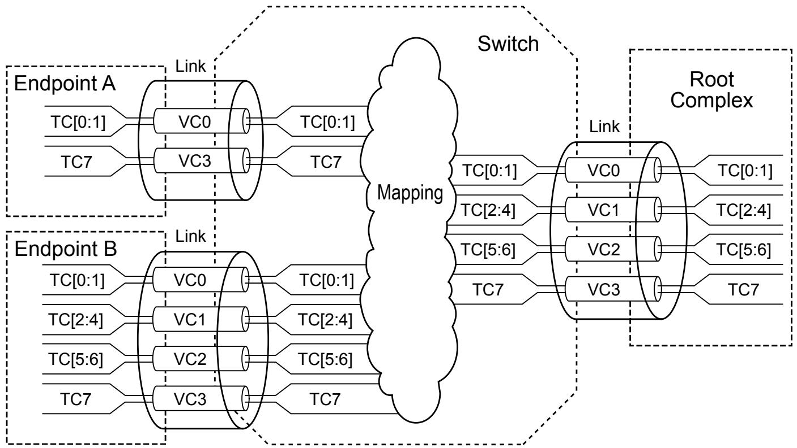

<details>
<summary>flowchart</summary>

```mermaid
graph LR
    subgraph Endpoint_A[Endpoint A]
  A1["TC[0:1"]] --> A2["VC0"] --> A3["TC[0:1"]]
  A4["TC7"] --> A5["VC3"] --> A6["TC7"]
    end

    subgraph Endpoint_B[Endpoint B]
  B1["TC[0:1"]] --> B2["VC0"] --> B3["TC[0:1"]]
  B4["TC[2:4"]] --> B5["VC1"] --> B6["TC[2:4"]]
  B7["TC[5:6"]] --> B8["VC2"] --> B9["TC[5:6"]]
  B10["TC7"] --> B11["VC3"] --> B12["TC7"]

    end

    subgraph Root_Complex[Root Complex]
  Root1["TC[0:1"]] --> Root2["VC0"] --> Root3["TC[0:1"]]
  Root4["TC[2:4"]] --> Root5["VC1"] --> Root6["TC[2:4"]]
  Root7["TC[5:6"]] --> Root8["VC2"] --> Root9["TC[5:6"]]
  Root10["TC7"] --> Root11["VC3"] --> Root12["TC7"]

  A2 --> M["Mapping"]
  A3 --> M
  A4 --> M
  A5 --> M
  A6 --> M
  A7 --> M
  A8 --> M
  A9 --> M
  A10 --> M
  A11 --> M
  A12 --> M
  A13 --> M
  A14 --> M
  A15 --> M
  A16 --> M
  A17 --> M
  A18 --> M
  A19 --> M
  A20 --> M
  A21 --> M
  A22 --> M
  A23 --> M
  A24 --> M
  A25 --> M
  A26 --> M
  A27 --> M
  A28 --> M
  A29 --> M
  A30 --> M
  A31 --> M
  A32 --> M
  A33 --> M
  A34 --> M
  A35 --> M
  A36 --> M
  A37 --> M
  A38 --> M
  A39 --> M
  A40 --> M
```
</details>

OM13828  
§ Figure 6-5 shows an example of TC to VC mapping. A simple Switch with one Downstream Port and one Upstream Port connects an Endpoint to a Root Complex. At the Upstream Port, two VCs (VC0 and VC1) are enabled with the following mapping: TC(0-6)/VC0, TC7/VC1. At the Downstream Port, only VC0 is enabled and all TCs are mapped to VC0. In this example while TC7 is mapped to VC0 at the Downstream Port, it is re-mapped to VC1 at the Upstream Port. Although the Endpoint only supports VC0, when it labels transactions with different TCs, transactions associated with TC7 from/to the Endpoint can take advantage of the second Virtual Channel enabled between the Switch and the Root Complex.

Figure 6-4 TC Filtering Example

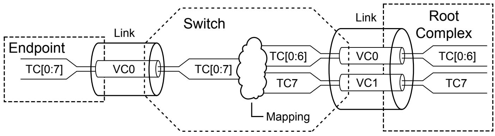

<details>
<summary>flowchart</summary>

```mermaid
graph LR
  A["Endpoint"] --> B["TC[0:7"]]
  B --> C["Link"]
  C --> D["VC0"]
  D --> E["TC[0:7"]]
  E --> F["Switch"]
  F --> G["TC[0:6"]]
  F --> H["TC7"]
  G --> I["Link"]
  H --> I
  I --> J["VC0"]
  I --> K["VC1"]
  J --> L["Root Complex"]
  K --> L
  L --> M["TC[0:6"]]
  L --> N["TC7"]
```
</details>

OM13829

§ Figure 6-5 TC to VC Mapping Example

## IMPLEMENTATION NOTE:

## MULTIPLE TCS OVER A SINGLE VC §

A single VC implementation may benefit from using multiple TCs. TCs provide ordering domains that may be used to differentiate traffic within the Endpoint or the Root Complex independent of the number of VCs supported.

In a simple configuration, where only VC0 is supported, traffic differentiation may not be accomplished in an optimum manner since the different TCs cannot be physically segregated. However, the benefits of carrying multiple TCs can still be exploited particularly in the small and “shallow” topologies where Endpoints are connected directly to Root Complex rather than through cascaded Switches. In these topologies traffic that is targeting Root Complex only needs to traverse a single Link, and an optimized scheduling of packets on both sides (Endpoint and Root Complex) based on TCs may accomplish significant improvement over the case when a single TC is used. Still, the inability to route differentiated traffic through separate resources with fully independent flow control and independent ordering exposes all of the traffic to the potential head-of-line blocking conditions. Optimizing Endpoint internal architecture to minimize the exposure to the blocking conditions can reduce those risks.

## 6.3.3 VC Arbitration §

Arbitration is one of the key aspects of the Virtual Channel mechanism and is defined in a manner that fully enables configurability to the specific application. In general, the definition of the VC-based arbitration mechanism is driven by the following objectives:

• To prevent false transaction timeouts and to guarantee data flow forward progress  
• To provide differentiated services between data flows within the fabric  
• To provide guaranteed bandwidth with deterministic (and reasonably small) end-to-end latency between components

Links are bidirectional, i.e., each Port can be an Ingress or an Egress Port depending on the direction of traffic flow. This is illustrated by the example of a 3-Port Switch in § Figure 6-6, where the paths for traffic flowing between Switch Ports are highlighted with different types of lines. In the following sections, VC Arbitration is defined using a Switch arbitration model since the Switch represents a functional superset from the arbitration perspective.

In addition, one-directional data flow is used in the description.

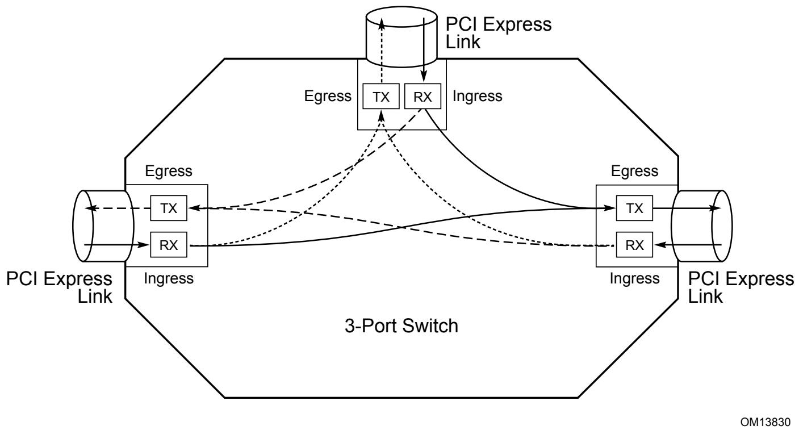

<details>
<summary>flowchart</summary>

```mermaid
graph TD
  A["PCI Express Link"] --> B["Egress"]
  B --> C["TX"]
  B --> D["RX"]
  C --> E["3-Port Switch"]
  D --> E
  E --> F["Egress"]
  F --> G["TX"]
  F --> H["RX"]
  G --> I["PCI Express Link"]
  H --> I
  I --> J["Ingress"]
  J --> K["TX"]
  J --> L["RX"]
  K --> M["PCI Express Link"]
  L --> M
  M --> N["Ingress"]
  N --> O["TX"]
  N --> P["RX"]
  O --> Q["PCI Express Link"]
  P --> Q
  Q --> R["Ingress"]
  R --> S["TX"]
  R --> T["RX"]
  S --> U["PCI Express Link"]
  T --> U
  U --> V["Ingress"]
  V --> W["TX"]
  V --> X["RX"]
  W --> Y["PCI Express Link"]
  X --> Y
  Y --> Z["Ingress"]
  Z --> AA["TX"]
  Z --> AB["RX"]
  AA --> AC["PCI Express Link"]
  AB --> AC
  AC --> AD["Ingress"]
  AD --> AE["TX"]
  AD --> AF["RX"]
  AE --> AG["PCI Express Link"]
  AF --> AG
```
</details>

Figure 6-6 An Example of Traffic Flow Illustrating Ingress and Egress§

## 6.3.3.1 Traffic Flow and Switch Arbitration Model §

The following set of figures (§ Figure 6-7 and § Figure 6-8) illustrates traffic flow through the Switch and summarizes the key aspects of the arbitration.

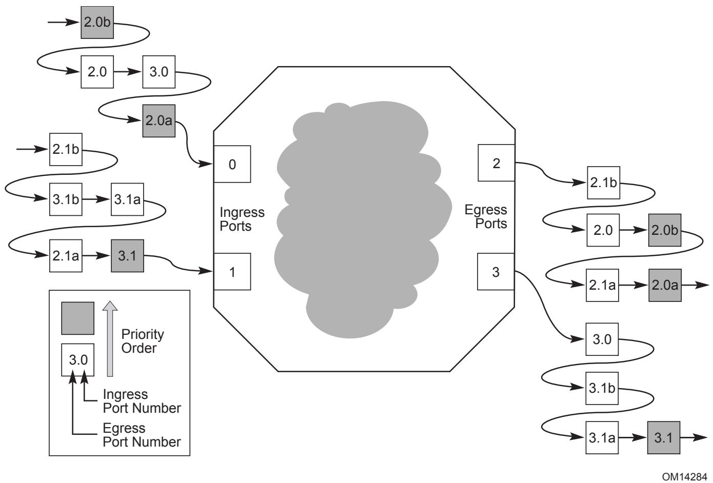

<details>
<summary>flowchart</summary>

```mermaid
graph TD
  A["2.0b"] --> B["2.0"]
  B --> C["3.0"]
  C --> D["2.0a"]
  D --> E["0"]
  E --> F["Ingress Ports"]
  G["2.1b"] --> H["3.1b"]
  H --> I["3.1a"]
  I --> J["2.1a"]
  J --> K["3.1"]
  K --> L["1"]
  L --> M["Egress Ports"]
  N["2"] --> O["2.1b"]
  O --> P["2.0"]
  P --> Q["2.0b"]
  Q --> R["2.1a"]
  R --> S["2.0a"]
  S --> T["3.0"]
  T --> U["3.1b"]
  U --> V["3.1a"]
  V --> W["3.1"]
  W --> X["OM14284"]
  Y["Priority Order"] --> Z["Ingress Port Number"]
  Y --> AA["Egress Port Number"]
```
</details>

Figure 6-7 An Example of Differentiated Traffic Flow Through a Switch§

At each Ingress Port an incoming traffic stream is represented in § Figure 6-7 by small boxes. These boxes represent packets that are carried within different VCs that are distinguished using different levels of gray. Each of the boxes that represents a packet belonging to different VC includes designation of Ingress and Egress Ports to indicate where the packet is coming from and where it is going to. For example, designation “3.0” means that this packet is arriving at Port #0 (Ingress) and is destined to Port #3 (Egress). Within the Switch, packets are routed and serviced based on Switch internal arbitration mechanisms.

Switch arbitration model defines a required arbitration infrastructure and functionality within a Switch. This functionality is needed to support a set of arbitration policies that control traffic contention for an Egress Port from multiple Ingress Ports.

§ Figure 6-8 shows a conceptual model of a Switch highlighting resources and associated functionality in ingress to egress direction. Note that each Port in the Switch can have the role of an Ingress or Egress Port. Therefore, this figure only shows one particular scenario where the 4-Port Switch in this example has ingress traffic on Port #0 and Port #1, that targets Port #2 as an Egress Port. A different example may show different flow of traffic implying different roles for Ports on the Switch. The PCI Express architecture enables peer-to-peer communication through the Switch and, therefore, possible scenarios using the same example may include multiple separate and simultaneous ingress to egress flows (e.g., Port 0 to Port 2 and Port 1 to Port 3).

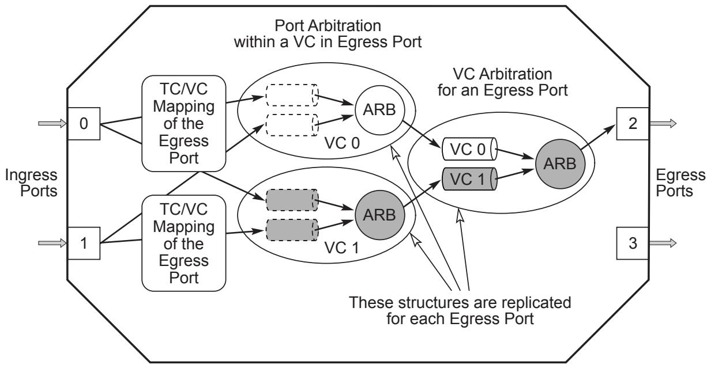

<details>
<summary>flowchart</summary>

```mermaid
graph TD
  A["0"] --> B["TC/VC Mapping of the Egress Port"]
  C["1"] --> D["TC/VC Mapping of the Egress Port"]
  B --> E["ARB"]
  D --> F["ARB"]
  E --> G["VC 0"]
  F --> H["VC 1"]
  G --> I["2"]
  H --> J["3"]
    style A fill:#fff,stroke:#000
    style C fill:#fff,stroke:#000
    style B fill:#fff,stroke:#000
    style D fill:#fff,stroke:#000
    style E fill:#fff,stroke:#000
    style F fill:#fff,stroke:#000
    style G fill:#fff,stroke:#000
    style H fill:#fff,stroke:#000
    style I fill:#fff,stroke:#000
    style J fill:#fff,stroke:#000
    subgraph Port_Arbitration_within_a_VC_in_Egress_Port["\"Port Arbitration within a VC in Egress Port\""]
  B --> E
  D --> F
  E --> G
  F --> H
  G --> I
    end
    note right of G: "These structures are replicated for each Egress Port"
```
</details>

OM14493B

Figure 6-8 Switch Arbitration Structure§

The following two steps conceptually describe routing of traffic received by the Switch on Port 0 and Port 1 and destined to Port 2. First, the target Egress Port is determined based on address/routing information in the TLP header. Secondly, the target VC of the Egress Port is determined based on the TC/VC map of the Egress Port. Transactions that target the same VC in the Egress Port but are from different Ingress Ports must be arbitrated before they can be forwarded to the corresponding resource in the Egress Port. This arbitration is referred to as the Port Arbitration.

Once the traffic reaches the destination VC resource in the Egress Port, it is subject to arbitration for the shared Link. From the Egress Port point of view this arbitration can be conceptually defined as a simple form of multiplexing where the multiplexing control is based on arbitration policies that are either fixed or configurable/programmable. This stage of arbitration between different VCs at an Egress Port is called the VC Arbitration of the Egress Port.

Independent of VC arbitration policy, a management/control logic associated with each VC must observe transaction ordering and flow control rules before it can make pending traffic visible to the arbitration mechanism.

## IMPLEMENTATION NOTE:

## VC CONTROL LOGIC AT THE EGRESS PORT §

VC control logic at every Egress Port includes:

• VC Flow Control logic  
• VC Ordering Control logic

Flow control credits are exchanged between two Ports connected to the same Link. Availability of flow control credits is one of the qualifiers that VC control logic must use to decide when a VC is allowed to compete for the shared Link resource (i.e., Data Link Layer transmit/retry buffer). If a candidate packet cannot be submitted due to the lack of an adequate number of flow control credits, VC control logic must mask the presence of pending packet to prevent blockage of traffic from other VCs. Note that since each VC includes buffering resources for Posted Requests, Non-Posted Requests, and Completion packets, the VC control logic must also take into account availability of flow control credits for the particular candidate packet. In addition, VC control logic must observe ordering rules (see § Section 2.4 for more details) for Posted/Non-Posted/Completion transactions to prevent deadlocks and violation of producer/consumer ordering model.

## 6.3.3.2 VC Arbitration - Arbitration Between VCs §

This specification defines a default VC prioritization via the VC Identification (VC ID) assignment, i.e., the VC IDs are arranged in ascending order of relative priority in the Virtual Channel Capability structure or Multi-Function Virtual Channel Capability structure. The example in § Figure 6-9 illustrates a Port that supports eight VCs with VC0 treated as the lowest priority and VC7 as the highest priority.

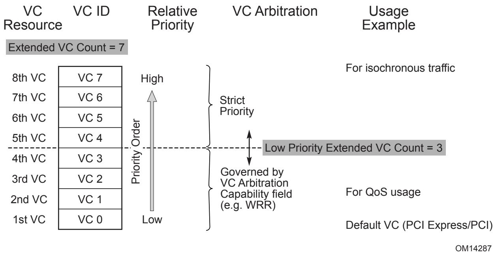

<details>
<summary>table</summary>

| VC ID | Priority Order |
|-------|----------------|
| 8th   | High           |
| 7th   | High           |
| 6th   | High           |
| 5th   | High           |
| 4th   | High           |
| 3rd   | High           |
| 2nd   | High           |
| 1st   | High           |
</details>

Figure 6-9 VC ID and Priority Order - An Example§

The availability of default prioritization does not restrict the type of algorithms that may be implemented to support VC arbitration - either implementation specific or one of the architecture-defined methods:

• Strict Priority - Based on inherent prioritization, i.e., VC0 = lowest, VC7 = highest  
• Round Robin (RR) - Simplest form of arbitration where all VCs have equal priority  
• Weighted RR - Programmable weight factor determines the level of service

If strict priority arbitration is supported by the hardware for a subset of the VC resources, software can configure the VCs into two priority groups - a lower and an upper group. The upper group is treated as a strict priority arbitration group while the lower group is arbitrated to only when there are no packets to process in the upper group. § Figure 6-9 illustrates an example configuration that supports eight VCs separated into two groups - the lower group consisting of VC0-VC3 and the upper group consisting of VC4-VC7. The arbitration within the lower group can be configured to one of the supported arbitration methods. The Low Priority Extended VC Count field in the Port VC Capability Register 1 indicates the size of this group. The arbitration methods are listed in the VC Arbitration Capability field in the Port VC Capability Register 2. Refer to § Section 7.9.1 and § Section 7.9.2 for details. When the Low Priority Extended VC Count field is set to zero, all VCs are governed by the strict-priority VC arbitration; when the field is equal to the Extended VC Count, all VCs are governed by the VC arbitration indicated by the VC Arbitration Capability field.

## 6.3.3.2.1 Strict Priority Arbitration Model §

Strict priority arbitration enables minimal latency for high-priority transactions. However, there is potential danger of bandwidth starvation should it not be applied correctly. Using strict priority requires all high-priority traffic to be regulated in terms of maximum peak bandwidth and Link usage duration. Regulation must be applied either at the transaction injection Port/Function or within subsequent Egress Ports where data flows contend for a common Link. System software must configure traffic such that lower priority transactions will be serviced at a sufficient rate to avoid transaction timeouts.

## 6.3.3.2.2 Round Robin Arbitration Model §

Round Robin arbitration is used to provide, at the transaction level, equal 119 opportunities to all traffic. Note that this scheme is used where different unordered streams need to be serviced with the same priority.

In the case where differentiation is required, a Weighted Round Robin scheme can be used. The WRR scheme is commonly used in the case where bandwidth regulation is not enforced by the sources of traffic and therefore it is not possible to use the priority scheme without risking starvation of lower priority traffic. The key is that this scheme provides fairness during traffic contention by allowing at least one arbitration win per arbitration loop. Assigned weights regulate both minimum allowed bandwidth and maximum burstiness for each VC during the contention. This means that it bounds the arbitration latency for traffic from different VCs. Note that latencies are also dependent on the maximum packet sizes allowed for traffic that is mapped onto those VCs.

One of the key usage models of the WRR scheme is support for QoS policy where different QoS levels can be provided using different weights.

Although weights can be fixed (by hardware implementation) for certain applications, to provide more generic support for different applications, components that support the WRR scheme are recommended to implement programmable WRR. Programming of WRR is controlled using the software interface defined in Sections 7.9.1 and 7.9.2.

## 6.3.3.3 Port Arbitration - Arbitration Within VC §

For Switches, Port Arbitration refers to the arbitration at an Egress Port between traffic coming from other Ingress Ports that is mapped to the same VC. For Root Ports, Port Arbitration refers to the arbitration at a Root Egress Port between peer-to-peer traffic coming from other Root Ingress Ports that is mapped to the same VC. For RCRBs, Port Arbitration refers to the arbitration at the RCRB (e.g., for host memory) between traffic coming from Root Ports that is mapped to the same VC. An inherent prioritization scheme for arbitration among VCs in this context is not applicable since it would imply strict arbitration priority for different Ports. Traffic from different Ports can be arbitrated using the following supported schemes:

• Hardware-fixed arbitration scheme, e.g., Round Robin  
• Programmable WRR arbitration scheme  
• Programmable Time-based WRR arbitration scheme

Hardware-fixed RR or RR-like scheme is the simplest to implement since it does not require any programmability. It makes all Ports equal priority, which is acceptable for applications where no software-managed differentiation or per-Port-based bandwidth budgeting is required.

Programmable WRR allows flexibility since it can operate as flat RR or if differentiation is required, different weights can be applied to traffic coming from different Ports in the similar manner as described in § Section 6.3.3.2 . This scheme is used where different allocation of bandwidth needs to be provided for different Ports.

A Time-based WRR is used for applications where not only different allocation of bandwidth is required but also a tight control of usage of that bandwidth. This scheme allows control of the amount of traffic that can be injected from different Ports within a certain fixed period of time. This is required for certain applications such as isochronous services, where traffic needs to meet a strict deadline requirement. § Section 6.3.4 provides basic rules to support isochronous applications. For more details on time-based arbitration and on the isochronous service as a usage model for this arbitration scheme refer to Appendix A.

## 6.3.3.4 Multi-Function Devices and Function Arbitration §

The multi-Function arbitration model defines an optional arbitration infrastructure and functionality within a Multi-Function Device. This functionality is needed to support a set of arbitration policies that control traffic contention for the device’s Upstream Egress Port from its multiple Functions.

§ Figure 6-10 shows a conceptual model of a Multi-Function Device highlighting resources and associated functionality. Note that each Function optionally contains a VC Extended Capability structure, which if present manages TC/VC mapping, optional Port Arbitration, and optional VC Arbitration, all within the Function. The MFVC Extended Capability structure manages TC/VC mapping, optional Function Arbitration, and optional VC Arbitration for the device’s Upstream Egress Port. Together these resources enable enhanced QoS management for Upstream requests. However, unlike a complete Switch with devices on its Downstream Ports, the Multi-Function Device model does not support full QoS management for peer-to-peer requests between Functions or for Downstream requests.

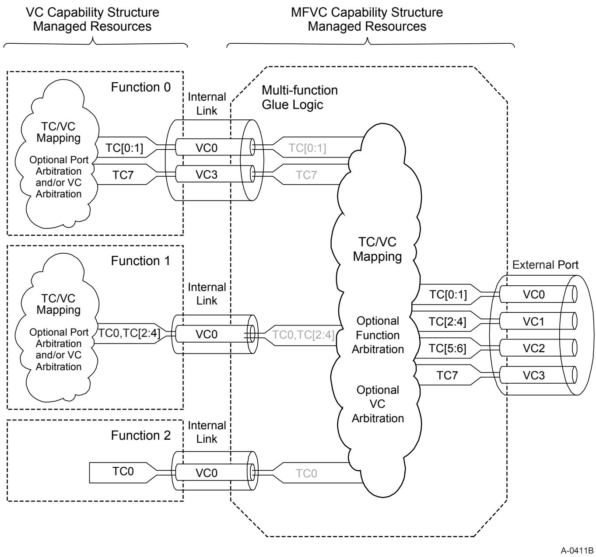

<details>
<summary>flowchart</summary>

```mermaid
graph TD
    subgraph VC_Capability_Structure_Managed_Resources["\"VC Capability Structure Managed Resources\""]
  A["Function 0"] --> B["TC[0:1"]]
  A --> C["TC7"]
  D["Multi-function Glue Logic"] --> E["TC[0:1"]]
  D --> F["TC7"]
    end

    subgraph MFVC_Capability_Structure_Managed_Resources["\"MFVC Capability Structure Managed Resources\""]
  G["Function 1"] --> H["TC[0:1"]]
  G --> I["TC0,TC[2:4"]]
  G --> J["TC0,TC[2:4"]]
  K["Multi-function Glue Logic"] --> L["TC/VC Mapping"]
  L --> M["TC[0:1"]]
  L --> N["TC7"]
  O["Functional 2"] --> P["TC0"]
  O --> Q["TC0"]
  R["Functional 2"] --> S["TC0"]
  R --> T["TC0"]
  U["Functional 2"] --> V["TC0"]
  U --> W["TC0"]
  X["Functional 2"] --> Y["TC0"]
  X --> Z["TC0"]
  AA["Functional 2"] --> AB["TC0"]
  AA --> AC["TC0"]
  AD["Functional 2"] --> AE["TC0"]
  AF["Functional 2"] --> AG["TC0"]
  AH["Functional 2"] --> AI["TC0"]
  AJ["Functional 2"] --> AK["TC0"]
  AL["Functional 2"] --> AM["TC0"]
  AN["Functional 2"] --> AO["TC0"]
  AP["Functional 2"] --> AQ["TC0"]
  AR["Functional 2"] --> AS["TC0"]
  AT["Functional 2"] --> AU["TC0"]
  AV["Functional 2"] --> AW["TC0"]
  AX["Functional 2"] --> AY["TC0"]
  AZ["Functional 2"] --> BA["TC0"]
  BB["Functional 2"] --> BC["TC0"]
  BD["Functional 2"] --> BE["TC0"]
  BF["Functional 2"] --> BG["TC0"]
  BH["Functional 2"] --> BI["TC0"]
  BJ["Functional 2"] --> BK["TC0"]
  BL["Functional 2"] --> BM["TC0"]
  BN["Functional 2"] --> BO["TC0"]
  BP["Functional 2"] --> BQ["TC0"]
  BR["Functional 2"] --> BS["TC0"]
  BT["Functional 2"] --> BU["TC0"]
  BV["Functional 2"] --> BW["TC0"]
  BX["Functional 2"] --> BY["TC0"]
  BZ["Functional 2"] --> CA["TC0"]
  CB["Functional 2"] --> CD["TC0"]
  DD["Functional 2"] --> DJ["TC0"]
  DK["Functional 2"] --> DL["TC0"]
  DV["Functional 2"] --> DW["TC0"]
  DX["Functional 2"] --> DXB["TC0"]
  DXB --> DXC["TC0"]
  DXC --> DXD["TC0"]
  DXD --> DXE["TC0"]
  DXE --> DXF["TC0"]
  DXF --> DXG["TC0"]
  DXG --> DXH["TC0"]
  DXH --> DXI["TC0"]
    end

    subgraph MFVC_Capability_Structure_Managed_Resources_2["\"MFVC Capability Structure Managed Resources\""]
        J
        K
        L
        M
        N
        O
        P
        Q
        R
        S
        T
        U
        V
        W
        X
        Y
        Z
        AA
        AB
    end

  A --> D --> G --> K --> D --> X --> DB
  B --> E --> L --> M --> N --> O --> P --> Q --> R
  C --> E --> L --> M --> N --> O --> P --> Q
  D --> L --> M --> N --> O --> P --> Q
  E --> M --> N --> O --> P --> Q
  F --> L --> M --> N --> O --> P --> Q
  G --> M --> N --> O --> P --> Q
  H --> L --> M --> N --> O --> P --> Q
  I --> M --> N --> O --> P --> Q
  J --> L --> M --> N --> O --> P --> Q
  K --> M --> N --> O --> P --> Q
  L --> M --> N --> O --> P --> Q
  M --> N --> O --> P --> Q
  N --> O
  O --> P
  P --> Q
    Q -.-> R
    R -.-> T
    T -.-> U
    U -.-> V
    V -.-> W
    W -.-> X
    X -.-> Y
    Y -.-> Z
    Z -.-> AA
    AA -.-> AB
    AB -.-> AC
    AC -.-> AD
```
</details>

Figure 6-10 Multi-Function Arbitration Model§

QoS for an Upstream request originating at a Function is managed as follows. First, a Function-specific mechanism applies a TC to the request. For example, a device driver might configure a Function to tag all its requests with TC7.

Next, if the Function contains a VC Extended Capability structure, it specifies the TC/VC mapping to one of the Function’s VC resources (perhaps the Function’s single VC resource). In addition, the VC Extended Capability structure supports the enablement and configuration of the Function’s VC resources.

If the Function is a Switch and the target VC resource supports Port Arbitration, this mechanism governs how the Switch’s multiple Downstream Ingress Ports arbitrate for that VC resource. If the Port Arbitration mechanism supports time-based WRR, this also governs the injection rate of requests from each Downstream Ingress Port.

If the Function supports VC arbitration, this mechanism manages how the Function’s multiple VC resources arbitrate for the conceptual internal link to the MFVC resources.

Once a request packet conceptually arrives at MFVC resources, address/routing information in the TLP header determines whether the request goes Upstream or peer-to-peer to another Function. For the case of peer-to-peer, QoS management is left to unarchitected device-specific mechanisms. For the case of Upstream, TC/VC mapping in the MFVC Extended Capability structure determines which VC resource the request will target. The MFVC Extended Capability structure also supports enablement and configuration of the VC resources in the multi-Function glue logic. If the target VC resource supports Function Arbitration, this mechanism governs how the multiple Functions arbitrate for this VC resource. If the Function Arbitration mechanism supports time-based WRR, this governs the injection rate of requests for each Function into this VC resource.

Finally, if the MFVC Extended Capability structure supports VC Arbitration, this mechanism governs how the MFVC’s multiple VCs compete for the device’s Upstream Egress Port. Independent of VC arbitration policy, management/control logic associated with each VC must observe transaction ordering and flow control rules before it can make pending traffic visible to the arbitration mechanism.

## IMPLEMENTATION NOTE:

## MULTI-FUNCTION ARBITRATION ERROR BEHAVIOR §

§ Table 6-6 shows the expected error behavior associated with the example topology shown in § Figure 6-10.

Table 6-6 Multi-Function Arbitration Error Model Example§

<table><tr><td rowspan="2">Source</td><td rowspan="2">TC</td><td colspan="4">Destination</td></tr><tr><td>Function 0</td><td>Function 1</td><td>Function 2</td><td>External Port</td></tr><tr><td rowspan="4">Function 0</td><td>0</td><td rowspan="4">n/a</td><td>OK</td><td>OK</td><td>OK</td></tr><tr><td>1</td><td>MF @ F1</td><td>MF @ F2</td><td>OK</td></tr><tr><td>2 - 6</td><td>MF @ F0</td><td>MF @ F0</td><td>MF @ F0</td></tr><tr><td>7</td><td>MF @ F1</td><td>MF @ F2</td><td>OK</td></tr><tr><td rowspan="4">Function 1</td><td>0</td><td>OK</td><td rowspan="4">n/a</td><td>OK</td><td>OK</td></tr><tr><td>1</td><td>MF @ F1</td><td>MF @ F1</td><td>MF @ F1</td></tr><tr><td>2 - 4</td><td>MF @ F0</td><td>MF @ F2</td><td>OK</td></tr><tr><td>5 - 7</td><td>MF @ F1</td><td>MF @ F1</td><td>MF @ F1</td></tr><tr><td rowspan="2">Function 2</td><td>0</td><td>OK</td><td>OK</td><td rowspan="2">n/a</td><td>OK</td></tr><tr><td>1 - 7</td><td>MF @ F2</td><td>MF @ F2</td><td>MF @ F2</td></tr><tr><td rowspan="5">External Port</td><td>0</td><td>OK</td><td>OK</td><td>OK</td><td rowspan="5">n/a</td></tr><tr><td>1</td><td>OK</td><td>MF @ F1</td><td rowspan="4">MF @ F2</td></tr><tr><td>2 - 4</td><td rowspan="2">MF @ F0</td><td>OK</td></tr><tr><td>5 - 6</td><td rowspan="2">MF @ F1</td></tr><tr><td>7</td><td>OK</td></tr></table>

Legend:

<table><tr><td>OK</td><td>Success</td></tr><tr><td>MF @ F0</td><td>Malformed TLP, reported at Function 0</td></tr><tr><td>MF @ F1</td><td>Malformed TLP, reported at Function 1</td></tr><tr><td>MF @ F2</td><td>Malformed TLP, reported at Function 2</td></tr><tr><td>n/a</td><td>Not Applicable (Function/Port sending to itself)</td></tr></table>

## IMPLEMENTATION NOTE: MULTI-FUNCTION DEVICES WITHOUT THE MFVC EXTENDED CAPABILITY STRUCTURE §

If a Multi-Function Device lacks an MFVC Extended Capability structure, the arbitration of data flows from different Functions of a Multi-Function Device is beyond the scope of this specification However, if a Multi-Function Device supports TCs other than TC0 and does not implement an MFVC Extended Capability structure, it must implement a single VC Extended Capability structure in Function 0 to provide architected TC/VC mappings for the Link.

## 6.3.4 Isochronous Support §

Servicing isochronous data transfer requires a system to provide not only guaranteed data bandwidth but also deterministic service latency. The isochronous support mechanisms are defined to ensure that isochronous traffic receives its allocated bandwidth over a relevant period of time while also preventing starvation of the other traffic in the system. Isochronous support mechanisms apply to communication between Endpoint and Root Complex as well as to peer-to-peer communication.

Isochronous service is realized through proper use of mechanisms such as TC transaction labeling, VC data-transfer protocol, and TC-to-VC mapping. End-to-end isochronous service requires software to set up proper configuration along the path between the Requester and the Completer. This section describes the rules for software configuration and the rules hardware components must follow to provide end-to-end isochronous services. More information and background material regarding isochronous applications and isochronous service design guidelines can be found in Appendix A.

## 6.3.4.1 Rules for Software Configuration §

System software must obey the following rules to configure PCI Express fabric for isochronous traffic:

• Software must designate one or more TCs for isochronous transactions.  
• Software must ensure that the Attribute fields of all isochronous requests targeting the same Completer are fixed and identical.  
• Software must configure all VC resources used to support isochronous traffic to be serviced (arbitrated) at the requisite bandwidth and latency to meet the application objectives. This may be accomplished using strict priority, WRR, or hardware-fixed arbitration.  
• Software should not intermix isochronous traffic with non-isochronous traffic on a given VC.  
• Software must observe the Maximum Time Slots capability reported by the Port or RCRB.  
• Software must not assign all Link capacity to isochronous traffic. This is required to ensure the requisite forward progress of other non-isochronous transactions to avoid false transaction timeouts.  
• Software must limit the Max\_Payload\_Size for each path that supports isochronous to meet the isochronous latency. For example, all traffic flowing on a path from an isochronous capable device to the Root Complex should be limited to packets that do not exceed the Max\_Payload\_Size required to meet the isochronous latency requirements.  
• Software must set Max\_Read\_Request\_Size of an isochronous-configured device with a value that does not exceed the Max\_Payload\_Size set for the device.

## 6.3.4.2 Rules for Requesters §

A Requester requiring isochronous services must obey the following rules:

• The value in the Length field of read requests must never exceed Max\_Payload\_Size.  
• If isochronous traffic targets the Root Complex and the RCRB indicates it cannot meet the isochronous bandwidth and latency requirements without requiring all transactions to set the No Snoop attribute bit, indicated by setting the Reject Snoop Transactions bit, then this bit must be set within the TLP header else the transaction will be rejected.

## 6.3.4.3 Rules for Completers §

A Completer providing isochronous services must obey the following rules:

• A Completer should not apply flow control induced backpressure to uniformly injected isochronous requests under normal operating conditions.  
• A Completer must report its isochronous bandwidth capability in the Maximum Time Slots field in the VC Resource Capability register. Note that a Completer must account for partial writes.  
• A Completer must observe the maximum isochronous transaction latency.  
• A Root Complex as a Completer must implement at least one RCRB and support time-based Port Arbitration for the associated VCs. Note that time-based Port Arbitration only applies to request transactions.

## 6.3.4.4 Rules for Switches and Root Complexes §

A Switch providing isochronous services must obey the following rules. The same rules apply to Root Complexes that support isochronous data flows peer-to-peer between Root Ports, abbreviated in this section as “P2P-RC”.

• An isochronous-configured Switch or P2P-RC Port should not apply flow control induced backpressure to uniformly injected isochronous requests under normal operating conditions.  
• An isochronous-configured Switch or P2P-RC Port must observe the maximum isochronous transaction latency.  
• A Switch or P2P-RC component must support time-based Port Arbitration for each Port that supports one or more VCs capable of supporting isochronous traffic. Note that time-based Port Arbitration applies to request transactions but not to completion transactions.

## 6.3.4.5 Rules for Multi-Function Devices §

A Multi-Function Device that includes an MFVC Extended Capability structure providing isochronous services must obey the following rules:

• MFVC glue logic configured for isochronous operation should not apply backpressure to uniformly injected isochronous requests from its Functions under normal operating conditions.  
• The MFVC Extended Capability structure must support time-based Function Arbitration for each VC capable of supporting isochronous traffic. Note that time-based Function Arbitration applies only to Upstream request

transactions; it does not apply to any Downstream or peer-to-peer request transactions, nor to any completion transactions.

A Multi-Function Device that lacks an MFVC Extended Capability structure has no architected mechanism to provide isochronous services for its multiple Functions concurrently.

## 6.4 Device Synchronization §

System software requires a “stop” mechanism for ensuring that there are no outstanding transactions for a particular device in a system. For example, without such a mechanism renumbering Bus Numbers during system operation may cause the Requester ID (which includes the Bus Number) for a given device to change while Requests or Completions for that device are still in flight, and may thus be rendered invalid due to the change in the Requester ID. It is also desirable to be able to ensure that there are no outstanding transactions during a Hot-Plug orderly removal.

The details of stop mechanism implementation depend on the device hardware, device driver software, and system software. However, the fundamental requirements which must be supported to allow system software management of the fabric include the abilities to:

• Block the device from generating new Requests  
• Block the generation of Requests issued to the device  
• Determine that all Requests being serviced by the device have been completed  
• Determine that all non-posted Requests initiated by the device have completed  
• Determine that all posted Requests initiated by the device have reached their destination

The ability of the driver and/or system software to block new Requests from the device is supported by the Bus Master Enable, SERR# Enable, and Interrupt Disable bits in the Command register (Section7.5.1.1.3) of each device Function, and other such control bits.

Requests issued to the device are generally under the direct control of the driver, so system software can block these Requests by directing the driver to stop generating them (the details of this communication are system software specific). Similarly, Requests serviced by the device are normally under the device driver’s control, so determining the completion of such requests is usually trivial.

The Transactions Pending bit provides a consistent way on a per-Function basis for software to determine that all non-posted Requests issued by the device have been completed (see § Section 7.5.3.5 ).

Determining that posted Requests have reached their destination is handled by generating a transaction to “flush” any outstanding Requests. Writes to system memory using TC0 will be flushed by host reads of the device, and so require no explicit flush protocol. Writes using TCs other than TC0 require some type of flush synchronization mechanism. The mechanism itself is implementation specific to the device and its driver software. However, in all cases the device hardware and software implementers should thoroughly understand the ordering rules described in § Section 2.4 . This is especially true if the Relaxed Ordering or ID-Based Ordering attributes are set for any Requests initiated by the device.

## IMPLEMENTATION NOTE: FLUSH MECHANISMS §

In a simple case such as that of an Endpoint communicating only with host memory through TC0, “flush” can be implemented simply by reading from the Endpoint. If the Endpoint issues writes to main memory using TCs other than TC0, “flush” can be implemented with a memory read on the corresponding TCs directed to main memory. The memory read needs to be performed on all TCs that the Endpoint is using.

If a memory read is used to “flush” outstanding transactions, but no actual read is required, it may be desirable to use the zero-length read semantic described in § Section 2.2.5 .

Peer-to-peer interaction between devices requires an explicit synchronization protocol between the involved devices, even if all communication is through TC0. For a given system, the model for managing peer-to-peer interaction must be established. System software, and device hardware and software must then conform to this model. The requirements for blocking Request generation and determining completion of Requests match the requirements for non-peer interaction, however the determination that Posted Requests have reached peer destination device(s) requires an explicit synchronization mechanism. The mechanism itself is implementation specific to the device, its driver software, and the model used for the establishment and disestablishment of peer communications.

## 6.5 Locked Transactions §

## 6.5.1 Introduction §

Locked Transaction support is required to prevent deadlock in systems that use legacy software which causes the accesses to I/O devices. Note that some CPUs may generate locked accesses as a result of executing instructions that implicitly trigger lock. Some legacy software misuses these transactions and generates locked sequences even when exclusive access is not required. Since locked accesses to I/O devices introduce potential deadlocks apart from those mentioned above, as well as serious performance degradation, PCI Express Endpoints are prohibited from supporting locked accesses, and new software must not use instructions which will cause locked accesses to I/O devices. Legacy Endpoints support locked accesses only for compatibility with existing software.

Only the Root Complex is allowed to initiate Locked Requests on PCI Express. Locked Requests initiated by Endpoints and Bridges are not supported. This is consistent with limitations for locked transaction use outlined in [PCI] (§ Appendix F. - Exclusive Accesses).

This section specifies the rules associated with supporting locked accesses from the Host CPU to Legacy Endpoints, including the propagation of those transactions through Switches and PCI Express/PCI Bridges.

## 6.5.2 Initiation and Propagation of Locked Transactions - Rules §

Locked transaction sequences are generated by the Host CPU(s) as one or more reads followed by a number of writes to the same location(s). When a lock is established, all other traffic is blocked from using the path between the Root Complex and the locked Legacy Endpoint or Bridge.

• A locked transaction sequence or attempted locked transaction sequence is initiated on PCI Express using the “lock”-type Read Request/Completion (MRdLk/CplDLk) and terminated with the Unlock Message

◦ Locked Requests which are completed with a status other than Successful Completion do not establish lock (explained in detail in the following sections)  
Regardless of the status of any of the Completions associated with a locked sequence, all locked sequences and attempted locked sequences must be terminated by the transmission of an Unlock Message.  
◦ MRdLk, CplDLk, and Unlock semantics are allowed only for the default Traffic Class (TC0)  
◦ Only one locked transaction sequence attempt may be in progress at a given time within a single hierarchy domain

• The Unlock Message is sent from the Root Complex down the locked transaction path to the Completer, and may be broadcast from the Root Complex to all Endpoints and Bridges

◦ Any device which is not involved in the locked sequence must ignore this Message

• Any violation of the rules for initiation and propagation of locked transactions can result in undefined device and/or system behavior

◦ The initiation and propagation of a locked transaction sequence through PCI Express is performed as follows:

• A locked transaction sequence is started with a MRdLk Request

◦ Any successive reads for the locked transaction sequence must also use MRdLk Requests

◦ The Completions for any MRdLk Request use the CplDLk Completion type for successful Requests, and the CplLk Completion type for unsuccessful Requests

• If any read associated with a locked sequence is completed unsuccessfully, the Requester must assume that the atomicity of the lock is no longer assured, and that the path between the Requester and Completer is no longer locked

• All writes for the locked sequence use MWr Requests

• The Unlock Message is used to indicate the end of a locked sequence

◦ A Switch propagates Unlock Messages to the locked Egress Port

• Upon receiving an Unlock Message, a Legacy Endpoint or Bridge must unlock itself if it is in a locked state

◦ If not locked, or if the Receiver is a PCI Express Endpoint or Bridge which does not support lock, the Unlock Message is ignored and discarded

## 6.5.3 Switches and Lock - Rules §

Switches must distinguish transactions associated with locked sequences from other transactions to prevent other transactions from interfering with the lock and potentially causing deadlock. The following rules cover how this is done. Note that locked accesses are limited to TC0, which is always mapped to VC0.

When a Switch propagates a MRdLk Request from the Ingress Port (closest to the Root Complex) to the Egress Port, it must block all Requests which map to the default Virtual Channel (VC0) from being propagated to the Egress Port

◦ If a subsequent MRdLk Request is Received at this Ingress Port addressing a different Egress Port, the behavior of the Switch is undefined

Note: This sort of split-lock access is not supported by PCI Express and software must not cause such a locked access. System deadlock may result from such accesses.

• When the CplDLk for the first MRdLk Request is returned, if the Completion indicates a Successful Completion status, the Switch must block all Requests from all other Ports from being propagated to either of the Ports involved in the locked access, except for Requests which map to non-VC0 on the Egress Port

• The two Ports involved in the locked sequence must remain blocked as described above until the Switch receives the Unlock Message (at the Ingress Port for the initial MRdLk Request)

◦ The Unlock Message must be forwarded to the locked Egress Port  
◦ The Unlock Message may be broadcast to all other Ports  
◦ The Ingress Port is unblocked once the Unlock Message arrives, and the Egress Port(s) which were blocked are unblocked following the Transmission of the Unlock Message out of the Egress Ports  
▪ Ports which were not involved in the locked access are unaffected by the Unlock Message

## 6.5.4 PCI Express/PCI Bridges and Lock - Rules §

The requirements for PCI Express/PCI Bridges are similar to those for Switches, except that, because PCI Express/PCI Bridges use only the default Virtual Channel and Traffic Class, all other traffic is blocked during the locked access. The requirements on the PCI bus side of the PCI Express/PCI Bridge match the requirements for a PCI/PCI Bridge (see [PCI-to-PCI-Bridge] and [PCIe-to-PCI-PCI-X-Bridge]).

## 6.5.5 Root Complex and Lock - Rules §

A Root Complex is permitted to support locked transactions as a Requester. If locked transactions are supported, a Root Complex must follow the sequence described in § Section 6.5.2 to perform a locked access. The mechanisms used by the Root Complex to interface PCI Express to the Host CPU(s) are outside the scope of this document.

## 6.5.6 Legacy Endpoints §

Legacy Endpoints are permitted to support locked accesses, although their use is discouraged. If locked accesses are supported, Legacy Endpoints must handle them as follows:

• The Legacy Endpoint becomes locked when it Transmits the first Completion for the first Read Request of the locked access with a Successful Completion status  
◦ If the completion status is not Successful Completion, the Legacy Endpoint does not become locked  
◦ Once locked, the Legacy Endpoint must remain locked until it receives the Unlock Message  
• While locked, a Legacy Endpoint must not issue any Requests using TCs which map to the default Virtual Channel (VC0)  
Note that this requirement applies to all possible sources of Requests within the Endpoint, in the case where there is more than one possible source of Requests.  
◦ Requests may be issued using TCs which map to VCs other than the default Virtual Channel

## 6.5.7 PCI Express Endpoints §

PCI Express Endpoints do not support lock. A PCI Express Endpoint must treat a MRdLk Request as an Unsupported Request (see § Chapter 2. ).

## 6.6 PCI Express Reset - Rules §

This section specifies the PCI Express Reset mechanisms. This section covers the relationship between the architectural mechanisms defined in this document and the reset mechanisms defined in this document. Any relationship between the PCI Express Conventional Reset and component or platform reset is component or platform specific (except as explicitly noted).

## 6.6.1 Conventional Reset §

Conventional Reset includes all reset mechanisms other than Function Level Reset. There are two categories of Conventional Resets: Fundamental Reset and resets that are not Fundamental Reset. This section applies to all types of Conventional Reset.

In all form factors and system hardware configurations, there must, at some level, be a hardware mechanism for setting or returning all Port states to the initial conditions specified in this document - this mechanism is called “Fundamental Reset”. This mechanism can take the form of an auxiliary signal provided by the system to a component or adapter card, in which case the signal must be called PERST#, and must conform to the rules specified in § Section 4.2.5.9.1 . When PERST# is provided to a component or adapter, this signal must be used by the component or adapter as Fundamental Reset. When PERST# is not provided to a component or adapter, Fundamental Reset is generated autonomously by the component or adapter, and the details of how this is done are outside the scope of this document. If a Fundamental Reset is generated autonomously by the component or adapter, and if power is supplied by the platform to the component/adapter, the component/adapter must generate a Fundamental Reset to itself if the supplied power goes outside of the limits specified for the form factor or system.

• There are three distinct types of Conventional Reset: Cold, Warm, and Hot:

◦ A Fundamental Reset must occur following the application of power to the component. This is called a Cold Reset.  
◦ In some cases, it may be possible for the Fundamental Reset mechanism to be triggered by hardware without the removal and re-application of power to the component. This is called a Warm Reset. This document does not specify a means for generating a Warm Reset.  
◦ There is an in-band mechanism for propagating Conventional Reset across a Link. This is called a hot reset and is described in § Section 4.2.5.9.2 .

There is an in-band mechanism for software to force a Link into Electrical Idle, “disabling” the Link. The Disabled LTSSM state is described in § Section 4.2.6.10 , the Link Disable control bit is described in § Section 7.5.3.7 , and the Downstream Port Containment mechanism is described in § Section 6.2.11 . Disabling a Link causes Downstream components to undergo a hot reset.

Note also that the Data Link Layer reporting DL\_Down status is in some ways identical to a hot reset - see § Section 2.9 .

• On exit from any type of Conventional Reset (cold, warm, or hot), all Port registers and state machines must be set to their initialization values as specified in this document, except for sticky registers (see § Section 7.4 ).

◦ Note that, from a device point of view, any type of Conventional Reset (cold, warm, hot, or DL\_Down) has the same effect at the Transaction Layer and above as would RST# assertion and deassertion in conventional PCI.

On exit from a Fundamental Reset, the Physical Layer will attempt to bring up the Link (see § Section 4.2.6 ). Once both components on a Link have entered the initial Link Training state, they will proceed through Link initialization for the Physical Layer and then through Flow Control initialization for VC0, making the Data Link and Transaction Layers ready to use the Link.

◦ Following Flow Control initialization for VC0, it is possible for TLPs and DLLPs to be transferred across the Link.

Following exit from a Conventional Reset, some devices may require additional time before they are able to respond to Requests they receive. Particularly for Configuration Requests it is necessary that components and devices behave in a deterministic way, which the following rules address.

The first set of rules addresses requirements for components and devices:

• A component that supports Link speeds greater than 5.0 GT/s must enter the LTSSM Detect state within 100 ms of the end of Fundamental Reset (Link Training is described in § Section 4.2.5 ). A component that supports only Link speeds 5.0 GT/s or less must do this within 20 ms. All components are strongly encouraged to minimize this time period.  
◦ Note: In some systems, it is possible that the two components on a Link may exit Fundamental Reset at different times. Each component must observe the requirement to enter the initial active Link Training state within the applicable time period based on the end of Fundamental Reset from its own point of view.  
• On the completion of Link Training (entering the DL\_Active state, see § Section 3.2 ), a component must be able to receive and process TLPs and DLLPs.  
Following exit from a Conventional Reset of a device, within 1.0 s the device must be able to receive a Configuration Request and return a Successful Completion if the Request is valid. This period is independent of how quickly Link training completes. If Readiness Notifications mechanisms are used (see § Section 6.22 .), this period may be shorter.

The second set of rules addresses requirements placed on the system:

To allow components to perform internal initialization, system software must wait a specified minimum period following exit from a Conventional Reset of one or more devices before it is permitted to issue Configuration Requests to those devices, unless Readiness Notifications mechanisms are used (see § Section 6.22 ). System software is also exempted from these minimum waiting period requirements if it knows of the specific device’s requirements via means outside the scope of this specification.  
• System software is permitted to immediately issue Configuration Requests to a device/Function if Immediate Readiness is indicated by the device/Function (see § Section 3.3 and § Section 7.9.16 for two ways Immediate Readiness support is permitted to be indicated)  
• System software is permitted to immediately issue Configuration Requests to a device/Function below a Downstream Port if the DRS Message Received bit is Set.  
• Devices that support Flit Mode are required to implement DRS  
• Because DRS MUST@FLIT be supported, system software can use the Downstream Component Presence and Flit Mode Status fields in a Downstream Port to determine that DRS is supported by the attached Device. For cases where system software cannot determine that DRS is supported by the attached device, or by the Downstream Port above the attached device:

◦ With a Downstream Port that does not support Link speeds greater than 5.0 GT/s, software must wait a minimum of 100 ms following exit from a Conventional Reset before sending a Configuration Request to the device immediately below that Port.

◦ With a Downstream Port that supports Link speeds greater than 5.0 GT/s, software must wait a minimum of 100 ms after Link training completes before sending a Configuration Request to the device immediately below that Port. Software can determine when Link training completes by polling the Data Link Layer Link Active bit or by setting up an associated interrupt (see § Section 6.7.3.3 ). It is strongly recommended for software to use this mechanism whenever the Downstream Port supports it.

◦ For a Device that implements the Readiness Time Reporting Extended Capability, and has reported a Reset Time shorter than 100ms, software is permitted to send a Configuration Request to the Device after waiting the reported Reset Time from Conventional Reset.  
◦ A system must guarantee that all components intended to be software visible at boot time are ready to receive Configuration Requests within the applicable minimum period based on the end of Conventional Reset at the Root Complex - how this is done is beyond the scope of this specification.  
◦ It is strongly recommended that software use 100 ms wait periods only if software enables Configuration RRS Software Visibility. Otherwise, Completion timeouts, platform timeouts, or lengthy processor instruction stalls may result. See the Request Retry Status for Configuration Requests Implementation Note in § Section 2.3.1 .  
◦ Unless Readiness Notifications mechanisms are used, the Root Complex and/or system software must allow at least 1.0 s following exit from a Conventional Reset of a device, before determining that the device is broken if it fails to return a Successful Completion status for a valid Configuration Request. This period is independent of how quickly Link training completes.  
Note: This delay is analogous to the Trhfa parameter specified for PCI/PCI-X, and is intended to allow an adequate amount of time for devices which require self initialization.

• When attempting a Configuration access to devices on a PCI or PCI-X bus segment behind a PCI Express/PCI(-X) Bridge, the timing parameter Trhfa must be respected.

For this second set of rules, if system software does not have direct visibility into the state of Fundamental Reset (e.g., Hot-Plug; see § Section 6.7 ), software must base these timing parameters on an event known to occur after the end of Fundamental Reset.

When a Link is in normal operation, the following rules apply:

• If, for whatever reason, a normally operating Link goes down, the Transaction and Data Link Layers will enter the DL\_Inactive state (see § Section 2.9 and § Section 3.2.1 ).  
• For any Root or Switch Downstream Port, setting the Secondary Bus Reset bit of the Bridge Control register associated with the Port must cause a hot reset to be sent (see § Section 4.2.5.9.2 ).  
• For a Switch, the following must cause a hot reset to be sent on all Downstream Ports:

◦ Setting the Secondary Bus Reset bit of the Bridge Control register associated with the Upstream Port  
◦ The Data Link Layer of the Upstream Port reporting DL\_Down status. In Switches that support Link speeds greater than 5.0 GT/s, the Upstream Port must direct the LTSSM of each Downstream Port to the Hot Reset state, but not hold the LTSSMs in that state. This permits each Downstream Port to begin Link training immediately after its hot reset completes. This behavior is recommended for all Switches.  
◦ Receiving a hot reset on the Upstream Port

Certain aspects of Fundamental Reset are specified in this document and others are specific to a platform, form factor and/or implementation. Specific platforms, form factors or application spaces may require the additional specification of the timing and/or sequencing relationships between the components of the system for Fundamental Reset. For example, it might be required that all PCI Express components within a chassis observe the assertion and deassertion of Fundamental Reset at the same time (to within some tolerance). In a multi-chassis environment, it might be necessary to specify that the chassis containing the Root Complex be the last to exit Fundamental Reset.

In all cases where power and PERST# are supplied, the following parameters must be defined:

• $\pmb { T _ { p v p e r l } }$ - PERST# must remain asserted at least this long after power becomes valid  
• $\pmb { T _ { p e r s t } }$ - When asserted, PERST# must remain asserted at least this long

• Tfail - When power becomes invalid, PERST# must be asserted within this time  
• Tperstslew – The slew rate of PERST# transition to deasserted through its logic input switching range. Tperstslew is specified as a minimum of 50 mV/ns unless the form factor specification states otherwise.

Additional parameters may be specified.

In all cases where a reference clock is supplied, the following parameter must be defined:

• Tperst-clk - PERST# must remain asserted at least this long after any supplied reference clock is stable

Additional parameters may be specified.

## 6.6.2 Function Level Reset (FLR) §

The FLR mechanism enables software to quiesce and reset Endpoint hardware with Function-level granularity. Three example usage models illustrate the benefits of this feature:

In some systems, it is possible that the software entity that controls a Function will cease to operate normally. To prevent data corruption, it is necessary to stop all PCI Express and external I/O (not PCI Express) operations being performed by the Function. Other defined reset operations do not guarantee that external I/O operations will be stopped.  
In a partitioned environment where hardware is migrated from one partition to another, it is necessary to ensure that no residual “knowledge” of the prior partition be retained by hardware, for example, a user’s secret information entrusted to the first partition but not to the second. Further, due to the wide range of Functions, it is necessary that this be done in a Function-independent way.  
• When system software is taking down the software stack for a Function and then rebuilding that stack, it is sometimes necessary to return the state to an uninitialized state before rebuilding the Function’s software stack.

Implementation of FLR is optional (not required), but is strongly recommended.

FLR applies on a per Function basis. Only the targeted Function is affected by the FLR operation. The Link state must not be affected by an FLR.

FLR modifies the Function state described by this specification as follows:

• Function registers and Function-specific state machines must be set to their initialization values as specified in this document, except for the following:

◦ sticky-type registers (ROS, RWS, RW1CS)  
◦ registers defined as type HwInit  
◦ these other fields or registers:  
▪ Captured Slot Power Limit Value in the Device Capabilities Register  
▪ Captured Slot Power Limit Scale in the Device Capabilities Register  
▪ Max\_Payload\_Size in the Device Control Register  
▪ Active State Power Management (ASPM) Control in the Link Control Register  
▪ Read Completion Boundary (RCB) in the Link Control Register  
▪ Common Clock Configuration in the Link Control Register  
▪ Extended Synch in the Link Control Register

▪ Enable Clock Power Management in the Link Control Register  
▪ Hardware Autonomous Width Disable in Link Control Register  
▪ Hardware Autonomous Speed Disable in the Link Control 2 Register  
▪ Link Equalization Request 8.0 GT/s in the Link Status 2 Register  
▪ Link Equalization Request 16.0 GT/s in the 16.0 GT/s Status Register  
▪ Enable Lower SKP OS Generation Vector in the Link Control 3 register  
▪ Lane Equalization Control Register in the Secondary PCI Express Extended Capability structure  
▪ 16.0 GT/s Lane Equalization Control Register in the Physical Layer 16.0 GT/s Extended Capability structure  
▪ All registers in the Virtual Channel Extended Capability structure  
▪ All registers in the Multi-Function Virtual Channel Extended Capability structure  
▪ All registers in the Data Link Feature Extended Capability structure  
▪ All registers in the Physical Layer 16.0 GT/s Extended Capability structure  
▪ All registers in the Physical Layer 32.0 GT/s Extended Capability structure  
▪ All registers in the Physical Layer 64.0 GT/s Extended Capability structure  
▪ All registers in the Lane Margining at the Receiver Extended Capability structure  
▪ All registers in the Flit Logging Extended Capability structure  
▪ All registers in the Flit Error Injection Extended Capability structure  
▪ All registers in the Flit Performance Measurement Extended Capability

• The following registers MUST@FLIT also not reset to their initialization values:

◦ ARI Control Register in the ARI Extended Capability Structure  
◦ All registers in the L1 PM Substates Extended Capability structure  
◦ All registers in the Latency Tolerance Reporting Extended Capability structure  
◦ All registers in the Precision Time Management Extended Capability structure

Note that the controls that enable the Function to initiate requests on PCI Express are cleared, including Bus Master Enable, MSI Enable, and the like, effectively causing the Function to become quiescent on the Link.

Note that Port state machines associated with Link functionality including those in the Physical and Data Link Layers are not reset by FLR, and VC0 remains initialized following an FLR.

• Any outstanding INTx interrupt asserted by the Function must be deasserted by sending the corresponding Deassert\_INTx Message prior to starting the FLR.

Note that when the FLR is initiated to a Function of a Multi-Function Device, if another Function continues to assert a matching INTx, no Deassert\_INTx Message will be transmitted.

After an FLR has been initiated by writing a 1b to the Initiate Function Level Reset bit, the Function must complete the FLR within 100 ms. If software initiates an FLR when the Transactions Pending bit is 1b, then software must not initialize the Function until allowing adequate time for any associated Completions to arrive, or to achieve reasonable certainty that any remaining Completions will never arrive. For this purpose, it is recommended that software allow as much time as provided by the pre-FLR value for Completion Timeout on the device. If Completion Timeouts were disabled on the Function when FLR was issued, then the delay is system dependent but must be no less than 100 ms. If Function Readiness Status (FRS - see § Section 6.22.2 ) is implemented, then system software is permitted to issue Configuration

Requests to the Function immediately following receipt of an FRS Message indicating Configuration-Ready, however, this does not necessarily indicate that outstanding Requests initiated by the Function have completed.

Note that upon receipt of an FLR, a device Function may either clear all transaction status including Transactions Pending or set the Completion Timeout to its default value so that all pending transactions will time out during FLR execution. Regardless, the Transactions Pending bit must be clear upon completion of the FLR.

Since FLR modifies Function state not described by this specification (in addition to state that is described by this specification), it is necessary to specify the behavior of FLR using a set of criteria that, when applied to the Function, show that the Function has satisfied the requirements of FLR. The following criteria must be applied using Function-specific knowledge to evaluate the Function’s behavior in response to an FLR:

• The Function must not give the appearance of an initialized adapter with an active host on any external interfaces controlled by that Function. The steps needed to terminate activity on external interfaces are outside of the scope of this specification.

◦ For example, a network adapter must not respond to queries that would require adapter initialization by the host system or interaction with an active host system, but is permitted to perform actions that it is designed to perform without requiring host initialization or interaction. If the network adapter includes multiple Functions that operate on the same external network interface, this rule affects only those aspects associated with the particular Function reset by FLR.

• The Function must not retain within itself software readable state that potentially includes secret information associated with any preceding use of the Function. Main host memory assigned to the Function must not be modified by the Function.

◦ For example, a Function with internal memory readable directly or indirectly by host software must clear or randomize that memory.

• The Function must return to a state such that normal configuration of the Function’s PCI Express interface will cause it to be useable by drivers normally associated with the Function

When an FLR is initiated, the targeted Function must behave as follows:

• The Function must return the Completion for the configuration write that initiated the FLR operation and then initiate the FLR.

• While an FLR is in progress:

◦ If a Request arrives, the Request is permitted to be silently discarded (following update of flow control credits) without logging or signaling it as an error.

◦ If a Completion arrives, the Completion is permitted to be handled as an Unexpected Completion or to be silently discarded (following update of flow control credits) without logging or signaling it as an error.

◦ While a Function is required to complete the FLR operation within the time limit described above, the subsequent Function-specific initialization sequence may require additional time. If additional time is required, the Function must return a Request Retry Status (RRS) Completion Status when a Configuration Request is received after the time limit above. After the Function responds to a Configuration Request with a Completion status other than RRS, it is not permitted to return RRS in response to a Configuration Request until it is reset again.

## IMPLEMENTATION NOTE:

## AVOIDING DATA CORRUPTION FROM STALE COMPLETIONS §

An FLR causes a Function to lose track of any outstanding non-posted Requests. Any corresponding Completions that later arrive are referred to as being "stale". If software issues an FLR while there are outstanding Requests, and then re-enables the Function for operation without waiting for potential stale Completions, any stale Completions that arrive afterwards may cause data corruption by being mistaken by the Function as belonging to Requests issued since the FLR.

Software can avoid data corruption from stale Completions in a variety of ways. Here's a possible algorithm:

1. Software that's performing the FLR synchronizes with other software that might potentially access the Function directly, and ensures such accesses do not occur during this algorithm.  
2. Software clears the entire Command register, disabling the Function from issuing any new Requests.  
3. Software polls the Transactions Pending bit in the Device Status register either until it is clear or until it has been long enough that software is reasonably certain that Completions associated with any remaining outstanding Transactions will never arrive. On many platforms, the Transactions Pending bit will usually clear within a few milliseconds, so software might choose to poll during this initial period using a tight software loop. On rare cases when the Transactions Pending bit does not clear by this time, software will need to poll for a much longer platform-specific period (potentially seconds), so software might choose to conduct this polling using a timer-based interrupt polling mechanism.  
4. Software initiates the FLR.  
5. Software waits 100 ms.  
6. Software reconfigures the Function and enables it for normal operation.

## 6.7 PCI Express Native Hot-Plug §

The PCI Express architecture is designed to natively support both hot-add and hot-removal (“hot-plug”) of cables, add-in cards, and modules. PCI Express native hot-plug provides a “toolbox” of mechanisms that allow different user/operator models to be supported using a self-consistent infrastructure. These mechanisms may be used to implement orderly addition/removal that relies on coordination with the operating system (e.g., traditional PCI hot-plug), as well as async removal, which proceeds without lock-step synchronization with the operating system. This section defines the set of hot-plug mechanisms and specifies how the elements of hot-plug, such as indicators and push buttons, must behave if implemented in a system.

## 6.7.1 Elements of Hot-Plug §

§ Table 6-7 lists the physical elements comprehended in this specification for support of hot-plug models. A form factor specification must define how these elements are used in that form factor. For a given form factor specification, it is possible that only some of the available hot-plug elements are required, or even that none of these elements are required. In all cases, the form factor specification must define all assumptions and limitations placed on the system or the user by the choice of elements included. Silicon component implementations that are intended to be used only with selected form factors are permitted to support only those elements that are required by the associated form factor(s).

§  
Table 6-7 Elements of Hot-Plug

<table><tr><td>Element</td><td>Purpose</td></tr><tr><td>Indicators</td><td>Show the power and attention state of the slot</td></tr><tr><td>Manually-operated Retention Latch (MRL)</td><td>Holds adapter in place</td></tr><tr><td>MRL Sensor</td><td>Allows the Port and system software to detect the MRL being opened</td></tr><tr><td>Electromechanical Interlock</td><td>Prevents removal of adapter from slot</td></tr><tr><td>Attention Button</td><td>Allows user to request hot-plug operations</td></tr><tr><td>Software User Interface</td><td>Allows user to request hot-plug operations</td></tr><tr><td>Slot Numbering</td><td>Provides visual identification of slots</td></tr><tr><td>Power Controller</td><td>Software-controlled electronic component or components that control power to a slot or adapter and monitor that power for fault conditions</td></tr><tr><td>Out-of-band Presence Detect</td><td>Method of determining physical presence of an adapter in a slot that does not rely on the Physical Layer</td></tr></table>

## 6.7.1.1 Indicators §

Two indicators are defined: the Power Indicator and the Attention Indicator. Each indicator is in one of three states: on, off, or blinking. Hot-plug system software has exclusive control of the indicator states by writing the command registers associated with the indicator (with one exception noted below). The indicator requirements must be included in all form factor specifications. For a given form factor, the indicators may be required or optional or not applicable at all.

The hot-plug capable Port controls blink frequency, duty cycle, and phase of the indicators. Blinking indicators must operate at a frequency of between 1 and 2 Hz, with a 50% (+/- 5%) duty cycle. Blinking indicators are not required to be synchronous or in-phase between Ports.

Indicators may be physically located on the chassis or on the adapter (see the associated form factor specification for Indicator location requirements). Regardless of the physical location, logical control of the indicators is by the Downstream Port of the Upstream component on the Link.

The Downstream Port must not change the state of an indicator unless commanded to do so by software, except for platforms capable of detecting stuck-on power faults (relevant only when a power controller is implemented). In the case of a stuck-on power fault, the platform is permitted to override the Downstream Port and force the Power Indicator to be on (as an indication that the adapter should not be removed). The handling by system software of stuck-on faults is optional and not described in this specification. Therefore, the platform vendor must ensure that this feature, if implemented, is addressed via other software, platform documentation, or by other means.

## 6.7.1.1.1 Attention Indicator §

The Attention Indicator, which must be yellow or amber in color, indicates that an operational problem exists or that the hot-plug slot is being identified so that a human operator can locate it easily.

Table 6-8 Attention Indicator States§

<table><tr><td>Indicator Appearance</td><td>Meaning</td></tr><tr><td>Off</td><td>Normal - Normal operation</td></tr><tr><td>On</td><td>Attention - Operational problem at this slot</td></tr><tr><td>Blinking</td><td>Locate - Slot is being identified at the user's request</td></tr></table>

## Attention Indicator Off

The Attention Indicator in the Off state indicates that neither the adapter (if one is present) nor the hot-plug slot requires attention.

## Attention Indicator On

The Attention Indicator in the On state indicates that an operational problem exists at the adapter or slot.

An operational problem is a condition that prevents continued operation of an adapter. The operating system or other system software determines whether a specific condition prevents continued operation of an adapter and whether lighting the Attention Indicator is appropriate. Examples of operational problems include problems related to external cabling, adapter, software drivers, and power faults. In general, the Attention Indicator in the On state indicates that an operation was attempted and failed or that an unexpected event occurred.

The Attention Indicator is not used to report problems detected while validating the request for a hot-plug operation. Validation is a term applied to any check that system software performs to assure that the requested operation is viable, permitted, and will not cause problems. Examples of validation failures include denial of permission to perform a hot-plug operation, insufficient power budget, and other conditions that may be detected before a hot-plug request is accepted.

## Attention Indicator Blinking

A blinking Attention Indicator indicates that system software is identifying this slot for a human operator to find. This behavior is controlled by a user (for example, from a software user interface or management tool).

## 6.7.1.1.2 Power Indicator §

The Power Indicator, which must be green in color, indicates the power state of the slot. § Table 6-9 lists the Power Indicator states.

§ Table 6-9 Power Indicator States

<table><tr><td>Indicator Appearance</td><td>Meaning</td></tr><tr><td>Off</td><td>Power Off - Insertion or removal of the adapter is permitted.</td></tr><tr><td>On</td><td>Power On - Insertion or removal of the adapter is not permitted.</td></tr><tr><td>Blinking</td><td>Power Transition - Hot-plug operation is in progress and insertion or removal of the adapter is not permitted.</td></tr></table>

## Power Indicator Off

The Power Indicator in the Off state indicates that insertion or removal of the adapter is permitted. Main power to the slot is off if required by the form factor. Note that, depending on the form factor, other power/signals may remain on, even when main power is off and the Power Indicator is off. In an example using the [CEM] form factor, if the platform provides Vaux to hot-plug slots and the MRL is closed, any signals switched by the MRL are connected to the slot even when the Power Indicator is off. Signals switched by the MRL are disconnected when the MRL is opened. System software must cause a slot’s Power Indicator to be turned off when the slot is not powered and/or it is permissible to insert or remove an adapter. Refer to the appropriate form factor specification for details.

## Power Indicator On

The Power Indicator in the On state indicates that the hot-plug operation is complete and that main power to the slot is On and that insertion or removal of the adapter is not permitted.

## Power Indicator Blinking

A blinking Power Indicator indicates that the slot is powering up or powering down and that insertion or removal of the adapter is not permitted.

The blinking Power Indicator also provides visual feedback to the operator when the Attention Button is pressed or when hot-plug operation is initiated through the hot-plug software interface.

## 6.7.1.2 Manually-operated Retention Latch (MRL) §

An MRL is a manually-operated retention mechanism that holds an adapter in the slot and prevents the user from removing the device. The MRL rigidly holds the adapter in the slot so that cables may be attached without the risk of creating intermittent contact. MRLs that hold down two or more adapters simultaneously are permitted in platforms that do not provide MRL Sensors.

## 6.7.1.3 MRL Sensor §

The MRL Sensor is a switch, optical device, or other type of sensor that reports the position of a slot’s MRL to the Downstream Port. The MRL Sensor reports closed when the MRL is fully closed and open at all other times (that is, if the MRL fully open or in an intermediate position).

If a power controller is implemented for the slot, the slot main power must be automatically removed from the slot when the MRL Sensor indicates that the MRL is open. If signals such as Vaux and SMBus are switched by the MRL, then these signals must be automatically removed from the slot when the MRL Sensor indicates that the MRL is open and must be restored to the slot when the MRL Sensor indicates that MRL has closed again. Refer to the appropriate form factor specification to identify the signals, if any, switched by the MRL.

Note that the Hot-Plug Controller does not autonomously change the state of either the Power Indicator or the Attention Indicator based on MRL sensor changes.

## IMPLEMENTATION NOTE: MRL SENSOR HANDLING §

In the absence of an MRL sensor, for some form factors, out-of-band presence detect may be used to handle the switched signals. In this case, when out-of-band presence detect indicates the absence of an adapter in a slot, the switched signals will be automatically removed from the slot.

If an MRL Sensor is implemented without a corresponding MRL Sensor input on the Hot-Plug Controller, it is recommended that the MRL Sensor be routed to power fault input of the Hot-Plug Controller. This allows an active adapter to be powered off when the MRL is opened.

## 6.7.1.4 Electromechanical Interlock §

An electromechanical interlock is a mechanism for physically locking the adapter or MRL in place until system software releases it. The state of the electromechanical interlock is set by software and must not change except in response to a subsequent software command. In particular, the state of the electromechanical interlock must be maintained even when power to the hot-plug slot is removed.

The current state of the electromechanical interlock must be reflected at all times in the Electromechanical Interlock Status bit in the Slot Status register, which must be updated within 200 ms of any commanded change. Software must wait at least 1 second after issuing a command to toggle the state of the Electromechanical Interlock before another command to toggle the state can be issued. Systems may optionally expand control of interlocks to provide physical security of the adapter.

## 6.7.1.5 Attention Button §

The Attention Button is a momentary-contact push button switch, located adjacent to each hot-plug slot or on the adapter that is pressed by the user to initiate a hot-plug operation at that slot. Regardless of the physical location of the button, the signal is processed and indicated to software by hot-plug hardware associated with the Downstream Port corresponding to the slot.

The Attention Button must allow the user to initiate both hot add and hot remove operations regardless of the physical location of the button.

If present, the Power Indicator provides visual feedback to the human operator (if the system software accepts the request initiated by the Attention Button) by blinking. Once the Power Indicator begins blinking, a 5-second abort interval exists during which a second depression of the Attention Button cancels the operation.

If an operation initiated by an Attention Button fails for any reason, it is recommended that system software present an error message explaining the failure via a software user interface or add the error message to a system log.

## 6.7.1.6 Software User Interface §

System software provides a user interface that allows hot insertions and hot removals to be initiated and that allows occupied slots to be monitored. A detailed discussion of hot-plug user interfaces is operating system specific and is therefore beyond the scope of this document.

On systems with multiple hot-plug slots, the system software must allow the user to initiate operations at each slot independent of the states of all other slots. Therefore, the user is permitted to initiate a hot-plug operation on one slot using either the software user interface or the Attention Button while a hot-plug operation on another slot is in process, regardless of which interface was used to start the first operation.

## 6.7.1.7 Slot Numbering §

A Physical Slot Identifier (as defined in [PCI-Hot-Plug-1.1], § Section 1.5 ) consists of an optional chassis number and the physical slot number of the slot. The physical slot number is a chassis unique identifier for a slot. System software determines the physical slot number from registers in the Port. Chassis number 0 is reserved for the main chassis. The chassis number for other chassis must be a non-zero value obtained from a PCI-to-PCI Bridge’s Chassis Number register (see [PCI-to-PCI-Bridge], Section 13.4).

Regardless of the form factor associated with each slot, each physical slot number must be unique within a chassis.

## 6.7.1.8 Power Controller §

The power controller is an element composed of one or more discrete components that acts under control of software to set the power state of the hot-plug slot as appropriate for the specific form factor. The power controller must also

monitor the slot for power fault conditions (as defined in the associated form factor specification) that occur on the slot’s main power rails and, if supported, auxiliary power rail.

If a power controller is not present, the power state of the hot-plug slot must be set automatically by the hot-plug controller in response to changes in the presence of an adapter in the slot.

The power controller monitors main and auxiliary power faults independently. If a power controller detects a main power fault on the hot-plug slot, it must automatically set its internal main power fault latch and remove main power from the hot-plug slot (without affecting auxiliary power). Similarly, if a power controller detects an auxiliary power fault on the hot-plug slot, it must automatically set its internal auxiliary power fault latch and remove auxiliary power from the hot-plug slot (without affecting main power). Power must remain off to the slot as long as the power fault condition remains latched, regardless of any writes by software to turn on power to the hot-plug slot. The main power fault latch is cleared when software turns off power to the hot-plug slot. The mechanism by which the auxiliary power fault latch is cleared is form factor specific but generally requires auxiliary power to be removed from the hot-plug slot. For example, one form factor may remove auxiliary power when the MRL for the slot is opened while another may require the adapter to be physically removed from the slot. Refer to the associated form factor specifications for specific requirements.

Since the Power Controller Control bit in the Slot Control register reflects the last value written and not the actual state of the power controller, this means there may be an inconsistency between the value of the Power Controller Control bit and the state of the power to the slot in a power fault condition. To determine whether slot is off due to a power fault, software must use the power fault software notification to detect power faults. To determine that a requested power-up operation has otherwise failed, software must use the hot-plug slot power-up time out mechanism described in § Section 6.7.3.3 .

Software must not assume that writing to the Slot Control register to change the power state of a hot-plug slot causes an immediate power state transition. After turning power on, software must wait for a Data Link Layer State Changed event, as described in § Section 6.7.3.3 . After turning power off, software must wait for at least 1 second before taking any action that relies on power having been removed from the hot-plug slot. For example, software is not permitted to turn off the power indicator (if present) or attempt to turn on the power controller before completing the 1 second wait period.

## 6.7.2 Registers Grouped by Hot-Plug Element Association §

The registers described in this section are grouped by hot-plug element to convey all registers associated with implementing each element. Register fields associated with each Downstream Port implementing a hot-plug capable slot are located in the Device Capabilities, Slot Capabilities, Slot Control, Slot Status, and Slot Capabilities 2 registers in the PCI Express Capability structure (see § Section 7.5.3 ). Registers reporting the presence of hot-plug elements associated with the device Function on an adapter are located in the Device Capabilities register (also in the PCI Express Capability structure).

## 6.7.2.1 Attention Button Registers §

Attention Button Present (Slot Capabilities Register and Device Capabilities Register) - This bit indicates if an Attention Button is electrically controlled by the chassis (Slot Capabilities Register) or by the adapter (Device Capabilities Register).

Attention Button Pressed (Slot Status Register - This bit is Set when an Attention Button electrically controlled by the chassis is pressed.

Attention Button Pressed Enable (Slot Control Register - When Set, this bit enables software notification on an Attention Button Pressed event (see § Section 6.7.3.4 ).

## 6.7.2.2 Attention Indicator Registers §

Attention Indicator Present (Slot Capabilities Register and Device Capabilities Register) - This bit indicates if an Attention Indicator is electrically controlled by the chassis (Slot Capabilities Register) or by the adapter (Device Capabilities REgister).

Attention Indicator Control (Slot Control Register) - When written, sets an Attention Indicator electrically controlled by the chassis to the written state.

## 6.7.2.3 Power Indicator Registers §

Power Indicator Present (Slot Capabilities Register and Device Capabilities Register) - This bit indicates if a Power Indicator is electrically controlled by the chassis (Slot Capabilities Register) or by the adapter (Device Capabilities Register).

Power Indicator Control (Slot Control Register) - When written, sets a Power Indicator electrically controlled by the chassis to the written state.

## 6.7.2.4 Power Controller Registers §

Power Controller Present (Slot Capabilities Register) - This bit indicates if a Power Controller is implemented.

Power Controller Control (Slot Control Register) - Turns the Power Controller on or off according to the value written.

Power Fault Detected (Slot Status Register) - This bit is Set when a power fault is detected at the slot or the adapter.

Power Fault Detected Enable (Slot Control Register) - When Set, this bit enables software notification on a power fault event (see § Section 6.7.3.4 ).

## 6.7.2.5 Presence Detect Registers §

In-Band PD Disable Supported (Slot Capabilities 2 Register) - This bit indicates if the slot supports the disabling of in-band presence detect, which allows the out-of-band presence detect state to be reported independently of the in-band presence detect state.

In-Band PD Disable (Slot Control Register) - When Set, this bit disables the in-band presence detect mechanism from affecting the Presence Detect State bit, allowing that bit to be dedicated to reporting out-of-band presence detect.

Presence Detect State (Slot Status Register) - This bit indicates the presence of an adapter in the slot.

Presence Detect Changed (Slot Status Register) - This bit is Set when a presence detect state change is detected.

Presence Detect Changed Enable (Slot Control Register) - When Set, this bit enables software notification on a presence detect changed event (see § Section 6.7.3.4 ).

## 6.7.2.6 MRL Sensor Registers §

MRL Sensor Present (Slot Capabilities Register) - This bit indicates if an MRL Sensor is implemented.

MRL Sensor Changed (Slot Status Register) - This bit is Set when the value of the MRL Sensor state changes.

MRL Sensor Changed Enable (Slot Control Register) - When Set, this bit enables software notification on a MRL Sensor changed event (see § Section 6.7.3.4 ).

MRL Sensor State (Slot Status Register) - This register reports the status of the MRL Sensor if one is implemented.

## 6.7.2.7 Electromechanical Interlock Registers §

Electromechanical Interlock Present (Slot Capabilities Register) - This bit indicates if an Electromechanical Interlock is implemented.

Electromechanical Interlock Status (Slot Status Register) - This bit reflects the current state of the Electromechanical Interlock.

Electromechanical Interlock Control (Slot Control Register) - This bit when set to 1b toggles the state of the Electromechanical Interlock.

## 6.7.2.8 Command Completed Registers §

No Command Completed Support (Slot Capabilities Register) - This bit when set to 1b indicates that this slot does not generate software notification when an issued command is completed by the Hot-Plug Controller.

Command Completed (Slot Status Register) - This bit is Set when the Hot-Plug Controller completes an issued command and is ready to accept the next command.

Command Completed Interrupt Enable (Slot Control Register) - When Set, this bit enables software notification (see § Section 6.7.3.4 ) when a command is completed by the hot-plug control logic.

## 6.7.2.9 Port Capabilities and Slot Information Registers §

Slot Implemented (PCI Express Capabilities Register) - When Set, this bit indicates that the Link associated with this Downstream Port is connected to a slot.

Physical Slot Number (Slot Capabilities Register) - This hardware initialized field indicates the physical slot number attached to the Port.

Hot-Plug Capable (Slot Capabilities Register) - When Set, this bit indicates this slot is capable of supporting hot-plug.

Hot-Plug Surprise (Slot Capabilities Register) - When Set, this bit indicates that the Hot-Plug Surprise mechanism for handling async removal is enabled for this slot. See § Section 6.7.6 .

## 6.7.2.10 Hot-Plug Interrupt Control Register §

Hot-Plug Interrupt Enable (Slot Control Register) - When Set, this bit enables generation of the hot-plug interrupt on enabled hot-plug events.

## 6.7.3 PCI Express Hot-Plug Events §

A Downstream Port with hot-plug capabilities supports the following hot-plug events:

• Slot Events:

◦ Attention Button Pressed  
◦ Power Fault Detected  
◦ MRL Sensor Changed  
◦ Presence Detect Changed

• Command Completed Events  
• Data Link Layer State Changed Events

Each of these events has a status field, which indicates that an event has occurred but has not yet been processed by software, and an enable field, which indicates whether the event is enabled for software notification. Some events also have a capability field, which indicates whether the event type is supported on the Port. The grouping of these fields by event type is listed in § Section 6.7.2 , and each individual field is described in § Section 7.5.3 .

## 6.7.3.1 Slot Events §

A Downstream Port with hot-plug capabilities monitors the slot it controls for the slot events listed above. When one of these slot events is detected, the Port indicates that the event has occurred by setting the status field associated with the event. At that point, the event is pending until software clears the status field.

Once a slot event is pending on a particular slot, all subsequent events of that type are ignored on that slot until the event is cleared. The Port must continue to monitor the slot for all other slot event types and report them as they occur.

If enabled through the associated enable field, slot events must generate a software notification. If the event is not supported on the Port as indicated by the associated capability field, software must not enable software notification for the event. The mechanism by which this notification is reported to software is described in § Section 6.7.3.4 .

## 6.7.3.2 Command Completed Events §

Since changing the state of some hot-plug elements may not happen instantaneously, PCI Express supports hot-plug commands and command completed events. All hot-plug capable Ports are required to support hot-plug commands and, if the capability is reported, command completed events.

Software issues a command to a hot-plug capable Downstream Port by issuing a write transaction that targets any portion of the Port’s Slot Control register. A single write to the Slot Control register is considered to be a single command, even if the write affects more than one field in the Slot Control register. In response to this transaction, the Port must carry out the requested actions and then set the associated status field for the command completed event. The Port must process the command normally even if the status field is already set when the command is issued. If a single command results in more than one action being initiated, the order in which the actions are executed is unspecified. All actions associated with a single command execution must not take longer than 1 second.

If command completed events are not supported as indicated by a value of 1b in the No Command Completed Support field of the Slot Capabilities register, a hot-plug capable Port must process a write transaction that targets any portion of the Port’s Slot Control register without any dependency on previous Slot Control writes. Software is permitted to issue multiple Slot Control writes in sequence without any delay between the writes.

If command completed events are supported, then software must wait for a command to complete before issuing the next command. However, if the status field is not set after the 1 second limit on command execution, software is permitted to repeat the command or to issue the next command. If software issues a write before the Port has completed processing of the previous command and before the 1 second time limit has expired, the Port is permitted to either accept or discard the write. Such a write is considered a programming error, and could result in a discrepancy between the Slot Control register and the hot plug element state. To recover from such a programming error and return the controller to a consistent state, software must issue a write to the Slot Control register which conforms to the command completion rules.

If enabled through the associated enable field, the completion of a commands must generate a software notification. The exception to this rule is a command that occurs as a result of a write to the Slot Control register that disables software notification of command completed events. Such a command must be processed as described above, but must not generate a software notification.

## 6.7.3.3 Data Link Layer State Changed Events §

The Data Link Layer State Changed event provides an indication that the state of the Data Link Layer Link Active bit in the Link Status Register has changed. Support for Data Link Layer State Changed events and software notification of these events are required for hot-plug capable Downstream Ports. If this event is supported, the Port sets the status field associated with the event when the value in the Data Link Layer Link Active bit changes.

This event allows software to indirectly determine when power has been applied to a newly hot-plugged adapter. Software must wait for 100 ms after the Data Link Layer Link Active bit reads 1b before initiating a configuration access to the hot added device (see § Section 6.6 ). Software must allow 1 second after the Data Link Layer Link Active bit reads 1b before it is permitted to determine that a hot plugged device which fails to return a Successful Completion for a Valid Configuration Request is a broken device (see § Section 6.6 ).

The Data Link Layer State Changed event must occur within 1 second of the event that initiates the hot-insertion. If a power controller is supported, the time out interval is measured from when software initiated a write to the Slot Control register to turn on the power. If the Power Disable mechanism is supported, the time out interval is measured from when that mechanism is deasserted (power is restored). If neither mechanism is supported, the time out interval is measured from presence detect slot event. Software is allowed to time out on a hot add operation if the Data Link Layer State Changed event does not occur within 1 second. The action taken by software after such a timeout is implementation specific.

## 6.7.3.4 Software Notification of Hot-Plug Events §

A hot-plug capable Downstream Port must support generation of an interrupt on a hot-plug event. As described in Sections 6.7.3.1 and 6.7.3.2, each hot-plug event has both an enable bit for interrupt generation and a status bit that indicates when an event has occurred but has not yet been processed by software. There is also a Hot-Plug Interrupt Enable bit in the Slot Control register that serves as a master enable/disable bit for all hot-plug events.

If the Port is enabled for level-triggered interrupt signaling using the INTx messages, the virtual INTx wire must be asserted whenever and as long as the following conditions are satisfied:

• The Interrupt Disable bit in the Command register is set to 0b.  
• The Hot-Plug Interrupt Enable bit in the Slot Control register is set to 1b.  
• At least one hot-plug event status bit in the Slot Status register and its associated enable bit in the Slot Control register are both set to 1b.

Note that all other interrupt sources within the same Function will assert the same virtual INTx wire when requesting service.

If the Port is enabled for edge-triggered interrupt signaling using MSI or MSI-X, an interrupt message must be sent every time the logical AND of the following conditions transitions from FALSE to TRUE:

• The associated vector is unmasked (not applicable if MSI does not support PVM).  
• The Hot-Plug Interrupt Enable bit in the Slot Control register is set to 1b.

• At least one hot-plug event status bit in the Slot Status register and its associated enable bit in the Slot Control register are both set to 1b.

Note that PME and Hot-Plug Event interrupts (when both are implemented) always share the same MSI or MSI-X vector, as indicated by the Interrupt Message Number field in the PCI Express Capabilities register.

The Port may optionally send an MSI when there are hot-plug events that occur while interrupt generation is disabled, and interrupt generation is subsequently enabled.

If wake generation is required by the associated form factor specification, a hot-plug capable Downstream Port must support generation of a wakeup event (using the PME mechanism) on hot-plug events that occur when the system is in a sleep state or the Port is in device state D1, D2, or D3Hot.

Software enables a hot-plug event to generate a wakeup event by enabling software notification of the event as described in § Section 6.7.3.1 . Note that in order for software to disable interrupt generation while keeping wakeup generation enabled, the Hot-Plug Interrupt Enable bit must be cleared. For form factors that support wake generation, a wakeup event must be generated if all three of the following conditions occur:

• The status register for an enabled event transitions from Clear to Set  
• The Port is in device state D1, D2, or D3Hot, and  
• The PME\_En bit in the Port’s Power Management Control/Status register is Set

Note that the Hot-Plug Controller generates the wakeup on behalf of the hot-plugged device, and it is not necessary for that device to have auxiliary (or main) power.

## 6.7.4 System Firmware Intermediary (SFI) Support §

The System Firmware Intermediary (SFI) Capability is an optional normative feature of a Downstream Port. Some SFI functionality is focused on hot-pluggable slots, as indicated by the Hot-Plug Capable bit in the Slot Capabilities register being Set, while some SFI functionality is useful outside that context. If a Downstream Port supports an SFI Capability structure, the following bits must be Set:

• Data Link Layer Link Active Reporting Capable bit in the Link Capabilities register  
• DRS Supported bit in the Link Capabilities 2 register  
• ERR\_COR Subclass Capable bit in the Device Capabilities register

## 6.7.4.1 SFI ERR\_COR Event Signaling §

The SFI Capability has no support for generating INTx or MSI/MSI-X interrupts, since the capability is intended for use by system firmware.

A Downstream Port with SFI must support ERR\_COR signaling, regardless of whether it supports Advanced Error Reporting (AER) or not. SFI ERR\_COR event signaling is enabled independently by the SFI OOB PD Changed Enable, SFI DLL State Changed Enable, and SFI DRS Signaling Enable bits in the SFI Control Register. These events are indicated by the SFI OOB PD Changed, SFI DLL State Changed, and SFI DRS Received bits in the SFI Status Register.

If the Correctable Error Reporting Enable bit in the Device Control Register is Set, the Port must send an ERR\_COR Message each time one of the enabled conditions becomes satisfied. SFI ERR\_COR event signaling must not Set the Correctable Error Detected bit in the Device Status Register, since this event is not handled as an error.

## IMPLEMENTATION NOTE:

## ERR\_COR SIGNALING FOR DPC DL\_ACTIVE VS. SFI DLL STATE CHANGED

DPC implements ERR\_COR signaling for DL\_Active, whereas SFI implements ERR\_COR signaling for SFI DLL State Changed, which are related but non-identical conditions. The DL\_Active condition occurs when the Data Link Layer Link Active bit in the Link Status register changes from 0b to 1b, and this bit can be masked by the SFI DLL State Mask bit in the SFI Control register. The SFI DLL State Changed condition occurs when the SFI DLL State bit in the SFI Status Register changes its value either by becoming Set or becoming Clear, and this condition is always based on the actual Data Link Layer state.

## 6.7.4.2 SFI Downstream Port Filtering (DPF) §

Downstream Port Filtering (DPF) is a mechanism where a Downstream Port can handle specified Request TLPs that target Components below it as if the Link is in DL\_Down. See § Section 2.9.1 .

DPF has two modes of filtering Request TLPs that target Components below the Downstream Port. The first mode filters all such Request TLPs; the second mode filters only Configuration Request TLPs. Other TLPs must not be filtered or blocked by DPF.

One key use case for DPF is guaranteeing that asynchronous system software activities like bus scans do not unintentionally send Configuration Requests to devices that are not yet ready following a Conventional Reset, since such accesses result in undefined hardware behavior. See § Section 6.6.1 .

Another key use case for DPF is supporting firmware first functionality, enabling system firmware, when notified of an async hot add, to configure the newly added device before making the device visible to the operating system. For this use case, the SFI CAM mechanism enables the Downstream Port itself to generate Configuration Request TLPs targeting Downstream Components, and those TLPs are not filtered or blocked by the DPF mechanism. See § Section 6.7.4.3 , § Section 7.9.20.5 , and § Section 7.9.20.6 .

## 6.7.4.3 SFI CAM §

The SFI Configuration Access Method (CAM) provides a means for SFI-aware system firmware to have the Downstream Port proxy (pass through) Configuration Requests targeting Components below the Downstream Port when DPF is enabled. The SFI CAM is always enabled.

To use the SFI CAM, software first writes to the SFI CAM Address Register, specifying the target Configuration address. Software then reads or writes the SFI CAM Data Register to cause a proxied Configuration Request to be generated and transmitted to the Downstream Component.

The following rules apply:

• All TLP fields used for the proxied Configuration Request are identical to those in the Configuration Request that targeted the SFI CAM Data Register, with the following exceptions:

◦ The target Bus Number, Device Number, and Function Number come from the SFI CAM Address Register.  
◦ The Extended Register Number and Register Number come from the SFI CAM Address Register.  
◦ The LCRC is regenerated.

◦ If present, the ECRC is regenerated.

• The SFI CAM must not apply the Completion Timeout mechanism to the Request.  
• System firmware must ensure that between the time it writes to the SFI CAM Address Register and its subsequent read or write of the SFI CAM Data Register completes, no other threads modify the SFI CAM Address Register; otherwise, the result is undefined.  
• If there is a detected error associated with the proxied Configuration Request, this is a reported error associated with the Downstream Port implementing the SFI CAM (see § Section 6.2 ).  
• Completions flowing Upstream must be passed through the Downstream Port unmodified.

## IMPLEMENTATION NOTE:

## SERIALIZED USE OF THE SFI CAM ADDRESS AND DATA REGISTERS

As described above, system firmware must ensure that between the time it writes to the SFI CAM Address Register and its subsequent read or write of the SFI CAM Data Register completes, no other threads modify the SFI CAM Address Register. For example, a semaphore or other synchronization mechanism can be used to ensure this serialization.

For platforms where a processor store instruction to Configuration Space is effectively posted, software must still ensure that the resulting Configuration Write completes before another software thread modifies the SFI CAM Data Register. On such platforms, the mechanism for determining when a Configuration Write completes is platform specific.

Given appropriate serialization, the SFI CAM works correctly with Configuration Requests that result in RRS Completions, even when the Root Complex automatically re-issues the Configuration Request as a new Request. The re-issued Configuration Request will again be sent to the SFI CAM Data Register, and the associated Downstream Port will again generate a Configuration Request targeting the Downstream Component. As long as the SFI CAM Address Register isn’t modified by other software until the Configuration Request completes, the sequence can repeat indefinitely until a non-RRS Completion is returned or a Completion Timeout occurs.

When Configuration RRS Software Visibility is enabled, the SFI CAM still works correctly with Configuration Requests that result in RRS Completions. Any Completions with a RRS Completion Status flow back to the original Requester, which handles them as required by Configuration RRS Software Visibility semantics. See § Section 2.3.2 .

## IMPLEMENTATION NOTE:

## USE OF ASSIGNED BUS NUMBERS WITH THE SFI CAM §

When a Downstream Port has DPF enabled, the SFI CAM can be used by SFI-aware system firmware to configure and access the sub-hierarchy below the Port without other software being able to do so. While the Bus Number configuration below the Port is generally not visible to other software, Bus Numbers configured for use below the Port should be limited to those already assigned to the Port since TLPs coming Upstream through the Port may contain IDs with the configured Bus Numbers. If any errors are detected and logged with those TLPs, the Bus Numbers can become visible to other software, creating confusion if they overlap with Bus Numbers used elsewhere in the system.

## 6.7.4.4 SFI Interactions with Readiness Notifications §

The SFI Capability is able to mask the reporting of received Device Readiness Status (DRS) Messages as well as emulate them being received. This functionality is useful when SFI’s Downstream Port Filtering (DPF) mechanism is being used to block operating system visibility of a device or sub-hierarchy below the Downstream Port.

## Rules:

• When the SFI DRS Mask bit is Set, the DRS Message Received bit in the Link Status 2 Register value must be 0b.  
• The SFI DRS Received bit must always indicate the actual state of the DRS Message Received condition.  
• When the SFI DRS Mask bit is Clear and a 1b is written to the SFI DRS Trigger bit, the Downstream Port must behave as if a DRS Message was received.

## IMPLEMENTATION NOTE:

## SFI TRANSPARENT OPTIMIZATIONS FOR DEVICE READINESS §

Certain devices may need more time to become Configuration-Ready following a hot-add operation than permitted. See § Section 6.6.1 .

If system firmware is aware of such devices, it can use the SFI DPF mechanism to block operating system visibility of a newly added device, wait the necessary amount of time for the device to become Configuration-Ready, and then expose the device to the operating system.

To avoid the operating system from unnecessarily waiting additional time for the newly exposed device to become Configuration-Ready, system firmware can use the SFI DRS Trigger bit to have the Downstream Port emulate the reception of a DRS Message. An operating system that supports DRS can then immediately discover and configure the newly exposed device.

The newly exposed device doesn’t necessarily need to be DRS capable itself. Since an Upstream Port is expressly permitted to send DRS Messages even when its DRS Supported bit is Clear, the Downstream Port above it can legitimately emulate receiving a DRS Message from it even if it is incapable of sending DRS Messages.

It should also be noted that in cases where system firmware is aware of a device becoming Configuration-Ready early, system firmware can expose this to the operating system using the SFI DRS Trigger mechanism.

Although SFI is not intended to be used by operating system software, it is recommended that operating systems used in platforms supporting SFI implement support for DRS, so that the system as a whole can have the benefits of this optimized Device Readiness timing.

## IMPLEMENTATION NOTE:

## SFI DPF AND FUNCTION READINESS STATUS (FRS)

## MESSAGES

Downstream Port Filtering (DPF) does not affect the generation or propagation of FRS Messages. No FRS Messages are generated by a device when it becomes ready as part of an async hot-add operation. However, if system firmware performs operations on a device that result in FRS events, the resulting FRS Messages may be visible to the operating system. See § Section 2.2.8.6.3 and § Section 6.22.2 .

## 6.7.4.5 SFI Suppression of Hot-Plug Surprise Functionality §

If a slot supports Hot-Plug Surprise (HPS) functionality as indicated by the Hot-Plug Surprise bit in the Slot Capabilities Register being Set, the SFI HPS Suppress bit in the SFI Control Register can be used to force the Hot-Plug Surprise bit to be Clear, and disable the associated Hot-Plug Surprise functionality.

HPS suppression is useful when a Downstream Port / slot combination supports both HPS and Downstream Port Containment (DPC). DPC is not recommended for concurrent use with HPS, so if a slot has HPS capability enabled, DPC should not be enabled. If software wishes to use DPC, software should first Set the SFI HPS Suppress bit in order to disable HPS functionality, allowing DPC to function properly.

## IMPLEMENTATION NOTE:SOFTWARE NEGOTIATION OF HOT-PLUG SURPRISEFUNCTIONALITY

Assuming that system firmware owns the SFI Capability structure, it is recommended that for backward compatibility with older operating systems, Hot-Plug Surprise functionality be enabled by default on slots supporting async removal. Then, if the slot also supports DPC and the operating system wishes to use it instead, the operating system will request that HPS be suppressed by system firmware, and system firmware will determine whether to Set or Clear the SFI HPS Suppress bit.

## 6.7.5 Firmware Support for Hot-Plug §

Some systems that include hot-plug capable Root Ports and Switches that are released before ACPI-compliant operating systems with native hot-plug support are available, can use ACPI firmware for propagating hot-plug events. Firmware control of the hot-plug registers must be disabled if an operating system with native support is used. Platforms that provide ACPI firmware to propagate hot-plug events must also provide a mechanism to transfer control to the operating system. The details of this method are described in the PCI Firmware Specification.

## 6.7.6 Async Removal §

Async removal refers to the removal of an adapter or disabling of a Downstream Port Link due to error containment without prior warning to the operating system. This is in contrast to orderly removal, where removal operations are performed in a lock-step manner with the operating system through a well defined sequence of user actions and system management facilities. For example, the user presses the Attention Button to request permission from the operating system to remove the adapter, but the user doesn’t actually remove the adapter from the slot until the operating system has quiesced activity to the adapter and granted permission for removal.

Since async removal proceeds before the rest of the PCI Express hierarchy or operating system necessarily becomes aware of the event, special consideration is required beyond that needed for standard PCI hot-plug. This section outlines PCI Express events that may occur as a side effect of async removal and mechanisms for handling async removal.

Since async removal may be unexpected to both the Physical and Data Link Layers of the Downstream Port associated with the slot, Correctable Errors may be reported as a side effect of the event (i.e., Receiver Error, Bad TLP, and Bad DLLP). If these errors are reported, software should handle them as an expected part of this event.

Requesters may experience Completion Timeouts associated with Requests that were accepted, but will never be completed by removed Completers. Any resulting Completion Timeout errors in this context should be handled as an expected part of this event.

Async removal may result in a transition from DL\_Active to DL\_Down in the Downstream port. This transition may result in a Surprise Down error. In addition, Requesters in the PCI Express hierarchy domain may not become immediately aware of this transition and continue to issue Requests to removed Completers that must be handled by the Downstream Port associated with the slot.

Either Downstream Port Containment (DPC) or the Hot-Plug Surprise (HPS) mechanism may be used to support async removal as part of an overall async hot-plug architecture. See § Appendix I. for the associated reference model.

## IMPLEMENTATION NOTE:

## HOT-PLUG SURPRISE MECHANISM DEPRECATED FOR ASYNC HOT-PLUG

The Hot-Plug Surprise (HPS) mechanism, as indicated by the Hot-Plug Surprise bit in the Slot Capabilities Register being Set, is deprecated for use with async hot-plug. DPC is the recommended mechanism for supporting async hot-plug. See § Section 6.7.4.4 for guidance on slots supporting both mechanisms.

With async removal, using HPS has serious downsides. Uncorrectable errors other than those that inherently bring down the Link need to be configured either to crash the system, be handled asynchronously by software, or be ignored. These include uncorrectable errors associated with Posted Memory Writes, TLPs with poisoned data, and Completion Timeouts. Uncorrectable errors ignored or handled asynchronously by software may make it impossible for the driver to determine which high-level operations complete successfully versus those that do not.

DPC provides a robust mechanism for supporting async removal. The TLP stream cleanly stops upon an uncorrectable error that triggers DPC. Operating System / driver stacks that support Containment Error Recovery (CER) can fully and transparently recover from many transient PCIe uncorrectable errors. DPC can support async removal and CER concurrently

## 6.8 Power Budgeting Mechanism §

With the addition of a hot-plug capability for adapters, the need arises for the system to be capable of properly allocating power to any new devices added to the system. This capability is a separate and distinct function from power management and a basic level of support is required to ensure proper operation of the system. The power budgeting concept puts in place the building blocks that allow devices to interact with systems to achieve these goals. There are many ways in which the system can implement the actual power budgeting capabilities, and as such, they are beyond the scope of this specification.

Implementation of the Power Budgeting Extended Capability is optional for devices that are implemented either in a form factor that does not require hot-plug support, or that are integrated on the system board. Form factor specifications may require support for power budgeting. The devices and/or adapters are required to remain under the configuration power limit specified in the corresponding electromechanical specification until they have been configured and enabled by the system. The system should guarantee that power has been properly budgeted prior to enabling an adapter.

When enabled, Extended Power Budgeting provides power consumption information on a per-connector basis. This allows a system to manage power consumption more accurately.

§ Table 6-10 shows the deployment mechanisms for Power Budgeting.  
Table 6-10 Power Budgeting Deployments§

<table><tr><td>Device Type</td><td>Power Budgeting Extended Capability</td><td>Description</td><td>Notes</td></tr><tr><td>Single Function, Multi-Function Device, or Multi-Device add-in card</td><td>Not Present</td><td>No Power Budgeting information is available</td><td>Some form factors may not permit this combination</td></tr><tr><td>Single Function Device</td><td>Present</td><td rowspan="2">Power Budgeting represents Device power</td><td rowspan="2"></td></tr><tr><td>Multi-Function Device</td><td>Present in exactly one Function</td></tr><tr><td>Multi-Function Device</td><td>Present in more than one Function</td><td>Power Budgeting represents per-Function power</td><td>Sum of all Functions represents power consumed by the Device.Functions that do not implement Power Budgeting have negligible power consumption.Power that is not associated with a specific Function is included in an implementation specific manner.</td></tr><tr><td>Multi-Device add-in card</td><td>Present in one or more Functions of exactly one Device</td><td>Power Budgeting represents add-in card power</td><td>Sum of all Functions represents power consumed by the add-in card.Functions and Devices that do not implement Power Budgeting have negligible power consumption.Power that is not associated with a specific Function is included in an implementation specific manner.</td></tr><tr><td>Multi-Device add-in card</td><td>Present in more than one Device</td><td>Power Budgeting represents per-Device power</td><td>Sum of all Devices represents power consumed by the add-in card.Devices that do not implement Power Budgeting have negligible power consumption.Power that is not associated with a specific Device is included in an implementation specific manner.</td></tr></table>

## 6.8.1 System Power Budgeting Process Recommendations §

It is recommended that system firmware provide the power budget management agent the following information:

• Total system power budget (power supply information).  
• Total power allocated by system firmware (system board devices).  
• Total number of slots and the types of slots.

System firmware is responsible for allocating power for all devices on the system board that do not have power budgeting capabilities. The firmware may or may not include devices that are connected to the standard power rails. When the firmware allocates the power for a device that implements the Power Budgeting Extended Capability it must set the System Allocated bit to 1b in the Power Budget Capability register to indicate that it has been properly allocated. The power budget manager is responsible for allocating all PCI Express devices including system board devices that have the Power Budgeting Extended Capability and have the System Allocated bit Clear. The power budget manager is responsible for determining if hot-plugged devices can be budgeted and enabled in the system.

There are alternate methods which may provide the same functionality, and it is not required that the power budgeting process be implemented in this manner.

## 6.8.2 Device Power Considerations §

When the Power Budgeting Extended Capability is present in more than one Function of a Device (or the only Function of a Single Function Device), power is reported on a per-Function basis (see § Section 7.8.1 ). When Power Budgeting is present in exactly one Function of a Multi-Function Device, power is reported on a per-Device basis. When Power Budgeting is present in more than one Function, but not in all Functions, power is reported on a per-Function basis and the missing Functions are treated as consuming negligible power.

When Power Budgeting is present in exactly one Function, this represents per-Device Power. When Power Budgeting is present in exactly one Device of a Multi-Device add-in card, power is reported on a per-add-in card basis. The following rules apply:

• When all Functions in the Device are in the same PM State, power budgeting for that PM State applies.

◦ If no power budgeting is reported for a given PM State, the next higher PM State that is reported applies.

When Functions are in different PM States, power budgeting is at an implementation specific value between the power budgeting reported for highest and lowest power PM State (e.g., if no Functions are in D0, one Function is in D1 and another Function is in D3, power budgeting is somewhere between the values reported for D1 and D3, inclusive).

◦ If no power budgeting is reported for the highest PM State, power budgeting for the next higher PM State that is reported applies.

◦ If no power budgeting is reported for the lowest PM State, power budgeting for the next lower PM State that is reported applies.

## 6.8.3 Power Limit Mechanismsm §

An add-in card must not consume more power than it is granted by the system. There are six mechanisms defined to grant power to an add-in card:

1. Initial Power – this is power granted to all similarly situated add-in cards by the form factor. This value is form factor specific and typically is based on factors like add-in card size and external power configuration.  
2. Set\_Slot\_Power\_Limit power – this is power granted to an add-in card when it receives a Set\_Slot\_Power\_Limit message with a power value greater than the Initial Power grant for the add-in card.  
3. Power Limit PM Sub State power – this is power granted to an add-in card through the Power Limit mechanism (see below). This mechanism overrides power grants from either the Initial Power or Set\_Slot\_Power\_Limit mechanisms. Unlike Set\_Slot\_Power\_Limit, this mechanism is permitted to grant a power level that is lower than the Initial Power grant.

4. Out of Band Power Limit PM Sub State power – this is power granted to an add-in card through the Out of Band Power Limit mechanism (see below). This mechanism overrides power grants from either the Initial Power or Set\_Slot\_Power\_Limit mechanisms. Unlike Set\_Slot\_Power\_Limit, this mechanism is permitted to grant a power level that is lower than the Initial Power grant.  
5. Firmware based additional Aux Power – this is Aux power granted when the driver uses the Request D3Cold Aux Power Limit \_DSM call as defined in [Firmware]. This mechanism overrides Aux power grants using any of the above mechanisms.  
6. Form factor specific or Device Class (specific e.g., NVMe) mechanisms – this is power granted to an add-in card using mechanisms defined by other specifications and are outside the scope of this specification. Interactions between these mechanisms and the mechanisms listed above are form factor or Device Class specific.

The Power Limit mechanism is optional. Support is indicated by the Power Limit Supported bit in the lowest-numbered Function that contains a Power Budgeting Extended Capability. The Power Limit fields in that Function control power for the entire add-in card.

The Power Budgeting Data Register (see § Section 7.8.1.3 ) contains a PM Sub State field. This permits a Device to report power consumption for up to 8 PM Sub States. This PM Sub State is implementation specific and is unrelated to other similarly named concepts in PCIe (e.g., PM State, L1 PM Substates).

Each PM Sub State represents additional optional power consumption levels. Each PM Sub State is mutually exclusive. At any specific point in time, a Device operates in exactly one PM Sub State. Each defined power consumption level includes a full complement of Data entries (e.g., Aux Power, Thermal, Max, Min for all appropriate connectors and power rails).

Device behavior is undefined if software attempts to transition the Device to a PM Sub State for which there are no Data entries.

When both the Power Limit Enable and the Out of Band Power Limit Enable bits are Clear, for each power rail and connector combination, the Device must operate in the PM Sub State determined by an implementation specific mechanism.

When both the Power Limit Enable and Out of Band Power Limit Enable bits are Set, individually for each power rail and connector combination, the Device must operate in the PM Sub State indicated by the smaller power consumption indicated by Power Limit PM Sub State or Out of Band Power Limit PM Sub State fields.

The Power Limit Enable and Power Limit PM Sub State fields are configured using Configuration Write transactions while all Functions of the Device are in D0uninitialized. Behavior is undefined if these fields change after any Function exits D0uninitialized.

The Out of Band Power Limit Enable and Out of Band Power Limit PM Sub State values are configured using implementation specific mechanisms. The mechanism used for out of band configuration is outside the scope of this specification.

## 6.9 Slot Power Limit Control §

PCI Express provides a mechanism for software controlled limiting of the Maximum Power per slot that an adapter (associated with that slot) can consume. If supported, the Emergency Power Reduction State, over-rides the mechanisms listed here (see § Section 6.24 ). The key elements of this mechanism are:

• Slot Power Limit Value and Scale fields of the Slot Capabilities register implemented in the Downstream Ports of a Root Complex or a Switch

• Captured Slot Power Limit Value and Scale fields of the Device Capabilities register implemented in Endpoint, Switch, or PCI Express-PCI Bridge Functions present in an Upstream Port  
Set\_Slot\_Power\_Limit Message that conveys the content of the Slot Power Limit Value and Scale fields of the Slot Capabilities register of the Downstream Port (of a Root Complex or a Switch) to the corresponding Captured Slot Power Limit Value and Scale fields of the Device Capabilities register in the Upstream Port of the component connected to the same Link

Power limits on the platform are typically controlled by the software (for example, platform firmware) that comprehends the specifics of the platform such as:

• Partitioning of the platform, including slots for I/O expansion using adapters  
• Power delivery capabilities  
• Thermal capabilities

This software is responsible for correctly programming the Slot Power Limit Value and Scale fields of the Slot Capabilities registers of the Downstream Ports connected to slots. After the value has been written into the register within the Downstream Port, it is conveyed to the adapter using the Set\_Slot\_Power\_Limit Message (see § Section 2.2.8.5 ). The recipient of the Message must use the value in the Message data payload to limit usage of the power for the entire adapter, unless the adapter will never exceed the lowest value specified in the corresponding form factor specification. It is required that device driver software associated with the adapter be able (by reading the values of the Captured Slot Power Limit Value and Scale fields of the Device Capabilities register) to configure hardware of the adapter to guarantee that the adapter will not exceed the imposed limit. In the case where the platform imposes a limit that is below the minimum needed for adequate operation, the device driver will be able to communicate this discrepancy to higher level configuration software. Configuration software is required to set the Slot Power Limit to one of the maximum values specified for the corresponding form factor based on the capability of the platform.

The following rules cover the Slot Power Limit control mechanism:

## For Adapters:

• Until and unless a Set\_Slot\_Power\_Limit Message is received indicating a Slot Power Limit value greater than the lowest value specified in the form factor specification for the adapter's form factor, the adapter must not consume more than the lowest value specified.  
• An adapter must never consume more power than what was specified in the most recently received Set\_Slot\_Power\_Limit Message or the minimum value specified in the corresponding form factor specification, whichever is higher.  
Components with Endpoint, Switch, or PCI Express-PCI Bridge Functions that are targeted for integration on an adapter where total consumed power is below the lowest limit defined for the targeted form factor are permitted to ignore Set\_Slot\_Power\_Limit Messages, and to return a value of 0 in the Captured Slot Power Limit Value and Scale fields of the Device Capabilities register

◦ Such components still must be able to receive the Set\_Slot\_Power\_Limit Message without error but simply discard the Message value

For Root Complex and Switches which source slots:

• Configuration software must not program a Set\_Slot\_Power\_Limit value that indicates a limit that is lower than the lowest value specified in the form factor specification for the slot’s form factor.

## IMPLEMENTATION NOTE:

## EXAMPLE ADAPTER BEHAVIOR BASED ON THE SLOT POWER LIMIT CONTROL CAPABILITY §

The following power limit scenarios are examples of how an adapter must behave based on the Slot Power Limit control capability. The form factor limits are representations, and should not be taken as actual requirements.

Note: Form factor #1 has a Maximum Power requirement of 40 W and 25 W; form factor #2 has a Maximum Power requirement of 15 W.

## Scenario 1: An Adapter Consuming 12 W

• If the adapter is plugged into a form factor #1 40 W slot, the Slot Power Limit control mechanism is followed, and the adapter operates normally.  
• If the adapter is plugged into a form factor #1 25 W slot, the Slot Power Limit control mechanism is followed, and the adapter operates normally.  
• If the adapter is plugged into a form factor #2 15 W slot, the Slot Power Limit control mechanism is followed, and the adapter operates normally.

In all cases, since the adapter operates normally within all the form factors, it can ignore any of the slot power limit Messages.

## Scenario 2: An Adapter Consuming 18 W

If the adapter is plugged into a form factor #1 40 W slot, the Slot Power Limit control mechanism is followed, and the adapter operates normally.  
If the adapter is plugged into a form factor #1 25 W slot, the Slot Power Limit control mechanism is followed, and the adapter operates normally.  
• If the adapter is plugged into a form factor #2 15 W slot, the Slot Power Limit control mechanism is followed, and the adapter must scale down to 15 W or disable operation. An adapter that does not scale within any of the power limits for a given form factor will always be disabled in that form factor and should not be used.

In this case, if the adapter is only to be used in form factor #1, it can ignore any of the slot power limit Messages. To be useful in form factor #2, the adapter should be capable of scaling to the power limit of form factor #2.

## Scenario 3: An Adapter Consuming 30 W

• If the adapter is plugged into a form factor #1 40 W slot, the Slot Power Limit control mechanism is followed, and the device operates normally.  
• If the adapter is plugged into a form factor #1 25 W slot, the Slot Power Limit control mechanism is followed, and the device must scale down to 25 W or disable operation.  
• If the adapter is plugged into a form factor #2 15 W slot, the Slot Power Limit control mechanism is followed, and the adapter must scale down to 15 W or disable operation. An adapter that does not scale within any of the power limits for a given form factor will always be disabled in that form factor and should not be used.

In this case, since the adapter consumes power above the lowest power limit for a slot, the adapter must be capable of scaling or disabling to prevent system failures. Operation of adapters at power levels that exceed the capabilities of the slots in which they are plugged must be avoided.

## IMPLEMENTATION NOTE:

## SLOT POWER LIMIT CONTROL REGISTERS §

Typically Slot Power Limit register fields within Downstream Ports of a Root Complex or a Switch will be programmed by platform-specific software. Some implementations may use a hardware method for initializing the values of these registers and, therefore, do not require software support.

Components with Endpoint, Switch, or PCI Express-PCI Bridge Functions that are targeted for integration on the adapter where total consumed power is below the lowest limit defined for that form factor are allowed to ignore Set\_Slot\_Power\_Limit Messages. Note that components that take this implementation approach may not be compatible with potential future defined form factors. Such form factors may impose lower power limits that are below the minimum required by a new adapter based on the existing component.

## IMPLEMENTATION NOTE:

## AUTO SLOT POWER LIMIT DISABLE §

In some environments host software may wish to directly manage the transmission of a Set\_Slot\_Power\_Limit message by performing a Configuration Write to the Slot Capabilities register rather than have the transmission automatically occur when the Link transitions from a non-DL\_Up to a DL\_Up status. This allows host software to limit power supply surge current by staggering the transition of Endpoints to a higher power state following a Link Down or when multiple Endpoints are simultaneously hot-added due to cable or adapter insertion.

## 6.10 Root Complex Topology Discovery §

A Root Complex may present one of the following topologies to configuration software:

• A single opaque Root Complex such that software has no visibility with respect to internal operation of the Root Complex. All Root Ports are independent of each other from a software perspective; no mechanism exists to manage any arbitration among the various Root Ports for any differentiated services.  
A single Root Complex Component such that software has visibility and control with respect to internal operation of the Root Complex Component. As shown in § Figure 6-11, software views the Root Ports as Ingress Ports for the component. The Root Complex internal Port for traffic aggregation to a system Egress Port or an internal sink unit (such as memory) is represented by an RCRB structure. Controls for differentiated services are provided through a Virtual Channel Capability structure located in the RCRB.

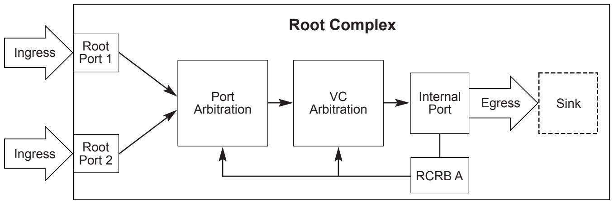

<details>
<summary>flowchart</summary>

```mermaid
graph TD
  A["Ingress"] --> B["Root Port 1"]
  C["Ingress"] --> D["Root Port 2"]
  B --> E["Port Arbitration"]
  D --> E
  E --> F["VC Arbitration"]
  F --> G["Internal Port"]
  G --> H["Egress"]
  H --> I["Sink"]
  G --> J["RCRB A"]
  J --> E
```
</details>

A-0423

Figure 6-11 Root Complex Represented as a Single Component§

• Multiple Root Complex Components such that software not only has visibility and control with respect to internal operation of a given Root Complex Component but also has the ability to discover and control arbitration between different Root Complex Components. As shown in § Figure 6-12, software views the Root Ports as Ingress Ports for a given component. An RCRB structure controls egress from the component to other Root Complex Components (RCRB C) or to an internal sink unit such as memory (RCRB A). In addition, an RCRB structure (RCRB B) may also be present in a given component to control traffic from other Root Complex Components. Controls for differentiated services are provided through Virtual Channel Capability structures located appropriately in the RCRBs respectively.

More complex topologies are possible as well.

A Root Complex topology can be represented as a collection of logical Root Complex Components such that each logical component has:

• One or more Ingress Ports.  
• An Egress Port.  
• Optional associated Virtual Channel capabilities located either in the Configuration Space (for Root Ports) or in an RCRB (for internal Ingress/Egress Ports) if the Root Complex supports Virtual Channels.  
• Optional devices/Functions integrated in the Root Complex.

In order for software to correctly program arbitration and other control parameters for PCI Express differentiated services, software must be able to discover a Root Complex’s internal topology. Root Complex topology discovery is accomplished by means of the Root Complex Link Declaration Capability as described in § Section 7.9.8 .

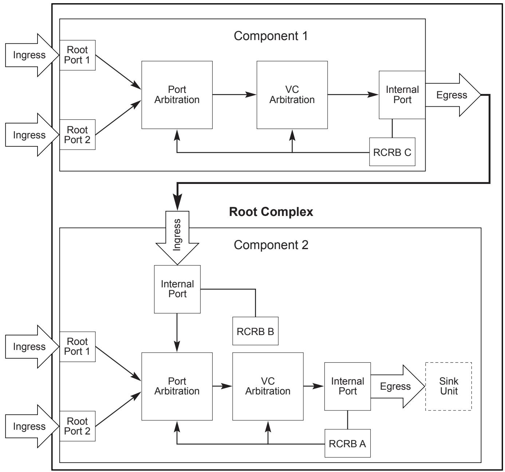

<details>
<summary>flowchart</summary>

```mermaid
graph TD
  A["Ingress"] --> B["Root Port 1"]
  A --> C["Root Port 2"]
  B --> D["Port Arbitration"]
  C --> D
  D --> E["VC Arbitration"]
  E --> F["Internal Port"]
  F --> G["Egress"]
  H["Ingress"] --> I["RCRB C"]
  I --> F
  J["RCRB B"] --> K["Internal Port"]
  L["RCRB A"] --> M["Internal Port"]
  N["RCRB B"] --> O["Port Arbitration"]
  P["RCRB A"] --> Q["RCRB B"]
  R["RCRB B"] --> S["Port Arbitration"]
  T["RCRB A"] --> U["RCRB B"]
  V["RCRB B"] --> W["RCRB A"]
  X["RCRB B"] --> Y["RCRB A"]
  Z["RCRB B"] --> AA["RCRB A"]
  AB["RCRB B"] --> AC["RCRB A"]
  AD["RCRB B"] --> AE["RCRB A"]
  AF["RCRB B"] --> AG["RCRB A"]
  AH["RCRB B"] --> AI["RCRB A"]
  AJ["RCRB A"] --> AK["RCRB B"]
  AL["RCRB B"] --> AM["RCRB A"]
  AN["RCRB A"] --> AO["RCRB B"]
  AP["RCRB B"] --> AQ["RCRB A"]
  AR["RCRB A"] --> AS["RCRB B"]
  AT["RCRB B"] --> AU["RCRB A"]
  AV["RCRB A"] --> AW["RCRB B"]
  AX["RCRB B"] --> AY["RCRB A"]
  AZ["RCRB A"] --> BA["RCRB B"]
  BB["RCRB B"] --> BC["RCRB A"]
  BD["RCRB A"] --> BE["RCRB B"]
  BF["RCRB B"] --> BG["RCRB A"]
  BH["RCRB A"] --> BI["RCRB B"]
  BJ["RCRB B"] --> BK["RCRB A"]
  BL["RCRB A"] --> BM["RCRB B"]
  BN["RCRB B"] --> BO["RCRB A"]
  BP["RCRB A"] --> BQ["RCRB B"]
  BR["RCRB B"] --> BS["RCRB A"]
  BT["RCRB A"] --> BU["RCRB B"]
  BV["RCRB B"] --> BW["RCRB A"]
  BX["RCRB A"] --> BY["RCRB B"]
  BZ["RCRB B"] --> CA["RCRB A"]
  CB["RCRB A"] --> CC["RCRB B"]
  DD["RCRB B"] --> DE["RCRB A"]
  DF["RCRB A"] --> DG["RCRB B"]
  DH["RCRB B"] --> DI["RCRB A"]
  DJ["RCRB A"] --> DK["RCRB B"]
  DL["RCRB B"] --> DM["RCRB A"]
  DN["RCRB A"] --> DO
  DO --> DB["Component 1"]
  DO --> DC["Component 2"]
```
</details>

A-0424

Figure 6-12 Root Complex Represented as Multiple Components§

## 6.11 Link Speed Management §

This section describes how Link speed management is coordinated between the LTSSM (§ Section 4.2.7 ) and the software Link observation and control mechanisms (see § Section 7.5.3.6 , § Section 7.5.3.7 , § Section 7.5.3.8 , § Section 7.5.3.18 , § Section 7.5.3.19 , and § Section 7.5.3.20 ).

The Target Link Speed field in the Link Control 2 register in the Downstream Port sets the upper bound for the Link speed. Except as described below, the Upstream component must attempt to maintain the Link at the Target Link Speed, or at the highest speed supported by both components on the Link (as reported by the values in the training sets - see § Section 4.2.5.1 ), whichever is lower.

Any Upstream Port or Downstream Port with the Hardware Autonomous Speed Disable bit in the Link Control 2 register clear is permitted to autonomously change the Link speed using implementation specific criteria.

If the reliability of the Link is unacceptably low, then either component is permitted to lower the Link speed by removing the unreliable Link speed from the list of supported speeds advertised in the training sets the component transmits. The criteria for determination of acceptable Link reliability are implementation specific, and are not dependent on the setting of the Hardware Autonomous Speed Disable bit.

During any given speed negotiation it is possible that one or both components will advertise a subset of all speeds supported, as a means to cap the post-negotiation Link speed. It is permitted for a component to change its set of advertised supported speeds without requesting a Link speed change by driving the Link through Recovery without setting the speed change bit.

When a component’s attempt to negotiate to a particular Link speed fails, that component is not permitted to attempt negotiation to that Link speed, or to any higher Link speed, until 200 ms has passed from the return to L0 following the failed attempt, or until the other component on the Link advertises support for the higher Link speed through its transmitted training sets (with or without a request to change the Link speed), whichever comes first.

Software is permitted to restrict the maximum speed of Link operation and set the preferred Link speed by setting the value in the Target Link Speed field in the Upstream component. After modifying the value in the Target Link Speed field, software must trigger Link retraining by writing 1b to the Retrain Link bit. Software is notified of any Link speed changes (as well as any Link width changes) through the Link Bandwidth Notification Mechanism.

Software is permitted to cause a Link to transition to the Polling.Compliance LTSSM state at a particular speed by writing the Link Control 2 register in both components with the same value in the Target Link Speed field and Setting the Enter Compliance bit, and then initiating a Hot Reset on the Link (through the Downstream Port).

Note that this will take the Link to a DL\_Down state and therefore cannot be done transparently to other software that is using the Link. The Downstream Port will return to Polling.Active when the Enter Compliance bit is cleared.

## 6.12 Access Control Services (ACS) §

ACS defines a set of control points within a PCI Express topology to determine whether a TLP is to be routed normally, blocked, or redirected. ACS is applicable to RCs, Switches, and Multi-Function Devices. 120 For ACS requirements, single-Function devices that are SR-IOV capable must be handled as if they were Multi-Function Devices, since they essentially behave as Multi-Function Devices after their Virtual Functions (VFs) are enabled.

Implementation of ACS in RCiEPs is permitted but not required. It is explicitly permitted that, within a single Root Complex, some RCiEPs implement ACS and some do not. It is strongly recommended that Root Complex implementations ensure that all accesses originating from RCiEPs (PFs and VFs) without ACS capability are first subjected to processing by the Translation Agent (TA) in the Root Complex before further decoding and processing. The details of such Root Complex handling are outside the scope of this specification.

ACS provides the following types of access control:

• ACS Source Validation  
• ACS Translation Blocking  
• ACS P2P Request Redirect  
• ACS P2P Completion Redirect

• ACS Upstream Forwarding  
• ACS P2P Egress Control  
• ACS Direct Translated P2P  
• ACS I/O Request Blocking  
• ACS DSP Memory Target Access  
• ACS USP Memory Target Access  
• ACS Unclaimed Request Redirect

The specific requirements for each of these are discussed in the following section.

ACS hardware functionality is disabled by default, and is enabled only by ACS-aware software. With the exception of ACS Source Validation, ACS access controls are not applicable to Multicast TLPs (see § Section 6.14 ), and have no effect on them.

## 6.12.1 ACS Component Capability Requirements §

ACS functionality is reported and managed via ACS Extended Capability structures. PCI Express components are permitted to implement ACS Extended Capability structures in some, none, or all of their applicable Functions. The extent of what is implemented is communicated through capability bits in each ACS Extended Capability structure. A given Function with an ACS Extended Capability structure may be required or forbidden to implement certain capabilities, depending upon the specific type of the Function and whether it is part of a Multi-Function Device.

ACS is never applicable to a PCI Express to PCI Bridge Function or a Root Complex Event Collector Function, and such Functions must never implement an ACS Extended Capability structure.

## 6.12.1.1 ACS Downstream Ports §

This section applies to Root Ports and Switch Downstream Ports that implement an ACS Extended Capability structure. This section applies to Downstream Port Functions both for single-Function devices and Multi-Function Devices.

• ACS Source Validation: must be implemented.

When enabled, the Downstream Port tests the Bus Number from the Requester ID of each Upstream Request received by the Port to determine if it is associated with the Secondary side of the virtual bridge associated with the Downstream Port, by either or both of:

◦ Determining that the Requester ID falls within the Bus Number “aperture” of the Port - the inclusive range specified by the Secondary Bus Number register and the Subordinate Bus Number register.  
◦ If FPB is implemented and enabled, determining that the Requester ID is associated with the bridge’s Secondary Side by the application of the FPB Routing ID mechanism.  
If the Bus Number from the Requester ID of the Request is not within this aperture, this is a reported error (ACS Violation) associated with the Receiving Port (see § Section 6.12.5 .)

Completions are never affected by ACS Source Validation.

## IMPLEMENTATION NOTE:

## UPSTREAM MESSAGES AND ACS SOURCE VALIDATION §

Functions are permitted to transmit Upstream Messages before they have been assigned a Bus Number. Such messages will have a Requester ID with a Bus Number of 00h. If the Downstream Port has ACS Source Validation enabled, these Messages (see § Table F-1, § Section 2.2.8.2 , and § Section 6.22.1 ) will likely be detected as an ACS Violation error.

• ACS Translation Blocking: must be implemented.

When enabled, the Downstream Port checks the Address Type (AT) field of each Upstream Memory Request received by the Port. If the AT field is not the default value, this is a reported error (ACS Violation) associated with the Receiving Port (see § Section 6.12.5 ). This error must take precedence over ACS Upstream Forwarding and any applicable ACS P2P control mechanisms.

Completions are never affected by ACS Translation Blocking.

• ACS P2P Request Redirect: must be implemented by Root Ports that support peer-to-peer traffic with other Root Ports; 121 must be implemented by Switch Downstream Ports.

ACS P2P Request Redirect is subject to interaction with the ACS P2P Egress Control and ACS Direct Translated P2P mechanisms (if implemented). Refer to § Section 6.12.3 for more information.

When ACS P2P Request Redirect is enabled in a Switch Downstream Port, peer-to-peer Requests must be redirected Upstream towards the RC.

When ACS P2P Request Redirect is enabled in a Root Port, peer-to-peer Requests must be sent to Redirected Request Validation logic within the RC that determines whether the Request is “reflected” back Downstream towards its original target, or blocked as an ACS Violation error. The algorithms and specific controls for making this determination are not architected by this specification.

Downstream Ports never redirect Requests that are traveling Downstream.

Completions are never affected by ACS P2P Request Redirect.

• ACS P2P Completion Redirect: must be implemented by Root Ports that implement ACS P2P Request Redirect; must be implemented by Switch Downstream Ports.

The intent of ACS P2P Completion Redirect is to avoid ordering rule violations between Completions and Requests when Requests are redirected. Refer to § Section 6.12.6 for more information.

ACS P2P Completion Redirect does not interact with ACS controls that govern Requests.

When ACS P2P Completion Redirect is enabled in a Switch Downstream Port, peer-to-peer Completions 122 that do not have the Relaxed Ordering Attribute bit set (1b) must be redirected Upstream towards the RC. Otherwise, peer-to-peer Completions must be routed normally.

When ACS P2P Completion Redirect is enabled in a Root Port, peer-to-peer Completions that do not have the Relaxed Ordering bit set must be handled such that they do not pass Requests that are sent to Redirected Request Validation logic within the RC. Such Completions must eventually be sent Downstream towards their original peer-to-peer targets, without incurring additional ACS access control checks.

Downstream Ports never redirect Completions that are traveling Downstream.

Requests are never affected by ACS P2P Completion Redirect.

• ACS Upstream Forwarding: must be implemented by Root Ports if the RC supports Redirected Request Validation; must be implemented by Switch Downstream Ports.

When ACS Upstream Forwarding is enabled in a Switch Downstream Port, and its Ingress Port receives an Upstream Request or Completion TLP targeting the Port’s own Egress Port, the Port must instead forward the TLP Upstream towards the RC.

When ACS Upstream Forwarding is enabled in a Root Port, and its Ingress Port receives an Upstream Request or Completion TLP that targets the Port’s own Egress Port, the Port must handle the TLP as follows. For a Request, the Root Port must handle it the same as a Request that the Port “redirects” with the ACS P2P Request Redirect mechanism. For a Completion, the Root Port must handle it the same as a Completion that the Port “redirects” with the ACS P2P Completion Redirect mechanism.

When ACS Upstream Forwarding is not enabled on a Downstream Port, and its Ingress Port receives an Upstream Request or Completion TLP that targets the Port’s own Egress Port, the handling of the TLP is undefined.

• ACS P2P Egress Control: implementation is optional.

ACS P2P Egress Control is subject to interaction with the ACS P2P Request Redirect and ACS Direct Translated P2P mechanisms (if implemented). Refer to § Section 6.12.3 for more information.

A Switch that supports ACS P2P Egress Control can be selectively configured to block peer-to-peer Requests between its Downstream Ports. Software can configure the Switch to allow none or only a subset of its Downstream Ports to send peer-to-peer Requests to other Downstream Ports. This is configured on a per Downstream Port basis.

An RC that supports ACS P2P Egress Control can be selectively configured to block peer-to-peer Requests between its Root Ports. Software can configure the RC to allow none or only a subset of the Hierarchy Domains to send peer-to-peer Requests to other Hierarchy Domains. This is configured on a per Root Port basis.

With ACS P2P Egress Control in Downstream Ports, controls in the Ingress Port (“sending” Port) determine if the peer-to-peer Request is blocked, and if so, the Ingress Port handles the ACS Violation error per § Section 6.12.5 .

Completions are never affected by ACS P2P Egress Control.

• ACS Direct Translated P2P: must be implemented by Root Ports that support Address Translation Services (ATS) and also support peer-to-peer traffic with other Root Ports; 123 must be implemented by Switch Downstream Ports.

When ACS Direct Translated P2P is enabled in a Downstream Port, peer-to-peer Memory Requests whose Address Type (AT) field indicates a Translated address must be routed normally (“directly”) to the peer Egress Port, regardless of ACS P2P Request Redirect and ACS P2P Egress Control settings. All other peer-to-peer Requests must still be subject to ACS P2P Request Redirect and ACS P2P Egress Control settings.

Completions are never affected by ACS Direct Translated P2P.

• ACS I/O Request Blocking: must be implemented by Root Ports and Switch Downstream Ports that support ACS Enhanced Capability.

When enabled, the Port must handle an Upstream I/O Request received by the Port’s Ingress as an ACS Violation.

• ACS DSP Memory Target Access: must be implemented by Root Ports and Switch Downstream Ports that support ACS Enhanced Capability and that have applicable Memory BAR Space to protect.

123. Root Port indication of ACS Direct Translated P2P support does not imply any particular level of peer-to-peer support by the Root Complex, or that peer-to-peer traffic is supported at all.

ACS DSP Memory Target Access determines how an Upstream Request received by the Downstream Port’s Ingress and targeting any Memory BAR Space associated with an applicable Downstream Port is handled. The Request can be blocked, redirected, or allowed to proceed directly to its target. In a Switch, all Downstream Ports are applicable, including the one on which the Request was received. In a Root Complex, the set of applicable Root Ports is implementation specific, but always includes the one on which the Request was received.

• ACS USP Memory Target Access: must be implemented by Switch Downstream Ports that support ACS Enhanced Capability and that have applicable Memory BAR Space in the Switch Upstream Port to protect; is not applicable to Root Ports.

ACS USP Memory Target Access determines how an Upstream Request received by the Switch Downstream Port’s Ingress and targeting any Memory BAR Space 125 associated with the Switch’s Upstream Port is handled. The Request can be blocked, redirected, or allowed to proceed directly to its target.

If any Functions other than the Switch Upstream Port are associated with the Upstream Port, this field has no effect on accesses to their Memory BAR Space 126 . Such access is controlled by the ACS Extended Capability (if present) in the Switch Upstream Port.

• ACS Unclaimed Request Redirect: must be implemented by Switch Downstream Ports that support ACS Enhanced Capability; is not applicable to Root Ports.

When enabled, incoming Requests received by the Switch Downstream Port’s Ingress and targeting Memory Space within the memory window of a Switch Upstream Port that is not within a memory window or Memory BAR Target of any Downstream Port within the Switch are redirected Upstream out of the Switch.

When not enabled, such Requests are handled by the Switch Downstream Port as an Unsupported Request (UR).

## 6.12.1.2 ACS Functions in SR-IOV Capable and Multi-Function Devices §

This section applies to Multi-Function Device ACS Functions, with the exception of Downstream Port Functions, which are covered in the preceding section. For ACS requirements, single-Function devices that are SR-IOV capable must be handled as if they were Multi-Function Devices.

• ACS Source Validation: must not be implemented.  
• ACS Translation Blocking: must not be implemented.  
• ACS P2P Request Redirect: must be implemented by Functions that support peer-to-peer traffic with other Functions. This includes SR-IOV Virtual Functions (VFs).

ACS P2P Request Redirect is subject to interaction with the ACS P2P Egress Control and ACS Direct Translated P2P mechanisms (if implemented). Refer to § Section 6.12.3 for more information.

When ACS P2P Request Redirect is enabled in a Multi-Function Device that is not an RCiEP, peer-to-peer Requests (between Functions of the device) must be redirected Upstream towards the RC.

It is permitted but not required to implement ACS P2P Request Redirect in an RCiEP. When ACS P2P Request Redirect is enabled in an RCiEP, peer-to-peer Requests, defined as all Requests that do not target system memory, must be sent to implementation specific logic within the Root Complex that determines whether the

124. This also includes any Memory Space allocated by an Expansion ROM Base Address register (BAR). This also includes any Memory Space allocated by EA entries with a BEI value of 0, 1, 7, or 8. See § Section 7.8.5.3 .  
125. This also includes any Memory Space allocated by an Expansion ROM Base Address register (BAR). This also includes any Memory Space allocated by EA entries with a BEI value of 0, 1, 7, or 8. See § Section 7.8.5.3 .  
126. This also includes any Memory Space allocated by an Expansion ROM Base Address register (BAR). This also includes any Memory Space allocated by EA entries with a BEI value of 0, 1, 7, or 8. See § Section 7.8.5.3 .

Request is directed towards its original target, or blocked as an ACS Violation error. The algorithms and specific controls for making this determination are not architected by this specification.

Completions are never affected by ACS P2P Request Redirect.

• ACS P2P Completion Redirect: must be implemented by Functions that implement ACS P2P Request Redirect. The intent of ACS P2P Completion Redirect is to avoid ordering rule violations between Completions and Requests when Requests are redirected. Refer to § Section 6.12.6 for more information.

ACS P2P Completion Redirect does not interact with ACS controls that govern Requests.

When ACS P2P Completion Redirect is enabled in a Multi-Function Device that is not an RCiEP, peer-to-peer Completions that do not have the Relaxed Ordering bit set must be redirected Upstream towards the RC. Otherwise, peer-to-peer Completions must be routed normally.

Requests are never affected by ACS P2P Completion Redirect.

• ACS Upstream Forwarding: must not be implemented.  
• ACS P2P Egress Control: implementation is optional; is based on Function Numbers or Function Group Numbers; controls peer-to-peer Requests between the different Functions within the multi-Function or SR-IOV capable device.

ACS P2P Egress Control is subject to interaction with the ACS P2P Request Redirect and ACS Direct Translated P2P mechanisms (if implemented). Refer to § Section 6.12.3 for more information.

Each Function within a Multi-Function Device that supports ACS P2P Egress Control can be selectively enabled to block peer-to-peer communication with other Functions or Function Groups 127 within the device. This is configured on a per Function basis.

With ACS P2P Egress Control in multi-Function or SR-IOV capable devices, controls in the "sending" Function determine if the Request is blocked, and if so, the "sending" Function handles the ACS Violation error per § Section 6.12.5 .

When ACS Function Groups are enabled in an ARI Device (ACS Function Groups Enable is Set), ACS P2P Egress Controls are enforced on a per Function Group basis instead of a per Function basis. See § Section 6.13 .

Completions are never affected by ACS P2P Egress Control.

• ACS Direct Translated P2P: must be implemented if the Multi-Function Device Function supports Address Translation Services (ATS) and also peer-to-peer traffic with other Functions.

When ACS Direct Translated P2P is enabled in a Multi-Function Device, peer-to-peer Memory Requests whose Address Type (AT) field indicates a Translated address must be routed normally (“directly”) to the peer Function, regardless of ACS P2P Request Redirect and ACS P2P Egress Control settings. All other peer-to-peer Requests must still be subject to ACS P2P Request Redirect and ACS P2P Egress Control settings.

Completions are never affected by ACS Direct Translated P2P.

## 6.12.1.3 Functions in Single-Function Devices §

This section applies to single-Function device Functions, with the exception of Downstream Port Functions and SR-IOV capable Functions, which are covered in a preceding section. For ACS requirements, single-Function devices that are SR-IOV capable must be handled as if they were Multi-Function Devices.

No ACS capabilities are applicable, and the Function must not implement an ACS Extended Capability structure.

## 6.12.2 Interoperability §

The following rules govern interoperability between ACS and non-ACS components:

• When ACS P2P Request Redirect and ACS P2P Completion Redirect are not being used, ACS and non-ACS components may be intermixed within a topology and will interoperate fully. ACS can be enabled in a subset of the ACS components without impacting interoperability.  
When ACS P2P Request Redirect, ACS P2P Completion Redirect, or both are being used, certain components in the PCI Express hierarchy must support ACS Upstream Forwarding (of Upstream redirected Requests). Specifically:

The associated Root Port 128 must support ACS Upstream Forwarding. Otherwise, how the Root Port handles Upstream redirected Request or Completion TLPs is undefined. The RC must also implement Redirected Request Validation.

Between each ACS component where P2P TLP redirection is enabled and its associated Root Port, any intermediate Switches must support ACS Upstream Forwarding. Otherwise, how such Switches handle Upstream redirected TLPs is undefined.

## 6.12.3 ACS Peer-to-Peer Control Interactions §

With each peer-to-peer Request, multiple ACS control mechanisms may interact to determine whether the Request is routed directly towards its peer-to-peer target, blocked immediately as an ACS Violation, or redirected Upstream towards the RC for access validation. Peer-to-peer Completion redirection is determined exclusively by the ACS P2P Completion Redirect mechanism.

If ACS Direct Translated P2P is enabled in a Port/Function, peer-to-peer Memory Requests whose Address Type (AT) field indicates a Translated address must be routed normally (“directly”) to the peer Port/Function, regardless of ACS P2P Request Redirect and ACS P2P Egress Control settings. Otherwise such Requests, and unconditionally all other peer-to-peer Requests, must be subject to ACS P2P Request Redirect and ACS P2P Egress Control settings. Specifically, the applicable Egress Control Vector bit, along with the ACS P2P Egress Control Enable bit (E) and the ACS P2P Request Redirect Enable bit (R), determine how the Request is handled. It must be noted that atomicity of accesses cannot be guaranteed if ACS peer-to-peer Request Redirect targets a legacy device location that can be the target of a locked access. Refer to § Section 7.7.11 for descriptions of these control bits. § Table 6-11 specifies the interactions.

Table 6-11 ACS P2P Request Redirect and ACS P2P Egress Control Interactions§

<table><tr><td>Control Bit E (b)</td><td>Control Bit R (b)</td><td>Egress Control Vector Bit for the Associated Egress Switch Port, Root Port, Function, or Function Group</td><td>Required Handling for Peer-to-Peer Requests</td></tr><tr><td>0</td><td>0</td><td>X - Don’t care</td><td>Route directly to peer-to-peer target</td></tr><tr><td>0</td><td>1</td><td>X - Don’t Care</td><td>Redirect Upstream</td></tr><tr><td>1</td><td>0</td><td>1</td><td>Handle as an ACS Violation</td></tr><tr><td>1</td><td>0</td><td>0</td><td>Route directly to peer-to-peer target</td></tr><tr><td>1</td><td>1</td><td>1</td><td>Redirect Upstream</td></tr><tr><td>1</td><td>1</td><td>0</td><td>Route directly to peer-to-peer target</td></tr></table>

## IMPLEMENTATION NOTE:

## ACCESS CONTROL SERVICES IN SYSTEMS THAT SUPPORT DIRECT ASSIGNMENT OF FUNCTIONS §

General-purpose VIs typically have separate address spaces for each SI and for the VI itself. If such a VI also supports direct assignment of a Function to an SI, Untranslated Memory Request transactions issued by directly assigned Functions are under the complete control of software operating within the associated SI and typically reference the address space associated with that SI. In contrast, Memory Request transactions issued by the Host (MMIO requests) and by Functions that are not directly assigned are under the control of the VI and typically reference one or more system address spaces (e.g., the PCIe physical address space, the address space associated with the VI, or the address space associated with some designated SI). General-purpose VIs are not expected to establish a dependency between these various address spaces. Consequently, these address spaces may freely overlap which could lead to unintended routing of TLPs by Switches. For example, Upstream Memory Request TLPs originated by a directly assigned Function and intended for main memory could instead be routed to a Downstream Port if the address in the Request falls within the MMIO address region associated with that Downstream Port. Such unintended routing poses a threat to SI and/or VI stability and integrity.

To guard against this concern, vendors are strongly recommended to implement ACS in platforms that support general purpose VIs with direct assignment of Functions. Such support should include:

• In Switches or Root Complexes located below the TA, the level of ACS support should follow the guidelines established in this document for Downstream Switch Ports that implement an ACS Extended Capability structure.  
Note: Components located above the TA only see Translated Memory Requests, consequently this concern does not apply to those components.  
• In SR-IOV devices that are capable of peer-to-peer transactions, ACS support is required.  
In Multi-Function Devices that are capable of peer-to-peer transactions, vendors are strongly recommended to implement ACS with ACS P2P Egress Control.

Additionally, platform vendors should test for the presence of ACS and enable it in Root Complexes and Switches on the path from the TA to a Function prior to directly assigning that Function. If the Function is peer-to-peer capable, ACS should be enabled in the Function as well.

## 6.12.4 ACS Enhanced Capability


ACS Enhanced Capability is an additional set of ACS control mechanisms to improve the level of isolation and protection provided by ACS. ACS Enhanced Capability defines the following additional access control mechanisms:

• ACS I/O Request Blocking  
• ACS DSP Memory Target Access

• ACS USP Memory Target Access  
• ACS Unclaimed Request Redirect

Through these mechanisms, ACS Enhanced Capability provides protection and consistent handling of Requests directed toward regions not covered by the original ACS mechanisms.

## IMPLEMENTATION NOTE:

## ACS REDIRECT AND GUEST PHYSICAL ADDRESSES (GPAS) §

ACS redirect mechanisms were originally architected to enable fine-grained access control for P2P Memory Requests, by redirecting selected Requests Upstream to the RC, where validation logic determines whether to allow or deny access. However, ACS redirect mechanisms can also ensure that Functions under the direct control of VMs have their DMA Requests routed correctly to the Translation Agent in the host, which then translates their guest physical addresses (GPAs) into host physical addresses (HPAs).

GPA ranges used for Memory Space vs. DMA are not guaranteed to coincide with HPA ranges, which the PCIe fabric uses for Memory Request routing and access control. If any GPAs used for DMA fall with within the HPA ranges used for Memory Space, legitimate or malicious packet misrouting can result.

ACS redirect mechanisms can ensure that Upstream Memory Requests with GPAs intended for DMA never get routed to HPA Memory ranges. ACS P2P Request Redirect handles this for (1) peer accesses between Functions within a Multi-Function Device and (2) peer accesses between Downstream Ports within a Switch or RC. ACS P2P Egress Control with redirect handles this in a more fine-grained manner for the same two cases.

Redirect mechanisms introduced with ACS Enhanced Capability handle this for additional cases. ACS DSP Memory Target Access with redirect handles this for Downstream Port Memory Resource ranges. ACS USP Memory Target Access with redirect handles this for Switch Upstream Port Memory Resource ranges. In Switches, ACS Unclaimed Request Redirect handles this for any areas within Upstream Port Memory apertures that are not handled by the other ACS redirect mechanisms.

Together these ACS redirect mechanisms can ensure that Upstream Memory Requests with GPAs intended for DMA are always routed or redirected to the Translation Agent in the host, and those with GPAs intended for P2P are still routed as originally architected.

## 6.12.5 ACS Violation Error Handling §

ACS Violations may occur due to either hardware or software defects/failures. To assist in fault isolation and root cause analysis, it is recommended that AER be implemented in ACS components. AER prefix/header logging and the Prefix Log/ Header Log registers may be used to determine the prefix/header of the offending Request. The ACS Violation Status, Mask, and Severity bits provide positive identification of the error and increased control over error logging and signaling.

When an ACS Violation is detected, the ACS component that operates as the Completer 129 must do the following:

• For Non-Posted Requests, the Completer must generate a Completion with a Completer Abort (CA) Completion Status.  
• The Completer must log and signal the ACS Violation as indicated in § Figure 6-2. Note the following:

◦ Even though the Completer uses a CA Completion Status when it sends a Completion, the Completer must log an ACS Violation error instead of a Completer Abort error.  
◦ If the severity of the ACS Violation is non-fatal and the Completer sends a Completion with CA Completion Status, this case must be handled as an Advisory Non-Fatal Error as described in § Section 6.2.3.2.4.1 .

• The Completer 130 must set the Signaled Target Abort bit in either its Status register or Secondary Status register as appropriate.

## 6.12.6 ACS Redirection Impacts on Ordering Rules §

When ACS P2P Request Redirect is enabled, some or all peer-to-peer Requests are redirected, which can cause ordering rule violations in some cases. This section explores those cases, plus a similar case that occurs with RCs that implement “Request Retargeting” as an alternative mechanism for enforcing peer-to-peer access control.

## 6.12.6.1 Completions Passing Posted Requests §

When a peer-to-peer Posted Request is redirected, a subsequent peer-to-peer non-RO 131 Completion that is routed directly can effectively pass the redirected Posted Request, violating the ordering rule that non-RO Completions must not pass Posted Requests. Refer to § Section 2.4.1 for more information.

ACS P2P Completion Redirect can be used to avoid violating this ordering rule. When ACS P2P Completion Redirect is enabled, all peer-to-peer non-RO Completions will be redirected, thus taking the same path as redirected peer-to-peer Posted Requests. Enabling ACS P2P Completion Redirect when some or all peer-to-peer Requests are routed directly will not cause any ordering rule violations, since it is permitted for a given Completion to be passed by any TLP other than another Completion with the same Transaction ID.

As an alternative mechanism to ACS P2P Request Redirect for enforcing peer-to-peer access control, some RCs implement “Request Retargeting”, where the RC supports special address ranges for “peer-to-peer” traffic, and the RC will retarget validated Upstream Requests to peer devices. Upon receiving an Upstream Request targeting a special address range, the RC validates the Request, translates the address to target the appropriate peer device, and sends the Request back Downstream. With retargeted Requests that are Non-posted, if the RC does not modify the Requester ID, the resulting Completions will travel “directly” peer-to-peer back to the original Requester, creating the possibility of non-RO Completions effectively passing retargeted Posted Requests, violating the same ordering rule as when ACS P2P Request Redirect is being used. ACS P2P Completion Redirect can be used to avoid violating this ordering rule here as well.

If ACS P2P Request Redirect and RC P2P Request Retargeting are not being used, there is no envisioned benefit to enabling ACS P2P Completion Redirect, and it is recommended not to do so because of potential performance impacts.

## IMPLEMENTATION NOTE:

## PERFORMANCE IMPACTS WITH ACS P2P COMPLETION REDIRECT

While the use of ACS P2P Completion Redirect can avoid ordering violations with Completions passing Posted Requests, it also may impact performance. Specifically, all redirected Completions will have to travel up to the RC from the point of redirection and back, introducing extra latency and possibly increasing Link and RC congestion.

Since peer-to-peer Completions with the Relaxed Ordering bit set are never redirected (thus avoiding performance impacts), it is strongly recommended that Requesters be implemented to maximize the proper use of Relaxed Ordering, and that software enable Requesters to utilize Relaxed Ordering by setting the Enable Relaxed Ordering bit in the Device Control Register.

If software enables ACS P2P Request Redirect, RC P2P Request Retargeting, or both, and software is certain that proper operation is not compromised by peer-to-peer non-RO Completions passing peer-to-peer 132 Posted Requests, it is recommended that software leave ACS P2P Completion Redirect disabled as a way to avoid its performance impacts.

## 6.12.6.2 Requests Passing Posted Requests §

When some peer-to-peer Requests are redirected but other peer-to-peer Requests are routed directly, the possibility exists of violating the ordering rules where Non-posted Requests or non-RO Posted Requests must not pass Posted Requests. Refer to § Section 2.4.1 for more information.

These ordering rule violation possibilities exist only when ACS P2P Request Redirect and ACS Direct Translated P2P are both enabled. Software should not enable both these mechanisms unless it is certain either that such ordering rule violations cannot occur, or that proper operation will not be compromised if such ordering rule violations do occur.

## IMPLEMENTATION NOTE:

## ENSURING PROPER OPERATION WITH ACS DIRECT

## TRANSLATED P2P §

The intent of ACS Direct Translated P2P is to optimize performance in environments where Address Translation Services (ATS) are being used with peer-to-peer communication whose access control is enforced by the RC. Permitting peer-to-peer Requests with Translated addresses to be routed directly avoids possible performance impacts associated with redirection, which introduces extra latency and may increase Link and RC congestion.

For the usage model where peer-to-peer Requests with Translated addresses are permitted, but those with Untranslated addresses are to be blocked as ACS Violations, it is recommended that software enable ACS Direct Translated P2P and ACS P2P Request Redirect, and configure the Redirected Request Validation logic in the RC to block the redirected Requests with Untranslated addresses. This configuration has no ordering rule violations associated with Requests passing Posted Requests.

For the usage model where some Requesters use Translated addresses exclusively with peer-to-peer Requests and some Requesters use Untranslated addresses exclusively with peer-to-peer Requests, and the two classes of Requesters do not communicate peer-to-peer with each other, proper operation is unlikely to be compromised by redirected peer-to-peer Requests (with Untranslated addresses) being passed by direct peer-to-peer Requests (with Translated addresses). It is recommended that software not enable ACS Direct Translated P2P unless software is certain that proper operation is not compromised by the resulting ordering rule violations.

For the usage model where a single Requester uses both Translated and Untranslated addresses with peer-to-peer Requests, again it is recommended that software not enable ACS Direct Translated P2P unless software is certain that proper operation is not compromised by the resulting ordering rule violations. This requires a detailed analysis of the peer-to-peer communications models being used, and is beyond the scope of this specification.

## 6.13 Alternative Routing-ID Interpretation (ARI) §

Routing IDs, Requester IDs, and Completer IDs are 16-bit identifiers traditionally composed of three fields: an 8-bit Bus Number, a 5-bit Device Number, and a 3-bit Function Number. With ARI, the 16-bit field is interpreted as two fields instead of three: an 8-bit Bus Number and an 8-bit Function Number - the Device Number field is eliminated. This new interpretation enables an ARI Device to support up to 256 Functions [0..255] instead of 8 Functions [0..7].

ARI is controlled by a new set of optional capability and control register bits. These provide:

• Software the ability to detect whether a component supports ARI.  
• Software the ability to configure an ARI Downstream Port so the logic that determines when to turn a Type 1 Configuration Request into a Type 0 Configuration Request no longer enforces a restriction on the traditional Device Number field being 0.  
• Software the ability to configure an ARI Device to assign each Function to a Function Group. Controls based on Function Groups may be preferable when finer granularity controls based on individual Functions are not required.  
◦ If Multi-Function VC arbitration is supported and enabled, arbitration can optionally be based on Function Groups instead of individual Functions.

◦ If ACS P2P Egress Controls are supported and enabled, access control can optionally be based on Function Groups instead of individual Functions.

The following illustrates an example flow for enabling these capabilities and provides additional details on their usage:

1. Software enumerates the PCI Express hierarchy and determines whether the ARI Extended Capability is supported.

a. For an ARI Downstream Port, the capability is communicated through the Device Capabilities 2 register.  
b. For an ARI Device, the capability is communicated through the ARI Extended Capability structure.  
c. ARI has no impact on the base enumeration algorithms used in platforms today.

2. Software enables ARI functionality in each component.

a. In an ARI Downstream Port immediately above an ARI Device, software sets the ARI Forwarding Enable bit in the Device Control 2 register. Setting this bit ensures the logic that determines when to turn a Type 1 Configuration Request into a Type 0 Configuration Request no longer enforces a restriction on the traditional Device Number field being 0.  
b. In an ARI Device, Extended Functions must respond if addressed with a Type 0 Configuration Request. It is necessary for ARI-aware software to enable ARI Forwarding in the Downstream Port immediately above the ARI Device, in order for ARI-aware software to discover and configure the Extended Functions.  
c. If an ARI Device implements a Multi-Function VC Extended Capability structure with Function arbitration, and also implements MFVC Function Groups, ARI-aware software categorizes Functions into Function Groups.

i. Each Function is assigned to a Function Group represented by a Function Group Number.

ii. A maximum of 8 Function Groups can be configured.

iii. Within the Multi-Function VC Arbitration Table, a Function Group Number is used in place of a Function Number in each arbitration slot.

1. Arbitration occurs on a Function Group basis instead of an individual Function basis.  
2. All other aspects of Multi-Function VC arbitration remain unchanged. See § Section 7.9.2.10 for additional details.

iv. Function arbitration within each Function Group is implementation specific.

d. If an ARI Device supports ACS P2P Egress Control, access control can be optionally implemented on a Function Group basis.

e. To improve the enumeration performance and create a more deterministic solution, software can enumerate Functions through a linked list of Function Numbers. The next linked list element is communicated through each Function’s ARI Capability Register.

i. Function 0 acts as the head of a linked list of Function Numbers. Software detects a non-Zero Next Function Number field within the ARI Capability Register as the next Function within the linked list. Software issues a configuration probe using the Bus Number captured by the Device and the Function Number derived from the ARI Capability Register to locate the next associated Function’s configuration space.

ii. Function Numbers may be sparse and non-sequential in their consumption by an ARI Device.

With an ARI Device, the Phantom Functions Supported field within each Function’s Device Capabilities register (see § Section 7.5.3.3 , § Table 7-20) must be set to 00b to indicate that Phantom Functions are not supported. The Extended

Tag Field Enable bit, the 10-Bit Tag Requester Enable bit, and the 14-Bit Tag Requester Enable bit can still be used to enable each Function to support higher numbers of outstanding Requests. See § Section 2.2.6.2 .

§ Figure 6-13 shows an example system topology with two ARI Devices, one below a Root Port and one below a Switch. For access to Extended Functions in ARI Device X, Root Port A must support ARI Forwarding and have it enabled by software. For access to Extended Functions in ARI Device Y, Switch Downstream Port D must support ARI Forwarding and have it enabled by software. With this configuration, it is recommended that software not enable ARI Forwarding in Root Port B or Switch Downstream Port C.

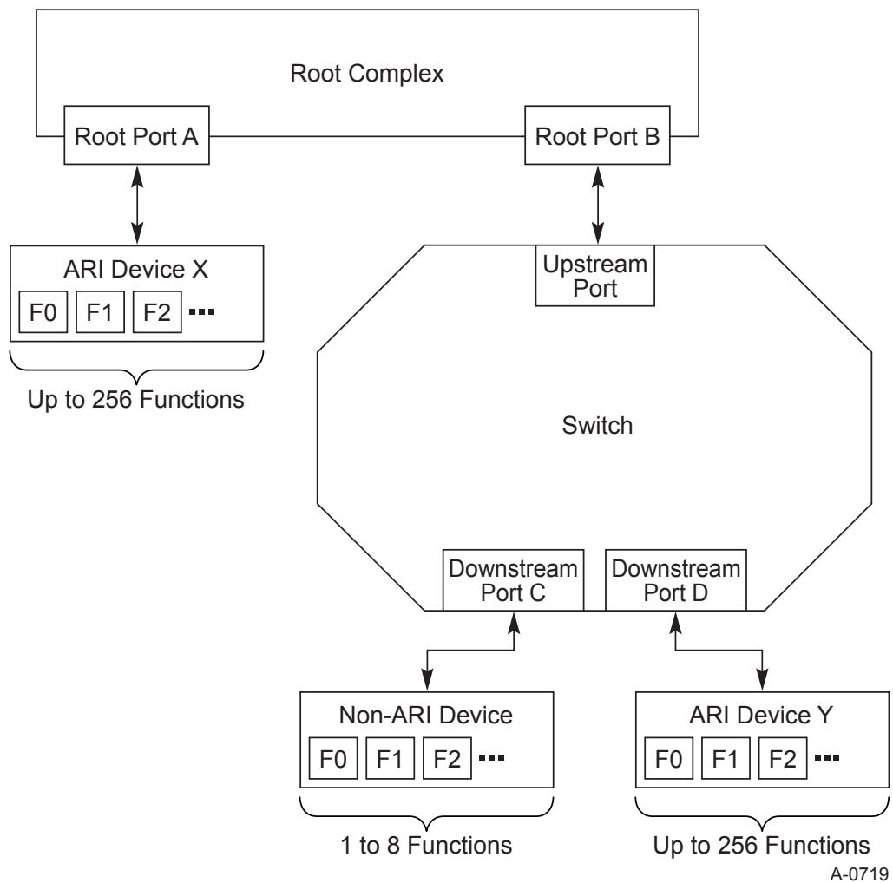

<details>
<summary>flowchart</summary>

```mermaid
graph TD
  A["Root Port A"] --> B["Root Port B"]
  B --> C["Switch"]
  C --> D["Downstream Port C"]
  C --> E["Downstream Port D"]
  D --> F["Non-ARI Device"]
  E --> G["ARI Device Y"]
  F --> H["1 to 8 Functions"]
  G --> I["Up to 256 Functions"]
  H --> J["ARI Device X"]
  I --> K["ARI Device Y"]
    style A fill:#f9f,stroke:#333
    style B fill:#f9f,stroke:#333
    style C fill:#ccf,stroke:#333
    style D fill:#cfc,stroke:#333
    style E fill:#cfc,stroke:#333
    style F fill:#fcc,stroke:#333
    style G fill:#fcc,stroke:#333
    style H fill:#ffc,stroke:#333
    style I fill:#ffc,stroke:#333
    style J fill:#fcc,stroke:#333
```
</details>

Figure 6-13 Example Syst § em Topology with ARI Devices

## IMPLEMENTATION NOTE:

## ARI FORWARDING ENABLE BEING SET INAPPROPRIATELY §

It is strongly recommended that software in general Set the ARI Forwarding Enable bit in a Downstream Port only if software is certain that the device immediately below the Downstream Port is an ARI Device. If the bit is Set when a non-ARI Device is present, the non-ARI Device can respond to Configuration Space accesses under what it interprets as being different Device Numbers, and its Functions can be aliased under multiple Device Numbers, generally leading to undesired behavior.

Following a hot-plug event below a Downstream Port, it is strongly recommended that software Clear the ARI Forwarding Enable bit in the Downstream Port until software determines that a newly added component is in fact an ARI Device.

## IMPLEMENTATION NOTE:

## ARI FORWARDING ENABLE SETTING AT FIRMWARE/

## OPERATING SYSTEM CONTROL HANDOFF §

It is strongly recommended that firmware not have the ARI Forwarding Enable bit Set in a Downstream Port upon control handoff to an operating system unless firmware knows that the operating system is ARI-aware. With this bit Set, a non-ARI-aware operating system might be able to discover and enumerate Extended Functions in an ARI Device below the Downstream Port, but such an operating system would generally not be able to manage Extended Functions successfully, since it would interpret there being multiple Devices below the Downstream Port instead of a single ARI Device. As one example of many envisioned problems, the interrupt binding for INTx virtual wires would not be consistent with what the non-ARI-aware operating system would expect.

## 6.14 Multicast Operations §

The Multicast Capability structure defines a Multicast address range, the segmentation of that range into a number, N, of equal sized Multicast Windows, and the association of each Multicast Window with a Multicast Group, MCG. Each Function that supports Multicast within a component implements a Multicast Capability structure that provides routing directions and permission checking for each MCG for TLPs passing through or to the Function. The Multicast Group is a field of up to 6 bits in width embedded in the address beginning at the MC\_Index\_Position, as defined in § Section 7.9.11.4 .

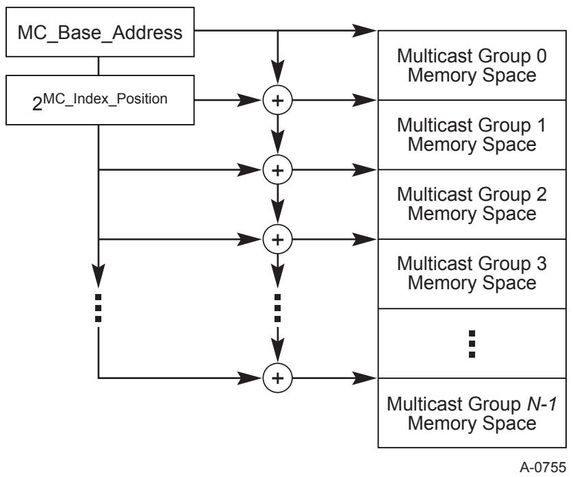

<details>
<summary>flowchart</summary>

```mermaid
graph TD
  A["MC_Base_Address"] --> B["+"]
  C["2^MC_Index_Position"] --> D["+"]
  B --> E["Multicast Group 0 Memory Space"]
  D --> F["Multicast Group 1 Memory Space"]
  D --> G["Multicast Group 2 Memory Space"]
  D --> H["Multicast Group 3 Memory Space"]
  D --> I["..."]
  D --> J["Multicast Group N-1 Memory Space"]
  K["..."] --> J
```
</details>

Figure 6-14 Segmentation of the Multicast Address Range§

## 6.14.1 Multicast TLP Processing


A Multicast Hit occurs if all of the following are true:

• MC\_Enable is Set  
• TLP is a Memory Write or an Address Routed Message, both of which are Posted Requests  
• AddressTLP >= MC\_Base\_Address  
• AddressTLP < (MC\_Base\_Address + (2 MC\_Index\_Position \* (MC\_Num\_Group + 1)))

In this step, each Switch Ingress Port and other components use values of MC\_Enable, MC\_Base\_Address, MC\_Index\_Position, and MC\_Num\_Group from any one of their Functions. Software is required to configure all Functions of a Switch and all Functions of a Multi-Function Upstream Port to have the same values in each of these fields and results are indeterminate if this is not the case.

If the address in a Non-Posted Memory Request hits in a Multicast Window, no Multicast Hit occurs and the TLP is processed normally per the base specification - i.e., as a unicast.

If a Multicast Hit occurs, the only ACS access control that can still apply is ACS Source Validation. In particular, neither ACS P2P Request Redirect nor ACS P2P Egress Control affects operations during a Multicast Hit. See § Section 6.12 .

If a Multicast Hit occurs, normal address routing rules do not apply. Instead, the TLP is processed as follows:

The Multicast Group is extracted from the address in the TLP using any Function’s values for MC\_Base\_Address and MC\_Index\_Position. Specifically:

MCG = ((AddressTLP - MC\_Base\_Address) >> MC\_Index\_Position) & 3Fh

In this process, the component may use any Function’s values for MC\_Base\_Address and MC\_Index\_Position. Which Function’s values are used is device-specific.

Components next check the MC\_Block\_All and the MC\_Block\_Untranslated bits corresponding to the extracted MCG. Switches and Root Ports check Multicast TLPs in their Ingress Ports using the MC\_Block\_All and MC\_Block\_Untranslated registers associated with the Ingress Port. Endpoint Functions check Multicast TLPs they are preparing to send, using their MC\_Block\_All and MC\_Block\_Untranslated registers. If the MC\_Block\_All bit corresponding to the extracted MCG is set, the TLP is handled as an MC Blocked TLP. If the MC\_Block\_Untranslated bit corresponding to the extracted MCG is set and the TLP contains an Untranslated Address, the TLP, is also handled as an MC Blocked TLP.

## IMPLEMENTATION NOTE:

## MC\_BLOCK\_UNTRANSLATED AND PIO WRITES §

Programmed I/O (PIO) Writes to Memory Space generally have Untranslated addresses since there is no architected mechanism for software to control the Address Type (AT) field for PIO Requests. Thus, if it’s necessary for a given Switch to Multicast any PIO Writes, software should ensure that the appropriate MC\_Block\_Untranslated bits in the Upstream Port of that Switch are Clear. Otherwise, the Switch Upstream Port may block PIO Writes that legitimately target Multicast Windows. Since it may be necessary for software to clear MC\_Block\_Untranslated bits in a Switch Upstream Port for the sake of PIO Writes, the following are strongly recommended for a Root Complex capable of Address translation:

• All Integrated Endpoints each implement a Multicast Capability structure to provide access control for sending Untranslated Multicast TLPs.  
• All peer-to-peer capable Root Ports each implement a Multicast Capability structure to provide access control for Untranslated Multicast TLPs that are forwarded peer-to-peer.

For similar reasons, with Multicast-capable Switch components where the Upstream Port is a Function in a Multi-Function Device, it is strongly recommended that any Endpoints in that Multi-Function Device each implement a Multicast Capability structure.

## IMPLEMENTATION NOTE:

## MULTICAST WINDOW SIZE §

Each ultimate Receiver of a Multicast TLP may have a different Multicast Window size requirement. At one extreme, a Multicast Window may be required to cover a range of memory implemented within the device. At the other, it may only need to cover a particular offset at which a FIFO register is located. The MC\_Window\_Size\_Requested field within the Multicast Capability register is used by an Endpoint to advertise the size of Multicast Window that it requires.

Unless available address space is limited, resource allocation software may be able to treat each request as a minimum and set the Multicast Window size via MC\_Index\_Position to accommodate the largest request. In some cases, a request for a larger window size can be satisfied by configuring a smaller window size and assigning the same membership to multiple contiguous MCGs.

## IMPLEMENTATION NOTE:

## MULTICAST, ATS, AND REDIRECTION §

The ACS P2P Request Redirect and ACS Direct Translated P2P mechanisms provide a means where P2P Requests with Untranslated Addresses can be redirected to the Root Complex (RC) for access control checking, whereas P2P Requests with Translated Addresses can be routed “directly” to their P2P targets for improved performance. See § Section 6.12 . No corresponding redirection mechanism exists for Multicast TLPs.

To achieve similar functionality, an RC might be configured to provide one or more target Memory Space ranges that are not in the Multicast address range, but the RC maps to “protected” Multicast Windows. Multicast TLP senders either with or without ATS capability then target these RC Memory Space ranges in order to access the protected Multicast Windows indirectly. When either type of sender targets these ranges with Memory Writes, each TLP that satisfies the access control checks will be reflected back down by the RC with a Translated Address targeting a protected Multicast Window. 133 ATS-capable senders can request and cache Translated Addresses using the RC Memory Space range, and then later use those Translated Addresses for Memory Writes that target protected Multicast Windows directly and can be Multicast without a taking a trip through the RC.

For hardware enforcement that only Translated Addresses can be used to target the protected Multicast Windows directly, software Sets appropriate MCG bits in the MC\_Block\_Untranslated register in all applicable Functions throughout the platform. Each MCG whose bit is Set will cause its associated Multicast Window to be protected from direct access using Untranslated Addresses.

If the TLP is not blocked in a Switch or Root Complex it is forwarded out all of the Ports, except its Ingress Port, whose MC\_Receive bit corresponding to the extracted MCG is set. In an Endpoint, it is consumed by all Functions whose MC\_Receive bit corresponding to the extracted MCG is set. If no Ports forward the TLP or no Functions consume it, the TLP is silently dropped.

To prevent loops, it is prohibited for a Root Port or a Switch Port to forward a TLP back out its Ingress Port, even if so specified by the MC\_Receive register associated with the Port. An exception is the case described in the preceding Implementation Note, where an RC reflects a unicast TLP that came in on an Ingress Root Port to a Multicast Window. In that case, when specified by the MC\_Receive register associated with that Ingress Root Port, the RC is required to send the reflected TLP out the same Root Port that it originally came in.

A Multicast Hit suspends normal address routing, including default Upstream routing in Switches. When a Multicast Hit occurs, the TLP will be forwarded out only those Egress Ports whose MC\_Receive bit associated with the MCG extracted from the address in the TLP is set. If the address in the TLP does not decode to any Downstream Port using normal address decode, the TLP will be copied to the Upstream Port only if so specified by the Upstream Port’s MC\_Receive register.

## 6.14.2 Multicast Ordering §

No new ordering rules are defined for processing Multicast TLPs. All Multicast TLPs are Posted Requests and follow Posted Request ordering rules. Multicast TLPs are ordered per normal ordering rules relative to other TLPs in a component’s ingress stream through the point of replication. Once copied into an egress stream, a Multicast TLP follows the same ordering as other Posted Requests in the stream.

## 6.14.3 Multicast Capability Structure Field Updates §

Some fields of the Multicast Capability structure may be changed at any time. Others cannot be changed with predictable results unless the MC\_Enable bit is Clear in every Function of the component. The latter group includes MC\_Base\_Address and MC\_Index\_Position.

Fields which software may change at any time include MC\_Enable, MC\_Num\_Group, MC\_Receive, MC\_Block\_All, and MC\_Block\_Untranslated. Updates to these fields must themselves be ordered. Consider, for example, TLPs A and B arriving in that order at the same Ingress Port and in the same TC. If A uses value X for one of these fields, then B must use the same value or a newer value.

For Multi-Function Upstream Switch Ports Multicast TLPs received by one Switch or transmitted by one Endpoint Function are presented to the other parallel Endpoint Functions and the Downstream Switch Ports of the other parallel Switches (Functions are considered to be parallel if they are in the same Device. A single Multicast TLP is forwarded Upstream when any of the Upstream Switch Functions has the appropriate MC\_Receive bit Set.

## 6.14.4 MC Blocked TLP Processing §

When a TLP is blocked by the MC\_Block\_All or the MC\_Block\_Untranslated mechanisms, the TLP is dropped. The Function blocking the TLP serves as the Completer. The Completer must log and signal this MC Blocked TLP error as indicated in § Figure 6-2. In addition, the Completer must set the Signaled Target Abort bit in either its Status register or Secondary Status register as appropriate. To assist in fault isolation and root cause analysis, it is strongly recommended that AER be implemented in Functions with Multicast capability.

In Root Complexes and Switches, if the error occurs with a TLP received by an Ingress Port, the error is reported by that Ingress Port. If the error occurs in an Endpoint Function preparing to send the TLP, the error is reported by that Endpoint Function.

## 6.14.5 MC\_Overlay Mechanism §

The MC\_Overlay mechanism is provided to allow a single BAR in an Endpoint that doesn’t contain a Multicast Capability structure to be used for both Multicast and unicast TLP reception. Software can configure the MC\_Overlay mechanism to affect this by setting the MC\_Overlay\_BAR in a Downstream Port so that the Multicast address range, or a portion of it, is remapped (overlaid) onto the Memory Space range accepted by the Endpoint’s BAR. At the Upstream Port of a Switch, the mechanism can be used to overlay a portion of the Multicast address range onto a Memory Space range associated with host memory.

A Downstream Port’s MC\_Overlay mechanism applies to TLPs exiting that Port. An Upstream Port’s MC\_Overlay mechanism applies to TLPs exiting the Switch heading Upstream. A Port’s MC\_Overlay mechanism does not apply to TLPs received by the Port, to TLPs targeting memory space within the Port, or to TLPs routed Peer-to-Peer between Functions in a Multi-Function Upstream Port.

When enabled, the overlay operation specifies that bits in the address in the Multicast TLP, whose bit numbers are equal to or higher than the MC\_Overlay\_Size field, be replaced by the corresponding bits in the MC\_Overlay\_BAR. In other words:

```txt
If (MC_Overlay_Size < 6)
    Then Egress_TLP_Addr = Ingress_TLP_Addr;
    Else Egress_TLP_Addr = { MC_Overlay_BAR[63:MC_Overlay_Size],
    Ingress_TLP_Addr[MC_Overlay_Size-1:0] };
    § Equation 6-1 MC_Overlay Transform rules
```

If the TLP with modified address contains the optional ECRC, the unmodified ECRC will almost certainly indicate an error. The action to be taken if a TLP containing an ECRC is Multicast copied to an Egress Port that has MC\_Overlay enabled depends upon whether or not optional support for ECRC regeneration is implemented. All of the contingent actions are outlined in § Table 6-12. If MC\_Overlay is not enabled, the TLP is forwarded unmodified. If MC\_Overlay is enabled and the TLP has no ECRC, the modified TLP, with its address replaced as specified in the previous paragraph is forwarded. If the TLP has an ECRC but ECRC regeneration is not supported, then the modified TLP is forwarded with its ECRC dropped and the TD bit in the header cleared to indicate no ECRC attached. If the TLP has an ECRC and ECRC regeneration is supported, then an ECRC check is performed before the TLP is forwarded. If the ECRC check passes, the TLP is forwarded with regenerated ECRC. If the ECRC check fails, the TLP is forwarded with inverted regenerated ECRC.

§ Table 6-12 ECRC Rules for MC\_Overlay

<table><tr><td>MC_Overlay Enabled</td><td>TLP has ECRC</td><td>ECRC Regeneration Supported</td><td>Action if ECRC Check Passes</td><td>Action if ECRC Check Fails</td></tr><tr><td>No</td><td>x</td><td>x</td><td colspan="2">Forward TLP unmodified</td></tr><tr><td>Yes</td><td>No</td><td>x</td><td colspan="2">Forward modified TLP</td></tr><tr><td>Yes</td><td>Yes</td><td>No</td><td colspan="2">Forward modified TLP with ECRC dropped and TD bit clear</td></tr><tr><td>Yes</td><td>Yes</td><td>Yes</td><td>Forward modified TLP with regenerated ECRC</td><td>Forward modified TLP with inverted regenerated ECRC</td></tr></table>

## IMPLEMENTATION NOTE:

## MC\_OVERLAY AND ECRC REGENERATION §

Switch and Root Complex Ports have the option to support ECRC regeneration. If ECRC regeneration is supported, then it is strongly recommended to do so robustly by minimizing the time between checking the ECRC of the original TLP and replacing it with an ECRC computed on the modified TLP. The TLP is unprotected during this time, leaving a data integrity hole if the pre-check and regeneration aren’t accomplished in the same pipeline stage.

Stripping the ECRC from Multicast TLPs passing through a Port that has MC\_Overlay enabled but doesn’t support ECRC regeneration allows the receiving Endpoint to enable ECRC checking. In such a case, the Endpoint will enjoy the benefits of ECRC on non-Multicast TLPs without detecting ECRC on Multicast TLPs modified by the MC\_Overlay mechanism.

When Multicast ECRC regeneration is supported, and an ECRC error is detected prior to TLP modification, then inverting the regenerated ECRC ensures that the ECRC error isn’t masked by the regeneration process.

## IMPLEMENTATION NOTE:

## MULTICAST TO ENDPOINTS THAT DON’T HAVE MULTICAST CAPABILITY

An Endpoint Function that doesn’t contain a Multicast Capability structure cannot distinguish Multicast TLPs from unicast TLPs. It is possible for a system designer to take advantage of this fact to employ such Endpoints as Multicast targets. The primary requirement for doing so is that the base and limit registers of the virtual PCI to PCI Bridge in the Switch Port above the device be configured to overlap at least part of the Multicast address range or that the MC\_Overlay mechanism be employed. Extending this reasoning, it is even possible that a single Multicast target Function could be located on the PCI/PCI-X side of a PCI Express to PCI/PCI-X Bridge.

If an Endpoint without a Multicast Capability structure is being used as a Multicast target and the MC\_Overlay mechanism isn’t used, then it may be necessary to read from the Endpoint’s Memory Space using the same addresses used for Multicast TLPs. Therefore, Memory Reads that hit in a Multicast Window aren’t necessarily errors. Memory Reads that hit in a Multicast Window and that don’t also hit in the aperture of an RCiEP or the Downstream Port of a Switch will be routed Upstream, per standard address routing rules, and be handled as a UR there.

## IMPLEMENTATION NOTE:

## MULTICAST IN A ROOT COMPLEX §

A Root Complex with multiple Root Ports that supports Multicast may implement as many Multicast Capability structures as its implementation requires. If it implements more than one, software should ensure that certain fields, as specified in § Section 6.14.3 , are configured identically. To support Multicast to RCiEPs, the implementation needs to expose all TLPs identified as Multicast via the MC\_Base\_Address register to all potential Multicast target Endpoints integrated within it. Each such Integrated Endpoint then uses the MC\_Receive register in its Multicast Capability structure to determine if it should receive the TLP.

## IMPLEMENTATION NOTE:

## MULTICAST AND MULTI-FUNCTION DEVICES §

All Port Functions and Endpoint Functions that are potential Multicast targets need to implement a Multicast Capability structure so that each has its own MC\_Receive vector. Within a single component, software should configure the MC\_Enable, MC\_Base\_Address, MC\_Index\_Position, and MC\_Num\_Group fields of these Capability structures identically. That being the case, it is sufficient to implement address decoding logic on only one instance of the Multicast BAR in the component.

## IMPLEMENTATION NOTE: CONGESTION AVOIDANCE §

The use of Multicast increases the output link utilization of Switches to a degree proportional to both the size of the Multicast groups used and the fraction of Multicast traffic to total traffic. This results in an increased risk of congestion and congestion spreading when Multicast is used.

To mitigate this risk, components that are intended to serve as Multicast targets should be designed to consume Multicast TLPs at wire speed. Components that are intended to serve as Multicast sources should consider adding a rate limiting mechanism.

In many applications, the application’s Multicast data flow will have an inherent rate limit and can be accommodated without causing congestion. Others will require an explicit mechanism to limit the injection rate, selection of a Switch with buffers adequate to hold the requisite bursts of Multicast traffic without asserting flow control, or selection of Multicast target components capable of sinking the Multicast traffic at the required rate. It is the responsibility of the system designer to choose the appropriate mechanisms and components to serve the application.

## IMPLEMENTATION NOTE: THE HOST AS A MULTICAST RECIPIENT §

For general-purpose systems, it is anticipated that the Multicast address range will usually not be configured to overlap with Memory Space that’s directly mapped to host memory. If host memory is to be included as a Multicast recipient, the Root Complex may need to have some sort of I/O Memory Management Unit (IOMMU) that is capable of remapping portions of Multicast Windows to host memory, perhaps with page-level granularity. Alternatively, the MC\_Overlay mechanism in the Upstream Port of a Switch can be used to overlay a portion of the Multicast address range onto host memory.

For embedded systems that lack an IOMMU, it may be feasible to configure Multicast Windows overlapping with Memory Space that’s directly mapped to host memory, thus avoiding the need for an IOMMU. Specific details of this approach are beyond the scope of this specification.

## 6.15 Atomic Operations (AtomicOps) §

An Atomic Operation (AtomicOp) is a single PCI Express transaction that targets a location in Memory Space, reads the location’s value, potentially writes a new value back to the location, and returns the original value. This “read-modify-write” sequence to the location is performed atomically. AtomicOps include the following:

• FetchAdd (Fetch and Add): Request contains a single operand, the “add” value

◦ Read the value of the target location.  
◦ Add the “add” value to it using two’s complement arithmetic ignoring any carry or overflow.  
◦ Write the sum back to the target location.  
◦ Return the original value of the target location.

• Swap (Unconditional Swap): Request contains a single operand, the “swap” value

◦ Read the value of the target location.  
◦ Write the “swap” value back to the target location.  
◦ Return the original value of the target location.

• CAS (Compare and Swap): Request contains two operands, a “compare” value and a “swap” value

◦ Read the value of the target location.  
◦ Compare that value to the “compare” value.  
◦ If equal, write the “swap” value back to the target location.  
◦ Return the original value of the target location.

A given AtomicOp transaction has an associated operand size, and the same size is used for the target location accesses and the returned value. FetchAdd and Swap support operand sizes of 32 and 64 bits. CAS supports operand sizes of 32, 64, and 128 bits.

AtomicOp capabilities are optional normative. Endpoints and Root Ports are permitted to implement AtomicOp Requester capabilities. PCI Express Functions with Memory Space BARs as well as all Root Ports are permitted to implement AtomicOp Completer capabilities. Routing elements (Switches, as well as Root Complexes supporting peer-to-peer access between Root Ports) require AtomicOp routing capability in order to route AtomicOp Requests. AtomicOps are architected for device-to-host, device-to-device, and host-to-device transactions. In each case, the Requester, Completer, and all intermediate routing elements must support the associated AtomicOp capabilities.

AtomicOp capabilities are not supported on PCI Express to PCI/PCI-X Bridges. If need be, Locked Transactions can be used for devices below such Bridges. AtomicOps and Locked Transactions can operate concurrently on the same hierarchy.

Software discovers specific AtomicOp Completer capabilities via three new bits in the Device Capabilities 2 register (see § Section 7.5.3.15 ). For increased interoperability, Root Ports are required to implement certain AtomicOp Completer capabilities in sets if at all (see § Section 6.15.3.1 ). Software discovers AtomicOp routing capability via the AtomicOp Routing Supported bit in the Device Capabilities 2 register. Software discovery of AtomicOp Requester capabilities is outside the scope of this specification, but software must set the AtomicOp Requester Enable bit in a Function’s Device Control 2 register before the Function can initiate AtomicOp Requests (see § Section 7.5.3.16 ).

With routing elements, software can set an AtomicOp Egress Blocking bit (see § Section 7.5.3.16 ) on a Port-by-Port basis to avoid AtomicOp Requests being forwarded to components that shouldn’t receive them, and might, if operating in NFM, handle each as a Malformed TLP, which by default is a Fatal Error. Each blocked Request is handled as an AtomicOp Egress Blocked error, which by default is an Advisory Non-Fatal Error.

AtomicOps are Memory Transactions, so existing standard mechanisms for managing Memory Space access (e.g., Bus Master Enable, Memory Space Enable, and Base Address registers) apply.

## 6.15.1 AtomicOp Use Models and Benefits §

AtomicOps enable advanced synchronization mechanisms that are particularly useful when there are multiple producers and/or multiple consumers that need to be synchronized in a non-blocking fashion. For example, multiple producers can safely enqueue to a common queue without any explicit locking.

AtomicOps also enable lock-free statistics counters, for example where a device can atomically increment a counter, and host software can atomically read and clear the counter.

Direct support for the three chosen AtomicOps over PCI Express enables easier migration of existing high-performance SMP applications to systems that use PCI Express as the interconnect to tightly-coupled accelerators, co-processors, or GP-GPUs. For example, a ported application that uses PCI Express-attached accelerators may be able to use the same synchronization algorithms and data structures as the earlier SMP application.

An AtomicOp to a given target generally incurs latency comparable to a Memory Read to the same target. Within a single hierarchy, multiple AtomicOps can be “in flight” concurrently. AtomicOps generally create negligible disruption to other PCI Express traffic.

Compared to Locked Transactions, AtomicOps provide lower latency, higher scalability, advanced synchronization algorithms, and dramatically less impact to other PCI Express traffic.

## 6.15.2 AtomicOp Transaction Protocol Summary §

Detailed protocol rules and requirements for AtomicOps are distributed throughout the rest of this specification, but here is a brief summary plus some unique requirements.

• AtomicOps are Non-Posted Memory Transactions, supporting 32- and 64-bit address formats.  
• FetchAdd, Swap, and CAS each use a distinct type code.  
• The Completer infers the operand size from the Length field value and type code in the AtomicOp Request.  
• The endian format used by AtomicOp Completers to read and write data at the target location is implementation specific, and permitted to be whatever the Completer determines to be appropriate for the target memory (e.g., little-endian, big-endian, etc.). See § Section 2.2.2 .  
If an AtomicOp Requester supports Address Translation Services (ATS), the Requester is permitted to use a Translated address in an AtomicOp Request only if the Translated address has appropriate access permissions. Specifically, the Read (R) and Write (W) fields must both be Set, and the Untranslated access only (U) field must be Clear. See § Section 2.2.4.1 .  
• If a component supporting Access Control Services (ACS) supports AtomicOp routing or AtomicOp Requester capability, it handles AtomicOp Requests and Completions the same as with other Memory Requests and Completions with respect to ACS functionality.  
• The No Snoop attribute is applicable and permitted to be Set with AtomicOp Requests, but atomicity must be guaranteed regardless of the No Snoop attribute value.  
• The Relaxed Ordering attribute is applicable and permitted to be Set with AtomicOp Requests, where it affects the ordering of both the Requests and their associated Completions.  
Ordering requirements for AtomicOp Requests are similar to those for Non-Posted Write Requests. Thus, if a Requester wants to ensure that an AtomicOp Request is observed by the Completer before a subsequent Posted or Non-Posted Request, the Requester must wait for the AtomicOp Completion before issuing the subsequent Request.  
• Ordering requirements for AtomicOp Completions are similar to those for Read Completions.  
• Unless there’s a higher precedence error, an AtomicOp-aware Completer must handle a Poisoned AtomicOp Request as a Poisoned TLP Received error, and must also return a Completion with a Completion Status of Unsupported Request (UR). See § Section 2.7.2.1 . The value of the target location must remain unchanged.  
• If the Completer of an AtomicOp Request encounters an uncorrectable error accessing the target location or carrying out the Atomic operation, the Completer must handle it as a Completer Abort (CA). The subsequent state of the target location is implementation specific.  
• AtomicOp-aware Completers are required to handle any properly formed AtomicOp Requests with types or operand sizes they don’t support as an Unsupported Request (UR). If the Length field in an AtomicOp Request contains an unarchitected value, the Request must be handled by an AtomicOp-aware Completer as a Malformed TLP. See § Section 2.2.7 .  
• If any Function in a Multi-Function Device supports AtomicOp Completer or AtomicOp routing capability, all Functions with Memory Space BARs in that device must decode properly formed AtomicOp Requests and handle any they don’t support as an Unsupported Request (UR). Note that in such devices, Functions lacking

AtomicOp Completer capability are forbidden to handle properly formed AtomicOp Requests as Malformed TLPs.

• If an RC has any Root Ports that support AtomicOp routing capability, all RCiEPs in the RC reachable by forwarded AtomicOp Requests must decode properly formed AtomicOp Requests and handle any they don’t support as an Unsupported Request (UR).  
• With an AtomicOp Request having a supported type and operand size, the AtomicOp-aware Completer is required either to carry out the Request or handle it as Completer Abort (CA) for any location in its target Memory Space. Completers are permitted to support AtomicOp Requests on a subset of their target Memory Space as needed by their programming model (see § Section 2.3.1 ). Memory Space structures defined or inherited by PCI Express (e.g., the MSI-X Table structure) are not required to be supported as AtomicOp targets unless explicitly stated in the description of the structure.  
• For a Switch or an RC, when AtomicOp Egress Blocking is enabled in an Egress Port, and an AtomicOp Request targets going out that Egress Port, the Egress Port must handle the Request as an AtomicOp Egress Blocked error 134 (see § Figure 6-2) and must also return a Completion with a Completion Status of UR. If the severity of the AtomicOp Egress Blocked error is non-fatal, this case must be handled as an Advisory Non-Fatal Error as described in § Section 6.2.3.2.4.1 .

## 6.15.3 Root Complex Support for AtomicOps §

RCs have unique requirements and considerations with respect to AtomicOp capabilities.

## 6.15.3.1 Root Ports with AtomicOp Completer Capabilities §

AtomicOp Completer capability for a Root Port indicates that the Root Port supports receiving at its Ingress Port AtomicOp Requests that target host memory or Memory Space allocated by a Root Port BAR. This is independent of any RCiEPs that have AtomicOp Completer capabilities.

If a Root Port implements any AtomicOp Completer capability for host memory access, it must implement all 32-bit and 64-bit AtomicOp Completer capabilities. Implementing 128-bit CAS Completer capability is optional.

If an RC has one or more Root Ports that implement AtomicOp Completer capability, the RC must ensure that host memory accesses to a target location on behalf of a given AtomicOp Request are performed atomically with respect to each host processor or device access to that target location range.

If a host processor supports atomic operations via its instruction set architecture, the RC must also ensure that host memory accesses on behalf of a given AtomicOp Request preserve the atomicity of any host processor atomic operations.

## 6.15.3.2 Root Ports with AtomicOp Routing Capability §

As with other PCI Express Transactions, the support for peer-to-peer routing of AtomicOp Requests and Completions between Root Ports is optional and implementation dependent. If an RC supports AtomicOp routing capability between two or more Root Ports, it must indicate that capability in each associated Root Port via the AtomicOp Routing Supported bit in the Device Capabilities 2 register.

An RC is not required to support AtomicOp routing between all pairs of Root Ports that have the AtomicOp Routing Supported bit Set. An AtomicOp Request that would require routing between unsupported pairs of Root Ports must be handled as an Unsupported Request (UR), and reported by the “sending” Port.

The AtomicOp Routing Supported bit must be Set for any Root Port that supports forwarding of AtomicOp Requests initiated by host software or RCiEPs. The AtomicOp Routing Supported bit must be Set for any Root Ports that support forwarding of AtomicOp Requests received on their Ingress Port to RCiEPs.

## 6.15.3.3 RCs with AtomicOp Requester Capabilities §

An RC is permitted to implement the capability for either host software or RCiEPs to initiate AtomicOp Requests.

Software discovery of AtomicOp Requester capabilities is outside the scope of this specification.

If an RC supports software-initiated AtomicOp Requester capabilities, the specific mechanisms for how software running on a host processor causes the RC to generate AtomicOp Requests is outside the scope of this specification.

## IMPLEMENTATION NOTE:

## GENERATING ATOMICOP REQUESTS VIA HOST PROCESSOR SOFTWARE

If a host processor instruction set architecture (ISA) supports atomic operation instructions that directly correspond to one or more PCI Express AtomicOps, an RC might process the associated internal atomic transaction that targets PCI Express Memory Space much like it processes the internal read transaction resulting from a processor load instruction. However, instead of “exporting” the internal read transaction as a PCI Express Memory Read Request, the RC would export the internal atomic transaction as a PCI Express AtomicOp Request. Even if an RC uses the “export” approach for some AtomicOp types and operand sizes, it would not need to use this approach for all.

For AtomicOp types and operand sizes where the RC does not use the “export” approach, the RC might use an RC register-based mechanism similar to one where some PCI host bridges use CONFIG\_ADDRESS and CONFIG\_DATA registers to generate Configuration Requests. Refer to the [PCI] for details.

The “export” approach may permit a large number of concurrent AtomicOp Requests without becoming RC register limited. It may also be easier to support AtomicOp Request generation from user space software using this approach.

The RC register-based mechanism offers the advantage of working for all AtomicOp types and operand sizes even if the host processor ISA doesn’t support the corresponding atomic instructions. It might also support a polling mode for waiting on AtomicOp Completions as opposed to stalling the processor while waiting for a Completion.

## 6.15.4 Switch Support for AtomicOps §

If a Switch supports AtomicOp routing capability for any of its Ports, it must do so for all of them.

## 6.16 Dynamic Power Allocation (DPA) Capability §

A common approach to managing power consumption is through a negotiation between the device driver, operating system, and executing applications. Adding Dynamic Power Allocation for such devices is anticipated to be done as an extension of that negotiation, through software mechanisms that are outside of the scope of this specification. Some devices do not have a device specific driver to manage power efficiently. The DPA Capability provides a mechanism to allocate power dynamically for these types of devices. DPA is optional normative functionality applicable to Endpoint Functions that can benefit from the dynamic allocation of power and do not have an alternative mechanism. If supported, the Emergency Power Reduction State, over-rides the mechanisms listed here (see § Section 6.24 ).

The DPA Capability enables software to actively manage and optimize Function power usage when in the D0 state. DPA is not applicable to power states D1-D3 therefore the DPA Capability is independently managed from the PCI-PM Capability.

DPA defines a set of power substates, each of which with an associated power allocation. Up to 32 substates [0..31] can be defined per Function. Substate 0, the default substate, indicates the maximum power the Function is ever capable of consuming.

Substates must be contiguously numbered from 0 to Substate\_Max, as defined in § Section 7.9.12.2 . Each successive substate has a power allocation lower than or equal to that of the prior substate. For example, a Function with four substates could be defined as follows:

1. Substate 0 (the default) defines a power allocation of 25 Watts.  
2. Substate 1 defines a power allocation of 20 Watts.  
3. Substate 2 defines a power allocation of 20 Watts.  
4. Substate 3 defines a power allocation of 10 Watts.

When the Function is initialized, it will operate within the power allocation associated with substate 0. Software is not required to progress through intermediate substates. Over time, software may dynamically configure the Function to operate at any of the substates in any sequence it chooses. Software is permitted to configure the Function to operate at any of the substates before the Function completes a previously initiated substate transition.

On the completion of the substate transition(s) the Function must compare its substate with the configured substate. If the Function substate does not match the configured substate, then the Function must begin transition to the configured substate. It is permitted for the Function to dynamically alter substate transitions on Configuration Requests instructing the Function to operate in a new substate.

In the prior example, software can configure the Function to transition to substate 4, followed by substate 1, followed by substate 3, and so forth. As a result, the Function must be able to transition between any substates when software configures the associated control field.

The Substate Control Enabled bit provides a mechanism that allows the DPA Capability to be used in conjunction with the software negotiation mechanism mentioned above. When Set, power allocation is controlled by the DPA Capability. When Clear, the DPA Capability is disabled, and the Function is not permitted to directly initiate substate transitions based on configuration of the Substate Control register field. At an appropriate point in time, software participating in the software negotiation mechanism mentioned above clears the bit, effectively taking over control of power allocation for the Function.

It is required that the Function respond to Configuration Space accesses while in any substate.

At any instant, the Function must never draw more power than it indicates through its Substate Status. When the Function is configured to transition from a higher power substate to a lower power substate, the Function’s Substate Status must indicate the higher power substate during the transition, and must indicate the lower power substate after completing the transition. When the Function is configured to transition from a lower power substate to a higher power substate, the Function’s Substate Status must indicate the higher power substate during the transition, as well as after completing the transition.

Due to the variety of applications and the wide range of maximum power required for a given Function, the transition time required between any substates is implementation specific. To enable software to construct power management policies (outside the scope of this specification), the Function defines two Transition Latency Values. Each of the Function substates associates its maximum Transition Latency with one of the Transition Latency Values, where the maximum Transition Latency is the time it takes for the Function to enter the configured substate from any other substate. A Function is permitted to complete the substate transition faster than the maximum Transition Latency for the substate.

## 6.16.1 DPA Capability with Multi-Function Devices §

Except as stated below, it is permitted for some or all Functions of a Multi-Function Device to implement a DPA Capability. The power allocation for the Multi-Function Device is the sum of power allocations set by the DPA Capability for each Function. It is permitted for the DPA Capability of a Function to include the power allocation for the Function itself as well as account for power allocation for other Functions that do not implement a DPA Capability. The association between multiple Functions for DPA is implementation specific and beyond the scope of this specification.

Power allocation for VFs is managed using their associated PF’s DPA Capability, if implemented. VFs must not implement the Dynamic Power Allocation Capability.

## 6.17 TLP Processing Hints (TPH) §

TLP Processing Hints is an optional feature that provides hints in Request TLP headers to facilitate optimized processing of Requests that target Memory Space. These Processing Hints enable the system hardware (e.g., the Root Complex and/ or Endpoints) to optimize platform resources such as system and memory interconnect on a per TLP basis. The TPH mechanism defines Processing Hints that provide information about the communication models between Endpoints and the Root-complex. Steering Tags are system-specific values used to identify a processing resource that a Requester explicitly targets. System software discovers and identifies TPH capabilities to determine the Steering Tag allocation for each Function that supports TPH.

## 6.17.1 Processing Hints §

The Requester provides hints to the Root Complex or other targets about the intended use of data and data structures by the host and/or device. The hints are provided by the Requester, which has knowledge of upcoming Request patterns, and which the Completer would not be able to deduce autonomously (with good accuracy). Cases of interest to distinguish with such hints include:

DWHR: Device writes then host reads soon

HWDR: Device reads data that the Host is believed to have recently written

D\*D\*: Device writes/reads, then device reads/writes soon

Includes DWDW, DWDR, DRDW, DRDR

Bi-Directional: Data structure that is shared and has equal read/write access by host and device.

The usage models are mapped to the Processing Hint encodings as described in § Table 6-13.

Table 6-13 Processing Hint Mapping§

<table><tr><td>PH[1:0] (b)</td><td>Processing Hint</td><td>Usage Model</td></tr><tr><td>00</td><td>Bi-directional data structure</td><td>Bi-Directional shared data structure</td></tr><tr><td>01</td><td>Requester</td><td>D*D*</td></tr><tr><td>10</td><td>Target</td><td>DWHRHWDR</td></tr><tr><td>11</td><td>Target with Priority</td><td>Same as target but with temporal re-use priority</td></tr></table>

## 6.17.2 Steering Tags §

Functions that intend to target a TLP towards a specific processing resource such as a host processor or system cache hierarchy require topological information of the target cache (e.g., which host cache). Steering Tags are system-specific values that provide information about the host or cache structure in the system cache hierarchy. These values are used to associate processing elements within the platform with the processing of Requests.

Software programmable Steering Tag values to be used are stored in an ST Table that is permitted to be located either in the TPH Requester Extended Capability structure (see § Section 7.9.13 ) or combined with the MSI-X Table (see § Section 7.7 ), but not in both locations for a given Function. When the ST Table is combined with the MSI-X Table, the 2 most significant bytes of the Vector Control register of each MSI-X Table entry are used to contain the Steering Tag value.

The choice of ST Table location is implementation specific and is discoverable by software. A Function that implements MSI-X is permitted to locate the ST Table in either location (see § Section 7.9.13.2 ). A Function that implements both MSI and MSI-X is permitted to combine the ST Table with the MSI-X Table and use it, even when MSI-X is disabled (i.e., when MSI is enabled). Each ST Table entry is 2 bytes. The size of the ST Table is indicated in the TPH Requester Extended Capability structure.

For some usage models the Steering Tags are not required or not provided, and in such cases a Function is permitted to use a value of all zeros in the ST field to indicate no ST preference. The association of each Request with an ST Table entry is device specific and outside the scope of this specification.

## 6.17.3 ST Modes of Operation §

The ST Table Location field in the TPH Requester Extended Capability structure indicates where (if at all) the ST Table is implemented by the Function. If an ST Table is implemented, software can program it with the system-specific Steering Tag values.

§ Table 6-14 ST Modes of Operation

<table><tr><td>ST Mode Select [2:0] (b)</td><td>ST Mode Name</td><td>Description</td></tr><tr><td>000</td><td>No ST Mode</td><td>The Function must use a value of all zeros for all Steering Tags.</td></tr><tr><td>001</td><td>Interrupt Vector Mode</td><td>Each Steering Tag is selected by an MSI/MSI-X interrupt vector number. The Function is required to use the Steering Tag value from an ST Table entry that can be indexed by a valid MSI/MSI-X interrupt vector number.</td></tr><tr><td>010</td><td>Device Specific Mode</td><td>It is recommended for the Function to use a Steering Tag value from an ST Table entry, but it is not required.</td></tr><tr><td>All other encodings</td><td>Reserved</td><td>Reserved for future use.</td></tr></table>

In the No ST Mode of operation, the Function must use a value of all zeros for each Steering Tag, enabling the use of Processing Hints without software-provided Steering Tags.

In the Interrupt Vector Mode of operation, Steering Tags are selected from the ST Table using MSI/MSI-X interrupt vector numbers. For Functions that have MSI enabled, the Function is required to select tags within the range specified by the Multiple Message Enable field in the MSI Capability structure. For Functions that have MSI-X enabled, the Function is required to select tags within the range of the MSI-X Table size. If the ST Table Size is smaller than the enabled range of interrupt vector numbers, the Function is permitted to either not use TPH for certain transactions, to use TPH with a Steering Tag of 0 or to use TPH with an implementation defined mechanism used to select a Steering Tag value from the ST Table. If the ST Table Size is larger than the enabled range of interrupt vector numbers, ST Table Entries corresponding to out of range interrupt vector numbers are ignored by the Function.

In the Device Specific Mode of operation, the assignment of the Steering Tags to Requests is device specific. The number of Steering Tags used by the Function is permitted to be different than the number of interrupt vectors allocated for the Function, irrespective of the ST Table location, and Steering Tag values used in Requests are not required to come from the architected ST Table.

A Function that is capable of generating TPH Requests is required to support the No ST Mode of operation. Support for other ST Modes of operation is optional. Only one ST Mode of operation can be selected at a time by programming ST Mode Select.

## IMPLEMENTATION NOTE:ST TABLE PROGRAMMING §

To ensure that deterministic Steering Tag values are used in Requests, it is recommended that software either quiesce the Function or disable the TPH Requester capability during the process of performing ST Table updates. Failure to do so may result in non-deterministic values of ST values being used during ST Table updates.

## 6.17.4 TPH Capability §

TPH capabilities are optional normative. Each Function capable of generating Request TLPs with TPH is required to implement a TPH Requester Extended Capability structure. Functions that support processing of TLPs with TPH as Completers are required to indicate TPH Completer capability via the Device Capabilities 2 register. TPH is architected to be applied for transactions that target Memory Space, and is applicable for transaction flows between device-to-host, device-to-device and host-to-device. In each case for TPH to be supported, the Requester, Completer, and all intermediate routing elements must support the associated TPH capabilities.

Software discovers the Requester capabilities via the TPH Requester Extended Capability structure and Completer capabilities via the Device Capabilities 2 Register (see § Section 7.5.3.15 ). Software must program the TPH Requester Enable field in the TPH Requester Extended Capability structure to enable the Function to initiate Requests with TPH.

TPH only provides additional information to enable optimized processing of Requests that target Memory Space, so existing mechanisms and rules for managing Memory Space access (e.g., Bus Master Enable, Memory Space Enable, and Base Address registers) are not altered.

## 6.18 Latency Tolerance Reporting (LTR) Mechanism §

The Latency Tolerance Reporting (LTR) mechanism enables Endpoints to report their service latency requirements for Memory Reads and Writes to the Root Complex, so that power management policies for central platform resources (such as main memory, RC internal interconnects, and snoop resources) can be implemented to consider Endpoint service requirements. The LTR Mechanism does not directly affect Link power management or Switch internal power management, although it is possible that indirect effects will occur.

The implications of “latency tolerance” will vary significantly between different device types and implementations. When implementing this mechanism, it will generally be desirable to consider if service latencies impact functionality or only performance, if performance impacts are linear, and how much it is possible for the device to use buffering and/or other techniques to compensate for latency sensitivities.

The Root Complex is not required to honor the requested service latencies, but is strongly encouraged to provide a worst case service latency that does not exceed the latencies indicated by the LTR mechanism.

LTR support is discovered and enabled through reporting and control registers described in § Chapter 7. . Software must not enable LTR in an Endpoint unless the Root Complex and all intermediate Switches indicate support for LTR. Note that it is not required that all Endpoints support LTR to permit enabling LTR in those Endpoints that do support it. When enabling the LTR mechanism in a hierarchy, devices closest to the Root Port must be enabled first.

If an LTR Message is received at a Downstream Port that does not support LTR or if LTR is not enabled, the Message must be treated as an Unsupported Request.

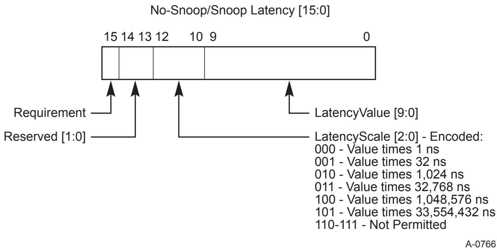

<details>
<summary>diagram</summary>

| Bit | Value Time (ns) |
|-----|-----------------|
| 0   | Not Permitted    |
| 1   | Not Permitted    |
| 2   | Not Permitted    |
| 3   | Not Permitted    |
| 4   | Not Permitted    |
| 5   | Not Permitted    |
| 6   | Not Permitted    |
| 7   | Not Permitted    |
| 8   | Not Permitted    |
| 9   | Not Permitted    |
| 10  | Not Permitted    |
| 11  | Not Permitted    |
| 12  | Not Permitted    |
| 13  | Not Permitted    |
| 14  | Not Permitted    |
| 15  | Not Permitted    |
</details>

Figure 6-15 Latency Fields Format for LTR Messages§

No-Snoop Latency and Snoop Latency: As shown in § Figure 6-15, these fields include a Requirement bit that indicates if the device has a latency requirement for the given type of Request. If the Requirement bit is Set, the LatencyValue and LatencyScale fields describe the latency requirement. If the Requirement bit is Clear, there is no latency requirement and the LatencyValue and LatencyScale fields are ignored. With any LTR Message transmission, it is permitted for a device to indicate that a requirement is being reported for only no-snoop Requests, for only snoop Requests, or for both types of Requests. It is also permitted for a device to indicate that it has no requirement for either type of traffic, which it does by clearing the Requirement bit in both fields.

Each field also includes value and scale fields that encode the reported latency. Values are multiplied by the indicated scale to yield an absolute time value, expressible in a range from 1 ns to $2 ^ { 2 5 \star } ( 2 ^ { 1 0 } - 1 ) = 3 4 , 3 2 6 , 1 8 3 , 9 3 6 \mathrm { n s }$ .

Setting the value and scale fields to all 0’s indicates that the device will be impacted by any delay and that the best possible service is requested.

If a device doesn’t implement or has no service requirements for a particular type of traffic, then it must have the Requirement bit clear for the associated latency field.

When directed to a non-D0 state by a Write to the PMCSR register, if a device’s most recently transmitted LTR message (since the last DL\_Down to DL\_Up transition) reported one or both latency fields with any Requirement bit set, then it must send a new LTR Message with both of the Requirement bits clear prior to transitioning to the non-D0 state.

When the LTR Mechanism Enable bit is cleared, if a device’s most recently sent LTR Message (since the last DL\_Down to DL\_Up transition) reported latency tolerance values with any Requirement bit set, then one of the following applies:

• If the bit was cleared due to a Configuration Write to the Device Control 2 Register, the device must send a new LTR Message with all the Requirement bits clear.  
• If the bit was cleared due to an FLR, the device MUST@FLIT send a new LTR Message with all the Requirement bits clear.

When a Downstream Port goes to DL\_Down status, any previous latencies recorded for that Port must be treated as invalid.

An LTR Message from a device reflects the tolerable latency from the perspective of the device, for which the platform must consider the service latency itself, plus the delay added by the use of Clock Power Management (CLKREQ#), if applicable. The service latency itself is defined as follows:

• When a device issues a Non-Posted Request, service latency of that Request is the delay from transmission of the last symbol of the Request TLP to the receipt of the first symbol of the first Completion TLP for that Request 135  
• When a device issues one or more Posted Requests such that it cannot issue another Posted Request due to Flow Control backpressure, service latency of the blocked Request is the delay from the transmission of the last symbol of the previous Posted Request to the receipt of the first symbol of the DLLP returning the credit(s) that allows transmission of the blocked Request118.

If Clock Power Management is used, then the platform implementation-dependent period between when a device asserts CLKREQ# and the device receives a valid clock signal constitutes an additional component of the platform service latency that must be comprehended by the platform when setting platform power management policy.

It is recommended that Endpoints transmit an LTR Message Upstream shortly after LTR is enabled.

It is strongly recommended that Endpoints send no more than two LTR Messages within any 500 μs time period, except where required to by the specification. Downstream Ports must not generate an error if more than two LTR Messages are received within a 500 μs time period, and must properly handle all LTR messages regardless of the time interval between them.

Multi-Function Devices (MFDs) associated with an Upstream Port must transmit a “conglomerated” LTR Message Upstream according to the following rules:

• The acceptable latency values for the Message sent Upstream by the MFD must reflect the lowest values associated with any Function.

◦ It is permitted that the snoop and no-snoop latencies reported in the conglomerated Message are associated with different Functions.  
◦ If none of the Functions report a requirement for a certain type of traffic (snoop/no-snoop), the Message sent by the MFD must not set the Requirement bit corresponding to that type of traffic.

• The MFD must transmit a new LTR Message Upstream when any Function of the MFD changes the values it has reported internally in such a way as to change the conglomerated value earlier reported by the MFD.

Switches must collect the Messages from Downstream Ports that have the LTR mechanism enabled and transmit a “conglomerated” Message Upstream according to the following rules:

• If a Switch supports the LTR feature, it must support the feature on its Upstream Port and all Downstream Ports.  
• A Switch Upstream Port is permitted to transmit LTR Messages only when its LTR Mechanism Enable bit is Set or shortly after software clears its LTR Mechanism Enable bit as described earlier in this section.  
• The acceptable latency values for the Message sent Upstream by the Switch must be calculated as follows:

◦ If none of the Downstream Ports receive an LTR Message containing a requirement for a certain type of traffic (snoop/no-snoop), then any LTR Message sent by the Switch must not set the Requirement bit corresponding to that type of traffic.  
◦ Define LTRdnport[N] as the value reported in the LTR Message received at Downstream Port N, with these adjustments if applicable:

▪ LTRdnport[N] is effectively infinite if the Requirement bit is clear or if a Not Permitted LatencyScale value is used  
▪ LTRdnport[N] must be 0 if the Requirement bit is 1 and the LatencyValue field is all 0’s regardless of the LatencyScale value

◦ Define LTRdnportMin as the minimum value of LTRdnport[N] across all Downstream Ports  
◦ Define Lswitch as all latency induced by the Switch

▪ If Lswitch dynamically changes based on the Switch’s operational mode, the Switch must not allow Lswitch to exceed 20% of LTRdnportMin, unless Lswitch for the Switch’s lowest latency mode is greater, in which case the lowest latency state must be used

◦ Calculate the value to transmit upstream, LTRconglomerated, as LTRdnportMin - Lswitch, unless this value is less than 0 in which case LTRconglomerated is 0  
◦ If LTRconglomerated is 0, both the LatencyValue and LatencyScale fields must be all 0’s in the conglomerated LTR message

• A new LTR message must be transmitted Upstream if the conglomerated latencies are changed as a result of DL\_Down invalidating the previous latencies recorded for that Port.  
• If a Switch Downstream Port has the LTR Mechanism Enable bit cleared, the Latency Tolerance values recorded for that Port must be treated as invalid, and the latencies to be transmitted Upstream updated and a new conglomerated Message transmitted Upstream if the conglomerated latencies are changed as a result.  
• A Switch must transmit an LTR Message Upstream when any Downstream Port/Function changes the latencies it has reported in such a way as to change the conglomerated latency reported by the Switch.  
• A Switch must not transmit LTR Messages Upstream unless triggered to do so by one of the events described above.

The RC is permitted to delay processing of device Request TLPs provided it satisfies the device's service requirements.

When the latency requirement is updated during a series of Requests, it is required that the updated latency figure be comprehended by the RC prior to servicing a subsequent Request. In all cases the updated latency value must take effect within a time period equal to or less than the previously reported latency requirement. It is permitted for the RC to comprehend the updated latency figure earlier than this limit.

## IMPLEMENTATION NOTE: OPTIMAL USE OF LTR

It is recommended that Endpoints transmit an updated LTR Message each time the Endpoint’s service requirements change. If the latency tolerance is being reduced, it is recommended to transmit the updated LTR Message ahead of the first anticipated Request with the new requirement, allowing the amount of time indicated in the previously issued LTR Message. If the tolerance is being increased, then the update should immediately follow the final Request with the preceding latency tolerance value.

Typically, the Link will be in ASPM L1, and, if Clock Power Management (Clock PM) is supported, CLKREQ# will be deasserted, at the time an Endpoint reaches an internal trigger that causes the Endpoint to initiate Requests to the RC. The following text shows an example of how LTR is applied in such a case. Key time points are illustrated in § Figure 6-16.

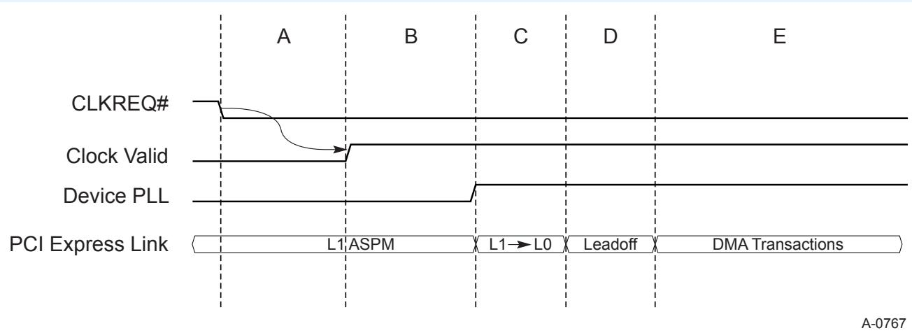

<details>
<summary>timing diagram</summary>

| Signal          | Phase   | Value |
|-----------------|---------|-------|
| CLKREQ#         | A       | High  |
| Clock Valid     | B       | Low   |
| Device PLL      | C       | Low   |
| PCI Express Link| L1    | ASPM  |
| PCI Express Link| L1→L0  | Leadoff |
| PCI Express Link| DMA Transactions | DMA Transactions |
</details>

Figure 6-16 CLKREQ# and Clock Power Management§

Time A is a platform implementation-dependent period between when a device asserts CLKREQ# and the device receives a valid clock signal. This value will not exceed the latency in effect.

Time B is the device implementation-dependent period between when a device has a valid clock and it can initiate the retraining sequence to transition from L1 ASPM to L0.

Time C is the period during which the transition from L1 ASPM to L0 takes place

Time D for a Read transaction is the time between the transmission of the END symbol in the Request TLP to the receipt of the STP symbol in the Completion TLP for that Request. Time D for a Write transaction is the time between the transmission of the END symbol of the TLP that exhausts the FC credits to the receipt of the SDP symbol in the DLLP returning more credits for that Request type. This value will not exceed the latency in effect.

Time E is the period where the data path from the Endpoint to system memory is open, and data transactions are not subject to the leadoff latency.

The LTR latency semantic reflects the tolerable latency seen by the device as measured by one or both of the following:

Case 1: the device may or may not support Clock PM, but has not deasserted its CLKREQ# signal - The latency observed by the device is represented in § Figure 6-16 as the sum of times C and D.

Case 2: the device supports Clock PM and has deasserted CLKREQ#- The latency observed by the device is represented as the sum of times A, C, and D.

To effectively use the LTR mechanism in conjunction with Clock PM, the device will know or be able to measure times B and C, so that it knows when to assert CLKREQ#. The actual values of Time A, Time C, and Time D may vary dynamically, and it is the responsibility of the platform to ensure the sum will not exceed the latency.

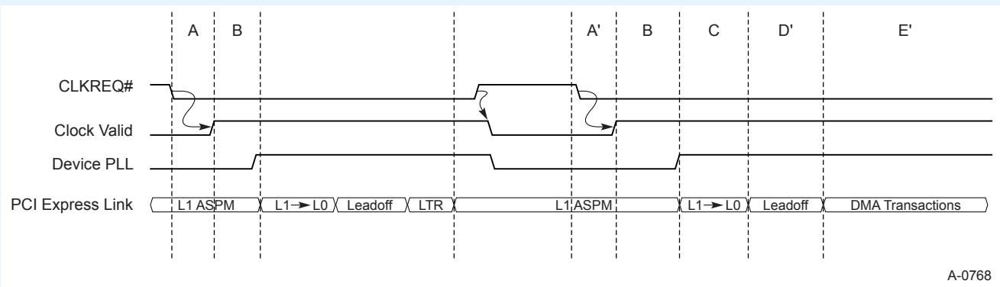

<details>
<summary>timing diagram</summary>

| Phase           | Value |
| --------------- | ----- |
| A               | A     |
| B               | B     |
| A'              | A'    |
| B               | B     |
| C               | C     |
| D'              | D'    |
| E'              | E'    |
</details>

Figure 6-17 Use of LTR and Clock Power Management§

In a very simple model, an Endpoint may choose to implement LTR as shown in § Figure 6-17. When an Endpoint determines that it is idle, it sends an LTR Message with the software configured maximum latency or the maximum latency the Endpoint can support.

When the Endpoint determines that it has a need to maintain sustained data transfers with the Root Complex, the Endpoint sends a new LTR Message with a shorter latency (at Time E). This LTR Message is sent prior to the next data flush by a time equal to the maximum latency sent before (the time between Time E and Time D’). In between Time E and Time A’, the Endpoint can return to a low power state, while the platform transitions to a state where it can provide the shorter latency when the device next needs to transmit data.

Note that the RC may delay processing of device Request TLPs, provided it satisfies the device's service requirements. If, for example, an Endpoint connected to Root Port 1 reports a latency tolerance of 100 μs, and an Endpoint on Root Port 2 report a value of 30 μs, the RC might implement a policy of stalling an initial Request following an idle period from Root Port 1 for 70 μs before servicing the Request with a 30 μs latency, thus providing a perceived service latency to the first Endpoint of 100 μs. This RC behavior provides the RC the ability to batch together Requests for more efficient servicing.

It is possible that, after it is determined that the RC can service snoop and no-snoop Requests from all Endpoints within the maximum snoop and maximum no-snoop time intervals, this information may be communicated to Endpoints by updating the Max Snoop LatencyValue, Max Snoop LatencyScale and Max No-Snoop LatencyValue, Max No-Snoop LatencyScale fields. The intention of this communication would be to prevent Endpoints from sending needless LTR updates.

When an Endpoint’s LTR value for snoop Requests changes to become larger (looser) than the value indicated in the Max Snoop LatencyValue/Scale fields, it is recommended that the Endpoint send an LTR message with the snoop LTR value indicated in the Max Snoop LatencyValue/Scale fields. Likewise, when an Endpoint’s LTR value for no-snoop Requests changes to become larger (looser) than the value indicated in the Max No-Snoop

LatencyValue/Scale fields, it is recommended that the Endpoint send an LTR message with the no-snoop LTR value indicated in the Max No-Snoop LatencyValue/Scale fields.

It is recommended that Endpoints buffer Requests as much as possible, and then use the full Link bandwidth in bursts that are as long as the Endpoint can practically support, as this will generally lead to the best overall platform power efficiency.

Note that LTR may be enabled in environments where not all Endpoints support LTR, and in such environments, Endpoints that do not support LTR may experience suboptimal service.

## 6.19 Optimized Buffer Flush/Fill (OBFF) Mechanism §

The Optimized Buffer Flush/Fill (OBFF) Mechanism enables a Root Complex to report to Endpoints (throughout a hierarchy) time windows when the incremental platform power cost for Endpoint bus mastering and/or interrupt activity is relatively low. Typically this will correspond to time that the host CPU(s), memory, and other central resources associated with the Root Complex are active to service some other activity, for example the operating system timer tick. The nature and determination of such windows is platform/implementation specific.

An OBFF indication is a hint - Functions are still permitted to initiate bus mastering and/or interrupt traffic whenever enabled to do so, although this will not be optimal for platform power and should be avoided as much as possible.

OBFF is indicated using either the WAKE# signal or a message (see § Section 2.2.8.9 ). The message is to be used exclusively on interconnects where the WAKE# signal is not available. WAKE# signaling of OBFF or CPU Active must only be initiated by a Root Port when the system is in an operational state, which in an ACPI compliant system corresponds to the S0 state. Functions that are in a non-D0 state must not respond to OBFF or CPU Active signaling.

OBFF messages use Message Routing 100b, "Local - Terminate at Receiver" (see § Table 2-20), and are only permitted to be transmitted in the Downstream direction. There are multiple OBFF events distinguished. When using the OBFF Message, the OBFF Code field (see § Figure 2-59 and § Figure 2-60) is used to distinguish between different OBFF cases:

## 1111b “CPU Active”

System fully active for all Device actions including bus mastering and interrupts

## 0001b “OBFF”

System memory path available for Device memory read/write bus master activities

## 0000b “Idle”

System in an idle, low power state

## Others

All other codes are Reserved.

These codes correspond to various assertion patterns of WAKE# when using WAKE# signaling, as shown in § Figure 6-18. There is one negative-going transition when signaling OBFF and two negative going transitions each time CPU Active is signaled. The electrical parameters required when using WAKE# are defined in the WAKE# Signaling section of [CEM-2.0] (or later).

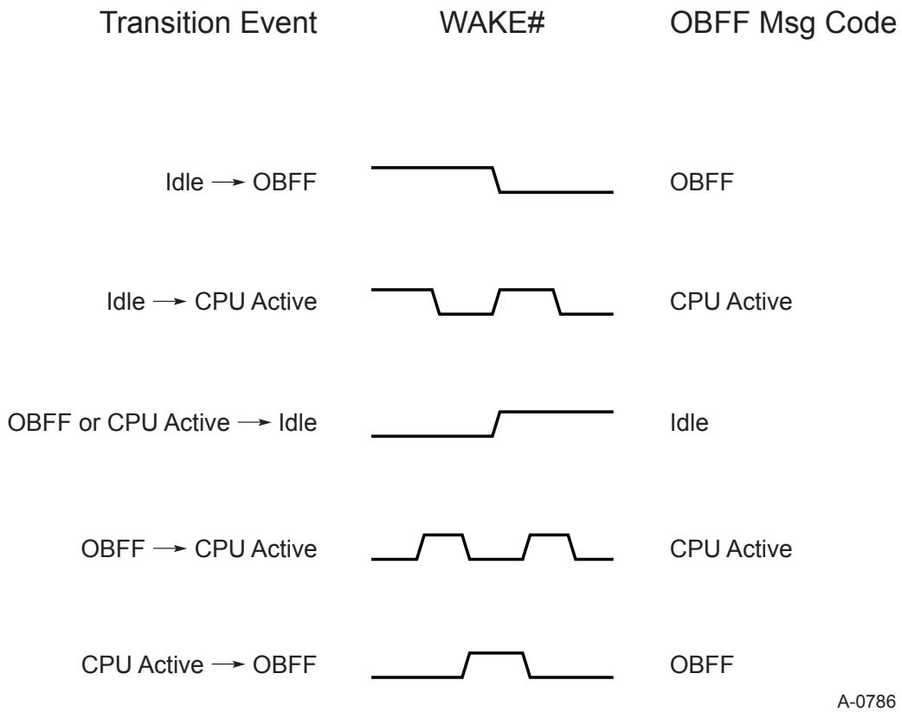

<details>
<summary>line chart</summary>

| Transition Event | WAKE# | OBFF Msg Code |
| ---------------- | ----- | ------------- |
| Idle → OBFF      | 0     | OBFF          |
| Idle → CPU Active | 0     | CPU Active    |
| OBFF or CPU Active → Idle | 0   | Idle          |
| OBFF → CPU Active | 0     | CPU Active    |
| CPU Active → OBFF | 0     | OBFF          |
</details>

Figure 6-18 Codes and Equivalent WAKE# Patterns§

When an OBFF Message is received that indicates a Reserved code, the Receiver, if OBFF is enabled, must treat the indication as a “CPU Active” indication.

An OBFF Message received at a Port that does not implement OBFF or when OBFF is not enabled must be handled as an Unsupported Request (UR). This is a reported error associated with the receiving Port (see § Section 6.2 ). If a Port has OBFF enabled using WAKE# signaling, and that Port receives an OBFF Message, the behavior is undefined.

OBFF indications reflect central resource power management state transitions, and are signaled using WAKE# when this is supported by the platform topology, or using a Message when WAKE# is not available. OBFF support is discovered and enabled through reporting and control registers described in § Chapter 7. . Software must not enable OBFF in an Endpoint unless the platform supports delivering OBFF indications to that Endpoint.

When the platform indicates the start of a CPU Active or OBFF window, it is recommended that the platform not return to the Idle state in less than 10 μs. It is permitted to indicate a return to Idle in advance of actually entering platform idle, but it is strongly recommended that this only be done to prevent late Endpoint activity from causing an immediate exit from the idle state, and that the advance time be as short as possible.

It is recommended that Endpoints not assume CPU Active or OBFF windows will remain open for any particular length of time.

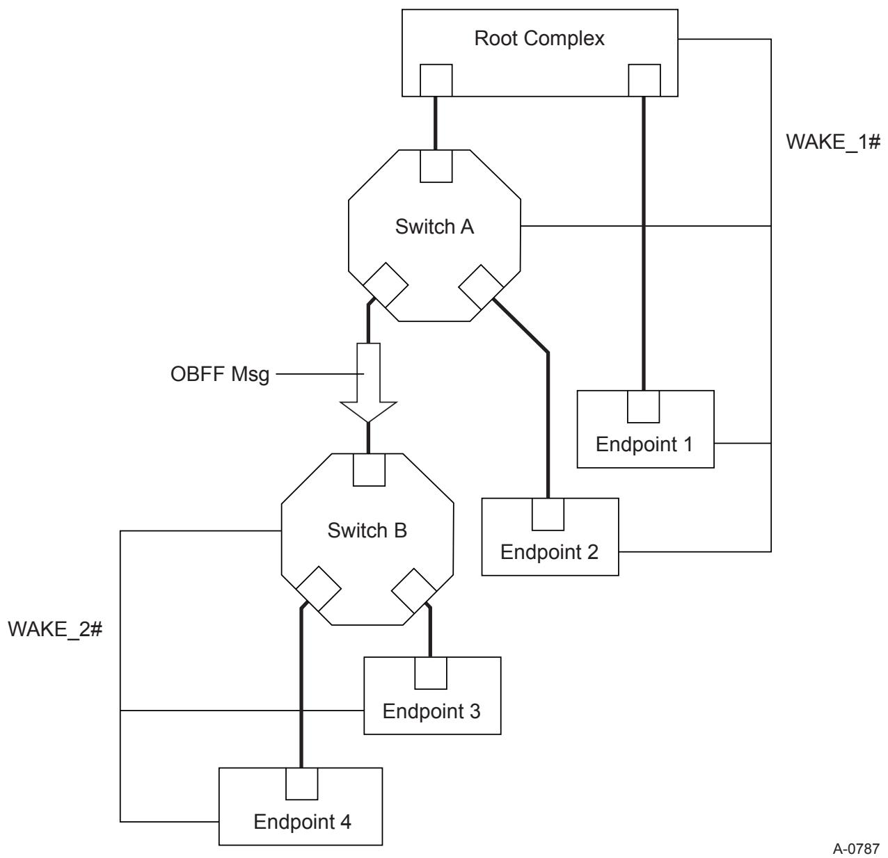

<details>
<summary>flowchart</summary>

```mermaid
graph TD
  A["Root Complex"] --> B["Switch A"]
  B --> C["OBFF Msg"]
  C --> D["Switch B"]
  D --> E["Endpoint 3"]
  D --> F["Endpoint 2"]
  D --> G["Endpoint 1"]
  G --> H["WAKE_1#"]
  D --> I["Endpoint 4"]
  I --> J["WAKE_2#"]
  B --> K["Terminal Node"]
    style A fill:#f9f,stroke:#333
    style B fill:#ccf,stroke:#333
    style C fill:#cfc,stroke:#333
    style D fill:#fcc,stroke:#333
    style E fill:#ffc,stroke:#333
    style F fill:#fcc,stroke:#333
    style G fill:#fcc,stroke:#333
    style H fill:#fff,stroke:#333
    style I fill:#fff,stroke:#333
```
</details>

Figure 6-19 Example Platform Topology Showing a Link Where OBFF is Carried by Messages§

§ Figure 6-19 shows an example system where it is necessary for a Switch (A) to translate OBFF indications received using WAKE# into OBFF Messages, which in this case are received by another Switch (B) and translated back to using WAKE# signaling. A HwInit configuration mechanism (set by hardware or firmware) is used to identify cases such as shown in this example (where the link between Switch A and Switch B requires the use of OBFF Messages), and system firmware/ software must configure OBFF accordingly.

When a Switch is configured to use OBFF Message signaling at its Upstream Port and WAKE# at one or more Downstream Ports, or vice-versa, when enabled for OBFF, the Switch is required to convert all OBFF indications received at the Upstream Port into the appropriate form at the Downstream Port(s).

When using WAKE#, the enable for any specific Root Port enables the global use of WAKE# unless there are multiple WAKE# signals, in which case only the associated WAKE# signals are affected. When using Message signaling for OBFF, the enable for a particular Root Port enables transmission of OBFF messages from that Root Port only. To ensure OBFF is fully enabled in a platform, all Root Ports indicating OBFF support must be enabled for OBFF. It is permitted for system firmware/software to selectively enable OBFF, but such enabling is beyond the scope of this specification.

To minimize power consumption, system firmware/software is strongly recommended to enable Message signaling of OBFF only when WAKE# signaling is not available for a given link.

OBFF signaling using WAKE# must only be reported as supported by all components connected to a Switch if it is a shared WAKE# signal. In these topologies it is permitted for software to enable OBFF for components connected to the Switch even if the Switch itself does not support OBFF.

It is permitted, although not encouraged, to indicate the same OBFF event more than once in succession.

When a Switch is propagating OBFF indications Downstream, it is strongly encouraged to propagate all OBFF indications. However, especially when using Messages, it may be necessary for the Switch to discard or collapse OBFF indications. It is permitted to discard and replace an earlier indication of a given type when an indication of the same or a different type is received.

Downstream Ports can be configured to transmit OBFF Messages in two ways, which are referred to as Variation A and Variation B. For Variation A, the Port must transmit the OBFF Message if the Link is in the L0 state, but discard the Message when the Link is in the Tx\_L0s or L1 state. This variation is preferred when the Downstream Port leads to Devices that are expected to have communication requirements that are not time-critical, and where Devices are expected to signal a non-urgent need for attention by returning the Link state to L0. For Variation B, the Port must transmit the OBFF Message if the Link is in the L0 state, or, if the Link is in the Tx\_L0s or L1 state, it must direct the Link to the L0 state and then transmit the OBFF Message. This variation is preferred when the Downstream Port leads to devices that can benefit from timely notification of the platform state.

When initially configured for OBFF operation, the initial assumed indication must be the CPU Active state, regardless of the logical value of the WAKE# signal, until the first transition is observed.

When enabling Ports for OBFF, it is recommended that all Upstream Ports be enabled before Downstream Ports, and Root Ports must be enabled after all other Ports have been enabled. For hot pluggable Ports this sequence will not generally be possible, and it is permissible to enable OBFF using WAKE# to an unconnected hot pluggable Downstream Port. It is recommended that unconnected hot pluggable Downstream Ports not be enabled for OBFF message transmission.

## IMPLEMENTATION NOTE:

## OBFF CONSIDERATIONS FOR ENDPOINTS §

It is possible that during normal circumstances, events could legally occur that could cause an Endpoint to misinterpret transitions from an Idle window to a CPU Active window or OBFF window. For example, a non-OBFF Endpoint could assert WAKE# as a wakeup mechanism, masking the system’s transitions of the signal. This could cause the Endpoint to behave in a manner that would be less than optimal for power or performance reasons, but should not be unrecoverable for the Endpoint or the host system.

In order to allow an Endpoint to maintain the most accurate possible view of the host state, it is recommended that the Endpoint place its internal state tracking logic in the CPU Active state when it receives a request that it determines to be host-initiated, and at any point where the Endpoint has a pending interrupt serviced by host software.

## 6.20 PASID §

In Non-Flit Mode, the PASID TLP Prefix is an End-End TLP Prefix as defined in § Section 2.2.1 . Layout of the PASID TLP Prefix is shown in § Figure 6-20 and § Table 6-15.

In Flit Mode, the PASID, when present, is included in OHC-A1.

When a PASID is present, the PASID value, in conjunction with the requester ID, identifies the Process Address Space ID associated with the Request. Each Function has a distinct set of PASID values. PASID values used by one Function are unrelated to PASID values used by any other Function.

PASID is permitted only for specific types of TLPs:

• Memory Requests (including AtomicOp Requests) with Address Type (AT) of Untranslated or Translated (see § Section 2.2.4.1 ).  
• Address Translation Requests (i.e., MRd with AT=01b), ATS Invalidation Request Messages, Page Request Messages, and PRG Response Messages (see § Section 10.1.3 ).

PASID is not permitted on any other type of TLP.

## 6.20.1 Managing PASID Usage §

Usage of PASID is permitted only when specifically enabled.

For Endpoint Functions (including Root Complex Integrated Devices), the following rules apply:

• A Function is not permitted to send and receive TLPs with a PASID unless PASID Enable is Set (see § Section 7.8.9.3 ):  
• A Function is not permitted to generate Requests using Translated Addresses and a PASID unless both PASID Enable and Translated Requests with PASID Enable are Set.  
• A Function must have a mechanism for associating use of a PASID with a particular Function context. This mechanism is outside the scope of this specification.  
• A Function must have a mechanism to request that it gracefully stop using a specific PASID. This mechanism is device specific but must satisfy the following rules:

◦ A Function may support a limited number of simultaneous PASID stop requests. Software should defer issuing new stop requests until older stop requests have completed.  
◦ A stop request in one Function must not affect operation of any other Function.  
◦ A stop request must not affect operation of any other PASID within the Function.  
◦ A stop request must not affect operation of transactions that are not associated with a PASID.  
◦ When the stop request mechanism indicates completion, the Function has:

▪ Stopped queuing new Requests for this PASID.  
▪ Completed all Non-Posted Requests associated with this PASID.  
Flushed to the host all Posted Requests addressing host memory in all TCs that were used by the PASID. The mechanism used for this is device specific (for example: a non-relaxed Posted Write to host memory or a processor read of the Function can flush TC0; a zero length read to host memory can flush non-zero TCs).

▪ Optionally flushed all Peer-to-Peer Posted Requests to their destination(s). The mechanism used for this is device specific.  
▪ Complied with additional rules described in Address Translation Services (§ Chapter 10. ) if Address Translations or Page Requests were issued on the behalf of this PASID.

For Root Complexes, the following rules apply:

• A Root Complex must have an implementation specific mechanism for indicating support for PASID.  
• A Root Complex that supports PASID must have an implementation specific mechanism for enabling them. By default usage of PASID is disabled.  
• A Root Complex that supports PASID may optionally have an implementation specific mechanism for enabling them at a finer granularity than the entire Root Complex (e.g., distinct enables for a specific Root Port, Requester ID, Bus Number, Requester ID, or Requester ID/PASID combination).

## 6.20.2 PASID Information Layout §

In Flit Mode, the PASID information is contained in OHC-A1. In Non-Flit Mode, the PASID information is contained in a PASID TLP Prefix.

## 6.20.2.1 PASID TLP Prefix - Non-Flit Mode §

A TLP may contain at most one PASID TLP Prefix.

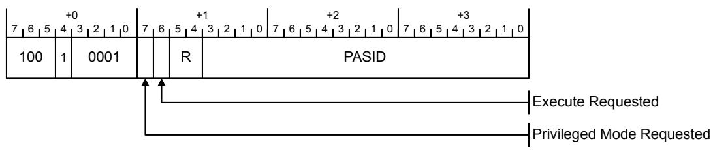

<details>
<summary>text_image</summary>

7 6 5 4 3 2 1 0
+0
7 6 5 4 3 2 1 0
100 1 0001 R PASID
+1
7 6 5 4 3 2 1 0
+2
7 6 5 4 3 2 1 0
+3
7 6 5 4 3 2 1 0
↑
Execute Requested
Privileged Mode Requested
</details>

§  
Figure 6-20 PASID TLP Prefix

§  
Table 6-15 PASID TLP Prefix

<table><tr><td>Bits</td><td>Description</td></tr><tr><td>Byte 0bits 7:5</td><td>100b - indicating TLP Prefix</td></tr><tr><td>Byte 0 bit 4</td><td>1b - indicating End-End TLP Prefix</td></tr><tr><td>Byte 0bits 3:0</td><td>0001b - indicating PASID TLP Prefix</td></tr><tr><td>Byte 1 bit 7</td><td>Privileged Mode Requested- If Set indicates a Privileged Mode entity in the Endpoint is issuing the Request, If Clear, indicates a Non-Privileged Mode entity in the Endpoint is issuing the Request.Usage of this bit is specified in § Section 6.20.2.4 .</td></tr><tr><td>Byte 1 bit 6</td><td>Execute Requested- If Set indicates the Endpoint is requesting Execute Permission. If Clear, indicates the Endpoint is not requesting Execute Permission.Usage of this bit is specified in § Section 6.20.2.3 .</td></tr><tr><td>Byte 1 bit 3:Byte 3 bit 0</td><td>Process Address Space ID (PASID)- This field contains the PASID value associated with the TLP.Usage of this field is defined in § Section 6.20.2.2 .</td></tr></table>

## 6.20.2.2 PASID field (Flit Mode and Non-Flit Mode)


The PASID field identifies the user process associated with a Request.

The PASID field is 20 bits wide. Endpoints and Root Complexes need not support the entire range of the field. For Endpoints, the Max PASID Width field indicates the supported range of PASID values (§ Section 7.8.9.2 ). For Root Complexes, an implementation specific mechanism is used to provide this information.

Endpoints are not permitted to send TLPs with a PASID unless the PASID Enable bit (§ Section 7.8.9.3 ) is Set. Endpoints that support PASID must signal Unsupported Request (UR) when they receive a TLP with a PASID and the PASID Enable bit is Clear.

Root Complexes may optionally support TLPs with a PASID. The mechanism used to detect whether a Root Complex supports PASID is implementation specific.

For Endpoints, the following rules apply:

• The Endpoint is not permitted to send TLPs with a PASID value greater than or equal to 2Max PASID Width.  
• The Endpoint is optionally permitted to signal an error when it receives a Request with a PASID value greater than or equal to 2Max PASID Width. This is an Unsupported Request error associated with the Receiving Port (see § Section 6.2 ).

For Root Complexes, the following rules apply:

• A Root Complex is not permitted to send a TLP with a PASID value greater than it supports.  
• A Root Complex is optionally permitted to signal an error when it receives a Request with a PASID value greater than it supports. This is an Unsupported Request error associated with the Receiving Port (see § Section 6.2 ).  
For Completers, the following rules apply:

• For Untranslated Memory Requests, the PASID value and the Untranslated Address are both used in determining the Translated Address used in satisfying the Request. For address translation related TLPs, usage of this field is defined in Address Translation Services (§ Chapter 10. ).

## IMPLEMENTATION NOTE:

## PASID WIDTH HOMOGENEITY §

The PASID value is unique per Function and thus the original intent was that the width of the PASID value supported by that Function could be based on the needs of that Function. However, current system software typically does not follow that model and instead uses the same PASID value in all Functions that access a specific address space. To enable this, system software will typically ensure a common system PASID width for Root Complex and persistent translation agents. Such system software will typically disable ATS on any hot plugged Endpoint Functions or translation agents reporting PASID width support which is less than that of the common system PASID width.

The Root Complex, Endpoints, and translation agents, are often implemented independently of system software, therefore it is strongly recommended that hardware implement the maximum width of 20 bits to ensure interoperability with system software.

Endpoints may, in an implementation specific way, be able to map the 20 bit system PASID to an internal representation carrying a smaller width. If this is done, it is critical that the Endpoint do so without impacting system software, which has no mechanism to differentiate such implementation from those that implement the full 20 bit width natively.

## 6.20.2.3 Execute Requested §

If the Execute Requested bit is Set, the Endpoint is requesting permission for the Endpoint to Execute instructions in the memory range associated with this request. The meaning of Execute permission is outside the scope of this specification.

Endpoints are not permitted to send TLPs with the Execute Requested bit Set unless the Execute Permission Supported bit (§ Section 7.8.9.2 ) and the Execute Permission Enable bit (§ Section 7.8.9.3 ) are both Set.

For Root Complexes, the following rules apply:

• Support for Execute Requested by the Root Complex is optional. The mechanism used to determine whether a Root Complex supports Execute Requested is implementation specific.  
• A Root Complex that supports the Execute Requested bit should have an implementation specific mechanism to enable it to use the bit.  
• A Root Complex that supports the Execute Requested bit may have an implementation specific mechanism to enable use of the bit at a finer granularity (e.g., for a specific Root Port, for a specific Bus Number, for a specific Requester ID, or for a specific Requester ID/PASID combination), and its default value is implementation specific.

For Completers, the following rules apply:

Completers have a concept of an effective value of the bit. For a given Request, if the Execute Requested bit is supported and it usage is enabled for the Request, the effective value of the bit is the value in the Request; otherwise the effective value of the bit is 0b.

• For Untranslated Memory Read Requests, Completers use the effective value of the bit as part of the protection check. If this protection check fails, Completers treat the Request as if the memory was not mapped.

• For Untranslated Memory Requests, other than an Untranslated Memory Read Request, the bit is Reserved. For address translation related TLPs, usage of this bit is defined in Address Translation Services (§ Chapter 10. ).

## 6.20.2.4 Privileged Mode Requested §

If Privileged Mode Requested is Set, the Endpoint is issuing a Request that targets memory associated with Privileged Mode. If Privileged Mode Requested is Clear, the Endpoint is issuing a Request that targets memory associated with Non-Privileged Mode.

The meaning of Privileged Mode and Non-Privileged Mode and what it means for an Endpoint to be operating in Privileged or Non-Privileged Mode depends on the protection model of the system and is outside the scope of this specification.

Endpoints are not permitted to send a TLP with the Privileged Mode Requested bit Set unless both the Privileged Mode Supported bit (§ Section 7.8.9.2 ) and the Privileged Mode Enable bit (§ Section 7.8.9.3 ) are Set.

For Root Complexes, the following rules apply:

• Support for the Privileged Mode Requested bit by the Root Complex is optional. The mechanism used to determine whether a Root Complex supports the Privileged Mode Requested bit is implementation specific.  
• A Root Complex that supports the Privileged Mode Requested bit should have an implementation specific mechanism to enable it to use the bit.  
• A Root Complex that supports the Privileged Mode Requested bit may have an implementation specific mechanism to enable use of the bit at a finer granularity (e.g., for a specific Root Port, for a specific Bus Number, for a specific Requester ID, or for a specific Requester ID/PASID combination).

For Completers, the following rules apply:

Completers have the concept of an effective value of the bit. For a given Request, if the Privileged Mode Requested bit is supported and its usage is enabled for the Request, the effective value of the bit is the value in the Request; otherwise the effective value of the bit is the 0b.  
• For Untranslated Memory Requests, Completers use the effective value of the bit as part of its protection check. If this protection check fails, Completers treat the Request as if the memory was not mapped.  
• For address translation related TLPs, usage of this bit is defined in Address Translation Services (§ Chapter 10. ).

## 6.21 Precision Time Measurement (PTM) Mechanism §

## 6.21.1 Introduction §

Precision Time Measurement (PTM) enables precise coordination of events across multiple components with independent local time clocks. Ordinarily, such precise coordination would be difficult given that individual time clocks have differing notions of the value and rate of change of time. To work around this limitation, PTM enables components to calculate the relationship between their local times and a shared PTM Master Time: an independent time domain associated with a PTM Root.

Enhanced Precision Time Management (ePTM) places additional requirements on PTM Devices. Support for ePTM is indicated by the ePTM Capable bit.

PTM defines the following:

• PTM Requester - A Function capable of using PTM as a consumer associated with an Endpoint or an Upstream Port.