<table><tr><td>Bit Location</td><td>Register Description</td><td>Attributes</td></tr><tr><td></td><td>When applicable, all Functions in a Multi-Function Device associated with an Upstream Port must report the same value in this field.This field is RsvdP if both DMWr Completer Supported and DMWr Request Routing Supported are Clear.</td><td></td></tr><tr><td>31</td><td>FRS Supported - When Set, indicates support for the optional Function Readiness Status (FRS) capability.Must be Set for all Functions that support generation or reception capabilities of FRS Messages.Must not be Set by Switch Functions that do not generate FRS Messages on their own behalf.</td><td>HwInit</td></tr></table>

## IMPLEMENTATION NOTE:

## USE OF THE NO RO-ENABLED PR-PR PASSING BIT §

The No RO-enabled PR-PR Passing bit allows platforms to utilize PCI Express switching elements on the path between a requester and completer for requesters that could benefit from a slightly less relaxed ordering model. An example is a device that cannot ensure that multiple overlapping posted writes to the same address are outstanding at the same time. The method by which such a device is enabled to utilize this mode is beyond the scope of this specification.

## 7.5.3.16 Device Control 2 Register (Offset 28h) §

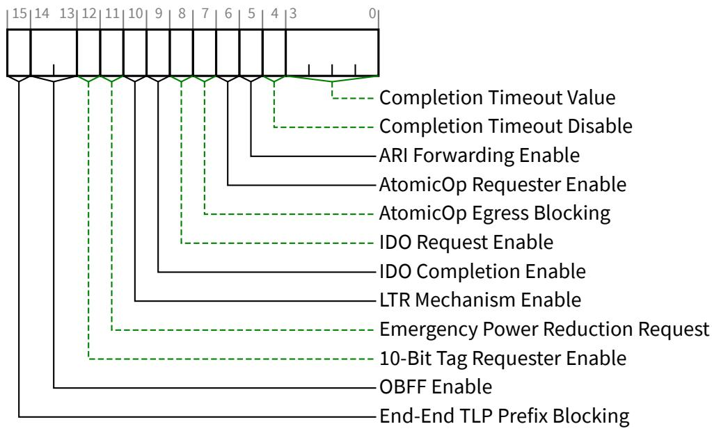

flowchart

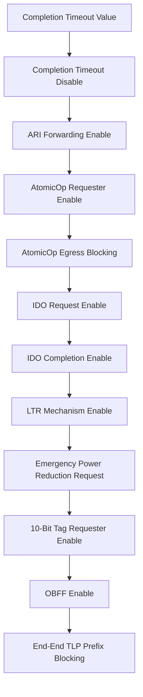
```mermaid
graph TD
  A["Completion Timeout Value"] --> B["Completion Timeout Disable"]
  B --> C["ARI Forwarding Enable"]
  C --> D["AtomicOp Requester Enable"]
  D --> E["AtomicOp Egress Blocking"]
  E --> F["IDO Request Enable"]
  F --> G["IDO Completion Enable"]
  G --> H["LTR Mechanism Enable"]
  H --> I["Emergency Power Reduction Request"]
  I --> J["10-Bit Tag Requester Enable"]
  J --> K["OBFF Enable"]
  K --> L["End-End TLP Prefix Blocking"]
```

§ Figure 7-37 Device Control 2 Register

§ Table 7-34 Device Control 2 Register

<table><tr><td>Bit Location</td><td>Register Description</td><td>Attributes</td></tr><tr><td>3:0</td><td>Completion Timeout Value- In device Functions that support Completion Timeout programmability, this field allows system software to modify the Completion Timeout Value.This field is applicable to Root Ports, Endpoints that issue Requests on their own behalf, and PCI Express to PCI/PCI-X Bridges that take ownership of Requests issued on PCI Express. For VFs, the associated PF's value applies, and this field must be RsvdP. For all other Functions, this field must be hardwired to Zero.A Function that does not support this optional capability must hardwire this field to 0000b. Functions that support Completion Timeout programmability must support the values given below corresponding to the programmability ranges indicated in the Completion Timeout Ranges Supported field.Defined encodings:0000b Default range: 50 μs to 50 ms; the Function MUST@FLIT implement a timeout value in the range 40 ms to 50 ms.For Functions that do not support Flit Mode, it is strongly recommended that the Completion Timeout mechanism not expire in less than 10 ms.Values available if Range A is supported:0001b 50 μs to 100 μs0010b 1 ms to 10 msValues available if Range B is supported:0101b 16 ms to 55 ms ;MUST@FLIT 40 ms to 55 ms0110b 65 ms to 210 msValues available if Range C is supported:1001b 260 ms to 900 ms1010b 1 s to 3.5 sValues available if the Range D is supported:1101b 4 s to 13 s1110b 17 s to 64 sValues not defined above are Reserved.Software is permitted to change the value in this field at any time. For Requests already pending when the Completion Timeout Value is changed, hardware is permitted to use either the new or the old value for the outstanding Requests, and is permitted to base the start time for each Request either on when this value was changed or on when each request was issued.The default value for this field is 0000b.</td><td>RWVF RsvdP</td></tr><tr><td>4</td><td>Completion Timeout Disable- When Set, this bit disables the Completion Timeout mechanism.For non-VFs, this bit is required for all Functions that support the Completion Timeout Disable capability. For VFs, the associated PF's value applies, and this field must be RsvdP. Otherwise, Functions that do not support this optional capability are permitted to hardwire this bit to Zero.Software is permitted to Set or Clear this bit at any time. When Set, the Completion Timeout detection mechanism is disabled. If there are outstanding Requests when the bit is cleared, it is permitted but not required for hardware to apply the completion timeout mechanism to the outstanding Requests. If this is done, it is permitted to base the start time for each Request on either the time this bit was cleared or the time each Request was issued.The default value for this bit is 0b.</td><td>RWVF RsvdP</td></tr><tr><td>5</td><td>ARI Forwarding Enable- When set, the Downstream Port disables its traditional Device Number field being 0 enforcement when turning a Type 1 Configuration Request into a Type 0 Configuration Request, permitting access to Extended Functions in an ARI Device immediately below the Port. See § Section 6.13.Default value of this bit is 0b. Must be hardwired to 0b if the ARI Forwarding Supported bit is 0b.This bit is not applicable and Reserved for Upstream Ports.</td><td>RW / RsvdP</td></tr><tr><td>6</td><td>AtomicOp Requester Enable- Applicable only to Endpoints and Root Ports; must be hardwired to 0b for other Function types. The Function is allowed to initiate AtomicOp Requests only if this bit and the Bus Master Enable bit in the Command register are both Set.For VFs, the associated PF's value applies, and this bit must be RsvdP. For non-VFs, this bit is required to be RW if the Endpoint or Root Port is capable of initiating AtomicOp Requests, but otherwise is permitted to be hardwired to Zero.This bit does not serve as a capability bit. This bit is permitted to be RW even if no AtomicOp Requester capabilities are supported by the Endpoint or Root Port.Default value of this bit is 0b.</td><td>RWWF RsvdP</td></tr><tr><td>7</td><td>AtomicOp Egress Blocking- Applicable and mandatory for Switch Upstream Ports, Switch Downstream Ports, and Root Ports that implement AtomicOp routing capability; otherwise must be hardwired to 0b.When this bit is Set, AtomicOp Requests that target going out this Egress Port must be blocked. See § Section 6.15.2.Default value of this bit is 0b.</td><td>RW</td></tr><tr><td>8</td><td>IDO Request Enable- If this bit is Set, the Function is permitted to set the ID-Based Ordering (IDO) bit (Attr[2]) of Requests it initiates (see § Section 2.2.6.3 and § Section 2.4).Endpoints, including RC Integrated Endpoints, and Root Ports are permitted to implement this capability.For VFs, the associated PF's value applies, and this bit must be RsvdP. Otherwise, a Function is permitted to hardwire this bit to Zero if it never sets the IDO attribute in Requests.Default value of this bit is 0b.</td><td>RWWF RsvdP</td></tr><tr><td>9</td><td>IDO Completion Enable- If this bit is Set, the Function is permitted to set the ID-Based Ordering (IDO) bit (Attr[2]) of Completions it returns (see § Section 2.2.6.3 and § Section 2.4).Endpoints, including RC Integrated Endpoints, and Root Ports are permitted to implement this capability.For VFs, the associated PF's value applies, and this bit must be RsvdP. Otherwise, a Function is permitted to hardwire this bit to Zero if it never sets the IDO attribute in Completions.Default value of this bit is 0b.</td><td>RWWF RsvdP</td></tr><tr><td>10</td><td>LTR Mechanism Enable- When Set to 1b, this bit enables Upstream Ports to send LTR messages and Downstream Ports to process LTR Messages.For a Multi-Function Device associated with an Upstream Port of a device that implements LTR, the bit in Function 0 is RW, and only Function 0 controls the component's Link behavior. In all other Functions of that device, this bit is RsvdP.Functions that do not implement the LTR mechanism are permitted to hardwire this bit to 0b.Default value of this bit is 0b.For Downstream Ports, this bit must be reset to the default value if the Port goes to DL_Down status.</td><td>RW/RsvdP</td></tr><tr><td>11</td><td>Emergency Power Reduction Request- If Set, all Functions in the component that support Emergency Power Reduction State must enter the Emergency Power Reduction State. If Clear these Functions must exit the Emergency Power Reduction State if no other reasons exist to preclude exiting this state. See § Section 6.24 for additional details.This bit is implemented in the lowest numbered (non-VF) Function associated with an Upstream Port that has a non-Zero value in the Emergency Power Reduction Supported field. This bit is RsvdP in all other Functions, including VFs.Default is 0b.</td><td>RW/RsvdPVF RsvdP</td></tr><tr><td>12</td><td>10-Bit Tag Requester Enable- This bit, in combination with the Extended Tag Field Enable bit and the 14-Bit Tag Requester Enable bit, determines how many Tag field bits a Requester is permitted to use. When the 10-Bit Tag Requester Enable bit is Set, the Requester is permitted to use 10-Bit Tags. See § Section 2.2.6.2 for complete details.If software changes the value of this bit while the Function has outstanding Non-Posted Requests, the result is undefined.For VFs, the value in the VF 10-Bit Tag Requester Enable bit in the associated PF's SR-IOV Control Register applies, and this bit must be RsvdP.Non-VF Functions that do not implement 10-Bit Tag Requester capability are permitted to hardwire this bit to Zero.Default value of this bit is 0b.</td><td>RWVF RsvdP</td></tr><tr><td>14:13</td><td>OBFF Enable- This field enables the OBFF mechanism and selects the signaling method.00b Disabled01b Enabled using Message signaling [Variation A]10b Enabled using Message signaling [Variation B]11b Enabled using WAKE# signalingSee § Section 6.19 for an explanation of the above encodings.This field is required for all Ports that support the OBFF Capability.For a Multi-Function Device associated with an Upstream Port of a Device that implements OBFF, the field in Function 0 is of type RW, and only Function 0 controls the Component's behavior. In all other Functions of that Device, this field is of type RsvdP.Ports that do not implement OBFF are permitted to hardwire this field to 00b.Default value of this field is 00b.</td><td>RW/RsvdP(see description)</td></tr><tr><td>15</td><td>End-End TLP Prefix Blocking- Controls whether the routing function is permitted to forward TLPs containing an End-End TLP Prefix (NFM) / OHC-E (FM). Values are:0b Forwarding Enabled - Function is permitted to send TLPs with End-End TLP Prefixes (NFM) or OHC-E (FM).1b Forwarding Blocked - Function is not permitted to send TLPs with End-End TLP Prefixes (NFM) or OHC-E (FM).This bit affects TLPs that exit the Switch/Root Complex using the associated Port. It does not affect TLPs forwarded internally within the Switch/Root Complex. It does not affect TLPs that enter through the associated Port, that originate in the associated Port or originate in a Root Complex Integrated Device integrated with the associated Port. As described in § Section 2.2.10.4 , blocked TLPs are reported by the TLP Prefix Blocked Error.The default value of this bit is 0b.This bit is hardwired to 1b in Root Ports that support End-End TLP Prefixes/OHC-E but do not support forwarding of End-End TLP Prefixes/OHC-E.This bit is applicable to Root Ports and Switch Ports where the End-End TLP Prefix Supported bit is Set. This bit is not applicable and is RsvdP in all other cases.</td><td>RW (see description)</td></tr></table>

## 7.5.3.17 Device Status 2 Register (Offset 2Ah) §

This section is a placeholder. There are no capabilities that require this register.

This register must be treated by software as RsvdZ.

## 7.5.3.18 Link Capabilities 2 Register (Offset 2Ch) §

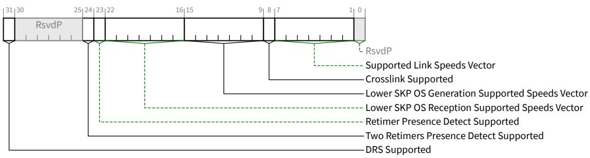

text_image

RsvdP
31 30 25 24 23 22 16 15 9 8 7 1 0
RsvdP
Supported Link Speeds Vector
Crosslink Supported
Lower SKP OS Generation Supported Speeds Vector
Lower SKP OS Reception Supported Speeds Vector
Retimer Presence Detect Supported
Two Retimers Presence Detect Supported
DRS Supported

Figure 7-38 Link Capabilities 2 Register§

§ Table 7-35 Link Capabilities 2 Register

<table><tr><td>Bit Location</td><td>Register Description</td><td>Attributes</td></tr><tr><td>7:1</td><td>Supported Link Speeds Vector- This field indicates the supported Link speed(s) of the associated Port. For each bit, a value of 1b indicates that the corresponding Link speed is supported; otherwise, the Link speed is not supported. See § Section 8.2.1 for further requirements.Bit definitions within this field are:Bit 0 2.5 GT/sBit 1 5.0 GT/sBit 2 8.0 GT/sBit 3 16.0 GT/sBit 4 32.0 GT/sBit 5 64.0 GT/sBit 6 RsvdPMulti-Function Devices associated with an Upstream Port must report the same value in this field for all Functions.</td><td>HwInit/RsvdP</td></tr><tr><td>8</td><td>Crosslink Supported- When set to 1b, this bit indicates that the associated Port supports crosslinks (see § Section 4.2.7.3.1). When set to 0b on a Port that supports Link speeds of 8.0 GT/s or higher, this bit indicates that the associated Port does not support crosslinks. When set to 0b on a Port thatonly supports Link speeds of 2.5 GT/s or 5.0 GT/s, this bit provides no information regarding the Port's level of crosslink support.It is recommended that this bit be Set in any Port that supports crosslinks even though doing so is only required for Ports that also support operating at 8.0 GT/s or higher Link speeds.Note: Software should use this bit when referencing fields whose definition depends on whether or not the Port supports crosslinks (see § Section 7.7.3.4).Multi-Function Devices associated with an Upstream Port must report the same value in this field for all Functions.</td><td>RO</td></tr><tr><td>15:9</td><td>Lower SKP OS Generation Supported Speeds Vector - If this field is non-Zero, it indicates that the Port, when operating at the indicated speed(s) supports SRIS and also supports software control of the SKP Ordered Set transmission scheduling rate.Bit definitions within this field are:Bit 0 2.5 GT/sBit 1 5.0 GT/sBit 2 8.0 GT/sBit 3 16.0 GT/sBit 4 32.0 GT/sBit 5 64.0 GT/sBit 6 RsvdPMulti-Function Devices associated with an Upstream Port must report the same value in this field for all Functions.Behavior is undefined if a bit is Set in this field and the corresponding bit is not Set in the Supported Link Speeds Vector.</td><td>HwInit/RsvdP</td></tr><tr><td>22:16</td><td>Lower SKP OS Reception Supported Speeds Vector - If this field is non-Zero, it indicates that the Port, when operating at the indicated speed(s) supports SRIS and also supports receiving SKP OS at the rate defined for SRNS while running in SRIS.Bit definitions within this field are:Bit 0 2.5 GT/sBit 1 5.0 GT/sBit 2 8.0 GT/sBit 3 16.0 GT/sBit 4 32.0 GT/sBit 5 64.0 GT/sBit 6 RsvdPMulti-Function Devices associated with an Upstream Port must report the same value in this field for all Functions.Behavior is undefined if abit is Set in this field and the corresponding bit is not Set in the Supported Link Speeds Vector.</td><td>HwInit/RsvdP</td></tr><tr><td>23</td><td>Retimer Presence Detect Supported - When set to 1b, this bit indicates that the associated Port supports detection and reporting of Retimer presence.This bit MUST@FLIT be Set.This bit must be set to 1b in a Port when the Supported Link Speeds Vector of the Link Capabilities 2 Register indicates support for a Link speed of 16.0 GT/s or higher.It is permitted to be set to 1b regardless of the supported Link speeds.Multi-Function Devices associated with an Upstream Port must report the same value in this field for all Functions.</td><td>HwInit/RsvdP</td></tr><tr><td>24</td><td>Two Retimers Presence Detect Supported - When set to 1b, this bit indicates that the associated Port supports detection and reporting of two Retimers presence.This bit MUST@FLIT be Set.This bit must be set to 1b in a Port when the Supported Link Speeds Vector of the Link Capabilities 2 Register indicates support for a Link speed of 16.0 GT/s or higher.It is permitted to be set to 1b regardless of the supported Link speeds if the Retimer Presence Detect Supported bit is also set to 1b.Multi-Function Devices associated with an Upstream Port must report the same value in this field for all Functions.</td><td>HwInit/RsvdP</td></tr><tr><td>31</td><td>DRS Supported - When Set, indicates support for the optional Device Readiness Status (DRS) capability.Must be Set in Downstream Ports that support DRS.Must be Set in Downstream Ports that support FRS.For Upstream Ports that support DRS, this bit MUST@FLIT be Set in Function 0. For all other Functions associated with an Upstream Port, this bit must be Clear.  $^{158}$ Must be Clear in Functions that are not associated with a Port.RsvdP in all other Functions.</td><td>HwInit/RsvdP</td></tr></table>

## IMPLEMENTATION NOTE:

## SOFTWARE MANAGEMENT OF LINK SPEEDS WITH EARLIER HARDWARE

Hardware components compliant to versions prior to [PCIe-3.0] either did not implement the Link Capabilities 2 Register, or the register was Reserved.

For software to determine the supported Link speeds for components where the Link Capabilities 2 Register is either not implemented, or the value of its Supported Link Speeds Vector is 0000000b, software can read bits 3:0 of the Link Capabilities Register (now defined to be the Max Link Speed field), and interpret the value as follows:

## 0001b

2.5 GT/s Link speed supported

## 0010b

5.0 GT/s and 2.5 GT/s Link speeds supported

For such components, the encoding of the values for the Current Link Speed field (in the Link Status Register) and Target Link Speed field (in the Link Control 2 Register) is the same as above.

## IMPLEMENTATION NOTE:

## SOFTWARE MANAGEMENT OF LINK SPEEDS WITH FUTURE HARDWARE

It is strongly encouraged that software primarily utilize the Supported Link Speeds Vector instead of the Max Link Speed field, so that software can determine the exact set of supported speeds on current and future hardware. This can avoid software being confused if a future specification defines Links that do not require support for all slower speeds.

## 7.5.3.19 Link Control 2 Register (Offset 30h)

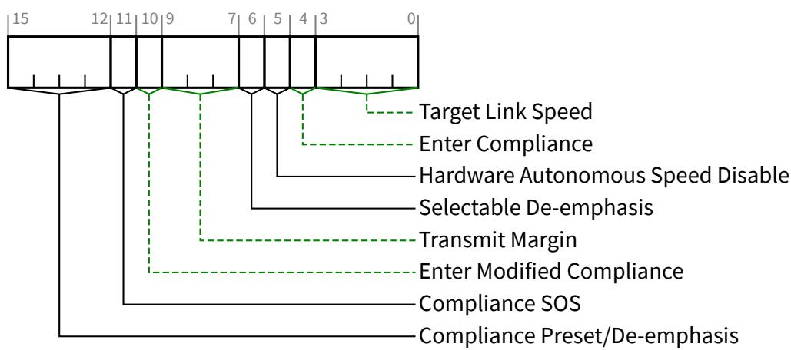

line chart

| Position | Value |
|--------|-------|
| 0      | 15    |
| 3      | 12    |
| 4      | 11    |
| 5      | 10    |
| 6      | 9     |
| 7      | 8     |
| 8      | 7     |
| 9      | 6     |
| 10     | 5     |
| 11     | 4     |
| 12     | 3     |
| 13     | 2     |
| 14     | 1     |
| 15     | 0     |

  
Figure 7-39 Link Control 2 Register

Table 7-36 Link Control 2 Register

<table><tr><td>Bit Location</td><td>Register Description</td><td>Attributes</td></tr><tr><td>3:0</td><td>Target Link Speed- For Downstream Ports, this field sets an upper limit on Link operational speed by restricting the values advertised by the Upstream component in its training sequences.The encoded value specifies a Bit Location in the Supported Link Speeds Vector (in the Link Capabilities 2 Register) that corresponds to the desired target Link speed. Defined encodings are:0001b Supported Link Speeds Vector field bit 00010b Supported Link Speeds Vector field bit 10011b Supported Link Speeds Vector field bit 20100b Supported Link Speeds Vector field bit 30101b Supported Link Speeds Vector field bit 40110b Supported Link Speeds Vector field bit 50111b Supported Link Speeds Vector field bit 6</td><td>RWS/RsvdP(see description)</td></tr><tr><td></td><td>Others All other encodings are Reserved.If a value is written to this field that does not correspond to a supported speed (as indicated by the Supported Link Speeds Vector), the result is undefined.If either of the Enter Compliance or Enter Modified Compliance bits are implemented, then this field must also be implemented.The default value of this field is the highest Link speed supported by the component (as reported in the Max Link Speed field of the Link Capabilities Register) unless the corresponding platform/form factor requires a different default value.For both Upstream and Downstream Ports, this field is used to set the target compliance mode speed when software is using the Enter Compliance bit to force a Link into compliance mode.For Upstream Ports, if the Enter Compliance bit is Clear, this field is permitted to have no effect.For a Multi-Function Device associated with an Upstream Port, the field in Function 0 is of type RWS, and only Function 0 controls the component's Link behavior. In all other Functions of that device, this field is of type RsvdP.Components that support only the 2.5 GT/s speed are permitted to hardwire this field to 0000b.</td><td></td></tr><tr><td>4</td><td>Enter Compliance - Software is permitted to force a Link to enter Compliance mode (at the speed indicated in the Target Link Speed field and the de-emphasis/preset level indicated by the Compliance Preset/De-emphasis bit) by setting this bit to 1b in both components on a Link and then initiating a hot reset on the Link.Default value of this bit following Fundamental Reset is 0b.For a Multi-Function Device associated with an Upstream Port, the bit in Function 0 is of type RWS, and only Function 0 controls the component's Link behavior. In all other Functions of that device, this bit is of type RsvdP.Components that support only the 2.5 GT/s speed are permitted to hardwire this bit to 0b.This bit is intended for debug, compliance testing purposes only. System firmware and software is allowed to modify this bit only during debug or compliance testing. In all other cases, the system must ensure that this bit is Set to the default value.</td><td>RWS/RsvdP (see description)</td></tr><tr><td>5</td><td>Hardware Autonomous Speed Disable - When Set, this bit disables hardware from changing the Link speed for device-specific reasons other than attempting to correct unreliable Link operation by reducing Link speed. Initial transition to the highest supported common link speed is not blocked by this bit.For a Multi-Function Device associated with an Upstream Port, the bit in Function 0 is of type RWS, and only Function 0 controls the component's Link behavior. In all other Functions of that device, this bit is of type RsvdP.Functions that do not implement the associated mechanism are permitted to hardwire this bit to 0b. Default value of this bit is 0b.</td><td>RWS/RsvdP (see description)</td></tr><tr><td>6</td><td>Selectable De-emphasis - When the Link is operating at 5.0 GT/s speed, this bit is used to control the transmit de-emphasis of the link in specific situations. See Section 4.2.7 for detailed usage information.Encodings:1b -3.5 dB0b -6 dBWhen the Link is not operating at 5.0 GT/s speed, the setting of this bit has no effect. Components that support only the 2.5 GT/s speed are permitted to hardwire this bit to 0b.This bit is not applicable and Reserved for Endpoints, PCI Express to PCI/PCI-X bridges, and Upstream Ports of Switches.</td><td>HwInit</td></tr><tr><td>9:7</td><td>Transmit Margin- This field controls the value of the non-deemphasized voltage level at the Transmitter pins. This field is reset to 000b on entry to the LTSSM Polling.Configuration substate (see § Chapter 4. for details of how the Transmitter voltage level is determined in various states).Encodings:000b Normal operating range001b-111b As defined in § Section 8.3.4 not all encodings are required to be implemented.For a Multi-Function Device associated with an Upstream Port, the field in Function 0 is of type RWS, and only Function 0 controls the component's Link behavior. In all other Functions of that device, this field is of type RsvdP.Default value of this field is 000b.Components that support only the 2.5 GT/s speed are permitted to hardwire this bit to 000b.This field is intended for debug, compliance testing purposes only. System firmware and software is allowed to modify this field only during debug or compliance testing. In all other cases, the system must ensure that this field is set to the default value.</td><td>RWS/RsvdP (see description)</td></tr><tr><td>10</td><td>Enter Modified Compliance- When this bit is Set to 1b, the device transmits Modified Compliance Pattern if the LTSSM enters Polling.Compliance substate.Components that support only the 2.5 GT/s speed are permitted to hardwire this bit to 0b.For a Multi-Function Device associated with an Upstream Port, the bit in Function 0 is of type RWS, and only Function 0 controls the component's Link behavior. In all other Functions of that device, this bit is of type RsvdP.Default value of this bit is 0b.This bit is intended for debug, compliance testing purposes only. System firmware and software is allowed to modify this bit only during debug or compliance testing. In all other cases, the system must ensure that this bit is Set to the default value.</td><td>RWS/RsvdP (see description)</td></tr><tr><td>11</td><td>Compliance SOS- When set to 1b, the LTSSM is required to send SKP Ordered Sets between sequences when sending the Compliance Pattern or Modified Compliance Pattern.For a Multi-Function Device associated with an Upstream Port, the bit in Function 0 is of type RWS, and only Function 0 controls the component's Link behavior. In all other Functions of that device, this bit is of type RsvdP.The default value of this bit is 0b.This bit is applicable when the Link is operating at 2.5 GT/s or 5.0 GT/s data rates only.Components that support only the 2.5 GT/s speed are permitted to hardwire this bit to 0b.</td><td>RWS/RsvdP (see description)</td></tr><tr><td>15:12</td><td>Compliance Preset/De-emphasis-For 8.0 GT/s and higher Data Rate: This field sets the Transmitter Preset in Polling.Compliance state if the entry occurred due to the Enter Compliance bit being 1b. The encodings are defined in § Section 4.2.4.2 . Results are undefined if a reserved preset encoding is used when entering Polling.Compliance in this way.For 5.0 GT/s Data Rate: This field sets the de-emphasis level in Polling.Compliance state if the entry occurred due to the Enter Compliance bit being 1b.Defined Encodings are:0001b -3.5 dB0000b -6 dBWhen the Link is operating at 2.5 GT/s, the setting of this field has no effect. Components that support only 2.5 GT/s speed are permitted to hardwire this field to 0000b.For a Multi-Function Device associated with an Upstream Port, the field in Function 0 is of type RWS, and only Function 0 controls the component's Link behavior. In all other Functions of that device, this field is of type RsvdP.The default value of this field is 0000b.This field is intended for debug and compliance testing purposes. System firmware and software is allowed to modify this field only during debug or compliance testing. In all other cases, the system must ensure that this field is set to the default value.</td><td>RWS/RsvdP (see description)</td></tr></table>

## IMPLEMENTATION NOTE:

## SELECTABLE DE-EMPHASIS USAGE §

Selectable De-emphasis setting is applicable only to Root Ports and Switch Downstream Ports. The De-emphasis setting is implementation specific and depends on the platform or enclosure in which the Root Port or the Switch Downstream Port is located. System firmware or hardware strapping is used to configure the Selectable De-emphasis value. In cases where system firmware cannot be used to set the de-emphasis value (for example, a hot plugged Switch), hardware strapping must be used to set the de-emphasis value.

## 7.5.3.20 Link Status 2 Register (Offset 32h) §

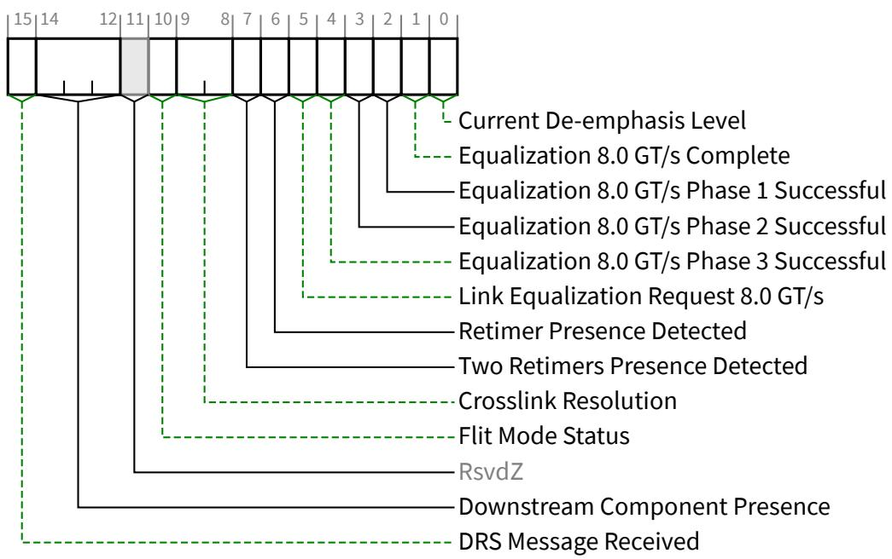

flowchart

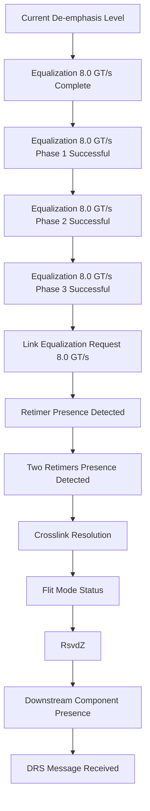
```mermaid
graph TD
  A["Current De-emphasis Level"] --> B["Equalization 8.0 GT/s Complete"]
  B --> C["Equalization 8.0 GT/s Phase 1 Successful"]
  C --> D["Equalization 8.0 GT/s Phase 2 Successful"]
  D --> E["Equalization 8.0 GT/s Phase 3 Successful"]
  E --> F["Link Equalization Request 8.0 GT/s"]
  F --> G["Retimer Presence Detected"]
  G --> H["Two Retimers Presence Detected"]
  H --> I["Crosslink Resolution"]
  I --> J["Flit Mode Status"]
  J --> K["RsvdZ"]
  K --> L["Downstream Component Presence"]
  L --> M["DRS Message Received"]
```

Figure 7-40 Link Status 2 Register

§

Table 7-37 Link Status 2 Register

<table><tr><td>Bit Location</td><td>Register Description</td><td>Attributes</td><td></td></tr><tr><td>0</td><td>Current De-emphasis Level- When the Link is operating at 5.0 GT/s speed, this bit reflects the level of de-emphasis.Encodings:1b -3.5 dB0b -6 dBThe value in this bit is undefined when the Link is not operating at 5.0 GT/s speed.For VFs, the associated PF&#x27;s value applies, and this field must be RsvdZ. Otherwise, components that support only the 2.5 GT/s speed are permitted to hardwire this bit to Zero.For components that support speeds greater than 2.5 GT/s, Multi-Function Devices associated with an Upstream Port must report the same value in this field for all Functions of the Port.</td><td>ROVF RsvdZ</td><td></td></tr><tr><td>1</td><td>Equalization 8.0 GT/s Complete- When set to 1b, this bit indicates that the Transmitter Equalization procedure at the 8.0 GT/s data rate has completed. Details of the Transmitter Equalization process and when this bit needs to be set to 1b is provided in § Section 4.2.7.4.2.The default value of this bit is 0b.For Multi-Function Upstream Port, this bit must be implemented in Function 0 and RsvdZ in other Functions. Components that only support speeds below 8.0 GT/s are permitted to hardwire this bit to 0b.</td><td>ROS</td><td></td></tr><tr><td>2</td><td>Equalization 8.0 GT/s Phase 1 Successful- When set to 1b, this bit indicates that Phase 1 of the 8.0 GT/s Transmitter Equalization procedure has successfully completed. Details of the Transmitter Equalization process and when this bit needs to be set to 1b is provided in § Section 4.2.7.4.2.The default value of this bit is 0b.For Multi-Function Upstream Port, this bit must be implemented in Function 0 and RsvdZ in other Functions. Components that only support speeds below 8.0 GT/s are permitted to hardwire this bit to 0b.</td><td>ROS</td><td></td></tr><tr><td>3</td><td>Equalization 8.0 GT/s Phase 2 Successful- When set to 1b, this bit indicates that Phase 2 of the 8.0 GT/s Transmitter Equalization procedure has successfully completed. Details of the Transmitter Equalization process and when this bit needs to be set to 1b is provided in § Section 4.2.7.4.2.The default value of this bit is 0b.For Multi-Function Upstream Port, this bit must be implemented in Function 0 and RsvdZ in other Functions. Components that only support speeds below 8.0 GT/S are permitted to hardwire this bit to 0b.</td><td>ROS</td><td></td></tr><tr><td>4</td><td>Equalization 8.0 GT/s Phase 3 Successful- When set to 1b, this bit indicates that Phase 3 of the 8.0 GT/s Transmitter Equalization procedure has successfully completed. Details of the Transmitter Equalization process and when this bit needs to be set to 1b is provided in § Section 4.2.7.4.2.The default value of this bit is 0b.For Multi-Function Upstream Port, this bit must be implemented in Function 0 and RsvdZ in other Functions. Components that only support speeds below 8.0 GT/SSaremitted to hardwire this bit to 0b.</td><td>ROS</td><td></td></tr><tr><td>5</td><td>Link Equalization Request 8.0 GT/s- This bit is Set by hardware to request the 8.0 GT/s Link equalization process to be performed on the Link. Refer to § Section 4.2.4and § Section 4.2.7.4.2for details.The default value of this bit is 0b.</td><td>RW1CS</td><td></td></tr></table>

<table><tr><td>Bit Location</td><td>Register Description</td><td>Attributes</td></tr><tr><td></td><td>For Multi-Function Upstream Port, this bit must be implemented in Function 0 and RsvdZ in other Functions. Components that only support speeds below 8.0 GT/s are permitted to hardwire this bit to 0b.</td><td></td></tr><tr><td>6</td><td>Retimer Presence Detected - When set to 1b, this bit indicates that a Retimer was present during the most recent Link negotiation. Refer to § Section 4.2.7.3.5.1 for details.The default value of this bit is 0b.This bit is required for Ports that have the Retimer Presence Detect Supported bit of the Link Capabilities 2 Register set to 1b.Ports that have the Retimer Presence Detect Supported bit set to 0b are permitted to hardwire this bit to 0b.For Multi-Function Devices associated with an Upstream Port, this bit must be implemented in Function 0 and is RsvdZ in all other Functions.</td><td>ROS/RsvdZ</td></tr><tr><td>7</td><td>Two Retimers Presence Detected - When set to 1b, this bit indicates that two Retimers were present during the most recent Link negotiation. Refer to § Section 4.2.7.3.5.1 for details.The default value of this bit is 0b.This bit is required for Ports that have the Two Retimers Presence Detect Supported bit of the Link Capabilities 2 Register set to 1b.Ports that have the Two Retimers Presence Detect Supported bit set to 0b are permitted to hardwire this bit to 0b.For Multi-Function Devices associated with an Upstream Port, this bit must be implemented in Function 0 and RsvdZ in all other Functions.</td><td>ROS/RsvdZ</td></tr><tr><td>9:8</td><td>Crosslink Resolution - This field indicates the state of the Crosslink negotiation. It must be implemented if Crosslink Supported is Set and the Port supports 16.0 GT/s or higher data rate. It is permitted to be implemented in all other Ports. If Crosslink Supported is Clear, this field may be hardwired to 01b or 10b.Encoding is:00b Crosslink Resolution is not supported. No information is provided regarding the status of the Crosslink negotiation.01b Crosslink negotiation resolved as an Upstream Port.10b Crosslink negotiation resolved as a Downstream Port.11b Crosslink negotiation is not completed.Once a value of 01b or 10b is returned in this field, that value must continue to be returned while the Link is Up.</td><td>RO</td></tr><tr><td>10</td><td>Flit Mode Status - When Flit Mode Supported is Set, this bit when Set indicates that the Link is or will be operating in Flit Mode.This bit is only meaningful when Downstream Component Presence is either 011b, 100b, or 101b. In all other states, this bit contains Zero.This bit is RsvdZ if Flit Mode Supported is Clear.</td><td>RO / RsvdZ</td></tr><tr><td>14:12</td><td>Downstream Component Presence - This field indicates the presence and DRS status for the Downstream Component, if any, connected to the Link; defined values are:000b Link Down - Presence Not Determined001b Link Down - Component Not Present indicates the Downstream Port (DP) has determined that a Downstream Component is not present010b Link Down - Component Present indicates the DP has determined that a Downstream Component is present, but the Data Link Layer is not active</td><td>RO/RsvdZ</td></tr><tr><td rowspan="6"></td><td>011b Link Down - Flit Mode Negotiation Completed indicates that the DP has determined that a Downstream Component, the LTSSM has determined whether or not the Link will be operating in Flit Mode, but the Data Link Layer is not yet active. The Flit Mode Status bit is meaningful in this state.</td><td rowspan="6"></td></tr><tr><td>100b Link Up - Component Present indicates the DP has determined that a Downstream Component is present, but no DRS Message has been received since the Data Link Layer became active. The Flit Mode Status bit is meaningful in this state.</td></tr><tr><td>101b Link Up - Component Present and DRS Received indicates the DP has received a DRS Message since the Data Link Layer became active. The Flit Mode Status bit is meaningful in this state.</td></tr><tr><td>110b Reserved</td></tr><tr><td>111b Reserved</td></tr><tr><td>Downstream Component Presence state must be determined by the logical “OR” of the Physical Layer in-band presence detect mechanism and, if present, any out-of-band presence detect mechanism implemented for the Link. If no out-of-band presence detect mechanism is implemented, then Downstream Component Presence state must be determined solely by the Physical Layer in-band presence detect mechanism.If the In-Band PD Disable bit in the Slot Control Register is Set, the Physical Layer in-band presence detect mechanism must always indicate that no component is present.Component Presence, Link Up, and DRS Received states indicated by this field must reflect their maskable states, which are controlled by the SFI PD State Mask, SFI DLL State Mask, or SFI DRS Mask bits in the SFI Control Register. See § Section 7.9.22.3.This field must be implemented in any Downstream Port where the DRS Supported bit is Set in the Link Capabilities 2 Register. This field must be implemented in any Downstream Port where the Flit Mode Supported bit is Set.This field is RsvdZ for all other Functions.Default value of this field is 000b.</td></tr><tr><td>15</td><td>DRS Message Received - This bit must be Set whenever the Port receives a DRS Message.This bit must be Cleared in DL_Down.This bit must be implemented in any Downstream Port where the DRS Supported bit is Set in the Link Capabilities 2 Register.This bit is RsvdZ for all other Functions.Default value of this bit is 0b.</td><td>RW1C/RsvdZ</td></tr></table>

## 7.5.3.21 Slot Capabilities 2 Register (Offset 34h) §

text_image

31
RsvdP
1 0
In-Band PD Disable Supported

Figure 7-41 Slot Capabilities 2 Register§

§ Table 7-38 Slot Capabilities 2 Register

<table><tr><td>Bit Location</td><td>Register Description</td><td>Attributes</td></tr><tr><td>0</td><td>In-Band PD Disable Supported - When Set, this bit indicates that this slot supports disabling the reporting of the in-band presence detect state, as controlled by the In-Band PD Disable bit in the Slot Control Register. If the slot does not support an out-of-band presence detect mechanism, this bit must be Clear.</td><td>HwInit</td></tr></table>

## 7.5.3.22 Slot Control 2 Register (Offset 38h) §

This section is a placeholder. There are no capabilities that require this register.

This register must be treated by software as RsvdP.

## 7.5.3.23 Slot Status 2 Register (Offset 3Ah) §

This section is a placeholder. There are no capabilities that require this register.

This register must be treated by software as RsvdZ.

## 7.6 PCI Express Extended Capabilities §

PCI Express Extended Capability registers are located in Configuration Space at offsets 256 or greater as shown in § Figure 7-42 or in the Root Complex Register Block (RCRB). These registers when located in the Configuration Space are accessible using only the PCI Express Enhanced Configuration Access Mechanism (ECAM).

PCI Express Extended Capability structures are allocated using a linked list of optional or required PCI Express Extended Capabilities following a format resembling PCI Capability structures. The first DWORD of the Capability structure identifies the Capability and version and points to the next Capability as shown in § Figure 7-42.

Each Capability structure must be DWORD aligned.

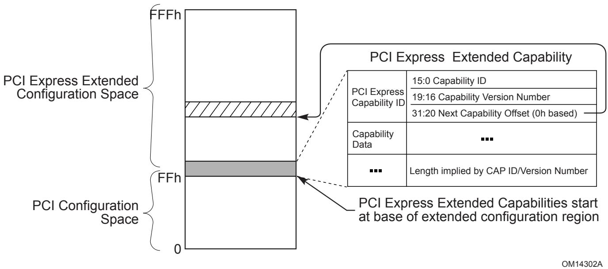

flowchart

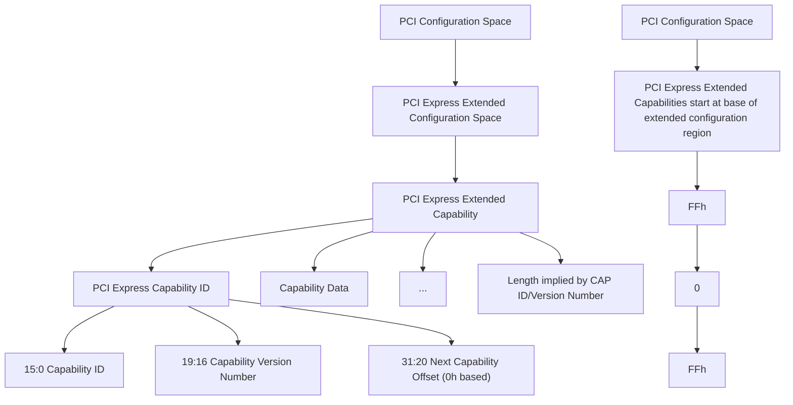
```mermaid
graph TD
  A["PCI Configuration Space"] --> B["PCI Express Extended Configuration Space"]
  B --> C["PCI Express Extended Capability"]
  C --> D["PCI Express Capability ID"]
  D --> E["15:0 Capability ID"]
  D --> F["19:16 Capability Version Number"]
  D --> G["31:20 Next Capability Offset (0h based)"]
  C --> H["Capability Data"]
  C --> I["..."]
  C --> J["Length implied by CAP ID/Version Number"]
  K["PCI Configuration Space"] --> L["PCI Express Extended Capabilities start at base of extended configuration region"]
  L --> M["FFh"]
  M --> N["0"]
  N --> O["FFh"]
```

Figure 7-42 PCI Express Extended Configuration Space Layout§

## 7.6.1 Extended Capabilities in Configuration Space §

Extended Capabilities in Configuration Space always begin at offset 100h with a PCI Express Extended Capability header (§ Section 7.6.3 ). Absence of any Extended Capabilities is required to be indicated by an Extended Capability header with a Capability ID of 0000h, a Capability Version of 0h, and a Next Capability Offset of 000h.

## 7.6.2 Extended Capabilities in the Root Complex Register Block §

Extended Capabilities in a Root Complex Register Block always begin at offset 000h with a PCI Express Extended Capability header (§ Section 7.6.3 ). Absence of any Extended Capabilities is required to be indicated by an Extended Capability header with a Capability ID of FFFFh and a Next Capability Offset of 000h.

## 7.6.3 PCI Express Extended Capability Header §

All PCI Express Extended Capabilities must begin with a PCI Express Extended Capability Header. § Figure 7-43 details the allocation of register fields of a PCI Express Extended Capability Header; § Table 7-39 provides the respective bit definitions.

text_image

31 20 19 16 15 0
Next Capability Offset PCI Express Extended Capability ID
Capability Version

Figure 7-43 PCI Express Extended Capability Header§

Table 7-39 PCI Express Extended Capability Header§

<table><tr><td>Bit Location</td><td>Register Description</td><td>Attributes</td></tr><tr><td>15:0</td><td>PCI Express Extended Capability ID- This field is a PCI-SIG defined ID number that indicates the nature and format of the Extended Capability.</td><td>RO</td></tr><tr><td>19:16</td><td>Capability Version- This field is a PCI-SIG defined version number that indicates the version of the Capability structure present.A version of the specification that changes the Extended Capability in a way that is not otherwise identifiable (e.g., through a new Capability field) is permitted to increment this field. All such changes to the Capability structure must be software-compatible. Software must check for Capability Version numbers that are greater than or equal to the highest number defined when the software is written, as Functions reporting any such Capability Version numbers will contain a Capability structure that is compatible with that piece of software.</td><td>RO</td></tr><tr><td>31:20</td><td>Next Capability Offset- This field contains the offset to the next PCI Express Capability structure or 000h if no other items exist in the linked list of Capabilities.For Extended Capabilities implemented in Configuration Space, this offset is relative to the beginning of PCI-compatible Configuration Space and thus must always be either 000h (for terminating list of Capabilities) or greater than 0FFh.The bottom 2 bits of this offset are Reserved and must be implemented as 00b although software must mask them to allow for future uses of these bits.</td><td>RO</td></tr></table>

# 7.7 PCI and PCIe Capabilities Required by the Base Spec in Some Situations

The following capabilities are required by this specification for some Functions. For example, Functions that support specific data rates, functions that generate interrupts, etc.

## 7.7.1 MSI Capability Structures §

All PCI Express device Functions that are capable of generating interrupts must implement MSI or MSI-X or both.

The MSI Capability structure is described in this section. The MSI-X Capability structure is described in § Section 7.7.2 .

The MSI Capability structure is illustrated in § Figure 7-44 and § Figure 7-45. Each device Function that supports MSI (in a Multi-Function Device) must implement its own MSI Capability structure. More than one MSI Capability structure per Function is prohibited, but a Function is permitted to have both an MSI and an MSI-X Capability structure.

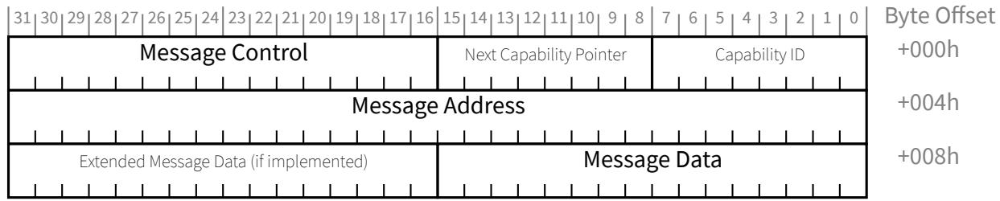

text_image

31 30 29 28 27 26 25 24 23 22 21 20 19 18 17 16 15 14 13 12 11 10 9 8 7 6 5 4 3 2 1 0
Message Control
Next Capability Pointer
Capability ID
Message Address
Extended Message Data (if implemented)
Message Data
Byte Offset
+000h
+004h
+008h

Figure 7-44 MSI Capability Structure for 32-bit Message Address§

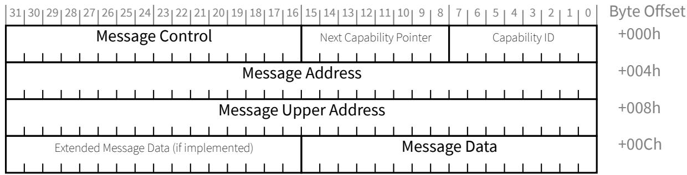

text_image

31 30 29 28 27 26 25 24 23 22 21 20 19 18 17 16 15 14 13 12 11 10 9 8 7 6 5 4 3 2 1 0
Message Control
Next Capability Pointer
Capability ID
Message Address
Message Upper Address
Extended Message Data (if implemented)
Message Data
Byte Offset
+000h
+004h
+008h
+00Ch

Figure 7-45 MSI Capability Structure for 64-bit Message Address§

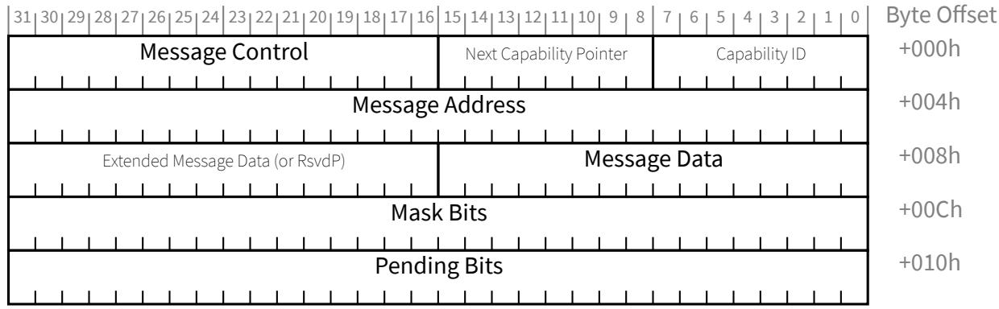

text_image

31 30 29 28 27 26 25 24 23 22 21 20 19 18 17 16 15 14 13 12 11 10 9 8 7 6 5 4 3 2 1 0
Message Control
Next Capability Pointer
Capability ID
Message Address
Extended Message Data (or RsvdP)
Message Data
Mask Bits
Pending Bits
Byte Offset
+000h
+004h
+008h
+00Ch
+010h

Figure 7-46 MSI Capability Structure for 32-bit Message Address and PVM§

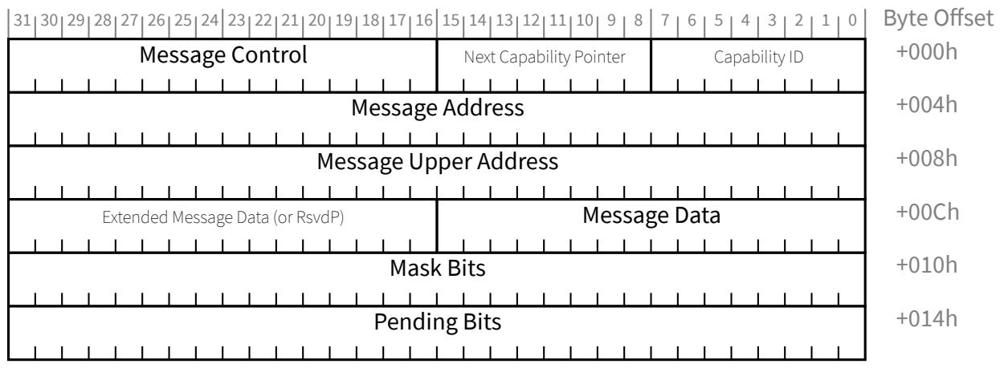

text_image

31 30 29 28 27 26 25 24 23 22 21 20 19 18 17 16 15 14 13 12 11 10 9 8 7 6 5 4 3 2 1 0
Message Control
Next Capability Pointer
Capability ID
Message Address
Message Upper Address
Extended Message Data (or RsvdP)
Message Data
Mask Bits
Pending Bits
Byte Offset
+000h
+004h
+008h
+00Ch
+010h
+014h

Figure 7-47 MSI Capability Structure for 64-bit Message Address and PVM§

To request service, an MSI Function writes the contents of the Message Data Register for MSI, and if enabled, the Extended Message Data Register for MSI, to the address specified by the contents of the Message Address Register for MSI (and, optionally, when 64-bit message addresses are used, the Message Upper Address Register for MSI). A read of the address specified by the contents of the Message Address register produces undefined results.

A Function supporting MSI implements one of four MSI Capability structure layouts illustrated in § Figure 7-44 to § Figure 7-47, depending upon which optional features are supported. A Legacy Endpoint that implements MSI is required to support either the 32-bit or 64-bit Message Address version of the MSI Capability structure. A PCI Express Endpoint that implements MSI is required to support the 64-bit Message Address version of the MSI Capability structure. The Message Control Register for MSI indicates the Function’s capabilities and provides system software control over MSI.

Each field is further described in the following sections.

## 7.7.1.1 MSI Capability Header (Offset 00h) §

The MSI Capability Header enumerates the MSI Capability structure in the PCI Configuration Space Capability list. § Figure 7-48 details allocation of register fields in the MSI Capability Header; § Table 7-40 provides the respective bit definitions.

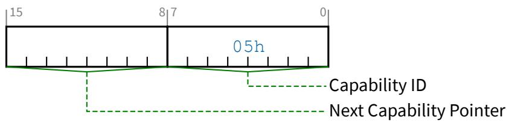

text_image

15
8
7
0
05h
Capability ID
Next Capability Pointer

§  
Figure 7-48 MSI Capability Header

§  
Table 7-40 MSI Capability Header

<table><tr><td>Bit Location</td><td>Register Description</td><td>Attributes</td></tr><tr><td>7:0</td><td>Capability ID - Indicates the MSI Capability structure. This field must return a Capability ID of 05h indicating that this is an MSI Capability structure.</td><td>RO</td></tr><tr><td>15:8</td><td>Next Capability Pointer - This field contains the offset to the next PCI Capability structure or 00h if no other items exist in the linked list of Capabilities.</td><td>RO</td></tr></table>

## 7.7.1.2 Message Control Register for MSI (Offset 02h) §

This register provides system software control over MSI. By default, MSI is disabled. If MSI and MSI-X are both disabled, the Function requests servicing using INTx interrupts (if supported). System software can enable MSI by Setting bit 0 of this register. System software is permitted to modify the Message Control Register for MSI’s read-write bits and fields. A device driver is not permitted to modify the Message Control Register for MSI’s read-write bits and fields.

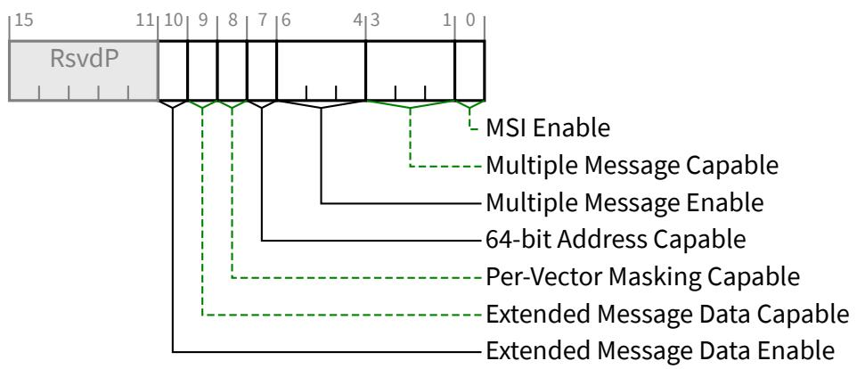

text_image

RsvdP
15 11 10 9 8 7 6 4 3 1 0
MSI Enable
Multiple Message Capable
Multiple Message Enable
64-bit Address Capable
Per-Vector Masking Capable
Extended Message Data Capable
Extended Message Data Enable

Figure 7-49 Message Control Register for MSI§

Table 7-41 Message Control Register for MSI§

<table><tr><td>Bit Location</td><td>Register Description</td><td>Attributes</td></tr><tr><td>0</td><td>MSI Enable- If Set and the MSI-X Enable bit in the Message Control Register for MSI-X (see § Section 7.7.2.2) is Clear, the Function is permitted to use MSI to request service and is prohibited from using INTx interrupts. System configuration software Sets this bit to enable MSI. Refer to § Section 7.5.1.1.3 for control of INTx interrupts.If Clear, the Function is prohibited from using MSI to request service.Software changing this bit during active operation may result in the Function dropping pending interrupt conditions or failing to recognize new interrupt conditions. See § Section 6.1.4.5.Default value of this bit is 0b.</td><td>RW</td></tr><tr><td>3:1</td><td>Multiple Message Capable- System software reads this field to determine the number of requested vectors. The number of requested vectors must be aligned to a power of two (if a Function requires three vectors, it requests four by initializing this field to 010b). The encoding is defined as:000b 1 vector requested001b 2 vectors requested010b 4 vectors requested011b 8 vectors requested100b 16 vectors requested101b 32 vectors requested110b Reserved111b Reserved</td><td>RO</td></tr><tr><td>6:4</td><td>Multiple Message Enable - software writes to this field to indicate the number of allocated vectors. The number of allocated vectors is aligned to a power of two. As an example, if a Function requests four vectors (indicated by a Multiple Message Capable encoding of 010b), software can allocate either four, two, or one vector by writing a 010b, 001b, or 000b to this field, respectively.Behavior is undefined if the number of vectors allocated is greater than the number of vectors requested.Behavior is undefined if this field is changed while MSI Enable is Set.When MSI Enable is Set, a Function will be allocated at least 1 vector. The encoding is defined as:000b 1 vector allocated001b 2 vectors allocated010b 4 vectors allocated011b 8 vectors allocated100b 16 vectors allocated101b 32 vectors allocated110b Reserved111b ReservedFunction behavior is undefined if software changes the value of this field while the MSI Enable bit is Set.Default value of this field is 000b.</td><td>RW</td></tr><tr><td>7</td><td>64-bit Address Capable - If Set, the Function is capable of sending a 64-bit Message Address. If Clear, the Function is not capable of sending a 64-bit Message Address. This bit must be Set if the Function is a PCI Express Endpoint, as indicated by the value in the Device/Port Type field. This bit MUST@FLIT be Set.</td><td>RO</td></tr><tr><td>8</td><td>Per-Vector Masking Capable - If Set, the Function supports MSI Per-Vector Masking. If Clear, the Function does not support MSI Per-Vector Masking. This bit must be Set if the Function is a PF or VF within an SR-IOV Device.</td><td>RO</td></tr><tr><td>9</td><td>Extended Message Data Capable - If Set, the Function is capable of providing Extended Message Data. If Clear, the Function does not support providing Extended Message Data.</td><td>RO</td></tr><tr><td>10</td><td>Extended Message Data Enable - If Set, the Function is enabled to provide Extended Message Data. If Clear, the Function is not enabled to provide Extended Message Data.Default value of this bit is 0b.This bit must be read-write if the Extended Message Data Capable bit is 1b; otherwise it must be hardwired to 0b.</td><td>RW/RO</td></tr></table>

## 7.7.1.3 Message Address Register for MSI (Offset 04h) §

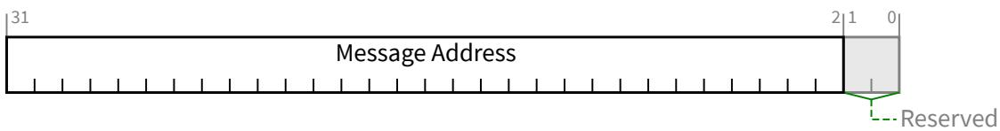

text_image

31
Message Address
2 1 0
Reserved

Figure 7-50 Message Address Register for MSI§

Table 7-42 Message Address Register for MSI§

<table><tr><td>Bit Location</td><td>Register Description</td><td>Attributes</td></tr><tr><td>1:0</td><td>Reserved Reserved - Always returns 0 on read. Write operations have no effect.</td><td>RsvdP</td></tr><tr><td>31:2</td><td>Message Address - System-specified message address.If the MSI Enable bit is Set, the contents of this register specify the DWORD-aligned address (Address[31:02]) for the MSI transaction. Address[1:0] are set to 00b.Default value of this field is undefined.</td><td>RW</td></tr></table>

## 7.7.1.4 Message Upper Address Register for MSI (Offset 08h) §

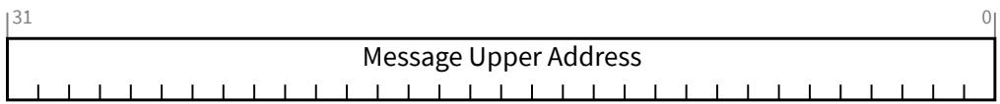

text_image

31
Message Upper Address
0

Figure 7-51 Message Upper Address Register for MSI§

Table 7-43 Message Upper Address Register for MSI§

<table><tr><td>Bit Location</td><td>Register Description</td><td>Attributes</td></tr><tr><td>31:0</td><td>Message Upper Address- System-specified message upper address.This register is implemented only if the Function supports a 64-bit message address (64-bit Address Capable is Set).This register is implemented only if the Function supports a 64-bit message address (64-bit Address Capable is Set). This register is required for PCI Express Endpoints (as indicated by the value in the Device/Port Type field) and is optional for other Function types.If the MSI Enable bit is Set, the contents of this register (if non-zero) specify the upper 32-bits of a 64-bit message address (Address[63:32]). If the contents of this register are zero, the Function uses the 32 bit address specified by the Message Address register.Default value of this field is undefined.</td><td>RW</td></tr></table>

## 7.7.1.5 Message Data Register for MSI (Offset 08h or 0Ch) §

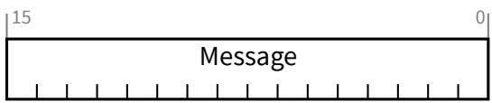

text_image

15
Message
0

Figure 7-52 Message Data Register for MSI§

Table 7-44 Message Data Register for MSI§

<table><tr><td>Bit Location</td><td>Register Description</td><td>Attributes</td></tr><tr><td>15:0</td><td>MessageMessage Data- System-specified message data.If the MSI Enable bit is Set, the Function sends a DWORD Memory Write transaction using Message Data for the lower 16 bits. All 4 Byte Enables are Set.The Multiple Message Enable field defines the number of low order message data bits the Function is permitted to modify to generate its system software allocated vectors. For example, a Multiple Message Enable encoding of 010b indicates the Function has been allocated four vectors and is permitted to modify message data bits 1 and 0 (a Function modifies the lower message data bits to generate the allocated number of vectors). If the Multiple Message Enable field is 000b, the Function is not permitted to modify the message data.Default value of this field is undefined.</td><td>RW</td></tr></table>

# 7.7.1.6 Extended Message Data Register for MSI (Optional) §

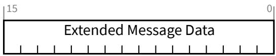

text_image

15
Extended Message Data
0

Figure 7-53 Extended Message Data Register for MSI§

Table 7-45 Extended Message Data Register for MSI§

<table><tr><td>Bit Location</td><td>Register Description</td><td>Attributes</td></tr><tr><td>15:0</td><td>Extended Message Data- System-specified message data.This register is optional. For the MSI Capability structures without Per-vector Masking, it must be implemented if the Extended Message Data Capable bit is Set; otherwise, it is outside the MSI Capability structure and undefined. For the MSI Capability structures with Per-vector Masking, it must be implemented if the Extended Message Data Capable bit is Set; otherwise, it is RsvdP.If the Extended Message Data Enable bit is Set, the DWORD Memory Write transaction uses Extended Message Data for the upper 16 bits; otherwise, it uses 0000h for the upper 16 bits.Default value of this field is 0000h.</td><td>RW/undefined/RsvdP</td></tr></table>

## 7.7.1.7 Mask Bits Register for MSI (Offset 0Ch or 10h §

This register is optional. It is present if Per-Vector Masking Capable is Set (see § Section 7.7.1.2 ). The offset of this register within the capability depends on the value of the 64-bit Address Capable bit (see § Section 7.7.1.2 ).

The Mask Bits and Pending Bits registers enable software to disable or defer message sending on a per-vector basis.

MSI vectors are numbered 0 through N-1, where N is the number of vectors allocated by software. Each vector is associated with a correspondingly numbered bit in the Mask Bits and Pending Bits registers.

The Multiple Message Capable field indicates how many vectors (with associated Mask and Pending bits) are implemented. All unimplemented Mask and Pending bits are Reserved.

The Multiple Message Enable field controls how many vectors are allocated for use. The value of each implemented Mask bit and Pending bit that is currently not allocated must be ignored by hardware; i.e., the value must not affect the generation of interrupts.

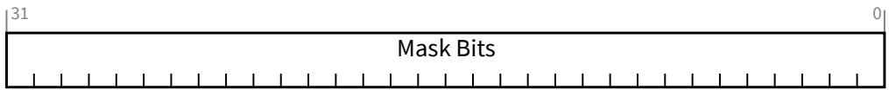

text_image

31
Mask Bits
0

§ Figure 7-54 Mask Bits Register for MSI

§ Table 7-46 Mask Bits Register for MSI

<table><tr><td>Bit Location</td><td>Register Description</td><td>Attributes</td></tr><tr><td>31:0</td><td>Mask Bits- For each Mask bit that is Set, the Function is prohibited from sending the associated message.Default is 0.</td><td>RW</td></tr></table>

## 7.7.1.8 Pending Bits Register for MSI (Offset 10h or 14h) §

This register is optional. It is present if Per-Vector Masking Capable is Set (see § Section 7.7.1.2 ).

The offset of this register within the capability depends on the value of the 64-bit Address Capable bit (see § Section 7.7.1.2 )

See § Section 7.7.1.7 for additional requirements on this register.

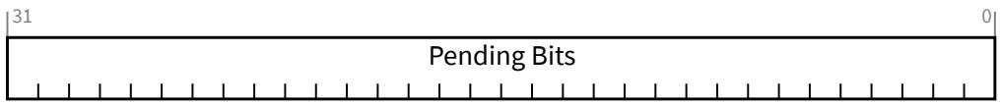

text_image

31
Pending Bits
0

Figure 7-55 Pending Bits Register for MSI§

§ Table 7-47 Pending Bits Register for MSI

<table><tr><td>Bit Location</td><td>Register Description</td><td>Attributes</td></tr><tr><td>31:0</td><td>Pending Bits - For each Pending bit that is Set, the Function has a pending associated message. Default is 0.</td><td>RO</td></tr></table>

## 7.7.2 MSI-X Capability and Table Structure §

The MSI-X Capability structure is illustrated in § Figure 7-56. More than one MSI-X Capability structure per Function is prohibited, but a Function is permitted to have both an MSI Capability structure and an MSI-X Capability structure.

In contrast to the MSI Capability structure, which directly contains all of the control/status information for the Function's vectors, the MSI-X Capability structure instead points to an MSI-X Table structure and an MSI-X PBA structure (Pending Bit Array structure), each residing in Memory Space (see § Figure 7-57 and § Figure 7-58).

Each structure is mapped by a Base Address Register (BAR) belonging to the Function, located beginning at 10h in Configuration Space, or an entry in the Enhanced Allocation capability. A BAR Indicator register (BIR) indicates which BAR(or BEI when using Enhanced Allocation), and a QWORD-aligned Offset indicates where the structure begins relative to the base address associated with the BAR. The BAR is permitted to be either 32-bit or 64-bit, but must map Memory Space. A Function is permitted to map both structures with the same BAR, or to map each structure with a different BAR.

The MSI-X Table structure, illustrated in § Figure 7-57, typically contains multiple entries, each consisting of several fields: Message Address, Message Upper Address, Message Data, and Vector Control. Each entry is capable of specifying a unique vector.

The Pending Bit Array (PBA) structure, illustrated in § Figure 7-58, contains the Function’s Pending Bits, one per Table entry, organized as a packed array of bits within QWORDs. The last QWORD will not necessarily be fully populated.

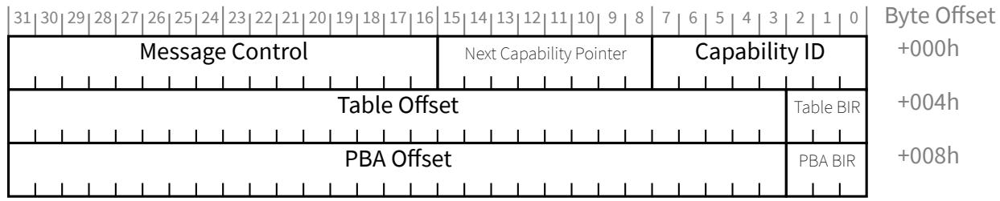

text_image

31 30 29 28 27 26 25 24 23 22 21 20 19 18 17 16 15 14 13 12 11 10 9 8 7 6 5 4 3 2 1 0
Message Control
Next Capability Pointer
Capability ID
Table Offset
Table BIR
PBA Offset
PBA BIR
Byte Offset
+000h
+004h
+008h

§ Figure 7-56 MSI-X Capability Structure

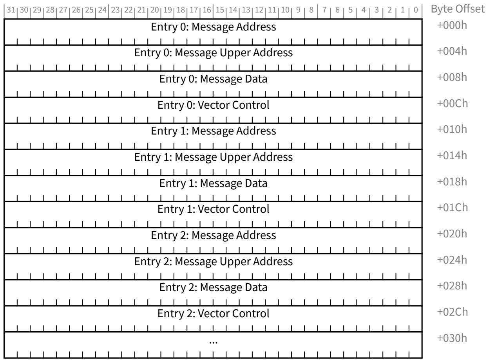

memory layout diagram

| Entry State | Byte Offset |
| --- | --- |
| Entry 0: Message Address | +000h |
| Entry 0: Message Upper Address | +004h |
| Entry 0: Message Data | +008h |
| Entry 0: Vector Control | +00Ch |
| Entry 1: Message Address | +010h |
| Entry 1: Message Upper Address | +014h |
| Entry 1: Message Data | +018h |
| Entry 1: Vector Control | +01Ch |
| Entry 2: Message Address | +020h |
| Entry 2: Message Upper Address | +024h |
| Entry 2: Message Data | +028h |
| Entry 2: Vector Control | +02Ch |
| ... | +030h |

Figure 7-57 MSI-X Table Structure

§

63

0

<table><tr><td>Pending Bits 0 through 63</td></tr><tr><td>Pending Bits 64 through 127</td></tr><tr><td>...</td></tr><tr><td>Pending Bits ((N-1) div 64)*64 through N-1</td></tr></table>

QWORD 0

Base

QWORD 1

Base + 1\*8

QWORD ((N-1) div 64)

Base + ((N-1) div 64)\*8

A-0385

§

Figure 7-58 MSI-X PBA Structure

To request service using a given MSI-X Table entry, a Function performs a DWORD Memory Write transaction using the contents of the Message Data field entry for data, the contents of the Message Upper Address field for the upper 32 bits of address, and the contents of the Message Address field entry for the lower 32 bits of address. A memory read transaction from the address targeted by the MSI-X message produces undefined results.

If a Base Address Register or entry in the Enhanced Allocation capability that maps address space for the MSI-X Table or MSI-X PBA also maps other usable address space that is not associated with MSI-X structures, locations (e.g., for CSRs) used in the other address space must not share any naturally aligned 4-KB address range with one where either MSI-X structure resides. This allows system software where applicable to use different processor attributes for MSI-X structures and the other address space. (Some processor architectures do not support having different processor attributes associated with the same naturally aligned 4-KB physical address range.) The MSI-X Table and MSI-X PBA are permitted to co-reside within a naturally aligned 4-KB address range, though they must not overlap with each other.

With SR-IOV devices, alignment requirements like those in the preceeding paragraph still apply, but they must be based on the System Page Size value from the PF's SR-IOV Extended Capability instead using a fixed 4-KB value.

## IMPLEMENTATION NOTE:

## DEDICATED BARS AND ADDRESS RANGE ISOLATION §

To enable system software to map MSI-X structures onto different processor pages for improved access control, it is recommended that a Function dedicate separate Base Address Registers for the MSI-X Table and MSI-X PBA, or else provide more than the minimum required isolation with address ranges.

If dedicated separate Base Address Registers is not feasible, it is recommended that a Function dedicate a single Base Address Register for the MSI-X Table and MSI-X PBA.

If a dedicated Base Address Register is not feasible, it is recommended that a Function isolate the MSI-X structures from the non-MSI-X structures with aligned 8 KB ranges rather than the mandatory aligned 4 KB ranges.

For example, if a Base Address Register needs to map 2 KB for an MSI-X Table containing 128 entries, 16 bytes for an MSI-X PBA containing 128 bits, and 64 bytes for registers not related to MSI-X, the following is an acceptable implementation. The Base Address Register requests 8 KB of total address space, maps the first 64 bytes for the non MSI-X registers, maps the MSI-X Table beginning at an offset of 4 KB, and maps the MSI-X PBA beginning at an offset of 6 KB.

A preferable implementation for a shared Base Address Register is for it to request 16 KB of total address space, map the first 64 bytes for the non MSI-X registers, map the MSI-X Table beginning at an offset of 8 KB, and map the MSI-X PBA beginning at an offset of 12 KB.

## IMPLEMENTATION NOTE:

## MSI-X MEMORY SPACE STRUCTURES IN READ/WRITE MEMORY

The MSI-X Table and MSI-X PBA structures are defined such that they can reside in general purpose read/write memory on a device, for ease of implementation and added flexibility. To achieve this, none of the contained fields are required to be read-only, and there are also restrictions on transaction alignment and sizes.

For all accesses to MSI-X Table and MSI-X PBA fields, software must use aligned full DWORD or aligned full QWORD transactions; otherwise, the result is undefined.

MSI-X Table entries and Pending bits are each numbered 0 through N-1, where N-1 is indicated by the Table Size field in the Message Control Register for MSI-X. For a given arbitrary MSI-X Table entry k, its starting address can be calculated with the formula:

entry starting address = Table base + k × 16

Equation 7-1 MSI-X Starting Address

For the associated Pending bit k, its address for QWORD access and bit number within that QWORD can be calculated with the formulas:

$$
\text { QWORD   address } = \text { PBA   base } + (k \text { div } 6 4) \times 8
$$

$$
\text { QWORD   bit\# } = k \bmod 6 4
$$

§

Equation 7-2 MSI-X PBA QWORD Access

Software that chooses to read Pending bit K with DWORD accesses can use these formulas:

$$
\text { DWORD   address } = \text { PBA   base } + (k \text { div } 3 2) \times 4
$$

$$
\text { DWORD   bit\# } = k \bmod 3 2
$$

§

Equation 7-3 MSI-X PBA DWORD Access

Each field in the MSI-X Capability, MSI-X Table, and MSI-X PBA structures is further described in the following sections. Within the MSI-X Capability structure, Reserved registers and bits always return 0 when read, and write operations have no effect. Within the MSI-X Table and PBA structures, Reserved fields have special rules.

## 7.7.2.1 MSI-X Capability Header (Offset 00h) §

The MSI-X Capability Header enumerates the MSI-X Capability structure in the PCI Configuration Space Capability list. § Figure 7-56 details allocation of register fields in the MSI-X Capability Header; § Table 7-48 provides the respective bit definitions.

text_image

15
8
7
0
11h
Capability ID
Next Capability Pointer

Figure 7-59 MSI-X Capability Header

§

§

Table 7-48 MSI-X Capability Header

<table><tr><td>Bit Location</td><td>Register Description</td><td>Attributes</td></tr><tr><td>7:0</td><td>Capability ID - Indicates the MSI-X Capability structure. This field must return a Capability ID of 11h indicating that this is an MSI-X Capability structure.</td><td>RO</td></tr><tr><td>15:8</td><td>Next Capability Pointer - This field contains the offset to the next PCI Capability structure or 00h if no other items exist in the linked list of Capabilities.</td><td>RO</td></tr></table>

## 7.7.2.2 Message Control Register for MSI-X (Offset 02h) §

By default, MSI-X is disabled. If MSI and MSI-X are both disabled, the Function requests servicing via INTx interrupts (if supported). System software can enable MSI-X by Setting bit 15 of this register. System software is permitted to modify the Message Control register’s read-write bits and fields. A device driver is not permitted to modify the Message Control register’s read-write bits and fields.

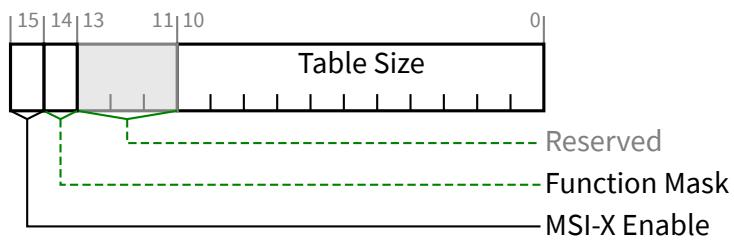

text_image

15 14 13 11 10 0
Table Size
Reserved
Function Mask
MSI-X Enable

Figure 7-60 Message Control Register for MSI-X§

Table 7-49 Message Control Register for MSI-X§

<table><tr><td>Bit Location</td><td>Register Description</td><td>Attributes</td></tr><tr><td>10:0</td><td>Table Size- System software reads this field to determine the MSI-X Table Size N, which is encoded as N-1. For example, a returned value of 000 0000 0011b indicates a table size of 4.</td><td>RO</td></tr><tr><td>13:11</td><td>Reserved Reserved- Always returns 0 on a read, and a write operation has no effect.</td><td>RsvdP</td></tr><tr><td>14</td><td>Function Mask- If Set, all of the vectors associated with the Function are masked, regardless of their per-vector Mask bit values.If Clear, each vector&#x27;s Mask bit determines whether the vector is masked or not.Setting or Clearing the MSI-X Function Mask bit has no effect on the value of the per-vector Mask bits.Default value of this bit is 0b.</td><td>RW</td></tr><tr><td>15</td><td>MSI-X Enable- If Set and the MSI Enable bit in the Message Control Register for MSI (see § Section 7.7.1.2) is Clear, the Function is permitted to use MSI-X to request service and is prohibited from using INTx interrupts (if implemented). System configuration software Sets this bit to enable MSI-X.If Clear, the Function is prohibited from using MSI-X to request service.Software changing this bit during active operation may result in the Function dropping pending interrupt conditions or failing to recognize new interrupt conditions. See § Section 6.1.4.5.Default value of this bit is 0b.</td><td>RW</td></tr></table>

## 7.7.2.3 Table Offset/Table BIR Register for MSI-X (Offset 04h) §

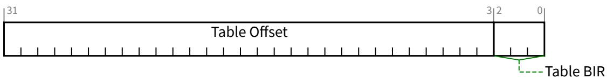

text_image

31
Table Offset
3 | 2
0
Table BIR

Figure 7-61 Table Offset/Table BIR Register for MSI-X§

Table 7-50 Table Offset/Table BIR Register for MSI-X§

<table><tr><td>Bit Location</td><td>Register Description</td><td>Attributes</td></tr><tr><td>2:0</td><td>Table BIR - Indicates which one of a Function&#x27;s Base Address Registers, located beginning at 10h in Configuration Space, or entry in the Enhanced Allocation capability with a matching BAR Equivalent Indicator (BEI), is used to map the Function&#x27;s MSI-X Table into Memory Space. Defined encodings are:0 Base Address Register 10h1 Base Address Register 14h2 Base Address Register 18h3 Base Address Register 1Ch4 Base Address Register 20h5 Base Address Register 24h6 Reserved7 ReservedFor a 64-bit Base Address Register, the Table BIR indicates the lower DWORD. For Functions with Type 1 Configuration Space headers, BIR values 2 through 5 are also Reserved.</td><td>RO</td></tr><tr><td>31:3</td><td>Table Offset - Used as an offset from the address contained by one of the Function&#x27;s Base Address Registers to point to the base of the MSI-X Table. The lower 3 Table BIR bits are masked off (set to zero) by software to form a 32-bit QWORD-aligned offset.For VFs, the Table Offset value is relative to the VF&#x27;s Memory address space.</td><td>RO</td></tr></table>

## 7.7.2.4 PBA Offset/PBA BIR Register for MSI-X (Offset 08h) §

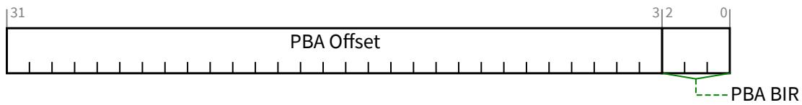

text_image

31
PBA Offset
3 2 0
PBA BIR

Figure 7-62 PBA Offset/PBA BIR Register for MSI-X§

Table 7-51 PBA Offset/PBA BIR Register for MSI-X§

<table><tr><td>Bit Location</td><td>Register Description</td><td>Attributes</td></tr><tr><td>2:0</td><td>PBA BIR- Indicates which one of a Function’s Base Address Registers, located beginning at 10h in Configuration Space, or entry in the Enhanced Allocation capability with a matching BEI, is used to map the Function’s MSI-X PBA into Memory Space.The PBA BIR value definitions are identical to those for the Table BIR.</td><td>RO</td></tr><tr><td>31:3</td><td>PBA Offset- Used as an offset from the address contained by one of the Function’s Base Address Registers to point to the base of the MSI-X PBA. The lower 3 PBA BIR bits are masked off (set to zero) by software to form a 32-bit QWORD-aligned offset.For VFs, the PBA Offset value is relative to the VF’s Memory address space.</td><td>RO</td></tr></table>

## 7.7.2.5 Message Address Register for MSI-X Table Entries §

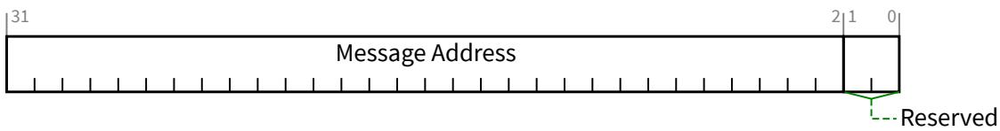

text_image

31
Message Address
2 1 0
Reserved

Figure 7-63 Message Address Register for MSI-X Table Entries§

Table 7-52 Message Address Register for MSI-X Table Entries§

<table><tr><td>Bit Location</td><td>Register Description</td><td>Attributes</td></tr><tr><td>1:0</td><td>ReservedReserved- For proper DWORD alignment, software must always write zeros to these two bits; otherwise the result is undefined.Default value of this field is 00b.These bits are permitted to be read-only or read-write.</td><td>RO or RW</td></tr><tr><td>31:2</td><td>Message Address- System-specified message lower address.For MSI-X messages, the contents of this field from an MSI-X Table entry specifies the lower portion of the DWORD-aligned address for the Memory Write transaction.Default value of this field is undefined.</td><td>RW</td></tr></table>

## 7.7.2.6 Message Upper Address Register for MSI-X Table Entries §

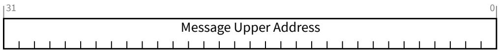

text_image

31
Message Upper Address
0

Figure 7-64 Message Upper Address Register for MSI-X Table Entries§

Table 7-53 Message Upper Address Register for MSI-X Table Entries§

<table><tr><td>Bit Location</td><td>Register Description</td><td>Attributes</td></tr><tr><td>31:0</td><td>Message Upper Address - System-specified message upper address bits.If this field is zero, 32-bit address messages are used. If this field is non-zero, 64-bit address messages are used.Default value of this field is undefined.</td><td>RW</td></tr></table>

## 7.7.2.7 Message Data Register for MSI-X Table Entries §

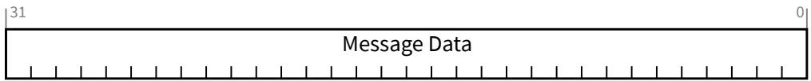

text_image

31
Message Data
0

Figure 7-65 Message Data Register for MSI-X Table Entries§

Table 7-54 Message Data Register for MSI-X Table Entries§

<table><tr><td>Bit Location</td><td>Register Description</td><td>Attributes</td></tr><tr><td>31:0</td><td>Message Data- System-specified message data.For MSI-X messages, the contents of this field from an MSI-X Table entry specifies the 32-bit data payload of the DWORD Memory Write transaction. All 4 Byte Enables are Set.In contrast to message data used for MSI messages, the low-order message data bits in MSI-X messages are not modified by the Function.This field is read-write.Default value of this field is undefined.</td><td>RW</td></tr></table>

## 7.7.2.8 Vector Control Register for MSI-X Table Entries §

If a Function implements a TPH Requester Extended Capability structure and an MSI-X Capability structure, the Function can optionally use the Vector Control Register for MSI-X Table Entries in each entry to store a Steering Tag. See § Section 6.17 .

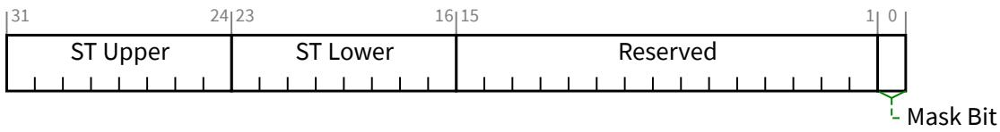

text_image

31 24 23 16 15 1 0
ST Upper ST Lower Reserved
Mask Bit

Figure 7-66 Vector Control Register for MSI-X Table Entries§

Table 7-55 Vector Control Register for MSI-X Table Entries§

<table><tr><td>Bit Location</td><td>Register Description</td><td>Attributes</td></tr><tr><td>0</td><td>Mask Bit- When this bit is Set, the Function is prohibited from sending a message using this MSI-X Table entry. However, any other MSI-X Table entries programmed with the same vector will still be capable of sending an equivalent message unless they are also masked.Default value of this bit is 1b (entry is masked)</td><td>RW</td></tr><tr><td>15:1</td><td>ReservedReserved- By default, the value of these bits must be 0. However, for potential future use, software must preserve the value of these Reserved bits when modifying the value of other Vector Control bits. If software modifies the value of these Reserved bits, the result is undefined.These bits are permitted to be RsvdP or read-write.</td><td>RW or RsvdP</td></tr><tr><td>23:16</td><td>ST Lower- If the Function implements a TPH Requester Extended Capability structure, and the ST Table Location indicates a value of 10b, then this field contains the lower 8 bits of a Steering Tag and must be read-write.Otherwise, this field is permitted to be read-write or RsvdP, and for potential future use, software must preserve the value of these Reserved bits when modifying the value of other Vector Control bits, or the result is undefined.Default value of this field is 00h.</td><td>RW/RsvdP</td></tr><tr><td>31:24</td><td>ST Upper- If the Function implements a TPH Requester Extended Capability structure, and the ST Table Location indicates a value of 10b, and the Extended TPH Requester Supported bit is Set, then this field contains the upper 8 bits of a Steering Tag and must be read-write.Otherwise, this field is permitted to be read-write or RsvdP, and for potential future use, software must preserve the value of these Reserved bits when modifying the value of other Vector Control bits, or the result is undefined.Default value of this field is 00h.</td><td>RW/RsvdP</td></tr></table>

## 7.7.2.9 Pending Bits Register for MSI-X PBA Entries

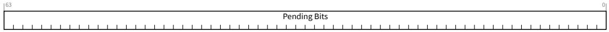

text_image

63
Pending Bits
0

Figure 7-67 Pending Bits Register for MSI-X PBA Entries§

Table 7-56 Pending Bits Register for MSI-X PBA Entries§

<table><tr><td>Bit Location</td><td>Register Description</td><td>Attributes</td></tr><tr><td>63:0</td><td>Pending Bits- For each Pending Bit that is Set, the Function has a pending message for the associated MSI-X Table entry. Pending bits that have no associated MSI-X Table entry are Reserved. By default, the value of Reserved Pending bits must be 0b. Software should never write, and should only read Pending Bits. If software writes to Pending Bits, the result is undefined. Default value of each Pending Bit is 0b. These bits are permitted to be read-only or read-write.</td><td>RO or RW</td></tr></table>

## 7.7.3 Secondary PCI Express Extended Capability §

The Secondary PCI Express Extended Capability structure must be implemented in any Function or RCRB where any of the following are true:

• The Supported Link Speeds Vector field indicates that the Link supports Link Speeds of 8.0 GT/s or higher (see § Section 7.5.3.18 or § Section 7.9.9.2 ).  
• Any bit in the Lower SKP OS Generation Supported Speeds Vector field is Set (see § Section 7.5.3.18 ).  
• When Lane based errors are reported in the Lane Error Status register (discussed in § Section 4.2.7 ).

To support future additions to this capability, this capability is permitted in any Function or RCRB associated with a Link. For a Multi-Function Device associated with an Upstream Port, this capability is permitted only in Function 0 of the Device.

<table><tr><td colspan="2">PCI Express Extended Capability Header</td></tr><tr><td colspan="2">Link Control 3 Register</td></tr><tr><td colspan="2">Lane Error Status Register</td></tr><tr><td>Lane (1) Equalization Control Register Entry</td><td>Lane (0) Equalization Control Register Entry</td></tr><tr><td>Lane (3) Equalization Control Register Entry</td><td>Lane (2) Equalization Control Register Entry</td></tr><tr><td>Lane (5) Equalization Control Register Entry</td><td>Lane (4) Equalization Control Register Entry</td></tr><tr><td>Lane (7) Equalization Control Register Entry</td><td>Lane (6) Equalization Control Register Entry</td></tr><tr><td>Lane (9) Equalization Control Register Entry</td><td>Lane (8) Equalization Control Register Entry</td></tr><tr><td>Lane (11) Equalization Control Register Entry</td><td>Lane (10) Equalization Control Register Entry</td></tr><tr><td>Lane (13) Equalization Control Register Entry</td><td>Lane (12) Equalization Control Register Entry</td></tr><tr><td>Lane (15) Equalization Control Register Entry</td><td>Lane (14) Equalization Control Register Entry</td></tr><tr><td>Lane (17) Equalization Control Register Entry</td><td>Lane (16) Equalization Control Register Entry</td></tr><tr><td>Lane (19) Equalization Control Register Entry</td><td>Lane (18) Equalization Control Register Entry</td></tr><tr><td>Lane (21) Equalization Control Register Entry</td><td>Lane (20) Equalization Control Register Entry</td></tr><tr><td>Lane (23) Equalization Control Register Entry</td><td>Lane (22) Equalization Control Register Entry</td></tr><tr><td>Lane (25) Equalization Control Register Entry</td><td>Lane (24) Equalization Control Register Entry</td></tr><tr><td>Lane (27) Equalization Control Register Entry</td><td>Lane (26) Equalization Control Register Entry</td></tr><tr><td>Lane (29) Equalization Control Register Entry</td><td>Lane (28) Equalization Control Register Entry</td></tr><tr><td>Lane (31) Equalization Control Register Entry</td><td>Lane (30) Equalization Control Register Entry</td></tr></table>

Figure 7-68 Secondary PCI Express Ext§ended Capability Structure

## 7.7.3.1 Secondary PCI Express Extended Capability Header (Offset 00h) §

line chart

| Time | Value |
| ---- | ----- |
| 0019h | 0019h |

Figure 7-69 Secondary PCI Express Extended Capability Header§

Table 7-57 Secondary PCI Express Extended Capability Header§

<table><tr><td>Bit Location</td><td>Register Description</td><td>Attributes</td></tr><tr><td>15:0</td><td>PCI Express Extended Capability ID - This field is a PCI-SIG defined ID number that indicates the nature and format of the Extended Capability.PCI Express Extended Capability ID for the Secondary PCI Express Extended Capability is 0019h.</td><td>RO</td></tr><tr><td>19:16</td><td>Capability Version - This field is a PCI-SIG defined version number that indicates the version of the Capability structure present.Must be 1h for this version of the specification.</td><td>RO</td></tr><tr><td>31:20</td><td>Next Capability Offset - This field contains the offset to the next PCI Express Extended Capability structure or 000h if no other items exist in the linked list of Capabilities.</td><td>RO</td></tr></table>

## 7.7.3.2 Link Control 3 Register (Offset 04h) §

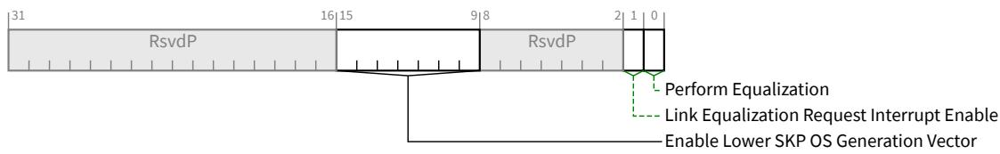

text_image

31
RsvdP
16 15
9 8
RsvdP
2 1 0
Perform Equalization
Link Equalization Request Interrupt Enable
Enable Lower SKP OS Generation Vector

Figure 7-70 Link Control 3 Register

§ Table 7-58 Link Control 3 Register

<table><tr><td>Bit Location</td><td>Register Description</td><td>Attributes</td></tr><tr><td>0</td><td>Perform Equalization- When this bit is 1b and a 1b is written to the Retrain Link bit with the Target Link Speed field set to 8.0 GT/s or higher, the Downstream Port must perform Link Equalization. Refer to § Section 4.2.4 and § Section 4.2.7.4.2 for details.This bit is RW for Downstream Ports and for Upstream Ports when Crosslink Supported is 1b (see § Section 7.5.3.18). This bit is not applicable and is RsvdP for Upstream Ports when the Crosslink Supported bit is 0b.The default value is 0b.If the Port does not support 8.0 GT/s, this bit is permitted to be hardwired to 0b.</td><td>RW/RsvdP</td></tr><tr><td>1</td><td>Link Equalization Request Interrupt Enable- When Set, this bit enables the generation of an interrupt to indicate that the Link Equalization Request 8.0 GT/s bit, the Link Equalization Request 16.0 GT/s bit, or the Link Equalization Request 32.0 GT/s bit has been set.This bit is RW for Downstream Ports and for Upstream Ports when Crosslink Supported is 1b (see § Section 7.5.3.18). This bit is not applicable and is RsvdP for Upstream Ports when the Crosslink Supported bit is 0b.The default value for this bit is 0b.If the Port does not support 8.0 GT/s, this bit is permitted to be hardwired to 0b.</td><td>RW/RsvdP</td></tr><tr><td>9:15</td><td>Enable Lower SKP OS Generation Vector- When the Link is in L0 and the bit in this field corresponding to the Current Link Speed is Set, SKP Ordered Sets are scheduled at the rate defined for SRNS, overriding the rate required based on the clock tolerance architecture. See § Section 4.2.8 for additional requirements.Bit definitions within this field are:Bit 0 2.5 GT/sBit 1 5.0 GT/sBit 2 8.0 GT/sBit 3 16.0 GT/sBit 4 32.0 GT/sBits 6:5 RsvdPEach unreserved bit in this field must be RW if the corresponding bit in the Lower SKP OS Generation Supported Speeds Vector is Set, otherwise the bit must be RW or hardwired to 0.Behavior is undefined if a bit is Set in this field and the corresponding bit in the Lower SKP OS Generation Supported Speeds Vector is not Set.The default value of this field is 000 0000b.</td><td>RW/RsvdP</td></tr></table>

## 7.7.3.3 Lane Error Status Register (Offset 08h)

The Lane Error Status Register consists of a 32-bit vector, where each bit indicates if the Lane with the corresponding Lane number detected an error. This Lane number is the default Lane number which is invariant to Link width and Lane reversal negotiation that occurs during Link training.

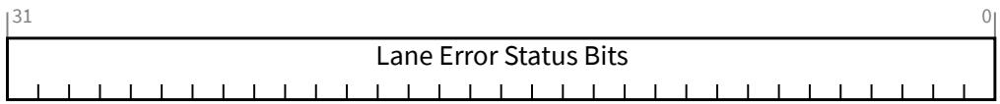

text_image

31
Lane Error Status Bits
0

§ Figure 7-71 Lane Error Status Register

§

Table 7-59 Lane Error Status Register

<table><tr><td>Bit Location</td><td>Register Description</td><td>Attributes</td></tr><tr><td>31:0</td><td>Lane Error Status Bits - Each bit indicates if the corresponding Lane detected a Lane-based error. A value of 1b indicates that a Lane based-error was detected on the corresponding Lane Number (see § Section 4.2.2.3.3, § Section 4.2.7, and § Section 4.2.8.2 for details).The default value of each bit is 0b.For Ports that are narrower than 32 Lanes, the unused upper bits [31: Maximum Link Width] are RsvdZ.For Ports that do not support 8.0 GT/s and do not set these bits based on 8b/10b errors (optional, see § Section 4.2.7), this field is permitted to be hardwired to 0.</td><td>RW1CS</td></tr></table>

## 7.7.3.4 Lane Equalization Control Register (Offset 0Ch) §

The Lane Equalization Control Register consists of control fields required for per-Lane 8.0 GT/s equalization and the number of entries in this register are sized by Maximum Link Width (see § Section 7.5.3.6 ). Each entry contains the values for the Lane with the corresponding default Lane number which is invariant to Link width and Lane reversal negotiation that occurs during Link training.

If the Port does not support 8.0 GT/s, this register is permitted to be hardwired to 0.

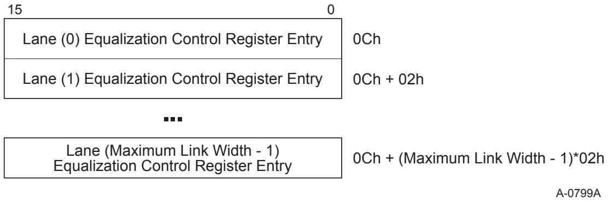

text_image

15
0
Lane (0) Equalization Control Register Entry
0Ch
Lane (1) Equalization Control Register Entry
0Ch + 02h
...
Lane (Maximum Link Width - 1)
Equalization Control Register Entry
0Ch + (Maximum Link Width - 1)*02h
A-0799A

Figure 7-72 Lane Equalization Control Register§

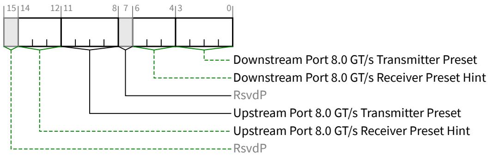

text_image

15 14 12 11 8 7 6 4 3 0
Downstream Port 8.0 GT/s Transmitter Preset
Downstream Port 8.0 GT/s Receiver Preset Hint
RsvdP
Upstream Port 8.0 GT/s Transmitter Preset
Upstream Port 8.0 GT/s Receiver Preset Hint
RsvdP

Figure 7-73 Lane Equalization Control Register Entry§

Table 7-60 Lane Equalization Control Register Entry§

<table><tr><td>Bit Location</td><td colspan="4">Register Description</td><td>Attributes</td></tr><tr><td>3:0</td><td colspan="4">Downstream Port 8.0 GT/s Transmitter Preset - Transmitter preset value used for 8.0 GT/s equalization by this Port when the Port is operating as a Downstream Port. This field is ignored when the Port is operating as an Upstream Port. See § Chapter 8. for details. The field encodings are defined in § Section 4.2.4.2 .For an Upstream Port if Crosslink Supported is 0b, this field is RsvdP. Otherwise, this field is HwInit. See § Section 7.5.3.18 .The default value is 1111b.</td><td>HwInit/RsvdP (see description)</td></tr><tr><td>6:4</td><td colspan="4">Downstream Port 8.0 GT/s Receiver Preset Hint - Receiver preset hint value that may be used as a suggested setting for 8.0 GT/s receiver equalization by this Port when the Port is operating as a Downstream Port. This field is ignored when the Port is operating as an Upstream Port. See § Chapter 8. for details. The field encodings are defined in § Section 4.2.4.2 .For an Upstream Port if Crosslink Supported is 0b, this field is RsvdP. Otherwise, this field is HwInit. See § Section 7.5.3.3.18 .The default value is 111b.</td><td>HwInit/RsvdP (see description)</td></tr><tr><td rowspan="5">11:8</td><td colspan="4">Upstream Port 8.0 GT/s Transmitter Preset - Field contains the Transmitter preset value sent or received during 8.0 GT/s Link Equalization. Field usage varies as follows:</td><td rowspan="5">HwInit/RO (see description)</td></tr><tr><td></td><td>Operating Port Direction</td><td>Crosslink Supported</td><td>Usage</td></tr><tr><td>A</td><td>Downstream Port</td><td>Any</td><td>Field contains the value sent on the associated Lane during Recovery.RcvrCfg.Field is HwInit.</td></tr><tr><td>B</td><td>Upstream Port</td><td>0b</td><td>Field is intended for debug and diagnostics. It contains the value captured from the associated Lane during Link Equalization.This value MUST@FLIT be captured from EQ TS2 or equalization requests with Use_Preset Set are received.This value should not be affected by equalization requests with Use_Preset Clear.Field is RO.Note: When crosslinks are supported, case C (below) applies and this captured information is not visible to software. Vendors are encouraged to provide an alternate mechanism to obtain this information.</td></tr><tr><td>C</td><td>Upstream Port</td><td>1b</td><td>Field is not used or affected by the current Link Equalization.Field value will be used if a future crosslink negotiation switches the Operating Port Direction so that case A (above) applies.</td></tr><tr><td rowspan="4"></td><td colspan="4"></td><td rowspan="4"></td></tr><tr><td></td><td>Operating Port Direction</td><td>Crosslink Supported</td><td>Usage</td></tr><tr><td></td><td></td><td></td><td>Field is HwInit.</td></tr><tr><td colspan="4">See § Section 4.2.4 and § Chapter 8. for details. The field encodings are defined in § Section 4.2.4.2. The default value is 1111b.</td></tr><tr><td rowspan="6">14:12</td><td colspan="4">Upstream Port 8.0 GT/s Receiver Preset Hint - Field contains the Receiver preset hint value sent or received during 8.0 GT/s Link Equalization. Field usage varies as follows:</td><td rowspan="6">HwInit/RO (see description)</td></tr><tr><td></td><td>Operating Port Direction</td><td>Crosslink Supported</td><td>Usage</td></tr><tr><td>A</td><td>Downstream Port</td><td>Any</td><td>Field contains the value sent on the associated Lane during Recovery.RcvrCfg. Field is HwInit.</td></tr><tr><td>B</td><td>Upstream Port</td><td>0b</td><td>Field is intended for debug and diagnostics. It contains the value captured from the associated Lane during Link Equalization. This value MUST@FLIT be captured from EQ TS2 or equalization requests with Use_Preset Set are received. This value should not be affected by equalization requests with Use_Preset Clear. Field is RO. Note: When crosslinks are supported, case C (below) applies and this captured information is not visible to software. Vendors are encouraged to provide an alternate mechanism to obtain this information.</td></tr><tr><td>C</td><td>Upstream Port</td><td>1b</td><td>Field is not used or affected by the current Link Equalization. Field value will be used if a future crosslink negotiation switches the Operating Port Direction so that case A (above) applies. Field is HwInit.</td></tr><tr><td colspan="4">See § Section 4.2.4 and § Chapter 8. for details. The field encodings are defined in § Section 4.2.4.2. The default value is 111b.</td></tr></table>

## 7.7.4 Data Link Feature Extended Capability §

The Data Link Feature Capability is an optional Extended Capability that is required for Downstream Ports that support one or more of the associated features. Since the Scaled Flow Control Feature is required for Ports that support 16.0 GT/ s, this capability is required for Downstream Ports that support 16.0 GT/s (see § Section 3.4.2 ). It is optional in other Downstream Ports. It is optional in Functions associated with an Upstream Port. In Multi-Function Devices associated with an Upstream Port, this capability is individually optional for each non-VF Function, and all implemented instances of this capability must report identical information in all fields of this capability. It is not applicable in Functions that are not associated with a Port (e.g., RCiEPs, Root Complex Event Collectors). The Data Link Feature Extended Capability is shown in § Figure 7-74.

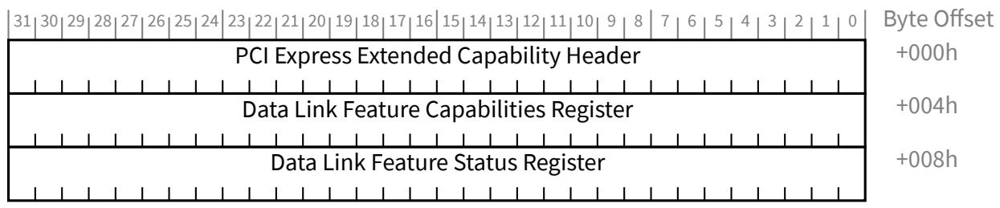

text_image

PCI Express Extended Capability Header
Data Link Feature Capabilities Register
Data Link Feature Status Register
Byte Offset
+000h
+004h
+008h

Figure 7-74 Data Link Feature Extended Capability§

## 7.7.4.1 Data Link Feature Extended Capability Header (Offset 00h) §

§ Figure 7-75 details allocation of register fields in the Data Link Feature Extended Capability Header; § Table 7-63 provides the respective bit definitions.

text_image

31
20 19 16 15 0
Next Capability Offset
0025h
PCI Express Extended Capability ID
Capability Version

Figure 7-75 Data Link Feature Extended Capability Header§

Table 7-63 Data Link Feature Extended Capability Header§

<table><tr><td>Bit Location</td><td>Description</td><td>Attributes</td></tr><tr><td>15:0</td><td>PCI Express Extended Capability ID - This field is a PCI-SIG defined ID number that indicates the nature and format of the Extended Capability. Extended Capability ID for Data Link Feature is 0025h.</td><td>RO</td></tr><tr><td>19:16</td><td>Capability Version - This field is a PCI-SIG defined version number that indicates the version of the Capability structure present. Must be 1h for this version of the specification.</td><td>RO</td></tr><tr><td>31:20</td><td>Next Capability Offset - This field contains the offset to the next PCI Express Capability structure or 000h if no other items exist in the linked list of Capabilities. For Extended Capabilities implemented in Configuration Space, this offset is relative to the beginning of PCI-compatible Configuration Space and thus must always be either 000h (for terminating list of Capabilities) or greater than 0FFh.The bottom 2 bits of this offset are Reserved and must be implemented as 00b although software must mask them to allow for future uses of these bits.</td><td>RO</td></tr></table>

## 7.7.4.2 Data Link Feature Capabilities Register (Offset 04h) §

§ Figure 7-76 details allocation of register fields in the Data Link Feature Capabilities register; § Table 7-64 provides the respective bit definitions.

When this Port sends a Data Link Feature DLLP, the Feature Support field in Symbols 1, 2, and 3 of that DLLP contains bits [22:16], [15:8], and [7:0] of this register respectively (See § Figure 3-14).

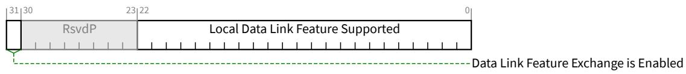

text_image

31 30 23 22 0
RsvdP Local Data Link Feature Supported
Data Link Feature Exchange is Enabled

Figure 7-76 Data Link Feature Capabilities Register§

Table 7-64 Data Link Feature Capabilities Register§

<table><tr><td>Bit Location</td><td colspan="2">Description</td><td>Attributes</td></tr><tr><td rowspan="5">22:0</td><td colspan="2">Local Data Link Feature Supported- This field contains the Feature Supported value used when this Port sends a Data Link Feature DLLP (see § Figure 3-14). Defined features are:</td><td rowspan="5">HwInit/RsvdP</td></tr><tr><td>Bit 0</td><td>Local Scaled Flow Control Supported– Data Link FeatureThis bit indicates that this Port supports the Scaled Flow Control Feature (see § Section 3.4.2 ).</td></tr><tr><td>Bit 1</td><td>Local Immediate Readiness– Data Link ParameterThis bit indicates that all non-Virtual Functions in this Port have Immediate Readiness Set (see § Section 7.5.1.1.4 ).This bit MUST@FLIT be meaningful. In Non-Flit Mode, this bit is meaningful when Set, but when Clear indicates either that some non-Virtual Function has Immediate Readiness Clear or that this Port is not providing this information.</td></tr><tr><td>Bits 4:2</td><td>Local Extended VC Count– Data Link ParameterThis field indicates the number of VC Resources supported by this Port. This is the value of the Extended VC Count field in either the Multi-Function Virtual Channel Extended Capability or the Virtual Channel Extended Capability (with Capability ID 0002h).This field is meaningful in Flit Mode. In Non-Flit Mode, this field must be zero.</td></tr><tr><td>Bits 7:5</td><td>Local L0p Exit Latency– Data Link ParameterThis field indicates this Port's knowledge of L0p Exit Latency. The value reported is the larger of Port L0p Exit Latency and Retimer L0p Exit Latency.The actual time required to widen the Link is the larger of Local L0p Exit Latency and Remote L0p Exit Latency.</td></tr><tr><td></td><td colspan="2">The Downstream Port's Retimer L0p Exit Latency should include retimers that are part of the “system”.The Upstream Port's Retimer L0p Exit Latency should include retimers that are part of the “add-in card”.Defined encodings are:000b Less than 1μs001b 1 μs to less than 2 μs010b 2 μs to less than 4 μs011b 4 μs to less than 8 μs100b 8 μs to less than 16 μs101b 16 μs to less than 32 μs110b 32 μs-64 μs111b More than 64 μsThis field is meaningful in Flit Mode. In Non-Flit Mode, this field must be zero.Bits 22:8 RsvdPOther bits in this field are RsvdP.</td><td></td></tr><tr><td>31</td><td colspan="2">Data Link Feature Exchange is Enabled - If Set, indicates that this Port will enter the DL_Feature negotiation state (see § Section 3.2.1).</td><td>HwInit</td></tr></table>

## 7.7.4.3 Data Link Feature Status Register (Offset 08h) §

§ Figure 7-77 details allocation of register fields in the Data Link Feature Status Register; § Table 7-65 provides the respective bit definitions.

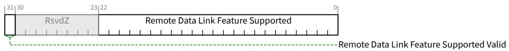

text_image

31 30 23 22 0
RsvdZ Remote Data Link Feature Supported
Remote Data Link Feature Supported Valid

Figure 7-77 Data Link Feature Status Register§

Table 7-65 Data Link Feature Status Register§

<table><tr><td>Bit Location</td><td colspan="2">Description</td><td>Attributes</td></tr><tr><td>22:0</td><td colspan="2">Remote Data Link Feature Supported- These bits indicate that the Remote Port supports the corresponding Data Link Feature. These bits capture all information from the Feature Supported field of the Data Link Feature DLLP even when this Port doesn't support the corresponding feature.This field is Cleared on entry to state DL_Inactive (see § Section 3.2.1).Features currently defined are:Bit 0 Remote Scaled Flow Control Supported– Data Link FeatureThis bit indicates that the Remote Port supports the Scaled Flow Control Feature (see § Section 3.4.2).</td><td>RO</td></tr><tr><td rowspan="4"></td><td>Bit 1</td><td>Remote Immediate Readiness – Data Link ParameterThis bit indicates that all non-Virtual Functions in the Remote Port have Immediate Readiness Set (see § Section 7.5.1.1.4).In Flit Mode, this bit is always meaningful. In Non-Flit Mode, this bit is meaningful when Set, but when Clear indicates either that some non-Virtual Function has Immediate Readiness Clear or that the Remote Port is not providing this information.</td><td rowspan="4"></td></tr><tr><td>Bits 4:2</td><td>Extended VC Count – Data Link ParameterThis field indicates the number of VC Resources supported by the sending Port. This is the value of the Extended VC Count field in either the Multi-Function Virtual Channel Extended Capability or the Virtual Channel Extended Capability (with Capability ID 0002h).This field is meaningful in Flit Mode. In Non-Flit Mode, this field must be zero.</td></tr><tr><td>Bits 7:5</td><td>Remote L0p Exit Latency – Data Link ParameterThis field indicates the remote Port's L0p Exit Latency. The value reported indicates the length of time the remote Port requires to complete widening a link using L0p. If the remote Port does not support L0p, this field must contain 000b. Defined encodings are:000b Less than 1μs001b 1 μs to less than 2 μs010b 2 μs to less than 4 μs011b 4 μs to less than 8 μs100b 8 μs to less than 16 μs101b 16 μs to less than 32 μs110b 32 μs-64 μs111b More than 64 μs</td></tr><tr><td>Bits 22:8</td><td>ReservedDefault is 00 0000h</td></tr><tr><td>31</td><td colspan="2">Remote Data Link Feature Supported Valid - This bit indicates that the Port has received a Data Link Feature DLLP in state DL_Feature (see § Section 3.2.1) and that the Remote Data Link Feature Supported field is meaningful. This bit is Cleared on entry to state DL_Inactive (see § Section 3.2.1).Default is 0b.</td><td>RO</td></tr></table>

## 7.7.5 Physical Layer 16.0 GT/s Extended Capability §

The Physical Layer 16.0 GT/s Extended Capability structure must be implemented in:

• A Function associated with a Downstream Port where the Supported Link Speeds Vector field indicates support for a Link speed of 16.0 GT/s.  
• A Function of a single-Function Device associated with an Upstream Port where the Supported Link Speeds Vector field indicates support for a Link speed of 16.0 GT/s.

• Function 0 (and only Function 0) of a Multi-Function Device associated with an Upstream Port where the Supported Link Speeds Vector field indicates support for a Link speed of 16.0 GT/s.

This capability is permitted to be implemented in any of the Functions listed above even if the 16.0 GT/s Link speed is not supported. When the 16.0 GT/s Link speed is not supported, the behavior of registers other than the Capability Header is undefined.

§ Figure 7-79 details allocation of register fields in the Physical Layer 16.0 GT/s Extended Capability structure.

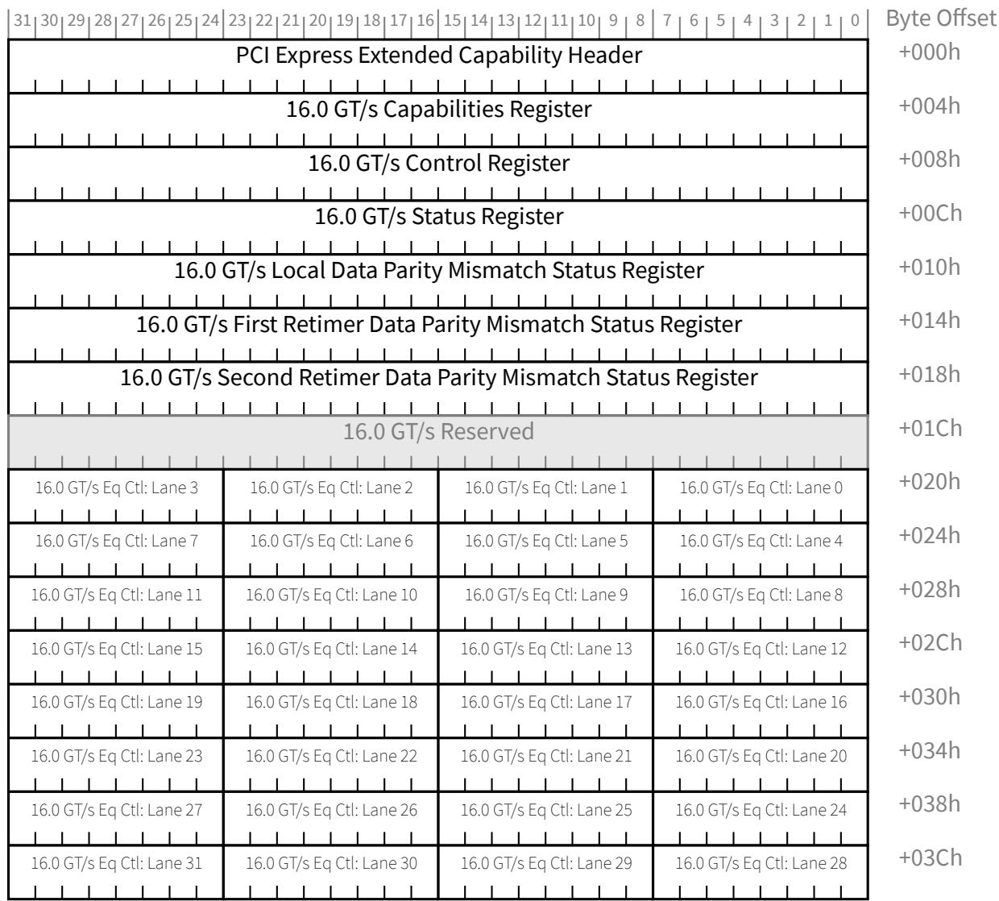

stacked bar chart

| Category | Value |
|---|---|
| PCI Express Extended Capability Header | 31-30 |
| 16.0 GT/s Capabilities Register | 29-28 |
| 16.0 GT/s Control Register | 26-25 |
| 16.0 GT/s Status Register | 24-23 |
| 16.0 GT/s Local Data Parity Mismatch Status Register | 22-21 |
| 16.0 GT/s First Retimer Data Parity Mismatch Status Register | 20-19 |
| 16.0 GT/s Second Retimer Data Parity Mismatch Status Register | 18-17 |
| 16.0 GT/s Eq Ctl: Lane 3 | 16.0 |
| 16.0 GT/s Eq Ctl: Lane 2 | 16.0 |
| 16.0 GT/s Eq Ctl: Lane 1 | 16.0 |
| 16.0 GT/s Eq Ctl: Lane 0 | 16.0 |
| 16.0 GT/s Eq Ctl: Lane 7 | 16.0 |
| 16.0 GT/s Eq Ctl: Lane 6 | 16.0 |
| 16.0 GT/s Eq Ctl: Lane 5 | 16.0 |
| 16.0 GT/s Eq Ctl: Lane 4 | 16.0 |
| 16.0 GT/s Eq Ctl: Lane 11 | 16.0 |
| 16.0 GT/s Eq Ctl: Lane 10 | 16.0 |
| 16.0 GT/s Eq Ctl: Lane 9 | 16.0 |
| 16.0 GT/s Eq Ctl: Lane 8 | 16.0 |
| 16.0 GT/s Eq Ctl: Lane 15 | 16.0 |
| 16.0 GT/s Eq Ctl: Lane 14 | 16.0 |
| 16.0 GT/s Eq Ctl: Lane 13 | 16.0 |
| 16.0 GT/s Eq Ctl: Lane 12 | 16.0 |
| 16.0 GT/s Eq Ctl: Lane 19 | 16.0 |
| 16.0 GT/s Eq Ctl: Lane 18 | 16.0 |
| 16.0 GT/s Eq Ctl: Lane 17 | 16.0 |
| 16.0 GT/s Eq Ctl: Lane 16 | 16.0 |
| 16.0 GT/s Eq Ctl: Lane 23 | 16.0 |
| 16.0 GT/s Eq Ctl: Lane 22 | 16.0 |
| 16.0 GT/s Eq Ctl: Lane 21 | 16.0 |
| 16.0 GT/s Eq Ctl: Lane 20 | 16.0 |
| 16.0 GT/s Eq Ctl: Lane 27 | 16.0 |
| 16.0 GT/s Eq Ctl: Lane 26 | 16.0 |
| 16.0 GT/s Eq Ctl: Lane 25 | 16.0 |
| 16.0 GT/s Eq Ctl: Lane 24 | 16.0 |
| 16.0 GT/s Eq Ctl: Lane 31 | 16.0 |
| 16.0 GT/s Eq Ctl: Lane 30 | 16.0 |
| 16.0 GT/s Eq Ctl: Lane 29 | 16.0 |
| 16.0 GT/s Eq Ctl: Lane 28 | 16.0 |
Byte Offset
+000h
+004h
+008h
+00Ch
+010h
+014h
+018h
+01Ch
+020h
+024h
+028h
+02Ch
+030h
+034h
+038h
+03Ch

Figure 7-78 Physical Layer 16.0 § GT/s Extended Capability

## 7.7.5.1 Physical Layer 16.0 GT/s Extended Capability Header (Offset 00h) §

text_image

31
20 19 16 15 0
Next Capability Offset
0026h
PCI Express Extended Capability ID
Capability Version

Figure 7-79 Physical Layer 16.0 GT/s Extended Capability Header§

Table 7-66 Physical Layer 16.0 GT/s Extended Capability Header§

<table><tr><td>Bit Location</td><td>Register Description</td><td>Attributes</td></tr><tr><td>15:0</td><td>PCI Express Extended Capability ID- This field is a PCI-SIG defined ID number that indicates the nature and format of the Extended Capability.The Extended Capability ID for the Physical Layer 16.0 GT/s Capability is 0026h.</td><td>RO</td></tr><tr><td>19:16</td><td>Capability Version- This field is a PCI-SIG defined version number that indicates the version of the Capability structure present.Must be 1h for this version of the specification.</td><td>RO</td></tr><tr><td>31:20</td><td>Next Capability Offset- This field contains the offset to the next PCI Express Capability structure or 000h if no other items exist in the linked list of Capabilities.For Extended Capabilities implemented in Configuration Space, this offset is relative to the beginning of PCI-compatible Configuration Space and thus must always be either 000h (for terminating list of Capabilities) or greater than 0FFh.</td><td>RO</td></tr></table>

## 7.7.5.2 16.0 GT/s Capabilities Register (Offset 04h) §

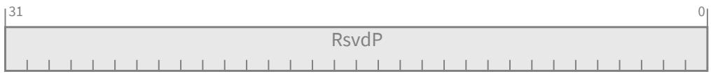

text_image

31
RsvdP
0

Figure 7-80 16.0 GT/s Capabilities Register§

Table 7-67 16.0 GT/s Capabilities Register§

<table><tr><td>Bit Location</td><td>Register Description</td><td>Attributes</td></tr><tr><td>31:0</td><td>RsvdPRsvdP</td><td>RsvdP</td></tr></table>

## 7.7.5.3 16.0 GT/s Control Register (Offset 08h) §

text_image

31
RsvdP
0

§ Figure 7-81 16.0 GT/s Control Register

§ Table 7-68 16.0 GT/s Control Register

<table><tr><td>Bit Location</td><td>Register Description</td><td>Attributes</td></tr><tr><td>31:0</td><td>RsvdPRsvdP</td><td>RsvdP</td></tr></table>

## 7.7.5.4 16.0 GT/s Status Register (Offset 0Ch) §

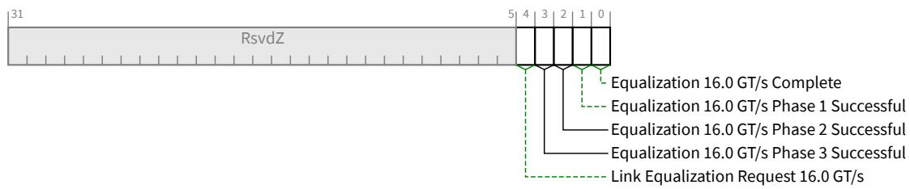

text_image

31
RsvdZ
5 4 3 2 1 0
Equalization 16.0 GT/s Complete
Equalization 16.0 GT/s Phase 1 Successful
Equalization 16.0 GT/s Phase 2 Successful
Equalization 16.0 GT/s Phase 3 Successful
Link Equalization Request 16.0 GT/s

§ Figure 7-82 16.0 GT/s Status Register

§ Table 7-69 16.0 GT/s Status Register

<table><tr><td>Bit Location</td><td>Register Description</td><td>Attributes</td></tr><tr><td>0</td><td>Equalization 16.0 GT/s Complete - When Set, this bit indicates that the 16.0 GT/s Transmitter Equalization procedure has completed. Details of the Transmitter Equalization process and when this bit needs to be set to 1b is provided in § Section 4.2.7.4.2.The default value of this bit is 0b.For a Multi-Function Upstream Port, this bit must be implemented in Function 0 and RsvdZ in other Functions.</td><td>ROS/RsvdZ</td></tr><tr><td>1</td><td>Equalization 16.0 GT/s Phase 1 Successful - When set to 1b, this bit indicates that Phase 1 of the 16.0 GT/s Transmitter Equalization procedure has successfully completed. Details of the Transmitter Equalization process and when this bit needs to be set to 1b is provided in § Section 4.2.7.4.2.The default value of this bit is 0b.For a Multi-Function Upstream Port, this bit must be implemented in Function 0 and RsvdZ in other Functions.</td><td>ROS/RsvdZ</td></tr><tr><td>2</td><td>Equalization 16.0 GT/s Phase 2 Successful - When set to 1b, this bit indicates that Phase 2 of the 16.0 GT/s Transmitter Equalization procedure has successfully completed. Details of the Transmitter Equalization process and when this bit needs to be set to 1b is provided in § Section 4.2.7.4.2.The default value of this bit is 0b.For a Multi-Function Upstream Port, this bit must be implemented in Function 0 and RsvdZ in other Functions.</td><td>ROS/RsvdZ</td></tr><tr><td>3</td><td>Equalization 16.0 GT/s Phase 3 Successful - When set to 1b, this bit indicates that Phase 3 of the 16.0 GT/s Transmitter Equalization procedure has successfully completed. Details of the Transmitter Equalization process and when this bit needs to be set to 1b is provided in § Section 4.2.7.4.2.The default value of this bit is 0b.For a Multi-Function Upstream Port, this bit must be implemented in Function 0 and RsvdZ in other Functions.</td><td>ROS/RsvdZ</td></tr><tr><td>4</td><td>Link Equalization Request 16.0 GT/s - This bit is Set by hardware to request the 16.0 GT/s Link equalization process to be performed on the Link. Refer to § Section 4.2.4 and § Section 4.2.7.4.2 for details.The default value of this bit is 0b.For a Multi-Function Upstream Port, this bit must be implemented in Function 0 and RsvdZ in other Functions.</td><td>RW1CS/RsvdZ</td></tr></table>

## 7.7.5.5 16.0 GT/s Local Data Parity Mismatch Status Register (Offset 10h) §

The Local Data Parity Mismatch Status register is a 32-bit vector where each bit indicates if the local receiver detected a Data Parity mismatch on the Lane with the corresponding Lane number. This Lane number is the default Lane number which is invariant to Link width and Lane reversal negotiation that occurs during Link training.

This register collects parity errors for 16.0 GT/s and higher data rates. When tracking errors for a specific Link Speed, software should clear this register on speed changes.

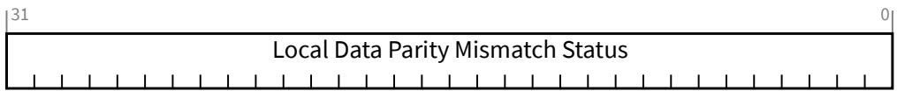

text_image

31
Local Data Parity Mismatch Status
0

Figure 7-83 16.0 GT/s Local Data Parity Mismatch Status Register§

Table 7-70 16.0 GT/s Local Data Parity Mismatch Status Register§

<table><tr><td>Bit Location</td><td>Register Description</td><td>Attributes</td></tr><tr><td>31:0</td><td>Local Data Parity Mismatch Status - Each bit indicates if the corresponding Lane detected a Data Parity mismatch. A value of 1b indicates that a mismatch was detected on the corresponding Lane Number. See § Section 4.2.8.2 for more information.The default value of each bit is 0b.For Ports that are narrower than 32 Lanes, the unused upper bits [31: Maximum Link Width] are RsvdZ.</td><td>RW1CS/RsvdZ</td></tr></table>

## 7.7.5.6 16.0 GT/s First Retimer Data Parity Mismatch Status Register (Offset 14h) §

The First Retimer Data Parity Status register is a 32-bit vector where each bit indicates if the first Retimer of a Path (see § Figure 4-61 for more information) detected a Data Parity mismatch on the Lane with the corresponding Lane number. This Lane number is the default Lane number which is invariant to Link width and Lane reversal negotiation that occurs during Link training.

This register collects parity errors for 16.0 GT/s and higher data rates. When tracking errors for a specific Link Speed, software should clear this register on speed changes.

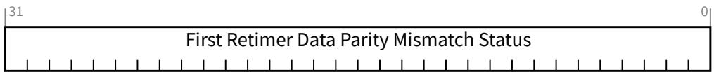

text_image

31
First Retimer Data Parity Mismatch Status

Figure 7-84 16.0 GT/s First Retimer Data Parity Mismatch Status Register§

Table 7-71 16.0 GT/s First Retimer Data Parity Mismatch Status Register§

<table><tr><td>Bit Location</td><td>Register Description</td><td>Attributes</td></tr><tr><td>31:0</td><td>First Retimer Data Parity Mismatch Status - Each bit indicates if the corresponding Lane detected a Data Parity mismatch. A value of 1b indicates that a mismatch was detected on the corresponding Lane Number. See § Section 4.2.8.2 for more information.The default value of each bit is 0b.The value of this field is undefined when no Retimers are present.For Ports that are narrower than 32 Lanes, the unused upper bits [31: Maximum Link Width] are RsvdZ.</td><td>RW1CS/RsvdZ</td></tr></table>

## 7.7.5.7 16.0 GT/s Second Retimer Data Parity Mismatch Status Register (Offset 18h) §

The 16.0 GT/s Second Retimer Data Parity Mismatch Status Register is a 32-bit vector where each bit indicates if the second Retimer of a Path (see § Figure 4-61 for more information) detected a Data Parity mismatch on the Lane with the corresponding Lane number. This Lane number is the default Lane number which is invariant to Link width and Lane reversal negotiation that occurs during Link training.

This register collects parity errors for 16.0 GT/s and higher data rates. When tracking errors for a specific Link Speed, software should clear this register on speed changes.

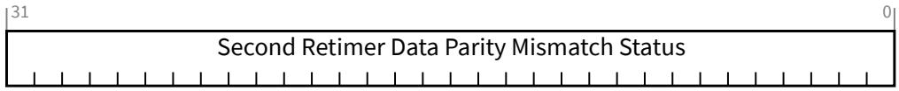

text_image

31
Second Retimer Data Parity Mismatch Status

Figure 7-85 16.0 GT/s Second Retimer Data Parity Mismatch Status Register§

Table 7-72 16.0 GT/s Second Retimer Data Parity Mismatch Status Register§

<table><tr><td>Bit Location</td><td>Register Description</td><td>Attributes</td></tr><tr><td>31:0</td><td>Second Retimer Data Parity Mismatch Status - Each bit indicates if the corresponding Lane detected a Data Parity mismatch. A value of 1b indicates that a mismatch was detected on the corresponding Lane Number. See § Section 4.2.8.2 for more information.The default value of each bit is 0b.The value of this field is undefined when no Retimers are present or only one Retimer is present.For Ports that are narrower than 32 Lanes, the unused upper bits [31: Maximum Link Width] are RsvdZ.</td><td>RW1CS/RsvdZ</td></tr></table>

## 7.7.5.8 Physical Layer 16.0 GT/s Reserved (Offset 1Ch) §

This register is RsvdP.

## 7.7.5.9 16.0 GT/s Lane Equalization Control Register (Offsets 20h to 3Ch) §

The Equalization Control register consists of control fields required for per-Lane 16.0 GT/s equalization. It contains entries for at least the number of Lanes defined by the Maximum Link Width (see § Section 7.5.3.6 or § Section 7.9.9.2 ), must be implemented in whole DW granularity (e.g., if the Maximum Link Width is x1, the register will still contain entries for 4 Lanes with the entries for Lanes 1, 2 and 3 being undefined), and it is permitted to contain up to 32 entries regardless of the Maximum Link Width. The value of entries beyond the Maximum Link Width is undefined.

Each entry contains the values for the Lane with the corresponding default Lane number which is invariant to Link width and Lane reversal negotiation that occurs during Link training.

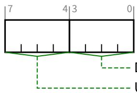

text_image

7 4 3 0
D
U

Downstream Port 16.0 GT/s Transmitter Preset Upstream Port 16.0 GT/s Transmitter Preset

Figure 7-86 16.0 GT/s Lane Equalization Control Register Entry§  
Table 7-73 16.0 GT/s Lane Equalization Control Register Entry§

<table><tr><td>Bit Location</td><td colspan="4">Register Description</td><td>Attributes</td></tr><tr><td>3:0</td><td colspan="4">Downstream Port 16.0 GT/s Transmitter Preset - Transmitter Preset used for 16.0 GT/s equalization by this Port when the Port is operating as a Downstream Port. This field is ignored when the Port is operating as an Upstream Port. See § Chapter 8. for details. The field encodings are defined in § Section 4.2.4.2 .For an Upstream Port if Crosslink Supported is 0b, this field is RsvdP. Otherwise, this field is HwInit. See § Section 7.5.3.18 .The default value is 1111b.</td><td>HwInit/RsvdP (see description)</td></tr><tr><td rowspan="6">7:4</td><td colspan="4">Upstream Port 16.0 GT/s Transmitter Preset - Field contains the Transmit Preset value sent or received during 16.0 GT/s Link Equalization. Field usage varies as follows:</td><td rowspan="6">HwInit/RO (see description)</td></tr><tr><td></td><td>Operating Port Direction</td><td>Crosslink Supported</td><td>Usage</td></tr><tr><td>A</td><td>Downstream Port</td><td>Any</td><td>Field contains the value sent on the associated Lane during Recovery.RcvrCfg.Field is HwInit.</td></tr><tr><td>B</td><td>Upstream Port</td><td>0b</td><td>Field is intended for debug and diagnostics. It contains the value captured from the associated Lane during Link Equalization.This value MUST@FLIT be captured from 128b/130b EQ TS2 or equalization requests with Use_Preset Set are received. This value should not be affected by equalization requests with Use_Preset Clear.Field is RO.When crosslinks are supported, case C (below) applies and this captured information is not visible to software. Vendors are encouraged to provide an alternate mechanism to obtain this information.</td></tr><tr><td>C</td><td>Upstream Port</td><td>1b</td><td>Field is not used or affected by the current Link Equalization.Field value will be used if a future crosslink negotiation switches the Operating Port Direction so that case A (above) applies.Field is HwInit.</td></tr><tr><td colspan="4">See § Section 4.2.4 and § Chapter 8. for details. The field encodings are defined in § Section 4.2.4.2 .The default value is 1111b.</td></tr></table>

## 7.7.6 Physical Layer 32.0 GT/s Extended Capability §

The Physical Layer 32.0 GT/s Extended Capability structure must be implemented in Ports where one or more of the following features are supported:

• The Supported Link Speeds Vector field indicates support for a Link speed of 32.0 GT/s.  
• The Function supports sending and/or receiving Modified TS1/TS2 Ordered Sets.

When implemented, this structure must be implemented in:

• A Function associated with a Downstream Port  
• A Function of a single-Function Device associated with an Upstream Port  
• Function 0 (and only Function 0) of a Multi-Function Device associated with an Upstream Port

This capability is permitted to be implemented in any of the Functions listed above even if the 32.0 GT/s Link speed is not supported. When the 32.0 GT/s Link speed is not supported, the behavior of registers other than the Capability Header is undefined.

§ Figure 7-87 details allocation of register fields in the Physical Layer 32.0 GT/s Extended Capability structure.

Note that parity errors for 32.0 GT/s are recorded in 16.0 GT/s Local Data Parity Mismatch Status Register, 16.0 GT/s First Retimer Data Parity Mismatch Status Register, and 16.0 GT/s Second Retimer Data Parity Mismatch Status Register. When tracking errors for a specific Link Speed, software should clear those registers on speed changes.

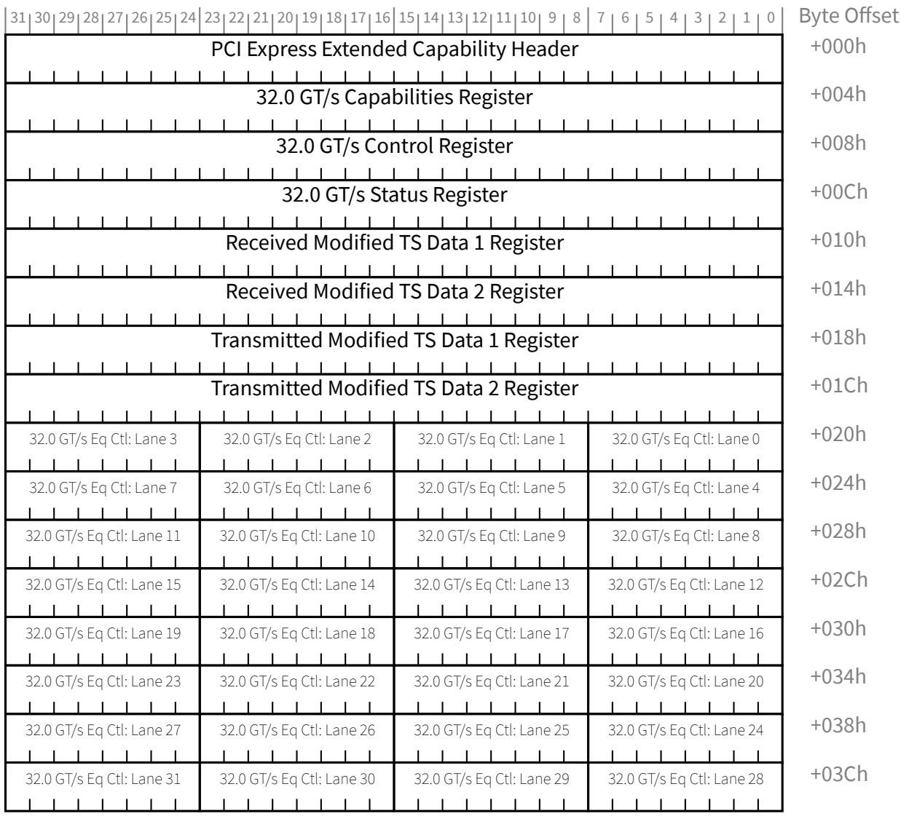  
Figure 7-87 Physical Layer 32.0 § GT/s Extended Capability

## 7.7.6.1 Physical Layer 32.0 GT/s Extended Capability Header (Offset 00h) §

text_image

31 20 19 16 15 0
Next Capability Offset 002Ah
PCI Express Extended Capability ID
Capability Version

Figure 7-88 Physical Layer 32.0 GT/s Extended Capability Header§

Table 7-75 Physical Layer 32.0 GT/s Extended Capability Header§

<table><tr><td>Bit Location</td><td>Register Description</td><td>Attributes</td></tr><tr><td>15:0</td><td>PCI Express Extended Capability ID - This field is a PCI-SIG defined ID number that indicates the nature and format of the Extended Capability.The Extended Capability ID for the Physical Layer 32.0 GT/s Capability is 002Ah.</td><td>RO</td></tr><tr><td>19:16</td><td>Capability Version - This field is a PCI-SIG defined version number that indicates the version of the Capability structure present.Must be 1h for this version of the specification.</td><td>RO</td></tr><tr><td>31:20</td><td>Next Capability Offset - This field contains the offset to the next PCI Express Capability structure or 000h if no other items exist in the linked list of Capabilities.For Extended Capabilities implemented in Configuration Space, this offset is relative to the beginning of PCI-compatible Configuration Space and thus must always be either 000h (for terminating list of Capabilities) or greater than 0FFh.</td><td>RO</td></tr></table>

## 7.7.6.2 32.0 GT/s Capabilities Register (Offset 04h) §

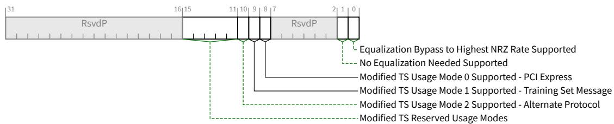

text_image

31
RsvdP
16 15
11 10 9 8 7
2 1 0
RsvdP
Equalization Bypass to Highest NRZ Rate Supported
No Equalization Needed Supported
Modified TS Usage Mode 0 Supported - PCI Express
Modified TS Usage Mode 1 Supported - Training Set Message
Modified TS Usage Mode 2 Supported - Alternate Protocol
Modified TS Reserved Usage Modes

Figure 7-89 32.0 GT/s Capabilities Register§

Table 7-76 32.0 GT/s Capabilities Register§

<table><tr><td>Bit Location</td><td>Register Description</td><td>Attributes</td></tr><tr><td>0</td><td>Equalization Bypass to Highest NRZ Rate Supported- When Set, this Port supports controlling whether the Port negotiates to skip equalization for speeds other than the highest common supported speed.See Section § Section 4.2.4 for details.Must be 1b for Ports that support 32.0 GT/s or higher data rates.</td><td>HwInit</td></tr><tr><td>1</td><td>No Equalization Needed Supported - When Set, this Port supports controlling whether or not Equalization is needed.</td><td>HwInit</td></tr><tr><td>8</td><td>Modified TS Usage Mode 0 Supported - PCI Express - This bit indicates that this Port supports PCI Express (Modified TS Usage 000b). This bit must be 1b.</td><td>RO</td></tr><tr><td>9</td><td>Modified TS Usage Mode 1 Supported - Training Set Message - This bit indicates that this Port supports sending and recieving vendor specific Training Set Messages (Modified TS Usage 001b). See § Section 4.2.5.2 for details.</td><td>HwInit</td></tr><tr><td>10</td><td>Modified TS Usage Mode 2 Supported - Alternate Protocol - This bit indicates that this Port supports negotiating to use alternate protocols (Modified TS Usage 010b). See § Section 4.2.5.2 for details.</td><td>HwInit</td></tr><tr><td>15:11</td><td>Modified TS Reserved Usage Modes - Reserved bits for future Usage Modes defined by the PCISIG. Must be 0 0000b.</td><td>RO</td></tr></table>

## 7.7.6.3 32.0 GT/s Control Register (Offset 08h) §

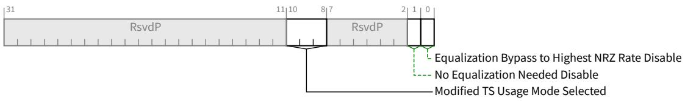

text_image

31
RsvdP
11 10 8 7
RsvdP
2 1 0
Equalization Bypass to Highest NRZ Rate Disable
No Equalization Needed Disable
Modified TS Usage Mode Selected

§ Figure 7-90 32.0 GT/s Control Register

§ Table 7-77 32.0 GT/s Control Register

<table><tr><td>Bit Location</td><td>Register Description</td><td>Attributes</td></tr><tr><td>0</td><td>Equalization Bypass to Highest NRZ Rate Disable - When Clear, this Port indicates during Link Training that it wishes to train to the highest common link NRZ data rate and skip equalization of intermediate data rates. See § Section 4.2.4 for details.If Equalization Bypass to Highest NRZ Rate Supported is Set, this bit is RWS with a default value of 0b.If Equalization Bypass to Highest NRZ Rate Supported is Clear, this bit is permitted to be hardwired to 0b.</td><td>RWS/RO</td></tr><tr><td>1</td><td>No Equalization Needed Disable - When Clear, this Port is permitted to indicate that it does not require equalization. When Set, this Port must always indicate that it requires equalization. See § Section 4.2.4 for details.If No Equalization Needed Supported is Set, this bit is RWS with a default value of 0b.If No Equalization Needed Supported is Clear, this bit is permitted to be hardwired to 0b.</td><td>RWS/RO</td></tr><tr><td>10:8</td><td>Modified TS Usage Mode Selected - Thie field indicates which Usage Mode will be used by this Downstream Port the next time the Link enters L0 LTSSM State. See § Section 4.2.5.2 for details.Behavior is undefined if this field indicates a Usage Mode that is not supported (i.e., associated Modified TS Usage Mode Supported bit is Clear).Unused bits in this field are permitted to be hardwired to 0b. If the only supported usage mode is PCI Express, this field is permitted to be hardwired to 000b.This field is present in Downstream Ports. In Upstream Ports, this field is RsvdP.Default is 000b.</td><td>RWS/RO/RsvdP</td></tr></table>

## 7.7.6.4 32.0 GT/s Status Register (Offset 0Ch) §

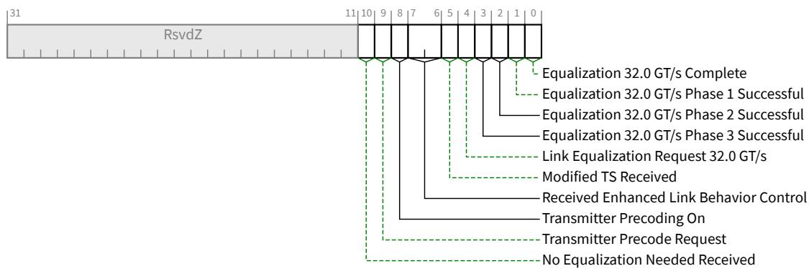

timing diagram

| Event Description | Value |
| --- | --- |
| Equalization 32.0 GT/s Complete | 11 |
| Equalization 32.0 GT/s Phase 1 Successful | 9 |
| Equalization 32.0 GT/s Phase 2 Successful | 8 |
| Equalization 32.0 GT/s Phase 3 Successful | 7 |
| Link Equalization Request 32.0 GT/s | 6 |
| Modified TS Received | 5 |
| Received Enhanced Link Behavior Control | 4 |
| Transmitter Precoding On | 3 |
| Transmitter Precode Request | 2 |
| No Equalization Needed Received | 1 |
RsvdZ

§ Figure 7-91 32.0 GT/s Status Register

§ Table 7-78 32.0 GT/s Status Register

<table><tr><td>Bit Location</td><td>Register Description</td><td>Attributes</td></tr><tr><td>0</td><td>Equalization 32.0 GT/s Complete - When Set, this bit indicates that the 32.0 GT/s Transmitter Equalization procedure has completed. Details of the Transmitter Equalization process and when this bit needs to be set to 1b is provided in § Section 4.2.7.4.2.The default value of this bit is 0b.For a Multi-Function Upstream Port, this bit must be implemented in Function 0 and RsvdZ in other Functions.</td><td>ROS/RsvdZ</td></tr><tr><td>1</td><td>Equalization 32.0 GT/s Phase 1 Successful - When set to 1b, this bit indicates that Phase 1 of the 32.0 GT/s Transmitter Equalization procedure has successfully completed. Details of the Transmitter Equalization process and when this bit needs to be set to 1b is provided in § Section 4.2.7.4.2.The default value of this bit is 0b.For a Multi-Function Upstream Port, this bit must be implemented in Function 0 and RsvdZ in other Functions.</td><td>ROS/RsvdZ</td></tr><tr><td>2</td><td>Equalization 32.0 GT/s Phase 2 Successful - When set to 1b, this bit indicates that Phase 2 of the 32.0 GT/s Transmitter Equalization procedure has successfully completed. Details of the Transmitter Equalization process and when this bit needs to be set to 1b is provided in § Section 4.2.7.4.2.The default value of this bit is 0b.For a Multi-Function Upstream Port, this bit must be implemented in Function 0 and RsvdZ in other Functions.</td><td>ROS/RsvdZ</td></tr><tr><td>3</td><td>Equalization 32.0 GT/s Phase 3 Successful- When set to 1b, this bit indicates that Phase 3 of the 32.0 GT/s Transmitter Equalization procedure has successfully completed. Details of the Transmitter Equalization process and when this bit needs to be set to 1b is provided in § Section 4.2.7.4.2.The default value of this bit is 0b.For a Multi-Function Upstream Port, this bit must be implemented in Function 0 and RsvdZ in other Functions.</td><td>ROS/RsvdZ</td></tr><tr><td>4</td><td>Link Equalization Request 32.0 GT/s- This bit is Set by hardware to request the 32.0 GT/s Link equalization process to be performed on the Link. Refer to § Section 4.2.4 and § Section 4.2.7.4.2 for details.The default value of this bit is 0b.For a Multi-Function Upstream Port, this bit must be implemented in Function 0 and RsvdZ in other Functions.</td><td>RW1CS/RsvdZ</td></tr><tr><td>5</td><td>Modified TS Received- If Set, Received Modified TS Data 1 Register and Received Modified TS Data 2 Register contain meaningful data.This bit is Cleared when the Link is Down. This bit is Set when the Modified TS1/TS2 Ordered Set is received (See § Section 4.2.7.3.3). Default is 0b.</td><td>RO</td></tr><tr><td>7:6</td><td>Received Enhanced Link Behavior Control- This field contains the Enhanced Link Behavior Control bits from the most recent TS1 or TS2 received in the Polling or Configuration states. See § Section 4.2.5.1, § Table 4-25 and § Table 4-26.This field is Cleared on DL_Down.Default is 00b.</td><td>RO</td></tr><tr><td>8</td><td>Transmitter Precoding On- This field indicates whether the Receiver asked this transmitter to enable Precoding. See § Section 4.2.2.5. This bit is cleared on DL_Down.Default is 0b.</td><td>RO&gt;</td></tr><tr><td>9</td><td>Transmitter Precode Request- When Set, this Port will request the transmitter to use Precoding by setting the Transmitter Precode Request bit in the TS1s/TS2s it transmits prior to entry to Recovery.Speed (see § Section 4.2.2.5).Default is Implementation Specific.</td><td>RO</td></tr><tr><td>10</td><td>No Equalization Needed Received- When Set, this Port either received a Modified TS1/TS2 with the No Equalization Needed bit Set or received a non-modified TS1/TS2 was received with the No Equalization Needed encoding (also reported in the Received Enhanced Link Behavior Control field).Default is 0b.</td><td>RO</td></tr></table>

## 7.7.6.5 Received Modified TS Data 1 Register (Offset 10h) §

This register contains the values received in the Modified TS1/TS2 Ordered Set (see § Table 4-27).

If PCI Express (Usage Mode 0) is the only one supported by a Port, this register is permitted to be hardwired to 0000 0000h.

text_image

Received Modified TS Vendor ID
16 15
3 2 0
Received Modified TS Usage Mode
Received Modified TS Information 1

Figure 7-92 Received Modified TS Data 1 Register§

Table 7-79 Received Modified TS Data 1 Register§

<table><tr><td>Bit Location</td><td>Description</td><td>Attributes</td></tr><tr><td>2:0</td><td>Received Modified TS Usage Mode- If Modified TS Received is Set, this field contains the Modified TS Usage field from the Modified TS1/TS2 Ordered Set (see § Section 4.2.7.3.6). If Modified TS Received is Clear, this field contains 000b.Unused bits in this field are permitted to be hardwired to 0b. If PCI Express (Usage Mode 0) is the only one supported, this field is permitted to be hardwired to 000b.Default is 000b.</td><td>RO</td></tr><tr><td>15:3</td><td>Received Modified TS Information 1- If Modified TS Received is Set, this field contains the Modified TS Information 1 field from the Modified TS1/TS2 Ordered Set (see § Section 4.2.7.3.6). If Modified TS Received is Clear, this field contains 0 0000 0000 0000b.Bits 15:8 contain the value of Symbol 9.Bits 7:3 contain bits 7:3 of Symbol 8.If PCI Express (Usage Mode 0) is the only one supported, this field is permitted to be hardwired to 0 0000 0000 0000b.Default is 0 0000 0000 0000b.</td><td>RO</td></tr><tr><td>31:16</td><td>Received Modified TS Vendor ID- If Modified TS Received is Set, this field contains the Training Set Message Vendor ID or Alternate Protocol Vendor ID field from the Modified TS1/TS2 Ordered Set received (see § Section 4.2.7.3.6). If Modified TS Received is Clear, this field contains 0000h.Bits 15:8 contain the value of Symbol 11.Bits 7:0 contain the value of Symbol 10.If PCI Express (Usage Mode 0) is the only one supported, this field is permitted to be hardwired to 0000h.Default is 0000h.</td><td>RO</td></tr></table>

## 7.7.6.6 Received Modified TS Data 2 Register (Offset 14h) §

This register contains the values received in Symbols 12 through 14 of the Modified TS1/TS2 (see § Table 4-27).

If Modified TS Usage Mode 1 Supported - Training Set Message and Modified TS Usage Mode 2 Supported - Alternate Protocol are both Clear, this register is permitted to be hardwired to 0000 0000h.

text_image

RsvdP
Received Modified TS Information 2
Alternate Protocol Negotiation Status

Figure 7-93 Received Modified TS Data 2 Register§

Table 7-80 Received Modified TS Data 2 Register§

<table><tr><td>Bit Location</td><td>Description</td><td>Attributes</td></tr><tr><td>23:0</td><td>Received Modified TS Information 2 - If Modified TS Received is Set, this field contains the Modified TS Information 2 field from the received Modified TS1/TS2 Ordered Set (§ Section 4.2.7.3.6). If Modified TS Received is Clear, this field contains 00 0000h.Bits 23:16 contain the value of Symbol 14.Bits 16:8 contain the value of Symbol 13.Bits 7:0 contain the value of Symbol 12.If PCI Express (Usage Mode 0) is the only one supported, this field is permitted to be hardwired to 00 0000h.Default is 00 0000h.</td><td>RO</td></tr><tr><td>25:24</td><td>Alternate Protocol Negotiation Status - Indicates the status of the Alternate Protocol Negotiation.Encodings are:00b Alternate Protocol Negotiation not supported01b Alternate Protocol Negotiation disabled10b Alternate Protocol Negotiation failed - Alternate Protocol Negotiation was attempted and did not locate a protocol that was supported on both ends of the Link.11b Alternate Protocol Negotiation succeeded - Alternate Protocol Negotiation located one or more protocols that were supported on both ends of the Link and the Downstream Port selected one of those protocols for use.If 11b, Alternate Protocol Negotiation completed successfully. If not 11b, Alternate Protocol Negotiation has not completed successfully. If Modified TS Usage Mode 1 Supported - Training Set Message and Modified TS Usage Mode 2 Supported - Alternate Protocol are both Clear, this field is permitted to be hardwired to 00b.If Modified TS Usage Mode 2 Supported - Alternate Protocol is Clear, this field is hardwired to 00b.If Modified TS Usage Mode 2 Supported - Alternate Protocol is Set and Modified TS Usage Mode Selected does not equal 2, this field must return 01b. This field is cleared to 00b on entering Detect.Default is 00b.</td><td>RO</td></tr></table>

## 7.7.6.7 Transmitted Modified TS Data 1 Register (Offset 18h) §

This register contains the values transmitted in the Modified TS1/TS2 Ordered Set (see § Table 4-27).

If PCI Express (Usage Mode 0) is the only one supported by a Port, this register is permitted to be hardwired to 0000 0000h.

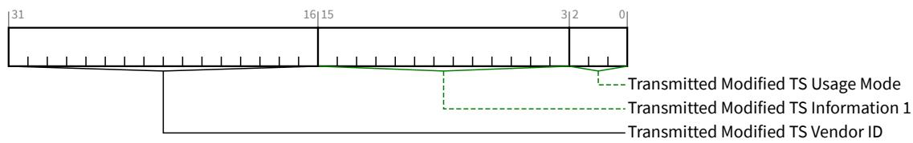

text_image

31
16 15
3 2 0
Transmitted Modified TS Usage Mode
Transmitted Modified TS Information 1
Transmitted Modified TS Vendor ID

Figure 7-94 Transmitted Modified TS Data 1 Register§

Table 7-81 Transmitted Modified TS Data 1 Register§

<table><tr><td>Bit Location</td><td>Description</td><td>Attributes</td></tr><tr><td>2:0</td><td>Transmitted Modified TS Usage Mode- If Modified TS Received is Set, this field contains the Modified TS Usage field from the Modified TS2 Ordered Set transmitted during the Configuration.Complete LTSSM State (see § Section 4.2.7.3.6).Unused bits in this field are permitted to be hardwired to 0b. If PCI Express (Usage Mode 0) is the only one supported, this field is permitted to be hardwired to 000b.Default is 000b.</td><td>RO</td></tr><tr><td>15:3</td><td>Transmitted Modified TS Information 1- If Modified TS Received is Set, this field contains the Modified TS Information 1 field from Modified TS2 Ordered Set transmitted during the Configuration.Complete LTSSM State (see § Section 4.2.7.3.6).Bits 15:8 contain the value of Symbol 9.Bits 7:3 contain bits 7:3 of Symbol 8.If PCI Express (Usage Mode 0) is the only one supported, this field is permitted to be hardwired to 0 0000 0000 0000b.Default is 0 0000 0000 0000b.</td><td>RO</td></tr><tr><td>31:16</td><td>Transmitted Modified TS Vendor ID- If Modified TS Received is Set, this field contains the Training Set Message Vendor ID or Alternate Protocol Vendor ID field from the Modified TS2 Ordered Set transmitted during the Configuration.Complete LTSSM State (see § Section 4.2.7.3.6).Bits 15:8 contain the value of Symbol 11.Bits 7:0 contain the value of Symbol 10.If PCI Express (Usage Mode 0) is the only one supported, this field is permitted to be hardwired to 0000h.Default is 0000h.</td><td>RO</td></tr></table>

## 7.7.6.8 Transmitted Modified TS Data 2 Register (Offset 1Ch) §

This register contains the values received in Symbols 12 through 14 of the Modified TS1/TS2 (see § Table 4-27).

If Modified TS Usage Mode 1 Supported - Training Set Message and Modified TS Usage Mode 2 Supported - Alternate Protocol are both Clear, this register is permitted to be hardwired to 0000 0000h.

text_image

RsvdP
Transmitted Modified TS Information 2
Alternate Protocol Negotiation Status

Figure 7-95 Transmitted Modified TS Data 2 Register§

Table 7-82 Transmitted Modified TS Data 2 Register§

<table><tr><td>Bit Location</td><td>Description</td><td>Attributes</td></tr><tr><td>23:0</td><td>Transmitted Modified TS Information 2 - If Modified TS Received is Set, this field contains the Modified TS Information 2 field from the Modified TS2 Ordered Set transmitted during the Configuration.Complete LTSSM State (see § Section 4.2.7.3.6).Bits 23:16 contain the value of Symbol 14.Bits 16:8 contain the value of Symbol 13.Bits 7:0 contain the value of Symbol 12.If PCI Express (Usage Mode 0) is the only one supported, this field is permitted to be hardwired to 00 0000h.Default is 00 0000h.</td><td>RO</td></tr><tr><td>25:24</td><td>Alternate Protocol Negotiation Status - Indicates the status of the Alternate Protocol Negotiation.Encodings are:00b Alternate Protocol Negotiation not supported01b Alternate Protocol Negotiation disabled10b Alternate Protocol Negotiation failed - Alternate Protocol Negotiation was attempted and did not locate a protocol that was supported on both ends of the Link.11b Alternate Protocol Negotiation succeeded - Alternate Protocol Negotiation located one or more protocols that were supported on both ends of the Link and the Downstream Port selected one of those protocols for use.If 11b, Alternate Protocol Negotiation completed successfully. If not 11b, Alternate Protocol Negotiation has not completed successfully. If Modified TS Usage Mode 1 Supported - Training Set Message and Modified TS Usage Mode 2 Supported - Alternate Protocol are both Clear, this field is permitted to be hardwired to 00b.If Modified TS Usage Mode 2 Supported - Alternate Protocol is Clear, this field is hardwired to 00b.If Modified TS Usage Mode 2 Supported - Alternate Protocol is Set and Modified TS Usage Mode Selected does not equal 2, this field must return 01b.This field is cleared to 00b on Detect.Default is 00b.</td><td>RO</td></tr></table>

## 7.7.6.9 32.0 GT/s Lane Equalization Control Register (Offset 20h) §

The 32.0 GT/s Equalization Control register consists of control fields required for per-Lane 32.0 GT/s equalization. It contains entries for at least the number of Lanes defined by the Maximum Link Width (see § Section 7.5.3.6 or § Section 7.9.9.2 ), must be implemented in whole DW granularity (e.g., if the Maximum Link Width is x1, the register will still contain entries for 4 Lanes with the entries for Lanes 1, 2 and 3 being undefined), and it is permitted to contain up to 32 entries regardless of the Maximum Link Width. The value of entries beyond the Maximum Link Width is undefined.

Each entry contains the values for the Lane with the corresponding default Lane number which is invariant to Link width and Lane reversal negotiation that occurs during Link training.

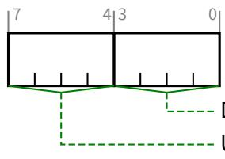

text_image

7
4 3
0
D
U

Downstream Port 32.0 GT/s Transmitter Preset  
Upstream Port 32.0 GT/s Transmitter Preset  
Figure 7-96 32.0 GT/s Lane Equalization Control Register Entry§

Table 7-83 32.0 GT/s Lane Equalization Control Register Entry§

<table><tr><td>Bit Location</td><td colspan="4">Register Description</td><td>Attributes</td></tr><tr><td>3:0</td><td colspan="4">Downstream Port 32.0 GT/s Transmitter Preset - Transmitter Preset used for 32.0 GT/s equalization by this Port when the Port is operating as a Downstream Port. This field is ignored when the Port is operating as an Upstream Port. See § Chapter 8. for details. The field encodings are defined in § Section 4.2.4.2 .For an Upstream Port if Crosslink Supported is 0b, this field is RsvdP. Otherwise, this field is HwInit. See § Section 7.5.3.18 .The default value is 1111b.</td><td>HwInit/RsvdP (see description)</td></tr><tr><td rowspan="5">7:4</td><td colspan="4">Upstream Port 32.0 GT/s Transmitter Preset - Field contains the Transmit Preset value sent or received during 32.0 GT/s Link Equalization. Field usage varies as follows:</td><td rowspan="5">HwInit/RO (see description)</td></tr><tr><td></td><td>Operating Port Direction</td><td>Crosslink Supported</td><td>Usage</td></tr><tr><td>A</td><td>Downstream Port</td><td>Any</td><td>Field contains the value sent on the associated Lane during Recovery.RcvrCfg.Field is HwInit.</td></tr><tr><td>B</td><td>Upstream Port</td><td>0b</td><td>Field is intended for debug and diagnostics. It contains the value captured from the associated Lane during Link Equalization.This value MUST@FLIT be captured from 128b/130b EQ TS2 or equalization requests with Use_Preset Set are received. This value should not be affected by equalization requests with Use_Preset Clear.Field is RO.When crosslinks are supported, case C (below) applies and this captured information is not visible to software. Vendors are encouraged to provide an alternate mechanism to obtain this information.</td></tr><tr><td>C</td><td>Upstream Port</td><td>1b</td><td>Field is not used or affected by the current Link Equalization.</td></tr><tr><td rowspan="4"></td><td colspan="4"></td><td rowspan="4"></td></tr><tr><td></td><td>Operating Port Direction</td><td>Crosslink Supported</td><td>Usage</td></tr><tr><td></td><td></td><td></td><td>Field value will be used if a future crosslink negotiation switches the Operating Port Direction so that case A (above) applies. Field is HwInit.</td></tr><tr><td colspan="4">See § Section 4.2.4 and § Chapter 8. for details. The field encodings are defined in § Section 4.2.4.2. The default value is 1111b.</td></tr></table>

## 7.7.7 Physical Layer 64.0 GT/s Extended Capability §

The Physical Layer 64.0 GT/s Extended Capability structure must be implemented in Ports where one or more of the following features are supported:

• The Supported Link Speeds Vector field indicates support for a Link speed of 64.0 GT/s.

When implemented, this structure must be implemented in:

• A Function associated with a Downstream Port  
• A Function of a single-Function Device associated with an Upstream Port  
• Function 0 (and only Function 0) of a Multi-Function Device associated with an Upstream Port

This capability is permitted to be implemented in any of the Functions listed above even if the 64.0 GT/s Link speed is not supported. When the 64.0 GT/s Link speed is not supported, the behavior of registers other than the Capability Header is undefined.

§ Figure 7-97 details allocation of register fields in the Physical Layer 64.0 GT/s Extended Capability structure.

Note that parity errors for 64.0 GT/s are recorded in 16.0 GT/s Local Data Parity Mismatch Status Register, 16.0 GT/s First Retimer Data Parity Mismatch Status Register, and 16.0 GT/s Second Retimer Data Parity Mismatch Status Register. When tracking errors for a specific Link Speed, software should clear those registers on speed changes.

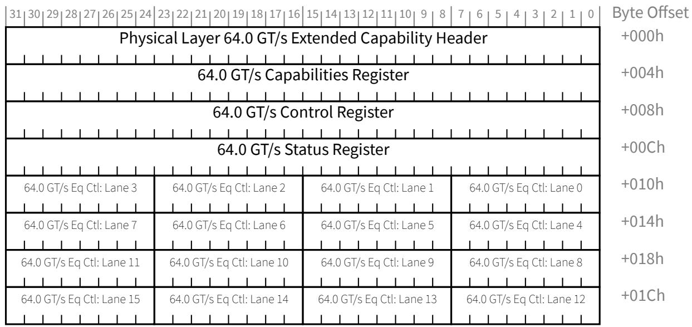

stacked bar chart

| 64.0 GT/s Capabilities Register | - | - | - | - | - | - | - | - | - | - | - | - | - | - | - | - | - | - | - | - | - | - | - | - | - | - | - | - | +000h, +004h, +008h, +00Ch, +010h, +014h, +018h, +01Ch |
| --- | --- | --- | --- | --- | --- | --- | --- | --- | --- | --- | --- | --- | --- | --- | --- | --- | --- | --- | --- | --- | --- | --- | --- | --- | --- | --- | --- | --- | --- |
| 64.0 GT/s Control Register | - | - | - | - | - | - | - | - | - | - | - | - | - | - | - | - | - | - | - | - | - | - | - | - | - | - | - | - | - |
| 64.0 GT/s Status Register | - | - | - | - | - | - | - | - | - | - | - | - | - | - | - | - | - | - | - | - | - | - | - | - | - | - | - | - | - |

Figure 7-97 Physical Layer 64.0 GT/s Extended Capability§

## 7.7.7.1 Physical Layer 64.0 GT/s Extended Capability Header (Offset 00h) §

text_image

31 20 19 16 15 0
Next Capability Offset 0031h
PCI Express Extended Capability ID
Capability Version

Figure 7-98 Physical Layer 64.0 GT/s Extended Capability Header§

Table 7-85 Physical Layer 64.0 GT/s Extended Capability Header§

<table><tr><td>Bit Location</td><td>Register Description</td><td>Attributes</td></tr><tr><td>15:0</td><td>PCI Express Extended Capability ID - This field is a PCI-SIG defined ID number that indicates the nature and format of the Extended Capability.The Extended Capability ID for the Physical Layer 64.0 GT/s Capability is 0031h.</td><td>RO</td></tr><tr><td>19:16</td><td>Capability Version - This field is a PCI-SIG defined version number that indicates the version of the Capability structure present.Must be 1h for this version of the specification.</td><td>RO</td></tr><tr><td>31:20</td><td>Next Capability Offset - This field contains the offset to the next PCI Express Capability structure or 000h if no other items exist in the linked list of Capabilities.For Extended Capabilities implemented in Configuration Space, this offset is relative to the beginning of PCI-compatible Configuration Space and thus must always be either 000h (for terminating list of Capabilities) or greater than 0FFh.</td><td>RO</td></tr></table>

## 7.7.7.2 64.0 GT/s Capabilities Register (Offset 04h) §

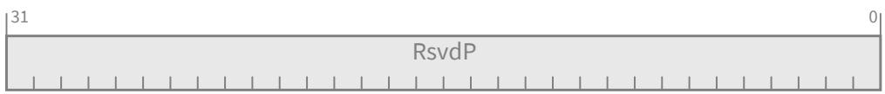

text_image

31
RsvdP
0

Figure 7-99 64.0 GT/s Capabilities Register§

Table 7-86 64.0 GT/s Capabilities Register§

<table><tr><td>Bit Location</td><td>Register Description</td><td>Attributes</td></tr></table>

# 7.7.7.3 64.0 GT/s Control Register (Offset 08h) §

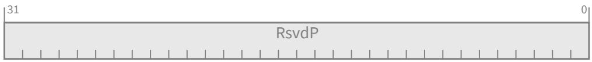

text_image

31
RsvdP
0

§ Figure 7-100 64.0 GT/s Control Register

§ Table 7-87 64.0 GT/s Control Register

<table><tr><td>Bit Location</td><td>Register Description</td><td>Attributes</td></tr></table>

## 7.7.7.4 64.0 GT/s Status Register (Offset 0Ch) §

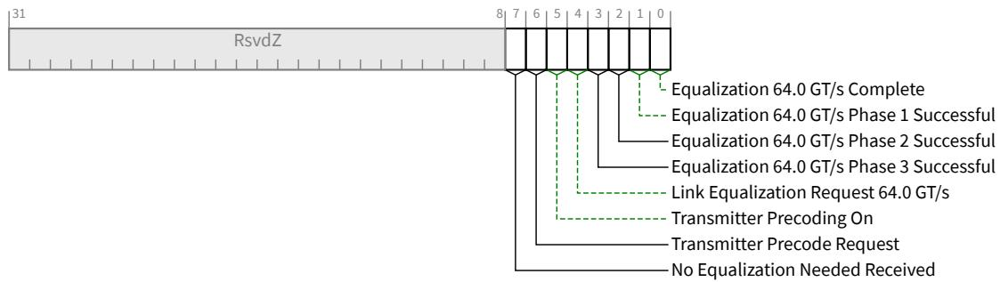

text_image

31
RsvdZ
8 7 6 5 4 3 2 1 0
Equalization 64.0 GT/s Complete
Equalization 64.0 GT/s Phase 1 Successful
Equalization 64.0 GT/s Phase 2 Successful
Equalization 64.0 GT/s Phase 3 Successful
Link Equalization Request 64.0 GT/s
Transmitter Precoding On
Transmitter Precode Request
No Equalization Needed Received

§ Figure 7-101 64.0 GT/s Status Register

Table 7-88 64.0 GT/s Status Register

<table><tr><td>Bit Location</td><td>Register Description</td><td>Attributes</td></tr><tr><td>0</td><td>Equalization 64.0 GT/s Complete - When Set, this bit indicates that the 64.0 GT/s Transmitter Equalization procedure has completed. Details of the Transmitter Equalization process and when this bit needs to be set to 1b is provided in § Section 4.2.7.4.2.The default value of this bit is 0b.For a Multi-Function Upstream Port, this bit must be implemented in Function 0 and RsvdZ in other Functions.</td><td>ROS/RsvdZ</td></tr><tr><td>1</td><td>Equalization 64.0 GT/s Phase 1 Successful - When set to 1b, this bit indicates that Phase 1 of the 64.0 GT/s Transmitter Equalization procedure has successfully completed. Details of the Transmitter Equalization process and when this bit needs to be set to 1b is provided in § Section 4.2.7.4.2.The default value of this bit is 0b.For a Multi-Function Upstream Port, this bit must be implemented in Function 0 and RsvdZ in other Functions.</td><td>ROS/RsvdZ</td></tr><tr><td>2</td><td>Equalization 64.0 GT/s Phase 2 Successful - When set to 1b, this bit indicates that Phase 2 of the 64.0 GT/s Transmitter Equalization procedure has successfully completed. Details of the Transmitter Equalization process and when this bit needs to be set to 1b is provided in § Section 4.2.7.4.2.The default value of this bit is 0b.For a Multi-Function Upstream Port, this bit must be implemented in Function 0 and RsvdZ in other Functions.</td><td>ROS/RsvdZ</td></tr><tr><td>3</td><td>Equalization 64.0 GT/s Phase 3 Successful - When set to 1b, this bit indicates that Phase 3 of the 64.0 GT/s Transmitter Equalization procedure has successfully completed. Details of the Transmitter Equalization process and when this bit needs to be set to 1b is provided in § Section 4.2.7.4.2.The default value of this bit is 0b.For a Multi-Function Upstream Port, this bit must be implemented in Function 0 and RsvdZ in other Functions.</td><td>ROS/RsvdZ</td></tr><tr><td>4</td><td>Link Equalization Request 64.0 GT/s - This bit is Set by hardware to request the 64.0 GT/s Link equalization process to be performed on the Link. Refer to § Section 4.2.4 and § Section 4.2.7.4.2 for details.The default value of this bit is 0b.For a Multi-Function Upstream Port, this bit must be implemented in Function 0 and RsvdZ in other Functions.</td><td>RW1CS/RsvdZ</td></tr><tr><td>5</td><td>Transmitter Precoding On - This field indicates whether the Receiver asked this transmitter to enable Precoding. See § Section 4.2.3.1.4 . This bit is cleared on DL_Down.Default is 0b.</td><td>RO</td></tr><tr><td>6</td><td>Transmitter Precode Request - When Set, this Port will request the transmitter to use Precoding by setting the Transmitter Precode Request bit in the TS1s/TS2s it transmits prior to entry to Recovery.Speed (see § Section 4.2.3.1.4 ).Default is Implementation Specific.</td><td>RO</td></tr><tr><td>7</td><td>No Equalization Needed Received - When Set, this Port either received a Modified TS1/TS2 with the No Equalization Needed bit Set or received a non-modified TS1/TS2 was received with the No Equalization Needed encoding (also reported in the Received Enhanced Link Behavior Control field).Default is 0b.</td><td>RO</td></tr></table>

## 7.7.7.5 64.0 GT/s Lane Equalization Control Register (Offset 20h) §

The 64.0 GT/s Equalization Control register consists of control fields required for per-Lane 64.0 GT/s equalization. It contains entries for at least the number of Lanes defined by the Maximum Link Width (see § Section 7.5.3.6 or § Section 7.9.9.2 ), must be implemented in whole DW granularity (e.g., if the Maximum Link Width is x1, the register will still contain entries for 4 Lanes with the entries for Lanes 1, 2 and 3 being undefined), and it is permitted to contain up to 32 entries regardless of the Maximum Link Width. The value of entries beyond the Maximum Link Width is undefined.

Each entry contains the values for the Lane with the corresponding default Lane number which is invariant to Link width and Lane reversal negotiation that occurs during Link training.

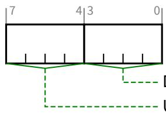

text_image

7 4 3 0
D
U

Downstream Port 64.0 GT/s Transmitter Preset

Upstream Port 64.0 GT/s Transmitter Preset

Figure 7-102 64.0 GT/s Lane Equalization Control Register Entry§  
Table 7-89 64.0 GT/s Lane Equalization Control Register Entry§

<table><tr><td>Bit Location</td><td colspan="4">Register Description</td><td>Attributes</td></tr><tr><td>3:0</td><td colspan="4">Downstream Port 64.0 GT/s Transmitter Preset - Transmitter Preset used for 64.0 GT/s equalization by this Port when the Port is operating as a Downstream Port. This field is ignored when the Port is operating as an Upstream Port. See § Chapter 8. for details. The field encodings are defined in § Table 4-23.For an Upstream Port if Crosslink Supported is 0b, this field is RsvdP. Otherwise, this field is HwInit. See § Section 7.5.3.18.The default value is 1111b.</td><td>HwInit/RsvdP (see description)</td></tr><tr><td rowspan="4">7:4</td><td colspan="4">Upstream Port 64.0 GT/s Transmitter Preset - Field contains the Transmit Preset value sent or received during 64.0 GT/s Link Equalization. Field usage varies as follows:</td><td rowspan="4">HwInit/RO (see description)</td></tr><tr><td></td><td>Operating Port Direction</td><td>Crosslink Supported</td><td>Usage</td></tr><tr><td>A</td><td>Downstream Port</td><td>Any</td><td>Field contains the value sent on the associated Lane during Recovery.RcvrCfg.Field is HwInit.</td></tr><tr><td>B</td><td>Upstream Port</td><td>0b</td><td>Field is intended for debug and diagnostics. It contains the value captured from the associated Lane during Link Equalization.This value must be captured from 128b/130b EQ TS2 or equalization requests with Use_Preset Set are received. This</td></tr><tr><td rowspan="5"></td><td colspan="4"></td><td rowspan="5"></td></tr><tr><td></td><td>Operating Port Direction</td><td>Crosslink Supported</td><td>Usage</td></tr><tr><td></td><td></td><td></td><td>value should not be affected by equalization requests with Use_Preset Clear. Field is RO. When crosslinks are supported, case C (below) applies and this captured information is not visible to software. Vendors are encouraged to provide an alternate mechanism to obtain this information.</td></tr><tr><td>C</td><td>Upstream Port</td><td>1b</td><td>Field is not used or affected by the current Link Equalization. Field value will be used if a future crosslink negotiation switches the Operating Port Direction so that case A (above) applies. Field is HwInit.</td></tr><tr><td colspan="4">See § Section 4.2.4 and § Chapter 8. for details. The field encodings are defined in § Table 4-23. The default value is 1111b.</td></tr></table>

## 7.7.8 Flit Logging Extended Capability §

This capability MUST be implemented in Ports and RCRBs that support Flit Mode. For Functions associated with an Upstream Port, this capability MUST be implemented in Function 0 and MUST not be implemented in any other Function of that Upstream Port.

This capability is only used in Flit Mode. The capability has no effect in Non-Flit Mode.

§ Figure 7-103 details allocation of the register bits in the Flit Logging Extended Capability structure.

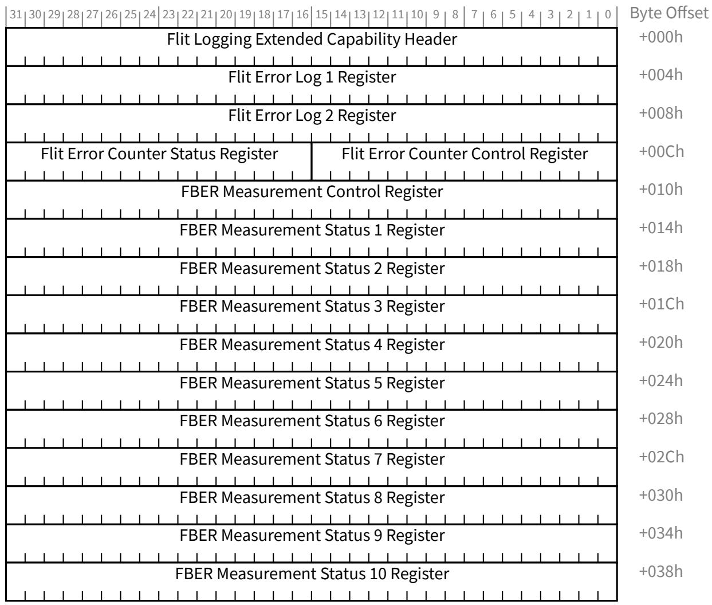

stacked bar chart

| Category | Value |
| -------- | ----- |
| Flit Logging Extended Capability Header | +000h |
| Flit Error Log 1 Register | +004h |
| Flit Error Log 2 Register | +008h |
| Flit Error Counter Status Register | +00Ch |
| Flit Error Counter Control Register | +010h |
| FBER Measurement Control Register | +014h |
| FBER Measurement Status 1 Register | +018h |
| FBER Measurement Status 2 Register | +01Ch |
| FBER Measurement Status 3 Register | +020h |
| FBER Measurement Status 4 Register | +024h |
| FBER Measurement Status 5 Register | +028h |
| FBER Measurement Status 6 Register | +02Ch |
| FBER Measurement Status 7 Register | +030h |
| FBER Measurement Status 8 Register | +034h |
| FBER Measurement Status 9 Register | +038h |
| FBER Measurement Status 10 Register | - |

Figure 7-103 Flit Logging Extended Capability Structure§

## 7.7.8.1 Flit Logging Extended Capability Header (Offset 00h) §

§ Figure 7-104 details allocation of the register fields in the Flit Logging Extended Capability Header; § Table 7-91 provides the respective bit definitions.

text_image

31
20 19 16 15 0
Next Capability Offset
0032h
Flit Logging Extended Capability ID
Capability Version

Figure 7-104 Flit Logging Extended Capability Header§

Table 7-91 Flit Logging Extended Capability Header§

<table><tr><td>Bit Location</td><td>Register Description</td><td>Attributes</td></tr><tr><td>15:0</td><td>Flit Logging Extended Capability ID - This field is a PCI-SIG defined ID number that indicates the nature and format of the Extended Capability.The Extended Capability ID for the Flit Logging Extended Capability is 0032h.</td><td>RO</td></tr><tr><td>19:16</td><td>Capability Version - This field is a PCI-SIG defined version number that indicates the version of the Capability structure present.Must be 1h for this version of the specification.</td><td>RO</td></tr><tr><td>31:20</td><td>Next Capability Offset - This field contains the offset to the next PCI Express Capability structure or 000h if no other items exist in the linked list of Capabilities.For Extended Capabilities implemented in Configuration Space, this offset is relative to the beginning of PCI-compatible Configuration Space and thus must always be either 000h (for terminating list of Capabilities) or greater than 0FFh.</td><td>RO</td></tr></table>

## 7.7.8.2 Flit Error Log 1 Register (Offset 04h)

The Flit Error Log 1 Register and Flit Error Log 2 Register are Link level registers and contain information about the Flit errors corrected and/or detected by the FEC and/or CRC in a received Flit. The Flit Error Log is a FIFO of an implementation specific and unspecified size (size 1 is permitted). These registers contain the oldest log entry. Clearing the Flit Error Log Valid removes the oldest log entry from the FIFO and loads these registers with the next oldest log entry (if there is one). See § Section 4.2.3.1.2 , § Section 4.2.3.1.3 , § Appendix J. , and § Appendix K. for details.

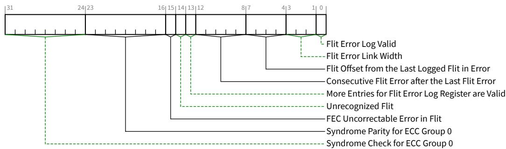

line chart

| Event | Value |
| --- | --- |
| Flit Error Log Valid | 31 |
| Flit Error Link Width | 24 |
| Flit Offset from the Last Logged Flit in Error | 23 |
| Consecutive Flit Error after the Last Flit Error | 16 |
| More Entries for Flit Error Log Register are Valid | 15 |
| Unrecognized Flit | 14 |
| FEC Uncorrectable Error in Flit | 13 |
| Syndrome Parity for ECC Group 0 | 12 |
| Syndrome Check for ECC Group 0 | 8 |
| Flit Error Log Valid | 7 |
| Flit Error Link Width | 7 |
| Flit Offset from the Last Logged Flit in Error | 7 |
| Consecutive Flit Error after the Last Flit Error | 7 |
| More Entries for Flit Error Log Register are Valid | 7 |
| Unrecognized Flit | 7 |
| FEC Uncorrectable Error in Flit | 7 |
| Syndrome Parity for ECC Group 0 | 7 |
| Syndrome Check for ECC Group 0 | 7 |

§ Figure 7-105 Flit Error Log 1 Register

§ Table 7-92 Flit Error Log 1 Register

<table><tr><td>Bit Location</td><td>Register Description</td><td>Attributes</td></tr><tr><td>0</td><td>Flit Error Log Valid – This bit is Set to 1b when an error is logged in this register.Writing 1b to this bit either clears this bit or, if More Entries for Flit Error Log Register are Valid (i.e., Bit 13) is Set, loads the Flit Error Log 1 Register and Flit Error Log 2 Register with the next oldest log entry Default Zero.</td><td>RW1CS</td></tr><tr><td>3:1</td><td>Flit Error Link Width – Link Width when error was logged (taking into account any narrowing due to L0p). Encoding is:000b x1001b x2010b x4011b x8100b x16Others ReservedDefault is Zero.</td><td>ROS</td></tr><tr><td>7:4</td><td>Flit Offset from the Last Logged Flit in Error – This is the offset from the last Flit whose error has been recorded in the prior entry of the Flit Error Log Register, if any.If this is the very first error that gets logged or this is the only copy of the Flit Error Log Register, this value must be 0h.If the previous flit was in error and logged, this value must be 1h.If the last logged Flit was more than 15 Flits away, this value must be Fh.This field only reflects errors that were logged. If the previous flit was in error but was not logged, that error has no effect on this value.Default is Zero.</td><td>ROS</td></tr><tr><td>12:8</td><td>Consecutive Flit Error after the Last Flit Error – Initially, this field is Zero. If there are any errors (either correctable or uncorrectable by FEC) in any of the 5 consecutive Flits immediately following the Flit recorded in this log entry, the corresponding bits are set to 1b; otherwise they remain 0b. This field can change value after Flit Error Log Valid is Set and more Flits are received. If More Entries for Flit Error Log Register is Set, some bits of this field may not be meaningful and the actual value of this field needs to be computed from this field and from subsequent log entries.Consider consecutive log entries A, B and C, where A is older than B and B is older than C:If Flit Offset from the Last Logged Flit in Error in B is &gt;5, then this field in log entry A is accurate (since there were more than 5 intervening flits between A and B).If Flit Offset from the Last Logged Flit in Error in B is ≤ 5, then some bits of this field in A must be computed from B (and C, if applicable, depending on the distance between A and C).If Flit Offset from the Last Logged Flit in Error in B = 2h, then entry A is for two flits earlier. For entry A:Bit 0 represents the intervening Flit (which might have been in error but not logged) andBits 4:1 are not meaningful and must be computed from B (and C, if applicable, depending on the distance between A and C). Computed bit 1 is 1b (because B exists), and computed bits 4:2 are bits 2:0 of B.If in turn, Flit Offset from the Last Logged Flit in Error in C is ≤5, some of the bits in B are not meaningful and must be computed from C (and possibly the next entry D, if applicable and available).Default is Zero.</td><td>ROS</td></tr><tr><td>13</td><td>More Entries for Flit Error Log Register are Valid – when Set, it indicates that the Port has additional valid copies of the Flit Error Log Register for subsequent Flits. A port that implements only one set of Flit Error Log Register is permitted to hardwire this to Zero.If this bit is Set, clearing the Flit Error Log Valid bit loads the next oldest Flit Error Log Register entry. This bit can change value when Flit Error Log Valid bit is Set and an additional error is being logged.Default is Zero.</td><td>ROS</td></tr><tr><td>14</td><td>Unrecognized Flit – when Set indicates receipt of a Flit that passes CRC after FEC decode but uses a Reserved encoding in the Flit Usage or Flit Status fields.Default is Zero</td><td>ROS</td></tr><tr><td>15</td><td>FEC Uncorrectable Error in Flit – When set to 1b indicates either a CRC mismatch or one of the three FEC groups detecting an error it could not correct</td><td>ROS</td></tr><tr><td>23:16</td><td>Syndrome Parity for ECC Group 0 – Synd_Parity in § Chapter 4..Default is Zero.</td><td>ROS</td></tr><tr><td>31:24</td><td>Syndrome Check for ECC Group 0 – Synd_Check in § Chapter 4..Default is Zero.</td><td>ROS</td></tr></table>

## 7.7.8.3 Flit Error Log 2 Register (Offset 08h) §

The Flit Error Log 1 Register and Flit Error Log 2 Register are Link level registers and contain information about the Flit errors corrected and/or detected by the FEC and/or CRC in a received Flit.

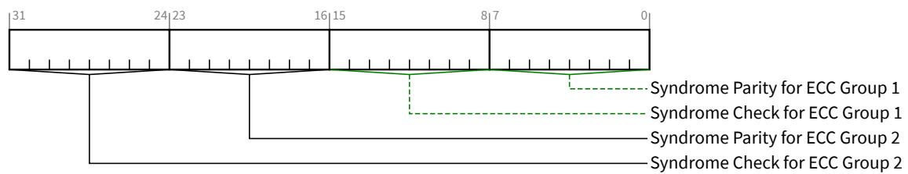

line chart

| Event | Value |
|-------|-------|
| Syndrome Parity for ECC Group 1 | 31 |
| Syndrome Check for ECC Group 1 | 24 |
| Syndrome Parity for ECC Group 2 | 23 |
| Syndrome Check for ECC Group 2 | 16 |
| Syndrome Parity for ECC Group 2 | 15 |
| Syndrome Check for ECC Group 2 | 8 |
| Syndrome Parity for ECC Group 2 | 7 |
| Syndrome Check for ECC Group 2 | 0 |

§ Figure 7-106 Flit Error Log 2 Register

§ Table 7-93 Flit Error Log 2 Register

<table><tr><td>Bit Location</td><td>Register Description</td><td>Attributes</td></tr><tr><td>7:0</td><td>Syndrome Parity for ECC Group 1 – Synd_Parity in § Chapter 4. .Default is Zero.</td><td>ROS</td></tr><tr><td>15:8</td><td>Syndrome Check for ECC Group 1 – Synd_Check in § Chapter 4. .Default is Zero.</td><td>ROS</td></tr><tr><td>23:16</td><td>Syndrome Parity for ECC Group 2 – Synd_Parity in § Chapter 4. .Default is Zero.</td><td>ROS</td></tr><tr><td>31:24</td><td>Syndrome Check for ECC Group 2 – Synd_Check in § Chapter 4. .Default is Zero.</td><td>ROS</td></tr></table>

## 7.7.8.4 Flit Error Counter Control Register (Offset 0Ch) §

The Flit Error Counter registers are Link wide and count the number of Flit and/or Ordered Set errors occurring on a Link operating in Flit mode.

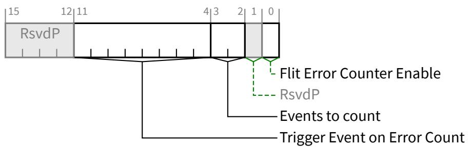

text_image

15 12 11 4 3 2 1 0
RsvdP
Flit Error Counter Enable
RsvdP
Events to count
Trigger Event on Error Count

Figure 7-107 Flit Error Counter Control Register§

Table 7-94 Flit Error Counter Control Register§

<table><tr><td>Bit Location</td><td>Register Description</td><td>Attributes</td></tr><tr><td>0</td><td>Flit Error Counter Enable– Setting this bit enables and starts the Flit Error Counter in the Link. Clearing this bit stops the Flit Error Counter.Default is Zero.</td><td>RW</td></tr><tr><td>3:2</td><td>Events to count–00b FEC-correctable Flit, Invalid Flit (FEC-uncorrectable or CRC fail), or Framing Error01b FEC-correctable Flit10b Invalid Flit11b All events in 00b plus:an Ordered Set that was corrected on any Lane oran invalid ordered set on any LaneDefault is Zero.</td><td>RW</td></tr><tr><td>11:4</td><td>Trigger Event on Error Count– Generate an event (interrupt, if enabled) if this field is non-zero and the Flit Error Counter field in Flit Error Counter Status Register exceeds this value.Default is Zero.</td><td>RW</td></tr></table>

## 7.7.8.5 Flit Error Counter Status Register (Offset 0Eh) §

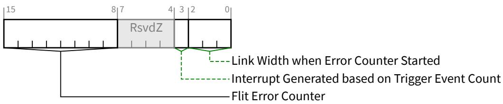

text_image

15
8 7
4 3 2 0
RsvdZ
Link Width when Error Counter Started
Interrupt Generated based on Trigger Event Count
Flit Error Counter

Figure 7-108 Flit Error Counter Status Register§

Table 7-95 Flit Error Counter Status Register§

<table><tr><td>Bit Location</td><td colspan="2">Register Description</td><td>Attributes</td></tr><tr><td>2:0</td><td colspan="2">Link Width when Error Counter Started – This field tracks the link width when the error counter started or restarted counting. The encodings are as follows:000b x1001b x2010b x4011b x8100b x16Others ReservedDefault is Zero.</td><td>ROS</td></tr><tr><td>3</td><td colspan="2">Interrupt Generated based on Trigger Event Count – hardware Sets this bit when an interrupt is generated based on the trigger event. While this bit is Set, no new interrupts will be generated based on the trigger event.Cleared on 0b to 1b transition of Flit Error Counter Enable.Default is Zero.</td><td>RW1CS</td></tr><tr><td>15:8</td><td colspan="2">Flit Error Counter – Increments by 1 when enabled and a countable event has occurred, as defined in the Flit Error Counter Control Register.Decrements by 1 at a fixed rate, if non-zero, based on Encoding and Link Width as follows:1b/1b  $\frac{10^6}{(Link Width \times 2)} UI (\pm 5 ns)$ 8b/10b  $\frac{10^{12}}{Link Width} UI (\pm 5 ns)$ 128b/130b  $\frac{10^{12}}{Link Width} UI (\pm 5 ns)$ Cleared on 0b to 1b transition of Flit Error Counter Enable.Default is Zero.</td><td>ROS</td></tr></table>

## 7.7.8.6 FBER Measurement Control Register (Offset 10h) §

The FBER Measurement Control register enables direct FBER measurement with status reported in the FBER Measurement Status Registers. For Retimers, the control is provided through Margin Command in the Control SKP Ordered Set from the Downstream Port (see § Chapter 4. ).

text_image

31
RsvdP
5 4 3 2 1 0
FBER Measurement Enable
Clear FBER Counters
Granularity of per-Lane Error reported
Report Longest Burst vs First Burst

Figure 7-109 FBER Measurement Control Register§

Table 7-96 FBER Measurement Control Register§

<table><tr><td>Bit Location</td><td>Register Description</td><td>Attributes</td></tr><tr><td>0</td><td>FBER Measurement Enable – Setting this bit enables and starts the FBER measurement in the Link.Clearing this bit stops FBER measurement.Default is Zero.</td><td>RW</td></tr><tr><td>1</td><td>Clear FBER Counters – Writing a 1b to this bit clears the FBER counters.This bit always return Zero when read</td><td>RW</td></tr><tr><td>3:2</td><td>Granularity of per-Lane Error reported –00b count all bit errors corrected by FEC in valid Flits,01b count all even bit errors in each UI corrected by FEC in valid Flits,10b count all odd bit errors in each UI corrected by FEC in valid Flits,11b count only mismatches in the Control SKP OS as a single correctable bit errorFBER measurement results are undefined if this field contains 01b or 10b and the Link is not operating in PAM4.Default is Zero.</td><td>RW</td></tr><tr><td>4</td><td>Report Longest Burst vs First Burst – When Set, the Port (and Retimers) report the longest burst of errors in terms of UIDefault is Zero.</td><td>RW</td></tr></table>

## 7.7.8.7 FBER Measurement Status 1 Register (Offset 14h) §

The FBER Measurement Status Registers consist of some per-Link counters and one or more per-Lane counters, that can be converted to per-Link counter, depending on whether the measurement is for FBER or Performance. as defined below. A write of 1b to either the Clear FBER Counters or the FBER Measurement Enable bit of the FBER Measurement Control Register resets the value of the entire register to its default value. None of these counter overflow back to 0 (i.e., they will be stuck at all 1s). Downstream Port (see § Chapter 4. ).

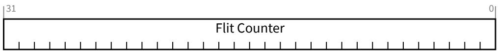

text_image

31
Flit Counter
0

Figure 7-110 FBER Measurement Status 1 Register§

Table 7-97 FBER Measurement Status 1 Register§

<table><tr><td>Bit Location</td><td>Register Description</td><td>Attributes</td></tr><tr><td>31:0</td><td>Flit Counter – meaningful when FBER Measurement Enable is SetIncrements by 1 for every Flit received.Default is Zero.</td><td>ROS</td></tr></table>

# 7.7.8.8 FBER Measurement Status 2 Register (Offset 18h) §

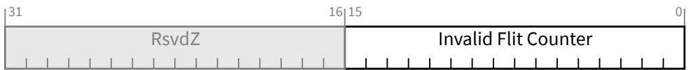

text_image

31
RsvdZ
16
15
0
Invalid Flit Counter

Figure 7-111 FBER Measurement Status 2 Register§

Table 7-98 FBER Measurement Status 2 Register§

<table><tr><td>Bit Location</td><td>Register Description</td><td>Attributes</td></tr><tr><td>15:0</td><td>Invalid Flit Counter – when FBER Measurement Enable is Set: Increments by 1 for every invalid Flit received.Otherwise, behavior is undefined.Default is 0000h.</td><td>ROS</td></tr></table>

## 7.7.8.9 FBER Measurement Status 3 Register (Offset 1Ch) §

text_image

32
16 15 0
Lane #1 Correctable Counter Lane #0 Correctable Counter

Figure 7-112 FBER Measurement Status 3 Register§

Table 7-99 FBER Measurement Status 3 Register§

<table><tr><td>Bit Location</td><td>Register Description</td><td>Attributes</td></tr><tr><td>15:0</td><td>Lane #0 Correctable Counter– counts Per-Lane Correctable Bit Errors or SKP Parity Mismatches.For a Port:If FBER Measurement Enable is Set: this 16-bit counter that counts the number of FEC-correctable bit errors per Flit (up to 24) or the number of SKP OS Parity mismatch in a Port, as per the value in Granularity of per-Lane Error Reported bit in the FBER Measurement Control Register.For a Peudo-Port:This 16-bit register is mapped to the CSR offset defined in § Chapter 4. (and not the offset defined in this chapter). This register does not roll-over.This counts the number of SKP OS parity mismatch.Default is Zero.</td><td>RO</td></tr><tr><td>32:16</td><td>Lane #1 Correctable Counter– Behavior is identical to Lane #0 Correctable Counter.</td><td>RO</td></tr></table>

## 7.7.8.10 FBER Measurement Status 4 Register (Offset 20h) §

text_image

Lane #3 Correctable Counter
Lane #2 Correctable Counter

Figure 7-113 FBER Measurement Status 4 Register§

Table 7-100 FBER Measurement Status 4 Register§

<table><tr><td>Bit Location</td><td>Register Description</td><td>Attributes</td></tr><tr><td>15:0</td><td>Lane #2 Correctable Counter – Behavior is identical to Lane #0 Correctable Counter.</td><td>RO</td></tr><tr><td>32:16</td><td>Lane #3 Correctable Counter – Behavior is identical to Lane #0 Correctable Counter.</td><td>RO</td></tr></table>

## 7.7.8.11 FBER Measurement Status 5 Register (Offset 24h) §

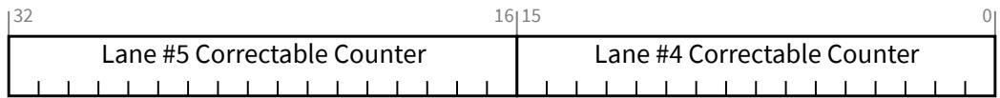

text_image

32
16 15 0
Lane #5 Correctable Counter
Lane #4 Correctable Counter

Figure 7-114 FBER Measurement Status 5 Register§

Table 7-101 FBER Measurement Status 5 Register§

<table><tr><td>Bit Location</td><td>Register Description</td><td>Attributes</td></tr><tr><td>15:0</td><td>Lane #4 Correctable Counter – Behavior is identical to Lane #0 Correctable Counter.</td><td>RO</td></tr><tr><td>32:16</td><td>Lane #5 Correctable Counter – Behavior is identical to Lane #0 Correctable Counter.</td><td>RO</td></tr></table>

# 7.7.8.12 FBER Measurement Status 6 Register (Offset 28h) §

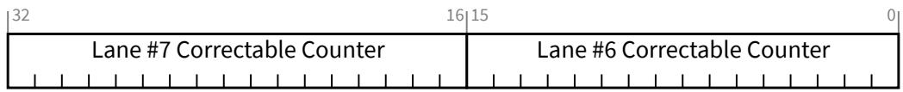

text_image

Lane #7 Correctable Counter
Lane #6 Correctable Counter

Figure 7-115 FBER Measurement Status 6 Register§

Table 7-102 FBER Measurement Status 6 Register§

<table><tr><td>Bit Location</td><td>Register Description</td><td>Attributes</td></tr><tr><td>15:0</td><td>Lane #6 Correctable Counter – Behavior is identical to Lane #0 Correctable Counter.</td><td>RO</td></tr><tr><td>32:16</td><td>Lane #7 Correctable Counter – Behavior is identical to Lane #0 Correctable Counter.</td><td>RO</td></tr></table>

## 7.7.8.13 FBER Measurement Status 7 Register (Offset 2Ch) §

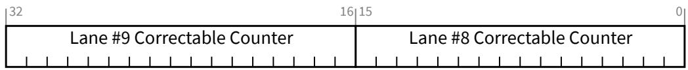

text_image

32
16 15 0
Lane #9 Correctable Counter
Lane #8 Correctable Counter

Figure 7-116 FBER Measurement Status 7 Register§

Table 7-103 FBER Measurement Status 7 Register§

<table><tr><td>Bit Location</td><td>Register Description</td><td>Attributes</td></tr><tr><td>15:0</td><td>Lane #8 Correctable Counter – Behavior is identical to Lane #0 Correctable Counter.</td><td>RO</td></tr><tr><td>32:16</td><td>Lane #9 Correctable Counter – Behavior is identical to Lane #0 Correctable Counter.</td><td>RO</td></tr></table>

## 7.7.8.14 FBER Measurement Status 8 Register (Offset 30h) §

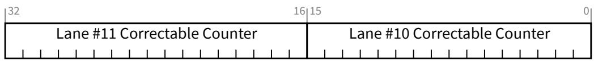

text_image

32
16 15 0
Lane #11 Correctable Counter Lane #10 Correctable Counter

Figure 7-117 FBER Measurement Status 8 Register§

Table 7-104 FBER Measurement Status 8 Register§

<table><tr><td>Bit Location</td><td>Register Description</td><td>Attributes</td></tr><tr><td>15:0</td><td>Lane #10 Correctable Counter – Behavior is identical to Lane #0 Correctable Counter.</td><td>RO</td></tr><tr><td>32:16</td><td>Lane #11 Correctable Counter – Behavior is identical to Lane #0 Correctable Counter.</td><td>RO</td></tr></table>

## 7.7.8.15 FBER Measurement Status 9 Register (Offset 34h) §

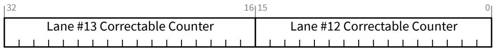

text_image

Lane #13 Correctable Counter
Lane #12 Correctable Counter

Figure 7-118 FBER Measurement Status 9 Register§

Table 7-105 FBER Measurement Status 9 Register§

<table><tr><td>Bit Location</td><td>Register Description</td><td>Attributes</td></tr><tr><td>15:0</td><td>Lane #12 Correctable Counter – Behavior is identical to Lane #0 Correctable Counter.</td><td>RO</td></tr><tr><td>32:16</td><td>Lane #13 Correctable Counter – Behavior is identical to Lane #0 Correctable Counter.</td><td>RO</td></tr></table>

## 7.7.8.16 FBER Measurement Status 10 Register (Offset 38h) §

text_image

32
16 15
0
Lane #15 Correctable Counter
Lane #14 Correctable Counter

Figure 7-119 FBER Measurement Status 10 Register§

Table 7-106 FBER Measurement Status 10 Register§

<table><tr><td>Bit Location</td><td>Register Description</td><td>Attributes</td></tr><tr><td>15:0</td><td>Lane #14 Correctable Counter – Behavior is identical to Lane #0 Correctable Counter.</td><td>RO</td></tr><tr><td>32:16</td><td>Lane #15 Correctable Counter – Behavior is identical to Lane #0 Correctable Counter.</td><td>RO</td></tr></table>

## 7.7.9 Device 3 Extended Capability Structure §

The Device 3 Extended Capability structure must be implemented in any Function or RCRB that implements any mechanism that requires the registers in this Extended Capability. It is permitted for this Extended Capability to be implemented in Functions or RCRBs that do not require any of the registers in this Extended Capability.

§ Figure 7-120 details allocation of the register bits in the Device 3 Extended Capability structure.

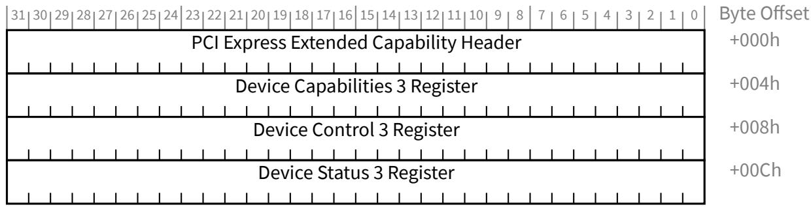

text_image

PCI Express Extended Capability Header
Device Capabilities 3 Register
Device Control 3 Register
Device Status 3 Register
Byte Offset
+000h
+004h
+008h
+00Ch

Figure 7-120 Device 3 Extended Capability Structure§

## 7.7.9.1 Device 3 Extended Capability Header (Offset 00h) §

§ Figure 7-121 details allocation of the register fields in the Device 3 Extended Capability Header; § Table 7-107 provides the respective bit definitions.

text_image

31
20 19 16 15 0
Next Capability Offset
002Fh
Device 3 Extended Capability ID
Capability Version

Figure 7-121 Device 3 Extended Capability Header§

Table 7-107 Device 3 Extended Capability Header§

<table><tr><td>Bit Location</td><td>Register Description</td><td>Attributes</td></tr><tr><td>15:0</td><td>Device 3 Extended Capability ID - Indicates the Device 3 Extended Capability structure. This field must return a Capability ID of 002Fh indicating that this is a Device 3 Extended Capability structure.</td><td>RO</td></tr><tr><td>19:16</td><td>Capability Version- This field is a PCI-SIG defined version number that indicates the version of the Capability structure present.Must be 1h for this version of the specification.</td><td>RO</td></tr><tr><td>31:20</td><td>Next Capability Offset- The offset to the next PCI Extended Capability structure or 000h if no other items exist in the linked list of capabilities.</td><td>RO</td></tr></table>

## 7.7.9.2 Device Capabilities 3 Register (Offset 04h) §

§ Figure 7-122 details the allocation of register bits of the Device Capability 3 register; § Table 7-108 provides the respective bit definitions.  
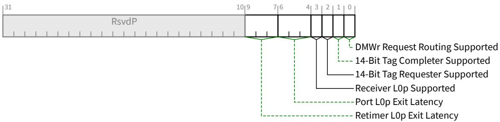

text_image

RsvdP
31
10 9 7 6 4 3 2 1 0
DMWr Request Routing Supported
14-Bit Tag Completer Supported
14-Bit Tag Requester Supported
Receiver L0p Supported
Port L0p Exit Latency
Retimer L0p Exit Latency

Figure 7-122 Device Capabilities 3 Register§

Table 7-108 Device Capabilities 3 Register§

<table><tr><td>Bit Location</td><td>Register Description</td><td>Attributes</td></tr><tr><td>0</td><td>DMWr Request Routing Supported– Applicable only to Switch Upstream Ports, Switch Downstream Ports, and Root Ports; must be 0b for other Function types. This bit must be Set if the Port supports this optional capability. See § Section 6.32 for additional details.</td><td>HwInit</td></tr><tr><td>1</td><td>14-Bit Tag Completer Supported– If this bit is Set, the Function supports 14-Bit Tag Completer capability; otherwise, the Function does not. See § Section 2.2.6.2 for additional details.This bit MUST@FLIT be Set.For VFs, this bit value must be identical to the associated PF's bit value.</td><td>HwInit</td></tr><tr><td>2</td><td>14-Bit Tag Requester Supported– If this bit is Set, the Function supports 14-Bit Tag Requester capability; otherwise, the Function does not.This bit must not be Set if the 14-Bit Tag Completer Supported bit is Clear.If the Function is an RCiEP, this bit must be Clear if the RC does not support 14-Bit Tag Completer capability for Requests coming from this RCiEP.For VFs, this bit value must equal the VF 14-Bit Tag Requester Supported bit value in the SR-IOV Capabilities register. See § Section 9.3.3.2.3 for additional details.Note that 14-Bit Tag field generation must be enabled by the 14-Bit Tag Requester Enable bit in the Device Control 3 register of the Requester Function before 14-Bit Tags can be generated by the Requester. See § Section 2.2.6.2 for additional details.</td><td>HwInit</td></tr><tr><td>3</td><td>Receiver L0p Supported – If Set, the Port's receiver supports L0p. This bit must be clear if Flit Mode Supported is Clear.All Functions associated with an Upstream Port must return the same value of this bit.Note: There is no Transmitter L0p Supported bit since transmitters are required to support L0p in Flit Mode.</td><td>HwInit</td></tr><tr><td>6:4</td><td>Port L0p Exit Latency – indicates this Port's L0p Exit Latency. The value reported indicates the length of time this Port requires to complete widening a link using L0p. If Receiver L0p Supported is clear, this field must contain 000b.All Functions associated with an Upstream Port must return the same value of this field.Local L0p Exit Latency is computed as the maximum of Port L0p Exit Latency and Retimer L0p Exit Latency. Local L0p Exit Latency is transmitted in the L0p Exit Latency field of the Data Link Feature DLLP. The effective L0p Exit Latency of a Link is computed as the maximum of Local L0p Exit Latency and Remote L0p Exit Latency.Defined encodings are:000b Less than 1μs001b 1 μs to less than 2 μs010b 2 μs to less than 4 μs011b 4 μs to less than 8 μs100b 8 μs to less than 16 μs101b 16 μs to less than 32 μs110b 32 μs-64 μs111b More than 64 μs</td><td>HwInit</td></tr><tr><td>9:7</td><td>Retimer L0p Exit Latency – indicates this worst case L0p Exit Latency for retimers “associated” with this Port. The value reported indicates the length of time a Retimer requires to complete widening a link using L0p. If Receiver L0p Supported is clear, this field must contain 000b.All Functions associated with an Upstream Port must return the same value of this field.Local L0p Exit Latency is computed as the maximum of Port L0p Exit Latency and Retimer L0p Exit Latency. Local L0p Exit Latency is transmitted in the L0p Exit Latency field of the Data Link Feature DLL. The effective L0p Exit Latency of a Link is computed as the maximum of Local L0p Exit Latency and Remote L0p Exit Latency.Defined encodings are:000b Less than 1μs001b 1 μs to less than 2 μs010b 2 μs to less than 4 μs011b 4 μs to less than 8 μs100b 16 μs to less than 16 μs101b 16 μs to less than 32 μs110b 32 μs-64 μs111b More than 64 μs</td><td>HwInit</td></tr></table>

## 7.7.9.3 Device Control 3 Register (Offset 08h) §

§ Figure 7-123 details the allocation of register bits of the Device Control 3 register; § Table 7-109 provides the respective bit definitions.  
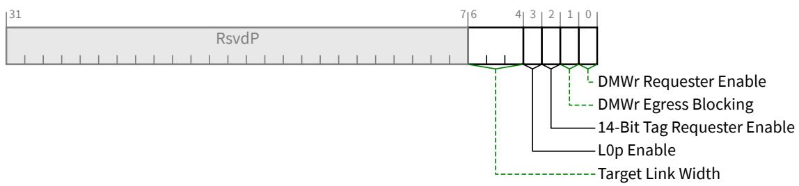

text_image

31
RsvdP
7 6 4 3 2 1 0
DMWr Requester Enable
DMWr Egress Blocking
14-Bit Tag Requester Enable
L0p Enable
Target Link Width

§ Figure 7-123 Device Control 3 Register

§ Table 7-109 Device Control 3 Register

<table><tr><td>Bit Location</td><td>Register Description</td><td>Attributes</td></tr><tr><td>0</td><td>DMWr Requester Enable- Applicable only to Endpoints, Root Ports and RCRBs; must be hardwired to 0b for other Function types. The Function is allowed to initiate DMWr Requests only if this bit and the Bus Master Enable bit in the Command register are both Set.This bit is required to be RW if the Endpoint or Root Port is capable of initiating DMWr Requests, but otherwise is permitted to be hardwired to 0b.This bit does not serve as a capability bit. This bit is permitted to be RW even if no DMWr Requester capabilities are supported by the Endpoint or Root Port.Default value of this bit is 0b.</td><td>RW</td></tr><tr><td>1</td><td>DMWr Egress Blocking– Applicable and mandatory for Switch Upstream Ports, Switch Downstream Ports, and Root Ports that implement DMWr routing; otherwise must be hardwired to 0b.When this bit is Set, DMWr Requests that target going out this Egress Port must be blocked. See § Section 6.32 .Default value of this bit is 0b.</td><td>RW/RO (see description)</td></tr><tr><td>2</td><td>14-Bit Tag Requester Enable– This bit, in combination with the Extended Tag Field Enable bit and 10-Bit Tag Requester Enable bit, determines how many Tag field bits a Requester is permitted to use. When the 14-Bit Tag Requester Enable bit is Set, the Requester is permitted to use 14-Bit Tags. See § Section 2.2.6.2 for complete details.If software changes the value of this bit while the Function has outstanding Non-Posted Requests, the result is undefined.For VFs, this bit is not supported and is RsvdP. The value in the VF 14-Bit Tag Requester Enable bit in the associated PF's SR-IOV Control Register applies to all its VFs.Non-VF Functions that do not implement 14-Bit Tag Requester capability are permitted to hardwire this bit to 0b.Default value of this bit is 0b.</td><td>RW/RO (see description)VF RsvdP</td></tr><tr><td>3</td><td>L0p Enable– Determines behavior of this Port when sending or responding to Link Management DLLPs for of type L0p DLLP.If the Link is operating in Flit Mode and this bit is Set, this Port is permitted to send L0p Request DLLPs, and to respond with L0p Request Ack DLLPs to L0p Requests DLLPs it recieves.If the Link is operating in Flit Mode and this bit is Clear, this Port is required to not send L0p Request DLLPs and to respond with L0p Request Nak to any L0p Request DLLPs it recieves.If the Link is operating in Non-Flit Mode, this bit has no effect and all Link Management DLLPs if type L0p DLLP.This bit has no effect on Link Management DLLPs where the Link Mgmt Type field is other than L0p DLLP. Default is 1b.</td><td>RW</td></tr><tr><td>6:4</td><td>Target Link Width– writes to this field initiate a directed L0p Link Width change to the indicated width.Encodings are:000bx1 Link001bx2 Link010bx4 Link011bx8 Link100bx16 Link111bDynamic – L0p Link Width is determined by the Ports with no architected software interventionThis field has no effect on subsequent autonomous Link Width changes. This field has no effect on subsequent Link Width changes due to link reliability.This field is RsvdP if Flit Mode Supported is Clear. This field is permitted in RCRBs.This field has no effect if L0p Enable is Clear.Default is 111b.</td><td>RW/RsvdP</td></tr></table>

## 7.7.9.4 Device Status 3 Register (Offset 0Ch) §

§ Figure 7-124 details allocation of the register fields in the Device Status 3 Register; § Table 7-110 provides the respective bit definitions.

text_image

31
RsvdP
5 4 3 2 0
Initial Link Width
Segment Captured
Remote L0p Supported

§ Figure 7-124 Device Status 3 Register

§ Table 7-110 Device Status 3 Register

<table><tr><td>Bit Location</td><td>Register Description</td><td>Attributes</td></tr><tr><td>2:0</td><td>Initial Link Width – This field contains the Link Width determined during initial link training. Encodings are:000b x1 Link001b x2 Link010b x4 Link011b x8 Link100b x16 LinkOthers ReservedDefault is determined during initial link training.Note that the current Link Width is visible in the Negotiated Link Width field.</td><td>RO</td></tr><tr><td>3</td><td>Segment Captured – This bit indicates if the Function has captured a valid Segment value from a Configuration Write Request as described in § Section 2.2.6.2 . When the Destination Segment field is captured from a Configuration Write Request in FM this bit must be set to the value of the DSV bit received with the Request. This bit must be cleared when a Configuration Write Request is received in NFM.Note that this bit will be set when every Link on the path from the Function to the RC is in FM. This bit will be clear if any Link between the Function and the RC is in NFM. Functions should only initiate Route by ID Message Requests targeting Hierarchies other than their own when this bit is Set.This bit can be hardwired to 0b in devices that don’t support FM.Requesters and Completers within a RC may know their Segment value in an implementation specific way and can behave as if this bit is hardwired to 1b.All Functions within a Switch share a single bit that is set by Configuration Write Requests to Functions associated with the Upstream port.Default is Zero in Functions that capture their Segment value.</td><td>RO</td></tr><tr><td>4</td><td>Remote L0p Supported – This bit indicates that the remote end of the Link supports L0p.Default is zero.</td><td>RO</td></tr></table>

## 7.7.10 Lane Margining at the Receiver Extended Capability §

The Lane Margining at the Receiver Extended Capability structure must be implemented in:

• A Function associated with a Downstream Port where the Supported Link Speeds Vector field indicates support for a Link speed of 16.0 GT/s or higher.  
• A Function of a single-Function Device associated with an Upstream Port where the Supported Link Speeds Vector field indicates support for a Link speed of 16.0 GT/s or higher.  
• Function 0 (and only Function 0) of a Multi-Function Device associated with an Upstream Port where the Supported Link Speeds Vector field indicates support for a Link speed of 16.0 GT/s or higher.

§ Figure 7-125 shows the layout of the Margining Extended Capability. This capability contains a pair of per-Port registers followed by a set of per-Lane registers.

The number of per-Lane entries is determined by the Maximum Link Width (see § Section 7.5.3.6 or § Section 7.9.9.2 ). Up to 32 entries are permitted regardless of the Maximum Link Width. The value of entries beyond the Maximum Link Width is undefined.

Each per-Lane entry contains the values for that Lane. Lane numbering uses the default Lane number and is thus invariant to Link width and Lane reversal negotiation that occurs during Link training.

<table><tr><td colspan="2">PCI Express Extended Capability Header</td></tr><tr><td>Margining Port Status Register</td><td>Margining Port Capabilities Register</td></tr><tr><td>Margining Lane Status: Lane 0</td><td>Margining Lane Control: Lane 0</td></tr><tr><td>Margining Lane Status: Lane 1 (Optional)</td><td>Margining Lane Control: Lane 1 (Optional)</td></tr><tr><td>Margining Lane Status: Lane 2 (Optional)</td><td>Margining Lane Control: Lane 2 (Optional)</td></tr><tr><td>Margining Lane Status: Lane 3 (Optional)</td><td>Margining Lane Control: Lane 3 (Optional)</td></tr><tr><td>Margining Lane Status: Lane 4 (Optional)</td><td>Margining Lane Control: Lane 4 (Optional)</td></tr><tr><td>Margining Lane Status: Lane 5 (Optional)</td><td>Margining Lane Control: Lane 5 (Optional)</td></tr><tr><td>Margining Lane Status: Lane 6 (Optional)</td><td>Margining Lane Control: Lane 6 (Optional)</td></tr><tr><td>Margining Lane Status: Lane 7 (Optional)</td><td>Margining Lane Control: Lane 7 (Optional)</td></tr><tr><td>Margining Lane Status: Lane 8 (Optional)</td><td>Margining Lane Control: Lane 8 (Optional)</td></tr><tr><td>Margining Lane Status: Lane 9 (Optional)</td><td>Margining Lane Control: Lane 9 (Optional)</td></tr><tr><td>Margining Lane Status: Lane 10 (Optional)</td><td>Margining Lane Control: Lane 10 (Optional)</td></tr><tr><td>Margining Lane Status: Lane 11 (Optional)</td><td>Margining Lane Control: Lane 11 (Optional)</td></tr><tr><td>Margining Lane Status: Lane 12 (Optional)</td><td>Margining Lane Control: Lane 12 (Optional)</td></tr><tr><td>Margining Lane Status: Lane 13 (Optional)</td><td>Margining Lane Control: Lane 13 (Optional)</td></tr><tr><td>Margining Lane Status: Lane 14 (Optional)</td><td>Margining Lane Control: Lane 14 (Optional)</td></tr><tr><td>Margining Lane Status: Lane 15 (Optional)</td><td>Margining Lane Control: Lane 15 (Optional)</td></tr><tr><td>Margining Lane Status: Lane 16 (Optional)</td><td>Margining Lane Control: Lane 16 (Optional)</td></tr><tr><td>Margining Lane Status: Lane 17 (Optional)</td><td>Margining Lane Control: Lane 17 (Optional)</td></tr><tr><td>Margining Lane Status: Lane 18 (Optional)</td><td>Margining Lane Control: Lane 18 (Optional)</td></tr><tr><td>Margining Lane Status: Lane 19 (Optional)</td><td>Margining Lane Control: Lane 19 (Optional)</td></tr><tr><td>Margining Lane Status: Lane 20 (Optional)</td><td>Margining Lane Control: Lane 20 (Optional)</td></tr><tr><td>Margining Lane Status: Lane 21 (Optional)</td><td>Margining Lane Control: Lane 21 (Optional)</td></tr><tr><td>Margining Lane Status: Lane 22 (Optional)</td><td>Margining Lane Control: Lane 22 (Optional)</td></tr><tr><td>Margining Lane Status: Lane 23 (Optional)</td><td>Margining Lane Control: Lane 23 (Optional)</td></tr><tr><td>Margining Lane Status: Lane 24 (Optional)</td><td>Margining Lane Control: Lane 24 (Optional)</td></tr><tr><td>Margining Lane Status: Lane 25 (Optional)</td><td>Margining Lane Control: Lane 25 (Optional)</td></tr><tr><td>Margining Lane Status: Lane 26 (Optional)</td><td>Margining Lane Control: Lane 26 (Optional)</td></tr><tr><td>Margining Lane Status: Lane 27 (Optional)</td><td>Margining Lane Control: Lane 27 (Optional)</td></tr><tr><td>Margining Lane Status: Lane 28 (Optional)</td><td>Margining Lane Control: Lane 28 (Optional)</td></tr><tr><td>Margining Lane Status: Lane 29 (Optional)</td><td>Margining Lane Control: Lane 29 (Optional)</td></tr><tr><td>Margining Lane Status: Lane 30 (Optional)</td><td>Margining Lane Control: Lane 30 (Optional)</td></tr><tr><td>Margining Lane Status: Lane 31 (Optional)</td><td>Margining Lane Control: Lane 31 (Optional)</td></tr></table>

Figure 7-125 Lane Margining at the Receiver Extended Capability§

## 7.7.10.1 Lane Margining at the Receiver Extended Capability Header (Offset 00h) §

text_image

31 20 19 16 15 0
Next Capability Offset 0027h
PCI Express Extended Capability ID
Capability Version

Figure 7-126 Lane Margining at the Receiver Extended Capability Header§

Table 7-111 Lane Margining at the Receiver Extended Capability Header§

<table><tr><td>Bit Location</td><td>Register Description</td><td>Attributes</td></tr><tr><td>15:0</td><td>PCI Express Extended Capability ID - This field is a PCI-SIG defined ID number that indicates the nature and format of the Extended Capability.The Extended Capability ID for the Physical Layer 16.0 GT/s Margining Extended Capability is 0027h.</td><td>RO</td></tr><tr><td>19:16</td><td>Capability Version - This field is a PCI-SIG defined version number that indicates the version of the Capability structure present.Must be 1h for this version of the specification.</td><td>RO</td></tr><tr><td>31:20</td><td>Next Capability Offset - This field contains the offset to the next PCI Express Capability structure or 000h if no other items exist in the linked list of Capabilities.For Extended Capabilities implemented in Configuration Space, this offset is relative to the beginning of PCI-compatible Configuration Space and thus must always be either 000h (for terminating list of Capabilities) or greater than 0FFh.</td><td>RO</td></tr></table>

## 7.7.10.2 Margining Port Capabilities Register (Offset 04h) §

text_image

15
RsvdP
1 0
Margining uses Driver Software

Figure 7-127 Margining Port Capabilities Register§

Table 7-112 Margining Port Capabilities Register§

<table><tr><td>Bit Location</td><td>Register Description</td><td>Attributes</td></tr><tr><td>0</td><td>Margining uses Driver Software - If Set, indicates that Margining is partially implemented using Device Driver software. Margining Software Ready indicates when this software is initialized. If Clear, Marginingdoes not require device driver software. In this case the value read from Margining Software Ready is undefined.</td><td>HwInit</td></tr></table>

## 7.7.10.3 Margining Port Status Register (Offset 06h) §

text_image

15
RsvdZ
2 1 0
Margining Ready
Margining Software Ready

Figure 7-128 Margining Port Status Register§

Table 7-113 Margining Port Status Register§

<table><tr><td>Bit Location</td><td>Register Description</td><td>Attributes</td></tr><tr><td>0</td><td>Margining Ready. - Indicates when the Margining feature is ready to accept margining commands.Behavior is undefined if this bit is Clear and, for any Lane, any of the Receiver Number, Margin Type, Usage Model, or Margin Payload fields are written (see § Section 7.7.10.4).If Margining uses Driver Software is Set, Margining Ready must be Set no later than 100 ms after the later of Margining Software Ready becoming Set or the link training to 16.0 GT/s.If Margining uses Driver Software is Clear, Margining Ready must be Set no later than 100 ms after the Link trains to 16.0 GT/s.Default value is implementation specific.</td><td>RO</td></tr><tr><td>1</td><td>Margining Software Ready- When Margining uses Driver Software is Set, then this bit, when Set, indicates that the required software has performed the required initialization.The value of this bit is undefined if Margining uses Driver Software is Clear. The default value of this bit is implementation specific.</td><td>RO</td></tr></table>

## 7.7.10.4 Margining Lane Control Register (Offset 08h) §

The Margining Lane Control Register consists of control fields required for per-Lane margining.

The number of entries in this register are sized by Maximum Link Width (see § Section 7.5.3.6 ).

See § Section 4.2.8.2 for details of this register.

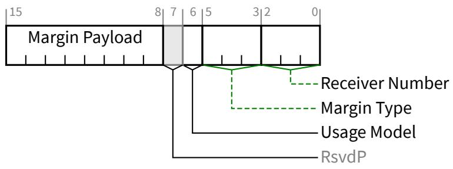

text_image

Margin Payload
8 7 6 5 3 2 0
Receiver Number
Margin Type
Usage Model
RsvdP

Figure 7-129 Lane N: Margining Control Register Entry§

Table 7-114 Lane N: Margining Control Register Entry§

<table><tr><td>Bit Location</td><td>Register Description</td><td>Attributes</td></tr><tr><td>2:0</td><td>Receiver Number- See § Section 8.4.4 for details.The default value is 000b.This field must be reset to the default value if the Port goes to DL_Down status.</td><td>RW (see description)</td></tr><tr><td>5:3</td><td>Margin Type- See § Section 8.4.4 for details.The default value is 111b.This field must be reset to the default value if the Port goes to DL_Down status.</td><td>RW (see description)</td></tr><tr><td>6</td><td>Usage Model- See § Section 8.4.4 for details.The default value is 0b.This field must be reset to the default value if the Port goes to DL_Down status.</td><td>RW (see description)</td></tr><tr><td>15:8</td><td>Margin Payload- See § Section 8.4.4 for details.This field&#x27;s value is used in conjunction with the Margin Type field, as described in § Section 8.4.4 .The default value is 9Ch.This field must be reset to the default value if the Port goes to DL_Down status.</td><td>RW (see description)</td></tr></table>

## 7.7.10.5 Margining Lane Status Register (Offset 0Ah)

The Margining Lane Status register consists of status fields required for per-Lane margining. The number of entries in this register are sized by Maximum Link Width (see § Section 7.5.3.6 ). See § Section 4.2.8.2 for details of this register.

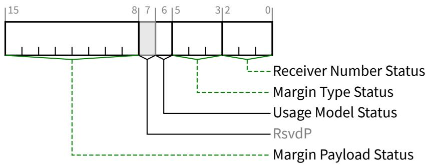

text_image

15
8 7 6 5 3 2 0
Receiver Number Status
Margin Type Status
Usage Model Status
RsvdP
Margin Payload Status

Figure 7-130 Lane N: Margining Lane Status Register Entry§

Table 7-115 Lane N: Margining Lane Status Register Entry§

<table><tr><td>Bit Location</td><td>Register Description</td><td>Attributes</td></tr><tr><td colspan="3">Control Fields</td></tr><tr><td>2:0</td><td>Receiver Number Status- See § Section 8.4.4 for details.The default value is 000b.For Downstream Ports, this field must be reset to the default value if the Port goes to DL_Down status.</td><td>RO (see description)</td></tr><tr><td>5:3</td><td>Margin Type Status- See § Section 8.4.4 for details.The default value is 000b.This field must be reset to the default value if the Port goes to DL_Down status.</td><td>RO (see description)</td></tr><tr><td>6</td><td>Usage Model Status- See § Section 8.4.4 for details.The default value is 0b.This field must be reset to the default value if the Port goes to DL_Down status.</td><td>RO (see description)</td></tr><tr><td>15:8</td><td>Margin Payload Status- See § Section 8.4.4 for details.This field is only meaningful, when the Margin Type is a defined encoding other than ‘No Command’.The default value is 00h.This field must be reset to the default value if the Port goes to DL_Down status.</td><td>RO (see description)</td></tr></table>

## 7.7.11 ACS Extended Capability §

The ACS Extended Capability is an optional capability that provides enhanced access controls (see § Section 6.12 ). This capability may be implemented by a Root Port, a Switch Downstream Port, or a Multi-Function Device Function. It is never applicable to a PCI Express to PCI Bridge or Root Complex Event Collector. It is not applicable to a Switch Upstream Port unless that Switch Upstream Port is a Function in a Multi-Function Device.

If an SR-IOV Capable Device other than one in a Root Complex implements internal peer-to-peer transactions, ACS is required, and ACS P2P Egress Control must be supported.

Implementation of ACS in RCiEPs is permitted but not required. It is explicitly permitted that within a single Root Complex, some RCiEPs implement ACS and some do not. It is strongly recommended that Root Complex implementations ensure that all accesses originating from RCiEPs (PFs and VFs) without ACS capability are first subjected to processing by a Translation Agent (TA) in the Root Complex before further decoding and processing. The details are outside the scope of this specification.

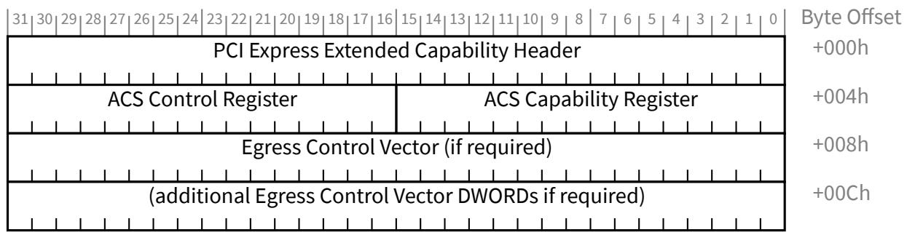

text_image

PCI Express Extended Capability Header
ACS Control Register	ACS Capability Register
Egress Control Vector (if required)
(additional Egress Control Vector DWORDs if required)

§ Figure 7-131 ACS Extended Capability

## 7.7.11.1 ACS Extended Capability Header (Offset 00h) §

text_image

31
20 19 16 15 0
Next Capability Offset
000Dh
PCI Express Extended Capability ID
Capability Version

Figure 7-132 ACS Extended Capability Header§

Table 7-116 ACS Extended Capability Header§

<table><tr><td>Bit Location</td><td>Register Description</td><td>Attributes</td></tr><tr><td>15:0</td><td>PCI Express Extended Capability ID - This field is a PCI-SIG defined ID number that indicates the nature and format of the Extended Capability.PCI Express Extended Capability ID for the ACS Extended Capability is 000Dh.</td><td>RO</td></tr><tr><td>19:16</td><td>Capability Version - This field is a PCI-SIG defined version number that indicates the version of the Capability structure present.Must be 1h for this version of the specification.</td><td>RO</td></tr><tr><td>31:20</td><td>Next Capability Offset - This field contains the offset to the next PCI Express Extended Capability structure or 000h if no other items exist in the linked list of Capabilities.</td><td>RO</td></tr></table>

## 7.7.11.2 ACS Capability Register (Offset 04h) §

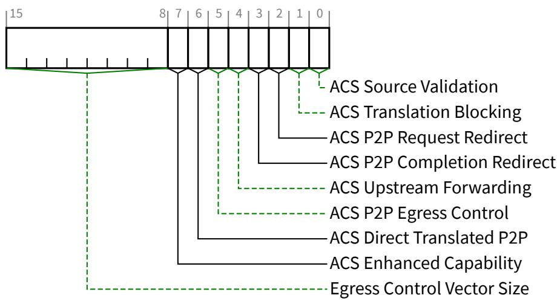

flowchart

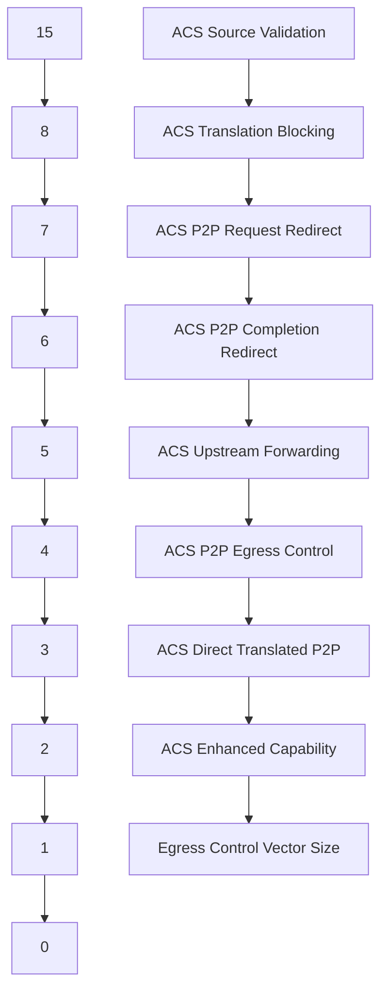
```mermaid
graph TD
  A["15"] --> B["8"]
  B --> C["7"]
  C --> D["6"]
  D --> E["5"]
  E --> F["4"]
  F --> G["3"]
  G --> H["2"]
  H --> I["1"]
  I --> J["0"]
    
  K["ACS Source Validation"] --> L["ACS Translation Blocking"]
  L --> M["ACS P2P Request Redirect"]
  M --> N["ACS P2P Completion Redirect"]
  N --> O["ACS Upstream Forwarding"]
  O --> P["ACS P2P Egress Control"]
  P --> Q["ACS Direct Translated P2P"]
  Q --> R["ACS Enhanced Capability"]
  R --> S["Egress Control Vector Size"]
```

§ Figure 7-133 ACS Capability Register

§ Table 7-117 ACS Capability Register

<table><tr><td>Bit Location</td><td>Register Description</td><td>Attributes</td></tr><tr><td>0</td><td>ACS Source Validation- Required for Root Ports and Switch Downstream Ports; must be hardwired to 0b otherwise. If 1b, indicates that the component implements ACS Source Validation.</td><td>RO</td></tr><tr><td>1</td><td>ACS Translation Blocking- Required for Root Ports and Switch Downstream Ports; must be hardwired to 0b otherwise. If 1b, indicates that the component implements ACS Translation Blocking.</td><td>RO</td></tr><tr><td>2</td><td>ACS P2P Request Redirect- Required for Root Ports that support peer-to-peer traffic with other Root Ports; required for Switch Downstream Ports; required for Multi-Function Device Functions that support peer-to-peer traffic with other Functions; must be hardwired to 0b otherwise. If 1b, indicates that the component implements ACS P2P Request Redirect.</td><td>RO</td></tr><tr><td>3</td><td>ACS P2P Completion Redirect- Required for all Functions that support ACS P2P Request Redirect; must be hardwired to 0b otherwise. If 1b, indicates that the component implements ACS P2P Completion Redirect.</td><td>RO</td></tr><tr><td>4</td><td>ACS Upstream Forwarding- Required for Root Ports if the RC supports Redirected Request Validation; required for Switch Downstream Ports; must be hardwired to 0b otherwise. If 1b, indicates that the component implements ACS Upstream Forwarding.</td><td>RO</td></tr><tr><td>5</td><td>ACS P2P Egress Control- Except as stated below, optional for Root Ports, Switch Downstream Ports, and Multi-Function Device Functions; otherwise this bit must be hardwired to Zero. If Set, indicates that the component implements ACS P2P Egress Control.For an SR-IOV Device not in a Root Complex, this bit is required to be Set for Functions if peer-to-peer transactions within the Device are supported.</td><td>RO</td></tr><tr><td>6</td><td>ACS Direct Translated P2P- Required for Root Ports that support Address Translation Services (ATS) and also support peer-to-peer traffic with other Root Ports; required for Switch Downstream Ports; required for Multi-Function Device Functions that support Address Translation Services (ATS) and also supportpeer-to-peer traffic with other Functions; must be hardwired to 0b otherwise. If 1b, indicates that the component implements ACS Direct Translated P2P.</td><td>RO</td></tr><tr><td>7</td><td>ACS Enhanced Capability- Required for Root Ports and Switch Downstream Ports that support the ACS Enhanced Capability mechanisms.If Set, indicates that the component supports all of the following mechanisms that are applicable:ACS I/O Request BlockingACS DSP Memory Target AccessACS USP Memory Target AccessACS Unclaimed Request Redirect</td><td>RO</td></tr><tr><td>15:8</td><td>Egress Control Vector Size- Encodings 01h-FFh directly indicate the number of applicable bits in the Egress Control Vector; the encoding 00h indicates 256 bits.If the ACS P2P Egress Control bit is 0b, the value of the size field is undefined, and the Egress Control Vector Register is not required to be present.</td><td>HwInit</td></tr></table>

## 7.7.11.3 ACS Control Register (Offset 06h) §

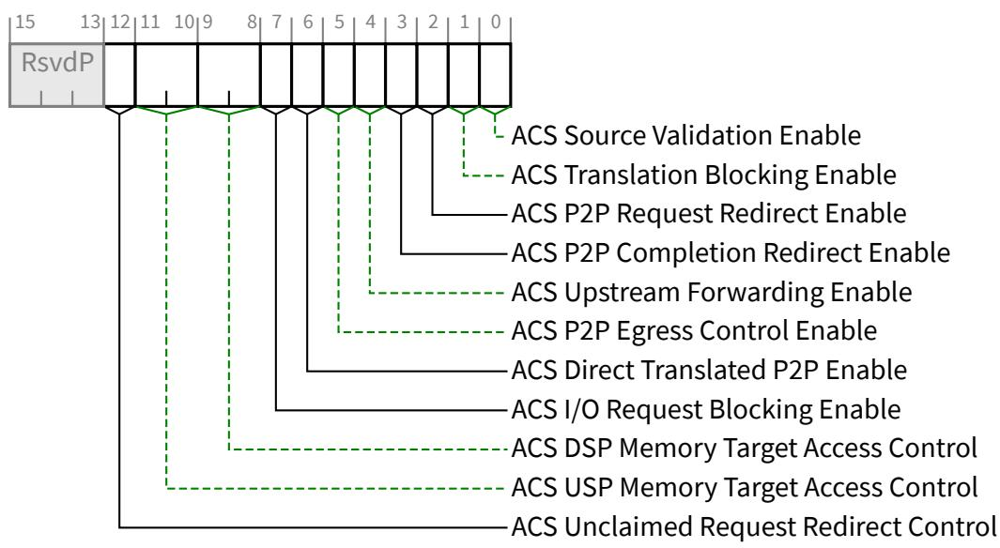

stacked bar chart

| Category | Bit Position |
| -------- | ------------ |
| ACS Source Validation Enable | 0 |
| ACS Translation Blocking Enable | 0 |
| ACS P2P Request Redirect Enable | 0 |
| ACS P2P Completion Redirect Enable | 0 |
| ACS Upstream Forwarding Enable | 0 |
| ACS P2P Egress Control Enable | 0 |
| ACS Direct Translated P2P Enable | 0 |
| ACS I/O Request Blocking Enable | 0 |
| ACS DSP Memory Target Access Control | 0 |
| ACS USP Memory Target Access Control | 0 |
| ACS Unclaimed Request Redirect Control | 0 |

Figure 7-134 ACS Control Register

§

§

Table 7-118 ACS Control Register

<table><tr><td>Bit Location</td><td>Register Description</td><td>Attributes</td></tr><tr><td>0</td><td>ACS Source Validation Enable - When Set, the component validates the Bus Number from the Requester ID of Upstream Requests against the secondary/subordinate Bus Numbers.Default value of this bit is 0b. Must be hardwired to 0b if the ACS Source Validation functionality is not implemented.</td><td>RW</td></tr><tr><td>1</td><td>ACS Translation Blocking Enable - When Set, the component blocks all Upstream Memory Requests whose Address Type (AT) field is not set to the default value.Default value of this bit is 0b. Must be hardwired to 0b if the ACS Translation Blocking functionality is not implemented.</td><td>RW</td></tr><tr><td>2</td><td>ACS P2P Request Redirect Enable - In conjunction with ACS P2P Egress Control and ACS Direct Translated P2P mechanisms, determines when the component redirects peer-to-peer Requests Upstream (see § Section 6.12.3 ). Note that with Downstream Ports, this bit only applies to Upstream Requests arriving at the Downstream Port, and whose normal routing targets a different Downstream Port.Default value of this bit is 0b. Must be hardwired to 0b if the ACS P2P Request Redirect functionality is not implemented.</td><td>RW</td></tr><tr><td>3</td><td>ACS P2P Completion Redirect Enable - Determines when the component redirects peer-to-peer Completions Upstream; applicable only to Completions  $^{159}$  whose Relaxed Ordering Attribute is clear.Default value of this bit is 0b. Must be hardwired to 0b if the ACS P2P Completion Redirect functionality is not implemented.</td><td>RW</td></tr><tr><td>4</td><td>ACS Upstream Forwarding Enable - When Set, the component forwards Upstream any Request or Completion TLPs it receives that were redirected Upstream by a component lower in the hierarchy. Note that this bit only applies to Upstream TLPs arriving at a Downstream Port, and whose normal routing targets the same Downstream Port.Default value of this bit is 0b. Must be hardwired to 0b if the ACS Upstream Forwarding functionality is not implemented.</td><td>RW</td></tr><tr><td>5</td><td>ACS P2P Egress Control Enable - In conjunction with the Egress Control Vector plus the ACS P2P Request Redirect and ACS Direct Translated P2P mechanisms, determines when to allow, disallow, or redirect peer-to-peer Requests (see § Section 6.12.3 ).Default value of this bit is 0b. Must be hardwired to 0b if the ACS P2P Egress Control functionality is not implemented.</td><td>RW</td></tr><tr><td>6</td><td>ACS Direct Translated P2P Enable - When Set, overrides the ACS P2P Request Redirect and ACS P2P Egress Control mechanisms with peer-to-peer Memory Requests whose Address Type (AT) field indicates a Translated address (see § Section 6.12.3 ).This bit is ignored if ACS Translation Blocking Enable is 1b.Default value of this bit is 0b. Must be hardwired to 0b if the ACS Direct Translated P2P functionality is not implemented.</td><td>RW</td></tr><tr><td>7</td><td>ACS I/O Request Blocking Enable - if Set, Upstream I/O Requests received by the Downstream Port must be handled as ACS Violations.This bit is required for Root Ports and Switch Downstream Ports if the ACS Enhanced Capability bit is Set; otherwise it must be RsvdP. The default value of this bit is 0b.</td><td>RW/RsvdP</td></tr><tr><td>9:8</td><td>ACS DSP Memory Target Access Control - This field controls how a Downstream Port handles Upstream Memory Requests attempting to access any Memory BAR Space on an applicable Root Port or Switch Downstream Port (including the Ingress Port). See § Section 6.12.1.1 .Defined Encodings are:00b Direct Request access enabled01b Request blocking enabled10b Request redirect enabled11b ReservedThis field is required for Root Ports and Switch Downstream Ports if the ACS Enhanced Capability bit is Set and there is applicable Memory BAR Space to protect; otherwise it must be RsvdP. The default value of this field is 00b.</td><td>RW/RsvdP</td></tr><tr><td>11:10</td><td>ACS USP Memory Target Access Control - This field controls how a Switch Downstream Port handles Upstream Memory Requests attempting to access any Memory BAR Space on the Switch Upstream Port.See § Section 6.12.1.1Defined Encodings are:00b Direct Request access enabled01b Request blocking enabled10b Request redirect enabled11b ReservedThis field is required for Switch Downstream Ports if the ACS Enhanced Capability bit is Set and there is applicable Memory BAR Space to protect; otherwise it must be RsvdP. The default value of this field is 00b.</td><td>RW/RsvdP</td></tr><tr><td>12</td><td>ACS Unclaimed Request Redirect Control - Controls how a Switch Downstream Port handles incoming Requests targeting Memory Space within the Memory aperture of the Switch Upstream Port that is not within a Memory aperture or Memory BAR Space of any Downstream Port within the Switch.When Set, the Switch must forward such Requests Upstream out of the Switch.When Clear, the Switch Downstream Port must handle such Requests as an Unsupported Request (UR).This bit is required for Switch Downstream Ports if the ACS Enhanced Capability bit is Set; otherwise it must be RsvdP. The default value of this bit is 0b.</td><td>RW/RsvdP</td></tr></table>

## 7.7.11.4 Egress Control Vector Register (Offset 08h) §

The Egress Control Vector is a read-write register that contains a bit-array. The number of bits in the register is specified by the Egress Control Vector Size field, and the register spans multiple DWORDs if required. If the ACS P2P Egress Control bit in the ACS Capability Register is 0b, the Egress Control Vector Size field is undefined and the Egress Control Vector Register is not required to be present.

For the general case of an Egress Control Vector spanning multiple DWORDs, the DWORD offset and bit number within that DWORD for a given arbitrary bit K are specified by the formulas 1

$$
\text { DWORD   offset } = 0 8 \mathrm{h} + (K \operatorname{div} 3 2) \times 4
$$

$$
\text { DWORD   bit\# } = K \bmod 3 2
$$

Equation 7-4 Egress Control Vector Access

Bits in a DWORD beyond those specified by the Egress Control Vector Size field are RsvdP.

For Root Ports and Switch Downstream Ports, each bit in the bit-array always corresponds to a Port Number. Otherwise, for Functions 161 within a Multi-Function Device, each bit in the bit-array corresponds to one or more Function Numbers, or a Function Group Number. For example, access to Function 2 is controlled by bit number 2 in the bit-array. For both Port Number cases and Function Number cases, the bit corresponding to the Function that implements this Extended Capability structure must be hardwired to 0b. 162

If an ARI Device implements ACS Function Groups (ACS Function Groups Capability is Set), its Egress Control Vector Size is required to be a power-of-2 from 8 to 256, and all of its implemented Egress Control Vector bits must be RW. With ARI Devices, multiple Functions can be associated with a single bit, so for each Function, its associated bit determines how Requests from it targeting other Functions (if any) associated with the same bit are handled.

If ACS Function Groups are enabled in an ARI Device (ACS Function Groups Enable is Set), the first 8 Egress Control Vector bits in each Function are associated with Function Group Numbers instead of Function Numbers. In this case, access control is enforced between Function Groups instead of Functions, and any implemented Egress Control Vector bits beyond the first 8 are unused.

Independent of whether an ARI Device implements ACS Function Groups, its Egress Control Vector Size is not required to cover the entire Function Number range of all Functions implemented by the Device. If ACS Function Groups are not enabled, Function Numbers are mapped to implemented Egress Control Vector bits by taking the modulo of the Egress Control Vector Size, which is constrained to be a power-of-2.

With RCs, some Port Numbers may refer to internal Ports instead of Root Ports. For Root Ports in such RCs, each bit in the bit-array that corresponds to an internal Port must be hardwired to 0b.

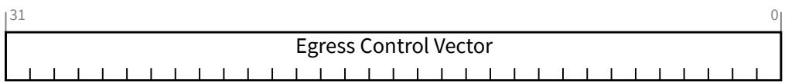

text_image

31
Egress Control Vector
0

Figure 7-135 Egress Control Vector Register§

Table 7-119 Egress Control Vector Register§

<table><tr><td>Bit Location</td><td>Register Description</td><td>Attributes</td></tr><tr><td>31:0</td><td>Egress Control Vector- An N-bit bit-array configured by software, where N is given by the value in the Egress Control Vector Size field. When a given bit is Set, peer-to-peer Requests targeting the associated Port, Function, or Function Group are blocked or redirected (if enabled) (see § Section 6.12.3).§ Figure 7-135 shows a single DWORD register. This register is always an integral number of DWORDs.Default value of each bit is 0b.</td><td>RW</td></tr></table>

The following examples illustrate how the vector might be configured:

• For an 8-Port Switch, each Port will have a separate vector indicating which Downstream Egress Ports it may forward Requests to.

Port 1 being not allowed to communicate with any other Downstream Ports would be configured as: 1111 1100b with bit 0 corresponding to the Upstream Port (hardwired to 0b) and bit 1 corresponding to the Ingress Port (hardwired to 0b).

Port 2 being allowed to communicate with Ports 3, 5, and 7 would be configured as: 0101 0010b.

• For a 4-Function device, each Function will have a separate vector that indicates which Function it may forward Requests to.

Function 0 being not allowed to communicate with any other Functions would be configured as: 1110b with bit 0 corresponding to Function 0 (hardwired to 0b).

Function 1 being allowed to communicate with Functions 2 and 3 would be configured as: 0001b with bit 1 corresponding to Function 1 (hardwired to 0b).

## 7.8 Common PCI and PCIe Capabilities §

This section, contains a description of common PCI and PCIe capabilities that are individually optional in this but may be required by other PCISIG specifications.

## 7.8.1 Power Budgeting Extended Capability §

The Power Budgeting Extended Capability allows the system to allocate power to devices that are added to the system at runtime. Through this Capability, a device can report the power it consumes on a variety of power rails, in a variety of device power-management states, in a variety of operating conditions. The system can use this information to ensure that the system is capable of providing the proper power and cooling levels to the device. Failure to indicate proper device power consumption may risk device or system failure.

Implementation of the Power Budgeting Extended Capability is optional for PCI Express devices that are implemented either in a form-factor which does not require Hot-Plug support, or that are integrated on the system board. PCI Express form-factor specifications may require support for power budgeting. Power Budgeting reports device power consumption assuming the device is given appropriate permission (e.g., from Set\_Slot\_Power\_Limit message) and that the external power connections for the device are operating.

The Power Budgeting Extended Capability is permitted to be present in PFs, but VFs must not implement it. If a PF contains the capability, it must report values that cover all associated VFs.

§ Figure 7-136 details allocation of register fields in the Power Budgeting Extended Capability.

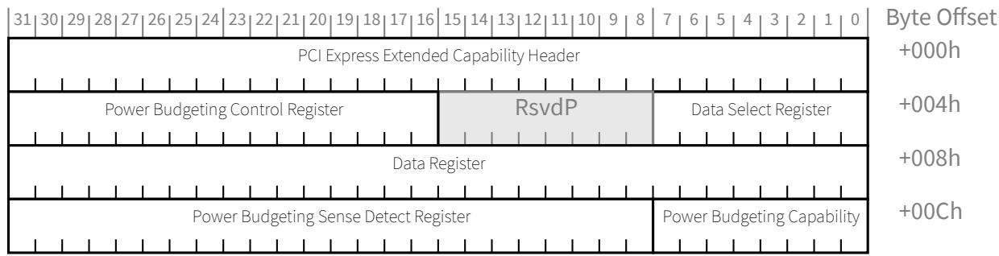

text_image

PCI Express Extended Capability Header
Power Budgeting Control Register	RsvdP	Data Select Register
Data Register
Power Budgeting Sense Detect Register	Power Budgeting Capability
Byte Offset
+000h
+004h
+008h
+00Ch

Figure 7-136 Power Budgeting Extended Capability§

## 7.8.1.1 Power Budgeting Extended Capability Header (Offset 00h) §

§ Figure 7-137 details allocation of register fields in the Power Budgeting Extended Capability Header; § Table 7-120 provides the respective bit definitions. Refer to § Section 7.6.3 for a description of the PCI Express Extended Capability header. The Extended Capability ID for the Power Budgeting Extended Capability is 0004h.

text_image

31
20 19 16 15 0
Next Capability Offset
0004h
PCI Express Extended Capability ID
Capability Version

Figure 7-137 Power Budgeting Extended Capability Header§

Table 7-120 Power Budgeting Extended Capability Header§

<table><tr><td>Bit Location</td><td>Register Description</td><td>Attributes</td></tr><tr><td>15:0</td><td>PCI Express Extended Capability ID - This field is a PCI-SIG defined ID number that indicates the nature and format of the Extended Capability. Extended Capability ID for the Power Budgeting Extended Capability is 0004h.</td><td>RO</td></tr><tr><td>19:16</td><td>Capability Version - This field is a PCI-SIG defined version number that indicates the version of the Capability structure present. Must be 1h for this version of the specification.</td><td>RO</td></tr><tr><td>31:20</td><td>Next Capability Offset - This field contains the offset to the next PCI Express Capability structure or 000h if no other items exist in the linked list of Capabilities. For Extended Capabilities implemented in Configuration Space, this offset is relative to the beginning of PCI-compatible Configuration Space and thus must always be either 000h (for terminating list of Capabilities) or greater than 0FFh.</td><td>RO</td></tr></table>

## 7.8.1.2 Power Budgeting Data Select Register (Offset 04h) §

The Power Budgeting Data Select Register is an 8-bit read-write register that indexes the Power Budgeting Data reported through the Power Budgeting Data Register and selects the DWORD of Power Budgeting Data that is to appear in the Power Budgeting Data Register. Values for this register start at zero to select the first DWORD of Power Budgeting Data; subsequent DWORDs of Power Budgeting Data are selected by increasing index values. The default value of this register is undefined.

## 7.8.1.3 Power Budgeting Control Register (Offset 06h) $\mathfrak { s }$

The Power Budgeting Control Register permits system software to enable extended power budgeting and to grant additional power to a Device above that defined by default for the associated form-factor.

§ Figure 7-138 details allocation of register fields in the Aux Power Control register; § Table 7-121 provides the respective bit definitions.

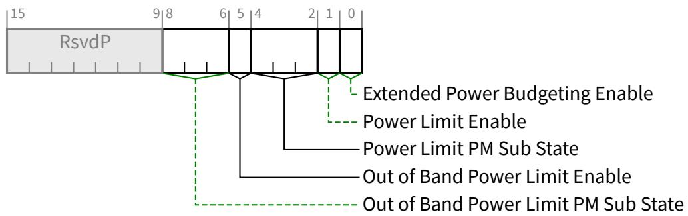

text_image

RsvdP
15 9 8 6 5 4 2 1 0
Extended Power Budgeting Enable
Power Limit Enable
Power Limit PM Sub State
Out of Band Power Limit Enable
Out of Band Power Limit PM Sub State

Figure 7-138 Power Budgeting Control Register§

Table 7-121 Power Budgeting Control Register§

<table><tr><td>Bit Location</td><td>Register Description</td><td>Attributes</td></tr><tr><td>0</td><td>Extended Power Budgeting Enable – If Set, Power Budgeting is permitted to return non-zero values in the Power Budgeting Data Register bits 31:21. If Clear, those bits must return all zeros for all values of the Power Budgeting Data Select Register.If Set, the Power Budgeting Sense Detect Register is permitted to return non-zero values. If Clear, that register must return all zeros.This bit is hardwired to 0b when Extended Power Budgeting Supported is Clear.Default is zero.</td><td>RW</td></tr><tr><td>1</td><td>Power Limit Enable – If Set, the Power Limit PM Sub State field is meaningful.The value of this field in the lowest numbered Function with Power Limit Supported Set applies to all Functions of the Device. When present, the value of this bit in all other Functions is ignored by hardware.When Power Limit Supported is Clear, this bit is permitted to be hardwired to zero.It is recommended that system software / firmware configure this field identically in all Functions. Doing so provides a standard mechanism for a device driver to understand its Function's power configuration.Default is zero.</td><td>RWS/RsvdP</td></tr><tr><td>4:2</td><td>Power Limit PM Sub State – If Power Limit Enable is Set, this field, in conjunction with the Out of Band Power Limit Enable and Out of Band Power Limit PM Sub State fields, indicates the PM Sub State used by the Device.The value of this field in the lowest numbered Function with Power Limit Supported Set applies to all Functions of the Device. When present, the value of this field in all other Functions is ignored by hardware.When Power Limit Supported is Clear, this field is permitted to be hardwired to zero.It is recommended that system software / firmware configure this field identically in all Functions. Doing so provides a standard mechanism for a device driver to understand its Function's power configuration.Default is zero.</td><td>RWS/RsvdP</td></tr><tr><td>5</td><td>Out of Band Power Limit Enable – If Set, the Out of Band Power Limit PM Sub State field is meaningful.When this field is present, all Functions of the Device must contain the same value.When Power Limit Supported is Clear, this bit is permitted to be hardwired to zero.It is permitted that this field change after the Function is Configuration Ready. This could happen, for example, if this field is configured via MCTP over PCIe. Mechanisms used to delay access to this field until it is meaningful are outside the scope of this specification (e.g., using the SFI mechanism or using _DSM calls to grant system software access to the fields).Default is zero.</td><td>HwInit/RsvdP</td></tr><tr><td>8:6</td><td>Out of Band Power Limit PM Sub State – If Out of Band Power Limit Enable is Set, this field, in conjunction with the Power Limit Enable and Power Limit PM Sub State fields, indicates the PM Sub State used by the Device.When this field is present, all Functions of the Device must contain the same value.When Power Limit Supported is Clear, this bit is permitted to be hardwired to zero.It is permitted that this field change after the Function is Configuration Ready. This could happen, for example, if this field is configured via MCTP over PCIe. Mechanisms used to delay access to this field until it is meaningful are outside the scope of this specification (e.g., using the SFI mechanism or using _DSN calls to grant system software access to the fields).Default is zero.</td><td>HwInit/RsvdP</td></tr></table>

## 7.8.1.4 Power Budgeting Data Register (Offset 08h) §

This read-only register returns the DWORD of Power Budgeting Data selected by the Power Budgeting Data Select Register. Each DWORD of the Power Budgeting Data describes the power usage of the device in a particular operating condition. Power Budgeting Data for different operating conditions is not required to be returned in any particular order, as long as incrementing the Power Budgeting Data Select Register causes information for a different operating condition to be returned. If the Power Budgeting Data Select Register contains a value greater than or equal to the number of operating conditions for which the device provides power information, this register must return all zeros. The default value of this register is undefined. § Figure 7-139 details allocation of register fields in the Power Budgeting Data Register; § Table 7-122 provides the respective bit definitions.

In earlier versions of this specification, bits 31:21 of this register were RsvdP. In order to ensure that the new uses of these bits do not confuse existing software:

Extended Power Budgeting entries are hidden when Extended Power Budgeting Enable is Clear (the default). When Extended Power Budgeting Enable is Clear and Power Budgeting Data Select selects an Extended Power Budgeting entry, the Data register must return 0000 0000h.  
• Extended Power Budgeting Data entries must be located after non-extended Power Budgeting Data entries (i.e., all entries where bits 31:21 are zero must use a smaller Power Budgeting Data Select value than any entry where bits 31:21 are non-zero).

The Base Power and Data Scale fields describe the power usage of the device; the Power Rail, Type, PM State, and PM Sub State fields describe the conditions under which the device has this power usage.

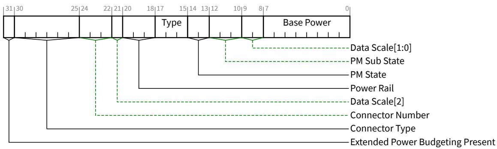

line chart

| Position | Value |
|--------|-------|
| Base Power | 0 |
| Type | 18-24 |
| Data Scale[1:0] | 15-20 |
| PM Sub State | 15-20 |
| PM State | 15-20 |
| Power Rail | 15-20 |
| Data Scale[2] | 15-20 |
| Connector Number | 15-20 |
| Connector Type | 15-20 |
| Extended Power Budgeting Present | 15-20 |

Figure 7-139 Power Budgeting Data Register§

Table 7-122 Power Budgeting Data Register§

<table><tr><td>Bit Location</td><td colspan="2">Register Description</td><td>Attributes</td></tr><tr><td rowspan="17">7:0</td><td colspan="2">Base Power - Specifies in watts the base power value in the given operating condition. This value must be multiplied by the data scale to produce the actual power consumption value except if Extended Power Budgeting Enable is Clear, the Data Scale[1:0] field equals 00b (1.0x) and Base Power exceeds EFh, the following alternative encodings are used:</td><td rowspan="17">RO</td></tr><tr><td>F0h</td><td>&gt;239 W and ≤ 250 W Slot Power Limit</td></tr><tr><td>F1h</td><td>&gt;250 W and ≤ 275 W Slot Power Limit</td></tr><tr><td>F2h</td><td>&gt;275 W and ≤ 300 W Slot Power Limit</td></tr><tr><td>F3h</td><td>&gt;300 W and ≤ 325 W Slot Power Limit</td></tr><tr><td>F4h</td><td>&gt;325 W and ≤ 350 W Slot Power Limit</td></tr><tr><td>F5h</td><td>&gt;350 W and ≤ 375 W Slot Power Limit</td></tr><tr><td>F6h</td><td>&gt;375 W and ≤ 400 W Slot Power Limit</td></tr><tr><td>F7h</td><td>&gt;400 W and ≤ 425 W Slot Power Limit</td></tr><tr><td>F8h</td><td>&gt;425 W and ≤ 450 W Slot Power Limit</td></tr><tr><td>F9h</td><td>&gt;450 W and ≤ 475 W Slot Power Limit</td></tr><tr><td>FAh</td><td>&gt;475 W and ≤ 500 W Slot Power Limit</td></tr><tr><td>FBh</td><td>&gt;500 W and ≤ 525 W Slot Power Limit</td></tr><tr><td>FCh</td><td>&gt;525 W and ≤ 550 W Slot Power Limit</td></tr><tr><td>FDh</td><td>&gt;550 W and ≤ 575 W Slot Power Limit</td></tr><tr><td>FEh</td><td>&gt;575 W and ≤ 600 W Slot Power Limit</td></tr><tr><td>FFh</td><td>Reserved for values greater than 600 W</td></tr><tr><td rowspan="3">9:8</td><td colspan="2">Data Scale[1:0] - Specifies the scale to apply to the Base Power value. The power consumption of the device is determined by multiplying the contents of the Base Power field with the value corresponding to the encoding returned by this field, except as noted above.Note that Data Scale[2] and Data Scale[1:0] are not contiguous within this register. Defined encodings are:</td><td rowspan="3">RO</td></tr><tr><td>000b</td><td>1.0x</td></tr><tr><td>001b010b</td><td>0.1x0.01x</td></tr><tr><td rowspan="4"></td><td>011b</td><td>0.001x</td><td rowspan="4"></td></tr><tr><td>100b</td><td>10x</td></tr><tr><td>101b</td><td>100x</td></tr><tr><td>Others</td><td>Reserved</td></tr><tr><td rowspan="3">12:10</td><td colspan="2">PM Sub State - Specifies the power management sub state of the operating condition being described. Defined encodings are:</td><td rowspan="3">RO</td></tr><tr><td>000b</td><td>Default Sub State</td></tr><tr><td>001b - 111b</td><td>Device Specific Sub State</td></tr><tr><td rowspan="6">14:13</td><td colspan="2">PM State - Specifies the power management state of the operating condition being described. Defined encodings are:</td><td rowspan="6">RO</td></tr><tr><td>00b</td><td>D0</td></tr><tr><td>01b</td><td>D1</td></tr><tr><td>10b</td><td>D2</td></tr><tr><td>11b</td><td>D3</td></tr><tr><td colspan="2">A device returns 11b in this field and Auxiliary or PME Aux in the Type field to specify the D3Cold PM State. An encoding of 11b along with any other Type field value specifies the D3Hot state.</td></tr><tr><td rowspan="11">17:15</td><td colspan="2">Type - Specifies the type of the operating condition being described. Defined encodings are:</td><td rowspan="11">RO</td></tr><tr><td>000b</td><td>PME Aux -- Sustained Power consumed in D3Cold when PME_En is Set and Aux Power PM Enable is Clear</td></tr><tr><td>001b</td><td>Auxiliary -- Sustained Power consumed in D3Cold when Aux Power PM Enable is Set</td></tr><tr><td>010b</td><td>Idle -- Sustained Power consumed when the Function or Device has been idle for 20 seconds or more</td></tr><tr><td>011b</td><td>Sustained Power</td></tr><tr><td>100b</td><td>Sustained Power in Emergency Power Reduction State (see § Section 6.24)</td></tr><tr><td>101b</td><td>Maximum Power in Emergency Power Reduction State (see § Section 6.24)</td></tr><tr><td>111b</td><td>Maximum Power</td></tr><tr><td>Others</td><td>All other encodings are Reserved.</td></tr><tr><td colspan="2">The following measurement definitions apply to this field unless the form-factor specification explicitly states otherwise:</td></tr><tr><td colspan="2">Sustained Power means the power consumed when the Device is performing at its maximum throughput, measured as an average over 5 seconds.Maximum Power means the power consumed when the Device is performing at its maximum throughput, measured over a 1 ms moving window. Note that Maximum Power can easily exceed sustained power by as much as 250%. Maximum Power consumption is frequently associated with changes in Function D-state.</td></tr><tr><td>20:18</td><td colspan="2">Power Rail - Specifies the thermal load or power rail of the operating condition being described. Defined encodings are:</td><td>RO</td></tr><tr><td rowspan="7"></td><td>000b</td><td>Power (12V)</td><td rowspan="7"></td></tr><tr><td>001b</td><td>Power (3.3V)</td></tr><tr><td>010b</td><td>Power (1.5V or 1.8V)</td></tr><tr><td>100b</td><td>Power (48V)</td></tr><tr><td>101b</td><td>Power (5V)</td></tr><tr><td>111b</td><td>Thermal</td></tr><tr><td>Others</td><td>All other encodings are Reserved.</td></tr><tr><td>21</td><td colspan="2">Data Scale[2] - Upper bit of Data Scale field. See Data Scale[1:0] for details.This bit must be zero if Extended Power Budgeting Enable is Clear.</td><td>RO</td></tr><tr><td>24:22</td><td colspan="2">Connector Number - Up to 8 connectors that supply power are supported on an add-in card (including the edge connector(s)). This field indicates which power connector is associated with this entry.If Power Budgeting Sense Detect Supported is Set, an instance of this field must be implemented for every power connector that the add-in card supports.Connector Numbers represent a single physical connector and are global across the add-in card. Connector Numbers must be consistent across all Functions in a Multi-Function Device. Connector Numbers must match when a single connector contains more than one power rail or when a single connector is associated with more than one Connector Type (e.g., Types 00 0110b and 00 0111b). Connector Number values and the mapping of Connector Number to physical location are outside the scope of this specification. For form-factor specifications that specify connector placement, it is recommended that those specifications define connector numbering based on placement rules.This field must be zero if Extended Power Budgeting Enable is Clear.Software must ignore the value in this field if Extended Power Budgeting Present is Clear.</td><td>RO</td></tr><tr><td>30:25</td><td colspan="2">Connector Type - Indicates the connector type. If Power Budgeting Sense Detect Supported is Set, an instance of this field must be implemented for every power connector that the adaptor supports. Values are:00 0000b Form-factor defined edge connector00 0001b Non-Connector power provided by the system (e.g., soldered down)00 0010b Non-Connector power provided by the option card (e.g., battery)00 0011b Non-Connector power not provided by the system or the option card (e.g., power supplied by an external chassis)00 0100b CEM 2x3 connector00 0101b CEM 2x4 connector with either 2x3 cable or 2x4 cable (see below)00 0110b CEM 2x4 connector with 2x3 cable (see below)00 0111b CEM 2x4 connector with 2x4 cable (see below)00 1000b CEM 12VHPWR connector, cable has Sense0 Open00 1001b CEM 12VHPWR connector, cable has Sense0 Grounded00 1010b, 00 1011b Reserved for PCI-SIG use00 1100b CEM 48VHPWR connector, cable has both Sense0 and Sense1 Open00 1101b CEM 48VHPWR connector, cable has Sense0 Grounded and Sense1 Open00 1110b CEM 48VHPWR connector, cable has Sense0 Open and Sense1 Grounded</td><td>RO</td></tr><tr><td rowspan="6"></td><td>00 1111b</td><td>CEM 48VHPWR connector, cable has both Sense0 and Sense1 Grounded</td><td rowspan="6"></td></tr><tr><td>01 0000b to 10 1111b</td><td>Reserved for PCI-SIG use</td></tr><tr><td>11 0000b to 11 1111b</td><td>Vendor Specific Power Connectors</td></tr><tr><td colspan="2">Each CEM 2x4 connector must have either one entry with Connector Type 00 0101b or two entries with Connector Types 00 0110b and 00 0111b.</td></tr><tr><td colspan="2">This field must be zero if Extended Power Budgeting Enable is Clear.</td></tr><tr><td colspan="2">Software must ignore the value in this field if Extended Power Budgeting Present is Clear.</td></tr><tr><td>31</td><td colspan="2">Extended Power Budgeting Present – Indicates that bits 30:22 contain Extended Power Budgeting Data. This bit must be 0b if Extended Power Budgeting Enable is Clear.</td><td>RO</td></tr></table>

Except for Type = 000b and 001b, Power Budgeting data for the same operating condition and PM Sub State values represent simultaneous consumption. Functions must report a complete set of Power Budgeting data for each supported operating condition and PM Sub State combination.

Power Budgeting data with different PM Sub State values represent mutually exclusive consumption. For a given operating condition, a Function is in exactly one PM Sub State. When Power Limit Supported is Clear, implementation specific mechanisms are used to determine the current PM Sub State.

A device that implements the Power Budgeting Extended Capability is required to provide data values for D0 Maximum and D0 Sustained PM State and Type combinations for every power rail from which it consumes power; data for the D0 Maximum and D0 Sustained for Thermal must also be provided if these values are different from the sum of the values for an operating condition reported for D0 Maximum and D0 Sustained on the power rails.

Devices that support auxiliary power or PME from auxiliary power must provide data for the appropriate power Type (Auxiliary or PME Aux) on the appropriate Power Rail(s).

• If the reported PME Aux or Auxiliary value is greater than the default for the associated form-factor, the Function is limited to the form-factor values unless either PME\_En or Aux Power PM Enable are Set.  
• The PME Aux and Auxiliary entries are mutually exclusive. The values of PME\_En and Aux Power PM Enable determine which entries are meaningful.

If the reported PME Aux or Auxiliary value is greater than the Aux\_Current, the Function is limited by Aux\_Current unless Aux Power PM Enable is Set and one of the following is true:

◦ Power Limit Enable is Set,  
◦ Out of Band Power Limit Enable is Set, or  
◦ the Request D3Cold Aux Power Limit \_DSM call was used to request additional power (for details, see [Firmware]).

If a device implements Emergency Power Reduction State, it must report Power Budgeting values for the following:

• Maximum Emergency Power Reduction State, PM State D0, all power rails used by the device  
• Maximum Emergency Power Reduction State, PM State D0, Thermal (if different from the sum of the preceding values)  
• Sustained Emergency Power Reduction State, PM State D0, all power rails used by the device  
• Sustained Emergency Power Reduction State, PM State: D0, Thermal (if different from the sum of the preceding values)

## 7.8.1.5 Power Budgeting Capability Register (Offset 0Ch) §

This register indicates the power budgeting capabilities of a device. § Figure 7-140 details allocation of register fields in the Power Budgeting Capability Register; § Table 7-123 provides the respective bit definitions.

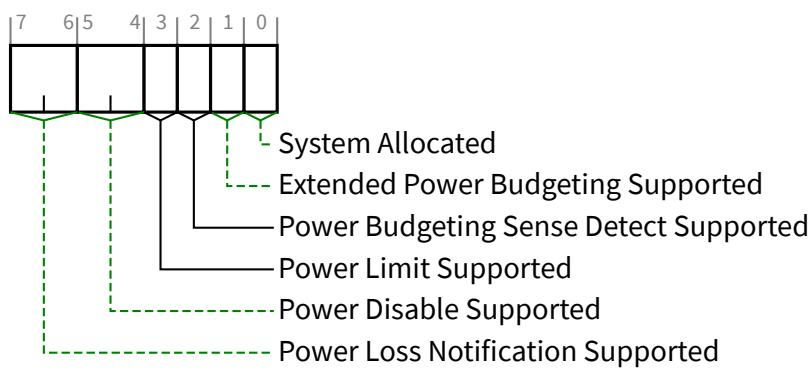

flowchart

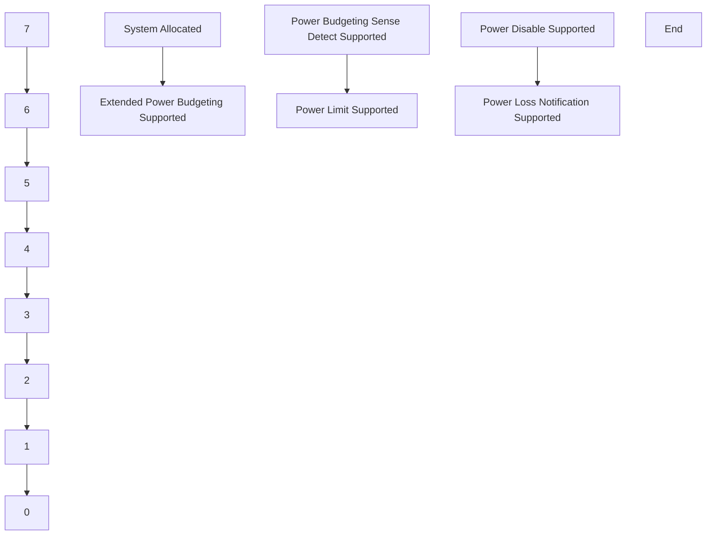
```mermaid
graph TD
  A["7"] --> B["6"] --> C["5"] --> D["4"] --> E["3"] --> F["2"] --> G["1"] --> H["0"]
  I["System Allocated"] --> J["Extended Power Budgeting Supported"]
  K["Power Budgeting Sense Detect Supported"] --> L["Power Limit Supported"]
  M["Power Disable Supported"] --> N["Power Loss Notification Supported"]
    O["End"]
```

Figure 7-140 Power Budgeting Capability Register§

Table 7-123 Power Budgeting Capability Register§

<table><tr><td>Bit Location</td><td>Register Description</td><td>Attributes</td></tr><tr><td>0</td><td>System Allocated- When Set, this bit indicates that the power budget for the device is included within the system power budget. Reported Power Budgeting Data for this device must be ignored by software for power budgeting decisions if this bit is Set.</td><td>HwInit</td></tr><tr><td>1</td><td>Extended Power Budgeting Supported- If Set, the Extended Power Budgeting Enable bit is meaningful.</td><td>HwInit</td></tr><tr><td>2</td><td>Power Budgeting Sense Detect Supported- If Set, the Power Budgeting Sense Detect Register is meaningful.This bit must be Clear if Extended Power Budgeting Supported is Clear.</td><td>HwInit</td></tr><tr><td>3</td><td>Power Limit Supported- If Set, the Power Limit Enable, Power Limit PM Sub State, Out of Band Power Limit Enable, and Out of Band Power Limit PM Sub State fields are meaningful.This bit must be Clear if Extended Power Budgeting Supported is Clear.</td><td>HwInit</td></tr><tr><td>5:4</td><td>Power Disable Supported- Indicates the supported use model for optional form-factor defined Power Disable functionality. Encodings are:00b Power Disable support not reported01b Power Disable is supported for removal of main power. The timings associated with this mode are optimized to support the use of Power Disable to recover a non-responsive device.10b Power Disable with abbreviated assertion time is supported for removal of main power. The timings associated with this mode are optimized to using Power Disable to request the Device enter or exit D3Cold.11b ReservedFor Multi-Function Devices associated with an Upstream Port, all Functions that contain this field must return the same value.</td><td>HwInit</td></tr><tr><td>7:6</td><td>Power Loss Notification Supported– This field indicates Device support for the optional Power Loss Notification feature. Power Loss Notification is an optional form-factor feature that permits the platform to inform an add-in card of an upcoming loss of power and optionally for the add-in card to indicate that it is ready for that power loss. In the M.2 form-factor, Power Loss Notification uses the optional PLN# signal and Power Loss Acknowledgment uses the optional PLA_S2# and PLA_S3# signals. Other form-factors may define different mechanisms.Encodings of this field are:00b Power Loss Notification support not reported01b Power Loss Notification supported Power Loss Acknowledgement not supported10b Power Loss Notification supported Power Loss Acknowledgement supported11b ReservedFor Multi-Function Devices associated with an Upstream Port, all Functions that contain this field must return the same value.</td><td>HwInit</td></tr></table>

## 7.8.1.6 Power Budgeting Sense Detect Register (Offset 0Dh) §

Whenever the adapter is receiving any power, this register reports, for each implemented power connector, which sense wires are currently detected.

Any adapter that implements a Power Budgeting Extended Capability with Power Budgeting Sense Detect Supported Set, must provide Connector Sense Detect fields for each connector that it supports, and must hardwire the fields for unsupported connectors to all zeros.

This register is RsvdP if Power Budgeting Sense Detect Supported is Clear. This register must return all zeros if Extended Power Budgeting Enable is Clear.

This register is only meaningful in the lowest numbered Function that contains the Power Budgeting Extended Capability. This register is undefined in all other Functions even if the Power Budgeting Sense Detect Supported is Set.

§ Figure 7-141 details allocation of register fields in the Power Budgeting Sense Detect Register; § Table 7-124 provides the respective bit definitions. § Table 7-125 defines the encodings based on Connector Type values.

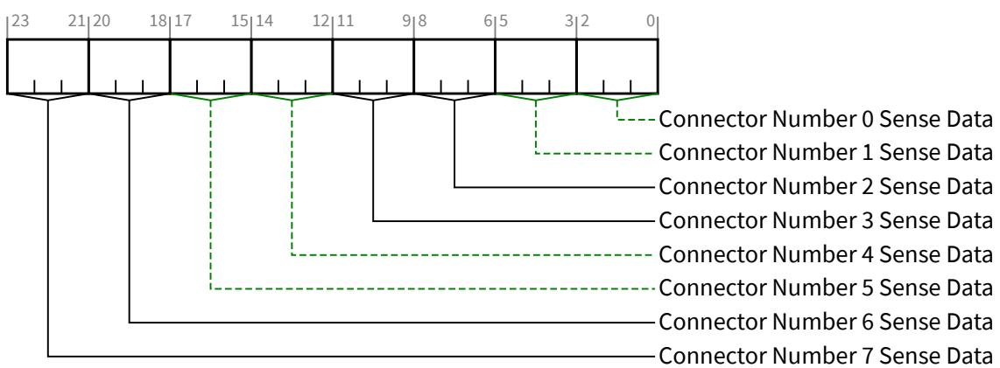

line chart

| Connector Number | Sense Data |
| ---------------- | ---------- |
| 0                | 23         |
| 1                | 21         |
| 2                | 20         |
| 3                | 18         |
| 4                | 17         |
| 5                | 15         |
| 6                | 14         |
| 7                | 12         |
| 8                | 11         |
| 9                | 9          |
| 10               | 8          |
| 11               | 6          |
| 12               | 5          |
| 13               | 3          |
| 14               | 2          |
| 15               | 1          |
| 16               | 0          |

Figure 7-141 Power Budgeting Sense Detect Register§

Table 7-124 Power Budgeting Sense Detect Register§

<table><tr><td>Bit Location</td><td>Register Description</td><td>Attributes</td></tr><tr><td>2:0</td><td>Connector Number 0 Sense Data</td><td>RO</td></tr><tr><td>5:3</td><td>Connector Number 1 Sense Data</td><td>RO</td></tr><tr><td>8:6</td><td>Connector Number 2 Sense Data</td><td>RO</td></tr><tr><td>11:9</td><td>Connector Number 3 Sense Data</td><td>RO</td></tr><tr><td>14:12</td><td>Connector Number 4 Sense Data</td><td>RO</td></tr><tr><td>17:15</td><td>Connector Number 5 Sense Data</td><td>RO</td></tr><tr><td>20:18</td><td>Connector Number 6 Sense Data</td><td>RO</td></tr><tr><td>23:21</td><td>Connector Number 7 Sense Data</td><td>RO</td></tr></table>

Table 7-125 Power Budgeting Sense Detect Encodings§

<table><tr><td>Connecor Type</td><td colspan="2">Encoding</td></tr><tr><td rowspan="3">00 0000b to 00 0011b</td><td>Bit 0</td><td>Main Power Detected. If Auxiliary power is not used, this bit is permitted to be hardwired to 1b.</td></tr><tr><td>Bit 1</td><td>Aux Power Detected. If auxiliary power is not used, this bit is permitted to be hardwired to 0b. When no dedicated Aux Power pin(s) are defined in the implemented form-factor, this bit has a form-factor specific meaning.</td></tr><tr><td>Bit 2</td><td>Form-factor specific meaning</td></tr><tr><td rowspan="4">00 0100b</td><td colspan="2">CEM 2x3 connector</td></tr><tr><td>000b</td><td>Cable is not present, Sense not detected</td></tr><tr><td>001b</td><td>Cable is present, Sense detected</td></tr><tr><td>Others</td><td>Reserved</td></tr><tr><td rowspan="6">00 0101b to 00 0111b</td><td colspan="2">CEM 2x4 connector</td></tr><tr><td>000b</td><td>Cable is not present, both Sense0 and Sense1 not detected</td></tr><tr><td>001b</td><td>2x3 cable is present, Sense0 detected, Sense1 not detected</td></tr><tr><td>010b</td><td>Reserved condition, Sense0 not detected, Sense1 detected</td></tr><tr><td>011b</td><td>2x4 cable is present, both Sense0 and Sense1 detected</td></tr><tr><td>Others</td><td>Reserved</td></tr><tr><td rowspan="5">00 1000b to 00 1011b</td><td colspan="2">CEM 12VHPWR connector</td></tr><tr><td>0xxb</td><td>Cable is not present</td></tr><tr><td>100b</td><td>12VHPWR cable is present, Sense0 is Open</td></tr><tr><td>101b</td><td>12VHPWR cable is present, Sense0 is Grounded</td></tr><tr><td>Others</td><td>Reserved</td></tr><tr><td>00 1100b to 00 1111b</td><td colspan="2">CEM 48VHPWR connector</td></tr><tr><td rowspan="6"></td><td>0xxb</td><td>Cable is not present</td></tr><tr><td>100b</td><td>48VHPWR cable is present, both Sense0 and Sense1 Open</td></tr><tr><td>101b</td><td>48VHPWR cable is present, Sense0 Grounded, Sense1 Open</td></tr><tr><td>110b</td><td>48VHPWR cable is present, Sense0 Open, Sense1 Grounded</td></tr><tr><td>111b</td><td>48VHPWR cable is present, both Sense0 and Sense1 Grounded</td></tr><tr><td>Others</td><td>Reserved</td></tr><tr><td>00 1100b to 10 1111h</td><td colspan="2">Reserved</td></tr><tr><td>11 0000b to 11 1111b</td><td colspan="2">Vendor Specific</td></tr></table>

## 7.8.2 Latency Tolerance Reporting (LTR) Extended Capability §

The PCI Express Latency Tolerance Reporting (LTR) Extended Capability is an optional Extended Capability that allows software to provide platform latency information to components with Upstream Ports (Endpoints and Switches), and is required for Switch Upstream Ports and Endpoints if the Function supports the LTR mechanism. It is not applicable to Root Ports, Bridges, or Switch Downstream Ports.

For a Multi-Function Device associated with the Upstream Port of a component that implements the LTR mechanism, this Capability structure must be implemented only in Function 0, and must control the component’s Link behavior on behalf of all the Functions of the Device.

RCiEPs implemented as Multi-Function Devices are permitted to implement this Capability structure in more than one Function of the Multi-Function Device.

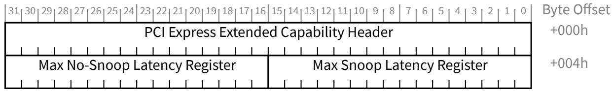

text_image

PCI Express Extended Capability Header
Max No-Snoop Latency Register
Max Snoop Latency Register
Byte Offset
+000h
+004h

Figure 7-142 LTR Extended Capability Structure§

## 7.8.2.1 LTR Extended Capability Header (Offset 00h) §

text_image

Next Capability Offset
PCI Express Extended Capability ID
Capability Version

Figure 7-143 LTR Extended Capability Header§

Table 7-126 LTR Extended Capability Header§

<table><tr><td>Bit Location</td><td>Register Description</td><td>Attributes</td></tr><tr><td>15:0</td><td>PCI Express Extended Capability ID - This field is a PCI-SIG defined ID number that indicates the nature and format of the Extended Capability.PCI Express Extended Capability for the LTR Extended Capability is 0018h.</td><td>RO</td></tr><tr><td>19:16</td><td>Capability Version - This field is a PCI-SIG defined version number that indicates the version of the Capability structure present.Must be 1h for this version of the specification.</td><td>RO</td></tr><tr><td>31:20</td><td>Next Capability Offset - This field contains the offset to the next PCI Express Extended Capability structure or 000h if no other items exist in the linked list of Capabilities.</td><td>RO</td></tr></table>

## 7.8.2.2 Max Snoop Latency Register (Offset 04h) §

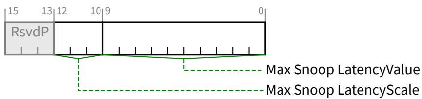

line chart

| Time | RsvdP | Max Snoop LatencyValue | Max Snoop LatencyScale |
|------|-------|------------------------|------------------------|
| 0    | 0     | 0                      | 0                      |
| 9    | 13    | 0                      | 0                      |
| 10   | 12    | 0                      | 0                      |
| 11   | 10    | 0                      | 0                      |
| 12   | 9     | 0                      | 0                      |
| 13   | 8     | 0                      | 0                      |
| 14   | 7     | 0                      | 0                      |
| 15   | 6     | 0                      | 0                      |

Figure 7-144 Max Snoop Latency Register§

§ Table 7-127 Max Snoop Latency Register

<table><tr><td>Bit Location</td><td>Register Description</td><td>Attributes</td></tr><tr><td>9:0</td><td>Max Snoop LatencyValue - Along with the Max Snoop LatencyScale field, this register specifies the maximum snoop latency that a device is permitted to request. Software should set this to the platform's maximum supported latency or less. It is strongly recommended that any updates to this field are reflected in LTR Message(s) sent by the device within 1 ms.The default value for this field is 00 0000 0000b.</td><td>RW</td></tr><tr><td>12:10</td><td>Max Snoop LatencyScale- This register provides a scale for the value contained within the Max Snoop LatencyValue field. Encoding is the same as the LatencyScale fields in the LTR Message. See § Section 6.18 . It is strongly recommended that any updates to this field are reflected in LTR Message(s) sent by the device within 1 ms.The default value for this field is 000b.Hardware operation is undefined if software writes a Not Permitted value to this field.</td><td>RW</td></tr></table>

## 7.8.2.3 Max No-Snoop Latency Register (Offset 06h) §

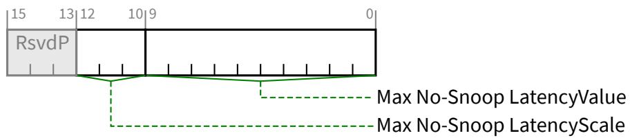

line chart

| Time | Max No-Snoop LatencyValue | Max No-Snoop LatencyScale |
|------|---------------------------|---------------------------|
| 0    | 10                        | 10                        |
| 9    | 10                        | 10                        |
| 10   | 10                        | 10                        |
| 12   | 10                        | 10                        |
| 13   | 10                        | 10                        |

Figure 7-145 Max No-Snoop Latency Register§

Table 7-128 Max No-Snoop Latency Register§

<table><tr><td>Bit Location</td><td>Register Description</td><td>Attributes</td></tr><tr><td>9:0</td><td>Max No-Snoop LatencyValue- Along with the Max No-Snoop LatencyScale field, this register specifies the maximum no-snoop latency that a device is permitted to request. Software should set this to the platform&#x27;s maximum supported latency or less. It is strongly recommended that any updates to this field are reflected in LTR Message(s) sent by the device within 1 ms.The default value for this field is 00 0000 0000b.</td><td>RW</td></tr><tr><td>12:10</td><td>Max No-Snoop LatencyScale- This register provides a scale for the value contained within the Max No-Snoop LatencyValue field. Encoding is the same as the LatencyScale fields in the LTR Message. See § Section 6.18 . It is strongly recommended that any updates to this field are reflected in LTR Message(s) sent by the device within 1 ms.The default value for this field is 000b.Hardware operation is undefined if software writes a Not Permitted value to this field.</td><td>RW</td></tr></table>

## 7.8.3 L1 PM Substates Extended Capability §

The L1 PM Substates Extended Capability is an optional Extended Capability, that is required if L1 PM Substates is implemented at a Port. The L1 PM Substates Extended Capability structure is defined as shown in § Figure 7-146.

For a Multi-Function Device associated with an Upstream Port implementing L1 PM Substates, this Extended Capability Structure must be implemented only in Function 0, and must control the Upstream Port’s Link behavior on behalf of all the Functions of the device.

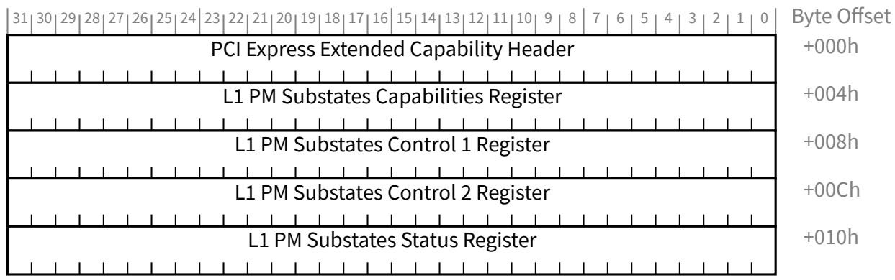

text_image

PCI Express Extended Capability Header
L1 PM Substates Capabilities Register
L1 PM Substates Control 1 Register
L1 PM Substates Control 2 Register
L1 PM Substates Status Register
Byte Offset
+000h
+004h
+008h
+00Ch
+010h

Figure 7-146 L1 PM Substates Extended Capability§

## 7.8.3.1 L1 PM Substates Extended Capability Header (Offset 00h) §

text_image

31 20 19 16 15 0
Next Capability Offset 001Eh
PCI Express Extended Capability ID
Capability Version

Figure 7-147 L1 PM Substates Extended Capability Header§

Table 7-129 L1 PM Substates Extended Capability Header§

<table><tr><td>Bit Location</td><td>Register Description</td><td>Attributes</td></tr><tr><td>15:0</td><td>PCI Express Extended Capability ID- This field is a PCI-SIG defined ID number that indicates the nature and format of the Extended Capability. Extended Capability ID for L1 PM Substates is 001Eh.</td><td>RO</td></tr><tr><td>19:16</td><td>Capability Version- This field is a PCI-SIG defined version number that indicates the version of the Capability structure present. This field must be 2h if the L1 PM Substates Status Register is implemented and must be 1h otherwise.</td><td>RO</td></tr><tr><td>31:20</td><td>Next Capability Offset- This field contains the offset to the next PCI Express Capability structure or 000h if no other items exist in the linked list of Capabilities. For Extended Capabilities implemented in Configuration Space, this offset is relative to the beginning of PCI-compatible Configuration Space and thus must always be either 000h (for terminating list of Capabilities) or greater than 0FFh. The bottom 2 bits of this offset are Reserved and must be implemented as 00b although software must mask them to allow for future uses of these bits.</td><td>RO</td></tr></table>

## 7.8.3.2 L1 PM Substates Capabilities Register (Offset 04h) §

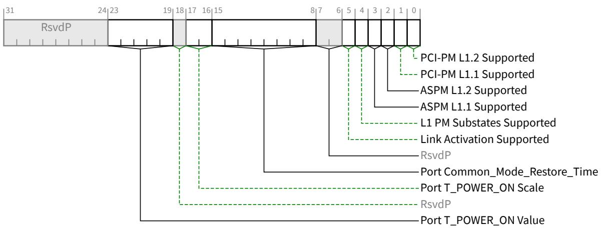

timing diagram

| Category                     | Value |
| ---------------------------- | ----- |
| PCI-PM L1.2 Supported        | 31    |
| PCI-PM L1.1 Supported        | 24    |
| ASPM L1.2 Supported          | 19    |
| ASPM L1.1 Supported          | 18    |
| L1 PM Substates Supported    | 17    |
| Link Activation Supported    | 16    |
| RsvdP                        | 15    |
| Port Common_Mode_Restore_Time | 8     |
| Port T_POWER_ON Scale       | 7     |
| RsvdP                        | 6     |
| Port T_POWER_ON Value      | 5     |

Figure 7-148 L1 PM Substates Capabilities Register§

Table 7-130 L1 PM Substates Capabilities Register§

<table><tr><td>Bit Location</td><td>Register Description</td><td>Attributes</td></tr><tr><td>0</td><td>PCI-PM L1.2 Supported - When Set this bit indicates that PCI-PM L1.2 is supported.</td><td>HwInit</td></tr><tr><td>1</td><td>PCI-PM L1.1 Supported - When Set this bit indicates that PCI-PM L1.1 is supported, and must be Set by all Ports implementing L1 PM Substates.</td><td>HwInit</td></tr><tr><td>2</td><td>ASPM L1.2 Supported - When Set this bit indicates that ASPM L1.2 is supported.</td><td>HwInit</td></tr><tr><td>3</td><td>ASPM L1.1 Supported - When Set this bit indicates that ASPM L1.1 is supported.</td><td>HwInit</td></tr><tr><td>4</td><td>L1 PM Substates Supported - When Set this bit indicates that this Port supports L1 PM Substates.</td><td>HwInit</td></tr><tr><td>5</td><td>Link Activation Supported - For Downstream Ports, when Set, this bit indicates that this Port supports Link Activation. See § Section 5.5.6 for details.This bit is of type RsvdP for Upstream Ports.</td><td>HwInit/RsvdP</td></tr><tr><td>15:8</td><td>Port Common_Mode_Restore_Time - Time (in μs) required for this Port to re-establish common mode as described in § Table 5-11.Required for all Ports for which either the PCI-PM L1.2 Supported bit is Set, ASPM L1.2 Supported bit is Set, or both are Set, otherwise this field is of type RsvdP.</td><td>HwInit/RsvdP(See description)</td></tr><tr><td>17:16</td><td>Port T_POWER_ON Scale - Specifies the scale used for the Port T_POWER_ON Value field in the L1 PM Substates Capabilities Register.Range of Values00b 2 μs01b 10 μs10b 100 μs11b ReservedRequired for all Ports for which either the PCI-PM L1.2 Supported bit is Set, ASPM L1.2 Supported bit is Set, or both are Set, otherwise this field is of type RsvdP.Default value is 00b</td><td>HwInit/RsvdP</td></tr><tr><td>23:19</td><td>Port T_POWER_ON Value - Along with the Port T_POWER_ON Scale field in the L1 PM Substates Capabilities Register sets the time (in μs) that this Port requires the port on the opposite side of Link to wait in L1.2.Exit after sampling CLKREQ# asserted before actively driving the interface.The value of Port T_POWER_ON is calculated by multiplying the value in this field by the scale value in the Port T_POWER_ON Scale field in the L1 PM Substates Capabilities Register.Default value is 0 0101bRequired for all Ports for which either the PCI-PM L1.2 Supported bit is Set, ASPM L1.2 Supported bit is Set, or both are Set, otherwise this field is of type RsvdP.</td><td>HwInit/RsvdP</td></tr></table>

## 7.8.3.3 L1 PM Substates Control 1 Register (Offset 08h) §

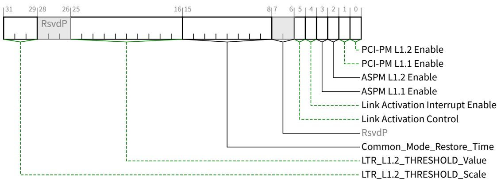

timing diagram

| Event | Value |
|-------|-------|
| PCI-PM L1.2 Enable |  |
| PCI-PM L1.1 Enable |  |
| ASPM L1.2 Enable |  |
| ASPM L1.1 Enable |  |
| Link Activation Interrupt Enable |  |
| Link Activation Control |  |
| RsvdP |  |
| Common_Mode_Restore_Time |  |
| LTR_L1.2_THRESHOLD_Value |  |
| LTR_L1.2_THRESHOLD_Scale |  |

Figure 7-149 L1 PM Substates Control 1 Register§

Table 7-131 L1 PM Substates Control 1 Register§

<table><tr><td>Bit Location</td><td>Register Description</td><td>Attributes</td></tr><tr><td>0</td><td>PCI-PM L1.2 Enable - When Set this bit enables PCI-PM L1.2.Required for both Upstream and Downstream Ports. For Ports for which the PCI-PM L1.2 Supported bit is Clear this bit is permitted to be hardwired to 0.For compatibility with possible future extensions, software must not enable L1 PM Substates unless the L1 PM Substates Supported bit in the L1 PM Substates Capabilities Register is Set.Default value is 0b.</td><td>RW</td></tr><tr><td>1</td><td>PCI-PM L1.1 Enable - When Set this bit enables PCI-PM L1.1.Required for both Upstream and Downstream Ports.For compatibility with possible future extensions, software must not enable L1 PM Substates unless the L1 PM Substates Supported bit in the L1 PM Substates Capabilities Register is Set.Default value is 0b.</td><td>RW</td></tr><tr><td>2</td><td>ASPM L1.2 Enable- When Set this bit enables ASPM L1.2.Required for both Upstream and Downstream Ports.For Ports for which the ASPM L1.2 Supported bit is Clear this bit is permitted to be hardwired to 0.For compatibility with possible future extensions, software must not enable L1 PM Substates unless the L1 PM Substates Supported bit in the L1 PM Substates Capabilities Register is Set.Default value is 0b.</td><td>RW</td></tr><tr><td>3</td><td>ASPM L1.1 Enable- When Set this bit enables ASPM L1.1.Required for both Upstream and Downstream Ports.For Ports for which the ASPM L1.1 Supported bit is Clear this bit is permitted to be hardwired to 0.For compatibility with possible future extensions, software must not enable L1 PM Substates unless the L1 PM Substates Supported bit in the L1 PM Substates Capabilities Register is Set.Default value is 0b.</td><td>RW</td></tr><tr><td>4</td><td>Link Activation Interrupt Enable- When set this bit enables the generation of an interrupt to indicate the completion of the Link Activation process. See § Section 5.5.6 for details.Required for Downstream Ports when the Link Activation Supported bit is Set, otherwise it is permitted to be hardwired to 0b.Must be RsvdP for Upstream Ports.Default value is 0b.</td><td>RW/RsvdP</td></tr><tr><td>5</td><td>Link Activation Control- When this bit is Set, the Port must initiate the Link Activation process. See § Section 5.5.6 for details.Required for Downstream Ports when the Link Activation Supported bit is Set, otherwise it is permitted to be hardwired to 0b.Must be RsvdP for Upstream Ports.Default value is 0b.</td><td>RW/RsvdP</td></tr><tr><td>15:8</td><td>Common_Mode_Restore_Time- Sets value of TCOMMONMODE (in μs), which must be used by the Downstream Port for timing the re-establishment of common mode, as described in § Table 5-11.This field must only be modified when the ASPM L1.2 Enable and PCI-PM L1.2 Enable bits are both Clear. The Port behavior is undefined if this field is modified when either the ASPM L1.2 Enable and/or PCI-PM L1.2 Enable bit(s) are Set.Required for Downstream Ports for which either the PCI-PM L1.2 Supported bit is Set, ASPM L1.2 Supported bit is Set, or both are Set, otherwise this field is of type RsvdP.This field is of type RsvdP for Upstream Ports.Default value is implementation specific.</td><td>RW/RsvdP(See Description)</td></tr><tr><td>25:16</td><td>LTR_L1.2_THRESHOLD_Value- Along with the LTR_L1.2_THRESHOLD_Scale, this field indicates the LTR threshold used to determine if entry into L1 results in L1.1 (if enabled) or L1.2 (if enabled).The default value for this field is 00 0000 0000b.This field must only be modified when the ASPM L1.2 Enable bit is Clear. The Port behavior is undefined if this field is modified when the ASPM L1.2 Enable bit is Set.Required for all Ports for which the ASPM L1.2 Supported bit is Set, otherwise this field is of type RsvdP.</td><td>RW/RsvdP(See Description)</td></tr><tr><td>31:29</td><td>LTR_L1.2_THRESHOLD_Scale- This field provides a scale for the value contained within the LTR_L1.2_THRESHOLD_Value. Encoding is the same as the LatencyScale fields in the LTR Message (see § Section 6.18).The default value for this field is 000b.Hardware operation is undefined if software writes a Not-Permitted value to this field.This field must only be modified when the ASPM L1.2 Enable bit is Clear. The Port behavior is undefined if this field is modified when the ASPM L1.2 Enable bit is Set.Required for all Ports Ports for which the ASPM L1.2 Supported bit is Set, otherwise this field is of type RsvdP.</td><td>RW/RsvdP(See description)</td></tr></table>

## 7.8.3.4 L1 PM Substates Control 2 Register (Offset 0Ch) §

text_image

31
RsvdP
8 7 3 2 1 0
T_POWER_ON Scale
RsvdP
T_POWER_ON Value

Figure 7-150 L1 PM Substates Control 2 Register§

Table 7-132 L1 PM Substates Control 2 Register§

<table><tr><td>Bit Location</td><td>Register Description</td><td>Attributes</td></tr><tr><td>1:0</td><td>T_POWER_ON Scale - Specifies the scale used for T_POWER_ON Value. Range of Values: 00b 2 μs 01b 10 μs 10b 100 μs 11b Reserved Required for all Ports that support L1.2, otherwise this field is of type RsvdP. This field must only be modified when the ASPM L1.2 Enable and PCI-PM L1.2 Enable bits are both Clear. The Port behavior is undefined if this field is modified when either the ASPM L1.2 Enable and/or PCI-PM L1.2 Enable bit(s) are Set. Default value is 00b</td><td>RW/RsvdP</td></tr><tr><td>7:3</td><td>T_POWER_ON Value - Along with the T_POWER_ON Scale sets the minimum amount of time (in μs) that the Port must wait in L1.2.Exit after sampling CLKREQ# asserted before actively driving the interface. T_POWER_ON is calculated by multiplying the value in this field by the value in the T_POWER_ON Scale field. This field must only be modified when the ASPM L1.2 Enable and PCI-PM L1.2 Enable bits are both Clear. The Port behavior is undefined if this field is modified when either the ASPM L1.2 Enable and/or PCI-PM L1.2 Enable bit(s) are Set.Default value is 0 0101bRequired for all Ports that support L1.2, otherwise this field is of type RsvdP.</td><td>RW/RsvdP</td></tr></table>

## 7.8.3.5 L1 PM Substates Status Register (Offset 10h) §

Hardware must implement this register if the Capability Version in the L1 PM Substates Extended Capability Header is 2h or greater. This register is not present if the Capability Version is 1h.

text_image

31
RsvdZ
1 0
Link Activation Status

Figure 7-151 L1 PM Substates Status Register§

Table 7-133 L1 PM Substates Status Register§

<table><tr><td>Bit Location</td><td>Register Description</td><td>Attributes</td></tr><tr><td>0</td><td>Link Activation Status - Indicates the status of Link Activation. See § Section 5.5.6 for details.Required for Downstream Ports when the Link Activation Supported bit is Set, otherwise it is hardwired to 0b.Must be RsvdZ for Upstream Ports.Default value is 0b.</td><td>RW1C/RsvdZ</td></tr></table>

## 7.8.4 Advanced Error Reporting Extended Capability §

The PCI Express Advanced Error Reporting (AER) Capability is an optional Extended Capability that may be implemented by PCI Express device Functions supporting advanced error control and reporting. The Advanced Error Reporting Capability structure definition has additional interpretation for Root Ports and Root Complex Event Collectors; software must interpret the Device/Port Type field in the PCI Express Capabilities register to determine the availability of additional registers for Root Ports and Root Complex Event Collectors.

In an SR-IOV device, if AER is not implemented in a PF, it must not be implemented in its associated VFs. If AER is implemented in the PF, it is optional in its VFs.

In an SR-IOV device, the Header Log space for a PF is independent of any for its associated VFs and must be implemented with dedicated storage space. VFs that implement AER may share Header Log space among VFs associated with a single PF. Shared Header Log space must have storage for at least one header. See § Section 6.2.4.2.1 for further details.

§ Figure 7-152 and § Figure 7-153 show the PCI Express Advanced Error Reporting Extended Capability structure. In § Figure 7-153, the last 6 DW are optional. Implementations are permitted to implement between 0 and 6 additional DW of Header Log (see Header Log Size for details).

Note that if an error reporting bit field is marked as optional in the error registers, the bits must be implemented or not implemented as a group across the Status, Mask and Severity registers. In other words, a Function is required to

implement the same error bit fields in corresponding Status, Mask and Severity registers. Bits corresponding to bit fields that are not implemented must be hardwired to 0, unless otherwise specified.

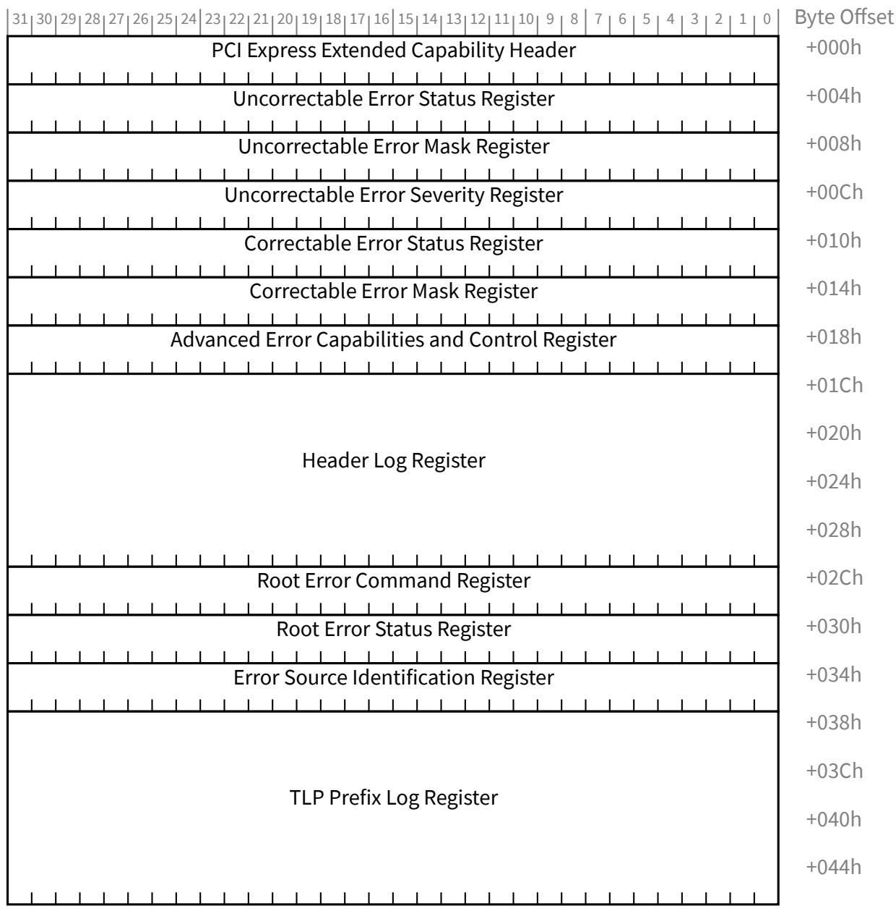

stacked bar chart

| Register Type | Byte Offset |
| --- | --- |
| PCI Express Extended Capability Header | +000h |
| Uncorrectable Error Status Register | +004h |
| Uncorrectable Error Mask Register | +008h |
| Uncorrectable Error Severity Register | +00Ch |
| Correctable Error Status Register | +010h |
| Correctable Error Mask Register | +014h |
| Advanced Error Capabilities and Control Register | +018h |
| Header Log Register | +01Ch |
| Root Error Command Register | +020h |
| Root Error Status Register | +024h |
| Error Source Identification Register | +028h |
| TLP Prefix Log Register | +02Ch |
| TLP Prefix Log Register | +030h |
| TLP Prefix Log Register | +034h |
| TLP Prefix Log Register | +038h |
| TLP Prefix Log Register | +03Ch |
| TLP Prefix Log Register | +040h |
| TLP Prefix Log Register | +044h |

Figure 7-152 Advanced Error Reporting Extended Capability - Functions that do not support Flit Mode Struct§ ure

<table><tr><td colspan="2">PCI Express Extended Capability Header</td></tr><tr><td colspan="2">Uncorrectable Error Status Register</td></tr><tr><td colspan="2">Uncorrectable Error Mask Register</td></tr><tr><td colspan="2">Uncorrectable Error Severity Register</td></tr><tr><td colspan="2">Correctable Error Status Register</td></tr><tr><td colspan="2">Correctable Error Mask Register</td></tr><tr><td colspan="2">Advanced Error Capabilities and Control Register</td></tr><tr><td colspan="2">Header Log Register DW1-4</td></tr><tr><td colspan="2">Root Error Command Register</td></tr><tr><td colspan="2">Root Error Status Register</td></tr><tr><td colspan="2">Error Source Identification Register</td></tr><tr><td colspan="2">Header Log Register DW5-14 (text defines implementation requirements)</td></tr></table>

Figure 7-153 Advanced Error Reporting Extended Capability - Functions that support Flit Mode Structure§

## 7.8.4.1 Advanced Error Reporting Extended Capability Header (Offset 00h) §

§ Figure 7-154 details the allocation of register fields of an Advanced Error Reporting Extended Capability header; § Table 7-134 provides the respective bit definitions.

Refer to § Section 7.6.3 for a description of the PCI Express Extended Capability header. The Extended Capability ID for the Advanced Error Reporting Capability is 0001h.

text_image

31 20 19 16 15 0
Next Capability Offset 0001h
PCI Express Extended Capability ID
Capability Version

Figure 7-154 Advanced Error Reporting Extended Capability Header§

Table 7-134 Advanced Error Reporting Extended Capability Header§

<table><tr><td>Bit Location</td><td>Register Description</td><td>Attributes</td></tr><tr><td>15:0</td><td>PCI Express Extended Capability ID- This field is a PCI-SIG defined ID number that indicates the nature and format of the Extended Capability.The Extended Capability ID for the Advanced Error Reporting Capability is 0001h.</td><td>RO</td></tr><tr><td>19:16</td><td>Capability Version- This field is a PCI-SIG defined version number that indicates the version of the Capability structure present.This field must be 3h if Flit Mode Supported is Set. This field must be 2h or 3h if End-End TLP Prefix Supported is Set (see § Section 7.5.3.15). Otherwise this field must be 1h, 2h, or 3h.</td><td>RO</td></tr><tr><td>31:20</td><td>Next Capability Offset- This field contains the offset to the next PCI Express Capability structure or 000h if no other items exist in the linked list of Capabilities.For Extended Capabilities implemented in Configuration Space, this offset is relative to the beginning of PCI-compatible Configuration Space and thus must always be either 000h (for terminating list of Capabilities) or greater than 0FFh.</td><td>RO</td></tr></table>

## 7.8.4.2 Uncorrectable Error Status Register (Offset 04h) §

The Uncorrectable Error Status Register indicates error detection status of individual errors on a PCI Express device Function. An individual error status bit that is Set indicates that a particular error was detected; software may clear an error status by writing a 1b to the respective bit. Refer to § Section 6.2 for further details. Register bits not implemented by the Function are hardwired to 0b. § Figure 7-155 details the allocation of register fields of the Uncorrectable Error Status Register; § Section 7.8.4.2 provides the respective bit definitions.

For SR-IOV devices, errors categorized as non-Function-specific must be logged in PFs and non-IOV Functions, but not logged in VFs. VFs must log only Function-specific errors.

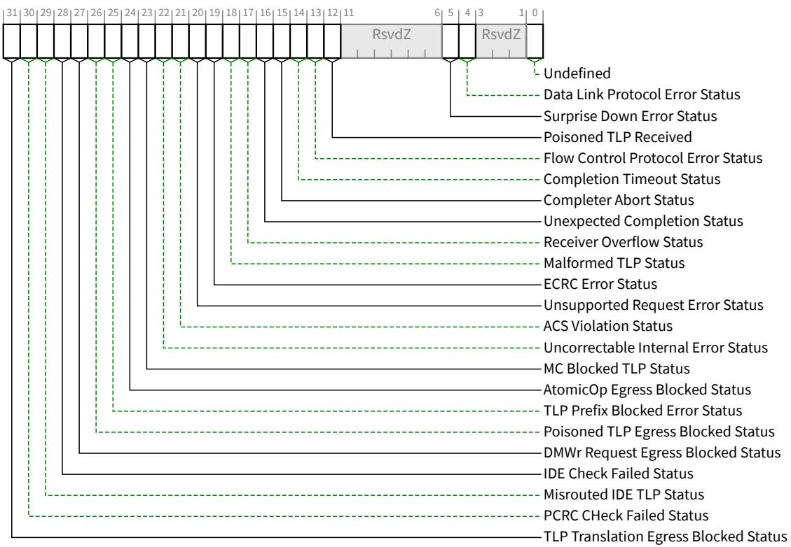

stacked bar chart

| Event | Value |
| --- | --- |
| Undefined | 6 |
| Data Link Protocol Error Status | 7 |
| Surprise Down Error Status | 8 |
| Poisoned TLP Received | 9 |
| Flow Control Protocol Error Status | 10 |
| Completion Timeout Status | 11 |
| Completer Abort Status | 12 |
| Unexpected Completion Status | 13 |
| Receiver Overflow Status | 14 |
| Malformed TLP Status | 15 |
| ECRC Error Status | 16 |
| Unsupported Request Error Status | 17 |
| ACS Violation Status | 18 |
| Uncorrectable Internal Error Status | 19 |
| MC Blocked TLP Status | 20 |
| AtomicOp Egress Blocked Status | 21 |
| TLP Prefix Blocked Error Status | 22 |
| Poisoned TLP Egress Blocked Status | 23 |
| DMWr Request Egress Blocked Status | 24 |
| IDE Check Failed Status | 25 |
| Misrouted IDE TLP Status | 26 |
| PCRC Check Failed Status | 27 |
| TLP Translation Egress Blocked Status | 28 |

Figure 7-155 Uncorrectable Error Status Register§

Table 7-135 Uncorrectable Error Status Register§

<table><tr><td>Bit Location</td><td>Register Description</td><td>Attributes</td><td>Default</td></tr><tr><td>0</td><td>Undefined Undefined - The value read from this bit is undefined. In previous versions of this specification, this bit was used to indicate a Link Training Error. System software must ignore the value read from this bit. System software is permitted to write any value to this bit.</td><td>Undefined</td><td>Undefined</td></tr><tr><td>4</td><td>Data Link Protocol Error Status</td><td>RW1CSVF ROZ</td><td>0b</td></tr><tr><td>5</td><td>Surprise Down Error Status (Optional)</td><td>RW1CSVF ROZ</td><td>0b</td></tr><tr><td>12</td><td>Poisoned TLP Received Status</td><td>RW1CS</td><td>0b</td></tr><tr><td>13</td><td>Flow Control Protocol Error Status (Optional)</td><td>RW1CSVF ROZ</td><td>0b</td></tr><tr><td>14</td><td>Completion Timeout Status $^{163}$ </td><td>RW1CS</td><td>0b</td></tr><tr><td>15</td><td>Completer Abort Status (Optional)</td><td>RW1CS</td><td>0b</td></tr></table>

163. For Switch Ports, required if the Switch Port issues Non-Posted Requests on its own behalf (vs. only forwarding such Requests generated by other devices). If the Switch Port does not issue such Requests, then the Completion Timeout mechanism is not applicable and this bit must be hardwired to 0b.

<table><tr><td>Bit Location</td><td>Register Description</td><td>Attributes</td><td>Default</td></tr><tr><td>16</td><td>Unexpected Completion Status</td><td>RW1CS</td><td>0b</td></tr><tr><td>17</td><td>Receiver Overflow Status (Optional)</td><td>RW1CSVF ROZ</td><td>0b</td></tr><tr><td>18</td><td>Malformed TLP Status</td><td>RW1CSVF ROZ</td><td>0b</td></tr><tr><td>19</td><td>ECRC Error Status (Optional)</td><td>RW1CSVF ROZ</td><td>0b</td></tr><tr><td>20</td><td>Unsupported Request Error Status</td><td>RW1CS</td><td>0b</td></tr><tr><td>21</td><td>ACS Violation Status (Optional)</td><td>RW1CS</td><td>0b</td></tr><tr><td>22</td><td>Uncorrectable Internal Error Status (Optional)</td><td>RW1CS</td><td>0b</td></tr><tr><td>23</td><td>MC Blocked TLP Status (Optional)</td><td>RW1CS</td><td>0b</td></tr><tr><td>24</td><td>AtomicOp Egress Blocked Status (Optional)</td><td>RW1CS</td><td>0b</td></tr><tr><td>25</td><td>TLP Prefix Blocked Error Status (Optional)</td><td>RW1CS</td><td>0b</td></tr><tr><td>26</td><td>Poisoned TLP Egress Blocked Status (Optional)</td><td>RW1CS</td><td>0b</td></tr><tr><td>27</td><td>DMWr Request Egress Blocked Status (Optional)</td><td>RW1CS</td><td>0b</td></tr><tr><td>28</td><td>IDE Check Failed Status (Optional)</td><td>RW1CS</td><td>0b</td></tr><tr><td>29</td><td>Misrouted IDE TLP Status (Optional)</td><td>RW1CS</td><td>0b</td></tr><tr><td>30</td><td>PCRC CCheck Failed Status (Optional)</td><td>RW1CS</td><td>0b</td></tr><tr><td>31</td><td>TLP Translation Egress Blocked Status (Optional)</td><td>RW1CS</td><td>0b</td></tr></table>

## 7.8.4.3 Uncorrectable Error Mask Register (Offset 08h) §

The Uncorrectable Error Mask Register controls reporting of individual errors by the device Function to the PCI Express Root Complex via a PCI Express error Message. A masked error (respective bit Set in the mask register) is not recorded or reported in the Header Log, TLP Prefix Log, or First Error Pointer, and is not reported to the PCI Express Root Complex by this Function. Refer to § Section 6.2 for further details. There is a mask bit per error bit of the Uncorrectable Error Status register. Register fields for bits not implemented by the Function are hardwired to 0b. § Figure 7-156 details the allocation of register fields of the Uncorrectable Error Mask Register; § Table 7-136 provides the respective bit definitions.

For VF fields marked as VF RsvdP, the associated PF's setting applies to the VF. For VF fields marked as VF ROZ, the error is not applicable to a VF.

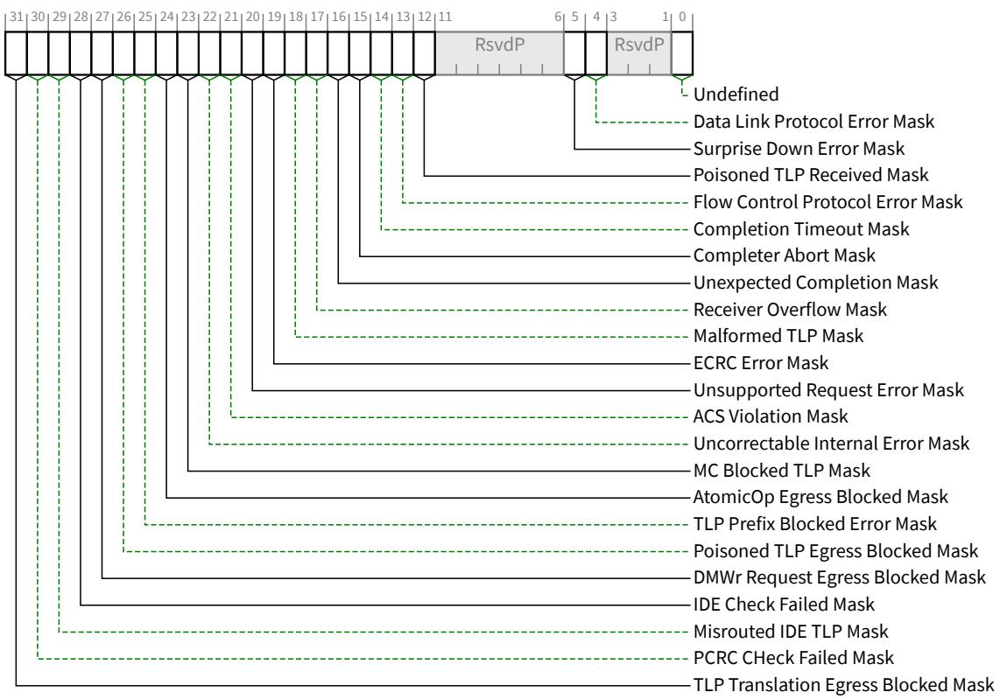

stacked bar chart

| Component | Value |
| --- | --- |
| Undefined | 100 |
| Data Link Protocol Error Mask | 6 |
| Surprise Down Error Mask | 6 |
| Poisoned TLP Received Mask | 6 |
| Flow Control Protocol Error Mask | 6 |
| Completion Timeout Mask | 6 |
| Completer Abort Mask | 6 |
| Unexpected Completion Mask | 6 |
| Receiver Overflow Mask | 6 |
| Malformed TLP Mask | 6 |
| ECRC Error Mask | 6 |
| Unsupported Request Error Mask | 6 |
| ACS Violation Mask | 6 |
| Uncorrectable Internal Error Mask | 6 |
| MC Blocked TLP Mask | 6 |
| AtomicOp Egress Blocked Mask | 6 |
| TLP Prefix Blocked Error Mask | 6 |
| Poisoned TLP Egress Blocked Mask | 6 |
| DMWr Request Egress Blocked Mask | 6 |
| IDE Check Failed Mask | 6 |
| Misrouted IDE TLP Mask | 6 |
| PCRC Check Failed Mask | 6 |
| TLP Translation Egress Blocked Mask | 6 |

Figure 7-156 Uncorrectable Error Mask Register§

Table 7-136 Uncorrectable Error Mask Register§

<table><tr><td>Bit Location</td><td>Register Description</td><td>Attributes</td><td>Default</td></tr><tr><td>0</td><td>Undefined Undefined - The value read from this bit is undefined. In previous versions of this specification, this bit was used to mask a Link Training Error. System software must ignore the value read from this bit. System software must only write a value of 1b to this bit.</td><td>Undefined</td><td>Undefined</td></tr><tr><td>4</td><td>Data Link Protocol Error Mask</td><td>RWSVF ROZ</td><td>0b</td></tr><tr><td>5</td><td>Surprise Down Error Mask (Optional)</td><td>RWSVF ROZ</td><td>0b</td></tr><tr><td>12</td><td>Poisoned TLP Received Mask</td><td>RWSVF RsvdP</td><td>0b</td></tr><tr><td>13</td><td>Flow Control Protocol Error Mask (Optional)</td><td>RWSVF ROZ</td><td>0b</td></tr><tr><td>14</td><td>Completion Timeout Mask $^{164}$ </td><td>RWSVF RsvdP</td><td>0b</td></tr></table>

164. For Switch Ports, required if the Switch Port issues Non-Posted Requests on its own behalf (vs. only forwarding such Requests generated by other devices). If the Switch Port does not issue such Requests, then the Completion Timeout mechanism is not applicable and this bit must be hardwired to 0b.

<table><tr><td>Bit Location</td><td>Register Description</td><td>Attributes</td><td>Default</td></tr><tr><td>15</td><td>Completer Abort Mask (Optional)</td><td>RWSVF RsvdP</td><td>0b</td></tr><tr><td>16</td><td>Unexpected Completion Mask</td><td>RWSVF RsvdP</td><td>0b</td></tr><tr><td>17</td><td>Receiver Overflow Mask (Optional)</td><td>RWSVF ROZ</td><td>0b</td></tr><tr><td>18</td><td>Malformed TLP Mask</td><td>RWSVF ROZ</td><td>0b</td></tr><tr><td>19</td><td>ECRC Error Mask (Optional)</td><td>RWSVF ROZ</td><td>0b</td></tr><tr><td>20</td><td>Unsupported Request Error Mask</td><td>RWSVF RsvdP</td><td>0b</td></tr><tr><td>21</td><td>ACS Violation Mask (Optional)</td><td>RWSVF RsvdP</td><td>0b</td></tr><tr><td>22</td><td>Uncorrectable Internal Error Mask (Optional)</td><td>RWS</td><td>1b</td></tr><tr><td>23</td><td>MC Blocked TLP Mask (Optional)</td><td>RWS</td><td>0b</td></tr><tr><td>24</td><td>AtomicOp Egress Blocked Mask (Optional)</td><td>RWS</td><td>0b</td></tr><tr><td>25</td><td>TLP Prefix Blocked Error Mask (Optional)</td><td>RWS</td><td>0b</td></tr><tr><td>26</td><td>Poisoned TLP Egress Blocked Mask (Optional)</td><td>RWS</td><td>1b</td></tr><tr><td>27</td><td>DMWr Request Egress Blocked Mask (Optional)</td><td>RWS</td><td>0b</td></tr><tr><td>28</td><td>IDE Check Failed Mask (Optional)</td><td>RWS</td><td>0b</td></tr><tr><td>29</td><td>Misrouted IDE TLP Mask (Optional)</td><td>RWS</td><td>0b</td></tr><tr><td>30</td><td>PCRC CCheck Failed Mask (Optional)</td><td>RWS</td><td>0b</td></tr><tr><td>31</td><td>TLP Translation Egress Blocked Mask (Optional)</td><td>RWS</td><td>0b</td></tr></table>

## 7.8.4.4 Uncorrectable Error Severity Register (Offset 0Ch) §

The Uncorrectable Error Severity Register controls whether an individual error is reported as a Non-fatal or Fatal error. An error is reported as fatal when the corresponding error bit in the severity register is Set. If the bit is Clear, the corresponding error is considered non-fatal. Refer to § Section 6.2 for further details. Register fields for bits not implemented by the Function are hardwired to an implementation specific value. § Figure 7-157 details the allocation of register fields of the Uncorrectable Error Severity Register; § Table 7-137 provides the respective bit definitions.

For VF fields marked as VF RsvdP, the associated PF's setting applies to the VF. For VF fields marked as VF ROZ, the error is not applicable to a VF.

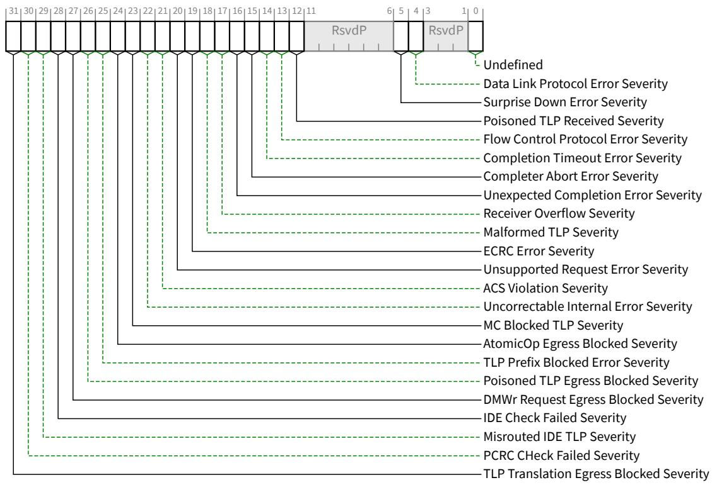

stacked bar chart

| Severity Category | Count |
| --- | --- |
| Undefined | 0 |
| Data Link Protocol Error Severity | 1 |
| Surprise Down Error Severity | 1 |
| Poisoned TLP Received Severity | 1 |
| Flow Control Protocol Error Severity | 1 |
| Completion Timeout Error Severity | 1 |
| Completer Abort Error Severity | 1 |
| Unexpected Completion Error Severity | 1 |
| Receiver Overflow Severity | 1 |
| Malformed TLP Severity | 1 |
| ECRC Error Severity | 1 |
| Unsupported Request Error Severity | 1 |
| ACS Violation Severity | 1 |
| Uncorrectable Internal Error Severity | 1 |
| MC Blocked TLP Severity | 1 |
| AtomicOp Egress Blocked Severity | 1 |
| TLP Prefix Blocked Error Severity | 1 |
| Poisoned TLP Egress Blocked Severity | 1 |
| DMWr Request Egress Blocked Severity | 1 |
| IDE Check Failed Severity | 1 |
| Misrouted IDE TLP Severity | 1 |
| PCRC CCheck Failed Severity | 1 |
| TLP Translation Egress Blocked Severity | 1 |

Figure 7-157 Uncorrectable Error Severity Register§

Table 7-137 Uncorrectable Error Severity Register§

<table><tr><td>Bit Location</td><td>Register Description</td><td>Attributes</td><td>Default</td></tr><tr><td>0</td><td>Undefined Undefined - The value read from this bit is undefined. In previous versions of this specification, this bit was used to Set the severity of a Link Training Error. System software must ignore the value read from this bit. System software is permitted to write any value to this bit.</td><td>Undefined</td><td>Undefined</td></tr><tr><td>4</td><td>Data Link Protocol Error Severity</td><td>RWSVF ROZ</td><td>1b</td></tr><tr><td>5</td><td>Surprise Down Error Severity (Optional)</td><td>RWSVF ROZ</td><td>1b</td></tr><tr><td>12</td><td>Poisoned TLP Received Severity</td><td>RWSVF RsvdP</td><td>0b</td></tr><tr><td>13</td><td>Flow Control Protocol Error Severity (Optional)</td><td>RWSVF ROZ</td><td>1b</td></tr><tr><td>14</td><td>Completion Timeout Error Severity $^{165}$ </td><td>RWSVF RsvdP</td><td>0b</td></tr></table>

165. For Switch Ports, required if the Switch Port issues Non-Posted Requests on its own behalf (vs. only forwarding such Requests generated by other devices). If the Switch Port does not issue such Requests, then the Completion Timeout mechanism is not applicable and this bit must be hardwired to 0b.

<table><tr><td>Bit Location</td><td>Register Description</td><td>Attributes</td><td>Default</td></tr><tr><td>15</td><td>Completer Abort Error Severity (Optional)</td><td>RWSVF RsvdP</td><td>0b</td></tr><tr><td>16</td><td>Unexpected Completion Error Severity</td><td>RWSVF RsvdP</td><td>0b</td></tr><tr><td>17</td><td>Receiver Overflow Severity (Optional)</td><td>RWSVF ROZ</td><td>1b</td></tr><tr><td>18</td><td>Malformed TLP Severity</td><td>RWSVF ROZ</td><td>1b</td></tr><tr><td>19</td><td>ECRC Error Severity (Optional)</td><td>RWSVF ROZ</td><td>0b</td></tr><tr><td>20</td><td>Unsupported Request Error Severity</td><td>RWSVF RsvdP</td><td>0b</td></tr><tr><td>21</td><td>ACS Violation Severity (Optional)</td><td>RWSVF RsvdP</td><td>0b</td></tr><tr><td>22</td><td>Uncorrectable Internal Error Severity (Optional)</td><td>RWS</td><td>1b</td></tr><tr><td>23</td><td>MC Blocked TLP Severity (Optional)</td><td>RWS</td><td>0b</td></tr><tr><td>24</td><td>AtomicOp Egress Blocked Severity (Optional)</td><td>RWS</td><td>0b</td></tr><tr><td>25</td><td>TLP Prefix Blocked Error Severity (Optional)</td><td>RWS</td><td>0b</td></tr><tr><td>26</td><td>Poisoned TLP Egress Blocked Severity (Optional)</td><td>RWS</td><td>0b</td></tr><tr><td>27</td><td>DMWr Request Egress Blocked Severity (Optional)</td><td>RWS</td><td>0b</td></tr><tr><td>28</td><td>IDE Check Failed Severity (Optional)</td><td>RWS</td><td>1b</td></tr><tr><td>29</td><td>Misrouted IDE TLP Severity (Optional)</td><td>RWS</td><td>0b</td></tr><tr><td>30</td><td>PCRC CCheck Failed Severity (Optional)</td><td>RWS</td><td>0b</td></tr><tr><td>31</td><td>TLP Translation Egress Blocked Severity (Optional)</td><td>RWS</td><td>0b</td></tr></table>

## 7.8.4.5 Correctable Error Status Register (Offset 10h) §

The Correctable Error Status register reports error status of individual correctable error sources on a PCI Express device Function. When an individual error status bit is Set, it indicates that a particular error occurred; software may clear an error status by writing a 1b to the respective bit. Refer to § Section 6.2 for further details. Register bits not implemented by the Function are hardwired to 0b. § Figure 7-158 details the allocation of register fields of the Correctable Error Status register; § Table 7-138 provides the respective bit definitions.

For SR-IOV devices, errors categorized as non-Function-specific must be logged in PFs and non-IOV Functions, but not logged in VFs. VFs must log only Function-specific errors.

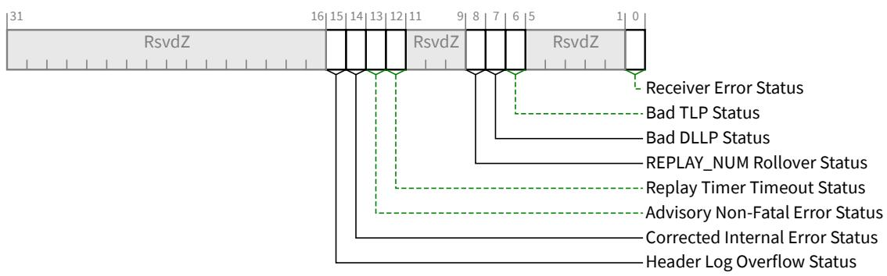

text_image

31
RsvdZ
16 15 14 13 12 11 9 8 7 6 5 0
RsvdZ
RsvdZ
Receiver Error Status
Bad TLP Status
Bad DLLP Status
REPLAY_NUM Rollover Status
Replay Timer Timeout Status
Advisory Non-Fatal Error Status
Corrected Internal Error Status
Header Log Overflow Status

Figure 7-158 Correctable Error Status Register§

Table 7-138 Correctable Error Status Register§

<table><tr><td>Bit Location</td><td>Register Description</td><td>Attributes</td><td>Default</td></tr><tr><td>0</td><td> $Receiver\ Error\ Status^{166}$ </td><td>RW1CSVF ROZ</td><td>0b</td></tr><tr><td>6</td><td>Bad TLP Status</td><td>RW1CSVF ROZ</td><td>0b</td></tr><tr><td>7</td><td>Bad DLLP Status</td><td>RW1CSVF ROZ</td><td>0b</td></tr><tr><td>8</td><td>REPLAY_NUM Rollover Status</td><td>RW1CSVF ROZ</td><td>0b</td></tr><tr><td>12</td><td>Replay Timer Timeout Status</td><td>RW1CSVF ROZ</td><td>0b</td></tr><tr><td>13</td><td>Advisory Non-Fatal Error Status</td><td>RW1CS</td><td>0b</td></tr><tr><td>14</td><td>Corrected Internal Error Status (Optional)</td><td>RW1CS</td><td>0b</td></tr><tr><td>15</td><td>Header Log Overflow Status (Optional)If the VF implements Header Log sharing (see § Section 6.2.4.2.1), this bit must be hardwired to Zero.</td><td>RW1CS / 0b</td><td>0b</td></tr></table>

## 7.8.4.6 Correctable Error Mask Register (Offset 14h) §

The Correctable Error Mask Register controls reporting of individual correctable errors by this Function to the PCI Express Root Complex via a PCI Express error Message. A masked error (respective bit Set in the mask register) is not reported to the PCI Express Root Complex by this Function. Refer to § Section 6.2 for further details. There is a mask bit per error bit in the Correctable Error Status register. Register fields for bits not implemented by the Function are hardwired to 0b. § Figure 7-159 details the allocation of register fields of the Correctable Error Mask Register; § Table 7-139 provides the respective bit definitions.

For VF fields marked as VF RsvdP, the associated PF's setting applies to the VF.

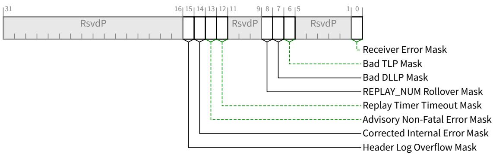

text_image

31
RsvdP
16 15 14 13 12 11 9 8 7 6 5 1 0
RsvdP
RsvdP
Receiver Error Mask
Bad TLP Mask
Bad DLLP Mask
REPLAY_NUM Rollover Mask
Replay Timer Timeout Mask
Advisory Non-Fatal Error Mask
Corrected Internal Error Mask
Header Log Overflow Mask

Figure 7-159 Correctable Error Mask Register§

Table 7-139 Correctable Error Mask Register§

<table><tr><td>Bit Location</td><td>Register Description</td><td>Attributes</td><td>Default</td></tr><tr><td>0</td><td> $Receiver\ Error\ Mask^{167}$ </td><td>RWSVF RsvdP</td><td>0b</td></tr><tr><td>6</td><td>Bad TLP Mask</td><td>RWSVF RsvdP</td><td>0b</td></tr><tr><td>7</td><td>Bad DLLP Mask</td><td>RWSVF RsvdP</td><td>0b</td></tr><tr><td>8</td><td>REPLAY_NUM Rollover Mask</td><td>RWSVF RsvdP</td><td>0b</td></tr><tr><td>12</td><td>Replay Timer Timeout Mask</td><td>RWSVF RsvdP</td><td>0b</td></tr><tr><td>13</td><td>Advisory Non-Fatal Error Mask- This bit is Set by default to enable compatibility with software that does not comprehend Role-Based Error Reporting.</td><td>RWSVF RsvdP</td><td>1b</td></tr><tr><td>14</td><td>Corrected Internal Error Mask(Optional)</td><td>RWS</td><td>1b</td></tr><tr><td>15</td><td>Header Log Overflow Mask(Optional)If the VF implements Header Log sharing (see § Section 6.2.4.2.1), this bit is RsvdP.</td><td>RWS / RsvdP</td><td>1b</td></tr></table>

## 7.8.4.7 Advanced Error Capabilities and Control Register (Offset 18h) §

§ Figure 7-160 details allocation of register fields in the Advanced Error Capabilities and Control register; § Table 7-140 provides the respective bit definitions. Handling of multiple errors is discussed in § Section 6.2.4.2 .

For VF fields marked as VF RsvdP, the associated PF's setting applies to the VF. For VF fields marked as VF ROZ, the error is not applicable to a VF.

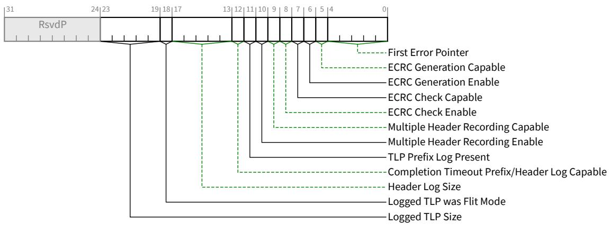

line chart

| Bit Position | Value |
| ------------ | ----- |
| First Error Pointer | 24 |
| ECRC Generation Capable | 23 |
| ECRC Generation Enable | 19 |
| ECRC Check Capable | 18 |
| ECRC Check Enable | 17 |
| Multiple Header Recording Capable | 16 |
| Multiple Header Recording Enable | 15 |
| TLP Prefix Log Present | 14 |
| Completion Timeout Prefix/Header Log Capable | 13 |
| Header Log Size | 12 |
| Logged TLP was Flit Mode | 11 |
| Logged TLP Size | 10 |

Figure 7-160 Advanced Error Capabilities and Control Register§

Table 7-140 Advanced Error Capabilities and Control Register§

<table><tr><td>Bit Location</td><td>Register Description</td><td>Attributes</td></tr><tr><td>4:0</td><td>First Error Pointer- The First Error Pointer is a field that identifies the bit position of the first error reported in the Uncorrectable Error Status register. Refer to § Section 6.2 for further details.</td><td>ROS</td></tr><tr><td>5</td><td>ECRC Generation Capable- If Set, this bit indicates that the Function is capable of generating ECRC (see § Section 2.7).</td><td>RO</td></tr><tr><td>6</td><td>ECRC Generation Enable- When Set, ECRC generation is enabled (see § Section 2.7).Functions that do not implement the associated mechanism are permitted to hardwire this bit to 0b.Default value of this bit is 0b.</td><td>RWSVF RsvdP</td></tr><tr><td>7</td><td>ECRC Check Capable- If Set, this bit indicates that the Function is capable of checking ECRC (see § Section 2.7).</td><td>RO</td></tr><tr><td>8</td><td>ECRC Check Enable- When Set, ECRC checking is enabled (see § Section 2.7). Functions that do not implement the associated mechanism are permitted to hardwire this bit to 0b.Default value of this bit is 0b.</td><td>RWSVF RsvdP</td></tr><tr><td>9</td><td>Multiple Header Recording Capable- If Set, this bit indicates that the Function is capable of recording more than one error header. Refer to § Section 6.2 for further details.If the VF implements Header Log sharing (see § Section 6.2.4.2.1), this bit must be hardwired to Zero.</td><td>RO / 0b</td></tr><tr><td>10</td><td>Multiple Header Recording Enable- When Set, this bit enables the Function to record more than one error header.Functions that do not implement the associated mechanism are permitted to hardwire this bit to 0b.If the VF implements Header Log sharing (see § Section 6.2.4.2.1), this bit is RsvdP.Default value of this bit is 0b.</td><td>RWS / RsvdP</td></tr><tr><td>11</td><td>TLP Prefix Log Present- If End-End TLP Prefix Supported is Clear, this bit is RsvdP.</td><td>ROS / RsvdP</td></tr><tr><td></td><td>If Flit Mode Supported is Set, First Error Pointer is valid, and Logged TLP was Flit Mode is Set, this bit must be 0.If this bit is Set and First Error Pointer is valid, the TLP Prefix Log Register (offset 38h to 44h, also known as Header Log Register DW5-8) contains valid Non-Flit Mode End-End TLP Prefix information.If this bit is Clear or First Error Pointer not valid, the TLP Prefix Log Register does not contain End-End TLP Prefix information (the overlapping field, Header Log Register DW5-8, may contain Flit Mode TLP Header information as specified elsewhere in this section).Default value of this bit is 0.If the VF implements Header Log Sharing (see § Section 6.2.4.2.1 ), this bit must be Zero when the Header Log contains all 1s due to an overflow condition.</td><td></td></tr><tr><td>12</td><td>Completion Timeout Prefix/Header Log Capable - If Set, this bit indicates that the Function records the prefix/header of Request TLPs that experience a Completion Timeout error.</td><td>HwInit</td></tr><tr><td>17:13</td><td>Header Log Size - This field indicates the number of DW of Header Log that are implemented.If Flit Mode Supported is Set, see text for requirements.If Flit Mode Supported is Clear and End-End TLP Prefix Supported is Set, this value must either be 0 or must be greater than or equal to 8.If this field is 0 and Flit Mode Supported is Clear, the size of the header log depends on End-End TLP Prefix Supported. If End-End TLP Prefix Supported is Clear, the Header Log is 4 DW, otherwise the Header Log is 8 DW.</td><td>HwInit/RsvdP</td></tr><tr><td>18</td><td>Logged TLP was Flit Mode -- If Flit Mode Supported is Set, First Error Pointer is valid, and this bit is Set, the logged TLP was captured in Flit Mode otherwise the TLP was captured in Non-Flit Mode.</td><td>ROS</td></tr><tr><td>23:19</td><td>Logged TLP Size -- If Flit Mode Supported is Set and First Error Pointer is valid, this field contains the number of DW that were logged in the Header Log Register and, if appropriate, the TLP Prefix Log Register.If Flit Mode Supported is Set, First Error Pointer is valid, the VF implements Header Log Sharing (see § Section 6.2.4.2.1 ), and a Header Log overflow condition occurred, this field must be 0 (in addition to the Header Log containing all 1s).</td><td>ROS</td></tr></table>

## 7.8.4.8 Header Log Register (Offset 1Ch) §

The Header Log Register contains the header for the TLP corresponding to a detected error; refer to § Section 6.2 for further details. § Section 6.2 also describes the conditions where the packet header is recorded. This register is 16 bytes and adheres to the format of the headers defined throughout this specification.

The header is captured such that, when read using DW accesses, the fields of the header are laid out in the same way the headers are presented in this document. Therefore, byte 0 of the header is located in byte 3 of the Header Log Register, byte 1 of the header is in byte 2 of the Header Log Register and so forth. For 12-byte headers, only bytes 0 through 11 of the Header Log Register are used and values in bytes 12 through 15 are undefined.

See § Section 6.2.4.2.1 for further requirements when VFs share Header Log space.

In certain cases where a Malformed TLP is reported, the Header Log Register may contain TLP Prefix information. See § Section 6.2.4.4 for details.

§ Figure 7-161 details allocation of register fields in the Header Log Register; § Table 7-141 provides the respective bit definitions.

When Flit Mode Supported is Set and the link is operating in Flit Mode, the Header Log Register extends into additional DWs as indicated by the Header Log Size field. Software must parse the Type and OHC fields to determine the size and layout of a TLP recorded in the Header Log Register. Hardware is not required to support logging of TLP Headers larger than the largest size supported by the Port. Hardware is not required to support logging of OHC types not supported by the Port. TLP Trailers are not logged in the Header Log Register. The required minimum size of the Header Log Register is determined by the largest Header Base Size implemented by the Port (up to the maximum defined of 7 DW - See § Table 2-5), plus the largest number of OHC implemented by the Port (up to the maximum defined of 7 DW). Hardware must hardwire to zero the DW of the Header Log Register beyond those required to log the largest supported TLP Header and the overall length of the Advanced Error Reporting Extended Capability is reduced accordingly. As in Non-Flit Mode, Local TLP Prefixes are not logged.

When the link is operating in Non-Flit Mode, End-End TLP Pefixes are logged in the TLP Prefix Log Register.

<table><tr><td>31</td><td colspan="2">24 23</td><td colspan="2">16 15</td><td colspan="2">8 7</td><td>0</td></tr><tr><td colspan="8">Header Log Register (1st DW)</td></tr><tr><td>Header Byte 0</td><td></td><td colspan="2">Header Byte 1</td><td>Header Byte 2</td><td></td><td>Header Byte 3</td><td></td></tr><tr><td colspan="8">Header Log Register (2nd DW)</td></tr><tr><td>Header Byte 4</td><td></td><td colspan="2">Header Byte 5</td><td>Header Byte 6</td><td></td><td>Header Byte 7</td><td></td></tr><tr><td colspan="8">Header Log Register (3rd DW)</td></tr><tr><td>Header Byte 8</td><td></td><td colspan="2">Header Byte 9</td><td>Header Byte 10</td><td></td><td>Header Byte11</td><td></td></tr><tr><td colspan="8">Header Log Register (4th DW)</td></tr><tr><td>Header Byte 12</td><td></td><td colspan="2">Header Byte 13</td><td>Header Byte 14</td><td></td><td>Header Byte 15</td><td></td></tr></table>

OM14549A

§

Figure 7-161 Header Log Register

§

Table 7-141 Header Log Register

<table><tr><td>Bit Location</td><td>Register Description</td><td>Attributes</td><td>Default</td></tr><tr><td>127:0</td><td>Header of TLP associated with error</td><td>ROS</td><td>0</td></tr></table>

## 7.8.4.9 Root Error Command Register (Offset 2Ch) §

The Root Error Command Register allows further control of Root Complex response to Correctable, Non-Fatal, and Fatal error Messages than the basic Root Complex capability to generate system errors in response to error Messages (either received or internally generated). Bit fields (see § Figure 7-162) enable or disable generation of interrupts (claimed by the Root Port or Root Complex Event Collector) in addition to system error Messages according to the definitions in § Table 7-142.

For both Root Ports and Root Complex Event Collectors, in order for a received error Message or an internally generated error Message to generate an interrupt enabled by this register, the error Message must be enabled for “transmission” by the Root Port or Root Complex Event Collector (see § Section 6.2.4.1 and § Section 6.2.8.1 ).

For Functions other than Root Ports and Root Complex Event Collectors: when End-End TLP Prefix Supported is Set, this register is RsvdP and when End-End TLP Prefix Supported is Clear, this register is not required to be implemented.

text_image

31
RsvdP
3 2 1 0
Correctable Error Reporting Enable
Non-Fatal Error Reporting Enable
Fatal Error Reporting Enable

Figure 7-162 Root Error Command Register§

Table 7-142 Root Error Command Register§

<table><tr><td>Bit Location</td><td>Register Description</td><td>Attributes</td><td>Default</td></tr><tr><td>0</td><td>Correctable Error Reporting Enable- When Set, this bit enables the generation of an interrupt when a correctable error is reported by any of the Functions in the Hierarchy Domain associated with this Root Port.Root Complex Event Collectors provide support for the above described functionality for RCiEPs.Refer to § Section 6.2 for further details.</td><td>RW</td><td>0b</td></tr><tr><td>1</td><td>Non-Fatal Error Reporting Enable- When Set, this bit enables the generation of an interrupt when a Non-fatal error is reported by any of the Functions in the Hierarchy Domain associated with this Root Port.Root Complex Event Collectors provide support for the above described functionality for RCiEPs.Refer to § Section 6.2 for further details.</td><td>RW</td><td>0b</td></tr><tr><td>2</td><td>Fatal Error Reporting Enable- When Set, this bit enables the generation of an interrupt when a Fatal error is reported by any of the Functions in the Hierarchy Domain associated with this Root Port.Root Complex Event Collectors provide support for the above described functionality for RCiEPs.Refer to § Section 6.2 for further details.</td><td>RW</td><td>0b</td></tr></table>

System error generation in response to PCI Express error Messages may be turned off by system software using the PCI Express Capability structure described in § Section 7.5.3 when advanced error reporting via interrupts is enabled. Refer to § Section 6.2 for further details.

## 7.8.4.10 Root Error Status Register (Offset 30h) §

The Root Error Status Register reports status of error Messages (ERR\_COR, ERR\_NONFATAL, and ERR\_FATAL) received by the Root Port, and of errors detected by the Root Port itself (which are treated conceptually as if the Root Port had sent an error Message to itself). In order to update this register, error Messages received by the Root Port and/or internally generated error Messages must be enabled for “transmission” by the primary interface of the Root Port. ERR\_NONFATAL and ERR\_FATAL Messages are grouped together as uncorrectable. Each correctable and uncorrectable (Non-fatal and Fatal) error source has a first error bit and a next error bit associated with it respectively. When an error is received by a Root Complex, the respective first error bit is Set and the Requester ID is logged in the Error Source Identification Register. A Set individual error status bit indicates that a particular error category occurred; software may clear an error status by writing a 1b to the respective bit. If software does not clear the first reported error before another error Message is received of the same category (correctable or uncorrectable), the corresponding next error status bit will be set but the Requester ID of the subsequent error Message is discarded. The next error status bits may be cleared by software by writing a 1b to the respective bit as well. Refer to § Section 6.2 for further details. This register is updated regardless of the settings of the Root Control Register and the Root Error Command Register. § Figure 7-163 details allocation of register fields in the Root Error Status Register; § Table 7-143 provides the respective bit definitions. Root Complex Event Collectors provide support for the above-described functionality for RCiEPs (and for the Root Complex Event Collector itself). In order to update this register, error Messages received by the Root Complex Event Collector from its associated RCiEPs and/or internally generated error Messages must be enabled for “transmission” by the Root Complex Event Collector.

For Functions other than Root Ports and Root Complex Event Collectors: when End-End TLP Prefix Supported is Set, this register is RsvdZ and when End-End TLP Prefix Supported is Clear, this register is not required to be implemented.

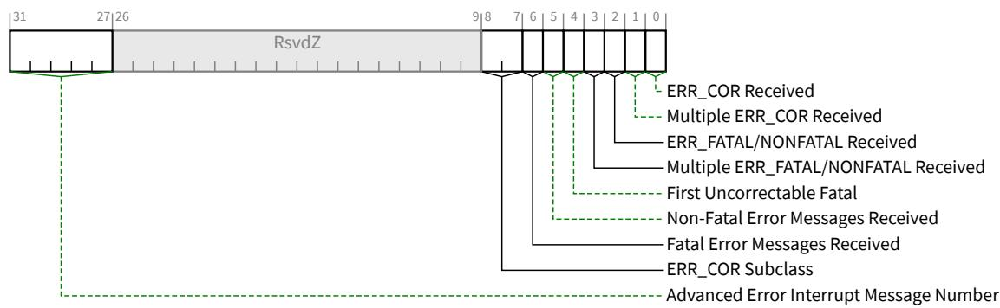

bit diagram

| Bit Position | Description                                      |
| ------------ | ------------------------------------------------- |
| 0            | Advanced Error Interrupt Message Number             |
| 1            | ERR_COR Subclass                                 |
| 2            | Fatal Error Messages Received                        |
| 3            | Non-Fatal Error Messages Received                   |
| 4            | First Uncorrectable Fatal                          |
| 5            | Multiple ERR_FATAL/NONFATAL Received                |
| 6            | ERR_FATAL/NONFATAL Received                      |
| 7            | Multiple ERR_COR Received                           |
| 8            | ERR_COR Received                                  |
| 9            | Multiple ERR_FATAL/NONFATAL Received               |
| 10           | ERR_FATAL/NONFATAL Received                       |
| 11           | Multiple ERR_FATAL/NONFATAL Received                |
| 12           | ERR_FATAL/NONFATAL Received                         |
| 13           | Multiple ERR_FATAL/NONFATAL Received                |
| 14           | ERR_FATAL/NONFATAL Received                         |
| 15           | Multiple ERR_FATAL/NONFATAL Received                |
| 16           | ERR_FATAL/NONFATAL Received                         |
| 17           | Multiple ERR_FATAL/NONFATAL Received                |
| 18           | ERR_FATAL/NONFATAL Received                         |
| 19           | Multiple ERR_FATAL/NONFATAL Received                |
| 20           | ERR_FATAL/NONFATAL Received                         |
| 21           | Multiple ERR_FATAL/NONFATAL Received                |
| 22           | ERR_FATAL/NONFATAL Received                         |
| 23           | Multiple ERR_FATAL/NONFATAL Received                |
| 24           | ERR_FATAL/NONFATAL Received                         |
| 25           | Multiple ERR_FATAL/NONFATAL Received                |
| 26           | ERR_FATAL/NONFATAL Received                         |
| 27           | Multiple ERRLEGAL/NONFATAL Received                     |
| 28           | ERR_FATAL/NONFATAL Received                         |
| 29           | Multiple ERR_FATAL/NONFATAL Received                |
| 30           | ERR_FATAL/NONFATAL Received                         |
| 31           | Multiple ERRLEGAL/NONFATAL Received                    |

Figure 7-163 Root Error Status Register§

Table 7-143 Root Error Status Register

<table><tr><td>Bit Location</td><td>Register Description</td><td>Attributes</td></tr><tr><td>0</td><td>ERR_COR Received- Set when a Correctable error Message is received and this bit is not already Set.Default value of this bit is 0b.</td><td>RW1CS</td></tr><tr><td>1</td><td>Multiple ERR_COR Received- Set when a Correctable error Message is received and ERR_COR Received is already Set.Default value of this bit is 0b.</td><td>RW1CS</td></tr><tr><td>2</td><td>ERR_FATAL/NONFATAL Received- Set when either a Fatal or a Non-fatal error Message is received and this bit is not already Set.Default value of this bit is 0b.</td><td>RW1CS</td></tr><tr><td>3</td><td>Multiple ERR_FATAL/NONFATAL Received- Set when either a Fatal or a Non-fatal error is received and ERR_FATAL/NONFATAL Received is already Set.Default value of this bit is 0b.</td><td>RW1CS</td></tr><tr><td>4</td><td>First Uncorrectable Fatal- Set when the first Uncorrectable error Message received is for a Fatal error.Default value of this field is 0b.</td><td>RW1CS</td></tr><tr><td>5</td><td>Non-Fatal Error Messages Received- Set when one or more Non-Fatal Uncorrectable error Messages have been received.Default value of this bit is 0b.</td><td>RW1CS</td></tr><tr><td>6</td><td>Fatal Error Messages Received- Set when one or more Fatal Uncorrectable error Messages have been received.Default value of this bit is 0b.</td><td>RW1CS</td></tr><tr><td>8:7</td><td>ERR_COR Subclass- If the Function is ERR_COR Subclass capable and the ERR_COR Received bit is not already Set, this field is loaded with the value of the ERR_COR Subclass field in the received ERR_COR Message. See § Section 2.2.8.3 . The value in this field is only valid when the ERR_COR Received bit is Set. If the Function is not ERR_COR Subclass capable, this field is Reserved.If the Function is ERR_COR Subclass capable and a SIG_SFW ERR_COR Message is received, system firmware should be signaled using a system-specific mechanism.Default value of this field is 00b.</td><td>ROS/RsvdZ</td></tr><tr><td>31:27</td><td>Advanced Error Interrupt Message Number- This register indicates which MSI/MSI-X vector is used for the interrupt message generated in association with any of the status bits of this Capability.For MSI, the value in this register indicates the offset between the base Message Data and the interrupt message that is generated. Hardware is required to update this field so that it is correct if the number of MSI Messages assigned to the Function changes when software writes to the Multiple Message Enable field in the Message Control Register for MSI.For MSI-X, the value in this register indicates which MSI-X Table entry is used to generate the interrupt message. The entry must be one of the first 32 entries even if the Function implements more than 32 entries. For a given MSI-X implementation, the entry must remain constant.If both MSI and MSI-X are implemented, they are permitted to use different vectors, though software is permitted to enable only one mechanism at a time. If MSI-X is enabled, the value in this register must indicate the vector for MSI-X. If MSI is enabled or neither is enabled, the value in this register must indicate the vector for MSI. If software enables both MSI and MSI-X at the same time, the value in this register is undefined.</td><td>RO</td></tr></table>

## 7.8.4.11 Error Source Identification Register (Offset 34h) §

The Error Source Identification Register identifies the source (Requester ID) of first correctable and uncorrectable (Non-fatal/Fatal) errors reported in the Root Error Status Register. Refer to § Section 6.2 for further details. This register is updated regardless of the settings of the Root Control Register and the Root Error Command Register. § Figure 7-164 details allocation of register fields in the Error Source Identification Register; § Table 7-144 provides the respective bit definitions.

For Functions other than Root Ports and Root Complex Event Collectors: when End-End TLP Prefix Supported is Set, this register is RsvdP and when End-End TLP Prefix Supported is Clear, this register is not required to be implemented.

text_image

31
16 15
0
ERR_COR Source Identification
ERR_FATAL/NONFATAL Source Identification

Figure 7-164 Error Source Identification Register§

Table 7-144 Error Source Identification Register§

<table><tr><td>Bit Location</td><td>Register Description</td><td>Attributes</td></tr><tr><td>15:0</td><td>ERR_COR Source Identification- Loaded with the Requester ID indicated in the received ERR_COR Message when the ERR_COR Received bit is not already set.Default value of this field is 0000h.</td><td>ROS</td></tr><tr><td>31:16</td><td>ERR_FATAL/NONFATAL Source Identification- Loaded with the Requester ID indicated in the received ERR_FATAL or ERR_NONFATAL Message when the ERR_FATAL/NONFATAL Received bit is not already set.Default value of this field is 0000h.</td><td>ROS</td></tr></table>

## 7.8.4.12 TLP Prefix Log Register (Offset 38h) §

The TLP Prefix Log Register captures the End-End TLP Prefix(s) for the TLP corresponding to the detected error; refer to § Section 6.2 for further details. The TLP Prefix Log Register is only meaningful when First Error Pointer is valid and the TLP Prefix Log Present bit is Set (see § Section 7.8.4.7 ).

The TLP Prefixes are captured such that, when read using DW accesses, the fields of the TLP Prefix are laid out in the same way the fields of the TLP Prefix are described. Therefore, byte 0 of a TLP Prefix is located in byte 3 of the associated TLP Prefix Log Register; byte 1 of a TLP Prefix is located in byte 2; and so forth.

The First TLP Prefix Log Register contains the first End-End TLP Prefix from the TLP (see § Section 6.2.4.4 ). The Second TLP Prefix Log Register contains the second End-End TLP Prefix and so forth. If the TLP contains fewer than four End-End TLP Prefixes, the remaining TLP Prefix Log Registers contain zero. A TLP that contains more End-End TLP Prefixes than are indicated by the Function’s Max End-End TLP Prefixes field must be handled as an error (see § Section 2.2.10.4 for specifics). To allow software to detect this condition, the supported number of End-End TLP Prefixes are logged in this register, the first overflow End-End TLP Prefix is logged in the first DW of the Header Log register and the remaining DWs of the Header Log register are undefined (see § Section 6.2.4.4 ).

The TLP Prefix Log Registers beyond the number supported by the Function are hardwired to zero. For example, if a Functions, Max End-End TLP Prefixes field contains 10b (indicating 2 DW of buffering) then the third and fourth TLP Prefix Log Registers are hardwired to zero. If the End-End TLP Prefix Supported bit (§ Section 7.5.3.15 ) is Clear, the TLP Prefix Log Register is not required to be implemented.

For VFs that share Header Log space, this register’s contents are undefined when the Header Log contains all 1s due to an overflow condition. See § Section 6.2.4.2.1 for further requirements when VFs share Header Log space.

When Flit Mode Supported is Set and the link is operating in Flit Mode, this register is not present and the Header Log Register extends into this space (see additional DWs as indicated by the Header Log Size field.

When the link is operating in Non-Flit Mode, End-End TLP Pefixes are logged in the TLP Prefix Log Register.

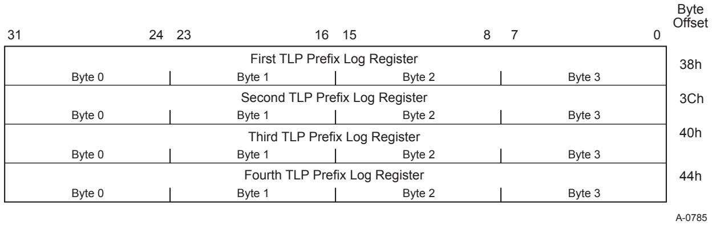

stacked bar chart

| TLP Prefix Log Register | Byte 0 | Byte 1 | Byte 2 | Byte 3 |
| ------------------------ | ------ | ------ | ------ | ------ |
| First TLP Prefix Log Register |        |        |        | 38h    |
| Second TLP Prefix Log Register |        |        |        | 3Ch    |
| Third TLP Prefix Log Register |        |        |        | 40h    |
| Fourth TLP Prefix Log Register |        |        |        | 44h    |

§ Figure 7-165 TLP Prefix Log Register

§ Table 7-145 TLP Prefix Log Register

<table><tr><td>Bit Location</td><td>Register Description</td><td>Attributes</td><td>Default</td></tr><tr><td>127:0</td><td>TLP Prefix Log</td><td>ROS</td><td>0</td></tr></table>

## 7.8.5 Enhanced Allocation Capability Structure (EA) §

Each function that supports the Enhanced Allocation mechanism must implement the Enhanced Allocation capability structure.

Each field is defined in the following sections. Reserved registers must return 0 when read and write operations must have no effect. Read-only registers return valid data when read, and write operations must have no effect.

## 7.8.5.1 Enhanced Allocation Capability First DW (Offset 00h) §

The first DW of the Enhanced Allocation capability is illustrated in § Figure 7-166, and is documented in § Table 7-146.

text_image

31
22 21 16 15 8 7 0
RsvdP Num Entries Capability ID
Next Capability Pointer

Figure 7-166 First DW of Enhanced Allocation Capability§

Table 7-146 First DW of Enhanced Allocation Capability§

<table><tr><td>Bit Location</td><td>Register Description</td><td>Attributes</td></tr><tr><td>7:0</td><td>Capability ID - Must be set to 14h to indicate Enhanced Allocation capability. This field is read only.</td><td>HwInit</td></tr><tr><td>15:8</td><td>Next Capability Pointer - Pointer to the next item in the capabilities list. Must be NULL for the final item in the list. This field is read only.</td><td>HwInit</td></tr><tr><td>21:16</td><td>Num Entries- Number of entries following the first DW of the capability. Value of 00 0000b is permitted and means there are no entries.This field is read only.</td><td>HwInit</td></tr></table>

## 7.8.5.2 Enhanced Allocation Capability Second DW (Offset 04h)

## [Type 1 Functions Only] §

For Type 1 Functions only, there is a second DW in the capability, preceding the first entry. This second DW must be included in the Enhanced Allocation Capability whenever this capability is implemented in a Type 1 Function. The second DW of the Enhanced Allocation capability is illustrated in § Figure 7-167, and is documented in § Table 7-147.

line chart

| Position | Fixed Secondary Bus Number | Fixed Subordinate Bus Number |
| -------- | -------------------------- | ---------------------------- |
| 0        | 0                          | 0                            |
| 7        | 8                          | 0                            |
| 15       | 16                         | 0                            |
| 31       | 31                         | 0                            |

Figure 7-167 Second DW of Enhanced Allocation Capability§

Table 7-147 Second DW of Enhanced Allocation Capability§

<table><tr><td>Bit Location</td><td>Register Description</td><td>Attributes</td></tr><tr><td>7:0</td><td>Fixed Secondary Bus Number - If at least one Function that uses EA is located behind this Function, then this field must be set to indicate the Bus Number for the secondary interface of this Function. If no Function that uses EA is located behind this Function, then this field must be set to 00h.</td><td>HwInit</td></tr><tr><td>15:8</td><td>Fixed Subordinate Bus Number - If at least one Function that uses EA is located behind this Function, then this field must be set to indicate the highest Bus Number below this Function. If no Function that uses-EA is located behind this Function, then this field must be set to 00h.</td><td>HwInit</td></tr></table>

## 7.8.5.3 Enhanced Allocation Per-Entry Format (Offset 04h or 08h) §

An Enhanced Allocation Entry consists of a First DW followed by between 2 and 4 DW of Base / MaxOffset information.

• For Type 0 Functions, Enhanced Allocation Entries start at offset 04h of this capability.  
• For Type 1 Functions, Enhanced Allocation Entries start at offset 08h of this capability.  
• Subsequent Enhanced Allocation Entries immediately follow each other.

The first DW of each entry in the Enhanced Allocation capability is illustrated in § Figure 7-168, and is defined in § Table 7-148.

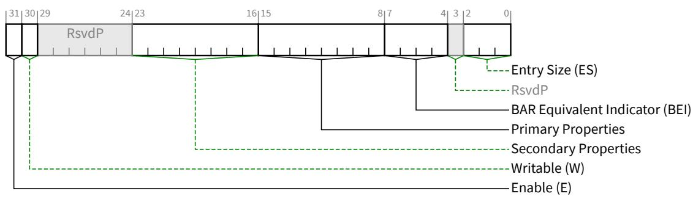

text_image

RsvdP
Entry Size (ES)
RsvdP
BAR Equivalent Indicator (BEI)
Primary Properties
Secondary Properties
Writable (W)
Enable (E)

Figure 7-168 First DW of Each Entry for Enhanced Allocation Capability§

Table 7-148 First DW of Each Entry for Enhanced Allocation Capability§

<table><tr><td>Bit Location</td><td colspan="2">Register Description</td><td>Attributes</td></tr><tr><td>2:0</td><td colspan="2">Entry Size (ES) - Number of DW following the initial DW in this entry.When processing this capability, software is required to use the value in this field to determine the size of this entry, and if this entry is not the final entry, the start of the following entry in the capability. This requirement must be strictly followed by software, even if the indicated entry size does not correspond to any entry defined in this specification.Value of 000b indicates only the first DW (containing the Entry Size field) is included in the entry.</td><td>HwInit</td></tr><tr><td rowspan="13">7:4</td><td colspan="2">BAR Equivalent Indicator (BEI) - This field indicates the equivalent BAR for this entry.Specific rules for use of this field are given in the text following this table.</td><td rowspan="13">HwInit</td></tr><tr><td>BEI Value</td><td>Description</td></tr><tr><td>0</td><td>Entry is equivalent to BAR at location 10h</td></tr><tr><td>1</td><td>Entry is equivalent to BAR at location 14h</td></tr><tr><td>2</td><td>Entry is equivalent to BAR at location 18h</td></tr><tr><td>3</td><td>Entry is equivalent to BAR at location 1Ch</td></tr><tr><td>4</td><td>Entry is equivalent to BAR at location 20h</td></tr><tr><td>5</td><td>Entry is equivalent to BAR at location 24h</td></tr><tr><td>6</td><td>Permitted to be used by a Function with a Type 1 Configuration Space Header only, optionally used to indicate a resource that is located behind the Function</td></tr><tr><td>7</td><td>Equivalent Not Indicated</td></tr><tr><td>8</td><td>Expansion ROM Base Address</td></tr><tr><td>9-14</td><td>Entry relates to VF BARs 0-5 respectively</td></tr><tr><td>15</td><td>Reserved - Software must treat values in this range as “Equivalent Not Indicated”</td></tr><tr><td>15:8</td><td colspan="2">Primary Properties - Indicates the entry properties as defined in § Table 7-150.</td><td>HwInit</td></tr><tr><td>23:16</td><td colspan="2">Secondary Properties- Optionally used to indicate a different but compatible entry property, using properties as defined in § Table 7-150.</td><td>HwInit</td></tr><tr><td>30</td><td colspan="2">Writable (W)- The value 1b indicates that the Base and MaxOffset fields for this entry are RW and that the Field Size bits for this entry are either RW or HwInit. The value 0b indicates those fields are HwInit.See § Table 7-150for additional requirements on the value of this field.</td><td>HwInit</td></tr><tr><td>31</td><td colspan="2">Enable (E)- 1b indicates this entry is enabled, 0b indicates this entry is disabled.If system software disables this entry, the resource indicated must still be associated with this function, and it is not permitted to reallocate this resource to any other entity.This field is permitted to be implemented as HwInit for functions that require the allocation of the associated resource, or as RW for functions that can allow system software to disable this resource, for example if BAR mechanisms are to be used instead of this resource.</td><td>RW/HwInit</td></tr></table>

## Rules for use of BEI field:

• A Type 0 Function is permitted to use EA to allocate resources for itself, and such resources must indicate a BEI value of 0-5, 7 or 8.  
• A Physical Function (Type 0 Function that supports SR-IOV) is permitted to use EA to allocate resources for its associated Virtual Functions, and such resources must indicate a BEI value of 9-14.  
• A Type 1 Function (bridge) is permitted to use EA to allocate resources for itself, and such resources must indicate a BEI value of 0, 1 or 7.  
• A Type 1 Function is permitted but not required to indicate resources mapped behind that Function, but if such resources are indicated by the Type 1 Function, the entry must indicate a BEI value of 6.  
• For a 64-bit Base Address Register, the BEI indicates the equivalent BAR location for lower DWORD.  
• For Memory BARs where the Primary or Secondary Properties is 00h or 01h, it is permitted to assign the same BEI in the range of 0 to 5 once for a range where Base + MaxOffset is below 4 GB, and again for a range where Base + MaxOffset is greater than 4 GB; It is not otherwise permitted to assign the same BEI in the range 0 to 5 for more than one entry.  
• For Virtual Function BARs where the Primary or Secondary Properties is 03h or 04h it is permitted to assign the same BEI in the range of 9 to 14 once for a range where Base + MaxOffset is below 4 GB, and again for a range where Base + MaxOffset is greater than 4 GB; It is not otherwise permitted to assign the same BEI in the range 9 to 14 for more than one VF entry.  
• For all cases where two entries with the same BEI are permitted, Software must enable use of only one of the two ranges at a time for a given Function.  
• It is permitted for an arbitrary number of entries to assign a BEI of 6 or 7.  
• At most one entry is permitted with a BEI of 8; if such an entry is present, behavior of the Expansion ROM Base Address Register is changed (see § Section 7.5.1.2.4 ).  
• For Type 1 Functions, BEI values 2 through 5 are reserved.

§ Figure 7-169 illustrates the format of a complete Enhanced Allocation entry for a Type 0 Function. For the Base and MaxOffset fields, bit 1 indicates if the field is a 32b (0) or 64b (1) field.

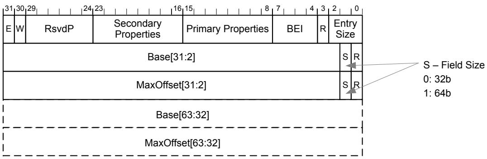

text_image

31 30 29 24 23 16 15 8 7 4 3 2 0
E W RsvdP Secondary Properties Primary Properties BEI R Entry Size
Base[31:2] S R
MaxOffset[31:2] S R
Base[63:32]
MaxOffset[63:32]
S – Field Size
0: 32b
1: 64b

Figure 7-169 Format of Entry for Enhanced Allocation Capability§

The value in the Base field ([63:2] or [31:2]) indicates the DW address of the start of the resource range. Bits [1:0] of the address are not included in the Base field, and must always be interpreted as 00b.

The value in the Base field plus the value in the MaxOffset field ([63:2] or [31:2]) indicates the address of the last included DW of the resource range. Bits [1:0] of the MaxOffset are not included in the MaxOffset field, and must always be interpreted as 11b.

For the Base and MaxOffset fields, when bits [63:32] are not provided then those bits must be interpreted as all 0’s.

Although it is permitted for a Type 0 Function to indicate the use of a range that is not naturally aligned and/or not a power of two in size, some system software may fail if this is done. Particularly for ranges that are mapped to legacy BARs by indicating a BEI in the range of 0 to 5, it is strongly recommended that the Base and MaxOffset fields for a Type 0 Function indicate a naturally aligned region.

The Primary Properties[7:0] field must be set by hardware to identify the type of resource indicated by the entry. It is strongly recommended that hardware set the Secondary Properties[7:0] to indicate an alternate resource type which can be used by software when the Primary Properties[7:0] field value is not comprehended by that software, for example when older system software is used with new hardware that implements resources using a value for Primary Properties that was reserved at the time the older system software was implemented. When this is done, hardware must ensure that software operating using the resource according to the value indicated in the Secondary Properties field will operate in a functionally correct way, although it is not required that this operation will result in optimal system performance or behavior.

The Primary Properties[7:0] and Secondary Properties[7:0] fields are defined in § Table 7-150. This table also defines whether or not the entry is permitted to be writeable. The Writeable bit in any entry must be 0b unless both the Primary and Secondary properties of that entry allow otherwise.

Table 7-150 Enhanced Allocation Entry Field Value Definitions for both the Primary Properties and Secondary Properties Fields

<table><tr><td>Value (h)</td><td>Resource Definition</td><td>Writeable permitted</td></tr><tr><td>00</td><td>Memory Space, Non-Prefetchable.</td><td>No</td></tr><tr><td>01</td><td>Memory Space, Prefetchable.</td><td>No</td></tr><tr><td>02</td><td>I/O Space.</td><td>No</td></tr><tr><td>03</td><td>For use only by Physical Functions to indicate resources for Virtual Function use, Memory Space, Prefetchable.</td><td>No</td></tr><tr><td>04</td><td>For use only by Physical Functions to indicate resources for Virtual Function use, Memory Space, Non-Prefetchable.</td><td>No</td></tr><tr><td>05</td><td>For use only by Type 1 Functions to indicate Memory, Non-Prefetchable, for Allocation Behind that Bridge.</td><td>No</td></tr><tr><td>06</td><td>For use only by Type 1 Functions to indicate Memory, Prefetchable, for Allocation Behind that Bridge.</td><td>No</td></tr><tr><td>07</td><td>For use only by Type 1 Functions to indicate I/O Space for Allocation Behind that Bridge.</td><td>No</td></tr><tr><td>08-FC</td><td>Reserved for future use; System firmware/software must not write to this entry, and must not attempt to interpret this entry or to use this resource.When software reads a Primary Properties value that is within this range, is it strongly recommended that software treat this resource according to the value in the Secondary Properties field, if that field contains a non-reserved value.</td><td>Yes</td></tr><tr><td>FD</td><td>Memory Space Resource Unavailable For Use - System firmware/software must not write to this entry, and must not attempt to use the resource described by this entry for any purpose.</td><td>No</td></tr><tr><td>FE</td><td>I/O Space Resource Unavailable For Use - System firmware/software must not write to this entry, and must not attempt to use the resource described by this entry for any purpose.</td><td>No</td></tr><tr><td>FF</td><td>Entry Unavailable For Use - System firmware/software must not write to this entry, and must not attempt to interpret this entry as indicating any resource.Hardware MUST@FLIT use this value in the Secondary Properties field to indicate that, for proper operation, the hardware requires the use of the resource definition indicated in the Primary Properties field.</td><td>No</td></tr></table>

The following figures illustrate the layout of Enhanced Allocation entries for various cases.

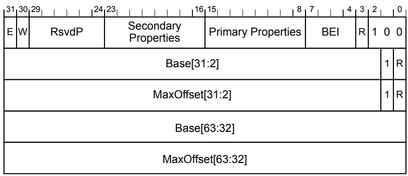

text_image

31 30 29 | | | 24 23 | | | 16 15 | | | 8 7 | 4 3 | 2 | 0
E W RsvdP Secondary Properties Primary Properties BEI R 1 0 0
Base[31:2] 1 R
MaxOffset[31:2] 1 R
Base[63:32]
MaxOffset[63:32]

Figure 7-170 Example Entry with 64b § Base and 64b MaxOffset

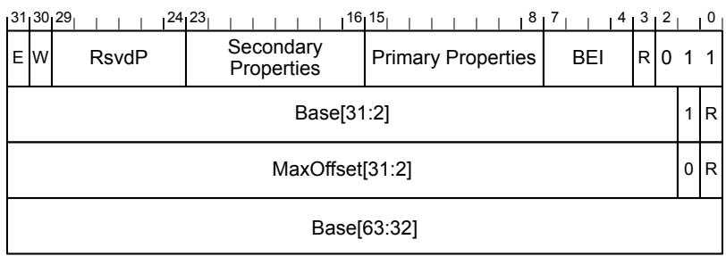

stacked bar chart

| Bit Position | E | W | RsvdP | Secondary Properties | Primary Properties | BEI | R | 0 | 1 | 1 |
| --- | --- | --- | --- | --- | --- | --- | --- | --- | --- | --- |
| ------------ | --- | --- | ----- | --------------------- | ------------------- | --- | -- | - | - | - |
| Base[31:2] |  |  |  |  |  |  |  |  |  |  |
| MaxOffset[31:2] |  |  |  |  |  |  |  |  |  |  |
| Base[63:32] |  |  |  |  |  |  |  |  |  |  |

Figure 7-171 Example Entry with 64b Base and 32b MaxOffset§

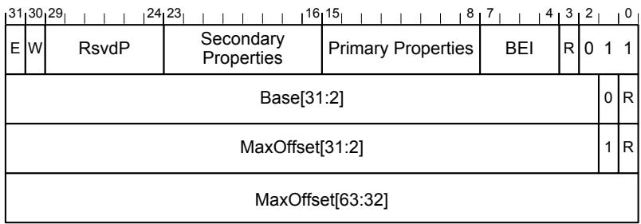

text_image

31 30 29 | | | 24 23 | | | 16 15 | | | 8 7 | | 4 3 | 2 | 0
E W RsvdP Secondary Properties Primary Properties BEI R 0 1 1
Base[31:2] 0 R
MaxOffset[31:2] 1 R
MaxOffset[63:32]

Figure 7-172 Example Entry with 32b Base and 64b MaxOffset§

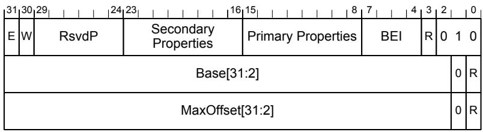

text_image

31 30 29 | | | 24 23 | | | 16 15 | | | 8 7 | | 4 3 | 2 | 0
E W RsvdP Secondary Properties Primary Properties BEI R 0 1 0
Base[31:2] 0 R
MaxOffset[31:2] 0 R

Figure 7-173 Example Entry with 32b Base and 32b MaxOffset§

## 7.8.6 Resizable BAR Extended Capability §

The Resizable BAR Extended Capability is an optional capability that allows hardware to communicate resource sizes, and system software, after determining the optimal size, to communicate this optimal size back to the hardware. Hardware communicates the resource sizes that are acceptable for operation via the Resizable BAR Capability and Control registers. Hardware must support at least one size in the range from 1 MB to 512 GB.

## IMPLEMENTATION NOTE:

## RESIZABLE BAR BACKWARD COMPATIBILITY WITH SOFTWARE

§

The Resizable BAR Extended Capability initially supported 20 sizes, ranging from 1 MB to 512 GB, and was later expanded with 16 larger sizes. The hardware requirement to support at least one of the initial sizes ensures backward compatibility with software that comprehends only the initial sizes.

Software determines, through a proprietary mechanism, what the optimal size is for the resource, and programs that size via the BAR Size field of the Resizable BAR Control register. Hardware immediately reflects the size inference in the read-only bits of the appropriate Base Address register. Hardware must Clear any bits that change from RW to read-only, so that subsequent reads return zero. Software must clear the Memory Space Enable bit in the Command register before writing the BAR Size field. After writing the BAR Size field, the contents of the corresponding BAR are undefined. To ensure that it contains a valid address after resizing the BAR, system software must reprogram the BAR, and Set the Memory Space Enable bit (unless the resource is not allocated).

The Resizable BAR Capability and Control registers are permitted to indicate the ability to operate at 4 GB or greater only if the associated BAR is a 64-bit BAR.

This capability is applicable to Functions that have Base Address registers only. The capability is permitted to be present in PFs. Since VFs do not implement standard BARs, the capability must not be present in a VF. The PF’s Resizable BAR settings do not affect any settings in the SR-IOV Extended Capability.

It is strongly recommended that a Function not advertise any supported BAR sizes that are larger than the space it would effectively utilize if allocated.

## IMPLEMENTATION NOTE:

## USING THE CAPABILITY DURING RESOURCE ALLOCATION §

System software that allocates resources can use this capability to resize the resources inferred by the Function’s BAR’s read-only bits. Previous versions of this software determined the resource size by writing FFFF\_FFFFh or FFFF\_FFFF\_FFFF\_FFFFh to the BAR, reading back the value, and determining the size by the number of bits that are Set. Following this, the base address is written to the BAR.

System software uses this capability in place of the above mentioned method of determining the resource size, and prior to assigning the base address to the BAR. Potential usable resource sizes are reported by the Function via its Resizable BAR Capability and Control registers. It is intended that the software allocate the largest of the reported sizes that it can, since allocating less address space than the largest reported size can result in lower performance. Software then writes the size to the Resizable BAR Control register for the appropriate BAR for the Function. Following this, the base address is written to the BAR.

For interoperability reasons, it is possible that hardware will set the default size of the BAR to a low size; that is, a size lower than the largest reported in the Resizable BAR Capability and Control registers. Software that does not use this capability to size resources will likely result in sub-optimal resource allocation, where the resources are smaller than desirable, or not allocatable because there is no room for them.

With the Resizable BAR capability, the amount of address space consumed by a device can change. In a resource constrained environment, the allocation of more address space to a device may result in allocation of less of the address space to other memory-mapped hardware, like system RAM. System software responsible for allocating resources in this kind of environment is recommended to distribute the limited address space appropriately.

The Resizable BAR Capability structure defines a PCI Express Extended Capability, which is located in PCI Express Extended Configuration Space, that is, above the first 256 bytes, and is shown below in § Figure 7-174. This structure allows devices with this capability to be identified and controlled. A Capability and a Control register is implemented for each BAR that is resizable. Since a maximum of six BARs may be implemented by any Function, the Resizable BAR Capability structure can range from 12 bytes long (for a single BAR) to 52 bytes long (for all six BARs).

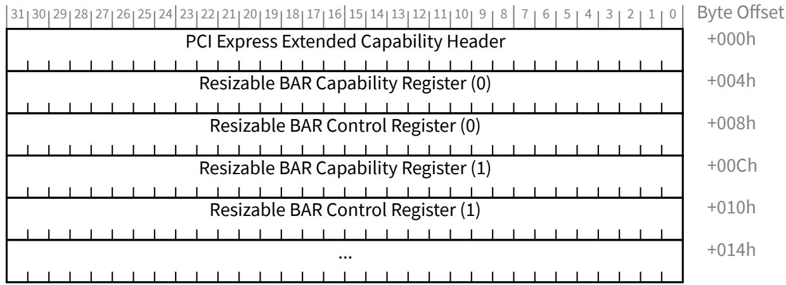

text_image

PCI Express Extended Capability Header
Resizable BAR Capability Register (0)
Resizable BAR Control Register (0)
Resizable BAR Capability Register (1)
Resizable BAR Control Register (1)
...
Byte Offset
+000h
+004h
+008h
+00Ch
+010h
+014h

Figure 7-174 Resizable BAR Extended Capability§

## 7.8.6.1 Resizable BAR Extended Capability Header (Offset 00h) §

text_image

31
20 19 16 15 0
Next Capability Offset
0015h
PCI Express Extended Capability ID
Capability Version

Figure 7-175 Resizable BAR Extended Capability Header§

Table 7-151 Resizable BAR Extended Capability Header§

<table><tr><td>Bit Location</td><td>Register Description</td><td>Attributes</td></tr><tr><td>15:0</td><td>PCI Express Extended Capability ID - This field is a PCI-SIG defined ID number that indicates the nature and format of the extended capability.The PCI Express Extended Capability ID for the Resizable BAR Capability is 0015h.</td><td>RO</td></tr><tr><td>19:16</td><td>Capability Version - This field is a PCI-SIG defined version number that indicates the version of the capability structure present.Must be 1h for this version of the specification.</td><td>RO</td></tr><tr><td>31:20</td><td>Next Capability Offset - This field contains the offset to the next PCI Express Extended Capability structure or 000h if no other items exist in the linked list of Capabilities.</td><td>RO</td></tr></table>

## 7.8.6.2 Resizable BAR Capability Register §

For backward compatibility with software, hardware must Set at least one bit in the range from 4 to 23. See the associated Implementation Note in § Section 7.8.6 .

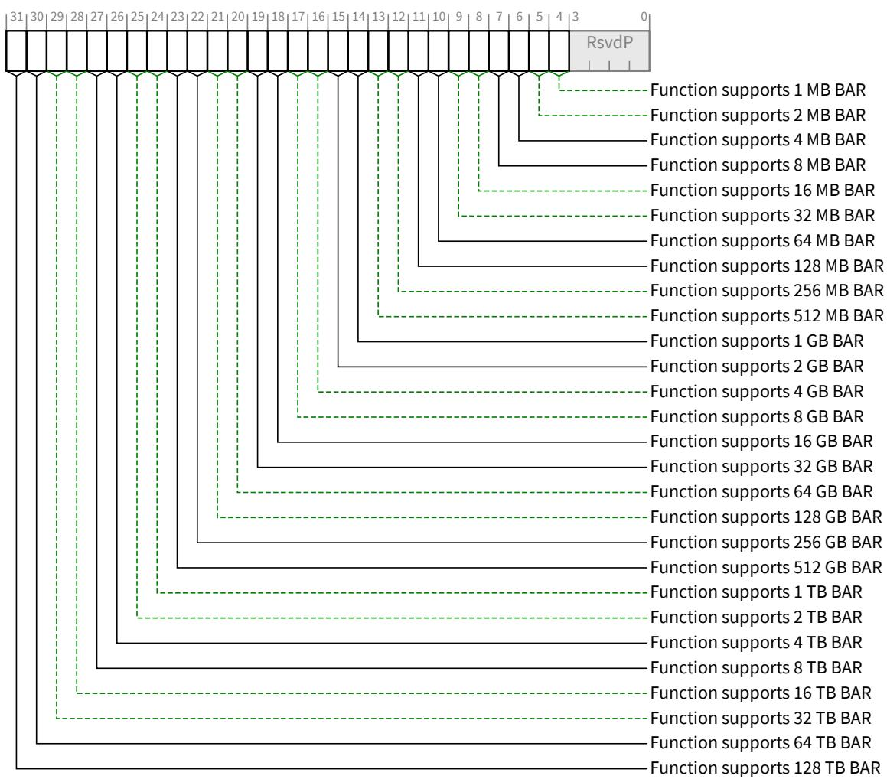

bar chart

| Function supports | Count |
| ----------------- | ----- |
| RsvdP             | 0     |
| Function supports 1 MB BAR | 31    |
| Function supports 2 MB BAR | 30    |
| Function supports 4 MB BAR | 29    |
| Function supports 8 MB BAR | 28    |
| Function supports 16 MB BAR | 27   |
| Function supports 32 MB BAR | 26   |
| Function supports 64 MB BAR | 25   |
| Function supports 128 MB BAR | 24   |
| Function supports 256 MB BAR | 23   |
| Function supports 512 MB BAR | 22   |
| Function supports 1 GB BAR | 21   |
| Function supports 2 GB BAR | 20   |
| Function supports 4 GB BAR | 19   |
| Function supports 8 GB BAR | 18   |
| Function supports 16 GB BAR | 17   |
| Function supports 32 GB BAR | 16   |
| Function supports 64 GB BAR | 15   |
| Function supports 128 GB BAR | 14   |
| Function supports 256 GB BAR | 13   |
| Function supports 512 GB BAR | 12   |
| Function supports 1 TB BAR | 11   |
| Function supports 2 TB BAR | 10   |
| Function supports 4 TB BAR | 9     |
| Function supports 8 TB BAR | 8     |
| Function supports 16 TB BAR | 7     |
| Function supports 32 TB BAR | 6     |
| Function supports 64 TB BAR | 5     |
| Function supports 128 TB BAR | 4     |

Figure 7-176 Resizable BAR Capability Register§

Table 7-152 Resizable BAR Capability Register§

<table><tr><td>Bit Location</td><td>Register Description</td><td>Attributes</td></tr><tr><td>4</td><td>Function supports 1 MB BAR - When Set, indicates that the Function supports operating with the BAR sized to 1 MB ( $2^{20}$  bytes)</td><td>RO</td></tr><tr><td>5</td><td>Function supports 2 MB BAR - When Set, indicates that the Function supports operating with the BAR sized to 2 MB ( $2^{21}$  bytes)</td><td>RO</td></tr><tr><td>6</td><td>Function supports 4 MB BAR - When Set, indicates that the Function supports operating with the BAR sized to 4 MB ( $2^{22}$  bytes)</td><td>RO</td></tr><tr><td>7</td><td>Function supports 8 MB BAR - When Set, indicates that the Function supports operating with the BAR sized to 8 MB ( $2^{23}$  bytes)</td><td>RO</td></tr><tr><td>8</td><td>Function supports 16 MB BAR - When Set, indicates that the Function supports operating with the BAR sized to 16 MB ( $2^{24}$  bytes)</td><td>RO</td></tr><tr><td>9</td><td>Function supports 32 MB BAR - When Set, indicates that the Function supports operating with the BAR sized to 32 MB ( $2^{25}$  bytes)</td><td>RO</td></tr><tr><td>10</td><td>Function supports 64 MB BAR - When Set, indicates that the Function supports operating with the BAR sized to 64 MB ( $2^{26}$  bytes)</td><td>RO</td></tr><tr><td>11</td><td>Function supports 128 MB BAR - When Set, indicates that the Function supports operating with the BAR sized to 128 MB ( $2^{27}$  bytes)</td><td>RO</td></tr><tr><td>12</td><td>Function supports 256 MB BAR - When Set, indicates that the Function supports operating with the BAR sized to 256 MB ( $2^{28}$  bytes)</td><td>RO</td></tr><tr><td>13</td><td>Function supports 512 MB BAR - When Set, indicates that the Function supports operating with the BAR sized to 512 MB ( $2^{29}$  bytes)</td><td>RO</td></tr><tr><td>14</td><td>Function supports 1 GB BAR - When Set, indicates that the Function supports operating with the BAR sized to 1 GB ( $2^{30}$  bytes)</td><td>RO</td></tr><tr><td>15</td><td>Function supports 2 GB BAR - When Set, indicates that the Function supports operating with the BAR sized to 2 GB ( $2^{31}$  bytes)</td><td>RO</td></tr><tr><td>16</td><td>Function supports 4 GB BAR - When Set, indicates that the Function supports operating with the BAR sized to 4 GB ( $2^{32}$  bytes)</td><td>RO</td></tr><tr><td>17</td><td>Function supports 8 GB BAR - When Set, indicates that the Function supports operating with the BAR sized to 8 GB ( $2^{33}$  bytes)</td><td>RO</td></tr><tr><td>18</td><td>Function supports 16 GB BAR - When Set, indicates that the Function supports operating with the BAR sized to 16 GB ( $2^{34}$  bytes)</td><td>RO</td></tr><tr><td>19</td><td>Function supports 32 GB BAR - When Set, indicates that the Function supports operating with the BAR sized to 32 GB ( $2^{35}$  bytes)</td><td>RO</td></tr><tr><td>20</td><td>Function supports 64 GB BAR - When Set, indicates that the Function supports operating with the BAR sized to 64 GB ( $2^{36}$  bytes)</td><td>RO</td></tr><tr><td>21</td><td>Function supports 128 GB BAR - When Set, indicates that the Function supports operating with the BAR sized to 128 GB ( $2^{37}$  bytes)</td><td>RO</td></tr><tr><td>22</td><td>Function supports 256 GB BAR - When Set, indicates that the Function supports operating with the BAR sized to 256 GB ( $2^{38}$  bytes)</td><td>RO</td></tr><tr><td>23</td><td>Function supports 512 GB BAR - When Set, indicates that the Function supports operating with the BAR sized to 512 GB ( $2^{39}$  bytes)</td><td>RO</td></tr><tr><td>24</td><td>Function supports 1 TB BAR - When Set, indicates that the Function supports operating with the BAR sized to 1 TB ( $2^{40}$  bytes)</td><td>RO</td></tr><tr><td>25</td><td>Function supports 2 TB BAR - When Set, indicates that the Function supports operating with the BAR sized to 2 TB ( $2^{41}$  bytes)</td><td>RO</td></tr><tr><td>26</td><td>Function supports 4 TB BAR - When Set, indicates that the Function supports operating with the BAR sized to 4 TB ( $2^{42}$  bytes)</td><td>RO</td></tr><tr><td>27</td><td>Function supports 8 TB BAR - When Set, indicates that the Function supports operating with the BAR sized to 8 TB ( $2^{43}$  bytes)</td><td>RO</td></tr><tr><td>28</td><td>Function supports 16 TB BAR - When Set, indicates that the Function supports operating with the BAR sized to 16 TB ( $2^{44}$  bytes)</td><td>RO</td></tr><tr><td>29</td><td>Function supports 32 TB BAR - When Set, indicates that the Function supports operating with the BAR sized to 32 TB ( $2^{45}$  bytes)</td><td>RO</td></tr><tr><td>30</td><td>Function supports 64 TB BAR - When Set, indicates that the Function supports operating with the BAR sized to 64 TB ( $2^{46}$  bytes)</td><td>RO</td></tr><tr><td>31</td><td>Function supports 128 TB BAR - When Set, indicates that the Function supports operating with the BAR sized to 128 TB ( $2^{47}$  bytes)</td><td>RO</td></tr></table>

## 7.8.6.3 Resizable BAR Control Register §

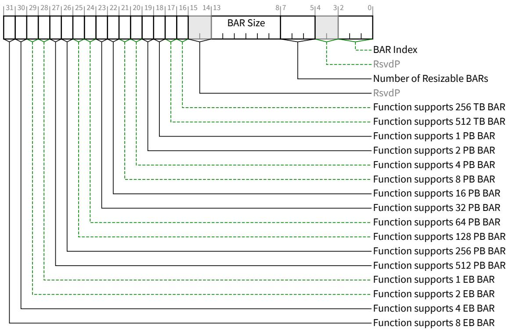

bar chart

| Category | Value |
| -------- | ----- |
| BAR Size | 31    |
| Number of Resizable BARs | 29    |
| Function supports 256 TB BAR | 28    |
| Function supports 512 TB BAR | 27    |
| Function supports 1 PB BAR | 26    |
| Function supports 2 PB BAR | 25    |
| Function supports 4 PB BAR | 24    |
| Function supports 8 PB BAR | 23    |
| Function supports 16 PB BAR | 22    |
| Function supports 32 PB BAR | 21    |
| Function supports 64 PB BAR | 20    |
| Function supports 128 PB BAR | 19    |
| Function supports 256 PB BAR | 18    |
| Function supports 512 PB BAR | 17    |
| Function supports 1 EB BAR | 16    |
| Function supports 2 EB BAR | 15    |
| Function supports 4 EB BAR | 14    |
| Function supports 8 EB BAR | 13    |

Figure 7-177 Resizable BAR Control Register§

Table 7-153 Resizable BAR Control Register§

<table><tr><td>Bit Location</td><td>Register Description</td><td>Attributes</td></tr><tr><td>2:0</td><td>BAR Index - This encoded value points to the beginning of the BAR.0 BAR located at offset 10h1 BAR located at offset 14h2 BAR located at offset 18h3 BAR located at offset 1Ch4 BAR located at offset 20h5 BAR located at offset 24hOthers All other encodings are Reserved.For a 64-bit Base Address register, the BAR Index indicates the lower DWORD.This value indicates which BAR supports a negotiable size.</td><td>RO</td></tr><tr><td>7:5</td><td>Number of Resizable BARs - Indicates the total number of resizable BARs)in the capability structure for the Function. See § Figure 7-174.The value of this field must be in the range of 01h to 06h. The field is valid inResizable BAR Control register (0) (at offset 008h), and is RsvdP for all others.</td><td>RO/RsvdP</td></tr><tr><td>13:8</td><td>BAR Size - This is an encoded value.0 1 MB ( $2^{20}$  bytes)1 2 MB ( $2^{21}$  bytes)2 4 MB ( $2^{22}$  bytes)3 8 MB ( $2^{23}$  bytes)...43 8 EB ( $2^{63}$  bytes)The default value of this field is equal to the default size of the address space that the BAR resource is requesting via the BAR's read-only bits. For backward compatibility with software, the default value must be in the range from 0 to 19.When this register field is programmed, the value is immediately reflected in the size of the resource, as encoded in the number of read-only bits in the BAR.Software must only write values that correspond to those indicated as supported in theResizable BAR Capability and Control registers. Writing an unsupported value will produce undefined results. BAR Size bits that never need to be Set in order to indicate every supported size are permitted to be hardwired to 0.</td><td>RW</td></tr><tr><td>16</td><td>Function supports 256 TB BAR - When Set, indicates that the Function supports operating with the BAR sized to 256 TB ( $2^{48}$  bytes)</td><td>RO</td></tr><tr><td>17</td><td>Function supports 512 TB BAR - When Set, indicates that the Function supports operating with the BAR sized to 512 TB ( $2^{49}$  bytes)</td><td>RO</td></tr><tr><td>18</td><td>Function supports 1 PB BAR - When Set, indicates that the Function supports operating with the BAR sized to 1 PB ( $2^{50}$  bytes)</td><td>RO</td></tr><tr><td>19</td><td>Function supports 2 PB BAR - When Set, indicates that the Function supports operating with the BAR sized to 2 PB ( $2^{51}$  bytes)</td><td>RO</td></tr><tr><td>20</td><td>Function supports 4 PB BAR - When Set, indicates that the Function supports operating with the BAR sized to 4 PB ( $2^{52}$  bytes)</td><td>RO</td></tr><tr><td>21</td><td>Function supports 8 PB BAR - When Set, indicates that the Function supports operating with the BAR sized to 8 PB ( $2^{53}$  bytes)</td><td>RO</td></tr><tr><td>22</td><td>Function supports 16 PB BAR - When Set, indicates that the Function supports operating with the BAR sized to 16 PB ( $2^{54}$  bytes)</td><td>RO</td></tr><tr><td>23</td><td>Function supports 32 PB BAR - When Set, indicates that the Function supports operating with the BAR sized to 32 PB ( $2^{55}$  bytes)</td><td>RO</td></tr><tr><td>24</td><td>Function supports 64 PB BAR - When Set, indicates that the Function supports operating with the BAR sized to 64 PB ( $2^{56}$  bytes)</td><td>RO</td></tr><tr><td>25</td><td>Function supports 128 PB BAR - When Set, indicates that the Function supports operating with the BAR sized to 128 PB ( $2^{57}$  bytes)</td><td>RO</td></tr><tr><td>26</td><td>Function supports 256 PB BAR - When Set, indicates that the Function supports operating with the BAR sized to 256 PB ( $2^{58}$  bytes)</td><td>RO</td></tr><tr><td>27</td><td>Function supports 512 PB BAR - When Set, indicates that the Function supports operating with the BAR sized to 512 PB ( $2^{59}$  bytes)</td><td>RO</td></tr><tr><td>28</td><td>Function supports 1 EB BAR - When Set, indicates that the Function supports operating with the BAR sized to 1 EB ( $2^{60}$  bytes)</td><td>RO</td></tr><tr><td>29</td><td>Function supports 2 EB BAR - When Set, indicates that the Function supports operating with the BAR sized to 2 EB ( $2^{61}$  bytes)</td><td>RO</td></tr><tr><td>30</td><td>Function supports 4 EB BAR - When Set, indicates that the Function supports operating with the BAR sized to 4 EB ( $2^{62}$  bytes)</td><td>RO</td></tr><tr><td>31</td><td>Function supports 8 EB BAR - When Set, indicates that the Function supports operating with the BAR sized to 8 EB ( $2^{63}$  bytes)</td><td>RO</td></tr></table>

## 7.8.7 VF Resizable BAR Extended Capability §

The VF Resizable BAR Extended Capability is permitted to be implemented only in PFs that implement at least one VF BAR, and affects the size and base of a PF’s VF BARs. Since VFs do not implement the BARs themselves the capability must not be present in a VF. A PF may implement both a VF Resizable BAR Extended Capability and a Resizable BAR capability, as each capability operates independently.

The VF Resizable BAR Extended Capability is an optional capability that permits PFs to be able to have their VF’s BARs resized. The VF Resizable BAR Extended Capability permits hardware to communicate the resource sizes that are acceptable for operation via the VF Resizable BAR Extended Capability and Control registers and system software to communicate the optimal size back to the hardware via the VF BAR Size field of the VF Resizable BAR Control register.

Hardware immediately reflects the size inference in the read-only bits of the appropriate VF BAR. The size inferred is the greater of the values decoded from the System Page Size and VF BAR Size fields. Hardware must Clear any bits that change from read-write to read-only, so that subsequent reads return zero. Software must clear the VF MSE bit in the SR-IOV Control Register before writing the VF BAR Size field. After writing the VF BAR Size field, the contents of the corresponding VF BAR are undefined. To ensure that it contains a valid address after resizing the VF BAR, system software must reprogram the VF BAR, and Set the VF MSE bit (unless the resource is not allocated).

The VF Resizable BAR Extended Capability and Control registers are permitted to indicate the ability to operate at 4 GB or greater only if the associated VF BAR is a 64-bit BAR.

It is strongly recommended that a Function not advertise any supported VF BAR size values in this capability that are larger than the space it would effectively utilize if allocated.

## IMPLEMENTATION NOTE:

## USING THE CAPABILITY DURING RESOURCE ALLOCATION §

System software uses this capability in a similar way to the Resizable BAR capability. System software must first configure the System Page Size register (see § Section 9.2.1.1.1 ). Potential usable memory aperture sizes are reported by the PF, and read, from the VF Resizable BAR Extended Capability and Control registers. It is intended that the software allocate the largest of the reported sizes that it can, since allocating less address space than the largest reported size can result in lower performance. Software then writes the size to the VF Resizable BAR Control register for the appropriate VF BAR for the Function. Following this, the base address is written to the VF BAR.

For interoperability reasons, it is possible that hardware will set the default size of the VF BAR to a low size; a size lower than the largest reported in the VF Resizable BAR Capability Register. Software that does not use this capability to size resources will likely result in sub-optimal resource allocation, where the resources are smaller than desirable, or not allocatable because there is no room for them. It is recommended that system software responsible for allocating resources in a resource constrained environment distribute the limited address space to all memory-mapped hardware, including system RAM, appropriately.

The VF Resizable BAR Extended Capability structure defines a PCI Express Extended Capability which is located in PCI Express Extended Configuration Space, that is, above the first 256 bytes, and is shown below in § Figure 7-178. This structure allows PFs with this capability to be identified and controlled. A Capability register and a Control register are implemented for each VF BAR that is resizable. Since a maximum of 6 VF BARs may be implemented by any PF, the VF Resizable BAR Capability structure can range from 12 bytes long (for a single VF BAR) to 52 bytes long (for all 6 VF BARs).

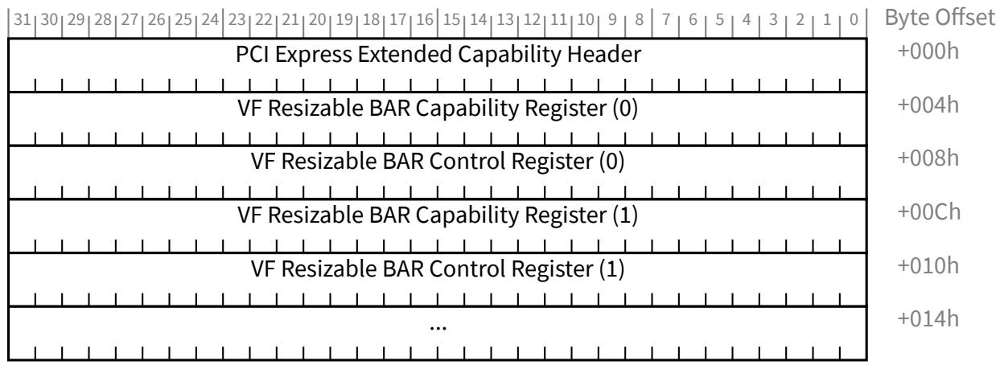

stacked bar chart

| Category | Value |
| -------- | ----- |
| PCI Express Extended Capability Header | +000h |
| VF Resizable BAR Capability Register (0) | +004h |
| VF Resizable BAR Control Register (0) | +008h |
| VF Resizable BAR Capability Register (1) | +00Ch |
| VF Resizable BAR Control Register (1) | +010h |
| ... | +014h |

Figure 7-178 VF Resizable BAR Extended Capability§

# 7.8.7.1 VF Resizable BAR Extended Capability Header (Offset 00h) §

text_image

31
20 19 16 15 0
Next Capability Offset
0024h
PCI Express Extended Capability ID
Capability Version

Figure 7-179 VF Resizable BAR Extended Capability Header§

Table 7-154 VF Resizable BAR Extended Capability Header§

<table><tr><td>Bit Location</td><td>Register Description</td><td>Attributes</td></tr><tr><td>15:0</td><td>PCI Express Extended Capability ID - This field is a PCI-SIG defined ID number that indicates the nature and format of the extended capability.PCI Express Extended Capability ID for the VF Resizable BAR Extended Capability is 0024h.</td><td>RO</td></tr><tr><td>19:16</td><td>Capability Version - This field is a PCI-SIG defined version number that indicates the version of the capability structure present.Must be 1h for this version of the specification.</td><td>RO</td></tr><tr><td>31:20</td><td>Next Capability Offset - This field contains the offset to the next PCI Express Extended Capability structure or 000h if no other items exist in the linked list of capabilities</td><td>RO</td></tr></table>

## 7.8.7.2 VF Resizable BAR Capability Register (Offset 04h) §

The VF Resizable BAR Capability Register field descriptions are the same as the definitions in the Resizable BAR Capability Register in § Table 7-152. Where those descriptions say ‘BAR’, this register’s description is for ‘VF BAR’. Where those descriptions say ‘Function’, this register’s description is for ‘PF’. Otherwise, the field descriptions, the number of bits, their positions, and their attributes are the same. Consequently § Figure 7-176 similarly allocates the register fields in this register.

## 7.8.7.3 VF Resizable BAR Control Register (Offset 08h) §

The VF Resizable BAR Control register bits 31:16 follow the same definitions as the Resizable BAR Control register in § Table 7-153.

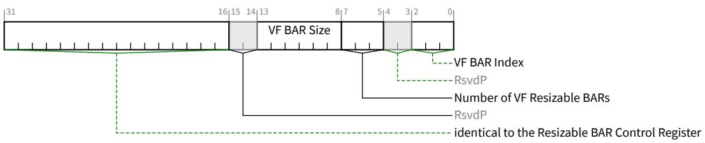

text_image

31
16 15 14 13 8 7 5 4 3 2 0
VF BAR Size
VF BAR Index
RsvdP
Number of VF Resizable BARs
RsvdP
identical to the Resizable BAR Control Register

Figure 7-180 VF Resizable BAR Control Register§

Table 7-155 VF Resizable BAR Control Register§

<table><tr><td>Bit Location</td><td>Register Description</td><td>Attributes</td></tr><tr><td>2:0</td><td>VF BAR Index- This encoded value points to the beginning of this particular VF BAR located in the SR-IOV Extended Capability.0 VF BAR located at offset 24h1 VF BAR located at offset 28h2 VF BAR located at offset 2Ch3 VF BAR located at offset 30h4 VF BAR located at offset 34h5 VF BAR located at offset 38hothers All other encodings are reserved.For a 64-bit Base Address register, the VF BAR Indexindicates the lower DWORD.This value indicates which VF BAR supports a negotiable size.</td><td>RO</td></tr><tr><td>7:5</td><td>Number of VF Resizable BARs- Indicates the total number of resizable VF BARs in the capability structure for the Function. See § Figure 7-178.The value of this field must be in the range of 01h to 06h. The field is valid in VF Resizable BAR Control register (0) (at offset 08h), and is RsvdP for all others.</td><td>RO/RsvdP</td></tr><tr><td>13:8</td><td>VF BAR Size- This is an encoded value.0 1 MB ( $2^{20}$  bytes)1 2 MB ( $2^{21}$  bytes)2 4 MB ( $2^{22}$  bytes)3 8 MB ( $2^{23}$  bytes)... ...43 8 EB ( $2^{63}$  bytes)The default value of this field is equal to the default size of the address space that the VF BAR resource is requesting via the VF BAR’s read-only bits.Software must only write values that correspond to those indicated as supported in the VF Resizable BAR Capability and Control registers. Writing an unsupported value will produce undefined results.When this register field is programmed, the value is immediately reflected in the size of the resource, as encoded in the number of read-only bits in the VF BAR.</td><td>RW</td></tr><tr><td>31:16</td><td>These bits are identical to the Resizable BAR Control Registerbits [31:16] defined in § Figure 7-177.Where those descriptions say ‘BAR’, this register’s description is for ‘VF BAR’. Where those descriptions say ‘Function’, this register’s description is for ‘PF’.</td><td>See§ Figure7-177</td></tr></table>

## 7.8.8 ARI Extended Capability §

ARI is an optional capability, except as stated below. This capability must be implemented by each Function in an ARI Device. It is not applicable to a Root Port, a Switch Downstream Port, an RCiEP, or a Root Complex Event Collector.

For SR-IOV devices not in a Root Complex, implementing the ARI Extended Capability in each Function is mandatory.

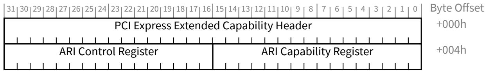

text_image

31 30 29 28 27 26 25 24 23 22 21 20 19 18 17 16 15 14 13 12 11 10 9 8 7 6 5 4 3 2 1 0
PCI Express Extended Capability Header
ARI Control Register
ARI Capability Register
Byte Offset
+000h
+004h

§ Figure 7-181 ARI Extended Capability

## 7.8.8.1 ARI Extended Capability Header (Offset 00h) §

text_image

31 20 19 16 15 0
Next Capability Offset 000Eh
PCI Express Extended Capability ID
Capability Version

Figure 7-182 ARI Extended Capability Header§

Table 7-156 ARI Extended Capability Header§

<table><tr><td>Bit Location</td><td>Register Description</td><td>Attributes</td></tr><tr><td>15:0</td><td>PCI Express Extended Capability ID - This field is a PCI-SIG defined ID number that indicates the nature and format of the extended capability.PCI Express Extended Capability ID for the ARI Extended Capability is 000Eh.</td><td>RO</td></tr><tr><td>19:16</td><td>Capability Version - This field is a PCI-SIG defined version number that indicates the version of the capability structure present.Must be 1h for this version of the specification.</td><td>RO</td></tr><tr><td>31:20</td><td>Next Capability Offset - This field contains the offset to the next PCI Express Extended Capability structure or 000h if no other items exist in the linked list of Capabilities.</td><td>RO</td></tr></table>

## 7.8.8.2 ARI Capability Register (Offset 04h) §

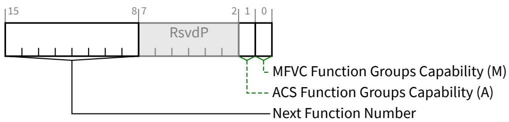

text_image

15 8 7 2 1 0
RsvdP
MFVC Function Groups Capability (M)
ACS Function Groups Capability (A)
Next Function Number

§ Figure 7-183 ARI Capability Register

§ Table 7-157 ARI Capability Register

<table><tr><td>Bit Location</td><td>Register Description</td><td>Attributes</td></tr><tr><td>0</td><td>MFVC Function Groups Capability (M) - Applicable only for Function 0; must be Zero for all other Functions. If Set, indicates that the ARI Device supports Function Group level arbitration via its Multi-Function Virtual Channel (MFVC) Capability structure.Any SR-IOV Device that implements the MFVC Extended Capability with the optional Function Arbitration Table and consumes more than one Bus Number must Set this bit in its Function 0.</td><td>RO</td></tr><tr><td>1</td><td>ACS Function Groups Capability (A) - Applicable only for Function 0; must be Zero for all other Functions. If Set, indicates that the ARI Device supports Function Group level granularity for ACS P2P Egress Control via its ACS Capability structures.Any SR-IOV Device that implements the ACS Capability with the optional Egress Control Vector and consumes more than one Bus Number must Set this bit in its Function 0.</td><td>RO</td></tr><tr><td>15:8</td><td>Next Function Number - With non-VFs, this field indicates the Function Number of the next higher numbered Function in the Device, or 00h if there are no higher numbered Functions. Function 0 starts this linked list of Functions.The presence of Shadow Functions does not affect this field.For VFs, this field is undefined since VFs are located using First VF Offset (see § Section 9.3.3.9) and VF Stride (see § Section 9.3.3.10).</td><td>RO</td></tr></table>

## 7.8.8.3 ARI Control Register (Offset 06h) §

text_image

15
RsvdP
7 6 4 3 2 1 0
MFVC Function Groups Enable (M)
ACS Function Groups Enable (A)
RsvdP
Function Group

§  
Figure 7-184 ARI Control Register

§  
Table 7-158 ARI Control Register

<table><tr><td>Bit Location</td><td>Register Description</td><td>Attributes</td></tr><tr><td>0</td><td>MFVC Function Groups Enable (M) - Applicable only for Function 0; must be hardwired to 0b for all other Functions. When set, the ARI Device must interpret entries in its Function Arbitration Table as Function Group Numbers rather than Function Numbers.Default value of this bit is 0b. Must be hardwired to 0b if the MFVC Function Groups Capability bit is 0b.</td><td>RW</td></tr><tr><td>1</td><td>ACS Function Groups Enable (A) - Applicable only for Function 0; must be hardwired to 0b for all other Functions. When set, each Function in the ARI Device must associate bits within its Egress Control Vector with Function Group Numbers rather than Function Numbers.Default value of this bit is 0b. Must be hardwired to 0b if the ACS Function Groups Capability bit is 0b.</td><td>RW</td></tr><tr><td>6:4</td><td>Function Group - Assigns a Function Group Number to this Function.Default value of this field is 000b. Must be hardwired to 000b if in Function 0, the MFVC Function Groups Capability bit and ACS Function Groups Capability bit are both 0b.</td><td>RW</td></tr></table>

## 7.8.9 PASID Extended Capability Structure §

The presence of a PASID Extended Capability indicates that the Endpoint supports sending and receiving TLPs containing a PASID TLP Prefix. Separate support and enables are provided for the various optional features.

This capability is applicable to Endpoints and RCiEPs. For Root Ports, support and control is outside the scope of this specification.

The PASID configuration of the single non-VF Function representing the device is also used by all VFs in the device. A PF is permitted to implement the PASID capability, but VFs must not implement it.

Even though the PASID configuration is shared between all Endpoint Functions in a device, the device sends the requesting Function’s ID in the Requester ID field of the TLP containing PASID.

This capability is independent of both the ATS and PRI features defined in § Chapter 10. . Endpoints that contain a PASID Extended Capability need not support ATS or PRI. Endpoints that support ATS or PRI need not support PASID.

§ Figure 7-185 details allocation of the register bits in the PASID Extended Capability structure.

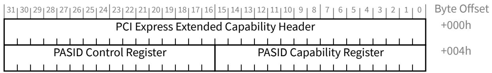

text_image

31 30 29 28 27 26 25 24 23 22 21 20 19 18 17 16 15 14 13 12 11 10 9 8 7 6 5 4 3 2 1 0
PCI Express Extended Capability Header
+000h
+004h
PASID Control Register PASID Capability Register

Figure 7-185 PASID Extended Capability Structure§

## 7.8.9.1 PASID Extended Capability Header (Offset 00h) §

§ Figure 7-186 details allocation of the register fields in the PASID Extended Capability Header; § Table 7-159 provides the respective bit definitions.

text_image

31
20 19 16 15 0
Next Capability Offset
001Bh
PASID Extended Capability ID
Capability Version

Figure 7-186 PASID Extended Capability Header§

Table 7-159 PASID Extended Capability Header§

<table><tr><td>Bit Location</td><td>Register Description</td><td>Attributes</td></tr><tr><td>15:0</td><td>PASID Extended Capability ID - Indicates the PASID Extended Capability structure. This field must return a Capability ID of 001Bh indicating that this is a PASID Extended Capability structure.</td><td>RO</td></tr><tr><td>19:16</td><td>Capability Version - This field is a PCI-SIG defined version number that indicates the version of the Capability structure present.Must be 1h for this version of the specification.</td><td>RO</td></tr><tr><td>31:20</td><td>Next Capability Offset - The offset to the next PCI Extended Capability structure or 000h if no other items exist in the linked list of capabilities.</td><td>RO</td></tr></table>

## 7.8.9.2 PASID Capability Register (Offset 04h) §

§ Figure 7-187 details the allocation of register bits of the PASID Capability register; § Table 7-160 provides the respective bit definitions.

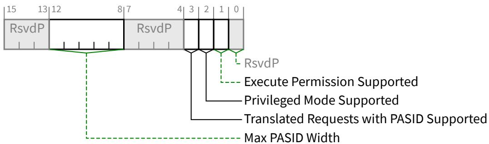

text_image

15 13 12 8 7 4 3 2 1 0
RsvdP RsvdP
RsvdP
Execute Permission Supported
Privileged Mode Supported
Translated Requests with PASID Supported
Max PASID Width

§ Figure 7-187 PASID Capability Register

§ Table 7-160 PASID Capability Register

<table><tr><td>Bit Location</td><td>Register Description</td><td>Attributes</td></tr><tr><td>1</td><td>Execute Permission Supported- If Set, the Endpoint supports sending TLPs that have the Execute Requested bit Set.If Clear, the Endpoint will never Set the Execute Requested bit.</td><td>RO</td></tr><tr><td>2</td><td>Privileged Mode Supported- If Set, the Endpoint supports operating in Privileged and Non-Privileged modes, and supports sending requests that have the Privileged Mode Requested bit Set.If Clear, the Endpoint will never Set the Privileged Mode Requested bit.</td><td>RO</td></tr><tr><td>3</td><td>Translated Requests with PASID Supported– If Set, indicates that this function supports Translated Requests with PASID (see § Section 10.1.3). This bit is only permitted to be Set if the Endpoint supports ATS.</td><td>RO</td></tr><tr><td>12:8</td><td>Max PASID Width- Indicates the width of the PASID field supported by the Endpoint. The value n indicates support for PASID values 0 through  $2^{n}$ -1 (inclusive). The value 0 indicates support for a single PASID (0). The value 20 indicates support for all PASID values (20 bits). This field must be between 0 and 20 (inclusive).</td><td>RO</td></tr></table>

## 7.8.9.3 PASID Control Register (Offset 06h) §

§ Figure 7-188 details the allocation of register bits of the PASID Control register; § Table 7-161 provides the respective bit definitions.

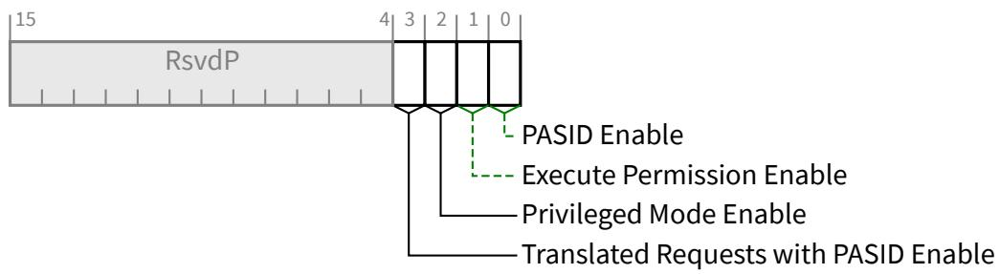

text_image

RsvdP
15
4 3 2 1 0
PASID Enable
Execute Permission Enable
Privileged Mode Enable
Translated Requests with PASID Enable

§ Figure 7-188 PASID Control Register

§ Table 7-161 PASID Control Register

<table><tr><td>Bit Location</td><td>Register Description</td><td>Attributes</td></tr><tr><td>0</td><td>PASID Enable- If Set, the Endpoint is permitted to send and receive TLPs that contain a PASID TLP Prefix. If Clear, the Endpoint is not permitted to do so.Behavior is undefined if the Endpoint supports ATS and this bit changes value when the Enable (E) bit in the ATS Control Register is Set (see § Section 10.5.1.3).Default is 0b.</td><td>RW</td></tr><tr><td>1</td><td>Execute Permission Enable- If Set, the Endpoint is permitted to send Requests that have the Execute Requested bit Set. If Clear, the Endpoint is not permitted to do so.Behavior is undefined if the Endpoint supports ATS and this bit changes value when the Enable bit in the ATS Control Register is Set (see § Section 10.5.1.3).If Execute Permission Supported is Clear, this bit is RsvdP.Default is 0b.</td><td>RW/RsvdP(see description)</td></tr><tr><td>2</td><td>Privileged Mode Enable- If Set, the Endpoint is permitted to send Requests that have the Privileged Mode Requested bit Set. If Clear, the Endpoint is not permitted to do so.Behavior is undefined if the Endpoint supports ATS and this bit changes value when the Enable bit in the ATS Control Register is Set (see T§ Section 10.5.1.3).If Privileged Mode Supported is Clear, this bit is RsvdP.Default is 0b.</td><td>RW/RsvdP(see description)</td></tr><tr><td>3</td><td>Translated Requests with PASID Enable- When Set, the ATC associated with this function is permitted to issue Translated Requests with a PASID TLP Prefix. If the ATC obtained a translation using a Translation Request with PASID, the corresponding Translated Request must carry a PASID that matches the PASID used to obtain the translation. Similarly, if the ATC obtained a translation using a Translation Request without a PASID, the corresponding Translated Request must not carry a PASID.When Clear, the ATC associated with this Function is prohibited from issuing Translated Requests with a PASID.Behavior is undefined if this bit changes value when the Enable (E) bit in the ATS Control Register is Set (see § Section 10.5.1.3).If Translated Requests with PASID Supported bit is Clear, this bit is RsvdP. See (see § Section 10.1.3) for details.Default is 0b.</td><td>RW/RsvdP(see description)</td></tr></table>

## 7.8.10 FRS Queueing Extended Capability §

The FRS Queueing Extended Capability is required for Root Ports and Root Complex Event Collectors that support the optional normative FRS Queueing capability. See § Section 6.22 . This extended capability is only permitted in Root Ports and Root Complex Event Collectors.

If this capability is present in a Function, that Function must also implement either MSI, MSI-X, or both.

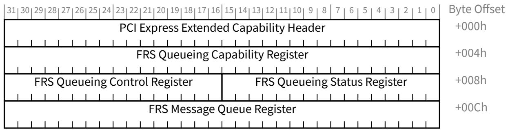

text_image

PCI Express Extended Capability Header
FRS Queueing Capability Register
FRS Queueing Control Register	FRS Queueing Status Register
FRS Message Queue Register
Byte Offset
+000h
+004h
+008h
+00Ch

Figure 7-189 FRS Queueing Extended Capability§

## 7.8.10.1 FRS Queueing Extended Capability Header (Offset 00h) §

text_image

31
20 19 16 15 0
Next Capability Offset
0021h
PCI Express Extended Capability ID
Capability Version

Figure 7-190 FRS Queueing Extended Capability Header§

Table 7-162 FRS Queueing Extended Capability Header§

<table><tr><td>Bit Location</td><td>Register Description</td><td>Attributes</td></tr><tr><td>15:0</td><td>PCI Express Extended Capability ID - This field is a PCI-SIG defined ID number that indicates the nature and format of the extended capability.PCI Express Extended Capability ID for the FRS Queueing Extended Capability is 0021h.</td><td>RO</td></tr><tr><td>19:16</td><td>Capability Version - This field is a PCI-SIG defined version number that indicates the version of the capability structure present.Must be 1h for this version of the specification.</td><td>RO</td></tr><tr><td>31:20</td><td>Next Capability Offset - This field contains the offset to the next PCI Express Extended Capability structure or 000h if no other items exist in the linked list of capabilities.</td><td>RO</td></tr></table>

## 7.8.10.2 FRS Queueing Capability Register (Offset 04h) §

text_image

31
21 20 16 15 12 11 0
RsvdP RsvdP FRS Queue Max Depth
FRS Interrupt Message Number

Figure 7-191 FRS Queueing Capability Register§

Table 7-163 FRS Queueing Capability Register§

<table><tr><td>Bit Location</td><td>Register Description</td><td>Attributes</td></tr><tr><td>11:0</td><td>FRS Queue Max Depth- Indicates the implemented queue depth, with valid values ranging from 001h (queue depth of 1) to FFFh (queue depth of 4095)The value of FRS Message Queue Depth must not exceed this value.The value 000h is Reserved.</td><td>HwInit</td></tr><tr><td>20:16</td><td>FRS Interrupt Message Number- This register indicates which MSI/MSI-X vector is used for the interrupt message generated in association with FRS Message Received or FRS Message Overflow.For MSI, the value in this register indicates the offset between the base Message Data and the interrupt message that is generated. Hardware is required to update this field so that it is correct if the number of MSI Messages assigned to the Function changes when software writes to the Multiple Message Enable field in the Message Control Register for MSI.For MSI-X, the value in this register indicates which MSI-X Table entry is used to generate the interrupt message. The entry must be one of the first 32 entries even if the Function implements more than 32 entries. For a given MSI-X implementation, the entry must remain constant.If both MSI and MSI-X are implemented, they are permitted to use different vectors, though software is permitted to enable only one mechanism at a time. If MSI-X is enabled, the value in this register must indicate the vector for MSI-X. If MSI is enabled or neither is enabled, the value in this register must indicate the vector for MSI. If software enables both MSI and MSI-X at the same time, the value in this register is undefined.</td><td>RO</td></tr></table>

## 7.8.10.3 FRS Queueing Status Register (Offset 08h) §

text_image

15
RsvdZ
2 1 0
FRS Message Received
FRS Message Overflow

Figure 7-192 FRS Queueing Status Register§

Table 7-164 FRS Queueing Status Register§

<table><tr><td>Bit Location</td><td>Register Description</td><td>Attributes</td></tr><tr><td>0</td><td>FRS Message Received- This bit is Set when a new FRS Message is Received or generated by this Root Port or Root Complex Event Collector.Root Ports must Clear this bit when the Link is DL_Down.Default value of this bit is 0b.</td><td>RW1C</td></tr><tr><td>1</td><td>FRS Message Overflow- This bit is Set if the FRS Message queue is full and a new FRS Message is received or generated by this Root Port or Root Complex Event Collector.Root Ports must Clear this bit when the Link is DL_Down.Default value of this bit is 0b.</td><td>RW1C</td></tr></table>

# 7.8.10.4 FRS Queueing Control Register (Offset 0Ah) §

text_image

RsvdP
15
1 0
FRS Interrupt Enable

Figure 7-193 FRS Queueing Control Register§

Table 7-165 FRS Queueing Control Register§

<table><tr><td>Bit Location</td><td>Register Description</td><td>Attributes</td></tr><tr><td>0</td><td>FRS Interrupt Enable - When Set and MSI or MSI-X is enabled, the Port must issue an MSI/MSI-X interrupt to indicate the 0b to 1b transition of either the FRS Message Received or the FRS Message Overflow bits. Default value of this bit is 0b.</td><td>RW</td></tr></table>

## 7.8.10.5 FRS Message Queue Register (Offset 0Ch) §

The FRS Message Queue Register contains fields from the oldest FRS message in the queue. It also indicates the number of FRS messages in the queue.

A write of any value that includes byte 0 to this register removes the oldest FRS Message from the queue and updates these fields. A write to this register when the queue is empty has no effect.

text_image

31 20 19 16 15 0
FRS Message Queue Depth FRS Message Queue Function ID
FRS Message Queue Reason

Figure 7-194 FRS Message Queue Register§

Table 7-166 FRS Message Queue Register§

<table><tr><td>Bit Location</td><td>Register Description</td><td>Attributes</td></tr><tr><td>15:0</td><td>FRS Message Queue Function ID- Recorded from the Requester ID of the oldest FRS Message Received or generated by this Root Port or Root Complex Event Collector and still in the queue.Undefined if FRS Message Queue Depth is 000h.</td><td>RO</td></tr><tr><td>19:16</td><td>FRS Message Queue Reason- Recorded from the FRS Reason of the oldest FRS Message Received or generated by this Root Port or Root Complex Event Collector and still in the queue.Undefined if FRS Message Queue Depth is 000h.</td><td>RO</td></tr><tr><td>31:20</td><td>FRS Message Queue Depth- indicates the current number of FRS Messages in the queue.The value of 000h indicates an empty queue.Default value of this field is 000h.</td><td>RO</td></tr></table>

## 7.8.11 Flattening Portal Bridge (FPB) Capability §

The Flattening Portal Bridge (FPB) Capability is an optional Capability that is required for any bridge Function that implements FPB. The FPB Capability structure is shown in § Figure 7-195.

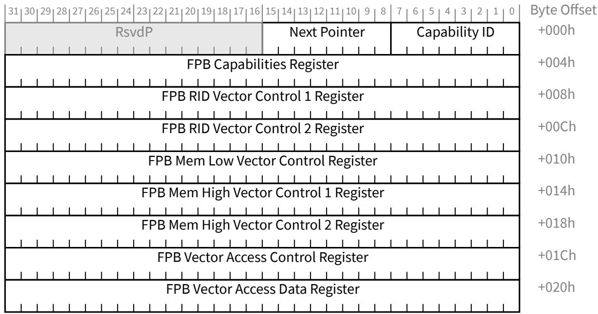

text_image

31 30 29 28 27 26 25 24 23 22 21 20 19 18 17 16 15 14 13 12 11 10 9 8 7 6 5 4 3 2 1 0
RsvdP
Next Pointer
Capability ID
FPB Capabilities Register
FPB RID Vector Control 1 Register
FPB RID Vector Control 2 Register
FPB Mem Low Vector Control Register
FPB Mem High Vector Control 1 Register
FPB Mem High Vector Control 2 Register
FPB Vector Access Control Register
FPB Vector Access Data Register
Byte Offset
+000h
+004h
+008h
+00Ch
+010h
+014h
+018h
+01Ch
+020h

§ Figure 7-195 FPB Capability Structure

If a Switch implements FPB then each of its Ports of the Switch must implement an FPB Capability Structure. A Root Complex is permitted to implement the FPB Capability Structure on some or on all of its Root Ports. A Root Complex is permitted to implement the FPB Capability for internal logical busses.

## 7.8.11.1 FPB Capability Header (Offset 00h) §

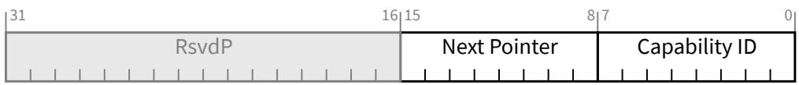

text_image

31
RsvdP
16 15 8 7 0
Next Pointer Capability ID

Figure 7-196 FPB Capability Header

§

§

Table 7-167 FPB Capability Header

<table><tr><td>Bit Location</td><td>Register Description</td><td>Attributes</td></tr><tr><td>7:0</td><td>Capability ID - Must be set to 15h</td><td>RO</td></tr><tr><td>15:8</td><td>Next Pointer - Pointer to the next item in the capabilities list. Must be 00h for the final item in the list.</td><td>RO</td></tr></table>

## 7.8.11.2 FPB Capabilities Register (Offset 04h) §

§ Figure 7-197 details allocation of register fields for FPB Capabilities register and § Table 7-168 describes the requirements for this register.  
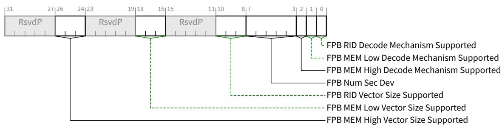

text_image

31 27 26 24 23 19 18 16 15 11 10 8 7 3 2 1 0
RsvdP RsvdP RsvdP
FPB RID Decode Mechanism Supported
FPB MEM Low Decode Mechanism Supported
FPB MEM High Decode Mechanism Supported
FPB Num Sec Dev
FPB RID Vector Size Supported
FPB MEM Low Vector Size Supported
FPB MEM High Vector Size Supported

§ Figure 7-197 FPB Capabilities Register

§

Table 7-168 FPB Capabilities Register

<table><tr><td>Bit Location</td><td colspan="3">Register Description</td><td>Attributes</td></tr><tr><td>0</td><td colspan="3">FPB RID Decode Mechanism Supported- If Set, indicates that the FPB RID Vector mechanism is supported.</td><td>HwInit</td></tr><tr><td>1</td><td colspan="3">FPB MEM Low Decode Mechanism Supported- If Set, indicates that the FPB MEM Low Vector mechanism is supported.</td><td>HwInit</td></tr><tr><td>2</td><td colspan="3">FPB MEM High Decode Mechanism Supported- If Set, indicates that the FPB Mem High mechanism is supported.</td><td>HwInit</td></tr><tr><td>7:3</td><td colspan="3">FPB Num Sec Dev- For Upstream Ports of Switches only, this field indicates the quantity of Device Numbers associated with the Secondary Side of the Upstream Port bridge. The quantity is determined by adding one to the numerical value of this field.Although it is recommended that Switch implementations assign Downstream Ports using all 8 allowed Functions per allocated Device Number, such that all Downstream Ports are assigned within a contiguous range of Device and Function Numbers, it is, however, explicitly permitted to assign Downstream Ports to Function Numbers that are not contiguous within the indicated range of Device Numbers, and system software is required to scan for Switch Downstream Ports at every Function Number within the indicated quantity of Device Numbers associated with the Secondary Side of the Upstream Port.This field is Reserved for Downstream Ports.</td><td>HwInit/RsvdP</td></tr><tr><td>10:8</td><td colspan="3">FPB RID Vector Size Supported- Indicates the size of the FPB RID Vector implemented in hardware, and constrains the allowed values software is permitted to write to the FPB RID Vector Granularity field. Defined encodings are:ValueSizeAllowed Granularities in RID units000b256 bits8, 64, 256010b1 K bits8, 64101b8 K bits8All other encodings are Reserved.If the FPB RID Decode Mechanism Supported bit is Clear, then the value in this field is undefined and must be ignored by software.</td><td>HwInit</td></tr><tr><td>18:16</td><td colspan="3">FPB MEM Low Vector Size Supported- Indicates the size of the FPB MEM Low Vector implemented in hardware, and constrains the allowed values software is permitted to write to the FPB MEM Low Vector Start field. Defined encodings are:ValueSizeAllowed Granularities in MB units000b256 bits1, 2, 4, 8, 16001b512 bits1, 2, 4, 8010b1 K bits1, 2, 4011b2 K bits1, 2100b4 K bits1All other encodings are Reserved.If the FPB MEM Low Decode Mechanism Supported bit is Clear, then the value in this field is undefined and must be ignored by software.</td><td>HwInit</td></tr><tr><td>26:24</td><td colspan="3">FPB MEM High Vector Size Supported- Indicates the size of the FPB MEM High Vector implemented in hardware. Defined encodings are:</td><td>HwInit</td></tr><tr><td rowspan="7"></td><td rowspan="7"></td><td>Value</td><td>Size</td><td rowspan="7"></td></tr><tr><td>000b</td><td>256 bits</td></tr><tr><td>001b</td><td>512 bits</td></tr><tr><td>010b</td><td>1 K bits</td></tr><tr><td>011b</td><td>2 K bits</td></tr><tr><td>100b</td><td>4 K bits</td></tr><tr><td>101b</td><td>8 K bits</td></tr><tr><td rowspan="3"></td><td colspan="3">All other encodings are Reserved.</td><td rowspan="3"></td></tr><tr><td colspan="3">All defined Granularities are allowed for all defined vector sizes.</td></tr><tr><td colspan="3">If the FPB MEM High Decode Mechanism Supported bit is Clear, then the value in this field is undefined and must be ignored by software.</td></tr></table>

## 7.8.11.3 FPB RID Vector Control 1 Register (Offset 08h) §

§ Figure 7-198 details allocation of register fields for FPB RID Control 1 register and § Table 7-172 describes the requirements for this register.  
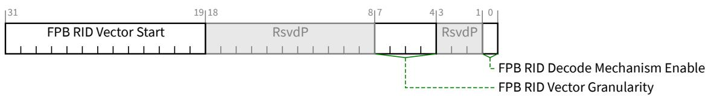

text_image

31
FPB RID Vector Start
19 18
RsvdP
8 7
4 3
1 0
RsvdP
FPB RID Decode Mechanism Enable
FPB RID Vector Granularity

Figure 7-198 FPB RID Vector Control 1 Register§

Table 7-172 FPB RID Vector Control 1 Register§

<table><tr><td>Bit Location</td><td colspan="2">Register Description</td><td>Attributes</td></tr><tr><td>0</td><td colspan="2">FPB RID Decode Mechanism Enable - When Set, enables the FPB RID Decode mechanismIf the FPB RID Decode Mechanism Supported bit is Clear, then it is permitted for hardware to implement this bit as RO, and in this case the value in this field is undefined.Default value of this bit is 0b.</td><td>RW/RO</td></tr><tr><td rowspan="3">7:4</td><td colspan="2">FPB RID Vector Granularity - The value written by software to this field controls the granularity of the FPB RID Vector and the required alignment of the FPB RID Vector Start field (below).Defined encodings are:</td><td rowspan="3">RW/RO</td></tr><tr><td>Value</td><td>Granularity</td></tr><tr><td>0000bValue</td><td>8 RIDsGranularity</td></tr><tr><td rowspan="3"></td><td>0011b</td><td>64 RIDs</td><td rowspan="3"></td></tr><tr><td>0101b</td><td>256 RIDs</td></tr><tr><td colspan="2">All other encodings are Reserved. Based on the implemented FPB RID Vector size, hardware is permitted to implement as RW only those bits of this field that can be programmed to non-zero values, in which case the upper order bits are permitted but not required to be hardwired to 0. If the FPB RID Decode Mechanism Supported bit is Clear, then it is permitted for hardware to implement this field as RO, and the value in this field is undefined. For Downstream Ports, if the ARI Forwarding Enable bit in the Device Control 2 Register and the FPB RID Decode Mechanism Enable bit are Set, then software must program 0101b into this field, if this field is programmable. Default value for this field is 0000b.</td></tr><tr><td rowspan="6">31:19</td><td colspan="2">FPB RID Vector Start - The value written by software to this field controls the offset at which the FPB RID Vector is applied. The value represents a RID offset in units of 8 RIDs, such that bit 0 of the FPB RID Vector represents the range of RIDs starting from the value represented in this register up to that value plus the FPB RID Vector Granularity minus 1, and bit 1 represents range from this register value plus granularity up to that value plus FPB RID Vector Granularity minus 1, etc. Software must program this field to a value that is naturally aligned (meaning the lower order bits must be 0's) according to the value in the FPB RID Vector Granularity Field as indicated here:</td><td rowspan="6">RW/RO</td></tr><tr><td>FPB RID Vector Granularity</td><td>Start Alignment Constraint</td></tr><tr><td>0000b</td><td></td></tr><tr><td>0011b</td><td>...00 0b</td></tr><tr><td>0101b</td><td>...0000 0b</td></tr><tr><td colspan="2">All other encodings are Reserved. If this requirement is violated, the hardware behavior is undefined. For Downstream Ports, if the ARI Forwarding Enable bit in the Device Control 2 Register and the FPB RID Decode Mechanism Enable bit are Set, then software must program bits 23:19 of this field to a value of 0000 0b, and the hardware behavior is undefined if any other value is programmed. If the FPB RID Decode Mechanism Supported bit is Clear, then it is permitted for hardware to implement this field as RO, and the value in this field is undefined. Default value for this field is 0000 0000 0000 0b.</td></tr></table>

## 7.8.11.4 FPB RID Vector Control 2 Register (Offset 0Ch) §

§ Figure 7-199 details allocation of register fields for FPB RID Vector Control 2 register and § Table 7-175 describes the requirements for this register

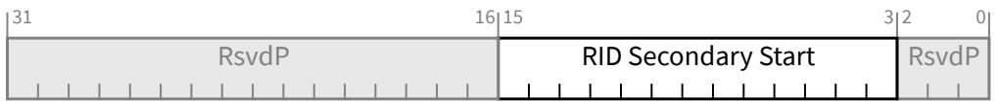

text_image

31
RsvdP
16 15
RID Secondary Start
3 2
RsvdP
0

Figure 7-199 FPB RID Vector Control 2 Register§

Table 7-175 FPB RID Vector Control 2 Register§

<table><tr><td>Bit Location</td><td>Register Description</td><td>Attributes</td></tr><tr><td>15:3</td><td>RID Secondary Start- The value written by software to this field controls the RID offset at which Type 1 Configuration Requests passing downstream through the bridge must be converted to Type 0.Bits[2:0] of the RID offset are fixed by hardware as 000b and cannot be modified.For Downstream Ports, if the ARI Forwarding Enable bit in the Device Control 2 register is Set, then software must write bits 7:3 of this field to 0 0000b.If the FPB RID Decode Mechanism Supported bit is Clear, then it is permitted for hardware to implement this field as RO, and the value in this field is undefined.Default value for this field is 0000 0000 0000 0b.</td><td>RW/RO</td></tr></table>

## 7.8.11.5 FPB MEM Low Vector Control Register (Offset 10h) §

§ Figure 7-200 details allocation of register fields for FPB MEM Low Vector Control Register and § Table 7-176 describes the requirements for this register.

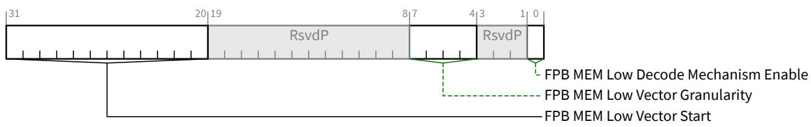

text_image

31
20 19
RsvdP
8 7
4 3
1 0
FPB MEM Low Decode Mechanism Enable
FPB MEM Low Vector Granularity
FPB MEM Low Vector Start

Figure 7-200 FPB MEM Low Vector Control Register§

Table 7-176 FPB MEM Low Vector Control Register§

<table><tr><td>Bit Location</td><td>Register Description</td><td>Attributes</td></tr><tr><td>0</td><td>FPB MEM Low Decode Mechanism Enable - When Set, enables the FPB MEM Low Decode mechanism. If the FPB MEM Low Decode Mechanism Supported bit is Clear, then it is permitted for hardware to implement this bit as RO, and in this case the value in this field is undefined. Default value of this bit is 0b.</td><td>RW/RO</td></tr><tr><td>7:4</td><td>FPB MEM Low Vector Granularity - The value written by software to this field controls the granularity of the FPB MEM Low Vector, and the required alignment of the FPB MEM Low Vector Start field (below). Defined encodings are:</td><td>RW/RO</td></tr></table>

<table><tr><td>Bit Location</td><td colspan="3">Register Description</td><td>Attributes</td></tr><tr><td rowspan="7"></td><td>Value</td><td>Granularity</td><td rowspan="6"></td><td rowspan="6"></td></tr><tr><td>0000b</td><td>1 MB</td></tr><tr><td>0001b</td><td>2 MB</td></tr><tr><td>0010b</td><td>4 MB</td></tr><tr><td>0011b</td><td>8 MB</td></tr><tr><td>0100b</td><td>16 MB</td></tr><tr><td colspan="4">All other encodings are Reserved. Based on the implemented FPB MEM Low Vector size, hardware is permitted to implement as RW only those bits of this field that can be programmed to non-zero values, in which case the upper order bits are permitted but not required to be hardwired to 0. If the FPB MEM Low Decode Mechanism Supported bit is Clear, then it is permitted for hardware to implement this field as RO, and the value in this field is undefined. Default value for this field is 0000b.</td></tr><tr><td rowspan="8">31:20</td><td colspan="3">FPB MEM Low Vector Start- The value written by software to this field sets bits 31:20 of the base address at which the FPB MEM Low Vector is applied. Software must program this field to a value that is naturally aligned (meaning the lower order bits must be 0&#x27;s) according to the value in the FPB MEM Low Vector Granularity field as indicated here:</td><td rowspan="7">RW/RO</td></tr><tr><td colspan="2">FPB MEM Low Vector Granularity</td><td>Constraint</td></tr><tr><td colspan="2">0000b</td><td></td></tr><tr><td colspan="2">0001b</td><td>...0b</td></tr><tr><td colspan="2">0010b</td><td>...00b</td></tr><tr><td colspan="2">0011b</td><td>...000b</td></tr><tr><td colspan="2">0100b</td><td>...0000b</td></tr><tr><td colspan="4">If this requirement is violated, the hardware behavior is undefined. If the FPB MEM Low Decode Mechanism Supported bit is Clear, then it is permitted for hardware to implement this field as RO, and the value in this field is undefined. Default value for this field is 000h.</td></tr></table>

## 7.8.11.6 FPB MEM High Vector Control 1 Register (Offset 14h) §

§ Figure 7-201 details allocation of register fields for FPB MEM High Vector Control 1 Register and § Table 7-179 describes the requirements for this register.

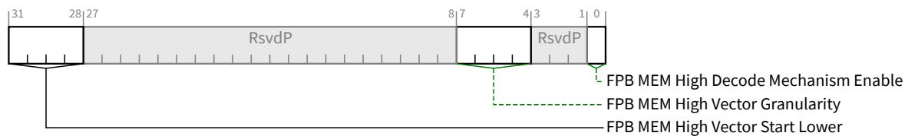

text_image

31 28 27
RsvdP 8 7 4 3 1 0
RsvdP
FPB MEM High Decode Mechanism Enable
FPB MEM High Vector Granularity
FPB MEM High Vector Start Lower

Figure 7-201 FPB MEM High Vector Control 1 Register§

Table 7-179 FPB MEM High Vector Control 1 Register§

<table><tr><td>Bit Location</td><td colspan="2">Register Description</td><td>Attributes</td></tr><tr><td>0</td><td colspan="2">FPB MEM High Decode Mechanism Enable- When Set, enables the FPB MEM High Decode mechanism. If the FPB MEM High Decode Mechanism Supported bit is Clear, then it is permitted for hardware to implement this bit as RO, and in this case the value in this field is undefined. Default value of this bit is 0b.</td><td>RW/RO</td></tr><tr><td rowspan="11">7:4</td><td colspan="2">FPB MEM High Vector Granularity- The value written by software to this field controls the granularity of the FPB MEM High Vector, and the required alignment of the FPB MEM High Vector Start Lower field (below). Software is permitted to select any allowed Granularity from the table below regardless of the value in the FPB MEM High Vector Size Supported field. Defined encodings are:</td><td rowspan="11">RW/RO</td></tr><tr><td>Value</td><td>Granularity</td></tr><tr><td>0000b</td><td>256 MB</td></tr><tr><td>0001b</td><td>512 MB</td></tr><tr><td>0010b</td><td>1 GB</td></tr><tr><td>0011b</td><td>2 GB</td></tr><tr><td>0100b</td><td>4 GB</td></tr><tr><td>0101b</td><td>8 GB</td></tr><tr><td>0110b</td><td>16 GB</td></tr><tr><td>0111b</td><td>32 GB</td></tr><tr><td colspan="2">All other encodings are Reserved. Based on the implemented FPB MEM High Vector size, hardware is permitted to implement as RW only those bits of this field that can be programmed to non-zero values, in which case the upper order bits are permitted but not required to be hardwired to 0. If the FPB MEM High Decode Mechanism Supported bit is Clear, then it is permitted for hardware to implement this field as RO, and the value in this field is undefined. Default value for this field is 0000b.</td></tr><tr><td>31:28</td><td colspan="2">FPB MEM High Vector Start Lower- The value written by software to this field sets the lower bits of the base address at which the FPB MEM High Vector is applied.Software must program this field to a value that is naturally aligned (meaning the lower order bits must be 0's) according to the value in the FPB MEM High Vector Granularity Field as indicated here:</td><td>RW/RO</td></tr><tr><td rowspan="12"></td><td>FPB MEM High Vector Granularity</td><td>Constraint</td><td rowspan="12"></td></tr><tr><td>0000b</td><td></td></tr><tr><td>0001b</td><td>...0b</td></tr><tr><td>0010b</td><td>...00b</td></tr><tr><td>0011b</td><td>...000b</td></tr><tr><td>0100b</td><td>...0000b</td></tr><tr><td>0101b</td><td>...0 0000b</td></tr><tr><td>0110b</td><td>...00 0000b</td></tr><tr><td>0111b</td><td>...000 0000b</td></tr><tr><td colspan="2">If this requirement is violated, the hardware behavior is undefined.</td></tr><tr><td colspan="2">If the FPB MEM High Decode Mechanism Supported bit is Clear, then it is permitted for hardware to implement this field as RO, and the value in this field is undefined.</td></tr><tr><td colspan="2">Default value for this field is 0h.</td></tr></table>

## 7.8.11.7 FPB MEM High Vector Control 2 Register (Offset 18h) §

§ Figure 7-202 details allocation of register fields for FPB MEM High Vector Control 2 Register and § Table 7-182 describes the requirements for this register.

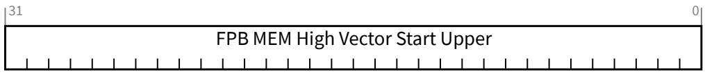

text_image

31
FPB MEM High Vector Start Upper
0

Figure 7-202 FPB MEM High Vector Control 2 Register§

Table 7-182 FPB MEM High Vector Control 2 Register§

<table><tr><td>Bit Location</td><td>Register Description</td><td>Attributes</td></tr><tr><td>31:0</td><td>FPB MEM High Vector Start Upper- The value written by software to this field sets bits 63:32 of the base address at which the FPB MEM High Vector is applied.Software must program this field to a value that is naturally aligned (meaning the lower order bits must be 0’s) according to the value in the FPB MEM High Vector Granularity Field as indicated here:</td><td>RW/RO</td></tr></table>

<table><tr><td>Bit Location</td><td colspan="3">Register Description</td><td>Attributes</td></tr><tr><td rowspan="10"></td><td rowspan="9"></td><td>FPB MEM High Vector Granularity</td><td>Constraint</td><td rowspan="10"></td></tr><tr><td>0000b</td><td></td></tr><tr><td>0001b</td><td></td></tr><tr><td>0010b</td><td></td></tr><tr><td>0011b</td><td></td></tr><tr><td>0100b</td><td></td></tr><tr><td>0101b</td><td>...0b</td></tr><tr><td>0110b</td><td>...00b</td></tr><tr><td>0111b</td><td>...000b</td></tr><tr><td colspan="3">If this requirement is violated, the hardware behavior is undefinedIf the FPB MEM High Decode Mechanism Supported bit is Clear, then it is permitted for hardware to implement this field as RO, and the value in this field is undefined.Default value for this field is 0000 0000h.</td></tr></table>

## 7.8.11.8 FPB Vector Access Control Register (Offset 1Ch) §

§ Figure 7-203 details allocation of register fields for FPB Vector Access Control register and § Table 7-184 describes the requirements for this register.

text_image

31
RsvdP 16 15 14 13 8 7 0
RsvdP
FPB Vector Access Offset
FPB Vector Select

Figure 7-203 FPB Vector Access Control Register§

Table 7-184 FPB Vector Access Control Register§

<table><tr><td>Bit Location</td><td>Register Description</td><td>Attributes</td></tr><tr><td>7:0</td><td>FPB Vector Access Offset- The value in this field indicates the offset of the DWORD portion of the FPB RID, MEM Low or MEM High, Vector that can be read or written by means of the FPB Vector Access Data register.The selection of RID, MEM Low or MEM High is made by the value written to the FPB Vector Select field.The bits of this field map to the offset according to the value in the corresponding FPB RID, MEM Low, or MEM High Vector Size Supported field as shown here:</td><td>RW/RO</td></tr></table>

<table><tr><td>Bit Location</td><td colspan="4">Register Description</td><td>Attributes</td></tr><tr><td rowspan="8"></td><td rowspan="7"></td><td>Vector Size Supported</td><td>Offset Bits</td><td>Vector Access Offset</td><td rowspan="8"></td></tr><tr><td>000b</td><td>2:0</td><td>2:0 (7:3 unused)</td></tr><tr><td>001b</td><td>3:0</td><td>3:0 (7:4 unused)</td></tr><tr><td>010b</td><td>4:0</td><td>4:0 (7:5 unused)</td></tr><tr><td>011b</td><td>5:0</td><td>5:0 (7:6 unused)</td></tr><tr><td>100b</td><td>6:0</td><td>6:0 (7 unused)</td></tr><tr><td>101b</td><td>7:0</td><td>7:0</td></tr><tr><td colspan="4">All other encodings are Reserved. Bits in this field that are unused per the table above must be written by software as 0b, and are permitted but not required to be implemented as RO. Default value for this field is 00h</td></tr><tr><td>15:14</td><td colspan="4">FPB Vector Select - The value written to this field selects the Vector to be accessed at the indicated FPB Vector Access Offset. Software must only write this field with values that correspond to supported FPB mechanisms, otherwise the results are undefined. Defined encodings are: 00b RID 01b MEM Low 10b MEM High 11b Reserved Default value for this field is 00b</td><td>RW</td></tr></table>

## 7.8.11.9 FPB Vector Access Data Register (Offset 20h) §

§ Figure 7-204 details allocation of register fields for FPB Vector Access Data Register and § Table 7-186 describes the requirements for this register.

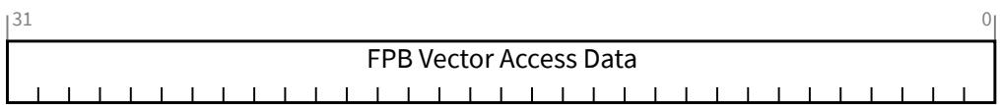

text_image

31
FPB Vector Access Data
0

Figure 7-204 FPB Vector Access Data Register§

Table 7-186 FPB Vector Access Data Register§

<table><tr><td>Bit Location</td><td>Register Description</td><td>Attributes</td></tr><tr><td>31:0</td><td>FPB Vector Access Data - Reads from this register return the DW of data from the FPB Vector at the location determined by the value in the FPB Vector Access Offset Register. Writes to this register replacethe DW of data from the FPB Vector at the location determined by the value in the FPB Vector Access Offset Register.Behavior of this field is undefined if software programs unsupported values for FPB Vector Select or FPB Vector Access Offset fields, however hardware is required to complete the access to this register normally.Default value for this field is 0000 0000h</td><td>RW</td></tr></table>

## 7.8.12 Flit Performance Measurement Extended Capability §

This capability is optional. This capability is permitted in Downstream Ports, in Function 0 of an Upstream Port, and in RCRBs. This capability is not permitted in other Functions.

This capability is only used in Flit Mode. The capability has no effect in Non-Flit Mode.

The registers LTSSM Performance Measurement Status 1 Register through LTSSM Performance Measurement Status 5 Register are optional. The number implemented is contained in LTSSM Tracking Register Count. Unimplemented registers do not exist (i.e., the capability becomes shorter than shown in § Figure 7-205)

§ Figure 7-205 details allocation of the register bits in the Flit Performance Measurement Extended Capability structure.

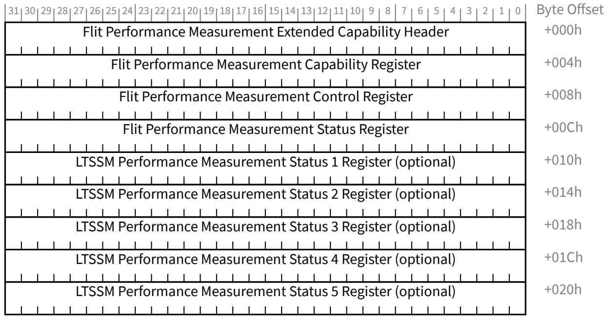

stacked bar chart

| Category | Value |
| -------- | ----- |
| Flit Performance Measurement Extended Capability Header | +000h |
| Flit Performance Measurement Capability Register | +004h |
| Flit Performance Measurement Control Register | +008h |
| Flit Performance Measurement Status Register | +00Ch |
| LTSSM Performance Measurement Status 1 Register (optional) | +010h |
| LTSSM Performance Measurement Status 2 Register (optional) | +014h |
| LTSSM Performance Measurement Status 3 Register (optional) | +018h |
| LTSSM Performance Measurement Status 4 Register (optional) | +01Ch |
| LTSSM Performance Measurement Status 5 Register (optional) | +020h |

Figure 7-205 Flit Performance Measurement Extended Capability Structure§

## 7.8.12.1 Flit Performance Measurement Extended Capability Header (Offset 00h) §

§ Figure 7-206 details allocation of the register fields in the Flit Performance Measurement Extended Capability Header; § Table 7-187 provides the respective bit definitions.

text_image

31
20 19 16 15 0
Next Capability Offset
0033h
Flit Performance Measurement Extended Capability ID
Capability Version

Figure 7-206 Flit Performance Measurement Extended Capability Header§

Table 7-187 Flit Performance Measurement Extended Capability Header§

<table><tr><td>Bit Location</td><td>Register Description</td><td>Attributes</td></tr><tr><td>15:0</td><td>Flit Performance Measurement Extended Capability ID - This field is a PCI-SIG defined ID number that indicates the nature and format of the Extended Capability.The Extended Capability ID for the Flit Performance Measurement Extended Capability is 0033h.</td><td>RO</td></tr><tr><td>19:16</td><td>Capability Version - This field is a PCI-SIG defined version number that indicates the version of the Capability structure present.Must be 1h for this version of the specification.</td><td>RO</td></tr><tr><td>31:20</td><td>Next Capability Offset - This field contains the offset to the next PCI Express Capability structure or 000h if no other items exist in the linked list of Capabilities.For Extended Capabilities implemented in Configuration Space, this offset is relative to the beginning of PCI-compatible Configuration Space and thus must always be either 000h (for terminating list of Capabilities) or greater than 0FFh.</td><td>RO</td></tr></table>

## 7.8.12.2 Flit Performance Measurement Capability Register (Offset 04h) §

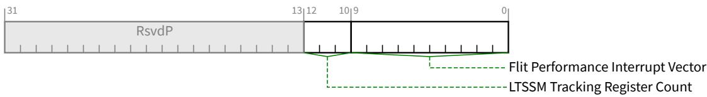

text_image

RsvdP
31 12 10 9 0
Flit Performance Interrupt Vector
LTSSM Tracking Register Count

Figure 7-207 Flit Performance Measurement Capability Register§

Table 7-188 Flit Performance Measurement Capability Register§

<table><tr><td>Bit Location</td><td>Register Description</td><td>Attributes</td></tr><tr><td>9:0</td><td>Flit Performance Interrupt Vector – contains the MSI or MSI-X Vector number used by this mechanism. This field is permitted to change value based on whether MSI or MSI-X is enabled.</td><td>HwInit</td></tr><tr><td>12:10</td><td>LTSSM Tracking Register Count – Indicates the number of simultaneous LTSSM tracking events that are supported.Value must be between 0 and 5.</td><td>HwInit</td></tr></table>

## 7.8.12.3 Flit Performance Measurement Control Register (Offset 08h)

§

The status register in capability indicates how many events can be simultaneously tracked for the LTSSM state transition tracker. Software must ensure that it does not enable more bits than the Port can enable.

Behavior is undefined if bits 35:1 of this register are changed while Flit Latency Measurement is running (Flit Latency Measurement Enable is 1b and either Flit Response Type is non-zero and Flit Latency Tracking Status is 00b or 01b, or LTSSM State Transition Tracker is non-zero and any of the enabled LTSSM State Transition Tracking Status fields are 00b or 01b).

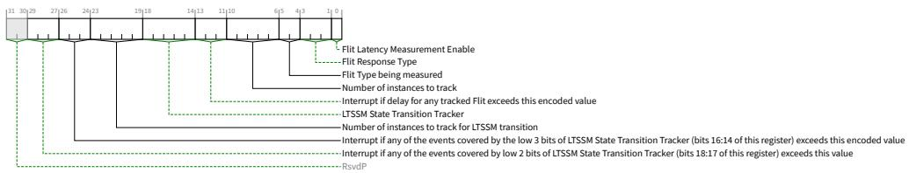

text_image

131 3029 2726 2423 1918 1413 1110 695 43 1 0
Flit Latency Measurement Enable
Flit Response Type
Flit Type being measured
Number of instances to track
Interrupt if delay for any tracked Flit exceeds this encoded value
LTSSM State Transition Tracker
Number of instances to track for LTSSM transition
Interrupt if any of the events covered by the low 3 bits of LTSSM State Transition Tracker (bits 16:14 of this register) exceeds this encoded value
Interrupt if any of the events covered by low 2 bits of LTSSM State Transition Tracker (bits 18:17 of this register) exceeds this value
RSvDP

Figure 7-208 Flit Performance Measurement Control Register§

Table 7-189 Flit Performance Measurement Control Register§

<table><tr><td>Bit Location</td><td colspan="2">Register Description</td><td>Attributes</td></tr><tr><td>0</td><td colspan="2">Flit Latency Measurement Enable – Setting this bit to 1b enables and starts measuring the Ack/ Nak/ Replay latency of a Flit. Unit of measurement is 8 ns. Writing a 0b to this bit stops the measurement. Default is Zero.</td><td>RW</td></tr><tr><td rowspan="5">3:1</td><td colspan="2">Flit Response Type – Setting the associated bit to 1b enables and starts measuring the Nak to Replay, Flit to Nak, or Flit to Ack latency of a Flit, depending on which bit was written. Writing a 0b to this bit stops the measurement.</td><td rowspan="5">RW</td></tr><tr><td>Bit 1</td><td>Flit to Ack Latency</td></tr><tr><td>Bit 2</td><td>Flit to Nak Latency</td></tr><tr><td>Bit 3</td><td>Nak to Replay Latency</td></tr><tr><td colspan="2">Default is Zero.</td></tr><tr><td rowspan="6">5:4</td><td colspan="2">Flit Type being measured</td><td rowspan="6">RW</td></tr><tr><td>00b</td><td>IDLE / NOP Flit only</td></tr><tr><td>01b</td><td>Payload only Flit</td></tr><tr><td>10b</td><td>Any Flit</td></tr><tr><td>11b</td><td>Reserved</td></tr><tr><td colspan="2">Default is Zero.</td></tr><tr><td rowspan="3">10:6</td><td colspan="2">Number of instances to track</td><td rowspan="3">RW</td></tr><tr><td>0 0000b</td><td>track the worst-case delay</td></tr><tr><td>Others</td><td>aggregate delay of the number presented here</td></tr><tr><td rowspan="2">13:11</td><td colspan="2">Interrupt if delay for any tracked Flit exceeds this encoded value</td><td rowspan="2">RW</td></tr><tr><td>000b001b</td><td>000b – no interrupt generated100 ns</td></tr><tr><td rowspan="4"></td><td>010b</td><td>200 ns</td><td rowspan="4"></td></tr><tr><td>011b</td><td>300 ns</td></tr><tr><td>Others</td><td>Reserved</td></tr><tr><td colspan="2">Default is Zero.</td></tr><tr><td rowspan="8">18:14</td><td colspan="2">LTSSM State Transition Tracker - Each bit counts as one independent event:</td><td rowspan="8">RW</td></tr><tr><td>Bit 14</td><td>L0 to Recovery due to a Framing Error / software directed while in L0.</td></tr><tr><td>Bit 15</td><td>L0p - Electrical Idle to start of Data Stream on Lane on an upconfig.</td></tr><tr><td>Bit 16</td><td>L1.0 to L0.</td></tr><tr><td>Bit 17</td><td>L1.1 to L0.</td></tr><tr><td>Bit 18</td><td>L1.2 to L0.</td></tr><tr><td colspan="2">Behavior is undefined if the number of bits set in this field is greater than LTSSM Tracking Register Count.</td></tr><tr><td colspan="2">Default is Zero.</td></tr><tr><td rowspan="4">23:19</td><td colspan="2">Number of instances to track for LTSSM transition</td><td rowspan="4">RW</td></tr><tr><td>0 0000b</td><td>track the worst-case delay</td></tr><tr><td>Others</td><td>aggregate delay of the number presented here</td></tr><tr><td colspan="2">Default is Zero.</td></tr><tr><td rowspan="7">26:24</td><td colspan="2">Interrupt if any of the events covered by the low 3 bits of LTSSM State Transition Tracker (bits 16:14 of this register) exceeds this encoded value:</td><td rowspan="7">RW</td></tr><tr><td>000b</td><td>no interrupt generated</td></tr><tr><td>001b</td><td>6.4 ms</td></tr><tr><td>010b</td><td>12.8 ms</td></tr><tr><td>011b</td><td>19.2 ms</td></tr><tr><td>Others</td><td>Reserved</td></tr><tr><td colspan="2">Default is Zero.</td></tr><tr><td rowspan="10">29:27</td><td colspan="2">Interrupt if any of the events covered by low 2 bits of LTSSM State Transition Tracker (bits 18:17 of this register) exceeds this value</td><td rowspan="10">RW</td></tr><tr><td>000b</td><td>no interrupt generated</td></tr><tr><td>001b</td><td>1 sec</td></tr><tr><td>010b</td><td>2 sec</td></tr><tr><td>011b</td><td>3 sec</td></tr><tr><td>100b</td><td>4 sec</td></tr><tr><td>101b</td><td>5 sec</td></tr><tr><td>110b</td><td>10 sec</td></tr><tr><td>111b</td><td>Reserved</td></tr><tr><td colspan="2">Default is Zero.</td></tr></table>

## 7.8.12.4 Flit Performance Measurement Status Register (Offset 0Ch) §

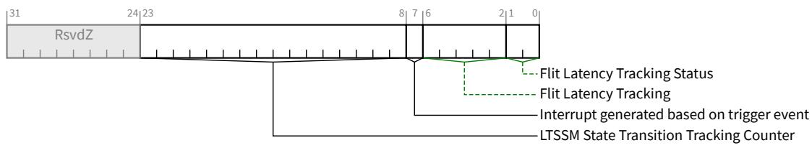

text_image

RsvdZ
31 24 23 8 7 6 2 1 0
Flit Latency Tracking Status
Flit Latency Tracking
Interrupt generated based on trigger event
LTSSM State Transition Tracking Counter

Figure 7-209 Flit Performance Measurement Status Register§

Table 7-190 Flit Performance Measurement Status Register§

<table><tr><td>Bit Location</td><td>Register Description</td><td>Attributes</td></tr><tr><td>1:0</td><td>Flit Latency Tracking Status00b Not started01b Started10b Completed11b Error (including counter overflow)Default is Zero.</td><td>RO</td></tr><tr><td>6:2</td><td>Flit Latency Tracking – number of Flits tracked so far This indicates the exact number of Flits which have completed tracking or is being tracked. At most one Flit is tracked at a time for the latency for each type (Ack or Nak/ Replay). This number does not roll overDefault is Zero.</td><td>RO</td></tr><tr><td>7</td><td>Interrupt generated based on trigger event – this bit is Set to 1b if an interrupt is generated based on the trigger event count due to LTSSM State Transition Tracking. While this bit is Set to 1b, no new interrupts will be generated based on the trigger event.Default is Zero.</td><td>RW1C</td></tr><tr><td>23:8</td><td>LTSSM State Transition Tracking Counter The measurement unit is 64 μs.Default is Zero.</td><td>RO</td></tr></table>

## 7.8.12.5 LTSSM Performance Measurement Status Register (Offsets 10h to 20h) §

Up to 5 instances of the folloing register are supported. Each register instance supports measurement of one LTSSM state transition tracking. If multiple entries are supported the order of association is based on the bits being enabled in the control register. Software must not enable additional bits for LTSSM state transition tracking while measurement of some events in that category is in progress.

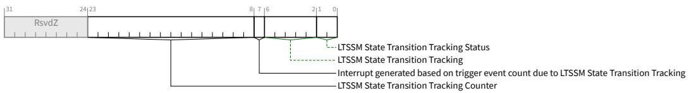

text_image

RsvdZ
31 24 23 8 7 6 2 1 0
LTSSM State Transition Tracking Status
LTSSM State Transition Tracking
Interrupt generated based on trigger event count due to LTSSM State Transition Tracking
LTSSM State Transition Tracking Counter

Figure 7-210 LTSSM Performance Measurement Status Register§

Table 7-191 LTSSM Performance Measurement Status Register§

<table><tr><td>Bit Location</td><td>Register Description</td><td>Attributes</td></tr><tr><td>1:0</td><td>LTSSM State Transition Tracking Status00b Not started01b Started10b Completed11b Error (including counter overflow)Cleared on 0b to 1b transition of Flit Latency Measurement Enable.Default is Zero.</td><td>ROS</td></tr><tr><td>6:2</td><td>LTSSM State Transition Tracking – number of LTSSM state transitions of the measured type tracked so far.This number does not roll over.Cleared on 0b to 1b transition of Flit Latency Measurement Enable.Default is Zero.</td><td>ROS</td></tr><tr><td>7</td><td>Interrupt generated based on trigger event count due to LTSSM State Transition Tracking – this bit is Set when an interrupt is generated based on the trigger event. While this bit is Set, no new interrupts will be generated based on the trigger event.Default is Zero.</td><td>RW1CS</td></tr><tr><td>23:8</td><td>LTSSM State Transition Tracking CounterThe measurement unit is 64 usec.Cleared on 0b to 1b transition of Flit Latency Measurement Enable.Default is Zero.</td><td>ROS</td></tr></table>

## 7.8.13 Flit Error Injection Extended Capability §

This capability is optional. This capability is permitted in Downstream Ports, in Function 0 of an Upstream Port, and in RCRBs. This capability is not permitted in other Functions.

This capability is only used in Flit Mode. The capability has no effect in Non-Flit Mode.

§ Figure 7-211 details allocation of the register bits in the Flit Error Injection Extended Capability structure.

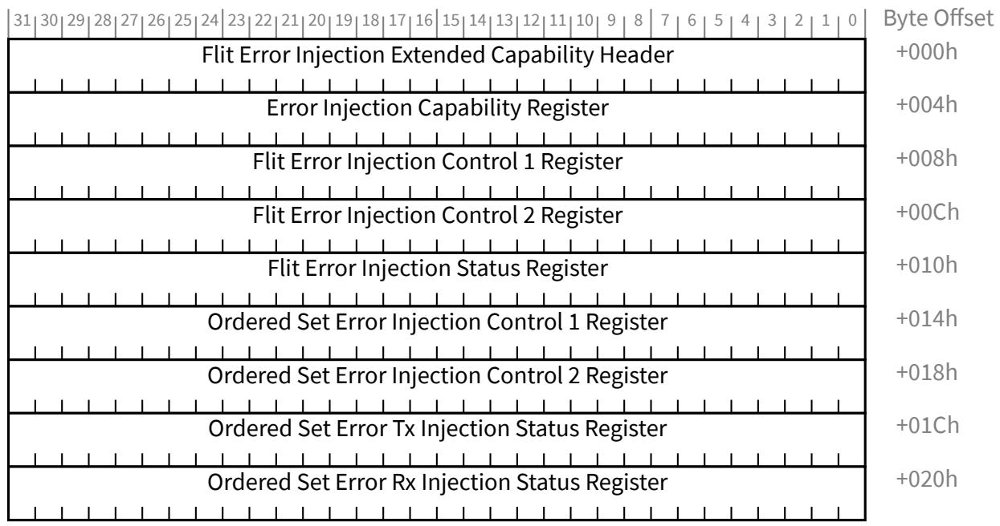

stacked bar chart

| Bit Position | Byte Offset |
| --- | --- |
| 31-30 | +000h |
| 29-28 | +004h |
| 27-26 | +008h |
| 25-24 | +00Ch |
| 23-22 | +010h |
| 21-20 | +014h |
| 19-18 | +018h |
| 17-16 | +01Ch |
| 15-14 | +020h |
| 13-12 | +004h |
| 11-10 | +008h |
| 9-8 | +010h |
| 7-6 | +014h |
| 5-4 | +018h |
| 3-2 | +020h |
| 1-0 | +000h |

Figure 7-211 Flit Error Injection Extended Capability Structure§

## 7.8.13.1 Flit Error Injection Extended Capability Header (Offset 00h)

§ Figure 7-212 details allocation of the register fields in the Flit Error Injection Extended Capability Header; § Table 7-192 provides the respective bit definitions.

text_image

31
20 19 16 15 0
Next Capability Offset
0034h
Flit Error Injection Extended Capability ID
Capability Version

Figure 7-212 Flit Error Injection Extended Capability Header§

Table 7-192 Flit Error Injection Extended Capability Header§

<table><tr><td>Bit Location</td><td>Register Description</td><td>Attributes</td></tr><tr><td>15:0</td><td>Flit Error Injection Extended Capability ID - This field is a PCI-SIG defined ID number that indicates the nature and format of the Extended Capability.The Extended Capability ID for the Flit Error Injection Extended Capability is 0034h.</td><td>RO</td></tr><tr><td>19:16</td><td>Capability Version - This field is a PCI-SIG defined version number that indicates the version of the Capability structure present.Must be 1h for this version of the specification.</td><td>RO</td></tr><tr><td>31:20</td><td>Next Capability Offset- This field contains the offset to the next PCI Express Capability structure or 000h if no other items exist in the linked list of Capabilities.For Extended Capabilities implemented in Configuration Space, this offset is relative to the beginning of PCI-compatible Configuration Space and thus must always be either 000h (for terminating list of Capabilities) or greater than 0FFh.</td><td>RO</td></tr></table>

# 7.8.13.2 Flit Error Injection Capability Register (Offset 04h) §

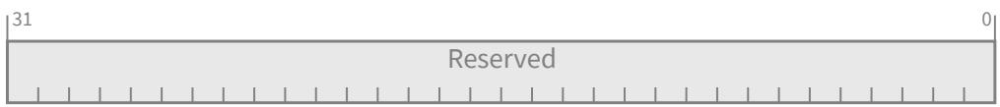

text_image

31
Reserved
0

Figure 7-213 Flit Error Injection Capability Register§

Table 7-193 Flit Error Injection Capability Register§

<table><tr><td>Bit Location</td><td>Register Description</td><td>Attributes</td></tr><tr><td>31:0</td><td>Reserved</td><td>RsvdP</td></tr></table>

## 7.8.13.3 Flit Error Injection Control 1 Register (Offset 08h) §

Link level, optional register, both on Tx side as well as Rx side. Behavior is undefined if bits 31:1 of this register change value when error injection is running (Flit Error Injection Enable is 1b and Flit Error Injection Status is 00b or 01b).

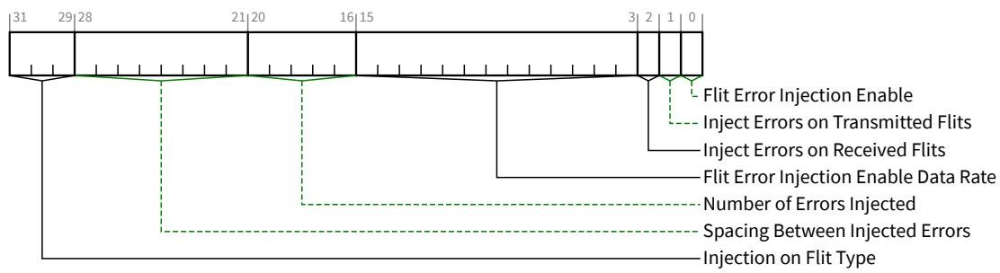

text_image

31 29 28 21 20 16 15 3 2 1 0
Flit Error Injection Enable
Inject Errors on Transmitted Flits
Inject Errors on Received Flits
Flit Error Injection Enable Data Rate
Number of Errors Injected
Spacing Between Injected Errors
Injection on Flit Type

Figure 7-214 Flit Error Injection Control 1 Register§

Table 7-194 Flit Error Injection Control 1 Register§

<table><tr><td>Bit Location</td><td>Register Description</td><td>Attributes</td></tr><tr><td>0</td><td>Flit Error Injection Enable – Setting this bit enables and starts the error injection in the Link. Clearing to this bit stops the error injection.Default Zero.</td><td>RW</td></tr><tr><td>1</td><td>Inject Errors on Transmitted Flits – Setting this bit to 1b enables error injection in the Transmitted Flits. A Port that does not implement this functionality must hardwire this bit to 0b.Default is Zero.</td><td>RW</td></tr><tr><td>2</td><td>Inject Errors on Received Flits – Setting this bit enables error injection in the Received Flits. A Port is permitted to not inject the exact error described but mimic an error injection effect to achieve the desired effect such as logging FEC-correctable errors or causing NAKs after CRC check. A Port that does not implement this functionality must hardwire this bit to 0b.Default is Zero.</td><td>RW</td></tr><tr><td>15:3</td><td>Flit Error Injection Enable Data Rate – These bits enable the Flit error injection for the corresponding data rates when enabledBit 3 2.5 GT/sBit 4 5.0 GT/sBit 5 8.0 GT/sBit 6 16.0 GT/sBit 7 32.0 GT/sBit 8 64.0 GT/sBits 15:9 RsvdPDefault is Zero.</td><td>RW</td></tr><tr><td>20:16</td><td>Number of Errors Injected – This represents the number of errors to be injected on the Transmitted and/or Received Flits independently. A value of 0 indicates that error injection continues till the injection mechanism is disabled.Default is Zero.</td><td>ROS</td></tr><tr><td>28:21</td><td>Spacing Between Injected Errors – This represents the next Flit on which error will be injected after the current sequence of Flit error injection completes. A non-0 value indicates the exact number of Flits after which the error is injected; a 0 value will inject the errors after a pseudo-random number of Flits between 1 to 127, chosen with equal probability. This is used on the Transmit and/or Received side independently.Default is Zero.</td><td>RW</td></tr><tr><td>31:29</td><td>Injection on Flit Type –000b Inject on any Flit Type001b Inject on any non-IDLE Flit010b Inject only on Payload Flit011b Inject only on NOP Flit100b Inject only on IDLE Flit101b If Error Type Being Injected is 11b, Inject only on a Payload Flit and then subsequently on the same sequence number for the Consecutive Error Injection times. The entire repeat will be considered as one instance of error injection for the purposes of counting towards the number of errors injected. Reserved encoding if Error Type Being Injected is other than 11b.110b If Error Type Being Injected is 11b, Inject only on a Payload Flit along with subsequent injection on one selected Payload Flit with the same sequence number for ConsecutiveError Injection times. Exactly one sequence number is selected for consecutive error injection among all the outstanding Payload Flits injected with FEC-uncorrectable errors. The entire repeat will be considered as one instance of error injection for the purposes of counting towards the number of errors injected. Reserved encoding if Error Type Being Injected is other than 11b.111b ReservedDefault is Zero</td><td>ROS</td></tr></table>

## 7.8.13.4 Flit Error Injection Control 2 Register (Offset 0Ch) §

Link level, optional register, both on Tx side as well as Rx side. Behavior is undefined if this register changes value when error injection is running (Flit Error Injection Enable is 1b and Flit Error Injection Status is 00b or 01b).

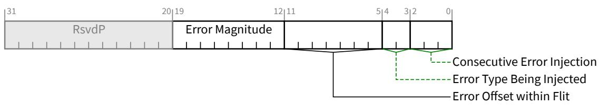

text_image

RsvdP
Error Magnitude
Consecutive Error Injection
Error Type Being Injected
Error Offset within Flit

Figure 7-215 Flit Error Injection Control 2 Register§

Table 7-195 Flit Error Injection Control 2 Register§

<table><tr><td>Bit Location</td><td colspan="2">Register Description</td><td>Attributes</td></tr><tr><td rowspan="5">2:0</td><td colspan="2">Consecutive Error Injection - The number of consecutive Flits that will be injected with the error, irrespective of the type of Flit on which the error is supposed to be initially injected. For the Injection of Flit Type encoding of 101b and 110b, this field has additional meaning, as described above. Even if multiple consecutive Flits will be injected with an error because of this, the entire sequence will count as one towards the number of errors injected.</td><td rowspan="5">RW</td></tr><tr><td>000b</td><td>No consecutive error injection</td></tr><tr><td>001b to 110b</td><td>One to six consecutive error injections</td></tr><tr><td>111b</td><td>A pseudo-random number between 7 and 15, each selected with equal probability</td></tr><tr><td colspan="2">Default is Zero.</td></tr><tr><td rowspan="6">4:3</td><td colspan="2">Error Type Being Injected -</td><td rowspan="6">RW</td></tr><tr><td>00b</td><td>Random between FEC-correctable or FEC-uncorrectable</td></tr><tr><td>01b</td><td>FEC-Correctable error injected only in one FEC group (rotate across the groups in subsequent injections)</td></tr><tr><td>10b</td><td>FEC-Correctable error injected in all 3 FEC groups simultaneously</td></tr><tr><td>11b</td><td>FEC-Uncorrectable error injected</td></tr><tr><td colspan="2">Default is Zero.</td></tr><tr><td>11:5</td><td>Error Offset within Flit – For FEC-correctable error(s): Byte offset within FEC-group where error will be injected. If this value is greater than the number of bytes in the FEC group, an error must be injected on any byte in the FEC-group with equal probability using a pseudo-random number generator.For uncorrectable error(s): Distance between subsequent injected error bytes with the initial starting position at byte 0. If at least 8 bytes have not been injected with an error, the Port must inject errors in some of the FEC bytes to get to 8 bytes in error.Default is Zero.</td><td colspan="2">RW</td></tr><tr><td>19:12</td><td>Error Magnitude – magnitude of error injected in each byte where error has been injected00h any pseudo-random non-0 value with equal probabilityOthers exact error magnitudeDefault is Zero.</td><td colspan="2">RW</td></tr></table>

## 7.8.13.5 Flit Error Injection Status Register (Offset 10h) §

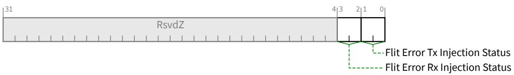

text_image

31
RsvdZ
4 3 2 1 0
Flit Error Tx Injection Status
Flit Error Rx Injection Status

Figure 7-216 Flit Error Injection Status Register§

Table 7-196 Flit Error Injection Status Register§

<table><tr><td>Bit Location</td><td>Register Description</td><td>Attributes</td></tr><tr><td>1:0</td><td>Flit Error Tx Injection Status00b Not injected any error yet01b At least one error is injected, but not completed10b Error injection completed11b Error case - error injection aborted, either Flit Error Injection Enable was cleared while injection was incomplete or optionally Flit Error Injection Control 1 [31:1] or Flit Error Injection Control 2 was changed while Injection was enabled and not complete.This field is cleared on the 0b to 1b transition of Flit Error Injection Enable.Default is Zero.</td><td>RO</td></tr><tr><td>3:2</td><td>Flit Error Rx Injection Status00b Not injected any error yet01b At least one error is injected, but not completed10b Error injection completed11b Error case - error injection aborted, either Flit Error Injection Enable was cleared while injection was incomplete or optionally Flit Error Injection Control 1 [31:1] or Flit Error Injection Control 2 was changed while Injection was enabled and not complete.This field is cleared on the 0b to 1b transition of Flt Error Injection Enable.Default is Zero.</td><td>RO</td></tr></table>

## 7.8.13.6 Ordered Set Error Injection Control 1 Register (Offset 14h) §

Link level, optional register, both on Tx side as well as Rx side. A Port that does not implement the functionality must hardwire these bits to 0b. Behavior is undefined if bits 63:1 of this register change value when Ordered Set Injection Enable is Set and Ordered Set Error Injection Status is 00b or 01b. [Capability register add: Support, both directions simultaneously or one direction, how many OS simultaneously in each direction (3 bits) – 5 bits]

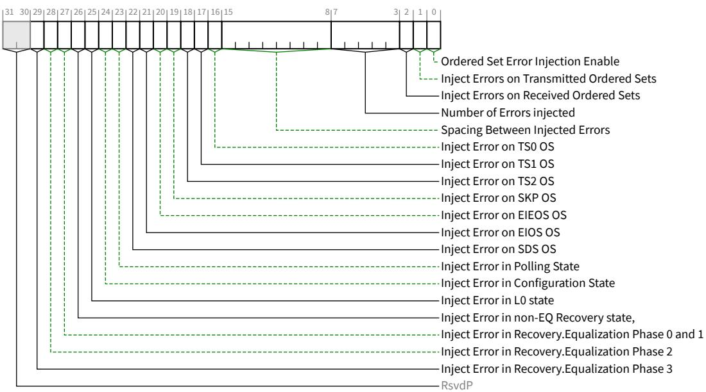

bar chart

| Error Type | Value |
| --- | --- |
| Ordered Set Error Injection Enable | 31 |
| Inject Errors on Transmitted Ordered Sets | 29 |
| Inject Errors on Received Ordered Sets | 28 |
| Number of Errors injected | 27 |
| Spacing Between Injected Errors | 26 |
| Inject Error on TS0 OS | 25 |
| Inject Error on TS1 OS | 24 |
| Inject Error on TS2 OS | 23 |
| Inject Error on SKP OS | 22 |
| Inject Error on EIEOS OS | 21 |
| Inject Error on EIOS OS | 20 |
| Inject Error on SDS OS | 19 |
| Inject Error in Polling State | 18 |
| Inject Error in Configuration State | 17 |
| Inject Error in L0 state | 16 |
| Inject Error in non-EQ Recovery state, | 15 |
| Inject Error in Recovery. Equalization Phase 0 and 1 | 14 |
| Inject Error in Recovery. Equalization Phase 2 | 13 |
| Inject Error in Recovery. Equalization Phase 3 | 12 |
RsvdP

Figure 7-217 Ordered Set Error Injection Control 1 Register§

Table 7-197 Ordered Set Error Injection Control 1 Register§

<table><tr><td>Bit Location</td><td>Register Description</td><td>Attributes</td></tr><tr><td>0</td><td>Ordered Set Error Injection Enable – Setting this bit enables and starts Tx Error Injection in the Link.Clearing this bit stops the error injection.Default is Zero.</td><td>RWS</td></tr><tr><td>1</td><td>Inject Errors on Transmitted Ordered Sets – Setting this bit to 1b enables error injection in the Transmitted OS’es. A Port that does not implement this functionality must hardwire this bit to 0b.Default is Zero.</td><td>RWS</td></tr><tr><td>2</td><td>Inject Errors on Received Ordered Sets – Setting this bit enables error injection in the Received Ordered Sets. A Port is permitted to not inject the exact error described but treat the Ordered Set as invalid. A Port that does not implement this functionality must hardwire this bit to 0b.If a Port cannot simultaneously inject errors on the Transmitted and Received side and is requested by software to inject on both directions simultaneously must write a 0b to this bit.Default is Zero.</td><td>RWS</td></tr><tr><td>7:3</td><td>Number of Errors injected – This represents the number of errors to be injected on the Transmitted and/or Received Ordered Sets independently. A value of 0 indicates that error injection continues till the injection mechanism is disabled.Default is Zero.</td><td>RWS</td></tr><tr><td>15:8</td><td>Spacing Between Injected Errors – This represents the next OS on which error will be injected after the current OS error injection completes. A non-0 value indicates the exact number of OSs after which the error is injected; a 0 value will inject the errors after a pseudo-random number of OSs between 1 to 127, chosen with equal probability. This is used on the Transmit and/or Received side independently.Default is Zero.</td><td>RWS</td></tr><tr><td>16</td><td>Inject Error on TS0 OS – When Set, injects errors on TS0 OS.</td><td>RWS</td></tr><tr><td>17</td><td>Inject Error on TS1 OS – When Set, injects errors on TS1 OS.</td><td>RWS</td></tr><tr><td>18</td><td>Inject Error on TS2 OS – When Set, injects errors on TS2 OS.</td><td>RWS</td></tr><tr><td>19</td><td>Inject Error on SKP OS – When Set, injects errors on SKP OS.</td><td>RWS</td></tr><tr><td>20</td><td>Inject Error on EIEOS OS – When Set, injects errors on EIEOS OS.</td><td>RWS</td></tr><tr><td>21</td><td>Inject Error on EIOS OS – When Set, injects errors on EIOS OS.</td><td>RWS</td></tr><tr><td>22</td><td>Inject Error on SDS OS – When Set, injects errors on SDS OS.</td><td>RWS</td></tr><tr><td>23</td><td>Inject Error in Polling State – When Set, injects errors in the Polling LTSSM state.</td><td>RWS</td></tr><tr><td>24</td><td>Inject Error in Configuration State – When Set, injects errors in the Configuration LTSSM state.</td><td>RWS</td></tr><tr><td>25</td><td>Inject Error in L0 state – When Set, injects errors in the L0 LTSSM state.</td><td>RWS</td></tr><tr><td>26</td><td>Inject Error in non-EQ Recovery state, – When Set, injects errors in the Recovery LTSSM states except for the Recovery.Equalization substate.</td><td>RWS</td></tr><tr><td>27</td><td>Inject Error in Recovery.Equalization Phase 0 and 1 – When Set, injects errors Recovery.Equalization Phase 0 and Phase 1.</td><td>RWS</td></tr><tr><td>28</td><td>Inject Error in Recovery.Equalization Phase 2 – When Set, injects errors Recovery.Equalization Phase 2.</td><td>RWS</td></tr><tr><td>29</td><td>Inject Error in Recovery.Equalization Phase 3 – When Set, injects errors Recovery.Equalization Phase 3.</td><td>RWS</td></tr></table>

## 7.8.13.7 Ordered Set Error Injection Control 2 Register (Offset 18h) §

<table><tr><td>Lane Number for Error Injection</td><td>Error Injection Bytes</td></tr></table>

Figure 7-218 Ordered Set Error Injection Control 2 Register§

Table 7-198 Ordered Set Error Injection Control 2 Register§

<table><tr><td>Bit Location</td><td>Register Description</td><td>Attributes</td></tr><tr><td>15:0</td><td>Error Injection Bytes – Individual bytes where errors (any magnitude) will be injected; all 0s indicates a byte will be chosen based on a pseudo-random generator between 1 and 16. For SKP OS, each bit covers 2.5 Bytes instead of one byte</td><td>RWS</td></tr><tr><td>31:16</td><td>Lane Number for Error Injection – A value of 1b in one or more bit positions indicates that the corresponding Lane number will participate in error injection when enabled. Bit 0 of this field corresponds to Lane 0.</td><td>RWS</td></tr></table>

## 7.8.13.8 Ordered Set Error Tx Injection Status Register (Offset 1Ch) §

This register contains a set of fields for Tx Ordered Set Error Injection. The description for Tx Injection Status TS0 applies to all fields in this register.

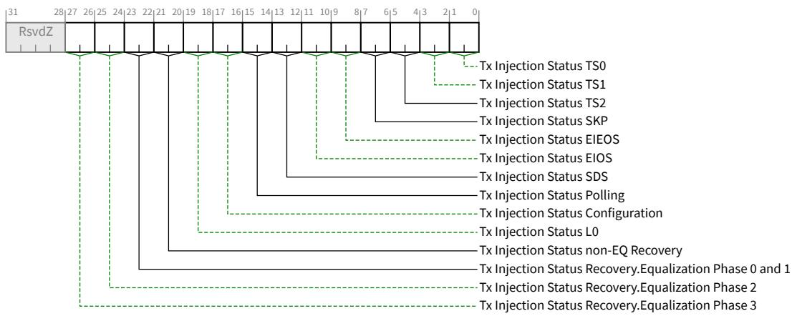

timing diagram

| Event Description | Value |
| --- | --- |
| Tx Injection Status TS0 | 31 |
| Tx Injection Status TS1 | 28 |
| Tx Injection Status TS2 | 27 |
| Tx Injection Status SKP | 26 |
| Tx Injection Status EIEOS | 25 |
| Tx Injection Status EIOS | 24 |
| Tx Injection Status SDS | 23 |
| Tx Injection Status Polling | 22 |
| Tx Injection Status Configuration | 21 |
| Tx Injection Status L0 | 20 |
| Tx Injection Status non-EQ Recovery | 19 |
| Tx Injection Status Recovery. Equalization Phase 0 and 1 | 18 |
| Tx Injection Status Recovery. Equalization Phase 2 | 17 |
| Tx Injection Status Recovery. Equalization Phase 3 | 16 |
| Tx Injection Status Recovery. Equalization Phase 4 | 15 |
| Tx Injection Status Recovery. Equalization Phase 5 | 14 |
| Tx Injection Status Recovery. Equalization Phase 6 | 13 |
| Tx Injection Status Recovery. Equalization Phase 7 | 12 |
| Tx Injection Status Recovery. Equalization Phase 8 | 11 |
| Tx Injection Status Recovery. Equalization Phase 9 | 10 |
| Tx Injection Status Recovery. Equalization Phase 10 | 9 |
| Tx Injection Status Recovery. Equalization Phase 11 | 8 |
| Tx Injection Status Recovery. Equalization Phase 12 | 7 |
| Tx Injection Status Recovery. Equalization Phase 13 | 6 |
| Tx Injection Status Recovery. Equalization Phase 14 | 5 |
| Tx Injection Status Recovery. Equalization Phase 15 | 4 |
| Tx Injection Status Recovery. Equalization Phase 16 | 3 |
| Tx Injection Status Recovery. Equalization Phase 17 | 2 |
| Tx Injection Status Recovery. Equalization Phase 18 | 1 |
| Tx Injection Status Recovery. Equalization Phase 19 | 0 |

Figure 7-219 Ordered Set Tx Error Injection Status Register§

Table 7-199 Ordered Set Tx Error Injection Status Register§

<table><tr><td>Bit Location</td><td>Register Description</td><td>Attributes</td></tr><tr><td>1:0</td><td>Tx Injection Status TS0– Each two bit field is encoded as follows:00b Not injected any error yet01b At least one error is injected, but not completed10b Error injection completed11b Error case – error injection aborted, either Ordered Set Error Injection Enable was cleared while injection was incomplete or optionally any bit in Ordered Set Error Injection Control 1[31:1] or Ordered Set Injection Control 2 was changed while Injection was enabled and not complete.This field is cleared on the 0b to 1b transition of Ordered Set Error Injection Enable.Default is 00b.</td><td>ROS</td></tr><tr><td>3:2</td><td>Tx Injection Status TS1</td><td>ROS</td></tr><tr><td>5:4</td><td>Tx Injection Status TS2</td><td>ROS</td></tr><tr><td>7:6</td><td>Tx Injection Status SKP</td><td>ROS</td></tr><tr><td>9:8</td><td>Tx Injection Status EIEOS</td><td>ROS</td></tr><tr><td>11:10</td><td>Tx Injection Status EIOS</td><td>ROS</td></tr><tr><td>13:12</td><td>Tx Injection Status SDS</td><td>ROS</td></tr><tr><td>15:14</td><td>Tx Injection Status Polling</td><td>ROS</td></tr><tr><td>17:16</td><td>Tx Injection Status Configuration</td><td>ROS</td></tr><tr><td>19:18</td><td>Tx Injection Status L0</td><td>ROS</td></tr><tr><td>21:20</td><td>Tx Injection Status non-EQ Recovery</td><td>ROS</td></tr><tr><td>23:22</td><td>Tx Injection Status Recovery.Equalization Phase 0 and 1</td><td>ROS</td></tr><tr><td>25:24</td><td>Tx Injection Status Recovery.Equalization Phase 2</td><td>ROS</td></tr><tr><td>27:26</td><td>Tx Injection Status Recovery.Equalization Phase 3</td><td>ROS</td></tr></table>

## 7.8.13.9 Ordered Set Error Rx Injection Status Register (Offset 20h) §

This register contains a set of fields for Rx Ordered Set Error Injection. The description for Rx Injection Status TS0 applies to all fields in this register.

line chart

| Rx Injection Status | Count |
| --- | --- |
| TS0 | 31 |
| TS1 | 28 |
| SKP | 26 |
| EIEOS | 25 |
| SDS | 24 |
| Polling | 23 |
| L0 | 22 |
| non-EQ Recovery | 21 |
| Equalization Phase 0 and 1 | 20 |
| Equalization Phase 2 | 19 |
| Equalization Phase 3 | 18 |
| Total | 17 |
| Total | 16 |
| Total | 15 |
| Total | 14 |
| Total | 13 |
| Total | 12 |
| Total | 11 |
| Total | 10 |
| Total | 9 |
| Total | 8 |
| Total | 7 |
| Total | 6 |
| Total | 5 |
| Total | 4 |
| Total | 3 |
| Total | 2 |
| Total | 1 |
| Total | 0 |

Figure 7-220 Ordered Set Rx Error Injection Status Register§

Table 7-200 Ordered Set Rx Error Injection Status Register§

<table><tr><td>Bit Location</td><td>Register Description</td><td>Attributes</td></tr><tr><td>1:0</td><td>Rx Injection Status TS0 – Each two bit field is encoded as follows:00b Not injected any error yet01b At least one error is injected, but not completed10b Error injection completed11b Error case - error injection aborted, either Ordered Set Error Injection Enable was cleared while injection was incomplete or optionally any bit in Ordered Set Error Injection Control 1[31:1] or Ordered Set Injection Control 2 was changed while Injection was enabled and not complete.This field is cleared on the 0b to 1b transition of Ordered Set Error Injection Enable.Default is 00b.</td><td>ROS</td></tr><tr><td>3:2</td><td>Rx Injection Status TS1</td><td>ROS</td></tr><tr><td>5:4</td><td>Rx Injection Status TS2</td><td>ROS</td></tr><tr><td>7:6</td><td>Rx Injection Status SKP</td><td>ROS</td></tr><tr><td>9:8</td><td>Rx Injection Status EIEOS</td><td>ROS</td></tr><tr><td>11:10</td><td>Rx Injection Status EIOS</td><td>ROS</td></tr><tr><td>13:12</td><td>Rx Injection Status SDS</td><td>ROS</td></tr><tr><td>15:14</td><td>Rx Injection Status Polling</td><td>ROS</td></tr><tr><td>17:16</td><td>Rx Injection Status Configuration</td><td>ROS</td></tr><tr><td>19:18</td><td>Rx Injection Status L0</td><td>ROS</td></tr><tr><td>21:20</td><td>Rx Injection Status non-EQ Recovery</td><td>ROS</td></tr><tr><td>23:22</td><td>Rx Injection Status Recovery.Equalization Phase 0 and 1</td><td>ROS</td></tr><tr><td>25:24</td><td>Rx Injection Status Recovery.Equalization Phase 2</td><td>ROS</td></tr><tr><td>27:26</td><td>Rx Injection Status Recovery.Equalization Phase 3</td><td>ROS</td></tr></table>

## 7.9 Additional PCI and PCIe Capabilities §

This section, contains a description of additional PCI and PCIe capabilities that are individually optional in this but may be required by other PCISIG specifications.

## 7.9.1 Virtual Channel Extended Capability §

The Virtual Channel Extended Capability (VC Extended Capability) is an optional Extended Capability required for devices that have Ports (or for individual Functions) that support functionality beyond the default Traffic Class (TC0) over the default Virtual Channel (VC0). This may apply to devices with only one VC that support TC filtering or to devices that support multiple VCs. Note that a PCI Express device that supports only TC0 over VC0 does not require VC Extended Capability and associated registers. § Figure 7-221 provides a high level view of the Virtual Channel Extended Capability structure. This structure controls Virtual Channel assignment for PCI Express Links and may be present in any device (or RCRB) that contains (controls) a Port, or any device that has a Multi-Function Virtual Channel (MFVC) Capability

structure. Some registers/fields in the Virtual Channel Extended Capability structure may have different interpretation for Endpoints, Switch Ports, Root Ports and RCRB. Software must interpret the Device/Port Type field in the PCI Express Capabilities register to determine the availability and meaning of these registers/fields.

The number of (extended) Virtual Channels is indicated by the Extended VC Count field in the Port VC Capability Register 1. Software must interpret this field to determine the availability of extended VC Resource registers.

The VC Extended Capability structure is permitted in the Extended Configuration Space of all single-Function devices or in RCRBs.

Each VF uses the Virtual Channel of its associated PF. VFs themselves must not contain any Virtual Channel Capabilities.

A Multi-Function Device at an Upstream Port is permitted to contain a Multi-Function Virtual Channel (MFVC) Capability structure (see § Section 7.9.2 ). If a Multi-Function Device contains an MFVC Capability structure, any or all of its Functions with the exception of VFs are permitted to contain a VC Extended Capability structure. Per-Function VC Extended Capability structures are also permitted for devices inside a Switch that contain only Switch Downstream Port Functions, or for RCiEPs. Otherwise, only Function 0 is permitted to contain a VC Extended Capability structure.

To preserve software backward compatibility, two Extended Capability IDs are permitted for VC Extended Capability structures: 0002h and 0009h. Any VC Extended Capability structure in a device that also contains an MFVC Capability structure must use the Extended Capability ID 0009h. A VC Extended Capability structure in a device that does not contain an MFVC Capability structure must use the Extended Capability ID 0002h.

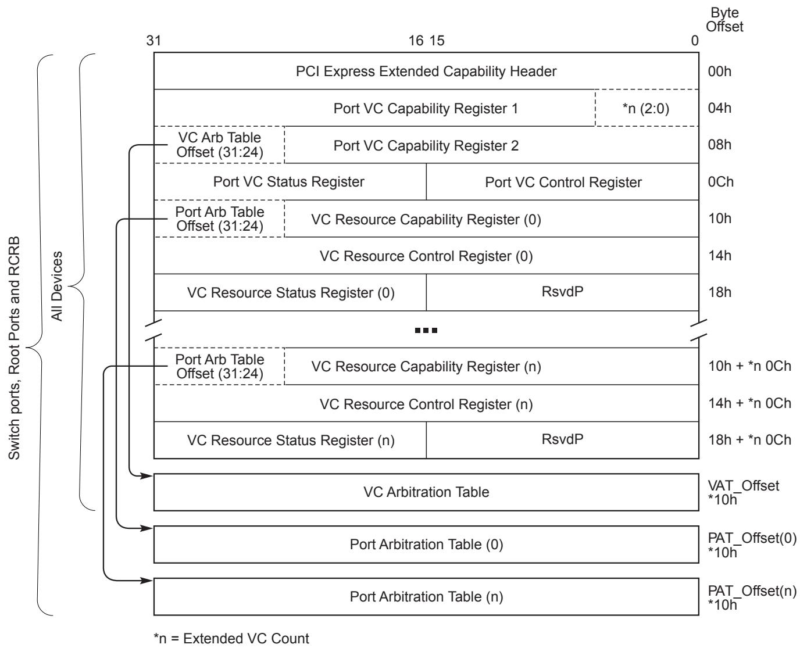

stacked bar chart

| Component | Byte Offset | Byte Count |
|-----------|-------------|------------|
| PCI Express Extended Capability Header | 00h | 31 |
| Port VC Capability Register 1 | *n (2:0) | 16 |
| VC Arb Table Offset (31:24) | 08h | 15 |
| Port VC Capability Register 2 | 0Ch | 15 |
| Port VC Status Register | 10h | 15 |
| Port Arb Table Offset (31:24) | 14h | 15 |
| VC Resource Capability Register (0) | 18h | 15 |
| VC Resource Control Register (0) | 18h | 15 |
| VC Resource Status Register (0) | 18h | 15 |
| VC Resource Status Register (n) | 18h + *n 0Ch | 15 |
| Port Arb Table Offset (31:24) | 10h + *n 0Ch | 15 |
| VC Resource Capability Register (n) | 14h + *n 0Ch | 15 |
| VC Resource Control Register (n) | 14h + *n 0Ch | 15 |
| VC Resource Status Register (n) | 18h + *n 0Ch | 15 |
| VC Arbitration Table | VAT_Offset *10h | 15 |
| Port Arbitration Table (0) | PAT_Offset(0) *10h | 15 |
| Port Arbitration Table (n) | PAT_Offset(n) *10h | 15 |
* n = Extended VC Count

OM14320B

Figure 7-221 Virtual Channel Extended Capability Structure§

The following sections describe the registers/fields of the Virtual Channel Extended Capability structure.

## 7.9.1.1 Virtual Channel Extended Capability Header (Offset 00h) §

Refer to § Section 7.6.3 for a description of the PCI Express Extended Capability header. A Virtual Channel Extended Capability must use one of two Extended Capability IDs: 0002h or 0009h. Refer to § Section 7.9.1 for rules governing when each should be used. § Figure 7-222 details allocation of register fields in the Virtual Channel Extended Capability Header; § Table 7-201 provides the respective bit definitions.

text_image

31
20 19 16 15 0
Next Capability Offset
0002h
PCI Express Extended Capability ID
Capability Version

Figure 7-222 Virtual Channel Extended Capability Header§

Table 7-201 Virtual Channel Extended Capability Header§

<table><tr><td>Bit Location</td><td>Register Description</td><td>Attributes</td></tr><tr><td>15:0</td><td>PCI Express Extended Capability ID- This field is a PCI-SIG defined ID number that indicates the nature and format of the Extended Capability. Extended Capability ID for the Virtual Channel Extended Capability is either 0002h or 0009h.</td><td>RO</td></tr><tr><td>19:16</td><td>Capability Version- This field is a PCI-SIG defined version number that indicates the version of the Capability structure present. Must be 1h for this version of the specification.</td><td>RO</td></tr><tr><td>31:20</td><td>Next Capability Offset- This field contains the offset to the next PCI Express Capability structure or 000h if no other items exist in the linked list of Capabilities. For Extended Capabilities implemented in Configuration Space, this offset is relative to the beginning of PCI-compatible Configuration Space and thus must always be either 000h (for terminating list of Capabilities) or greater than 0FFh.</td><td>RO</td></tr></table>

## 7.9.1.2 Port VC Capability Register 1 (Offset 04h) §

The Port VC Capability Register 1 describes the configuration of the Virtual Channels associated with a PCI Express Port. § Figure 7-223 details allocation of register fields in the Port VC Capability Register 1; § Table 7-202 provides the respective bit definitions.

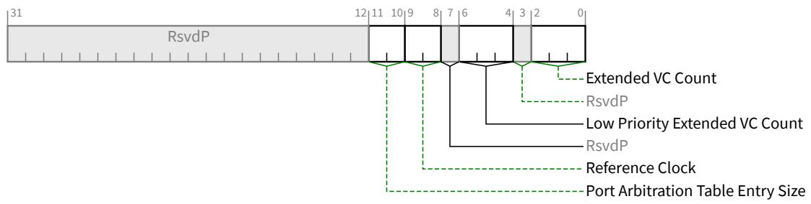

text_image

31
RsvdP
12 11 10 9 8 7 6 4 3 2 0
Extended VC Count
RsvdP
Low Priority Extended VC Count
RsvdP
Reference Clock
Port Arbitration Table Entry Size

Figure 7-223 Port VC Capability Register 1§

Table 7-202 Port VC Capability Register 1§

<table><tr><td>Bit Location</td><td>Register Description</td><td>Attributes</td></tr><tr><td>2:0</td><td>Extended VC Count - Indicates the number of (extended) Virtual Channels in addition to the default VC supported by the device. This field is valid for all Functions.This value indicates the number of (extended) VC Resource Capability, Control, and Status registers that are present in Configuration Space in addition to the required VC Resource registers for the default VC.The minimum value of this field is 0 (for devices that only support the default VC and only have 1 set of VC Resource Registers for that VC). The maximum value is 7.</td><td>RO</td></tr><tr><td>6:4</td><td>Low Priority Extended VC Count - Indicates the number of (extended) Virtual Channels in addition to the default VC belonging to the low-priority VC (LPVC) group that has the lowest priority with respect to other VC resources in a strict-priority VC Arbitration. This field is valid for all Functions.The minimum value of this field is 000b and the maximum value is Extended VC Count.</td><td>RO</td></tr><tr><td>9:8</td><td>Reference Clock - Indicates the reference clock for Virtual Channels that support time-based WRR Port Arbitration. This field is valid for RCRBs, Switch Ports, and Root Ports that support peer-to-peer traffic. It is not valid for Root Ports that do not support peer-to-peer traffic, Endpoints, and Switches or Root Complexes not implementing WRR, and must be hardwired to 00bDefined encodings are:00b 100 ns reference clock01b - 11b Reserved</td><td>RO</td></tr><tr><td>11:10</td><td>Port Arbitration Table Entry Size - Indicates the size (in bits) of Port Arbitration table entry in the Function. This field is valid only for RCRBs, Switch Ports, and Root Ports that support peer-to-peer traffic. It is not valid and must be hardwired to 00b for Root Ports that do not support peer-to-peer traffic and Endpoints.Defined encodings are:00b The size of Port Arbitration table entry is 1 bit.01b The size of Port Arbitration table entry is 2 bits.10b The size of Port Arbitration table entry is 4 bits.11b The size of Port Arbitration table entry is 8 bits.</td><td>RO</td></tr></table>

## 7.9.1.3 Port VC Capability Register 2 (Offset 08h) §

The Port VC Capability Register 2 provides further information about the configuration of the Virtual Channels associated with a PCI Express Port. § Figure 7-224 details allocation of register fields in the Port VC Capability Register 2; § Table 7-203 provides the respective bit definitions.

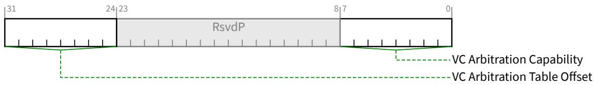

text_image

31 24 23 8 7 0
RsvdP
VC Arbitration Capability
VC Arbitration Table Offset

Figure 7-224 Port VC Capability Register 2§

Table 7-203 Port VC Capability Register 2§

<table><tr><td>Bit Location</td><td>Register Description</td><td>Attributes</td></tr><tr><td>7:0</td><td>VC Arbitration Capability- Indicates the types of VC Arbitration supported by the Function for the LPVC group. This field is valid for all Functions that report a Low Priority Extended VC Count field greater than 0. For all other Functions, this field must be hardwired to 00h.Each Bit Location within this field corresponds to a VC Arbitration Capability defined below. When more than 1 bit in this field is Set, it indicates that the Port can be configured to provide different VC arbitration services.Defined bit positions are:Bit 0 Hardware fixed arbitration scheme, e.g., Round RobinBit 1 Weighted Round Robin (WRR) arbitration with 32 phasesBit 2 WRR arbitration with 64 phasesBit 3 WRR arbitration with 128 phasesBits 4-7 Reserved</td><td>RO</td></tr><tr><td>31:24</td><td>VC Arbitration Table Offset- Indicates the location of the VC Arbitration Table. This field is valid for all Functions.This field contains the zero-based offset of the table in DQWORDS (16 bytes) from the base address of the Virtual Channel Extended Capability structure. A value of 0 indicates that the table is not present.</td><td>RO</td></tr></table>

## 7.9.1.4 Port VC Control Register (Offset 0Ch) §

§ Figure 7-225 details allocation of register fields in the Port VC Control Register; § Table 7-204 provides the respective bit definitions.

text_image

RsvdP
Load VC Arbitration Table
VC Arbitration Select
All VCs Enabled

§ Figure 7-225 Port VC Control Register

§ Table 7-204 Port VC Control Register

<table><tr><td>Bit Location</td><td>Register Description</td><td>Attributes</td></tr><tr><td>0</td><td>Load VC Arbitration Table- Used by software to update the VC Arbitration Table. This bit is valid for all Functions when the selected VC Arbitration uses the VC Arbitration Table.Software sets this bit to request hardware to apply new values programmed into VC Arbitration Table; clearing this bit has no effect. Software checks the VC Arbitration Table Status bit to confirm that new values stored in the VC Arbitration Table are latched by the VC arbitration logic.This bit always returns 0b when read.</td><td>RW</td></tr><tr><td>3:1</td><td>VC Arbitration Select- Used by software to configure the VC arbitration by selecting one of the supported VC Arbitration schemes indicated by the VC Arbitration Capability field in the Port VC Capability Register 2. This field is valid for all Functions.The permissible values of this field are numbers corresponding to one of the asserted bits in the VC Arbitration Capability field.This field cannot be modified when more than one VC in the LPVC group is enabled.</td><td>RW</td></tr><tr><td>4</td><td>All VCs Enabled- Setting this bit indicates that all VCs that will be used on the Link have been enabled. Setting this bit allows hardware to allocate assigned buffer resources across the enabled VCs.Setting this bit is optional. If this bit remains Clear and some VC Resources are never enabled, performance may be affected but the Link and all enabled VCs must operate correctly.Behavior is undefined if the Link is up and any VC Enable bit in this capability changes value.</td><td>RW</td></tr></table>

## 7.9.1.5 Port VC Status Register (Offset 0Eh) §

The Port VC Status Register provides status of the configuration of Virtual Channels associated with a Port. § Figure 7-226 details allocation of register fields in the Port VC Status Register; § Table 7-205 provides the respective bit definitions.

text_image

15
RsvdZ
1 0
VC Arbitration Table Status

§ Figure 7-226 Port VC Status Register

§ Table 7-205 Port VC Status Register

<table><tr><td>Bit Location</td><td>Register Description</td><td>Attributes</td></tr><tr><td>0</td><td>VC Arbitration Table Status - Indicates the coherency status of the VC Arbitration Table. This bit is valid for all Functions when the selected VC uses the VC Arbitration Table.This bit is Set by hardware when any entry of the VC Arbitration Table is written by software. This bit is Cleared by hardware when hardware finishes loading values stored in the VC Arbitration Table after software sets the Load VC Arbitration Table bit in the Port VC Control Register.Default value of this bit is 0b.</td><td>RO</td></tr></table>

## 7.9.1.6 VC Resource Capability Register §

The VC Resource Capability Register describes the capabilities and configuration of a particular Virtual Channel resource. § Figure 7-227 details allocation of register fields in the VC Resource Capability Register; § Table 7-206 provides the respective bit definitions.

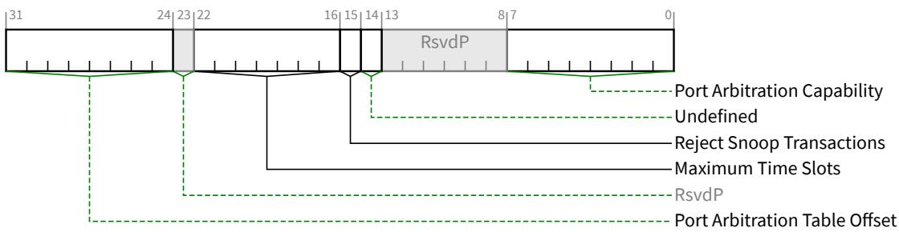

text_image

31 24 23 22 16 15 14 13 RsvdP 8 7 0
Port Arbitration Capability
Undefined
Reject Snoop Transactions
Maximum Time Slots
RsvdP
Port Arbitration Table Offset

Figure 7-227 VC Resource Capability Register§

Table 7-206 VC Resource Capability Register§

<table><tr><td>Bit Location</td><td>Register Description</td><td>Attributes</td></tr><tr><td>7:0</td><td>Port Arbitration Capability- Indicates types of Port Arbitration supported by the VC resource. This field is valid for all Switch Ports, Root Ports that support peer-to-peer traffic, and RCRBs, but not for Endpoints or Root Ports that do not support peer-to-peer traffic.Each Bit Location within this field corresponds to a Port Arbitration Capability defined below. When more than 1 bit in this field is Set, it indicates that the VC resource can be configured to provide different arbitration services.Software selects among these capabilities by writing to the Port Arbitration Select field (see § Section 7.9.1.7).Defined bit positions are:Bit 0 Non-configurable hardware-fixed arbitration scheme, e.g., Round Robin (RR)Bit 1 Weighted Round Robin (WRR) arbitration with 32 phasesBit 2 WRR arbitration with 64 phasesBit 3 WRR arbitration with 128 phasesBit 4 Time-based WRR with 128 phasesBit 5 WRR arbitration with 256 phasesBits 6-7 Reserved</td><td>RO</td></tr><tr><td>14</td><td>Undefined Undefined- The value read from this bit is undefined. In previous versions of this specification, this bit was used to indicate Advanced Packet Switching. System software must ignore the value read from this bit.</td><td>RO</td></tr><tr><td>15</td><td>Reject Snoop Transactions- When Clear, transactions with or without the No Snoop bit Set within the TLP header are allowed on this VC. When Set, any transaction for which the No Snoop attribute is applicable but is not Set within the TLP header is permitted to be rejected as an Unsupported Request. Refer to § Section 2.2.6.5 for information on where the No Snoop attribute is applicable. This bit is valid for Root Ports and RCRB; it is not valid for Endpoints or Switch Ports.</td><td>HwInit</td></tr><tr><td>22:16</td><td>Maximum Time Slots- Indicates the maximum number of time slots (minus one) that the VC resource is capable of supporting when it is configured for time-based WRR Port Arbitration. For example, a value 000 0000b in this field indicates the supported maximum number of time slots is 1 and a value of 111 1111b indicates the supported maximum number of time slots is 128. This field is valid for all Switch Ports, Root Ports that support peer-to-peer traffic, and RCRBs, but is not valid for Endpoints or Root Ports that do not support peer-to-peer traffic. In addition, this field is valid only when the Port Arbitration Capability field indicates that the VC resource supports time-based WRR Port Arbitration.</td><td>HwInit</td></tr><tr><td>31:24</td><td>Port Arbitration Table Offset- Indicates the location of the Port Arbitration Table associated with the VC resource. This field is valid for all Switch Ports, Root Ports that support peer-to-peer traffic, and RCRBs, but is not valid for Endpoints or Root Ports that do not support peer-to-peer traffic.This field contains the zero-based offset of the table in DQWORDS (16 bytes) from the base address of the Virtual Channel Extended Capability structure. A value of 00h indicates that the table is not present.</td><td>RO</td></tr></table>

## 7.9.1.7 VC Resource Control Register §

§ Figure 7-228 details allocation of register fields in the VC Resource Control Register; § Table 7-207 provides the respective bit definitions.  
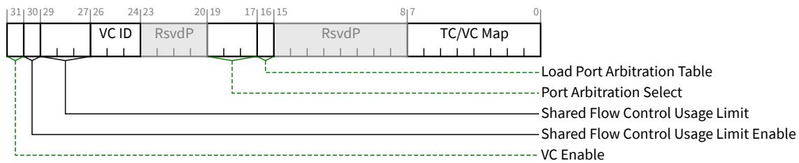

text_image

31 30 29 27 26 24 23 20 19 17 16 15 8 7 0
VC ID RsvdP RsvdP TC/VC Map
Load Port Arbitration Table
Port Arbitration Select
Shared Flow Control Usage Limit
Shared Flow Control Usage Limit Enable
VC Enable

Figure 7-228 VC Resource Control Register§

Table 7-207 VC Resource Control Register§

<table><tr><td>Bit Location</td><td>Register Description</td><td>Attributes</td></tr><tr><td>7:0</td><td>TC/VC Map - This field indicates the TCs that are mapped to the VC resource. This field is valid for all Functions.Bit locations within this field correspond to TC values. For example, when bit 7 is Set in this field, TC7 is mapped to this VC resource. When more than 1 bit in this field is Set, it indicates that multiple TCs are mapped to the VC resource.In order to remove one or more TCs from the TC/VC Map of an enabled VC, software must ensure that no new or outstanding transactions with the TC labels are targeted at the given Link.Default value of this field is FFh for the first VC resource and is 00h for other VC resources.Note:Bit 0 of this field is read-only. It must be Set for the default VC0 and Clear for all other enabled VCs.</td><td>RW(see the note for exceptions)</td></tr><tr><td>16</td><td>Load Port Arbitration Table - When Set, this bit updates the Port Arbitration logic from the Port Arbitration Table for the VC resource. This bit is valid for all Switch Ports, Root Ports that support peer-to-peer traffic, and RCRBs, but is not valid for Endpoints or Root Ports that do not support peer-to-peer traffic. In addition, this bit is only valid when the Port Arbitration Table is used by the selected Port Arbitration scheme (that is indicated by a Set bit in the Port Arbitration Capability field selected by Port Arbitration Select).Software sets this bit to signal hardware to update Port Arbitration logic with new values stored in Port Arbitration Table; clearing this bit has no effect. Software uses the Port Arbitration Table Status bit to confirm whether the new values of Port Arbitration Table are completely latched by the arbitration logic.This bit always returns 0b when read.Default value of this bit is 0b.</td><td>RW</td></tr><tr><td>19:17</td><td>Port Arbitration Select- This field configures the VC resource to provide a particular Port Arbitration service. This field is valid for RCRBs, Root Ports that support peer-to-peer traffic, and Switch Ports, but is not valid for Endpoints or Root Ports that do not support peer-to-peer traffic.The permissible value of this field is a number corresponding to one of the asserted bits in the Port Arbitration Capability field of the VC resource.</td><td>RW</td></tr><tr><td>26:24</td><td>VC ID- This field assigns a VC ID to the VC resource (see note for exceptions). This field is valid for all Functions.This field cannot be modified when the VC is already enabled.Note:For the first VC resource (default VC), this field is read-only and must be hardwired to 000b.</td><td>RW</td></tr><tr><td>29:27</td><td>Shared Flow Control Usage Limit- this field controls what percentage of the available Shared Flow Control a given FC/VC is permitted to consume.This limit is applied independently for each Flow Control credit type. For example, if this field contains 101b and Shared Flow Control Usage Limit Enable is Set, a Posted TLP may not pass the Tx Gate if doing so would cause that VC to consume more than 62.5% of the available Shared Posted Header credits or if doing so would cause that VC to consume more than 62.5% of the available Shared Data credits.If Shared Flow Control Usage Limit Enable is Clear, this field is ignored and this VC is permitted to consume all of the shared credits.When Shared Flow Control Usage Limit Enable is Set, and this field contains 000b, this VC is not permitted to consume any shared credits.Behavior is undefined when all VCs have Shared Flow Control Usage Limit Enable Set and the sum of the Shared Flow Control Limit values for all VCs is less than 100%.Encodings are:000b 0%001b 12.5%010b 25%011b 37.5%100b 50%101b 62.5%110b 75%111b 87.5%Behavior is undefined if this field changes value while VC Enable and Shared Flow Control Usage Limit Enable are both Set.When Extended VC Count is 0, this field is permitted to be hardwired to any value.When this field is RW, the default value is implementation specific.</td><td>RW / RO / RsvdP</td></tr><tr><td>30</td><td>Shared Flow Control Usage Limit Enable- When Set, this bit enables use of control of Shared Flow Control consumption at the transmitter for this Virtual Channel.Behavior is undefined of the value of this bit changes while VC Enable is Set.This bit is RsvdP when Flit Mode Supported is Clear.When Extended VC Count is 0, this bit is permitted to be hardwired to 0b.When this bit is RW, the default value is implementation specific.</td><td>RW / RO / RsvdP</td></tr><tr><td>31</td><td>VC Enable- This bit, when Set, enables a Virtual Channel (see note 1 for exceptions). The Virtual Channel is disabled when this bit is cleared. This bit is valid for all Functions.Software must use the VC Negotiation Pending bit to check whether the VC negotiation is complete.For VC0, this field must be 1b and the attribute is HwInit.For other VCs, the default value of this bit is 0b and the attribute is RW.To enable a Virtual Channel, the VC Enable bits for that Virtual Channel must be Set in both components on a Link. To disable a Virtual Channel, the VC Enable bits for that Virtual Channel must be Cleared in both components on a Link. Software must ensure that no traffic is using a Virtual Channel at the time it is disabled. Software must fully disable a Virtual Channel in both components on a Link before re-enabling the Virtual Channel.</td><td>RW/HwInit</td></tr></table>

## 7.9.1.8 VC Resource Status Register §

§ Figure 7-229 details allocation of register fields in the VC Resource Status Register; § Table 7-208 provides the respective bit definitions.  

text_image

RsvdZ
Port Arbitration Table Status
VC Negotiation Pending

Figure 7-229 VC Resource Status Register§

§ Table 7-208 VC Resource Status Register

<table><tr><td>Bit Location</td><td>Register Description</td><td>Attributes</td></tr><tr><td>0</td><td>Port Arbitration Table Status- This bit indicates the coherency status of the Port Arbitration Table associated with the VC resource. This bit is valid for RCRBs, Root Ports that support peer-to-peer traffic, and Switch Ports, but is not valid for Endpoints or Root Ports that do not support peer-to-peer traffic. In addition, this bit is valid only when the Port Arbitration Table is used by the selected Port Arbitration for the VC resource.This bit is Set by hardware when any entry of the Port Arbitration Table is written to by software. This bit is Cleared by hardware when hardware finishes loading values stored in the Port Arbitration Table after software sets the Load Port Arbitration Table bit.Default value of this bit is 0b.</td><td>RO</td></tr><tr><td>1</td><td>VC Negotiation Pending-This bit indicates whether the Virtual Channel negotiation (initialization or disabling) is in pending state. This bit is valid for all Functions.The value of this bit is defined only when the Link is in the DL_Active state and the Virtual Channel is enabled (its VC Enable bit is Set).When this bit is Set by hardware, it indicates that the VC resource has not completed the process of negotiation. This bit is Cleared by hardware after the VC negotiation is complete (on exit from the FC_INIT2 state). For VC0, this bit is permitted to be hardwired to 0b.Before using a Virtual Channel, software must check whether the VC Negotiation Pending bits for that Virtual Channel are Clear in both components on the Link.</td><td>RO</td></tr></table>

## 7.9.1.9 VC Arbitration Table §

The VC Arbitration Table is a read-write register array that is used to store the arbitration table for VC Arbitration. This register array is valid for all Functions when the selected VC Arbitration uses a WRR table. Functions that do not support WRR VC arbitration are not required to implement a VC Arbitration Table. If it exists, the VC Arbitration Table is located by the VC Arbitration Table Offset field.

The VC Arbitration Table is a register array with fixed-size entries of 4 bits. § Figure 7-230 depicts the table structure of an example VC Arbitration Table with 32 phases. Each 4-bit table entry corresponds to a phase within a WRR arbitration period. The definition of table entry is depicted in § Table 7-209. The lower 3 bits (bits 0-2) contain the VC ID value, indicating that the corresponding phase within the WRR arbitration period is assigned to the Virtual Channel indicated by the VC ID (must be a valid VC ID that corresponds to an enabled VC).

The highest bit (bit 3) of the table entry is Reserved. The length of the table depends on the selected VC Arbitration as shown in § Table 7-210.

When the VC Arbitration Table is used by the default VC Arbitration method, the default values of the table entries must be all zero to ensure forward progress for the default VC (with VC ID of 0).

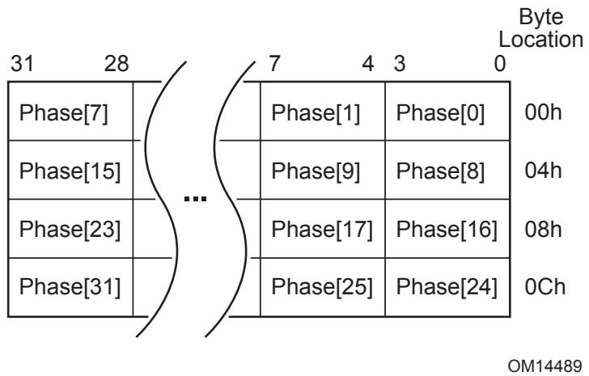

bit diagram

| Bit Position | Phase | Byte Location |
| :--- | :--- | :--- |
| 31 | Phase[7] | 00h |
| 28 | Phase[15] | 04h |
| ... | ... | ... |
| 7 | Phase[1] | Phase[0] |
| 4 | Phase[9] | Phase[8] |
| 3 | Phase[17] | Phase[16] |
| 0 | Phase[25] | Phase[24] |
| 0 | 0Ch | ... |

Figure 7-230 Example VC Arbitration Table with 32 Phases§

Table 7-209 Definition of the 4-bit Entries in the VC Arbitration Table§

<table><tr><td>Bit Location</td><td>Description</td><td>Attributes</td></tr><tr><td>2:0</td><td>VC ID</td><td>RW</td></tr><tr><td>3</td><td>RsvdP</td><td>RW</td></tr></table>

Table 7-210 Length of the VC Arbitration Table§

<table><tr><td>VC Arbitration Select</td><td>VC Arbitration Table Length</td></tr><tr><td>001b</td><td>32 entries</td></tr><tr><td>010b</td><td>64 entries</td></tr><tr><td>011b</td><td>128 entries</td></tr></table>

## 7.9.1.10 Port Arbitration Table §

The Port Arbitration Table register is a read-write register array that is used to store the WRR or time-based WRR arbitration table for Port Arbitration for the VC resource. This register array is valid for all Switch Ports, Root Ports that support peer-to-peer traffic, and RCRBs, but is not valid for Endpoints or Root Ports that do not support peer-to-peer traffic. It is only present when one or more asserted bits in the Port Arbitration Capability field indicate that the component supports a Port Arbitration scheme that uses a programmable arbitration table. Furthermore, it is only valid when one of the above-mentioned bits in the Port Arbitration Capability field is selected by the Port Arbitration Select field.

The Port Arbitration Table represents one Port arbitration period. § Figure 7-231 shows the structure of an example Port Arbitration Table with 128 phases and 2-bit table entries. Each table entry containing a Port Number corresponds to a phase within a Port arbitration period. For example, a table with 2-bit entries can be used by a Switch component with up to four Ports. A Port Number written to a table entry indicates that the phase within the Port Arbitration period is assigned to the selected PCI Express Port (the Port Number must be a valid one).

When the WRR Port Arbitration is used for a VC of any Egress Port, at each arbitration phase, the Port Arbiter serves one transaction from the Ingress Port indicated by the Port Number of the current phase. When finished, it immediately advances to the next phase. A phase is skipped, i.e., the Port Arbiter simply moves to the next phase immediately if the Ingress Port indicated by the phase does not contain any transaction for the VC (note that a phase cannot contain the Egress Port's Port Number).  
• When the Time-based WRR Port Arbitration is used for a VC of any given Port, at each arbitration phase aligning to a virtual timeslot, the Port Arbiter serves one transaction from the Ingress Port indicated by the Port Number of the current phase. It advances to the next phase at the next virtual timeslot. A phase indicates an “idle” timeslot, i.e., the Port Arbiter does not serve any transaction during the phase, if:

◦ the phase contains the Egress Port's Port Number, or

◦ the Ingress Port indicated by the phase does not contain any transaction for the VC.

◦ The Port Arbitration Table Entry Size field in the Port VC Capability Register 1 determines the table entry size. The length of the table is determined by the Port Arbitration Select field as shown in § Table 7-211.

◦ When the Port Arbitration Table is used by the default Port Arbitration for the default VC, the default values for the table entries must contain at least one entry for each of the other PCI Express Ports of the component to ensure forward progress for the default VC for each Port. The table may contain RR or RR-like fair Port Arbitration for the default VC.