## IMPLEMENTATION NOTE:

## USING QUIESCE GUARANTEE MECHANISM §

Side-effects due to executing equalization after the Data Link Layer is in DL\_Active can occur at the Port, Device, or system level. For example, the time required to execute the equalization process could cause a Completion Timeout error to occur - possibly in a different system component. The Quiesce Guarantee information allows Ports to decide whether to execute a requested equalization or not.

A component may operate at a lower data rate after reporting its equalization problems, either by timing out through Recovery.Speed or by initiating a data rate change to a lower data rate. Any data rate change required to perform the equalization procedure is exempt from the 200 ms requirement in § Section 6.11 . § Table 4-22 describes the mechanism for performing redo Equalization. Sometimes it may be necessary to perform a speed change to an intermediate data rate to redo equalization. For example, if the Downstream Port wants to redo equalization at 16.0 GT/s, bypass equalization is not supported, and the current data rate is either 2.5 GT/s or 5.0 GT/s, the Downstream Port must first initiate a speed change to 8.0 GT/s (the 8.0 GT/s equalization procedure will not be executed unless necessary) from which it will launch the redo equalization for 16.0 GT/s. The equalization procedure can be performed at most once in each trip through the Recovery state.

Table 4-22 Equalization Requirements Under Different Conditions§

<table><tr><td>From 2.5 GT/s or 5.0 GT/s to 8.0 GT/s Equalization</td><td>The mechanisms described here are identical for all flavors of equalization: initial or redo equalization; autonomous or software initiated.The Downstream Port communicates the Transmitter preset values and the Receiver preset hints, if applicable, for each Lane to the Upstream Port using 8b/10b encoding. These values are communicated using the EQ TS2 Ordered Sets (defined in § Section 4.2.5.1) in Recovery.RcvrCfg, when a data rate change to the higher data rate has been negotiated, prior to transitioning to the higher data rate to perform equalization. The preset values sent in the EQ TS2 Ordered Sets are derived as follows:For equalization at 8.0 GT/s: Upstream Port 8.0 GT/s Transmitter Preset and Upstream Port 8.0 GT/s Receiver Preset Hint fields of each Lane Equalization Control Register Entry.After the data rate change to the higher data rate where equalization needs to be performed, the Upstream Port transmits TS1 Ordered Sets with the preset values it received. The preset values must be within the operable range defined in § Section 8.3.3.3 if reduced swing will be used by the Transmitter.After the data rate change to the higher data rate where equalization needs to be performed, the Downstream Port transmits TS1 Ordered Sets with the preset values as follows with the assumption that the preset values must be within the operable range defined in § Section 8.3.3.3 if reduced swing will be used by the Transmitter:For equalization at 8.0 GT/s: Downstream Port 8.0 GT/s Transmitter Preset and optionally Downstream Port 8.0 GT/s Receiver Preset Hint fields of each Lane Equalization Control Register Entry.To perform redo equalization, the Downstream Port must request speed change through EQ TS1 Ordered Sets in Recovery.RcvrLock at 2.5 GT/s or 5.0 GT/s to inform the Upstream Port that it intends to redo equalization at the higher data rate. An Upstream Port should advertise the higher data rate in Recovery if it receives EQ TS1 Ordered Sets with speed change bit set to 1b and if it intends to operate at the higher data rate in the future.</td></tr><tr><td>From 8.0 GT/s to 16.0 GT/s Equalization, from 16.0 GT/s to32.0 GT/s Equalization, OR from 32.0 GT/s to 64.0 GT/s Equalization</td><td>The mechanisms described here are identical for all flavors of equalization: initial or redo equalization; autonomous or software initiated.When negotiating to the higher data rate, the Downstream Port communicates the Transmitter preset values for each Lane to the Upstream Port using 128b/130b encoding. These values are communicated using 128b/130b EQ TS2 Ordered Sets (defined in § Section 4.2.5.1) in Recovery.RcvrCfg, when a data rate change to the higherdata rate has been negotiated, prior to transitioning to the higher data rate. The preset values sent in the128b/130b EQ TS2 Ordered Sets are derived as follows:For equalization at 16.0 GT/s: Upstream Port 16.0 GT/s Transmitter Preset field of the16.0 GT/s Lane Equalization Control Register Entry corresponding to the Lane.For equalization at 32.0 GT/s: Upstream Port 32.0 GT/s Transmitter Preset field of the32.0 GT/s Lane Equalization Control Register Entry corresponding to the Lane.For equalization at 64.0 GT/s: Upstream Port 64.0 GT/s Transmitter Preset field of the64.0 GT/s Lane Equalization Control Register Entry corresponding to the Lane.Optionally, the Upstream Port communicates initial Transmitter preset settings to the Downstream Port using the128b/130b EQ TS2 Ordered Sets sent inRecovery.RcvrCfg, when a data rate change to the higher data rate has been negotiated, prior to transitioning to the higher data rate at which equalization needs to be performed. These preset values are determined by implementation specific means. After the data rate change to the higher data rate, the Upstream Port transmits TS1 Ordered Sets with the preset values it received. If the Downstream Port did not receive preset values inRecovery.RcvrCfg, after the data rate change to the higher data rate, it transmitsTS1 Ordered Sets with the presets as follows:For equalization at 16.0 GT/s: Downstream Port 16.0 GT/s Transmitter Preset field of the16.0 GT/s Lane Equalization Control Register Entry corresponding to the Lane.For equalization at 32.0 GT/s: Downstream Port 32.0 GT/s Transmitter Preset field of the32.0 GT/s Lane Equalization Control Register Entry corresponding to the Lane.For equalization at 64.0 GT/s: Downstream Port 64.0 GT/s Transmitter Preset field of the64.0 GT/s Lane Equalization Control Register Entry corresponding to the Lane.The preset values must be within the operable range defined in§ Section 8.3.3.3 if reduced swing will be used by the Transmitter.To perform redo equalization, the Downstream Port must request speed change through TS1 Ordered Sets in Recovery.RcvrLock with the Equalization Redo bit set to 1b to inform the Upstream Port that it intends to redo equalization. An Upstream Port should advertise the higher data rate in Recovery if it receives TS1 Ordered Sets with speed change bit set to 1b, Equalization Redo bit set to 1b and it intends to operate at the higher data rate in the future.</td></tr><tr><td>From 2.5 GT/s or 5.0 GT/s to 32.0 GT/s Equalization</td><td>Equalization to 32.0 GT/s from 2.5 GT/s or 5.0 GT/s is possible only if the Link is capable of bypassing equalization to higher data rate(s) (i.e., Equalization Bypass to Highest NRZ Rate Supported in32.0 GT/s Capabilities register is 1b and Equalization Bypass to Highest NRZ Rate Disable in the32.0 GT/s Control Register is 0b).The mechanisms described here are identical for all flavors of equalization: initial or redo equalization; autonomous or software initiated.The Downstream Port communicates the Transmitter preset values and the Receiver preset hints, if applicable, for each Lane to the Upstream Port using 8b/10b encoding. These values are communicated using theEQ TS2 Ordered Sets (defined in§ Section 4.2.5.1) inRecovery.RcvrCfg, when a data rate change to the higher data rate has been negotiated, prior to transitioning to the higher data rate to perform equalization. The preset values sent in theEQ TS2 Ordered Sets are derived as follows:For equalization at 32.0 GT/s: Upstream Port 32.0 GT/s Transmitter Preset field of the32.0 GT/s Lane Equalization Control Register Entry corresponding to the Lane. The Receiver Preset Hintfield must be set to 000b.After the data rate change to the higher data rate where equalization needs to be performed, the Upstream Port transmits TS1 Ordered Sets with the preset values it received. The preset values must be within the operable range defined in§ Section 8.3.3.3 if reduced swing will be used by the Transmitter.After the data rate change to the higher data rate where equalization needs to be performed, the Downstream Port transmits TS1 Ordered Sets with the preset values as follows with the assumption that the preset values must be within the operable range defined in § Section 8.3.3.3 if reduced swing will be used by the Transmitter:For equalization at 32.0 GT/s: Downstream Port 32.0 GT/s Transmitter Preset field of the 32.0 GT/s Lane Equalization Control Register Entry corresponding to the Lane.To perform redo equalization, the Downstream Port must request speed change through EQ TS1 Ordered Sets in Recovery.RcvrLock at 2.5 GT/s or 5.0 GT/s to inform the Upstream Port that it intends to redo equalization at the higher data rate. An Upstream Port should advertise the higher data rate in Recovery if it receives EQ TS1 Ordered Sets with speed change bit set to 1b and if it intends to operate at the higher data rate in the future.</td></tr><tr><td>From 2.5 GT/s or 5.0 GT/s to 64.0 GT/s Equalization</td><td>Equalization to 64.0 GT/s from 2.5 GT/s or 5.0 GT/s is not supported. All equalization procedures at the 64.0 GT/s data rate, including re-equalization, must be initiated from the 32.0 GT/s data rate only.</td></tr><tr><td>Equalization at a data rate from a data rate equal to the target equalization data rate</td><td>This is only possible with a redo equalization. The combinations covered here are: 8.0 GT/s equalization from 8.0 GT/s data rate, 16.0 GT/s equalization from 16.0 GT/s data rate, and 32.0 GT/s equalization from 32.0 GT/s data rate.In this case, the initial preset used during equalization is equal to the initial preset used during the last time the equalization was performed at the data rate where equalization is being performed.64.0 GT/s equalization from 64.0 GT/s is not supported.</td></tr></table>

The equalization procedure consists of up to four Phases, as described below. When operating at 8.0 GT/s or higher data rates, the Phase information is transmitted using the Equalization Control (EC) field in the TS0 or TS1 Ordered Sets.

## Phase 0

This phase is executed while negotiating (and prior to) to the data rate where equalization would be performed. The preset to be used for equalization is determined as described in § Table 4-22.

## Phase 1

Both components make the Link operational enough at the current data rate to be able to exchange TS1 Ordered Sets to complete the remaining phases for the fine-tuning of their Transmitter/Receiver pairs. For the Data Rates of 8.0 GT/s, 16.0 GT/s, and 32.0 GT/s, TS1 Ordered Sets are exchanged in this Phase. For the Data Rate of 64.0 GT/s, TS0 Ordered Sets are exchanged in this Phase and each Pseudo-Port or Port must be able to exchange the TS0 Ordered Sets for Phase 1 and Phase 2 in the Upstream Direction (from the Upstream Port to Downstream Port) reliably when it exits this Phase. It is expected that the Link will operate at a BER of less than 10-4 before the component is ready to move on to the next Phase. Each Transmitter uses the preset values as described in § Table 4-22.

The Downstream Port initiates Phase 1 by transmitting TS1 Ordered Sets for Data Rates of 8.0 GT/s, 16.0 GT/s and 32.0 GT/s and TS0 Ordered Sets for the Data Rate of 64.0 GT/s with EC=01b (indicating Phase 1). The Upstream Port, after adjusting its Receiver, if necessary, to ensure that it can progress with the equalization process, receives these TS0 or TS1 Ordered Sets and transitions to Phase 1 (where it transmits TS1 Ordered Sets with EC=01b if the Data Rate is 8.0 GT/s, 16.0 GT/s, or 32.0 GT/s or TS0 Ordered Sets with EC=01b if the Data Rate is 64.0 GT/s). The Downstream Port ensures that it can reliably receive the bit stream from the Upstream Port to continue through the rest of the Phases when it receives TS0 or TS1 Ordered Sets from the Upstream Port with EC=01b before it moves on to Phase 2.

## Phase 2

In this Phase the Upstream Port adjusts the Transmitter setting of the Downstream Port along with its own Receiver setting, independently, on each Lane, to ensure it receives the bit stream compliant with the requirements in § Chapter 8. (e.g., each operational Downstream Lane has a BER less than 10-12 for a Data Rate of 32.0 GT/s or lower or 10-6 for the Data Rate of 64.0 GT/s). If the Data Rate is 8.0 GT/s, 16.0 GT/s or 32.0 GT/s, both the Downstream Port and the Upstream Port transmit TS1 Ordered Sets. If the Data Rate is 64.0 GT/s, the Downstream Port transmits TS0 Ordered Sets until it receives TS0 Ordered Sets and then it transmits TS1 Ordered Sets whereas the Upstream Port transmits TS0 Ordered Sets. The Downstream Port initiates the move to Phase 2 by transmitting TS0/TS1 Ordered Sets with EC=10b to the Upstream Port. The Downstream Port advertises the Transmitter coefficients and the preset it is using per the rules below in Phase 1 for preset only and in Phase 2 for preset and coefficients. The Upstream Port receives these Ordered Sets and may request different coefficient or preset settings and continue to evaluate each setting until it arrives at the best setting for operating the Downstream Lanes. After the Upstream Port has completed this Phase, it moves the Link to Phase 3 by transmitting TS1 Ordered Sets for a Data Rate of 32.0 GT/s or lower and TS0 Ordered Sets for a Data Rate of 64.0 GT/s with EC=11b to the Downstream Port.

## Phase 3

In this Phase the Downstream Port adjusts the Transmitter setting of the Upstream Port along with its own Receiver setting, independently, on each Lane, using a handshake and evaluation process similar to Phase 2 with the exception that EC=11b. The Downstream Port signals the end of Phase 3 (and the equalization procedure) by transmitting TS1 Ordered Sets with EC=00b.

The algorithm used by a component to adjust the transmitter of its Link partner and the evaluation of that Transmitter set-up with its Receiver set-up is implementation specific. A component may request changes to any number of Lanes and can request different settings for each Lane. Each requested setting can be a preset or a set of coefficients that meets the requirements defined in § Section 4.2.4.1 . Each component is responsible for ensuring that at the end of the fine-tuning (Phase 2 for Upstream Ports and Phase 3 for Downstream Ports), its Link partner has the Transmitter setting in each Lane that will cause the Link to meet the requirements in § Chapter 8. .

A Link partner receiving the request to adjust its Transmitter must evaluate the request and act on it. If a valid preset value is requested and the Transmitter is operating in full swing mode, it must be reflected in the Transmitter set-up and subsequently in the preset and coefficient fields of the TS1 Ordered Set that the Link partner transmits. If a preset value is requested, the Transmitter is operating in reduced swing mode, and the requested preset is supported as defined in § Section 8.3.3.3 it must be reflected in the Transmitter set-up and subsequently in the preset and coefficient fields of the TS1 Ordered Set that the Link partner transmits. Transmitters operating in reduced swing mode are permitted to reject preset requests that are not supported as defined in § Section 8.3.3.3 . A request for adjusting the coefficients may be accepted or rejected. If the set of coefficients requested for a Lane is accepted, it must be reflected in the Transmitter set-up and subsequently in the transmitted TS1 Ordered Sets. If the set of coefficients requested for a Lane is rejected, the Transmitter set-up is not changed, but the transmitted TS1 Ordered Sets must reflect the requested coefficients along with the Reject Coefficient Values bit set to 1b. In either case of responding to a coefficient request, the preset field of the transmitted TS1 Ordered Sets is not changed from the last preset value that was transmitted. A request for adjusting the coefficients may be rejected by the Link partner only if the set of coefficients requested is not compliant with the rules defined in § Section 4.2.4.1 .

When performing equalization of a crosslink, the component that played the role of the Downstream Port during the earlier crosslink initialization at the lower data rate also assumes the responsibility of the Downstream Port for equalization.

If a Lane receives a Transmitter Preset value (from a TS0, TS1 or TS2 sequence) with a Reserved or unsupported value in Polling.Compliance, Loopback, or Phase 0 or Phase 1 of Recovery.Equalization, then the Lane is permitted to use any supported Transmitter preset setting in an implementation specific manner. The Reserved or unsupported Transmitter preset value is transmitted in any subsequent compliance catterns or Ordered Sets, and not the implementation specific Transmitter preset value chosen by the Lane. For example, if a Lane of an Upstream Port receives a Transmitter preset value 1111b (Reserved) with the EQ TS2 Ordered Sets it receives in Recovery.RcvrCfg, it is permitted to use any supported Transmitter preset value for its transmitter setting after changing the data rate to 8.0 GT/s, but it must transmit 1111b as its Transmitter preset value in the TS1 Ordered Sets it transmits in Phase 0 and Phase 1 of Recovery.Equalization.

In the Loopback state, the Loopback Lead is responsible for communicating the Transmitter and Receiver settings it wants the Follower to use through the EQ TS1 Ordered Sets it transmits in the 2.5 GT/s or 5.0 GT/s data rate, and the preset or coefficient settings it wants the device under test to operate under in the TS1 Ordered Sets it transmits in the 8.0 GT/s or higher data rate. Similarly, if the Polling.Compliance state for 8.0 GT/s or higher Data Rates is entered through TS1 Ordered Sets, the entity that is performing the test is required to send the appropriate settings in EQ TS1 Ordered Sets and preseets for the device under test to operate with, according to the mechanism defined in § Section 4.2.7.2 .

## IMPLEMENTATION NOTE:

## EQUALIZATION EXAMPLE §

Some examples are presented in this note to help explain Link equalization. This is not a complete listing of all allowable equalization scenarios.

The following diagram is an example illustrating how two devices may complete the equalization procedure. If the maximum common data rate supported by both Ports is 8.0 GT/s, the equalization procedure is complete at the conclusion of the 8.0 GT/s equalization procedure. If the maximum common data rate supported by both Ports is 16.0 GT/s, the 8.0 GT/s equalization procedure is followed by the 16.0 GT/s equalization procedure. If either the 8.0 GT/s or 16.0 GT/s equalization procedure is repeated and is performed while the Link is in 8.0 GT/s data rate (for the 8.0 GT/s equalization) or in 16.0 GT/s (for the 16.0 GT/s equalization), Phase 0 may be skipped since there is no need for the Link to go back to 2.5 GT/s or 5.0 GT/s (for the 8.0 GT/s equalization) or 8.0 GT/s (for the 16.0 GT/s equalization) to resend the same EQ TS2 Ordered Sets to convey the presets. A Downstream Port may choose to skip Phase 2 and Phase 3 if it determines that fine-tuning of the Transmitter is not needed based on the channel and components in the platform.

§ Figure 4-43 shows an example flow for 64.0 GT/s after the Link completes the 32.0 GT/s equalization with the use of TS0 and TS1 Ordered Sets.

Note that some transitions may not be covered; such as the transition from receiving TS0 to receiving TS1 in a given sub-state.

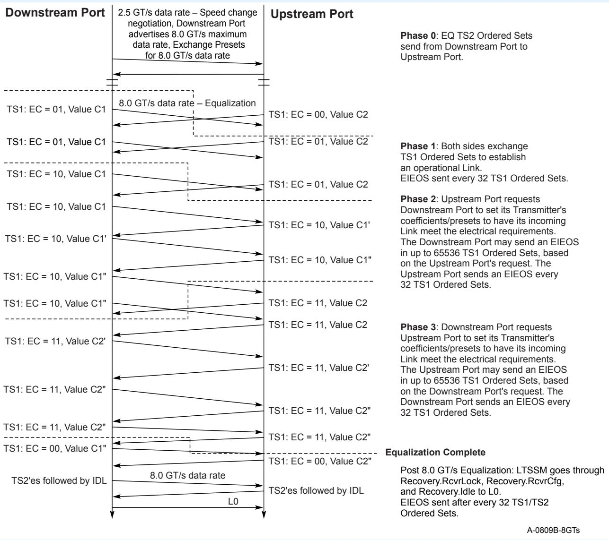

<details>
<summary>alluvial diagram</summary>

| Phase | TS1: EC | Value C1 | Value C2 |
| --- | --- | --- | --- |
| Phase 0 | EQ TS2 Ordered Sets send from Downstream Port to Upstream Port. | 8.0 GT/s data rate – Equalization | 0.0 |
| Phase 1 | Both sides exchange TS1 Ordered Sets to establish an operational Link. EIEOS sent every 32 TS1 Ordered Sets. | TS1: EC = 00, Value C2 |  |
| Phase 1 | Both sides exchange TS1 Ordered Sets to establish an operational Link. EIEOS sent every 32 TS1 Ordered Sets. | TS1: EC = 01, Value C2 |  |
| Phase 1 | Both sides exchange TS1 Ordered Sets to establish an operational Link. EIEOS sent every 32 TS1 Ordered Sets. | TS1: EC = 01, Value C2 |  |
| Phase 1 | Both sides exchange TS1 Ordered Sets to establish an operational Link. EIEOS sent every 32 TS1 Ordered Sets. | TS1: EC = 10, Value C1' |  |
| Phase 1 | Both sides exchange TS1 Ordered Sets to establish an operational Link. EIEOS sent every 32 TS1 Ordered Sets. | TS1: EC = 10, Value C1" |  |
| Phase 1 | Both sides exchange TS1 Ordered Sets to establish an operational Link. EIEOS sent every 32 TS1 Ordered Sets. | TS1: EC = 10, Value C1" |  |
</details>

Figur § e 4-41 8.0 GT/s Equalization Flow

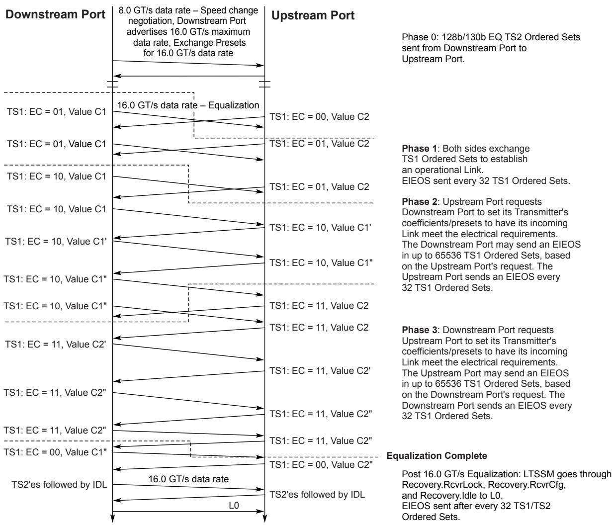

<details>
<summary>timing diagram</summary>

| Segment | TS1 EC | Value C |
| --- | --- | --- |
| Downstream Port | 0 | 0 |
| Downstream Port | 0 | 0 |
| Downstream Port | 0 | 0 |
| Downstream Port | 0 | 0 |
| Downstream Port | 0 | 0 |
| Downstream Port | 0 | 0 |
| Downstream Port | 0 | 0 |
| Downstream Port | 0 | 0 |
| Downstream Port | 0 | 0 |
| Downstream Port | 0 | 0 |
</details>

A-0809D-16GTs

Figur § e 4-42 16.0 GT/s Equalization Flow

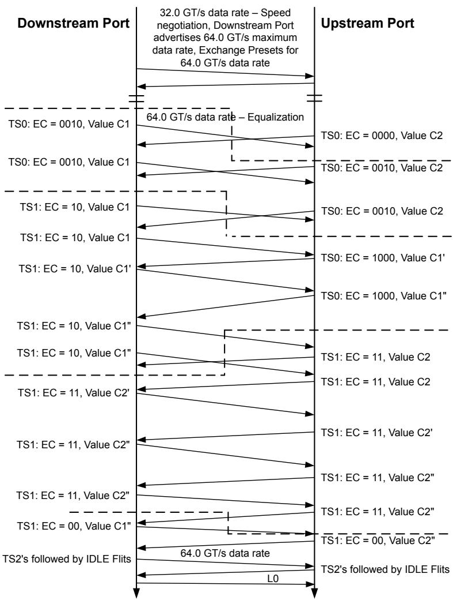

<details>
<summary>alluvial diagram</summary>

| Port Type       | TS1: EC | TS2: EC |
| --------------- | ------- | ------- |
| Downstream Port | 64.0    | 64.0    |
| Upstream Port   | 11      | 11      |
</details>

Phase 0: 128b/130b EQ TS2 Ordered Sets sent from Downstream Port to Upstream Port.  
Phase 1: Both sides exchange TS0 Ordered Sets to establish an operational Link. EIEOS sent every 32 TS0 Ordered Sets.  
Phase 2: Upstream Port requests Downstream Port to set its Transmitter’s coefficients/presets to have its incoming Link meet the electrical requirements. The Downstream Port may send EIEOS in up to 65536 TS1 Ordered Sets, based on the Upstream Port’s request. The Upstream Port sends an EIEOS every 32 TS0 Ordered Sets.  
Phase 3: Downstream Port requests Upstream Port to set its Transmitter’s coefficients/presets to have its incoming Link meet the electrical requirements. The Upstream Port may send EIEOS in up to 65536 TS1 Ordered Sets, based on the Downstream Port’s request. The Downstream Port sends an EIEOS every 32 TS1 Ordered Sets.  
Equalization Complete Post 64.0 GT/s Equalization: LTSSM goes through Recovery.RcvrLock, Recovery.RcvrCfg, and Recovery.Idle to L0. EIEOS sent after every 32 TS1/TS2 Ordered Sets.  
64GT-training.vsdx

Figur § e 4-43 64.0 GT/s Equalization Flow

## IMPLEMENTATION NOTE:

## EQUALIZATION BYPASS EXAMPLE §

The following flow-chart provides an example flow where a Link may bypass equalization at lower Data Rates and go to the highest supported NRZ rate for equalization. For example, when n=5, the Link can train to L0 in Gen 1 data rate, establish that all components (including Retimers, if any) can bypass equalization to Gen 5, change the data rate to Gen 5 and just perform equalization at Gen 5.

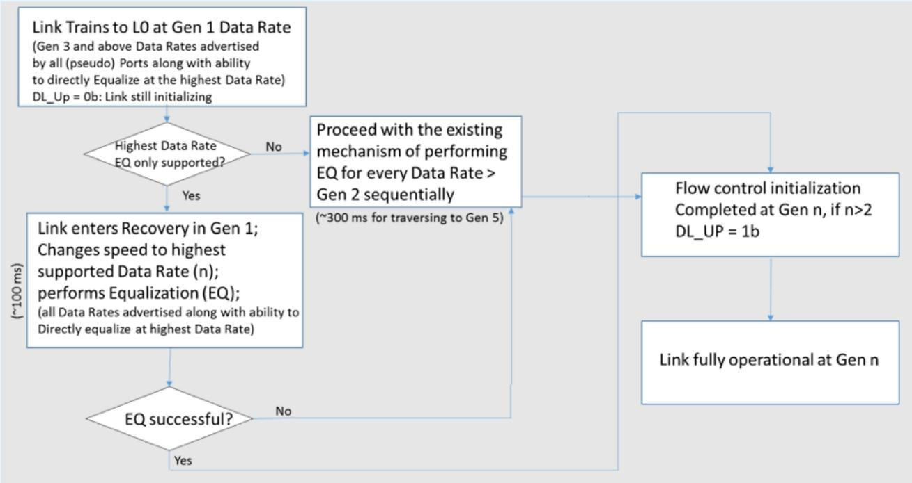

<details>
<summary>flowchart</summary>

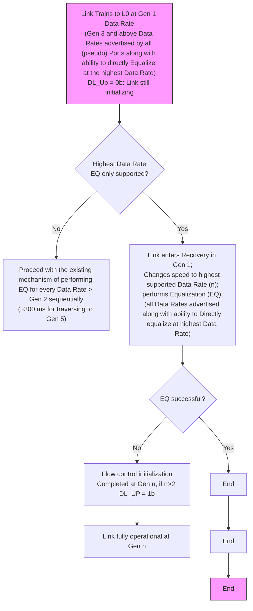
```mermaid
graph TD
  A["Link Trains to L0 at Gen 1 Data Rate\n(Gen 3 and above Data Rates advertised by all (pseudo) Ports along with ability to directly Equalize at the highest Data Rate)\nDL_Up = 0b: Link still initializing"] --> B{Highest Data Rate\nEQ only supported?}
  B -->|No| C["Proceed with the existing mechanism of performing EQ for every Data Rate > Gen 2 sequentially\n(~300 ms for traversing to Gen 5)"]
  B -->|Yes| D["Link enters Recovery in Gen 1;\nChanges speed to highest supported Data Rate (n);\nperforms Equalization (EQ);\n(all Data Rates advertised along with ability to Directly equalize at highest Data Rate)"]
  D --> E{EQ successful?}
  E -->|No| F["Flow control initialization\nCompleted at Gen n, if n>2 DL_UP = 1b"]
  F --> G["Link fully operational at Gen n"]
  E -->|Yes| H["End"]
  H --> I["End"]
  I --> J["End"]
    style A fill:#f9f,stroke:#333
    style J fill:#f9f,stroke:#333
```
</details>

Figure 4-44 Equalization Bypass Example§

## 4.2.4.1 Rules for Transmitter Coefficients §

The explanation of the coefficients and the FIR filter it represents are provided in § Section 8.3.3.1 . The following rules apply to both the advertised as well as requested coefficient settings.

1. ${ \pmb { C } } _ { - 2 } , { \pmb { C } } _ { - 1 } ,$ and $\pmb { c } _ { + 1 }$ are the coefficients used in the FIR equation and represent the $2 ^ { \mathsf { n d } }$ pre-cursor, pre-cursor and post-cursor, respectively. The pre-cursors and post-cursor values communicated in the TS1 Ordered Sets represent their absolute values. $\pmb { c _ { 0 } }$ represents the cursor coefficient setting and is a positive entity. The coefficient $c _ { - 2 }$ is used only for 64.0 GT/s and higher Data Rates.  
2. The sum of the absolute values of the coefficients defines the FS (Full Swing; $\mathsf { F S } = \vert \mathsf C _ { - 2 } \vert + \vert \mathsf C _ { - 1 } \vert + \mathsf C _ { 0 } + \vert \mathsf C _ { + 1 } \vert )$ . FS is advertised to the Link partner in Phase 1. The Transmitter FS range is defined below:

◦ ${ \mathsf { F S } } \in \left\{ 2 4 , . . . , 6 3 \right\} ( { \mathsf { i . e . } }$ , FS must have a value from 24 through 63) for full swing mode.  
◦ ${ \sf F S } \in \{ 1 2 , . . . , 6 3 \}$ for reduced swing mode.  
◦ ${ \mathsf C } _ { - 2 }$ is set to 0 for Data Rates lower than 64.0 GT/s.

3. A Transmitter advertises its LF (Low Frequency) value during Phase 1.

◦ This corresponds to the minimum differential voltage that can be generated by the Transmitter which is LF/FS times the Transmitters maximum differential voltage. The Transmitter must ensure that LF meets the electrical requirements defined in § Section 8.3.3.9 for VTX-EIEOS-FS and VTX-EIEOS-RS.

4. The following rules must be satisfied before a set of coefficients can be requested of the Link partner’s Transmitter. Upon reception of an update request for TX coefficient settings, a Port must verify that the new request meets the following conditions and reject the request if any of following conditions are violated:

a. $\left| \mathsf { C } _ { - 1 } \right| \le \mathsf { F l o o r } \left( \mathsf { F S } / 4 \right)$  
b. $\left| \mathsf { C } _ { - 1 } \right| + \left| \mathsf { C } _ { - 2 } \right| + \mathsf { C } _ { 0 } + \left| \mathsf { C } _ { + 1 } \right| = \mathsf { F S }$  
c. $\mathsf C _ { 0 } - \mathsf C _ { - 1 } \big | + \big | \mathsf C _ { - 2 } \big | - \big | \mathsf C _ { + 1 } \big | \geq \mathsf L \mathsf F$  
d. $\left| \mathsf { C } _ { - 2 } \right| \leq \mathsf { F l o o r } \left( \mathsf { F S } / 8 \right)$

(Do not allow peak power to change with adaptation)

## 4.2.4.2 Encoding of Presets §

Definition of the Transmitter and Receiver Preset Hints appears in § Chapter 8. . The encoding for the Transmitter Preset and Receiver Preset Hint are provided in § Table 4-23 and § Table 4-24. There are two classes of presets: P0 through P10 are defined for data rates of 8.0 GT/s, 16.0 GT/s, and 32.0 GT/s whereas Q0 through Q10 are defined for the data rate of 64.0 GT/s. Even though 8 of the 11 presets across these two sets overlap, it is possible that the same preset values may get different encodings between the two classes. Receiver Preset Hints are optional and only defined for the 8.0 GT/s data rate.

Table 4-23 Transmitter Preset Encoding§

<table><tr><td>Encoding</td><td>Preset Number in § Table 8-1</td><td>Preset Number in § Table 8-2</td></tr><tr><td>0000b</td><td>P0</td><td>Q0</td></tr><tr><td>0001b</td><td>P1</td><td>Q1</td></tr><tr><td>0010b</td><td>P2</td><td>Q2</td></tr><tr><td>0011b</td><td>P3</td><td>Q3</td></tr><tr><td>0100b</td><td>P4</td><td>Q4</td></tr><tr><td>0101b</td><td>P5</td><td>Q5</td></tr><tr><td>0110b</td><td>P6</td><td>Q6</td></tr><tr><td>0111b</td><td>P7</td><td>Q7</td></tr><tr><td>1000b</td><td>P8</td><td>Q8</td></tr><tr><td>1001b</td><td>P9</td><td>Q9</td></tr><tr><td>1010b</td><td>P10</td><td>Q10</td></tr><tr><td>1011b through 1111b</td><td>Reserved</td><td>Reserved</td></tr></table>

Table 4-24 Receiver Preset Hint Encoding for 8.0 GT/s§

<table><tr><td>Encoding</td><td>Receiver Preset Value</td></tr><tr><td>000b</td><td>-6 dB</td></tr><tr><td>001b</td><td>-7 dB</td></tr><tr><td>010b</td><td>-8 dB</td></tr><tr><td>011b</td><td>-9 dB</td></tr><tr><td>100b</td><td>-10 dB</td></tr><tr><td>101b</td><td>-11 dB</td></tr><tr><td>110b</td><td>-12 dB</td></tr><tr><td>111b</td><td>Reserved</td></tr></table>

# IMPLEMENTATION NOTE:

# QUANTIZATION ERRORS AT 64.0 GT/S §

Due to the tighter preset tolerance at 64.0 GT/s some FS values will result in a quantization error larger than is allowed for the specified tolerance of the presets in § Table 8-2 of § Section 8.3.3.3 . The implementation must compensate for any quantization error from its selection of FS to meet the specified preset accuracy.

## 4.2.5 Link Initialization and Training §

This section defines the Physical Layer control process that configures and initializes each Link for normal operation. This section covers the following features:

• configuring and initializing the Link  
• supporting normal packet transfers  
• supported state transitions when recovering from Link errors  
• restarting a Port from low power states.

The following are discovered and determined during the training process:

• Link width  
• Link data rate  
• Lane reversal  
• Lane polarity

Training does:

• Link data rate negotiation  
• Bit lock per Lane

• Lane polarity  
• Symbol lock or Block alignment per Lane  
• Lane ordering within a Link  
• Link width negotiation  
• Lane-to-Lane de-skew within a multi-Lane Link.

## 4.2.5.1 Training Sequences §

Training sequences are composed of Ordered Sets used for initializing bit alignment, Symbol alignment and to exchange Physical Layer parameters.

1. When the data rate is 2.5 GT/s or 5.0 GT/s, Ordered Sets are never scrambled but are always 8b/10b encoded.  
2. When the data rate is between 8.0 GT/s and 32.0 GT/s, the 128b/130b encoding is used and Symbols may or may not be scrambled, according to the rules in § Section 4.2.2.4 .  
3. When the data rate is 64.0 GT/s the 1b/1b encoding is used and Symbols may or may not be scrambled, according to the rules in § Section 4.2.3.1.2 .

Training sequences (TS0, TS1, TS2, Modified TS1, or Modified TS2) are transmitted consecutively and can only be interrupted by SKP Ordered Sets (see § Section 4.2.8 ) or, for data rates other than 2.5 GT/s, EIEOS (see § Section 4.2.5.3 ).

When 8.0 GT/s or higher data rates are supported, a TS1 (or TS2) Ordered Set using 8b/10b encoding (i.e., 2.5 or 5.0 GT/s data rate) can be either a standard TS1 (or TS2) Ordered Set (i.e., Symbol 6 is D10.2 for a TS1 Ordered Set or D5.2 for a TS2 Ordered Set) or an EQ TS1 Ordered Set (or EQ TS2 Ordered Set) (i.e., Symbol 6 bit 7 is 1b). The ability to transmit EQ TS1 Ordered Sets is implementation specific. Ports supporting 8.0 GT/s or higher data rates must accept either TS1 (or TS2) type in the LTSSM states unless explicitly required to look for a specific type. Ports that do not support the 8.0 GT/s data rate are permitted, but not required, to accept EQ TS1 (or TS2) Ordered Sets.

When the 16.0 GT/s and higher data rate is supported, a TS2 using 128b/130b encoding (i.e., 8.0 or higher data rate) can be either a standard TS2 Ordered Set (i.e., Symbol 7 is 45h) or an 128b/130b EQ TS2 (i.e., Symbol 7 bit 7 is 1b). Ports supporting the 16.0 GT/s or higher data rate must accept either TS2 type in the LTSSM states unless explicitly required to look for a specific type. Ports that do not support the 16.0 GT/s data rate are permitted, but not required, to accept 128b/ 130b EQ TS2 Ordered Sets.

When using 8b/10b encoding, TS1 or TS2 Ordered Sets are considered consecutive only if Symbol 6 matches Symbol 6 of the previous TS1 or TS2 Ordered Set.

Components that intend to either negotiate alternate protocols or pass a Training Set Message must use Modified TS1/ TS2 Ordered Sets instead of standard TS1/TS2 Ordered Sets in Configuration.Lanenum.Wait, Configuration.Lanenum.Accept, and Configuration.Complete substates. In order to be eligible to send the Modified TS1/ TS2 Ordered Sets, components must set the Enhanced Link behavior Control bits (bit 7:6 of Symbol 5) in TS1 and TS2 Ordered Sets to 11b in Polling.Active, Polling.Configuration, Configuration.Linkwidth.Start, and Configuration.Linkwidth.Accept substates and follow through the steps outlined on transition to Configuration.Lanenum.Wait substate when LinkUp=0b. If the Link partner does not support Modified TS1/TS2 Ordered Sets, then starting with Configuration.Lanenum.Wait, the standard TSs should stop sending 11b in the Enhanced Link Behavior Control field and switch to the appropriate encodings.

When using 8b/10b encoding, modified TS1 or modified TS2 Ordered Sets are considered consecutive only if all Symbols matches the corresponding Symbols of the previous modified TS1 or modified TS2 Ordered Sets and the parity in Symbol 15 matches with the expected value. Symbols 8-14 must be identical in each Modified TS1/TS2 Ordered Sets across all Lanes of a Link.

When using 128b/130b encoding, TS1 or TS2 Ordered Sets are considered consecutive only if Symbols 6-9 match Symbols 6-9 of the previous TS1 or TS2 Ordered Set, with Reserved bits treated as described below.

With 1b/1b encoding, TS0, TS1 and TS2 Ordered Sets consist of the first 8 symbols of the Ordered Set being replicated in the second 8 symbols of the Ordered Set, as shown in § Table 4-28 and § Table 4-29. The TS0 Ordered Set is used with 1b/ 1b encoding during the Recovery.Equalization, as described in the LTSSM section. Each UI in the TS0 Ordered Set is either a 00b or 10b (i.e., voltage level 0 or 3 with PAM-4 signaling, as shown in § Figure 4-24). Hence, the scrambled symbols in TS0 Ordered Sets are Half scrambled; the odd bit positions are scrambled whereas even bit position j is identical to the odd bit position j+1. Precoding is bypassed in both the Transmitter and Receiver.

In 1b/1b encoding, a received TS0, TS1, or TS2 Ordered Set is considered valid when either half is valid:

• The first half is valid if Symbol 0 is a valid TS0/TS1/TS2 encoding, Symbols 0 to 7 passes its parity check after decoding Gray code and descrambling, and Symbol 7 is not equal to a DC balance pattern prior to performing gray code and descrambling.  
• The second half is valid if Symbol 8 is a valid TS0/TS1/TS2 encoding, Symbols 8 to 15 passes its parity check after decoding Gray code and descrambling, and symbol 15 is not equal to a DC balance pattern prior to performing gray code and descrambling.  
• Both halves are valid if Symbols 0-7 are identical to Symbols 8-15.  
• The type of the Ordered Set (TS0, TS1, or TS2) is determined by the first symbol of the valid half.  
• The even bits in the half-scrambled Symbols must be ignored after descrambling in the Receiver. (Note: because the gray code was done by forcing the even bit to be identical to the odd bit in the Transmitter, the even bit position may not be identical to the odd bit position on the Receiver after descrambling.)

## IMPLEMENTATION NOTE:

## HALF SCRAMBING EXAMPLE §

Since the half-scrambled symbols are not fully gray-coded on the transmitter, rather the even bit is made identical to odd bit to have that UI be either a voltage level 0 or voltage level 3, it is possible that an even bit position in the half-scrambled symbol in the Receiver after gray-coding and descrambling may not match what was transmitted. For example, the Transmitter intends to send 80h prior to scrambling. After scrambling, the symbol becomes 57h and the gray-coded value by forcing the even bit to be identical to the odd bit becomes 03h. On the receiver side, 03h after gray coding remains at 03h and after descrambling becomes 94h. Here bit 0 is different between the transmitted side 80h vs. the receive side 94h. However, all the odd bit positions that carry meaningful information are identical. By AND'ing 94h with AAh, we get 80h which was sent.

With 1b/1b encoding, two TS0, TS1 or TS2 Ordered Sets are considered consecutive if all of the following conditions apply to both the Ordered Sets:

• both Ordered Sets are of the same type  
• they arrived one after the other, even though they may be separated by one or more SKP Ordered Set(s)  
• each ordered set has a valid half and the first 7 symbols of the valid halves of each of the Ordered Set are identical, with Reserved bits treated as described below.

Reserved bits in TS0, TS1, TS2, Modified TS1 or Modified TS2 Ordered Sets must be handled as follows:

• The Transmitter must transmit 0s for Reserved bits.  
• The Receiver:

◦ must not determine that a TS0, TS1, TS2, Modified TS1 or Modified TS2 Ordered Set is invalid based on the received value of Reserved bits  
◦ must use the received value of Reserved bits for the purpose of a parity computation if the Reserved bits are included in a parity calculation  
◦ may optionally compare the received value of Reserved bits within Symbols that are explicitly called out as being required to be identical in TS0, TS1, TS2, Modified TS1, or Modified TS2 Ordered Sets to determine if they are consecutive  
◦ must not otherwise take any functional action based on the value of any received Reserved bits

When using 128b/130b or 1b/1b encoding, Transmitters are required to track the running DC Balance of the bits transmitted on the wire (after Gray code in 1b/1b, scrambling, and if turned on: precoding) that constitute the TS0, TS1, and TS2 Ordered Sets only. The running DC Balance is the difference between the number of 1s transmitted and the number of 0s transmitted in 8.0 GT/s, 16.0 GT/s or 32.0 GT/s Data Rates. The running DC Balance is the running sum of the DC balance values assigned to each voltage level in each UI, as shown in § Figure 4-24, for 64.0 GT/s Data Rate. Each Lane must track its running DC Balance independently and be capable of tracking a difference of at least +/-511 bits. Any counters used must saturate at their limit (not roll-over) and continue to track reductions after their limit is reached. For example, a counter that can track a difference of 511 will saturate at 511 if a difference of 513 is detected, and then change to 509 if the difference is reduced by 2 in the future.

The running DC Balance is set to 0 by two events:

1. The Transmitter exiting Electrical Idle;  
2. Transmission of an EIEOS following a Data Block.

For every TS1 or TS2 Ordered Set transmitted with 128b/130b encoding, Transmitters must evaluate the running DC Balance and transmit one of the DC Balance Symbols defined for Symbols 14 and 15 as defined by the algorithm below. If the number of 1s needs to be reduced, the DC Balance Symbols 20h (for Symbol 14) and 08h (for Symbol 15) are transmitted. If the number of 0s needs to be reduced, the DC Balance Symbols DFh (for Symbol 14) and F7h (for Symbol 15) are transmitted. If no change is required, the appropriate TS1 or TS2 Identifier Symbol is transmitted. Any DC Balance Symbols transmitted for Symbols 14 or 15 bypass scrambling, while TS1 and TS2 Identifier Symbols follow the standard scrambling rules. The following algorithm must be used to control the DC Balance with 128b/130b encoding:

• If the running DC Balance is >31 at the end of Symbol 11 of the TS Ordered Set, transmit DFh for Symbol 14 and F7h for Symbol 15 to reduce the number of 0s, or 20h for Symbol 14 and 08h for Symbol 15 to reduce the number of 1s.  
• Else, if the running DC Balance is >15 at the end of Symbol 11 of the TS Ordered Set, transmit F7h for Symbol 15 to reduce the number of 0s, or 08h for Symbol 15 to reduce the number of 1s. Transmit the normal TS Identifier Symbol (scrambled) for Symbol 14.  
• Else, transmit the normal TS Identifier Symbol (scrambled) for Symbols 14 and 15.

Receivers are permitted, but not required, to check Symbols 14 and 15 for the following values when determining whether a TS1 or TS2 Ordered Set is valid with 128b/130b encoding:

• The appropriate TS Identifier Symbol after de-scrambling, or  
• a valid DC Balance Symbol of DFh or 20h before de-scrambling for Symbol 14, or  
• a valid DC Balance Symbol of F7h or 08h before de-scrambling for Symbol 15.

If a Receiver receives a DC balance pattern in Symbol 14 in 128b/130b encoding, it is possible that the pattern is scrambled (and precoded). Thus, if the Receiver is performing this optional check, it must keep descrambler and receive precoding running for checking Symbol 15, which can be either scrambled (and precoded) or the DC balance pattern.

## IMPLEMENTATION NOTE:SYNC HEADER AND DC BALANCE §

Block Sync Header bits and the first Symbol of TS1 and TS2 Ordered Sets do not affect the running DC Balance, because they have equal an number of 1s and 0s.

For every TS0, TS1 or TS2 Ordered Set transmitted with 1b/1b encoding, Transmitters must evaluate the running DC Balance and transmit one of the DC Balance Symbols defined for Symbols 7 and 15 as defined by the algorithm below. Any DC Balance Symbols transmitted in Symbols 7 and 15 bypass scrambling, while the byte-wise parity, if sent in Symbols 7 and 15, follows the standard scrambling rules.

• If the running DC Balance was >+47 at the start of the TS Ordered Set, transmit 00h in Symbols 7 and 15 without scrambling.  
• If the running DC Balance was <-47 at the start of the TS Ordered Set, transmit FFh in Symbols 7 and 15 without scrambling.  
• Else, transmit the even byte parity of Symbols 0-6 (pre-scrambling) in Symbols 7 and 15 with scrambling.

While using TS0 Ordered Sets, the coefficients are not the full 6-bit value but adjusted to the appropriate number of bits that the corresponding coefficients, based on the constraints. For example, 3 bits are enough for the 2nd pre-cursor since it cannot be higher than 7.

The Training Control bits Hot Reset bit, Disable Link bit, and Loopback bit are mutually exclusive, only one of these bits is permitted to be set at a time as well as transmitted on all Lanes in a configured (all Lanes that were in L0) or possible (all Lanes in Configuration) Link. If more than one of Hot Reset bit, Disable Link bit, or Loopback bit are Set at the same time, the Link behavior is undefined.

The TS1 Ordered Set's Retimer Equalization Extend bit is always set to 0b when transmitted by an Upstream Port or Downstream Port. Retimers set the bit to 1b as described in § Section 4.3.7.2 .

Table 4-25 TS1 Ordered Set in 8b/10b and 128b/130b Encoding§

<table><tr><td colspan="2">TS1 Ordered Set in 8b/10b and 128b/130b Encoding</td></tr><tr><td>Symbol Number</td><td>Description</td></tr><tr><td>0</td><td>TS1 IdentifierWhen operating at 2.5 or 5.0 GT/s: COM (K28.5) for Symbol alignment.When operating at 8.0 GT/s or above: Encoded as 1Eh (TS1 Ordered Set).</td></tr><tr><td>1</td><td>Link NumberPorts that do not support 8.0 GT/s or above: 0-255, PAD.Downstream Ports that support 8.0 GT/s or above: 0-31, PAD.Upstream Ports that support 8.0 GT/s or above: 0-255, PAD.When operating at 2.5 or 5.0 GT/s: PAD is encoded as K23.7.When operating at 8.0 GT/s or above: PAD is encoded as F7h.</td></tr><tr><td>2</td><td>Lane Number within LinkWhen operating at 2.5 or 5.0 GT/s: 0-31, PAD. PAD is encoded as K23.7.When operating at 8.0 GT/s or above: 0-31, PAD. PAD is encoded as F7h.</td></tr><tr><td>3</td><td>N_FTS - The number of Fast Training Sequences required by the Receiver: 0-255. Reserved when Flit Mode negotiated.</td></tr><tr><td rowspan="3">4</td><td>Data Rate IdentifierBit 0 Flit Mode Supported bit:0b Flit Mode is not Supported1b Flit Mode is supportedBits 5:1 Supported Link Speeds:Non-Flit Mode Encodings (valid during Flit Mode negotiation or when Flit Mode is not negotiated)0 0001b Only 2.5 GT/s supported0 0011b Only 2.5 and 5.0 GT/s supported0 0111b Only 2.5, 5.0, and 8.0 GT/s supported0 1111b Only 2.5, 5.0, 8.0, and 16.0 GT/s supported1 1111b Only 2.5, 5.0, 8.0, 16.0, and 32.0 GT/s supportedOthers Reserved in Non-Flit ModeAdditional encodings permitted after Flit Mode is negotiated by all Link Partners after the first entry to Configuration.Complete from Detect or in the following states when the device supports Flit Mode: Polling.Active as a Receiver (see § Section 4.2.7.2.1), Configuration.Linkwidth.Start (see § Section 4.2.7.3.1), Recovery.Equalization (see § Section 4.2.7.4.1 and § Section 4.2.7.4.2) and Loopback (see § Section 4.2.7.10):1 0111b 2.5, 5.0, 8.0, 16.0, 32.0, and 64.0 GT/s supported if component had transmitted 1 1111b in Supported Link Speeds in Polling and Configuration states since entering the Polling state.Others Reserved</td></tr><tr><td>Bit 6 Autonomous Change / Selectable De-emphasis:Downstream Ports: This bit is defined for use in the following LTSSM states: Polling.Active, Configuration.Linkwidth.Start, and Loopback.Entry. In all other LTSSM states, it is Reserved.Upstream Ports: This bit is defined for use in the following LTSSM states: Polling.Active, Configuration, Recovery, and Loopback.Entry. In all other LTSSM states, it is Reserved.</td></tr><tr><td>Bit 7 speed_change / SRIS ClockingDownstream Ports:In Configuration State:When LinkUp=0b: A 1b indicates that the Link will operate in SRIS clocking; a 0b indicates either common clocking or SRNS clocking. The Downstream Port uses this bit to communicate the type of clocking to the Retimer(s), if any, as well as the Upstream Port so that the correct (Control) SKP Ordered Set frequency can be selectedElse: this bit is ReservedIn Recovery.RcvrCfg: speed_changeIn other states: ReservedUpstream Ports: speed_change. This bit can be set to 1b only in the Recovery.RcvrLock LTSSM state. In all other LTSSM states, it is Reserved</td></tr><tr><td rowspan="8">5</td><td>Training Control</td></tr><tr><td>Bit 0 Hot Reset bit0b Deassert1b Assert</td></tr><tr><td>Bit 1 Disable Link bit0b Deassert1b Assert</td></tr><tr><td>Bit 2 Loopback bit0b Deassert1b Assert</td></tr><tr><td>Bit 3 Disable Scrambling bit (2.5 GT/s and 5.0 GT/s data rates)0b Deassert1b AssertReserved (other data rates)</td></tr><tr><td>Bit 4 Compliance Receive bit (5.0 GT/s and above data rates, optional at 2.5 GT/s)0b Deassert1b AssertPorts that support 5.0 GT/s and higher data rate(s) must implement the Compliance Receive bit. Ports that support only 2.5 GT/s data rate may optionally implement the Compliance Receive bit. If not implemented, the bit is Reserved.</td></tr><tr><td>Bit 5 Transmit Modified Compliance Pattern in Loopback. This bit is defined for use in Loopback by the Loopback Lead when 32.0 GT/s or higher data rates are supported. See § Section 4.2.7.10.1. In all other cases, this bit is Reserved.</td></tr><tr><td>Bit 7:6 Enhanced Link Behavior Control00b Full Equalization RequiredModified TS1/TS2 Ordered Sets not supported01b Equalization Bypass to Highest NRZ Rate SupportModified TS1/TS2 Ordered Sets not supported.Indicates intention to perform 32.0 GT/s equalization when set by Loopback Lead. See § Section 4.2.4 and § Section 4.2.7.10.1.10b No Equalization NeededModified TS1/TS2 Ordered Sets not supportedA device advertising this capability must support Equalization Bypass to Highest NRZ Rate Support. See § Section 4.2.4.11bModified TS1/TS2 Ordered Sets supportedEqualization bypass options specified in Modified TS1/TS2 Ordered Sets.These bits are defined for use in Polling and Configuration when LinkUp=0b and 32.0 GT/s or higher data rates are supported and in Loopback by the Loopback Lead when 32.0 GT/s or higher data rates are supported. In all other cases, these bits are Reserved.</td></tr><tr><td>6</td><td>When operating at 2.5 or 5.0 GT/s:Standard TS1 Ordered Sets encode this Symbol as a TS1 Identifier, D10.2 (4Ah).Compliance TS1 Ordered Sets encode the symbol as follows:Bits 7:0 Compliance Setting Number defined in § Table 4-49. See § Section 4.2.7.2.2 for when to send Compliance TS1 Ordered Sets.EQ TS1 Ordered Sets encode this Symbol as follows:For Equalization at 8.0 GT/s Data Rate:Bits 2:0 Receiver Preset Hint. See § Section 4.2.4.2.Bit 6:3 Transmitter Preset. See § Section 4.2.4.2.Bit 7 Set to 1b.For Equalization at 32.0 GT/s or higher Data Rate:Bit 0 Transmitter Precode Request - See § Section 4.2.2.5. This bit has no defined usage in receivers at this time.Bit 2:1 ReservedBit 6:3 Transmitter Preset. See § Section 4.2.4.2.Bit 7 Set to 1b.When operating at 8.0 GT/s or higher data rate:Bit 1:0 Equalization Control (EC). These bits are only used in the Recovery. Equalization and Loopback LTSSM states. See § Section 4.2.7.4.2 and § Section 4.2.7.10. In all other LTSSM states, they must be set to 00b.Bit 2 Reset EIEOS Interval Count. This bit is defined for use in the Recovery. Equalization LTSSM state. See § Section 4.2.7.4.2 and § Section 4.2.5.3. In all other LTSSM states, it is Reserved.Bit 6:3 Transmitter Preset. See § Section 4.2.4 and § Section 4.2.7.Bit 7 Use Preset / Equalization Redo. This bit is defined for use in the Recovery. Equalization, Recovery.RcvrLock and Loopback LTSSM states. See § Section 4.2.7.4.1, § Section 4.2.7.4.2 and § Section 4.2.7.10. In all other LTSSM states, it is Reserved.</td></tr><tr><td>7</td><td>When operating at 2.5 or 5.0 GT/s: TS1 Identifier. Encoded as D10.2 (4Ah).When operating at 8.0 GT/s or higher:Bit 5:0 FS when the EC field of Symbol 6 is 01b (see § Section 4.2.4.1). Otherwise, Pre-cursor Coefficient for the current data rate of operation.Bit 6 Transmitter Precoding On. This bit is defined for use in the Recovery state for use at 32.0 GT/s or higher. See § Section 4.2.2.5. In all the other cases, it is Reserved.Bit 7 Retimer Equalization Extend bit. This bit is defined for use in the Recovery. Equalization LTSSM state when operating at 16.0 GT/s or higher data rate. In all other LTSSM states and when operating at 8.0 GT/s, it is Reserved.</td></tr><tr><td>8</td><td>When operating at 2.5 or 5.0 GT/s: TS1 Identifier. Encoded as D10.2 (4Ah).When operating at 8.0 GT/s or higher data rate:Bit 5:0 LF when the EC field of Symbol 6 is 01b (see § Section 4.2.4.1). Otherwise, Cursor Coefficient for the current data rate of operation.Bit 7:6 Reserved.</td></tr><tr><td>9</td><td>When operating at 2.5 or 5.0 GT/s: TS1 Identifier. Encoded as D10.2 (4Ah).When operating at 8.0 GT/s or higher data rate:Bit 5:0 Post-cursor Coefficient for the current data rate of operation.Bit 6 Reject Coefficient Values bit. This bit can only be set to 1b in specific Phases of the Recovery.Equalization LTSSM State. See § Section 4.2.7.4.2. In all other LTSSM states, it must be set to 0b.Bit 7 Parity (P). This bit is the even parity computed over all bits of Symbols 6, 7, and 8 and bits 6:0 of Symbol 9 (i.e., XOR of all covered bits). Receivers must calculate the parity of the received bits and compare it to the received Parity bit. Received TS1 Ordered Sets are valid only if the calculated and received Parity match.</td></tr><tr><td>10 - 13</td><td>When operating at 2.5 or 5.0 GT/s: TS1 Identifier. Encoded as D10.2 (4Ah).When operating at 8.0 GT/s or above: TS1 Identifier. Encoded as 4Ah.</td></tr><tr><td>14 - 15</td><td>When operating at 2.5 or 5.0 GT/s: TS1 Identifier. Encoded as D10.2 (4Ah).When operating at 8.0 GT/s or above: TS1 Identifier (encoded as 4Ah) or a DC Balance Symbol.</td></tr></table>

## IMPLEMENTATION NOTE:

## EXPECTED USAGE OF THE 64.0 GT/S SUPPORTED LINK SPEEDS ENCODING §

The TS1 and TS2 Ordered Sets for 8b/10b and 128b/130b encoding are permitted to have the Supported Link Speeds field encoded as 1 0111b (indicating 2.5 GT/s to 64.0 GT/s support, inclusive) in the following scenarios:

1. Initial Link Training to L0 (Configuration.Complete and beyond)

The Link is training to L0 and Flit Mode has been negotiated during the training procedure (i.e., when LinkUp=0b). In this scenario the 1 0111b encoding is permitted to be used once the Link enters Configuration.Complete.

2. Configuration.Linkwidth.Start (as a Receiver only)

When the Link transitions from Configuration.Linkwidth.Start to Loopback when LinkUp=0b, the Loopback Lead is permitted to transmit TS1 Ordered Sets with the Supported Link Speeds advertising 1 0111b if it has prior knowledge that the Loopback Follower (i.e., the Receiver, which is still in Configuration.Linkwidth.Start) supports 64.0 GT/s. How the Loopback Lead obtains the prior knowledge of 64.0 GT/s support is outside the scope of the specification.

3. Recovery.Equalization when LinkUp=0b

Advertising the 1 0111b encoding in Phase 1 of Recovery.Equalization when “Equalization for Loopback” is being performed. More specifically, this is the test scenario where Recovery.Equalization is entered from Loopback, the Link is equalized at the current data rate and then the Link returns to Loopback. In the case where the data rate is less than required (i.e., Link is equalized for 32.0 GT/s but 64.0 GT/s is needed), the 1 0111b setting will be used to indicate to the Link partner the ability to transition to 64.0 GT/s upon re-entry to Loopback (after which an equalization procedure at 64.0 GT/s will be performed followed by a return to Loopback).

4. Loopback

When Loopback is entered through Configuration.Linkwidth.Start and LinkUp=0b, the Loopback Lead is permitted to use the 1 0111b encoding in the TS1 Ordered sets that it transmits upon entry to Loopback.Entry (prior to the EIOSQ that proceeds Electrical Idle and the speed change).

5. Polling.Active (as a Receiver only)

Test apparatus that understands the capabilities of the Port (i.e., that the Port being exercised is capable of 64.0 GT/s operation) may transmit TS1 Ordered Sets with the Supported Link Speeds field set to the 64.0 GT/s supported encoding (1 0111b), and the Flit Mode Supported bit set (1b) in Polling.Active when the TS1 Ordered Sets also have the Compliance Receive bit asserted and the Loopback bit de-asserted. A Port that transitions to Polling.Compliance from Polling.Active because it received the appropriate TS1 Ordered Sets in Polling.Active will accept 1 0111b as a valid Supported Link Speeds encoding (and consider it in its determination of the highest common data rate) if it supports the 64.0 GT/s data rate.

Table 4-26 TS2 Ordered Set in 8b/10b and 128b/130b Encoding§

<table><tr><td colspan="2">TS2 Ordered Set in 8b/10b and 128b/130b Encoding</td></tr><tr><td>Symbol Number</td><td>Description</td></tr><tr><td>0</td><td>TS2 IdentifierWhen operating at 2.5 or 5.0 GT/s: COM (K28.5) for Symbol alignment.When operating at 8.0 GT/s or above: Encoded as 2Dh (TS2 Ordered Set).</td></tr><tr><td>1</td><td>Link NumberPorts that do not support 8.0 GT/s or above: 0-255, PAD.Downstream Ports that support 8.0 GT/s or above: 0-31, PAD.Upstream Ports that support 8.0 GT/s or above: 0-255, PAD.When operating at 2.5 or 5.0 GT/s: PAD is encoded as K23.7.When operating at 8.0 GT/s or above: PAD is encoded as F7h.</td></tr><tr><td>2</td><td>Lane Number within LinkWhen operating at 2.5 or 5.0 GT/s: 0-31, PAD. PAD is encoded as K23.7.When operating at 8.0 GT/s or above: 0-31, PAD. PAD is encoded as F7h.</td></tr><tr><td>3</td><td>N_FTS - The number of Fast Training Sequences required by the Receiver: 0-255. Reserved when Flit Mode Negotiated.</td></tr><tr><td>4</td><td>Data Rate IdentifierBit 0 Flit Mode Supported bit0b Flit Mode is not supported1b Flit Mode is supportedBits 5:1 Supported Link Speeds:Non-Flit Mode Encodings (valid during Flit Mode negotiation or when Flit Mode is not negotiated)0 0001b Only 2.5 GT/s supported0 0011b Only 2.5 and 5.0 GT/s supported0 0111b Only 2.5, 5.0, and 8.0 GT/s supported0 1111b Only 2.5, 5.0, 8.0, and 16.0 GT/s supported1 1111b Only 2.5, 5.0, 8.0, 16.0, and 32.0 GT/s supportedOthers Reserved in Non-Flit ModeAdditional encodings permitted after Flit Mode is negotiated by all Link Partners after the first entry to Configuration.Complete from Detect.1 0111b 2.5, 5.0, 8.0, 16.0, 32.0, and 64.0 GT/s supportedOthers ReservedBit 6 Autonomous Change / Selectable De-emphasis / Link Upconfigure / L0p Capability - This bit is defined for use in the following LTSSM states: Polling.Configuration, Configuration.Complete, and Recovery. In all other LTSSM states, it is Reserved.</td></tr><tr><td></td><td>Bit 7speed_change /SRIS ClockingDownstream Ports:In Configuration State:When LinkUp=0b: A 1b indicates that the Link will operate in SRIS clocking; a 0b indicates either common clocking or SRNS clocking. The Downstream Port uses this bit to communicate the type of clocking to the Retimer(s), if any, as well as the Upstream Port so that the correct (Control) SKP Ordered Set frequency can be selectedElse: this bit is ReservedIn Recovery.RcvrCfg: speed_changeIn other states: ReservedUpstream Ports: speed_change. This bit can be set to 1b only in the Recovery.RcvrCfg LTSSM state. In all other LTSSM states, it is Reserved</td></tr><tr><td rowspan="8">5</td><td>Training Control</td></tr><tr><td>Bit 0Hot Reset bit0b Deassert1b Assert</td></tr><tr><td>Bit 1Disable Link bit0b Deassert1b Assert</td></tr><tr><td>Bit 2Loopback bit0b Deassert1b Assert</td></tr><tr><td>Bit 3Disable Scrambling bit in 2.5 GT/s and 5.0 GT/s data rates; Reserved in other data rates0b Deassert1b Assert</td></tr><tr><td>Bit 4Retimer Present bitin 2.5 GT/s data rate. Reserved in other data rates.0b No Retimers present1b One or more Retimers present</td></tr><tr><td>Bit 5Two Retimers Present bitin 2.5 GT/s data rate. Reserved in other data rates.Ports that support 16.0 GT/s data rate or higher must implement this bit. Ports that support only 8.0 GT/s data rate or lower are permitted to implement this bit.0b Zero or one Retimers present (or bit not implemented)1b Two or more Retimers present</td></tr><tr><td>Bit 7:6Enhanced Link Behavior Control00b Full Equalization Required,Modified TS1/TS2 Ordered Sets not supported.01b Equalization Bypass to Highest NRZ Rate SupportModified TS1/TS2 Ordered Sets not supported.See § Section 4.2.4 .10b No Equalization Needed,A device advertising this capability must support Equalization Bypass to Highest NRZ Rate Support.See § Section 4.2.4 .Modified TS1/TS2 Ordered Sets not supported11b Modified TS1/TS2 Ordered Sets supported,Equalization bypass options specified in Modified TS1/TS2 Ordered Sets.These bits defined for use in Polling and Configuration when LinkUp=0 and 32.0 GT/s or higher data rate is supported. In all other cases, Bits 7:6 are Reserved.</td></tr><tr><td>6</td><td>When operating at 2.5 or 5.0 GT/s:Standard TS2 Ordered Sets encode this Symbol as a TS2 Identifier, D5.2 (45h).EQ TS2 Ordered Sets encode this Symbol as follows:For Equalization at 8.0 GT/s Data Rate:Bit 2:0 Receiver Preset Hint. See § Section 4.2.4.2 .Bit 6:3 Transmitter Preset. See § Section 4.2.4.2 .Bit 7 Set to 1b.For Equalization at 32.0 GT/s or higher Data Rate:Bit 0 Transmitter Precode Request. See § Section 4.2.2.5 and § Section4.2.3.1.4 .Bit 2:1 ReservedBit 6:3 Transmitter Preset. See § Section 4.2.4.2 .Bit 7 Set to 1b.When operating at 8.0 GT/s :Bit 3:0 Reserved.Bit 5:4 Equalization Request Data Rate.00b 8.0 GT/s10b 16.0 GT/s01b 32.0 GT/s11b 64.0 GT/sThese bits are defined for use in the Recovery.RcvrCfg LTSSM state. In all other LTSSM states, they are Reserved. See § Section 4.2.4 for usage and recognize that these bits are non-sequentially encoded for purposes of backwards compatibilityBit 6 Quiesce Guarantee. This bit is defined for use in the Recovery.RcvrCfg LTSSM state. In all other LTSSM states, it is Reserved.Bit 7 Request Equalization. This bit is defined for use in the Recovery.RcvrCfg LTSSM state. In all other LTSSM states, it is Reserved.</td></tr><tr><td>7</td><td>When operating at 2.5 or 5.0 GT/s: TS2 Identifier. Encoded as D5.2 (45h).When operating at 8.0 GT/s or higher Data Rate:Standard TS2 Ordered Sets encode this Symbol as a TS2 Identifier, 45h.128b/130b EQ TS2 Ordered Sets encode this Symbol as follows:Bit 0 Transmitter Precode Request for operating at 32.0 GT/s or higher Data Rate. See § Section 4.2.2.5. This bit is Reserved if the 128b/130b EQ TS2 is sent for equalization at data rates of 8.0 GT/s or 16.0 GT/s.Bit 2:1 ReservedBit 6:3 128b/130b Transmitter Preset. See § Section 4.2.4.2 .Bit 7 Set to 1b.This definition is only valid in the Recovery.RcvrCfg LTSSM state when Preset values are being communicated.</td></tr><tr><td>8 - 13</td><td>When operating at 2.5 or 5.0 GT/s: TS2 Identifier. Encoded as D5.2 (45h).When operating at 8.0 GT/s or above: TS2 Identifier. Encoded as 45h.</td></tr><tr><td>14-15</td><td>When operating at 2.5 or 5.0 GT/s: TS2 Identifier. Encoded as D5.2 (45h).When operating at 8.0 GT/s or above: TS2 Identifier (encoded as 45h) or a DC Balance Symbol.</td></tr></table>

Table 4-27 Modified TS1/TS2 Ordered Set (8b/10b encoding)§

<table><tr><td colspan="2">Modified TS1/TS2 Ordered Set (8b/10b encoding)</td></tr><tr><td>Symbol Number</td><td>Description</td></tr><tr><td>0</td><td>COM (K28.5) for Symbol alignment.</td></tr><tr><td>1</td><td>Link NumberDownstream Ports: 0-31, PAD (K23.7).Upstream Ports: 0-255, PAD (K23.7).</td></tr><tr><td>2</td><td>Lane Number within Link - 0-31, PAD. PAD is encoded as K23.7.</td></tr><tr><td>3</td><td>N_FTS The number of Fast Training Sequences required by the Receiver: 0-255. Reserved when Flit Mode Negotiated.</td></tr><tr><td>4</td><td>Data Rate IdentifierBit 0 Flit Mode Supported bit0b Flit Mode is not supported1b Flit Mode is supportedBits 5:1 — Data Rates Supported</td></tr><tr><td rowspan="7"></td><td>0 0001b Only 2.5 GT/s Data Rate Supported.</td></tr><tr><td>0 0011b Only 2.5 and 5.0 GT/s Data Rate Supported.</td></tr><tr><td>0 0111b Only 2.5, 5.0, and 8.0 GT/s Data Rate Supported.</td></tr><tr><td>0 1111b Only 2.5, 5.0, 8.0, and 16.0 GT/s Data Rate Supported.</td></tr><tr><td>1 1111b Only 2.5, 5.0, 8.0, 16.0, and 32.0 GT/s Data Rate Supported.</td></tr><tr><td>Bit 6 Link Upconfigure / L0p Capability</td></tr><tr><td>Bit 7 Reserved.</td></tr><tr><td rowspan="12">5</td><td>Training / Equalization Control</td></tr><tr><td>Bit 0 Equalization Bypass to Highest NRZ Rate Support. See § Section 4.2.4</td></tr><tr><td>Bit 1 No Equalization Needed bit. See § Section 4.2.4</td></tr><tr><td>Bit 3:2 Reserved</td></tr><tr><td>Bit 4 Retimer Present bit</td></tr><tr><td>0b No Retimers present</td></tr><tr><td>1b One Retimer is present</td></tr><tr><td>Bit 5 Two Retimers Present bit</td></tr><tr><td>0b Zero or one Retimers present</td></tr><tr><td>1b Two or more Retimers present</td></tr><tr><td>Bit 6 1b</td></tr><tr><td>Bit 7 1b</td></tr><tr><td rowspan="2">6</td><td>For Modified TS1: TS1 Identifier, encoded as D10.2</td></tr><tr><td>For Modified TS2: TS2 Identifier, encoded as D5.2</td></tr><tr><td rowspan="2">7</td><td>For Modified TS1: TS1 Identifier, encoded as D10.2</td></tr><tr><td>For Modified TS2: TS2 Identifier, encoded as D5.2</td></tr><tr><td rowspan="7">8-9</td><td>Bits 2:0 Modified TS Usage</td></tr><tr><td>000b PCIe protocol only</td></tr><tr><td>001b PCIe protocol only with vendor defined Training Set Messages</td></tr><tr><td>010b Alternate Protocol Negotiation</td></tr><tr><td>Others Reserved</td></tr><tr><td>The values advertised in these bits must be consistent with the Modified TS Usage Mode Selected field of the 32.0 GT/s Control register and the capabilities of the device. These are bits[2:0] of Symbol 8.</td></tr><tr><td>Bits 15:3 Modified TS Information 1If Modified TS Usage = 001b or 010b; else Reserved.</td></tr><tr><td>10-11</td><td>Training Set Message Vendor ID if Modified TS Usage = 001b.Alternate Protocol Vendor ID if Modified TS Usage = 010b.Reserved for other cases.</td></tr><tr><td>12-14</td><td>If Modified TS Usage = 001b or 010b,Modified TS Information 2Else, Reserved</td></tr><tr><td>15</td><td>Bit-wise even parity of Symbols 4 through 14.Symbol 15 = Symbol 4 ^ Symbol 5 ^ ... Symbol 14</td></tr></table>

Fields in the Modified TS1/TS2 Ordered Sets that extend over multiple Symbols use the little endian format using all the bits over those multiple Symbols. For example, Symbols 8 and 9 of the Modified TS1/TS2 comprise 16 bits. The Modified TS Usage field goes in bits [2:0] of Symbol 8 with the bit 0 of Modified TS Usage field placed in bit 0 of Symbol 8, bit 1 of Modified TS Usage field placed in bit 1 of Symbol 8, and bit 2 of Modified TS Usage field placed in bit 2 of Symbol 8. Similarly, bit 12 of the 13 bits of Modified TS Information 1 field is placed in bit 7 of Symbol 9 whereas bit 0 of Modified TS Information 1 is placed in bit 3 of Symbol 8.

Table 4-28 TS1/TS2 Ordered Set with 1b/1b Encoding§

<table><tr><td colspan="3">TS1/TS2 Ordered Set with 1b/1b Encoding</td></tr><tr><td>Symbol Numbers</td><td colspan="2">Description</td></tr><tr><td>0,8</td><td colspan="2">TS1/TS2 Identifier - UnscrambledEncoded as 1Bh for TS1Encoded as 39h for TS2</td></tr><tr><td>1,9</td><td colspan="2">Link Number in Configuration, Hot Reset, or Recovery.RcvrCfg state - Scrambled° PAD is encoded as F7hAs a Receiver in Recovery.Idle, this Byte is only used to check for PAD (F7h)Equalization Byte 0 in Recovery and Loopback for TS1 Ordered Set - ScrambledBits 1:0 Equalization Control (EC) - These bits are defined for use in Recovery.Equalization and Loopback.Entry. In all other Recovery substates these bits are 00b. In all other Loopback states, these bits are Reserved.Bit 2 Reset EIEOS Interval Count - This bit is defined for use in Recovery.Equalization. In all other Recovery substates, and in Loopback, this bit is Reserved.Bits 6:3 Transmitter Preset in Recovery- See § Section 4.2.4.2 and § Section 4.2.7.4 . In Loopback these bits are Reserved.Bit 7 Use Preset/Equalization Redo - This bit is defined for use in Recovery. Equalization and Recovery. RcvrLock. See § Section 4.2.7.4.2 and § Section 4.2.7.4.1. In all other Recovery substates and in Loopback, it is Reserved.</td></tr><tr><td rowspan="5"></td><td colspan="2">• Equalization Byte 0 in Recovery for TS2 Ordered Set - ScrambledBits 2:0 Reserved</td></tr><tr><td colspan="2">Bits 5:3 Equalization Request Data Rate000b 8.0 GT/s001b 16.0 GT/s010b 32.0 GT/s011b 64.0 GT/sOthers ReservedSee § Section 4.2.4 for usage.</td></tr><tr><td colspan="2">Bit 6 Quiesce Guarantee</td></tr><tr><td colspan="2">Bit 7 Request Equalization</td></tr><tr><td colspan="2">• Reserved in other states - Scrambled</td></tr><tr><td>2, 10</td><td colspan="2">• Lane Number in Configuration or Hot Reset state - Scrambled° PAD is encoded as F7h• As a Receiver in Recovery. Idle, this Byte is only used to check for PAD (F7h)• Equalization Byte 1 in Recovery - ScrambledBits 5:0 Cursor |C0| for the current data rate of operation.Bit 6 Transmitter Precoding OnBit 7 Retimer Equalization Extend bit• Reserved in other states - Scrambled</td></tr><tr><td>3, 11</td><td colspan="2">• Equalization Byte 2 in Recovery for TS1 Ordered Sets, Reserved for TS2 Ordered Sets - ScrambledBits 3:0 First Pre-cursor Coefficient[3:0] (|C-1|) for the current data rate of operationBits 6:4 Second Pre-cursor Coefficient[2:0] (|C-2|) for the current data rate of operation.Bit 7 Reject Coefficient Values bit - This bit can only be set to 1b in specific phases of the Recovery. Equalization LTSSM state. See § Section 4.2.7.4.2. In all other Recovery substates It must be set to 0b.• Reserved in other states - Scrambled</td></tr><tr><td>4, 12</td><td colspan="2">• Equalization Byte 3 in Recovery for TS1 Ordered Sets, Reserved for TS2 Ordered Sets - ScrambledBits 4:0 Post-cursor Coefficient[4:0] (C+1) for the current data rate of operationBits 7:5 Reserved• Reserved in other states - Scrambled</td></tr><tr><td rowspan="14">5, 13</td><td colspan="2">Data Rate Identifier - Scrambled</td></tr><tr><td>Bit 0</td><td>Reserved</td></tr><tr><td>Bits 5:1</td><td>Data Rates Supported</td></tr><tr><td></td><td>0 0001b Only 2.5 GT/s supported</td></tr><tr><td></td><td>0 0011b Only 2.5 and 5.0 GT/s supported</td></tr><tr><td></td><td>0 0111b Only 2.5, 5.0, and 8.0 GT/s supported</td></tr><tr><td></td><td>0 1111b Only 2.5, 5.0, 8.0, and 16.0 GT/s supported</td></tr><tr><td></td><td>1 1111b Only 2.5, 5.0, 8.0, 16.0, and 32.0 GT/s supported</td></tr><tr><td></td><td>1 0111b 2.5, 5.0, 8.0, 16.0, 32.0, and 64.0 GT/s supported</td></tr><tr><td></td><td>Others Reserved</td></tr><tr><td>Bit 6</td><td>Autonomous Change / Selectable De-emphasis</td></tr><tr><td></td><td>Downstream Ports: This bit is defined for use in the following LTSSM states:Configuration.Linkwidth.Start and Loopback.Entry. In all other states, it is Reserved.</td></tr><tr><td></td><td>Upstream Ports: This bit is defined for use in the following LTSSM states: Configuration, Recovery and Loopback.Entry. In all other states, it is Reserved.</td></tr><tr><td>Bit 7</td><td>speed_change - This bit can be set to 1b only in the Recovery LTSSM state. In all other LTSSM states, it is Reserved.</td></tr><tr><td rowspan="11">6, 14</td><td colspan="2">Training Control Used in Recovery.RcvrCfg to Disable, Hot Reset, or Loopback. Reserved for TS2 Ordered Sets in Configuration - Scrambled</td></tr><tr><td>Bits 3:0</td><td>0000b Deassert</td></tr><tr><td></td><td>0001b Assert Hot Reset</td></tr><tr><td></td><td>0010b Assert Disable Link</td></tr><tr><td></td><td>0100b Assert Loopback - the Follower Port at Receiver (A or F) loops back to its Transmitter</td></tr><tr><td></td><td>0101b Assert Loopback - the Pseudo-Port Receiver B or C loops back to its Transmitter, depending on which Port is the Loopback Lead (Follower Port still loops back except the Pseudo-Port that is acting as the Follower does not forward the bits)</td></tr><tr><td></td><td>0110b Assert Loopback - the Pseudo-Port Receiver D or E loops back to its Transmitter, depending on which Port is the Loopback Lead (Follower Port still loops back except the Pseudo-Port that is acting as the Follower does not forward the bits)</td></tr><tr><td></td><td>1000b Assert Compliance Receive Bit</td></tr><tr><td></td><td>1100b Assert Loopback and Compliance Receive bits</td></tr><tr><td></td><td>Others Reserved</td></tr><tr><td>Bits 7:4</td><td>Reserved</td></tr><tr><td>7, 15</td><td colspan="2">If DC Balance needs adjustment at the start of the TS1 or TS2:DC Balance Symbol - Unscrambledelse:Byte level even parity over Symbols 0-6 (or 8-14) - ScrambledSymbol 7 = Symbol 0 ^ Symbol 1 ^ ... Symbol 6Symbol 15 = Symbol 8 ^ Symbol 9 ^ ... Symbol 14</td></tr><tr><td colspan="3">§ Table 4-29 TS0 Ordered Set</td></tr><tr><td colspan="3">TS0 Ordered Set</td></tr><tr><td>Symbol Numbers</td><td colspan="2">Description</td></tr><tr><td rowspan="3">0,8</td><td colspan="2">TS0 Identifier - Unscrambled 33h</td></tr><tr><td colspan="2">Bits 7,5,3,1 0101b</td></tr><tr><td colspan="2">Bits 6,4,2,0 0101b - identical to bits {7, 5, 3, 1}</td></tr><tr><td rowspan="14">1,9</td><td colspan="2">Equalization Byte 0 - Half ScrambledSymbol 1 determines the interpretation of Symbols 2 through 6.Symbol 9 determines the interpretation of Symbols 10 through 14.</td></tr><tr><td colspan="2">Bits 3,1 Equalization Control (EC)</td></tr><tr><td colspan="2">00b Phase 0 (used during Phase 0 &amp; 1)</td></tr><tr><td colspan="2">01b Phase 1 (used during Phase 0 &amp; 1)</td></tr><tr><td colspan="2">10b Phase 2 (used during Phase 2 by Upstream Lane and by Downstream Lane only when initially requesting Upstream Lane to move to Phase 2)</td></tr><tr><td colspan="2">11b Phase 3 (only set by Upstream Lane initially when requesting Downstream Lane to move to Phase 3)</td></tr><tr><td colspan="2">The proper values must be sent during the corresponding phase of Recovery. Equalization.</td></tr><tr><td colspan="2">Bit 5 Reset EIEOS Interval Count - This bit is defined for use in Recovery. Equalization Phase 2. Reserved in all other states.</td></tr><tr><td colspan="2">0b Do not reset EIEOS Interval Count</td></tr><tr><td colspan="2">1b Reset EIEOS Interval Count</td></tr><tr><td colspan="2">Bit 7 Use Preset - This bit is defined for use in Recovery. Equalization Phase 2. Reserved in all other states.</td></tr><tr><td colspan="2">0b Use Coefficients</td></tr><tr><td colspan="2">1b Use Preset</td></tr><tr><td colspan="2">Bits 6,4,2,0 Identical to bits {7, 5, 3, 1} (due to Half Scrambling)</td></tr><tr><td rowspan="2">2,10</td><td colspan="2">Equalization Byte 1 - Half ScrambledFor the current data rate of operation. Interpretation depends on the EC field of Symbol 1 (or 9)</td></tr><tr><td colspan="2">Bits 7,5,3,1 Phases 0 &amp; 1 FS[3:0]Phase 2 First Pre-Cursor Coefficient[3:0] (|C-1|) when Use Preset field of symbol 1, 9 is 0b</td></tr><tr><td colspan="3">TS0 Ordered Set</td></tr><tr><td>Symbol Numbers</td><td colspan="2">Description</td></tr><tr><td rowspan="2"></td><td>Others</td><td>Reserved</td></tr><tr><td>Bits 6,4,2,0</td><td>Identical to bits {7, 5, 3, 1} (due to Half Scrambling)</td></tr><tr><td rowspan="4">3, 11</td><td colspan="2">Equalization Byte 2 - Half ScrambledFor the current data rate of operation. Interpretation depends on the EC field of Symbol 1 (or 9)</td></tr><tr><td>Bits 3,1</td><td>Phases 0 &amp; 1 FS[5:4]Phase 2 Post-Cursor Coefficient[1:0] (|C+1|) when Use Preset field of symbol 1, 9 is 0bOthers Reserved</td></tr><tr><td>Bits 7,5</td><td>Phases 0 &amp; 1 LF[1:0]Phase 2 Post-Cursor Coefficient[3:2] (|C+1|) when Use Preset field of symbol 1, 9 is 0bOthers Reserved</td></tr><tr><td>Bits 6,4,2,0</td><td>Identical to bits {7, 5, 3, 1} (due to Half Scrambling)</td></tr><tr><td rowspan="4">4, 12</td><td colspan="2">Equalization Byte 3 - Half ScrambledFor the current data rate of operation. Interpretation depends on the EC field of Symbol 1 (or 9)</td></tr><tr><td>Bit 1</td><td>Phases 0 &amp; 1 LF[2]Phase 2 Post-Cursor Coefficient[4] (|C+1|) when Use Preset field of symbol 1, 9 is 0bOthers Reserved</td></tr><tr><td>Bits 7,5,3</td><td>Phases 0 &amp; 1 LF[5:3]Phase 2 Second Pre-Cursor Coefficient[2:0] (|C-2|) when Use Preset field of symbol 1, 9 is 0bOthers Reserved</td></tr><tr><td>Bits 6,4,2,0</td><td>Identical to bits {7, 5, 3, 1} (due to Half Scrambling)</td></tr><tr><td rowspan="3">5, 13</td><td colspan="2">Equalization Byte 4 - Half ScrambledFor the current data rate of operation. Interpretation depends on the EC and Use Preset fields of Symbol 1 (or 9)</td></tr><tr><td>Bit 7,5,3,1</td><td>Phase 0 &amp; 1 Transmitter Preset [3:0]Phase 2 If Use Preset is 1b,Transmitter Preset [3:0],ElseCursor [3:0] (|C0|)Others Reserved</td></tr><tr><td>Bits 6,4,2,0</td><td>Identical to bits {7, 5, 3, 1} (due to Half Scrambling)</td></tr><tr><td rowspan="5">6, 14</td><td colspan="2">Equalization Byte 5 - Half ScrambledFor the current data rate of operation. Interpretation depends on the EC field of Symbol 1 (or 9)</td></tr><tr><td>Bits 3,1</td><td>Phase 2 Cursor [5:4] ( $|C_0|$ ) when Use Preset field of symbol 1, 9 is 0bOthers Reserved</td></tr><tr><td>Bit 5</td><td>Retimer Equalization Extend</td></tr><tr><td>Bit 7</td><td>Reserved</td></tr><tr><td>Bits 6,4,2,0</td><td>Identical to bits {7, 5, 3, 1} (due to Half Scrambling)</td></tr><tr><td rowspan="3">7, 15</td><td colspan="2">If DC Balance adjustment needed at the start of the TS0:00h or FFh – UnscrambledElse:</td></tr><tr><td>Bits 1,3,5,7</td><td>Byte level even parity - Half ScrambledSymbol 7 = Symbol 0 ^ Symbol 1 ^ ... Symbol 6Symbol 15 = Symbol 8 ^ Symbol 9 ^ ... Symbol 14</td></tr><tr><td>Bits 0,2,4,6</td><td>Identical to bits {7, 5, 3, 1} (due to Half Scrambling)</td></tr></table>

## 4.2.5.2 Alternate Protocol Negotiation §

In addition to the decision to skip equalization, alternate protocols can also be negotiated during the Configuration.Lanenum.Wait, Configuration.Lanenum.Accept, and Configuration.Complete substates, while LinkUp=0b, through the exchange of Modified TS1/TS2 Ordered sets in the 8b/10b encoding.

Alternate protocol(s) are permitted to be supported with PCIe PHY in 128b/130b or 1b/1b encodings. An alternate protocol is defined to be a non-PCIe protocol using the PCIe PHY layer. One may choose to run PCIe protocol in addition to one or multiple alternate protocols in the alternate protocol mode. The Ordered Set blocks are used as-is, along with the rules governing SKP Ordered Set insertion and the transition between Ordered Set and Data Blocks. The contents of the Data Blocks, however, may be modified according to the rules of the alternate protocol.

## IMPLEMENTATION NOTE:

## ALTERNATE PROTOCOLS SHOULD HAVE AN EDS TOKEN EQUIVALENT

The EDS Token is used in PCI Express to indicate a switch from Data Blocks to Ordered Set blocks. This additional "redundant" information ensures that a random bit error in the 2 bit block header isn't incorrectly interpreted as the end of a data stream. This is one mechanism used by PCI Express to accomplish an undetected data error Hamming Distance of 4.

Alternate protocols should have an equivalent mechanism.

The following diagram represents the states where alternate protocol and equalization bypass negotiation occurs:

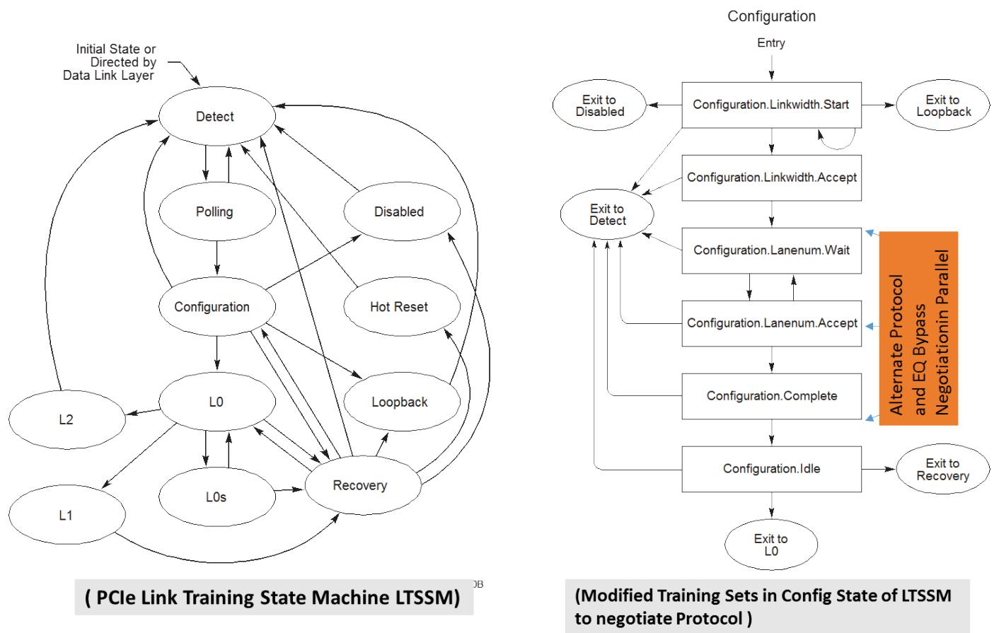  
Figure 4-45 Alternate Protocol Negotiation and Equalization Bypass LTSSM States§

Downstream Ports manage Alternate Protocol Negotiation and Training Set Messages based on the value of the Modified TS Usage Mode Selected field when the Port is in Configuration.Lanenum.Wait, Configuration.Lanenum.Accept, and Configuration.Complete substates with LinkUp = 0.

Upstream Ports must respond to unsupported Modified TS Usage values by transmitting Modified TS Usage 000b.

If Modified TS Usage Mode Selected is:

## 000b

No Alternate Protocol Negotiation or Training Set Message occurs. The link will operate as a PCI Express Link.

## 001b

Training Set Messages are enabled. Modified TS Information 1 and Modified TS Information 2 fields carry the vendor specific messages defined by the Training Set Message Vendor ID field.

## 010b

Alternate Protocol Negotiation is enabled. Modified TS Information 1 and Modified TS Information 2 fields carry the alternate protocol details defined by the Alternate Protocol Vendor ID field. A protocol request or response is associated with the protocol defined by the Alternate Protocol Vendor ID field.

The Alternate Protocol Negotiation Status field indicates the progress of the negotiation protocol.

## others

Reserved

A Downstream Port that supports Alternate Protocol Negotiation will start the negotiation process when it first enters Configuration.Lanenum.Wait, LinkUp = 0, and Modified TS Usage Mode Selected field is 010b. Starting negotiation consists of sending Modified TS1/TS2 Ordered Sets with Modified TS Usage = 010b.

Table 4-30 Modified TS Information 1 field in Modified TS1/TS2 Ordered Sets if Modified TS Usage = 010b (Alternate Protocol) §

<table><tr><td>Bits</td><td>Field</td><td colspan="3">Description</td></tr><tr><td rowspan="11">4:3</td><td rowspan="11">Alternate Protocol Negotiation Status</td><td colspan="3">For Modified TS1 Ordered Sets:</td></tr><tr><td>00b</td><td>DP</td><td>Indicates a protocol request from the Downstream Port asking whether the Upstream Port supports a particular alternate protocol.</td></tr><tr><td></td><td>UP</td><td>Indicates that the Upstream Port does not have an answer for a protocol request yet. This occurs either when it is evaluating the protocol request or it has not received two consecutive Modified TS1s to perform the evaluation. In the former case, Alternate Protocol Vendor ID and Alternate Protocol Details reflect what it received, while Modified TS Information 2 is protocol specific. In the latter case, all 3 fields must be 0.</td></tr><tr><td>01b</td><td>DP</td><td>Reserved</td></tr><tr><td></td><td>UP</td><td>Indicates that the Upstream Port does not support the requested protocol. Alternate Protocol Vendor ID and Alternate Protocol Details reflect what it received. Modified TS Information 2 must be all 0s.</td></tr><tr><td>10b</td><td>DP</td><td>Reserved</td></tr><tr><td></td><td>UP</td><td>Indicates that the Upstream Port supports the requested protocol. Alternate Protocol Vendor ID and Alternate Protocol Details reflect what it received, while Modified TS Information 2 field is protocol specific.</td></tr><tr><td>11b</td><td>Reserved</td><td></td></tr><tr><td colspan="3">For Modified TS2 Ordered Sets:</td></tr><tr><td>00b</td><td colspan="2">Indicates a protocol confirmation from the Downstream Port as well as the Upstream Port. Behavior is undefined if the Downstream Port had not earlier received status 10b for this protocol in this instance of protocol negotiation during the Modified TS1 Ordered Sets. Similarly, behavior is undefined if the Upstream Port had not earlier transmitted status 10b for this protocol in this instance of protocol negotiation during the Modified TS1 Ordered Sets. No protocol is selected unless the Downstream Port sends and receives a protocol confirmation in the Modified TS2 Ordered Sets. If the Downstream Port decides not to use any Alternate Protocol, it must indicate this by transmitting Modified TS2 Ordered Set with Modified TS Usage of 000b or 001b.</td></tr><tr><td>01b, 10b, 11b</td><td>Reserved</td><td></td></tr><tr><td>15:5</td><td>Alternate Protocol Details</td><td colspan="3">Alternate Protocol Details is Modified TS Usage = 010b.</td></tr></table>

If Modified TS Usage = 001b, then Modified TS Information 1 and Modified TS Information 2 contain details of the training set messages.

Alternate Protocol Negotiation must be concurrent with the Lane number negotiation. The Downstream Port is responsible for ensuring that they arrive at a consensus on the Alternate Protocol Negotiation prior to transitioning to Configuration.Complete substate. It is permitted to fall back to PCIe protocol if the Alternate Protocol Negotiation does not arrive at a consensus. On a successful negotiation to alternate protocol, the Link moves to L0 at 2.5 GT/s, changes the data rate to the higher data rates, performing equalization, if needed and enters L0 at the highest data rate desired. After transmitting the SDS Ordered Set in the highest data rate after equalization has been performed, the Data Blocks will carry the alternate protocol and the Link will be under the control of the alternate protocol.

## 4.2.5.3 Electrical Idle Sequences (EIOS and EIEOS) §

Before a Transmitter enters Electrical Idle, it must always send an Electrical Idle Ordered Set Sequence (EIOSQ), unless otherwise specified. An Electrical Idle Ordered Set Sequence (EIOSQ) is defined as one EIOS if the current Data Rate is 2.5 GT/s, 8.0 GT/s, 16.0 GT/s, 32.0 GT/s, or 64.0 GT/s Data Rate, or two consecutive EIOSs if the current Data Rate is 5.0 GT/ s.

When using 8b/10b encoding, an EIOS is a K28.5 (COM) followed by three K28.3 (IDL) Symbols. Transmitters must transmit all Symbols of an EIOS. An EIOS is received when the COM and two of the three IDL Symbols are received. When using 128b/130b encoding, an EIOS is an Ordered Set block, as defined in § Table 4-32. When using 1b/1b encoding, an EIOS is an Ordered Set block, as defined in § Table 4-33. Transmitters must transmit all Symbols of an EIOS if additional EIOSs are to be transmitted following it. Transmitters must transmit Symbols 0-13 of an EIOS, but are permitted to terminate the EIOS anywhere in Symbols 14 or 15, when transitioning to Electrical Idle after it. An EIOS is considered received when Symbols 0-3 of an Ordered Set Block match the definition of an EIOS if the data rate is less than 64.0 GT/s. At 64.0 GT/s, the rules governing receipt of an EIOS appears in § Section 4.2.3.1.5 .

## IMPLEMENTATION NOTE:

## TRUNCATION OF EIOS ORDERED SET §

Truncation in the last EIOS is allowed to help implementations where a transmitter may terminate on an internal clock boundary that may not align on a Symbol boundary due to 128b/130b encoding. Truncation is okay since Receivers will just look at the first four Symbols to conclude it is an EIOS.

After transmitting the last Symbol of the last Electrical Idle Ordered Set, the Transmitter must be in a valid Electrical Idle state as specified by TTX-IDLE-SET-TO-IDLE (see § Table 8-7).

Table 4-31 Electrical Idle Ordered Set (EIOS) for 2.5 GT/s and 5.0 GT/s Data Rates§

<table><tr><td>Symbol Number</td><td>Encoded Values</td><td>Description</td></tr><tr><td>0</td><td>K28.5</td><td>COM for Symbol alignment</td></tr><tr><td>1</td><td>K28.3</td><td>IDL</td></tr><tr><td>2</td><td>K28.3</td><td>IDL</td></tr><tr><td>3</td><td>K28.3</td><td>IDL</td></tr></table>

Table 4-32 Electrical Idle Ordered Set (EIOS) for 128b/ § 130b Encoding

<table><tr><td>Symbol Numbers</td><td>Value</td><td>Description</td></tr><tr><td>0-15</td><td>66h</td><td>EIOS Identifier and Payload</td></tr></table>

Table 4-33 Electrical Idle Ordered Set (EIOS) for 1b/1b Encoding

<table><tr><td>Symbol Numbers</td><td>Value</td><td>Description</td></tr><tr><td>0, 2, 4, 6, 8, 10, 12, 14</td><td>0Fh</td><td>EIOS Identifier and Payload</td></tr><tr><td>1, 3, 5, 7, 9, 11, 13, 15</td><td>F0h</td><td>EIOS Identifier and Payload</td></tr></table>

§

Table 4-34 Electrical Idle Exit Ordered Set (EIEOS) for 5.0 GT/s Data Rate§

<table><tr><td>Symbol Number</td><td>Encoded Values</td><td>Description</td></tr><tr><td>0</td><td>K28.5</td><td>COM for Symbol alignment</td></tr><tr><td>1-14</td><td>K28.7</td><td>EIE - K Symbol with low frequency components for helping achieve exit from Electrical Idle</td></tr><tr><td>15</td><td>D10.2</td><td>TS1 Identifier (See Note 1)</td></tr></table>

Notes:

1. This symbol is not scrambled. Previous versions of this specification were less clear and some implementations may have incorrectly scrambled this symbol. It is recommended that devices be tolerant of receiving EIEOS in which this symbol is scrambled.

Table 4-35 Electrical Idle Exit Ordered Set (EIEOS) for 8.0 GT/s Data Rate§

<table><tr><td>Symbol Numbers</td><td>Value</td><td>Description</td></tr><tr><td>0, 2, 4, 6, 8, 10, 12, 14</td><td>00h</td><td>Symbol 0: EIEOS IdentifierA low frequency pattern that alternates between eight 0s and eight 1s.</td></tr><tr><td>1, 3, 5, 7, 9, 11, 13, 15</td><td>FFh</td><td>A low frequency pattern that alternates between eight 0s and eight 1s.</td></tr></table>

Table 4-36 Electrical Idle Exit Ordered Set (EIEOS) for 16.0 GT/s Data Rate§

<table><tr><td>Symbol Numbers</td><td>Value</td><td>Description</td></tr><tr><td>0, 1, 4, 5, 8, 9, 12, 13</td><td>00h</td><td>Symbol 0: EIEOS IdentifierA low frequency pattern that alternates between sixteen 0s and sixteen 1s.</td></tr><tr><td>2, 3, 6, 7, 10, 11, 14, 15</td><td>FFh</td><td>A low frequency pattern that alternates between sixteen 0s and sixteen 1s.</td></tr></table>

Table 4-37 Electrical Idle Exit Ordered Set (EIEOS) for 32.0 GT/s Data Rate§

<table><tr><td>Symbol Numbers</td><td>Value</td><td>Description</td></tr><tr><td>0, 1, 2, 3, 8, 9, 10, 11</td><td>00h</td><td>Symbol 0: EIEOS IdentifierA low frequency pattern that alternates between thirty-two 0s and thirty-two 1s.</td></tr><tr><td>4, 5, 6, 7, 12, 13, 14, 15</td><td>FFh</td><td>A low frequency pattern that alternates between thirty-two 0s and thirty-two 1s.</td></tr></table>

Table 4-38 Electrical Idle Exit Ordered Set (EIEOS) for 64.0 GT/s Data Rate§

<table><tr><td>Symbol Numbers</td><td>Value</td><td>Description</td></tr><tr><td>0 - 7</td><td>00h</td><td>Voltage level 0 for 32 UI</td></tr><tr><td>8 - 15</td><td>FFh</td><td>Voltage level 3 for 32 UI</td></tr></table>

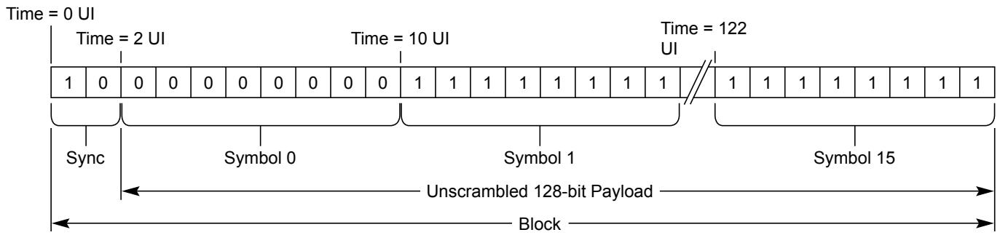

<details>
<summary>text_image</summary>

Time = 0 UI
Time = 2 UI
Time = 10 UI
Time = 122 UI
1 0 0 0 0 0 0 0 0 1 1 1 1 1 1 1 1 1 1
Sync Symbol 0 Symbol 1 Symbol 15
Unscrambled 128-bit Payload
Block
</details>

(Electrical Idle Exit Ordered Set at 8.0 GT/s Data Rate)

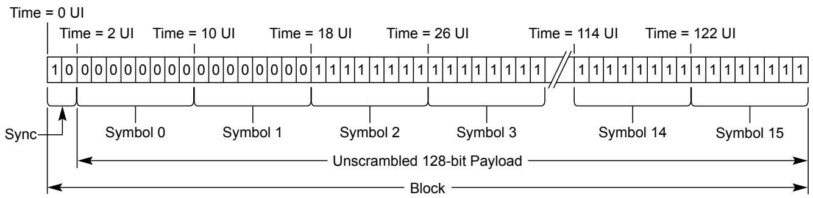

<details>
<summary>text_image</summary>

Time = 0 UI
Time = 2 UI Time = 10 UI Time = 18 UI Time = 26 UI Time = 114 UI Time = 122 UI
1 0 0 0 0 0 0 0 0 0 0 1 1 1 1 1 1 1 1 1 1 1 1 1 1 1 1 1 1 1
Sync Symbol 0 Symbol 1 Symbol 2 Symbol 3 Symbol 14 Symbol 15
Unscrambled 128-bit Payload
Block
</details>

(Electrical Idle Exit Ordered Set at 16.0 GT/s Data Rate)  
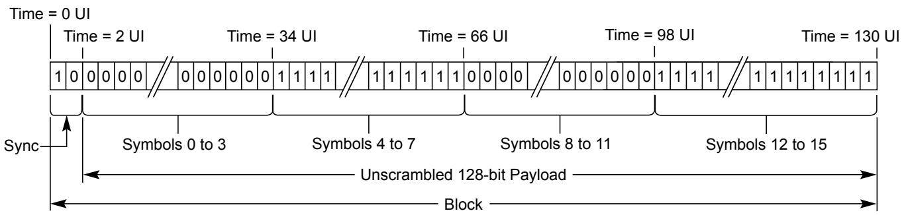

<details>
<summary>text_image</summary>

Time = 0 UI
Time = 2 UI
Time = 34 UI
Time = 66 UI
Time = 98 UI
Time = 130 UI
Sync
Symbols 0 to 3
Symbols 4 to 7
Symbols 8 to 11
Symbols 12 to 15
Unscrambled 128-bit Payload
Block
</details>

(Electrical Idle Exit Ordered Set at 32.0 GT/s Data Rate)  
Figure 4-46 Electrical Idle Exit Ordered Set for 8.0 GT/s to 32.0 GT/s Data Rates (EIEOS)§

The Electrical Idle Exit Ordered Set (EIEOS) is transmitted only when operating at speeds other than 2.5 GT/s. It is a low frequency pattern transmitted periodically to help ensure that receiver Electrical Idle exit detection circuitry can detect an exit from Electrical Idle. When using 128b/130b encoding, it is also used for Block Alignment as described in § Section 4.2.2.2.1 .

An Electrical Idle Exit Ordered Set Sequence (EIEOSQ) comprises of two consecutive EIEOS for the Data Rate of 32.0 GT/s and one EIEOS for 5.0 GT/s, 8.0 GT/s, and 16.0 GT/s. The two EIEOS at 32.0 GT/s must be back to back and uninterrupted in order to be considered consecutive and form an EIEOSQ. Irrespective of the length of the EIEOSQ, block alignment still occurs on an EIEOS.

At the Data Rate of 64.0 GT/s, an EIEOSQ is defined as follows:

• On entry to Recovery.RcvrLock from Recovery.Speed or L1 until the Receiver detects exit Electrical Idle on all Lanes or receives two consecutive valid TS1 Ordered Sets on any Lane:

◦ Four consecutive EIEOS, uninterrupted by any other Ordered Set including the Control SKP Ordered Set

• While increasing Link Width with L0p till the Receiver detects exit Electrical Idle on all Lanes that need to be activated or receives two consecutive valid TS1 Ordered Sets on any Lane that needs to be activated:

◦ Four consecutive EIEOS, uninterrupted by any other Ordered Set including the Control SKP Ordered Set

• On entry to the Loopback state from electrical idle till the Receiver detects exit Electrical Idle on all Lanes that need to be activated or receives two consecutive valid TS1 Ordered Sets on any Lane:

◦ Four consecutive EIEOS, uninterrupted by any other Ordered Set including the Control SKP Ordered Set

• Else one EIEOS

When using 8b/10b encoding and operating at 5.0 GT/s, an EIEOSQ, as defined in § Table 4-34, is transmitted in the following situations:

• Before the first TS1 Ordered Set after entering the LTSSM Configuration.Linkwidth.Start state.

• Before the first TS1 Ordered Set after entering the LTSSM Recovery.RcvrLock state.

• After every 32 TS1 or TS2 Ordered Sets are transmitted in the LTSSM Configuration.Linkwidth.Start, Recovery.RcvrLock, and Recovery.RcvrCfg states. The TS1/TS2 count is set to 0 when:

◦ An EIEOS is transmitted.

◦ The first TS2 Ordered Set is received while in the LTSSM Recovery.RcvrCfg state.

When using 128b/130b encoding, an EIEOSQ, as defined in § Table 4-35 through § Table 4-37 and § Figure 4-46, is transmitted in the following situations:

• Before the first TS1 Ordered Set after entering the LTSSM Configuration.Linkwidth.Start substate.

• Before the first TS1 Ordered Set after entering the LTSSM Recovery.RcvrLock substate.

• Immediately following an EDS Framing Token in Non-Flit Mode when ending a Data Stream and not transmitting an EIOS and not entering the LTSSM Recovery.RcvrLock substate.

• At the scheduled Ordered Set interval to end a Data Stream in Flit Mode.

• After every 32 TS1 or TS2 Ordered Sets are transmitted in all LTSSM states which require transmission of TS1 or TS2 Ordered Sets. The TS1/TS2 count is set to 0 when:

◦ An EIEOS is transmitted.  
◦ The first TS2 Ordered Set is received while in the LTSSM Recovery.RcvrCfg state.  
◦ The first TS2 Ordered Set is received while in the LTSSM Configuration.Complete state.  
◦ A Downstream Port is in Phase 2 of the LTSSM Recovery.Equalization state and two consecutive TS1 Ordered Sets are received on any Lane with the Reset EIEOS Interval Count bit set.

◦ An Upstream Port is in Phase 3 of the LTSSM Recovery.Equalization state and two consecutive TS1 Ordered Sets are received on any Lane with the Reset EIEOS Interval Count bit set.

• After every 65,536 TS1 Ordered Sets are transmitted in the LTSSM Recovery.Equalization state if the Reset EIEOS Interval Count bit has prevented it from being transmitted for that interval. Implementations are permitted to satisfy this requirement by transmitting an EIEOSQ within two TS1 Ordered Sets of whenever the current scrambling LFSR matches its seed value.  
• As part of an FTS Ordered Set, Compliance Pattern, or Modified Compliance Pattern as described in the relevant sections.

When using 1b/1b encoding, an EIEOSQ, as defined in § Table 4-38 is transmitted in the following situations:

• Before the first TS1 Ordered Set after entering the LTSSM Configuration.Linkwidth.Start substate.  
• Before the first TS1 Ordered Set after entering the LTSSM Recovery.RcvrLock substate.  
• Before the first TS0 Ordered Set after entering Recovery.Equalization substate.  
• At the scheduled Ordered Set interval to indicate the end of the Data Stream.  
• After every 32 TS1, TS2, or TS0 Ordered Sets are transmitted in all LTSSM states which require transmission of TS1, TS2, or TS0 Ordered Sets. The TS1/TS2/TS0 count is set to 0 when:

◦ An EIEOS is transmitted.  
◦ The first TS2 Ordered Set is received while in the LTSSM Recovery.RcvrCfg state.  
◦ The first TS2 Ordered Set is received while in the LTSSM Configuration.Complete state.  
◦ The first TS1 Ordered Set is received while in the LTSSM Recovery.Equalization state if the TS1 Ordered Set is received after TS0 Ordered Sets.  
◦ A Downstream Port is in Phase 2 of the LTSSM Recovery.Equalization state and two consecutive TS0 Ordered Sets are received on any Lane with the Reset EIEOS Interval Count bit set.  
◦ An Upstream Port is in Phase 3 of the LTSSM Recovery.Equalization state and two consecutive TS1 Ordered Sets are received on any Lane with the Reset EIEOS Interval Count bit set.

• After every 65,536 TS1 Ordered Sets are transmitted in the LTSSM Recovery.Equalization state if the Reset EIEOS Interval Count bit has prevented it from being transmitted for that interval. Implementations are permitted to satisfy this requirement by transmitting an EIEOSQ within two TS1 Ordered Sets of whenever the current scrambling LFSR matches its seed value.

• As part of a Compliance Pattern, or Modified Compliance Pattern as described in the relevant sections.

Example: An LTSSM enters Recovery.RcvrLock from L0 in 5.0 GT/s data rate. It transmits an EIEOS followed by TS1 Ordered Sets. It transmits 32 TS1 Ordered Sets following which it transmits the second EIEOS. Subsequently it sends two more TS1 Ordered Sets and enters Recovery.RcvrCfg where it transmits the third EIEOS after transmitting 30 TS2 Ordered Sets. It transmits 31 more TS2 Ordered Sets (after the first 30 TS2 Ordered Sets) in Recovery.RcvrCfg when it receives a TS2 Ordered Set. Since it receives its first TS2 Ordered Set, it will reset its EIEOS interval count to 0 and keep transmitting another 16 TS2 Ordered Sets before transitioning to Recovery.Idle. Thus, it did not send an EIEOS in the midst of the last 47 TS2 Ordered Sets since the EIEOS interval count got reset to 0. From Recovery.Idle, the LTSSM transitions to Configuration.Linkwidth.Start and transmits an EIEOS after which it starts transmitting the TS1 Ordered Sets.

While operating in speeds other than 2.5 GT/s, an implementation is permitted to not rely on the output of the Electrical Idle detection circuitry except when receiving the EIEOS during certain LTSSM states or during the receipt of the FTS prepended by the four consecutive EIE Symbols (see § Section 4.2.5.6 ) at the Receiver during Rx L0s or the Modified Compliance Pattern in Polling.Compliance when the circuitry is required to signal an exit from Electrical Idle.

## 4.2.5.4 Inferring Electrical Idle §

A device is permitted in all speeds of operation to infer Electrical Idle instead of detecting Electrical Idle using analog circuitry. § Table 4-39 summarizes the conditions to infer Electrical Idle in the various substates.

Table 4-39 Electrical Idle Inference Conditions§

<table><tr><td>State</td><td>2.5 GT/s</td><td>5.0 GT/ S</td><td>8.0 GT/s and higher data rates</td></tr><tr><td>L0</td><td colspan="3">Absence of at least one of:an UpdateFC DLLP,an Optimized_Update_FC (in Flit Mode), ora SKP Ordered Setin a 128 μs window</td></tr><tr><td>Recovery.RcvrCfg</td><td colspan="2">Absence of a TS1 or TS2 Ordered Set in a 1280 UI interval</td><td>Absence of a TS1 or TS2 Ordered Set in a 4 ms window</td></tr><tr><td>Recovery.Speed when successful_speed_negotiation = 1b</td><td colspan="2">Absence of a TS1 or TS2 Ordered Set in a 1280 UI interval</td><td>Absence of a TS1 or TS2 Ordered Set in a 4680 UI interval</td></tr><tr><td>Recovery.Speed when successful_speed_negotiation = 0b</td><td>Absence of an exit from Electrical Idle in a 2000 UI interval</td><td colspan="2">Absence of an exit from Electrical Idle in a 16000 UI interval</td></tr><tr><td>Loopback.Active (as Follower)</td><td>Absence of an exit from Electrical Idle in a 128 μs window</td><td>N/A</td><td>N/A</td></tr></table>

The Electrical Idle exit condition must not be determined based on inference of Electrical Idle condition. For area efficiency, an implementation is permitted to choose to implement a common timeout counter per LTSSM and look for the Electrical Idle inference condition within the common timeout window determined by the common counter for each of the Lanes the LTSSM controls instead of having a timeout counter per Lane.

## IMPLEMENTATION NOTE: INFERENCE OF ELECTRICAL IDLE §

In the L0 state, one or more Flow Control Update DLLPs are expected to be received in a 128 μs window. Also in L0, one or more SKP Ordered Sets are expected to be received in a 128 μs window. As a simplification, it is permitted to use either one (or both) of these indicators to infer Electrical Idle. Hence, the absence of a Flow Control Update DLLP and/or a SKP Ordered Set in any 128 μs window can be inferred as Electrical Idle. In Recovery.RcvrCfg as well as Recovery.Speed with successful speed negotiation, the Receiver should receive TS1 or TS2 Ordered Sets continuously with the exception of the EIEOS and the SKP Ordered Set. Hence, the absence of a TS1 or TS2 Ordered Set in the interval specified above must be treated as Electrical Idle for components that implement the inference mechanism. In the event that the device enters Recovery.Speed with successful\_speed\_negotiation = 0b, there is a possibility that the device had failed to receive Symbols. Hence, the Electrical Idle inference is done as an absence of exit from Electrical Idle. In data rates other than 2.5 GT/s, Electrical Idle exit is guaranteed only on receipt of an EIEOS. Hence, the window is set to 16000 UI for detecting an exit from Electrical Idle in 5.0 GT/s and above data rates. In 2.5 GT/s data rate, Electrical Idle exit must be detected with every Symbol received. Hence, absence of Electrical Idle exit in a 2000 UI window constitutes an Electrical Idle condition.

## 4.2.5.5 Lane Polarity Inversion §

During the training sequence in Polling, the Receiver looks at Symbols 6-15 of the TS1 and TS2 Ordered Sets as the indicator of Lane polarity inversion (D+ and D- are swapped). If Lane polarity inversion occurs, the TS1 Symbols 6-15 received will be D21.5 as opposed to the expected D10.2. Similarly, if Lane polarity inversion occurs, Symbols 6-15 of the TS2 Ordered Set will be D26.5 as opposed to the expected D5.2. This provides the clear indication of Lane polarity inversion.

If polarity inversion is detected the Receiver must invert the received data. The Transmitter must never invert the transmitted data. Support for Lane Polarity Inversion is required on all PCI Express Receivers across all Lanes independently.

## 4.2.5.6 Fast Training Sequence (FTS) §

Fast Training Sequence (FTS) is the mechanism that is used for bit and Symbol lock when transitioning from L0s to L0. The FTS is used by the Receiver to detect the exit from Electrical Idle and align the Receiver’s bit and Symbol receive circuitry to the incoming data. Refer to § Section 4.2.6 for a description of L0 and L0s.

## • At 2.5 GT/s and 5.0 GT/s data rates:

A single FTS is comprised of one K28.5 (COM) Symbol followed by three K28.1 Symbols. The maximum number of FTSs (N\_FTS) that a component can request is 255, providing a bit time lock of 4 \* 255 \* 10 \* UI. If the data rate is 5.0 GT/s, four consecutive EIE Symbols are transmitted at valid signal levels prior to transmitting the first FTS. These Symbols will help the Receiver detect exit from Electrical Idle. An implementation that does not guarantee proper signaling levels for up to the allowable time on the Transmitter pins (see § Section 4.2.5.6 ) since exiting Electrical Idle condition is required to prepend its first FTS by extra EIE Symbols so that the Receiver can receive at least four EIE Symbols at valid signal levels. Implementations must not transmit more than eight EIE Symbols prior to transmitting the first FTS. A component is permitted to advertise different N\_FTS rates at different speeds. At 5.0 GT/s, a component may choose to advertise an appropriate N\_FTS number considering that it will receive the four EIE Symbols. 4096 FTSs must be sent when the Extended Synch bit is Set in order to provide external Link monitoring tools with enough time to achieve bit and framing

synchronization. SKP Ordered Sets must be scheduled and transmitted between FTSs as necessary to meet the definitions in § Section 4.2.8 with the exception that no SKP Ordered Sets can be transmitted during the first N\_FTS FTSs. A single SKP Ordered Set is always sent after the last FTS is transmitted. It is permitted for this SKP Ordered Set to affect or not affect the scheduling of subsequent SKP Ordered Sets for Clock Tolerance Compensation by the Transmitter as described in § Section 4.2.8 . Note that it is possible that two SKP Ordered Sets can be transmitted back to back (one SKP Ordered Set to signify the completion of the 4096 FTSs and one scheduled and transmitted to meet the definitions described in § Section 4.2.8 ).

## • At 8.0 GT/s, 16.0 GT/s, or 32.0 GT/s data rates:

A single FTS is a 130-bit unscrambled Ordered Set Block, as shown in § Table 4-40. The maximum number of FTSs (N\_FTS) that a component can request is 255, providing a bit time lock of 130 \* 255 UI (130 \* 263 or 273 UI if including the periodic EIEOS). A component is permitted to advertise different N\_FTS values at different speeds. On exit from L0s, the transmitter first transmits an EIEOSQ which will help the receiver detect exit from Electrical Idle due to its low frequency content. After that first EIEOSQ, the transmitter must send the required number of FTS (4096 when the Extended Synch bit is Set; otherwise N\_FTS), with an EIEOSQ transmitted after every 32 FTS. The FTS sequence will enable the receiver obtain bit lock (and optionally to do Block alignment). When the Extended Synch bit is Set, SKP Ordered Sets must be scheduled and transmitted between FTSs and EIEOSQ as necessary to meet the definitions in § Section 4.2.8 . The last FTS Ordered Set of the FTS sequence, if any (no FTS Ordered Sets are sent if N\_FTS is equal to zero), is followed by a final EIEOSQ that will help the receiver acquire Block alignment. Implementations are permitted to send two EIEOS back to back even at a data rate below 32.0 GT/s following the last FTS Ordered Set if the N\_FTS is a multiple of 32. The EIEOS resets the scrambler in both the Transmitter as well as the Receiver. Following the final EIEOSQ, an SDS Ordered Set is transmitted to help the receiver perform de-skew and to indicate the transition from Ordered Sets to Data Stream. After the SDS Ordered Set is transmitted, a Data Block must be transmitted.

## IMPLEMENTATION NOTE:

## SCRAMBLING LFSR DURING FTS TRANSMISSION IN 128B/ 130B ENCODING §

Since the scrambler is reset on the last EIEOS, and none of the Ordered Set in the FTS sequence is scrambled, it does not matter whether implementations choose to advance the scrambler or not during the time FTS is received.

Table 4-40 FTS for 8.0 GT/ s and Above Data Rates §

<table><tr><td>Symbol Number</td><td>Value</td></tr><tr><td>0</td><td>55h</td></tr><tr><td>1</td><td>47h</td></tr><tr><td>2</td><td>4Eh</td></tr><tr><td>3</td><td>C7h</td></tr><tr><td>4</td><td>CCh</td></tr><tr><td>5</td><td>C6h</td></tr><tr><td>6</td><td>C9h</td></tr><tr><td>7</td><td>25h</td></tr><tr><td>8</td><td>6Eh</td></tr><tr><td>9</td><td>ECh</td></tr><tr><td>10</td><td>88h</td></tr><tr><td>11</td><td>7Fh</td></tr><tr><td>12</td><td>80h</td></tr><tr><td>13</td><td>8Dh</td></tr><tr><td>14</td><td>8Bh</td></tr><tr><td>15</td><td>8Eh</td></tr></table>

N\_FTS defines the number of FTSs that must be transmitted when transitioning from L0s to L0. At the 2.5 GT/s data rate, the value that can be requested by a component corresponds to a Symbol lock time of 16 ns (N\_FTS set to 0b and one SKP Ordered Set) to \~4 μs (N\_FTS set to 255), except when the Extended Synch bit is Set, which requires the transmission of 4096 FTSs resulting in a bit lock time of 64 μs. For 8.0 GT/s and above data rates, when the Extended Synch bit is Set, the transmitter is required to send 4096 FTS Ordered Set Blocks. Note that the N\_FTS value reported by a component may change; for example, due to software modifying the value in the Common Clock Configuration bit (see § Section 7.5.3.7 ).

If the N\_FTS period of time expires before the Receiver obtains bit lock, Symbol lock or Block alignment, and Lane-to-Lane de-skew on all Lanes of the configured Link, the Receiver must transition to the Recovery state. This sequence is detailed in the LTSSM in § Section 4.2.6 .

## 4.2.5.7 Start of Data Stream Ordered Set (SDS Ordered Set) §

The Start of Data Stream (SDS) Ordered Set, described in § Table 4-41, § Table 4-42, and § Table 4-43 is defined only for 128b/130b encoding and 1b/1b encoding. It is transmitted in the Configuration.Idle, Recovery.Idle, and Tx\_L0s.FTS LTSSM states to define the transition from Ordered Set Blocks to a Data Stream, and Loopback Leads are permitted to transmit it as described in § Section 4.2.2.6 . It must not be transmitted at any other time. While not in the Loopback state, the Block following an SDS Ordered Set must be a Data Block in Non-Flit Mode, and the first Symbol of that Data Block is the first Symbol of the Data Stream. In 1b/1b encoding, the Transmitter must send two back to back SDS when the conditions to send an SDS are met. The SDS Ordered Set in 1b/1b encoding must be on an aligned 128b (16B) boundary. An SDS Ordered Set sequence refers to either the single SDS Ordered set with 128b/130b encoding or the two back to back SDS Ordered Sets with 1b/1b encoding. In Flit Mode, with 128b/130b encoding and 1b/1b encoding, a Control SKP Ordered Set must be sent after the SDS Ordered Set. The first Symbol of the Data Stream starts immediately after the Control SKP Ordered Set. With 1b/1b encoding, a Receiver considers an SDS valid if four good B1\_C6\_C6\_C6 (4B) sets are received, at least two of which are in an even 4 byte aligned position (i.e., bytes 0-3, 8-11), with 1b/1b encoding.

Table 4-41 SDS Ordered Set (for 8.0 GT/s and 16.0 GT/s Data Rate)§

<table><tr><td>Symbol Number</td><td>Value</td><td>Description</td></tr><tr><td>0</td><td>E1h</td><td>SDS Ordered Set Identifier</td></tr><tr><td>1-15</td><td>55h</td><td>Body of SDS Ordered Set</td></tr></table>

Table 4-42 SDS Ordered Set (for 32.0 GT/s)§

<table><tr><td>Symbol Number</td><td>Value</td><td>Description</td></tr><tr><td>0</td><td>E1h</td><td>SDS Ordered Set Identifier</td></tr><tr><td>1-15</td><td>87h</td><td>Body of SDS Ordered Set</td></tr></table>

Table 4-43 SDS Ordered Set (for 64.0 GT/s)§

<table><tr><td>Symbol Number</td><td>Value</td><td>Description</td></tr><tr><td>0, 4, 8, 12</td><td>B1h</td><td>SDS Ordered Set Identifier</td></tr><tr><td>1-3, 5-7, 9-11, 13-15</td><td>C6h</td><td>Body of SDS Ordered Set</td></tr></table>

## 4.2.5.8 Link Error Recovery §

• Link Errors, when operating with 8b/10b encoding are:

◦ 8b/10b decode errors, Framing Errors, loss of Symbol lock, Elasticity Buffer Overflow/Underflow, or loss of Lane-to-Lane de-skew.  
◦ 8b/10b decode errors must be checked and trigger a Receiver Error in specified LTSSM states (see § Table 4-48), which is a reported error associated with the Port (see § Section 6.2 ). Triggering a Receiver Error on any or all of Framing Error, loss of Symbol Lock, Lane De-skew Error, and Elasticity Buffer Overflow/Underflow is optional.

• Link Errors, when operating with 128b/130b encoding, are:

◦ Framing Errors, loss of Block Alignment, Elasticity Buffer Overflow/Underflow, or loss of Lane-to-Lane de-skew.  
◦ Framing errors must be checked and trigger a Receiver Error in the LTSSM states specified in § Table 4-48. The Receiver Error is a reported error associated with the Port (see § Section 6.2 ). Triggering a Receiver Error on any of all of loss of Block Alignment, Elasticity Buffer Overflow/Underflow, and loss of Lane-to-Lane de-skew is optional.

• Link Errors, when operating with 1b/1b encoding, are:

◦ Framing Errors, Elasticity Buffer Overflow/Underflow, or loss of Lane-to-Lane de-skew.  
◦ Framing errors must be checked and trigger a Receiver Error in the LTSSM states specified in § Table 4-48. The Receiver Error is a reported error associated with the Port (see § Section 6.2 ). Triggering a Receiver Error on any of all of Elasticity Buffer Overflow/Underflow, and loss of Lane-to-Lane de-skew is optional.

• On a configured Link, which is in L0, error recovery will at a minimum be managed in a Layer above the Physical Layer (as described in § Section 3.6 ) by directing the Link to transition to Recovery.

◦ Note: Link Errors may also result in the Physical Layer initiating an LTSSM state transition from L0 to Recovery.

• All LTSSM states other than L0 make progress 65 when Link Errors occur.

◦ When operating with 8b/10b encoding, Link Errors that occur in LTSSM states other than L0 must not result in the Physical Layer initiating an LTSSM state transition.  
◦ When operating with 128b/130b encoding and not processing a Data Stream, Link Errors that occur in LTSSM states other than L0 must not result in the Physical Layer initiating an LTSSM state transition.

• When operating with 8b/10b encoding, if a Lane detects an implementation specific number of 8b/10b errors, Symbol lock must be verified or re-established as soon as possible. 66

## 4.2.5.9 Reset §

Reset is described from a system point of view in § Section 6.6 .

## 4.2.5.9.1 Fundamental Reset §

When Fundamental Reset is asserted:

• The Receiver terminations are required to meet ZRX-HIGH-IMP-DC-POS and ZRX-HIGH-IMP-DC-NEG (see § Table 8-11).  
• The Transmitter is required only to meet ITX-SHORT (see § Table 8-7).  
• The Transmitter holds a constant DC common mode voltage. 67

When Fundamental Reset is deasserted:

• The Port LTSSM (see § Section 4.2.6 ) is initialized (see § Section 6.6.1 for additional requirements).

## 4.2.5.9.2 Hot Reset §

Hot Reset is a protocol reset defined in § Section 4.2.6.12 .

## 4.2.5.10 Link Data Rate Negotiation §

All devices are required to start Link initialization using a 2.5 GT/s data rate on each Lane. A field in the training sequence Ordered Set (see § Section 4.2.5.1 ) is used to advertise all supported data rates. The Link trains to L0 initially in 2.5 GT/s data rate after which a data rate change occurs by going through the Recovery state.

## 4.2.5.11 Link Width and Lane Sequence Negotiation §

PCI Express Links must consist of 1, 2, 4, 8, or 16 Lanes in parallel, referred to as x1, x2, x4, x8, and x16 Links, respectively. All Lanes within a Link must simultaneously transmit data based on the same frequency with a skew between Lanes not to exceed LTX-SKEW (§ Table 8-6). The negotiation process is described as a sequence of steps.

The negotiation establishes values for Link number and Lane number for each Lane that is part of a valid Link; each Lane that is not part of a valid Link exits the negotiation to become a separate Link or remains in Electrical Idle.

During Link width and Lane number negotiation, the two communicating Ports must accommodate the maximum allowed Lane-to-Lane skew as specified by LRX-SKEW in § Table 8-11.

Optional Link negotiation behaviors include Lane reversal, variable width Links, splitting of Ports into multiple Links and the configuration of a crosslink.

Other specifications may impose other rules and restrictions that must be comprehended by components compliant to those other specifications; it is the intent of this specification to comprehend interoperability for a broad range of component capabilities.

## 4.2.5.11.1 Required and Optional Port Behavior §

• The ability for a xN Port to form a xN Link as well as a x1 Link (where N can be 16, 8, 4, 2, and 1) is required.

Designers must connect Ports between two different components in a way that allows those components to meet the above requirement. If the Ports between components are connected in ways that are not consistent with intended usage as defined by the component’s Port descriptions/ data sheets, behavior is undefined.

• The ability for a xN Port to form any Link width between N and 1 is optional.

◦ An example of this behavior includes a x16 Port which can only configure into only one Link, but the width of the Link can be configured to be x8, x4, x2 as well as the required widths of x16 and x1.

• The ability to split a Port into two or more Links is optional.

◦ An example of this behavior would be a x16 Port that may be able to configure two x8 Links, four x4 Links, or 16 x1 Links.

• Support for Lane reversal is optional.

◦ If implemented, Lane reversal must be done for both the Transmitter and Receiver of a given Port for a multi-Lane Link.  
◦ An example of Lane reversal consists of Lane 0 of an Upstream Port attached to Lane N-1 of a Downstream Port where either the Downstream or Upstream device may reverse the Lane order to configure a xN Link.

Support for formation of a crosslink is optional. In this context, a Downstream Port connected to a Downstream Port or an Upstream Port connected to an Upstream Port is a crosslink.

Current and future electromechanical and/or form factor specifications may require the implementation of some optional features listed above. Component designers must read the specifications for the systems that the component(s) they are designing will used in to ensure compliance to those specifications.

## 4.2.5.12 Lane-to-Lane De-skew §

The Receiver must compensate for the allowable skew between all Lanes within a multi-Lane Link (see § Table 8-7 and § Table 8-11) before delivering the data and control to the Data Link Layer.

When using 8b/10b encoding, an unambiguous Lane-to-Lane de-skew mechanism may use one or more of the following:

• The COM Symbol of a received TS1 or TS2 Ordered Set  
• The COM Symbol of a received Electrical Idle Exit Ordered Set  
• The COM Symbol of the first received SKP Ordered Set after an FTS sequence  
• The COM Symbol of a received SKP Ordered Set during a training sequence when not using SRIS.

When using 128b/130b encoding, an unambiguous Lane-to-Lane de-skew mechanism may use one or more of the following:

• A received SDS Ordered Set  
• A received Electrical Idle Exit Ordered Set except when exiting L0s

• The first received Electrical Idle Exit Ordered Set after an FTS Ordered Set when exiting L0s  
• When operating at 8.0 GT/s, a received SKP Ordered Set  
• When operating at a data rate of 16.0 GT/s or higher, the first received SKP Ordered Set after an FTS sequence  
• When operating at a data rate of 16.0 GT/s or higher, a received SKP Ordered Set except when:

◦ exiting a training sequence or  
◦ two SKP Ordered Sets are separated by an EDS

When using 1b/1b encoding, an unambiguous Lane-to-Lane de-skew mechanism may use one or more of the following:

• A received SDS Ordered Set  
• A received Electrical Idle Exit Ordered Set  
• A received Control SKP Ordered Set

Other de-skew mechanisms may also be employed, provided they are unambiguous. Lane-to-Lane de-skew must be performed during Configuration, Recovery, and L0s in the LTSSM.

## IMPLEMENTATION NOTE:

## UNAMBIGUOUS LANE-TO-LANE DE-SKEW: §

The max skew at 2.5 GT/s that a receiver must be able to de-skew is 20 ns. A nominal SKP Ordered Set (i.e., one that does not have SKP Symbols added or removed by a Retimer) is 4 Symbols long, or 16 ns, at 2.5 GT/s. Generally SKP Ordered Sets are transmitted such that they are well spaced out, and no particular care is needed to use them for de-skew (i.e., they provide an unambiguous mechanism). If back-to-back SKP Ordered Sets are transmitted, an implementation that simply looks for the COM of the SKP Ordered Set to occur on each Lane at the same point in time may fail. When exiting L0s a transmitter may send back-to-back SKP Ordered Sets after the last FTS Ordered Set of the Fast Training Sequence. De-skew must be obtained in L0s, therefore the implementation must comprehend back-to-back SKP Ordered Sets when performing de-skew in this case.

Exceptions to the unambiguous mechanism in § Section 4.2.5.12 occur because back-to-back Ordered Sets might be sent (i.e., EIEOS might be sent back-to-back when exiting L0s when using 128b/130b encoding.) EIEOS can still be used for de-skew in this case, however the implementation must comprehend back-to-back EIEOS when performing de-skew.

When operating at a data rate of 16.0 GT/s or higher, a transmitter may send back-to-back SKP Ordered Sets at the end of a Training Sequence (e.g., TS2 Ordered Set, SKP Ordered Set, SKP Ordered Set, SDS Ordered Set). Implementations that choose to use SKP Ordered Sets for de-skew in this case are recommended to recognize that the back-to-back SKP Ordered Sets are different (i.e., Standard SKP Ordered Set followed by Control SKP Ordered Set).

## 4.2.5.13 Lane vs. Link Training §

The Link initialization process builds unassociated Lanes of a Port into associated Lanes that form a Link. For Lanes to configure properly into a desired Link, the TS1 and TS2 Ordered Sets must have the appropriate fields (Symbol 3, 4, and 5) set to the same values on all Lanes.

Links are formed at the conclusion of Configuration.

• If the optional behavior of a Port being able to configure multiple Links is employed, the following observations can be made:

◦ A separate LTSSM is needed for each separate Link that is desired to be configured by any given Port.  
◦ The LTSSM Rules are written for configuring one Link. The decision to configure Links in a serial fashion or parallel is implementation specific.

## 4.2.6 Link Training and Status State Machine (LTSSM) Descriptions §

The LTSSM states are illustrated in § Figure 4-48. These states are described in following sections.

All timeout values specified for the Link Training and Status state machine (LTSSM) are minus 0 seconds and plus 50% unless explicitly stated otherwise. All timeout values must be set to the specified values after Fundamental Reset. All counter values must be set to the specified values after Fundamental Reset.

## 4.2.6.1 Detect Overview §

The purpose of this state is to detect when a far end termination is present.

## 4.2.6.2 Polling Overview §

The Port transmits training Ordered Sets and responds to the received training Ordered Sets. In this state, bit lock and Symbol lock are established and Lane polarity is configured.

The Polling state includes Polling.Compliance (see § Section 4.2.7.2.2 ). This state is intended for use with test equipment used to assess if the Transmitter and the interconnect present in the device under test setup is compliant with the voltage and timing specifications in § Table 8-6, § Table 8-7, and § Table 8-11.

The Polling.Compliance state also includes a simplified inter-operability testing scheme that is intended to be performed using a wide array of test and measurement equipment (i.e., pattern generator, oscilloscope, BERT, etc.). This portion of the Polling.Compliance state is logically entered by at least one component asserting the Compliance Receive bit (bit 4 in Symbol 5 of TS1) while not asserting the Loopback bit (bit 2 in Symbol 5 of TS1) upon entering Polling.Active. The ability to set the Compliance Receive bit is implementation specific. A provision for changing data rates to that indicated by the highest common transmitted and received Data Rate Identifiers (Symbol 4 of TS1) is also included to make this behavior scalable to various data rates.

## IMPLEMENTATION NOTE:

## USE OF POLLING.COMPLIANCE §

Polling.Compliance is intended for a compliance test environment and not entered during normal operation and cannot be disabled for any reason. Polling.Compliance is entered based on the physical system environment or configuration register access mechanism as described in § Section 4.2.7.2.1 . Any other mechanism that causes a Transmitter to output the compliance pattern is implementation specific and is beyond the scope of this specification.

## 4.2.6.3 Configuration Overview §

In Configuration, both the Transmitter and Receiver are sending and receiving data at the negotiated data rate. The Lanes of a Port configure into a Link through a width and Lane negotiation sequence. Also, Lane-to-Lane de-skew must occur, scrambling can be disabled if permitted, the N\_FTS is set, and the Disabled or Loopback states can be entered.

## 4.2.6.4 Recovery Overview §

In Recovery, both the Transmitter and Receiver are sending and receiving data using the configured Link and Lane number as well as the previously supported data rate(s). Recovery allows a configured Link to change the data rate of operation if desired, re-establish bit lock, Symbol lock or Block alignment, and Lane-to-Lane de-skew. Recovery is also used to set a new N\_FTS value and enter the Loopback, Disabled, Hot Reset, and Configuration states.

## 4.2.6.5 L0 Overview §

L0 is the normal operational state where data and control packets can be transmitted and received. All power management states are entered from this state.

## 4.2.6.6 L0s Overview §

L0s is intended as a power savings state. L0s is not supported and must not be advertised in the capability registers when:

• operating in Flit Mode,  
• operating on a Link that contains Retimers, or  
• operating with separate reference clocks with independent Spread Spectrum Clocking (SSC) (see § Section 4.2.8 and § Section 4.3.7.3 ).

L0s allows a Link to quickly enter and recover from a power conservation state without going through Recovery.

The entry to L0s occurs after receiving an EIOS.

The exit from L0s to L0 must re-establish bit lock, Symbol lock or Block alignment, and Lane-to-Lane de-skew.

A Transmitter and Receiver Lane pair on a Port are not required to both be in L0s simultaneously.

## 4.2.6.7 L0p Overview §

L0p is a part of the L0 state and intended as a power savings state. L0p is supported only in Flit Mode. L0p support is optional but strongly recommended for Ports. L0p support is mandatory for Pseudo-Ports (Retimers) that support Flit Mode. L0p enables a Link to have some Lanes active while the remaining Lanes will be in electrical idle state. With Flit Mode, Link Upconfigure, which performs dynamic link width adjustment through the state transition L0 → Recovery → Configuration → L0, is not supported.

L0p is symmetric in width. All legal widths (x1, x2, x4, x8, x16) up to the configured Link width must be supported by Ports that support L0p. When the Link is in L0p, at least one Lane in each direction must be active. L0p support is negotiated only during Configuration.Complete state when LinkUp=0b, as described in § Section 4.2.7 .

If the link is L0p capable and the Link width has been changed by entering the Configuration state, the following rules apply:

1. On entry to Recovery the Link will revert to its configured Link width on the last entry to L0  
2. L0p cannot be used to turn on Lanes that were turned off in Configuration state.

## IMPLEMENTATION NOTE:

The Lanes that are turned off during Configuration state may be due to issues such as reliability and are§ no longer associated with the LTSSM while LinkUp=1b (see § Section 4.2.7.3 ).

With L0p, any Lane that goes to electrical idle must be in electrical idle for a minimum time of TTX-IDLE-MIN. The DC common mode voltage in TX during electrical idle must be within specification. The Receiver needs to wait a minimum of TTX-IDLE-MIN to start looking for Electrical Idle Exit.

Once L0p Is enabled, any Port can request a Link width change. This can be either up-size to increase the number of active Lanes or down-size to reduce the number of active Lanes. The Link partner can either Ack or Nak the request. A Port must respond to an L0p request within 1 μs of receiving a valid Flit with the request. Time is measured from the last bit of the Flit with the request on the ingress package pin to the last bit of the Flit with the response on the egress package pin. A Port that has requested a Link width change but has not received a response within 2 μs of issuing the request must either re-request the Link width change or abandon the request. The following rules must be followed for L0p:

• If the Hardware Autonomous Width Disable bit in the Link Control register is set to 1b, a Port:

◦ Must not request any down-size.  
◦ Must initiate an up-size request to fully configured Link width if the Link is not at the fully configured width.

• L0p Ack and Nak Rules:

◦ A Port is permitted to Nak an L0p Request for a lower width than the current width if L0p.Priority is not set.  
◦ If a Port is requesting link width down-size due to thermal throttling or reliability reasons, then it should set L0p.Priority in the L0p Request. The Link partner must Ack priority L0p Requests if it is not requesting an L0p width change or going to request an L0p width change in the next Flit, which must show up in the Transmitter pins in 100 ns with the L0p.Priority set in the L0p Request.  
◦ Any Port requesting a link width down-size that receives an Ack from its Link partner is responsible for initiating the up-size request eventually when the underlying conditions no longer prohibit the link from operating at full width.  
◦ If both Ports are simultaneously requesting link width change the following rules apply to determine which request wins. A Port is permitted to consider a pending request for L0p as simultaneous as long as it has the L0p request scheduled to appear in its Transmitter pins within 100 ns. The Port that does not win must Ack the request to the winning Port through the proper L0p response.

▪ If both requests have L0p.Priority set, the one with the lower width wins.  
▪ If one request has L0p.Priority set, it wins  
▪ If neither side has L0p.Priority set:

▪ the one with the higher width wins; else if both sides are requesting the same width, the Downstream Port wins

◦ A Port Is permitted to Nak a request for a lower width than the current L0p width if L0p.Priority is not set.

◦ An entry to Recovery results in the Link going to its maximum configured width.

• A Port must not request a new Link width unless one of the following conditions is met:

1. At least 1 μs has elapsed after the last link width resizing has completed  
2. This Port requested the last link width resize and has abandoned that request  
3. The remote Port requested the last link width resize, at least 2 μs has elapsed since this Port sent the L0p Ack, and, if that request was for a link width up-size, this Port has not detected electrical idle exit on any of the Lanes to be activated.

On a Link width down-size, the following steps must be taken by each Port independently after the Link width down-configure request has been ‘Ack’ed:

• On the next scheduled SKP Ordered Set interval, the Lanes that are being turned off will send an EIOSQ instead of a SKP Ordered Set.  
• The Lanes that sent an EIOSQ go to Electrical Idle after the EIOSQ is sent. The Lanes that sent a SKP Ordered Set resume transmitting Flits.  
• If the requesting Port did not receive an Ack for the L0p request, but sees the Link Partner sending the EIOSQ Ordered Set, it must treat that as an ‘Ack’. (An example scenario where this may happen is if the Flit containing the Ack DLLP was corrupted.)  
• During the down-size negotiation, an EIOS must be received on all lanes to be deactivated at the same time after adjusting for lane to lane skew; else the LTSSM must enter Recovery.

On a Link width up-size the following steps must be taken:

• The up-sizing action must be initiated by the requesting port. The non-requesting Port waits for detection of Electrical Idle exit on the lanes to be activated before starting the up-sizing actions.  
• Data Stream continues on the active Lanes  
• For the Lanes to be activated the following sequence must be followed: 68

◦ SKP Ordered Sets must be scheduled at the same time as with the active Lanes  
◦ Transmit TS1 Ordered Sets meeting the requirements for TS1 Ordered Sets in § Section 4.2.7.4.1 and § Section 4.2.5.3 . The Transmitter must ensure if follows the EIEOSQ rule of not being broken up by a SKP Ordered Set even though it has to send SKP Ordered Set at the same time as the active Lanes. This can be done by scheduling the start of EIEOSQ appropriately. However, a Transmitter is permitted to restart the EIEOSQ sequence after the SKP Ordered Set if the SKP Ordered Set interrupted an EIEOSQ in progress.

◦ If eight consecutive TS1 or TS2 Ordered sets are received on all Lanes that are to be activated, the transmitter must transition to sending TS2 Ordered Sets meeting the requirements for TS2 Ordered Sets in § Section 4.2.7.4.4 and § Section 4.2.5.3 .

◦ After receiving eight consecutive TS2 Ordered Sets and sending at least 16 TS2 Ordered sets after the receipt of one TS2 Ordered Set on all the Lanes to be activated, the Port sends an SDS Ordered Set sequence if the data rate is 8.0 GT/s or higher just prior to sending the next scheduled SKP Ordered Set that will be sent (on the active as well as to be activated Lanes).

Lane to Lane de-skew must be completed by the Receiver using the SKP Ordered Set across all the currently active as well as the Lanes being activated that have received eight consecutive TS2 Ordered Set and the SDS Ordered Set, if the data rate is 8.0 GT/s or higher.

◦ If 24 ms has elapsed since the start of activation and the Lanes are not part of the active Lanes, the LTSSM must be directed to enter Recovery.

The DLLP encoding for the various L0p commands and responses is shown in § Figure 3-15. The definition of the various fields in the DLLP are shown in § Table 4-44.

## 4.2.6.7.1 Link Management DLLP §

§ Table 4-44 Link Management DLLP

<table><tr><td>Field</td><td colspan="2">Description</td></tr><tr><td>Byte 0</td><td colspan="2">Link Management DLLP - must be 0010 1000b</td></tr><tr><td>Byte 1</td><td colspan="2">Link Mgmt Type - qualifies Bytes 2 and 30000 0000b L0p DLLPOthers Reserved</td></tr><tr><td rowspan="5">Byte 2, Bit [4]</td><td colspan="2">L0p.Priority - L0p Priority Request - Meaning of this field varies by L0p.Cmd value</td></tr><tr><td>If L0p.Cmd is:</td><td>Description is:</td></tr><tr><td>L0p Request</td><td>Request Priority0b Normal Priority L0p Request1b High Priority L0p Request</td></tr><tr><td>Others</td><td>Reserved</td></tr><tr><td colspan="2">Reserved if Link Mgmt Type is other than 00h.</td></tr><tr><td>Byte 2, Bits [3:0]</td><td colspan="2">L0p.Cmd - L0p Command or Response0100b L0p Request0110b L0p Request Ack0111b L0p Request Nak;[poOthers ReservedReserved if Link Mgmt Type is other than 00h.</td></tr><tr><td rowspan="4">Byte 3, Bits [7:4]</td><td colspan="2">Meaning of this field varies by L0p.Cmd value</td></tr><tr><td>If L0p.Cmd is:</td><td>Description is:</td></tr><tr><td>L0p Request Ack</td><td>Response Payload - Reflects the value of L0p Link Width of the corresponding command</td></tr><tr><td>L0p Request NakIf L0p.Cmd is:</td><td>0001b x10010b x20100b x41000b x80000b x16Others ReservedDescription is:</td></tr><tr><td rowspan="2"></td><td>Others</td><td>Reserved</td></tr><tr><td colspan="2">Reserved if Link Mgmt Type is other than 00h.</td></tr><tr><td rowspan="5">Byte 3, Bits [3:0]</td><td colspan="2">Meaning of this field varies by L0p.Cmd value</td></tr><tr><td>If L0p.Cmd is:</td><td>Description is:</td></tr><tr><td>L0p Request</td><td>L0p Link Width - Desired Link Width0001b x10010b x20100b x41000b x80000b x16Others Reserved</td></tr><tr><td>Others</td><td>Reserved</td></tr><tr><td colspan="2">Reserved if Link Mgmt Type is other than 00h.</td></tr></table>

Receivers must silently ignore Link Management DLLPs if:

• The Link Mgmt Type field is other than 00h.  
• The Link Mgmt Type field is 00h and the L0p.Cmd field contains a reserved value.  
• The Link Mgmt Type field is 00h, the L0p.Cmd field contains L0p Request and the L0p Link Width field contains a reserved value.  
• The Link Mgmt Type field is 00h, the L0p.Cmd field contains L0p Request Ack or L0p Request Nak and Response Payload contains a reserved value.

## IMPLEMENTATION NOTE: L0P ENTRY / EXIT TIMES

The Lanes that are electrically idle, are expected to have power savings and entry/ exit times similar to L1. The deeper the power savings, the higher the exit latency to bring those idle Lanes back to active state. For example, a PLL associated exclusively with the set of Lanes that are idle can be turned off. This will result in better power savings but the exit time to activate the Lanes will be higher.

Receiver hardware should use the L0p Exit Latency values from the Data Link Feature DLLP to help determine when to request L0p. These values are visible to software in the Local L0p Exit Latency and Remote L0p Exit Latency fields.

System software should ensure that the exit latency of all Retimers are included some Retimer L0p Exit Latency field (either Upstream or Downstream Port). In general, Retimers located on an add-in card should be included in the add-in card's Upstream Port's Retimer L0p Exit Latency and Retimers located in the system chassis should be included in the Downstream Port's Retimer L0p Exit Latency.

Example of L0p Flows: § Figure 4-47 demonstrates L0p flows in a x16 Link.

1. L0p is enabled on the Link during the Configuration.Complete state.  
2. The USP requests the Link to downsize to x8 which is Ack’ed by the DSP.  
3. On the next SKP Ordered Set the L0p indication is provided by the Port on a per-Lane basis. Lanes 0-7 continue with the traffic whereas Lanes 8-15 send an EIOSQ and go to electrical Idle. Thus, the Link now has 8 active Lanes and 8 Lanes in idle state.  
4. At a later point, the DSP requests upsizing the Link to x16 while the USP has made a request to further downsize to x4. The x4 request gets NAK’ed, the x16 gets Ack’ed. Then link training proceeds in Lanes 8-15, initiated by the DSP with the exchange of TS1/TS2 Ordered Sets with EIEOS inserted at appropriate intervals. When Lanes 8-15 are ready, an SDS is sent immediately preceding the next scheduled SKP Ordered Set in the Lanes.  
5. The Link operates as a x16 Link after sending the SKP Ordered Set across all 16 Lanes. Even though L0p is symmetric during the transitions, the two sides may be operating at different widths for a while. This is similar to the situation during entry to L1 or L0.

Note that if the data rates is 2.5 GT/s, the EIEOS and SDS will not be present. If the data rate is 5.0 GT/s, EIEOS will be present but not SDS.

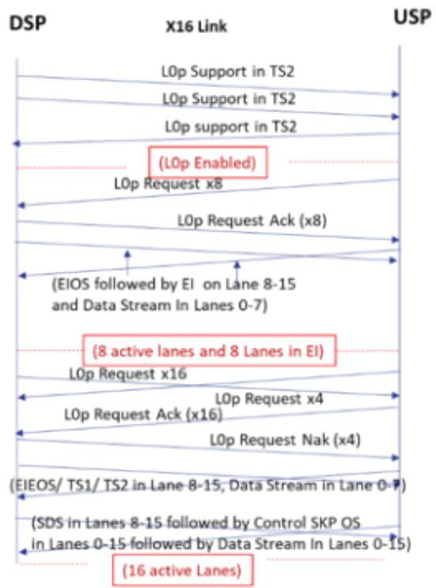

<details>
<summary>flowchart</summary>

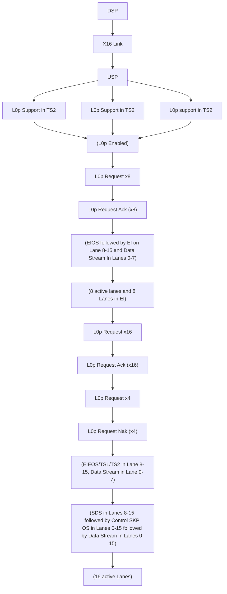
```mermaid
graph TD
  A["DSP"] --> B["X16 Link"]
  B --> C["USP"]
  C --> D["L0p Support in TS2"]
  C --> E["L0p Support in TS2"]
  C --> F["L0p support in TS2"]
  D --> G["(L0p Enabled)"]
  E --> G
  F --> G
  G --> H["L0p Request x8"]
  H --> I["L0p Request Ack (x8)"]
  I --> J["(EIOS followed by EI on Lane 8-15 and Data Stream In Lanes 0-7)"]
  J --> K["(8 active lanes and 8 Lanes in EI)"]
  K --> L["L0p Request x16"]
  L --> M["L0p Request Ack (x16)"]
  M --> N["L0p Request x4"]
  N --> O["L0p Request Nak (x4)"]
  O --> P["(EIEOS/TS1/TS2 in Lane 8-15, Data Stream in Lane 0-7)"]
  P --> Q["(SDS in Lanes 8-15 followed by Control SKP OS in Lanes 0-15 followed by Data Stream In Lanes 0-15)"]
  Q --> R["(16 active Lanes)"]
```
</details>

Figure 4-47 Example of L0p flow in a x16 Link§

## 4.2.6.8 L1 Overview §

L1 is intended as a power savings state.

The L1 state allows an additional power savings over L0s at the cost of additional resume latency.

The entry to L1 occurs after being directed by the Data Link Layer and receiving an EIOS.

## 4.2.6.9 L2 Overview §

Power can be aggressively conserved in L2. Most of the Transmitter and Receiver may be shut off. 69 Main power and clocks are not guaranteed, but Aux 70 power is available.

When Beacon support is required by the associated system or form factor specification, an Upstream Port that supports the wakeup capability must be able to send; and a Downstream Port must be able to receive; a wakeup signal referred to as a Beacon.

The entry to L2 occurs after being directed by the Data Link Layer and receiving an EIOS.

## 4.2.6.10 Disabled Overview §

The intent of the Disabled state is to allow a configured Link to be disabled as long as directed or until Electrical Idle is exited (i.e., due to a hot removal and insertion) after entering Disabled.

## 4.2.6.11 Loopback Overview §

Loopback is intended for test and fault isolation use. Only the entry and exit behavior is specified, all other details are implementation specific. Loopback can operate on either a per-Lane or configured Link basis.

A Loopback Lead is the component requesting Loopback.

A Loopback Follower is the component looping back the data.

In 8b/10b and 128b/130b encoding, Loopback uses bit 2 (Loopback) in the Training Control Field of TS1 and TS2 Ordered Sets (see § Table 4-25 and § Table 4-26). In 1b/1b encoding, Loopback uses an encoding of bits 3:0 in the Training Control field of TS1 and TS2 Ordered Sets (see § Table 4-28).

The entry mechanism for a Loopback Lead is device specific.

The Loopback Follower device enters Loopback whenever two consecutive TS1 Ordered Sets are received with the Loopback bit set.

## IMPLEMENTATION NOTE: USE OF LOOPBACK §

Once in the Loopback state, the Lead can send any pattern of Symbols as long as the encoding rules are followed. Once in Loopback, the concept of data scrambling is no longer relevant; what is sent out is looped back. The mechanism(s) and/or interface(s) utilized by the Data Link Layer to notify the Physical Layer to enter the Loopback state is implementation specific and beyond the scope of this specification.

## IMPLEMENTATION NOTE: LOOPBACK LEAD AND LOOPBACK FOLLOWER REPLACING OLDER TERMS §

The terms Loopback Lead and Loopback Follower are newer terms while preserving the identical Loopback functionality as in [PCIe-5.0]. These terms appropriately represent the functionality performed by the component. Any Port or a test equipment can be a Loopback Lead if it has that optional capability. Every Port is required to be a Loopback Follower. The test set up needs to comprehend that in such a way that it designates one Port to be the Loopback Lead and its Link Partner to be the Loopback Follower.

## 4.2.6.12 Hot Reset Overview §

The intent of the Hot Reset state is to allow a configured Link and associated downstream device to be reset using in-band signaling.

## 4.2.7 Link Training and Status State Rules §

Various Link status bits are monitored through software with the exception of LinkUp which is monitored by the Data Link Layer. § Table 4-48 describes how the Link status bits must be handled throughout the LTSSM (for more information, see § Section 3.2 for LinkUp; § Section 7.5.3.8 for Link Speed, Link Width, and Link Training; § Section 6.2 for Receiver

Error; and § Section 6.7 for In-Band Presence). A Receiver may also optionally report an 8b/10b Error in the Lane Error Status Register when operating in 8b/10b encoding, when allowed to report the error as a Receiver Error in § Table 4-48.

# IMPLEMENTATION NOTE:

# RECEIVER ERRORS DURING CONFIGURATION AND RECOVERY STATES

Allowing Receiver Errors to be set while in Configuration or Recovery is intended to allow implementations to report Link Errors that occur while processing packets in those states. For example, if the LTSSM transitions from L0 to Recovery while a TLP is being received, a Link Error that occurs after the LTSSM transition can be reported.

Table 4-48 Link Status Mapped to the LTSSM§

<table><tr><td>LTSSM State</td><td>Link Width</td><td>Link Speed</td><td>LinkUp</td><td>Link Training</td><td>Receiver Error</td><td>In-Band Presence 71</td></tr><tr><td>Detect</td><td>Undefined</td><td>Undefined</td><td>0b</td><td>0b</td><td>No action</td><td>0b</td></tr><tr><td>Polling</td><td>Undefined</td><td>Set to 2.5 GT/s on entry from Detect. Link speed may change on entry to Polling.Compliance.</td><td>0b</td><td>0b</td><td>No action</td><td>1b</td></tr><tr><td>Configuration</td><td>Set</td><td>No action</td><td> $0b/1b_{72}$ </td><td>1b</td><td>Set on 8b/10b Error.Optional: Set on Link Error when using 128b/130b encoding.</td><td>1b</td></tr><tr><td>Recovery</td><td>No action</td><td>Set to new speed when speed changes</td><td>1b</td><td>1b</td><td>Optionally set on Link Error.</td><td>1b</td></tr><tr><td>L0</td><td>No action</td><td>No action</td><td>1b</td><td>0b</td><td>Set on Link Error.</td><td>1b</td></tr><tr><td>L0s</td><td>No action</td><td>No action</td><td>1b</td><td>0b</td><td>No action</td><td>1b</td></tr><tr><td>L1</td><td>No action</td><td>No action</td><td>1b</td><td>0b</td><td>No action</td><td>1b</td></tr><tr><td>L2</td><td>No action</td><td>No action</td><td>1b</td><td>0b</td><td>No action</td><td>1b</td></tr><tr><td>Disabled</td><td>Undefined</td><td>Undefined</td><td>0b</td><td>0b</td><td>Optional: Set on 8b/10b Error</td><td>1b</td></tr><tr><td>Loopback</td><td>No action</td><td>Link speed may change on entry to Loopback from Configuration.</td><td>0b</td><td>0b</td><td>No action</td><td>1b</td></tr><tr><td>Hot Reset</td><td>No action</td><td>No action</td><td>0b</td><td>0b</td><td>Optional: Set on 8b/10b Error</td><td>1b</td></tr></table>

The state machine rules for configuring and operating a PCI Express Link are defined in the following sections.

With 1b/1b encoding, the Link and Lane numbers are not sent explicitly in the TS1/TS2 Ordered Sets in any States other than those listed in § Table 4-28. Thus, when using 1b/1b encoding in any LTSSM state other than where Link and Lane numbers are transmitted, any references to an exact match in the Link and/or Lane numbers between the transmitted and received TS0/TS1/TS2 Ordered Sets must be assumed to be true as long as the Ordered Set is a valid one. Similarly, when using 1b/1b encoding in any LTSSM state other than Configuration, any references to transmitting a TS0/TS1/TS2 Ordered Set using the Link number and/or Lane number negotiated during the Configuration LTSSM state must be interpreted as using the Lane number for the purposes of scrambling in the TS0/TS1/TS2 Ordered Set.

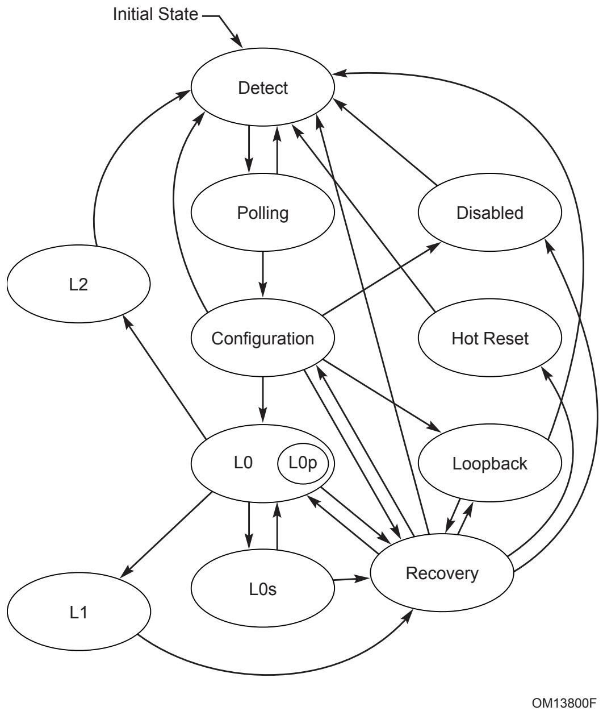

<details>
<summary>flowchart</summary>

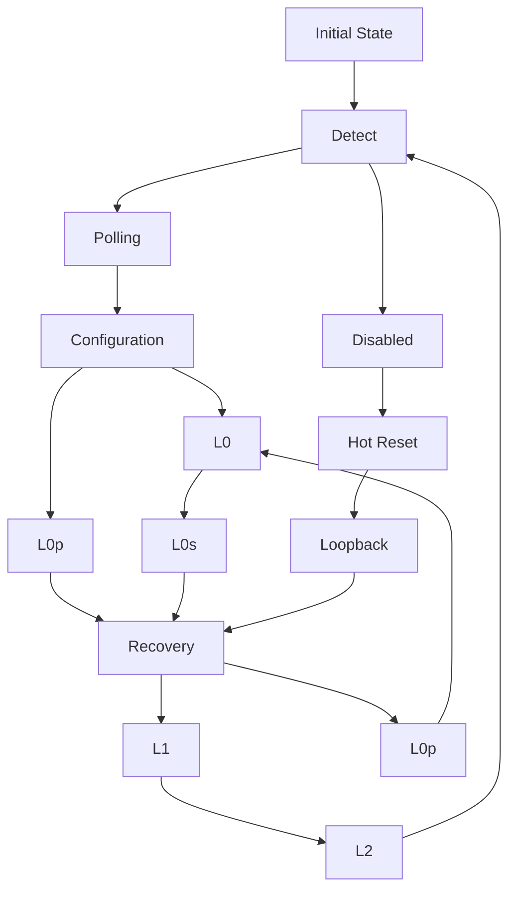
```mermaid
graph TD
  A["Initial State"] --> B["Detect"]
  B --> C["Polling"]
  C --> D["Configuration"]
  D --> E["L0"]
  D --> F["L0p"]
  E --> G["L0s"]
  F --> H["Recovery"]
  G --> H
  H --> I["L1"]
  I --> J["L2"]
  J --> B
  B --> K["Disabled"]
  K --> L["Hot Reset"]
  L --> M["Loopback"]
  M --> H
  H --> N["L0p"]
  N --> E
```
</details>

Figure 4-48 Main State Diagram for Link Training and Status State Machine§

## 4.2.7.1 Detect §

The Detect substate machine is shown in § Figure 4-49.

## 4.2.7.1.1 Detect.Quiet §

• Transmitter is in an Electrical Idle state.  
◦ The DC common mode voltage is not required to be within specification.  
• 2.5 GT/s data rate is selected as the frequency of operation. If the frequency of operation was not 2.5 GT/s data rate on entry to this substate, the LTSSM must stay in this substate for at least 1 ms, during which the frequency of operation must be changed to the 2.5 GT/s data rate.  
◦ Note: This does not affect the advertised data rate in the TS1 and TS2 Ordered Sets.  
• All Receivers must meet the ZRX-DC specification for 2.5 GT/s within 1 ms (see § Table 8-11) of entering this substate. The LTSSM must stay in this substate until the ZRX-DC specification for 2.5 GT/s is met.  
• LinkUp = 0b (status is cleared).  
• The Equalization 8.0 GT/s Phase 1 Successful, Equalization 8.0 GT/s Phase 2 Successful, Equalization 8.0 GT/s Phase 3 Successful, and Equalization 8.0 GT/s Complete bits of the Link Status 2 Register are all set to 0b.

The Equalization 16.0 GT/s Phase 1 Successful, Equalization 16.0 GT/s Phase 2 Successful, Equalization 16.0 GT/ s Phase 3 Successful and Equalization 16.0 GT/s Complete bits of the 16.0 GT/s Status Register are all set to 0b.

The Equalization 32.0 GT/s Phase 1 Successful, Equalization 32.0 GT/s Phase 2 Successful, Equalization 32.0 GT/ s Phase 3 Successful and Equalization 32.0 GT/s Complete bits of the 32.0 GT/s Status Register are all set to 0b.

The Equalization 64.0 GT/s Phase 1 Successful, Equalization 64.0 GT/s Phase 2 Successful, Equalization 64.0 GT/ s Phase 3 Successful, and Equalization 64.0 GT/s Complete bits of the 64.0 GT/s Status Register are all set to 0b.

• The use\_modified\_TS1\_TS2\_Ordered\_Set variable is reset to 0b.  
• The Remote L0p Supported bit in the Device Status 3 Register is reset to 0b.  
• The Flit\_Mode\_Enabled variable is reset to 0b. (When Flit\_Mode\_Enabled is set to 0b, the link will not operate in Flit Mode.)  
• The L0p\_capable variable is reset to 0b.  
• The SRIS\_Mode\_Enabled variable is rest to 0b. When SRIS\_Mode\_Enabled is set to 1b in Flit Mode, the SKP Ordered Set transmission frequency must follow the SRIS mode frequency for the data rate of operation. Otherwise, the SKP Ordered Set transmission frequency for the SRNS / Common Clock must be followed.  
• The directed\_speed\_change variable is reset to 0b. The upconfigure\_capable variable is reset to 0b. The idle\_to\_rlock\_transitioned variable is reset to 00h. The select\_deemphasis variable must be set to either 0b or 1b based on platform specific needs for an Upstream Port and identical to the Selectable Preset/De-emphasis bit in the Link Control 2 Register for a Downstream Port. The equalization\_done\_8GT\_data\_rate, equalization\_done\_16GT\_data\_rate, equalization\_done\_32GT\_data\_rate, and equalization\_done\_64GT\_data\_rate variables are reset to 0b. The perform\_equalization\_for\_loopback variable is set to 0b.

◦ Note that since these variables are defined with [PCIe-2.0], earlier devices would not implement these variables and will always take the path as if the directed\_speed\_change and upconfigure\_capable variables are constantly reset to 0b and the idle\_to\_rlock\_transitioned variable is constantly set to FFh.

• The next state is Detect.Active after a 12 ms timeout or if Electrical Idle Exit is detected on any Lane.

## 4.2.7.1.2 Detect.Active


• The Transmitter performs a Receiver Detection sequence on all un-configured Lanes that can form one or more Links (see § Section 8.4.5.7 for more information).  
• Next state is Polling if a Receiver is detected on all unconfigured Lanes.  
• Next state is Detect.Quiet if a Receiver is not detected on any Lane.  
• If at least one but not all un-configured Lanes detect a Receiver, then:

1. Wait for 12 ms.  
2. The Transmitter performs a Receiver Detection sequence on all un-configured Lanes that can form one or more Links (see § Section 8.4.5.7 for more information).

◦ The next state is Polling if exactly the same Lanes detect a Receiver as the first Receiver Detection sequence.

▪ Lanes that did not detect a Receiver must:

i. Be associated with a new LTSSM if this optional feature is supported. or  
ii. All Lanes that cannot be associated with an optional new LTSSM must transition to Electrical Idle. 73

▪ These Lanes must be re-associated with the LTSSM immediately the LTSSM in progress transitions back to Detect.  
▪ An EIOS does not need to be sent before transitioning to Electrical Idle.

◦ Otherwise, the next state is Detect.Quiet.

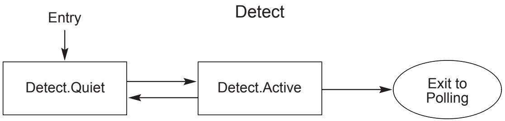

<details>
<summary>flowchart</summary>

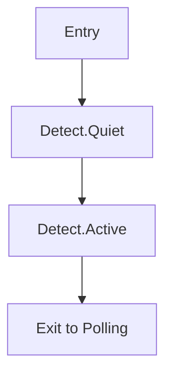
```mermaid
graph TD
  A["Entry"] --> B["Detect.Quiet"]
  B --> C["Detect.Active"]
  C --> D["Exit to Polling"]
```
</details>

OM14313A

§ Figure 4-49 Detect Substate Machine

## 4.2.7.2 Polling §

The Polling substate machine is shown in § Figure 4-50.

73. The common mode being driven is not required to meet the Absolute Delta Between DC Common Mode During L0 and Electrical Idle (VTX-CM-DC-ACTIVE-IDLE-DELTA) specification (see § Table 8-7).

## 4.2.7.2.1 Polling.Active §

• Transmitter sends TS1 Ordered Sets with Lane and Link numbers set to PAD on all Lanes that detected a Receiver during Detect.

◦ The Data Rate Identifier Symbol of the TS1 Ordered Sets must advertise all data rates that the Port supports, including those that it does not intend to use. (Note: Setting the Flit Mode Supported bit of the Data Rate Identifier to 1b indicates that the Port may support higher data rates if Flit Mode is negotiated.)

◦ The Transmitter must wait for its TX common mode to settle before exiting from Electrical Idle and transmitting the TS1 Ordered Sets.

▪ The Transmitter must drive patterns in the default voltage level of the Transmit Margin field within 192 ns from entry to this state. This transmit voltage level will remain in effect until Polling.Compliance or Recovery.RcvrLock is entered.

• Next state is Polling.Compliance if the Enter Compliance bit (bit 4) in the Link Control 2 Register is 1b. If the Enter Compliance bit was set prior to entry to Polling.Active, the transition to Polling.Compliance must be immediate without sending any TS1 Ordered Sets.  
• Next state is Polling.Configuration after at least 1024 TS1 Ordered Sets were transmitted, and all Lanes that detected a Receiver during Detect receive eight consecutive training sequences (or their complement) satisfying any of the following conditions:

◦ TS1 with Lane and Link numbers set to PAD and the Compliance Receive bit (bit 4 of Symbol 5) is 0b.  
◦ TS1 with Lane and Link numbers set to PAD and the Loopback bit (bit 2 of Symbol 5) is 1b.  
◦ TS2 with Lane and Link numbers set to PAD.

• Otherwise, after a 24 ms timeout the next state is:

◦ Polling.Configuration if,

i. Any Lane, which detected a Receiver during Detect, received eight consecutive training sequences (or their complement) satisfying any of the following conditions:

1. TS1 with Lane and Link numbers set to PAD and the Compliance Receive bit (bit 4 of Symbol 5) is 0b.  
2. TS1 with Lane and Link numbers set to PAD and the Loopback bit (bit 2 of Symbol 5) is 1b.  
3. TS2 with Lane and Link numbers set to PAD.

and a minimum of 1024 TS1 Ordered Sets are transmitted after receiving one TS1 or TS2 Ordered Set 74 .

And

ii. At least a predetermined set of Lanes that detected a Receiver during Detect have detected an exit from Electrical Idle at least once since entering Polling.Active.

▪ Note: This may prevent one or more bad Receivers or Transmitters from holding up a valid Link from being configured, and allow for additional training in Polling.Configuration. The exact set of predetermined Lanes is implementation specific. Note that up to [PCIe-1.1] this predetermined set was equal to the total set of Lanes that detected a Receiver.

▪ Note: Any Lane that receives eight consecutive TS1 or TS2 Ordered Sets should have detected an exit from Electrical Idle at least once since entering Polling.Active.

◦ Else Polling.Compliance if either (a) or (b) is true:

a. not all Lanes from the predetermined set of Lanes from (ii) above have detected an exit from Electrical Idle since entering Polling.Active. b. any Lane that detected a Receiver during Detect received eight consecutive TS1 Ordered Sets (or their complement) with the Lane and Link numbers set to PAD, the Compliance Receive bit (bit 4 of Symbol 5) is 1b, and the Loopback bit (bit 2 of Symbol 5) is 0b.

▪ A port that is capable of transmitting at the 64.0 GT/s data rate may receive TS1 Ordered Sets with the Flit Mode Supported bit set to 1b and the Supported Link Speeds field set to 1 0111b. Note: If a passive test load is applied on all Lanes then the device will go to Polling.Compliance.

◦ Else Detect if the conditions to transition to Polling.Configuration or Polling.Compliance are not met

## 4.2.7.2.2 Polling.Compliance §

• The Transmit Margin field of the Link Control 2 Register is sampled on entry to this substate and becomes effective on the transmit package pins within 192 ns of entry to this substate and remains effective through the time the LTSSM is in this substate.  
• The data rate and de-emphasis level for transmitting the compliance pattern are determined on the transition from Polling.Active to Polling.Compliance using the following algorithm.

◦ If the Port is capable of transmitting at the 2.5 GT/s data rate only, the data rate for transmitting the compliance pattern is 2.5 GT/s and the de-emphasis level is -3.5 dB.  
◦ Else if the Port entered Polling.Compliance due to detecting eight consecutive TS1 Ordered Sets in Polling.Active with the Compliance Receive bit (bit 4 of Symbol 5) asserted and the Loopback bit (bit 2 of Symbol 5) deasserted then the data rate for transmission is determined as follows:

▪ If the port is capable of transmitting at the 64.0 GT/s data rate and the eight consecutive TS1 Ordered Sets received in Polling.Active that directed the port to this state had the Flit Mode Supported bit set to 1b and the Supported Link Speeds field set to 1 0111b, the data rate for transmitting the compliance pattern must be 64.0 GT/s.  
Else, the data rate for transmission is determined by the highest common transmitted and received Data Rate Identifiers (Symbols 4 of the TS1 sequence) advertised in the eight consecutive TS1 Ordered Sets received on any Lane that detected a Receiver during Detect.

The select\_deemphasis variable must be set equal to the Selectable De-emphasis bit (Symbol 4 bit 6) in the eight consecutive TS1 Ordered Sets it received in Polling.Active substate. If the common data rate is 8.0 GT/s or higher, the select\_preset variable on each Lane is set to the Transmitter preset value advertised in the Transmitter Preset bits of the eight consecutive EQ TS1 Ordered Sets on the corresponding Lane, provided the value is not a Reserved encoding, and this value must be used by the transmitter (for 8.0 GT/s Data Rate, use of the Receiver preset hint value advertised in those eight consecutive EQ TS1 Ordered Sets is optional). If the common Data Rate is 8.0 GT/s or higher, any Lanes that did not receive eight consecutive EQ TS1 Ordered Sets with Transmitter preset information, or that received a value for a Reserved encoding, can use any supported Transmitter preset in an implementation specific manner.

◦ Else if the Enter Compliance bit in the Link Control 2 Register is 1b, the data rate for transmitting the compliance pattern is defined by the Target Link Speed field in the Link Control 2 Register. The

select\_deemphasis variable is Set when the Compliance Preset/De-emphasis field in the Link Control 2 Register equals 0001b if the data rate will be 5.0 GT/s. If the data rate will be 8.0 GT/s or higher, the select\_preset variable on each Lane is set to, and the transmitter must operate with, the preset value provided in the Compliance Preset/De-emphasis Value (bits 15:12) in the Link Control 2 Register provided the value is not a Reserved encoding.

◦ Else the data rate, preset, and de-emphasis level settings are defined as follows based on the component’s maximum supported data rate and the number of times Polling.Compliance has been entered with this entry criteria, in the same sequence of setting numbers as described in § Table 4-49:

Table 4-49 Compliance Pattern Settings§

<table><tr><td>Setting Nos</td><td>Data Rate</td><td>Transmitter De-emphasis or preset sequence</td></tr><tr><td>#1</td><td>2.5 GT/s</td><td>-3.5 dB</td></tr><tr><td>#2, #3</td><td>5.0 GT/s</td><td>-3.5 dB followed by -6 dB</td></tr><tr><td>#4 through #14</td><td>8.0 GT/s</td><td>Transmitter Preset Encoding 0000b through 1010b, as defined in § Section 4.2.4.2, in increasing order</td></tr><tr><td>#15 through #25</td><td>16.0 GT/s</td><td>Transmitter Preset Encoding 0000b through 1010b, as defined in § Section 4.2.4.2, in increasing order</td></tr><tr><td>#26 through #34</td><td>16.0 GT/s</td><td>Transmitter Preset Encoding 0100b as defined in § Section 4.2.4.2</td></tr><tr><td>#35 through #45</td><td>32.0 GT/s</td><td>Transmitter Preset Encoding 0000b through 1010b, as defined in § Section 4.2.4.2, in increasing order</td></tr><tr><td>#46 through #54</td><td>32.0 GT/s</td><td>Transmitter Preset Encoding 0100b as defined in § Section 4.2.4.2</td></tr><tr><td>#55 through #65</td><td>64.0 GT/s</td><td>Transmitter Preset Encoding 0000b through 1010b, as defined in § Section 4.2.4.2, in increasing order</td></tr><tr><td>#66 through #84</td><td>64.0 GT/s</td><td>Transmitter Preset Encoding 0000b as defined in § Section 4.2.4.2</td></tr></table>

Subsequent entries to Polling.Compliance repeat the above sequence. For example, the state sequence which causes a Port to transmit the Compliance Pattern at a data rate of 5.0 GT/s and a de-emphasis level of -6 dB is: Polling.Active, Polling.Compliance (2.5 GT/s and -3.5 dB), Polling.Active, Polling.Compliance (5.0 GT/s and -3.5 dB), Polling.Active, Polling.Compliance (5.0 GT/s and -6 dB).

The sequence must be set to Setting #1 in the Polling.Configuration state if the Port supports 16.0 GT/ s or higher Data Rates, or the Port’s Receivers do not meet the ZRX-DC specification for 2.5 GT/s when they are operating at 8.0 GT/s or higher data rates (see § Table 8-11). All Ports are permitted to set the sequence to Setting #1 in the Polling.Configuration state.

## IMPLEMENTATION NOTE:

## COMPLIANCE LOAD BOARD USAGE TO GENERATE

## COMPLIANCE PATTERNS §

It is envisioned that the compliance load (base) board may send a 100 MHz signal for about 1 ms on one leg of a differential pair at 350 mV peak-to-peak on any Lane to cycle the device to the desired speed and de-emphasis level. The device under test is required, based on its maximum supported data rate, to cycle through the following settings in order, for each entry to Polling.Compliance from Polling.Active, starting with the first setting on the first entry to Polling.Compliance after the Fundamental Reset as defined in § Table 4-49.

• If the compliance pattern data rate is not 2.5 GT/s and any TS1 Ordered Sets were transmitted in Polling.Active prior to entering Polling.Compliance:

◦ The Transmitter sends two Compliance TS1 Ordered Sets if all of the following conditions are true:

▪ The current data rate is 2.5 GT/s.  
▪ Flit Mode is supported.  
▪ The Transmitter is sequencing through one of the settings defined in § Table 4-49.

◦ Transmitter sends either one EIOS or two consecutive EIOSs prior to entering Electrical Idle.

• If the compliance pattern data rate is not 2.5 GT/s and TS1 Ordered Sets were not transmitted in Polling.Active prior to entering Polling.Compliance, the Transmitter must enter Electrical Idle without transmitting any EIOSs. During the period of Electrical Idle, the data rate is changed to the new speed and stabilized. If the frequency of operation will be 5.0 GT/s, the de-emphasis/preset level must be set to -3.5 dB if the select\_deemphasis variable is 1b else it must be set to -6 dB. If the frequency of operation will be 8.0 GT/s or higher, the Transmitter preset value must be set to the value in the select\_preset variable. The period of Electrical Idle is greater than 1 ms but it is not to exceed 2 ms.  
• Behavior during Polling.Compliance after the data rate and de-emphasis/preset level are determined must follow the following rules:

◦ If the Port entered Polling.Compliance due to detecting eight consecutive TS1 Ordered Sets in Polling.Active with the Compliance Receive bit (bit 4 of Symbol 5) asserted and the Loopback bit (bit 2 of Symbol 5) deasserted or both the Enter Compliance bit and the Enter Modified Compliance bit in the Link Control 2 Register are set to 1b then the Transmitter sends out the Modified Compliance Pattern at the above determined data rate with the error status Symbol set to all 0’s on all Lanes that detected a Receiver during Detect.

▪ If the data rate is 2.5 GT/s or 5.0 GT/s, a particular Lane’s Receiver independently signifies a successful lock to the incoming Modified Compliance Pattern by looking for any one occurrence of the Modified Compliance Pattern and then setting the Pattern Lock bit (bit 7 of the error status Symbol) in the same Lane of its own transmitted Modified Compliance Pattern.

▪ The error status Symbols are not to be used for the lock process since they are undefined at any given moment.  
▪ An occurrence is defined above as the following sequence of 8b/10b Symbols; K28.5, D21.5, K28.5, and D10.2 or the complement of each of the individual Symbols.  
▪ The device under test must set the Pattern Lock bit of the Modified Compliance Pattern it transmits at the Transmitter package pin(s) after successfully locking to

the incoming Modified Compliance Pattern within 1 ms of receiving the Modified Compliance Pattern at its Receiver package pin(s).

If the data rate is 8.0 GT/s or higher: The Error\_Status field is set to 00h on entry to this substate. Each Lane sets the Pattern Lock bit independently when it achieves Block Alignment as described in § Section 4.2.2.2.1 . After Pattern Lock is achieved, Symbols received in Data Blocks are compared to the Idle data Symbol (00h) and each mismatched Symbol causes the Receiver Error Count field to be incremented by 1. The Receiver Error Count saturates at 127 (further mismatched Symbols do not change the Receiver Error Count). The Pattern Lock and Receiver Error Count information for each Lane is transmitted as part of the SKP Ordered Sets transmitted in that Lane’s Modified Compliance Pattern. See § Section 4.2.8 for more information. The device under test must set the Pattern Lock bit in the SKP Ordered Set it transmits within 4 ms of receiving the Modified Compliance Pattern at its Receiver package pin(s).

• The scrambling requirements defined in § Section 4.2.2.4 are applied to the received Modified Compliance Pattern. For example, the scrambling LFSR seed is set per Lane, an EIEOS initializes the LFSR and SKP Ordered Sets do not advance the LFSR.

## IMPLEMENTATION NOTE:

## HANDLING BIT SLIP AND BLOCK ALIGNMENT §

Devices should ensure that their Receivers have stabilized before attempting to obtain Block alignment and signaling Pattern Lock. For example, if an implementation expects to see bit slips in the initial few bits, it should wait for that time to be over before settling on a Block Alignment. Devices may also want to revalidate their Block alignment prior to setting the Pattern Lock bit.

• If the data rate is 2.5 GT/s or 5.0 GT/s, once a particular Lane indicates it has locked to the incoming Modified Compliance Pattern the Receiver Error Count for that particular Lane is incremented every time a Receiver Error occurs.

◦ The error status Symbol uses the lower 7 bits as the Receiver Error Count field and this field will remain stuck at all 1’s if the count reaches 127.  
◦ The Receiver must not make any assumption about the 10-bit patterns it will receive when in this substate if 8b/10b encoding is used.

• If the Enter Compliance bit in the Link Control 2 Register is 0b, the next state is Detect if directed  
• Else if the Enter Compliance bit was set to 1b on entry to Polling.Compliance, next state is Polling.Active if any of the following conditions apply:

◦ The Enter Compliance bit in the Link Control 2 Register has changed to 0b

◦ The Port is an Upstream Port and an EIOS is received on any Lane. The Enter Compliance bit is reset to 0b when this condition is true.

If the Transmitter was transmitting at a data rate other than 2.5 GT/s, or the Enter Compliance bit in the Link Control 2 Register was set to 1b during entry to Polling.Compliance, the Transmitter sends eight consecutive EIOS and enters Electrical Idle prior to transitioning to Polling.Active. During the period of Electrical Idle, the data rate is changed to 2.5 GT/s and stabilized and the de-emphasis level is set to -3.5 dB. The period of Electrical Idle is greater than 1 ms but must not exceed 2 ms.

Note: Sending multiple EIOS provides enough robustness such that the other Port detects at least one EIOS and exits Polling.Compliance substate when the configuration register mechanism was used for entry.

• Else if the Port entered Polling.Compliance due to the Enter Compliance bit of the Link Control 2 Register being set to 1b and the Enter Modified Compliance bit of the Link Control 2 Register being set to 0b:

a. Transmitter sends out the compliance pattern on all Lanes that detected a Receiver during Detect at the data rate and de-emphasis/preset level determined above.  
b. Next state is Polling.Active if any of the following two conditions are true:

1. The Enter Compliance bit in the Link Control 2 Register has changed to 0b (from 1b) since entering Polling.Compliance.

2. The Port is an Upstream Port, the Enter Compliance bit in the Link Control 2 Register is set to 1b and an EIOS has been detected on any Lane. The Enter Compliance bit is reset to 0b when this condition is true.

The Transmitter sends eight consecutive EIOSs and enters Electrical Idle prior to transitioning to Polling.Active. During the period of Electrical Idle, the data rate is changed to 2.5 GT/s and stabilized. The period of Electrical Idle is greater than 1 ms but must not exceed 2 ms.

Note: Sending multiple EIOSs provides enough robustness such that the other Port detects at least one EIOS and exits Polling.

• Else:

a. Transmitter sends out the following patterns on Lanes that detected a Receiver during Detect at the data rate and de-emphasis/preset level determined above:

▪ For Settings #1 to #25, #35 to #45, and #55 to #65: Compliance Pattern on all Lanes.  
▪ For Setting #26, #46, #66: Jitter Measurement Pattern on all Lanes.  
▪ For Setting #27, #47, #67: Jitter Measurement Pattern on Lanes 0/8 and Compliance Pattern on all other Lanes.  
▪ For Setting #28, #48, #68: Jitter Measurement Pattern on Lanes 1/9 and Compliance Pattern on all other Lanes.  
▪ For Setting #29, #49, #69: Jitter Measurement Pattern on Lanes 2/10 and Compliance Pattern on all other Lanes.  
▪ For Setting #30, #50, #70: Jitter Measurement Pattern on Lanes 3/11 and Compliance Pattern on all other Lanes.  
▪ For Setting #31, #51, #71: Jitter Measurement Pattern on Lanes 4/12 and Compliance Pattern on all other Lanes.  
▪ For Setting #32, #52, #72: Jitter Measurement Pattern on Lanes 5/13 and Compliance Pattern on all other Lanes.  
▪ For Setting #33, #53, #73: Jitter Measurement Pattern on Lanes 6/14 and Compliance Pattern on all other Lanes.  
▪ For Setting #34, #54, #74: Jitter Measurement Pattern on Lanes 7/15 and Compliance Pattern on all other Lanes.  
▪ For Setting #75: High Swing Toggle Pattern on all Lanes  
▪ For Setting #76: High Swing Toggle Pattern on Lanes 0/8 and Compliance Pattern on all other Lanes.  
▪ For Setting #77: High Swing Toggle Pattern on Lanes 1/9 and Compliance Pattern on all other Lanes.  
▪ For Setting #78: High Swing Toggle Pattern on Lanes 2/10 and Compliance Pattern on all other Lanes.

▪ For Setting #79: High Swing Toggle Pattern on Lanes 3/11 and Compliance patter on all other Lanes.  
▪ For Setting #80: High Swing Toggle Pattern on Lanes 4/12 and Compliance Pattern on all other Lanes.  
▪ For Setting #81: High Swing Toggle Pattern on Lanes 5/13 and Compliance Pattern on all other Lanes.  
▪ For Setting #82: High Swing Toggle Pattern on Lanes 6/14 and Compliance Pattern on all other Lanes.  
▪ For Setting #83: High Swing Toggle Pattern on Lanes 7/15 and Compliance Pattern on all other Lanes.  
▪ For Setting #84: Low Swing Toggle Pattern on all Lanes

b. Next state is Polling.Active if an exit of Electrical Idle is detected at the Receiver of any Lane that detected a Receiver during Detect. If the Transmitter is transmitting at a data rate other than 2.5 GT/s, the Transmitter sends eight consecutive EIOSs and enters Electrical Idle prior to transitioning to Polling.Active. During the period of Electrical Idle, the data rate is changed to 2.5 GT/s and stabilized. The period of Electrical Idle is greater than 1 ms but must not exceed 2 ms.

## 4.2.7.2.3 Polling.Configuration §

• Receiver must invert polarity if necessary (see § Section 4.2.5.5 ).  
• The Transmit Margin field of the Link Control 2 Register must be reset to 000b on entry to this substate.  
• The Transmitter’s Polling.Compliance sequence setting is updated, if required, as described in § Section 4.2.7.2.2 .  
• Transmitter sends TS2 Ordered Sets with Link and Lane numbers set to PAD on all Lanes that detected a Receiver during Detect.

◦ The Data Rate Identifier Symbol of the TS2 Ordered Sets must advertise all data rates that the Port supports, including those that it does not intend to use.

• The next state is Configuration after eight consecutive TS2 Ordered Sets, with Link and Lane numbers set to PAD, are received on any Lanes that detected a Receiver during Detect, and 16 TS2 Ordered Sets are transmitted after receiving one TS2 Ordered Set.

• Otherwise, next state is Detect after a 48 ms timeout.

## 4.2.7.2.4 Polling.Speed §

This state is unreachable given that the Link comes up to L0 in 2.5 GT/s data rate only and changes speed by entering Recovery.

## IMPLEMENTATION NOTE:

## SUPPORT FOR HIGHER DATA RATES THAN 2.5 GT/S §

A Link will initially train to the L0 state at the 2.5 GT/s data rate even if both sides are capable of operating at a data rate greater than 2.5 GT/s. Supported higher data rates are advertised in the TS Ordered Sets. The other side’s speed capability is registered during the Configuration.Complete substate. Based on the highest supported common data rate, either side can initiate a change in speed from the L0 state by transitioning to Recovery.

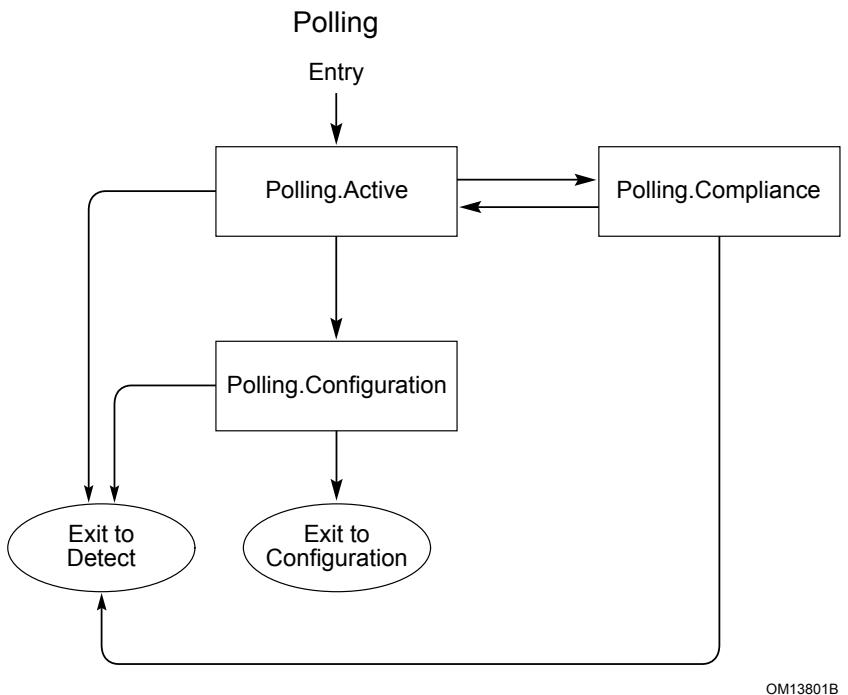

<details>
<summary>flowchart</summary>

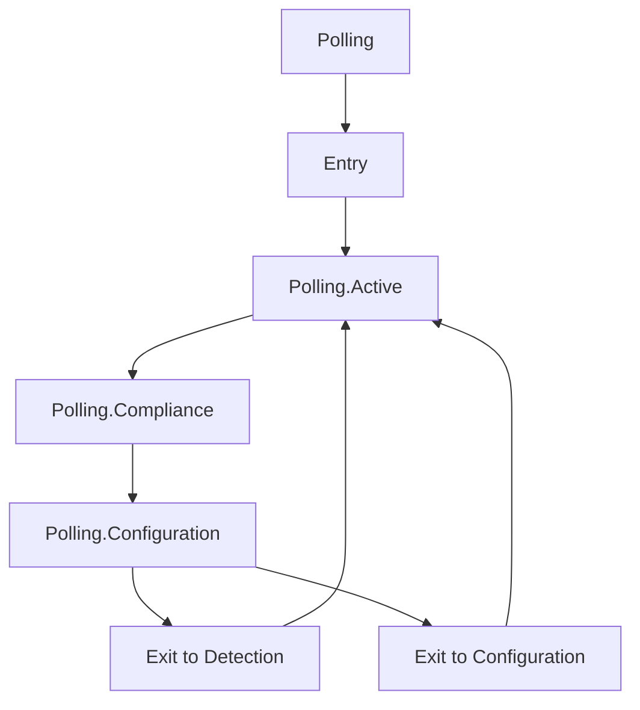
```mermaid
graph TD
  A["Polling"] --> B["Entry"]
  B --> C["Polling.Active"]
  C --> D["Polling.Compliance"]
  D --> E["Polling.Configuration"]
  E --> F["Exit to Detection"]
  E --> G["Exit to Configuration"]
  F --> C
  G --> C
```
</details>

§ Figure 4-50 Polling Substate Machine

## 4.2.7.3 Configuration §

The Configuration substate machine is shown in § Figure 4-51.

## 4.2.7.3.1 Configuration.Linkwidth.Start §

## 4.2.7.3.1.1 Downstream Lanes §

• Next state is Disabled if directed.  
◦ Note: “if directed” applies to a Downstream Port that is instructed by a higher Layer to assert the Disable Link bit (TS1 and TS2) on all Lanes that detected a Receiver during Detect.  
• Next state is Loopback if directed by an implementation specific method and the Transmitter is capable of being a Loopback Lead.

◦ Note: “if directed” applies to a Port that is instructed by a higher Layer to assert the Loopback bit (TS1 and TS2) on all Lanes that detected a Receiver during Detect.

• In the optional case where a crosslink is supported, the next state is Disabled after all Lanes that are transmitting TS1 Ordered Sets receive two consecutive TS1 Ordered Sets with the Disable Link bit asserted.  
• Next state is Loopback if one of the following conditions is satisfied:

◦ All Lanes that are transmitting TS1 Ordered Sets, that are also receiving TS1 Ordered Sets, receive the Loopback bit asserted in two consecutive TS1 Ordered Sets.  
◦ Any Lane that is transmitting TS1 Ordered Sets receives two consecutive TS1 Ordered Sets with the Loopback bit asserted and with the Enhanced Link Behavior Control bits set to 01b.  
◦ A Port that is capable of transmitting at the 64.0 GT/s data rate may receive TS1 Ordered Sets with the Flit Mode Supported bit set to 1b and the Supported Link Speeds field set to 1 0111b.  
◦ Note that the device receiving the Ordered Set with the Loopback bit set becomes the Loopback Follower.

• The Transmitter sends TS1 Ordered Sets with selected Link numbers and sets Lane numbers to PAD on all the active Downstream Lanes if LinkUp is 0b or if the LTSSM is not initiating upconfiguration of the Link width. In addition, if upconfigure\_capable is set to 1b, and the LTSSM is not initiating upconfiguration of the Link width, the LTSSM sends TS1 Ordered Sets with the selected Link number and sets the Lane number to PAD on each inactive Lane after it detected an exit from Electrical Idle since entering Recovery and has subsequently received two consecutive TS1 Ordered Sets with the Link and Lane numbers each set to PAD while in this substate.

◦ On transition to this substate from Polling, any Lane that detected a Receiver during Detect is considered an active Lane.  
◦ On transition to this substate from Recovery, any Lane that is part of the configured Link the previous time through Configuration.Complete is considered an active Lane.  
◦ The Data Rate Identifier Symbol of the TS1 Ordered Sets must advertise all data rates that the Port supports, including those that it does not intend to use.

• If LinkUp is 1b and the LTSSM is initiating upconfiguration of the Link width, initially it transmits TS1 Ordered Sets with both the Link and Lane numbers set to PAD on the current set of active Lanes; the inactive Lanes it intends to activate; and those Lanes where it detected an exit from Electrical Idle since entering Recovery and has received two consecutive TS1 Ordered Sets with the Link and Lane numbers each set to PAD. The LTSSM transmits TS1 Ordered Sets with the selected Link number and the Lane number set to PAD when each of the Lanes transmitting TS1 Ordered Sets receives two consecutive TS1 Ordered Sets with the Link and Lane numbers each set to PAD or 1 ms has expired since entering this substate.

◦ After activating any inactive Lane, the Transmitter must wait for its TX common mode to settle before exiting from Electrical Idle and transmitting the TS1 Ordered Sets.  
◦ Link numbers are only permitted to be different for groups of Lanes capable of being a unique Link.  
◦ Note: An example of Link number assignments is a set of eight Downstream Lanes capable of negotiating to become one x8 Port when connected to one component or two x4 Ports when connected to two different components. The Downstream Lanes send out TS1 Ordered Sets with the Link number set to N on four Lanes and Link number set to N+1 on the other four Lanes. The Lane numbers are all set to PAD.

• If any Lanes first received at least one or more TS1 Ordered Sets with a Link and Lane number set to PAD, the next state is Configuration.Linkwidth.Accept immediately after any of those same Downstream Lanes receive two consecutive TS1 Ordered Sets with a non-PAD Link number that matches any of the transmitted Link numbers, and with a Lane number set to PAD.

◦ If the crosslink configuration is not supported, the condition of first receiving a Link and Lane number set to PAD is always true.

• Else: Optionally, if LinkUp is 0b and if crosslinks are supported, then all Downstream Lanes that detected a Receiver during Detect must first transmit 16 to 32 TS1 Ordered Sets with a non-PAD Link number and PAD Lane number and after this occurs if any Downstream Lanes receive two consecutive TS1 Ordered Sets with a Link number different than PAD and a Lane Number set to PAD, the Downstream Lanes are now designated as Upstream Lanes and a new random crosslink timeout is chosen (see Tcrosslink in § Table 8-7). The next state is Configuration.Linkwidth.Start as Upstream Lanes.

◦ Note: This supports the optional crosslink where both sides may try to act as a Downstream Port. This is resolved by making both Ports become Upstream and assigning a random timeout until one side of the Link becomes a Downstream Port and the other side remains an Upstream Port. This timeout must be random even when hooking up two of the same devices so as to eventually break any possible deadlock.  
◦ If crosslinks are supported, receiving a sequence of TS1 Ordered Sets with a Link number of PAD followed by a Link number of non-PAD that matches the transmitted Link number is only valid when not interrupted by the reception of a TS2 Ordered Set.

## IMPLEMENTATION NOTE: CROSSLINK INITIALIZATION

In the case where the Downstream Lanes are connected to both Downstream Lanes (crosslink) and Upstream Lanes, the Port with the Downstream Lanes may continue with a single LTSSM as described in this section or optionally, split into multiple LTSSMs.

• The next state is Detect after a 24 ms timeout.

## 4.2.7.3.1.2 Upstream Lanes §

• In the optional case where crosslinks are supported the next state is Disabled if directed.

◦ Note: “if directed” only applies to an optional crosslink Port that is instructed by a higher Layer to assert the Disable Link bit (TS1 and TS2) on all Lanes that detected a Receiver during Detect.

• Next state is Loopback if directed to this state by an implementation specific method.

◦ Note: “if directed” applies to a Port that is instructed by a higher Layer to assert the Loopback bit (TS1 and TS2) on all Lanes that detected a Receiver during Detect.

• Next state is Disabled after any Lanes that are transmitting TS1 Ordered Sets receive two consecutive TS1 Ordered Sets with the Disable Link bit asserted.

◦ In the optional case where a crosslink is supported, the next state is Disabled only after all Lanes that are transmitting TS1 Ordered Sets, that are also receiving TS1 Ordered Sets, receive the Disable Link bit asserted in two consecutive TS1 Ordered Sets.

• Next state is Loopback if one of the following conditions is satisfied:

◦ All Lanes that are transmitting TS1 Ordered Sets, that are also receiving TS1 Ordered Sets, receive the Loopback bit asserted in two consecutive TS1 Ordered Sets.  
◦ Any Lane that is transmitting TS1 Ordered Sets receives two consecutive TS1 Ordered Sets with the Loopback bit asserted and with the Enhanced Link Behavior Control bits set to 01b.  
◦ A Port that is capable of transmitting at the 64.0 GT/s data rate may receive TS1 Ordered Sets with the Flit Mode Supported bit set to 1b and the Supported Link Speeds field set to 1 0111b.

◦ Note: The device receiving the Ordered Set with the Loopback bit set becomes the Loopback Follower.

• The Transmitter sends out TS1 Ordered Sets with Link numbers and Lane numbers set to PAD on all the active Upstream Lanes; the inactive Lanes it is initiating to upconfigure the Link width; and if upconfigure\_capable is set to 1b, on each of the inactive Lanes where it detected an exit from Electrical Idle since entering Recovery and has subsequently received two consecutive TS1 Ordered Sets with Link and Lane numbers, each set to PAD, in this substate.

◦ On transition to this substate from Polling, any Lane that detected a Receiver during Detect is considered an active Lane.  
◦ On transition to this substate from Recovery, any Lane that is part of the configured Link the previous time through Configuration.Complete is considered an active Lane.  
◦ On transition to this substate from Recovery, if the transition is not caused by LTSSM timeout, the Transmitter must set the Autonomous Change bit (Symbol 4 bit 6) to 1b in the TS1 Ordered Sets that it sends while in the Configuration state if the Transmitter intends to change the Link width for autonomous reasons.  
◦ The Data Rate Identifier Symbol of the TS1 Ordered Sets must advertise all data rates that the Port supports, including those that it does not intend to use.

If any Lane receives two consecutive TS1 Ordered Sets with Link numbers that are different than PAD and Lane number set to PAD, a single Link number is selected and Lane number set to PAD are transmitted on all Lanes that both detected a Receiver and also received two consecutive TS1 Ordered Sets with Link numbers that are different than PAD and Lane number set to PAD. Any left over Lanes that detected a Receiver during Detect must transmit TS1 Ordered Sets with the Link and Lane number set to PAD. The next state is Configuration.Linkwidth.Accept:

◦ If the LTSSM is initiating upconfiguration of the Link width, it waits until it receives two consecutive TS1 Ordered Sets with a non-PAD Link Number and a PAD Lane number on all the inactive Lanes it wants to activate, or, 1 ms after entry to this substate, it receives two consecutive TS1 Ordered Sets on any Lane with a non-PAD Link number and PAD Lane number, whichever occurs earlier, before transmitting TS1 Ordered Sets with selected Link number and Lane number set to PAD.  
◦ It is recommended that any possible multi-Lane Link that received an error in a TS1 Ordered Set or lost 128b/130b Block Alignment or Block/Flit alignment with 1b/1b encoding on a subset of the received Lanes; delay the evaluation listed above by an additional two, or more, TS1 Ordered Sets when using 8b/10b encoding, or by an additional 34, or more, TS1 Ordered Sets when using 128b/ 130b or 1b/1b encoding, but must not exceed 1 ms, so as not to prematurely configure a smaller Link than possible.

▪ After activating any inactive Lane, the Transmitter must wait for its TX common mode to settle before exiting Electrical Idle and transmitting the TS1 Ordered Sets.

• Optionally, if LinkUp is 0b and if crosslinks are supported, then all Upstream Lanes that detected a Receiver during Detect must first transmit 16-32 TS1 Ordered Sets with a PAD Link number and PAD Lane number and after this occurs and if any Upstream Lanes first receive two consecutive TS1 Ordered Sets with Link and Lane numbers set to PAD, then:

◦ The Transmitter continues to send out TS1 Ordered Sets with Link numbers and Lane numbers set to PAD.  
◦ If any Lanes receive two consecutive TS1 Ordered Sets with Link numbers that are different than PAD and Lane number set to PAD, a single Link number is selected and Lane number set to PAD are transmitted on all Lanes that both detected a Receiver and also received two consecutive TS1 Ordered Sets with Link numbers that are different than PAD and Lane number set to PAD. Any left over Lanes that detected a Receiver during Detect must transmit TS1 Ordered Sets with the Link and Lane number set to PAD. The next state is Configuration.Linkwidth.Accept.

▪ It is recommended that any possible multi-Lane Link that received an error in a TS1 Ordered Set or lost 128b/130b Block Alignment or Block/Flit alignment with 1b/1b encoding on a subset of the received Lanes; delay the evaluation listed above by an additional two, or more, TS1 Ordered Sets when using 8b/10b encoding, or by an additional 34, or more, TS1 Ordered Sets when using 128b/130b or 1b/1b encoding, but must not exceed 1 ms, so as not to prematurely configure a smaller Link than possible.

◦ Otherwise, after a Tcrosslink timeout, 16 to 32 TS2 Ordered Sets with PAD Link numbers and PAD Lane numbers are sent. The Upstream Lanes become Downstream Lanes and the next state is Configuration.Linkwidth.Start as Downstream Lanes.

▪ Note: This optional behavior is required for crosslink behavior where two Ports may start off with Upstream Ports, and one will eventually take the lead as a Downstream Port.

• The next state is Detect after a 24 ms timeout.

## 4.2.7.3.2 Configuration.Linkwidth.Accept §

## 4.2.7.3.2.1 Downstream Lanes §

• If a configured Link can be formed with at least one group of Lanes that received two consecutive TS1 Ordered Sets with the same received Link number (non-PAD and matching one that was transmitted by the Downstream Lanes), TS1 Ordered Sets are transmitted with the same Link number and unique non-PAD Lane numbers are assigned to all these same Lanes. The next state is Configuration.Lanenum.Wait.

◦ The assigned non-PAD Lane numbers must range from 0 to n-1, be assigned sequentially to the same grouping of Lanes that are receiving the same Link number, and Downstream Lanes which are not receiving TS1 Ordered Sets must not disrupt the initial sequential numbering of the widest possible Link. Any left over Lanes must transmit TS1 Ordered Sets with the Link and Lane number set to PAD.  
◦ It is recommended that any possible multi-Lane Link that received an error in a TS1 Ordered Set or lost 128b/130b Block Alignment or Block/Flit alignment with 1b/1b encoding on a subset of the received Lanes delay the evaluation listed above by an additional two, or more, TS1 Ordered Sets when using 8b/10b encoding, or by an additional 34, or more, TS1 Ordered Sets when using 128b/ 130b or 1b/1b encoding, but must not exceed 1 ms, so as not to prematurely configure a smaller Link than possible.  
◦ The use\_modified\_TS1\_TS2\_Ordered\_Set variable must be set to 1b if all of the following conditions are true:

▪ LinkUp = 0b  
▪ The component had transmitted Modified TS1/TS2 Ordered Sets supported value (11b) in the Enhanced Link Behavior Control field in Symbol 5 of TS1 and TS2 Ordered Sets in Polling and Configuration states since entering the Polling State  
▪ The received eight consecutive TS2 Ordered Sets on all Lanes of the configured Link that could be formed (see 1st bullet of § Section 4.2.7.3.2.1 ) that were part of the group that caused the transition from Polling.Configuration to Configuration state had the Modified TS1/TS2 Ordered Sets supported value (11b) in the Enhanced Link Behavior Control field in Symbol 5 and 32.0 GT/s data rate is supported bit is Set to 1b in the received eight consecutive TS2 Ordered Sets

◦ The Flit\_Mode\_Enabled variable must be set to 1b if all of the following conditions are true:

▪ LinkUp = 0b

The component had transmitted Flit Mode Supported bit in the ‘Data Rate Identifier’ field (Symbol 4, Bit 0) in the TS1 and TS2 Ordered Sets in Polling and Configuration states since entering the Polling State  
▪ The received eight consecutive TS2 Ordered Sets on all Lanes of the currently configured Link that caused the transition from Polling.Configuration to Configuration state had the set Flit Mode Supported bit in the Data Rate Identifier field (Symbol 4, Bit 0) to 1b in the received eight consecutive TS2 Ordered Sets

• The next state is Detect after a 2 ms timeout or if no Link can be configured or if all Lanes receive two consecutive TS1 Ordered Sets with Link and Lane numbers set to PAD.

## 4.2.7.3.2.2 Upstream Lanes §

• If a configured Link can be formed using Lanes that transmitted a non-PAD Link number which are receiving two consecutive TS1 Ordered Sets with the same non-PAD Link number and any non-PAD Lane number, TS1 Ordered Sets are transmitted with the same non-PAD Link number and Lane numbers that, if possible, match the received Lane numbers or are different, if necessary (i.e., Lane reversed). The next state is Configuration.Lanenum.Wait.

◦ The received consecutive TS1 Ordered Sets may be either standard TS1 Ordered Sets or Modified TS1 Ordered Sets. Modified TS1 Ordered Sets will only be received if the conditions to Set the use\_modified\_TS1\_TS2\_Ordered\_Set variable (as described below) are met.  
◦ The newly assigned Lane numbers must range from 0 to m-1, be assigned sequentially only to some continuous grouping of Lanes that are receiving non-PAD Lane numbers (i.e., Lanes which are not receiving any TS1 Ordered Sets always disrupt a continuous grouping and must not be included in this grouping), must include either Lane 0 or Lane n-1 (largest received Lane number), and m-1 must be equal to or smaller than the largest received Lane number (n-1). Remaining Lanes must transmit TS1 Ordered Sets with Link and Lane numbers set to PAD.  
◦ If any possible multi-Lane Link received an error in a TS1 Ordered Set, lost 128b/130b Block Alignment, or lost Block/Flit alignment with 1b/1b encoding on a subset of the received Lanes, it is recommended to do the following to avoid configuring a smaller Link than is possible:

▪ When using 8b/10b encoding, delay the evaluation listed above by an additional two or more TS1 Ordered Sets, but must not delay by more than 1 ms.  
▪ When using 128b/130b or 1b/1b encoding, delay the evaluation listed above by an additional 34 or more TS1 Ordered Sets, but must not delay by more than 1 ms.

◦ The use\_modified\_TS1\_TS2\_Ordered\_Set variable must be set to 1b if all of the following conditions are true:

▪ LinkUp = 0b  
▪ The component has transmitted Modified TS1/TS2 Ordered Sets supported value (11b) in the Enhanced Link Behavior Control field in Symbol 5 of all TS1 and TS2 Ordered Sets in Polling and Configuration states since entering the Polling State  
▪ The received eight consecutive TS2 Ordered Sets on all Lanes of the configured Link that could be formed (see 1st bullet of § Section 4.2.7.3.2.2 ) that were part of the group that caused the transition from Polling.Configuration to Configuration state had the Modified TS1/TS2 Ordered Sets supported value (11b) in the Enhanced Link Behavior Control field in Symbol 5 and 32.0 GT/s data rate is supported bit is Set to 1b in the received eight consecutive TS2 Ordered Sets

◦ The Flit\_Mode\_Enabled variable must be set to 1b if all of the following conditions are true:

▪ LinkUp = 0b

The component had transmitted Flit Mode Supported bit in the ‘Data Rate Identifier’ field (Symbol 4, Bit 0) in the TS1 and TS2 Ordered Sets in Polling and Configuration states since entering the Polling State  
▪ The received eight consecutive TS2 Ordered Sets on all Lanes of the currently configured Link that caused the transition from Polling.Configuration to Configuration state had the Flit Mode Supported bit in the Data Rate Identifier field (Symbol 4, Bit 0)set to 1b in the received eight consecutive TS2 Ordered Sets

## IMPLEMENTATION NOTE: NEGOTIATING FLIT MODE AND THE MODIFIED TS1/TS2 USAGE

Negotiating Flit Mode and the Modified TS1/TS2 usage is orthogonal (i.e., a device can advertise and negotiate support for neither, either, or both). This note applies to the Downstream and Upstream Ports.

• The next state is Detect after a 2 ms timeout or if no Link can be configured or if all Lanes receive two consecutive TS1 Ordered Sets with Link and Lane numbers set to PAD.

## IMPLEMENTATION NOTE: EXAMPLE CASES

Notable examples related to the configuration of Downstream Lanes:

1. A x8 Downstream Port, which can be divided into two x4 Links, sends two different Link numbers on to two x4 Upstream Ports. The Upstream Ports respond simultaneously by picking the two Link numbers. The Downstream Port will have to choose one of these sets of Link numbers to configure as a Link, and leave the other for a secondary LTSSM to configure (which will ultimately happen in Configuration.Complete).  
2. A x8 Downstream Port where only seven Lanes are receiving TS1 Ordered Sets with the same received Link number (non-PAD and matching one that was transmitted by the Downstream Lanes) and an eighth Lane, which is in the middle or adjacent to those same Lanes, is not receiving a TS1 Ordered Set. In this case, the eighth Lane is treated the same as the other seven Lanes and Lane numbering for a x8 Lane should occur as described above.

Notable examples related to the configuration of Upstream Lanes:

1. A x8 Upstream Port is presented with Lane numbers that are backward from the preferred numbering. If the optional behavior of Lane reversal is supported by the Upstream Port, the Upstream Port transmits the same Lane numbers back to the Downstream Port. Otherwise, the opposite Lane numbers are transmitted back to the Downstream Port, and it will be up to the Downstream Port to optionally fix the Lane ordering or exit Configuration.

Optional Lane reversal behavior is required to configure a Link where the Lane numbers are reversed and the Downstream Port does not support Lane reversal. Specifically, the Upstream Port Lane reversal will accommodate the scenario where the default Upstream sequential Lane numbering (0 to n-1) is receiving a reversed Downstream sequential Lane number (n-1 to 0).

2. A x8 Upstream Port is not receiving TS1 Ordered Sets on the Upstream Port Lane 0:

a. In the case where the Upstream Port can only support a x8 or x1 Link and the Upstream Port can support Lane reversal. The Upstream Port will assign a Lane 0 to only the received Lane 7 (received Lane number n-1) and the remaining seven Lanes must transmit TS1 Ordered Sets with Link and Lane numbers set to PAD.  
b. In the case where the Upstream Port can only support a x8 or x1 Link and the Upstream Port cannot support Lane reversal. No Link can be formed and the Upstream Port will eventually timeout after 2 ms and exit to Detect.

3. An optional x8 Upstream crosslink Port, which can be divided into two x4 Links, is attached to two x4 Downstream Ports that present the same Link number, and each x4 Downstream Port presents Lane numbers simultaneously that were each numbered 0 to 3. The Upstream Port will have to choose one of these sets of Lane numbers to configure as a Link, and leave the other for a second pass through Configuration.

## 4.2.7.3.3 Configuration.Lanenum.Accept §

In this sub-state, if use\_modified\_TS1\_TS2\_Ordered\_Set variable is set to 1b:

• Transmitter must send Modified TS1 Ordered sets instead of TS1 Ordered Sets • Receiver must check for receipt of Modified TS1 Ordered Sets instead of TS1 Ordered Sets [Note: See § Section 4.2.5.1 for the definition of identical consecutive modified TS1 Ordered Sets.]

## 4.2.7.3.3.1 Downstream Lanes §

• If two consecutive TS1 Ordered Sets are received with non-PAD Link and non-PAD Lane numbers that match all the non-PAD Link and non-PAD Lane numbers (or reversed Lane numbers if Lane reversal is optionally supported) that are being transmitted in Downstream Lane TS1 Ordered Sets, the next state is Configuration.Complete. If the use\_modified\_TS1\_TS2\_Ordered\_Set variable is Set and an Alternate Protocol Negotiation is being performed, the transition to Configuration.Complete must be delayed for 10 μs or until the Downstream Port receives the Upstream Port’s response to that protocol request (whichever happens first). See § Section 4.2.5.2 for Alternate Protocol Negotiation details. Note that Retimers are permitted to delay the transition to Configuration.Complete, as described in § Section 4.3.8 .

◦ The SRIS\_Mode\_Enabled bit is Set to 1b if all of the following conditions are true:

▪ LinkUp = 0b  
▪ The Port has been transmitting SRIS Clocking (Symbol 4, bit 7 = 1b) in the transmitted TS1 Ordered Sets since it entered Configuration state.

◦ The Link Bandwidth Management Status and Link Autonomous Bandwidth Status bits of the Link Status Register must be updated as follows on a Link bandwidth change if the current transition to Configuration state was from the Recovery state:

a. If the bandwidth change was initiated by the Downstream Port due to reliability issues, the Link Bandwidth Management Status bit is Set.  
b. Else if the bandwidth change was not initiated by the Downstream Port and the Autonomous Change bit (Symbol 4 bit 6) in two consecutive received TS1 Ordered Sets is 0b, the Link Bandwidth Management Status bit is Set.  
c. Else the Link Autonomous Bandwidth Status bit is Set.

◦ The condition of Reversed Lane numbers is defined strictly as the Downstream Lane 0 receiving a TS1 Ordered Set with a Lane number equal to n-1 and the Downstream Lane n-1 receiving a TS1 Ordered Set with a Lane number equal to 0.  
◦ If any possible multi-Lane Link received an error in a TS1 Ordered Set, lost 128b/130b Block Alignment, or lost Block/Flit alignment with 1b/1b encoding on a subset of the received Lanes, it is recommended to do the following to avoid configuring a smaller Link than is possible:

▪ When using 8b/10b encoding, delay the evaluation listed above by an additional two or more TS1 Ordered Sets, but must not delay by more than 1 ms.  
▪ When using 128b/130b or 1b/1b encoding, delay the evaluation listed above by an additional 34 or more TS1 Ordered Sets, but must not delay by more than 1 ms.

• If a configured Link can be formed with any subset of the Lanes that receive two consecutive TS1 Ordered Sets with the same transmitted non-PAD Link numbers and any non-PAD Lane numbers, TS1 Ordered Sets are transmitted with the same non-PAD Link numbers and new Lane numbers assigned and the next state is Configuration.Lanenum.Wait.

◦ The newly assigned transmitted Lane numbers must range from 0 to m-1, be assigned sequentially only to some continuous grouping of the Lanes that are receiving non-PAD Lane numbers (i.e., Lanes which are not receiving any TS1 Ordered Sets always disrupt a continuous grouping and must not be included in this grouping), must include either Lane 0 or Lane n-1 (largest received Lane number), and m-1 must be equal to or smaller than the largest received Lane number (n-1). Any left over Lanes must transmit TS1 Ordered Sets with the Link and Lane number set to PAD.

◦ If any possible multi-Lane Link received an error in a TS1 Ordered Set, lost 128b/130b Block Alignment, or lost Block/Flit alignment with 1b/1b encoding on a subset of the received Lanes, it is recommended to do the following to avoid configuring a smaller Link than is possible:

▪ When using 8b/10b encoding, delay the evaluation listed above by an additional two or more TS1 Ordered Sets, but must not delay by more than 1 ms.  
▪ When using 128b/130b or 1b/1b encoding, delay the evaluation listed above by an additional 34 or more TS1 Ordered Sets, but must not delay by more than 1 ms.

• The next state is Detect if no Link can be configured or if all Lanes receive two consecutive TS1 Ordered Sets with Link and Lane numbers set to PAD.

## 4.2.7.3.3.2 Upstream Lanes §

• If two consecutive TS2 Ordered Sets are received with non-PAD Link and non-PAD Lane numbers that match all non-PAD Link and non-PAD Lane numbers that are being transmitted in Upstream Lane TS1 Ordered Sets, the next state is Configuration.Complete. If the use\_modified\_TS1\_TS2\_Ordered\_Set variable is Set, an Alternate Protocol Negotiation was performed, and the Downstream Port decided not to use any Alternate Protocol, the received TS2 Ordered Sets will have Modified TS Usage set to a value as defined in § Table 4-30. See § Section 4.2.5.2 for Alternate Protocol Negotiation details. Note that Retimers are permitted to delay the transition to Configuration.Complete, as described in § Section 4.3.8 .  
• If a configured Link can be formed with any subset of the Lanes that receive two consecutive TS1 Ordered Sets with the same transmitted non-PAD Link numbers and any non-PAD Lane numbers, TS1 Ordered Sets are transmitted with the same non-PAD Link numbers and new Lane numbers assigned and the next state is Configuration.Lanenum.Wait.

◦ The SRIS\_Mode\_Enabled variable is set to 1b if all of the following conditions are true:

▪ LinkUp = 0b  
▪ Any configured Lane in the Port has the SRIS Clocking bit set (Symbol 4, bit 7 = 1b) in the two consecutive TS1 Ordered Sets

## IMPLEMENTATION NOTE: CLOCKING WITH SRIS MODE VS. NON-SRIS MODE §

Clocking with SRIS mode vs. non-SRIS mode advertisement was added for Flit Mode support since there is no sync hdr in the 1b/1b encoding. It is advertised by the Downstream Port. However, it is defined as orthogonal to Flit Mode support. This note applies to the Downstream and Upstream Ports.

◦ The newly assigned transmitted Lane numbers must range from 0 to m-1, be assigned sequentially only to some continuous grouping of Lanes that are receiving non-PAD Lane numbers (i.e., Lanes which are not receiving any TS1 Ordered Sets always disrupt a continuous grouping and must not be included in this grouping), must include either Lane 0 or Lane n-1 (largest received Lane number), and m-1 must be equal to or smaller than the largest received Lane number (n-1). Any left over Lanes must transmit TS1 Ordered Sets with the Link and Lane number set to PAD.  
◦ If any possible multi-Lane Link received an error in a TS1 Ordered Set, lost 128b/130b Block Alignment, or lost Block/Flit alignment with 1b/1b encoding on a subset of the received Lanes, it is recommended to do the following to avoid configuring a smaller Link than is possible:

▪ When using 8b/10b encoding, delay the evaluation listed above by an additional two or more TS1 Ordered Sets, but must not delay by more than 1 ms.  
▪ When using 128b/130b or 1b/1b encoding, delay the evaluation listed above by an additional 34 or more TS1 Ordered Sets, but must not delay by more than 1 ms.

• The next state is Detect if no Link can be configured or if all Lanes receive two consecutive TS1 Ordered Sets with Link and Lane numbers set to PAD.

## 4.2.7.3.4 Configuration.Lanenum.Wait §

In this sub-state, if use\_modified\_TS1\_TS2\_Ordered\_Set variable is set to 1b:

• Transmitter must send Modified TS1 Ordered Sets instead of TS1 Ordered Sets  
• Receiver must check for receipt of Modified TS1 Ordered Sets instead of TS1 Ordered Sets though it may receive TS1 Ordered Sets initially while the Link partner is transitioning to this sub-state [Note: These must be identical consecutive Modified TS1 Ordered Sets with valid parity in the last Symbol]

## 4.2.7.3.4.1 Downstream Lanes §

• The next state is Configuration.Lanenum.Accept if any of the Lanes that detected a Receiver during Detect receive two consecutive TS1 Ordered Sets which have a Lane number different from when the Lane first entered Configuration.Lanenum.Wait, and not all the Lanes’ Link numbers are set to PAD or two consecutive TS1 Ordered Sets have been received on all Lanes, with Link and Lane numbers that match what is being transmitted on all Lanes.

The Upstream Lanes are permitted todelay up to 1 ms before transitioning to Configuration.Lanenum.Accept.

The reason for delaying up to 1 ms before transitioning is to prevent received errors or skew between Lanes affecting the final configured Link width.

The condition of requiring reception of any Lane number different from when the Lane(s) first entered Configuration.Lanenum.Wait is necessary in order to allow the two Ports to settle on an agreed upon Link width. The exact meaning of the statement “any of the Lanes receive two consecutive TS1 Ordered Sets, which have a Lane number different from when the Lane first entered Configuration.Lanenum.Wait” requires that a Lane number must have changed from when the Lanes most recently entered Configuration.Lanenum.Wait before a transition to Configuration.Lanenum.Accept can occur.

• The next state is Detect after a 2 ms timeout or if all Lanes receive two consecutive TS1 Ordered Sets with Link and Lane numbers set to PAD.

## 4.2.7.3.4.2 Upstream Lanes §

• The next state is Configuration.Lanenum.Accept

a. If any of the Lanes receive two consecutive TS1 Ordered Sets that have a Lane number different from when the Lane first entered Configuration.Lanenum.Wait, and not all the Lanes’ Link numbers are set to PAD

or

b. If any Lane receives two consecutive TS2 Ordered Sets • The next state is Detect after a 2 ms timeout or if all Lanes receive two consecutive TS1 Ordered Sets with Link and Lane numbers set to PAD.

## 4.2.7.3.5 Configuration.Complete §

A Port is allowed to change the supported data rates that it advertises when it enters this substate, but it must not change those values while in this substate.

If Flit\_Mode\_Enabled is 0b and LinkUp=1b, a Port is permitted to change the Upconfigure that it advertises when it enters this substate, but it must not change the value while in this substate.

If Flit\_Mode\_Enabled is 1b and LinkUp=0b, a Port is permitted to change the L0p capability that it advertises when it enters this substate, but it must not change the value while in this substate.

In this sub-state, if use\_modified\_TS1\_TS2\_Ordered\_Set variable is set to 1b:

• Transmitter must send Modified TS2 Ordered sets instead of TS2 Ordered Sets  
• Receiver must check for receipt of Modified TS2 Ordered Sets, instead of TS2 Ordered Sets [Note: See § Section 4.2.5.1 for the definition of identical consecutive Modified TS1 Ordered Sets.]

## 4.2.7.3.5.1 Downstream Lanes §

• TS2 Ordered Sets are transmitted using Link and Lane numbers that match the received TS1 Ordered Set Link and Lane numbers.

◦ The Link Upconfigure / L0p Capability bit of the TS2 Ordered Sets is permitted to be set to 1b to indicate that the Port is capable of supporting down to a x1 Link on the currently assigned Lane 0 and up-configuring the Link while LinkUp = 1b. Advertising this capability is optional.

• N\_FTS must be noted for use in L0s when leaving this state.  
• When using 8b/10b encoding, Lane-to-Lane de-skew must be completed when leaving this state.  
• Scrambling is disabled if all configured Lanes have the Disable Scrambling bit asserted in two consecutively received TS2 Ordered Sets.

◦ The Port that is sending the Disable Scrambling bit on all of the configured Lanes must also disable scrambling. Scrambling can only be disabled when using 8b/10b encoding.

• The next state is Configuration.Idle immediately after all Lanes that are transmitting TS2 Ordered Sets receive eight consecutive TS2 Ordered Sets with matching Lane and Link numbers (non-PAD) and identical data rate identifiers (including identical Link Upconfigure / L0p Capability bit (Symbol 4 bit 6)), and 16 TS2 Ordered Sets are sent after receiving one TS2 Ordered Set. Implementations with the Retimer Presence Detect Supported bit of the Link Capabilities 2 Register set to 1b must also receive the eight consecutive TS2 Ordered Sets with identical Retimer Present (Symbol 5 bit 4) when the data rate is 2.5 GT/s. Implementations with Two Retimers Presence Detect Supported bit of the Link Capabilities 2 Register set to 1b must also receive the eight consecutive TS2 Ordered Sets with identical Retimer Present (Symbol 5 bits 5:4) when the data rate is 2.5 GT/s.

◦ If the data rate of operation is 2.5 GT/s:

▪ If the Retimer Presence Detect Supported bit of the Link Capabilities 2 Register is set to 1b and any configured Lane received the Retimer Present bit set to 1b in the eight consecutively received TS2 Ordered Sets, then the Retimer Presence Detected bit must be set to 1b in the Link Status 2 Register otherwise the Retimer Presence Detected bit must be set to 0b.

▪ If the Two Retimers Presence Detect Supported bit of the Link Capabilities 2 Register is set to 1b and any configured Lane received the Two Retimers Present bit set to 1b in the eight consecutively received TS2 Ordered Sets then the Two Retimers Presence Detected bit must be set to 1b in the Link Status 2 Register, otherwise the Two Retimers Presence Detected bit must be set to 0b.

◦ If the device supports greater than 2.5 GT/s data rate, it must record the data rate identifier received on any configured Lane of the Link. This will override any previously recorded value. A variable to track speed change in recovery state, changed\_speed\_recovery, is reset to 0b.  
◦ If Flit\_Mode\_Enabled is 0b:

If the device sends TS2 Ordered Sets with the Link Upconfigure / L0p Capability bit (Symbol 4 bit 6) set to 1b, and receives eight consecutive TS2 Ordered Sets with the Link Upconfigure / L0p Capability bit set to 1b, the variable upconfigure\_capable is set to 1b, else it is reset to 0b.

◦ If Flit\_Mode\_Enabled is 1b and LinkUp=0b:

If the device sends TS2 Ordered Sets with the Link Upconfigure / L0p Capability bit (Symbol 4 bit 6) set to 1b, and receives eight consecutive TS2 Ordered Sets with the Link Upconfigure / L0p Capability bit set to 1b:

▪ The variable L0p\_capable is set to 1b.  
▪ The Remote L0p Supported bit in the Device Status 3 Register is set to 1b.

◦ All remaining Lanes that are not part of the configured Link are no longer associated with the LTSSM in progress and must:

i. Be associated with a new LTSSM if this optional feature is supported. or  
ii. All Lanes that cannot be associated with an optional new LTSSM must transition to Electrical Idle. 75 Those Lanes that formed a Link up to the L0 state, and LinkUp has been 1b since then, but are not a part of the currently configured Link, must be associated with the same LTSSM if the LTSSM advertises Link width upconfigure capability. It is recommended that the Receiver terminations of these Lanes be left on. If they are not left on, they must be turned on when the LTSSM enters the Recovery.RcvrCfg substate until it reaches the Configuration.Complete substate if upconfigure\_capable is set to 1b to allow for potential Link width upconfiguration. Any Lane that was not part of the LTSSM during the initial Link training through L0 cannot become a part of the LTSSM as part of the Link width upconfiguration process.

▪ In the case of an optional crosslink, the Receiver terminations are required to meet ZRX-HIGH-IMP-DC-POS and ZRX-HIGH-IMP-DC-NEG (see § Table 8-11).

▪ These Lanes must be re-associated with the LTSSM immediately after the LTSSM in progress transitions back to Detect.

▪ An EIOS does not need to be sent before transitioning to Electrical Idle, and the transition to Electrical Idle does not need to occur on a Symbol or Ordered Set boundary.

• After a 2 ms timeout:

◦ The next state is Detect if the current data rate is 2.5 GT/s or 5.0 GT/s.  
◦ The next state is Configuration.Idle if the idle\_to\_rlock\_transitioned variable is less than FFh and the current data rate is 8.0 GT/s or higher.

i. The changed\_speed\_recovery variable is reset to 0b.  
ii. Lanes that are not part of the configured Link are no longer associated with the LTSSM in progress and must meet requirement (i) or (ii) specified above for the non-timeout transition to Configuration.Idle.  
iii. The upconfigure\_capable variable is permitted, but not required, to be updated if at least one Lane received eight consecutive TS2 Ordered Sets with matching Lane and Link numbers (non-PAD). If updated, the upconfigure\_capable variable is set to 1b when the transmitted and received Link Upconfigure / L0p Capability bits are 1b, else it is reset to 0b.

◦ Else the next state is Detect.

## 4.2.7.3.5.2 Upstream Lanes §

• TS2 Ordered Sets are transmitted using Link and Lane numbers that match the received TS2 Link and Lane numbers.

◦ The Link Upconfigure / L0p Capability bit of the TS2 Ordered Sets is permitted to be set to 1b to indicate that the Port is capable of supporting a x1 Link on the currently assigned Lane 0 and up-configuring the Link while LinkUp = 1b. Advertising this capability is optional.

• N\_FTS must be noted for use in L0s when leaving this state.  
• When using 8b/10b encoding, Lane-to-Lane de-skew must be completed when leaving this state.  
• Scrambling is disabled if all configured Lanes have the Disable Scrambling bit asserted in two consecutively received TS2 Ordered Sets.

◦ The Port that is sending the Disable Scrambling bit on all of the configured Lanes must also disable scrambling. Scrambling can only be disabled when using 8b/10b encoding.

• The next state is Configuration.Idle immediately after all Lanes that are transmitting TS2 Ordered Sets receive eight consecutive TS2 Ordered Sets with matching Lane and Link numbers (non-PAD) and identical data rate identifiers (including identical Link Upconfigure / L0p Capability bit (Symbol 4 bit 6)), and 16 consecutive TS2 Ordered Sets are sent after receiving one TS2 Ordered Set. Implementations with the Retimer Presence Detect Supported bit of the Link Capabilities 2 Register set to 1b must also receive the eight consecutive TS2 Ordered Sets with identical Retimer Present (Symbol 5 bit 4) when the data rate is 2.5 GT/s. Implementations with Two Retimers Presence Detect Supported bit of the Link Capabilities 2 Register set to 1b must also receive the eight consecutive TS2 Ordered Sets with identical Retimer Present (Symbol 5 bits 5:4) when the data rate is 2.5 GT/s.

◦ If the data rate of operation is 2.5 GT/s:

▪ If the Retimer Presence Detect Supported bit of the Link Capabilities 2 Register is set to 1b and any configured Lane received the Retimer Present bit set to 1b in the eight consecutively received TS2 Ordered Sets, then the Retimer Presence Detected bit must be set to 1b in the Link Status 2 Register otherwise the Retimer Presence Detected bit must be set to 0b.  
▪ If the Two Retimers Presence Detect Supported bit of the Link Capabilities 2 Register is set to 1b and any configured Lane received the Two Retimers Present bit set to 1b in the eight consecutively received TS2 Ordered Sets then the Two Retimers Presence Detected bit must be set to 1b in the Link Status 2 Register, otherwise the Two Retimers Presence Detected bit must be set to 0b.

◦ If the device supports greater than 2.5 GT/s data rate, it must record the data rate identifier received on any configured Lane of the Link. This will override any previously recorded value. A variable to track speed change in recovery state, changed\_speed\_recovery, is reset to 0b.

◦ If Flit\_Mode\_Enabled is 0b:

If the device sends TS2 Ordered Sets with the Link Upconfigure / L0p Capability bit (Symbol 4 bit 6) set to 1b, as well as receives eight consecutive TS2 Ordered Sets with the Link Upconfigure / L0p Capability bit set to 1b, the variable upconfigure\_capable is set to 1b, else it is reset to 0b.

◦ If Flit\_Mode\_Enabled is 1b and LinkUp=0b:

If the device sends TS2 Ordered Sets with the Link Upconfigure / L0p Capability bit (Symbol 4 bit 6) set to 1b, and receives eight consecutive TS2 Ordered Sets with the Link Upconfigure / L0p Capability bit set to 1b:

▪ The variable L0p\_capable is set to 1b.  
▪ The Remote L0p Supported bit in the Device Status 3 Register is set to 1b.

◦ All remaining Lanes that are not part of the configured Link are no longer associated with the LTSSM in progress and must:

i. Optionally be associated with a new crosslink LTSSM if this feature is supported. or  
ii. All remaining Lanes that are not associated with a new crosslink LTSSM must transition to Electrical Idle, 76 and Receiver terminations are required to meet ZRX-HIGH-IMP-DC-POS and ZRX-HIGH-IMP-DC-NEG (see § Table 8-11). Those Lanes that formed a Link up to the L0 state, and LinkUp has been 1b since then, but are not a part of the currently configured Link, must be associated with the same LTSSM if the LTSSM advertises Link width upconfigure capability. It is recommended that the Receiver terminations of these Lanes be left on. If they are not left on, they must be turned on when the LTSSM enters the Recovery.RcvrCfg substate until it reaches the Configuration.Complete substate if upconfigure\_capable is set to 1b to allow for potential Link width upconfiguration. Any Lane that was not part of the LTSSM during the initial Link training through L0 cannot become a part of the LTSSM as part of the Link width upconfiguration process.

▪ These Lanes must be re-associated with the LTSSM immediately after the LTSSM in progress transitions back to Detect.

▪ EIOS does not need to be sent before transitioning to Electrical Idle, and the transition to Electrical Idle does not need to occur on a Symbol or Ordered Set boundary.

• After a 2 ms timeout:

◦ The next state is Detect if the current data rate is 2.5 GT/s or 5.0 GT/s.  
◦ The next state is Configuration.Idle if the idle\_to\_rlock\_transitioned variable is less than FFh and the current data rate is 8.0 GT/s or higher.

i. The changed\_speed\_recovery variable is reset to 0b.

ii. Lanes that are not part of the configured Link are no longer associated with the LTSSM in progress and must meet requirement (i) or (ii) specified above for the non-timeout transition to Configuration.Idle.

iii. The upconfigure\_capable variable is permitted, but not required, to be updated if at least one Lane received eight consecutive TS2 Ordered Sets with matching Lane and Link numbers (non-PAD). If updated, the upconfigure\_capable variable is set to 1b when the transmitted and received Link Upconfigure / L0p Capability bits are 1b, else it is reset to 0b.

• Else the next state is Detect.

## 4.2.7.3.6 Configuration.Idle §

• When using 8b/10b encoding, the Transmitter sends Idle data Symbols on all configured Lanes in Non-Flit Mode and IDLE Flits across all configured Lanes in Flit Mode.  
• If LinkUp = 0b and 64.0 GT/s data rate is supported by all components in the Link, as advertised in the eight consecutive TS2 or eight consecutive and identical Modified TS2 Ordered Sets received prior to entering Configuration.Idle:

◦ If the No Equalization Needed bit (bit 1 of Symbol 5) was set to 1b in the received eight consecutive and identical Modified TS2 Ordered Sets and in the transmitted Modified TS2 Ordered Sets in all the configured Lanes of the Link or if No Equalization Needed value (10b) was received in the Enhanced Link Behavior Control field (bits 7:6 of Symbol 5) in the eight consecutive TS2 Ordered Sets and was also set in the Enhanced Link Behavior Control field of the transmitted TS2 Ordered Sets:

▪ The equalization\_done\_8GT\_data\_rate, equalization\_done\_16GT\_data\_rate, equalization\_done\_32GT\_data\_rate, and equalization\_done\_64GT\_data\_rate variables are each set to 1b.  
▪ The No Equalization Needed Received bit in the 64.0 GT/s Status Register is set to 1b.

◦ Else If the Equalization Bypass to Highest NRZ Rate bit (bit 0 of Symbol 5) was set to 1b in the received eight consecutive and identical Modified TS2 Ordered Sets as well as in the transmitted Modified TS2 Ordered Sets in all the configured Lanes of the Link or if either No Equalization Needed or Equalization Bypass to Highest NRZ Rate value (01b or 10b) was received in the Enhanced Link Behavior Control field (bits 7:6 of Symbol 5) in the eight consecutive TS2 Ordered Sets and either No Equalization Needed or Equalization Bypass to Highest NRZ Rate value (01b or 10b) was also set in the Enhanced Link Behavior Control field of the transmitted TS2 Ordered Sets:

▪ The equalization\_done\_8GT\_data\_rate and equalization\_done\_16GT\_data\_rate variables are each set to 1b.

◦ If entry to this sub-state was caused by receipt of eight consecutive and identical Modified TS2 Ordered Sets and LinkUp = 0b

▪ If the Modified TS Usage field in the received eight consecutive Modified TS2 Ordered Sets was set to 010b (Alternate Protocols) and the same value was set in the Modified TS Usage field of the transmitted Modified TS2 Ordered Sets and the Modified TS Information 1 and Alternate Protocol Vendor ID fields are identical between the transmitted and received Modified TS2 Ordered Sets in all the configured Lanes of the Link:

▪ The Modified TS Received bit in the 32.0 GT/s Status Register is set to 1b. The details of the negotiation will be reflected in the Received Modified TS Data 1 Register and Received Modified TS Data 2 Register based on the eight consecutive Modified TS2 Ordered Sets received.

• If LinkUp = 0b and 32.0 GT/s data rate is supported by all components in the Link, as advertised in the eight consecutive TS2 or eight consecutive and identical Modified TS2 Ordered Sets received prior to entering Configuration.Idle:

◦ If the No Equalization Needed bit (bit 1 of Symbol 5) was set to 1b in the received eight consecutive and identical Modified TS2 Ordered Sets and was also set in the transmitted Modified TS2 Ordered Sets in all the configured Lanes of the Link or if No Equalization Needed value (10b) was received in the Enhanced Link Behavior Control field (bits 7:6 of Symbol 5) in the eight consecutive TS2 Ordered Sets and was also set in the Enhanced Link Behavior Control field of the transmitted TS2 Ordered Sets:

▪ The equalization\_done\_8GT\_data\_rate, equalization\_done\_16GT\_data\_rate, and equalization\_done\_32GT\_data\_rate variables are each set to 1b.

▪ The No Equalization Needed Received bit in the 32.0 GT/s Status Register is set to 1b.

◦ Else If the Equalization Bypass to Highest NRZ Rate bit (bit 0 of Symbol 5) was set to 1b in the received eight consecutive and identical Modified TS2 Ordered Sets and was also set in the transmitted Modified TS2 Ordered Sets in all the configured Lanes of the Link or if either No Equalization Needed or Equalization Bypass to Highest NRZ Rate value (01b or 10b) was received in the Enhanced Link Behavior Control field (bits 7:6 of Symbol 5) in the eight consecutive TS2 Ordered Sets and either No Equalization Needed or Equalization Bypass to Highest NRZ Rate value (01b or 10b) was also set in the Enhanced Link Behavior Control field of the transmitted TS2 Ordered Sets:

▪ The equalization\_done\_8GT\_data\_rate and equalization\_done\_16GT\_data\_rate variables are each set to 1b.

◦ If entry to this sub-state was caused by receipt of eight consecutive and identical Modified TS2 Ordered Sets and LinkUp = 0b

▪ If the Modified TS Usage field in the received eight consecutive Modified TS2 Ordered Sets was set to 010b (Alternate Protocols) and the same value was set in the Modified TS Usage field of the transmitted Modified TS2 Ordered Sets and the Modified TS Information 1 and Alternate Protocol Vendor ID fields are identical between the transmitted and received Modified TS2 Ordered Sets in all the configured Lanes of the Link:

▪ The Modified TS Received bit in the 32.0 GT/s Status Register is set to 1b. The details of the negotiation will be reflected in the Received Modified TS Data 1 Register and Received Modified TS Data 2 Register based on the eight consecutive modified TS2 Ordered Sets received.

• When using 128b/130b encoding in Non-Flit Mode:

◦ If the data rate is 8.0 GT/s, the Transmitter sends one SDS Ordered Set on all configured Lanes to start a Data Stream and then sends Idle data Symbols on all configured Lanes. The first Idle data Symbol transmitted on Lane 0 is the first Symbol of the Data Stream. If the data rate is 16.0 GT/s or higher, the Transmitter sends one Control SKP Ordered Set followed immediately by one SDS Ordered Set on all configured Lanes to start a Data Stream and then sends Idle data Symbols on all configured Lanes. The first Idle data Symbol transmitted on Lane 0 is the first Symbol of the Data Stream.

• When using 1b/1b encoding or 128b/130b encoding in Flit Mode:

◦ Transmitter sends an SDS Ordered Set sequence followed by one Control SKP Ordered Set on all configured Lanes to start a Data Stream with IDLE Flits.

• Receiver waits for Idle data in Non-Flit Mode and for IDLE Flits in Flit Mode.

• LinkUp = 1b

• When using 8b/10b encoding in Non-Flit Mode, the next state is L0 if eight consecutive Symbol Times of Idle data are received on all configured Lanes and 16 Idle data Symbols are sent after receiving one Idle data Symbol.

◦ If software has written a 1b to the Retrain Link bit in the Link Control Register since the last transition to L0 from Recovery or Configuration, the Downstream Port must set the Link Bandwidth Management Status bit of the Link Status Register to 1b. ◦ The use\_modified\_TS1\_TS2\_Ordered\_Set variable is reset to 0b on transition to L0.

• When using 128b/130b encoding in Non-Flit Mode, next state is L0 if eight consecutive Symbol Times of Idle data are received on all configured Lanes, 16 Idle data Symbols are sent after receiving one Idle data Symbol, and this state was not entered by a timeout from Configuration.Complete.

◦ The Idle data Symbols must be received in Data Blocks.  
◦ Lane-to-Lane de-skew must be completed before Data Stream processing starts.

◦ If software has written a 1b to the Retrain Link bit in the Link Control Register since the last transition to L0 from Recovery or Configuration, the Downstream Port must set the Link Bandwidth Management Status bit of the Link Status Register to 1b.  
◦ The idle\_to\_rlock\_transitioned variable is reset to 00h on transition to L0.

• In Flit Mode, the next state is L0 if two consecutive IDLE Flits are received and the minimum number of IDLE Flits are sent after receiving one IDLE Flit and this state was not entered by a timeout from Configuration.Complete. The minimum number of IDLE Flits to send is 4 with 8b/10b or 128b/130b encoding and 8 with 1b/1b encoding.

◦ Lane-to-Lane de-skew must be completed before Data Stream processing starts.  
◦ If software has written a 1b to the Retrain Link bit in the Link Control Register since the last transition to L0 from Recovery or Configuration, the Downstream Port must set the Link Bandwidth Management Status bit of the Link Status Register to 1b.  
◦ The idle\_to\_rlock\_transitioned variable is reset to 00h on transition to L0.

• Otherwise, after a minimum 2 ms timeout:

◦ If the idle\_to\_rlock\_transitioned variable is less than FFh, the next state is Recovery.RcvrLock.

▪ On transition to Recovery.RcvrLock:

▪ If the data rate is 8.0 GT/s or higher, the idle\_to\_rlock\_transitioned variable is incremented by 1.  
▪ If the data rate is 2.5 GT/s or 5.0 GT/s, the idle\_to\_rlock\_transitioned variable is set to FFh.

◦ Else the next state is Detect.

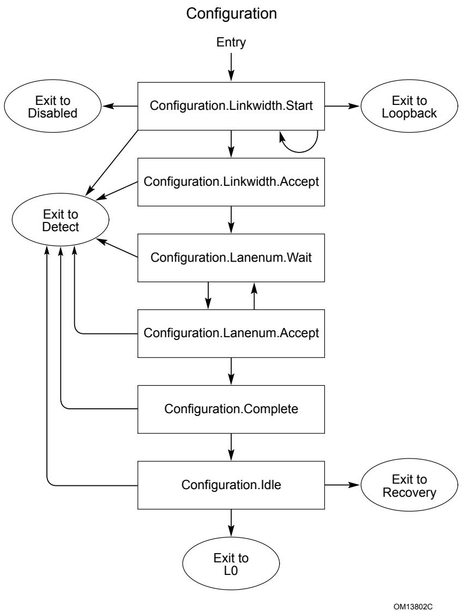

<details>
<summary>flowchart</summary>

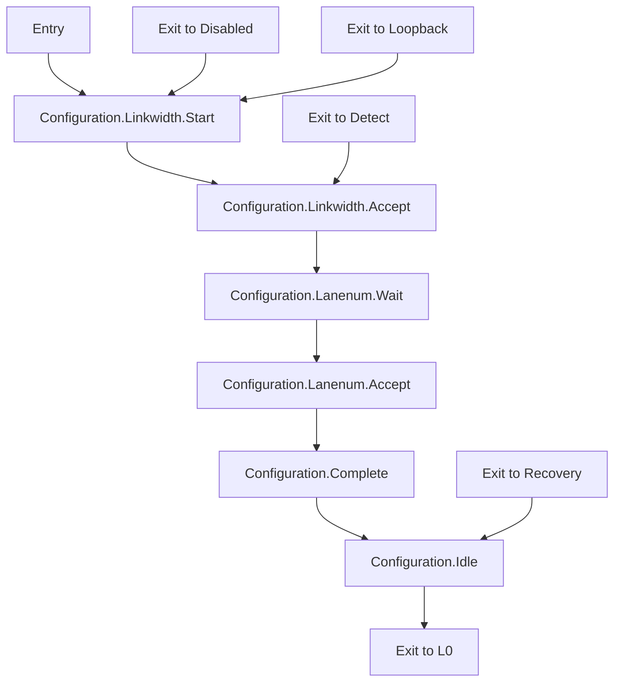
```mermaid
graph TD
  A["Entry"] --> B["Configuration.Linkwidth.Start"]
  B --> C["Configuration.Linkwidth.Accept"]
  C --> D["Configuration.Lanenum.Wait"]
  D --> E["Configuration.Lanenum.Accept"]
  E --> F["Configuration.Complete"]
  F --> G["Configuration.Idle"]
  G --> H["Exit to L0"]
  I["Exit to Disabled"] --> B
  J["Exit to Detect"] --> C
  K["Exit to Loopback"] --> B
  L["Exit to Recovery"] --> G
```
</details>

Figure 4-51 Configuration Substate Machine§

## 4.2.7.4 Recovery §

The Recovery substate machine is shown in § Figure 4-52. For the data rate of 64.0 GT/s, any reference to Pre-cursor implies the two pre-cursors used.

## 4.2.7.4.1 Recovery.RcvrLock §

If the Link is operating at a data rate of 8.0 GT/s or higher, a Receiver must consider any TS0, TS1, or TS2 Ordered Set to be received only after it obtains Block Alignment in that Lane. If entry to this substate is from L1 or Recovery.Speed or L0s, the Block Alignment must be obtained after exiting Electrical Idle condition. If entry to this substate is from L0, the Block Alignment must be obtained after the end of the last Data Stream.

• If the data rate of operation is 8.0 GT/s or higher:

◦ If the start\_equalization\_w\_preset variable is set to 1b:

An Upstream Port must use the Transmitter preset values it registered from the received appropriate eight consecutive TS2 Ordered Sets (EQ TS2 if 8.0 GT/s, EQ TS2 if 32.0 GT/s and Equalization Bypass to Highest NRZ Rate was negotiated, and 128b/130b EQ TS2 if 16.0 GT/ s, 32.0 GT/s, or 64.0 GT/s) in Recovery.RcvrCfg in its Transmitter setting as soon as it starts transmitting in the data rate at which equalization will be performed and ensure that it meets the preset definition in § Chapter 8. . Lanes that received a Reserved or unsupported Transmitter preset value must use an implementation specific method to choose a supported Transmitter preset setting for use as soon as it starts transmitting at the data rate where equalization needs to be performed.

▪ A Downstream Port must use the Transmitter preset settings according to the rules below as soon as it starts transmitting at the data rate where equalization must be performed:

1. If the data rate of equalization is 16.0 GT/s or 32.0 GT/s and eight consecutive EQ TS2 Ordered Sets (for the case where equalization bypass to 32.0 GT/s is to be performed) or 128b/130b EQ TS2 Ordered Sets were received with supported Transmitter Preset values in the most recent transition through Recovery.RcvrCfg, the Transmitter Preset value from those EQ TS2 or 128b/130b EQ TS2 Ordered Sets must be used.

2. Else, if the Transmitter Preset value defined in the Downstream Port Transmitter Preset field of the appropriate Lane Equalization Control Register Entry, as defined below is supported, then it must be used:

<table><tr><td>Data Rate of Equalization</td><td>Transmitter Preset value to be used as soon as the Link transitions to the data rate of equalization</td></tr><tr><td>8.0 GT/s</td><td>Transmitter Preset field defined in the Lane Equalization Control Register Entry for each Lane. The Downstream Port may optionally use the Downstream Port 8.0 GT/s Receiver Preset Hint field defined in the Lane Equalization Control Register Entry for each of its Receivers corresponding to the Lane, if they are not Reserved values.</td></tr><tr><td>16.0 GT/s</td><td>Downstream Port 16.0 GT/s Transmitter Preset field of the 16.0 GT/s Lane Equalization Control Register Entry</td></tr><tr><td>32.0 GT/s</td><td>Downstream Port 32.0 GT/s Transmitter Preset field of the 32.0 GT/s Lane Equalization Control Register Entry</td></tr><tr><td>64.0 GT/s</td><td>Downstream Port 64.0 GT/s Transmitter Preset field of the 64.0 GT/s Lane Equalization Control Register Entry</td></tr></table>

3. Else, use an implementation specific method to choose a supported Transmitter preset setting.

The Downstream Port must ensure that it meets the preset definition in § Chapter 8. .

▪ Next state is Recovery.Equalization.

◦ Else:

▪ The Transmitter must use the coefficient settings agreed upon at .

If this substate was entered from Recovery.Equalization, in the transmitted TS1 Ordered Sets, a Downstream Port must set the Pre-cursor, Cursor, and Post-cursor Coefficient fields to the current Transmitter settings, and if the last accepted request in Phase 2 of Recovery.Equalization was a preset request, it must set the Transmitter Preset bits to the accepted preset of that request.

▪ It is recommended that in this substate, in the transmitted TS1 Ordered Sets, all Ports set the Pre-cursor, Cursor, and Post-cursor Coefficient fields to the current Transmitter settings, and set the Transmitter Preset bits to the most recent preset that the Transmitter settings were set to.  
▪ An Upstream Port that receives eight consecutive TS0 or eight consecutive TS1 Ordered Sets on all configured Lanes with the following characteristics must transition to Recovery.Equalization

▪ If eight consecutive TS1 Ordered Sets were received, Link and Lane numbers in the received TS1 Ordered Sets match with the Link and Lane numbers in the transmitted TS1 Ordered Sets on each Lane  
▪ If eight consecutive TS1 Ordered Sets were received, speed\_change bit is equal to 0b  
▪ If eight consecutive TS0 Ordered Sets were received, and the latest transition to Recovery.RcvrLock was from Recovery.Speed substate  
▪ If eight consecutive TS1 Ordered Sets were received, with the EC bits not equal to 00b

## IMPLEMENTATION NOTE: REDOING EQUALIZATION

A Downstream Port may use this provision to redo some parts of the Transmitter Equalization process using software help or some other implementation specific means while ensuring no transactions are in flight on the Link to avoid any timeouts.

▪ Next state for a Downstream Port is Recovery.Equalization if Recovery.RcvrLock was not entered from Configuration.Idle or Recovery.Idle and the Perform Equalization bit in the Link Control 3 Register is set or an implementation specific mechanism determined equalization needs to be performed, following procedures described in § Section 4.2.4 .

The Port must ensure that no more than 2 TS1 Ordered Sets with EC=00b are transmitted due to being in Recovery.RcvrLock before starting to transmit the TS1 Ordered Sets required by Recovery.Equalization, if the data rate is 8.0 GT/s, 16.0 GT/s, or 32.0 GT/s.

The Port must ensure that no more than 2 TS0 Ordered Sets with EC=00b are transmitted due to being in Recovery.RcvrLock before starting to transmit the TS0 Ordered Sets required by Recovery.Equalization, if the data rate is 64.0 GT/s.

• Transmitter sends TS1 Ordered Sets on all configured Lanes using the same Link and Lane numbers that were set after leaving Configuration. The speed\_change bit (bit 7 of the Data Rate Identifier Symbol in TS1 Ordered Set) must be set to 1b if the directed\_speed\_change variable is set to 1b. The directed\_speed\_change variable is set to 1b if any configured Lane receives eight consecutive TS1 Ordered Sets with the speed\_change bit set to 1b. Only those data rates greater than 2.5 GT/s should be advertised that can be supported reliably. In Non-Flit Mode of operation, the N\_FTS value in the TS1 Ordered Set transmitted reflects the number at the current speed of operation. A device is allowed to change the supported data rates that it advertises when it enters this substate.

A Downstream Port that intends to redo equalization with a data rate change from 2.5 GT/s or 5.0 GT/s to 8.0 GT/s or 32.0 GT/s when Equalization Bypass to Highest NRZ Rate is supported must:

◦ Send EQ TS1 Ordered Sets with the speed\_change bit set to 1b and advertising the following data rates:

▪ 8.0 GT/s Data Rate Identifier if redo equalization is for 8.0 GT/s Data Rate  
▪ 32.0 GT/s Data Rate Identifier if redo equalization is for 32.0 GT/s Data Rate

◦ If the equalization redo attempt is initiated by the hardware as described in § Section 4.2.4 , then hardware must ensure that the Data Rate is 2.5 GT/s or 5.0 GT/s before initiating the attempt.

◦ If the equalization redo attempt is initiated by the software mechanism as described in § Section 4.2.4 , then software must ensure that the Data Rate is 2.5 GT/s or 5.0 GT/s before initiating the attempt.

A Downstream Port that intends to redo equalization with a data rate change from 8.0 GT/s to 16.0 GT/s, 16.0 GT/s to 32.0 GT/s, or 32.0 GT/s to 64.0 GT/s must:

◦ Send TS1 Ordered Sets with the Equalization Redo bit set to 1b, the speed\_change bit set to 1b, and advertising the Data Rate Identifier at which equalization redo will be performed (16.0 GT/s, 32.0 GT/s, or 64.0 GT/s).  
◦ If the equalization redo attempt is initiated by the hardware as described in § Section 4.2.4 , then hardware must ensure that the Data Rate is the following before initiating the attempt to redo equalization:

▪ 8.0 GT/s if the equalization redo is for 16.0 GT/s Data Rate  
▪ 16.0 GT/s if the equalization redo is for 32.0 GT/s Data Rate  
▪ 32.0 GT/s if the equalization redo is for 64.0 GT/s Data Rate

◦ If the equalization redo attempt is initiated by the software mechanism as described in § Section 4.2.4 , then software must ensure that the Data Rate is the following before initiating the attempt to redo equalization:

▪ 8.0 GT/s if the equalization redo is for 16.0 GT/s Data Rate  
▪ 16.0 GT/s if the equalization redo is for 32.0 GT/s Data Rate  
▪ 32.0 GT/s if the equalization redo is for 64.0 GT/s Data Rate

An Upstream Port must advertise the highest data rate support in the TS2 Ordered Sets it transmits in Recovery.RcvrCfg, and optionally in the TS1 Ordered Sets it transmits in this substate, unless the Upstream Port has determined that a problem unrelated to the highest data rate equalization prevents it from operating reliably at the highest data rate at which equalization is being requested to be performed, if the eight consecutive Ordered Sets it receives are one of the following:

◦ EQ TS1 or EQ TS2 Ordered Sets with the speed\_change bit set to 1b  
◦ TS1 Ordered Sets with the Equalization Redo bit set to 1b or 128b/130b EQ TS2 Ordered Sets with the speed\_change bit set to 1b.

Under other conditions, a device must not change the supported data rate values either in this substate or while in the Recovery.RcvrCfg or Recovery.Equalization substates. The successful\_speed\_negotiation variable is reset to 0b upon entry to this substate.

## IMPLEMENTATION NOTE:

## HANDLING A REQUEST TO ADVERTISE 8.0 GT/S DATA RATE IDENTIFIER

If an Upstream Port that is not advertising 8.0 GT/s Data Rate Identifiers receives EQ TSs with 8.0 GT/s Data Rate Identifiers and with the speed\_change bit set in Recovery.RcvrLock, that indicates that the Downstream Port is attempting to switch the Link speed to 8.0 GT/s in order to perform the 8.0 GT/s Link Equalization Procedure. If for some reason the Upstream Port is unable or unwilling to switch to advertising 8.0 GT/s Data Rate Identifiers in the TS2 Ordered Sets it transmits once it transitions to Recovery.RcvrCfg, the 8.0 GT/s Link Equalization Procedure will not be performed in the current tenure in Recovery. This may cause the Downstream Port to permanently abandon its attempt to change the Link speed to 8.0 GT/s and perform the 8.0 GT/s Link Equalization Procedure, resulting in an operational link speed of less than 8.0 GT/s until after the link transitions through Detect and is re-trained. It is recommended that if an Upstream Port is for some temporary reason unable or unwilling to switch to advertising 8.0 GT/s Data Rate Identifiers in the condition described above, and does not intend to prohibit the Link from operating at 8.0 GT/s, that it perform one of the following two actions below as soon as is reasonable for it to do so:

• If the Upstream Port supports the Quiesce Guarantee mechanism for performing the Link Equalization Procedure, enter Recovery and advertise 8.0 GT/s Data Rate Identifiers with the speed\_change bit set to 1b in the TSs that it sends. If Recovery.Equalization is not entered after changing speed to 8.0 GT/s and before entering Recovery.RcvrCfg at 8.0 GT/s (the Downstream Port did not direct an entry to Recovery.Equalization), it should set the Request Equalization and Quiesce Guarantee bits to 1b in the TS2 Ordered Sets sent at 8.0 GT/s in Recovery.RcvrCfg in order to request the Downstream Port to initiate the Link Equalization Procedure.  
• Enter Recovery and advertise 8.0 GT/s Data Rate Identifiers with the speed\_change bit cleared to 0b. The Downstream Port may then later initiate a speed change to 8.0 GT/s and perform the Link Equalization Procedure, though there is no guarantee that it will do so.

The process for handling a request to advertise 16.0 GT/s, 32.0 GT/s, or 64.0 GT/s Data Rate Identifier is similar to 8.0 GT/s Data Rate Identifier with 16.0 GT/s, 32.0 GT/s, or 64.0 GT/s Data Rate Identifier substituting 8.0 GT/s Data Rate Identifier and 128b/130b EQ TS2s substituting EQ TSs.

An Upstream Port must set the Selectable De-emphasis bit (bit 6 of Symbol 4) of the TS1 Ordered Sets it transmits to match the desired de-emphasis level at 5.0 GT/s. The mechanism an Upstream Port may adopt to request a de-emphasis level if it chooses to do so is implementation specific. It must also be noted that since the Upstream Port’s request may not reach the Downstream Port due to bit errors in the TS1 Ordered Sets, the Upstream Port may attempt to re-request the desired de-emphasis level in subsequent entries to Recovery state when speed change is requested. If the Downstream Port intends to use the Upstream Port’s de-emphasis information in Recovery.RcvrCfg, then it must record the value of the Selectable De-emphasis bit received in this state.

The Transmit Margin field of the Link Control 2 Register is sampled on entry to this substate and becomes effective on the transmit package pins within 192 ns of entry to this substate and remains effective until a new value is sampled on a subsequent entry to this substate from L0, L0s, or L1.

• After activating any inactive Lane, the Transmitter must wait for its TX common mode to settle before exiting Electrical Idle and transmitting the TS1 Ordered Sets with the following exceptions.  
• When exiting from the L1.2 L1 PM Substate, common mode is permitted to be established passively during L1.0, and actively during Recovery. In order to ensure common mode has been established in Recovery.RcvrLock, the Downstream Port must maintain a timer, and the Downstream Port must not send TS2

Ordered Sets until a minimum of TCOMMONMODE has elapsed since the Downstream Port has started transmitting TS1 Ordered Sets and has detected electrical idle exit on any Lane of the configured Link. See § Section 5.5.3.3 .

• Implementations must note that the voltage levels may change after an early bit lock and Symbol or Block alignment since the new Transmit Margin field becomes effective within 192 ns after the other side enter Recovery.RcvrLock. The Receiver needs to reacquire bit lock and Symbol or Block alignment under those conditions.

a. Note: The directed\_speed\_change variable is set to 1b in L0 or L1 state for the side that is initiating a speed change. For the side that is not initiating a speed change, this bit is Set in this substate if the received TS Ordered Sets have the speed change bit Set. This bit is reset to 0b in the Recovery.Speed substate.  
b. A device must accept all good TLPs and DLLPs it receives after entering this substate from L0 prior to receiving the first TS Ordered Set. If operating with 128b/130b encoding, any received TLPs and DLLPs are subject to the framing rules for 128b/130b encoding in § Section 4.2.2.3 .

Next state is Recovery.RcvrCfg if eight consecutive TS1 or TS2 Ordered Sets are received on all configured Lanes with the same Link and Lane numbers that match what is being transmitted on those same Lanes and the speed\_change bit is equal to the directed\_speed\_change variable and the EC field is 00b in all the consecutive TS1 Ordered Sets if the current data rate is 8.0 GT/s or higher.

◦ If the Extended Synch bit is Set, the Transmitter must send a minimum of 1024 consecutive TS1 Ordered Sets before transitioning to Recovery.RcvrCfg.  
◦ If this substate was entered from Recovery.Equalization, the Upstream Port must evaluate the equalization coefficients or preset received by all Lanes that receive eight TS1 Ordered Sets and note whether they are different from the final set of coefficients or preset that was accepted in Phase 2 of the equalization process. Note: Mismatches are reported in Recovery.RcvrCfg by setting the Request Equalization bit of TS2 Ordered Sets.

• Otherwise, after a 24 ms timeout:

◦ Next state is Recovery.RcvrCfg if the following two conditions are true:

Eight consecutive TS1 or TS2 Ordered Sets are received on any configured Lane with the same Link and Lane numbers that match what is being transmitted on the same Lane and the speed\_change bit equal to 1b.  
▪ Either the current data rate of operation is greater than 2.5 GT/s; or 5.0 GT/s or greater data rate identifiers are set in both the transmitted TS1 and the (eight consecutive) received TS1 or TS2 Ordered Sets.

◦ Else the next state is Recovery.Speed if the speed of operation has not changed to a mutually negotiated data rate since entering Recovery from L0 or L1 (i.e., changed\_speed\_recovery = 0b) and the current speed of operation is greater than 2.5 GT/s.

▪ The new data rate to operate after leaving Recovery.Speed will be at 2.5 GT/s if 8b/10b or 128b/130b encoding is used. The new data rate of operation after leaving Recovery.Speed will be 32.0 GT/s if 1b/1b encoding is used. Note: This indicates that the Link was unable to operate at the current data rate and the Link will operate at the lower data rate of either 2.5 GT/s data rate or 32.0 G/s.

◦ Else the next state is Recovery.Speed if the operating speed has been changed to a mutually negotiated data rate since entering Recovery from L0 or L1 (changed\_speed\_recovery = 1b; i.e., the arc to this substate has been taken from Recovery.Speed). The new data rate to operate after leaving Recovery.Speed is reverted back to the speed it was when Recovery was entered from L0 or L1.

Note: This indicates that the Link was unable to operate at the new negotiated data rate and will revert back to the old data rate with which it entered Recovery from L0 or L1.

◦ Else the next state is Configuration and the directed\_speed\_change variable is reset to 0b if the following conditions are true:

▪ If any of the configured Lanes that are receiving a TS1 or TS2 Ordered Set have received at least one TS1 or TS2 Ordered Set with Link and Lane numbers that match what is being transmitted on those same Lanes.  
▪ The operating speed has not changed to a mutually negotiated data rate (i.e., changed\_speed\_recovery = 0b) since entering Recovery.

and at least one of the following conditions is true:

▪ The directed\_speed\_change variable is equal to 0b and the speed\_change bit on the received TS1 or TS2 Ordered Set is equal to 0b.  
▪ The current data rate of operation is 2.5 GT/s and 2.5 GT/s data rate is the highest commonly advertised data rate among the transmitted TS1 Ordered Sets and the received TS1 or TS2 Ordered Set(s).

◦ Otherwise, the next state is Detect.

## IMPLEMENTATION NOTE:

## EXAMPLE SHOWING SPEED CHANGE ALGORITHM BETWEEN 2.5 GT/S AND 5.0 GT/S §

Suppose a Link connects two greater than 5.0 GT/s capable components, A and B. The Link comes up to the L0 state in 2.5 GT/s data rate. Component A decides to change the speed to greater than 5.0 GT/s, sets the directed\_speed\_change variable to 1b and enters Recovery.RcvrLock from L0. Component A sends TS1 Ordered Sets with the speed\_change bit set to 1b and advertises the 2.5 GT/s, 5.0 GT/s, and 8.0 GT/s data rates. Component B sees the first TS1 in L0 state and enters Recovery.RcvrLock state. Initially, component B sends TS1s with the speed\_change set to 0b. Component B will start sending the speed\_change indication in its TS1 after it receives eight consecutive TS1 Ordered Sets from component A and advertises all of the data rates it can support. Component B will enter Recovery.RcvrCfg from where it will enter Recovery.Speed. Component A will wait for eight consecutive TS1/TS2 with speed\_change bit set from component B before moving to Recovery.RcvrCfg and on to Recovery.Speed. Both component A and component B enter Recovery.Speed and record 8.0 GT/s as the maximum speed they can operate with. The directed\_speed\_change variable will be reset to 0b when in Recovery.Speed. When they enter Recovery.RcvrLock from Recovery.Speed, they will operate at 8.0 GT/s and send TS1s with speed\_change set to 0b. If both sides work well at 8.0 GT/s, they will continue on to Recovery.RcvrCfg and enter L0 through Recovery.Idle at 8.0 GT/s. However, if component B fails to achieve Symbol lock, it will timeout in Recovery.RcvrLock and enters Recovery.Speed. Component A would have moved on to Recovery.RcvrCfg but would see the Electrical Idle after receiving TS1s at 8.0 GT/s after component B enters Recovery.Speed. This will cause component A to move to Recovery.Speed. After entering Recovery.Speed for the second time, both sides will revert back to the speed they operated with prior to entering the Recovery state (2.5 GT/s). Both sides will enter L0 from Recovery in 2.5 GT/s. Component A may initiate the directed\_speed\_change variable for a second time, requesting 8.0 GT/s data rate in its Data Rate Identifier, go through the same steps, fail to establish the 8.0 GT/s data rate and go back to L0 in 2.5 GT/s data rate. On the third attempt, however, component A may decide to only advertise 2.5 GT/s and 5.0 GT/s data rates and successfully establish the Link at 5.0 GT/s data rate and enter L0 at that speed. However, if either side entered Detect, that side should advertise all of the data rates it can support, since there may have been a hot plug event.

## 4.2.7.4.2 Recovery.Equalization §

If this state was entered from Recovery.RcvrLock, Transmitter sends either TS0 or TS1 Ordered Sets on all configured Lanes, as described in § Table 4-51, using the same Link and Lane numbers that were set after leaving Configuration. A Receiver must consider any TS1 or TS0 Ordered Set to be received only after it obtains Block Alignment in that Lane.

If this state was entered from Loopback.Entry:

• Transmitter sends either TS0 or TS1 Ordered Sets, as described in § Table 4-51, on all Lanes that detected a Receiver during Detect using the Link and Lane numbers defined in Loopback.Entry.  
• The Lane under test is the only Lane that participates in the equalization procedure.  
• The Lanes that are not under test must not be included in the equalization procedure and anything received by them is permitted to be ignored. The Lanes that are not under test must have their Transmitter preset values set to P4 / Q0. The sole purpose of the lanes that are not under test is to create the noise that is needed in Loopback.Active.

The Lanes must transmit the proper type of Ordered Set (TS0 vs TS1) and check for the receipt of the proper Ordered Set (TS0 vs TS1), according to § Table 4-51, in Recovery.Equalization anywhere TS0/TS1 is mentioned.

Table 4-51 Use of TS0 or TS1 Ordered Sets in different phases§

<table><tr><td>Current Data Rate / Port</td><td>Phase 0 / Phase 1</td><td>Phase 2</td><td>Phase 3</td></tr><tr><td>8.0 GT/s, 16.0 GT/s, or 32.0 GT/s; Upstream/Downstream Lanes</td><td>TS1</td><td>TS1</td><td>TS1</td></tr><tr><td>64.0 GT/s Downstream Lanes</td><td>TS0</td><td>TS0 followed by TS1</td><td>TS1</td></tr><tr><td>64.0 GT/s Upstream Lanes</td><td>TS0</td><td>TS0</td><td>TS0 followed by TS1</td></tr></table>

## IMPLEMENTATION NOTE: TS0 TO TS1 TRANSITIONS §

All the TS0 to TS1 transitions are expected and initiated by a Port so that its receiver is prepared for the NRZ to PAM4 transition.

The first transition occurs for the Downstream Lanes when entering Phase 2. The Downstream Lanes send TS0 with EC = 00b till they get their receiver to a 1E-4 BER and then they send EC = 01b. Then they just wait for the EC = 01b from the Upstream Port to make the transition. When the Upstream Port sends EC = 01b, it is guaranteed of the transition within a fixed time since the Downstream Port has already acquired its target BER of 1E-4.

The other transition happens during Phase 3 for the Upstream Lanes, when the Upstream Port receives EC=11b. Since the Downstream Port sends EC=11b, it is expecting the NRZ to PAM4 transition.

We have also made a provision for the Retimer to request extended EQ during Phase 0 & 1 for 64.0 GT/s equalization.

## 4.2.7.4.2.1 Downstream Lanes §

Upon entry to this substate:

• Current phase is Phase 1

◦ If the data rate of operation is 8.0 GT/s:

▪ The Equalization 8.0 GT/s Phase 1 Successful, Equalization 8.0 GT/s Phase 2 Successful, Equalization 8.0 GT/s Phase 3 Successful, Link Equalization Request 8.0 GT/s, and Equalization 8.0 GT/s Complete bits of the Link Status 2 Register and the Perform Equalization bit of the Link Control 3 Register are all set to 0b.  
▪ The equalization\_done\_8GT\_data\_rate variable is set to 1b.

◦ If the data rate of operation is 16.0 GT/s:

The Equalization 16.0 GT/s Phase 1 Successful, Equalization 16.0 GT/s Phase 2 Successful, Equalization 16.0 GT/s Phase 3 Successful, Link Equalization Request 16.0 GT/s, and Equalization 16.0 GT/s Complete bits of the 16.0 GT/s Status Register and the Perform Equalization bit of the Link Control 3 Register are all set to 0b.  
▪ The equalization\_done\_16GT\_data\_rate variable is set to 1b.

◦ If the data rate of operation is 32.0 GT/s:

The Equalization 32.0 GT/s Phase 1 Successful, Equalization 32.0 GT/s Phase 2 Successful, Equalization 32.0 GT/s Phase 3 Successful, Link Equalization Request 32.0 GT/s, and Equalization 32.0 GT/s Complete bits of the 32.0 GT/s Status Register and the Perform Equalization bit of the Link Control 3 Register are all set to 0b.  
▪ The equalization\_done\_32GT\_data\_rate variable is set to 1b.

◦ If the data rate of operation is 64.0 GT/s:

The Equalization 64.0 GT/s Phase 1 Successful, Equalization 64.0 GT/s Phase 2 Successful, Equalization 64.0 GT/s Phase 3 Successful, Link Equalization Request 64.0 GT/s, and Equalization 64.0 GT/s Complete bits of the 64.0 GT/s Status Register and the Perform Equalization bit of the Link Control 3 Register are all set to 0b.  
▪ The equalization\_done\_64GT\_data\_rate variable is set to 1b.

• The start\_equalization\_w\_preset variable is set to 0b.

## 4.2.7.4.2.1.1 Phase 1 of Transmitter Equalization §

• Transmitter sends TS0/TS1 Ordered Sets using the Transmitter preset settings for the current data rate of operation. In the TS0/TS1 Ordered Sets, the EC field is set to 01b. For TS0 ordered sets, the EC field is initially set to 00b. After two consecutive TS0 ordered sets are received with Retimer Equalization Extend bit set to 0b, the EC field is set to 01b. The Transmitter Preset bits of each Lane is set to the value of its corresponding Transmitter preset setting for the current data rate. The FS and LF fields are set to the appropriate values. The Pre-cursor coefficient, Cursor coefficient, and Post-cursor Coefficient fields are set to values corresponding to the Lane's Transmitter Preset bits if TS1 Ordered Sets are transmitted. The Transmitter preset settings, for each configured Lane, must be chosen as follows:

1. If Recovery.Equalization was entered from Loopback.Entry:

▪ If EQ TS1 Ordered Sets directed the device from Configuration.Linkwidth.Start to Loopback.Entry, the Transmitter preset value specified in the Preset field of the EQ TS1 Ordered Sets must be used by the Lane under test.

▪ If standard TS1 Ordered Sets directed the device from Configuration.Linkwidth.Start to Loopback.Entry, an implementation specific method must be used to choose a supported Transmitter Preset value for use.  
▪ If perform\_equalization\_for\_loopback\_64GT is 1b, Loopback Follower must advertise 64.0 GT/s support in the transmitted TS0/TS1 Ordered Sets (i.e, Data Rate Identifier must use the Flit Mode Encoding).

2. Else, if eight consecutive 128b/130b EQ TS2 Ordered Sets were received with supported Transmitter preset values in the most recent transition through Recovery.RcvrCfg and the current data rate of operation is 16.0 GT/s or higher, the Transmitter preset value requested in the 128b/130b EQ TS2 Ordered Sets must be used.

3. Else, if eight consecutive EQ TS2 Ordered Sets were received with supported Transmitter preset values in the most recent transition through Recovery.RcvrCfg, the current data rate of operation is 32.0 GT/s, and equalization bypass to 32.0 GT/s is being performed, the Transmitter preset value requested in the EQ TS2 Ordered Sets must be used.

4. Else, if the Transmitter preset setting specified by the Downstream Port 8.0 GT/s Transmitter Preset field of the Lane Equalization Control Register Entry (for operation at the 8.0 GT/s data rate) or the Downstream Port 16.0 GT/s Transmitter Preset field of the 16.0 GT/s Lane Equalization Control Register Entry (for operation at the 16.0 GT/s data rate) or the Downstream Port 32.0 GT/s Transmitter Preset field of the 32.0 GT/s Lane Equalization Control Register Entry (for operation at the 32.0 GT/s data rate) or the Downstream Port 64.0 GT/s Transmitter Preset field of the 64.0 GT/s Lane Equalization Control Register Entry (for operation at the 64.0 GT/s data rate) is a supported value and is not a Reserved value, it must be used.

5. Else, use an implementation specific method to choose a supported Transmitter preset setting for use.

• The Downstream Port is permitted to wait for up to 500 ns after entering Phase 1 before evaluating received information for TS0/TS1 Ordered Sets if it needs the time to stabilize its Receiver logic.  
• Next phase is Phase 2 if all configured Lanes receive two consecutive TS0/TS1 Ordered Sets with EC=01b and the Downstream Port wants to execute Phase 2 and Phase 3. When the perform\_equalization\_for\_loopback variable is 1b and the Downstream Port's Flit Mode Supported field of its PCI Express Capabilities Register is set to 1b, Phase 2 and Phase 3 must be executed.

◦ The Receiver must complete its bit lock process and then recognize Ordered Sets within 2 ms after receiving the first bit of the first valid Ordered Set on its Receiver pin.

◦ If the data rate is 8.0 GT/s, the Equalization 8.0 GT/s Phase 1 Successful bit of the Link Status 2 Register is set to 1b.

◦ If the data rate is 16.0 GT/s, the Equalization 16.0 GT/s Phase 1 Successful bit of the 16.0 GT/s Status Register is set to 1b.

◦ If the data rate is 32.0 GT/s and perform\_equalization\_for\_loopback is 0b, the Equalization 32.0 GT/s Phase 1 Successful bit of the 32.0 GT/s Status Register is set to 1b.

◦ If the data rate is 64.0 GT/s and perform\_equalization\_for\_loopback is 0b, the Equalization 64.0 GT/s Phase 1 Successful bit of the 64.0 GT/s Status Register is set to 1b.

◦ The LF and FS values received in the two consecutive TS1 Ordered Sets must be stored for use during Phase 3, if the Downstream Port wants to adjust the Upstream Port’s Transmitter coefficients.

• Next state is Recovery.RcvrLock if all configured Lanes receive two consecutive TS0/TS1 Ordered Sets with EC=01b, perform\_equalization\_for\_loopback is 0b and the Downstream Port does not want to execute Phase 2 and Phase 3.

◦ If the data rate is 8.0 GT/s, The Equalization 8.0 GT/s Phase 1 Successful, Equalization 8.0 GT/s Phase 2 Successful, Equalization 8.0 GT/s Phase 3 Successful, and Equalization 8.0 GT/s Complete bits of the Link Status 2 Register are set to 1b.  
◦ If the data rate is 16.0 GT/s, The Equalization 16.0 GT/s Phase 1 Successful, Equalization 16.0 GT/s Phase 2 Successful, Equalization 16.0 GT/s Phase 3 Successful, and Equalization 16.0 GT/s Complete bits of the 16.0 GT/s Status Register are set to 1b.  
◦ If the data rate is 32.0 GT/s, The Equalization 32.0 GT/s Phase 1 Successful, Equalization 32.0 GT/s Phase 2 Successful, Equalization 32.0 GT/s Phase 3 Successful, and Equalization 32.0 GT/s Complete bits of the 32.0 GT/s Status Register are set to 1b.  
◦ If the data rate is 64.0 GT/s, The Equalization 64.0 GT/s Phase 1 Successful, Equalization 64.0 GT/s Phase 2 Successful, Equalization 64.0 GT/s Phase 3 Successful, and Equalization 64.0 GT/s Complete bits of the 64.0 GT/s Status Register are set to 1b.  
◦ If the data rate is 64.0 GT/s, the Transmitter must send 24 TS0 Ordered Sets with EC=00b prior to transitioning to Recovery.RcvrLock  
◦ Note: A transition to Recovery.RcvrLock might be used in the case where the Downstream Port determines that Phase 2 and Phase 3 are not needed based on the platform and channel characteristics.

• Next state is Loopback.Entry after a 24 ms timeout if perform\_equalization\_for\_loopback is 1b.

• Else, next state is Recovery.Speed after a 24 ms timeout if perform\_equalization\_for\_loopback is 0b.

◦ successful\_speed\_negotiation is set to 0b.  
◦ If the data rate is 8.0 GT/s, the Equalization 8.0 GT/s Complete bit of the Link Status 2 Register is set to 1b.  
◦ If the data rate is 16.0 GT/s, the Equalization 16.0 GT/s Complete bit of the 16.0 GT/s Status Register is set to 1b.  
◦ If the data rate is 32.0 GT/s, the Equalization 32.0 GT/s Complete bit of the 32.0 GT/s Status Register is set to 1b.  
◦ If the data rate is 64.0 GT/s, the Equalization 64.0 GT/s Complete bit of the 64.0 GT/s Status Register is set to 1b.

## 4.2.7.4.2.1.2 Phase 2 of Transmitter Equalization §

• The Transmitter sends TS0 Ordered Sets with EC=10b if the data rate is 64.0 GT/s and all Lanes have not received two consecutive TS0 Ordered Sets with EC=10b since entering this Phase; else it sends TS1 Ordered Sets.  
• Transmitter sends TS1 Ordered Sets with EC = 10b and the coefficient settings, set on each Lane independently, as follows:

◦ If two consecutive TS0/TS1 Ordered Sets with EC=10b have been received since entering Phase 2, or two consecutive TS0/TS1 Ordered Sets with EC=10b and a preset or set of coefficients (as specified by the Use Preset bit) different than the last two consecutive TS0/TS1 Ordered Sets with EC=10b:

▪ If the preset or coefficients requested in the most recent two consecutive TS0/TS1 Ordered Sets are legal and supported (see § Section 4.2.4 ):

▪ Change the transmitter settings to the requested preset or coefficients such that the new settings are effective at the Transmitter pins within 500 ns of when the end of the second TS0/TS1 Ordered Set requesting the new setting was received at the Receiver pin. The change of Transmitter settings must not cause any illegal voltage level or parameter at the Transmitter pin for more than 1 ns.

▪ In the transmitted TS1 Ordered Sets, the Transmitter Preset bits are set to the requested preset (for a preset request), the Pre-cursor, Cursor, and Post-cursor Coefficient fields are set to the Transmitter settings (for a preset or a coefficients request), and the Reject Coefficient Values bit is Clear.

▪ Else (the requested preset or coefficients are illegal or unsupported): Do not change the Transmitter settings used, but reflect the requested preset or coefficient values in the transmitted TS1 Ordered Sets and set the Reject Coefficient Values bit to 1b.

◦ Else: the preset and coefficients currently being used by the Transmitter.

• Next phase is Phase 3 if all configured Lanes receive two consecutive TS0/TS1 Ordered Sets with EC=11b.

◦ If the data rate is 8.0 GT/s, the Equalization 8.0 GT/s Phase 2 Successful bit of the Link Status 2 Register is set to 1b.  
◦ If the data rate is 16.0 GT/s, the Equalization 16.0 GT/s Phase 2 Successful bit of the 16.0 GT/s Status Register is set to 1b.  
◦ If the data rate is 32.0 GT/s and perform\_equalization\_for\_loopback is 0b, the Equalization 32.0 GT/s Phase 2 Successful bit of the 32.0 GT/s Status Register is set to 1b.  
◦ If the data rate is 64.0 GT/s and perform\_equalization\_for\_loopback is 0b, the Equalization 64.0 GT/s Phase 2 Successful bit of the 64.0 GT/s Status Register is set to 1b.

• For data rates less than 64.0 GT/s, next state is Loopback.Entry after a 32 ms timeout with a tolerance of -0 ms and +4 ms if perform\_equalization\_for\_loopback is 1b.  
• For the data rate of 64.0 GT/s, Next state is Loopback.Entry after a 64 ms timeout with a tolerance of -0 ms and +4 ms if perform\_equalization\_for\_loopback is 1b.  
• Else, if the data rate is less than 64.0 GT/s: next state is Recovery.Speed after a 32 ms timeout with a tolerance of -0 ms and +4 ms

◦ successful\_speed\_negotiation is set to 0b.

◦ If the data rate is 8.0 GT/s, The Equalization 8.0 GT/s Complete bit of the Link Status 2 Register is set to 1b.

◦ If the data rate is 16.0 GT/s, The Equalization 16.0 GT/s Complete bit of the 16.0 GT/s Status Register is set to 1b.

◦ If the data rate is 32.0 GT/s, The Equalization 32.0 GT/s Complete bit of the 32.0 GT/s Status Register is set to 1b.

• Else, if the data rate is 64.0 GT/s: next state is Recovery.Speed after a 64 ms timeout with a tolerance of -0 ms and +4 ms

◦ successful\_speed\_negotiation is set to 0b.  
◦ The Equalization 64.0 GT/s Complete bit of the 64.0 GT/s Status Register is set to 1b.

## 4.2.7.4.2.1.3 Phase 3 of Transmitter Equalization §

• Transmitter sends TS1 Ordered Sets with EC = 11b  
• The Port must evaluate and arrive at the optimal settings independently on each Lane. When perform\_equalization\_for\_loopback is 1b, the equalization procedure is only performed on the Lane under test. To evaluate a new preset or coefficient setting that is legal, as per the rules in § Section 4.2.4 and § Chapter 8. :

◦ Request a new preset by setting the Transmitter Preset bits to the desired value and set the Use Preset bit to 1b. Alternativly, request a new set of coefficients by setting the Pre-cursor, Cursor, and

Post-Cursor Coefficient fields to the desired values and set the Use Preset bit to 0b. Once a request is made, it must be continuously requested for at least 1 μs or until the evaluation of the request is completed, whichever is later.

◦ Wait for the required time (500 ns plus the roundtrip delay including the logic delays through the Downstream Port) to ensure that, if accepted, the Upstream Port is transmitting using the requested settings. Obtain Block Alignment and then evaluate the incoming Ordered Sets. Note: The Downstream Port may simply ignore anything it receives during this waiting period as the incoming bit stream may be illegal during the transition to the requested settings. Hence the requirement to validate Block Alignment after this waiting period. If Block Alignment cannot be obtained after an implementation specific amount of time (in addition to the required waiting period specified above) it is recommended to proceed to perform receiver evaluation on the incoming bit stream regardless.  
◦ If two consecutive TS1 Ordered Sets are received with the Transmitter Preset bits (for a preset request) or the Pre-cursor, Cursor, and Post-Cursor Coefficient fields (for a coefficients request) identical to what was requested and the Reject Coefficient Values bit is Clear, then the requested setting was accepted and, depending on the results of receiver evaluation, can be considered as a candidate final setting.  
◦ If two consecutive TS1 Ordered Sets are received with the Transmitter Preset bits (for a preset request) or the Pre-cursor, Cursor, and Post-Cursor Coefficient fields (for a coefficients request) identical to what was requested and the Reject Coefficient Values bit is Set, then the requested setting was rejected and must not be considered as a candidate final setting.  
◦ If, after an implementation specific amount of time following the start of receiver evaluation, no consecutive TS1s with the Transmitter Preset bits (for a preset request) or the Pre-Cursor, Cursor, and Post-Cursor Coefficient fields (for a coefficients request) identical to what was requested are received, then the requested setting must not be considered as a candidate final setting.  
◦ The Downstream Port is responsible for setting the Reset EIEOS Interval Count bit in the TS1 Ordered Sets it transmits according to its evaluation criteria and requirements. The Use Preset bit of the received TS1 Ordered Sets must not be used to determine whether a request is accepted or rejected.

## IMPLEMENTATION NOTE: RESET EIEOS AND COEFFICIENT/PRESET REQUESTS

A Port may set Reset EIEOS Interval Count to 1b when it wants a longer PRBS pattern and subsequently clear it when it needs to obtain Block Alignment.

All TS1 Ordered Sets transmitted in this phase are requests. The first request maybe a new preset or a new coefficient request or a request to maintain the current link partner transmitter settings by reflecting the settings received in the two consecutive TS1 Ordered Sets with EC=11b that cause the transition to Phase 3.

◦ At 32.0 GT/s and below data rates, the total amount of time spent per preset or coefficients request from transmission of the request to the completion of the evaluation must be less than 2 ms. Implementations that need a longer evaluation time at the final stage of optimization may continue requesting the same preset or coefficient setting beyond the 2 ms limit but must adhere to the timeout (24 ms for 8.0, 16.0, and 32.0 GT/s and 48 ms for 64.0 GT/s) in this phase and must not take this exception more than two times. If the requester is unable to receive Ordered Sets within the timeout period, it may assume that the requested setting does not work in that Lane.

◦ At 64.0 GT/s and higher data rates, a device is permitted to evaluate each preset or coefficients request for an arbitrary amount of time. Evaluation must be carefully managed such that the search for an acceptable preset or coefficients can be successful. The total time spent in this Phase must still adhere to the timeout.  
◦ All new preset or coefficient settings must be presented on all configured Lanes simultaneously. Any given Lane is permitted to continue to transmit the current preset or coefficients as its new value if it does not want to change the setting at that time.

• Next state is Loopback.Entry if the data rate of operation is 32.0 GT/s, perform\_equalization\_for\_loopback is 1b and one of the following conditions is satisfied:

a. The Lane under test is operating at its optimal setting and it received two consecutive TS1 Ordered Sets with the Retimer Equalization Extend bit set to 0b.  
b. A 24 ms timeout with a tolerance of -0 ms and +2 ms.

• Next state is Loopback.Entry if the data rate of operation is 64.0 GT/s, perform\_equalization\_for\_loopback is 1b and one of the following conditions is satisfied:

a. The Lane under test is operating at its optimal setting and all Lanes receive two consecutive TS1 Ordered Sets with the Retimer Equalization Extend bit set to 0b are received.  
b. A 48 ms timeout with a tolerance of -0 ms and +2 ms.

• Next state is Recovery.RcvrLock if perform\_equalization\_for\_loopback is 0b, all configured Lanes are operating at their optimal setting and either the data rate of operation is 8.0 GT/s or all Lanes receive two consecutive TS1 Ordered Sets with the Retimer Equalization Extend bit set to 0b.

◦ If the data rate of operation is 8.0 GT/s: The Equalization 8.0 GT/s Phase 3 Successful and Equalization 8.0 GT/s Complete bits of the Link Status 2 Register are set to 1b.  
◦ If the data rate of operation is 16.0 GT/s: The Equalization 16.0 GT/s Phase 3 Successful and Equalization 16.0 GT/s Complete bits of the 16.0 GT/s Status Register are set to 1b.  
◦ If the data rate of operation is 32.0 GT/s: The Equalization 32.0 GT/s Phase 3 Successful and Equalization 32.0 GT/s Complete bits of the 32.0 GT/s Status Register are set to 1b.  
◦ If the data rate of operation is 64.0 GT/s: The Equalization 64.0 GT/s Phase 3 Successful and Equalization 64.0 GT/s Complete bits of the 64.0 GT/s Status Register are set to 1b.

• Else, if the data rate is less than 64.0 GT/s: next state is Recovery.Speed after a timeout of 24 ms with a tolerance of -0 ms and +2 ms

◦ successful\_speed\_negotiation is set to 0b.  
◦ If the data rate of operation is 8.0 GT/s: The Equalization 8.0 GT/s Complete bit of the Link Status 2 Register is set to 1b.  
◦ If the data rate of operation is 16.0 GT/s: The Equalization 16.0 GT/s Complete bit of the 16.0 GT/s Status Register is set to 1b.  
◦ If the data rate of operation is 32.0 GT/s: The Equalization 32.0 GT/s Complete bit of the 32.0 GT/s Status Register is set to 1b.

• Else, if the data rate is 64.0 GT/s: next state is Recovery.Speed after a timeout of 48 ms with a tolerance of -0 ms and +2 ms

◦ successful\_speed\_negotiation is set to 0b.  
◦ The Equalization 64.0 GT/s Complete bit of the 64.0 GT/s Status Register is set to 1b.

## 4.2.7.4.2.2 Upstream Lanes §

Upon entry to this substate:

• Current phase is Phase 0

◦ If the data rate of operation is 8.0 GT/s:

▪ The Equalization 8.0 GT/s Phase 1 Successful, Equalization 8.0 GT/s Phase 2 Successful, Equalization 8.0 GT/s Phase 3 Successful, Link Equalization Request 8.0 GT/s, and Equalization 8.0 GT/s Complete bits of the Link Status 2 Register are all set to 0b  
▪ The equalization\_done\_8GT\_data\_rate variable is set to 1b.

◦ If the data rate of operation is 16.0 GT/s:

▪ The Equalization 16.0 GT/s Phase 1 Successful, Equalization 16.0 GT/s Phase 2 Successful, Equalization 16.0 GT/s Phase 3 Successful, Link Equalization Request 16.0 GT/s, and Equalization 16.0 GT/s Complete bits of the 16.0 GT/s Status Register are all set to 0b.  
▪ The equalization\_done\_16GT\_data\_rate variable is set to 1b.

◦ If the data rate of operation is 32.0 GT/s:

▪ The Equalization 32.0 GT/s Phase 1 Successful, Equalization 32.0 GT/s Phase 2 Successful, Equalization 32.0 GT/s Phase 3 Successful, Link Equalization Request 32.0 GT/s, and Equalization 32.0 GT/s Complete bits of the 32.0 GT/s Status Register are all set to 0b.  
▪ The equalization\_done\_32GT\_data\_rate variable is set to 1b.

◦ If the data rate of operation is 64.0 GT/s:

▪ The Equalization 64.0 GT/s Phase 1 Successful, Equalization 64.0 GT/s Phase 2 Successful, Equalization 64.0 GT/s Phase 3 Successful, Link Equalization Request 64.0 GT/s, and Equalization 64.0 GT/s Complete bits of the 64.0 GT/s Status Register are all set to 0b.  
▪ The equalization\_done\_64GT\_data\_rate variable is set to 1b.

• The start\_equalization\_w\_preset variable is set to 0b.

## 4.2.7.4.2.2.1 Phase 0 of Transmitter Equalization §

• If Recovery.Equalization was entered from Loopback.Entry, transmitter sends TS0/TS1 Ordered Sets with the EC field set to 00b, the Transmitter Preset bits of the Lane is set to the value being used. The Pre-cursor Coefficient, Cursor Coefficient, and Post-cursor Coefficient fields set to values corresponding to the Transmitter Preset bits. The Transmitter preset settings for the Lane under test must be chosen as follows:

◦ If TS1 Ordered Sets are transmitted:

▪ If EQ TS1 Ordered Sets directed the device from Configuration.Linkwidth.Start to Loopback.Entry, the Transmitter preset value specified in the Preset field of the EQ TS1 Ordered Sets must be used.  
▪ If standard TS1 Ordered Sets directed the device from Configuration.Linkwidth.Start to Loopback.Entry, an implementation specific method must be used to choose a supported Transmitter preset value for use.

• If the current data rate of operation is 8.0 GT/s, transmitter sends TS1 Ordered Sets using the Transmitter settings specified by the Transmitter Preset bits received in the EQ TS2 Ordered Sets during the most recent transition to 8.0 GT/s data rate from 2.5 GT/s or 5.0 GT/s data rate.

If the current data rate of operation is 16.0 GT/s, transmitter sends TS1 Ordered Sets using the 16.0 GT/s Transmitter settings specified by the Transmitter Preset bits received in the 128b/130b EQ TS2 Ordered Sets during the most recent transition to 16.0 GT/s data rate from 8.0 GT/s data rate.

If the current data rate of operation is 32.0 GT/s and perform\_equalization\_for\_loopback is 0b, transmitter sends TS1 Ordered Sets using the 32.0 GT/s Transmitter settings specified by the Transmitter Preset bits received in the appropriate TS2 Ordered Sets during the most recent transition to the 32.0 GT/s data rate (EQ TS2 if equalization bypass was negotiated, 128b/130b EQ TS2 Ordered Sets if the most recent transition to the 32.0 GT/s data rate was from the 16.0 GT/s data rate).

If the current data rate of operation is 64.0 GT/s and perform\_equalization\_for\_loopback is 0b, transmitter sends TS0 Ordered Sets using the 64.0 GT/s Transmitter settings specified by the Transmitter Preset bits received in the 128b/130b EQ TS2 Ordered Sets at 32.0 GT/s during the most recent transition to the 64.0 GT/s data rate.

Lanes that received a Reserved or unsupported Transmitter preset value must use an implementation specific method to choose a supported Transmitter preset setting for use. Any reference to Transmitter Preset bits received in EQ TS2 Ordered Sets or 16.0 GT/s or higher data rate Transmitter Preset bits in 128b/130b EQ TS2 Ordered Sets (depending on the Data Rate) for the remainder of the Recovery.Equalization state is in reference to the presets determined above. In the TS1 Ordered Sets, the EC field is set to 00b, the Transmitter Preset bits of each Lane is set to the value it received in the Transmitter Preset bits of EQ TS2 Ordered Sets or 16.0 GT/s or higher data rate Transmitter Preset bits of 128b/130b EQ TS2 Ordered Sets, and the Pre-cursor Coefficient, Cursor Coefficient, and Post-cursor Coefficient fields are set to values corresponding to the Transmitter Preset bits.

◦ For Lanes that received a Reserved or unsupported Transmitter preset value in the EQ TS2 Ordered Sets or 128b/130b EQ TS2 Ordered Sets (depending on the Data Rate): in the TS1 Ordered Sets, the Transmitter Preset field is set to the received Transmitter preset value, the Reject Coefficient Values bit is Set and the Coefficient fields are set to values corresponding to the implementation specific Transmitter preset setting chosen by the Lane.  
◦ For Lanes that did not receive EQ TS2 Ordered Sets or 128b/130b EQ TS2 Ordered Sets (depending on the Data Rate): in the TS1 Ordered Sets, the Transmitter Preset field is set to the implementation specific Transmitter preset value chosen by the Lane, the Reject Coefficient Values bit is Clear, and the Coefficient fields are set to values corresponding to the same implementation specific Transmitter preset value chosen by the Lane and advertised in the Transmitter Preset bits. 78

• The Upstream Port is permitted to wait for up to 500 ns after entering Phase 0 before evaluating receiver information for TS0/TS1 Ordered Sets if it needs the time to stabilize its Receiver logic.

• Next phase is Phase 1 if all the configured Lanes receive two consecutive TS1 Ordered Sets with EC = 01b or if all the configured Lanes receive two consecutive TS0 Ordered Sets with EC = 01b and Retimer Equalization Extend bit set to 0b

◦ The Receiver must complete its bit lock process and then recognize Ordered Sets within 2 ms after receiving the first bit of the first valid Ordered Set on its Receiver pin.  
◦ The LF and FS values received in the two consecutive TS0/TS1 Ordered Sets must be stored for use during Phase 2 if the Upstream Port wants to adjust the Downstream Port’s Transmitter coefficients.

• Next state is Loopback.Entry after a 12 ms timeout if perform\_equalization\_for\_loopback is 1b.

• Else, next state is Recovery.Speed after a 12 ms timeout.

◦ successful\_speed\_negotiation is set to 0b.

◦ If the data rate is 8.0 GT/s, the Equalization 8.0 GT/s Complete bit of the Link Status 2 Register is set to 1b.  
◦ If the data rate is 16.0 GT/s, the Equalization 16.0 GT/s Complete bit of the 16.0 GT/s Status Register is set to 1b.  
◦ If the data rate is 32.0 GT/s, the Equalization 32.0 GT/s Complete bit of the 32.0 GT/s Status Register is set to 1b.  
◦ If the data rate is 64.0 GT/s, the Equalization 64.0 GT/s Complete bit of the 64.0 GT/s Status Register is set to 1b.

## 4.2.7.4.2.2.2 Phase 1 of Transmitter Equalization §

• Transmitter sends TS0/TS1 Ordered Sets using the Transmitter settings determined in Phase 0. In the TS0/TS1 Ordered Sets, the EC field is set to 01b, and the FS, LF, and Post-cursor Coefficient fields of each Lane are set to values corresponding to the Lane’s current Transmitter settings.  
• If Recovery.Equalization was entered from Loopback.Entry and perform\_equalization\_for\_loopback\_64GT is 1b, Loopback Follower must advertise 64.0 GT/s support in the transmitted TS0/TS1 Ordered Sets (i.e, Data Rate Identifier must use the Flit Mode Encoding).  
• Next phase is Phase 2 if all configured Lanes receive two consecutive TS0/TS1 Ordered Sets with EC=10b  
◦ If the data rate is 8.0 GT/s, the Equalization 8.0 GT/s Phase 1 Successful bit of the Link Status 2 Register are set to 1b.  
◦ If the data rate is 16.0 GT/s, the Equalization 16.0 GT/s Phase 1 Successful bit of the 16.0 GT/s Status Register is set to 1b.  
◦ If the data rate is 32.0 GT/s and perform\_equalization\_for\_loopback is 0b, the Equalization 32.0 GT/s Phase 1 Successful bit of the 32.0 GT/s Status Register is set to 1b.  
◦ If the data rate is 64.0 GT/s and perform\_equalization\_for\_loopback is 0b, the Equalization 64.0 GT/s Phase 1 Successful bit of the 64.0 GT/s Status Register is set to 1b.

• Next state is Loopback.Entry after a 12 ms timeout if perform\_equalization\_for\_loopback is 1b.

• Next state is Recovery.RcvrLock if all configured Lanes receive eight consecutive TS0/TS1 Ordered Sets with EC=00b and perform\_equalization\_for\_loopback is 0b.

◦ If the data rate is 8.0 GT/s, the Equalization 8.0 GT/s Phase 1 Successful and Equalization 8.0 GT/s Complete bits of the Link Status 2 Register are set to 1b  
◦ If the data rate is 16.0 GT/s, the Equalization 16.0 GT/s Phase 1 Successful and Equalization 16.0 GT/s Complete bits of the 16.0 GT/s Status Register are set to 1b.  
◦ If the data rate is 32.0 GT/s, the Equalization 32.0 GT/s Phase 1 Successful and Equalization 32.0 GT/s Complete bits of the 32.0 GT/s Status Register are set to 1b.  
◦ If the data rate is 64.0 GT/s, the Equalization 64.0 GT/s Phase 1 Successful and Equalization 64.0 GT/s Complete bits of the 64.0 GT/s Status Register are set to 1b.

• Else, next state is Recovery.Speed after a 12 ms timeout if perform\_equalization\_for\_loopback is 0b

◦ successful\_speed\_negotiation is set to 0b.  
◦ If the data rate is 8.0 GT/s, the Equalization 8.0 GT/s Complete bit of the Link Status 2 Register for the current data rate of operation is set to 1b.  
◦ If the data rate is 16.0 GT/s, the Equalization 16.0 GT/s Complete bit of the 16.0 GT/s Status Register is set to 1b.

◦ If the data rate is 32.0 GT/s, the Equalization 32.0 GT/s Complete bit of the 32.0 GT/s Status Register is set to 1b.  
◦ If the data rate is 64.0 GT/s, the Equalization 64.0 GT/s Complete bit of the 64.0 GT/s Status Register is set to 1b.

## 4.2.7.4.2.2.3 Phase 2 of Transmitter Equalization §

• Transmitter sends TS0/TS1 Ordered Sets with EC = 10b  
• The Port must evaluate and arrive at the optimal settings independently on each Lane. When perform\_equalization\_for\_loopback is 1b, the equalization procedure is only performed on the Lane under test. To evaluate a new preset or coefficient setting that is legal, as per the rules in § Section 4.2.4 and § Chapter 8. :

◦ Request a new preset by setting the Transmitter Preset bits to the desired value and set the Use Preset bit to 1b. Alternatively, request a new set of coefficients by setting the Pre-cursor, Cursor, and Post-cursor Coefficient fields to the desired values and set the Use Preset bit to 0b. Once a request is made, it must be continuously requested for at least 1 μs or until the evaluation of the request is completed, whichever is later.  
◦ Wait for the required time (500 ns plus the roundtrip delay including the logic delays through the Upstream Port) to ensure that, if accepted, the Downstream Port is transmitting using the requested settings. Obtain Block Alignment and then evaluate the incoming Ordered Sets. Note: The Upstream Port may simply ignore anything it receives during this waiting period as the incoming bit stream may be illegal during the transition to the requested settings. Hence the requirement to validate Block Alignment after this waiting period. If Block Alignment cannot be obtained after an implementation specific amount of time (in addition to the required waiting period specified above) it is recommended to proceed to perform receiver evaluation on the incoming bit stream regardless.  
◦ If two consecutive TS1 Ordered Sets are received with the Transmitter Preset bits (for a preset request) or the Pre-cursor, Cursor, and Post-Cursor Coefficient fields (for a coefficients request) identical to what was requested and the Reject Coefficient Values bit is Clear, then the requested setting was accepted and, depending on the results of receiver evaluation, can be considered as a candidate final setting.  
◦ If two consecutive TS1 Ordered Sets are received with the Transmitter Preset bits (for a preset request) or the Pre-Cursor, Cursor, and Post-Cursor Coefficient fields (for a coefficients request) identical to what was requested and the Reject Coefficient Values bit is Set, then the requested setting was rejected and must not be considered as a candidate final setting.  
◦ If, after an implementation specific amount of time following the start of receiver evaluation, no consecutive TS1s with the Transmitter Preset bits (for a preset request) or the Pre-Cursor, Cursor, and Post-Cursor Coefficient fields (for a coefficients request) identical to what was requested are received, then the requested setting must not be considered as a candidate final setting.  
◦ The Upstream Port is responsible for setting the Reset EIEOS Interval Count bit in the TS0/TS1 Ordered Sets it transmits according to its evaluation criteria and requirements. The Use Preset bit of the received TS1 Ordered Sets must not be used to determine whether a request is accepted or rejected.

## IMPLEMENTATION NOTE: RESET EIEOS AND COEFFICIENT/PRESET REQUESTS

§

A Port may set Reset EIEOS Interval Count to 1b when it wants a longer PRBS pattern and subsequently clear it when it needs to obtain Block Alignment.

All TS0/TS1 Ordered Sets transmitted in this phase are requests. The first request maybe a new preset or a new coefficient request or a request to maintain the current link partner transmitter settings by reflecting the settings received in the two consecutive TS1 Ordered Sets with EC=10b that cause the transition to Phase 2.

◦ At 32.0 GT/s and below data rates, the total amount of time spent per preset or coefficients request from transmission of the request to the completion of the evaluation must be less than 2 ms. Implementations that need a longer evaluation time at the final stage of optimization may continue requesting the same setting beyond the 2 ms limit but must adhere to the timeout in this phase (24 ms for 8.0, 16.0, and 32.0 GT/s and 48 ms for 64.0 GT/s) and must not take this exception more than two times. If the requester is unable to receive Ordered Sets within the timeout period, it may assume that the requested setting does not work in that Lane.  
◦ At 64.0 GT/s and higher data rates, a device is permitted to evaluate each preset or coefficients request for an arbitrary amount of time. Evaluation must be carefully managed such that the search for an acceptable preset or coefficients can be successful. The total time spent in this Phase must still adhere to the timeout.  
◦ All new preset or coefficient settings must be presented on all configured Lanes simultaneously. Any given Lane is permitted to continue to transmit the current preset or coefficients as its new value if it does not want to change the setting at that time.

• If perform\_equalization\_for\_loopback is 1b and the Lane under test is operating at its optimal setting and two consecutive TS1 Ordered Sets with the Retimer Equalization Extend bit set to 0b are received, next phase is Phase 3.

• If perform\_equalization\_for\_loopback is 0b and all configured Lanes are operating at their optimal settings and either the data rate of operation is 8.0 GT/s or all Lanes receive two consecutive TS1 Ordered Sets with the Retimer Equalization Extend bit set to 0b, next phase is Phase 3.

◦ If the data rate of operation is 8.0 GT/s: The Equalization 8.0 GT/s Phase 2 Successful bit of the Link Status 2 Register are set to 1b.  
◦ If the data rate of operation is 16.0 GT/s: The Equalization 16.0 GT/s Phase 2 Successful bit of the 16.0 GT/s Status Register is set to 1b.  
◦ If the data rate of operation is 32.0 GT/s: The Equalization 32.0 GT/s Phase 2 Successful bit of the 32.0 GT/s Status Register is set to 1b.  
◦ If the data rate of operation is 64.0 GT/s: The Equalization 64.0 GT/s Phase 2 Successful bit of the 64.0 GT/s Status Register is set to 1b.

• Next state is Loopback.Entry after a timeout of 24 ms with a tolerance of -0 ms and +2 ms if perform\_equalization\_for\_loopback is 1b and current data rate is less than 64.0 GT/s.

• Next state is Loopback.Entry after a timeout of 48 ms with a tolerance of -0 ms and +2 ms if perform\_equalization\_for\_loopback is 1b and current data rate is 64.0 GT/s.

• Else, if the current data rate is less than 64.0 GT/s: next state is Recovery.Speed after a timeout of 24 ms with a tolerance of -0 ms and +2 ms

◦ successful\_speed\_negotiation is set to 0b.  
◦ If the data rate of operation is 8.0 GT/s: The Equalization 8.0 GT/s Complete bit of the Link Status 2 Register is set to 1b.  
◦ If the data rate of operation is 16.0 GT/s: The Equalization 16.0 GT/s Complete bit of the 16.0 GT/s Status Register is set to 1b.  
◦ If the data rate of operation is 32.0 GT/s: The Equalization 32.0 GT/s Complete bit of the 32.0 GT/s Status Register is set to 1b.

• Else, if the current data rate is 64.0 GT/s: next state is Recovery.Speed after a timeout of 48 ms with a tolerance of -0 ms and +2 ms

◦ successful\_speed\_negotiation is set to 0b.  
◦ The Equalization 64.0 GT/s Complete bit of the 64.0 GT/s Status Register is set to 1b.

## 4.2.7.4.2.2.4 Phase 3 of Transmitter Equalization §

• The Transmitter sends TS0 Ordered Sets with EC=11b if the data rate is 64.0 GT/s and all Lanes have not received two consecutive TS1 Ordered Sets with EC=11b since entering this Phase; else it sends TS1 Ordered Sets.  
• Transmitter sends TS0/TS1 Ordered Sets with EC = 11b and the coefficient settings, set on each configured Lane independently, as follows:

◦ If two consecutive TS1 Ordered Sets with EC=11b have been received since entering Phase 3, or two consecutive TS1 Ordered Sets with EC=11b and a preset or set of coefficients (as specified by the Use Preset bit) different than the last two consecutive TS1 Ordered Sets with EC=11b:

▪ If the preset or coefficients requested in the most recent two consecutive TS Ordered Sets are legal and supported (see § Section 4.2.4 and § Chapter 8. ):

▪ Change the transmitter settings to the requested preset or coefficients such that the new settings are effective at the Transmitter pins within 500 ns of when the end of the second TS1 Ordered Set requesting the new setting was received at the Receiver pin. The change of Transmitter settings must not cause any illegal voltage level or parameter at the Transmitter pin for more than 1 ns.

▪ In the transmitted TS1 Ordered Sets, the Transmitter Preset bits are set to the requested preset (for a preset request), the Pre-cursor, Cursor, and Post-cursor Coefficient fields are set to the Transmitter settings (for a preset or a coefficients request), and the Reject Coefficient Values bit is Clear.

▪ Else (the requested preset or coefficients are illegal or unsupported): Do not change the Transmitter settings used, but reflect the requested preset or coefficient values in the transmitted TS1 Ordered Sets and set the Reject Coefficient Values bit to 1b.

◦ Else: the preset and coefficients currently being used by the Transmitter.

▪ The Transmitter preset value initially transmitted on entry to Phase 3 can be the Transmitter preset value transmitted in Phase 0 for the same Data Rate or the Transmitter preset setting currently being used by the Transmitter.

• Next state is Loopback.Entry if perform\_equalization\_for\_loopback is 1b, the current data rate is less than 64.0 GT/s, and one of the following conditions is satisfied:

a. The Lane under test receives two consecutive TS1 Ordered Sets with EC=00b.

b. A timeout of 32 ms with a tolerance of -0 ms and +4 ms.

• Next state is Loopback.Entry if perform\_equalization\_for\_loopback is 1b, the current data rate is equal to 64.0 GT/s, and one of the following conditions is satisfied:

a. The Lane under test receives two consecutive TS1 Ordered Sets with EC=00b.  
b. A timeout of 64 ms with a tolerance of -0 ms and +4 ms.

• Next state is Recovery.RcvrLock if all configured Lanes receive two consecutive TS1 Ordered Sets with EC=00b.

◦ If the data rate is 8.0 GT/s, the Equalization 8.0 GT/s Phase 3 Successful and Equalization 8.0 GT/s Complete bits of the Link Status 2 Register are set to 1b.  
◦ If the data rate is 16.0 GT/s, the Equalization 16.0 GT/s Phase 3 Successful and Equalization 16.0 GT/s Complete bits of the 16.0 GT/s Status Register are set to 1b.  
◦ If the data rate is 32.0 GT/s, the Equalization 32.0 GT/s Phase 3 Successful and Equalization 32.0 GT/s Complete bits of the 32.0 GT/s Status Register are set to 1b.  
◦ If the data rate is 64.0 GT/s, the Equalization 64.0 GT/s Phase 3 Successful and Equalization 64.0 GT/s Complete bits of the 64.0 GT/s Status Register are set to 1b.

• Else, if the current data rate is less than 64.0 GT/s: next state is Recovery.Speed after a timeout of 32 ms with a tolerance of -0 ms and +4 ms

◦ successful\_speed\_negotiation is set to 0b.  
◦ If the data rate is 8.0 GT/s, the Equalization 8.0 GT/s Complete bit of the Link Status 2 Register is set to 1b.  
◦ If the data rate is 16.0 GT/s, the Equalization 16.0 GT/s Complete bit of the 16.0 GT/s Status Register is set to 1b.  
◦ If the data rate is 32.0 GT/s, the Equalization 32.0 GT/s Complete bit of the 32.0 GT/s Status Register is set to 1b.

• Else, if current data rate is 64.0 GT/s: next state is Recovery.Speed after a timeout of 64 ms with a tolerance of -0 ms and +4 ms

◦ successful\_speed\_negotiation is set to 0b.  
◦ The Equalization 64.0 GT/s Complete bit of the 64.0 GT/s Status Register is set to 1b.

## 4.2.7.4.3 Recovery.Speed §

• The Transmitter enters Electrical Idle and stays there until the Receiver Lanes have entered Electrical Idle, and then additionally remains there for at least 800 ns on a successful speed negotiation (i.e., successful\_speed\_negotiation = 1b) or at least 6 μs on an unsuccessful speed negotiation (i.e., successful\_speed\_negotiation = 0b), but stays there no longer than an additional 1 ms. The frequency of operation is permitted to be changed to the new data rate only after the Receiver Lanes have entered Electrical Idle. If the negotiated data rate is 5.0 GT/s, and if operating in full swing mode, -6 dB de-emphasis level must be selected for operation if the select\_deemphasis variable is 0b and -3.5 dB de-emphasis level must be selected for operation if the select\_deemphasis variable is 1b. Note that if the link is already operating at the highest data rate supported by both Ports, Recovery.Speed is executed but the data rate is not changed.

An EIOSQ must be sent prior to entering Electrical Idle.

The DC common mode voltage is not required to be within specification.

An Electrical Idle condition exists on the Lanes if an EIOS is received on any of the configured Lanes or Electrical Idle is detected/inferred as described in § Section 4.2.5.4 .

◦ On entry to this substate following a successful speed negotiation (i.e., successful\_speed\_negotiation = 1b), an Electrical Idle condition may be inferred on the Receiver Lanes if a TS1 or TS2 Ordered Set has not been received in any configured Lane in a time interval specified in § Table 4-39. (This covers the case where the Link is operational and both sides have successfully received TS Ordered Sets. Hence, a lack of a TS1 or TS2 Ordered Set in the specified interval can be interpreted as entry to Electrical Idle.)  
◦ Else on entry to this substate following an unsuccessful speed negotiation (i.e., successful\_speed\_negotiation = 0b) if an exit from Electrical Idle has not been detected at least once in any configured Lane in a time interval specified in § Table 4-39. (This covers the case where at least one side is having trouble receiving TS Ordered Sets that was transmitted by the other agent, and hence a lack of exit from Electrical Idle in a longer interval can be treated as equivalent to entry to Electrical Idle.)

• Next state is Recovery.RcvrLock after the Transmitter Lanes are no longer required to be in Electrical Idle as described in the condition above.

If this substate has been entered from Recovery.RcvrCfg following a successful speed change negotiation (i.e., successful\_speed\_negotiation = 1b), the new data rate is changed on all the configured Lanes to the highest common data rate advertised by both sides of the Link. The changed\_speed\_recovery variable is set to 1b.  
◦ Else if this substate is being entered for a second time since entering Recovery from L0 or L1 (i.e., changed\_speed\_recovery = 1b), the new data rate will be the data rate at which the LTSSM entered Recovery from L0 or L1. The changed\_speed\_recovery variable will be reset to 0b.  
◦ Else the new data rate will be 2.5 GT/s. The changed\_speed\_recovery variable remains reset at 0b.

Note: This represents the case where the frequency of operation in L0 was greater than 2.5 GT/s and one side could not operate at that frequency and timed out in Recovery.RcvrLock the first time it entered that substate from L0 or L1.

• Next state is Detect after a 48 ms timeout.

◦ Note: This transition is not possible under normal conditions.

• The directed\_speed\_change variable will be reset to 0b. The new data rate must be reflected in the Current Link Speed field of the Link Status Register.

◦ On a Link bandwidth change, if successful\_speed\_negotiation is set to 1b and the Autonomous Change bit (bit 6 of Symbol 4) in the eight consecutive TS2 Ordered Sets received while in Recovery.RcvrCfg is set to 1b or the speed change was initiated by the Downstream Port for autonomous reasons (non-reliability and not due to the setting of the Link Retrain bit), the Link Autonomous Bandwidth Status bit of the Link Status Register is set to 1b.  
◦ Else: on a Link bandwidth change, the Link Bandwidth Management Status bit of the Link Status Register is set to 1b.

## 4.2.7.4.4 Recovery.RcvrCfg §

In Non-Flit Mode, Transmitter sends TS2 Ordered Sets on all configured Lanes using the same Link and Lane numbers that were set after leaving Configuration. In Flit Mode, Transmitter sends TS2 Ordered Sets on all configured Lanes with the Link number field sets as follows: if the LTSSM is initiating a Link width change by transitioning to Configuration from this State and the Lane will be removed from the Link, then the Link number field is set to PAD; otherwise it is set as the Link number. The speed\_change bit (bit 7 of data rate identifier Symbol in TS2 Ordered Set) must be set to 1b if the directed\_speed\_change variable is already set to 1b. The N\_FTS value in the transmitted TS2 Ordered Sets should reflect the number at the current data rate for Non-Flit Mode of operation. In Flit Mode, the appropriate Training Control bit of the TS2 Ordered set must be set, if the Port intends to drive the Link to Hot Reset, Disabled, or Loopback state immediately after exiting this sub-state.

The Downstream Port must transmit EQ TS2 Ordered Sets (TS2 Ordered Sets with Symbol 6 bit 7 set to 1b) on each configured Lane with the Transmitter Preset and Receiver Preset Hint fields set to the values specified by the Upstream 8.0 GT/s Port Transmitter Preset and the Upstream 8.0 GT/s Port Receiver Preset Hint fields from the corresponding Lane Equalization Control Register Entry if all of the following conditions are satisfied:

a. The Downstream Port advertised 8.0 GT/s data rate support in Recovery.RcvrLock, and 8.0 GT/s data rate support has been advertised in the Configuration.Complete or Recovery.RcvrCfg substates by the Upstream Port since exiting the Detect state, and eight consecutive TS1 or TS2 Ordered Sets were received on any configured Lane prior to entry to this substate with speed\_change bit set to 1b  
b. The equalization\_done\_8GT\_data\_rate variable is 0b or if the Perform Equalization bit in the Link Control 3 Register is Set or if an implementation specific mechanism determined equalization needs to be performed, following procedures described in § Section 4.2.4  
c. The current data rate of operation is 2.5 GT/s or 5.0 GT/s

The Downstream Port must transmit EQ TS2 Ordered Sets (TS2 Ordered Sets with Symbol 6 bit 7 set to 1b) on each configured Lane with the Transmitter Preset bits set to the values specified by the 32.0 GT/s Upstream Port Transmitter Preset bits from the corresponding 32.0 GT/s Lane Equalization Control Register Entry and Receiver Preset Hint field set to 000b if all of the following conditions are satisfied:

a. The Downstream Port advertised 32.0 GT/s data rate support in Recovery.RcvrLock, and 32.0 GT/s data rate support has been advertised in the Configuration.Complete or Recovery.RcvrCfg substates by the Upstream Port since exiting the Detect state, and eight consecutive TS1 or TS2 Ordered Sets were received on any configured Lane prior to entry to this substate with speed\_change bit set to 1b  
b. The equalization\_done\_32GT\_data\_rate variable is 0b or if the Perform Equalization bit in the Link Control 3 Register is Set or if an implementation specific mechanism determined equalization needs to be performed, following procedures described in § Section 4.2.4  
c. The equalization\_done\_8GT\_data\_rate and equalization\_done\_16GT\_data\_rate variables are 1b each  
d. Equalization Bypass to Highest NRZ Rate was negotiated between the components during Configuration state  
e. The current data rate of operation is 2.5 GT/s or 5.0 GT/s

The Downstream Port must transmit 128b/130b EQ TS2 Ordered Sets (TS2 Ordered Sets with Symbol 7 bit 7 set to 1b) on each configured Lane with the Transmitter Preset bits set to the values specified by the 16.0 GT/s Upstream Port Transmitter Preset bits from the corresponding 16.0 GT/s Lane Equalization Control Register Entry if all of the following conditions are satisfied:

a. The Downstream Port advertised 16.0 GT/s data rate support in Recovery.RcvrLock, and 16.0 GT/s data rate support has been advertised in the Configuration.Complete or Recovery.RcvrCfg substates by the Upstream Port since exiting the Detect state, and eight consecutive TS1 or TS2 Ordered Sets were received on any configured Lane prior to entry to this substate with speed\_change bit set to 1b  
b. The equalization\_done\_16GT\_data\_rate variable is 0b or if the Perform Equalization bit in the Link Control 3 Register is set or an implementation specific mechanism determined equalization needs to be performed, following procedures described in § Section 4.2.4  
c. The current data rate of operation is 8.0 GT/s

The Downstream Port must transmit 128b/130b EQ TS2 Ordered Sets (TS2 Ordered Sets with Symbol 7 bit 7 set to 1b) on each configured Lane with the Transmitter Preset bits set to the values specified by the 32.0 GT/s Upstream Port Transmitter Preset bits from the corresponding 32.0 GT/s Lane Equalization Control Register Entry if all of the following conditions are satisfied:

a. The Downstream Port advertised 32.0 GT/s data rate support in Recovery.RcvrLock, and 32.0 GT/s data rate support has been advertised in the Configuration.Complete or Recovery.RcvrCfg substates by the Upstream Port since exiting the Detect state, and eight consecutive TS1 or TS2 Ordered Sets were received on any configured Lane prior to entry to this substate with speed\_change bit set to 1b  
b. The equalization\_done\_32GT\_data\_rate variable is 0b or the Perform Equalization bit in the Link Control 3 Register is set or an implementation specific mechanism determined equalization needs to be performed, following procedures described in § Section 4.2.4  
c. The current data rate of operation is 16.0 GT/s

The Downstream Port must transmit 128b/130b EQ TS2 Ordered Sets (TS2 Ordered Sets with Symbol 7 bit 7 set to 1b) on each configured Lane with the Transmitter Preset bits set to the values specified by the 64.0 GT/s Upstream Port Transmitter Preset bits from the corresponding 64.0 GT/s Lane Equalization Control Register Entry if all of the following conditions are satisfied:

a. The Downstream Port advertised 64.0 GT/s data rate support in Recovery.RcvrLock, and 64.0 GT/s data rate support has been advertised in the Configuration.Complete or Recovery.RcvrCfg substates by the Upstream Port since exiting the Detect state, and eight consecutive TS1 or TS2 Ordered Sets were received on any configured Lane prior to entry to this substate with speed\_change bit set to 1b  
b. The equalization\_done\_64GT\_data\_rate variable is 0b or the Perform Equalization bit in the Link Control 3 Register is set or an implementation specific mechanism determined equalization needs to be performed, following procedures described in § Section 4.2.4  
c. The current data rate of operation is 32.0 GT/s

The Upstream Port is permitted to transmit 128b/130b EQ TS2 Ordered Sets with the 16.0 GT/s Transmitter Preset bits set to implementation specific values if all of the following conditions are satisfied:

a. The Upstream Port advertised 16.0 GT/s data rate support in Recovery.RcvrLock, and 16.0 GT/s data rate support has been advertised in the Configuration.Complete or Recovery.RcvrCfg substates by the Downstream Port since exiting the Detect state, and eight consecutive TS1 or TS2 Ordered Sets were received on any configured Lane prior to entry to this substate with speed\_change bit set to 1b  
b. The equalization\_done\_16GT\_data\_rate variable is 0b or if directed by an implementation specific mechanism, following procedures described in § Section 4.2.4  
c. The current data rate of operation is 8.0 GT/s

The Upstream Port that intends to bypass equalization to the highest data rate of 32.0 GT/s or higher must transmit 8b/ 10b EQ TS2 Ordered Sets with the 32.0 GT/s Transmitter Preset bits set to implementation specific values if all of the following conditions are satisfied:

a. The equalization bypass to the highest NRZ rate was negotiated during the Configuration state  
b. Either the Upstream Port requires precoding, or the Upstream Port intends to provide the Downstream Port's starting 32.0 GT/s Transmitter Preset for equalization  
c. The Upstream Port advertised 32.0 GT/s data rate support in Recovery.RcvrLock, and 32.0 GT/s data rate support has been advertised in the Configuration.Complete or Recovery.RcvrCfg substates by the Downstream Port since exiting the Detect state, and eight consecutive TS1 or TS2 Ordered Sets were received on any configured Lane prior to entry to this substate with speed\_change bit set to 1b  
d. The equalization\_done\_32GT\_data\_rate variable is 0b or if directed by an implementation specific mechanism, following procedures described in § Section 4.2.4  
e. The current data rate of operation is 2.5 GT/s or 5.0 GT/s

The Upstream Port is permitted to transmit 128b/130b EQ TS2 Ordered Sets with the 32.0 GT/s Transmitter Preset bits set to implementation specific values if all of the following conditions are satisfied:

a. The Upstream Port advertised 32.0 GT/s data rate support in Recovery.RcvrLock, and 32.0 GT/s data rate support has been advertised in the Configuration.Complete or Recovery.RcvrCfg substates by the Downstream Port since exiting the Detect state, and eight consecutive TS1 or TS2 Ordered Sets were received on any configured Lane prior to entry to this substate with speed\_change bit set to 1b  
b. The equalization\_done\_32GT\_data\_rate variable is 0b or if directed  
c. The current data rate of operation is 16.0 GT/s

The Upstream Port is permitted to transmit 128b/130b EQ TS2 Ordered Sets with the 64.0 GT/s Transmitter Preset bits set to implementation specific values if all of the following conditions are satisfied:

a. The Upstream Port advertised 64.0 GT/s data rate support in Recovery.RcvrLock, and 64.0 GT/s data rate support has been advertised in the Configuration.Complete or Recovery.RcvrCfg substates by the Downstream Port since exiting the Detect state, and eight consecutive TS1 or TS2 Ordered Sets were received on any configured Lane prior to entry to this substate with speed\_change bit set to 1b  
b. The equalization\_done\_64GT\_data\_rate variable is 0b or if directed  
c. The current data rate of operation is 32.0 GT/s

When using 128b/130b encoding, Upstream and Downstream Ports use the Request Equalization, Equalization Request Data Rate, and Quiesce Guarantee bits of their transmitted TS2 Ordered Sets to communicate equalization requests as described in § Section 4.2.4 . When not requesting equalization, the Request Equalization, Equalization Request Data Rate, and Quiesce Guarantee bits must be set to 0b.

The start\_equalization\_w\_preset variable is reset to 0b upon entry to this substate.

On entry to this substate, a Downstream Port must set the select\_deemphasis variable equal to the Selectable De-emphasis field in the Link Control 2 Register or adopt some implementation specific mechanism to set the select\_deemphasis variable, including using the value requested by the Upstream Port in the eight consecutive TS1 Ordered Sets it received. A Downstream Port advertising 5.0 GT/s data rate support must set the Selectable De-emphasis bit (Symbol 4 bit 6) of the TS2 Ordered Sets it transmits identical to the select\_deemphasis variable. An Upstream Port must set its Autonomous Change bit (Symbol 4 bit 6) to 1b in the TS2 Ordered Set if it intends to change the Link bandwidth for autonomous reasons.

◦ For devices that support Link width upconfigure, it is recommended that the Electrical Idle detection circuitry be activated in the set of currently inactive Lanes in this substate, the Recovery.Idle substate, and Configuration.Linkwidth.Start substates, if the directed\_speed\_change variable is reset to 0b. This is done so that during a Link upconfigure, the side that does not initiate the upconfiguration does not miss the first EIEOSQ sent by the initiator during the Configuration.Linkwidth.Start substate.

• Next state is Recovery.Speed if all of the following conditions are true:

◦ One of the following conditions is satisfied:

i. Eight consecutive TS2 Ordered Sets are received on any configured Lane with identical data rate identifiers, identical values in Symbol 6, and the speed\_change bit set to 1b and eight consecutive TS2 Ordered Sets are standard TS2 Ordered Sets if either 8b/10b or 128b/130b encoding is used  
ii. Eight consecutive EQ TS2 or 128b/130b EQ TS2 Ordered Sets are received on all configured Lanes with identical data rate identifiers, identical value in Symbol 6, and the speed\_change bit set to 1b

iii. Eight consecutive EQ TS2 or 128b/130b EQ TS2 Ordered Sets are received on any configured Lane with identical data rate identifiers, identical value in Symbol 6, and the speed\_change bit set to 1b and 1 ms has expired since the receipt of the eight consecutive EQ Ordered Sets on any configured Lane

iv. Eight consecutive and identical TS2 Ordered Sets are received on any configured Lane with the speed\_change bit set to 1b when 1b/1b encoding is used

◦ Either the current data rate is greater than 2.5 GT/s or greater than 2.5 GT/s data rate identifiers are set both in the transmitted and the (eight consecutive) received TS2 Ordered Sets  
◦ For 8b/10b encoding, at least 32 TS2 Ordered Sets, without being interrupted by any intervening EIEOS, are transmitted with the speed\_change bit set to 1b after receiving one TS2 Ordered Set with the speed\_change bit set to 1b in the same configured Lane. For 128b/130b and 1b/1b encoding, at least 128 TS2 Ordered Sets are transmitted with the speed\_change bit set to 1b after receiving one TS2 Ordered Set with the speed\_change bit set to 1b in the same configured Lane.

The data rate(s) advertised on the received eight consecutive TS2 Ordered Sets with the speed\_change bit set is noted as the data rate(s) that can be supported by the other Port. The Autonomous Change bit (Symbol 4 bit 6) in these received eight consecutive TS2 Ordered Sets is noted by the Downstream Port for possible logging in the Link Status Register in Recovery.Speed substate. Upstream Ports must register the Selectable De-emphasis bit (bit 6 of Symbol 4) advertised in these eight consecutive TS2 Ordered Sets in the select\_deemphasis variable. The new speed to change to in Recovery.Speed is the highest data rate that can be supported by both Ports on the Link.

For an Upstream Port, if the current data rate of operation is 2.5 GT/s or 5.0 GT/s and these eight consecutive TS2 Ordered Sets are EQ TS2 Ordered Sets advertising 8.0 GT/s as the highest data rate supported, it must set the start\_equalization\_w\_preset variable to 1b and update the Upstream Port 8.0 GT/s Transmitter Preset and Upstream Port 8.0 GT/s Receiver Preset Hint fields of the Lane Equalization Control Register Entry with the values received in the eight consecutive EQ TS2 Ordered Sets for the corresponding Lane.

For an Upstream Port, if the current data rate of operation is 2.5 GT/s or 5.0 GT/s and these eight consecutive TS2 Ordered Sets are EQ TS2 Ordered Sets advertising 32.0 GT/s as the highest data rate supported and equalization bypass to the highest NRZ rate was negotiated between the components during the Configuration state, it must set the start\_equalization\_w\_preset variable to 1b and update the Upstream Port 32.0 GT/s Transmitter Preset field of the 32.0 GT/s Lane Equalization Control Register Entry with the values received in the eight consecutive EQ TS2 Ordered Sets for the corresponding Lane.

For an Upstream Port, if the current data rate of operation is 8.0 GT/s, 16.0 GT/s support is advertised by both ends, and these eight consecutive TS2 Ordered Sets are 128b/130b EQ TS2 Ordered Sets, it must set the start\_equalization\_w\_preset variable to 1b and update the Upstream Port 16.0 GT/s Transmitter Preset field of the 16.0 GT/s Lane Equalization Control Register Entry with the values received in the eight consecutive 128b/ 130b EQ TS2 Ordered Sets for the corresponding Lane.

For an Upstream Port, if the current data rate of operation is 16.0 GT/s, 32.0 GT/s support is advertised by both ends, and these eight consecutive TS2 Ordered Sets are 128b/130b EQ TS2 Ordered Sets, it must set the start\_equalization\_w\_preset variable to 1b and update the Upstream Port 32.0 GT/s Transmitter Preset field of the 32.0 GT/s Lane Equalization Control Register Entry with the values received in the eight consecutive 128b/ 130b EQ TS2 Ordered Sets for the corresponding Lane.

For an Upstream Port, if the current data rate of operation is 32.0 GT/s, 64.0 GT/s support is advertised by both ends, and these eight consecutive TS2 Ordered Sets are 128b/130b EQ TS2 Ordered Sets, it must set the start\_equalization\_w\_preset variable to 1b and update the Upstream Port 64.0 GT/s Transmitter Preset field of the 64.0 GT/s Lane Equalization Control Register Entry with the values received in the eight consecutive 128b/ 130b EQ TS2 Ordered Sets for the corresponding Lane.

Any configured Lanes which do not receive EQ TS2 or 128b/130b EQ TS2 Ordered Sets meeting this criteria will use implementation dependent preset values when first operating at 8.0, 16.0, 32.0, or 64.0 GT/s prior to performing link equalization. A Downstream Port must set the start\_equalization\_w\_preset variable to 1b if any of the following are true:

◦ the equalization\_done\_8GT\_data\_rate variable is 0b  
◦ 16.0 GT/s support is advertised by both ends and the equalization\_done\_16GT\_data\_rate variable is 0b  
◦ 32.0 GT/s support is advertised by both ends and the equalization\_done\_32GT\_data\_rate variable is 0b  
◦ 64.0 GT/s support is advertised by both ends and the equalization\_done\_64GT\_data\_rate variable is 0b  
◦ the Perform Equalization bit in Link Control 3 Register is Set  
◦ an implementation specific mechanism determined that equalization needs to be performed, following procedures described in § Section 4.2.4 .

A Downstream Port must record the 16.0 GT/s, 32.0 GT/s, or 64.0 GT/s Transmitter Preset settings advertised in the eight consecutive TS2 Ordered Sets received if they are 128b/130b EQ TS2 Ordered Sets, and 16.0 GT/s, 32.0 GT/s, or 64.0 GT/s support is advertised by both ends. The variable successful\_speed\_negotiation is set to 1b. Note that if the Link is already operating at the highest data rate supported by both Ports, Recovery.Speed is executed but the data rate is not changed. If 128b/130b encoding is used and the Request Equalization bit is Set in the eight consecutive TS2 Ordered Sets, the Port must handle it as an equalization request as described in § Section 4.2.4 .

• Next state is Recovery.Idle if the following two conditions are both true:

◦ Eight consecutive TS2 Ordered Sets are received on all configured Lanes with the same Link and Lane number that match what is being transmitted on those same Lanes with identical data rate identifiers within each Lane and one of the following two sub-conditions are true:

▪ the speed\_change bit is 0b in the received eight consecutive TS2 Ordered Sets  
current data rate is 2.5 GT/s and either no 5.0 GT/s, or higher, data rate identifiers are set in the received eight consecutive TS2 Ordered Sets, or no 5.0 GT/s, or higher, data rate identifiers are being transmitted in the TS2 Ordered Sets  
▪ In Flit Mode, if the received eight consecutive TS2 Ordered Sets have the Hot Reset, Disable Link or Loopback bit set on any configured Lane, the corresponding directed bit must be set.

## IMPLEMENTATION NOTE:

The above requirement ensures that both the components will immediately exit from§ Recovery.Idle to the corresponding Hot Reset/Disable/Loopback state without the follower having to send a data stream and waiting till the next scheduled SKP Ordered Set boundary.

◦ 16 TS2 Ordered Sets are sent after receiving one TS2 Ordered Set without being interrupted by any intervening EIEOS. The changed\_speed\_recovery variable and the directed\_speed\_change variable are reset to 0b on entry to Recovery.Idle.  
◦ If the N\_FTS value was changed, the new value must be used for future L0s states.  
◦ When using 8b/10b encoding, Lane-to-Lane de-skew must be completed before leaving Recovery.RcvrCfg.

◦ The device must note the data rate identifier advertised on any configured Lane in the eight consecutive TS2 Ordered Sets described in this state transition. This will override any previously recorded value.  
◦ When using 128b/130b encoding and if the Request Equalization bit is Set in the eight consecutive TS2 Ordered Sets, the device must note it and follow the rules in § Section 4.2.4 .

• Next state is Configuration in Non-Flit Mode if eight consecutive TS1 Ordered Sets are received on any configured Lanes with Link or Lane numbers that do not match what is being transmitted on those same Lanes and 16 TS2 Ordered Sets are sent after receiving one TS1 Ordered Set, either 8b/10b or 128b/130b encoding is used, and one of the following two conditions apply:

◦ the speed\_change bit is 0b on the received TS1 Ordered Sets  
◦ current data rate is 2.5 GT/s and either no 5.0 GT/s, or higher, data rate identifiers are set in the received eight consecutive TS1 Ordered Sets, or no 5.0 GT/s, or higher, data rate identifiers are being transmitted in the TS2 Ordered Sets

The changed\_speed\_recovery variable and the directed\_speed\_change variable are reset to 0b if the LTSSM transitions to Configuration.

◦ If the N\_FTS value was changed, the new value must be used for future L0s states.

• Next state is Configuration in Flit Mode if:

◦ eight consecutive TS1 or TS2 Ordered Sets are received on any configured Lane satisfying one of the following conditions:

▪ the eight consecutive TS1 Ordered Sets are received after receiving a TS2 Ordered Set on any configured Lane  
▪ the eight consecutive TS2 Ordered Sets are received with Link number PAD on any configured Lane or a PAD is being transmitted in the TS2 Ordered Sets in any configured Lane

◦ 1 msec has elapsed after receiving one TS1 or TS2 Ordered Set in any configured Lane,  
◦ at least 16 TS2 Ordered Sets have been transmitted after receiving one TS2 Ordered Set, and  
◦ the speed\_change bit is 0b on the received TS1 or TS2 Ordered Sets.

The changed\_speed\_recovery variable and the directed\_speed\_change variable are reset to 0b if the LTSSM transitions to Configuration.

## IMPLEMENTATION NOTE:

## REDUCING LINK WIDTH DUE TO ERRORS IN FLIT MODE §

With Flit Mode, since there is no upconfig support, the reason to make the transition for Recovery → Configuration is to reduce the Link width due to errors. In that case, the Port that wants to reduce the Link width should send PAD in the Link Number field on those Lanes it does not want to be part of the configured Link.

Next state is Recovery.Speed if the speed of operation has changed to a mutually negotiated data rate since entering Recovery from L0 or L1 (i.e., changed\_speed\_recovery = 1b) and an EIOS has been detected or an Electrical Idle condition has been inferred/detected on any of the configured Lanes and no configured Lane received a TS2 Ordered Set since entering this substate (Recovery.RcvrCfg). The new data rate to operate after leaving Recovery.Speed will be reverted back to the speed of operation during entry to Recovery from L0 or L1.

As described in § Section 4.2.5.4 , an Electrical Idle condition may be inferred if a TS1 or TS2 Ordered Set has not been received in a time interval specified in § Table 4-39.

• Next state is Recovery.Speed if the speed of operation has not changed to a mutually negotiated data rate since entering Recovery from L0 or L1 (i.e., changed\_speed\_recovery = 0b) and the current speed of operation is greater than 2.5 GT/s and an EIOS has been detected or an Electrical Idle condition has been detected/inferred on any of the configured Lanes and no configured Lane received a TS2 Ordered Set since entering this substate (Recovery.RcvrCfg). The new data rate to operate after leaving Recovery.Speed will be 2.5 GT/s if 8b/10b or 128b/130b encoding is used. The new data rate to operate after leaving Recovery.Speed will be 32.0 GT/s if 1b/ 1b encoding is used.

As described in § Section 4.2.5.4 , an Electrical Idle condition may be inferred if a TS1 or TS2 Ordered Set has not been received in a time interval specified in § Table 4-39.

Note: This transition implies that the other side was unable to achieve Symbol lock or Block alignment at the speed with which it was operating. Hence both sides will go back to the 2.5 GT/s speed of operation and neither device will attempt to change the speed again without exiting Recovery state. It should also be noted that even though a speed change is involved here, the changed\_speed\_recovery will be 0b.

• After a 48 ms timeout;

◦ The next state is Detect if the current data rate is 2.5 GT/s or 5.0 GT/s.  
◦ The next state is Recovery.Idle if the idle\_to\_rlock\_transitioned variable is less than FFh and the current data rate is 8.0 GT/s or higher.

i. The changed\_speed\_recovery variable and the directed\_speed\_change variable are reset to 0b on entry to Recovery.Idle.

◦ Else the next state is Detect.

## 4.2.7.4.5 Recovery.Idle


• Next state is Disabled if directed.

◦ Note: “if directed” applies to a Downstream or optional crosslink Port that is instructed by a higher Layer to assert the Disable Link bit (TS1 and TS2) on the Link.

The clause, “if directed”, also applies to an Upstream Port in Flit Mode that transitioned to this state with the Disable Link bit set in the training control field in any configured Lane in the eight consecutive TS2 Ordered Sets that resulted in the transition to this state.

• Next state is Hot Reset if directed.

◦ Note: “if directed” applies to a Downstream or optional crosslink Port that is instructed by a higher Layer to assert the Hot Reset bit (TS1 and TS2) on the Link.

The clause, “if directed”, also applies to an Upstream Port in Flit Mode that transitioned to this state with the Hot Reset bit set in the training control field in any configured Lane in the eight consecutive TS2 Ordered Sets that resulted in the transition to this state.

• Next state is Configuration if directed.  
◦ Note: “if directed” applies to a Port that is instructed by a higher Layer to optionally re-configure the Link (i.e., different width Link).  
• Next state is Loopback if directed to this state, and the Transmitter is capable of being a Loopback Lead, which is determined by implementation specific means.  
◦ Note: “if directed” applies to a Port that is instructed by a higher Layer to assert the Loopback bit (TS1 and TS2) on the Link. and the Port becomes the Loopback Leader.

Note: “if directed”, also applies to a Port in Flit Mode that transitioned to this state with the Loopback bit set in the training control field in any configured Lane in the eight consecutive TS2 Ordered Sets that resulted in the transition to this state. This Port becomes the Loopback follower.

• Next state is Disabled immediately after any configured Lane has the Disable Link bit asserted in two consecutively received TS1 Ordered Sets.

◦ Note: This is behavior only applicable to Upstream and optional crosslink Ports in Non-Flit Mode.

• Next state is Hot Reset immediately after any configured Lane has the Hot Reset bit asserted in two consecutive TS1 Ordered Sets.

◦ Note: This is behavior only applicable to Upstream and optional crosslink Ports in Non-Flit Mode.

• Next state is Configuration if two consecutive TS1 Ordered Sets are received on any configured Lane with a Lane number set to PAD.

◦ Note: A Port that optionally transitions to Configuration to change the Link configuration is guaranteed to send Lane numbers set to PAD on all Lanes.

◦ Note: It is recommended that the LTSSM initiate a Link width up/downsizing using this transition to reduce the time it takes to change the Link width.

• Next state is Loopback if any configured Lane has the Loopback bit asserted in two consecutive TS1 Ordered Sets.

◦ Note: The device receiving the Ordered Set with the Loopback bit set becomes the Loopback Follower. This is applicable only in Non-Flit Mode.

• When using 8b/10b encoding, the Transmitter sends Idle data Symbols on all configured Lanes in Non-Flit Mode and IDLE Flits across all configured Lanes in Flit Mode.

• When using 128b/130b encoding in Non-Flit Mode:

◦ If the data rate is 8.0 GT/s, the Transmitter sends one SDS Ordered Set on all configured Lanes to start a Data Stream and then sends Idle data Symbols on all configured Lanes. The first Idle data Symbol transmitted on Lane 0 is the first Symbol of the Data Stream.

◦ If the data rate is 16.0 GT/s or higher, the Transmitter sends one Control SKP Ordered Set followed immediately by one SDS Ordered Set on all configured Lanes to start a Data Stream and then sends Idle data Symbols on all configured Lanes. The first Idle data Symbol transmitted on Lane 0 is the first Symbol of the Data Stream.

◦ If directed to other states, Idle Symbols do not have to be sent, and must not be sent with 128b/130b encoding, before transitioning to the other states (i.e., Disabled, Hot Reset, Configuration, or Loopback)

## IMPLEMENTATION NOTE:

## EDS USAGE §

In 128b/130b encoding in Non-Flit Mode, on transition to Configuration or Loopback or Hot Reset or Disabled, an EDS must be sent if a Data Stream is active (i.e., an SDS Ordered Set has been sent). It is possible that the side that is not initiating Link Upconfigure has already transmitted SDS and transmitting Data Stream (Logical IDL) when it receives the TS1 Ordered Sets. In that situation, it will send EDS in the set of Lanes that are active before sending the TS1 Ordered Sets in Configuration.

• When using 1b/1b encoding or 128b/130b encoding in Flit Mode:

◦ Transmitter sends one SDS Ordered Set sequence followed by a Control SKP Ordered Set on all configured Lanes followed by IDLE Flits to start a Data Stream.

◦ If directed to other states, Idle Flits do not have to be sent, and must not be sent before transitioning to the other states (i.e., Disabled, Hot Reset, Configuration, or Loopback)

• When using 8b/10b encoding in Non-Flit Mode, next state is L0 if eight consecutive Symbol Times of Idle data are received on all configured Lanes and 16 Idle data Symbols are sent after receiving one Idle data Symbol.

◦ If software has written a 1b to the Retrain Link bit in the Link Control Register since the last transition to L0 from Recovery or Configuration, the Downstream Port must set the Link Bandwidth Management Status bit of the Link Status Register to 1b.

• When using 128b/130b encoding in Non-Flit Mode, next state is L0 if eight consecutive Symbol Times of Idle data are received on all configured Lanes, 16 Idle data Symbols are sent after receiving one Idle data Symbol, and this state was not entered by a timeout from Recovery.RcvrCfg

◦ The Idle data Symbols must be received in Data Blocks.  
◦ Lane-to-Lane de-skew must be completed before Data Stream processing starts.

◦ If software has written a 1b to the Retrain Link bit in the Link Control Register since the last transition to L0 from Recovery or Configuration, the Downstream Port must set the Link Bandwidth Management Status bit of the Link Status Register to 1b.

◦ The idle\_to\_rlock\_transitioned variable is reset to 00h on transition to L0.

• In Flit Mode, the next state is L0 if two consecutive IDLE Flits are received and the minimum number of IDLE Flits are sent after receiving one IDLE Flit and this state was not entered by a timeout from Recovery.RcvrCfg. The minimum number of IDLE Flits to send is 4 with 8b/10b or 128b/130b encoding and 8 with 1b/1b encoding.

◦ Lane-to-Lane de-skew must be completed before Data Stream processing starts.  
◦ If software has written a 1b to the Retrain Link bit in the Link Control Register since the last transition to L0 from Recovery or Configuration, the Downstream Port must set the Link Bandwidth Management Status bit of the Link Status Register to 1b.  
◦ The idle\_to\_rlock\_transitioned variable is reset to 00h on transition to L0

• Otherwise, after a 2 ms timeout:

◦ If the idle\_to\_rlock\_transitioned variable is less than FFh, the next state is Recovery.RcvrLock.  
▪ If the data rate is 8.0 GT/s or higher, the idle\_to\_rlock\_transitioned variable is incremented by 1b upon transitioning to Recovery.RcvrLock.  
▪ If the data rate is 5.0 GT/s (or, if supported in 2.5 GT/s), the idle\_to\_rlock\_transitioned variable is set to FFh, upon transitioning to Recovery.RcvrLock.

◦ Else the next state is Detect

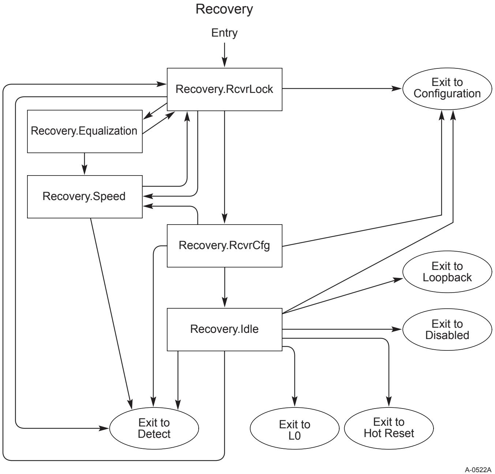

<details>
<summary>flowchart</summary>

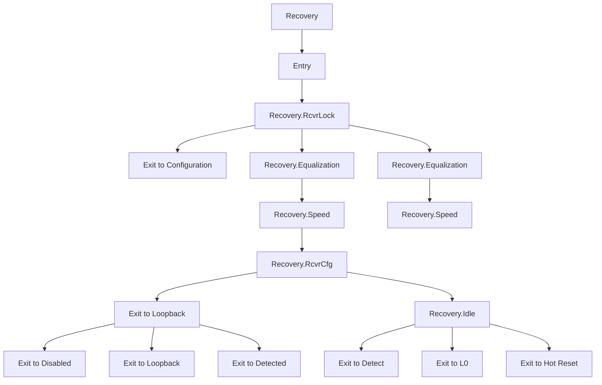
```mermaid
graph TD
  A["Recovery"] --> B["Entry"]
  B --> C["Recovery.RcvrLock"]
  C --> D["Exit to Configuration"]
  C --> E["Recovery.Equalization"]
  E --> F["Recovery.Speed"]
  F --> G["Recovery.RcvrCfg"]
  G --> H["Exit to Loopback"]
  G --> I["Recovery.Idle"]
  I --> J["Exit to Detect"]
  I --> K["Exit to L0"]
  I --> L["Exit to Hot Reset"]
  H --> M["Exit to Disabled"]
  H --> N["Exit to Loopback"]
  H --> O["Exit to Detected"]
  C --> P["Recovery.Equalization"]
  P --> Q["Recovery.Speed"]
```
</details>

Figure 4-52 Recovery Substate Machine§

## 4.2.7.5 L0 §

This is the normal operational state. It includes the L0p state, where some Lanes can be in idle state.

• LinkUp = 1b (status is set true).  
◦ On receipt of an STP or SDP Symbol, the idle\_to\_rlock\_transitioned variable is reset to 00h.  
• For an Upstream Port, the directed\_speed\_change variable must not be set to 1b if it has never recorded greater than 2.5 GT/s data rate support advertised in Configuration.Complete or Recovery.RcvrCfg substates by the Downstream Port since exiting the Detect state.

For a Downstream Port, the directed\_speed\_change variable must not be set to 1b if it has never recorded greater than 2.5 GT/s data rate support advertised in Configuration.Complete or Recovery.RcvrCfg substates by the Upstream Port since exiting the Detect state. If greater than 2.5 GT/s data rate support has been noted, the Downstream Port must set the directed\_speed\_change variable to 1b if the Retrain Link bit of the Link Control Register is set to 1b and the Target Link Speed field in the Link Control 2 Register is not equal to the current Link speed.  
• A Port supporting greater than 2.5 GT/s data rates must participate in the speed change even if the Link is not in DL\_Active state if it is requested by the other side through the TS Ordered Sets.  
• Next state is Recovery if directed to change speed (directed\_speed\_change variable = 1b) by a higher layer and any of the following three conditions are satisfied:

◦ both sides support greater than 2.5 GT/s data rates and the Link is in DL\_Active state  
◦ both sides support 8.0 GT/s or higher data rates, in order to perform Transmitter Equalization at a data rate supported by both sides, in which case the changed\_speed\_recovery bit is reset to 0b  
◦ an alternate protocol was selected by the Downstream Port and the current data rate of operation is not an operational data rate in the negotiated alternate protocol

• Next state is Recovery if directed to change Link width.

◦ The upper layer must not direct a Port to increase the Link width if the other Port did not advertise the capability to upconfigure the Link width during the Configuration state or if the Link is currently operating at the maximum possible width it negotiated on initial entry to the L0 state.  
◦ Normally, the upper layer will not reduce width if upconfigure\_capable is reset to 0b other than for reliability reasons, since the Link will not be able to go back to the original width if upconfigure\_capable is 0b. A Port must not initiate reducing the Link width for reasons other than reliability if the Hardware Autonomous Width Disable bit in the Link Control Register is set to 1b.  
◦ The decision to initiate an increase or decrease in the Link width, as allowed by the specification, is implementation specific.

• Next state is Recovery if a TS1 or TS2 Ordered Set is received on any configured Lane or an EIEOS is received on any configured Lane in 128b/130b or 1b/1b encoding.  
• Next state is Recovery if directed to this state. If Electrical Idle is detected/inferred on all Lanes without receiving an EIOS on any Lane, the Port may transition to the Recovery state or may remain in L0. In the event that the Port is in L0 and the Electrical Idle condition occurs without receiving an , errors may occur and the Port may be directed to transition to Recovery.

◦ As described in § Section 4.2.5.4 , an Electrical Idle condition may be inferred on all Lanes under any one of the following conditions: (i) absence of a Flow Control Update DLLP in any 128 μs window, (ii) absence of a SKP Ordered Set in any of the configured Lanes in any 128 μs window, or (iii) absence of a Flow Control Update DLLP, an Optimized\_Update\_FC, or a SKP Ordered Set in any of the configured Lanes in any 128 μs window.  
◦ Note: “if directed” applies to a Port that is instructed by a higher Layer to transition to Recovery including the Retrain Link bit in the Link Control Register being set.  
◦ The Transmitter may complete any TLP or DLLP in progress.

• Next state is L0s for only the Transmitter if directed to this state and the Transmitter implements L0s. See § Section 4.2.7.6.2 .

◦ Note: “if directed” applies to a Port that is instructed by a higher Layer to initiate L0s (see § Section 5.4.1.1.1 ).  
◦ Note: This is a point where the TX and RX may diverge into different LTSSM states.

• Next state is L0s for only the Receiver if an EIOS is received on any Lane, the Receiver implements L0s, and the Port is not directed to L1 or L2 states by any higher layers. See § Section 4.2.7.6.1 .

◦ Note: This is a point where the TX and RX may diverge into different LTSSM states.

• Next state is Recovery if an EIOS is received on any Lane, the Receiver does not implement L0s, and the Port is not directed to L1 or L2 states by any higher layers. See § Section 4.2.7.6.1 .

• Next state is L1:

i. If directed and  
ii. an EIOS is received on any Lane and

iii. an EIOSQ is transmitted on all Lanes.

◦ Note: “if directed” is defined as both ends of the Link having agreed to enter L1 immediately after the condition of both the receipt and transmission of the EIOS(s) is met. A transition to L1 can be initiated by PCI-PM (see § Section 5.3.2.1 ) or by ASPM (see § Section 5.4.1.3.1 ).  
◦ Note: When directed by a higher Layer one side of the Link always initiates and exits to L1 by transmitting the EIOS(s) on all Lanes, followed by a transition to Electrical Idle. 79 The same Port then waits for the receipt of an EIOS on any Lane, and then immediately transitions to L1. Conversely, the side of the Link that first receives the EIOS(s) on any Lane must send an EIOSQ on all Lanes and immediately transition to L1.

• Next state is L2:

i. If directed and  
ii. an EIOS is received on any Lane and

iii. an EIOSQ is transmitted on all Lanes.

◦ Note: “if directed” is defined as both ends of the Link having agreed to enter L2 immediately after the condition of both the receipt and transmission of the EIOS(s) is met (see § Section 5.3.2.3 for more details).  
◦ Note: When directed by a higher Layer, one side of the Link always initiates and exits to L2 by transmitting EIOS on all Lanes followed by a transition to Electrical Idle. 80 The same Port then waits for the receipt of EIOS on any Lane, and then immediately transitions to L2. Conversely, the side of the Link that first receives an EIOS on any Lane must send an EIOSQ on all Lanes and immediately transition to L2.

## 4.2.7.6 L0s §

The L0s substate machine is shown in § Figure 4-53.

## 4.2.7.6.1 Receiver L0s §

A Receiver must implement L0s if its Port advertises support for L0s, as indicated by the ASPM Support field in the Link Capabilities Register. It is permitted for a Receiver to implement L0s even if its Port does not advertise support for L0s.

## 4.2.7.6.1.1 Rx\_L0s.Entry §

• Next state is Rx\_L0s.Idle after a TTX-IDLE-MIN (§ Table 8-7) timeout.

◦ Note: This is the minimum time the Transmitter must be in an Electrical Idle condition.

## 4.2.7.6.1.2 Rx\_L0s.Idle §

• Next state is Rx\_L0s.FTS if the Receiver detects an exit from Electrical Idle on any Lane of the configured Link.  
• Next state is Rx\_L0s.FTS after a 100 ms timeout if the current data rate is 8.0 GT/s or higher and the Port’s Receivers do not meet the ZRX-DC specification for 2.5 GT/s (see § Table 8-11). All Ports are permitted to implement the timeout and transition to Rx\_L0s.FTS when the data rate is 8.0 GT/s or higher.

## 4.2.7.6.1.3 Rx\_L0s.FTS §

• The next state is L0 if a SKP Ordered Set is received in 8b/10b encoding or the SDS Ordered Set is received for 128b/130b encoding on all configured Lanes of the Link.

◦ The Receiver must be able to accept valid data immediately after the SKP Ordered Set for 8b/10b encoding.  
◦ The Receiver must be able to accept valid data immediately after the SDS Ordered Set for 128b/130b encoding.  
◦ Lane-to-Lane de-skew must be completed before leaving Rx\_L0s.FTS.

• Otherwise, next state is Recovery after the N\_FTS timeout.

◦ When using 8b/10b encoding: The N\_FTS timeout shall be no shorter than 40\*[N\_FTS+3]\*UI (The 3 \* 40 UI is derived from six Symbols to cover a maximum SKP Ordered Set + four Symbols for a possible extra FTS+2 Symbols of design margin), and no longer than twice this amount. When the Extended Synch bit is Set the Receiver N\_FTS timeout must be adjusted to no shorter than 40\*[2048]\*UI (2048 FTSs) and no longer than 40\* [4096]\*UI (4096 FTSs). Implementations must take into account the worst case Lane to Lane skew, their design margins, as well as the four to eight consecutive EIE Symbols in speeds other than 2.5 GT/s when choosing the appropriate timeout value within the specification’s defined range.

◦ When using 128b/130b encoding: The N\_FTS timeout shall be no shorter than 130\*[N\_FTS+5+12+Floor(N\_FTS/32)]\*UI and no longer than twice this amount for 8.0 GT/s and 16.0 GT/s data rates. For 32.0 GT/s and above data rates, the N\_FTS timeout shall be no shorter than 130\*[N\_FTS+10+12+2\*Floor(N\_FTS/32)]\*UI and no longer than twice this amount. The 5+Floor(N\_FTS/32) accounts for the first EIEOS, the last EIEOS, the SDS, the periodic EIEOS and an additional EIEOS in case an implementation chooses to send two EIEOS followed by an SDS when N\_FTS is divisible by 32 for 8.0 GT/s and 16.0 GT/s data rates and correspondingly doubled for the 32.0 GT/s and higher data rates. The 12 is there to account for the number of SKP Ordered Sets that will be transmitted if the Extended Synch bit is Set. When the Extended Synch bit is Set, the timeout should be the same as the normal case with N\_FTS equal to 4096.

◦ The Transmitter must also transition to Recovery, but is permitted to complete any TLP or DLLP in progress.

◦ It is recommended that the N\_FTS field be increased when transitioning to Recovery to prevent future transitions to Recovery from Rx\_L0s.FTS.

## 4.2.7.6.2 Transmitter L0s §

A Transmitter must implement L0s if its Port advertises support for L0s, as indicated by the ASPM Support field in the Link Capabilities Register. It is permitted for a Transmitter to implement L0s even if its Port does not advertise support for L0s.

## 4.2.7.6.2.1 Tx\_L0s.Entry §

• Transmitter sends an EIOSQ and enters Electrical Idle.  
◦ The DC common mode voltage must be within specification by TTX-IDLE-SET-TO-IDLE. 81  
• Next state is Tx\_L0s.Idle after a TTX-IDLE-MIN (§ Table 8-7) timeout.

## 4.2.7.6.2.2 Tx\_L0s.Idle §

• Next state is Tx\_L0s.FTS if directed.

## IMPLEMENTATION NOTE:

## INCREASE OF N\_FTS DUE TO TIMEOUT IN RX\_L0S.FTS §

The Transmitter sends the N\_FTS Fast Training Sequences by going through Tx\_L0s.FTS substate to enable the Receiver to reacquire its bit and Symbol lock or Block alignment. In the absence of the N\_FTS Fast Training Sequence, the Receiver will timeout in Rx\_L0s.FTS substate and may increase the N\_FTS number it advertises in the Recovery state.

## 4.2.7.6.2.3 Tx\_L0s.FTS §

• Transmitter must send N\_FTS Fast Training Sequences on all configured Lanes.  
◦ Four to eight EIE Symbols must be sent prior to transmitting the N\_FTS (or 4096 if the Extended Synch bit is Set) number of FTS in 5.0 GT/s data rates. An EIEOSQ must be sent prior to transmitting the N\_FTS (or 4096 if the Extended Synch bit is Set) number of FTS with 128b/130b encoding. In 2.5 GT/s speed, up to one full FTS may be sent before the N\_FTS (or 4096 if the Extended Synch bit is Set) number of FTSs are sent.  
◦ SKP Ordered Sets must not be inserted before all FTSs as defined by the agreed upon N\_FTS parameter are transmitted.  
◦ If the Extended Synch bit is Set, the Transmitter must send 4096 Fast Training Sequences, inserting SKP Ordered Sets according to the requirements in § Section 4.2.5.6 .  
• When using 8b/10b encoding, the Transmitter must send a single SKP Ordered Set on all configured Lanes.

• When using 128b/130b encoding, the Transmitter must send one EIEOSQ followed by one SDS Ordered Set on all configured Lanes. Note: The first Symbol transmitted on Lane 0 after the SDS Ordered Set is the first Symbol of the Data Stream.  
• Next state must be L0, after completing the above required transmissions.

## IMPLEMENTATION NOTE:

## NO SKP ORDERED SET REQUIREMENT WHEN EXITING L0S AT

## 16.0 GT/S OR HIGHER DATA RATES §

Unlike in other LTSSM states, when exiting Tx\_L0s.FTS no Control SKP Ordered Set is transmitted before transmitting the SDS. This results in the Data Parity information associated with the last portion of the previous datastream being discarded. Not sending the Control SKP Ordered Set reduces complexity and improves exit latency.

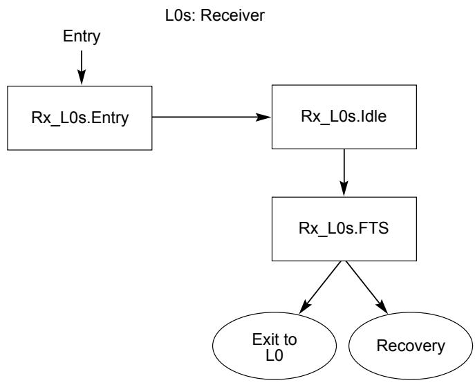

<details>
<summary>flowchart</summary>

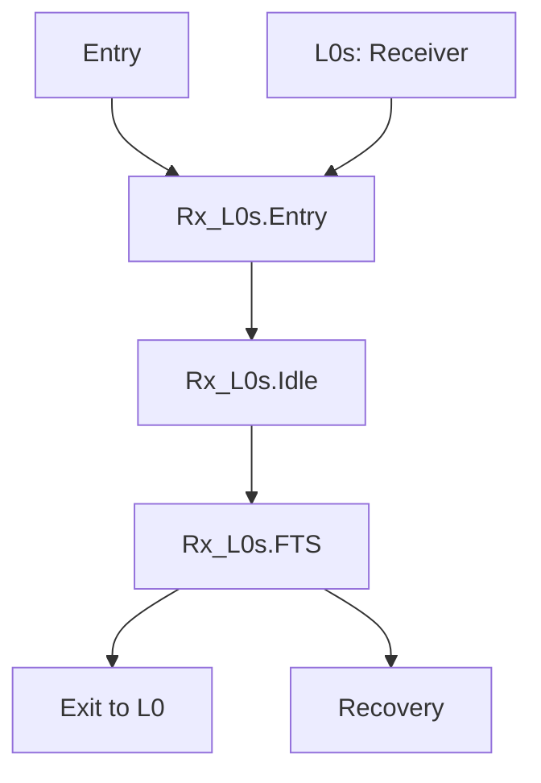
```mermaid
graph TD
  A["Entry"] --> B["Rx_L0s.Entry"]
  B --> C["Rx_L0s.Idle"]
  C --> D["Rx_L0s.FTS"]
  D --> E["Exit to L0"]
  D --> F["Recovery"]
  G["L0s: Receiver"] --> B
```
</details>

L0s: Transmitter  
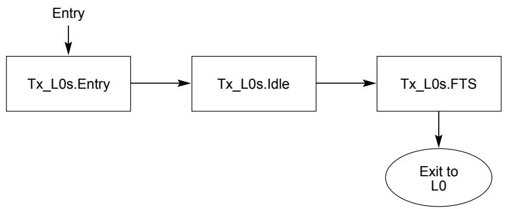

<details>
<summary>flowchart</summary>

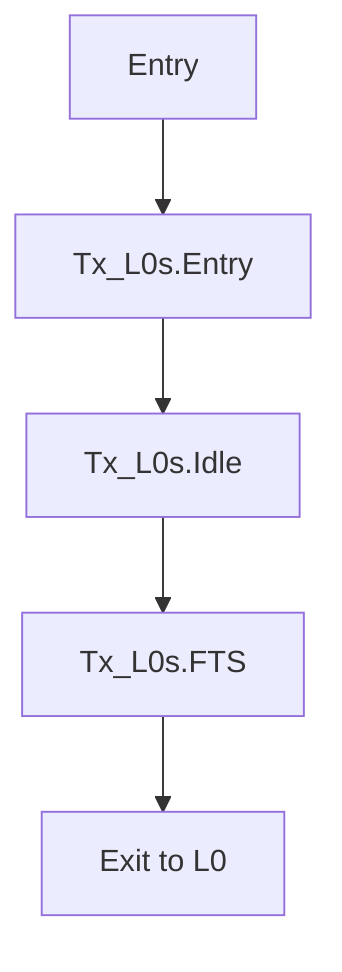
```mermaid
graph TD
  A["Entry"] --> B["Tx_L0s.Entry"]
  B --> C["Tx_L0s.Idle"]
  C --> D["Tx_L0s.FTS"]
  D --> E["Exit to L0"]
```
</details>

OM13804A

Figure 4-53 L0s Substate Machine

## 4.2.7.7 L1 §

The L1 substate machine is shown in § Figure 4-54.

## 4.2.7.7.1 L1.Entry §

• All configured Transmitters are in Electrical Idle.  
◦ The DC common mode voltage must be within specification by TTX-IDLE-SET-TO-IDLE.  
• The next state is L1.Idle after a TTX-IDLE-MIN (§ Table 8-7) timeout.  
◦ Note: This guarantees that the Transmitter has established the Electrical Idle condition.

## 4.2.7.7.2 L1.Idle §

• Transmitter remains in Electrical Idle.  
• The DC common mode voltage must be within specification, except as allowed by L1 PM Substates, when applicable. 82  
• A substate of L1 is entered when the conditions for L1 PM Substates are satisfied (see § Section 5.5 ).  
◦ The L1 PM Substate must be L1.0 when L1.Idle is entered or exited.

• Next state is Recovery if exit from Electrical Idle is detected on any Lane of a configured Link, or directed after remaining in this substate for a minimum of 40 ns in speeds other than 2.5 GT/s.

◦ Ports are not required to arm the Electrical Idle exit detectors on all Lanes of the Link.  
◦ Note: A minimum stay of 40 ns is required in this substate in speeds other than 2.5 GT/s to account for the delay in the logic levels to arm the Electrical Idle detection circuitry in case the Link enters L1 and immediately exits the L1 state.  
◦ A Port is allowed to set the directed\_speed\_change variable to 1b following identical rules described in L0 for setting this variable. When making such a transition, the changed\_speed\_recovery variable must be reset to 0b. A Port may also go through Recovery back to L0 and then set the directed\_speed\_change variable to 1b on the transition from L0 to Recovery.  
◦ A Port is also allowed to enter Recovery from L1 if directed to change the Link width. The Port must follow identical rules for changing the Link width as described in the L0 state.

• Next state is Recovery after a 100 ms timeout if the current data rate is 8.0 GT/s or higher and the Port’s Receivers do not meet the ZRX-DC specification for 2.5 GT/s. All Ports are permitted, but not encouraged, to implement the timeout and transition to Recovery when the data rate is 8.0 GT/s or higher.

◦ This timeout is not affected by the L1 PM Substates mechanism.

## IMPLEMENTATION NOTE: 100 MS TIMEOUT IN L1 §

Ports that meet the ZRX-DC specification for 2.5 GT/s while in the L1.Idle state and are therefore not required to implement the 100 ms timeout and transition to Recovery should avoid implementing it, since it will reduce the power savings expected from the L1 state.

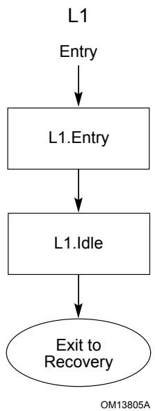

<details>
<summary>flowchart</summary>

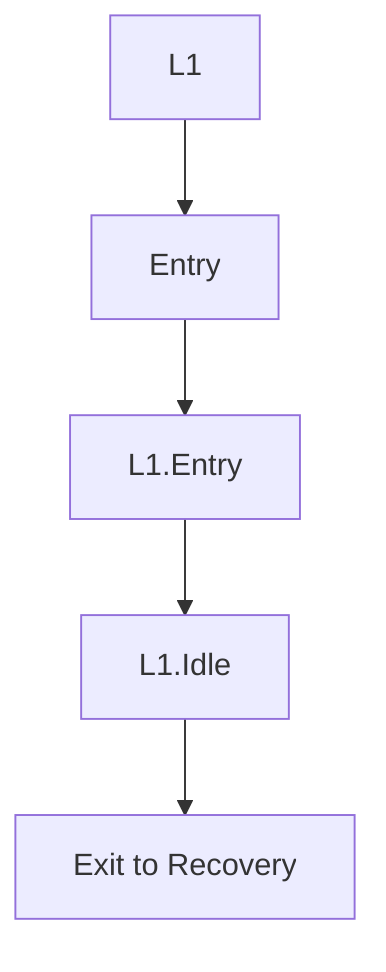
```mermaid
graph TD
  A["L1"] --> B["Entry"]
  B --> C["L1.Entry"]
  C --> D["L1.Idle"]
  D --> E["Exit to Recovery"]
```
</details>

Figure 4-54 L1 Substate Machine

## 4.2.7.8 L2 §

The L2 substate machine is shown in § Figure 4-55.

## 4.2.7.8.1 L2.Idle §

• All Receivers must meet the ZRX-DC specification for 2.5 GT/s within 1 ms (see § Table 8-11).  
• All configured Transmitters must remain in Electrical Idle for a minimum time of TTX-IDLE-MIN.

◦ The DC common mode voltage does not have to be within specification.  
◦ The Receiver needs to wait a minimum of TTX-IDLE-MIN to start looking for Electrical Idle Exit.

• For Downstream Lanes:

◦ For all Downstream Ports, the next state is Detect if a Beacon is received on at least Lane 0 or if directed.

▪ Main power must be restored before entering Detect.  
▪ Note: “if directed” is defined as a higher layer decides to exit to Detect.

◦ For a Switch, if a Beacon is received on at least Lane 0 of any of its Downstream Ports and the Upstream Port is in L2.Idle, the Upstream Port must be directed to L2.TransmitWake.

• For Upstream Lanes:

◦ The next state is Detect if Electrical Idle Exit is detected on any predetermined set of Lanes.

▪ The predetermined set of Lanes must include but is not limited to any Lane which has the potential of negotiating to Lane 0 of a Link. For multi-Lane Links the number of Lanes in the predetermined set must be greater than or equal to two.  
▪ A Switch must transition any Downstream Lanes to Detect.

◦ Next state is L2.TransmitWake for an Upstream Port if directed to transmit a Beacon.

▪ Note: Beacons may only be transmitted on Upstream Ports in the direction of the Root Complex.

## 4.2.7.8.2 L2.TransmitWake §

This state only applies to Upstream Ports.

• Transmit the Beacon on at least Lane 0.  
• Next state is Detect if Electrical Idle exit is detected on any Upstream Port’s Receiver that is in the direction of the Root Complex.

◦ Note: Power is guaranteed to be restored when Upstream Receivers see Electrical Idle exited, but it may also be restored prior to Electrical Idle being exited.

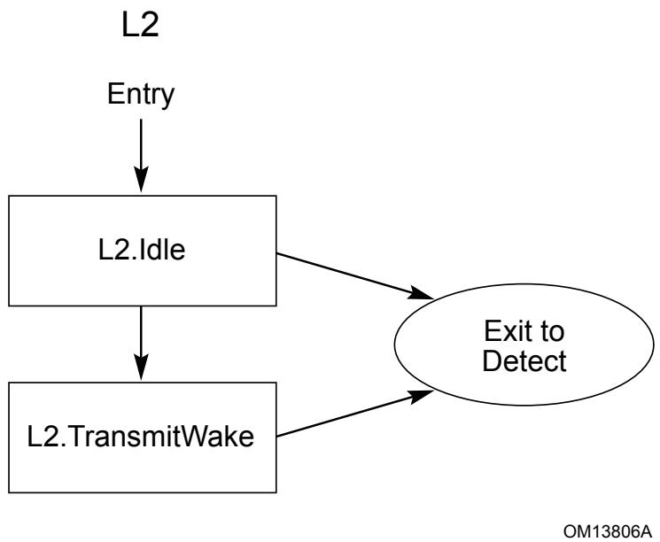

<details>
<summary>flowchart</summary>

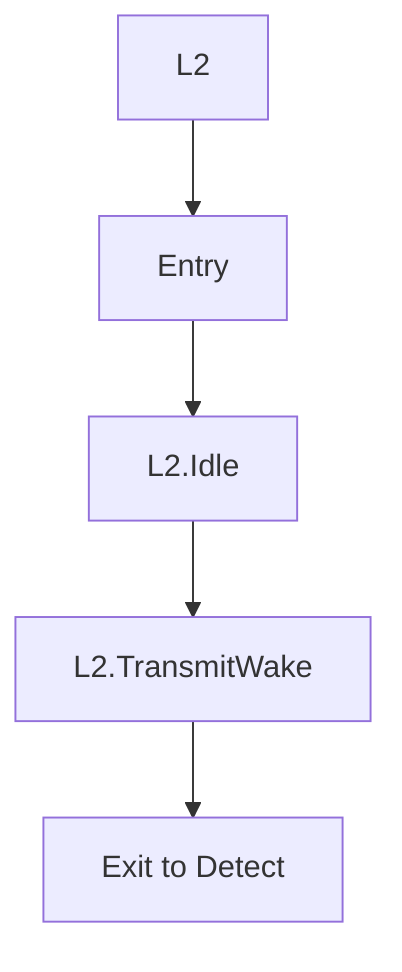
```mermaid
graph TD
  A["L2"] --> B["Entry"]
  B --> C["L2.Idle"]
  C --> D["L2.TransmitWake"]
  D --> E["Exit to Detect"]
```
</details>

§  
Figure 4-55 L2 Substate Machine

## 4.2.7.9 Disabled §

• It is recommended to Clear LinkUp upon entry to Disabled, without waiting for the EIOSQ to be transmitted or the EIOS to be received.  
• All Lanes transmit 16 to 32 TS1 Ordered Sets with the Disable Link bit asserted and then transition to Electrical Idle.

◦ An EIOSQ must be sent prior to entering Electrical Idle.  
◦ The DC common mode voltage does not have to be within specification. 83

• If an EIOSQ was transmitted and an EIOS was received on any Lane (even while transmitting TS1 with the Disable Link bit asserted), then:

◦ LinkUp = 0b (False), unless already Cleared, as recommended above.

▪ At this point, the Lanes are considered Disabled.

◦ For Upstream Ports: All Receivers must meet the ZRX-DC specification for 2.5 GT/s within 1 ms (see § Table 8-11).  
◦ For Upstream Ports: The next state is Detect when Electrical Idle exit is detected on at least one Lane.

• For Downstream Ports: The next state is Detect when directed (e.g., when the Link Disable bit is reset to 0b by software).

• For Upstream Ports: If no EIOS is received after a 2 ms timeout, the next state is Detect.

## 4.2.7.10 Loopback §

The Loopback substate machine is shown in § Figure 4-56.

## 4.2.7.10.1 Loopback.Entry §

• LinkUp = 0b (False)  
• The Link and Lane numbers received in the TS1 or TS2 Ordered Sets are ignored by the Receiver while in this substate.

• Loopback Lead requirements:

◦ If the Loopback Lead was directed, in an implementation specific manner, to perform a 64.0 GT/s equalization procedure on one active Lane, to be referred to as the ‘Lane under test’, before entering Loopback.Entry with LinkUp set to 0b, the perform\_equalization\_for\_loopback\_64GT> variable must be set to 1b.  
◦ If Loopback.Entry was entered from Recovery.Equalization and the current data rate is 32.0 GT/s and perform\_equalization\_for\_loopback\_64GT is 1b and the equalization\_done\_64GT\_data\_rate variable is 0b, determine the highest common data rate of the data rates supported by the Lead and the highest data rates advertised by the Loopback Follower in the TS1s that it transmitted in Phase 1 of Recovery.Equalization on the ‘Lane Under Test’. If the highest common data rate is 64.0 GT/s, transmit 16 consecutive TS1 Ordered Sets with the Loopback bit asserted, followed by an EIOSQ, and then transition to Electrical Idle for 1 ms. During the period of Electrical Idle, change the data rate to 64.0 GT/s.

The 16 consecutive TS1 Ordered Sets transmitted on the Lane under test prior to the rate change to 64.0 GT/s must have the bits listed below as follows:

▪ The Enhanced Link Behavior Control bits must be set to 01b. The equalization procedure must be performed on the same ‘Lane under test’ for both equalization procedures.  
▪ The Transmit Modified Compliance Pattern in Loopback bit must be set to 1b if the Loopback Follower is required to transmit the Modified Compliance Pattern on the Lanes that are not under test.

◦ If Loopback.Entry was entered from Configuration.Linkwidth.Start, the highest common data rate is 64.0 GT/s if LinkUp = 0b, the Loopback Lead intends to operate at 64.0 GT/s and it has prior knowledge that the Loopback Follower also supports 64.0 GT/s. Otherwise, determine the highest common data rate of the data rates supported by the Lead and the data rates received in two consecutive TS1 or TS2 Ordered Sets on any active Lane at the time the transition to Loopback.Entry occurred. If the current data rate is not the highest common data rate:

▪ Transmit 16 consecutive TS1 Ordered Sets with the Loopback bit asserted, followed by an EIOSQ, and then transition to Electrical Idle for 1 ms. During the period of Electrical Idle, if the perform\_equalization\_for\_loopback\_64GT variable is 1b and the highest common data rate is 64.0 GT/s, change the data rate to 32.0 GT/s. Otherwise, change the data rate to the highest common data rate.

▪ If LinkUp is 0b, the Supported Link Speeds field of the Data Rate Identifier must use the Flit Mode data rate encoding if the Flit Mode Supported field is 1b and 64.0 GT/s is supported and the consecutive TS2 Ordered Sets received on transition to this substate from Polling.Configuration had the Flit Mode Supported bit set to 1b.  
▪ The Loopback Lead may be directed, in an implementation specific manner, to perform a 32.0 GT/s equalization procedure on one active Lane, to be referred to as the ‘Lane under test’, before entering Loopback.Entry. If the highest common data rate is 32.0 GT/s, the equalization\_done\_32GT\_data\_rate variable is 0b, and the equalization procedure is to be executed, the 16 consecutive TS1 Ordered Sets transmitted on the Lane under test prior to the data rate change to the highest common data rate must have the bits listed below as follows:

▪ The Enhanced Link Behavior Control bits must be set to 01b.

▪ The Transmit Modified Compliance Pattern in Loopback bit must be set to 1b if the Loopback Follower is required to transmit the Modified Compliance Pattern on the Lanes that are not under test.

## IMPLEMENTATION NOTE:

## LANE UNDER TEST USAGE EXPECTATIONS §

The method whereby one active Lane is defined as the ‘Lane under test’ and is affected by the NEXT/FEXT aggressor Lanes (see § Section 8.5.1.1 ) so that measurements are performed on the Lane under test (after a speed change and completion of an equalization procedure at a rate of 32.0 GT/s or above) is defined for system configurations where a test apparatus, such as (but not limited to) a BERT, acts as the Loopback Lead. In such a system configuration, the expectation of this test method is that the Loopback Lead is able to provide the necessary stimulus for the state traversals and protocol negotiations required to establish and exercise the ‘Lane under test’ without any specific guidance from this specification.

This test mode is only defined for use while LinkUp = 0b (prior to entering Loopback.Entry). The test apparatus must be cognizant of the capabilities of the ‘Lane under test’. A mechanism to “re-do” equalization when this test procedure is performed is not defined. The Loopback Lead must only sent TS1s with Flit Mode Encoding in Loopback if it received TS2s with the Flit Mode Supported bit set to 1b in Polling.Configuration - these TS2s indicate that the Loopback Follower will properly interpret TS1s with Flit Mode Data Rate Encoding.

If the highest common data rate is 5.0 GT/s, the follower’s transmitter de-emphasis is controlled by setting the Selectable De-emphasis bit of the transmitted TS1 Ordered Sets to the desired value $( 1 6 = - 3 . 5 \ : { \mathsf { d B } } , 0 \ : { \mathsf { b } } = - 6 \ : { \mathsf { d B } } )$ .  
▪ For data rates of 5.0 GT/s and above, the Lead is permitted to choose its own transmitter settings in an implementation specific manner, regardless of the settings it transmitted to the follower.  
▪ Note: If Loopback is entered after LinkUp has been set to 1b, it is possible for one Port to enter Loopback from Recovery and the other to enter Loopback from Configuration. The Port that entered from Configuration might attempt to change data rate while the other Port does not. If this occurs, the results are undefined. The test set-up must avoid such conflicting directed clauses.

◦ Transmit TS1 Ordered Sets with the Loopback bit asserted.

▪ If Loopback.Entry was entered from Recovery.Equalization, the EC field of the transmitted TS1 Ordered Sets must be set to 00b.  
The Lead is also permitted to assert the Compliance Receive bit of TS1 Ordered Sets transmitted in Loopback.Entry, including those transmitted before a data rate change. If it asserts the Compliance Receive bit, it must not deassert it again while in the Loopback.Entry state. This usage model might be helpful for test and validation purposes when one or both Ports have difficulty obtaining bit lock, Symbol lock, or Block alignment after a data rate change. The ability to set the Compliance Receive bit is implementation specific.

◦ Next state is Recovery.Equalization if the data rate was changed to 32.0 or 64.0 GT/s and 16 consecutive TS1 Ordered Sets were sent on any Lane with the Enhanced Link Behavior Control bits set to 01b.

▪ The perform\_equalization\_for\_loopback variable is set to 1b.

◦ Next state is Loopback.Active after 2 ms if the Compliance Receive bit of the transmitted TS1 Ordered Sets is asserted.  
◦ Next state is Loopback.Active if Loopback.Entry was entered from Recovery.Equalization and the Lane under test receives two consecutive TS1 Ordered Sets with the Loopback bit asserted.  
◦ Next state is Loopback.Active if the Compliance Receive bit of the transmitted TS1 Ordered Sets is deasserted and an implementation specific set of Lanes receive two consecutive TS1 Ordered Sets with the Loopback bit asserted.

If the data rate was changed and the equalization procedure was not performed at the target data rate of either 32.0 GT/s or 64.0 GT/s, the Lead must take into account the amount of time the follower can be in Electrical Idle and transmit a sufficient number of TS1 Ordered Sets for the follower to acquire Symbol lock or Block alignment before proceeding to Loopback.Active.

## IMPLEMENTATION NOTE: LANE NUMBERING WITH 128B/130B ENCODING IN LOOPBACK

If the current data rate uses 128b/130b encoding and Lane numbers have not been negotiated, it is possible that the Lead and follower will not be able to decode received information because their Lanes are using different scrambling LFSR seed values (since the LFSR seed values are determined by the Lane numbers). This situation can be avoided by allowing the Lead and follower to negotiate Lane numbers before directing the Lead to Loopback, directing the Lead to assert the Compliance Receive bit during Loopback.Entry, or by using some other method of ensuring that the LFSR seed values match.

◦ Next state is Loopback.Exit after an implementation specific timeout of less than 100 ms.

• Loopback Follower requirements:

◦ If Loopback.Entry was entered from Configuration.Linkwidth.Start with LinkUp set to 0b, the TS1 Ordered Sets that directed the follower to this state advertised 64.0 GT/s support and had Enhanced Link Behavior Control set to 01b and the follower intends to operate at 64.0 GT/s, perform\_equalization\_for\_loopback\_64GT must be set to 1b.  
◦ If Loopback.Entry was entered from Recovery.Equalization and the current data rate is 32.0 GT/s and perform\_equalization\_for\_loopback\_64GT is 1b and the equalization\_done\_64GT\_data\_rate variable is 0b, and 64.0 GT/s is advertised by the Loopback Follower in the TS1s that it transmitted in Phase 1 of Recovery.Equalization on the ‘Lane under test’:

▪ Transmit an EIOSQ, and then transition to Electrical Idle for 2 ms. During the period of Electrical Idle, change the data rate to 64.0 GT/s.

▪ If the Loopback Follower is a Downstream Port, transmit 16 consecutive TS1 Ordered Sets on the ‘Lane under test’ prior to transmitting the EIOSQ. The TS1 Ordered Sets must have the Equalization Control bits set to 00b.

▪ Next state is Recovery.Equalization.  
▪ The ‘Lane under test’, perform\_equalization\_for\_loopback variable, transmit\_modified\_compliance\_pattern\_in\_loopback variable and the Link and Lane numbers for both the 32.0 GT/s and 64.0 GT/s equalization procedures must be the same.

◦ If Loopback.Entry was entered from Configuration.Linkwidth.Start, determine the highest common data rate of the data rates supported by the follower and the data rates received in the two consecutive TS1 Ordered Sets that directed the follower to this state. If the current data rate is not the highest common data rate:

Transmit an EIOSQ, and then transition to Electrical Idle for 2 ms. During the period of Electrical Idle, if the perform\_equalization\_for\_loopback\_64GT variable is 1b and the highest common data rate is 64.0 GT/s, change the data rate to 32.0 GT/s. Otherwise, change the data rate to the highest common data rate.  
▪ If operating in full swing mode and the highest common data rate is 5.0 GT/s, set the transmitter’s de-emphasis to the setting specified by the Selectable De-emphasis bit received in the TS1 Ordered Sets that directed the follower to this state. The de-emphasis is -3.5 dB if the Selectable De-emphasis bit was 1b, and it is -6 dB if the Selectable De-emphasis bit was 0b.

If the highest common data rate is 8.0 GT/s or higher and EQ TS1 Ordered Sets directed the follower to this state, set the transmitter to the settings specified by the Preset field of the EQ TS1 Ordered Sets. See § Section 4.2.4.2 . If the highest common data rate is 8.0 GT/s or higher but standard TS1 Ordered Sets directed the follower to this state, the follower is permitted to use its default transmitter settings.

◦ Next state is Recovery.Equalization if Loopback.Entry was entered from Configuration.Linkwidth.Start, the highest common data rate is 32.0 and the Enhanced Link Behavior Control bits of the TS1 Ordered Sets that directed the follower to this state were 01b.

▪ The perform\_equalization\_for\_loopback variable is set to 1b.  
▪ The transmit\_modified\_compliance\_pattern\_in\_loopback variable is set to 1b if the Transmit Modified Compliance Pattern in Loopback bit is Set to 1b in the TS1 Ordered Sets that directed the follower to this state.  
When Recovery.Equalization is entered from Loopback.Entry, the Lane that received two consecutive TS1 Ordered Sets with the Enhanced Link Behavior Control bits set to 01b in Configuration.Linkwidth.Start is the Lane under test for the purposes of Loopback and Recovery.Equalization.  
▪ The Loopback Follower must select a valid Link number in an implementation specific manner. Each Lane's Lane number is the corresponding default Lane number which is invariant to Link width and Lane reversal negotiation that occurs during Link training. These Lane numbers will be used for LFSR seed values. The test measurement equipment that facilitates this state transition must ensure, in an implementation specific manner, that it uses a matching Lane number and LFSR seed value.

◦ Next state is Loopback.Active if the Compliance Receive bit of the TS1 Ordered Sets that directed the follower to this state was asserted.

▪ The follower’s transmitter does not need to transition to transmitting looped-back data on any boundary, and it is permitted to truncate any Ordered Set in progress.

◦ Else, the follower transmits TS1 Ordered Sets with Link and Lane numbers set to PAD.

▪ If Loopback.Entry was entered from Recovery.Equalization, the EC field of the transmitted TS1 Ordered Sets must be set to 00b.  
▪ If Loopback.Entry was entered from Recovery.Equalization, the next state is Loopback.Active after two consecutive TS1 Ordered Sets with the Loopback bit asserted are received by the Lane under test.  
▪ Next state is Loopback.Active if the data rate is 2.5 GT/s or 5.0 GT/s and Symbol lock is obtained on all active Lanes.  
Next state is Loopback.Active if the data rate is 8.0 GT/s or higher and two consecutive TS1 Ordered Sets are received on all active Lanes. The equalization settings specified by the received TS1 Ordered Sets must be evaluated and applied to the transmitter if the value of the EC field is appropriate for the follower’s Port direction (10b or 11b) and the requested setting is a preset or a set of valid coefficients. (Note: This is the equivalent behavior for the Recovery.Equalization state.) Optionally, the follower can accept both EC field values. If the settings are applied, they must take effect within 500 ns of being received, and they must not cause the transmitter to violate any electrical specification for more than 1 ns. Unlike Recovery.Equalization, the new settings are not reflected in the TS1 Ordered Sets that the follower transmits.  
▪ When using 8b/10b encoding, the follower’s transmitter must transition to transmitting looped-back data on a Symbol boundary, but it is permitted to truncate any Ordered Set in progress. When using 128b/130b or 1b/1b encoding, the follower’s transmitter does not

need to transition to transmitting looped-back data on any boundary and is permitted to truncate any Ordered Set in progress.

## 4.2.7.10.2 Loopback.Active §

• The Loopback Lead must send valid encoded data. The Loopback Lead must not transmit EIOS as data until it wants to exit Loopback. When operating with 128b/130b encoding, Loopback Leads must follow the requirements of § Section 4.2.2.6 . When operating with 1b/1b encoding, Loopback Leads must follow the requirements of § Section 4.2.3.1 .  
• A Loopback Follower that entered Loopback from Recovery.Equalization must transmit the Modified Compliance Pattern on all Lanes that detected Receivers in Detect.Active but are not under test if the transmit\_modified\_compliance\_pattern\_in\_loopback variable is set to 1b, otherwise those Lanes must be transitioned into Electrical Idle. The Lane under test must follow Loopback Follower rules described below. State transitions must be based only on Link activity on the Lane under test.

• A Loopback Follower is required to retransmit the received encoded information as received, with the polarity inversion determined in Polling applied, while continuing to perform clock tolerance compensation:

◦ SKPs must be added or deleted on a per-Lane basis as outlined in § Section 4.2.8 with the exception that SKPs do not have to be simultaneously added or removed across Lanes of a configured Link.

▪ For 8b/10b encoding, if a SKP Ordered Set retransmission requires adding a SKP Symbol to accommodate timing tolerance correction, the SKP Symbol is inserted in the retransmitted Symbol stream anywhere adjacent to a SKP Symbol in the SKP Ordered Set following the COM Symbol. The inserted SKP Symbol must be of the same disparity as the received SKPs Symbol(s) in the SKP Ordered Set.  
▪ For 8b/10b encoding, if a SKP Ordered Set retransmission requires dropping a SKP Symbol to accommodate timing tolerance correction, the SKP Symbol is simply not retransmitted.  
For 128b/130b encoding, if a SKP Ordered Set retransmission requires adding SKP Symbols to accommodate timing tolerance correction, four SKP Symbols are inserted in the retransmitted Symbol stream prior to the SKP\_END Symbol in the SKP Ordered Set.  
▪ For 128b/130b encoding, if a SKP Ordered Set retransmission requires dropping SKP Symbols to accommodate timing tolerance correction, four SKP Symbols prior to the SKP\_END Symbol in the SKP Ordered Set are simply not retransmitted.  
For 1b/1b encoding, if a SKP Ordered Set retransmission requires adding SKP Symbols to accommodate timing tolerance correction, eight SKP Symbols are inserted in the retransmitted Symbol stream prior to the SKP\_END Symbol in the SKP Ordered Set.  
For 1b/1b encoding, if a SKP Ordered Set retransmission requires dropping SKP Symbols to accommodate timing tolerance correction, eight SKP Symbols prior to the SKP\_END Symbol in the SKP Ordered Set are simply not retransmitted.

◦ No modifications of the received encoded data (except for polarity inversion determined in Polling) are allowed by the Loopback Follower even if it is determined to be an invalid encoding (i.e., no legal translation to a control or data value possible for 8b/10b encoding or invalid Sync Header or invalid Ordered Set for 128b/130b encoding).

• Next state of the Loopback Follower is Loopback.Exit if one of the following conditions apply:

◦ If directed or if four consecutive EIOSs are received on any Lane. The Requirements for detecting an EIOS are specified in § Section 4.2.5.3 .  
◦ Optionally, if current Link speed is 2.5 GT/s and an EIOS is received or Electrical Idle is detected/ inferred on any Lane.

▪ Note: As described in § Section 4.2.5.4 , an Electrical Idle condition may be inferred if any of the configured Lanes remained electrically idle continuously for 128 μs by not detecting an exit from Electrical Idle in the entire 128 μs window.  
▪ A Loopback Follower must be able to detect an Electrical Idle condition on any Lane within 1 ms of the EIOS being received by the Loopback Follower.  
▪ Note: During the time after an EIOS is received and before Electrical Idle is actually detected by the Loopback Follower, the Loopback Follower may receive a bit stream that is undefined by the encoding scheme, which may be looped back by the transmitter.  
▪ The TTX-IDLE-SET-TO-IDLE parameter does not apply in this case since the Loopback Follower may not even detect Electrical Idle until as much as 1 ms after the EIOS.

• The next state of the Loopback Lead is Loopback.Exit if directed.

## 4.2.7.10.3 Loopback.Exit §

• The Loopback Lead sends an EIOS for Ports that support only the 2.5 GT/s data rate and eight consecutive EIOSs for Ports that support greater than 2.5 GT/s data rate, and optionally for Ports that only support the 2.5 GT/s data rate, irrespective of the current Link speed, and enters Electrical Idle on all Lanes for 2 ms.  
◦ The Loopback Lead must transition to a valid Electrical Idle condition 84 on all Lanes within TTX-IDLE-SET-TO-IDLE after sending the last EIOS.  
◦ Note: The EIOS can be useful in signifying the end of transmit and compare operations that occurred by the Loopback Lead. Any data received by the Loopback Lead after any EIOS is received should be ignored since it is undefined.  
• The Loopback Follower must enter Electrical Idle on all Lanes for 2 ms.  
◦ Before entering Electrical Idle the Loopback Follower must Loopback all Symbols that were received prior to detecting Electrical Idle. This ensures that the Loopback Lead may see the EIOS to signify the logical end of any Loopback send and compare operations.  
• The next state of the Loopback Lead and Loopback Follower is Detect.

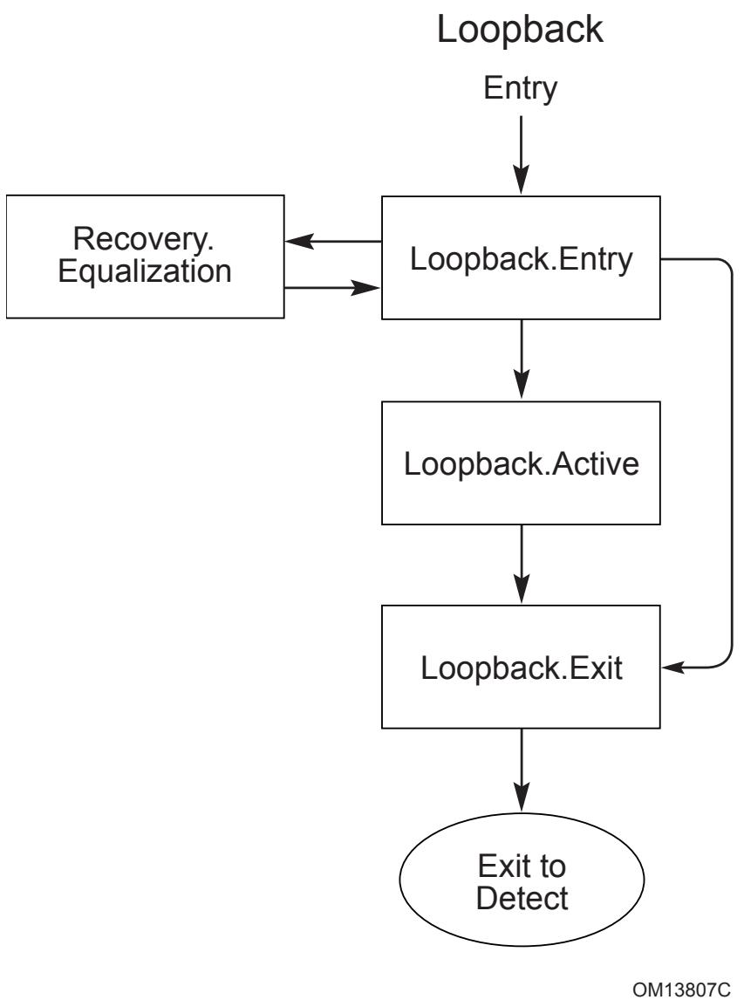

<details>
<summary>flowchart</summary>

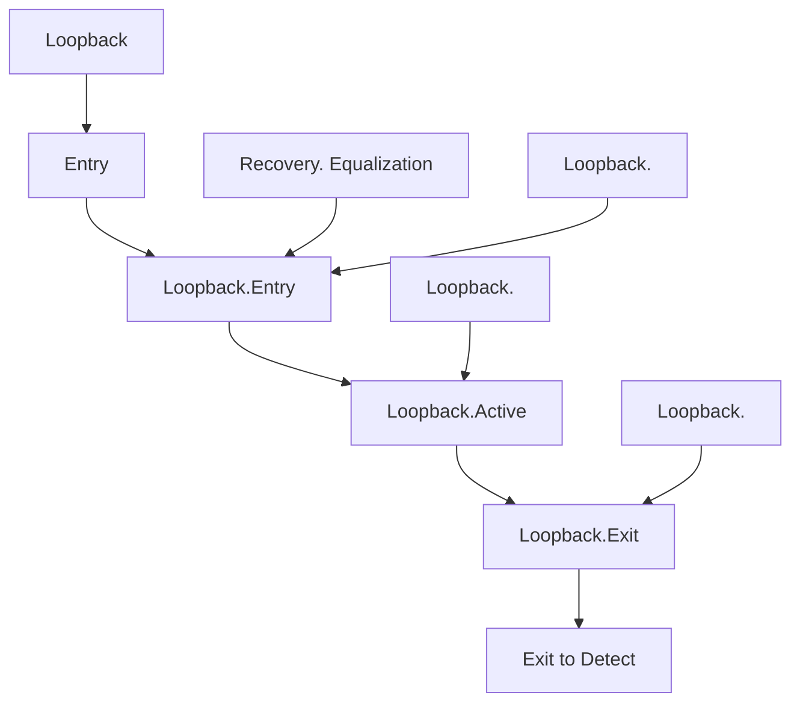
```mermaid
graph TD
  A["Loopback"] --> B["Entry"]
  B --> C["Loopback.Entry"]
  C --> D["Loopback.Active"]
  D --> E["Loopback.Exit"]
  E --> F["Exit to Detect"]
  G["Recovery. Equalization"] --> C
  H["Loopback."] --> C
  I["Loopback."] --> D
  J["Loopback."] --> E
```
</details>

Figure 4-56 Loopback Substate Machine§

## 4.2.7.11 Hot Reset §

• Lanes that were directed by a higher Layer to initiate Hot Reset:

◦ All Lanes in the configured Link transmit TS1 Ordered Sets with the Hot Reset bit asserted and the configured Link and Lane numbers.  
◦ If two consecutive TS1 Ordered Sets are received on any Lane with the Hot Reset bit asserted and configured Link and Lane numbers, then:

▪ LinkUp = 0b (False)  
▪ If no higher Layer is directing the Physical Layer to remain in Hot Reset, the next state is Detect  
▪ Otherwise, all Lanes in the configured Link continue to transmit TS1 Ordered Sets with the Hot Reset bit asserted and the configured Link and Lane numbers.

◦ Otherwise, after a 2 ms timeout next state is Detect.

• Lanes that were not directed by a higher Layer to initiate Hot Reset (i.e., received two consecutive TS1 Ordered Sets with the Hot Reset bit asserted on any configured Lanes):

◦ LinkUp = 0b (False)  
◦ If any Lane of an Upstream Port of a Switch receives two consecutive TS1 Ordered Sets with the Hot Reset bit asserted, all configured Downstream Ports must transition to Hot Reset as soon as possible.  
▪ Any optional crosslinks on the Switch are an exception to this rule and the behavior is system specific.  
◦ All Lanes in the configured Link transmit TS1 Ordered Sets with the Hot Reset bit asserted and the configured Link and Lane numbers.  
◦ If two consecutive TS1 Ordered Sets were received with the Hot Reset bit asserted and the configured Link and Lane numbers, the state continues to be Hot Reset and the 2 ms timer is reset.  
◦ Otherwise, the next state is Detect after a 2 ms timeout.

Note: Generally, Lanes of a Downstream or optional crosslink Port will be directed to Hot Reset, and Lanes of an Upstream or optional crosslink Port will enter Hot Reset by receiving two consecutive TS1 Ordered Sets with the Hot Reset bit asserted on any configured Lanes, from Recovery.Idle state.

## 4.2.8 Clock Tolerance Compensation §

SKP Ordered Sets (defined in § Section 4.2.8.1 and § Section 4.2.8.2 ) are used to compensate for differences in frequencies between bit rates at two ends of a Link. The Receiver Physical Layer logical sub-block must include elastic buffering which performs this compensation. The interval between SKP Ordered Set transmissions is derived from the Transmit, Receiver, and Refclk specifications specified in § Table 8-6, § Table 8-11, and § Table 8-18.

The specification supports shared reference clocking architectures (common Refclk) where there is no difference between the Tx and Rx Refclk rates, and two kinds of reference clocking architectures where the Tx and Rx Refclk rates differ. Separate Reference Clocks With No SSC - SRNS, and Separate Reference Clocks with Independent SSC - SRIS. The maximum difference with SRNS is 600 ppm which can result in a clock shift once every 1666 clocks. The maximum difference with SRIS is 5600 ppm which can result in a clock shift every 178 clocks.

Specific form factor specifications are permitted to require the use of only SRIS, only SRNS, or to provide a mechanism for clocking architecture selection. Upstream Ports are permitted to implement support for any combination of SRIS and SRNS (including no support for either), but must conform to the requirements of any associated form factor specification. Downstream Ports supporting SRIS must also support SRNS unless the port is only associated with a specific form factor(s) which modifies these requirements. Port configuration to satisfy the requirements of a specific associated form factor is implementation specific. Specific guidance for form factor specifications is provided in § Section 8.6.8 .

If the receiver is capable of operating with SKP Ordered Sets being generated at the rate used in SRNS even though the Port is running in SRIS, the Port is permitted to Set its bit for the appropriate data rate in the Lower SKP OS Reception Supported Speeds Vector field of the Link Capabilities 2 Register. If the transmitter is capable of operating with SKP Ordered Sets being generated at the rate used in SRNS even though the Port is running in SRIS, the Port is permitted to Set its bit for the appropriate data rate in the Lower SKP OS Generation Supported Speeds Vector field of the Link Capabilities 2 register. System software must check that the bit is Set in the Lower SKP OS Reception Supported Speeds Vector field before setting the appropriate data rate's bit in the link partner’s Enable Lower SKP OS Generation Vector field of the Link Control 3 Register. Any software transparent Extension Devices (such as a repeater) present on a Link must also support lower SKP OS Generation for system software to set the bit in the Enable Lower SKP OS Generation Vector field. Software determination of such support in such extension devices is implementation specific. When the bit for the data rate that the link is running in is Set in the Enable Lower SKP OS Generation Vector field, the transmitter schedules SKP Ordered Set generation in L0 at the rate used in SRNS, regardless of which clocking architecture the link is running in. In other LTSSM states, SKP Ordered Set scheduling is at the appropriate rate for the clocking architecture.

Components supporting SRIS may need more entries in their elastic buffers than designs supporting SRNS only. This requirement takes into account the extra time it may take to schedule a SKP Ordered Set if the latter falls immediately after a maximum payload sized packet.

## 4.2.8.1 SKP Ordered Set for 8b/10b Encoding §

When using 8b/10b encoding, a transmitted SKP Ordered Set is a COM Symbol followed by three SKP Symbols, except as is allowed for a Loopback Follower in the Loopback.Active LTSSM state. A received SKP Ordered Set is a COM Symbol followed by one to five SKP Symbols. See § Section 4.3.6.7 for Retimer rules on SKP Ordered Set modification.

## 4.2.8.2 SKP Ordered Set for 128b/130b Encoding §

When using 128b/130b encoding, a transmitted SKP Ordered Set is 16 Symbols, and a received SKP Ordered set can be 8, 12, 16, 20, or 24 Symbols. See § Section 4.3.6.7 for Retimer rules on SKP Ordered Set modification.

There are two SKP Ordered Set formats defined for 128b/130b encoding as shown in § Table 4-52 and § Table 4-53. Both formats contain one to five groups of four SKP Symbols followed by a final group of four Symbols indicated by a SKP\_END or SKP\_END\_CTL Symbol. When operating at 8.0 GT/s in Non-Flit Mode, only the Standard SKP Ordered Set is used. When operating at 16.0 GT/s or 32.0 GT/s in Non-Flit Mode, both the Standard and Control SKP Ordered Sets are used. When operating at 8.0, 16.0, 32.0 GT/s in Flit Mode, both the Standard and Control SKP Ordered Sets are used. All statements in this specification that do not refer to a specific SKP Ordered Set format apply to both formats. When a SKP Ordered Set is transmitted, all Lanes must transmit the same format of SKP Ordered Set - all Lanes must transmit the Standard SKP Ordered Set, or all Lanes must transmit the Control SKP Ordered Set.

The Standard SKP Ordered Set contains information following the SKP\_END Symbol that is based on the LTSSM state and the sequence of Blocks. When in the Polling.Compliance state, the Symbols contain the Lane’s error status information (see § Section 4.2.7.2.2 for more information). Otherwise, the Symbols contain the Lane’s scrambling LFSR value, and a Data Parity bit when the SKP Ordered Set follows a Data Block. The Control SKP Ordered Set contains three Data Parity bits and additional information following the SKP\_END\_CTL Symbol.

When operating at 8.0 GT/s in Non-Flit Mode, the Data Parity bit of the Standard SKP Ordered Set is the even parity of the payload of all Data Blocks communicated by a Lane and is computed for each Lane independently 85 . Upstream and Downstream Port Transmitters compute the parity as follows:

• Parity is initialized when an SDS Ordered Set is transmitted.  
• Parity is updated with each bit of a Data Block’s payload after scrambling has been performed.  
• The Data Parity bit of a Standard SKP Ordered Set transmitted immediately following a Data Block is set to the current parity.  
• Parity is initialized after a Standard SKP Ordered Set is transmitted.

Upstream and Downstream Port Receivers compute and act on the parity as follows:

• Parity is initialized when an SDS Ordered Set is received.  
• Parity is updated with each bit of a Data Block's payload before de-scrambling has been performed.  
• When a Standard SKP Ordered Set is received immediately following a Data Block, each Lane compares the received Data Parity bit to its calculated parity. If a mismatch is detected, the receiver must set the bit of the Port's Lane Error Status register that corresponds to the Lane's default Lane number. The mismatch is not a Receiver Error and must not cause a Link retrain.

• Parity is initialized when a Standard SKP Ordered Set is received.

When operating at a data rate of 16.0 or 32.0 GT/s in Non-Flit Mode or 8.0, 16.0m or 32.0 GT/s in Flit Mode, the Data Parity bits of both the Standard SKP Ordered Set in non-Flit-Mode and the Control SKP Ordered Set is the even parity of the payload of all Data Blocks communicated by a Lane and is computed for each Lane independently. Upstream and Downstream Port Transmitters compute the parity as follows:

• Parity is initialized when the LTSSM is in Recovery.Speed.  
• Parity is initialized when an SDS Ordered Set is transmitted.  
• Parity is updated with each bit of a Data Block’s payload after scrambling has been performed.  
• Thus, in Flit Mode, Parity is computed post FEC.  
• The Data Parity bit of a Standard SKP Ordered Set transmitted immediately following a Data Block is set to the current parity.  
• The Data Parity, First Retimer Data Parity, and Second Retimer Data Parity bits of a Control SKP Ordered Set are all set to the current parity.  
• Parity is initialized after a Control SKP Ordered Set is transmitted. However, parity is not initialized when a Standard SKP Ordered Set is transmitted.

Upstream and Downstream Port Receivers compute and act on the parity as follows:

• Parity is initialized when the LTSSM is in Recovery.Speed.  
• Parity is initialized when an SDS Ordered Set is received.  
• Parity is updated with each bit of a Data Block’s payload before de-scrambling has been performed.  
• Thus, in Flit Mode, Parity is compared prior to FEC decoding.

• When a Control SKP Ordered Set is received, each Lane compares the received Data Parity bit to its calculated parity. If a mismatch is detected, the receiver must set the bit of the Port’s Local Data Parity Mismatch Status Register that corresponds to the Lane’s default Lane number. The mismatch is not a Receiver Error and must not cause a Link retrain.

When a Control SKP Ordered Set is received, each Lane compares the received First Retimer Data Parity bit to its calculated parity. If a mismatch is detected, the receiver must set the bit of the Port’s First Retimer Data Parity Mismatch Status Register that corresponds to the Lane’s default Lane number. The mismatch is not a Receiver Error and must not cause a Link retrain.

• When a Control SKP Ordered Set is received, each Lane compares the received Second Retimer Data Parity bit to its calculated parity. If a mismatch is detected, the receiver must set the bit of the Port’s Second Retimer Data Parity Mismatch Status Register that corresponds to the Lane’s default Lane number. The mismatch is not a Receiver Error and must not cause a Link retrain.

• When a Standard SKP Ordered Set is received immediately following a Data Block, the receiver is permitted to compare the received Data Parity bit to its calculated parity bit. However, the results of such a comparison must not affect the state of the Lane Error Status Register.

• Parity is initialized when a Control SKP Ordered Set is received. However, parity is not initialized when a Standard SKP Ordered Set is received.

See § Section 4.3.6.7 for the definition of First Retimer and Second Retimer, and for Retimer Pseudo Port requirements for parity computation and modification of the First Retimer Data Parity and Second Retimer Data Parity bits of Control SKP Ordered Sets.

## IMPLEMENTATION NOTE:

## LFSR IN STANDARD SKP ORDERED SET §

The LFSR value is transmitted to enable trace tools to be able to function even if they need to reacquire block alignment in the midst of a bit stream. Since trace tools cannot force the link to enter Recovery, they can reacquire bit lock, if needed, and monitor for the SKP Ordered Set to obtain Block alignment and perform Lane-to-Lane de-skew. The LFSR value from the SKP Ordered Set can be loaded into its LFSR to start interpreting the bit stream. It must be noted that with a bit stream one may alias to a SKP Ordered Set on a non-Block boundary. The trace tools can validate their Block alignment by using implementation specific means such as receiving a fixed number of valid packets or Sync Headers or subsequent SKP Ordered Sets.

Table 4-52 Standard SKP Ordered Set with 128b/130b Encoding§

<table><tr><td>Symbol Number</td><td>Value</td><td>Description</td></tr><tr><td rowspan="2">0 through (4*N-1)[N can be 1 through 5]</td><td>AAh for 8.0 GT/s and 16.0 GT/s data rates</td><td rowspan="2">SKP Symbol.Symbol 0 is the SKP Ordered Set identifier.</td></tr><tr><td>99h for 32.0 GT/s and higher data rates</td></tr><tr><td>4*N</td><td>E1h</td><td>SKP_END SymbolSignifies the end of the SKP Ordered Set after three more Symbols.</td></tr><tr><td>4*N + 1</td><td>00-FFh</td><td>(i) If LTSSM state is Polling.Compliance: AAh(ii) Else if prior block was a Data Block:Bit[7] = Data ParityBit[6:0] = LFSR[22:16](iii) Else:Bit[7] = ~LFSR[22]Bit[6:0] = LFSR[22:16]</td></tr><tr><td>4*N + 2</td><td>00-FFh</td><td>(i) If the LTSSM state is Polling.Compliance: Error_Status[7:0](ii) Else LFSR[15:8]</td></tr><tr><td>4*N + 3</td><td>00-FFh</td><td>(i) If the LTSSM state is Polling.Compliance: ~Error_Status[7:0](ii) Else: LFSR[7:0]</td></tr></table>

The Control SKP Ordered Set is different from the Standard SKP Ordered Set in the last 4 Symbols. It is used to communicate the parity bits, as computed by each Retimer, in addition to the Data Parity bit computed by the Upstream/ Downstream Port. It may also be used for Lane Margining at a Retimer’s Receiver, as described below.

Table 4-53 Control SKP Ordered Set with 128b/130b Encoding§

<table><tr><td>Symbol Number</td><td>Value</td><td>Description</td></tr><tr><td rowspan="2">0 through (4*N-1)[N can be 1 through 5]</td><td>AAh for 8.0 GT/s and 16.0 GT/s data rates</td><td rowspan="2">SKP Symbol.Symbol 0 is the SKP Ordered Set identifier.</td></tr><tr><td>99h for 32.0 GT/s and higher data rates</td></tr><tr><td>4*N</td><td>78h</td><td>SKP_END_CTL Symbol.Signifies the end of the Control SKP Ordered Set after three more Symbols.</td></tr><tr><td>4*N + 1</td><td>00-FFh</td><td>Bit 7: Data ParityBit 6: First Retimer Data ParityBit 5: Second Retimer ParityBits [4:0]: Margin CRC [4:0]</td></tr><tr><td>4*N + 2</td><td>00-FFh</td><td>Bit 7: Margin ParityBits [6:0]: Refer to § Section 4.2.18.1</td></tr><tr><td>4*N + 3</td><td>00-FFh</td><td>Bits [7:0]: Refer to § Section 4.2.18.1</td></tr></table>

The ‘Margin CRC[4:0]’ is computed from Bits [6:0] in Symbols 4N+2 (referred to as d[6:0] in the equations below, where d[0] is Bit 0 of Symbol 4N+2, d[1] is Bit 1 of Symbol 4N+2, … d[6] is Bit 6 of Symbol 4N+2) and Bits [7:0] of Symbol 4N+3 (referred to as d[14:7], where d[7] is Bit 0 of Symbol 4N+3, d[8] is Bit 1 of Symbol 4N+3, .. d[14] is Bit 7 of Symbol 4N+3) as follows:

Margin CRC[0] = d[0] ^ d[3] ^ d[5] ^ d[6] ^ d[9] ^ d[10] ^ d[11] ^ d[12] ^ d[13]

Margin CRC[1] = d[1] ^ d[4] ^ d[6] ^ d[7] ^ d[10] ^ d[11] ^ d[12] ^ d[13] ^ d[14]

Margin CRC[2] = d[0] ^ d[2] ^ d[3] ^ d[6] ^ d[7] ^ d[8] ^ d[9] ^ d[10] ^ d[14]

Margin CRC[3] = d[1] ^ d[3] ^ d[4] ^ d[7] ^ d[8] ^ d[9] ^ d[10] ^ d[11]

Margin CRC[4] = d[2] ^ d[4] ^ d[5] ^ d[8] ^ d[9] ^ d[10] ^ d[11] ^ d[12]

‘Margin Parity’ is the even parity of Bits [4:0] of Symbol 4N+1, Bits [6:0] of Symbol 4N+2, and Bits [7:0] of Symbol 4N+3 (i.e., Margin Parity = Margin CRC[0] ^ Margin CRC[1] ^ Margin CRC[2] ^ Margin CRC[3] ^ Margin CRC[4] ^ d[0] ^ d[1] ^ d[2] ^ d[3] ^ d[4] ^ d[5] ^ d[6] ^ d[7] ^ d[8] ^ d[9] ^ d[10] ^ d[11] ^ d[12] ^ d[13] ^ d[14]).

‘Margin Parity’ only applies to 128b/130b encoding. 1b/1b Control SKP Ordered Sets do not contain a ‘Margin Parity’ field.

The rules for generating and checking the Margin CRC and Margin Parity are described in § Section 4.2.1.3 .

## IMPLEMENTATION NOTE:

## ERROR PROTECTION IN CONTROL SKP ORDERED SET §

The 21 bits in Symbol 4N+1 (Bits [4:0]), Symbol 4N+2 (Bits[7:0]) and Symbol 4N+3 (Bits[7:0]) is protected by 5 bits of CRC and one bit of parity, leaving 15 bits for information passing. The parity bit provides detection against odd number of bit-flips (e.g., 1-bit, 3-bit), whereas the CRC provides guaranteed detection of 1-bit and 2-bit flips; thus resulting in a triple bit flip detection guarantee over the 21 bits as well as guaranteed detection of burst errors of length 5. The 5-bit CRC is derived from the primitive polynomial: $\mathsf { x } ^ { 5 } + \mathsf { x } ^ { 2 } + 1$ .

Since these 21 bits are not part of a TLP, repeated delivery of the same content provides delivery guarantee. This is achieved through architected registers. Downstream commands are sent from the Downstream Port, reflecting the contents of an architected register whereas the upstream status that passes the error checking is updated into a status register in the Downstream Port. Software thus has a mechanism to issue a command and wait for the status to be reflected back before issuing a new command. Thus, these 15 bits of information act as a micro-packet.

## 4.2.8.3 SKP Ordered Set for 1b/1b Encoding


• Only Control SKP Ordered Sets are transmitted in 1b/1b Encoding.  
• A transmitted SKP Ordered Set is 40 symbols (40B), and a received SKP Ordered Set can be 24, 32, 40, 48 or 56 symbols (24B, 32B, 40B, 48B or 56B).  
• The transmitted SKP Ordered Set consists of the SKPs (F00F\_F00F), followed by a SKP\_END (FFF0\_00F0), followed by PHY Payload (8B), as shown in § Table 4-54.  
• The PHY Payload field of the 1b/1b SKP Ordered Set is illustrated in § Table 4-55, § Figure 4-57, § Figure 4-58, and § Figure 4-59.  
• The Payload Type and Parity fields are replicated four times, spaced more than 16 bits apart.

◦ The Receiver can implement a majority voting to correct these fields if three or more sets match. If two sets of value are 0b and two sets are 1b, there is a tie. A tie in the parity can be considered to mismatch. A tie in the Payload Type results in ignoring the PHY payload field.

• The Payload field is replicated twice.  
• For Margin payload with its own CRC, the Receiver can choose whichever copy passes CRC (and if both pass CRC, can perform a comparison before acting on it).

The Data Parity bit is the even parity of the payload of all Data Blocks communicated by a Lane and is computed for each Lane independently. Upstream and Downstream Port Transmitters compute the parity as follows:

• Parity is initialized when the LTSSM is in Recovery.Speed.  
• Parity is initialized when an SDS Ordered Set is transmitted.  
• Parity is initialized after a SKP Ordered Set is transmitted.  
• Parity is updated with each bit of a Data Block’s payload after scrambling has been performed. Thus, gray coding and precoding, if any, does not affect the Parity calculation and Parity is computed post FEC.  
• The Data Parity bit of a SKP Ordered Set transmitted immediately following a Data Block is set to the current parity.  
• The Data Parity, First Retimer Data Parity, and √ bits of a SKP Ordered Set are all set to the current parity.

Upstream and Downstream Port Receivers compute and act on the parity as follows:

• Parity is initialized when the LTSSM is in Recovery.Speed.  
• Parity is initialized when an SDS Ordered Set is received.  
• Parity is updated with each bit of a Data Block’s payload before de-scrambling has been performed. Thus, this is performed after gray coding and precoding, if any, by the Receiver and Parity is compared pre FEC.  
• When a SKP Ordered Set is received, each Lane compares the received Data Parity bit to its calculated parity. If a mismatch is detected, the receiver must set the bit of the Port’s Local Data Parity Mismatch Status Register that corresponds to the Lane’s default Lane number. The mismatch is not a Receiver Error and must not cause a Link retrain.  
• When a SKP Ordered Set is received, each Lane compares the received First Retimer Data Parity bit to its calculated parity. If a mismatch is detected, the receiver must set the bit of the Port’s First Retimer Data Parity Mismatch Status Register that corresponds to the Lane’s default Lane number. The mismatch is not a Receiver Error and must not cause a Link retrain.  
When a SKP Ordered Set is received, each Lane compares the received Second Retimer Data Parity bit to its calculated parity. If a mismatch is detected, the receiver must set the bit of the Port’s Second Retimer Data Parity Mismatch Status Register that corresponds to the Lane’s default Lane number. The mismatch is not a Receiver Error and must not cause a Link retrain.  
• Parity is initialized when a SKP Ordered Set is received. See § Section 4.3.6.7 for the definition of First Retimer and Second Retimer, and for Retimer Pseudo Port requirements for parity computation and modification of the First Retimer Data Parity and Second Retimer Data Parity bits of Control SKP Ordered Sets.

Table 4-54 Control SKP Ordered Set with 1b/1b Encoding§

<table><tr><td>Symbol Number</td><td>Value</td><td>Description</td></tr><tr><td>0, 4, 8, 12, 16, 20</td><td>F0h</td><td rowspan="4">SKP Symbol</td></tr><tr><td>1, 5, 9, 13, 17, 21</td><td>0Fh</td></tr><tr><td>2, 6, 10, 14, 18, 22</td><td>F0h</td></tr><tr><td>3, 7, 11, 15, 19, 23</td><td>0Fh</td></tr><tr><td>24, 28</td><td>FFh</td><td rowspan="4">SKP_END</td></tr><tr><td>25, 29</td><td>F0h</td></tr><tr><td>26, 30</td><td>00h</td></tr><tr><td>27, 31</td><td>F0h</td></tr><tr><td>32</td><td>F0h if TS0 Ordered Sets are being transmitted, as defined in § Section 4.2.7.4.2, else Phy Payload[7:0]See § Table 4-55, § Figure 4-57, § Figure 4-58, and § Figure 4-59.</td><td rowspan="3">PHY Payload</td></tr><tr><td>33</td><td>F0h if TS0 Ordered Sets are being transmitted, as defined in § Section 4.2.7.4.2, else Phy Payload[15:8]See § Table 4-55, § Figure 4-57, § Figure 4-58, and § Figure 4-59.</td></tr><tr><td>34</td><td>F0h if TS0 Ordered Sets are being transmitted, as defined in § Section 4.2.7.4.2, else Phy Payload[23:16]See § Table 4-55, § Figure 4-57, § Figure 4-58, and § Figure 4-59.</td></tr><tr><td>35</td><td>F0h if TS0 Ordered Sets are being transmitted, as defined in § Section 4.2.7.4.2, else Phy Payload[31:24]See § Table 4-55, § Figure 4-57, § Figure 4-58, and § Figure 4-59.</td><td rowspan="5"></td></tr><tr><td>36</td><td>F0h if TS0 Ordered Sets are being transmitted, as defined in § Section 4.2.7.4.2, else Phy Payload[39:32]See § Table 4-55, § Figure 4-57, § Figure 4-58, and § Figure 4-59.</td></tr><tr><td>37</td><td>F0h if TS0 Ordered Sets are being transmitted, as defined in § Section 4.2.7.4.2, else Phy Payload[47:40]See § Table 4-55, § Figure 4-57, § Figure 4-58, and § Figure 4-59.</td></tr><tr><td>38</td><td>F0h if TS0 Ordered Sets are being transmitted, as defined in § Section 4.2.7.4.2, else Phy Payload[55:48]See § Table 4-55, § Figure 4-57, § Figure 4-58, and § Figure 4-59.</td></tr><tr><td>39</td><td>F0h if TS0 Ordered Sets are being transmitted, as defined in § Section 4.2.7.4.2, else Phy Payload[63:56]See § Table 4-55, § Figure 4-57, § Figure 4-58, and § Figure 4-59.</td></tr></table>

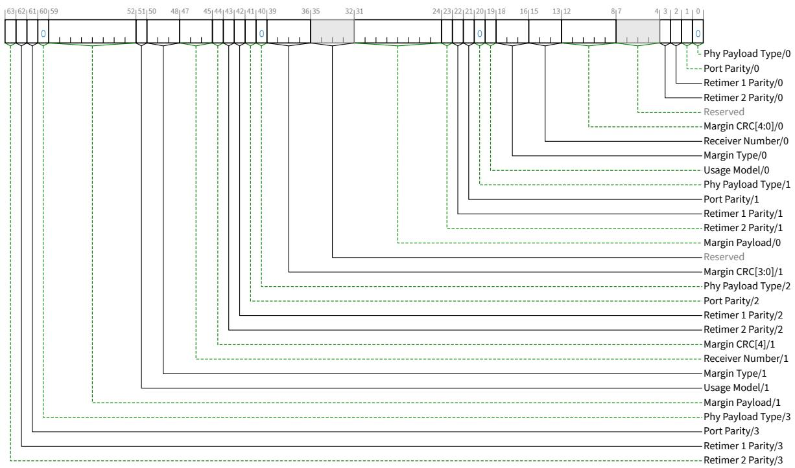

<details>
<summary>tree diagram</summary>

| Node | Category | Value |
|---|---|---|
| 1 | Phy Payload Type/0 | 0 |
| 2 | Port Parity/0 | 0 |
| 3 | Retimer 1 Parity/0 | 0 |
| 4 | Retimer 2 Parity/0 | 0 |
| 5 | Reserved | 0 |
| 6 | Margin CRC[4:0]/0 | 0 |
| 7 | Receiver Number/0 | 0 |
| 8 | Margin Type/0 | 0 |
| 9 | Usage Model/0 | 0 |
| 10 | Phy Payload Type/1 | 0 |
| 11 | Port Parity/1 | 0 |
| 12 | Retimer 1 Parity/1 | 0 |
| 13 | Retimer 2 Parity/1 | 0 |
| 14 | Margin Payload/0 | 0 |
| 15 | Reserved | 0 |
| 16 | Margin CRC[3:0]/1 | 0 |
| 17 | Phy Payload Type/2 | 0 |
| 18 | Port Parity/2 | 0 |
| 19 | Retimer 1 Parity/2 | 0 |
| 20 | Retimer 2 Parity/2 | 0 |
| 21 | Margin CRC[4]/1 | 0 |
| 22 | Receiver Number/1 | 0 |
| 23 | Margin Type/1 | 0 |
| 24 | Usage Model/1 | 0 |
| 25 | Margin Payload/1 | 0 |
| 26 | Phy Payload Type/3 | 0 |
| 27 | Port Parity/3 | 0 |
| 28 | Retimer 1 Parity/3 | 0 |
| 29 | Retimer 2 Parity/3 | 0 |
The chart displays a hierarchical tree structure with nodes labeled by their names and associated values. The structure is structured in a grid-like layout with some nodes containing zero values.
</details>

Figure 4-57 Margin PHY Payload for Control SKP Ordered Set with 1b/1b Enc § oding

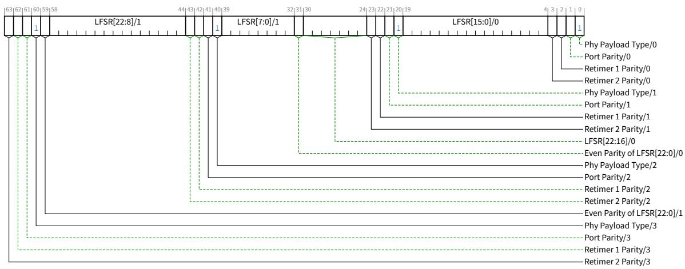

<details>
<summary>diagram</summary>

| Category | Value |
| -------- | ----- |
| Phy Payload Type/0 | 0 |
| Port Parity/0 | 0 |
| Retimer 1 Parity/0 | 0 |
| Retimer 2 Parity/0 | 0 |
| Phy Payload Type/1 | 1 |
| Port Parity/1 | 1 |
| Retimer 1 Parity/1 | 1 |
| Retimer 2 Parity/1 | 1 |
| LFSR[22:16]/0 | 0 |
| Even Parity of LFSR[22:0]/0 | 0 |
| Phy Payload Type/2 | 2 |
| Port Parity/2 | 2 |
| Retimer 1 Parity/2 | 2 |
| Retimer 2 Parity/2 | 2 |
| Even Parity of LFSR[22:0]/1 | 0 |
| Phy Payload Type/3 | 3 |
| Port Parity/3 | 3 |
| Retimer 1 Parity/3 | 3 |
| Retimer 2 Parity/3 | 3 |
</details>

Figure 4-58 LFSR PHY Payload for Control SKP Ordered Set with 1b/1b Encoding§

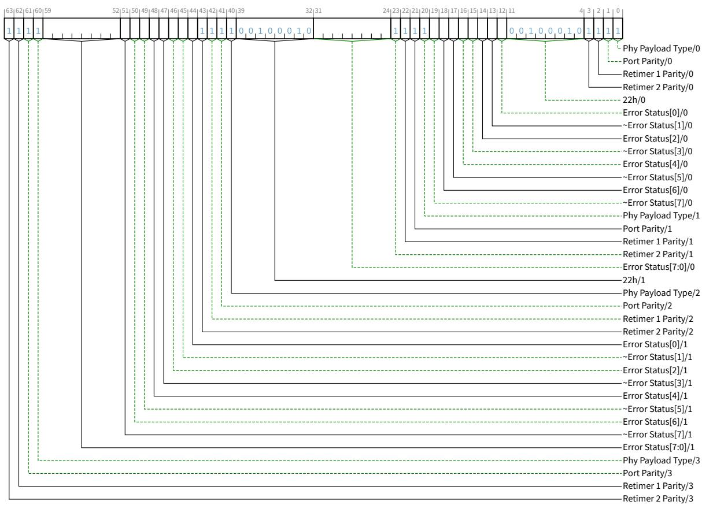

<details>
<summary>tree diagram</summary>

| Node | Category | Value |
|---|---|---|
| 1 | Phy Payload Type/0 | 0 |
| 2 | Port Parity/0 | 0 |
| 3 | Retimer 1 Parity/0 | 0 |
| 4 | Retimer 2 Parity/0 | 0 |
| 5 | 22h/0 | 0 |
| 6 | Error Status[0]/0 | 0 |
| 7 | ~Error Status[1]/0 | 0 |
| 8 | Error Status[2]/0 | 0 |
| 9 | ~Error Status[3]/0 | 0 |
| 10 | Error Status[4]/0 | 0 |
| 11 | ~Error Status[5]/0 | 0 |
| 12 | Error Status[6]/0 | 0 |
| 13 | ~Error Status[7]/0 | 0 |
| 14 | Phy Payload Type/1 | 0 |
| 15 | Port Parity/1 | 0 |
| 16 | Retimer 1 Parity/1 | 0 |
| 17 | Retimer 2 Parity/1 | 0 |
| 18 | Error Status[7:0]/0 | 0 |
| 19 | 22h/1 | 0 |
| 20 | Phy Payload Type/2 | 0 |
| 21 | Port Parity/2 | 0 |
| 22 | Retimer 1 Parity/2 | 0 |
| 23 | Retimer 2 Parity/2 | 0 |
| 24 | Error Status[0]/1 | 0 |
| 25 | ~Error Status[1]/1 | 0 |
| 26 | Error Status[2]/1 | 0 |
| 27 | ~Error Status[3]/1 | 0 |
| 28 | Error Status[4]/1 | 0 |
| 29 | ~Error Status[5]/1 | 0 |
| 30 | Error Status[6]/1 | 0 |
| 31 | ~Error Status[7]/1 | 0 |
| 32 | Phy Payload Type/3 | 0 |
| 33 | Port Parity/3 | 0 |
| 34 | Retimer 1 Parity/3 | 0 |
| 35 | Retimer 2 Parity/3 | 0 |
The chart displays a hierarchical structure with horizontal lines indicating hierarchical relationships. The labels above the diagram represent the categories of each node in the table. The numbers below indicate the corresponding node numbers. There is no explicit numerical data provided in the image.
</details>

Figure 4-59 Polling.Compliance PHY Payload for Control SKP Ordered Set with 1b/1b Encoding§

Table 4-55 PHY Payload for Control SKP Ordered Set with 1b/1b Encoding§

<table><tr><td>Field</td><td>Bit Position(s)(Replicated Bit Position(s))</td><td>Description</td></tr><tr><td>Phy Payload Type</td><td>0 (20) (40) (60)</td><td>If the LTSSM state is Polling.Compliance: this bit is Set to 1bElse:0b Margin Payload1b LFSRSee § Section 4.2.8.4 for Phy Payload Type field usage.</td></tr><tr><td>Port Parity</td><td>1 (21) (41) (61)</td><td>If the LTSSM state is Polling.Compliance: this bit is Set to 1bElse:even parity of all the bits in the Data Blocks on that Lane from the last SKP Ordered Set</td></tr><tr><td>Retimer 1 Parity</td><td>2 (22) (42) (62)</td><td>If the LTSSM state is Polling.Compliance: this bit is Set to 1bElse:Port sets this bit with Port Parity; First Retimer, if present, overwrites with its own calculated even parity of all the bits in the Data Blocks on that Lane from the last SKP ordered Set</td></tr><tr><td>Retimer 2 Parity</td><td>3 (23) (43) (63)</td><td>If the LTSSM state is Polling.Compliance: this bit is Set to 1bElse:Port sets this bit with Port Parity; Second Retimer, if present, overwrites with its own calculated even parity of all the bits in the Data Blocks on that Lane from the last SKP Ordered Set</td></tr><tr><td>Payload [23:0]</td><td>{31:24, 19:4}({59:44, 39:32})</td><td>If the LTSSM state is Polling.Compliance:{Error_Status[7:0],~Error_Status[7], Error_Status[6],~Error_Status[5], Error_Status[4],~Error_Status[3], Error_Status[2],~Error_Status[1], Error_Status[0], 22h }Else If PHY Payload Type == 0b Margin:{Margin Payload[7:0], Usage Model,Margin Type[2:0], Receiver Number[2:0],Margin CRC[4:0], Reserved[3:0]}Else:{Even Parity of LFSR[22:0], LFSR[22:0]}All of these are in little-endian format. Thus, for example, the 8 bits of Margin Payload occupies bits 31:24 and 59:52</td></tr></table>

## 4.2.8.4 Rules for Transmitters §

• All Lanes shall transmit Symbols at the same frequency (the difference between bit rates is 0 ppm within all multi-Lane Links).  
• When transmitted, SKP Ordered Sets of the same length shall be transmitted simultaneously on all Lanes of a multi-Lane Link, except as allowed for a Loopback Follower in the Loopback.Active LTSSM State (see § Section 4.2.5.11 and § Table 8-7 for the definition of simultaneous in this context).  
• The transmitted SKP Ordered Set when using 8b/10b encoding must follow the definition in § Section 4.2.8.1 .

• The transmitted SKP Ordered Set when using 128b/130b encoding must follow the definition in § Section 4.2.8.2 .  
• The transmitted SKP Ordered Set when using 1b/1b-encoding must follow the definition in § Section 4.2.8.3 .  
• When using 8b/10b encoding:

◦ If the Link is not operating in SRIS, or the bit corresponding to the current Link speed is Set in the Enable Lower SKP OS Generation Vector field and the LTSSM is in L0, a SKP Ordered Set must be scheduled for transmission at an interval between 1180 and 1538 Symbol Times.

◦ If the Link is operating in SRIS and either the bit corresponding to the current Link speed is Clear in the Enable Lower SKP OS Generation Vector field or the LTSSM is not in L0, a SKP Ordered Set must be scheduled for transmission at an interval of less than 154 Symbol Times.

• When using 128b/130b encoding:

◦ If the Link is not operating in SRIS, or the bit corresponding to the current Link speed is Set in the Enable Lower SKP OS Generation Vector field and the LTSSM is in L0, a SKP Ordered Set must be scheduled for transmission at an interval between 370 and 375 Blocks, in Non-Flit Mode or while not sending Data Stream in Flit Mode. Loopback Followers must meet this requirement until they start looping back the incoming bit stream.  
◦ If the Link is operating in SRIS and either the bit corresponding to the current Link speed is Clear in the Enable Lower SKP OS Generation Vector field or the LTSSM is not in L0, a SKP Ordered Set must be scheduled for transmission at an interval less than 38 Blocks, in Non-Flit Mode or while not sending Data Stream in Flit Mode. Loopback Followers must meet this requirement until they start looping back the incoming bit stream.  
◦ When the LTSSM is in the Loopback state and the Link is not operating in SRIS, the Loopback Lead must schedule two SKP Ordered Sets to be transmitted, at most two Blocks apart from each other, at an interval between 370 to 375 blocks. For 32.0 GT/s, the Loopback Lead is permitted to have an EIEOSQ between the two SKP Ordered Sets.  
◦ When the LTSSM is in the Loopback state and the Link is operating in SRIS, the Loopback Lead must schedule two SKP Ordered Sets to be transmitted, at most two Blocks apart from each other, at an interval of less than 38 Blocks. For 32.0 GT/s, the Loopback Lead is permitted to have an EIEOSQ between the two SKP Ordered Sets.  
◦ When operating in Flit Mode during a Data Stream or just prior to transitioning to transmitting the Data Stream, SKP Ordered Set transmission rules as specified in § Section 4.2.3.1.5 .  
◦ The Control SKP Ordered Set is transmitted only at the following times:

▪ In Non-Flit Mode when the data rate is 16.0 or 32.0 GT/s and in Flit Mode when the data rate is 8.0, 16.0, or 32.0 GT/s and one of the following conditions is met:

▪ A Data Stream is being transmitted. SKP Ordered Sets transmitted within a Data Stream must alternate between the Standard SKP Ordered Set and the Control SKP Ordered Set.  
▪ The LTSSM enters the Configuration.Idle state or Recovery.Idle state.

See § Section 4.2.7.3.6 and § Section 4.2.7.4.5 for more information. Transmission of this instance of the Control SKP Ordered Set is not subject to any minimum scheduling interval requirements described above. Transmitters are permitted, but not required, to reset their SKP Ordered Set scheduling interval timer after transmitting this instance of the Control SKP Ordered Set.

▪ The first SKP Ordered Set is being sent after an L0p upsizing.

A Control SKP Ordered Set must be transmitted on all Lanes - the Lanes that are active and the Lanes that are being activated.

• When using 1b/1b encoding: only Control SKP Ordered Sets are sent. The following rules must be followed, except when transmitting Compliance Modified Compliance patterns:

◦ If the Link is not operating in SRIS, or the bit corresponding to the current Link speed is Set in the Enable Lower SKP OS Generation Vector field and the LTSSM is in L0, a SKP Ordered Set must be scheduled for transmission at an interval of 740 to 750 Blocks from the prior SKP Ordered Set, while a Data Stream is not in progress. Loopback Followers must meet this requirement until they start looping back the incoming bit stream.  
◦ If the Link is operating in SRIS and either the bit corresponding to the current Link speed is Clear in the Enable Lower SKP OS Generation Vector field or the LTSSM is not in L0, a SKP Ordered Set must be scheduled for transmission at an interval of less than 76 Blocks, while a Data Stream is not in progress. Loopback Followers must meet this requirement until they start looping back the incoming bit stream.  
◦ When the LTSSM is in the Loopback state and the Link is not operating in SRIS, the Loopback Lead must schedule two back-to-back SKP Ordered Sets to be transmitted, at an interval of 740 to 750 blocks from the prior SKP Ordered Set.  
◦ When the LTSSM is in the Loopback state and the Link is operating in SRIS, the Loopback Lead must schedule two back-to-back SKP Ordered Sets to be transmitted, at an interval of less than 76 Blocks.  
◦ During the Data Stream, just prior to transitioning to transmitting the Data Stream, or immediately after terminating the Data Stream, SKP Ordered Set transmission rules must be followed as specified in § Section 4.2.3.1.5 .  
◦ Phy Payload Type must be selected as follows:

▪ 1b if the LTSSM state is Polling.Compliance.  
▪ 0b if Lane Margining at Receiver is being performed and as required according to § Section 4.2.18 .  
▪ 1b in all other cases

Scheduled SKP Ordered Sets shall be transmitted if a packet or Ordered Set is not already in progress, otherwise they are accumulated and then inserted consecutively at the next packet or Ordered Set boundary. Note: When using 128b/130b or 1b/1b encoding, SKP Ordered Sets cannot be transmitted in consecutive Blocks within a Data Stream. See § Section 4.2.2.3.2 for more information.  
• SKP Ordered Sets do not count as an interruption when monitoring for consecutive Symbols or Ordered Sets (e.g., eight consecutive TS1 Ordered Sets in Polling.Active).  
• When using 8b/10b encoding: SKP Ordered Sets must not be transmitted while the Compliance Pattern or the Modified Compliance Pattern (see § Section 4.2.9 ) is in progress during Polling.Compliance if the Compliance SOS bit of the Link Control 2 register is 0b. If the Compliance SOS bit of the Link Control 2 register is 1b, two consecutive SKP Ordered Sets must be sent (instead of one) for every scheduled SKP Ordered Set time interval while the Compliance Pattern or the Modified Compliance Pattern is in progress when using 8b/10b encoding.  
• When using 128b/130b or 1b/1b encoding: The Compliance SOS register bit has no effect. While in Polling.Compliance, Transmitters must not transmit any SKP Ordered Sets other than those specified as part of the Modified Compliance Pattern in § Section 4.2.12 .  
• Any and all time spent in a state when the Transmitter is electrically idle does not count in the scheduling interval used to schedule the transmission of SKP Ordered Sets.  
• It is recommended that any counter(s) or other mechanisms used to schedule SKP Ordered Sets be reset any time when the Transmitter is electrically idle.

## 4.2.8.5 Rules for Receivers §

• Receivers shall recognize received SKP Ordered Sets as defined in § Section 4.2.8.1 when using 8b/10b encoding, as defined in § Section 4.2.8.2 when using 128b/130b encoding, and as defined in § Section 4.2.8.3 when using the 1b/1b encoding.

◦ The length of the received SKP Ordered Sets shall not vary from Lane-to-Lane in a multi-Lane Link, except as may occur during Loopback.Active.

• Receivers must be tolerant to receive and process SKP Ordered Sets sent by a transmitter, as defined by the appropriate rules in § Section 4.2.4.1 , § Section 4.2.8.1 , § Section 4.2.8.2 , and § Section 4.2.8.3

◦ Note: Since Transmitters in electrical idle are not required to reset their mechanism for time-based scheduling of SKP Ordered Sets, Receivers shall be tolerant to receive the first time-scheduled SKP Ordered Set following electrical idle in less than the average time interval between SKP Ordered Sets.

• For 8.0, 16.0, and 32.0 GT/s data rates, in L0 state, Receivers must check that each SKP Ordered Set is preceded by a Data Block with an EDS token.

• Receivers shall be tolerant to receive and process consecutive SKP Ordered Sets in 2.5 GT/s and 5.0 GT/s data rates.

◦ Receivers shall be tolerant to receive and process SKP Ordered Sets that have a maximum separation dependent on the largest Rx\_MPS\_Limit a component supports. For 2.5 GT/s and 5.0 GT/s data rates, the formula for the maximum number of Symbols (N) between SKP Ordered Sets is: N = 1538 + Rx\_MPS\_Limit (in bytes) + 28. For example, if Rx\_MPS\_Limit is 4096 bytes, N = 1538 + 4096 + 28 = 5662.

• When using 1b/1b encoding, each Receiver is permitted to insert or delete 8 Bytes of SKP at an aligned 8 byte boundary. Thus, a received SKP Ordered Set can be 24, 32, 40, 48 or 56 bytes.

## 4.2.9 Compliance Pattern in 8b/10b Encoding §

During Polling, the Polling.Compliance substate must be entered from Polling.Active based on the conditions described in § Section 4.2.7.2.1 . The compliance pattern consists of the sequence of 8b/10b Symbols K28.5, D21.5, K28.5, and D10.2 repeating. The Compliance sequence is as follows:

<table><tr><td>Symbol</td><td>K28.5</td><td>D21.5</td><td>K28.5</td><td>D10.2</td></tr><tr><td>Current Disparity</td><td>Negative</td><td>Positive</td><td>Positive</td><td>Negative</td></tr><tr><td>Pattern</td><td>0011111010</td><td>1010101010</td><td>1100000101</td><td>0101010101</td></tr></table>

The first Compliance sequence Symbol must have negative disparity. It is permitted to create a disparity error to align the running disparity to the negative disparity of the first Compliance sequence Symbol.

For any given device that has multiple Lanes, every eighth Lane is delayed by a total of four Symbols. A two Symbol delay occurs at both the beginning and end of the four Symbol Compliance Pattern sequence. A x1 device, or a xN device operating a Link in x1 mode, is permitted to include the Delay Symbols with the Compliance Pattern.

This delay sequence on every eighth Lane is then:

<table><tr><td>Symbol:</td><td>D</td><td>D</td><td>K28.5</td><td>D21.5</td><td>K28.5</td><td>D10.2</td><td>D</td><td>D</td></tr></table>

Where D is a K28.5 Symbol. The first D Symbol has negative disparity to align the delay disparity with the disparity of the Compliance sequence.

After the eight Symbols are sent, the delay Symbols are advanced to the next Lane, until the delay Symbols have been sent on all eight lanes. Then the delay Symbols cycle back to Lane 0, and the process is repeated. It is permitted to advance the delay sequence across all eight lanes, regardless of the number of lanes detected or supported. An illustration of this process is shown below:

<table><tr><td>Lane 0</td><td>D</td><td>D</td><td>K28.5-</td><td>D21.5</td><td>K28.5+</td><td>D10.2</td><td>D</td><td>D</td><td>K28.5-</td><td>D21.5</td><td>K28.5+</td><td>D10.2</td></tr><tr><td>Lane 1</td><td>K28.5-</td><td>D21.5</td><td>K28.5+</td><td>D10.2</td><td>K28.5-</td><td>D21.5</td><td>K28.5+</td><td>D10.2</td><td>D</td><td>D</td><td>K28.5-</td><td>D21.5</td></tr><tr><td>Lane 2</td><td>K28.5-</td><td>D21.5</td><td>K28.5+</td><td>D10.2</td><td>K28.5-</td><td>D21.5</td><td>K28.5+</td><td>D10.2</td><td>K28.5-</td><td>D21.5</td><td>K28.5+</td><td>D10.2</td></tr><tr><td>Lane 3</td><td>K28.5-</td><td>D21.5</td><td>K28.5+</td><td>D10.2</td><td>K28.5-</td><td>D21.5</td><td>K28.5+</td><td>D10.2</td><td>K28.5-</td><td>D21.5</td><td>K28.5+</td><td>D10.2</td></tr><tr><td>Lane 4</td><td>K28.5-</td><td>D21.5</td><td>K28.5+</td><td>D10.2</td><td>K28.5-</td><td>D21.5</td><td>K28.5+</td><td>D10.2</td><td>K28.5-</td><td>D21.5</td><td>K28.5+</td><td>D10.2</td></tr><tr><td>Lane 5</td><td>K28.5-</td><td>D21.5</td><td>K28.5+</td><td>D10.2</td><td>K28.5-</td><td>D21.5</td><td>K28.5+</td><td>D10.2</td><td>K28.5-</td><td>D21.5</td><td>K28.5+</td><td>D10.2</td></tr><tr><td>Lane 6</td><td>K28.5-</td><td>D21.5</td><td>K28.5+</td><td>D10.2</td><td>K28.5-</td><td>D21.5</td><td>K28.5+</td><td>D10.2</td><td>K28.5-</td><td>D21.5</td><td>K28.5+</td><td>D10.2</td></tr><tr><td>Lane 7</td><td>K28.5-</td><td>D21.5</td><td>K28.5+</td><td>D10.2</td><td>K28.5-</td><td>D21.5</td><td>K28.5+</td><td>D10.2</td><td>K28.5-</td><td>D21.5</td><td>K28.5+</td><td>D10.2</td></tr><tr><td>Lane 8</td><td>D</td><td>D</td><td>K28.5-</td><td>D21.5</td><td>K28.5+</td><td>D10.2</td><td>D</td><td>D</td><td>K28.5-</td><td>D21.5</td><td>K28.5+</td><td>D10.2</td></tr><tr><td>Lane 9</td><td>K28.5-</td><td>D21.5</td><td>K28.5+</td><td>D10.2</td><td>K28.5-</td><td>D21.5</td><td>K28.5+</td><td>D10.2</td><td>D</td><td>D</td><td>K28.5-</td><td>D21.5</td></tr><tr><td rowspan="5">Key:</td><td colspan="12">K28.5- COM when disparity is negative, specifically: “0011111010”</td></tr><tr><td colspan="12">K28.5+ COM when disparity is positive, specifically: “1100000101”</td></tr><tr><td colspan="12">D21.5 Out of phase data Symbol, specifically: “1010101010”</td></tr><tr><td colspan="12">D10.2 Out of phase data Symbol, specifically: “0101010101”</td></tr><tr><td colspan="12">D Delay Symbol K28.5 (with appropriate disparity)</td></tr></table>

This sequence of delays ensures interference between adjacent Lanes, enabling measurement of the compliance pattern under close to worst-case Inter-Symbol Interference and cross-talk conditions.

## 4.2.10 Modified Compliance Pattern in 8b/10b Encoding §

The Modified Compliance Pattern consists of the same basic Compliance Pattern sequence (see § Section 4.2.9 ) with one change. Two identical error status Symbols followed by two K28.5 are appended to the basic Compliance sequence of 8b/10b Symbols (K28.5, D21.5, K28.5, and D10.2) to form the Modified Compliance Sequence of (K28.5, D21.5, K28.5, D10.2, error status Symbol, error status Symbol, K28.5, K28.5). The first Modified Compliance Sequence Symbol must have negative disparity. It is permitted to create a disparity error to align the running disparity to the negative disparity of the first Modified Compliance Sequence Symbol. For any given device that has multiple Lanes, every eighth Lane is moved by a total of eight Symbols. Four Symbols of K28.5 occurs at the beginning and another four Symbols of K28.7 occurs at the end of the eight Symbol Modified Compliance Pattern sequence. The first D Symbol has negative disparity to align the delay disparity with the disparity of the Modified Compliance Sequence. After the 16 Symbols are sent, the delay Symbols are advanced to the next Lane, until the delay Symbols have been sent on all eight lanes. Then the delay Symbols cycle back to Lane 0, and the process is repeated. It is permitted to advance the delay sequence across all eight lanes, regardless of the number of lanes detected or supported. A x1 device, or a xN device operating a Link in x1 mode, is permitted to include the Delay symbols with the Modified Compliance Pattern.

An illustration of the Modified Compliance Pattern is shown in § Table 4-59. Note: This table was “wrapped” to allow it to fit on the page.

Table 4-59 Illustration of Modified Compliance Pattern§

<table><tr><td rowspan="2">Lane0</td><td>D</td><td>D</td><td>D</td><td>D</td><td>K28.5-</td><td>D21.5</td><td>K28.5+</td><td>D10.2</td><td>ERR</td><td>→next row</td></tr><tr><td>prev row →</td><td>ERR</td><td>K28.5-</td><td>K28.5+</td><td>K28.7-</td><td>K28.7-</td><td>K28.7-</td><td>K28.7-</td><td>K28.5-</td><td>D21.5</td></tr><tr><td rowspan="2">Lane1</td><td>K28.5-</td><td>D21.5</td><td>K28.5+</td><td>D10.2</td><td>ERR</td><td>ERR</td><td>K28.5-</td><td>K28.5+</td><td>K28.5-</td><td>→next row</td></tr><tr><td>prev row →</td><td>D21.5</td><td>K28.5+</td><td>D10.2</td><td>ERR</td><td>ERR</td><td>K28.5-</td><td>K28.5+</td><td>D</td><td>D</td></tr><tr><td rowspan="2">Lane2</td><td>K28.5-</td><td>D21.5</td><td>K28.5+</td><td>D10.2</td><td>ERR</td><td>ERR</td><td>K28.5-</td><td>K28.5+</td><td>K28.5-</td><td>→next row</td></tr><tr><td>prev row →</td><td>D21.5</td><td>K28.5+</td><td>D10.2</td><td>ERR</td><td>ERR</td><td>K28.5-</td><td>K28.5+</td><td></td><td>D21.5</td></tr><tr><td rowspan="2">Lane3</td><td>K28.5-</td><td>D21.5</td><td>K28.5+</td><td>D10.2</td><td>ERR</td><td>ERR</td><td>K28.5-</td><td>K28.5+</td><td rowspan="2">K28.5-</td><td>→next row</td></tr><tr><td>prev row →</td><td>D21.5</td><td>K28.5+</td><td>D10.2</td><td>ERR</td><td>ERR</td><td>K28.5-</td><td>K28.5+</td><td>D21.5</td></tr><tr><td rowspan="2">Lane4</td><td>K28.5-</td><td>D21.5</td><td>K28.5+</td><td>D10.2</td><td>ERR</td><td>ERR</td><td>K28.5-</td><td>K28.5+</td><td>K28.5-</td><td>→next row</td></tr><tr><td>prev row →</td><td>D21.5</td><td>K28.5+</td><td>D10.2</td><td>ERR</td><td>ERR</td><td>K28.5-</td><td colspan="2">K28.5+</td><td>D21.5</td></tr><tr><td rowspan="2">Lane5</td><td>K28.5-</td><td>D21.5</td><td>K28.5+</td><td>D10.2</td><td>ERR</td><td>ERR</td><td>K28.5-</td><td>K28.5+</td><td>K28.5-</td><td>→next row</td></tr><tr><td>prev row →</td><td>D21.5</td><td>K28.5+</td><td>D10.2</td><td>ERR</td><td>ERR</td><td>K28.5-</td><td colspan="2">K28.5+K28.5-</td><td>D21.5</td></tr><tr><td rowspan="2">Lane6</td><td>K28.5-</td><td>D21.5</td><td>K28.5+</td><td>D10.2</td><td>ERR</td><td>ERR</td><td>K28.5-</td><td>K28.5+</td><td>K28.5-</td><td>→next row</td></tr><tr><td>prev row →</td><td>D21.5</td><td>K28.5+</td><td>D10.2</td><td>ERR</td><td>ERR</td><td>K28.5-</td><td colspan="2">K28.5+ K28.5-</td><td>D21.5</td></tr><tr><td rowspan="2">Lane7</td><td>K28.5-</td><td>D21.5</td><td>K28.5+</td><td>D10.2</td><td>ERR</td><td>ERR</td><td>K28.5-</td><td>K28.5+</td><td>K28.5-</td><td>→next row</td></tr><tr><td>prev row →</td><td>D21.5</td><td>K28.5+</td><td>D10.2</td><td>ERR</td><td>ERR</td><td>K28.5-</td><td colspan="2">K28.5+ 28.5-</td><td>D21.5</td></tr><tr><td rowspan="2">Lane8</td><td>D</td><td>D</td><td>D</td><td>D</td><td>K28.5-</td><td>D21.5</td><td>K28.5+</td><td>D10.2</td><td>ERR</td><td>→next row</td></tr><tr><td>prev row →</td><td>ERR</td><td>K28.5-</td><td>K28.5+</td><td>K28.7-</td><td>K28.7-</td><td>K28.7-</td><td>K28.7-</td><td>K28.5-</td><td>21.5</td></tr><tr><td rowspan="2">Lane9</td><td>K28.5-</td><td>D21.5</td><td>K28.5+</td><td>D10.2</td><td>ERR</td><td>ERR</td><td>K28.5-</td><td>K28.5+</td><td>K28.5-</td><td>→next row</td></tr><tr><td>prev row →</td><td>D21.5</td><td>K28.5+</td><td>D10.2</td><td>ERR</td><td>ERR</td><td>K28.5-</td><td colspan="2">K28.5+ D</td><td>D</td></tr><tr><td rowspan="8">Key:</td><td colspan="10">K28.5- COM when disparity is negative, specifically: “0011111010”</td></tr><tr><td colspan="10">K28.5+ COM when disparity is positive, specifically: “1100000101”</td></tr><tr><td colspan="10">D21.5 Out of phase data Symbol specifically: “1010101010”</td></tr><tr><td colspan="10">D10.2 Out of phase data Symbol, specifically: “0101010101”</td></tr><tr><td colspan="10">D Delay Symbol K28.5 (with appropriate disparity)</td></tr><tr><td colspan="10">ERR error status Symbol (with appropriate disparity)</td></tr><tr><td colspan="10">K28.7- EIE when disparity is negative, specifically “0011111000”</td></tr><tr><td colspan="10">→next row This table was wrapped so it fits on the page. The column after →next row is the one following prev row →</td></tr></table>

The reason two identical error Symbols are inserted instead of one is to ensure disparity of the 8b/10b sequence is not impacted by the addition of the error status Symbol.

All other Compliance Pattern rules are identical (i.e., the rules for adding delay Symbols) so as to preserve all the crosstalk characteristics of the Compliance Pattern.

The error status Symbol is an 8b/10b data Symbol, maintained on a per-Lane basis, and defined in 8-bit domain in the following way:

• Receiver Error Count (Bits 6:0) - Incremented on every Receiver error after the Pattern Lock bit becomes asserted.  
• Pattern Lock (Bit 7) - Asserted when the Lane locks to the incoming Modified Compliance Pattern.

## 4.2.11 Compliance Pattern in 128b/130b Encoding §

The compliance pattern consists of the following repeating sequence of 36 or 37 Blocks:

1. One block with a Sync Header of 01b followed by a 128-bit unscrambled payload of 64 1’s followed by 64 0’s  
2. One block with a Sync Header of 01b followed by a 128-bit unscrambled payload of the following:

<table><tr><td></td><td>Lane No modulo 8 = 0</td><td>Lane No modulo 8 = 1</td><td>Lane No modulo 8 = 2</td><td>Lane No modulo 8 = 3</td><td>Lane No modulo 8 = 4</td><td>Lane No modulo 8 = 5</td><td>Lane No modulo 8 = 6</td><td>Lane No modulo 8 = 7</td></tr><tr><td>Symbol 0</td><td>55h</td><td>FFh</td><td>FFh</td><td>FFh</td><td>55h</td><td>FFh</td><td>FFh</td><td>FFh</td></tr><tr><td>Symbol 1</td><td>55h</td><td>FFh</td><td>FFh</td><td>FFh</td><td>55h</td><td>FFh</td><td>FFh</td><td>FFh</td></tr><tr><td>Symbol 2</td><td>55h</td><td>00h</td><td>FFh</td><td>FFh</td><td>55h</td><td>FFh</td><td>FFh</td><td>FFh</td></tr><tr><td>Symbol 3</td><td>55h</td><td>00h</td><td>FFh</td><td>FFh</td><td>55h</td><td>FFh</td><td>F0h</td><td>F0h</td></tr><tr><td>Symbol 4</td><td>55h</td><td>00h</td><td>FFh</td><td>C0h</td><td>55h</td><td>FFh</td><td>00h</td><td>00h</td></tr><tr><td>Symbol 5</td><td>55h</td><td>00h</td><td>C0h</td><td>00h</td><td>55h</td><td>E0h</td><td>00h</td><td>00h</td></tr><tr><td>Symbol 6</td><td>55h</td><td>00h</td><td>00h</td><td>00h</td><td>55h</td><td>00h</td><td>00h</td><td>00h</td></tr><tr><td>Symbol 7</td><td>{P,~P}</td><td>{P,~P}</td><td>{P,~P}</td><td>{P,~P}</td><td>{P,~P}</td><td>{P,~P}</td><td>{P,~P}</td><td>{P,~P}</td></tr><tr><td>Symbol 8</td><td>00h</td><td>1Eh</td><td>2Dh</td><td>3Ch</td><td>4Bh</td><td>5Ah</td><td>69h</td><td>78h</td></tr><tr><td>Symbol 9</td><td>00h</td><td>55h</td><td>00h</td><td>00h</td><td>00h</td><td>55h</td><td>00h</td><td>F0h</td></tr><tr><td>Symbol 10</td><td>00h</td><td>55h</td><td>00h</td><td>00h</td><td>00h</td><td>55h</td><td>00h</td><td>00h</td></tr><tr><td>Symbol 11</td><td>00h</td><td>55h</td><td>00h</td><td>00h</td><td>00h</td><td>55h</td><td>00h</td><td>00h</td></tr><tr><td>Symbol 12</td><td>00h</td><td>55h</td><td>0Fh</td><td>0Fh</td><td>00h</td><td>55h</td><td>07h</td><td>00h</td></tr><tr><td>Symbol 13</td><td>00h</td><td>55h</td><td>FFh</td><td>FFh</td><td>00h</td><td>55h</td><td>FFh</td><td>00h</td></tr><tr><td>Symbol 14</td><td>00h</td><td>55h</td><td>FFh</td><td>FFh</td><td>7Fh</td><td>55h</td><td>FFh</td><td>00h</td></tr><tr><td>Symbol 15</td><td>00h</td><td>55h</td><td>FFh</td><td>FFh</td><td>FFh</td><td>55h</td><td>FFh</td><td>00h</td></tr><tr><td>Key:</td><td>P ~P</td><td colspan="7">Indicates the 4-bit encoding of the Transmitter preset value being used. Indicates the bit-wise inverse of P.</td></tr></table>

3. One block with a Sync Header of 01b followed by a 128-bit unscrambled payload of the following:

<table><tr><td></td><td>Lane No modulo 8 = 0</td><td>Lane No modulo 8 = 1</td><td>Lane No modulo 8 = 2</td><td>Lane No modulo 8 = 3</td><td>Lane No modulo 8 = 4</td><td>Lane No modulo 8 = 5</td><td>Lane No modulo 8 = 6</td><td>Lane No modulo 8 = 7</td></tr><tr><td>Symbol 0</td><td>FFh</td><td>FFh</td><td>55h</td><td>FFh</td><td>FFh</td><td>FFh</td><td>55h</td><td>FFh</td></tr><tr><td>Symbol 1</td><td>FFh</td><td>FFh</td><td>55h</td><td>FFh</td><td>FFh</td><td>FFh</td><td>55h</td><td>FFh</td></tr><tr><td>Symbol 2</td><td>FFh</td><td>FFh</td><td>55h</td><td>FFh</td><td>FFh</td><td>FFh</td><td>55h</td><td>FFh</td></tr><tr><td>Symbol 3</td><td>F0h</td><td>F0h</td><td>55h</td><td>F0h</td><td>F0h</td><td>F0h</td><td>55h</td><td>F0h</td></tr><tr><td>Symbol 4</td><td>00h</td><td>00h</td><td>55h</td><td>00h</td><td>00h</td><td>00h</td><td>55h</td><td>00h</td></tr><tr><td>Symbol 5</td><td>00h</td><td>00h</td><td>55h</td><td>00h</td><td>00h</td><td>00h</td><td>55h</td><td>00h</td></tr><tr><td>Symbol 6</td><td>00h</td><td>00h</td><td>55h</td><td>00h</td><td>00h</td><td>00h</td><td>55h</td><td>00h</td></tr><tr><td>Symbol 7</td><td>{P,~P}</td><td>{P,~P}</td><td>{P,~P}</td><td>{P,~P}</td><td>{P,~P}</td><td>{P,~P}</td><td>{P,~P}</td><td>{P,~P}</td></tr><tr><td>Symbol 8</td><td>00h</td><td>1Eh</td><td>2Dh</td><td>3Ch</td><td>4Bh</td><td>5Ah</td><td>69h</td><td>78h</td></tr><tr><td>Symbol 9</td><td>00h</td><td>00h</td><td>00h</td><td>55h</td><td>00h</td><td>00h</td><td>00h</td><td>55h</td></tr><tr><td>Symbol 10</td><td>00h</td><td>00h</td><td>00h</td><td>55h</td><td>00h</td><td>00h</td><td>00h</td><td>55h</td></tr><tr><td>Symbol 11</td><td>00h</td><td>00h</td><td>00h</td><td>55h</td><td>00h</td><td>00h</td><td>00h</td><td>55h</td></tr><tr><td>Symbol 12</td><td>FFh</td><td>0Fh</td><td>0Fh</td><td>55h</td><td>0Fh</td><td>0Fh</td><td>0Fh</td><td>55h</td></tr><tr><td>Symbol 13</td><td>FFh</td><td>FFh</td><td>FFh</td><td>55h</td><td>FFh</td><td>FFh</td><td>FFh</td><td>55h</td></tr><tr><td>Symbol 14</td><td>FFh</td><td>FFh</td><td>FFh</td><td>55h</td><td>FFh</td><td>FFh</td><td>FFh</td><td>55h</td></tr><tr><td>Symbol 15</td><td>FFh</td><td>FFh</td><td>FFh</td><td>55h</td><td>FFh</td><td>FFh</td><td>FFh</td><td>55h</td></tr><tr><td>Key:</td><td>P ~P</td><td colspan="7">Indicates the 4-bit encoding of the Transmitter preset being used. Indicates the bit-wise inverse of P.</td></tr></table>

4. One EIEOSQ  
5. 32 Data Blocks, each with a payload of 16 Idle data Symbols (00h) scrambled

## IMPLEMENTATION NOTE:

## FIRST TWO BLOCKS OF THE COMPLIANCE PATTERN §

The first block is a very low frequency pattern to help with measurement of the preset settings. The second block is to notify the Lane number and preset encoding the compliance pattern is using along with ensuring the entire compliance pattern is DC Balanced.

The payload in each Data Block is the output of the scrambler in that Lane (i.e., input data is 0b). The scrambler does not advance during the Sync Header bits. The scrambler is initialized when an EIEOS is transmitted. The Lane numbers used to determine the scrambling LFSR seed value depend on how Polling.Compliance is entered. If it is entered due to the Enter Compliance bit in the Link Control 2 Register being set, then the Lane numbers are the numbers that were assigned to the Lanes and the Receiver Lane polarity to be used on each Lane is the Lane polarity inversion that was

used in the most recent time that LinkUp was 1b. If a Lane was not part of the configured Link at that time, and for all other methods of entering Polling.Compliance, the Lane numbers are the default numbers assigned by the Port. These default numbers must be unique. For example, each Lane of a x16 Link must be assigned a unique Lane number from 0 to 15. The Data Blocks of the compliance pattern do not form a Data Stream and hence are exempt from the requirement of transmitting an SDS Ordered Set or EDS Token during Ordered Set Block to Data Block transition and vice-versa.

# IMPLEMENTATION NOTE:

# ORDERED SETS IN COMPLIANCE AND MODIFIED

# COMPLIANCE PATTERNS IN 128B/130B ENCODING §

The various Ordered Sets (e.g., EIEOS and SKP OS) follow the Ordered Set definition corresponding to the current Data Rate of operation. For example, at 32.0 GT/s Data Rate, the EIEOS is the 32.0 GT/s EIEOS; at 16.0 GT/s Data Rate, the EIEOS is the 16.0 GT/s EIEOS; whereas at 8.0 GT/s Data Rate, the EIEOS is the 8.0 GT/s EIEOS defined earlier. As defined in § Section 4.2.8 , the SKP Ordered Set is the Standard SKP Ordered Set.

## 4.2.12 Modified Compliance Pattern in 128b/130b Encoding §

The modified compliance pattern, when not operating in SRIS, consists of repeating the following sequence of 65792 or 65793 Blocks:

1. One EIEOSQ  
2. 256 Data Blocks, each with a payload of 16 Idle data Symbols (00h), scrambled  
3. 255 sets of the following sequence:  
i. One SKP Ordered Set  
ii. 256 Data Blocks, each with a payload of 16 Idle data Symbols (00h), scrambled

The modified compliance pattern, when operating in SRIS, consists of repeating the following sequence of 67585 or 67586 Blocks:

1. One EIEOSQ  
2. 2048 sets of the following sequence:  
i. One SKP Ordered Set  
ii. 32 Data Blocks, each with a payload of 16 Idle data Symbols (00h), scrambled

The payload in each Data Block is the output of the scrambler in that Lane (i.e., input data is 0b). The scrambler does not advance during the Sync Header bits. The scrambler is initialized when an EIEOS is transmitted. The Lane numbers used to determine the scrambling LFSR seed value depend on how Polling.Compliance is entered. If it is entered due to the Enter Compliance bit in the Link Control 2 register being set, then the Lane numbers are the numbers that were assigned to the Lanes and the Receiver Lane polarity to be used on each Lane is the Lane polarity inversion used in the most recent time that LinkUp was 1b. If a Lane was not part of the configured Link at that time, and for all other methods of entering Polling.Compliance, the Lane numbers are the default numbers assigned by the Port. These default numbers must be unique. For example, each Lane of a x16 Link must be assigned a unique Lane number from 0 to 15. The Data Blocks of the modified compliance pattern do not form a Data Stream and hence are exempt from the requirement of transmitting an SDS Ordered Set or EDS Token during Ordered Set Block to Data Block transition and vice-versa.

## 4.2.13 Jitter Measurement Pattern in 128b/130b


The jitter measurement pattern consists of repeating the following Block:

• Sync Header of 01b followed by a 128-bit unscrambled payload of 16 Symbols of 55h

This generates a pattern of alternating 1s and 0s for measuring the transmitter’s jitter.

## 4.2.14 Compliance Pattern in 1b/1b Encoding


The Compliance Pattern consists of the following repeating sequence of 137 Blocks:

1. One block, unscrambled: 64 UIs of 11b each (voltage level 3 throughout)  
2. One block, unscrambled: 64 UIs of 00b each (voltage level 0 throughout)  
3. Two unscrambled blocks of Toggle Pattern (Ch repeated 32 times for each block)  
4. Two blocks with an unscrambled payload of the following: This is in hex format starting with the most significant Symbol. For example, in Lane 1, Block 5 (38\_DA\_CC\_C4\_E2\_3F\_1D\_35\_3B\_25\_63\_CC\_B2\_CC\_FF\_FF), Symbol 0 is FFh and Symbol 15 is 38. Note that these are inserted for establishing DC balance.

Lane 0, 8:

```yaml
Block 5: FF_FF_FF_FF_FF_FF_FF_FF_FF_FF_FF_FF_FF_FF_FF
Block 6: 5F_26_CC_65_C2_3B_C5_3F_FF_FF_FF_FF_FF_FF_FF
```

Lane 1, 9:

```txt
Block 5: 38_DA_CC_C4_E2_3F_1D_35_3B_25_63_CC_B2_CC_FF_FF
Block 6: B1_CB_0D_33_C5_D4_EC_32_A2_AC_CC_53_DC_C6_38_B4
```

Lane 2, 10:

```txt
Block 5: 52_3D_D4_99_EC_0F_3C_4E_56_00_00_00_00_00_00_00
Block 6: A5_2A_69_C3_C9_C3_93_2F_30_CF_1C_C3_37_C0_D8_ED
```

Lane 3, 11:

```txt
Block 5: E8_00_00_00_00_00_00_00_00_00_00_00_00_00_00_00_00
Block 6: AC_71_6C_3C_CC_93_73_52_8E_6C_DC_0C_E7_C4_E2_D0
```

Lane 4, 12:

```txt
Block 5: 93_6C_C8_3A_63_93_70_F6_6F_FF_FF_FF_FF_FF_FF
Block 6: 6A_65_DC_1D_A4_DD_28_F1_C3_2E_4F_2C_5C_2D_D6_C2
```

Lane 5, 13:

```yaml
Block 5: 33_C3_9C_6D_60_CF_71_8D_C3_35_D2_8E_3C_6D_0D_DD
Block 6: 5E_C4_8C_ED_6C_4E_53_33_6D_C2_D5_3C_33_28_FC_53
```

Lane 6, 14:

```yaml
Block 5: 00_00_00_00_00_00_00_00_00_00_00_00_00_00_00_00
Block 6: 63_6B_31_37_20_00_00_00_00_00_00_00_00_00_00_00
```

Lane 7, 15:

```txt
Block 5: D9_C3_33_CC_A0_D3_DC_FF_FF_FF_FF_FF_FF_FF_FF
Block 6: 5D_2D_CD_0E_C3_23_E1_F0_8F_1D_32_8E_B3_31_39_C2
```

5. One block of EIEOS (unscrambled) – this resets the scrambler  
6. 64 Blocks, each comprising of 16 Symbols of 00h scrambled.  
7. One block, unscrambled: 64 UIs of 10b each (voltage level 2 throughout)  
8. One block, unscrambled: 64 UIs of 01b each (voltage level 1 throughout)  
9. 64 Blocks, each comprising of 16 Symbols of 00h scrambled.

## 4.2.15 Modified Compliance Pattern in 1b/1b Encoding §

The modified compliance pattern, when not operating in SRIS, consists of repeating the following sequence of 65792 Blocks:

1. One EIEOS (that resets the scrambler)  
2. 256 Blocks, each comprising of 16 Symbols of 00h scrambled  
3. 255 sets of the following sequence:  
a. One SKP Ordered Set  
b. 256 Data Blocks, each comprising of 16 Symbols of 00h scrambled

The modified compliance pattern, when operating in SRIS, consists of repeating the following sequence of 67585 Blocks:

1. One EIEOS (that resets the scrambler)  
2. 2048 sets of the following sequence:  
a. One SKP Ordered Set  
b. 32 Blocks, each comprising of 16 Symbols of 00h scrambled

The payload in each scrambled Block is the output of the scrambler in that Lane (i.e., input data is 0b). The scrambler does not advance during the SKP Ordered Set. The scrambler is initialized when an EIEOS is transmitted. The Lane numbers used to determine the scrambling LFSR seed value depend on how Polling.Compliance is entered. If it is entered due to the Enter Compliance bit in the Link Control 2 register being set, then the Lane numbers are the numbers that were assigned to the Lanes and the Receiver Lane polarity to be used on each Lane is the Lane polarity inversion used in the most recent time that LinkUp was 1b. If a Lane was not part of the configured Link at that time, and for all other methods of entering Polling.Compliance, the Lane numbers are the default numbers assigned by the Port. These default numbers must be unique. For example, each Lane of a x16 Link must be assigned a unique Lane number from 0 to 15. The scrambled Blocks of the modified compliance pattern do not form a Data Stream and hence are exempt from the requirement of transmitting an SDS Ordered Set or the FEC / CRC / Flit formation requirements.

## 4.2.16 Jitter Measurement Pattern in 1b/1b Encoding §

The jitter measurement pattern consists of repeating the following 52 UI, consisting of the following 4 sets of 13 UI each:

```txt
{ 00b, 01b, 00b, 11b, 00b, 10b, 01b, 10b, 11b, 01b, 11b, 10b, 10b,
    00b, 01b, 00b, 11b, 00b, 10b, 01b, 10b, 11b, 01b, 11b, 10b, 00b,
    00b, 01b, 00b, 11b, 00b, 10b, 01b, 10b, 11b, 01b, 11b, 11b, 10b,
    00b, 01b, 00b, 11b, 00b, 10b, 01b, 10b, 11b, 01b, 01b, 11b, 10b }
```

## IMPLEMENTATION NOTE:

## JITTER PATTERN RATIONALE §

The base pattern used above for voltage levels is: { 0, 1, 0, 3, 0, 2, 1, 2, 3, 1, 3, 2 }. This pattern, when repeated, covers all 12 voltage level transitions while being fully DC balanced and using the minimum number of UI.

However, for implementations that use interleaved bit steams, this 12 UI base pattern may not test all the circuits during all the transitions. To address this, a 13th UI is introduced to ensure coverage even with interleaved bitstreams (13 is a prime number). This insertion is done by keeping the same set of transitions and cycling across the 4 sets of values over 52 UI, as shown above. Thus:

• Voltage level 2 (10b) is repeated in the 12th and 13th UI of the first row;  
• voltage level 0 (00b) is repeated in the 13th UI of the second row and the 1st UI of the third row;  
• voltage level 3 (11b) is repeated in the 11th and 12th UI of the third row; and  
• voltage level 1 (01b) is repeated in the 10th and 11th UI of the last row.

Across these 52 UI, DC balance is maintained and the DC imbalance between the rows has been minimized by the choice of the sequence of the repeated voltage level.

## 4.2.17 Toggle Patterns in 1b/1b encoding §

Two types of Toggle Patterns are defined for the best single edge jitter measurement accuracy:

## High Swing Toggle Pattern

This comprises of alternating UIs between 00b and 11b (i.e., back to back symbols of 33h unscrambled, effectively alternating between voltage levels 0 and 3 in successive UIs).

## Low Swing Toggle Pattern

This comprises of alternating UIs between 01b and 10b (i.e., back to back symbols of 66h unscrambled, effectively alternating between voltage levels 1 and 2 in successive UIs).

## 4.2.18 Lane Margining at Receiver §

Lane Margining at Receiver, as defined in this section, is mandatory for all Ports supporting a data rate of 16.0 GT/s or higher, including Pseudo Ports (Retimers). Lane Margining at Receiver enables system software to obtain the margin information of a given Receiver while the Link is in the L0 state. The margin information includes both voltage and time, in either direction from the current Receiver position. For all Ports that implement Lane Margining at Receiver, Lane Margining at Receiver for timing is required, while support of Lane Margining at Receiver for voltage is optional at 16.0 GT/s and required at 32.0 GT/s and higher data rates.

Lane Margining at Receiver begins when a Margin Command is received, the Link is operating at 16.0 GT/s Data Rate or higher, and the Link is in L0 state. Lane Margining at Receiver ends when either a Go to Normal Settings command is received, the Link changes speed, or the Link exits either the L0 or Recovery states. Lane Margining at Receiver optionally ends when certain error thresholds are exceeded. Lane Margining at Receiver is permitted to be suspended while the Link is in Recovery for independent samplers.

Lane Margining at Receiver is not supported by Links operating at 2.5 GT/s, 5.0 GT/s, or 8.0 GT/s.

Software uses the per-Lane Margining Lane Control Register and Margining Lane Status Register in each Port (Downstream or Upstream) for sending Margin Commands and obtaining margin status information for the corresponding Receiver associated with the Port. For the Retimers, the commands to get information about the Receiver's capabilities and status and the commands to margin the Receiver are conveyed in the Control SKP Ordered Sets in the Downstream direction. The status and error reporting of the target Retimer Receiver is conveyed in the Control SKP Ordered Sets in the Upstream direction. Software controls margining in the Receiver of a Retimer by writing to the appropriate bits in the Margining Lane Control Register in the Downstream Port. The Downstream Port also updates the status information conveyed by the Retimer(s) in the Link through the Control SKP Ordered Set into its Margining Lane Status Register.

## 4.2.18.1 Receiver Number, Margin Type, Usage Model, and Margin Payload Fields §

The contents of the four command fields of the Margining Lane Control Register in the Downstream Port are always reflected in the identical fields in the Downstream Control SKP Ordered Sets. The contents of the Upstream Control SKP Ordered Set received in the Downstream Port is always reflected in the corresponding status fields of the Margining Lane Status Register in the Downstream Port. The following table provides the bit placement of these fields in the Control SKP Ordered Set.

Table 4-62 Margin Command Related Fields in the Control SKP Ordered Set§

<table><tr><td rowspan="2">Symbol</td><td colspan="2">Description</td></tr><tr><td>Usage Model = 0b</td><td>Usage Model = 1b</td></tr><tr><td>4*N + 2</td><td>Bit 7: Margin Parity (see § Table 4-53)Bit 6: Usage Model = 0b: Lane Margining at ReceiverBits [5:3]: Margin TypeBits [2:0]: Receiver Number</td><td>Reserved</td></tr><tr><td>4*N + 3</td><td>Bits [7:0]: Margin Payload</td><td>Reserved</td></tr></table>

Usage Model: An encoding of 0b indicates that the usage model is Lane Margining at Receiver. An encoding of 1b in this field is reserved for future usages.

If the Usage Model field is 1b, Bits [5:0] of Symbol 4N+2 and Bits [7:0] of Symbol 4N+3 are Reserved.

When evaluating received Control SKP Ordered Set for Margin Commands, all Receivers that do not comprehend the usage associated with Usage Model = 1b are required to ignore Bits[5:0] of Symbol 4N+2 and Bits[7:0] of Symbol 4N+3 of the Control SKP Ordered Set, if the Usage Model field is 1b.

## IMPLEMENTATION NOTE:

## POTENTIAL FUTURE USAGE OF CONTROL SKP ORDERED SET §

The intended usage for the 15 bits of information in the Control SKP Ordered Set, as defined in § Table 4-62 is Lane Margining at Receiver. However a single bit (Bit 7 of Symbol 4N+2) is Reserved for any future usage beyond Lane Margining at Receiver. If such a usage is defined in the future, this bit will be set to 1b and the remaining 14 bits can be defined as needed by the new usage model. Alternatively, Symbol 4N could use a different encoding than 78h for any future usage, permitting all bits in Symbols 4N+1, 4N+2, and 4N+3 to be defined for that usage model.

Receiver Number: Receivers are identified in § Figure 4-60. The following Receiver Number encodings are used in the Downstream Port for Margin Commands targeting that Downstream Port or a Retimer below that Downstream Port:

## 000b

Broadcast (Downstream Port Receiver and all Retimer Pseudo Port Receivers)

## 001b

Rx(A) (Downstream Port Receiver)

## 010b

Rx(B) (Retimer X or Z Upstream Pseudo Port Receiver)

## 011b

Rx(C) (Retimer X or Z Downstream Pseudo Port Receiver)

## 100b

Rx(D) (Retimer Y Upstream Pseudo Port Receiver)

## 101b

Rx(E) (Retimer Y Downstream Pseudo Port Receiver)

## 110b

Reserved

## 111b

Reserved

The following Receiver Number encodings are used in the Upstream Port for Margin Commands targeting that Upstream Port:

000b Broadcast (Upstream Port Receiver)

001b Reserved

010b Reserved

011b Reserved

100b Reserved

101b Reserved

110b Rx (F) (Upstream Port Receiver)

111b Reserved

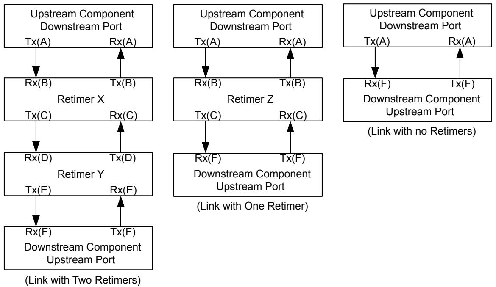

<details>
<summary>flowchart</summary>

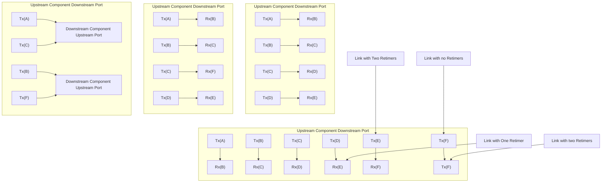
```mermaid
graph TD
    subgraph Upstream Component Downstream Port
  TxA["Tx(A)"] --> RxB["Rx(B)"]
  TxB["Tx(B)"] --> RxC["Rx(C)"]
  TxC["Tx(C)"] --> RxD["Rx(D)"]
  TxD["Tx(D)"] --> RxE["Rx(E)"]
  TxE["Tx(E)"] --> RxF["Rx(F)"]
  TxF["Tx(F)"] --> RxG["Tx(F)"]
    end

    subgraph Upstream Component Downstream Port
  TxA2["Tx(A)"] --> RxB2["Rx(B)"]
  TxB2["Tx(B)"] --> RxC2["Rx(C)"]
  TxC2["Tx(C)"] --> RxD2["Rx(D)"]
  TxD2["Tx(D)"] --> RxE2["Rx(E)"]
    end

    subgraph Upstream Component Downstream Port
  TxA3["Tx(A)"] --> RxB3["Rx(B)"]
  TxB3["Tx(B)"] --> RxC3["Rx(C)"]
  TxC3["Tx(C)"] --> RxD3["Rx(F)"]
  TxD3["Tx(D)"] --> RxE3["Rx(E)"]
    end

    subgraph Upstream Component Downstream Port
  TxA4["Tx(A)"] --> RxF4["Rx(F)"]
  TxB4["Tx(B)"] --> RxG4["Rx(F)"]
  TxC4["Tx(C)"] --> RxF4["Downstream Component Upstream Port"]
  TxE4["Tx(F)"] --> RxG4["Downstream Component Upstream Port"]
    end

  note1["Link with Two Retimers"] --> TxE
  note2["Link with One Retimer"] --> RxE
  note3["Link with no Retimers"] --> TxF
  note4["Link with two Retimers"] --> RxG
```
</details>

(Various System Topologies with or without Retimers)  
Figure 4-60 Receiver Number Assignment§

Margin Type and Margin Payload: The Margin Type field together with a valid Receiver Number(s), associated with the Margin Type encoding, and specific Margin Payload field define various commands used for margining (referred to as Margin Command). § Table 4-63 defines the encodings of valid Margin Commands along with the corresponding responses, used in both the Control SKP Ordered Sets as well as the Margining Lane Control Register and Margining Lane Status Register. Margin commands that are always broadcast will use the broadcast encoding for the Receiver Number, even when only one Receiver is the target (e.g., UP or a DP in a Link with no Retimers). The Receiver Number field in the response to a Margin Command other than No Command reflects the number of the Receiver that is responding, even for a Margin Command that is broadcast. The Margin Commands go Downstream whereas the responses go Upstream in the Control SKP Ordered Sets. The responses reflect the Margin Type to which the target Receiver is responding. The Receiver Number field of the response corresponds to the target Receiver that is responding. All the unused encodings described below are Reserved and must not considered to be a valid Margin Command.

The parameters used here (e.g., MSampleCount) are defined in § Section 8.4.4 . Each data rate has an independent set of parameters and the values in § Table 4-63 reflect the current data rate. Any relationship between values for different data rates is implementation specific. For example, the timing/voltage step sizes might differ between 64.0 GT/s in PAM-4 mode and 16.0 GT/s or 32.0 GT/s in NRZ mode; N voltage steps at 64.0 GT/s is likely to be a different eye height from N voltage steps at 16.0 GT/s or 32.0 GT/s.

In PAM-4 mode, the Step Margin commands apply to all 3 eyes simultaneously.

Table 4-63 Margin Commands and Corresponding Responses§

<table><tr><td colspan="4">Command</td><td colspan="2">Response</td></tr><tr><td>Margin Command</td><td>Margin Type[2:0]</td><td>Valid Receiver Number(s) [2:0]</td><td>Margin Payload[7:0]</td><td>Margin Type[2:0]</td><td>Margin Payload[7:0]</td></tr><tr><td>No Command</td><td>111b</td><td>000b</td><td colspan="3">9Ch(No Command is also an independent command in Upstream direction. The expected Response is No Command with the Receiver Number = 000b.)</td></tr><tr><td>Access Retimer Register (Optional)</td><td>001b</td><td>010b, 100b</td><td>Register offset in bytes:00h - 87h,A0h - FFh</td><td>001b</td><td>Register value, if supported. Target Receiver on Retimer returns 00h if it does not support accessing its registers.</td></tr><tr><td>Report Margin Control Capabilities</td><td>001b</td><td>001b through 110b</td><td>88h</td><td>001b</td><td>Margin Payload[7:5] = Reserved;Margin Payload[4:0] = {MIndErrorSampler,MSampleReportingMethod, MIndLeftRightTiming,MIndUpDownVoltage, MVoltageSupported}</td></tr><tr><td>Report  $M_{NumVoltageSteps}$ </td><td>001b</td><td>001b through 110b</td><td>89h</td><td>001b</td><td>Margin Payload[7] = ReservedMargin Payload[6:0] =  $M_{NumVoltageSteps}$ </td></tr><tr><td>Report $M_{NumTimingSteps}$ </td><td>001b</td><td>001b through 110b</td><td>8Ah</td><td>001b</td><td>Margin Payload[7:6] = ReservedMargin Payload[5:0] =  $M_{NumTimingSteps}$ </td></tr><tr><td>Report $M_{MaxTimingOffset}$ </td><td>001b</td><td>001b through 110b</td><td>8Bh</td><td>001b</td><td>Margin Payload[7] = ReservedMargin Payload[6:0] =  $M_{MaxTimingOffset}$ </td></tr><tr><td>Report $M_{MaxVoltageOffset}$ </td><td>001b</td><td>001b through 110b</td><td>8Ch</td><td>001b</td><td>Margin Payload[7] = ReservedMargin Payload[6:0] =  $M_{MaxVoltageOffset}$ </td></tr><tr><td>Report $M_{SamplingRateVoltage}$ </td><td>001b</td><td>001b through 110b</td><td>8Dh</td><td>001b</td><td>Margin Payload[7:6] = ReservedMargin Payload[5:0] = {MSamplingRateVoltage[5:0]}</td></tr><tr><td>Report $M_{SamplingRateTiming}$ </td><td>001b</td><td>001b through 110b</td><td>8Eh</td><td>001b</td><td>Margin Payload[7:6] = ReservedMargin Payload[5:0] = {MSamplingRateTiming[5:0]}</td></tr><tr><td>Report  $M_{SampleCount}$ </td><td>001b</td><td>001b through 110b</td><td>8Fh</td><td>001b</td><td>Margin Payload[7] = Reserved Margin Payload[6:0] =  $M_{SampleCount}$ </td></tr><tr><td>Report  $M_{MaxLanes}$ </td><td>001b</td><td>001b through 110b</td><td>90h</td><td>001b</td><td>Margin Payload[7:5] = Reserved Margin Payload[4:0] =  $M_{MaxLanes}$ </td></tr><tr><td>Report Reserved</td><td>001b</td><td>001b through 110b</td><td>91-9Fh</td><td>001b</td><td>Margin Payload[7:0] = Reserved</td></tr><tr><td>Set Error Count Limit</td><td>010b</td><td>001b through 110b</td><td>Margin Payload[7:6] = 11b Margin Payload[5:0] = Error Count Limit</td><td>010b</td><td>Margin Payload[7:6] = 11b Margin Payload[5:0] = Error Count Limit registered by the target Receiver</td></tr><tr><td>Go to Normal Settings</td><td>010b</td><td>000b through 110b</td><td>0Fh</td><td>010b</td><td>0Fh</td></tr><tr><td>Clear Error Log</td><td>010b</td><td>000b through 110b</td><td>55h</td><td>010b</td><td>55h</td></tr><tr><td>Step Margin to timing offset to right/left of default</td><td>011b</td><td>001b through 110b</td><td>See § Section 4.2.18.1.2</td><td>011b</td><td>Margin Payload[7:6] = Step Margin Execution Status (see § Section 4.2.18.1.1) Margin Payload[5:0] =  $M_{ErrorCount}$ </td></tr><tr><td>Step Margin to voltage offset to up/ down of default</td><td>100b</td><td>001b through 110b</td><td>See § Section 4.2.18.1.2</td><td>100b</td><td>Margin Payload[7:6] = Step Margin Execution Status (see § Section 4.2.18.1.1) Margin Payload[5:0] =  $M_{ErrorCount}$ </td></tr><tr><td>Vendor Defined</td><td>101b</td><td>001b through 110b</td><td>Vendor Defined</td><td>101b</td><td>Vendor Defined</td></tr></table>

Note:

<table><tr><td colspan="4">Command</td><td colspan="2">Response</td></tr><tr><td>Margin Command</td><td>Margin Type[2:0]</td><td>Valid Receiver Number(s) [2:0]</td><td>Margin Payload[7:0]</td><td>Margin Type[2:0]</td><td>Margin Payload[7:0]</td></tr></table>

1. The term Step Margin command is used to refer to either a Step Margin to timing offset to right/left of default or a Step Margin to voltage offset to up/down of default command.

## 4.2.18.1.1 Step Margin Execution Status §

The Step Margin Execution Status used in § Table 4-63 is a 2-bit field defined as follows:

## 11b

NAK. Indicates that an unsupported Lane Margining command was issued. For example, timing margin beyond ±0.2 UI. MErrorCount is 0.

## 10b

Margining in progress. The Receiver is executing a Step Margin command. MErrorCount reflects the number of errors detected as defined in § Section 8.4.4 .

## 01b

Set up for margin in progress. This indicates the Receiver is getting ready but has not yet started executing a Step Margin command. MErrorCount is 0.

## 00b

Too many errors - Receiver autonomously went back to its default settings. MErrorCount reflects the number of errors detected as defined in § Section 8.4.4 . Note that MErrorCount might be greater than Error Count Limit.

## 4.2.18.1.2 Margin Payload for Step Margin Commands §

For the Step Margin to timing offset to right/left of default command, the Margin Payload field is defined as follows:

• Margin Payload [7]: Reserved.  
• If MIndLeftRightTiming for the targeted Receiver is Set:

◦ Margin Payload [6] indicates whether the Margin Command is right vs. left. A 0b indicates to move the Receiver to the right of the normal setting whereas a 1b indicates to move the Receiver to the left of the normal setting.  
◦ Margin Payload [5:0] indicates the number of steps to the left or right of the normal setting.

• If MIndLeftRightTiming for the targeted Receiver is Clear:

◦ Margin Payload [6]: Reserved  
◦ Margin Payload [5:0] indicates the number of steps beyond the normal setting.

For the Step Margin to voltage offset to up/down of default command, the Margin Payload field is defined as follows:

• If MIndUpDownVoltage for the targeted Receiver is Set:

◦ Margin Payload [7] indicates whether the Margin Command is up vs. down. A 0b indicates to move the Receiver up from the normal setting whereas a 1b indicates to move the Receiver down from the normal setting.  
◦ Margin Payload [6:0] indicates the number of steps up or down from the normal setting.

• If MIndUpDownVoltage for the targeted Receiver is Clear:

◦ Margin Payload [7]: Reserved  
◦ Margin Payload [6:0] indicates the number of steps beyond the normal setting.

## 4.2.18.2 Margin Command and Response Flow §

Each Receiver advertises its capabilities as defined in § Section 8.4.4 . The Receiver being margined must report the number of errors that are consistent with data samples occurring at the indicated location for margining. For simplicity, the Margin Commands and requirements are described in terms of moving the data sampler location though the actual margining method may be implementation specific. For example, the timing margin could be implemented on the actual data sampler or an independent error sampler. Further, the timing margin can be implemented by injecting an appropriate amount of stress/jitter to the data sample location, or by actually moving the data/error sample location. When an independent data/error sampler is used, the errors encountered with the independent data/error sampler must be reported in MErrorCount even though the Link may not experience any errors. To margin a Receiver, Software moves the target Receiver to a voltage/timing offset from its default sampling position.

The following rules must be followed:

Every Retimer Upstream Pseudo Port Receiver and the Downstream Port Receiver must compute the Margin CRC and Margin Parity bits and compare against the received Margin CRC and Margin Parity bits. Any mismatch must result in ignoring the contents of Symbols 4N+2 and 4N+3. A Downstream Port Receiver must report Margin CRC and Margin Parity errors in the Lane Error Status Register (see § Section 7.7.3.3 ).  
• The Upstream Port Receiver is permitted to ignore the Margin CRC bits, Margin Parity bits, and all bits in the Symbols 4N+2 and 4N+3 of the Control SKP Ordered Set. If it checks Margin CRC and Margin Parity, any mismatch must be reported in the Lane Error Status Register.  
• The Downstream Port must transmit Control SKP Ordered Sets in each Lane, with the Margin Type, Receiver Number, Usage Model, and Margin Payload fields reflecting the corresponding control fields in the Margining Lane Control Register. Any Control SKP Ordered Set transmitted more than 10 μs after the Configuration Write Completion must reflect the Margining Lane Control Register values written by that Configuration Write.

◦ This requirement applies regardless of the values in the Margining Lane Control Register.  
◦ This requirement applies regardless of the number of Retimer(s) in the Link.

• For Control SKP Ordered Sets received by the Upstream Pseudo Port, a Retimer Receiver is the target of a valid Margin Command, if all of the following conditions are true:

◦ the Margin Type is not No Command  
◦ the Receiver Number is the number assigned to the Receiver, or Margin Type is either Clear Error Log or Go to Normal Settings and the Receiver Number is 'Broadcast'.  
◦ the Usage Model field is 0b  
◦ the Margin Type, Receiver Number, and Margin Payload fields are consistent with the definitions in § Table 4-62 and § Table 4-63  
◦ the Margin CRC check and Margin Parity check pass.

• For Upstream and Downstream Ports, a Receiver is the target of a valid Margin Command, if all of the following conditions are true for its Margining Lane Control Register:

◦ the Margin Type is not No Command  
◦ the Receiver Number is the number assigned to the Receiver or Margin Type is either Clear Error Log or Go to Normal Settings and the Receiver Number is 'Broadcast'  
◦ the Usage Model field is 0b  
◦ the Margin Type, the Receiver Number, and Margin Payload fields are consistent with the definitions in § Table 4-62 and § Table 4-63

• The Upstream Port must transmit the Control SKP Ordered Set with No Command.

• A target Receiver must apply and respond to the Margin Command within 1 ms of receiving the valid Margin Command if the Link is still in L0 state and operating at 16.0 GT/s or higher Data Rate.

◦ A target Receiver in a Retimer must send a response in the Control SKP Ordered Set in the Upstream Direction within 1 ms of receiving the Margin Command.  
◦ A target Receiver in the Upstream Port must update the Status field of the Lane Margin Command and Status register within 1 ms of receiving the Margin Command.  
◦ A target Receiver in the Downstream Port must update the Status field of the Lane Margin Command and Status register within 1 ms of receiving the Margin Command if the command is not broadcast or no Retimer(s) are present

• For a valid Margin Type, other than No Command, that is broadcast and received by a Retimer:

◦ A Retimer, in position X (see § Figure 4-60), forwards the response unmodified in the Upstream Control SKP Ordered Set, if the command has been applied, else it sends the No Command.  
◦ The Receiver Number field of the response must be set to an encoding of one of the Retimer's Pseudo Ports.  
◦ The Retimer must respond only after both Pseudo Ports have completed the Margin Command.

• The Retimer must overwrite Bits [4:0] of Symbol 4N+1, Bits[7, 5:0] of Symbol 4N+2 and Bits [7:0] in Symbol 4N+3 as it forwards the Control SKP Ordered Set in the Upstream direction if it is the target Receiver of a Margin Command and is executing the command.

• On receipt of a Control SKP Ordered Set, the Downstream Port must reflect the Margining Lane Status Register from the corresponding fields in the received Control SKP Ordered Set within 1 μs, if it passes the Margin CRC and Margin Parity checks and one of the following conditions apply:

◦ In the Margining Lane Control Register: Receiver Number is 010b through 101b  
◦ In the Margining Lane Control Register: Receiver Number is 000b, Margin Command is Clear Error Log, No Command, or Go to Normal Settings, and there are Retimer(s) in the Link  
◦ Optionally, if the Margining Lane Control Register Usage Model field is 1b  
◦ Optionally, if the Margining Lane Control Register Receiver Number field is 110b or 111b

The Margining Lane Status Register fields are updated regardless of the Usage Model bit in the received Control SKP Ordered Set.

• A component must advertise the same value for each parameter defined in § Table 8-12 in § Section 8.4.4 across all its Receivers. A component must not change any parameter value except for MSampleCount and MErrorCount defined in § Table 8-12 in § Section 8.4.4 while LinkUp = 1b.

• A target Receiver that receives a valid Step Margin command must continue to apply that offset until any of the following occur:

◦ it receives a valid Go to Normal Settings command  
◦ it receives a subsequent valid Step Margin command with different Margin Type or Margin Payload field

◦ MIndErrorSampler is 0b and MErrorCount exceeds Error Count Limit  
◦ Optionally, MIndErrorSampler is 1b and MErrorCount exceeds Error Count Limit.

• If a Step Margin command terminates because MErrorCount exceeds Error Count Limit, the target Receiver must automatically return to its default sample position and indicate this in the Margin Payload field (Step Margin Execution Status = 00b). Note: termination for this reason is optional if MIndErrorSampler is 1b.  
• If MIndErrorSampler is 0b, an error is detected when:

◦ The target Receiver is a Port that enters Recovery or detects a Data Parity mismatch while in L0

◦ The target Receiver is a Pseudo Port that enters Forwarding training sets or detects a Data Parity mismatch while forwarding non-training sets.

• If MIndErrorSampler is 1b, an error is detected when:

◦ The target Receiver is a Port and a bit error is detected while in L0  
◦ The target Receiver is a Pseudo Port and a bit error is detected while the Retimer is forwarding non-training sets

• If MIndErrorSampler is 0b and either (1) the target Receiver is a Port that enters Recovery or (2) the target Receiver is a Pseudo Port that enters Forwarding training sets:

◦ The target Receiver must go back to the default sample position  
◦ If the target Receiver is a Port that is still performing margining, it must resume the margin position within 128 μs of entering L0  
◦ If the target Receiver is a Pseudo Port that is still performing margining, it must resume the margin position within 128 μs of Forwarding non-training sets

• A target Receiver is required to clear its accumulated error count on receiving Clear Error Log command, while it continues to margin (if it is the target Receiver of a Step Margin command still in progress), if it was doing so.  
• For a target Receiver of a Set Error Count Limit command, the new value is used for all future Step Margin commands until a new Set Error Count Limit command is received.  
• If no Set Error Count Limit is received by a Receiver since entering L0, the default value is 4.  
• Behavior is undefined if a Set Error Count Limit command is received while a Step Margin command is in effect.  
• Once a target Receiver reports a Step Margin Execution Status of 11b (NAK) or 00b ('Too many errors'), it must continue to report the same status as long as the Step Margin command is in effect.  
• A target Receiver must not report a Step Margin Execution Status of 01b ('Set up for margin in progress') for more than 100 ms after it receives a new valid Step Margin command  
• A target Receiver that reports a Step Margin Execution Status other than 01b, cannot report 01b subsequently unless it receives a new valid Step Margin command.  
• Reserved bits in the Margin Payload field must follow these rules:

◦ The Downstream or Upstream Port must transmit 0s for Reserved bits

◦ The retimer must forward Reserved bits unmodified

◦ All Receivers must ignore Reserved bits

• Reserved encodings of the Margin Type, Receiver Number, or Margin Payload fields must follow these rules:

◦ The retimer must forward Reserved encodings unmodified  
◦ All Receivers must treat Reserved encodings as if they are not the target of the Margin Command

• A Vendor Defined Margin Command or response, that is not defined by a retimer is ignored and forwarded normally.

• A target Receiver on a Retimer must return 00h on the response payload on Access Retimer Register command, if it does not support register access. If a Retimer supports Access Retimer Register command, the following must be observed:

◦ It must return a non-zero value for the DWORD at locations 80h and 84h respectively.  
◦ It must not place any registers corresponding to Margin Payload locations 88h through 9Fh.

## 4.2.18.3 Receiver Margin Testing Requirements §

Software must ensure that the following conditions are met before performing Lane Margining at Receiver:

• The current Link data rate must be 16.0 GT/s or higher.  
• The current Link width must include the Lanes that are to be tested.  
• The Upstream Port's Function(s) must be programmed to a D-state that prevents the Port from entering the L1 Link state. See § Section 5.2 for more information.  
• The ASPM Control field of the Link Control register must be set to 00b (Disabled) in both the Downstream Port and Upstream Port.  
• The state of the Hardware Autonomous Speed Disable bit of the Link Control 2 register and the Hardware Autonomous Width Disable bit of the Link Control register must be saved to be restored later in this procedure.  
• If writeable, the Hardware Autonomous Speed Disable bit of the Link Control 2 register must be Set in both the Downstream Port and Upstream Port. (If hardwired to 0b, the autonomous speed change mechanism is not implemented and is therefore inherently disabled.)  
• If writeable, the Hardware Autonomous Width Disable bit of the Link Control register must be Set in both the Downstream Port and Upstream Port. (If hardwired to 0b, the autonomous width change mechanism is not implemented and is therefore inherently disabled.)

While margining, software must ensure the following:

• All Margin Commands must have the Usage Model field in the Margining Lane Control Register set to 0b. While checking for the status of an outstanding Margin Command, software must check that the Usage Model field of the status part of the Margining Lane Status Register is set to 0b.  
Software must read the capabilities offered by a Receiver and margin it within the constraints of the capabilities it offers. The commands issued and the process followed to determine the margin must be consistent with the definitions provided in § Section 4.2.18 and § Section 8.4.4 . For example, if the Port does not support voltage testing, then software must not initiate a voltage test. In addition, if a Port supports testing of 2 Lanes simultaneously, then software must test only 1 or 2 Lanes at the same time and not more than 2 Lanes.  
• For Receivers where MIndErrorSampler is 1b, any combination of such Receivers are permitted to be margined in parallel.  
• For Receivers where MIndErrorSampler is 0b, at most one such Receiver is permitted to be margined at a time. However, margining may be performed on multiple Lanes simultaneously, as long as it is within the maximum number of Lanes the device supports.  
• Software must ensure that the Margin Command it provides in the Margining Lane Control Register is a valid one, as defined in § Section 4.2.18.1 . For example, the Margin Type must have a defined encoding and the Receiver Number and Margin Payload consistent with it.  
• After issuing a command by writing to the Margining Lane Control Register atomically, software must check for the completion of this command. This is done by atomically reading the Margining Lane Status Register and checking that the status fields match the expected response for the issued command (see § Table 4-62 and

§ Table 4-63). If 10 ms has elapsed after a new Margin Command was issued and the values read do not match the expected response, software is permitted to assume that the Receiver will not respond, and declare that the target Receiver failed margining. For a broadcast command other than No Command the Receiver Number in the response must correspond to one of the Pseudo Ports in Retimer Y or Retimer Z, as described in § Figure 4-60.

• Any two reads of the Margining Lane Status Register should be spaced at least 10 μs apart to make sure they are reading results from different Control SKP Ordered Sets.  
• Software must broadcast No Command and wait for it to complete prior to issuing a new Margin Type or Receiver Number or Margin Payload in the Margining Lane Control Register.  
• At the end of margining in a given direction (voltage/ timing and up/down/left/right), software must broadcast Go to Normal Settings, No Command, Clear Error Log, and No Command in series in the Downstream and Upstream Ports, after ensuring each command has been acknowledged by the target Receiver.  
• If the Data Rate has changed during margining, margining results (if any) are not accurate and software must exit the margining procedure. Software must set the Margining Lane Control Register to No Command to avoid starting margining if the Data Rate later changes to 16.0 GT/s or higher.  
• Software is permitted to issue a Clear Error Log command periodically while margining is in progress, to gather error information over a long period of time.  
• Software must not attempt to margin both timing and voltage of a target Receiver simultaneously. Results are undefined if a Receiver receives commands that would place both voltage and timing margin locations away from the default sample position at the same time.  
• Software should allow margining to run for at least 108 bits margined by the Receiver under test before switching to the next margin step location (unless the error limit is exceeded).  
• Software must account for the 'set up for margin in progress' status while measuring the margin time or the number of bits sampled by the Receiver.  
• If a target Receiver is reporting 'set up for margin in progress' for 200 ms after issuing one of the Step Margin commands, Software is permitted to assume that the Receiver will not respond and declare that the target Receiver failed margining.  
• If a Receiver reports a 'NAK' in the Margin Payload status field and the corresponding Step Margin command was valid and within the allowable range (as defined in § Section 4.2.18 and § Section 8.4.4 ), Software is permitted to declare that the target Receiver failed margining.  
• When the margin testing procedure is completed, the state of the Hardware Autonomous Speed Disable bit and the Hardware Autonomous Width Disable bit must be restored to the previously saved values.

## IMPLEMENTATION NOTE:

## EXAMPLE SOFTWARE FLOW FOR LANE MARGINING AT RECEIVER

For getting the invariant parameters the following steps may be followed. Once obtained, the same parameters can be used across multiple sets of margining tests as long as LinkUp=1b continues to be true. For each component in the Link, do the following Steps. Software can do these steps in parallel for different components on different Lanes of the Link.

## Step A1:

Issue Report Margin Control Capabilities (Margin Type = 001b, Margin Payload = 88h, Receiver Number = target device in the Margining Lane Control Register)

## Step A2:

Read the Margining Lane Status Register.

a. If Margin Type = 001b and Receiver Number = target Receiver: Go to Step A3  
b. Else: If 10 ms has expired since command issued, declare Receiver failed margining and exit; else wait for >10 μs and Go to Step A2

## Step A3:

Store the information provided Margin Payload status field for use during margining.

## Step A4:

Broadcast No Command (Margin Type = 111b, Receiver Number = 000b, and Margin Payload = 9Ch in the Margining Lane Control Register) and wait for those to be reflected back in the Margining Lane Status Register. If 10 ms expires without getting the command completion handshake, declare the Receiver failed margining and exit.

## Step A5:

Repeat Step A1 through Step A4 for Report MNumVoltageSteps, Report MNumTimingSteps, Report MMaxTimingOffset, Report MMaxVoltageOffset, Report MSamplingRateVoltage, and Report MSamplingRateTiming. It may be noted that this step can be executed in parallel across different Lanes for different Margin Type.

Margining on each Lane across the Link can be a sequence of separate commands. Prior to launching the sequence, software should read the maximum number of Lanes it is allowed to run margining simultaneously. The steps would be similar to Step A1 through Step A4 above with the Report MMaxLanes command. After that software can simultaneously margin up to that many Lanes of the Link. On each Link, each Receiver is margined based on its capability, subject to the constraints described here, after ensuring the Link is operating at full width in 16.0 GT/s or higher Data Rate and the hardware autonomous width and speed change as well as ASPM power states have been disabled.

If software desires to set an Error Count Limit value different than default of 4 or whatever was programmed last, it executes the following Steps prior to going to Step C1 below.

## Step B1:

Issue Set Error Count Limit (Margin Type = 010b, the target Receiver Number, and Margin Payload = {11b, Error Count Limit} in the Margining Lane Control Register)

## Step B2:

Read the Margining Lane Status Register.

a. If Margin Type = 010b, Receiver Number = target Receiver, and Margin Payload = Margin Payload control field (Bits [14:7]), go to Step B4  
b. Else: If 10 ms has expired since command issued, go to Step B3; else wait for >10 μs and Go to Step B2

## Step B3:

Margining has failed. Invoke the system checks to find out if the Link degraded in width/speed due to reliability reasons.

## Step B4:

Broadcast No Command and wait for those to be reflected back in the status fields. If 10 ms expires without getting the command completion handshake, declare the Receiver failed margining and exit.

The following steps is an example flow of one margin point for a given Receiver executing Step Margin to timing offset to right/left of default starting with 15 steps to the right:

## Step C1:

Write Margin Type = 011b, the target Receiver Number, and Margin Payload = {0000b, 1111b} in the Margining Lane Control Register

## Step C2:

Read the Margining Lane Status Register.

a. If Margin Type = 011b and Receiver Number = target Receiver, Go to Step C3  
b. Else If 10 ms has expired since command issued, declare Receiver has failed margining and go to Step C7  
c. Wait for >10 μs and Go to Step C2

## Step C3:

In the Margining Lane Status Register:

a. If Margin Payload[7:6] = 11b:  
i. If we exceeded the 0.2 UI, that is the margin; ii. Else report margin failure at this point and go to Step C7;  
b. Else if Margin Payload[7:6] = 00b:  
i. report margin failure at this point and go to Step C7  
c. Else if Margin Payload[7:6] = 01b:  
i. If 200 ms has elapsed since entering Step C3, report that the Receiver failed margining test and exit; ii. else wait 1 ms, read the Margining Lane Status Register and go to Step C3  
d. Else go to Step C4

## Step C4:

Wait for the desired amount of time for margining to happen while sampling the Margining Lane Status Register periodically for the number of errors reported in the Margin Payload field (Bits [5:0] - MErrorCount).

For longer runs, issue the No Command follwed by the Clear Error Log commands, (using procedures similar to Step B1 through Step B4, with the corresponding expected status field) if the length of time will cause the error count to exceed the Set Error Count Limit even when staying within the expected BER target.

If the aggregate error count remains within the expected error count and the Margin Payload[7:6] in the status field remains 10b till the end, the Receiver has the required Margin at the timing margin step; else it fails that timing margin step go to Step C7.

## Step C5:

Broadcast No Command and wait for those to be reflected back in the status fields. If 10 ms expires without getting the command completion handshake, declare the Receiver failed margining and exit.

## Step C6:

Go to Step C1, incrementing the number of timing steps through the Margin Payload control field (Bits[5:0]) if we want to test against a higher margin amount; else go to Step C8 noting the margin value that the Receiver passed

## Step C7:

Margin failed; The previous margin step the Receiver passed in Step C6 is the margin of the Receiver

## Step C8:

Broadcast No Command, Clear Error Log, No Command, Go to Normal Settings series of commands (using a procedure similar to Step B1 through Step B4 with the corresponding expected status fields)

## 4.3 Retimers §

This Section defines the requirements for Retimers that are Physical Layer protocol aware and that interoperate with any pair of components with any compliant channel on each side of the Retimer. An important capability of a Physical Layer protocol aware Retimer is to execute the Phase 2/3 of the equalization procedure in each direction. A maximum of two Retimers are permitted between an Upstream and a Downstream Port.

The two Retimer limit is based on multiple considerations, most notably limits on modifying SKP Ordered Sets and limits on the time spent in Phase 2/3 of the equalization procedure. To ensure interoperability, platform designers must ensure that the two Retimer limit is honored for all PCI Express Links, including those involving form factors as well as those involving active cables. Form factor specifications may define additional Retimer rules that must be honored for their form factors. Assessing interoperability with any Extension Device not based on the Retimer definition in this section is outside the scope of this specification.

Many architectures of Extension Devices are possible, i.e., analog only Repeater, protocol unaware Retimer, etc. This specification describes a Physical Layer protocol aware Retimer. It may be possible to use other types of Extension Devices in closed systems if proper analysis is done for the specific channel, Extension Device, and end-device pair - but a specific method for carrying out this analysis is outside the scope of this specification.

Retimers have two Pseudo Ports, one facing Upstream, and the other facing Downstream. The Transmitter of each Pseudo Port must derive its clock from a 100 MHz reference clock. The reference clock(s) must meet the requirements of § Section 8.6 . A Retimer supports one or more reference clocking architectures as defined in § Section 8.6 Electrical Sub-block.

In most operations Retimers simply forward received Ordered Sets, DLLPs, TLPs, Logical Idle, and Electrical Idle. Retimers are completely transparent to the Data Link Layer and Transaction Layer. System software shall not enable L0s on any Link where a Retimer is present. Support of beacon by Retimers is optional and beyond the scope of this specification.

When using 128b/130b encoding the Retimer executes the protocol so that each Link Segment undergoes independent Link equalization as described in § Section 4.3.6 .

The Pseudo Port orientation (Upstream or Downstream) is determined dynamically, while the Link partners are in Configuration. Both crosslink and regular Links are supported.

## 4.3.1 Retimer Requirements §

The following is a high level summary of Retimer requirements:

• Retimers are required to comply with all the electrical specification described in § Chapter 8. Electrical Sub-block. Retimers must operate in one of two modes:

◦ Retimers' Receivers operate at 8.0 GT/s and above with an impedance that meets the range defined by the ZRX-DC parameter for 2.5 GT/s.  
◦ Retimers' Receivers operate at 8.0 GT/s and above with an impedance that does not meet the range defined by the ZRX-DC parameter for 2.5 GT/s. In this mode the ZRX-DC parameter for 2.5 GT/s must be met with in 1 ms of receiving an EIOS or inferring Electrical Idle and while the Receivers remain in Electrical Idle.

• Forwarded Symbols must always be de-skewed when more than one Lane is forwarding Symbols (including upconfigure cases).  
• Determine Port orientation dynamically.  
• Determine Data Stream Mode (Flit Mode or Non-Flit Mode) dynamically.  
• Perform Lane polarity inversion (if needed).  
• Interoperate with the Link equalization procedure for Phase 2 and Phase 3, when using 128b/130b or 1b/1b encoding, on each Link Segment.  
• Interoperate with de-emphasis negotiation at 5.0 GT/s, on each Link Segment.  
• Interoperate with Link Upconfigure.  
• Interoperate with L0p.  
• Pass loopback data between the Loopback Lead and Loopback Follower.

◦ Optionally execute Follower Loopback on one Pseudo Port when using 8b/10b or 128b/130b encoding

◦ Execute Follower Loopback on one Pseudo Port when using 1b/1b

• Generate the Compliance Pattern on each Pseudo Port.

◦ Load board method (i.e., time out in Polling.Active).

• Forward Modified Compliance Pattern when the Link enters Polling.Compliance via Compliance Receive bit in TS1 Ordered Sets.  
Forward Compliance or Modified Compliance Patterns when Ports enter Polling.Compliance via the Enter Compliance bit in the Link Control 2 register is set to 1b in both the Upstream Port and the Downstream Port and Retimer Enter Compliance is set to 1b (accessed in an implementation specific manner) in the Retimer.  
• Adjust the data rate of operation in concert with the Upstream and Downstream Ports of the Link.  
• Adjust the Link width in concert with the Upstream and Downstream Ports of the Link.  
• Capture Lane numbers during Configuration.

◦ Lane numbers are required when using 128b/130b and 1b/1b encoding for the scrambling seed.

• Capture the Flit Mode Supported bit during Polling and Configuration during Link training.

◦ Flit Mode Supported is used to determine the Data Stream Mode.

• Dynamically adjust Retimer Receiver impedance to match end Component Receiver impedance.

• Infer entering Electrical Idle at all data rates.  
• Modify certain fields of Ordered Sets while forwarding.  
• Perform clock compensation via addition or removal of SKP Symbols.

• Support L1.

◦ Optionally Support L1 PM Substates.

• If 32.0 GT/s capable, then interoperate with Link equalization to the highest data rate.

• If 32.0 GT/s capable, then interoperate with No Equalization Needed mode.

◦ If 32.0 GT/s capable, then interoperate with the use of Modified TS1/TS2 Ordered Sets.

• Forward 1b/1b Control SKP Ordered Sets that have Phy Payload Type equal to 0b. Thus, 1b/1b Control SKP Ordered Sets with Margin Payload will be forwarded.

## 4.3.2 Supported Retimer Topologies §

§ Figure 4-61 shows the topologies supported by Retimers defined in this specification. There may be one or two Retimers between the Upstream and Downstream Ports on a Link. Each Retimer has two Pseudo Ports, which determine their Downstream/Upstream orientation dynamically. Each Retimer has an Upstream Path and a Downstream Path. Both Pseudo Ports must always operate at the same data rate, when in Forwarding mode. Thus, each Path will also be at the same data rate. A Retimer is permitted to support any width option defined by this specification as its maximum width. The behavior of the Retimer in each high level operating mode is:

• Forwarding mode:

◦ Symbols, Electrical Idle, and exit from Electrical Idle; are forwarded on each Upstream and Downstream Path.

• Execution mode:

◦ The Upstream Pseudo Port acts as an Upstream Port of a Component. The Downstream Pseudo Port acts as a Downstream Port of a Component. This mode is used in the following cases:

▪ Polling.Compliance.  
▪ Phase 2 and Phase 3 of the Link equalization procedure.  
▪ Optionally Follower Loopback.

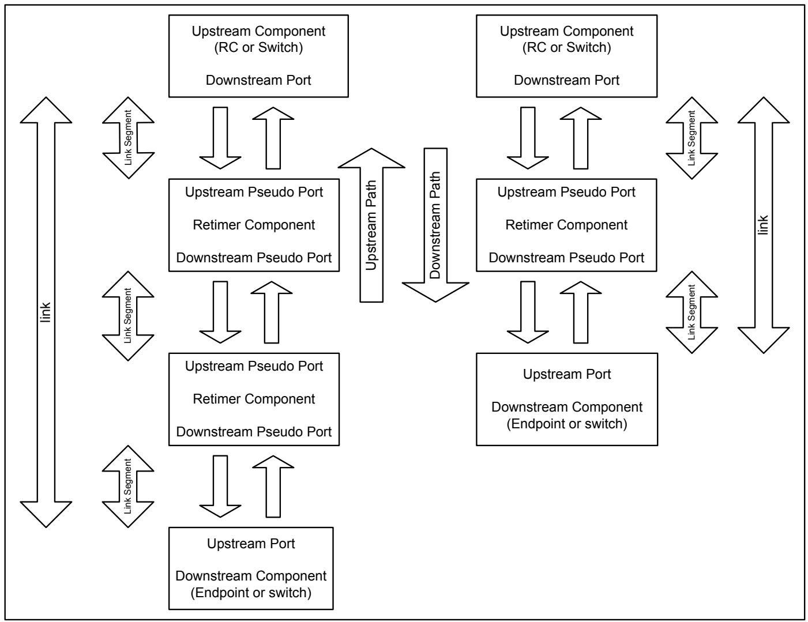

<details>
<summary>flowchart</summary>

Network architecture diagram showing upstream and downstream ports with upsampling, retimer components, and link segments between port nodes.
</details>

Figure 4-61 Supported Retimer Topologies§

## 4.3.3 Variables §

The following variables are set to the following specified values following a Fundamental Reset or whenever the Retimer receives Link and Lane number equal to PAD on two consecutive TS2 Ordered Sets on all Lanes that are receiving TS2 Ordered Sets on both Upstream and Downstream Pseudo Ports within a 1 μs time window from the last Symbol of the second TS2 Ordered Set on the first Lane to the last Symbol of the second TS2 Ordered Set on the last Lane.

• RT\_port\_orientation = undefined  
• RT\_captured\_lane\_number = PAD  
• RT\_captured\_link\_number = PAD  
• RT\_G3\_EQ\_complete = 0b  
• RT\_G4\_EQ\_complete = 0b  
• RT\_G5\_EQ\_complete = 0b  
• RT\_G6\_EQ\_complete = 0b

• RT\_LinkUp = 0b  
• RT\_number = undefined  
• RT\_next\_data\_rate = 2.5 GT/s  
• RT\_error\_data\_rate = 2.5 GT/s  
• RT\_flit\_mode\_enabled = 0b

## 4.3.4 Receiver Impedance Propagation Rules §

The Retimer Transmitters and Receivers shall meet the requirements in § Section 4.2.5.9.1 while Fundamental Reset is asserted. When Fundamental Reset is deasserted the Retimer is permitted to take up to 20 ms to begin active determination of its Receiver impedance. During this interval the Receiver impedance remains as required during Fundamental Reset. Once this interval has expired Receiver impedance on Retimer Lanes is determined as follows:

• Within 1.0 ms of the Upstream or Downstream Port’s Receiver meeting the ZRX-DC parameter, the low impedance is back propagated, (i.e., the Retimer’s Receiver shall meet the ZRX-DC parameter on the corresponding Lane on the other Pseudo Port). Each Lane operates independently and this requirement applies at all times.  
• The Retimer must keep its Transmitter in Electrical Idle until the ZRX-DC condition has been detected. This applies on an individual Lane basis.

## 4.3.5 Switching Between Modes §

The Retimer operates in two basic modes, Forwarding mode or Execution mode. When switching between these modes the switch must occur on an Ordered Set boundary for all Lanes of the Transmitter at the same time. No other Symbols shall be between the last Ordered Set transmitted in the current mode and the first Symbol transmitted in the new mode.

When using 128b/130b or 1b/1b the Transmitter must maintain the correct scrambling seed and LFSR value when switching between modes.

When switching between Forwarding and Execution modes, the Retimer must ensure that at least 16 TS1 Ordered Sets and at most 64 TS1 Ordered Sets are transmitted between the last EIEOS transmitted in the previous mode and the first EIEOS transmitted in the new mode.

When switching to and from the Execution Link Equalization mode the Retimer must ensure a Transmitter does not send two SKP Ordered Sets in a row, and that the maximum allowed interval is not exceeded between SKP Ordered Sets, see § Section 4.2.8.4 .

## 4.3.6 Forwarding Rules §

These rules apply when the Retimer is in Forwarding mode. The Retimer is in Forwarding mode after the deassertion of Fundamental Reset.

• If the Retimer’s Receiver detects an exit from Electrical Idle on a Lane the Retimer must enter Forwarding mode and forward the Symbols on that Lane to the opposite Pseudo Port as described in § Section 4.3.6.3 .

• The Retimer must continue to forward the received Symbols on a given Lane until it enters Execution mode or until an EIOS is received, or until Electrical Idle is inferred on that Lane. This requirement applies even if the Receiver loses Symbol lock or Block Alignment. See § Section 4.3.6.5 for rules regarding Electrical Idle entry.  
• A Retimer shall forward all Symbols unchanged, except as described in § Section 4.3.6.9 and § Section 4.3.6.7 .  
• When operating at 64.0 GT/s data rate, a Retimer must follow the requirements of § Section 4.2.3.2 in order to identify SKP OS, EIEOS, and EIOS received.  
• When operating at 2.5 GT/s data rate, if any Lane of a Pseudo Port receives TS1 Ordered Sets with Link and Lane numbers set to PAD for 5 ms or longer, and the other Pseudo Port does not detect an exit from Electrical Idle on any Lane in that same window, and either of the following occurs:

◦ The following sequence occurs:

▪ An EIOS is received on any Lane that was receiving TS1 Ordered Sets  
▪ followed by a period of Electrical Idle, for less than 5 ms  
▪ followed by Electrical Idle Exit that cannot be forwarded according to § Section 4.3.6.3  
▪ Note: this is interpreted as the Port attached to the Receiver going into Electrical Idle followed by a data rate change for a Compliance Pattern above 2.5 GT/s.

◦ Compliance Pattern at 2.5 GT/s is received on any Lane that was receiving TS1 Ordered Sets.

Then the Retimer enters the Execution mode CompLoadBoard state, and follows § Section 4.3.7.1 .

• If any Lane on the Upstream Pseudo Port receives two consecutive TS1 Ordered Sets with the EC field equal to 10b, when using 128b/130b of 1b/1b encoding, then the Retimer enters Execution mode Equalization, and follows § Section 4.3.7.2 .  
• If the Retimer is configured to support Execution mode Follower Loopback and if any Lane on either Pseudo Port receives two consecutive TS1 Ordered Sets or two consecutive TS2 Ordered Sets with the Loopback bit set to 1b then the Retimer enters Execution mode Follower Loopback, and follows § Section 4.3.7.3 .

## 4.3.6.1 Forwarding Type Rules §

A Retimer must determine what type of Symbols it is forwarding. The rules for inferring Electrical Idle are a function of the type of Symbols the Retimer is forwarding. If a Path forwards two consecutive TS1 Ordered Sets or two consecutive TS2 Ordered Sets, on any Lane, then the Path is forwarding training sets. If a Path forwards eight consecutive Symbol Times of Idle data on all Lanes that are forwarding Symbols then the Path is forwarding non-training sets. When a Retimer transitions from forwarding training sets to forwarding non-training sets, the variable RT\_error\_data\_rate is set to 2.5 GT/s.

## 4.3.6.2 Orientation, Lane Numbers, and Data Stream Mode Rules §

The Retimer must determine the Port orientation, Lane assignment, Lane polarity, and Data stream Mode dynamically as the Link trains.

• When RT\_LinkUp=0, the first Pseudo Port to receive two consecutive TS1 Ordered Sets with a non-PAD Lane number on any Lane, has its RT\_port\_orientation variable set to Upstream Port, and the other Pseudo Port has its RT\_port\_orientation variable set to Downstream Port.  
• The Retimer plays no active part in Lane number determination. The Retimer must capture the Lane numbers with the RT\_captured\_lane\_number variable at the end of the Configuration state, between the Link Components. This applies on the first time through Configuration, i.e., when the RT\_LinkUp variable is set to 0b. Subsequent trips through Configuration during Link width configure must not change the Lane numbers.

Lane numbers are required for the scrambling seed when using 128b/130b or 1b/1b. Link numbers are required in some cases when the Retimer is in Execution mode. Link numbers and Lane numbers are captured with the RT\_captured\_lane\_number, and RT\_captured\_link\_number variables whenever the first two consecutive TS2 Ordered Sets that contain non-PAD Lane and non-PAD Link numbers are received after the RT\_LinkUp variable is set to 0b. A Retimer must function normally if Lane reversal occurs. When the Retimer has captured the Lane numbers and Link numbers the RT\_LinkUp variable is set to 1b. In addition, if the Disable Scrambling bit in the TS2 Ordered Sets is set to 1b, in either case above, then the Retimer determines that scrambling is disabled when using 8b/10b encoding.

• Lane polarity is determined any time the Lane exits Electrical Idle, and achieves Symbol lock at 2.5 GT/s as described in § Section 4.2.5.5 :

◦ If polarity inversion is determined the Receiver must invert the received data. The Transmitter must never invert the transmitted data.

The Retimer plays an active part of Data Stream Mode determination. If the Retimer supports Flit Mode operation, for each Pseudo Port, it must capture the value of the Flit Mode Supported bit of the Data Rate Identifier field in the eight consecutive TS2 Ordered Sets received with Link and Lane numbers set to PAD when the RT\_LinkUp variable is set to 0b. If the Flit Mode Supported bit is 1b in eight consecutive TS2 Ordered Sets received by both Pseudo Ports, the RT\_flit\_mode\_enabled variable must be set to 1b and each Pseudo Port must follow Flit Mode rules (as specified in § Section 4.2 ) to identify transitions between Ordered Set Data and Data Streams. If the Retimer does not support Flit Mode operation, its RT\_flit\_mode\_enabled variable must remain set to 0b and it must set bit 0 of the Data Rate Identifier (Symbol 0) to 0b in all TS Ordered Sets that it forwards (as described in § Section 4.3.6.7 ).

◦ When using 8b/10b with Flit Mode, NOP Flits (instead of Idle data) identify the start of the data stream.  
◦ When using 128b/130b or 1b/1b with Flit Mode, SDS Ordered Sets identify the start of the data stream.

• The Retimer’s place in the system topology is determined when eight consecutive TS2 Ordered Sets are received with (non-PAD) matching Link and Lane numbers and identical data rate identifiers. If the Retimer Present bits are set to 01b on the Upstream Pseudo Port, the RT\_number must be set to 10b, otherwise RT\_number must be set to 01b. The RT\_number is used to determine Pseudo Ports B, C, D and E. This identification is needed for Execution Mode Follower Loopback with 1b/1b encoding.

## 4.3.6.3 Electrical Idle Exit Rules §

At data rates other than 2.5 GT/s, EIEOS are sent within the training sets to ensure that the analog circuit detects an exit from Electrical Idle. Receiving an EIEOS is required when using 128b/130b or 1b/1b encoding to achieve Block Alignment. When the Retimer starts forwarding data after detecting an Electrical Idle exit, the Retimer starts transmitting on a training set boundary. The first training sets it forwards must be an EIEOS, when operating at data rates higher than 2.5 GT/s. The first EIEOS sent will be in place of the TS1 or TS2 Ordered Set that it would otherwise forward.

If no Lanes meet ZRX-DC on a Pseudo Port, and the following sequence occurs:

• An exit from Electrical Idle is detected on any Lane of that Pseudo Port.  
• And then if not all Lanes infer Electrical Idle, via absence of exit from Electrical Idle in a 12 ms window on that Pseudo Port and the other Pseudo Port is not receiving Ordered Sets on any Lane in that same 12 ms window.

Then the same Pseudo Port, where no Lanes meet ZRX-DC, sends the Electrical Idle Exit pattern described below for 5 μs on all Lanes.

If operating at 2.5 GT/s and the following occurs:

• any Lane detects an exit from Electrical Idle  
• and then receives two consecutive TS1 Ordered Sets with Lane and Link numbers equal to PAD  
• and the other Pseudo Port is not receiving Ordered Sets on any Lane

Then Receiver Detection is performed on all Lanes of the Pseudo Port that is not receiving Ordered Sets. If no Receivers were detected then:

• The result is back propagated as described in § Section 4.3.4 , within 1.0 ms.  
• The same Pseudo Port that received the TS1 Ordered Sets with Lane and Link numbers equal to PAD, sends the Electrical Idle Exit pattern described below for 5 μs on all Lanes.

If a Lane detects an exit from Electrical Idle then the Lane must start forwarding when all of the following are true:

• Data rate is determined, see § Section 4.3.6.4 , current data rate is changed to RT\_next\_data\_rate if required.  
• Lane polarity is determined, see § Section 4.3.6.2 .  
• Two consecutive TS1 Ordered Sets or two consecutive TS2 Ordered Sets are received.  
• Two consecutive TS1 Ordered Sets or two consecutive TS2 Ordered Sets are received on all Lanes that detected an exit from Electrical Idle or the max Retimer Exit Latency has occurred, see § Table 4-64.  
• Lane De-skew is achieved on all Lanes that received two consecutive TS1 or two consecutive TS2 Ordered Sets.  
• If a data rate change has occurred then 6 μs has elapsed since Electrical Idle Exit was detected.

All Ordered Sets used to establish forwarding must be discarded. Only Lanes that have detected a Receiver on the other Pseudo Port, as described in § Section 4.3.4 , are considered for forwarding.

Otherwise after a 3.0 ms timeout, if the other Pseudo Port is not receiving Ordered Sets then Receiver Detection is performed on all Lanes of the Pseudo Port that is not receiving Ordered Sets, the result is back propagated as described in § Section 4.3.4 , and if no Receivers were detected:

• Then the same Pseudo Port that was unable to receive two consecutive TS1 or TS2 Ordered Sets on any Lane sends the Electrical Idle Exit pattern described below for 5 μs on all Lanes.  
• Else the Electrical Idle Exit pattern described below is forwarded on all Lanes that detected an exit from Electrical Idle.  
• When using 128b/130b encoding:  
◦ One EIEOS  
◦ 32 Data Blocks, each with a payload of 16 Idle data Symbols (00h), scrambled, for Symbols 0 to 13.  
◦ Symbol 14 and 15 of each Data Block either contain Idle data Symbols (00h), scrambled, or DC Balance, determined by applying the same rules in § Section 4.2.5.1 to these Data Blocks.

• When using 8b/10b encoding: The Modified Compliance Pattern with the error status Symbol set to 00h.

• This Path now is forwarding the Electrical Idle Exit pattern. In this state Electrical Idle is inferred by the absence of Electrical Idle Exit, see § Table 4-65. The Path continues forwarding the Electrical Idle Exit pattern until Electrical Idle is inferred on any lane, or a 48 ms time out occurs. If a 48 ms time out occurs then:

◦ The RT\_LinkUp variable is set to 0b.  
◦ The Pseudo Port places its Transmitter in Electrical Idle  
◦ The RT\_next\_data\_rate and the RT\_error\_data\_rate must be set to 2.5 GT/s for both Pseudo Ports

◦ Receiver Detection is performed on the Pseudo Port that was sending the Electrical Idle Exit pattern and timed out, the result is back propagated as described in § Section 4.3.4 .

The Transmitter, on the opposite Pseudo Port that was sending the Electrical Idle Exit Pattern and timed out, sends the Electrical Idle Exit Pattern described above for 5 μs.

## IMPLEMENTATION NOTE: ELECTRICAL IDLE EXIT

Forwarding Electrical Idle Exit occurs in error cases where a Retimer is unable to decode training sets. Upstream and Downstream Ports use Electrical Idle Exit (without decoding any Symbols) during Polling.Compliance, and Recovery.Speed. If the Retimer does not forward Electrical Idle Exit then the Upstream and Downstream Ports will misbehave in certain conditions. For example, this may occur after a speed change to a higher data rate. In this event forwarding Electrical Idle Exit is required to keep the Upstream and Downstream Ports in lock step at Recovery.Speed, so that the data rate will return to the previous data rate, rather than a Link Down condition from a time out to Detect.

When a Retimer detects an exit from Electrical Idle and starts forwarding data, the time this takes is called the Retimer Exit Latency, and allows for such things as data rate change (if required), clock and data recovery, Symbol lock, Block Alignment, Lane-to-Lane de-skew, Receiver tuning, etc. The Maximum Retimer Exit Latency is specified below for several conditions:

• The data rate before and after Electrical Idle and Electrical Idle exit detect does not change.  
• Data rate change to a data rate that uses 8b/10b encoding.  
• Data rate change to a data rate that uses 128b/130b encoding for the first time.  
• Data rate change to a data rate that uses 128b/130b encoding not for the first time.  
• Data rate change to a data rate that uses 1b/1b encoding for the first time.  
• Data rate change to a data rate that uses 1b/1b encoding not for the first time.  
• How long both transmitters have been in Electrical Idle when a data rate change occurs.

Retimers are permitted to change their data rate while in Electrical Idle, and it is recommended that Retimers start the data rate change while in Electrical Idle to minimize Retimer Exit latency.

Table 4-64 Maximum Retimer Exit Latency§

<table><tr><td rowspan="2">Condition</td><td colspan="2">Link in Electrical Idle for X μs, where:</td></tr><tr><td>X &lt; 500 μs</td><td>X ≥ 500 μs</td></tr><tr><td>No data rate change</td><td>4 μs</td><td>4 μs</td></tr><tr><td>When forwarding TS1 Ordered Sets at 2.5 GT/s with Lane and Link number equal to PAD.</td><td>1 ms</td><td>1 ms</td></tr><tr><td>Any data rate change to 8b/10b encoding data rate</td><td>504 – X μs</td><td>4 μs</td></tr><tr><td>First data rate change to 128b/130b encoding date rate</td><td>1.5 – X ms</td><td>1 ms</td></tr><tr><td>Subsequent data rate change to 128b/130b encoding date rate</td><td>504 – X μs</td><td>4 μs</td></tr><tr><td>First data rate change to 1b/1b encoding data rate</td><td>1.5 – X ms</td><td>1 ms</td></tr><tr><td>Subsequent data rate change to 1b/1b encoding data rate</td><td>504 – X μs</td><td>4 μs</td></tr></table>

## 4.3.6.4 Data Rate Change and Determination Rules §

The data rate of the Retimer is set to 2.5 GT/s after deassertion of Fundamental Reset.

Both Pseudo Ports of the Retimer must operate at the same data rate. If a Pseudo Port places its Transmitter in Electrical Idle, then the Symbols that it has just completed transmitting determine the variables RT\_next\_data\_rate and RT\_error\_data\_rate. Only when both Pseudo Ports have all Lanes in Electrical Idle shall the Retimer change the data rate. If both Pseudo Ports do not make the same determination of these variables, then both variables must be set to 2.5 GT/s.

• If both Pseudo Ports were forwarding non-training sequences, then the RT\_next\_data\_rate must be set to the current data rate. The RT\_error\_data\_rate must be set to 2.5 GT/s. Note: this covers the case where the Link has entered L1 from L0.  
• If both Pseudo Ports were forwarding TS2 Ordered Sets with the speed\_change bit set to 1b and either:

◦ the data rate, when forwarding those TS2s, is greater than 2.5 GT/s or,  
◦ the highest common data rate received in the data rate identifiers in both directions is greater than 2.5 GT/s,

then RT\_next\_data\_rate must be set to the highest common data rate and the RT\_error\_data\_rate is set to current data rate. Note: this covers the case where the Link has entered Recovery.Speed from Recovery.RcvrCfg and is changing the data rate according to the highest common data rate.

• Else the RT\_next\_data\_rate must be set to the RT\_error\_data\_rate. The RT\_error\_data\_rate is set to 2.5 GT/s. Note this covers the two error cases:

◦ This indicates that the Link was unable to operate at the current data rate (greater than 2.5 GT/s) and the Link will operate at the 2.5 GT/s data rate or,  
◦ This indicates that the Link was unable to operate at the new negotiated data rate and will revert back to the old data rate with which it entered Recovery from L0 or L1.

## 4.3.6.5 Electrical Idle Entry Rules §

The Rules for Electrical Idle entry in Forwarding mode are a function of whether the Retimer is forwarding training sets or non-training sets. The determination of this is described in § Section 4.3.6.1 .

Before a Transmitter enters Electrical Idle, it must always send the Electrical Idle Ordered Set Sequence (EIOSQ), unless otherwise specified.

If the Retimer is forwarding training sets then:

• If an EIOS is received on a Lane, then the EIOSQ is forwarded on that Lane and only that Lane places its Transmitter in Electrical Idle.  
• If Electrical Idle is inferred on a Lane, then that Lane places its Transmitter in Electrical Idle, after EIOSQ is transmitted on that Lane.

Else if the Retimer is forwarding non-training sets then:

• If an EIOS is received on any Lane, then the EIOSQ is forwarded on all Lanes that are currently forwarding Symbols and all Lanes place their Transmitters in Electrical Idle.  
• If Electrical Idle is inferred on a Lane, then that Lane places its Transmitter in Electrical Idle, and EIOSQ is not transmitted on that Lane.  
• When operating at 64.0 GT/s, a Retimer must follow the requirements of § Section 4.2.3.2 in order to identify SKP OS, EIEOS, and EIOS received.

The Retimer is required to infer Electrical Idle. The criteria for a Retimer inferring Electrical Idle are described in § Table 4-65.

§ Table 4-65 Inferring Electrical Idle

<table><tr><td>State</td><td>2.5 GT/s</td><td>5.0 GT/s</td><td>8.0 GT/s</td><td>16.0 GT/s or higher</td></tr><tr><td>Forwarding: Non Training Sequence</td><td>Absence of a SKP Ordered Set in a 128 μs window</td><td>Absence of a SKP Ordered Set in a 128 μs window</td><td>Absence of a SKP Ordered Set in a 128 μs window</td><td>Absence of a SKP Ordered Set in a 128 μs window</td></tr><tr><td>Forwarding: Training Sequence</td><td>Absence of a TS1 or TS2 Ordered Set in a 1280 UI interval</td><td>Absence of a TS1 or TS2 Ordered Set in a 1280 UI interval</td><td>Absence of a TS1 or TS2 Ordered Set in a 4680 UI interval</td><td>Absence of a TS1 or TS2 Ordered Set in a 4680 UI interval</td></tr><tr><td>Forwarding: Electrical Idle Exit Executing: Force Timeout</td><td>Absence of an exit from Electrical Idle in a 2000 UI interval</td><td>Absence of an exit from Electrical Idle in a 16000 UI interval</td><td>Absence of an exit from Electrical Idle in a 16000 UI interval</td><td>Absence of an exit from Electrical Idle in a 16000 UI interval</td></tr><tr><td>Forwarding: Loopback Executing: Loopback Follower</td><td>Absence of an exit from Electrical Idle in a 128 μs window</td><td>N/A</td><td>N/A</td><td>N/A</td></tr></table>

## 4.3.6.6 Transmitter Settings Determination Rules §

When a data rate change to 64.0 GT/s occurs the Retimer transmitter settings are determined as follows:

• If the RT\_G6\_EQ\_complete variable is set to 1b:

◦ The Transmitter must use the coefficient settings agreed upon at the conclusion of the last equalization procedure applicable to 64.0 GT/s operation.

• Else:

◦ An Upstream Pseudo Port must use the 128b/130b Transmitter preset values it registered from the eight consecutive 128b/130b EQ TS2 Ordered Sets received while operating at 32.0 GT/s in its Transmitter preset setting as soon as it starts transmitting at the 64.0 GT/s data rate and must ensure that it meets the preset definition in § Section 4.2.4.2 . Lanes that received a Reserved or unsupported Transmitter preset value must use an implementation specific method to choose a supported Transmitter preset setting for use as soon it starts transmitting at 64.0 GT/s.

◦ A Downstream Pseudo Port determines its Transmitter Settings in an implementation specific manner when it starts transmitting at 64.0 GT/s.

The RT\_G6\_EQ\_complete variable is set to 1b when:

• Two consecutive TS0 Ordered Sets are received with EC = 01b at 64.0 GT/s and RT\_port\_orientation is set to Downstream Port.  
• Two consecutive TS1 Ordered Sets are received with EC = 01b at 64.0 GT/s and RT\_port\_orientation is set to Upstream Port.

The RT\_G6\_EQ\_complete variable is set to 0b when any of the following occur:

• The RT\_LinkUp variable is set to 0b.  
• The Pseudo Port is operating at 32.0 GT/s and eight consecutive 128b/130b EQ TS2 Ordered Sets are received on any Lane of the Upstream Pseudo Port. The value in the 128b/130b Transmitter Preset field is registered for later use at 64.0 GT/s for that Lane.

When a data rate change to 32.0 GT/s occurs the Retimer transmitter settings are determined as follows:

• If the RT\_G5\_EQ\_complete variable is set to 1b:

◦ The Transmitter must use the coefficient settings agreed upon at the conclusion of the last equalization procedure applicable to 32.0 GT/s operation.

• Else:

◦ An Upstream Pseudo Port must use the 128b/130b Transmitter preset values it registered from the eight consecutive 128b/130b EQ TS2 Ordered Sets received while operating at 16.0 GT/s in its Transmitter preset setting as soon as it starts transmitting at the 32.0 GT/s data rate and must ensure that it meets the preset definition in § Section 4.2.4.2 . Lanes that received a Reserved or unsupported Transmitter preset value must use an implementation specific method to choose a supported Transmitter preset setting for use as soon it starts transmitting at 32.0 GT/s.

◦ A Downstream Pseudo Port determines its Transmitter Settings in an implementation specific manner when it starts transmitting at 32.0 GT/s.

The RT\_G5\_EQ\_complete variable is set to 1b when:

• Two consecutive TS1 Ordered Sets are received with EC = 01b at 32.0 GT/s.

The RT\_G5\_EQ\_complete variable is set to 0b when any of the following occur:

• RT\_LinkUp variable is set to 0b.  
• The Pseudo Port is operating at 16.0 GT/s and eight consecutive 128b/130b EQ TS2 Ordered Sets are received on any Lane of the Upstream Pseudo Port. The value in the 128b/130b Transmitter Preset field is registered for later use at 32.0 GT/s for that Lane.

When a data rate change to 16.0 GT/s occurs the Retimer transmitter settings are determined as follows:

• If the RT\_G4\_EQ\_complete variable is set to 1b:  
◦ The Transmitter must use the coefficient settings agreed upon at the conclusion of the last equalization procedure applicable to 16.0 GT/s operation.

• Else:

◦ An Upstream Pseudo Port must use the 128b/130b Transmitter preset values it registered from the received eight consecutive 128b/130b EQ TS2 Ordered Sets in its Transmitter preset setting as soon as it starts transmitting at the 16.0 GT/s data rate and must ensure that it meets the preset definition in § Section 8.3.3.3 . Lanes that received a Reserved or unsupported Transmitter preset value must use an implementation specific method to choose a supported Transmitter preset setting for use as soon it starts transmitting at 16.0 GT/s.

◦ A Downstream Pseudo Port determines its Transmitter Settings in an implementation specific manner when it starts transmitting at 16.0 GT/s.

The RT\_G4\_EQ\_complete variable is set to 1b when:

• Two consecutive TS1 Ordered Sets are received with EC = 01b at 16.0 GT/s.

The RT\_G4\_EQ\_complete variable is set to 0b when any of the following occur:

• The RT\_LinkUp variable is set to 0b.  
• Eight consecutive 128b/130b EQ TS2 Ordered Sets are received on any Lane of the Upstream Pseudo Port. The value in the 128b/130b Transmitter Preset field is registered for later use at 16.0 GT/s for that Lane.

When a data rate change to 8.0 GT/s occurs the Retimer transmitter settings are determined as follows:

• If the RT\_G3\_EQ\_complete variable is set to 1b:

◦ The Transmitter must use the coefficient settings agreed upon at the conclusion of the last equalization procedure applicable to 8.0 GT/s operation.

• Else:

◦ An Upstream Pseudo Port must use the 8.0 GT/s Transmitter preset values it registered from the received eight consecutive EQ TS2 Ordered Sets in its Transmitter preset setting as soon as it starts transmitting at the 8.0 GT/s data rate and must ensure that it meets the preset definition in § Section 8.3.3 . Lanes that received a Reserved or unsupported Transmitter preset value must use an implementation specific method to choose a supported Transmitter preset setting for use as soon it starts transmitting at 8.0 GT/s. The Upstream Pseudo Port may optionally use the 8.0 GT/s Receiver preset hint values it registered in those EQ TS2 Ordered Sets.  
◦ A Downstream Pseudo Port determines its Transmitter preset settings in an implementation specific manner when it starts transmitting at 8.0 GT/s.

The RT\_G3\_EQ\_complete variable is set to 1b when:

• Two consecutive TS1 Ordered Sets are received with EC = 01b at 8.0 GT/s.

The RT\_G3\_EQ\_complete variable is set to 0b when any of the following occur:

• The RT\_LinkUp variable is set to 0b.  
• Eight consecutive EQ TS1 or eight consecutive EQ TS2 Ordered Sets are received on any Lane of the Upstream Pseudo Port. The value in the 8.0 GT/s Transmitter Preset and optionally the 8.0 GT/s Receiver Preset Hint fields are registered for later use at 8.0 GT/s for that Lane.

When a data rate change to 5.0 GT/s occurs the Retimer transmitter settings are determined as follows:

• The Upstream Pseudo Port must sets its Transmitters to either -3.5 dB or -6.0 dB, according to the Selectable De-emphasis bit (bit 6 of Symbol 4) received in eight consecutive TS2 Ordered Sets, in the most recent series of TS2 Ordered sets, received prior to entering Electrical Idle.  
• The Downstream Pseudo Port sets its Transmitters to either -3.5 dB or -6.0 dB in an implementation specific manner.

## 4.3.6.7 Ordered Set Modification Rules §

Ordered Sets are forwarded, and certain fields are modified according to the following rules:

• The Retimer shall not modify any fields except those specifically allowed/required for modification in this specification.  
• LF: the Retimer shall overwrite the LF field in TS1 Ordered Sets transmitted in both directions. The new value is determined in an implementation specific manner by the Retimer.  
• FS: the Retimer shall overwrite the FS field in TS1 Ordered Sets transmitted in both directions. The new value is determined in an implementation specific manner by the Retimer.  
• Pre-Cursor Coefficient: the Retimer shall overwrite the Pre-Cursor Coefficient field in TS1 Ordered Sets transmitted in both directions. The new value is determined by the current Transmitter settings.  
• Cursor Coefficient: the Retimer shall overwrite the Cursor Coefficient field in TS1 Ordered Sets transmitted in both directions. The new value is determined by the current Transmitter settings.  
• Post-Cursor Coefficient: the Retimer shall overwrite the Post-Cursor Coefficient field in the TS1 Ordered Sets transmitted in both directions. The new value is determined by the current Transmitter settings.  
• Parity: the Retimer shall overwrite the Parity bit of forwarded TS1 Ordered Sets. This bit is the even parity of all bits of Symbols 6, 7, and 8 and bits 6:0 of Symbol 9.  
Transmitter Preset: the Retimer shall overwrite the Transmitter Preset field in TS1 Ordered Sets transmitted in both directions. If the Transmitter is using a Transmitter preset setting then the value is equal to the current setting, else it is recommended that the Transmitter Preset field be set to the most recent Transmitter preset setting that was used for the current data rate.

The Retimer is permitted to do the following:

◦ overwrite the Transmitter Preset field in EQ TS1 Ordered Sets in either direction  
◦ overwrite the 8.0 GT/s Transmitter Preset field in EQ TS2 Ordered Sets in the Downstream direction.  
◦ overwrite the 128b/130b Transmitter Preset field in 128b/130b EQ TS2 Ordered Sets, in the Downstream direction.

The new values for the 8.0 GT/s Transmitter Preset and 128b/130b Transmitter Preset fields are determined in an implementation specific manner by the Retimer.

During phase 0 of Equalization to 16.0 GT/s (i.e., the current Data Rate is 8.0 GT/s), phase 0 of Equalization to 32.0 GT/s (i.e., the current Data Rate is 16.0 GT/s), or phase 0 of Equalization to 64.0 GT/s (i.e., the current Data Rate is 32.0 GT/s) the Retimer is permitted to do the following in the Upstream direction:

◦ Forward received TS2 Ordered Sets.  
◦ Convert TS2 Ordered Sets to 128b/130b EQ TS2 Ordered Sets, the value for the 128b/130b Transmitter Preset field is determined in an implementation specific manner by the Retimer.  
◦ Forward received 128b/130b EQ TS2 Ordered Sets with modification, the value for the 128b/130b Transmitter Preset field is determined in an implementation specific manner by the Retimer.  
◦ Convert 128b/130b EQ TS2 Ordered Sets to TS2 Ordered Sets.

• Receiver Preset Hint: the Retimer is permitted to do the following:

◦ overwrite the Receiver Preset Hint field in EQ TS1 Ordered Sets in either direction  
◦ overwrite the 8.0 GT/s Receiver Preset Hint field in EQ TS2 Ordered Sets in the Downstream direction.

The new values, for the Receiver Preset Hint and 8.0 GT/s Receiver Preset Hint fields are determined in an implementation specific manner by the Retimer.

• SKP Ordered Set: The Retimer is permitted to adjust the length of SKP Ordered Sets transmitted in both directions. The Retimer must perform the same adjustment on all Lanes. When operating with 8b/10b encoding, the Retimer is permitted to add or remove one SKP Symbol of a SKP Ordered Set. When operating with 128b/130b encoding, a Retimer is permitted to add or remove 4 SKP Symbols of a SKP Ordered Set. When operating with 1b/1b encoding, only Control SKP Ordered Sets are sent.

• Control SKP Ordered Set: The Retimer must modify the First Retimer Data Parity, or the Second Retimer Data Parity, of the Control SKP Ordered Set when the Retimer is in forwarding mode at 16.0 GT/s or above, according to its received parity. The received even parity is computed independently on each Lane as follows:

◦ Parity is initialized when a data rate change occurs.  
◦ Parity is initialized when a SDS Ordered Set is received.  
◦ Parity is updated with each bit of a Data Block's payload before de-scrambling has been performed.  
◦ Parity is initialized when a Control SKP Ordered Set is received. However, parity is NOT initialized when a Standard SKP Ordered Set is received.

If a Pseudo Port detects the Retimer Present bit was 0b in the most recently received two consecutive TS2 or EQ TS2 Ordered Sets received by that Pseudo Port when operating at 2.5 GT/s then that Pseudo Port receiver modifies the First Retimer Data Parity as it forwards the Control SKP Ordered Set, else that Pseudo Port receiver modifies the Second Retimer Data Parity as it forwards the Control SKP Ordered Set.

The Retimer must modify symbols 4\*N+1, 4\*N+2, and 4\*N+3 of the Control SKP Ordered Set in the Upstream direction as described in § Section 4.2.18 .

See § Section 4.2.8.2 for Control SKP Ordered Set definition.

◦ When operating with 1b/1b encoding, a Retimer is permitted to add or remove 8 Bytes of SKP at an aligned 8 byte boundary.

• Selectable De-emphasis: the Retimer is permitted to overwrite the Selectable De-emphasis field in the TS1 or TS2 Ordered Set in both directions. The new value is determined in an implementation specific manner by the Retimer.

The Data Rate Identifier: The Retimer must set the Data Rate Supported bits of the Data Rate Identifier Symbol consistent with the data rates advertised in the received Ordered Sets and its own max supported Data Rate, i.e., it clears to 0b all Symbol 4 bits[5:0] Data Rates that it does not support. A Retimer must support all data rates below and including its maximum supported data rate. A Retimer makes its determination of maximum supported Data Rate once, after fundamental reset. A Retimer that does not support Flit Mode must set Symbol 4, bit 0 to 0b.

• DC Balance: When operating with 128b/130b encoding, the Retimer tracks the DC Balance of its Pseudo Port transmitters and transmits DC Balance Symbols as described in § Section 4.2.5.1 .

• Retimer Present: When operating at 2.5 GT/s, the Retimer must Set the Retimer Present bit in all forwarded Ordered Sets with a defined Retimer Present bit.

Two Retimers Present: If the Retimer supports 16.0 GT/s or higher, then when operating at 2.5 GT/s, the Retimer must Set the Two Retimers Present bit in all forwarded Ordered Sets with a defined Two Retimers Present bit, if it receives an Ordered Set that has a defined Retimer Present bit and the Retimer Present bit is Set. If the Retimer does not support 16.0 GT/s or higher, then when operating at 2.5 GT/s, the Retimer is permitted to Set the Two Retimers Present bit of all forwarded Ordered Sets with a defined Two Retimers Present bit, if it receives an Ordered Set that has a defined Retimer Present bit and the Retimer Present bit is Set.

• Loopback: When optionally supporting Follower Loopback in Execution mode at 8b/10b or 128b/130b encoding, the Loopback bit must be cleared to 0b when forwarding training sets. When Follower Loopback in

Execution mode at 1b/1b encoding is enabled, the Assert Loopback bits (Training Control bits 2:0) must be cleared to 000b when forwarding training sets.

• Enhanced Link Behavior Control: If the Retimer supports 32.0 GT/s or higher, then when operating at 2.5GT/s, the Retimer must set the Enhanced Link Behavior Control bits of all forwarded TS1, TS2, EQ TS1 and EQ TS2 Ordered Sets as follows:

◦ Set to 11b when Retimer supports Modified TS1/TS2 Ordered Sets and the Enhanced Link Behavior Control bits set to 11b in the Ordered Sets received for forwarding.  
◦ Set to 10b when Retimer supports no equalization and the Enhanced Link Behavior Control bits is set to 10b in the Ordered Sets received for forwarding.  
◦ Set to 01b when Retimer supports Equalization Bypass to Highest NRZ Rate and the Enhanced Link Behavior Control field is set to 01b in the Ordered Sets received for forwarding.  
◦ Otherwise, set to 00b.

## 4.3.6.8 DLLP, TLP, Logical Idle, and Flit Modification Rules §

DLLPs, TLPs, Logical Idle, and Flits are forwarded with no modifications to any of the Symbols unless otherwise specified.

## 4.3.6.9 8b/10b Encoding Rules §

The Retimer shall meet the requirements in § Section 4.2.1.1.3 except as follows:

• When the Retimer is forwarding and an 8b/10b decode error or a disparity error is detected in the received data, the Symbol with an error is replaced with the D21.3 Symbol with incorrect disparity in the forwarded data.  
• This clause in § Section 4.2.1.1.3 does not apply: If a received Symbol is found in the column corresponding to the incorrect running disparity or if the Symbol does not correspond to either column, the Physical Layer must notify the Data Link Layer that the received Symbol is invalid. This is a Receiver Error, and is a reported error associated with the Port (see § Section 6.2 ).

## IMPLEMENTATION NOTE: RETIMER TRANSMITTER DISPARITY §

The Retimer must modify certain fields of the TS1 and TS2 Ordered Sets (e.g., Receiver Preset Hint, Transmitter Preset), therefore the Retimer must recalculate the running disparity. Simply using the disparity of the received Symbol may lead to an error in the running disparity. For example, some 8b/10b codes have 6 ones and 4 zeros for positive disparity, while other codes have 5 ones and 5 zeros.

## 4.3.6.10 8b/10b Scrambling Rules §

A Retimer is required to determine if scrambling is disabled when using 8b/10b encoding as described in § Section 4.3.6.2 .

## 4.3.6.11 Hot Reset Rules §

If any Lane of the Upstream Pseudo Port receives two consecutive TS1 Ordered Sets with the Hot Reset bit set to 1b and both the Disable Link and Loopback bits set to 0b, and then both Pseudo Ports either receive an EIOS or infer Electrical Idle on any Lane, that is receiving TS1 Ordered Sets, the Retimer does the following:

• Clears variable RT\_LinkUp = 0b.  
• Places its Transmitters in Electrical Idle on both Pseudo Ports.  
• Set the RT\_next\_data\_rate variable to 2.5 GT/s.  
• Set the RT\_error\_data\_rate variable to 2.5 GT/s.  
• Waits for an exit from Electrical Idle on every Lane on both Pseudo Ports.

The Retimer does not perform Receiver Detection on either Pseudo Port.

## 4.3.6.12 Disable Link Rules §

If any Lane of the Upstream Pseudo Port receives two consecutive TS1 Ordered Sets with the Disable Link bit set to 1b and both the Hot Reset and Loopback bits set to 0b, and then both Pseudo Ports either receive an EIOS or infer Electrical Idle on any Lane, that is receiving TS1 Ordered Sets, the Retimer does the following:

• Clears variable RT\_LinkUp = 0b.  
• Places its Transmitters in Electrical Idle on both Pseudo Ports.  
• Set the RT\_next\_data\_rate variable to 2.5 GT/s.  
• Set the RT\_error\_data\_rate variable to 2.5 GT/s.  
• Waits for an exit from Electrical Idle on any Lane on either Pseudo Port.

The Retimer does not perform Receiver Detection on either Pseudo Port.

## 4.3.6.13 Loopback §

The Retimer must operate in Follower Loopback Execution mode when operating at 8b/10b or 128b/130b encoding and any Lane receives two consecutive TS1 Ordered Sets with the Loopback bit equal to 1b and both the Hot Reset and Disable Link bits set to 0b and the ability to executeFollower Loopback is configured in an implementation specific way.

The Retimer must operate in Follower Loopback Execution mode when operating at 1b/1b encoding and any Lane receives two consecutive TS1 Ordered Sets with Training Control bits [3:2] set to 01b (Assert Loopback) and with Training Control bits [1:0] matching the RT\_number. See § Section 4.3.7.3 for Follower Loopback in Execution mode.

• When RT\_number is 01b, the Retimer represents Pseudo-Ports B and C of the system topology (which are the ports being targeted for Follower Loopback Execution mode when Training Control = 0101b).  
• When RT\_number is 10b, the Retimer represents Pseudo-Ports D and E of the system topology (which are the ports being targeted for Follower Loopback Execution mode when Training Control = 0110b).

The Retimer follows these additional rules if one of the following conditions is met:

• Retimer is operating at 8b/10b or 128b/130b encoding and any Lane receives two consecutive TS1 Ordered Sets with the Loopback bit equal to 1b and both the Hot Reset bit and the Disable Link bit set to 0b and the ability to execute Follower Loopback is not configured in an implementation specific way.  
• Retimer is operating at 1b/1b encoding and any Lane receives two consecutive TS1 Ordered Sets with the Assert Loopback bit (Training Control bits 2) set to 1b and the conditions to enable Follower Loopback in Execution mode are not met. The setting does not configure Follower Loopback.

The purpose of these rules is to allow interoperation when a Retimer (or two Retimers) exist between a Loopback Lead and a Loopback Follower

• The Pseudo Port that received the TS1 Ordered Sets with the Loopback bit set to 1b acts as the Loopback Follower (the other Pseudo Port acts as Loopback Lead). The Upstream Path is defined as the Pseudo Port that is the Loopback Lead to the Pseudo Port that is the Loopback Follower. The other Path is the Downstream Path.  
• Once established, if a Lane loses the ability to maintain Symbol Lock or Block alignment, then the Lane must continue to transmit Symbols while in this state.  
• When using 8b/10b encoding and Symbol lock is lost, the Retimer must attempt to re-achieve Symbol Lock.  
• When using 128b/130b encoding and Block Alignment is lost, the Retimer must attempt to re-achieve Block Alignment via SKP Ordered Sets.  
• When using 1b/1b encoding and Block or Flit Alignment is lost, the Retimer must attempt to re-achieve Block and Flit Alignment via SKP Ordered Sets.  
• If Loopback was entered while the Link Components were in Configuration.Linkwidth.Start, then determine the highest common data rate of the data rates supported by the Link via the data rates received in two consecutive TS1 Ordered Sets or two consecutive TS2 Ordered Sets on any Lane, that was receiving TS1 or TS2 Ordered Sets, at the time the transition to Forwarding.Loopback occurred. If the current data rate is not the highest common data rate, then:

◦ Wait for any Lane to receive EIOS, and then place the Transmitters in Electrical Idle for that Path.  
◦ When all Transmitters are in Electrical Idle, adjust the data rate as previously determined.  
◦ If the new data rate is 5.0 GT/s, then the Selectable De-emphasis is determined the same as way as described in § Section 4.2.7.10.1 .  
◦ If the new data rate uses 128b/130b or 1b/1b encoding, then the Transmitter preset setting is determined the same as way as described in § Section 4.2.7.10.1 .  
◦ In the Downstream Path; wait for Electrical Idle exit to be detected on each Lane and then start forwarding when two consecutive TS1 Ordered Sets have been received, on a Lane by Lane basis. This is considered the first time to this data rate for the Retimer Exit Latency.  
◦ In the Upstream Path; if the Compliance Receive bit of the TS1 Ordered Sets that directed the follower to this state was not asserted, then wait for Electrical Idle exit to be detected on each Lane, and start forwarding when two consecutive TS1 Ordered Sets have been received, on a Lane by Lane basis. This is considered the first time to this data rate for the Retimer Exit Latency.

• In the Upstream Path; if the Compliance Receive bit of the TS1 Ordered Sets that directed the follower to this state was set to 1b, then wait for Electrical Idle exit to be detected on each Lane, and start forwarding immediately, on a Lane by Lane basis. This is considered the first time to this data rate for the Retimer Exit Latency.

• If four EIOS (one EIOS if the current data rate is 2.5 GT/s) are received on any Lane then:

◦ Transmit eight EIOS on every Lane that is transmitting TS1 Ordered Sets on the Pseudo Port that did not receive the EIOS and place the Transmitters in Electrical Idle.

• When both Pseudo Ports have placed their Transmitters in Electrical Idle then:

◦ Set the RT\_next\_data\_rate variable to 2.5 GT/s.  
◦ Set the RT\_error\_data\_rate variable to 2.5 GT/s.  
◦ The additional rules for Loopback no longer apply unless the rules for entering this section are met again.

## 4.3.6.14 Compliance Receive Rules §

The Retimer follows these additional rules if any Lane receives eight consecutive TS1 Ordered Sets (or their complement) with the Compliance Receive bit set to 1b and the Loopback bit set to 0b. The purpose of the following rules is to support Link operation with a Retimer when the Compliance Receive bit is Set and the Loopback bit is Clear in TS1 Ordered Sets, transmitted by the Upstream or Downstream Port, while the Link is in Polling.Active.

• Pseudo Port A is defined as the first Pseudo Port that receives eight consecutive TS1 Ordered Sets (or their complement) with the Compliance Receive bit is Set and the Loopback bit is Clear. Pseudo Port B is defined as the other Pseudo Port.  
• The Retimer determines the highest common data rate of the Link by examining the data rate identifiers in the TS1 Ordered Sets received on each Pseudo Port, and the maximum data rate supported by the Retimer.  
• If the highest common data rate is equal to 5.0 GT/s then:

◦ The Retimer must change its data rate to 5.0 GT/s as described in § Section 4.3.6.4 .  
◦ The Retimer Pseudo Port A must set its de-emphasis according to the selectable de-emphasis bit received in the eight consecutive TS1 Ordered Sets.  
◦ The Retimer Pseudo Port B must set its de-emphasis in an implementation specific manner.

• If the highest common data rate is equal to 8.0 GT/s or higher then:

◦ The Retimer must change its data rate to as applicable, as described in § Section 4.3.6.4 .  
◦ Lane numbers are determined as described in § Section 4.2.12 .  
◦ The Retimer Pseudo Port A must set its Transmitter coefficients on each Lane to the Transmitter preset value advertised in Symbol 6 of the eight consecutive TS1 Ordered Sets and this value must be used by the Transmitter (use of the Receiver preset hint value advertised in those TS1 Ordered Sets is optional). If the common data rate is 8.0 GT/s or higher, any Lanes that did not receive eight consecutive TS1 Ordered Sets with Transmitter preset information can use any supported Transmitter preset setting in an implementation specific manner.  
◦ The Retimer Pseudo Port B must set its Transmitter and Receiver equalization in an implementation specific manner.

• The Retimer must forward the Modified Compliance Pattern when it has locked to the pattern. This occurs independently on each Lane in each direction. If a Lane’s Receiver loses Symbol Lock or Block Alignment, the associated Transmitter (i.e., same Lane on opposite Pseudo Port) Continues to forward data.  
• Once locked to the pattern, the Retimer keeps an internal count of received Symbol errors, on a per-Lane basis. The pattern lock and Lane error is permitted to be readable in an implementation specific manner, on a per-Lane basis.  
• When operating with 128b/130b or 1b/1b encoding, Symbols with errors are forwarded unmodified by default, or may optionally be corrected to remove error pollution. The default behavior must be supported and the method of selecting the optional behavior, if supported, is implementation specific.  
• When operating with 8b/10b encoding, Symbols with errors are replaced with the D21.3 Symbol with incorrect disparity by default, or may optionally be corrected to remove error pollution. The default behavior must be supported and the method of selecting the optional behavior, if supported, is implementation specific.

• The error status Symbol when using 8b/10b encoding or the Error\_Status field when using 128b/130b or 1b/1b encoding is forwarded unmodified by default, or may optionally be redefined as it is transmitted by the Retimer. The default behavior must be supported and the method of selecting the optional behavior, if supported, is implementation specific.  
• If any Lane receives an EIOS on either Pseudo Port then:

◦ Transmit EIOSQ on every Lane of the Pseudo Port that did not receive EIOS and place the Transmitters in Electrical Idle. Place the Transmitters of the other Pseudo Port in Electrical Idle; EIOS is not transmitted by the other Pseudo Port.

◦ Set the RT\_next\_data\_rate variable to 2.5 GT/s.  
◦ Set the RT\_error\_data\_rate variable to 2.5 GT/s.  
◦ The Compliance Receive additional rules no longer apply unless the rules for entering this section are met again.

## 4.3.6.15 Enter Compliance Rules §

The Retimer follows these additional rules if the Retimer is exiting Electrical Idle after entering Electrical Idle as a result of Hot Reset, and the Retimer Enter Compliance bit is Set in the Retimer. The purpose of the following rules is to support Link operation with a Retimer when the Link partners enter compliance as a result of the Enter Compliance bit in the Link Control 2 Register set to 1b in both Link Components and a Hot Reset occurring on the Link. Retimers do not support Link operation if the Link partners enter compliance when they exit detect if the entry into detect was not caused by a Hot Reset.

Retimers must support the following register fields in an implementation specific manner:

• Retimer Target Link Speed

◦ One field per Retimer  
◦ Type = RWS  
◦ Size = 3 bits  
◦ Default = 001b  
◦ Encoding:

▪ 001b = 2.5 GT/s  
▪ 010b = 5.0 GT/s  
▪ 011b = 8.0 GT/s  
▪ 100b = 16.0 GT/s  
▪ 101b = 32.0 GT/s  
▪ 110b = 64.0 GT/s

• Retimer Transmit Margin

◦ One field per Pseudo Port  
◦ Type = RWS  
◦ Size = 3 bits  
◦ Default = 000b  
◦ Encoding:

▪ 000b = Normal Operating Range

▪ 001b-111b = As defined in § Section 8.3.4 , not all encodings are required to be implemented

• Retimer Enter Compliance

◦ One bit per Retimer  
◦ Type = RWS  
◦ Size = 1 bit  
◦ Default = 0b  
◦ Encoding:

▪ 0b = do not enter compliance  
▪ 1b = enter compliance

• Retimer Enter Modified Compliance

◦ One bit per Retimer  
◦ Type = RWS  
◦ Size = 1 bit  
◦ Default = 0b  
◦ Encoding:

▪ 0b = do not enter modified compliance  
▪ 1b = enter modified compliance

• Retimer Compliance SOS

◦ One bit per Retimer  
◦ Type = RWS  
◦ Size = 1 bit  
◦ Default = 0b  
◦ Encoding:

▪ 0b = Send no SKP Ordered Sets between sequences when sending the Compliance Pattern or Modified Compliance Pattern with 8b/10b encoding.  
▪ 1b = Send two SKP Ordered Sets between sequences when sending the Compliance Pattern or Modified Compliance Pattern with 8b/10b encoding.

• Retimer Compliance Preset/De-emphasis

◦ One field per Pseudo Port  
◦ Type = RWS  
◦ Size = 4 bits  
◦ Default = 0000b  
◦ Encoding when Retimer Target Link Speed is 5.0 GT/s:  
▪ 0000b -6.0 dB  
▪ 0001b -3.5 dB

◦ Encoding when Retimer Target Link Speed is 8.0 GT/s or higher: the Transmitter Preset.

A Retimer must examine the values in the above registers when the Retimer exits from Hot Reset. If the Retimer Enter Compliance bit is Set the following rules apply:

• The Retimer adjusts its data rate as defined by Retimer Target Link Speed. No data is forwarded until the data rate change has occurred.  
• The Retimer configures its Transmitters according to Retimer Compliance Preset/De-emphasis on a per Pseudo Port basis.  
• The Retimer must forward the Compliance or Modified Compliance Pattern when it has locked to the pattern. The Retimer must search for the Compliance Pattern if the Retimer Enter Modified Compliance bit is Clear or search for the Modified Compliance Pattern if the Retimer Enter Modified Compliance bit is Set. This occurs independently on each Lane in each direction.  
When using 8b/10b encoding, a particular Lane’s Receiver independently determines a successful lock to the incoming Modified Compliance Pattern or Compliance Pattern by looking for any one occurrence of the Modified Compliance Pattern or Compliance Pattern.

◦ An occurrence is defined above as the sequence of 8b/10b Symbols defined in § Section 4.2.9 .  
◦ In the case of the Modified Compliance Pattern, the error status Symbols are not to be used for the lock process since they are undefined at any given moment.  
◦ Lock must be achieved within 1.0 ms of receiving the Modified Compliance Pattern.

• When using 128b/130b or 1b/1b encoding each Lane determines Pattern Lock independently when it achieves Block Alignment as described in § Section 4.2.2.2.1 .

◦ Lock must be achieved within 1.5 ms of receiving the Modified Compliance Pattern or Compliance Pattern.

• When 128b/130b or 1b/1b encoding is used, Symbols with errors are forwarded unmodified by default, or may optionally be corrected to remove error pollution. The default behavior must be supported and the method of selecting the optional behavior, if supported, is implementation specific.

• When 8b/10b encoding is used, Symbols with errors are replaced with the D21.3 Symbol with incorrect disparity by default, or may optionally be corrected to remove error pollution. The default behavior must be supported.

Once locked, the Retimer keeps an internal count of received Symbol errors, on a per-Lane basis. If the Retimer is forwarding the Modified Compliance Pattern then the error status Symbol when using 8b/10b encoding or the Error\_Status field when using 128b/130b encoding is forwarded unmodified by default, or may optionally be redefined as it is transmitted by the Retimer. The default behavior must be supported and the method of selecting the optional behavior, if supported, is implementation specific. The Retimer is permitted to make the pattern lock and Lane error information available in an implementation specific manner, on a per-Lane basis.

• If an EIOS is received on any Lane then:

◦ All Lanes in that direction transmit 8 EIOS and then all Transmitters in that direction are placed in Electrical Idle.  
◦ When both directions have sent 8 EIOS and placed their Transmitters in Electrical Idle the data rate is changed to 2.5 GT/s.  
◦ Set the RT\_next\_data\_rate variable to 2.5 GT/s.  
◦ Set the RT\_error\_data\_rate variable to 2.5 GT/s.  
◦ The Retimer Enter Compliance bit and Retimer Enter Modified Compliance bit are both set to 0b.  
◦ The above additional rules no longer apply unless the rules for entering this section and clause are met again.

## 4.3.7 Execution Mode Rules §

In Execution mode, Retimers directly control all information transmitted by the Pseudo Ports rather than forwarding information.

## 4.3.7.1 CompLoadBoard Rules §

While the Retimer is in the CompLoadBoard (Compliance Load Board) state both Pseudo Ports are executing the protocol as regular Ports, generating Symbols as specified in the following sub-sections on each Port, rather than forwarding from one Pseudo Port to the other.

## IMPLEMENTATION NOTE: PASSIVE LOAD ON TRANSMITTER §

This state is entered when a passive load is placed on one Pseudo Port, and the other Pseudo Port is receiving traffic.

## 4.3.7.1.1 CompLoadBoard.Entry §

• RT\_LinkUp = 0b.  
• The Pseudo Port that received Compliance Pattern (Pseudo Port A) does the following:  
◦ The data rate remains at 2.5 GT/s.  
◦ The Transmitter is placed in Electrical Idle.  
◦ The Receiver ignores incoming Symbols.

• The other Pseudo Port (Pseudo Port B) does the following:

◦ The data rate remains at 2.5 GT/s.  
◦ The Transmitter is placed in Electrical Idle. Receiver Detection is performed on all Lanes as described in § Section 8.4.5.7 .  
◦ The Receiver ignores incoming Symbols.

• If Pseudo Port B’s Receiver Detection determines there are no Receivers attached on any Lanes, then the next state for both Pseudo Ports is CompLoadBoard.Exit.  
• Else the next state for both Pseudo Ports is CompLoadBoard.Pattern.

## 4.3.7.1.2 CompLoadBoard.Pattern §

When The Retimer enters CompLoadBoard.Pattern the following occur:

• Pseudo Port A does the following:  
◦ The Transmitter remains in Electrical Idle.  
◦ The Receiver ignores incoming Symbols.

• Pseudo Port B does the following:

◦ The Transmitter sends out the Compliance Pattern on all Lanes that detected a Receiver at the data rate and de-emphasis/preset level determined as described in § Section 4.2.7.2.2 , (i.e., each consecutive entry into CompLoadBoard advances the pattern), except that the Setting is not set to Setting #1 during Polling.Configuration. Setting #26 and later are not used if Pseudo Port B has received a TS1 or TS2 Ordered Set (or their complement) since the exit of Fundamental Reset. If the new data rate is not 2.5 GT/s, the Transmitter is placed in Electrical Idle prior to the data rate change. The period of Electrical Idle must be greater than 1 ms but it is not to exceed 2 ms.

• If Pseudo Port B detects an Electrical Idle exit of any Lane that detected a Receiver, then the next state for both Pseudo Ports is CompLoadBoard.Exit.

## 4.3.7.1.3 CompLoadBoard.Exit §

When The Retimer enters CompLoadBoard.Exit the following occur:

• The Pseudo Port A:

◦ Data rate remains at 2.5 GT/s.

◦ The Transmitter sends the Electrical Idle Exit pattern described in § Section 4.3.6.3 , on the Lane(s) where Electrical Idle exit was detected on Pseudo Port B for 1 ms. Then the Transmitter is placed in Electrical Idle.

◦ The Receiver ignores incoming Symbols.

• Pseudo Port B:

◦ If the Transmitter is transmitting at a rate other than 2.5 GT/s the Transmitter sends eight consecutive EIOS.

◦ The Transmitter is placed in Electrical Idle. If the Transmitter was transmitting at a rate other than 2.5 GT/s the period of Electrical Idle must be at least 1.0 ms.

◦ Data rate is changed to 2.5 GT/s, if not already at 2.5 GT/s.

• Both Pseudo Ports are placed in Forwarding mode.

## IMPLEMENTATION NOTE:

## TS1 ORDERED SETS IN FORWARDING MODE §

Once in Forwarding mode one of two things will likely occur:

• TS1 Ordered Sets are received and forwarded from Pseudo Port’s B Receiver to Pseudo Port’s A Transmitter. Link training continues.  
• Or: TS1 Ordered Sets are not received because 100 MHz pulses are being received on a lane from the compliance load board, advancing the Compliance Pattern. In this case the Retimer must transition from Forwarding mode to CompLoadBoard when the device attached to Pseudo Port A times out from Polling.Active to Polling.Compliance. The Retimer advances the Compliance Pattern on each entry to CompLoadBoard.

## 4.3.7.2 Link Equalization Rules §

When in the Execution mode performing Link Equalization, the Pseudo Ports act as regular Ports, generating Symbols on each Port rather than forwarding from one Pseudo Port to the other. When the Retimer is in Execution mode it must use the Lane and Link numbers stored in RT\_captured\_lane\_number and RT\_captured\_link\_number.

This mode is entered while the Upstream and Downstream Ports on the Link are in negotiation to enter Phase 2 of the Equalization procedure following the procedure for switching to Execution mode described in § Section 4.3.5 .

## 4.3.7.2.1 Downstream Lanes §

The LF and FS values received in two consecutive TS0 or TS1 Ordered Sets when the Upstream Port is in Phase 1 must be stored for use during Phase 3, if the Downstream Pseudo Port wants to adjust the Upstream Port’s Transmitter.

## 4.3.7.2.1.1 Phase 1 §

Transmitter behaves as described in § Section 4.2.7.4.2.1.1 except as follows:

• If the data rate of operation is 64.0 GT/s or above, the Retimer Equalization Extend bit of the transmitted TS0 Ordered Sets is set to 1b when the Upstream Pseudo Port state is Phase 0, and it is set to 0b when the Upstream Pseudo Port state is Phase 1; the 24 ms timeout is decreased to 22 ms.

## 4.3.7.2.1.2 Phase 2 §

Transmitter behaves as described in § Section 4.2.7.4.2.1.2 except as follows:

• If the data rate of operation is 16.0 GT/s or above, the Retimer Equalization Extend bit of the transmitted TS1 Ordered Sets is set to 1b when the Upstream Pseudo Port state is Phase 2 Active, and it is set to 0b when the Upstream Pseudo Port state is Phase 2 Passive.  
• Next phase is Phase 3 Active if all configured Lanes receive two consecutive TS1 Ordered Sets with EC=11b.  
• Else, next state is Force Timeout after a 32 ms timeout with a tolerance of -0 ms and +4 ms.

## 4.3.7.2.1.3 Phase 3 Active §

If the data rate of operation is 8.0 GT/s then the transmitter behaves as described in § Section 4.2.7.4.2.1.3 except the 24 ms timeout is 2.5 ms and as follows:

• Next phase is Phase 3 Passive if all configured Lanes are operating at their optimal settings.  
• Else, next state is Force Timeout after a timeout of 2.5 ms with a tolerance of -0 ms and +0.1 ms

If the data rate of operation is 16.0 GT/s or above then the transmitter behaves as described in § Section 4.2.7.4.2.1.3 except the 24 ms timeout is 22 ms and as follows:

• The Retimer Equalization Extend bit of transmitted TS0 or TS1 Ordered Sets is set to 0b.

• Next phase is Phase 3 Passive if all configured Lanes are operating at their optimal settings and all configured Lanes receive two consecutive TS1 Ordered Sets with the Retimer Equalization Extend bit set to 0b.  
• Else, next state is Force Timeout after a timeout of 22 ms with a tolerance of -0 ms and +1.0 ms.

## 4.3.7.2.1.4 Phase 3 Passive §

• Transmitter sends TS1 Ordered Sets with EC = 11b, Retimer Equalization Extend = 0b, and the Transmitter Preset field and the Coefficients fields must not be changed from the final value transmitted in Phase 3 Active.  
• The transmitter switches to Forwarding mode when the Upstream Pseudo Port exits Phase 3.

## 4.3.7.2.2 Upstream Lanes §

The LF and FS values received in two consecutive TS1 Ordered Sets when the Downstream Port is in Phase 1 must be stored for use during Phase 2, if the Upstream Pseudo Port wants to adjust the Downstream Port’s Transmitter.

## 4.3.7.2.2.1 Phase 0 §

Transmitter follows Phase 0 rules for Upstream Lanes in § Section 4.2.7.4.2.2.1 except as follows:

• If the data rate of operation is 64.0 GT/s or above, the Retimer Equalization Extend bit of the transmitted TS0 Ordered Sets is set to 1b when the Downstream Pseudo Port state is Phase 1 and is transmitting TS0 Ordered Sets with the EC = 00b otherwise it is set to 0b; the 12 ms timeout is 10 ms.

## 4.3.7.2.2.2 Phase 1 Active §

Transmitter follows Phase 1 rules for Upstream Lanes in § Section 4.2.7.4.2.2.2 .

## 4.3.7.2.2.3 Phase 2 Active §

If the data rate of operation is 8.0 GT/s then the transmitter behaves as described in § Section 4.2.7.4.2.2.3 except the 24 ms timeout is decreased to 2.5 ms and as follows:

• Next state is Phase 2 Passive if all configured Lanes are operating at their optimal settings.  
• Else, next state is Force Timeout after a 2.5 ms timeout with a tolerance of -0 ms and +0.1 ms

If the data rate of operation is 16.0 GT/s or above then the transmitter behaves as described in § Section 4.2.7.4.2.2.3 except the 24 ms timeout is 22 ms and as follows:

• The Retimer Equalization Extend bit of transmitted TS1 Ordered Sets is set to 0b.  
• Next phase is Phase 2 Passive if all configured Lanes are operating at their optimal settings and all configured Lanes receive two consecutive TS1 Ordered Sets with the Retimer Equalization Extend bit set to 0b.  
• Else, next state is Force Timeout after a 22 ms timeout with a tolerance of -0 ms and +1.0 ms.

## 4.3.7.2.2.4 Phase 2 Passive §

• Transmitter sends TS1 Ordered Sets with EC = 10b, Retimer Equalization Extend = 0b, and the Transmitter Preset field and the Coefficients fields must not be changed from the final value transmitted in Phase 2 Active.  
• If the data rate of operation is 8.0 GT/s, the next state is Phase 3 when the Downstream Pseudo Port has completed Phase 3 Active.  
• If the data rate of operation is 16.0 GT/s or above, the next state is Phase 3 when the Downstream Pseudo Port has started Phase 3 Active.

## 4.3.7.2.2.5 Phase 3 §

Transmitter follows Phase 3 rules for Upstream Lanes in § Section 4.2.7.4.2.2.4 except as follows:

• If the data rate of operation is 16.0 GT/s or above, the Retimer Equalization Extend bit of the transmitted TS1 Ordered Sets is set to 1b when the Downstream Pseudo Port state is Phase 3 Active, and it is set to 0b when the Downstream Pseudo Port state is Phase 3 Passive.  
• If all configured Lanes receive two consecutive TS1 Ordered Sets with EC=00b then the Retimer switches to Forwarding mode.  
• Else, next state is Force Timeout after a timeout of 32 ms with a tolerance of -0 ms and +4 ms

## 4.3.7.2.3 Force Timeout §

• The Electrical Idle Exit Pattern described in § Section 4.3.6.3 is transmitted by both Pseudo Ports at the current data rate for a minimum of 1.0 ms.  
• If on any Lane, a Receiver receives an EIOS or infers Electrical Idle via not detecting an exit from Electrical Idle (see § Table 4-65) then, the Transmitters on all Lanes of the opposite Pseudo Port send an EIOSQ and are then placed in Electrical Idle.  
• If both Paths have placed their Transmitters in Electrical Idle then, the RT\_next\_data\_rate is set to the RT\_error\_data\_rate, and the RT\_error\_data\_rate is set to 2.5 GT/s, on both Pseudo Ports, and the Retimer enters Forwarding mode.  
◦ The Transmitters of both Pseudo Ports must be in Electrical Idle for at least 6 μs, before forwarding data.  
• Else after a 48 ms timeout, the RT\_next\_data\_rate is set to 2.5 GT/s and the RT\_error\_data\_rate is set to 2.5 GT/ s, on both Pseudo Ports, and the Retimer enters Forwarding mode.

## IMPLEMENTATION NOTE: PURPOSE OF FORCE TIMEOUT STATE §

The purpose of this state is to ensure both Link Components are in Recovery.Speed at the same time so they go back to the previous data rate.

## 4.3.7.3 Follower Loopback §

Retimers optionally support Follower Loopback in Execution mode at 8b/10b and 128b/130b encoding. Follower Loopback in Execution mode must be supported at 1b/1b. By default, Retimers are configured to forward loopback between Loopback Lead and Loopback Follower. At 8b/10b and 128b/130b, Retimers are permitted to allow configuration in an implementation specific manner to act as a Loopback Follower on either Pseudo Port; at 1b/1b Loopback Follower on either Pseudo Port is mandatory. The other Pseudo Port that is not the Loopback Follower, places its Transmitter in Electrical Idle, and ignores any data on its Receivers.

## 4.3.7.3.1 Follower Loopback.Entry §

The Pseudo Port that is not operating as the Loopback bit Follower does the following:

• The Transmitter is placed in Electrical Idle.  
• The Receiver ignores incoming Symbols.

The Pseudo Port that is operating as the Loopback Follower behaves as the Loopback Follower as described in § Section 4.2.7.10.1 with the following exceptions:

• The statement “LinkUp = 0b (False)” is replaced by “RT\_LinkUp = 0b”.  
• The statement “If Loopback.Entry was entered from Configuration.Linkwidth.Start” is replaced by “If Follower.Loopback.Entry was entered when RT\_LinkUp =0b”.  
• References to Loopback.Active become Follower Loopback.Active.

## 4.3.7.3.2 Follower Loopback.Active §

The Pseudo Port that is not operating as the Loopback Follower does the following:

• The Transmitter remains in Electrical Idle.  
• The Receiver continues to ignore incoming Symbols.

The Pseudo Port that is operating the Loopback Follower behaves as the Loopback Follower as described in § Section 4.2.7.10.2 with the following exception:

• References to Loopback.Exit become Follower Loopback.Exit.

## 4.3.7.3.3 Follower Loopback.Exit §

The Pseudo Port that is not operating as the Loopback Follower must do the following:

• Maintain the Transmitter in Electrical Idle.  
• Set the data rate to 2.5 GT/s.  
• The Receiver continues to ignore incoming Symbols.

The Pseudo Port that is operating as the Loopback Follower must behave as the Loopback Follower as described in § Section 4.2.7.10.3 with the following exception:

• The clause “The next state of the Loopback Lead and Loopback Follower is Detect” becomes “The Data rate is set to 2.5 GT/s and then both Pseudo Ports are placed in Forwarding mode”.

## 4.3.8 Retimer Latency §

This Section defines the requirements on allowed Retimer Latency.

## 4.3.8.1 Measurement §

Latency must be measured when the Retimer is in Forwarding mode and the Link is in L0, and is defined as the time from when the last bit of a Symbol is received at the input pins of one Pseudo Port to when the equivalent bit is transmitted on the output pins of the other Pseudo Port.

Retimer vendors are strongly encouraged to specify the latency of the Retimer in their data sheets.

Retimers are permitted to have different latencies at different data rates, and when this is the case the latency MUST@FLIT be specified per data rate.

## 4.3.8.2 Maximum Limit on Retimer Latency §

Retimer latency shall be less than the following limit, when not operating in SRIS.

Table 4-66 Retimer Latency Limit not SRIS (Symbol times)§

<table><tr><td></td><td>2.5 GT/s</td><td>5.0 GT/s</td><td>8.0 GT/s</td><td>16.0 GT/s</td><td>32.0 GT/s</td><td>64.0 GT/s</td></tr><tr><td>Maximum Latency</td><td>32</td><td>32</td><td>64</td><td>128</td><td>256</td><td>512</td></tr></table>

## 4.3.8.3 Impacts on Upstream and Downstream Ports §

Retimers will add to the channel latency. The round trip delay is 4 times the specified latency when two Retimers are present. It is recommended that designers of Upstream and Downstream Ports consider Retimer latency when determining the following characteristics:

• Data Link Layer Retry Buffer size  
• Transaction Layer Receiver buffer size and Flow Control Credits  
• Data Link Layer REPLAY\_TIMER Limits

Additional buffering (replay or FC) may be required to compensate for the additional channel latency.

## 4.3.9 SRIS §

Retimers are permitted but not required to support SRIS. Retimers that support SRIS must provide a mechanism for enabling the higher rate of SKP Ordered Set transmission, as Retimers must generate SKP Ordered Sets while in Execution mode. Retimers that are enabled to support SRIS will incur additional latency in the elastic store between receive and transmit clock domains. The additional latency is required to handle the case where a Tx\_MPS\_Limit TLP is transmitted and SKP Ordered Sets, which are scheduled, are not sent. The additional latency is a function of Link width and Max\_Payload\_Size. This additional latency is not included in § Table 4-66.

A SRIS capable Retimer must provide an implementation specific mechanism to configure its supported Max\_Payload\_Size while in SRIS, which must be greater than or equal to the largest Tx\_MPS\_Limit for the Transmitter in the Port that the Pseudo Port is receiving. Retimer latency must be less than the following limit for the current supported Max\_Payload\_Size, with SRIS.

Table 4-67 Retimer Latency Limit SRIS (Symbol times)§

<table><tr><td>Max_Payload_Size</td><td>2.5 GT/s</td><td>5.0 GT/s</td><td>8.0 GT/s</td><td>16.0 GT/s</td><td>32.0 GT/s</td><td>64.0 GT/s</td></tr><tr><td>128 Bytes</td><td>34 (max)</td><td>34 (max)</td><td>66 (max)</td><td>130 (max)</td><td>258 (max)</td><td>258 (max)</td></tr><tr><td>256 Bytes</td><td>36 (max)</td><td>36 (max)</td><td>68 (max)</td><td>132 (max)</td><td>260 (max)</td><td>260 (max)</td></tr><tr><td>512 Bytes</td><td>39 (max)</td><td>39 (max)</td><td>71 (max)</td><td>135 (max)</td><td>263 (max)</td><td>263 (max)</td></tr><tr><td>1024 Bytes</td><td>46 (max)</td><td>46 (max)</td><td>78 (max)</td><td>142 (max)</td><td>270 (max)</td><td>270 (max)</td></tr><tr><td>2048 Bytes</td><td>59 (max)</td><td>59 (max)</td><td>91 (max)</td><td>155 (max)</td><td>283 (max)</td><td>283 (max)</td></tr><tr><td>4096 Bytes</td><td>86 (max)</td><td>86 (max)</td><td>118 (max)</td><td>182 (max)</td><td>310 (max)</td><td>310 (max)</td></tr></table>

# IMPLEMENTATION NOTE:

# RETIMER LATENCY WITH SRIS CALCULATION: §

§ Table 4-67 is calculated assuming that the link is operating at x1 Link width. The max Latency is the sum of § Table 4-66 and the additional latency required in the elastic store for SRIS clock compensation. The SRIS additional latency in symbol times required for SRIS clock compensation is described in the following equation:

$$
2^{*}\left|\frac{\left(\text{(SRIS Link Payload Size+TLP Overhead)}\right)/\text{Link Width}}{\text{SKP\_rate}}\right)
$$

§

Equation 4-3 Retimer Latency with SRIS

Where:

## SRIS Link Payload Size

is the value programmed in the Retimer.

## TLP Overhead

Represents the additional TLP components which consume Link bandwidth (TLP Prefix, header, LCRC, framing Symbols) and is treated here as a constant value of 28 Symbols.

## Link Width

The operating width of the Link.

## SKP\_rate

The rate that a transmitter schedules SKP Ordered Sets when using 8b/10b encoding, 154, see § Section 4.2.8.4 . When using the 128b/130b encoding the effective rate is the same.

The nominal latency would be ½ of the SRIS additional latency, and is the nominal fill of the elastic store. This makes a worse case assumption that every blocked SKP Ordered Set requires an additional symbol of latency in the elastic store. When an Rx\_MPS\_Limit size TLP is transmitted, the actual fill of the elastic store could go to zero, or two times the nominal fill depending on the relative clock frequencies. Link width down configure may occur at any time, a lane fails for example, and this down configure may occur faster than the Retimer is able to adjust its nominal elastic store. By default Retimer’s will configure its nominal fill based on x1 link width, regardless of the actual current link width.

Retimers that optionally support SRIS, may optionally support a dynamic elastic store. Dynamic elastic store changes the nominal buffer fill as the link width changes. Retimers are permitted to delay the Link LTSSM transitions, only while the Link down configures, in Configuration, for up to 40 μs. Retimers are permitted to delay the TS1 Order Set to TS2 Ordered Set transition between Configuration.Lanenum.Accept and Configuration.Complete to increase their elastic store.

## 4.3.10 L1 PM Substates Support §

The following Section describes the Retimer’s requirements to support the optional L1 PM Substates.

The Retimer enters L1.1 when CLKREQ# is sampled as deasserted. The following occur:

• REFCLK to the Retimer is turned off.  
• The PHY remains powered.  
• The Retimer places all Transmitters in Electrical Idle on both Pseudo Ports (if not already in Electrical Idle, the expected state). Transmitters maintain their common mode voltage.  
• The Retimer must ignore any Electrical Idle exit from all Receivers on both Pseudo Ports.

The Retimer exits L1.1 when CLKREQ# is sampled as asserted. The following occur:

• REFCLK to the Retimer is enabled.  
• Normal operation of the Electrical Idle exit circuit is resumed on all Lanes of both Pseudo Ports of the Retimer.  
• Normal exit from Electrical Idle exit behavior is resumed, See § Section 4.3.6.3 .

Retimers do not support L1.2, but if they support L1.1 and the removal of the reference clock then they must not interfere with the attached components' ability to enter L1.2.

Retimer vendors must document specific implementation requirements applying to CLKREQ#. For example, a Retimer implementation that does not support the removal of the reference clock might require an implementation to pull CLKREQ# low.

## IMPLEMENTATION NOTE:

## CLKREQ# CONNECTION TOPOLOGY WITH A RETIMER

## SUPPORTING L1 PM SUBSTATES §

In this platform configuration Downstream Port (A) has only a single CLKREQ# signal. The Upstream and Downstream Ports’ CLKREQ# (A and C), and the Retimer’s CLKREQB# signals are connected to each other. In this case, Downstream Port (A), must assert CLKREQ# signal whenever it requires a reference clock. Component A, Component B, and the Retimer have their REFCLKs removed/restored at the same time.

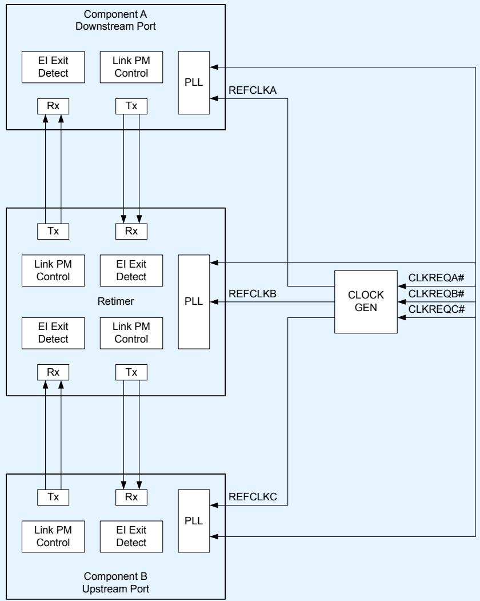

<details>
<summary>flowchart</summary>

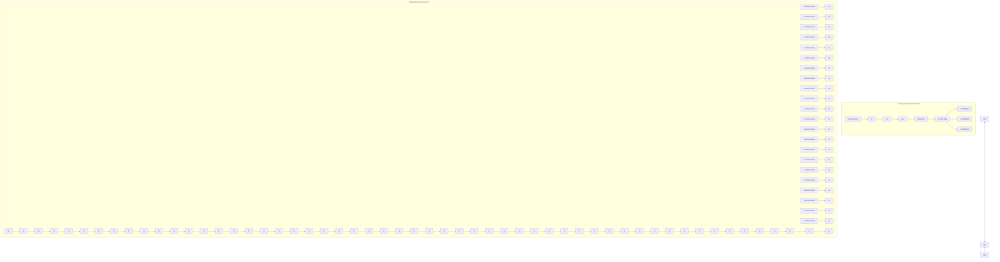
```mermaid
```mermaid
graph TD
    subgraph Component_A_Downstream_Port[Component A Downstream Port]
  A1["El Exit Detect"] --> A2["Tx"]
  A2 --> A3["Rx"]
  A3 --> A4["PLL"]
  A4 --> A5["REFCLKA"]
  A5 --> C1["CLOCK GEN"]
  C1 --> C2["CLKREQA#"]
  C1 --> C3["CLKREQB#"]
  C1 --> C4["CLKREQC#"]
    end

    subgraph Component_B_Upstream_Port[Component B Upstream Port]
  A6["Link PM Control"] --> A7["Tx"]
  A8["Link PM Control"] --> A9["Rx"]
  A10["Link PM Control"] --> A11["Tx"]
  A12["Link PM Control"] --> A13["Rx"]
  A14["Link PM Control"] --> A15["Tx"]
  A16["Link PM Control"] --> A17["Rx"]
  A18["Link PM Control"] --> A19["Tx"]
  A20["Link PM Control"] --> A21["Tx"]
  A22["Link PM Control"] --> A23["Rx"]
  A24["Link PM Control"] --> A25["Tx"]
  A26["Link PM Control"] --> A27["Rx"]
  A28["Link PM Control"] --> A29["Tx"]
  A30["Link PM Control"] --> A31["Tx"]
  A32["Link PM Control"] --> A33["Tx"]
  A34["Link PM Control"] --> A35["Tx"]
  A36["Link PM Control"] --> A37["Tx"]
  A38["Link PM Control"] --> A39["Tx"]
  A40["Link PM Control"] --> A41["Tx"]
  A42["Link PM Control"] --> A43["Tx"]
  A44["Link PM Control"] --> A45["Tx"]
  A46["Link PM Control"] --> A47["Tx"]
  A48["Link PM Control"] --> A49["Tx"]
    end

    subgraph Component_B_Upstream_Port[Component B Upstream Port]
  B6 --> B7["Tx"]
  B7 --> B8["Rx"]
  B8 --> B9["Tx"]
  B9 --> B10["Tx"]
  B10 --> B11["Tx"]
  B11 --> B12["Tx"]
  B12 --> B13["Tx"]
  B13 --> B14["Tx"]
  B14 --> B15["Tx"]
  B15 --> B16["Tx"]
  B16 --> B17["Tx"]
  B17 --> B18["Tx"]
  B18 --> B19["Tx"]
  B19 --> B20["Tx"]
  B20 --> B21["Tx"]
  B21 --> B22["Tx"]
  B22 --> B23["Tx"]
  B23 --> B24["Tx"]
  B24 --> B25["Tx"]
  B25 --> B26["Tx"]
  B26 --> B27["Tx"]
  B27 --> B28["Tx"]
  B28 --> B29["Tx"]
  B29 --> B30["Tx"]
  B30 --> B31["Tx"]
  B31 --> B32["Tx"]
  B32 --> B33["Tx"]
  B33 --> B34["Tx"]
  B34 --> B35["Tx"]
  B35 --> B36["Tx"]
  B36 --> B37["Tx"]
  B37 --> B38["Tx"]
  B38 --> B39["Tx"]
  B39 --> B40["Tx"]
  B40 --> B41["Tx"]
  B41 --> B42["Tx"]
  B42 --> B43["Tx"]
  B43 --> B44["Tx"]
  B44 --> B45["Tx"]
  B45 --> B46["Tx"]
  B46 --> B47["Tx"]
  B47 --> B48["Tx"]
  B48 --> B49["Tx"]
  B49 --> B50["Tx"]
  B50 --> B51["Tx"]
  B51 --> B52["Tx"]
  B52 --> B53["Tx"]
  B53 --> B54["Tx"]
  B54 --> B55["Tx"]
  B55 --> B56["Tx"]
  B56 --> B57["Tx"]
  B57 --> B58["Tx"]
  B58 --> B59["Tx"]
  B59 --> B60["Tx"]
    end
    RfA["RfX"] <--> RxA["RfX"]
    RxA <--> RxB["RfX"]
```
</details>

Figure 4-62 Retimer CLKREQ# Connection Topology§

## 4.3.11 Retimer Configuration Parameters

§

Retimers must provide an implementation specific mechanism to configure each of the parameters in this section.