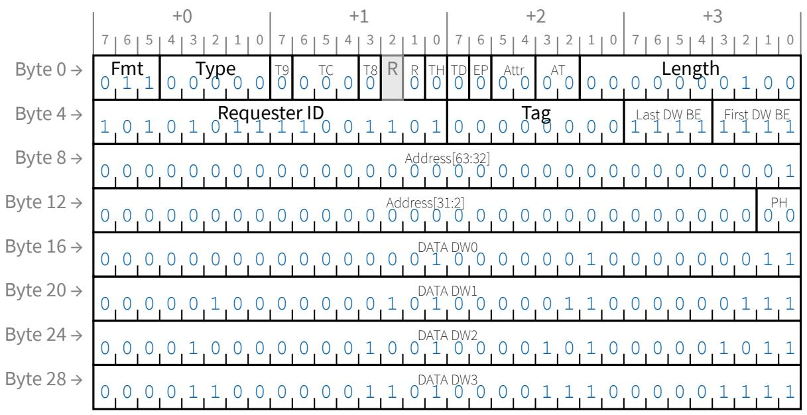
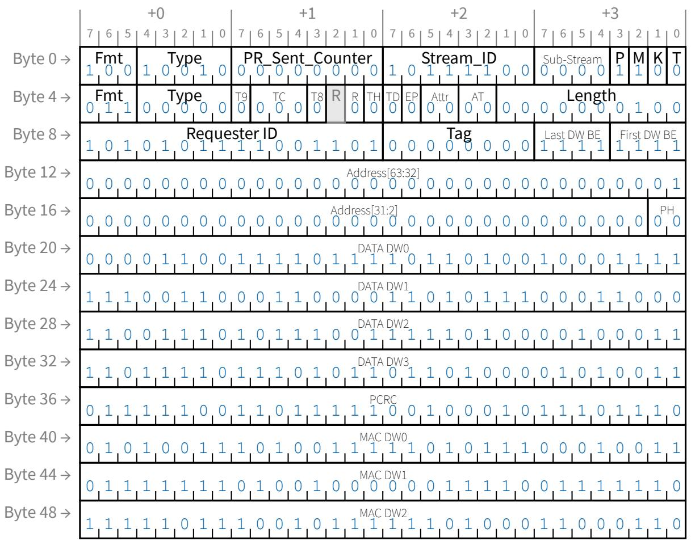

```txt
{{8{data_in[85][3]}} & 8'hab)^
{{8{data_in[85][4]}} & 8'h7d)^
{{8{data_in[85][5]}} & 8'hfa)^
{{8{data_in[85][6]}} & 8'hdf)^
{{8{data_in[85][7]}} & 8'h95)^
{{8{data_in[86][0]}} & 8'hf)^
{{8{data_in[86][1]}} & 8'h1e)^
{{8{data_in[86][2]}} & 8'h3c)^
{{8{data_in[86][3]}} & 8'h78)^
{{8{data_in[86][4]}} & 8'hf0)^
{{8{data_in[86][5]}} & 8'hcb)^
{{8{data_in[86][6]}} & 8'hbd)^
{{8{data_in[86][7]}} & 8'h51)^
{{8{data_in[87][0]}} & 8'h7b)^
{{8{data_in[87][1]}} & 8'hf6)^
{{8{data_in[87][2]}} & 8'hc7)^
{{8{data_in[87][3]}} & 8'ha5)^
{{8{data_in[87][4]}} & 8'h61)^
{{8{data_in[87][5]}} & 8'hc2)^
{{8{data_in[87][6]}} & 8'haf)^
{{8{data_in[87][7]}} & 8'h75)^
{{8{data_in[88][0]}} & 8'h2d)^
{{8{data_in[88][1]}} & 8'h5a)^
{{8{data_in[88][2]}} & 8'hb4)^
{{8{data_in[88][3]}} & 8'h43)^
{{8{data_in[88][4]}} & 8'h86)^
{{8{data_in[88][5]}} & 8'h27)^
{{8{data_in[88][6]}} & 8'h4e)^
{{8{data_in[88][7]}} & 8'h9c)^
{{8{data_in[89][0]}} & 8'he)^
{{8{data_in[89][1]}} & 8'h1c)^
{{8{data_in[89][2]}} & 8'h38)^
{{8{data_in[89][3]}} & 8'h70)^
{{8{data_in[89][4]}} & 8'he0)^
{{8{data_in[89][5]}} & 8'heb)^
{{8{data_in[89][6]}} & 8'hfd)^
{{8{data_in[89][7]}} & 8'hd1)^
{{8{data_in[90][0]}} & 8'hf0)^
{{8{data_in[90][1]}} & 8'hcb)^
{{8{data_in[90][2]}} & 8'hbd)^
{{8{data_in[90][3]}} & 8'h51)^
{{8{data_in[90][4]}} & 8'ha2)^
{{8{data_in[90][5]}} & 8'h6f)^
{{8{data_in[90][6]}} & 8'hde)^
{{8{data_in[90][7]}} & 8'h97)^
{{8{data_in[91][0]}} & 8'h4f)^
{{8{data_in[91][1]}} & 8'h9e)^
{{8{data_in[91][2]}} & 8'h17)^
{{8{data_in[91][3]}} & 8'h2e)^
{{8{data_in[91][4]}} & 8'h5c)^
{{8{data_in[91][5]}} & 8'hb8)^
{{8{data_in[91][6]}} & 8'h5b)^
{{8{data_in[91][7]}} & 8'hb6)^
{{8{data_in[92][0]}} & 8'h45)^
{{8{data_in[92][1]}} & 8'h8a)^
{{8{data_in[92][2]}} & 8'h3f)^
{{8{data_in[92][3]}} & 8'h7e)^
{{8{data_in[92][4]}} & 8'hfc)^
{{8{data_in[92][5]}} & 8'hd3)^
{{8{data_in[92][6]}} & 8'h8d)^
{{8{data_in[92][7]}} & 8'h31)^
{{8{data_in[93][0]}} & 8'hd9)^
{{8{data_in[93][1]}} & 8'h99)^
```

```lisp
({8{data_in[93][2]}} & 8'h19)^(8{data_in[93][3]}} & 8'h32)^(8{data_in[93][4]}} & 8'h64)^(8{data_in[93][5]}} & 8'hc8)^(8{data_in[93][6]}} & 8'hbb)^(8{data_in[93][7]}} & 8'h5d)^(8{data_in[94][0]}} & 8'hac)^(8{data_in[94][1]}} & 8'h73)^(8{data_in[94][2]}} & 8'he6)^(8{data_in[94][3]}} & 8'he7)^(8{data_in[94][4]}} & 8'he5)^(8{data_in[94][5]}} & 8'he1)^(8{data_in[94][6]}} & 8'he9)^(8{data_in[94][7]}} & 8'hf9)^(8{data_in[95][0]}} & 8'h9)^(8{data_in[95][1]}} & 8'h12)^(8{data_in[95][2]}} & 8'h24)^(8{data_in[95][3]}} & 8'h48)^(8{data_in[95][4]}} & 8'h90)^(8{data_in[95][5]}} & 8'hb)^(8{data_in[95][6]}} & 8'h16)^(8{data_in[95][7]}} & 8'h2c)^(8{data_in[96][0]}} & 8'hf1)^(8{data_in[96][1]}} & 8'hc9)^(8{data_in[96][2]}} & 8'hb9)^(8{data_in[96][3]}} & 8'h59)^(8{data_in[96][4]}} & 8'hb2)^(8{data_in[96][5]}} & 8'h4f)^(8{data_in[96][6]}} & 8'h9e)^(8{data_in[96][7]}} & 8'h17)^(8{data_in[97][0]}} & 8'h7)^(8{data_in[97][1]}} & 8'he)^(8{data_in[97][2]}} & 8'h1c)^(8{data_in[97][3]}} & 8'h38)^(8{data_in[97][4]}} & 8'h70)^(8{data_in[97][5]}} & 8'he0)^(8{data_in[97][6]}} & 8'heb)^(8{data_in[97][7]}} & 8'hfd)^(8{data_in[98][0]}} & 8'h3a)^(8{data_in[98][1]}} & 8'h74)^(8{data_in[98][2]}} & 8'he8)^(8{data_in[98][3]}} & 8'hfb)^(8{data_in[98][4]}} & 8'hdd)^(8{data_in[98][5]}} & 8'h91)^(8{data_in[98][6]}} & 8'h9)^(8{data_in[98][7]}} & 8'h12)^(8{data_in[99][0]}} & 8'h58)^(8{data_in[99][1]}} & 8'hb0)^(8{data_in[99][2]}} & 8'h4b)^(8{data_in[99][3]}} & 8'h96)^(8{data_in[99][4]}} & 8'h7)^(8{data_in[99][5]}} & 8'he)^(8{data_in[99][6]}} & 8'h1c)^(8{data_in[99][7]}} & 8'h38)^(8{data_in[100][0]}} & 8'hab)^(8{data_in[100][1]}} & 8'h7d)^(8{data_in[100][2]}} & 8'hfa)^(8{data_in[100][3]}} & 8'hdf)^(8{data_in[100][4]}} & 8'h95)^(8{data_in[100][5]}} & 8'h1)^^(8{data_in[100][6]}} & 8'h2)^^(8{data_in[100][7]}} & 8'h4)^^(8{data_in[101][0]}} & 8'h6b)^
```

```txt
{{8{data_in[101][1]}}} & 8'hd6)^({{8{data_in[101][2]}}} & 8'h87)^({{8{data_in[101][3]}}} & 8'h25)^({{8{data_in[101][4]}}} & 8'h4a)^({{8{data_in[101][5]}}} & 8'h94)^({{8{data_in[101][6]}}} & 8'h3)^({{8{data_in[101][7]}}} & 8'h6)^({{8{data_in[102][0]}}} & 8'hd6)^({{8{data_in[102][1]}}} & 8'h87)^({{8{data_in[102][2]}}} & 8'h25)^({{8{data_in[102][3]}}} & 8'h4a)^({{8{data_in[102][4]}}} & 8'h94)^({{8{data_in[102][5]}}} & 8'h3)^({{8{data_in[102][6]}}} & 8'h6)^({{8{data_in[102][7]}}} & 8'hc)^({{8{data_in[103][0]}}} & 8'h58)^({{8{data_in[103][1]}}} & 8'hb0)^({{8{data_in[103][2]}}} & 8'h4b)^({{8{data_in[103][3]}}} & 8'h96)^({{8{data_in[103][4]}}} & 8'h7)^({{8{data_in[103][5]}}} & 8'he)^({{8{data_in[103][6]}}} & 8'h1c)^({{8{data_in[103][7]}}} & 8'h38)^({{8{data_in[104][0]}}} & 8'h90)^({{8{data_in[104][1]}}} & 8'hb)^({{8{data_in[104][2]}}} & 8'h16)^({{8{data_in[104][3]}}} & 8'h2c)^({{8{data_in[104][4]}}} & 8'h58)^({{8{data_in[104][5]}}} & 8'hb0)^({{8{data_in[104][6]}}} & 8'h4b)^({{8{data_in[104][7]}}} & 8'h96)^({{8{data_in[105][0]}}} & 8'hea)^({{8{data_in[105][1]}}} & 8'hff)^({{8{data_in[105][2]}}} & 8'hd5)^({{8{data_in[105][3]}}} & 8'h81)^({{8{data_in[105][4]}}} & 8'h29)^({{8{data_in[105][5]}}} & 8'h52)^({{8{data_in[105][6]}}} & 8'ha4)^({{8{data_in[105][7]}}} & 8'h63)^({{8{data_in[106][0]}}} & 8'h7)^({{8{data_in[106][1]}}} & 8'he)^^({{8{data_in[106][2]}}} & 8'h1c)^({{8{data_in[106][3]}}} & 8'h38)^({{8{data_in[106][4]}}} & 8'h70)^({{8{data_in[106][5]}}} & 8'he0)^({{8{data_in[106][6]}}} & 8'heb)^({{8{data_in[106][7]}}} & 8'hfd)^({{8{data_in[107][0]}}} & 8'hd9)^({{8{data_in[107][1]}}} & 8'h99)^({{8{data_in[107][2]}}} & 8'h19)^({{8{data_in[107][3]}}} & 8'h32)^({{8{data_in[107][4]}}} & 8'h64)^({{8{data_in[107][5]}}} & 8'hc8)^({{8{data_in[107][6]}}} & 8'hbb)^({{8{data_in[107][7]}}} & 8'h5d)^({{8{data_in[108][0]}}} & 8'hb9)^({{8{data_in[108][1]}}} & 8'h59)^({{8{data_in[108][2]}}} & 8'hb2)^({{8{data_in[108][3]}}} & 8'h4f)^({{8{data_in[108][4]}}} & 8'h9e)^({{8{data_in[108][5]}}} & 8'h17)^({{8{data_in[108][6]}}} & 8'h2e)^({{8{data_in[108][7]}}} & 8'h5c)^
```

```txt
({8{data_in[109][0]} & 8'hce)^(8{data_in[109][1]} & 8'hb7)^(8{data_in[109][2]} & 8'h45)^(8{data_in[109][3]} & 8'h8a)^(8{data_in[109][4]} & 8'h3f)^(8{data_in[109][5]} & 8'h7e)^(8{data_in[109][6]} & 8'hfc)^(8{data_in[109][7]} & 8'hd3)^(8{data_in[110][0]} & 8'h57)^(8{data_in[110][1]} & 8'hae)^(8{data_in[110][2]} & 8'h77)^(8{data_in[110][3]} & 8'hee)^(8{data_in[110][4]} & 8'hf7)^(8{data_in[110][5]} & 8'hc5)^(8{data_in[110][6]} & 8'ha1)^(8{data_in[110][7]} & 8'h69)^(8{data_in[111][0]} & 8'hf5)^(8{data_in[111][1]} & 8'hc1)^(8{data_in[111][2]} & 8'ha9)^(8{data_in[111][3]} & 8'h79)^(8{data_in[111][4]} & 8'hf2)^(8{data_in[111][5]} & 8'hcf)^(8{data_in[111][6]} & 8'hb5)^(8{data_in[111][7]} & 8'h41)^(8{data_in[112][0]} & 8'h2a)^(8{data_in[112][1]} & 8'h54)^(8{data_in[112][2]} & 8'ha8)^(8{data_in[112][3]} & 8'h7b)^(8{data_in[112][4]} & 8'hf6)^(8{data_in[112][5]} & 8'hc7)^(8{data_in[112][6]} & 8'ha5)^(8{data_in[112][7]} & 8'h61)^(8{data_in[113][0]} & 8'hdf)^(8{data_in[113][1]} & 8'h95)^(8{data_in[113][2]} & 8'h1)^^(8{data_in[113][3]} & 8'h2)^^(8{data_in[113][4]} & 8'h4)^^(8{data_in[113][5]} & 8'h8)^^(8{data_in[113][6]} & 8'h10)^^(8{data_in[113][7]} & 8'h20)^^(8{data_in[114][0]} & 8'h86)^^(8{data_in[114][1]} & 8'h27)^^(8{data_in[114][2]} & 8'h4e)^^(8{data_in[114][3]} & 8'h9c)^^(8{data_in[114][4]} & 8'h13)^^(8{data_in[114][5]} & 8'h26)^^(8{data_in[114][6]} & 8'h4c)^^(8{data_in[114][7]} & 8'h98)^^(8{data_in[115][0]} & 8'h4c)^^(8{data_in[115][1]} & 8'h98)^^(8{data_in[115][2]} & 8'h1b)^^(8{data_in[115][3]} & 8'h36)^^(8{data_in[115][4]} & 8'h6c)^^(8{data_in[115][5]} & 8'hd8)^^(8{data_in[115][6]} & 8'h9b)^^(8{data_in[115][7]} & 8'h1d)^^(8{data_in[116][0]} & 8'h48)^^(8{data_in[116][1]} & 8'h90)^^(8{data_in[116][2]} & 8'hb)^^(8{data_in[116][3]} & 8'h16)^^(8{data_in[116][4]} & 8'h2c)^^(8{data_in[116][5]} & 8'h58)^^(8{data_in[116][6]} & 8'hb0)^
```

```txt
{{8{data_in[116][7]}}} & 8'h4b)^
{{8{data_in[117][0]}}} & 8'h63)^
{{8{data_in[117][1]}}} & 8'hc6)^
{{8{data_in[117][2]}}} & 8'ha7)^
{{8{data_in[117][3]}}} & 8'h65)^
{{8{data_in[117][4]}}} & 8'hca)^
{{8{data_in[117][5]}}} & 8'hbf)^
{{8{data_in[117][6]}}} & 8'h55)^
{{8{data_in[117][7]}}} & 8'haa)^
{{8{data_in[118][0]}}} & 8'h57)^
{{8{data_in[118][1]}}} & 8'hae)^
{{8{data_in[118][2]}}} & 8'h77)^
{{8{data_in[118][3]}}} & 8'hee)^
{{8{data_in[118][4]}}} & 8'hf7)^
{{8{data_in[118][5]}}} & 8'hc5)^
{{8{data_in[118][6]}}} & 8'ha1)^
{{8{data_in[118][7]}}} & 8'h69)^
{{8{data_in[119][0]}}} & 8'h11)^
{{8{data_in[119][1]}}} & 8'h22)^
{{8{data_in[119][2]}}} & 8'h44)^
{{8{data_in[119][3]}}} & 8'h88)^
{{8{data_in[119][4]}}} & 8'h3b)^
{{8{data_in[119][5]}}} & 8'h76)^
{{8{data_in[119][6]}}} & 8'hec)^
{{8{data_in[119][7]}}} & 8'hf3)^
{{8{data_in[120][0]}}} & 8'h25)^
{{8{data_in[120][1]}}} & 8'h4a)^
{{8{data_in[120][2]}}} & 8'h94)^
{{8{data_in[120][3]}}} & 8'h3)^
{{8{data_in[120][4]}}} & 8'h6)^
{{8{data_in[120][5]}}} & 8'hc)^
{{8{data_in[120][6]}}} & 8'h18)^
{{8{data_in[120][7]}}} & 8'h30)^
{{8{data_in[121][0]}}} & 8'h8a)^
{{8{data_in[121][1]}}} & 8'h3f)^
{{8{data_in[121][2]}}} & 8'h7e)^
{{8{data_in[121][3]}}} & 8'hfc)^
{{8{data_in[121][4]}}} & 8'hd3)^
{{8{data_in[121][5]}}} & 8'h8d)^
{{8{data_in[121][6]}}} & 8'h31)^
{{8{data_in[121][7]}}} & 8'h62)^
{{8{data_in[122][0]}}} & 8'h91)^
{{8{data_in[122][1]}}} & 8'h9)^
{{8{data_in[122][2]}}} & 8'h12)^
{{8{data_in[122][3]}}} & 8'h24)^
{{8{data_in[122][4]}}} & 8'h48)^
{{8{data_in[122][5]}}} & 8'h90)^
{{8{data_in[122][6]}}} & 8'hb)^
{{8{data_in[122][7]}}} & 8'h16)^
{{8{data_in[123][0]}}} & 8'hd6)^
{{8{data_in[123][1]}}} & 8'h87)^
{{8{data_in[123][2]}}} & 8'h25)^
{{8{data_in[123][3]}}} & 8'h4a)^
{{8{data_in[123][4]}}} & 8'h94)^
{{8{data_in[123][5]}}} & 8'h3)^
{{8{data_in[123][6]}}} & 8'h6)^
{{8{data_in[123][7]}}} & 8'hc)^
{{8{data_in[124][0]}}} & 8'h46)^
{{8{data_in[124][1]}}} & 8'h8c)^
{{8{data_in[124][2]}}} & 8'h33)^
{{8{data_in[124][3]}}} & 8'h66)^
{{8{data_in[124][4]}}} & 8'hcc)^
{{8{data_in[124][5]}}} & 8'hb3)^
```

```txt
{{8{data_in[124][6]}}} & 8'h4d)^
{{8{data_in[124][7]}}} & 8'h9a)^
{{8{data_in[125][0]}}} & 8'ha2)^
{{8{data_in[125][1]}}} & 8'h6f)^
{{8{data_in[125][2]}}} & 8'hde)^
{{8{data_in[125][3]}}} & 8'h97)^
{{8{data_in[125][4]}}} & 8'h5)^
{{8{data_in[125][5]}}} & 8'ha)^
{{8{data_in[125][6]}}} & 8'h14)^
{{8{data_in[125][7]}}} & 8'h28)^
{{8{data_in[126][0]}}} & 8'h45)^
{{8{data_in[126][1]}}} & 8'h8a)^
{{8{data_in[126][2]}}} & 8'h3f)^
{{8{data_in[126][3]}}} & 8'h7e)^
{{8{data_in[126][4]}}} & 8'hfc)^
{{8{data_in[126][5]}}} & 8'hd3)^
{{8{data_in[126][6]}}} & 8'h8d)^
{{8{data_in[126][7]}}} & 8'h31)^
{{8{data_in[127][0]}}} & 8'hd)^
{{8{data_in[127][1]}}} & 8'h1a)^
{{8{data_in[127][2]}}} & 8'h34)^
{{8{data_in[127][3]}}} & 8'h68)^
{{8{data_in[127][4]}}} & 8'hd0)^
{{8{data_in[127][5]}}} & 8'h8b)^
{{8{data_in[127][6]}}} & 8'h3d)^
{{8{data_in[127][7]}}} & 8'h7a)^
{{8{data_in[128][0]}}} & 8'hb0)^
{{8{data_in[128][1]}}} & 8'h4b)^
{{8{data_in[128][2]}}} & 8'h96)^
{{8{data_in[128][3]}}} & 8'h7)^
{{8{data_in[128][4]}}} & 8'he)^
{{8{data_in[128][5]}}} & 8'h1c)^
{{8{data_in[128][6]}}} & 8'h38)^
{{8{data_in[128][7]}}} & 8'h70)^
{{8{data_in[129][0]}}} & 8'h7d)^
{{8{data_in[129][1]}}} & 8'hfa)^
{{8{data_in[129][2]}}} & 8'hdf)^
{{8{data_in[129][3]}}} & 8'h95)^
{{8{data_in[129][4]}}} & 8'h1)^
{{8{data_in[129][5]}}} & 8'h2)^
{{8{data_in[129][6]}}} & 8'h4)^
{{8{data_in[129][7]}}} & 8'h8)^
{{8{data_in[130][0]}}} & 8'h2e)^
{{8{data_in[130][1]}}} & 8'h5c)^
{{8{data_in[130][2]}}} & 8'hb8)^
{{8{data_in[130][3]}}} & 8'h5b)^
{{8{data_in[130][4]}}} & 8'hb6)^
{{8{data_in[130][5]}}} & 8'h47)^
{{8{data_in[130][6]}}} & 8'h8e)^
{{8{data_in[130][7]}}} & 8'h37)^
{{8{data_in[131][0]}}} & 8'hcc)^
{{8{data_in[131][1]}}} & 8'hb3)^
{{8{data_in[131][2]}}} & 8'h4d)^
{{8{data_in[131][3]}}} & 8'h9a)^
{{8{data_in[131][4]}}} & 8'h1f)^
{{8{data_in[131][5]}}} & 8'h3e)^
{{8{data_in[131][6]}}} & 8'h7c)^
{{8{data_in[131][7]}}} & 8'hf8)^
{{8{data_in[132][0]}}} & 8'h2b)^
{{8{data_in[132][1]}}} & 8'h56)^
{{8{data_in[132][2]}}} & 8'hac)^
{{8{data_in[132][3]}}} & 8'h73)^
{{8{data_in[132][4]}}} & 8'he6)^
```

```txt
{{8{data_in[132][5]}}} & 8'he7)^
{{8{data_in[132][6]}}} & 8'he5)^
{{8{data_in[132][7]}}} & 8'he1)^
{{8{data_in[133][0]}}} & 8'hd4)^
{{8{data_in[133][1]}}} & 8'h83)^
{{8{data_in[133][2]}}} & 8'h2d)^
{{8{data_in[133][3]}}} & 8'h5a)^
{{8{data_in[133][4]}}} & 8'hb4)^
{{8{data_in[133][5]}}} & 8'h43)^
{{8{data_in[133][6]}}} & 8'h86)^
{{8{data_in[133][7]}}} & 8'h27)^
{{8{data_in[134][0]}}} & 8'h24)^
{{8{data_in[134][1]}}} & 8'h48)^
{{8{data_in[134][2]}}} & 8'h90)^
{{8{data_in[134][3]}}} & 8'hb)^
{{8{data_in[134][4]}}} & 8'h16)^
{{8{data_in[134][5]}}} & 8'h2c)^
{{8{data_in[134][6]}}} & 8'h58)^
{{8{data_in[134][7]}}} & 8'hb0)^
{{8{data_in[135][0]}}} & 8'h7a)^
{{8{data_in[135][1]}}} & 8'hf4)^
{{8{data_in[135][2]}}} & 8'hc3)^
{{8{data_in[135][3]}}} & 8'had)^
{{8{data_in[135][4]}}} & 8'h71)^
{{8{data_in[135][5]}}} & 8'he2)^
{{8{data_in[135][6]}}} & 8'hef)^
{{8{data_in[135][7]}}} & 8'hf5)^
{{8{data_in[136][0]}}} & 8'h5a)^
{{8{data_in[136][1]}}} & 8'hb4)^
{{8{data_in[136][2]}}} & 8'h43)^
{{8{data_in[136][3]}}} & 8'h86)^
{{8{data_in[136][4]}}} & 8'h27)^
{{8{data_in[136][5]}}} & 8'h4e)^
{{8{data_in[136][6]}}} & 8'h9c)^
{{8{data_in[136][7]}}} & 8'h13)^
{{8{data_in[137][0]}}} & 8'he5)^
{{8{data_in[137][1]}}} & 8'he1)^
{{8{data_in[137][2]}}} & 8'he9)^
{{8{data_in[137][3]}}} & 8'hf9)^
{{8{data_in[137][4]}}} & 8'hd9)^
{{8{data_in[137][5]}}} & 8'h99)^
{{8{data_in[137][6]}}} & 8'h19)^
{{8{data_in[137][7]}}} & 8'h32)^
{{8{data_in[138][0]}}} & 8'hc7)^
{{8{data_in[138][1]}}} & 8'ha5)^
{{8{data_in[138][2]}}} & 8'h61)^
{{8{data_in[138][3]}}} & 8'hc2)^
{{8{data_in[138][4]}}} & 8'haf)^
{{8{data_in[138][5]}}} & 8'h75)^
{{8{data_in[138][6]}}} & 8'hea)^
{{8{data_in[138][7]}}} & 8'hff)^
{{8{data_in[139][0]}}} & 8'hf0)^
{{8{data_in[139][1]}}} & 8'hcb)^
{{8{data_in[139][2]}}} & 8'hbd)^
{{8{data_in[139][3]}}} & 8'h51)^
{{8{data_in[139][4]}}} & 8'ha2)^
{{8{data_in[139][5]}}} & 8'h6f)^
{{8{data_in[139][6]}}} & 8'hde)^
{{8{data_in[139][7]}}} & 8'h97)^
{{8{data_in[140][0]}}} & 8'h65)^
{{8{data_in[140][1]}}} & 8'hca)^
{{8{data_in[140][2]}}} & 8'hbf)^
{{8{data_in[140][3]}}} & 8'h55)^
```

```javascript
({8{data_in[140][4]}} & 8'haa)^(8{data_in[140][5]}} & 8'h7f)^(8{data_in[140][6]}} & 8'hfe)^(8{data_in[140][7]}} & 8'hd7)^(8{data_in[141][0]}} & 8'h6a)^(8{data_in[141][1]}} & 8'hd4)^(8{data_in[141][2]}} & 8'h83)^(8{data_in[141][3]}} & 8'h2d)^(8{data_in[141][4]}} & 8'h5a)^(8{data_in[141][5]}} & 8'hb4)^(8{data_in[141][6]}} & 8'h43)^(8{data_in[141][7]}} & 8'h86)^(8{data_in[142][0]}} & 8'hb6)^(8{data_in[142][1]}} & 8'h47)^(8{data_in[142][2]}} & 8'h8e)^(8{data_in[142][3]}} & 8'h37)^(8{data_in[142][4]}} & 8'h6e)^(8{data_in[142][5]}} & 8'hdc)^(8{data_in[142][6]}} & 8'h93)^(8{data_in[142][7]}} & 8'hd)^^(8{data_in[143][0]}} & 8'hee)^(8{data_in[143][1]}} & 8'hf7)^(8{data_in[143][2]}} & 8'hc5)^(8{data_in[143][3]}} & 8'ha1)^(8{data_in[143][4]}} & 8'h69)^(8{data_in[143][5]}} & 8'hd2)^(8{data_in[143][6]}} & 8'h8f)^(8{data_in[143][7]}} & 8'h35)^(8{data_in[144][0]}} & 8'h97)^(8{data_in[144][1]}} & 8'h5)^^(8{data_in[144][2]}} & 8'ha)^^(8{data_in[144][3]}} & 8'h14)^(8{data_in[144][4]}} & 8'h28)^(8{data_in[144][5]}} & 8'h50)^(8{data_in[144][6]}} & 8'ha0)^(8{data_in[144][7]}} & 8'h6b)^(8{data_in[145][0]}} & 8'h12)^(8{data_in[145][1]}} & 8'h24)^(8{data_in[145][2]}} & 8'h48)^(8{data_in[145][3]}} & 8'h90)^(8{data_in[145][4]}} & 8'hb)^^(8{data_in[145][5]}} & 8'h16)^(8{data_in[145][6]}} & 8'h2c)^(8{data_in[145][7]}} & 8'h58)^(8{data_in[146][0]}} & 8'h18)^(8{data_in[146][1]}} & 8'h30)^(8{data_in[146][2]}} & 8'h60)^(8{data_in[146][3]}} & 8'hc0)^(8{data_in[146][4]}} & 8'hab)^^(8{data_in[146][5]}} & 8'h7d)^(8{data_in[146][6]}} & 8'hfa)^^(8{data_in[146][7]}} & 8'hdf)^^(8{data_in[147][0]}} & 8'hb9)^(8{data_in[147][1]}} & 8'h59)^(8{data_in[147][2]}} & 8'hb2)^(8{data_in[147][3]}} & 8'h4f)^(8{data_in[147][4]}} & 8'h9e)^(8{data_in[147][5]}} & 8'h17)^(8{data_in[147][6]}} & 8'h2e)^(8{data_in[147][7]}} & 8'h5c)^(8{data_in[148][0]}} & 8'hf7)^(8{data_in[148][1]}} & 8'hc5)^(8{data_in[148][2]}} & 8'ha1)^
```

```javascript
({8{data_in[148][3]}} & 8'h69)^(8{data_in[148][4]}} & 8'hd2)^(8{data_in[148][5]}} & 8'h8f)^(8{data_in[148][6]}} & 8'h35)^(8{data_in[148][7]}} & 8'h6a)^(8{data_in[149][0]}} & 8'h6a)^(8{data_in[149][1]}} & 8'hd4)^(8{data_in[149][2]}} & 8'h83)^(8{data_in[149][3]}} & 8'h2d)^(8{data_in[149][4]}} & 8'h5a)^(8{data_in[149][5]}} & 8'hb4)^(8{data_in[149][6]}} & 8'h43)^(8{data_in[149][7]}} & 8'h86)^(8{data_in[150][0]}} & 8'h14)^(8{data_in[150][1]}} & 8'h28)^(8{data_in[150][2]}} & 8'h50)^(8{data_in[150][3]}} & 8'ha0)^(8{data_in[150][4]}} & 8'h6b)^(8{data_in[150][5]}} & 8'hd6)^(8{data_in[150][6]}} & 8'h87)^(8{data_in[150][7]}} & 8'h25)^(8{data_in[151][0]}} & 8'hc8)^(8{data_in[151][1]}} & 8'hbb)^(8{data_in[151][2]}} & 8'h5d)^(8{data_in[151][3]}} & 8'hba)^(8{data_in[151][4]}} & 8'h5f)^(8{data_in[151][5]}} & 8'hbe)^(8{data_in[151][6]}} & 8'h57)^(8{data_in[151][7]}} & 8'hae)^(8{data_in[152][0]}} & 8'h8a)^(8{data_in[152][1]}} & 8'h3f)^(8{data_in[152][2]}} & 8'h7e)^(8{data_in[152][3]}} & 8'hfc)^(8{data_in[152][4]}} & 8'hd3)^(8{data_in[152][5]}} & 8'h8d)^(8{data_in[152][6]}} & 8'h31)^(8{data_in[152][7]}} & 8'h62)^(8{data_in[153][0]}} & 8'ha8)^(8{data_in[153][1]}} & 8'h7b)^(8{data_in[153][2]}} & 8'hf6)^(8{data_in[153][3]}} & 8'hc7)^(8{data_in[153][4]}} & 8'ha5)^(8{data_in[153][5]}} & 8'h61)^(8{data_in[153][6]}} & 8'hc2)^(8{data_in[153][7]}} & 8'haf)^(8{data_in[154][0]}} & 8'h4f)^(8{data_in[154][1]}} & 8'h9e)^(8{data_in[154][2]}} & 8'h17)^(8{data_in[154][3]}} & 8'h2e)^(8{data_in[154][4]}} & 8'h5c)^(8{data_in[154][5]}} & 8'hb8)^(8{data_in[154][6]}} & 8'h5b)^(8{data_in[154][7]}} & 8'hb6)^(8{data_in[155][0]}} & 8'h27)^(8{data_in[155][1]}} & 8'h4e)^(8{data_in[155][2]}} & 8'h9c)^(8{data_in[155][3]}} & 8'h13)^(8{data_in[155][4]}} & 8'h26)^(8{data_in[155][5]}} & 8'h4c)^(8{data_in[155][6]}} & 8'h98)^(8{data_in[155][7]}} & 8'h1b)^(8{data_in[156][0]}} & 8'h97)^(8{data_in[156][1]}} & 8'h5)^
```

```lisp
({8{data_in[156][2]}} & 8'ha)^(
({8{data_in[156][3]}} & 8'h14)^(
({8{data_in[156][4]}} & 8'h28)^(
({8{data_in[156][5]}} & 8'h50)^(
({8{data_in[156][6]}} & 8'ha0)^(
({8{data_in[156][7]}} & 8'h6b)^(
({8{data_in[157][0]}} & 8'h34)^(
({8{data_in[157][1]}} & 8'h68)^(
({8{data_in[157][2]}} & 8'hd0)^(
({8{data_in[157][3]}} & 8'h8b)^(
({8{data_in[157][4]}} & 8'h3d)^(
({8{data_in[157][5]}} & 8'h7a)^(
({8{data_in[157][6]}} & 8'hf4)^(
({8{data_in[157][7]}} & 8'hc3)^(
({8{data_in[158][0]}} & 8'hf2)^(
({8{data_in[158][1]}} & 8'hcf)^(
({8{data_in[158][2]}} & 8'hb5)^(
({8{data_in[158][3]}} & 8'h41)^(
({8{data_in[158][4]}} & 8'h82)^(
({8{data_in[158][5]}} & 8'h2f)^(
({8{data_in[158][6]}} & 8'h5e)^(
({8{data_in[158][7]}} & 8'hbc)^(
({8{data_in[159][0]}} & 8'h96)^(
({8{data_in[159][1]}} & 8'h7)^(
({8{data_in[159][2]}} & 8'he)^^(
({8{data_in[159][3]}} & 8'h1c)^(
({8{data_in[159][4]}} & 8'h38)^(
({8{data_in[159][5]}} & 8'h70)^(
({8{data_in[159][6]}} & 8'he0)^(
({8{data_in[159][7]}} & 8'heb)^(
({8{data_in[160][0]}} & 8'h71)^(
({8{data_in[160][1]}} & 8'he2)^(
({8{data_in[160][2]}} & 8'hef)^(
({8{data_in[160][3]}} & 8'hf5)^(
({8{data_in[160][4]}} & 8'hc1)^(
({8{data_in[160][5]}} & 8'ha9)^(
({8{data_in[160][6]}} & 8'h79)^(
({8{data_in[160][7]}} & 8'hf2)^(
({8{data_in[161][0]}} & 8'h7)^^(
({8{data_in[161][1]}} & 8'he)^^(
({8{data_in[161][2]}} & 8'h1c)^(
({8{data_in[161][3]}} & 8'h38)^(
({8{data_in[161][4]}} & 8'h70)^(
({8{data_in[161][5]}} & 8'he0)^(
({8{data_in[161][6]}} & 8'heb)^(
({8{data_in[161][7]}} & 8'hfd)^(
({8{data_in[162][0]}} & 8'h94)^(
({8{data_in[162][1]}} & 8'h3)^^(
({8{data_in[162][2]}} & 8'h6)^^(
({8{data_in[162][3]}} & 8'hc)^^(
({8{data_in[162][4]}} & 8'h18)^(
({8{data_in[162][5]}} & 8'h30)^(
({8{data_in[162][6]}} & 8'h60)^(
({8{data_in[162][7]}} & 8'hc0)^^(
({8{data_in[163][0]}} & 8'h10)^(
({8{data_in[163][1]}} & 8'h20)^(
({8{data_in[163][2]}} & 8'h40)^(
({8{data_in[163][3]}} & 8'h80)^(
({8{data_in[163][4]}} & 8'h2b)^(
({8{data_in[163][5]}} & 8'h56)^(
({8{data_in[163][6]}} & 8'hac)^(
({8{data_in[163][7]}} & 8'h73)^(
({8{data_in[164][0]}} & 8'h7a)^^(
```

```txt
{{8{data_in[164][1]}}} & 8'hf4)^
{{8{data_in[164][2]}}} & 8'hc3)^
{{8{data_in[164][3]}}} & 8'had)^
{{8{data_in[164][4]}}} & 8'h71)^
{{8{data_in[164][5]}}} & 8'he2)^
{{8{data_in[164][6]}}} & 8'hef)^
{{8{data_in[164][7]}}} & 8'hf5)^
{{8{data_in[165][0]}}} & 8'hf)^
{{8{data_in[165][1]}}} & 8'h1e)^
{{8{data_in[165][2]}}} & 8'h3c)^
{{8{data_in[165][3]}}} & 8'h78)^
{{8{data_in[165][4]}}} & 8'hf0)^
{{8{data_in[165][5]}}} & 8'hcb)^
{{8{data_in[165][6]}}} & 8'hbd)^
{{8{data_in[165][7]}}} & 8'h51)^
{{8{data_in[166][0]}}} & 8'h20)^
{{8{data_in[166][1]}}} & 8'h40)^
{{8{data_in[166][2]}}} & 8'h80)^
{{8{data_in[166][3]}}} & 8'h2b)^
{{8{data_in[166][4]}}} & 8'h56)^
{{8{data_in[166][5]}}} & 8'hac)^
{{8{data_in[166][6]}}} & 8'h73)^
{{8{data_in[166][7]}}} & 8'he6)^
{{8{data_in[167][0]}}} & 8'h11)^
{{8{data_in[167][1]}}} & 8'h22)^
{{8{data_in[167][2]}}} & 8'h44)^
{{8{data_in[167][3]}}} & 8'h88)^
{{8{data_in[167][4]}}} & 8'h3b)^
{{8{data_in[167][5]}}} & 8'h76)^
{{8{data_in[167][6]}}} & 8'hec)^
{{8{data_in[167][7]}}} & 8'hf3)^
{{8{data_in[168][0]}}} & 8'h29)^
{{8{data_in[168][1]}}} & 8'h52)^
{{8{data_in[168][2]}}} & 8'ha4)^
{{8{data_in[168][3]}}} & 8'h63)^
{{8{data_in[168][4]}}} & 8'hc6)^
{{8{data_in[168][5]}}} & 8'ha7)^
{{8{data_in[168][6]}}} & 8'h65)^
{{8{data_in[168][7]}}} & 8'hca)^
{{8{data_in[169][0]}}} & 8'h7c)^
{{8{data_in[169][1]}}} & 8'hf8)^
{{8{data_in[169][2]}}} & 8'hdb)^
{{8{data_in[169][3]}}} & 8'h9d)^
{{8{data_in[169][4]}}} & 8'h11)^
{{8{data_in[169][5]}}} & 8'h22)^
{{8{data_in[169][6]}}} & 8'h44)^
{{8{data_in[169][7]}}} & 8'h88)^
{{8{data_in[170][0]}}} & 8'h25)^
{{8{data_in[170][1]}}} & 8'h4a)^
{{8{data_in[170][2]}}} & 8'h94)^
{{8{data_in[170][3]}}} & 8'h3)^
{{8{data_in[170][4]}}} & 8'h6)^
{{8{data_in[170][5]}}} & 8'hc)^
{{8{data_in[170][6]}}} & 8'h18)^
{{8{data_in[170][7]}}} & 8'h30)^
{{8{data_in[171][0]}}} & 8'h65)^
{{8{data_in[171][1]}}} & 8'hca)^
{{8{data_in[171][2]}}} & 8'hbf)^
{{8{data_in[171][3]}}} & 8'h55)^
{{8{data_in[171][4]}}} & 8'haa)^
{{8{data_in[171][5]}}} & 8'h7f)^
{{8{data_in[171][6]}}} & 8'hfe)^
{{8{data_in[171][7]}}} & 8'hd7)^
```

```txt
{{8{data_in[172][0]}}} & 8'h1e)^
{{8{data_in[172][1]}}} & 8'h3c)^
{{8{data_in[172][2]}}} & 8'h78)^
{{8{data_in[172][3]}}} & 8'hf0)^
{{8{data_in[172][4]}}} & 8'hcb)^
{{8{data_in[172][5]}}} & 8'hbd)^
{{8{data_in[172][6]}}} & 8'h51)^
{{8{data_in[172][7]}}} & 8'ha2)^
{{8{data_in[173][0]}}} & 8'h54)^
{{8{data_in[173][1]}}} & 8'ha8)^
{{8{data_in[173][2]}}} & 8'h7b)^
{{8{data_in[173][3]}}} & 8'hf6)^
{{8{data_in[173][4]}}} & 8'hc7)^
{{8{data_in[173][5]}}} & 8'ha5)^
{{8{data_in[173][6]}}} & 8'h61)^
{{8{data_in[173][7]}}} & 8'hc2)^
{{8{data_in[174][0]}}} & 8'h8b)^
{{8{data_in[174][1]}}} & 8'h3d)^
{{8{data_in[174][2]}}} & 8'h7a)^
{{8{data_in[174][3]}}} & 8'hf4)^
{{8{data_in[174][4]}}} & 8'hc3)^
{{8{data_in[174][5]}}} & 8'had)^
{{8{data_in[174][6]}}} & 8'h71)^
{{8{data_in[174][7]}}} & 8'he2)^
{{8{data_in[175][0]}}} & 8'h21)^
{{8{data_in[175][1]}}} & 8'h42)^
{{8{data_in[175][2]}}} & 8'h84)^
{{8{data_in[175][3]}}} & 8'h23)^
{{8{data_in[175][4]}}} & 8'h46)^
{{8{data_in[175][5]}}} & 8'h8c)^
{{8{data_in[175][6]}}} & 8'h33)^
{{8{data_in[175][7]}}} & 8'h66)^
{{8{data_in[176][0]}}} & 8'hdd)^
{{8{data_in[176][1]}}} & 8'h91)^
{{8{data_in[176][2]}}} & 8'h9)^
{{8{data_in[176][3]}}} & 8'h12)^
{{8{data_in[176][4]}}} & 8'h24)^
{{8{data_in[176][5]}}} & 8'h48)^
{{8{data_in[176][6]}}} & 8'h90)^
{{8{data_in[176][7]}}} & 8'hb)^
{{8{data_in[177][0]}}} & 8'h13)^
{{8{data_in[177][1]}}} & 8'h26)^
{{8{data_in[177][2]}}} & 8'h4c)^
{{8{data_in[177][3]}}} & 8'h98)^
{{8{data_in[177][4]}}} & 8'h1b)^
{{8{data_in[177][5]}}} & 8'h36)^
{{8{data_in[177][6]}}} & 8'h6c)^
{{8{data_in[177][7]}}} & 8'hd8)^
{{8{data_in[178][0]}}} & 8'h10)^
{{8{data_in[178][1]}}} & 8'h20)^
{{8{data_in[178][2]}}} & 8'h40)^
{{8{data_in[178][3]}}} & 8'h80)^
{{8{data_in[178][4]}}} & 8'h2b)^
{{8{data_in[178][5]}}} & 8'h56)^
{{8{data_in[178][6]}}} & 8'hac)^
{{8{data_in[178][7]}}} & 8'h73)^
{{8{data_in[179][0]}}} & 8'h2)^
{{8{data_in[179][1]}}} & 8'h4)^
{{8{data_in[179][2]}}} & 8'h8)^
{{8{data_in[179][3]}}} & 8'h10)^
{{8{data_in[179][4]}}} & 8'h20)^
{{8{data_in[179][5]}}} & 8'h40)^
{{8{data_in[179][6]}}} & 8'h80)^
```

```javascript
({8{data_in[179][7]}} & 8'h2b)^(8{data_in[180][0]}} & 8'h53)^(8{data_in[180][1]}} & 8'ha6)^(8{data_in[180][2]}} & 8'h67)^(8{data_in[180][3]}} & 8'hce)^(8{data_in[180][4]}} & 8'hb7)^(8{data_in[180][5]}} & 8'h45)^(8{data_in[180][6]}} & 8'h8a)^(8{data_in[180][7]}} & 8'h3f)^(8{data_in[181][0]}} & 8'h24)^(8{data_in[181][1]}} & 8'h48)^(8{data_in[181][2]}} & 8'h90)^(8{data_in[181][3]}} & 8'hb)^(8{data_in[181][4]}} & 8'h16)^(8{data_in[181][5]}} & 8'h2c)^(8{data_in[181][6]}} & 8'h58)^(8{data_in[181][7]}} & 8'hb0)^(8{data_in[182][0]}} & 8'h76)^(8{data_in[182][1]}} & 8'hec)^(8{data_in[182][2]}} & 8'hf3)^(8{data_in[182][3]}} & 8'hcd)^(8{data_in[182][4]}} & 8'hb1)^(8{data_in[182][5]}} & 8'h49)^(8{data_in[182][6]}} & 8'h92)^(8{data_in[182][7]}} & 8'hf)^(8{data_in[183][0]}} & 8'h41)^(8{data_in[183][1]}} & 8'h82)^(8{data_in[183][2]}} & 8'h2f)^(8{data_in[183][3]}} & 8'h5e)^(8{data_in[183][4]}} & 8'hbc)^(8{data_in[183][5]}} & 8'h53)^(8{data_in[183][6]}} & 8'ha6)^(8{data_in[183][7]}} & 8'h67)^(8{data_in[184][0]}} & 8'hbf)^(8{data_in[184][1]}} & 8'h55)^(8{data_in[184][2]}} & 8'haa)^(8{data_in[184][3]}} & 8'h7f)^(8{data_in[184][4]}} & 8'hfe)^(8{data_in[184][5]}} & 8'hd7)^(8{data_in[184][6]}} & 8'h85)^(8{data_in[184][7]}} & 8'h21)^(8{data_in[185][0]}} & 8'h55)^(8{data_in[185][1]}} & 8'haa)^(8{data_in[185][2]}} & 8'h7f)^(8{data_in[185][3]}} & 8'hfe)^(8{data_in[185][4]}} & 8'hd7)^(8{data_in[185][5]}} & 8'h85)^(8{data_in[185][6]}} & 8'h21)^(8{data_in[185][7]}} & 8'h42)^(8{data_in[186][0]}} & 8'h75)^(8{data_in[186][1]}} & 8'hea)^(8{data_in[186][2]}} & 8'hff)^(8{data_in[186][3]}} & 8'hd5)^(8{data_in[186][4]}} & 8'h81)^(8{data_in[186][5]}} & 8'h29)^(8{data_in[186][6]}} & 8'h52)^(8{data_in[186][7]}} & 8'ha4)^(8{data_in[187][0]}} & 8'h7e)^(8{data_in[187][1]}} & 8'hfc)^(8{data_in[187][2]}} & 8'hd3)^(8{data_in[187][3]}} & 8'h8d)^(8{data_in[187][4]}} & 8'h31)^(8{data_in[187][5]}} & 8'h62)^
```

```lisp
({8:data_in[187][6]} & 8'hc4)^(8:data_in[187][7]} & 8'ha3)^(8:data_in[188][0]} & 8'hc6)^(8:data_in[188][1]} & 8'ha7)^(8:data_in[188][2]} & 8'h65)^(8:data_in[188][3]} & 8'hca)^(8:data_in[188][4]} & 8'hbf)^(8:data_in[188][5]} & 8'h55)^(8:data_in[188][6]} & 8'haa)^(8:data_in[188][7]} & 8'h7f)^(8:data_in[189][0]} & 8'hbe)^(8:data_in[189][1]} & 8'h57)^(8:data_in[189][2]} & 8'hae)^(8:data_in[189][3]} & 8'h77)^(8:data_in[189][4]} & 8'hee)^(8:data_in[189][5]} & 8'hf7)^(8:data_in[189][6]} & 8'hc5)^(8:data_in[189][7]} & 8'ha1)^(8:data_in[190][0]} & 8'h6a)^(8:data_in[190][1]} & 8'hd4)^(8:data_in[190][2]} & 8'h83)^(8:data_in[190][3]} & 8'h2d)^(8:data_in[190][4]} & 8'h5a)^(8:data_in[190][5]} & 8'hb4)^(8:data_in[190][6]} & 8'h43)^(8:data_in[190][7]} & 8'h86)^(8:data_in[191][0]} & 8'h9f)^(8:data_in[191][1]} & 8'h15)^(8:data_in[191][2]} & 8'h2a)^(8:data_in[191][3]} & 8'h54)^(8:data_in[191][4]} & 8'ha8)^(8:data_in[191][5]} & 8'h7b)^(8:data_in[191][6]} & 8'hf6)^(8:data_in[191][7]} & 8'hc7)^(8:data_in[192][0]} & 8'haa)^(8:data_in[192][1]} & 8'h7f)^(8:data_in[192][2]} & 8'hfe)^(8:data_in[192][3]} & 8'hd7)^(8:data_in[192][4]} & 8'h85)^(8:data_in[192][5]} & 8'h21)^(8:data_in[192][6]} & 8'h42)^(8:data_in[192][7]} & 8'h84)^(8:data_in[193][0]} & 8'h3e)^(8:data_in[193][1]} & 8'h7c)^(8:data_in[193][2]} & 8'hf8)^(8:data_in[193][3]} & 8'hdb)^(8:data_in[193][4]} & 8'h9d)^(8:data_in[193][5]} & 8'h11)^(8:data_in[193][6]} & 8'h22)^(8:data_in[193][7]} & 8'h44)^(8:data_in[194][0]} & 8'h6a)^(8:data_in[194][1]} & 8'hd4)^(8:data_in[194][2]} & 8'h83)^(8:data_in[194][3]} & 8'h2d)^(8:data_in[194][4]} & 8'h5a)^(8:data_in[194][5]} & 8'hb4)^(8:data_in[194][6]} & 8'h43)^(8:data_in[194][7]} & 8'h86)^(8:data_in[195][0]} & 8'h45)^(8:data_in[195][1]} & 8'h8a)^(8:data_in[195][2]} & 8'h3f)^(8:data_in[195][3]} & 8'h7e)^(8:data_in[195][4]} & 8'hfc)^
```

```txt
({8{data_in[195][5]} & 8'hd3)^(8{data_in[195][6]} & 8'h8d)^(8{data_in[195][7]} & 8'h31)^(8{data_in[196][0]} & 8'ha4)^(8{data_in[196][1]} & 8'h63)^(8{data_in[196][2]} & 8'hc6)^(8{data_in[196][3]} & 8'ha7)^(8{data_in[196][4]} & 8'h65)^(8{data_in[196][5]} & 8'hca)^(8{data_in[196][6]} & 8'hbf)^(8{data_in[196][7]} & 8'h55)^(8{data_in[197][0]} & 8'hb1)^(8{data_in[197][1]} & 8'h49)^(8{data_in[197][2]} & 8'h92)^(8{data_in[197][3]} & 8'hf)^^(8{data_in[197][4]} & 8'h1e)^(8{data_in[197][5]} & 8'h3c)^(8{data_in[197][6]} & 8'h78)^(8{data_in[197][7]} & 8'hf0)^(8{data_in[198][0]} & 8'hfb)^(8{data_in[198][1]} & 8'hdd)^(8{data_in[198][2]} & 8'h91)^(8{data_in[198][3]} & 8'h9)^^(8{data_in[198][4]} & 8'h12)^(8{data_in[198][5]} & 8'h24)^(8{data_in[198][6]} & 8'h48)^(8{data_in[198][7]} & 8'h90)^(8{data_in[199][0]} & 8'h5e)^(8{data_in[199][1]} & 8'hbc)^(8{data_in[199][2]} & 8'h53)^(8{data_in[199][3]} & 8'ha6)^(8{data_in[199][4]} & 8'h67)^(8{data_in[199][5]} & 8'hce)^(8{data_in[199][6]} & 8'hb7)^(8{data_in[199][7]} & 8'h45)^(8{data_in[200][0]} & 8'h1a)^(8{data_in[200][1]} & 8'h34)^(8{data_in[200][2]} & 8'h68)^(8{data_in[200][3]} & 8'hd0)^(8{data_in[200][4]} & 8'h8b)^(8{data_in[200][5]} & 8'h3d)^(8{data_in[200][6]} & 8'h7a)^(8{data_in[200][7]} & 8'hf4)^(8{data_in[201][0]} & 8'h3)^{(8{data_in[201][1]} & 8'h6)^{(8{data_in[201][2]} & 8'hc)^{(8{data_in[201][3]} & 8'h18)^(8{data_in[201][4]} & 8'h30)^(8{data_in[201][5]} & 8'h60)^(8{data_in[201][6]} & 8'hc0)^(8{data_in[201][7]} & 8'hab)^(8{data_in[202][0]} & 8'h9a)^(8{data_in[202][1]} & 8'h1f)^(8{data_in[202][2]} & 8'h3e)^(8{data_in[202][3]} & 8'h7c)^(8{data_in[202][4]} & 8'hf8)^(8{data_in[202][5]} & 8'hdb)^(8{data_in[202][6]} & 8'h9d)^(8{data_in[202][7]} & 8'h11)^(8{data_in[203][0]} & 8'hb6)^(8{data_in[203][1]} & 8'h47)^(8{data_in[203][2]} & 8'h8e)^(8{data_in[203][3]} & 8'h37)^
```

```txt
{{8{data_in[203][4]}}} & 8'h6e)^
{{8{data_in[203][5]}}} & 8'hdc)^
{{8{data_in[203][6]}}} & 8'h93)^
{{8{data_in[203][7]}}} & 8'hd)^
{{8{data_in[204][0]}}} & 8'h49)^
{{8{data_in[204][1]}}} & 8'h92)^
{{8{data_in[204][2]}}} & 8'hf)^
{{8{data_in[204][3]}}} & 8'h1e)^
{{8{data_in[204][4]}}} & 8'h3c)^
{{8{data_in[204][5]}}} & 8'h78)^
{{8{data_in[204][6]}}} & 8'hf0)^
{{8{data_in[204][7]}}} & 8'hcb)^
{{8{data_in[205][0]}}} & 8'h33)^
{{8{data_in[205][1]}}} & 8'h66)^
{{8{data_in[205][2]}}} & 8'hcc)^
{{8{data_in[205][3]}}} & 8'hb3)^
{{8{data_in[205][4]}}} & 8'h4d)^
{{8{data_in[205][5]}}} & 8'h9a)^
{{8{data_in[205][6]}}} & 8'h1f)^
{{8{data_in[205][7]}}} & 8'h3e)^
{{8{data_in[206][0]}}} & 8'ha6)^
{{8{data_in[206][1]}}} & 8'h67)^
{{8{data_in[206][2]}}} & 8'hce)^
{{8{data_in[206][3]}}} & 8'hb7)^
{{8{data_in[206][4]}}} & 8'h45)^
{{8{data_in[206][5]}}} & 8'h8a)^
{{8{data_in[206][6]}}} & 8'h3f)^
{{8{data_in[206][7]}}} & 8'h7e)^
{{8{data_in[207][0]}}} & 8'haf)^
{{8{data_in[207][1]}}} & 8'h75)^
{{8{data_in[207][2]}}} & 8'hea)^
{{8{data_in[207][3]}}} & 8'hff)^
{{8{data_in[207][4]}}} & 8'hd5)^
{{8{data_in[207][5]}}} & 8'h81)^
{{8{data_in[207][6]}}} & 8'h29)^
{{8{data_in[207][7]}}} & 8'h52)^
{{8{data_in[208][0]}}} & 8'h23)^
{{8{data_in[208][1]}}} & 8'h46)^
{{8{data_in[208][2]}}} & 8'h8c)^
{{8{data_in[208][3]}}} & 8'h33)^
{{8{data_in[208][4]}}} & 8'h66)^
{{8{data_in[208][5]}}} & 8'hcc)^
{{8{data_in[208][6]}}} & 8'hb3)^
{{8{data_in[208][7]}}} & 8'h4d)^
{{8{data_in[209][0]}}} & 8'h67)^
{{8{data_in[209][1]}}} & 8'hce)^
{{8{data_in[209][2]}}} & 8'hb7)^
{{8{data_in[209][3]}}} & 8'h45)^
{{8{data_in[209][4]}}} & 8'h8a)^
{{8{data_in[209][5]}}} & 8'h3f)^
{{8{data_in[209][6]}}} & 8'h7e)^
{{8{data_in[209][7]}}} & 8'hfc)^
{{8{data_in[210][0]}}} & 8'h74)^
{{8{data_in[210][1]}}} & 8'he8)^
{{8{data_in[210][2]}}} & 8'hfb)^
{{8{data_in[210][3]}}} & 8'hdd)^
{{8{data_in[210][4]}}} & 8'h91)^
{{8{data_in[210][5]}}} & 8'h9)^
{{8{data_in[210][6]}}} & 8'h12)^
{{8{data_in[210][7]}}} & 8'h24)^
{{8{data_in[211][0]}}} & 8'h8f)^
{{8{data_in[211][1]}}} & 8'h35)^
{{8{data_in[211][2]}}} & 8'h6a)^
```

```javascript
({8{data_in[211][3]}} & 8'hd4)^(8{data_in[211][4]}} & 8'h83)^(8{data_in[211][5]}} & 8'h2d)^(8{data_in[211][6]}} & 8'h5a)^(8{data_in[211][7]}} & 8'hb4)^(8{data_in[212][0]}} & 8'h65)^(8{data_in[212][1]}} & 8'hca)^(8{data_in[212][2]}} & 8'hbf)^(8{data_in[212][3]}} & 8'h55)^(8{data_in[212][4]}} & 8'haa)^(8{data_in[212][5]}} & 8'h7f)^(8{data_in[212][6]}} & 8'hfe)^(8{data_in[212][7]}} & 8'hd7)^(8{data_in[213][0]}} & 8'h57)^(8{data_in[213][1]}} & 8'hae)^(8{data_in[213][2]}} & 8'h77)^(8{data_in[213][3]}} & 8'hee)^(8{data_in[213][4]}} & 8'hf7)^(8{data_in[213][5]}} & 8'hc5)^(8{data_in[213][6]}} & 8'ha1)^(8{data_in[213][7]}} & 8'h69)^(8{data_in[214][0]}} & 8'hf2)^(8{data_in[214][1]}} & 8'hcf)^(8{data_in[214][2]}} & 8'hb5)^(8{data_in[214][3]}} & 8'h41)^(8{data_in[214][4]}} & 8'h82)^(8{data_in[214][5]}} & 8'h2f)^(8{data_in[214][6]}} & 8'h5e)^(8{data_in[214][7]}} & 8'hbc)^(8{data_in[215][0]}} & 8'h9a)^(8{data_in[215][1]}} & 8'h1f)^(8{data_in[215][2]}} & 8'h3e)^(8{data_in[215][3]}} & 8'h7c)^(8{data_in[215][4]}} & 8'hf8)^(8{data_in[215][5]}} & 8'hdb)^(8{data_in[215][6]}} & 8'h9d)^(8{data_in[215][7]}} & 8'h11)^(8{data_in[216][0]}} & 8'h1a)^(8{data_in[216][1]}} & 8'h34)^(8{data_in[216][2]}} & 8'h68)^(8{data_in[216][3]}} & 8'hd0)^(8{data_in[216][4]}} & 8'h8b)^(8{data_in[216][5]}} & 8'h3d)^(8{data_in[216][6]}} & 8'h7a)^(8{data_in[216][7]}} & 8'hf4)^(8{data_in[217][0]}} & 8'h76)^(8{data_in[217][1]}} & 8'hec)^(8{data_in[217][2]}} & 8'hf3)^(8{data_in[217][3]}} & 8'hcd)^(8{data_in[217][4]}} & 8'hb1)^(8{data_in[217][5]}} & 8'h49)^(8{data_in[217][6]}} & 8'h92)^(8{data_in[217][7]}} & 8'hf)^^(8{data_in[218][0]}} & 8'h46)^(8{data_in[218][1]}} & 8'h8c)^(8{data_in[218][2]}} & 8'h33)^(8{data_in[218][3]}} & 8'h66)^(8{data_in[218][4]}} & 8'hcc)^(8{data_in[218][5]}} & 8'hb3)^(8{data_in[218][6]}} & 8'h4d)^(8{data_in[218][7]}} & 8'h9a)^(8{data_in[219][0]}} & 8'h7a)^(8{data_in[219][1]}} & 8'hf4)^
```

```javascript
({8{data_in[219][2]}} & 8'hc3)^(8{data_in[219][3]}} & 8'had)^(8{data_in[219][4]}} & 8'h71)^(8{data_in[219][5]}} & 8'he2)^(8{data_in[219][6]}} & 8'hef)^(8{data_in[219][7]}} & 8'hf5)^(8{data_in[220][0]}} & 8'h6)^(8{data_in[220][1]}} & 8'hc)^(8{data_in[220][2]}} & 8'h18)^(8{data_in[220][3]}} & 8'h30)^(8{data_in[220][4]}} & 8'h60)^(8{data_in[220][5]}} & 8'hc0)^(8{data_in[220][6]}} & 8'hab)^(8{data_in[220][7]}} & 8'h7d)^(8{data_in[221][0]}} & 8'hc9)^(8{data_in[221][1]}} & 8'hb9)^(8{data_in[221][2]}} & 8'h59)^(8{data_in[221][3]}} & 8'hb2)^(8{data_in[221][4]}} & 8'h4f)^(8{data_in[221][5]}} & 8'h9e)^(8{data_in[221][6]}} & 8'h17)^(8{data_in[221][7]}} & 8'h2e)^(8{data_in[222][0]}} & 8'h50)^(8{data_in[222][1]}} & 8'ha0)^(8{data_in[222][2]}} & 8'h6b)^(8{data_in[222][3]}} & 8'hd6)^(8{data_in[222][4]}} & 8'h87)^(8{data_in[222][5]}} & 8'h25)^(8{data_in[222][6]}} & 8'h4a)^(8{data_in[222][7]}} & 8'h94)^(8{data_in[223][0]}} & 8'h38)^(8{data_in[223][1]}} & 8'h70)^(8{data_in[223][2]}} & 8'he0)^(8{data_in[223][3]}} & 8'heb)^(8{data_in[223][4]}} & 8'hfd)^(8{data_in[223][5]}} & 8'hd1)^(8{data_in[223][6]}} & 8'h89)^(8{data_in[223][7]}} & 8'h39)^(8{data_in[224][0]}} & 8'hae)^(8{data_in[224][1]}} & 8'h77)^(8{data_in[224][2]}} & 8'hee)^(8{data_in[224][3]}} & 8'hf7)^(8{data_in[224][4]}} & 8'hc5)^(8{data_in[224][5]}} & 8'ha1)^(8{data_in[224][6]}} & 8'h69)^(8{data_in[224][7]}} & 8'hd2)^(8{data_in[225][0]}} & 8'h34)^(8{data_in[225][1]}} & 8'h68)^(8{data_in[225][2]}} & 8'hd0)^(8{data_in[225][3]}} & 8'h8b)^(8{data_in[225][4]}} & 8'h3d)^(8{data_in[225][5]}} & 8'h7a)^(8{data_in[225][6]}} & 8'hf4)^(8{data_in[225][7]}} & 8'hc3)^(8{data_in[226][0]}} & 8'h9e)^(8{data_in[226][1]}} & 8'h17)^(8{data_in[226][2]}} & 8'h2e)^(8{data_in[226][3]}} & 8'h5c)^(8{data_in[226][4]}} & 8'hb8)^(8{data_in[226][5]}} & 8'h5b)^(8{data_in[226][6]}} & 8'hb6)^(8{data_in[226][7]}} & 8'h47)^(8{data_in[227][0]}} & 8'h5d)^
```

```txt
{{8{data_in[227][1]}}} & 8'hba)^({{8{data_in[227][2]}}} & 8'h5f)^({{8{data_in[227][3]}}} & 8'hbe)^({{8{data_in[227][4]}}} & 8'h57)^({{8{data_in[227][5]}}} & 8'hae)^({{8{data_in[227][6]}}} & 8'h77)^({{8{data_in[227][7]}}} & 8'hee)^({{8{data_in[228][0]}}} & 8'hfe)^({{8{data_in[228][1]}}} & 8'hd7)^({{8{data_in[228][2]}}} & 8'h85)^({{8{data_in[228][3]}}} & 8'h21)^({{8{data_in[228][4]}}} & 8'h42)^({{8{data_in[228][5]}}} & 8'h84)^({{8{data_in[228][6]}}} & 8'h23)^({{8{data_in[228][7]}}} & 8'h46)^({{8{data_in[229][0]}}} & 8'hdc)^({{8{data_in[229][1]}}} & 8'h93)^({{8{data_in[229][2]}}} & 8'hd)^^({{8{data_in[229][3]}}} & 8'h1a)^({{8{data_in[229][4]}}} & 8'h34)^({{8{data_in[229][5]}}} & 8'h68)^({{8{data_in[229][6]}}} & 8'hd0)^({{8{data_in[229][7]}}} & 8'h8b)^({{8{data_in[230][0]}}} & 8'hd9)^({{8{data_in[230][1]}}} & 8'h99)^({{8{data_in[230][2]}}} & 8'h19)^({{8{data_in[230][3]}}} & 8'h32)^({{8{data_in[230][4]}}} & 8'h64)^({{8{data_in[230][5]}}} & 8'hc8)^({{8{data_in[230][6]}}} & 8'hbb)^({{8{data_in[230][7]}}} & 8'h5d)^({{8{data_in[231][0]}}} & 8'hee)^({{8{data_in[231][1]}}} & 8'hf7)^({{8{data_in[231][2]}}} & 8'hc5)^({{8{data_in[231][3]}}} & 8'ha1)^({{8{data_in[231][4]}}} & 8'h69)^({{8{data_in[231][5]}}} & 8'hd2)^({{8{data_in[231][6]}}} & 8'h8f)^({{8{data_in[231][7]}}} & 8'h35)^({{8{data_in[232][0]}}} & 8'h39)^({{8{data_in[232][1]}}} & 8'h72)^({{8{data_in[232][2]}}} & 8'he4)^({{8{data_in[232][3]}}} & 8'he3)^({{8{data_in[232][4]}}} & 8'hed)^({{8{data_in[232][5]}}} & 8'hf1)^({{8{data_in[232][6]}}} & 8'hc9)^({{8{data_in[232][7]}}} & 8'hb9)^({{8{data_in[233][0]}}} & 8'h30)^({{8{data_in[233][1]}}} & 8'h60)^({{8{data_in[233][2]}}} & 8'hc0)^({{8{data_in[233][3]}}} & 8'hab)^({{8{data_in[233][4]}}} & 8'h7d)^({{8{data_in[233][5]}}} & 8'hfa)^({{8{data_in[233][6]}}} & 8'hdf)^({{8{data_in[233][7]}}} & 8'h95)^({{8{data_in[234][0]}}} & 8'hfd)^({{8{data_in[234][1]}}} & 8'hd1)^({{8{data_in[234][2]}}} & 8'h89)^({{8{data_in[234][3]}}} & 8'h39)^({{8{data_in[234][4]}}} & 8'h72)^({{8{data_in[234][5]}}} & 8'he4)^({{8{data_in[234][6]}}} & 8'he3)^({{8{data_in[234][7]}}} & 8'hed)^
```

```lisp
({8{data_in[235][0]} & 8'h59)^(8{data_in[235][1]} & 8'hb2)^(8{data_in[235][2]} & 8'h4f)^(8{data_in[235][3]} & 8'h9e)^(8{data_in[235][4]} & 8'h17)^(8{data_in[235][5]} & 8'h2e)^(8{data_in[235][6]} & 8'h5c)^(8{data_in[235][7]} & 8'hb8)^(8{data_in[236][0]} & 8'hb6)^(8{data_in[236][1]} & 8'h47)^(8{data_in[236][2]} & 8'h8e)^(8{data_in[236][3]} & 8'h37)^(8{data_in[236][4]} & 8'h6e)^(8{data_in[236][5]} & 8'hdc)^(8{data_in[236][6]} & 8'h93)^(8{data_in[236][7]} & 8'hd)^(8{data_in[237][0]} & 8'hf4)^(8{data_in[237][1]} & 8'hc3)^(8{data_in[237][2]} & 8'had)^(8{data_in[237][3]} & 8'h71)^(8{data_in[237][4]} & 8'he2)^(8{data_in[237][5]} & 8'hef)^(8{data_in[237][6]} & 8'hf5)^(8{data_in[237][7]} & 8'hc1)^(8{data_in[238][0]} & 8'haa)^(8{data_in[238][1]} & 8'h7f)^(8{data_in[238][2]} & 8'hfe)^(8{data_in[238][3]} & 8'hd7)^(8{data_in[238][4]} & 8'h85)^(8{data_in[238][5]} & 8'h21)^(8{data_in[238][6]} & 8'h42)^(8{data_in[238][7]} & 8'h84)^(8{data_in[239][0]} & 8'h3f)^(8{data_in[239][1]} & 8'h7e)^(8{data_in[239][2]} & 8'hfc)^(8{data_in[239][3]} & 8'hd3)^(8{data_in[239][4]} & 8'h8d)^(8{data_in[239][5]} & 8'h31)^(8{data_in[239][6]} & 8'h62)^(8{data_in[239][7]} & 8'hc4)^(8{data_in[240][0]} & 8'hd2)^(8{data_in[240][1]} & 8'h8f)^(8{data_in[240][2]} & 8'h35)^(8{data_in[240][3]} & 8'h6a)^(8{data_in[240][4]} & 8'hd4)^(8{data_in[240][5]} & 8'h83)^(8{data_in[240][6]} & 8'h2d)^(8{data_in[240][7]} & 8'h5a)^(8{data_in[241][0]} & 8'h33)^(8{data_in[241][1]} & 8'h66)^(8{data_in[241][2]} & 8'hcc)^(8{data_in[241][3]} & 8'hb3)^(8{data_in[241][4]} & 8'h4d)^(8{data_in[241][5]} & 8'h9a)^(8{data_in[241][6]} & 8'h1f)^(8{data_in[241][7]} & 8'h3e); data_out[244] = ({8{data_in[0][0]}} & 8'hc3)^{(8{data_in[0][1]} & 8'had)^{(8{data_in[0][2]} & 8'h71)^{(8{data_in[0][3]} & 8'he2)^{(8{data_in[0][4]} & 8'hef)^{(8{data_in[0][5]} & 8'hf5)^{(8{data_in[0][6]} & 8'hc1)^}}
```

```jinja
{{8{data_in[0][7]}}} & 8'ha9)^
{{8{data_in[1][0]}}} & 8'h1f)^
{{8{data_in[1][1]}}} & 8'h3e)^
{{8{data_in[1][2]}}} & 8'h7c)^
{{8{data_in[1][3]}}} & 8'hf8)^
{{8{data_in[1][4]}}} & 8'hdb)^
{{8{data_in[1][5]}}} & 8'h9d)^
{{8{data_in[1][6]}}} & 8'h11)^
{{8{data_in[1][7]}}} & 8'h22)^
{{8{data_in[2][0]}}} & 8'hac)^
{{8{data_in[2][1]}}} & 8'h73)^
{{8{data_in[2][2]}}} & 8'he6)^
{{8{data_in[2][3]}}} & 8'he7)^
{{8{data_in[2][4]}}} & 8'he5)^
{{8{data_in[2][5]}}} & 8'he1)^
{{8{data_in[2][6]}}} & 8'he9)^
{{8{data_in[2][7]}}} & 8'hf9)^
{{8{data_in[3][0]}}} & 8'h8c)^
{{8{data_in[3][1]}}} & 8'h33)^
{{8{data_in[3][2]}}} & 8'h66)^
{{8{data_in[3][3]}}} & 8'hcc)^
{{8{data_in[3][4]}}} & 8'hb3)^
{{8{data_in[3][5]}}} & 8'h4d)^
{{8{data_in[3][6]}}} & 8'h9a)^
{{8{data_in[3][7]}}} & 8'h1f)^
{{8{data_in[4][0]}}} & 8'h55)^
{{8{data_in[4][1]}}} & 8'haa)^
{{8{data_in[4][2]}}} & 8'h7f)^
{{8{data_in[4][3]}}} & 8'hfe)^
{{8{data_in[4][4]}}} & 8'hd7)^
{{8{data_in[4][5]}}} & 8'h85)^
{{8{data_in[4][6]}}} & 8'h21)^
{{8{data_in[4][7]}}} & 8'h42)^
{{8{data_in[5][0]}}} & 8'hdc)^
{{8{data_in[5][1]}}} & 8'h93)^
{{8{data_in[5][2]}}} & 8'hd)^
{{8{data_in[5][3]}}} & 8'h1a)^
{{8{data_in[5][4]}}} & 8'h34)^
{{8{data_in[5][5]}}} & 8'h68)^
{{8{data_in[5][6]}}} & 8'hd0)^
{{8{data_in[5][7]}}} & 8'h8b)^
{{8{data_in[6][0]}}} & 8'h3)^
{{8{data_in[6][1]}}} & 8'h6)^
{{8{data_in[6][2]}}} & 8'hc)^
{{8{data_in[6][3]}}} & 8'h18)^
{{8{data_in[6][4]}}} & 8'h30)^
{{8{data_in[6][5]}}} & 8'h60)^
{{8{data_in[6][6]}}} & 8'hc0)^
{{8{data_in[6][7]}}} & 8'hab)^
{{8{data_in[7][0]}}} & 8'h1e)^
{{8{data_in[7][1]}}} & 8'h3c)^
{{8{data_in[7][2]}}} & 8'h78)^
{{8{data_in[7][3]}}} & 8'hf0)^
{{8{data_in[7][4]}}} & 8'hcb)^
{{8{data_in[7][5]}}} & 8'hbd)^
{{8{data_in[7][6]}}} & 8'h51)^
{{8{data_in[7][7]}}} & 8'ha2)^
{{8{data_in[8][0]}}} & 8'ha8)^
{{8{data_in[8][1]}}} & 8'h7b)^
{{8{data_in[8][2]}}} & 8'hf6)^
{{8{data_in[8][3]}}} & 8'hc7)^
{{8{data_in[8][4]}}} & 8'ha5)^
{{8{data_in[8][5]}}} & 8'h61)^
```

```txt
({8{data_in[8][6]}} & 8'hc2)^(
({8{data_in[8][7]}} & 8'haf)^(
({8{data_in[9][0]}} & 8'h17)^(
({8{data_in[9][1]}} & 8'h2e)^(
({8{data_in[9][2]}} & 8'h5c)^(
({8{data_in[9][3]}} & 8'hb8)^(
({8{data_in[9][4]}} & 8'h5b)^(
({8{data_in[9][5]}} & 8'hb6)^(
({8{data_in[9][6]}} & 8'h47)^(
({8{data_in[9][7]}} & 8'h8e)^(
({8{data_in[10][0]}} & 8'hab)^(
({8{data_in[10][1]}} & 8'h7d)^(
({8{data_in[10][2]}} & 8'hfa)^(
({8{data_in[10][3]}} & 8'hdf)^(
({8{data_in[10][4]}} & 8'h95)^(
({8{data_in[10][5]}} & 8'h1)^(
({8{data_in[10][6]}} & 8'h2)^(
({8{data_in[10][7]}} & 8'h4)^(
({8{data_in[11][0]}} & 8'h44)^(
({8{data_in[11][1]}} & 8'h88)^(
({8{data_in[11][2]}} & 8'h3b)^(
({8{data_in[11][3]}} & 8'h76)^(
({8{data_in[11][4]}} & 8'hec)^(
({8{data_in[11][5]}} & 8'hf3)^(
({8{data_in[11][6]}} & 8'hcd)^(
({8{data_in[11][7]}} & 8'hb1)^(
({8{data_in[12][0]}} & 8'hf6)^(
({8{data_in[12][1]}} & 8'hc7)^(
({8{data_in[12][2]}} & 8'ha5)^(
({8{data_in[12][3]}} & 8'h61)^(
({8{data_in[12][4]}} & 8'hc2)^(
({8{data_in[12][5]}} & 8'haf)^(
({8{data_in[12][6]}} & 8'h75)^(
({8{data_in[12][7]}} & 8'hea)^(
({8{data_in[13][0]}} & 8'hd5)^(
({8{data_in[13][1]}} & 8'h81)^(
({8{data_in[13][2]}} & 8'h29)^(
({8{data_in[13][3]}} & 8'h52)^(
({8{data_in[13][4]}} & 8'ha4)^(
({8{data_in[13][5]}} & 8'h63)^(
({8{data_in[13][6]}} & 8'hc6)^(
({8{data_in[13][7]}} & 8'ha7)^(
({8{data_in[14][0]}} & 8'h80)^(
({8{data_in[14][1]}} & 8'h2b)^(
({8{data_in[14][2]}} & 8'h56)^(
({8{data_in[14][3]}} & 8'hac)^(
({8{data_in[14][4]}} & 8'h73)^(
({8{data_in[14][5]}} & 8'he6)^(
({8{data_in[14][6]}} & 8'he7)^(
({8{data_in[14][7]}} & 8'he5)^(
({8{data_in[15][0]}} & 8'h19)^(
({8{data_in[15][1]}} & 8'h32)^(
({8{data_in[15][2]}} & 8'h64)^(
({8{data_in[15][3]}} & 8'hc8)^(
({8{data_in[15][4]}} & 8'hbb)^(
({8{data_in[15][5]}} & 8'h5d)^(
({8{data_in[15][6]}} & 8'hba)^(
({8{data_in[15][7]}} & 8'h5f)^(
({8{data_in[16][0]}} & 8'h8d)^(
({8{data_in[16][1]}} & 8'h31)^(
({8{data_in[16][2]}} & 8'h62)^(
({8{data_in[16][3]}} & 8'hc4)^(
({8{data_in[16][4]}} & 8'ha3)^(
```

```txt
{{8{data_in[16][5]}} & 8'h6d)}^
{{8{data_in[16][6]}} & 8'hda)^
{{8{data_in[16][7]}} & 8'h9f)^
{{8{data_in[17][0]}} & 8'h4c)^
{{8{data_in[17][1]}} & 8'h98)^
{{8{data_in[17][2]}} & 8'h1b)^
{{8{data_in[17][3]}} & 8'h36)^
{{8{data_in[17][4]}} & 8'h6c)^
{{8{data_in[17][5]}} & 8'hd8)^
{{8{data_in[17][6]}} & 8'h9b)^
{{8{data_in[17][7]}} & 8'h1d)^
{{8{data_in[18][0]}} & 8'h4a)^
{{8{data_in[18][1]}} & 8'h94)^
{{8{data_in[18][2]}} & 8'h3)^
{{8{data_in[18][3]}} & 8'h6)^
{{8{data_in[18][4]}} & 8'hc)^
{{8{data_in[18][5]}} & 8'h18)^
{{8{data_in[18][6]}} & 8'h30)^
{{8{data_in[18][7]}} & 8'h60)^
{{8{data_in[19][0]}} & 8'h1e)^
{{8{data_in[19][1]}} & 8'h3c)^
{{8{data_in[19][2]}} & 8'h78)^
{{8{data_in[19][3]}} & 8'hf0)^
{{8{data_in[19][4]}} & 8'hcb)^
{{8{data_in[19][5]}} & 8'hbd)^
{{8{data_in[19][6]}} & 8'h51)^
{{8{data_in[19][7]}} & 8'ha2)^
{{8{data_in[20][0]}} & 8'ha2)^
{{8{data_in[20][1]}} & 8'h6f)^
{{8{data_in[20][2]}} & 8'hde)^
{{8{data_in[20][3]}} & 8'h97)^
{{8{data_in[20][4]}} & 8'h5)^
{{8{data_in[20][5]}} & 8'ha)^
{{8{data_in[20][6]}} & 8'h14)^
{{8{data_in[20][7]}} & 8'h28)^
{{8{data_in[21][0]}} & 8'h73)^
{{8{data_in[21][1]}} & 8'he6)^
{{8{data_in[21][2]}} & 8'he7)^
{{8{data_in[21][3]}} & 8'he5)^
{{8{data_in[21][4]}} & 8'he1)^
{{8{data_in[21][5]}} & 8'he9)^
{{8{data_in[21][6]}} & 8'hf9)^
{{8{data_in[21][7]}} & 8'hd9)^
{{8{data_in[22][0]}} & 8'hb3)^
{{8{data_in[22][1]}} & 8'h4d)^
{{8{data_in[22][2]}} & 8'h9a)^
{{8{data_in[22][3]}} & 8'h1f)^
{{8{data_in[22][4]}} & 8'h3e)^
{{8{data_in[22][5]}} & 8'h7c)^
{{8{data_in[22][6]}} & 8'hf8)^
{{8{data_in[22][7]}} & 8'hdb)^
{{8{data_in[23][0]}} & 8'he)^
{{8{data_in[23][1]}} & 8'h1c)^
{{8{data_in[23][2]}} & 8'h38)^
{{8{data_in[23][3]}} & 8'h70)^
{{8{data_in[23][4]}} & 8'he0)^
{{8{data_in[23][5]}} & 8'heb)^
{{8{data_in[23][6]}} & 8'hfd)^
{{8{data_in[23][7]}} & 8'hd1)^
{{8{data_in[24][0]}} & 8'h2d)^
{{8{data_in[24][1]}} & 8'h5a)^
{{8{data_in[24][2]}} & 8'hb4)^
{{8{data_in[24][3]}} & 8'h43)^
```

```txt
{{8{data_in[24][4]}} & 8'h86)^
{{8{data_in[24][5]}} & 8'h27)^
{{8{data_in[24][6]}} & 8'h4e)^
{{8{data_in[24][7]}} & 8'h9c)^
{{8{data_in[25][0]}} & 8'h46)^
{{8{data_in[25][1]}} & 8'h8c)^
{{8{data_in[25][2]}} & 8'h33)^
{{8{data_in[25][3]}} & 8'h66)^
{{8{data_in[25][4]}} & 8'hcc)^
{{8{data_in[25][5]}} & 8'hb3)^
{{8{data_in[25][6]}} & 8'h4d)^
{{8{data_in[25][7]}} & 8'h9a)^
{{8{data_in[26][0]}} & 8'hb2)^
{{8{data_in[26][1]}} & 8'h4f)^
{{8{data_in[26][2]}} & 8'h9e)^
{{8{data_in[26][3]}} & 8'h17)^
{{8{data_in[26][4]}} & 8'h2e)^
{{8{data_in[26][5]}} & 8'h5c)^
{{8{data_in[26][6]}} & 8'hb8)^
{{8{data_in[26][7]}} & 8'h5b)^
{{8{data_in[27][0]}} & 8'h8b)^
{{8{data_in[27][1]}} & 8'h3d)^
{{8{data_in[27][2]}} & 8'h7a)^
{{8{data_in[27][3]}} & 8'hf4)^
{{8{data_in[27][4]}} & 8'hc3)^
{{8{data_in[27][5]}} & 8'had)^
{{8{data_in[27][6]}} & 8'h71)^
{{8{data_in[27][7]}} & 8'he2)^
{{8{data_in[28][0]}} & 8'h87)^
{{8{data_in[28][1]}} & 8'h25)^
{{8{data_in[28][2]}} & 8'h4a)^
{{8{data_in[28][3]}} & 8'h94)^
{{8{data_in[28][4]}} & 8'h3)^
{{8{data_in[28][5]}} & 8'h6)^
{{8{data_in[28][6]}} & 8'hc)^
{{8{data_in[28][7]}} & 8'h18)^
{{8{data_in[29][0]}} & 8'h65)^
{{8{data_in[29][1]}} & 8'hca)^
{{8{data_in[29][2]}} & 8'hbf)^
{{8{data_in[29][3]}} & 8'h55)^
{{8{data_in[29][4]}} & 8'haa)^
{{8{data_in[29][5]}} & 8'h7f)^
{{8{data_in[29][6]}} & 8'hfe)^
{{8{data_in[29][7]}} & 8'hd7)^
{{8{data_in[30][0]}} & 8'h13)^
{{8{data_in[30][1]}} & 8'h26)^
{{8{data_in[30][2]}} & 8'h4c)^
{{8{data_in[30][3]}} & 8'h98)^
{{8{data_in[30][4]}} & 8'h1b)^
{{8{data_in[30][5]}} & 8'h36)^
{{8{data_in[30][6]}} & 8'h6c)^
{{8{data_in[30][7]}} & 8'hd8)^
{{8{data_in[31][0]}} & 8'h5d)^
{{8{data_in[31][1]}} & 8'hba)^
{{8{data_in[31][2]}} & 8'h5f)^
{{8{data_in[31][3]}} & 8'hbe)^
{{8{data_in[31][4]}} & 8'h57)^
{{8{data_in[31][5]}} & 8'hae)^
{{8{data_in[31][6]}} & 8'h77)^
{{8{data_in[31][7]}} & 8'hee)^
{{8{data_in[32][0]}} & 8'h41)^
{{8{data_in[32][1]}} & 8'h82)^
{{8{data_in[32][2]}} & 8'h2f)^
```

```txt
{{8{data_in[32][3]}} & 8'h5e)^
{{8{data_in[32][4]}} & 8'hbc)^
{{8{data_in[32][5]}} & 8'h53)^
{{8{data_in[32][6]}} & 8'ha6)^
{{8{data_in[32][7]}} & 8'h67)^
{{8{data_in[33][0]}} & 8'hd9)^
{{8{data_in[33][1]}} & 8'h99)^
{{8{data_in[33][2]}} & 8'h19)^
{{8{data_in[33][3]}} & 8'h32)^
{{8{data_in[33][4]}} & 8'h64)^
{{8{data_in[33][5]}} & 8'hc8)^
{{8{data_in[33][6]}} & 8'hbb)^
{{8{data_in[33][7]}} & 8'h5d)^
{{8{data_in[34][0]}} & 8'hff)^
{{8{data_in[34][1]}} & 8'hd5)^
{{8{data_in[34][2]}} & 8'h81)^
{{8{data_in[34][3]}} & 8'h29)^
{{8{data_in[34][4]}} & 8'h52)^
{{8{data_in[34][5]}} & 8'ha4)^
{{8{data_in[34][6]}} & 8'h63)^
{{8{data_in[34][7]}} & 8'hc6)^
{{8{data_in[35][0]}} & 8'h35)^
{{8{data_in[35][1]}} & 8'h6a)^
{{8{data_in[35][2]}} & 8'hd4)^
{{8{data_in[35][3]}} & 8'h83)^
{{8{data_in[35][4]}} & 8'h2d)^
{{8{data_in[35][5]}} & 8'h5a)^
{{8{data_in[35][6]}} & 8'hb4)^
{{8{data_in[35][7]}} & 8'h43)^
{{8{data_in[36][0]}} & 8'hbf)^
{{8{data_in[36][1]}} & 8'h55)^
{{8{data_in[36][2]}} & 8'haa)^
{{8{data_in[36][3]}} & 8'h7f)^
{{8{data_in[36][4]}} & 8'hfe)^
{{8{data_in[36][5]}} & 8'hd7)^
{{8{data_in[36][6]}} & 8'h85)^
{{8{data_in[36][7]}} & 8'h21)^
{{8{data_in[37][0]}} & 8'h49)^
{{8{data_in[37][1]}} & 8'h92)^
{{8{data_in[37][2]}} & 8'hf)^
{{8{data_in[37][3]}} & 8'h1e)^
{{8{data_in[37][4]}} & 8'h3c)^
{{8{data_in[37][5]}} & 8'h78)^
{{8{data_in[37][6]}} & 8'hf0)^
{{8{data_in[37][7]}} & 8'hcb)^
{{8{data_in[38][0]}} & 8'h3f)^
{{8{data_in[38][1]}} & 8'h7e)^
{{8{data_in[38][2]}} & 8'hfc)^
{{8{data_in[38][3]}} & 8'hd3)^
{{8{data_in[38][4]}} & 8'h8d)^
{{8{data_in[38][5]}} & 8'h31)^
{{8{data_in[38][6]}} & 8'h62)^
{{8{data_in[38][7]}} & 8'hc4)^
{{8{data_in[39][0]}} & 8'hee)^
{{8{data_in[39][1]}} & 8'hf7)^
{{8{data_in[39][2]}} & 8'hc5)^
{{8{data_in[39][3]}} & 8'ha1)^
{{8{data_in[39][4]}} & 8'h69)^
{{8{data_in[39][5]}} & 8'hd2)^
{{8{data_in[39][6]}} & 8'h8f)^
{{8{data_in[39][7]}} & 8'h35)^
{{8{data_in[40][0]}} & 8'h64)^
{{8{data_in[40][1]}} & 8'hc8)^
```

```txt
{{8{data_in[40][2]}} & 8'hbb)^
{{8{data_in[40][3]}} & 8'h5d)^
{{8{data_in[40][4]}} & 8'hba)^
{{8{data_in[40][5]}} & 8'h5f)^
{{8{data_in[40][6]}} & 8'hbe)^
{{8{data_in[40][7]}} & 8'h57)^
{{8{data_in[41][0]}} & 8'h13)^
{{8{data_in[41][1]}} & 8'h26)^
{{8{data_in[41][2]}} & 8'h4c)^
{{8{data_in[41][3]}} & 8'h98)^
{{8{data_in[41][4]}} & 8'h1b)^
{{8{data_in[41][5]}} & 8'h36)^
{{8{data_in[41][6]}} & 8'h6c)^
{{8{data_in[41][7]}} & 8'hd8)^
{{8{data_in[42][0]}} & 8'h91)^
{{8{data_in[42][1]}} & 8'h9)^
{{8{data_in[42][2]}} & 8'h12)^
{{8{data_in[42][3]}} & 8'h24)^
{{8{data_in[42][4]}} & 8'h48)^
{{8{data_in[42][5]}} & 8'h90)^
{{8{data_in[42][6]}} & 8'hb)^
{{8{data_in[42][7]}} & 8'h16)^
{{8{data_in[43][0]}} & 8'hdf)^
{{8{data_in[43][1]}} & 8'h95)^
{{8{data_in[43][2]}} & 8'h1)^
{{8{data_in[43][3]}} & 8'h2)^
{{8{data_in[43][4]}} & 8'h4)^
{{8{data_in[43][5]}} & 8'h8)^
{{8{data_in[43][6]}} & 8'h10)^
{{8{data_in[43][7]}} & 8'h20)^
{{8{data_in[44][0]}} & 8'h91)^
{{8{data_in[44][1]}} & 8'h9)^
{{8{data_in[44][2]}} & 8'h12)^
{{8{data_in[44][3]}} & 8'h24)^
{{8{data_in[44][4]}} & 8'h48)^
{{8{data_in[44][5]}} & 8'h90)^
{{8{data_in[44][6]}} & 8'hb)^
{{8{data_in[44][7]}} & 8'h16)^
{{8{data_in[45][0]}} & 8'hde)^
{{8{data_in[45][1]}} & 8'h97)^
{{8{data_in[45][2]}} & 8'h5)^
{{8{data_in[45][3]}} & 8'ha)^
{{8{data_in[45][4]}} & 8'h14)^
{{8{data_in[45][5]}} & 8'h28)^
{{8{data_in[45][6]}} & 8'h50)^
{{8{data_in[45][7]}} & 8'ha0)^
{{8{data_in[46][0]}} & 8'hc8)^
{{8{data_in[46][1]}} & 8'hbb)^
{{8{data_in[46][2]}} & 8'h5d)^
{{8{data_in[46][3]}} & 8'hba)^
{{8{data_in[46][4]}} & 8'h5f)^
{{8{data_in[46][5]}} & 8'hbe)^
{{8{data_in[46][6]}} & 8'h57)^
{{8{data_in[46][7]}} & 8'hae)^
{{8{data_in[47][0]}} & 8'h22)^
{{8{data_in[47][1]}} & 8'h44)^
{{8{data_in[47][2]}} & 8'h88)^
{{8{data_in[47][3]}} & 8'h3b)^
{{8{data_in[47][4]}} & 8'h76)^
{{8{data_in[47][5]}} & 8'hec)^
{{8{data_in[47][6]}} & 8'hf3)^
{{8{data_in[47][7]}} & 8'hcd)^
{{8{data_in[48][0]}} & 8'h49)^
```

```lisp
({8{data_in[48][1]}} & 8'h92)^(8{data_in[48][2]}} & 8'hf)^(8{data_in[48][3]}} & 8'h1e)^(8{data_in[48][4]}} & 8'h3c)^(8{data_in[48][5]}} & 8'h78)^(8{data_in[48][6]}} & 8'hf0)^(8{data_in[48][7]}} & 8'hcb)^(8{data_in[49][0]}} & 8'hd8)^(8{data_in[49][1]}} & 8'h9b)^(8{data_in[49][2]}} & 8'h1d)^(8{data_in[49][3]}} & 8'h3a)^(8{data_in[49][4]}} & 8'h74)^(8{data_in[49][5]}} & 8'he8)^(8{data_in[49][6]}} & 8'hfb)^(8{data_in[49][7]}} & 8'hdd)^(8{data_in[50][0]}} & 8'h39)^(8{data_in[50][1]}} & 8'h72)^(8{data_in[50][2]}} & 8'he4)^(8{data_in[50][3]}} & 8'he3)^(8{data_in[50][4]}} & 8'hed)^(8{data_in[50][5]}} & 8'hf1)^(8{data_in[50][6]}} & 8'hc9)^(8{data_in[50][7]}} & 8'hb9)^(8{data_in[51][0]}} & 8'h83)^(8{data_in[51][1]}} & 8'h2d)^(8{data_in[51][2]}} & 8'h5a)^(8{data_in[51][3]}} & 8'hb4)^(8{data_in[51][4]}} & 8'h43)^(8{data_in[51][5]}} & 8'h86)^(8{data_in[51][6]}} & 8'h27)^(8{data_in[51][7]}} & 8'h4e)^(8{data_in[52][0]}} & 8'h37)^(8{data_in[52][1]}} & 8'h6e)^(8{data_in[52][2]}} & 8'hdc)^(8{data_in[52][3]}} & 8'h93)^(8{data_in[52][4]}} & 8'hd)^^(8{data_in[52][5]}} & 8'h1a)^(8{data_in[52][6]}} & 8'h34)^(8{data_in[52][7]}} & 8'h68)^(8{data_in[53][0]}} & 8'hbb)^(8{data_in[53][1]}} & 8'h5d)^(8{data_in[53][2]}} & 8'hba)^(8{data_in[53][3]}} & 8'h5f)^(8{data_in[53][4]}} & 8'hbe)^(8{data_in[53][5]}} & 8'h57)^(8{data_in[53][6]}} & 8'hae)^(8{data_in[53][7]}} & 8'h77)^(8{data_in[54][0]}} & 8'h68)^(8{data_in[54][1]}} & 8'hd0)^(8{data_in[54][2]}} & 8'h8b)^(8{data_in[54][3]}} & 8'h3d)^(8{data_in[54][4]}} & 8'h7a)^(8{data_in[54][5]}} & 8'hf4)^(8{data_in[54][6]}} & 8'hc3)^(8{data_in[54][7]}} & 8'had)^(8{data_in[55][0]}} & 8'h5)^{(8{data_in[55][1]}} & 8'ha)^{(8{data_in[55][2]}} & 8'h14)^{(8{data_in[55][3]}} & 8'h28)^{(8{data_in[55][4]}} & 8'h50)^{(8{data_in[55][5]}} & 8'ha0)^{(8{data_in[55][6]}} & 8'h6b)^{(8{data_in[55][7]}} & 8'hd6)^
```

```txt
{{8{data_in[56][0]}} & 8'he9)^
{{8{data_in[56][1]}} & 8'hf9)^
{{8{data_in[56][2]}} & 8'hd9)^
{{8{data_in[56][3]}} & 8'h99)^
{{8{data_in[56][4]}} & 8'h19)^
{{8{data_in[56][5]}} & 8'h32)^
{{8{data_in[56][6]}} & 8'h64)^
{{8{data_in[56][7]}} & 8'hc8)^
{{8{data_in[57][0]}} & 8'hcc)^
{{8{data_in[57][1]}} & 8'hb3)^
{{8{data_in[57][2]}} & 8'h4d)^
{{8{data_in[57][3]}} & 8'h9a)^
{{8{data_in[57][4]}} & 8'h1f)^
{{8{data_in[57][5]}} & 8'h3e)^
{{8{data_in[57][6]}} & 8'h7c)^
{{8{data_in[57][7]}} & 8'hf8)^
{{8{data_in[58][0]}} & 8'hbb)^
{{8{data_in[58][1]}} & 8'h5d)^
{{8{data_in[58][2]}} & 8'hba)^
{{8{data_in[58][3]}} & 8'h5f)^
{{8{data_in[58][4]}} & 8'hbe)^
{{8{data_in[58][5]}} & 8'h57)^
{{8{data_in[58][6]}} & 8'hae)^
{{8{data_in[58][7]}} & 8'h77)^
{{8{data_in[59][0]}} & 8'hfb)^
{{8{data_in[59][1]}} & 8'hdd)^
{{8{data_in[59][2]}} & 8'h91)^
{{8{data_in[59][3]}} & 8'h9)^
{{8{data_in[59][4]}} & 8'h12)^
{{8{data_in[59][5]}} & 8'h24)^
{{8{data_in[59][6]}} & 8'h48)^
{{8{data_in[59][7]}} & 8'h90)^
{{8{data_in[60][0]}} & 8'hdf)^
{{8{data_in[60][1]}} & 8'h95)^
{{8{data_in[60][2]}} & 8'h1)^
{{8{data_in[60][3]}} & 8'h2)^
{{8{data_in[60][4]}} & 8'h4)^
{{8{data_in[60][5]}} & 8'h8)^
{{8{data_in[60][6]}} & 8'h10)^
{{8{data_in[60][7]}} & 8'h20)^
{{8{data_in[61][0]}} & 8'hbe)^
{{8{data_in[61][1]}} & 8'h57)^
{{8{data_in[61][2]}} & 8'hae)^
{{8{data_in[61][3]}} & 8'h77)^
{{8{data_in[61][4]}} & 8'hee)^
{{8{data_in[61][5]}} & 8'hf7)^
{{8{data_in[61][6]}} & 8'hc5)^
{{8{data_in[61][7]}} & 8'ha1)^
{{8{data_in[62][0]}} & 8'h5e)^
{{8{data_in[62][1]}} & 8'hbc)^
{{8{data_in[62][2]}} & 8'h53)^
{{8{data_in[62][3]}} & 8'ha6)^
{{8{data_in[62][4]}} & 8'h67)^
{{8{data_in[62][5]}} & 8'hce)^
{{8{data_in[62][6]}} & 8'hb7)^
{{8{data_in[62][7]}} & 8'h45)^
{{8{data_in[63][0]}} & 8'h42)^
{{8{data_in[63][1]}} & 8'h84)^
{{8{data_in[63][2]}} & 8'h23)^
{{8{data_in[63][3]}} & 8'h46)^
{{8{data_in[63][4]}} & 8'h8c)^
{{8{data_in[63][5]}} & 8'h33)^
{{8{data_in[63][6]}} & 8'h66)^
```

```txt
({8{data_in[63][7]}} & 8'hcc)^(8{data_in[64][0]}} & 8'hf9)^(8{data_in[64][1]}} & 8'hd9)^(8{data_in[64][2]}} & 8'h99)^(8{data_in[64][3]}} & 8'h19)^(8{data_in[64][4]}} & 8'h32)^(8{data_in[64][5]}} & 8'h64)^(8{data_in[64][6]}} & 8'hc8)^(8{data_in[64][7]}} & 8'hbb)^(8{data_in[65][0]}} & 8'hc4)^(8{data_in[65][1]}} & 8'ha3)^(8{data_in[65][2]}} & 8'h6d)^(8{data_in[65][3]}} & 8'hda)^(8{data_in[65][4]}} & 8'h9f)^(8{data_in[65][5]}} & 8'h15)^(8{data_in[65][6]}} & 8'h2a)^(8{data_in[65][7]}} & 8'h54)^(8{data_in[66][0]}} & 8'hef)^(8{data_in[66][1]}} & 8'hf5)^(8{data_in[66][2]}} & 8'hc1)^(8{data_in[66][3]}} & 8'ha9)^(8{data_in[66][4]}} & 8'h79)^(8{data_in[66][5]}} & 8'hf2)^(8{data_in[66][6]}} & 8'hcf)^(8{data_in[66][7]}} & 8'hb5)^(8{data_in[67][0]}} & 8'h13)^(8{data_in[67][1]}} & 8'h26)^(8{data_in[67][2]}} & 8'h4c)^(8{data_in[67][3]}} & 8'h98)^(8{data_in[67][4]}} & 8'h1b)^(8{data_in[67][5]}} & 8'h36)^(8{data_in[67][6]}} & 8'h6c)^(8{data_in[67][7]}} & 8'hd8)^(8{data_in[68][0]}} & 8'hbc)^(8{data_in[68][1]}} & 8'h53)^(8{data_in[68][2]}} & 8'ha6)^(8{data_in[68][3]}} & 8'h67)^(8{data_in[68][4]}} & 8'hce)^(8{data_in[68][5]}} & 8'hb7)^(8{data_in[68][6]}} & 8'h45)^(8{data_in[68][7]}} & 8'h8a)^(8{data_in[69][0]}} & 8'h31)^(8{data_in[69][1]}} & 8'h62)^(8{data_in[69][2]}} & 8'hc4)^(8{data_in[69][3]}} & 8'ha3)^(8{data_in[69][4]}} & 8'h6d)^(8{data_in[69][5]}} & 8'hda)^(8{data_in[69][6]}} & 8'h9f)^(8{data_in[69][7]}} & 8'h15)^(8{data_in[70][0]}} & 8'hca)^(8{data_in[70][1]}} & 8'hbf)^(8{data_in[70][2]}} & 8'h55)^(8{data_in[70][3]}} & 8'haa)^(8{data_in[70][4]}} & 8'h7f)^(8{data_in[70][5]}} & 8'hfe)^(8{data_in[70][6]}} & 8'hd7)^(8{data_in[70][7]}} & 8'h85)^(8{data_in[71][0]}} & 8'hec)^(8{data_in[71][1]}} & 8'hf3)^(8{data_in[71][2]}} & 8'hcd)^(8{data_in[71][3]}} & 8'hb1)^(8{data_in[71][4]}} & 8'h49)^(8{data_in[71][5]}} & 8'h92)^
```

```javascript
({8[data_in[71][6]}} & 8'hf)^(8[data_in[71][7]}} & 8'h1e)^(8[data_in[72][0]}} & 8'h2a)^(8.data_in[72][1]}} & 8'h54)^(8.data_in[72][2]}} & 8'ha8)^(8.data_in[72][3]}} & 8'h7b)^(8.data_in[72][4]}} & 8'hf6)^(8.data_in[72][5]}} & 8'hc7)^(8.data_in[72][6]}} & 8'ha5)^(8.data_in[72][7]}} & 8'h61)^(8.data_in[73][0]}} & 8'h6f)^(8.data_in[73][1]}} & 8'hde)^(8.data_in[73][2]}} & 8'h97)^(8.data_in[73][3]}} & 8'h5)^(8.data_in[73][4]}} & 8'ha)^(8.data_in[73][5]}} & 8'h14)^(8.data_in[73][6]}} & 8'h28)^(8.data_in[73][7]}} & 8'h50)^(8.data_in[74][0]}} & 8'hfb)^(8.data_in[74][1]}} & 8'hdd)^(8.data_in[74][2]}} & 8'h91)^(8.data_in[74][3]}} & 8'h9)^(8.data_in[74][4]}} & 8'h12)^(8.data_in[74][5]}} & 8'h24)^(8.data_in[74][6]}} & 8'h48)^(8.data_in[74][7]}} & 8'h90)^(8.data_in[75][0]}} & 8'he6)^(8.data_in[75][1]}} & 8'he7)^(8.data_in[75][2]}} & 8'he5)^(8.data_in[75][3]}} & 8'he1)^(8.data_in[75][4]}} & 8'he9)^(8.data_in[75][5]}} & 8'hf9)^(8.data_in[75][6]}} & 8'hd9)^(8.data_in[75][7]}} & 8'h99)^(8.data_in[76][0]}} & 8'h82)^(8.data_in[76][1]}} & 8'h2f)^(8.data_in[76][2]}} & 8'h5e)^(8.data_in[76][3]}} & 8'hbc)^(8.data_in[76][4]}} & 8'h53)^(8.data_in[76][5]}} & 8'ha6)^(8.data_in[76][6]}} & 8'h67)^(8.data_in[76][7]}} & 8'hce)^(8.data_in[77][0]}} & 8'hd3)^(8.data_in[77][1]}} & 8'h8d)^(8.data_in[77][2]}} & 8'h31)^(8.data_in[77][3]}} & 8'h62)^(8.data_in[77][4]}} & 8'hc4)^(8.data_in[77][5]}} & 8'ha3)^(8.data_in[77][6]}} & 8'h6d)^(8.data_in[77][7]}} & 8'hda)^(8.data_in[78][0]}} & 8'h4c)^(8.data_in[78][1]}} & 8'h98)^(8.data_in[78][2]}} & 8'h1b)^(8.data_in[78][3]}} & 8'h36)^(8.data_in[78][4]}} & 8'h6c)^(8.data_in[78][5]}} & 8'hd8)^(8.data_in[78][6]}} & 8'h9b)^(8.data_in[78][7]}} & 8'h1d)^(8.data_in[79][0]}} & 8'hfe)^(8.data_in[79][1]}} & 8'hd7)^(8.data_in[79][2]}} & 8'h85)^(8.data_in[79][3]}} & 8'h21)^(8.data_in[79][4]}} & 8'h42)^
```

```txt
{{8{data_in[79][5]}} & 8'h84)^
{{8{data_in[79][6]}} & 8'h23)^
{{8{data_in[79][7]}} & 8'h46)^
{{8{data_in[80][0]}} & 8'hc1)^
{{8{data_in[80][1]}} & 8'ha9)^
{{8{data_in[80][2]}} & 8'h79)^
{{8{data_in[80][3]}} & 8'hf2)^
{{8{data_in[80][4]}} & 8'hcf)^
{{8{data_in[80][5]}} & 8'hb5)^
{{8{data_in[80][6]}} & 8'h41)^
{{8{data_in[80][7]}} & 8'h82)^
{{8{data_in[81][0]}} & 8'h12)^
{{8{data_in[81][1]}} & 8'h24)^
{{8{data_in[81][2]}} & 8'h48)^
{{8{data_in[81][3]}} & 8'h90)^
{{8{data_in[81][4]}} & 8'hb)^
{{8{data_in[81][5]}} & 8'h16)^
{{8{data_in[81][6]}} & 8'h2c)^
{{8{data_in[81][7]}} & 8'h58)^
{{8{data_in[82][0]}} & 8'hd2)^
{{8{data_in[82][1]}} & 8'h8f)^
{{8{data_in[82][2]}} & 8'h35)^
{{8{data_in[82][3]}} & 8'h6a)^
{{8{data_in[82][4]}} & 8'hd4)^
{{8{data_in[82][5]}} & 8'h83)^
{{8{data_in[82][6]}} & 8'h2d)^
{{8{data_in[82][7]}} & 8'h5a)^
{{8{data_in[83][0]}} & 8'h52)^
{{8{data_in[83][1]}} & 8'ha4)^
{{8{data_in[83][2]}} & 8'h63)^
{{8{data_in[83][3]}} & 8'hc6)^
{{8{data_in[83][4]}} & 8'ha7)^
{{8{data_in[83][5]}} & 8'h65)^
{{8{data_in[83][6]}} & 8'hca)^
{{8{data_in[83][7]}} & 8'hbf)^
{{8{data_in[84][0]}} & 8'h4e)^
{{8{data_in[84][1]}} & 8'h9c)^
{{8{data_in[84][2]}} & 8'h13)^
{{8{data_in[84][3]}} & 8'h26)^
{{8{data_in[84][4]}} & 8'h4c)^
{{8{data_in[84][5]}} & 8'h98)^
{{8{data_in[84][6]}} & 8'h1b)^
{{8{data_in[84][7]}} & 8'h36)^
{{8{data_in[85][0]}} & 8'ha6)^
{{8{data_in[85][1]}} & 8'h67)^
{{8{data_in[85][2]}} & 8'hce)^
{{8{data_in[85][3]}} & 8'hb7)^
{{8{data_in[85][4]}} & 8'h45)^
{{8{data_in[85][5]}} & 8'h8a)^
{{8{data_in[85][6]}} & 8'h3f)^
{{8{data_in[85][7]}} & 8'h7e)^
{{8{data_in[86][0]}} & 8'h9f)^
{{8{data_in[86][1]}} & 8'h15)^
{{8{data_in[86][2]}} & 8'h2a)^
{{8{data_in[86][3]}} & 8'h54)^
{{8{data_in[86][4]}} & 8'ha8)^
{{8{data_in[86][5]}} & 8'h7b)^
{{8{data_in[86][6]}} & 8'hf6)^
{{8{data_in[86][7]}} & 8'hc7)^
{{8{data_in[87][0]}} & 8'hef)^
{{8{data_in[87][1]}} & 8'hf5)^
{{8{data_in[87][2]}} & 8'hc1)^
{{8{data_in[87][3]}} & 8'ha9)^
```

```txt
{{8{data_in[87][4]}} & 8'h79)^
{{8{data_in[87][5]}} & 8'hf2)^
{{8{data_in[87][6]}} & 8'hcf)^
{{8{data_in[87][7]}} & 8'hb5)^
{{8{data_in[88][0]}} & 8'h62)^
{{8{data_in[88][1]}} & 8'hc4)^
{{8{data_in[88][2]}} & 8'ha3)^
{{8{data_in[88][3]}} & 8'h6d)^
{{8{data_in[88][4]}} & 8'hda)^
{{8{data_in[88][5]}} & 8'h9f)^
{{8{data_in[88][6]}} & 8'h15)^
{{8{data_in[88][7]}} & 8'h2a)^
{{8{data_in[89][0]}} & 8'hfd)^
{{8{data_in[89][1]}} & 8'hd1)^
{{8{data_in[89][2]}} & 8'h89)^
{{8{data_in[89][3]}} & 8'h39)^
{{8{data_in[89][4]}} & 8'h72)^
{{8{data_in[89][5]}} & 8'he4)^
{{8{data_in[89][6]}} & 8'he3)^
{{8{data_in[89][7]}} & 8'hed)^
{{8{data_in[90][0]}} & 8'h76)^
{{8{data_in[90][1]}} & 8'hec)^
{{8{data_in[90][2]}} & 8'hf3)^
{{8{data_in[90][3]}} & 8'hcd)^
{{8{data_in[90][4]}} & 8'hb1)^
{{8{data_in[90][5]}} & 8'h49)^
{{8{data_in[90][6]}} & 8'h92)^
{{8{data_in[90][7]}} & 8'hf)^
{{8{data_in[91][0]}} & 8'h72)^
{{8{data_in[91][1]}} & 8'he4)^
{{8{data_in[91][2]}} & 8'he3)^
{{8{data_in[91][3]}} & 8'hed)^
{{8{data_in[91][4]}} & 8'hf1)^
{{8{data_in[91][5]}} & 8'hc9)^
{{8{data_in[91][6]}} & 8'hb9)^
{{8{data_in[91][7]}} & 8'h59)^
{{8{data_in[92][0]}} & 8'hb3)^
{{8{data_in[92][1]}} & 8'h4d)^
{{8{data_in[92][2]}} & 8'h9a)^
{{8{data_in[92][3]}} & 8'h1f)^
{{8{data_in[92][4]}} & 8'h3e)^
{{8{data_in[92][5]}} & 8'h7c)^
{{8{data_in[92][6]}} & 8'hf8)^
{{8{data_in[92][7]}} & 8'hdb)^
{{8{data_in[93][0]}} & 8'hf)^
{{8{data_in[93][1]}} & 8'h1e)^
{{8{data_in[93][2]}} & 8'h3c)^
{{8{data_in[93][3]}} & 8'h78)^
{{8{data_in[93][4]}} & 8'hf0)^
{{8{data_in[93][5]}} & 8'hcb)^
{{8{data_in[93][6]}} & 8'hbd)^
{{8{data_in[93][7]}} & 8'h51)^
{{8{data_in[94][0]}} & 8'hd2)^
{{8{data_in[94][1]}} & 8'h8f)^
{{8{data_in[94][2]}} & 8'h35)^
{{8{data_in[94][3]}} & 8'h6a)^
{{8{data_in[94][4]}} & 8'hd4)^
{{8{data_in[94][5]}} & 8'h83)^
{{8{data_in[94][6]}} & 8'h2d)^
{{8{data_in[94][7]}} & 8'h5a)^
{{8{data_in[95][0]}} & 8'h32)^
{{8{data_in[95][1]}} & 8'h64)^
{{8{data_in[95][2]}} & 8'hc8)^
```

```txt
({8{data_in[95][3]}} & 8'hbb)^( {8{data_in[95][4]}} & 8'h5d)^( {8{data_in[95][5]}} & 8'hba)^( {8{data_in[95][6]}} & 8'h5f)^( {8{data_in[95][7]}} & 8'hbe)^( {8{data_in[96][0]}} & 8'h65)^( {8{data_in[96][1]}} & 8'hca)^( {8{data_in[96][2]}} & 8'hbf)^( {8{data_in[96][3]}} & 8'h55)^( {8{data_in[96][4]}} & 8'haa)^( {8{data_in[96][5]}} & 8'h7f)^( {8{data_in[96][6]}} & 8'hfe)^( {8{data_in[96][7]}} & 8'hd7)^( {8{data_in[97][0]}} & 8'h3a)^( {8{data_in[97][1]}} & 8'h74)^( {8{data_in[97][2]}} & 8'he8)^( {8{data_in[97][3]}} & 8'hfb)^( {8{data_in[97][4]}} & 8'hdd)^( {8{data_in[97][5]}} & 8'h91)^( {8{data_in[97][6]}} & 8'h9)^( {8{data_in[97][7]}} & 8'h12)^( {8{data_in[98][0]}} & 8'hc0)^( {8{data_in[98][1]}} & 8'hab)^( {8{data_in[98][2]}} & 8'h7d)^( {8{data_in[98][3]}} & 8'hfa)^( {8{data_in[98][4]}} & 8'hdf)^( {8{data_in[98][5]}} & 8'h95)^( {8{data_in[98][6]}} & 8'h1)^( {8{data_in[98][7]}} & 8'h2)^( {8{data_in[99][0]}} & 8'hd8)^( {8{data_in[99][1]}} & 8'h9b)^( {8{data_in[99][2]}} & 8'h1d)^( {8{data_in[99][3]}} & 8'h3a)^( {8{data_in[99][4]}} & 8'h74)^( {8{data_in[99][5]}} & 8'he8)^( {8{data_in[99][6]}} & 8'hfb)^( {8{data_in[99][7]}} & 8'hdd)^( {8{data_in[100][0]}} & 8'h31)^( {8{data_in[100][1]}} & 8'h62)^( {8{data_in[100][2]}} & 8'hc4)^( {8{data_in[100][3]}} & 8'ha3)^( {8{data_in[100][4]}} & 8'h6d)^( {8{data_in[100][5]}} & 8'hda)^( {8{data_in[100][6]}} & 8'h9f)^( {8{data_in[100][7]}} & 8'h15)^( {8{data_in[101][0]}} & 8'hd2)^( {8{data_in[101][1]}} & 8'h8f)^( {8{data_in[101][2]}} & 8'h35)^( {8{data_in[101][3]}} & 8'h6a)^( {8{data_in[101][4]}} & 8'hd4)^( {8{data_in[101][5]}} & 8'h83)^( {8{data_in[101][6]}} & 8'h2d)^( {8{data_in[101][7]}} & 8'h5a)^( {8{data_in[102][0]}} & 8'hec)^( {8{data_in[102][1]}} & 8'hf3)^( {8{data_in[102][2]}} & 8'hcd)^( {8{data_in[102][3]}} & 8'hb1)^( {8{data_in[102][4]}} & 8'h49)^( {8{data_in[102][5]}} & 8'h92)^( {8{data_in[102][6]}} & 8'hf)^( {8{data_in[102][7]}} & 8'h1e)^( {8{data_in[103][0]}} & 8'hdc)^{(8{data_in[103][1]}} & 8'h93)^
```

```lisp
({8{data_in[103][2]}    & 8'hd)^
({8{data_in[103][3]}    & 8'h1a)^
({8{data_in[103][4]}    & 8'h34)^
({8{data_in[103][5]}    & 8'h68)^
({8{data_in[103][6]}    & 8'hd0)^
({8{data_in[103][7]}    & 8'h8b)^
({8{data_in[104][0]}    & 8'ha0)^
({8{data_in[104][1]}    & 8'h6b)^
({8{data_in[104][2]}    & 8'hd6)^
({8{data_in[104][3]}    & 8'h87)^
({8{data_in[104][4]}    & 8'h25)^
({8{data_in[104][5]}    & 8'h4a)^
({8{data_in[104][6]}    & 8'h94)^
({8{data_in[104][7]}    & 8'h3)^
({8{data_in[105][0]}    & 8'h8b)^
({8{data_in[105][1]}    & 8'h3d)^
({8{data_in[105][2]}    & 8'h7a)^
({8{data_in[105][3]}    & 8'hf4)^
({8{data_in[105][4]}    & 8'hc3)^
({8{data_in[105][5]}    & 8'had)^
({8{data_in[105][6]}    & 8'h71)^
({8{data_in[105][7]}    & 8'he2)^
({8{data_in[106][0]}    & 8'h1f)^
({8{data_in[106][1]}    & 8'h3e)^
({8{data_in[106][2]}    & 8'h7c)^
({8{data_in[106][3]}    & 8'hf8)^
({8{data_in[106][4]}    & 8'hdb)^
({8{data_in[106][5]}    & 8'h9d)^
({8{data_in[106][6]}    & 8'h11)^
({8{data_in[106][7]}    & 8'h22)^
({8{data_in[107][0]}    & 8'hc4)^
({8{data_in[107][1]}    & 8'ha3)^
({8{data_in[107][2]}    & 8'h6d)^
({8{data_in[107][3]}    & 8'hda)^
({8{data_in[107][4]}    & 8'h9f)^
({8{data_in[107][5]}    & 8'h15)^
({8{data_in[107][6]}    & 8'h2a)^
({8{data_in[107][7]}    & 8'h54)^
({8{data_in[108][0]}    & 8'hae)^
({8{data_in[108][1]}    & 8'h77)^
({8{data_in[108][2]}    & 8'hee)^
({8{data_in[108][3]}    & 8'hf7)^
({8{data_in[108][4]}    & 8'hc5)^
({8{data_in[108][5]}    & 8'ha1)^
({8{data_in[108][6]}    & 8'h69)^
({8{data_in[108][7]}    & 8'hd2)^
({8{data_in[109][0]}    & 8'h70)^
({8{data_in[109][1]}    & 8'he0)^
({8{data_in[109][2]}    & 8'heb)^
({8{data_in[109][3]}    & 8'hfd)^
({8{data_in[109][4]}    & 8'hd1)^
({8{data_in[109][5]}    & 8'h89)^
({8{data_in[109][6]}    & 8'h39)^
({8{data_in[109][7]}    & 8'h72)^
({8{data_in[110][0]}    & 8'h3)^
({8{data_in[110][1]}    & 8'h6)^
({8{data_in[110][2]}    & 8'hc)^
({8{data_in[110][3]}    & 8'h18)^
({8{data_in[110][4]}    & 8'h30)^
({8{data_in[110][5]}    & 8'h60)^
({8{data_in[110][6]}    & 8'hc0)^
({8{data_in[110][7]}    & 8'hab)^
({8{data_in[111][0]}    & 8'h9d)^
```

```txt
{{8{data_in[111][1]}}} & 8'h11)^
{{8{data_in[111][2]}}} & 8'h22)^
{{8{data_in[111][3]}}} & 8'h44)^
{{8{data_in[111][4]}}} & 8'h88)^
{{8{data_in[111][5]}}} & 8'h3b)^
{{8{data_in[111][6]}}} & 8'h76)^
{{8{data_in[111][7]}}} & 8'hec)^
{{8{data_in[112][0]}}} & 8'h80)^
{{8{data_in[112][1]}}} & 8'h2b)^
{{8{data_in[112][2]}}} & 8'h56)^
{{8{data_in[112][3]}}} & 8'hac)^
{{8{data_in[112][4]}}} & 8'h73)^
{{8{data_in[112][5]}}} & 8'he6)^
{{8{data_in[112][6]}}} & 8'he7)^
{{8{data_in[112][7]}}} & 8'he5)^
{{8{data_in[113][0]}}} & 8'ha4)^
{{8{data_in[113][1]}}} & 8'h63)^
{{8{data_in[113][2]}}} & 8'hc6)^
{{8{data_in[113][3]}}} & 8'ha7)^
{{8{data_in[113][4]}}} & 8'h65)^
{{8{data_in[113][5]}}} & 8'hca)^
{{8{data_in[113][6]}}} & 8'hbf)^
{{8{data_in[113][7]}}} & 8'h55)^
{{8{data_in[114][0]}}} & 8'hbe)^
{{8{data_in[114][1]}}} & 8'h57)^
{{8{data_in[114][2]}}} & 8'hae)^
{{8{data_in[114][3]}}} & 8'h77)^
{{8{data_in[114][4]}}} & 8'hee)^
{{8{data_in[114][5]}}} & 8'hf7)^
{{8{data_in[114][6]}}} & 8'hc5)^
{{8{data_in[114][7]}}} & 8'ha1)^
{{8{data_in[115][0]}}} & 8'h56)^
{{8{data_in[115][1]}}} & 8'hac)^
{{8{data_in[115][2]}}} & 8'h73)^
{{8{data_in[115][3]}}} & 8'he6)^
{{8{data_in[115][4]}}} & 8'he7)^
{{8{data_in[115][5]}}} & 8'he5)^
{{8{data_in[115][6]}}} & 8'he1)^
{{8{data_in[115][7]}}} & 8'he9)^
{{8{data_in[116][0]}}} & 8'h49)^
{{8{data_in[116][1]}}} & 8'h92)^
{{8{data_in[116][2]}}} & 8'hf)^
{{8{data_in[116][3]}}} & 8'h1e)^
{{8{data_in[116][4]}}} & 8'h3c)^
{{8{data_in[116][5]}}} & 8'h78)^
{{8{data_in[116][6]}}} & 8'hf0)^
{{8{data_in[116][7]}}} & 8'hcb)^
{{8{data_in[117][0]}}} & 8'h1)^
{{8{data_in[117][1]}}} & 8'h2)^
{{8{data_in[117][2]}}} & 8'h4)^
{{8{data_in[117][3]}}} & 8'h8)^
{{8{data_in[117][4]}}} & 8'h10)^
{{8{data_in[117][5]}}} & 8'h20)^
{{8{data_in[117][6]}}} & 8'h40)^
{{8{data_in[117][7]}}} & 8'h80)^
{{8{data_in[118][0]}}} & 8'h2)^
{{8{data_in[118][1]}}} & 8'h4)^
{{8{data_in[118][2]}}} & 8'h8)^
{{8{data_in[118][3]}}} & 8'h10)^
{{8{data_in[118][4]}}} & 8'h20)^
{{8{data_in[118][5]}}} & 8'h40)^
{{8{data_in[118][6]}}} & 8'h80)^
{{8{data_in[118][7]}}} & 8'h2b)^
```

```javascript
({8{data_in[119][0]}} & 8'h92)^(8{data_in[119][1]}} & 8'hf)^(8{data_in[119][2]}} & 8'h1e)^(8{data_in[119][3]}} & 8'h3c)^(8{data_in[119][4]}} & 8'h78)^(8{data_in[119][5]}} & 8'hf0)^(8{data_in[119][6]}} & 8'hcb)^(8{data_in[119][7]}} & 8'hbd)^(8{data_in[120][0]}} & 8'ha1)^(8{data_in[120][1]}} & 8'h69)^(8{data_in[120][2]}} & 8'hd2)^(8{data_in[120][3]}} & 8'h8f)^(8{data_in[120][4]}} & 8'h35)^(8{data_in[120][5]}} & 8'h6a)^(8{data_in[120][6]}} & 8'hd4)^(8{data_in[120][7]}} & 8'h83)^(8{data_in[121][0]}} & 8'h39)^(8{data_in[121][1]}} & 8'h72)^(8{data_in[121][2]}} & 8'he4)^(8{data_in[121][3]}} & 8'he3)^(8{data_in[121][4]}} & 8'hed)^(8{data_in[121][5]}} & 8'hf1)^(8{data_in[121][6]}} & 8'hc9)^(8{data_in[121][7]}} & 8'hb9)^(8{data_in[122][0]}} & 8'h66)^(8{data_in[122][1]}} & 8'hcc)^(8{data_in[122][2]}} & 8'hb3)^(8{data_in[122][3]}} & 8'h4d)^(8{data_in[122][4]}} & 8'h9a)^(8{data_in[122][5]}} & 8'h1f)^(8{data_in[122][6]}} & 8'h3e)^(8{data_in[122][7]}} & 8'h7c)^(8{data_in[123][0]}} & 8'h4e)^(8{data_in[123][1]}} & 8'h9c)^(8{data_in[123][2]}} & 8'h13)^(8{data_in[123][3]}} & 8'h26)^(8{data_in[123][4]}} & 8'h4c)^(8{data_in[123][5]}} & 8'h98)^(8{data_in[123][6]}} & 8'h1b)^(8{data_in[123][7]}} & 8'h36)^(8{data_in[124][0]}} & 8'h28)^(8{data_in[124][1]}} & 8'h50)^(8{data_in[124][2]}} & 8'ha0)^(8{data_in[124][3]}} & 8'h6b)^(8{data_in[124][4]}} & 8'hd6)^(8{data_in[124][5]}} & 8'h87)^(8{data_in[124][6]}} & 8'h25)^(8{data_in[124][7]}} & 8'h4a)^(8{data_in[125][0]}} & 8'h90)^(8{data_in[125][1]}} & 8'hb)^(8{data_in[125][2]}} & 8'h16)^(8{data_in[125][3]}} & 8'h2c)^(8{data_in[125][4]}} & 8'h58)^(8{data_in[125][5]}} & 8'hb0)^(8{data_in[125][6]}} & 8'h4b)^(8{data_in[125][7]}} & 8'h96)^(8{data_in[126][0]}} & 8'he8)^(8{data_in[126][1]}} & 8'hfb)^(8{data_in[126][2]}} & 8'hdd)^(8{data_in[126][3]}} & 8'h91)^(8{data_in[126][4]}} & 8'h9)^{(8{data_in[126][5]}} & 8'h12)^{(8{data_in[126][6]}} & 8'h24)^
```

```lisp
({8:data_in[126][7]} & 8'h48)^(8:data_in[127][0]} & 8'h36)^(8:data_in[127][1]} & 8'h6c)^(8:data_in[127][2]} & 8'hd8)^(8:data_in[127][3]} & 8'h9b)^(8:data_in[127][4]} & 8'h1d)^(8:data_in[127][5]} & 8'h3a)^(8:data_in[127][6]} & 8'h74)^(8:data_in[127][7]} & 8'he8)^(8:data_in[128][0]} & 8'h53)^(8:data_in[128][1]} & 8'ha6)^(8:data_in[128][2]} & 8'h67)^(8:data_in[128][3]} & 8'hce)^(8:data_in[128][4]} & 8'hb7)^(8:data_in[128][5]} & 8'h45)^(8:data_in[128][6]} & 8'h8a)^(8:data_in[128][7]} & 8'h3f)^(8:data_in[129][0]} & 8'h4b)^(8:data_in[129][1]} & 8'h96)^(8:data_in[129][2]} & 8'h7)^(8:data_in[129][3]} & 8'he)^(8:data_in[129][4]} & 8'h1c)^(8:data_in[129][5]} & 8'h38)^(8:data_in[129][6]} & 8'h70)^(8:data_in[129][7]} & 8'he0)^(8:data_in[130][0]} & 8'h42)^(8:data_in[130][1]} & 8'h84)^(8:data_in[130][2]} & 8'h23)^(8:data_in[130][3]} & 8'h46)^(8:data_in[130][4]} & 8'h8c)^(8:data_in[130][5]} & 8'h33)^(8:data_in[130][6]} & 8'h66)^(8:data_in[130][7]} & 8'hcc)^(8:data_in[131][0]} & 8'he0)^(8:data_in[131][1]} & 8'heb)^(8:data_in[131][2]} & 8'hfd)^(8:data_in[131][3]} & 8'hd1)^(8:data_in[131][4]} & 8'h89)^(8:data_in[131][5]} & 8'h39)^(8:data_in[131][6]} & 8'h72)^(8:data_in[131][7]} & 8'he4)^(8:data_in[132][0]} & 8'hf6)^(8:data_in[132][1]} & 8'hc7)^(8:data_in[132][2]} & 8'ha5)^(8:data_in[132][3]} & 8'h61)^(8:data_in[132][4]} & 8'hc2)^(8:data_in[132][5]} & 8'haf)^(8:data_in[132][6]} & 8'h75)^(8:data_in[132][7]} & 8'hea)^(8:data_in[133][0]} & 8'h34)^(8:data_in[133][1]} & 8'h68)^(8:data_in[133][2]} & 8'hd0)^(8:data_in[133][3]} & 8'h8b)^(8:data_in[133][4]} & 8'h3d)^(8:data_in[133][5]} & 8'h7a)^(8:data_in[133][6]} & 8'hf4)^(8:data_in[133][7]} & 8'hc3)^(8:data_in[134][0]} & 8'hca)^(8:data_in[134][1]} & 8'hbf)^(8:data_in[134][2]} & 8'h55)^(8:data_in[134][3]} & 8'haa)^(8:data_in[134][4]} & 8'h7f)^(8:data_in[134][5]} & 8'hfe)^
```

```txt
{{8{data_in[134][6]}}} & 8'hd7)^
{{8{data_in[134][7]}}} & 8'h85)^
{{8{data_in[135][0]}}} & 8'hb6)^
{{8{data_in[135][1]}}} & 8'h47)^
{{8{data_in[135][2]}}} & 8'h8e)^
{{8{data_in[135][3]}}} & 8'h37)^
{{8{data_in[135][4]}}} & 8'h6e)^
{{8{data_in[135][5]}}} & 8'hdc)^
{{8{data_in[135][6]}}} & 8'h93)^
{{8{data_in[135][7]}}} & 8'hd)^
{{8{data_in[136][0]}}} & 8'he4)^
{{8{data_in[136][1]}}} & 8'he3)^
{{8{data_in[136][2]}}} & 8'hed)^
{{8{data_in[136][3]}}} & 8'hf1)^
{{8{data_in[136][4]}}} & 8'hc9)^
{{8{data_in[136][5]}}} & 8'hb9)^
{{8{data_in[136][6]}}} & 8'h59)^
{{8{data_in[136][7]}}} & 8'hb2)^
{{8{data_in[137][0]}}} & 8'ha0)^
{{8{data_in[137][1]}}} & 8'h6b)^
{{8{data_in[137][2]}}} & 8'hd6)^
{{8{data_in[137][3]}}} & 8'h87)^
{{8{data_in[137][4]}}} & 8'h25)^
{{8{data_in[137][5]}}} & 8'h4a)^
{{8{data_in[137][6]}}} & 8'h94)^
{{8{data_in[137][7]}}} & 8'h3)^
{{8{data_in[138][0]}}} & 8'hae)^
{{8{data_in[138][1]}}} & 8'h77)^
{{8{data_in[138][2]}}} & 8'hee)^
{{8{data_in[138][3]}}} & 8'hf7)^
{{8{data_in[138][4]}}} & 8'hc5)^
{{8{data_in[138][5]}}} & 8'ha1)^
{{8{data_in[138][6]}}} & 8'h69)^
{{8{data_in[138][7]}}} & 8'hd2)^
{{8{data_in[139][0]}}} & 8'h80)^
{{8{data_in[139][1]}}} & 8'h2b)^
{{8{data_in[139][2]}}} & 8'h56)^
{{8{data_in[139][3]}}} & 8'hac)^
{{8{data_in[139][4]}}} & 8'h73)^
{{8{data_in[139][5]}}} & 8'he6)^
{{8{data_in[139][6]}}} & 8'he7)^
{{8{data_in[139][7]}}} & 8'he5)^
{{8{data_in[140][0]}}} & 8'he5)^
{{8{data_in[140][1]}}} & 8'he1)^
{{8{data_in[140][2]}}} & 8'he9)^
{{8{data_in[140][3]}}} & 8'hf9)^
{{8{data_in[140][4]}}} & 8'hd9)^
{{8{data_in[140][5]}}} & 8'h99)^
{{8{data_in[140][6]}}} & 8'h19)^
{{8{data_in[140][7]}}} & 8'h32)^
{{8{data_in[141][0]}}} & 8'he)^
{{8{data_in[141][1]}}} & 8'h1c)^
{{8{data_in[141][2]}}} & 8'h38)^
{{8{data_in[141][3]}}} & 8'h70)^
{{8{data_in[141][4]}}} & 8'he0)^
{{8{data_in[141][5]}}} & 8'heb)^
{{8{data_in[141][6]}}} & 8'hfd)^
{{8{data_in[141][7]}}} & 8'hd1)^
{{8{data_in[142][0]}}} & 8'h83)^
{{8{data_in[142][1]}}} & 8'h2d)^
{{8{data_in[142][2]}}} & 8'h5a)^
{{8{data_in[142][3]}}} & 8'hb4)^
{{8{data_in[142][4]}}} & 8'h43)^
```

```txt
({8{data_in[142][5]}} & 8'h86)^(8{data_in[142][6]}} & 8'h27)^(8{data_in[142][7]}} & 8'h4e)^(8{data_in[143][0]}} & 8'h9e)^(8{data_in[143][1]}} & 8'h17)^(8{data_in[143][2]}} & 8'h2e)^(8{data_in[143][3]}} & 8'h5c)^(8{data_in[143][4]}} & 8'hb8)^(8{data_in[143][5]}} & 8'h5b)^(8{data_in[143][6]}} & 8'hb6)^(8{data_in[143][7]}} & 8'h47)^(8{data_in[144][0]}} & 8'hbd)^(8{data_in[144][1]}} & 8'h51)^(8{data_in[144][2]}} & 8'ha2)^(8{data_in[144][3]}} & 8'h6f)^(8{data_in[144][4]}} & 8'hde)^(8{data_in[144][5]}} & 8'h97)^(8{data_in[144][6]}} & 8'h5)^(8{data_in[144][7]}} & 8'ha)^(8{data_in[145][0]}} & 8'h45)^(8{data_in[145][1]}} & 8'h8a)^(8{data_in[145][2]}} & 8'h3f)^(8{data_in[145][3]}} & 8'h7e)^(8{data_in[145][4]}} & 8'hfc)^(8{data_in[145][5]}} & 8'hd3)^(8{data_in[145][6]}} & 8'h8d)^(8{data_in[145][7]}} & 8'h31)^(8{data_in[146][0]}} & 8'hf3)^(8{data_in[146][1]}} & 8'hcd)^(8{data_in[146][2]}} & 8'hb1)^(8{data_in[146][3]}} & 8'h49)^(8{data_in[146][4]}} & 8'h92)^(8{data_in[146][5]}} & 8'hf)^(8{data_in[146][6]}} & 8'h1e)^(8{data_in[146][7]}} & 8'h3c)^(8{data_in[147][0]}} & 8'hf5)^(8{data_in[147][1]}} & 8'hc1)^(8{data_in[147][2]}} & 8'ha9)^(8{data_in[147][3]}} & 8'h79)^(8{data_in[147][4]}} & 8'hf2)^(8{data_in[147][5]}} & 8'hcf)^(8{data_in[147][6]}} & 8'hb5)^(8{data_in[147][7]}} & 8'h41)^(8{data_in[148][0]}} & 8'h91)^(8{data_in[148][1]}} & 8'h9)^^(8{data_in[148][2]}} & 8'h12)^(8{data_in[148][3]}} & 8'h24)^(8{data_in[148][4]}} & 8'h48)^(8{data_in[148][5]}} & 8'h90)^(8{data_in[148][6]}} & 8'hb)^^(8{data_in[148][7]}} & 8'h16)^(8{data_in[149][0]}} & 8'h36)^(8{data_in[149][1]}} & 8'h6c)^(8{data_in[149][2]}} & 8'hd8)^(8{data_in[149][3]}} & 8'h9b)^(8{data_in[149][4]}} & 8'h1d)^(8{data_in[149][5]}} & 8'h3a)^(8{data_in[149][6]}} & 8'h74)^(8{data_in[149][7]}} & 8'he8)^(8{data_in[150][0]}} & 8'h3f)^(8{data_in[150][1]}} & 8'h7e)^(8{data_in[150][2]}} & 8'hfc)^{(8{data_in[150][3]}} & 8'hd3)^
```

```txt
({8{data_in[150][4]}} & 8'h8d)^
({8{data_in[150][5]}} & 8'h31)^
({8{data_in[150][6]}} & 8'h62)^
({8{data_in[150][7]}} & 8'hc4)^
({8{data_in[151][0]}} & 8'h1c)^
({8{data_in[151][1]}} & 8'h38)^
({8{data_in[151][2]}} & 8'h70)^
({8{data_in[151][3]}} & 8'he0)^
({8{data_in[151][4]}} & 8'heb)^
({8{data_in[151][5]}} & 8'hfd)^
({8{data_in[151][6]}} & 8'hd1)^
({8{data_in[151][7]}} & 8'h89)^
({8{data_in[152][0]}} & 8'hde)^
({8{data_in[152][1]}} & 8'h97)^
({8{data_in[152][2]}} & 8'h5)^
({8{data_in[152][3]}} & 8'ha)^
({8{data_in[152][4]}} & 8'h14)^
({8{data_in[152][5]}} & 8'h28)^
({8{data_in[152][6]}} & 8'h50)^
({8{data_in[152][7]}} & 8'ha0)^
({8{data_in[153][0]}} & 8'ha1)^
({8{data_in[153][1]}} & 8'h69)^
({8{data_in[153][2]}} & 8'hd2)^
({8{data_in[153][3]}} & 8'h8f)^
({8{data_in[153][4]}} & 8'h35)^
({8{data_in[153][5]}} & 8'h6a)^
({8{data_in[153][6]}} & 8'hd4)^
({8{data_in[153][7]}} & 8'h83)^
({8{data_in[154][0]}} & 8'h8d)^
({8{data_in[154][1]}} & 8'h31)^
({8{data_in[154][2]}} & 8'h62)^
({8{data_in[154][3]}} & 8'hc4)^
({8{data_in[154][4]}} & 8'ha3)^
({8{data_in[154][5]}} & 8'h6d)^
({8{data_in[154][6]}} & 8'hda)^
({8{data_in[154][7]}} & 8'h9f)^
({8{data_in[155][0]}} & 8'hb0)^
({8{data_in[155][1]}} & 8'h4b)^
({8{data_in[155][2]}} & 8'h96)^
({8{data_in[155][3]}} & 8'h7)^
({8{data_in[155][4]}} & 8'he)^
({8{data_in[155][5]}} & 8'h1c)^
({8{data_in[155][6]}} & 8'h38)^
({8{data_in[155][7]}} & 8'h70)^
({8{data_in[156][0]}} & 8'hdc)^
({8{data_in[156][1]}} & 8'h93)^
({8{data_in[156][2]}} & 8'hd)^
({8{data_in[156][3]}} & 8'h1a)^
({8{data_in[156][4]}} & 8'h34)^
({8{data_in[156][5]}} & 8'h68)^
({8{data_in[156][6]}} & 8'hd0)^
({8{data_in[156][7]}} & 8'h8b)^
({8{data_in[157][0]}} & 8'h48)^
({8{data_in[157][1]}} & 8'h90)^
({8{data_in[157][2]}} & 8'hb)^
({8{data_in[157][3]}} & 8'h16)^
({8{data_in[157][4]}} & 8'h2c)^
({8{data_in[157][5]}} & 8'h58)^
({8{data_in[157][6]}} & 8'hb0)^
({8{data_in[157][7]}} & 8'h4b)^
({8{data_in[158][0]}} & 8'hb7)^
({8{data_in[158][1]}} & 8'h45)^
({8{data_in[158][2]}} & 8'h8a)^
```

```javascript
({8{data_in[158][3]}} & 8'h3f)^(8{data_in[158][4]}} & 8'h7e)^(8{data_in[158][5]}} & 8'hfc)^(8{data_in[158][6]}} & 8'hd3)^(8{data_in[158][7]}} & 8'h8d)^(8{data_in[159][0]}} & 8'h71)^(8{data_in[159][1]}} & 8'he2)^(8{data_in[159][2]}} & 8'hef)^(8{data_in[159][3]}} & 8'hf5)^(8{data_in[159][4]}} & 8'hc1)^(8{data_in[159][5]}} & 8'ha9)^(8{data_in[159][6]}} & 8'h79)^(8{data_in[159][7]}} & 8'hf2)^(8{data_in[160][0]}} & 8'h35)^(8{data_in[160][1]}} & 8'h6a)^(8{data_in[160][2]}} & 8'hd4)^(8{data_in[160][3]}} & 8'h83)^(8{data_in[160][4]}} & 8'h2d)^(8{data_in[160][5]}} & 8'h5a)^(8{data_in[160][6]}} & 8'hb4)^(8{data_in[160][7]}} & 8'h43)^(8{data_in[161][0]}} & 8'h25)^(8{data_in[161][1]}} & 8'h4a)^(8{data_in[161][2]}} & 8'h94)^(8{data_in[161][3]}} & 8'h3)^(8{data_in[161][4]}} & 8'h6)^(8{data_in[161][5]}} & 8'hc)^(8{data_in[161][6]}} & 8'h18)^(8{data_in[161][7]}} & 8'h30)^(8{data_in[162][0]}} & 8'h51)^(8{data_in[162][1]}} & 8'ha2)^(8{data_in[162][2]}} & 8'h6f)^(8{data_in[162][3]}} & 8'hde)^(8{data_in[162][4]}} & 8'h97)^(8{data_in[162][5]}} & 8'h5)^(8{data_in[162][6]}} & 8'ha)^{(8{data_in[162][7]}} & 8'h14)^(8{data_in[163][0]}} & 8'hfa)^{(8{data_in[163][1]}} & 8'hdf)^(8{data_in[163][2]}} & 8'h95)^(8{data_in[163][3]}} & 8'h1)^{(8{data_in[163][4]}} & 8'h2)^{(8{data_in[163][5]}} & 8'h4)^{(8{data_in[163][6]}} & 8'h8)^{(8{data_in[163][7]}} & 8'h10)^{(8{data_in[164][0]}} & 8'hcb)^{(8{data_in[164][1]}} & 8'hbd)^{(8{data_in[164][2]}} & 8'h51)^{(8{data_in[164][3]}} & 8'ha2)^{(8{data_in[164][4]}} & 8'h6f)^(8{data_in[164][5]}} & 8'hde)^{(8{data_in[164][6]}} & 8'h97)^{(8{data_in[164][7]}} & 8'h5)^{(8{data_in[165][0]}} & 8'h2c)^{(8{data_in[165][1]}} & 8'h58)^{(8{data_in[165][2]}} & 8'hb0)^{(8{data_in[165][3]}} & 8'h4b)^{(8{data_in[165][4]}} & 8'h96)^{(8{data_in[165][5]}} & 8'h7)^{(8{data_in[165][6]}} & 8'he)^{(8{data_in[165][7]}} & 8'h1c)^{(8{data_in[166][0]}} & 8'h27)^{(8{data_in[166][1]}} & 8'h4e)^(
```

```txt
({8{data_in[166][2]}} & 8'h9c)^
({8{data_in[166][3]}} & 8'h13)^
({8{data_in[166][4]}} & 8'h26)^
({8{data_in[166][5]}} & 8'h4c)^
({8{data_in[166][6]}} & 8'h98)^
({8{data_in[166][7]}} & 8'h1b)^
({8{data_in[167][0]}} & 8'h68)^
({8{data_in[167][1]}} & 8'hd0)^
({8{data_in[167][2]}} & 8'h8b)^
({8{data_in[167][3]}} & 8'h3d)^
({8{data_in[167][4]}} & 8'h7a)^
({8{data_in[167][5]}} & 8'hf4)^
({8{data_in[167][6]}} & 8'hc3)^
({8{data_in[167][7]}} & 8'had)^
({8{data_in[168][0]}} & 8'h5a)^
({8{data_in[168][1]}} & 8'hb4)^
({8{data_in[168][2]}} & 8'h43)^
({8{data_in[168][3]}} & 8'h86)^
({8{data_in[168][4]}} & 8'h27)^
({8{data_in[168][5]}} & 8'h4e)^
({8{data_in[168][6]}} & 8'h9c)^
({8{data_in[168][7]}} & 8'h13)^
({8{data_in[169][0]}} & 8'hb2)^
({8{data_in[169][1]}} & 8'h4f)^
({8{data_in[169][2]}} & 8'h9e)^
({8{data_in[169][3]}} & 8'h17)^
({8{data_in[169][4]}} & 8'h2e)^
({8{data_in[169][5]}} & 8'h5c)^
({8{data_in[169][6]}} & 8'hb8)^
({8{data_in[169][7]}} & 8'h5b)^
({8{data_in[170][0]}} & 8'h4f)^
({8{data_in[170][1]}} & 8'h9e)^
({8{data_in[170][2]}} & 8'h17)^
({8{data_in[170][3]}} & 8'h2e)^
({8{data_in[170][4]}} & 8'h5c)^
({8{data_in[170][5]}} & 8'hb8)^
({8{data_in[170][6]}} & 8'h5b)^
({8{data_in[170][7]}} & 8'hb6)^
({8{data_in[171][0]}} & 8'h9a)^
({8{data_in[171][1]}} & 8'h1f)^
({8{data_in[171][2]}} & 8'h3e)^
({8{data_in[171][3]}} & 8'h7c)^
({8{data_in[171][4]}} & 8'hf8)^
({8{data_in[171][5]}} & 8'hdb)^
({8{data_in[171][6]}} & 8'h9d)^
({8{data_in[171][7]}} & 8'h11)^
({8{data_in[172][0]}} & 8'h9c)^
({8{data_in[172][1]}} & 8'h13)^
({8{data_in[172][2]}} & 8'h26)^
({8{data_in[172][3]}} & 8'h4c)^
({8{data_in[172][4]}} & 8'h98)^
({8{data_in[172][5]}} & 8'h1b)^
({8{data_in[172][6]}} & 8'h36)^
({8{data_in[172][7]}} & 8'h6c)^
({8{data_in[173][0]}} & 8'h2e)^
({8{data_in[173][1]}} & 8'h5c)^
({8{data_in[173][2]}} & 8'hb8)^
({8{data_in[173][3]}} & 8'h5b)^
({8{data_in[173][4]}} & 8'hb6)^
({8{data_in[173][5]}} & 8'h47)^
({8{data_in[173][6]}} & 8'h8e)^
({8{data_in[173][7]}} & 8'h37)^
({8{data_in[174][0]}} & 8'hb5)^
```

```txt
{{8{data_in[174][1]}}} & 8'h41)^
{{8{data_in[174][2]}}} & 8'h82)^
{{8{data_in[174][3]}}} & 8'h2f)^
{{8{data_in[174][4]}}} & 8'h5e)^
{{8{data_in[174][5]}}} & 8'hbc)^
{{8{data_in[174][6]}}} & 8'h53)^
{{8{data_in[174][7]}}} & 8'ha6)^
{{8{data_in[175][0]}}} & 8'h7b)^
{{8{data_in[175][1]}}} & 8'hf6)^
{{8{data_in[175][2]}}} & 8'hc7)^
{{8{data_in[175][3]}}} & 8'ha5)^
{{8{data_in[175][4]}}} & 8'h61)^
{{8{data_in[175][5]}}} & 8'hc2)^
{{8{data_in[175][6]}}} & 8'haf)^
{{8{data_in[175][7]}}} & 8'h75)^
{{8{data_in[176][0]}}} & 8'h9e)^
{{8{data_in[176][1]}}} & 8'h17)^
{{8{data_in[176][2]}}} & 8'h2e)^
{{8{data_in[176][3]}}} & 8'h5c)^
{{8{data_in[176][4]}}} & 8'hb8)^
{{8{data_in[176][5]}}} & 8'h5b)^
{{8{data_in[176][6]}}} & 8'hb6)^
{{8{data_in[176][7]}}} & 8'h47)^
{{8{data_in[177][0]}}} & 8'hec)^
{{8{data_in[177][1]}}} & 8'hf3)^
{{8{data_in[177][2]}}} & 8'hcd)^
{{8{data_in[177][3]}}} & 8'hb1)^
{{8{data_in[177][4]}}} & 8'h49)^
{{8{data_in[177][5]}}} & 8'h92)^
{{8{data_in[177][6]}}} & 8'hf)^
{{8{data_in[177][7]}}} & 8'h1e)^
{{8{data_in[178][0]}}} & 8'h44)^
{{8{data_in[178][1]}}} & 8'h88)^
{{8{data_in[178][2]}}} & 8'h3b)^
{{8{data_in[178][3]}}} & 8'h76)^
{{8{data_in[178][4]}}} & 8'hec)^
{{8{data_in[178][5]}}} & 8'hf3)^
{{8{data_in[178][6]}}} & 8'hcd)^
{{8{data_in[178][7]}}} & 8'hb1)^
{{8{data_in[179][0]}}} & 8'he3)^
{{8{data_in[179][1]}}} & 8'hed)^
{{8{data_in[179][2]}}} & 8'hf1)^
{{8{data_in[179][3]}}} & 8'hc9)^
{{8{data_in[179][4]}}} & 8'hb9)^
{{8{data_in[179][5]}}} & 8'h59)^
{{8{data_in[179][6]}}} & 8'hb2)^
{{8{data_in[179][7]}}} & 8'h4f)^
{{8{data_in[180][0]}}} & 8'he4)^
{{8{data_in[180][1]}}} & 8'he3)^
{{8{data_in[180][2]}}} & 8'hed)^
{{8{data_in[180][3]}}} & 8'hf1)^
{{8{data_in[180][4]}}} & 8'hc9)^
{{8{data_in[180][5]}}} & 8'hb9)^
{{8{data_in[180][6]}}} & 8'h59)^
{{8{data_in[180][7]}}} & 8'hb2)^
{{8{data_in[181][0]}}} & 8'h60)^
{{8{data_in[181][1]}}} & 8'hc0)^
{{8{data_in[181][2]}}} & 8'hab)^
{{8{data_in[181][3]}}} & 8'h7d)^
{{8{data_in[181][4]}}} & 8'hfa)^
{{8{data_in[181][5]}}} & 8'hdf)^
{{8{data_in[181][6]}}} & 8'h95)^
{{8{data_in[181][7]}}} & 8'h1)^
```

```txt
{{8{data_in[182][0]}}} & 8'h6b)^
{{8{data_in[182][1]}}} & 8'hd6)^
{{8{data_in[182][2]}}} & 8'h87)^
{{8{data_in[182][3]}}} & 8'h25)^
{{8{data_in[182][4]}}} & 8'h4a)^
{{8{data_in[182][5]}}} & 8'h94)^
{{8{data_in[182][6]}}} & 8'h3)^
{{8{data_in[182][7]}}} & 8'h6)^
{{8{data_in[183][0]}}} & 8'hd2)^
{{8{data_in[183][1]}}} & 8'h8f)^
{{8{data_in[183][2]}}} & 8'h35)^
{{8{data_in[183][3]}}} & 8'h6a)^
{{8{data_in[183][4]}}} & 8'hd4)^
{{8{data_in[183][5]}}} & 8'h83)^
{{8{data_in[183][6]}}} & 8'h2d)^
{{8{data_in[183][7]}}} & 8'h5a)^
{{8{data_in[184][0]}}} & 8'hf)^
{{8{data_in[184][1]}}} & 8'h1e)^
{{8{data_in[184][2]}}} & 8'h3c)^
{{8{data_in[184][3]}}} & 8'h78)^
{{8{data_in[184][4]}}} & 8'hf0)^
{{8{data_in[184][5]}}} & 8'hcb)^
{{8{data_in[184][6]}}} & 8'hbd)^
{{8{data_in[184][7]}}} & 8'h51)^
{{8{data_in[185][0]}}} & 8'h37)^
{{8{data_in[185][1]}}} & 8'h6e)^
{{8{data_in[185][2]}}} & 8'hdc)^
{{8{data_in[185][3]}}} & 8'h93)^
{{8{data_in[185][4]}}} & 8'hd)^
{{8{data_in[185][5]}}} & 8'h1a)^
{{8{data_in[185][6]}}} & 8'h34)^
{{8{data_in[185][7]}}} & 8'h68)^
{{8{data_in[186][0]}}} & 8'hc6)^
{{8{data_in[186][1]}}} & 8'ha7)^
{{8{data_in[186][2]}}} & 8'h65)^
{{8{data_in[186][3]}}} & 8'hca)^
{{8{data_in[186][4]}}} & 8'hbf)^
{{8{data_in[186][5]}}} & 8'h55)^
{{8{data_in[186][6]}}} & 8'haa)^
{{8{data_in[186][7]}}} & 8'h7f)^
{{8{data_in[187][0]}}} & 8'h8d)^
{{8{data_in[187][1]}}} & 8'h31)^
{{8{data_in[187][2]}}} & 8'h62)^
{{8{data_in[187][3]}}} & 8'hc4)^
{{8{data_in[187][4]}}} & 8'ha3)^
{{8{data_in[187][5]}}} & 8'h6d)^
{{8{data_in[187][6]}}} & 8'hda)^
{{8{data_in[187][7]}}} & 8'h9f)^
{{8{data_in[188][0]}}} & 8'h82)^
{{8{data_in[188][1]}}} & 8'h2f)^
{{8{data_in[188][2]}}} & 8'h5e)^
{{8{data_in[188][3]}}} & 8'hbc)^
{{8{data_in[188][4]}}} & 8'h53)^
{{8{data_in[188][5]}}} & 8'ha6)^
{{8{data_in[188][6]}}} & 8'h67)^
{{8{data_in[188][7]}}} & 8'hce)^
{{8{data_in[189][0]}}} & 8'h4e)^
{{8{data_in[189][1]}}} & 8'h9c)^
{{8{data_in[189][2]}}} & 8'h13)^
{{8{data_in[189][3]}}} & 8'h26)^
{{8{data_in[189][4]}}} & 8'h4c)^
{{8{data_in[189][5]}}} & 8'h99)^
{{8{data_in[189][6]}}} & 8'h1b)^
```

```javascript
({8{data_in[189][7]}} & 8'h36)^(8{data_in[190][0]}} & 8'hb5)^(8{data_in[190][1]}} & 8'h41)^(8{data_in[190][2]}} & 8'h82)^(8{data_in[190][3]}} & 8'h2f)^(8{data_in[190][4]}} & 8'h5e)^(8{data_in[190][5]}} & 8'hbc)^(8{data_in[190][6]}} & 8'h53)^(8{data_in[190][7]}} & 8'ha6)^(8{data_in[191][0]}} & 8'h43)^(8{data_in[191][1]}} & 8'h86)^(8{data_in[191][2]}} & 8'h27)^(8{data_in[191][3]}} & 8'h4e)^(8{data_in[191][4]}} & 8'h9c)^(8{data_in[191][5]}} & 8'h13)^(8{data_in[191][6]}} & 8'h26)^(8{data_in[191][7]}} & 8'h4c)^(8{data_in[192][0]}} & 8'h6f)^(8{data_in[192][1]}} & 8'hde)^(8{data_in[192][2]}} & 8'h97)^(8{data_in[192][3]}} & 8'h5)^(8{data_in[192][4]}} & 8'ha)^(8{data_in[192][5]}} & 8'h14)^(8{data_in[192][6]}} & 8'h28)^(8{data_in[192][7]}} & 8'h50)^(8{data_in[193][0]}} & 8'h73)^(8{data_in[193][1]}} & 8'he6)^(8{data_in[193][2]}} & 8'he7)^(8{data_in[193][3]}} & 8'he5)^(8{data_in[193][4]}} & 8'he1)^(8{data_in[193][5]}} & 8'he9)^(8{data_in[193][6]}} & 8'hf9)^(8{data_in[193][7]}} & 8'hd9)^(8{data_in[194][0]}} & 8'hbe)^(8{data_in[194][1]}} & 8'h57)^(8{data_in[194][2]}} & 8'hae)^(8{data_in[194][3]}} & 8'h77)^(8{data_in[194][4]}} & 8'hee)^(8{data_in[194][5]}} & 8'hf7)^(8{data_in[194][6]}} & 8'hc5)^(8{data_in[194][7]}} & 8'ha1)^(8{data_in[195][0]}} & 8'h27)^(8{data_in[195][1]}} & 8'h4e)^(8{data_in[195][2]}} & 8'h9c)^(8{data_in[195][3]}} & 8'h13)^(8{data_in[195][4]}} & 8'h26)^(8{data_in[195][5]}} & 8'h4c)^(8{data_in[195][6]}} & 8'h98)^(8{data_in[195][7]}} & 8'h1b)^(8{data_in[196][0]}} & 8'hb3)^(8{data_in[196][1]}} & 8'h4d)^(8{data_in[196][2]}} & 8'h9a)^(8{data_in[196][3]}} & 8'h1f)^(8{data_in[196][4]}} & 8'h3e)^(8{data_in[196][5]}} & 8'h7c)^(8{data_in[196][6]}} & 8'hf8)^(8{data_in[196][7]}} & 8'hdb)^(8{data_in[197][0]}} & 8'h60)^(8{data_in[197][1]}} & 8'hc0)^(8{data_in[197][2]}} & 8'hab)^(8{data_in[197][3]}} & 8'h7d)^(8{data_in[197][4]}} & 8'hfa)^(8{data_in[197][5]}} & 8'hdf)^
```

```txt
{{8{data_in[197][6]}}} & 8'h95)^
{{8{data_in[197][7]}}} & 8'h1)^
{{8{data_in[198][0]}}} & 8'hda)^
{{8{data_in[198][1]}}} & 8'h9f)^
{{8{data_in[198][2]}}} & 8'h15)^
{{8{data_in[198][3]}}} & 8'h2a)^
{{8{data_in[198][4]}}} & 8'h54)^
{{8{data_in[198][5]}}} & 8'ha8)^
{{8{data_in[198][6]}}} & 8'h7b)^
{{8{data_in[198][7]}}} & 8'hf6)^
{{8{data_in[199][0]}}} & 8'h22)^
{{8{data_in[199][1]}}} & 8'h44)^
{{8{data_in[199][2]}}} & 8'h88)^
{{8{data_in[199][3]}}} & 8'h3b)^
{{8{data_in[199][4]}}} & 8'h76)^
{{8{data_in[199][5]}}} & 8'hec)^
{{8{data_in[199][6]}}} & 8'hf3)^
{{8{data_in[199][7]}}} & 8'hcd)^
{{8{data_in[200][0]}}} & 8'hf8)^
{{8{data_in[200][1]}}} & 8'hdb)^
{{8{data_in[200][2]}}} & 8'h9d)^
{{8{data_in[200][3]}}} & 8'h11)^
{{8{data_in[200][4]}}} & 8'h22)^
{{8{data_in[200][5]}}} & 8'h44)^
{{8{data_in[200][6]}}} & 8'h88)^
{{8{data_in[200][7]}}} & 8'h3b)^
{{8{data_in[201][0]}}} & 8'h48)^
{{8{data_in[201][1]}}} & 8'h90)^
{{8{data_in[201][2]}}} & 8'hb)^
{{8{data_in[201][3]}}} & 8'h16)^
{{8{data_in[201][4]}}} & 8'h2c)^
{{8{data_in[201][5]}}} & 8'h58)^
{{8{data_in[201][6]}}} & 8'hb0)^
{{8{data_in[201][7]}}} & 8'h4b)^
{{8{data_in[202][0]}}} & 8'h36)^
{{8{data_in[202][1]}}} & 8'h6c)^
{{8{data_in[202][2]}}} & 8'hd8)^
{{8{data_in[202][3]}}} & 8'h9b)^
{{8{data_in[202][4]}}} & 8'h1d)^
{{8{data_in[202][5]}}} & 8'h3a)^
{{8{data_in[202][6]}}} & 8'h74)^
{{8{data_in[202][7]}}} & 8'he8)^
{{8{data_in[203][0]}}} & 8'hf3)^
{{8{data_in[203][1]}}} & 8'hcd)^
{{8{data_in[203][2]}}} & 8'hb1)^
{{8{data_in[203][3]}}} & 8'h49)^
{{8{data_in[203][4]}}} & 8'h92)^
{{8{data_in[203][5]}}} & 8'hf)^
{{8{data_in[203][6]}}} & 8'h1e)^
{{8{data_in[203][7]}}} & 8'h3c)^
{{8{data_in[204][0]}}} & 8'h7b)^
{{8{data_in[204][1]}}} & 8'hf6)^
{{8{data_in[204][2]}}} & 8'hc7)^
{{8{data_in[204][3]}}} & 8'ha5)^
{{8{data_in[204][4]}}} & 8'h61)^
{{8{data_in[204][5]}}} & 8'hc2)^
{{8{data_in[204][6]}}} & 8'haf)^
{{8{data_in[204][7]}}} & 8'h75)^
{{8{data_in[205][0]}}} & 8'h68)^
{{8{data_in[205][1]}}} & 8'hd0)^
{{8{data_in[205][2]}}} & 8'h8b)^
{{8{data_in[205][3]}}} & 8'h3d)^
{{8{data_in[205][4]}}} & 8'h7a)^
```

```javascript
({8{data_in[205][5]} & 8'hf4)^(8{data_in[205][6]} & 8'hc3)^(8{data_in[205][7]} & 8'had)^(8{data_in[206][0]} & 8'h39)^(8{data_in[206][1]} & 8'h72)^(8{data_in[206][2]} & 8'he4)^(8{data_in[206][3]} & 8'he3)^(8{data_in[206][4]} & 8'hed)^(8{data_in[206][5]} & 8'hf1)^(8{data_in[206][6]} & 8'hc9)^(8{data_in[206][7]} & 8'hb9)^(8{data_in[207][0]} & 8'h7f)^(8{data_in[207][1]} & 8'hfe)^(8{data_in[207][2]} & 8'hd7)^(8{data_in[207][3]} & 8'h85)^(8{data_in[207][4]} & 8'h21)^(8{data_in[207][5]} & 8'h42)^(8{data_in[207][6]} & 8'h84)^(8{data_in[207][7]} & 8'h23)^(8{data_in[208][0]} & 8'h24)^(8{data_in[208][1]} & 8'h48)^(8{data_in[208][2]} & 8'h90)^(8{data_in[208][3]} & 8'hb)^^(8{data_in[208][4]} & 8'h16)^(8{data_in[208][5]} & 8'h2c)^(8{data_in[208][6]} & 8'h58)^(8{data_in[208][7]} & 8'hb0)^(8{data_in[209][0]} & 8'h91)^(8{data_in[209][1]} & 8'h9)^^(8{data_in[209][2]} & 8'h12)^(8{data_in[209][3]} & 8'h24)^(8{data_in[209][4]} & 8'h48)^(8{data_in[209][5]} & 8'h90)^(8{data_in[209][6]} & 8'hb)^^(8{data_in[209][7]} & 8'h16)^(8{data_in[210][0]} & 8'haf)^(8{data_in[210][1]} & 8'h75)^(8{data_in[210][2]} & 8'hea)^(8{data_in[210][3]} & 8'hff)^(8{data_in[210][4]} & 8'hd5)^(8{data_in[210][5]} & 8'h81)^(8{data_in[210][6]} & 8'h29)^(8{data_in[210][7]} & 8'h52)^(8{data_in[211][0]} & 8'h83)^(8{data_in[211][1]} & 8'h2d)^(8{data_in[211][2]} & 8'h5a)^(8{data_in[211][3]} & 8'hb4)^(8{data_in[211][4]} & 8'h43)^(8{data_in[211][5]} & 8'h86)^(8{data_in[211][6]} & 8'h27)^(8{data_in[211][7]} & 8'h4e)^(8{data_in[212][0]} & 8'ha0)^(8{data_in[212][1]} & 8'h6b)^(8{data_in[212][2]} & 8'hd6)^(8{data_in[212][3]} & 8'h87)^(8{data_in[212][4]} & 8'h25)^(8{data_in[212][5]} & 8'h4a)^(8{data_in[212][6]} & 8'h94)^(8{data_in[212][7]} & 8'h3)^^(8{data_in[213][0]} & 8'hc6)^(8{data_in[213][1]} & 8'ha7)^(8{data_in[213][2]} & 8'h65)^(8{data_in[213][3]} & 8'hca)^
```

```txt
({8{data_in[213][4]}} & 8'hbf)^(8{data_in[213][5]}} & 8'h55)^(8{data_in[213][6]}} & 8'haa)^(8{data_in[213][7]}} & 8'h7f)^(8{data_in[214][0]}} & 8'h14)^(8{data_in[214][1]}} & 8'h28)^(8{data_in[214][2]}} & 8'h50)^(8{data_in[214][3]}} & 8'ha0)^(8{data_in[214][4]}} & 8'h6b)^(8{data_in[214][5]}} & 8'hd6)^(8{data_in[214][6]}} & 8'h87)^(8{data_in[214][7]}} & 8'h25)^(8{data_in[215][0]}} & 8'hea)^(8{data_in[215][1]}} & 8'hff)^(8{data_in[215][2]}} & 8'hd5)^(8{data_in[215][3]}} & 8'h81)^(8{data_in[215][4]}} & 8'h29)^(8{data_in[215][5]}} & 8'h52)^(8{data_in[215][6]}} & 8'ha4)^(8{data_in[215][7]}} & 8'h63)^(8{data_in[216][0]}} & 8'h44)^(8{data_in[216][1]}} & 8'h88)^(8{data_in[216][2]}} & 8'h3b)^(8{data_in[216][3]}} & 8'h76)^(8{data_in[216][4]}} & 8'hec)^(8{data_in[216][5]}} & 8'hf3)^(8{data_in[216][6]}} & 8'hcd)^(8{data_in[216][7]}} & 8'hb1)^(8{data_in[217][0]}} & 8'h23)^(8{data_in[217][1]}} & 8'h46)^(8{data_in[217][2]}} & 8'h8c)^(8{data_in[217][3]}} & 8'h33)^(8{data_in[217][4]}} & 8'h66)^(8{data_in[217][5]}} & 8'hcc)^(8{data_in[217][6]}} & 8'hb3)^(8{data_in[217][7]}} & 8'h4d)^(8{data_in[218][0]}} & 8'hab)^(8{data_in[218][1]}} & 8'h7d)^(8{data_in[218][2]}} & 8'hfa)^(8{data_in[218][3]}} & 8'hdf)^(8{data_in[218][4]}} & 8'h95)^(8{data_in[218][5]}} & 8'h1)^^(8{data_in[218][6]}} & 8'h2)^^(8{data_in[218][7]}} & 8'h4)^^(8{data_in[219][0]}} & 8'hf3)^(8{data_in[219][1]}} & 8'hcd)^(8{data_in[219][2]}} & 8'hb1)^(8{data_in[219][3]}} & 8'h49)^(8{data_in[219][4]}} & 8'h92)^(8{data_in[219][5]}} & 8'hf)^^(8{data_in[219][6]}} & 8'h1e)^^(8{data_in[219][7]}} & 8'h3c)^(8{data_in[220][0]}} & 8'he1)^^(8{data_in[220][1]}} & 8'he9)^^(8{data_in[220][2]}} & 8'hf9)^^(8{data_in[220][3]}} & 8'hd9)^^(8{data_in[220][4]}} & 8'h99)^^(8{data_in[220][5]}} & 8'h19)^^(8{data_in[220][6]}} & 8'h32)^^(8{data_in[220][7]}} & 8'h64)^^(8{data_in[221][0]}} & 8'hd8)^^(8{data_in[221][1]}} & 8'h9b)^^(8{data_in[221][2]}} & 8'h1d)^
```

```txt
{{8{data_in[221][3]}}} & 8'h3a)^
{{8{data_in[221][4]}}} & 8'h74)^
{{8{data_in[221][5]}}} & 8'he8)^
{{8{data_in[221][6]}}} & 8'hfb)^
{{8{data_in[221][7]}}} & 8'hdd)^
{{8{data_in[222][0]}}} & 8'h83)^
{{8{data_in[222][1]}}} & 8'h2d)^
{{8{data_in[222][2]}}} & 8'h5a)^
{{8{data_in[222][3]}}} & 8'hb4)^
{{8{data_in[222][4]}}} & 8'h43)^
{{8{data_in[222][5]}}} & 8'h86)^
{{8{data_in[222][6]}}} & 8'h27)^
{{8{data_in[222][7]}}} & 8'h4e)^
{{8{data_in[223][0]}}} & 8'ha1)^
{{8{data_in[223][1]}}} & 8'h69)^
{{8{data_in[223][2]}}} & 8'hd2)^
{{8{data_in[223][3]}}} & 8'h8f)^
{{8{data_in[223][4]}}} & 8'h35)^
{{8{data_in[223][5]}}} & 8'h6a)^
{{8{data_in[223][6]}}} & 8'hd4)^
{{8{data_in[223][7]}}} & 8'h83)^
{{8{data_in[224][0]}}} & 8'h95)^
{{8{data_in[224][1]}}} & 8'h1)^
{{8{data_in[224][2]}}} & 8'h2)^
{{8{data_in[224][3]}}} & 8'h4)^
{{8{data_in[224][4]}}} & 8'h8)^
{{8{data_in[224][5]}}} & 8'h10)^
{{8{data_in[224][6]}}} & 8'h20)^
{{8{data_in[224][7]}}} & 8'h40)^
{{8{data_in[225][0]}}} & 8'he5)^
{{8{data_in[225][1]}}} & 8'he1)^
{{8{data_in[225][2]}}} & 8'he9)^
{{8{data_in[225][3]}}} & 8'hf9)^
{{8{data_in[225][4]}}} & 8'hd9)^
{{8{data_in[225][5]}}} & 8'h99)^
{{8{data_in[225][6]}}} & 8'h19)^
{{8{data_in[225][7]}}} & 8'h32)^
{{8{data_in[226][0]}}} & 8'ha1)^
{{8{data_in[226][1]}}} & 8'h69)^
{{8{data_in[226][2]}}} & 8'hd2)^
{{8{data_in[226][3]}}} & 8'h8f)^
{{8{data_in[226][4]}}} & 8'h35)^
{{8{data_in[226][5]}}} & 8'h6a)^
{{8{data_in[226][6]}}} & 8'hd4)^
{{8{data_in[226][7]}}} & 8'h83)^
{{8{data_in[227][0]}}} & 8'ha2)^
{{8{data_in[227][1]}}} & 8'h6f)^
{{8{data_in[227][2]}}} & 8'hde)^
{{8{data_in[227][3]}}} & 8'h97)^
{{8{data_in[227][4]}}} & 8'h5)^
{{8{data_in[227][5]}}} & 8'ha)^
{{8{data_in[227][6]}}} & 8'h14)^
{{8{data_in[227][7]}}} & 8'h28)^
{{8{data_in[228][0]}}} & 8'h2c)^
{{8{data_in[228][1]}}} & 8'h58)^
{{8{data_in[228][2]}}} & 8'hb0)^
{{8{data_in[228][3]}}} & 8'h4b)^
{{8{data_in[228][4]}}} & 8'h96)^
{{8{data_in[228][5]}}} & 8'h7)^
{{8{data_in[228][6]}}} & 8'he)^
{{8{data_in[228][7]}}} & 8'h1c)^
{{8{data_in[229][0]}}} & 8'h67)^
{{8{data_in[229][1]}}} & 8'hce)^
```

```javascript
({8{data_in[229][2]}} & 8'hb7)^(8{data_in[229][3]}} & 8'h45)^(8{data_in[229][4]}} & 8'h8a)^(8{data_in[229][5]}} & 8'h3f)^(8{data_in[229][6]}} & 8'h7e)^(8{data_in[229][7]}} & 8'hfc)^(8{data_in[230][0]}} & 8'he9)^(8{data_in[230][1]}} & 8'hf9)^(8{data_in[230][2]}} & 8'hd9)^(8{data_in[230][3]}} & 8'h99)^(8{data_in[230][4]}} & 8'h19)^(8{data_in[230][5]}} & 8'h32)^(8{data_in[230][6]}} & 8'h64)^(8{data_in[230][7]}} & 8'hc8)^(8{data_in[231][0]}} & 8'h23)^(8{data_in[231][1]}} & 8'h46)^(8{data_in[231][2]}} & 8'h8c)^(8{data_in[231][3]}} & 8'h33)^(8{data_in[231][4]}} & 8'h66)^(8{data_in[231][5]}} & 8'hcc)^(8{data_in[231][6]}} & 8'hb3)^(8{data_in[231][7]}} & 8'h4d)^(8{data_in[232][0]}} & 8'h50)^(8{data_in[232][1]}} & 8'ha0)^(8{data_in[232][2]}} & 8'h6b)^(8{data_in[232][3]}} & 8'hd6)^(8{data_in[232][4]}} & 8'h87)^(8{data_in[232][5]}} & 8'h25)^(8{data_in[232][6]}} & 8'h4a)^(8{data_in[232][7]}} & 8'h94)^(8{data_in[233][0]}} & 8'h26)^(8{data_in[233][1]}} & 8'h4c)^(8{data_in[233][2]}} & 8'h98)^(8{data_in[233][3]}} & 8'h1b)^(8{data_in[233][4]}} & 8'h36)^(8{data_in[233][5]}} & 8'h6c)^(8{data_in[233][6]}} & 8'hd8)^(8{data_in[233][7]}} & 8'h9b)^(8{data_in[234][0]}} & 8'h51)^(8{data_in[234][1]}} & 8'ha2)^(8{data_in[234][2]}} & 8'h6f)^(8{data_in[234][3]}} & 8'hde)^(8{data_in[234][4]}} & 8'h97)^(8{data_in[234][5]}} & 8'h5)^^(8{data_in[234][6]}} & 8'ha)^^(8{data_in[234][7]}} & 8'h14)^(8{data_in[235][0]}} & 8'hd8)^(8{data_in[235][1]}} & 8'h9b)^(8{data_in[235][2]}} & 8'h1d)^(8{data_in[235][3]}} & 8'h3a)^(8{data_in[235][4]}} & 8'h74)^(8{data_in[235][5]}} & 8'he8)^(8{data_in[235][6]}} & 8'hfb)^(8{data_in[235][7]}} & 8'hdd)^(8{data_in[236][0]}} & 8'hc8)^(8{data_in[236][1]}} & 8'hbb)^(8{data_in[236][2]}} & 8'h5d)^(8{data_in[236][3]}} & 8'hba)^(8{data_in[236][4]}} & 8'h5f)^(8{data_in[236][5]}} & 8'hbe)^(8{data_in[236][6]}} & 8'h57)^(8{data_in[236][7]}} & 8'hae)^(8{data_in[237][0]}} & 8'h61)^
```

```txt
({8{data_in[237][1]} & 8'hc2)^(8{data_in[237][2]} & 8'haf)^(8{data_in[237][3]} & 8'h75)^(8{data_in[237][4]} & 8'hea)^(8{data_in[237][5]} & 8'hff)^(8{data_in[237][6]} & 8'hd5)^(8{data_in[237][7]} & 8'h81)^(8{data_in[238][0]} & 8'hb3)^(8{data_in[238][1]} & 8'h4d)^(8{data_in[238][2]} & 8'h9a)^(8{data_in[238][3]} & 8'h1f)^(8{data_in[238][4]} & 8'h3e)^(8{data_in[238][5]} & 8'h7c)^(8{data_in[238][6]} & 8'hf8)^(8{data_in[238][7]} & 8'hdb)^(8{data_in[239][0]} & 8'h5a)^(8{data_in[239][1]} & 8'hb4)^(8{data_in[239][2]} & 8'h43)^(8{data_in[239][3]} & 8'h86)^(8{data_in[239][4]} & 8'h27)^(8{data_in[239][5]} & 8'h4e)^(8{data_in[239][6]} & 8'h9c)^(8{data_in[239][7]} & 8'h13)^(8{data_in[240][0]} & 8'h5e)^(8{data_in[240][1]} & 8'hbc)^(8{data_in[240][2]} & 8'h53)^(8{data_in[240][3]} & 8'ha6)^(8{data_in[240][4]} & 8'h67)^(8{data_in[240][5]} & 8'hce)^(8{data_in[240][6]} & 8'hb7)^(8{data_in[240][7]} & 8'h45)^(8{data_in[241][0]} & 8'h41)^(8{data_in[241][1]} & 8'h82)^(8{data_in[241][2]} & 8'h2f)^(8{data_in[241][3]} & 8'h5e)^(8{data_in[241][4]} & 8'hbc)^(8{data_in[241][5]} & 8'h53)^(8{data_in[241][6]} & 8'ha6)^(8{data_in[241][7]} & 8'h67); data_out[243] = ({8{data_in[0][0]} & 8'h3b)^{(8{data_in[0][1]} & 8'h76)^(8{data_in[0][2]} & 8'hec)^(8{data_in[0][3]} & 8'hf3)^(8{data_in[0][4]} & 8'hcd)^(8{data_in[0][5]} & 8'hb1)^(8{data_in[0][6]} & 8'h49)^(8{data_in[0][7]} & 8'h92)^(8{data_in[1][0]} & 8'h29)^(8{data_in[1][1]} & 8'h52)^(8{data_in[1][2]} & 8'ha4)^(8{data_in[1][3]} & 8'h63)^(8{data_in[1][4]} & 8'hc6)^(8{data_in[1][5]} & 8'ha7)^(8{data_in[1][6]} & 8'h65)^(8{data_in[1][7]} & 8'hca)^(8{data_in[2][0]} & 8'h11)^(8{data_in[2][1]} & 8'h22)^(8{data_in[2][2]} & 8'h44)^(8{data_in[2][3]} & 8'h88)^(8{data_in[2][4]} & 8'h3b)^(8{data_in[2][5]} & 8'h76)^(8{data_in[2][6]} & 8'hec)^(8{data_in[2][7]} & 8'hf3)^
```

```txt
{{8{data_in[3][0]}} & 8'h56)^
{{8{data_in[3][1]}} & 8'hac)^
{{8{data_in[3][2]}} & 8'h73)^
{{8{data_in[3][3]}} & 8'he6)^
{{8{data_in[3][4]}} & 8'he7)^
{{8{data_in[3][5]}} & 8'he5)^
{{8{data_in[3][6]}} & 8'he1)^
{{8{data_in[3][7]}} & 8'he9)^
{{8{data_in[4][0]}} & 8'h44)^
{{8{data_in[4][1]}} & 8'h88)^
{{8{data_in[4][2]}} & 8'h3b)^
{{8{data_in[4][3]}} & 8'h76)^
{{8{data_in[4][4]}} & 8'hec)^
{{8{data_in[4][5]}} & 8'hf3)^
{{8{data_in[4][6]}} & 8'hcd)^
{{8{data_in[4][7]}} & 8'hb1)^
{{8{data_in[5][0]}} & 8'hec)^
{{8{data_in[5][1]}} & 8'hf3)^
{{8{data_in[5][2]}} & 8'hcd)^
{{8{data_in[5][3]}} & 8'hb1)^
{{8{data_in[5][4]}} & 8'h49)^
{{8{data_in[5][5]}} & 8'h92)^
{{8{data_in[5][6]}} & 8'hf)^
{{8{data_in[5][7]}} & 8'h1e)^
{{8{data_in[6][0]}} & 8'hea)^
{{8{data_in[6][1]}} & 8'hff)^
{{8{data_in[6][2]}} & 8'hd5)^
{{8{data_in[6][3]}} & 8'h81)^
{{8{data_in[6][4]}} & 8'h29)^
{{8{data_in[6][5]}} & 8'h52)^
{{8{data_in[6][6]}} & 8'ha4)^
{{8{data_in[6][7]}} & 8'h63)^
{{8{data_in[7][0]}} & 8'h3a)^
{{8{data_in[7][1]}} & 8'h74)^
{{8{data_in[7][2]}} & 8'he8)^
{{8{data_in[7][3]}} & 8'hfb)^
{{8{data_in[7][4]}} & 8'hdd)^
{{8{data_in[7][5]}} & 8'h91)^
{{8{data_in[7][6]}} & 8'h9)^
{{8{data_in[7][7]}} & 8'h12)^
{{8{data_in[8][0]}} & 8'h3)^
{{8{data_in[8][1]}} & 8'h6)^
{{8{data_in[8][2]}} & 8'hc)^
{{8{data_in[8][3]}} & 8'h18)^
{{8{data_in[8][4]}} & 8'h30)^
{{8{data_in[8][5]}} & 8'h60)^
{{8{data_in[8][6]}} & 8'hc0)^
{{8{data_in[8][7]}} & 8'hab)^
{{8{data_in[9][0]}} & 8'h72)^
{{8{data_in[9][1]}} & 8'he4)^
{{8{data_in[9][2]}} & 8'he3)^
{{8{data_in[9][3]}} & 8'hed)^
{{8{data_in[9][4]}} & 8'hf1)^
{{8{data_in[9][5]}} & 8'hc9)^
{{8{data_in[9][6]}} & 8'hb9)^
{{8{data_in[9][7]}} & 8'h59)^
{{8{data_in[10][0]}} & 8'h11)}
```

```txt
{{8{data_in[10][7]}} & 8'hf3)^( {8{data_in[11][0]}} & 8'h4c)^( {8{data_in[11][1]}} & 8'h98)^( {8{data_in[11][2]}} & 8'h1b)^( {8{data_in[11][3]}} & 8'h36)^( {8{data_in[11][4]}} & 8'h6c)^( {8{data_in[11][5]}} & 8'hd8)^( {8{data_in[11][6]}} & 8'h9b)^( {8{data_in[11][7]}} & 8'h1d)^( {8{data_in[12][0]}} & 8'h7c)^( {8{data_in[12][1]}} & 8'hf8)^( {8{data_in[12][2]}} & 8'hdb)^( {8{data_in[12][3]}} & 8'h9d)^( {8{data_in[12][4]}} & 8'h11)^( {8{data_in[12][5]}} & 8'h22)^( {8{data_in[12][6]}} & 8'h44)^( {8{data_in[12][7]}} & 8'h88)^( {8{data_in[13][0]}} & 8'hcb)^( {8{data_in[13][1]}} & 8'hbd)^( {8{data_in[13][2]}} & 8'h51)^( {8{data_in[13][3]}} & 8'ha2)^( {8{data_in[13][4]}} & 8'h6f)^( {8{data_in[13][5]}} & 8'hde)^( {8{data_in[13][6]}} & 8'h97)^( {8{data_in[13][7]}} & 8'h5)^( {8{data_in[14][0]}} & 8'hc9)^( {8{data_in[14][1]}} & 8'hb9)^( {8{data_in[14][2]}} & 8'h59)^( {8{data_in[14][3]}} & 8'hb2)^( {8{data_in[14][4]}} & 8'h4f)^( {8{data_in[14][5]}} & 8'h9e)^( {8{data_in[14][6]}} & 8'h17)^( {8{data_in[14][7]}} & 8'h2e)^( {8{data_in[15][0]}} & 8'h8f)^( {8{data_in[15][1]}} & 8'h35)^( {8{data_in[15][2]}} & 8'h6a)^( {8{data_in[15][3]}} & 8'hd4)^( {8{data_in[15][4]}} & 8'h83)^( {8{data_in[15][5]}} & 8'h2d)^( {8{data_in[15][6]}} & 8'h5a)^( {8{data_in[15][7]}} & 8'hb4)^( {8{data_in[16][0]}} & 8'haa)^( {8{data_in[16][1]}} & 8'h7f)^( {8{data_in[16][2]}} & 8'hfe)^( {8{data_in[16][3]}} & 8'hd7)^( {8{data_in[16][4]}} & 8'h85)^( {8{data_in[16][5]}} & 8'h21)^( {8{data_in[16][6]}} & 8'h42)^( {8{data_in[16][7]}} & 8'h84)^( {8{data_in[17][0]}} & 8'h14)^( {8{data_in[17][1]}} & 8'h28)^( {8{data_in[17][2]}} & 8'h50)^( {8{data_in[17][3]}} & 8'ha0)^( {8{data_in[17][4]}} & 8'h6b)^( {8{data_in[17][5]}} & 8'hd6)^( {8{data_in[17][6]}} & 8'h87)^( {8{data_in[17][7]}} & 8'h25)^( {8{data_in[18][0]}} & 8'hac)^( {8{data_in[18][1]}} & 8'h73)^( {8{data_in[18][2]}} & 8'he6)^( {8{data_in[18][3]}} & 8'he7)^( {8{data_in[18][4]}} & 8'he5)^( {8{data_in[18][5]}} & 8'he1)^
```

```txt
{{8{data_in[18][6]}} & 8'he9)^
{{8{data_in[18][7]}} & 8'hf9)^
{{8{data_in[19][0]}} & 8'hca)^
{{8{data_in[19][1]}} & 8'hbf)^
{{8{data_in[19][2]}} & 8'h55)^
{{8{data_in[19][3]}} & 8'haa)^
{{8{data_in[19][4]}} & 8'h7f)^
{{8{data_in[19][5]}} & 8'hfe)^
{{8{data_in[19][6]}} & 8'hd7)^
{{8{data_in[19][7]}} & 8'h85)^
{{8{data_in[20][0]}} & 8'h7a)^
{{8{data_in[20][1]}} & 8'hf4)^
{{8{data_in[20][2]}} & 8'hc3)^
{{8{data_in[20][3]}} & 8'had)^
{{8{data_in[20][4]}} & 8'h71)^
{{8{data_in[20][5]}} & 8'he2)^
{{8{data_in[20][6]}} & 8'hef)^
{{8{data_in[20][7]}} & 8'hf5)^
{{8{data_in[21][0]}} & 8'h66)^
{{8{data_in[21][1]}} & 8'hcc)^
{{8{data_in[21][2]}} & 8'hb3)^
{{8{data_in[21][3]}} & 8'h4d)^
{{8{data_in[21][4]}} & 8'h9a)^
{{8{data_in[21][5]}} & 8'h1f)^
{{8{data_in[21][6]}} & 8'h3e)^
{{8{data_in[21][7]}} & 8'h7c)^
{{8{data_in[22][0]}} & 8'hdb)^
{{8{data_in[22][1]}} & 8'h9d)^
{{8{data_in[22][2]}} & 8'h11)^
{{8{data_in[22][3]}} & 8'h22)^
{{8{data_in[22][4]}} & 8'h44)^
{{8{data_in[22][5]}} & 8'h88)^
{{8{data_in[22][6]}} & 8'h3b)^
{{8{data_in[22][7]}} & 8'h76)^
{{8{data_in[23][0]}} & 8'ha2)^
{{8{data_in[23][1]}} & 8'h6f)^
{{8{data_in[23][2]}} & 8'hde)^
{{8{data_in[23][3]}} & 8'h97)^
{{8{data_in[23][4]}} & 8'h5)^
{{8{data_in[23][5]}} & 8'ha)^
{{8{data_in[23][6]}} & 8'h14)^
{{8{data_in[23][7]}} & 8'h28)^
{{8{data_in[24][0]}} & 8'h1d)^
{{8{data_in[24][1]}} & 8'h3a)^
{{8{data_in[24][2]}} & 8'h74)^
{{8{data_in[24][3]}} & 8'he8)^
{{8{data_in[24][4]}} & 8'hfb)^
{{8{data_in[24][5]}} & 8'hdd)^
{{8{data_in[24][6]}} & 8'h91)^
{{8{data_in[24][7]}} & 8'h9)^
{{8{data_in[25][0]}} & 8'h96)^
{{8{data_in[25][1]}} & 8'h7)^
{{8{data_in[25][2]}} & 8'he)^
{{8{data_in[25][3]}} & 8'h1c)^
{{8{data_in[25][4]}} & 8'h38)^
{{8{data_in[25][5]}} & 8'h70)^
{{8{data_in[25][6]}} & 8'he0)^
{{8{data_in[25][7]}} & 8'heb)^
{{8{data_in[26][0]}} & 8'h84)^
{{8{data_in[26][1]}} & 8'h23)^
{{8{data_in[26][2]}} & 8'h46)^
{{8{data_in[26][3]}} & 8'h8c)^
{{8{data_in[26][4]}} & 8'h33)^
```

```txt
{{8{data_in[26][5]}} & 8'h66)^
{{8{data_in[26][6]}} & 8'hcc)^
{{8{data_in[26][7]}} & 8'hb3)^
{{8{data_in[27][0]}} & 8'h4e)^
{{8{data_in[27][1]}} & 8'h9c)^
{{8{data_in[27][2]}} & 8'h13)^
{{8{data_in[27][3]}} & 8'h26)^
{{8{data_in[27][4]}} & 8'h4c)^
{{8{data_in[27][5]}} & 8'h98)^
{{8{data_in[27][6]}} & 8'h1b)^
{{8{data_in[27][7]}} & 8'h36)^
{{8{data_in[28][0]}} & 8'h78)^
{{8{data_in[28][1]}} & 8'hf0)^
{{8{data_in[28][2]}} & 8'hcb)^
{{8{data_in[28][3]}} & 8'hbd)^
{{8{data_in[28][4]}} & 8'h51)^
{{8{data_in[28][5]}} & 8'ha2)^
{{8{data_in[28][6]}} & 8'h6f)^
{{8{data_in[28][7]}} & 8'hde)^
{{8{data_in[29][0]}} & 8'h3a)^
{{8{data_in[29][1]}} & 8'h74)^
{{8{data_in[29][2]}} & 8'he8)^
{{8{data_in[29][3]}} & 8'hfb)^
{{8{data_in[29][4]}} & 8'hdd)^
{{8{data_in[29][5]}} & 8'h91)^
{{8{data_in[29][6]}} & 8'h9)^
{{8{data_in[29][7]}} & 8'h12)^
{{8{data_in[30][0]}} & 8'hd)^
{{8{data_in[30][1]}} & 8'h1a)^
{{8{data_in[30][2]}} & 8'h34)^
{{8{data_in[30][3]}} & 8'h68)^
{{8{data_in[30][4]}} & 8'hd0)^
{{8{data_in[30][5]}} & 8'h8b)^
{{8{data_in[30][6]}} & 8'h3d)^
{{8{data_in[30][7]}} & 8'h7a)^
{{8{data_in[31][0]}} & 8'h82)^
{{8{data_in[31][1]}} & 8'h2f)^
{{8{data_in[31][2]}} & 8'h5e)^
{{8{data_in[31][3]}} & 8'hbc)^
{{8{data_in[31][4]}} & 8'h53)^
{{8{data_in[31][5]}} & 8'ha6)^
{{8{data_in[31][6]}} & 8'h67)^
{{8{data_in[31][7]}} & 8'hce)^
{{8{data_in[32][0]}} & 8'hb8)^
{{8{data_in[32][1]}} & 8'h5b)^
{{8{data_in[32][2]}} & 8'hb6)^
{{8{data_in[32][3]}} & 8'h47)^
{{8{data_in[32][4]}} & 8'h8e)^
{{8{data_in[32][5]}} & 8'h37)^
{{8{data_in[32][6]}} & 8'h6e)^
{{8{data_in[32][7]}} & 8'hdc)^
{{8{data_in[33][0]}} & 8'h36)^
{{8{data_in[33][1]}} & 8'h6c)^
{{8{data_in[33][2]}} & 8'hd8)^
{{8{data_in[33][3]}} & 8'h9b)^
{{8{data_in[33][4]}} & 8'h1d)^
{{8{data_in[33][5]}} & 8'h3a)^
{{8{data_in[33][6]}} & 8'h74)^
{{8{data_in[33][7]}} & 8'he8)^
{{8{data_in[34][0]}} & 8'h6b)^
{{8{data_in[34][1]}} & 8'hd6)^
{{8{data_in[34][2]}} & 8'h87)^
{{8{data_in[34][3]}} & 8'h25)^
```

```txt
{{8{data_in[34][4]}} & 8'h4a)^
{{8{data_in[34][5]}} & 8'h94)^
{{8{data_in[34][6]}} & 8'h3)^
{{8{data_in[34][7]}} & 8'h6)^
{{8{data_in[35][0]}} & 8'h1c)^
{{8{data_in[35][1]}} & 8'h38)^
{{8{data_in[35][2]}} & 8'h70)^
{{8{data_in[35][3]}} & 8'he0)^
{{8{data_in[35][4]}} & 8'heb)^
{{8{data_in[35][5]}} & 8'hfd)^
{{8{data_in[35][6]}} & 8'hd1)^
{{8{data_in[35][7]}} & 8'h89)^
{{8{data_in[36][0]}} & 8'h3a)^
{{8{data_in[36][1]}} & 8'h74)^
{{8{data_in[36][2]}} & 8'he8)^
{{8{data_in[36][3]}} & 8'hfb)^
{{8{data_in[36][4]}} & 8'hdd)^
{{8{data_in[36][5]}} & 8'h91)^
{{8{data_in[36][6]}} & 8'h9)^
{{8{data_in[36][7]}} & 8'h12)^
{{8{data_in[37][0]}} & 8'hed)^
{{8{data_in[37][1]}} & 8'hf1)^
{{8{data_in[37][2]}} & 8'hc9)^
{{8{data_in[37][3]}} & 8'hb9)^
{{8{data_in[37][4]}} & 8'h59)^
{{8{data_in[37][5]}} & 8'hb2)^
{{8{data_in[37][6]}} & 8'h4f)^
{{8{data_in[37][7]}} & 8'h9e)^
{{8{data_in[38][0]}} & 8'h13)^
{{8{data_in[38][1]}} & 8'h26)^
{{8{data_in[38][2]}} & 8'h4c)^
{{8{data_in[38][3]}} & 8'h98)^
{{8{data_in[38][4]}} & 8'h1b)^
{{8{data_in[38][5]}} & 8'h36)^
{{8{data_in[38][6]}} & 8'h6c)^
{{8{data_in[38][7]}} & 8'hd8)^
{{8{data_in[39][0]}} & 8'haa)^
{{8{data_in[39][1]}} & 8'h7f)^
{{8{data_in[39][2]}} & 8'hfe)^
{{8{data_in[39][3]}} & 8'hd7)^
{{8{data_in[39][4]}} & 8'h85)^
{{8{data_in[39][5]}} & 8'h21)^
{{8{data_in[39][6]}} & 8'h42)^
{{8{data_in[39][7]}} & 8'h84)^
{{8{data_in[40][0]}} & 8'h46)^
{{8{data_in[40][1]}} & 8'h8c)^
{{8{data_in[40][2]}} & 8'h33)^
{{8{data_in[40][3]}} & 8'h66)^
{{8{data_in[40][4]}} & 8'hcc)^
{{8{data_in[40][5]}} & 8'hb3)^
{{8{data_in[40][6]}} & 8'h4d)^
{{8{data_in[40][7]}} & 8'h9a)^
{{8{data_in[41][0]}} & 8'h1f)^
{{8{data_in[41][1]}} & 8'h3e)^
{{8{data_in[41][2]}} & 8'h7c)^
{{8{data_in[41][3]}} & 8'hf8)^
{{8{data_in[41][4]}} & 8'hdb)^
{{8{data_in[41][5]}} & 8'h9d)^
{{8{data_in[41][6]}} & 8'h11)^
{{8{data_in[41][7]}} & 8'h22)^
{{8{data_in[42][0]}} & 8'h32)^
{{8{data_in[42][1]}} & 8'h64)^
{{8{data_in[42][2]}} & 8'hc8)^
```

```lisp
({8{data_in[42][3]}} & 8'hbb)^(8{data_in[42][4]}} & 8'h5d)^(8{data_in[42][5]}} & 8'hba)^(8{data_in[42][6]}} & 8'h5f)^(8{data_in[42][7]}} & 8'hbe)^(8{data_in[43][0]}} & 8'h92)^(8{data_in[43][1]}} & 8'hf)^(8{data_in[43][2]}} & 8'h1e)^(8{data_in[43][3]}} & 8'h3c)^(8{data_in[43][4]}} & 8'h78)^(8{data_in[43][5]}} & 8'hf0)^(8{data_in[43][6]}} & 8'hcb)^(8{data_in[43][7]}} & 8'hbd)^(8{data_in[44][0]}} & 8'hd3)^(8{data_in[44][1]}} & 8'h8d)^(8{data_in[44][2]}} & 8'h31)^(8{data_in[44][3]}} & 8'h62)^(8{data_in[44][4]}} & 8'hc4)^(8{data_in[44][5]}} & 8'ha3)^(8{data_in[44][6]}} & 8'h6d)^(8{data_in[44][7]}} & 8'hda)^(8{data_in[45][0]}} & 8'h6f)^(8{data_in[45][1]}} & 8'hde)^(8{data_in[45][2]}} & 8'h97)^(8{data_in[45][3]}} & 8'h5)^(8{data_in[45][4]}} & 8'ha)^(8{data_in[45][5]}} & 8'h14)^(8{data_in[45][6]}} & 8'h28)^(8{data_in[45][7]}} & 8'h50)^(8{data_in[46][0]}} & 8'h1f)^(8{data_in[46][1]}} & 8'h3e)^(8{data_in[46][2]}} & 8'h7c)^(8{data_in[46][3]}} & 8'hf8)^(8{data_in[46][4]}} & 8'hdb)^(8{data_in[46][5]}} & 8'h9d)^(8{data_in[46][6]}} & 8'h11)^(8{data_in[46][7]}} & 8'h22)^(8{data_in[47][0]}} & 8'h31)^(8{data_in[47][1]}} & 8'h62)^(8{data_in[47][2]}} & 8'hc4)^(8{data_in[47][3]}} & 8'ha3)^(8{data_in[47][4]}} & 8'h6d)^(8{data_in[47][5]}} & 8'hda)^(8{data_in[47][6]}} & 8'h9f)^(8{data_in[47][7]}} & 8'h15)^(8{data_in[48][0]}} & 8'h1d)^(8{data_in[48][1]}} & 8'h3a)^(8{data_in[48][2]}} & 8'h74)^(8{data_in[48][3]}} & 8'he8)^(8{data_in[48][4]}} & 8'hfb)^(8{data_in[48][5]}} & 8'hdd)^(8{data_in[48][6]}} & 8'h91)^(8{data_in[48][7]}} & 8'h9)^^(8{data_in[49][0]}} & 8'h11)^(8{data_in[49][1]}} & 8'h22)^(8{data_in[49][2]}} & 8'h44)^(8{data_in[49][3]}} & 8'h88)^(8{data_in[49][4]}} & 8'h3b)^(8{data_in[49][5]}} & 8'h76)^(8{data_in[49][6]}} & 8'hec)^(8{data_in[49][7]}} & 8'hf3)^(8{data_in[50][0]}} & 8'h1b)^(8{data_in[50][1]}} & 8'h36)^
```

```txt
{{8{data_in[50][2]}} & 8'h6c)^
{{8{data_in[50][3]}} & 8'hd8)^
{{8{data_in[50][4]}} & 8'h9b)^
{{8{data_in[50][5]}} & 8'h1d)^
{{8{data_in[50][6]}} & 8'h3a)^
{{8{data_in[50][7]}} & 8'h74)^
{{8{data_in[51][0]}} & 8'hb)^
{{8{data_in[51][1]}} & 8'h16)^
{{8{data_in[51][2]}} & 8'h2c)^
{{8{data_in[51][3]}} & 8'h58)^
{{8{data_in[51][4]}} & 8'hb0)^
{{8{data_in[51][5]}} & 8'h4b)^
{{8{data_in[51][6]}} & 8'h96)^
{{8{data_in[51][7]}} & 8'h7)^
{{8{data_in[52][0]}} & 8'hed)^
{{8{data_in[52][1]}} & 8'hf1)^
{{8{data_in[52][2]}} & 8'hc9)^
{{8{data_in[52][3]}} & 8'hb9)^
{{8{data_in[52][4]}} & 8'h59)^
{{8{data_in[52][5]}} & 8'hb2)^
{{8{data_in[52][6]}} & 8'h4f)^
{{8{data_in[52][7]}} & 8'h9e)^
{{8{data_in[53][0]}} & 8'h4)^
{{8{data_in[53][1]}} & 8'h8)^
{{8{data_in[53][2]}} & 8'h10)^
{{8{data_in[53][3]}} & 8'h20)^
{{8{data_in[53][4]}} & 8'h40)^
{{8{data_in[53][5]}} & 8'h80)^
{{8{data_in[53][6]}} & 8'h2b)^
{{8{data_in[53][7]}} & 8'h56)^
{{8{data_in[54][0]}} & 8'h63)^
{{8{data_in[54][1]}} & 8'hc6)^
{{8{data_in[54][2]}} & 8'ha7)^
{{8{data_in[54][3]}} & 8'h65)^
{{8{data_in[54][4]}} & 8'hca)^
{{8{data_in[54][5]}} & 8'hbf)^
{{8{data_in[54][6]}} & 8'h55)^
{{8{data_in[54][7]}} & 8'haa)^
{{8{data_in[55][0]}} & 8'hca)^
{{8{data_in[55][1]}} & 8'hbf)^
{{8{data_in[55][2]}} & 8'h55)^
{{8{data_in[55][3]}} & 8'haa)^
{{8{data_in[55][4]}} & 8'h7f)^
{{8{data_in[55][5]}} & 8'hfe)^
{{8{data_in[55][6]}} & 8'hd7)^
{{8{data_in[55][7]}} & 8'h85)^
{{8{data_in[56][0]}} & 8'h9e)^
{{8{data_in[56][1]}} & 8'h17)^
{{8{data_in[56][2]}} & 8'h2e)^
{{8{data_in[56][3]}} & 8'h5c)^
{{8{data_in[56][4]}} & 8'hb8)^
{{8{data_in[56][5]}} & 8'h5b)^
{{8{data_in[56][6]}} & 8'hb6)^
{{8{data_in[56][7]}} & 8'h47)^
{{8{data_in[57][0]}} & 8'h2a)^
{{8{data_in[57][1]}} & 8'h54)^
{{8{data_in[57][2]}} & 8'ha8)^
{{8{data_in[57][3]}} & 8'h7b)^
{{8{data_in[57][4]}} & 8'hf6)^
{{8{data_in[57][5]}} & 8'hc7)^
{{8{data_in[57][6]}} & 8'ha5)^
{{8{data_in[57][7]}} & 8'h61)^
{{8{data_in[58][0]}} & 8'hd1)^
```

```txt
{{8{data_in[58][1]}} & 8'h89)^
{{8{data_in[58][2]}} & 8'h39)^
{{8{data_in[58][3]}} & 8'h72)^
{{8{data_in[58][4]}} & 8'he4)^
{{8{data_in[58][5]}} & 8'he3)^
{{8{data_in[58][6]}} & 8'hed)^
{{8{data_in[58][7]}} & 8'hf1)^
{{8{data_in[59][0]}} & 8'h4f)^
{{8{data_in[59][1]}} & 8'h9e)^
{{8{data_in[59][2]}} & 8'h17)^
{{8{data_in[59][3]}} & 8'h2e)^
{{8{data_in[59][4]}} & 8'h5c)^
{{8{data_in[59][5]}} & 8'hb8)^
{{8{data_in[59][6]}} & 8'h5b)^
{{8{data_in[59][7]}} & 8'hb6)^
{{8{data_in[60][0]}} & 8'hd3)^
{{8{data_in[60][1]}} & 8'h8d)^
{{8{data_in[60][2]}} & 8'h31)^
{{8{data_in[60][3]}} & 8'h62)^
{{8{data_in[60][4]}} & 8'hc4)^
{{8{data_in[60][5]}} & 8'ha3)^
{{8{data_in[60][6]}} & 8'h6d)^
{{8{data_in[60][7]}} & 8'hda)^
{{8{data_in[61][0]}} & 8'hdd)^
{{8{data_in[61][1]}} & 8'h91)^
{{8{data_in[61][2]}} & 8'h9)^
{{8{data_in[61][3]}} & 8'h12)^
{{8{data_in[61][4]}} & 8'h24)^
{{8{data_in[61][5]}} & 8'h48)^
{{8{data_in[61][6]}} & 8'h90)^
{{8{data_in[61][7]}} & 8'hb)^
{{8{data_in[62][0]}} & 8'h49)^
{{8{data_in[62][1]}} & 8'h92)^
{{8{data_in[62][2]}} & 8'hf)^
{{8{data_in[62][3]}} & 8'h1e)^
{{8{data_in[62][4]}} & 8'h3c)^
{{8{data_in[62][5]}} & 8'h78)^
{{8{data_in[62][6]}} & 8'hf0)^
{{8{data_in[62][7]}} & 8'hcb)^
{{8{data_in[63][0]}} & 8'hce)^
{{8{data_in[63][1]}} & 8'hb7)^
{{8{data_in[63][2]}} & 8'h45)^
{{8{data_in[63][3]}} & 8'h8a)^
{{8{data_in[63][4]}} & 8'h3f)^
{{8{data_in[63][5]}} & 8'h7e)^
{{8{data_in[63][6]}} & 8'hfc)^
{{8{data_in[63][7]}} & 8'hd3)^
{{8{data_in[64][0]}} & 8'h77)^
{{8{data_in[64][1]}} & 8'hee)^
{{8{data_in[64][2]}} & 8'hf7)^
{{8{data_in[64][3]}} & 8'hc5)^
{{8{data_in[64][4]}} & 8'ha1)^
{{8{data_in[64][5]}} & 8'h69)^
{{8{data_in[64][6]}} & 8'hd2)^
{{8{data_in[64][7]}} & 8'h8f)^
{{8{data_in[65][0]}} & 8'he2)^
{{8{data_in[65][1]}} & 8'hef)^
{{8{data_in[65][2]}} & 8'hf5)^
{{8{data_in[65][3]}} & 8'hc1)^
{{8{data_in[65][4]}} & 8'ha9)^
{{8{data_in[65][5]}} & 8'h79)^
{{8{data_in[65][6]}} & 8'hf2)^
{{8{data_in[65][7]}} & 8'hcf)^
```

```txt
{{8{data_in[66][0]}} & 8'hff)^
{{8{data_in[66][1]}} & 8'hd5)^
{{8{data_in[66][2]}} & 8'h81)^
{{8{data_in[66][3]}} & 8'h29)^
{{8{data_in[66][4]}} & 8'h52)^
{{8{data_in[66][5]}} & 8'ha4)^
{{8{data_in[66][6]}} & 8'h63)^
{{8{data_in[66][7]}} & 8'hc6)^
{{8{data_in[67][0]}} & 8'h22)^
{{8{data_in[67][1]}} & 8'h44)^
{{8{data_in[67][2]}} & 8'h88)^
{{8{data_in[67][3]}} & 8'h3b)^
{{8{data_in[67][4]}} & 8'h76)^
{{8{data_in[67][5]}} & 8'hec)^
{{8{data_in[67][6]}} & 8'hf3)^
{{8{data_in[67][7]}} & 8'hcd)^
{{8{data_in[68][0]}} & 8'h5b)^
{{8{data_in[68][1]}} & 8'hb6)^
{{8{data_in[68][2]}} & 8'h47)^
{{8{data_in[68][3]}} & 8'h8e)^
{{8{data_in[68][4]}} & 8'h37)^
{{8{data_in[68][5]}} & 8'h6e)^
{{8{data_in[68][6]}} & 8'hdc)^
{{8{data_in[68][7]}} & 8'h93)^
{{8{data_in[69][0]}} & 8'hbb)^
{{8{data_in[69][1]}} & 8'h5d)^
{{8{data_in[69][2]}} & 8'hba)^
{{8{data_in[69][3]}} & 8'h5f)^
{{8{data_in[69][4]}} & 8'hbe)^
{{8{data_in[69][5]}} & 8'h57)^
{{8{data_in[69][6]}} & 8'hae)^
{{8{data_in[69][7]}} & 8'h77)^
{{8{data_in[70][0]}} & 8'hd9)^
{{8{data_in[70][1]}} & 8'h99)^
{{8{data_in[70][2]}} & 8'h19)^
{{8{data_in[70][3]}} & 8'h32)^
{{8{data_in[70][4]}} & 8'h64)^
{{8{data_in[70][5]}} & 8'hc8)^
{{8{data_in[70][6]}} & 8'hbb)^
{{8{data_in[70][7]}} & 8'h5d)^
{{8{data_in[71][0]}} & 8'h58)^
{{8{data_in[71][1]}} & 8'hb0)^
{{8{data_in[71][2]}} & 8'h4b)^
{{8{data_in[71][3]}} & 8'h96)^
{{8{data_in[71][4]}} & 8'h7)^
{{8{data_in[71][5]}} & 8'he)^
{{8{data_in[71][6]}} & 8'h1c)^
{{8{data_in[71][7]}} & 8'h38)^
{{8{data_in[72][0]}} & 8'h6b)^
{{8{data_in[72][1]}} & 8'hd6)^
{{8{data_in[72][2]}} & 8'h87)^
{{8{data_in[72][3]}} & 8'h25)^
{{8{data_in[72][4]}} & 8'h4a)^
{{8{data_in[72][5]}} & 8'h94)^
{{8{data_in[72][6]}} & 8'h3)^
{{8{data_in[72][7]}} & 8'h6)^
{{8{data_in[73][0]}} & 8'hd5)^
{{8{data_in[73][1]}} & 8'h81)^
{{8{data_in[73][2]}} & 8'h29)^
{{8{data_in[73][3]}} & 8'h52)^
{{8{data_in[73][4]}} & 8'ha4)^
{{8{data_in[73][5]}} & 8'h63)^
{{8{data_in[73][6]}} & 8'hc6)^
```

```txt
{{8{data_in[73][7]}} & 8'ha7)^
{{8{data_in[74][0]}} & 8'h66)^
{{8{data_in[74][1]}} & 8'hcc)^
{{8{data_in[74][2]}} & 8'hb3)^
{{8{data_in[74][3]}} & 8'h4d)^
{{8{data_in[74][4]}} & 8'h9a)^
{{8{data_in[74][5]}} & 8'h1f)^
{{8{data_in[74][6]}} & 8'h3e)^
{{8{data_in[74][7]}} & 8'h7c)^
{{8{data_in[75][0]}} & 8'h8d)^
{{8{data_in[75][1]}} & 8'h31)^
{{8{data_in[75][2]}} & 8'h62)^
{{8{data_in[75][3]}} & 8'hc4)^
{{8{data_in[75][4]}} & 8'ha3)^
{{8{data_in[75][5]}} & 8'h6d)^
{{8{data_in[75][6]}} & 8'hda)^
{{8{data_in[75][7]}} & 8'h9f)^
{{8{data_in[76][0]}} & 8'ha9)^
{{8{data_in[76][1]}} & 8'h79)^
{{8{data_in[76][2]}} & 8'hf2)^
{{8{data_in[76][3]}} & 8'hcf)^
{{8{data_in[76][4]}} & 8'hb5)^
{{8{data_in[76][5]}} & 8'h41)^
{{8{data_in[76][6]}} & 8'h82)^
{{8{data_in[76][7]}} & 8'h2f)^
{{8{data_in[77][0]}} & 8'h62)^
{{8{data_in[77][1]}} & 8'hc4)^
{{8{data_in[77][2]}} & 8'ha3)^
{{8{data_in[77][3]}} & 8'h6d)^
{{8{data_in[77][4]}} & 8'hda)^
{{8{data_in[77][5]}} & 8'h9f)^
{{8{data_in[77][6]}} & 8'h15)^
{{8{data_in[77][7]}} & 8'h2a)^
{{8{data_in[78][0]}} & 8'h41)^
{{8{data_in[78][1]}} & 8'h82)^
{{8{data_in[78][2]}} & 8'h2f)^
{{8{data_in[78][3]}} & 8'h5e)^
{{8{data_in[78][4]}} & 8'hbc)^
{{8{data_in[78][5]}} & 8'h53)^
{{8{data_in[78][6]}} & 8'ha6)^
{{8{data_in[78][7]}} & 8'h67)^
{{8{data_in[79][0]}} & 8'h8)^
{{8{data_in[79][1]}} & 8'h10)^
{{8{data_in[79][2]}} & 8'h20)^
{{8{data_in[79][3]}} & 8'h40)^
{{8{data_in[79][4]}} & 8'h80)^
{{8{data_in[79][5]}} & 8'h2b)^
{{8{data_in[79][6]}} & 8'h56)^
{{8{data_in[79][7]}} & 8'hac)^
{{8{data_in[80][0]}} & 8'h24)^
{{8{data_in[80][1]}} & 8'h48)^
{{8{data_in[80][2]}} & 8'h90)^
{{8{data_in[80][3]}} & 8'hb)^
{{8{data_in[80][4]}} & 8'h16)^
{{8{data_in[80][5]}} & 8'h2c)^
{{8{data_in[80][6]}} & 8'h58)^
{{8{data_in[80][7]}} & 8'hb0)^
{{8{data_in[81][0]}} & 8'h2d)^
{{8{data_in[81][1]}} & 8'h5a)^
{{8{data_in[81][2]}} & 8'hb4)^
{{8{data_in[81][3]}} & 8'h43)^
{{8{data_in[81][4]}} & 8'h86)^
{{8{data_in[81][5]}} & 8'h27)^
```

```txt
({8{data_in[81][6]}} & 8'h4e)^(8{data_in[81][7]}} & 8'h9c)^(8{data_in[82][0]}} & 8'h24)^(8{data_in[82][1]}} & 8'h48)^(8{data_in[82][2]}} & 8'h90)^(8{data_in[82][3]}} & 8'hb)^(8{data_in[82][4]}} & 8'h16)^(8{data_in[82][5]}} & 8'h2c)^(8{data_in[82][6]}} & 8'h58)^(8{data_in[82][7]}} & 8'hb0)^(8{data_in[83][0]}} & 8'hba)^(8{data_in[83][1]}} & 8'h5f)^(8{data_in[83][2]}} & 8'hbe)^(8{data_in[83][3]}} & 8'h57)^(8{data_in[83][4]}} & 8'hae)^(8{data_in[83][5]}} & 8'h77)^(8{data_in[83][6]}} & 8'hee)^(8{data_in[83][7]}} & 8'hf7)^(8{data_in[84][0]}} & 8'h2b)^(8{data_in[84][1]}} & 8'h56)^(8{data_in[84][2]}} & 8'hac)^(8{data_in[84][3]}} & 8'h73)^(8{data_in[84][4]}} & 8'he6)^(8{data_in[84][5]}} & 8'he7)^(8{data_in[84][6]}} & 8'he5)^(8{data_in[84][7]}} & 8'he1)^(8{data_in[85][0]}} & 8'hb0)^(8{data_in[85][1]}} & 8'h4b)^(8{data_in[85][2]}} & 8'h96)^(8{data_in[85][3]}} & 8'h7)^(8{data_in[85][4]}} & 8'he)^^(8{data_in[85][5]}} & 8'h1c)^(8{data_in[85][6]}} & 8'h38)^(8{data_in[85][7]}} & 8'h70)^(8{data_in[86][0]}} & 8'he1)^(8{data_in[86][1]}} & 8'he9)^(8{data_in[86][2]}} & 8'hf9)^(8{data_in[86][3]}} & 8'hd9)^(8{data_in[86][4]}} & 8'h99)^(8{data_in[86][5]}} & 8'h19)^(8{data_in[86][6]}} & 8'h32)^(8{data_in[86][7]}} & 8'h64)^(8{data_in[87][0]}} & 8'h57)^(8{data_in[87][1]}} & 8'hae)^(8{data_in[87][2]}} & 8'h77)^(8{data_in[87][3]}} & 8'hee)^(8{data_in[87][4]}} & 8'hf7)^(8{data_in[87][5]}} & 8'hc5)^(8{data_in[87][6]}} & 8'ha1)^(8{data_in[87][7]}} & 8'h69)^(8{data_in[88][0]}} & 8'h1c)^(8{data_in[88][1]}} & 8'h38)^(8{data_in[88][2]}} & 8'h70)^(8{data_in[88][3]}} & 8'he0)^(8{data_in[88][4]}} & 8'heb)^(8{data_in[88][5]}} & 8'hfd)^(8{data_in[88][6]}} & 8'hd1)^(8{data_in[88][7]}} & 8'h89)^(8{data_in[89][0]}} & 8'h54)^(8{data_in[89][1]}} & 8'haa9)^(8{data_in[99][2]}} & 8'h7b)^(8{data_in[99][3]}} & 8'hf6)^(8{data_in[99][4]}} & 8'hc7)^
```

```txt
{{8{data_in[89][5]}} & 8'ha5)^
{{8{data_in[89][6]}} & 8'h61)^
{{8{data_in[89][7]}} & 8'hc2)^
{{8{data_in[90][0]}} & 8'h55)^
{{8{data_in[90][1]}} & 8'haa)^
{{8{data_in[90][2]}} & 8'h7f)^
{{8{data_in[90][3]}} & 8'hfe)^
{{8{data_in[90][4]}} & 8'hd7)^
{{8{data_in[90][5]}} & 8'h85)^
{{8{data_in[90][6]}} & 8'h21)^
{{8{data_in[90][7]}} & 8'h42)^
{{8{data_in[91][0]}} & 8'h5a)^
{{8{data_in[91][1]}} & 8'hb4)^
{{8{data_in[91][2]}} & 8'h43)^
{{8{data_in[91][3]}} & 8'h86)^
{{8{data_in[91][4]}} & 8'h27)^
{{8{data_in[91][5]}} & 8'h4e)^
{{8{data_in[91][6]}} & 8'h9c)^
{{8{data_in[91][7]}} & 8'h13)^
{{8{data_in[92][0]}} & 8'ha3)^
{{8{data_in[92][1]}} & 8'h6d)^
{{8{data_in[92][2]}} & 8'hda)^
{{8{data_in[92][3]}} & 8'h9f)^
{{8{data_in[92][4]}} & 8'h15)^
{{8{data_in[92][5]}} & 8'h2a)^
{{8{data_in[92][6]}} & 8'h54)^
{{8{data_in[92][7]}} & 8'ha8)^
{{8{data_in[93][0]}} & 8'hd6)^
{{8{data_in[93][1]}} & 8'h87)^
{{8{data_in[93][2]}} & 8'h25)^
{{8{data_in[93][3]}} & 8'h4a)^
{{8{data_in[93][4]}} & 8'h94)^
{{8{data_in[93][5]}} & 8'h3)^
{{8{data_in[93][6]}} & 8'h6)^
{{8{data_in[93][7]}} & 8'hc)^
{{8{data_in[94][0]}} & 8'h7c)^
{{8{data_in[94][1]}} & 8'hf8)^
{{8{data_in[94][2]}} & 8'hdb)^
{{8{data_in[94][3]}} & 8'h9d)^
{{8{data_in[94][4]}} & 8'h11)^
{{8{data_in[94][5]}} & 8'h22)^
{{8{data_in[94][6]}} & 8'h44)^
{{8{data_in[94][7]}} & 8'h88)^
{{8{data_in[95][0]}} & 8'he7)^
{{8{data_in[95][1]}} & 8'he5)^
{{8{data_in[95][2]}} & 8'he1)^
{{8{data_in[95][3]}} & 8'he9)^
{{8{data_in[95][4]}} & 8'hf9)^
{{8{data_in[95][5]}} & 8'hd9)^
{{8{data_in[95][6]}} & 8'h99)^
{{8{data_in[95][7]}} & 8'h19)^
{{8{data_in[96][0]}} & 8'h4f)^
{{8{data_in[96][1]}} & 8'h9e)^
{{8{data_in[96][2]}} & 8'h17)^
{{8{data_in[96][3]}} & 8'h2e)^
{{8{data_in[96][4]}} & 8'h5c)^
{{8{data_in[96][5]}} & 8'hb8)^
{{8{data_in[96][6]}} & 8'h5b)^
{{8{data_in[96][7]}} & 8'hb6)^
{{8{data_in[97][0]}} & 8'h93)^
{{8{data_in[97][1]}} & 8'hd)^
{{8{data_in[97][2]}} & 8'h1a)^
{{8{data_in[97][3]}} & 8'h34)^
```

```txt
({8{data_in[97][4]}} & 8'h68)^(8{data_in[97][5]}} & 8'hd0)^(8{data_in[97][6]}} & 8'h8b)^(8{data_in[97][7]}} & 8'h3d)^(8{data_in[98][0]}} & 8'h66)^(8{data_in[98][1]}} & 8'hcc)^(8{data_in[98][2]}} & 8'hb3)^(8{data_in[98][3]}} & 8'h4d)^(8{data_in[98][4]}} & 8'h9a)^(8{data_in[98][5]}} & 8'h1f)^(8{data_in[98][6]}} & 8'h3e)^(8{data_in[98][7]}} & 8'h7c)^(8{data_in[99][0]}} & 8'h3b)^(8{data_in[99][1]}} & 8'h76)^(8{data_in[99][2]}} & 8'hec)^(8{data_in[99][3]}} & 8'hf3)^(8{data_in[99][4]}} & 8'hcd)^(8{data_in[99][5]}} & 8'hb1)^(8{data_in[99][6]}} & 8'h49)^(8{data_in[99][7]}} & 8'h92)^(8{data_in[100][0]}} & 8'h4f)^(8{data_in[100][1]}} & 8'h9e)^(8{data_in[100][2]}} & 8'h17)^(8{data_in[100][3]}} & 8'h2e)^(8{data_in[100][4]}} & 8'h5c)^(8{data_in[100][5]}} & 8'hb8)^(8{data_in[100][6]}} & 8'h5b)^(8{data_in[100][7]}} & 8'hb6)^(8{data_in[101][0]}} & 8'h15)^(8{data_in[101][1]}} & 8'h2a)^(8{data_in[101][2]}} & 8'h54)^(8{data_in[101][3]}} & 8'ha8)^(8{data_in[101][4]}} & 8'h7b)^(8{data_in[101][5]}} & 8'hf6)^(8{data_in[101][6]}} & 8'hc7)^(8{data_in[101][7]}} & 8'ha5)^(8{data_in[102][0]}} & 8'h14)^(8{data_in[102][1]}} & 8'h28)^(8{data_in[102][2]}} & 8'h50)^(8{data_in[102][3]}} & 8'ha0)^(8{data_in[102][4]}} & 8'h6b)^(8{data_in[102][5]}} & 8'hd6)^(8{data_in[102][6]}} & 8'h87)^(8{data_in[102][7]}} & 8'h25)^(8{data_in[103][0]}} & 8'h13)^(8{data_in[103][1]}} & 8'h26)^(8{data_in[103][2]}} & 8'h4c)^(8{data_in[103][3]}} & 8'h98)^(8{data_in[103][4]}} & 8'h1b)^(8{data_in[103][5]}} & 8'h36)^(8{data_in[103][6]}} & 8'h6c)^(8{data_in[103][7]}} & 8'hd8)^(8{data_in[104][0]}} & 8'h6b)^(8{data_in[104][1]}} & 8'hd6)^(8{data_in[104][2]}} & 8'h87)^(8{data_in[104][3]}} & 8'h25)^(8{data_in[104][4]}} & 8'h4a)^(8{data_in[104][5]}} & 8'h94)^(8{data_in[104][6]}} & 8'h3)^(8{data_in[104][7]}} & 8'h6)^{(8{data_in[105][0]}} & 8'h60)^{(8{data_in[105][1]}} & 8'hc0)^{(8{data_in[105][2]}} & 8'hab)^
```

```txt
{{8{data_in[105][3]}}} & 8'h7d)^({{8{data_in[105][4]}}} & 8'hfa)^({{8{data_in[105][5]}}} & 8'hdf)^({{8{data_in[105][6]}}} & 8'h95)^({{8{data_in[105][7]}}} & 8'h1)^({{8{data_in[106][0]}}} & 8'h1a)^({{8{data_in[106][1]}}} & 8'h34)^({{8{data_in[106][2]}}} & 8'h68)^({{8{data_in[106][3]}}} & 8'hd0)^({{8{data_in[106][4]}}} & 8'h8b)^({{8{data_in[106][5]}}} & 8'h3d)^({{8{data_in[106][6]}}} & 8'h7a)^({{8{data_in[106][7]}}} & 8'hf4)^({{8{data_in[107][0]}}} & 8'h25)^({{8{data_in[107][1]}}} & 8'h4a)^({{8{data_in[107][2]}}} & 8'h94)^({{8{data_in[107][3]}}} & 8'h3)^({{8{data_in[107][4]}}} & 8'h6)^({{8{data_in[107][5]}}} & 8'hc)^({{8{data_in[107][6]}}} & 8'h18)^({{8{data_in[107][7]}}} & 8'h30)^({{8{data_in[108][0]}}} & 8'h79)^({{8{data_in[108][1]}}} & 8'hf2)^({{8{data_in[108][2]}}} & 8'hcf)^({{8{data_in[108][3]}}} & 8'hb5)^({{8{data_in[108][4]}}} & 8'h41)^({{8{data_in[108][5]}}} & 8'h82)^({{8{data_in[108][6]}}} & 8'h2f)^({{8{data_in[108][7]}}} & 8'h5e)^({{8{data_in[109][0]}}} & 8'h6b)^({{8{data_in[109][1]}}} & 8'hd6)^({{8{data_in[109][2]}}} & 8'h87)^({{8{data_in[109][3]}}} & 8'h25)^({{8{data_in[109][4]}}} & 8'h4a)^({{8{data_in[109][5]}}} & 8'h94)^({{8{data_in[109][6]}}} & 8'h3)^({{8{data_in[109][7]}}} & 8'h6)^({{8{data_in[110][0]}}} & 8'hd3)^({{8{data_in[110][1]}}} & 8'h8d)^({{8{data_in[110][2]}}} & 8'h31)^({{8{data_in[110][3]}}} & 8'h62)^({{8{data_in[110][4]}}} & 8'hc4)^({{8{data_in[110][5]}}} & 8'ha3)^({{8{data_in[110][6]}}} & 8'h6d)^({{8{data_in[110][7]}}} & 8'hda)^({{8{data_in[111][0]}}} & 8'h79)^({{8{data_in[111][1]}}} & 8'hf2)^({{8{data_in[111][2]}}} & 8'hcf)^({{8{data_in[111][3]}}} & 8'hb5)^({{8{data_in[111][4]}}} & 8'h41)^({{8{data_in[111][5]}}} & 8'h82)^({{8{data_in[111][6]}}} & 8'h2f)^({{8{data_in[111][7]}}} & 8'h5e)^({{8{data_in[112][0]}}} & 8'h13)^({{8{data_in[112][1]}}} & 8'h26)^({{8{data_in[112][2]}}} & 8'h4c)^({{8{data_in[112][3]}}} & 8'h98)^({{8{data_in[112][4]}}} & 8'h1b)^({{8{data_in[112][5]}}} & 8'h36)^({{8{data_in[112][6]}}} & 8'h6c)^({{8{data_in[112][7]}}} & 8'hd8)^({{8{data_in[113][0]}}} & 8'h6)^{({{8{data_in[113][1]}}}} & 8'hc)^
```

```txt
{{8{data_in[113][2]}}} & 8'h18)^
{{8{data_in[113][3]}}} & 8'h30)^
{{8{data_in[113][4]}}} & 8'h60)^
{{8{data_in[113][5]}}} & 8'hc0)^
{{8{data_in[113][6]}}} & 8'hab)^
{{8{data_in[113][7]}}} & 8'h7d)^
{{8{data_in[114][0]}}} & 8'hff)^
{{8{data_in[114][1]}}} & 8'hd5)^
{{8{data_in[114][2]}}} & 8'h81)^
{{8{data_in[114][3]}}} & 8'h29)^
{{8{data_in[114][4]}}} & 8'h52)^
{{8{data_in[114][5]}}} & 8'ha4)^
{{8{data_in[114][6]}}} & 8'h63)^
{{8{data_in[114][7]}}} & 8'hc6)^
{{8{data_in[115][0]}}} & 8'h88)^
{{8{data_in[115][1]}}} & 8'h3b)^
{{8{data_in[115][2]}}} & 8'h76)^
{{8{data_in[115][3]}}} & 8'hec)^
{{8{data_in[115][4]}}} & 8'hf3)^
{{8{data_in[115][5]}}} & 8'hcd)^
{{8{data_in[115][6]}}} & 8'hb1)^
{{8{data_in[115][7]}}} & 8'h49)^
{{8{data_in[116][0]}}} & 8'hbc)^
{{8{data_in[116][1]}}} & 8'h53)^
{{8{data_in[116][2]}}} & 8'ha6)^
{{8{data_in[116][3]}}} & 8'h67)^
{{8{data_in[116][4]}}} & 8'hce)^
{{8{data_in[116][5]}}} & 8'hb7)^
{{8{data_in[116][6]}}} & 8'h45)^
{{8{data_in[116][7]}}} & 8'h8a)^
{{8{data_in[117][0]}}} & 8'h93)^
{{8{data_in[117][1]}}} & 8'hd)^
{{8{data_in[117][2]}}} & 8'h1a)^
{{8{data_in[117][3]}}} & 8'h34)^
{{8{data_in[117][4]}}} & 8'h68)^
{{8{data_in[117][5]}}} & 8'hd0)^
{{8{data_in[117][6]}}} & 8'h8b)^
{{8{data_in[117][7]}}} & 8'h3d)^
{{8{data_in[118][0]}}} & 8'h5a)^
{{8{data_in[118][1]}}} & 8'hb4)^
{{8{data_in[118][2]}}} & 8'h43)^
{{8{data_in[118][3]}}} & 8'h86)^
{{8{data_in[118][4]}}} & 8'h27)^
{{8{data_in[118][5]}}} & 8'h4e)^
{{8{data_in[118][6]}}} & 8'h9c)^
{{8{data_in[118][7]}}} & 8'h13)^
{{8{data_in[119][0]}}} & 8'h6d)^
{{8{data_in[119][1]}}} & 8'hda)^
{{8{data_in[119][2]}}} & 8'h9f)^
{{8{data_in[119][3]}}} & 8'h15)^
{{8{data_in[119][4]}}} & 8'h2a)^
{{8{data_in[119][5]}}} & 8'h54)^
{{8{data_in[119][6]}}} & 8'ha8)^
{{8{data_in[119][7]}}} & 8'h7b)^
{{8{data_in[120][0]}}} & 8'h73)^
{{8{data_in[120][1]}}} & 8'he6)^
{{8{data_in[120][2]}}} & 8'he7)^
{{8{data_in[120][3]}}} & 8'he5)^
{{8{data_in[120][4]}}} & 8'he1)^
{{8{data_in[120][5]}}} & 8'he9)^
{{8{data_in[120][6]}}} & 8'hf9)^
{{8{data_in[120][7]}}} & 8'hd9)^
{{8{data_in[121][0]}}} & 8'hb8)^
```

```txt
{{8{data_in[121][1]}}} & 8'h5b)^
{{8{data_in[121][2]}}} & 8'hb6)^
{{8{data_in[121][3]}}} & 8'h47)^
{{8{data_in[121][4]}}} & 8'h8e)^
{{8{data_in[121][5]}}} & 8'h37)^
{{8{data_in[121][6]}}} & 8'h6e)^
{{8{data_in[121][7]}}} & 8'hdc)^
{{8{data_in[122][0]}}} & 8'h5b)^
{{8{data_in[122][1]}}} & 8'hb6)^
{{8{data_in[122][2]}}} & 8'h47)^
{{8{data_in[122][3]}}} & 8'h8e)^
{{8{data_in[122][4]}}} & 8'h37)^
{{8{data_in[122][5]}}} & 8'h6e)^
{{8{data_in[122][6]}}} & 8'hdc)^
{{8{data_in[122][7]}}} & 8'h93)^
{{8{data_in[123][0]}}} & 8'h45)^
{{8{data_in[123][1]}}} & 8'h8a)^
{{8{data_in[123][2]}}} & 8'h3f)^
{{8{data_in[123][3]}}} & 8'h7e)^
{{8{data_in[123][4]}}} & 8'hfc)^
{{8{data_in[123][5]}}} & 8'hd3)^
{{8{data_in[123][6]}}} & 8'h8d)^
{{8{data_in[123][7]}}} & 8'h31)^
{{8{data_in[124][0]}}} & 8'hac)^
{{8{data_in[124][1]}}} & 8'h73)^
{{8{data_in[124][2]}}} & 8'he6)^
{{8{data_in[124][3]}}} & 8'he7)^
{{8{data_in[124][4]}}} & 8'he5)^
{{8{data_in[124][5]}}} & 8'he1)^
{{8{data_in[124][6]}}} & 8'he9)^
{{8{data_in[124][7]}}} & 8'hf9)^
{{8{data_in[125][0]}}} & 8'h4b)^
{{8{data_in[125][1]}}} & 8'h96)^
{{8{data_in[125][2]}}} & 8'h7)^
{{8{data_in[125][3]}}} & 8'he)^
{{8{data_in[125][4]}}} & 8'h1c)^
{{8{data_in[125][5]}}} & 8'h38)^
{{8{data_in[125][6]}}} & 8'h70)^
{{8{data_in[125][7]}}} & 8'he0)^
{{8{data_in[126][0]}}} & 8'hf5)^
{{8{data_in[126][1]}}} & 8'hc1)^
{{8{data_in[126][2]}}} & 8'ha9)^
{{8{data_in[126][3]}}} & 8'h79)^
{{8{data_in[126][4]}}} & 8'hf2)^
{{8{data_in[126][5]}}} & 8'hcf)^
{{8{data_in[126][6]}}} & 8'hb5)^
{{8{data_in[126][7]}}} & 8'h41)^
{{8{data_in[127][0]}}} & 8'h33)^
{{8{data_in[127][1]}}} & 8'h66)^
{{8{data_in[127][2]}}} & 8'hcc)^
{{8{data_in[127][3]}}} & 8'hb3)^
{{8{data_in[127][4]}}} & 8'h4d)^
{{8{data_in[127][5]}}} & 8'h9a)^
{{8{data_in[127][6]}}} & 8'h1f)^
{{8{data_in[127][7]}}} & 8'h3e)^
{{8{data_in[128][0]}}} & 8'h86)^
{{8{data_in[128][1]}}} & 8'h27)^
{{8{data_in[128][2]}}} & 8'h4e)^
{{8{data_in[128][3]}}} & 8'h9c)^
{{8{data_in[128][4]}}} & 8'h13)^
{{8{data_in[128][5]}}} & 8'h26)^
{{8{data_in[128][6]}}} & 8'h4c)^
{{8{data_in[128][7]}}} & 8'h98)^
```

```txt
{{8{data_in[129][0]}} & 8'h5b)^
{{8{data_in[129][1]}} & 8'hb6)^
{{8{data_in[129][2]}} & 8'h47)^
{{8{data_in[129][3]}} & 8'h8e)^
{{8{data_in[129][4]}} & 8'h37)^
{{8{data_in[129][5]}} & 8'h6e)^
{{8{data_in[129][6]}} & 8'hdc)^
{{8{data_in[129][7]}} & 8'h93)^
{{8{data_in[130][0]}} & 8'ha0)^
{{8{data_in[130][1]}} & 8'h6b)^
{{8{data_in[130][2]}} & 8'hd6)^
{{8{data_in[130][3]}} & 8'h87)^
{{8{data_in[130][4]}} & 8'h25)^
{{8{data_in[130][5]}} & 8'h4a)^
{{8{data_in[130][6]}} & 8'h94)^
{{8{data_in[130][7]}} & 8'h3)^
{{8{data_in[131][0]}} & 8'h5e)^
{{8{data_in[131][1]}} & 8'hbc)^
{{8{data_in[131][2]}} & 8'h53)^
{{8{data_in[131][3]}} & 8'ha6)^
{{8{data_in[131][4]}} & 8'h67)^
{{8{data_in[131][5]}} & 8'hce)^
{{8{data_in[131][6]}} & 8'hb7)^
{{8{data_in[131][7]}} & 8'h45)^
{{8{data_in[132][0]}} & 8'he1)^
{{8{data_in[132][1]}} & 8'he9)^
{{8{data_in[132][2]}} & 8'hf9)^
{{8{data_in[132][3]}} & 8'hd9)^
{{8{data_in[132][4]}} & 8'h99)^
{{8{data_in[132][5]}} & 8'h19)^
{{8{data_in[132][6]}} & 8'h32)^
{{8{data_in[132][7]}} & 8'h64)^
{{8{data_in[133][0]}} & 8'h50)^
{{8{data_in[133][1]}} & 8'ha0)^
{{8{data_in[133][2]}} & 8'h6b)^
{{8{data_in[133][3]}} & 8'hd6)^
{{8{data_in[133][4]}} & 8'h87)^
{{8{data_in[133][5]}} & 8'h25)^
{{8{data_in[133][6]}} & 8'h4a)^
{{8{data_in[133][7]}} & 8'h94)^
{{8{data_in[134][0]}} & 8'h1e)^
{{8{data_in[134][1]}} & 8'h3c)^
{{8{data_in[134][2]}} & 8'h78)^
{{8{data_in[134][3]}} & 8'hf0)^
{{8{data_in[134][4]}} & 8'hcb)^
{{8{data_in[134][5]}} & 8'hbd)^
{{8{data_in[134][6]}} & 8'h51)^
{{8{data_in[134][7]}} & 8'ha2)^
{{8{data_in[135][0]}} & 8'h55)^
{{8{data_in[135][1]}} & 8'haa)^
{{8{data_in[135][2]}} & 8'h7f)^
{{8{data_in[135][3]}} & 8'hfe)^
{{8{data_in[135][4]}} & 8'hd7)^
{{8{data_in[135][5]}} & 8'h85)^
{{8{data_in[135][6]}} & 8'h21)^
{{8{data_in[135][7]}} & 8'h42)^
{{8{data_in[136][0]}} & 8'h83)^
{{8{data_in[136][1]}} & 8'h2d)^
{{8{data_in[136][2]}} & 8'h5a)^
{{8{data_in[136][3]}} & 8'hb4)^
{{8{data_in[136][4]}} & 8'h43)^
{{8{data_in[136][5]}} & 8'h86)^
{{8{data_in[136][6]}} & 8'h27)^
```

```txt
{{8{data_in[136][7]}}} & 8'h4e)^
{{8{data_in[137][0]}}} & 8'h60)^
{{8{data_in[137][1]}}} & 8'hc0)^
{{8{data_in[137][2]}}} & 8'hab)^
{{8{data_in[137][3]}}} & 8'h7d)^
{{8{data_in[137][4]}}} & 8'hfa)^
{{8{data_in[137][5]}}} & 8'hdf)^
{{8{data_in[137][6]}}} & 8'h95)^
{{8{data_in[137][7]}}} & 8'h1)^
{{8{data_in[138][0]}}} & 8'h49)^
{{8{data_in[138][1]}}} & 8'h92)^
{{8{data_in[138][2]}}} & 8'hf)^
{{8{data_in[138][3]}}} & 8'h1e)^
{{8{data_in[138][4]}}} & 8'h3c)^
{{8{data_in[138][5]}}} & 8'h78)^
{{8{data_in[138][6]}}} & 8'hf0)^
{{8{data_in[138][7]}}} & 8'hcb)^
{{8{data_in[139][0]}}} & 8'hed)^
{{8{data_in[139][1]}}} & 8'hf1)^
{{8{data_in[139][2]}}} & 8'hc9)^
{{8{data_in[139][3]}}} & 8'hb9)^
{{8{data_in[139][4]}}} & 8'h59)^
{{8{data_in[139][5]}}} & 8'hb2)^
{{8{data_in[139][6]}}} & 8'h4f)^
{{8{data_in[139][7]}}} & 8'h9e)^
{{8{data_in[140][0]}}} & 8'hd9)^
{{8{data_in[140][1]}}} & 8'h99)^
{{8{data_in[140][2]}}} & 8'h19)^
{{8{data_in[140][3]}}} & 8'h32)^
{{8{data_in[140][4]}}} & 8'h64)^
{{8{data_in[140][5]}}} & 8'hc8)^
{{8{data_in[140][6]}}} & 8'hbb)^
{{8{data_in[140][7]}}} & 8'h5d)^
{{8{data_in[141][0]}}} & 8'h41)^
{{8{data_in[141][1]}}} & 8'h82)^
{{8{data_in[141][2]}}} & 8'h2f)^
{{8{data_in[141][3]}}} & 8'h5e)^
{{8{data_in[141][4]}}} & 8'hbc)^
{{8{data_in[141][5]}}} & 8'h53)^
{{8{data_in[141][6]}}} & 8'ha6)^
{{8{data_in[141][7]}}} & 8'h67)^
{{8{data_in[142][0]}}} & 8'h86)^
{{8{data_in[142][1]}}} & 8'h27)^
{{8{data_in[142][2]}}} & 8'h4e)^
{{8{data_in[142][3]}}} & 8'h9c)^
{{8{data_in[142][4]}}} & 8'h13)^
{{8{data_in[142][5]}}} & 8'h26)^
{{8{data_in[142][6]}}} & 8'h4c)^
{{8{data_in[142][7]}}} & 8'h98)^
{{8{data_in[143][0]}}} & 8'h2)^
{{8{data_in[143][1]}}} & 8'h4)^
{{8{data_in[143][2]}}} & 8'h8)^
{{8{data_in[143][3]}}} & 8'h10)^
{{8{data_in[143][4]}}} & 8'h20)^
{{8{data_in[143][5]}}} & 8'h40)^
{{8{data_in[143][6]}}} & 8'h80)^
{{8{data_in[143][7]}}} & 8'h2b)^
{{8{data_in[144][0]}}} & 8'h8)^
{{8{data_in[144][1]}}} & 8'h10)^
{{8{data_in[144][2]}}} & 8'h20)^
{{8{data_in[144][3]}}} & 8'h40)^
{{8{data_in[144][4]}}} & 8'h80)^
{{8{data_in[144][5]}}} & 8'h2b)^
```

```txt
({8{data_in[144][6]}} & 8'h56)^(8{data_in[144][7]}} & 8'hac)^(8{data_in[145][0]}} & 8'hb8)^(8{data_in[145][1]}} & 8'h5b)^(8{data_in[145][2]}} & 8'hb6)^(8{data_in[145][3]}} & 8'h47)^(8{data_in[145][4]}} & 8'h8e)^(8{data_in[145][5]}} & 8'h37)^(8{data_in[145][6]}} & 8'h6e)^(8{data_in[145][7]}} & 8'hdc)^(8{data_in[146][0]}} & 8'h1)^(8{data_in[146][1]}} & 8'h2)^(8{data_in[146][2]}} & 8'h4)^(8{data_in[146][3]}} & 8'h8)^(8{data_in[146][4]}} & 8'h10)^(8{data_in[146][5]}} & 8'h20)^(8{data_in[146][6]}} & 8'h40)^(8{data_in[146][7]}} & 8'h80)^(8{data_in[147][0]}} & 8'h1d)^(8{data_in[147][1]}} & 8'h3a)^(8{data_in[147][2]}} & 8'h74)^(8{data_in[147][3]}} & 8'he8)^(8{data_in[147][4]}} & 8'hfb)^(8{data_in[147][5]}} & 8'hdd)^(8{data_in[147][6]}} & 8'h91)^(8{data_in[147][7]}} & 8'h9)^(8{data_in[148][0]}} & 8'h74)^(8{data_in[148][1]}} & 8'he8)^(8{data_in[148][2]}} & 8'hfb)^(8{data_in[148][3]}} & 8'hdd)^(8{data_in[148][4]}} & 8'h91)^(8{data_in[148][5]}} & 8'h9)^(8{data_in[148][6]}} & 8'h12)^(8{data_in[148][7]}} & 8'h24)^(8{data_in[149][0]}} & 8'h98)^(8{data_in[149][1]}} & 8'h1b)^(8{data_in[149][2]}} & 8'h36)^(8{data_in[149][3]}} & 8'h6c)^(8{data_in[149][4]}} & 8'hd8)^(8{data_in[149][5]}} & 8'h9b)^(8{data_in[149][6]}} & 8'h1d)^(8{data_in[149][7]}} & 8'h3a)^(8{data_in[150][0]}} & 8'hf5)^(8{data_in[150][1]}} & 8'hc1)^(8{data_in[150][2]}} & 8'ha9)^(8{data_in[150][3]}} & 8'h79)^(8{data_in[150][4]}} & 8'hf2)^(8{data_in[150][5]}} & 8'hcf)^(8{data_in[150][6]}} & 8'hb5)^(8{data_in[150][7]}} & 8'h41)^(8{data_in[151][0]}} & 8'hf3)^(8{data_in[151][1]}} & 8'hcd)^(8{data_in[151][2]}} & 8'hb1)^(8{data_in[151][3]}} & 8'h49)^(8{data_in[151][4]}} & 8'h92)^(8{data_in[151][5]}} & 8'hf)^^(8{data_in[151][6]}} & 8'h1e)^(8{data_in[151][7]}} & 8'h3c)^(8{data_in[152][0]}} & 8'hfa)^^(8{data_in[152][1]}} & 8'hdf)^^(8{data_in[152][2]}} & 8'h95)^(8{data_in[152][3]}} & 8'h1)^^(8{data_in[152][4]}} & 8'h2)^^
```

```javascript
({8{data_in[152][5]}} & 8'h4)^(8{data_in[152][6]}} & 8'h8)^(8{data_in[152][7]}} & 8'h10)^(8{data_in[153][0]}} & 8'he0)^(8{data_in[153][1]}} & 8'heb)^(8{data_in[153][2]}} & 8'hfd)^(8{data_in[153][3]}} & 8'hd1)^(8{data_in[153][4]}} & 8'h89)^(8{data_in[153][5]}} & 8'h39)^(8{data_in[153][6]}} & 8'h72)^(8{data_in[153][7]}} & 8'he4)^(8{data_in[154][0]}} & 8'h6)^(8{data_in[154][1]}} & 8'hc)^(8{data_in[154][2]}} & 8'h18)^(8{data_in[154][3]}} & 8'h30)^(8{data_in[154][4]}} & 8'h60)^(8{data_in[154][5]}} & 8'hc0)^(8{data_in[154][6]}} & 8'hab)^(8{data_in[154][7]}} & 8'h7d)^(8{data_in[155][0]}} & 8'he3)^(8{data_in[155][1]}} & 8'hed)^(8{data_in[155][2]}} & 8'hf1)^(8{data_in[155][3]}} & 8'hc9)^(8{data_in[155][4]}} & 8'hb9)^(8{data_in[155][5]}} & 8'h59)^(8{data_in[155][6]}} & 8'hb2)^(8{data_in[155][7]}} & 8'h4f)^(8{data_in[156][0]}} & 8'hb8)^(8{data_in[156][1]}} & 8'h5b)^(8{data_in[156][2]}} & 8'hb6)^(8{data_in[156][3]}} & 8'h47)^(8{data_in[156][4]}} & 8'h8e)^(8{data_in[156][5]}} & 8'h37)^(8{data_in[156][6]}} & 8'h6e)^(8{data_in[156][7]}} & 8'hdc)^(8{data_in[157][0]}} & 8'hff)^(8{data_in[157][1]}} & 8'hd5)^(8{data_in[157][2]}} & 8'h81)^(8{data_in[157][3]}} & 8'h29)^(8{data_in[157][4]}} & 8'h52)^(8{data_in[157][5]}} & 8'ha4)^(8{data_in[157][6]}} & 8'h63)^(8{data_in[157][7]}} & 8'hc6)^(8{data_in[158][0]}} & 8'he8)^(8{data_in[158][1]}} & 8'hfb)^(8{data_in[158][2]}} & 8'hdd)^(8{data_in[158][3]}} & 8'h91)^(8{data_in[158][4]}} & 8'h9)^^(8{data_in[158][5]}} & 8'h12)^(8{data_in[158][6]}} & 8'h24)^(8{data_in[158][7]}} & 8'h48)^(8{data_in[159][0]}} & 8'h17)^(8{data_in[159][1]}} & 8'h2e)^(8{data_in[159][2]}} & 8'h5c)^(8{data_in[159][3]}} & 8'hb8)^(8{data_in[159][4]}} & 8'h5b)^(8{data_in[159][5]}} & 8'hb6)^(8{data_in[159][6]}} & 8'h47)^(8{data_in[159][7]}} & 8'h8e)^(8{data_in[160][0]}} & 8'h9c)^(8{data_in[160][1]}} & 8'h13)^(8{data_in[160][2]}} & 8'h26)^(8{data_in[160][3]}} & 8'h4c)^
```

```lisp
({8:data_in[160][4]} & 8'h98)^(8:data_in[160][5]} & 8'h1b)^(8:data_in[160][6]} & 8'h36)^(8:data_in[160][7]} & 8'h6c)^(8:data_in[161][0]} & 8'h7a)^(8:data_in[161][1]} & 8'hf4)^(8:data_in[161][2]} & 8'hc3)^(8:data_in[161][3]} & 8'had)^(8:data_in[161][4]} & 8'h71)^(8:data_in[161][5]} & 8'he2)^(8:data_in[161][6]} & 8'hef)^(8:data_in[161][7]} & 8'hf5)^(8:data_in[162][0]} & 8'h59)^(8:data_in[162][1]} & 8'hb2)^(8:data_in[162][2]} & 8'h4f)^(8:data_in[162][3]} & 8'h9e)^(8:data_in[162][4]} & 8'h17)^(8:data_in[162][5]} & 8'h2e)^(8:data_in[162][6]} & 8'h5c)^(8:data_in[162][7]} & 8'hb8)^(8:data_in[163][0]} & 8'h1f)^(8:data_in[163][1]} & 8'h3e)^(8:data_in[163][2]} & 8'h7c)^(8:data_in[163][3]} & 8'hf8)^(8:data_in[163][4]} & 8'hdb)^(8:data_in[163][5]} & 8'h9d)^(8:data_in[163][6]} & 8'h11)^(8:data_in[163][7]} & 8'h22)^(8:data_in[164][0]} & 8'hbf)^(8:data_in[164][1]} & 8'h55)^(8:data_in[164][2]} & 8'haa)^(8:data_in[164][3]} & 8'h7f)^(8:data_in[164][4]} & 8'hfe)^(8:data_in[164][5]} & 8'hd7)^(8:data_in[164][6]} & 8'h85)^(8:data_in[164][7]} & 8'h21)^(8:data_in[165][0]} & 8'hb7)^(8:data_in[165][1]} & 8'h45)^(8:data_in[165][2]} & 8'h8a)^(8:data_in[165][3]} & 8'h3f)^(8:data_in[165][4]} & 8'h7e)^(8:data_in[165][5]} & 8'hfc)^(8:data_in[165][6]} & 8'hd3)^(8:data_in[165][7]} & 8'h8d)^(8:data_in[166][0]} & 8'had)^(8:data_in[166][1]} & 8'h71)^(8:data_in[166][2]} & 8'he2)^(8:data_in[166][3]} & 8'hef)^(8:data_in[166][4]} & 8'hf5)^(8:data_in[166][5]} & 8'hc1)^(8:data_in[166][6]} & 8'ha9)^(8:data_in[166][7]} & 8'h79)^(8:data_in[167][0]} & 8'h71)^(8:data_in[167][1]} & 8'he2)^(8:data_in[167][2]} & 8'hef)^(8:data_in[167][3]} & 8'hf5)^(8:data_in[167][4]} & 8'hc1)^(8:data_in[167][5]} & 8'ha9)^(8:data_in[167][6]} & 8'h79)^(8:data_in[167][7]} & 8'hf2)^(8:data_in[168][0]} & 8'h81)^(8:data_in[168][1]} & 8'h29)^(8:data_in[168][2]} & 8'h52)^
```

```txt
{{8{data_in[168][3]}}} & 8'ha4)^
{{8{data_in[168][4]}}} & 8'h63)^
{{8{data_in[168][5]}}} & 8'hc6)^
{{8{data_in[168][6]}}} & 8'ha7)^
{{8{data_in[168][7]}}} & 8'h65)^
{{8{data_in[169][0]}}} & 8'h85)^
{{8{data_in[169][1]}}} & 8'h21)^
{{8{data_in[169][2]}}} & 8'h42)^
{{8{data_in[169][3]}}} & 8'h84)^
{{8{data_in[169][4]}}} & 8'h23)^
{{8{data_in[169][5]}}} & 8'h46)^
{{8{data_in[169][6]}}} & 8'h8c)^
{{8{data_in[169][7]}}} & 8'h33)^
{{8{data_in[170][0]}}} & 8'hf3)^
{{8{data_in[170][1]}}} & 8'hcd)^
{{8{data_in[170][2]}}} & 8'hb1)^
{{8{data_in[170][3]}}} & 8'h49)^
{{8{data_in[170][4]}}} & 8'h92)^
{{8{data_in[170][5]}}} & 8'hf)^
{{8{data_in[170][6]}}} & 8'h1e)^
{{8{data_in[170][7]}}} & 8'h3c)^
{{8{data_in[171][0]}}} & 8'hbb)^
{{8{data_in[171][1]}}} & 8'h5d)^
{{8{data_in[171][2]}}} & 8'hba)^
{{8{data_in[171][3]}}} & 8'h5f)^
{{8{data_in[171][4]}}} & 8'hbe)^
{{8{data_in[171][5]}}} & 8'h57)^
{{8{data_in[171][6]}}} & 8'hae)^
{{8{data_in[171][7]}}} & 8'h77)^
{{8{data_in[172][0]}}} & 8'ha1)^
{{8{data_in[172][1]}}} & 8'h69)^
{{8{data_in[172][2]}}} & 8'hd2)^
{{8{data_in[172][3]}}} & 8'h8f)^
{{8{data_in[172][4]}}} & 8'h35)^
{{8{data_in[172][5]}}} & 8'h6a)^
{{8{data_in[172][6]}}} & 8'hd4)^
{{8{data_in[172][7]}}} & 8'h83)^
{{8{data_in[173][0]}}} & 8'h62)^
{{8{data_in[173][1]}}} & 8'hc4)^
{{8{data_in[173][2]}}} & 8'ha3)^
{{8{data_in[173][3]}}} & 8'h6d)^
{{8{data_in[173][4]}}} & 8'hda)^
{{8{data_in[173][5]}}} & 8'h9f)^
{{8{data_in[173][6]}}} & 8'h15)^
{{8{data_in[173][7]}}} & 8'h2a)^
{{8{data_in[174][0]}}} & 8'h6a)^
{{8{data_in[174][1]}}} & 8'hd4)^
{{8{data_in[174][2]}}} & 8'h83)^
{{8{data_in[174][3]}}} & 8'h2d)^
{{8{data_in[174][4]}}} & 8'h5a)^
{{8{data_in[174][5]}}} & 8'hb4)^
{{8{data_in[174][6]}}} & 8'h43)^
{{8{data_in[174][7]}}} & 8'h86)^
{{8{data_in[175][0]}}} & 8'hce)^
{{8{data_in[175][1]}}} & 8'hb7)^
{{8{data_in[175][2]}}} & 8'h45)^
{{8{data_in[175][3]}}} & 8'h8a)^
{{8{data_in[175][4]}}} & 8'h3f)^
{{8{data_in[175][5]}}} & 8'h7e)^
{{8{data_in[175][6]}}} & 8'hfc)^
{{8{data_in[175][7]}}} & 8'hd3)^
{{8{data_in[176][0]}}} & 8'h8f)^
{{8{data_in[176][1]}}} & 8'h35)^
```

```javascript
({8{data_in[176][2]}} & 8'h6a)^(8{data_in[176][3]}} & 8'hd4)^(8{data_in[176][4]}} & 8'h83)^(8{data_in[176][5]}} & 8'h2d)^(8{data_in[176][6]}} & 8'h5a)^(8{data_in[176][7]}} & 8'hb4)^(8{data_in[177][0]}} & 8'hec)^(8{data_in[177][1]}} & 8'hf3)^(8{data_in[177][2]}} & 8'hcd)^(8{data_in[177][3]}} & 8'hb1)^(8{data_in[177][4]}} & 8'h49)^(8{data_in[177][5]}} & 8'h92)^(8{data_in[177][6]}} & 8'hf)^(8{data_in[177][7]}} & 8'h1e)^(8{data_in[178][0]}} & 8'h1c)^(8{data_in[178][1]}} & 8'h38)^(8{data_in[178][2]}} & 8'h70)^(8{data_in[178][3]}} & 8'he0)^(8{data_in[178][4]}} & 8'heb)^(8{data_in[178][5]}} & 8'hfd)^(8{data_in[178][6]}} & 8'hd1)^(8{data_in[178][7]}} & 8'h89)^(8{data_in[179][0]}} & 8'h80)^(8{data_in[179][1]}} & 8'h2b)^(8{data_in[179][2]}} & 8'h56)^(8{data_in[179][3]}} & 8'hac)^(8{data_in[179][4]}} & 8'h73)^(8{data_in[179][5]}} & 8'he6)^(8{data_in[179][6]}} & 8'he7)^(8{data_in[179][7]}} & 8'he5)^(8{data_in[180][0]}} & 8'h7e)^(8{data_in[180][1]}} & 8'hfc)^(8{data_in[180][2]}} & 8'hd3)^(8{data_in[180][3]}} & 8'h8d)^(8{data_in[180][4]}} & 8'h31)^(8{data_in[180][5]}} & 8'h62)^(8{data_in[180][6]}} & 8'hc4)^(8{data_in[180][7]}} & 8'ha3)^(8{data_in[181][0]}} & 8'ha5)^(8{data_in[181][1]}} & 8'h61)^(8{data_in[181][2]}} & 8'hc2)^(8{data_in[181][3]}} & 8'haf)^(8{data_in[181][4]}} & 8'h75)^(8{data_in[181][5]}} & 8'hea)^(8{data_in[181][6]}} & 8'hff)^(8{data_in[181][7]}} & 8'hd5)^(8{data_in[182][0]}} & 8'hef)^(8{data_in[182][1]}} & 8'hf5)^(8{data_in[182][2]}} & 8'hc1)^(8{data_in[182][3]}} & 8'ha9)^(8{data_in[182][4]}} & 8'h79)^(8{data_in[182][5]}} & 8'hf2)^(8{data_in[182][6]}} & 8'hcf)^(8{data_in[182][7]}} & 8'hb5)^(8{data_in[183][0]}} & 8'h5f)^(8{data_in[183][1]}} & 8'hbe)^(8{data_in[183][2]}} & 8'h57)^(8{data_in[183][3]}} & 8'hae)^(8{data_in[183][4]}} & 8'h77)^(8{data_in[183][5]}} & 8'hee)^(8{data_in[183][6]}} & 8'hf7)^(8{data_in[183][7]}} & 8'hc5)^(8{data_in[184][0]}} & 8'hd1)^
```

```lisp
({8:data_in[184][1]} & 8'h89)^(8:data_in[184][2]} & 8'h39)^(8:data_in[184][3]} & 8'h72)^(8:data_in[184][4]} & 8'he4)^(8:data_in[184][5]} & 8'he3)^(8:data_in[184][6]} & 8'hed)^(8:data_in[184][7]} & 8'hf1)^(8:data_in[185][0]} & 8'hdc)^(8:data_in[185][1]} & 8'h93)^(8:data_in[185][2]} & 8'hd)^(8:data_in[185][3]} & 8'h1a)^(8:data_in[185][4]} & 8'h34)^(8:data_in[185][5]} & 8'h68)^(8:data_in[185][6]} & 8'hd0)^(8:data_in[185][7]} & 8'h8b)^(8:data_in[186][0]} & 8'h24)^(8:data_in[186][1]} & 8'h48)^(8:data_in[186][2]} & 8'h90)^(8:data_in[186][3]} & 8'hb)^(8:data_in[186][4]} & 8'h16)^(8:data_in[186][5]} & 8'h2c)^(8:data_in[186][6]} & 8'h58)^(8:data_in[186][7]} & 8'hb0)^(8:data_in[187][0]} & 8'h71)^(8:data_in[187][1]} & 8'he2)^(8:data_in[187][2]} & 8'hef)^(8:data_in[187][3]} & 8'hf5)^(8:data_in[187][4]} & 8'hc1)^(8:data_in[187][5]} & 8'ha9)^(8:data_in[187][6]} & 8'h79)^(8:data_in[187][7]} & 8'hf2)^(8:data_in[188][0]} & 8'h5c)^(8:data_in[188][1]} & 8'hb8)^(8:data_in[188][2]} & 8'h5b)^(8:data_in[188][3]} & 8'hb6)^(8:data_in[188][4]} & 8'h47)^(8:data_in[188][5]} & 8'h8e)^(8:data_in[188][6]} & 8'h37)^(8:data_in[188][7]} & 8'h6e)^(8:data_in[189][0]} & 8'h51)^(8:data_in[189][1]} & 8'ha2)^(8:data_in[189][2]} & 8'h6f)^(8:data_in[189][3]} & 8'hde)^(8:data_in[189][4]} & 8'h97)^(8:data_in[189][5]} & 8'h5)^^(8:data_in[189][6]} & 8'ha)^^(8:data_in[189][7]} & 8'h14)^(8:data_in[190][0]} & 8'h3d)^(8:data_in[190][1]} & 8'h7a)^(8:data_in[190][2]} & 8'hf4)^(8:data_in[190][3]} & 8'hc3)^(8:data_in[190][4]} & 8'had)^(8:data_in[190][5]} & 8'h71)^(8:data_in[190][6]} & 8'he2)^(8:data_in[190][7]} & 8'hef)^(8:data_in[191][0]} & 8'hb8)^(8:data_in[191][1]} & 8'h5b)^(8:data_in[191][2]} & 8'hb6)^(8:data_in[191][3]} & 8'h47)^(8:data_in[191][4]} & 8'h8e)^(8:data_in[191][5]} & 8'h37)^(8:data_in[191][6]} & 8'h6e)^(8:data_in[191][7]} & 8'hdc)^
```

```txt
{{8{data_in[192][0]}}} & 8'h38)^
{{8{data_in[192][1]}}} & 8'h70)^
{{8{data_in[192][2]}}} & 8'he0)^
{{8{data_in[192][3]}}} & 8'heb)^
{{8{data_in[192][4]}}} & 8'hfd)^
{{8{data_in[192][5]}}} & 8'hd1)^
{{8{data_in[192][6]}}} & 8'h89)^
{{8{data_in[192][7]}}} & 8'h39)^
{{8{data_in[193][0]}}} & 8'h19)^
{{8{data_in[193][1]}}} & 8'h32)^
{{8{data_in[193][2]}}} & 8'h64)^
{{8{data_in[193][3]}}} & 8'hc8)^
{{8{data_in[193][4]}}} & 8'hbb)^
{{8{data_in[193][5]}}} & 8'h5d)^
{{8{data_in[193][6]}}} & 8'hba)^
{{8{data_in[193][7]}}} & 8'h5f)^
{{8{data_in[194][0]}}} & 8'h6c)^
{{8{data_in[194][1]}}} & 8'hd8)^
{{8{data_in[194][2]}}} & 8'h9b)^
{{8{data_in[194][3]}}} & 8'h1d)^
{{8{data_in[194][4]}}} & 8'h3a)^
{{8{data_in[194][5]}}} & 8'h74)^
{{8{data_in[194][6]}}} & 8'he8)^
{{8{data_in[194][7]}}} & 8'hfb)^
{{8{data_in[195][0]}}} & 8'h2)^
{{8{data_in[195][1]}}} & 8'h4)^
{{8{data_in[195][2]}}} & 8'h8)^
{{8{data_in[195][3]}}} & 8'h10)^
{{8{data_in[195][4]}}} & 8'h20)^
{{8{data_in[195][5]}}} & 8'h40)^
{{8{data_in[195][6]}}} & 8'h80)^
{{8{data_in[195][7]}}} & 8'h2b)^
{{8{data_in[196][0]}}} & 8'h9)^
{{8{data_in[196][1]}}} & 8'h12)^
{{8{data_in[196][2]}}} & 8'h24)^
{{8{data_in[196][3]}}} & 8'h48)^
{{8{data_in[196][4]}}} & 8'h90)^
{{8{data_in[196][5]}}} & 8'hb)^
{{8{data_in[196][6]}}} & 8'h16)^
{{8{data_in[196][7]}}} & 8'h2c)^
{{8{data_in[197][0]}}} & 8'h50)^
{{8{data_in[197][1]}}} & 8'ha0)^
{{8{data_in[197][2]}}} & 8'h6b)^
{{8{data_in[197][3]}}} & 8'hd6)^
{{8{data_in[197][4]}}} & 8'h87)^
{{8{data_in[197][5]}}} & 8'h25)^
{{8{data_in[197][6]}}} & 8'h4a)^
{{8{data_in[197][7]}}} & 8'h94)^
{{8{data_in[198][0]}}} & 8'hc4)^
{{8{data_in[198][1]}}} & 8'ha3)^
{{8{data_in[198][2]}}} & 8'h6d)^
{{8{data_in[198][3]}}} & 8'hda)^
{{8{data_in[198][4]}}} & 8'h9f)^
{{8{data_in[198][5]}}} & 8'h15)^
{{8{data_in[198][6]}}} & 8'h2a)^
{{8{data_in[198][7]}}} & 8'h54)^
{{8{data_in[199][0]}}} & 8'hac)^
{{8{data_in[199][1]}}} & 8'h73)^
{{8{data_in[199][2]}}} & 8'he6)^
{{8{data_in[199][3]}}} & 8'he7)^
{{8{data_in[199][4]}}} & 8'he5)^
{{8{data_in[199][5]}}} & 8'he1)^
{{8{data_in[199][6]}}} & 8'he9)^
```

```txt
({8{data_in[199][7]}} & 8'hf9)^(8{data_in[200][0]}} & 8'h25)^(8{data_in[200][1]}} & 8'h4a)^(8{data_in[200][2]}} & 8'h94)^(8{data_in[200][3]}} & 8'h3)^(8{data_in[200][4]}} & 8'h6)^(8{data_in[200][5]}} & 8'hc)^(8{data_in[200][6]}} & 8'h18)^(8{data_in[200][7]}} & 8'h30)^(8{data_in[201][0]}} & 8'he2)^(8{data_in[201][1]}} & 8'hef)^(8{data_in[201][2]}} & 8'hf5)^(8{data_in[201][3]}} & 8'hc1)^(8{data_in[201][4]}} & 8'ha9)^(8{data_in[201][5]}} & 8'h79)^(8{data_in[201][6]}} & 8'hf2)^(8{data_in[201][7]}} & 8'hcf)^(8{data_in[202][0]}} & 8'h5c)^(8{data_in[202][1]}} & 8'hb8)^(8{data_in[202][2]}} & 8'h5b)^(8{data_in[202][3]}} & 8'hb6)^(8{data_in[202][4]}} & 8'h47)^(8{data_in[202][5]}} & 8'h8e)^(8{data_in[202][6]}} & 8'h37)^(8{data_in[202][7]}} & 8'h6e)^(8{data_in[203][0]}} & 8'ha1)^(8{data_in[203][1]}} & 8'h69)^(8{data_in[203][2]}} & 8'hd2)^(8{data_in[203][3]}} & 8'h8f)^(8{data_in[203][4]}} & 8'h35)^(8{data_in[203][5]}} & 8'h6a)^(8{data_in[203][6]}} & 8'hd4)^(8{data_in[203][7]}} & 8'h83)^(8{data_in[204][0]}} & 8'h50)^(8{data_in[204][1]}} & 8'ha0)^(8{data_in[204][2]}} & 8'h6b)^(8{data_in[204][3]}} & 8'hd6)^(8{data_in[204][4]}} & 8'h87)^(8{data_in[204][5]}} & 8'h25)^(8{data_in[204][6]}} & 8'h4a)^(8{data_in[204][7]}} & 8'h94)^(8{data_in[205][0]}} & 8'hba)^(8{data_in[205][1]}} & 8'h5f)^(8{data_in[205][2]}} & 8'hbe)^(8{data_in[205][3]}} & 8'h57)^(8{data_in[205][4]}} & 8'hae)^(8{data_in[205][5]}} & 8'h77)^(8{data_in[205][6]}} & 8'hee)^(8{data_in[205][7]}} & 8'hf7)^(8{data_in[206][0]}} & 8'h97)^(8{data_in[206][1]}} & 8'h5)^(8{data_in[206][2]}} & 8'ha)^^(8{data_in[206][3]}} & 8'h14)^(8{data_in[206][4]}} & 8'h28)^(8{data_in[206][5]}} & 8'h50)^(8{data_in[206][6]}} & 8'ha0)^(8{data_in[206][7]}} & 8'h6b)^(8{data_in[207][0]}} & 8'h4f)^(8{data_in[207][1]}} & 8'h9e)^(8{data_in[207][2]}} & 8'h17)^(8{data_in[207][3]}} & 8'h2e)^(8{data_in[207][4]}} & 8'h5c)^(8{data_in[207][5]}} & 8'hb8)^
```

```javascript
({8{data_in[207][6]}} & 8'h5b)^(8{data_in[207][7]}} & 8'hb6)^(8{data_in[208][0]}} & 8'h13)^(8{data_in[208][1]}} & 8'h26)^(8{data_in[208][2]}} & 8'h4c)^(8{data_in[208][3]}} & 8'h98)^(8{data_in[208][4]}} & 8'h1b)^(8{data_in[208][5]}} & 8'h36)^(8{data_in[208][6]}} & 8'h6c)^(8{data_in[208][7]}} & 8'hd8)^(8{data_in[209][0]}} & 8'hf6)^(8{data_in[209][1]}} & 8'hc7)^(8{data_in[209][2]}} & 8'ha5)^(8{data_in[209][3]}} & 8'h61)^(8{data_in[209][4]}} & 8'hc2)^(8{data_in[209][5]}} & 8'haf)^(8{data_in[209][6]}} & 8'h75)^(8{data_in[209][7]}} & 8'hea)^(8{data_in[210][0]}} & 8'hd8)^(8{data_in[210][1]}} & 8'h9b)^(8{data_in[210][2]}} & 8'h1d)^(8{data_in[210][3]}} & 8'h3a)^(8{data_in[210][4]}} & 8'h74)^(8{data_in[210][5]}} & 8'he8)^(8{data_in[210][6]}} & 8'hfb)^(8{data_in[210][7]}} & 8'hdd)^(8{data_in[211][0]}} & 8'hd)^^(8{data_in[211][1]}} & 8'h1a)^(8{data_in[211][2]}} & 8'h34)^(8{data_in[211][3]}} & 8'h68)^(8{data_in[211][4]}} & 8'hd0)^(8{data_in[211][5]}} & 8'h8b)^(8{data_in[211][6]}} & 8'h3d)^(8{data_in[211][7]}} & 8'h7a)^(8{data_in[212][0]}} & 8'hdb)^(8{data_in[212][1]}} & 8'h9d)^(8{data_in[212][2]}} & 8'h11)^(8{data_in[212][3]}} & 8'h22)^(8{data_in[212][4]}} & 8'h44)^(8{data_in[212][5]}} & 8'h88)^(8{data_in[212][6]}} & 8'h3b)^(8{data_in[212][7]}} & 8'h76)^(8{data_in[213][0]}} & 8'h4d)^(8{data_in[213][1]}} & 8'h9a)^(8{data_in[213][2]}} & 8'h1f)^(8{data_in[213][3]}} & 8'h3e)^(8{data_in[213][4]}} & 8'h7c)^(8{data_in[213][5]}} & 8'hf8)^(8{data_in[213][6]}} & 8'hdb)^(8{data_in[213][7]}} & 8'h9d)^(8{data_in[214][0]}} & 8'he3)^(8{data_in[214][1]}} & 8'hed)^(8{data_in[214][2]}} & 8'hf1)^(8{data_in[214][3]}} & 8'hc9)^(8{data_in[214][4]}} & 8'hb9)^(8{data_in[214][5]}} & 8'h59)^(8{data_in[214][6]}} & 8'hb2)^(8{data_in[214][7]}} & 8'h4f)^(8{data_in[215][0]}} & 8'h6b)^(8{data_in[215][1]}} & 8'hd6)^(8{data_in[215][2]}} & 8'h87)^(8{data_in[215][3]}} & 8'h25)^(8{data_in[215][4]}} & 8'h4a)^
```

```javascript
({8{data_in[215][5]}} & 8'h94)^(8{data_in[215][6]}} & 8'h3)^(8{data_in[215][7]}} & 8'h6)^(8{data_in[216][0]}} & 8'h45)^(8{data_in[216][1]}} & 8'h8a)^(8{data_in[216][2]}} & 8'h3f)^(8{data_in[216][3]}} & 8'h7e)^(8{data_in[216][4]}} & 8'hfc)^(8{data_in[216][5]}} & 8'hd3)^(8{data_in[216][6]}} & 8'h8d)^(8{data_in[216][7]}} & 8'h31)^(8{data_in[217][0]}} & 8'hfa)^(8{data_in[217][1]}} & 8'hdf)^(8{data_in[217][2]}} & 8'h95)^(8{data_in[217][3]}} & 8'h1)^(8{data_in[217][4]}} & 8'h2)^(8{data_in[217][5]}} & 8'h4)^(8{data_in[217][6]}} & 8'h8)^(8{data_in[217][7]}} & 8'h10)^(8{data_in[218][0]}} & 8'h33)^(8{data_in[218][1]}} & 8'h66)^(8{data_in[218][2]}} & 8'hcc)^(8{data_in[218][3]}} & 8'hb3)^(8{data_in[218][4]}} & 8'h4d)^(8{data_in[218][5]}} & 8'h9a)^(8{data_in[218][6]}} & 8'h1f)^(8{data_in[218][7]}} & 8'h3e)^(8{data_in[219][0]}} & 8'ha0)^(8{data_in[219][1]}} & 8'h6b)^(8{data_in[219][2]}} & 8'hd6)^(8{data_in[219][3]}} & 8'h87)^(8{data_in[219][4]}} & 8'h25)^(8{data_in[219][5]}} & 8'h4a)^(8{data_in[219][6]}} & 8'h94)^(8{data_in[219][7]}} & 8'h3)^(8{data_in[220][0]}} & 8'h2c)^(8{data_in[220][1]}} & 8'h58)^(8{data_in[220][2]}} & 8'hb0)^(8{data_in[220][3]}} & 8'h4b)^(8{data_in[220][4]}} & 8'h96)^(8{data_in[220][5]}} & 8'h7)^(8{data_in[220][6]}} & 8'he)^(8{data_in[220][7]}} & 8'h1c)^(8{data_in[221][0]}} & 8'h4e)^(8{data_in[221][1]}} & 8'h9c)^(8{data_in[221][2]}} & 8'h13)^(8{data_in[221][3]}} & 8'h26)^(8{data_in[221][4]}} & 8'h4c)^(8{data_in[221][5]}} & 8'h98)^(8{data_in[221][6]}} & 8'h1b)^(8{data_in[221][7]}} & 8'h36)^(8{data_in[222][0]}} & 8'hbd)^(8{data_in[222][1]}} & 8'h51)^(8{data_in[222][2]}} & 8'ha2)^(8{data_in[222][3]}} & 8'h6f)^(8{data_in[222][4]}} & 8'hde)^(8{data_in[222][5]}} & 8'h97)^(8{data_in[222][6]}} & 8'h5)^(8{data_in[222][7]}} & 8'ha)^(8{data_in[223][0]}} & 8'h74)^(8{data_in[223][1]}} & 8'he8)^(8{data_in[223][2]}} & 8'hfb)^{(8{data_in[223][3]}} & 8'hdd)^
```

```txt
({8{data_in[223][4]}} & 8'h91)^(8{data_in[223][5]}} & 8'h9)^(8{data_in[223][6]}} & 8'h12)^(8{data_in[223][7]}} & 8'h24)^(8{data_in[224][0]}} & 8'hd5)^(8{data_in[224][1]}} & 8'h81)^(8{data_in[224][2]}} & 8'h29)^(8{data_in[224][3]}} & 8'h52)^(8{data_in[224][4]}} & 8'ha4)^(8{data_in[224][5]}} & 8'h63)^(8{data_in[224][6]}} & 8'hc6)^(8{data_in[224][7]}} & 8'ha7)^(8{data_in[225][0]}} & 8'h7c)^(8{data_in[225][1]}} & 8'hf8)^(8{data_in[225][2]}} & 8'hdb)^(8{data_in[225][3]}} & 8'h9d)^(8{data_in[225][4]}} & 8'h11)^(8{data_in[225][5]}} & 8'h22)^(8{data_in[225][6]}} & 8'h44)^(8{data_in[225][7]}} & 8'h88)^(8{data_in[226][0]}} & 8'ha3)^(8{data_in[226][1]}} & 8'h6d)^(8{data_in[226][2]}} & 8'hda)^(8{data_in[226][3]}} & 8'h9f)^(8{data_in[226][4]}} & 8'h15)^(8{data_in[226][5]}} & 8'h2a)^(8{data_in[226][6]}} & 8'h54)^(8{data_in[226][7]}} & 8'ha8)^(8{data_in[227][0]}} & 8'hf5)^(8{data_in[227][1]}} & 8'hc1)^(8{data_in[227][2]}} & 8'ha9)^(8{data_in[227][3]}} & 8'h79)^(8{data_in[227][4]}} & 8'hf2)^(8{data_in[227][5]}} & 8'hcf)^(8{data_in[227][6]}} & 8'hb5)^(8{data_in[227][7]}} & 8'h41)^(8{data_in[228][0]}} & 8'h4a)^(8{data_in[228][1]}} & 8'h94)^(8{data_in[228][2]}} & 8'h3)^(8{data_in[228][3]}} & 8'h6)^(8{data_in[228][4]}} & 8'hc)^^(8{data_in[228][5]}} & 8'h18)^(8{data_in[228][6]}} & 8'h30)^(8{data_in[228][7]}} & 8'h60)^(8{data_in[229][0]}} & 8'hc0)^(8{data_in[229][1]}} & 8'hab)^(8{data_in[229][2]}} & 8'h7d)^(8{data_in[229][3]}} & 8'hfa)^(8{data_in[229][4]}} & 8'hdf)^(8{data_in[229][5]}} & 8'h95)^(8{data_in[229][6]}} & 8'h1)^^(8{data_in[229][7]}} & 8'h2)^^(8{data_in[230][0]}} & 8'h73)^(8{data_in[230][1]}} & 8'he6)^(8{data_in[230][2]}} & 8'he7)^(8{data_in[230][3]}} & 8'he5)^(8{data_in[230][4]}} & 8'he1)^(8{data_in[230][5]}} & 8'he9)^(8{data_in[230][6]}} & 8'hf9)^(8{data_in[230][7]}} & 8'hd9)^(8{data_in[231][0]}} & 8'h6d)^(8{data_in[231][1]}} & 8'hda)^(8{data_in[231][2]}} & 8'h9f)^
```

```txt
{{8{data_in[231][3]}}} & 8'h15)^
{{8{data_in[231][4]}}} & 8'h2a)^
{{8{data_in[231][5]}}} & 8'h54)^
{{8{data_in[231][6]}}} & 8'ha8)^
{{8{data_in[231][7]}}} & 8'h7b)^
{{8{data_in[232][0]}}} & 8'h5b)^
{{8{data_in[232][1]}}} & 8'hb6)^
{{8{data_in[232][2]}}} & 8'h47)^
{{8{data_in[232][3]}}} & 8'h8e)^
{{8{data_in[232][4]}}} & 8'h37)^
{{8{data_in[232][5]}}} & 8'h6e)^
{{8{data_in[232][6]}}} & 8'hdc)^
{{8{data_in[232][7]}}} & 8'h93)^
{{8{data_in[233][0]}}} & 8'hf6)^
{{8{data_in[233][1]}}} & 8'hc7)^
{{8{data_in[233][2]}}} & 8'ha5)^
{{8{data_in[233][3]}}} & 8'h61)^
{{8{data_in[233][4]}}} & 8'hc2)^
{{8{data_in[233][5]}}} & 8'haf)^
{{8{data_in[233][6]}}} & 8'h75)^
{{8{data_in[233][7]}}} & 8'hea)^
{{8{data_in[234][0]}}} & 8'h7d)^
{{8{data_in[234][1]}}} & 8'hfa)^
{{8{data_in[234][2]}}} & 8'hdf)^
{{8{data_in[234][3]}}} & 8'h95)^
{{8{data_in[234][4]}}} & 8'h1)^
{{8{data_in[234][5]}}} & 8'h2)^
{{8{data_in[234][6]}}} & 8'h4)^
{{8{data_in[234][7]}}} & 8'h8)^
{{8{data_in[235][0]}}} & 8'hf6)^
{{8{data_in[235][1]}}} & 8'hc7)^
{{8{data_in[235][2]}}} & 8'ha5)^
{{8{data_in[235][3]}}} & 8'h61)^
{{8{data_in[235][4]}}} & 8'hc2)^
{{8{data_in[235][5]}}} & 8'haf)^
{{8{data_in[235][6]}}} & 8'h75)^
{{8{data_in[235][7]}}} & 8'hea)^
{{8{data_in[236][0]}}} & 8'hf8)^
{{8{data_in[236][1]}}} & 8'hdb)^
{{8{data_in[236][2]}}} & 8'h9d)^
{{8{data_in[236][3]}}} & 8'h11)^
{{8{data_in[236][4]}}} & 8'h22)^
{{8{data_in[236][5]}}} & 8'h44)^
{{8{data_in[236][6]}}} & 8'h88)^
{{8{data_in[236][7]}}} & 8'h3b)^
{{8{data_in[237][0]}}} & 8'h27)^
{{8{data_in[237][1]}}} & 8'h4e)^
{{8{data_in[237][2]}}} & 8'h9c)^
{{8{data_in[237][3]}}} & 8'h13)^
{{8{data_in[237][4]}}} & 8'h26)^
{{8{data_in[237][5]}}} & 8'h4c)^
{{8{data_in[237][6]}}} & 8'h98)^
{{8{data_in[237][7]}}} & 8'h1b)^
{{8{data_in[238][0]}}} & 8'h22)^
{{8{data_in[238][1]}}} & 8'h44)^
{{8{data_in[238][2]}}} & 8'h88)^
{{8{data_in[238][3]}}} & 8'h3b)^
{{8{data_in[238][4]}}} & 8'h76)^
{{8{data_in[238][5]}}} & 8'hec)^
{{8{data_in[238][6]}}} & 8'hf3)^
{{8{data_in[238][7]}}} & 8'hcd)^
{{8{data_in[239][0]}}} & 8'hc8)^
{{8{data_in[239][1]}}} & 8'hbb)^
```

```lisp
({8{data_in[239][2]}    & 8'h5d)^(
({8{data_in[239][3]}    & 8'hba)^(
({8{data_in[239][4]}    & 8'h5f)^(
({8{data_in[239][5]}    & 8'hbe)^(
({8{data_in[239][6]}    & 8'h57)^(
({8{data_in[239][7]}    & 8'hae)^(
({8{data_in[240][0]}    & 8'h1)^(
({8{data_in[240][1]}    & 8'h2)^(
({8{data_in[240][2]}    & 8'h4)^(
({8{data_in[240][3]}    & 8'h8)^(
({8{data_in[240][4]}    & 8'h10)^(
({8{data_in[240][5]}    & 8'h20)^(
({8{data_in[240][6]}    & 8'h40)^(
({8{data_in[240][7]}    & 8'h80)^(
({8{data_in[241][0]}    & 8'h4d)^(
({8{data_in[241][1]}    & 8'h9a)^(
({8{data_in[241][2]}    & 8'h1f)^(
({8{data_in[241][3]}    & 8'h3e)^(
({8{data_in[241][4]}    & 8'h7c)^(
({8{data_in[241][5]}    & 8'hf8)^(
({8{data_in[241][6]}    & 8'hdb)^(
({8{data_in[241][7]}    & 8'h9d);
data_out[242] = ({8{data_in[0][0]}    & 8'hb)^(
({8{data_in[0][1]}    & 8'h16)^(
({8{data_in[0][2]}    & 8'h2c)^(
({8{data_in[0][3]}    & 8'h58)^(
({8{data_in[0][4]}    & 8'hb0)^(
({8{data_in[0][5]}    & 8'h4b)^(
({8{data_in[0][6]}    & 8'h96)^(
({8{data_in[0][7]}    & 8'h7)^(
({8{data_in[1][0]}    & 8'h6b)^(
({8{data_in[1][1]}    & 8'hd6)^(
({8{data_in[1][2]}    & 8'h87)^(
({8{data_in[1][3]}    & 8'h25)^(
({8{data_in[1][4]}    & 8'h4a)^(
({8{data_in[1][5]}    & 8'h94)^(
({8{data_in[1][6]}    & 8'h3)^(
({8{data_in[1][7]}    & 8'h6)^(
({8{data_in[2][0]}    & 8'ha3)^(
({8{data_in[2][1]}    & 8'h6d)^(
({8{data_in[2][2]}    & 8'hda)^(
({8{data_in[2][3]}    & 8'h9f)^(
({8{data_in[2][4]}    & 8'h15)^(
({8{data_in[2][5]}    & 8'h2a)^(
({8{data_in[2][6]}    & 8'h54)^(
({8{data_in[2][7]}    & 8'ha8)^(
({8{data_in[3][0]}    & 8'h65)^(
({8{data_in[3][1]}    & 8'hca)^(
({8{data_in[3][2]}    & 8'hbf)^(
({8{data_in[3][3]}    & 8'h55)^(
({8{data_in[3][4]}    & 8'haa)^(
({8{data_in[3][5]}    & 8'h7f)^(
({8{data_in[3][6]}    & 8'hfe)^(
({8{data_in[3][7]}    & 8'hd7)^(
({8{data_in[4][0]}    & 8'hdf)^(
({8{data_in[4][1]}    & 8'h95)^(
({8{data_in[4][2]}    & 8'h1)^(
({8{data_in[4][3]}    & 8'h2)^(
({8{data_in[4][4]}    & 8'h4)^(
({8{data_in[4][5]}    & 8'h8)^(
({8{data_in[4][6]}    & 8'h10)^(
({8{data_in[4][7]}    & 8'h20)^(
({8{data_in[5][0]}    & 8'hec)^
```

```txt
{{8{data_in[5][1]}}} & 8'hf3)^({{8{data_in[5][2]}}} & 8'hcd)^({{8{data_in[5][3]}}} & 8'hb1)^({{8{data_in[5][4]}}} & 8'h49)^({{8{data_in[5][5]}}} & 8'h92)^({{8{data_in[5][6]}}} & 8'hf)^({{8{data_in[5][7]}}} & 8'h1e)^({{8{data_in[6][0]}}} & 8'h18)^({{8{data_in[6][1]}}} & 8'h30)^({{8{data_in[6][2]}}} & 8'h60)^({{8{data_in[6][3]}}} & 8'hc0)^({{8{data_in[6][4]}}} & 8'hab)^({{8{data_in[6][5]}}} & 8'h7d)^({{8{data_in[6][6]}}} & 8'hfa)^({{8{data_in[6][7]}}} & 8'hdf)^({{8{data_in[7][0]}}} & 8'h49)^({{8{data_in[7][1]}}} & 8'h92)^({{8{data_in[7][2]}}} & 8'hf)^({{8{data_in[7][3]}}} & 8'h1e)^({{8{data_in[7][4]}}} & 8'h3c)^({{8{data_in[7][5]}}} & 8'h78)^({{8{data_in[7][6]}}} & 8'hf0)^({{8{data_in[7][7]}}} & 8'hcb)^({{8{data_in[8][0]}}} & 8'hd8)^({{8{data_in[8][1]}}} & 8'h9b)^({{8{data_in[8][2]}}} & 8'h1d)^({{8{data_in[8][3]}}} & 8'h3a)^({{8{data_in[8][4]}}} & 8'h74)^({{8{data_in[8][5]}}} & 8'he8)^({{8{data_in[8][6]}}} & 8'hfb)^({{8{data_in[8][7]}}} & 8'hdd)^({{8{data_in[9][0]}}} & 8'h3f)^({{8{data_in[9][1]}}} & 8'h7e)^({{8{data_in[9][2]}}} & 8'hfc)^({{8{data_in[9][3]}}} & 8'hd3)^({{8{data_in[9][4]}}} & 8'h8d)^({{8{data_in[9][5]}}} & 8'h31)^({{8{data_in[9][6]}}} & 8'h62)^({{8{data_in[9][7]}}} & 8'hc4)^({{8{data_in[10][0]}}} & 8'hea)^({{8{data_in[10][1]}}} & 8'hff)^({{8{data_in[10][2]}}} & 8'hd5)^({{8{data_in[10][3]}}} & 8'h81)^({{8{data_in[10][4]}}} & 8'h29)^({{8{data_in[10][5]}}} & 8'h52)^({{8{data_in[10][6]}}} & 8'ha4)^({{8{data_in[10][7]}}} & 8'h63)^({{8{data_in[11][0]}}} & 8'h87)^({{8{data_in[11][1]}}} & 8'h25)^({{8{data_in[11][2]}}} & 8'h4a)^({{8{data_in[11][3]}}} & 8'h94)^({{8{data_in[11][4]}}} & 8'h3)^({{8{data_in[11][5]}}} & 8'h6)^({{8{data_in[11][6]}}} & 8'hc)^{( {{8{data_in[11][7]}}}} & 8'h18)^{( {{8{data_in[12][0]}}}} & 8'h32)^{( {{8{data_in[12][1]}}}} & 8'h64)^{( {{8{data_in[12][2]}}}} & 8'hc8)^{( {{8{data_in[12][3]}}}} & 8'hbb)^{( {{8{data_in[12][4]}}}} & 8'h5d)^{( {{8{data_in[12][5]}}}} & 8'hba)^{( {{8{data_in[12][6]}}}} & 8'h5f)^{( {{8{data_in[12][7]}}}} & 8'hbe)^(
```

```txt
{{8{data_in[13][0]}} & 8'hd6)^
{{8{data_in[13][1]}} & 8'h87)^
{{8{data_in[13][2]}} & 8'h25)^
{{8{data_in[13][3]}} & 8'h4a)^
{{8{data_in[13][4]}} & 8'h94)^
{{8{data_in[13][5]}} & 8'h3)^
{{8{data_in[13][6]}} & 8'h6)^
{{8{data_in[13][7]}} & 8'hc)^
{{8{data_in[14][0]}} & 8'hf4)^
{{8{data_in[14][1]}} & 8'hc3)^
{{8{data_in[14][2]}} & 8'had)^
{{8{data_in[14][3]}} & 8'h71)^
{{8{data_in[14][4]}} & 8'he2)^
{{8{data_in[14][5]}} & 8'hef)^
{{8{data_in[14][6]}} & 8'hf5)^
{{8{data_in[14][7]}} & 8'hc1)^
{{8{data_in[15][0]}} & 8'h9e)^
{{8{data_in[15][1]}} & 8'h17)^
{{8{data_in[15][2]}} & 8'h2e)^
{{8{data_in[15][3]}} & 8'h5c)^
{{8{data_in[15][4]}} & 8'hb8)^
{{8{data_in[15][5]}} & 8'h5b)^
{{8{data_in[15][6]}} & 8'hb6)^
{{8{data_in[15][7]}} & 8'h47)^
{{8{data_in[16][0]}} & 8'ha4)^
{{8{data_in[16][1]}} & 8'h63)^
{{8{data_in[16][2]}} & 8'hc6)^
{{8{data_in[16][3]}} & 8'ha7)^
{{8{data_in[16][4]}} & 8'h65)^
{{8{data_in[16][5]}} & 8'hca)^
{{8{data_in[16][6]}} & 8'hbf)^
{{8{data_in[16][7]}} & 8'h55)^
{{8{data_in[17][0]}} & 8'h4a)^
{{8{data_in[17][1]}} & 8'h94)^
{{8{data_in[17][2]}} & 8'h3)^
{{8{data_in[17][3]}} & 8'h6)^
{{8{data_in[17][4]}} & 8'hc)^
{{8{data_in[17][5]}} & 8'h18)^
{{8{data_in[17][6]}} & 8'h30)^
{{8{data_in[17][7]}} & 8'h60)^
{{8{data_in[18][0]}} & 8'hc7)^
{{8{data_in[18][1]}} & 8'ha5)^
{{8{data_in[18][2]}} & 8'h61)^
{{8{data_in[18][3]}} & 8'hc2)^
{{8{data_in[18][4]}} & 8'haf)^
{{8{data_in[18][5]}} & 8'h75)^
{{8{data_in[18][6]}} & 8'hea)^
{{8{data_in[18][7]}} & 8'hff)^
{{8{data_in[19][0]}} & 8'ha7)^
{{8{data_in[19][1]}} & 8'h65)^
{{8{data_in[19][2]}} & 8'hca)^
{{8{data_in[19][3]}} & 8'hbf)^
{{8{data_in[19][4]}} & 8'h55)^
{{8{data_in[19][5]}} & 8'haa)^
{{8{data_in[19][6]}} & 8'h7f)^
{{8{data_in[19][7]}} & 8'hfe)^
{{8{data_in[20][0]}} & 8'h1b)^
{{8{data_in[20][1]}} & 8'h36)^
{{8{data_in[20][2]}} & 8'h6c)^
{{8{data_in[20][3]}} & 8'hd8)^
{{8{data_in[20][4]}} & 8'h9b)^
{{8{data_in[20][5]}} & 8'h1d)^
{{8{data_in[20][6]}} & 8'h3a)^
```

```txt
{{8{data_in[20][7]}} & 8'h74)^
{{8{data_in[21][0]}} & 8'he8)^
{{8{data_in[21][1]}} & 8'hfb)^
{{8{data_in[21][2]}} & 8'hdd)^
{{8{data_in[21][3]}} & 8'h91)^
{{8{data_in[21][4]}} & 8'h9)^
{{8{data_in[21][5]}} & 8'h12)^
{{8{data_in[21][6]}} & 8'h24)^
{{8{data_in[21][7]}} & 8'h48)^
{{8{data_in[22][0]}} & 8'h37)^
{{8{data_in[22][1]}} & 8'h6e)^
{{8{data_in[22][2]}} & 8'hdc)^
{{8{data_in[22][3]}} & 8'h93)^
{{8{data_in[22][4]}} & 8'hd)^
{{8{data_in[22][5]}} & 8'h1a)^
{{8{data_in[22][6]}} & 8'h34)^
{{8{data_in[22][7]}} & 8'h68)^
{{8{data_in[23][0]}} & 8'h22)^
{{8{data_in[23][1]}} & 8'h44)^
{{8{data_in[23][2]}} & 8'h88)^
{{8{data_in[23][3]}} & 8'h3b)^
{{8{data_in[23][4]}} & 8'h76)^
{{8{data_in[23][5]}} & 8'hec)^
{{8{data_in[23][6]}} & 8'hf3)^
{{8{data_in[23][7]}} & 8'hcd)^
{{8{data_in[24][0]}} & 8'hca)^
{{8{data_in[24][1]}} & 8'hbf)^
{{8{data_in[24][2]}} & 8'h55)^
{{8{data_in[24][3]}} & 8'haa)^
{{8{data_in[24][4]}} & 8'h7f)^
{{8{data_in[24][5]}} & 8'hfe)^
{{8{data_in[24][6]}} & 8'hd7)^
{{8{data_in[24][7]}} & 8'h85)^
{{8{data_in[25][0]}} & 8'h24)^
{{8{data_in[25][1]}} & 8'h48)^
{{8{data_in[25][2]}} & 8'h90)^
{{8{data_in[25][3]}} & 8'hb)^
{{8{data_in[25][4]}} & 8'h16)^
{{8{data_in[25][5]}} & 8'h2c)^
{{8{data_in[25][6]}} & 8'h58)^
{{8{data_in[25][7]}} & 8'hb0)^
{{8{data_in[26][0]}} & 8'h9c)^
{{8{data_in[26][1]}} & 8'h13)^
{{8{data_in[26][2]}} & 8'h26)^
{{8{data_in[26][3]}} & 8'h4c)^
{{8{data_in[26][4]}} & 8'h98)^
{{8{data_in[26][5]}} & 8'h1b)^
{{8{data_in[26][6]}} & 8'h36)^
{{8{data_in[26][7]}} & 8'h6c)^
{{8{data_in[27][0]}} & 8'h68)^
{{8{data_in[27][1]}} & 8'hd0)^
{{8{data_in[27][2]}} & 8'h8b)^
{{8{data_in[27][3]}} & 8'h3d)^
{{8{data_in[27][4]}} & 8'h7a)^
{{8{data_in[27][5]}} & 8'hf4)^
{{8{data_in[27][6]}} & 8'hc3)^
{{8{data_in[27][7]}} & 8'had)^
{{8{data_in[28][0]}} & 8'hf5)^
{{8{data_in[28][1]}} & 8'hc1)^
{{8{data_in[28][2]}} & 8'ha9)^
{{8{data_in[28][3]}} & 8'h79)^
{{8{data_in[28][4]}} & 8'hf2)^
{{8{data_in[28][5]}} & 8'hcf)^
```

```txt
{{8{data_in[28][6]}} & 8'hb5)^
{{8{data_in[28][7]}} & 8'h41)^
{{8{data_in[29][0]}} & 8'hd9)^
{{8{data_in[29][1]}} & 8'h99)^
{{8{data_in[29][2]}} & 8'h19)^
{{8{data_in[29][3]}} & 8'h32)^
{{8{data_in[29][4]}} & 8'h64)^
{{8{data_in[29][5]}} & 8'hc8)^
{{8{data_in[29][6]}} & 8'hbb)^
{{8{data_in[29][7]}} & 8'h5d)^
{{8{data_in[30][0]}} & 8'hf0)^
{{8{data_in[30][1]}} & 8'hcb)^
{{8{data_in[30][2]}} & 8'hbd)^
{{8{data_in[30][3]}} & 8'h51)^
{{8{data_in[30][4]}} & 8'ha2)^
{{8{data_in[30][5]}} & 8'h6f)^
{{8{data_in[30][6]}} & 8'hde)^
{{8{data_in[30][7]}} & 8'h97)^
{{8{data_in[31][0]}} & 8'hff)^
{{8{data_in[31][1]}} & 8'hd5)^
{{8{data_in[31][2]}} & 8'h81)^
{{8{data_in[31][3]}} & 8'h29)^
{{8{data_in[31][4]}} & 8'h52)^
{{8{data_in[31][5]}} & 8'ha4)^
{{8{data_in[31][6]}} & 8'h63)^
{{8{data_in[31][7]}} & 8'hc6)^
{{8{data_in[32][0]}} & 8'h85)^
{{8{data_in[32][1]}} & 8'h21)^
{{8{data_in[32][2]}} & 8'h42)^
{{8{data_in[32][3]}} & 8'h84)^
{{8{data_in[32][4]}} & 8'h23)^
{{8{data_in[32][5]}} & 8'h46)^
{{8{data_in[32][6]}} & 8'h8c)^
{{8{data_in[32][7]}} & 8'h33)^
{{8{data_in[33][0]}} & 8'h1)^
{{8{data_in[33][1]}} & 8'h2)^
{{8{data_in[33][2]}} & 8'h4)^
{{8{data_in[33][3]}} & 8'h8)^
{{8{data_in[33][4]}} & 8'h10)^
{{8{data_in[33][5]}} & 8'h20)^
{{8{data_in[33][6]}} & 8'h40)^
{{8{data_in[33][7]}} & 8'h80)^
{{8{data_in[34][0]}} & 8'hc0)^
{{8{data_in[34][1]}} & 8'hab)^
{{8{data_in[34][2]}} & 8'h7d)^
{{8{data_in[34][3]}} & 8'hfa)^
{{8{data_in[34][4]}} & 8'hdf)^
{{8{data_in[34][5]}} & 8'h95)^
{{8{data_in[34][6]}} & 8'h1)^
{{8{data_in[34][7]}} & 8'h2)^
{{8{data_in[35][0]}} & 8'hf4)^
{{8{data_in[35][1]}} & 8'hc3)^
{{8{data_in[35][2]}} & 8'had)^
{{8{data_in[35][3]}} & 8'h71)^
{{8{data_in[35][4]}} & 8'he2)^
{{8{data_in[35][5]}} & 8'hef)^
{{8{data_in[35][6]}} & 8'hf5)^
{{8{data_in[35][7]}} & 8'hc1)^
{{8{data_in[36][0]}} & 8'h4b)^
{{8{data_in[36][1]}} & 8'h96)^
{{8{data_in[36][2]}} & 8'h7)^
{{8{data_in[36][3]}} & 8'he)^
{{8{data_in[36][4]}} & 8'h1c)^
```

```txt
{{8{data_in[36][5]}} & 8'h38)^
{{8{data_in[36][6]}} & 8'h70)^
{{8{data_in[36][7]}} & 8'he0)^
{{8{data_in[37][0]}} & 8'h1f)^
{{8{data_in[37][1]}} & 8'h3e)^
{{8{data_in[37][2]}} & 8'h7c)^
{{8{data_in[37][3]}} & 8'hf8)^
{{8{data_in[37][4]}} & 8'hdb)^
{{8{data_in[37][5]}} & 8'h9d)^
{{8{data_in[37][6]}} & 8'h11)^
{{8{data_in[37][7]}} & 8'h22)^
{{8{data_in[38][0]}} & 8'hda)^
{{8{data_in[38][1]}} & 8'h9f)^
{{8{data_in[38][2]}} & 8'h15)^
{{8{data_in[38][3]}} & 8'h2a)^
{{8{data_in[38][4]}} & 8'h54)^
{{8{data_in[38][5]}} & 8'ha8)^
{{8{data_in[38][6]}} & 8'h7b)^
{{8{data_in[38][7]}} & 8'hf6)^
{{8{data_in[39][0]}} & 8'he8)^
{{8{data_in[39][1]}} & 8'hfb)^
{{8{data_in[39][2]}} & 8'hdd)^
{{8{data_in[39][3]}} & 8'h91)^
{{8{data_in[39][4]}} & 8'h9)^
{{8{data_in[39][5]}} & 8'h12)^
{{8{data_in[39][6]}} & 8'h24)^
{{8{data_in[39][7]}} & 8'h48)^
{{8{data_in[40][0]}} & 8'hfb)^
{{8{data_in[40][1]}} & 8'hdd)^
{{8{data_in[40][2]}} & 8'h91)^
{{8{data_in[40][3]}} & 8'h9)^
{{8{data_in[40][4]}} & 8'h12)^
{{8{data_in[40][5]}} & 8'h24)^
{{8{data_in[40][6]}} & 8'h48)^
{{8{data_in[40][7]}} & 8'h90)^
{{8{data_in[41][0]}} & 8'he4)^
{{8{data_in[41][1]}} & 8'he3)^
{{8{data_in[41][2]}} & 8'hed)^
{{8{data_in[41][3]}} & 8'hf1)^
{{8{data_in[41][4]}} & 8'hc9)^
{{8{data_in[41][5]}} & 8'hb9)^
{{8{data_in[41][6]}} & 8'h59)^
{{8{data_in[41][7]}} & 8'hb2)^
{{8{data_in[42][0]}} & 8'h8a)^
{{8{data_in[42][1]}} & 8'h3f)^
{{8{data_in[42][2]}} & 8'h7e)^
{{8{data_in[42][3]}} & 8'hfc)^
{{8{data_in[42][4]}} & 8'hd3)^
{{8{data_in[42][5]}} & 8'h8d)^
{{8{data_in[42][6]}} & 8'h31)^
{{8{data_in[42][7]}} & 8'h62)^
{{8{data_in[43][0]}} & 8'h7e)^
{{8{data_in[43][1]}} & 8'hfc)^
{{8{data_in[43][2]}} & 8'hd3)^
{{8{data_in[43][3]}} & 8'h8d)^
{{8{data_in[43][4]}} & 8'h31)^
{{8{data_in[43][5]}} & 8'h62)^
{{8{data_in[43][6]}} & 8'hc4)^
{{8{data_in[43][7]}} & 8'ha3)^
{{8{data_in[44][0]}} & 8'h89)^
{{8{data_in[44][1]}} & 8'h39)^
{{8{data_in[44][2]}} & 8'h72)^
{{8{data_in[44][3]}} & 8'he4)^
```

```txt
{{8{data_in[44][4]}} & 8'he3)^
{{8{data_in[44][5]}} & 8'hed)^
{{8{data_in[44][6]}} & 8'hf1)^
{{8{data_in[44][7]}} & 8'hc9)^
{{8{data_in[45][0]}} & 8'hae)^
{{8{data_in[45][1]}} & 8'h77)^
{{8{data_in[45][2]}} & 8'hee)^
{{8{data_in[45][3]}} & 8'hf7)^
{{8{data_in[45][4]}} & 8'hc5)^
{{8{data_in[45][5]}} & 8'ha1)^
{{8{data_in[45][6]}} & 8'h69)^
{{8{data_in[45][7]}} & 8'hd2)^
{{8{data_in[46][0]}} & 8'h29)^
{{8{data_in[46][1]}} & 8'h52)^
{{8{data_in[46][2]}} & 8'ha4)^
{{8{data_in[46][3]}} & 8'h63)^
{{8{data_in[46][4]}} & 8'hc6)^
{{8{data_in[46][5]}} & 8'ha7)^
{{8{data_in[46][6]}} & 8'h65)^
{{8{data_in[46][7]}} & 8'hca)^
{{8{data_in[47][0]}} & 8'h27)^
{{8{data_in[47][1]}} & 8'h4e)^
{{8{data_in[47][2]}} & 8'h9c)^
{{8{data_in[47][3]}} & 8'h13)^
{{8{data_in[47][4]}} & 8'h26)^
{{8{data_in[47][5]}} & 8'h4c)^
{{8{data_in[47][6]}} & 8'h98)^
{{8{data_in[47][7]}} & 8'h1b)^
{{8{data_in[48][0]}} & 8'ha)^
{{8{data_in[48][1]}} & 8'h14)^
{{8{data_in[48][2]}} & 8'h28)^
{{8{data_in[48][3]}} & 8'h50)^
{{8{data_in[48][4]}} & 8'ha0)^
{{8{data_in[48][5]}} & 8'h6b)^
{{8{data_in[48][6]}} & 8'hd6)^
{{8{data_in[48][7]}} & 8'h87)^
{{8{data_in[49][0]}} & 8'hbb)^
{{8{data_in[49][1]}} & 8'h5d)^
{{8{data_in[49][2]}} & 8'hba)^
{{8{data_in[49][3]}} & 8'h5f)^
{{8{data_in[49][4]}} & 8'hbe)^
{{8{data_in[49][5]}} & 8'h57)^
{{8{data_in[49][6]}} & 8'hae)^
{{8{data_in[49][7]}} & 8'h77)^
{{8{data_in[50][0]}} & 8'hc6)^
{{8{data_in[50][1]}} & 8'ha7)^
{{8{data_in[50][2]}} & 8'h65)^
{{8{data_in[50][3]}} & 8'hca)^
{{8{data_in[50][4]}} & 8'hbf)^
{{8{data_in[50][5]}} & 8'h55)^
{{8{data_in[50][6]}} & 8'haa)^
{{8{data_in[50][7]}} & 8'h7f)^
{{8{data_in[51][0]}} & 8'he6)^
{{8{data_in[51][1]}} & 8'he7)^
{{8{data_in[51][2]}} & 8'he5)^
{{8{data_in[51][3]}} & 8'he1)^
{{8{data_in[51][4]}} & 8'he9)^
{{8{data_in[51][5]}} & 8'hf9)^
{{8{data_in[51][6]}} & 8'hd9)^
{{8{data_in[51][7]}} & 8'h99)^
{{8{data_in[52][0]}} & 8'h59)^
{{8{data_in[52][1]}} & 8'hb2)^
{{8{data_in[52][2]}} & 8'h4f)^
```

```txt
{{8{data_in[52][3]}} & 8'h9e)^
{{8{data_in[52][4]}} & 8'h17)^
{{8{data_in[52][5]}} & 8'h2e)^
{{8{data_in[52][6]}} & 8'h5c)^
{{8{data_in[52][7]}} & 8'hb8)^
{{8{data_in[53][0]}} & 8'hcd)^
{{8{data_in[53][1]}} & 8'hb1)^
{{8{data_in[53][2]}} & 8'h49)^
{{8{data_in[53][3]}} & 8'h92)^
{{8{data_in[53][4]}} & 8'hf)^
{{8{data_in[53][5]}} & 8'h1e)^
{{8{data_in[53][6]}} & 8'h3c)^
{{8{data_in[53][7]}} & 8'h78)^
{{8{data_in[54][0]}} & 8'ha9)^
{{8{data_in[54][1]}} & 8'h79)^
{{8{data_in[54][2]}} & 8'hf2)^
{{8{data_in[54][3]}} & 8'hcf)^
{{8{data_in[54][4]}} & 8'hb5)^
{{8{data_in[54][5]}} & 8'h41)^
{{8{data_in[54][6]}} & 8'h82)^
{{8{data_in[54][7]}} & 8'h2f)^
{{8{data_in[55][0]}} & 8'hb1)^
{{8{data_in[55][1]}} & 8'h49)^
{{8{data_in[55][2]}} & 8'h92)^
{{8{data_in[55][3]}} & 8'hf)^
{{8{data_in[55][4]}} & 8'h1e)^
{{8{data_in[55][5]}} & 8'h3c)^
{{8{data_in[55][6]}} & 8'h78)^
{{8{data_in[55][7]}} & 8'hf0)^
{{8{data_in[56][0]}} & 8'hbb)^
{{8{data_in[56][1]}} & 8'h5d)^
{{8{data_in[56][2]}} & 8'hba)^
{{8{data_in[56][3]}} & 8'h5f)^
{{8{data_in[56][4]}} & 8'hbe)^
{{8{data_in[56][5]}} & 8'h57)^
{{8{data_in[56][6]}} & 8'hae)^
{{8{data_in[56][7]}} & 8'h77)^
{{8{data_in[57][0]}} & 8'h49)^
{{8{data_in[57][1]}} & 8'h92)^
{{8{data_in[57][2]}} & 8'hf)^
{{8{data_in[57][3]}} & 8'h1e)^
{{8{data_in[57][4]}} & 8'h3c)^
{{8{data_in[57][5]}} & 8'h78)^
{{8{data_in[57][6]}} & 8'hf0)^
{{8{data_in[57][7]}} & 8'hcb)^
{{8{data_in[58][0]}} & 8'hc8)^
{{8{data_in[58][1]}} & 8'hbb)^
{{8{data_in[58][2]}} & 8'h5d)^
{{8{data_in[58][3]}} & 8'hba)^
{{8{data_in[58][4]}} & 8'h5f)^
{{8{data_in[58][5]}} & 8'hbe)^
{{8{data_in[58][6]}} & 8'h57)^
{{8{data_in[58][7]}} & 8'hae)^
{{8{data_in[59][0]}} & 8'h2f)^
{{8{data_in[59][1]}} & 8'h5e)^
{{8{data_in[59][2]}} & 8'hbc)^
{{8{data_in[59][3]}} & 8'h53)^
{{8{data_in[59][4]}} & 8'ha6)^
{{8{data_in[59][5]}} & 8'h67)^
{{8{data_in[59][6]}} & 8'hce)^
{{8{data_in[59][7]}} & 8'hb7)^
{{8{data_in[60][0]}} & 8'h15)^
{{8{data_in[60][1]}} & 8'h2a)^
```

```txt
{{8{data_in[60][2]}} & 8'h54)^
{{8{data_in[60][3]}} & 8'ha8)^
{{8{data_in[60][4]}} & 8'h7b)^
{{8{data_in[60][5]}} & 8'hf6)^
{{8{data_in[60][6]}} & 8'hc7)^
{{8{data_in[60][7]}} & 8'ha5)^
{{8{data_in[61][0]}} & 8'h42)^
{{8{data_in[61][1]}} & 8'h84)^
{{8{data_in[61][2]}} & 8'h23)^
{{8{data_in[61][3]}} & 8'h46)^
{{8{data_in[61][4]}} & 8'h8c)^
{{8{data_in[61][5]}} & 8'h33)^
{{8{data_in[61][6]}} & 8'h66)^
{{8{data_in[61][7]}} & 8'hcc)^
{{8{data_in[62][0]}} & 8'h6f)^
{{8{data_in[62][1]}} & 8'hde)^
{{8{data_in[62][2]}} & 8'h97)^
{{8{data_in[62][3]}} & 8'h5)^
{{8{data_in[62][4]}} & 8'ha)^
{{8{data_in[62][5]}} & 8'h14)^
{{8{data_in[62][6]}} & 8'h28)^
{{8{data_in[62][7]}} & 8'h50)^
{{8{data_in[63][0]}} & 8'h66)^
{{8{data_in[63][1]}} & 8'hcc)^
{{8{data_in[63][2]}} & 8'hb3)^
{{8{data_in[63][3]}} & 8'h4d)^
{{8{data_in[63][4]}} & 8'h9a)^
{{8{data_in[63][5]}} & 8'h1f)^
{{8{data_in[63][6]}} & 8'h3e)^
{{8{data_in[63][7]}} & 8'h7c)^
{{8{data_in[64][0]}} & 8'h76)^
{{8{data_in[64][1]}} & 8'hec)^
{{8{data_in[64][2]}} & 8'hf3)^
{{8{data_in[64][3]}} & 8'hcd)^
{{8{data_in[64][4]}} & 8'hb1)^
{{8{data_in[64][5]}} & 8'h49)^
{{8{data_in[64][6]}} & 8'h92)^
{{8{data_in[64][7]}} & 8'hf)^
{{8{data_in[65][0]}} & 8'hd)^
{{8{data_in[65][1]}} & 8'h1a)^
{{8{data_in[65][2]}} & 8'h34)^
{{8{data_in[65][3]}} & 8'h68)^
{{8{data_in[65][4]}} & 8'hd0)^
{{8{data_in[65][5]}} & 8'h8b)^
{{8{data_in[65][6]}} & 8'h3d)^
{{8{data_in[65][7]}} & 8'h7a)^
{{8{data_in[66][0]}} & 8'hd0)^
{{8{data_in[66][1]}} & 8'h8b)^
{{8{data_in[66][2]}} & 8'h3d)^
{{8{data_in[66][3]}} & 8'h7a)^
{{8{data_in[66][4]}} & 8'hf4)^
{{8{data_in[66][5]}} & 8'hc3)^
{{8{data_in[66][6]}} & 8'had)^
{{8{data_in[66][7]}} & 8'h71)^
{{8{data_in[67][0]}} & 8'ha2)^
{{8{data_in[67][1]}} & 8'h6f)^
{{8{data_in[67][2]}} & 8'hde)^
{{8{data_in[67][3]}} & 8'h97)^
{{8{data_in[67][4]}} & 8'h5)^
{{8{data_in[67][5]}} & 8'ha)^
{{8{data_in[67][6]}} & 8'h14)^
{{8{data_in[67][7]}} & 8'h28)^
{{8{data_in[68][0]}} & 8'ha0)^
```

```txt
{{8{data_in[68][1]}} & 8'h6b)^
{{8{data_in[68][2]}} & 8'hd6)^
{{8{data_in[68][3]}} & 8'h87)^
{{8{data_in[68][4]}} & 8'h25)^
{{8{data_in[68][5]}} & 8'h4a)^
{{8{data_in[68][6]}} & 8'h94)^
{{8{data_in[68][7]}} & 8'h3)^
{{8{data_in[69][0]}} & 8'h1e)^
{{8{data_in[69][1]}} & 8'h3c)^
{{8{data_in[69][2]}} & 8'h78)^
{{8{data_in[69][3]}} & 8'hf0)^
{{8{data_in[69][4]}} & 8'hcb)^
{{8{data_in[69][5]}} & 8'hbd)^
{{8{data_in[69][6]}} & 8'h51)^
{{8{data_in[69][7]}} & 8'ha2)^
{{8{data_in[70][0]}} & 8'h7a)^
{{8{data_in[70][1]}} & 8'hf4)^
{{8{data_in[70][2]}} & 8'hc3)^
{{8{data_in[70][3]}} & 8'had)^
{{8{data_in[70][4]}} & 8'h71)^
{{8{data_in[70][5]}} & 8'he2)^
{{8{data_in[70][6]}} & 8'hef)^
{{8{data_in[70][7]}} & 8'hf5)^
{{8{data_in[71][0]}} & 8'h67)^
{{8{data_in[71][1]}} & 8'hce)^
{{8{data_in[71][2]}} & 8'hb7)^
{{8{data_in[71][3]}} & 8'h45)^
{{8{data_in[71][4]}} & 8'h8a)^
{{8{data_in[71][5]}} & 8'h3f)^
{{8{data_in[71][6]}} & 8'h7e)^
{{8{data_in[71][7]}} & 8'hfc)^
{{8{data_in[72][0]}} & 8'h16)^
{{8{data_in[72][1]}} & 8'h2c)^
{{8{data_in[72][2]}} & 8'h58)^
{{8{data_in[72][3]}} & 8'hb0)^
{{8{data_in[72][4]}} & 8'h4b)^
{{8{data_in[72][5]}} & 8'h96)^
{{8{data_in[72][6]}} & 8'h7)^
{{8{data_in[72][7]}} & 8'he)^
{{8{data_in[73][0]}} & 8'hcb)^
{{8{data_in[73][1]}} & 8'hbd)^
{{8{data_in[73][2]}} & 8'h51)^
{{8{data_in[73][3]}} & 8'ha2)^
{{8{data_in[73][4]}} & 8'h6f)^
{{8{data_in[73][5]}} & 8'hde)^
{{8{data_in[73][6]}} & 8'h97)^
{{8{data_in[73][7]}} & 8'h5)^
{{8{data_in[74][0]}} & 8'h1a)^
{{8{data_in[74][1]}} & 8'h34)^
{{8{data_in[74][2]}} & 8'h68)^
{{8{data_in[74][3]}} & 8'hd0)^
{{8{data_in[74][4]}} & 8'h8b)^
{{8{data_in[74][5]}} & 8'h3d)^
{{8{data_in[74][6]}} & 8'h7a)^
{{8{data_in[74][7]}} & 8'hf4)^
{{8{data_in[75][0]}} & 8'h2)^
{{8{data_in[75][1]}} & 8'h4)^
{{8{data_in[75][2]}} & 8'h8)^
{{8{data_in[75][3]}} & 8'h10)^
{{8{data_in[75][4]}} & 8'h20)^
{{8{data_in[75][5]}} & 8'h40)^
{{8{data_in[75][6]}} & 8'h80)^
{{8{data_in[75][7]}} & 8'h2b)^
```

```txt
{{8{data_in[76][0]}} & 8'h4a)^
{{8{data_in[76][1]}} & 8'h94)^
{{8{data_in[76][2]}} & 8'h3)^
{{8{data_in[76][3]}} & 8'h6)^
{{8{data_in[76][4]}} & 8'hc)^
{{8{data_in[76][5]}} & 8'h18)^
{{8{data_in[76][6]}} & 8'h30)^
{{8{data_in[76][7]}} & 8'h60)^
{{8{data_in[77][0]}} & 8'h7a)^
{{8{data_in[77][1]}} & 8'hf4)^
{{8{data_in[77][2]}} & 8'hc3)^
{{8{data_in[77][3]}} & 8'had)^
{{8{data_in[77][4]}} & 8'h71)^
{{8{data_in[77][5]}} & 8'he2)^
{{8{data_in[77][6]}} & 8'hef)^
{{8{data_in[77][7]}} & 8'hf5)^
{{8{data_in[78][0]}} & 8'hdc)^
{{8{data_in[78][1]}} & 8'h93)^
{{8{data_in[78][2]}} & 8'hd)^
{{8{data_in[78][3]}} & 8'h1a)^
{{8{data_in[78][4]}} & 8'h34)^
{{8{data_in[78][5]}} & 8'h68)^
{{8{data_in[78][6]}} & 8'hd0)^
{{8{data_in[78][7]}} & 8'h8b)^
{{8{data_in[79][0]}} & 8'hd8)^
{{8{data_in[79][1]}} & 8'h9b)^
{{8{data_in[79][2]}} & 8'h1d)^
{{8{data_in[79][3]}} & 8'h3a)^
{{8{data_in[79][4]}} & 8'h74)^
{{8{data_in[79][5]}} & 8'he8)^
{{8{data_in[79][6]}} & 8'hfb)^
{{8{data_in[79][7]}} & 8'hdd)^
{{8{data_in[80][0]}} & 8'h34)^
{{8{data_in[80][1]}} & 8'h68)^
{{8{data_in[80][2]}} & 8'hd0)^
{{8{data_in[80][3]}} & 8'h8b)^
{{8{data_in[80][4]}} & 8'h3d)^
{{8{data_in[80][5]}} & 8'h7a)^
{{8{data_in[80][6]}} & 8'hf4)^
{{8{data_in[80][7]}} & 8'hc3)^
{{8{data_in[81][0]}} & 8'hec)^
{{8{data_in[81][1]}} & 8'hf3)^
{{8{data_in[81][2]}} & 8'hcd)^
{{8{data_in[81][3]}} & 8'hb1)^
{{8{data_in[81][4]}} & 8'h49)^
{{8{data_in[81][5]}} & 8'h92)^
{{8{data_in[81][6]}} & 8'hf)^
{{8{data_in[81][7]}} & 8'h1e)^
{{8{data_in[82][0]}} & 8'hd9)^
{{8{data_in[82][1]}} & 8'h99)^
{{8{data_in[82][2]}} & 8'h19)^
{{8{data_in[82][3]}} & 8'h32)^
{{8{data_in[82][4]}} & 8'h64)^
{{8{data_in[82][5]}} & 8'hc8)^
{{8{data_in[82][6]}} & 8'hbb)^
{{8{data_in[82][7]}} & 8'h5d)^
{{8{data_in[83][0]}} & 8'hee)^
{{8{data_in[83][1]}} & 8'hf7)^
{{8{data_in[83][2]}} & 8'hc5)^
{{8{data_in[83][3]}} & 8'ha1)^
{{8{data_in[83][4]}} & 8'h69)^
{{8{data_in[83][5]}} & 8'hd2)^
{{8{data_in[83][6]}} & 8'hf9)^
```

```txt
{{8{data_in[83][7]}} & 8'h35)^
{{8{data_in[84][0]}} & 8'h89)^
{{8{data_in[84][1]}} & 8'h39)^
{{8{data_in[84][2]}} & 8'h72)^
{{8{data_in[84][3]}} & 8'he4)^
{{8{data_in[84][4]}} & 8'he3)^
{{8{data_in[84][5]}} & 8'hed)^
{{8{data_in[84][6]}} & 8'hf1)^
{{8{data_in[84][7]}} & 8'hc9)^
{{8{data_in[85][0]}} & 8'h56)^
{{8{data_in[85][1]}} & 8'hac)^
{{8{data_in[85][2]}} & 8'h73)^
{{8{data_in[85][3]}} & 8'he6)^
{{8{data_in[85][4]}} & 8'he7)^
{{8{data_in[85][5]}} & 8'he5)^
{{8{data_in[85][6]}} & 8'he1)^
{{8{data_in[85][7]}} & 8'he9)^
{{8{data_in[86][0]}} & 8'h65)^
{{8{data_in[86][1]}} & 8'hca)^
{{8{data_in[86][2]}} & 8'hbf)^
{{8{data_in[86][3]}} & 8'h55)^
{{8{data_in[86][4]}} & 8'haa)^
{{8{data_in[86][5]}} & 8'h7f)^
{{8{data_in[86][6]}} & 8'hfe)^
{{8{data_in[86][7]}} & 8'hd7)^
{{8{data_in[87][0]}} & 8'h68)^
{{8{data_in[87][1]}} & 8'hd0)^
{{8{data_in[87][2]}} & 8'h8b)^
{{8{data_in[87][3]}} & 8'h3d)^
{{8{data_in[87][4]}} & 8'h7a)^
{{8{data_in[87][5]}} & 8'hf4)^
{{8{data_in[87][6]}} & 8'hc3)^
{{8{data_in[87][7]}} & 8'had)^
{{8{data_in[88][0]}} & 8'hec)^
{{8{data_in[88][1]}} & 8'hf3)^
{{8{data_in[88][2]}} & 8'hcd)^
{{8{data_in[88][3]}} & 8'hb1)^
{{8{data_in[88][4]}} & 8'h49)^
{{8{data_in[88][5]}} & 8'h92)^
{{8{data_in[88][6]}} & 8'hf)^
{{8{data_in[88][7]}} & 8'h1e)^
{{8{data_in[89][0]}} & 8'he8)^
{{8{data_in[89][1]}} & 8'hfb)^
{{8{data_in[89][2]}} & 8'hdd)^
{{8{data_in[89][3]}} & 8'h91)^
{{8{data_in[89][4]}} & 8'h9)^
{{8{data_in[89][5]}} & 8'h12)^
{{8{data_in[89][6]}} & 8'h24)^
{{8{data_in[89][7]}} & 8'h48)^
{{8{data_in[90][0]}} & 8'h5)^
{{8{data_in[90][1]}} & 8'ha)^
{{8{data_in[90][2]}} & 8'h14)^
{{8{data_in[90][3]}} & 8'h28)^
{{8{data_in[90][4]}} & 8'h50)^
{{8{data_in[90][5]}} & 8'ha0)^
{{8{data_in[90][6]}} & 8'h6b)^
{{8{data_in[90][7]}} & 8'hd6)^
{{8{data_in[91][0]}} & 8'h6)^
{{8{data_in[91][1]}} & 8'hc)^
{{8{data_in[91][2]}} & 8'h18)^
{{8{data_in[91][3]}} & 8'h30)^
{{8{data_in[91][4]}} & 8'h60)^
{{8{data_in[91][5]}} & 8'hc0)^
```

```txt
{{8{data_in[91][6]}} & 8'hab)^
{{8{data_in[91][7]}} & 8'h7d)^
{{8{data_in[92][0]}} & 8'h38)^
{{8{data_in[92][1]}} & 8'h70)^
{{8{data_in[92][2]}} & 8'he0)^
{{8{data_in[92][3]}} & 8'heb)^
{{8{data_in[92][4]}} & 8'hfd)^
{{8{data_in[92][5]}} & 8'hd1)^
{{8{data_in[92][6]}} & 8'h89)^
{{8{data_in[92][7]}} & 8'h39)^
{{8{data_in[93][0]}} & 8'haf)^
{{8{data_in[93][1]}} & 8'h75)^
{{8{data_in[93][2]}} & 8'hea)^
{{8{data_in[93][3]}} & 8'hff)^
{{8{data_in[93][4]}} & 8'hd5)^
{{8{data_in[93][5]}} & 8'h81)^
{{8{data_in[93][6]}} & 8'h29)^
{{8{data_in[93][7]}} & 8'h52)^
{{8{data_in[94][0]}} & 8'h66)^
{{8{data_in[94][1]}} & 8'hcc)^
{{8{data_in[94][2]}} & 8'hb3)^
{{8{data_in[94][3]}} & 8'h4d)^
{{8{data_in[94][4]}} & 8'h9a)^
{{8{data_in[94][5]}} & 8'h1f)^
{{8{data_in[94][6]}} & 8'h3e)^
{{8{data_in[94][7]}} & 8'h7c)^
{{8{data_in[95][0]}} & 8'hc4)^
{{8{data_in[95][1]}} & 8'ha3)^
{{8{data_in[95][2]}} & 8'h6d)^
{{8{data_in[95][3]}} & 8'hda)^
{{8{data_in[95][4]}} & 8'h9f)^
{{8{data_in[95][5]}} & 8'h15)^
{{8{data_in[95][6]}} & 8'h2a)^
{{8{data_in[95][7]}} & 8'h54)^
{{8{data_in[96][0]}} & 8'hdd)^
{{8{data_in[96][1]}} & 8'h91)^
{{8{data_in[96][2]}} & 8'h9)^
{{8{data_in[96][3]}} & 8'h12)^
{{8{data_in[96][4]}} & 8'h24)^
{{8{data_in[96][5]}} & 8'h48)^
{{8{data_in[96][6]}} & 8'h90)^
{{8{data_in[96][7]}} & 8'hb)^
{{8{data_in[97][0]}} & 8'h20)^
{{8{data_in[97][1]}} & 8'h40)^
{{8{data_in[97][2]}} & 8'h80)^
{{8{data_in[97][3]}} & 8'h2b)^
{{8{data_in[97][4]}} & 8'h56)^
{{8{data_in[97][5]}} & 8'hac)^
{{8{data_in[97][6]}} & 8'h73)^
{{8{data_in[97][7]}} & 8'he6)^
{{8{data_in[98][0]}} & 8'h3c)^
{{8{data_in[98][1]}} & 8'h78)^
{{8{data_in[98][2]}} & 8'hf0)^
{{8{data_in[98][3]}} & 8'hcb)^
{{8{data_in[98][4]}} & 8'hbd)^
{{8{data_in[98][5]}} & 8'h51)^
{{8{data_in[98][6]}} & 8'ha2)^
{{8{data_in[98][7]}} & 8'h6f)^
{{8{data_in[99][0]}} & 8'hcf)^
{{8{data_in[99][1]}} & 8'hb5)^
{{8{data_in[99][2]}} & 8'h41)^
{{8{data_in[99][3]}} & 8'h82)^
{{8{data_in[99][4]}} & 8'h2f)^
```

```lisp
({8{data_in[99][5]}} & 8'h5e)^(
({8{data_in[99][6]}} & 8'hbc)^(
({8{data_in[99][7]}} & 8'h53)^(
({8{data_in[100][0]}} & 8'h51)^(
({8{data_in[100][1]}} & 8'ha2)^(
({8{data_in[100][2]}} & 8'h6f)^(
({8{data_in[100][3]}} & 8'hde)^(
({8{data_in[100][4]}} & 8'h97)^(
({8{data_in[100][5]}} & 8'h5)^(
({8{data_in[100][6]}} & 8'ha)^(
({8{data_in[100][7]}} & 8'h14)^(
({8{data_in[101][0]}} & 8'he)^(
({8{data_in[101][1]}} & 8'h1c)^(
({8{data_in[101][2]}} & 8'h38)^(
({8{data_in[101][3]}} & 8'h70)^(
({8{data_in[101][4]}} & 8'he0)^(
({8{data_in[101][5]}} & 8'heb)^(
({8{data_in[101][6]}} & 8'hfd)^(
({8{data_in[101][7]}} & 8'hd1)^(
({8{data_in[102][0]}} & 8'h16)^(
({8{data_in[102][1]}} & 8'h2c)^(
({8{data_in[102][2]}} & 8'h58)^(
({8{data_in[102][3]}} & 8'hb0)^(
({8{data_in[102][4]}} & 8'h4b)^(
({8{data_in[102][5]}} & 8'h96)^(
({8{data_in[102][6]}} & 8'h7)^(
({8{data_in[102][7]}} & 8'he)^(
({8{data_in[103][0]}} & 8'hb4)^(
({8{data_in[103][1]}} & 8'h43)^(
({8{data_in[103][2]}} & 8'h86)^(
({8{data_in[103][3]}} & 8'h27)^(
({8{data_in[103][4]}} & 8'h4e)^(
({8{data_in[103][5]}} & 8'h9c)^(
({8{data_in[103][6]}} & 8'h13)^(
({8{data_in[103][7]}} & 8'h26)^(
({8{data_in[104][0]}} & 8'h31)^(
({8{data_in[104][1]}} & 8'h62)^(
({8{data_in[104][2]}} & 8'hc4)^(
({8{data_in[104][3]}} & 8'ha3)^(
({8{data_in[104][4]}} & 8'h6d)^(
({8{data_in[104][5]}} & 8'hda)^(
({8{data_in[104][6]}} & 8'h9f)^(
({8{data_in[104][7]}} & 8'h15)^(
({8{data_in[105][0]}} & 8'hf0)^(
({8{data_in[105][1]}} & 8'hcb)^(
({8{data_in[105][2]}} & 8'hbd)^(
({8{data_in[105][3]}} & 8'h51)^(
({8{data_in[105][4]}} & 8'ha2)^(
({8{data_in[105][5]}} & 8'h6f)^(
({8{data_in[105][6]}} & 8'hde)^(
({8{data_in[105][7]}} & 8'h97)^(
({8{data_in[106][0]}} & 8'h92)^(
({8{data_in[106][1]}} & 8'hf)^(
({8{data_in[106][2]}} & 8'h1e)^(
({8{data_in[106][3]}} & 8'h3c)^(
({8{data_in[106][4]}} & 8'h78)^(
({8{data_in[106][5]}} & 8'hf0)^(
({8{data_in[106][6]}} & 8'hcb)^(
({8{data_in[106][7]}} & 8'hbd)^(
({8{data_in[107][0]}} & 8'hf5)^(
({8{data_in[107][1]}} & 8'hc1)^(
({8{data_in[107][2]}} & 8'ha9)^(
({8{data_in[107][3]}} & 8'h79)^
```

```txt
{{8{data_in[107][4]}}} & 8'hf2)^({{8{data_in[107][5]}}} & 8'hcf)^({{8{data_in[107][6]}}} & 8'hb5)^({{8{data_in[107][7]}}} & 8'h41)^({{8{data_in[108][0]}}} & 8'h84)^({{8{data_in[108][1]}}} & 8'h23)^({{8{data_in[108][2]}}} & 8'h46)^({{8{data_in[108][3]}}} & 8'h8c)^({{8{data_in[108][4]}}} & 8'h33)^({{8{data_in[108][5]}}} & 8'h66)^({{8{data_in[108][6]}}} & 8'hcc)^({{8{data_in[108][7]}}} & 8'hb3)^({{8{data_in[109][0]}}} & 8'h36)^({{8{data_in[109][1]}}} & 8'h6c)^({{8{data_in[109][2]}}} & 8'hd8)^({{8{data_in[109][3]}}} & 8'h9b)^({{8{data_in[109][4]}}} & 8'h1d)^({{8{data_in[109][5]}}} & 8'h3a)^({{8{data_in[109][6]}}} & 8'h74)^({{8{data_in[109][7]}}} & 8'he8)^({{8{data_in[110][0]}}} & 8'h64)^({{8{data_in[110][1]}}} & 8'hc8)^({{8{data_in[110][2]}}} & 8'hbb)^({{8{data_in[110][3]}}} & 8'h5d)^({{8{data_in[110][4]}}} & 8'hba)^({{8{data_in[110][5]}}} & 8'h5f)^({{8{data_in[110][6]}}} & 8'hbe)^({{8{data_in[110][7]}}} & 8'h57)^({{8{data_in[111][0]}}} & 8'hac)^({{8{data_in[111][1]}}} & 8'h73)^({{8{data_in[111][2]}}} & 8'he6)^({{8{data_in[111][3]}}} & 8'he7)^({{8{data_in[111][4]}}} & 8'he5)^({{8{data_in[111][5]}}} & 8'he1)^({{8{data_in[111][6]}}} & 8'he9)^({{8{data_in[111][7]}}} & 8'hf9)^({{8{data_in[112][0]}}} & 8'hf8)^({{8{data_in[112][1]}}} & 8'hdb)^({{8{data_in[112][2]}}} & 8'h9d)^({{8{data_in[112][3]}}} & 8'h11)^({{8{data_in[112][4]}}} & 8'h22)^({{8{data_in[112][5]}}} & 8'h44)^({{8{data_in[112][6]}}} & 8'h88)^({{8{data_in[112][7]}}} & 8'h3b)^({{8{data_in[113][0]}}} & 8'h80)^({{8{data_in[113][1]}}} & 8'h2b)^({{8{data_in[113][2]}}} & 8'h56)^({{8{data_in[113][3]}}} & 8'hac)^({{8{data_in[113][4]}}} & 8'h73)^({{8{data_in[113][5]}}} & 8'he6)^({{8{data_in[113][6]}}} & 8'he7)^({{8{data_in[113][7]}}} & 8'he5)^({{8{data_in[114][0]}}} & 8'hec)^({{8{data_in[114][1]}}} & 8'hf3)^({{8{data_in[114][2]}}} & 8'hcd)^({{8{data_in[114][3]}}} & 8'hb1)^({{8{data_in[114][4]}}} & 8'h49)^({{8{data_in[114][5]}}} & 8'h92)^({{8{data_in[114][6]}}} & 8'hf)^{({{8{data_in[114][7]}}} & 8'h1e)^{({{8{data_in[115][0]}}} & 8'hb)^{({{8{data_in[115][1]}}} & 8'h16)^{({{8{data_in[115][2]}}} & 8'h2c)^(
```

```txt
({8{data_in[115][3]}} & 8'h58)^
({8{data_in[115][4]}} & 8'hb0)^
({8{data_in[115][5]}} & 8'h4b)^
({8{data_in[115][6]}} & 8'h96)^
({8{data_in[115][7]}} & 8'h7)^
({8{data_in[116][0]}} & 8'hd8)^
({8{data_in[116][1]}} & 8'h9b)^
({8{data_in[116][2]}} & 8'h1d)^
({8{data_in[116][3]}} & 8'h3a)^
({8{data_in[116][4]}} & 8'h74)^
({8{data_in[116][5]}} & 8'he8)^
({8{data_in[116][6]}} & 8'hfb)^
({8{data_in[116][7]}} & 8'hdd)^
({8{data_in[117][0]}} & 8'h80)^
({8{data_in[117][1]}} & 8'h2b)^
({8{data_in[117][2]}} & 8'h56)^
({8{data_in[117][3]}} & 8'hac)^
({8{data_in[117][4]}} & 8'h73)^
({8{data_in[117][5]}} & 8'he6)^
({8{data_in[117][6]}} & 8'he7)^
({8{data_in[117][7]}} & 8'he5)^
({8{data_in[118][0]}} & 8'h79)^
({8{data_in[118][1]}} & 8'hf2)^
({8{data_in[118][2]}} & 8'hcf)^
({8{data_in[118][3]}} & 8'hb5)^
({8{data_in[118][4]}} & 8'h41)^
({8{data_in[118][5]}} & 8'h82)^
({8{data_in[118][6]}} & 8'h2f)^
({8{data_in[118][7]}} & 8'h5e)^
({8{data_in[119][0]}} & 8'hd5)^
({8{data_in[119][1]}} & 8'h81)^
({8{data_in[119][2]}} & 8'h29)^
({8{data_in[119][3]}} & 8'h52)^
({8{data_in[119][4]}} & 8'ha4)^
({8{data_in[119][5]}} & 8'h63)^
({8{data_in[119][6]}} & 8'hc6)^
({8{data_in[119][7]}} & 8'ha7)^
({8{data_in[120][0]}} & 8'h63)^
({8{data_in[120][1]}} & 8'hc6)^
({8{data_in[120][2]}} & 8'ha7)^
({8{data_in[120][3]}} & 8'h65)^
({8{data_in[120][4]}} & 8'hca)^
({8{data_in[120][5]}} & 8'hbf)^
({8{data_in[120][6]}} & 8'h55)^
({8{data_in[120][7]}} & 8'haa)^
({8{data_in[121][0]}} & 8'h98)^
({8{data_in[121][1]}} & 8'h1b)^
({8{data_in[121][2]}} & 8'h36)^
({8{data_in[121][3]}} & 8'h6c)^
({8{data_in[121][4]}} & 8'hd8)^
({8{data_in[121][5]}} & 8'h9b)^
({8{data_in[121][6]}} & 8'h1d)^
({8{data_in[121][7]}} & 8'h3a)^
({8{data_in[122][0]}} & 8'hf1)^
({8{data_in[122][1]}} & 8'hc9)^
({8{data_in[122][2]}} & 8'hb9)^
({8{data_in[122][3]}} & 8'h59)^
({8{data_in[122][4]}} & 8'hb2)^
({8{data_in[122][5]}} & 8'h4f)^
({8{data_in[122][6]}} & 8'h9e)^
({8{data_in[122][7]}} & 8'h17)^
({8{data_in[123][0]}} & 8'h5f)^
({8{data_in[123][1]}} & 8'hbe)^
```

```txt
({8{data_in[123][2]}} & 8'h57)^(
({8{data_in[123][3]}} & 8'hae)^(
({8{data_in[123][4]}} & 8'h77)^(
({8{data_in[123][5]}} & 8'hee)^(
({8{data_in[123][6]}} & 8'hf7)^(
({8{data_in[123][7]}} & 8'hc5)^(
({8{data_in[124][0]}} & 8'h7)^(
({8{data_in[124][1]}} & 8'he)^(
({8{data_in[124][2]}} & 8'h1c)^(
({8{data_in[124][3]}} & 8'h38)^(
({8{data_in[124][4]}} & 8'h70)^(
({8{data_in[124][5]}} & 8'he0)^(
({8{data_in[124][6]}} & 8'heb)^(
({8{data_in[124][7]}} & 8'hfd)^(
({8{data_in[125][0]}} & 8'h38)^(
({8{data_in[125][1]}} & 8'h70)^(
({8{data_in[125][2]}} & 8'he0)^(
({8{data_in[125][3]}} & 8'heb)^(
({8{data_in[125][4]}} & 8'hfd)^(
({8{data_in[125][5]}} & 8'hd1)^(
({8{data_in[125][6]}} & 8'h89)^(
({8{data_in[125][7]}} & 8'h39)^(
({8{data_in[126][0]}} & 8'h47)^(
({8{data_in[126][1]}} & 8'h8e)^(
({8{data_in[126][2]}} & 8'h37)^(
({8{data_in[126][3]}} & 8'h6e)^(
({8{data_in[126][4]}} & 8'hdc)^(
({8{data_in[126][5]}} & 8'h93)^(
({8{data_in[126][6]}} & 8'hd)^(
({8{data_in[126][7]}} & 8'h1a)^(
({8{data_in[127][0]}} & 8'h14)^(
({8{data_in[127][1]}} & 8'h28)^(
({8{data_in[127][2]}} & 8'h50)^(
({8{data_in[127][3]}} & 8'ha0)^(
({8{data_in[127][4]}} & 8'h6b)^(
({8{data_in[127][5]}} & 8'hd6)^(
({8{data_in[127][6]}} & 8'h87)^(
({8{data_in[127][7]}} & 8'h25)^(
({8{data_in[128][0]}} & 8'h54)^(
({8{data_in[128][1]}} & 8'ha8)^(
({8{data_in[128][2]}} & 8'h7b)^(
({8{data_in[128][3]}} & 8'hf6)^(
({8{data_in[128][4]}} & 8'hc7)^(
({8{data_in[128][5]}} & 8'ha5)^(
({8{data_in[128][6]}} & 8'h61)^(
({8{data_in[128][7]}} & 8'hc2)^(
({8{data_in[129][0]}} & 8'h94)^(
({8{data_in[129][1]}} & 8'h3)^(
({8{data_in[129][2]}} & 8'h6)^(
({8{data_in[129][3]}} & 8'hc)^(
({8{data_in[129][4]}} & 8'h18)^(
({8{data_in[129][5]}} & 8'h30)^(
({8{data_in[129][6]}} & 8'h60)^(
({8{data_in[129][7]}} & 8'hc0)^(
({8{data_in[130][0]}} & 8'hd6)^(
({8{data_in[130][1]}} & 8'h87)^(
({8{data_in[130][2]}} & 8'h25)^(
({8{data_in[130][3]}} & 8'h4a)^(
({8{data_in[130][4]}} & 8'h94)^(
({8{data_in[130][5]}} & 8'h3)^(
({8{data_in[130][6]}} & 8'h6)^(
({8{data_in[130][7]}} & 8'hc)^^(
({8{data_in[131][0]}} & 8'h9f)^(
```

```txt
{{8{data_in[131][1]}}} & 8'h15)^
{{8{data_in[131][2]}}} & 8'h2a)^
{{8{data_in[131][3]}}} & 8'h54)^
{{8{data_in[131][4]}}} & 8'ha8)^
{{8{data_in[131][5]}}} & 8'h7b)^
{{8{data_in[131][6]}}} & 8'hf6)^
{{8{data_in[131][7]}}} & 8'hc7)^
{{8{data_in[132][0]}}} & 8'h83)^
{{8{data_in[132][1]}}} & 8'h2d)^
{{8{data_in[132][2]}}} & 8'h5a)^
{{8{data_in[132][3]}}} & 8'hb4)^
{{8{data_in[132][4]}}} & 8'h43)^
{{8{data_in[132][5]}}} & 8'h86)^
{{8{data_in[132][6]}}} & 8'h27)^
{{8{data_in[132][7]}}} & 8'h4e)^
{{8{data_in[133][0]}}} & 8'h3a)^
{{8{data_in[133][1]}}} & 8'h74)^
{{8{data_in[133][2]}}} & 8'he8)^
{{8{data_in[133][3]}}} & 8'hfb)^
{{8{data_in[133][4]}}} & 8'hdd)^
{{8{data_in[133][5]}}} & 8'h91)^
{{8{data_in[133][6]}}} & 8'h9)^
{{8{data_in[133][7]}}} & 8'h12)^
{{8{data_in[134][0]}}} & 8'h9b)^
{{8{data_in[134][1]}}} & 8'h1d)^
{{8{data_in[134][2]}}} & 8'h3a)^
{{8{data_in[134][3]}}} & 8'h74)^
{{8{data_in[134][4]}}} & 8'he8)^
{{8{data_in[134][5]}}} & 8'hfb)^
{{8{data_in[134][6]}}} & 8'hdd)^
{{8{data_in[134][7]}}} & 8'h91)^
{{8{data_in[135][0]}}} & 8'h66)^
{{8{data_in[135][1]}}} & 8'hcc)^
{{8{data_in[135][2]}}} & 8'hb3)^
{{8{data_in[135][3]}}} & 8'h4d)^
{{8{data_in[135][4]}}} & 8'h9a)^
{{8{data_in[135][5]}}} & 8'h1f)^
{{8{data_in[135][6]}}} & 8'h3e)^
{{8{data_in[135][7]}}} & 8'h7c)^
{{8{data_in[136][0]}}} & 8'hed)^
{{8{data_in[136][1]}}} & 8'hf1)^
{{8{data_in[136][2]}}} & 8'hc9)^
{{8{data_in[136][3]}}} & 8'hb9)^
{{8{data_in[136][4]}}} & 8'h59)^
{{8{data_in[136][5]}}} & 8'hb2)^
{{8{data_in[136][6]}}} & 8'h4f)^
{{8{data_in[136][7]}}} & 8'h9e)^
{{8{data_in[137][0]}}} & 8'h81)^
{{8{data_in[137][1]}}} & 8'h29)^
{{8{data_in[137][2]}}} & 8'h52)^
{{8{data_in[137][3]}}} & 8'ha4)^
{{8{data_in[137][4]}}} & 8'h63)^
{{8{data_in[137][5]}}} & 8'hc6)^
{{8{data_in[137][6]}}} & 8'ha7)^
{{8{data_in[137][7]}}} & 8'h65)^
{{8{data_in[138][0]}}} & 8'h7c)^
{{8{data_in[138][1]}}} & 8'hf8)^
{{8{data_in[138][2]}}} & 8'hdb)^
{{8{data_in[138][3]}}} & 8'h9d)^
{{8{data_in[138][4]}}} & 8'h11)^
{{8{data_in[138][5]}}} & 8'h22)^
{{8{data_in[138][6]}}} & 8'h44)^
{{8{data_in[138][7]}}} & 8'h88)^
```

```lisp
({8{data_in[139][0]}    & 8'h95)^
({8{data_in[139][1]}    & 8'h1)^
({8{data_in[139][2]}    & 8'h2)^
({8{data_in[139][3]}    & 8'h4)^
({8{data_in[139][4]}    & 8'h8)^
({8{data_in[139][5]}    & 8'h10)^
({8{data_in[139][6]}    & 8'h20)^
({8{data_in[139][7]}    & 8'h40)^
({8{data_in[140][0]}    & 8'h96)^
({8{data_in[140][1]}    & 8'h7)^
({8{data_in[140][2]}    & 8'he)^
({8{data_in[140][3]}    & 8'h1c)^
({8{data_in[140][4]}    & 8'h38)^
({8{data_in[140][5]}    & 8'h70)^
({8{data_in[140][6]}    & 8'he0)^
({8{data_in[140][7]}    & 8'heb)^
({8{data_in[141][0]}    & 8'h93)^
({8{data_in[141][1]}    & 8'hd)^
({8{data_in[141][2]}    & 8'h1a)^
({8{data_in[141][3]}    & 8'h34)^
({8{data_in[141][4]}    & 8'h68)^
({8{data_in[141][5]}    & 8'hd0)^
({8{data_in[141][6]}    & 8'h8b)^
({8{data_in[141][7]}    & 8'h3d)^
({8{data_in[142][0]}    & 8'h58)^
({8{data_in[142][1]}    & 8'hb0)^
({8{data_in[142][2]}    & 8'h4b)^
({8{data_in[142][3]}    & 8'h96)^
({8{data_in[142][4]}    & 8'h7)^
({8{data_in[142][5]}    & 8'he)^
({8{data_in[142][6]}    & 8'h1c)^
({8{data_in[142][7]}    & 8'h38)^
({8{data_in[143][0]}    & 8'h50)^
({8{data_in[143][1]}    & 8'ha0)^
({8{data_in[143][2]}    & 8'h6b)^
({8{data_in[143][3]}    & 8'hd6)^
({8{data_in[143][4]}    & 8'h87)^
({8{data_in[143][5]}    & 8'h25)^
({8{data_in[143][6]}    & 8'h4a)^
({8{data_in[143][7]}    & 8'h94)^
({8{data_in[144][0]}    & 8'hb5)^
({8{data_in[144][1]}    & 8'h41)^
({8{data_in[144][2]}    & 8'h82)^
({8{data_in[144][3]}    & 8'h2f)^
({8{data_in[144][4]}    & 8'h5e)^
({8{data_in[144][5]}    & 8'hbc)^
({8{data_in[144][6]}    & 8'h53)^
({8{data_in[144][7]}    & 8'ha6)^
({8{data_in[145][0]}    & 8'hdc)^
({8{data_in[145][1]}    & 8'h93)^
({8{data_in[145][2]}    & 8'hd)^
({8{data_in[145][3]}    & 8'h1a)^
({8{data_in[145][4]}    & 8'h34)^
({8{data_in[145][5]}    & 8'h68)^
({8{data_in[145][6]}    & 8'hd0)^
({8{data_in[145][7]}    & 8'h8b)^
({8{data_in[146][0]}    & 8'h21)^
({8{data_in[146][1]}    & 8'h42)^
({8{data_in[146][2]}    & 8'h84)^
({8{data_in[146][3]}    & 8'h23)^
({8{data_in[146][4]}    & 8'h46)^
({8{data_in[146][5]}    & 8'h8c)^
({8{data_in[146][6]}    & 8'h33)^
```

```txt
({8{data_in[146][7]}} & 8'h66)^(8{data_in[147][0]}} & 8'h58)^(8{data_in[147][1]}} & 8'hb0)^(8{data_in[147][2]}} & 8'h4b)^(8{data_in[147][3]}} & 8'h96)^(8{data_in[147][4]}} & 8'h7)^(8{data_in[147][5]}} & 8'he)^(8{data_in[147][6]}} & 8'h1c)^(8{data_in[147][7]}} & 8'h38)^(8{data_in[148][0]}} & 8'hcb)^(8{data_in[148][1]}} & 8'hbd)^(8{data_in[148][2]}} & 8'h51)^(8{data_in[148][3]}} & 8'ha2)^(8{data_in[148][4]}} & 8'h6f)^(8{data_in[148][5]}} & 8'hde)^(8{data_in[148][6]}} & 8'h97)^(8{data_in[148][7]}} & 8'h5)^(8{data_in[149][0]}} & 8'hbb)^(8{data_in[149][1]}} & 8'h5d)^(8{data_in[149][2]}} & 8'hba)^(8{data_in[149][3]}} & 8'h5f)^(8{data_in[149][4]}} & 8'hbe)^(8{data_in[149][5]}} & 8'h57)^(8{data_in[149][6]}} & 8'hae)^(8{data_in[149][7]}} & 8'h77)^(8{data_in[150][0]}} & 8'h4f)^(8{data_in[150][1]}} & 8'h9e)^(8{data_in[150][2]}} & 8'h17)^(8{data_in[150][3]}} & 8'h2e)^(8{data_in[150][4]}} & 8'h5c)^(8{data_in[150][5]}} & 8'hb8)^(8{data_in[150][6]}} & 8'h5b)^(8{data_in[150][7]}} & 8'hb6)^(8{data_in[151][0]}} & 8'h75)^(8{data_in[151][1]}} & 8'hea)^(8{data_in[151][2]}} & 8'hff)^(8{data_in[151][3]}} & 8'hd5)^(8{data_in[151][4]}} & 8'h81)^(8{data_in[151][5]}} & 8'h29)^(8{data_in[151][6]}} & 8'h52)^(8{data_in[151][7]}} & 8'ha4)^(8{data_in[152][0]}} & 8'hb8)^(8{data_in[152][1]}} & 8'h5b)^(8{data_in[152][2]}} & 8'hb6)^(8{data_in[152][3]}} & 8'h47)^(8{data_in[152][4]}} & 8'h8e)^(8{data_in[152][5]}} & 8'h37)^(8{data_in[152][6]}} & 8'h6e)^(8{data_in[152][7]}} & 8'hdc)^(8{data_in[153][0]}} & 8'h1c)^(8{data_in[153][1]}} & 8'h38)^(8{data_in[153][2]}} & 8'h70)^(8{data_in[153][3]}} & 8'he0)^(8{data_in[153][4]}} & 8'heb)^(8{data_in[153][5]}} & 8'hfd)^(8{data_in[153][6]}} & 8'hd1)^(8{data_in[153][7]}} & 8'h89)^(8{data_in[154][0]}} & 8'he6)^(8{data_in[154][1]}} & 8'he7)^(8{data_in[154][2]}} & 8'he5)^(8{data_in[154][3]}} & 8'he1)^(8{data_in[154][4]}} & 8'he9)^(8{data_in[154][5]}} & 8'hf9)^
```

```javascript
({8{data_in[154][6]}} & 8'hd9)^(8{data_in[154][7]}} & 8'h99)^(8{data_in[155][0]}} & 8'h54)^(8{data_in[155][1]}} & 8'ha8)^(8{data_in[155][2]}} & 8'h7b)^(8{data_in[155][3]}} & 8'hf6)^(8{data_in[155][4]}} & 8'hc7)^(8{data_in[155][5]}} & 8'ha5)^(8{data_in[155][6]}} & 8'h61)^(8{data_in[155][7]}} & 8'hc2)^(8{data_in[156][0]}} & 8'hf1)^(8{data_in[156][1]}} & 8'hc9)^(8{data_in[156][2]}} & 8'hb9)^(8{data_in[156][3]}} & 8'h59)^(8{data_in[156][4]}} & 8'hb2)^(8{data_in[156][5]}} & 8'h4f)^(8{data_in[156][6]}} & 8'h9e)^(8{data_in[156][7]}} & 8'h17)^(8{data_in[157][0]}} & 8'hbc)^(8{data_in[157][1]}} & 8'h53)^(8{data_in[157][2]}} & 8'ha6)^(8{data_in[157][3]}} & 8'h67)^(8{data_in[157][4]}} & 8'hce)^(8{data_in[157][5]}} & 8'hb7)^(8{data_in[157][6]}} & 8'h45)^(8{data_in[157][7]}} & 8'h8a)^(8{data_in[158][0]}} & 8'hbc)^(8{data_in[158][1]}} & 8'h53)^(8{data_in[158][2]}} & 8'ha6)^(8{data_in[158][3]}} & 8'h67)^(8{data_in[158][4]}} & 8'hce)^(8{data_in[158][5]}} & 8'hb7)^(8{data_in[158][6]}} & 8'h45)^(8{data_in[158][7]}} & 8'h8a)^(8{data_in[159][0]}} & 8'hab)^(8{data_in[159][1]}} & 8'h7d)^(8{data_in[159][2]}} & 8'hfa)^(8{data_in[159][3]}} & 8'hdf)^(8{data_in[159][4]}} & 8'h95)^(8{data_in[159][5]}} & 8'h1)^^(8{data_in[159][6]}} & 8'h2)^^(8{data_in[159][7]}} & 8'h4)^^(8{data_in[160][0]}} & 8'h2)^^(8{data_in[160][1]}} & 8'h4)^^(8{data_in[160][2]}} & 8'h8)^^(8{data_in[160][3]}} & 8'h10)^^(8{data_in[160][4]}} & 8'h20)^^(8{data_in[160][5]}} & 8'h40)^^(8{data_in[160][6]}} & 8'h80)^^(8{data_in[160][7]}} & 8'h2b)^(8{data_in[161][0]}} & 8'h5b)^(8{data_in[161][1]}} & 8'hb6)^^(8{data_in[161][2]}} & 8'h47)^^(8{data_in[161][3]}} & 8'h8e)^(8{data_in[161][4]}} & 8'h37)^^(8{data_in[161][5]}} & 8'h6e)^(8{data_in[161][6]}} & 8'hdc)^(8{data_in[161][7]}} & 8'h93)^(8{data_in[162][0]}} & 8'h9d)^(8{data_in[162][1]}} & 8'h11)^^(8{data_in[162][2]}} & 8'h22)^^(8{data_in[162][3]}} & 8'h44)^^(8{data_in[162][4]}} & 8'h88)^
```

```javascript
({8{data_in[162][5]}} & 8'h3b)^(8{data_in[162][6]}} & 8'h76)^(8{data_in[162][7]}} & 8'hec)^(8{data_in[163][0]}} & 8'h43)^(8{data_in[163][1]}} & 8'h86)^(8{data_in[163][2]}} & 8'h27)^(8{data_in[163][3]}} & 8'h4e)^(8{data_in[163][4]}} & 8'h9c)^(8{data_in[163][5]}} & 8'h13)^(8{data_in[163][6]}} & 8'h26)^(8{data_in[163][7]}} & 8'h4c)^(8{data_in[164][0]}} & 8'h5b)^(8{data_in[164][1]}} & 8'hb6)^(8{data_in[164][2]}} & 8'h47)^(8{data_in[164][3]}} & 8'h8e)^(8{data_in[164][4]}} & 8'h37)^(8{data_in[164][5]}} & 8'h6e)^(8{data_in[164][6]}} & 8'hdc)^(8{data_in[164][7]}} & 8'h93)^(8{data_in[165][0]}} & 8'h58)^(8{data_in[165][1]}} & 8'hb0)^(8{data_in[165][2]}} & 8'h4b)^(8{data_in[165][3]}} & 8'h96)^(8{data_in[165][4]}} & 8'h7)^(8{data_in[165][5]}} & 8'he)^(8{data_in[165][6]}} & 8'h1c)^(8{data_in[165][7]}} & 8'h38)^(8{data_in[166][0]}} & 8'h61)^(8{data_in[166][1]}} & 8'hc2)^(8{data_in[166][2]}} & 8'haf)^(8{data_in[166][3]}} & 8'h75)^(8{data_in[166][4]}} & 8'hea)^(8{data_in[166][5]}} & 8'hff)^(8{data_in[166][6]}} & 8'hd5)^(8{data_in[166][7]}} & 8'h81)^(8{data_in[167][0]}} & 8'h81)^(8{data_in[167][1]}} & 8'h29)^(8{data_in[167][2]}} & 8'h52)^(8{data_in[167][3]}} & 8'ha4)^(8{data_in[167][4]}} & 8'h63)^(8{data_in[167][5]}} & 8'hc6)^(8{data_in[167][6]}} & 8'ha7)^(8{data_in[167][7]}} & 8'h65)^(8{data_in[168][0]}} & 8'h6d)^(8{data_in[168][1]}} & 8'hda)^(8{data_in[168][2]}} & 8'h9f)^(8{data_in[168][3]}} & 8'h15)^(8{data_in[168][4]}} & 8'h2a)^(8{data_in[168][5]}} & 8'h54)^(8{data_in[168][6]}} & 8'ha8)^(8{data_in[168][7]}} & 8'h7b)^(8{data_in[169][0]}} & 8'h69)^(8{data_in[169][1]}} & 8'hd2)^(8{data_in[169][2]}} & 8'h8f)^(8{data_in[169][3]}} & 8'h35)^(8{data_in[169][4]}} & 8'h6a)^(8{data_in[169][5]}} & 8'hd4)^(8{data_in[169][6]}} & 8'h83)^(8{data_in[169][7]}} & 8'h2d)^(8{data_in[170][0]}} & 8'hc8)^(8{data_in[170][1]}} & 8'hbb)^(8{data_in[170][2]}} & 8'h5d)^(8{data_in[170][3]}} & 8'hba)^
```

```javascript
({8{data_in[170][4]}} & 8'h5f)^(8{data_in[170][5]}} & 8'hbe)^(8{data_in[170][6]}} & 8'h57)^(8{data_in[170][7]}} & 8'hae)^(8{data_in[171][0]}} & 8'hd)^(8{data_in[171][1]}} & 8'h1a)^(8{data_in[171][2]}} & 8'h34)^(8{data_in[171][3]}} & 8'h68)^(8{data_in[171][4]}} & 8'hd0)^(8{data_in[171][5]}} & 8'h8b)^(8{data_in[171][6]}} & 8'h3d)^(8{data_in[171][7]}} & 8'h7a)^(8{data_in[172][0]}} & 8'h89)^(8{data_in[172][1]}} & 8'h39)^(8{data_in[172][2]}} & 8'h72)^(8{data_in[172][3]}} & 8'he4)^(8{data_in[172][4]}} & 8'he3)^(8{data_in[172][5]}} & 8'hed)^(8{data_in[172][6]}} & 8'hf1)^(8{data_in[172][7]}} & 8'hc9)^(8{data_in[173][0]}} & 8'hdc)^(8{data_in[173][1]}} & 8'h93)^(8{data_in[173][2]}} & 8'hd)^^(8{data_in[173][3]}} & 8'h1a)^(8{data_in[173][4]}} & 8'h34)^(8{data_in[173][5]}} & 8'h68)^(8{data_in[173][6]}} & 8'hd0)^(8{data_in[173][7]}} & 8'h8b)^(8{data_in[174][0]}} & 8'hfb)^(8{data_in[174][1]}} & 8'hdd)^(8{data_in[174][2]}} & 8'h91)^(8{data_in[174][3]}} & 8'h9)^^(8{data_in[174][4]}} & 8'h12)^(8{data_in[174][5]}} & 8'h24)^(8{data_in[174][6]}} & 8'h48)^(8{data_in[174][7]}} & 8'h90)^(8{data_in[175][0]}} & 8'hc8)^(8{data_in[175][1]}} & 8'hbb)^(8{data_in[175][2]}} & 8'h5d)^(8{data_in[175][3]}} & 8'hba)^(8{data_in[175][4]}} & 8'h5f)^(8{data_in[175][5]}} & 8'hbe)^(8{data_in[175][6]}} & 8'h57)^(8{data_in[175][7]}} & 8'hae)^(8{data_in[176][0]}} & 8'h30)^(8{data_in[176][1]}} & 8'h60)^(8{data_in[176][2]}} & 8'hc0)^(8{data_in[176][3]}} & 8'hab)^(8{data_in[176][4]}} & 8'h7d)^(8{data_in[176][5]}} & 8'hfa)^(8{data_in[176][6]}} & 8'hdf)^(8{data_in[176][7]}} & 8'h95)^(8{data_in[177][0]}} & 8'he2)^(8{data_in[177][1]}} & 8'hef)^(8{data_in[177][2]}} & 8'hf5)^(8{data_in[177][3]}} & 8'hc1)^(8{data_in[177][4]}} & 8'ha9)^(8{data_in[177][5]}} & 8'h79)^(8{data_in[177][6]}} & 8'hf2)^(8{data_in[177][7]}} & 8'hcf)^(8{data_in[178][0]}} & 8'h1b)^(8{data_in[178][1]}} & 8'h36)^(8{data_in[178][2]}} & 8'h6c)^
```

```txt
{{8{data_in[178][3]}}} & 8'hd8)^
{{8{data_in[178][4]}}} & 8'h9b)^
{{8{data_in[178][5]}}} & 8'h1d)^
{{8{data_in[178][6]}}} & 8'h3a)^
{{8{data_in[178][7]}}} & 8'h74)^
{{8{data_in[179][0]}}} & 8'h8e)^
{{8{data_in[179][1]}}} & 8'h37)^
{{8{data_in[179][2]}}} & 8'h6e)^
{{8{data_in[179][3]}}} & 8'hdc)^
{{8{data_in[179][4]}}} & 8'h93)^
{{8{data_in[179][5]}}} & 8'hd)^
{{8{data_in[179][6]}}} & 8'h1a)^
{{8{data_in[179][7]}}} & 8'h34)^
{{8{data_in[180][0]}}} & 8'h69)^
{{8{data_in[180][1]}}} & 8'hd2)^
{{8{data_in[180][2]}}} & 8'h8f)^
{{8{data_in[180][3]}}} & 8'h35)^
{{8{data_in[180][4]}}} & 8'h6a)^
{{8{data_in[180][5]}}} & 8'hd4)^
{{8{data_in[180][6]}}} & 8'h83)^
{{8{data_in[180][7]}}} & 8'h2d)^
{{8{data_in[181][0]}}} & 8'h33)^
{{8{data_in[181][1]}}} & 8'h66)^
{{8{data_in[181][2]}}} & 8'hcc)^
{{8{data_in[181][3]}}} & 8'hb3)^
{{8{data_in[181][4]}}} & 8'h4d)^
{{8{data_in[181][5]}}} & 8'h9a)^
{{8{data_in[181][6]}}} & 8'h1f)^
{{8{data_in[181][7]}}} & 8'h3e)^
{{8{data_in[182][0]}}} & 8'hf9)^
{{8{data_in[182][1]}}} & 8'hd9)^
{{8{data_in[182][2]}}} & 8'h99)^
{{8{data_in[182][3]}}} & 8'h19)^
{{8{data_in[182][4]}}} & 8'h32)^
{{8{data_in[182][5]}}} & 8'h64)^
{{8{data_in[182][6]}}} & 8'hc8)^
{{8{data_in[182][7]}}} & 8'hbb)^
{{8{data_in[183][0]}}} & 8'h8a)^
{{8{data_in[183][1]}}} & 8'h3f)^
{{8{data_in[183][2]}}} & 8'h7e)^
{{8{data_in[183][3]}}} & 8'hfc)^
{{8{data_in[183][4]}}} & 8'hd3)^
{{8{data_in[183][5]}}} & 8'h8d)^
{{8{data_in[183][6]}}} & 8'h31)^
{{8{data_in[183][7]}}} & 8'h62)^
{{8{data_in[184][0]}}} & 8'h13)^
{{8{data_in[184][1]}}} & 8'h26)^
{{8{data_in[184][2]}}} & 8'h4c)^
{{8{data_in[184][3]}}} & 8'h98)^
{{8{data_in[184][4]}}} & 8'h1b)^
{{8{data_in[184][5]}}} & 8'h36)^
{{8{data_in[184][6]}}} & 8'h6c)^
{{8{data_in[184][7]}}} & 8'hd8)^
{{8{data_in[185][0]}}} & 8'h22)^
{{8{data_in[185][1]}}} & 8'h44)^
{{8{data_in[185][2]}}} & 8'h88)^
{{8{data_in[185][3]}}} & 8'h3b)^
{{8{data_in[185][4]}}} & 8'h76)^
{{8{data_in[185][5]}}} & 8'hec)^
{{8{data_in[185][6]}}} & 8'hf3)^
{{8{data_in[185][7]}}} & 8'hcd)^
{{8{data_in[186][0]}}} & 8'hb4)^
{{8{data_in[186][1]}}} & 8'h43)^
```

```javascript
({8{data_in[186][2]}} & 8'h86)^(8{data_in[186][3]}} & 8'h27)^(8{data_in[186][4]}} & 8'h4e)^(8{data_in[186][5]}} & 8'h9c)^(8{data_in[186][6]}} & 8'h13)^(8{data_in[186][7]}} & 8'h26)^(8{data_in[187][0]}} & 8'h6)^(8{data_in[187][1]}} & 8'hc)^(8{data_in[187][2]}} & 8'h18)^(8{data_in[187][3]}} & 8'h30)^(8{data_in[187][4]}} & 8'h60)^(8{data_in[187][5]}} & 8'hc0)^(8{data_in[187][6]}} & 8'hab)^(8{data_in[187][7]}} & 8'h7d)^(8{data_in[188][0]}} & 8'h13)^(8{data_in[188][1]}} & 8'h26)^(8{data_in[188][2]}} & 8'h4c)^(8{data_in[188][3]}} & 8'h98)^(8{data_in[188][4]}} & 8'h1b)^(8{data_in[188][5]}} & 8'h36)^(8{data_in[188][6]}} & 8'h6c)^(8{data_in[188][7]}} & 8'hd8)^(8{data_in[189][0]}} & 8'haf)^(8{data_in[189][1]}} & 8'h75)^(8{data_in[189][2]}} & 8'hea)^(8{data_in[189][3]}} & 8'hff)^(8{data_in[189][4]}} & 8'hd5)^(8{data_in[189][5]}} & 8'h81)^(8{data_in[189][6]}} & 8'h29)^(8{data_in[189][7]}} & 8'h52)^(8{data_in[190][0]}} & 8'he1)^(8{data_in[190][1]}} & 8'he9)^(8{data_in[190][2]}} & 8'hf9)^(8{data_in[190][3]}} & 8'hd9)^(8{data_in[190][4]}} & 8'h99)^(8{data_in[190][5]}} & 8'h19)^(8{data_in[190][6]}} & 8'h32)^(8{data_in[190][7]}} & 8'h64)^(8{data_in[191][0]}} & 8'hfb)^(8{data_in[191][1]}} & 8'hdd)^(8{data_in[191][2]}} & 8'h91)^(8{data_in[191][3]}} & 8'h9)^^(8{data_in[191][4]}} & 8'h12)^(8{data_in[191][5]}} & 8'h24)^(8{data_in[191][6]}} & 8'h48)^(8{data_in[191][7]}} & 8'h90)^(8{data_in[192][0]}} & 8'h1a)^(8{data_in[192][1]}} & 8'h34)^(8{data_in[192][2]}} & 8'h68)^(8{data_in[192][3]}} & 8'hd0)^(8{data_in[192][4]}} & 8'h8b)^(8{data_in[192][5]}} & 8'h3d)^(8{data_in[192][6]}} & 8'h7a)^(8{data_in[192][7]}} & 8'hf4)^(8{data_in[193][0]}} & 8'h5c)^(8{data_in[193][1]}} & 8'hb8)^(8{data_in[193][2]}} & 8'h5b)^(8{data_in[193][3]}} & 8'hb6)^(8{data_in[193][4]}} & 8'h47)^(8{data_in[193][5]}} & 8'h8e)^(8{data_in[193][6]}} & 8'h37)^(8{data_in[193][7]}} & 8'h6e)^(8{data_in[194][0]}} & 8'h6a)^
```

```javascript
({8{data_in[194][1]}} & 8'hd4)^(8{data_in[194][2]}} & 8'h83)^(8{data_in[194][3]}} & 8'h2d)^(8{data_in[194][4]}} & 8'h5a)^(8{data_in[194][5]}} & 8'hb4)^(8{data_in[194][6]}} & 8'h43)^(8{data_in[194][7]}} & 8'h86)^(8{data_in[195][0]}} & 8'h10)^(8{data_in[195][1]}} & 8'h20)^(8{data_in[195][2]}} & 8'h40)^(8{data_in[195][3]}} & 8'h80)^(8{data_in[195][4]}} & 8'h2b)^(8{data_in[195][5]}} & 8'h56)^(8{data_in[195][6]}} & 8'hac)^(8{data_in[195][7]}} & 8'h73)^(8{data_in[196][0]}} & 8'hc0)^(8{data_in[196][1]}} & 8'hab)^(8{data_in[196][2]}} & 8'h7d)^(8{data_in[196][3]}} & 8'hfa)^(8{data_in[196][4]}} & 8'hdf)^(8{data_in[196][5]}} & 8'h95)^(8{data_in[196][6]}} & 8'h1)^(8{data_in[196][7]}} & 8'h2)^(8{data_in[197][0]}} & 8'h96)^(8{data_in[197][1]}} & 8'h7)^(8{data_in[197][2]}} & 8'he)^(8{data_in[197][3]}} & 8'h1c)^(8{data_in[197][4]}} & 8'h38)^(8{data_in[197][5]}} & 8'h70)^(8{data_in[197][6]}} & 8'he0)^(8{data_in[197][7]}} & 8'heb)^(8{data_in[198][0]}} & 8'h1a)^(8{data_in[198][1]}} & 8'h34)^(8{data_in[198][2]}} & 8'h68)^(8{data_in[198][3]}} & 8'hd0)^(8{data_in[198][4]}} & 8'h8b)^(8{data_in[198][5]}} & 8'h3d)^(8{data_in[198][6]}} & 8'h7a)^(8{data_in[198][7]}} & 8'hf4)^(8{data_in[199][0]}} & 8'ha0)^(8{data_in[199][1]}} & 8'h6b)^(8{data_in[199][2]}} & 8'hd6)^(8{data_in[199][3]}} & 8'h87)^(8{data_in[199][4]}} & 8'h25)^(8{data_in[199][5]}} & 8'h4a)^(8{data_in[199][6]}} & 8'h94)^(8{data_in[199][7]}} & 8'h3)^(8{data_in[200][0]}} & 8'he9)^(8{data_in[200][1]}} & 8'hf9)^(8{data_in[200][2]}} & 8'hd9)^(8{data_in[200][3]}} & 8'h99)^(8{data_in[200][4]}} & 8'h19)^(8{data_in[200][5]}} & 8'h32)^(8{data_in[200][6]}} & 8'h64)^(8{data_in[200][7]}} & 8'hc8)^(8{data_in[201][0]}} & 8'h82)^(8{data_in[201][1]}} & 8'h2f)^(8{data_in[201][2]}} & 8'h5e)^(8{data_in[201][3]}} & 8'hbc)^(8{data_in[201][4]}} & 8'h53)^(8{data_in[201][5]}} & 8'ha6)^(8{data_in[201][6]}} & 8'h67)^(8{data_in[201][7]}} & 8'hce)^
```

```txt
{{8{data_in[202][0]}}} & 8'hcf)^
{{8{data_in[202][1]}}} & 8'hb5)^
{{8{data_in[202][2]}}} & 8'h41)^
{{8{data_in[202][3]}}} & 8'h82)^
{{8{data_in[202][4]}}} & 8'h2f)^
{{8{data_in[202][5]}}} & 8'h5e)^
{{8{data_in[202][6]}}} & 8'hbc)^
{{8{data_in[202][7]}}} & 8'h53)^
{{8{data_in[203][0]}}} & 8'h36)^
{{8{data_in[203][1]}}} & 8'h6c)^
{{8{data_in[203][2]}}} & 8'hd8)^
{{8{data_in[203][3]}}} & 8'h9b)^
{{8{data_in[203][4]}}} & 8'h1d)^
{{8{data_in[203][5]}}} & 8'h3a)^
{{8{data_in[203][6]}}} & 8'h74)^
{{8{data_in[203][7]}}} & 8'he8)^
{{8{data_in[204][0]}}} & 8'hae)^
{{8{data_in[204][1]}}} & 8'h77)^
{{8{data_in[204][2]}}} & 8'hee)^
{{8{data_in[204][3]}}} & 8'hf7)^
{{8{data_in[204][4]}}} & 8'hc5)^
{{8{data_in[204][5]}}} & 8'ha1)^
{{8{data_in[204][6]}}} & 8'h69)^
{{8{data_in[204][7]}}} & 8'hd2)^
{{8{data_in[205][0]}}} & 8'h16)^
{{8{data_in[205][1]}}} & 8'h2c)^
{{8{data_in[205][2]}}} & 8'h58)^
{{8{data_in[205][3]}}} & 8'hb0)^
{{8{data_in[205][4]}}} & 8'h4b)^
{{8{data_in[205][5]}}} & 8'h96)^
{{8{data_in[205][6]}}} & 8'h7)^
{{8{data_in[205][7]}}} & 8'he)^
{{8{data_in[206][0]}}} & 8'h1a)^
{{8{data_in[206][1]}}} & 8'h34)^
{{8{data_in[206][2]}}} & 8'h68)^
{{8{data_in[206][3]}}} & 8'hd0)^
{{8{data_in[206][4]}}} & 8'h8b)^
{{8{data_in[206][5]}}} & 8'h3d)^
{{8{data_in[206][6]}}} & 8'h7a)^
{{8{data_in[206][7]}}} & 8'hf4)^
{{8{data_in[207][0]}}} & 8'hf3)^
{{8{data_in[207][1]}}} & 8'hcd)^
{{8{data_in[207][2]}}} & 8'hb1)^
{{8{data_in[207][3]}}} & 8'h49)^
{{8{data_in[207][4]}}} & 8'h92)^
{{8{data_in[207][5]}}} & 8'hf)^
{{8{data_in[207][6]}}} & 8'h1e)^
{{8{data_in[207][7]}}} & 8'h3c)^
{{8{data_in[208][0]}}} & 8'h8c)^
{{8{data_in[208][1]}}} & 8'h33)^
{{8{data_in[208][2]}}} & 8'h66)^
{{8{data_in[208][3]}}} & 8'hcc)^
{{8{data_in[208][4]}}} & 8'hb3)^
{{8{data_in[208][5]}}} & 8'h4d)^
{{8{data_in[208][6]}}} & 8'h9a)^
{{8{data_in[208][7]}}} & 8'h1f)^
{{8{data_in[209][0]}}} & 8'h3d)^
{{8{data_in[209][1]}}} & 8'h7a)^
{{8{data_in[209][2]}}} & 8'hf4)^
{{8{data_in[209][3]}}} & 8'hc3)^
{{8{data_in[209][4]}}} & 8'had)^
{{8{data_in[209][5]}}} & 8'h71)^
{{8{data_in[209][6]}}} & 8'he2)^
```

```txt
({8{data_in[209][7]} & 8'hef)^(8{data_in[210][0]} & 8'ha9)^(8{data_in[210][1]} & 8'h79)^(8{data_in[210][2]} & 8'hf2)^(8{data_in[210][3]} & 8'hcf)^(8{data_in[210][4]} & 8'hb5)^(8{data_in[210][5]} & 8'h41)^(8{data_in[210][6]} & 8'h82)^(8{data_in[210][7]} & 8'h2f)^(8{data_in[211][0]} & 8'ha)^(8{data_in[211][1]} & 8'h14)^(8{data_in[211][2]} & 8'h28)^(8{data_in[211][3]} & 8'h50)^(8{data_in[211][4]} & 8'ha0)^(8{data_in[211][5]} & 8'h6b)^(8{data_in[211][6]} & 8'hd6)^(8{data_in[211][7]} & 8'h87)^(8{data_in[212][0]} & 8'hab)^(8{data_in[212][1]} & 8'h7d)^(8{data_in[212][2]} & 8'hfa)^(8{data_in[212][3]} & 8'hdf)^(8{data_in[212][4]} & 8'h95)^(8{data_in[212][5]} & 8'h1)^^(8{data_in[212][6]} & 8'h2)^^(8{data_in[212][7]} & 8'h4)^^(8{data_in[213][0]} & 8'hce)^(8{data_in[213][1]} & 8'hb7)^(8{data_in[213][2]} & 8'h45)^(8{data_in[213][3]} & 8'h8a)^(8{data_in[213][4]} & 8'h3f)^(8{data_in[213][5]} & 8'h7e)^(8{data_in[213][6]} & 8'hfc)^(8{data_in[213][7]} & 8'hd3)^(8{data_in[214][0]} & 8'hd1)^(8{data_in[214][1]} & 8'h89)^(8{data_in[214][2]} & 8'h39)^(8{data_in[214][3]} & 8'h72)^(8{data_in[214][4]} & 8'he4)^(8{data_in[214][5]} & 8'he3)^(8{data_in[214][6]} & 8'hed)^(8{data_in[214][7]} & 8'hf1)^(8{data_in[215][0]} & 8'h48)^(8{data_in[215][1]} & 8'h90)^(8{data_in[215][2]} & 8'hb)^^(8{data_in[215][3]} & 8'h16)^(8{data_in[215][4]} & 8'h2c)^(8{data_in[215][5]} & 8'h58)^(8{data_in[215][6]} & 8'hb0)^(8{data_in[215][7]} & 8'h4b)^(8{data_in[216][0]} & 8'h7f)^(8{data_in[216][1]} & 8'hfe)^(8{data_in[216][2]} & 8'hd7)^(8{data_in[216][3]} & 8'h85)^(8{data_in[216][4]} & 8'h21)^(8{data_in[216][5]} & 8'h42)^(8{data_in[216][6]} & 8'h84)^(8{data_in[216][7]} & 8'h23)^(8{data_in[217][0]} & 8'ha8)^(8{data_in[217][1]} & 8'h7b)^(8{data_in[217][2]} & 8'hf6)^(8{data_in[217][3]} & 8'hc7)^(8{data_in[217][4]} & 8'ha5)^(8{data_in[217][5]} & 8'h61)^
```

```txt
{{8{data_in[217][6]}}} & 8'hc2)^
{{8{data_in[217][7]}}} & 8'haf)^
{{8{data_in[218][0]}}} & 8'hde)^
{{8{data_in[218][1]}}} & 8'h97)^
{{8{data_in[218][2]}}} & 8'h5)^
{{8{data_in[218][3]}}} & 8'ha)^
{{8{data_in[218][4]}}} & 8'h14)^
{{8{data_in[218][5]}}} & 8'h28)^
{{8{data_in[218][6]}}} & 8'h50)^
{{8{data_in[218][7]}}} & 8'ha0)^
{{8{data_in[219][0]}}} & 8'h6d)^
{{8{data_in[219][1]}}} & 8'hda)^
{{8{data_in[219][2]}}} & 8'h9f)^
{{8{data_in[219][3]}}} & 8'h15)^
{{8{data_in[219][4]}}} & 8'h2a)^
{{8{data_in[219][5]}}} & 8'h54)^
{{8{data_in[219][6]}}} & 8'ha8)^
{{8{data_in[219][7]}}} & 8'h7b)^
{{8{data_in[220][0]}}} & 8'h48)^
{{8{data_in[220][1]}}} & 8'h90)^
{{8{data_in[220][2]}}} & 8'hb)^
{{8{data_in[220][3]}}} & 8'h16)^
{{8{data_in[220][4]}}} & 8'h2c)^
{{8{data_in[220][5]}}} & 8'h58)^
{{8{data_in[220][6]}}} & 8'hb0)^
{{8{data_in[220][7]}}} & 8'h4b)^
{{8{data_in[221][0]}}} & 8'h38)^
{{8{data_in[221][1]}}} & 8'h70)^
{{8{data_in[221][2]}}} & 8'he0)^
{{8{data_in[221][3]}}} & 8'heb)^
{{8{data_in[221][4]}}} & 8'hfd)^
{{8{data_in[221][5]}}} & 8'hd1)^
{{8{data_in[221][6]}}} & 8'h89)^
{{8{data_in[221][7]}}} & 8'h39)^
{{8{data_in[222][0]}}} & 8'h42)^
{{8{data_in[222][1]}}} & 8'h84)^
{{8{data_in[222][2]}}} & 8'h23)^
{{8{data_in[222][3]}}} & 8'h46)^
{{8{data_in[222][4]}}} & 8'h8c)^
{{8{data_in[222][5]}}} & 8'h33)^
{{8{data_in[222][6]}}} & 8'h66)^
{{8{data_in[222][7]}}} & 8'hcc)^
{{8{data_in[223][0]}}} & 8'hf)^
{{8{data_in[223][1]}}} & 8'h1e)^
{{8{data_in[223][2]}}} & 8'h3c)^
{{8{data_in[223][3]}}} & 8'h78)^
{{8{data_in[223][4]}}} & 8'hf0)^
{{8{data_in[223][5]}}} & 8'hcb)^
{{8{data_in[223][6]}}} & 8'hbd)^
{{8{data_in[223][7]}}} & 8'h51)^
{{8{data_in[224][0]}}} & 8'h81)^
{{8{data_in[224][1]}}} & 8'h29)^
{{8{data_in[224][2]}}} & 8'h52)^
{{8{data_in[224][3]}}} & 8'ha4)^
{{8{data_in[224][4]}}} & 8'h63)^
{{8{data_in[224][5]}}} & 8'hc6)^
{{8{data_in[224][6]}}} & 8'ha7)^
{{8{data_in[224][7]}}} & 8'h65)^
{{8{data_in[225][0]}}} & 8'hc9)^
{{8{data_in[225][1]}}} & 8'hb9)^
{{8{data_in[225][2]}}} & 8'h59)^
{{8{data_in[225][3]}}} & 8'hb2)^
{{8{data_in[225][4]}}} & 8'h4f)^
```

```javascript
({8{data_in[225][5]} & 8'h9e)^(8{data_in[225][6]} & 8'h17)^(8{data_in[225][7]} & 8'h2e)^(8{data_in[226][0]} & 8'h74)^(8{data_in[226][1]} & 8'he8)^(8{data_in[226][2]} & 8'hfb)^(8{data_in[226][3]} & 8'hdd)^(8{data_in[226][4]} & 8'h91)^(8{data_in[226][5]} & 8'h9)^^(8{data_in[226][6]} & 8'h12)^(8{data_in[226][7]} & 8'h24)^(8{data_in[227][0]} & 8'h1e)^(8{data_in[227][1]} & 8'h3c)^(8{data_in[227][2]} & 8'h78)^(8{data_in[227][3]} & 8'hf0)^(8{data_in[227][4]} & 8'hcb)^(8{data_in[227][5]} & 8'hbd)^(8{data_in[227][6]} & 8'h51)^(8{data_in[227][7]} & 8'ha2)^(8{data_in[228][0]} & 8'h34)^(8{data_in[228][1]} & 8'h68)^(8{data_in[228][2]} & 8'hd0)^(8{data_in[228][3]} & 8'h8b)^(8{data_in[228][4]} & 8'h3d)^(8{data_in[228][5]} & 8'h7a)^(8{data_in[228][6]} & 8'hf4)^(8{data_in[228][7]} & 8'hc3)^(8{data_in[229][0]} & 8'h82)^(8{data_in[229][1]} & 8'h2f)^(8{data_in[229][2]} & 8'h5e)^(8{data_in[229][3]} & 8'hbc)^(8{data_in[229][4]} & 8'h53)^(8{data_in[229][5]} & 8'ha6)^(8{data_in[229][6]} & 8'h67)^(8{data_in[229][7]} & 8'hce)^(8{data_in[230][0]} & 8'hed)^(8{data_in[230][1]} & 8'hf1)^(8{data_in[230][2]} & 8'hc9)^(8{data_in[230][3]} & 8'hb9)^(8{data_in[230][4]} & 8'h59)^(8{data_in[230][5]} & 8'hb2)^(8{data_in[230][6]} & 8'h4f)^(8{data_in[230][7]} & 8'h9e)^(8{data_in[231][0]} & 8'h71)^(8{data_in[231][1]} & 8'he2)^(8{data_in[231][2]} & 8'hef)^(8{data_in[231][3]} & 8'hf5)^(8{data_in[231][4]} & 8'hc1)^(8{data_in[231][5]} & 8'ha9)^(8{data_in[231][6]} & 8'h79)^(8{data_in[231][7]} & 8'hf2)^(8{data_in[232][0]} & 8'h83)^(8{data_in[232][1]} & 8'h2d)^(8{data_in[232][2]} & 8'h5a)^(8{data_in[232][3]} & 8'hb4)^(8{data_in[232][4]} & 8'h43)^(8{data_in[232][5]} & 8'h86)^(8{data_in[232][6]} & 8'h27)^(8{data_in[232][7]} & 8'h4e)^(8{data_in[233][0]} & 8'h80)^(8{data_in[233][1]} & 8'h2b)^(8{data_in[233][2]} & 8'h56)^(8{data_in[233][3]} & 8'hac)^
```

```txt
{{8{data_in[233][4]}}} & 8'h73)^
{{8{data_in[233][5]}}} & 8'he6)^
{{8{data_in[233][6]}}} & 8'he7)^
{{8{data_in[233][7]}}} & 8'he5)^
{{8{data_in[234][0]}}} & 8'h1c)^
{{8{data_in[234][1]}}} & 8'h38)^
{{8{data_in[234][2]}}} & 8'h70)^
{{8{data_in[234][3]}}} & 8'he0)^
{{8{data_in[234][4]}}} & 8'heb)^
{{8{data_in[234][5]}}} & 8'hfd)^
{{8{data_in[234][6]}}} & 8'hd1)^
{{8{data_in[234][7]}}} & 8'h89)^
{{8{data_in[235][0]}}} & 8'h7b)^
{{8{data_in[235][1]}}} & 8'hf6)^
{{8{data_in[235][2]}}} & 8'hc7)^
{{8{data_in[235][3]}}} & 8'ha5)^
{{8{data_in[235][4]}}} & 8'h61)^
{{8{data_in[235][5]}}} & 8'hc2)^
{{8{data_in[235][6]}}} & 8'haf)^
{{8{data_in[235][7]}}} & 8'h75)^
{{8{data_in[236][0]}}} & 8'hbe)^
{{8{data_in[236][1]}}} & 8'h57)^
{{8{data_in[236][2]}}} & 8'hae)^
{{8{data_in[236][3]}}} & 8'h77)^
{{8{data_in[236][4]}}} & 8'hee)^
{{8{data_in[236][5]}}} & 8'hf7)^
{{8{data_in[236][6]}}} & 8'hc5)^
{{8{data_in[236][7]}}} & 8'ha1)^
{{8{data_in[237][0]}}} & 8'h7c)^
{{8{data_in[237][1]}}} & 8'hf8)^
{{8{data_in[237][2]}}} & 8'hdb)^
{{8{data_in[237][3]}}} & 8'h9d)^
{{8{data_in[237][4]}}} & 8'h11)^
{{8{data_in[237][5]}}} & 8'h22)^
{{8{data_in[237][6]}}} & 8'h44)^
{{8{data_in[237][7]}}} & 8'h88)^
{{8{data_in[238][0]}}} & 8'hfb)^
{{8{data_in[238][1]}}} & 8'hdd)^
{{8{data_in[238][2]}}} & 8'h91)^
{{8{data_in[238][3]}}} & 8'h9)^
{{8{data_in[238][4]}}} & 8'h12)^
{{8{data_in[238][5]}}} & 8'h24)^
{{8{data_in[238][6]}}} & 8'h48)^
{{8{data_in[238][7]}}} & 8'h90)^
{{8{data_in[239][0]}}} & 8'h80)^
{{8{data_in[239][1]}}} & 8'h2b)^
{{8{data_in[239][2]}}} & 8'h56)^
{{8{data_in[239][3]}}} & 8'hac)^
{{8{data_in[239][4]}}} & 8'h73)^
{{8{data_in[239][5]}}} & 8'he6)^
{{8{data_in[239][6]}}} & 8'he7)^
{{8{data_in[239][7]}}} & 8'he5)^
{{8{data_in[240][0]}}} & 8'h22)^
{{8{data_in[240][1]}}} & 8'h44)^
{{8{data_in[240][2]}}} & 8'h88)^
{{8{data_in[240][3]}}} & 8'h3b)^
{{8{data_in[240][4]}}} & 8'h76)^
{{8{data_in[240][5]}}} & 8'hec)^
{{8{data_in[240][6]}}} & 8'hf3)^
{{8{data_in[240][7]}}} & 8'hcd)^
{{8{data_in[241][0]}}} & 8'h69)^
{{8{data_in[241][1]}}} & 8'hd2)^
{{8{data_in[241][2]}}} & 8'hf9)^
```

```javascript
({8{data_in[241][3]}} & 8'h35)^( {8{data_in[241][4]}} & 8'h6a)^( {8{data_in[241][5]}} & 8'hd4)^( {8{data_in[241][6]}} & 8'h83)^( {8{data_in[241][7]}} & 8'h2d);
```

```txt
end
endmodule
`endif
```

## L. Example IDE TLP §

The TLP shown in § Figure L-1, when processed using the Key and IV shown in § Table L-1, which also includes other relevant inputs and outputs, yields the IDE TLP shown in § Figure L-2.



<details>
<summary>stacked bar chart</summary>

| Byte | +0 | +1 | +2 | +3 |
|------|----|----|----|----|
| 0    | 7  | 7  | 7  | 7  |
| 1    | 6  | 6  | 6  | 6  |
| 2    | 5  | 5  | 5  | 5  |
| 3    | 4  | 4  | 4  | 4  |
| 4    | 3  | 3  | 3  | 3  |
| 5    | 2  | 2  | 2  | 2  |
| 6    | 1  | 1  | 1  | 1  |
| 7    | 0  | 0  | 0  | 0  |
| 8    | -1 | -1 | -1 | -1 |
| 9    | -2 | -2 | -2 | -2 |
| 10   | -3 | -3 | -3 | -3 |
| 11   | -4 | -4 | -4 | -4 |
| 12   | -5 | -5 | -5 | -5 |
| 13   | -6 | -6 | -6 | -6 |
| 14   | -7 | -7 | -7 | -7 |
| 15   | -8 | -8 | -8 | -8 |
| 16   | -9 | -9 | -9 | -9 |
| 17   | -10| -10| -10| -10|
| 18   | -11| -11| -11| -11|
| 19   | -12| -12| -12| -12|
| 20   | -13| -13| -13| -13|
| 21   | -14| -14| -14| -14|
| 22   | -15| -15| -15| -15|
| 23   | -16| -16| -16| -16|
| 24   | -17| -17| -17| -17|
| 25   | -18| -18| -18| -18|
| 26   | -19| -19| -19| -19|
| 27   | -20| -20| -20| -20|
| 28   | -21| -21| -21| -21|
</details>

§ Figure L-1 Example Memory Write TLP

Table L-1 Inputs and Outputs for Example IDE TLP

<table><tr><td>Input/Outputs variables for AES GCM</td><td>Values Byte0 [7:0] byte 1 [15:8] ...... Byte NKey, IV, MAC : Follows AES-GCM Specification with Most significant leftmost</td></tr><tr><td colspan="2">Inputs</td></tr><tr><td>Key (K)</td><td>8A 95 85 8A 23 1D 41 4A 37 33 F0 E5 7A F6 AE 77 C7 F0 CF BA 75 54 D6 70 83 34 2A 64 2A EF 9D 5D</td></tr><tr><td>Initialization Vector (IV)</td><td>01 00 00 00 00 00 00 00 00 00 00</td></tr><tr><td>A</td><td>92 00 BC 0C 60 00 00 04 AB CD 00 FF 00 00 00 01 00 00 00 00</td></tr><tr><td>P (including PCRC)</td><td>00 01 02 03 04 05 06 07 08 09 0A 0B 0C 0D 0E 0F 88 E2 CE CE</td></tr><tr><td colspan="2">Outputs</td></tr><tr><td>C (including encrypted PCRC)</td><td>0C F7 B4 8F E6 30 D7 18 CE B9 F4 23 DE EB 68 53 7C DF 22 EE</td></tr><tr><td>MAC</td><td>53 A7 D7 13 7F 48 1E 7E FB 97 E8 C6</td></tr></table>

  
Figure L-2 Example Memory Write IDE TLP

## Acknowledgements

The following persons were instrumental in the development of this specification: $^{194}$

<table><tr><td>Name</td><td>Affiliation</td></tr><tr><td>Chamath Abhayagunawardhana</td><td>Intel Corporation</td></tr><tr><td>Ryan Abraham</td><td>Oracle Corporation</td></tr><tr><td>Shiva Aditham</td><td>Intel Corporation</td></tr><tr><td>Hong Ahn</td><td>Xilinx</td></tr><tr><td>Shay Aisman</td><td>Mellanox Technologies, Ltd.</td></tr><tr><td>Jasmin Ajanovic</td><td>Intel Corporation</td></tr><tr><td>Katsutoshi Akagi</td><td>NEC Corporation</td></tr><tr><td>Lee Albion</td><td>Intel Corporation</td></tr><tr><td>Praveen Alexander</td><td>Microchip</td></tr><tr><td>Joe Allen</td><td>Tektronix, Inc.</td></tr><tr><td>Michael W. Altmann</td><td>Intel Corporation</td></tr><tr><td>Taha Amiralli</td><td>Advanced Micro Devices, Inc.</td></tr><tr><td>Boon Ang</td><td>VMware Corporation</td></tr><tr><td>Keng Dar Ang</td><td>Intel Corporation</td></tr><tr><td>Ishwar Agarwal</td><td>Microsoft Corporation</td></tr><tr><td>Peter Arnoldy</td><td>Cadence Design Systems, Inc.</td></tr><tr><td>Sujith Arramreddy</td><td>ServerWorks, Inc.</td></tr><tr><td>Antonio Asaro</td><td>Advanced Micro Devices, Inc.</td></tr><tr><td>Ahmad Atamli</td><td>NVIDIA Corporation</td></tr><tr><td>Yuval Avnon</td><td>Marvell Semiconductor, Inc.</td></tr><tr><td>Jay Avula</td><td>ServerWorks, Inc.</td></tr><tr><td>Pervez Aziz</td><td>NVIDIA Corporation</td></tr><tr><td>Tony Bacchillone</td><td>Synopsys, Inc.</td></tr><tr><td>Brian Baldwin</td><td>Synopsys, Inc.</td></tr><tr><td>Jasper Balraj</td><td>Intel Corporation</td></tr><tr><td>Nat Barbiero</td><td>Advanced Micro Devices, Inc.</td></tr><tr><td>Phillip Barnes</td><td>Hewlett-Packard Company</td></tr><tr><td>Jim Bartenslager</td><td>Credo Semiconductor, Inc.</td></tr><tr><td>Suparna Behera</td><td>LSI Logic Corporation</td></tr><tr><td>Joseph A. Bennett</td><td>Intel Corporation</td></tr><tr><td>Richard Bell</td><td>Advanced Micro Devices, Inc.</td></tr><tr><td>Stuart Berke</td><td>Hewlett-Packard Company</td></tr><tr><td>Mike Beyers</td><td>Keysight</td></tr><tr><td>Harish Bharadwaj</td><td>LSI Logic Corporation</td></tr><tr><td>Ajay V. Bhatt</td><td>Intel Corporation</td></tr><tr><td>Gaurav Bhide</td><td>Advanced Micro Devices, Inc.</td></tr><tr><td>Harmeet Bhugra</td><td>IDT Corporation</td></tr><tr><td>Christiaan Bil</td><td>Intel Corporation</td></tr><tr><td>Bill Bissonette</td><td>Intel Corporation</td></tr><tr><td>Cass Blodget</td><td>Intel Corporation</td></tr><tr><td>Jeffrey D. Bloom</td><td>Intel Corporation</td></tr><tr><td>Mahesh Bohra</td><td>IBM Corporation</td></tr><tr><td>Naveen Bohra</td><td>Intel Corporation</td></tr><tr><td>Karl Bois</td><td>Hewlett Packard Enterprise</td></tr><tr><td>Austin Bolen</td><td>Dell Inc.</td></tr><tr><td>Jerry Bolen</td><td>Intel Corporation</td></tr><tr><td>Michele Bologna</td><td>Synopsys, Inc.</td></tr><tr><td>Wil de Bont</td><td>National Instruments</td></tr><tr><td>David Bouse</td><td>Tektronix, Inc.</td></tr><tr><td>Hicham Bouzekri</td><td>ST-Ericsson</td></tr><tr><td>Gavin Bowlby</td><td>Marvell Semiconductor, Inc</td></tr><tr><td>Suri Brahmaroutu</td><td>Dell Inc.</td></tr><tr><td>Chris Brokke</td><td>VTM Group</td></tr><tr><td>Dave Brown</td><td>Integrated Device Technology</td></tr><tr><td>Tory Brown</td><td>Intel Corporation</td></tr><tr><td>Mike Brownell</td><td>Intel Corporation</td></tr><tr><td>Bilal Butt</td><td>Keysight</td></tr><tr><td>Bala Cadambi</td><td>Intel Corporation</td></tr><tr><td>John Calvin</td><td>VTM</td></tr><tr><td>John Calvin</td><td>Keysight</td></tr><tr><td>Jun Cao</td><td>Synopsys, Inc.</td></tr><tr><td>Gord Caruk</td><td>Advanced Micro Devices, Inc.</td></tr><tr><td>Paul Cassidy</td><td>Synopsys, Inc.</td></tr><tr><td>Alex Chadwick</td><td>Arm Limited</td></tr><tr><td>Craig Chaiken</td><td>Dell Technologies</td></tr><tr><td>James Chapple</td><td>Intel Corporation</td></tr><tr><td>Kabitha Chaturvedula</td><td>LSI Logic Corporation</td></tr><tr><td>Yogesh Chaudhary</td><td>Mentor Graphics</td></tr><tr><td>Elene Chobanyan</td><td>Hewlett-Packard Enterprise</td></tr><tr><td>Santanu Chaudhuri</td><td>Intel Corporation</td></tr><tr><td>Rajinder Cheema</td><td>LSI Logic Corporation</td></tr><tr><td>Albert Chen</td><td>LSI Logic Corporation</td></tr><tr><td>Chih-Cheh Chen</td><td>Intel Corporation</td></tr><tr><td>Jian Chen</td><td>Parade</td></tr><tr><td>Qunwei Chen</td><td>Advanced Micro Devices, Inc.</td></tr><tr><td>Tony Chen</td><td>Marvell Semiconductor, Inc</td></tr><tr><td>Jonathan Cheung</td><td>Advanced Micro Devices, Inc.</td></tr><tr><td>Yorick Cho</td><td>Advanced Micro Devices, Inc.</td></tr><tr><td>Michael Choi</td><td>Samsung Electronics Co., Ltd.</td></tr><tr><td>Phillip Chopp</td><td>Synopsys, Inc.</td></tr><tr><td>Dickson Chow</td><td>Advanced Micro Devices, Inc.</td></tr><tr><td>Saad Muhammad Chughtai</td><td>Tektronix, Inc.</td></tr><tr><td>Gene Chui</td><td>IDT Corporation</td></tr><tr><td>Kee Shik Chung</td><td>Marvell Semiconductor, Inc.</td></tr><tr><td>Shawn Clayton</td><td>Emulex Corporation</td></tr><tr><td>Shaun Clem</td><td>Synopsys, Inc.</td></tr><tr><td>Mark Clements</td><td>IBM Corporation</td></tr><tr><td>Debra Cohen</td><td>Intel Corporation</td></tr><tr><td>Eric Combs</td><td>LSI Logic Corporation</td></tr><tr><td>Brad Congdon</td><td>Intel Corporation</td></tr><tr><td>Gustavo Contreras</td><td>Intel Corporation</td></tr><tr><td>Mike Converse</td><td>IDT Corporation</td></tr><tr><td>Justin Coppin</td><td>Hewlett-Packard Company</td></tr><tr><td>Joe Cowan</td><td>Hewlett-Packard Enterprise</td></tr><tr><td>Carrie Cox</td><td>IBM Corporation</td></tr><tr><td>Ethan Crain</td><td>Advanced Micro Devices, Inc.</td></tr><tr><td>H. Clay Cranford</td><td>IBM Corporation</td></tr><tr><td>Kenneth C. Creta</td><td>Intel Corporation</td></tr><tr><td>Pamela Cristo</td><td>Marvell Semiconductor, Inc</td></tr><tr><td>Sanjay Dabral</td><td>Intel Corporation</td></tr><tr><td>Eric Dahlen</td><td>Intel Corporation</td></tr><tr><td>Tugrul Daim</td><td>Intel Corporation</td></tr><tr><td>Ron Dammann</td><td>Intel Corporation</td></tr><tr><td>Sumit Das</td><td>Texas Instruments Incorporated</td></tr><tr><td>Debendra Das Sharma</td><td>Intel Corporation</td></tr><tr><td>Nicole Daugherty</td><td>Intel Corporation</td></tr><tr><td>Glen Dearth</td><td>Advanced Micro Devices, Inc.</td></tr><tr><td>Eric DeHaemer</td><td>Intel Corporation</td></tr><tr><td>Fei Deng</td><td>Intel Corporation</td></tr><tr><td>Dan DeSetto</td><td>Intel Corporation</td></tr><tr><td>Karishma Dhruv</td><td>LSI Logic Corporation</td></tr><tr><td>Gary Dick</td><td>Cadence Design Systems, Inc.</td></tr><tr><td>Robert Dickson</td><td>Oracle Corporation</td></tr><tr><td>Jin Ding</td><td>Synopsys, Inc.</td></tr><tr><td>Bob Divivier</td><td>IDT Corporation</td></tr><tr><td>Hormoz Djahanshahi</td><td>Microsemi Corporation</td></tr><tr><td>Daniel Dreps</td><td>IBM Corporation</td></tr><tr><td>Ken Drottar</td><td>Intel Corporation</td></tr><tr><td>Dave Dunning</td><td>Intel Corporation</td></tr><tr><td>Rick Eads</td><td>Keysight</td></tr><tr><td>Gregory L. Ebert</td><td>Intel Corporation</td></tr><tr><td>Samer El-Haj-Mahmoud</td><td>Arm Limited</td></tr><tr><td>Yuval Elad</td><td>Arm Limited</td></tr><tr><td>Imtinan Elahi</td><td>NVIDIA Corporation</td></tr><tr><td>Yaron Elboim</td><td>Intel Corporation</td></tr><tr><td>Bassam Elkhoury</td><td>Intel Corporation</td></tr><tr><td>Salem Emara</td><td>Advanced Micro Devices, Inc.</td></tr><tr><td>Mike Engbretson</td><td>Tektronix, Inc.</td></tr><tr><td>Raul Enriquez</td><td>Intel Corporation</td></tr><tr><td>Jonathon Evans</td><td>NVIDIA Corporation</td></tr><tr><td>Matt Evans</td><td>Arm Limited</td></tr><tr><td>Ohad Falik</td><td>Intel Corporation</td></tr><tr><td>David Fair</td><td>Intel Corporation</td></tr><tr><td>Blaise Fanning</td><td>Intel Corporation</td></tr><tr><td>John Feehrer</td><td>Oracle Corporation</td></tr><tr><td>Will Felten</td><td>Synopsys, Inc.</td></tr><tr><td>Wes Ficken</td><td>GLOBALFOUNDRIES Inc.</td></tr><tr><td>Joshua Filliater</td><td>LSI Logic Corporation</td></tr><tr><td>Michael Fleischer-Reumann</td><td>Agilent Technologies, Inc.</td></tr><tr><td>Pelle Fornberg</td><td>Intel Corporation</td></tr><tr><td>Jeff Fose</td><td>Emulex Corporation</td></tr><tr><td>Jim Foster</td><td>IBM Corporation</td></tr><tr><td>Mike Foxcroft</td><td>Advanced Micro Devices, Inc.</td></tr><tr><td>Douglas Freimuth</td><td>IBM Corporation</td></tr><tr><td>Daniel S. Froelich</td><td>Intel Corporation</td></tr><tr><td>SivaPrasad Gadey</td><td>Intel Corporation</td></tr><tr><td>Mathieu Gagnon</td><td>Cadence Design Systems, Inc.</td></tr><tr><td>Yoni Galezer</td><td>Mellanox Technologies, Ltd.</td></tr><tr><td>Eric Geisler</td><td>Intel Corporation</td></tr><tr><td>Gordon Getty</td><td>Teledyne LeCroy</td></tr><tr><td>Gregory Geyfman</td><td>Intel Corporation</td></tr><tr><td>John Geldman</td><td>Kioxia</td></tr><tr><td>Subhankar Ghose</td><td>Tektronix, Inc</td></tr><tr><td>Stefano Giaconi</td><td>Intel Corporation</td></tr><tr><td>Charles Giefer</td><td>Arm Limited</td></tr><tr><td>Dave Gines</td><td>Keysight</td></tr><tr><td>Steve Glaser</td><td>NVIDIA Corporation</td></tr><tr><td>Thorsten Goetzelmann</td><td>Keysight</td></tr><tr><td>Marc A. Goldschmidt</td><td>Intel Corporation</td></tr><tr><td>Dean Gonzales</td><td>Advanced Micro Devices, Inc.</td></tr><tr><td>Alan Goodrum</td><td>Hewlett-Packard Company</td></tr><tr><td>Robert Gough</td><td>Intel Corporation</td></tr><tr><td>Lucian Gozu</td><td>Neterion Corporation</td></tr><tr><td>Ilya Granovsky</td><td>IBM Corporation</td></tr><tr><td>Brien Gray</td><td>Intel Corporation</td></tr><tr><td>Greg Green</td><td>Marvell Semiconductor, Inc.</td></tr><tr><td>Richard Greene</td><td>Intel Corporation</td></tr><tr><td>Stephen Greenwood</td><td>ATI Technologies Inc.</td></tr><tr><td>Michael J. Greger</td><td>Intel Corporation</td></tr><tr><td>Buck Gremel</td><td>Intel Corporation</td></tr><tr><td>Andrew Gruber</td><td>Advanced Micro Devices, Inc.</td></tr><tr><td>George Gruber</td><td>Qualcomm</td></tr><tr><td>Vijay Gudur</td><td>LSI Logic Corporation</td></tr><tr><td>Mark Guenther</td><td>Tektronix, Inc.</td></tr><tr><td>Dale Gulick</td><td>Advanced Micro Devices, Inc.</td></tr><tr><td>Jong-ru Guo</td><td>Intel Corporation</td></tr><tr><td>Liping Guo</td><td>Marvell Semiconductor, Inc.</td></tr><tr><td>Mickey Gutman</td><td>Intel Corporation</td></tr><tr><td>Clifford D. Hall</td><td>Intel Corporation</td></tr><tr><td>Stephen H. Hall</td><td>Intel Corporation</td></tr><tr><td>Joseph Hamel</td><td>IBM Corporation</td></tr><tr><td>Moiz Haq</td><td>Advanced Micro Devices, Inc.</td></tr><tr><td>Ken Haren</td><td>Intel Corporation</td></tr><tr><td>David Harriman</td><td>Intel Corporation</td></tr><tr><td>Hiromitsu Hashimoto</td><td>NEC Corporation</td></tr><tr><td>George R. Hayek</td><td>Intel Corporation</td></tr><tr><td>Mike Yun He</td><td>Intel Corporation</td></tr><tr><td>Wenmu He</td><td>Texas Instruments Incorporated</td></tr><tr><td>Matt Hendrick</td><td>Intel Corporation</td></tr><tr><td>Hamish Hendry</td><td>Cadence Design Systems, Inc.</td></tr><tr><td>Brett Henning</td><td>Broadcom</td></tr><tr><td>Roque Arcudia Hernandez</td><td>Cadence Design Systems, Inc.</td></tr><tr><td>Michael Herz</td><td>Blackberry</td></tr><tr><td>Bent Hessen-Schmidt</td><td>Tektronix, Inc.</td></tr><tr><td>Hanh Hoang</td><td>Intel Corporation</td></tr><tr><td>Joseph Kho Boon Hock</td><td>Intel Corporation</td></tr><tr><td>Michael Hopgood</td><td>NVIDIA Corporation</td></tr><tr><td>Dorcas Hsia</td><td>NVIDIA Corporation</td></tr><tr><td>James Huang</td><td>Advanced Micro Devices, Inc.</td></tr><tr><td>Robert Huang</td><td>NVIDIA Corporation</td></tr><tr><td>Yifan Huang</td><td>Amphenol-FCI</td></tr><tr><td>Kamlesh Hujwant</td><td>Advanced Micro Devices, Inc.</td></tr><tr><td>Mark Hummel</td><td>Advanced Micro Devices, Inc.</td></tr><tr><td>Mikal Hunsaker</td><td>Intel Corporation</td></tr><tr><td>Scott Huss</td><td>Cadence Design Systems, Inc.</td></tr><tr><td>Joaquin Ibanez</td><td>Synopsys, Inc.</td></tr><tr><td>Yasser Ibrahim</td><td>Microsoft Corporation</td></tr><tr><td>Franko Itay</td><td>Intel Corporation</td></tr><tr><td>Carl Jackson</td><td>Hewlett-Packard Company</td></tr><tr><td>David R. Jackson</td><td>Intel Corporation</td></tr><tr><td>Praveen Jain</td><td>NVIDIA Corporation</td></tr><tr><td>Martin James</td><td>Cadence Design Systems, Inc.</td></tr><tr><td>Duane January</td><td>Intel Corporation</td></tr><tr><td>Ihab Jaser</td><td>Microchip</td></tr><tr><td>James E. Jaussi</td><td>Intel Corporation</td></tr><tr><td>J, Jebaselvi</td><td>Primesoc Technologies</td></tr><tr><td>Mike Jenkins</td><td>LSI Logic Corporation</td></tr><tr><td>Peter Jenkins</td><td>Marvell Semiconductor, Inc</td></tr><tr><td>Hong Jiang</td><td>Intel Corporation</td></tr><tr><td>Viek Joshi</td><td>Intel Corporation</td></tr><tr><td>Dave Kaffine</td><td>Oracle Corporation</td></tr><tr><td>David Kahmayhew</td><td>Oracle Corporation</td></tr><tr><td>Ravi Kammaje</td><td>LSI Logic Corporation</td></tr><tr><td>Girish Karanam</td><td>LSI Logic Corporation</td></tr><tr><td>Kapil Karkra</td><td>Intel Corporation</td></tr><tr><td>Navnit Kashyap</td><td>Cadence Design Systems, Inc.</td></tr><tr><td>Chad Kendall</td><td>Broadcom Inc.</td></tr><tr><td>Patrick Kennedy</td><td>Intel Corporation</td></tr><tr><td>Shashitheren Al A Kerisnan</td><td>Intel Corporation</td></tr><tr><td>Umair Khan</td><td>Intel Corporation</td></tr><tr><td>Mukund Kharti</td><td>Dell Computer Corporation</td></tr><tr><td>Gyanaranjan Khuntia</td><td>Mentor Graphics</td></tr><tr><td>David Kimble</td><td>Texas Instruments Incorporated</td></tr><tr><td>Lavi Koch</td><td>NVIDIA Corporation</td></tr><tr><td>Mohammad Kolbehdari</td><td>Intel Corporation</td></tr><tr><td>Abhimanyu Kolla</td><td>Intel Corporation</td></tr><tr><td>Ganesh Kondapuram</td><td>Intel Corporation</td></tr><tr><td>Kwok Kong</td><td>IDT Corporation</td></tr><tr><td>Michael Krause</td><td>Hewlett-Packard Enterprise</td></tr><tr><td>Gopi Krishnamurthy</td><td>Cadence Design Systems, Inc.</td></tr><tr><td>Sreenivas Krishnan</td><td>NVIDIA Corporation</td></tr><tr><td>Kumaran Krishnasamy</td><td>Broadcom Inc.</td></tr><tr><td>Steve Krooswyk</td><td>Samtec</td></tr><tr><td>Masahiro Kudo</td><td>Socionext Inc.</td></tr><tr><td>Manjari Kulkarni</td><td>Intel Corporation</td></tr><tr><td>Yashodhan Kulkarni</td><td>Keysight</td></tr><tr><td>Akhilesh Kumar</td><td>Intel Corporation</td></tr><tr><td>Deepak Kumar</td><td>Synopsys, Inc.</td></tr><tr><td>Mohan J. Kumar</td><td>Intel Corporation</td></tr><tr><td>M Satish Kumar</td><td>Cadence Design Systems, Inc.</td></tr><tr><td>Santosh Kumar</td><td>SK Hynix</td></tr><tr><td>Richard Kunze</td><td>Intel Corporation</td></tr><tr><td>Hugh Kurth</td><td>Oracle Corporation</td></tr><tr><td>Seh Kwa</td><td>Intel Corporation</td></tr><tr><td>Ricky Lai</td><td>Hewlett Packard Enterprise</td></tr><tr><td>Eric N. Lais</td><td>IBM Corporation</td></tr><tr><td>Bill Lam</td><td>eTopus Technology Inc.</td></tr><tr><td>Sunny Lam</td><td>Intel Corporation</td></tr><tr><td>Tim Lambert</td><td>Dell Computer</td></tr><tr><td>Dave Landsman</td><td>Western Digital</td></tr><tr><td>Jon Lange</td><td>Microsoft Corporation</td></tr><tr><td>Brian Langendorf</td><td>NVIDIA Corporation</td></tr><tr><td>Raymond R. Law</td><td>Intel Corporation</td></tr><tr><td>Dror Lazar</td><td>Intel Corporation</td></tr><tr><td>Brian L'Ecuyer</td><td>Agilent Technologies, Inc.</td></tr><tr><td>Beomtek Lee</td><td>Intel Corporation</td></tr><tr><td>Clifford D. Lee</td><td>Intel Corporation</td></tr><tr><td>David M. Lee</td><td>Intel Corporation</td></tr><tr><td>Edward Lee</td><td>Advanced Micro Devices, Inc.</td></tr><tr><td>Justin Lee</td><td>Credo Semiconductor, Inc.</td></tr><tr><td>Hye Su Lee</td><td>NVIDIA Corporation</td></tr><tr><td>Ming Chew Lee</td><td>Intel Corporation</td></tr><tr><td>Moshe Leibowitz</td><td>IBM Corporation</td></tr><tr><td>Adrian Leuciuc</td><td>Cadence Design Systems, Inc.</td></tr><tr><td>Tony L. Lewis</td><td>Intel Corporation</td></tr><tr><td>Jingbo Li</td><td>Intel Corporation</td></tr><tr><td>Mike Peng Li</td><td>Intel Corporation</td></tr><tr><td>Paul Li</td><td>Pericom Semiconductor Corporation</td></tr><tr><td>Stephen Li</td><td>Texas Instruments Incorporated</td></tr><tr><td>Ying Li</td><td>NVIDIA Corporation</td></tr><tr><td>Tao Liang</td><td>Intel Corporation</td></tr><tr><td>Andrew K. Lillie</td><td>Intel Corporation</td></tr><tr><td>Akan Lin</td><td>MediaTek</td></tr><tr><td>Wendy Liu</td><td>Advanced Micro Devices, Inc.</td></tr><tr><td>Ivan Lobachev</td><td>Intel Corporation</td></tr><tr><td>Hooi Kar Loo</td><td>Intel Corporation</td></tr><tr><td>Jeff Lukanc</td><td>IDT Corporation</td></tr><tr><td>Jeffrey Lu</td><td>IBM Corporation</td></tr><tr><td>Betty Luk</td><td>Advanced Micro Devices, Inc.</td></tr><tr><td>Tianchen Luo</td><td>Credo Semiconductor, Inc.</td></tr><tr><td>Ngoc Luu</td><td>Advanced Micro Devices, Inc.</td></tr><tr><td>Kenneth Ma</td><td>Broadcom Inc.</td></tr><tr><td>Stephen Ma</td><td>Advanced Micro Devices, Inc.</td></tr><tr><td>Zorik Machulsky</td><td>IBM Corporation</td></tr><tr><td>Mallik Mahalingam</td><td>VMware, Inc.</td></tr><tr><td>Surabhi Mahata</td><td>Marvell Semiconductor, Inc.</td></tr><tr><td>Kevin Main</td><td>Texas Instruments Incorporated</td></tr><tr><td>Steven Makow</td><td>IBM Corporation</td></tr><tr><td>Anubhav Mangla</td><td>Synopsys, Inc.</td></tr><tr><td>Tony Mangefeste</td><td>Microsoft Corporation</td></tr><tr><td>Steve Manning</td><td>Advanced Micro Devices, Inc.</td></tr><tr><td>Gold Mao</td><td>VIA Technologies, Inc.</td></tr><tr><td>Jarek Marczewski</td><td>Advanced Micro Devices, Inc.</td></tr><tr><td>Mark Marlett</td><td>LSI Logic Corporation</td></tr><tr><td>John Maroney</td><td>Micron Technology</td></tr><tr><td>Alberto Martinez</td><td>Intel Corporation</td></tr><tr><td>Andrew Martwick</td><td>Intel Corporation</td></tr><tr><td>Anish Mathew</td><td>Cadence Design Systems, Inc.</td></tr><tr><td>Don Matthews</td><td>Advanced Micro Devices, Inc.</td></tr><tr><td>Bruce Mathewson</td><td>Arm Limited</td></tr><tr><td>Paul Mattos</td><td>GLOBALFOUNDRIES Inc.</td></tr><tr><td>Robert A. Mayer</td><td>Intel Corporation</td></tr><tr><td>David Mayhew</td><td>(Stargen, Inc.) Advanced Micro Devices, Inc.</td></tr><tr><td>Mohiuddin Mazumder</td><td>Intel Corporation</td></tr><tr><td>Joe McCann</td><td>Synopsys, Inc.</td></tr><tr><td>David Mctavish</td><td>Advanced Micro Devices, Inc.</td></tr><tr><td>Larry McMillan</td><td>Western Digital</td></tr><tr><td>Alexander McVay</td><td>Independent</td></tr><tr><td>Bob McVay</td><td>Parade Technologies, Inc.</td></tr><tr><td>Mehdi Mechaik</td><td>Cadence Design Systems, Inc.</td></tr><tr><td>Mehdi M. Mechaik</td><td>NVIDIA Corporation</td></tr><tr><td>Pranav H. Mehta</td><td>Intel Corporation</td></tr><tr><td>Vishal Mehta</td><td>NVIDIA Corporation</td></tr><tr><td>Richard Mellitz</td><td>Intel Corporation</td></tr><tr><td>Adi Menachem</td><td>Valens Semiconductor, Ltd.</td></tr><tr><td>Cindy Merkin</td><td>Dell Computer Corporation</td></tr><tr><td>Slobodan Milijevic</td><td>Microsemi Corporation</td></tr><tr><td>Dennis Miller</td><td>Intel Corporation</td></tr><tr><td>Jason Miller</td><td>Oracle Corporation</td></tr><tr><td>Robert J. Miller</td><td>Intel Corporation</td></tr><tr><td>Michael Mirmak</td><td>Intel Corporation</td></tr><tr><td>Mitch Miskoski</td><td>NVIDIA Corporation</td></tr><tr><td>Suneel Mitbander</td><td>Intel Corporation</td></tr><tr><td>Mohammad Mobin</td><td>NVIDIA Corporation</td></tr><tr><td>Kerul Modi</td><td>Intel Corporation</td></tr><tr><td>Daniel Moertl</td><td>IBM Corporation</td></tr><tr><td>Ravi Mohanavelu</td><td>Intel Corporation</td></tr><tr><td>Se-jung Moon</td><td>Intel Corporation</td></tr><tr><td>Lee Mohrmann</td><td>National Instruments Corporation</td></tr><tr><td>Carlos Lizalde Moreno</td><td>Intel Corporation</td></tr><tr><td>Puga Nathal Moises</td><td>Intel Corporation</td></tr><tr><td>Richard Moore</td><td>Cavium Inc.</td></tr><tr><td>Wayne Moore</td><td>Intel Corporation</td></tr><tr><td>Douglas R. Moran</td><td>Intel Corporation</td></tr><tr><td>Terry Morris</td><td>Hewlett-Packard Enterprise</td></tr><tr><td>Jeff C. Morriss</td><td>Intel Corporation</td></tr><tr><td>Linna Mu</td><td>Avago Technologies</td></tr><tr><td>Sridhar Muthrasanallur</td><td>Intel Corporation</td></tr><tr><td>Suresh Babu M. V.</td><td>LSI Logic Corporation</td></tr><tr><td>Ezra Baruch</td><td>Intel Corporation</td></tr><tr><td>Gautam V. Naik</td><td>LSI Logic Corporation</td></tr><tr><td>Mohan K. Nair</td><td>Intel Corporation</td></tr><tr><td>Mukund Narasimhan</td><td>Intel Corporation</td></tr><tr><td>Vasudev Uttharahalli Narayanadev</td><td>Granite River Labs</td></tr><tr><td>Alon Naveh</td><td>Intel Corporation</td></tr><tr><td>Ramin Neshati</td><td>Intel Corporation</td></tr><tr><td>Surena Neshvad</td><td>Intel Corporation</td></tr><tr><td>Andy Ng</td><td>IDT Corporation</td></tr><tr><td>Uyen Nguyen</td><td>Cadence Design Systems, Inc.</td></tr><tr><td>Manisha Nilange</td><td>Intel Corporation</td></tr><tr><td>Paul Nitza</td><td>Marvell Semiconductor, Inc</td></tr><tr><td>Marianne Nourzad</td><td>Intel Corporation</td></tr><tr><td>Hajime Nozaki</td><td>NEC Corporation</td></tr><tr><td>Kugao Ohuchi</td><td>NEC Corporation</td></tr><tr><td>Paul Olarig</td><td>Samsung Electronics Co., Ltd.</td></tr><tr><td>Vitor Oliveira</td><td>Synopsys, Inc.</td></tr><tr><td>Olufemi Oluwafemi</td><td>Intel Corporation</td></tr><tr><td>Takuya Omura</td><td>Synopsys, Inc.</td></tr><tr><td>Peter Onufryk</td><td>Integrated Device Technology</td></tr><tr><td>Mike Osborn</td><td>Advanced Micro Devices, Inc.</td></tr><tr><td>Jake Oshins</td><td>Microsoft Corporation</td></tr><tr><td>Randy Ott</td><td>Intel Corporation</td></tr><tr><td>Jonathan Owen</td><td>Advanced Micro Devices, Inc.</td></tr><tr><td>Ali Oztaskin</td><td>Intel Corporation</td></tr><tr><td>David Pabisz</td><td>Oracle Corporation</td></tr><tr><td>Raveendra Pai G</td><td>Cadence Design Systems, Inc.</td></tr><tr><td>Shreeram Palghat</td><td>Intel Corporation</td></tr><tr><td>Jim Panian</td><td>Qualcomm</td></tr><tr><td>Chetan A Paragaonkar</td><td>Cadence Design Systems, Inc.</td></tr><tr><td>Petar Pepeljugoski</td><td>IBM Corporation</td></tr><tr><td>Marc Pegolotti</td><td>ServerWorks, Inc.</td></tr><tr><td>Henry Peng</td><td>Intel Corporation</td></tr><tr><td>Akshay Pethe</td><td>Intel Corporation</td></tr><tr><td>Chris Pettey</td><td>NextIO, Inc.</td></tr><tr><td>Tien Pham</td><td>Hewlett Packard Enterprise</td></tr><tr><td>Lu-vong Phan</td><td>Intel Corporation</td></tr><tr><td>Lorenzo Pieralisi</td><td>Arm Limited</td></tr><tr><td>Tony Pierce</td><td>Microsoft Corporation</td></tr><tr><td>Daniel Sern Hong Phan</td><td>Intel Corporation</td></tr><tr><td>Edmund Poh</td><td>Molex, Inc.</td></tr><tr><td>Harshit Poladia</td><td>Intel Corporation</td></tr><tr><td>Prasanth R Posam</td><td>Intel Corporation</td></tr><tr><td>Edoardo Prete</td><td>Advanced Micro Devices, Inc.</td></tr><tr><td>Jim Prijic</td><td>Intel Corporation</td></tr><tr><td>Dave Puffer</td><td>Intel Corporation</td></tr><tr><td>Duane Quiet</td><td>Intel Corporation</td></tr><tr><td>Jeffrey D. Rabe</td><td>Intel Corporation</td></tr><tr><td>Andy Raffman</td><td>Microsoft Corporation</td></tr><tr><td>Kianoush Rahbar</td><td>Intel Corporation</td></tr><tr><td>Guru Rajamani</td><td>Intel Corporation</td></tr><tr><td>Ramesh Raman</td><td>LSI Logic Corporation</td></tr><tr><td>Adee Ran</td><td>Intel Corporation</td></tr><tr><td>Thanu Rangarajan</td><td>Arm Limited</td></tr><tr><td>Todd Rasmus</td><td>IBM Corporation</td></tr><tr><td>Renato Recio</td><td>IBM Corporation</td></tr><tr><td>Ramakrishna Reddy</td><td>LSI Logic Corporation</td></tr><tr><td>Jack Regula</td><td>PLX Technology, Inc.</td></tr><tr><td>Dick Reohr</td><td>Intel Corporation</td></tr><tr><td>Curtis Ridgeway</td><td>Synopsys, Inc.</td></tr><tr><td>Dwight Riley</td><td>Hewlett-Packard Enterprise</td></tr><tr><td>Yoav Rozenbert</td><td>Mellanox Technologies, Ltd.</td></tr><tr><td>Chris Runhaar</td><td>NVIDIA Corporation</td></tr><tr><td>Rajanataraj S.</td><td>LSI Logic Corporation</td></tr><tr><td>Biswaranjan Sahoo</td><td>Samsung Electronics Co., Ltd.</td></tr><tr><td>Devang Sachdev</td><td>NVIDIA Corporation</td></tr><tr><td>Ahmed Sada</td><td>Synopsys, Inc.</td></tr><tr><td>Gene Saghi</td><td>Broadcom Inc.</td></tr><tr><td>Toshiaki Sakai</td><td>Socionext Inc</td></tr><tr><td>Varun Sampath</td><td>NVIDIA Corporation</td></tr><tr><td>Rajesh Sankaran</td><td>Intel Corporation</td></tr><tr><td>Bill Sauber</td><td>Dell Computer Corporation</td></tr><tr><td>Joseph Schachner</td><td>Teledyne LeCroy</td></tr><tr><td>Mike Schaecher</td><td>Oracle Corporation</td></tr><tr><td>Joe Schaefer</td><td>Intel Corporation</td></tr><tr><td>Michael Scheid</td><td>Broadcom Inc.</td></tr><tr><td>Daren Schmidt</td><td>Intel Corporation</td></tr><tr><td>Mark Schmisseur</td><td>Intel Corporation</td></tr><tr><td>Richard Schober</td><td>NVIDIA Corporation</td></tr><tr><td>Zale Schoenborn</td><td>Intel Corporation</td></tr><tr><td>Rick Schuckle</td><td>Dell Computer Corporation</td></tr><tr><td>Richard Schumacher</td><td>Hewlett-Packard Enterprise</td></tr><tr><td>Jeremiah Schwartz</td><td>Intel Corporation</td></tr><tr><td>Tudor Secasiu</td><td>Intel Corporation</td></tr><tr><td>Kazunori Seki</td><td>Synopsys, Inc.</td></tr><tr><td>Oren Sela</td><td>Mellanox Technologies, Ltd.</td></tr><tr><td>Kevin Senohrabek</td><td>Advanced Micro Devices, Inc.</td></tr><tr><td>Kalev Sepp</td><td>Tektronix, Inc.</td></tr><tr><td>Glen Sescila</td><td>Dell Technologies</td></tr><tr><td>Kossi Sessou</td><td>Intel Corporation</td></tr><tr><td>Prashant Sethi</td><td>Intel Corporation</td></tr><tr><td>Ankur Shah</td><td>Intel Corporation</td></tr><tr><td>Vedvyas Shanbhogue</td><td>Intel Corporation</td></tr><tr><td>Vasudevan Shanmugasundaram</td><td>Intel Corporation</td></tr><tr><td>Richard Shannon</td><td>Ampere Computing</td></tr><tr><td>Wesley Shao</td><td>Oracle Corporation</td></tr><tr><td>Prateek Sharma</td><td>Micron Technology</td></tr><tr><td>Charlie Shaver</td><td>Hewlett-Packard Company</td></tr><tr><td>Yoni Shternhell</td><td>Western Digital</td></tr><tr><td>Kyle P Sheahan</td><td>Intel Corporation</td></tr><tr><td>Robert Sheldon</td><td>Oracle Corporation</td></tr><tr><td>John Sheplock</td><td>IBM Corporation</td></tr><tr><td>Wenjun Shi</td><td>NVIDIA Corporation</td></tr><tr><td>Milton Shih</td><td>Oracle Corporation</td></tr><tr><td>Mark Shillingburg</td><td>Agilent Technologies</td></tr><tr><td>Oren Shirak</td><td>Mellanox Technologies, Ltd.</td></tr><tr><td>Sarvesh Shrivastava</td><td>Qualcomm</td></tr><tr><td>Bill Simms</td><td>NVIDIA Corporation</td></tr><tr><td>Vinita Singhal</td><td>NVIDIA Corporation</td></tr><tr><td>Siddharth Shukla</td><td>Cadence Design Systems, Inc.</td></tr><tr><td>Shyamal Sivanandan</td><td>Cadence Design Systems, Inc.</td></tr><tr><td>Rob Sleigh</td><td>Keysight</td></tr><tr><td>Dan Slocombe</td><td>Cadence Design Systems, Inc.</td></tr><tr><td>Brian Small</td><td>Northwest Logic, Inc.</td></tr><tr><td>George Smith</td><td>Microsoft Corporation</td></tr><tr><td>Shamnad SN</td><td>LSI Logic Corporation</td></tr><tr><td>Rick Sodke</td><td>PMC-Sierra</td></tr><tr><td>Gary Solomon</td><td>Intel Corporation</td></tr><tr><td>Richard Solomon</td><td>Synopsys, Inc.</td></tr><tr><td>Gao Song</td><td>IDT Corporation</td></tr><tr><td>Brad Sonksen</td><td>Marvell Semiconductor, Inc</td></tr><tr><td>Walter Soto</td><td>Broadcom Inc.</td></tr><tr><td>Fulvio Spagna</td><td>Intel Corporation</td></tr><tr><td>Jason Squire</td><td>Molex, Inc.</td></tr><tr><td>Anupriya Sriramulu</td><td>Advanced Micro Devices, Inc.</td></tr><tr><td>Patrick Stabile</td><td>Oracle Corporation</td></tr><tr><td>Sean O. Stalley</td><td>Intel Corporation</td></tr><tr><td>Stan Stanski</td><td>IBM Corporation</td></tr><tr><td>Karsten Stangel</td><td>Intel Corporation</td></tr><tr><td>Hermann Stehling</td><td>Bitifeye Digital Test Solutions</td></tr><tr><td>John T. Stonick</td><td>Synopsys, Inc.</td></tr><tr><td>Paul Suhler</td><td>Kioxia</td></tr><tr><td>Phil Sun</td><td>Credo Semiconductor, Inc.</td></tr><tr><td>Eugene Sushansky</td><td>Granite River Labs</td></tr><tr><td>Andrew Swaine</td><td>Arm Limited</td></tr><tr><td>Ron Swartz</td><td>Intel Corporation</td></tr><tr><td>Tim Symons</td><td>PMC-Sierra</td></tr><tr><td>Miki Takahashi</td><td>NEC Corporation</td></tr><tr><td>Gerry Talbot</td><td>Advanced Micro Devices, Inc.</td></tr><tr><td>Anthony Tam</td><td>Advanced Micro Devices, Inc.</td></tr><tr><td>Kan Tan</td><td>Tektronix, Inc.</td></tr><tr><td>Wanru Tao</td><td>Oracle Corporation</td></tr><tr><td>Mark Taylor</td><td>NVIDIA Corporation</td></tr><tr><td>Matthew Tedone</td><td>LSI Logic Corporation</td></tr><tr><td>Grigori Temkine</td><td>Advanced Micro Devices, Inc.</td></tr><tr><td>Peter Teng</td><td>NEC Corporation</td></tr><tr><td>Bruce A. Tennant</td><td>Intel Corporation</td></tr><tr><td>Poh Thiam Teoh</td><td>Intel Corporation</td></tr><tr><td>Larry Tesdall</td><td>Marvell Semiconductor, Inc</td></tr><tr><td>Tessil Thomas</td><td>Arm Limited</td></tr><tr><td>Andrew Thornton</td><td>Microsoft Corporation</td></tr><tr><td>Steven Thurber</td><td>IBM Corporation</td></tr><tr><td>Mike Tobin</td><td>Intel Corporation</td></tr><tr><td>Ben Toby</td><td>Hewlett Packard Enterprise</td></tr><tr><td>Duke Tran</td><td>Broadcom Inc.</td></tr><tr><td>Tan V. Tran</td><td>Intel Corporation</td></tr><tr><td>Alok Tripathi</td><td>Intel Corporation</td></tr><tr><td>William Tsu</td><td>NVIDIA Corporation</td></tr><tr><td>Alexander Umansky</td><td>Huawei Technologies Co.</td></tr><tr><td>Chris Van Beek</td><td>Intel Corporation</td></tr><tr><td>Arie van der Hoeven</td><td>Microsoft Corporation</td></tr><tr><td>Andrew Vargas</td><td>Intel Corporation</td></tr><tr><td>Robertson Velez</td><td>ATI Technologies Inc.</td></tr><tr><td>Archana Vasudevan</td><td>LSI Logic Corporation</td></tr><tr><td>Kiran Velicheti</td><td>Intel Corporation</td></tr><tr><td>Balaji Vembu</td><td>Intel Corporation</td></tr><tr><td>Gary Verdun</td><td>Dell Computer Corporation</td></tr><tr><td>Sushil Verghese</td><td>Broadcom Inc.</td></tr><tr><td>Divya Vijayaraghavan</td><td>Altera Corporation</td></tr><tr><td>Ravindra Viswanath</td><td>LSI Logic Corporation</td></tr><tr><td>Pete D. Vogt</td><td>Intel Corporation</td></tr><tr><td>Andrew Volk</td><td>Intel Corporation</td></tr><tr><td>Mahesh Wagh</td><td>Intel Corporation</td></tr><tr><td>Clint Walker</td><td>Intel Corporation</td></tr><tr><td>Davis Walker</td><td>Microsoft Corporation</td></tr><tr><td>Hui Wang</td><td>IDT Corporation</td></tr><tr><td>Kai A. Wang</td><td>Intel Corporation</td></tr><tr><td>Leo Warmuth</td><td>NXP Semiconductors</td></tr><tr><td>Dan Wartski</td><td>Intel Corporation</td></tr><tr><td>Neil Webb</td><td>Cadence Design Systems, Inc.</td></tr><tr><td>Eric Wehage</td><td>Huawei Technologies Co.</td></tr><tr><td>Dong Wei</td><td>Arm Limited</td></tr><tr><td>Ron Weimer</td><td>QLogic Corporation</td></tr><tr><td>Amir Wiener</td><td>Intel Corporation</td></tr><tr><td>Marc Wells</td><td>Intel Corporation</td></tr><tr><td>Rob Wessel</td><td>Hewlett-Packard Company</td></tr><tr><td>Stephen F. Whalley</td><td>Intel Corporation</td></tr><tr><td>Bryan White</td><td>Intel Corporation</td></tr><tr><td>Paul Whittemore</td><td>Oracle Corporation</td></tr><tr><td>Amir Wiener</td><td>Intel Corporation</td></tr><tr><td>Timothy Wig</td><td>Intel Corporation</td></tr><tr><td>Craig Wiley</td><td>Parade</td></tr><tr><td>Jim Williams</td><td>Emulex Corporation</td></tr><tr><td>Theodore L. Willke</td><td>Intel Corporation</td></tr><tr><td>Dawn Wood</td><td>Intel Corporation</td></tr><tr><td>John Wood</td><td>Emulex Corporation</td></tr><tr><td>David Woodral</td><td>QLogic Corporation</td></tr><tr><td>David Wooten</td><td>Microsoft Corporation</td></tr><tr><td>Zhi Wong</td><td>Altera Corporation</td></tr><tr><td>David Wormus</td><td>LSI Logic Corporation</td></tr><tr><td>David Wu</td><td>Broadcom Inc.</td></tr><tr><td>Hsinho Wu</td><td>Intel Corporation</td></tr><tr><td>William Wu</td><td>Broadcom Inc.</td></tr><tr><td>Zuoguo Wu</td><td>Intel Corporation</td></tr><tr><td>Kai Xiao</td><td>Intel Corporation</td></tr><tr><td>Ping Xiong</td><td>Credo Semiconductor, Inc.</td></tr><tr><td>Liu Xin</td><td>IDT Corporation</td></tr><tr><td>Dan Yaklin</td><td>Texas Instruments Incorporated</td></tr><tr><td>Howard Yan</td><td>Intel Corporation</td></tr><tr><td>Jane Yan</td><td>Oracle Corporation</td></tr><tr><td>Al Yanes</td><td>IBM Corporation</td></tr><tr><td>John Y Yang</td><td>Intel Corporation</td></tr><tr><td>Koon Fatt Yap</td><td>NVIDIA Corporation</td></tr><tr><td>Danny Ybarra</td><td>Western Digital</td></tr><tr><td>Gin Yee</td><td>Advanced Micro Devices, Inc.</td></tr><tr><td>Ahmed Younis</td><td>Xilinx, Inc.</td></tr><tr><td>Chi-Ho Yue</td><td>NVIDIA Corporation</td></tr><tr><td>Wayne Yun</td><td>Advanced Micro Devices, Inc.</td></tr><tr><td>Dave Zenz</td><td>Dell Computer Corporation</td></tr><tr><td>Shubing Zhai</td><td>IDT Corporation</td></tr><tr><td>Wei Zhang</td><td>Broadcom Inc.</td></tr><tr><td>Bo Zhang</td><td>Intel Corporation</td></tr><tr><td>Guoqing Zhang</td><td>Cadence Design Systems, Inc.</td></tr><tr><td>Liwei Zhao</td><td>Intel Corporation</td></tr><tr><td>Xiaoshu Zhao</td><td>Intel Corporation</td></tr><tr><td>Yang Zhixin</td><td>Huawei Technologies Co.</td></tr><tr><td>Charlie Ziegler</td><td>Dell Computer Corporation</td></tr><tr><td>Kevin Ziegler</td><td>Tektronix, Inc.</td></tr><tr><td>Aibing Zhou</td><td>Fungible</td></tr><tr><td>Yaping Zhou</td><td>NVIDIA Corporation</td></tr></table>

↑