## 6.20.2.4 Privileged Mode Requested §

If Privileged Mode Requested is Set, the Endpoint is issuing a Request that targets memory associated with Privileged Mode. If Privileged Mode Requested is Clear, the Endpoint is issuing a Request that targets memory associated with Non-Privileged Mode.

The meaning of Privileged Mode and Non-Privileged Mode and what it means for an Endpoint to be operating in Privileged or Non-Privileged Mode depends on the protection model of the system and is outside the scope of this specification.

Endpoints are not permitted to send a TLP with the Privileged Mode Requested bit Set unless both the Privileged Mode Supported bit (§ Section 7.8.9.2 ) and the Privileged Mode Enable bit (§ Section 7.8.9.3 ) are Set.

For Root Complexes, the following rules apply:

• Support for the Privileged Mode Requested bit by the Root Complex is optional. The mechanism used to determine whether a Root Complex supports the Privileged Mode Requested bit is implementation specific.  
• A Root Complex that supports the Privileged Mode Requested bit should have an implementation specific mechanism to enable it to use the bit.  
• A Root Complex that supports the Privileged Mode Requested bit may have an implementation specific mechanism to enable use of the bit at a finer granularity (e.g., for a specific Root Port, for a specific Bus Number, for a specific Requester ID, or for a specific Requester ID/PASID combination).

For Completers, the following rules apply:

• Completers have the concept of an effective value of the bit. For a given Request, if the Privileged Mode Requested bit is supported and its usage is enabled for the Request, the effective value of the bit is the value in the Request; otherwise the effective value of the bit is the 0b.  
• For Untranslated Memory Requests, Completers use the effective value of the bit as part of its protection check. If this protection check fails, Completers treat the Request as if the memory was not mapped.  
• For address translation related TLPs, usage of this bit is defined in Address Translation Services (§ Chapter 10. ).

## 6.21 Precision Time Measurement (PTM) Mechanism §

## 6.21.1 Introduction §

Precision Time Measurement (PTM) enables precise coordination of events across multiple components with independent local time clocks. Ordinarily, such precise coordination would be difficult given that individual time clocks have differing notions of the value and rate of change of time. To work around this limitation, PTM enables components to calculate the relationship between their local times and a shared PTM Master Time: an independent time domain associated with a PTM Root.

Enhanced Precision Time Management (ePTM) places additional requirements on PTM Devices. Support for ePTM is indicated by the ePTM Capable bit.

PTM defines the following:

• PTM Requester - A Function capable of using PTM as a consumer associated with an Endpoint or an Upstream Port.

• PTM Responder - A Function capable of using PTM to supply PTM Master Time associated with a Port or an RCRB.  
• Time Source - A local clock associated with a PTM Responder.  
• PTM Root - The source of PTM Master Time for a PTM Hierarchy. A PTM Root must also be a Time Source and is typically also a PTM Responder.

Each PTM Root supplies a single PTM Master Time to all of the PTM Hierarchy: a set of PTM Requesters associated with a single PTM Root.

§ Figure 6-21 illustrates some example system topologies using PTM. These are only illustrative examples, and are not intended to imply any limits or requirements.

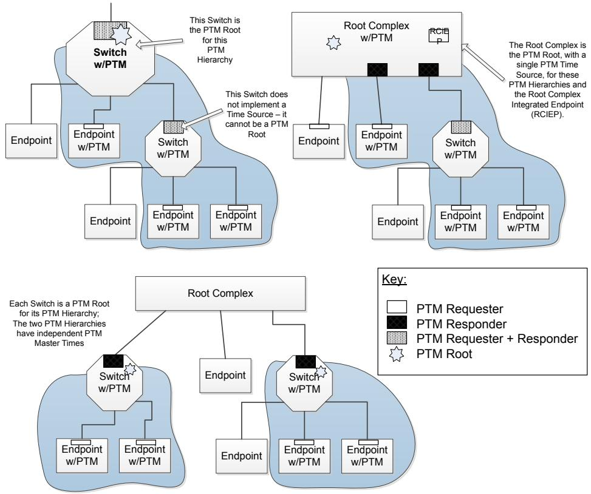

<details>
<summary>flowchart</summary>

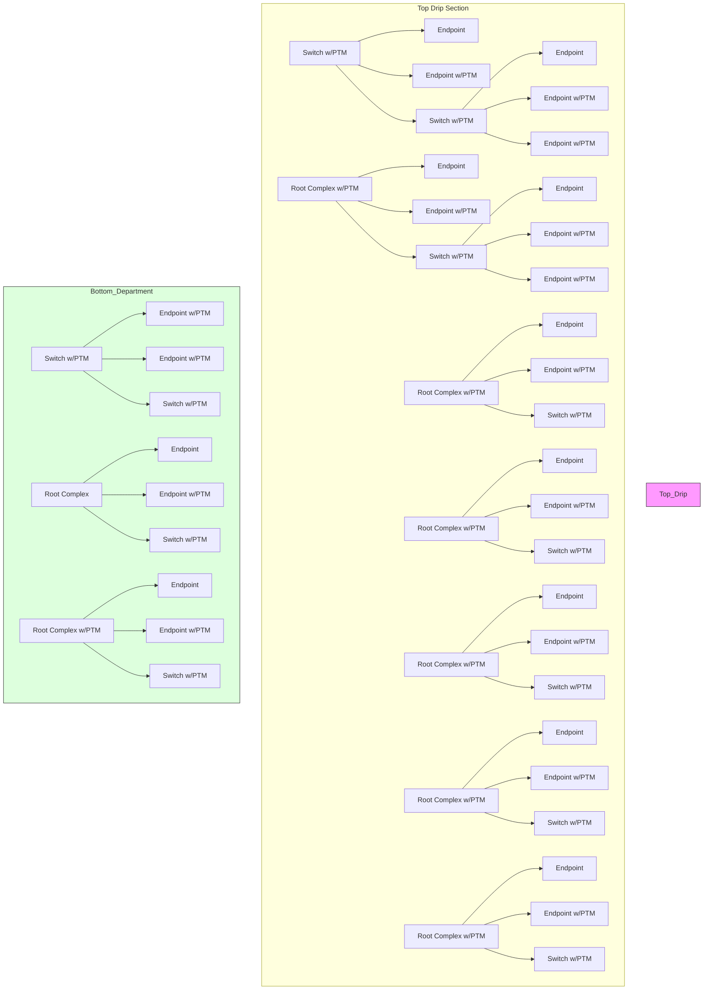
```mermaid
graph TD
    subgraph Top_Department[Top Drip Section]
  A["Switch w/PTM"] --> B["Endpoint"]
  A --> C["Endpoint w/PTM"]
  A --> D["Switch w/PTM"]
  D --> E["Endpoint"]
  D --> F["Endpoint w/PTM"]
  D --> G["Endpoint w/PTM"]
  H["Root Complex w/PTM"] --> I["Endpoint"]
  H --> J["Endpoint w/PTM"]
  H --> K["Switch w/PTM"]
  K --> L["Endpoint"]
  K --> M["Endpoint w/PTM"]
  K --> N["Endpoint w/PTM"]
  O["Root Complex w/PTM"] --> P["Endpoint"]
  O --> Q["Endpoint w/PTM"]
  O --> R["Switch w/PTM"]
  S["Root Complex w/PTM"] --> T["Endpoint"]
  S --> U["Endpoint w/PTM"]
  S --> V["Switch w/PTM"]
  W["Root Complex w/PTM"] --> X["Endpoint"]
  W --> Y["Endpoint w/PTM"]
  W --> Z["Switch w/PTM"]
  AA["Root Complex w/PTM"] --> AB["Endpoint"]
  AA --> AC["Endpoint w/PTM"]
  AA --> AD["Switch w/PTM"]
  AE["Root Complex w/PTM"] --> AF["Endpoint"]
  AE --> AG["Endpoint w/PTM"]
  AE --> AH["Switch w/PTM"]
    end

    subgraph Bottom_Department
  AI["Switch w/PTM"] --> AJ["Endpoint w/PTM"]
  AI --> AK["Endpoint w/PTM"]
  AI --> AL["Switch w/PTM"]
  AM["Root Complex"] --> AN["Endpoint"]
  AM --> AO["Endpoint w/PTM"]
  AM --> AP["Switch w/PTM"]
  AQ["Root Complex w/PTM"] --> AR["Endpoint"]
  AQ --> AS["Endpoint w/PTM"]
  AQ --> AT["Switch w/PTM"]
    end

    style Top_Drip fill:#f9f,stroke:#333
    style Bottom_Department fill:#bbf,stroke:#333
    style Bottom_Department fill:#dfd,stroke:#333
```
</details>

Figure 6-21 Example System Topologies using PTM§

## IMPLEMENTATION NOTE:

## PTM AND RETIMERS §

PCIe Retimers can impact PTM accuracy by introducing asymmetric link delays. Retimers designed to maintain symmetric link delays will enable the best PTM accuracy. The larger and more variable the asymmetry, the greater the impact to PTM. Consult the manufacturer's documentation to determine the suitability of a Retimer implementation for use with PTM.

## 6.21.2 PTM Link Protocol §

When using PTM between two components on a Link, the Upstream Port, which acts on behalf of the PTM Requester, sends PTM Requests to the Downstream Port on the same Link, which acts on behalf of the PTM Responder.

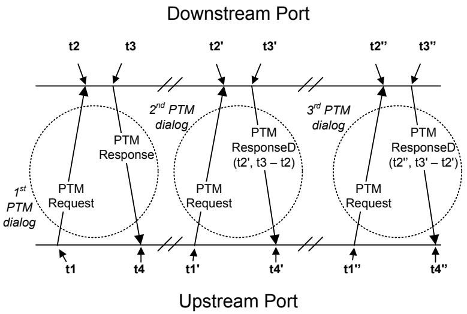

<details>
<summary>flowchart</summary>

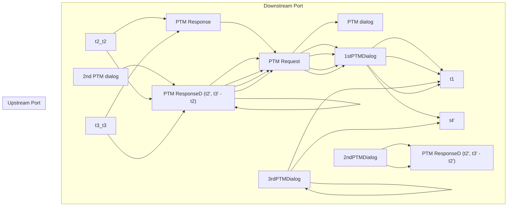
```mermaid
graph TD
    subgraph Downstream Port
  t2_t2 --> PTMResponse["PTM Response"]
  t3_t3 --> PTMResponse
  PTMResponse --> PTMRequest["PTM Request"]
  PTMRequest --> 1stPTMDialog["PTM dialog"]
  n1stPTMDialog["1stPTMDialog"] --> t1_t1["t1"]
  n1stPTMDialog --> t4_t4["t4"]
  2ndPTMDialog["2nd PTM dialog"] --> PTMResponseD["PTM ResponseD (t2', t3 - t2)"]
  PTMResponseD --> PTMRequest["PTM Request"]
  PTMRequest --> n1stPTMDialog
  n1stPTMDialog --> t1_t1["t1"]
  n2ndPTMDialog["2ndPTMDialog"] --> 3rdPTMDialog["3rd PTM dialog"]
  PTMResponseD --> PTMResponseD
  PTMResponseD --> PTMRequest
  PTMRequest --> n1stPTMDialog
  n3rdPTMDialog["3rdPTMDialog"] --> n3rdPTMDialog
  n3rdPTMDialog --> t1_t1["t1'"]
  n3rdPTMDialog --> t4_t4["t4'"]
    end
    subgraph Upstream Port
  t2_t2 --> PTMResponseD["PTM ResponseD (t2', t3' - t2)"]
  t3_t3 --> PTMResponseD
  PTMResponseD --> PTMRequest["PTM Request"]
  PTMRequest --> n1stPTMDialog
  n1stPTMDialog --> t1_t1["t1"]
  n2ndPTMDialog --> 3rdPTMDialog["PTM ResponseD (t2', t3' - t2')"]
  PTMResponseD --> PTMRequest["PTM Request"]
  PTMRequest --> n1stPTMDialog
  n3rdPTMDialog --> n3rdPTMDialog
    end
```
</details>

Figure 6-22 Precision Time Measurement Link Protocol§

§ Figure 6-22 illustrates the PTM link protocol. The points t1, t2, t3, and t4 in the above diagram represent timestamps captured locally by each Port as they transmit and receive PTM Messages. The component associated with each Port stores these timestamps from the $1 ^ { \mathsf { s t } }$ PTM dialog in internal registers for use in the $2 ^ { \mathsf { n d } }$ PTM dialog, and so on for subsequent PTM dialogs.

The Upstream Port, on behalf of the PTM Requester, initiates the PTM dialog by transmitting a PTM Request message.

The Downstream Port, on behalf of the PTM Responder, has knowledge of or access (directly or indirectly) to the PTM Master Time.

During each dialog, the Downstream Port populates the PTM ResponseD message based on timestamps stored during previous PTM dialogs, as defined in § Section 6.21.3.2 .

Once each component has historical timestamps from the preceding dialog, the component associated with the Upstream Port can combine its timestamps with those passed in the PTM ResponseD message to calculate the PTM Master Time using the following formula:

PTM Master Time at t1 $\mathbf { \Psi } = t 2 \mathbf { \Psi } ^ { ' } - \frac { \mathbf { \Psi } \left( \left( t 4 - t 1 \right) - \left( t 3 - t 2 \right) \right) } { 2 }$

Equation 6-2 PTM Master Time

The values t1, t2, t3, t4, and t2’ indicate the timestamps captured during the PTM dialog as illustrated in § Figure 6-22.

PTM capable components would typically record the results of these timestamp calculations, and may make them available to software via implementation specific means. Herein, this document refers to this resultant timing information as the component’s “PTM context”.

For a Switch implementing PTM, the time synchronization mechanism(s) within the Switch itself are implementation specific.

## IMPLEMENTATION NOTE:

## PTM THEORY AND OPERATION §

The timestamps captured during the PTM dialogs enable the calculation of the timing relationship between the PTM Requester and PTM Responder. The value (t3-t2) measures the time consumed by the PTM Responder for a given PTM dialog. The time (t4-t1) is the time from request to response. Therefore ((t4 - t1) - (t3 - t2)) effectively gives the round trip message transit time between the two components, and that quantity divided by 2 approximates the Link delay - the time difference between t1 and t2. It is assumed that the Link transit times from PTM Requester to PTM Responder and back again are symmetric, which is typically a good assumption (see also the Implementation Note on PTM Timestamp Capture Mechanisms).

In this example, the Root Ports supply the PTM Master time.

The switch uses implementation specific means to communicate time from its upstream port to its downstream ports.

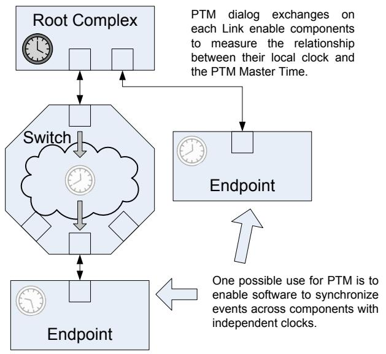

<details>
<summary>flowchart</summary>

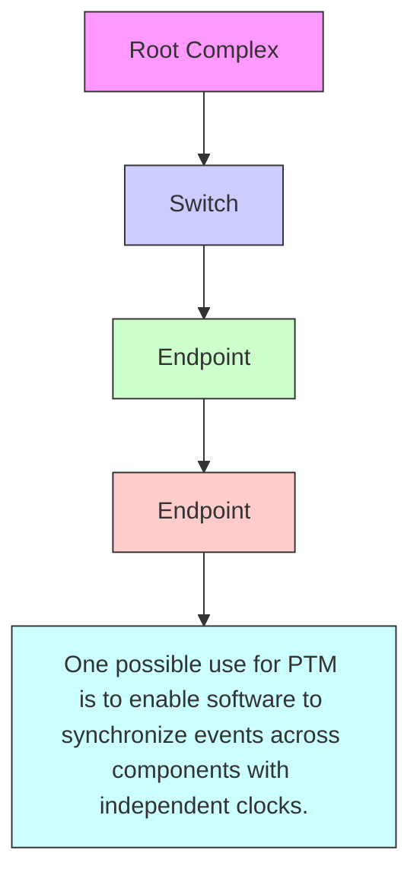
```mermaid
graph TD
  A["Root Complex"] --> B["Switch"]
  B --> C["Endpoint"]
  C --> D["Endpoint"]
  D --> E["One possible use for PTM is to enable software to synchronize events across components with independent clocks."]
    style A fill:#f9f,stroke:#333
    style B fill:#ccf,stroke:#333
    style C fill:#cfc,stroke:#333
    style D fill:#fcc,stroke:#333
    style E fill:#cff,stroke:#333
```
</details>

Figure 6-23 Precision Time Measurement Example§

§ Figure 6-23 illustrates a simple device hierarchy employing PTM. Each Upstream Port initiates PTM dialogs to establish the relationship between its local time and the PTM Master Time provided by the Root Port.

In this example, the Switch initiates PTM dialogs on its Upstream Port to obtain the PTM Master Time for use in fulfilling PTM Request Message received at its Downstream Ports. This Switch employs implementation specific means to communicate the PTM Master Time from its Upstream Port to its Downstream Ports.

PTM capable components can make their PTM context available for inspection by software, enabling software to translate timing information between local times and PTM Master Time. In turn, this capability enables software to coordinate events across multiple components with very fine precision.

Similarly, it is strongly recommended that platforms implementing PTM also make the PTM Master Time available to software.

## 6.21.3 Configuration and Operational Requirements

§

Software must not have the PTM Enable bit Set in the PTM Control register on a Function associated with an Upstream Port unless the associated Downstream Port on the Link already has the PTM Enable bit Set in its associated PTM Control register.

PTM support by a Function is indicated by the presence of a PTM Extended Capability structure. It is not required that all Endpoints in a hierarchy support PTM, and it is not required for software to enable PTM in all Endpoints that do support it.

If a PTM Message is received by a Port that does not support PTM, or by a Downstream Port when the PTM Enable bit is clear, the Message must be treated as an Unsupported Request. This is a reported error associated with the Receiving Port (see § Section 6.2 ). A properly formed PTM Response received by an Upstream Port that supports PTM, but for which the PTM Enable bit is clear, must be silently discarded.

As observed through PTM, the PTM Master Time must satisfy the following behavioral requirements:

• Time values must be monotonic, and strictly increasing.  
• The perceived granularity must be no greater than the value reported in the Local Clock Granularity field of the PTM Capability register.  
• The perceived time must start no later than when the PTM Root processes its first PTM Request Message.

Referring to § Figure 6-22, the following rules define timestamp capture:

• A PTM Requester must update its stored t1 timestamp when transmitting a PTM Request Message, even if that transmission is a replay.  
• A PTM Responder must update its stored t2 timestamp when receiving a PTM Request Message, even if received TLP is a duplicate.  
• A PTM Responder must update its stored t3 timestamp when transmitting a PTM Response or ResponseD Message, even if that transmission is a replay.  
• A PTM Requester must update its stored t4 timestamp when receiving a PTM Response Message, even if received TLP is a duplicate.

In NFM, Timestamps must be based on the STP Symbol or Token that frames the TLP, as if observing the first bit of that Symbol or Token at the Port’s pins.

In FM, a single Flit is permitted to include zero or one PTM Messages, and Timestamps must be based on the Flit\_Marker (see § Section 4.2.3.4.2 ) that has the PTM Message contained in this Flit bit Set, as if observing the Flit\_Marker Indicator bit at the Port’s pins. Typically this will require an implementation specific adjustment to compensate for the inability to directly measure the time at the actual pins, as the time will commonly be measured at some internal point in the Rx or Tx path. The accuracy and consistency of this measurement are not bounded by this specification, but it is strongly recommended that the highest practical level of accuracy and consistency be achieved.

As illustrated in § Figure 2-62, the bytes within the Propagation Delay[31:0] field are such that:

• Data Byte 0 contains Propagation Delay [31:24] (most significant byte)  
• Data Byte 1 contains Propagation Delay [23:16]  
• Data Byte 2 contains Propagation Delay [15:8]  
• Data Byte 3 contains Propagation Delay [7:0] (least significant byte)

All implementations compliant to this document are required to follow the above interpretation (Propagation Delay interpretation A). Due to ambiguity in earlier versions of this document, some implementations made this interpretation (Propagation Delay interpretation B):

• Data Byte 0 contains Propagation Delay [7:0] (least significant byte)  
• Data Byte 1 contains Propagation Delay [15:8]  
• Data Byte 2 contains Propagation Delay [23:16]  
• Data Byte 3 contains Propagation Delay [31:24] (most significant byte)

To allow implementations using interpretation A to interoperate with implementations using interpretation B the PTM Propagation Delay Adaptation Capability can be used. For an Upstream Port, this capability applies to the interpretation of received PTM ResponseD Messages, for a Downstream Port, this capability applies to the interpretation of transmitted PTM ResponseD Messages. Support for the PTM Propagation Delay Adaptation Capability is indicated by Setting the PTM Propagation Delay Adaptation Capable bit in the PTM Capability Register. When supported, the Port must use interpretation A, unless the PTM Propagation Delay Adaptation Interpretation B bit in the Link Control Register is Set, in which case the Port changes to interpretation B. For a Switch, if the PTM Propagation Delay Adaptation Capable bit is Set, then all Ports of the Switch must support the PTM Propagation Delay Adaptation Capability, and each Switch Port must be controlled independently by the value of the PTM Propagation Delay Adaptation Interpretation B bit in the Link Control Register for the Port.

It is strongly recommended that software not enable PTM on a link until it has first assured, either by means of the PTM Propagation Delay Adaptation Capability or in an implementation specific manner, that both Ports on the Link are able to compatibly interpret the Propagation Delay value.

## 6.21.3.1 PTM Requester Role §

• Support for the PTM Requester role is indicated by setting the PTM Requester Capable bit in the PTM Capability register.  
• PTM Requesters are permitted to request PTM Master Time only when PTM is enabled. The mechanism for directing a PTM Requester to issue such a request is implementation specific.

◦ Upstream Ports obtain PTM Master Time via PTM dialogs as described in § Section 2.2.8.10 .

◦ The mechanism by which RCiEPs request PTM Master Time is implementation specific.

• Once having issued a PTM Request Message, the Upstream Port must not issue another PTM Request Message prior to the receipt of a PTM Response Message, PTM ResponseD Message, Reset, or the passage of 100 μs without a corresponding PTM Message from the Downstream Port.  
• Upon receiving a PTM Response, the Upstream Port must wait at least 1 μs before issuing another PTM Request Message.  
For Multi-Function Devices (MFDs) containing multiple PTM Requesters, the Upstream Port associated with that MFD must issue a single PTM dialog during each PTM context refresh. PTM Requesters within the MFD maintain their individual PTM contexts using this one, Device-wide PTM dialog. The mechanism for refreshing multiple PTM contexts from one PTM dialog is implementation specific.  
• An Upstream Port MUST@FLIT invalidate its internal PTM context when any of the following occur. If ePTM is supported, then an Upstream Port must invalidate its internal PTM context when any of the following occur:

◦ A PTM Request is replayed.

◦ A duplicate PTM ResponseD TLP is received.

◦ The relationship between PTM Master Time and the Upstream Port’s local time changes, as determined by implementation specific criteria. For example, this may occur as a result of a transition to a non-D0 state or due to accumulated PPM drift.

These events are grouped under the label “Local Time Invalidation Event” in § Figure 6-24.

• If ePTM is supported, an Upstream Port, upon replaying a PTM TLP, must invalidate it's PTM context until two successive PTM dialogs have been completed successfully and without replays.

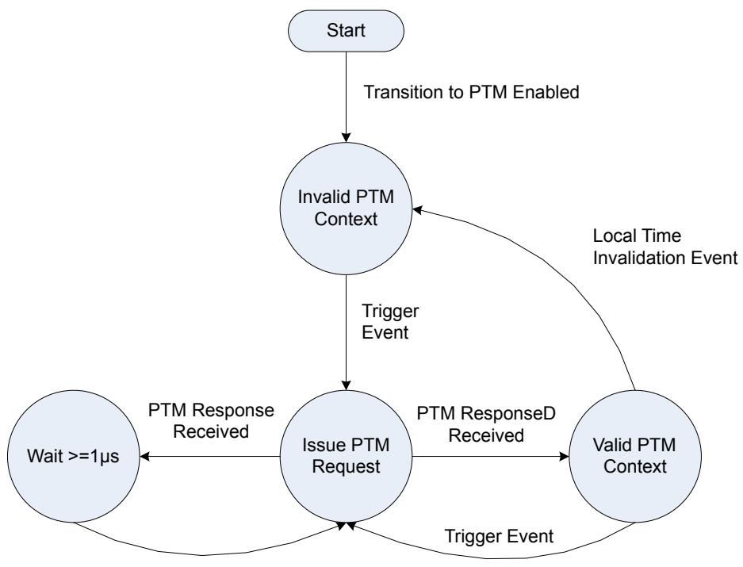

<details>
<summary>flowchart</summary>

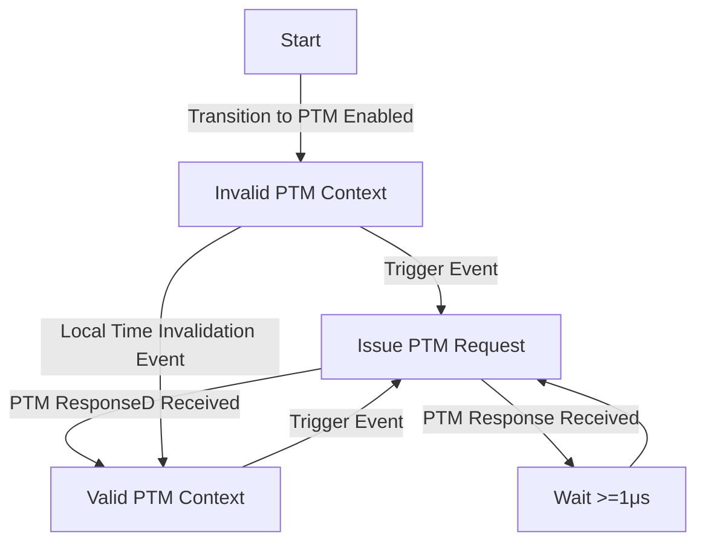
```mermaid
graph TD
  A["Start"] -->|Transition to PTM Enabled| B["Invalid PTM Context"]
  B -->|Trigger Event| C["Issue PTM Request"]
  C -->|PTM ResponseD Received| D["Valid PTM Context"]
  D -->|Trigger Event| C
  C -->|PTM Response Received| E["Wait >=1μs"]
  E --> C
  B -->|Local Time Invalidation Event| D
```
</details>

§ Figure 6-24 PTM Requester Operation

## IMPLEMENTATION NOTE:

## PTM INVALIDATION ON THE RECEPTION OF DUPLICATE TLPS §

Duplicate TLPs are detected and discarded in the Data Link Layer, whereas PTM messages are identified in the Transaction Layer. In some implementations it may be difficult or excessively complicated to distinguish a duplicate PTM TLP from other duplicate TLPs.

Because Upstream Ports are permitted to invalidate their internal PTM context for implementation specific criteria, a PTM Requester is allowed to invalidate its internal PTM context upon the reception of any duplicate TLP in addition to any duplicate PTM TLP. Similarly, if ePTM is supported, then a PTM Responder is allowed to invalidate its historical timestamps (t2 - t3) upon the reception of any duplicate TLP.

## 6.21.3.2 PTM Responder Role §

• Support for the PTM Responder role is indicated by setting the PTM Responder Capable bit in the PTM Capability register.  
• Switches and Root Complexes are permitted to implement the PTM Responder Role.

◦ A PTM capable Switch, when enabled for PTM by setting the PTM Enable bit in the PTM Control register associated with the Switch Upstream Port, must respond to all PTM Request Messages received at any of its Downstream Ports.

◦ The mechanism by which Root Complexes communicate PTM Master Time to RCiEPs is implementation specific.

• PTM Responders must populate PTM ResponseD Messages as follows (refer to § Figure 6-22 and the accompanying implementation note):

◦ The PTM Master Time field is a 64-bit value containing the value of PTM Master Time at the receipt of the PTM Request Message for the current PTM Dialog. In § Figure 6-22, for the $2 ^ { \mathsf { n d } }$ PTM dialog, this is the PTM Master Time at time t2’.  
◦ The Propagation Delay field is a 32-bit value containing the interval between the receipt of the PTM Request Message and the transmission of the PTM Response Message for the previous PTM dialog. In § Figure 6-22, for the $2 ^ { \mathsf { n d } }$ PTM dialog, this is the time interval between t2 and t3 captured during the $1 ^ { \mathfrak { s t } }$ 1st PTM dialog.  
◦ The unit of measurement for both fields is one ns.  
◦ A PTM Responder with multiple Downstream Ports must populate all PTM ResponseD Messages with values from a single PTM Root across all its PTM Ports Downstream ports.

• Switch Downstream Ports and Root Ports acting as PTM Responders must respond to each PTM Request Message received at their Downstream Ports with either PTM Response or PTM ResponseD according to the following rules:

◦ A PTM Responder must not send a PTM Response or PTM ResponseD Message without first receiving a PTM Request Message.  
◦ Upon receipt of a PTM Request Message, a PTM Responder must attempt to issue a PTM Response or PTM ResponseD Message within 10 μs.  
◦ A PTM Responder must issue PTM Response when the Downstream Port does not have valid historical timestamps (t3 - t2) with which to fulfill a PTM Request Message.  
◦ If ePTM is supported, a PTM Responder must invalidate its historical timestamps (t3 - t2) immediately upon replaying any PTM Response or PTM ResponseD. A PTM Responder must invalidate its historical timestamps (t3 - t2) after receiving any duplicate PTM Request.

• A PTM Responder must issue PTM ResponseD when it has stored copies of the values required to populate the PTM ResponseD Message: historical timestamps (t3 - t2) and the PTM Master Time at the receipt of the most recent PTM Request Message (time t2’).  
• A PTM Responder is permitted to issue PTM Response when it has stored copies of the historical timestamps (t3 - t2) but must request the PTM Master Time from elsewhere. In this case, it is permitted to issue PTM Response messages in response to PTM Request Messages while it retrieves the PTM Master Time if that retrieval is expected to take more than 10 μs.  
• The perceived granularity of the historical timestamps and PTM Master Time values transmitted by a PTM Responder must not exceed that reported in the Local Clock Granularity field of the PTM Capability register.

## 6.21.3.3 PTM Time Source Role - Rules Specific to Switches §

In addition to the requirements listed above for the PTM Requester and PTM Responder Roles, Switches must follow these requirements:

When the Upstream Port is associated with a Multi-Function Device, only a single Function associated with that Upstream Port is permitted to implement the PTM Extended Capability structure. For Switches, all PTM functionality associated with the Switch must be controlled through that structure. It is not required that the Function implementing the PTM Extended Capability structure be the Switch Upstream Port Function.  
• The PTM Extended Capability structure for a Switch must indicate support for both the PTM Requester and PTM Responder roles.  
• The PTM Extended Capability in the Upstream Port controls all Switches in that Upstream Port.  
• A Switch is permitted to act as a PTM Root, or to issue PTM Requests on its Upstream Port to obtain the PTM Master Time for use in fulfilling PTM Requests received at its Downstream Ports. In the latter case the Switch must account for any internal delays within the Switch.  
• A Switch is permitted to maintain a local PTM context for use in fulfilling PTM Requests received on its Downstream Ports.  
• A Switch which is not acting as a PTM Root must invalidate its local context no more than 10 ms from the last PTM dialog on its Upstream Port. The Switch must then refresh its local PTM context prior to issuing further PTM ResponseD Messages on its Downstream Ports. This requirement for periodic refreshes is optional if it is guaranteed by implementation specific means that the Switch’s local clock is phase locked with PTM Master Time.  
• Any Switch implementing a local clock for the purpose of maintaining a local PTM context must report the granularity of this clock as defined in the PTM Capabilities structure (§ Section 7.9.15 ).

## IMPLEMENTATION NOTE:

## PTM TIMESTAMP CAPTURE MECHANISMS §

PTM uses services from both the Data Link and Transaction Layers. Accuracy requires that time measurements be taken as close to the Physical Layer as possible. Conversely, the messaging protocol itself properly belongs to the Transaction Layer. The PTM message protocol applies to a single Link, where the Upstream Port is the requester and the Downstream Port is the responder.

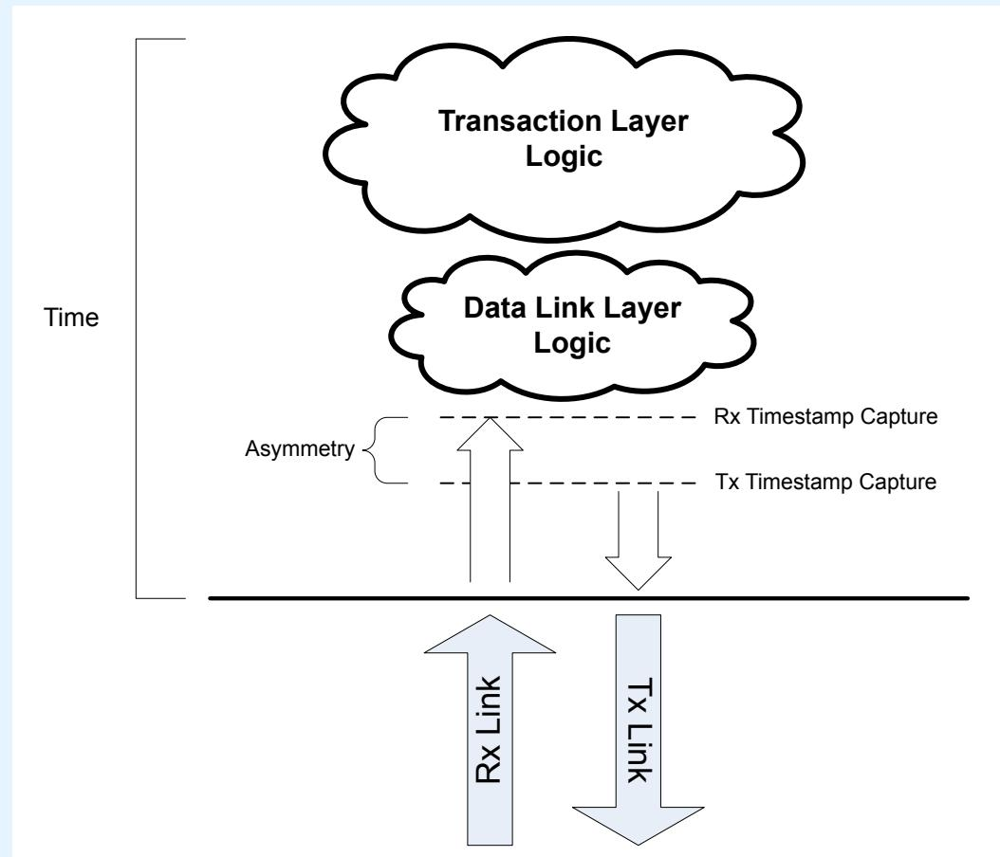

<details>
<summary>flowchart</summary>

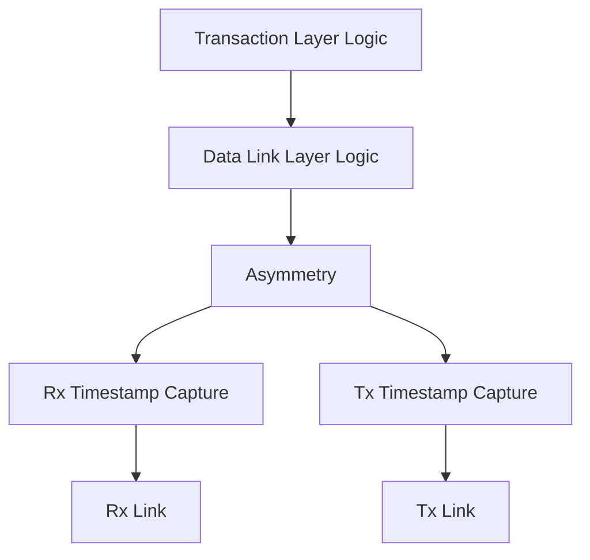
```mermaid
graph TD
  A["Transaction Layer Logic"] --> B["Data Link Layer Logic"]
  B --> C["Asymmetry"]
  C --> D["Rx Timestamp Capture"]
  C --> E["Tx Timestamp Capture"]
  D --> F["Rx Link"]
  E --> G["Tx Link"]
```
</details>

Figure 6-25 PTM Timestamp Capture Example§

§ Figure 6-25 illustrates how to select suitable timestamp capture points. For some implementations, the logic within the Transaction Layer and Data Link Layers is non-deterministic. Implementation details and current conditions have considerable impact on exactly when a particular packet may encounter any particular processing step. This makes it effectively impossible to capture any timestamp that accurately records the time of a particular physical event if timestamps are captured in the higher layers.

## 6.22 Readiness Notifications (RN)


Readiness Notifications (RN) is intended to reduce the time software needs to wait before issuing Configuration Requests to a Device or Function following DRS Events or FRS Events. RN includes both the Device Readiness Status (DRS) and

Function Readiness Status (FRS) mechanisms. These mechanisms provide a direct indication of Configuration-Readiness (see Terms and Acronyms entry for Configuration-Ready). When used, DRS and FRS allow an improved behaviour over the Configuration RRS mechanism, and eliminate its associated periodic polling time of up to 1 second following a reset.

It is permitted that system software/firmware provide mechanisms that supersede the FRS and/or DRS mechanisms, however such software/firmware mechanisms are outside the scope of this specification.

## IMPLEMENTATION NOTE:

## HARDWARE/SOFTWARE RECOMMENDATIONS FOR

## OPTIMIZING CONFIGURATION READINESS §

It is strongly recommended that implementers of System Software avoid unnecessary delays wherever possible. It is strongly recommended that hardware be designed to eliminate or minimize required delays, and utilize mechanisms provided in this and related specifications to communicate any required delays. Hardware implementers should document hardware behavior sufficiently to enable System Software to implement optimal behaviors.

Even before a Link is in L0, it is possible for System Software to determine if the DRS mechanism can be used to determine when a device becomes Configuration Ready. System Software may do this as follows:

1. If the DRS Supported bit in the Downstream Port above the device is Clear, stop this procedure and follow the procedure in § Section 2.3.1 .  
2. Check the Downstream Component Presence field in the Downstream Port.

◦ If Downstream Component Presence equals Link Up – Component Present and DRS Received, the device is already Configuration Ready.  
◦ If System Software is informed, through implementation specific mechanisms, that the device supports DRS, continue with Step 3. System Software is strongly recommended to take advantage of such knowledge when available.  
◦ If Downstream Component Presence equals Link Down – Flit Mode Negotiation Completed or Link Up Component Present:

▪ If Flit Mode Status is Set, assume the device also supports DRS since DRS is mandatory if a component supports Flit Mode. Continue with Step 3.

▪ Otherwise, continue with Step 7.

◦ If Otherwise, if the Link is Up, continue with Step 7.

When System Software determines that DRS is supported by both the Downstream Port and the device below it, the following DRS-Only procedure is strongly recommended:

3. The timeout based procedure defined in § Section 2.3.1 is not used. That procedure supports devices that can take a maximum of 1 second to become Configuration Ready. This DRS Only procedure supports devices that take longer than 1 second to become Configuration Ready.  
4. Either DRS Message Received or Downstream Component Presence are used to determine when the device is or becomes Configuration Ready.  
5. The Downstream Component Presence field is used to avoid polling when a component is not present.  
6. A non-blocking polling capability is implemented so that unrelated operations are not stalled. Software may configure DRS Signaling Control to generate an interrupt or FRS Message to indicate when polling should occur. It may be desirable to implement a timeout mechanism to terminate polling and indicate an error condition if the timeout expires. The timeout should be determined by system use case requirements. If none applies and a component is known to be present, a value of 10 seconds is recommended.

When System Software cannot determine that DRS is supported by both the Downstream Port and the device below it, then this hybrid approach for determining Configuration Ready is recommended:

7. The timeout based procedure defined in § Section 2.3.1 is run in parallel with the DRS Only procedure in Step 4 through Step 6.  
8. The receipt of a DRS Message indicates the Device is Configuration Ready, and System Software proceeds without further delay to configure the device.  
9. If no DRS Message is received within an appropriate period determined by system use case requirements, then System Software may issue a Configuration Request to the Device per the procedure described in § Section 2.3.1 .

## 6.22.1 Device Readiness Status (DRS)


DRS MUST@FLIT be implemented, and the DRS Supported bit in the Link Capabilities 2 register MUST@FLIT be Set in all Downstream Ports and in Function 0 of all Upstream Ports. DRS is optional for Ports that do not support Flit Mode.

DRS must be used to indicate when a Device is Configuration-Ready following any of the following Device-level occurrences, which are subsequently referred to as “DRS Events”:

• Exit from Cold Reset  
• Exit from Warm Reset, Hot Reset, Loopback, or Disabled  
• Exit from L2/L3 Ready  
• Any other scenario where the Port transitions from DL\_Down to DL\_Up status.

The DRS Message protocol requirements include the following:

• There is no enable or disable mechanism for DRS.  
• It is expressly permitted for Upstream Ports to send DRS Messages even when the DRS Supported bit is Clear.  
• A DRS Message must be transmitted by a DRS-capable Upstream Port following every DL\_Down to DL\_Up transition when all non-VF Functions on the Logical Bus associated with that Upstream Port become ready.

◦ A Type 0 Function is ready when it is Configuration-Ready.  
◦ A Type 1 Function that is a Switch Upstream Port is ready when it is Configuration-Ready and all Functions on its secondary bus are Configuration-Ready.  
◦ A Type 1 Function that is not a Switch Upstream Port is ready when the Function itself is Configuration-Ready.

• After a Device transmits a DRS Message, non-VF Functions indicated as Configuration-Ready by that DRS Message must not return Completions with RRS in response to Configuration Requests unless a subsequent DRS Event occurs.

Additional requirements relating to Switches implementing DRS include:

• Must support DRS functionality in all Ports  
• Implementation at each Downstream Port of the DRS Signaling Control field.  
• For any physically-integrated Device that appears beneath a Switch Downstream Port, the DRS sent by the Switch does not indicate Configuration Readiness for that Device  
◦ For such a Device, implementation and use of DRS is independent of the Switch

Additional requirements for Root Ports and Switch Downstream Ports include:

Implementation of the DRS Message Received bit, which indicates receipt of a DRS Message

## IMPLEMENTATION NOTE:

## DRS MESSAGES AND ACS SOURCE VALIDATION §

Functions are permitted to transmit DRS Messages before they have been assigned a Bus Number. Such messages will have a Requester ID with a Bus Number of 00h. If the Downstream Port has ACS Source Validation enabled, these Messages (see § Section 6.12.1.1 ) will likely be detected as an ACS Violation error.

## 6.22.2 Function Readiness Status (FRS) §

When implemented, FRS must be used to indicate a specific Function as being Configuration-Ready following any of the following Function-level occurrences, which are subsequently referred to as “FRS Events”:

• Function Level Reset (FLR)  
• Completion of $\mathsf { D } 3 _ { \mathsf { H o t } }$ to D0 transition  
• Setting or Clearing of VF Enable in a PF (SR-IOV)

The FRS Message protocol requirements include the following:

• The Requester ID of the FRS Message must indicate the Function that has changed readiness status (see § Section 2.2.8.6.3 )  
• The FRS Reason field in the FRS Message must indicate why that Function changed readiness status  
• After a Function transmits an FRS Message, the indicated Function(s) must not return Completions with RRS in response to a Configuration Request unless a subsequent DRS Event or FRS Event occurs

Additional requirements for Switches implementing FRS include:

• Must support FRS functionality in the Upstream Port and all Downstream Ports  
• The ability to transmit FRS Messages Upstream when required by the FRS protocol

Additional requirements for Physical Functions (PFs) include:

• The ability to transmit FRS Message Upstream when the VF Enable or VF Disable process completes

Additional requirements for Root Ports and Root Complex Event Collectors implementing FRS include:

• Must implement the FRS Queuing Extended Capability (see § Section 7.8.10 )

## 6.22.3 FRS Queuing §

Root Ports and Root Complex Event Collectors that support FRS must implement the FRS Queuing Extended Capability (see § Section 7.8.10 ).

For a Root Port, the FRS Message Queue contains FRS Messages received by the Root Port or generated by the Root Port.

For a Root Complex Event Collector, the FRS Message Queue contains FRS Messages generated by RCiEPs associated with the Root Complex Event Collector (see § Section 7.9.10 ) or generated by the Root Complex Event Collector.

The FRS Message Queue must satisfy the following requirements:

• The FRS Message Queue must be empty following Reset.  
• For a Root Port, the FRS Message Queue must be emptied when the Link goes to DL\_Down.  
• FRS Messages must be queued in the order received.  
• If the FRS Message Queue is not full at the time an FRS Message is received or is internally generated, that FRS Message must be entered in the queue and the FRS Message Received bit must set to 1b.  
If the FRS Message Queue is full at the time an FRS Message is received or is internally generated, that FRS Message must be discarded and the FRS Message Overflow bit must be set to 1b. The pre-existing FRS Message Queue must be preserved.  
• The oldest FRS Message must be visible in the FRS Message Queue register (see § Section 7.8.10.4 ).  
• Writing the FRS Message Queue register must remove the oldest element from the queue.  
• When either FRS Message Received or FRS Message Overflow transitions from 0b to 1b, an interrupt must be generated if enabled.

## 6.23 Enhanced Allocation §

The Enhanced Allocation (EA) Capability is an optional Capability that allows the allocation of I/O, Memory and Bus Number resources in ways not possible with the BAR and Base/Limit mechanisms in the Type 0 and Type 1 Configuration Headers.

It is only permitted to apply EA to certain functions, based on the hierarchical structure of the functions as seen in PCI configuration space, and based on certain aspects of how functions exist within a platform environment (see § Figure 6-26).

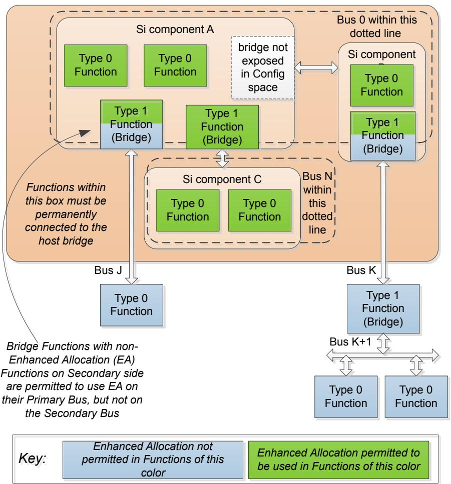

<details>
<summary>flowchart</summary>

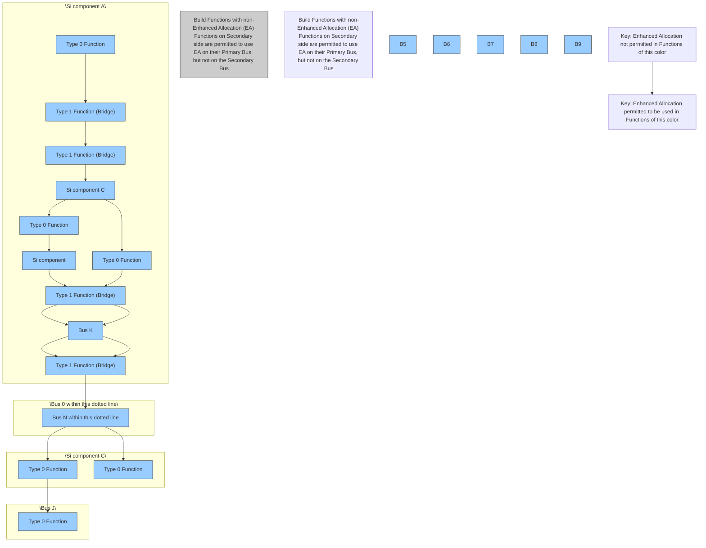
```mermaid
graph TD
    subgraph Si_component_A["\"Si component A\""]
  A1["Type 0 Function"] --> A2["Type 1 Function (Bridge)"]
  A2 --> A3["Type 1 Function (Bridge)"]
  A3 --> A4["Si component C"]
  A4 --> B1["Type 0 Function"]
  A4 --> A5["Type 0 Function"]
  A5 --> A6["Si component"]
  A6 --> B2["Type 1 Function (Bridge)"]
  B2 --> B3["Bus K"]
  B3 --> B4["Type 1 Function (Bridge)"]
    end

    subgraph Bus_0_within_this_dotted_line["\"Bus 0 within this dotted line\""]
  B1 --> B2
  B2 --> B3
  B3 --> B4
  B4 --> C["Bus N within this dotted line"]
    end

    subgraph Si_component_C["\"Si component C\""]
  C --> D["Type 0 Function"]
  C --> E["Type 0 Function"]
    end

    subgraph Bus_J["\"Bus J\""]
  D --> F["Type 0 Function"]
    end

    G["Build Functions with non-Enhanced Allocation (EA) <br>Functions on Secondary side are permitted to use EA on their Primary Bus, but not on the Secondary Bus"]
    H["Build Functions with non-Enhanced Allocation (EA) <br>Functions on Secondary side are permitted to use EA on their Primary Bus, but not on the Secondary Bus"]
  I["Key: Enhanced Allocation not permitted in Functions of this color"] --> J["Key: Enhanced Allocation permitted to be used in Functions of this color"]
    style A1 fill:#99ccff,stroke:#333
    style A2 fill:#99ccff,stroke:#333
    style A3 fill:#99ccff,stroke:#333
    style A4 fill:#99ccff,stroke:#333
    style A5 fill:#99ccff,stroke:#333
    style A6 fill:#99ccff,stroke:#333
    style B1 fill:#99ccff,stroke:#333
    style B2 fill:#99ccff,stroke:#333
    style B3 fill:#99ccff,stroke:#333
    style B4 fill:#99ccff,stroke:#333
    style B5 fill:#99ccff,stroke:#333
    style B6 fill:#99ccff,stroke:#333
    style B7 fill:#99ccff,stroke:#333
    style B8 fill:#99ccff,stroke:#333
    style B9 fill:#99ccff,stroke:#333
    style C fill:#99ccff,stroke:#333
    style D fill:#99ccff,stroke:#333
    style E fill:#99ccff,stroke:#333
    style F fill:#99ccff,stroke:#333
    style G fill:#ccc,stroke:#333
```
</details>

Figure 6-26 Example Illustrating Application of Enhanced Allocation§

Only functions that are permanently connected to the host bridge are permitted to use EA. A bridge function (i.e., any function with a Type 1 Configuration Header), is permitted to use EA for both its Primary Side and Secondary Side if and only if the function(s) behind the bridge are also permanently connected (below one or more bridges) to the host bridge, as shown for “Si component C” in § Figure 6-26.

A bridge function is permitted to use EA only for its Primary Side if the function(s) behind the bridge are not permanently connected to the bridge, as with the bridges above Bus J and Bus K in § Figure 6-26, and in this case the non-EA resource allocation mechanisms in the Type 1 Header for Bus numbers, MMIO ranges and I/O ranges are used for the Secondary side of the bridge. System software must ensure that the allocated Bus numbers are within the range indicated in the Fixed Secondary Bus Number and Fixed Subordinate Bus Number registers of the EA capability. System software must ensure that the allocated MMIO and I/O ranges are within ranges indicated with the corresponding Properties in the EA capability for resources to be allocated behind the bridge. For Bus numbers, MMIO and I/O ranges behind the bridge, hardware is permitted to indicate overlapping ranges in multiple bridge functions, however, in such cases, system software must ensure that the ranges actually assigned are non-overlapping.

Functions that rely exclusively on EA for I/O and Memory address allocation must hardwire all bits of all BARs in the PCI Header to 0. Such Functions must be clearly documented as relying on EA for correct operation, and platform integrators must ensure that only EA-aware firmware/software are used with such Functions.

When a Function allocates resources using EA and indicates that a resource range is associated with an equivalent BAR number, the Function must not request resources through the equivalent BAR, which must be indicated by hardwiring all bits of the equivalent BAR to 0.

For a bridge function that is permitted to implement EA based on the rules above, it is permitted, but not required, for the bridge function to use EA mechanisms to indicate resource ranges that are located behind the bridge Function. In the example shown in in § Figure 6-26, the bridge above Bus N is permitted to use EA mechanisms to indicate the resources used by the two functions in “Si component C”, or that bridge is permitted to not indicate the resources used by the two functions in “Si component C”. System firmware/software must comprehend that such bridge functions are not required to indicate inclusively all resources behind the bridge, and as a result system firmware/software must make a complete search of all functions behind the bridge to comprehend the resources used by those functions.

A Function with an Expansion ROM is permitted to use the existing mechanism or the EA mechanism, but is not permitted to support both. If a Function uses the EA mechanism (EA entry with BEI of 8), the Expansion ROM Base Address and Expansion ROM Enable fields must be hardwired to 0 (see § Section 7.5.1.2.4 ). The Enable bit of the EA entry is equivalent to the Expansion ROM Enable bit. If a Function uses Expansion ROM Base Address Register mechanism, no EA entry with a BEI of 8 is permitted. In both cases, Expansion ROM Validation, if supported, uses the Expansion ROM Validation Status and Expansion ROM Validation Details fields (see § Section 7.5.1.2.4 ).

The requirements for enabling and/or disabling the decode of I/O and/or Memory ranges are unchanged by EA, including but not limited to the Memory Space and I/O Space enable bits in the Command register.

Any resource allocated using EA must not overlap with any other resource allocated using EA, except as permitted above for identifying permitted address ranges for resources behind a bridge.

## 6.24 Emergency Power Reduction State §

Emergency Power Reduction State is an optional mechanism to request that Functions quickly reduce their power consumption. Emergency Power Reduction is a fail-safe mechanism intended to be used to prevent system damage and is not intended to provide normal dynamic power management.

If a Function implements Emergency Power Reduction State, it must also implement the Power Budgeting extended capability and must report Power Budgeting values for this state (see § Section 7.8.1 ). Devices that are integrated on the system board are not required to implement the Power Budgeting extended capability, but if they do so, they must meet the preceding requirement.

Functions enter and exit this state either autonomously or based on external requests. External requests may be either following a signaling protocol defined in an applicable form factor specification, or by a vendor-specific method. § Table 6-16 defines how the Emergency Power Reduction Supported and Emergency Power Reduction Initialization Required fields determine the mechanisms that are allowed to trigger entry and exit from this state (see § Section 7.5.3.15 ).

Table 6-16 Emergency Power Reduction Supported Values§

<table><tr><td rowspan="2">Emergency Power Reduction Supported</td><td rowspan="2">Emergency Power Reduction Initialization Required</td><td colspan="3">Entry/Exit Permitted by</td></tr><tr><td>Form Factor Mechanism</td><td>Vendor Specific Mechanism(s)</td><td>Autonomous Mechanisms</td></tr><tr><td rowspan="2">00b</td><td>0</td><td>No</td><td>Yes</td><td>Yes</td></tr><tr><td>1</td><td>No</td><td>No</td><td>No</td></tr><tr><td>01b</td><td>Any</td><td>No</td><td>Yes</td><td>Yes</td></tr><tr><td>10b</td><td>Any</td><td>Yes</td><td>Yes</td><td>Yes</td></tr><tr><td>11b</td><td colspan="4">Reserved</td></tr></table>

Functions may indicate that they require re-initialization on exit from this state:

• If the Emergency Power Reduction Initialization Required bit is Clear (see § Section 7.5.3.15 ):

◦ On entry to this state, the Function either operates normally (perhaps with reduced performance), or enters a device specific “power reduction dormant state”. The Upstream Port of the Device remains operating. Outstanding requests initiated by or directed to the Function must complete normally.  
◦ On exit from this state, the Function operates normally (perhaps resuming normal performance). Functions that entered a “power reduction dormant state” exit that state. In either case, no software intervention is required.

• If the Emergency Power Reduction Initialization Required bit is Set (see § Section 7.5.3.15 ):

◦ On entry to this state, the Function ceases normal operation. The Upstream Port of the associated Device is permitted to enter DL\_Down.

▪ If the Upstream Port remains in DL\_Up, outstanding requests directed to or initiated by the Function must complete normally.  
▪ If the Upstream Port enters DL\_Down, outstanding request behavior is defined in § Section 2.9.1 . This transition may result in a Surprise Down error.  
▪ Sticky bits must be preserved in this state.

◦ On exit from this state, software intervention is required to resume normal operation. The mechanism used to indicate to software when this is required is outside the scope of this specification (e.g., a device specific interrupt). If the Upstream Port entered DL\_Down, all Functions of the Device are reset and a full reconfiguration is required (see § Section 2.9.2 ).

The following rules apply to the Emergency Power Reduction State:

• A Device supports Emergency Power Reduction State if at least one Function in the Upstream Port indicates support (i.e., Emergency Power Reduction Supported is non-zero).  
• Emergency Power Reduction State is associated with a Device. All Functions in a Device that support it enter and exit this state at the same time.  
• For SR-IOV devices, if the Emergency Power Reduction Supported field in a VF is non-zero, that VF enters and exits the Emergency Power Reduction State at the same time as its associated PF. For such VFs, the Emergency Power Reduction Detected bit must be hardwired to Zero, but software can use the associated PF's bit to emulate the bit in its VFs.  
• Functions where the Emergency Power Reduction Supported field is 00b are not affected by the Emergency Power Reduction State of the Device as long as the Upstream Port remains in DL\_Up. The Emergency Power Reduction Detected bit is RsvdZ.  
• Functions where the Emergency Power Reduction Supported field is 01b or 10b:

◦ Set the Emergency Power Reduction Detected bit when the Device enters Emergency Power Reduction State.  
◦ Clear the Emergency Power Reduction Detected bit when requested if the Device has exited the Emergency Power Reduction State.

• For Switches, Downstream Switch Ports enter and exit Emergency Power Reduction State at the same time as the associated Upstream Switch Port. The corresponding fields in Configuration Space are reserved for Downstream Switch Ports.  
• For SR-IOV Devices, VFs enter and exit Emergency Power Reduction State at the same time as their PF. The corresponding fields in Configuration Space are reserved for VFs.  
• Encoding 10b shall not be used unless the associated form factor specification defines a mechanism for requesting Emergency Power Reduction.

• It is strongly recommended that the Emergency Power Reduction Supported field be initialized by hardware or firmware within the Function prior to initial device enumeration. This initialization is permitted to be deferred to device driver load when this is not practical (e.g., when there is no firmware ROM).

## IMPLEMENTATION NOTE:

## DIAGNOSTIC CHECKING OF EMERGENCY POWER REDUCTION DETECTED

The Emergency Power Reduction Detected bit permits system software to detect that Emergency Power Reduction State was entered, even momentarily. The Emergency Power Reduction Request bit can be used by software to request entry. Normally, software would use a system specific method to enter the Emergency Power Reduction State using external mechanisms.

## IMPLEMENTATION NOTE:

## EMERGENCY POWER REDUCTION STATE: EXAMPLE ADD-IN CARD

§ Figure 6-27 shows an example multi-Device add-in card supporting Emergency Power Reduction. Note that Device C does not support the Emergency Power Reduction State. Device C might be a Switch that fans out to Devices A and B.

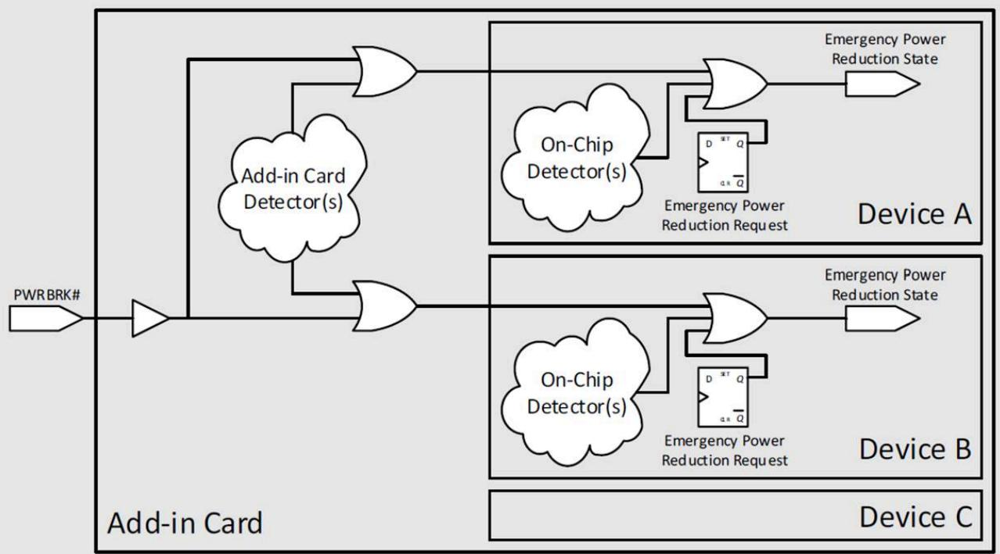

<details>
<summary>flowchart</summary>

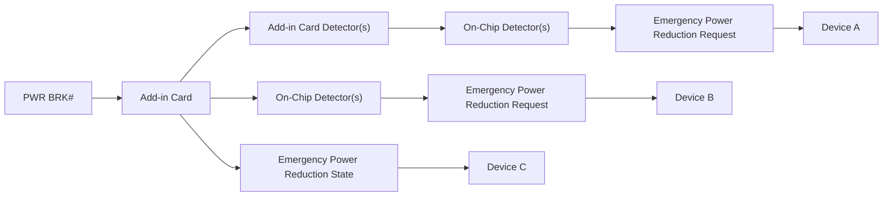
```mermaid
graph LR
  A["PWR BRK#"] --> B["Add-in Card"]
  B --> C["Add-in Card Detector(s)"]
  C --> D["On-Chip Detector(s)"]
  D --> E["Emergency Power Reduction Request"]
  E --> F["Device A"]
  B --> G["On-Chip Detector(s)"]
  G --> H["Emergency Power Reduction Request"]
  H --> I["Device B"]
  B --> J["Emergency Power Reduction State"]
  J --> K["Device C"]
```
</details>

Figure 6-27 Emergency Power Reduction State: Example Add-in Card§

## 6.25 Hierarchy ID Message §

When software initializes a PCI Hierarchy, it assigns unique Bus and Device numbers to each component so that every Function in the Hierarchy has a unique Routing ID within that Hierarchy. To ensure that Routing IDs are unique in large systems that contain more than one Hierarchy and in clustered systems that contain multiple Hierarchies, additional information is required to augment the Routing ID to produce a unique number. Functions can be uniquely identified by the combination of:

• Unique Identifier for the System (or Root Complex)  
• Unique Identifier for the Hierarchy within that Root Complex  
• Routing ID within that Hierarchy

The Hierarchy ID Message (see § Section 2.2.8.6.4 ) is used to provide the additional information needed for a Function to uniquely identify itself in a multi-hierarchy platform.

Hierarchy ID Messages are generated by a Downstream Port upon software request. Received messages at an Upstream Port are reported in the Hierarchy ID Extended Capability (see § Section 7.9.17 ).

Hierarchy ID Messages are a PCI-SIG-Defined Type 1 VDM. Hierarchy ID Messages can safely be sent at any time and components that do not comprehend them will silently ignore them.

Hierarchy ID Messages typically are sent from a Downstream Port at the top of the Hierarchy (e.g., a Root Port). In systems where the Root Port does not support Hierarchy ID Messages, Hierarchy ID Messages can be sent from Switch Downstream Ports.

The Hierarchy ID Message is intended for use by software, firmware, and/or hardware. When using the Hierarchy ID Message, all bits of the Hierarchy ID, System GUID, System GUID Authority ID fields must be compared, without regard to any internal structure. How this information is used is outside the scope of this specification.

Layout of the Hierarchy ID Message is shown in § Figure 2-55. Fields in the Hierarchy ID Message are as follows:

Hierarchy ID contains the Segment Group Number associated with this Hierarchy (as defined by the PCI Firmware Specification). This field can be used in conjunction with the Routing ID to uniquely identify a Function within a System. The value 0000h indicates the default (or only) Hierarchy of the Root Complex. Non-zero values indicate additional Hierarchies.

System GUID[143:0], in conjunction with System GUID Authority ID, provides a globally unique identification for a System.

System GUID[143:136] is byte 14 in the Hierarchy ID Message. System GUID[135:128] is byte 15 in the Hierarchy ID Message. System GUID[127:120] is byte 16 in the Hierarchy ID Message. System GUID[119:112] is byte 17 in the Hierarchy ID Message. System GUID[111:104] is byte 18 in the Hierarchy ID Message. System GUID[103:96] is byte 19 in the Hierarchy ID Message. System GUID[95:88] is byte 20 in the Hierarchy ID Message. System GUID[87:80] is byte 21 in the Hierarchy ID Message. System GUID[79:72] is byte 22 in the Hierarchy ID Message. System GUID[71:64] is byte 23 in the Hierarchy ID Message. System GUID[63:56] is byte 24 in the Hierarchy ID Message. System GUID[55:48] is byte 25 in the Hierarchy ID Message. System GUID[47:40] is byte 26 in the Hierarchy ID Message. System GUID[39:32] is byte 27 in the Hierarchy ID Message. System GUID[31:24] is byte 28 in the Hierarchy ID Message. System GUID[23:16] is byte 29 in the Hierarchy ID Message. System GUID[15:8] is byte 30 in the Hierarchy ID Message. System GUID[7:0] is byte 31 in the Hierarchy ID Message.

System GUID Authority ID identifies the mechanism used to ensure that the System GUID is globally unique. The mechanism for choosing which Authority ID to use for a given system is implementation specific. The defined values are shown in § Table 6-17.

Table 6-17 System GUID Authority ID Encoding§

<table><tr><td>Authority ID</td><td>Description</td></tr><tr><td>00h</td><td>None - System GUID[143:0] is not meaningful.System GUID[143:0] must be 0.</td></tr><tr><td>01h</td><td>Timestamp- System GUID[63:0] contains a timestamp associated with the particular system. Encoding is a Unix 64 bit time (number of seconds since midnight UTC January 1, 1970).The mechanism of choosing the timestamp to represent a system is implementation specific.System GUID[143:64] must be 0.</td></tr><tr><td>02h</td><td>IEEE EUI-48- System GUID[47:0] contains a 48 bit Extended Unique Identifier (EUI-48) associated with the particular system. Encoding is defined by the IEEE. See [EUI-48] for details. EUI-48 values are frequently used as network interface MAC addresses.The mechanism of choosing the EUI-48 value to represent a system is implementation specific.System GUID[143:48] must be 0.</td></tr><tr><td>03h</td><td>IEEE EUI-64- System GUID[63:0] contains a 64 bit Extended Unique Identifier (EUI-64) associated with the particular system. Encoding is defined by the IEEE. See [EUI-64] for details.The mechanism of choosing the EUI-64 value to represent a system is implementation specific.System GUID[143:64] must be 0.</td></tr><tr><td>04h</td><td>RFC-4122 UUID- System GUID[127:0] contain a UUID as defined by the IETF in [RFC-4122]. This definition is technically equivalent to [ITU-T-Rec-X-667] or [ISO-IEC-9834-8].The mechanism of choosing the UUID value to represent a system is implementation specific.System GUID[143:128] must be 0</td></tr><tr><td>05h</td><td>IPv6 Address- System GUID[127:0] contains the unique IPv6 address of one of the network interfaces of the system.The mechanism of choosing the IPv6 value to represent a system is implementation specific.System GUID[143:128] must be 0.</td></tr><tr><td>06h to 7Fh</td><td>Reserved- System GUID[143:0] contains a unique value. The mechanism used to ensure uniqueness is outside the scope of this specification.</td></tr><tr><td>80h to FFh</td><td>PCI-SIG Vendor Specific- System GUID Authority ID values 80h to FFh are reserved for PCI-SIG vendor-specific usage.System GUID[143:128] contains a PCI-SIG assigned Vendor ID.System GUID[127:0] contain a unique number assigned by that vendor. The mechanism used for assigning numbers is implementation specific. One possible mechanism would be to use the serial number assigned to the system.The mechanism used to choose between these System GUID Authority IDs is implementation specific. One usage would be to allow a vendor to define up to 128 distinct 128-bit System GUID schemes.</td></tr></table>

## IMPLEMENTATION NOTE:

## SYSTEM GUID CONSISTENCY AND STABILITY §

To support the purpose of System GUID, software should ensure that a single system uses identical System GUID and System GUID Authority ID values everywhere.

Implementers should carefully consider their stability requirements for the System GUID value. For example, some use cases may require that the value not change when the system is rebooted. In those cases, a mechanism that picks the EUI-48 value associated with the first Ethernet MAC address discovered might be problematic if the result changes due to hardware failure, system reconfiguration, or variations/parallelism in the discovery algorithm.

## IMPLEMENTATION NOTE:

## HIERARCHY ID VS. DEVICE SERIAL NUMBER §

The Device Serial Number mechanism can also be used to uniquely identify a component (see § Section 7.9.3 ). Device Serial Number may be a more expensive solution to this problem if it involves a ROM associated with each component.

## IMPLEMENTATION NOTE:

## VIRTUAL FUNCTIONS AND HIERARCHY ID §

The Hierarchy ID capability can be emulated by the Virtualization Intermediary (VI). Doing so provides VF software access to this Hierarchy ID information.

When VF hardware needs access to this information, the VF should implement the Hierarchy ID capability. This provides access to both VF software and hardware.

In some situations, the VF should get the same information as the PF. In other situations, particularly those involving migration of Virtual Machines, it may be appropriate to present the VF with Hierarchy ID information that differs from the associated PF and from other VFs associated with that PF.

The following mechanisms are supported:

<table><tr><td></td><td>VF Hierarchy ID Capability</td><td>Hierarchy ID VF Configurable</td><td>Hierarchy ID Writeable</td><td>VF Software has access</td><td>VF Hardware has access</td><td>VF Hierarchy Data / GUID</td></tr><tr><td>1</td><td rowspan="2">Not Present</td><td rowspan="2">n/a</td><td rowspan="2">n/a</td><td>No</td><td>No</td><td>Not Emulated</td></tr><tr><td>2</td><td>Yes</td><td>No</td><td>Emulated</td></tr><tr><td>3</td><td rowspan="3">Present</td><td>0b</td><td>0b</td><td>Yes</td><td>Yes</td><td>Same as PF</td></tr><tr><td>4</td><td>1b</td><td>0b</td><td>Yes</td><td>Yes</td><td>Same as PF</td></tr><tr><td>5</td><td>1b</td><td>1b</td><td>Yes</td><td>Yes</td><td>Configured by VI</td></tr></table>

In mechanism 1, the Virtualization Intermediary does not emulate the capability. VF software and hardware have no access.

In mechanism 2, the Virtualization Intermediary emulates the capability and returns whatever Hierarchy ID information is desired. VF software has access. VF hardware does not have access.

In mechanisms 3 and 4, VF information is the same as the PF and is automatically filled in from received Hierarchy ID messages. Both VF hardware and software have access.

In mechanism 5, VF information is configured by software (probably the VI). Both VF hardware and software have access.

## 6.26 Flattening Portal Bridge (FPB) §

## 6.26.1 Introduction §

The Flattening Portal Bridge (FPB) is an optional mechanism which can be used to improve the scalability and runtime reallocation of Routing IDs and Memory Space resources.

For non-ARI Functions associated with an Upstream Port, the Routing ID consists of a 3-bit Function Number portion, which is determined by the construction of the Upstream Port hardware, and a 13-bit Bus Number and Device number portion, determined by the Downstream Port above the Upstream port.

For ARI Functions associated with an Upstream Port, the Routing ID consists of an 8-bit Function Number portion, and only the 8-bit Bus Number portion is determined by the Downstream Port above the Upstream port.

A bridge that implements the FPB Capability can itself also be referred to as an FPB. The FPB Capability can be applied to any logical bridge, as illustrated in § Figure 6-28.

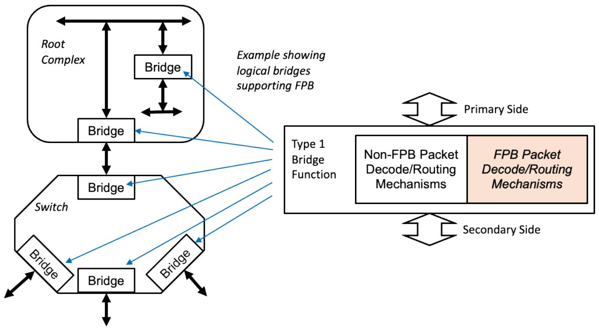

<details>
<summary>flowchart</summary>

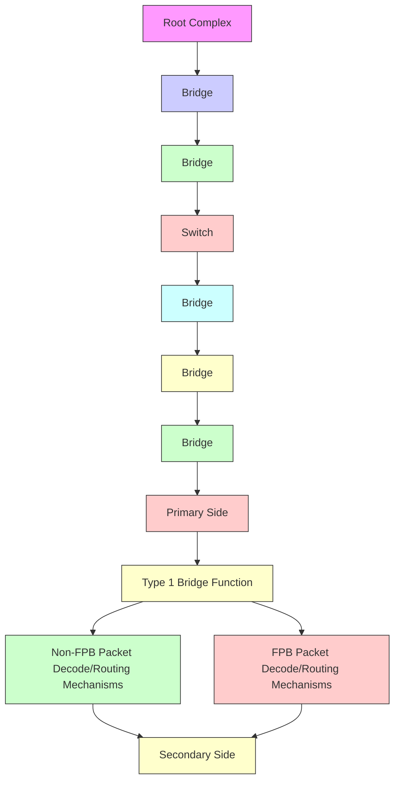
```mermaid
graph TD
  A["Root Complex"] --> B["Bridge"]
  B --> C["Bridge"]
  C --> D["Switch"]
  D --> E["Bridge"]
  E --> F["Bridge"]
  F --> G["Bridge"]
  G --> H["Primary Side"]
  H --> I["Type 1 Bridge Function"]
  I --> J["Non-FPB Packet Decode/Routing Mechanisms"]
  I --> K["FPB Packet Decode/Routing Mechanisms"]
  J --> L["Secondary Side"]
  K --> L
    style A fill:#f9f,stroke:#333
    style B fill:#ccf,stroke:#333
    style C fill:#cfc,stroke:#333
    style D fill:#fcc,stroke:#333
    style E fill:#cff,stroke:#333
    style F fill:#ffc,stroke:#333
    style G fill:#cfc,stroke:#333
    style H fill:#fcc,stroke:#333
    style I fill:#ffc,stroke:#333
    style J fill:#cfc,stroke:#333
    style K fill:#fcc,stroke:#333
    style L fill:#ffc,stroke:#333
```
</details>

Figure 6-28 FPB High Level Diagram and Example Topology§

FPB changes the way Bus Numbers are consumed by Switches to reduce waste, by “flattening” the way Bus Numbers are used inside of Switches and by Downstream Ports (see § Figure 6-29).

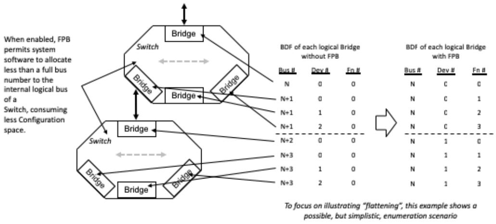

<details>
<summary>flowchart</summary>

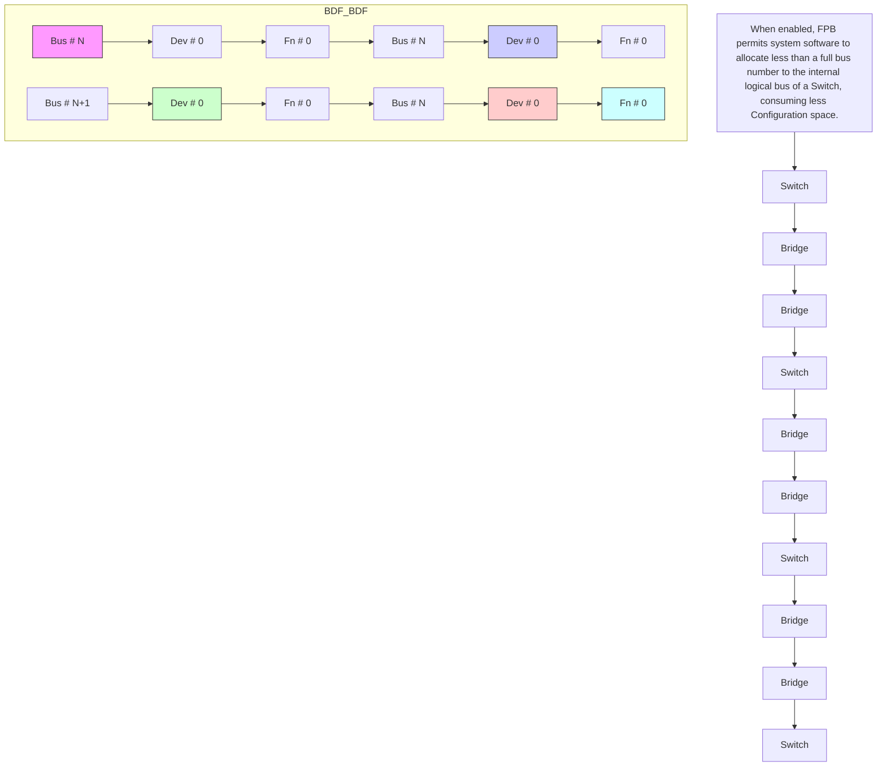
```mermaid
graph TD
  A["When enabled, FPB permits system software to allocate less than a full bus number to the internal logical bus of a Switch, consuming less Configuration space."] --> B["Switch"]
  B --> C["Bridge"]
  C --> D["Bridge"]
  D --> E["Switch"]
  E --> F["Bridge"]
  F --> G["Bridge"]
  G --> H["Switch"]
  H --> I["Bridge"]
  I --> J["Bridge"]
  J --> K["Switch"]
    
    subgraph BDF_BDF
  L1["Bus # N"] --> M1["Dev # 0"] --> M2["Fn # 0"] --> M3["Bus # N"] --> N1["Dev # 0"] --> N2["Fn # 0"]
    end
    
    subgraph BDF_BDF
  O1["Bus # N+1"] --> P1["Dev # 0"] --> P2["Fn # 0"] --> P3["Bus # N"] --> Q1["Dev # 0"] --> Q2["Fn # 0"]
    end
    
    style L1 fill:#f9f,stroke:#333
    style N1 fill:#ccf,stroke:#333
    style P1 fill:#cfc,stroke:#333
    style Q1 fill:#fcc,stroke:#333
    style Q2 fill:#cff,stroke:#333
```
</details>

Figure 6-29 Example Illustrating “Flattening” of a Switch§

FPB defines mechanisms for system software to allocate Routing IDs and Memory Space resources in non-contiguous ranges, enabling system software to assign pools of these resources from which it can allocate “bins” to Functions below the FPB. This is done using a bit vector where each bit when Set assigns a corresponding range of resources to the Secondary Side of the bridge (see § Figure 6-30).

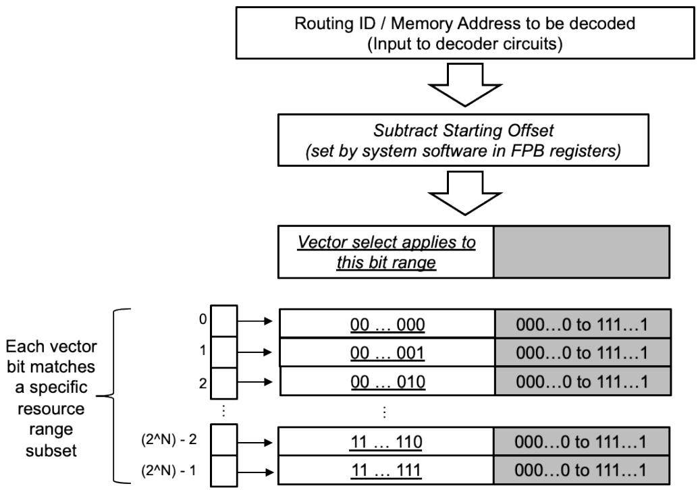

<details>
<summary>flowchart</summary>

```mermaid
graph TD
  A["Routing ID / Memory Address to be decoded\n(Input to decoder circuits)"] --> B["Subtract Starting Offset\n(set by system software in FPB registers)"]
  B --> C["Vector select applies to\nthis bit range"]
  C --> D{Each vector bit matches a specific resource range subset}
  D -->|0| E["00 ... 000"] & 000...0 to 111...1]
  D -->|1| F["00 ... 001"] & 000...0 to 111...1]
  D -->|2| G["00 ... 010"] & 000...0 to 111...1]
  D -->|...| H["(2^N) - 2"] & 11 ... 110 & 000...0 to 111...1]
```
</details>

Figure 6-30 Vector Mechanism for Address Range Decoding§

This allows system software to assign Routing IDs and/or Memory Space resources required by a device hot-add without having to rebalance other, already assigned resource ranges, and to return to the pool resources freed, for example by a hot remove event.

FPB is defined to allow both the non-FPB and FPB mechanisms to operate simultaneously, such that, for example, it is possible for system firmware/software to implement a policy where the non-FPB mechanisms continue to be used in parts of the system where the FPB mechanisms are not required (see § Figure 6-31). In this figure, the decode logic is assumed to provide a ‘1’ output when a given TLP is decoded as being associated with the bridge’s Secondary Side. The non-FPB decode mechanisms apply as without FPB, so for example only the Bus Number portion (bits 15:8) of a Routing ID is tested by the non-FPB decode logic when evaluating an ID routed TLP.

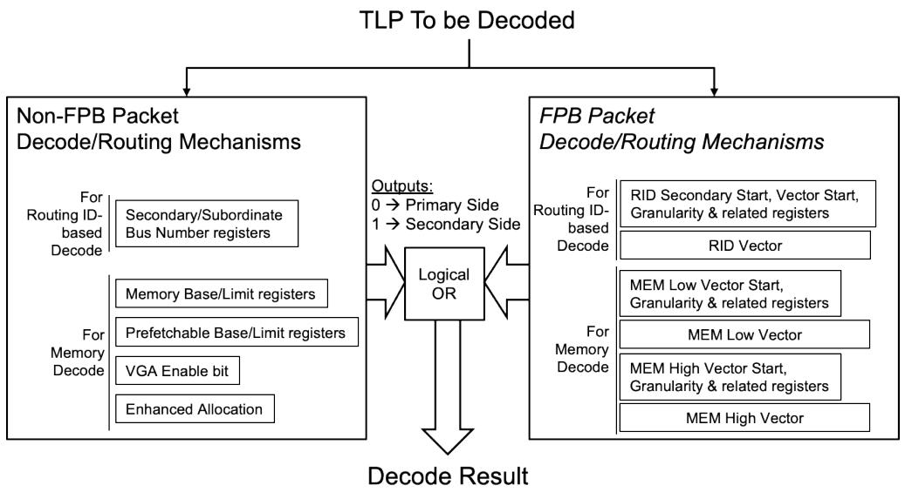

<details>
<summary>flowchart</summary>

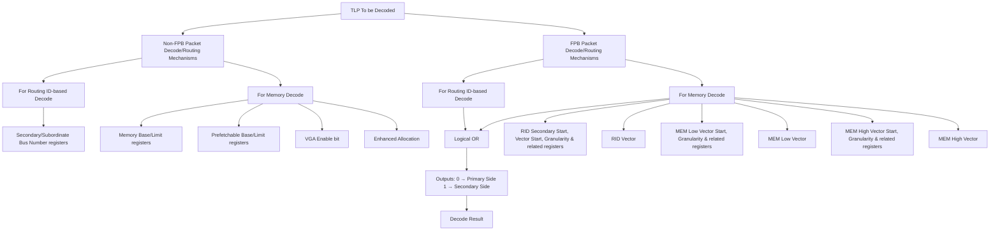
```mermaid
graph TD
  A["TLP To be Decoded"] --> B["Non-FPB Packet Decode/Routing Mechanisms"]
  A --> C["FPB Packet Decode/Routing Mechanisms"]
  B --> D["For Routing ID-based Decode"]
  B --> E["For Memory Decode"]
  D --> F["Secondary/Subordinate Bus Number registers"]
  E --> G["Memory Base/Limit registers"]
  E --> H["Prefetchable Base/Limit registers"]
  E --> I["VGA Enable bit"]
  E --> J["Enhanced Allocation"]
  C --> K["For Routing ID-based Decode"]
  C --> L["For Memory Decode"]
  K --> M["Logical OR"]
  L --> M
  M --> N["Outputs: 0 → Primary Side 1 → Secondary Side"]
  N --> O["Decode Result"]
  L --> P["RID Secondary Start, Vector Start, Granularity & related registers"]
  L --> Q["RID Vector"]
  L --> R["MEM Low Vector Start, Granularity & related registers"]
  L --> S["MEM Low Vector"]
  L --> T["MEM High Vector Start, Granularity & related registers"]
  L --> U["MEM High Vector"]
```
</details>

Figure 6-31 Relationship between FPB and non-FPB Decode Mechanisms§

It is important to recognize that, although FPB adds additional ways for a specific bridge to decode a given TLP, FPB does not change anything about the fundamental ways that bridges operate within the Switch and Root Complex architectural structures. FPB uses the same architectural concepts to provide management mechanisms for three different resource types:

1. Routing IDs  
2. Memory below 4 GB (“MEM Low”)  
3. Memory above 4 GB (“MEM High”)

A hardware implementation of FPB is permitted to support any combination of these three mechanisms. For each mechanism, FPB uses a bit-vector to indicate, for a specific subset range of the selected resource type, if resources within that range are associated with the Primary or Secondary side of the FPB. Hardware implementations are permitted to implement a small range of sizes for these vectors, and system firmware/software is enabled to make the most effective use of the available vector by selecting an initial offset at which the vector is applied, and a granularity for the individual bits within the vector to indicate the size of the resource range to which the bits in a given vector apply.

## 6.26.2 Hardware and Software Requirements §

The following rules apply when any of the FPB mechanisms are used:

• If system software violates any of the rules concerning FPB, the hardware behavior is undefined.  
• It is permitted to implement FPB in any PCI bridge (Type 1) Function, and every Function that implements FPB must implement the FPB Capability (see § Section 7.8.11 ).  
• If a Switch implements FPB then the Upstream Port and all Downstream Ports of the Switch must implement FPB.  
• Software is permitted to enable FPB at some Switch Ports and not others.  
• A Root Complex is permitted to implement FPB on some Root Ports but not on others.

• A Type 1 Function is permitted to implement the FPB mechanisms applying to any one, two or three of these elemental mechanisms:

◦ Routing IDs (RID)  
◦ Memory below 4 GB (“MEM Low”)  
◦ Memory above 4 GB (“MEM High”)

• System software is permitted to enable any combination (including all or none) of the elemental mechanisms supported by a specific FPB.  
• The error handling and reporting mechanisms, except where explicitly modified in this section, are unaffected by FPB.  
• Following any reset of the FPB Function, the FPB hardware must Clear all bits in all implemented vectors.  
Once enabled (through the FPB RID Decode Mechanism Enable, FPB MEM Low Decode Mechanism Enable, and/or FPB MEM High Decode Mechanism Enable bits), if system software subsequently disables an FPB mechanism, the values of the entries in the associated vector are undefined, and if system software subsequently re-enables that FPB mechanism the FPB hardware must Clear all bits in the associated vector.  
• If an FPB is implemented with the No\_Soft\_Reset bit Clear, when that FPB is cycled through D0→ D3Hot→D0, then all FPB mechanisms must be disabled, and the FPB must Clear all bits in all implemented vectors.  
• If an FPB is implemented with the No\_Soft\_Reset bit Set, when that FPB is cycled through D0→ D3Hot→D0, then all FPB configuration state must not change, and the entries in the FPB vectors must be retained by hardware.  
• Hardware is not required to perform any type of bounds checking on FPB calculations, and system software must ensure that the FPB parameters are correctly programmed

◦ It is explicitly permitted for system software to program Vector Start values that cause the higher order bits of the corresponding vector to surpass the resource range associated with a given FPB, but in these cases system software must ensure that those higher order bits of the vector are Clear.

◦ Examples of errors that system software must avoid include duplication of resource allocation, combinations of start offsets with set vector bits that could create “wrap-around” or bounds errors

The following rules apply to the FPB Routing ID (RID) mechanism:

FPB hardware must consider a specific range of RIDs to be associated with the Secondary side of the FPB if the Bus Number portion falls within the Bus Number range indicated by the values programmed in the Secondary and Subordinate Bus Number registers logically OR’d with the value programmed into the corresponding entry in the FPB RID Vector.  
• System software must configure the Configuration Request Type 1 to Type 0 conversion mechanisms in a Bridge Function before attempting to pass Configuration Requests through that Bridge.  
• System software must either program the legacy and FPB mechanisms for Configuration Request Type 1 to Type 0 conversion in a Bridge Function such that they give identical results, or such that one of the two mechanisms is disabled.

◦ If it is intended to use only the FPB RID mechanism for BDF decoding, then system software must ensure that both the Secondary and Subordinate Bus Number registers are 0.

◦ If it is intended to enable the FPB RID Decode Mechanism, but to use only the legacy mechanism for Configuration Request Type 1 to Type 0 conversion, then system software must write bits 7:3 of the RID Secondary Start field to 0 0000b.

• System software must ensure that the FPB routing mechanisms are configured such that Configuration Requests targeting Functions Secondary side of the FPB will be routed by the FPB from the Primary to Secondary side of the FPB.

When ARI is not enabled, the FPB RID mechanism can be applied with different granularities, programmable by system software through the FPB RID Vector Granularity field in the FPB RID Vector Control 1 Register. § Figure 6-32 illustrates the relationships between the layout of RIDs and the supported granularities. The reader may find it helpful to refer to this figure when considering the requirements defined below and in the definition of the Flattening Portal Bridge (FPB) Capability (see § Section 7.8.6 ).

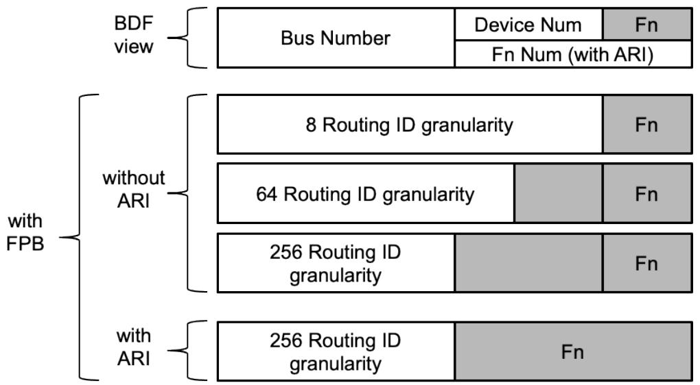

<details>
<summary>stacked bar chart</summary>

| Method | Bus Number | Device Num | Fn |
| --- | --- | --- | --- |
| BDF view | - | - | - |
| with FPB | - | - | - |
| without ARI | 8 | - | Fn |
| with ARI | 64 | - | Fn |
| with ARI | 256 | - | Fn |
| with ARI | 256 | - | Fn |
</details>

Figure 6-32 Routing IDs (RIDs) and Supported Granularities§

• System software must program the FPB RID Vector Granularity and FPB RID Vector Start fields in the FPB RID Vector Control 1 Register per the constraints described in the descriptions of those fields.  
• For all FPBs other than those associated with Upstream Ports of Switches:

◦ When ARI Forwarding is not supported, or when the ARI Forwarding Enable bit in the Device Control 2 Register is Clear, FPB hardware must convert a Type 1 Configuration Request received on the Primary side of the FPB to a Type 0 Configuration Request on the Secondary side of the FPB when bits 15:3 of the Routing ID of the Type 1 Configuration Request matches the value in the RID Secondary Start field in the FPB RID Vector Control 2 Register, and system software must configure the FPB accordingly.

◦ When the ARI Forwarding Enable bit in the Device Control 2 Register is Set, FPB hardware must convert a Type 1 Configuration Request received on the Primary side of the FPB to a Type 0 Configuration Request on the Secondary side of the FPB when the Bus Number portion of the Routing ID of the Type 1 Configuration Request matches the value in the Bus Number address (bits 15:8 only) of the RID Secondary Start field in the FPB RID Vector Control 2 Register, and system software must configure the FPB accordingly.

• For FPBs associated with Upstream Ports of Switches only, when the FPB RID Decode Mechanism Enable bit is Set, FPB hardware must use the FPB Num Sec Dev field of the FPB Capabilities register to indicate the quantity of Device Numbers associated with the Secondary Side of the Upstream Port bridge, which must be used by the FPB in addition to the RID Secondary Start field in the FPB RID Vector Control 2 Register to determine when a Configuration Request received on the Primary side of the FPB targets one of the Downstream Ports of the Switch, determining in effect when such a Request must be converted from a Type 1 Configuration Request to a Type 0 Configuration Request, and system software must configure the FPB appropriately.

◦ System software configuring FPB must comprehend that the logical internal structure of a Switch will change depending on the value of the FPB RID Decode Mechanism Enable bit in the Upstream Port of a Switch.

◦ Downstream Ports must use their corresponding RID values, and their Requester IDs and Completer IDs, as determined by the Upstream Port’s FPB Num Sec Dev and RID Secondary Start values  
◦ All implemented Functions in the range determined by the Switch Upstream Port Function’s RID Secondary Start and FPB Num Sec Dev must be Switch Downstream Ports associated with that Switch Upstream Port; System Software is required to scan all Functions in this range to determine which are implemented.  
◦ It is strongly recommended that System Software assign the RID Secondary Start such that the Bus and Device Numbers are not the same as for the Switch Upstream Port; otherwise, the resulting hardware behavior is undefined.

• For FPBs associated with Upstream Ports of Switches only, hardware must comprehend that Configuration Requests targeting the Upstream Port itself and any Downstream Ports of the Switch flattened into the range of Function Numbers with the same Bus and Device Numbers as the Upstream Port itself will be converted from Type 1 to Type 0 by the Downstream Port above the Switch, but any other Downstream Ports of the Switch flattened into successive Device Numbers will not be converted from Type1 to Type0 by the Downstream Port above the Switch and so must effectively be converted from Type 1 to Type 0 by the Switch Upstream Port itself.

This is a special case, but the concept is not unique to FPB, and is a reflection of the definition of the relationship between Bus/Device Numbers and Function Numbers – Function Numbers are always determined by the hardware of the Upstream Port, whereas the Bus and Device Numbers for an Upstream Port are always determined by the Downstream Port immediately above the Upstream Port.

• FPBs must implement bridge mapping for INTx virtual wires (see § Section 2.2.8.1 )

• Hardware and software must apply this algorithm (or the logical equivalent) to determine which entry in the FPB RID Vector applies to a given Routing ID (RID) address:

◦ IF the RID is below the value of FPB RID Vector Start, then the RID is out of range (below the start) and so cannot be associated with the Secondary side of the bridge, ELSE  
calculate the offset within the vector by first subtracting the value of FPB RID Vector Start, then dividing this according to the value of FPB RID Vector Granularity to determine the bit index within the vector.  
◦ IF the bit index value is greater than the length indicated by FPB RID Vector Size Supported, then the RID is out of range (beyond the top of the range covered by the vector) and so cannot be associated with the Secondary side of the bridge, ELSE  
◦ if the bit value within the vector at the calculated bit index location is 1b, THEN the RID address is associated with the Secondary side of the bridge, ELSE the RID address is associated with the Primary side of the bridge.

The following rules apply to the FPB MEM Low mechanism:

The FPB MEM Low mechanism can be applied with different granularities, programmable by system software through the FPB MEM Low Vector Granularity field in the FPB MEM Low Vector Control Register. § Figure 6-33 illustrates the relationships between the layout of addresses in the memory address space below 4 GB to which the FPB MEM Low mechanism applies. The reader may find it helpful to refer to this figure when considering the requirements defined below and in the definition of the Flattening Portal Bridge (FPB) Capability (see § Section 7.8.11 ).

<table><tr><td colspan="3">Address (MB units)</td><td>Address within MB</td></tr><tr><td colspan="3">Address
1 MB Granularity</td><td>Address within MB</td></tr><tr><td colspan="2">Address
2 MB Granularity</td><td></td><td>Address within MB</td></tr><tr><td colspan="2">Address
4 MB Granularity</td><td></td><td>Address within MB</td></tr><tr><td colspan="2">Address
8 MB Granularity</td><td></td><td>Address within MB</td></tr><tr><td>Address
16 MB Granularity</td><td colspan="2"></td><td>Address within MB</td></tr></table>

Figure 6-33 Addresses in Memory Below 4 GB and Effect of Granularity§

• System software must program the FPB MEM Low Vector Granularity and FPB MEM Low Vector Start fields in the FPB MEM Low Vector Control Register per the constraints described in the descriptions of those fields.  
FPB hardware must consider a specific Memory address to be associated with the Secondary side of the FPB if that Memory address falls within any of the ranges indicated by the values programmed in other bridge Memory decode registers (enumerated below) logically OR’d with the value programmed into the corresponding entry in the FPB MEM Low Vector. Other bridge Memory decode registers include:

◦ Memory Base/Limit registers  
◦ Prefetchable Base/Limit registers  
◦ VGA Enable bit in the Bridge Control register  
◦ Enhanced Allocation (EA) Capability (if supported)  
◦ FPB MEM High mechanism (if supported and enabled)

• Hardware and software must apply this algorithm (or the logical equivalent) to determine which entry in the FPB MEM Low Vector applies to a given Memory address:

◦ If the Memory address is below the value of FPB MEM Low Vector Start, then the Memory address is out of range (below) and so is not associated with the Secondary side of the bridge by means of this mechanism, else  
◦ calculate the offset within the vector by first subtracting the value of FPB MEM Low Vector Start, then dividing this according to the value of FPB MEM Low Vector Granularity to determine the bit index within the vector.  
◦ If the bit index value is greater than the length indicated by FPB MEM Low Vector Size Supported, then the Memory address is out of range (above) and so is not associated with the Secondary side of the bridge by means of this mechanism, else  
◦ if the bit value within the vector at the calculated bit index location is 1b, then the Memory address is associated with the Secondary side of the bridge, else the Memory address is associated with the Primary side of the bridge.

The following rules apply to the FPB MEM High mechanism:

• System software must program the FPB MEM High Vector Granularity and FPB MEM High Vector Start Lower fields in the FPB MEM High Vector Control 1 Register per the constraints described in the descriptions of those fields.  
• FPB hardware must consider a specific Memory address to be associated with the Secondary side of the FPB if that Memory address falls within any of the ranges indicated by the values programmed in other bridge Memory decode registers (enumerated below) logically OR’d with the value programmed into the corresponding entry in the FPB MEM High Vector. Other bridge Memory decode registers include:

◦ Memory Base/Limit registers  
◦ Prefetchable Base/Limit registers  
◦ VGA Enable bit in the Bridge Control register  
◦ Enhanced Allocation (EA) Capability (if supported)  
◦ FPB MEM Low mechanism (if supported and enabled)

• Hardware and software must apply this algorithm to determine which entry in the FPB MEM High Vector applies to a given Memory address:

◦ If the Memory address is below the value of FPB MEM High Vector Start Upper/FPB MEM High Vector Start Lower, then the Memory address is out of range (below) and so is not associated with the Secondary side of the bridge by means of this mechanism, else  
◦ calculate the offset within the vector by first subtracting the value of FPB MEM High Vector Start Upper/FPB MEM High Vector Start Lower, then dividing this according to the value of FPB MEM High Vector Granularity to determine the bit index within the vector.  
◦ If the bit index value is greater than the length indicated by FPB MEM High Vector Size Supported, then the Memory address is out of range (above) and so is not associated with the Secondary side of the bridge by means of this mechanism, else  
◦ if the bit value within the vector at the calculated bit index location is 1b, then the Memory address is associated with the Secondary side of the bridge, else the Memory address is associated with the Primary side of the bridge.

## IMPLEMENTATION NOTE:

## FPB ADDRESS DECODING §

FPB uses a bit vector mechanism to decode ranges of Routing IDs, and Memory Addresses above and below 4 GB. A bridge supporting FPB contains the following for each resource type/range where it supports the use of FPB:

• A Bit vector  
• A Start Address  
• A Granularity

These are used by the bridge to determine if a given address is part of the range decoded by FPB as associated with the secondary side of the bridge. An address that is determined not to be associated with the secondary side of the bridge using either or both of the non-FPB decode mechanisms and the FPB decode mechanisms is (by default) associated with the primary side of the bridge. Here, when we use the term “associated” we mean, for example, that the bridge will apply the following handling to TLPs:

• Associated with Primary, Received at Primary → Unsupported Request (UR)  
• Associated with Primary, Received at Secondary → Forward upstream  
• Associated with Secondary, Received at Primary → Forward downstream  
• Associated with Secondary, Received at Secondary → Unsupported Request (UR)

In FPB, every bit in the vector represents a range of resources, where the size of that range is determined by the selected granularity. If a bit in the vector is Set, it indicates that TLPs addressed to an address within the corresponding range are to be associated with the secondary side of the bridge. The specific range of resources each bit represents is dependent on the index of that bit, and the values in the Start Address & Granularity. The Start Address indicates the lowest address described by the bit vector. The Granularity indicates the size of the region that is represented by each bit. Each successive bit in the vector applies to the subsequent range, increasing with each bit according to the Granularity.

For example, consider a bridge using FPB to describe a MEM Low range. FPB MEM Low Vector Start has been set to FC0h, indicating that the range described by the bit vector starts at address FC00 0000. FPB MEM Low Vector Granularity has been set to 0000b, indicating that each bit represents a 1 MB range.

From these values we can determine that bit 0 of the vector represents a 1MB range starting at FC000 0000 (FC00 0000-FC0F FFFF), bit 1 represents FC10 0000-FC1F FFFF, etc.

Bits in the vector that are set to 0 indicate that the range is not included in the range described by FPB. In the above example, If bit 0 is Clear, packets addressed to anywhere between FC00 0000 and FC0F FFFF should not be routed to the secondary bus of the bridge due to FPB.

## IMPLEMENTATION NOTE:

## HARDWARE AND SOFTWARE CONSIDERATIONS FOR FPB §

FPB is intended to address a class of issues with PCI/PCIe architecture that relate to resource allocation inefficiency. These issues can be categorized as “static” or “dynamic” use case scenarios, where static use cases refer to scenarios where resources are allocated at system boot and then typically not changed again, and dynamic use cases refer to scenarios where run-time resource rebalancing (e.g., allocation of new resources, freeing of resources no longer needed) is required, due to hot add/remove, or by other needs.

In the Static cases there are limits on the size of hierarchies and number of Endpoints due to the use of additional Bus Numbers and the lack of use of Device Numbers caused by the PCI/PCIe architectural definition for Switches and Downstream Ports. FPB addresses this class of problems by “flattening” the use of Routing IDs (RIDs) so that Switches and Downstream Ports are able to make more efficient use of the available RIDs.

For the Dynamic cases, without FPB, the “best known method” to avoid rebalancing has been to reserve large ranges of Bus Numbers and Memory Space in the bridge above the relevant Port or Endpoint such that hopefully any future needs can be satisfied within the pre-allocated ranges. This leads to potentially unused allocations, which makes the Routing ID issues worse, and in a resource constrained platform this approach is difficult to implement, even for relatively simple cases, where, for example, one might have an add-in card implementing a single Endpoint replaced by another add-in card that has a Switch and two Endpoints, so that although an initial allocation of just one Bus would have been sufficient, the initial allocation breaks immediately with the new add-in card.

For Memory Space the pre-allocation approach is problematic when hot-plugged Endpoints may require the allocation of Memory Space below 4 GB, which by its nature is a limited resource, which is quickly used up by pre-allocation of even relatively small amounts, and for which pre-allocation is unattractive because of the multiple system elements placing demands on system address space allocation below 4 GB.

FPB includes mechanisms to enable discontinuous resource range allocation/reallocation for both Requester IDs and Memory Space. The intent is to allow system software the ability to maintain resource “pools” which can be allocated (and freed back to) at run-time, without disrupting other operations in progress as is required with rebalancing.

To support the run time use of FPB by system software, FPB hardware implementations should avoid introducing stalls or other types of disruptions to transactions in flight, including during the times that system software is modifying the state of the FPB hardware. It is not, however, expected that hardware will attempt to identify cases where system software erroneously modifies the FPB configuration in a way that does affect transactions in flight. Just as with the non-FPB mechanisms, it is the responsibility of system software to ensure that system operation is not corrupted due to a reconfiguration operation.

It is not explicitly required that system firmware/software perform the enabling and/or disabling of FPB mechanisms in a particular sequence, however care should be taken to implement resource allocation operations in a hierarchy such that the hardware and software elements of the system are not corrupted or caused to fail.

## 6.27 Vital Product Data (VPD) §

Vital Product Data (VPD) is the information that uniquely defines items such as the hardware, software, and microcode elements of a system. The VPD provides the system with information on various FRUs (Field Replaceable Unit) including Part Number, Serial Number, and other detailed information. VPD also provides a mechanism for storing information such as performance and failure data on the device being monitored. The objective, from a system point of view, is to collect this information by reading it from the hardware, software, and microcode components.

Support of VPD within add-in cards is optional depending on the manufacturer. Though support of VPD is optional, add-in card manufacturers are encouraged to provide VPD due to its inherent benefits for the add-in card, system manufacturers, and for Plug and Play.

The mechanism for accessing VPD is documented in § Section 7.9.18 .

VPD for PCI Express is unchanged from the definition in the [PCI-3.0]. That definition, in turn, was based on earlier versions of the [PCI] as well as the [PLUG-PLAY-ISA-1.0a].

Vital Product Data is made up of Small and Large Resource Data Types.

Table 6-19 Small Resource Data Type Tag Bit Definitions

<table><tr><td>Offset</td><td colspan="3">Field Name</td></tr><tr><td rowspan="4">Byte 0</td><td colspan="3">Value = 0xxx xyyyb</td></tr><tr><td>Bit 7</td><td>Small Resource Type</td><td>0b</td></tr><tr><td>Bits 6:3</td><td>Small Item Name</td><td>xxxx</td></tr><tr><td>Bits 2:0</td><td>Length in bytes</td><td>yy</td></tr><tr><td>Bytes 1 to n</td><td colspan="3">Actual information</td></tr></table>

§

Table 6-20 Large Resource Data Type Tag Bit Definitions §

<table><tr><td>Offset</td><td colspan="3">Field Name</td></tr><tr><td rowspan="3">Byte 0</td><td colspan="3">Value = 1xxx xxxxb</td></tr><tr><td>Bit 7</td><td>Large Resource Type</td><td>1b</td></tr><tr><td>Bits 6:0</td><td>Large Item Name</td><td>xxxxxxx</td></tr><tr><td>Byte 1</td><td colspan="3">Length in bytes of data items bits[7:0] (lsb)</td></tr><tr><td>Byte 2</td><td colspan="3">Length in bytes of data items bits[15:8] (msb)</td></tr><tr><td>Bytes 3 to n</td><td colspan="3">Actual data items</td></tr></table>

The first VPD tag is the Identifier String (02h) and provides the product name of the device.

One VPD-R (10h) tag is used as a header for the read-only keywords. The VPD-R list (including tag and length) must checksum to zero. Attempts to write the read-only data will be executed as a no-op.

One VPD-W (11h) tag is used as a header for the read-write keywords. The storage component containing the read/write data is a non-volatile device that will retain the data when powered off.

The last tag must be the End Tag (0Fh).

A small example of the resource data type tags used in a typical VPD is shown in § Table 6-21.

Table 6-21 Resource Data Type Flags for a Typical VPD§

<table><tr><td>TAG 02h</td><td>Identifier String</td><td>Large Resource Data Type</td></tr><tr><td>TAG 10h</td><td>VPD-R list containing one or more VPD keywords</td><td>Large Resource Data Type</td></tr><tr><td>TAG 11h</td><td>VPD-W list containing one or more VPD keywords</td><td>Large Resource Data Type</td></tr><tr><td>TAG 0Fh</td><td>End Tag</td><td>Small Resource Data Type</td></tr></table>

## 6.27.1 VPD Format §

Information fields within a VPD resource type consist of a three-byte header followed by some amount of data (see § Figure 6-34). The three-byte header contains a two-byte keyword and a one-byte length. A keyword is a two-character (ASCII) mnemonic that uniquely identifies the information in the field. The last byte of the header is binary and represents the length value (in bytes) of the data that follows.

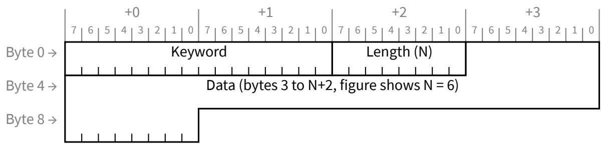

<details>
<summary>timing diagram</summary>

| Byte | Value |
| --- | --- |
| 0 | 7 |
| 0 | 6 |
| 0 | 5 |
| 0 | 4 |
| 0 | 3 |
| 0 | 2 |
| 0 | 1 |
| 0 | 0 |
| 1 | +0 |
| 1 | +1 |
| 1 | +2 |
| 1 | +3 |
| 2 | 7 |
| 2 | 6 |
| 2 | 5 |
| 2 | 4 |
| 2 | 3 |
| 2 | 2 |
| 2 | 1 |
| 2 | 0 |
| 3 | +0 |
| 3 | +1 |
| 3 | +2 |
| 3 | +3 |
| 4 | - |
| 4 | - |
| 4 | - |
| 4 | - |
| 4 | - |
| 4 | - |
| 4 | - |
| 4 | - |
| 4 | - |
| 4 | - |
| 4 | - |
| 4 | - |
| 4 | - |
| 8 | - |
| 8 | - |
| 8 | - |
| 8 | - |
| 8 | - |
| 8 | - |
| 8 | - |
| 8 | - |
| 8 | - |
| 8 | - |
| 8 | - |
| 8 | - |
| 8 | - |
</details>

Figure 6-34 VPD Format

§

VPD keywords are listed in two categories: read-only fields and read/write fields. Unless otherwise noted, keyword data fields are provided as ASCII characters. Use of ASCII allows keyword data to be moved across different enterprise computer systems without translation difficulty.

An example of the “add-in card serial number” VPD item is as follows:

Table 6-22 Example of Add-in Serial Card Number§

<table><tr><td>Byte 0</td><td>53h “S”</td><td rowspan="2">Keyword: SN</td></tr><tr><td>Byte 1</td><td>4Eh “N”</td></tr><tr><td>Byte 3</td><td>08h</td><td>Length: 8</td></tr><tr><td>Byte 4</td><td>30h “0”</td><td rowspan="8">Data: “00000194”</td></tr><tr><td>Byte 5</td><td>30h “0”</td></tr><tr><td>Byte 6</td><td>30h “0”</td></tr><tr><td>Byte 7</td><td>30h “0”</td></tr><tr><td>Byte 8</td><td>30h “0”</td></tr><tr><td>Byte 9</td><td>31h “1”</td></tr><tr><td>Byte 10</td><td>39h “9”</td></tr><tr><td>Byte 11</td><td>34h “4”</td></tr></table>

## 6.27.2 VPD Definitions


This section describes the current VPD large and small resource data tags plus the VPD keywords. This list may be enhanced at any time. Companies wishing to define a new keyword should contact the PCISIG. All unspecified values are reserved for SIG assignment.

## 6.27.2.1 VPD Large and Small Resource Data Tags


VPD is contained in four types of Large and Small Resource Data Tags. The following tags and VPD keyword fields may be provided in PCI devices.

Table 6-23 VPD Large and Small Resource Data Tags§

<table><tr><td>Tag</td><td>Description</td></tr><tr><td>Large resource type Identifier String Tag (02h)</td><td>This tag is the first item in the VPD storage component. It contains the name of the add-in card in alphanumeric characters.</td></tr><tr><td>Large resource type VPD-R Tag (10h)</td><td>This tag contains the read only VPD keywords for an add-in card.</td></tr><tr><td>Large resource type VPD-W Tag (11h)</td><td>This tag contains the read/write VPD keywords for an add-in card.</td></tr><tr><td>Small resource type End Tag (0Fh)</td><td>This tag identifies the end of VPD in the storage component.</td></tr></table>

## 6.27.2.2 Read-Only Fields


Table 6-24 VPD Read-Only Fields

<table><tr><td>Keyword</td><td>Name</td><td>Description</td></tr><tr><td>PN</td><td>Add-in Card Part Number</td><td>This keyword is provided as an extension to the Device ID (or Subsystem ID) in the Configuration Space header in § Figure 6-34.</td></tr><tr><td>EC</td><td>Engineering Change Level of the Add-in Card</td><td>The characters are alphanumeric and represent the engineering change level for this add-in card.</td></tr><tr><td>FG</td><td>Fabric Geography</td><td>Reserved for legacy use by [PICMG] specifications.</td></tr><tr><td>LC</td><td>Location</td><td>Reserved for legacy use by [PICMG] specifications.</td></tr><tr><td>MN</td><td>Manufacture ID</td><td>This keyword is provided as an extension to the Vendor ID (or Subsystem Vendor ID) in the Configuration Space header in § Figure 6-34. This allows vendors the flexibility to identify an additional level of detail pertaining to the sourcing of this device.</td></tr><tr><td>PG</td><td>PCI Geography</td><td>Reserved for legacy use by [PICMG] specifications.</td></tr><tr><td>SN</td><td>Serial Number</td><td>The characters are alphanumeric and represent the unique add-in card Serial Number.</td></tr><tr><td>TR</td><td>Thermal Reporting</td><td>This keyword provides a standard interface for reporting four fields:AFI Level, MaxTherm, DTherm, andMaxAmbient. The data area for this field is four bytes long. This data is encoded as a 4-byte binary value in little endian order (byte 0 contains bits 7:0). This value contains the four fields as follows: AFI Level bits [3:0], MaxTherm bits [7:4], DTherm bits [11:8], and MaxAmbient bits [19:12] are placed in bits 19:0. Bits 31:20 are Reserved and must be set to 000h. Field description is provided within the [CEM]. This keyword is intended to be used only in designs based on that form factor specification.Note that due to the character nature of the VPD encoding mechanism, this binary value is permitted to start on any byte boundary within the VPD.</td></tr><tr><td>Vx</td><td>Vendor Specific</td><td>This is a vendor specific item and the characters are alphanumeric. The second character (x) of the keyword can be 0 through 9 or A through Z.</td></tr><tr><td>CP</td><td>Extended Capability</td><td>This field allows a new capability to be identified in the VPD area. Since dynamic control/status cannot be placed in VPD, the data for this field identifies where, in the device's memory or I/O address space, the control/status registers for the capability can be found. Location of the control/status registers is identified by providing the index (a value between 0 and 5) of the Base Address register that defines the address range that contains the registers, and the offset within that Base Address register range where the control/status registers reside. The data area for this field is four bytes long. The first byte contains the ID of the extended capability. The second byte contains the index (zero based) of the Base Address register used. The next two bytes contain the offset (in little-endian order) within that address range where the control/status registers defined for that capability reside.</td></tr><tr><td>RV</td><td>Checksum and Reserved</td><td>The first byte of this item is a checksum byte. The checksum is correct if the sum of all bytes in VPD (from VPD address 0 up to and including this byte) is zero. The remainder of this item is reserved space (as needed) to identify the last byte of read-only space. The read-write area does not have a checksum. This field is required.</td></tr><tr><td>FF</td><td>Form Factor</td><td>This keyword indicates a string that identifies the form factor and version associated with this add-in-card. Values are a lower case string. The string consists of a list of one or more elements separated by colons (“:”).The first element is a sequence of lowercase strings separated by periods that identifies the specification(s) associated with the form factor. The first element string is the reserved domain name associated with the authority defining that form factor (i.e., like those used in [DNS] records), followed by one or more strings that identify a particular form factor, followed by a Version Number for that form factor specification. Any characters in the form factor name other than “a” to “z”, “0” to “9”, “*”, “?”, and “-” are dropped (e.g., M.2 becomes m2). The character “*” represents a wild card (arbitrary characters, including “.”). The value “-” is used to indicate no form factor. The value “?” or the absence of the FF keyword is used to indicate that the form factor is unknown.Subsequent elements are optional and contain attributes describing variations of that form factor (e.g., size, connector, keying, ...). These elements are defined by the indicated form-factor specification and consist of either an “option” string or a “key=value” string. Valid characters in the “option” or “key” portion are “a” to “z”, “0” to “9”, “*”, “?”, and “-”. The “value” portion may contain any character other than the colon “:”. The order of attributes is not significant. Attributes are not permitted when the first element is “-” or “?” (no form factor or unknown form factor).Examples are:com.pcisig.cem.4.0com.pcisig.cem.*com.pcisig.m2.1.0:2280com.pcisig.m2.1.0:size=2280:key=M</td></tr><tr><td></td><td></td><td>com.pcisig.m2.1.0:bgaorg.snia.sff-ta-1001.1.0.2A given add-in card is permitted to claim conformance to multiple form factor specifications. This is indicated by using the wild card character “*” or by using multiple FF fields (which in turn could use the wild card character).When the form factor of a slot does not match some FF keyword of the add-in card in that slot, this indicates the presence of one or more “Carrier Cards” to convert power and sideband signals of the slot to those of the add-in card. The mechanism(s) used to identify a particular Carrier Card and to describe how it operates are outside the scope of this specification.</td></tr></table>

## 6.27.2.3 Read/Write Fields §

§ Table 6-25 VPD Read/Write Fields

<table><tr><td>Keyword</td><td>Name</td><td>Description</td></tr><tr><td>Vx</td><td>Vendor Specific</td><td>This is a vendor specific item and the characters are alphanumeric. The second character (x) of the keyword can be 0 through 9 or A through Z.</td></tr><tr><td>Yx</td><td>System Specific</td><td>This is a system specific item and the characters are alphanumeric. The second character (x) of the keyword can be 0 through 9 or B through Z.</td></tr><tr><td>YA</td><td>Asset Tag Identifier</td><td>This is a system specific item and the characters are alphanumeric. This keyword contains the system asset identifier provided by the system owner.</td></tr><tr><td>RW</td><td>Remaining Read/Write Area</td><td>This descriptor is used to identify the unused portion of the read/write space. The product vendor initializes this parameter based on the size of the read/write space or the space remaining following the Vx VPD items. One or more of the Vx, Yx, and RW items are required.</td></tr></table>

## 6.27.2.4 VPD Example §

The following is an example of a typical VPD.

Table 6-26 VPD Example§

<table><tr><td>Offset</td><td>Item Value</td></tr><tr><td>0</td><td>Large Resource Type ID String Tag (02h) 82h “Product Name”</td></tr><tr><td>1</td><td>Length 0021h</td></tr><tr><td>3</td><td>Data “ABCD Super-Fast Widget Controller”</td></tr><tr><td>36</td><td>Large Resource Type VPD-R Tag (10h) 90h</td></tr><tr><td>37</td><td>Length 0059h</td></tr><tr><td>39</td><td>VPD Keyword “PN”</td></tr><tr><td>41</td><td>Length 08h</td></tr><tr><td>42</td><td>Data “6181682A”</td></tr><tr><td>50</td><td>VPD Keyword “EC”</td></tr><tr><td>52</td><td>Length 0Ah</td></tr><tr><td>53</td><td>Data “4950262536”</td></tr><tr><td>63</td><td>VPD Keyword “SN”</td></tr><tr><td>65</td><td>Length 08h</td></tr><tr><td>66</td><td>Data “00000194”</td></tr><tr><td>74</td><td>VPD Keyword “MN”</td></tr><tr><td>76</td><td>Length 04h</td></tr><tr><td>77</td><td>Data “1037”</td></tr><tr><td>81</td><td>VPD Keyword “RV”</td></tr><tr><td>83</td><td>Length 2Ch</td></tr><tr><td>84</td><td>Data Checksum</td></tr><tr><td>85</td><td>Data Reserved (00h)</td></tr><tr><td>128</td><td>Large Resource Type VPD-W Tag (11h) 91h</td></tr><tr><td>129</td><td>Length 007Ch</td></tr><tr><td>131</td><td>VPD Keyword “V1”</td></tr><tr><td>133</td><td>Length 05h</td></tr><tr><td>134</td><td>Data “65A01”</td></tr><tr><td>139</td><td>VPD Keyword “Y1”</td></tr><tr><td>141</td><td>Length 0Dh</td></tr><tr><td>142</td><td>Data “Error Code 26”</td></tr><tr><td>155</td><td>VPD Keyword “RW”</td></tr><tr><td>157</td><td>Length 61h</td></tr><tr><td>158</td><td>Data Reserved (00h)</td></tr><tr><td>255</td><td>Small Resource Type End Tag (0Fh) 78h</td></tr></table>

## 6.28 Native PCIe Enclosure Management §

NPEM is an optional PCIe Extended Capability that provides mechanisms for enclosure management. This mechanism is designed to provide management for enclosures containing PCIe SSDs that is consistent with the established capabilities in the storage ecosystem.

This section defines the architectural aspects of the mechanism. The NPEM extended capability is defined in § Section 7.9.19 .

An enclosure is any platform, box, rack, or set of boxes that contain one or more PCIe SSDs. The NPEM capability provides storage related enclosure control (e.g., status LED control) for a PCIe SSD. The NPEM capability may reside in a Downstream port, or an Endpoint (i.e., the PCIe SSD). § Figure 6-35 shows an example configuration with a single Downstream Port containing the NPEM capability and vendor specific logic to control the associated LEDs.

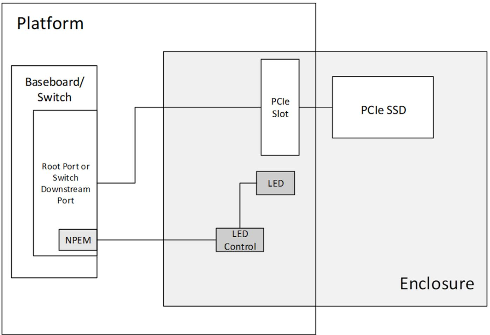

<details>
<summary>flowchart</summary>

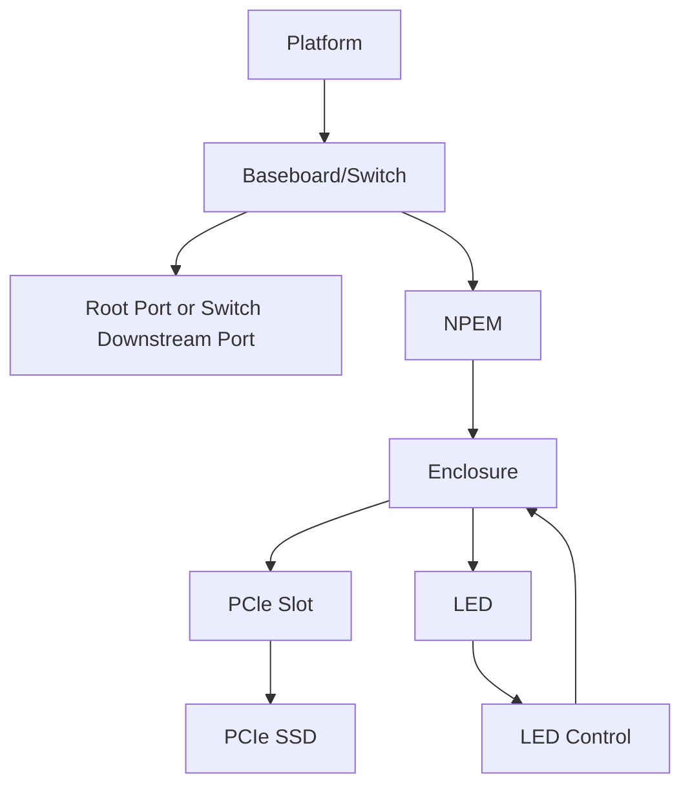
```mermaid
graph TD
  A["Platform"] --> B["Baseboard/Switch"]
  B --> C["Root Port or Switch Downstream Port"]
  B --> D["NPEM"]
  D --> E["Enclosure"]
  E --> F["PCle Slot"]
  F --> G["PCIe SSD"]
  E --> H["LED"]
  H --> I["LED Control"]
  I --> E
```
</details>

Figure 6-35 Example NPEM Configuration using a Downstream Port§  
§ Figure 6-36 shows an example configuration with the NPEM capability located in the Upstream Port (in this case, the SSD function).

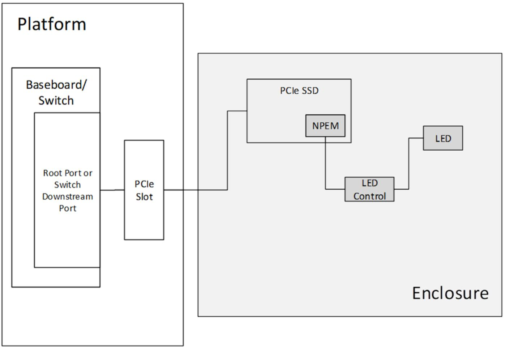

<details>
<summary>flowchart</summary>

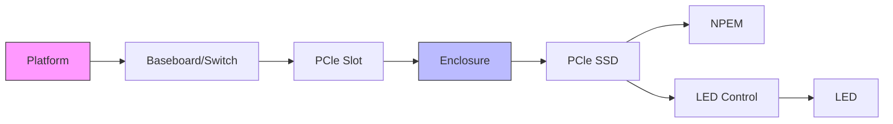
```mermaid
graph LR
  A["Platform"] --> B["Baseboard/Switch"]
  B --> C["PCle Slot"]
  C --> D["Enclosure"]
  D --> E["PCle SSD"]
  E --> F["NPEM"]
  E --> G["LED Control"]
  G --> H["LED"]
    style A fill:#f9f,stroke:#333
    style D fill:#bbf,stroke:#333
```
</details>

Figure 6-36 Example NPEM Configuration using an Upstream Port§

Software issues an NPEM command by writing to the NPEM Control register to change the indications associated with an SSD. NPEM Command is a single write to the NPEM Control register that changes the state of zero or more bits. NPEM indicates a successful completion to software using the command completed mechanism. § Figure 6-37 shows the overall flow.

This specification defines the software interface provided by the NPEM capability. The Port to enclosure interface, enclosure, enclosure to LED interface, number of LEDs per SSD, and associated LED blink patterns are all outside the scope of this specification.

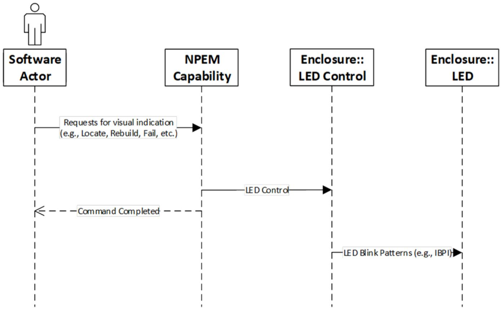

<details>
<summary>flowchart</summary>

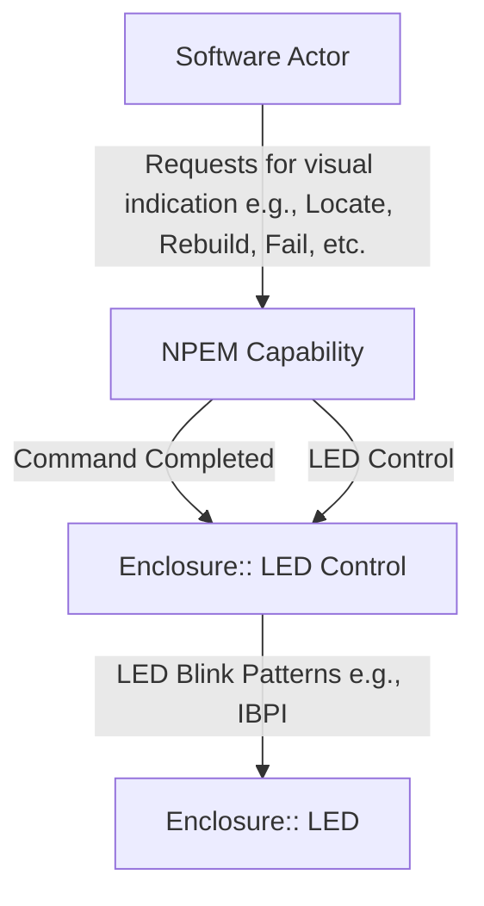
```mermaid
graph TD
  A["Software Actor"] -->|Requests for visual indication e.g., Locate, Rebuild, Fail, etc.| B["NPEM Capability"]
  B -->|Command Completed| C["Enclosure:: LED Control"]
  C -->|LED Blink Patterns e.g., IBPI| D["Enclosure:: LED"]
  B -->|LED Control| C
```
</details>

§  
Figure 6-37 NPEM Command Flow

NPEM provides a mechanism for system software to issue a reset to the LED control element within the enclosure by means of the NPEM Reset mechanism, which is independent of the PCIe Link itself. The NPEM command completed mechanism also applies to NPEM Reset.

Storage system admin or software controls the indications for various device states through the NPEM capability.

## IMPLEMENTATION NOTE:

## NPEM STATES §

§ Table 6-27 shows an example of NPEM states and a possible meaning that some enclosures may assign to the architected NPEM states.

Table 6-27 NPEM States

<table><tr><td>NPEM State</td><td>Actor</td><td>Definition</td></tr><tr><td>OK</td><td>System Admin or Storage Software</td><td>OK state may mean the drive is functioning normally. This state may implicitly mean that an SSD is present, powered on, and working normally as seen by the software. A more granular indication of drive not physically present or present but not powered up are both outside the scope of this specification.</td></tr><tr><td>Locate</td><td>System Admin</td><td>Locate state may mean the specific drive is being identified by an admin.</td></tr><tr><td>Fail</td><td>Storage Software</td><td>Fail state may mean the drive is not functioning properly</td></tr><tr><td>Rebuild</td><td>Storage Software</td><td>Rebuild state may mean this drive is part of a multi-drive storage volume/array that is rebuilding or reconstructing data from redundancy on to this specific drive.</td></tr><tr><td>PFA</td><td>Storage Software</td><td>PFA stands for Predicted Failure Analysis. This state may mean the drive is still functioning normally but predicted to fail soon.</td></tr><tr><td>Hot Spare</td><td>Storage Software</td><td>Hot Spare state may mean this drive is marked to be automatically used as a replacement for a failed drive and contents of the failed drive may be rebuilt on this drive.</td></tr><tr><td>In A Critical Array</td><td>Storage Software</td><td>In A Critical Array state may mean the drive is part of a multi-drive storage array and that array is degraded.</td></tr><tr><td>In A Failed Array</td><td>Storage Software</td><td>NPEM In A Failed Array state may mean the drive is part of a multi-drive storage array and that array is failed.</td></tr><tr><td>Invalid Device Type</td><td>Storage Software</td><td>Invalid Device Type state may mean the drive is not the right type for the connector (e.g., An enclosure supports SAS and NVMe drives and this drive state indicates that a SAS drive is plugged into an NVMe slot).</td></tr><tr><td>Disabled</td><td>Storage Software</td><td>Disabled state may mean the drive in this slot is disabled. A removal of this drive from the slot may be safe. The power from this slot may be removed.</td></tr></table>

## IMPLEMENTATION NOTE:

## SOFTWARE POLLING OF NPEM COMMAND COMPLETED

Different NPEM implementations may vary widely in how long they take to complete NPEM commands, from instantaneous to tens of ms. To avoid or minimize software polling overheads, it is recommended that software implement one or both of the following optimizations.

Instead of software writing a command and then immediately polling for completion, it is recommended that software reverse this order. When ready to write a new command, software first polls for completion of the previous command, and then writes the new command. This enables overlapped operation, often completely hiding the time it takes hardware to execute an NPEM command. To enable this polling model, software must initialize the hardware following a reset by writing a no-op command in order to have hardware generate the first NPEM command completion.

For the case where an NPEM command has not completed when software polls the bit, it is recommended that software not continuously “spin” on polling the bit, but rather poll under interrupt at a reduced rate; for example at 10 ms intervals.

## 6.29 Conventional PCI Advanced Features Operation §

For Conventional PCI devices integrated into a Root Complex, the Conventional PCI Advanced Features Capability (AF) provides mechanisms for using advanced features originally developed for PCI Express.

• The Function Level Reset (INITIATE\_FLR) mechanism enables software to quiesce and reset hardware with Function-level granularity.  
FLR applies on a per Function basis. Only the targeted Function is affected by the FLR operation.  
• The Transactions Pending (TP) mechanism is used to indicate that the Function has issued one or more non-posted transactions (including Delayed Transactions) which have not been completed.

The FLR and TP mechanisms defined here are strictly for Conventional PCI devices integrated into a Root Complex where the implementation permits non-posted transactions for a given Conventional PCI Function to complete even if the value of the Bus Master Enable bit in its Command Register is 0b. Implementations that do not meet this requirement must not implement the FLR and TP mechanisms.

FLR modifies the Function state as follows:

Function registers and Function-specific state machines must be set to their initialization values as specified in this document, except for the following bits, which must not be modified: Fast Back-to-Back Transactions Enable, Cache Line Size, Latency Timer, Interrupt Line, PME\_En, PME\_Status.

Note that the controls that enable the Function to initiate bus transactions are cleared, including the Bus Master Enable bit in the Command Register, the MSI Enable bit in the MSI Capability Structure, and the like, effectively causing the Function to become quiescent.

After an FLR has been initiated, the Function must complete the FLR within 100 ms. If software initiates an FLR when the Transactions Pending bit is 1b, then software must not initialize the Function until allowing adequate time to achieve reasonable certainty that any outstanding transactions will have completed. The Transactions Pending bit must be clear upon completion of the FLR.

FLR modifies Function state not described by this specification (in addition to state that is described by this specification), and so the following criteria must be applied using Function- specific knowledge to evaluate the Function’s behavior in response to an FLR:

• The Function must not give the appearance of an initialized adapter with an active host on any external interfaces controlled by that Function. The steps needed to terminate activity on external interfaces are outside of the scope of this specification.

◦ For example, a network adapter must not respond to queries that would require adapter initialization by the host system or interaction with an active host system, but is permitted to perform actions that it is designed to perform without requiring host initialization or interaction. If the network adapter includes multiple Functions that operate on the same external network interface, this rule affects only those aspects associated with the particular Function reset by FLR.

• The Function must not retain within itself software readable state that potentially includes secret information associated with any preceding use of the Function. Main host memory assigned to the Function must not be modified by the Function.

◦ For example, a Function with internal memory readable directly or indirectly by host software must clear or randomize that memory.

• The Function must return to a state such that normal configuration of the Function’s PCI interface will cause it to be useable by drivers normally associated with the Function

When an FLR is initiated, the targeted Function must behave as follows:

• The Function must complete normally the configuration write that initiated the FLR operation and then initiate the FLR.

• While an FLR is in progress:

◦ The Function must not respond to any request on the bus (i.e., requests targeting the Function will Master Abort).

The Transactions Pending (TP) bit indicates that the Function has issued one or more non-posted transactions which have not been completed. This field may be used by software to determine when a Function has become quiescent.

## IMPLEMENTATION NOTE:

## AVOIDING ISSUES WITH PENDING TRANSACTIONS §

An FLR causes a Function to lose track of any pending (outstanding non-posted) transactions. Depending upon the specific implementation of the RC-integrated PCI Function, if software issues an FLR while there are pending transactions, there is a possibility for data corruption as described in the “Avoiding Data Corruption From Stale Completions” Implementation Note.

To avoid potential issues with Root Complex implementations where Stale Completions are possible or a Discard Timer is present, it is recommended that software use an algorithm similar to the following:

1. Software that's performing the FLR synchronizes with other software that might potentially access the Function directly, and ensures that such accesses will not occur during this algorithm.  
2. Software clears the entire Command register, disabling the Function from mastering any new transactions.  
3. Software polls the Transactions Pending bit in the AF Status Register either until it's clear or until it's been long enough to achieve reasonable certainty that any remaining outstanding Transactions will never complete. On many systems, the Transactions Pending bit will usually clear within a few milliseconds, so software might choose to poll during this initial period using a tight software loop. On rare cases when the Transactions Pending bit doesn't clear by this time, software will need to poll for a longer system-specific period (potentially seconds), so software might choose to conduct this polling using a timer-based interrupt polling mechanism.  
4. Software initiates the FLR.  
5. Software waits 100 ms.  
6. Software reconfigures the Function and enables it for normal operation.

## 6.30 Data Object Exchange (DOE) §

Data Object Exchange (DOE) is an optional mechanism for system firmware/software to perform data object exchanges with a Function or RCRB. Software discovers DOE support via the Data Object Exchange (DOE) Extended Capability structure. Because DOE depends on Configuration Requests it is not usable for peer-to-peer operations directly between Functions, although system software can provide a mechanism to relay data objects between Functions if such capabilities are desired. When DOE is implemented in an RCRB, it is permitted to block peer-to-peer operation via implementation specific means.

DOE is a prerequisite Extended Capability for a Function to support in-band access by system firmware/software using Configuration Requests to Component Measurement and Authentication (CMA). CMA in turn builds on [SPDM].

It is permitted to implement DOE in any type of Function, and in an RCRB, although it is not required that protocols using DOE be applicable to all types of Functions. It is permitted to implement DOE more than once in a single Function or RCRB.

A protocol using data objects must specify the scope of the specific protocol in relation to the Function(s) implementing that protocol via DOE, for example if only the Function itself is associated with the protocol, or if Function 0 of a Multi-Function Device represents the Device as a whole, etc.

It is permitted for a protocol using data object exchanges to require that a Function implement a unique instance of DOE for that specific protocol, and/or to allow sharing of a DOE instance to only a specific set of protocols using data object exchange, and/or to allow a Function to implement multiple instances of DOE supporting the specific protocol.

It is permitted to use DOE when a Function is in non-D0 states, although it is permitted for a specific data object protocol.to restrict operation in non-D0 states.

## IMPLEMENTATION NOTE:

## MULTIPLE INSTANCES OF THE DOE EXTENDED CAPABILITY §

Data object protocols may require the use of dedicated instances of DOE, particularly to allow system software to assign ownership of a specific DOE instance with the software entity using the specific data object protocol(s) associated with that particular instance. For example, data object protocols A and B may perform different tasks, and so by instantiating dedicated instances of DOE for each, system software avoids the need to implement ownership control and arbitration mechanisms between A and B.

When this is done, if the underlying hardware uses shared resources to implement A and B, then the hardware may require the ability to maintain separate contexts for each data object protocol, because system software will allow the two protocols to be operated at the same time.

The purpose of each DOE instance is distinguished by means of the DOE Discovery protocol. In the example above, the hardware would implement one DOE instance for A, where this instance would indicate support for data object protocol A but not B, and a separate instance for B, where that instance would indicate support for data object protocol B and not A.

## 6.30.1 Data Objects §

Data objects must consist of 2 DW to 256K DW, as shown in § Figure 6-38.

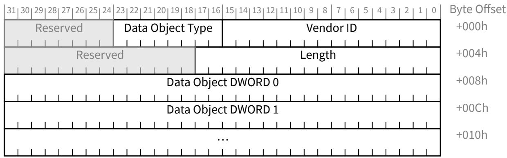

<details>
<summary>text_image</summary>

31 30 29 28 27 26 25 24 23 22 21 20 19 18 17 16 15 14 13 12 11 10 9 8 7 6 5 4 3 2 1 0
Reserved Data Object Type Vendor ID
Reserved Length
Data Object DWORD 0
Data Object DWORD 1
...
Byte Offset
+000h
+004h
+008h
+00Ch
+010h
</details>

§ Figure 6-38 DOE Data Object Format

The first DW of a data object must be formatted as defined in § Table 6-28.


<details>
<summary>text_image</summary>

Reserved
Vendor ID
Data Object Type
</details>

§ Figure 6-39 DOE Data Object Header 1

§ Table 6-28 DOE Data Object Header 1

<table><tr><td>Bit Location</td><td>Description</td></tr><tr><td>15:0</td><td>Vendor ID - PCI-SIG Vendor ID of the entity that defined the type of data object.</td></tr><tr><td>23:16</td><td>Data Object Type – The type of data object. Vendor ID and Data Object Type together fully describe the format of the data object that follows the Data Object Header.</td></tr></table>

The Second DW of a data object must be formatted as defined in § Table 6-29.

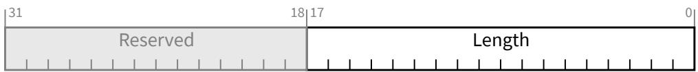

<details>
<summary>text_image</summary>

31
Reserved
18 17
Length
0
</details>

§ Figure 6-40 DOE Data Object Header 2

Table 6-29 DOE Data Object Header 2

<table><tr><td>Bit Location</td><td>Description</td></tr><tr><td>17:0</td><td>Length – Length of the data object being transferred in number of DW including the 2 DW of the Data Object Header, encoded such that a value of 00002h indicates 2 DW, and a value of 00000h indicates  $2^{18}$  DW.</td></tr></table>

Each data object protocol definition is permitted to define multiple data object types. Each data object is uniquely identified by the Vendor ID of the vendor publishing the data object definition and a Data Object Type value assigned by that vendor.

Unless a data object protocol specifies a different requirement, the following rules apply:

• If the number of DW transferred does not match the indicated Length for a data object, then the data object must be silently discarded.  
• If the Length is shorter than expected for a specific data object, then the data object must be silently discarded.

If the Length is greater than expected for a specific data object, then the portion of the data object up to the expected length must be processed normally and the remainder of the data object must be silently discarded.

## 6.30.1.1 DOE Discovery Data Object Protocol §

The DOE Discovery data object protocol must be implemented. It consists of the request and response data objects, 3 DW in total length each, with the 3rd DW of the data object content as defined in § Table 6-30 and § Table 6-31 respectively. The DOE Discovery data object protocol must be operable in D0, D1, D2 and $\mathtt { D 3 } _ { \mathtt { h o t } }$ .

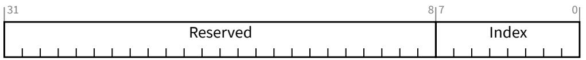

<details>
<summary>text_image</summary>

31
Reserved
8 7
0
Index
</details>

Figure 6-41 DOE Discovery Request Data Object Contents (1 DW)§

Table 6-30 DOE Discovery Request Data Object Contents (1 DW)§

<table><tr><td>Bit Location</td><td>Description</td></tr><tr><td>7:0</td><td>Index – Indicates DOE Discovery entry index queried. Indices must start at 00h and increase monotonically by 1.</td></tr><tr><td>31:8</td><td>Reserved Reserved - Requesters must place 00 0000h in this field. Responders must ignore the value in this field.</td></tr></table>


<details>
<summary>text_image</summary>

31 24 23 16 15 0
Next Index Vendor ID
Data Object Protocol
</details>

Figure 6-42 DOE Discovery Response Data Object Contents (1 DW)§

Table 6-31 DOE Discovery Response Data Object Contents (1 DW)§

<table><tr><td>Bit Location</td><td>Description</td></tr><tr><td>15:0</td><td>Vendor ID – PCI-SIG Vendor ID of the entity that defined the type of data object. FFFFh if index is invalid or out of range.</td></tr><tr><td>23:16</td><td>Data Object Protocol – Indicates the identity of the data object protocol associated with the Index value supplied with the DOE Discovery Request.The PCI-SIG defined data object protocol for DOE Discovery must be implemented at index 00h.The index values used for other data object protocols is implementation specific and has no meaning defined by this specification.Undefined if Vendor ID value is FFFFh.</td></tr><tr><td>31:24</td><td>Next Index – Indicates the next DOE Discovery Index value. If the responding DOE instance supports entries with indices greater than the index indicated in the received DOE Discovery Request, it must increment the queried index by 1 and return the resulting value in this field.Must be 00h to indicate the final entry.Undefined if Vendor ID value is FFFFh.</td></tr></table>

Table 6-32 PCI-SIG defined Data Object Types (Vendor ID = 0001h)§

<table><tr><td>Vendor ID</td><td>Data Object Protocol</td><td>Description</td></tr><tr><td>0001h</td><td>00h</td><td>DOE Discovery– Every DOE instance must support this data object protocol.A requester uses this data object protocol to discover all other Data Object Vendor ID and data object protocol combinations supported by the DOE instance.</td></tr><tr><td>0001h</td><td>01h</td><td>CMA/SPDM– See § Section 6.31</td></tr><tr><td>0001h</td><td>02h</td><td>Secured CMA/SPDM– See Section § Section 6.31.4</td></tr><tr><td>0001h</td><td>03h to FFh</td><td>Reserved</td></tr></table>

## 6.30.2 Operation §

DOE support data object protocols that have a request/response (such as CMA), although data object protocols are permitted to have non-request/response structures. Data object protocols must themselves place appropriate restrictions on protocol operation to ensure correct operation, and to avoid disruptive operation, such as could occur for example if responses were generated without corresponding requests.

For request/response protocols, unless there is a protocol-specific requirement, a DOE instance must complete processing a received data object and, if a data object is required in response, must generate the response and Set the Data Object Ready bit in the DOE Status register within 1 second after the DOE Go bit was Set in the DOE Control Register, otherwise the DOE instance must Set the DOE Error bit in the DOE Status register within the same time limit. At any time, the system firmware/software is permitted to set the DOE Abort bit in the DOE Control Register, and the DOE instance must Clear the Data Object Ready bit, if not already Clear, and Clear the DOE Error bit, if already Set, in the DOE Status Register, within 1 second.

Data object buffering requirements are determined by the data object protocol(s) supported, and data object protocols must ensure that maximum data object sizes are well defined.

It is strongly recommended that implementations ensure that the functionality of the DOE Abort bit is resilient, including that DOE Abort functionality is maintained even in cases where device firmware is malfunctioning.

An FLR to a Function must result in the aborting of any DOE transfer in progress. Data object protocols must specify the handling of FLR and, as appropriate, other conditions that impact the data object protocol.

It is not required that FLR result in any type of reset to the internal processing engine for DOE operations.

DOE errors cover errors in the operation of DOE itself, and, except as noted below, do not extend to errors associated with a data object protocol Any of the following events must result in the DOE Error bit being Set:

• A Poisoned Configuration Write to any of the DOE registers  
• Overflow of the Write Data Mailbox mechanism  
• Underflow of the Read Data Mailbox mechanism  
• Optionally, if the associated data object protocol does not provide an alternate mechanism for reporting such errors, the transfer of a data object that does not correspond to the expected length of that data object

When the DOE Error bit is Set because of a condition associated with the receipt of a data object that would in a non-error condition have an associated data object response, no response must be generated.

## IMPLEMENTATION NOTE:

## EXCHANGE OF DATA OBJECTS §

Exchange of Data Objects Data objects are exchanged through the mailboxes provided by the Data Object Exchange (DOE) Extended Capability. The DOE mailbox is defined to flexibly support a variety of data objects, and as a result of the definition of specific data objects and their associated protocols, it is necessary to provide the information required for requesters and responders to appropriately size their data buffers and robustly implement the associated protocol. At the level of individual DW transfers, the DOE responder can use the Completions for the mailbox Configuration Read and Write operations as a flow control mechanism. The DOE Busy bit can be used to indicate that the DOE responder is temporarily unable to accept a data object. It is necessary for a DOE requester to ensure that individual data object transfers are completed, and that a request/ response contract is completed, for example using a mutex mechanism to block other conflicting traffic for cases where such conflicts are possible. The following example shows how system firmware/software transfers a request from system firmware/software to a DOE instance, and the response back to system firmware/software from the DOE instance:

1. System firmware/software checks that the DOE Busy bit is Clear to ensure that the DOE instance is ready to receive a DOE request.  
2. System firmware/software writes the entire data object a DWORD at a time via the DOE Write Data Mailbox Register.  
3. System firmware/software writes 1b to the DOE Go bit.  
4. The DOE instance consumes the DOE request from the DOE mailbox.  
5. The DOE instance generates a DOE Response and Sets the Data Object Ready bit and generates a DOE Software notification, if supported and enabled.  
6. System firmware/software waits for an interrupt if applicable, checks/polls the Data Object Ready bit and, provided it is Set, reads data from the DOE Read Data Mailbox Register and writes to the DOE Read Data Mailbox Register to indicate a successful read, a DWORD at a time until the entire DOE Response is read.

The above example does not illustrate error handling or additional software mechanisms necessary to manage cases where more than once Software entity could potentially attempt to use DOE.

## 6.30.3 Interrupt Generation


A DOE instance is permitted to support the generation of DOE interrupts, as indicated by the DOE Interrupt Support bit in the DOE Capabilities Register. If DOE interrupts are supported, the DOE instance must support MSI and/or MSI-X. INTx interrupt signaling is not permitted with DOE. DOE interrupts are enabled by the DOE Interrupt Enable bit in the DOE Control Register. DOE interrupts are indicated by the DOE Interrupt Status bit in the DOE Status register.

If enabled (see § Section 6.1.4.3 ), an interrupt message must be triggered every time the logical AND of the following conditions transitions from FALSE to TRUE:

1. The associated vector is unmasked (see § Section 6.1.4.5 ).  
2. The value of the DOE Interrupt Enable bit is 1b.

## 3. The value of the DOE Interrupt Status bit is 1b.

The interrupt message will use the vector indicated by the DOE Interrupt Message Number field in the DOE Status Capability register. Multiple DOE instances in the same Function or RCRB are permitted to use the same interrupt vector.

## 6.31 Component Measurement and Authentication (CMA/SPDM) §

Component Measurement and Authentication/SPDM (CMA/SPDM) defines optional security features based on the adaptation of the data objects and underlying protocol defined in [SPDM]. These provide mechanisms to perform security exchanges (where this term is used generically to refer to all defined capabilities of [SPDM]) with a component, or Device/Function. It is intended that CMA/SPDM inherit all new capabilities of [SPDM] as that specification is enhanced, and identifiable by the versioning mechanisms defined for [SPDM]. CMA/SPDM is part of a layered architecture intended to support a consistent and structured approach to security (see § Figure 6-43).

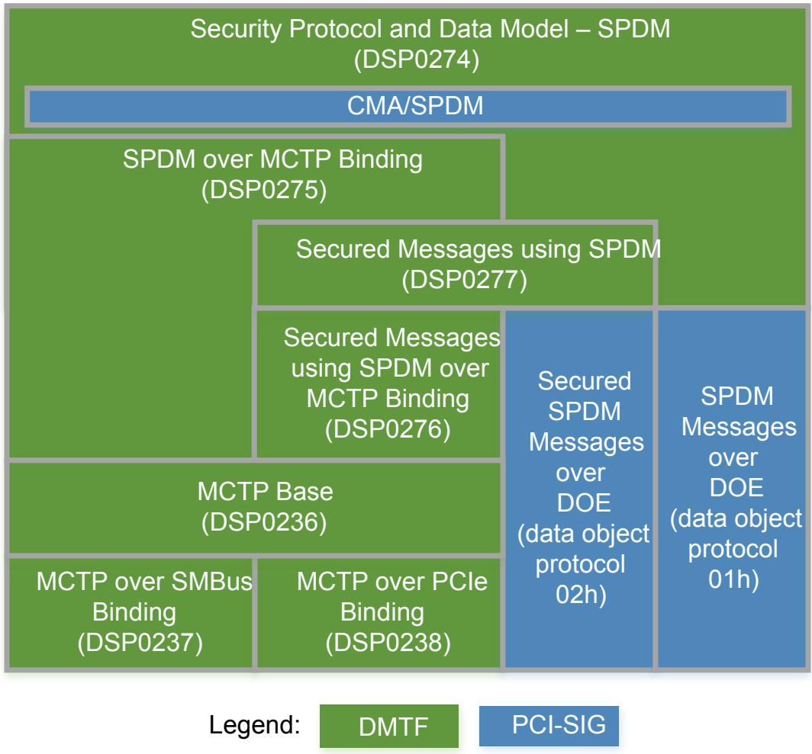

<details>
<summary>flowchart</summary>

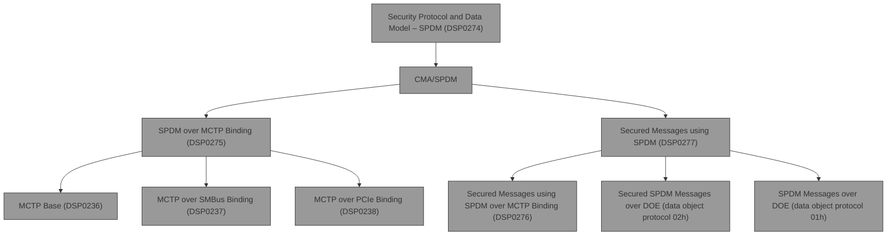
```mermaid
graph TD
  A["Security Protocol and Data Model – SPDM (DSP0274)"] --> B["CMA/SPDM"]
  B --> C["SPDM over MCTP Binding (DSP0275)"]
  B --> D["Secured Messages using SPDM (DSP0277)"]
  C --> E["MCTP Base (DSP0236)"]
  C --> F["MCTP over SMBus Binding (DSP0237)"]
  C --> G["MCTP over PCIe Binding (DSP0238)"]
  D --> H["Secured Messages using SPDM over MCTP Binding (DSP0276)"]
  D --> I["Secured SPDM Messages over DOE (data object protocol 02h)"]
  D --> J["SPDM Messages over DOE (data object protocol 01h)"]
    style A fill:#999,stroke:#333
    style B fill:#999,stroke:#333
    style C fill:#999,stroke:#333
    style D fill:#999,stroke:#333
    style E fill:#999,stroke:#333
    style F fill:#999,stroke:#333
    style G fill:#999,stroke:#333
    style H fill:#999,stroke:#333
    style I fill:#999,stroke:#333
    style J fill:#999,stroke:#333
```
</details>

Figure 6-43 CMA/SPDM as Part of a Layered Architecture§

CMA/SPDM can use the Data Object Exchange (DOE) Capability (See § Section 6.30 ) as a mechanism for security exchanges, and can also be used for out-of-band or other in-band security exchanges, for example using MCTP [SPDM-MCTP] Binding.

It is possible to use CMA/SPDM in many scenarios—for example:

• Remote system administrators can dynamically generate a manifest of cryptographic identities of components of a system, especially at the level of removable units (e.g., add-in-cards/modules), without physical examination of the system, via a BMC or other platform root-of-trust.  
• The identity of a Function can be verified by OS drivers before assigning resources to the Function during runtime/hot-plug scenarios without requiring a host reboot.  
• Virtual Machine Monitors (VMMs) can establish the hardware and firmware identities of a Function before assigning it to a Virtual Machine, and these can be confirmed by the Virtual Machine guest directly with the assigned Function.

The high-level overview of the CMA/SPDM security features and their associated PCIe-specific requirements are given in the following sections, whereas the foundational architecture, protocol and message definitions for the security exchanges used by CMA/SPDM are defined in [SPDM]. The messages exchanged between the requestor and a responder for the CMA/SPDM security features are denoted as CMA/SPDM Messages.

## IMPLEMENTATION NOTE:

## UNDERSTANDING AND IMPLEMENTING CMA/SPDM §

CMA/SPDM is part of a layered architecture to support device and platform security (see § Figure 6-43). Building on the DMTF Security Protocol & Data Model specification [SPDM], CMA/SPDM provides a “mapping” of that foundation, with the intent that future [SPDM] enhancements can, in most cases, be implemented without requiring modifications to CMA/SPDM. In addition to device authentication & firmware measurement, capabilities such as mutual authentication and cryptographic key exchange are also possible. Following [SPDM], CMA/SPDM uses the term “requester” to refer to agents initiating CMA/SPDM protocol requests, and “responder” to refer to an agent that ultimately services those requests and generates responses.

Depending on the use models supported, it may be desirable to implement support for more than one way of transporting CMA/SPDM requests and responses.

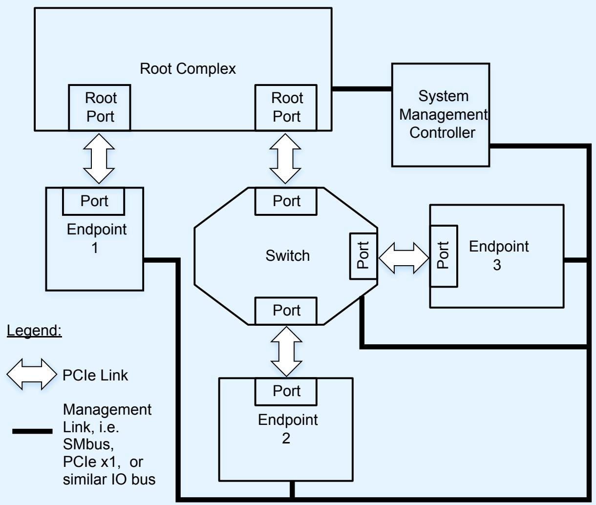

<details>
<summary>flowchart</summary>

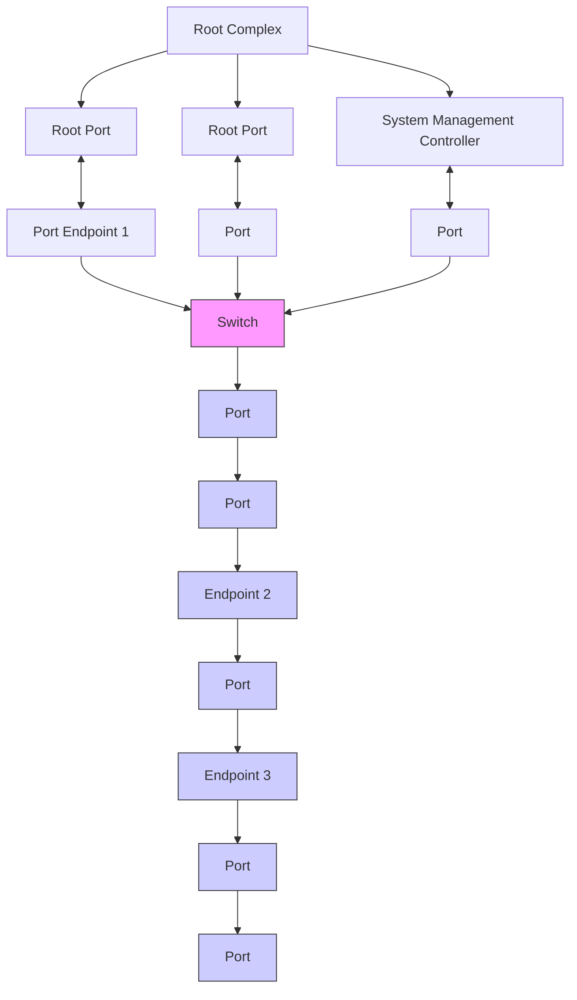
```mermaid
graph TD
  A["Root Complex"] --> B["Root Port"]
  A --> C["Root Port"]
  A --> D["System Management Controller"]
    B <--> E["Port Endpoint 1"]
    C <--> F["Port"]
    D <--> G["Port"]
  E --> H["Switch"]
  F --> H
  G --> H
  H --> I["Port"]
  I --> J["Port"]
  J --> K["Endpoint 2"]
  K --> L["Port"]
  L --> M["Endpoint 3"]
  M --> N["Port"]
  N --> O["Port"]
    style H fill:#f9f,stroke:#333
    style I fill:#ccf,stroke:#333
    style J fill:#ccf,stroke:#333
    style K fill:#ccf,stroke:#333
    style L fill:#ccf,stroke:#333
    style M fill:#ccf,stroke:#333
    style N fill:#ccf,stroke:#333
    style O fill:#ccf,stroke:#333
```
</details>

Figure 6-44 Example System Showing Multiple Access Mechanisms§

§ Figure 6-45 shows an example of a device that supports multiple platform use models and multple access mechanisms. In this example, there is a System Management Controller that has an out-ofband connection to the other elements in the platform, enabling it to use CMA/SPDM even when the PCIe Links are not active and/or Fundamental Reset is active. When the PCIe Links are operating, CMA/SPDM can be used via [SPDM-MCTP]. The Root Complex can use CMA/SPDM over DOE. It is a platform implementation choice of which methods are used.  
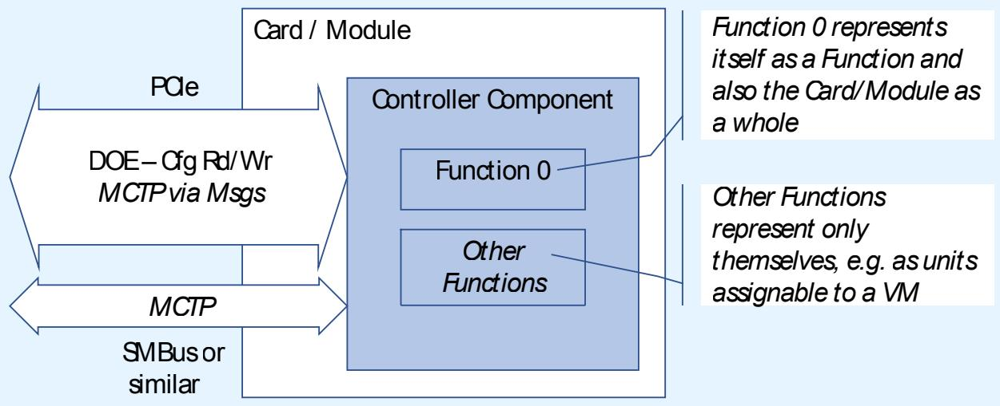

<details>
<summary>flowchart</summary>

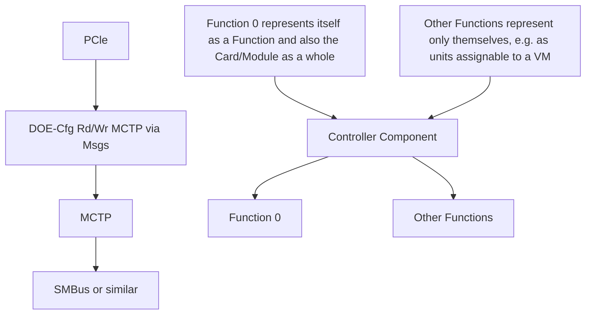
```mermaid
graph TD
  A["PCle"] --> B["DOE-Cfg Rd/Wr MCTP via Msgs"]
  B --> C["MCTP"]
  C --> D["SMBus or similar"]
  E["Controller Component"] --> F["Function 0"]
  E --> G["Other Functions"]
  H["Function 0 represents itself as a Function and also the Card/Module as a whole"] --> E
  I["Other Functions represent only themselves, e.g. as units assignable to a VM"] --> E
```
</details>

Figure 6-45 Example Add-In-Card Supporting CMA/SPDM§

Correspondingly, a device controller can support CMA/SPDM in multiple ways, depending on the associated form-factor and platform requirements and implementation choices. For maximum flexibility it may be desirable to support all of the following:

• Out-of-band (e.g., over SMBus, I2C, I3C, etc.) using MCTP, according to the specifications for [SPDM] + CMA/SPDM + [SPDM-MCTP]  
• In-band using MCTP encapsulated in PCIe Messages, according to the specifications for [SPDM] + CMA/ SPDM + [SPDM-MCTP] + [MCTP-VDM]  
• In-band using the Configuration mailbox mechanism defined by the DOE Extended Capability, according to the specifications for [SPDM] + CMA/SPDM + DOE

Or, when the requirements for a specific implementation do not require this level of flexibility, it may be preferable to support only one or two of these approaches.

The platform requirements for CMA/SPDM are determined by the use cases supported. Example use cases that apply to an add-in-card as a unit include:

• Before platform boot, a management controller checks the add-in-card out of band.  
• During platform boot, system firmware checks the add-in card in-band via DOE.  
During run-time, a management controller or system software/firmware checks the add-in-card via [MCTP-VDM].

To support use cases where the management controller and system firmware/software communicate the results of their checks with each other, it is necessary that the results of those checks be consistent, subject to any changes applied since earlier checks were made. It is for this use case that Function 0 is required to match identically the results received via these other mechanisms.

For use cases where the add-in-card is being evaluated as a unit, the device controller can, through implementation specific means, attest and/or measure other board elements, to ensure that the identity and integrity of the add-in-card as a whole is correct. How this can be done is outside the scope of CMA/SPDM.

In other use cases it may be desirable to evaluate individual Functions. For example, when a Function is directly assigned to a Virtual Machine (VM) that VM can use CMA/SPDM via DOE to confirm that the hardware element assigned to it meets the VM’s requirements. For such use cases, the security exchange with the individual Function is not required to match identically the results received from other Functions.

improved interoperability, CMA/SPDM requires support for certain algorithms, while allowing support for any of the algorithms supported by [SPDM]. Flexibility is allowed for responder algorithm selection with the intent that device vendors can, if desired, align their choices with common standards such as those defined in the Commercial National Security Algorithm (CNSA) Suite and in NIST Special Publication 800-57.

## IMPLEMENTATION NOTE:

## OVERVIEW OF THREAT MODEL §

A detailed thread model analysis typically requires consideration of the context in which a system is operating and the composition of the system along with many other factors, and as such cannot be provided here. A high level overview of the types of threats for which CMA/SPDM may be applicable includes:

Remote and Local software-based attacks, e.g., to install corrupted device firmware or roll back device firmware to an older version  
• Threats from attacker in physical possession of the device including:

◦ Software-based (similar to above)  
◦ Presentation (“impersonation”)  
◦ Hardware attacks of various sorts

• Attacks during manufacturing, provisioning or maintenance, including:

◦ Provisioning of improper configuration and/or firmware  
◦ Improper “repair” of a module

CMA/SPDM requires the leaf certificate to include the information typically used by system software for device driver binding. This requirement is intended to support scenarios where an attacker device attempts to gain access to system resources by appearing to be a valid device type. Responding devices can include the device serial number value in the leaf certificate to simplify system implementation of policies that require specific unit instances to be identified, for example to support scenarios where a modified unit is substituted for a valid, but otherwise identical, unit.

## 6.31.1 Authenticating Component Firmware Identity Through Measurement §

CMA/SPDM measurement is based on [SPDM]. Hardware elements are categorized into two basic types:

• Immutable elements are defined as elements that cannot be changed after the silicon is fabricated, such as hard-coded logic or firmware in mask-ROM, and  
• Mutable elements are defined as elements that can be changed after the silicon is fabricated, including reprogrammable code and/or configuration.

It is strongly recommended that hardware that contains no mutable elements not implement measurement, as there is no mutable element that can be modified after manufacturing. It would, however, still be desirable for a Function containing no mutable element to implement CMA/SPDM for authentication of its component hardware identity (see § Section 6.31.2 ).

## 6.31.2 Authenticating Component Hardware Identity §

In CMA/SPDM the authenticity of a PCIe hardware component is determined by digital signatures using well-established techniques based on public key cryptography. Authentication is the process by which a CMA/SPDM authentication requestor interacts with a component to retrieve the certificate(s) from the component including a unique challenge to the component to prevent “replay” attacks. The component then signs the challenge with the private key. The authentication initiator verifies the signature using the public keys of the component and the root CA, as well as any intermediate public keys within the chain-of-trust.

## 6.31.3 CMA/SPDM Rules §

CMA/SPDM defines how the responder role as defined in [SPDM] must be implemented for PCIe devices, regardless of the communication path(s) implemented between the requester(s) and the responder.

It is permitted, but not required, to support CMA/SPDM and the responder role as defined in [SPDM] at the level of individual Functions. When this is done, then the Function(s) must implement both CMA/SPDM and DOE. For a multi-Function device, each Function implementing the responder role must implement CMA/SPDM and DOE. For Switches that support CMA/SPDM, each Switch Port Function implementing the responder role must implement CMA/ SPDM and DOE.

It is permitted, but not required, for CMA/SPDM to be implemented using one or more access mechanisms other than DOE, in support of various use models. When a use model requires CMA/SPDM to be applied at the level of a replaceable unit it may be necessary to support security exchanges operated by means other than DOE. For example, an add-in-card being evaluated by a Baseboard Management Controller (BMC), or similar element, may use MCTP over a sideband bus. For devices that implement such support, the certificate chain in slot 0 (referring to slots as defined in [SPDM]) must match identically the certificate chain in slot 0 returned by Function 0 via DOE, if DOE is also supported.

CMA/SPDM does not apply to Root Ports, and a Root Port must not implement CMA/SPDM.

The value of all measurements must always reflect the firmware in use at the time of the measurement being read, including for components that support runtime update of firmware without a system reset.

When using CMA/SPDM with DOE:

• The instance of DOE used for CMA/SPDM must support: ◦ the DOE Discovery data object protocol,

◦ the CMA/SPDM data object protocol,  
◦ if IDE is supported, the IDE\_KM data object protocol using Secured CMA/SPDM (See § Section 6.31.4 ),  
◦ and no other data object protocol(s).

• A responder must support operation when the associated Function is in the D0 state, and is permitted but not required to support operation in non-D0 states.

• Behavior is undefined if a Function that does not support operation in non-D0 states is transitioned into a non-D0 state during a CMA/SPDM protocol operation.

◦ It is strongly recommended that system software avoid placing a Function into a non-D0 state while a CMA/SPDM protocol operation is taking place.

• An FLR to a Function during the processing of a CMA/SPDM request must result in that Function terminating its processing of the request, and that Function not returning a response to the request.

◦ An FLR to a Function during the DOE transfer of a CMA/SPDM request or response data object must follow the rules defined in § Section 6.30 .

When using CMA/SPDM with a transport mechanism other than DOE:

• A responder must support operation whenever that transport is allowed to be active, including cases where the device is in Fundamental Reset, unless exceptions are allowed through means outside the scope of this specification  
• An FLR to any Function of a device must have no effect on CMA/SPDM operations through non-DOE transport mechanisms.

For the CMA/SPDM data object protocol, the Byte mapping of SPDM Messages is shown in § Figure 6-46. If required, SPDM Message payloads must be padded with 0’s to maintain DW alignment, when using DOE.

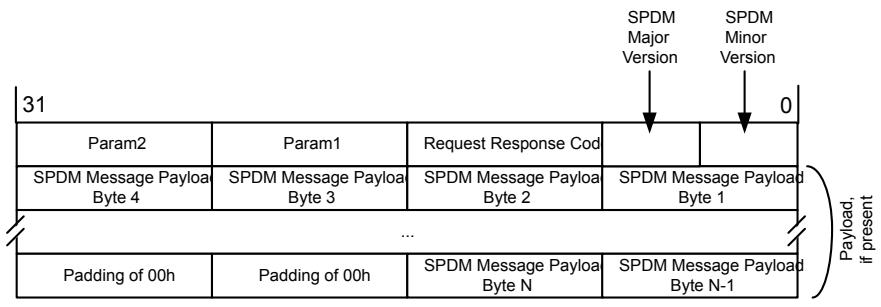

<details>
<summary>text_image</summary>

31
Param2 Param1 Request Response Cod
SPDM Message Payloa Byte 4 SPDM Message Payloa Byte 3 SPDM Message Payloa Byte 2 SPDM Message Payload Byte 1
...
Padding of 00h Padding of 00h SPDM Message Payloa Byte N SPDM Message Payload Byte N-1
SPDM Major Version SPDM Minor Version
0
Payload, if present
</details>

Figure 6-46 Byte Mapping of SPDM Messages Including Example Payload§

Some components provide a debug mode where a debugger is granted access to hardware security properties, allowing the debugger to influence the measurement process itself. It is strongly recommended that components report when a debug mode is active. The reporting mechanism is outside the scope of this specification.

• Responders must, for BaseAsymAlgo, support one or more of the following:

◦ TPM\_ALG\_RSASSA\_3072  
◦ TPM\_ALG\_ECDSA\_ECC\_NIST\_P256  
◦ TPM\_ALG\_ECDSA\_ECC\_NIST\_P384

• Requesters are required to support responders that implement any of these choices.  
• Requesters and responders must, for MeasurementHashAlgo, support one or both of the following:

◦ TPM\_ALG\_SHA\_256

◦ TPM\_ALG\_SHA\_384

• It is permitted for requesters and responders to support additional algorithms defined for [SPDM] beyond those required.  
• Responders must implement a Cryptographic Timeout (CT), as defined in [SPDM], of not more than $2 ^ { 2 3 }$ μs.

◦ Per [SPDM] CT is in turn indicated through the value of CTExponent.

◦ It is strongly recommended that the CT be as short as practical.

The Leaf Certificate Format must follow [SPDM] with the additional requirement that one of the following must be included in the leaf certificate:

• A Subject Alternative Name extension with a name formatted as defined below  
• A Reference Integrity Manifest, e.g., see Trusted Computing Group  
• A pointer to a location where such a Reference Integrity Manifest can be obtained

If the information is included in the Subject Alternative Name extension then it must be encoded as an otherName with the type-id field holding the PCISIG’s OID. The value field must be of type UFT8String and be populated as follows:

for a Function implementing Device Serial Number:

```txt
othername:UTF8STRING:PCISIG:<Common Name>:<Serial Number>
```

and for Functions not implementing Device Serial Number:

```txt
othername:UTF8STRING:PCISIG:<Common Name>
```

where:

<Common Name> must be

◦ For Type 0 Functions, must be

```txt
Vendor=<Vendor ID>:Device=<Device
ID>:CC=<CC>:REV=<REV>:SSVID=<SSVID>:SSID=<SSID>
```

where:

<Vendor ID> and <Device ID> represent a 4-character lowercase hexadecimal string encoding of the 16-bit values corresponding to the Vendor ID and Device ID of the Function respectively.  
▪ <CC> represents a 6-character lowercase hexadecimal string encoding of the 24-bit values corresponding to the Class Code of the Function.  
<REV> represents a 2-character lowercase hexadecimal string encoding of the 8-bit value corresponding to the Revision ID of the Function.  
<SSVID> and <SSID> represent a 4-character lowercase hexadecimal string encoding of the 16-bit values corresponding to the Subsystem Vendor ID and Subsystem ID of the Function respectively.

◦ For Type 1 Functions, must be

```txt
Vendor=<Vendor ID>:Device=<Device ID>:CC=<CC>:REV=<REV>
```

## where:

<Vendor ID> and <Device ID> represent a 4-character lowercase hexadecimal string encoding of the 16-bit values corresponding to the Vendor ID and Device ID of the Function respectively.  
<CC> represents a 6-character lowercase hexadecimal string encoding of the 24-bit values corresponding to the Class Code of the Function.  
<REV> represents a 2-character lowercase hexadecimal string encoding of the 8-bit value corresponding to the Revision ID of the Function.

<Serial Number> must be the textual representation of the 64-bit value corresponding to the Device Serial Number of the Device, if implemented (see § Section 7.9.3 ), as a 16-character lowercase hexadecimal string.

When verifying identity, it is strongly recommended that authentication requesters confirm that the information provided in the Subject Alternative Name entry is signed by the vendor indicated by the Vendor ID.

## 6.31.4 Secured CMA/SPDM §

Secured CMA/SPDM provides security for data object protocols based on [SPDM] mechanisms, including the IDE key management (IDE\_KM) protocol. Once a secure session has been established per [SPDM] (Revision 1.1 or later), it is permitted, and for some uses required, to use Secured CMA/SPDM to transfer other Data Objects with integrity/ encryption, using the algorithm negotiated in the SPDM session establishment, per [Secured SPDM].

It is permitted to continue to perform non-secured CMA/SPDM operations after a session has been established, provided the specific use allows non-secure transport.

Secured CMA/SPDM data objects must be formatted per [Secure-SPDM]. It is permitted for specific data object protocols to constrain the use and content of optional fields, but if no such constraints are applied then the use of such fields is implementation specific.

An FLR to a Function for which there is an established secure session must not change the state of the secure session. However, as with non-secured CMA/SPDM, an FLR to a Function during the processing of a CMA/SPDM request must result in that Function terminating its processing of the request, and that Function not returning a response to the request, and this may impact the usability of the secure session and possibly render the secure session unusable.

## 6.32 Deferrable Memory Write §

The Deferrable Memory Write (DMWr) is an Optional Non-Posted Request that enables a scalable high performance mechanism to implement shared work queues and similar capabilities. With DMWr, devices can have a single shared work queue and accept work items from multiple non-cooperating software agents in a non-blocking way.

The mechanisms for generating DMWr Requests are outside the scope of this document. For cases where a DMWr Requester supports generation of DMWr requests directly via software mechanisms, it is recommended that the software thread that invoked the Request is informed of the corresponding Completion Status in an implementation specific manner.

As with AtomicOps (See § Section 6.15 ), the use model for DMWr requires that, from the initial trigger to generate a DMWr Request, the subsequent routing to the Completer, the Completer’s resulting actions, and the return of the corresponding Completion, that each of these be “atomic” in the sense that a single trigger must result in a single Request, which must not be subdivided, being acted upon by the Completer in such a way that no observer can see a partial result, and a single Completion being returned to the Requester, without subdivision. Therefore, the following rules apply:

• Switches and Root Complexes that support DMWr routing must route DMWr Requests and Completions without modification.  
• DMWr Completers must ensure that operations performed on behalf of a given DMWr Request are performed atomically with respect to each host processor or device access to that target location range.  
• The internal implementation of DMWr Requesters and Completers to enforce the required “atomic” behavior is outside the scope of this document

The following requirements apply to DMWr Completers:

• Properly formed DMWr Requests must be handled as a Successful Completion (SC), Request Retry Status (RRS), Unsupported Request (UR), or Completer Abort (CA).

◦ Properly formed DMWr Requests with types or operand sizes not supported by the Completer, or targeting an address not intended by the device’s programming model to be a target of DMWr Requests, or crossing an address boundary between two different resources, must be handled as Completer Abort (CA), and the value of the target location must remain unchanged.  
◦ Switches that support DMWr Routing but do not support serving as a DMWr Completer must handle properly formed DMWr Requests that target internal resources of the Switch as Completer Abort (CA), and the value of the target location must remain unchanged.

• When a DMWr Request cannot be completed successfully due to a temporary condition, the Completer is permitted to return a Completion with Request Retry Status (RRS)

◦ When this is done, the value of the target location must remain unchanged, and the Completer must not assume that the Requester will repeat the request.  
◦ This is not an error

Completers are permitted to use implementation specific mechanisms to determine when to use the RRS Completion Status in order to establish policies for fairness or for other reasons, and these mechanisms may be based on Requester ID, Traffic Class, PASID, payload contents, or other criteria as may be appropriate.  
• Completers supporting DMWr are allowed to implement a restricted programming model.

◦ If a Request that is not a DMWr targets an address intended by the device’s programming model to be a target of DMWr Requests, it is strongly recommended that the value of the target location remain unchanged, and, if the Request is a Non-Posted Request, that the Completion returned does not include any sensitive information.

◦ See Implementation Note: Optimizations Based on a Restricted Programming Model in § Section 2.3.1 for additional general guidance.

• Completers supporting DMWr that return Successful Completion (SC) must guarantee that the observed update granularity will not be smaller than 64 bytes, or the size of the Request, whichever is smaller.

◦ This requirement applies to DMWr targeting “plain” memory, a shared work queue, or other implementation specific structures, when such operations are supported by the programming model of the Completer.  
◦ See also § Section 2.4.2 and § Section 2.4.3 .

• If any Function in a Multi-Function Device associated with an Upstream Port supports DMWr Completer or DMWr routing capability, all Functions with Memory Space BARs in that device must decode properly formed DMWr Requests and handle any they don’t support as an Unsupported Request (UR).

◦ In such devices, Functions lacking DMWr Completer capability are forbidden from handling properly formed DMWr Requests as Malformed TLPs.

• Unless there is a higher precedence error, a DMWr-aware Completer must handle a Poisoned DMWr Request as a Poisoned TLP Received error (see § Section 2.7.2.1 .

◦ The Completer must return a Completion with a Completion Status of either Unsupported Request (UR) or Request Retry Status (RRS).

◦ The value of the target location must remain unchanged.

• If the Completer of a DMWr Request encounters an uncorrectable error accessing the target location, the Completer must handle it as a Completer Abort (CA).

◦ The subsequent state of the target location is implementation specific.

• Completers are permitted to support DMWr Requests on a subset of their target Memory Space as needed by their programming model (see § Section 2.3.1 ).

◦ Memory Space structures defined or inherited by PCI Express (e.g., the MSI-X Table structure) are not required to be supported as DMWr targets unless explicitly stated in the description of the structure.

• If an RC has any Root Ports that support DMWr routing capability, all RCiEPs in the RC reachable by forwarded DMWr Requests must decode properly formed DMWr Requests and handle any they do not support as an Unsupported Request (UR).

The following requirements apply to Root Complexes and Switches that support DMWr routing:

Switches and Root Ports supporting the DMWr routing capability or DMWr Completer capability (or both) that receive a properly formed DMWr Requests must either forward it to another Port or handle it as a Successful Completion (SC), Request Retry Status (RRS), Unsupported Request (UR), Completer Abort (CA), or DMWr Egress Blocked error.

• If a Switch supports DMWr routing for any of its Ports, it must do so for all of them.

• For Switches and Root Ports supporting the DMWr routing capability, if a DMWr Request is received that crosses a decoding boundary between two different destinations, the Ingress Port must not propagate the Request, and must return a Completion with a Completion Status of UR.

• For a Switch or an RC, when DMWr Egress Blocking is enabled in an Egress Port and a DMWr Request targets going out that Egress Port, then the Egress Port must handle the Request as a DMWr Egress Blocked error and must also return a Completion with a Completion Status of UR.

◦ If the severity of the DMWr Egress Blocked error is non-fatal, then this case must be handled as an Advisory Non-Fatal Error as described in § Section 6.2.3.2.4.1 .

◦ This is a reported error associated with the Egress Port (see § Section 6.2 ).

• For an RC, support for peer-to-peer routing of DMWr Requests and Completions between Root Ports is optional and implementation specific.

◦ When supported, the associated Ports must Set the DMWr Request Routing Supported in the Device Capabilities 3 Register.

◦ When supported, DMWr TLPs must be routed without modifying the size of the data payload.

◦ Even when DMWr Request Routing Supported is Set in two Root Ports, it is implementation specific whether forwarding is supported between those Ports.

• If one Root Port in a Root Complex supports DMWr Completer or DMWr Routing, a DMWr Request received by that Port that is routed to another Root Port that does not support DMWr must be handled as an Unsupported Request (UR).

◦ This is a reported error associated with the Ingress Port (See § Section 6.2 ).

The following requirements apply to DMWr Requesters:

• A Function is only permitted to generate DMWr Requests when the DMWr Requester Enable bit in the Device Control 3 register is Set.  
• When a DMWr Request is completed with Request Retry Status (RRS), the Requester is permitted, but not required, to re-issue the Request.  
◦ The Requester is permitted to use any implementation specific criteria to determine if/when to re-issue the Request.  
◦ Subsequent Requests are permitted to be the same or modified.

## IMPLEMENTATION NOTE:

## CONSIDERATIONS FOR THE USE OF DEFERRABLE MEMORY WRITE (DMWR) §

The intended use model for the Deferrable Memory Write (DMWr) is to implement efficient hardware/software interface control mechanisms, using specialized hardware in the Completer to process the DMWr Request and generate the appropriate Completion Status. For example, a device could implement “enqueue registers” that enable commands to the device to be issued via a single DMWr Request, and based on the Completion Status the device can indicate to the Requester of the command was accepted.

Users of DMWr must understand the functional implications of transaction ordering. A DMWr Request is a Non-Posted Request with Data, which means that Posted Requests are permitted to pass DMWr Requests. Additionally, there is no guaranteed ordering among all types of Non-Posted Requests (see Table 2-4, entries B3, B4, C3 & C4).

As with all types of “control” mechanisms, it is necessary for all participants to comprehend the specific requirements placed by the particular mechanism, and these will vary between different systems and different device types. In many cases it will be necessary to distinguish Requests issued from different software environments (e.g., from multiple Virtual Machine guests where the guests use different drivers) all sharing the same work queue. PASID is one mechanism that can be used for this purpose, although there are many alternatives (e.g., different ranges of addresses could be assigned to each environment that would be mapped to the same resources in the Completer). In some systems, system and application level software is capable of generating DMWr Requests according to a specific template (§ Figure 6-47), where bits 31:0 are defined by the system architecture, the P bit at bit 31 indicates if user (0b) or supervisor (1b) code triggered the Request, and bits 19:0 of the payload include the PASID to indicate the context in which the Request was generated.

<table><tr><td>511</td><td>32</td><td>31</td><td>30</td><td>20</td><td>19</td><td>0</td></tr><tr><td colspan="2">Device Specific Payload</td><td>P</td><td colspan="2">Rsvd</td><td colspan="2">PASID</td></tr></table>

Figure 6-47 Example DMWr Data Payload Template§

For performance reasons it is not recommended that DMWr be used for sending bulk data.

Being a Non-Posted Request, DMWr TLPs require a Completion. In addition, PCIe ordering rules dictate that Non-Posted TLPs cannot pass Posted TLPs, making Posted transactions preferable for improved performance.

Because DMWr TLPs and Memory Read Request TLPs can pass each other, and DMWr TLPs can be deferred by the Completer, care must be taken by Device and Device Driver manufacturers when attempting to read a memory location that is also the target of an outstanding DMWr Transaction, if this is even supported by the programming model of the Completer. Because of these properties, use of DMWr TLPs when transferring large amounts of data is not recommended.

When DMWr Transactions are used to enable a shared work queue, care must be taken to ensure that no Requesters are denied access indefinitely to the queue due to competition with other Requesters. Software entities that submit work to such a queue may choose to implement a flow control mechanism or rely on a particular programming model to ensure that all entities are able to make forward progress, for example to include a feedback mechanism or an indication from the Function to software on the state of the queue, or a timer that delays DMWr Requests after a Completion with Completion Status RRS. The DMWr mechanism does not itself provide protection against software entities issuing Requests (either maliciously or unintentionally) at a rate high enough to cause problems with other software entities accessing the single shared work queue. The details of such mechanisms and programming models are outside of the scope of this specification.

## 6.33 Integrity & Data Encryption (IDE) §

Integrity & Data Encryption (IDE) provides confidentiality, integrity, and replay protection for TLPs Transmitted and Received between two Ports. It flexibly supports a variety of use models, while providing broad interoperability. The cryptographic mechanisms are aligned to industry best practices and can be extended as security requirements evolve. The security model considers threats from physical attacks on Links, including cases where an adversary uses lab equipment, purpose-built interposers, malicious Extension Devices, etc. to examine data intended to be confidential, modify TLP contents, reorder and/or delete TLPs. TLPs can be secured as they transit Switches, extending the security model to address attacks mounted by reprogramming Switch routing mechanisms, or using “malicious” Switches. IDE can be used to secure traffic within trusted execution environments, also known as trust domains, composed of multiple components – the frameworks for such composition are outside the scope of IDE.

IDE establishes an IDE Stream between two Ports (see § Figure 6-48). When there are no Switches between the Ports, then it is possible to secure all, or only selected, TLP traffic on the Link, using Link IDE or Selective IDE, respectively. There is no required relationship, or restriction, between Link IDE and Selective IDE. It is possible to use both Link IDE and Selective IDE between two directly connected Ports, as shown in § Figure 6-48 between Ports A and B, in which case TLPs associated with the Selective IDE Stream are secured using that Stream’s key set, and all other TLPs are secured using the key set for the Link IDE Stream. Such a configuration may be desirable if, for example, different security policies are applied to the Selective IDE TLPs than to other Link traffic. It is possible to use Selective IDE in cases where the IDE Terminus is a Switch Port, as shown between Ports C and D. IDE does not establish security beyond the boundary of the two terminal Ports, and mechanisms for securing and/or isolating secure traffic within a Component are outside the scope of this document. Again referring to the example shown in § Figure 6-48, the Selective IDE Streams between Ports C and G, and between Ports G and H, are secured as they pass through the Switch. All other Link IDE and Selective IDE streams illustrated are secured by IDE from Port to Port, but must be secured by implementation specific means within the Component past the terminal Port. By implication, when Link IDE is used with TLPs flowing “hop-by-hop” through one or more Switches, it is necessary to ensure acceptable security is maintained within the Switch(es), but how this is done is outside the scope of this document.

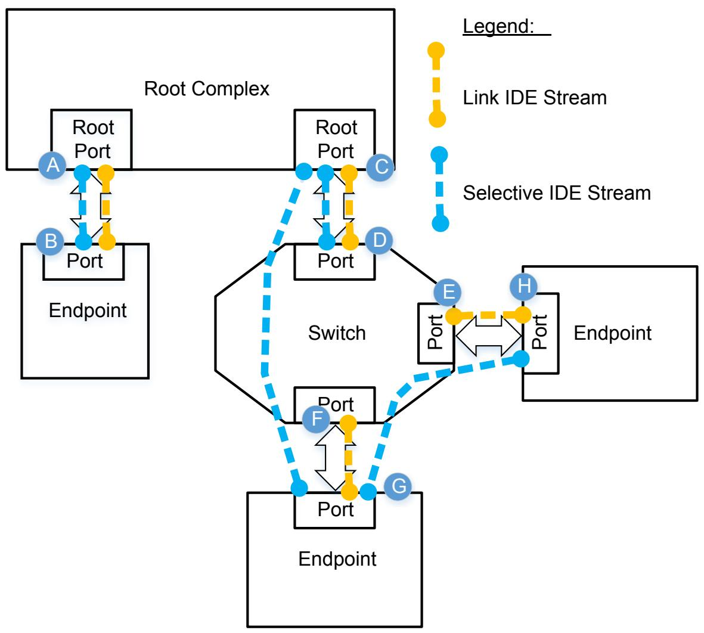

<details>
<summary>flowchart</summary>


```mermaid
graph TD
  A["Root Port"] --> B["Endpoint"]
  B --> C["Switch"]
  C --> D["Endpoint"]
  D --> E["Port"]
  E --> F["Port"]
  F --> G["Port"]
  G --> H["Port"]
  H --> I["Port"]
  I --> J["Port"]
  J --> K["Port"]
  K --> L["Port"]
  L --> M["Port"]
  M --> N["Port"]
  N --> O["Port"]
  O --> P["Port"]
  P --> Q["Port"]
  Q --> R["Port"]
  R --> S["Port"]
  S --> T["Port"]
  T --> U["Port"]
  U --> V["Port"]
  V --> W["Port"]
  W --> X["Port"]
  X --> Y["Port"]
  Y --> Z["Port"]
  Z --> AA["Port"]
  AA --> AB["Port"]
  AB --> AC["Port"]
  AC --> AD["Port"]
  AD --> AE["Port"]
  AE --> AF["Port"]
  AF --> AG["Port"]
  AG --> AH["Port"]
  AH --> AI["Port"]
  AI --> AJ["Port"]
  AJ --> AK["Port"]
  AK --> AL["Port"]
  AL --> AM["Port"]
  AM --> AN["Port"]
  AN --> AO["Port"]
  AO --> AP["Port"]
  AP --> AQ["Port"]
  AQ --> AR["Port"]
  AR --> AS["Port"]
  AS --> AT["Port"]
  AT --> AU["Port"]
  AU --> AV["Port"]
  AV --> AW["Port"]
  AW --> AX["Port"]
  AX --> AY["Port"]
```
</details>

Figure 6-48 IDE Secures TLPs Between Ports§

In addition to the in-line securing of TLPs, as a “data plane” capability, IDE defines interoperable mechanisms for establishing Streams and programming keys, as a “control plane” capability, based on industry specifications. For example, for an Endpoint connected directly to the Root Complex (A to B above), one way to establish IDE is to use IDE Key Management (IDE\_KM – see § Section 6.33.3 ) via DOE to allow host Firmware/Software to configure the Ports, including securely programming the IDE keys into both Ports. In another example, for two Endpoints communicating peer to peer (G to H above), the two Endpoints can implement communication directly via [MCTP-VDM] and [Secured-MCTP], where one will take the Requester role and the other the Responder role, and then applying the IDE\_KM flow for secure key establishment. In an alternate example, it is also possible for some kind of management controller to apply IDE\_KM over a sideband management connection, to program IDE keys in Ports throughout a system. The mechanisms for a management controller to program keys into a Root Complex are outside the scope of this document.

Policies for establishing trust between elements in a platform are outside the scope of IDE. It is strongly recommended that a platform-appropriate policy be implemented via platform-specific means. It is not necessary that this policy be applied prior to establishing IDE Streams, and in some cases it may be preferable to establish IDE first, and subsequently apply security policy mechanisms, or to apply some policy mechanisms prior to establishing IDE and some additional mechanisms after.

## IMPLEMENTATION NOTE:

## THREAT MODEL AND RELATED CONSIDERATIONS FOR IDE §

This implementation note provides a very general treatment of the threat model assumed for IDE. A detailed treatment will necessarily require knowledge of the platform environment and other elements that are outside the scope of this document.

This threat model covers:

Attacks using a logic analyzer or interposer type device, including e.g. “rogue” Retimers, where the attack devices attempt to add or delete TLPs, observe TLP payload data, and/or reorder TLPs. Example attacks include delaying a flag write to bypass a data write causing stale data to be accepted, or delaying a read to bypass a write to same location causing a stale value to be read. Reordering is discussed in more detail in the Implementation Note "Detection of Improper Reordering".

IDE secures host systems against device substitution attacks because, once authenticated key exchange is completed, a subsequent attack by a different unit trying to masquerade as the authenticated unit will fail because the masquerading unit cannot generate IDE TLPs using the correct key.

Provided an implementation includes appropriate self-protection measures, IDE also supports the detection of attacks involving the removal of a unit, for example by moving the unit to a different system and attempting to operate the unit masquerading as the authenticated host.

It is assumed that in an attack, the attacker will thwart error reporting attempts, e.g. by blocking Messages from the Port that detected the error, and such reporting messages are only intended to be used in debugging improperly configured systems. If a specific use model requires timely detection of security failures, some type of “heartbeat” mechanism should be used, rather than assuming that the failure will be reported directly.

This threat model does not cover:

Security exposures caused by inadequate Device implementation. For example, implementations are necessarily required to secure local keys, interconnects, and memory, including, for example, local memory implemented on an add-in-card using discrete memory components. IDE does not protect against on-die traffic redirection, for example between Functions of a Multi-Function Device.

Debug mechanisms should be given careful review as they can easily cause information exposure when improperly implemented. It is strongly recommended that debug state be reported using measurement mechanisms, and that any change in debug configuration that could expose data intended to be secured result in a transition to Insecure (see § Section 6.33.1 ).

There are many considerations regarding secure key generation, programming, and storage, and it is strongly encouraged that non-experts consult with experts to evaluate all levels of implementation to ensure that good practices are followed. In all cases, it is essential to avoid exposure of plain text keys by any means including debug features such as tracers, configuration registers etc.

If partial header encryption (see § Section 6.33.4 ) is not used, “side channel” attacks may be possible in some cases based on attacker analysis of the information included in the headers. For example, see htts://www.ieee-security.org/TC/SP2015/papers-archived/6949a640.pdf.

Considerations:

IDE secures TLP traffic from one Port to another Port. TLP content is not secured on-die by IDE past the terminal Partner Ports, and so it is necessary to provide appropriate implementation specific protective measures based on use model requirements to ensure that TLP traffic is secured prior to transmission, and following reception.

IDE assumes the implementation of appropriate isolation mechanisms to ensure that information remains secured beyond the Port to Port connection secured via IDE. In some cases, entire components can be considered “secure” and there is no need to distinguish traffic on-die, in other cases the establishment of one or more Trusted Execution Environments (TEEs) may be needed to isolate secure traffic from non-secure traffic, and different secure environments from each other. Although it is permitted to establish more than one IDE Stream between the same two Ports, this is not generally needed or useful, because it is assumed that once on-die, all secure traffic is “equally” secure, and using separate IDE Streams provides no additional protection. The details of how such TEEs are implemented and managed are outside the scope of IDE. The T bit provides a mechanism to distinguish TLPs that are associated with a TEE. IDE mechanisms ensure that the T bit (like other TLP content) is secured during transit.

Good practices for implementing TEEs include, but are not limited to:

• Securing secrets through the use of local encryption, access control, and/or other mechanisms  
• Ensuring that secure data cannot “leak” due to errors, power management, or other operations  
• Detecting inappropriate attempts to reconfigure IDE, e.g. writes to any of the IDE control registers, and/ or other internal conditions that could compromise secure data and taking appropriate measures, including potentially forcing the Port into Insecure  
• Ensuring that secret keys are never exposed or stored in non-secure buffers  
• Ensuring that the establishment & management of TEEs is itself secure

The implementation of TEEs can be very complex, and it is strongly recommended that persons with appropriate security expertise are intimately involved in the development and validation of components and systems.

Although Link IDE applies to all kinds of TLPs, Selective IDE can only be applied to certain types of TLPs (see § Table 6-33). Memory operations are required to be supported for virtually all use models, and are supported by Selective IDE. I/O operations are not commonly used, and are not supported by Selective IDE to simplify design and validation. Selective IDE can be applied to Messages, and, optionally, to Configuration Requests & Completions. Selective IDE can be applied to TLPs with Prefixes, but Local TLP Prefixes are not protected when the TLP is associated with a Selective IDE Stream. In NFM, End-End TLP Prefixes are protected along with the associated TLP, and in FM, OHC content is protected along with other Header content.

## 6.33.1 IDE Stream and TEE State Machines §

Conceptually, the initialization of a Link or Selective IDE Stream involves multiple steps, although some of these steps can be merged or performed in a different order. The first step is to establish the authenticity and identity of the components containing the two Partner Ports to be the IDE Terminuses of the IDE Stream. This may be done using CMA/ SPDM, by implementation specific means, or in some cases implicitly. The second step is to establish the IDE Stream keys – the IDE Key Management (IDE\_KM – § Section 6.33.3 ) provides a way to do this. Third, the Secure Connection must be configured, and, finally, the establishment of the IDE Stream is triggered.

Conceptually, each IDE Stream is associated at each Partner Port with a state machine illustrated in § Figure 6-49.

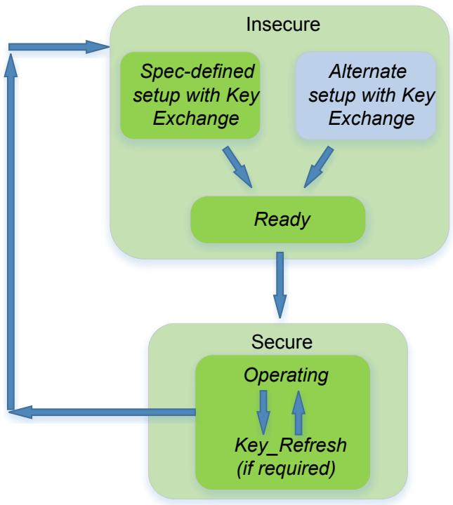

<details>
<summary>flowchart</summary>

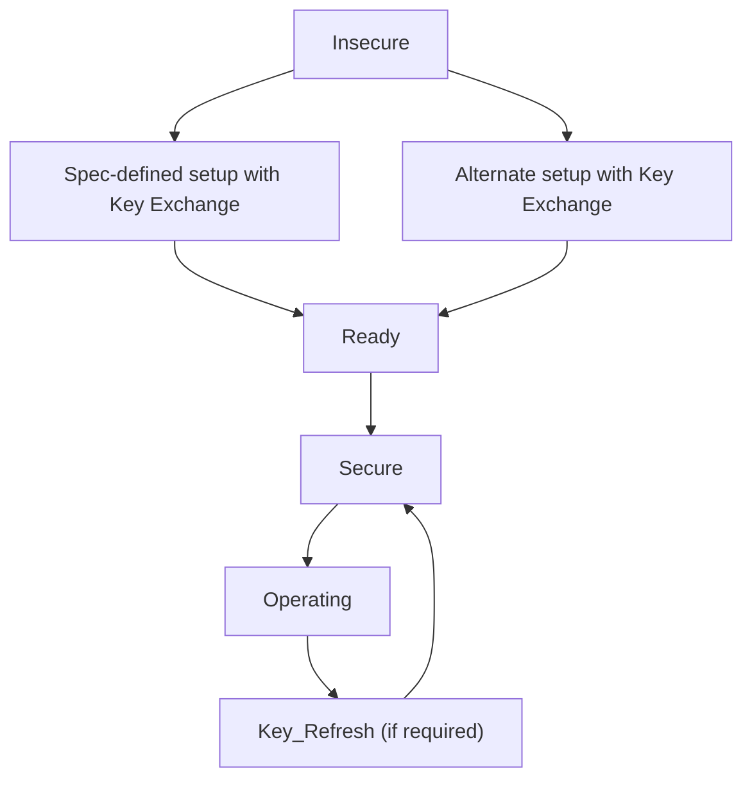
```mermaid
graph TD
  A["Insecure"] --> B["Spec-defined setup with Key Exchange"]
  A --> C["Alternate setup with Key Exchange"]
  B --> D["Ready"]
  C --> D
  D --> E["Secure"]
  E --> F["Operating"]
  F --> G["Key_Refresh (if required)"]
  G --> E
```
</details>

§ Figure 6-49 IDE Stream State Machine

• The Insecure state indicates that the necessary steps to operate the IDE Stream have not been completed, or that some event has ended the operation of a previously operating IDE Stream.

◦ Typically the Insecure will include various conceptual substates that are not directly observable by the hardware, and only the system firmware/software configuring the IDE Stream will have the ability to comprehend when all necessary steps have been completed.  
◦ The Ready conceptual sub-state of the Insecure state is entered when all necessary configuration has been performed; this condition must be tracked by system firmware/software.

▪ In many cases it will not not be possible for hardware to distinguish when all necessary configuration has been performed, and there is no requirement for hardware to track the transition into the Ready sub-state.

• The IDE Stream State Machine for a specific Stream of a Port must transition from Secure to Insecure when the corresponding Link/Selective IDE Stream Enable bit is Cleared.  
◦ As further discussed below, it is essential that the Port internally block all transmissions that are intended to be secure if the corresponding IDE Stream State Machine is not in the Secure state.  
• If at any time a condition compromising the security of the IDE Stream is detected at the Port, the Port must transition to Insecure.  
◦ It is permitted to transition to Insecure for implementation specific reasons.

A trusted execution environment (TEE) using IDE must prevent the transmission of TLPs intended to be secure using non-IDE TLPs, and must reject non-IDE TLPs received if the TEE requires those TLPs to be secure. Most details of how this is done are outside the scope of this document. However, in order to precisely define the normative requirements for IDE in relation to TEEs, we will assume that TEEs have internal states that correspond to those shown in § Figure 6-50.

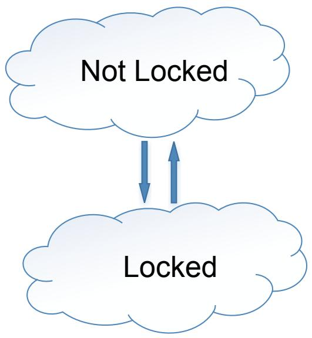

<details>
<summary>flowchart</summary>

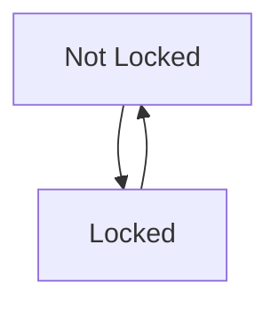
```mermaid
graph TD
  A["Not Locked"] --> B["Locked"]
  B --> A
```
</details>

§ Figure 6-50 IDE Stream State Machine

The following rules apply to TEEs using IDE:

• A TEE must distinguish between at least two operating conditions, that may be called by any names but here will be called Not Locked and Locked.  
◦ A TEE must transition to the Locked state if and only if all IDE Streams required for the secure operation of the TEE are in the Secure state.  
◦ A TEE must transition to the Not Locked state if any IDE Stream required for the secure operation of the TEE is in the Insecure state.

• A TEE using an IDE Stream must precisely define the essential configuration information that could affect the security of the IDE Stream, and, once that IDE Stream is established, that essential configuration information must be confirmed and maintained by secure means so as to detect “adversary-in-the-middle” (AITM) attacks attempted during or after IDE Stream establishment, and changes to that information blocked and/or detected, as to detect/prevent attacks during operation.

◦ The specific configuration information to which this requirement applies is implementation specific and dependent on the hardware elements involved, the security attributes required, and potentially on assumptions of use, all of which are outside the scope of this specification.  
◦ How the information is confirmed is implementation specific, but would typically include securely transferring a data structure that contains a local snapshot of the information to a secure partner to be compared against the expected values.

## 6.33.2 IDE Stream Establishment §

To establish IDE Streams interoperably based on this specification, system firmware/software acts as a central authority to create and program keys into the two Partner Ports. The following rules apply:

• For an Endpoints, including Functions of a Multi-Function Device, associated with an Upstream Port, Function 0 must implement the IDE Extended Capability.  
◦ Although CMA can be meaningfully applied for other purposes at a per-Function level, IDE operates at a per-Port level, and Function 0 of an Upstream Port must be used for the purposes of configuration and management of IDE Stream(s) for that Port.  
• For Switches, including cases where one or more Functions of a Multi-Function Device represent the Upstream Port of a Switch, the IDE Extended Capability must be implemented in Function 0, and implemented such that Function 0 represents the Multi-Function Device as a whole.  
• For a Downstream Port, the Bridge Function associated with the Port must implement the IDE Extended Capability.  
• All Ports other than Root Ports must implement support for key management by means of the IDE key management (IDE\_KM) protocol defined in § Section 6.33.3 .

◦ For Switch and Root Ports it is permitted for one Port to provide the DOE and CMA/SPDM responder function on behalf of other Ports as defined in § Section 6.33.3 .

◦ Root Ports are permitted to implement support for the IDE\_KM protocol.

It is also permitted for systems to implement the IDE\_KM protocol via MCTP (see § Section 6.33.3 ).

It is also permitted for system firmware/software to enable pass-through communications between the two Partner Ports, where one of the two takes the Requester Role and the other takes the Responder Role, implementing the IDE\_KM protocol defined below directly between the two Partner Ports (as an example see the Selective IDE Stream between Ports G and H in § Figure 6-48). How this is discovered and enabled is outside the scope of this specification.

## 6.33.3 IDE Key Management (IDE\_KM) §

IDE Key Management (IDE\_KM) builds upon [SPDM] and [Secured-SPDM], and can be used over multiple transports (see § Figure 6-51).

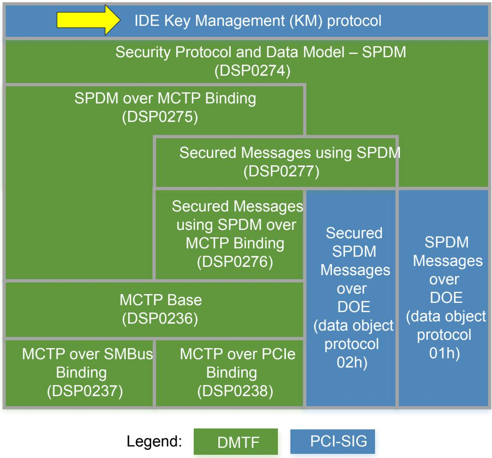

<details>
<summary>flowchart</summary>

```mermaid
graph TD
  A["IDE Key Management (KM) protocol"] --> B["Security Protocol and Data Model – SPDM (DSP0274)"]
  B --> C["SPDM over MCTP Binding (DSP0275)"]
  B --> D["Secured Messages using SPDM (DSP0277)"]
  C --> E["MCTP Base (DSP0236)"]
  C --> F["MCTP over SMBus Binding (DSP0237)"]
  C --> G["MCTP over PCIe Binding (DSP0238)"]
  D --> H["Secured Messages using SPDM over MCTP Binding (DSP0276)"]
  D --> I["Secured SPDM Messages over DOE (data object protocol 02h)"]
  D --> J["SPDM Messages over DOE (data object protocol 01h)"]
    style A fill:#99ccff,stroke:#333
    style B fill:#99ccff,stroke:#333
    style C fill:#99ccff,stroke:#333
    style D fill:#99ccff,stroke:#333
    style E fill:#99ccff,stroke:#333
    style F fill:#99ccff,stroke:#333
    style G fill:#99ccff,stroke:#333
    style H fill:#99ccff,stroke:#333
    style I fill:#99ccff,stroke:#333
    style J fill:#99ccff,stroke:#333
```
</details>

Figure 6-51 IDE Key Management (IDE\_KM) and Related Specifications & Capabilities§

The following rules define the IDE key management (IDE\_KM) protocol, and must be followed for Ports that support the use of IDE\_KM:

• The IDE\_KM protocol uses the data objects defined below, where:

◦ The Requester must use the [SPDM] VENDOR\_DEFINED\_REQUEST format, the Responder must use the [SPDM] VENDOR\_DEFINED\_RESPONSE format.  
◦ The StandardID field of the VENDOR\_DEFINED\_REQUEST/ VENDOR\_DEFINED\_RESPONSE must contain the value assigned in [SPDM] to identify PCI-SIG.  
◦ The VendorID field of the VENDOR\_DEFINED\_REQUEST/ VENDOR\_DEFINED\_RESPONSE must contain the value 0001h, which is assigned to the PCI-SIG.  
◦ The VendorDefinedReqPayload/VendorDefinedRespPayload field of the VENDOR\_DEFINED\_REQUEST/ VENDOR\_DEFINED\_RESPONSE must be the data object content as defined below.  
◦ The VENDOR\_DEFINED\_REQUEST/VENDOR\_DEFINED\_RESPONSE must in turn form the Application Data field of a Secured Message per [Secured-SPDM]

▪ It is strongly recommended that the cryptographic strength used in the secure session be at least as strong as selected for IDE itself.

◦ If any IDE\_KM data object is received that has not been transferred securely per [Secured-SPDM], the received data object must not be used for key management, and, if it is a request, must not result in a response.

◦ The size of the VendorDefinedReqPayload/VendorDefinedRespPayload must match the size of the data object defined below.

▪ If the size does not match, the received data object must not be used for key management, and, if it is a request, must not result in a response.

• For Endpoint Functions, including Functions of a Multi-Function Device, associated with an Upstream Port, Function 0 must implement DOE and CMA/SPDM for Authentication and key exchange, including the secure session establishment mechanism (see [SPDM]) and the IDE key management (IDE\_KM) protocol as a Responder, as defined below.

◦ Although CMA can be meaningfully applied for other purposes at a per-Function level, IDE operates at a per-Port level, and Function 0 of an Upstream Port must be used for the purposes of establishing the authenticity and identity of the associated Component, performing key exchange, and the configuration and management of IDE Stream(s) for that Port.

Each Upstream Port Function, regardless of Function Number, representing a Switch for which Link IDE Stream Supported and/or Selective IDE Streams Supported are Set, including in Multi-Function Devices, must implement DOE and CMA/SPDM supporting the IDE key management (IDE\_KM) protocol as a Responder, as defined below.

• It is permitted for a Root Complex to:

◦ support the IDE\_KM protocol using a DOE instance for some or all Root Ports per-Port, or using some Root Ports to represent other Root Ports  
◦ implement a DOE instance in an RCRB supporting IDE\_KM for Root Ports,  
◦ use implementation specific key management.

• For Switches and Root Complexes, it is permitted for one Port to implement the IDE\_KM interface as a responder for itself and for other Ports of the Switch/Root Complex.

• Ports are permitted to support the IDE\_KM protocol transported via MCTP.

• Within each data object, the Protocol ID field in bits [7:0] of the first DW must be 00h to indicate IDE.

• The Object ID field in bits [15:8] of the first DW indicates the IDE\_KM data object type and is encoded as: 00h: Query (QUERY)

01h: Query Response (QUERY\_RESP)

02h: Key Programming (KEY\_PROG)

03h: Key Programming Acknowledgement (KP\_ACK)

04h: Key Set Go (K\_SET\_GO)

05h: Key Set Stop (K\_SET\_STOP)

06h: Key Set Go/Stop Acknowledgement (K\_GOSTOP\_ACK)

all other encodings Reserved.

• A Requester is permitted to use QUERY to determine the capabilities and configuration of a Port (see § Figure 6-52)

◦ The PortIndex field must be used to indicate the Port addressed by the QUERY.

• A Responder must respond to a QUERY indicating a PortIndex value of 00h.  
• IDE\_KM assigns unique Port numbers (PortIndex) for each Port of an Endpoint, Switch or Root Complex, implementing IDE\_KM.  
• For a Switch that supports the IDE\_KM responder role:

◦ The Switch Upstream Port must implement the responder role for itself and the Upstream Port must respond to a PortIndex of 00h.  
◦ Downstream Ports of the Switch that are represented by the Upstream Port must respond to PortIndex ranging from 01h to FFh, where the order is established by the Device/Function numbers assigned by the Switch construction to the Downstream Ports from lowest to highest.  
◦ It is permitted for a Switch to implement a responder capability in a Downstream Port, for example by implementing a DOE instance in the Downstream Port, in which case that Downstream Port must respond to a PortIndex of 00h.

▪ It is permitted for that Port to represent other Downstream Ports, in which case the represented Downstream Ports must respond to PortIndex ranging from 01h to FFh, where the order is established by the Device/Function numbers assigned by the Switch construction to the Downstream Ports from lowest to highest.

• For a Root Port that supports the IDE\_KM Responder role:

◦ The Root Port must implement the responder role for itself and must respond to a PortIndex of 00h.

▪ It is permitted for that Port to represent other Root Ports, in which case the represented Root Ports must respond to PortIndex ranging from 01h to FFh, where the order is established by the Device/ Function numbers assigned by the Root Complex construction to the Root Ports from lowest to highest.

• For an Endpoint Upstream Port that supports the IDE\_KM responder role, the Port must respond to a PortIndex of 00h.  
• Ports/RCRBs implementing the [SPDM] responder role must respond to a QUERY with QUERY\_RESP (see § Figure 6-53)

◦ The PortIndex field must contain the PortIndex field value from the corresponding QUERY.  
◦ The MaxPortIndex field value must indicate the maximum PortIndex value for the Ports represented by this Port/RCRB.

▪ If only one Port is represented, including for all Endpoint Upstream Ports, the MaxPortIndex field must be 00h.

◦ The Bus Number field must contain the Bus Number of the Function corresponding to the PortIndex field value.  
◦ The Segment field must:

▪ for Ports that are not Root Ports, be zero  
▪ for Root Ports, contain the Segment Number value for the Root Port, or zero if the Root Complex implements only one Segment.

◦ For Non-ARI Functions the Device/Function Number field must contain the Device and Function number of the Function corresponding to the PortIndex field value.  
◦ For ARI Functions the Function Number field must contain the Function number of the Function corresponding to the PortIndex field value.  
◦ The remainder of QUERY\_RESPONSE must consist of the contents of the IDE Extended Capability Structure, other than the IDE Extended Capability Header itself, for the addressed Port.

▪ The Supported Algorithms and Selected Algorithm field values returned in QUERY\_RESP must be compared against the values read from the corresponding fields in the Responder Port’s IDE Extended Capability structure and if non-matching values are detected then the IDE\_KM protocol for this secure session must be aborted, or other appropriate corrective action taken to avoid a possible “downgrade” attack.

• Requesters must not issue other requests after issuing a QUERY command until receipt of the corresponding QUERY\_RESP.  
• KEY\_PROG, KP\_ACK, K\_SET\_GO, K\_SET\_STOP and K\_GOSTOP\_ACK all apply to a single Sub-Stream, direction (Tx or Rx) and Key Set.

◦ The Key Sub-Stream field indicates the Key Sub-Stream, using the same encodings as defined for the Sub-Stream identifier (see § Section 6.33.3 )  
◦ The direction is indicated by the RxTxB bit encoded:

▪ 0b – Receive  
▪ 1b - Transmit

◦ The Key Set field indicates the Key Set, corresponding to the K bit value in the IDE TLP Prefix (NFM)/OHC-C (FM).

• For Ports implementing the Responder role, key programming and the ability to select the initial value of the IV must be supported using the KEY\_PROG command (see § Figure 6-54).

◦ The length of the key must correspond to the length indicated in the Selected Algorithm field for the Stream.  
◦ The Requester must not send another KEY\_PROG command to the same Port until it has received a KP\_ACK from the Port.

▪ If the Requester does not receive a KP\_ACK from the Responder within 1 second plus a sufficient time to account for transport delay the Requester is permitted to consider that the Responder is not operating correctly.

◦ Fields specific to the KEY\_PROG command are:

▪ PortIndex, indicating the Port to which the key is to be programmed, corresponding to the order established in the QUERY\_RESP  
▪ Stream ID  
▪ Key, which must be of the size required for the Selected Algorithm for the Stream  
▪ IFV, indicating the initial value for the invocation field of the IV, which must be 64 bits in size, and must initially set to the value 0000\_0001h upon establishment of the Stream and when performing a key refresh.

• A Port implementing the Responder role must acknowledge receipt of a KEY\_PROG command by returning KP\_ACK, defined in § Figure 6-55.

◦ The Status field must indicate the result of the KEY\_PROG command, encoded as:

▪ 00h: Successful  
▪ 01h: Failed to parse command – Incorrect Length  
▪ 02h: Failed to parse command – Unsupported value in PortIndex  
▪ 03h: Failed to parse command – Unsupported value in other field(s)  
▪ 04h: Unspecified Failure  
▪ 05-FFh: Reserved – Must not be used in generating KP\_ACK, but if received must be treated as Unspecified Failure

◦ The Responder must return KP\_ACK within 1 second of the receipt of the KEY\_PROG command.  
▪ It is strongly recommended to return KP\_ACK as quickly as possible.  
◦ Return of KP\_ACK, regardless of Status, indicates the Port is able to receive and process another KEY\_PROG command .

• Mechanisms for generating keys are outside the scope of this document.

• If the Enable bit is Set in the IDE Extended Capability entry for a Stream, but that IDE Stream is not already in Secure, the receipt of a K\_SET\_GO for must trigger the Port to Transmit/Receive IDE TLPs for the indicated Stream.

◦ The agent implementing the Requester role for IDE\_KM must send K\_SET\_GO commands to enable the Receivers at both IDE Partner Ports, and then send K\_SET\_GO commands to enable the Transmitters at both IDE Partner Ports.  
▪ The Port must use the indicated Key Set for IDE TLP transmissions associated with the IDE Stream starting not more than 10ms after the receipt of the K\_SET\_GO command to enable the Transmitter.  
◦ The Port must be capable of processing received IDE TLPs using the indicated Key Set within 10ms after the receipt of the K\_SET\_GO command enabling the Receiver.  
◦ The Port must respond by returning an K\_GOSTOP\_ACK once it is capable of receiving another IDE\_KM Request.

• If the Enable bit is Set in the IDE Extended Capability entry for a Stream, and that IDE Stream is already in Secure (a key refresh operation), the receipt of a K\_SET\_GO for must trigger the Port to Transmit/Receive IDE TLPs for the indicated Stream.

◦ The agent implementing the Requester role for IDE\_KM must send K\_SET\_GO commands to enable the Receivers at both IDE Partner Ports, and then send K\_SET\_GO commands to enable the Transmitters at both IDE Partner Ports.

▪ The Port must use the indicated Key Set for IDE TLP transmissions associated with the IDE Stream starting not more than 10ms after the receipt of the K\_SET\_GO command to enable the Transmitter.

◦ The Port must be capable of processing received IDE TLPs using the indicated Key Set within 10ms after the receipt of the K\_SET\_GO command enabling the Receiver.

◦ For each Sub-Stream of the Stream, until the Port receives an IDE TLP using the new key set, as indicated by the K bit value toggling, the Port must continue to accept IDE TLPs using the established key set.

▪ Once the Port receives an IDE TLP using the new key set on a Sub-Stream it must invalidate and render unreadable the old key set, and discard subsequently received IDE TLPs using the old key set on that Sub-Stream.

◦ The Port must respond by returning an K\_GOSTOP\_ACK once it is capable of receiving another IDE\_KM Request.

• If the Enable bit in the IDE Extended Capability for a Stream is Clear, the receipt of K\_SET\_GO for both receive and transmit must cause the Port to become ready to Transmit/Receive IDE TLPs for the indicated Stream within 10ms following the receipt of the last K\_SET\_GO, after which system software is permitted to Set the Enable bit for the Stream. When the Enable bit is Set:

◦ The Port must be capable of processing received IDE TLPs using the Key Set armed by the received K\_SET\_GO Request.  
◦ System software must ensure that the Partner Ports initiate IDE TLPs sequenced appropriately so that a Port will not receive an IDE TLP before the Enable bit has been set.  
◦ The Port must respond by returning an K\_GOSTOP\_ACK once it is capable of receiving another IDE\_KM Request.

• Is permitted for the IDE\_KM Requester to transmit the K\_SET\_STOP command, defined in § Figure 6-57, to indicate that a Key Set must stop being used at a Port.

◦ The Port implementing the responder role must invalidate and render unreadable the indicated Key Set not more than 10ms after the receipt of the K\_SET\_STOP command.  
◦ Upon receipt of the KEY\_STOP command, for the indicated Key Set and direction, all keys must be invalidated and rendered unreadable.

▪ It should be observed that this action does not directly transition the Stream to Insecure, but any subsequent attempt to use the indicated Key Set will result in the Stream transitioning to Insecure.

◦ The Port must respond by returning an K\_GOSTOP\_ACK once it is capable of receiving another IDE\_KM Request.

• When using DOE for IDE\_KM, or when IDE is enabled/disabled using the Enable bit for an IDE Stream, the following rules apply:

◦ For a Configuration Request that triggers the start IDE, the Port must first return the Configuration Completion as a non-IDE TLP, and then trigger the start of IDE.  
◦ For a Configuration Request that stops IDE, the Port must first return the Configuration Completion as an IDE TLP, and then stop IDE.

• For a given IDE Stream, once a secure [SPDM] session has been used to respond to one QUERY or KEY\_PROG request:

◦ While the secure [SPDM] session that was used for initial key programming remains open, all QUERY and/ or KEY\_PROG requests that are received through a different secure [SPDM] session must be discarded by the Responder, and must not result in a response.  
◦ If the secure [SPDM] session that was used for initial key programming is closed, any subsequent QUERY and/or KEY\_PROG requests received through a different secure [SPDM] session must first cause the responder to invalidate and render unreadable all keys must for the IDE Stream, then transition that IDE Stream to the Insecure state, and only then respond to the QUERY/KEY\_PROG request, unless it can be ensured through implementation specific means that the new session has been established with the same requester as performed the initial key programming.

<table><tr><td colspan="2">31</td><td>16 15</td><td>8 7</td><td>0</td></tr><tr><td>PortIndex</td><td>Reserved</td><td>Object ID00h: QUERY</td><td colspan="2">Protocol ID00h: IDE</td></tr></table>

§ Figure 6-52 Query (QUERY) Data Object

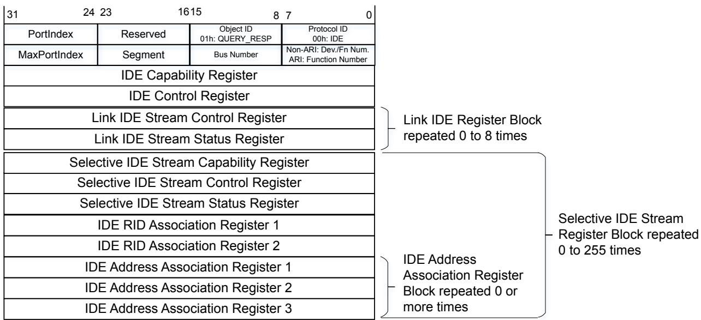

<details>
<summary>text_image</summary>

31 24 23 1615 8 7 0
PortIndex Reserved Object ID Protocol ID
01h: QUERY_RESP 00h: IDE
MaxPortIndex Segment Bus Number Non-ARI: Dev./Fn Num.
ARI: Function Number
IDE Capability Register
IDE Control Register
Link IDE Stream Control Register
Link IDE Stream Status Register
Selective IDE Stream Capability Register
Selective IDE Stream Control Register
Selective IDE Stream Status Register
IDE RID Association Register 1
IDE RID Association Register 2
IDE Address Association Register 1
IDE Address Association Register 2
IDE Address Association Register 3
Link IDE Register Block
repeated 0 to 8 times
Selective IDE Stream
Register Block repeated
0 to 255 times
IDE Address
Association Register
Block repeated 0 or
more times
</details>

Figure 6-53 Query Response (QUERY\_RESP) Data Object§

<table><tr><td colspan="5">Reserved</td><td>Object ID
02h: KEY_PROG</td><td>Protocol ID
00h: IDE</td></tr><tr><td>PortIndex</td><td>Key Sub-Stream</td><td>R</td><td>↘</td><td>↘</td><td>Reserved</td><td>Stream ID</td></tr><tr><td>Key_DW7_Byte3</td><td colspan="4">Key_DW7_Byte2</td><td>Key_DW7_Byte1</td><td>Key_DW7_Byte0</td></tr><tr><td>Key_DW6_Byte3</td><td colspan="4">Key_DW6_Byte2</td><td>Key_DW6_Byte1</td><td>Key_DW6_Byte0</td></tr><tr><td>Key_DW5_Byte3</td><td colspan="4">Key_DW5_Byte2</td><td>Key_DW5_Byte1</td><td>Key_DW5_Byte0</td></tr><tr><td>Key_DW4_Byte3</td><td colspan="4">Key_DW4_Byte2</td><td>Key_DW4_Byte1</td><td>Key_DW4_Byte0</td></tr><tr><td>Key_DW3_Byte3</td><td colspan="4">Key_DW3_Byte2</td><td>Key_DW3_Byte1</td><td>Key_DW3_Byte0</td></tr><tr><td>Key_DW2_Byte3</td><td colspan="4">Key_DW2_Byte2</td><td>Key_DW2_Byte1</td><td>Key_DW2_Byte0</td></tr><tr><td>Key_DW1_Byte3</td><td colspan="4">Key_DW1_Byte2</td><td>Key_DW1_Byte1</td><td>Key_DW1_Byte0</td></tr><tr><td>Key_DW0_Byte3</td><td colspan="4">Key_DW0_Byte2</td><td>Key_DW0_Byte1</td><td>Key_DW0_Byte0</td></tr><tr><td>IFV_DW1_Byte3</td><td colspan="4">IFV_DW1_Byte2</td><td>IFV_DW1_Byte1</td><td>IFV_DW1_Byte0</td></tr><tr><td>IFV_DW0_Byte3</td><td colspan="4">IFV_DW0_Byte2</td><td>IFV_DW0_Byte1</td><td>IFV_DW0_Byte0</td></tr></table>

Figure 6-54 Key Programming (KEY\_PROG) Data Object with Example 256b Key§

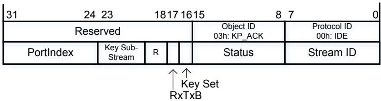

<details>
<summary>text_image</summary>

31 24 23 1817 1615 8 7 0
Reserved Object ID Protocol ID
03h: KP_ACK 00h: IDE
PortIndex Key Sub-Stream R Status Stream ID
Key Set
RxTxB
</details>

Figure 6-55 Key Programming Acknowledgement (KP\_ACK) Data Object§

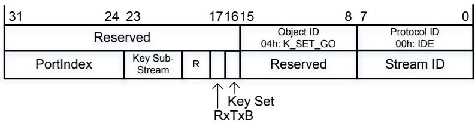

<details>
<summary>text_image</summary>

31 24 23 171615 8 7 0
Reserved
Object ID
04h: K_SET_GO
Protocol ID
00h: IDE
PortIndex Key Sub-Stream R 
Reserved Stream ID
Key Set
RxTxB
</details>

Figure 6-56 Key Set Go (K\_SET\_GO) Data Object§

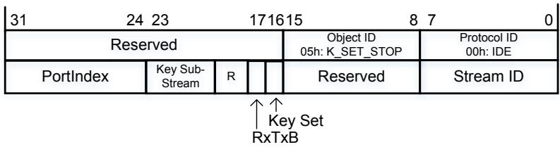

<details>
<summary>text_image</summary>

31 24 23 171615 8 7 0
Reserved
Object ID
05h: K_SET_STOP
Protocol ID
00h: IDE
PortIndex Key Sub-
Stream R Reserved Stream ID
Key Set
RxTxB
</details>

Figure 6-57 Key Set Stop (K\_SET\_STOP) Data Object§

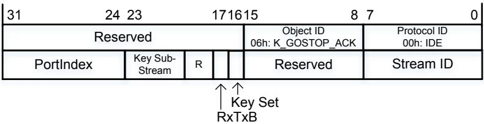

<details>
<summary>text_image</summary>

31 24 23 171615 8 7 0
Reserved Object ID Protocol ID
06h: K_GOSTOP_ACK 00h: IDE
PortIndex Key Sub-Stream R Reserved Stream ID
Key Set
RxTxB
</details>

Figure 6-58 Key Set Go/Stop Acknowledgement (K\_GOSTOP\_ACK) Data Object§

For implementations not requiring interoperable authentication and key exchange, it is permitted to use other mechanisms for key management.

Rules related to keys:

• Key size must be 256 bits.  
• Following key exchange, implementation specific means must be used to ensure key security - the specific requirements for maintaining key security are platform and use case specific, and are out of scope for this document.  
• Separately generated keys must be used for the Transmitter and the Receiver, and for each Sub-Stream.

◦ It is strongly recommended that all keys for all Streams be separately generated.

• To support key updates without requiring an active IDE Stream to be put into a quiescent state, two key sets are defined, and the appropriate key set indicated in the IDE TLP Prefix (NFM)/OHC-C (FM) by the Transmitter via the K bit.

◦ The initial value of the K bit is permitted to be 0b or 1b, although it is recommended the initial value be 0b. Software must ensure that the selected key set has been provided with keys in both Partner Ports.  
◦ Once the Transmitter has indicated a change of key set via the K bit, the Receiver must mark the other key set/bank invalid until it is reprogrammed.  
◦ The specific requirements for the frequency of key updates are determined by platform security requirements that are outside the scope of this document.

▪ It is generally recommended that hardware provide enough key storage and management resources to support changing the keys for at least one active Stream without disruption to IDE operation.  
▪ It is expected that key update operations for multiple streams may need to be performed by firmware/software in a serialized fashion based on hardware key storage and management resource limitations.

## IMPLEMENTATION NOTE:

## UNDERSTANDING THE IDE KEY MANAGEMENT FLOW §

The following diagram illustrates a detailed example key programming flow using the IDE\_KM protocol defined above, although it should be understood that there are many possible variations on this flow.

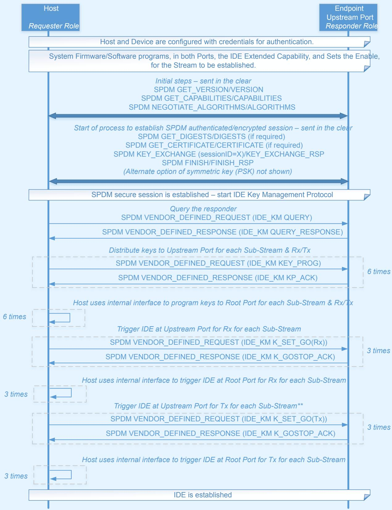

<details>
<summary>flowchart</summary>

```mermaid
graph TD
  A["Host Requester Role"] --> B["Endpoint Upstream Port Responder Role"]
  B --> C["Host and Device are configured with credentials for authentication."]
  C --> D["System Firmware/Software programs, in both Ports, the IDE Extended Capability, and Sets the Enable, for the Stream to be established."]
  D --> E["Initial steps – sent in the clear SPDM GET_VERSION/VERSION SPDM GET_CAPABILITIES/CAPABILITIES SPDM NEGOTIATE_ALGORITHMS/ALGORITHMS"]
  E --> F["Start of process to establish SPDM authenticated/encrypted session – sent in the clear SPDM GET_DIGESTS/DigestS (if required) SPDM GET_CERTIFICATE/CERTIFICATE (if required) SPDM KEY_EXCHANGE (sessionID=X)/KEY_EXCHANGE_RSP SPDM FINISH/FINISH_RSP (Alternate option of symmetric key (PSK) not shown)"]
  F --> G["SPDM secure session is established – start IDE Key Management Protocol"]
  G --> H["Query the responder SPDM VENDOR_DEDEFINED_REQUEST (IDE_KM QUERY)"]
  H --> I["SPDM VENDOR_DEDEFINED_RESPONSE (IDE_KM QUERY_RESPONSE)"]
  I --> J["Distribute keys to Upstream Port for each Sub-Stream & Rx/Tx SPDM VENDOR_DEDEFINED_REQUEST (IDE_KM KEY_PROG)"]
  J --> K["SPDM VENDOR_DEDEFINED_RESPONSE (IDE_KM KP_ACK)"]
  K --> L["Host uses internal interface to program keys to Root Port for each Sub-Stream & Rx/Tx"]
  L --> M["Trigger IDE at Upstream Port for Rx for each Sub-Stream"]
  M --> N["SPDM VENDOR_DEDEFINED_REQUEST (IDE_KM K_SET_GO(Rx))"]
  N --> O["SPDM VENDOR_DEDEFINED_RESPONSE (IDE_KM K_GOSTOP_ACK)"]
  O --> P["Host uses internal interface to trigger IDE at Root Port for Rx for each Sub-Stream"]
  P --> Q["Trigger IDE at Upstream Port for Tx for each Sub-Stream**"]
  Q --> R["SPDM VENDOR_DEDEFINED_REQUEST (IDE_KM K_SET_GO(Tx))"]
  R --> S["SPDM VENDOR_DEDEFINED_RESPONSE (IDE_KM K_GOSTOP_ACK)"]
  S --> T["Host uses internal interface to trigger IDE at Root Port for Tx for each Sub-Stream"]
  T --> U["IDE is established"]
```
</details>

\*\* When using DOE, the Upstream Port responds to the Configuration Write that completes the transfer of the K\_SET\_GO(Tx) data object for Completions with a non-IDE Completion, then triggers the use of IDE for Completions.

§

Figure 6-59 IDE\_KM Example

## 6.33.4 IDE TLPs §

TLPs secured by IDE are called IDE TLPs. In Non-Flit Mode, all IDE TLPs must use the IDE prefix (see § Figure 6-60), and this prefix must precede all other End-End TLP prefixes. In Flit Mode, all IDE TLPs must include OHC-C.

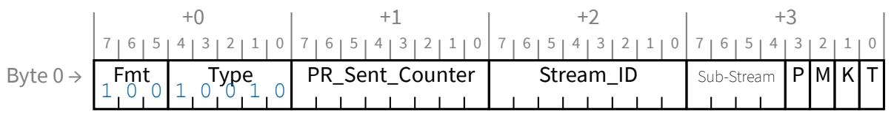

<details>
<summary>stacked bar chart</summary>

| Byte | Fmt | Type | PR_Sent_Counter | Stream_ID | Sub-Stream | P | M | K | T |
| --- | --- | --- | --- | --- | --- | --- | --- | --- | --- |
| 0 | 1 | 0 | 1 | 0 |  |  |  |  |  |
| 1 | 0 | 0 | 0 | 1 |  |  |  |  |  |
| 2 | 0 | 0 | 0 | 1 |  |  |  |  |  |
| 3 | 0 | 0 | 0 | 1 |  |  |  |  |  |
| 4 | 0 | 0 | 0 | 1 |  |  |  |  |  |
| 5 | 0 | 0 | 0 | 1 |  |  |  |  |  |
| 6 | 0 | 0 | 0 | 1 |  |  |  |  |  |
| 7 | 0 | 0 | 0 | 1 |  |  |  |  |  |
| Total | 7 | 6 | 5 | 4 |  |  |  |  |  |
| Total | 7 | 6 | 5 | 4 |  |  |  |  |  |
| Total | 7 | 6 | 5 | 4 |  |  |  |  |  |
| Total | 7 | 6 | 5 | 4 |  |  |  |  |  |
</details>

Figure 6-60 IDE TLP Prefix (NFM)

§

The IDE Prefix (NFM) includes:

• M bit – When Set, indicates this TLP includes a MAC

◦ When aggregation is not used, the M bit must be Set for all IDE TLPs.  
◦ Rules for the use of aggregation are given below.

• K bit – Indicates the key set used for this TLP

◦ After Transmitting a TLP with the K bit toggled for any Sub-Stream, subsequent TLP Transmissions for different Sub-Streams of the same Stream must also use the new value for the K bit.  
◦ After receiving a TLP with the K bit toggled, the Receiver must transition to the new key and IV set for that TLP and all subsequent TLPs associated with the Sub-Stream, and must mark the old key and IV set invalid until reprogrammed.

▪ Such transitions must not affect other Sub-Streams of the IDE Stream at the Receiver.

• T bit – When Set, indicates the TLP originated from within a trusted execution environment (see § Section 6.33.1 ).

◦ It is permitted for IDE TLPs to originate from both trusted and non-trusted execution environments, and the value of the T bit does not modify the handling of TLPs within IDE per se; the rules for trusted execution environments are not defined in this document.  
◦ The T bit must be Clear unless the use of the T bit has been explicitly defined by TEE management mechanisms outside the scope of this document.

• P bit – When Set, indicates the TLP includes PCRC.

◦ Must only be Set when the M bit is also Set.

• Sub-Stream – Indicates the Sub-Stream identifier value

• Stream\_ID – Indicates the associated Stream ID value

• PR\_Sent\_Counter – For Non-Posted Requests and Completions the value must be determined according to the rules below. This field must be Reserved for Posted Requests.

In Flit Mode:

• The presence of MAC and/or PCRC are indicated using the TS field.  
• The K bit, T bit, Sub-Stream, Stream\_ID, and PR\_Sent\_Counter are included in OHC-C, and have the same meaning as in the IDE Prefix.

IDE uses Galois/Counter Mode (GCM) as defined in [AES-GCM], referred to as AES-GCM. For IDE TLPs, TLP data payload content forms the “Plaintext”, also known as P, as defined in [AES-GCM], and the TLP Header and certain other elements (defined below) form the “Additional Authenticated Data”, also known as A, as defined in [AES-GCM].

The Message Authentication Code (MAC) 136 size, also known as t, as defined in [AES-GCM], must be 96b (see § Figure 6-61).

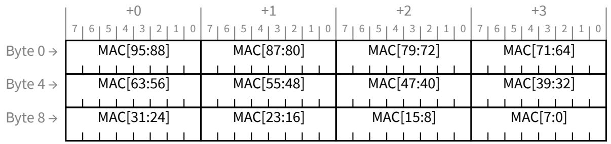  
§  
Figure 6-61 MAC Layout

Flow Control credit accounting for IDE TLPs must handle the MAC as covered by the Header Credit.

For IDE TLPs, AES-GCM can be applied to each IDE TLP, or aggregation can be used to apply AES-GCM to multiple IDE TLPs, reducing the per-TLP overhead for the IDE TLP MAC. For a Link IDE Stream, local prefixes must be covered by the MAC (see § Figure 6-62, § Figure 6-63), § Figure 6-66, and § Figure 6-67). For Selective IDE Streams, local prefixes must not be covered by the MAC (see § Figure 6-64, § Figure 6-65, § Figure 6-68, and § Figure 6-69).

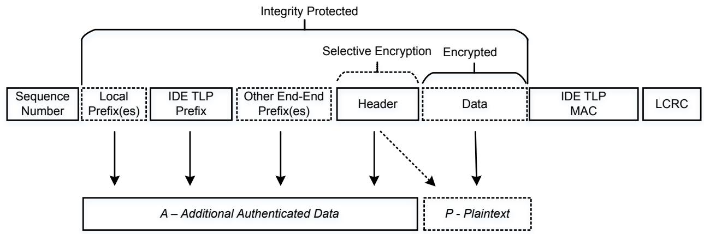

<details>
<summary>flowchart</summary>

```mermaid
graph TD
  A["Integrity Protected"] --> B["Sequence Number"]
  B --> C["Local Prefix(es)"]
  B --> D["IDE TLP Prefix"]
  B --> E["Other End-End Prefix(es)"]
  B --> F["Header"]
  F --> G["Data"]
  G --> H["IDE TLP MAC"]
  G --> I["LCRC"]
  C --> J["A – Additional Authenticated Data"]
  D --> J
  E --> J
  F --> K["P - Plaintext"]
  G --> K
  H --> K
  I --> K
    style A fill:#f9f,stroke:#333
    style B fill:#ccf,stroke:#333
    style C fill:#cfc,stroke:#333
    style D fill:#cfc,stroke:#333
    style E fill:#cfc,stroke:#333
    style F fill:#cfc,stroke:#333
    style G fill:#cfc,stroke:#333
    style H fill:#cfc,stroke:#333
    style I fill:#cfc,stroke:#333
```
</details>

Figure 6-62 Example of IDE TLP for a Link IDE Stream without Aggregation (Non-Flit Mode)§

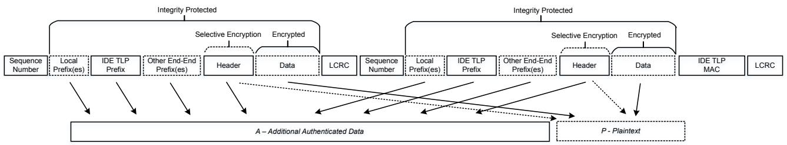

<details>
<summary>flowchart</summary>

```mermaid
graph TD
  A["Integrity Protected"] --> B["Sequence Number"]
  A --> C["Local Prefix(es)"]
  A --> D["IDE TLP Prefix"]
  A --> E["Other End-End Prefix(es)"]
  A --> F["Header"]
  A --> G["Data"]
  A --> H["LCRC"]
  I["Integrity Protected"] --> J["Sequence Number"]
  I --> K["Local Prefix(es)"]
  I --> L["IDE TLP Prefix"]
  I --> M["Other End-End Prefix(es)"]
  I --> N["Header"]
  I --> O["Data"]
  I --> P["IDE TLP MAC"]
  I --> Q["LCRC"]
  R["A – Additional Authenticated Data"] --> S["P - Plaintext"]
  T["Integrity Protected"] --> U["Selective Encryption"]
  T --> V["Encrypted"]
  W["Selective Encryption"] --> X["Header"]
  Y["Encrypted"] --> Z["Data"]
  AA["Selective Encryption"] --> AB["Header"]
  AC["Encrypted"] --> AD["Data"]
```
</details>

Figure 6-63 IDE TLP – Example Showing Aggregation of Two TLPs for a Link IDE Stream (Non-Flit Mode)§

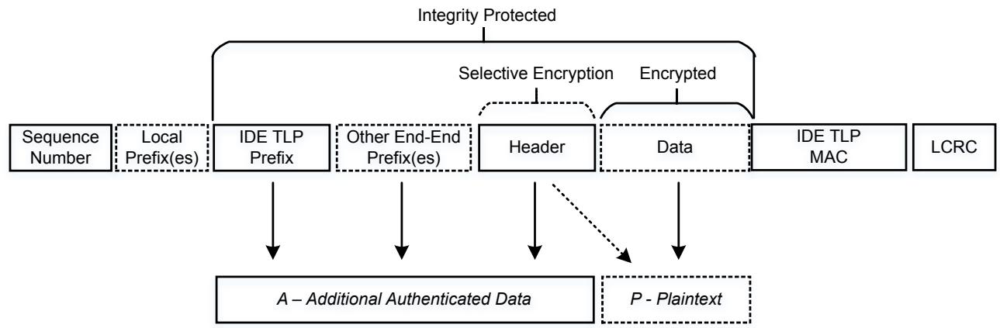

<details>
<summary>flowchart</summary>

```mermaid
graph TD
  A["Integrity Protected"] --> B["Selective Encryption"]
  A --> C["Encrypted"]
  B --> D["Sequence Number"]
  B --> E["Local Prefix(es)"]
  B --> F["IDE TLP Prefix"]
  B --> G["Other End-End Prefix(es)"]
  B --> H["Header"]
  B --> I["Data"]
  B --> J["IDE TLP MAC"]
  B --> K["LCRC"]
  F --> L["A – Additional Authenticated Data"]
  G --> L
  H --> M["P - Plaintext"]
  I --> M
  J --> M
  K --> M
```
</details>

Figure 6-64 IDE TLP – Example of IDE TLP for a Selective IDE Stream without Aggregation (Non-Flit Mode)§

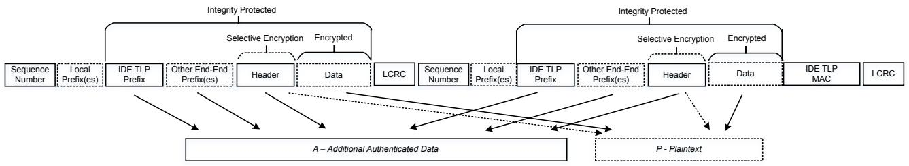

<details>
<summary>flowchart</summary>

```mermaid
graph TD
  A["Sequence Number"] --> B["Local Prefix(es)"]
  B --> C["IDE TLP Prefix"]
  C --> D["Other End-End Prefix(es)"]
  D --> E["Header"]
  E --> F["Data"]
  F --> G["LCRC"]
  G --> H["Sequence Number"]
  H --> I["Local Prefix(es)"]
  I --> J["IDE TLP Prefix"]
  J --> K["Other End-End Prefix(es)"]
  K --> L["Header"]
  L --> M["Data"]
  M --> N["IDE TLP MAC"]
  N --> O["LCRC"]
    
  P["A - Additional Authenticated Data"] --> C
  P --> E
  P --> J
  P --> L
    
    P -.-> Q["P - Plaintext"]
    
  R["Integrity Protected"] --> S["Integrity Protected"]
  S --> T["Selective Encryption"]
  S --> U["Encrypted"]
    
  V["Integrity Protected"] --> W["Integrity Protected"]
  W --> X["Selective Encryption"]
  W --> Y["Encrypted"]
    
  Z["Decoding"] --> AA["Decoding"]
  AA --> AB["Decoding"]
  AB --> AC["Decoding"]
```
</details>

Figure 6-65 IDE TLP – Example Showing Aggregation of Two TLPs for a Selective IDE Stream (Non-Flit Mode)§

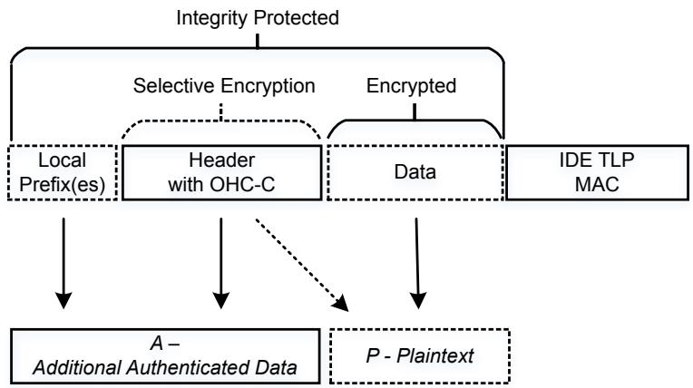

<details>
<summary>flowchart</summary>

```mermaid
graph TD
  A["Integrity Protected"] --> B["Selective Encryption"]
  A --> C["Encrypted"]
  B --> D["Local Prefix(es)"]
  B --> E["Header with OHC-C"]
  C --> F["Data"]
  C --> G["IDE TLP MAC"]
  D --> H["A - Additional Authenticated Data"]
  E --> H
  F --> I["P - Plaintext"]
  G --> I
```
</details>

Figure 6-66 Example of IDE TLP for a Link IDE Stream without Aggregation (Flit Mode)§

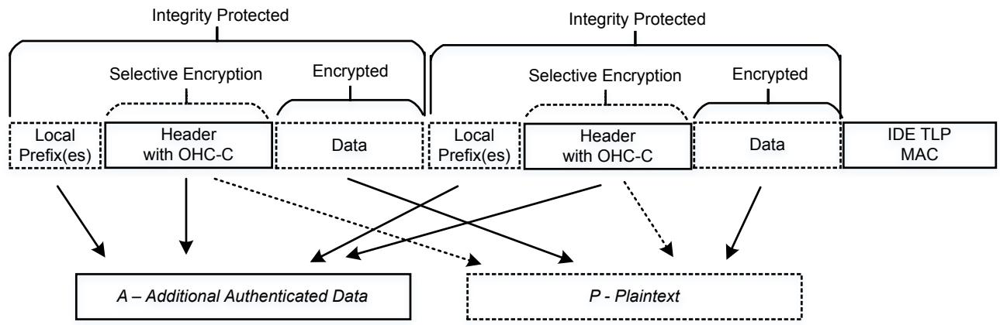

<details>
<summary>flowchart</summary>

```mermaid
graph TD
  A["Integrity Protected"] --> B["Selective Encryption"]
  A --> C["Encrypted"]
  B --> D["Local Prefix(es)"]
  C --> E["Data"]
  D --> F["Header with OHC-C"]
  E --> G["Local Prefix(es)"]
  F --> H["Header with OHC-C"]
  G --> I["IDE TLP MAC"]
  H --> J["A – Additional Authenticated Data"]
  I --> K["P - Plaintext"]
    F -.-> L["Direct link to Data"]
    G -.-> M["Direct link to Data"]
    H -.-> N["Direct link to Data"]
    I -.-> O["Direct link to Data"]
```
</details>

Figure 6-67 IDE TLP – Example Showing Aggregation of Two TLPs for a Link IDE Stream (Flit Mode)§

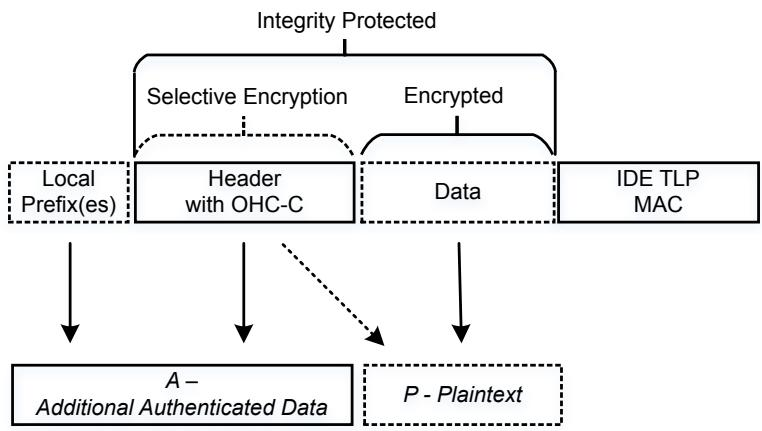

<details>
<summary>flowchart</summary>

```mermaid
graph TD
  A["Integrity Protected"] --> B["Selective Encryption"]
  A --> C["Encrypted"]
  B --> D["Local Prefix(es)"]
  B --> E["Header with OHC-C"]
  C --> F["Data"]
  C --> G["IDE TLP MAC"]
  D --> H["A - Additional Authenticated Data"]
  E --> I["P - Plaintext"]
  F --> I
  G --> I
```
</details>

Figure 6-68 IDE TLP – Example of IDE TLP for a Selective IDE Stream without Aggregation (Flit Mode)§

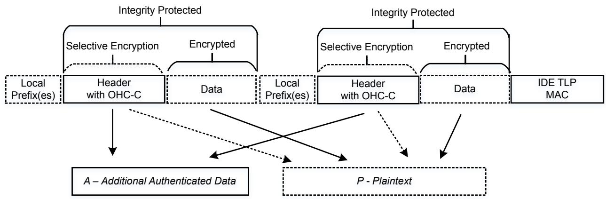

<details>
<summary>flowchart</summary>

```mermaid
graph TD
  A["Integrity Protected"] --> B["Selective Encryption"]
  A --> C["Encrypted"]
  B --> D["Header with OHC-C"]
  C --> E["Data"]
  D --> F["Local Prefix(es)"]
  E --> G["Local Prefix(es)"]
  H["Integrity Protected"] --> I["Selective Encryption"]
  H --> J["Encrypted"]
  I --> K["Header with OHC-C"]
  J --> L["Data"]
  K --> M["IDE TLP MAC"]
  N["A – Additional Authenticated Data"] --> D
  O["P - Plaintext"] --> K
  O --> L
    style A fill:#f9f,stroke:#333
    style H fill:#f9f,stroke:#333
    style N fill:#ccf,stroke:#333
```
</details>

Figure 6-69 IDE TLP – Example Showing Aggregation of Two TLPs for a Selective IDE Stream (Flit Mode)§

The inputs A and P must be formed by concatenating the included TLP content in Byte order as defined in § Section 2.1.2 . Although the A and P content is conceptually concatenated as illustrated in these figures, the content placement in the IDE TLPs is the same as in non-IDE TLPs. Once the A and P content is constructed, [AES-GCM] defines how A and P must be padded – this padding is not illustrated here, and the padding is used in the [AES-GCM] calculations but is not included in the TLPs transmitted/received. When aggregation is used, the A and P content for aggregated TLPs is conceptually concatenated, for each type of content, prior to padding.

Partial header encryption provides the ability to reduce potential exposure to side-channel attacks by encryption some portions of the Header of an IDE TLP while maintaining information that is required for TLP routing and low-level TLP processing in the clear. § Figure 6-70 illustrates, at a high level, the application of partial header enryption.

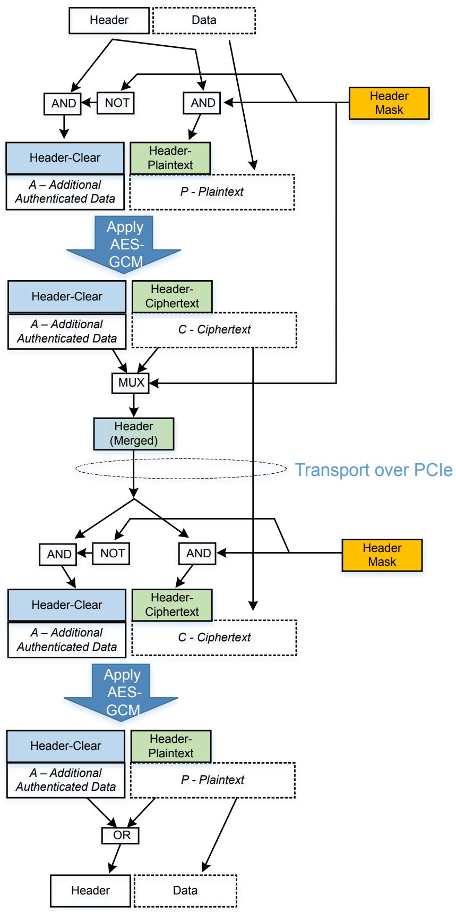

<details>
<summary>flowchart</summary>

```mermaid
graph TD
  A["Header"] --> B["AND"]
  C["Data"] --> D["AND"]
  B --> E["NOT"]
  D --> F["AND"]
  E --> G["Header-Clear"]
  F --> H["Header-Plaintext"]
  G --> I["A - Additional Authenticated Data"]
  H --> J["P - Plaintext"]
  I --> K["MUX"]
  J --> L["Apply AES-GCM"]
  K --> L
  L --> M["Header-Clear"]
  L --> N["Header-Ciphertext"]
  M --> O["Header (Merged)"]
  N --> P["C - Ciphertext"]
  O --> Q["AND"]
  P --> R["AND"]
  Q --> S["Header-Clear"]
  R --> T["Header-Ciphertext"]
  S --> U["Apply AES-GCM"]
  T --> V["Header-Plaintext"]
  U --> W["Header-Clear"]
  V --> X["P - Plaintext"]
  W --> Y["OR"]
  X --> Z["Header"]
  Y --> AA["Data"]
  Z --> AB["Data"]
    style A fill:#f9f,stroke:#333
    style C fill:#f9f,stroke:#333
    style D fill:#f9f,stroke:#333
    style E fill:#ccf,stroke:#333
    style F fill:#ccf,stroke:#333
    style G fill:#ccf,stroke:#333
    style H fill:#ccf,stroke:#333
    style I fill:#ccf,stroke:#333
    style J fill:#ccf,stroke:#333
    style K fill:#ccf,stroke:#333
    style L fill:#ccf,stroke:#333
    style M fill:#ccf,stroke:#333
    style N fill:#ccf,stroke:#333
    style O fill:#ccf,stroke:#333
    style P fill:#ccf,stroke:#333
    style Q fill:#ccf,stroke:#333
    style R fill:#ccf,stroke:#333
    style S fill:#ccf,stroke:#333
    style T fill:#ccf,stroke:#333
    style U fill:#ccf,stroke:#333
    style V fill:#ccf,stroke:#333
    style W fill:#ccf,stroke:#333
```
</details>

## Figure 6-70 High Level Flow For Partial Header Encryption§

In partial header enryption, the Header Mask is determined by the setting in the Partial Header Encryption Mode field of the Selective IDE Stream Control Register or Link IDE Control Register. In the Header Mask, a value of 0b indicates a Header bit that is not to be encrypted, and a value of 1b indicates a Header bit that is to be encrypted. All header bits have a “place” in both A and P, but the Header Mask selects from the encrypted and plaintext portions of the header such that each element of the header, as transmitted, will be one or the other, and the overall size of the header and the locations of header fields are unchanged. At the receiver, the operation is reversed in order to apply AES-GCM to the A and C content and then finally the complete header is reconstructed. To avoid the potential need to apply individual cryptographic pads to both the header and data payload, the header must be padded prior to the application of [AES-GCM], and the padding discarded afterwards. The padding must be in the form of 0's added after the last bit of the header such that the resulting padded header is an integral multiple of 128 bits in size:

1. Let $u = 1 2 8 ^ { \star }$ Ceiling(SizeInBits(Header)/128)  
2. Padded Header = Unpadded Header ${ \parallel 0 } ^ { u }$

The use of Local TLP Prefixes with IDE TLPs is permitted. Local TLP Prefixes, if present, must precede the IDE Prefix (NFM). For Link IDE Streams, Local TLP Prefixes must be included in A. For Selective IDE Streams, Local TLP Prefixes must not be included in A or P.

The IDE Prefix (NFM) must be included in A. All OHC content (FM) must be included in A.

In NFM, the use of other End-End TLP Prefixes, besides the IDE Prefix, with IDE TLPs is permitted. End-End TLP Prefixes, if present, must follow the IDE Prefix, and must be included in A.

When aggregation is used, all TLPs associated with a single MAC are considered to be part of an “aggregated unit.”

As defined in [AES-GCM], a single invocation is performed for each TLP when aggregation is not used, and for each aggregated unit when aggregation is used.

As with all TLPs, IDE TLPs are covered by Data Link Layer mechanisms, such that physical Link errors are detected and corrected before received TLPs are presented to the receiver’s cryptographic processing mechanisms.

The use of ECRC with IDE TLPs is not permitted. If ECRC is enabled for non-IDE TLPs, then IDE TLPs must be formed as if ECRC were not enabled, and the TD bit in the TLP Header must be Clear.

To enable the detection of faults in the encryption/decryption logic, which occur outside of the path protected by the MAC, IDE implementations are permitted optionally to support the Plaintext CRC (PCRC) mechanism, for which the following rules apply:

• Software must only enable PCRC when both Partner Ports support the PCRC mechanism.

◦ It is permitted to enable the PCRC mechanism on a per-IDE Stream basis.

When PCRC is enabled for an IDE Stream, all Transmitted TLPs associated with that Stream that include a MAC (as indicated by the M bit in the IDE Prefix (NFM)/OHC-C (FM) being Set) must also include PCRC (as indicated by the P bit in the IDE Prefix (NFM)/OHC-C (FM) being Set), if and only if there is P content in the TLP or aggregated unit of TLPs.

◦ When aggregation is used, the TLPs of an aggregated unit that do not include a MAC also must not include PCRC (see § Figure 6-71).


<details>
<summary>flowchart</summary>

```mermaid
graph TD
  A["Sequence Number"] --> B["Local Prefix(es)"]
  B --> C["IDE TLP Prefix"]
  C --> D["Other End-End Prefix(es)"]
  D --> E["Header"]
  E --> F["Data"]
  F --> G["LCRC"]
  G --> H["Sequence Number"]
  H --> I["Local Prefix(es)"]
  I --> J["IDE TLP Prefix"]
  J --> K["Other End-End Prefix(es)"]
  K --> L["Header"]
  L --> M["Data"]
  M --> N["IDE TLP MAC"]
  N --> O["LCRC"]
  P["A - Additional Authenticated Data"] --> C
  P --> E
  P --> J
  Q["P - Plaintext"] --> L
  Q --> M
  R["Integrity Protected"] --> S["Integrity Protected"]
  S --> T["Selective Encryption"]
  S --> U["Encrypted"]
  V["Integrity Protected"] --> W["Integrity Protected"]
  W --> X["Selective Encryption"]
  W --> Y["Encrypted"]
  Z["Integrity Protected"] --> AA["Integrity Protected"]
  AA --> AB["Selective Encryption"]
  AA --> AC["Encrypted"]
```
</details>

Figure 6-71 Example Illustrating PCRC Application to Two Aggregated IDE TLPs for a Link IDE Stream (NFM)§

• When PCRC is enabled for an IDE Stream, the ultimate Receiver must check that all received TLPs or aggregated units associated with that Stream that include P content and a MAC (as indicated by the M bit in the IDE Prefix (NFM)/OHC-C (FM) being Set) also have the P bit in the IDE Prefix (NFM)/OHC-C (FM) Set.

◦ If, for a TLP, the P bit in the IDE Prefix (NFM)/OHC-C (FM) is Clear and the M bit is Set, the Receiver must report this as a PCRC Check Failed error.

• PCRC must be calculated across all P content 137 for a given invocation of AES-GCM, and per the following:

◦ The polynomial used has coefficients expressed as 04C1 1DB7h

◦ The seed value must be FFFF FFFFh

◦ All P content must be included in the PCRC calculation

◦ PCRC calculation starts with bit 0 of byte 0 and proceeds from bit 0 to bit 7 of each byte of P

◦ The the result of the PCRC calculation must be complemented, mapped as shown in § Table 2-51 (following the same mapping as for ECRC), and appended to the P content, and encrypted/decrypted along with the other P content, with the encrypted PCRC value appended to the other P content and preceding the MAC (see § Figure 6-71).

• The PCRC must only be checked by the ultimate Receiver of the IDE TLP including PCRC.

◦ A failure of the PCRC check indicates that one or more bits of the data payload have been corrupted — the Receiver’s use of the data payload is outside the scope of this specification, but it is strongly recommended that the corrupted data not be used as if it were uncorrupted.

◦ PCRC Check Failed is a reported error.

• Flow Control credit accounting for IDE TLPs that include PCRC must handle the PCRC as covered by the Header Credit.

## IMPLEMENTATION NOTE: PCRC REUSE OF ECRC LOGIC §

In most respects, PCRC is calculated in the same way as ECRC, and the CRC polynomial is the same.

In some implementations it may be possible to re-use the same logic for PCRC calculation as is used for ECRC, when both PCRC and ECRC are supported.

ECRC is not allowed on IDE TLPs, and so no TLP could have both PCRC and ECRC.

137. As with ECRC, the PCRC is calculated using the TLP as-transmitted, including, for any data payload, all bytes as-transmitted regardless of the byte enable values.

These rules apply to Selective IDE Stream TLPs:

• § Table 6-33 defines which TLP types are permitted for a Selective IDE Stream.

◦ TLP types that are not permitted for a Selective IDE Stream are still permitted to be used, and can be secured using Link IDE, if enabled.

• Receipt of an IDE TLP associated with a Selective IDE Stream that is not a permitted TLP Type is an IDE Check Failed error.

◦ The Receiver must transition to Insecure for the associated IDE Stream.

◦ This is a reported error associated with the Receiving Port (see § Section 6.2 ).

Table 6-33 TLP Types for Selective IDE Streams§

<table><tr><td>TLP Type</td><td>Description</td><td>Permitted for Selective IDE Streams</td></tr><tr><td>MRd</td><td>Memory Read Request</td><td>Y</td></tr><tr><td>MRdLk</td><td>Memory Read Request-Locked</td><td>Y</td></tr><tr><td>MWr</td><td>Memory Write Request</td><td>Y</td></tr><tr><td>IORd</td><td>I/O Read Request</td><td>N</td></tr><tr><td>IOWr</td><td>I/O Write Request</td><td>N</td></tr><tr><td>CfgRd0</td><td>Configuration Read Type 0</td><td>N</td></tr><tr><td>CfgWr0</td><td>Configuration Write Type 0</td><td>N</td></tr><tr><td>CfgRd1</td><td>Configuration Read Type 1</td><td>Y</td></tr><tr><td>CfgWr1</td><td>Configuration Write Type 1</td><td>Y</td></tr><tr><td>DMWr</td><td>Deferrable Memory Write</td><td>Y</td></tr><tr><td>Msg</td><td>Message Request</td><td>Y when Routed by ID, Routed by Address, or Routed to Root complex $^{138}$ N for other routing mechanisms</td></tr><tr><td>MsgD</td><td>Message Request with data</td><td>Y when Routed by ID, Routed by Address, or Routed to Root complex $^{139}$ N for other routing mechanisms</td></tr><tr><td>Cpl</td><td>Completion without Data</td><td>Y</td></tr><tr><td>CplD</td><td>Completion with Data.</td><td>Y</td></tr><tr><td>CplLk</td><td>Completion for Locked Memory Read without Data</td><td>Y</td></tr><tr><td>CplDLk</td><td>Completion for Locked Memory Read – otherwise like CplD.</td><td>Y</td></tr><tr><td>FetchAdd</td><td>Fetch and Add AtomicOp Request</td><td>Y</td></tr><tr><td>Swap</td><td>Unconditional Swap AtomicOp Request</td><td>Y</td></tr><tr><td>CAS</td><td>Compare and Swap AtomicOp Request</td><td>Y</td></tr><tr><td>LPrfx</td><td>Local TLP Prefix</td><td>Allowed to be present, but not secured if TLP is associated with a Selective IDE Stream</td></tr><tr><td>EPrfx (appicable in NFM only)</td><td>End-End TLP Prefix</td><td>Y if the TLP is part of a Selective IDE Stream</td></tr></table>

• All IDE TLPs must be associated with an IDE Stream, identified via an IDE Stream ID.

◦ Software must assign IDE Stream IDs such that two Partner Ports use the same value for a given IDE Stream.  
◦ Software must assign IDE Stream IDs such that every enabled IDE Stream associated with a given terminal Port is assigned a unique Stream ID value at that Port  
◦ It is permitted for a platform to further restrict the assignment of Stream IDs.

• When only a Link IDE Stream is enabled for a particular TC, all TLPs using that TC must be secured using the corresponding Link IDE Stream.

• For a TLP to be associated with a specific Selective IDE Stream, the following criteria must be satisfied:

◦ The Selective IDE Stream must be enabled.  
◦ The TLP type must be permitted for Selective IDE Streams (see § Table 6-33).  
◦ The TC of the TLP must match the TC value in the Selective IDE Stream Control Register.  
◦ For a Configuration Request, the Selective IDE for Configuration Requests Enable bit must be Set.  
◦ For a Completion, the Stream ID and T bit values in the Selective IDE Stream must match those in the corresponding Non-Posted Request.  
◦ If an ACS mechanism in the Port redirects the TLP towards the Root Complex, the Default Stream bit must be Set, indicating that the Selective IDE Stream targets the Root Complex. See § Section 6.12.3 .  
◦ For a Routed-to-Root-Complex Message, the Default Stream bit must be Set, indicating that the Selective IDE Stream targets the Root Complex.  
For a Configuration Request or ID-Routed Message not already associated with a Default Stream, the destination RID must be greater than or equal to the RID Base and less than or equal to the RID Limit in the Selective IDE RID Association Register block, unless there is an exception made via implementation specific means.  
◦ For a Memory Request (including an ATS Translation Request) not already associated with a Default Stream, the destination address must be greater than or equal to the Memory Base value and less than or equal to Memory Limit value in a Selective IDE Address Association Register block (as applies when targeting a specific Function’s BAR or the Base/Limit range of addresses assigned to a Device) 140 , unless there is an exception made via implementation specific means.  
◦ For a TLP not already associated with any other Stream, the Default Stream bit must be Set.  
◦ The TLP is selected through implementation specific means. For example, the Transmitter could associate all Memory Requests initiated by one or more internal Functions with a specific Selective IDE Stream, particularly when it is known that the Partner Port is a Root Port, and that all Requests initiated by that internal Function target system memory.  
◦ If a TLP does not meet all applicable criteria above for a specific Selective IDE Stream, the TLP must not be associated with any Selective IDE Stream.

• TLPs not determined by the Transmitter to be associated with a specific Selective IDE Stream must not be associated with any Selective IDE Stream.  
• Separate TCs must use separate Selective IDE Streams.  
• Software must ensure that Selective IDE Streams are assigned to RID and address ranges that are not overlapping.

◦ If software violates this rule by programming overlapping ranges, hardware must associate a given TLP with one Selective IDE Stream matching the RID/address range, but it is implementation specific which Selective IDE Stream from the overlapping set is associated.

## These rules apply to IDE Fail Messages:

• Receivers must accept IDE Fail Messages received as IDE TLPs and also as non-IDE TLPs.  
• When an IDE Fail Message is to be transmitted on an enabled Stream that is in the Insecure state, the Message must be transmitted as a non-IDE TLP. This includes cases where the transition of that Stream to Insecure was the trigger for the IDE Fail Message.  
• When an IDE Fail Message is to be transmitted on an enabled Stream that is in the Secure state, the Message must be transmitted as an IDE TLP. This includes cases where the transition to Insecure on a Selective IDE Stream is the trigger for the IDE Fail Message, and the transmission Stream is either a different Selective IDE Stream or a Link IDE Stream.

## These rules apply to TLPs other than IDE Fail Messages:

• When ready to schedule a TLP to be Transmitted that is associated with an enabled Stream that is in the Insecure state, the Transmitter must instead discard the TLP.  
• When Link IDE is Enabled for a given TC, and a TLP is received on that TC as a non-IDE TLP, the Receiver must discard the TLP.  
• When both Link IDE Stream and one or more Selective IDE Stream Stream(s) are enabled at the same Port, for Transmitted TLPs the Selective IDE Stream(s) take precedence: selected TLPs must be associated with the Selective IDE Stream(s); TLPs not associated with any Selective IDE Stream must use Link IDE.

◦ If both Link IDE and Selective IDE are enabled, and a TLP to be Transmitted is associated with an enabled Selective IDE Stream that is in the Insecure state, the Transmitter must not use Link IDE for the TLP and must instead discard the TLP.

• At the ultimate Receiver, IDE TLPs must be associated with the Stream ID indicated in the IDE Prefix (NFM)/OHC-C (FM).

• Once Link IDE has been enabled (see § Section 6.33.3 ), for each Sub-Stream of the Stream, until the Port receives an IDE TLP on that Sub-Stream, the Port must continue to accept non-IDE TLPs of the FC type corresponding to that Sub-Stream.

◦ Once the Port receives an IDE TLP on a Sub-Stream it must discard non-IDE TLPs on that Sub-Stream for as long as the associated Stream is enabled.

• For Root Ports, when Selective IDE for Configuration Requests Enable for a particular Selective IDE Stream is Set, all Configuration Requests that match that Selective IDE Stream must be Transmitted as IDE TLPs associated with that Selective IDE Stream.

After enabling Selective IDE for Configuration Requests it is recommended that system software perform a Configuration Request using that Selective IDE Stream, so that the Partner Port will be triggered to reject subsequent Configuration Requests not associated with the Selective IDE Stream.  
◦ How the Root Complex ensures that only authorized system software generates Configuration Requests is outside the scope of this document.

• Once Selective IDE for Configuration Requests Enable for a particular Selective IDE Stream is Set by system software, it is strongly recommended that system software not Clear the bit for as long as the Selective IDE Stream itself is enabled.  
• Specific Selective IDE Streams on Root Ports for which Selective IDE for Configuration Requests Enable is Set must transmit Configuration Requests that are associated with those Selective IDE Streams as Type 1 Configuration Requests.  
• Switches must pass Configuration Requests received as IDE TLPs and directed pass through the Switch unmodified (as Type 1 Configuration Requests) through the Egress Downstream Port, provided that Selective IDE for Configuration Requests Supported is Set at the Switch Upstream Port, and provided that both the Upstream Port and the Egress Downstream Port have Flow-Through IDE Stream Enabled Set.  
For Upstream Ports that are the IDE Terminus of a Selective IDE Stream with Selective IDE for Configuration Requests Supported Set, until the Port receives a Configuration Request as an IDE TLP on that Selective IDE Stream, the Port must continue to accept Configuration Requests as non-IDE TLPs. Once a Configuration Request has been received as an IDE TLP on that Selective IDE Stream, then the Port must accept only Configuration Requests associated with that Selective IDE Stream, and must discard all Configuration Requests received on other IDE Streams or as non-IDE TLPs, for as long as that Selective IDE Stream is enabled.  
Configuration Requests associated with a Selective IDE Stream will be received at the Upstream Port as Type 1 Configuration Requests – Such Configuration Requests must be accepted by the Receiver provided the Target RID is an implemented Function or, for a Switch, passed through to the Egress Port if the Target RID is below a Switch Downstream Port. If the Target RID is not an implemented Function, the Configuration Request must be handled as an Unsupported Request.  
• For Selective IDE, for TLP types other than Configuration Requests, the requirements for rejecting TLPs are determined by the TEE associated with the Selective IDE Stream (see § Section 6.33.1 ).  
• The use of TLP poisoning, as indicated by the EP bit in the TLP header being Set, is permitted for IDE TLPs when applied by the originating Transmitter.  
• For IDE TLPs, it is not permitted to modify any part of a TLP, including the EP bit, at any intermediate point between the two Partner Ports.  
• Software must configure Selective IDE such that all Links on the entire path between the Partner Ports are operating either in FM, or in NFM.

The use of Multicast (see § Section 6.14 ) with Selective IDE Streams is outside the scope of this specification.

## 6.33.5 IDE TLP Sub-Streams


With [AES-GCM] it is desirable to maintain TLPs in-order so that the Transmitter and Receiver can independently maintain IV in sync with each other without the overhead required to transmit the IV for each TLP or aggregated unit. However, certain TLP bypassing is required for deadlock avoidance, and this is reflected in the different types of Flow Control Credit Types – Posted Request header/data payload, Non-Posted Request header/data payload, and Completion header/data payload (see § Section 2.6.1 ). To provide in-order TLP processing where possible, and to simplify implementations that structure their internal buffering according to these Flow Control Credit types, IDE introduces the concept of a Sub-Stream within which TLP traffic is maintained fully in-order between the IDE Partner Ports. It is ensured within IDE Sub-Streams that TLPs travel in-order between the IDE Partner Ports both to reduce the per-TLP overhead as noted, and also to ensure that certain attack scenarios, such as the reordering or replaying by an Adversary-in-the-Middle, of Posted Requests, will be detected by the receiver without additional TLP tracking logic.

With [AES-GCM] it is essential to maintain synchronization between the Partner Ports such that all TLPs associated with an IDE Stream are always routed from one Partner Port to the other. If any IDE TLPs are misrouted the result will typically be an unrecoverable error for the associated IDE Stream (see detailed requirements below).

Each IDE Stream includes Sub-Streams distinguished by TLP type and direction, for which the following rules apply:

• For each Sub-Stream there is a Sub-Stream identifier:

◦ 0000b – Posted Requests  
◦ 0001b – Non-Posted Requests  
◦ 0010b - Completions  
◦ Values 0011b-0110b are Reserved

◦ 0111b - In NFM, Reserved; In FM, indicates a TLP that includes OHC-C but is not an IDE TLP.

◦ Values 1000b-11111 are permitted to be used for other uses not defined by this specification.

• For each Sub-Stream, per [AES-GCM], there must be a 96b initialization vector IV of deterministic construction, consisting of:

◦ a fixed field in bits 95:64 of the IV, where bits 95:64 are all 0’s  
◦ an invocation field in bits 63:0 of the IV, containing the value of a counter, initially set to the value 0000\_0001h for each Sub-Stream upon establishment of the Stream and each time the Sub-Stream key is refreshed, and incremented every time an IV is consumed.

• Each Sub-Stream must support the use of its own unique key value and invocation field initial counter value.

Section 6.99.4. defines additional requirements for Switches and Root Complexes that support peer-to-peer routing of Selective IDE Streams.

The ordering rules defined in § Section 2.4 define constraints on TLP/TLP ordering, but do not provide mechanisms to detect improper reordering. With IDE, counters are used to enable the ultimate Receiver to detect improper reordering while allowing permitted reordering. Separate sets of these counters must be operated for each IDE Stream, and operated according to the following rules:

For the Transmitter, two 8 bit counters must be maintained: a count of Posted Requests Transmitted since the last Non-Posted Request or IDE Sync Message was Transmitted, called PR\_Sent\_Counter-NPR, and a count of Posted Requests Transmitted since the last Completion or IDE Sync Message was Transmitted, called PR\_Sent\_Counter-CPL

◦ Upon entry to the Secure state, both counters must be initialized to 0.  
◦ Both counters must be incremented for each Posted Request IDE TLP Transmitted associated with the IDE Stream.  
◦ When a Non-Posted Request associated with the IDE Stream is Transmitted, the PR\_Sent\_Counter-NPR value must be used in the PR\_Sent\_Counter field of the IDE Prefix (NFM)/OHC-C (FM) for the Non-Posted Request, and then PR\_Sent\_Counter-NPR must be reset to zero.  
◦ When a Completion associated with the IDE Stream is Transmitted, the PR\_Sent\_Counter-CPL value must be used in the PR\_Sent\_Counter field of the IDE Prefix (NFM)/OHC-C (FM) for the Completion, and then PR\_Sent\_Counter-CPL must be reset to zero.  
◦ When either the PR\_Sent\_Counter-NPR or the PR\_Sent\_Counter-CPL reaches 245, an IDE Sync Message (see § Section 2.2.8.11 ) must be transmitted to the Partner Port as an IDE TLP.

▪ It is permitted to Transmit an IDE Sync Message at other times.

◦ Every time an IDE Sync Message is Transmitted to the Partner Port, both the PR\_Sent\_Counter-NPR and PR\_Sent\_Counter-CPL must be incremented prior to forming the IDE Sync Message, and then both the PR\_Sent\_Counter-NPR and PR\_Sent\_Counter-CPL must be reset to zero.

• For the Receiver, two 64 bit counters must be maintained: a count of Posted Requests received since the last Non-Posted Request was received, called PR\_Received\_Counter-NPR and a count of Posted Requests received since the last Completion was received, called PR\_Received\_Counter-CPL

◦ Upon entry to the Secure state, both counters must be initialized to zero.  
◦ Both counters must be incremented for each Posted Request IDE TLP received associated with the IDE Stream.  
◦ When a Non-Posted Request associated with the IDE Stream is received then the PR\_Sent\_Counter value carried in the IDE prefix (NFM)/OHC-C (FM) must be subtracted from the PR\_Received\_Counter-NPR, and the PR\_Received\_Counter-NPR updated with the result. If this subtraction underflows, this is an error – see rules related to error handling below.  
◦ When a Completion associated with the IDE Stream is received then the PR\_Sent\_Counter value carried in the IDE prefix (NFM)/OHC-C (FM) must be subtracted from the PR\_Received\_Counter-CPL, and the PR\_Received\_Counter-CPL updated with the result. If this subtraction underflows, this is an error – see rules related to error handling below.

◦ When an IDE Sync Message associated with the IDE Stream is received then:

▪ the PR\_Sent\_Counter-NPR value carried in the IDE Stream Sync Message must be subtracted from the PR\_Received\_Counter-NPR, and the PR\_Received\_Counter-NPR updated with the result,  
▪ the PR\_Sent\_Counter-CPL value carried in the IDE Stream Sync Message must be subtracted from the PR\_Received\_Counter-CPL, and the PR\_Received\_Counter-CPL updated with the result.

If either subtraction underflows, this is an error – see rules related to error handling in § Section 6.33.7 .

## IMPLEMENTATION NOTE:

## DETECTION OF IMPROPER REORDERING §

As with other TLPs, IDE TLPs need to be reordered to satisfy requirements for deadlock avoidance, but some other forms of reordering are forbidden as IDE TLPs pass over PCIe between Ports. These ordering requirements are defined in § Table 6-34, and are stated in terms of Posted Requests (PR), Non-Posted Requests (NPR), and Completions (Cpl). The following examples illustrate selected reordering cases.

An attack based on TLP reordering (or a delay that has the effect of reordering) can be implemented using a variety of mechanisms that all result in the same observed behavior, and will be detected using the mechanisms defined by IDE.

§ Figure 6-72 illustrates the case where a Posted Request is allowed to bypass a Non-Posted Request, as is required for deadlock avoidance. IDE supports having Posted Requests bypass Non-Posted Requests through the use of Sub-Streams within a given Stream. There is a similar requirement for Posted Request to be able to bypass Completions (not illustrated).

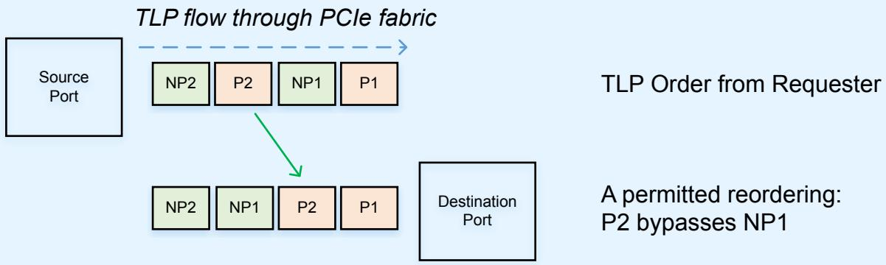

<details>
<summary>flowchart</summary>

```mermaid
graph TD
  A["Source Port"] --> B["NP2"]
  B --> C["P2"]
  C --> D["NP1"]
  D --> E["P1"]
  E --> F["Destination Port"]
  F --> G["NP2"]
  G --> H["NP1"]
  H --> I["P2"]
  I --> J["P1"]
  J --> K["TLP Order from Requester"]
    style A fill:#f9f,stroke:#333
    style F fill:#ccf,stroke:#333
    note right of F: A permitted reordering: P2 bypasses NP1
```
</details>

Figure 6-72 Example – Posted Requests Allowed to Bypass Non-Posted Requests§

§ Figure 6-73 illustrates a case where an attacker attempts to bypass a Posted Request with a Non-Posted Request, which could, for example, cause the consumption of stale data. This case will be detected through the use of the PR Sent Counter mechanism, through which the Transmitter at source Port associated with the Stream indicates to the Receiver at the Destination Port how many Posted Requests were transmitted between successive Non-Posted Requests. This indication is carried in the IDE TLP Prefix (NFM)/OHC-C (FM), which is integrity protected and so cannot be modified without detection at the Receiver. In this example, NP1 will carry the indication that a Posted Request (P1) was transmitted, and this will not match the Receiver’s count of Posted Requests received, enabling this illegal reordering to be detected.

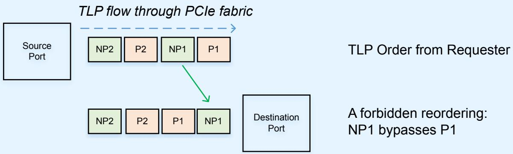

<details>
<summary>flowchart</summary>

```mermaid
graph TD
  A["Source Port"] --> B["NP2"]
  B --> C["P2"]
  C --> D["NP1"]
  D --> E["P1"]
  E --> F["Destination Port"]
  F --> G["NP2"]
  G --> H["P2"]
  H --> I["P1"]
  I --> J["NP1"]
  J --> K["TLP Order from Requester"]
    style A fill:#f9f,stroke:#333
    style F fill:#ccf,stroke:#333
    note right of F: A forbidden reordering: NP1 bypasses P1
```
</details>

Figure 6-73 Example – Non-Posted Requests Never Allowed to Bypass Posted Requests§

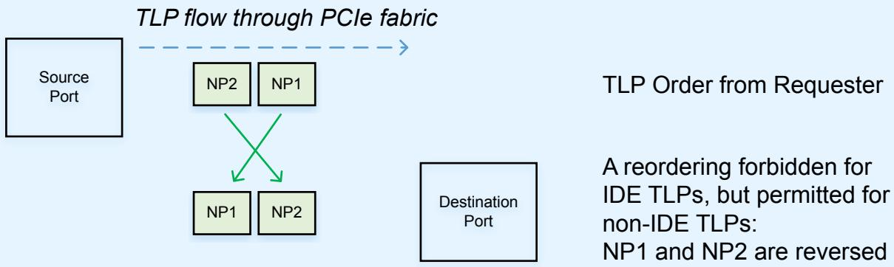

<details>
<summary>flowchart</summary>

```mermaid
graph TD
  A["Source Port"] --> B["NP2"]
  A --> C["NP1"]
  B --> D["NP1"]
  C --> E["NP2"]
  D --> F["Destination Port"]
  E --> F
    style A fill:#f9f,stroke:#333
    style B fill:#ccf,stroke:#333
    style C fill:#ccf,stroke:#333
    style D fill:#cfc,stroke:#333
    style E fill:#cfc,stroke:#333
    style F fill:#fcc,stroke:#333
```
</details>

Figure 6-74 Example – Secure Non-Posted Request Reordering Not Allowed Over PCIe Fabric§

Without IDE, Non-Posted Requests are allowed to bypass each other, but within an IDE Stream, reordering of TLPs of the same type is disallowed in order to simplify the operation of the integrity/encryption mechanisms. § Figure 6-74 illustrates that this will cause the reordering of Non-Posted Requests to be detected as an integrity check failure, even though there isn’t a security exposure per se.

Note that reordering attacks are possible through Retimers, Switches, and any other device or equipment that can alter the flow of TLPs at any point between the originating Port and the Destination Port.

## 6.33.6 IDE TLP Aggregation §

The following rules relate to aggregation (see § Figure 6-63 and § Figure 6-65):

• When aggregation is supported, as indicated at the Port level by the Aggregation Supported bit in the IDE Capability Register, then a Receiver must be capable of supporting:

◦ the aggregation within any Sub-Stream of up to the lesser of 8 TLPs, or as many TLPs as can be received based on the outstanding Flow Control credits applicable to that Sub-Stream  
◦ the receipt of other TLPs that are not part of the Sub-Stream between the TLPs of the aggregated unit.

When aggregation is supported, as indicated at the Port level by the Aggregation Supported bit in the IDE Capability Register, then for each Sub-Stream where aggregation is to be permitted software must enable aggregation at the Transmitting Port.

• If aggregation is to be used, Software must enable aggregation prior to enabling the IDE Stream.

• When aggregation is enabled, a Transmitter:

◦ must apply aggregation only among TLPs within the same Stream and Sub-Stream,  
◦ must aggregate at most the selected number of TLPs in the corresponding Aggregation Mode field,  
◦ must limit the number of TLPs aggregated such that the sum of the data payloads of all TLPs of an aggregated unit does not exceed 256 DW,  
◦ is permitted to Transmit other TLPs that are not part of the Sub-Stream between the TLPs of the aggregated unit,  
◦ must, when transmitting an IDE Sync Message, treat the IDE Sync Message as the last TLP of an aggregated unit,  
◦ is permitted to aggregate fewer TLPs than the number permitted.

• When aggregating TLPs, the Transmitter must Clear the M bit for all TLPs in the aggregated unit except for the last TLP of the unit, for which the M bit must be Set and the MAC must cover the A and P content for all the TLPs of the unit.

◦ The Transmitter must treat a TLP as the last TLP of an aggregated unit unless the Transmitter can guarantee that it will transmit another TLP within the aggregated unit within 1μs.

• The same key and IV set must be used for all TLPs in an aggregated unit.

• If the K bit is to be toggled, it must only be toggled for the first TLP of an aggregated unit.

◦ Receivers must check for violations of this rule – a violation is an IDE Check Failed error.  
▪ The Receiver must transition to Insecure for the associated IDE Stream.  
◦ This is a reported error associated with the Receiving Port (see § Section 6.2 ).

• It is permitted for the TLPs of an aggregated unit to be interleaved with other TLPs, including IDE TLPs associated with other Streams, or non-IDE TLPs.

• All aggregated TLPs of a unit must be processed before it is possible for the Receiver to complete authenticated decryption of the unit.

• If an IDE TLP with the M bit Clear is received at a Receiver where Aggregation is not supported, or if nine or more successive TLPs are received in the Sub-Stream with the M bit Clear, this is an IDE Check Failed error.

◦ The Receiver must transition to Insecure for the associated IDE Stream.

## IMPLEMENTATION NOTE: USE OF AGGREGATION §

To reduce the bandwidth overheads associated with the MAC, the use of aggregation is encouraged. Although aggregation may increase the latency for a Receiver to make use of the received TLPs, typically this increase will not be significant, and in many cases the overall performance should be improved through the use of aggregation.

Although the specific optimizations will depend on traffic types and use model requirements, typically aggregating about 4 TLPs will provide a good balance between the possible bandwidth improvement and the added latency. Typically a Transmitter policy should assume that the Receiver will buffer all the TLPs of an aggregated unit until the Receiver checks are complete before releasing any of the TLPs for further processing. Transmitters can reduce the effective latency impacts of aggregation when there is knowledge of the underlying traffic, for example by ensuring that a doorbell or other “trigger” TLP is either not aggregated, or that an aggregated unit is ended with the transmission of such TLPs.

Receivers should be designed to ensure that aggregated units of TLPs can be buffered with minimal stalling. Typically this implies that the amount of aggregation a Receivers supports should be significantly less than the amount of Receiver Flow Controller buffering advertised.

The IDE TLPs of an aggregated unit may be interleaved with other TLPs, and in some cases this may be required. For example, if we consider a case where a Switch receives a number of aggregated Memory Reads followed by a Memory Write, all of which target the same egress Port. If, at the egress Port, there are insufficient Flow Control credits to transmit all of the Memory Reads, then the Switch may be required to allow the Memory Write to bypass the blocked Memory Reads. Receivers are required to be tolerant to such “interruptions” of an aggregated unit.

## 6.33.7 Flow-Through Selecive IDE Streams §

A Switch or Root Complex is permitted to support Flow-Through Selective IDE Streams without supporting Link IDE Stream or Selective IDE Streams for cases where a Port of the Switch/RC itself is an IDE Terminus.

A Switch that supports Flow-Through Selective IDE Streams must implement the IDE Extended Capability at every Port of the Switch.

Switches and RCs that support Flow-Through IDE Streams must, when enabled, implement modified ordering rules defined in § Table 6-34, applied per-Stream, for IDE TLPs that pass through the Switch/RC from the Ingress Port to the Egress Port. The entries A2, B3, B4, C3, C4, and D5 are all No to ensure that there is no reordering within any Sub-Stream. Between IDE Streams, and between all combinations of IDE TLPs and/or non-IDE TLPs, the rules defined in § Section 2.4 must be followed.

Hardware is not required to follow this modified ordering model beyond the TLP flow between the two Partner Ports for an IDE Stream, e.g. within an Endpoint or RC, and so at the system level it must not be assumed that the ordering behavior observed will match the modified IDE Ordering model.

Although Switches/RCs must not reorder IDE TLPs within a Flow-Through IDE Stream based on Relaxed Ordering or IDO, including when ACS mechanisms are being used, it is permitted for those TLPs to have the RO and/or IDO bits Set .

The IDE Sync Message, like all other Messages, is a Posted Request, and the IDE protocol depends on the IDE Sync Message being ordered with all other Posted Requests for a given IDE Stream.

Table 6-34 IDE Revised Ordering Rules for Flow-Through IDE Streams - Per Stream§

<table><tr><td rowspan="2" colspan="2">Row Pass Column?</td><td rowspan="2">Posted Request (Col 2)</td><td colspan="2">Non-Posted Request</td><td rowspan="2">Completion (Col 5)</td></tr><tr><td>Read Request (Col 3)</td><td>NPR with Data (Col 4)</td></tr><tr><td colspan="2">Posted Request (Row A)</td><td>No</td><td>Yes</td><td>Yes</td><td>a) Y/Nb) Yes</td></tr><tr><td rowspan="2">Non-Posted Request</td><td>Read Request (Row B)</td><td>No</td><td>No</td><td>No</td><td>Y/N</td></tr><tr><td>NPR with Data (Row C)</td><td>No</td><td>No</td><td>No</td><td>Y/N</td></tr><tr><td colspan="2">Completion (Row D)</td><td>No</td><td>Yes</td><td>Yes</td><td>No</td></tr></table>

Switches/RCs must not modify Flow-Through IDE TLPs between the ingress and egress Ports.

Switches/RCs must only route IDE TLPs through Ports with the Flow-Through IDE Stream Enabled bit Set. If an IDE TLP is received by an Ingress Port or routed to an Egress Port, and the Port’s Flow-Through IDE Stream Enabled bit is Clear, the Port must handle the TLP as a Misrouted IDE TLP error unless there is a higher precedence error. Further:

• For an Ingress Port, the Port must not forward the IDE TLP.  
• For an Egress Port, the Port must not Transmit the IDE TLP.  
• If the IDE TLP is a Non-Posted Request, the Port must not return a Completion.

The use of ACS in combination with Flow-Through IDE Streams is permitted, but requires care to ensure that the modified ordering defined above will be satisfied. It should also be understood that, because Relaxed Ordering does not apply within the modified ordering rules defined above, certain use cases such as those involving ACS P2P Completion Redirect are likely to have reduced performance.

Because hardware used with IDE will typically be required to satisfy platform-level trust requirements, in many cases ACS is not required to achieve and maintain secure platform behaviors when IDE is in use.

## 6.33.8 Other IDE Rules §

Rule for Non-Posted IDE Requests:

• Requesters of Non-Posted Requests must check that the corresponding received Completion(s) be returned using the same Stream ID and the same T bit value as was associated with the Non-Posted Request – a violation is an IDE Check Failed error.

◦ The Requester must transition to Insecure for the associated IDE Stream.

The following rules relate to resets:

• Any Conventional Reset to an Upstream Port or to the Bridge Function of a Downstream Port, or any FLR to a Function containing an IDE Extended Capability, must result in all IDE Streams associated with that Function transitioning to the Insecure state, and all keys must be invalidated and rendered unreadable.

◦ Additional implementation specific mechanism are required in many cases to ensure security of all associated data is maintained.

• An FLR to a Function that does not contain an IDE Extended Capability must not affect IDE operation  
◦ In some cases IDE\_KM can be affected by an FLR to a Function that does not contain an IDE Extended Capability, but does implement the IDE\_KM responder role via DOE – see § Section 6.33.3 .

Use of mechanisms that result in the blocking or termination of TLPs, such as exist for AtomicOps, DMWr, and the End-End TLP Prefix Blocking mechanism, must be carefully coordinated with the use of Selective IDE Streams, to avoid the dropping of Selective IDE TLPs in such a way that would result in a IDE Check Failed error.

The following rules relate to the use of Access Control Services (ACS - see § Section 6.12 ) with IDE.

• When Link IDE is used, ACS mechanisms are permitted to be used as architected without restrictions.  
• If Selective IDE is used with ACS to enable Direct I/O as documented in the Implementation Note: ACS Redirect and Guest Physical Addresses (GPAs) (see § Section 6.12.4 ), ACS mechanisms are permitted to be used as architected without restrictions.  
• If Selective IDE is used for P2P communication without any ACS redirect mechanisms enabled, the remaining ACS services are permitted to be used as architected without restrictions.  
• Use of Selective IDE for P2P communication with ACS redirect mechanisms enabled has a number of major issues with ordering and portions of Sub-Streams taking different paths. Such use is out of scope of this specification.  
• Use of Selective IDE under any use case where ACS services (or any other mechanism) blocks or otherwise terminates IDE TLPs will result in the associated Selective IDE Stream going to Insecure due to the failure of the intended ultimate destination Port to receive the blocked/terminated IDE TLP.

## The following rules relate to error handling

• Receipt of a Link IDE TLP or Selective IDE TLP for which there is not an associated IDE Stream is a Misrouted IDE TLP error; this is a reported error associated with the Receiving Port.  
• Receipt of a Link IDE TLP by a Switch that targets an Egress Port for which there is not a Link IDE Stream associated with the same TC and in the Secure state is a Misrouted IDE TLP error; this is a reported error associated with the Ingress Port.  
• The Transaction Layer must return flow control credit and handle as a Misrouted IDE TLP, but take no other action in response to a received Misrouted IDE TLP.  
• The detection of any of the following conditions is IDE Check Failed error, a reported error associated with the Receiving Port (see § Section 6.2 ).

◦ a MAC check failure occurs when the Receiver’s check of the MAC of a received TLP, or aggregated unit of TLPs, fails,  
◦ underflow of the PR-Received-Counter-NPR or PR\_Received\_Counter-CPL (indicating an improper reordering has been detected),  
◦ either or both of the PR-Received-Counter-NPR/PR\_Received\_Counter-CPL overflow (indicating a failure to receive the Transmitted NPR/CPL TLPs).  
◦ The Sub-Stream identifier field contains a Reserved/unsupported value.

Upon detection of one or more of these conditions, the IDE Stream State Machine for this IDE Stream must enter Insecure. This is a reported error associated with the Receiving Port (see Section 6.2). The TLP that triggered the error and all subsequent IDE TLPs received associated with the same IDE Stream must be discarded, following update of Flow Control credits, for as long as the associated Stream is enabled. There must be no additional error(s) logged for subsequent TLPs received associated with an IDE Stream already in the Insecure state.

• Receiving an IDE TLP that is a Completion with UR or UC status is not a security error and must not by itself trigger a transition to Insecure.  
• Upon detection of an error associated with an aggregated unit of TLPs, when Advanced Error Reporting is supported, only the last TLP of the unit must be logged in the Header Log Register and TLP Prefix Log Register.  
• All IDE Streams associated with a Link must transition to Insecure when DL\_Active transitions from asserted to deasserted for that Link.  
• Upon transition from Secure to Insecure for any reason, other than that the corresponding Link/Selective IDE Stream Enable bit is Cleared, for a given Stream, the Port must transmit an IDE Fail Message indicating the Stream ID to the Partner Port  
• Upon receipt of an IDE Fail Message, for the indicated Stream the Port must transition to Insecure

◦ When an IDE Stream enters Insecure due to the receipt of a IDE Fail Message then that transition into Insecure must not result in the Transmission of an IDE fail message.

• Upon entry into Insecure, all active key sets and IVs for the associated IDE Stream must be marked as invalid.

• For an IDE Stream to exit Insecure and return to Secure, the IDE Stream must be re-established using a new key and IV set.

• In the Insecure state, private data associated with the affected IDE Stream(s) must be secured.

◦ How this is done is implementation specific.

• To prepare to exit the Insecure state for a Stream and return to the Secure state, software must Clear the corresponding Selective IDE Stream Enable or Link IDE Stream Enable bit.

◦ Hardware must not return a Stream to the Secure state until the Enable bit has been Cleared and subsequently Set.

◦ Additional actions not defined here are typically necessary based on specific use model requirements.

When processing received IDE TLPs, all error checks must be completed, or an equivalent delay must be inserted, prior to signaling an error, such that it is not possible for an external observer to determine at which stage in error checking the error(s) was(were) detected.

## The following rules relate to Power Management:

• The No\_Soft\_Reset bit must be Set

• All state related to keys and counters must be maintained in D0, D1, D2 and D3hot.

◦ The IDE Extended Capability is subject to the same rules as other register structures defined by this specification, and because it is itself essential for IDE operation, any condition where the IDE Extended Capability programming is lost also necessarily results in a loss of the ability to maintain IDE operation; Such conditions must result in all IDE Streams transitioning to the Insecure state, and all keys must be invalidated and rendered unreadable.

• It is permitted to support retention of state related to keys and counters in D3cold, however such mechanisms are beyond the scope of this document.

## The following rules relate to maintaining a secure local environment:

• Attempts to modify IDE registers, BARs, and other structures that could affect the security of the device or an IDE Stream must be detected

◦ The resulting actions are implementation specific

• It is permitted to enter Insecure when a condition is detected that could affect the security of the device or an IDE Stream

◦ In some cases, as determined by implementation specific criteria, it may be desirable to implement some other implementation specific action.

## 7. Software Initialization and Configuration §

The PCI Express Configuration model supports two Configuration Space access mechanisms:

• PCI-compatible Configuration Access Mechanism (CAM) (see § Section 7.2.1 )  
• PCI Express Enhanced Configuration Access Mechanism (ECAM) (see § Section 7.2.2 )

The PCI-compatible mechanism supports 100% binary compatibility with Conventional PCI or later aware operating systems and their corresponding bus enumeration and configuration software.

The enhanced mechanism is provided to increase the size of available Configuration Space and to optimize access mechanisms.

## 7.1 Configuration Topology §

To maintain compatibility with PCI software configuration mechanisms, all PCI Express elements have a PCI-compatible Configuration Space. Each PCI Express Link originates from a logical PCI-PCI Bridge and is mapped into Configuration Space as the secondary bus of this Bridge. The Root Port is a PCI-PCI Bridge structure that originates a PCI Express Link from a PCI Express Root Complex (see § Figure 7-1).

A PCI Express Switch not using FPB Routing ID mechanisms is represented by multiple PCI-PCI Bridge structures connecting PCI Express Links to an internal logical PCI bus (see § Figure 7-2). The Switch Upstream Port is a PCI-PCI Bridge; the secondary bus of this Bridge represents the Switch’s internal routing logic. Switch Downstream Ports are PCI-PCI Bridges bridging from the internal bus to buses representing the Downstream PCI Express Links from a PCI Express Switch. Only the PCI-PCI Bridges representing the Switch Downstream Ports may appear on the internal bus. Endpoints, represented by Type 0 Configuration Space Headers, are not permitted to appear on the internal bus.

A PCI Express Endpoint is mapped into Configuration Space as a single Function in a Device, which might contain multiple Functions or just that Function. PCI Express Endpoints and Legacy Endpoints are required to appear within one of the Hierarchy Domains originated by the Root Complex, meaning that they appear in Configuration Space in a tree that has a Root Port as its head. Root Complex Integrated Endpoints (RCiEPs) and Root Complex Event Collectors do not appear within one of the Hierarchy Domains originated by the Root Complex. These appear in Configuration Space as peers of the Root Ports.

Unless otherwise specified, requirements in the Configuration Space definition for a device apply to single Function devices as well as to each Function individually of a Multi-Function Device.

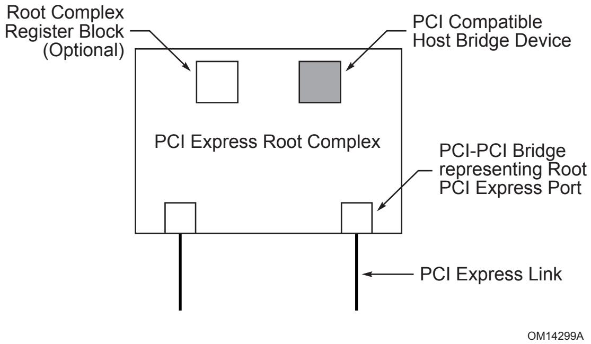

<details>
<summary>text_image</summary>

Root Complex Register Block (Optional)
PCI Express Root Complex
PCI Compatible Host Bridge Device
PCI-PCI Bridge representing Root PCI Express Port
PCI Express Link
OM14299A
</details>

Figure 7-1 PCI Express Root Complex Device Mapping§

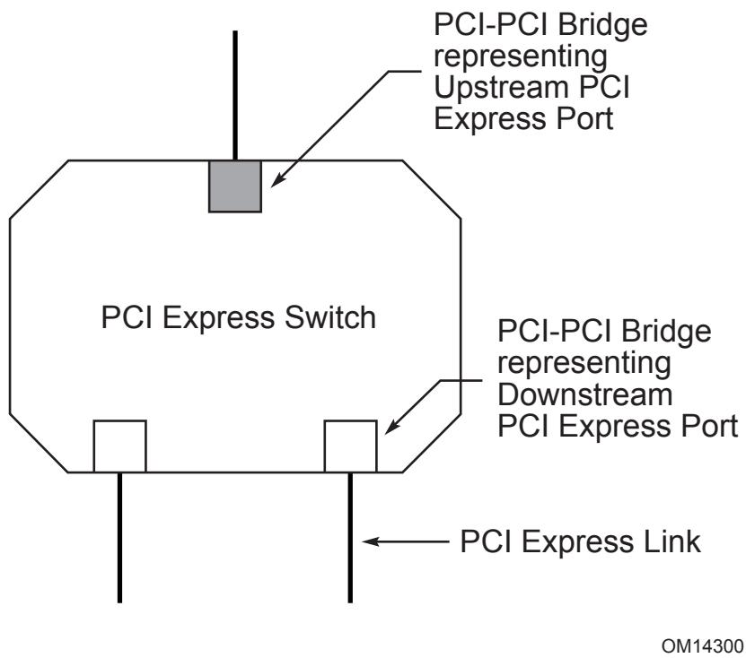

<details>
<summary>text_image</summary>

PCI-PCI Bridge
representing
Upstream PCI
Express Port

PCI Express Switch

PCI-PCI Bridge
representing
Downstream
PCI Express Port

PCI Express Link

OM14300
</details>

Figure 7-2 PCI Express Switch Device Mapping 141§

141. Future PCI Express Switches may be implemented as a single Switch device component (without the PCI-PCI Bridges) that is not limited by legacy compatibility requirements imposed by existing PCI software.

## IMPLEMENTATION NOTE:

## CHANGING A DEVICE’S OS DRIVER BINDINGS & RESOURCES §

Under certain circumstances, it is highly useful for a device to change one or more of its architected registers that help determine which OS-managed resources are allocated to the device and which OS drivers get bound to it. Here are two key examples:

• A device might change the Class Code Register value in one or more of its Functions  
• Entire Functions might be added or removed after device firmware is updated

Software can direct devices to change their architected registers through a variety of mechanisms outside the scope of this specification, including implementation specific ones and ones defined by external standards bodies. It is recommended that these mechanisms follow the guidance of this Implementation Note.

If a device outside the RC has possibly been enumerated by the OS, it is strongly recommended that software use a mechanism directing the device to change its registers when coming out of a Conventional Reset. From a hardware perspective, this is similar to a hot remove followed by a hot add, providing a clean trigger point for architected registers to change in compliance with this specification, plus it guarantees the architected default hardware state for OS I/O infrastructure software and OS drivers to rely on. It is strongly recommended that software use OS-specific interfaces to perform the Conventional Reset and/or coordinate the reset and subsequent enumeration with the OS. If not feasible via OS-specific interfaces, software may be able to perform a Conventional Reset directly via several ways, including the Secondary Bus Reset bit or the Link Disable bit in the Downstream Port above the device.

If software knows that a device outside the RC has not been enumerated by the OS, software may choose to direct the device to change its registers without undergoing a reset, thus avoiding unnecessary delay.

## 7.2 PCI Express Configuration Mechanisms §

PCI Express extends the Configuration Space to 4096 bytes per Function as compared to 256 bytes allowed by [PCI]. PCI Express Configuration Space is divided into a PCI-compatible region, which consists of the first 256 bytes of a Function’s Configuration Space, and a PCI Express Extended Configuration Space which consists of the remaining Configuration Space (see § Figure 7-3). The PCI-compatible Configuration Space can be accessed using either the mechanism defined in § Section 7.2.1 or § Section 7.2.2 . Accesses made using either access mechanism are equivalent. The PCI Express Extended Configuration Space can only be accessed by using the ECAM mechanism defined in § Section 7.2.2 . 142

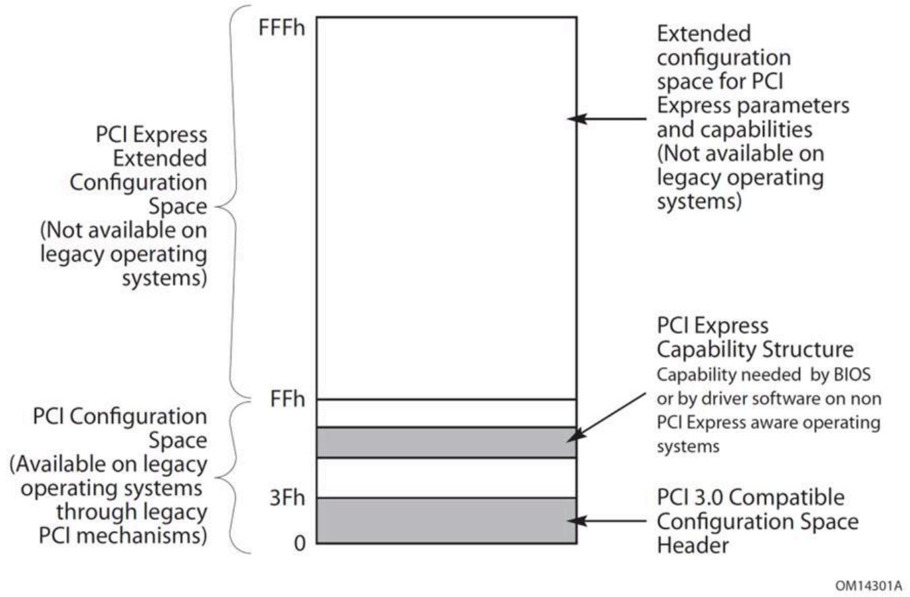

<details>
<summary>text_image</summary>

PCI Express Extended Configuration Space
(Not available on legacy operating systems)
FFFh
Extended configuration space for PCI Express parameters and capabilities (Not available on legacy operating systems)
PCI Express Capability Structure
Capability needed by BIOS or by driver software on non PCI Express aware operating systems
PCI 3.0 Compatible Configuration Space Header
PCI Configuration Space
(Available on legacy operating systems through legacy PCI mechanisms)
FFh
3Fh
0
OM14301A
</details>

Figure 7-3 PCI Express Configuration Space Layout§

## 7.2.1 PCI-compatible Configuration Mechanism §

The PCI-compatible PCI Express Configuration Mechanism supports the PCI Configuration Space programming model defined in the [PCI]. By adhering to this model, systems incorporating PCI Express interfaces remain compliant with conventional PCI bus enumeration and configuration software.

In the same manner as PCI device Functions, PCI Express device Functions are required to provide a Configuration Space for software-driven initialization and configuration. Except for the differences described in this chapter, the PCI Express Configuration Space headers are organized to correspond with the format and behavior defined in the [PCI] (§ Section 6.1 ).

The PCI-compatible Configuration Access Mechanism uses the same Request format as the ECAM. For PCI-compatible Configuration Requests, the Extended Register Address field must be all zeros.

## 7.2.2 PCI Express Enhanced Configuration Access Mechanism (ECAM) §

For systems that are PC-compatible, or that do not implement a processor-architecture-specific firmware interface standard that allows access to the Configuration Space, the Enhanced Configuration Access Mechanism (ECAM) is required as defined in this section.

For systems that implement a processor-architecture-specific firmware interface standard that allows access to the Configuration Space, the operating system uses the standard firmware interface, and the hardware access mechanism defined in this section is not required.

In all systems, device drivers are encouraged to use the application programming interface (API) provided by the operating system to access the Configuration Space of its device and not directly use the hardware mechanism.

The ECAM utilizes a flat memory-mapped address space to access device configuration registers. In this case, the memory address determines the configuration register accessed and the memory data updates (for a write) or returns the contents of (for a read) the addressed register. The mapping from memory address space to PCI Express Configuration Space address is defined in § Table 7-1.

The size and base address for the range of memory addresses mapped to the Configuration Space are determined by the design of the host bridge and the firmware. They are reported by the firmware to the operating system in an implementation specific manner. The size of the range is determined by the number of bits that the host bridge maps to the Bus Number field in the configuration address. In § Table 7-1, this number of bits is represented as n, where $1 \leq n \leq 8 .$ . A host bridge that maps n memory address bits to the Bus Number field supports Bus Numbers from 0 to $2 ^ { n }$ -1, inclusive, and the base address of the range is aligned to a 2(n+20)-byte memory address boundary. Any bits in the Bus Number field that are not mapped from memory address bits must be Clear.

For example, if a system maps three memory address bits to the Bus Number field, the following are all true:

• $n = 3 .$  
• Address bits A[63:23] are used for the base address, which is aligned to a $2 ^ { 2 3 } .$ -byte (8 MB) boundary.  
• Address bits A[22:20] are mapped to bits [2:0] in the Bus Number field.  
• Bits [7:3] in the Bus Number field are set to Clear.  
• The system is capable of addressing Bus Numbers between 0 and 7, inclusive.

A minimum of one memory address bit (n = 1) must be mapped to the Bus Number field. Systems are encouraged to map additional memory address bits to the Bus Number field as needed to support a larger number of buses. Systems that support more than 4 GB of memory addresses are encouraged to map eight bits of memory address $( n = 8 )$ to the Bus Number field. Note that in systems that include multiple host bridges with different ranges of Bus Numbers assigned to each host bridge, the highest Bus Number for the system is limited by the number of bits mapped by the host bridge to which the highest bus number is assigned. In such a system, the highest Bus Number assigned to a particular host bridge would be greater, in most cases, than the number of buses assigned to that host bridge. In other words, for each host bridge, the number of bits mapped to the Bus Number field, n, must be large enough that the highest Bus Number assigned to each particular bridge must be less than or equal to $2 ^ { n }$ -1 for that bridge.

In some processor architectures, it is possible to generate memory accesses that cannot be expressed in a single Configuration Request, for example due to crossing a DW aligned boundary, or because a locked access is used. A Root Complex implementation is not required to support the translation to Configuration Requests of such accesses.

Table 7-1 Enhanced Configuration Address Mapping§

<table><tr><td>Memory Address $^{143}$ </td><td>PCI Express Configuration Space</td></tr><tr><td>A[(20+n-1):20]</td><td>Bus Number 1 ≤ n ≤ 8</td></tr><tr><td>A[19:15]</td><td>Device Number</td></tr><tr><td>A[14:12]</td><td>Function Number</td></tr><tr><td>A[11:8]</td><td>Extended Register Number</td></tr><tr><td>Memory Address</td><td>PCI Express Configuration Space</td></tr><tr><td>A[7:2]</td><td>Register Number</td></tr><tr><td>A[1:0]</td><td>Along with size of the access, used to generate Byte Enables</td></tr></table>

Note: for Requests targeting Extended Functions in an ARI Device, A[19:12] represents the (8-bit) Function Number, which replaces the (5-bit) Device Number and (3-bit) Function Number fields above.

The system hardware must provide a method for the system software to guarantee that a write transaction using the ECAM is completed by the completer before system software execution continues.

## IMPLEMENTATION NOTE:

## ORDERING CONSIDERATIONS FOR THE ENHANCED CONFIGURATION ACCESS MECHANISM §

The ECAM converts memory transactions from the host CPU into Configuration Requests on the PCI Express fabric. This conversion potentially creates ordering problems for the software, because writes to memory addresses are typically posted transactions but writes to Configuration Space are not posted on the PCI Express fabric.

Generally, software does not know when a posted transaction is completed by the completer. In those cases in which the software must know that a posted transaction is completed by the completer, one technique commonly used by the software is to read the location that was just written. For systems that follow the PCI ordering rules throughout, the read transaction will not complete until the posted write is complete. However, since the PCI ordering rules allow non-posted write and read transactions to be reordered with respect to each other, the CPU must wait for a non-posted write to complete on the PCI Express fabric to be guaranteed that the transaction is completed by the completer.

As an example, software may wish to configure a device Function’s Base Address register by writing to the device using the ECAM, and then read a location in the memory-mapped range described by this Base Address register. If the software were to issue the memory-mapped read before the ECAM write was completed, it would be possible for the memory-mapped read to be re-ordered and arrive at the device before the Configuration Write Request, thus causing unpredictable results.

To avoid this problem, processor and host bridge implementations must ensure that a method exists for the software to determine when the write using the ECAM is completed by the completer.

This method may simply be that the processor itself recognizes a memory range dedicated for mapping ECAM accesses as unique, and treats accesses to this range in the same manner that it would treat other accesses that generate non-posted writes on the PCI Express fabric, i.e., that the transaction is not posted from the processor’s viewpoint. An alternative mechanism is for the host bridge (rather than the processor) to recognize the memory-mapped Configuration Space accesses and not to indicate to the processor that this write has been accepted until the non-posted Configuration Transaction has completed on the PCI Express fabric. A third alternative would be for the processor and host bridge to post the memory-mapped write to the ECAM and for the host bridge to provide a separate register that the software can read to determine when the Configuration Write Request has completed on the PCI Express fabric. Other alternatives are also possible.

## IMPLEMENTATION NOTE:

## GENERATING CONFIGURATION REQUESTS §

Because Root Complex implementations are not required to support the generation of Configuration Requests from accesses that cross DW boundaries, or that use locked semantics, software should take care not to cause the generation of such accesses when using the memory-mapped ECAM unless it is known that the Root Complex implementation being used will support the translation.

## 7.2.2.1 Host Bridge Requirements §

For those systems that implement the ECAM, the PCI Express Host Bridge is required to translate the memory-mapped PCI Express Configuration Space accesses from the host processor to PCI Express configuration transactions. The use of Host Bridge PCI class code is Reserved for backwards compatibility; Host Bridge Configuration Space is opaque to standard PCI Express software and may be implemented in an implementation specific manner that is compatible with PCI Host Bridge Type 0 Configuration Space. A PCI Express Host Bridge is not required to signal errors through a Root Complex Event Collector. This support is optional for PCI Express Host Bridges.

## 7.2.2.2 PCI Express Device Requirements §

Devices must support an additional 4 bits for decoding configuration register access, i.e., they must decode the Extended Register Address[3:0] field of the Configuration Request header.

## IMPLEMENTATION NOTE:

## DEVICE-SPECIFIC REGISTERS IN CONFIGURATION SPACE §

It is strongly recommended that PCI Express devices place no registers in Configuration Space other than those in headers or Capability structures architected by applicable PCI specifications.

Device-specific registers that have legitimate reasons to be placed in Configuration Space (e.g., they need to be accessible before Memory Space is allocated) should be placed in a Vendor-Specific Capability structure (§ Section 7.9.4 ), a Vendor-Specific Extended Capability structure (§ Section 7.9.5 , or § Section 7.9.6 ).

Device-specific registers accessed in the run-time environment by drivers should be placed in Memory Space that is allocated by one or more Base Address registers. Even though PCI-compatible or PCI Express Extended Configuration Space may have adequate room for run-time device-specific registers, placing them there is highly discouraged for the following reasons:

• Not all Operating Systems permit drivers to access Configuration Space directly.  
• Some platforms provide access to Configuration Space only via firmware calls, which typically have substantially lower performance compared to mechanisms for accessing Memory Space.  
• Even on platforms that provide direct access to a memory-mapped PCI Express Enhanced Configuration Mechanism, performance for accessing Configuration Space will typically be significantly lower than for accessing Memory Space since:  
◦ Configuration Reads and Writes must usually be DWORD or smaller in size,  
◦ Configuration Writes are usually not posted by the platform, and  
◦ Some platforms support only one outstanding Configuration Write at a time.

## IMPLEMENTATION NOTE:

## CONFIGURATION SPACE READ SIDE EFFECTS §

During a read access, any observable interaction that occurs besides the desired value being returned is called a read side effect. System software that has no specific knowledge of the Function being accessed may issue read requests to anywhere within the Function's Configuration Space. It is highly undesirable that any such access has any read side effects. No such side effects are required in any of the Configuration Space registers defined in this specification. It is strongly recommended that any implementation of those registers, as well as any vendor-defined Configuration Space registers, be free of any read side effects.

## 7.2.3 Root Complex Register Block (RCRB) §

A Root Port or RCiEP may be associated with an optional 4096-byte block of memory mapped registers referred to as the Root Complex Register Block (RCRB). These registers are used in a manner similar to Configuration Space and can include PCI Express Extended Capabilities and other implementation specific registers that apply to the Root Complex. The structure of the RCRB is described in § Section 7.6.2 .

Multiple Root Ports or internal devices are permitted to be associated with the same RCRB. The RCRB memory-mapped registers must not reside in the same address space as the memory-mapped Configuration Space or Memory Space.

A Root Complex implementation is not required to support accesses to an RCRB that cross DWORD aligned boundaries or accesses that use locked semantics.

# IMPLEMENTATION NOTE:

# ACCESSING ROOT COMPLEX REGISTER BLOCK §

Because Root Complex implementations are not required to support accesses to a RCRB that cross DW boundaries, or that use locked semantics, software should take care not to cause the generation of such accesses when accessing a RCRB unless the Root Complex will support the access.

## 7.3 Configuration Transaction Rules §

## 7.3.1 Device Number §

With non-ARI Devices, PCI Express components are restricted to implementing a single Device Number on their primary interface (Upstream Port), but are permitted to implement up to eight independent Functions within that Device Number. Each internal Function is selected based on decoded address information that is provided as part of the address portion of Configuration Request packets.

Except when FPB Routing ID mechanisms are used (see § Section 6.26 ), Downstream Ports that do not have ARI Forwarding enabled must associate only Device 0 with the device attached to the Logical Bus representing the Link from the Port. Configuration Requests targeting the Bus Number associated with a Link specifying Device Number 0 are delivered to the device attached to the Link; Configuration Requests specifying all other Device Numbers (1-31) must be terminated by the Switch Downstream Port or the Root Port with an Unsupported Request Completion Status (equivalent to Master Abort in PCI).

Non-ARI Devices must capture their assigned Device Number as discussed in § Section 2.2.6.2 . Non-ARI Devices must respond to all Type 0 Configuration Read Requests, regardless of the Device Number specified in the Request.

Switches, and components wishing to incorporate more than eight Functions at their Upstream Port, are permitted to implement one or more “virtual switches” represented by multiple Type 1 Configuration Space Headers (PCI-PCI Bridge) as illustrated in § Figure 7-2. These virtual switches serve to allow fan-out beyond eight Functions. FPB provides a “flattening” mechanism that, when enabled, causes the virtual bridges of the Downstream Ports to appear in configuration space at RID addresses following the RID of the Upstream Port (see § Section 6.26 ). Since Switch Downstream Ports are permitted to appear on any Device Number, in this case all address information fields (Bus, Device, and Function Numbers) must be completely decoded to access the correct register. Any Configuration Request targeting an unimplemented Bus, Device, or Function must return a Completion with Unsupported Request Completion Status.

With an ARI Device, its Device Number is implied to be 0 rather than specified by a field within an ID. The traditional 5-bit Device Number and 3-bit Function Number fields in its associated Routing IDs, Requester IDs, and Completer IDs are interpreted as a single 8-bit Function Number. See § Section 6.13 . Any Type 0 Configuration Request targeting an unimplemented Function in an ARI Device must be handled as an Unsupported Request.

If an ARI Downstream Port has ARI Forwarding enabled, the logic that determines when to turn a Type 1 Configuration Request into a Type 0 Configuration Request no longer enforces a restriction on the traditional Device Number field being 0.

The following section provides details of the Configuration Space addressing mechanism.

## 7.3.2 Configuration Transaction Addressing §

PCI Express Configuration Requests use the following addressing fields:

• Destination Segment (Flit Mode only) - Selects one of multiple Segments that may be implemented within a Root Complex. See § Section 2.2.1.2 for a list of Segment rules.  
• Bus Number - PCI Express maps logical PCI Bus Numbers onto PCI Express Links such that PCI-compatible configuration software views the Configuration Space of a PCI Express Hierarchy as a PCI hierarchy including multiple bus segments.  
Device Number - Device Number association is discussed in § Section 7.3.1 and in § Section 6.26 . When an ARI Device is targeted and the Downstream Port immediately above it is enabled for ARI Forwarding, the Device Number is implied to be 0, and the traditional Device Number field is used instead as part of an 8-bit Function Number field. See § Section 6.13 .  
• Function Number - PCI Express also supports Multi-Function Devices using the same discovery mechanism as PCI. A Multi-Function Device must fully decode the Function Number field. A single-Function Device MUST@FLIT also fully decode the Function Number field. With ARI Devices, discovery and enumeration of Extended Functions require ARI-aware software. See § Section 6.13 .  
• Extended Register Number and Register Number - Specify the Configuration Space address of the register being accessed (concatenated such that the Extended Register Number forms the more significant bits).

## 7.3.3 Configuration Request Routing Rules §

For Endpoints, the following rules apply:

• If Configuration Request Type is 1,  
◦ Follow the rules for handling Unsupported Requests

• If Configuration Request Type is 0,  
◦ Determine if the Request addresses a valid local Configuration Space of an implemented Function  
▪ If so, process the Request  
▪ If not, follow rules for handling Unsupported Requests

For Root Ports, Switches, and PCI Express-PCI Bridges, the following rules apply:

• Propagation of Configuration Requests from Downstream to Upstream as well as peer-to-peer are not supported  
◦ Configuration Requests are initiated only by the Host Bridge, including those passed through the SFI CAM mechanism

• If Configuration Request Type is 0,  
◦ Determine if the Request addresses a valid local Configuration Space of an implemented Function  
▪ If so, process the Request  
▪ If not, follow rules for handling Unsupported Requests

• If Configuration Request Type is 1, apply the following tests, in sequence, to the Bus Number and Device Number fields:

◦ If in the case of a PCI Express-PCI Bridge, equal to the Bus Number assigned to secondary PCI bus or, in the case of a Switch or Root Complex, equal to the Bus Number and decoded Device Numbers

assigned to one of the Root (Root Complex) or Downstream Ports (Switch), or if required based on the FPB Routing ID mechanism,

▪ Transform the Request to Type 0 by changing the value in the Type[4:0] field of the Request (see § Table 2-3) - all other fields of the Request remain unchanged  
▪ Forward the Request to that Downstream Port (or PCI bus, in the case of a PCI Express-PCI Bridge)

◦ If not equal to the Bus Number of any of Downstream Ports or secondary PCI bus, but in the range of Bus Numbers assigned to either a Downstream Port or a secondary PCI bus, or if required based on the FPB Routing ID mechanism,

▪ Forward the Request to that Downstream Port interface without modification

◦ Else (none of the above)

▪ The Request is invalid - follow the rules for handling Unsupported Requests

• PCI Express-PCI Bridges must terminate as Unsupported Requests any Configuration Requests for which the Extended Register Address field is non-zero that are directed towards a PCI bus that does not support Extended Configuration Space.

Note: This type of access is a consequence of a programming error.

Additional rule specific to Root Complexes:

• Configuration Requests addressing a Destination Segment and Bus Numbers assigned to devices within the Root Complex are processed by the Root Complex

◦ The assignment of Segment Numbers and Bus Numbers to the devices within a Root Complex may be done in an implementation specific way.

For all types of devices:

Configuration Reads and Writes to unimplemented registers are not considered to be errors. Unless errors defined elsewhere in this specification are detected and need to be reported, such Requests must return a Completion with Successful Completion status, with reads returning a data value of all 0’s and writes discarding the write data without effect.

All other Configuration Space addressing fields are decoded as described elsewhere in this specification.

## 7.3.4 PCI Special Cycles §

PCI Special Cycles (see the [PCI] for details) are not directly supported by PCI Express. PCI Special Cycles may be directed to PCI bus segments behind PCI Express-PCI Bridges using Type 1 configuration cycles as described in the [PCI].

## 7.4 Configuration Register Types §

Configuration register fields are assigned one of the attributes described in § Table 7-2. All PCI Express components, with the exception of the Root Complex and system-integrated devices, initialize register fields to specified default values. Root Complexes and system-integrated devices initialize register fields as required by the firmware for a particular system implementation.

Table 7-2 Register and Register Bit-Field Types§

<table><tr><td>Register Attribute</td><td>Description</td></tr><tr><td>HwInit</td><td>Hardware Initialized - Register bits are permitted, as an implementation option, to be hard-coded, initialized by system/device firmware, or initialized by hardware mechanisms such as pin strapping or nonvolatile storage.144 Initialization by system firmware is permitted only for system-integrated devices. Bits must be fixed in value and read-only after initialization. After Initialization, values are only permitted to change following Conventional Reset (see § Section 6.6.1) and subsequent re-initialization. HwInit register bits are not modified by an FLR.</td></tr><tr><td>RO</td><td>Read-only - Register bits are read-only and cannot be altered by software. Where explicitly defined, these bits are used to reflect changing hardware state, and as a result bit values can be observed to change at run time.145 Register bit default values and bits that cannot change value at run time, are permitted to be hard-coded, initialized by system/ device firmware, or initialized by hardware mechanisms such as pin strapping or nonvolatile storage. Initialization by system firmware is permitted only for system-integrated devices.If the optional feature that would Set the bits is not implemented, the bits must be hardwired to Zero.</td></tr><tr><td>RW</td><td>Read-Write - Register bits are read-write and are permitted to be either Set or Cleared by software to the desired state.If the optional feature that is associated with the bits is not implemented, the bits are permitted to be hardwired to Zero.</td></tr><tr><td>RW1C</td><td>Write-1-to-clear status - Register bits indicate status when read. A Set bit indicates a status event which is Cleared by writing a 1b. Writing a 0b to RW1C bits has no effect.If the optional feature that would Set the bit is not implemented, the bit must be read-only and hardwired to Zero.</td></tr><tr><td>ROS</td><td>Sticky - Read-only - Register bits are read-only and cannot be altered by software. If the optional feature that would Set the bit is not implemented, the bit is hardwired to Zero. Bits are neither initialized nor modified by hot reset or FLR.146Where noted, devices that consume auxiliary power must preserve sticky register bit values when auxiliary power consumption (via either Aux Power PM Enable or PME_En) is enabled. In these cases, register bits are neither initialized nor modified by Hot, Warm, or Cold Reset (see § Section 6.6).</td></tr><tr><td>RWS</td><td>Sticky - Read-Write - Register bits are read-write and are Set or Cleared by software to the desired state. Bits are neither initialized nor modified by hot reset or FLR.147If the optional feature that is associated with the bits is not implemented, the bits are permitted to be hardwired to Zero.Where noted, devices that consume auxiliary power must preserve sticky register bit values when auxiliary power consumption (via either Aux Power PM Enable or PME_En) is enabled. In these cases, register bits are neither initialized nor modified by Hot, Warm, or Cold Reset (see § Section 6.6).</td></tr></table>

144. For historical reasons, readers may observe inconsistencies in this document in the use of HwInit and RO. As this document is revised we will attempt to ensure that new definitions conform to the definitions given here.  
145. For historical reasons, readers may observe inconsistencies in this document in the use of HwInit and RO. As this document is revised we will attempt to ensure that new definitions conform to the definitions given here.  
146. Bits/fields with the “Sticky” attribute must be implemented such that no Function-specific software or firmware is required to maintain the observed state of the bit/field. Particularly for power management scenarios, it is permitted, but not recommended, to use Function-specific software or firmware to restore the correct values, provided this is done before the system hardware or system software could observe incorrect values. How this could be done is outside the scope of this document.  
147. Bits/fields with the “Sticky” attribute must be implemented such that no Function-specific software or firmware is required to maintain the observed state of the bit/field. Particularly for power management scenarios, it is permitted, but not recommended, to use Function-specific software or firmware to restore the correct values, provided this is done before the system hardware or system software could observe incorrect values. How this could be done is outside the scope of this document.

<table><tr><td>Register Attribute</td><td>Description</td></tr><tr><td>RW1CS</td><td>Sticky - Write-1-to-clear status - Register bits indicate status when read. A Set bit indicates a status event which is Cleared by writing a 1b. Writing a 0b to RW1CS bits has no effect. If the optional feature that would Set the bit is not implemented, the bit is read-only and hardwired to Zero. Bits are neither initialized nor modified by hot reset or FLR. $^{148}$ Where noted, devices that consume auxiliary power must preserve sticky register bit values when auxiliary power consumption (via either Aux Power PM Enable or PME_En) is enabled. In these cases, register bits are neither initialized nor modified by Hot, Warm, or Cold Reset (see § Section 6.6).</td></tr><tr><td>RsvdP</td><td>Reserved and Preserved - Reserved for future RW implementations. Register bits are read-only and must return zero when read. Software must preserve the value read for writes to bits.</td></tr><tr><td>RsvdZ</td><td>Reserved and Zero - Reserved for future RW1C implementations. Register bits are read-only and must return zero when read. Software must use 0b for writes to bits.</td></tr></table>

For SR-IOV devices, many registers or fields in VFs are required to be reserved or hardwired to Zero. Before the Single Root I/O Virtualization and Sharing (SR-IOV) Specification was merged into the PCI Express Base Specification, the SR-IOV specification contained many tables summarizing requirements differences for PFs and VFs, relative to the Base specification. These tables contained dedicated columns for PF attributes and VF attributes, though there were relatively few differences for PF attributes.

To provide a clear, consolidated, and concise indication of PF and VF attribute differences from other Function types, this specification eliminated most of those tables. Instead, special field types from the following table indicate VF attribute differences, and any additional attribute or semantic differences with PFs and VFs are covered within the register description column or elsewhere.

Table 7-3 Special Field Types to Indicate VF Attributes§

<table><tr><td>Register Attribute</td><td>Description</td></tr><tr><td>VF ROZ</td><td>VF RO-Zero - VF register bits must have RO semantics and be hardwired to Zero.</td></tr><tr><td>VF RsvdP</td><td>VF RsvdP - VF register bits must have RsvdP semantics.</td></tr><tr><td>VF RsvdZ</td><td>VF RsvdZ - VF register bits must have RsvdZ semantics.</td></tr></table>

## 7.5 PCI and PCIe Capabilities Required by the Base Spec for all Ports §

The following registers and capabilities are required by this specification in all Functions, including PFs and VFs.

Except where noted, VF register fields and bits have the same attributes as other Functions. For VF fields marked RsvdP, the associated PF's setting applies to the VF.

## 7.5.1 PCI-Compatible Configuration Registers §

The first 256 bytes of a Function’s Configuration Space form the PCI-compatible region. This region completely aliases the conventional PCI Configuration Space of the Function. Legacy PCI devices can also be accessed with the ECAM without requiring any modifications to the device hardware or device driver software.

Layout of the Configuration Space and format of individual configuration registers are depicted following the little-endian convention.

## 7.5.1.1 Type 0/1 Common Configuration Space §

§ Figure 7-4 details allocation for common register fields of Type 0 and Type 1 Configuration Space Headers for PCI Express Device Functions. Fields labeled Type Specific vary between different Configuration Space header types.  
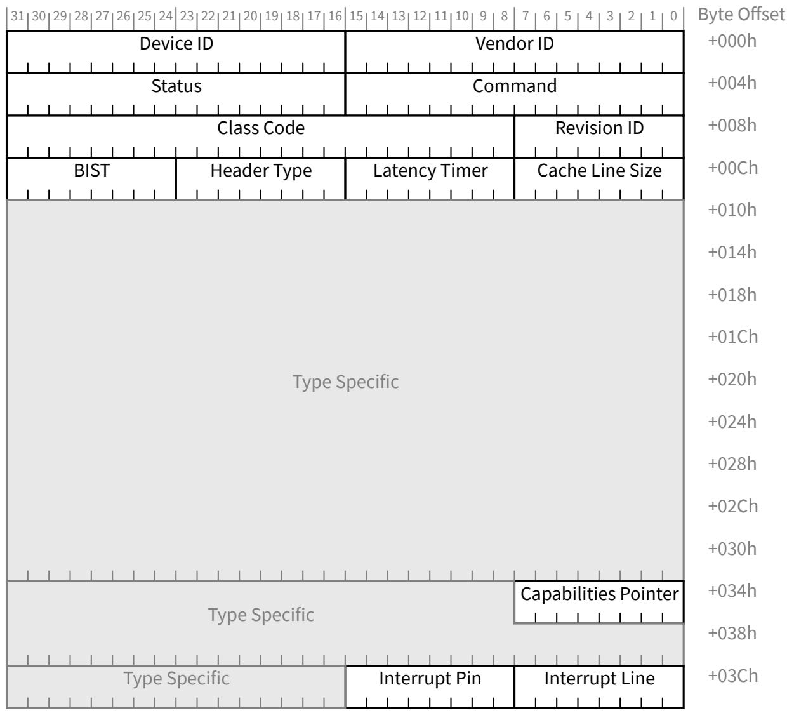

<details>
<summary>memory layout diagram</summary>

| Bit Position | Type Specific | Type Specific | BIST | Header Type | Latency Timer | Revision ID | Cache Line Size |
| --- | --- | --- | --- | --- | --- | --- | --- |
| 1 | 0 | 0 | 0 | 0 | 0 | 0 | 0 |
| 2 | 0 | 0 | 0 | 0 | 0 | 0 | 0 |
| 3 | 0 | 0 | 0 | 0 | 0 | 0 | 0 |
| 4 | 0 | 0 | 0 | 0 | 0 | 0 | 0 |
| 5 | 0 | 0 | 0 | 0 | 0 | 0 | 0 |
| 6 | 0 | 0 | 0 | 0 | 0 | 0 | 0 |
| 7 | 0 | 0 | 0 | 0 | 0 | 0 | 0 |
| 8 | 0 | 0 | 0 | 0 | 0 | 0 | 0 |
| 9 | 0 | 0 | 0 | 0 | 0 | 0 | 0 |
| 10 | 0 | 0 | 0 | 0 | 0 | 0 | 0 |
| 11 | 0 | 0 | 0 | 0 | 0 | 0 | 0 |
| 12 | 0 | 0 | 0 | 0 | 0 | 0 | 0 |
| 13 | 0 | 0 | 0 | 0 | 0 | 0 | 0 |
| 14 | 0 | 0 | 0 | 0 | 0 | 0 | 0 |
| 15 | 15 | 15 | -15 | -15 | -15 | -15 | -15 |
</details>

Figure 7-4 Common Configuration Space Header§

These registers are defined for both Type 0 and Type 1 Configuration Space Headers. The PCI Express-specific interpretation of these registers is defined in this section.

## 7.5.1.1.1 Vendor ID Register (Offset 00h) §

For non-VFs, the Vendor ID register is HwInit and the value in this register identifies the manufacturer of the Function. In keeping with PCI-SIG procedures, valid vendor identifiers must be allocated by the PCI-SIG to ensure uniqueness. Each vendor must have at least one Vendor ID. It is recommended that software read the Vendor ID register to determine if a Function is present, where a value of FFFFh indicates that no Function is present.

For VFs, this field must return FFFFh when read. VI software should return the Vendor ID value from the associated PF as the Vendor ID value for the VF.

## 7.5.1.1.2 Device ID Register (Offset 02h) §

For non-VFs, the Device ID register is HwInit and the value in this register identifies the particular Function. The Device ID must be allocated by the vendor. The Device ID, in conjunction with the Vendor ID and Revision ID, are used as one mechanism for software to determine which driver should be loaded. The vendor must ensure that the chosen values do not result in the use of an incompatible device driver.

For VFs, this field must return FFFFh when read. VI software should return the VF Device ID (see § Section 9.3.3.11 ) value from the associated PF as the Device ID for the VF.

## IMPLEMENTATION NOTE: LEGACY PCI PROBING SOFTWARE §

Returning FFFFh for Device ID and Vendor ID values allows some legacy software to ignore VFs. See § Section 7.5.1.1.1 .

## 7.5.1.1.3 Command Register (Offset 04h) §

§ Table 7-4 defines the Command Register and the layout of the register is shown in § Figure 7-5. Individual bits in the Command Register may or may not be implemented depending on the feature set supported by the Function. For PCI Express to PCI/PCI-X Bridges, refer to the [PCIe-to-PCI-PCI-X-Bridge] for requirements for this register.

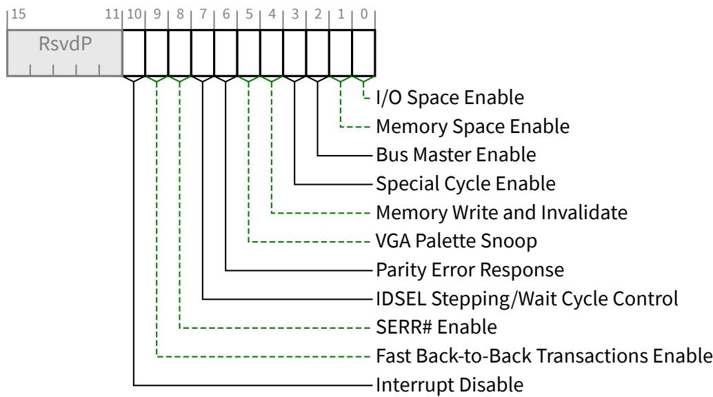

<details>
<summary>flowchart</summary>

```mermaid
graph TD
  A["RsvdP"] --> B["15"]
  B --> C["11"]
  C --> D["10"]
  D --> E["9"]
  E --> F["8"]
  F --> G["7"]
  G --> H["6"]
  H --> I["5"]
  I --> J["4"]
  J --> K["3"]
  K --> L["2"]
  L --> M["1"]
  M --> N["0"]
    
  B --> O["I/O Space Enable"]
  B --> P["Memory Space Enable"]
  B --> Q["Bus Master Enable"]
  B --> R["Special Cycle Enable"]
  B --> S["Memory Write and Invalidate"]
  B --> T["VGA Palette Snoop"]
  B --> U["Parity Error Response"]
  B --> V["IDSEL Stepping/Wait Cycle Control"]
  B --> W["SERR# Enable"]
  B --> X["Fast Back-to-Back Transactions Enable"]
  B --> Y["Interrupt Disable"]
```
</details>

§  
Figure 7-5 Command Register

§  
Table 7-4 Command Register

<table><tr><td>Bit Location</td><td>Register Description</td><td>Attributes</td></tr><tr><td>0</td><td>I/O Space Enable- Controls a Function's response to I/O Space accesses. When this bit is Clear, all received I/O accesses are caused to be handled as Unsupported Requests. When this bit is Set, the Function is enabled to decode the address and further process I/O Space accesses. For a Function with a Type 1 Configuration Space Header, this bit controls the response to I/O Space accesses received on its Primary Side.Default value of this bit is 0b.This bit is permitted to be hardwired to Zero if a Function does not support I/O Space accesses.This bit does not apply to VFs and must be hardwired to Zero.</td><td>RWVF ROZ</td></tr><tr><td>1</td><td>Memory Space Enable- Controls a Function's response to Memory Space accesses. When this bit is Clear, all received Memory Space accesses are caused to be handled as Unsupported Requests. When this bit is Set, the Function is enabled to decode the address and further process Memory Space accesses. For a Function with a Type 1 Configuration Space Header, this bit controls the response to Memory Space accesses received on its Primary Side.Default value of this bit is 0b.This bit is permitted to be hardwired to 0b if a Function does not support Memory Space accesses.This bit does not apply to VFs and must be hardwired to Zero. VF Memory Space is controlled by the VF MSE bit in the SR-IOV Control Register.</td><td>RWVF ROZ</td></tr><tr><td>2</td><td>Bus Master Enable- Controls the ability of a Function to issue Memory  $^{149}$  and I/O Read/Write Requests, and the ability of a Port to forward Memory and I/O Read/Write Requests in the Upstream directionFunctions with a Type 0 Configuration Space Header:When this bit is Set, the Function is allowed to issue Memory or I/O Requests.When this bit is Clear, the Function is not allowed to issue any Memory or I/O Requests.Note that as MSI/MSI-X interrupt Messages are in-band memory writes, setting the Bus Master Enable bit to 0b disables MSI/MSI-X interrupt Messages as well. Transactions for a VF that has its Bus Master Enable Set must not be blocked by transactions for VFs that have their Bus Master Enable Cleared. Requests other than Memory or I/O Requests are not controlled by this bit. Default value of this bit is 0b. This bit is hardwired to 0b if a Function does not generate Memory or I/O Requests.·Functions with a Type 1 Configurations Space Header:This bit controls the initiating of and the forwarding of Memory or I/O Requests by a Port in the Upstream direction. When this bit is 0b, Memory and I/O Requests received at a Root Port or the Downstream side of a Switch Port must be handled as Unsupported Requests (UR), and for Non-Posted Requests a Completion with UR Completion Status must be returned. This bit does not affect forwarding of Completions in either the Upstream or Downstream direction. The forwarding of Requests other than Memory or I/O Requests is not controlled by this bit. Default value of this bit is 0b.</td><td>RW</td></tr><tr><td>3</td><td>Special Cycle Enable- This bit was originally described in the [PCI]. Its functionality does not apply to PCI Express and the bit must be hardwired to 0b.</td><td>RO</td></tr><tr><td>4</td><td>Memory Write and Invalidate- This bit was originally described in the [PCI] and the [PCI-to-PCI-Bridge]. Its functionality does not apply to PCI Express and the bit must be hardwired to 0b. For PCI Express to PCI/PCI-X Bridges, refer to the [PCIe-to-PCI-PCI-X-Bridge] for requirements for this register.</td><td>RO</td></tr><tr><td>5</td><td>VGA Palette Snoop- This bit was originally described in the [PCI] and the [PCI-to-PCI-Bridge]. Its functionality does not apply to PCI Express and the bit must be hardwired to 0b.</td><td>RO</td></tr><tr><td>6</td><td>Parity Error Response- See § Section 7.5.1.1.14. This bit controls the logging of poisoned TLPs in the Master Data Parity Error bit in the Status Register. An RCiEP that is not associated with a Root Complex Event Collector is permitted to hardwire this bit to 0b. Default value of this bit is 0b.</td><td>RWVF RsvdP</td></tr><tr><td>7</td><td>IDSEL Stepping/Wait Cycle Control- This bit was originally described in the [PCI]. Its functionality does not apply to PCI Express and the bit must be hardwired to 0b.</td><td>RO</td></tr><tr><td>8</td><td>SERR# Enable- See § Section 7.5.1.1.14. When Set, this bit enables reporting upstream of Non-fatal and Fatal errors detected by the Function. Note that errors are reported if enabled either through this bit or through the PCI Express specific bits in the Device Control Register (see § Section 7.5.3.4). In addition, for Functions with Type 1 Configuration Space Headers, this bit controls transmission by the primary interface of ERR_NONFATAL and ERR_FATAL error Messages forwarded from the secondary interface. This bit does not affect the transmission of forwarded ERR_COR messages. An RCiEP that is not associated with a Root Complex Event Collector is permitted to hardwire this bit to 0b. Default value of this bit is 0b.</td><td>RWVF RsvdP</td></tr></table>

149. The AtomicOp Requester Enable bit in the Device Control 2 register must also be Set in order for an AtomicOp Requester to initiate AtomicOp Requests, which are Memory Requests.

<table><tr><td>Bit Location</td><td>Register Description</td><td>Attributes</td></tr><tr><td>9</td><td>Fast Back-to-Back Transactions Enable - This bit was originally described in the [PCI]. Its functionality does not apply to PCI Express and the bit must be hardwired to 0b.</td><td>RO</td></tr><tr><td>10</td><td>Interrupt Disable - Controls the ability of a Function to generate INTx emulation interrupts. When Set, Functions are prevented from asserting INTx interrupts.Any INTx emulation interrupts already asserted by the Function must be deasserted when this bit is Set.As described in § Section 2.2.8.1 , INTx interrupts use virtual wires that must, if asserted, be deasserted using the appropriate Deassert_INTx message(s) when this bit is Set.Only the INTx virtual wire interrupt(s) associated with the Function(s) for which this bit is Set are affected.For Functions with a Type 0 Configuration Space Header that generate INTx interrupts, this bit is required. For Functions with a Type 0 Configuration Space Header that do not generate INTx interrupts, this bit is optional. If not implemented, this bit must be hardwired to 0b.For Functions with a Type 1 Configuration Space Header that generate INTx interrupts on their own behalf, this bit is required. This bit has no effect on interrupts forwarded from the secondary side.For Functions with a Type 1 Configuration Space Header that do not generate INTx interrupts on their own behalf this bit is optional. If not implemented, this bit must be hardwired to 0b.Default value of this bit is 0b.This bit does not apply to VFs and must be hardwired to Zero.</td><td>RWVF ROZ</td></tr></table>

## 7.5.1.1.4 Status Register (Offset 06h) §

§ Table 7-5 defines the Status Register and the layout of the register is shown in § Figure 7-6. Functions may not need to implement all bits, depending on the feature set supported by the Function. For PCI Express to PCI/PCI-X Bridges, refer to the [PCIe-to-PCI-PCI-X-Bridge] for requirements for this register.

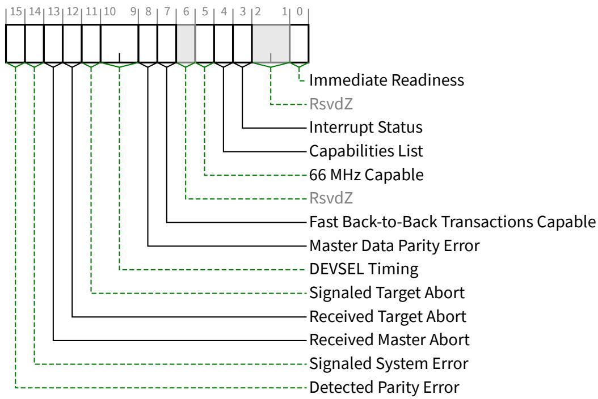

<details>
<summary>flowchart</summary>

```mermaid
graph TD
  A["15 14 13 12 11 10 9 8 7 6 5 4 3 2 1 0"] --> B["Immediate Readiness"]
  B --> C["RsvdZ"]
  C --> D["Interrupt Status"]
  D --> E["Capabilities List"]
  E --> F["66 MHz Capable"]
  F --> G["RsvdZ"]
  G --> H["Fast Back-to-Back Transactions Capable"]
  H --> I["Master Data Parity Error"]
  I --> J["DEVSEL Timing"]
  J --> K["Signaled Target Abort"]
  K --> L["Received Target Abort"]
  L --> M["Received Master Abort"]
  M --> N["Signaled System Error"]
  N --> O["Detected Parity Error"]
```
</details>

§  
Figure 7-6 Status Register

§  
Table 7-5 Status Register

<table><tr><td>Bit Location</td><td>Register Description</td><td>Attributes</td></tr><tr><td>0</td><td>Immediate Readiness- This optional bit, when Set, indicates the Function is guaranteed to be ready to successfully complete valid Configuration Requests at any time. It is permitted for this indication to be based on implementation specific knowledge of how long it takes the host to become ready to issue Configuration Requests.When this bit is Set, for accesses to this Function, software is exempt from all requirements to delay configuration accesses following any type of reset, including but not limited to the timing requirements defined in § Section 6.6.How this guarantee is established is beyond the scope of this document.It is permitted that system software/firmware provide mechanisms that supersede the indication provided by this bit, however such software/firmware mechanisms are outside the scope of this specification.</td><td>RO</td></tr><tr><td>3</td><td>Interrupt Status- When Set, indicates that an INTx emulation interrupt is pending internally in the Function.Note that INTx emulation interrupts forwarded by Functions with a Type 1 Configuration Space Header from the secondary side are not reflected in this bit.Setting the Interrupt Disable bit has no effect on the state of this bit.Functions that do not generate INTx interrupts are permitted to hardwire this bit to 0b.Default value of this bit is 0b.This bit does not apply to VFs and must be hardwired to Zero.</td><td>ROVF ROZ</td></tr><tr><td>4</td><td>Capabilities List- Indicates the presence of an Extended Capability list item. Since all PCI Express device Functions are required to implement the PCI Express Capability structure, this bit must be hardwired to 1b.</td><td>RO</td></tr><tr><td>5</td><td>66 MHz Capable- This bit was originally described in the [PCI]. Its functionality does not apply to PCI Express and the bit must be hardwired to 0b.</td><td>RO</td></tr><tr><td>7</td><td>Fast Back-to-Back Transactions Capable- This bit was originally described in the [PCI]. Its functionality does not apply to PCI Express and the bit must be hardwired to 0b.</td><td>RO</td></tr><tr><td>8</td><td>Master Data Parity Error- See § Section 7.5.1.1.14This bit is Set by a Function with a Type 0 Configuration Space Header if the Parity Error Response bit in the Command Register is 1b and either of the following two conditions occurs:Function receives a Poisoned CompletionFunction transmits a Poisoned RequestThis bit is Set by a Function with a Type 1 Configuration Space Header if the Parity Error Response bit in the Command Register is 1b and either of the following two conditions occurs:Port receives a Poisoned Completion going DownstreamPort transmits a Poisoned Request UpstreamIf the Parity Error Response bit is 0b, this bit is never Set.Default value of this bit is 0b.</td><td>RW1C</td></tr><tr><td>10:9</td><td>DEVSEL Timing- This field was originally described in the [PCI]. Its functionality does not apply to PCI Express and the field must be hardwired to 00b.</td><td>RO</td></tr><tr><td>11</td><td>Signaled Target Abort- See § Section 7.5.1.1.14.This bit is Set when a Function completes a Posted or Non-Posted Request as a Completer Abort error. This applies to a Function with a Type 1 Configuration Space Header when the Completer Abort was generated by its Primary Side.Functions with a Type 0 Configuration Space Header that do not signal Completer Abort are permitted to hardwire this bit to 0b.Default value of this bit is 0b.</td><td>RW1C</td></tr><tr><td>12</td><td>Received Target Abort- See § Section 7.5.1.1.14.On a Function with a Type 0 Configuration Space Header, this bit is Set when a Requester receives a Completion with Completer Abort Completion Status.On a Function with a Type 1 Configuration Space Header, this bit is Set when its Primary Side receives a Completion with Completer Abort Completion Status.Functions with a Type 0 Configuration Space Header that do not make Non-Posted Requests on their own behalf are permitted to hardwire this bit to 0b.Default value of this bit is 0b.</td><td>RW1C</td></tr><tr><td>13</td><td>Received Master Abort- See § Section 7.5.1.1.14.On a Function with a Type 0 Configuration Space Header, this bit is Set when a Requester receives a Completion with Unsupported Request Completion Status.On a Function with a Type 1 Configuration Space Header, the bit is Set when its Primary Side receives a Completion with Unsupported Request Completion Status.</td><td>RW1C</td></tr><tr><td></td><td>Functions with a Type 0 Configuration Space Header that do not make Non-Posted Requests on their own behalf are permitted to hardwire this bit to 0b.Default value of this bit is 0b.</td><td></td></tr><tr><td>14</td><td>Signaled System Error - See § Section 7.5.1.1.14 .This bit is Set when a Function sends an ERR_FATAL or ERR_NONFATAL Message, and the SERR# Enable bit in the Command Register is 1b.Functions with a Type 0 Configuration Space Header that do not send ERR_FATAL or ERR_NONFATAL Messages are permitted to hardwire this bit to 0b.Default value of this bit is 0b.</td><td>RW1C</td></tr><tr><td>15</td><td>Detected Parity Error - See § Section 7.5.1.1.14 .This bit is Set by a Function whenever it receives a Poisoned TLP, regardless of the state of the Parity Error Response bit in the Command Register. On a Function with a Type 1 Configuration Space Header, the bit is Set when the Poisoned TLP is received by its Primary Side.Default value of this bit is 0b.</td><td>RW1C</td></tr></table>

## 7.5.1.1.5 Revision ID Register (Offset 08h) §

The Revision ID Register is HwInit and the value in this register specifies a Function specific revision identifier. The value is chosen by the vendor. Zero is an acceptable value. The Device ID, in conjunction with the Vendor ID and Revision ID, are used as one mechanism for software to determine which driver should be loaded. The vendor must ensure that the chosen values do not result in the use of an incompatible device driver.

The value reported in the VF may be different than the value reported in the PF.

## 7.5.1.1.6 Class Code Register (Offset 09h) §

The Class Code Register is read-only and is used to identify the generic operation of the Function and, in some cases, a specific register level programming interface. The register layout is shown in § Figure 7-7 and described in § Table 7-6. Encodings for base class, sub-class, and programming interface are provided in the [PCI-Code-and-ID]. All unspecified encodings are Reserved.

The field in a PF and its associated VFs must return the same value when read.


<details>
<summary>text_image</summary>

23 16 15 8 7 0
Base Class Code Sub-Class Code
Programming Interface
</details>

Figure 7-7 Class Code Register

§

§

Table 7-6 Class Code Register

<table><tr><td>Bit Location</td><td>Register Description</td><td>Attributes</td></tr><tr><td>7:0</td><td>Programming Interface- This field identifies a specific register-level programming interface (if any) so that device independent software can interact with the Function.Encodings for this field are provided in the [PCI-Code-and-ID]. All unspecified encodings are Reserved.</td><td>RO</td></tr><tr><td>15:8</td><td>Sub-Class Code- Specifies a base class sub-class, which identifies more specifically the operation of the Function.Encodings for sub-class are provided in the [PCI-Code-and-ID]. All unspecified encodings are Reserved.</td><td>RO</td></tr><tr><td>23:16</td><td>Base Class Code- A code that broadly classifies the type of operation the Function performs.Encodings for base class, are provided in the [PCI-Code-and-ID]. All unspecified encodings are Reserved.</td><td>RO</td></tr></table>

## 7.5.1.1.7 Cache Line Size Register (Offset 0Ch) §

The Cache Line Size register is programmed by the system firmware or the operating system to system cache line size. However, note that legacy PCI-compatible software may not always be able to program this register correctly especially in the case of Hot-Plug devices. This read-write register is implemented for legacy compatibility purposes but has no effect on any PCI Express device behavior. For PCI Express to PCI/PCI-X Bridges, refer to the [PCIe-to-PCI-PCI-X-Bridge] for requirements for this register. The default value of this register is 00h.

This bit does not apply to VFs and must be hardwired to Zero.

## 7.5.1.1.8 Latency Timer Register (Offset 0Dh) §

This register is also referred to as Primary Latency Timer for Type 1 Configuration Space Header Functions. The Latency Timer was originally described in the [PCI] and the [PCI-to-PCI-Bridge]. Its functionality does not apply to PCI Express. This register must be hardwired to 00h.

## 7.5.1.1.9 Header Type Register (Offset 0Eh) §

This register identifies the layout of the second part of the predefined header (beginning at byte 10h in Configuration Space) and also whether or not the Device might contain multiple Functions. The register layout is shown in § Figure 7-8 and § Table 7-7 describes the bits in the register.

This entire register does not apply to VFs and must be hardwired to Zero.

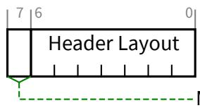

<details>
<summary>text_image</summary>

Header Layout
</details>

Multi-Function Device  
Figure 7-8 Header Type Register

§

Table 7-7 Header Type Register

<table><tr><td>Bit Location</td><td>Register Description</td><td>Attributes</td></tr><tr><td>6:0</td><td>Header Layout- This field identifies the layout of the second part of the predefined header.For Functions that implement a Type 0 Configuration Space Header the encoding 000 0000b must be used.For Functions that implement a Type 1 Configuration Space Header the encoding 000 0001b must be used.The encoding 000 0010b is Reserved. This encoding was originally described in the [PC-Card] and is used in previous versions of the programming model. Careful consideration should be given to any attempt to repurpose it.All other encodings are Reserved.</td><td>ROVF ROZ</td></tr><tr><td>7</td><td>Multi-Function Device- When Set, indicates that the Device may contain multiple Functions, but not necessarily. Software is permitted to probe for Functions other than Function 0. When Clear, software must not probe for Functions other than Function 0 unless explicitly indicated by another mechanism, such as an ARI or SR-IOV Extended Capability structure. Except where stated otherwise, it is recommended that this bit be Set if there are multiple Functions, and Clear if there is only one Function.The presence of Shadow Functions does not affect this bit.For an SR-IOV device, this bit is Set in non-VFs only if there are multiple non-VFs. VFs do not affect the value of bit 7.</td><td>ROVF ROZ</td></tr></table>

## 7.5.1.1.10 BIST Register (Offset 0Fh) §

This register is used for control and status of BIST. Functions that do not support BIST must hardwire the register to 00h. VFs shall not support BIST. A Function whose BIST is invoked must not prevent normal operation of the PCI Express Link. § Table 7-8 describes the bits in the register and § Figure 7-9 shows the register layout.

For an SR-IOV device, if the VF Enable bit is Set in any PF, then software should not invoke BIST in any Function associated with that device.

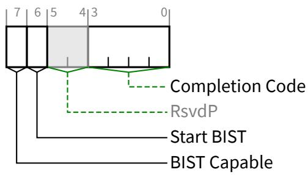

<details>
<summary>text_image</summary>

7 6 5 4 3 0
Completion Code
RsvdP
Start BIST
BIST Capable
</details>

Figure 7-9 BIST Register

§

§

Table 7-8 BIST Register

<table><tr><td>Bit Location</td><td>Register Description</td><td>Attributes</td></tr><tr><td>3:0</td><td>Completion Code- This field encodes the status of the most recent test. A value of 0000b means that the Function has passed its test. Non-zero values mean the Function failed. Function-specific failure codes can be encoded in the non-zero values.This field&#x27;s value is only meaningful when BIST Capable is Set and Start BIST is Clear.Default value of this field is 0000b.This field must be hardwired to 0000b if BIST Capable is Clear.</td><td>ROVF ROZ</td></tr><tr><td>6</td><td>Start BIST- If BIST Capable is Set, Set this bit to invoke BIST. The Function resets the bit when BIST is complete. Software is permitted to fail the device if this bit is not Clear (BIST is not complete) 2 seconds after it had been Set.Writing this bit to 0b has no effect.This bit must be hardwired to 0b if BIST Capable is Clear.</td><td>RW/RO(see description)VF ROZ</td></tr><tr><td>7</td><td>BIST Capable- When Set, this bit indicates that the Function supports BIST. When Clear, the Function does not support BIST.</td><td>HwInitVF ROZ</td></tr></table>

## 7.5.1.1.11 Capabilities Pointer (Offset 34h) §

This register is used to point to a linked list of capabilities implemented by this Function. Since all PCI Express Functions are required to implement the PCI Express Capability structure, which must be included somewhere in this linked list; this register must be non-zero. The bottom two bits are Reserved and must be set to 00b. Software must mask these bits off before using this register as a pointer in Configuration Space to the first entry of a linked list of new capabilities. This register is HwInit.

## 7.5.1.1.12 Interrupt Line Register (Offset 3Ch) §

The Interrupt Line register communicates interrupt line routing information. The register is read/write and must be implemented by any Function that uses an interrupt pin (see following description). Values in this register are programmed by system software and are system architecture specific. The Function itself does not use this value; rather the value in this register is used by device drivers and operating systems. If Interrupt Pin Register is 00h, this register is permitted to be hardwired to 0b. Otherwise, the default value is implementation specific.

For VFs, this register does not apply and must be hardwired to Zero.

## 7.5.1.1.13 Interrupt Pin Register (Offset 3Dh) §

The Interrupt Pin register is a read-only register that identifies the legacy interrupt Message(s) the Function uses (see § Section 6.1 for further details). Valid values are 01h, 02h, 03h, and 04h that map to legacy interrupt Messages for INTA, INTB, INTC, and INTD respectively. A value of 00h indicates that the Function uses no legacy interrupt Message(s). The values 05h through FFh are Reserved.

PCI Express defines one legacy interrupt Message for a single Function device and up to four legacy interrupt Messages for a Multi-Function Device. For a single Function device, only INTA may be used.

Any Function on a Multi-Function Device can use any of the INTx Messages. If a device implements a single legacy interrupt Message, it must be INTA; if it implements two legacy interrupt Messages, they must be INTA and INTB; and so forth. For a Multi-Function Device, all Functions may use the same INTx Message or each may have its own (up to a maximum of four Functions) or any combination thereof. A single Function can never generate an interrupt request on more than one INTx Message.

For VFs, this register does not apply and must be hardwired to Zero.

## 7.5.1.1.14 Error Registers §

The Error Control/Status register bits in the Command and Status registers (see § Section 7.5.1.1.3 and § Section 7.5.1.1.4 respectively) and the Bridge Control and Secondary Status registers of Type 1 Configuration Space Header Functions (see § Section 7.5.1.3.10 and § Section 7.5.1.3.7 respectively) control PCI-compatible error reporting for both PCI and PCI Express device Functions. Mapping of PCI Express errors onto PCI errors is also discussed in § Section 6.2.7.1 . In addition to the PCI-compatible error control and status, PCI Express error reporting may be controlled separately from PCI device Functions through the PCI Express Capability structure described in § Section 7.5.3 . The PCI-compatible error control and status register fields do not have any effect on PCI Express error reporting enabled through the PCI Express Capability structure. PCI Express device Functions may implement optional advanced error reporting as described in § Section 7.8.4 .

For PCI Express Root Ports represented by a Type 1 Configuration Space Header:

• The primary side Error Control/Status registers apply to errors detected on the internal logic associated with the Root Complex.  
• The secondary side Error Control/Status registers apply to errors detected on the Link originating from the Root Port.

For PCI Express Switch Upstream Ports represented by a Type 1 Configuration Space Header:

• The primary side Error Control/Status registers apply to errors detected on the Upstream Link of the Switch.  
• The secondary side Error Control/Status registers apply to errors detected on the internal logic of the Switch.

For PCI Express Switch Downstream Ports represented by a Type 1 Configuration Space Header:

• The primary side Error Control/Status registers apply to errors detected on the internal logic of the Switch.  
• The secondary side Error Control/Status registers apply to errors detected on the Downstream Link originating from the Switch Port.

## 7.5.1.2 Type 0 Configuration Space Header §

§ Figure 7-10 details allocation for register fields of Type 0 Configuration Space Header for PCI Express device Functions.

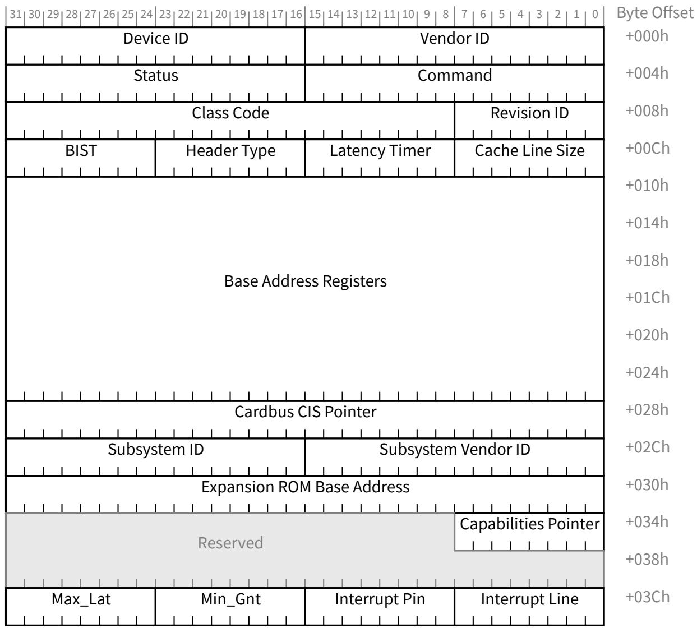

<details>
<summary>stacked bar chart</summary>

| Bit Position | Device ID | Status | Class Code | BIST | Base Address Registers | Cardbus CIS Pointer | Subsystem ID | Expansion ROM Base Address | Reserved | Max_Lat | Min_Gnt | Interrupt Pin | Interrupt Line |
| --- | --- | --- | --- | --- | --- | --- | --- | --- | --- | --- | --- | --- | --- |
| 1 |  |  |  |  |  |  |  |  |  |  |  |  |  |
| 2 |  |  |  |  |  |  |  |  |  |  |  |  |  |
| 3 |  |  |  |  |  |  |  |  |  |  |  |  |  |
| 4 |  |  |  |  |  |  |  |  |  |  |  |  |  |
| 5 |  |  |  |  |  |  |  |  |  |  |  |  |  |
| 6 |  |  |  |  |  |  |  |  |  |  |  |  |  |
| 7 |  |  |  |  |  |  |  |  |  |  |  |  |  |
| 8 |  |  |  |  |  |  |  |  |  |  |  |  |  |
| 9 |  |  |  |  |  |  |  |  |  |  |  |  |  |
| 10 |  |  |  |  |  |  |  |  |  |  |  |  |  |
| 11 |  |  |  |  |  |  |  |  |  |  |  |  |  |
| 12 |  |  |  |  |  |  |  |  |  |  |  |  |  |
| 13 |  |  |  |  |  |  |  |  |  |  |  |  |  |
| 14 |  |  |  |  |  |  |  |  |  |  |  |  |  |
| 15 |  |  |  |  |  |  |  |  |  |  |  |  |  |
| 16 |  |  |  |  |  |  |  |  |  |  |  |  |  |
</details>

Figure 7-10 Type 0 Configuration Space Header§

§ Section 7.5.1.1 details the PCI Express-specific registers that are valid for all Configuration Space Header types. The PCI Express-specific interpretation of registers specific to Type 0 Configuration Space Header is defined in this section.

## 7.5.1.2.1 Base Address Registers (Offset 10h - 24h) §

System software must build a consistent address map before booting the machine to an operating system. This means it has to determine how much memory is in the system, and how much address space the Functions in the system require. After determining this information, system software can map the Functions into reasonable locations and proceed with system boot. In order to do this mapping in a device-independent manner, the base registers for this mapping are placed in the predefined header portion of Configuration Space. It is strongly recommended that power-up firmware/software also support the optional Enhanced Configuration Access Mechanism (ECAM).

For VFs, these registers must be hardwired to Zero. See § Section 9.2.1.1.1 and § Section 9.3.3.14 .

Bit 0 in all Base Address registers is read-only and used to determine whether the register maps into Memory or I/O Space. Base Address registers that map to Memory Space must return a 0b in bit 0 (see § Figure 7-11). Base Address registers that map to I/O Space must return a 1b in bit 0 (see § Figure 7-12).

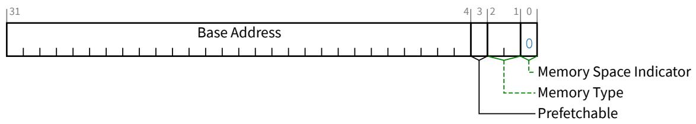

<details>
<summary>text_image</summary>

31
Base Address
4 3 2 1 0
Memory Space Indicator
Memory Type
Prefetchable
</details>

Figure 7-11 Base Address Register for Memory§

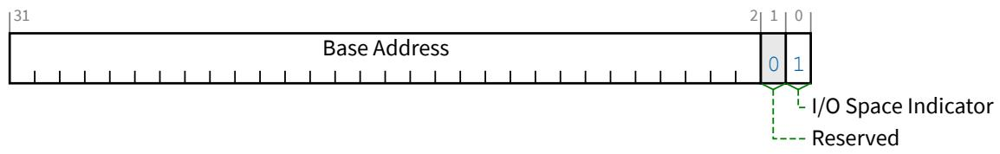

<details>
<summary>text_image</summary>

31
Base Address
2 | 1 | 0
0 | 1
I/O Space Indicator
Reserved
</details>

Figure 7-12 Base Address Register for I/O§

Base Address registers that map into I/O Space are always 32 bits wide with bit 0 hardwired to 1b. Bit 1 is Reserved and must return 0b on reads and the other bits are used to map the Function into I/O Space.

Base Address registers that map into Memory Space can be 32 bits or 64 bits wide (to support mapping into a 64-bit address space) with bit 0 hardwired to 0b. For Memory Base Address registers, bits 2 and 1 have an encoded meaning as shown in § Table 7-9. Bit 3 should be set to 1b if the data is prefetchable and set to 0b otherwise. A Function is permitted to mark a range as prefetchable if there are no side effects on reads, the Function returns all bytes on reads regardless of the byte enables, and host bridges can merge processor writes into this range 150 without causing errors. Bits 3-0 are read-only.

Table 7-9 Memory Base Address Register Bits 2:1 Encoding§

<table><tr><td>Bits 2:1(b)</td><td>Meaning</td></tr><tr><td>00</td><td>Base register is 32 bits wide and can be mapped anywhere in the 32 address bit Memory Space.</td></tr><tr><td>01</td><td>Reserved  $^{151}$ </td></tr><tr><td>10</td><td>Base register is 64 bits wide and can be mapped anywhere in the 64 address bit Memory Space.</td></tr><tr><td>11</td><td>Reserved</td></tr></table>

The number of upper bits that a Function actually implements depends on how much of the address space the Function will respond to. A 32-bit Base Address register supports a single, implementation specific, memory size that is a power of 2, from 16 bytes to 256 Bytes (I/O Space) or 128 Bytes to 2 GB (Memory Space). Each BAR must implement all appropriate upper address bits as Read-Write (i.e., a BAR must be able to be configured to any appropriately aligned address in the associated address space). A Function that wants a 1 MB memory address space (using a single 32-bit Base Address register) must implement the top 12 bits of the Address register as Read-Write, hardwiring the other address bits to 0's. The default value of Read-Write bits in BARs is implementation specific. The attributes for some of the bits in the BAR are affected by the Resizable BAR Capability, if it is implemented.

To determine how much address space a Function requires, system software should write a value of all 1's to each BAR register and then read the value back. Low-order bits of the Base Address field in each BAR must return 0's to indicate how much address space is required. Unimplemented Base Address registers must be hardwired to zero.

This design implies that all address spaces used are a power of two in size and are naturally aligned. Functions are free to consume more address space than required, but decoding down to a 4 KB space for memory is suggested for Functions that need less than that amount. For instance, a Function that has 64 bytes of registers to be mapped into Memory Space may consume up to 4 KB of address space in order to minimize the number of bits in the address decoder. Functions that do consume more address space than they use are not required to respond to the unused portion of that address space if the Function's programming model never accesses the unused space. The Function is permitted to return Unsupported Request for accesses targetting the unused locations. Functions that map control functions into I/O Space must not consume more than 256 bytes per I/O Base Address register or per each entry in the Enhanced Allocation Capability. The upper 16 bits of the I/O Base Address register may be hardwired to zero for Functions intended for 16-bit I/O systems, such as PC compatibles. However, a full 32-bit decode of I/O addresses must still be done.

## IMPLEMENTATION NOTE:

## SIZING A 32-BIT BASE ADDRESS REGISTER EXAMPLE §

Decode (I/O or memory) of the appropriate address space is disabled via the Command Register before sizing a Base Address register. Software saves the original value of the Base Address register, writes a value of all 1's to the register, then reads it back. Size calculation can be done from the 32 bit value read by first clearing encoding information bits (bits 1:0 for I/O, bits 3:0 for memory), inverting all 32 bits (logical NOT), then incrementing by 1. The resultant 32-bit value is the memory/I/O range size decoded by the register. Note that the upper 16 bits of the result is ignored if the Base Address register is for I/O and bits 31:16 returned zero upon read. The original value in the Base Address register is restored before re-enabling decode in the Command Register of the Function.

64-bit (memory) Base Address registers can be handled the same, except that the second 32 bit register is considered an extension of the first (i.e., bits 63:32). Software writes a value of all 1's to both registers, reads them back, and combines the result into a 64-bit value. Size calculation is done on the 64-bit value.

A Type 0 Configuration Space Header has six DWORD locations allocated for Base Address registers starting at offset 10h in Configuration Space. A Type 1 Configurations Space Header has only two DWORD locations. A Function may use any of the locations to implement Base Address registers. An implemented 64-bit Base Address register consumes two consecutive DWORD locations. Software looking for implemented Base Address registers must start at offset 10h and continue upwards through offset 24h. A typical Function requires one memory range for its control functions. Some graphics Functions use two ranges, one for control functions and another for a frame buffer. A Function that wants to map control functions into both memory and I/O Spaces at the same time must implement two Base Address registers (one memory and one I/O). The driver for that Function might only use one space in which case the other space will be unused. Functions are recommended to always map control functions into Memory Space.

A PCI Express Function requesting Memory Space through a BAR must set the BAR's Prefetchable bit unless the range contains locations with read side effects or locations in which the Function does not tolerate write merging. It is strongly encouraged that resources mapped into Memory Space be designed as prefetchable whenever possible. PCI Express Functions other than Legacy Endpoints must support 64-bit addressing for any Base Address register that requests prefetchable Memory Space. The minimum Memory Space address range requested by a BAR is 128 bytes. The attributes for some of the bits in the BAR are affected by the Resizable BAR Capability, if it is implemented.

## IMPLEMENTATION NOTE:

## ADDITIONAL GUIDANCE ON THE PREFETCHABLE BIT IN MEMORY SPACE BARS §

PCI Express adapters with Memory Space BARs that request a large amount of non-prefetchable Memory Space (e.g., over 64 MB) may cause shortages of that Space on certain scalable platforms, since many platforms support a total of only 1 GB or less of non-prefetchable Memory Space. This may limit the number of such adapters that can be supported on those platforms. For this reason, it is especially encouraged for BARs requesting large amounts of Memory Space to have their Prefetchable bit Set, since prefetchable Memory Space is more bountiful on most scalable platforms.

While a Memory Space BAR is required to have its Prefetchable bit Set if none of the locations within its range have read side effects and all of the locations tolerate write merging, there are system configurations where having the Prefetchable bit Set will still allow correct operation even if those conditions are not met. For those cases, it may make sense for the adapter to have the Prefetchable bit Set in certain candidate BARs so that the system can map those BARs into prefetchable Memory Space in order to avoid non-prefetchable Memory Space shortages.

On PCI Express systems that meet the criteria enumerated below, setting the Prefetchable bit in a candidate BAR will still permit correct operation even if the BAR’s range includes some locations that have read side-effects or cannot tolerate write merging. This is primarily due to the fact that PCI Express Memory Reads always contain an explicit length, and PCI Express Switches never prefetch or do byte merging. Generally only 64-bit BARs are good candidates, since only Legacy Endpoints are permitted to set the Prefetchable bit in 32-bit BARs, and most scalable platforms map all 32-bit Memory BARs into non-prefetchable Memory Space regardless of the Prefetchable bit value.

Here are criteria that are sufficient to guarantee correctness for a given candidate BAR:

• The entire path from the host to the adapter is over PCI Express.  
• No conventional PCI or PCI-X devices do peer-to-peer reads to the range mapped by the BAR.  
• The PCI Express Host Bridge does no byte merging. (This is believed to be true on most platforms.)  
• Any locations with read side-effects are never the target of Memory Reads with the TH bit Set. See § Section 2.2.5 .  
• The range mapped by the BAR is never the target of a speculative Memory Read, either Host initiated or peer-to-peer.

The above criteria are a simplified set that are sufficient to guarantee correctness. Other less restrictive but more complex criteria may also guarantee correctness, but are outside the scope of this specification.

## 7.5.1.2.2 Cardbus CIS Pointer Register (Offset 28h) §

This register was originally described in the [PC-Card]. This register does not apply to PCI Express and must be hardwired to Zero.

## 7.5.1.2.3 Subsystem Vendor ID Register/Subsystem ID Register (Offset 2Ch/2Eh) §

The Subsystem Vendor ID and Subsystem ID registers are used to uniquely identify the adapter or subsystem where the PCI Express component resides. They provide a mechanism for vendors to distinguish their products from one another even though the assemblies may have the same PCI Express component on them (and, therefore, the same Vendor ID and Device ID).

Implementation of these registers is required for all Functions except those that have a Base Class 06h with Sub Class 00h-04h (00h, 01h, 02h, 03h, 04h), or a Base Class 08h with Sub Class 00h-03h (00h, 01h, 02h, 03h). Subsystem Vendor IDs can be obtained from the PCI SIG and are used to identify the vendor of the adapter, motherboard, or subsystem 152 . A Subsystem Vendor ID (SVID) must be a Vendor ID assigned by the PCI-SIG to the vendor of the subsystem. In keeping with PCI-SIG procedures, valid vendor identifiers must be obtained from the PCI-SIG to ensure uniqueness.

Values for the Subsystem ID are vendor assigned. Subsystem ID values, in conjunction with the Subsystem Vendor ID, form a unique identifier for the PCI product. Subsystem ID and Device ID values are distinct and unrelated to each other, and software should not assume any relationship between them.

Values in these registers must be loaded before the Function becomes Configuration-Ready. How these values are loaded is not specified but could be done during the manufacturing process or loaded from external logic (e.g., strapping options, serial ROMs, etc.). These values must not be loaded using Expansion ROM software because Expansion ROM software is not guaranteed to be run during POST in all systems.

If a device is designed to be used exclusively on the system board, the system vendor may use system specific software to initialize these registers after each power-on.

The Subsystem Vendor ID register in a PF and its associated VFs must return the same value when read.

The Subsystem ID register in a PF and its associated VFs are permitted to return different values when read.

## IMPLEMENTATION NOTE:SUBSYSTEM VENDOR ID AND SUBSYSTEM ID §

The Subsystem Vendor ID and Subsystem ID fields, taken together, allow software to uniquely identify a PCI circuit board product. Vendors should therefore not reuse Subsystem ID values across multiple product types that share a common Subsystem Vendor ID. It is acceptable, although not preferred, to reuse the Subsystem ID value on products with the same Subsystem Vendor ID in cases where the products are in the same family and generation, and differ only in capacity or performance. Note also that it is acceptable for vendors to use multiple unique Subsystem ID values over time for a single product type, such as to indicate some internal difference such as component selection.

## 7.5.1.2.4 Expansion ROM Base Address Register (Offset 30h) §

Some Functions, especially those that are intended for use on add-in cards, require local EPROMs for Expansion ROM (refer to the [Firmware] for a definition of ROM contents). This register is defined to handle the base address and size information for this Expansion ROM. The register layout is shown in § Figure 7-13 and § Table 7-10 describes the bits in the register.

For VFs, the Expansion ROM Base Address register is not supported and must be hardwired to Zero. The VI may choose to provide access to a ${ \mathsf { P F } } ^ { \prime } { \mathsf { S } }$ Expansion ROM Base Address register for its associated VFs via emulation.

Functions that support an expansion ROM must allow that ROM to be accessed with any combination of byte enables.


<details>
<summary>text_image</summary>

31
Expansion ROM Base Address
RsvdP
11 10 8 7 4 3 1 0
Expansion ROM Enable
Expansion ROM Validation Status
Expansion ROM Validation Details
</details>

Figure 7-13 Expansion ROM Base Address Register§

Table 7-10 Expansion ROM Base Address Register§

<table><tr><td>Bit Location</td><td>Description</td><td>Attributes</td></tr><tr><td>0</td><td>Expansion ROM Enable- This bit controls whether or not the Function accepts accesses to its Expansion ROM via the Expansion ROM Base Address Register. Functions that support an Expansion ROM accessible through this register must implement this bit. If the Function has an Enhanced Allocation Capability that includes an EA entry for an Expansion ROM, this bit must be hardwired to 0b (see § Section 7.5.1.2.4). Functions that do not support an Expansion ROM are permitted to hardwire this bit to 0b. When this bit is 0b, the Function&#x27;s Expansion ROM address space via the Expansion ROM Base Address Register is disabled. When the bit is 1b, address decoding is enabled using the Expansion ROM Base Address field in this register. This optionally allows a Function to be used with or without an Expansion ROM depending on system configuration. The Memory Space Enable bit in the Command register has precedence over the Expansion ROM Enable bit. A Function must claim accesses to its Expansion ROM via the Expansion ROM Base Address Register only if both the Memory Space Enable bit and the Expansion ROM Enable bit are Set. The default value of this bit is 0b.In order to minimize the number of address decoders needed, a Function is permitted to share a decoder between the Expansion ROM Base Address Register and other Base Address registers or entries in the Enhanced Allocation Capability  $^{153}$ . When Expansion ROM Enable is Set, the decoder is used for accesses to the Expansion ROM and device independent software must not access the Function through any other Base Address Registers or entries in the Enhanced Allocation Capability. Address decode sharing is not permitted for PFs or if the Function contains an Enhanced Allocation Capability with an EA entry for an Expansion ROM.</td><td>RO/RW</td></tr><tr><td>3:1</td><td>Expansion ROM Validation Status- Expansion ROM Validation is optional. When this field is non-zero, it indicates the status of hardware validation of the Expansion ROM contents.An Expansion ROM is considered valid if it passes an implementation specific integrity check.An Expansion ROM is considered valid-warn if the implementation specific integrity check passes but indicates an implementation specific warning condition.A valid or valid-warn Expansion ROM is also considered trusted if passes an optional implementation specific trust test (e.g., signed by a trusted certificate).Hardware validation must include the contents of the Expansion ROM. This validation status is also permitted to cover additional internal information (e.g., internal firmware). Validation does not include Vital Product Data (see § Section 6.27).</td><td>HwInit/ROS</td></tr></table>

153. Note that it is the address decoder that is shared, not the registers themselves. The Expansion ROM Base Address Register and other Base Address Registers or entries in the Enhanced Allocation Capability must be able to hold unique values at the same time.

<table><tr><td>Bit Location</td><td>Description</td><td>Attributes</td></tr><tr><td></td><td>It is optional whether an implementation is capable of returning Validation Status values 011b, 101b, 110b, or 111b. Defined encodings are:000b Validation not supported001b Validation in Progress010b Validation Pass Valid contents, trust test was not performed011b Validation Pass Valid and trusted contents100b Validation Fail Invalid contents101b Validation Fail Valid but untrusted contents (e.g., Out of Date, Expired or Revoked Certificate)110b Warning Pass Validation Passed with implementation specific warning. Valid contents, trust test was not performed111b Warning Pass Validation Passed with implementation specific warning. Valid and trusted contentsIf the Function does not support validation, this field must be hardwired to 000b.If the Function supports validation and has an Enhanced Allocation Capability with an EA entry for an Expansion ROM, this field is HwInit and its value must be between 010b and 111b (see § Section 7.8.5.3).Otherwise, this field is Read Only Sticky and has a default value of 001b. When validation completes, this field must contain a value between 010b and 111b inclusive.Software is permitted to assume validation will never complete if this field contains 001b and 1 minute has passed after de-assertion of Fundamental Reset. This field is only reset by Fundamental Reset, and is not affected by other resets.</td><td></td></tr><tr><td>7:4</td><td>Expansion ROM Validation Details - contains optional, implementation specific details associated with Expansion ROM Validation.If the Function does not support validation, this field is RsvdP.This field is optional. When validation is supported and this field is not implemented, this field must be hardwired to 0000b. Any unused bits in this field are permitted to be hardwired to 0b.If validation is in progress (Expansion ROM Validation Status is 001b), non-zero values of this field represent implementation specific indications of the phase of the validation progress (e.g., 50% complete). The value 0000b indicates that no validation progress information is provided.If validation is completed (Expansion ROM Validation Status 010b to 111b inclusive), non-zero values in this field represent additional implementation specific information. The value 0000b indicates that no information is provided.If the Function supports validation and has an Enhanced Allocation Capability with an EA entry for an Expansion ROM, this field is HwInit.Otherwise, this field is Read Only Sticky. This field is only reset by Fundamental Reset, and is not affected by other resets.This field must not change value once the validation process completes.It is recommended that system software include the value of this field when it reports validation status (e.g., error log).</td><td>HwInit/ROS/RsvdP</td></tr><tr><td>31:11</td><td>Expansion ROM Base Address - contains the upper bits 21 bits of the starting memory address of the Expansion ROM. The lower 11 bits of the Expansion ROM Base Address Register are masked off (set to zero) by software to form a 32-bit address.This field functions like the address portion of a 32-bit Base Address register. This field corresponds to the upper 21 bits of the Expansion ROM Base Address. The number of bits (out of these 21) that a Function actually implements depends on how much Expansion ROM address space the Function requires. For instance, a Function that requires a 64 KB area to map its Expansion ROM would implement the top 16 bits in this field as writeable, leaving the bottom 5 bits (out of these 21) hardwired to 0b. The amount of address space a Function requests must not be greater than 16 MB. Functions that support an Expansion ROM accessible through this register must implement this field. If the Function has an Enhanced Allocation Capability that includes an EA entry for an Expansion ROM, this field must be hardwired to 0 (see § Section 7.8.5.3 ) Functions that do not support an Expansion ROM are permitted to hardwire this field to 0.Device independent configuration software can determine how much address space the Function requires by writing a value of all 1's to this field and then reading the value back. Low order bits of this field must return 0's in all don't-care bits, effectively specifying the size and alignment requirements. The amount of address space a Function requests must not be greater than 16 MB.</td><td>RW/RO</td></tr></table>

## 7.5.1.2.5 Min\_Gnt Register/Max\_Lat Register (Offset 3Eh/3Fh) §

These registers do not apply to PCI Express and must be hardwired to Zero.

## 7.5.1.3 Type 1 Configuration Space Header §

§ Figure 7-14 details allocation for register fields of Type 1 Configuration Space Header for Switch and Root Ports.

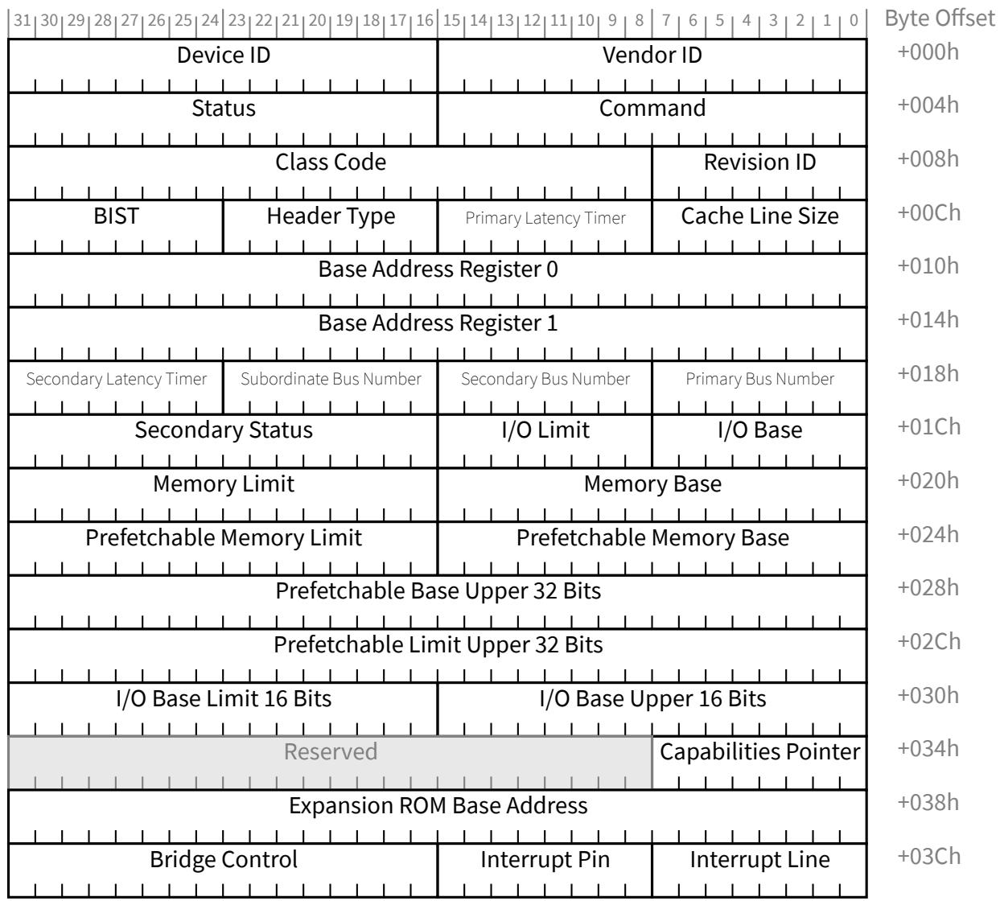

<details>
<summary>table</summary>

| Status | 0 | 0 | 0 | 0 | 0 | 0 | 0 | 0 | 0 | 0 | 0 | 0 | 0 | 0 | 0 | 0 | 0 | 0 | 0 | 0 | 0 | 0 | 0 | 0 | 0 | 0 | 0 |
| --- | --- | --- | --- | --- | --- | --- | --- | --- | --- | --- | --- | --- | --- | --- | --- | --- | --- | --- | --- | --- | --- | --- | --- | --- | --- | --- | --- |
| Class Code | 0 | 0 | 0 | 0 | 0 | 0 | 0 | 0 | 0 | 0 | 0 | 0 | 0 | 0 | 0 | 0 | 0 | 0 | 0 | 0 | 0 | 0 | 0 | 0 | 0 | 0 | 0 |
| BIST | 15 | 15 | 15 | 15 | 15 | 15 | 15 | 15 | 15 | 15 | 15 | 15 | 15 | 15 | 15 | 15 | 15 | 15 | 15 | 15 | 15 | 15 | 15 | 15 | 15 | 16 | - |
</details>

Figure 7-14 Type 1 Configuration Space Header§

§ Section 7.5.1.1 details the PCI Express-specific registers that are valid for all Configuration Space Header types. The PCI Express-specific interpretation of registers specific to Type 1 Configuration Space Header is defined in this section. Register interpretations described in this section apply to PCI-PCI Bridge structures representing Switch and Root Ports; other device Functions such as PCI Express to PCI/PCI-X Bridges with Type 1 Configuration Space headers are not covered by this section.

## 7.5.1.3.1 Type 1 Base Address Registers (Offset 10h-14h) §

These registers are defined in § Section 7.5.1.2.1 . However the number of BARs available within the Type 1 Configuration Space Header is different than that of the Type 0 Configuration Space Header.

## 7.5.1.3.2 Primary Bus Number Register (Offset 18h) §

Except as noted, this register is not used by PCI Express Functions but must be implemented as read-write and the default value must be 00h, for compatibility with legacy software. PCI Express Functions capture the Bus (and Device) Number as described (including exceptions) in § Section 2.2.6 . Refer to [PCIe-to-PCI-PCI-X-Bridge] for exceptions to this requirement.

## 7.5.1.3.3 Secondary Bus Number Register (Offset 19h) §

The Secondary Bus Number register is used to record the bus number of the PCI bus segment to which the secondary interface of the bridge is connected. Configuration software programs the value in this register. The Bridge uses this register to determine when and how to respond to an ID-routed TLP observed on its primary interface, notably when to forward the TLP to its secondary interface, in certain cases after performing some conversion. See § Section 7.3.3 for Configuration Request routing and conversion rules. This register must be implemented as read/write and the default value must be 00h.

## 7.5.1.3.4 Subordinate Bus Number Register (Offset 1Ah) §

The Subordinate Bus Number register is used to record the bus number of the highest numbered PCI bus segment which is behind (or subordinate to) the bridge. Configuration software programs the value in this register. The Bridge uses this register to determine when and how to respond to an ID-routed TLP observed on its primary interface, notably when to forward the TLP to its secondary interface. See § Section 7.3.3 for Configuration Request routing rules. This register must be implemented as read-write and the default value must be 00h.

## 7.5.1.3.5 Secondary Latency Timer (Offset 1Bh) §

This register does not apply to PCI Express. It must be read-only and hardwired to 00h. For PCI Express to PCI/PCI-X Bridges, refer to the [PCIe-to-PCI-PCI-X-Bridge] for requirements for this register.

## 7.5.1.3.6 I/O Base/I/O Limit Registers(Offset 1Ch/1Dh) §

The I/O Base and I/O Limit registers are optional and define an address range that is used by the bridge to determine when to forward I/O transactions from one interface to the other.

If a bridge does not implement an I/O address range, then both the I/O Base and I/O Limit registers must be implemented as read-only registers that return zero when read. If a bridge supports an I/O address range, then these registers must be initialized by configuration software so default states are not specified.

If a bridge implements an I/O address range, the upper 4 bits of both the I/O Base and I/O Limit registers are writable and correspond to address bits Address[15:12]. For the purpose of address decoding, the bridge assumes that the lower 12 address bits, Address[11:0], of the I/O base address (not implemented in the I/O Base register) are zero. Similarly, the bridge assumes that the lower 12 address bits, Address[11:0], of the I/O limit address (not implemented in the I/O Limit register) are FFFh. Thus, the bottom of the defined I/O address range will be aligned to a 4 KB boundary and the top of the defined I/O address range will be one less than a 4 KB boundary.

The I/O Limit register can be programmed to a smaller value than the I/O Base register, if there are no I/O addresses on the secondary side of the bridge. In this case, the bridge will not forward any I/O transactions from the primary bus to the secondary and will forward all I/O transactions from the secondary bus to the primary bus.

The lower four bits of both the I/O Base and I/O Limit registers are read-only, contain the same value, and encode the I/O addressing capability of the bridge according to § Table 7-11.

$\begin{array} { c c } { { T a b l e ^ { 7 - 1 1 / 1 / O \ A d d r e s s i n g } \qquad } } & { { \ S } } \\ { { C a p a b i l i t y } } & { { \qquad } } \end{array}$

<table><tr><td>Bits 3:0</td><td>I/O Addressing Capability</td></tr><tr><td>0h</td><td>16-bit I/O addressing</td></tr><tr><td>1h</td><td>32-bit I/O addressing</td></tr><tr><td>2h-Fh</td><td>Reserved</td></tr></table>

If the low four bits of the I/O Base and I/O Limit registers have the value 0000b, then the bridge supports only 16-bit I/O addressing (for ISA compatibility), and, for the purpose of address decoding, the bridge assumes that the upper 16 address bits, Address[31:16], of the I/O base and I/O limit address (not implemented in the I/O Base and I/O Limit registers) are zero. Note that the bridge must still perform a full 32-bit decode of the I/O address (i.e., check that Address[31:16] are 0000h). In this case, the I/O address range supported by the bridge will be restricted to the first 64 KB of I/O Space (0000 0000h to 0000 FFFFh).

If the low four bits of the I/O Base and I/O Limit registers are 0001b, then the bridge supports 32-bit I/O address decoding, and the I/O Base Upper 16 Bits and the I/O Limit Upper 16 Bits hold the upper 16 bits, corresponding to Address[31:16], of the 32-bit I/O Base and I/O Limit addresses respectively. In this case, system configuration software is permitted to locate the I/O address range supported by the bridge anywhere in the 4 GB I/O Space. Note that the 4 KB alignment and granularity restrictions still apply when the bridge supports 32-bit I/O addressing.

These registers must be initialized by configuration software, so default states are not specified.

## 7.5.1.3.7 Secondary Status Register (Offset 1Eh) §

§ Table 7-12 defines the Secondary Status Register and § Figure 7-15 provides the register layout. For PCI Express to PCI/ PCI-X Bridges, refer to the [PCIe-to-PCI-PCI-X-Bridge] for requirements for this register.

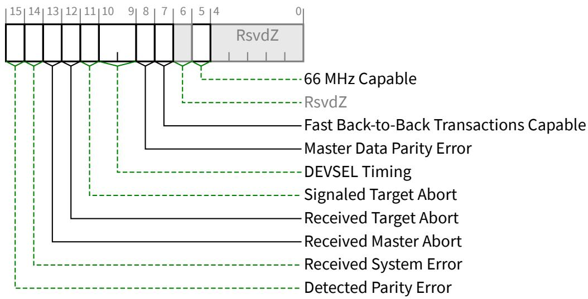

<details>
<summary>diagram</summary>

| Bit Position | Label                     |
| ------------ | ------------------------- |
| 0            | RsvdZ                     |
| 1            | 66 MHz Capable            |
| 2            | RsvdZ                     |
| 3            | Fast Back-to-Back Transactions Capable |
| 4            | Master Data Parity Error   |
| 5            | DEVSEL Timing             |
| 6            | Signaled Target Abort     |
| 7            | Received Target Abort     |
| 8            | Received Master Abort     |
| 9            | Received System Error     |
| 10           | Detected Parity Error     |
</details>

§ Figure 7-15 Secondary Status Register

§ Table 7-12 Secondary Status Register

<table><tr><td>Bit Location</td><td>Register Description</td><td>Attributes</td></tr><tr><td>5</td><td>66 MHz Capable- This bit was originally described in the [PCI-to-PCI-Bridge]. Its functionality does not apply to PCI Express and the bit must be hardwired to 0b.</td><td>RO</td></tr><tr><td>7</td><td>Fast Back-to-Back Transactions Capable- This bit was originally described in the [PCI-to-PCI-Bridge]. Its functionality does not apply to PCI Express and the bit must be hardwired to 0b.</td><td>RO</td></tr><tr><td>8</td><td>Master Data Parity Error- See § Section 7.5.1.1.14.This bit is Set by a Function with a Type 1 Configuration Space Header if the Parity Error Response Enable bit in the Bridge Control Register is Set and either of the following two conditions occurs:Port receives a Poisoned Completion coming UpstreamPort transmits a Poisoned Request DownstreamIf the Parity Error Response Enable bit is Clear, this bit is never Set.Default value of this bit is 0b.</td><td>RW1C</td></tr><tr><td>10:9</td><td>DEVSEL Timing- This field was originally described in the [PCI-to-PCI-Bridge]. Its functionality does not apply to PCI Express and the field must be hardwired to 00b.</td><td>RO</td></tr><tr><td>11</td><td>Signaled Target Abort- See § Section 7.5.1.1.14.This bit is Set when the Secondary Side for Type 1 Configuration Space Header Function (for Requests completed by the Type 1 header Function itself) completes a Posted or Non-Posted Request as a Completer Abort error.Default value of this bit is 0b.</td><td>RW1C</td></tr><tr><td>12</td><td>Received Target Abort- See § Section 7.5.1.1.14.This bit is Set when the Secondary Side for Type 1 Configuration Space Header Function (for Requests initiated by the Type 1 header Function itself) receives a Completion with Completer Abort Completion Status.Default value of this bit is 0b.</td><td>RW1C</td></tr><tr><td>13</td><td>Received Master Abort- See § Section 7.5.1.1.14.This bit is Set when the Secondary Side for Type 1 Configuration Space Header Function (for Requests initiated by the Type 1 header Function itself) receives a Completion with Unsupported Request Completion Status.Default value of this bit is 0b.</td><td>RW1C</td></tr><tr><td>14</td><td>Received System Error- See § Section 7.5.1.1.14.This bit is Set when the Secondary Side for a Type 1 Configuration Space Header Function receives an ERR_FATAL or ERR_NONFATAL Message.Default value of this bit is 0b.</td><td>RW1C</td></tr><tr><td>15</td><td>Detected Parity Error- See § Section 7.5.1.1.14.This bit is Set by a Function with a Type 1 Configuration Space Header when a Poisoned TLP is received by its Secondary Side, regardless of the state the Parity Error Response Enable bit in the Bridge Control Register.Default value of this bit is 0b.</td><td>RW1C</td></tr></table>

## 7.5.1.3.8 Memory Base Register/Memory Limit Register(Offset 20h/22h) §

The Memory Base and Memory Limit registers define a memory mapped address range which is used by the bridge to determine when to forward memory transactions from one interface to the other (see the [PCI-to-PCI-Bridge] for additional details).

The upper 12 bits of both the Memory Base and Memory Limit registers are read/write and correspond to the upper 12 address bits, Address[31:20], of 32-bit addresses. For the purpose of address decoding, the bridge assumes that the lower 20 address bits, Address[19:0], of the memory base address (not implemented in the Memory Base register) are zero. Similarly, the bridge assumes that the lower 20 address bits, Address[19:0], of the memory limit address (not implemented in the Memory Limit register) are F FFFFh. Thus, the bottom of the defined memory address range will be aligned to a 1 MB boundary and the top of the defined memory address range will be one less than a 1 MB boundary.

The Memory Limit register must be programmed to a smaller value than the Memory Base register if there is no memory-mapped address space on the secondary side of the bridge.

If there is no prefetchable memory space, and there is no memory-mapped space on the secondary side of the bridge, then the bridge will not forward any memory transactions from the primary bus to the secondary bus and will forward all memory transactions from the secondary bus to the primary bus.

The bottom four bits of both the Memory Base and Memory Limit registers are read-only and return zeros when read.

These registers must be initialized by configuration software, so default states are not specified.

## 7.5.1.3.9 Prefetchable Memory Base/Prefetchable Memory Limit Registers (Offset 24h/26h) §

The Prefetchable Memory Base and Prefetchable Memory Limit registers, if implemented, must indicate that 64-bit addresses are supported.

The Prefetchable Memory Base and Prefetchable Memory Limit registers define a prefetchable memory address range that is used by the bridge to determine when to forward memory transactions from one interface to the other.

If a bridge does not implement a prefetchable memory address range, then both Prefetchable Memory Base and Prefetchable Memory Limit registers must be implemented as read-only registers that return zero when read. If a bridge implements a Prefetchable memory address range, then both of these registers must be implemented as read/write registers. If a bridge supports a prefetchable memory address range, then these registers must be initialized by configuration software so default states are not specified.

If the bridge implements a prefetchable memory address range, the upper 12 bits of the register are read/write and correspond to the upper 12 address bits, Address[31:20], of 32-bit addresses. For the purpose of address decoding, the bridge assumes that the lower 20 address bits, Address[19:0], of the prefetchable memory base address (not implemented in the Prefetchable Memory Base register) are zero. Similarly, the bridge assumes that the lower 20 address bits, Address[19:0], of the prefetchable memory limit address (not implemented in the Prefetchable Memory Limit register) are F FFFFh. Thus, the bottom of the defined prefetchable memory address range will be aligned to a 1 MB boundary and the top of the defined memory address range will be one less than a 1 MB boundary.

The Prefetchable Memory Limit register must be programmed to a smaller value than the Prefetchable Memory Base register if there is no prefetchable memory on the secondary side of the bridge. If there is no prefetchable memory, and there is no memory-mapped address space (see the [PCI-to-PCI-Bridge]) on the secondary side of the bridge, then the bridge will not forward any memory transactions from the primary bus to the secondary but will forward all memory transactions from the secondary bus to the primary bus.

The bottom 4 bits of both the Prefetchable Memory Base and Prefetchable Memory Limit registers are read-only, contain the same value, and encode whether or not the bridge supports 64-bit addresses. If these four bits have the value 0h, then the bridge supports only 32-bit addresses. If these four bits have the value 01h, then the bridge supports 64-bit addresses and the Prefetchable Base Upper 32 Bits and Prefetchable Limit Upper 32 Bits registers hold the rest of the 64-bit prefetchable base and limit addresses respectively. All other encodings are Reserved.

These registers must be initialized by configuration software, so default states are not specified.

## 7.5.1.3.10 Prefetchable Base Upper 32 Bits/Prefetchable Limit Upper 32 Bits Registers (Offset 28h/2Ch) §

If a bridge does not implement a prefetchable memory address range, then both Prefetchable Memory Base Upper 32 Bits and Prefetchable Memory Limit Upper 32 Bits registers must be implemented as read-only registers that return zero when read. If a bridge implements a prefetchable memory address range, then both of these registers must be implemented as read/write registers that must be initialized by configuration software. They specify the upper 32 bits, corresponding to Address[63:32], of the 64-bit base and limit addresses that specify the prefetchable memory address range.

These registers must be initialized by configuration software, so default states are not specified.

## 7.5.1.3.11 I/O Base Upper 16 Bits/I/O Limit Upper 16 Bits Registers (Offset 30h/32h) §

The I/O Base Upper 16 Bits and I/O Limit Upper 16 Bits registers are optional extensions to the I/O Base and I/O Limit registers. If the I/O Base and I/O Limit registers indicate support for 16-bit I/O address decoding, then the I/O Base Upper 16 Bits and I/O Limit Upper 16 Bits registers are implemented as read-only registers which return zero when read.

If the I/O Base and I/O Limit registers indicate support for 32-bit I/O addressing, then the I/O Base Upper 16 Bits and I/O Limit Upper 16 Bits registers must be initialized by configuration software so default states are not specified.

If 32-bit I/O address decoding is supported, the I/O Base Upper 16 Bits and the I/O Limit Upper 16 Bits registers specify the upper 16 bits, corresponding to Address[31:16], of the 32-bit base and limit addresses respectively, that specify the I/ O address range (see the [PCI-to-PCI-Bridge] for additional details).

These registers must be initialized by configuration software, so default states are not specified.

## 7.5.1.3.12 Expansion ROM Base Address Register (Offset 38h) §

This register is defined in § Section 7.5.1.2.4 . However the offset of the register within the Type 1 Configuration Space Header is different than that of the Type 0 Configuration Space Header.

## 7.5.1.3.13 Bridge Control Register (Offset 3Eh) §

The Bridge Control Register provides extensions to the Command Register that are specific to a Function with a Type 1 Configuration Space Header. The Bridge Control Register provides many of the same controls for the secondary interface that are provided by the Command Register for the primary interface. There are some bits that affect the operation of both interfaces of the bridge.

§ Table 7-13 defines the Bridge Control Register and § Figure 7-16 depicts register layout. For PCI Express to PCI/PCI-X Bridges, refer to the [PCIe-to-PCI-PCI-X-Bridge] for requirements for this register.

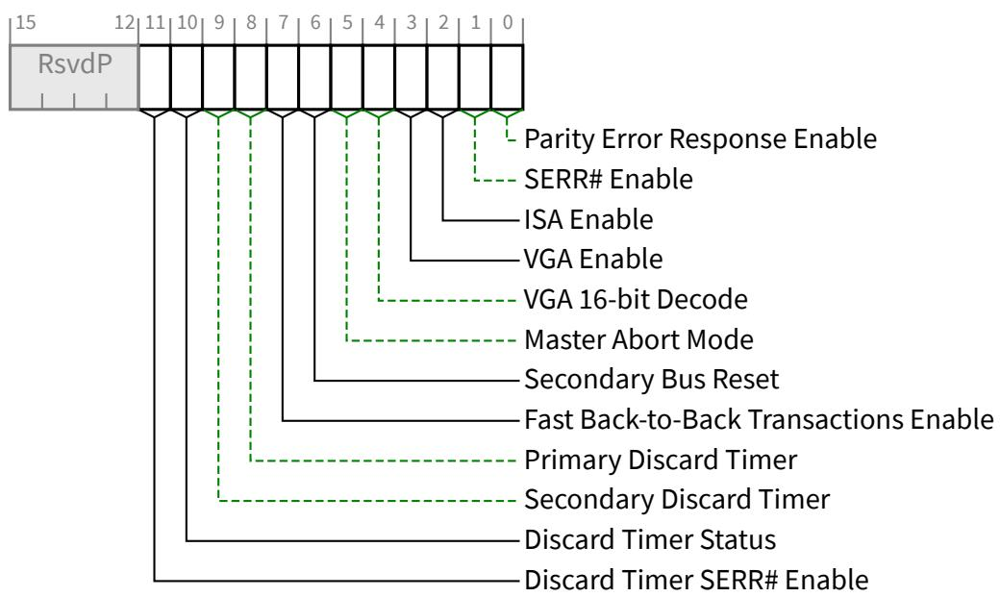

<details>
<summary>flowchart</summary>

```mermaid
graph TD
  A["RsvdP"] --> B["15"]
  A --> C["12"]
  A --> D["11"]
  A --> E["10"]
  A --> F["9"]
  A --> G["8"]
  A --> H["7"]
  A --> I["6"]
  A --> J["5"]
  A --> K["4"]
  A --> L["3"]
  A --> M["2"]
  A --> N["1"]
  A --> O["0"]
    
  B --> P["Parity Error Response Enable"]
  C --> Q["SERR# Enable"]
  D --> R["ISA Enable"]
  E --> S["VGA Enable"]
  F --> T["VGA 16-bit Decode"]
  G --> U["Master Abort Mode"]
  H --> V["Secondary Bus Reset"]
  I --> W["Fast Back-to-Back Transactions Enable"]
  J --> X["Primary Discard Timer"]
  K --> Y["Secondary Discard Timer"]
  L --> Z["Discard Timer Status"]
  M --> AA["Discard Timer SERR# Enable"]
```
</details>

Figure 7-16 Bridge Control Register

§

§

Table 7-13 Bridge Control Register

<table><tr><td>Bit Location</td><td>Register Description</td><td>Attributes</td></tr><tr><td>0</td><td>Parity Error Response Enable- See § Section 7.5.1.1.14 .This bit controls the logging of poisoned TLPs in the Master Data Parity Error bit in the Secondary Status Register.Default value of this bit is 0b.</td><td>RW</td></tr><tr><td>1</td><td>SERR# Enable- See § Section 7.5.1.1.14 .This bit controls forwarding of ERR_COR, ERR_NONFATAL and ERR_FATAL from secondary to primary.Default value of this bit is 0b.</td><td>RW</td></tr><tr><td>2</td><td>ISA Enable- Modifies the response by the bridge to ISA I/O addresses. This applies only to I/O addresses that are enabled by the I/O Base and I/O Limit registers and are in the first 64 KB of I/O address space (0000 0000h to 0000 FFFFh). If this bit is Set, the bridge will block any forwarding from primary to secondary of I/O transactions addressing the last 768 bytes in each 1 KB block. In the opposite direction (secondary to primary), I/O transactions will be forwarded if they address the last 768 bytes in each 1 KB block.0b forward downstream all I/O addresses in the address range defined by the I/O Base and I/O Limit registers1b forward upstream ISA I/O addresses in the address range defined by the I/O Base and I/O Limit registers that are in the first 64 KB of PCI I/O address space (top 768 bytes of each 1 KB blockDefault value of this bit is 0b.</td><td>RW</td></tr><tr><td>3</td><td>VGA Enable- Modifies the response by the bridge to VGA compatible addresses. If the VGA Enable bit is Set, the bridge will positively decode and forward the following accesses on the primary interface to the secondary interface (and, conversely, block the forwarding of these addresses from the secondary to primary interface):Memory accesses in the range 000A 0000h to 000B FFFFhI/O addresses in the first 64 KB of the I/O address space (Address[31:16] are 0000h) where Address[9:0] are in the ranges 3B0h to 3BBh and 3C0h to 3DFh (inclusive of ISA address aliases determined by the setting of VGA 16-bit Decode)If the VGA Enable bit is Set, forwarding of these accesses is independent of the I/O address range and memory address ranges defined by the I/O Base and Limit registers, the Memory Base and Limit registers, and the Prefetchable Memory Base and Limit registers of the bridge. (Forwarding of these accesses is also independent of the setting of the ISA Enable bit (in the Bridge Control Register) when the VGA Enable bit is Set. Forwarding of these accesses is qualified by the I/O Space Enable and Memory Space Enable bits in the Command Register.)0b do not forward VGA compatible memory and I/O addresses from the primary to the secondary interface (addresses defined above) unless they are enabled for forwarding by the defined I/O and memory address ranges1b forward VGA compatible memory and I/O addresses (addresses defined above) from the primary interface to the secondary interface (if the I/O Space Enable and Memory Space Enable bits are set) independent of the I/O and memory address ranges and independent of the ISA Enable bitFunctions that do not support VGA are permitted to hardwire this bit to 0b.Default value of this bit is 0b.</td><td>RW</td></tr><tr><td>4</td><td>VGA 16-bit Decode- This bit only has meaning if bit 3 (VGA Enable) of this register is also Set, enabling VGA I/O decoding and forwarding by the bridge.This bit enables system configuration software to select between 10-bit and 16-bit I/O address decoding for all VGA I/O register accesses that are forwarded from primary to secondary.0b execute 10-bit address decodes on VGA I/O accesses1b execute 16-bit address decodes on VGA I/O accessesFunctions that do not support VGA are permitted to hardwire this bit to 0b.Default value of this bit is 0b.</td><td>RW</td></tr><tr><td>5</td><td>Master Abort Mode- This bit was originally described in the [PCI-to-PCI-Bridge]. Its functionality does not apply to PCI Express and the bit must be hardwired to 0b.</td><td>RO</td></tr><tr><td>6</td><td>Secondary Bus Reset- Setting this bit triggers a hot reset on the corresponding PCI Express Port. Software must ensure a minimum reset duration ( $T_{rst}$ ). Software and systems must honor first-access-following-reset timing requirements defined in § Section 6.6 ., unless the Readiness Notifications mechanism (see § Section 6.22 ) is used or if the Immediate Readiness bit in the relevant Function's Status register is Set. Port configuration registers must not be changed, except as required to update Port status. Default value of this bit is 0b.</td><td>RW</td></tr><tr><td>7</td><td>Fast Back-to-Back Transactions Enable- This bit was originally described in the [PCI-to-PCI-Bridge]. Its functionality does not apply to PCI Express and the bit must be hardwired to 0b.</td><td>RO</td></tr><tr><td>8</td><td>Primary Discard Timer- This bit was originally described in the [PCI-to-PCI-Bridge]. Its functionality does not apply to PCI Express and the bit must be hardwired to 0b.</td><td>RO</td></tr><tr><td>9</td><td>Secondary Discard Timer- This bit was originally described in the [PCI-to-PCI-Bridge]. Its functionality does not apply to PCI Express and the bit must be hardwired to 0b.</td><td>RO</td></tr><tr><td>10</td><td>Discard Timer Status- This bit was originally described in the [PCI-to-PCI-Bridge]. Its functionality does not apply to PCI Express and the bit must be hardwired to 0b.</td><td>RO</td></tr><tr><td>11</td><td>Discard Timer SERR# Enable- This bit was originally described in the [PCI-to-PCI-Bridge]. Its functionality does not apply to PCI Express and must be hardwired to 0b.</td><td>RO</td></tr></table>

## 7.5.2 PCI Power Management Capability Structure §

This section describes the registers making up the PCI Power Management Interface structure.

§ Figure 7-17 illustrates the organization of the PCI Power Management Capability structure. This structure is required for all PCI Express Functions.

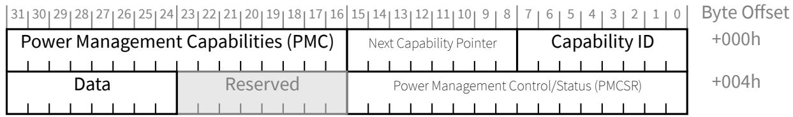

<details>
<summary>text_image</summary>

31 30 29 28 27 26 25 24 23 22 21 20 19 18 17 16 15 14 13 12 11 10 9 8 7 6 5 4 3 2 1 0
Power Management Capabilities (PMC)
Next Capability Pointer
Capability ID
Data
Reserved
Power Management Control/Status (PMCSR)
Byte Offset
+000h
+004h
</details>

Figure 7-17 Power Management Capability Structure§

Note: The 8-bit Power Management Data Register (Offset 07h) is optional for both Type 0 and Type 1 Functions.

PCI Express device Functions are required to support D0 and D3 device states; PCI-PCI Bridge structures representing PCI Express Ports as described in § Section 7.1 are required to indicate PME Message passing capability due to the in-band nature of PME messaging for PCI Express.

The PME\_Status bit for the PCI-PCI Bridge structure representing PCI Express Ports, however, is only Set when the PCI-PCI Bridge Function is itself generating a PME. The PME\_Status bit is not Set when the Bridge is propagating a PME Message but the PCI-PCI Bridge Function itself is not internally generating a PME.

## 7.5.2.1 Power Management Capabilities Register (Offset 00h) §

§ Figure 7-18 details allocation of register fields for Power Management Capabilities Register and § Table 7-14 describes the requirements for this register.

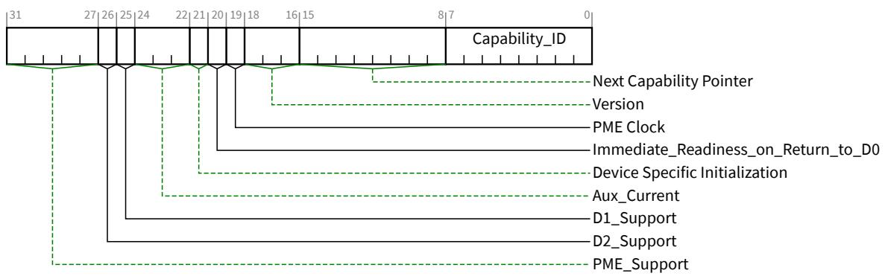

<details>
<summary>line chart</summary>

| Capability_ID | Value |
| -------------- | ----- |
| Next Capability Pointer | 31 |
| Version | 27 |
| PME Clock | 26 |
| Immediate_Readiness_on_Return_to_D0 | 25 |
| Device Specific Initialization | 24 |
| Aux_Current | 22 |
| D1_Support | 21 |
| D2_Support | 20 |
| PME_Support | 19 |
| PME_Support | 18 |
| PME_Support | 17 |
| PME_Support | 16 |
| PME_Support | 15 |
| PME_Support | 14 |
| PME_Support | 13 |
| PME_Support | 12 |
| PME_Support | 11 |
| PME_Support | 10 |
| PME_Support | 9 |
| PME_Support | 8 |
| PME_Support | 7 |
| PME_Support | 6 |
| PME_Support | 5 |
| PME_Support | 4 |
| PME_Support | 3 |
| PME_Support | 2 |
| PME_Support | 1 |
| PME_Support | 0 |
</details>

Figure 7-18 Power Management Capabilities Register§

Table 7-14 Power Management Capabilities Register§

<table><tr><td>Bit Location</td><td>Register Description</td><td>Attributes</td></tr><tr><td>7:0</td><td>Capability_ID- This field returns 01h to indicate that this is the PCI Power Management Capability. Each Function may have only one item in its capability list with Capability_ID set to 01h.</td><td>RO</td></tr><tr><td>15:8</td><td>Next Capability Pointer- This field provides an offset into the Function's Configuration Space pointing to the location of next item in the capabilities list. If there are no additional items in the capabilities list, this field is set to 00h.</td><td>RO</td></tr><tr><td>18:16</td><td>Version- Must be hardwired to 011b for Functions compliant to this specification.</td><td>RO</td></tr><tr><td>19</td><td>PME Clock- Does not apply to PCI Express and must be hardwired to 0b.</td><td>RO</td></tr><tr><td>20</td><td>Immediate_Readiness_on_Return_to_D0- If this bit is a “1”, this Function is guaranteed to be ready to successfully complete valid accesses immediately after being set to D0. These accesses include Configuration cycles, and if the Function returns to  $D0_{active}$ , they also include Memory and I/O Cycles.When this bit is “1”, for accesses to this Function, software is exempt from all requirements to delay accesses following a transition to D0, including but not limited to the 10 ms delay; the delays described in § Section 5.9.How this guarantee is established is beyond the scope of this document.It is permitted that system software/firmware provide mechanisms that supersede the indication provided by this bit, however such software/firmware mechanisms are outside the scope of this specification.</td><td>RO</td></tr><tr><td>21</td><td>Device Specific Initialization- The DSI bit indicates whether special initialization of this Function is required.When Set indicates that the Function requires a device specific initialization sequence following a transition to the D0uninitialized state.</td><td>RO</td></tr><tr><td>24:22</td><td> $Aux\_Current^{154}$  - This 3 bit field reports the Vaux auxiliary current requirements for the Function.If this Function implements the Power Management Data Register, this field must be hardwired to 000b.If PME_Support is 0 xxxxb (PME assertion from D3Cold is not supported) and the Aux Power PM Enable feature is not implemented, this field must be hardwired to 000b.For Functions where PME_Support is 1 xxxxb (PME assertion from D3Cold is supported), and which do not implement the Power Management Data Register, the following encodings apply :Encoding Vaux Max. Power Required111b 1238 mW (e.g., 3.3 V at 375 mA)110b 1056 mW (e.g., 3.3 V at 320 mA)101b 891 mW (e.g., 3.3 V at 270 mA)100b 726 mW (e.g., 3.3 V at 220 mA)011b 528 mW (e.g., 3.3 V at 160 mA)010b 330 mW (e.g., 3.3 V at 100 mA)001b 182 mW (e.g., 3.3 V at 55 mA)000b 0 mW (no Vaux power or self powered)For encoding 000b, when the add-in card is self powered (e.g., it contains a battery), it is recommended that the Power Budgeting Extended Capability be used to report the thermal requirements of the add-in card.Note: Additional Aux power is permitted to be allocated using the firmware based mechanism (see the Request D3Cold Aux Power Limit _DSM call as defined in [Firmware]). Additional Aux power is also permitted to be allocated by selecting a PM Sub State in the Power Limit mechanism (see § Section 7.8.1.3).</td><td>RO</td></tr><tr><td>25</td><td>D1_Support - If this bit is Set, this Function supports the D1 Power Management State.Functions that do not support D1 must always return a value of 0b for this bit.</td><td>RO</td></tr><tr><td>26</td><td>D2_Support - If this bit is Set, this Function supports the D2 Power Management State.Functions that do not support D2 must always return a value of 0b for this bit.</td><td>RO</td></tr><tr><td>31:27</td><td>PME_Support - This 5-bit field indicates the power states in which the Function may generate a PME and/or forward PME Messages.A value of 0b for any bit indicates that the Function is not capable of asserting PME while in that power state.bit(27) X XXX1b PME can be generated from D0bit(28) X XX1Xb PME can be generated from D1bit(29) X X1XXb PME can be generated from D2bit(30) X 1XXXb PME can be generated from D3Hotbit(31) 1 XXXXb PME can be generated from D3Cold</td><td>RO</td></tr></table>

154. Earlier versions of this specification defined power levels as current (mA) at 3.3 V (hence the field name “Aux\_Current”). To support form factors with different Aux Power voltage levels, the definition was changed to the equivalent wattage values (mW).

<table><tr><td>Bit Location</td><td>Register Description</td><td>Attributes</td></tr><tr><td></td><td>Bit 31 (PME can be asserted from D3Cold) represents a special case. Functions that Set this bit require some sort of auxiliary power source. Implementation specific mechanisms are recommended to validate that the power source is available before setting this bit.Each bit that corresponds to a supported D-state must be Set for PCI-PCI Bridge structures representing Ports on Root Complexes/Switches to indicate that the Bridge will forward PME Messages. Bit 31 must only be Set if the Port is still able to forward PME Messages when main power is not available.</td><td></td></tr></table>

## 7.5.2.2 Power Management Control/Status Register (Offset 04h) §

This register is used to manage the PCI Function’s power management state as well as to enable/monitor PMEs.

The PME Context includes the value of the PME\_Status and $\mathsf { P M E \_ E n }$ bits, implementation specific state needed during ${ \mathsf { D } } 3 { \mathsf { C o l d } }$ to implement the wakeup functionality $( \mathsf { e . g . } ,$ recognized a Wake on LAN packet and generate a PME Message), as well as any additional implementation specific state that must be preserved during a transition to the D0uninitialized state.

If a Function supports PME generation from ${ \sf D } 3 _ { \sf C o l d } ,$ its PME Context is not affected by Reset. This is because the Function’s PME functionality itself may have been responsible for the wake event which caused the transition back to D0. Therefore, the PME Context must be preserved for the system software to process.

If PME generation is not supported from ${ \mathsf { D } } 3 { \mathsf { C o l d } } ;$ then all PME Context is initialized with the assertion of Reset.

§ Figure $_ { 7 - 1 9 }$ details allocation of the register fields for the Power Management Control/Status Register and § Table 7-15 describes the requirements for this register.

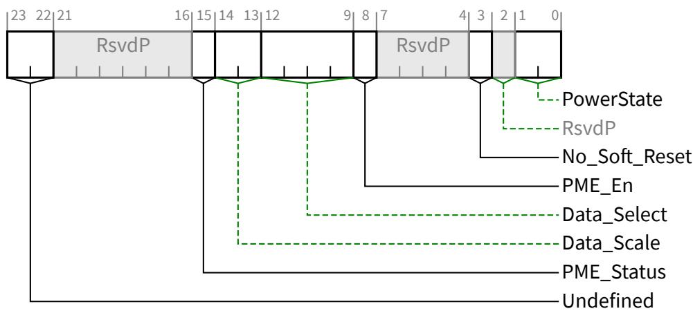

<details>
<summary>text_image</summary>

23 22 21
RsvdP
16 15 14 13 12
9 8 7
4 3 2 1 0
RsvdP
PowerState
RsvdP
No_Soft_Reset
PME_En
Data_Select
Data_Scale
PME_Status
Undefined
</details>

Figure 7-19 Power Management Control/Status Register§

Table 7-15 Power Management Control/Status Register§

<table><tr><td>Bit Location</td><td>Register Description</td><td>Attributes</td></tr><tr><td>1:0</td><td>PowerState- This 2-bit field is used both to determine the current power state of a Function and to set the Function into a new power state. The definition of the field values is given below.00b D001b D110b D211b D3HotIf software attempts to write an unsupported, optional state to this field, the write operation must complete normally; however, the data is discarded and no state change occurs.Default value of this field is 00b.</td><td>RW</td></tr><tr><td>3</td><td>No_Soft_Reset- This bit indicates the state of the Function after writing the PowerState field to transition the Function from D3Hot to D0. This bit MUST@FLIT be Set.When Set, this transition preserves internal Function state. The Function is in D0Activeand no additional software intervention is required.When Clear, this transition results in undefined internal Function state.Regardless of this bit, Functions that transition from D3Hot to D0 by Fundamental Reset must return to D0uninitialized with only PME context preserved if PME is supported and enabled.If a VF implements the Power Management Capability, the VF's value of this field must be identical to the associated PF's value.</td><td>RO</td></tr><tr><td>8</td><td>PME_En- When Set, the Function is permitted to generate a PME. When Clear, the Function is not permitted to generate a PME.If PME_Support is 1 xxxxb (PME generation from D3Cold) or the Function consumes auxiliary power and auxiliary power is available this bit is RWS and the bit is not modified by Conventional Reset or FLRIf PME_Support is 0 xxxxb, this field is not sticky (RW) and defaults to 0b in response to a Conventional Reset or an FLR.If PME_Support is 0 0000b, this bit is permitted to be hardwired to 0b.</td><td>RW/RWS</td></tr><tr><td>12:9</td><td>Data_Select- This 4-bit field is used to select which data is to be reported through the Power Management Data Register and Data_Scale field.If the Power Management Data Register is not implemented, this field must be hardwired to Zero.Refer to § Section 7.5.2.3 for more details.The default of this field is Zero.</td><td>RWVF ROZ</td></tr><tr><td>14:13</td><td>Data_Scale- This field indicates the scaling factor to be used when interpreting the value of the Data register. The value and meaning of this field will vary depending on which data value has been selected by the Data_Select field.This field is a required component of the Power Management Data Register (offset 7) and must be implemented if the Power Management Data Register is implemented.If the Power Management Data Register is not implemented, this field must be hardwired to Zero.Refer to § Section 7.5.2.3 for more details.</td><td>ROVF ROZ</td></tr><tr><td>1523:22</td><td>PME_Status- This bit is Set when the Function would normally generate a PME signal. The value of this bit is not affected by the value of the PME_En bit.If PME_Support bit 31 of the Power Management Capabilities Register is Clear, this bit is permitted to be hardwired to 0b.Functions that consume auxiliary power must preserve the value of this sticky register when auxiliary power is available. In such Functions, this register value is not modified by Conventional Reset or FLR.Undefined Undefined - these bits were defined in previous specifications. They should be ignored by software.</td><td>RW1CSRO</td></tr></table>

## 7.5.2.3 Power Management Data Register (Offset 07h) §

The Power Management Data Register is an optional, 8-bit read-only register that provides a mechanism for the Function to report state dependent operating power consumed or dissipation.

If the Power Management Data Register is implemented, then the Data\_Select and Data\_Scale fields must also be implemented. If this register is not implemented, it must be hardwired to 00h.

Software may check for the presence of the Power Management Data Register by writing different values into the Data\_Select field, looking for non-zero return data in the Power Management Data Register and/or Data\_Scale field. Any non-zero Power Management Data Register/Data\_Select read data indicates that the Power Management Data Register complex has been implemented.

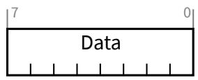  
Figure 7-20 Power Management Data Register§

Table 7-16 Power Management Data Register§

<table><tr><td>Bit Location</td><td>Register Description</td><td>Attributes</td></tr><tr><td>7:0</td><td>Data- This register is used to report the state dependent data requested by the Data_Select field. The value of this register is scaled by the value reported by the Data_Scale field.For VFs, this register is not supported and must be hardwired to Zero.</td><td>ROVF ROZ</td></tr></table>

The Power Management Data Register is used by writing the proper value to the Data\_Select field in the PMCSR and then reading the Data\_Scale field and the Power Management Data Register. The binary value read from Data is then multiplied by the scaling factor indicated by Data\_Scale to arrive at the value for the desired measurement. § Table 7-17 shows which measurements are defined and how to interpret the values of each register.

Table 7-17 Power Consumption/Dissipation Reporting§

<table><tr><td>Value in Data_Select</td><td>Data Reported</td><td>Data_Scale Interpretation</td><td>Units/Accuracy</td></tr><tr><td>0</td><td>D0 Power Consumed</td><td rowspan="5">0 = Unknown1 = 0.1x2 = 0.01x3 = 0.001x</td><td rowspan="5">Watts</td></tr><tr><td>1</td><td>D1 Power Consumed</td></tr><tr><td>2</td><td>D2 Power Consumed</td></tr><tr><td>3</td><td>D3 Power Consumed</td></tr><tr><td>4</td><td>D0 Power Dissipated</td></tr><tr><td>5</td><td>D1 Power Dissipated</td><td rowspan="4"></td><td rowspan="4"></td></tr><tr><td>6</td><td>D2 Power Dissipated</td></tr><tr><td>7</td><td>D3 Power Dissipated</td></tr><tr><td>8</td><td>Common logic power consumption (Multi-Function Devices, Function 0 only)Function 0 of a Multi-Function Device:Power consumption that is not associated with a specific Function.All other Functions:Reserved</td></tr><tr><td>9-15</td><td>Reserved</td><td>Reserved</td><td>TBD</td></tr></table>

The “Power Consumed” values defined above must include all power consumed from the power planes through the connector pins. If the add-in card provides power to external devices, that power must be included as well. It must not include any power derived from a battery or an external source. This information is useful for management of the power supply or battery.

The “Power Dissipated” values must provide the amount of heat which will be released into the interior of the computer chassis. This excludes any power delivered to external devices but must include any power derived from a battery or external power source and dissipated inside the computer chassis. This information is useful for fine grained thermal management.

Multi-Function Devices are recommended to report the power consumed by each Function in each corresponding Function’s Configuration Space. In a Multi-Function Device, power consumption for circuitry common to multiple Functions is reported in Function 0’s Configuration Space through the Power Management Data Register once the Data\_Select field of Function 0’s Power Management Control/Status Register has been programmed to 1000b. For a Multi-Function Device, power consumption of the device is the sum of this value and, for every Function of the device, the reported value associated with the Function's current Power State.

Multiple component add-in cards implementing power reporting (i.e., multiple components behind a switch or bridge) must have the switch/bridge report the power it uses by itself. Each Function of each component on the add-in card is responsible for reporting the power consumed by that Function.

## IMPLEMENTATION NOTE:

## NEW DESIGNS SHOULD USE POWER BUDGETING EXTENDED CAPABILITY

Both the Power Budgeting Extended Capability and the PCI Power Management Capability report power consumption. The Power Budgeting Extended Capability mechanism is required in some situations (by this specification or the associated form factor specification). The Power Budgeting Extended Capability mechanism provides additional information beyond that which is provided by the Data register of the PCI Power Management Capability. It is strongly recommended that designs implement the Power Budgeting Extended Capability instead of the mechanism in this section, and that new designs hardwire the Data, Data\_Select, and Data\_Scale fields to 0.

## 7.5.3 PCI Express Capability Structure §

PCI Express defines a Capability structure in PCI-compatible Configuration Space (first 256 bytes) as shown in § Figure 7-3. This structure allows identification of a PCI Express device Function and indicates support for new PCI Express features. The PCI Express Capability structure is required for PCI Express device Functions. The Capability structure is a mechanism for enabling PCI software transparent features requiring support on legacy operating systems. In addition to identifying a PCI Express device Function, the PCI Express Capability structure is used to provide access to PCI Express specific Control/Status registers and related Power Management enhancements.

§ Figure 7-21 details allocation of register fields in the PCI Express Capability structure.

The PCI Express Capabilities, Device Capabilities, Device Status, and Device Control registers are required for all PCI Express device Functions. Device Capabilities 2, Device Status 2, and Device Control 2 registers are required for all PCI Express device Functions that implement capabilities requiring those registers. For device Functions that do not implement the Device Capabilities 2, Device Status 2, and Device Control 2 registers, these spaces must be hardwired to 0b.

The Link Capabilities, Link Status, and Link Control registers are required for all Root Ports, Switch Ports, Bridges, and Endpoints that are not RCiEPs. For Functions that do not implement the Link Capabilities, Link Status, and Link Control registers, these spaces must be hardwired to 0. Link Capabilities 2, Link Status 2, and Link Control 2 registers are required for all Root Ports, Switch Ports, Bridges, and Endpoints (except for RCiEPs) that implement capabilities requiring those registers. For Functions that do not implement the Link Capabilities 2, Link Status 2, and Link Control 2 registers, these spaces must be hardwired to 0b.

The Slot Capabilities, Slot Status, and Slot Control registers are required in certain Switch Downstream and Root Ports. The Slot Capabilities Register is required if the Slot Implemented bit is Set (see § Section 7.5.3.2 ). The Slot Status and Slot Control registers are required if Slot Implemented is Set or if Data Link Layer Link Active Reporting Capable is Set (see § Section 7.5.3.6 ). Switch Downstream and Root Ports are permitted to implement these registers, even when they are not required, and in this case the behavior of most of the fields in these registers is undefined. See § Section 7.5.3.9 , § Section 7.5.3.10 , and § Section 7.5.3.11 for details. For Functions that do not implement the Slot Capabilities, Slot Status, and Slot Control registers, these spaces must be hardwired to 0b, with the exception of the Presence Detect State bit in the Slot Status Register of Downstream Ports, which must be hardwired to 1b (see § Section 7.5.3.11 ). Slot Capabilities 2, Slot Status 2, and Slot Control 2 registers are required for Switch Downstream and Root Ports if the Function implements capabilities requiring those registers. For Functions that do not implement the Slot Capabilities 2, Slot Status 2, and Slot Control 2 registers, these spaces must be hardwired to 0b.

Root Ports and Root Complex Event Collectors must implement the Root Capabilities, Root Status, and Root Control registers. For Functions that do not implement the Root Capabilities, Root Status, and Root Control registers, these spaces must be hardwired to 0b.

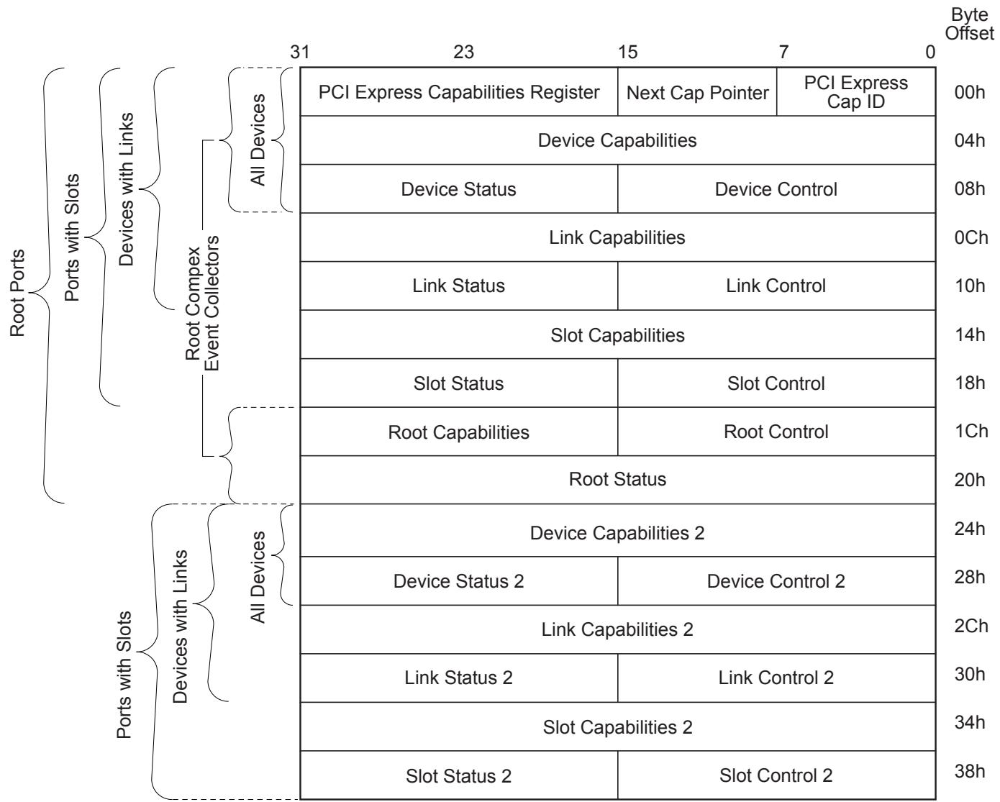

<details>
<summary>stacked bar chart</summary>

| Node Type | Total Bytes | Byte Offset |
| :--- | :--- | :--- |
| Root Ports | 31 | 0h |
| Ports with Slots | 23 | 00h |
| Devices with Links | 15 | 04h |
| Root Complex Event Collectors | 7 | 08h |
| All Devices | 0 | 0Ch |
| PCI Express Capabilities Register | 0 | 10h |
| Device Capabilities | 0 | 14h |
| Device Status | 0 | 18h |
| Link Capabilities | 0 | 1Ch |
| Link Status | 0 | 20h |
| Link Control | 0 | 24h |
| Slot Capabilities | 0 | 28h |
| Slot Status | 0 | 2Ch |
| Root Capabilities | 0 | 30h |
| Root Status | 0 | 34h |
| Device Capabilities 2 | 0 | 38h |
| Device Status 2 | 0 | 24h |
| Device Control 2 | 0 | 28h |
| Link Capabilities 2 | 0 | 2Ch |
| Link Status 2 | 0 | 30h |
| Link Control 2 | 0 | 34h |
| Slot Capabilities 2 | 0 | 38h |
| Slot Status 2 | 0 | 38h |
| Slot Control 2 | 0 | 38h |
</details>

Note: Registers not applicable to a device are RsvdZ.

OM14318B

Figure 7-21 PCI Express Capability Structure§

## 7.5.3.1 PCI Express Capability List Register (Offset 00h)


The PCI Express Capability List Register enumerates the PCI Express Capability structure in the PCI Configuration Space Capability list. § Figure 7-22 details allocation of register fields in the PCI Express Capability List Register; § Table 7-18 provides the respective bit definitions.

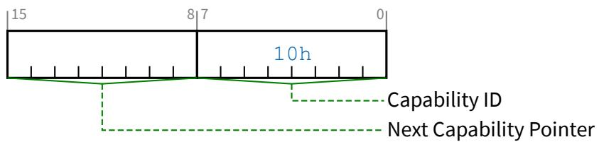

<details>
<summary>text_image</summary>

15
8
7
0
10h
Capability ID
Next Capability Pointer
</details>

Figure 7-22 PCI Express Capability List Register§

Table 7-18 PCI Express Capability List Register§

<table><tr><td>Bit Location</td><td>Register Description</td><td>Attributes</td></tr><tr><td>7:0</td><td>Capability ID - Indicates the PCI Express Capability structure. This field must return a Capability ID of 10h indicating that this is a PCI Express Capability structure.</td><td>RO</td></tr><tr><td>15:8</td><td>Next Capability Pointer - This field contains the offset to the next PCI Capability structure or 00h if no other items exist in the linked list of Capabilities.</td><td>RO</td></tr></table>

## 7.5.3.2 PCI Express Capabilities Register (Offset 02h) §

The PCI Express Capabilities Register identifies PCI Express device Function type and associated capabilities. § Figure 7-23 details allocation of register fields in the PCI Express Capabilities Register; § Table 7-19 provides the respective bit definitions.

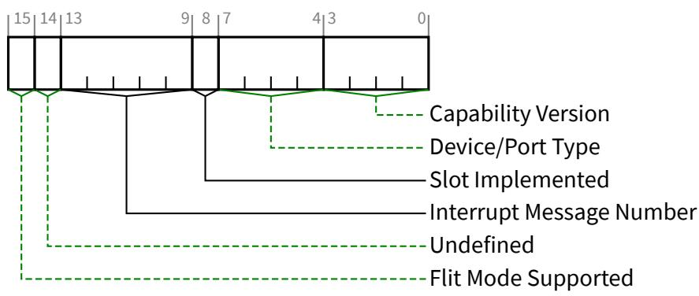

<details>
<summary>text_image</summary>

15 14 13 9 8 7 4 3 0
Capability Version
Device/Port Type
Slot Implemented
Interrupt Message Number
Undefined
Flit Mode Supported
</details>

Figure 7-23 PCI Express Capabilities Register§

Table 7-19 PCI Express Capabilities Register§

<table><tr><td>Bit Location</td><td>Register Description</td><td>Attributes</td></tr><tr><td>3:0</td><td>Capability Version - Indicates PCI-SIG defined PCI Express Capability structure version number.A version of the specification that changes the PCI Express Capability structure in a way that is not otherwise identifiable (e.g., through a new Capability field) is permitted to increment this field. All suchchanges to the PCI Express Capability structure must be software-compatible. Software must check for Capability Version numbers that are greater than or equal to the highest number defined when the software is written, as Functions reporting any such Capability Version numbers will contain a PCI Express Capability structure that is compatible with that piece of software.Must be hardwired to 2h for Functions compliant to this specification.</td><td>RO</td></tr><tr><td>7:4</td><td>Device/Port Type $^{155}$  - Indicates the specific type of this PCI Express Function. Note that different Functions in a Multi-Function Device can generally be of different types.Defined encodings for Functions that implement a Type 00h PCI Configuration Space header are:0000b PCI Express Endpoint0001b Legacy PCI Express Endpoint1001b RCiEP1010b Root Complex Event CollectorDefined encodings for Functions that implement a Type 01h PCI Configuration Space header are:0100b Root Port of PCI Express Root Complex0101b Upstream Port of PCI Express Switch0110b Downstream Port of PCI Express Switch0111b PCI Express to PCI/PCI-X Bridge1000b PCI/PCI-X to PCI Express BridgeAll other encodings are Reserved.Note that the different Endpoint types have notably different requirements in § Section 1.3.2 regarding I/O resources, Extended Configuration Space, and other capabilities.</td><td>RO</td></tr><tr><td>8</td><td>Slot Implemented - When Set, this bit indicates that the Link associated with this Port is connected to a slot (as compared to being connected to a system-integrated device or being disabled).This bit is valid for Downstream Ports. This bit is undefined for Upstream Ports.</td><td>HwInit</td></tr><tr><td>13:9</td><td>Interrupt Message Number - This field indicates which MSI/MSI-X vector is used for the interrupt message generated in association with any of the status bits of this Capability structure.For MSI, the value in this field indicates the offset between the base Message Data and the interrupt message that is generated. Hardware is required to update this field so that it is correct if the number of MSI Messages assigned to the Function changes when software writes to the Multiple Message Enable field in the Message Control Register for MSI.For MSI-X, the value in this field indicates which MSI-X Table entry is used to generate the interrupt message. The entry must be one of the first 32 entries even if the Function implements more than 32 entries. For a given MSI-X implementation, the entry must remain constant.If both MSI and MSI-X are implemented, they are permitted to use different vectors, though software is permitted to enable only one mechanism at a time. If MSI-X is enabled, the value in this field must indicate the vector for MSI-X. If MSI is enabled or neither is enabled, the value in this field must indicate the vector for MSI. If software enables both MSI and MSI-X at the same time, the value in this field is undefined.</td><td>RO</td></tr><tr><td>14</td><td>Undefined - The value read from this bit is undefined. In previous versions of this specification, this bit was used to indicate support for TCS Routing. System software should ignore the value read from this bit. System software is permitted to write any value to this bit.</td><td>RO</td></tr><tr><td>15</td><td>Flit Mode Supported – When Set, indicates support for Flit Mode. Must be Set by all implementations that support Flit Mode. Must be Clear by implementations that do not support Flit Mode.</td><td>HwInit</td></tr></table>

## 7.5.3.3 Device Capabilities Register (Offset 04h) §

The Device Capabilities Register identifies PCI Express device Function specific capabilities. § Figure 7-24 details allocation of register fields in the Device Capabilities Register; § Table 7-20 provides the respective bit definitions.

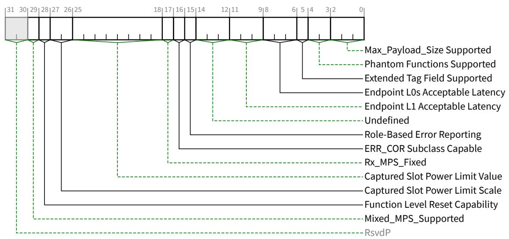

<details>
<summary>line chart</summary>

| Parameter | Value |
| --------- | ----- |
| Max_Payload_Size Supported | 31 |
| Phantom Functions Supported | 29 |
| Extended Tag Field Supported | 28 |
| Endpoint L0s Acceptable Latency | 27 |
| Endpoint L1 Acceptable Latency | 26 |
| Undefined | 25 |
| Role-Based Error Reporting | 18 |
| ERR_COR Subclass Capable | 17 |
| Rx_MPS_Fixed | 16 |
| Captured Slot Power Limit Value | 15 |
| Captured Slot Power Limit Scale | 14 |
| Function Level Reset Capability | 13 |
| Mixed_MPS_Supported | 12 |
| RsvdP | 11 |
| Max_Payload_Size Supported | 8 |
| Phantom Functions Supported | 7 |
| Extended Tag Field Supported | 6 |
| Endpoint L0s Acceptable Latency | 5 |
| Endpoint L1 Acceptable Latency | 4 |
| Undefined | 3 |
| Role-Based Error Reporting | 2 |
| ERR_COR Subclass Capable | 1 |
| Rx_MPS_Fixed | 0 |
| Captured Slot Power Limit Value | -1 |
| Captured Slot Power Limit Scale | -2 |
| Function Level Reset Capability | -3 |
| Mixed_MPS_Supported | -4 |
| RsvdP | -5 |
</details>

Figure 7-24 Device Capabilities Register§

§ Table 7-20 Device Capabilities Register

<table><tr><td>Bit Location</td><td>Register Description</td><td>Attributes</td></tr><tr><td>2:0</td><td>Max_Payload_Size Supported- This field indicates the maximum payload size that the Function can support for TLPs. This field MUST@FLIT indicate a minimum of 512 bytes.If the Rx_MPS_Fixed bit is Set, the Function's Rx_MPS_Limit is fixed with the value indicated by this (Max_Payload_Size Supported) field. Otherwise, the Rx_MPS_Limit is determined by the Max_Payload_Size field (the "MPS setting") in one or more Functions. See § Section 2.2.2 for important details regarding Multi-Function Devices. Defined encodings are:000b 128 bytes max payload size001b 256 bytes max payload size010b 512 bytes max payload size011b 1024 bytes max payload size100b 2048 bytes max payload size101b 4096 bytes max payload size110b Reserved111b ReservedThe Functions of a Multi-Function Device are permitted to report different values for this field.</td><td>RO</td></tr><tr><td>4:3</td><td>Phantom Functions Supported - This field indicates the support for use of unclaimed Function Numbers to extend the number of outstanding transactions allowed by logically combining unclaimed Function Numbers (called Phantom Functions) with the Tag identifier (see § Section 2.2.6.2 for a description of Tag Extensions).For a PF with its VF Enable bit Set, the use of Phantom Function numbers is not permitted and this field must return Zero when read.For VFs, this field is not supported and must be hardwired to Zero.For every Function in an ARI Device, this field must be hardwired to Zero.The remainder of this field description applies only to non-ARI Multi-Function Devices.This field indicates the number of most significant bits of the Function Number portion of Requester ID that are logically combined with the Tag identifier.Defined encodings are:00b No Function Number bits are used for Phantom Functions. Multi-Function Devices are permitted to implement up to 8 independent Functions.01b The most significant bit of the Function number in Requester ID is used for Phantom Functions; a Multi-Function Device is permitted to implement Functions 0-3. Functions 0, 1, 2, and 3 are permitted to use Function Numbers 4, 5, 6, and 7 respectively as Phantom Functions.10b The two most significant bits of Function Number in Requester ID are used for Phantom Functions; a Multi-Function Device is permitted to implement Functions 0-1. Function 0 is permitted to use Function Numbers 2, 4, and 6 for Phantom Functions. Function 1 is permitted to use Function Numbers 3, 5, and 7 as Phantom Functions.11b All 3 bits of Function Number in Requester ID used for Phantom Functions. The device must have a single Function 0 that is permitted to use all other Function Numbers as Phantom Functions.Note that Phantom Function support for the Function must be enabled by the Phantom Functions Enable field in the Device Control Register before the Function is permitted to use the Function Number field in the Requester ID for Phantom Functions.</td><td>ROVF ROZ</td></tr><tr><td>5</td><td>Extended Tag Field Supported - This bit, in combination with the 10-Bit Tag Requester Supported bit and the 14-Bit Tag Requester Supported bit, indicates the maximum supported size of the Tag field as a Requester. This bit must be Set if the 10-Bit Tag Requester Supported bit or the 14-Bit Tag Requester Supported bit is Set.Defined encodings are:0b 5-bit Tag Requester capability supported1b 8-bit Tag Requester capability supportedNote that 8-bit Tag field generation must be enabled by the Extended Tag Field Enable bit in the Device Control Register of the Requester Function before 8-bit Tags can be generated by the Requester. See § Section 2.2.6.2 for interactions with enabling the use of 10-Bit or 14-Bit Tags.</td><td>RO</td></tr><tr><td>8:6</td><td>Endpoint L0s Acceptable Latency - This field indicates the acceptable total latency that an Endpoint can withstand due to the transition from L0s state to the L0 state. It is essentially an indirect measure of the Endpoint's internal buffering.Power management software uses the reported L0s Acceptable Latency number to compare against the L0s exit latencies reported by all components comprising the data path from this Endpoint to the Root Complex Root Port to determine whether ASPM L0s entry can be used with no loss of performance.Defined encodings are:000b Maximum of 64 ns001b Maximum of 128 ns010b Maximum of 256 ns011b Maximum of 512 ns100b Maximum of 1 μs101b Maximum of 2 μs110b Maximum of 4 μs111b No limitFor Functions other than Endpoints, this field is Reserved and must be hardwired to 000b.</td><td>RO</td></tr><tr><td>11:9</td><td>Endpoint L1 Acceptable Latency- This field indicates the acceptable latency that an Endpoint can withstand due to the transition from L1 state to the L0 state. It is essentially an indirect measure of the Endpoint's internal buffering.Power management software uses the reported L1 Acceptable Latency number to compare against the L1 Exit Latencies reported (see below) by all components comprising the data path from this Endpoint to the Root Complex Root Port to determine whether ASPM L1 entry can be used with no loss of performance.Defined encodings are:000b Maximum of 1 μs001b Maximum of 2 μs010b Maximum of 4 μs011b Maximum of 8 μs100b Maximum of 16 μs101b Maximum of 32 μs110b Maximum of 64 μs111b No limitFor Functions other than Endpoints, this field is Reserved and must be hardwired to 000b.</td><td>RO</td></tr><tr><td>14:12</td><td>Undefined- The value read from these bits are undefined. In previous versions of this specification, this bit was used to indicate that a Attention Button, Attention Indicator, or Power Indicator, is implemented on the adapter and electrically controlled by the component on the adapter. System software must ignore the value read from this bit. System software is permitted to write any value to this bit.</td><td>RO</td></tr><tr><td>15</td><td>Role-Based Error Reporting- When Set, this bit indicates that the Function implements the functionality originally defined in the Error Reporting ECN for [PCIe-1.0a], and later incorporated into [PCIe-1.1]. This bit must be Set by all Functions conforming to the ECN, [PCIe-1.1], or subsequent [PCIe] revisions.</td><td>RO</td></tr><tr><td>16</td><td>ERR_COR Subclass Capable- When Set, this bit indicates that the Function supports the ERR_COR Subclass field in ERR_COR Messages, allowing different subclasses to be distinguished. See § Section 2.2.8.3.Downstream Ports that implement the System Firmware Intermediary (SFI) capability must Set this bit. Downstream Ports that implement Downstream Port Containment (DPC) are strongly encouraged to Set this bit.</td><td>RO</td></tr><tr><td>17</td><td>Rx_MPS_Fixed- When Set, the Function's Rx_MPS_Limit is fixed with the value indicated by the Max_Payload_Size Supported field. Otherwise, the Rx_MPS_Limit is determined by the Max_Payload_Size field (the "MPS setting") in one or more Functions. See § Section 2.2.2 for important details regarding Multi-Function devices. This bit MUST@FLIT be Set.</td><td>HwInit</td></tr><tr><td>25:18</td><td>Captured Slot Power Limit Value (Upstream Ports only) - In combination with the Captured Slot Power Limit Scale value, specifies the upper limit on power available to the adapter.Power limit (in Watts) is calculated by multiplying the value in this field by the value in the Captured Slot Power Limit Scale field except when the Captured Slot Power Limit Scale field equals 00b (1.0x) and the Captured Slot Power Limit Value exceeds EFh, then alternative encodings are used (see § Section 7.5.3.9).This value is set by the Set_Slot_Power_Limit Message or hardwired to 00h (see § Section 6.9). The default value is 00h.For VFs, the field value when read is undefined.</td><td>RO</td></tr><tr><td>27:26</td><td>Captured Slot Power Limit Scale (Upstream Ports only) - Specifies the scale used for the Slot Power Limit Value.Range of Values:00b 1.0x01b 0.1x10b 0.01x11b 0.001xThis value is set by the Set_Slot_Power_Limit Message or hardwired to 00b (see § Section 6.9). The default value is 00b.For VFs, the field value when read is undefined.</td><td>RO</td></tr><tr><td>28</td><td>Function Level Reset Capability - A value of 1b indicates the Function supports the optional Function Level Reset mechanism described in § Section 6.6.2.This bit applies to Endpoints only. For all other Function types this bit must be hardwired to Zero.For PFs and VFs, the feature is mandatory and this bit must be Set.</td><td>RO</td></tr><tr><td>29</td><td>Mixed_MPS_Supported- When Set, the Function must have an implementation specific mechanism capable of supporting different MPS settings for different targets. This bit MUST@FLIT be Set if the Function supports P2P Memory Transactions and the Function's Max_Payload_Size Supported field indicates an MPS value greater than 512 bytes. If not mandatory, supporting Mixed MPS capability may still be beneficial if this Function does P2P with targets or over paths whose supported MPS is significantly less than this Function's supported MPS; e.g., 128 bytes vs. 512 bytes.The implementation specific mechanism must handle both Request and Completion TLPs, and is permitted to base its determination of P2P targets on Memory Space ranges, Bus Number ranges, or implementation specific means; e.g., data mover channels.For SR-IOV devices, this field in each VF must have the same value its associated PF. If this field is Set, the implementation specific mechanism must use the same P2P target-specific MPS setting for each VF as its associated PF. This parallels the requirement for the Max_Payload_Size field in the Device Control Register.</td><td>HwInit</td></tr></table>

## 7.5.3.4 Device Control Register (Offset 08h)


The Device Control Register controls PCI Express device specific parameters. § Figure 7-25 details allocation of register fields in the Device Control Register; § Table 7-21 provides the respective bit definitions.

For VF fields indicated as RsvdP, the PF setting applies to the VF.

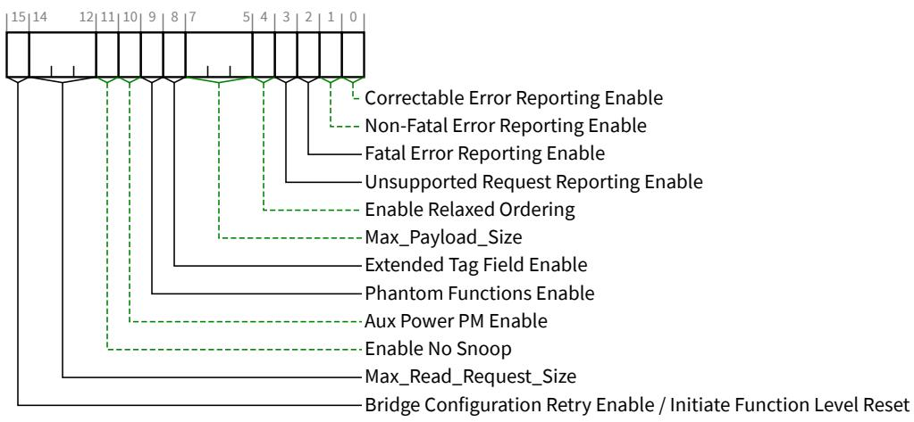

<details>
<summary>flowchart</summary>

```mermaid
graph TD
  A["15 14"] --> B["Correctable Error Reporting Enable"]
  A --> C["Non-Fatal Error Reporting Enable"]
  A --> D["Fatal Error Reporting Enable"]
  A --> E["Unsupported Request Reporting Enable"]
  A --> F["Enable Relaxed Ordering"]
  A --> G["Max_Payload_Size"]
  A --> H["Extended Tag Field Enable"]
  A --> I["Phantom Functions Enable"]
  A --> J["Aux Power PM Enable"]
  A --> K["Enable No Snoop"]
  A --> L["Max_Read_Request_Size"]
  A --> M["Bridge Configuration Retry Enable / Initiate Function Level Reset"]
```
</details>

Figure 7-25 Device Control Register

§

§

Table 7-21 Device Control Register

<table><tr><td>Bit Location</td><td>Register Description</td><td>Attributes</td></tr><tr><td>0</td><td>Correctable Error Reporting Enable- This bit, in conjunction with other bits, controls sending ERR_COR Messages (see § Section 6.2.5, § Section 6.2.6, and § Section 6.2.11.2 for details). For a Multi-Function Device, this bit controls error reporting for each Function from point-of-view of the respective Function.For a Root Port, the reporting of correctable errors is internal to the root. No external ERR_COR Message is generated.An RCiEP that is not associated with a Root Complex Event Collector is permitted to hardwire this bit to 0b.Default value of this bit is 0b.</td><td>RWVF RsvdP</td></tr><tr><td>1</td><td>Non-Fatal Error Reporting Enable- This bit, in conjunction with other bits, controls sending ERR_NONFATAL Messages (see § Section 6.2.5 and § Section 6.2.6 for details). For a Multi-Function Device, this bit controls error reporting for each Function from point-of-view of the respective Function.For a Root Port, the reporting of Non-fatal errors is internal to the root. No external ERR_NONFATAL Message is generated.An RCiEP that is not associated with a Root Complex Event Collector is permitted to hardwire this bit to 0b.Default value of this bit is 0b.</td><td>RWVF RsvdP</td></tr><tr><td>2</td><td>Fatal Error Reporting Enable- This bit, in conjunction with other bits, controls sending ERR_FATAL Messages (see § Section 6.2.5 and § Section 6.2.6 for details). For a Multi-Function Device, this bit controls error reporting for each Function from point-of-view of the respective Function.For a Root Port, the reporting of Fatal errors is internal to the root. No external ERR_FATAL Message is generated.An RCiEP that is not associated with a Root Complex Event Collector is permitted to hardwire this bit to 0b.Default value of this bit is 0b.</td><td>RWVF RsvdP</td></tr><tr><td>3</td><td>Unsupported Request Reporting Enable- This bit, in conjunction with other bits, controls the signaling of Unsupported Request Errors by sending error Messages (see § Section 6.2.5 and § Section 6.2.6 for details). For a Multi-Function Device, this bit controls error reporting for each Function from point-of-view of the respective Function.An RCiEP that is not associated with a Root Complex Event Collector is permitted to hardwire this bit to 0b.Default value of this bit is 0b.</td><td>RWVF RsvdP</td></tr><tr><td>4</td><td>Enable Relaxed Ordering- If this bit is Set, the Function is permitted to set the Relaxed Ordering bit in the Attributes field of transactions it initiates that do not require strong write ordering (see § Section 2.2.6.4 and § Section 2.4 ).A Function is permitted to hardwire this bit to 0b if it never sets the Relaxed Ordering attribute in transactions it initiates as a Requester.When not hardwired to 0b, the default value of this bit is 1b.</td><td>RWVF RsvdP</td></tr><tr><td>7:5</td><td>Max_Payload_Size- For specified cases, this field determines the maximum TLP payload size (the MPS setting) for the Function. Values permitted to be programmed are indicated by the Max_Payload_Size Supported field.As a Receiver, if the Rx_MPS_Fixed bit is Set, the Rx_MPS_Limit is fixed with the value indicated by the Max_Payload_Size Supported field. Otherwise, the Rx_MPS_Limit is determined by the MPS setting in one or more Functions. See § Section 2.2.2 for important details regarding Multi-Function Devices.As a Transmitter, the Function must not generate TLPs with payloads exceeding the MPS setting, with the exception of Functions in a Multi-Function Device, or Functions with implementation-specific mechanisms capable of supporting different MPS settings for different targets. See § Section 2.2.2 for important details.Defined encodings for this field are:000b 128 bytes MPS001b 256 bytes MPS010b 512 bytes MPS011b 1024 bytes MPS100b 2048 bytes MPS101b 4096 bytes MPS110b Reserved111b ReservedFunctions that support only the 128-byte MPS are permitted to hardwire this field to 000b.System software is not required to program the same value for this field for all the Functions of a Multi-Function Device.Default value of this field is 000b.</td><td>RWVF RsvdP</td></tr><tr><td>8</td><td>Extended Tag Field Enable- This bit, in combination with the 10-Bit Tag Requester Enable bit and the 14-Bit Tag Requester Enable bit, determines how many Tag field bits a Requester is permitted to use.The following applies when the 10-Bit Tag Requester Enable bit and the 14-Bit Tag Requester Enable bit are both Clear. If the Extended Tag Field Enable bit is Set, the Function is permitted to use an 8-bit Tag field as a Requester. If the bit is Clear, the Function is restricted to using a 5-bit Tag field.See § Section 2.2.6.2 for required behavior when one or both of these larger-Tag Requester Enable bits are Set.If software changes the value of the Extended Tag Field Enable bit while the Function has outstanding Non-Posted Requests, the result is undefined.Functions that do not implement this capability hardwire this bit to 0b.Default value of this bit is implementation specific.</td><td>RWVF RsvdP</td></tr><tr><td>9</td><td>Phantom Functions Enable - This bit, in combination with the 10-Bit Tag Requester Enable bit and the 14-Bit Tag Requester Enable bit, determines how many outstanding Non-Posted Requests a Requester is permitted to generate. See § Section 2.2.6.2 for complete details.When Set, this bit enables a Function to use unclaimed Functions as Phantom Functions to extend the number of outstanding transaction identifiers. If the bit is Clear, the Function is not allowed to use Phantom Functions.Behavior is undefined when this bit is Set in Functions with enabled Shadow Functions.Software should not change the value of this bit while the Function has outstanding Non-Posted Requests; otherwise, the result is undefined.Functions that do not implement this capability hardwire this bit to 0b.Default value of this bit is 0b.</td><td>RWVF RsvdP</td></tr><tr><td>10</td><td>Aux Power PM Enable - When Set this bit, enables a Function to draw auxiliary power independent of PME Aux power. Functions that require auxiliary power on legacy operating systems should continue to indicate PME Aux power requirements. Auxiliary power is allocated as requested in the Aux_Current field of the Power Management Capabilities Register (PMC), independent of the PME_En bit in the Power Management Control/Status Register (PMCSR) (see § Chapter 5.). For Multi-Function Devices, a component is allowed to draw auxiliary power if at least one of the Functions has this bit set.Note: Functions that consume auxiliary power must preserve the value of this sticky register when auxiliary power is available. In such Functions, this bit is not modified by Conventional Reset.Functions that do not implement this capability hardwire this bit to 0b.Additional Aux power is permitted to be allocated using the firmware based mechanism (see the Request D3Cold Aux Power Limit _DSM call as defined in [Firmware]).Additional Aux power is also permitted to be allocated by selecting a PM Sub State in the Power Limit mechanism (see § Section 7.8.1.3).</td><td>RWSVF RsvdP</td></tr><tr><td>11</td><td>Enable No Snoop - If this bit is Set, the Function is permitted to Set the No Snoop bit in the Requester Attributes of transactions it initiates that do not require hardware enforced cache coherency (see § Section 2.2.6.5). Note that setting this bit to 1b should not cause a Function to Set the No Snoop attribute on all transactions that it initiates. Even when this bit is Set, a Function is only permitted to Set the No Snoop attribute on a transaction when it can guarantee that the address of the transaction is not stored in any cache in the system.This bit is permitted to be hardwired to 0b if a Function would never Set the No Snoop attribute in transactions it initiates.Default value of this bit is 1b.</td><td>RWVF RsvdP</td></tr><tr><td>14:12</td><td>Max_Read_Request_Size - This field sets the maximum Read Request size for the Function as a Requester. The Function must not generate Read Requests with a size exceeding the set value. Defined encodings for this field are:000b 128 bytes maximum Read Request size001b 256 bytes maximum Read Request size010b 512 bytes maximum Read Request size011b 1024 bytes maximum Read Request size100b 2048 bytes maximum Read Request size101b 4096 bytes maximum Read Request size110b Reserved111b ReservedFunctions that do not generate Read Requests larger than 128 bytes and Functions that do not generate Read Requests on their own behalf are permitted to implement this field as Read Only (RO) with a value of 000b.Default value of this field is 010b.</td><td>RWVF RsvdP</td></tr><tr><td>15</td><td>Bridge Configuration Retry Enable / Initiate Function Level Reset - this bit has a different meaning based on Function type:PCI Express to PCI/PCI-X Bridges:Bridge Configuration Retry Enable - When Set, this bit enables PCI Express to PCI/PCI-X bridges to return Request Retry Status (RRS) in response to Configuration Requests that target devices below the bridge. Refer to [PCIe-to-PCI-PCI-X-Bridge] for further details.Default value of this bit is 0b.Endpoints with Function Level Reset Capability set to 1b:Initiate Function Level Reset - A write of 1b initiates Function Level Reset to the Function. The value read by software from this bit is always 0b.PFs and VFs must support FLR. Note: performing FLR on a PF Clears its VF Enable bit, which causes its VFs no longer to exist after the FLR completes.All others:Reserved - Must hardwire the bit to 0b.</td><td>PCIExpress toPCI/PCI-XBridges:RWFLRCapableEndpoints:RWAll others:RsvdP</td></tr></table>

## IMPLEMENTATION NOTE:

## SOFTWARE UR REPORTING COMPATIBILITY WITH 1.0A DEVICES

With [PCIe-1.0a] device Functions, 156 if the Unsupported Request Reporting Enable bit is Set, the Function when operating as a Completer will send an uncorrectable error Message (if enabled) when a UR error is detected. On platforms where an uncorrectable error Message is handled as a System Error, this will break PC-compatible Configuration Space probing, so software/firmware on such platforms may need to avoid setting the Unsupported Request Reporting Enable bit.

With device Functions implementing Role-Based Error Reporting, setting the Unsupported Request Reporting Enable bit will not interfere with PC-compatible Configuration Space probing, assuming that the severity for UR is left at its default of non-fatal. However, setting the Unsupported Request Reporting Enable bit will enable the Function to report UR errors 157 detected with posted Requests, helping avoid this case for potential silent data corruption.

On platforms where robust error handling and PC-compatible Configuration Space probing is required, it is suggested that software or firmware have the Unsupported Request Reporting Enable bit Set for Role-Based Error Reporting Functions, but clear for [PCIe-1.0a] Functions. Software or firmware can distinguish the two classes of Functions by examining the Role-Based Error Reporting bit in the Device Capabilities Register.

## IMPLEMENTATION NOTE:

## USE OF MAX\_PAYLOAD\_SIZE §

The Max\_Payload\_Size (MPS) mechanism enables software to control the maximum payload in TLPs sent by Endpoints to balance latency versus bandwidth trade-offs, particularly for isochronous traffic.

If software chooses to program the MPS of various System Elements to non-default values, it must take care to ensure that each TLP with a data payload does not exceed the MPS setting of any System Element along the TLP's path. Otherwise, the TLP will be rejected by the System Element whose MPS setting is too small.

No specific algorithm to configure MPS is required by this specification, but software should base its algorithm upon factors such as the following:

• the MPS capability of each System Element within a Hierarchy  
• awareness of when System Elements are added or removed through Hot-Plug operations  
• knowing which System Elements send TLPs to each other, what type of traffic is carried, what type of transactions are used, and if TLP sizes are constrained by other mechanisms

For the case of system firmware that configures System Elements in preparation for running legacy operating system environments, system firmware may need to avoid programming MPS settings above the default of 128 bytes, which is the minimum supported by Endpoints.

For example, if the operating system environment does not implement services for optimizing MPS settings, system firmware probably should not program a non-default MPS for a Hierarchy that supports Hot-Plug operations. Otherwise, if no software is present to manage MPS settings when a new element is added, improper operation may result. Note that a newly added element may not even support a MPS setting as large as the rest of the Hierarchy, in which case software may need to deny enabling the new element or reduce the MPS settings of other elements, which may require quiescing all traffic carrying data payloads.

For ARI Devices and other MFDs, it's challenging to describe concisely what determines a Function's MPS limit for received TLPs. For this reason, the formal term Rx\_MPS\_Limit was introduced. It is used in many instances where former revisions of this specification used Max\_Payload\_Size in the context of a Receiver. It covers several special cases where the MPS limit is determined by the MPS settings in other Functions of an MFD. See § Section 2.2.2 for details.

For ARI Devices and other MFDs, it's also challenging to describe concisely what determines a Function's MPS limit for transmitted TLPs. For this reason, the formal term Tx\_MPS\_Limit was introduced. It is used in several instances where former revisions of this specification used Max\_Payload\_Size in the context of a Transmitter. It covers several special cases where the MPS limit is determined by the MPS settings in other Functions of an MFD. See § Section 2.2.2 for details.

## IMPLEMENTATION NOTE:

## RX\_MPS\_FIXED ENHANCEMENT FOR MAX\_PAYLOAD\_SIZE §

The Rx\_MPS\_Fixed field was added to the Device Capabilities Register in the 6.0 Revision of this specification. As required in § Section 7.5.3.3 , the Rx\_MPS\_Fixed capability bit MUST@FLIT be Set.

When Rx\_MPS\_Fixed is Set, the Receiver MPS limit for that Function is the value of the Function's Max\_Payload\_Size Supported capability field, the highest MPS setting that the Function supports. The Rx\_MPS\_Fixed mechanism enables the MPS limit for the Function's Receiver and Transmitter to be independent, which in certain cases enables software to change MPS settings without having to quiesce all traffic carrying data payloads.

For example, in configurations where active Functions lack this enhancement, if software increases the MPS setting of a given Function, any TLPs with data payloads that the Function sends to another Function may exceed its MPS setting, resulting in Malformed TLP errors. Similiarly, if software decreases the MPS setting of a given Function, any TLPs with data payloads that other Functions send to it may exceed its MPS setting, again resulting in Malformed TLP errors. Without Rx\_MPS\_Fixed, the only general solution is to quiesce said traffic during reconfiguration.

## IMPLEMENTATION NOTE:

## MIXED MAX\_PAYLOAD\_SIZE CONFIGURATIONS §

The simplest way for System Software to configure a non-default Max\_Payload\_Size (MPS) setting for a Hierarchy is to scan all Functions, determine the smallest Max\_Payload\_Size Supported capability, and configure the MPS setting in all Functions to this value. This guarantees that no Function will send a TLP with a payload size that the target Function can't handle. However, this simple policy may be unnecessarily restrictive, given that not all Functions send each other Memory Space transactions. In fact, many Endpoints only exchange Memory Space transactions with the host, and don't exchange any P2P TLPs with other Endpoints.

To support the use case for "mixed MPS configurations", a Function that has its Mixed\_MPS\_Supported bit Set is permitted to transmit TLPs with payloads exceeding its MPS setting, though it must never exceed its Max\_Payload\_Size Supported capability. For the case where host memory supports Rx\_MPS\_Fixed, System Software may configure the MPS setting in each Endpoint based solely on its path to host memory and the Max\_Payload\_Size Supported capability of host memory. Then, for any Endpoints that support P2P with other Endpoints, driver software can make adjustments necessary for the P2P traffic, including routing element MPS capability along P2P paths. If the Endpoint's Mixed\_MPS\_Supported bit is Set, indicating that it supports an implementation specific mechanism capable of supporting different MPS settings for different targets, the driver software may configure that mechanism to optimize the MPS setting for P2P target Endpoints. If the Endpoint does not support this type of mechanism, or if the mechanism is unable to accommodate all of the Endpoint's P2P MPS requirements, the driver software may reduce its MPS setting if needed to accommodate its P2P traffic.

Mixed MPS configurations are especially useful for cases where a set of Endpoints exchange a high volume of very large P2P TLPs between each other; e.g., a set of high-end accelerators or SSDs connected by one or more high-end switches. Such configurations might use a much larger MPS setting (e.g., 2048 bytes) for the high-end switches and accelerators/SSDs than supported by most hosts (e.g., 512 bytes).

## IMPLEMENTATION NOTE:

## USE OF MAX\_READ\_REQUEST\_SIZE §

The Max\_Read\_Request\_Size mechanism allows improved control of bandwidth allocation in systems where Quality of Service (QoS) is important for the target applications. For example, an arbitration scheme based on counting Requests (and not the sizes of those Requests) provides imprecise bandwidth allocation when some Requesters use much larger sizes than others. The Max\_Read\_Request\_Size mechanism can be used to force more uniform allocation of bandwidth, by restricting the upper size of Read Requests.

## 7.5.3.5 Device Status Register (Offset 0Ah)


The Device Status Register provides information about PCI Express device (Function) specific parameters. § Figure 7-26 details allocation of register fields in the Device Status Register; § Table 7-22 provides the respective bit definitions.

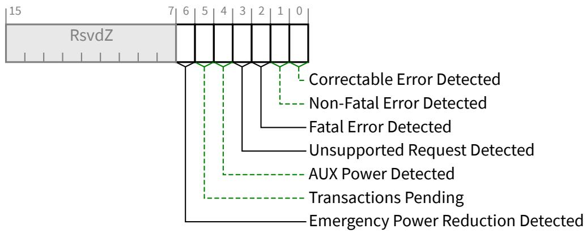

<details>
<summary>text_image</summary>

RsvdZ
7 6 5 4 3 2 1 0
Correctable Error Detected
Non-Fatal Error Detected
Fatal Error Detected
Unsupported Request Detected
AUX Power Detected
Transactions Pending
Emergency Power Reduction Detected
</details>

  
Figure 7-26 Device Status Register


Table 7-22 Device Status Register

<table><tr><td>Bit Location</td><td>Register Description</td><td>Attributes</td></tr><tr><td>0</td><td>Correctable Error Detected- This bit indicates status of correctable errors detected. Errors are logged in this register regardless of whether error reporting is enabled or not in the Device Control Register. For a Multi-Function Device, each Function indicates status of errors as perceived by the respective Function.For Functions supporting Advanced Error Handling, errors are logged in this register regardless of the settings of the Correctable Error Mask register.Default value of this bit is 0b.</td><td>RW1C</td></tr><tr><td>1</td><td>Non-Fatal Error Detected- This bit indicates status of Non-fatal errors detected. Errors are logged in this register regardless of whether error reporting is enabled or not in the Device Control Register. For a Multi-Function Device, each Function indicates status of errors as perceived by the respective Function.For Functions supporting Advanced Error Handling, errors are logged in this register regardless of the settings of the Uncorrectable Error Mask register.Default value of this bit is 0b.</td><td>RW1C</td></tr><tr><td>2</td><td>Fatal Error Detected- This bit indicates status of Fatal errors detected. Errors are logged in this register regardless of whether error reporting is enabled or not in the Device Control Register. For a Multi-Function Device, each Function indicates status of errors as perceived by the respective Function.For Functions supporting Advanced Error Handling, errors are logged in this register regardless of the settings of the Uncorrectable Error Mask register.Default value of this bit is 0b.</td><td>RW1C</td></tr><tr><td>3</td><td>Unsupported Request Detected- This bit indicates that the Function received an Unsupported Request. Errors are logged in this register regardless of whether error reporting is enabled or not in the Device Control Register. For a Multi-Function Device, each Function indicates status of errors as perceived by the respective Function.Default value of this bit is 0b.</td><td>RW1C</td></tr><tr><td>4</td><td>AUX Power Detected- Functions that require auxiliary power report this bit as Set if auxiliary power is detected by the Function.For VFs, this bit is not supported and must be hardwired to Zero.</td><td>ROVF ROZ</td></tr><tr><td>5</td><td>Transactions Pending-Endpoints:When Set, this bit indicates that the Function has issued Non-Posted Requests that have not been completed. A Function reports this bit cleared only when all outstanding Non-Posted Requests have completed or have been terminated by the Completion Timeout mechanism. This bit must also be cleared upon the completion of an FLR.Root and Switch Ports:When Set, this bit indicates that a Port has issued Non-Posted Requests on its own behalf (using the Port's own, or its Shadow Function's, Requester ID) which have not been completed. The Port reports this bit cleared only when all such outstanding Non-Posted Requests have completed or have been terminated by the Completion Timeout mechanism. Note that Root and Switch Ports implementing only the functionality required by this document do not issue Non-Posted Requests on their own behalf, and therefore are not subject to this case. Root and Switch Ports that do not issue Non-Posted Requests on their own behalf hardwire this bit to 0b.</td><td>RO</td></tr><tr><td>6</td><td>Emergency Power Reduction Detected- This bit is Set when the Function is in the Emergency Power Reduction State. Whenever any condition is present that would cause the Emergency Power Reduction State to be entered, the Function remains in the Emergency Power Reduction State and writes to this bit have no effect. See § Section 6.24 for additional details.Multi-Function Devices associated with an Upstream Port must Set this bit in all Functions that support Emergency Power Reduction State.For VFs, this bit is not supported and must be hardwired to Zero.Except for VFs, this bit is RsvdZ if the Emergency Power Reduction Supported field is 00b (see § Section 7.5.3.15).This bit is RsvdZ in Functions that are not associated with an Upstream Port.Default value is 0b.</td><td>RW1CVF ROZ</td></tr></table>

## 7.5.3.6 Link Capabilities Register (Offset 0Ch) §

The Link Capabilities Register identifies PCI Express Link specific capabilities. § Figure 7-27 details allocation of register fields in the Link Capabilities Register; § Table 7-23 provides the respective bit definitions.

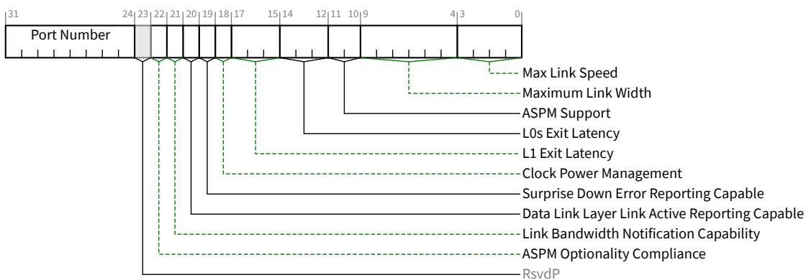

<details>
<summary>line chart</summary>

| Port Number | Max Link Speed | Maximum Link Width | ASPM Support | L0s Exit Latency | L1 Exit Latency | Clock Power Management | Surprise Down Error Reporting Capable | Data Link Layer Link Active Reporting Capable | Link Bandwidth Notification Capability | ASPM Optionality Compliance | RsvdP |
| --- | --- | --- | --- | --- | --- | --- | --- | --- | --- | --- | --- |
| 0 | 0 | 0 | 0 | 0 | 0 | 0 | 0 | 0 | 0 | 0 | 0 |
| 1 | 0 | 0 | 0 | 0 | 0 | 0 | 0 | 0 | 0 | 0 | 0 |
| 2 | 0 | 0 | 0 | 0 | 0 | 0 | 0 | 0 | 0 | 0 | 0 |
| 3 | 0 | 0 | 0 | 0 | 0 | 0 | 0 | 0 | 0 | 0 | 0 |
| 4 | 0 | 0 | 0 | 0 | 0 | 0 | 0 | 0 | 0 | 0 | 0 |
| 5 | 0 | 0 | 0 | 0 | 0 | 0 | 0 | 0 | 0 | 0 | 0 |
| 6 | 0 | 0 | 0 | 0 | 0 | 0 | 0 | 0 | 0 | 0 | 0 |
| 7 | 0 | 0 | 0 | 0 | 0 | 0 | 0 | 0 | 0 | 0 | 0 |
| 8 | 0 | 0 | 0 | 0 | 0 | 0 | 0 | 0 | 0 | 0 | 0 |
| 9 | 0 | 0 | 0 | 0 | 0 | 0 | 0 | 0 | 0 | 0 | 0 |
| 10 | 0 | 0 | 0 | 0 | 0 | 0 | 0 | 0 | 0 | 0 | 0 |
| 11 | 0 | 0 | 0 | 0 | 0 | 0 | 0 | 0 | 0 | 0 | 0 |
| 12 | 0 | 0 | 0 | 0 | 0 | 0 | 0 | 0 | 0 | 0 | 0 |
</details>

§ Figure 7-27 Link Capabilities Register

§ Table 7-23 Link Capabilities Register

<table><tr><td>Bit Location</td><td>Register Description</td><td>Attributes</td></tr><tr><td>3:0</td><td>Max Link Speed- This field indicates the maximum Link speed of the associated Port.The encoded value specifies a Bit Location in the Supported Link Speeds Vector (in the Link Capabilities 2 Register) that corresponds to the maximum Link speed. Defined encodings are:0001b Supported Link Speeds Vector field bit 0001b Supported Link Speeds Vector field bit 10011b Supported Link Speeds Vector field bit 20100b Supported Link Speeds Vector field bit 30101b Supported Link Speeds Vector field bit 40110b Supported Link Speeds Vector field bit 50111b Supported Link Speeds Vector field bit 6All other encodings are reserved.Multi-Function Devices associated with an Upstream Port must report the same value in this field for all Functions.</td><td>RO</td></tr><tr><td>9:4</td><td>Maximum Link Width- This field indicates the maximum Link width (xN - corresponding to N Lanes) implemented by the component. This value is permitted to exceed the number of Lanes routed to the slot (Downstream Port), adapter connector (Upstream Port), or in the case of component-to-component connections, the actual wired connection width. Defined encodings are:00 0001b x100 0010b x200 0100b x400 1000b x801 0000b x16All other encodings are Reserved.Multi-Function Devices associated with an Upstream Port must report the same value in this field for all Functions.</td><td>RO</td></tr><tr><td>11:10</td><td>ASPM Support / Active State Power Management Support- This field indicates the level of ASPM supported on the given PCI Express Link. See§ Section 5.4.1for ASPM support requirements. Defined encodings are:00b No ASPM Support01b L0s Supported10b L1 Supported11b L0s and L1 SupportedMulti-Function Devices associated with an Upstream Port must report the same value in this field for all Functions.</td><td>RO</td></tr><tr><td>14:12</td><td>L0s Exit Latency- This field indicates the L0s exit latency for the given PCI Express Link. The value reported indicates the length of time this Port requires to complete transition from L0s to L0. If L0s is not supported, the value is undefined; however, see the Implementation Note “Potential Issues With Legacy Software When L0s is Not Supported” in§ Section 5.4.1.1for the recommended value. Defined encodings are:000b Less than 64 ns001b 64 ns to less than 128 ns010b 128 ns to less than 256 ns011b 256 ns to less than 512 ns100b 512 ns to less than 1 μs101b 1 μs to less than 2 μs110b 2 μs-4 μs111b More than 4 μsNote that exit latencies may be influenced by PCI Express reference clock configuration depending upon whether a component uses a common or separate reference clock.Multi-Function Devices associated with an Upstream Port must report the same value in this field for all Functions.</td><td>RO</td></tr><tr><td>17:15</td><td>L1 Exit Latency- This field indicates the L1 Exit Latency for the given PCI Express Link. The value reported indicates the length of time this Port requires to complete transition from ASPM L1 to L0. If ASPM L1 is not supported, the value is undefined. Defined encodings are:000b Less than 1μs001b 1 μs to less than 2 μs010b 2 μs to less than 4 μs011b 4 μs to less than 8 μs100b 8 μs to less than 16 μs101b 16 μs to less than 32 μs110b 32 μs-64 μs111b More than 64 μsNote that exit latencies may be influenced by PCI Express reference clock configuration depending upon whether a component uses a common or separate reference clock.Multi-Function Devices associated with an Upstream Port must report the same value in this field for all Functions.</td><td>RO</td></tr><tr><td>18</td><td>Clock Power Management- For Upstream Ports, a value of 1b in this bit indicates that the component tolerates the removal of any reference clock(s) via the “clock request” (CLKREQ#) mechanism when the Link is in the L1 and L2/L3 Ready Link states. A value of 0b indicates the component does not have this capability and that reference clock(s) must not be removed in these Link states.L1 PM Substates defines other semantics for the CLKREQ# signal, which are managed independently of Clock Power Management.This Capability is applicable only in form factors that support “clock request” (CLKREQ#) capability.For a Multi-Function Device associated with an Upstream Port, each Function indicates its capability independently. Power Management configuration software must only permit reference clock removal if all Functions of the Multi-Function Device indicate a 1b in this bit. For ARI Devices, all Functions must indicate the same value in this bit.For Downstream Ports, this bit must be hardwired to 0b.</td><td>RO</td></tr><tr><td>19</td><td>Surprise Down Error Reporting Capable- For a Downstream Port, this bit must be Set if the component supports the optional capability of detecting and reporting a Surprise Down error condition.For Upstream Ports and components that do not support this optional capability, this bit must be hardwired to 0b.</td><td>RO</td></tr><tr><td>20</td><td>Data Link Layer Link Active Reporting Capable- For a Downstream Port, this bit must be hardwired to 1b if the component supports the optional capability of reporting the DL_Active state of the Data Link Control and Management State Machine. For a hot-plug capable Downstream Port (as indicated by the Hot-Plug Capable bit of the Slot Capabilities Register) or a Downstream Port that supports Link speeds greater than 5.0 GT/s, this bit must be hardwired to 1b.For Upstream Ports and components that do not support this optional capability, this bit must be hardwired to 0b.</td><td>RO</td></tr><tr><td>21</td><td>Link Bandwidth Notification Capability- A value of 1b indicates support for the Link Bandwidth Notification status and interrupt mechanisms. This capability is required for all Root Ports and Switch Downstream Ports supporting Links wider than x1 and/or multiple Link speeds.This field is not applicable and is Reserved for Endpoints, PCI Express to PCI/PCI-X bridges, and Upstream Ports of Switches.Functions that do not implement the Link Bandwidth Notification Capability must hardwire this bit to 0b.</td><td>RO</td></tr><tr><td>22</td><td>ASPM Optionality Compliance- This bit must be set to 1b in all Functions. Components implemented against certain earlier versions of this specification will have this bit set to 0b.Software is permitted to use the value of this bit to help determine whether to enable ASPM or whether to run ASPM compliance tests.</td><td>HwInit</td></tr><tr><td>31:24</td><td>Port Number- This field indicates the PCI Express Port number for the given PCI Express Link.Multi-Function Devices associated with an Upstream Port must report the same value in this field for all Functions.</td><td>HwInit</td></tr></table>

## IMPLEMENTATION NOTE:

## USE OF THE ASPM OPTIONALITY COMPLIANCE BIT §

Correct implementation and utilization of ASPM can significantly reduce Link power. However, ASPM feature implementations can be complex, and historically, some implementations have not been compliant to the specification. To address this, some of the ASPM optionality and ASPM entry requirements from earlier revisions of this document have been loosened. However, clear pass/fail compliance testing for ASPM features is also supported and expected.

The ASPM Optionality Compliance bit was created as a tool to establish clear expectations for hardware and software. This bit is Set to indicate hardware that conforms to the current specification, and this bit must be Set in components compliant to this specification.

System software as well as compliance software can assume that if this bit is Set, that the associated hardware conforms to the current specification. Hardware should be fully capable of supporting ASPM configuration management without needing component-specific treatment by system software.

For older hardware that does not have this bit Set, it is strongly recommended for system software to provide mechanisms to enable ASPM on components that work correctly with ASPM, and to disable ASPM on components that don’t.

## 7.5.3.7 Link Control Register (Offset 10h) §

The Link Control Register controls PCI Express Link specific parameters. § Figure 7-28 details allocation of register fields in the Link Control Register; § Table 7-24 provides the respective bit definitions.

For VF fields indicated as RsvdP, the associated PF's setting applies to the VF.

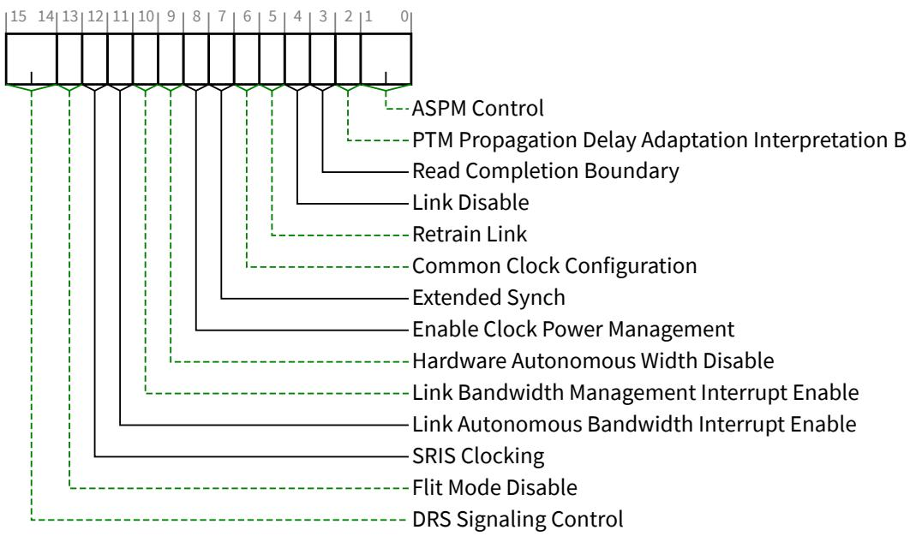

<details>
<summary>flowchart</summary>

```mermaid
graph TD
  A["15 14 13 12 11 10 9 8 7 6 5 4 3 2 1 0"] --> B["ASPM Control"]
  B --> C["PTM Propagation Delay Adaptation Interpretation B"]
  C --> D["Read Completion Boundary"]
  D --> E["Link Disable"]
  E --> F["Retrain Link"]
  F --> G["Common Clock Configuration"]
  G --> H["Extended Synch"]
  H --> I["Enable Clock Power Management"]
  I --> J["Hardware Autonomous Width Disable"]
  J --> K["Link Bandwidth Management Interrupt Enable"]
  K --> L["Link Autonomous Bandwidth Interrupt Enable"]
  L --> M["SRIS Clocking"]
  M --> N["Flit Mode Disable"]
  N --> O["DRS Signaling Control"]
```
</details>

Figure 7-28 Link Control Register

§

§

Table 7-24 Link Control Register

<table><tr><td>Bit Location</td><td colspan="3">Register Description</td><td>Attributes</td></tr><tr><td>1:0</td><td colspan="3">ASPM Control / Active State Power Management Control - This field controls the level of ASPM enabled on the given PCI Express Link. See § Section 5.4.1.4 for requirements on when and how to enable ASPM. Defined encodings are:00b Disabled01b L0s Entry Enabled10b L1 Entry Enabled11b L0s and L1 Entry EnabledNote: “L0s Entry Enabled” enables the Transmitter to enter L0s. If L0s is supported, the Receiver must be capable of entering L0s even when the Transmitter is disabled from entering L0s (00b or 10b). In Flit Mode, L0s is not supported, bit 0 of this field is ignored and has no effect (i.e., encodings 01b and 00b are equivalent as are encodings 11b and 10b).ASPM L1 must be enabled by software in the Upstream component on a Link prior to enabling ASPM L1 in the Downstream component on that Link. When disabling ASPM L1, software must disable ASPM L1 in the Downstream component on a Link prior to disabling ASPM L1 in the Upstream component on that Link. ASPM L1 must only be enabled on the Downstream component if both components on a Link support ASPM L1.For Multi-Function Devices (including ARI Devices), it is recommended that software program the same value for this field in all Functions. For non-ARI Multi-Function Devices, only capabilities enabled in all Functions are enabled for the component as a whole.For ARI Devices, ASPM Control is determined solely by the setting in Function 0, regardless of Function 0’s D-state. The settings in the other Functions always return whatever value software programmed for each, but otherwise are ignored by the component.Default value of this field is 00b unless otherwise required by a particular form factor.</td><td>RWVF RsvdP</td></tr><tr><td>2</td><td colspan="3">PTM Propagation Delay Adaptation Interpretation B- For a device that supports PTM, if PTM Propagation Delay Adaptation Capable in the PTM Capability Register is Set, then, for an Upstream Port, this bit when Set selects interpretation B of the Propagation Delay[31:0] field for received PTM ResponseD Messages, and for a Downstream Port, this bit when Set selects interpretation B of the Propagation Delay[31:0] field for PTM ResponseD Messages transmitted by the Port; otherwise this bit when Clear selects interpretation A for both cases. For a device that supports PTM, if its PTM Propagation Delay Adaptation Capable in the PTM Capability Register is Clear, Ports must hardwire this bit to 0b. For Multi-Function Devices associated with an Upstream Port of a device that supports PTM, this bit must be implemented in the same Function that contains the PTM Extended Capability structure and RsvdP in all other Functions. Default value is implementation specific, but is recommended to be 0b. For a device that does not support PTM, for all Ports in that device this bit must be RsvdP.</td><td>RW / RsvdP</td></tr><tr><td>3</td><td colspan="3">Read Completion Boundary (RCB) - field is meaningful in Root Ports, Endpoints and Bridges. When meaningful, defined encodings are:0b 64 byte1b 128 byteRoot Ports: RCB contains the RCB value for the Root Port. Refer to § Section 2.3.1.1 for the definition of the parameter RCB.This bit is hardwired for a Root Port and returns its RCB support capabilities.Endpoints and Bridges: Read Completion Boundary (RCB) - Optionally Set by configuration software to indicate the RCB value of the Root Port Upstream from the Endpoint or Bridge. Refer to § Section 2.3.1.1 for the definition of the parameter RCB.Configuration software must only Set this bit if the Root Port Upstream from the Endpoint or Bridge reports an RCB value of 128 bytes (a value of 1b in the Read Completion Boundary bit).Default value of this bit is 0b.Functions that do not implement this feature must hardwire the bit to 0b.Switch Ports: Not applicable - must hardwire the bit to 0b</td><td>Root Ports:ROEndpoints and Bridges:RWVF RsvdPSwitchPorts:RO</td></tr><tr><td>4</td><td colspan="3">Link Disable- This bit disables the Link by directing the LTSSM to the Disabled state when Set; this bit is Reserved on Endpoints, PCI Express to PCI/PCI-X bridges, and Upstream Ports of Switches.Writes to this bit are immediately reflected in the value read from the bit, regardless of actual Link state.After clearing this bit, software must honor timing requirements defined in § Section 6.6.1 with respect to the first Configuration Read following a Conventional Reset.Default value of this bit is 0b.</td><td>RW</td></tr><tr><td>5</td><td colspan="3">Retrain Link- A write of 1b to this bit initiates Link retraining by directing the Physical Layer LTSSM to the Recovery state. If the LTSSM is already in Recovery or Configuration, re-entering Recovery is permitted but not required. If the Port is in DPC when a write of 1b to this bit occurs, the result is undefined. Reads of this bit always return 0b.It is permitted to write 1b to this bit while simultaneously writing modified values to other fields in this register. If the LTSSM is not already in Recovery or Configuration, the resulting Link training mustuse the modified values. If the LTSSM is already in Recovery or Configuration, the modified values are not required to affect the Link training that's already in progress.This bit is not applicable and is Reserved for Endpoints, PCI Express to PCI/PCI-X bridges, and Upstream Ports of Switches.This bit always returns 0b when read.</td><td>RW</td></tr><tr><td>6</td><td colspan="3">Common Clock Configuration- When Set, this bit indicates that this component and the component at the opposite end of this Link are operating with a distributed common reference clock.A value of 0b indicates that this component and the component at the opposite end of this Link are operating with asynchronous reference clock.For non-ARI Multi-Function Devices, software must program the same value for this bit in all Functions. If not all Functions are Set, then the component must as a whole assume that its reference clock is not common with the Upstream component.For ARI Devices, Common Clock Configuration is determined solely by the setting in Function 0. The settings in the other Functions always return whatever value software programmed for each, but otherwise are ignored by the component.Components utilize this Common Clock Configuration information to report the correct L0s and L1 Exit Latencies.After changing the value in this bit in both components on a Link, software must trigger the Link to retrain by writing a 1b to the Retrain Link bit of the Downstream Port.Default value of this bit is 0b.</td><td>RWVF RsvdP</td></tr><tr><td>7</td><td colspan="3">Extended Synch- When Set, this bit forces the transmission of additional Ordered Sets when exiting the L0s state (see § Section 4.2.5.6) and when in the Recovery state (see § Section 4.2.7.4.1). This mode provides external devices (e.g., logic analyzers) monitoring the Link time to achieve bit and Symbol lock before the Link enters the L0 state and resumes communication.For Multi-Function Devices if any Function has this bit Set, then the component must transmit the additional Ordered Sets when exiting L0s or when in Recovery.In Flit Mode, this bit is ignored and has no effect since L0s is not supported.Default value for this bit is 0b.</td><td>RWVF RsvdP</td></tr><tr><td>8</td><td colspan="3">Enable Clock Power Management- Applicable only for Upstream Ports and with form factors that support a “Clock Request” (CLKREQ#) mechanism, this bit operates as follows:0bClock power management is disabled and device must hold CLKREQ# signal low.1bWhen this bit is Set, the device is permitted to use CLKREQ# signal to power manage Link clock according to protocol defined in appropriate form factor specification.For a non-ARI Multi-Function Device, power-management-configuration software must only Set this bit if all Functions of the Multi-Function Device indicate a 1b in the Clock Power Management bit of the Link Capabilities Register. The component is permitted to use the CLKREQ# signal to power manage Link clock only if this bit is Set for all Functions.For ARI Devices, Clock Power Management is enabled solely by the setting in Function 0. The settings in the other Functions always return whatever value software programmed for each, but otherwise are ignored by the component.The CLKREQ# signal may also be controlled via the L1 PM Substates mechanism. Such control is not affected by the setting of this bit.Downstream Ports and components that do not support Clock Power Management (as indicated by a 0b value in the Clock Power Management bit of the Link Capabilities Register) must hardwire this bit to 0b.Default value of this bit is 0b, unless specified otherwise by the form factor specification.</td><td>RWVF RsvdP</td></tr><tr><td>9</td><td colspan="3">Hardware Autonomous Width Disable - When Set, this bit disables hardware from changing the Link width for reasons other than attempting to correct unreliable Link operation by reducing Link width.For a Multi-Function Device associated with an Upstream Port, the bit in Function 0 is of type RW, and only Function 0 controls the component's Link behavior. In all other Functions of that device, this bit is of type RsvdP.Components that do not implement the ability autonomously to change Link width are permitted to hardwire this bit to 0b.Default value of this bit is 0b.</td><td>RW/RsvdP (see description)VF RsvdP</td></tr><tr><td>10</td><td colspan="3">Link Bandwidth Management Interrupt Enable - When Set, this bit enables the generation of an interrupt to indicate that the Link Bandwidth Management Status bit has been Set.This bit is not applicable and is Reserved for Endpoints, PCI Express-to-PCI/PCI-X bridges, and Upstream Ports of Switches.Functions that do not implement the Link Bandwidth Notification Capability must hardwire this bit to 0b.Default value of this bit is 0b.</td><td>RW</td></tr><tr><td>11</td><td colspan="3">Link Autonomous Bandwidth Interrupt Enable - When Set, this bit enables the generation of an interrupt to indicate that the Link Autonomous Bandwidth Status bit has been Set.This bit is not applicable and is Reserved for Endpoints, PCI Express-to-PCI/PCI-X bridges, and Upstream Ports of Switches.Functions that do not implement the Link Bandwidth Notification Capability must hardwire this bit to 0b.Default value of this bit is 0b.</td><td>RW</td></tr><tr><td rowspan="6">12</td><td colspan="3">SRIS Clocking - This bit, in conjunction with Common Clock Configuration, indicates the clocking mode used on the Link.This bit is meaningful in Downstream Ports that support 1b/1b encoding. In all other Functions, this bit is RsvdP.If Common Clock Configuration is Set, this bit has no effect and the SRIS Clocking bit in the TS1s must be 0b (Symbol 4, bit 7).If Common Clock Configuration is Clear, this bit is sent in the SRIS Clocking bit of TS1s (Symbol 4, bit 7).</td><td rowspan="6">RW</td></tr><tr><td>Clocking Mode</td><td>Common Clock Configuration</td><td>SRIS Clocking</td></tr><tr><td>Common Clock</td><td>1</td><td>x</td></tr><tr><td>SRNS</td><td>0</td><td>0</td></tr><tr><td>SRIS</td><td>0</td><td>1</td></tr><tr><td colspan="3">Default is 0b.</td></tr><tr><td>13</td><td colspan="3">Flit Mode Disable - when Set, the Port is not permitted to set the Flit Mode Supported bit in training sets it sends. This bit has no effect on the Flit Mode Supported bit in the PCI Express Capabilities Register and thus has no effect on behavior required by MUST@FLIT.Since Flit Mode is required at 64.0 GT/s or higher, disabling Flit Mode also has the effect of disabling data rates of 64.0 GT/s or higher.</td><td>RW</td></tr><tr><td></td><td colspan="3">This bit is mandatory in Downstream Ports where Flit Mode Supported is Set.For Functions associated with an Upstream Port, this bit is optionally implemented in Function 0 and is not implemented in all other Functions. When not implemented, this bit must be hardwired to Zero.Changing this bit while the Link is Up has no effect. The updated value will take effect on the next transition to Link Up.This bit can be used as a workaround for faulty Flit Mode implementations. As such, it might be set by System Firmware, Device Firmware. As such, System Software should not clear this bit.This bit is not implemented in RCiEPs.In Downstream Ports, the default is Zero. In Upstream Ports, the default is implementation specific (e.g., it might be Set by device firmware).</td><td></td></tr><tr><td>15:14</td><td colspan="3">DRS Signaling Control- Indicates the mechanism used to report reception of a DRS message. Must be implemented for Downstream Ports with the DRS Supported bit Set in the Link Capabilities 2 Register.Encodings are:00b DRS not Reported: If DRS Supported is Set, receiving a DRS Message will set DRS Message Received in the Link Status 2 Register but will otherwise have no effect01b DRS Interrupt Enabled: If the DRS Message Received bit in the Link Status 2 Register transitions from 0 to 1, and either MSI or MSI-X is enabled, an MSI or MSI-X interrupt is generated using the vector in Interrupt Message Number (§ Section 7.5.3.2)10b DRS to FRS Signaling Enabled: If the DRS Message Received bit in the Link Status 2 Register transitions from 0 to 1, the Port must send an FRS Message Upstream with the FRS Reason field set to DRS Message Received.Behavior is undefined if this field is set to 10b and the FRS Supported bit in the Device Capabilities 2 Register is Clear.Behavior is undefined if this field is set to 11b.Downstream Ports with the DRS Supported bit Clear in the Link Capabilities 2 Register must hardwire this field to 00b.This field is Reserved for Upstream Ports.Default value of this field is 00b.</td><td>RW/RsvdP</td></tr></table>

## IMPLEMENTATION NOTE:

## SOFTWARE COMPATIBILITY WITH ARI DEVICES §

With the ASPM Control field, Common Clock Configuration bit, and Enable Clock Power Management bit in the Link Control Register, there are potential software compatibility issues with ARI Devices since these controls operate strictly off the settings in Function 0 instead of the settings in all Functions.

With compliant software, there should be no issues with the Common Clock Configuration bit, since software is required to set this bit the same in all Functions.

With the Enable Clock Power Management bit, there should be no compatibility issues with software that sets this bit the same in all Functions. However, if software does not set this bit the same in all Functions, and relies on each Function having the ability to prevent Clock Power Management from being enabled, such software may have compatibility issues with ARI Devices.

With the ASPM Control field, there should be no compatibility issues with software that sets this bit the same in all Functions. However, if software does not set this bit the same in all Functions, and relies on each Function in D0 state having the ability to prevent ASPM from being enabled, such software may have compatibility issues with ARI Devices.

## IMPLEMENTATION NOTE:

## AVOIDING RACE CONDITIONS WHEN USING THE RETRAINLINK BIT §

When software changes Link control parameters and writes a 1b to the Retrain Link bit in order to initiate Link training using the new parameter settings, special care is required in order to avoid certain race conditions. At any instant the LTSSM may transition to the Recovery or Configuration state due to normal Link activity, without software awareness. If the LTSSM is already in Recovery or Configuration when software writes updated parameters to the Link Control Register, as well as a 1b, to the Retrain Link bit, the LTSSM might not use the updated parameter settings with the current Link training, and the current Link training might not achieve the results that software intended.

To avoid this potential race condition, it is strongly recommended that software use the following algorithm or something similar:

1. Software sets the relevant Link control parameters to the desired settings without writing a 1b to the Retrain Link bit.  
2. Software polls the Link Training bit in the Link Status Register until the value returned is 0b.  
3. Software writes a 1b to the Retrain Link bit without changing any other fields in the Link Control Register.

The above algorithm guarantees that Link training will be based on the Link control parameter settings that software intends.

## IMPLEMENTATION NOTE:

## USE OF THE SLOT CLOCK CONFIGURATION AND COMMONCLOCK CONFIGURATION BITS §

In order to determine the common clocking configuration of components on opposite ends of a Link that crosses a connector, two pieces of information are required. The following description defines these requirements.

The first necessary piece of information is whether the Downstream Port that connects to the slot uses a clock that has a common source and therefore constant phase relationship to the clock signal provided on the slot. This information is provided by the system side component through a hardware initialized bit (Slot Clock Configuration) in its Link Status Register. Note that some electromechanical form factor specifications may require the Port that connects to the slot use a clock that has a common source to the clock signal provided on the slot.

The second necessary piece of information is whether the component on the adapter uses the clock supplied on the slot or one generated locally on the adapter. The adapter design and layout will determine whether the component is connected to the clock source provided by the slot. A component going onto this adapter should have some hardware initialized method for the adapter design/designer to indicate the configuration used for this particular adapter design. This information is reported by Slot Clock Configuration in the Link Status Register of each Function in the Upstream Port. Note that some electromechanical form factor specifications may require the Port on the adapter to use the clock signal provided on the connector.

System firmware or software will read the Slot Clock Configuration from the components on both ends of a physical Link. If the Slot Clock Configuration bit is Set for both components, this firmware/software will Set the Common Clock Configuration bit on both components connected to the Link. Each component uses this bit to determine the length of time required to re-synch its Receiver to the opposing component's Transmitter when exiting L0s.

The time required to re-synch is reported as a time value in the L0s Exit Latency in the Link Capabilities Register (offset 0Ch) and is sent to the opposing Transmitter as part of the initialization process as N\_FTS. Components would be expected to require much longer synch times without common clocking and would therefore report a longer L0s Exit Latency in bits 12-14 of the Link Capabilities Register and would send a larger number for N\_FTS during training. This forces a requirement that whatever software changes this bit should force a Link retrain in order to get the correct N\_FTS set for the Receivers at both ends of the Link.

## 7.5.3.8 Link Status Register (Offset 12h) §

The Link Status Register provides information about PCI Express Link specific parameters. § Figure 7-29 details allocation of register fields in the Link Status Register; § Table 7-26 provides the respective bit definitions.

For a VF, all fields are RsvdZ and the associated PF's setting for each field applies to the VF.

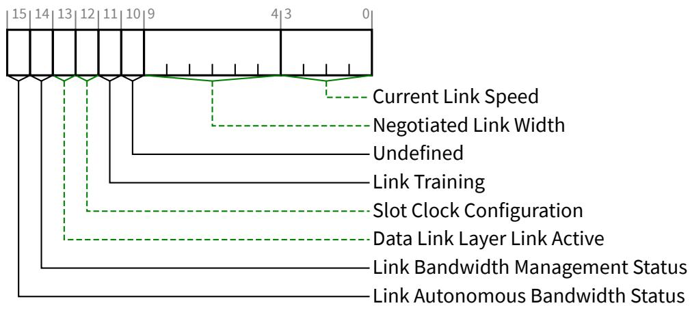

<details>
<summary>flowchart</summary>

```mermaid
graph TD
  A["Current Link Speed"] --> B["Negotiated Link Width"]
  B --> C["Undefined"]
  C --> D["Link Training"]
  D --> E["Slot Clock Configuration"]
  E --> F["Data Link Layer Link Active"]
  F --> G["Link Bandwidth Management Status"]
  G --> H["Link Autonomous Bandwidth Status"]
```
</details>

Figure 7-29 Link Status Register

§ Table 7-26 Link Status Register

<table><tr><td>Bit Location</td><td>Register Description</td><td>Attributes</td></tr><tr><td>3:0</td><td>Current Link Speed- This field indicates the negotiated Link speed of the given PCI Express Link.The encoded value specifies a Bit Location in the Supported Link Speeds Vector (in the Link Capabilities 2 Register) that corresponds to the current Link speed. Defined encodings are:0001b Supported Link Speeds Vector field bit 0001b Supported Link Speeds Vector field bit 10011b Supported Link Speeds Vector field bit 20100b Supported Link Speeds Vector field bit 30101b Supported Link Speeds Vector field bit 40110b Supported Link Speeds Vector field bit 50111b Supported Link Speeds Vector field bit 6All other encodings are Reserved.The value in this field is undefined when the Link is not up.</td><td>ROVF RsvdZ</td></tr><tr><td>9:4</td><td>Negotiated Link Width- This field indicates the negotiated width of the given PCI Express Link. This includes the Link Width determined during initial link training as well changes that occur after initial link training (e.g., L0p).Defined encodings are:00 0001b x100 0010b x200 0100b x400 1000b x801 0000b x16All other encodings are Reserved. The value in this field is undefined when the Link is not up.</td><td>ROVF RsvdZ</td></tr><tr><td>10</td><td>Undefined- The value read from this bit is undefined. In previous versions of this specification, this bit was used to indicate a Link Training Error. System software must ignore the value read from this bit. System software is permitted to write any value to this bit.</td><td>ROVF RsvdZ</td></tr><tr><td>11</td><td>Link Training- This read-only bit indicates that the Physical Layer LTSSM is in the Configuration or Recovery state, or that 1b was written to the Retrain Link bit but Link training has not yet begun. Hardware clears this bit when the LTSSM exits the Configuration/Recovery state.This bit is not applicable and Reserved for Endpoints, PCI Express to PCI/PCI-X bridges, and Upstream Ports of Switches, and must be hardwired to 0b.</td><td>ROVF RsvdZ</td></tr><tr><td>12</td><td>Slot Clock Configuration- This bit indicates that the component uses the same physical reference clock that the platform provides on the connector. If the device uses an independent clock irrespective of the presence of a reference clock on the connector, this bit must be clear.For a Multi-Function Device, each Function must report the same value for this bit.</td><td>HwInitVF RsvdZ</td></tr><tr><td>13</td><td>Data Link Layer Link Active- This bit indicates the status of the Data Link Control and Management State Machine. It returns a 1b to indicate the DL_Active state, 0b otherwise.This bit must be implemented if the Data Link Layer Link Active Reporting Capable bit is 1b. Otherwise, this bit must be hardwired to 0b.</td><td>ROVF RsvdZ</td></tr><tr><td>14</td><td>Link Bandwidth Management Status- This bit is Set by hardware to indicate that either of the following has occurred without the Port transitioning through DL_Down status:·A Link retraining has completed following a write of 1b to the Retrain Link bit.Note: This bit is Set following any write of 1b to the Retrain Link bit, including when the Link is in the process of retraining for some other reason.Hardware has changed Link speed or width to attempt to correct unreliable Link operation, either through an LTSSM timeout or a higher level process.This bit must be set if the Physical Layer reports a speed or width change was initiated by the Downstream component that was not indicated as an autonomous change.This bit is not applicable and is Reserved for Endpoints, PCI Express-to-PCI/PCI-X bridges, and Upstream Ports of Switches.Functions that do not implement the Link Bandwidth Notification Capability must hardwire this bit to 0b.The default value of this bit is 0b.</td><td>RW1CVF RsvdZ</td></tr><tr><td>15</td><td>Link Autonomous Bandwidth Status- This bit is Set by hardware to indicate that hardware has autonomously changed Link speed or width, without the Port transitioning through DL_Down status, for reasons other than to attempt to correct unreliable Link operation.This bit must be set if the Physical Layer reports a speed or width change was initiated by the Downstream component that was indicated as an autonomous change.This bit is not applicable and is Reserved for Endpoints, PCI Express-to-PCI/PCI-X bridges, and Upstream Ports of Switches.Functions that do not implement the Link Bandwidth Notification Capability must hardwire this bit to 0b.The default value of this bit is 0b.</td><td>RW1CVF RsvdZ</td></tr></table>

## 7.5.3.9 Slot Capabilities Register (Offset 14h) §

The Slot Capabilities Register identifies PCI Express slot specific capabilities. § Figure 7-30 details allocation of register fields in the Slot Capabilities Register; § Table 7-27 provides the respective bit definitions.

If this register is implemented but the Slot Implemented bit is Clear, the field behavior of this entire register is undefined.

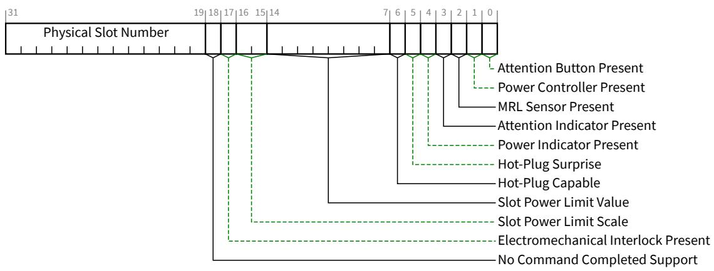

<details>
<summary>line chart</summary>

| Signal Type                     | Value |
| ------------------------------- | ----- |
| Attention Button Present         | 31    |
| Power Controller Present        | 19    |
| MRL Sensor Present              | 18    |
| Attention Indicator Present     | 17    |
| Power Indicator Present         | 16    |
| Hot-Plug Surprise               | 15    |
| Hot-Plug Capable                | 14    |
| Slot Power Limit Value          | 7     |
| Slot Power Limit Scale          | 6     |
| Electromechanical Interlock Present | 5     |
| No Command Completed Support   | 4     |
| Note: The actual values are not provided in the code. |        |
</details>

§ Figure 7-30 Slot Capabilities Register

§ Table 7-27 Slot Capabilities Register

<table><tr><td>Bit Location</td><td>Register Description</td><td>Attributes</td></tr><tr><td>0</td><td>Attention Button Present- When Set, this bit indicates that an Attention Button for this slot is electrically controlled by the chassis.</td><td>HwInit</td></tr><tr><td>1</td><td>Power Controller Present- When Set, this bit indicates that a software programmable Power Controller is implemented for this slot/adapter (depending on form factor).</td><td>HwInit</td></tr><tr><td>2</td><td>MRL Sensor Present- When Set, this bit indicates that an MRL Sensor is implemented on the chassis for this slot.</td><td>HwInit</td></tr><tr><td>3</td><td>Attention Indicator Present- When Set, this bit indicates that an Attention Indicator is electrically controlled by the chassis.</td><td>HwInit</td></tr><tr><td>4</td><td>Power Indicator Present- When Set, this bit indicates that a Power Indicator is electrically controlled by the chassis for this slot.</td><td>HwInit</td></tr><tr><td>5</td><td>Hot-Plug Surprise- When Set, this bit indicates that an adapter present in this slot might be removed from the system without any prior notification. This is a form factor specific capability. This bit is an indication to the operating system to allow for such removal without impacting continued software operation.If the SFI HPS Suppress bit in the SFI Control Register is Clear, a read of the Hot-Plug Surprise bit returns the HwInit value. If the SFI HPS Suppress bit is Set, a read returns 0b. See See § Section 7.9.22.3 .</td><td>HwInit/RO (see description)</td></tr><tr><td>6</td><td>Hot-Plug Capable- When Set, this bit indicates that this slot is capable of supporting hot-plug operations.</td><td>HwInit</td></tr><tr><td>14:7</td><td>Slot Power Limit Value- In combination with the Slot Power Limit Scale value, specifies the upper limit on power supplied by the slot (see § Section 6.9) or by other means to the adapter.Power limit (in Watts) is calculated by multiplying the value in this field by the value in the Slot Power Limit Scale field except when the Slot Power Limit Scale field equals 00b (1.0x) and Slot Power Limit Value exceeds EFh, the following alternative encodings are used:F0h &gt;239 W and ≤ 250 W Slot Power LimitF1h &gt;250 W and ≤ 275 W Slot Power LimitF2h &gt;275 W and ≤ 300 W Slot Power LimitF3h &gt;300 W and ≤ 325 W Slot Power LimitF4h &gt;325 W and ≤ 350 W Slot Power LimitF5h &gt;350 W and ≤ 375 W Slot Power LimitF6h &gt;375 W and ≤ 400 W Slot Power LimitF7h &gt;400 W and ≤ 425 W Slot Power LimitF8h &gt;425 W and ≤ 450 W Slot Power LimitF9h &gt;450 W and ≤ 475 W Slot Power LimitFAh &gt;475 W and ≤ 500 W Slot Power LimitFBh &gt;500 W and ≤ 525 W Slot Power LimitFCh &gt;525 W and ≤ 550 W Slot Power LimitFDh &gt;550 W and ≤ 575 W Slot Power LimitFEh &gt;575 W and ≤ 600 W Slot Power LimitFFh Reserved for Slot Power Limit Values above 600 WThis register must be implemented if the Slot Implemented bit is Set.Writes to this register also cause the Port to send the Set_Slot_Power_Limit Message.The default value prior to hardware/firmware initialization is 0000 0000b.</td><td>HwInit</td></tr><tr><td>16:15</td><td>Slot Power Limit Scale- Specifies the scale used for the Slot Power Limit Value (see § Section 6.9).Range of Values:00b 1.0x01b 0.1x10b 0.01x11b 0.001xThis register must be implemented if the Slot Implemented bit is Set.Writes to this register also cause the Port to send the Set_Slot_Power_Limit Message.The default value prior to hardware/firmware initialization is 00b.</td><td>HwInit</td></tr><tr><td>17</td><td>Electromechanical Interlock Present- When Set, this bit indicates that an Electromechanical Interlock is implemented on the chassis for this slot.</td><td>HwInit</td></tr><tr><td>18</td><td>No Command Completed Support- When Set, this bit indicates that this slot does not generate software notification when an issued command is completed by the Hot-Plug Controller. This bit is only permitted to be Set if the hot-plug capable Port is able to accept writes to all fields of the Slot Control Register without delay between successive writes.</td><td>HwInit</td></tr><tr><td>31:19</td><td>Physical Slot Number- This field indicates the physical slot number attached to this Port. This field must be hardware initialized to a value that assigns a slot number that is unique within the chassis,regardless of the form factor associated with the slot. This field must be initialized to Zero for Ports connected to devices that are either integrated on the system board or integrated within the same silicon as the Switch device or Root Port.</td><td>HwInit</td></tr></table>

## 7.5.3.10 Slot Control Register (Offset 18h) §

The Slot Control Register controls PCI Express Slot specific parameters. § Figure 7-31 details allocation of register fields in the Slot Control Register; § Table 7-28 provides the respective bit definitions.

Attention Indicator Control, Power Indicator Control, and Power Controller Control fields of the Slot Control Register do not have a defined default value. If these fields are implemented, it is the responsibility of either system firmware or operating system software to (re)initialize these fields after a reset of the Link.

In hot-plug capable Downstream Ports, a write to the Slot Control Register must cause a hot-plug command to be generated (see § Section 6.7.3.2 for details on hot-plug commands). A write to the Slot Control Register in a Downstream Port that is not hot-plug capable must not cause a hot-plug command to be executed.

If this register is implemented but the Slot Implemented bit is Clear, the field behavior of this entire register with the exception of the Data Link Layer State Changed Enable bit is undefined.

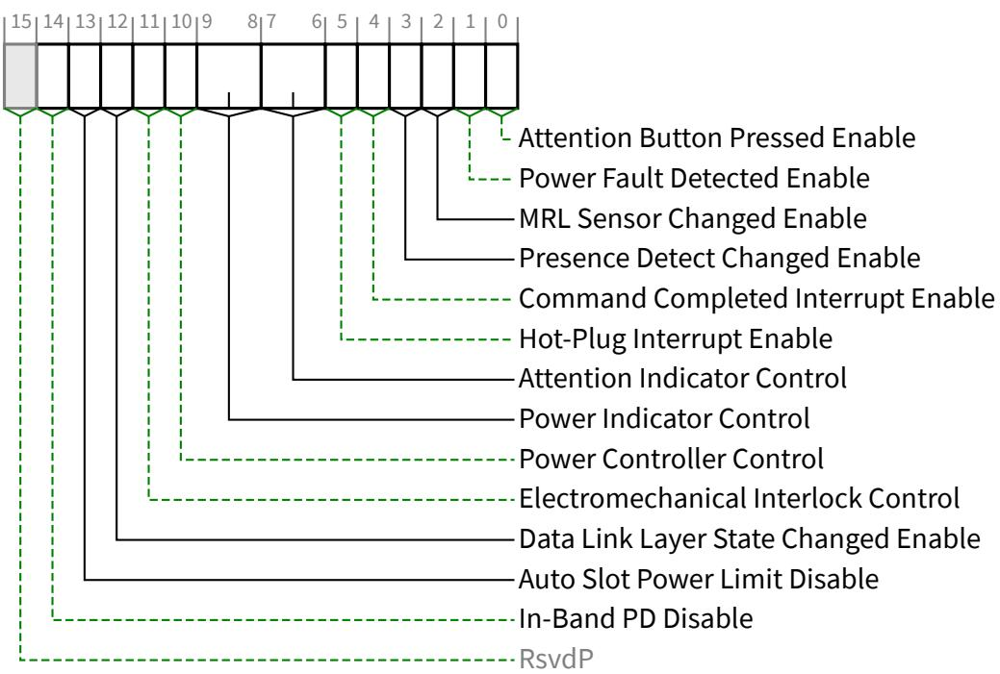

<details>
<summary>flowchart</summary>

```mermaid
graph TD
  A["15"] --> B["14"]
  B --> C["13"]
  C --> D["12"]
  D --> E["11"]
  E --> F["10"]
  F --> G["9"]
  G --> H["8"]
  H --> I["7"]
  I --> J["6"]
  J --> K["5"]
  K --> L["4"]
  L --> M["3"]
  M --> N["2"]
  N --> O["1"]
  O --> P["0"]
    
    subgraph Bit Positions
  Q["Attention Button Pressed Enable"] --> R["Power Fault Detected Enable"]
  S["MRL Sensor Changed Enable"] --> T["Presence Detect Changed Enable"]
  U["Command Completed Interrupt Enable"] --> V["Hot-Plug Interrupt Enable"]
  W["Attention Indicator Control"] --> X["Power Indicator Control"]
  Y["Power Controller Control"] --> Z["Electromechanical Interlock Control"]
  AA["Data Link Layer State Changed Enable"] --> AB["Auto Slot Power Limit Disable"]
  AC["In-Band PD Disable"] --> AD["RsvdP"]
    end
```
</details>

Figure 7-31 Slot Control Register

§

Table 7-28 Slot Control Register

<table><tr><td>Bit Location</td><td>Register Description</td><td>Attributes</td></tr><tr><td>0</td><td>Attention Button Pressed Enable- When Set to 1b, this bit enables software notification on an attention button pressed event (see § Section 6.7.3).If the Attention Button Present bit in the Slot Capabilities Register is 0b, this bit is permitted to be read-only with a value of 0b.Default value of this bit is 0b.</td><td>RW</td></tr><tr><td>1</td><td>Power Fault Detected Enable- When Set, this bit enables software notification on a power fault event (see § Section 6.7.3).If a Power Controller that supports power fault detection is not implemented, this bit is permitted to be read-only with a value of 0b.Default value of this bit is 0b.</td><td>RW</td></tr><tr><td>2</td><td>MRL Sensor Changed Enable- When Set, this bit enables software notification on a MRL sensor changed event (see § Section 6.7.3).If the MRL Sensor Present bit in the Slot Capabilities Register is Clear, this bit is permitted to be read-only with a value of 0b.Default value of this bit is 0b.</td><td>RW</td></tr><tr><td>3</td><td>Presence Detect Changed Enable- When Set, this bit enables software notification on a presence detect changed event (see § Section 6.7.3).If the Hot-Plug Capable bit in the Slot Capabilities Register is 0b, this bit is permitted to be read-only with a value of 0b.Default value of this bit is 0b.</td><td>RW</td></tr><tr><td>4</td><td>Command Completed Interrupt Enable- If Command Completed notification is supported (if the No Command Completed Support bit in the Slot Capabilities Register is 0b), when Set, this bit enables software notification when a hot-plug command is completed by the Hot-Plug Controller.If Command Completed notification is not supported, this bit must be hardwired to 0b.Default value of this bit is 0b.</td><td>RW</td></tr><tr><td>5</td><td>Hot-Plug Interrupt Enable- When Set, this bit enables generation of an interrupt on enabled hot-plug events.If the Hot-Plug Capable bit in the Slot Capabilities Register is Clear, this bit is permitted to be read-only with a value of 0b.Default value of this bit is 0b.</td><td>RW</td></tr><tr><td>7:6</td><td>Attention Indicator Control- If an Attention Indicator is implemented, writes to this field set the Attention Indicator to the written state.Reads of this field must reflect the value from the latest write, even if the corresponding hot-plug command is not complete, unless software issues a write without waiting, if required to, for the previous command to complete in which case the read value is undefined. Defined encodings are:00b Reserved01b On10b Blink11b OffNote: The default value of this field must be one of the non-Reserved values. If the Attention Indicator Present bit in the Slot Capabilities Register is 0b, this bit is permitted to be read-only with a value of 00b.</td><td>RW</td></tr><tr><td>9:8</td><td>Power Indicator Control- If a Power Indicator is implemented, writes to this field set the Power Indicator to the written state. Reads of this field must reflect the value from the latest write, even if the corresponding hot-plug command is not complete, unless software issues a write without waiting, if required to, for the previous command to complete in which case the read value is undefined. Defined encodings are:00b Reserved01b On10b Blink11b OffNote: The default value of this field must be one of the non-Reserved values. If the Power Indicator Present bit in the Slot Capabilities Register is 0b, this bit is permitted to be read-only with a value of 00b.</td><td>RW</td></tr><tr><td>10</td><td>Power Controller Control- If a Power Controller is implemented, this bit when written sets the power state of the slot per the defined encodings. Reads of this bit must reflect the value from the latest write, even if the corresponding hot-plug command is not complete, unless software issues a write, if required to, without waiting for the previous command to complete in which case the read value is undefined. Note that in some cases the power controller may autonomously remove slot power or not respond to a power-up request based on a detected fault condition, independent of the Power Controller Control setting.The defined encodings are:0b Power On1b Power OffIf the Power Controller Present bit in the Slot Capabilities Register is Clear, then writes to this bit have no effect and the read value of this bit is undefined.</td><td>RW</td></tr><tr><td>11</td><td>Electromechanical Interlock Control- If an Electromechanical Interlock is implemented, a write of 1b to this bit causes the state of the interlock to toggle. A write of 0b to this bit has no effect. A read of this bit always returns a 0b.</td><td>RW</td></tr><tr><td>12</td><td>Data Link Layer State Changed Enable- If the Data Link Layer Link Active Reporting Capable is 1b, this bit enables software notification when Data Link Layer Link Active bit is changed.If the Data Link Layer Link Active Reporting Capable bit is 0b, this bit is permitted to be read-only with a value of 0b.Default value of this bit is 0b.</td><td>RW</td></tr><tr><td>13</td><td>Auto Slot Power Limit Disable- When Set, this disables the automatic sending of a Set_Slot_Power_Limit Message when a Link transitions from a non-DL_Up status to a DL_Up status.Downstream ports that don’t support DPC are permitted to hardwire this bit to 0.Default value of this bit is implementation specific.</td><td>RW</td></tr><tr><td>14</td><td>In-Band PD Disable- When Set, this bit disables the in-band presence detect mechanism from affecting the Presence Detect State bit, allowing that bit to report out-of-band presence detect exclusively. Otherwise, the Presence Detect State bit reflects the logical OR of the in-band and out-of-band presence detect mechanisms.In addition, the In-Band PD Disable bit governs the Component Presence state for the Downstream Component Presence field in the Link Status 2 Register. See § Section 7.5.3.20.This bit must be implemented if the In-Band PD Disable Supported bit is 1b. Otherwise, this bit must be hardwired to 0b.Default value of this bit is 0b.</td><td>RW</td></tr></table>

## 7.5.3.11 Slot Status Register (Offset 1Ah)


The Slot Status Register provides information about PCI Express Slot specific parameters. § Figure 7-32 details allocation of register fields in the Slot Status Register; § Table 7-29 provides the respective bit definitions. Register fields for status bits not implemented by the device have the RsvdZ attribute.

If this register is implemented but the Slot Implemented bit is Clear, the field behavior of this entire register with the exception of the Data Link Layer State Changed bit is undefined.

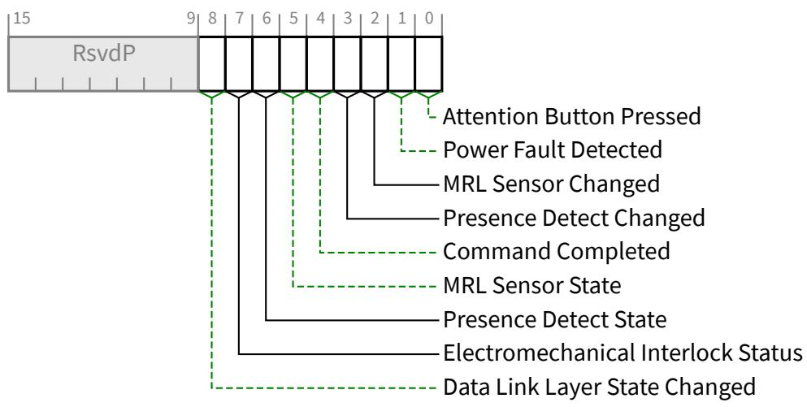

<details>
<summary>text_image</summary>

RsvdP
15 9 8 7 6 5 4 3 2 1 0
Attention Button Pressed
Power Fault Detected
MRL Sensor Changed
Presence Detect Changed
Command Completed
MRL Sensor State
Presence Detect State
Electromechanical Interlock Status
Data Link Layer State Changed
</details>

Figure 7-32 Slot Status Register

§

Table 7-29 Slot Status Register

<table><tr><td>Bit Location</td><td>Register Description</td><td>Attributes</td></tr><tr><td>0</td><td>Attention Button Pressed- If an Attention Button is implemented, this bit is Set when the attention button is pressed. If an Attention Button is not supported, this bit must not be Set.</td><td>RW1C</td></tr><tr><td>1</td><td>Power Fault Detected- If a Power Controller that supports power fault detection is implemented, this bit is Set when the Power Controller detects a power fault at this slot. Note that, depending on hardware capability, it is possible that a power fault can be detected at any time, independent of the Power Controller Control setting or the occupancy of the slot. If power fault detection is not supported, this bit must not be Set.</td><td>RW1C</td></tr><tr><td>2</td><td>MRL Sensor Changed- If an MRL sensor is implemented, this bit is Set when a MRL Sensor State change is detected. If an MRL sensor is not implemented, this bit must not be Set.</td><td>RW1C</td></tr><tr><td>3</td><td>Presence Detect Changed- This bit is Set when the value reported in the Presence Detect State bit is changed.</td><td>RW1C</td></tr><tr><td>4</td><td>Command Completed- If Command Completed notification is supported (if the No Command Completed Support bit in the Slot Capabilities Register is 0b), this bit is Set when a hot-plug command has completed and the Hot-Plug Controller is ready to accept a subsequent command. The Command Completed status bit is Set as an indication to host software that the Hot-Plug Controller has processed the previous command and is ready to receive the next command; it provides no guarantee that the action corresponding to the command is complete.If Command Completed notification is not supported, this bit must be hardwired to 0b.</td><td>RW1C</td></tr><tr><td>5</td><td>MRL Sensor State- This bit reports the status of the MRL sensor if implemented. Defined encodings are:0b MRL Closed1b MRL Open</td><td>RO</td></tr><tr><td>6</td><td>Presence Detect State- This bit indicates the presence of an adapter in the slot. When the In-Band PD Disable bit is Clear, this is reflected by the logical “OR” of the Physical Layer in-band presence detect mechanism and, if present, any out-of-band presence detect mechanism defined for the slot’s corresponding form factor. Note that the in-band presence detect mechanism requires that power be applied to an adapter for its presence to be detected. Consequently, form factors that require a power controller for hot-plug must implement an out-of-band presence detect mechanism. When the In-Band PD Disable bit is Set, the in-band presence detect mechanism has no effect on this bit. Defined encodings are:0b Adapter not Present1b Adapter PresentThis bit must be implemented on all Downstream Ports that implement slots. For Downstream Ports not connected to slots (where the Slot Implemented bit of the PCI Express Capabilities Register is 0b), this bit must be hardwired to 1b.</td><td>RO</td></tr><tr><td>7</td><td>Electromechanical Interlock Status- If an Electromechanical Interlock is implemented, this bit indicates the status of the Electromechanical Interlock. Defined encodings are:0b Electromechanical Interlock Disengaged1b Electromechanical Interlock Engaged</td><td>RO</td></tr><tr><td>8</td><td>Data Link Layer State Changed- This bit is Set when the value reported in the Data Link Layer Link Active bit of the Link Status Register is changed.In response to a Data Link Layer State Changed event, software must read the Data Link Layer Link Active bit of the Link Status Register to determine if the Link is active before initiating configuration cycles to the hot plugged device.</td><td>RW1C</td></tr></table>

## IMPLEMENTATION NOTE:

## NO SLOT POWER CONTROLLER §

For slots that do not implement a power controller, software must ensure that system power planes are enabled to provide power to slots prior to reading Presence Detect State.

## 7.5.3.12 Root Control Register (Offset 1Ch) §

The Root Control Register controls PCI Express Root Complex specific parameters. § Figure 7-33 details allocation of register fields in the Root Control Register; § Table 7-30 provides the respective bit definitions.

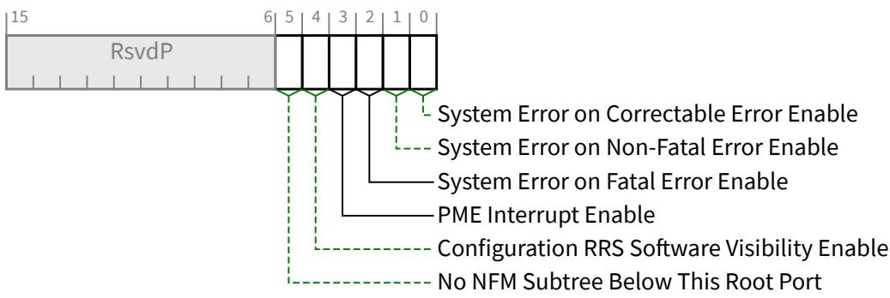

<details>
<summary>text_image</summary>

15
RsvdP
6 5 4 3 2 1 0
System Error on Correctable Error Enable
System Error on Non-Fatal Error Enable
System Error on Fatal Error Enable
PME Interrupt Enable
Configuration RRS Software Visibility Enable
No NFM Subtree Below This Root Port
</details>

Figure 7-33 Root Control Register

§

§

Table 7-30 Root Control Register

<table><tr><td>Bit Location</td><td>Register Description</td><td>Attributes</td></tr><tr><td>0</td><td>System Error on Correctable Error Enable- If Set, this bit indicates that a System Error should be generated if a correctable error (ERR_COR) is reported by any of the devices in the Hierarchy Domain associated with this Root Port, or by the Root Port itself. The mechanism for signaling a System Error to the system is system specific.Root Complex Event Collectors provide support for the above-described functionality for RCiEPs.Default value of this bit is 0b.</td><td>RW</td></tr><tr><td>1</td><td>System Error on Non-Fatal Error Enable- If Set, this bit indicates that a System Error should be generated if a Non-fatal error (ERR_NONFATAL) is reported by any of the devices in the Hierarchy Domain associated with this Root Port, or by the Root Port itself. The mechanism for signaling a System Error to the system is system specific.Root Complex Event Collectors provide support for the above-described functionality for RCiEPs.Default value of this bit is 0b.</td><td>RW</td></tr><tr><td>2</td><td>System Error on Fatal Error Enable- If Set, this bit indicates that a System Error should be generated if a Fatal error (ERR_FATAL) is reported by any of the devices in the Hierarchy Domain associated with this Root Port, or by the Root Port itself. The mechanism for signaling a System Error to the system is system specific.Root Complex Event Collectors provide support for the above-described functionality for RCiEPs.Default value of this bit is 0b.</td><td>RW</td></tr><tr><td>3</td><td>PME Interrupt Enable- When Set, this bit enables PME interrupt generation upon receipt of a PMEMessage as reflected in the PME Status bit (see § Table 7-32). A PME interrupt is also generated if the PME Status bit is Set when this bit is changed from Clear to Set (see § Section 5.3.3).Default value of this bit is 0b.</td><td>RW</td></tr><tr><td>4</td><td>Configuration RRS Software Visibility Enable- When Set, this bit enables the Root Port to indicate to software when Request Retry Status (RRS) Completion Status is received in response to a Configuration Request (see § Section 2.3.1).Root Ports that do not implement this capability must hardwire this bit to 0b.Default value of this bit is 0b.</td><td>RW</td></tr><tr><td>5</td><td>No NFM Subtree Below This Root Port - When Clear, indicates that the RC must take ownership of Non-Posted Requests passing peer-to-peer through the RC targeting this RP as the Egress Port. It is strongly recommended that system software Set this bit if it is determined that no NFM subtree(s) exist below this Root Port. RC implementations are strongly recommended to avoid taking ownership when not required to do so.Root Ports must handle the Clearing of this bit without disruption to Non-Posted Requests the RC has taken ownership of.Root Ports that do not implement this capability must hardwire this bit to 0b.Default value of this bit is 0b.</td><td>RW</td></tr></table>

## 7.5.3.13 Root Capabilities Register (Offset 1Eh) §

The Root Capabilities Register identifies PCI Express Root Port specific capabilities. § Figure 7-34 details allocation of register fields in the Root Capabilities Register; § Table 7-31 provides the respective bit definitions.


<details>
<summary>text_image</summary>

31
RsvdP
1 0
Configuration RRS Software Visibility
</details>

§ Figure 7-34 Root Capabilities Register

§ Table 7-31 Root Capabilities Register

<table><tr><td>Bit Location</td><td>Register Description</td><td>Attributes</td></tr><tr><td>0</td><td>Configuration RRS Software Visibility - When Set, this bit indicates that the Root Port is capable of indicating to software when Request Retry Status (RRS) Completion Status is received in response to a Configuration Request (see § Section 2.3.1).</td><td>RO</td></tr></table>

## 7.5.3.14 Root Status Register (Offset 20h) §

The Root Status Register provides information about PCI Express device specific parameters. § Figure 7-35 details allocation of register fields in the Root Status Register; § Table 7-32 provides the respective bit definitions.

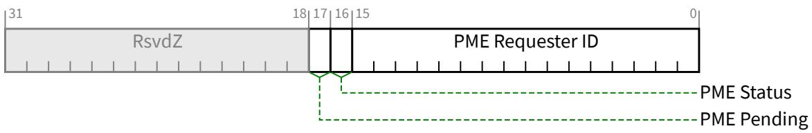

<details>
<summary>text_image</summary>

RsvdZ
18 17 16 15
0
PME Requester ID
PME Status
PME Pending
</details>

Figure 7-35 Root Status Register

§

§

Table 7-32 Root Status Register

<table><tr><td>Bit Location</td><td>Register Description</td><td>Attributes</td></tr><tr><td>15:0</td><td>PME Requester ID - This field indicates the PCI Requester ID of the last PME Requester. This field is only valid when the PME Status bit is Set.</td><td>RO</td></tr><tr><td>16</td><td>PME Status - This bit indicates that PME was asserted by the PME Requester indicated in the PME Requester ID field. Subsequent PMEs are kept pending until the status register is cleared by software by writing a 1b.Default value of this bit is 0b.</td><td>RW1C</td></tr><tr><td>17</td><td>PME Pending - This bit indicates that another PME is pending when the PME Status bit is Set. When the PME Status bit is cleared by software; the PME is delivered by hardware by setting the PME Status bit again and updating the PME Requester ID field appropriately. The PME Pending bit is cleared by hardware if no more PMEs are pending.</td><td>RO</td></tr></table>

## 7.5.3.15 Device Capabilities 2 Register (Offset 24h) §

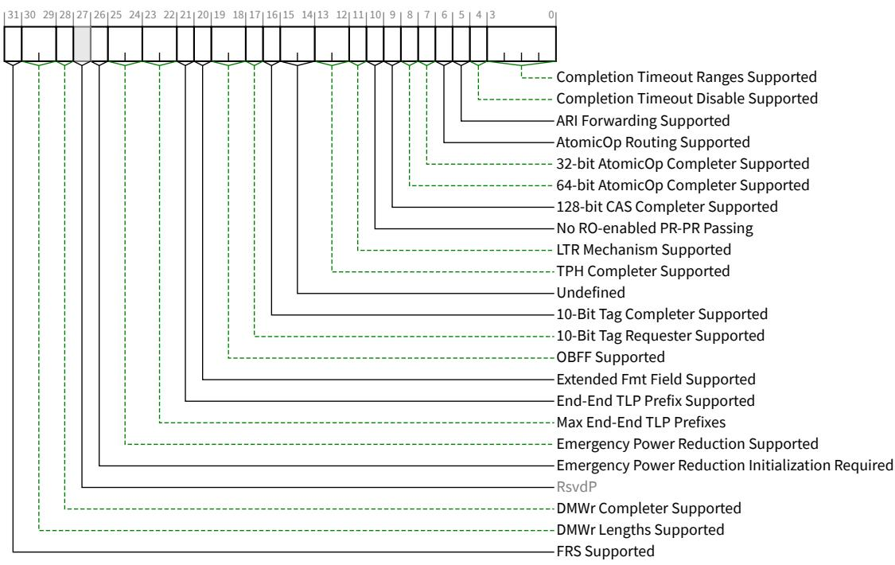

<details>
<summary>bar chart</summary>

| Category | Value |
| -------- | ----- |
| Completion Timeout Ranges Supported | 31 |
| Completion Timeout Disable Supported | 29 |
| ARI Forwarding Supported | 28 |
| AtomicOp Routing Supported | 27 |
| 32-bit AtomicOp Completer Supported | 26 |
| 64-bit AtomicOp Completer Supported | 25 |
| 128-bit CAS Completer Supported | 24 |
| No RO-enabled PR-PR Passing | 23 |
| LTR Mechanism Supported | 22 |
| TPH Completer Supported | 21 |
| Undefined | 20 |
| 10-Bit Tag Completer Supported | 19 |
| 10-Bit Tag Requester Supported | 18 |
| OBFF Supported | 17 |
| Extended Fmt Field Supported | 16 |
| End-End TLP Prefix Supported | 15 |
| Max End-End TLP Prefixes | 14 |
| Emergency Power Reduction Supported | 13 |
| Emergency Power Reduction Initialization Required | 12 |
| RsvdP | 11 |
| DMWr Completer Supported | 10 |
| DMWr Lengths Supported | 9 |
| FRS Supported | 8 |
| FRS Supported | 7 |
| FRS Supported | 6 |
| FRS Supported | 5 |
| FRS Supported | 4 |
| FRS Supported | 3 |
| FRS Supported | 0 |
</details>

Figure 7-36 Device Capabilities 2 Register§

§ Table 7-33 Device Capabilities 2 Register

<table><tr><td>Bit Location</td><td>Register Description</td><td>Attributes</td></tr><tr><td>3:0</td><td>Completion Timeout Ranges Supported- This field indicates device Function support for the optional Completion Timeout programmability mechanism. This mechanism allows system software to modify the Completion Timeout Value.This field is applicable only to Root Ports, Endpoints that issue Requests on their own behalf, and PCI Express to PCI/PCI-X Bridges that take ownership of Requests issued on PCI Express. For all other Functions this field is Reserved and must be hardwired to 0000b.Four time value ranges are defined (A, B, C, D), each with two selectable sub-ranges (for which the time ranges are defined in the description of the Completion Timeout Value field in the Device Control 2 register):The value in this field indicates the timeout value ranges supported:0000b Completion Timeout programming not supported - See § Section 2.8 for requirements.0001b Range A0010b Range B0011b Ranges A and B0110b Ranges B and C0111b Ranges A, B, and C1110b Ranges B, C, and D1111b Ranges A, B, C, and DAll other values are Reserved.For VFs, this field value must be identical to the associated PF's field value.</td><td>HwInit</td></tr><tr><td>4</td><td>Completion Timeout Disable Supported- A value of 1b indicates support for the Completion Timeout Disable mechanism.The Completion Timeout Disable mechanism is required for Endpoints that issue Requests on their own behalf and PCI Express to PCI/PCI-X Bridges that take ownership of Requests issued on PCI Express.For VFs, this bit value must be identical to the associated PF's bit value.This mechanism is optional for Root Ports.For all other Functions this field is Reserved and must be hardwired to 0b.</td><td>RO</td></tr><tr><td>5</td><td>ARI Forwarding Supported- Applicable only to Switch Downstream Ports and Root Ports; must be 0b for other Function types. This bit must be set to 1b if a Switch Downstream Port or Root Port supports this optional capability. See § Section 6.13 for additional details.</td><td>RO</td></tr><tr><td>6</td><td>AtomicOp Routing Supported- Applicable only to Switch Upstream Ports, Switch Downstream Ports, and Root Ports; must be 0b for other Function types. This bit must be set to 1b if the Port supports this optional capability. See § Section 6.15 for additional details.</td><td>RO</td></tr><tr><td>7</td><td>32-bit AtomicOp Completer Supported- Applicable to Functions with Memory Space BARs as well as all Root Ports; must be 0b otherwise. Includes FetchAdd, Swap, and CAS AtomicOps. This bit must be set to 1b if the Function supports this optional capability. See § Section 6.15.3.1 for additional RC requirements.For VFs, this bit value must be identical to the associated PF's bit value.</td><td>RO</td></tr><tr><td>8</td><td>64-bit AtomicOp Completer Supported- Applicable to Functions with Memory Space BARs as well as all Root Ports; must be 0b otherwise. Includes FetchAdd, Swap, and CAS AtomicOps. This bit must be set to 1b if the Function supports this optional capability. See § Section 6.15.3.1 for additional RC requirements.For VFs, this bit value must be identical to the associated PF's bit value.</td><td>RO</td></tr><tr><td>9</td><td>128-bit CAS Completer Supported- Applicable to Functions with Memory Space BARs as well as all Root Ports; must be 0b otherwise. This bit must be set to 1b if the Function supports this optional capability. See § Section 6.15 for additional details.For VFs, this bit value must be identical to the associated PF's bit value.</td><td>RO</td></tr><tr><td>10</td><td>No RO-enabled PR-PR Passing- If this bit is Set, the routing element never carries out the passing permitted by § Table 2-42 entry A2b that is associated with the Relaxed Ordering Attribute field being Set.This bit applies only for Switches and RCs that support peer-to-peer traffic between Root Ports. This bit applies only to Posted Requests being forwarded through the Switch or RC and does not apply to traffic originating or terminating within the Switch or RC itself. All Ports on a Switch or RC must report the same value for this bit.For all other functions, this bit must be 0b.</td><td>HwInit</td></tr><tr><td>11</td><td>LTR Mechanism Supported- A value of 1b indicates support for the optional Latency Tolerance Reporting (LTR) mechanism.Root Ports, Switches and Endpoints are permitted to implement this capability.For a Multi-Function Device associated with an Upstream Port, each Function must report the same value for this bit.For Bridges and other Functions that do not implement this capability, this bit must be hardwired to 0b.</td><td>RO</td></tr><tr><td>13:12</td><td>TPH Completer Supported- Value indicates Completer support for TPH or Extended TPH. Applicable only to Root Ports and Endpoints. For all other Functions, this field is Reserved. Defined Encodings are:00b TPH and Extended TPH Completer not supported.01b TPH Completer supported; Extended TPH Completer not supported.10b Reserved.11b Both TPH and Extended TPH Completer supported.See § Section 6.17 for details.</td><td>RO</td></tr><tr><td>15:14</td><td>Undefined- formerly used for Lightweight Notification (LN), which is now deprecated</td><td>RO</td></tr><tr><td>16</td><td>10-Bit Tag Completer Supported- If this bit is Set, the Function supports 10-Bit Tag Completer capability; otherwise, the Function does not. See § Section 2.2.6.2.For VFs, this bit value must be identical to the associated PF's bit value.</td><td>HwInit</td></tr><tr><td>17</td><td>10-Bit Tag Requester Supported- If this bit is Set, the Function supports 10-Bit Tag Requester capability; otherwise, the Function does not.This bit must not be Set if the 10-Bit Tag Completer Supported bit is Clear.If the Function is an RCiEP, this bit must be Clear if the RC does not support 10-Bit Tag Completer capability for Requests coming from this RCiEP.For VFs, this bit value must equal the VF 10-Bit Tag Requester Supported bit value in the SR-IOV Capabilities register.Note that 10-Bit Tag field generation must be enabled by the 10-Bit Tag Requester Enable bit in the Device Control 2 Register of the Requester Function before 10-Bit Tags can be generated by the Requester. See § Section 2.2.6.2.</td><td>HwInit</td></tr><tr><td>19:18</td><td>OBFF Supported- This field indicates if OBFF is supported and, if so, what signaling mechanism is used.00b OBFF Not Supported01b OBFF supported using Message signaling only10b OBFF supported using WAKE# signaling only11b OBFF supported using WAKE# and Message signalingThe value reported in this field must indicate support for WAKE# signaling only if:for a Downstream Port, driving the WAKE# signal for OBFF is supported and the connector or component connected Downstream is known to receive that same WAKE# signalfor an Upstream Port, receiving the WAKE# signal for OBFF is supported and, if the component is on an add-in-card, that the component is connected to the WAKE# signal on theconnector.Root Ports, Switch Ports, and Endpoints are permitted to implement this capability.For a Multi-Function Device associated with an Upstream Port, each Function must report the same value for this field.For Bridges and Ports that do not implement this capability, this field must be hardwired to 00b.</td><td>HwInit</td></tr><tr><td>20</td><td>Extended Fmt Field Supported- If Set, the Function supports the 3-bit definition of the Fmt field when operating in Non-Flit Mode. If Clear, the Function supports a 2-bit definition of the Fmt field.See § Section 2.2 .Must be Set for Functions that support End-End TLP Prefixes (NFM) or OHC-E (FM). All Functions in an Upstream Port must have the same value for this bit. Each Downstream Port of a component may have a different value for this bit.MUST@FLIT be Set.</td><td>RO</td></tr><tr><td>21</td><td>End-End TLP Prefix Supported- Indicates whether End-End TLP Prefix support (NFM) / OHC-E (FM) is offered by a Function. Values are:0b No Support1b Support is provided to receive TLPs containing End-End TLP Prefixes (NFM) / OHC-E (FM).All Ports of a Switch must have the same value for this bit.</td><td>HwInit</td></tr><tr><td>23:22</td><td>Max End-End TLP Prefixes- Indicates the maximum number of End-End TLP Prefixes supported by this Function (NFM) or the maximum size of OHC-E supported (FM). See § Section 2.2.10.4 for important details. Values are:01b 1 End-End TLP Prefix / OHC-E110b 2 End-End TLP Prefixes / OHC-E211b 3 End-End TLP Prefixes / OHC-E400b 4 End-End TLP Prefixes / OHC-E4If End-End TLP Prefix Supported is Clear, this field is RsvdP.Different Root Ports that have the End-End TLP Prefix Supported bit Set are permitted to report different values for this field.For Switches where End-End TLP Prefix Supported is Set, this field must be 00b indicating support for up to four End-End TLP Prefixes.</td><td>HwInit</td></tr><tr><td>25:24</td><td>Emergency Power Reduction Supported- Indicates support level of the optional Emergency Power Reduction State feature. A Function can enter Emergency Power Reduction State autonomously, or based on one of two mechanisms defined by the associated Form Factor Specification. Functions that are in the Emergency Power Reduction State consume less power. The Emergency Power Reduction mechanism permits a chassis to request add-in cards to rapidly enter Emergency Power Reduction State without involving system software. See § Section 6.24 for additional details.Values are:00b Emergency Power Reduction State not supported01b Emergency Power Reduction State is supported and is triggered by Device Specific mechanism(s)10b Emergency Power Reduction State is supported and is triggered either by the mechanism defined in the corresponding Form Factor specification or by Device Specific mechanism(s)11b ReservedThis field is RsvdP in Functions that are not associated with an Upstream Port.For Multi-Function Devices associated with an Upstream Port, all Functions that report a non-Zero value for this field, must report the same non-Zero value for this field.For VFs, this field value must be identical to the associated PF's field value.Default value is 00b.After reset, once this field returns a non-Zero value, it must continue to return the same non-Zero value, until the next reset.</td><td>HwInit</td></tr><tr><td>26</td><td>Emergency Power Reduction Initialization Required- If Set, the Function requires complete or partial initialization upon exit from the Emergency Power Reduction State. If Clear, the Function requires no software intervention to return to normal operation upon exit from the Emergency Power Reduction State. See § Section 6.24 for additional details.For Multi-Function Devices associated with an Upstream Port, all Functions must report the same value for this bit.For VFs, this bit value must be identical to the associated PF's bit value.This bit is RsvdP in Functions that are not associated with an Upstream Port.Default value is 0b.After reset, when this field returns a non-Zero value, it must continue to return the same non-Zero value.</td><td>HwInit</td></tr><tr><td>28</td><td>DMWr Completer Supported- Applicable to Functions with Memory Space BARs as well as all Root Ports; This bit must be Set if the Function can serve as a DMWr Completer. See § Section 6.32 for additional details.</td><td>HwInit</td></tr><tr><td>30:29</td><td>DMWr Lengths Supported- Applicable to Functions with either the DMWr Request Routing Supported bit Set or the DMWR Completer Supported bit Set (or both). This field indicates the largest DMWr TLP that this Function can receive. Defined Encodings are:00b DMWr TLPs up to 64 bytes are supported01b DMWr TLPs up to 128 bytes are supported10b Reserved11b ReservedWhen applicable, all Functions in a Multi-Function Device associated with an Upstream Port must report the same value in this field.This field is RsvdP if both DMWr Completer Supported and DMWr Request Routing Supported are Clear.</td><td>HwInit/RsvdP</td></tr><tr><td>31</td><td>FRS Supported - When Set, indicates support for the optional Function Readiness Status (FRS) capability.Must be Set for all Functions that support generation or reception capabilities of FRS Messages.Must not be Set by Switch Functions that do not generate FRS Messages on their own behalf.</td><td>HwInit</td></tr></table>

## IMPLEMENTATION NOTE:

## USE OF THE NO RO-ENABLED PR-PR PASSING BIT §

The No RO-enabled PR-PR Passing bit allows platforms to utilize PCI Express switching elements on the path between a requester and completer for requesters that could benefit from a slightly less relaxed ordering model. An example is a device that cannot ensure that multiple overlapping posted writes to the same address are outstanding at the same time. The method by which such a device is enabled to utilize this mode is beyond the scope of this specification.

## 7.5.3.16 Device Control 2 Register (Offset 28h) §


<details>
<summary>flowchart</summary>

```mermaid
graph TD
  A["Completion Timeout Value"] --> B["Completion Timeout Disable"]
  B --> C["ARI Forwarding Enable"]
  C --> D["AtomicOp Requester Enable"]
  D --> E["AtomicOp Egress Blocking"]
  E --> F["IDO Request Enable"]
  F --> G["IDO Completion Enable"]
  G --> H["LTR Mechanism Enable"]
  H --> I["Emergency Power Reduction Request"]
  I --> J["10-Bit Tag Requester Enable"]
  J --> K["OBFF Enable"]
  K --> L["End-End TLP Prefix Blocking"]
```
</details>

§ Figure 7-37 Device Control 2 Register