◦ Exception: The assignment of Bus Numbers to the Devices within a Root Complex may be done in an implementation specific way.

• In some cases, a Completion with UR Completion Status may be generated by an MFD without associating the Completion with a specific Function within the device - in this case, the Function Number field 27 is Reserved.

◦ Example: An MFD receives a Read Request that does not target any resource associated with any of the Functions of the device - the device generates a Completion with UR status and sets a value of all 0's in the Function Number field of the Completer ID.

• Completion headers must supply the same values for the Requester ID, Tag, and Traffic Class as were supplied in the header of the corresponding Request.  
• Completion headers must supply the same values for the Attribute as were supplied in the header of the corresponding Request, except as explicitly allowed:

◦ when IDO is used (see § Section 2.2.6.4 )

◦ when RO is used in a Translation Completion (see § Section 10.2.3 )

• The TH bit is reserved for Completions.  
• AT[1:0] must be 00b. Receivers are not required or encouraged to check this.  
• The Completer ID field is not meaningful prior to the software initialization and configuration of the completing device (using at least one Configuration Write Request), and for this case the Requester must ignore the value returned in the Completer ID field.  
• A Completion including a data payload must specify the actual amount of data returned in that Completion, and must include the amount of data specified.

◦ It is a TLP formation error to include more or less data than specified in the Length field, and the resulting TLP is a Malformed TLP.

Note: This is simply a specific case of the general rule requiring the TLP data payload length to match the value in the Length field.

## 2.2.9.2 Completion Rules for Flit Mode §

In Flit Mode, the rules for Completions are the same as in Non-Flit Mode, except as defined in this section. In Flit Mode, Completions must use the Completion Header Base (see § Figure 2-76)

In Flit Mode, the Tag field is 14 bits.

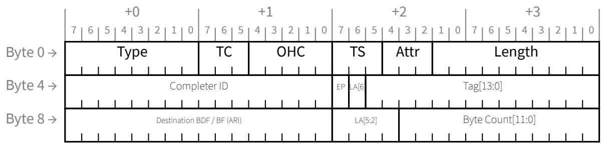

<details>
<summary>stacked bar chart</summary>

| Byte | Type | TC | OHC | TS | Attr | Length |
| --- | --- | --- | --- | --- | --- | --- |
| 0 | +0 |  |  |  |  |  |
| 0 | 7 |  |  |  |  |  |
| 0 | 6 |  |  |  |  |  |
| 0 | 5 |  |  |  |  |  |
| 0 | 4 |  |  |  |  |  |
| 0 | 3 |  |  |  |  |  |
| 0 | 2 |  |  |  |  |  |
| 0 | 1 |  |  |  |  |  |
| 0 | 0 |  |  |  |  |  |
| 1 | +1 |  |  |  |  |  |
| 1 | 7 |  |  |  |  |  |
| 1 | 6 |  |  |  |  |  |
| 1 | 5 |  |  |  |  |  |
| 1 | 4 |  |  |  |  |  |
| 1 | 3 |  |  |  |  |  |
| 1 | 2 |  |  |  |  |  |
| 1 | 1 |  |  |  |  |  |
| 1 | 0 |  |  |  |  |  |
| 2 | +2 |  |  |  |  |  |
| 2 | 7 |  |  |  |  |  |
| 2 | 6 |  |  |  |  |  |
| 2 | 5 |  |  |  |  |  |
| 2 | 4 |  |  |  |  |  |
| 2 | 3 |  |  |  |  |  |
| 2 | 2 |  |  |  |  |  |
| 2 | 1 |  |  |  |  |  |
| 2 | 0 |  |  |  |  |  |
| 3 | +3 |  |  |  |  |  |
| 3 | 7 |  |  |  |  |  |
| 3 | 6 |  |  |  |  |  |
| 3 | 5 |  |  |  |  |  |
| 3 | 4 |  |  |  |  |  |
| 3 | 3 |  |  |  |  |  |
| 3 | 2 |  |  |  |  |  |
| 3 | 1 |  |  |  |  |  |
| 3 | 0 |  |  |  |  |  |
</details>

Figure 2-76 Completion Header Base Format - Flit Mode§

OHC-A5 (see § Figure 2-11) is required for all:

• Unsuccessful Completions  
• Completions with Lower Address[1:0] not equal to 00b  
• Completions that require the Destination Segment due to the associated Non-Posted Request containing a Requester Segment that does not match the Completer's captured Segment.

When OHC-A5 is not present it is implied that the Completion Status is Successful, that Lower Address[1:0] = 00b, and that Completer Segment and Destination Segment need not be explicitly indicated (see Segment rules in § Section 2.2.1.2 ).

When OHC-A5 is present:

• the Completion Status and Lower Address[1:0] fields must contain valid values  
• the Completer Segment field must contain the Segment value captured by the Function as described in § Section 2.2.6.2 ; the Completer Segment field must be 00h if Segment Captured is Clear  
• if the associated Request did not include a Requester Segment, the Destination Segment field must be 00h and the DSV bit must be clear. If the associated Request included a Requester Segment, the Destination Segment field must reflect the value of the Requester Segment and the DSV bit must be Set.

The BCM field, present in Non-Flit Mode Completions, is not supported in Flit Mode.

## 2.2.10 TLP Prefix Rules §

## 2.2.10.1 TLP Prefix General Rules - Non-Flit Mode §

In NFM, the following rules apply to any TLP that contains a TLP Prefix:

• For any TLP, a value of 100b in the Fmt[2:0] field in byte 0 of the TLP indicates the presence of a TLP Prefix and the Type[4] bit indicates the type of TLP Prefix.  
◦ A value of 0b in the Type[4] bit indicates the presence of a Local TLP Prefix  
◦ A value of 1b in the Type[4] bit indicates the presence of an End-End TLP Prefix

• The format for bytes 1 through 3 of a TLP Prefix is defined by its TLP Prefix type.

• A TLP that contains a TLP Prefix must have an underlying TLP Header. A received TLP that violates this rule is handled as a Malformed TLP. This is a reported error associated with the Receiving Port (see § Section 6.2 ).

• It is permitted for a TLP to contain more than one TLP Prefix of any type

◦ When a combination of Local and End-End TLP Prefixes are present in TLP, it is required that all the Local TLP Prefixes precede any End-End TLP Prefixes. A received TLP that violates this rule is handled as a Malformed TLP. This is a reported error associated with the Receiving Port (see § Section 6.2 ).

• The size of each TLP Prefix is 1 DW. A TLP Prefix may be repeated to provide space for additional data.  
• If the value in the Fmt and Type field indicates the presence of a Local TLP Prefix, handle according to the Local TLP Prefix handling (see § Section 2.2.10.2 ).  
• If the value in the Fmt and Type field indicates the presence of an End-End TLP Prefix, handle according to the End-End TLP Prefix handling (see § Section 2.2.10.4 ).

## 2.2.10.2 Local TLP Prefix Processing §

The following rules apply to Local TLP Prefixes:

• In Flit Mode, TLP Prefix types are determined using the Type[7:0] field (see § Table 2-5)  
• In Non-Flit Mode, Local TLP Prefix types are determined using the L[3:0] sub-field of the Type field  
◦ Type[4] must be 0b  
◦ Local TLP Prefix L[3:0] values are defined in § Table 2-38

§ Table 2-38 Local TLP Prefix Types

<table><tr><td>Local TLP Prefix Type</td><td>L[3:0] (b)</td><td>Description</td></tr><tr><td>MR-IOV</td><td>0000</td><td>MR-IOV TLP Prefix - Refer to [MR-IOV] for details.</td></tr><tr><td>FlitModePrefix</td><td>1101</td><td>Flit Mode Local TLP Prefix - See § Section 2.2.10.3</td></tr><tr><td>VendPrefixL0</td><td>1110</td><td>Vendor Defined Local TLP Prefix - Refer to § Section 2.2.10.2.1 for further details.</td></tr><tr><td>VendPrefixL1</td><td>1111</td><td>Vendor Defined Local TLP Prefix - Refer to § Section 2.2.10.2.1 for further details.</td></tr><tr><td></td><td></td><td>All other encodings are Reserved.</td></tr></table>

• The size, routing, and flow control rules are specific to each Local TLP Prefix type.  
• It is an error to receive a TLP with a Local TLP Prefix type not supported by the Receiver. If the Extended Fmt Field Supported bit is Set, TLPs in violation of this rule are handled as a Malformed TLP unless explicitly stated differently in another specification. This is a reported error associated with the Receiving Port (see § Section 6.2 ). If the Extended Fmt Field Supported bit is Clear, behavior is device specific.  
• No Local TLP Prefixes are protected by ECRC even if the underlying TLP is protected by ECRC.

## 2.2.10.2.1 Vendor Defined Local TLP Prefix §

As described in § Table 2-38, Types VendPrefixL0 and VendPrefixL1 are defined for use as Vendor Defined Local TLP Prefixes. To maximize interoperability and flexibility the following rules are applied to such prefixes:

• Components must not send TLPs containing Vendor Defined Local TLP Prefixes unless this has been explicitly enabled (using vendor-specific mechanisms).  
• Components that support any usage of Vendor Defined Local TLP Prefixes must support the 3-bit definition of the Fmt field and have the Extended Fmt Field Supported bit Set (see § Section 7.5.3.15 ).  
• It is recommended that components be configurable (using vendor-specific mechanisms) so that all vendor defined prefixes can be sent using either of the two Vendor Defined Local TLP Prefix encodings. Such configuration need not be symmetric (for example each end of a Link could transmit the same Prefix using a different encoding).

## 2.2.10.3 Flit Mode Local TLP Prefix §

This prefix (see § Figure 2-77) is only permitted when operating in Flit Mode.

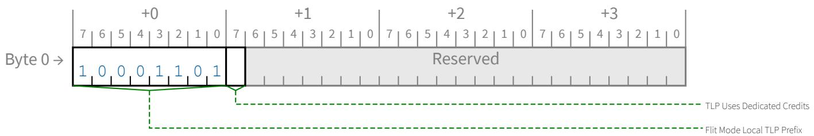

<details>
<summary>text_image</summary>

Byte 0 →
+0
7 6 5 4 3 2 1 0
Reserved
TLP Uses Dedicated Credits
Flit Mode Local TLP Prefix
</details>

Figure 2-77 Flit Mode Local TLP Prefix§

If the Flit Mode Local TLP Prefix is applied to a NFM TLP, this is an error that MUST@FLIT be handled as a Malformed TLP. It is permitted to apply the Flit Mode Local TLP Prefix to any FM TLP, but it is strongly recommended that the Flit Mode Local TLP Prefix is only applied to TLPs that specifically require the Prefix to be present.

The Flit Mode Local TLP Prefix includes:

• TLP Uses Dedicated Credits – This bit when Set indicates that the associated TLP must be handled using dedicated flow control credits. If this bit is Clear, or if the Flit Mode Local TLP Prefix is not present, the associated TLP must be handled using shared flow control credits.

## 2.2.10.4 End-End TLP Prefix Processing - Non-Flit Mode §

The following rules apply to End-End TLP Prefixes

• End-End TLP Prefix types are determined using the E[3:0] sub-field of the Type field

◦ Type[4] must be 1b  
◦ End-End TLP Prefix E[3:0] values are defined in § Table 2-39

Table 2-39 End-End TLP Prefix Types§

<table><tr><td>End-End TLP Prefix Type</td><td>E[3:0] (b)</td><td>Description</td></tr><tr><td>TPH</td><td>0000</td><td>TPH - Refer to § Section 2.2.7.1.1 and § Section 6.17 for further details.</td></tr><tr><td>PASID</td><td>0001</td><td>PASID - Refer to § Section 6.20 for further details.</td></tr><tr><td>IDE</td><td>0010</td><td>Identifies an IDE TLP - Refer to § Section 6.33 for further details.</td></tr><tr><td>VendPrefixE0</td><td>1110</td><td>Vendor Defined End-End TLP Prefix - Refer to § Section 2.2.10.4.1 for further details.</td></tr><tr><td>VendPrefixE1</td><td>1111</td><td>Vendor Defined End-End TLP Prefix - Refer to § Section 2.2.10.4.1 for further details.</td></tr><tr><td></td><td></td><td>All other encodings are Reserved.</td></tr></table>

• The maximum number of End-End TLP Prefixes permitted in a TLP is 4:

◦ A Receiver supporting TLP Prefixes must check this rule. If a Receiver determines that a TLP violates this rule, the TLP is a Malformed TLP. This is a reported error associated with the Receiving Port (see § Section 6.2 ).

• The presence of an End-End TLP Prefix does not alter the routing of a TLP. TLPs are routed based on the routing rules covered in § Section 2.2.4 .

• Functions indicate how many End-End TLP Prefixes they support by the Max End-End TLP Prefixes field in the Device Capabilities 2 register (see § Section 7.5.3.15 ).

◦ For Root Ports, the Max End-End TLP Prefixes field is permitted to return a value indicating support for fewer End-End TLP Prefixes than what the Root Port hardware actually implements; however, the error handling semantics must still be based on the value contained in the field. TLPs received that contain more End-End TLP Prefixes than are supported by the Root Port must be handled as follows. It is recommended that Requests be handled as Unsupported Requests, but otherwise they must be handled as Malformed TLPs. It is recommended that Completions be handled as Unexpected Completions, but otherwise they must be handled as Malformed TLPs. For TLPs received by the Ingress Port, this is a reported error associated with the Ingress Port. For TLPs received internally to be transmitted out the Egress Port, this is a reported error associated with the Egress Port. See § Section 6.2 .

◦ For all other Function types, TLPs received that contain more End-End TLP Prefixes than are supported by a Function must be handled as Malformed TLPs. This is a reported error associated with the Receiving Port (see § Section 6.2 ).

Advanced Error Reporting (AER) logging (if supported) occurs as specified in § Section 6.2.4.4 .

• Switches must support forwarding of TLPs with up to 4 End-End TLP Prefixes if the End-End TLP Prefix Supported bit is Set.  
• Different Root Ports with the End-End TLP Prefix Supported bit Set are permitted to report different values for Max End-End TLP Prefixes.  
• All End-End TLP Prefixes are protected by ECRC if the underlying TLP is protected by ECRC.  
• It is an error to receive a TLP with an End-End TLP Prefix by a Receiver that does not support End-End TLP Prefixes. A TLP in violation of this rule is handled as a Malformed TLP. This is a reported error associated with the Receiving Port (see § Section 6.2 ).  
• Software should ensure that TLPs containing End-End TLP Prefixes are not sent to components that do not support them. Components where the Extended Fmt Field Supported bit is Clear may misinterpret TLPs containing TLP Prefixes.  
• If one Function of an Upstream Port has the End-End TLP Prefix Supported bit Set, all Functions of that Upstream Port must handle the receipt of a Request addressed to them that contains an unsupported End-End TLP Prefix type as an Unsupported Request. This is a reported error associated with the Receiving Port (see § Section 6.2 ).  
• If one Function of an Upstream Port has the End-End TLP Prefix Supported bit Set, all Functions of that Upstream Port must handle the receipt of a Completion addressed to them that contains an unsupported End-End TLP Prefix type as an Unexpected Completion. This is a reported error associated with the Receiving Port (see § Section 6.2 ).  
• For Routing Elements, the End-End TLP Prefix Blocking bit in each Egress Port determines whether TLPs containing End-End TLP Prefixes can be transmitted via that Egress Port (see § Section 7.5.3.16 ). If forwarding is blocked the entire TLP is dropped and a TLP Prefix Blocked Error is reported. If the blocked TLP is a Non-Posted Request, the Egress Port returns a Completion with Unsupported Request Completion Status. The TLP Prefix Blocked Error is a reported error associated with the Egress Port (see § Section 6.2 ).  
• For routing elements where Multicast is enabled (see § Section 6.14 ). End-End TLP Prefixes are replicated in all Multicast copies of a TLP. TLP Prefix Egress Blocking of Multicast packets is performed independently at each Egress Port.

## 2.2.10.4.1 Vendor Defined End-End TLP Prefix §

As described in § Table 2-39, Types VendPrefixE0 and VendPrefixE1 are defined for use as Vendor Defined End-End TLP Prefixes. To maximize interoperability and flexibility the following rules are applied to such prefixes:

• Components must not send TLPs containing Vendor Defined End-End TLP Prefixes unless this has been explicitly enabled (using vendor-specific mechanisms).  
• It is recommended that components be configurable (using vendor-specific mechanisms) to use either of the two Vendor Defined End-End TLP Prefix encodings. Doing so allows two different Vendor Defined End-End TLP Prefixes to be in use simultaneously within a single PCI Express topology while not requiring that every source understand the ultimate destination of every TLP it sends.

## 2.2.10.4.2 Root Ports with End-End TLP Prefix Supported §

Support for peer-to-peer routing of TLPs containing End-End TLP Prefixes between Root Ports is optional and implementation dependent. If an RC supports End-End TLP Prefix routing capability between two or more Root Ports, it must indicate that capability in each associated Root Port via the End-End TLP Prefix Supported bit in the Device Capabilities 2 register.

An RC is not required to support End-End TLP Prefix routing between all pairs of Root Ports that have the End-End TLP Prefix Supported bit Set. A Request with End-End TLP Prefixes that would require routing between unsupported pairs of Root Ports must be handled as a UR. A Completion with End-End TLP Prefixes that would require routing between unsupported pairs of Root Ports must be handled as an Unexpected Completion (UC). In both cases, this error is reported by the “sending” Port.

The End-End TLP Prefix Supported bit must be Set for any Root Port that supports forwarding of TLPs with End-End TLP Prefixes initiated by host software or Root Complex Integrated Endpoints (RCiEPs). The End-End TLP Prefix Supported bit must be Set for any Root Ports that support forwarding of TLPs with End-End TLP Prefixes received on their Ingress Port to RCiEPs.

Different Root Ports with the End-End TLP Prefix Supported bit Set are permitted to report different values for Max End-End TLP Prefixes.

An RC that splits a TLP into smaller TLPs when performing peer-to-peer routing between Root Ports must replicate the original TLP's End-End TLP Prefixes in each of the smaller TLPs (see § Section 1.3.1 ).

## 2.2.11 OHC-E Rules - Flit Mode §

End-End TLP Prefixes in Non-Flit Mode are replaced by OHC-E in Flit Mode (see § Figure 2-78, § Figure 2-79, and § Figure 2-80).

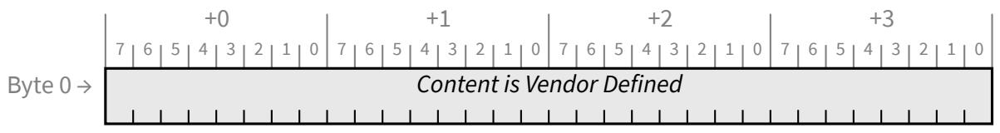

<details>
<summary>text_image</summary>

Byte 0 →
+0
7 | 6 | 5 | 4 | 3 | 2 | 1 | 0
+1
7 | 6 | 5 | 4 | 3 | 2 | 1 | 0
+2
7 | 6 | 5 | 4 | 3 | 2 | 1 | 0
+3
7 | 6 | 5 | 4 | 3 | 2 | 1 | 0
Content is Vendor Defined
</details>

Figure 2-78 OHC-E1

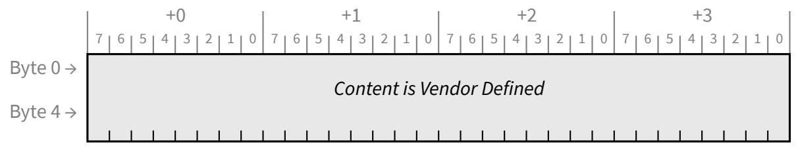

<details>
<summary>text_image</summary>

Byte 0 →
Byte 4 →
+0
+1
+2
+3
7 6 5 4 3 2 1 0 7 6 5 4 3 2 1 0 7 6 5 4 3 2 1 0
Content is Vendor Defined
</details>

Figure 2-79 OHC-E2

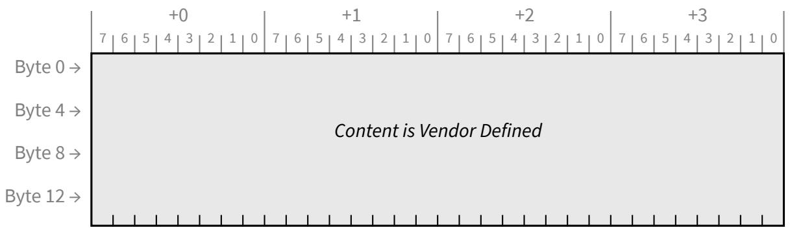

<details>
<summary>text_image</summary>

Byte 0 →
Byte 4 →
Byte 8 →
Byte 12 →
+0
7 | 6 | 5 | 4 | 3 | 2 | 1 | 0
+1
7 | 6 | 5 | 4 | 3 | 2 | 1 | 0
+2
7 | 6 | 5 | 4 | 3 | 2 | 1 | 0
+3
7 | 6 | 5 | 4 | 3 | 2 | 1 | 0
Content is Vendor Defined
</details>

Figure 2-80 OHC-E4

OHC-E is used to convey content that would otherwise use E-E Prefixes 0011 to 1111. Each DW corresponds to one E-E Prefix as follows:

• Byte 0, bits [7:4] are encoded:

◦ 0000b - No Entry - The reminder of the DW is Reserved  
◦ 0001b - E-E Prefix DW - The reminder of the DW is defined below  
◦ 0010b-1111b - Reserved - Receivers must handle as No Entry

• Byte 0, bits [3:0] take the value of E[3:0] in the corresponding E-E Prefix (see § Table 2-39).  
• Bytes 1, 2 and 3 take the value of bytes 1, 2 and 3 in the corresponding E-E Prefix.

OHC-E must be populated in order, starting with the first DW. Any unused DW in OHC-E must be populated indicating No Entry. Transmitters must use the smallest possible OHC-E and avoid unnecessary No Entry DWs.

RC support for peer-to-peer routing of TLPs containing OHC-E content between Root Ports is optional and implementation dependent. If an RC supports OHC-E routing capability between two or more Root Ports, it must indicate that capability in each associated Root Port via the End-End TLP Prefix Supported bit in the Device Capabilities 2 register.

## 2.3 Handling of Received TLPs §

This section describes how all Received TLPs are handled when they are delivered to the Receive Transaction Layer from the Receive Data Link Layer, after the Data Link Layer has validated the integrity of the received TLP. The rules are diagrammed in the flowchart shown in § Figure 2-81.

• Values in Reserved fields must be ignored by the Receiver.  
• If the value in the Fmt field indicates the presence of at least one TLP Prefix:

◦ Detect if additional TLP Prefixes are present in the header by checking the Fmt field in the first byte of subsequent DWs until the Fmt field does not match that of a TLP Prefix.  
◦ Handle all received TLP Prefixes according to TLP Prefix Handling Rules (see § Section 2.2.10 ).

• In Non-Flit Mode, if the Extended Fmt Field Supported bit is Set, Received TLPs that use encodings of Fmt and Type that are Reserved are Malformed TLPs (see § Table 2-1 and § Table 2-3).

◦ This is a reported error associated with the Receiving Port (see § Section 6.2 ).

• In Non-Flit Mode, if the Extended Fmt Field Supported bit is Clear, processing of Received TLPs that have Fmt[2] Set is undefined. 28  
• In Non-Flit Mode, all Received TLPs with Fmt[2] Clear and that use undefined Type field values are Malformed TLPs.

This is a reported error associated with the Receiving Port (see § Section 6.2 ).

• All Received Malformed TLPs must be discarded.

◦ Received Malformed TLPs that are ambiguous with respect to which buffer to release or are mapped to an uninitialized or disabled Virtual Channel must be discarded without updating Receiver Flow Control information.  
◦ All other Received Malformed TLPs must be discarded, optionally not updating Receiver Flow Control information.

• Otherwise, update Receiver Flow Control tracking information (see § Section 2.6 ).  
• If the value in the Type field indicates the TLP is a Request, handle according to Request Handling Rules, otherwise, the TLP is a Completion so handle according to Completion Handling Rules (see § Section 2.3.2 ).

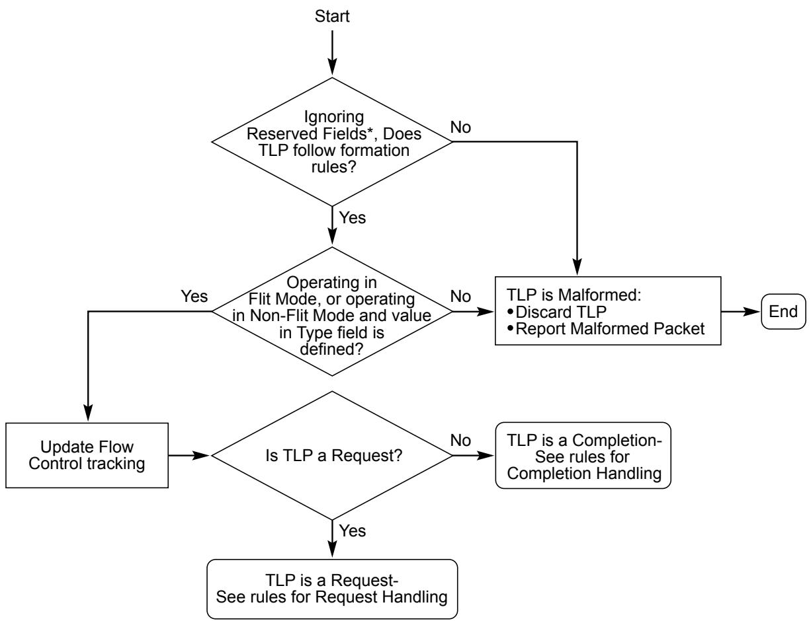

<details>
<summary>flowchart</summary>

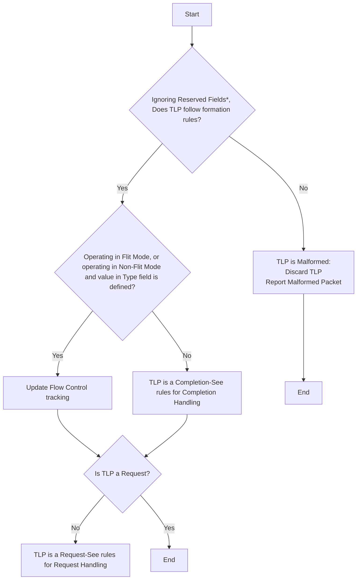
```mermaid
graph TD
  A["Start"] --> B{Ignoring Reserved Fields*, Does TLP follow formation rules?}
  B -->|No| C["TLP is Malformed:<br>Discard TLP<br>Report Malformed Packet"]
  B -->|Yes| D{Operating in Flit Mode, or operating in Non-Flit Mode and value in Type field is defined?}
  D -->|Yes| E["Update Flow Control tracking"]
  D -->|No| F["TLP is a Completion-See rules for Completion Handling"]
  C --> G["End"]
  E --> H{Is TLP a Request?}
  F --> H
  H -->|No| I["TLP is a Request-See rules for Request Handling"]
  H -->|Yes| J["End"]
```
</details>

\*TLP fields which are marked Reserved are not checked at the Receiver

OM13771B

Figure 2-81 Flowchart for Handling of Received TLPs§

Switches must process both TLPs that address resources within the Switch as well as TLPs that address resources residing outside the Switch. Switches handle all TLPs that address internal resources of the Switch according to the rules above. TLPs that pass through the Switch, or that address the Switch as well as passing through it, are handled according to the following rules (see § Figure 2-82):

• If the value in the Type field indicates the TLP is not a Msg or MsgD Request, the TLP must be routed according to the routing mechanism used (see § Section 2.2.4.1 and § Section 2.2.4.2 ).  
• Switches route Completions using the information in the Requester ID field of the Completion.  
• If the value in the Type field indicates the TLP is a Msg or MsgD Request, route the Request according to the routing mechanism indicated in the r[2:0] sub-field of the Type field.

◦ If the value in r[2:0] indicates the Msg/MsgD is routed to the Root Complex (000b), the Switch must route the Msg/MsgD to the Upstream Port of the Switch.

▪ It is an error to receive a Msg/MsgD Request specifying 000b routing at the Upstream Port of a Switch. Switches may check for violations of this rule - TLPs in violation are Malformed TLPs. If checked, this is a reported error associated with the Receiving Port (see § Section 6.2 ).

◦ If the value in r[2:0] indicates the Msg/MsgD is routed by address (001b), the Switch must route the Msg/MsgD in the same way it would route a Memory Request by address.

◦ If the value in r[2:0] indicates the Msg/MsgD is routed by ID (010b), the Switch must route the Msg/ MsgD in the same way it would route a Completion by ID.

◦ If the value in r[2:0] indicates the Msg/MsgD is a broadcast from the Root Complex (011b), the Switch must route the Msg/MsgD to all Downstream Ports of the Switch.

▪ It is an error to receive a Msg/MsgD Request specifying 011b routing at the Downstream Port of a Switch. Switches may check for violations of this rule - TLPs in violation are Malformed TLPs. If checked, this is a reported error associated with the Receiving Port (see § Section 6.2 ).

◦ If the value in r[2:0] indicates the Msg/MsgD terminates at the Receiver (100b or a Reserved value), or if the Message Code field value is defined and corresponds to a Message that must be comprehended by the Switch, the Switch must process the Message according to the Message processing rules.

◦ If the value in r[2:0] indicates Gathered and routed to Root Complex (101b), see § Section 5.3.3.2.1 for Message handling rules.

◦ It is an error to receive any Msg/MsgD Request other than a PME\_TO\_Ack that specifies 101b routing. It is an error to receive a PME\_TO\_Ack at the Upstream Port of a Switch. Switches may optionally check for violations of these rules. These checks are independently optional (see § Section 6.2.3.4 ). If checked, violations are Malformed TLPs, and are reported errors associated with the Receiving Port (see § Section 6.2 ).

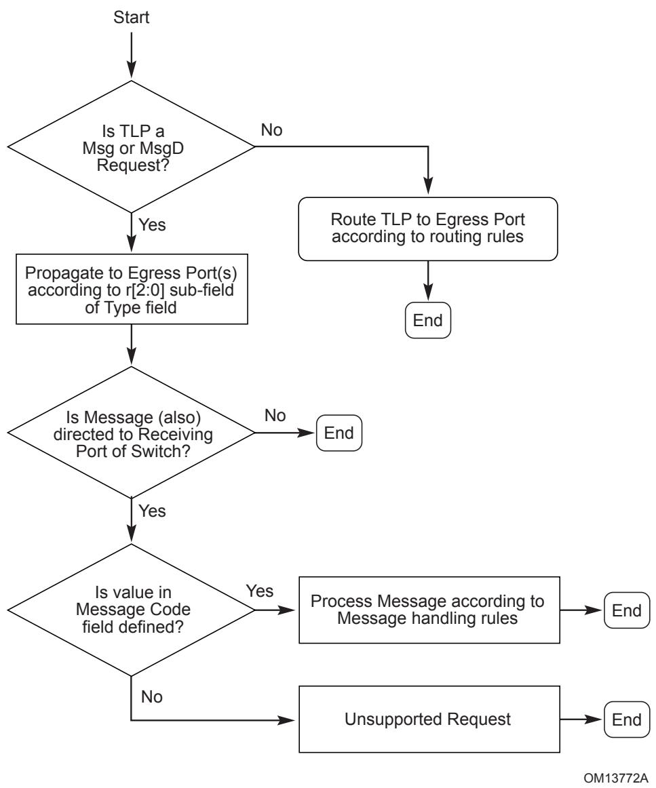

<details>
<summary>flowchart</summary>

```mermaid
graph TD
  A["Start"] --> B{Is TLP a Msg or MsgD Request?}
  B -->|Yes| C["Propagate to Egress Port(s) according to r[2:0"] sub-field of Type field]
  B -->|No| D["Route TLP to Egress Port according to routing rules"]
  C --> E{Is Message (also) directed to Receiving Port of Switch?}
  E -->|Yes| F{Is value in Message Code field defined?}
  E -->|No| G["End"]
  F -->|Yes| H["Process Message according to Message handling rules"]
  F -->|No| I["Unsupported Request"]
  H --> J["End"]
  I --> K["End"]
```
</details>

Figure 2-82 Flowchart for Switch Handling of TLPs§

## 2.3.1 Request Handling Rules §

This section describes how Received Requests are handled, following the initial processing done with all TLPs. The rules are diagrammed in the flowchart shown in § Figure 2-83.

• If the Request Type is recognized but is not supported (by design or because of configuration settings) by the device, the Request is an Unsupported Request (UR). This is an error associated with the Receiving Port (see § Section 6.2 )

◦ If the Request requires a Completion, a Completion Status of UR is returned (see § Section 2.2.9 ).

## IMPLEMENTATION NOTE:

## WHEN REQUESTS ARE TERMINATED USING UNSUPPORTED REQUEST

In Conventional PCI, a device “claims” a request on the bus by asserting DEVSEL#. If no device claims a request after a set number of clocks, the request is terminated as a Master Abort. Since PCI Express is a point to point interconnect, there is no equivalent mechanism for claiming a request on a Link, since all transmissions by one component are always sent to the other component on the Link. Therefore, it is necessary for the receiver of a request to determine if the request should be claimed. If the request is not claimed, then it is handled as an Unsupported Request, which is the PCI Express equivalent of Conventional PCI's Master Abort termination. In general, one can determine the correct behavior by asking the question: Would the device assert DEVSEL# for this request in conventional PCI?

For device Functions with Type 0 headers (all types of Endpoints), it is relatively simple to answer this question. For Memory and I/O Requests, this determination is based on the address ranges the Function has been programmed to respond to. For Configuration requests, the Type 0 request format indicates the device is by definition the “target”, although the device will still not claim the Configuration Request if it addresses an unimplemented Function.

For device Functions with Type 1 headers (Root Ports, Switches and Bridges), the same question can generally be applied, but since the behavior of a conventional PCI bridge is more complicated than that of a Type 0 Function, it is somewhat more difficult to determine the answers. One must consider Root Ports and Switch Ports as if they were actually composed of conventional PCI to PCI bridges, and then at each stage consider the configuration settings of the virtual bridge to determine the correct behavior.

PCI Express Messages do not exist in conventional PCI, so the above guideline cannot be applied. This specification describes specifically for each type of Message when a device must handle the request as an Unsupported Request. Messages pass through Root and Switch Ports unaffected by conventional PCI control mechanisms including Bus Master Enable and power state setting.

Note that CA, which is the PCI Express equivalent to Target Abort, is used only to indicate a serious error that makes the Completer permanently unable to respond to a request that it would otherwise have normally responded to. Since Target Abort is used in conventional PCI only when a target has asserted DEVSEL#, it is incorrect to use a CA for any case where a Conventional PCI target would have ignored a request by not asserting DEVSEL#.

If the Request is a Message, and the Message Code, routing field, or Msg / MsgD indication corresponds to a combination that is undefined, or that corresponds to a Message not supported by the device Function (other than Vendor\_Defined Type 1, which is not treated as an error - see § Table F-1), the Request is an Unsupported Request (UR). This is a reported error associated with the Receiving Port and is reported according to § Section 6.2

◦ If the Message Code is a supported value, process the Message according to the corresponding Message processing rules; if the Message Code is an Ignored Message and the Receiver is ignoring it, ignore the Message without reporting any error (see § Section 2.2.8.7 )

If the Request is a Message with a routing field that indicates Routed by ID, and if the Request is received by a device Function with Type 0 headers, the device MUST@FLIT be treated as the target of the Message regardless of the Bus Number and, for non-ART Devices, the Device Number specified in the Destination ID field of the Request

◦ If the Function specified in the Destination ID field is unimplemented, the Request MUST@FLIT be handled as an Unsupported Request (UR) and is a reported error associated with the Recieving Port (see § Section 6.2 ).  
◦ Earlier versions of this specification recommended ignoring the Bus Number and Device Number fields with the Destination ID comparison in certain cases. While this behavior is still permitted, it is no longer recommended.

If the Request is not a Message, and is a supported Type, specific implementations may be optimized based on a defined programming model that ensures that certain types of (otherwise legal) Requests will never occur. Such implementations may take advantage of the following rule:

• If the Request violates the programming model of the device Function, the Function may optionally treat the Request as a Completer Abort, instead of handling the Request normally  
◦ If the Request is treated as a Completer Abort, this is a reported error associated with the Function (see § Section 6.2 )  
◦ If the Request requires Completion, a Completion Status of CA is returned (see § Section 2.2.9 )

## IMPLEMENTATION NOTE:

## OPTIMIZATIONS BASED ON RESTRICTED PROGRAMMING MODEL

When a device's programming model restricts (versus what is otherwise permitted in PCI Express) the characteristics of a Request, that device is permitted to return a CA Completion Status for any Request that violates the programming model. Examples include unaligned or wrong-size access to a register block and unsupported size of request to a Memory Space.

Generally, devices are able to assume a restricted programming model when all communication will be between the device's driver software and the device itself. Devices that may be accessed directly by operating system software or by applications that may not comprehend the restricted programming model of the device (typically devices that implement legacy capabilities) should be designed to support all types of Requests that are possible in the existing usage model for the device. If this is not done, the device may fail to operate with existing software.

If the Request arrives between the time an FLR has been initiated and the completion of the FLR by the targeted Function, the Request is permitted to be silently discarded (following update of flow control credits) without logging or signaling it as an error. It is recommended that the Request be handled as an Unsupported Request (UR).

• For DMWr Requests, refer to the rules in § Section 6.32 .  
• Otherwise (supported Request Type, not a DMWr, not a Message), process the Request

◦ If the Completer is permanently unable to process the Request due to a device-specific error condition the Completer must, if possible, handle the Request as a Completer Abort

▪ This is a reported error associated with the Receiving Function, if the error can be isolated to a specific Function in the component, or to the Receiving Port if the error cannot be isolated (see § Section 6.2 )

◦ For Configuration Requests, if Device Readiness Status (DRS) is supported 29 , then:

▪ Following any DRS Event (see § Section 6.22 ), once the Link is in L0, a Function associated with an Upstream Port MUST@FLIT return a Completion Status of RRS until the Upstream Port has transmitted a Device Readiness Status Message.  
▪ Once the Upstream Port has transmitted a Device Readiness Status Message, all non-VF Functions of the Upstream Port must respond to all properly formed Configuration Requests with a Completion Status of Successful Completion.

◦ For Configuration Requests only, if Device Readiness Status is not supported, following reset it is permitted for a Function to terminate the request and indicate that it is temporarily unable to process the Request, but will be able to process the Request in the future - in this case, the Request Retry Status (RRS) Completion Status must be used (see § Section 6.6 ). Valid reset conditions after which a device/Function is permitted to return RRS in response to a Configuration Request are:

▪ Cold, Warm, and Hot Resets  
▪ FLRs

▪ A reset initiated in response to a D3Hot to D0uninitialized device state transition

◦ A device Function is explicitly not permitted to return RRS in response to a Configuration Request following a software-initiated reset (other than an FLR) of the device, e.g., by the device's software driver writing to a device-specific reset bit. A device Function is not permitted to return RRS in response to a Configuration Request after it has indicated that it is Configuration-Ready (see § Section 6.22 .) without an intervening valid reset (i.e., FLR or Conventional Reset) condition, or if the Immediate Readiness bit in the Function's Status register is Set. Additionally, a device Function is not permitted to return RRS in response to a Configuration Request after having previously returned a Successful Completion without an intervening valid reset (i.e., FLR or Conventional Reset) condition.  
◦ A Function that implements the Readiness Time Reporting Extended Capability must not return RRS in response to Configuration Requests that are received after the relevant times reported in that Extended Capability.  
◦ In the process of servicing the Request, the Completer may determine that the (otherwise acceptable) Request must be handled as an error, in which case the Request is handled according to the type of the error

Example: A PCI Express/PCI Bridge may initially accept a Request because it specifies a Memory Space range mapped to the secondary side of the Bridge, but the Request may Master Abort or Target Abort on the PCI side of the Bridge. From the PCI Express perspective, the status of the Request in this case is UR (for Master Abort) or CA (for Target Abort). If the Request requires Completion on PCI Express, the corresponding Completion Status is returned.

• If the Request is a type that requires a Completion to be returned, generate a Completion according to the rules for Completion formation (see § Section 2.2.9 )

◦ The Completion Status is determined by the result of handling the Request  
◦ If the Request has an ECRC Check Failed error, then it is implementation specific whether to return a Completion or not. If a Completion is returned, the Completion MUST@FLIT have a UR Completion Status.

• Under normal operating conditions, PCI Express Endpoints and Legacy Endpoints must never delay the acceptance of a Posted Request for more than 10 μs, which is called the Posted Request Acceptance Limit. The device must either (a) be designed to process received Posted Requests and return associated Flow Control credits within the necessary time limit, or (b) rely on a restricted programming model to ensure that a Posted Request is never initiated to the Endpoint either by software or by other devices while the Endpoint is unable to accept a new Posted Request within the necessary time limit.

◦ The following are not considered normal operating conditions under which the Posted Request Acceptance Limit applies:

▪ The period immediately following a Fundamental Reset (see § Section 6.6 )  
▪ TLP retransmissions or Link retraining  
▪ One or more dropped Flow Control Packets (FCPs)  
▪ The device being in a diagnostic mode  
▪ The device being in a device-specific mode that is not intended for normal use

◦ The following are considered normal operating conditions, but any delays they cause do not count against the Posted Request Acceptance Limit:

▪ Upstream TLP traffic delaying Upstream FCPs  
▪ The Link coming out of a low-power state  
▪ Arbitration with traffic on other VCs

◦ Though not a requirement, it is strongly recommended that RCiEPs also honor the Posted Request Acceptance Limit.

• If the device/Function supports being a target for I/O Write Requests, which are Non-Posted Requests, it is strongly recommended that each associated Completion be returned within the same time limit as for Posted Request acceptance, although this is not a requirement.  
• If the device/Function supports being a target for DMWr Requests, each associated Completion must be returned within the Posted Request Acceptance Limit 30

## IMPLEMENTATION NOTE:

## RESTRICTED PROGRAMMING MODEL FOR MEETING THE POSTED REQUEST ACCEPTANCE LIMIT §

Some hardware designs may not be able to process every DMWr or Posted Request within the required Posted Request Acceptance Limit>. An example is writing to a command queue where commands can take longer than the acceptance time limit to complete. Subsequent writes to such a device when it is currently processing a previous write could experience acceptance delays that exceed the limit. Such devices may rely on a restricted programming model, where the device driver limits the rate of DMWr/memory writes issued to the device, the driver polls the device to determine buffer availability before issuing the transaction, or the driver implements some other software-based flow control mechanism.

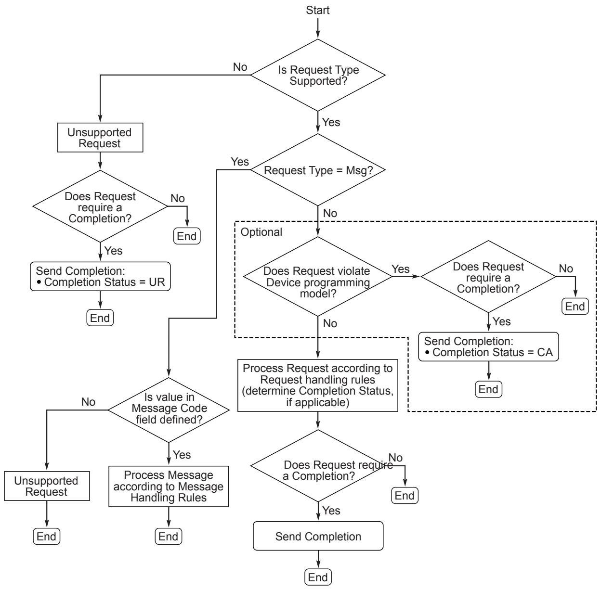

<details>
<summary>flowchart</summary>

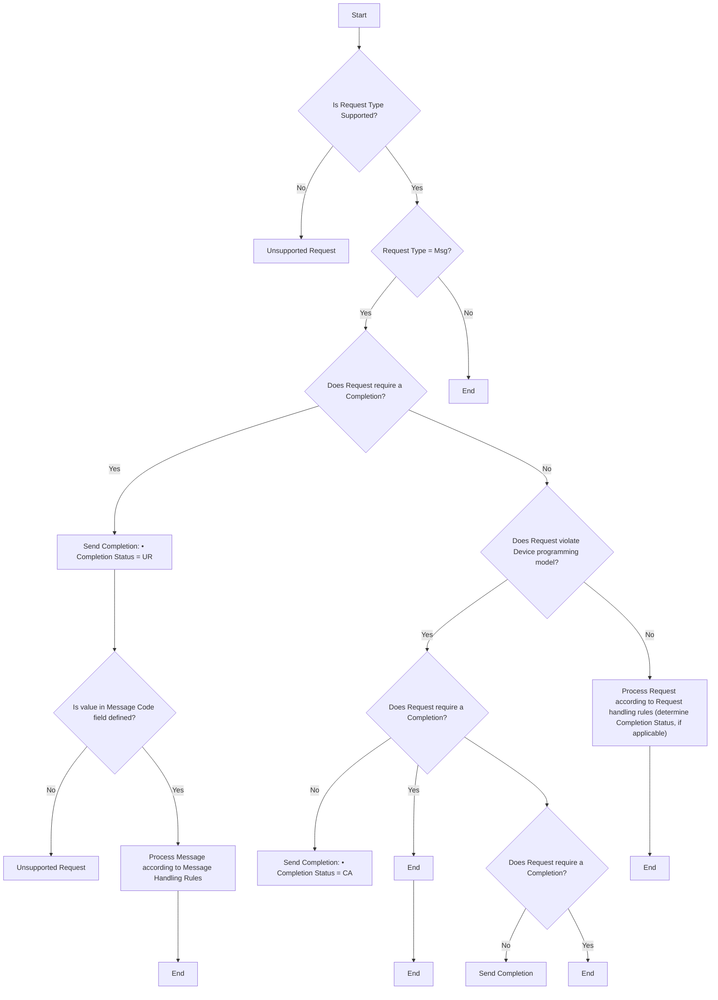
```mermaid
graph TD
  A["Start"] --> B{Is Request Type Supported?}
  B -->|No| C["Unsupported Request"]
  B -->|Yes| D{Request Type = Msg?}
  D -->|Yes| E{Does Request require a Completion?}
  D -->|No| F["End"]
  E -->|Yes| G["Send Completion: • Completion Status = UR"]
  E -->|No| H{Does Request violate Device programming model?}
  H -->|Yes| I{Does Request require a Completion?}
  H -->|No| J["Process Request according to Request handling rules (determine Completion Status, if applicable)"]
  I -->|No| K["Send Completion: • Completion Status = CA"]
  I -->|Yes| L["End"]
  J --> M["End"]
  G --> N{Is value in Message Code field defined?}
  N -->|No| O["Unsupported Request"]
  N -->|Yes| P["Process Message according to Message Handling Rules"]
  P --> Q["End"]
  L --> R["End"]
  I --> S{Does Request require a Completion?}
  S -->|No| T["Send Completion"]
  S -->|Yes| U["End"]
```
</details>

OM13773

Figure 2-83 Flowchart f§or Handling of Received Request

## IMPLEMENTATION NOTE:

## REQUEST RETRY STATUS FOR CONFIGURATION REQUESTS §

Some devices require a lengthy self-initialization sequence to complete before they are able to service Configuration Requests. In specified circumstances it is permitted for a device/Function to “hold off” initial configuration via the Request Retry Status (RRS) Completion Status mechanism. A device in receipt of a Configuration Request following a valid reset condition may respond with an RRS Completion Status to terminate the Request, and thus effectively stall the Configuration Request until such time that the subsystem has completed local initialization and is ready to communicate with the host. Note that it is only legal in specified circumstances to respond with an RRS Completion Status in response to a Configuration Request. Readiness Notifications (see § Section 6.22 ) and Immediate Readiness (see § Section 7.5.1.1.4 and § Section 7.5.2.1 ) also forbid the use of RRS Completion Status in response to a Configuration Request in certain situations.

Receipt by the Requester of a Completion with RRS Completion Status terminates the Configuration Request. Further action by the Root Complex regarding the original Configuration Request is specified in § Section 2.3.2 .

Root Complexes that implement Configuration RRS Software Visibility have the ability to report the receipt of RRS Completion Status for a Configuration Request to software, enabling software to attend to other tasks rather than being stalled while the device completes its self-initialization. Software that intends to take advantage of this mechanism must ensure that the first access made to a device following a valid reset condition is a Configuration Read Request accessing both bytes of the Vendor ID field in the device's Configuration Space header. For this case only, the Root Complex, if enabled, will synthesize a special read-data value for the Vendor ID field to indicate to software that RRS Completion Status has been returned by the device in response to a Configuration Request. For Configuration Requests to other addresses, or when Configuration RRS Software Visibility is not enabled, the Root Complex will generally re-issue the Configuration Request until it completes with a status other than RRS as described in § Section 2.3.2 .

Systems that contain PCIe components whose self-initialization time may require them to return a RRS Completion Status in response to a Configuration Request (by the rules in § Section 6.6 ) should provide some mechanism for re-issuing Configuration Requests terminated with RRS status. In systems running legacy PCI/ PCI-X based software, the Root Complex must re-issue the Configuration Request using a hardware mechanism to ensure proper enumeration of the system.

Refer to § Section 6.6 for more information on reset.

## 2.3.1.1 Data Return for Read Requests §

• Individual Completions for Memory Read Requests may provide less than the full amount of data Requested so long as all Completions for a given Request when combined return exactly the amount of data Requested in the Read Request.

◦ Completions for different Requests cannot be combined.  
◦ I/O and Configuration Reads must be completed with exactly one Completion.  
◦ A Completion with Completion Status other than Successful Completion must:  
▪ be of type Cpl or CplLk,  
▪ for a Read Request, including an ATS Translation Request, be the final Completion returned.

• Completions must not include more data than permitted by the Transmitting Function's Tx\_MPS\_Limit.

◦ A Receiving Function must check for violations of its Rx\_MPS\_Limit.

◦ See § Section 2.2.2 for important details with both Transmitters and Receivers.

Note: This is simply a specific case of the rules that apply to all TLPs with data payloads

• Memory Read Requests may be completed with one, or in some cases, multiple Completions  
• Read Completion Boundary (RCB) determines the naturally aligned address boundaries on which a Completer is permitted to break up the response for a single Read Request into multiple Completions.

◦ For a Root Complex, RCB is 64 bytes or 128 bytes.

▪ This value is reported Read Completoin Boundary field in the Link Control Register (see § Section 7.5.3.7 ).

Note: Bridges and Endpoints may implement a corresponding command bit that may be set by system software to indicate the RCB value for the Root Complex, allowing the Bridge or Endpoint to optimize its behavior when the Root Complex's RCB is 128 bytes.

• For all other System Elements, RCB is 128 bytes.  
• Completions for Requests that do not cross the naturally aligned address boundaries at integer multiples of RCB bytes must include all data specified in the Request.  
• Requests that do cross the address boundaries at integer multiples of RCB bytes are permitted to be completed using more than one Completion subject to the following rules:

◦ The first Completion must start with the address specified in the Request, and if successful must end at one of the following:

▪ The address that satisfies the entire Request  
▪ An address boundary between the start and end of the Request at an integer multiple of RCB bytes

◦ If the final Completion is successful, it must end at the address that satisfies the entire Request

◦ All Completions between, but not including, the first and final Completions must be an integer multiple of RCB bytes in length

• Receivers may optionally check for violations of RCB. If a Receiver implementing this check determines that a Completion violates this rule, it must handle the Completion as a Malformed TLP.

◦ This is a reported error associated with the Receiving Port (see § Section 6.2 ).

• Multiple Memory Read Completions for a single Read Request must return data in increasing address order.  
• If all the Memory Read Completions for a single Read Request have a Successful Completion Status, the sum of their payloads must equal the size requested. See § Section 10.2.4 for an exception for Memory Reads that are ATS Translation Requests.  
• For each Memory Read Completion, the Byte Count field must indicate the remaining number of bytes required to complete the Request including the number of bytes returned with the Completion, except when the BCM bit is Set. 31

◦ The total number of bytes required to complete a Memory Read Request is calculated as shown in § Table 2-40.

◦ If a Memory Read Request is completed using multiple Completions, the Byte Count value for each successive Completion is the value indicated by the preceding Completion minus the number of bytes returned with the preceding Completion.

• The Completion Data area begins at the DW address specified by the Request. In the first or only Data DW of the first or only Completion, only the bytes configured as active in the First DW BE field in the Request contain valid data. Bytes configured as inactive in the First DW BE field in the Request will return undefined content.  
• In the last Data DW of the last successful Completion, only the bytes configured as active in the Last DW BE field in the Request contain valid data. Bytes configured as inactive in the Last DW BE field in the Request will return undefined content.  
• All the Completion Data bytes, including those with undefined content, are included in all CRC calculations.  
• § Figure 2-84 presents an example of the above. The example assumes a single Completion TLP is returned.

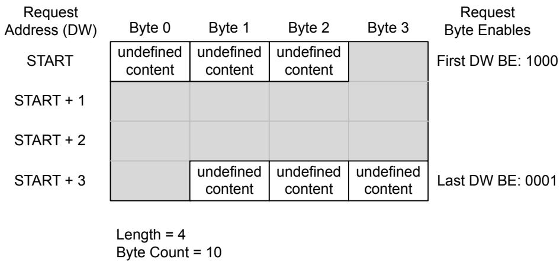

<details>
<summary>table</summary>

| Request Address (DW) | Byte 0 | Byte 1 | Byte 2 | Byte 3 | Request Byte Enables |
|---|---|---|---|---|---|
| START | undefined content | undefined content | undefined content | | First DW BE: 1000 |
| START + 1 | | | | | |
| START + 2 | | | | | |
| START + 3 | | undefined content | undefined content | undefined content | Last DW BE: 0001 |
| Length = 4
Byte Count = 10
</details>

Figure 2-84 Example Completion Data when some Byte Enables are 0b§

## IMPLEMENTATION NOTE:

## BCM BIT USAGE §

To satisfy certain PCI-X protocol constraints, a PCI-X Bridge or PCI-X Completer for a PCI-X burst read in some cases will set the Byte Count field in the first PCI-X transaction of the Split Completion sequence to indicate the size of just that first transaction instead of the entire burst read. When this occurs, the PCI-X Bridge/PCI-X Completer will also Set the BCM bit in that first PCI-X transaction, to indicate that the Byte Count field has been modified from its normal usage. Refer to the [PCI-X] for further details.

A PCI Express Memory Read Requester needs to correctly handle the case when a PCI-X Bridge/PCI-X Completer sets the BCM bit. When this occurs, the first Read Completion packet returned to the Requester will have the BCM bit Set, indicating that the Byte Count field reports the size of just that first packet instead of the entire remaining Byte Count. The Requester should not conclude at this point that other packets of the Read Completion are missing.

The BCM bit will never be Set in subsequent packets of the Read Completion, so the Byte Count field in those subsequent packets will always indicate the remaining Byte Count in each instance. Thus, the Requester can use the Byte Count field in these packets to determine if other packets of the Read Completion are missing.

PCI Express Completers will never Set the BCM bit.

The BCM bit is not present in Flit Mode.

Table 2-40 Calculating Byte Count from Length and Byte Enables

<table><tr><td>First DW BE[3:0] (b)</td><td>Last DW BE[3:0] (b)</td><td>Total Byte Count</td></tr><tr><td>1xx1</td><td> $0000^{32}$ </td><td>4</td></tr><tr><td>01x1</td><td>0000</td><td>3</td></tr><tr><td>1x10</td><td>0000</td><td>3</td></tr><tr><td>0011</td><td>0000</td><td>2</td></tr><tr><td>0110</td><td>0000</td><td>2</td></tr><tr><td>1100</td><td>0000</td><td>2</td></tr><tr><td>0001</td><td>0000</td><td>1</td></tr><tr><td>0010</td><td>0000</td><td>1</td></tr><tr><td>0100</td><td>0000</td><td>1</td></tr><tr><td>1000</td><td>0000</td><td>1</td></tr><tr><td>0000</td><td>0000</td><td>1</td></tr><tr><td>xxx1</td><td>1xxx</td><td>Length  $^{33}$ * 4</td></tr><tr><td>xxx1</td><td>01xx</td><td>(Length * 4) - 1</td></tr><tr><td>xxx1</td><td>001x</td><td>(Length * 4) - 2</td></tr><tr><td>xxx1</td><td>0001</td><td>(Length * 4) - 3</td></tr><tr><td>xx10</td><td>1xxx</td><td>(Length * 4) - 1</td></tr><tr><td>xx10</td><td>01xx</td><td>(Length * 4) - 2</td></tr><tr><td>xx10</td><td>001x</td><td>(Length * 4) - 3</td></tr><tr><td>xx10</td><td>0001</td><td>(Length * 4) - 4</td></tr><tr><td>x100</td><td>1xxx</td><td>(Length * 4) - 2</td></tr><tr><td>x100</td><td>01xx</td><td>(Length * 4) - 3</td></tr><tr><td>x100</td><td>001x</td><td>(Length * 4) - 4</td></tr><tr><td>x100</td><td>0001</td><td>(Length * 4) - 5</td></tr><tr><td>1000</td><td>1xxx</td><td>(Length * 4) - 3</td></tr><tr><td>1000</td><td>01xx</td><td>(Length * 4) - 4</td></tr><tr><td>1000</td><td>001x</td><td>(Length * 4) - 5</td></tr><tr><td>1000</td><td>0001</td><td>(Length * 4) - 6</td></tr></table>

• For all Memory Read Completions, the Lower Address field must indicate the lower bits of the byte address for the first enabled byte of data returned with the Completion.

◦ For the first (or only) Completion, the Completer can generate this field from the least significant 5 bits of the address of the Request concatenated with 2 bits of byte-level address formed as shown in § Table 2-41.  
◦ For any subsequent Completions, the Lower Address field will always be zero except for Completions generated by a Root Complex with an RCB value of 64 bytes. In this case the least significant 6 bits of the Lower Address field will always be zero and the most significant bit of the Lower Address field will toggle according to the alignment of the 64-byte data payload.

Table 2-41 Calculating Lower Address from First DW BE§

<table><tr><td>First DW BE[3:0] (b)</td><td>Lower Address[1:0] (b)</td></tr><tr><td>0000</td><td>00</td></tr><tr><td>xxx1</td><td>00</td></tr><tr><td>xx10</td><td>01</td></tr><tr><td>x100</td><td>10</td></tr><tr><td>1000</td><td>11</td></tr></table>

• When a Read Completion is generated with a Completion Status other than Successful Completion:

◦ No data is included with the Completion

▪ The Cpl (or CplLk) encoding is used instead of CplD (or CplDLk)

◦ This Completion is the final Completion for the Request  
▪ The Completer must not transmit additional Completions for this Request

Example: Completer split the Request into four parts for servicing; the second Completion had a Completer Abort Completion Status; the Completer terminated servicing for the Request, and did not Transmit the remaining two Completions.

◦ The Byte Count field must indicate the remaining number of bytes that would be required to complete the Request (as if the Completion Status were Successful Completion)  
◦ The Lower Address field must indicate the lower bits of the byte address for the first enabled byte of data that would have been returned with the Completion if the Completion Status were Successful Completion

## IMPLEMENTATION NOTE:

## RESTRICTED PROGRAMMING MODEL §

When a device's programming model restricts (vs. what is otherwise permitted in PCI Express) the size and/or alignment of Read Requests directed to the device, that device is permitted to use a Completer Abort Completion Status for Read Requests that violate the programming model. An implication of this is that such devices, generally devices where all communication will be between the device's driver software and the device itself, need not necessarily implement the buffering required to generate Completions of length RCB. However, in all cases, the boundaries specified by RCB must be respected for all reads that the device will complete with Successful Completion status.

## Examples:

1. Memory Read Request with Address of 1 0000h and Length of C0h bytes (192 decimal) could be completed by a Root Complex with an RCB value of 64 bytes with one of the following combinations of Completions (bytes):

192 -or- 128, 64 -or- 64, 128 -or- 64, 64, 64

2. Memory Read Request with Address of 1 0000h and Length of C0h bytes (192 decimal) could be completed by a Root Complex with an RCB value of 128 bytes in one of the following combinations of Completions (bytes):

192 -or- 128, 64

3. Memory Read Request with Address of 1 0020h and Length of 100h bytes (256 decimal) could be completed by a Root Complex with an RCB value of 64 bytes in one of the following combinations of Completions (bytes):

256 -or-

32, 224 -or- 32, 64, 160 -or- 32, 64, 64, 96 -or- 32, 64, 64, 64, 32 -or-

32, 64, 128, 32 -or- 32, 128, 96 -or- 32, 128, 64, 32 -or-

96, 160 -or- 96, 128, 32 -or- 96, 64, 96 -or- 96, 64, 64, 32 -or-

160, 96 -or- 160, 64, 32 -or- 224, 32

4. Memory Read Request with Address of 1 0020h and Length of 100h bytes (256 decimal) could be completed by an Endpoint in one of the following combinations of Completions (bytes):

256 -or- 96, 160 -or- 96, 128, 32 -or- 224, 32

## 2.3.2 Completion Handling Rules §

• When a device receives a Completion that does not match the Transaction ID for any of the outstanding Requests issued by that device, the Completion is called an “Unexpected Completion”.  
• If a received Completion matches the Transaction ID of an outstanding Request, but in other TLP fields does not match the corresponding Request, the Receiver MUST@FLIT handle the Completion as an Unexpected Completion.

◦ The Requester must not check the IDO Attribute (Attribute Bit 2) in the Completion, since the Completer is not required to copy the value of IDO from the Request into the Completion for that request as stated in § Section 2.2.6.4 and § Section 2.2.9 .  
◦ However, if the Completion is otherwise properly formed, it is permitted for the Receiver to handle the Completion as an Malformed TLP.

• When an Ingress Port of a Switch receives a Completion that cannot be forwarded, that Ingress Port must handle the Completion as an Unexpected Completion. This includes Completions that target:

◦ a non-existent Function in the Device associated with the Upstream Port,  
◦ a non-existent Device on the Bus associated with the Upstream Port,  
◦ a non-existent Device or Function on the internal switching fabric, or  
◦ a Bus Number within the Upstream Port's Bus Number aperture but not claimed by any Downstream Port.

• Receipt of an Unexpected Completion is an error and must be handled according to the following rules:

◦ The agent receiving an Unexpected Completion must discard the Completion.  
◦ An Unexpected Completion is a reported error associated with the Receiving Port (see § Section 6.2 ).

Note: Unexpected Completions are assumed to occur mainly due to Switch misrouting of the Completion. The Requester of the Request may not receive a Completion for its Request in this case, and the Requester's Completion Timeout mechanism (see § Section 2.8 ) will terminate the Request.

• Completions with a Completion Status other than Successful Completion or Request Retry Status (in response to Configuration Request) must cause the Requester to:

◦ Free Completion buffer space and other resources associated with the Request.  
◦ Handle the error via a Requester-specific mechanism (see § Section 6.2.3.2.5 ).

If the Completion arrives between the time an FLR has been initiated and the completion of the FLR by the targeted Function, the Completion is permitted to be handled as an Unexpected Completion or to be silently discarded (following update of flow control credits) without logging or signaling it as an error. Once the FLR has completed, received Completions corresponding to Requests issued prior to the FLR must be handled as Unexpected Completions, unless the Function has been re-enabled to issue Requests.

Root Complex handling of a Completion with Request Retry Status for a Configuration Request is implementation specific, except for the period following system reset (see § Section 6.6 ). For Root Complexes that support Configuration RRS Software Visibility, the following rules apply:

◦ If Configuration RRS Software Visibility is not enabled, the Root Complex must re-issue the Configuration Request as a new Request.  
◦ If Configuration RRS Software Visibility is enabled (see below):

For a Configuration Read Request that includes both bytes of the Vendor ID field of a device Function's Configuration Space Header, the Root Complex must complete the Request to the host by returning a read-data value of 0001h for the Vendor ID field and all ‘1’s for any additional bytes included in the request. This read-data value has been reserved specifically for this use by the PCI-SIG and does not correspond to any assigned Vendor ID.

▪ For a Configuration Write Request or for any other Configuration Read Request, the Root Complex must re-issue the Configuration Request as a new Request.

A Root Complex implementation may choose to limit the number of Configuration Request/RRS Completion Status loops before determining that something is wrong with the target of the Request and taking appropriate action (e.g., complete the Request to system software as a failed transaction).

Configuration RRS Software Visibility may be enabled through the Configuration RRS Software Visibility Enable bit in the Root Control Register (see § Section 7.5.3.12 ) to control Root Complex behavior on an individual Root Port basis. Alternatively, Root Complex behavior may be managed through the Configuration RRS Software Visibility Enable bit in the Root Complex Register Block (RCRB) Control register as described in § Section 7.9.7.4 , permitting the behavior of one or more Root Ports or RCiEPs to be controlled by a single Enable bit. For this alternate case, each Root Port or RCiEP declares its association with a particular Enable bit via an RCRB header association in a Root Complex Link Declaration Capability (see § Section 7.9.8 ). Each Root Port or RCiEP is permitted to be controlled by at most one Enable bit. Thus, for example, it is prohibited for a Root Port whose Root Control register contains an Enable bit to declare an RCRB header association to an RCRB that also includes an Enable bit in its RCRB Header Capability. The presence of an Enable bit in a Root Port or RCRB Header Capability is indicated by the corresponding Configuration RRS Software Visibility bit (see § Section 7.5.3.13 and § Section 7.9.7.3 , respectively).

• Completions with a Reserved Completion Status value are treated as if the Completion Status was Unsupported Request (UR).  
• Completions with a Completion Status of Unsupported Request or Completer Abort are reported using the conventional PCI reporting mechanisms (see § Section 7.5.1.1.4 ).

◦ Note that the error condition that triggered the generation of such a Completion is reported by the Completer as described in § Section 6.2 .

• When a Completion for a Read, AtomicOp, of DMWr Request is received with a Completion Status other than Successful Completion:

◦ No data is included with the Completion

▪ The Cpl (or CplLk) encoding is used instead of CplD (CplDLk)

◦ This Completion is the final Completion for the Request

▪ The Requester must consider the Request terminated, and not expect additional Completions

▪ Handling of partial Completions Received earlier is implementation specific

Example: The Requester received 32 bytes of Read data for a 128-byte Read Request it had issued, then it receives a Completion with the Completer Abort Completion Status. The Requester then must free the internal resources that had been allocated for that particular Read Request.

## IMPLEMENTATION NOTE:

## READ DATA VALUES WITH UR COMPLETION STATUS §

Some system configuration software depends on reading a data value of all 1's when a Configuration Read Request is terminated as an Unsupported Request, particularly when probing to determine the existence of a device in the system. A Root Complex intended for use with software that depends on a read-data value of all 1's must synthesize this value when UR Completion Status is returned for a Configuration Read Request.

## 2.4 Transaction Ordering §

## 2.4.1 Transaction Ordering Rules §

§ Table 2-42 defines the ordering requirements for PCI Express Transactions. The rules defined in this section apply uniformly to all types of Transactions on PCI Express including Memory, I/O, Configuration, and Messages, except for Flow-Through IDE Streams which have modified ordering requirements (see § Section 6.33.4 ). The ordering rules defined in this table apply within a single Traffic Class (TC). There is no ordering requirement among transactions with different TC labels. Note that this also implies that there is no ordering required between traffic that flows through different Virtual Channels since transactions with the same TC label are not allowed to be mapped to multiple VCs on any PCI Express Link.

For § Table 2-42, the columns represent a first issued transaction and the rows represent a subsequently issued transaction. The table entry indicates the ordering relationship between the two transactions. The table entries are defined as follows:

##

The second transaction (row) must be allowed to pass the first (column) to avoid deadlock. (When blocking occurs, the second transaction is required to pass the first transaction. Fairness must be comprehended to prevent starvation.)

## Y/N

There are no requirements. The second transaction may optionally pass the first transaction or be blocked by it.

##

The second transaction must not be allowed to pass the first transaction. This is required to support the producer/ consumer strong ordering model.

Table 2-42 Ordering Rules Summary§

<table><tr><td rowspan="2" colspan="2">Row Pass Column?</td><td rowspan="2">Posted Request (Col 2)</td><td colspan="2">Non-Posted Request</td><td rowspan="2">Completion (Col 5)</td></tr><tr><td>Read Request (Col 3)</td><td>NPR with Data (Col 4)</td></tr><tr><td colspan="2">Posted Request (Row A)</td><td>a) Nob) Y/N</td><td>Yes</td><td>Yes</td><td>a) Y/Nb) Yes</td></tr><tr><td rowspan="2">Non-Posted Request</td><td>Read Request (Row B)</td><td>a) Nob) Y/N</td><td>Y/N</td><td>Y/N</td><td>Y/N</td></tr><tr><td>NPR with Data (Row C)</td><td>a) Nob) Y/N</td><td>Y/N</td><td>Y/N</td><td>Y/N</td></tr><tr><td colspan="2">Completion (Row D)</td><td>a) Nob) Y/N</td><td>Yes</td><td>Yes</td><td>a) Y/Nb) No</td></tr></table>

Explanation of the row and column headers in § Table 2-42:

A Posted Request is a Memory Write Request or a Message Request.

A Read Request is a Configuration Read Request, an I/O Read Request, or a Memory Read Request.

An NPR (Non-Posted Request) with Data is a Configuration Write Request, an I/O Write Request, an AtomicOp Request, or a DMWr.

A Non-Posted Request is a Read Request or an NPR with Data.

Explanation of the entries in § Table 2-42:

## A2a

A Posted Request must not pass another Posted Request unless A2b applies.

## A2b

A Posted Request with RO 34 Set is permitted to pass another Posted Request. 35 A Posted Request with IDO Set is permitted to pass another Posted Request if the two Requester IDs (including Requester Segment when in FM) are different. Additionally, a Posted Request with IDO Set is permitted to pass another Posted Request with the same Requester ID if both Requests contain a PASID and the two PASID values are different.

## A3, A4

A Posted Request must be able to pass Non-Posted Requests to avoid deadlocks.

## A5a

A Posted Request is permitted to pass a Completion, but is not required to be able to pass Completions unless A5b applies.

## A5b

Inside a PCI Express to PCI/PCI-X Bridge whose PCI/PCI-X bus segment is operating in conventional PCI mode, for transactions traveling in the PCI Express to PCI direction, a Posted Request must be able to pass Completions to avoid deadlock.

## B2a

A Read Request must not pass a Posted Request unless B2b applies.

## B2b

A Read Request with IDO Set is permitted to pass a Posted Request if the two Requester IDs (including Requester Segment in FM) are different. Additionally, a Read Request with IDO Set is permitted to pass a Posted Request with the same Requester ID if both Requests contain a PASID and the two PASID values are different.

## C2a

An NPR with Data must not pass a Posted Request unless C2b applies.

## C2b

An NPR with Data and with RO Set 36 is permitted to pass Posted Requests. An NPR with Data and with IDO Set is permitted to pass a Posted Request if the two Requester IDs (including Requester Segment in FM) are different. Additionally, an NPR with Data and with IDO Set is permitted to pass a Posted Request with the same Requester ID if both Requests contain a PASID and the two PASID values are different.

## B3, B4, C3, C4

A Non-Posted Request is permitted to pass another Non-Posted Request.

## B5, C5

A Non-Posted Request is permitted to pass a Completion.

## D2a

A Completion must not pass a Posted Request unless D2b applies.

## D2b

An I/O or Configuration Write Completion 37 is permitted to pass a Posted Request. A Completion with RO Set is permitted to pass a Posted Request. A Completion with IDO Set is permitted to pass a Posted Request if the Completer ID of the Completion is different from the Requester ID of the Posted Request.

## D3, D4

A Completion must be able to pass Non-Posted Requests to avoid deadlocks.

## D5a

Completions with different Transaction IDs are permitted to pass each other.

## D5b

Completions with the same Transaction ID must not pass each other. This ensures that multiple Completions associated with a single Memory Read Request will remain in ascending address order.

## Additional Rules:

• PCI Express Switches are permitted to allow a Memory Write or Message Request with the Relaxed Ordering bit set to pass any previously posted Memory Write or Message Request moving in the same direction. Switches must forward the Relaxed Ordering attribute unmodified. The Root Complex is also permitted to allow data bytes within the Request to be written to system memory in any order. (The bytes must be written to the correct system memory locations. Only the order in which they are written is unspecified).  
• For Root Complex and Switch, Memory Write combining (as defined in the [PCI]) is prohibited.

◦ Note: This is required so that devices can be permitted to optimize their receive buffer and control logic for Memory Write sizes matching their natural expected sizes, rather than being required to support the maximum possible Memory Write payload size.

• Combining of Memory Read Requests, and/or Completions for different Requests is prohibited.

• The No Snoop bit does not affect the required ordering behavior.

• For Root Ports and Switch Downstream Ports, acceptance of a Posted Request or Completion must not depend upon the transmission of a Non-Posted Request within the same traffic class. 38

• For Switch Upstream Ports, acceptance of a Posted Request or Completion must not depend upon the

• For Endpoint, Bridge, and Switch Upstream Ports, the acceptance of a Posted Request must not depend upon the transmission of any TLP from that same Upstream Port within the same traffic class. 40

• For Endpoint, Bridge, and Switch Upstream Ports, the acceptance of a Non-posted Request must not depend upon the transmission of a Non-Posted Request from that same Upstream Port within the same traffic class. 41

• For Endpoint, Bridge, and Switch Upstream Ports, the acceptance of a Completion must not depend upon the transmission of any TLP from that same Upstream Port within the same traffic class. 42

Note that Endpoints are never permitted to block acceptance of a Completion.

• Completions issued for Non-Posted requests must be returned in the same Traffic Class as the corresponding Non-Posted request.  
• Root Complexes that support peer-to-peer operation and Switches must enforce these transaction ordering rules for all forwarded traffic.

To ensure deadlock-free operation, devices should not forward traffic from one Virtual Channel to another. The specification of constraints used to avoid deadlock in systems where devices forward or translate transactions between Virtual Channels is outside the scope of this document (see § Appendix D. for a discussion of relevant issues).

## IMPLEMENTATION NOTE:

## DEADLOCKS CAUSED BY PORT ACCEPTANCE DEPENDENCIES §

With certain configurations and communication paradigms, systems whose Ports have acceptance dependencies may experience deadlocks. In this context, Port acceptance dependencies refer to the Ingress Port making the acceptance of a Posted Request or Completion dependent upon the Egress Port first being able to transmit one or more TLPs. As stated earlier in this section, Endpoints, Bridges, and Switch Upstream Ports are forbidden to have these dependences. However, Downstream Ports are allowed to have these dependencies.

In certain cases, Downstream Port acceptance dependencies are unavoidable. For example, the ACS P2P Request Redirect mechanism may be redirecting some peer-to-peer Posted Requests Upstream through an RP for validation in the Root Complex. Validated Posted Requests are then reflected back down through the same RP so they can make their way to their original targets. The validated Posted Requests set up the acceptance dependency due to this internal looping. For traffic within one system, Downstream Port acceptance dependencies do not contribute to deadlocks. However, for certain types of traffic between systems, Downstream Port acceptance dependencies can contribute to deadlocks.

One general case where this may contribute to deadlocks is when two or more systems have an interconnect that enables each host to map host memory in other hosts for Programmed I/O (PIO) access, as shown on the left side of Figure x. A specific example is when two systems each have a PCIe Switch with one or more integrated by Non-Transparent Bridges (NTBs), and the two systems are connected as shown on the right side of the figure.

Deadlock can occur if each host CPU is doing a heavy stream of Posted Requests to host memory in the opposite host. If Posted Request traffic in each direction gets congested, and the Root Port (RP) in each host stops accepting Posted Requests because the RP can’t transmit outbound TLPs, deadlock occurs. The root cause of deadlock in this case is actually the adapter to the system-to-system interconnect setting up an acceptance dependency, which is forbidden for Endpoints. For the example case of PCIe Switches with integrated NTBs, the NTBs are Endpoints, and the Switch Upstream Port has the acceptance dependency. While the Root Port’s acceptance dependency is not the root cause of the deadlock, it contributes to the deadlock.

Solutions using this paradigm for intersystem communications will either need to determine that their systems don’t have these acceptance dependencies or rely on other mechanisms to avoid these potential deadlocks. Such mechanisms are outside the scope of this specification.

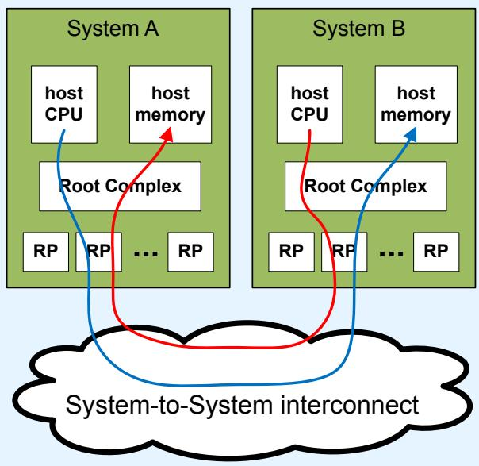

<details>
<summary>flowchart</summary>

```mermaid
graph TD
    subgraph System_A[System A]
  A1["host CPU"] --> A2["Root Complex"]
  A3["host memory"] --> A2
  A4["RP"] --> A5["RP"]
  A6["..."] --> A7["RP"]
    end
    subgraph System_B[System B]
  B1["host CPU"] --> B2["Root Complex"]
  B3["host memory"] --> B2
  B4["RP"] --> B5["RP"]
  B6["..."] --> B7["RP"]
    end
    A1 <--> B1
    A2 <--> B2
    A3 <--> B3
    A4 <--> B4
    A5 <--> B5
    A6 <--> B6
    A7 <--> B7
    B1 <--> B2
    B2 <--> B3
    B3 <--> B4
    B4 <--> B5
    B5 <--> B6
    style System_A fill:#99ccff,stroke:#333
    style System_B fill:#99ccff,stroke:#333
    note bottom of System_A: System-to-System interconnect
```
</details>

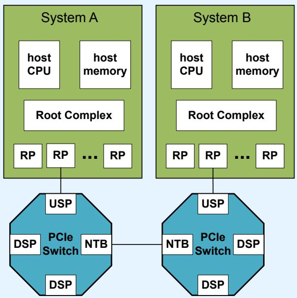

<details>
<summary>flowchart</summary>


```mermaid
graph TD
    subgraph System A
  A1["host CPU"] --> A2["Root Complex"]
  A3["host memory"] --> A2
  A2 --> A4["RP"]
  A2 --> A5["RP"]
  A2 --> A6["..."]
  A2 --> A7["RP"]
    end

    subgraph System B
  B1["host CPU"] --> B2["Root Complex"]
  B3["host memory"] --> B2
  B2 --> B4["RP"]
  B2 --> B5["RP"]
  B2 --> B6["..."]
  B2 --> B7["RP"]
    end

  A1 --> DSP1["USP"]
  A1 --> DSP2["DSP"]
  A1 --> DSP3["PCIe Switch"]
  A1 --> DSP4["NTB"]
  A1 --> DSP5["DSP"]
  DSP1 --> NTP1["NTB"]
  DSP1 --> NTP2["PCIe Switch"]
  DSP2 --> NTP3["NTB"]
  DSP2 --> NTP4["PCIe Switch"]
  DSP3 --> NTP5["NTB"]
  DSP3 --> NTP6["PCIe Switch"]
  DSP4 --> NTP7["NTB"]
  DSP4 --> NTP8["PCIe Switch"]
  DSP5 --> NTP9["NTB"]
  DSP5 --> NTP10["PCIe Switch"]
  DSP6 --> NTP11["NTB"]
  DSP6 --> NTP12["PCIe Switch"]
  DSP7 --> NTP13["NTB"]
  DSP7 --> NTP14["PCIe Switch"]
  DSP8 --> NTP15["NTB"]
  DSP8 --> NTP16["PCIe Switch"]
  DSP9 --> NTP17["NTB"]
  DSP9 --> NTP18["PCIe Switch"]
  DSP10 --> NTP19["NTB"]
  DSP10 --> NTP20["PCIe Switch"]
  DSP11 --> NTP21["NTB"]
  DSP11 --> NTP22["PCIe Switch"]
  DSP12 --> NTP23["NTB"]
  DSP12 --> NTP24["PCIe Switch"]
  DSP13 --> NTP25["NTB"]
  DSP13 --> NTP26["PCIe Switch"]
  DSP14 --> NTP27["NTB"]
  DSP14 --> NTP28["PCIe Switch"]
  DSP15 --> NTP29["NTB"]
  DSP15 --> NTP30["PCIe Switch"]
  DSP16 --> NTP31["NTB"]
  DSP16 --> NTP32["PCIe Switch"]
  DSP17 --> NTP33["NTB"]
  DSP17 --> NTP34["PCIe Switch"]
  DSP18 --> NTP35["NTB"]
  DSP18 --> NTP36["PCIe Switch"]
  DSP19 --> NTP37["NTB"]
  DSP19 --> NTP38["PCIe Switch"]
  DSP20 --> NTP39["NTB"]
  DSP20 --> NTP40["PCIe Switch"]
```
</details>

Figure 2-85 Deadlock Examples with Int § ersystem Interconnects

## IMPLEMENTATION NOTE:

## LARGE MEMORY READS VS. MULTIPLE SMALLER MEMORY READS

Note that the rule associated with entry D5b in § Table 2-42 ensures that for a single Memory Read Request serviced with multiple Completions, the Completions will be returned in address order. However, the rule associated with entry D5a permits that different Completions associated with distinct Memory Read Requests may be returned in a different order than the issue order for the Requests. For example, if a device issues a single Memory Read Request for 256 bytes from location 1000h, and the Request is returned using two Completions (see § Section 2.3.1.1 ) of 128 bytes each, it is guaranteed that the two Completions will return in the following order:

1st Completion returned: Data from 1000h to 107Fh.

2nd Completion returned: Data from 1080h to 10FFh.

However, if the device issues two Memory Read Requests for 128 bytes each, first to location 1000h, then to location 1080h, the two Completions may return in either order:

1st Completion returned: Data from 1000h to 107Fh.

2nd Completion returned: Data from 1080h to 10FFh.

\- or -

1st Completion returned: Data from 1080h to 10FFh.

2nd Completion returned: Data from 1000h to 107Fh.

## 2.4.2 Update Ordering and Granularity Observed by a Read Transaction §

If a Requester using a single transaction reads a block of data from a Completer, and the Completer's data buffer is concurrently being updated, the ordering of multiple updates and granularity of each update reflected in the data returned by the read is outside the scope of this specification, unless otherwise specified (see § Section 6.32 ). This applies both to updates performed by PCI Express write transactions and updates performed by other mechanisms such as host CPUs updating host memory.

If a Requester using a single transaction reads a block of data from a Completer, and the Completer's data buffer is concurrently being updated by one or more entities not on the PCI Express fabric, the ordering of multiple updates and granularity of each update reflected in the data returned by the read is outside the scope of this specification, unless otherwise specified (see § Section 6.32 ).

As an example of update ordering, assume that the block of data is in host memory, and a host CPU writes first to location A and then to a different location B. A Requester reading that data block with a single read transaction is not guaranteed to observe those updates in order. In other words, the Requester may observe an updated value in location B and an old value in location A, regardless of the placement of locations A and B within the data block. Unless a Completer makes its own guarantees (outside this specification) with respect to update ordering, a Requester that relies on update ordering must observe the update to location B via one read transaction before initiating a subsequent read to location A to return its updated value.

As an example of update granularity, if a host CPU writes a QW to host memory, a Requester reading that QW from host memory may observe a portion of the QW updated and another portion of it containing the old value.

While not required by this specification, it is strongly recommended that host platforms guarantee that when a host CPU writes aligned DWs or aligned QWs to host memory, the update granularity observed by a PCI Express read will not be smaller than a DW.

## IMPLEMENTATION NOTE:

## NO ORDERING REQUIRED BETWEEN CACHELINES §

A Root Complex serving as a Completer to a single Memory Read that requests multiple cachelines from host memory is permitted to fetch multiple cachelines concurrently, to help facilitate multi-cacheline completions, subject to Tx\_MPS\_Limit. No ordering relationship between these cacheline fetches is required.

## 2.4.3 Update Ordering and Granularity Provided by a Write Transaction §

If a single write transaction containing multiple DWs and the Relaxed Ordering bit Clear is accepted by a Completer, the observed ordering of the updates to locations within the Completer's data buffer must be in increasing address order. This semantic is required in case a PCI or PCI-X Bridge along the path combines multiple write transactions into the single one. However, the observed granularity of the updates to the Completer's data buffer is outside the scope of this specification.

While not required by this specification, it is strongly recommended that host platforms guarantee that when a PCI Express write updates host memory, the update granularity observed by a host CPU will not be smaller than a DW.

As an example of update ordering and granularity, if a Requester writes a QW to host memory, in some cases a host CPU reading that QW from host memory could observe the first DW updated and the second DW containing the old value.

## 2.5 Virtual Channel (VC) Mechanism §

The Virtual Channel (VC) mechanism provides support for carrying, throughout the fabric, traffic that is differentiated using TC labels. The foundations of VCs are independent fabric resources (queues/buffers and associated control logic). These resources are used to move information across Links with fully independent Flow Control between different VCs (Link Flow Control is defined in § Section 2.6 ). This is key to solving the problem of flow-control induced blocking where a single traffic flow may create a bottleneck for all traffic within the system.

As Link speed increases, the buffer space required to support fully independent Flow Control between different VCs while also supporting full Link bandwidth on any given VC also increases. In Flit Mode, the Shared Flow Control (FC) mechanism can be used to reduce this resource requirement. Flow Control is defined in § Section 2.6 .

Traffic is associated with VCs by mapping packets with particular TC labels to their corresponding VCs. The VC and Multi-Function Virtual Channel (MFVC) mechanisms allow flexible mapping of TCs onto the VCs. In the simplest form, TCs can be mapped to VCs on a 1:1 basis. To allow performance/cost tradeoffs, PCI Express provides the capability of mapping multiple TCs onto a single VC. § Section 2.5.2 covers details of TC to VC mapping.

A Virtual Channel is established when one or multiple TCs are associated with a physical VC resource designated by Virtual Channel Identification (VC ID). This process is controlled by configuration software as described in § Section 6.3 , § Section 7.9.1 , and § Section 7.9.2 .

When Shared Flow Control is used, initially, VC0 is initialized automatically by hardware with a dedicated FC credit pool, and a Shared FC pool. As system software enables other VCs, the enabled VCs are also initialized with a dedicated FC credit pool and a Shared FC pool per VC. The Shared FC credits for additional VCs expand the Shared FC pool available to all VCs (and are permitted to be zero when the appropriate Shared FC credits were granted earlier). When only a single VC is supported, there is a single “shared” credit pool and VC0 is initialized with zero dedicated credits.

Once system software has completed enabling all VCs that are to be enabled, it is recommended that system software Set the All VCs Enabled in the Port VC Control Register or the MFVC Port VC Control Register to indicate that VC initialization is completed. Once this bit has been Set, undefined behavior will result if additional VCs are enabled for an established Link.

The Shared Flow Control Usage Limit mechanism allows system software to manage the allocation of Shared FC by Transmitters, for example to support Quality of Service (QoS) policies.

Support for TCs and VCs beyond the default TC0/VC0 pair is optional. The association of TC0 with VC0 is fixed, i.e., hardwired, and must be supported by all components. Therefore, the baseline TC/VC setup does not require any VC-specific hardware or software configuration. In order to ensure interoperability, components that do not implement the optional Virtual Channel Capability structure or Multi-Function Virtual Channel Capability structure must obey the following rules:

• A Requester must only generate requests with TC0 label. (Note that if the Requester initiates requests with a TC label other than TC0, the requests may be treated as malformed by the component on the other side of the Link that implements the extended VC Extended Capability and applies TC Filtering.)  
• A Completer must accept requests with TC label other than TC0, and must preserve the TC label. That is, any completion that it generates must have the same TC label as the label of the request.  
• A Switch must map all TCs to VC0 and must forward all transactions regardless of the TC label.

A Device containing Functions capable of generating Requests with TC labels other than TC0 must implement suitable VC or MFVC Extended Capability structures (as applicable), even if it only supports the default VC. Example Function types are Endpoints and Root Ports. This is required in order to enable mapping of TCs beyond the default configuration. It must follow the TC/VC mapping rules according to the software programming of the VC and MFVC Extended Capability structures.

§ Figure 2-86 illustrates the concept of Virtual Channel. Conceptually, traffic that flows through VCs is multiplexed onto a common physical Link resource on the Transmit side and de-multiplexed into separate VC paths on the Receive side.

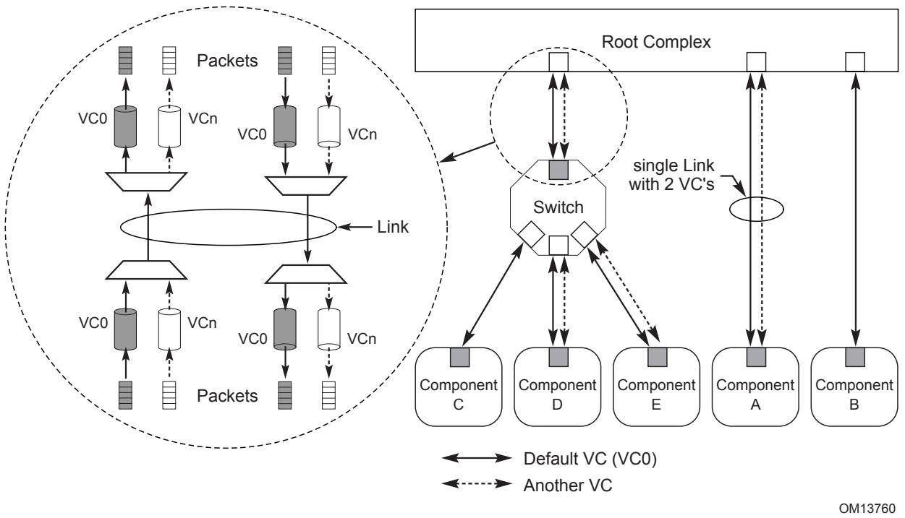

<details>
<summary>flowchart</summary>

```mermaid
graph TD
    subgraph Left_Dialog[Link]
  A1["VC0"] --> B1["Switch"]
  A2["VCn"] --> B1
  B1 --> C1["Component C"]
  B1 --> D1["Component D"]
  B1 --> E1["Component E"]
  B1 --> F1["Component A"]
  B1 --> G1["Component B"]
    end
    subgraph Right_Dialog[Root Complex]
  H1["Link"] --> I1["Switch"]
  I1 --> J1["Component C"]
  I1 --> K1["Component D"]
  I1 --> L1["Component E"]
  I1 --> M1["Component A"]
  I1 --> N1["Component B"]
    end
  H1 --> O["Switch"]
  I1 --> P["Switch"]
  K1 --> Q["Switch"]
  L1 --> R["Switch"]
  M1 --> S["Switch"]
  N1 --> T["Switch"]
    style Left_Dialog fill:#f9f,stroke:#333
    style Right_Dialog fill:#ccf,stroke:#333
    note right of H1: 'single Link with 2 VC's'
    note right of I1: 'Default VC (VC0)'
    note right of L1: 'Another VC'
```
</details>

Figure 2-86 Virtual Channel Concept - An Illustration§

Internal to the Switch, every Virtual Channel requires dedicated physical resources (queues/buffers and control logic) that support independent traffic flows inside the Switch. § Figure 2-87 shows conceptually the VC resources within the Switch (shown in § Figure 2-86) that are required to support traffic flow in the Upstream direction.

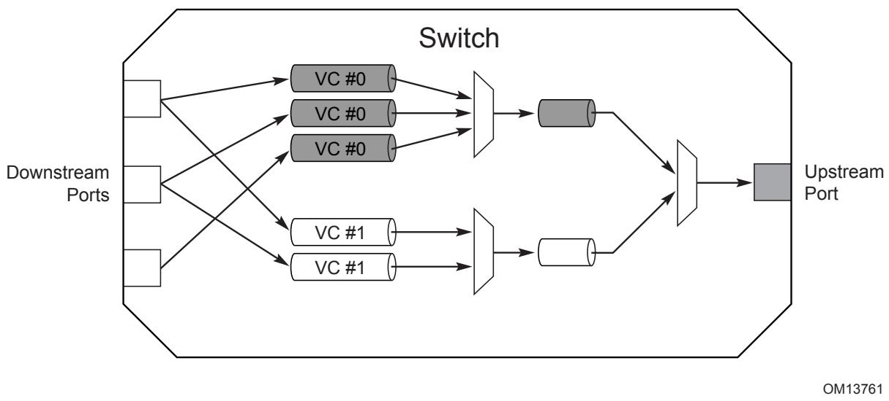

<details>
<summary>flowchart</summary>

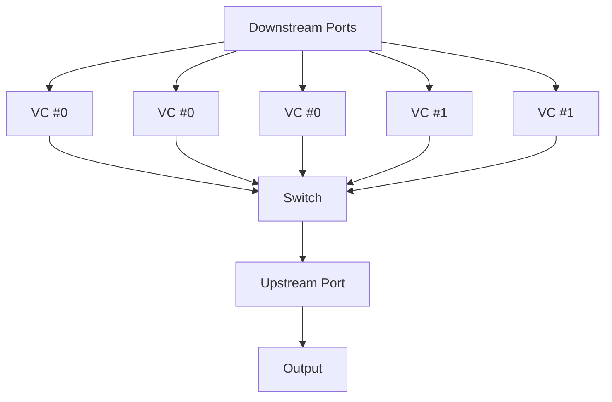
```mermaid
graph TD
  A["Downstream Ports"] --> B["VC #0"]
  A --> C["VC #0"]
  A --> D["VC #0"]
  A --> E["VC #1"]
  A --> F["VC #1"]
  B --> G["Switch"]
  C --> G
  D --> G
  E --> G
  F --> G
  G --> H["Upstream Port"]
  H --> I["Output"]
```
</details>

Figure 2-87 Virtual Channel Concept - Switch Internals (Upstream Flow)§

An MFD may implement Virtual Channel resources similar to a subset of those in a Switch, for the purpose of managing the Quality of Service (QoS) for Upstream requests from the different Functions to the device's Upstream Egress Port.

## IMPLEMENTATION NOTE: VC AND VC BUFFERING CONSIDERATIONS §

The amount of buffering beyond the architectural minimums per supported VC is implementation specific.

Buffering beyond the architectural minimums is not required to be identical across all VCs on a given Link. That is, an implementation may provide greater buffer depth for selected VCs as a function of implementation usage models and other Link attributes (e.g., Link width and signaling).

Implementations may adjust their buffering per VC based on implementation specific policies derived from configuration and VC enablement. For example, if a four VC implementation has only two VCs enabled, the implementation may assign the non-enabled VC buffering to the enabled VCs to improve fabric efficiency/ performance by reducing the probability of fabric backpressure due to Link-level flow control.

The number of VCs supported, and the associated buffering per VC per Port, are not required to be the same for all Ports of a multi-Port component (e.g., a Switch or Root Complex).

## 2.5.1 Virtual Channel Identification (VC ID) §

PCI Express Ports can support 1 to 8 Virtual Channels - each Port is independently configured/managed therefore allowing implementations to vary the number of VCs supported per Port based on usage model-specific requirements. These VCs are uniquely identified using the VC ID mechanism.

Note that while DLLPs contain VC ID information for Flow Control accounting, TLPs do not. The association of TLPs with VC ID for the purpose of Flow Control accounting is done at each Port of the Link using TC to VC mapping as discussed in § Section 2.5.2 .

All Ports that support more than VC0 must provide at least one VC Extended Capability structure according to the definition in § Section 7.9.1 . An MFD is permitted to implement the MFVC Extended Capability structure, as defined in § Section 7.9.2 . Providing these extended structures is optional for Ports that support only the default TC0/VC0 configuration. Configuration software is responsible for configuring Ports on both sides of the Link for a matching number of VCs. This is accomplished by scanning the hierarchy and using VC or MFVC Extended Capability registers associated with Ports (that support more than default VC0) to establish the number of VCs for the Link. Rules for assigning VC ID to VC hardware resources within a Port are as follows:

• VC ID assignment must be unique per Port - The same VC ID cannot be assigned to different VC hardware resources within the same Port.  
• VC ID assignment must be the same (matching in the terms of numbers of VCs and their IDs) for the two Ports on both sides of a Link.  
• If an MFD implements an MFVC Extended Capability structure, its VC hardware resources are distinct from the VC hardware resources associated with any VC Extended Capability structures of its Functions. The VC ID uniqueness requirement (first bullet above) still applies individually for the MFVC and any VC Extended Capability structures. In addition, the VC ID cross-Link matching requirement (second bullet above) applies for the MFVC Extended Capability structure, but not the VC Extended Capability structures of the Functions.  
• VC ID 0 is assigned and fixed to the default VC.

## 2.5.2 TC to VC Mapping §

Every Traffic Class that is supported must be mapped to one of the Virtual Channels. The mapping of TC0 to VC0 is fixed.

The mapping of TCs other than TC0 is system software specific. However, the mapping algorithm must obey the following rules:

• One or multiple TCs can be mapped to a VC.  
• One TC must not be mapped to multiple VCs in any Port or Endpoint Function.  
• TC/VC mapping must be identical for Ports on both sides of a Link.

§ Table 2-43 provides an example of TC to VC mapping.  
Table 2-43 TC to VC Mapping Example§

<table><tr><td>Supported VC Configurations</td><td>TC/VC Mapping Options</td></tr><tr><td>VC0</td><td>TC(0-7)/VC0</td></tr><tr><td>VC0, VC1</td><td>TC(0-6)/VC0, TC7/VC1</td></tr><tr><td>VC0-VC3</td><td>TC(0-1)/VC0, TC(2-4)/VC1, TC(5-6)/VC2, TC7/VC3</td></tr><tr><td>VC0-VC7</td><td>TC[0:7]/VC[0:7]</td></tr></table>

Notes on conventions:

<table><tr><td>TCn/VCk</td><td>TCn mapped to VCk</td></tr><tr><td>TC(n-m)/VCk</td><td>all TCs in the range n-m mapped to VCk (i.e., to the same VC)</td></tr><tr><td>TC[n:m]/VC[n:m]</td><td>TCn/VCn, TCn+1/ VCn+1, ..., TCm/VCm</td></tr></table>

§ Figure 2-88 provides a graphical illustration of TC to VC mapping in several different Link configurations. For additional considerations on ${ \mathsf { T C } } / { \mathsf { V C } } ,$ refer to § Section 6.3 .

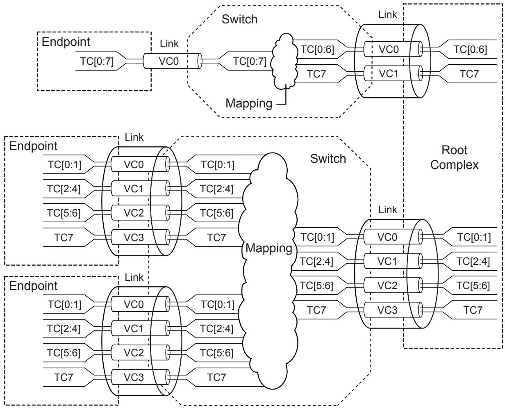

<details>
<summary>flowchart</summary>

```mermaid
graph TD
    subgraph Endpoint
  A["TC[0:7"]] --> B["Link VC0"]
  B --> C["TC[0:7"]]
  C --> D["Switch"]
  D --> E["TC[0:6"]]
  D --> F["TC7"]
  E --> G["Link VC0"]
  F --> H["Link VC1"]
  G --> I["TC[0:6"]]
  H --> J["TC7"]
    end

    subgraph Switch
  K["TC[0:1"]] --> L["Link VC0"]
  M["TC[2:4"]] --> N["Link VC1"]
  O["TC[5:6"]] --> P["Link VC2"]
  Q["TC7"] --> R["Link VC3"]
  S["TC[0:1"]] --> T["Link VC0"]
  U["TC[2:4"]] --> V["Link VC1"]
  W["TC[5:6"]] --> X["Link VC2"]
  Y["TC7"] --> Z["Link VC3"]
  AA["TC[0:1"]] --> AB["Link VC0"]
  AC["TC[2:4"]] --> AD["Link VC1"]
  AE["TC[5:6"]] --> AF["Link VC2"]
  AG["TC7"] --> AH["Link VC3"]
    end

    subgraph Root Complex
  AI["TC[0:1"]] --> AJ["Link VC0"]
  AK["TC[2:4"]] --> AL["Link VC1"]
  AM["TC[5:6"]] --> AN["Link VC2"]
  AO["TC7"] --> AP["Link VC3"]
  AQ["TC[0:1"]] --> AR["Link VC0"]
  AS["TC[2:4"]] --> AT["Link VC1"]
  AU["TC[5:6"]] --> AV["Link VC2"]
  AW["TC7"] --> AX["Link VC3"]
    end

  B --> C
  D --> E
  F --> G
  T --> AJ
  AD --> AL
  AN --> AF
  AV --> AH
  AX --> AI
```
</details>

OM13762

Figure 2-88 An Example of TC/VC Configurations§

## 2.5.3 VC and TC Rules §

Here is a summary of key rules associated with the TC/VC mechanism:

• All devices must support the general purpose I/O Traffic Class (i.e., TC0 and must implement the default VC0).  
• Each Virtual Channel (VC) has independent Flow Control.  
• There are no ordering relationships required between different TCs.  
• There are no ordering relationships required between different VCs.  
• A Switch's peer-to-peer capability applies to all Virtual Channels supported by the Switch.  
• An MFD's peer-to-peer capability between different Functions applies to all Virtual Channels supported by the MFD.  
• Transactions with a TC that is not mapped to any enabled VC in an Ingress Port are treated as Malformed TLPs by the receiving device.  
• For Switches, transactions with a TC that is not mapped to any of the enabled VCs in the target Egress Port are treated as Malformed TLPs.

• For a Root Port, transactions with a TC that is not mapped to any of the enabled VCs in the target RCRB are treated as Malformed TLPs.  
• For MFDs with an MFVC Extended Capability structure, any transaction with a TC that is not mapped to an enabled VC in the MFVC Extended Capability structure is treated as a Malformed TLP.  
• Switches must support independent TC/VC mapping configuration for each Port.  
• A Root Complex must support independent TC/VC mapping configuration for each RCRB, the associated Root Ports, and any RCiEPs.

For more details on the VC and TC mechanisms, including configuration, mapping, and arbitration, refer to § Section 6.3 .

## 2.6 Ordering and Receive Buffer Flow Control §

Flow Control (FC) is used to prevent overflow of Receiver buffers and to enable compliance with the ordering rules defined in § Section 2.4 . Note that the Flow Control mechanism is used by the Requester to track the queue/buffer space available in the agent across the Link as shown in § Figure 2-89. That is, Flow Control is point-to-point (across a Link) and not end-to-end. Flow Control does not imply that a Request has reached its ultimate Completer.

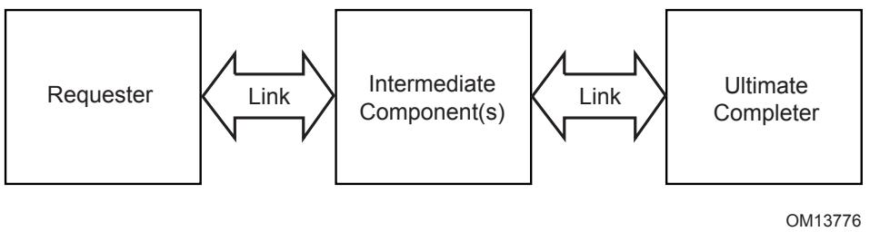

<details>
<summary>flowchart</summary>


```mermaid
graph LR
    A["Requester"] <-->|Link| B["Intermediate Component(s)"]
    B <-->|Link| C["Ultimate Completer"]
```
</details>

Figure 2-89 Relationship Between Requester and Ultimate Completer§

Flow Control is orthogonal to the data integrity mechanisms used to implement reliable information exchange between Transmitter and Receiver. Flow Control can treat the flow of TLP information from Transmitter to Receiver as perfect, since the data integrity mechanisms ensure that corrupted and lost TLPs are corrected through retransmission (see § Section 3.6 ).

In Non-Flit Mode each Virtual Channel (VC) maintains an independent FC credit pool.

In Flit Mode, the Shared FC mechanism can be used to reduce VC resource requirements. When Shared FC is used, there are two sets of resources associated with each VC: a (typically small) pool of dedicated resources associated independently with each FC/VC (to avoid deadlock by allowing that the Transmitter to transmit at least one TLP in that VC/FC using only dedicated credit(s)), and a portion of the (typically larger) pool of shared resources. For Ports that support Flit Mode, Transmitters are required to support Shared FC, and Receivers are optionally permitted to support Shared FC. Receivers that support Shared FC must do so for all Virtual Channels. When Shared FC is used, the Transmitter gate function (defined later in this section) uses the sum of all Shared FC returned across all VCs and, when enabled, provides a Usage Limit mechanism to avoid over-consumption of buffers by stalled VCs. To support Usage Limit, credits are returned to the Transmitter indicating the VC for the TLP(s) that, by making forward progress, freed those credits. The FC information is conveyed between two sides of the Link using DLLPs. The VC ID field of the DLLP is used to carry the VC ID that is required for proper Flow Control credit accounting. Additionally, Merged FC enables the sharing of buffers for Posted Requests and Completions, further reducing resource requirements.

Flow Control mechanisms used internally within an MFD are outside the scope of this specification.

Flow Control is handled by the Transaction Layer in cooperation with the Data Link Layer. The Transaction Layer performs Flow Control accounting functions for Received TLPs and “gates” TLP Transmissions based on available credits for transmission even if those TLPs are eventually nullified.

Note: Flow Control is a function of the Transaction Layer and, therefore, the following types of information transmitted on the interface are not associated with Flow Control Credits: LCRC, Packet Framing Symbols, other Special Symbols, and Data Link Layer to Data Link Layer inter-communication packets. An implication of this fact is that these types of information must be processed by the Receiver at the rate they arrive (except as explicitly noted in this specification).

Also, any TLPs transferred from the Transaction Layer to the Data Link and Physical Layers must have first passed the Flow Control gate. Thus, both Transmit and Receive Flow Control mechanisms are unaware if the Data Link Layer transmits a TLP repeatedly due to errors on the Link.

## 2.6.1 Flow Control (FC) Rules


In this and other sections of this specification, rules are described using conceptual “registers” that a device could use in order to implement a compliant implementation. This description does not imply or require a particular implementation and is used only to clarify the requirements.

• Flow Control (FC) information is transferred using Flow Control Packets (FCPs), which are a type of DLLP (see § Section 3.5 ), and, in some cases, the Optimized\_Update\_FC.  
• The unit of FC credit is 4 DW for data.  
• In Non-Flit Mode, for headers:

◦ The unit of FC credit for Receivers that do not support TLP Prefixes is the sum of one maximum-size Header and TLP Digest.  
◦ The unit of FC credits for Receivers that support End-End TLP Prefixes is the sum of one maximum-size Header, TLP Digest, and the maximum number of End-End TLP Prefixes permitted in a TLP.  
◦ The management of FC for Receivers that support Local TLP Prefixes is dependent on the Local TLP Prefix type.

• In Flit Mode, for headers:

◦ For Switch Ports, the unit of FC credit for Receivers is the sum of one maximum-size Base Header, OHC-Ax, OHC-B, OHC-C if IDE is supported, OHC-E if supported, one maximum-size TLP Trailer, and, if supported, an implementation specific number of end-to-end suffixes.  
For Endpoint Upstream Ports and Root Ports, the unit of FC credit for Receivers is the sum of one Base Header of the largest supported size, OHC-Ax, OHC-B, OHC-C if IDE is supported, OHC-E if supported, one TLP Trailer of the largest size supported, and, if supported, an implementation specific number of end-to-end suffixes.

• For NFM and when Shared FC is not used, each Virtual Channel has independent FC.  
• When Shared FC is used, each Virtual Channel has some amount of independent FC referred to as dedicated credits, and some amount of shared FC.  
• It is permitted for a Transmitter to use dedicated credits when Transmitting a TLP, even when sufficient shared credits are available.  
• The Transmitter indicates the use of Dedicated Credits for a specific TLP by applying the Flit Mode Local TLP Prefix with the TLP Uses Dedicated Credits bit Set.  
• Flow Control distinguishes three types of TLPs (note relationship to ordering rules - see § Section 2.4 ):

◦ Posted Requests (P) - Messages and Memory Writes

◦ Non-Posted Requests (NP) - All Reads, I/O Writes, Configuration Writes, AtomicOps, and DMWrs.  
◦ Completions (Cpl) - Associated with corresponding NP Requests

• In addition, Flow Control distinguishes the following types of TLP information within each of the three types:

◦ Headers (H)

◦ Data (D)

• Thus, there are six types of information tracked by Flow Control for each Virtual Channel, as shown in § Table 2-44.

Table 2-44 Flow Control Credit Types§

<table><tr><td>Credit Type</td><td>Applies to This Type of TLP Information</td></tr><tr><td>PH</td><td>Posted Request headers</td></tr><tr><td>PD</td><td>Posted Request Data payload</td></tr><tr><td>NPH</td><td>Non-Posted Request headers</td></tr><tr><td>NPD</td><td>Non-Posted Request Data payload</td></tr><tr><td>CplH</td><td>Completion headers</td></tr><tr><td>CplD</td><td>Completion Data payload</td></tr></table>

• TLPs consume Flow Control credits as shown in § Table 2-45.

Table 2-45 TLP Flow Control Credit Consumption§

<table><tr><td>TLP</td><td>Credit Consumed  $^{43}$ </td></tr><tr><td>Memory, I/O, Configuration Read Request</td><td>1 NPH unit</td></tr><tr><td>Memory Write Request</td><td>1 PH + n PD units $^{44}$ </td></tr><tr><td>I/O, Configuration Write Request</td><td>1 NPH + 1 NPDNote: size of data written is never more than 1 (aligned) DW</td></tr><tr><td>AtomicOp, DMWr Request</td><td>1 NPH + n NPD units</td></tr><tr><td>Message Requests without data</td><td>1 PH unit</td></tr><tr><td>Message Requests with data</td><td>1 PH + n PD units</td></tr><tr><td>Memory Read Completion</td><td>1 CplH + n CplD units</td></tr><tr><td>I/O, Configuration Read Completions</td><td>1 CplH unit + 1 CplD unit</td></tr><tr><td>I/O, Configuration Write, and DMWr Completions</td><td>1 CplH unit</td></tr><tr><td>AtomicOp Completion</td><td>1 CplH unit + 1 CplD unitNote: size of data returned is never more than 4 (aligned) DWs.</td></tr></table>

• FC must be initialized autonomously by hardware only for the default Virtual Channel (VC0).

◦ VC0 is initialized when the Data Link Layer is in the DL\_Init state following reset (see § Section 3.2 and § Section 3.4 ).

• When Virtual Channels other than VC0 are enabled by software, each newly enabled VC must follow the Flow Control initialization protocol (see § Section 3.4 ).

◦ Software enables a Virtual Channel by setting the VC Enable bits for that Virtual Channel in both components on a Link (see § Section 7.9.1 and § Section 7.9.2 ).

Note: It is possible for multiple VCs to be following the Flow Control initialization protocol simultaneously - each follows the initialization protocol as an independent process.

• Software disables a Virtual Channel by clearing the VC Enable bits for that Virtual Channel in both components on a Link.

◦ Disabling a Virtual Channel for a component resets the Flow Control tracking mechanisms for that Virtual Channel in that component.

◦ In Flit Mode, disabling a Virtual Channel resets the Flow Control tracking mechanisms for dedicated credits for that Virtual Channel in that component and has no effect on Shared Flow Control credit tracking.

• InitFC1 and InitFC2 FCPs are used only for Flow Control initialization (see § Section 3.4 ).

• An InitFC1, InitFC2, UpdateFC FCP, or Optimized\_Update\_FC that specifies a Virtual Channel that is disabled must be discarded without effect.

• During FC initialization for any Virtual Channel, including the default VC initialized as a part of Link initialization, Receivers must initially advertise VC credit values equal to or greater than those shown in § Table 2-46.

◦ If Scaled Flow Control is not supported or supported but not activated, use the values in the "Scale Factor 1" column.

• If Scaled Flow Control is supported and activated, use the values in the column for the scaling factor associated with that credit type (see § Section 3.4.2 ).

• For a Multi-Function Device where different Functions have different Rx\_MPS\_Limit values, the largest Rx\_MPS\_Limit value across all Functions must be used.

Table 2-46 Minimum Initial Flow Control Advertisements 45§

<table><tr><td rowspan="2">Credit Type</td><td colspan="3">Minimum Advertisement</td></tr><tr><td>No Scaling or Scale Factor 1</td><td>Scale Factor 4</td><td>Scale Factor 16</td></tr><tr><td>PH</td><td>1 unit - credit value of 01h.</td><td>4 Units - credit value of 01h.</td><td>16 Units - credit value of 01h.</td></tr><tr><td>PD</td><td>Rx_MPS_Limit divided by FC Unit Size.Example: If the Rx_MPS_Limit is 1024 bytes, the smallest permitted initial credit value would be 040h.</td><td>Ceiling(Rx_MPS_Limit / (FC Unit Size * 4)) + 1.Example: If the Rx_MPS_Limit is 1024 bytes, the smallest permitted initial credit value would be 011h.</td><td>Ceiling(Rx_MPS_Limit / (FC Unit Size * 16)) + 1.Example: If the Rx_MPS_Limit is 1024 bytes, the smallest permitted initial credit value would be 005h.</td></tr><tr><td>NPH</td><td>1 unit - credit value of 01h.</td><td>4 Units - credit value of 01h.</td><td>16 Units - credit value of 01h.</td></tr><tr><td>NPD</td><td>Rx_NP_MPS_Limit divided by FC Unit Size (Note 3)</td><td>Ceiling(Rx_NP_MPS_Limit / (FC Unit Size * 4)) + 1 (Note 3)</td><td>Ceiling(Rx_NP_MPS_Limit / (FC Unit Size * 16)) + 1 (Note 3)</td></tr><tr><td>CplH</td><td>Root Complex (supporting peer-to-peer traffic between all Root Ports) and Switch: 1 FC unit - credit value of 01hRoot Complex (not supporting peer-to-peer traffic between all Root Ports) and Endpoint: infinite FC units (Note 1).In Flit Mode, if merged is indicated (see § Section 3.4.1 ), PH credits are used for Completions in the shared pool.</td><td>Root Complex (supporting peer-to-peer traffic between all Root Ports) and Switch: 4 FC units - credit value of 01hRoot Complex (not supporting peer-to-peer traffic between all Root Ports) and Endpoint: infinite FC units (Note 1).In Flit Mode, if merged is indicated (see § Section 3.4.1 ), PH credits are used for Completions in the shared pool.</td><td>Root Complex (supporting peer-to-peer traffic between all Root Ports) and Switch: 16 FC units - credit value of 01hRoot Complex (not supporting peer-to-peer traffic between all Root Ports) and Endpoint: infinite FC units (Note 1).In Flit Mode, if merged is indicated (see § Section 3.4.1 ), PH credits are used for Completions in the shared pool</td></tr><tr><td>CplD</td><td>Root Complex (supporting peer-to-peer traffic between all Root Ports) and Switch: Rx_MPS_Limit divided by FC Unit Size.Root Complex (not supporting peer-to-peer traffic between all Root Ports) and Endpoint: infinite FC units (Note 2).In Flit Mode, if merged is indicated (see § Section 3.4.1 ), PD credits are used for Completions in the shared pool.</td><td>Root Complex (supporting peer-to-peer traffic between all Root Ports) and Switch: Ceiling(Rx_MPS_Limit / (FC Unit Size * 4)) + 1.Root Complex (not supporting peer-to-peer traffic between all Root Ports) and Endpoint: infinite FC units (Note 2).In Flit Mode, if merged is indicated (see § Section 3.4.1 ), PD credits are used for Completions in the shared pool.</td><td>Root Complex (supporting peer-to-peer traffic between all Root Ports) and Switch: Ceiling(Rx_MPS_Limit / (FC Unit Size * 16)) + 1.Root Complex (not supporting peer-to-peer traffic between all Root Ports) and Endpoint: infinite FC units (Note 2).In Flit Mode, if merged is indicated (see § Section 3.4.1 ), PD credits are used for Completions in the shared pool.</td></tr></table>

Notes:  
1. Infinite header credits is an encoding that is interpreted as infinite by the Transmitter, which will, therefore, never throttle. In Flit Mode infinite is indicated with Scale Factor 00b HdrCredits 00h (see § Table 3-2). In Non-Flit Mode infinite is indicated with an arbitrary Scale Factor and HdrCredits 00h.  
2. Infinite data credits is an encoding that is interpreted as infinite by the Transmitter, which will, therefore, never throttle. In Flit Mode infinite is indicated with Scale Factor 00b DataCredits 000h (see § Table 3-2). In Non-Flit Mode infinite is indicated with an arbitrary Scale Factor and DataCredits 000h.  
3. Rx\_NP\_MPS\_Limit is the maximum size Non-Posted TLP Payload accepted by the Receiver. Larger of:

◦ Payload size supported by any implemented earmarked TLP Type values.  
◦ Receiver that supports DMWr routing capability or DMWr Completer capability:  
▪ If DMWr Request Routing Supported is 1: 128 bytes (8 credit units)  
▪ If DMWr Request Routing Supported is 0 and DMWr Completer Supported is 1 and DMWr Lengths Supported is 00b: 64 bytes (4 credit units)  
▪ If DMWr Request Routing Supported is 0 and DMWr Completer Supported is 1 and DMWr Lengths Supported is not 00b: 128 bytes (8 credit units)

◦ Receiver that supports AtomicOp routing capability or any AtomicOp Completer capability:

▪ If AtomicOp Routing Supported is 1: 32 bytes (2 credit units)

<table><tr><td rowspan="2">Credit Type</td><td colspan="3">Minimum Advertisement</td></tr><tr><td>No Scaling or Scale Factor 1</td><td>Scale Factor 4</td><td>Scale Factor 16</td></tr></table>

▪ If AtomicOp Routing Supported is 0, AtomicOp Supported is 0, and 128-bit CAS Completer Supported is 0: 16 bytes (1 credit unit)  
▪ If AtomicOp Routing Supported is 0, AtomicOp Supported is 0, and 128-bit CAS Completer Supported is 1: 32 bytes (2 credit units)

◦ 16 bytes (1 credit unit)

• A Root Complex that supports no peer-to-peer traffic between Root Ports must advertise infinite Completion credits on every Root Port.  
• A Root Complex that supports peer-to-peer traffic between some or all of its Root Ports may optionally advertise non-infinite Completion credits on those Root Ports. In this case, the Root Complex must ensure that deadlocks are avoided and forward progress is maintained for completions directed towards the Root Complex. Note that temporary stalls of completion traffic (due to a temporary lack of credit) are possible since Non-Posted requests forwarded by the RC may not have explicitly allocated completion buffer space.  
• A Receiver that does not support Scaled Flow Control must never cumulatively issue more than 2047 outstanding unused credits to the Transmitter for data or 127 for header. A Receiver that supports Scaled Flow Control must never cumulatively issue more outstanding unused data or header credits to the Transmitter than the Max Credits values shown in § Table 3-3.

◦ Components may optionally check for violations of this rule. If a component implementing this check determines a violation of this rule, the violation is a Flow Control Protocol Error (FCPE).  
▪ If checked, this is a reported error associated with the Receiving Port (see § Section 6.2 )

• If an Infinite Credit advertisement has been made during initialization, no Flow Control updates are required following initialization.

◦ If UpdateFC DLLPs or Optimized\_Update\_FCs are sent, the credit value fields must be Clear and must be ignored by the Receiver. The Receiver may optionally check for non-zero update values (in violation of this rule). If a component implementing this check determines a violation of this rule, the violation is a Flow Control Protocol Error (FCPE)

▪ If checked, this is a reported error associated with the Receiving Port (see § Section 6.2 )

• If only the Data or Header advertisement (but not both) for a given type (P, NP, or Cpl) has been made with infinite credits during initialization, the transmission of UpdateFC DLLPs and/or Optimized\_Update\_FCs is still required, but the credit field corresponding to the Data/header (advertised as infinite) must be set to zero and must be ignored by the Receiver.

◦ The Receiver may optionally check for non-zero update values (in violation of this rule). If a Receiver implementing this check determines a violation of this rule, the violation is a Flow Control Protocol Error (FCPE).

▪ If checked, this is a reported error associated with the Receiving Port (see § Section 6.2 ).

• If Scaled Flow Control is activated, the HdrScale and DataScale fields in the UpdateFCs must match the values advertised during initialization (see § Section 3.4.2 ).

◦ The Receiver may optionally check for violations of this rule. If a Receiver implementing this check determines a violation of this rule, the violation is a Flow Control Protocol Error (FCPE).

▪ If checked, this is a reported error associated with the Receiving Port (see § Section 6.2 ).

• A received TLP using a VC that is not enabled is a Malformed TLP.

◦ VC0 is always enabled.

◦ For VCs 1-7, a VC is considered enabled when the corresponding VC Enable bit in the VC Resource Control register has been Set, and once FC negotiation for that VC has exited the FC\_INIT1 state and progressed to the FC\_INIT2 state (see § Section 3.4 ).  
◦ This is a reported error associated with the Receiving Port (see § Section 6.2 ).

• TLP transmission using any VC 0-7 is not permitted until initialization for that VC has completed by exiting FC\_INIT2 state.

For VCs 1-7, software must use the VC Negotiation Pending bit in the corresponding VC Resource Status Register to ensure that a VC is not used until negotiation has completed by exiting the FC\_INIT2 state in both components on a Link.

The [Field Size] parameter used in the following sections is described in § Table 2-47 (see § Section 3.4.2 for details od Scaled Flow Control).

Table 2-47 [Field Size] Values§

<table><tr><td>Scaled Flow Control Supported</td><td>HdrScale or DataScale</td><td>[Field Size] for PH, NPH, CplH</td><td>[Field Size] for PD, NPD, CplD</td></tr><tr><td>No</td><td>x</td><td>8</td><td>12</td></tr><tr><td>Yes</td><td>00b</td><td>8</td><td>12</td></tr><tr><td>Yes</td><td>01b</td><td>8</td><td>12</td></tr><tr><td>Yes</td><td>10b</td><td>10</td><td>14</td></tr><tr><td>Yes</td><td>11b</td><td>12</td><td>16</td></tr></table>

In Flit Mode, Transmitter and Receiver both effectively have a granularity of 8 credits for Header and Data for contiguous TLPs in each FC/VC within each Shared Credit group. The following rules apply:

• For the Transmitter:

◦ If Completion Shared Credits are merged with Posted Shared Credits,

▪ the Credits consumed for Posted and Completion TLPs must always be in multiples of 8 Header credits and, if data is present, 8 Data Credits.  
▪ A subsequent TLP in the same Flow Control class for a particular Virtual Channel (FC/VC) in the same Shared Credit pool must use the remaining part of the credit from the 8 credits.

◦ If Completion Shared Credits are not merged with Posted Shared Credits,

▪ The Credits consumed for Posted TLPs must always be in multiples of 4 Header Credits and, if data is present, 4 Data credits. A subsequent TLP in the same FC/VC in the same Shared Credit pool must use the remaining part of the credit from the 4 credits.  
When Completion credits are not infinite, the Credits consumed for Completion TLPs must always be in multiples of 4 Header Credits and, if data is present, 4 Data credits. A subsequent TLP in the same FC/VC in the same Shared Credit pool must use the remaining part of the credit from the 4 credits.

◦ The credits consumed for Non-Posted TLPs must always be in multiples of 4 Header credits and, if data is present, 4 Data credits. A subsequent TLP in the same FC/VC in the same shared credit pool must use the remaining part of the credit from the 4 credits.

• The Receiver must track the TLPs using shared credits as follows:

◦ When merged, credits must be released in multiples of 8 Header credits and 8 Data credits, if data is received in any of the TLP(s) associated with the Header part, in the Posted/Completion Shared pool.

◦ When not merged, credits must be released in multiples of 4 Header credits and 4 Data credits, if data is received in any of the TLP(s) associated with the Header part, in the Posted/Completion Shared pool.  
◦ Credits must be released in multiples of 4 Header credits and 4 Data credits, if data is received in any of the TLP(s) associated with the Header part, in the non-posted shared pool.

In Flit Mode, the following rules apply to infinite and merged credits:

• Posted Header with Completion Header and Posted Data with Completion Data, traveling in the same direction, are the only credits permitted to be merged.  
• For further requirements for shared and merged credits, see § Table 3-2, Note 7.  
• If Shared Header credits are merged, Shared Data credits must be merged.  
• If Shared Data credits are merged, Shared Header credits must be merged.  
• Dedicated Header credits must not be merged.  
• Dedicated Data credits must not be merged.  
• Merging behavior for each link direction is independent. The recievers on each end of a given Link choose whether or not to merge independently.  
• If Shared credits are infinite for a given FC/VC, Shared and Dedicated credits in all VCs for that FC must be infinite. For Example, if VC0 and VC1 are enabled and Shared Completion Header credits are infinite in VC0:

◦ Dedicated Completion Header credits in VC0 must be infinite.  
◦ Dedicated Completion Header credits in VC1 must be infinite.  
◦ Shared Completion Header credits in VC1 must be infinite.

## 2.6.1.1 FC Information Tracked by Transmitter §

• For each type of information tracked, there are two quantities (Non-Flit Mode) or six quantities (Flit Mode) tracked for Flow Control TLP Transmission gating:

◦ CREDITS\_CONSUMED (per VC, all modes)

▪ In Non-Flit Mode, CREDITS\_CONSUMED is updated for all TLPs.  
▪ In Flit Mode, CREDITS\_CONSUMED is updated for TLPs transmitted using dedicated credits.  
▪ Count of the total number of FC units consumed by TLP Transmissions made since Flow Control initialization, modulo 2[Field Size] (where [Field Size] is defined in § Table 2-47).  
▪ Set to all 0's at interface initialization  
▪ Updated for each TLP the Transaction Layer allows to pass the Flow Control gate for Transmission as shown:

CREDITS\_CONSUMED:= (CREDITS\_CONSUMED + Increment) mod 2[Field Size]

(Where Increment is the size in FC credits of the corresponding part of the TLP passed through the gate, and [Field Size] is defined in § Table 2-47)

◦ SHARED\_CREDITS\_CONSUMED (per VC, Flit Mode only)

▪ In Non-Flit Mode, SHARED\_CREDITS\_CONSUMED is not used.  
▪ In Flit Mode, SHARED\_CREDITS\_CONSUMED is updated for TLPs transmitted using shared credits.  
▪ Count of the total number of FC units consumed by TLP Transmissions made since Flow Control initialization, modulo 2[Field Size] (where [Field Size] is defined in § Table 2-47).  
▪ Set to all 0's at interface initialization  
▪ Updated for each TLP the Transaction Layer allows to pass the Flow Control gate for Transmission using shared credits as shown:

SHARED_CREDITS_CONSUMED:=(SHARED_CREDITS_CONSUMED + Increment)
mod 2 $^{[Field Size]}$

$\delta \mathrm { ~ \ ~ \ } \in { \it E q u a t i o n 2 - 2 \it S H A R E D \_ C R E D 1 T S \_ C O N S U M E D }$

(Where Increment is the size in FC credits of the corresponding part of the TLP passed through the gate, and [Field Size] is defined in § Table 2-47)

▪ SHARED\_CREDITS\_CONSUMED is 0 for VCs that are not implemented or not enabled.

◦ SUM\_SHARED\_CREDITS\_CONSUMED (per Port, Flit Mode only)

SUM_SHARED_CREDITS_CONSUMED = $\left(\sum_{i=0}^{i=7}\text{SHARED\_CREDITS\_CONSUMED}[i]\right)\mod2^{[Field Size]}$

◦ SHARED\_CREDITS\_CONSUMED\_CURRENTLY (per VC, Flit Mode only, abbreviated as SCCC below)

▪ Initialized to 0  
▪ When a TLP belonging to VC[i] is transmitted using shared credits:

$\underline{\text{SCCC}[i]} := (\underline{\text{SCCC}[i]} + \text{Increment}) \mod 2^{n}$

$E q u a t i o n 2 \substack { \scriptscriptstyle - 4 } T L P S H A R E D \_ C R E D I T S \_ C O N S U M E D \_ C U R R E N T L Y$

▪ On receipt of an UpdateFC releasing shared credit from VC[i]:

SCCC[i] := (SCCC[i] - UpdateFC value + SHARED_CREDIT_LIMIT[i]) mod 2 $^{n}$

$E q u a t i o n 2 \substack { - 5 F C S H A R E D _ { - } C \hat { R } E D I T S _ { - } C O N S U M E D _ { - } C U R R E N T L Y }$

◦ TOTAL\_SHARED\_CREDITS\_AVAILABLE (per Port, Flit Mode only)

▪ Sum of the shared credits granted for all VCs during flow control initialization.

◦ CREDIT\_LIMIT (per VC, all modes)

▪ In Non-Flit Mode, CREDIT\_LIMIT reflects all credit flow control updates.  
▪ In Flit Mode, CREDIT\_LIMIT reflects dedicated credit flow control updates.  
The most recent number of FC units legally advertised by the Receiver. This quantity represents the total number of FC credits made available by the Receiver since Flow Control initialization, modulo 2[Field Size] (where [Field Size] is defined in § Table 2-47).  
▪ Undefined at interface initialization  
▪ Set to the value indicated during Flow Control initialization  
▪ For each FC update received,

▪ if CREDIT\_LIMIT is not equal to the update value, set CREDIT\_LIMIT to the update value

◦ SHARED\_CREDIT\_LIMIT (per VC, Flit Mode only)

▪ In Non-Flit Mode, SHARED\_CREDIT\_LIMIT is not used.  
▪ In Flit Mode, SHARED\_CREDIT\_LIMIT reflects shared credit flow control updates.  
▪ The most recent number of FC units legally advertised by the Receiver. This quantity represents the total number of shared FC credits made available by the Receiver since Flow Control initialization, modulo 2[Field Size] (where [Field Size] is defined in § Table 2-47).  
▪ Undefined at interface initialization  
▪ Set to the value indicated during Flow Control initialization  
▪ For each FC update received,

▪ if SHARED\_CREDIT\_LIMIT is not equal to the update value, set SHARED\_CREDIT\_LIMIT to the update value

◦ SUM\_SHARED\_CREDIT\_LIMIT (per Port, flit Mode only)

$$
\text { SUM\_SHARED\_CREDIT\_LIMIT } = \left(\sum_ {i = 0} ^ {i = 7} \text { SHARED\_CREDIT\_LIMIT } [ i ]\right) \mod 2 ^ {[ \text { Field   Size } ]}
$$

§

Equation 2-6 SUM\_SHARED\_CREDIT\_LIMIT

• If a Transmitter detects that a TLP it is preparing to transmit is malformed, the Transmitter MUST@FLIT discard the TLP and handle the condition as an Uncorrectable Internal Error.  
• If a Transmitter detects that a TLP it is preparing to transmit appears to be properly formed but with bad ECRC, the Transmitter MUST@FLIT transmit the TLP and update its internal Flow Control credits accordingly.  
• The Transmitter gating function must determine if sufficient credits have been advertised to permit the transmission of a given TLP. If the Transmitter does not have enough credits to transmit the TLP, it must block the transmission of the TLP, possibly stalling other TLPs that are using the same Virtual Channel. The Transmitter must follow the ordering and deadlock avoidance rules specified in § Section 2.4 , which require that certain types of TLPs must bypass other specific types of TLPs when the latter are blocked. Note that TLPs using different Virtual Channels have no ordering relationship, and must not block each other.  
• In Flit Mode, the shared transmitter gating function test is performed as follows:

◦ For Completions, if CplH or CplD credits were specified as “merged” during Flow Control initialization, the corresponding Posted credits are used for this shared transmitter gating function.  
◦ For each required type of credit, the number of credits required is calculated as:

SHARED\_CUMULATIVE\_CREDITS\_REQUIRED = (SUM\_SHARED\_CREDITS\_CONSUMED + credit units required for pending TLP) mod 2[Field Size] $2 ^ { [ \mathsf { F i e l d } \mathsf { S i z e } ] }$

Equation 2-7 SHARED\_CUMULATIVE\_CREDITS\_REQUIRED§

◦ The transmitter is permitted to transmit a TLP if any of the following are true:

▪ SHARED\_CREDIT\_LIMIT was “infinite” during Flow Control initialization.  
▪ Shared Flow Control Usage Limit Enable is Clear and, for each type of information in the TLP, § Equation 2-8 is satisfied (using unsigned arithmetic):

(SUM\_SHARED\_CREDIT\_LIMIT - SHARED\_CUMULATIVE\_CREDITS\_REQUIRED) mod 2[Field Size] $2 ^ { [ \mathsf { F i e l d S i z e } ] } \leq 2 ^ { [ \mathsf { F i e l d S i z e } ] } / 2$

§

Equation 2-8 Shared Transmitter Gate

▪ Shared Flow Control Usage Limit Enable is Set and, for each type of information in the TLP, § Equation 2-8 and § Equation 2-9 are both satisfied (using unsigned arithmetic)

SCCC + credit units required for pending TLP ≤ TOTAL\_SHARED\_CREDITS\_AVAILABLE × Shared Flow Control Usage Limit × 0.125

Equation 2-9 Shared Transmitter Usage Limit Gate§

◦ If the above test does not permit a TLP to be transmitted, continue with the Transmitter gating function test below.  
◦ Shared Flow Control is independent of the VC Arbitration mechanism described in § Section 6.3.3.2 .

• The Transmitter gating function test is performed as follows:

◦ In Non-Flit Mode, this test applies to all TLPs.  
◦ In Flit Mode, this test applies to TLPs using dedicated credits. The shared transmitter gating function is used for TLPs using shared credits.  
◦ For each required type of credit, the number of credits required is calculated as:

CUMULATIVE\_CREDITS\_REQUIRED = (CREDITS\_CONSUMED + credit units required for pending TLP) mod 2[Field Size] $2 ^ { [ \mathsf { F i e l d } \mathsf { S i z e } ] }$

§

Equation 2-10 CUMULATIVE\_CREDITS\_REQUIRED

◦ Unless CREDIT\_LIMIT was specified as “infinite” during Flow Control initialization, the Transmitter is permitted to Transmit a TLP if, for each type of information in the TLP, the following equation is satisfied (using unsigned arithmetic):

$$
(C R E D I T \_ L I M I T - C U M U L A T I V E \_ C R E D I T S \_ R E Q U I R E D) \mod 2 ^ {[ F i e l d S i z e ]} \leq 2 ^ {[ F i e l d S i z e ]} / 2
$$

§

Equation 2-11 Transmitter Gate

◦ If CREDIT\_LIMIT was specified as “infinite” during Flow Control initialization, then the gating function is unconditionally satisfied for that type of credit.  
◦ In Flit Mode, the TLP is transmitted with a Flit Mode Local TLP Prefix with the Dedicated Flow Control bit Set. This indicates that the flit is consuming dedicated credits.  
◦ Note that some types of Transactions require more than one type of credit. (For example, Memory Write requests require PH and PD credits.)

• When accounting for credit use and return, information from different TLPs must not be mixed within one credit.  
• When some TLP is blocked from Transmission by a lack of FC Credit, Transmitters must follow the ordering rules specified in § Section 2.4 when determining what types of TLPs must be permitted to bypass the stalled TLP.  
• The return of FC credits for a Transaction must not be interpreted to mean that the Transaction has completed or achieved system visibility.  
◦ Flow Control credit return is used for receive buffer management only, and agents must not make any judgment about the Completion status or system visibility of a Transaction based on the return or lack of return of Flow Control information.  
• In Non-Flit Mode, when a Transmitter sends a nullified TLP, the Transmitter does not modify CREDITS\_CONSUMED for that TLP (see § Section 3.6.2.1 ).  
• In Flit Mode, for all TLPs Transmitted, including nullified TLPs, Transmitters must modify CREDITS\_CONSUMED or SHARED\_CREDITS\_CONSUMED and both SHARED\_CREDITS\_CONSUMED\_CURRENTLY.

## 2.6.1.2 FC Information Tracked by Receiver §

• For each type of information tracked, the following quantities are tracked for Flow Control TLP Receiver accounting. In Flit Mode, shared and dedicated credit versions of these are tracked independently.

## ◦ CREDITS\_ALLOCATED

▪ Count of the total number of credits granted to the Transmitter since initialization, modulo 2[Field Size] (where [Field Size] is defined in § Table 2-47)  
▪ Initially set according to the buffer size and allocation policies of the Receiver  
▪ This value is included in the InitFC and UpdateFC DLLPs and in the Optimized\_Update\_FC (see § Section 3.5 )  
▪ Incremented as the Receiver Transaction Layer makes additional receive buffer space available by processing Received TLPs Updated as shown:

$$
\underline {{\text { CREDITS\_ALLOCATED}}} := \underbrace {\left(\text { CREDITS\_ALLOCATED } + \text { Increment }\right) \bmod 2 ^ {[ \text { Field   Size } ]}} _ {\S} \quad \text { Equation   2 - 12   CREDITS\_ALLOCATED }
$$

(Where Increment corresponds to the credits made available, and [Field Size] is defined in § Table 2-47)

◦ CREDITS\_RECEIVED (Optional - for optional error check described below)

▪ Count of the total number of FC units consumed by valid TLPs Received since Flow Control initialization, modulo 2[Field Size] (where [Field Size] is defined in § Table 2-47)  
▪ Set to all 0's at interface initialization  
▪ Updated as shown:

$$
\underline {{\text { CREDITS\_RECEIVED}}} := \frac {\text {(CREDITS\_RECEIVED} + \text { Increment) } \mod 2 ^ {\text {[Field Size]}}}{\S} \quad \text { Equation   2 - 13   CREDITS\_RECEIVED}
$$

(Where Increment is the size in FC units of the corresponding part of the received TLP, and [Field Size] is defined in § Table 2-47)

for each Received TLP, provided that TLP:

▪ passes the Data Link Layer integrity checks  
▪ is not malformed or (optionally) is malformed and is not ambiguous with respect to which buffer to release and is mapped to an initialized Virtual Channel  
▪ does not consume more credits than have been allocated (see following rule)

For a TLP with an ECRC Check Failed error, but which otherwise is unambiguous with respect to which buffer to release, CREDITS\_RECEIVED MUST@FLIT be updated.

• In Flit Mode, the receiver accounting is modified as follows:

◦ If the TLP contained a Flit Mode Local TLP Prefix with the Dedicated Flow Control bit Set, update the dedicated CREDITS\_ALLOCATED and dedicated CREDITS\_RECEIVED for the associated VC.  
◦ Otherwise, update the shared CREDITS\_ALLOCATED and shared CREDITS\_RECEIVED for the associated VC.  
◦ Receivers are permitted to optimize their credit return mechanism to return shared and dedicated credits in a different order. For example, if shared TLP S and dedicated TLP D have the same credit type and VC and are received and processed in the order S followed by D, it is permitted to return dedicated credits when processing S as long as the corresponding shared credits are returned later when processing D.

• In Non-Flit Mode, if a Receiver implements the CREDITS\_RECEIVED counter, then when a nullified TLP is received, the Receiver does not modify CREDITS\_RECEIVED for that TLP (see § Section 3.6.2.1 ).

• In Flit Mode, Receivers that implement the CREDITS\_RECEIVED counter modify CREDITS\_RECEIVED even for nullified TLPs.

• A Receiver may optionally check for Receiver Overflow errors (TLPs exceeding CREDITS\_ALLOCATED), by checking the following equation, using unsigned arithmetic:

$$
\text {(CREDITS\_ALLOCATED - CREDITS\_RECEIVED) mod 2} \underline {{[ \text {Field Size} ]}} \geq 2 s \underline {{[ \text {Field Size} ]}} / 2
$$

Equation 2-14 Receiver Overflow Error Check

If the check is implemented and this equation evaluates as true, the Receiver must:

◦ discard the TLP(s) without modifying the CREDITS\_RECEIVED  
◦ de-allocate any resources that it had allocated for the TLP(s)

If checked, this is a reported error associated with the Receiving Port (see § Section 6.2 ).

Note: Following a Receiver Overflow error, Receiver behavior is undefined, but it is encouraged that the Receiver continues to operate, processing Flow Control updates and accepting any TLPs that do not exceed allocated credits.

• For non-infinite NPH, NPD, PH, and CplH types, a Flow Control Update must be scheduled for Transmission each time the following events occur: In Non-Flit Mode, a Flow Control Update is an UpdateFC FCP. In Flit Mode, a Flow Control Update is either an UpdateFC FCP (for NPH, NPD, PH, and CplH, both Shared and Dedicated) or an Optimized\_Update\_FC (for Shared NPH and PH):

a. when scaled flow control is not activated and the number of available FC credits of a particular type is zero and one or more units of that type are made available by TLPs processed,  
b. when scaled flow control is not activated, the NPD credit drops below 2, the Receiver supports either the AtomicOp routing capability or the 128-bit CAS Completer capability, and one or more NPD credits are made available by TLPs processed,  
c. when scaled flow control is activated and the number of available FC credits of a particular type is zero or is below the scaled threshold and one or more units of that type are made available by TLPs processed so that the number of available credits is equal to or greater than the scaled threshold, which is 1 for HdrScale or DataScale of 01b, 4 for HdrScale or DataScale of 10b, and 16 for HdrScale or DataScale of 11b.  
d. when scaled flow control is activated, the DataScale used for NPD is 01b, the NPD credit drops below 2, the Receiver supports either the AtomicOp routing capability or the 128-bit CAS Completer capability, and one or more NPD credits are made available by TLPs processed.

• For non-infinite PD and CplD types, when the number of available credits is less than the number needed for the Rx\_MPS\_Limit, a Flow Control Update must be scheduled for Transmission each time one or more units of that type are made available by TLPs processed. In Non-Flit Mode, a Flow Control Update is an UpdateFC FCP. In Flit Mode, a Flow Control Update is either an UpdateFC FCP or an Optimized\_Update\_FC (for PD type).

◦ For a Multi-Function Device where different Functions have different Rx\_MPS\_Limit values, the largest Rx\_MPS\_Limit value across all Functions must be used.

When multiple TLPs have been received, and some of the TLP(s) received consumed Dedicated Credits while other TLPs(s) consumed Shared Credits, the Receiver must return all consumed Dedicated Credits prior to returning Shared Credits consumed by TLPs received after the TLP(s) received using Dedicated Credits. The Receiver is permitted to return the Dedicated Credits consumed prior to returning Shared Credits consumed by TLPs received after the TLP(s) using Dedicated Credits.

## IMPLEMENTATION NOTE:

## RECEIVER HANDLING OF CREDIT RETURN FOR DEDICATED & SHARED CREDITS §

The purpose of having some amount of Dedicated Credit per VC is to ensure that one VC cannot completely block another VC by consuming all available Shared Credit. To maintain this property it is necessary for the Receiver to ensure that Dedicated Credit is returned in a timely way - such that Dedicated Credits are returned at or before when the associated TLP(s) is(/are) consumed. In some implementations, buffers may be shared between Dedicated and Shared credits, and the distinction between the two types of Credits lies in how the buffer space is accounted for. In such implementations, it may be desirable to change the accounting for buffer space consumed using Shared Credits so that Dedicated Credits can be returned earlier to the Transmitter. To illustrate how this could work, consider the following example - TLPs A, B, C, and D are Received and consumed in that order. C uses Dedicated Credits while A, B, and D use Shared Credits.

• If sizeA ≥ sizeC, the receiver can return the Dedicated Credits for C when A is consumed.  
• If sizeB ≥ sizeC, the receiver can return the Dedicated Credits for C when B is consumed.  
• If sizeA + sizeB ≥ sizeC, the receiver can return the Dedicated Credits for C when B is consumed.  
• The receiver is not permitted to delay the return of the Dedicated Credits for C to follow the time when D is consumed.

## Other rules related to Flow Control:

• UpdateFC FCPs and Optimized\_Update\_FCs may be scheduled for Transmission more frequently than is required  
• When the Link is in the L0 or L0s Link state, Update FCPs or Optimized\_Update\_FCs for each enabled type of non-infinite FC credit must be scheduled for transmission at least once every 30 μs (-0%/+50%), except in Non-Flit Mode when the Extended Synch bit is Set, in which case the limit is 120 μs (-0%/+50%).

◦ A timeout mechanism MUST@FLIT be implemented. If implemented, such a mechanism must:

▪ be active only when the Link is in the L0 or L0s Link state  
use a timer with a limit of 200 μs (-0%/+50%), where the timer is reset by the receipt of any Init or Update FCP. Alternately, the timer may be reset by the receipt of any DLLP (see § Section 3.5 )  
▪ upon timer expiration, instruct the Physical Layer to retrain the Link (via the LTSSM Recovery state, § Section 4.2.7.4 )  
▪ if an Infinite Credit advertisement has been made during initialization for all three Flow Control classes, this timeout mechanism must be disabled

## IMPLEMENTATION NOTE:

## USE OF “INFINITE” FC ADVERTISEMENT §

For a given implementation it is possible that not all of the queue types need to be physically implemented in hardware for all Virtual Channels. For example, in a Device that does not support Flit Mode and whose Functions have no AtomicOp Completer, AtomicOp Routing capability, DMWr Completer, or DMWr Routing capability, there is no need to implement a Non-Posted Data queue for Virtual Channels other than VC0, since Non-Posted Requests with data are only allowed on Virtual Channel 0 for such Devices. For unimplemented queues, the Receiver can eliminate the need to present the appearance of tracking Flow Control credits by advertising infinite Flow Control credits during initialization.

## IMPLEMENTATION NOTE:

## NON-FLIT MODE FLOW CONTROL UPDATE LATENCY §

For components subject to receiving streams of TLPs, it is desirable to implement receive buffers larger than the minimum size required to prevent Transmitter throttling due to lack of available credits. Likewise, it is desirable to transmit UpdateFC FCPs such that the time required to send, receive and process the UpdateFC prevents Transmitter throttling. Recommended maximum values for UpdateFC transmission latency during normal operation are shown in § Table 2-48, § Table 2-49, and § Table 2-50. Note that the values given in these tables do not account for any delays caused by the Receiver or Transmitter being in L0s, in Recovery, or for any delays caused by Retimers (see § Section 4.3.8 ) . For improved performance and/or power-saving, it may be desirable to use a Flow Control update policy that is more sophisticated than a simple timer. Any such policy is implementation specific, and beyond the scope of this document.

The values in the Tables are measured starting from when the Receiver Transaction Layer makes additional receive buffer space available by processing a received TLP, to when the first Symbol of the corresponding UpdateFC DLLP is transmitted.

For a Multi-Function Device where different Functions have different Rx\_MPS\_Limit values, it is strongly recommended that the smallest Rx\_MPS\_Limit value across all Functions be used.

Table 2-48 Maximum UpdateFC Transmission Latency Guidelines for 2.5 GT/s (Symbol Times)§

<table><tr><td rowspan="2" colspan="2"></td><td colspan="7">Link Operating Width</td></tr><tr><td>x1</td><td>x2</td><td>x4</td><td>x8</td><td>x12</td><td>x16</td><td>x32</td></tr><tr><td rowspan="6">Rx_MPS_Limit(bytes)</td><td>128</td><td>237</td><td>128</td><td>73</td><td>67</td><td>58</td><td>48</td><td>33</td></tr><tr><td>256</td><td>416</td><td>217</td><td>118</td><td>107</td><td>90</td><td>72</td><td>45</td></tr><tr><td>512</td><td>559</td><td>289</td><td>154</td><td>86</td><td>109</td><td>86</td><td>52</td></tr><tr><td>1024</td><td>1071</td><td>545</td><td>282</td><td>150</td><td>194</td><td>150</td><td>84</td></tr><tr><td>2048</td><td>2095</td><td>1057</td><td>538</td><td>278</td><td>365</td><td>278</td><td>148</td></tr><tr><td>4096</td><td>4143</td><td>2081</td><td>1050</td><td>534</td><td>706</td><td>534</td><td>276</td></tr></table>

Table 2-49 Maximum UpdateFC Transmission Latency Guidelines for 5.0 GT/s (Symbol Times)§

<table><tr><td colspan="2" rowspan="2"></td><td colspan="7">Link Operating Width</td></tr><tr><td>x1</td><td>x2</td><td>x4</td><td>x8</td><td>x12</td><td>x16</td><td>x32</td></tr><tr><td rowspan="5">Rx_MPS_Limit(bytes)</td><td>128</td><td>288</td><td>179</td><td>124</td><td>118</td><td>109</td><td>99</td><td>84</td></tr><tr><td>256</td><td>467</td><td>268</td><td>169</td><td>158</td><td>141</td><td>123</td><td>96</td></tr><tr><td>512</td><td>610</td><td>340</td><td>205</td><td>137</td><td>160</td><td>137</td><td>103</td></tr><tr><td>1024</td><td>1122</td><td>596</td><td>333</td><td>201</td><td>245</td><td>201</td><td>135</td></tr><tr><td>2048</td><td>2146</td><td>1108</td><td>589</td><td>329</td><td>416</td><td>329</td><td>199</td></tr><tr><td></td><td>4096</td><td>4194</td><td>2132</td><td>1101</td><td>585</td><td>757</td><td>585</td><td>327</td></tr></table>

Table 2-50 Maximum UpdateFC Transmission Latency Guidelines for 8.0 GT/s and Higher Data Rates (Symbol Times)§

<table><tr><td rowspan="2" colspan="2"></td><td colspan="7">Link Operating Width</td></tr><tr><td>x1</td><td>x2</td><td>x4</td><td>x8</td><td>x12</td><td>x16</td><td>x32</td></tr><tr><td rowspan="6">Rx_MPS_Limit(bytes)</td><td>128</td><td>333</td><td>224</td><td>169</td><td>163</td><td>154</td><td>144</td><td>129</td></tr><tr><td>256</td><td>512</td><td>313</td><td>214</td><td>203</td><td>186</td><td>168</td><td>141</td></tr><tr><td>512</td><td>655</td><td>385</td><td>250</td><td>182</td><td>205</td><td>182</td><td>148</td></tr><tr><td>1024</td><td>1167</td><td>641</td><td>378</td><td>246</td><td>290</td><td>246</td><td>180</td></tr><tr><td>2048</td><td>2191</td><td>1153</td><td>634</td><td>374</td><td>461</td><td>374</td><td>244</td></tr><tr><td>4096</td><td>4239</td><td>2177</td><td>1146</td><td>630</td><td>802</td><td>630</td><td>372</td></tr></table>

## 2.7 End-to-End Data Integrity §

Data integrity across a Link is provided by the Data Link Layer for NFM and by the Physical Layer Logical Block for FM. As TLPs are routed through intermediate components (i.e., Switches) a TLP may become corrupted, and the Link data integrity mechanisms will not detect such corruption. To ensure end-to-end data integrity detection in systems that require high data reliability, a Transaction Layer end-to-end 32-bit CRC (ECRC) can be applied to a TLP. The ECRC covers all fields that do not change as the TLP traverses the path (invariant fields). The ECRC is generated by the Transaction Layer in the source component, and checked (if supported) by the ultimate PCI Express Receiver, and optionally by intermediate Receivers. A Switch that supports ECRC checking must check ECRC on TLPs targeting the Switch itself. Such a Switch can optionally check ECRC on TLPs that it forwards. On TLPs that the Switch forwards, the Switch must preserve the error detecting properties of the ECRC, regardless of whether the Switch checks the ECRC, or if the ECRC check fails. 46

In some cases, the data in a TLP payload is known to be corrupt at the time the TLP is generated, or may become corrupted while passing through an intermediate component, such as a Switch. In these cases, error forwarding, also known as data poisoning, can be used to indicate the corruption to the device consuming the data. In FM, there are two different mechanisms for data poisoning, in support of distinct use models.

## 2.7.1 ECRC Rules §

The capability to generate and check ECRC is reported to software, and the ability to do so is enabled by software (see § Section 7.8.4.7 ).

• If a device Function is enabled to generate ECRC, it must calculate and apply ECRC for all TLPs originated by the Function

• For non-IDE TLPs that do not require FM/NFM translation, Switches must pass TLPs with ECRC unchanged from the Ingress Port to the Egress Port 47

◦ For non-IDE TLPs that require FM/NFM translation, Switches must apply ECRC to the translated TLP and must ensure that the error detection capability of ECRC is maintained between the Ingress and Egress Ports; how this is done is outside the scope of this specification.  
◦ These rules do not apply for IDE TLPs, for which ECRC is not supported and FM/NFM translation is not possible.

• If a device supports ECRC generation/checking, at least one of its Functions must support Advanced Error Reporting (AER) (see § Section 6.2 )  
• If a device Function is enabled to check ECRC, it must do so for all TLPs with ECRC where the device is the ultimate PCI Express Receiver

◦ Note that it is still possible for the Function to receive TLPs without ECRC, and these are processed normally - this is not an error

Note that a Switch may optionally perform ECRC checking on TLPs passing through the Switch. ECRC Errors detected by the Switch are reported as described in § Table 6-5, but do not alter the TLPs' passage through the Switch. 48

A 32-bit ECRC is calculated for the TLP (End-End TLP Prefixes/OHC, header, and data payload), but not, in FM, including any Trailer, using the following algorithm and appended to the end of the TLP (see § Figure 2-3):

• The ECRC value is calculated using the following algorithm (see § Figure 2-90)  
• The polynomial used has coefficients expressed as 04C1 1DB7h  
• The seed value (initial value for ECRC storage registers) is FFFF FFFFh  
• All header fields, all End-End TLP Prefixes/OHC (if present), and the entire data payload (if present) are included in the ECRC calculation. All bits in Variant fields must be treated as Set for ECRC calculations.

◦ Bit 0 of the Type field in a TLP header is Variant 49 . This bit in an End-End TLP Prefix is invariant.

◦ The EP bit is Variant

◦ All other fields are Invariant

• ECRC calculation starts with bit 0 of byte 0 and proceeds from bit 0 to bit 7 of each byte of the TLP  
• The result of the ECRC calculation is complemented, and the complemented result bits are mapped into the 32-bit TLP Digest field (NFM), or Trailer (FM), as shown in § Table 2-51.

Table 2-51 Mapping of Bits into ECRC Field§

<table><tr><td>ECRC Result Bit</td><td>Corresponding Bit Position in the 32-bit TLP ECRC Field</td></tr><tr><td>0</td><td>7</td></tr><tr><td>1</td><td>6</td></tr><tr><td>2</td><td>5</td></tr><tr><td>3</td><td>4</td></tr><tr><td>4</td><td>3</td></tr><tr><td>5</td><td>2</td></tr><tr><td>6</td><td>1</td></tr><tr><td>7</td><td>0</td></tr><tr><td>8</td><td>15</td></tr><tr><td>9</td><td>14</td></tr><tr><td>10</td><td>13</td></tr><tr><td>11</td><td>12</td></tr><tr><td>12</td><td>11</td></tr><tr><td>13</td><td>10</td></tr><tr><td>14</td><td>9</td></tr><tr><td>15</td><td>8</td></tr><tr><td>16</td><td>23</td></tr><tr><td>17</td><td>22</td></tr><tr><td>18</td><td>21</td></tr><tr><td>19</td><td>20</td></tr><tr><td>20</td><td>19</td></tr><tr><td>21</td><td>18</td></tr><tr><td>22</td><td>17</td></tr><tr><td>23</td><td>16</td></tr><tr><td>24</td><td>31</td></tr><tr><td>25</td><td>30</td></tr><tr><td>26</td><td>29</td></tr><tr><td>27</td><td>28</td></tr><tr><td>28</td><td>27</td></tr><tr><td>29</td><td>26</td></tr><tr><td>30</td><td>25</td></tr><tr><td>31</td><td>24</td></tr></table>

• In NFM, the 32-bit ECRC value is placed in the TLP Digest field at the end of the TLP (see § Figure 2-3). In FM, the 32-bit ECRC value is placed in the TLP Trailer.  
• For TLPs including a TLP Digest field used for an ECRC value, Receivers that support end-to-end data integrity checking check the ECRC value in the TLP Digest field by:

◦ applying the same algorithm used for ECRC calculation (above) to the received TLP, not including the 32-bit TLP Digest field of the received TLP, and then:

◦ comparing the calculated result with the value in the TLP Digest field of the received TLP.

• Receivers that support end-to-end data integrity checks report violations as an ECRC Error. This reported error is associated with the Receiving Port (see § Section 6.2 ).

Beyond the stated error reporting semantics contained elsewhere in this specification, how ultimate PCI Express Receivers make use of the end-to-end data integrity check provided through the ECRC is beyond the scope of this document. Intermediate Receivers are still required to forward TLPs whose ECRC checks fail. A PCI Express-to-PCI/PCI-X Bridge is classified as an ultimate PCI Express Receiver with regard to ECRC checking.

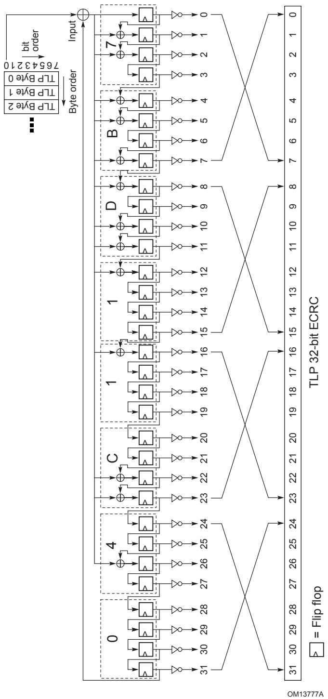

<details>
<summary>flowchart</summary>

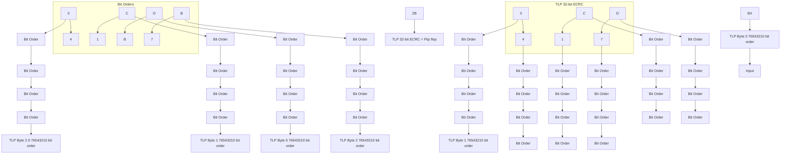
```mermaid
graph TD
    subgraph Bit Orders
        direction TB
  A["0"] --> B["4"]
  C["C"] --> D["1"]
  E["D"] --> F["B"]
  G["B"] --> H["7"]
    end
    subgraph TLP 32-bit ECRC
        direction TB
  I["0"] --> J["4"]
  K["C"] --> L["1"]
  M["D"] --> N["7"]
    end
  A --> O["Bit Order"]
  C --> P["Bit Order"]
  E --> Q["Bit Order"]
  G --> R["Bit Order"]
  I --> S["Bit Order"]
  J --> T["Bit Order"]
  K --> U["Bit Order"]
  L --> V["Bit Order"]
  M --> W["Bit Order"]
  N --> X["Bit Order"]
  O --> Y["Bit Order"]
  P --> Z["Bit Order"]
  Q --> AA["Bit Order"]
  R --> AB["Bit Order"]
  S --> AC["Bit Order"]
  T --> AD["Bit Order"]
  U --> AE["Bit Order"]
  V --> AF["Bit Order"]
  W --> AG["Bit Order"]
  X --> AH["Bit Order"]
  Y --> AI["Bit Order"]
  Z --> AJ["Bit Order"]
  AA --> AK["Bit Order"]
  AB --> AL["Bit Order"]
  AC --> AM["Bit Order"]
  AD --> AN["Bit Order"]
  AE --> AO["Bit Order"]
  AF --> AP["Bit Order"]
  AG --> AQ["Bit Order"]
  AH --> AR["Bit Order"]
  AI --> AS["Bit Order"]
  AJ --> AT["Bit Order"]
  AK --> AU["Bit Order"]
  AL --> AV["Bit Order"]
  AM --> AW["Bit Order"]
  AN --> AX["Bit Order"]
  AO --> AY["Bit Order"]
  AP --> AZ["Bit Order"]
  AQ --> BA["Bit Order"]
  AR --> BB["Bit Order"]
  AS --> BC["TLP Byte 2 0 76543210 bit order"]
  AT --> BD["TLP Byte 1 76543210 bit order"]
  AU --> BE["TLP Byte 0 76543210 bit order"]
  AV --> BF["TLP Byte 2 76543210 bit order"]
  AW --> BG["TLP Byte 1 76543210 bit order"]
  BX --> BY["TLP Byte 0 76543210 bit order"]
  BY --> BZ["Input"]
  ZB --> CA["TLP 32-bit ECRC = Flip flop"]
```
</details>

Figure 2-90 Calculation of 32-bit ECRC for TLP End to End Data Int § egrity Protection

## IMPLEMENTATION NOTE:

## PROTECTION OF TD BIT INSIDE SWITCHES (NFM) §

It is of utmost importance that Switches insure and maintain the integrity of the TD bit in TLPs that they receive and forward (i.e., by applying a special internal protection mechanism), since corruption of the TD bit will cause the ultimate target device to misinterpret the presence or absence of the TLP Digest field.

Similarly, it is strongly recommended that Switches provide internal protection to other Variant fields in TLPs that they receive and forward, as the end-to-end integrity of Variant fields is not sustained by the ECRC.

## IMPLEMENTATION NOTE:

## DATA LINK LAYER DOES NOT HAVE INTERNAL TLP VISIBILITY (NFM)

Since the Data Link Layer does not process the TLP header (it determines the start and end of the TLP based on indications from the Physical Layer), it is not aware of the existence of the TLP Digest field, and simply passes it to the Transaction Layer as a part of the TLP.

## 2.7.2 Error Forwarding (Data Poisoning) §

Error Forwarding (also known as data poisoning), is indicated by Setting the EP bit, or additionally, in FM, through the use of Physical Layer Logical Block mechanisms. In FM, either or both mechanisms are permitted to be applied to a TLP with a data payload, and the requirements defined in this specification for Receiver handling of poisoned TLPs are the same regardless of the poisoning mechanism applied. It is permitted for Receivers to additionally implement differentiated handling based on the type of poisoning mechanism applied, but such handling is outside the scope of this specification.

The rules for the use of the EP bit are specified in § Section 2.7.2.1 . The rules for the use of Physical Layer Logical Block mechanisms for data poisoning are specified in § Section 4.2.3.4 . Here are some examples of cases where Error Forwarding might be used:

• Example #1: A read from parity or ECC-protected memory encounters an uncorrectable error (EP bit)  
• Example #2: An error detected at the source of a write directed towards system memory (EP bit)  
• Example #3: Data integrity error on an internal data buffer or cache within a routing element (EP bit or Physical Layer Logical Block)

Considerations for the use of Error Forwarding

• Error Forwarding is only used for Read Completion Data, AtomicOp Completion Data, AtomicOp Request Data, or Write Data, never for the cases when the error is in the “header” (request phase, address/command, etc.). Requests/Completions with header errors cannot be forwarded in general since true destination cannot be positively known and, therefore, forwarding may cause direct or side effects such as data corruption, system failures, etc.

• Error Forwarding is used for controlled propagation of errors through the system, system diagnostics, etc.

• Note that Error forwarding does not cause Data Link Layer Retry - Poisoned TLPs will be retried only if there are transmission errors on the Link as determined by the TLP error detection mechanisms in the Data Link Layer.

◦ The Poisoned TLP may ultimately cause the originator of the request to re-issue it (at the Transaction Layer or above) in the case of read operation or to take some other action. Such use of Error Forwarding information is beyond the scope of this specification.

## 2.7.2.1 Rules For Use of Data Poisoning §

• Support for TLP poisoning in a Transmitter is optional.  
◦ In FM, a Transmitter is permitted to support only the EP bit mechanism, only the Physical Layer Logical Block mechanism, or both, or neither.  
• Data poisoning applies only to the data payload 50 within a Write Request (Posted or Non-Posted), a Message with Data, an AtomicOp Request, a Read Completion, or an AtomicOp Completion.  
• Poisoning of a TLP with a data payload in the Transaction Layer is indicated by a Set EP bit.  
• When a routing element is translating a TLP from NFM to FM, if the EP bit is Set in the NFM TLP, then the EP bit must be Set in the FM TLP.  
• When a routing element is translating a TLP from FM to NFM, if either poisoning mechanism has been applied to the FM TLP, then the EP bit must be Set in the NFM TLP.  
• Transmitters are only permitted to poison TLPs that include a data payload. In FM, the EP bit is Reserved for TLPs that do not include a data payload. In NFM, the behavior of the Receiver is not specified if poisoning is indicated for any TLP that does not include a data payload.  
• For IDE TLPs:

◦ Only the original Transmitting Port is permitted to poison a TLP and must do so using the EP bit.

◦ It is not permitted to use Physical Layer Logical Block mechanisms to poison a TLP; if data corruption is detected in an IDE TLP after the time the MAC has been generated, the IDE TLP must be forwarded without consideration of the detected corruption.

• If a Transmitter supports data poisoning, TLPs that are known at the Transaction Layer of the Transmitter to include a bad data payload must use the EP bit poison mechanism.  
• For a routing element that supports data poisoning, if a non-IDE TLP is Received as poisoned using Physical Layer Logical Block mechanisms, that TLP must transmitted at the Egress Port marked as poisoned using the EP bit mechanism.  
• If a Downstream Port supports Poisoned TLP Egress Blocking, the Poisoned TLP Egress Blocking Enable bit is Set, and a poisoned TLP targets going out the Egress Port, the Port must handle the TLP as a Poisoned TLP Egress Blocked error unless there is a higher precedence error. See § Section 6.2.3.2.3 , § Section 6.2.5 , and § Section 7.9.14.3 . Further:

◦ The Port must not transmit the TLP.  
◦ If DPC is not triggered and the TLP is a Non-Posted Request, the Port must return a Completion with Unsupported Request Completion Status. See § Section 6.2.3.2.4.1 .  
◦ If DPC is triggered the Port must behave as described in § Section 2.9.3 .

• For ultimate Completers:

◦ The following Requests with poisoned data payload must not modify the value of the target location:

▪ Configuration Write Request

▪ Any of the following that target a control register or control structure in the Completer: I/O Write Request, Memory Write Request, or non-vendor-defined Message with data  
▪ AtomicOp Request  
▪ DMWr Request (see § Section 6.32

Unless there is a higher precedence error, a Completer must handle these Requests as a Poisoned TLP Received error 51 , and the Completer must also return a Completion with a Completion Status of Unsupported Request (UR) if the Request is Non-Posted (see § Section 6.2.3.2.3 , § Section 6.2.3.2.4 , and § Section 6.2.5 ). Regardless of the severity of the reported error, the reported error must be handled as an uncorrectable error, not an Advisory Non-Fatal Error.

A Switch must route these Requests the same way it would route the same Request if it were not poisoned, unless a Request targets a location in the Switch itself, in which case the Switch is the Completer for that Request and must follow the above rules.

For some applications it may be desirable for the Completer to use poisoned data in Write Requests that do not target control registers or control structures - such use is not forbidden. Similarly, it may be desirable for the Requester to use data marked poisoned in Completions - such use is also not forbidden. The appropriate use of poisoned information is application specific, and is not discussed in this document.

This document does not define any mechanism for determining which part or parts of the data payload of a Poisoned TLP are actually corrupt and which, if any, are not corrupt.

## 2.8 Completion Timeout Mechanism §

In any split transaction protocol, there is a risk associated with the failure of a Requester to receive an expected Completion. To allow Requesters to attempt recovery from this situation in a standard manner, the Completion Timeout mechanism is defined. This mechanism is intended to be activated only when there is no reasonable expectation that the Completion will be returned, and should never occur under normal operating conditions. Note that the values specified here do not reflect expected service latencies, and must not be used to estimate typical response times.

PCI Express device Functions that issue Requests requiring Completions must implement the Completion Timeout mechanism. An exception is made for Configuration Requests (see below). The Completion Timeout mechanism is activated for each Request that requires one or more Completions when the Request is transmitted. Since Switches do not autonomously initiate Requests that need Completions, the requirement for Completion Timeout support is limited only to Root Complexes, PCI Express-PCI Bridges, and Endpoints.

The Completion Timeout mechanism may be disabled by configuration software by means of the Completion Timeout Disable mechanism (see § Section 7.5.3.15 and § Section 7.5.3.16 ).

The Completion Timeout limit is set in the Completion Timeout Value field of the Device Control 2 register. A Completion Timeout is a reported error associated with the Requester Function (see § Section 6.2 ). If the Completion Timeout programming mechanism is not supported, the Function MUST@FLIT implement a timeout value in the range 40 ms to 50 ms; when Flit Mode Supported is Clear, the Function must implement a timeout value in the range 50 μs to 50 ms, and it is strongly recommended that the value be at least 10 ms.

Note: A Memory Read Request for which there are multiple Completions must be considered completed only when all Completions have been received by the Requester. If some, but not all, requested data is returned before the Completion Timeout timer expires, the Requester is permitted to keep or to discard the data that was returned prior to timer expiration.

Completion Timeouts for Configuration Requests have special requirements for the support of PCI Express to PCI/PCI-X Bridges. PCI Express to PCI/PCI-X Bridges, by default, are not enabled to return Request Retry Status (RRS) for Configuration Requests to a PCI/PCI-X device behind the Bridge. This may result in lengthy completion delays that must be comprehended by the Completion Timeout value in the Root Complex. System software may enable PCI Express to PCI/PCI-X Bridges to return RRS for Configuration Requests by setting the Bridge Configuration Retry Enable bit in the Device Control register, subject to the restrictions noted in the [PCIe-to-PCI-PCI-X-Bridge].

## IMPLEMENTATION NOTE:

## COMPLETION TIMEOUT PREFIX/HEADER LOG CAPABLE §

The prefix/header of the Request TLP associated with a Completion Timeout may optionally be recorded by Requesters that implement the AER Capability. Support for recording of the prefix/header is indicated by the value of the Completion Timeout Prefix/Header Log Capable bit in the Advanced Error Capabilities and Control register.

A Completion Timeout may be the result of improper configuration, system failure, or async removal (see § Section 6.7.6 ). In order for host software to distinguish a Completion Timeout error after which continued normal operation is not possible (e.g., after one caused by improper configuration or a system failure) from one where continued normal operation is possible (e.g., after an async removal), it is strongly encouraged that Requesters log the Request TLP prefix/header associated with the Completion Timeout.

## 2.9 Link Status Dependencies §

## 2.9.1 Transaction Layer Behavior in DL\_Down Status §

DL\_Down status indicates that there is no connection with another component on the Link, or that the connection with the other component has been lost and is not recoverable by the Physical or Data Link Layers. This section specifies the Transaction Layer's behavior if DPC has not been triggered and the Data Link Layer reports DL\_Down status to the Transaction Layer, indicating that the Link is non-operational. § Section 2.9.3 specifies the behavior if DPC has been triggered.

• For a Port with DL\_Down status, the Transaction Layer is not required to accept received TLPs from the Data Link Layer, provided that these TLPs have not been acknowledged by the Data Link Layer. Such TLPs do not modify receive Flow Control credits.

For a Downstream Port, DL\_Down status is handled by:

• Initializing back to their default state any buffers or internal states associated with outstanding requests transmitted Downstream

◦ Port configuration registers must not be affected, except as required to update status associated with the transition to DL\_Down.

• For Non-Posted Requests, forming completions for any Requests submitted by the device core for Transmission, returning Unsupported Request Completion Status, then discarding the Requests

◦ This is a reported error associated with the Function for the (virtual) Bridge associated with the Port (see § Section 6.2 ). For Root Ports, the reporting of this error is optional.

◦ Non-Posted Requests already being processed by the Transaction Layer, for which it may not be practical to return Completions, are discarded.

Note: This is equivalent to the case where the Request had been Transmitted but not yet Completed before the Link status became DL\_Down.

▪ These cases are handled by the Requester using the Completion Timeout mechanism.

Note: The point at which a Non-Posted Request becomes “uncompletable” is implementation specific.

• The Port must terminate any PME\_Turn\_Off handshake Requests targeting the Port in such a way that the Port is considered to have acknowledged the PME\_Turn\_Off request (see the Implementation Note in § Section 5.3.3.2.1 ).  
• The Port must handle Vendor Defined Message Requests as described in § Section 2.2.8.6 (e.g., silently discard Vendor\_Defined Type 1 Messages Requests that it is not designed to receive) since the DL\_Down prevents the Request from reaching its targeted Function.  
• For all other Posted Requests, discarding the Requests

◦ This is a reported error associated with the Function for the (virtual) Bridge associated with the Port (see § Section 6.2 ), and must be reported as an Unsupported Request. For Root Ports, the reporting of this error is optional.  
◦ For a Posted Request already being processed by the Transaction Layer, the Port is permitted not to report the error.

Note: This is equivalent to the case where the Request had been Transmitted before the Link status became DL\_Down

Note: The point at which a Posted Request becomes “unreportable” is implementation specific.

• Discarding all Completions submitted by the device core for Transmission

For an Upstream Port, DL\_Down status is handled as a reset by:

• Returning all PCI Express-specific registers, state machines and externally observable state to the specified default or initial conditions (except for registers defined as sticky - see § Section 7.4 )  
• Discarding all TLPs being processed  
• For Switch and Bridge propagating hot reset to all associated Downstream Ports. In Switches that support Link speeds greater than 5.0 GT/s, the Upstream Port must direct the LTSSM of each Downstream Port to the Hot Reset state, but not hold the LTSSMs in that state. This permits each Downstream Port to begin Link training immediately after its hot reset completes. This behavior is recommended for all Switches.

## 2.9.2 Transaction Layer Behavior in DL\_Up Status

§

DL\_Up status indicates that a connection has been established with another component on the associated Link. This section specifies the Transaction Layer's behavior when the Data Link Layer reports entry to the DL\_Up status to the Transaction Layer, indicating that the Link is operational. The Transaction Layer of a Port with DL\_Up status must accept received TLPs that conform to the other rules of this specification.

For a Downstream Port on a Root Complex or a Switch:

• When transitioning from a non-DL\_Up status to a DL\_Up status and the Auto Slot Power Limit Disable bit is Clear in the Slot Control Register, the Port must initiate the transmission of a Set\_Slot\_Power\_Limit Message to the other component on the Link to convey the value programmed in the Slot Power Limit Scale and Slot Power Limit Value fields of the Slot Capabilities Register. This Transmission is optional if the Slot Capabilities Register has not yet been initialized.

## 2.9.3 Transaction Layer Behavior During Downstream Port Containment §

During Downstream Port Containment (DPC), the LTSSM associated with the Downstream Port is directed to the Disabled state. Once it reaches the Disabled state, it remains there as long as the DPC Trigger Status bit in the DPC Status Register is Set. See § Section 6.2.11 for requirements on how long software must leave the Downstream Port in DPC. This section specifies the Transaction Layer's behavior once DPC has been triggered, and as long as the Downstream Port remains in DPC.

• Once DPC has been triggered, no additional (Upstream) TLPs are accepted from the Data Link Layer.  
• If the condition that triggered DPC was associated with an Upstream TLP, any subsequent Upstream TLPs that were already accepted from the Data Link Layer must be discarded silently.

The Downstream Port handles (Downstream) TLPs submitted by the device core in the following manner.

• If the condition that triggered DPC was associated with a Downstream TLP, any prior Downstream TLPs are permitted to be dropped silently or transmitted before the Link goes down. Otherwise, the following rules apply.

◦ For each Non-Posted Request, the Port must return a Completion and discard the Request silently. The Completer ID field must contain the value associated with the Downstream Port.

▪ If the DPC Completion Control bit is Set in the DPC Control Register, then Completions are generated with Unsupported Request (UR) Completion Status.  
▪ If the DPC Completion Control bit is Clear, Completions are generated with Completer Abort (CA) Completion Status.

◦ The Port must terminate any PME\_Turn\_Off handshake Requests targeting the Port in such a way that the Port is considered to have acknowledged the PME\_Turn\_Off Request (see the Implementation Note in § Section 5.3.3.2.1 ).  
◦ The Port must handle Vendor Defined Message Requests as described in § Section 2.2.8.6 . (e.g., silently discard Vendor Defined\_Type 1 Message Requests that it is not designed to receive) since the DL\_Down prevents the Request from reaching its targeted Function.  
◦ For all other Posted Requests and Completions, the Port must silently discard the TLP.

For any outstanding Non-Posted Requests where DPC being triggered prevents their associated Completions from being returned, the following apply:

• For Root Ports that support RP Extensions for DPC, the Root Port may track certain Non-Posted Requests, and when DPC is triggered, synthesize a Completion for each tracked Request. This helps avoid Completion Timeouts that would otherwise occur as a side-effect of DPC being triggered. Each synthesized Completion must have a UR or CA Completion Status as determined by the DPC Completion Control bit. The set of Non-Posted Requests that get tracked is implementation specific, but it is strongly recommended that all Non-Posted Requests that are generated by host processor instructions (e.g., “read”, “write”, “load”, “store”, or one that corresponds to an AtomicOp) be tracked. Other candidates for tracking include peer-to-peer Requests coming from other Root Ports and Requests coming from RCiEPs.  
• Otherwise, the associated Requesters may encounter Completion Timeouts. The software solution stack should comprehend and account for this possibility.

## 3. Data Link Layer Specification §

The Data Link Layer acts as an intermediate stage between the Transaction Layer and the Physical Layer. Its primary responsibility is to provide a reliable mechanism for exchanging Transaction Layer Packets (TLPs) between the two components on a Link.

## 3.1 Data Link Layer Overview §

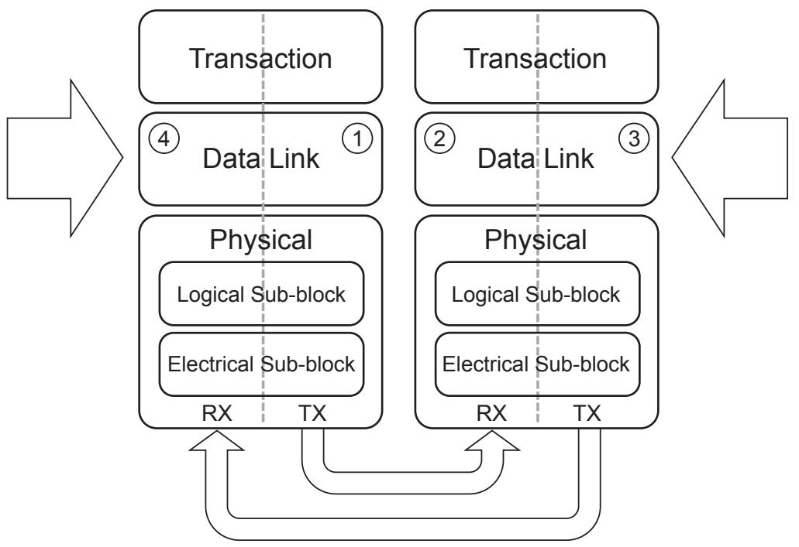

<details>
<summary>flowchart</summary>

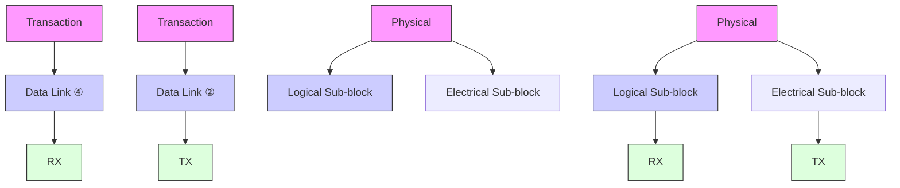
```mermaid
graph TD
  A["Transaction"] --> B["Data Link ④"]
  C["Transaction"] --> D["Data Link ②"]
  E["Physical"] --> F["Logical Sub-block"]
  E --> G["Electrical Sub-block"]
  H["Physical"] --> I["Logical Sub-block"]
  H --> J["Electrical Sub-block"]
  B --> K["RX"]
  D --> L["TX"]
  I --> M["RX"]
  J --> N["TX"]
    style A fill:#f9f,stroke:#333
    style C fill:#f9f,stroke:#333
    style E fill:#f9f,stroke:#333
    style H fill:#f9f,stroke:#333
    style B fill:#ccf,stroke:#333
    style D fill:#ccf,stroke:#333
    style F fill:#ccf,stroke:#333
    style I fill:#ccf,stroke:#333
    style K fill:#dfd,stroke:#333
    style L fill:#dfd,stroke:#333
    style M fill:#dfd,stroke:#333
    style N fill:#dfd,stroke:#333
```
</details>

OM13778A

Figure 3-1 Layering Diagram Highlighting the Data Link Layer§

The Data Link Layer is responsible for reliably conveying TLPs supplied by the Transaction Layer across a PCI Express Link to the other component's Transaction Layer. Services provided by the Data Link Layer include:

## Data Exchange:

• Accept TLPs for transmission from the Transmit Transaction Layer and convey them to the Transmit Physical Layer  
• Accept TLPs received over the Link from the Physical Layer and convey them to the Receive Transaction Layer

Error Detection and Retry (Non-Flit Mode):

• TLP Sequence Number and LCRC generation  
• Transmitted TLP storage for Data Link Layer Retry

• Data integrity checking for TLPs and Data Link Layer Packets (DLLPs)  
• Positive and negative acknowledgement DLLPs  
• Error indications for error reporting and logging mechanisms  
• Link Acknowledgement Timeout replay mechanism

Initialization and power management:

• Track Link state and convey active/reset/disconnected state to Transaction Layer

## DLLPs are:

• used for Link Management functions including TLP acknowledgement, power management, and exchange of Flow Control information.  
• transferred between Data Link Layers of the two directly connected components on a Link

DLLPs are sent point-to-point, between the two components on one Link. TLPs are routed from one component to another, potentially through one or more intermediate components.

In Non-Flit Mode, Data integrity checking for DLLPs and TLPs is done using a CRC included with each packet sent across the Link. DLLPs use a 16-bit CRC and TLPs (which can be much longer than DLLPs) use a 32-bit LCRC. TLPs additionally include a sequence number, which is used to detect cases where one or more entire TLPs have been lost.

• Received DLLPs that fail the CRC check are discarded. The mechanisms that use DLLPs may suffer a performance penalty from this loss of information, but are self-repairing such that a successive DLLP will supersede any information lost.  
• TLPs that fail the data integrity checks (LCRC and sequence number), or that are lost in transmission from one component to another, are re-sent by the Transmitter. The Transmitter stores a copy of all TLPs sent, re-sending these copies when required, and purges the copies only when it receives a positive acknowledgement of error-free receipt from the other component. If a positive acknowledgement has not been received within a specified time period, the Transmitter will automatically start re-transmission. The Receiver can request an immediate re-transmission using a negative acknowledgement.

In Flit Mode, both DLLPs and TLPs are sent using Flits. Flits contain the data integrity checks (LCRC, FEC, and sequence number). Replay occurs at the FLit level (see § Section 4.2.3.4 and § Section 4.2.3.4.2.1 ).

The Data Link Layer appears as an information conduit with varying latency to the Transaction Layer. On any given individual Link all TLPs fed into the Transmit Data Link Layer (1 and 3) will appear at the output of the Receive Data Link Layer (2 and 4) in the same order at a later time, as illustrated in § Figure 3-1. The latency will depend on a number of factors, including pipeline latencies, width and operational frequency of the Link, transmission of electrical signals across the Link, and delays caused by Data Link Layer Retry. As a result of these delays, the Transmit Data Link Layer (1 and 3) can apply backpressure to the Transmit Transaction Layer, and the Receive Data Link Layer (2 and 4) communicates the presence or absence of valid information to the Receive Transaction Layer.

## 3.2 Data Link Control and Management State Machine


The Data Link Layer tracks the state of the Link. It communicates Link status with the Transaction and Physical Layers, and performs Link management through the Physical Layer. The Data Link Layer contains the Data Link Control and Management State Machine (DLCMSM) to perform these tasks. The states for this machine are described below, and are shown in § Figure 3-2.

States:

• DL\_Inactive - Physical Layer reporting Link is non-operational or nothing is connected to the Port  
• DL\_Feature (optional) - Physical Layer reporting Link is operational, perform the Data Link Feature Exchange  
• DL\_Init - Physical Layer reporting Link is operational, initialize Flow Control for the default Virtual Channel  
• DL\_Active - Normal operation mode

## Status Outputs:

• DL\_Down - The Data Link Layer is not communicating with the component on the other side of the Link.  
• DL\_Up - The Data Link Layer is communicating with the component on the other side of the Link.

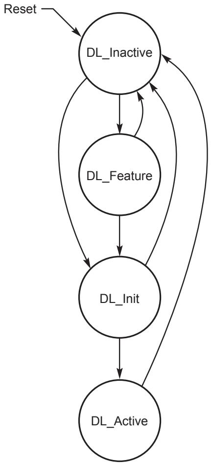

<details>
<summary>flowchart</summary>

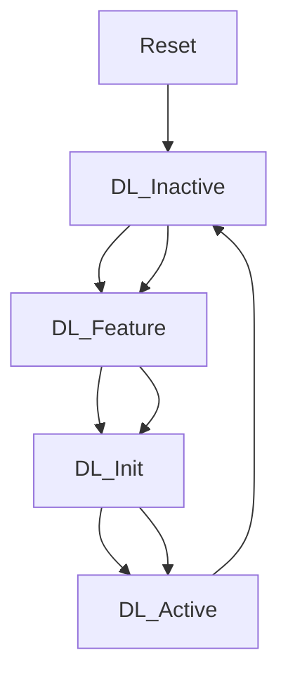
```mermaid
graph TD
  A["Reset"] --> B["DL_Inactive"]
  B --> C["DL_Feature"]
  C --> D["DL_Init"]
  D --> E["DL_Active"]
  E --> B
  C --> D
  B --> C
  D --> E
```
</details>

OM13779A  
Figure 3-2 Data Link Control and Management State Machine§

## 3.2.1 Data Link Control and Management State Machine Rules §

## Rules per state:

## • DL\_Inactive

◦ Initial state following PCI Express Hot, Warm, or Cold Reset (see § Section 6.6 ). Note that DL states are unaffected by an FLR (see § Section 6.6 ).

◦ Upon entry to DL\_Inactive

▪ Reset all Data Link Layer state information to default values  
▪ If the Port supports the optional Data Link Feature Exchange, the Remote Data Link Feature Supported, and Remote Data Link Feature Supported Valid fields must be cleared.  
▪ Discard the contents of the Data Link Layer Retry Buffer (see § Section 3.6 )

◦ While in DL\_Inactive:

▪ Report DL\_Down status to the Transaction Layer as well as to the rest of the Data Link Layer Note: This will cause the Transaction Layer to discard any outstanding transactions and to terminate internally any attempts to transmit a TLP. For a Downstream Port, this is equivalent to a Hot-Remove. For an Upstream Port, having the Link go down is equivalent to a hot reset (see § Section 2.9 ).

▪ Discard TLP information from the Transaction and Physical Layers

▪ Do not generate or accept DLLPs

◦ Exit to DL\_Feature if:

The Port supports the optional Data Link Feature Exchange, the Data Link Feature Exchange Enable bit is Set or the Data Link Feature Extended Capability is not implemented, the Transaction Layer indicates that the Link is not disabled by software, and the Physical Layer reports Physical LinkUp = 1b

◦ Exit to DL\_Init if:

▪ The Port does not support the optional Data Link Feature Exchange, the Transaction Layer indicates that the Link is not disabled by software, and the Physical Layer reports Physical LinkUp = 1b or The Port supports the optional Data Link Feature Exchange, the Data Link Feature Exchang Enable bit is Clear, the Transaction Layer indicates that the Link is not disabled by software and the Physical Layer reports Physical LinkUp = 1b

## • DL\_Feature

◦ While in DL\_Feature:

▪ Perform the Data Link Feature Exchange protocol as described in § Section 3.3  
▪ Report DL\_Down status  
▪ The Data Link Layer of a Port with DL\_Down status is permitted to discard any received TLPs provided that it does not acknowledge those TLPs by sending one or more Ack DLLPs

◦ Exit to DL\_Init if:

▪ Data Link Feature Exchange completes successfully, and the Physical Layer continues to report Physical LinkUp = 1b, or  
Data Link Feature Exchange determines that the remote Data Link Layer does not support the optional Data Link Feature Exchange protocol, and the Physical Layer continues to report Physical LinkUp = 1b

◦ Terminate the Data Link Feature Exchange protocol and exit to DL\_Inactive if:

▪ Physical Layer reports Physical LinkUp = 0b

## • DL\_Init

◦ While in DL\_Init:

▪ Initialize Flow Control for the default Virtual Channel, VC0, following the Flow Control initialization protocol described in § Section 3.4  
▪ Report DL\_Down status while in state FC\_INIT1; DL\_Up status while in state FC\_INIT2  
▪ The Data Link Layer of a Port with DL\_Down status is permitted to discard any received TLPs provided that it does not acknowledge those TLPs by sending one or more Ack DLLPs

◦ Exit to DL\_Active if:

▪ Flow Control initialization completes successfully, and the Physical Layer continues to report Physical LinkUp = 1b

◦ Terminate attempt to initialize Flow Control for VC0 and exit to DL\_Inactive if:

▪ Physical Layer reports Physical LinkUp = 0b

## • DL\_Active

◦ DL\_Active is referred to as the normal operating state  
◦ While in DL\_Active:

▪ Accept and transfer TLP information with the Transaction and Physical Layers as specified in this chapter

▪ Generate and accept DLLPs as specified in this chapter

▪ Report DL\_Up status to the Transaction and Data Link Layers

◦ Exit to DL\_Inactive if:

▪ Physical Layer reports Physical LinkUp = 0b  
Downstream Ports that are Surprise Down Error Reporting Capable (see § Section 7.5.3.6 ) must treat this transition from DL\_Active to DL\_Inactive as a Surprise Down error, except in the following cases where this error detection is blocked:

▪ If the Secondary Bus Reset bit in the Bridge Control register has been Set by software, then the subsequent transition to DL\_Inactive must not be considered an error.

▪ If the Link Disable bit has been Set by software or if DPC has been triggered, then the subsequent transition to DL\_Inactive must not be considered an error.

▪ If a Switch Downstream Port transitions to DL\_Inactive due to an event above that Port, that transition to DL\_Inactive must not be considered an error. Example events include the Switch Upstream Port propagating Hot Reset, the Switch Upstream Link transitioning to DL\_Down, and the Secondary Bus Reset bit in the Switch Upstream Port being Set.

▪ If a PME\_Turn\_Off Message has been sent through this Port, then the subsequent transition to DL\_Inactive must not be considered an error.

▪ Note that the DL\_Inactive transition for this condition will not occur until a power off, a reset, or a request to restore the Link is sent to the Physical Layer.

▪ Note also that in the case where the PME\_Turn\_Off/PME\_TO\_Ack handshake fails to complete successfully, a Surprise Down error may be detected.

▪ If the Port is associated with a hot-pluggable slot (the Hot-Plug Capable bit in the Slot Capabilities register Set), and the Hot-Plug Surprise bit in the Slot Capabilities register is Set, then any transition to DL\_Inactive must not be considered an error.

▪ If the Port is associated with a hot-pluggable slot (Hot-Plug Capable bit in the Slot Capabilities register Set), and Power Controller Control bit in Slot Control register is Set (Power-Off), then any transition to DL\_Inactive must not be considered an error.

Error blocking initiated by one or more of the above cases must remain in effect until the Port exits DL\_Active and subsequently returns to DL\_Active with none of the blocking cases in effect at the time of the return to DL\_Active.

Note that the transition out of DL\_Active is simply the expected transition as anticipated per the error detection blocking condition.

If implemented, this is a reported error associated with the detecting Port (see § Section 6.2 ).

## IMPLEMENTATION NOTE: PHYSICAL LAYER THROTTLING §

Note that there are conditions where the Physical Layer may be temporarily unable to accept TLPs and DLLPs from the Data Link Layer. The Data Link Layer must comprehend this by providing mechanisms for the Physical Layer to communicate this condition, and for TLPs and DLLPs to be temporarily blocked by the condition.

## 3.3 Data Link Feature Exchange §

The Data Link Feature Exchange protocol is required for Ports that support 16.0 GT/s and higher data rates. It is optional for other Ports. Downstream Ports that implement this protocol must contain the Data Link Feature Extended Capability (see § Section 7.7.4 ). Upstream Ports that implement this protocol are optionally permitted to include the Data Link Feature Extended Capability. This capability contains four fields:

• The Local Data Link Feature Supported field indicates the Data Link Features supported by the local Port  
• The Remote Data Link Feature Supported field indicates the Data Link Features supported by the remote Port  
• The Remote Data Link Feature Supported Valid bit indicates that the Remote Data Link Feature Supported field contains valid data  
• The Data Link Feature Exchange Enable field permits systems to disable the Data Link Feature Exchange. This can be used to work around legacy hardware that does not correctly ignore the DLLP.

The Data Link Feature Exchange protocol transmits a Port's Local Feature Supported information to the Remote Port and captures that Remote Port's Feature Supported information.

Rules for this protocol are:

• On entry to DL\_Feature:  
◦ It is permitted to Clear the Remote Data Link Feature Supported and Remote Data Link Feature Supported Valid fields

• While in DL\_Feature:

◦ Transaction Layer must block transmission of TLPs

◦ Transmit the Data Link Feature DLLP

▪ The transmitted Feature Supported field must use the value in the Local Data Link Feature Supported field.

▪ The transmitted Feature Ack bit must use the value in the Remote Data Link Feature Supported Valid bit.

◦ The Data Link Feature DLLP must be transmitted at least once every 34 μs. Time spent in the Recovery or Configuration LTSSM states does not contribute to this limit.

◦ Process received Data Link Feature DLLPs:

▪ If the Remote Data Link Feature Supported Valid bit is Clear, record the Feature Supported field from the received Data Link Feature DLLP in the Remote Data Link Feature Supported field and Set the Remote Data Link Feature Supported Valid bit.

• Exit DL\_Feature if:

◦ An InitFC1 DLLP has been received.

◦ An MR-IOV MRInit DLLP (encoding 0000 0001b) has been received. MR-IOV is deprecated so this clause has no effect in new designs. or

◦ While in DL\_Feature, at least one Data Link Feature DLLP has been received with the Feature Ack bit Set.

A Data Link Feature is a field representing a protocol feature. Protocol features are either activated, not activated, or not supported. A Data Link Feature is activated when Remote Data Link Feature Supported Valid is Set and when the associated Feature Supported bit is Set in both the Local Data Link Feature Supported and Remote Data Link Feature Supported fields.

A Data Link Parameter is a field that communicates a value across the interface. Data Link Parameters have a parameter-specific mechanism for software to determine when the field value is meaningful. For example, the field might be meaningful if its value is non-zero or the field might be meaningful if some other field(s) have specific values.

Data Link Features and their corresponding bit locations are shown in § Table 3-1.

Table 3-1 Data Link Feature Supported Bit Definition§

<table><tr><td>Bit Location</td><td>Description</td><td>Type</td></tr><tr><td>0</td><td>Scaled Flow Control – indicates support for Scaled Flow Control. Must be Set in Ports that support 16.0 GT/s or higher data rates. Must be Set if Flit Mode is enabled.</td><td>Data Link Feature</td></tr><tr><td>1</td><td>Immediate Readiness – indicates that all non-Virtual Functions in the sending Port have Immediate Readiness Set (see § Section 7.5.1.1.4). In Flit Mode, this bit is always meaningful. In Non-Flit Mode, this bit is meaningful when Set, but when Clear indicates either that some non-Virtual Function has Immediate Readiness Clear or that the sending Port is not providing this information.</td><td>Data Link Parameter</td></tr><tr><td>4:2</td><td>Extended VC Count – This field indicates the number of VC Resources supported by the sending Port. This is the value of the Extended VC Count field in either the Multi-Function Virtual Channel Extended Capability or the Virtual Channel Extended Capability (with Capability ID 0002h). This field is meaningful in Flit Mode. In Non-Flit Mode, this field must be zero.</td><td>Data Link Parameter</td></tr><tr><td>7:5</td><td>L0p Exit Latency - This field indicates sending Port's L0p Exit Latency. The value reported indicates the length of time the sending Port requires to complete widening a link using L0p. If the sending Port does not support L0p, this field must contain 000b.Defined encodings are:</td><td>Data Link Parameter</td></tr><tr><td rowspan="9"></td><td>000b Less than 1μs</td><td rowspan="9"></td></tr><tr><td>001b 1 μs to less than 2 μs</td></tr><tr><td>010b 2 μs to less than 4 μs</td></tr><tr><td>011b 4 μs to less than 8 μs</td></tr><tr><td>100b 8 μs to less than 16 μs</td></tr><tr><td>101b 16 μs to less than 32 μs</td></tr><tr><td>110b 32 μs-64 μs</td></tr><tr><td>111b More than 64 μs</td></tr><tr><td>This field is meaningful in Flit Mode. In Non-Flit Mode, this field must be zero.</td></tr><tr><td>22:8</td><td>Reserved</td><td></td></tr></table>

## 3.4 Flow Control Initialization Protocol §

Before starting normal operation following power-up or interconnect reset, it is necessary to initialize Flow Control for the default Virtual Channel, VC0 (see § Section 6.6 ). In addition, when additional Virtual Channels (VCs) are enabled, the Flow Control initialization process must be completed for each newly enabled VC before it can be used (see § Section 2.6.1 ). This section describes the initialization process that is used for all VCs. Note that since VC0 is enabled before all other VCs, no TLP traffic of any kind will be active prior to initialization of VC0. However, when additional VCs are being initialized there will typically be TLP traffic flowing on other, already enabled, VCs. Such traffic has no direct effect on the initialization process for the additional VC(s).

Shared Flow Control is enabled in Flit Mode. Shared Flow Control is disabled in Non-Flit Mode.

There are two states in the VC initialization process. These states are:

• FC\_INIT1  
• FC\_INIT2

The rules for this process are given in the following section.

## 3.4.1 Flow Control Initialization State Machine Rules §

• If at any time during initialization for VCs 1-7 the VC is disabled, the flow control initialization process for the VC is terminated  
• Rules for state FC\_INIT1:

◦ Entered when initialization of a VC (VCx) is required

▪ When the DL\_Init state is entered (VCx = VC0)  
▪ When VC (VCx = VC1-7) is enabled by software (see § Section 7.9.1 and § Section 7.9.2 )

◦ While in FC\_INIT1:

▪ Transaction Layer must block transmission of TLPs using VCx ▪ In Non-Flit Mode, transmit the following three InitFC1 DLLPs for VCx in the following relative order:

▪ InitFC1-P [Dedicated] (first)  
▪ InitFC1-NP [Dedicated] (second)  
▪ InitFC1-Cpl [Dedicated] (third)

▪ In Flit Mode, transmit the following six InitFC1 DLLPs for VCx in the following relative order:

▪ InitFC1-P [Dedicated] (first)  
▪ InitFC1-NP [Dedicated] (second)  
▪ InitFC1-Cpl [Dedicated] (third)  
▪ InitFC1-P [Shared] (fourth)  
▪ InitFC1-NP [Shared] (fifth)  
▪ InitFC1-Cpl [Shared] (sixth)

▪ The three (or six) InitFC1 DLLPs must be transmitted at least once every 34 μs.

▪ Time spent in the Recovery or Configuration LTSSM states does not contribute to this limit.  
▪ It is strongly encouraged that the InitFC1 DLLP transmissions are repeated frequently, particularly when there are no other TLPs or DLLPs available for transmission.

▪ Set DataFC, DataScale, HdrFC, and HdrScale as shown in § Table 3-2

§ Table 3-2 InitFC1 / InitFC2 Options

<table><tr><td>Row</td><td>Flit Mode Status</td><td>Scaled Flow Control Supported and Activated</td><td>Extended VC Count</td><td>Merged</td><td>InitFC Count</td><td>Dedicated / Shared</td><td colspan="2">DataScale / DataFC and HdrScale / HdrFC</td><td>Notes</td></tr><tr><td>1</td><td>No</td><td>No</td><td>any</td><td>No</td><td>3</td><td>0b</td><td colspan="2">00b / any</td><td>1</td></tr><tr><td>2</td><td>No</td><td>Yes</td><td>any</td><td>No</td><td>3</td><td>0b</td><td colspan="2">{01b | 10b | 11b} / any</td><td>1,2</td></tr><tr><td>3</td><td rowspan="2">Yes</td><td rowspan="2">Yes</td><td rowspan="2">0</td><td rowspan="2">No</td><td rowspan="2">6</td><td>0b (shared)</td><td colspan="2">00b / 0 [Infinite] or {01b | 10b | 11b} / ≠ 0</td><td>3,6</td></tr><tr><td>4</td><td>1b (dedicated)</td><td colspan="2">01b / 0 [Zero]</td><td>4,6</td></tr><tr><td>5</td><td rowspan="4">Yes</td><td rowspan="4">Yes</td><td rowspan="4">0</td><td rowspan="4">Yes</td><td rowspan="4">6</td><td rowspan="2">0b (shared)</td><td>P, NP</td><td>00b / 0 [Infinite] or {01b | 10b | 11b} / ≠ 0</td><td>3,6</td></tr><tr><td>6</td><td>Cpl</td><td>10b / 0 [Merged]</td><td>6,8</td></tr><tr><td>7</td><td rowspan="2">1b (dedicated)</td><td>P, Cpl</td><td>00b / 0 [Infinite] or {01b | 10b | 11b} / ≠ 0</td><td>6</td></tr><tr><td>8</td><td>NP</td><td>01b / 0 [Zero]</td><td>5,6</td></tr><tr><td>9</td><td rowspan="2">Yes</td><td rowspan="2">Yes</td><td rowspan="2">≠0</td><td rowspan="2">No</td><td rowspan="2">6</td><td>0b (shared)</td><td colspan="2">00b / 0 [Infinite] or 01b / 0 [Zero] or {01b | 10b | 11b} / ≠0</td><td>7</td></tr><tr><td>10</td><td>1b (dedicated)</td><td colspan="2">00b / 0 [Infinite] or {01b | 10b | 11b} / ≠0</td><td>3</td></tr><tr><td>11</td><td rowspan="3">Yes</td><td rowspan="3">Yes</td><td rowspan="3">≠0</td><td rowspan="3">Yes</td><td rowspan="3">6</td><td rowspan="2">0b (shared)</td><td>P, NP</td><td>00b / 0 [Infinite] or 01b / 0 [Zero] or {01b | 10b | 11b} / ≠0</td><td>7</td></tr><tr><td>12</td><td>Cpl</td><td>10b / 0 [Merged]</td><td>8</td></tr><tr><td>13</td><td>1b (dedicated)</td><td colspan="2">00b / 0 [Infinite] or {01b | 10b | 11b} / ≠0</td><td>3</td></tr></table>

## Notes:

1. Scaled FC bits were Reserved in earlier specs.  
2. Earlier specs allowed Infinite credits to use Scale Factors 01b, 10b, or 11b  
3. Infinite credits are permitted and use Scale Factor 00b. Other encodings of Scale Factor are not allowed for this use case.  
4. When there is only 1 VC and not merged, all credits are Shared FC, Dedicated FC has Zero credits.  
5. When there is only 1 VC and merged, Non-Posted Dedicated FC has Zero credits.  
6. This use case is also permitted to apply when the Remote Extended VC Count field in the Data Link Feature DLLP is zero (i.e., the remote Port supports a asingle VC).  
7. Zero Shared Credits not permitted on VC0.  
8. Merged encoding for Shared Completion credits indicates that Shared Completions use Shared Posted credits. The Merged encoding is not permitted on Shared Posted or Shared Non-Posted credits.

▪ Except as needed to ensure at least the required frequency of InitFC1 DLLP transmission, the Data Link Layer must not block other transmissions.

▪ Note that this includes all Physical Layer initiated transmissions (e.g., Ordered Sets), Ack and Nak DLLPs (when applicable), and TLPs using VCs that have previously completed initialization (when applicable)

▪ Process received InitFC1 and InitFC2 DLLPs:

▪ Record the indicated HdrFC and DataFC values  
▪ If the Receiver supports Scaled Flow Control, record the indicated HdrScale and DataScale values.  
▪ Set flag FI1 once FC unit values have been recorded for each of P, NP, and Cpl for VCx.

▪ In Non-Flit Mode flag FI1 is Set when the three dedicated FC unit values have been recorded.  
▪ In Flit Mode, flag FI1 is Set when all six FC unit values have been recorded.

◦ Exit to FC\_INIT2 if:

▪ Flag FI1 has been Set indicating that FC unit values have been recorded for each of P, NP, and Cpl for VCx

• Rules for state FC\_INIT2:

◦ While in FC\_INIT2:

▪ Transaction Layer must block transmission of TLPs using VCx  
▪ In non-Flit Flit-Mode, transmit the following three InitFC2 DLLPs for VCx in the following relative order:  
▪ InitFC2-P [Dedicated] (first)  
▪ InitFC2-NP [Dedicated] (second)  
▪ InitFC2-Cpl [Dedicated] (third)

▪ In Flit Mode, transmit the following six InitFC2 DLLPs for VCx in the following relative order:

▪ InitFC2-P [Dedicated] (first)  
▪ InitFC2-NP [Dedicated] (second)  
▪ InitFC2-Cpl [Dedicated] (third)  
▪ InitFC2-P [Shared] (fourth)  
▪ InitFC2-NP [Shared] (fifth)  
▪ InitFC2-Cpl [Shared] (sixth)

▪ The three (six) InitFC2 DLLPs must be transmitted at least once every 34 μs.

▪ Time spent in the Recovery or Configuration LTSSM states does not contribute to this limit.  
▪ It is strongly encouraged that the InitFC2 DLLP transmissions are repeated frequently, particularly when there are no other TLPs or DLLPs available for transmission.

▪ Set DataFC, DataScale, HdrFC, and HdrScale as shown in § Table 3-2  
▪ Except as needed to ensure at least the required frequency of InitFC2 DLLP transmission, the Data Link Layer must not block other transmissions

▪ Note that this includes all Physical Layer initiated transmissions (for example, Ordered Sets), Ack and Nak DLLPs (when applicable), and TLPs using VCs that have previously completed initialization (when applicable)

▪ Process received InitFC1 and InitFC2 DLLPs:

▪ Ignore the received HdrFC, HdrScale, DataFC, and DataScale values  
▪ Set flag FI2 on receipt of any InitFC2 DLLP for VCx

▪ Set flag FI2 on receipt of any TLP on VCx, any UpdateFC DLLP for VCx, or, in Flit Mode, any Optimized\_Update\_FC

◦ Signal completion and exit if:

▪ Flag FI2 has been Set

▪ If Scaled Flow Control is activated on the Link, the Transmitter must send 01b, 10b, or 11b for HdrScale and DataScale in all UpdateFC DLLPs for VCx.  
▪ If the Scaled Flow Control is not supported or if Scaled Flow Control is not activated on the Link, the Transmitter must send 00b for HdrScale and DataScale in all UpdateFC DLLPs for VCx.

## IMPLEMENTATION NOTE:

## EXAMPLE OF FLOW CONTROL INITIALIZATION §

§ Figure 3-3 illustrates an example of the Flow Control initialization protocol for VC0 between a Switch and a Downstream component. In this example, each component advertises the minimum permitted values for each type of Flow Control credit. For both components the Rx\_MPS\_Limit is 1024 bytes, corresponding to a data payload credit advertisement of 040h. All DLLPs are shown as received without error.

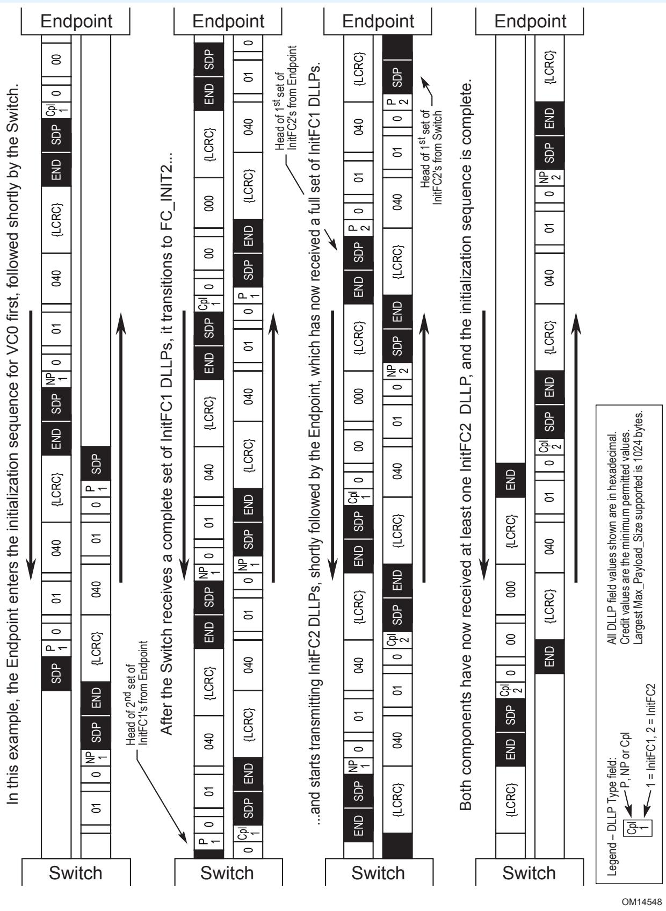

<details>
<summary>timing diagram</summary>

| Segment | Start Sequence | End Mongolia | Target Sequence |
| --- | --- | --- | --- |
| InitFC1 DLLP | 040 | 040 | 040 |
| InitFC1 DLLP | 040 | 040 | 040 |
| InitFC1 DLLP | 040 | 040 | 040 |
| InitFC1 DLLP | 040 | 040 | 040 |
| InitFC1 DLLP | 040 | 040 | 040 |
| InitFC1 DLLP | 040 (Cpl) | 040 | 040 |
| InitFC1 DLLP | 040 (NP) | 040 | 040 |
| InitFC1 DLLP | 040 (SDP) | 040 | 040 |
| InitFC1 DLLP | 040 (END) | 040 | 040 |
| InitFC1 DLLP | 040 (End) | 040 | 040 |
| InitFC2 DLLP | 040 | 040 | 040 |
| InitFC2 DLLP | 040 | 040 | 040 |
| InitFC2 DLLP | 040 (Cpl) | 040 | 040 |
| InitFC2 DLLP | 040 (NP) | 040 | 040 |
| InitFC2 DLLP | 040 (SDP) | 040 | 040 |
| InitFC2 DLLP | 040 (END) | 040 | 040 |
| InitFC2 DLLP | 040 (End) | 040 | 040 |
| InitFC2 DLLP | 040 (End) | 040 | 040 |
| InitFC2 DLLP | 040 (End) | 040 | 040 |
| InitFC2 DLLP | 040 (End) | 040 | 040 |
| InitFC2 DLLP | 045 | 045 | 045 |
| InitFC2 DLLP | 045 | 045 | 045 |
| InitFC2 DLLP | 045 | 045 | 045 |
| InitFC2 DLLP | 045 | 045 | 045 |
| InitFC2 DLLP | 045 | 045 | 045 |
| InitFC2 DLLP | 1 = InitFC1, 2 = InitFC2 | - | - |
</details>

Figure 3-3 VC0 Flow Control Initialization Example with 8b/10b Encoding-based F § raming

## 3.4.2 Scaled Flow Control §

Link performance can be affected when there are insufficient flow control credits available to account for the Link round trip time. This effect becomes more noticeable at higher Link speeds and the limitation of 127 header credits and 2047 data credits can limit performance. The Scaled Flow Control mechanism is designed to address this limitation.

All Ports are permitted to support Scaled Flow Control. Ports that support 16.0 GT/s and higher data rates must support Scaled Flow Control. Scaled Flow Control activation does not affect the ability to operate at 16.0 GT/s and higher data rates.

The following rules apply when Scaled Flow Control is not activated for the Link:

• The InitFC1, InitFC2, and UpdateFC DLLPs must contain 00b in the HdrScale and DataScale fields.  
• The HdrFC counter is 8 bits wide and the HdrFC field includes all bits of the counter.  
• The DataFC counter is 12 bits wide and the DataFC field includes all bits of the counter.

The following rules apply when Scaled Flow Control is activated for the Link:

• The InitFC1 and InitFC2 DLLPs that are transmitted must contain 01b, 10b, or 11b in the HdrScale field. The value is determined by the maximum number of header credits that will be outstanding of the indicated credit type as defined in § Table 3-3.  
• The InitFC1 and InitFC2 DLLPsthat are transmitted must contain 01b, 10b, or 11b in the DataScale field. The value is determined by the maximum number of data payload credits that will be outstanding of the indicated credit type as defined in § Table 3-3.

Table 3-3 Scaled Flow Control Scaling Factors§

<table><tr><td rowspan="2">Scale Factor</td><td rowspan="2">Scaled Flow Control Supported and Activated</td><td rowspan="2">Credit Type</td><td rowspan="2">Min Credits</td><td rowspan="2">Max Credits</td><td rowspan="2">Field Width</td><td colspan="2">FC DLLP field</td></tr><tr><td>Transmitted</td><td>Received</td></tr><tr><td rowspan="2">00b</td><td rowspan="2">No</td><td>Hdr</td><td>1</td><td>127</td><td>8 bits</td><td>HdrFC</td><td>HdrFC</td></tr><tr><td>Data</td><td>1</td><td>2,047</td><td>12 bits</td><td>DataFC</td><td>DataFC</td></tr><tr><td rowspan="2">01b</td><td rowspan="2">Yes</td><td>Hdr</td><td>1</td><td>127</td><td>8 bits</td><td>HdrFC</td><td>HdrFC</td></tr><tr><td>Data</td><td>1</td><td>2,047</td><td>12 bits</td><td>DataFC</td><td>DataFC</td></tr><tr><td rowspan="2">10b</td><td rowspan="2">Yes</td><td>Hdr</td><td>4</td><td>508</td><td>10 bits</td><td>HdrFC &gt;&gt; 2</td><td>HdrFC &lt;&lt; 2</td></tr><tr><td>Data</td><td>4</td><td>8,188</td><td>14 bits</td><td>DataFC &gt;&gt; 2</td><td>DataFC &lt;&lt; 2</td></tr><tr><td rowspan="2">11b</td><td rowspan="2">Yes</td><td>Hdr</td><td>16</td><td>2,032</td><td>12 bits</td><td>HdrFC &gt;&gt; 4</td><td>HdrFC &lt;&lt; 4</td></tr><tr><td>Data</td><td>16</td><td>32,752</td><td>16 bits</td><td>DataFC &gt;&gt; 4</td><td>DataFC &lt;&lt; 4</td></tr></table>

## 3.5 Data Link Layer Packets (DLLPs)


The following DLLPs are used to support Link operations:

• Data Link Feature DLLP: For negotiation of supported features  
• Ack DLLP: TLP Sequence Number acknowledgement; used to indicate successful receipt of some number of TLPs (NFM only)  
• Nak DLLP: TLP Sequence Number negative acknowledgement; used to initiate a Data Link Layer Retry (NFM only)  
• InitFC1, InitFC2, and UpdateFC DLLPs; used for Flow Control  
• DLLPs used for Power Management  
• DLLPs used for Link Management (L0p)

## 3.5.1 Data Link Layer Packet Rules


All DLLP fields marked Reserved (sometimes abbreviated as R) must be filled with all 0's when a DLLP is formed. Values in such fields must be ignored by Receivers. The handling of Reserved values in encoded fields is specified for each case.

In Non-Flit Mode, all DLLPs include the following fields:

• DLLP Type - Specifies the type of DLLP. The defined encodings are shown in § Table 3-4.  
• 24 bits of DLLP Type specific information  
• 16-bit CRC

In Flit Mode, DLLPs are transmitted in the DLP bytes of a Flit. They consist of:

• DLLP Type - Specifies the type of DLLP. The defined encodings are shown in § Table 3-4.  
• 24 bits of DLLP Type specific information

See § Figure 3-4 and § Figure 3-5 below.

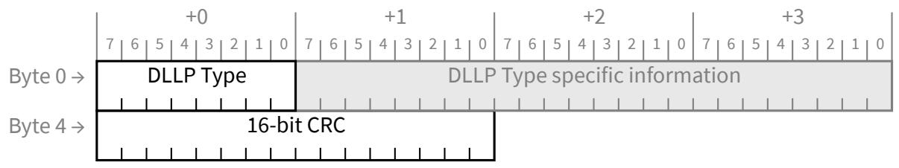

<details>
<summary>text_image</summary>

Byte 0 → DLLP Type DLLP Type specific information
Byte 4 → 16-bit CRC
</details>

Figure 3-4 DLLP Type and CRC Fields (Non-Flit Mode)§

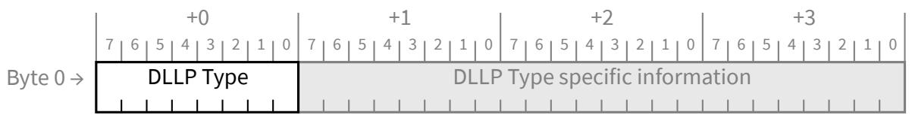

<details>
<summary>text_image</summary>

Byte 0 →
+0
7 | 6 | 5 | 4 | 3 | 2 | 1 | 0
DLLP Type
+1
7 | 6 | 5 | 4 | 3 | 2 | 1 | 0
DLLP Type specific information
+2
7 | 6 | 5 | 4 | 3 | 2 | 1 | 0
+3
7 | 6 | 5 | 4 | 3 | 2 | 1 | 0
</details>

§ Figure 3-5 DLLP Type Field (Flit Mode)

§ Table 3-4 DLLP Type Encodings

<table><tr><td>Encodings (b)</td><td>DLLP Type</td><td>References</td></tr><tr><td rowspan="2">0000 0000</td><td>Ack (Non-Flit Node)</td><td>§ Figure 3-6,</td></tr><tr><td>NOP2 (Flit Mode)</td><td>§ Figure 3-8</td></tr><tr><td rowspan="2">0000 0001</td><td>MRInit (Non-Flit Mode) (Deprecated)</td><td>See [MR-IOV]Note 1</td></tr><tr><td>Reserved (Flit Mode)</td><td></td></tr><tr><td>0000 0010</td><td>Data Link Feature</td><td>§ Figure 3-14,</td></tr><tr><td rowspan="2">0001 0000</td><td>Nak (Non-Flit Mode)</td><td>§ Figure 3-6,</td></tr><tr><td>Reserved (Flit Mode)</td><td></td></tr><tr><td>0010 0000</td><td>PM_Enter_L1</td><td>§ Figure 3-12, § Section 5.3.2.1</td></tr><tr><td>0010 0001</td><td>PM_Enter_L23</td><td>§ Figure 3-12, § Section 5.3.2.3</td></tr><tr><td>0010 0011</td><td>PM_Active_State_Request_L1</td><td>§ Figure 3-12, § Section 5.4.1.3.1</td></tr><tr><td>0010 0100</td><td>PM_Request_Ack</td><td>§ Figure 3-12, § Section 5.4.1.3.1, § Section 5.3.2.1</td></tr><tr><td rowspan="2">0010 1000</td><td>Reserved (Non-Flit Mode)</td><td></td></tr><tr><td>Link Management (Flit Mode)</td><td>§ Figure 3-15, § Table 4-44</td></tr><tr><td>0011 0000</td><td>Vendor-Specific</td><td>§ Figure 3-13,</td></tr><tr><td>0011 0001</td><td>NOP</td><td>§ Figure 3-7,</td></tr><tr><td>0100 0v2v1v0</td><td>InitFC1-P (v[2:0] specifies Virtual Channel)</td><td>§ Figure 3-9,</td></tr><tr><td>0101 0v2v1v0</td><td>InitFC1-NP</td><td></td></tr><tr><td>0110 0v2v1v0</td><td>InitFC1-Cpl</td><td></td></tr><tr><td rowspan="2">0111 0v2v1v0</td><td>MRInitFC1 (Non-Flit-Mode) (Deprecated)</td><td>See [MR-IOV]Note 2</td></tr><tr><td>Reserved (Flit Mode)</td><td></td></tr><tr><td>1100 0v2v1v0</td><td>InitFC2-P</td><td>§ Figure 3-10,</td></tr><tr><td>1101 0v2v1v0</td><td>InitFC2-NP</td><td></td></tr><tr><td> $1110\ 0v_{2}v_{1}v_{0}$ </td><td>InitFC2-Cpl</td><td></td></tr><tr><td rowspan="2"> $1111\ 0v_{2}v_{1}v_{0}$ </td><td>MRInitFC2 (Non-Flit-Mode) (Deprecated)</td><td>See [MR-IOV]Note 2</td></tr><tr><td>Reserved (Flit Mode)</td><td></td></tr><tr><td> $1000\ 0v_{2}v_{1}v_{0}$ </td><td>UpdateFC-P</td><td rowspan="3">§ Figure 3-11,</td></tr><tr><td> $1001\ 0v_{2}v_{1}v_{0}$ </td><td>UpdateFC-NP</td></tr><tr><td> $1010\ 0v_{2}v_{1}v_{0}$ </td><td>UpdateFC-Cpl</td></tr><tr><td rowspan="2"> $1011\ 0v_{2}v_{1}v_{0}$ </td><td>MRUpdateFC (Non-Flit Mode) (Deprecated)</td><td>See [MR-IOV]Note 2</td></tr><tr><td>Reserved (Flit Mode)</td><td></td></tr><tr><td>All other encodings</td><td>Reserved</td><td></td></tr></table>

1. The deprecated MR-IOV protocol uses this encoding for the MRInit negotiation. The MR-IOV protocol assumes that non-MR-IOV components will silently ignore these DLLPs.  
2. The deprecated MR-IOV protocol uses these encodings only after the successful completion of MRInit negotiation.

In § Figure 3-6 through § Figure 3-15 the 16-bit CRC is not shown. In Non-Flit Mode, the CRC is present as shown in § Figure 3-4.

• For Ack and Nak DLLPs (see § Figure 3-6):

◦ The AckNak\_Seq\_Num field is used to indicate what TLPs are affected  
◦ Transmission and reception is handled by the Data Link Layer according to the rules provided in § Section 3.6 .  
◦ These DLLPs are not used in Flit Mode. In Flit Mode, the Ack encoding is used for the NOP2.

• For InitFC1, InitFC2, and UpdateFC DLLPs:

◦ The HdrFC field contains the credit value for headers of the indicated type (P, NP, or Cpl).  
◦ The DataFC field contains the credit value for data payload of the indicated type (P, NP, or Cpl).  
◦ When Scaled Flow Control is supported, the HdrScale field contains the scaling factor for headers of the indicated type. Encodings are defined in § Table 3-5.  
◦ When Scaled Flow Control is supported, the DataScale field contains the scaling factor for data payload of the indicated type. Encodings are defined in § Table 3-5.  
◦ When Scaled Flow Control is not supported, the HdrScale and Data Scale fields are Reserved.  
◦ If Scaled Flow Control is activated, the HdrScale and DataScale fields must be set to 01b, 10b, or 11b in all InitFC1, InitFC2, and UpdateFC DLLPs transmitted.  
◦ In UpdateFCs, a Transmitter is only permitted to send non-zero values in the HdrScale and DataScale fields if it supports Scaled Flow Control, Scaled Flow control is activted, and it received non-zero values for HdrScale and DataScale in the InitFC1s and InitFC2s it received for this VC. In Flit Mode, the Optimized\_Update\_FC mechanism is supported in addition to the UpdateFC DLLP. Optimized\_Update\_FCs do not contain HdrScale and DataScale fields. For debug as well as ease of use by debug tools such as Logic Analyzers, devices must send at least one DLLP every 10 μs with an

Update\_FC DLLP per VC with the scaled credit information. It is strongly recommended that a Transmitter cycles through the VCs with finite non-0 credits in the Optimized\_Update\_FC as long as there is a credit to be released in the corresponding VC.

◦ The packet formats are shown in § Figure 3-9, § Figure 3-10, and § Figure 3-11.  
◦ Transmission is triggered by the Data Link Layer when initializing Flow Control for a Virtual Channel (see § Section 3.4 ), and following Flow Control initialization by the Transaction Layer according to the rules in § Section 2.6 .  
Checked for integrity on reception by the Data Link Layer and if correct, the information content of the DLLP is passed to the Transaction Layer. If the check fails, the information must be discarded. Note: InitFC1 and InitFC2 DLLPs are used only for VC initialization

Table 3-5 HdrScale and DataScale Encodings§

<table><tr><td>HdrScale or DataScale Value</td><td>Scaled Flow Control Supported</td><td>Scaling Factor</td><td>HdrFC Field</td><td>DataFC Field</td></tr><tr><td>00b</td><td>No</td><td>1</td><td>HdrFC[7:0]</td><td>DataFC[11:0]</td></tr><tr><td>01b</td><td>Yes</td><td>1</td><td>HdrFC[7:0]</td><td>DataFC[11:0]</td></tr><tr><td>10b</td><td>Yes</td><td>4</td><td>HdrFC[9:2]</td><td>DataFC[13:2]</td></tr><tr><td>11b</td><td>Yes</td><td>16</td><td>HdrFC[11:4]</td><td>DataFC[15:4]</td></tr></table>

• For Power Management (PM) DLLPs (see § Figure 3-12):

◦ Transmission is triggered by the component's power management logic according to the rules in § Chapter 5.  
◦ Checked for integrity on reception by the Data Link Layer, then passed to the component's power management logic

• For Vendor-Specific DLLPs (see § Figure 3-13)

◦ It is recommended that receivers silently ignore Vendor-Specific DLLPs unless enabled by implementation specific mechanisms.  
◦ It is recommended that transmitters not send Vendor-Specific DLLPs unless enabled by implementation specific mechanisms.

• For NOP DLLPs (see § Figure 3-7) and NOP2 DLLPs (see § Figure 3-8).

◦ Receivers shall discard this DLLP without action, unless otherwise specified, after checking it for data integrity. 52

• For Data Link Feature DLLPs (see § Figure 3-14)

◦ The Feature Ack bit is Set to 1b to indicate that the transmitting Port has received a Data Link Feature DLLP.  
◦ The Feature Supported field indicates the Data Link Features supported and/or attribute values for the transmitting Port. The individual bits of this field are defined in § Table 3-1.

• For Link Management DLLPs (see § Figure 3-15)

◦ In Non-Flit Mode, receivers shall discard this DLLP without action after checking it for data integrity. 53

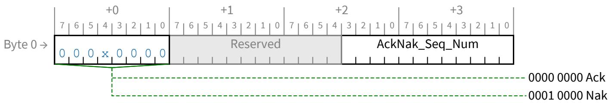

<details>
<summary>text_image</summary>

Byte 0 →
+0
7 6 5 4 3 2 1 0
0 0 0 x 0 0 0 0
Reserved
+1
7 6 5 4 3 2 1 0
+2
7 6 5 4 3 2 1 0
+3
7 6 5 4 3 2 1 0
AckNak_Seq_Num
0000 0000 Ack
0001 0000 Nak
</details>

Figure 3-6 Data Link Layer Packet Format for Ack and Nak (Non-Flit Mode)§

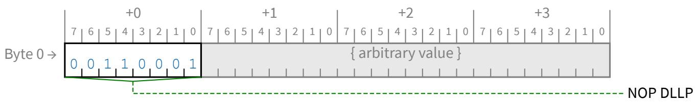

<details>
<summary>text_image</summary>

Byte 0 →
+0
7 | 6 | 5 | 4 | 3 | 2 | 1 | 0
+1
7 | 6 | 5 | 4 | 3 | 2 | 1 | 0
+2
7 | 6 | 5 | 4 | 3 | 2 | 1 | 0
+3
7 | 6 | 5 | 4 | 3 | 2 | 1 | 0
{ arbitrary value }
NOP DLLP
</details>

Figure 3-7 Data Link Layer Packet Format for NOP§

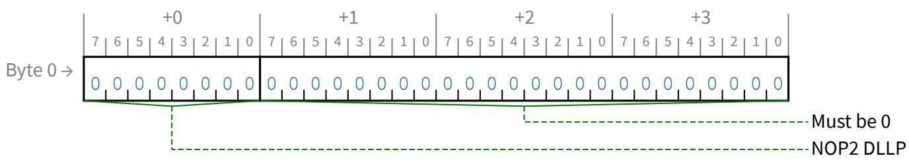

<details>
<summary>text_image</summary>

Byte 0 →
+0
7 6 5 4 3 2 1 0
+1
7 6 5 4 3 2 1 0
+2
7 6 5 4 3 2 1 0
+3
7 6 5 4 3 2 1 0
Must be 0
NOP2 DLLP
</details>

Figure 3-8 Data Link Layer Packet Format for NOP2 (Flit Mode)§


<details>
<summary>timing diagram</summary>

| Event Description | Value |
| ---------------- | ----- |
| Data Scale       | +1    |
| Hdr Scale        | +2    |
| VC[2:0]          | +3    |
</details>

Figure 3-9 Data Link Layer Packet Format for InitFC1§

See also § Table 3-2.

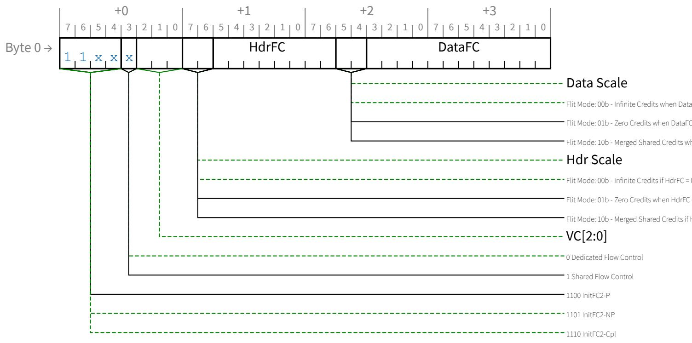

<details>
<summary>timing diagram</summary>

| Event | Value |
| --- | --- |
| Data Scale | +1 |
| Data Scale | +2 |
| Data Scale | +3 |
| Data Scale | - |
| Data Scale | - |
| Data Scale | - |
| Data Scale | - |
| Data Scale | - |
| Data Scale | - |
| Data Scale | - |
| Data Scale | - |
| Data Scale | - |
| Data Scale | - |
| Data Scale | - |
| Data Scale | - |
| Data Scale | - |
| Data Scale | - |
| Data Scale | - |
| Data Scale | - |
| Data Scale | - |
| Data Scales | - |
| Data Scales | - |
| Data Scales | - |
| Data Scales | - |
| Data Scales | - |
| Data Scales | - |
| Data Scales | - |
| Data Scales | - |
| Data Scales | - |
| Data Scales | - |
| Data Scales | - |
| Data Scales | - |
| Data Scales | - |
| Data Scales | - |
| Data Scales | 0 |
| Data Scales | 1 |
| Data Scales | 2 |
| Data Scales | 3 |
| Data Scales | 4 |
| Data Scales | 5 |
| Data Scales | 6 |
| Data Scales | 7 |
| Data Scales | 8 |
| Data Scales | 9 |
| Data Scales | 10 |
| Data Scales | 11 |
| Data Scales | 12 |
| Data Scales | 13 |
| Data Scales | 14 |
| Data Scales | 15 |
| Data Scales | 16 |
| Data Scales | 17 |
| Data Scales | 18 |
| Data Scales | 19 |
| Data Scales | 20 |
| Data Scales | 21 |
| Data Scales | 22 |
| Data Scales | 23 |
| Data Scales | 24 |
| Data Scales | 25 |
| Data Scales | 26 |
| Data Scales | 27 |
| Data Scales | 28 |
| Data Scales | 29 |
| Data Scales | 30 |
| Data Scales | 31 |
| Data Scales | 32 |
| Data Scales | 33 |
| Data Scales | 34 |
| Data Scales | 35 |
| Data Scales | 36 |
| Data Scales | 37 |
| Data Scales | 38 |
| Data Scales | 39 |
| Data Scales | 40 |
| Data Scales | 41 |
| Data Scales | 42 |
| Data Scales | 43 |
| Data Scales | 44 |
| Data Scales | 45 |
| Data Scales | 46 |
| Data Scales | 47 |
| Data Scales | 48 |
| Data Scales | 49 |
| Data Scales | 50 |
| Data Scales | 51 |
| Data Scales | 52 |
| Data Scales | 53 |
| Data Scales | 54 |
| Data Scales | 55 |
| Data Scales | 56 |
| Data Scales | 57 |
| Data Scales | 58 |
| Data Scales | 59 |
| Data Scales | 60 |
| Data Scales | 61 |
| Data Scales | 62 |
| Data Scales | 63 |
| Data Scales | 64 |
| Data Scales | 65 |
| Data Scales | 66 |
| Data Scales | 67 |
| Data Scales | 68 |
| Data Scales | 69 |
| Data Scales | 70 |
| Data Scales | 71 |
| Data Scales | 72 |
| Data Scales | 73 |
| Data Scales | 74 |
| Data Scales | 75 |
| Data Scales | 76 |
| Data Scales | 77 |
| Data Scales | 78 |
| Data Scales | 79 |
| Data Scales | 80 |
| Data Scales | 81 |
| Data Scales | 82 |
| Data Scales | 83 |
| Data Scales | 84 |
| Data Scales | 85 |
| Data Scales | 86 |
| Data Scales | 87 |
| Data Scales | 88 |
| Data Scales | 89 |
| Data Scales | 90 |
| Data Scales | 91 |
| Data Scales | 92 |
| Data Scales | 93 |
| Data Scales | 94 |
| Data Scales | 95 |
| Data Scales | 96 |
| Data Scales | 97 |
| Data Scales | 98 |
| Data Scales | 99 |
| Data Scales | 100 |
</details>

Figure 3-10 Data Link Layer Packet Format for InitFC2§

See also § Table 3-2.  
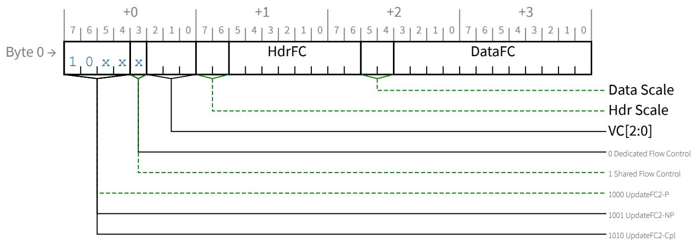

<details>
<summary>timing diagram</summary>

| Event | Value |
| --- | --- |
| Data Scale | +0 |
| Data Scale | +1 |
| Data Scale | +2 |
| Data Scale | +3 |
| Data Scale | - |
| Data Scale | - |
| Data Scale | - |
| Data Scale | - |
| Data Scale | - |
| Data Scale | - |
| Data Scale | - |
| Data Scale | - |
| Data Scale | - |
| Data Scale | - |
| Data Scale | - |
| Data Scale | - |
| Data Scale | - |
| Data Scale | - |
| Data Scale | - |
| Data Scale | - |
| Data Scale | - |
| Data Scales | 0 |
| Data Scales | 1 |
| Data Scales | 1000 UpdateFC2-P |
| Data Scales | 1001 UpdateFC2-NP |
| Data Scales | 1010 UpdateFC2-Cpl |
</details>

Figure 3-11 Data Link Layer Packet Format for UpdateFC§

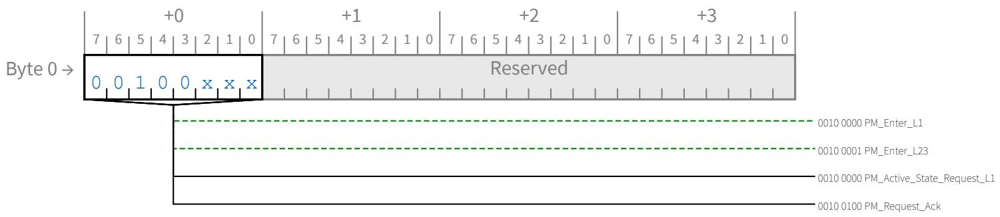

<details>
<summary>timing diagram</summary>

| Bit Position | Value |
| ------------ | ----- |
| 0            | 0     |
| 1            | 1     |
| x            | x     |
| x            | x     |
| +0           | 0     |
| +1           | 1     |
| +2           | 2     |
| +3           | 3     |
| Reserved      |       |
| 0010 0000 PM_Enter_L1 |       |
| 0010 0001 PM_Enter_L23 |       |
| 0010 0000 PM_Active_State_Request_L1 |       |
| 0010 0100 PM_Request_Ack |       |
</details>

Figure 3-12 Data Link Layer Packet Format for Power Management§

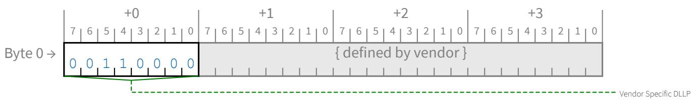

<details>
<summary>text_image</summary>

Byte 0 →
+0
7 | 6 | 5 | 4 | 3 | 2 | 1 | 0
+1
7 | 6 | 5 | 4 | 3 | 2 | 1 | 0
+2
7 | 6 | 5 | 4 | 3 | 2 | 1 | 0
+3
7 | 6 | 5 | 4 | 3 | 2 | 1 | 0
{ defined by vendor }
Vendor Specific DLLP
</details>

Figure 3-13 Data Link Layer Packet Format for Vendor-Specific§

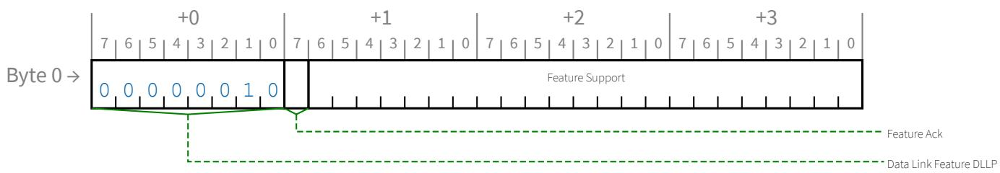

<details>
<summary>text_image</summary>

Byte 0 →
+0
7 6 5 4 3 2 1 0
0 0 0 0 0 0 1 0
+1
7 6 5 4 3 2 1 0
Feature Support
+2
7 6 5 4 3 2 1 0
+3
7 6 5 4 3 2 1 0
Feature Ack
Data Link Feature DLLP
</details>

Figure 3-14 Data Link Layer Packet Format for Data Link Feature DLLP§

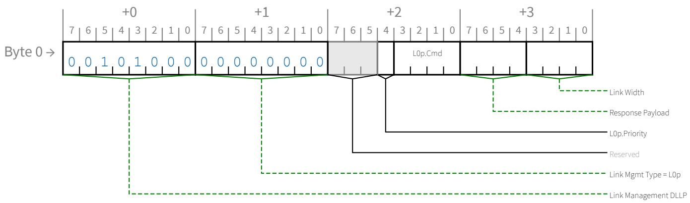

<details>
<summary>text_image</summary>

Byte 0 →
+0
7 6 5 4 3 2 1 0
0 0 1 0 1 0 0 0
+1
7 6 5 4 3 2 1 0
0 0 0 0 0 0 0
+2
7 6 5 4 3 2 1 0
L0p.Cmd
+3
7 6 5 4 3 2 1 0
Link Width
Response Payload
L0p.Priority
Reserved
Link Mgmt Type = L0p
Link Management DLLP
</details>

Figure 3-15 Data Link Packet Layer Format for Link Management (Flit Mode)§

The following are the characteristics and rules associated with Data Link Layer Packets (DLLPs):

• DLLPs are differentiated from TLPs when they are presented to, or received from, the Physical Layer.  
• DLLP data integrity is protected using a 16-bit CRC (NFM only)  
• The CRC value is calculated using the following rules (see § Figure 3-16):

◦ The polynomial used for CRC calculation has a coefficient expressed as 100Bh  
◦ The seed value (initial value for CRC storage registers) is FFFFh  
◦ CRC calculation starts with bit 0 of byte 0 and proceeds from bit 0 to bit 7 of each byte  
◦ Note that CRC calculation uses all bits of the DLLP, regardless of field type, including Reserved fields. The result of the calculation is complemented, then placed into the 16-bit CRC field of the DLLP as shown in § Table 3-6.

Table 3-6 Mapping of Bits into CRC Field§

<table><tr><td>CRC Result Bit</td><td>Corresponding Bit Position in the 16-Bit CRC Field</td></tr><tr><td>0</td><td>7</td></tr><tr><td>1</td><td>6</td></tr><tr><td>2</td><td>5</td></tr><tr><td>3</td><td>4</td></tr><tr><td>4</td><td>3</td></tr><tr><td>5</td><td>2</td></tr><tr><td>6</td><td>1</td></tr><tr><td>7</td><td>0</td></tr><tr><td>8</td><td>15</td></tr><tr><td>9</td><td>14</td></tr><tr><td>10</td><td>13</td></tr><tr><td>11</td><td>12</td></tr><tr><td>12</td><td>11</td></tr><tr><td>13</td><td>10</td></tr><tr><td>14</td><td>9</td></tr><tr><td>15</td><td>8</td></tr></table>

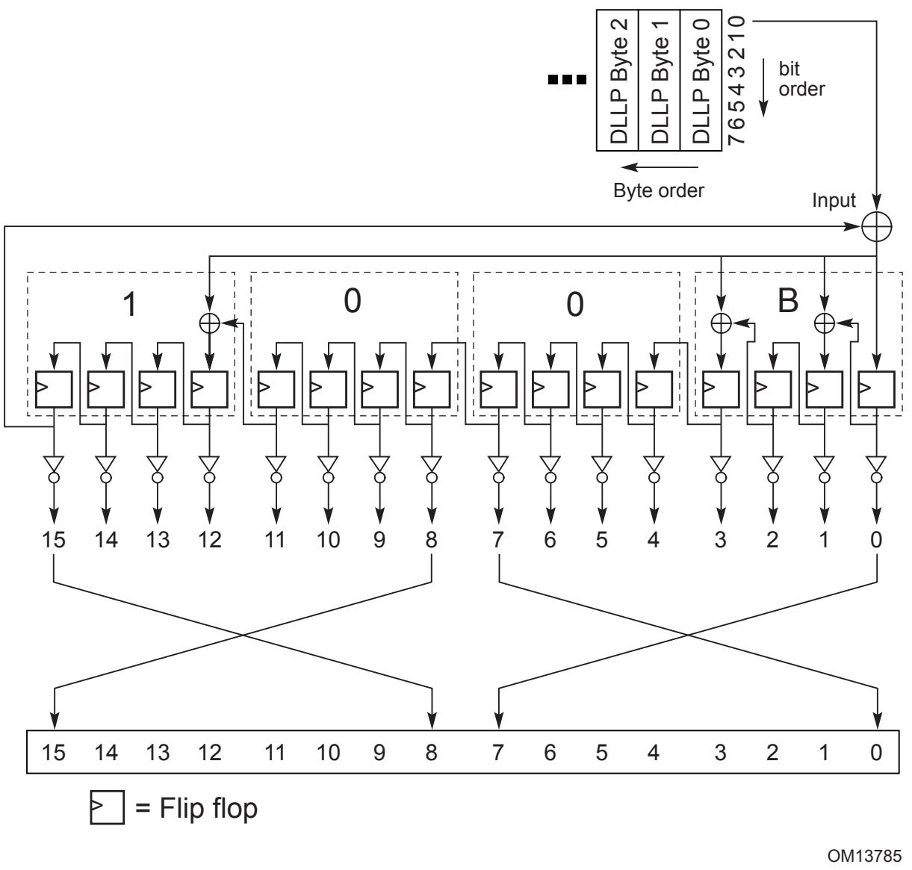

<details>
<summary>flowchart</summary>


```mermaid
graph TD
    subgraph Input
        direction TB
  A["Input"] --> B["1"]
  A --> C["0"]
  A --> D["B"]
    end
    subgraph Bit Orders
        direction TB
  E["15"] --> F["14"]
  F --> G["13"]
  G --> H["12"]
  H --> I["11"]
  I --> J["10"]
  J --> K["9"]
  K --> L["8"]
  L --> M["7"]
  M --> N["6"]
  N --> O["5"]
  O --> P["4"]
  P --> Q["3"]
  Q --> R["2"]
  R --> S["1"]
  S --> T["0"]
    end
    subgraph FlipFlop
        direction TB
  U["15"] --> V["14"]
  V --> W["13"]
  W --> X["12"]
  X --> Y["11"]
  Y --> Z["10"]
  Z --> AA["9"]
  AA --> AB["8"]
  AB --> AC["7"]
  AC --> AD["6"]
  AD --> AE["5"]
  AE --> AF["4"]
  AF --> AG["3"]
  AG --> AH["2"]
  AH --> AI["1"]
  AI --> AJ["0"]
    end
  B -->|Bit Order| C
  C -->|DLLP Byte 2, DLLP Byte 1, DLLP Byte 0| D
  D -->|76543210| E
  E -->|bit order| F
  F --> G
  G --> H
  H --> I
  I --> J
  J --> K
  K --> L
  L --> M
  M --> N
  N --> O
  O --> P
  P --> Q
  Q --> R
  R --> S
  S --> T
  T --> U
  U --> V
  V --> W
  W --> X
  X --> Y
  Y --> Z
  Z --> AA
  AA --> AB
  AB --> AC
  AC --> AD
  AD --> AE
  AE --> AF
  AF --> AG
  AG --> AH
  AH --> AI
  AI --> AJ
  AJ --> AK
  AK --> AL
  AL --> AM
  AM --> AN
  AN --> AO
  AO --> AP
  AP --> AQ
  AQ --> AR
  AR --> AS
  AS --> AT
  AT --> AU
  AU --> AV
  AV --> AW
  AW --> AX
  AX --> AY
    style Input fill:#f9f,stroke:#333
    style Bit Orders fill:#ccf,stroke:#333
```
</details>

Figure 3-16 Diagram of CRC Calculation for DLLPs§

## 3.6 Data Integrity Mechanisms §

## 3.6.1 Introduction §

The Transaction Layer provides TLP boundary information to the Data Link Layer. This allows the Data Link Layer to apply a TLP Sequence Number and a Link CRC (LCRC) for error detection to the TLP. The Receive Data Link Layer validates received TLPs by checking the TLP Sequence Number, LCRC code and any error indications from the Receive Physical Layer. In case any of these errors are in a TLP, Data Link Layer Retry is used for recovery.

The format of a TLP with the TLP Sequence Number and LCRC code applied is shown in § Figure 3-17.

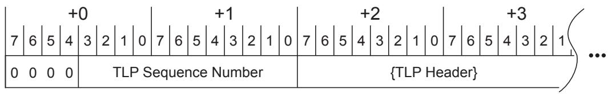

<details>
<summary>text_image</summary>

+0
+1
+2
+3
7 6 5 4 3 2 1 0 7 6 5 4 3 2 1 0 7 6 5 4 3 2 1 0 7 6 5 4 3 2 1
0 0 0 0 TLP Sequence Number {TLP Header}
...
</details>

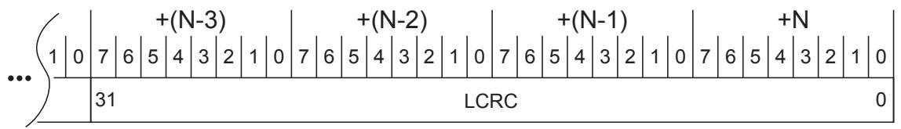

<details>
<summary>text_image</summary>

…
1 | 0 | 7 | 6 | 5 | 4 | 3 | 2 | 1 | 0 | 7 | 6 | 5 | 4 | 3 | 2 | 1 | 0 | 7 | 6 | 5 | 4 | 3 | 2 | 1 | 0 |
31 LCRC 0
</details>

OM13786A

Figure 3-17 TLP with LCRC and TLP Sequence Number Applied - Non-Flit Mode§

On Ports that support Protocol Multiplexing, packets containing a non-zero value in Symbol +0, bits 7:4 are PMUX Packets. For TLPs, these bits must be 0000b. See § Appendix G. for details.

On Ports that do not support Protocol Multiplexing, Symbol +0, bits 7:4 are Reserved.

## 3.6.2 LCRC, Sequence Number, and Retry Management (TLP Transmitter) §

The TLP transmission path through the Data Link Layer (paths labeled 1 and 3 in § Figure 3-1) prepares each TLP for transmission by applying a sequence number, then calculating and appending a Link CRC (LCRC), which is used to ensure the integrity of TLPs during transmission across a Link from one component to another. TLPs are stored in a retry buffer, and are re-sent unless a positive acknowledgement of receipt is received from the other component. If repeated attempts to transmit a TLP are unsuccessful, the Transmitter will determine that the Link is not operating correctly, and will instruct the Physical Layer to retrain the Link (via the LTSSM Recovery state, § Section 4.2.7 ). If Link retraining fails, the Physical Layer will indicate that the Link is no longer up, causing the DLCMSM to move to the DL\_Inactive state.

The mechanisms used to determine the TLP LCRC and the Sequence Number and to support Data Link Layer Retry are described in terms of conceptual counters and flags. This description does not imply nor require a particular implementation and is used only to clarify the requirements.

## 3.6.2.1 LCRC and Sequence Number Rules (TLP Transmitter) §

The following counters and timer are used to explain the remaining rules in this section:

• The following 12-bit counters are used:

◦ NEXT\_TRANSMIT\_SEQ - Stores the packet sequence number applied to TLPs

▪ Set to 000h in DL\_Inactive state

◦ ACKD\_SEQ - Stores the sequence number acknowledged in the most recently received Ack or Nak DLLP.

▪ Set to FFFh in DL\_Inactive state

• The following 3-bit counter is used:

◦ REPLAY\_NUM - Counts the number of times the Retry Buffer has been re-transmitted

▪ Set to 000b in DL\_Inactive state

• The following timer is used:

◦ REPLAY\_TIMER - Counts time that determines when a replay is required, according to the following rules:

▪ Started at the last Symbol of any TLP transmission or retransmission, if not already running  
▪ For each replay, reset and restart REPLAY\_TIMER when sending the last Symbol of the first TLP to be retransmitted  
▪ Resets and restarts for each Ack DLLP received while there are more unacknowledged TLPs outstanding, if, and only if, the received Ack DLLP acknowledges some TLP in the retry buffer.

▪ Note: This ensures that REPLAY\_TIMER is reset only when forward progress is being made

▪ Reset and hold until restart conditions are met for each Nak received (except during a replay) or when the REPLAY\_TIMER expires  
▪ Not advanced during Link retraining (holds its value when the LTSSM is in the Recovery or Configuration state). Refer to § Section 4.2.6.3 and § Section 4.2.6.4 .  
▪ If Protocol Multiplexing is supported, optionally not advanced during the reception of PMUX Packets (see § Appendix G. ).  
▪ Resets and holds when there are no outstanding unacknowledged TLPs

The following rules describe how a TLP is prepared for transmission before being passed to the Physical Layer:

• The Transaction Layer indicates the start and end of the TLP to the Data Link Layer while transferring the TLP

◦ The Data Link Layer treats the TLP as a “black box” and does not process or modify the contents of the TLP

• Each TLP is assigned a 12-bit sequence number when it is accepted from the Transmit side of the Transaction Layer

◦ Upon acceptance of the TLP from the Transaction Layer, the packet sequence number is applied to the TLP by:

▪ prepending the 12-bit value in NEXT\_TRANSMIT\_SEQ to the TLP  
▪ prepending 4 bits to the TLP, preceding the sequence number (see § Figure 3-18)

◦ If the equation:

$$
(\text { NEXT\_TRANSMIT\_SEQ - ACKD\_SEQ }) \mod 4 0 9 6 > = 2 0 4 8
$$

§

Equation 3-1 Tx SEQ Stall

is true, the Transmitter must cease accepting TLPs from the Transaction Layer until the equation is no longer true

◦ Following the application of NEXT\_TRANSMIT\_SEQ to a TLP accepted from the Transmit side of the Transaction Layer, NEXT\_TRANSMIT\_SEQ is incremented (except in the case where the TLP is nullified):

NEXT\_TRANSMIT\_SEQ = (NEXT\_TRANSMIT\_SEQ + 1) mod 4096

§

Equation 3-2 Tx SEQ Update

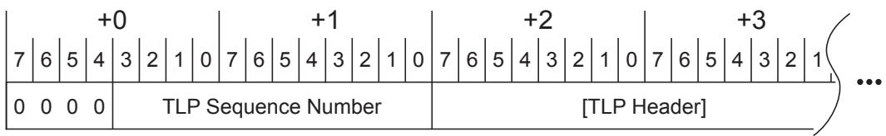

<details>
<summary>text_image</summary>

+0
+1
+2
+3
7 6 5 4 3 2 1 0 7 6 5 4 3 2 1 0 7 6 5 4 3 2 1 0 7 6 5 4 3 2 1
0 0 0 0 TLP Sequence Number [TLP Header]
</details>

OM13787A

Figure 3-18 TLP Following Application of TLP Sequence Number and 4 Bits§

• TLP data integrity is protected during transfer between Data Link Layers using a 32-bit LCRC  
• The LCRC value is calculated using the following mechanism (see § Figure 3-19):

◦ The polynomial used has coefficients expressed as 04C1 1DB7h  
◦ The seed value (initial value for LCRC storage registers) is FFFF FFFFh  
◦ The LCRC is calculated using the TLP following sequence number application (see § Figure 3-18)  
◦ LCRC calculation starts with bit 0 of byte 0 (bit 8 of the TLP sequence number) and proceeds from bit 0 to bit 7 of each successive byte.  
◦ Note that LCRC calculation uses all bits of the TLP, regardless of field type, including Reserved fields  
◦ The remainder of the LCRC calculation is complemented, and the complemented result bits are mapped into the 32-bit LCRC field as shown in § Table 3-7.

Table 3-7 Mapping of Bits into LCRC Field§

<table><tr><td>LCRC Result Bit</td><td>Corresponding Bit Position in the 32-Bit LCRC Field</td></tr><tr><td>0</td><td>7</td></tr><tr><td>1</td><td>6</td></tr><tr><td>2</td><td>5</td></tr><tr><td>3</td><td>4</td></tr><tr><td>4</td><td>3</td></tr><tr><td>5</td><td>2</td></tr><tr><td>6</td><td>1</td></tr><tr><td>7</td><td>0</td></tr><tr><td>8</td><td>15</td></tr><tr><td>9</td><td>14</td></tr><tr><td>10</td><td>13</td></tr><tr><td>11</td><td>12</td></tr><tr><td>12</td><td>11</td></tr><tr><td>13</td><td>10</td></tr><tr><td>14</td><td>9</td></tr><tr><td>15</td><td>8</td></tr><tr><td>16</td><td>23</td></tr><tr><td>17</td><td>22</td></tr><tr><td>18</td><td>21</td></tr><tr><td>19</td><td>20</td></tr><tr><td>20</td><td>19</td></tr><tr><td>21</td><td>18</td></tr><tr><td>22</td><td>17</td></tr><tr><td>23</td><td>16</td></tr><tr><td>24</td><td>31</td></tr><tr><td>25</td><td>30</td></tr><tr><td>26</td><td>29</td></tr><tr><td>27</td><td>28</td></tr><tr><td>28</td><td>27</td></tr><tr><td>29</td><td>26</td></tr><tr><td>30</td><td>25</td></tr><tr><td>31</td><td>24</td></tr></table>

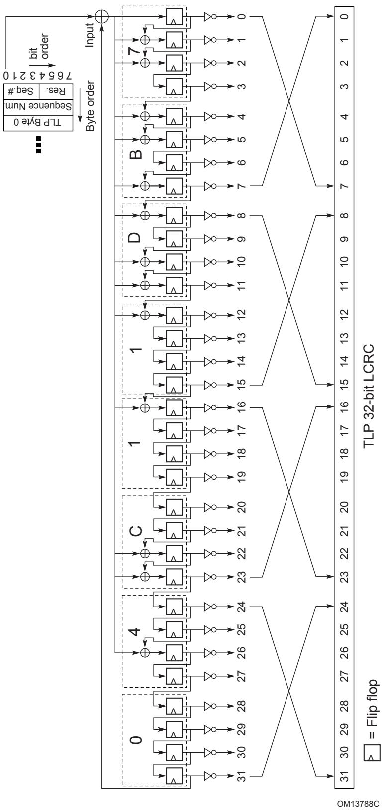

<details>
<summary>flowchart</summary>

TLP 32-bit LCRC data structure diagram showing bit ordering, byte order, and bit order flow with flip-flop logic
</details>

Figure 3-19 Calculation of LCRC

The 32-bit LCRC field is appended to the TLP following the bytes received from the Transaction Layer (see § Figure 3-17).

To support cut-through routing of TLPs, a Transmitter is permitted to modify a transmitted TLP to indicate that the Receiver must ignore that TLP (“nullify” the TLP).

• A Transmitter is permitted to nullify a TLP being transmitted. To do this in a way that will robustly prevent misinterpretation or corruption, the Transmitter must do the following:  
◦ Transmit all DWs of the TLP when the Physical Layer is using 128b/130b encoding (see § Section 4.2.2.3.1 )  
◦ Use the remainder of the calculated LCRC value without inversion (the logical inverse of the value normally used)  
◦ Indicate to the Transmit Physical Layer that the TLP is nullified

• When this is done, the Transmitter does not increment NEXT\_TRANSMIT\_SEQ

The following rules describe the operation of the Data Link Layer Retry Buffer, from which TLPs are re-transmitted when necessary:

• Copies of Transmitted TLPs must be stored in the Data Link Layer Retry Buffer, except for nullified TLPs.

When a replay is initiated, either due to reception of a Nak or due to REPLAY\_TIMER expiration, the following rules describe the sequence of operations that must be followed:

• If all TLPs transmitted have been acknowledged (the Retry Buffer is empty), terminate replay, otherwise continue.

Note: In Flit Mode, Replay occurs at the Flit Level. See § Section 4.2.3.4.2.1.7 .

Increment REPLAY\_NUM by 2 when operating in Non-Flit Mode. If the Data Rate is 32.0 GT/s or lower, increment REPLAY\_NUM by 2. When the replay is initiated by the reception of a Nak that acknowledged some TLPs in the retry buffer, REPLAY\_NUM is reset. It is then permitted (but not required) to be incremented.

◦ If REPLAY\_NUM rolls over from 110b or 111b to either 000b or 001b, the Transmitter signals the Physical Layer to retrain the Link, and waits for the completion of retraining before proceeding with the replay. This is a reported error associated with the Port (see § Section 6.2 ).

Note that Data Link Layer state, including the contents of the Retry Buffer, are not reset by this action unless the Physical Layer reports Physical LinkUp = 0b (causing the Data Link Control and Management State Machine to transition to the DL\_Inactive state).

◦ If REPLAY\_NUM does not roll over from 110b or 111b to either 000b or 001b, continue with the replay.

• Block acceptance of new TLPs from the Transmit Transaction Layer.

• Complete transmission of any TLP currently being transmitted.

• Retransmit unacknowledged TLPs, starting with the oldest unacknowledged TLP and continuing in original transmission order

◦ Reset and restart REPLAY\_TIMER when sending the last Symbol of the first TLP to be retransmitted 。Reset and restart REPLAY\_TIMER when sending the last Symbol of the first TLP to be retransmitted

◦ Once all unacknowledged TLPs have been re-transmitted, return to normal operation. 。 Once allunacknowledged TLPs have been re-transmitted, return to normal operation.

◦ If any Ack or Nak DLLPs are received during a replay, the Transmitter is permitted to complete the ：If any Ack or Nak DLLPs are received during a replay,the Transmitteris permitted to complete the replay without regard to the Ack or Nak DLLP(s), or to skip retransmission of any newly replay without regard to the Ack or Nak DLLP(s),or to skip retransmission of any newly acknowledged TLPs. acknowledged TLPs.

▪ Once the Transmitter has started to resend a TLP, it must complete transmission of that TLP in all cases.

◦ Ack and Nak DLLPs received during a replay must be processed, and may be collapsed

Example: If multiple Acks are received, only the one specifying the latest Sequence Number value must be considered - Acks specifying earlier Sequence Number values are effectively “collapsed” into this one  
▪ Example: During a replay, Nak is received, followed by an Ack specifying a later Sequence Number - the Ack supersedes the Nak, and the Nak is ignored.  
Note: Since all entries in the Retry Buffer have already been allocated space in the Receiver by the Transmitter's Flow Control gating logic, no further flow control synchronization is necessary.

• Re-enable acceptance of new TLPs from the Transmit Transaction Layer.

A replay can be initiated by the expiration of REPLAY\_TIMER, or by the receipt of a Nak. The following rule covers the expiration of REPLAY\_TIMER:

• If the Transmit Retry Buffer contains TLPs for which no Ack or Nak DLLP has been received, and (as indicated by REPLAY\_TIMER) no Ack or Nak DLLP has been received for a period exceeding the applicable REPLAY\_TIMER Limit, the Transmitter initiates a replay.

◦ Simplified REPLAY\_TIMER Limits are:

▪ A value from 24,000 to 31,000 (inclusive) Symbol Times (-0%/+0%) when the Extended Synch bit is Clear.  
▪ A value from 80,000 to 100,000 (inclusive) Symbol Times (-0%/+0%) when the Extended Synch bit is Set.  
▪ If the Extended Synch bit changes state while unacknowledged TLPs are outstanding, implementations are permitted to adjust their REPLAY\_TIMER Limit when the Extended Synch bit changes state or the next time the REPLAY\_TIMER is reset.

◦ Simplified REPLAY\_TIMER Limits must be used for operation at all data rates in Flit Mode.

◦ Implementations that support 16.0 GT/s or higher data rates must use the Simplified REPLAY\_TIMER Limits for operation at all data rates when operating in Non-Flit Mode.

◦ Implementations that only support data rates less than 16.0 GT/s are strongly recommended to use the Simplified REPLAY\_TIMER Limits for operation at all data rates when operating in Non-Flit Mode, but they are permitted to use the REPLAY\_TIMER Limits described in the [PCIe-3.1].

This is a Replay Timer Timeout error and it is a reported error associated with the Port (see § Section 6.2 ).

## IMPLEMENTATION NOTE:

## DETERMINING REPLAY\_TIMER LIMIT VALUES §

Replays are initiated primarily with a Nak DLLP, and the REPLAY\_TIMER serves as a secondary mechanism. Since it is a secondary mechanism, the REPLAY\_TIMER Limit has a relatively small effect on the average time required to convey a TLP across a Link. The Simplified REPLAY\_TIMER Limits have been defined so that no adjustments are required for ASPM L0s, Retimers, or other items as in previous revisions of this specification.

TLP Transmitters and compliance tests must base replay timing as measured at the Port of the TLP Transmitter. Timing starts with either the last Symbol of a transmitted TLP, or else the last Symbol of a received Ack DLLP, whichever determines the oldest unacknowledged TLP. Timing ends with the First Symbol of TLP retransmission.

When measuring replay timing to the point when TLP retransmission begins, compliance tests must allow for any other TLP or DLLP transmission already in progress in that direction (thus preventing the TLP retransmission).

## IMPLEMENTATION NOTE:

## RECOMMENDED PRIORITY OF SCHEDULED TRANSMISSIONS §

When multiple DLLPs of the same type are scheduled for transmission but have not yet been transmitted, it is possible in many cases to “collapse” them into a single DLLP. For example, if a scheduled Ack DLLP transmission is stalled waiting for another transmission to complete, and during this time another Ack is scheduled for transmission, it is only necessary to transmit the second Ack, since the information it provides will supersede the information in the first Ack.

In addition to any TLP from the Transaction Layer (or the Retry Buffer, if a replay is in progress), multiple DLLPs of different types may be scheduled for transmission at the same time, and must be prioritized for transmission. The following list shows the preferred priority order for selecting information for transmission. Note that the priority of the NOP DLLP and the Vendor-Specific DLLP is not listed, as usage of these DLLPs is completely implementation specific, and there is no recommended priority. Note that this priority order is a guideline, and that in all cases a fairness mechanism is strongly recommended to ensure that no type of traffic is blocked for an extended or indefinite period of time by any other type of traffic. Note that the Ack Latency Limit value and REPLAY\_TIMER Limit specify requirements measured at the Port of the component, and the internal arbitration policy of the component must ensure that these externally measured requirements are met.

In Flit Mode, DLP information is contained in every Flit and can contain either a DLLP, Optimized\_Update\_FC, or a Flit\_Marker. Currently defined Flit\_Markers are related to a specific TLP and have the higest priority. Future Flit\_Markers may have lower priorities.

<table><tr><td>Recommended Priority</td><td>Non-Flit Mode</td><td>Flit Mode</td></tr><tr><td>1</td><td>Completion of any transmission (TLP or DLLP) currently in progress (highest priority).</td><td>n/a: DLP information is independent of TLPs</td></tr><tr><td>2</td><td>n/a: Poison and Nullify use TLP Framing</td><td>Poisoned TLP and Nullified TLP Flit_Markers</td></tr><tr><td>3</td><td>n/a: Shared Flow Control only supported in Flit Mode</td><td>Shared Flow Control Flit_Markers</td></tr><tr><td>4</td><td>Nak DLLP Transmissions</td><td rowspan="2">n/a: Ack and Nak use dedicated DLP Symbols, not DLLPs</td></tr><tr><td>5</td><td>Ack DLLP transmissions scheduled for transmission as soon as possible due to: receipt of a duplicate TLP -OR- expiration of the Ack latency timer (see § Section 3.6.3.1).</td></tr><tr><td>6</td><td>Flow Control required to satisfy § Section 2.6 : UpdateFC DLLPs</td><td>Flow Control required to satisfy § Section 2.6 : UpdateFC DLLPs and/or Optimized_Update_FC</td></tr><tr><td>7</td><td>Retry Buffer re-transmissions</td><td rowspan="2">n/a: DLP information is independent of TLPs</td></tr><tr><td>8</td><td>TLPs from the Transaction Layer</td></tr><tr><td>9</td><td>Flow Control other than that required to satisfy § Section 2.6 : UpdateFC DLLPs</td><td>Flow Control other than that required to satisfy § Section 2.6 : Optimized_Update_FC and/or UpdateFC DLLPs</td></tr><tr><td>10</td><td colspan="2">All other DLLP transmissions (lowest priority)</td></tr></table>

## 3.6.2.2 Handling of Received DLLPs (Non-Flit Mode)


Since Ack/Nak and Flow Control DLLPs affect TLPs flowing in the opposite direction across the Link, the TLP transmission mechanisms in the Data Link Layer are also responsible for Ack/Nak and Flow Control DLLPs received from the other component on the Link. These DLLPs are processed according to the following rules (see § Figure 3-20):

• If the Physical Layer indicates a Receiver Error, discard any DLLP currently being received and free any storage allocated for the DLLP. Note that reporting such errors to software is done by the Physical Layer (and, therefore, are not reported by the Data Link Layer).  
• For all received DLLPs, the CRC value is checked by:

◦ Applying the same algorithm used for calculation of transmitted DLLPs to the received DLLP, not including the 16-bit CRC field of the received DLLP  
◦ Comparing the calculated result with the value in the CRC field of the received DLLP

▪ If not equal, the DLLP is corrupt

◦ A corrupt received DLLP is discarded. This is a Bad DLLP error and is a reported error associated with the Port (see § Section 6.2 ).

• A received DLLP that is not corrupt, but that uses unsupported DLLP Type encodings is discarded without further action. This is not considered an error.  
• Values in Reserved fields are ignored.  
• Receivers must process all DLLPs received at the rate they are received

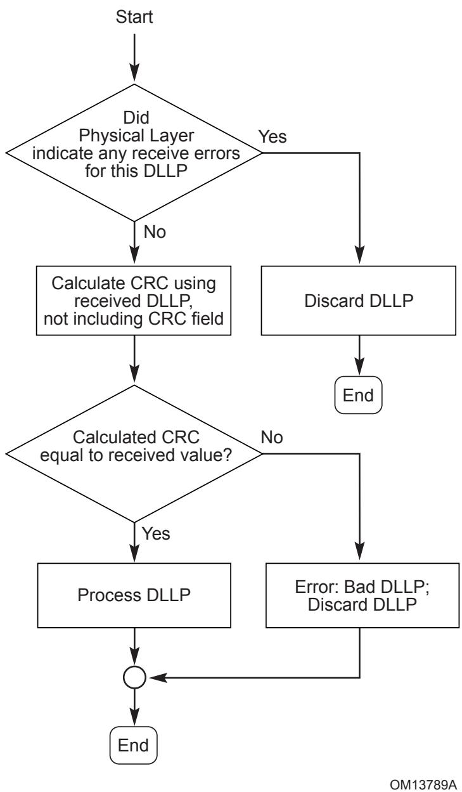

<details>
<summary>flowchart</summary>

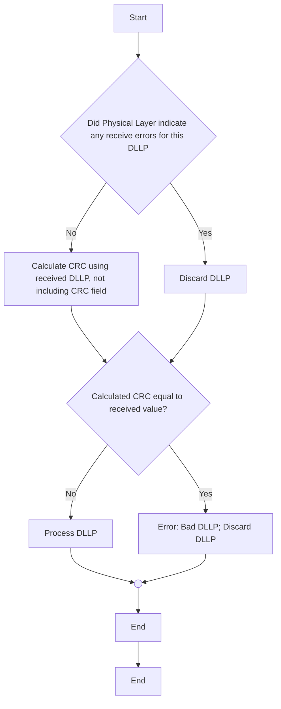
```mermaid
graph TD
  A["Start"] --> B{Did Physical Layer indicate any receive errors for this DLLP}
  B -->|No| C["Calculate CRC using received DLLP, not including CRC field"]
  B -->|Yes| D["Discard DLLP"]
  C --> E{Calculated CRC equal to received value?}
  D --> E
  E -->|No| F["Process DLLP"]
  E -->|Yes| G["Error: Bad DLLP; Discard DLLP"]
  F --> H(( ))
  G --> H
  H --> I["End"]
  I --> J["End"]
```
</details>

Figure 3-20 Received DLLP Error Check Flowchart§

• Received NOP DLLPs are discarded  
◦ Note: NOP2 DLLPs do not exist in Non-Flit Mode, as that encoding encoding is used for the Ack DLLP.  
• Received FC DLLPs are passed to the Transaction Layer  
• Received PM DLLPs are passed to the component's power management control logic  
• For Ack and Nak DLLPs, the following steps are followed (see § Figure 3-21):

◦ If the Sequence Number specified by the AckNak\_Seq\_Num does not correspond to an unacknowledged TLP, or to the value in ACKD\_SEQ, the DLLP is discarded

▪ This is a Data Link Protocol Error, which is a reported error associated with the Port (see § Section 6.2 ).

Note that it is not an error to receive an Ack DLLP when there are no outstanding unacknowledged TLPs, including the time between reset and the first TLP transmission, as long as the specified Sequence Number matches the value in ACKD\_SEQ.

◦ If the AckNak\_Seq\_Num does not specify the Sequence Number of the most recently acknowledged TLP, then the DLLP acknowledges some TLPs in the retry buffer:

▪ Purge from the retry buffer all TLPs from the oldest to the one corresponding to the AckNak\_Seq\_Num  
▪ Load ACKD\_SEQ with the value in the AckNak\_Seq\_Num field  
▪ Reset REPLAY\_NUM and REPLAY\_TIMER

◦ If the DLLP is a Nak, initiate a replay (see above)

Note: Receipt of a Nak is not a reported error.

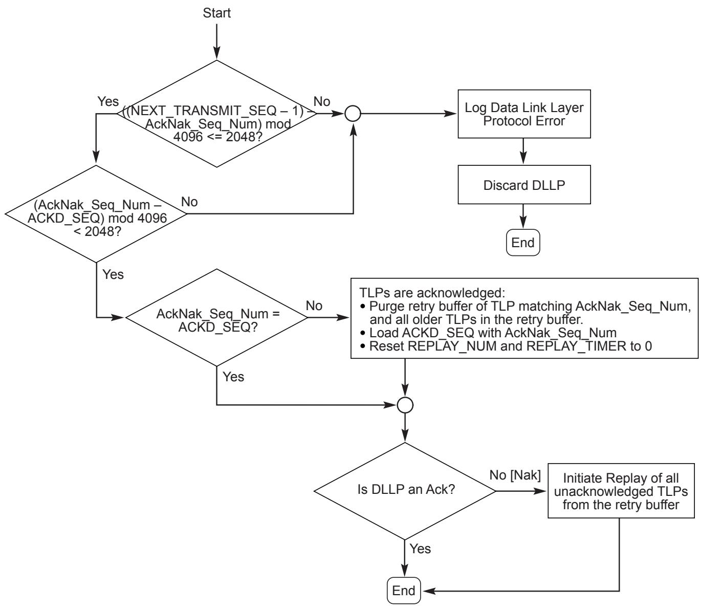

<details>
<summary>flowchart</summary>

```mermaid
graph TD
  A["Start"] --> B{((NEXT_TRANSMIT_SEQ - 1) AckNak_Seq_Num) mod 4096 <= 2048?}
  B -->|Yes| C["(AckNak_Seq_Num - ACKD_SEQ) mod 4096 < 2048?"]
  C -->|No| D((AOKNak_Seq_Num))
  D --> E["Log Data Link Layer Protocol Error"]
  E --> F["Discard DLLP"]
  F --> G["End"]
  D --> H["End"]
  H --> I["TLPs are acknowledged: Purge retry buffer of TLP matching AckNak_Seq_Num, and all older TLPs in the retry buffer. Load ACKD_SEQ with AckNak_Seq_Num Reset REPLAY_NUM and REPLAY_TIMER to 0"]
  I --> J{TIs DLLP an Ack?}
  J -->|No["Nak"]| K["Initiate Replay of all unacknowledged TLPs from the retry buffer"]
  J -->|Yes| L["End"]
  L --> M["End"]
```
</details>

OM13790B

Figure 3-21 Ack/Nak DLLP Processing Flowchart§

The following rules describe the operation of the Data Link Layer Retry Buffer, from which TLPs are re-transmitted when necessary:

• Copies of Transmitted TLPs must be stored in the Data Link Layer Retry Buffer

## 3.6.2.3 Handling of Received DLLPs (Flit Mode) §

Since Flow Control DLLPs affect TLPs flowing in the opposite direction across the Link, the TLP transmission mechanisms in the Data Link Layer are also responsible for Flow Control DLLPs received from the other component on the Link. These DLLPs are processed according to the following rules:

• In Flit Mode, detection of corrupt DLLPs occurs at the Flit level and there is no corruption check for DLLPs in the Data Link Layer.  
• In Flit Mode, replay occurs at the Flit level and the Ack and Nak DLLPs are not used.  
• DLLPs and Optimized\_Update\_FCs are not stored in the Replay Buffer.

◦ When a Flit is replayed, the DLP information is likely to be different from the original value.

◦ Flit\_Markers are associated with the TLP payload and are stored in the Replay Buffer.

• A received DLLP that uses unsupported DLLP Type encodings is discarded without further action. This is not considered an error.  
• Non-zero values in Reserved fields are ignored.  
• Receivers must process all DLLPs received at the rate they are received  
• Received NOP DLLPs and NOP2 DLLPs are discarded  
• Received FC DLLPs are passed to the Transaction Layer  
• Received Optimized\_Update\_FCs are passed to the Transaction Layer  
• Received PM DLLPs are passed to the component's power management control logic  
• Received Link Management DLLPs are passed to the component's L0p control logic

## 3.6.3 LCRC and Sequence Number (TLP Receiver) (Non-Flit Mode) §

The TLP Receive path through the Data Link Layer (paths labeled 2 and 4 in § Figure 3-1) processes TLPs received by the Physical Layer by checking the LCRC and sequence number, passing the TLP to the Receive Transaction Layer if OK and requesting a replay if corrupted.

The mechanisms used to check the TLP LCRC and the Sequence Number and to support Data Link Layer Retry are described in terms of conceptual counters and flags. This description does not imply or require a particular implementation and is used only to clarify the requirements.

## 3.6.3.1 LCRC and Sequence Number Rules (TLP Receiver) §

The following counter, flag, and timer are used to explain the remaining rules in this section:

• The following 12-bit counter is used:

◦ NEXT\_RCV\_SEQ - Stores the expected Sequence Number for the next TLP

▪ Set to 000h in DL\_Inactive state

• The following flag is used:

◦ NAK\_SCHEDULED

▪ Cleared when in DL\_Inactive state

• The following timer is used:

◦ AckNak\_LATENCY\_TIMER - Counts time that determines when an Ack DLLP becomes scheduled for transmission, according to the following rules:

▪ Set to 0 in DL\_Inactive state

▪ Restart from 0 each time an Ack or Nak DLLP is scheduled for transmission; Reset to 0 when all TLPs received have been acknowledged with an Ack DLLP

▪ If there are initially no unacknowledged TLPs and a TLP is then received, the AckNak\_LATENCY\_TIMER starts counting only when the TLP has been forwarded to the Receive Transaction Layer

The following rules are applied in sequence to describe how received TLPs are processed, and what events trigger the transmission of Ack and Nak DLLPs (see § Figure 3-22):

• If the Physical Layer indicates a Receiver Error, discard any TLP currently being received and free any storage allocated for the TLP. Note that reporting such errors to software is done by the Physical Layer (and so are not reported by the Data Link Layer).

◦ If a TLP was being received at the time the Receiver Error was indicated and the NAK\_SCHEDULED flag is clear,

▪ Schedule a Nak DLLP for transmission immediately  
▪ Set the NAK\_SCHEDULED flag

• If the Physical Layer reports that the received TLP was nullified, and the LCRC is the logical NOT of the calculated value, discard the TLP and free any storage allocated for the TLP. This is not considered an error.

• If TLP was nullified but the LCRC does not match the logical NOT of the calculated value, the TLP is corrupt - discard the TLP and free any storage allocated for the TLP.

◦ If the NAK\_SCHEDULED flag is clear,

▪ Schedule a Nak DLLP for transmission immediately  
▪ Set the NAK\_SCHEDULED flag

This is a Bad TLP error and is a reported error associated with the Port (see § Section 6.2 ).

• The LCRC value is checked by:

◦ Applying the same algorithm used for calculation (above) to the received TLP, not including the 32-bit LCRC field of the received TLP  
◦ Comparing the calculated result with the value in the LCRC field of the received TLP

▪ if not equal, the TLP is corrupt - discard the TLP and free any storage allocated for the TLP

▪ If the NAK\_SCHEDULED flag is clear,  
▪ schedule a Nak DLLP for transmission immediately  
▪ set the NAK\_SCHEDULED flag

This is a Bad TLP error and is a reported error associated with the Port (see § Section 6.2 ).

• If the TLP Sequence Number is not equal to the expected value, stored in NEXT\_RCV\_SEQ:

◦ Discard the TLP and free any storage allocated for the TLP  
◦ If the TLP Sequence Number satisfies the following equation: (NEXT\_RCV\_SEQ - TLP Sequence Number) mod 4096 <= 2048

the TLP is a duplicate, and an Ack DLLP is scheduled for transmission (per transmission priority rules)

◦ Otherwise, the TLP is out of sequence (indicating one or more lost TLPs):

▪ if the NAK\_SCHEDULED flag is clear,  
▪ schedule a Nak DLLP for transmission immediately  
▪ set the NAK\_SCHEDULED flag  
▪ This is a Bad TLP error and is a reported error associated with the Port (see § Section 6.2 ).

▪ if the NAK\_SCHEDULED flag is Set, the Port is permitted to, but is not recommended to, report a Bad TLP error associated with the Port (see § Section 6.2 ) and this permission is shown in § Figure 3-20.

• If the TLP Sequence Number is equal to the expected value stored in NEXT\_RCV\_SEQ:

◦ The four bits, TLP Sequence Number, and LCRC (see § Figure 3-17) are removed and the remainder of the TLP is forwarded to the Receive Transaction Layer

▪ The Data Link Layer indicates the start and end of the TLP to the Transaction Layer while transferring the TLP

▪ The Data Link Layer treats the TLP as a “black box” and does not process or modify the contents of the TLP

▪ Note that the Receiver Flow Control mechanisms do not account for any received TLPs until the TLP(s) are forwarded to the Receive Transaction Layer

◦ NEXT\_RCV\_SEQ is incremented

◦ If Set, the NAK\_SCHEDULED flag is cleared

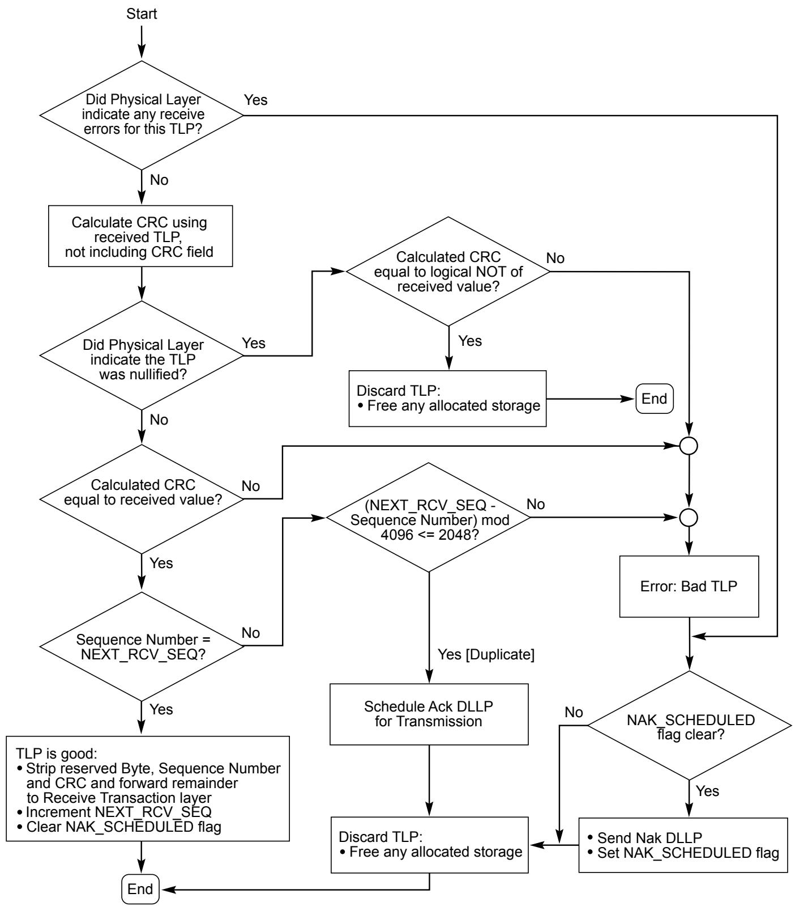

<details>
<summary>flowchart</summary>

```mermaid
graph TD
  A["Start"] --> B{Did Physical Layer indicate any receive errors for this TLP?}
  B -->|No| C["Calculate CRC using received TLP, not including CRC field"]
  C --> D{Did Physical Layer indicate the TLP was nullified?}
  D -->|Yes| E{Calculated CRC equal to logical NOT of received value?}
  D -->|No| F{Calculated CRC equal to received value?}
  F -->|No| G{(NEXT_RCV_SEQ - Sequence Number) mod 4096 <= 2048?}
  F -->|Yes| H{Sequence Number = NEXT_RCV_SEQ?}
  H -->|Yes| I["TLP is good: Strip reserved Byte, Sequence Number and CRC and forward remainder to Receive Transaction layer; Increment NEXT_RCV_SEQ; Clear NAK_SCHEDULED flag"]
  H -->|No| J["Schedule Ack DLLP for Transmission"]
  J --> K["Discard TLP: Free any allocated storage"]
  E -->|No| L["Discard TLP: Free any allocated storage"]
  E -->|Yes| M["Error: Bad TLP"]
  L --> N{NAK_SCHEDULED flag clear?}
  N -->|No| O["End"]
  N -->|Yes| P["Send Nak DLLP; Set NAK_SCHEDULED flag"]
  O --> Q["End"]
  P --> R["End"]
```
</details>

OM13791B

Figure 3-22 Receive Data Link Layer Handling of TLPs Flo§ wchart • A TLP Receiver must schedule an Ack DLLP such that it will be transmitted no later than when all of the following conditions are true:

◦ The Data Link Control and Management State Machine is in the DL\_Active state  
◦ TLPs have been forwarded to the Receive Transaction Layer, but not yet acknowledged by sending an Ack DLLP  
◦ The AckNak\_LATENCY\_TIMER reaches or exceeds the value specified in § Table 3-9 for 2.5 GT/s operation, § Table 3-10 for 5.0 GT/s operation, § Table 3-11 for 8.0 GT/s and higher operation  
◦ The Link used for Ack DLLP transmission is already in L0 or has transitioned to L0  
◦ Note: if not already in L0, the Link must transition to L0 in order to transmit the Ack DLLP  
◦ Another TLP or DLLP is not currently being transmitted on the Link used for Ack DLLP transmission  
◦ The NAK\_SCHEDULED flag is clear  
◦ Note: The AckNak\_LATENCY\_TIMER must be restarted from 0 each time an Ack or Nak DLLP is scheduled for transmission

• Data Link Layer Ack DLLPs may be scheduled for transmission more frequently than required  
• Data Link Layer Ack and Nak DLLPs specify the value (NEXT\_RCV\_SEQ - 1) in the AckNak\_Seq\_Num field

§ Table 3-9, § Table 3-10, and § Table 3-11 define the threshold values for the AckNak\_LATENCY\_TIMER, which for any specific case is called the Ack Latency Limit.

TLP Receivers and compliance tests must base Ack Latency timing as measured at the Port of the TLP Receiver, starting with the time the last Symbol of a TLP is received to the first Symbol of the Ack DLLP being transmitted.

When measuring until the Ack DLLP is transmitted, compliance tests must allow for any TLP or other DLLP transmission already in progress in that direction (thus preventing the Ack DLLP transmission). If L0s is enabled, compliance tests must allow for the L0s exit latency of the Link in the direction that the Ack DLLP is being transmitted. If the Extended Synch bit is Set, compliance tests must also allow for its effect on L0s exit latency.

TLP Receivers are not required to adjust their Ack DLLP scheduling based upon L0s exit latency or the value of the Extended Synch bit.

For a Multi-Function Device where different Functions have different Rx\_MPS\_Limit values, it is strongly recommended that the smallest Rx\_MPS\_Limit value across all Functions be used.

Table 3-9 Maximum Ack Latency Limits for 2.5 GT/s (Symbol Times) (-0%/+0%)§

<table><tr><td rowspan="2" colspan="2"></td><td colspan="5">Link Operating Width</td></tr><tr><td>x1</td><td>x2</td><td>x4</td><td>x8</td><td>x16</td></tr><tr><td rowspan="6">Rx_MPS_Limit(bytes)</td><td>128</td><td>237</td><td>128</td><td>73</td><td>67</td><td>48</td></tr><tr><td>256</td><td>416</td><td>217</td><td>118</td><td>107</td><td>72</td></tr><tr><td>512</td><td>559</td><td>289</td><td>154</td><td>86</td><td>86</td></tr><tr><td>1024</td><td>1071</td><td>545</td><td>282</td><td>150</td><td>150</td></tr><tr><td>2048</td><td>2095</td><td>1057</td><td>538</td><td>278</td><td>278</td></tr><tr><td>4096</td><td>4143</td><td>2081</td><td>1050</td><td>534</td><td>534</td></tr></table>

Table 3-10 Maximum Ack Latency Limits for 5.0 GT/s (Symbol Times) (-0%/+0%)§

<table><tr><td rowspan="2" colspan="2"></td><td colspan="5">Link Operating Width</td></tr><tr><td>x1</td><td>x2</td><td>x4</td><td>x8</td><td>x16</td></tr><tr><td rowspan="6">Rx_MPS_Limit(bytes)</td><td>128</td><td>288</td><td>179</td><td>124</td><td>118</td><td>99</td></tr><tr><td>256</td><td>467</td><td>268</td><td>169</td><td>158</td><td>123</td></tr><tr><td>512</td><td>610</td><td>340</td><td>205</td><td>137</td><td>137</td></tr><tr><td>1024</td><td>1122</td><td>596</td><td>333</td><td>201</td><td>201</td></tr><tr><td>2048</td><td>2146</td><td>1108</td><td>589</td><td>329</td><td>329</td></tr><tr><td>4096</td><td>4194</td><td>2132</td><td>1101</td><td>585</td><td>585</td></tr></table>

Table 3-11 Maximum Ack Latency Limits for 8.0 GT/s and higher data rates (Symbol Times)§

<table><tr><td rowspan="2" colspan="2"></td><td colspan="5">Link Operating Width</td></tr><tr><td>x1</td><td>x2</td><td>x4</td><td>x8</td><td>x16</td></tr><tr><td rowspan="6">Rx_MPS_Limit(bytes)</td><td>128</td><td>333</td><td>224</td><td>169</td><td>163</td><td>144</td></tr><tr><td>256</td><td>512</td><td>313</td><td>214</td><td>203</td><td>168</td></tr><tr><td>512</td><td>655</td><td>385</td><td>250</td><td>182</td><td>182</td></tr><tr><td>1024</td><td>1167</td><td>641</td><td>378</td><td>246</td><td>246</td></tr><tr><td>2048</td><td>2191</td><td>1153</td><td>634</td><td>374</td><td>374</td></tr><tr><td>4096</td><td>4239</td><td>2177</td><td>1146</td><td>630</td><td>630</td></tr></table>

## IMPLEMENTATION NOTE: RETRY BUFFER SIZING

The Retry Buffer should be large enough to ensure that under normal operating conditions, transmission is never throttled because the retry buffer is full. In determining the optimal buffer size, one must consider the Ack Latency value, Ack delay caused by the Receiver already transmitting another TLP or DLLP, the delays caused by the physical Link interconnect, and the time required to process the received Ack DLLP.

Given two components A and B, the L0s exit latency required by A's Receiver should be accounted for when sizing A's transmit retry buffer, as is demonstrated in the following example:

• A exits L0s on its Transmit path to B and starts transmitting a long burst of write Requests to B  
• B initiates L0s exit on its Transmit path to A, but the L0s exit time required by A's Receiver is large  
• Meanwhile, B is unable to send Ack DLLPs to A, and A stalls due to lack of Retry Buffer space  
• The Transmit path from B to A returns to L0, B transmits an Ack DLLP to A, and the stall is resolved

This stall can be avoided by matching the size of a component's Transmitter Retry Buffer to the L0s exit latency required by the component's Receiver, or, conversely, by matching the Receiver L0s exit latency to the desired size of the Retry Buffer.

Ack Latency Limit values were chosen to allow implementations to achieve good performance without requiring an uneconomically large retry buffer. To enable consistent performance across a general purpose interconnect with differing implementations and applications, it is necessary to set the same requirements for all components without regard to the application space of any specific component. If a component does not require the full transmission bandwidth of the Link, it may reduce the size of its retry buffer below the minimum size required to maintain available retry buffer space with the Ack Latency Limit values specified.

Note that the Ack Latency Limit values specified ensure that the range of permitted outstanding TLP Sequence Numbers will never be the limiting factor causing transmission stalls.

Retimers add latency (see § Section 4.3.8 ) and operating in SRIS can add latency. Implementations are strongly encouraged to consider these effects when determining the optimal buffer size.

## 4. Physical Layer Logical Block §

## 4.1 Introduction §

The Physical Layer isolates the Transaction and Data Link Layers from the signaling technology used for Link data interchange. The Physical Layer is divided into the logical and electrical sub-blocks (see § Figure 4-1).

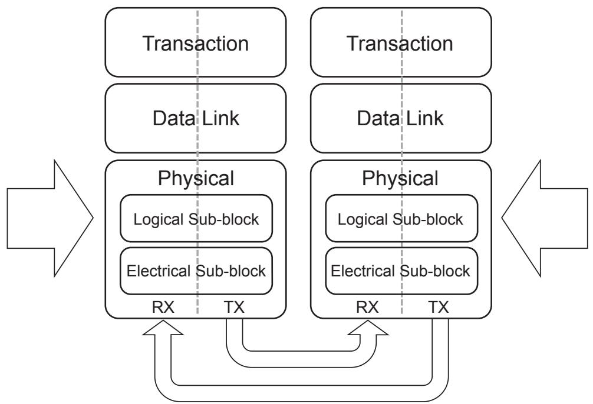

<details>
<summary>flowchart</summary>

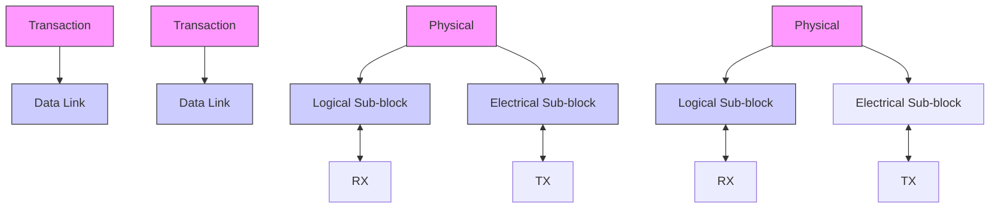
```mermaid
graph TD
  A["Transaction"] --> B["Data Link"]
  C["Transaction"] --> D["Data Link"]
  E["Physical"] --> F["Logical Sub-block"]
  E --> G["Electrical Sub-block"]
  H["Physical"] --> I["Logical Sub-block"]
  H --> J["Electrical Sub-block"]
    F <--> K["RX"]
    G <--> L["TX"]
    I <--> M["RX"]
    J <--> N["TX"]
    style A fill:#f9f,stroke:#333
    style C fill:#f9f,stroke:#333
    style E fill:#f9f,stroke:#333
    style H fill:#f9f,stroke:#333
    style I fill:#f9f,stroke:#333
    style B fill:#ccf,stroke:#333
    style D fill:#ccf,stroke:#333
    style F fill:#ccf,stroke:#333
    style G fill:#ccf,stroke:#333
    style I fill:#ccf,stroke:#333
```
</details>

OM13792A

Figure 4-1 Layering Diagram Highlighting Physical Layer§

§ Chapter 4. describes the logical sub-block and § Chapter 8. describes the electrical sub-block. 54

## 4.2 Logical Sub-block §

The logical sub-block has two main sections: a Transmit section that prepares outgoing information passed from the Data Link Layer for transmission by the electrical sub-block, and a Receiver section that identifies and prepares received information before passing it to the Data Link Layer.

The logical sub-block and electrical sub-block coordinate the state of each Transceiver through a status and control register interface or functional equivalent. The logical sub-block directs control and management functions of the Physical Layer.

PCI Express uses three types of encoding (8b/10b, 128b/130b, and 1b/1b) and two Data Stream modes (Flit Mode and Non-Flit Mode). A Data Stream in the Non-Flit Mode is defined as a contiguous collection of TLPs, DLLPs, and Logical Idle/IDL Token, starting at the end of an Ordered Set and ending with another Ordered Set or a Link Electrical Idle. A Data Stream in Flit Mode is defined as a set of Flits (see § Section 4.2.3 ), starting at the end of the first SKP Ordered Set after an SDS Ordered Set, and ending with the last Flit prior to an Ordered Set other than SKP Ordered Set that causes the Link to exit out of L0 state or if the Link enters Electrical Idle. The encoding is determined by the Data Rate of the Link. The Data Stream mode is determined during initial Link training if both the Ports (and all Pseudo-Ports, if any) support it. See § Table 4-1 for valid encoding and symbol placement mode combinations.

Table 4-1 Valid Encoding and Data Stream Mode Combinations§

<table><tr><td>Current Data Rate</td><td>Flit Mode Negotiated during Configuration when LinkUp=0b</td><td>Encoding</td><td>Data Stream</td></tr><tr><td>2.5 GT/s, 5.0 GT/s</td><td>No</td><td>8b/10b</td><td>Non-Flit Mode</td></tr><tr><td>2.5 GT/s, 5.0 GT/s</td><td>Yes</td><td>8b/10b</td><td>Flit Mode</td></tr><tr><td>8.0 GT/s, 16.0 GT/s, 32.0 GT/s</td><td>No</td><td>128b/130b</td><td>Non-Flit Mode</td></tr><tr><td>8.0 GT/s, 16.0 GT/s, 32.0 GT/s</td><td>Yes</td><td>128b/130b</td><td>Flit Mode</td></tr><tr><td>64.0 GT/s</td><td>Yes (mandatory)</td><td>1b/1b</td><td>Flit Mode</td></tr></table>

The Ordered Set encoding follows the 8b/10b, 128b/130b, and 1b/1b encoding as defined in § Table 4-2.

Table 4-2 Valid Encoding for Ordered Sets§

<table><tr><td>Current Data Rate</td><td>Flit Mode Negotiated during Configuration when LinkUp=0b</td><td>Encoding</td><td>Comments</td></tr><tr><td>2.5 GT/s, 5.0 GT/s</td><td>Yes / No</td><td>8b/10b</td><td>Same Ordered Sets are used in Flit Mode as well as Non-Flit Mode.</td></tr><tr><td>8.0 GT/s</td><td>No</td><td>128b/130b</td><td>Only Standard SKP Ordered Set sent when SKP OS needs to be sent. Rest of the Ordered Sets are identical for Non-Flit Mode and Flit Mode in 8.0 GT/s.</td></tr><tr><td>16.0 GT/s, 32.0 GT/s</td><td>No</td><td>128b/130b</td><td>Alternates between Standard SKP OS and Control SKP OS, when SKP OS needs to be sent. Rest of the Ordered Sets are identical for Non-Flit Mode and Flit Mode in the corresponding Data Rate.</td></tr><tr><td>8.0 GT/s, 16.0 GT/s, 32.0 GT/s</td><td>Yes</td><td>128b/130b</td><td>Alternates between Standard SKP OS and Control SKP OS, when SKP OS needs to be sent. Rest of the Ordered Sets are identical for Non-Flit Mode and Flit Mode in the corresponding Data Rate.</td></tr><tr><td>64.0 GT/s</td><td>Yes (mandatory)</td><td>1b/1b</td><td>All Ordered Sets follow 1b/1b encoding at 64.0 GT/s with PAM4 signaling. Only Control SKP OS sent when SKP OS needs to be sent.</td></tr></table>

## IMPLEMENTATION NOTE:

## FLIT MODE IDENTIFICATION THROUGHOUT THE DOCUMENT §

Support for Flit Mode behavior is referenced five times in the specification through the use of the following fields/ variables:

## Flit Mode Supported bit

Bit 0 of the Data Rate Identifier Symbol of 8b/10b and 128b/130b encoded TS1s and TS2s. This bit is Set when the Flit Mode Supported bit in the PCI Express Capabilities Register is Set and the Flit Mode Disable bit in the Link Control Register is Clear. See § Table 4-25, § Table 4-26, and § Table 4-27.

## Flit\_Mode\_Enabled

Variable that indicates whether or not Flit Mode has been sucesfully negotiated. See § Section 4.2.7.1.1 and § Section 4.2.7.3.2 .

## Flit Mode Supported

Field in the PCI Express Capabilities Register. Flit Mode is supported when this bit is Set. See § Section 7.5.3.2

## Flit Mode Disable

Field in the Link Control Register. This bit used to disable Flit Mode. This bit is most useful in Downstream Ports but is also defined for Upstream Ports (useful for crosslinks or by device firmware). See § Section 7.5.3.7 . Setting this bit may be useful to workaround faulty hardware.

## Flit Mode Status

Field in the Link Status 2 Register. Indicates that that the Link is or will be operating in Flit Mode. Should match the Flit\_Mode\_Enabled variable. See § Section 7.5.3.20 .

## 4.2.1 8b/10b Encoding for 2.5 GT/s and 5.0 GT/s Data Rates §

## 4.2.1.1 Symbol Encoding §

At 2.5 and 5.0 GT/s, PCI Express uses an 8b/10b transmission code. The definition of this transmission code is identical to that specified in ANSI X3.230-1994, clause 11 (and also IEEE 802.3z, 36.2.4). Using this scheme, 8-bit data characters are treated as 3 bits and 5 bits mapped onto a 4-bit code group and a 6-bit code group, respectively. The control bit in conjunction with the data character is used to identify when to encode one of the 12 Special Symbols included in the 8b/ 10b transmission code. These code groups are concatenated to form a 10-bit Symbol. As shown in § Figure 4-2, ABCDE maps to abcdei and FGH maps to fghj.

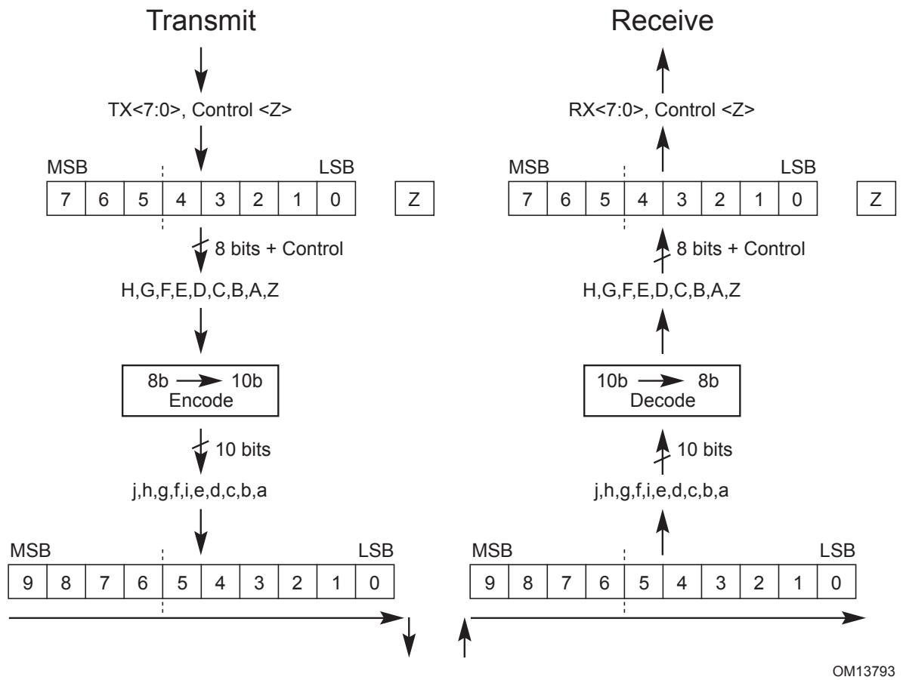

<details>
<summary>flowchart</summary>

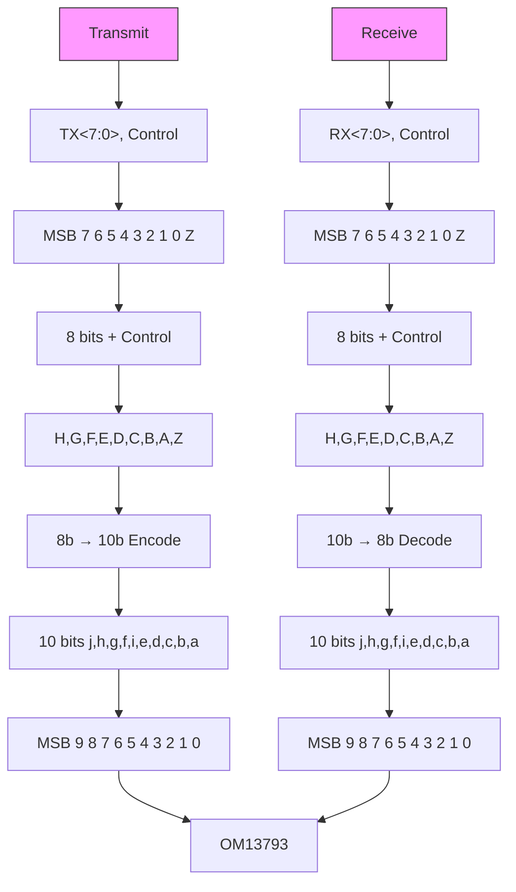
```mermaid
graph TD
  A["Transmit"] --> B["TX<7:0>, Control <Z>"]
  B --> C["MSB 7 6 5 4 3 2 1 0 Z"]
  C --> D["8 bits + Control"]
  D --> E["H,G,F,E,D,C,B,A,Z"]
  E --> F["8b → 10b Encode"]
  F --> G["10 bits j,h,g,f,i,e,d,c,b,a"]
  G --> H["MSB 9 8 7 6 5 4 3 2 1 0"]
  H --> I["OM13793"]
    
  J["Receive"] --> K["RX<7:0>, Control <Z>"]
  K --> L["MSB 7 6 5 4 3 2 1 0 Z"]
  L --> M["8 bits + Control"]
  M --> N["H,G,F,E,D,C,B,A,Z"]
  N --> O["10b → 8b Decode"]
  O --> P["10 bits j,h,g,f,i,e,d,c,b,a"]
  P --> Q["MSB 9 8 7 6 5 4 3 2 1 0"]
  Q --> I
    
    style A fill:#f9f,stroke:#333
    style J fill:#f9f,stroke:#333
```
</details>

Figure 4-2 Character to Symbol Mapping§

## 4.2.1.1.1 Serialization and De-serialization of Data §

The bits of a Symbol are placed on a Lane starting with bit “a” and ending with bit “j”. Examples are shown in § Figure 4-3 and § Figure 4-4.

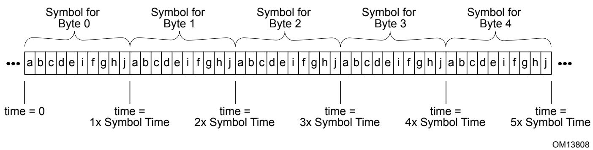

<details>
<summary>text_image</summary>

Symbol for
Byte 0
Symbol for
Byte 1
Symbol for
Byte 2
Symbol for
Byte 3
Symbol for
Byte 4
...
a b c d e i f g h j a b c d e i f g h j a b c d e i f g h j a b c d e i f g h j a b c d e i f g h j a b c d e i f g h j
...
time = 0
time = 1x Symbol Time
time = 2x Symbol Time
time = 3x Symbol Time
time = 4x Symbol Time
time = 5x Symbol Time
OM13808
</details>

Figure 4-3 Bit Transmission Order on Physical Lanes - x1 Example§

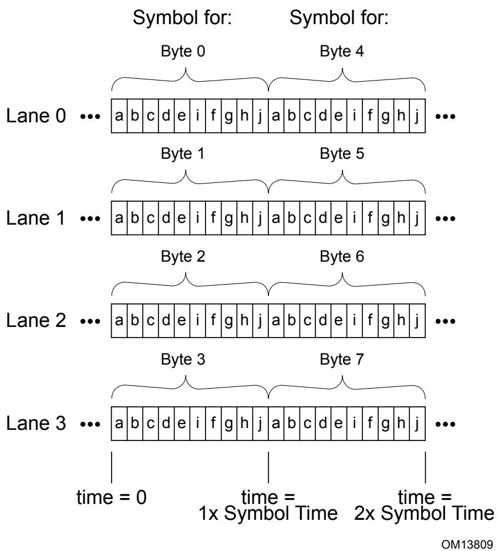

<details>
<summary>text_image</summary>

Symbol for:
Byte 0
Symbol for:
Byte 4
Lane 0 ... a b c d e i f g h j a b c d e i f g h j ...
Byte 1
Byte 5
Lane 1 ... a b c d e i f g h j a b c d e i f g h j ...
Byte 2
Byte 6
Lane 2 ... a b c d e i f g h j a b c d e i f g h j ...
Byte 3
Byte 7
Lane 3 ... a b c d e i f g h j a b c d e i f g h j ...
time = 0
time = 1x Symbol Time
time = 2x Symbol Time
OM13809
</details>

Figure 4-4 Bit Transmission Order on Physical Lanes - x4 Example§

## 4.2.1.1.2 Special Symbols for Framing and Link Management (K Codes) §

The 8b/10b encoding scheme provides Special Symbols that are distinct from the Data Symbols used to represent Characters. These Special Symbols are used for various Link Management mechanisms described later in this chapter. Special Symbols are also used to frame DLLPs and TLPs 55 in Non-Flit Mode, using distinct Special Symbols to allow these two types of Packets to be quickly and easily distinguished. When Flit Mode is enabled, each Symbol (Byte) of the Data Stream is still encoded with 8b/10b encoding without the Framing described. The Flit Mode operation is described in § Section 4.2.3.1 . Even when Flit Mode is enabled, the Ordered Sets follow the description provided in § Section 4.2.1 , when operating in 2.5 GT/s or 5.0 GT/s Data Rates.

§ Table 4-3 shows the Special Symbols used for PCI Express and provides a brief description for each. These Symbols will be discussed in greater detail in following sections. Each of these Special Symbols, as well as the data Symbols, must be interpreted by looking at the 10-bit Symbol in its entirety.

Table 4-3 Special Symbols in 8b/10b Encoding§

<table><tr><td>Encoding</td><td>Symbol</td><td>Name</td><td>Description</td></tr><tr><td>K28.5</td><td>COM</td><td>Comma</td><td>Used for Lane and Link initialization and managementUsed identically in Flit Mode and Non-Flit Mode</td></tr><tr><td>K27.7</td><td>STP</td><td>Start TLP</td><td>Marks the start of a Transaction Layer Packet in Non-Flit Mode.Reserved in Flit Mode.</td></tr><tr><td>K28.2</td><td>SDP</td><td>Start DLLP</td><td>Marks the start of a Data Link Layer Packet in Non-Flit Mode.Reserved in Flit Mode.</td></tr><tr><td>K29.7</td><td>END</td><td>End</td><td>Marks the end of a Transaction Layer Packet or a Data Link Layer Packet in Non-Flit Mode.Reserved in Flit Mode.</td></tr><tr><td>K30.7</td><td>EDB</td><td>EnD Bad</td><td>Marks the end of a nullified TLP in Non-Flit Mode.Reserved in Flit Mode.</td></tr><tr><td>K23.7</td><td>PAD</td><td>Pad</td><td>Used in Framing in Non-Flit Mode only. It is also used in Link Width and Lane ordering negotiations in both Non-Flit Mode and Flit Mode.</td></tr><tr><td>K28.0</td><td>SKP</td><td>Skip</td><td>Used for compensating for different bit rates for two communicating Ports.Used identically in Flit Mode and Non-Flit Mode.</td></tr><tr><td>K28.1</td><td>FTS</td><td>Fast TrainingSequence</td><td>Used within an Ordered Set to exit from L0s to L0 in Non-Flit Mode.No usage for this Encoding is defined in Flit Mode.</td></tr><tr><td>K28.3</td><td>IDL</td><td>Idle</td><td>Used in the Electrical Idle Ordered Set (EIOS)Used identically in Flit Mode and Non-Flit Mode.</td></tr><tr><td>K28.4</td><td></td><td></td><td>Reserved</td></tr><tr><td>K28.6</td><td></td><td></td><td>Reserved</td></tr><tr><td>K28.7</td><td>EIE</td><td>Electrical Idle Exit</td><td>Reserved in 2.5 GT/sUsed in the Electrical Idle Exit Ordered Set (EIEOS) and sent prior to sending FTS at data rates other than 2.5 GT/s</td></tr></table>

## 4.2.1.1.3 8b/10b Decode Rules §

The Symbol tables for the valid 8b/10b codes are given in Appendix B. These tables have one column for the positive disparity and one column for the negative disparity.

A Transmitter is permitted to pick any disparity, unless otherwise required, when first transmitting differential data after being in an Electrical Idle state. The Transmitter must then follow proper 8b/10b encoding rules until the next Electrical Idle state is entered.

The initial disparity for a Receiver that detects an exit from Electrical Idle is set to the disparity of the first Symbol used to obtain Symbol lock. Disparity may also be re-initialized if Symbol lock is lost and regained during the transmission of differential information due to an implementation specific number of errors. All following received Symbols after the initial disparity is set must be found in the proper column corresponding to the current running disparity.

If a received Symbol is found in the column corresponding to the incorrect running disparity or if the Symbol does not correspond to either column, the Physical Layer must notify the Data Link Layer that the received Symbol is invalid. This is a Receiver Error, and is a reported error associated with the Port (see § Section 6.2 ) in Non-Flit Mode. In Flit Mode, the Symbol in error is passed to the FEC logic to correct; the Receiver is permitted to send any 8-bit value to the FEC logic if an 8b/10b error or k-char is detected inside the Flit boundary.

## 4.2.1.2 Framing and Application of Symbols to Lanes §

There are two classes of framing and application of Symbols to Lanes. The first class consists of the Ordered Sets. The second class consists of TLPs and DLLPs in the Data Stream. Ordered Sets are always transmitted serially on each Lane, such that a full Ordered Set appears simultaneously on all Lanes of a multi-Lane Link. The Non-Flit Mode of Data Stream is described below. The Flit Mode description for Data Stream is described in § Section 4.2.3.1 .

## 4.2.1.2.1 Framing and Application of Symbols to Lanes for TLPs and DLLPs in Non-Flit Mode §

The Framing mechanism uses Special Symbol K28.2 “SDP” to start a DLLP and Special Symbol K27.7 “STP” to start a TLP. The Special Symbol K29.7 “END” is used to mark the end of either a TLP or a DLLP.

The conceptual stream of Symbols must be mapped from its internal representation, which is implementation dependent, onto the external Lanes. The Symbols are mapped onto the Lanes such that the first Symbol (representing Character 0) is placed onto Lane 0; the second is placed onto Lane 1; etc. The x1 Link represents a degenerate case and the mapping is trivial, with all Symbols placed onto the single Lane in order.

When no packet information or special Ordered Sets are being transmitted, the Transmitter is in the Logical Idle state. During this time idle data must be transmitted. The idle data must consist of the data byte 0 (00h), scrambled according to the rules of § Section 4.2.1.3 and 8b/10b encoded according to the rules of § Section 4.2.1.1 , in the same way that TLP and DLLP Data Symbols are scrambled and encoded. Likewise, when the Receiver is not receiving any packet information or special Ordered Sets, the Receiver is in Logical Idle and shall receive idle data as described above. During transmission of the idle data, the SKP Ordered Set must continue to be transmitted as specified in § Section 4.2.8 .

For the following rules, “placed” is defined to mean a requirement on the Transmitter to put the Symbol into the proper Lane of a Link.

• TLPs must be framed by placing an STP Symbol at the start of the TLP and an END Symbol or EDB Symbol at the end of the TLP (see § Figure 4-5).  
• A properly formed TLP contains a minimum of 18 symbols between the STP and END or EDB Symbols. If a received sequence has less than 18 symbols between the STP and END or EDB symbols, the receiver is permitted to treat this as a Receiver Error.  
◦ If checked, this is a reported error associated with the Receiving Port (see § Section 6.2 ).

• DLLPs must be framed by placing an SDP Symbol at the start of the DLLP and an END Symbol at the end of the DLLP (see § Figure 4-6).

• Logical Idle is defined to be a period of one or more Symbol Times when no information: TLPs, DLLPs or any type of Special Symbol is being Transmitted/Received. Unlike Electrical Idle, during Logical Idle the Idle data Symbol (00h) is being transmitted and received.

◦ When the Transmitter is in Logical Idle, the Idle data Symbol (00h) shall be transmitted on all Lanes. This is scrambled according to the rules in § Section 4.2.1.3 .  
◦ Receivers must ignore incoming Idle data Symbols, and must not have any dependency other than scramble sequencing on any specific data patterns.

• For Links wider than x1, the STP Symbol (representing the start of a TLP) must be placed in Lane 0 when starting Transmission of a TLP from a Logical Idle Link condition.  
• For Links wider than x1, the SDP Symbol (representing the start of a DLLP) must be placed in Lane 0 when starting Transmission of a DLLP from a Logical Idle Link condition.  
• The STP Symbol must not be placed on the Link more frequently than once per Symbol Time.  
• The SDP Symbol must not be placed on the Link more frequently than once per Symbol Time.  
• As long as the above rules are satisfied, TLP and DLLP Transmissions are permitted to follow each other successively.  
• One STP Symbol and one SDP Symbol may be placed on the Link in the same Symbol Time.

◦ Links wider than x4 can have STP and SDP Symbols placed in Lane 4\*N, where N is a positive integer. For example, for x8, STP and SDP Symbols can be placed in Lanes 0 and 4; and for x16, STP and SDP Symbols can be placed in Lanes 0, 4, 8, or 12.

• For xN Links where N is 8 or more, if an END or EDB Symbol is placed in a Lane K, where K does not equal N-1, and is not followed by an STP or SDP Symbol in Lane K+1 (i.e., there is no TLP or DLLP immediately following), then PAD Symbols must be placed in Lanes K+1 to Lane N-1.  
◦ For example, on a x8 Link, if END or EDB is placed in Lane 3, PAD must be placed in Lanes 4 to 7, when not followed by STP or SDP.  
• The EDB Symbol is used to mark the end of a nullified TLP. Refer to § Section 3.6.2.1 for information on the usage of EDB.  
• Receivers may optionally check for violations of the rules of this section. These checks are independently optional (see § Section 6.2.3.4 ). If checked, violations are Receiver Errors, and are reported errors associated with the Port (see § Section 6.2 ).

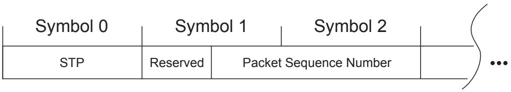

<details>
<summary>flowchart</summary>

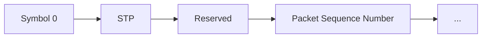
```mermaid
graph LR
  A["Symbol 0"] --> B["STP"]
  B --> C["Reserved"]
  C --> D["Packet Sequence Number"]
  D --> E["..."]
```
</details>

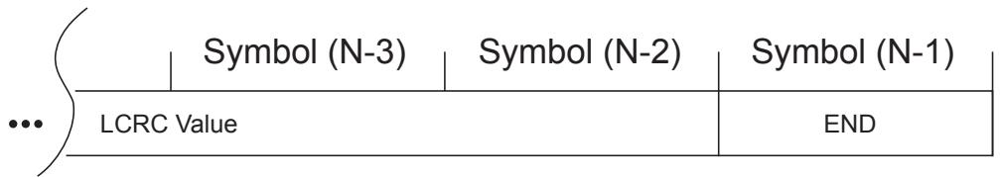

<details>
<summary>flowchart</summary>

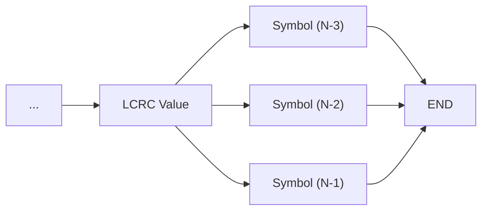
```mermaid
graph LR
  A["..."] --> B["LCRC Value"]
  B --> C["Symbol (N-3)"]
  B --> D["Symbol (N-2)"]
  B --> E["Symbol (N-1)"]
  C --> F["END"]
  D --> F
  E --> F
```
</details>

OM13794

Figure 4-5§ TLP with Framing Symbols Applied

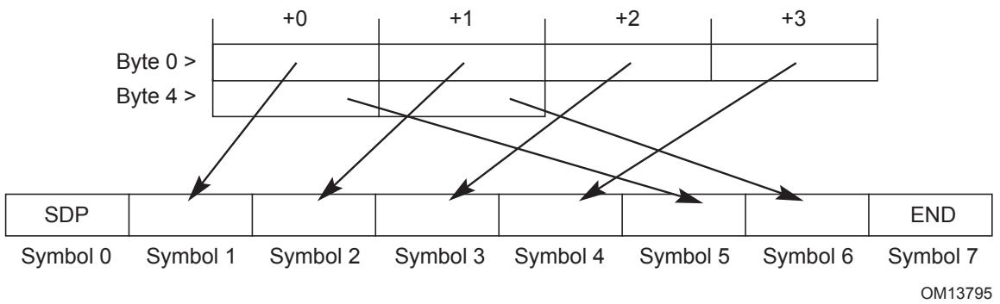

<details>
<summary>flowchart</summary>

```mermaid
graph TD
  A["SDP"] --> B["Symbol 0"]
  A --> C["Symbol 1"]
  A --> D["Symbol 2"]
  A --> E["Symbol 3"]
  A --> F["Symbol 4"]
  A --> G["Symbol 5"]
  A --> H["Symbol 6"]
  A --> I["Symbol 7"]
  J["END"] --> K["+0"]
  J --> L["+1"]
  J --> M["+2"]
  J --> N["+3"]
    style A fill:#f9f,stroke:#333
    style J fill:#ccf,stroke:#333
```
</details>

Figure 4-6 DLLP with Framing Symbols Applied§

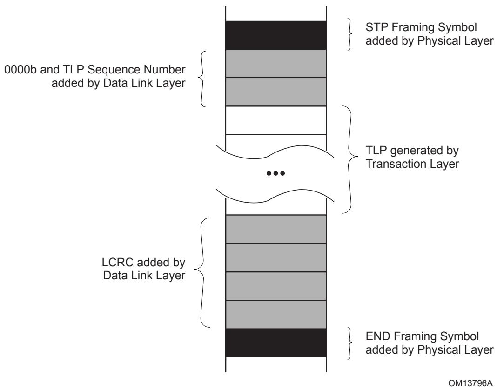

<details>
<summary>flowchart</summary>

```mermaid
graph TD
  A["0000b and TLP Sequence Number added by Data Link Layer"] --> B["STP Framing Symbol added by Physical Layer"]
  A --> C["TLP generated by Transaction Layer"]
  A --> D["LCRC added by Data Link Layer"]
  A --> E["END Framing Symbol added by Physical Layer"]
```
</details>

Figure 4-7 Framed TLP on a x1 Link

§

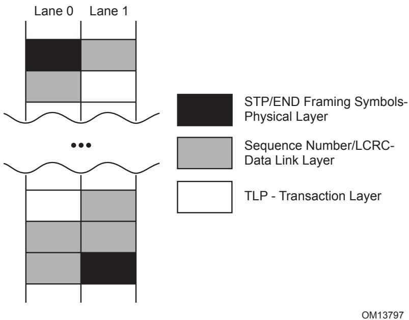

<details>
<summary>text_image</summary>

Lane 0 Lane 1
STP/END Framing Symbols-
Physical Layer
Sequence Number/LCRC-
Data Link Layer
TLP - Transaction Layer
OM13797
</details>

Figure 4-8 Framed TLP on a x2 Link

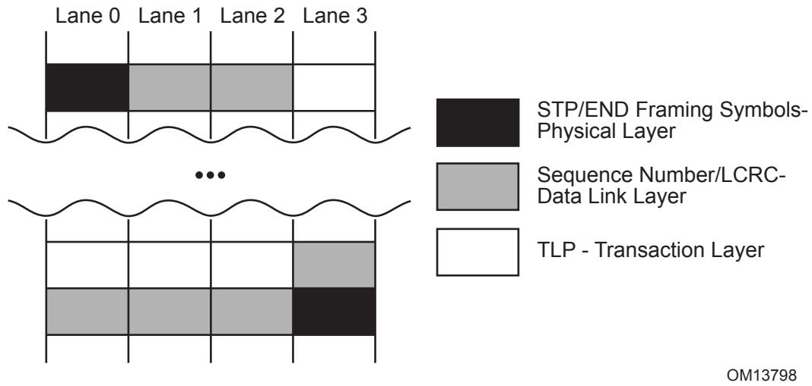

<details>
<summary>stacked bar chart</summary>

| Lane | STP/END Framing Symbols-Physical Layer | Sequence Number/LCRC-Data Link Layer | TLP - Transaction Layer |
|------|----------------------------------------|--------------------------------------|--------------------------|
| Lane 0 | Black segment | Gray segment | White segment |
| Lane 1 | Black segment | Gray segment | White segment |
| Lane 2 | White segment | White segment | White segment |
| Lane 3 | White segment | White segment | White segment |
</details>

Figure 4-9 Framed TLP on a x4 Link

## 4.2.1.3 Data Scrambling §

In order to improve electrical characteristics of a Link, data is typically scrambled. This is applicable for both the Flit Mode as well as Non-Flit Mode at 2.5 GT/s and 5.0 GT/s Data Rates. This involves XORing the data stream with a pattern generated by a Linear Feedback Shift Register (LFSR). On the Transmit side, scrambling is applied to characters prior to the 8b/10b encoding. On the Receive side, de-scrambling is applied to characters after 8b/10b decoding.

On a multi-Lane Link, the scrambling function can be implemented with one or many LFSRs. When there is more than one Transmit LFSR per Link, these must operate in concert, maintaining the same simultaneous (Lane-to-Lane Output Skew) value in each LFSR. When there is more than one Receive LFSR per Link, these must operate in concert, maintaining the same simultaneous (Lane-to-Lane Skew) value in each LFSR. Regardless of how they are implemented,

LFSRs must interact with data on a Lane-by-Lane basis as if there was a separate LFSR as described here for each Lane within that Link.

The LFSR is graphically represented in § Figure 4-10. Scrambling or unscrambling is performed by serially XORing the 8-bit (D0-D7) character with the 16-bit (D0-D15) output of the LFSR. An output of the LFSR, D15, is XORed with D0 of the data to be processed. The LFSR and data register are then serially advanced and the output processing is repeated for D1 through D7. The LFSR is advanced after the data is XORed. The LFSR implements the polynomial:

$$
G (X) = X ^ {1 6} + X ^ {5} + X ^ {4} + X ^ {3} + 1
$$

The mechanism(s) and/or interface(s) utilized by the Data Link Layer to notify the Physical Layer to disable scrambling is implementation specific and beyond the scope of this specification.

The data scrambling rules are the following:

• The COM Symbol initializes the LFSR.  
• The LFSR value is advanced eight serial shifts for each Symbol except the SKP.  
• All data Symbols (D codes) except those within Ordered Sets (e.g., TS1, TS2, EIEOS), the Compliance Pattern (see § Section 4.2.9 ), and the Modified Compliance Pattern (see § Section 4.2.10 ) are scrambled.  
• All special Symbols (K codes) are not scrambled.  
• The initialized value of an LFSR seed (D0-D15) is FFFFh. Immediately after a COM exits the Transmit LFSR, the LFSR on the Transmit side is initialized. Every time a COM enters the Receive LFSR on any Lane of that Link, the LFSR on the Receive side is initialized.  
• Scrambling can only be disabled at the end of Configuration (see § Section 4.2.7.3.5 ).  
• Scrambling does not apply to a Loopback Follower.  
• Scrambling is always enabled in Detect by default.

## IMPLEMENTATION NOTE: DISABLING SCRAMBLING

Disabling scrambling is intended to help simplify test and debug equipment. Control of the exact data patterns is useful in a test and debug environment. Since scrambling is reset at the Physical Layer there is no reasonable way to reliably control the state of the data transitions through software. Thus, the Disable Scrambling bit in the TS1 and TS2 Ordered Sets is provided for these purposes.

The mechanism(s) and/or interface(s) utilized by the Data Link Layer to notify the Physical Layer to disable scrambling is implementation specific and beyond the scope of this specification.

For more information on scrambling, see § Appendix C. .

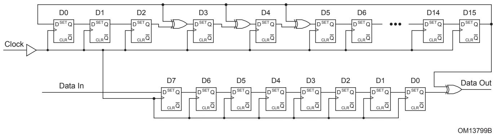

<details>
<summary>flowchart</summary>

```mermaid
graph TD
  Clock --> D0["D0"]
  D0 --> D1["D1"]
  D1 --> D2["D2"]
  D2 --> D3["D3"]
  D3 --> D4["D4"]
  D4 --> D5["D5"]
  D5 --> D6["D6"]
  D6 --> node["..."] --> D14["D14"]
  D14 --> D15["D15"]
    
  DataIn --> D7["D7"]
  DataIn --> D6["D6"]
  DataIn --> D5["D5"]
  DataIn --> D4["D4"]
  DataIn --> D3["D3"]
  DataIn --> D2["D2"]
  DataIn --> D1["D1"]
  DataIn --> D0["D0"]
    
  CLK["Clock"] --> D0
  CLK --> D1
  CLK --> D2
  CLK --> D3
  CLK --> D4
  CLK --> D5
  CLK --> D6
  CLK --> node --> D14
  CLK --> D15
    
  DataOut["Data Out"] --> D0
  DataOut --> D1
  DataOut --> D2
  DataOut --> D3
  DataOut --> D4
  DataOut --> D5
  DataOut --> D6
  DataOut --> node --> D14
  DataOut --> D15
    
  CLK --> CLKout["Data In"]
    
  CLKOUT --> CLKoutout["Data Out"]
    
  CLKOUTD0["SET Q CLR̅Q"] --> CLKOUTD1["DSET Q CLR̅Q"] --> CLKOUTD2["DSET Q CLR̅Q"] --> CLKOUTD3["DSET Q CLR̅Q"] --> CLKOUTD4["DSET Q CLR̅Q"] --> CLKOUTD5["DSET Q CLR̅Q"] --> CLKOUTD6["DSET Q CLR̅Q"] --> CLKOUTD7["DSET Q CLR̅Q"] --> CLKOUTD8["DSET Q CLR̅Q"] --> CLKOUTD9["DSET Q CLR̅Q"] --> CLKOUTD10["DSET Q CLR̅Q"] --> CLKOUTD11["DSET Q CLR̅Q"] --> CLKOUTD12["DSET Q CLR̅Q"] --> CLKOUTD13["DSET Q CLR̅Q"] --> CLKOUTD14["DSET Q CLR̅Q"] --> CLKOUTD15["DSET Q CLR̅Q"]
    
  CLKOUTD7["SET Q CLR̅Q"] --> CLKOUTD6["DSET Q CLR̅Q"] --> CLKOUTD5["DSET Q CLR̅Q"] --> CLKOUTD4["DSET Q CLR̅Q"] --> CLKOUTD3["DSET Q CLR̅Q"] --> CLKOUTD2["DSET Q CLR̅Q"] --> CLKOUTD1["DSET Q CLR̅Q"] --> CLKOUTD0["DSET Q CLR̅Q"] --> CLKOUTD15["DSET Q CLR̅Q"]
```
</details>

Figure 4-10 LFSR with 8b/10b Scrambling Polynomial§

## 4.2.2 128b/130b Encoding for 8.0 GT/s, 16.0 GT/s, and 32.0 GT/s Data Rates §

When a PCI Express Link is operating at a data rate of 8.0 GT/s, 16.0 GT/s, or 32.0 GT/s, it uses the 128b/130b encoding rules described in this section. For backwards compatibility, the Link initially trains to L0 at the 2.5 GT/s data rate using 8b/10b encoding as described in § Section 4.2.1 , then when the data rate is changed to 8.0 GT/s, 16.0 GT/s, or 32.0 GT/s, 128b/130b encoding is used. 128b/130b encoding uses a Link-wide packetization mechanism in Non-Flit Mode and a per-Lane block code with scrambling in both Flit Mode and Non-Flit Modes. In the Flit Mode, the Data Stream follows the same mechanism described in § Section 4.2.3.1 , for the 128b payload inside the 128b/130b Data Block(s).

The basic entity of data transmission is an 8-bit data character, referred to as a Symbol, as shown in § Figure 4-11 and § Figure 4-12.

## IMPLEMENTATION NOTE: SYMBOL IN 128B/130B ENCODING SCHEME §

In the 128b/130b encoding scheme, the Symbol is one byte long, similar to the 10-bit Symbol of 8b/10b encoding.

## 4.2.2.1 Lane Level Encoding §

The Physical Layer uses a per-Lane block code. Each Block consists of a 2-bit Sync Header and a payload. There are two valid Sync Header encodings: 10b and 01b. The Sync Header defines the type of payload that the Block contains.

A Sync Header of 10b indicates a Data Block. Each Data Block has a 128 bit payload, resulting in a Block size of 130 bits. The payload is a Data Stream described in § Section 4.2.2.3 .

A Sync Header of 01b indicates an Ordered Set Block. Each Ordered Set Block has a 128 bit payload, resulting in a Block size of 130 bits except for the SKP Ordered Set which can be of variable length.

All Lanes of a multi-Lane Link must transmit Blocks with the same Sync Header simultaneously, except when transmitting Jitter Measurement Pattern in Polling.Compliance.

The bit transmission order is as follows. A Sync Header represented as ‘H1H0’ is placed on a Lane starting with ‘H0’ and ending with ‘H1’. A Symbol, represented as ‘S7S6S5S4S3S2S1S0’, is placed on a Lane starting with ‘S0’ and ending with ‘S7’.

In the diagrams that show a time scale, bits represent the transmission order. In layout diagrams, bits are arranged in little-endian format, consistent with packet layout diagrams in other chapters of this specification.

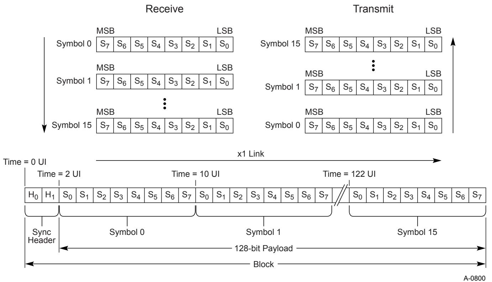

<details>
<summary>flowchart</summary>

```mermaid
```mermaid
graph TD
    subgraph Receive
  A["Symbol 0"] --> B["MSB"]
  C["Symbol 1"] --> D["MSB"]
  E["Symbol 15"] --> F["MSB"]
  B --> G["S7 S6 S5 S4 S3 S2 S1 S0"]
  D --> H["S7 S6 S5 S4 S3 S2 S1 S0"]
  I["..."] --> J["..."]
    end

    subgraph Transmit
  K["Symbol 15"] --> L["MSB"]
  M["Symbol 1"] --> N["MSB"]
  O["Symbol 0"] --> P["MSB"]
  Q["..."] --> R["..."]
    end

  B --> S["S7 S6 S5 S4 S3 S2 S1 S0"]
  D --> T["S7 S6 S5 S4 S3 S2 S1 S0"]
  N --> U["S7 S6 S5 S4 S3 S2 S1 S0"]
  P --> V["S7 S6 S5 S4 S3 S2 S1 S0"]
    style Receive fill:#f9f,stroke:#333
    style Transmit fill:#bbf,stroke:#333
    note right of Receive Time=0 UI: H0, H1, Symbol 0, Symbol 1, Symbol 15; Sync Header: Symbol 0; 128-bit Payload: Symbol 1; Block: A-0800. Periods Time=2 UI, Time=10 UI, Time=122 UI. Arrow labeled 'x1 Link' indicates x1 communication sequence.
```
</details>

Figure 4-11 Example of Bit Transmission Order in a x1 Link Showing 130 Bits of a Block §

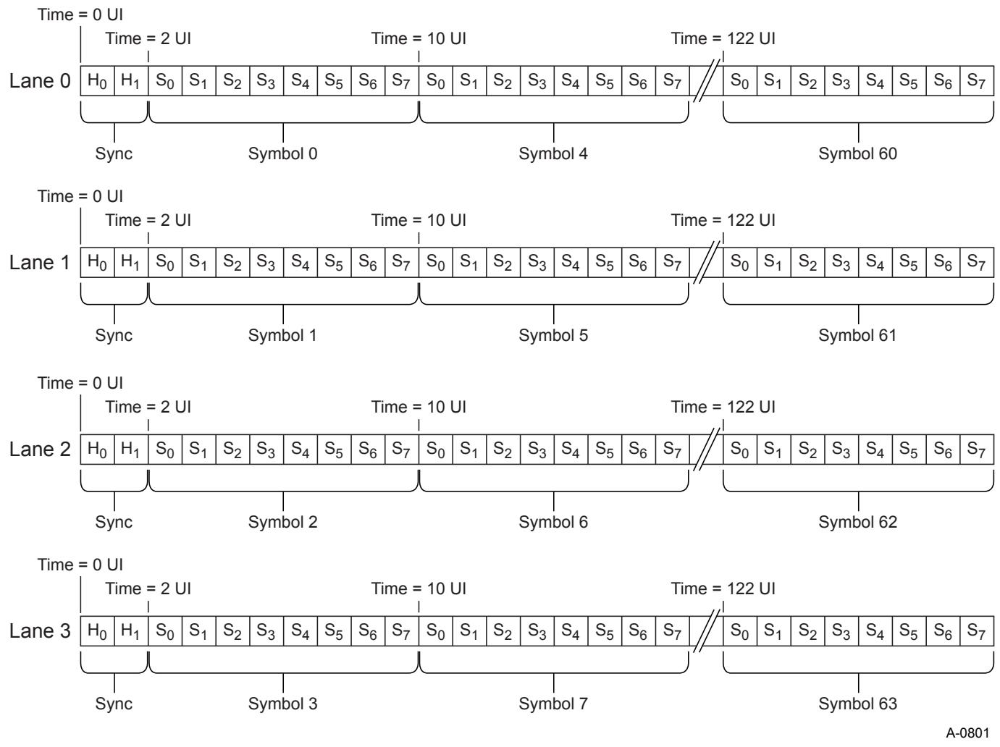

<details>
<summary>text_image</summary>

Time = 0 UI
Time = 2 UI
Time = 10 UI
Time = 122 UI
Lane 0
H₀ H₁ S₀ S₁ S₂ S₃ S₄ S₅ S₆ S₇ S₀ S₁ S₂ S₃ S₄ S₅ S₆ S₇
Sync Symbol 0 Symbol 4 Symbol 60
Time = 0 UI
Time = 2 UI
Time = 10 UI
Time = 122 UI
Lane 1
H₀ H₁ S₀ S₁ S₂ S₃ S₄ S₅ S₆ S₇ S₀ S₁ S₂ S₃ S₄ S₅ S₆ S₇
Sync Symbol 1 Symbol 5 Symbol 61
Time = 0 UI
Time = 2 UI
Time = 10 UI
Time = 122 UI
Lane 2
H₀ H₁ S₀ S₁ S₂ S₃ S₄ S₅ S₆ S₇ S₀ S₁ S₂ S₃ S₄ S₅ S₆ S₇
Sync Symbol 2 Symbol 6 Symbol 62
Time = 0 UI
Time = 2 UI
Time = 10 UI
Time = 122 UI
Lane 3
H₀ H₁ S₀ S₁ S₂ S₃ S₄ S₅ S₆ S₇ S₀ S₁ S₂ S₃ S₄ S₅ S₆ S₇
Sync Symbol 3 Symbol 7 Symbol 63
A-0801
</details>

Figure 4-12 Example of Bit Placement in a x4 Link with One Block per Lane§

## 4.2.2.2 Ordered Set Blocks §

An Ordered Set Block contains a Sync Header followed by one Ordered Set. All Lanes of a multi-Lane Link must transmit the same Ordered Set type simultaneously. The first Symbol of the Ordered Set defines the type of Ordered Set. Subsequent symbols of the Ordered Set are defined by the Ordered Set type and need not be identical across lanes of a multi-Lane Link. The Ordered Sets are described in detail in § Section 4.2.5 and § Section 4.2.8 . Ordered Set Blocks are the same for both Flit Mode and Non-Flit Mode except for the use and frequency of SKP Ordered Set. In Flit Mode at 8.0 GT/s, both Standard and Control SKP Ordered Sets are used.

## 4.2.2.2.1 Block Alignment §

During Link training, the 130 bits of the Electrical Idle Exit Ordered Set (EIEOS) are a unique bit pattern that Receivers use to determine the location of the Block Sync Headers in the received bit stream. Conceptually, Receivers can be in three different phases of Block alignment: Unaligned, Aligned, and Locked. These phases are defined to illustrate the required behavior, but are not meant to specify a required implementation.

## Unaligned Phase

Receivers enter this phase after a period of Electrical Idle, such as when the data rate is changed to one that uses 128b/130b encoding or when they exit a low-power Link state, or if directed (by an implementation specific method). In this phase, Receivers monitor the received bit stream for the EIEOS bit pattern. When one is detected, they adjust their alignment to it and proceed to the Aligned phase.

## Aligned Phase

Receivers monitor the received bit stream for the EIEOS bit pattern and the received Blocks for a Start of Data Stream (SDS) Ordered Set. If an EIEOS bit pattern is detected on an alignment that does not match the current alignment, Receivers must adjust their alignment to the newly received EIEOS bit pattern. If an SDS Ordered Set is received, Receivers proceed to the Locked phase. Receivers are permitted to return to the Unaligned phase if an undefined Sync Header (00b or 11b) is received.

## Locked Phase

Receivers must not adjust their Block alignment while in this phase. The Data Stream starts after an SDS Ordered Set, and adjusting the Block alignment would interfere with the processing of these Blocks. Receivers must return to the Unaligned or Aligned phase if an undefined Sync Header is received.

## IMPLEMENTATION NOTE:

## DETECTION OF LOSS OF BLOCK ALIGNMENT §

The sequence of EIEOS and TS Ordered Sets transmitted during training sequences will cause misaligned Receivers to detect an undefined Sync Header.

## Additional Requirements:

• While in the Aligned or Locked phase, Receivers must adjust their alignment as necessary when a SKP Ordered Set is received. See § Section 4.2.8 for more information on SKP Ordered Sets.  
• After any LTSSM transition to Recovery, Receivers must ignore all received TS Ordered Sets until they receive an EIEOS. Conceptually, receiving an EIEOS validates the Receiver’s alignment and allows TS Ordered Set processing to proceed. If a received EIEOS initiates an LTSSM transition from L0 to Recovery, Receivers are permitted to process any TS Ordered Sets that follow the EIEOS or ignore them until another EIEOS is received after entering Recovery.  
• Receivers are permitted to transition from the Locked phase to the Unaligned or Aligned phase as long as Data Stream processing is stopped. See § Section 4.2.2.3 for more information on Data Stream requirements.  
Loopback Leads: While in Loopback.Entry, Leads must be capable of adjusting their Receiver’s Block alignment to received EIEOS bit patterns. While in Loopback.Active, Leads are permitted to transmit an EIEOS and adjust their Receiver’s Block alignment to the looped back bit stream.  
• Loopback Followers: While in Loopback.Entry, Followers must be capable of adjusting their Receiver’s Block alignment to received EIEOS bit patterns. While in Loopback.Active, Followers must not adjust their Receiver’s Block alignment. Conceptually, the Receiver is directed to the Locked phase when the Follower starts to loop back the received bit stream.

## 4.2.2.3 Data Blocks §

The payload of Data Blocks is a stream of Symbols defined as a “Data Stream”. In Non-Flit Mode, the Data Stream consists of Framing Tokens, TLPs, and DLLPs. In Flit Mode, the Data Stream is described in § Section 4.2.3.1 . Each Symbol of the Data Stream is placed on a single Lane of the Link, and the stream of Symbols is striped across all Lanes of the Link and spans Block boundaries.

A Data Stream starts with the first Symbol of the Data Block that follows an SDS Ordered Set. It ends either when a Framing Error is detected or with the last Symbol of the Data Block that precedes an Ordered Set other than a SKP Ordered Set. SKP Ordered Sets that occur within a Data Stream have specific requirements as described in the following sections.

## 4.2.2.3.1 Framing Tokens in Non-Flit-Mode §

The Framing Tokens used by the Physical Layer in Non-Flit Mode are shown in § Table 4-4. Each Framing Token specifies or implies the number of Symbols associated with the Token and therefore the location of the next Framing Token. § Figure 4-15 shows an example of TLPs, DLLPs, and IDLs transmitted on a x8 link.

The first Framing Token of a Data Stream is always located in Symbol 0 of Lane 0 of the first Data Block of the Data Stream. For the rest of this chapter, the terms Framing Token and Token are used interchangeably.

§ Table 4-4 Framing Token Encoding

<table><tr><td>Framing Token Type</td><td>Description</td></tr><tr><td>IDL</td><td>Logical Idle. The Framing Token is 1 Symbol. This Token is transmitted when no TLPs or DLLPs or other Framing Tokens are being transmitted.</td></tr><tr><td>SDP</td><td>Start of DLLP. The Framing Token is 2 Symbols long and is followed by the DLLP information.</td></tr><tr><td>STP</td><td>Start of TLP. The Framing Token is 4 Symbols long and includes the 12-bit TLP Sequence Number. It is followed by the TLP information.</td></tr><tr><td>EDB</td><td>EnD Bad. The Framing Token is 4 Symbols long and is used to confirm that the previous TLP was nullified.</td></tr><tr><td>EDS</td><td>End of Data Stream. The Framing Token is four Symbols long and indicates that the next Block will be an Ordered Set Block.</td></tr></table>

<table><tr><td colspan="8">+0</td><td colspan="7">+1</td><td colspan="6">+2</td><td colspan="8">+3</td><td></td><td></td><td></td></tr><tr><td>7</td><td>6</td><td>5</td><td>4</td><td>3</td><td>2</td><td>1</td><td>0</td><td>7</td><td>6</td><td>5</td><td>4</td><td>3</td><td>2</td><td>1</td><td>0</td><td>7</td><td>6</td><td>5</td><td>4</td><td>3</td><td>2</td><td>1</td><td>0</td><td>7</td><td>6</td><td>5</td><td>4</td><td>3</td><td>2</td><td>1</td><td>0</td></tr><tr><td colspan="3">TLP Length[3:0]</td><td colspan="5">111 1b</td><td>FP</td><td colspan="7">TLP Length[10:4]</td><td colspan="4">FCRC</td><td colspan="11">TLP Sequence Number</td><td></td></tr></table>

STP Token

<table><tr><td colspan="8">+0</td><td colspan="7">+1</td><td colspan="7">+2</td><td colspan="7">+3</td><td></td><td></td><td></td></tr><tr><td>7</td><td>6</td><td>5</td><td>4</td><td>3</td><td>2</td><td>1</td><td>0</td><td>7</td><td>6</td><td>5</td><td>4</td><td>3</td><td>2</td><td>1</td><td>0</td><td>7</td><td>6</td><td>5</td><td>4</td><td>3</td><td>2</td><td>1</td><td>0</td><td>7</td><td>6</td><td>5</td><td>4</td><td>3</td><td>2</td><td>1</td><td>0</td></tr><tr><td colspan="4">0001b</td><td colspan="4">111 1b</td><td>1b</td><td colspan="7">0000000b</td><td colspan="4">1001b</td><td colspan="11">000000000000b</td><td></td></tr></table>

EDS Token

<table><tr><td colspan="8">+0</td><td colspan="7">+1</td><td colspan="7">+2</td><td colspan="7">+3</td><td></td><td></td><td></td></tr><tr><td>7</td><td>6</td><td>5</td><td>4</td><td>3</td><td>2</td><td>1</td><td>0</td><td>7</td><td>6</td><td>5</td><td>4</td><td>3</td><td>2</td><td>1</td><td>0</td><td>7</td><td>6</td><td>5</td><td>4</td><td>3</td><td>2</td><td>1</td><td>0</td><td>7</td><td>6</td><td>5</td><td>4</td><td>3</td><td>2</td><td>1</td><td>0</td></tr><tr><td colspan="8">11000000b</td><td colspan="7">11000000b</td><td colspan="7">11000000b</td><td colspan="7">11000000b</td><td></td><td></td><td></td></tr></table>

EDB Token

<table><tr><td colspan="8">+0</td><td colspan="8">+1</td></tr><tr><td>7</td><td>6</td><td>5</td><td>4</td><td>3</td><td>2</td><td>1</td><td>0</td><td>7</td><td>6</td><td>5</td><td>4</td><td>3</td><td>2</td><td>1</td><td>0</td></tr><tr><td colspan="8">111 10000b</td><td colspan="8">10101100b</td></tr></table>

SDP Token

<table><tr><td colspan="8">+0</td></tr><tr><td>7</td><td>6</td><td>5</td><td>4</td><td>3</td><td>2</td><td>1</td><td>0</td></tr><tr><td colspan="8">00000000b</td></tr></table>

IDL Token

A-0802

§ Figure 4-13 Layout of Framing Tokens

The Physical Layer DLLP layout is shown in § Figure 4-14. Symbols 0 and 1 are the SDP Token, and Symbols 2 through 7 are the Data Link Layer DLLP information.

The Physical Layer TLP layout is shown in § Figure 4-14. Details of the STP Framing Token are shown in § Figure 4-13. The length of the TLP (in DWs) being transmitted is specified by an 11-bit field called TLP Length. The TLP Length field is the total amount of information transferred, including the Framing Token, TLP Prefixes (if any), TLP Header, TLP data payload (if any), TLP digest (if any), TLP PCRC (if any), TLP MAC (if any), and TLP LCRC. For example, if a TLP has a 3 DW header, a 1 DW data payload, and does not include a TLP digest, the TLP Length field value is 6: 1 (Framing Token) + 0 (TLP Prefixes) + 3 (TLP header) + 1 (TLP data payload) + 0 (TLP digest) + 1 (TLP LCRC). If the same TLP included a TLP digest, the TLP Length field value would be 7. When a TLP is nullified, the EDB Token is considered an extension of the TLP but is not included in the calculation of the TLP Length field.

The TLP Length field is protected by a 4-bit CRC (Frame CRC), and an even parity bit (Frame Parity) protects both the TLP Length and Frame CRC fields. The Frame CRC and Frame Parity are calculated as follows:

$$
C [ 0 ] = L [ 1 0 ] \wedge L [ 7 ] \wedge L [ 6 ] \wedge L [ 4 ] \wedge L [ 2 ] \wedge L [ 1 ] \wedge L [ 0 ]
$$

$$
C [ 1 ] = L [ 1 0 ] \wedge L [ 9 ] \wedge L [ 7 ] \wedge L [ 5 ] \wedge L [ 4 ] \wedge L [ 3 ] \wedge L [ 2 ]
$$

$$
C [ 2 ] = L [ 9 ] \wedge L [ 8 ] \wedge L [ 6 ] \wedge L [ 4 ] \wedge L [ 3 ] \wedge L [ 2 ] \wedge L [ 1 ]
$$

$$
\mathsf {C} [ 3 ] = \mathsf {L} [ 8 ] \wedge \mathsf {L} [ 7 ] \wedge \mathsf {L} [ 5 ] \wedge \mathsf {L} [ 3 ] \wedge \mathsf {L} [ 2 ] \wedge \mathsf {L} [ 1 ] \wedge \mathsf {L} [ 0 ]
$$

$$
P = L [ 1 0 ] \wedge L [ 9 ] \wedge L [ 8 ] \wedge L [ 7 ] \wedge L [ 6 ] \wedge L [ 5 ] \wedge L [ 4 ] \wedge L [ 3 ] \wedge L [ 2 ] \wedge L [ 1 ] \wedge C [ 3 ] \wedge C [ 2 ] \wedge C [ 1 ] \wedge C [ 0 ]
$$

The Frame Parity reduces to P = L[10] ^ L[9] ^ L[8] ^ L[6] ^ L[5] ^ L[2] ^ L[0]

The TLP Length field is represented in the above equations as L[10:0], where L[0] is the least significant bit and L[10] is the most significant bit. Transmitters calculate the Frame CRC and Frame Parity before transmission. Receivers must calculate the Frame CRC and Frame Parity using the same algorithm as the transmitter and then compare the calculated values to the received values.

STP Tokens do not have a TLP Length field value of 1. If a received sequence of Symbols matches the format of an STP Token with a TLP Length field value of 1, the Symbols are evaluated to determine whether they match the EDS Token.

## IMPLEMENTATION NOTE: FRAME CRC AND FRAME PARITY §

The Frame CRC bits are effectively calculated as $( \mathsf { L } [ 0 ] \mathsf { X } ^ { 1 4 } + \mathsf { L } [ 1 ] \mathsf { X } ^ { 1 3 } + \ldots + \mathsf { L } [ 9 ] \mathsf { X } ^ { 5 } + \mathsf { L } [ 1 0 ] \mathsf { X } ^ { 4 } ) \bmod ( \mathsf { X } ^ { 4 } + \mathsf { X } + 1 ) .$ . It should be noted that $\mathsf X ^ { 4 } + \mathsf X + 1$ is a primitive polynomial and the CRC can detect two bit errors. The Frame Parity bit can detect an odd number of bit errors. Thus, the Frame CRC and Frame Parity together guarantee three bit error detection for the TLP Length field. It must be noted that even though in the reduced Frame Parity equation all terms are not present, it still maintains the property of detecting odd bit errors. Only those TLP Length field bits which are present in an even number of CRC terms are used in the calculation.

Note that, for TLPs, the Data Link Layer prepends 4 Reserved bits (0000b) to the TLP Sequence Number field before it calculates the LCRC. These Reserved bits are not explicitly transmitted when using 128b/130b encoding, and Receivers assume that the 4 bits received are 0000b when calculating the LCRC.

Packets containing a TLP Length field that is greater than 1535 are PMUX Packets. For such packets, the actual packet length is computed differently, the TLP Sequence Number field in the STP Token contains other information, and the Link CRC is computed using different rules. See § Appendix G. for details.

Packets containing a TLP Length field that is between 1152 and 1535 (inclusive) are reserved for future standardization.

Transmitters must transmit all DWs of a TLP specified by the TLP Length field of the STP Framing Token. TLPs are never truncated when using 128b/130b encoding - even when nullified. § Figure 4-16 shows an example of a nullified 23 DW TLP.

§ Figure 4-17 shows an example of TLPs, DLLPs, IDLs, and an EDS Token followed by a SKP Ordered Set. SKP Ordered Sets are defined in § Section 4.2.8.2 .  
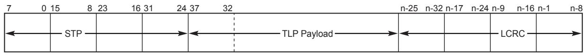

<details>
<summary>text_image</summary>

7 0 15 8 23 16 31 24 37 32
← STP → ← TLP Payload → ← LCRC →
</details>

TLP

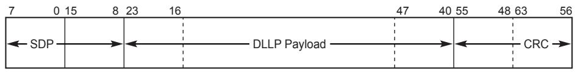

<details>
<summary>text_image</summary>

7 0 15 8 23 16 47 40 55 48 63 56
←SDP → ← DLLP Payload → ← CRC →
</details>

DLLP

A-0803

§

Figure 4-14 TLP and DLLP Layout  
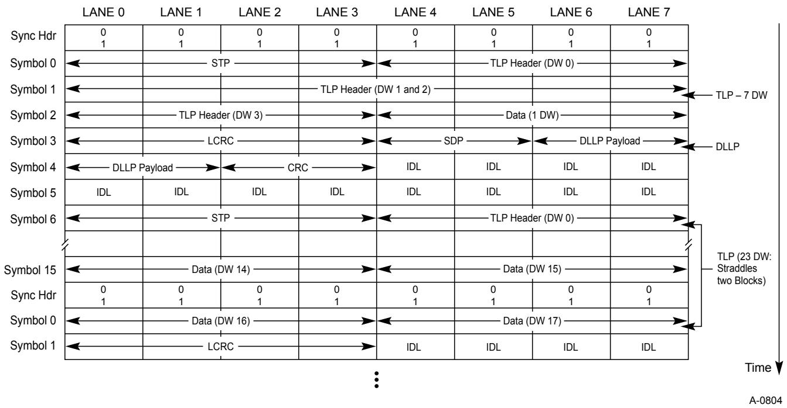

<details>
<summary>timing diagram</summary>

| Signal        | Lane 0 | Lane 1 | Lane 2 | Lane 3 | Lane 4 | Lane 5 | Lane 6 | Lane 7 |
| ------------- | ------ | ------ | ------ | ------ | ------ | ------ | ------ | ------ |
| Sync Hdr      | 0      | 0      | 0      | 0      | 0      | 0      | 0      | 0      |
| Symbol 0      | 1      | 1      | 1      | 1      | 1      | 1      | 1      | 1      |
| Symbol 1      |        | STP    |        |        |        | TLP Header (DW 0) |        |        |
| Symbol 2      |        |        |        | TLP Header (DW 1 and 2) |        | Data (1 DW) |        |        |
| Symbol 3      |        | LCRC   |        |        | SDP    |        | DLLP Payload |        |
| Symbol 4      |        | DLLP Payload |        | CRC    | IDL    | IDL    | IDL    | IDL    |
| Symbol 5      | IDL    | IDL    | IDL    | IDL    | IDL    | IDL    | IDL    | IDL    |
| Symbol 6      |        | STP    |        |        |        | TLP Header (DW 0) |        |        |
| Symbol 15     |        | Data (DW 14) |        |        |        | Data (DW 15) |        |        |
| Sync Hdr      | 0      | 0      | 0      | 0      | 0      | 0      | 0      | 0      |
| Symbol 0      | 1      | Data (DW 16) |        |        |        | Data (DW 17) |        |        |
| Symbol 1      |        | LCRC   |        |        | IDL    | IDL    | IDL    | IDL    |
Time          A-0804
</details>

Figure 4-15 Packet Transmission in a x8 Link§

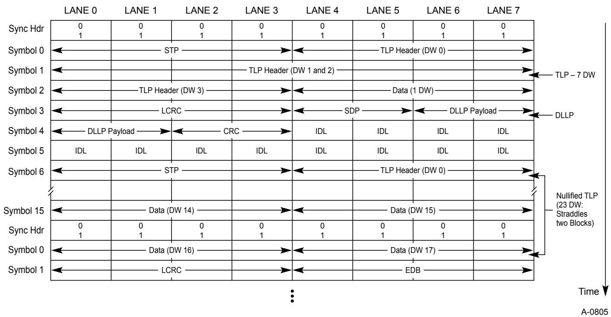

<details>
<summary>timing diagram</summary>

| Symbol 0 | 0 | 0 | 0 | 0 | 0 | 0 | 0 | 0 |
| --- | --- | --- | --- | --- | --- | --- | --- | --- |
| Symbol 1 |  |  | LCRC |  |  |  |  |  |
| Symbol 2 |  |  | TLP Header (DW 3) —— —— |  |  | Data (1 DW) —— |  |  |
| Symbol 3 |  |  | LCRC |  |  | SDP |  |  |
| Symbol 4 | DLLP Payload —— → CRC → |  |  |  | IDL | IDL | IDL | IDL |
| Symbol 5 | IDL | IDL | IDL | IDL | IDL | IDL | IDL | IDL |
| Symbol 6 |  |  | STP |  |  | TLP Header (DW 0) —— |  |  |
| Symbol 15 | Data (DW 14) —— → |  | Data (DW 15) —— → |  |  | Data (DW 17) —— |  |  |
| Sync Hdr | 0 | 0 | 0 | 0 | 0 | 0 | 0 | 0 |
| Symbol 0 | Data (DW 16) —— → |  | Data (DW 17) —— → |  |  | Data (DW 19) —— |  |  |
| Symbol 1 | LCRC |  |  |  |  | EDB |  |  |
</details>

Figure 4-16 Nullified TLP Layout in a x8 Link with Other P § ackets

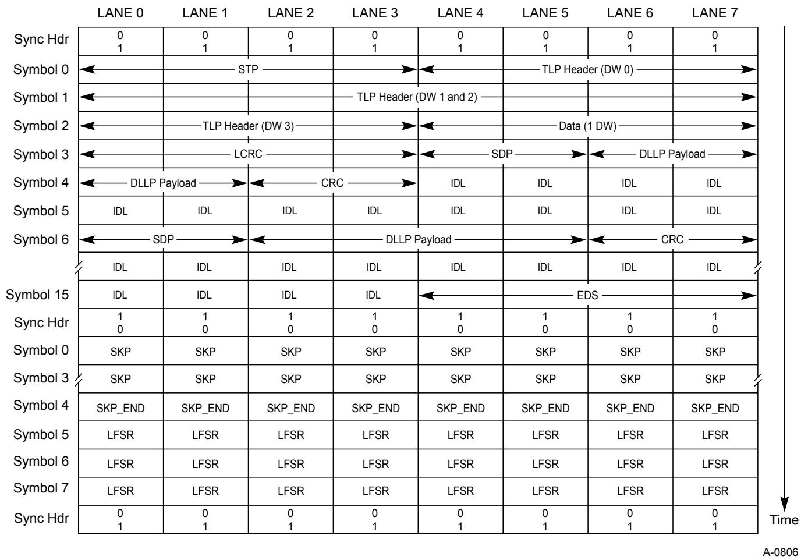

<details>
<summary>timing diagram</summary>

| Protocol | LANE 0 | LANE 1 | LANE 2 | LANE 3 | LANE 4 | LANE 5 | LANE 6 | LANE 7 |
|----------|--------|--------|--------|--------|--------|--------|--------|--------|
| Sync Hdr | 0      | 0      | 0      | 0      | 0      | 0      | 0      | 0      |
| Symbol 0 |        |        | STP    |        |        | TLP Header (DW 0) |        |        |
| Symbol 1 |        |        |        | TLP Header (DW 1 and 2) |        |        |        |        |
| Symbol 2 |        |        | TLP Header (DW 3) |        |        | Data (1 DW) |        |        |
| Symbol 3 |        |        | LCRC   |        | SDP    |        | DLLP Payload |        |
| Symbol 4 |        |        | DLLP Payload | CRC    | IDL    | IDL    | IDL    | IDL    |
| Symbol 5 | IDL    | IDL    | IDL    | IDL    | IDL    | IDL    | IDL    | IDL    |
| Symbol 6 |        | SDP    |        | DLLP Payload |        |        | CRC    |        |
| Symbol 15| IDL    | IDL    | IDL    | IDL    | IDL    | IDL    | IDL    | IDL    |
| Sync Hdr | 1      | 1      | 1      | 1      | 1      | 1      | 1      | 1      |
| Symbol 0 | 0      | 0      | 0      | 0      | 0      | 0      | 0      | 0      |
| Symbol 3 | SKP    | SKP    | SKP    | SKP    | SKP    | SKP    | SKP    | SKP    |
| Symbol 4 | SKP_END| SKP_END| SKP_END| SKP_END| SKP_END| SKP_END| SKP_END| SKP_END|
| Symbol 5 | LFSR   | LFSR   | LFSR   | LFSR   | LFSR   | LFSR   | LFSR   | LFSR   |
| Symbol 6 | LFSR   | LFSR   | LFSR   | LFSR   | LFSR   | LFSR   | LFSR   | LFSR   |
| Symbol 7 | LFSR   | LFSR   | LFSR   | LFSR   | LFSR   | LFSR   | LFSR   | LFSR   |
| Sync Hdr| 0      | 0      | 0      | 0      | 0      | 0      | 0      | 0      |
|          | 1      | 1      | 1      | 1      | 1      | 1      | 1      | 1      |
A-0806   Time
</details>

Figure 4-17 SKP Ordered Set of Length 66-bit in a x8 Link§

## 4.2.2.3.2 Transmitter Framing Requirements in Non-Flit Mode §

The following requirements apply to the transmitted Data Stream.

• To Transmit a TLP:

◦ Transmit an STP Token immediately followed by the complete TLP information provided by the Data Link Layer.  
◦ All DWs of the TLP, as specified by the TLP Length field of the STP Token, must be transmitted, even if the TLP is nullified.  
◦ If the TLP is nullified, an EDB Token must be transmitted immediately following the TLP. There must be no Symbols between the last Symbol of the TLP and the first Symbol of the EDB Token. The value of the TLP Length field of a nullified TLP’s STP Token is not adjusted to account for the EDB Token.  
◦ The STP Token must not be transmitted more frequently than once per Symbol Time.

• To Transmit a DLLP:

◦ Transmit an SDP Token immediately followed by the complete DLLP information provided by the Data Link Layer.  
◦ All 6 Symbols of the DLLP must be transmitted.

◦ The SDP Token must not be transmitted more frequently than once per Symbol Time.

• To Transmit a SKP Ordered Set within a Data Stream:

◦ Transmit an EDS Token in the last DW of the current Data Block. For example, the Token is transmitted on Lane 0 in Symbol Times 12-15 of the Block for a x1 Link, and on Lanes 12-15 of Symbol Time 15 of the Block for a x16 Link.  
◦ Transmit the SKP Ordered Set following the current Data Block.  
◦ Transmit a Data Block following the SKP Ordered Set. The Data Stream resumes with the first Symbol of the Data Block. If multiple SKP Ordered Sets are scheduled for transmission, each SKP Ordered Set must be preceded by a Data Block with an EDS Token.

• To end a Data Stream:

◦ Transmit an EDS Token in the last DW of the current Data Block, followed in the next block by an EIOS or an EIEOS. An EIOS is transmitted for LTSSM power management state transitions, and an EIEOS is transmitted for all other cases. For example, the Token is transmitted on Lane 0 in Symbol Times 12-15 of the Block for a x1 Link, and on Lanes 12-15 of Symbol Time 15 of the Block for a x16 Link.

• The IDL Token must be transmitted on all Lanes when not transmitting a TLP, DLLP, or other Framing Token.  
• Multi-Lane Links:

◦ After transmitting an IDL Token, the first Symbol of the next STP or SDP Token must be transmitted in Lane 0 of a future Symbol Time. An EDS Token can be transmitted after an IDL Token in the same Symbol Time, since it must be transmitted in the last DW of a Block.  
◦ For xN Links where N is 8 or more, if an EDB Token, TLP, or DLLP ends in a Lane K, where K does not equal N-1, and it is not followed by the first Symbol of an STP, SDP, or EDB Token in Lane K+1, then IDL Tokens must be placed in Lanes K+1 to N-1. For example, on a x8 Link, if a TLP or DLLP ends in Lane 3, IDL Tokens must be placed in Lanes 4 to 7. The EDS Token is an exception to this requirement, and can be transmitted following IDL Tokens.  
◦ Tokens, TLPs, and DLLPs are permitted to follow each other successively such that more than one Token may be transmitted in the same Symbol Time as long as their transmission conforms with the other requirements stated in this section.

Links wider than x4 can have Tokens placed starting on Lane 4\*N, where N is a positive integer. For example, Tokens can be placed in Lanes 0 and 4 of a x8 Link, and Tokens can be placed in Lanes 0, 4, 8, or 12 of a x16 Link.

## 4.2.2.3.3 Receiver Framing Requirements in Non-Flit Mode §

The following requirements apply to the received Data Stream and the Block type transitions that occur at the beginning and end of the Data Stream.

• When processing Symbols that are expected to be a Framing Token, receiving a Symbol or sequence of Symbols that does not match the definition of a Framing Token is a Framing Error. It is strongly recommended that Receivers of a multi-Lane Link report an error in the Lane Error Status Register for the Lane that receives the first Symbol of an expected Framing Token when that Symbol does not match Symbol +0 of an STP (bits [3:0] only), IDL, SDP, EDB, or EDS Token (see § Figure 4-13).  
• All optional error checks and error reports in this section are independently optional (see § Section 6.2.3.4 ).  
• When an STP Token is received:

◦ Receivers must calculate the Frame CRC and Frame Parity of the received TLP Length field and compare the results to the received Frame CRC and Frame Parity fields. A Frame CRC or Frame Parity mismatch is a Framing Error.

▪ An STP Token with Framing Error is not considered part of a TLP for the purpose of reporting to the Data Link Layer.

◦ If the TLP Length field is 1, the Symbols are not an STP Token and are instead evaluated to determine whether they are an EDS Token.

◦ Receivers are permitted to check whether the TLP Length field has a value of 0. If checked, receiving a TLP Length field of 0 is a Framing Error.

◦ Receivers are permitted to check whether the TLP Length field has a value of 2, 3, or 4. If checked, receiving such a TLP Length field is a Framing Error.

◦ Receivers are permitted to check whether the TLP Length field has a value between 1152 and 1535 (inclusive). If checked, receiving such a TLP Length field is a Framing Error.

◦ Receivers on Ports that do not support Protocol Multiplexing are permitted to check whether the TLP Length field has a value greater than 1535. If checked, receiving such a TLP Length field is a Framing Error.

◦ Receivers on Ports that support Protocol Multiplexing, shall process STP Tokens with a TLP Length field that is greater than 1535 as the start of a PMUX Packet as defined in § Appendix G. .

◦ The next Token to be processed begins with the Symbol immediately following the last DW of the TLP, as determined by the TLP Length field.

▪ Receivers must evaluate this Symbol and determine whether it is the first Symbol of an EDB Token and therefore whether the TLP is nullified. See the EDB Token requirements.

◦ Receivers are permitted to check whether more than one STP Token is received in a single Symbol Time. If checked, receiving more than one STP Token in a single Symbol Time is a Framing Error

• When an EDB Token is received:

◦ If an EDB Token is received immediately following a TLP (there are no Symbols between the last Symbol of the TLP and the first Symbol of the EDB Token), receivers must inform the Data Link Layer that an EDB Token has been received. Receivers are permitted to inform the Data Link Layer that an EDB Token has been received after processing the first Symbol of the EDB Token or after processing any or all of the remaining Symbols of the EDB Token. Regardless of when they inform the Data Link Layer of a received EDB Token, Receivers must check all Symbols of the EDB Token. Receiving a Symbol that does not match the definition of an EDB Token is a Framing Error.

◦ Receiving an EDB Token at any time other than immediately following a TLP is a Framing Error.

◦ The next Token to be processed begins with the Symbol immediately following the EDB Token.

• When an EDS Token is received in the last four Symbols of the Data Block across the Link:

◦ Receivers must stop processing the Data Stream.

◦ Receiving an Ordered Set other than SKP, EIOS, or EIEOS in the Block following the EDS Token is a Framing Error.

◦ If a SKP Ordered Set is received in the Block following the EDS Token, Receivers resume Data Stream processing with the first Symbol of the Data Block that follows the SKP Ordered Set unless a Framing Error has been detected.

• When an SDP Token is received:

◦ The next Token to be processed begins with the Symbol immediately following the last Symbol of the DLLP.

◦ Receivers are permitted to check whether more than one SDP Token is received in a single Symbol Time. If checked, receiving more than one SDP Token in a single Symbol Time is a Framing Error.

• When an IDL Token is received:

◦ For a x1 Link, the next Token to be processed begins with the next Symbol received.

◦ For a x2 Link, the next Token to be processed begins with the Symbol received in Lane 0 of the next Symbol Time. It is strongly recommended that Receivers check whether the Symbol received in Lane 1, if it did not receive IDL, after an IDL Token was received in Lane 0 is also IDL and report an error for Lane 1 in the Lane Error Status Register. If checked, receiving a Symbol other than IDL is a Framing Error.  
◦ For a x4 Link, the next Token to be processed begins with the Symbol received in Lane 0 of the next Symbol Time. It is strongly recommended that Receivers check whether the Symbols received in Lanes 1-3, after an IDL Token was received in Lane 0 are also IDL and report an error for the Lane(s) that did not receive IDL, in the Lane Error Status Register. If checked, receiving a Symbol other than IDL is a Framing Error.  
◦ For x8 and x16 Links, the next Token to be processed begins with the Symbol received in the next DW aligned Lane following the IDL Token. For example, if an IDL Token is received in Lane 4 of a x16 Link, the next Token location begins with Lane 8 of the same Symbol Time. However, if an IDL Token is received on Lane 4 of a x8 Link, the next Token location begins with Lane 0 of the following Symbol Time. It is strongly recommended that Receivers check whether the Symbols received between the IDL Token and the next Token location are also IDL and report an error for the Lane(s) that did not receive IDL, in the Lane Error Status Register. If checked, receiving a Symbol other than IDL is a Framing Error.

Note: The only Tokens expected to be received in the same Symbol Time following an IDL Token are additional IDL Tokens or an EDS Token.

• While processing the Data Stream, Receivers must also check the Block type received by each Lane, after accounting for Lane-to-Lane de-skew, for the following conditions:

◦ Receiving an Ordered Set Block on any Lane immediately following an SDS Ordered Set is a Framing Error.  
◦ Receiving a Block with an undefined Block type (a Sync Header of 11b or 00b) is a Framing Error. It is strongly recommended that Receivers of a multi-Lane Link report an error for any Lane that received the undefined Block type in the Lane Error Status register.  
◦ Receiving an Ordered Set Block on any Lane without receiving an EDS Token in the preceding Block is a Framing Error. For example, receiving a SKP Ordered Set without a preceding EDS Token is a Framing Error. In addition, receiving a SKP Ordered Set followed immediately by another Ordered Set Block (including another SKP Ordered Set) within a Data Stream is a Framing Error. It is strongly recommended that if the first Symbol of the Ordered Set is SKP, Receivers of a multi-Lane Link report an error for the Lane(s) in the Lane Error Status register if the received Symbol number 1 through 4N does not match the corresponding Symbol in § Table 4-52 or § Table 4-53.  
◦ Receiving a Data Block on any Lane when the previous block contained an EDS Token is a Framing Error. It is strongly recommended that Receivers of a multi-Lane Link report an error for the Lane(s) that received the Data Block in the Lane Error Status register.  
◦ Receivers are permitted to check for different Ordered Sets on different Lanes. For example, Lane 0 receives a SKP Ordered Set and Lane 1 receives an EIOS. If checked, receiving different Ordered Sets is a Framing Error, unless it is a combination of EIEOS/EIOS and SKP OS for L0p transitions.

## 4.2.2.3.4 Receiver Framing Requirements in Flit Mode §

While processing the Data Stream, Receivers must check the Block type received by each Lane, after accounting for Lane-to-Lane de-skew, for the following conditions:

• Not receiving a SKP Ordered Set followed by a Data Block after on any Lane immediately following an SDS Ordered Set is a Framing Error.

• Receiving a Block with an undefined Block type (a Sync Header of 11b or 00b) is a Framing Error. It is strongly recommended that Receivers of a multi-Lane Link report an error for any Lane that received the undefined Block type in the Lane Error Status register. For Lanes that are not entering or exiting the electrical idle state as part of L0p state, the following conditions result in a Framing Error. It is strongly recommended that Receivers of a multi-Lane Link report an error for any Lane that caused the Framing Error in the Lane Error Status register.

◦ Receiving an Ordered Set Block on any Lane in an unscheduled Block boundary, as defined in § Section 4.2.3.1

◦ Not receiving one of these three Ordered Sets of the appropriate length at the scheduled Block boundary: EIEOS, SKP Ordered Set, or EIOS

◦ Receivers are permitted to check for different Ordered Sets on different Lanes. For example, Lane 0 receives a SKP Ordered Set and Lane 1 receives an EIOS. If checked, receiving different Ordered Sets is a Framing Error

## 4.2.2.3.5 Recovery from Framing Errors in Non-Flit Mode and Flit Mode §

If a Receiver detects a Framing Error while processing the Data Stream, it must:

• Report a Receiver Error as described in § Section 4.2.5.8 .

• Stop processing the Data Stream. Processing of a new Data Stream is initiated when the next SDS Ordered Set is received as previously described.

Initiate the error recovery process as described in § Section 4.2.5.8 . If the LTSSM state is L0, direct the LTSSM to Recovery. If the LTSSM state is Configuration.Complete or Configuration.Idle when the Framing Error is detected, the error recovery process is satisfied by either a transition from Configuration.Idle to Recovery.RcvrLock due to the specified timeout, or a transition to Recovery through L0. If the LTSSM state is Recovery.RcvrCfg or Recovery.Idle when the Framing Error is detected, the error recovery process is satisfied by either a transition from Recovery.Idle to Recovery.RcvrLock due to the specified timeout, or a directed transition from L0 to Recovery. If the LTSSM substate is either Recovery.RcvrLock or Configuration.Linkwidth.Start, the error recovery process is satisfied upon exit from these substates and no direction of the LTSSM to Recovery is required.

◦ Note: The framing error recovery mechanism is not expected to directly cause any Data Link Layer initiated recovery action such as NAK.

## IMPLEMENTATION NOTE: TIME SPENT IN RECOVERY DUE TO DETECTION OF A FRAMING ERROR §

When using 128b/130b encoding, all Framing Errors require Link recovery. It is expected that implementations will require less than 1 microsecond to recover from a Framing Error as measured from the time that both Ports have entered the Recovery state.

## 4.2.2.4 Scrambling in Non-Flit Mode and Flit Mode


Each Lane of the transmitter in a multi-Lane Link may implement a separate LFSR for scrambling. Each Lane of the receiver in a multi-Lane Link may implement a separate LFSR for descrambling. Implementations may choose to implement fewer LFSRs but must achieve the same functionality as independent LFSRs.

The LFSR uses the following polynomial: $\mathsf { G } ( \mathsf { X } ) = \mathsf { X } ^ { 2 3 } + \mathsf { X } ^ { 2 1 } + \mathsf { X } ^ { 1 6 } + \mathsf { X } ^ { 8 } + \mathsf { X } ^ { 5 } + \mathsf { X } ^ { 2 } + 1$ and is demonstrated in § Figure 4-18.

The scrambling rules are as follows:

• The two bits of the Sync Header used in 8.0 GT/s, 16.0 GT/s, or 32.0 GT/s Data Rate are not scrambled and do not advance the LFSR.  
• All 16 Symbols of an Electrical Idle Exit Ordered Set (EIEOS) bypass scrambling. The scrambling LFSR is initialized after the last Symbol of an EIEOS is transmitted, and the descrambling LFSR is initialized after the last Symbol of an EIEOS is received.

• TS1 and TS2 Ordered Sets for 8.0 GT/s, 16.0 GT/s, or 32.0 GT/s Data Rate:

◦ Symbol 0 of a TS1 or TS2 Ordered Set bypasses scrambling.  
◦ Symbols 1-13 are scrambled.  
◦ Symbols 14 and 15 bypass scrambling if required for DC Balance, but they are scrambled if not required for DC Balance.

• All 16 Symbols of a Fast Training Sequence (FTS) Ordered Set used in 8.0 GT/s, 16.0 GT/s, or 32.0 GT/s bypass scrambling.

• All 16 Symbols of a Start of Data Stream (SDS) Ordered Set bypass scrambling.

• All 16 Symbols of an Electrical Idle Ordered Set (EIOS) bypass scrambling.

• All Symbols of a SKP Ordered Set bypass scrambling.

• Transmitters advance their LFSR for all Symbols of all Ordered Sets except for the SKP Ordered Set. The LFSR is not advanced for any Symbols of a SKP Ordered Set.

Receivers evaluate Symbol 0 of Ordered Set Blocks to determine whether to advance their LFSR. If Symbol 0 of the Block is SKP (see § Section 4.2.8.2 ), then the LFSR is not advanced for any Symbol of the Block. Otherwise, the LFSR is advanced for all Symbols of the Block.

• All 16 Symbols of a Data Block are scrambled and advance the scrambler.

• For Symbols that need to be scrambled, the least significant bit is scrambled first and the most significant bit is scrambled last.

• The seed value of the LFSR is dependent on the Lane number assigned to the Lane when the Link first entered Configuration.Idle (i.e., having gone through Polling from Detect with LinkUp = 0b).

◦ The seed values for Lane number modulo 8 are:

<table><tr><td>Lane</td><td>Seed</td></tr><tr><td>0</td><td>1DBFBCh</td></tr><tr><td>1</td><td>0607BBh</td></tr><tr><td>2</td><td>1EC760h</td></tr><tr><td>3</td><td>18C0DBh</td></tr><tr><td>4</td><td>010F12h</td></tr><tr><td>5</td><td>19CFC9h</td></tr><tr><td>6</td><td>0277CEh</td></tr><tr><td>7</td><td>1BB807h</td></tr></table>

## IMPLEMENTATION NOTE:SCRAMBLING PSEUDO-CODE §

The pseudo-code for the scrambler along with examples are provided in § Section C.2 of § Appendix C. .

• The seed value of the LFSR does not change while LinkUp=1. Link reconfiguration through the LTSSM Configuration state does not modify the initial Lane number assignment as long as LinkUp remains 1 (even though the Lane assignment may change during Configuration).  
• Scrambling cannot be disabled in Configuration.Complete when using 128b/130b encoding.  
• A Loopback Follower must not descramble or scramble the looped-back bit stream.

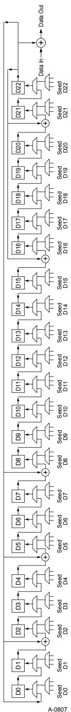

<details>
<summary>flowchart</summary>

```mermaid
graph TD
  A["Seed D0"] --> B["D0"]
  C["Seed D1"] --> D["D1"]
  E["Seed D2"] --> F["D2"]
  G["Seed D3"] --> H["D3"]
  I["Seed D4"] --> J["D4"]
  K["Seed D5"] --> L["D5"]
  M["Seed D6"] --> N["D6"]
  O["Seed D7"] --> P["D7"]
  Q["Seed D8"] --> R["D8"]
  S["Seed D9"] --> T["D9"]
  U["Seed D10"] --> V["D10"]
  W["Seed D11"] --> X["D11"]
  Y["Seed D12"] --> Z["D12"]
  AA["Seed D13"] --> AB["D13"]
  AC["Seed D14"] --> AD["D14"]
  AE["Seed D15"] --> AF["D15"]
  AG["Seed D16"] --> AH["D16"]
  AI["Seed D17"] --> AJ["D17"]
  AK["Seed D18"] --> AL["D18"]
  AM["Seed D19"] --> AN["D19"]
  AO["Seed D20"] --> AP["D20"]
  AQ["Seed D21"] --> AR["D21"]
  AS["Seed D22"] --> AT["Data In"] --> AU["+"]
  AU --> AV["Data Out"]
  AW["A-0007"] --> AX
  AX --> AY
  AY --> AZ
  AZ --> BA
  BA --> BB
  BB --> BC
  BC --> BD
  BD --> BE
  BE --> BF
  BF --> BG
  BG --> BH
  BH --> BI
  BI --> BJ
  BJ --> BK
  BK --> BL
  BL --> BM
  BM --> BN
  BN --> BO
  BO --> BP
  BP --> BQ
  BQ --> BR
  BR --> BS
  BS --> BT
  BT --> BU
  BU --> BV
  BV --> BW
  BW --> BX
  BX --> BY
  BY --> BZ
  BZ --> CA
  CA --> CB
  CB --> CC
  CC --> CD
  CD --> CE
  CE --> CF
  CF --> CG
  CG --> CH
  CH --> CI
  CI --> CJ
  CJ --> CK
  CK --> CL
  CL --> CM
  CM --> CN
  CN --> CO
  CO --> CP
  CP --> CQ
  CQ --> CY
  CY --> CZ
  CZ --> DA
  DA --> DB
  DB --> DC
  DC --> DV
  DV --> DW
  DW --> DX
  DX --> DBX
  DBX --> DBY
  DBY --> DBZ
  DBZ --> DBYX
  DBYX --> DBYZ
```
</details>

Figure 4-18 LFSR with Scrambling Polynomial in 8.0 GT/s and Abo § ve Data Rate

## IMPLEMENTATION NOTE:

## LFSR IMPLEMENTATION WITH A SHARED LFSR §

Implementations may choose to implement one LFSR and take different tap points as shown in § Figure 4-19, which is equivalent to the individual LFSR per-lane with different seeds, as shown in § Figure 4-18. It should also be noted that the tap equations of four Lanes are the XOR of the tap equations of two neighboring Lanes. For example, Lane 0 can be obtained by XORing the output of Lanes 1 and 7; Lane 2 is the XOR of Lanes 1 and 3; Lane 4 is the XOR of Lanes 3 and 5; and Lane 6 is the XOR of Lanes 5 and 7. This can be used to help reduce the gate count at the expense of potential delay due to the XOR results of the two Lanes.

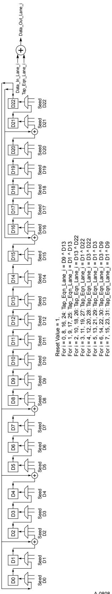

<details>
<summary>flowchart</summary>

```mermaid
graph LR
  A["Seed D0"] --> B["D1"]
  B --> C["+"]
  C --> D["D2"]
  D --> E["+"]
  E --> F["D3"]
  F --> G["+"]
  G --> H["D4"]
  H --> I["+"]
  I --> J["D5"]
  J --> K["+"]
  K --> L["D6"]
  L --> M["+"]
  M --> N["D7"]
  N --> O["+"]
  O --> P["D8"]
  P --> Q["+"]
  Q --> R["D9"]
  R --> S["+"]
  S --> T["D10"]
  T --> U["+"]
  U --> V["D11"]
  V --> W["+"]
  W --> X["D12"]
  X --> Y["+"]
  Y --> Z["D13"]
  Z --> AA["+"]
  AA --> AB["D14"]
  AB --> AC["+"]
  AC --> AD["D15"]
  AD --> AE["+"]
  AE --> AF["D16"]
  AF --> AG["+"]
  AG --> AH["D17"]
  AH --> AI["+"]
  AI --> AJ["D18"]
  AJ --> AK["+"]
  AK --> AL["D19"]
  AL --> AM["+"]
  AM --> AN["D20"]
  AN --> AO["+"]
  AO --> AP["D21"]
  AP --> AQ["+"]
  AQ --> AR["D22"]
  AR --> AS["Data_In_Lane_i → Tap_Eqn_Lane_i → Data_Out_Lane_i"]
    
    style A fill:#f9f,stroke:#333
    style B fill:#f9f,stroke:#333
    style C fill:#f9f,stroke:#333
    style D fill:#f9f,stroke:#333
    style E fill:#f9f,stroke:#333
    style F fill:#f9f,stroke:#333
    style G fill:#f9f,stroke:#333
    style H fill:#f9f,stroke:#333
    style I fill:#f9f,stroke:#333
    style J fill:#f9f,stroke:#333
    style K fill:#f9f,stroke:#333
    style L fill:#f9f,stroke:#333
    style M fill:#f9f,stroke:#333
    style N fill:#f9f,stroke:#333
    style O fill:#f9f,stroke:#333
    style P fill:#f9f,stroke:#333
    style Q fill:#f9f,stroke:#333
    style R fill:#f9f,stroke:#333
    style S fill:#f9f,stroke:#333
    style T fill:#f9f,stroke:#333
    style U fill:#f9f,stroke:#333
    style V fill:#f9f,stroke:#333
    style W fill:#f9f,stroke:#333
    style X fill:#f9f,stroke:#333
    style Y fill:#f9f,stroke:#333
    style Z fill:#f9f,stroke:#333
    style AA fill:#f9f,stroke:#333
    style AB fill:#f9f,stroke:#333
    style AC fill:#f9f,stroke:#333
    style AD fill:#f9f,stroke:#333
    style AE fill:#f9f,stroke:#333
    style AF fill:#f9f,stroke:#333
    style AG fill:#f9f,stroke:#333
    style AH fill:#f9f,stroke:#333
```
</details>

Figure 4-19 Alternate Implementation of the LF § SR for Descrambling

## 4.2.2.5 Precoding §

A Receiver may request precoding from its transmitter for operating at data rates of 32.0 GT/s and higher. Precoding, when enabled at a Data Rate, applies to both Flit Mode and Non-Flit Mode at that data rate. The precoding rules are as follows:

• A Port or Pseudo-Port must request precoding on all configured Lanes of the Link. Behavior is undefined if precoding is requested on some Lanes but not others by a Port or Pseudo-Port.  
• A Port or Pseudo-Port may request precoding independent of other Ports or Pseudo-Ports. For example, it is possible that precoding may be turned on only in the Upstream Port in the case with no Retimers in § Figure 4-60, or on all the Lanes in Tx(A) and Tx(E) in the two Retimer example in § Figure 4-60.

• Precoding is turned off for all data rates when the LTSSM is in the Detect state.

• If a precoding request to a target data rate is to be made, it must be made prior to entering that data rate. A precoding request is made by setting the Transmitter Precode Request bit in the EQ TS2 or the 128b/ 130b EQ TS2 Ordered Sets prior to the transition to Recovery.Speed for the target data rate at which the precoding will be turned on. For each data rate of 32.0 GT/s or higher, the precoding request must be made independently.

• Each (pseudo) Port must store the precoding request along with the Tx Eq values from the most recent equalization procedure in each Lane. If the Link operates at 32.0 GT/s or higher data rate without performing equalization through the No Equalization Needed mechanism it negotiated in the TS1/TS2 Ordered Sets or modified TS1/TS2 Ordered Sets or the Link operates at the 32.0 GT/s or higher data rate in Polling.Compliance, the precoding requests from the last equalization results that are being used must be enforced. If no equalization has ever been performed on the Link (prior to the current Link up), then precoding will not be turned on.

• If the Transmitter Precode Request bit is Set to 1b in each of the received eight consecutive EQ TS2 or 128b/ 130b EQ TS2 Ordered Sets during Recovery.RcvrCfg prior to entry to Recovery.Speed, the Transmitter must turn on the precoding for the target data rate at which the Link will operate on exit from Recovery.Speed if the target data rate is 32.0 GT/s or higher. Once turned on, precoding will be in effect for that target data rate until the Transmitter receives another set of eight consecutive EQ TS2 or 128b/130b EQ TS2 Ordered Sets with Transmitter Precode Request set to 0b during Recovery.RcvrCfg prior to entry to Recovery.Speed for the same target data rate.

• A Transmitter must not turn on precoding for any data rates lower than 32.0 GT/s.

• In data rates of 32.0 GT/s or higher, a Transmitter must set the Transmitter Precoding On bit to 1b in the TS1 Ordered Sets that it transmits in Recovery if its precoding is on for the current data rate; else the bit must be set to 0b.

• A Transmitter that has turned on precoding for the 32.0 GT/s data rate on Lane 0 must set the 32.0 GT/s Transmitter Precoding On bit to 1b in the 32.0 GT/s Status Register; else, it must set the bit to 0b. A Receiver that has requested, or will request, its link partner to turn on precoding at the 32.0 GT/s data rate must set the 32.0 GT/s Transmitter Precode Request to 1b in the 32.0 GT/s Status Register; else it must set the bit to 0b.

• A Transmitter that has turned on precoding for the 64.0 GT/s data rate on Lane 0 must set the 64.0 GT/s Transmitter Precoding On bit to 1b in the 64.0 GT/s Status Register; else it must set the bit to 0b. A Receiver that has requested, or will request, its link partner to turn on precoding at the 64.0 GT/s data rate must set the 64.0 GT/s Transmitter Precode Request to 1b in the 64.0 GT/s Status Register; else it must set the bit to 0b.

• See § Section 4.2.2.5.1 for 32.0 GT/s precoding requirements. See § Section 4.2.3.1.4 for 64.0 GT/s and above data rate precoding requirements.

## 4.2.2.5.1 Precoding at 32.0 GT/s Data Rate §

When precoding is on at 32.0 GT/s, the following rules apply (see § Figure 4-20):

• Only scrambled bits are precoded.  
• The “previous bit” used for precoding is set to 1b on every block boundary and gets updated by the last scrambled and precoded bit transmitted within the current block boundary.  
• For symbols that are scrambled, Receivers must first decode the precoded bits before sending them to the descrambler.

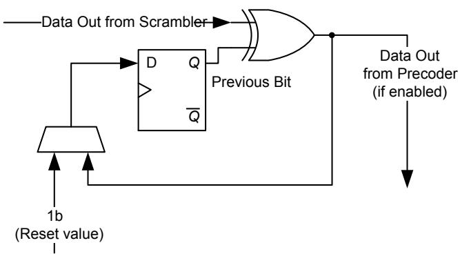

<details>
<summary>flowchart</summary>

```mermaid
graph TD
  A["Data Out from Scrambler"] --> B["Previous Bit"]
  B --> C["Data Out from Precoder (if enabled)"]
  D["1b (Reset value)"] --> E["AND Gate"]
  E --> B
  F["1b"] --> E
  G["Q"] --> E
  H["Q̅"] --> E
```
</details>

(a. Precoding on Tx side)

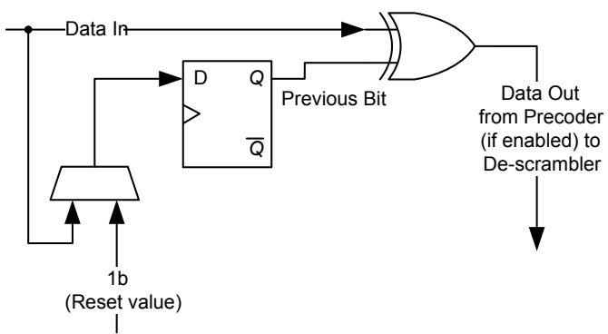

<details>
<summary>flowchart</summary>

```mermaid
graph TD
  A["Data In"] --> B["D Flip-Flop"]
  B --> C["Previous Bit"]
  C --> D["OR Gate"]
  D --> E["Data Out from Precoder (if enabled) to De-scrambler"]
  F["1b (Reset value)"] --> B
  G["Input"] --> B
```
</details>

(b. Precoding on Rx side)  
Figure 4-20 Precoding working the scrambler/ de-scrambler§

## IMPLEMENTATION NOTE:

## PARITY IN THE SKP ORDERED SET WHEN PRECODING IS TURNED ON §

As per the rules of § Section 4.2.5.1 and § Section 4.2.8.2 , when precoding is turned on, the parity in the SKP Ordered Sets should be calculated before precoding is applied on the Transmit side. Thus, the order in the Transmitter is:

1. scrambling,  
2. followed by parity bit calculation,  
3. followed by precoding for the scrambled bits.

Accordingly, in the Receiver, the order is:

1. precoding (if turned on by the Transmitter),  
2. followed by parity bit calculation,  
3. followed by descrambling.

The rationale for this order is that in a Link with one or two Retimers, different Link segments may have the precoding on or off. Let us consider an example system with one retimer between the Root Port and End Point to illustrate this. In the upstream direction, the End Point has precoding on in its Transmitter Lanes since the Retimer Receiver needs it but the Retimer to Root Port Link segment has the precoding off since the Root Port does not need precoding at its Receiver. Since the Retimer does not change the parity bit, the Root Port would get a parity error if the parity calculation was done by the Transmitter (of the End Point) after precoding.

## IMPLEMENTATION NOTE:

## LOOPBACK LEAD'S BEHAVIOR IF PRECODING IS ON IN ANY LINK SEGMENT §

As per the rules of precoding mentioned in this section and § Section 4.2.7.4 , a Loopback Lead operating at a data rate of 32.0 GT/s or higher should account for precoding to be on some link segments and off in other link segments. This is particularly relevant when the Loopback Follower transitions from sending TS1 Ordered Sets to looping back the bits. This is where the precoding on the receiver of the Loopback Lead may switch (between precoding on and off). The Loopback Lead is permitted to use implementation specific mechanisms to handle this scenario.

## IMPLEMENTATION NOTE:

## TS1/TS2 ORDERED SETS WHEN PRECODING IS TURNED ON §

As per the rules in this section, when precoding is turned on, the ‘previous bit’ used for precoding is 1b for the first bit of Symbol 1 since Symbol 0 is not scrambled and the ‘previous bit’ gets set to 1b at the block boundary.

## 4.2.2.6 Loopback with 128b/130b Code in Non-Flit Mode and Flit Mode


When using 128b/130b encoding, Loopback Leads must transmit Blocks with the defined 01b and 10b Sync Headers. However, they are not required to transmit an SDS Ordered Set when transitioning from Ordered Set Blocks to Data Blocks, nor are they required to transmit an EDS Token when transitioning from Data Blocks to Ordered Set Blocks. Leads must transmit SKP Ordered Sets periodically as defined in § Section 4.2.8 , and they must be capable of processing received (looped-back) SKP Ordered Sets of varying length. Leads are permitted to transmit Electrical Idle Exit Ordered Sets (EIEOS) as defined in § Section 4.2.2.2.1 . Leads are permitted to transmit any payload in Data Blocks and Ordered Set Blocks that they expect to be looped-back. If the Loopback Lead transmits an Ordered Set Block whose first symbol matches the first symbol of SKP OS, EIEOS, or EIOS, that Ordered Set Block must be a complete and valid SKP OS, EIEOS, or EIOS.

When using 128b/130b encoding, Loopback Followers must retransmit all bits received without modification, except for SKP Ordered Sets which can be adjusted as needed for clock compensation. If clock compensation is required, Followers must add or remove 4 SKP Symbols per Ordered Set. The modified SKP Ordered Set must meet the definition of § Section 4.2.8.2 (i.e., it must have between 4 to 20 SKP Symbols followed by the SKP\_END Symbol and the three Symbols that follow it as transmitted by the Loopback Leads. If a Follower is unable to obtain Block alignment or it is misaligned, it may be unable to perform clock compensation and therefore unable to loop-back all bits received. In this case, it is permitted to add or remove Symbols as necessary to continue operation. Followers must not check for a received SDS Ordered Set when a transition from Ordered Set Blocks to Data Blocks is detected, and they must not check for a received EDS Token when a transition from Data Blocks to Ordered Set Blocks is detected.

## 4.2.3 Flit Mode Operation §

Flit definition and Symbol placement is specified in this section.

Flits encoded with 8b/10b encoding follow the rules in § Section 4.2.1 with the following exception:

• Since the Flit Mode has its fixed TLP and DLP placement, the packet markers such as STP, SDP, END, EDB are not used.

Flits Encoded with 128b/130b encoding follow the rules in § Section 4.2.2 with the following exceptions:

• Since the Flit Mode has its fixed TLP and DLP placement, the Framing Tokens are not used.

1b/1b encoding is specified in Section 4.2.3.1.

## 4.2.3.1 1b/1b Encoding for 64.0 GT/s and higher Data Rates


When the PCI Express Link is operating at 64.0 GT/s or higher Data Rates, it uses Flit Mode. A Symbol (8 bits) is the basic unit of transfer per Lane. PAM4 signaling is used for all Symbols, whether it belongs to a Data Stream or an Ordered Set. PAM4 operates on 2-bit aligned boundaries. A Symbol, represented as ${ } ^ { \mathrm { ' } } \mathsf { S } _ { 7 } \mathsf { S } _ { 6 } \mathsf { S } _ { 5 } \mathsf { S } _ { 4 } \mathsf { S } _ { 3 } \mathsf { S } _ { 2 } \mathsf { S } _ { 1 } \mathsf { S } _ { 0 } { } ^ { \mathrm { ' } }$ , is placed on a Lane starting with the voltage encoding of $ { \mathsf { \tilde { S } } } _ { 1 }  { \mathsf { S } } _ { 0 }  { \mathrm { \tilde { \Delta } } }$ and ending with ‘S7S6’. . An example placement of Flits (described later) or Ordered Set on a x4 Link is shown in § Figure 4-21 below.

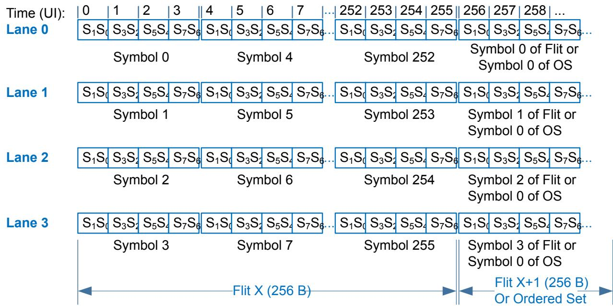

<details>
<summary>diagram</summary>

| Lane | Symbol 0 | Symbol 1 | Symbol 2 | Symbol 3 |
| --- | --- | --- | --- | --- |
| Lane 0 | S₁S₀ | S₃S₂ | S₅S₄ | S₇S₆ |
|  |  |  |  |  |
|  | S₁S₀ | S₃S₂ | S₅S₄ | S₇S₆ |
|  |  |  |  |  |
|  |  | Symbol 0 | Symbol 4 | Symbol 252 |
|  |  | Symbol 1 | Symbol 5 | Symbol 253 |
|  |  |  | Symbol 6 | Symbol 254 |
|  |  |  | Symbol 7 | Symbol 255 |
|  |  |  | Symbol 8 | Symbol 256 |
|  |  |  | Symbol 9 | Symbol 257 |
|  |  |  | Symbol 10 | Symbol 258 |
|  |  |  | Symbol 11 | Symbol 259 |
|  |  |  | Symbol 12 | Symbol 260 |
|  |  |  | Symbol 13 | Symbol 261 |
|  |  |  | Symbol 14 | Symbol 262 |
|  |  |  | Symbol 15 | Symbol 263 |
|  |  |  | Symbol 16 | Symbol 264 |
|  |  |  | Symbol 17 | Symbol 265 |
|  |  |  | Symbol 18 | Symbol 266 |
|  |  |  | Symbol 19 | Symbol 267 |
|  |  |  | Symbol 20 | Symbol 268 |
|  |  |  | Symbol 21 | Symbol 269 |
|  |  |  | Symbol 22 | Symbol 270 |
|  |  |  | Symbol 23 | Symbol 271 |
|  |  |  | Symbol 24 | Symbol 272 |
|  |  |  | Symbol 25 | Symbol 273 |
|  |  |  | Symbol 26 | Symbol 274 |
|  |  |  | Symbol 27 | Symbol 275 |
|  |  |  | Symbol 28 | Symbol 276 |
|  |  |  | Symbol 29 | Symbol 277 |
|  |  |  | Symbol 30 | Symbol 278 |
|  |  |  | Symbol 31 | Symbol 279 |
|  |  |  | Symbol 32 | Symbol 280 |
|  |  |  | Symbol 33 | Symbol 281 |
|  |  |  | Symbol 34 | Symbol 282 |
|  |  |  | Symbol 35 | Symbol 283 |
|  |  |  | Symbol 36 | Symbol 284 |
|  |  |  | Symbol 37 | Symbol 285 |
|  |  |  | Symbol 38 | Symbol 286 |
|  |  |  | Symbol 39 | Symbol 287 |
|  |  |  | Symbol 40 | Symbol 288 |
|  |  |  | Symbol 41 | Symbol 289 |
|  |  |  | Symbol 42 | Symbol 290 |
|  |  |  | Symbol 43 | Symbol 291 |
|  |  |  | Symbol 44 | Symbol 292 |
|  |  |  | Symbol 45 | Symbol 293 |
|  |  |  | Symbol 46 | Symbol 294 |
|  |  |  | Symbol 47 | Symbol 295 |
|  |  |  | Symbol 48 | Symbol 296 |
|  |  |  | Symbol 49 | Symbol 297 |
|  |  |  | Symbol 50 | Symbol 298 |
|  |  |  | Symbol 51 | Symbol 299 |
|  |  |  | Symbol 52 | Symbol 300 |
|  |  |  | Symbol 53 | Symbol 301 |
|  |  |  | Symbol 54 | Symbol 302 |
|  |  |  | Symbol 55 | Symbol 303 |
</details>

Figure 4-21 Example of Symbol placement in a x4 Link with 1b/1b encoding§

A conceptual diagram of the Transmit side and Receive side is shown in § Figure 4-22 and § Figure 4-23 respectively. These diagrams are provided to explain the order of operations that must be performed on the Transmit and Receive side. An implementation may choose to operate on different widths depending on the design goals and constraints.

At a Flit level, on the Transmit side, CRC is first applied followed by FEC generation. After that, each Lane is allotted its Symbol in the byte interleaved fashion for the Flit. On a per Lane basis, Scrambling is performed, if required, followed by Gray Coding at a 2-bit aligned boundary, after which Precoding is performed at 2-bit aligned UI level, if enabled and required. Thus, in the Symbol above, Gray Coding and Precoding will be applied for the bits corresponding to ‘S1S0’, $\mathrm { } ^ { \mathrm { * } } { \mathsf { S } } _ { 3 } { \mathsf { S } } _ { 2 } { \mathrm { , . . . , } } ^ { \mathrm { , } } { \mathsf { S } } _ { 7 } { \mathsf { S } } _ { 6 } { \mathrm { . } }$ . As shown in the diagram below, the scrambled symbols of the TS1/TS2 Ordered sets also undergo the precoding logic (including bypass). All Symbols, whether they belong to a Flit (Data Stream) or scrambled Symbols of an Ordered Set or any pattern (compliance pattern, fast toggle pattern, high swing jitter pattern, low swing jitter pattern, jitter measurement pattern) undergo the Gray Coding and PAM4 encoding, whereas unscrambled Symbols of an Ordered Set or any pattern only undergo the PAM4 encoding (the gray coding and DC-balance is effectively taken care of through the bit assignment). For the cases where parts of a pattern may be expressed as a repeated sequence of UI to avoid repetition, the Symbol here refers to the aligned 4 UI interval of that pattern.

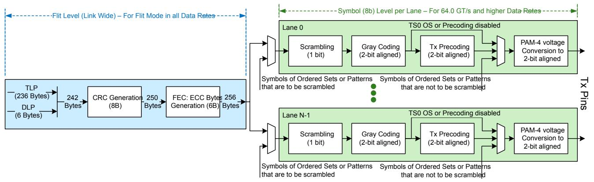

<details>
<summary>flowchart</summary>

```mermaid
graph LR
  A["TLP (236 Bytes)"] --> B["242 Bytes"]
  C["DLP (6 Bytes)"] --> B
  B --> D["CRC Generation (8B)"]
  D --> E["250 Bytes"]
  E --> F["FEC: ECC Bytes (6B) 256 Bytes"]
  F --> G["Lane 0"]
  G --> H["Scrambling (1 bit)"]
  H --> I["Gray Coding (2-bit aligned)"]
  I --> J["Tx Precoding (2-bit aligned)"]
  J --> K["PAM-4 voltage Conversion to 2-bit aligned"]
  K --> L["Tx Pins"]
    
  M["TCP"] --> N["Lane N-1"]
  N --> O["Scrambling (1 bit)"]
  O --> P["Gray Coding (2-bit aligned)"]
  P --> Q["Tx Precoding (2-bit aligned)"]
  Q --> R["PAM-4 voltage Conversion to 2-bit aligned"]
    
    style A fill:#f9f,stroke:#333
    style C fill:#f9f,stroke:#333
    style M fill:#f9f,stroke:#333
    style G fill:#ccf,stroke:#333
    style N fill:#ccf,stroke:#333
    style L fill:#ccf,stroke:#333
    
    note right of G
        Symbols of Ordered Sets or Patterns that are to be scrambled
        Symbols of Ordered Sets or Patterns that are not to be scrambled
    end
    
    note right of N
        Symbols of Ordered Sets or Patterns that are to be scrambled
        Symbols of Ordered Sets or Patterns that are not to be scrambled
    end
```
</details>

§ Figure 4-22 Transmit side at 64.0 GT/s

The Receive side is similar to the Transmit side in the opposite direction. After the PAM4 voltage is converted to a 2-bit aligned quantity, it undergoes the Receive side precoding if applicable followed by the decoding of the Gray code, followed by descrambling on a single bit level, if applicable. The Data Stream (Flit) is aggregated across all Lanes and undergoes the FEC decode and correction followed by the CRC check before sending up the Transactions and Data Link Payload.

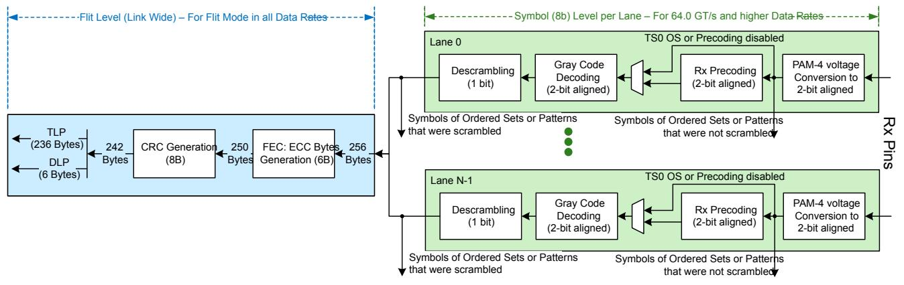

<details>
<summary>flowchart</summary>

```mermaid
graph TD
  A["TLP (236 Bytes)"] --> B["CRC Generation (8B)"]
  C["DLP (6 Bytes)"] --> B
  B --> D["FEC: ECC Generation (6B)"]
  D --> E["256 Bytes"]
  E --> F["250 Bytes"]
  F --> G["242 Bytes"]
  G --> H["TLP"]
  I["Desgray Code Decoding (2-bit aligned)"] --> J["Gray Code Decoding (2-bit aligned)"]
  J --> K["Rx Precoding (2-bit aligned)"]
  K --> L["PAM-4 voltage Conversion to 2-bit aligned"]
  M["Desgray Code Decoding (2-bit aligned)"] --> N["Rx Precoding (2-bit aligned)"]
  N --> O["PAM-4 voltage Conversion to 2-bit aligned"]
  P["Desgray Code Decoding (2-bit aligned)"] --> Q["Rx Precoding (2-bit aligned)"]
  Q --> R["PAM-4 voltage Conversion to 2-bit aligned"]
  S["TLP"] --> T["CRC Generation (8B)"]
  U["TLP"] --> V["DLP"]
  W["TS0 OS or Precoding disabled"] --> X["Desgray Code Decoding (2-bit aligned)"]
  Y["TS0 OS or Precoding disabled"] --> Z["Rx Precoding (2-bit aligned)"]
  AA["TS0 OS or Precoding disabled"] --> AB["PAM-4 voltage Conversion to 2-bit aligned"]
  AC["Symbols of Ordered Sets or Patterns that were scrambled"] --> AD["Desgray Code Decoding (2-bit aligned)"]
  AE["Symbols of Ordered Sets or Patterns that were not scrambled"] --> AF["Rx Precoding (2-bit aligned)"]
  AG["Symbols of Ordered Sets or Patterns that were not scrambled"] --> AH["PAM-4 voltage Conversion to 2-bit aligned"]
  AI["Symbol (8b) Level per Lane - For 64.0 GT/s and higher Data Rates"] --> AJ["Legend: Symbol (8b) Level per Lane - For 64.0 GT/s and higher Data Rates"]
  AK["Lane 0"] --> AL["Desgray Code Decoding (2-bit aligned)"]
  AL --> AM["Rx Precoding (2-bit aligned)"]
  AM --> AN["PAM-4 voltage Conversion to 2-bit aligned"]
  AO["Lane N-1"] --> AP["Desgray Code Decoding (2-bit aligned)"]
  AP --> AQ["Rx Precoding (2-bit aligned)"]
  AQ --> AR["PAM-4 voltage Conversion to 2-bit aligned"]
```
</details>

§ Figure 4-23 Receive side at 64.0 GT/s

## 4.2.3.1.1 PAM4 Signaling §

PAM4 stands for Pulse Amplitude Modulation 4-levels. It is a signaling mechanism where 4 levels (2 bits) are encoded in same Unit Interval (UI) resulting in 3 eyes, as shown in § Figure 4-24. It is deployed only for 64.0 GT/s or higher Data Rates. As described in § Chapter 8. , PAM4 helps with the channel loss as it has the same Nyquist frequency as 32.0 GT/s for 64.0 GT/s Data Rate. The four voltage levels 0, 1, 2, and 3, nominally map to -400 mV, -133 mV, +133 mV and +400 mV respectively, and the Gray code encoded values of 00b, 01b, 11b, and 10b respectively, with the little-endian bit order, as shown in § Figure 4-24. The corresponding DC Balance values to be used when designing Ordered Sets to meet the DC balance needs is also shown in § Figure 4-24. The Reduced voltage levels (eye height or EH) and eye width (EW) increases susceptibility to errors. Gray coding is used to help minimize errors within a UI for the voltage levels.

<table><tr><td colspan="2">Scrambled 2-bit aligne value</td><td rowspan="2">Unscramble 2-bit as well as TS0 Ordered Sets</td><td rowspan="2">Voltage Level</td><td rowspan="2">DC- balance Values</td></tr><tr><td>Prior to Gray Codin</td><td>After Gray Coding</td></tr><tr><td>10</td><td>11</td><td>11</td><td>3</td><td>+3</td></tr><tr><td>11</td><td>10</td><td>10</td><td>2</td><td>+1</td></tr><tr><td>01</td><td>01</td><td>01</td><td>1</td><td>-1</td></tr><tr><td>00</td><td>00</td><td>00</td><td>0</td><td>-3</td></tr></table>

Figure 4-24 PAM4 Signaling at UI level: Voltage levels, 2-bit encoding, and their corresponding DC balance values§

With PAM4 encoding, the bit error rate (BER) is expected to be significantly worse than the 10-12 BER target of the lower data rates (2.5, 5.0, 8.0, 16.0, and 32.0 GT/s). In addition, errors are expected to occur in bursts in a Lane and some amount of Lane to Lane correlation is also expected. The electrical spec parameters along with FBER (First Bit Error Rate) $< { 1 0 } ^ { - 6 }$ described in § Chapter 8. must be met to ensure probability of a Flit error after FEC to be less than 3×10-5.

A Forward Error Correction (FEC) mechanism is used to deal with the high FBER in the Data Stream. Since FEC works on fixed sized code words, Flit (flow control unit) will be used for sending/ receiving TLPs and DLLPs in a data stream. A low-overhead FEC will be used to keep the latency low. This will be augmented with a strong CRC at Flit level for high reliability. Link level retry will be deployed at the Flit level in Flit Mode. Ordered Sets will be protected through replication for Data Rates of 64.0 GT/s and above. Additionally, the precoding mechanism described below will be used for all scrambled bits to help minimize the number of errors in an error burst within a Lane.

## 4.2.3.1.2 1b/1b Scrambling §

The scrambling mechanism in the 64.0 GT/s Data Rate is identical to that for the 8.0, 16.0, and 32.0 GT/s Data Rates and is already covered in § Section 4.2.2.4 , except for the TS0 / TS1 / TS2 Ordered set rules defined below. § Figure 4-25 demonstrates the scrambler on the Transmitter side. All Data Stream bits as well as some Ordered Set bits are scrambled.

• TS1 and TS2 Ordered Sets:

◦ Symbols 0 and 8 bypass scrambling.  
◦ Symbols 1 through 6 and Symbols 9 through 14 are scrambled.  
◦ Symbols 7 and 15 bypass scrambling if required for DC Balance, but they are scrambled if not required for DC Balance.

• TS0 Ordered Sets:

◦ Symbols 0 and 8 bypass scrambling  
◦ Symbols 1 through 6 and Symbols 9 through14 use NRZ-based scrambling

NRZ-based scrambling consists of scrambling all 8 bits followed by selective gray-coding to ensure that only voltage levels 0 and 3 are sent. This is done by forcing the even bit 2i to be identical to the odd bit (2i+1) [where 0≤i≤3]

◦ Symbols 7 and 15 bypass scrambling if required for DC Balance; else they carry even parity of Symbols 1 through 6 and Symbols 9 through 14 respectively with NRZ-scrambling  
◦ All Symbols in TS0 are NRZ-based (i.e., each UI maps to voltage levels 0 or 3, encoded as 00b or 10b). Only TS0 Ordered Set is designed to be NRZ-based in 64.0 GT/s Data Rate.

## 4.2.3.1.3 Gray Coding at 64.0 GT/s and Higher Data Rates


Only scrambled bits on a 2-bit aligned boundary are Gray coded, when both bits are scrambled. All bits in the Data Stream are scrambled and Gray coded. Only some Symbols of the TS1/TS2 Ordered Sets are scrambled – those are Gray coded, while the unscrambled symbols are not Gray coded. All the half-scrambled TS0 Ordered Set Symbols are Gray coded selectively on the Transmit side, as described in § Section 4.2.3.1.2 . § Figure 4-25 represents the sequence of Gray Coding, which is followed by Tx Precoding, when enabled, followed by the PAM4 voltage translation on the Tx side as well as the Rx side, considering an error $\mathsf { E } _ { \mathsf { n } }$ that may affect the nth 2-bit quantity on the channel.

Gray Coding is only enabled in the PAM4 mode (at 64.0 GT/s and above Data Rates). Gray-coding works on aligned 2-bit quantities on a per-Lane basis. On the Transmit side, input ${ \sf G } _ { \sf n } \left( { \sf G } _ { \sf n 1 } { \sf G } _ { \sf n 0 } \right)$ is transformed to output ${ \sf P } _ { \sf n } \left( { \sf P } _ { \sf n 1 } { \sf P } _ { \sf n 0 } \right)$ , using the Gray code encoding where the input 00b, 01b, 10b, 11b becomes 00b, 01b, 11b, and 10b respectively in the output. This can be represented by the equations: $\mathsf { P } _ { \mathsf { n } 1 } = \mathsf { G } _ { \mathsf { n } 1 }$ and $\mathsf { P } _ { \mathsf { n 0 } } = \mathsf { G } _ { \mathsf { n 1 } } \wedge \mathsf { G } _ { \mathsf { n 0 } }$ . The Receive side is identical and can be represented as: $\mathsf { G } ^ { \prime } { } _ { \mathsf { n } } \mathsf { 1 } ^ { = } \mathsf { P } ^ { \prime } { } _ { \mathsf { n } } \mathsf { 1 }$ and $\mathsf { G } _ { \mathsf { n } 0 } ^ { \prime } \mathsf { \Lambda } _ { \mathsf { n } 1 } ^ { \prime } \wedge \mathsf { P } _ { \mathsf { n } 0 } ^ { \prime } . \mathsf { \Omega } _ { \mathsf { n } } ^ { \prime }$ § Table 4-6 demonstrates how a likely error of ±1 on voltage level at most affects one bit with Gray Coding.

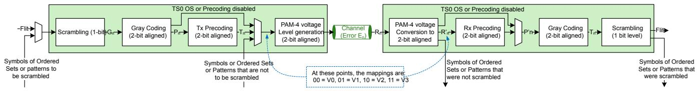

<details>
<summary>flowchart</summary>

```mermaid
graph LR
  A["-Flit"] --> B["Scrambling (1-bit) Gn"]
  B --> C["Gray Coding (2-bit aligned)"]
  C --> D["Tx Precoding (2-bit aligned)"]
  D --> E["PAM-4 voltage Level generation (2-bit aligned)"]
  E --> F["Channel (Error En)"]
  F --> G["Rn"]
  G --> H["PAM-4 voltage Conversion to 2-bit aligned"]
  H --> I["Rn'"]
  I --> J["Rx Precoding (2-bit aligned)"]
  J --> K["Pn"]
  K --> L["Gray Coding (2-bit aligned)"]
  L --> M["Tn"]
  M --> N["Scrambling (1 bit level)"]
  N --> O["Flit"]
    
    style A fill:#f9f,stroke:#333
    style O fill:#f9f,stroke:#333
    
    subgraph TS0 OS or Precoding disabled
        B
        C
        D
        E
        F
        G
        H
        I
        J
        K
        L
        M
        N
    end
    
    subgraph TS0 OS or Precoding disabled
        G
        H
        I
        J
        K
        L
        M
        N
    end
    
    note1["Symbols of Ordered Sets or patterns to be scrambled"]
    note2["Symbols or Ordered Sets or Patterns that are not to be scrambled"]
    note3["At these points, the mappings are 00 = V0, 01 = V1, 10 = V2, 11 = V3"]
    note4["Symbols of Ordered Sets or Patterns that were not scrambled"]
    note5["Symbols of Ordered Sets or Patterns that were scrambled"]
```
</details>

Figure 4-25 The Sequence of Grey Coding, Precoding, and PAM4 voltage translation on an aligned 2-bit boundary on a per Lane

§

Table 4-6 Effect of +/-1 voltage level error on the wire for various PAM4 voltage levels – at most one bit flips with an error on a UI§

<table><tr><td rowspan="2">Voltage Level</td><td colspan="2">Resulting Voltage Level</td></tr><tr><td>Error of +1</td><td>Error of -1</td></tr><tr><td>0</td><td>1</td><td>0 (no error)</td></tr><tr><td>1</td><td>2</td><td>0</td></tr><tr><td>2</td><td>3</td><td>1</td></tr><tr><td>3</td><td>3 (no error)</td><td>2</td></tr></table>

## 4.2.3.1.4 Precoding at 64.0 GT/s and Higher Data Rates


Only scrambled bits on a 2-bit aligned boundary are precoded, when both bits are scrambled and precoding is enabled. Precoding is bypassed for all Symbols of TS0 Ordered Sets. Other than the precoding mechanism described here, all the precoding rules in § Section 4.2.2.5 apply to 1b/1b encoding with the exception of TS0 Ordered Set. § Figure 4-25 represents the Precoding on the Transmit as well as Receive side. On the Transmit side, the input is $\mathsf { P } _ { \mathsf { n } }$ and the output is $\bar { \mathsf { T } } _ { \mathsf { n } } . \mathsf { T } _ { \mathsf { n } - 1 }$ represents the output from the precoder in the previous UI. When the prior UI had an unscrambled signal and precoding is enabled, $\mathsf { T } _ { \mathsf { n } - 1 }$ is set to 00b. The output ${ \sf T } _ { \sf n }$ will be converted to the PAM4 voltage levels described above, when precoding is enabled. The channel may inject an error $\mathsf { E } _ { \mathsf { n } }$ (no error means $\mathsf { E } _ { \mathsf { n } } = 0 0 \mathsf { b } )$ . On the Receive side, $\mathsf { R } _ { \mathsf { n } } = \mathsf { T } _ { \mathsf { n } } +$ $\mathsf { E } _ { \mathsf { n } } .$ . The input to the Precoding logic is $\mathsf { R } ^ { \prime } { } _ { \mathsf { n } } \left( \mathsf { R } _ { \mathsf { n } } = \mathsf { T } _ { \mathsf { n } } + \mathsf { e } _ { \mathsf { n } } \right)$ , where $\mathsf { e n }$ is inclusive of the error on the wire $\mathsf { E } _ { \mathsf { n } }$ as well as any internal DFE propagated error. The output of the precoding logic is $\mathsf { P } _ { \mathsf { n } } ^ { \prime } ,$ when precoding is enabled. The Truth Table for the Precoding function for the Transmit and Receive side is shown in § Table 4-7 and § Table 4-8. Precoding can help mitigate the number of errors in a burst.

Table 4-7 Truth Table for Precoding on the Transmit side§

<table><tr><td colspan="5"> $T_n$ </td></tr><tr><td rowspan="2"> $P_n$ </td><td colspan="4"> $T_{n-1}$ </td></tr><tr><td>00</td><td>01</td><td>11</td><td>10</td></tr><tr><td>00</td><td>00</td><td>11</td><td>01</td><td>10</td></tr><tr><td>01</td><td>01</td><td>00</td><td>10</td><td>11</td></tr><tr><td>11</td><td>11</td><td>10</td><td>00</td><td>01</td></tr><tr><td>10</td><td>10</td><td>01</td><td>11</td><td>00</td></tr></table>

Table 4-8 Truth Table for Precoding on the Receive side§

<table><tr><td colspan="5"> $P'_n$ </td></tr><tr><td rowspan="2"> $R'_n$ </td><td colspan="4"> $R'_{n-1}$ </td></tr><tr><td>00</td><td>01</td><td>11</td><td>10</td></tr><tr><td>00</td><td>00</td><td>01</td><td>11</td><td>10</td></tr><tr><td>01</td><td>01</td><td>10</td><td>00</td><td>11</td></tr><tr><td>11</td><td>11</td><td>00</td><td>10</td><td>01</td></tr><tr><td>10</td><td>10</td><td>11</td><td>01</td><td>00</td></tr></table>

## IMPLEMENTATION NOTE:

## HOW DOES PRECODING HELP REDUCE THE NUMBER OF ERRORS?

Precoding is effective with Gray coding on certain channels to reduce the impact of errors in the presence of DFE. It works similar to the precoding in 32.0 GT/s, except here it works on 2-bit aligned quantities with PAM4 encoding. The most likely error scenario is +/-1 on the voltage level over one UI with PAM4 signaling. § Table 4-6 demonstrates the resulting voltage level under this error scenario and the resulting bit error with Gray code encoding. Gray Coding results in at most a single bit flip within that UI. Error propagation due to DFE will most likely occur in consecutive UIs. Under these assumptions, precoding ensures that the error appears in two bits within a wire: when the error gets introduced in the wire and the UI after the DFE burst stops. For cases such as error voltage magnitude is > +1 or < -1 or for cases where the DFE introduces errors in non-contiguous UI’s, precoding may not be effective.

The precoding equation on Transmit side, based on the Truth Table in § Table 4-7 is: ${ \sf T } _ { \sf n } = \left( { \sf P } _ { \sf n } - { \sf T } _ { \sf n - 1 } \right)$ mod 4, which is equivalent to ${ \sf P } _ { \sf n } = \left( { \sf T } _ { \sf n } + { \sf T } _ { \sf n - 1 } \right)$ mod 4. The precoding equation on the Receive side, based on the Truth Table in § Table 4-8 is: ${ \sf P ^ { \prime } } _ { \sf n } = \left( { \sf R } _ { \sf n } + { \sf R } _ { \sf n - 1 } \right)$ mod 4. This can be simplified as: $\mathsf { P ^ { \prime } } _ { \mathsf { n } } = \left( \mathsf { T } _ { \mathsf { n } } + \mathsf { e } _ { \mathsf { n } } + \mathsf { T } _ { \mathsf { n } - 1 } + \mathsf { e } _ { \mathsf { n } - 1 } \right)$ mod $4 = \left( \mathsf { P } _ { \mathsf { n } } + \mathsf { e } _ { \mathsf { n } } + \mathsf { e } _ { \mathsf { n } - 1 } \right)$ mod 4. When we have the first error burst on the wire, $\mathsf { E } _ { \mathsf { n } } = + / - 1$ which will translate to $\mathsf { e } _ { \mathsf { n } } = \mathsf { E } _ { \mathsf { n } } \left( + / - 1 \right)$ . So, with FBER, one bit gets affected in the UI where the external error happened. In the subsequent UIs, in the absence of any additional external errors, $\mathsf { e } _ { \mathsf { n } } = - \mathsf { e } _ { \mathsf { n } - 1 }$ or 0 (0 when DFE stops propagating the error, when it does propagate the magnitude is negative of the earlier error since the corresponding tap has a negative weight). If the error propagates due to DFE, $\ e _ { \mathrm { { n } } } + \ e _ { \mathrm { { n - 1 } } } = 0$ . If it stops propagating, $\mathsf { e n }$ becomes +/- 1. So only two bit errors will be observed when precoding is effective: first bit error in the UI where the first error occurred in the wire and the UI following when DFE stopped propagating the error burst.

§ Table 4-9 illustrates the concept with an error in the channel and subsequent DFE error propagations. The bits after scrambling to be sent across the Link across successive UIs are in the first row, represented as $\mathsf { G } _ { \mathsf { n } }$ (pre-gray coding). The different stages are represented in subsequent rows in the table. It must be noted that after gray coding (starting with ${ \sf T } _ { \sf n } )$ until we decode with the gray-coding at the receiver $( \mathsf { G } ^ { \prime } \mathsf { n } )$ , we are dealing with voltage levels of 0, 1, 2, 3. The channel error occurs with the PAM-4 Symbol in UI #1 of magnitude -1, which causes only one error of magnitude in the receiver pin $\left( \mathsf { R } _ { \mathsf { n } } \right)$ . However, due to DFE burst, the error propagates in the receiver circuits from UI# 1 through $5 \left( \mathsf { R } _ { \mathsf { n } } ^ { \prime } \right)$ . Once we precode in the Receiver, these errors occur in two places, UI #1 and 6, as shown in $\mathsf { P ^ { \prime } n } ,$ which then translates to two bit errors, one each in UI #1 and 6, as shown in $\mathsf { G } _ { \sf { n } } ^ { \prime }$ .

Table 4-9 Example of precoding with an error in the channel and DFE error propagation at the Receiver

<table><tr><td colspan="2"></td><td>0</td><td>1</td><td>2</td><td>3</td><td>4</td><td>5</td><td>6</td><td>7</td></tr><tr><td rowspan="6">(Voltage Level Domain)</td><td> $G_n$ </td><td>10</td><td>11</td><td>10</td><td>11</td><td>00</td><td>01</td><td>00</td><td>01</td></tr><tr><td> $P_n$ </td><td>11</td><td>10</td><td>11</td><td>10</td><td>00</td><td>01</td><td>00</td><td>01</td></tr><tr><td> $T_n^{(+ (P_n-T_{n-1})\ mod\ 4)}$ </td><td>3</td><td>3</td><td>0</td><td>2</td><td>2</td><td>3</td><td>1</td><td>0</td></tr><tr><td> $E_n$ (Channel Error)</td><td>0</td><td>-1</td><td>0</td><td>0</td><td>0</td><td>0</td><td>0</td><td>0</td></tr><tr><td> $R_n$ </td><td>3</td><td>2</td><td>0</td><td>2</td><td>2</td><td>3</td><td>1</td><td>0</td></tr><tr><td>DFE Error</td><td>0</td><td>0</td><td>+1</td><td>-1</td><td>+1</td><td>-1</td><td>0</td><td>0</td></tr></table>

<table><tr><td colspan="2"></td><td>0</td><td>1</td><td>2</td><td>3</td><td>4</td><td>5</td><td>6</td><td>7</td></tr><tr><td rowspan="4"></td><td> $e_n$ (Net Error:  $E_n$  - DFE Error</td><td>0</td><td>-1</td><td>+1</td><td>-1</td><td>+1</td><td>-1</td><td>0</td><td>0</td></tr><tr><td> $R'_n$ (Difference from  $T_n$  is an error)</td><td>3</td><td>2</td><td>1</td><td>1</td><td>3</td><td>2</td><td>1</td><td>0</td></tr><tr><td> $P'_n^{(+(R_n-R_{n-1})\text{ mod } 4)}$ </td><td>3</td><td>1</td><td>3</td><td>2</td><td>0</td><td>1</td><td>3</td><td>1</td></tr><tr><td> $G'_n$ (Difference from  $G_n$  is an error)</td><td>10</td><td>01</td><td>10</td><td>11</td><td>00</td><td>01</td><td>10</td><td>01</td></tr></table>

## 4.2.3.1.5 Ordered Set Blocks at 64.0 GT/s and Higher Data Rates §

All Ordered Sets with the exception SKP Ordered Sets (i.e., TS0, TS1, TS2, EIOS, EIEOS and SDS) are 16 Bytes long on both the Transmit and the Receive side. SKP Ordered Sets are 40 Bytes long on the Transmit side and can be 24, 32, 40, 48 or 56 bytes long on the Receive side. Ordered Sets exhibit a greater degree of redundancy than the corresponding Ordered Sets at Data Rates lower than 64.0 GT/s. The redundancy is required due to the high FBER with correlated errors with PAM4 signaling. The Ordered Sets are described in detail in § Section 4.2.5.1 , § Section 4.2.5.3 , § Section 4.2.5.7 , and § Section 4.2.8.3 .

While processing Ordered Sets outside of a Data Stream, the following rules apply for the EIEOS, SKP OS, and EIOS, after obtaining Block alignment:

• An EIEOS is considered to be received under the following conditions:

◦ any 5 or more aligned and consecutive bytes in each of the first and last 8 bytes of a Block match the corresponding bytes of an EIEOS and  
◦ either Symbol 0 or Symbol 8 of the Block matches the corresponding byte of an EIEOS. A Receiver is permitted to ignore up to one bit mismatch for this comparison

While in Aligned phase, a Receiver must switch the block boundary by > 1 UI on an EIEOS Ordered Set or should shift the Block boundary by ≤ 1 UI only if it receives an EIEOS followed by a valid first symbol of an expected Ordered Set.

While searching for an EIEOS, the 8-byte boundary can begin in any aligned UI and the bits must be looked at prior to performing gray coding, precoding, or descrambling in the Receiver side.

• An EIOS is considered to be received under the following conditions:

◦ any 5 or more aligned bytes of the first 8 bytes of a Block match the corresponding bytes of an EIOS and  
◦ either Symbol 0 or Symbol 8 of the Block matches the corresponding byte of an EIOS. When an EIOS is received, the Lane is ready to enter Electrical Idle irrespective of what is received in the last 7 Bytes of the Block.

• A SKP OS is considered to begin under the following conditions: (i) any 5 or more aligned bytes of the first 8 bytes of a Block match a SKP, and (ii) either Symbol 0 is a SKP or Symbol 8 of the Block is either a SKP or a SKP\_END. It looks at each subsequent aligned 8 byte chunks and applies the following rules:

◦ If any 5 or more aligned bytes match SKP\_END or the current chunk is the fifth 8 byte chunk after the start of the SKP OS (i.e., current set is bytes 40 through 47 from the start of the SKP OS), the SKP OS will terminate after the next aligned 8 byte chunk.

## IMPLEMENTATION NOTE:

## INFERRING ORDERED SETS WITHIN AND OUTSIDE OF DATA STREAMS

Since most bytes of TS0/TS1/TS2 Ordered Sets are scrambled (except Symbols 0 and 8), one has to get an exact match in at least Symbol 0 or 8, in addition to the match in 5 Byte positions to infer the EIEOS, EIOS, or SKP OS, while not in a Data Stream. The rules for detection of TS0, TS1, TS2, and SDS Ordered Set appears with the description of the Ordered Set. Since SKP, EIEOS, and EIOS can appear within a Data Stream, there are slightly different rules for inferring those in a Data Stream than while not in a Data Stream, taking advantage of the fact that none of these Ordered Sets have any scrambling, to ensure higher fault tolerance during a Data Stream. Hence the rules for detection of EIOS, EIEOS and SKP OS are specified twice; in this section as well as in § Section 4.2.8.3 .

## 4.2.3.1.6 Alignment at Block/ Flit Level for 1b/1b Encoding §

With 1b/1b encoding, Block alignment aligns with the Ordered Set boundary on a per-Lane basis. Once this is accomplished, the Flit-level alignment at the Link level occurs automatically with the Data Stream that starts at the end of the Control SKP Ordered Set that immediately follows the SDS Ordered Set sequence. Once the Flit alignment starts, it adjusts to the Flit boundary. When an Ordered Set is scheduled to be received and the received Ordered Set is a Control SKP Ordered Set, the Flit boundary is automatically adjusted to start at the conclusion of the Ordered Set.

The Block level alignment occurs with the EIEOS Ordered Set in Configuration or Recovery states. The EIEOS is a unique pattern that Receivers use to determine the start/ end of the Ordered Set boundary in the received bit stream.

Conceptually, Receivers can be in three different phases of alignment: Unaligned, Aligned, and Locked. These phases are defined to illustrate the required behavior, but are not meant to specify a required implementation.

## Unaligned Phase

Receivers enter this phase after a period of Electrical Idle, such as when the data rate is changed to one that uses 1b/1b encoding or when they exit a low-power Link state, or if directed (by an implementation specific method). In this phase, Receivers monitor the received bit stream for a match against all 128 bits of the EIEOS bit pattern. When one is detected, they adjust their alignment to it and proceed to the Aligned Phase.

## Aligned Phase

Receivers monitor the received bit stream for the EIEOS OS and the received Blocks for a Start of Data Stream (SDS) Ordered Set. If an EIEOS bit pattern is detected on an alignment that does not match the current alignment and the LTSSM is in the Recovery.RcvrLock state, Receivers must adjust their alignment to the newly received EIEOS bit pattern. If an EIEOS bit pattern is detected on an alignment that does not match the current alignment, the LTSSM is in the Recovery.RcvrCfg state, and the subsequent Symbol matches the first Symbol of an expected Ordered Set, Receivers must adjust their alignment to the newly received EIEOS bit pattern. If an SDS Ordered Set is received, Receivers proceed to the Locked phase. The Data Stream starts after the SDS Ordered Set sequence is received, though Flits start after the Control SKP Ordered Set immediately succeeding the SDS Ordered Set sequence. The conclusion of the SKP Ordered Set immediately following an SDS Ordered Set sequence marks the start of the Flit boundary at the end of the Control SKP Ordered Set.

## Locked Phase

Receivers must not adjust their Block or Flit alignment while in this phase. Data Blocks are expected to be received after the Control SKP Ordered Set following the SDS Ordered Set sequence, and adjusting the Block alignment would interfere with the processing of these Blocks. Receivers must return to the Unaligned or Aligned Phase if the Data Stream is terminated by the Link entering Recovery and/or a Framing Error is detected.

Additional Requirements:

• While in the Aligned Phase, Receivers must adjust their Block alignment, as necessary, when a Control SKP Ordered Set is received. See § Section 4.2.8 for more information on SKP Ordered Sets.  
• While in the Locked phase, Receivers must adjust their Block and Flit alignment, as necessary, when a Control SKP Ordered Set is received.  
• After any LTSSM transition to Recovery, Receivers must ignore all received TS Ordered Sets until they receive an EIEOS. Conceptually, receiving an EIEOS validates the Receiver’s alignment and allows TS Ordered Set processing to proceed. If a received EIEOS initiates an LTSSM transition from L0 to Recovery, Receivers are permitted to process any TS Ordered Sets that follow the EIEOS or ignore them until another EIEOS is received after entering Recovery.  
• Receivers are permitted to transition from the Locked phase to the Unaligned or Aligned phase as long as Data Stream processing is stopped.  
• Loopback Leads: While in Loopback.Entry, Leads must be capable of adjusting their Receiver’s Block / Flit alignment to received EIEOS bit patterns. While in Loopback.Active, Leads are permitted to transmit an EIEOS and adjust their Receiver’s Block alignment to the looped back bit stream.  
Loopback Followers: While in Loopback.Entry, Followers must be capable of adjusting their Receiver’s Block alignment to received EIEOS bit patterns. While in Loopback.Active, Followers must not adjust their Receiver’s Block alignment, except at the scheduled Control SKP Ordered Set boundary. Conceptually, the Receiver is directed to the Locked phase when the Follower starts to loop back the received bit stream.

## 4.2.3.2 Processing of Ordered Sets During Flit Mode Data Stream §

Flit Mode does not employ the EDS (‘End of Data Stream’) token. Instead, a Data Stream can be terminated by either an EIOS (prior to entering a low power state, such as L1) or an EIEOS (upon entry into Recovery). SKP Ordered Sets appear at periodic intervals during the Data Stream (as defined in § Table 4-21. When necessary, the EIOS or EIEOS must be transmitted in place of the SKP Ordered Set, as defined in § Section 4.2.3.4.5 . Therefore, these three Ordered Sets are defined such that one cannot alias to another even with a burst error.

Ordered Set processing during or at the end of a Data Stream must be performed as follows by the Receiver for 64.0 GT/s or higher Data Rates:

• Receiver checks the first 8 bytes of the Ordered Set in the place where an Ordered Set is expected to appear.  
• Any 5 or more aligned bytes of the first aligned 8 byte chunk matches the corresponding bytes of either a SKP, EIOS, or EIEOS for the corresponding Ordered Set to be considered valid in each of the active Lanes. Failure to meet this requirement is considered a framing error and the Link must enter Recovery.  
• If a SKP Ordered Set is inferred from the first 8 bytes, the Receiver looks at each subsequent aligned 8 byte chunks and applies the following rules:

◦ If at least each of any 5 aligned bytes matches SKP\_END or the current chunk is the fifth 8 byte chunk after the start of the SKP OS (i.e., current set is bytes 40 through 47), the SKP OS will terminate after the next aligned 8 byte chunk. At the conclusion of the SKP OS the Data Stream resumes, if the SKP OS terminated with the receipt of 5 aligned bytes of SKP\_END. If the SKP OS is being terminated without receipt of 5 aligned bytes of SKP\_END, a Framing Error occurs.

• Any of the following conditions are Framing Error even with the receipt of a proper OS on each of active Lanes and the Link must enter Recovery:

◦ Receiving any combination of these ordered sets simultaneously on any two active Lanes: EIEOS and EIOS or EIEOS and SKP OS,

◦ Receiving a SKP OS of unequal lengths across all Lanes

◦ Receiving a combination of EIOS and SKP OS and any of the following conditions is true:

▪ L0p has not been enabled in the Link  
▪ The set of Lanes receiving EIOS are not contiguous  
▪ The set of Lanes receiving SKP OS are not contiguous  
▪ The number of Lanes receiving SKP OS is not a valid link width (1, 2, 4, or 8)

• If an EIEOS is inferred from the first 8 bytes on any active Lane, the Data Stream ends with the receipt of the EIEOS and the Link must enter Recovery.

• If an EIOS is inferred from the first 8 bytes across any active Lanes, the Link prepares to enter the low-power state for which the negotiation has occurred (L0p or L1 or L2).

• Data stream continues on a reduced set of Lanes at the conclusion of the OS if all of the following conditions are true:

◦ An EIOS is inferred from the first 8 bytes on some active Lanes,  
◦ The remaining active Lanes received the SKP OS on 1, 2, 4 or 8 Lanes, and  
◦ L0p has been enabled in the Link

# IMPLEMENTATION NOTE:

# 64.0 GT/S DATA STREAM ORDERED SET PROCESSING §

A Flow chart depicting part of the above flow is illustrated in § Figure 4-26. This flow chart is not meant to specify all the rules but illustrate some of the rules for illustration purposes.

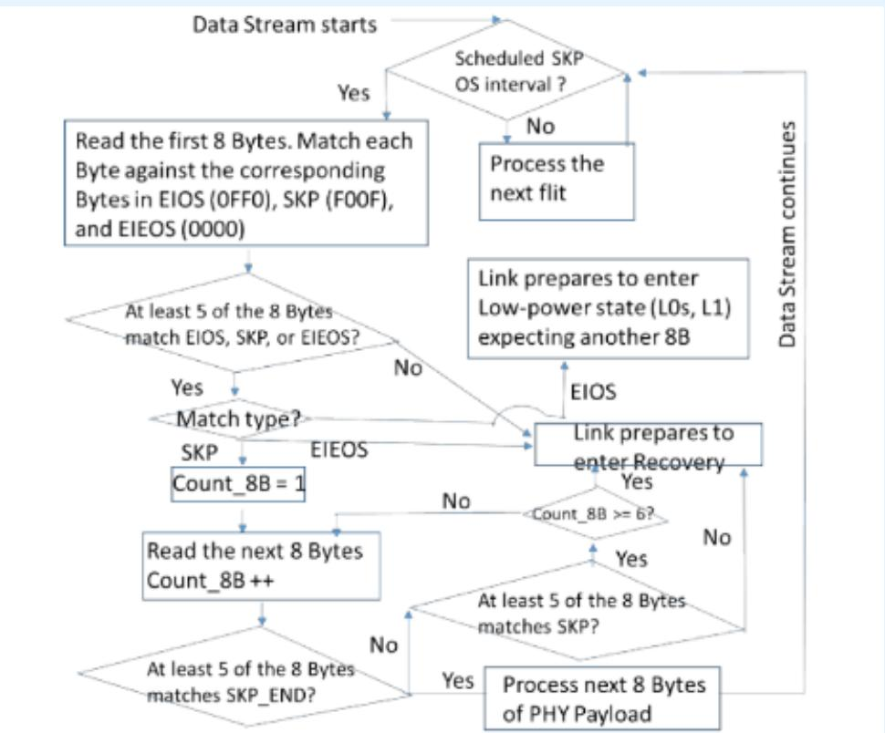

<details>
<summary>flowchart</summary>

```mermaid
graph TD
  A["Data Stream starts"] --> B{Scheduled SKP OS interval ?}
  B -->|Yes| C["Read the first 8 Bytes. Match each Byte against the corresponding Bytes in EIOS (OFF0), SKP (F00F), and EIEOS (0000)"]
  B -->|No| D["Process the next flit"]
  C --> E{At least 5 of the 8 Bytes match EIOS, SKP, or EIEOS?}
  E -->|Yes| F["Match type?"]
  E -->|No| G["Link prepares to enter Low-power state (L0s, L1) expecting another 8B"]
  F --> H["SKP Count_8B = 1"]
  G --> I["Link prepares to enter Recovery"]
  H --> J["Read the next 8 Bytes Count_8B ++"]
  I --> K{At least 5 of the 8 Bytes matches SKP?}
  K -->|Yes| L["Process next 8 Bytes of PHY Payload"]
  K -->|No| M["End"]
  L --> N["End"]
    style A fill:#f9f,stroke:#333
    style D fill:#ccf,stroke:#333
    style G fill:#ccf,stroke:#333
    style M fill:#ccf,stroke:#333
```
</details>

Figure 4-26 Processing of Ordered Sets during or at the end of a Data Stream in Flit mode at 64.0 GT/s Data Rate§

## 4.2.3.3 Data Stream in Flit Mode


The flit size is 256 Bytes, allocated as follows:

• 236 Bytes for TLPs (Bytes 0 through 235 in the Flit, as shown in § Table 4-10 through § Table 4-14)  
• 6 Bytes for Data Link Layer Payload (DLP in Bytes 236 through 241 in the Flit, shown as DLP0..6 in § Table 4-10 through § Table 4-14)  
• 8 Bytes for CRC (Bytes 242 through 249 in the Flit, shown as CRC0..7 in § Table 4-10 through § Table 4-14), and  
• 6 Bytes for ECC (Bytes 250 through 255 arranged as 3 groups of ECC0[0:1], ECC1[0:1], ECC2[0:1], as shown in § Table 4-10 through § Table 4-14).

A flit is interleaved across the Lanes in the Link in a Byte aligned fashion, as shown in § Table 4-10 through § Table 4-14. Each Byte corresponds to a Symbol in the 64.0 GT/s and above Data Rates, a Symbol within the Data Block with 128b/ 130b encoding, for 8.0 GT/s, 16.0 GT/s, and 32.0 GT/s; and gets converted to a 10b Symbol using the 8b/10b encoding for

2.5 GT/s and 5.0 GT/s Data Rates. Since the TLP and DLP have fixed allocation of bytes within each flit, the Port will schedule the packets of each type accordingly. The 8 Bytes of CRC protects the TLP and DLLP Bytes (and not the ECC bytes). The 6 Bytes of ECC protects the entire flit, including the CRC. Even though the ECC protection is needed only with the high FBER with the PAM4 signaling at 64.0 GT/s and higher Data Rates, it will be deployed for the lower Data Rates for consistency.

On a Link layer retry, only the TLPs will be replayed, and not the DLP. Thus, the link layer payload in each flit (DLP) does not enter the Link Layer Retry Buffer (LLRB) at the Transmitter. The DLP fields in the retried flits will reflect the latest Data Link Layer Payload. Thus, a DLP can be lost and the same mechanism of replication/ aggregation for DLLPs ensures that the data link layer messages gets delivered to the Link partner.

The FEC is a 3-way interleaved ECC, with each ECC code capable of correcting a single Byte error. The interleaving is done so that a burst error of up to 16 bits in any Lane does not impact more than a Byte in each interleaved ECC code word. Each of the interleaved ECC has a different color. Thus, all blue colored Bytes [e.g., 0, 3, 6, 9,…, 231, 234, DLP1, DLP4, CRC1, CRC4, and CRC7] are part of ECC Group 0 and are covered by the 2 blue colored ECC0[0] and ECC0[1] bytes (which are placed in the last Symbol of the flit in Lanes 12 and 15 respectively).

Table 4-10 Flit Layout in a x16 Link

<table><tr><td rowspan="2" colspan="2">Description</td><td colspan="16">Lane</td></tr><tr><td>0</td><td>1</td><td>2</td><td>3</td><td>4</td><td>5</td><td>6</td><td>7</td><td>8</td><td>9</td><td>10</td><td>11</td><td>12</td><td>13</td><td>14</td><td>15</td></tr><tr><td rowspan="16">128 UI</td><td rowspan="14">TLP Bytes [0...223]</td><td>0</td><td>1</td><td>2</td><td>3</td><td>4</td><td>5</td><td>6</td><td>7</td><td>8</td><td>9</td><td>10</td><td>11</td><td>12</td><td>13</td><td>14</td><td>15</td></tr><tr><td>16</td><td>17</td><td>18</td><td>19</td><td>20</td><td>21</td><td>22</td><td>23</td><td>24</td><td>25</td><td>26</td><td>27</td><td>28</td><td>29</td><td>30</td><td>31</td></tr><tr><td>32</td><td>33</td><td>34</td><td>35</td><td>36</td><td>37</td><td>38</td><td>39</td><td>40</td><td>41</td><td>42</td><td>43</td><td>44</td><td>45</td><td>46</td><td>47</td></tr><tr><td>48</td><td>49</td><td>50</td><td>51</td><td>52</td><td>53</td><td>54</td><td>55</td><td>56</td><td>57</td><td>58</td><td>59</td><td>60</td><td>61</td><td>62</td><td>63</td></tr><tr><td>64</td><td>65</td><td>66</td><td>67</td><td>68</td><td>69</td><td>70</td><td>71</td><td>72</td><td>73</td><td>74</td><td>75</td><td>76</td><td>77</td><td>78</td><td>79</td></tr><tr><td>80</td><td>81</td><td>82</td><td>83</td><td>84</td><td>85</td><td>86</td><td>87</td><td>88</td><td>89</td><td>90</td><td>91</td><td>92</td><td>93</td><td>94</td><td>95</td></tr><tr><td>96</td><td>97</td><td>98</td><td>99</td><td>100</td><td>101</td><td>102</td><td>103</td><td>104</td><td>105</td><td>106</td><td>107</td><td>108</td><td>109</td><td>110</td><td>111</td></tr><tr><td>112</td><td>113</td><td>114</td><td>115</td><td>116</td><td>117</td><td>118</td><td>119</td><td>120</td><td>121</td><td>122</td><td>123</td><td>124</td><td>125</td><td>126</td><td>127</td></tr><tr><td>128</td><td>129</td><td>130</td><td>131</td><td>132</td><td>133</td><td>134</td><td>135</td><td>136</td><td>137</td><td>138</td><td>139</td><td>140</td><td>141</td><td>142</td><td>143</td></tr><tr><td>144</td><td>145</td><td>146</td><td>147</td><td>148</td><td>149</td><td>150</td><td>151</td><td>152</td><td>153</td><td>154</td><td>155</td><td>156</td><td>157</td><td>158</td><td>159</td></tr><tr><td>160</td><td>161</td><td>162</td><td>163</td><td>164</td><td>165</td><td>166</td><td>167</td><td>168</td><td>169</td><td>170</td><td>171</td><td>172</td><td>173</td><td>174</td><td>175</td></tr><tr><td>176</td><td>177</td><td>178</td><td>179</td><td>180</td><td>181</td><td>182</td><td>183</td><td>184</td><td>185</td><td>186</td><td>187</td><td>188</td><td>189</td><td>190</td><td>191</td></tr><tr><td>192</td><td>193</td><td>194</td><td>195</td><td>196</td><td>197</td><td>198</td><td>199</td><td>200</td><td>201</td><td>202</td><td>203</td><td>204</td><td>205</td><td>206</td><td>207</td></tr><tr><td>208</td><td>209</td><td>210</td><td>211</td><td>212</td><td>213</td><td>214</td><td>215</td><td>216</td><td>217</td><td>218</td><td>219</td><td>220</td><td>221</td><td>222</td><td>223</td></tr><tr><td>TLP, DLP</td><td>224</td><td>225</td><td>226</td><td>227</td><td>228</td><td>229</td><td>230</td><td>231</td><td>232</td><td>233</td><td>234</td><td>235</td><td>DLP 0</td><td>DLP 1</td><td>DLP 2</td><td>DLP 3</td></tr><tr><td>DLP, CRC, ECC</td><td>DLP 4</td><td>DLP 5</td><td>CRC 0</td><td>CRC 1</td><td>CRC 2</td><td>CRC 3</td><td>CRC 4</td><td>CRC 5</td><td>CRC 6</td><td>CRC 7</td><td>ECC1 [0]</td><td>ECC2 [0]</td><td>ECC0 [0]</td><td>ECC1 [1]</td><td>ECC2 [1]</td><td>ECC0 [1]</td></tr></table>

## IMPLEMENTATION NOTE:

The first 236 Bytes (0..235) are for TLP(s), next 6 Bytes are for Data Link Layer Payload (DLP0..5), next 8 Bytes for§ CRC (CRC0..7) and the last 6 Bytes are for ECC (ecc 0..1). The FEC is a 3-way interleaved ECC, each capable of correcting a single Byte, with the interleaving shown in 3 colors

Table 4-11 Flit interleaving in a x8 Link

<table><tr><td rowspan="2" colspan="2">Description</td><td colspan="8">Lane</td></tr><tr><td>0</td><td>1</td><td>2</td><td>3</td><td>4</td><td>5</td><td>6</td><td>7</td></tr><tr><td rowspan="32">256 UI</td><td rowspan="29">TLP Bytes [0...231]</td><td>0</td><td>1</td><td>2</td><td>3</td><td>4</td><td>5</td><td>6</td><td>7</td></tr><tr><td>8</td><td>9</td><td>10</td><td>11</td><td>12</td><td>13</td><td>14</td><td>15</td></tr><tr><td>16</td><td>17</td><td>18</td><td>19</td><td>20</td><td>21</td><td>22</td><td>23</td></tr><tr><td>24</td><td>25</td><td>26</td><td>27</td><td>28</td><td>29</td><td>30</td><td>31</td></tr><tr><td>32</td><td>33</td><td>34</td><td>35</td><td>36</td><td>37</td><td>38</td><td>39</td></tr><tr><td>40</td><td>41</td><td>42</td><td>43</td><td>44</td><td>45</td><td>46</td><td>47</td></tr><tr><td>48</td><td>49</td><td>50</td><td>51</td><td>52</td><td>53</td><td>54</td><td>55</td></tr><tr><td>56</td><td>57</td><td>58</td><td>59</td><td>60</td><td>61</td><td>62</td><td>63</td></tr><tr><td>64</td><td>65</td><td>66</td><td>67</td><td>68</td><td>69</td><td>70</td><td>71</td></tr><tr><td>72</td><td>73</td><td>74</td><td>75</td><td>76</td><td>77</td><td>78</td><td>79</td></tr><tr><td>80</td><td>81</td><td>82</td><td>83</td><td>84</td><td>85</td><td>86</td><td>87</td></tr><tr><td>88</td><td>89</td><td>90</td><td>91</td><td>92</td><td>93</td><td>94</td><td>95</td></tr><tr><td>96</td><td>97</td><td>98</td><td>99</td><td>100</td><td>101</td><td>102</td><td>103</td></tr><tr><td>104</td><td>105</td><td>106</td><td>107</td><td>108</td><td>109</td><td>110</td><td>111</td></tr><tr><td>112</td><td>113</td><td>114</td><td>115</td><td>116</td><td>117</td><td>118</td><td>119</td></tr><tr><td>120</td><td>121</td><td>122</td><td>123</td><td>124</td><td>125</td><td>126</td><td>127</td></tr><tr><td>128</td><td>129</td><td>130</td><td>131</td><td>132</td><td>133</td><td>134</td><td>135</td></tr><tr><td>136</td><td>137</td><td>138</td><td>139</td><td>140</td><td>141</td><td>142</td><td>143</td></tr><tr><td>144</td><td>145</td><td>146</td><td>147</td><td>148</td><td>149</td><td>150</td><td>151</td></tr><tr><td>152</td><td>153</td><td>154</td><td>155</td><td>156</td><td>157</td><td>158</td><td>159</td></tr><tr><td>160</td><td>161</td><td>162</td><td>163</td><td>164</td><td>165</td><td>166</td><td>167</td></tr><tr><td>168</td><td>169</td><td>170</td><td>171</td><td>172</td><td>173</td><td>174</td><td>175</td></tr><tr><td>176</td><td>177</td><td>178</td><td>179</td><td>180</td><td>181</td><td>182</td><td>183</td></tr><tr><td>184</td><td>185</td><td>186</td><td>187</td><td>188</td><td>189</td><td>190</td><td>191</td></tr><tr><td>192</td><td>193</td><td>194</td><td>195</td><td>196</td><td>197</td><td>198</td><td>199</td></tr><tr><td>200</td><td>201</td><td>202</td><td>203</td><td>204</td><td>205</td><td>206</td><td>207</td></tr><tr><td>208</td><td>209</td><td>210</td><td>211</td><td>212</td><td>213</td><td>214</td><td>215</td></tr><tr><td>216</td><td>217</td><td>218</td><td>219</td><td>220</td><td>221</td><td>222</td><td>223</td></tr><tr><td>224</td><td>225</td><td>226</td><td>227</td><td>228</td><td>229</td><td>230</td><td>231</td></tr><tr><td>TLP Bytes [231...235], DLP Bytes</td><td>232</td><td>233</td><td>234</td><td>235</td><td>DLP 0</td><td>DLP 1</td><td>DLP 2</td><td>DLP 3</td></tr><tr><td>DLP, CRC Bytes</td><td>DLP 4</td><td>DLP 5</td><td>CRC 0</td><td>CRC 1</td><td>CRC 2</td><td>CRC 3</td><td>CRC 4</td><td>CRC 5</td></tr><tr><td>CRC, ECC Bytes</td><td>CRC 6</td><td>CRC 7</td><td>ECC1 [0]</td><td>ECC2 [0]</td><td>ECC0 [0]</td><td>ECC1 [1]</td><td>ECC2 [1]</td><td>ECC0 [1]</td></tr></table>

## IMPLEMENTATION NOTE:

Note that the same set of Bytes form the same ECC group in the 3-way interleaved FEC as in a x16 Link. The first§ 236 Bytes (0..235) are for TLP(s), next 6 Bytes are for Data Link Layer Payload (DLP0..5), next 8 Bytes for CRC (CRC0..7) and the last 6 Bytes are for ECC (ecc 0..1). The FEC is a 3-way interleaved ECC, each capable of correcting a single Byte, with the interleaving shown in 3 colors

Table 4-12 Flit interleaving in a x4 Link

<table><tr><td rowspan="2" colspan="2">Description</td><td colspan="4">Lane</td></tr><tr><td>0</td><td>1</td><td>2</td><td>3</td></tr><tr><td rowspan="12">512 UI</td><td rowspan="7">TLP Bytes [0...235]</td><td>0</td><td>1</td><td>2</td><td>3</td></tr><tr><td>4</td><td>5</td><td>6</td><td>7</td></tr><tr><td>8</td><td>9</td><td>10</td><td>11</td></tr><tr><td>⋮</td><td>⋮</td><td>⋮</td><td>⋮</td></tr><tr><td>224</td><td>225</td><td>226</td><td>227</td></tr><tr><td>228</td><td>229</td><td>230</td><td>231</td></tr><tr><td>232</td><td>233</td><td>234</td><td>235</td></tr><tr><td rowspan="5">DLP, CRC, ECC Bytes</td><td>DLP 0</td><td>DLP 1</td><td>DLP 2</td><td>DLP 3</td></tr><tr><td>DLP 4</td><td>DLP 5</td><td>CRC 0</td><td>CRC 1</td></tr><tr><td>CRC 2</td><td>CRC 3</td><td>CRC 4</td><td>CRC 5</td></tr><tr><td>CRC 6</td><td>CRC 7</td><td>ECC1 [0]</td><td>ECC2 [0]</td></tr><tr><td>ECC0 [0]</td><td>ECC1 [1]</td><td>ECC2 [1]</td><td>ECC0 [1]</td></tr></table>

## IMPLEMENTATION NOTE:

Note that the same set of Bytes form the same ECC group in the 3-way interleaved FEC as in a x16/x8 Link. The§ first 236 Bytes (0..235) are for TLP(s), next 6 Bytes are for Data Link Layer Payload (DLP0..5), next 8 Bytes for CRC (CRC0..7) and the last 6 Bytes are for ECC (ecc 0..1). The FEC is a 3-way interleaved ECC, each capable of correcting a single Byte, with the interleaving shown in 3 colors

Table 4-13 Flit interleaving in a x2 Link§

<table><tr><td colspan="2" rowspan="2">Description</td><td colspan="2">Lane</td></tr><tr><td>0</td><td>1</td></tr><tr><td rowspan="8">1024 UI</td><td rowspan="7">TLP Bytes [0...235]</td><td>0</td><td>1</td></tr><tr><td>2</td><td>3</td></tr><tr><td>4</td><td>5</td></tr><tr><td>⋮</td><td>⋮</td></tr><tr><td>230</td><td>231</td></tr><tr><td>232</td><td>233</td></tr><tr><td>234</td><td>235</td></tr><tr><td>DLP Bytes</td><td>DLP 0DLP 2</td><td>DLP 1DLP 3</td></tr><tr><td rowspan="8"></td><td></td><td>DLP 4</td><td>DLP 5</td></tr><tr><td rowspan="4">CRC Bytes</td><td>CRC 0</td><td>CRC 1</td></tr><tr><td>CRC 2</td><td>CRC 3</td></tr><tr><td>CRC 4</td><td>CRC 5</td></tr><tr><td>CRC 6</td><td>CRC 7</td></tr><tr><td rowspan="3">ECC Bytes</td><td>ECC1 [0]</td><td>ECC2 [0]</td></tr><tr><td>ECC0 [0]</td><td>ECC1 [1]</td></tr><tr><td>ECC2 [1]</td><td>ECC0 [1]</td></tr></table>

## IMPLEMENTATION NOTE:

Note that the same set of Bytes form the same ECC group in the 3-way interleaved FEC as in a x16/x8/x4 Link. The§ first 236 Bytes (0..235) are for TLP(s), next 6 Bytes are for Data Link Layer Payload (DLP0..5), next 8 Bytes for CRC (CRC0..7) and the last 6 Bytes are for ECC (ecc 0..1). The FEC is a 3-way interleaved ECC, each capable of correcting a single Byte, with the interleaving shown in 3 colors

Table 4-14 Flit arrangement in a x1 Link§

<table><tr><td colspan="2" rowspan="2">Description</td><td>Lane</td></tr><tr><td>0</td></tr><tr><td rowspan="21">2048 UI</td><td rowspan="10">TLP Bytes [0...235]</td><td>0</td></tr><tr><td>1</td></tr><tr><td>2</td></tr><tr><td> $\vdots$ </td></tr><tr><td>230</td></tr><tr><td>231</td></tr><tr><td>232</td></tr><tr><td>233</td></tr><tr><td>234</td></tr><tr><td>235</td></tr><tr><td rowspan="6">DLP Bytes</td><td>DLP 0</td></tr><tr><td>DLP 1</td></tr><tr><td>DLP 2</td></tr><tr><td>DLP 3</td></tr><tr><td>DLP 4</td></tr><tr><td>DLP 5</td></tr><tr><td rowspan="5">CRC Bytes</td><td>CRC 0</td></tr><tr><td>CRC 1</td></tr><tr><td>CRC 2</td></tr><tr><td>CRC 3</td></tr><tr><td>CRC 4CRC 5</td></tr><tr><td rowspan="8"></td><td rowspan="2"></td><td>CRC 6</td></tr><tr><td>CRC 7</td></tr><tr><td rowspan="6">ECC Bytes</td><td>ECC1 [0]</td></tr><tr><td>ECC2 [0]</td></tr><tr><td>ECC0 [0]</td></tr><tr><td>ECC1 [1]</td></tr><tr><td>ECC2 [1]</td></tr><tr><td>ECC0 [1]</td></tr></table>

## IMPLEMENTATION NOTE:

Note that the same set of Bytes form the same ECC group in the 3-way interleaved FEC as in a x16/x8/x4/x2 Link.§ The first 236 Bytes (0..235) are for TLP(s), next 6 Bytes are for Data Link Layer Payload (DLP0..5), next 8 Bytes for CRC (CRC0..7) and the last 6 Bytes are for ECC (ecc 0..1). The FEC is a 3-way interleaved ECC, each capable of correcting a single Byte, with the interleaving shown in 3 colors

A conceptual representation of the processing of Symbols in the Flit Mode for the 64.0 GT/s Data Rate on the Transmit and the Receive side is demonstrated in § Figure 4-21, § Figure 4-22, and § Figure 4-25. A conceptual representation of the Flit Mode and Non-Flit Mode processing with 8b/10b encoding for 2.5 GT/s and 5.0 GT/s as well as with 128b/130b encoding for 8.0 GT/s, 16.0 GT/s, and 32.0 GT/s for the Transmit and Receive side is shown in and respectively.

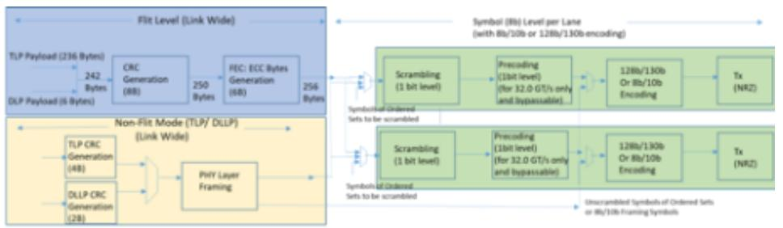

<details>
<summary>flowchart</summary>

```mermaid
graph TD
  A["FLIT Level (Link Wide)"] --> B["TLP Payload (236 Bytes)"]
  B --> C["DLP Payload (6 Bytes)"]
  C --> D["CRC Generation (88)"]
  D --> E["250 Bytes"]
  E --> F["FEIC: ECC Bytes Generation (68)"]
  F --> G["256 Bytes"]
  G --> H["Non-Flit Mode (TLP/ DLLP) (Link Wide)"]
  H --> I["TLP CRC Generation (48)"]
  H --> J["DLLP CRC Generation (28)"]
  I --> K["PHY Layer Framing"]
  J --> K
  K --> L["Symbol of Ordered Sets to be scrambled"]
  L --> M["Scrambling (1 bit level)"]
  M --> N["Precoding (1bit level) (for 32.0 GT/s only and bypassable)"]
  N --> O["128b/130b Or 8b/10b Encoding"]
  O --> P["Tx (NRZ)"]
  M --> Q["Proceding (1bit level) (for 32.0 GT/s only and bypassable)"]
  Q --> R["128b/130b Or 8b/10b Encoding"]
  R --> S["Tx (NRZ)"]
  P --> T["Unscrambled Symbols of Ordered Sets or 8b/10b Framing Symbols"]
  Q --> U["Symbol of Ordered Sets to be scrambled"]
  U --> V["Scrambling (1 bit level)"]
  V --> W["Precoding (1bit level) (for 32.0 GT/s only and bypassable)"]
  W --> X["128b/130b Or 8b/10b Encoding"]
  X --> Y["Tx (NRZ)"]
```
</details>

Figure 4-27 Flit Mode and Not-Flit Mode processing with 8b/10b and 128b/130b encoding on the Transmit side§

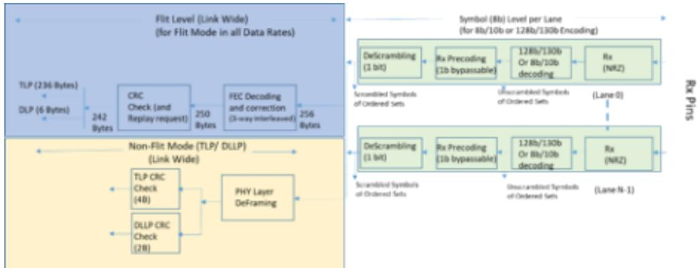

<details>
<summary>flowchart</summary>

```mermaid
graph TD
  A["TLP (236 Bytes)"] --> B["DLP (6 Bytes)"]
  B --> C["242 Bytes"]
  C --> D["CRC Check (and Replay request)"]
  D --> E["250 Bytes"]
  E --> F["FEC Decoding and correction (3-way interleaved)"]
  F --> G["256 Bytes"]
  H["TLP CRC Check (4B)"] --> I["PHY Layer DeFraming"]
  J["DLLP CRC Check (2B)"] --> I
  I --> K["Non-Flt Mode (TLP/ DLLP) (Link Wide)"]
  K --> L["Symbol (8b) Level per Lane (for 8b/10b or 128b/130b Encoding)"]
  L --> M["DeScrambling (1 bit)"]
  L --> N["Rx Precoding (1b bypassable)"]
  L --> O["1.2Bb/1.30b Or Bb/10b decoding"]
  L --> P["Rx (NRZ)"]
  Q["Unscrambled Symbols of Ordered Sets"] --> R["(Lane 0)"]
  S["DeScrambling (1 bit)"] --> T["Rx Precoding (1b bypassable)"]
  U["1.2Bb/1.30b Or Bb/10b decoding"] --> V["Rx (NRZ)"]
  W["Unscrambled Symbols of Ordered Sets"] --> X["(Lane N-1)"]
```
</details>

Figure 4-28 Flit Mode and Not-Flit Mode processing with 8b/10b and 128b/130b encoding on the Receive side§

## 4.2.3.4 Bytes in Flit Layout §

## 4.2.3.4.1 TLP Bytes in Flit §

The TLP Bytes in the flit carry Transaction Layer TLPs. Since the Flit Mode does not support STP tokens, these TLP bytes must be populated by the Transaction Layer, irrespective of whether it has a TLP to send or not. A TLP may span across multiple flits depending on its length and placement. The following rules must be observed:

• When the transaction layer does not have a TLP to send, it sends a NOP TLP (1DW). Once a NOP TLP is scheduled to be sent, NOP TLPs must be scheduled till the next 4DW aligned boundary within the Flit or the Flit boundary, whichever is earlier.  
• NOP TLPs do not consume any credits.  
• The TLPs in Flit Mode have information in predetermined position to determine the length of the TLPs, including the case where TLP prefix is used. See § Chapter 2. for details.  
• The following rules apply for the non-NOP TLPs in each Flit half [i.e., the first 32DW (Bytes 0 through 127) of the Flit or the last 27 DWs (Bytes 128 through 235) of the Flit]:

No more than 8 TLPs, including partial TLPs. Receivers are permitted to check this rule.

▪ If checked, this is logged as a Data Link Protocol Error in the receiving Port (see § Section 6.2 ).

• If a TLP at the end of a Flit gets poisoned or nullified through Flit\_Status extends to subsequent Flits, each of those Flits must also be poisoned or nullified through Flit\_Status so that the poisoned or nullified Flit\_Status is set in the Flit where the TLP ends. A Receiver is permitted to only look at the poison bit in the Flit where the TLP ends.  
• A TLP that gets nullified through the Flit\_Status field in the DLP Bytes described below is ignored by the Receiver if the Flit is valid, but the credits must be released.  
• A TLP that gets EDB’ed or Poisoned through the Flit\_Status field in the DLP Bytes described below must be succeeded by only NOP TLPs through the end of the Flit.

Example: § Table 4-15 shows an example of TLP placement in the Flit Mode for a x16 Link. For narrower Link widths, similar arrangements will exist subject to the rules mentioned above.

• This flit starts with a continuation of the remaining 2 DWs from TLP 19 (the 3rd DW of Hdr and 1 DW of Data).  
• TLP 20 (4DW Hdr and 1DW Data) immediately starts in Lane 8 and ends in Lane 11 in the following Symbol.  
• Since the Transmitter has nothing to send, it sends NOP sending till the 4DW aligned boundary, which is in Lane 15.  
• TLPs 22, and 23 are scheduled without any intervening NOP.  
• After TLP 23, the Transmitter did not have anything to send and sends 7 NOPs, aligned to a 4DW boundary till TLP 24 is ready, which continues till the flit boundary for TLP Bytes.  
• After that we have 6 Bytes of DLP, 8 Bytes of CRC covering the 236 Bytes of TLP and 6 Bytes of DLP in the flit.  
• Then we have the 3 sets of interleaved ECC, 2 bytes each, covering the entire 256B flit.

It should be noted that every Byte of each TLP as well the DLP is covered by one of the 3 ECC groups and each TLP/ DLP is a member of all 3 ECC groups, and as indicated in the color code.

Table 4-15 Example TLP Placement in Flit Mode on a x16 Link§

<table><tr><td colspan="2" rowspan="2">Description</td><td colspan="16">Lane</td></tr><tr><td>0</td><td>1</td><td>2</td><td>3</td><td>4</td><td>5</td><td>6</td><td>7</td><td>8</td><td>9</td><td>10</td><td>11</td><td>12</td><td>13</td><td>14</td><td>15</td></tr><tr><td rowspan="25">128 UI</td><td rowspan="25">TLP Bytes [0...223]</td><td>H2</td><td>H2</td><td>H2</td><td>H2</td><td>D0</td><td>D0</td><td>D0</td><td>D0</td><td>H0</td><td>H0</td><td>H0</td><td>H0</td><td>H1</td><td>H1</td><td>H1</td><td>H1</td></tr><tr><td colspan="8">... TLP 19 →</td><td colspan="8">← TLP 20 ...</td></tr><tr><td>H2</td><td>H2</td><td>H2</td><td>H2</td><td>H3</td><td>H3</td><td>H3</td><td>H3</td><td>D0</td><td>D0</td><td>D0</td><td>D0</td><td></td><td></td><td></td><td></td></tr><tr><td colspan="12">... TLP 20 →</td><td colspan="4">NOP</td></tr><tr><td>H0</td><td>H0</td><td>H0</td><td>H0</td><td>H1</td><td>H1</td><td>H1</td><td>H1</td><td>H2</td><td>H2</td><td>H2</td><td>H2</td><td>H3</td><td>H3</td><td>H3</td><td>H3</td></tr><tr><td colspan="16">← TLP 21 ...</td></tr><tr><td>D0</td><td>D0</td><td>D0</td><td>D0</td><td>D1</td><td>D1</td><td>D1</td><td>D1</td><td></td><td></td><td></td><td></td><td></td><td></td><td></td><td></td></tr><tr><td colspan="8">... TLP 21 →</td><td colspan="8">NOP</td></tr><tr><td>H0</td><td>H0</td><td>H0</td><td>H0</td><td>H1</td><td>H1</td><td>H1</td><td>H1</td><td>H2</td><td>H2</td><td>H2</td><td>H2</td><td>H0</td><td>H0</td><td>H0</td><td>H0</td></tr><tr><td colspan="12">← TLP 22 →</td><td colspan="4">← TLP 23 ...</td></tr><tr><td>H1</td><td>H1</td><td>H1</td><td>H1</td><td>H2</td><td>H2</td><td>H2</td><td>H2</td><td>H3</td><td>H3</td><td>H3</td><td>H3</td><td>D0</td><td>D0</td><td>D0</td><td>D0</td></tr><tr><td colspan="16">... TLP 23 ...</td></tr><tr><td>D1</td><td>D1</td><td>D1</td><td>D1</td><td>D2</td><td>D2</td><td>D2</td><td>D2</td><td>D3</td><td>D3</td><td>D3</td><td>D3</td><td>D4</td><td>D4</td><td>D4</td><td>D4</td></tr><tr><td colspan="16">... TLP 23 ...</td></tr><tr><td>D5</td><td>D5</td><td>D5</td><td>D5</td><td></td><td></td><td></td><td></td><td></td><td></td><td></td><td></td><td></td><td></td><td></td><td></td></tr><tr><td colspan="4">... TLP 23 →</td><td colspan="12">NOP</td></tr><tr><td></td><td></td><td></td><td></td><td></td><td></td><td></td><td></td><td></td><td></td><td></td><td></td><td></td><td></td><td></td><td></td></tr><tr><td colspan="16">NOP</td></tr><tr><td>H0</td><td>H0</td><td>H0</td><td>H0</td><td>H1</td><td>H1</td><td>H1</td><td>H1</td><td>H2</td><td>H2</td><td>H2</td><td>H2</td><td>D0</td><td>D0</td><td>D0</td><td>D0</td></tr><tr><td colspan="16">← TLP 24 ...</td></tr><tr><td>D1</td><td>D1</td><td>D1</td><td>D1</td><td>D2</td><td>D2</td><td>D2</td><td>D2</td><td>D3</td><td>D3</td><td>D3</td><td>D3</td><td>D4</td><td>D4</td><td>D4</td><td>D4</td></tr><tr><td colspan="16">... TLP 24 ...</td></tr><tr><td>D5</td><td>D5</td><td>D5</td><td>D5</td><td>D6</td><td>D6</td><td>D6</td><td>D6</td><td>D7</td><td>D7</td><td>D7</td><td>D7</td><td>D8</td><td>D8</td><td>D8</td><td>D8</td></tr><tr><td colspan="16">... TLP 24 ...</td></tr><tr><td>D9</td><td>D9</td><td>D9</td><td>D9</td><td>D10</td><td>D10</td><td>D10</td><td>D10</td><td>D11</td><td>D11</td><td>D11</td><td>D11</td><td>D12</td><td>D12</td><td>D12</td><td>D12</td></tr><tr><td rowspan="7"></td><td rowspan="3"></td><td colspan="16">... TLP 24 ...</td></tr><tr><td>D13</td><td>D13</td><td>D13</td><td>D13</td><td>D14</td><td>D14</td><td>D14</td><td>D14</td><td>D15</td><td>D15</td><td>D15</td><td>D15</td><td>D16</td><td>D16</td><td>D16</td><td>D16</td></tr><tr><td colspan="16">... TLP 24 ...</td></tr><tr><td rowspan="2">TLP, DLP</td><td>D17</td><td>D17</td><td>D17</td><td>D17</td><td>D18</td><td>D18</td><td>D18</td><td>D18</td><td>D19</td><td>D19</td><td>D19</td><td>D19</td><td>DLP 0</td><td>DLP 1</td><td>DLP 2</td><td>DLP 3</td></tr><tr><td colspan="12">... TLP 24 →</td><td colspan="4">← DLP ...</td></tr><tr><td rowspan="2">DLP, CRC, ECC</td><td>DLP 4</td><td>DLP 5</td><td>CRC 0</td><td>CRC 1</td><td>CRC 2</td><td>CRC 3</td><td>CRC 4</td><td>CRC 5</td><td>CRC 6</td><td>CRC 7</td><td>ECC1 [0]</td><td>ECC2 [0]</td><td>ECC0 [0]</td><td>ECC1 [1]</td><td>ECC2 [1]</td><td>ECC0 [1]</td></tr><tr><td colspan="2">... DLP →</td><td colspan="8">← CRC →</td><td colspan="6">← ECC →</td></tr></table>

## 4.2.3.4.2 DLP Bytes in Flit §

In every flit, 6 bytes are allotted to carry the information carried by the Data Link Layer Packets (DLLPs) described in § Chapter 3. . While the DLP bytes are designed to reuse the DLLP mechanism and formats for the most part, some optimizations have been made to effectively carry the Ack/Nak flit along with an optimized credit release (Optimized\_Update\_FC, defined below) or a traditional DLLP. An encoding has been added in the DLP to provide Update\_FC credits for PRH, PRD, and NPRH within one 32 bit payload of DLP. The following table summarizes the DLP encodings.

Three Flit Types have been defined in§ Table 4-16, along with their intended usages. They all have the same CRC and FEC mechanism. The distinction is made for ease of reference based on the TLP and DLP Bytes they carry. An IDLE Flit uses the sequence number of 0 along with the appropriate Replay Command (00b) as described in § Table 4-16. IDLE Flits are only sent after the Control SKP Ordered Set following the SDS Ordered Set Sequence with 128b/130b and 1b/1b encoding. For 8b/10b encoding, an IDLE Flit will be sent at the conclusion of the TS2 Ordered Set (or after a SKP OS following the last TS2 Ordered Set, depending on the SKP insertion interval). With 8b/10b encoding, an Ordered Set vs. a Flit is distinguished the lack of a COM at the end of a SKP OS. IDLE Flits continue to be sent until a Flit other than an IDLE Flit must be sent. Devices that advertise infinite credits across all FC/VC are permitted to send NOP DLLP if there is no DLLP to be sent in dlp 2, 3, 4, and 5.

A valid Flit is one that passes the CRC check after performing the FEC correction, if required, and none of the ECC groups in the FEC are reporting an uncorrectable error (by ECC), as described in § Section 4.2.3.4.4 , and the Flit Usage as well as the Flit Status fields do not have a Reserved encoding defined below. An FEC uncorrectable error is an error in a Flit that is detected by the CRC after FEC correction or ‘uncorrectable error’ reported by an ECC group in the FEC which may result in a NAK and a replay.

A valid non-IDLE Flit is valid Flit that is either a NOP Flit or a Payload Flit. All subsequent Flits after the first valid non-IDLE Flit are non-IDLE Flits while the Link is in L0.

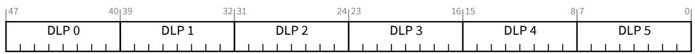

<details>
<summary>text_image</summary>

47 40 39 32 31 24 23 16 15 8 7 0
DLP 0 DLP 1 DLP 2 DLP 3 DLP 4 DLP 5
</details>

Figure 4-29 DLP Byte to Bit Number Assignment§

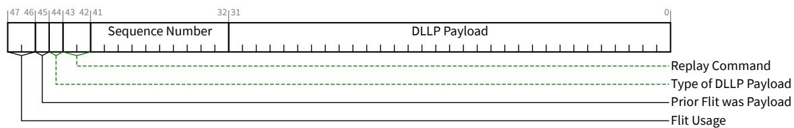

<details>
<summary>text_image</summary>

47 46 45 44 43 42 41
Sequence Number DLLP Payload
0
Replay Command
Type of DLLP Payload
Prior Flit was Payload
Flit Usage
</details>

§  
Figure 4-30 DLP Bit usage

§  
Table 4-16 Flit Types

<table><tr><td>Flit Type</td><td>TLP Bytes</td><td>DLP Bytes 0,1</td><td>DLP Bytes 2..5</td></tr><tr><td>IDLE Flit</td><td>NOP TLPs across all 236 Bytes</td><td>All 0s(Including Flit Sequence Number = 00b)</td><td>NOP2 DLLP (see § Figure 3-8)</td></tr><tr><td>NOP Flit</td><td>NOP TLPs across all 236 Bytes</td><td>Flit Usage = 00bFlit Sequence Number  $^{56}$ = NEXT_TX_FLIT_SEQ_NUM - 1 if Replay Command is 00bOther Fields = Any valid encoding</td><td>Any valid encoding</td></tr><tr><td>Payload Flit</td><td>A portion of at least one non-NOP TLP in the 236 Bytes</td><td>Flit Usage = 01bFlit Sequence Number != 00b if Replay Command is 00bOther Fields = Any valid encoding</td><td>Any valid encoding</td></tr></table>

§  
Table 4-17 DLP Bytes in the Flit

<table><tr><td>Field</td><td>Location</td><td colspan="2">Encoding</td></tr><tr><td rowspan="3">Flit Usage</td><td rowspan="3">DLP0:Bits 7:6</td><td>00b</td><td>IDLE Flit or NOP Flit</td></tr><tr><td>01b</td><td>Payload Flit</td></tr><tr><td>Others</td><td>Reserved</td></tr><tr><td rowspan="2">Prior Flit was Payload</td><td rowspan="2">DLP0:Bit 5</td><td>0b</td><td>Prior flit was a NOP Flit or IDLE Flit</td></tr><tr><td>1b</td><td>Prior flit was a Payload Flit</td></tr><tr><td rowspan="2">Type of DLLP Payload</td><td rowspan="2">DLP0:Bit 4</td><td>0b</td><td>DLLP Payload in DLP 2..5</td></tr><tr><td>1b</td><td>Optimized_Update_FC or Flit_Marker in DLP 2..5</td></tr><tr><td rowspan="4">Replay Command[1:0]</td><td rowspan="4">DLP0:Bits 3:2</td><td>00b</td><td>The Flit Sequence Number included in the Flit is an Explicit Flit Sequence Number of the transmitted Flit.</td></tr><tr><td>01b</td><td>Ack of Flit Sequence Number from Receiver. The included Flit Sequence Number indicates the Flit Sequence Number of the last valid Flit received.</td></tr><tr><td>10b</td><td>Nak requesting a Replay of all unacknowledged Flits. The included Flit Sequence Number indicates the Flit Sequence Number of the last valid Flit received.</td></tr><tr><td>11b</td><td>Nak requesting a Replay of a single Flit (Flit Sequence Number + 1). The included Flit Sequence Number indicates the Flit Sequence Number of the last valid Flit received.</td></tr></table>

<table><tr><td>Field</td><td>Location</td><td>Encoding</td></tr><tr><td>Flit Sequence Number[9:0]</td><td>{ DLP0:Bits 1:0,DLP1:Bits 7:0 }</td><td>10-bit sequence number applied to Flits. See Flit Sequence Number Rules.DLP0[1:0] contains Flit Sequence Number[9:8] and DLP1[7:0] has Flit Sequence Number[7:0].</td></tr><tr><td>DLLP Payload</td><td>{ DLP2, DLP3,DLP4, DLP5 }</td><td>Type of DLLP Payload is 0bRegular DLLP Payload (see § Chapter 3.)</td></tr><tr><td>Optimized_Update_FC</td><td rowspan="2">Bits 31:0DLP2 is 31:24DLP3 is 23:16DLP4 is 15:8DLP5 is 7:0</td><td>Type of DLLP Payload is 1b and bit 31 = 0b (see § Table 4-18)</td></tr><tr><td>Flit_Marker</td><td>Type of DLLP Payload is 1b and bit 31 = 1b (see § Table 4-19)</td></tr></table>

In the Table above, a Transmitter must not use the Reserved encodings.

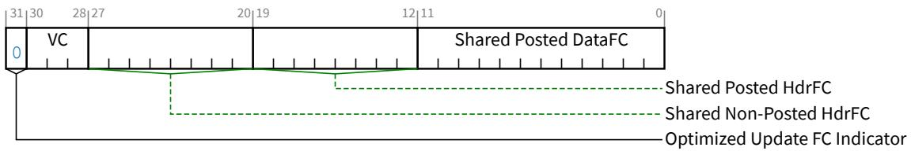

<details>
<summary>timing diagram</summary>

| Position | Value |
|--------|-------|
| 0      | 31    |
| 19     | 27    |
| 31     | 20    |
| 12     | 19    |
| 11     | 12    |
| 0      | 0     |
</details>

Figure 4-31 Optimized\_Update\_FC

§

§

Table 4-18 Optimized\_Update\_FC

<table><tr><td>Bit Location</td><td>Description</td></tr><tr><td>31</td><td>Optimized Update FC Indicator Must be &quot;0&quot;</td></tr><tr><td>30:28</td><td>VC</td></tr><tr><td>27:20</td><td>Shared Non-Posted HdrFC – Shared credits on this VC</td></tr><tr><td>19:12</td><td>Shared Posted HdrFC – Shared credits on this VC</td></tr><tr><td>11:0</td><td>Shared Posted DataFC – Shared credits on this VC</td></tr></table>

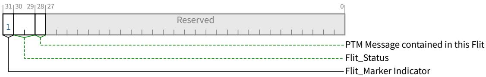

<details>
<summary>text_image</summary>

Reserved
PTM Message contained in this Flit
Flit_Status
Flit_Marker Indicator
</details>

Figure 4-32 Flit\_Marker

§

§

Table 4-19 Flit\_Marker

<table><tr><td>Bit Location</td><td>Description</td><td></td></tr><tr><td>31</td><td>Flit_Marker Indicator Must be &quot;1&quot;</td><td></td></tr><tr><td>30:29</td><td>Flit_Status - Initates the validity of the Last TLP in this Flit. Encoding is:00b No special information - No TLPs that end in this Flit are Nullified or Poisoned.TLPs that starts in this Flit and ends in a subsequent Flit are marked in that Flit.01b Last TLP Nullified - Last TLP ending in current Flit is NullifiedThis mechanism replaces the EDB Mechanism in Non-Flit Mode framing.10b Last TLP Poisoned - Last TLP ending in the current Flit is PoisonedSee § Section 2.7.2 regarding how this mechansim relates to the Transaction Layer EP bit mechanism.11b Reserved</td><td></td></tr><tr><td>28</td><td>PTM Message contained in this Flit - In Flit Mode, timestamps for Precision Time Management messages are measured at the Flit level rather than at the TLP level. This bit indicates that this Flit contains the last symbol of a non-nullified PTM Message.Nullified PTM Messages do not set this bit.Poisoned PTM Messages are not permitted.</td><td></td></tr></table>

For the DLLP Payload in the above table, the Optimized\_Update\_FC is used to transmit performance critical NPRH, PRH, and PRD credits in 4 Bytes. For debug as well as ease of use by debug tools such as Logic Analyzers, devices must send at least one DLLP every 10 μs with an Update\_FC DLLP per VC with the scaled credit information. It is strongly recommended that a Transmitter cycles through the VCs with finite non-0 credits in the Optimized\_Update\_FC as long as there is a credit to be released in the corresponding VC.

Receivers are permitted to check for the following Flit errors:

• Reserved value of Flit Usage  
• Reserved encoding of Flit\_Status field in a Flit\_Marker  
• Invalid sequence number (see § Section 4.2.3.4.2.1.4 ).  
• Violations of the TLP packing rules as defined in § Section 4.2.3.4.1

If checked, these Flit errors are logged as a Data Link Protocol Error in the receiving Port (see § Section 6.2 ).

## 4.2.3.4.2.1 Flit Sequence Number and Retry Mechanism §

## Term Definitions

## Explicit Sequence Number Flit

A Payload Flit or NOP Flit with Replay Command 00b.

## Ack Flit

A Flit with Replay Command 01b.

## Standard Nak Flit

A Flit with Replay Command 10b.

## Selective Nak Flit

A Flit with Replay Command 11b.

## Nak Flit

A Flit with either Replay Command 10b or 11b.

## Standard Nak

A Nak that requests a Replay of all unacknowledged Flits.

## Selective Nak

A Nak that requests a Replay of a specific Flit.

## Standard Replay

A Replay of all unacknowledged Flits in the TX Retry Buffer.

## Selective Replay

A Replay of a specific Flit from the TX Retry Buffer.

## TX Retry Buffer

The buffer which stores information for transmitted Flits until the Flit has been acknowledged by the Link partner. 57

## RX Retry Buffer

The buffer which stores information for received Flits until the Flit has been consumed by the Receiver.

## Nak Ignore Window

A time window in which received Nak Flits are ignored for a specific Flit Sequence Number.

• The Nak Ignore Window is started when a Payload Explicit Sequence Number Flit is sent with Flit Sequence Number = NAK\_IGNORE\_FLIT\_SEQ\_NUM + 1 and NAK\_IGNORE\_FLIT\_SEQ\_NUM != 0.

58

## Flags and Counters

## NEXT\_TX\_FLIT\_SEQ\_NUM

10-bit unsigned counter that tracks the Flit Sequence Number for transmitted Flits.

• Set to 001h in DL\_Inactive state.  
• Behavior defined in NEXT\_TX\_FLIT\_SEQ\_NUM Rules.  
Usage defined in § Section 4.2.3.4.2.1.2 , § Section 4.2.3.4.2.1.3 , § Section 4.2.3.4.2.1.4 , and § Section 4.2.3.4.2.1.6 .

## TX\_ACKNAK\_FLIT\_SEQ\_NUM

Stores the 10-bit Sequence Number to be transmitted in the next Ack Flit or Nak Flit.

• Set to 1023 in DL\_Inactive state.  
• Usage defined in § Section 4.2.3.4.2.1.2 , § Section 4.2.3.4.2.1.3 , and § Section 4.2.3.4.2.1.5 .

## CONSECUTIVE\_TX\_EXPLICIT\_SEQ\_NUM\_FLITS

2-bit unsigned counter which tracks how many consecutive Explicit Sequence Number Flits have been sent by the Transmitter.

• Set to 00b IDLE Flit Handshake Phase.  
• Behavior defined in CONSECUTIVE\_TX\_EXPLICIT\_SEQ\_NUM\_FLITS Rules  
• Usage defined in § Section 4.2.3.4.2.1.2 and § Section 4.2.3.4.2.1.3 .

## CONSECUTIVE\_TX\_NAK\_FLITS

3-bit unsigned counter which tracks how many consecutive Nak Flits have been sent by the Transmitter.

• Set to 000b in the IDLE Flit Handshake Phase.

• This counter saturates at 111b and does not roll over to 000b.  
• Behavior defined in CONSECUTIVE\_TX\_NAK\_FLITS Rules.  
• Usage defined in § Section 4.2.3.4.2.1.3 and § Section 4.2.3.4.2.1.7 .

## NEXT\_EXPECTED\_RX\_FLIT\_SEQ\_NUM

10-bit unsigned counter that stores the expected Flit Sequence Number of the next valid non-IDLE non-duplicate Flit to be received.

• Set to 001h in DL\_Inactive state.  
• Behavior and usage defined in § Section 4.2.3.4.2.1.5 .

## IMPLICIT\_RX\_FLIT\_SEQ\_NUM

10-bit unsigned counter that tracks the implicit Flit Sequence Number of received Flits.

• Set to 000h in DL\_Inactive state.  
• Behavior defined in IMPLICIT\_RX\_FLIT\_SEQ\_NUM Rules.  
• Usage defined in § Section 4.2.3.4.2.1.5 .

## ACKD\_FLIT\_SEQ\_NUM

Stores the 10-bit Flit Sequence Number received in the most recently processed valid Ack Flit or Nak Flit.

• Set to 3FFh in DL\_Inactive state.  
• Behavior defined in § Section 4.2.3.4.2.1.4 .  
• Usage defined in § Section 4.2.3.4.2.1.4 and § Section 4.2.3.4.2.1.6 .

## NON\_IDLE\_EXPLICIT\_SEQ\_NUM\_FLIT\_RCVD

Flag to indicate that a Non-IDLE Explicit Sequence Number Flit has been received since the last entry to IDLE Flit Handshake Phase.

• Cleared on entry to IDLE Flit Handshake Phase.  
• Usage defined in IMPLICIT\_RX\_FLIT\_SEQ\_NUM Rules.

## REPLAY\_SCHEDULED

Flag to indicate that a Flit has been scheduled to be replayed from the TX Retry Buffer.

• Cleared when in DL\_Inactive state.  
• Behavior defined in § Section 4.2.3.4.2.1.6 .  
• Usage defined in § Section 4.2.3.4.2.1.2 , § Section 4.2.3.4.2.1.6 , and § Section 4.2.3.4.2.1.7 .

## REPLAY\_SCHEDULED\_TYPE

Indicates whether a Standard Replay or a Selective Replay has been scheduled.

• If REPLAY\_SCHEDULED is 1b:  
REPLAY\_SCHEDULED\_TYPE 0b indicates a Standard Replay. REPLAY\_SCHEDULED\_TYPE of 0b will be referred to as STANDARD\_REPLAY.  
REPLAY\_SCHEDULED\_TYPE 1b indicates a Selective Replay. REPLAY\_SCHEDULED\_TYPE of 1b will be referred to as SELECTIVE\_REPLAY.  
• Behavior defined in § Section 4.2.3.4.2.1.6 .  
• Usage defined in § Section 4.2.3.4.2.1.6 and § Section 4.2.3.4.2.1.7 .

## REPLAY\_IN\_PROGRESS

Flag to indicate that the Transmitter is sending Flits from the TX Retry Buffer.

• Cleared when in DL\_Inactive state.  
• Behavior defined in REPLAY\_IN\_PROGRESS Rules.

• Usage defined in § Section 4.2.3.4.2.1.2 , § Section 4.2.3.4.2.1.6 , and § Section 4.2.3.4.2.1.7 .

## TX\_REPLAY\_FLIT\_SEQ\_NUM

Stores the 10-bit Flit Sequence Number of the first Flit to be replayed from the TX Retry Buffer.

• Set to 000h in DL\_Inactive state.  
• Behavior defined in § Section 4.2.3.4.2.1.6 .  
• Usage defined in § Section 4.2.3.4.2.1.4 , § Section 4.2.3.4.2.1.6 , and § Section 4.2.3.4.2.1.7 .

## FLIT\_REPLAY\_NUM

3-bit unsigned counter that tracks the number of times that a Replay has been initiated without making forward progress.

• Set to 000b in DL\_Inactive state.  
• Behavior defined in § Section 4.2.3.4.2.1.4 and § Section 4.2.3.4.2.1.7 .  
• Usage defined in § Section 4.2.3.4.2.1.7 .

## REPLAY\_TIMEOUT\_FLIT\_COUNT

11-bit unsigned counter that counts the number of Payload Flits and NOP Flits sent since the last Ack of an outstanding Flit.

• Set to 000h in DL\_Inactive state.  
• This counter saturates at 7FFh and does not roll over to 000h.  
• Behavior defined in REPLAY\_TIMEOUT\_FLIT\_COUNT Rules  
• Usage defined in § Section 4.2.3.4.2.1.6 .

## NAK\_SCHEDULED

Flag to indicate that a Nak Flit has been scheduled for transmission.

• Cleared when in DL\_Inactive state.  
• Behavior defined in § Section 4.2.3.4.2.1.5 .  
• Usage defined in § Section 4.2.3.4.2.1.2 , § Section 4.2.3.4.2.1.3 , and § Section 4.2.3.4.2.1.5 .

## NAK\_SCHEDULED\_TYPE

Indicates whether a Standard Nak Flit or a Selective Nak Flit should be sent.

• Set to 0b when in DL\_Inactive state.  
• If NAK\_SCHEDULED is 1b,  
◦ NAK\_SCHEDULED\_TYPE 0b indicates a Standard Nak Flit.  
▪ NAK\_SCHEDULED\_TYPE of 0b will be referred to as STANDARD\_NAK.  
◦ NAK\_SCHEDULED\_TYPE 1b indicates a Selective Nak Flit.  
▪ NAK\_SCHEDULED\_TYPE of 1b will be referred to as SELECTIVE\_NAK.  
• Behavior defined in § Section 4.2.3.4.2.1.5 .  
• Usage defined in § Section 4.2.3.4.2.1.2 , § Section 4.2.3.4.2.1.3 , and § Section 4.2.3.4.2.1.5 .

## NAK\_WITHDRAWAL\_ALLOWED

Flag that indicates an invalid Flit was received but should not be Nak'd if the subsequent received Flit has Prior Flit was Payload set to 0b (indicating that the invalid Flit was a NOP Flit).

• Cleared when in DL\_Inactive state.  
• Behavior and usage defined in § Section 4.2.3.4.2.1.5 .

## NAK\_IGNORE\_FLIT\_SEQ\_NUM

Stores the 10-bit Flit Sequence Number to be ignored during the Nak Ignore Window.

• Set to 000h when in DL\_Inactive state.  
• Behavior defined in § Section 4.2.3.4.2.1.4 and § Section 4.2.3.4.2.1.6  
• Usage defined in § Section 4.2.3.4.2.1.6 .

## NEXT\_RX\_FLIT\_SEQ\_NUM\_TO\_STORE

Stores the 10-bit Flit Sequence Number of the next Flit to be stored in the RX Retry Buffer.

• Cleared when in DL\_Inactive state.  
• Behavior and usage defined in § Section 4.2.3.4.2.1.5 .

## RX\_RETRY\_BUFFER\_OVERFLOW

Flag to indicate that a Flit was unable to be stored in the RX Retry Buffer due to the buffer becoming full before a Selective Replay was received for an outstanding Selective Nak.

• Cleared when in DL\_Inactive state.  
• Behavior and usage defined in § Section 4.2.3.4.2.1.5 .

## RX\_RETRY\_BUFFER\_LAST\_FLIT\_SEQ\_NUM

Stores the 10-bit Flit Sequence Number of the last Flit stored in the RX Retry Buffer if the RX Retry Buffer overflows.

• Cleared when in DL\_Inactive state.  
• Behavior and usage defined in § Section 4.2.3.4.2.1.5 .

## MAX\_UNACKNOWLEDGED\_FLITS

Maximum number of unacknowledged Flits outstanding.

• Set to the lesser of:  
◦ Number of Flits that can be stored in the TX Retry Buffer.  
◦ 511 Flits  
• Usage defined in § Section 4.2.3.4.2.1.4 , § Section 4.2.3.4.2.1.5 , and § Section 4.2.3.4.2.1.6 .

## General Rules

## Flit Sequence Number Rules:

• The valid range of Flit Sequence Numbers for Payload Flits is 1-1023.  
• Flit Sequence Number 0 is only used for IDLE Flits.  
• NOP Flits do not consume a Flit Sequence Number.  
◦ A NOP Flit that is also an Explicit Sequence Number Flit sets Flit Sequence Number to NEXT\_TX\_FLIT\_SEQ\_NUM - 1.  
▪ If no Payload Flits have been transmitted, Flit Sequence Number 1023 is used.

• All Flit Sequence Number counters will roll-over from 1023 to 1.  
• Whenever text in this section refers to adding to, subtracting from, incrementing, or decrementing a sequence number, it is implied that sequence number rollover rules stated above will be followed.

• Two transmitted or received Flits are considered consecutive, even if they are separated by a SKP OS.

• The Nak Ignore Window should be the lesser of:

◦ Measured Ack/Nak Latency of the Link + 1 maximum sized SKP Ordered Set + 2 Flits  
◦ 300ns

## Transmitter Rules

• The Transmitter must store the following information of transmitted Payload Flits in the TX Retry Buffer:

◦ TLP Bytes associated with non-NOP TLPs  
◦ Flit Status  
◦ Flit Sequence Number

## MAX\_UNACKNOWLEDGED\_FLITS Outstanding:

• If (NEXT\_TX\_FLIT\_SEQ\_NUM - ACKD\_FLIT\_SEQ\_NUM) mod 1023 > MAX\_UNACKNOWLEDGED\_FLITS:  
◦ The Transmitter must not accept any new TLPs from the Transaction Layer.  
◦ The Transmitter must send a NOP Flit if REPLAY\_SCHEDULED is 0b and REPLAY\_IN\_PROGRESS is 0b.

## REPLAY\_IN\_PROGRESS Rules:

• If REPLAY\_IN\_PROGRESS is 1b:

◦ The Transmitter must not accept any new TLPs from the Transaction Layer.

◦ REPLAY\_IN\_PROGRESS is cleared if either of the following conditions are true:

REPLAY\_SCHEDULED\_TYPE is STANDARD\_REPLAY and all unacknowledged Flits in the TX Retry Buffer have been transmitted.  
▪ REPLAY\_SCHEDULED\_TYPE is SELECTIVE\_REPLAY and Flit with Flit Sequence Number equal to TX\_REPLAY\_FLIT\_SEQ\_NUM has been transmitted.

## CONSECUTIVE\_TX\_EXPLICIT\_SEQ\_NUM\_FLITS Rules

• When an Explicit Sequence Number Flit is transmitted:  
◦ CONSECUTIVE\_TX\_EXPLICIT\_SEQ\_NUM\_FLITS is incremented.

• When a non-Explicit Sequence Number Flit is transmitted:

◦ CONSECUTIVE\_TX\_EXPLICIT\_SEQ\_NUM\_FLITS is set to 0b.

• Also see Replay Schedule Rule 0.

## REPLAY\_TIMEOUT\_FLIT\_COUNT Rules:

• When a Payload Flit or a NOP Flit is transmitted and the TX Retry Buffer is not empty:  
◦ REPLAY\_TIMEOUT\_FLIT\_COUNT is incremented.  
• When an ACK is received for a Flit that is stored in the TX Retry Buffer:  
◦ REPLAY\_TIMEOUT\_FLIT\_COUNT is set to 0b.  
• Also see Replay Schedule Rule 0.

## NEXT\_TX\_FLIT\_SEQ\_NUM Rules

• After the Transmitter applies the Replay Command to a Payload Flit with an implicit Flit Sequence Number:

◦ NEXT\_TX\_FLIT\_SEQ\_NUM is incremented.

• NEXT\_TX\_FLIT\_SEQ\_NUM does not change when sending any of the following:

◦ An IDLE Flit  
◦ A NOP Flit

◦ A Selective Replay Payload Flit

## Receiver Rules

• If a Receiver has scheduled a Selective Nak Flit, it must continue to store non-NOP TLP bytes and Flit Sequence Number of subsequent Flits in the RX Retry Buffer.  
• See § Section 4.2.3.4.2.1.5 for Ack, Nak, and Discard rules.

## IMPLICIT\_RX\_FLIT\_SEQ\_NUM Rules

• The value of IMPLICIT\_RX\_FLIT\_SEQ\_NUM must be updated before evaluating the rules in § Section 4.2.3.4.2.1.5  
• IMPLICIT\_RX\_FLIT\_SEQ\_NUM does not change if ANY of the following are true:

◦ An IDLE Flit is received.  
◦ An Explicit Sequence Number Flit is received with Flit Sequence Number 0.  
◦ Both of the following are true:

▪ NON\_IDLE\_EXPLICIT\_SEQ\_NUM\_FLIT\_RCVD is 0b  
▪ Either of the following are true:

▪ An invalid Flit is received.

▪ A valid non-Explicit Sequence Number Flit is received.

◦ Both of the following are true:

▪ A valid NOP Flit is received with a non-explicit Flit Sequence Number.  
▪ Either of the following are true:

▪ NAK\_WITHDRAWAL\_ALLOWED is 0b

▪ NAK\_WITHDRAWAL\_ALLOWED is 1b and Prior Flit was Payload is 1b

◦ All of the following are true:

▪ A valid Payload Flit with a non-explicit Flit Sequence Number is received.  
▪ NAK\_WITHDRAWAL\_ALLOWED is 1b  
▪ Prior Flit was Payload is 0b

• IMPLICIT\_RX\_FLIT\_SEQ\_NUM is incremented if both of the following are true:

◦ NON\_IDLE\_EXPLICIT\_SEQ\_NUM\_FLIT\_RCVD is 1b  
◦ Either of the following are true:

▪ A valid Payload Flit with a non-explicit Flit Sequence Number is received and NAK\_WITHDRAWAL\_ALLOWED is 0b.  
▪ A valid Payload Flit with a non-explicit Flit Sequence Number is received with Prior Flit was Payload set to 1b and NAK\_WITHDRAWAL\_ALLOWED is 1b.  
▪ A invalid Flit is received.

• IMPLICIT\_RX\_FLIT\_SEQ\_NUM is set to N if both of the following are true:

◦ A valid non-IDLE Explicit Sequence Number Flit is received with Flit Sequence Number N.  
◦ N != 0.

• IMPLICIT\_RX\_FLIT\_SEQ\_NUM is decremented if ALL of the following are true:

◦ A valid NOP Flit with a non-explicit Flit Sequence Number is received.  
◦ NAK\_WITHDRAWAL\_ALLOWED is 1b.  
Prior Flit was Payload is 0b.

## 4.2.3.4.2.1.1 IDLE Flit Handshake Phase §

## General Rules

• A Port enters this phase when the LTSSM enters Configuration.Idle or Recovery.Idle states.

## Transmitter Rules

• The Transmitter must send IDLE Flits as required by the LTSSM rules.  
• The Transmitter moves to the Sequence Number Handshake Phase when the LTSSM enters the L0 state.

## Receiver Rules

• All received Flits are discarded.  
• The Receiver moves to the Sequence Number Handshake Phase when two consecutive valid IDLE Flits have been received.

## 4.2.3.4.2.1.2 Sequence Number Handshake Phase §

## General Rules

• Devices are permitted to perform Data Link Feature Exchange and Flow Control Initialization in this phase if the Data Link Control and Management State Machine is in the DL\_Feature or DL\_Init states, respectively.  
• The Port transitions to the Normal Flit Exchange Phase when both of the following are true:

◦ The Port has transmitted 3 or more Ack Flits with non-zero Flit Sequence Numbers after having received one or more Explicit Sequence Number Flits with a non-zero Flit Sequence Number.  
◦ The Port has transmitted 9 or more Explicit Sequence Number Flits with a non-zero Flit Sequence Number.

• If the Port is in this phase after sending 512 Flits with 1b/1b encoding or 256 Flits with 8b/10b or 128b/ 130b encoding, the Port must enter Recovery.

## Transmitter Rules

## Flit Replay Command Rules

• The Transmitter alternates between sending three consecutive Explicit Sequence Number Flit and one Ack Flit or Nak Flit while in this phase.

◦ The following conditions are listed in order of priority.  
◦ A Transmitter must send an Explicit Sequence Number Flit if the following is true:  
▪ CONSECUTIVE\_TX\_EXPLICIT\_SEQ\_NUM\_FLITS < 3.  
◦ A Transmitter must send a Standard Nak Flit if all of the following are true:  
▪ NAK\_SCHEDULED is 1b.  
▪ NAK\_SCHEDULED\_TYPE is STANDARD\_NAK.  
▪ The conditions for sending an Explicit Sequence Number Flit were not met.

◦ A Transmitter must send a Selective Nak Flit if all of the following are true:

▪ NAK\_SCHEDULED is 1b.  
▪ NAK\_SCHEDULED\_TYPE is SELECTIVE\_NAK.  
▪ The conditions for sending an Explicit Sequence Number Flit were not met.  
▪ The conditions for sending a Standard Nak Flit were not met.

◦ A Transmitter must send an Ack Flit if all of the following are true:

▪ The conditions for sending an Explicit Sequence Number Flit were not met.  
▪ The conditions for sending a Standard Nak Flit were not met.  
▪ The conditions for sending a Selective Nak Flit were not met.

• The Transmitter may send up to six consecutive Explicit Sequence Number Flits if the CONSECUTIVE\_TX\_EXPLICIT\_SEQ\_NUM\_FLITS counter is reset due to Replay Schedule Rule 0.

## Flit Replay Transmit Rules

• The Transmitter must only begin replaying Flits from the TX Retry Buffer when sending an Explicit Sequence Number Flit and CONSECUTIVE\_TX\_EXPLICIT\_SEQ\_NUM\_FLITS is 0b.  
• If the Transmitter is replaying a Flit from the TX Retry Buffer, it must use the sequence number of the Flit from its TX Retry Buffer when sending an Explicit Sequence Number Flit.  
• See § Section 4.2.3.4.2.1.7 for additional replay transmit rules.

## Flit Sequence Number Rules

• When transmitting an Ack Flit or Nak Flit with a non-0 Flit Sequence Number:  
◦ The Flit Sequence Number is set to the value of TX\_ACKNAK\_FLIT\_SEQ\_NUM.  
• When transmitting an Explicit Sequence Number Flit:  
◦ A NOP Flit must set Flit Sequence Number to NEXT\_TX\_FLIT\_SEQ\_NUM - 1.  
◦ A replayed Payload Flit must set Flit Sequence Number to the value stored for the Flit in the TX Retry Buffer.  
◦ A non-replayed Payload Flit must set Flit Sequence Number to NEXT\_TX\_FLIT\_SEQ\_NUM.

## Receiver Rules

• Refer to § Section 4.2.3.4.2.1.4 for Ack and Nak processing rules.  
• Refer to § Section 4.2.3.4.2.1.5 for Ack and Nak scheduling rules.  
• Refer to § Section 4.2.3.4.2.1.6 for Replay scheduling rules.

## 4.2.3.4.2.1.3 Normal Flit Exchange Phase §

## Transmitter Rules

• While in this Phase, Explicit Sequence Number Flits are only sent according to the Flit Replay Command Rules defined in this section.  
• If a Nak Flit is sent in this phase:

◦ A minimum of three consecutive Nak Flits must be sent unless any of the following are true:

▪ CONSECUTIVE\_TX\_NAK\_FLITS is reset due to Replay Schedule Rule 0.  
▪ The transmission of Flits is interrupted by an exit from the L0 state.

• If an Explicit Sequence Number Flit is sent in this phase:

◦ Exactly three consecutive Explicit Sequence Number Flits must be sent unless either of the following are true:

▪ CONSECUTIVE\_TX\_EXPLICIT\_SEQ\_NUM\_FLITS is reset due to Replay Schedule Rule 0.  
▪ The transmission of Flits is interrupted by an exit from the L0 state.

## Flit Replay Command Rules

• The following conditions are listed in order of priority.  
• A Transmitter must send an Explicit Sequence Number Flit if all of the following are true:  
◦ Any of the following are true:  
▪ REPLAY\_SCHEDULED is 1b.  
▪ REPLAY\_IN\_PROGRESS is 1b.

▪ CONSECUTIVE\_TX\_EXPLICIT\_SEQ\_NUM\_FLITS > 0.  
▪ All of the following are true 59 :  
▪ REPLAY\_SCHEDULED is 0b.  
▪ REPLAY\_IN\_PROGRESS is 0b.  
▪ NAK\_IGNORE\_FLIT\_SEQ\_NUM != 000h

◦ CONSECUTIVE\_TX\_EXPLICIT\_SEQ\_NUM\_FLITS < 3.

◦ Either of the following are true:

▪ CONSECUTIVE\_TX\_NAK\_FLITS equals 0.  
▪ CONSECUTIVE\_TX\_NAK\_FLITS > 2.

• A Transmitter must send a Standard Nak Flit if all of the following are true:

◦ NAK\_SCHEDULED is 1b.

◦ NAK\_SCHEDULED\_TYPE is STANDARD\_NAK.

◦ The conditions for sending an Explicit Sequence Number Flit were not met.

• A Transmitter must send a Selective Nak Flit if all of the following are true:

◦ NAK\_SCHEDULED is 1b.

◦ NAK\_SCHEDULED\_TYPE is SELECTIVE\_NAK.

◦ The conditions for sending an Explicit Sequence Number Flit were not met.

◦ The conditions for sending a Standard Nak Flit were not met.

• A Transmitter must send an Ack Flit if all of the following are true:

◦ The conditions for sending an Explicit Sequence Number Flit were not met.

◦ The conditions for sending a Standard Nak Flit were not met.

◦ The conditions for sending a Selective Nak Flit were not met.

• The Transmitter may send up to six consecutive Explicit Sequence Number Flits if the CONSECUTIVE\_TX\_EXPLICIT\_SEQ\_NUM\_FLITS counter is reset due to Replay Schedule Rule 0.

## Flit Replay Transmit Rules

• See § Section 4.2.3.4.2.1.7 .

## Flit Sequence Number Rules

• When transmitting an Ack Flit or Nak Flit:

◦ The Flit Sequence Number is set to the value of TX\_ACKNAK\_FLIT\_SEQ\_NUM.

• When transmitting an Explicit Sequence Number Flit:

◦ See § Section 4.2.3.4.2.1.6 .

## CONSECUTIVE\_TX\_NAK\_FLITS Rules

• When a Nak Flit is transmitted:

◦ CONSECUTIVE\_TX\_NAK\_FLITS is incremented.

• When a non-Nak Flit is transmitted:

◦ CONSECUTIVE\_TX\_NAK\_FLITS is set to 0b.

• Also see Replay Schedule Rule 0.

## Receiver Rules

• Refer to § Section 4.2.3.4.2.1.4 for Ack and Nak processing rules.  
• Refer to § Section 4.2.3.4.2.1.5 for Ack and Nak scheduling rules.  
• Refer to § Section 4.2.3.4.2.1.6 for Replay scheduling rules.

## 4.2.3.4.2.1.4 Received Ack and Nak Processing


• A received Ack or Nak with Flit Sequence Number 0 must be ignored.  
• Handling an invalid Flit Sequence Number in a received Ack Flit or Nak Flit:

◦ If all of the following are true:

▪ A valid Ack Flit or Nak Flit is received with Flit Sequence Number N  
▪ N does not meet both of the following requirements:  
▪ ((NEXT\_TX\_FLIT\_SEQ\_NUM - 1) - N) mod 1023 <= MAX\_UNACKNOWLEDGED\_FLITS  
▪ (N - ACKD\_FLIT\_SEQ\_NUM) mod 1023 <= MAX\_UNACKNOWLEDGED\_FLITS

◦ Then:

▪ The received Ack or Nak is ignored.  
▪ A Data Link Protocol Error is logged in the receiving Port (see § Section 6.2 ).

• If a Receiver receives a valid Ack Flit or Nak Flit with Flit Sequence Number N, it must:

◦ Purge all Flits stored the TX Retry Buffer that are older than and including the Flit with Flit Sequence Number N.  
◦ If (N - ACKD\_FLIT\_SEQ\_NUM) mod 1023 > 0:

▪ FLIT\_REPLAY\_NUM is cleared.

▪ ACKD\_FLIT\_SEQ\_NUM is set to N.

◦ If the received Flit was an Ack Flit:

▪ NAK\_IGNORE\_FLIT\_SEQ\_NUM is cleared to 000h.  
▪ If (N - TX\_REPLAY\_FLIT\_SEQ\_NUM) mod 1023 < MAX\_UNACKNOWLEDGED\_FLITS:  
▪ Set TX\_REPLAY\_FLIT\_SEQ\_NUM to 000h

◦ If the received Flit was a Nak Flit:

▪ If N = NEXT\_TX\_FLIT\_SEQ\_NUM - 1:  
▪ NAK\_IGNORE\_FLIT\_SEQ\_NUM is set to N.

▪ NAK\_IGNORE\_FLIT\_SEQ\_NUM is cleared to 000h if all of the following are true:

▪ A valid Nak Flit is received with Flit Sequence Number N.  
▪ N != NAK\_IGNORE\_FLIT\_SEQ\_NUM  
▪ N != NEXT\_TX\_FLIT\_SEQ\_NUM - 1

▪ Schedule a replay as necessary, following the Flit Replay Scheduling rules in § Section 4.2.3.4.2.1.6 .

▪ The value of NAK\_IGNORE\_FLIT\_SEQ\_NUM must be updated before evaluating the rules in § Section 4.2.3.4.2.1.6 .

4.2.3.4.2.1.5 Ack, Nak, and Discard Rules  
```txt
# Invalid Flit Handling
if (Received Invalid Flit) {
    if (NAK_SCHEDULED == 1) {
    if (NAK_SCHEDULED_TYPE == STANDARD_NAK) {
    Flit Discard 1
    }
    else {
    Nak Schedule 6
    }
    }
    else {
    if (NAK_WITHDRAWAL_ALLOWED == 1) {
    Nak Schedule 1
    }
    else {
    Nak Schedule 0
    }
    }
}

# Valid Flit Handling
if (Received Valid Flit) {
    if ((Normal Flit Exchange Phase) && (Explicit Sequence Number Flit) &&
    (Flit Sequence Number == 0)) {
    Flit Discard 2
    }
    else if (NAK_WITHDRAWAL_ALLOWED == 1b) {
    NAK_WITHDRAWAL_ALLOWED = 0b;

    if (Prior Flit was Payload) {
    if (NOP Flit) {
    # Schedule a Standard or Selective Nak
    NAK_SCHEDULED = 1b;
    TX_ACKNAK_FLIT_SEQ_NUM = NEXT_EXPECTED_RX_FLIT_SEQ_NUM - 1;
    NAK_SCHEDULED_TYPE = STANDARD_NAK or SELECTIVE_NAK
    NEXT_EXPECTED_RX_FLIT_SEQ_NUM does not change;
    }
    # Current Flit is Payload Flit
    else {
    # Schedule a Standard Nak
    if (Scheduling a Standard Nak) {
    standard_nak_procedure()
    }
    # Schedule a Selective Nak
    else {
    NEXT_RX_FLIT_SEQ_NUM_TO_STORE = NEXT_EXPECT_RX_FLIT_SEQ_NUM + 1;
    selective_nak_procedure()
    }
    }
```

```txt
# Prior Flit was NOP
else {
    if (bad_sequence_number() || bad_nop_sequence_number()) {
    Nak Schedule 2
    }
    # Withdraw Nak
    else {
    if ((Payload Flit && duplicate_sequence_number()) || (NOP Flit)) {
    # Schedule Ack for NEXT_EXPECTED_RX_FLIT_SEQ_NUM - 1
    TX_ACKNAK_FLIT_SEQ_NUM is set to NEXT_EXPECTED_RX_FLIT_SEQ_NUM - 1
    Discard Flit's TLP Bytes
    }

    # Forward progress Schedule Ack for NEXT_EXPECTED_RX_FLIT_SEQ_NUM
    if (Payload Flit && (NEXT_EXPECTED_RX_FLIT_SEQ_NUM == IMPLICIT_RX_FLIT_SEQ_NUM)) {
    TX_ACKNAK_FLIT_SEQ_NUM is set to NEXT_EXPECTED_RX_FLIT_SEQ_NUM
    Increment NEXT_EXPECTED_RX_FLIT_SEQ_NUM
    }
    }
    }
}
# NAK_WITHDRAWAL_ALLOWED == 0b
else {
    if (NOP Flit) {
    if (bad_nop_sequence_number()) {
    Nak Schedule 2
    }
    else {
    Flit Discard 0
    }
}
# Payload Flit
else {
    if (NAK_SCHEDULED == 1b) {
    if (NAK_SCHEDULED_TYPE == Standard Nak) {
    standard_nak_procedure()
    }
    # Selective Nak
    else {
    selective_nak_procedure()
    }
    }
    else {
    if (duplicate_sequence_number()) {
    Flit Discard 0
    }
    else if (bad_sequence_number()) {
    Nak Schedule 2
    }
    else {
    # Forward Progress
    Ack Schedule 0
```

```tcl
# Bad Sequence Number Check Logic
def bad_sequence_number() {
    return (NEXTEXPECT_RX_FLIT_SEQ_NUM - IMPLICIT_RX_FLIT_SEQ_NUM) mod 1023 > 511
}

def bad_nop_sequence_number() {
    return bad_sequence_number() || (IMPLICIT_RX_FLIT_SEQ_NUM == NEXT_EXPECTED_RX_FLIT_SEQ_NUM)
}

# Duplicate Sequence Number Check Logic
def duplicate_sequence_number() {
    return ((TX_ACKNAK_FLIT_SEQ_NUM - IMPLICIT_RX_FLIT_SEQ_NUM) mod 1023 < 511)
}

# Ack/Nak/Discard Logic when scheduling a Standard Nak or when a Standard Nak is outstanding.
def standard_nak_procedure() {
    if (duplicate_sequence_number()) {
    if (NAK_SCHEDULED == 1b) {
    Flit Discard 0
    }
    else {
    Nak Schedule 2
    }
    }
    else if ((Received Flit is Explicit Sequence Number Flit) &&
    (IMPLICIT_RX_FLIT_SEQ_NUM == NEXT_EXPECTED_RX_FLIT_SEQ_NUM)) {
    Ack Schedule 1
    }
    else {
    if (NAK_SCHEDULED == 1b) {
    Flit Discard 0
    }
    else {
    Nak Schedule 2
    }
    }
}

# Ack/Nak/Discard Logic when scheduling a Selective Nak or when a Selective Nak is outstanding.
def selective_nak_procedure() {
    if (duplicate_sequence_number()) {
    Flit Discard 0
    }
    else if ((Received Flit is Explicit Sequence Number Flit) &&
```

```txt
(IMPLICIT_RX_FLIT_SEQ_NUM == NEXT_EXPECTED_RX_FLIT_SEQ_NUM)) {
    if (RX_RETRY_BUFFER_OVERFLOW == 1) {
    Nak Schedule 5
    }
    else {
    Ack Schedule 2
    }
}
else if (IMPLICIT_RX_FLIT_SEQ_NUM == NEXT_RX_FLIT_SEQ_NUM_TO_STORE) {
    if (RX RETRY BUFFER FULL) {
    Nak Schedule 4
    }
    else {
    # Store the Flit
    Nak Schedule 3
    }
}
# Bad Sequence Number
else {
    Nak Schedule 2
}
```

## Nak Schedule 0

• The received Flit is discarded.  
• NAK\_WITHDRAWAL\_ALLOWED is set to 1b.  
• NEXT\_EXPECTED\_RX\_FLIT\_SEQ\_NUM does not change.

## Nak Schedule 1

• The received Flit is discarded.  
• NAK\_SCHEDULED is set to 1b.  
• TX\_ACKNAK\_FLIT\_SEQ\_NUM is set to NEXT\_EXPECTED\_RX\_FLIT\_SEQ\_NUM - 1.  
• NAK\_SCHEDULED\_TYPE is set to either STANDARD\_NAK or SELECTIVE\_NAK.  
• NAK\_WITHDRAWAL\_ALLOWED is cleared.  
• NEXT\_EXPECTED\_RX\_FLIT\_SEQ\_NUM does not change.

## Nak Schedule 2

• The TLP Bytes of the received Flit are discarded.  
• TX\_ACKNAK\_FLIT\_SEQ\_NUM is set to NEXT\_EXPECTED\_RX\_FLIT\_SEQ\_NUM - 1.  
• NAK\_SCHEDULED is set to 1b.  
• NAK\_SCHEDULED\_TYPE is set to STANDARD\_NAK.  
• RX\_RETRY\_BUFFER\_LAST\_FLIT\_SEQ\_NUM is set to 0b.  
• NAK\_WITHDRAWAL\_ALLOWED is cleared.  
• NEXT\_EXPECTED\_RX\_FLIT\_SEQ\_NUM does not change.

## Nak Schedule 3

• RX\_RETRY\_BUFFER\_LAST\_FLIT\_SEQ\_NUM is set to IMPLICIT\_RX\_FLIT\_SEQ\_NUM.  
• NEXT\_RX\_FLIT\_SEQ\_NUM\_TO\_STORE is incremented.  
• NAK\_WITHDRAWAL\_ALLOWED is cleared.

• NEXT\_EXPECTED\_RX\_FLIT\_SEQ\_NUM does not change.

## Nak Schedule 4

• The received Flit that cannot be stored in the RX Retry Buffer is discarded.  
• If the Receiver chooses to continue with the Selective Nak:

◦ RX\_RETRY\_BUFFER\_OVERFLOW is set to 1b.  
◦ RX\_RETRY\_BUFFER\_LAST\_FLIT\_SEQ\_NUM does not change.

• If the Receiver chooses to change the Selective Nak to a Standard Nak:

◦ NAK\_SCHEDULED\_TYPE is set to STANDARD\_NAK.  
◦ TX\_ACKNAK\_FLIT\_SEQ\_NUM is set to NEXT\_EXPECTED\_RX\_FLIT\_SEQ\_NUM - 1.  
◦ All Flits stored in the RX Retry Buffer are purged.  
◦ RX\_RETRY\_BUFFER\_LAST\_FLIT\_SEQ\_NUM is set to 000h.

• NAK\_WITHDRAWAL\_ALLOWED is cleared.  
• NEXT\_EXPECTED\_RX\_FLIT\_SEQ\_NUM does not change.

## Nak Schedule 5

• NAK\_SCHEDULED remains 1b.  
• NAK\_SCHEDULED\_TYPE is set to STANDARD\_NAK.  
• TX\_ACKNAK\_FLIT\_SEQ\_NUM is set to RX\_RETRY\_BUFFER\_LAST\_FLIT\_SEQ\_NUM.  
• RX\_RETRY\_BUFFER\_OVERFLOW is cleared.  
• NAK\_WITHDRAWAL\_ALLOWED is cleared.  
• NEXT\_EXPECTED\_RX\_FLIT\_SEQ\_NUM is set to RX\_RETRY\_BUFFER\_LAST\_FLIT\_SEQ\_NUM + 1.  
• RX\_RETRY\_BUFFER\_LAST\_FLIT\_SEQ\_NUM is set to 000h.

## Nak Schedule 6

• The received Flit is discarded.  
• NAK\_SCHEDULED remains 1b.  
• NAK\_SCHEDULED\_TYPE is set to STANDARD\_NAK.  
• RX\_RETRY\_BUFFER\_OVERFLOW is cleared.  
• NAK\_WITHDRAWAL\_ALLOWED is cleared.  
• TX\_ACKNAK\_FLIT\_SEQ\_NUM is set to NEXT\_EXPECTED\_RX\_FLIT\_SEQ\_NUM - 1.  
• All Flits stored in the RX Retry Buffer are purged.

## Nak Schedule 7

• A Receiver is permitted to change a scheduled Selective Nak of TX\_ACKNAK\_FLIT\_SEQ\_NUM to a Standard Nak of TX\_ACKNAK\_FLIT\_SEQ\_NUM for any reason.

## Ack Schedule 0

• TX\_ACKNAK\_FLIT\_SEQ\_NUM is set to NEXT\_EXPECTED\_RX\_FLIT\_SEQ\_NUM.  
• NEXT\_EXPECTED\_RX\_FLIT\_SEQ\_NUM is incremented.

## Ack Schedule 1

• NAK\_SCHEDULED is cleared.  
• TX\_ACKNAK\_FLIT\_SEQ\_NUM is set to IMPLICIT\_RX\_FLIT\_SEQ\_NUM.  
• NEXT\_EXPECTED\_RX\_FLIT\_SEQ\_NUM is set to IMPLICIT\_RX\_FLIT\_SEQ\_NUM + 1.

## Ack Schedule 2

• NAK\_SCHEDULED is cleared.  
• If RX Retry Buffer is empty:

◦ TX\_ACKNAK\_FLIT\_SEQ\_NUM is set to N.  
◦ NEXT\_EXPECTED\_RX\_FLIT\_SEQ\_NUM is set to N + 1.

• If RX Retry Buffer is NOT empty:

◦ TX\_ACKNAK\_FLIT\_SEQ\_NUM is set to RX\_RETRY\_BUFFER\_LAST\_FLIT\_SEQ\_NUM.  
◦ NEXT\_EXPECTED\_RX\_FLIT\_SEQ\_NUM is set to RX\_RETRY\_BUFFER\_LAST\_FLIT\_SEQ\_NUM + 1.

• RX\_RETRY\_BUFFER\_LAST\_FLIT\_SEQ\_NUM is set to 000h.

## Ack Schedule 3

• NAK\_WITHDRAWAL\_ALLOWED is cleared.  
• TX\_ACKNAK\_FLIT\_SEQ\_NUM is set to IMPLICIT\_RX\_FLIT\_SEQ\_NUM.  
• NEXT\_EXPECTED\_RX\_FLIT\_SEQ\_NUM is set to IMPLICIT\_RX\_FLIT\_SEQ\_NUM + 1

## Flit Discard 0

• The TLP Bytes of the received Flit are discarded.  
• NAK\_WITHDRAWAL\_ALLOWED is cleared.  
• NEXT\_EXPECTED\_RX\_FLIT\_SEQ\_NUM does not change.

## Flit Discard 1

• The received Flit is discarded.  
• NAK\_WITHDRAWAL\_ALLOWED is cleared.  
• NEXT\_EXPECTED\_RX\_FLIT\_SEQ\_NUM does not change.

## Flit Discard 2

• The received Flit is discarded.  
• A Data Link Protocol Error is logged in the receiving Port (see § Section 6.2 ).  
• NAK\_WITHDRAWAL\_ALLOWED is cleared.  
• NEXT\_EXPECTED\_RX\_FLIT\_SEQ\_NUM does not change.

## 4.2.3.4.2.1.6 Flit Replay Scheduling


## Replay Schedule Rule 0

Replay Timeout

• If all of the following are true:

◦ REPLAY\_TIMEOUT\_FLIT\_COUNT >= 1500 60  
◦ REPLAY\_SCHEDULED is 0b.  
◦ REPLAY\_IN\_PROGRESS is 0b.

• Then:

◦ REPLAY\_SCHEDULED is set to 1b.  
◦ REPLAY\_SCHEDULED\_TYPE is set to STANDARD\_REPLAY.  
◦ TX\_REPLAY\_FLIT\_SEQ\_NUM is set to (ACKD\_FLIT\_SEQ\_NUM + 1).  
◦ CONSECUTIVE\_TX\_EXPLICIT\_SEQ\_NUM\_FLITS is set to 0b. 61  
◦ CONSECUTIVE\_TX\_NAK\_FLITS is set to 0b. 62  
REPLAY\_TIMEOUT\_FLIT\_COUNT is set to 0b.  
◦ A Replay Timer Timeout error is logged in the Port (see § Section 6.2 ).

## Replay Schedule Rule 1

Received Nak for Payload Flit.

• If all of the following are true:

◦ Received a valid Nak Flit with Flit Sequence Number N.  
◦ A Payload Flit with Flit Sequence Number N + 1 is stored in the TX Retry Buffer.  
◦ REPLAY\_SCHEDULED is 0b.  
◦ REPLAY\_IN\_PROGRESS is 0b.  
◦ Either of the following are true:

▪ NAK\_IGNORE\_FLIT\_SEQ\_NUM != N.

▪ The Nak Ignore Window has not been started or has elapsed.

• Then:

◦ REPLAY\_SCHEDULED is set to 1b.  
◦ TX\_REPLAY\_FLIT\_SEQ\_NUM is set to N + 1.  
◦ NAK\_IGNORE\_FLIT\_SEQ\_NUM is set to N.  
◦ If the received Flit is Standard Nak Flit:  
▪ REPLAY\_SCHEDULED\_TYPE is set to STANDARD\_REPLAY.  
◦ If the received Flit is a Selective Nak Flit:  
▪ REPLAY\_SCHEDULED\_TYPE is set to SELECTIVE\_REPLAY.

## Replay Schedule Rule 2

Received Standard Nak after Selective Nak for Payload Flit.

• If all of the following are true:

◦ Received a valid Standard Nak Flit with Flit Sequence Number N.  
◦ N equals TX\_REPLAY\_FLIT\_SEQ\_NUM.  
◦ REPLAY\_SCHEDULED is 1b.  
◦ REPLAY\_IN\_PROGRESS is 0b.  
◦ REPLAY\_SCHEDULED\_TYPE is SELECTIVE\_REPLAY.

• Then:

◦ REPLAY\_SCHEDULED is set to 1b.  
◦ TX\_REPLAY\_FLIT\_SEQ\_NUM does not change.  
◦ REPLAY\_SCHEDULED\_TYPE is set to STANDARD\_REPLAY.

## 4.2.3.4.2.1.7 Flit Replay Transmit Rules §

## Flit Replay Transmit Rule 0

Standard Replay Scenario.

• If all of the following conditions are true:

◦ REPLAY\_SCHEDULED is 1b.  
◦ REPLAY\_IN\_PROGRESS is 0b.  
◦ REPLAY\_SCHEDULED\_TYPE is STANDARD\_REPLAY.  
◦ CONSECUTIVE\_TX\_NAK\_FLITS is either 0 or greater than 2.  
◦ Either of the following are true:

▪ Data rate is 64.0 GT/s and FLIT\_REPLAY\_NUM < 111b.  
▪ Data rate <= 32.0 GT/s and FLIT\_REPLAY\_NUM < 110b.

• Then:

◦ The Transmitter must replay all unacknowledged Flits from the TX Retry Buffer beginning with the Flit containing Flit Sequence Number TX\_REPLAY\_FLIT\_SEQ\_NUM.  
◦ If the data rate is 64.0 GT/s:  
▪ FLIT\_REPLAY\_NUM is incremented by 1.  
◦ If the data rate <= 32.0 GT/s:  
▪ FLIT\_REPLAY\_NUM is incremented by 2 63 .  
◦ REPLAY\_IN\_PROGRESS is set to 1b.  
◦ REPLAY\_SCHEDULED is set to 0b.

## Flit Replay Transmit Rule 1

Selective Replay Scenario.

• If all of the following conditions are true:

◦ REPLAY\_SCHEDULED is 1b.  
◦ REPLAY\_IN\_PROGRESS is 0b.  
◦ REPLAY\_SCHEDULED\_TYPE is SELECTIVE\_REPLAY.  
◦ CONSECUTIVE\_TX\_NAK\_FLITS is either 0 or greater than 2.  
◦ Either of the following are true:

▪ Data rate is 64.0 GT/s and FLIT\_REPLAY\_NUM < 111b.  
▪ Data rate <= 32.0 GT/s and FLIT\_REPLAY\_NUM < 110b.

• Then:

◦ The Transmitter must replay the Flit from the TX Retry Buffer which contains the Flit Sequence Number that matches TX\_REPLAY\_FLIT\_SEQ\_NUM.  
◦ FLIT\_REPLAY\_NUM is incremented.  
◦ REPLAY\_IN\_PROGRESS is set to 1b.  
◦ REPLAY\_SCHEDULED is set to 0b.

## Flit Replay Transmit Rule 2

Replay Rollover Scenario.

63. Replays should happen less often at speeds lower than 64.0 GT/s. We increment FLIT\_REPLAY\_NUM by 2 so that the Replay Rollover will happen after fewer Replays.

• If all of the following conditions are true:

◦ REPLAY\_SCHEDULED is 1b.  
◦ REPLAY\_IN\_PROGRESS is 0b.  
◦ Either of the following are true:

▪ Data rate is 64.0 GT/s and FLIT\_REPLAY\_NUM equals 111b.  
▪ Data rate <= 32.0 GT/s and FLIT\_REPLAY\_NUM >= 110b.

• Then:

◦ If the data rate is 64.0 GT/s:  
▪ FLIT\_REPLAY\_NUM is incremented by 1 (causing a rollover to 000b).  
◦ If the data rate <= 32.0 GT/s:  
▪ FLIT\_REPLAY\_NUM is incremented by 2 (causing a rollover to 000b or 001b).  
◦ A REPLAY\_NUM Rollover error is logged in the Port (see § Section 6.2 ).  
◦ The Port must enter Recovery.

## IMPLEMENTATION NOTE:

## FLIT ACK/NAK/REPLAY EXAMPLE §

Consider two devices A and B connected through a Retimer, as shown in § Figure 4-33.

1. Both Device A and Device B are in the Normal Flit Exchange Phase  
2. B receives valid Payload Flits 1 through 10 from A. B sends Acks for those Flits back to A. (Ack Schedule 0)  
3. B receives an invalid NOP Flit 10 64 and sets NAK\_WITHDRAWAL\_ALLOWED to 1b. (Nak Schedule 0)  
4. B then receives a valid Flit 11 with Prior Flit was Payload set to 0b, indicating that prior Flit was a NOP Flit. B sends an Ack with Flit Sequence Number 11 to A. (Ack Schedule 3)  
◦ NAK\_WITHDRAWAL\_ALLOWED is cleared and a Nak is never sent for the invalid NOP Flit 10.

5. B then receives an invalid Payload Flit 12 and sends sets NAK\_WITHDRAWAL\_ALLOWED to 1b. (Nak Schedule 0)

6. B then receives a valid Flit 13 that indicates that Flit 12 was a Payload Flit, and sends a Selective Nak Flit with Flit Sequence Number 11, requesting A to Replay only Flit 12. (Nak Schedule 1)

B will then send a minimum of three consecutive Selective Nak Flits with Flit Sequence Number 11.  
◦ If B was sending Explicit Sequence Number Flits when the Nak of invalid Flit 12 was scheduled, it would have held off sending the Nak Flit until it had finished sending 3 consecutive Explicit Sequence Number Flits (Replay Command Rules in Normal Flit Exchange Phase).  
The choice of a Selective Nak by B is an optimization in this case. B has enough space in its RX Retry Buffer to store the subsequent Flits.  
◦ If B were to receive an invalid Flit with a Selective Nak outstanding, it would be required to change the outstanding Selective Nak to a Standard Nak. (Nak Schedule 6)  
◦ B is also permitted to change the outstanding Selective Nak to a Standard Nak for any implementation specific reason. (Nak Schedule 7)

7. After B sends 3 consecutive Nak Flits with Flit Sequence Number 11, B will continue following the Replay Command Rules in Normal Flit Exchange Phase to determine whether to send Nak Flits or Explicit Sequence Number Flits.

8. In the time it took for A to receive the Selective Nak of Flit 12 and schedule a Replay of Flit 12, valid Payload Flits 13 and 14 and NOP Flit 14 were received by B. B stores Payload Flits 13 and 14 its RX Retry Buffer. The TLP Bytes of NOP Flit 14 are discarded and the Flit is not stored in the RX Retry Buffer (Flit Discard 0).

9. B then receives replayed Flit 12 from A and processes Flit 12 as well as Payload Flits 13 and 14 that were stored in the B's RX Retry Buffer.

。 Note that Payload Flits 12 and 15 and NOP Flit 15 are all sent with explicit Flit Sequence Numbers in adherence to the Replay Command Rules in Normal Flit Exchange Phase

10. Next, B receives valid Payload Flit 15, and then invalid NOP Flit 15. B sets NAK\_WITHDRAWAL\_ALLOWED to 1b.

11. B then receives invalid Flit 16, and since there's no way for B to know that the previous invalid Flit was a NOP Flit, the Nak can't be withdrawn and B sends a Standard Nak with Flit Sequence Number 15.

◦ Note that B cannot send a Selective Nak since two consecutive invalid Flits were received.

12. B then receives valid Payload Flits 17 and 18, but since B has a Standard Nak outstanding, the TLP Bytes of these Flits are discarded (Flit Discard 0).

13. A then replays all unacknowledged Flits from its TX Retry Buffer (Flits 16, 17, and 18), which B receives as valid Flits and Acks accordingly.

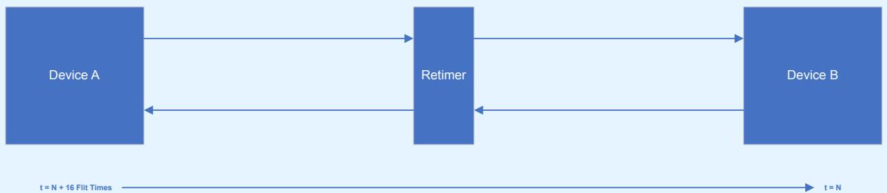

<details>
<summary>flowchart</summary>

```mermaid
graph LR
  A["Device A"] --> B["Retimer"]
  B --> C["Device B"]
  D["t = N + 16 Flt Times"] --> B
  B --> C
```
</details>

<table><tr><td>Payload Flit 18√</td><td>Payload Flit 17√</td><td>Payload Flit 16√</td><td>Payload Flit 18√</td><td>Payload Flit 17√</td><td>Payload Flit 16✗</td><td>NOP Flit 15✗</td><td>Payload Flit 15√</td><td>Payload Flit 12√</td><td>NOP Flit 14√</td><td>Payload Flit 14√</td><td>Payload Flit 13√</td><td>Payload Flit 12✗</td><td>Payload Flit 11√</td><td>NOP Flit 10✗</td><td>Payload Flit 10√</td></tr><tr><td>Flit Usage: 01b</td><td>Flit Usage: 01b</td><td>Flit Usage: 01b</td><td>Flit Usage: 01b</td><td>Flit Usage: 01b</td><td>Flit Usage: 01b</td><td>Flit Usage: 00b</td><td>Flit Usage: 01b</td><td>Flit Usage: 01b</td><td>Flit Usage: 00b</td><td>Flit Usage: 01b</td><td>Flit Usage: 01b</td><td>Flit Usage: 01b</td><td>Flit Usage: 01b</td><td>Flit Usage: 00b</td><td>Flit Usage: 01b</td></tr><tr><td>Prior Flit: Payload</td><td>Prior Flit: Payload</td><td>Prior Flit: Payload</td><td>Prior Flit: Payload</td><td>Prior Flit: Payload</td><td>Prior Flit: NOP</td><td>Prior Flit: Payload</td><td>Prior Flit: Payload</td><td>Prior Flit: NOP</td><td>Prior Flit: Payload</td><td>Prior Flit: Payload</td><td>Prior Flit: Payload</td><td>Prior Flit: Payload</td><td>Prior Flit: NOP</td><td>Prior Flit: Payload</td><td>Prior Flit: Payload</td></tr><tr><td>Replay Cmd: Explicit</td><td>Replay Cmd: Explicit</td><td>Replay Cmd: Explicit</td><td>Replay Cmd: Ack/Nak</td><td>Replay Cmd: Ack/Nak</td><td>Replay Cmd: Ack/Nak</td><td>Replay Cmd: Explicit</td><td>Replay Cmd: Explicit</td><td>Replay Cmd: Explicit</td><td>Replay Cmd: Ack/Nak</td><td>Replay Cmd: Ack/Nak</td><td>Replay Cmd: Ack/Nak</td><td>Replay Cmd: Ack/Nak</td><td>Replay Cmd: Ack/Nak</td><td>Replay Cmd: Ack/Nak</td><td>Replay Cmd: Ack/Nak</td></tr></table>

Figur§e 4-33 Flit Ack/Nak/Replay Example

## IMPLEMENTATION NOTE:

## TRANSMITTER THROTTLING AFTER SELECTIVE REPLAY §

In some situations, it will reduce link latency if the transmitter throttles its Flit transmission rate after sending a Selective Replay Flit.

When the receiver issues a Selective Nak and is waiting for the selective replay, it stores valid Payload Flits in an RX retry buffer and processes these Flits after the selective replay is received. Payload Flits that arrive after the selective replay must also be stored in the RX retry buffer. All Payload Flits are processed in sequence number order.

Without transmitter throttling, this RX retry buffer adds latency to the receive path since all the entries must be consumed in order. Latency can be reduced and this performance impact can be mitigated if the transmitter throttles Flit transmission earlier allowing the RX retry buffer to drain. This early transmitter throttling does not affect overall performance – the TLPs that get delayed at the transmitter would have been delayed at the receiver. Performing early throttling at the transmitter allows the RX retry buffer to drain so that subsequent TLPs have reduced latency.

Throttling is only needed when the Link is operating at the drain rate of the receiver. If the Link is operating at a reduced width (e.g., due to L0p), throttling may not be needed as the RX retry buffer drain rate may be faster than the Link rate.

To compute how to throttle, the Transmitter can assume that the initial link width is the drain rate of the receiver. On receiving a selective Nak, the Transmitter can compute the number of Payload Flits in the Receiver’s RX retry buffer (or on the way to that buffer) since it knows how many Payload Flits are currently in its TX retry buffer. The transmitter should throttle and/or enforce a certain bandwidth efficiency (i.e., restrict the number of NOP TLPs in a Payload Flit) in each new Payload Flit it transmits from its Transaction Layer to allow the Receiver’s RX retry buffer to drain.

For example, suppose a x8 Link receives a selective Nak for Flit number X and the Transmitter has sent 4 Payload Flits after it initially sent Flit number X. In this case, the transmitter should throttle its upper layers to create a 4 Flit “bubble”. For a x8 Link, Flits are 16 Symbols and SKP Ordered Sets are 32 Symbols so this “bubble” is either 4 NOP Flits, 2 NOP Flits and 1 SKP Ordered Set, or 2 SKP Ordered Sets. One mechanism to implement the throttling is for the transmitter to enforce <Y% NOP TLPs (e.g., Y = 25) in its Payload Flits until it has sent the “bubble” (if TLPs are constantly being transmitted this could take 2 SKP Ordered Sets).

## 4.2.3.4.3 CRC Bytes in Flit §

The CRC generator polynomial, defined over GF $( 2 ^ { 8 } )$ , is $\operatorname { g } ( \mathsf { x } ) = ( \mathsf { x } + \mathsf { a } ) ( \mathsf { x } + \mathsf { a } ^ { 2 } ) \ldots ( \mathsf { x } + \mathsf { a } ^ { 8 } )$ , where α is the root of the primitive polynomial of degree $8 : x ^ { 8 } + x ^ { 5 } + x ^ { 3 } + x + 1$ . Thus, $\operatorname { g } ( \mathsf { x } ) = \mathsf { x } ^ { 8 } + \mathsf { a } ^ { 1 7 2 } \mathsf { x } ^ { 7 } + \mathsf { a } ^ { 1 1 6 } \mathsf { x } ^ { 6 } + \mathsf { a } ^ { 1 8 6 } \mathsf { x } ^ { 5 } + \mathsf { a } ^ { 1 7 2 } \mathsf { x } ^ { 4 } + \mathsf { a } ^ { 1 9 5 } \mathsf { x } ^ { 3 } + \mathsf { a } ^ { 1 3 4 } \mathsf { x } ^ { 2 } + \mathsf { a } ^ { 1 9 9 } \mathsf { x } + \mathsf { a } ^ { 3 6 }$ . § Figure 4-34 demonstrates how CRC bytes are generated for the Transmit as well as Receive side. On the Receive side the generated CRC bytes are compared against the received CRC bytes (after the FEC decode/ correct) and any mismatch represents an uncorrectable error.

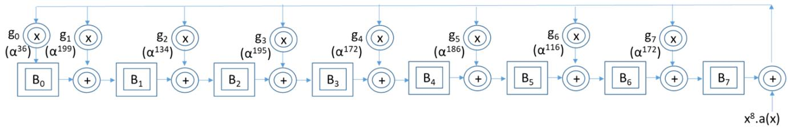

<details>
<summary>flowchart</summary>

Signal processing flowchart with 16 sequential blocks labeled B0 to B7, each containing addition and feedback loops with associated parameters.
</details>

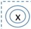

GF(28) multiplication


GF(28) addition

Bo- B7: CRC Bytes

a(x): Information Bytes as a polynomial over GF(28)

(Legend)

Bytes 0-241 form the input a(x) whereas B0-B7 represent CRC0-crc7

Figure 4-34 CRC generation/ checking in Flit§

The CRC generator using MATLAB code to output the generator matrix, the generator matrix, as well as the RTL code is provided in § Appendix K. . The CRC bytes are generated by 242 Bytes of Data \* Gen Matrix. Thus, Data is 1x1936 bits, Gen matrix is 1936x64 bits. Data is arranged from MSB to LSB – [(241,7), (241,6), (241,5), (241,4) ……….. (0,7), (0,6),(0,5),(0,4),(0,3),(0,2),(0,1),(0,0)] where (x,y) is yth bit of xth byte. The generator matrix appears in § Appendix K. and must be considered the standard to implement the CRC during encode and decode. Any pipelined implementation must match this mechanism. The code is provided for the Transmit side. It takes 242 Bytes as input and generates the 8B of CRC. On the Receive side, after the ECC decode/ correction, the first 242 Bytes of the Flit will be used to generate the expected 8 Bytes of CRC and each of these 8 Bytes will be compared against the received 8B of CRC. Any mismatch results in the Flit being declared not Valid and a replay requested, if needed, as described earlier.

## 4.2.3.4.4 ECC Bytes in Flit §

The FEC code is a 3-way interleaved, as described before, where the ECC Symbols are defined over ${ \mathsf { G F } } ( 2 ^ { 8 } )$ . Thus, three consecutive Bytes in a wire belong to three different ECC groups, as shown by different colors in § Table 4-10 through § Table 4-14. Thus, any burst of length ≤ 16 in a wire is guaranteed not to impact more than one Symbol in a code word which is capable of correcting single byte errors in an effort to minimize the FEC latency.

A sample RTL code for the FEC is provided in § Appendix J. . The rest of this section describes the construction of the FEC code. The sample RTL in the appendix is the reference should any confusion arise out of the description here. While an implementation may follow a different approach (e.g., pipelining), it must still match the RTL sample results for all permutations of values in the bytes both for the encoder as well as the decoder function.

Let α be the root of a primitive polynomial $x ^ { 8 } + x ^ { 4 } + x ^ { 3 } + x ^ { 2 } + 1$ (represented as 0x1D). Hence, $a ^ { 8 } = a ^ { 4 } + a ^ { 3 } + a ^ { 2 } + 1$ which can also be represented as {0001\_1101}. Thus, each 8-bit symbol (over $\mathsf { G F } ( 2 ^ { 8 } ) )$ can be expressed as a polynomial as powers of alpha (1 through 254) or as a degree 8 polynomial. We calculate powers of α along with an 8-bit representation as ${ \mathfrak { a } } ^ { 0 } \left( - 1 \right) : \left\{ 0 0 0 0 _ { - } 0 0 0 1 \right\} , { \mathfrak { a } } ^ { 1 } : \left\{ 0 0 0 0 _ { - } 0 0 1 0 \right\} , \ldots , { \mathfrak { a } } ^ { 7 } : \left\{ 1 0 0 0 _ { - } 0 0 0 0 \right\} , { \mathfrak { a } } ^ { 8 } : \left\{ 0 0 0 1 _ { - } 1 1 0 1 \right\} , \ldots , { \mathfrak { a } } ^ { 2 5 5 } = 1$ 255 distinct numbers as powers of α (all 0s is not a power of α), as shown in § Figure 4-35. The log function is given in § Figure 4-36 (which is basically the inverse of constructing the power of α from a given 8-bit non-zero Syndrome which will be used for error correction). The H matrix consists of two parts: Horizontal Parity and Check bits, as shown in § Figure 4-37 and § Figure 4-38. The Horizontal Parity is the bit-wise XORs of Symbols (see § Equation 4-1). The Check bits (see § Equation 4-2) is similar to a CRC calculation represented as follows:

$$
P = \sum_ {i = 0} ^ {8 3} B _ {i}
$$

Equation 4-1 Parity bytes

$$
C = \sum_ {i = 0} ^ {8 3} B _ {i} \times \alpha^ {(8 4 - i)}
$$

Equation 4-2 Check bytes

§

§

α is the root of the primitive polynomial $x ^ { 8 } + x ^ { 4 } + x ^ { 3 } + x ^ { 2 } + 1$ i → αi (in hex)

<table><tr><td>00:</td><td>01</td><td>01:</td><td>02</td><td>02:</td><td>04</td><td>03:</td><td>08</td><td>04:</td><td>10</td><td>05:</td><td>20</td><td>06:</td><td>40</td><td>07:</td><td>80</td></tr><tr><td>08:</td><td>1d</td><td>09:</td><td>3a</td><td>0a:</td><td>74</td><td>0b:</td><td>e8</td><td>0c:</td><td>cd</td><td>0d:</td><td>87</td><td>0e:</td><td>13</td><td>0f:</td><td>26</td></tr><tr><td>10:</td><td>4c</td><td>11:</td><td>98</td><td>12:</td><td>2d</td><td>13:</td><td>5a</td><td>14:</td><td>b4</td><td>15:</td><td>75</td><td>16:</td><td>ea</td><td>17:</td><td>c9</td></tr><tr><td>18:</td><td>8f</td><td>19:</td><td>03</td><td>1a:</td><td>06</td><td>1b:</td><td>0c</td><td>1c:</td><td>18</td><td>1d:</td><td>30</td><td>1e:</td><td>60</td><td>1f:</td><td>c0</td></tr><tr><td>20:</td><td>9d</td><td>21:</td><td>27</td><td>22:</td><td>4e</td><td>23:</td><td>9c</td><td>24:</td><td>25</td><td>25:</td><td>4a</td><td>26:</td><td>94</td><td>27:</td><td>35</td></tr><tr><td>28:</td><td>6a</td><td>29:</td><td>d4</td><td>2a:</td><td>b5</td><td>2b:</td><td>77</td><td>2c:</td><td>ee</td><td>2d:</td><td>c1</td><td>2e:</td><td>9f</td><td>2f:</td><td>23</td></tr><tr><td>30:</td><td>46</td><td>31:</td><td>8c</td><td>32:</td><td>05</td><td>33:</td><td>0a</td><td>34:</td><td>14</td><td>35:</td><td>28</td><td>36:</td><td>50</td><td>37:</td><td>a0</td></tr><tr><td>38:</td><td>5d</td><td>39:</td><td>ba</td><td>3a:</td><td>69</td><td>3b:</td><td>d2</td><td>3c:</td><td>b9</td><td>3d:</td><td>6f</td><td>3e:</td><td>de</td><td>3f:</td><td>a1</td></tr><tr><td>40:</td><td>5f</td><td>41:</td><td>be</td><td>42:</td><td>61</td><td>43:</td><td>c2</td><td>44:</td><td>99</td><td>45:</td><td>2f</td><td>46:</td><td>5e</td><td>47:</td><td>bc</td></tr><tr><td>48:</td><td>65</td><td>49:</td><td>ca</td><td>4a:</td><td>89</td><td>4b:</td><td>0f</td><td>4c:</td><td>1e</td><td>4d:</td><td>3c</td><td>4e:</td><td>78</td><td>4f:</td><td>f0</td></tr><tr><td>50:</td><td>fd</td><td>51:</td><td>e7</td><td>52:</td><td>d3</td><td>53:</td><td>bb</td><td>54:</td><td>6b</td><td>55:</td><td>d6</td><td>56:</td><td>b1</td><td>57:</td><td>7f</td></tr><tr><td>58:</td><td>fe</td><td>59:</td><td>e1</td><td>5a:</td><td>df</td><td>5b:</td><td>a3</td><td>5c:</td><td>5b</td><td>5d:</td><td>b6</td><td>5e:</td><td>71</td><td>5f:</td><td>e2</td></tr><tr><td>60:</td><td>d9</td><td>61:</td><td>af</td><td>62:</td><td>43</td><td>63:</td><td>86</td><td>64:</td><td>11</td><td>65:</td><td>22</td><td>66:</td><td>44</td><td>67:</td><td>88</td></tr><tr><td>68:</td><td>0d</td><td>69:</td><td>1a</td><td>6a:</td><td>34</td><td>6b:</td><td>68</td><td>6c:</td><td>d0</td><td>6d:</td><td>bd</td><td>6e:</td><td>67</td><td>6f:</td><td>ce</td></tr><tr><td>70:</td><td>81</td><td>71:</td><td>1f</td><td>72:</td><td>3e</td><td>73:</td><td>7c</td><td>74:</td><td>f8</td><td>75:</td><td>ed</td><td>76:</td><td>c7</td><td>77:</td><td>93</td></tr><tr><td>78:</td><td>3b</td><td>79:</td><td>76</td><td>7a:</td><td>ec</td><td>7b:</td><td>c5</td><td>7c:</td><td>97</td><td>7d:</td><td>33</td><td>7e:</td><td>66</td><td>7f:</td><td>cc</td></tr><tr><td>80:</td><td>85</td><td>81:</td><td>17</td><td>82:</td><td>2e</td><td>83:</td><td>5c</td><td>84:</td><td>b8</td><td>85:</td><td>6d</td><td>86:</td><td>da</td><td>87:</td><td>a9</td></tr><tr><td>88:</td><td>4f</td><td>89:</td><td>9e</td><td>8a:</td><td>21</td><td>8b:</td><td>42</td><td>8c:</td><td>84</td><td>8d:</td><td>15</td><td>8e:</td><td>2a</td><td>8f:</td><td>54</td></tr><tr><td>90:</td><td>a8</td><td>91:</td><td>4d</td><td>92:</td><td>9a</td><td>93:</td><td>29</td><td>94:</td><td>52</td><td>95:</td><td>a4</td><td>96:</td><td>55</td><td>97:</td><td>aa</td></tr><tr><td>98:</td><td>49</td><td>99:</td><td>92</td><td>9a:</td><td>39</td><td>9b:</td><td>72</td><td>9c:</td><td>e4</td><td>9d:</td><td>d5</td><td>9e:</td><td>b7</td><td>9f:</td><td>73</td></tr><tr><td>a0:</td><td>e6</td><td>a1:</td><td>d1</td><td>a2:</td><td>bf</td><td>a3:</td><td>63</td><td>a4:</td><td>c6</td><td>a5:</td><td>91</td><td>a6:</td><td>3f</td><td>a7:</td><td>7e</td></tr><tr><td>a8:</td><td>fc</td><td>a9:</td><td>e5</td><td>aa:</td><td>d7</td><td>ab:</td><td>b3</td><td>ac:</td><td>7b</td><td>ad:</td><td>f6</td><td>ae:</td><td>f1</td><td>af:</td><td>ff</td></tr><tr><td>b0:</td><td>e3</td><td>b1:</td><td>db</td><td>b2:</td><td>ab</td><td>b3:</td><td>4b</td><td>b4:</td><td>96</td><td>b5:</td><td>31</td><td>b6:</td><td>62</td><td>b7:</td><td>c4</td></tr><tr><td>b8:</td><td>95</td><td>b9:</td><td>37</td><td>ba:</td><td>6e</td><td>bb:</td><td>dc</td><td>bc:</td><td>a5</td><td>bd:</td><td>57</td><td>be:</td><td>ae</td><td>bf:</td><td>41</td></tr><tr><td>c0:</td><td>82</td><td>c1:</td><td>19</td><td>c2:</td><td>32</td><td>c3:</td><td>64</td><td>c4:</td><td>c8</td><td>c5:</td><td>8d</td><td>c6:</td><td>07</td><td>c7:</td><td>0e</td></tr><tr><td>c8:</td><td>1c</td><td>c9:</td><td>38</td><td>ca:</td><td>70</td><td>cb:</td><td>e0</td><td>cc:</td><td>dd</td><td>cd:</td><td>a7</td><td>ce:</td><td>53</td><td>cf:</td><td>a6</td></tr><tr><td>d0:</td><td>51</td><td>d1:</td><td>a2</td><td>d2:</td><td>59</td><td>d3:</td><td>b2</td><td>d4:</td><td>79</td><td>d5:</td><td>f2</td><td>d6:</td><td>f9</td><td>d7:</td><td>ef</td></tr><tr><td>d8:</td><td>c3</td><td>d9:</td><td>9b</td><td>da:</td><td>2b</td><td>db:</td><td>56</td><td>dc:</td><td>ac</td><td>dd:</td><td>45</td><td>de:</td><td>8a</td><td>df:</td><td>09</td></tr><tr><td>e0:</td><td>12</td><td>e1:</td><td>24</td><td>e2:</td><td>48</td><td>e3:</td><td>90</td><td>e4:</td><td>3d</td><td>e5:</td><td>7a</td><td>e6:</td><td>f4</td><td>e7:</td><td>f5</td></tr><tr><td>e8:</td><td>f7</td><td>e9:</td><td>f3</td><td>ea:</td><td>fb</td><td>eb:</td><td>eb</td><td>ec:</td><td>cb</td><td>ed:</td><td>8b</td><td>ee:</td><td>0b</td><td>ef:</td><td>16</td></tr><tr><td>f0:</td><td>2c</td><td>f1:</td><td>58</td><td>f2:</td><td>b0</td><td>f3:</td><td>7d</td><td>f4:</td><td>fa</td><td>f5:</td><td>e9</td><td>f6:</td><td>cf</td><td>f7:</td><td>83</td></tr><tr><td>f8:</td><td>1b</td><td>f9:</td><td>36</td><td>fa:</td><td>6c</td><td>fb:</td><td>d8</td><td>fc:</td><td>ad</td><td>fd:</td><td>47</td><td>fe:</td><td>8e</td><td>ff:</td><td>01</td></tr></table>

§

Figure 4-35 FEC Table: i to αi

α is the root of the primitive polynomial $x ^ { 8 } + x ^ { 4 } + x ^ { 3 } + x ^ { 2 } + 1$

αi → i (in hex)

<table><tr><td>00:</td><td>ff</td><td>01:</td><td>00</td><td>02:</td><td>01</td><td>03:</td><td>19</td><td>04:</td><td>02</td><td>05:</td><td>32</td><td>06:</td><td>1a</td><td>07:</td><td>c6</td></tr><tr><td>08:</td><td>03</td><td>09:</td><td>df</td><td>0a:</td><td>33</td><td>0b:</td><td>ee</td><td>0c:</td><td>1b</td><td>0d:</td><td>68</td><td>0e:</td><td>c7</td><td>0f:</td><td>4b</td></tr><tr><td>10:</td><td>04</td><td>11:</td><td>64</td><td>12:</td><td>e0</td><td>13:</td><td>0e</td><td>14:</td><td>34</td><td>15:</td><td>8d</td><td>16:</td><td>ef</td><td>17:</td><td>81</td></tr><tr><td>18:</td><td>1c</td><td>19:</td><td>c1</td><td>1a:</td><td>69</td><td>1b:</td><td>f8</td><td>1c:</td><td>c8</td><td>1d:</td><td>08</td><td>1e:</td><td>4c</td><td>1f:</td><td>71</td></tr><tr><td>20:</td><td>05</td><td>21:</td><td>8a</td><td>22:</td><td>65</td><td>23:</td><td>2f</td><td>24:</td><td>e1</td><td>25:</td><td>24</td><td>26:</td><td>0f</td><td>27:</td><td>21</td></tr><tr><td>28:</td><td>35</td><td>29:</td><td>93</td><td>2a:</td><td>8e</td><td>2b:</td><td>da</td><td>2c:</td><td>f0</td><td>2d:</td><td>12</td><td>2e:</td><td>82</td><td>2f:</td><td>45</td></tr><tr><td>30:</td><td>1d</td><td>31:</td><td>b5</td><td>32:</td><td>c2</td><td>33:</td><td>7d</td><td>34:</td><td>6a</td><td>35:</td><td>27</td><td>36:</td><td>f9</td><td>37:</td><td>b9</td></tr><tr><td>38:</td><td>c9</td><td>39:</td><td>9a</td><td>3a:</td><td>09</td><td>3b:</td><td>78</td><td>3c:</td><td>4d</td><td>3d:</td><td>e4</td><td>3e:</td><td>72</td><td>3f:</td><td>a6</td></tr><tr><td>40:</td><td>06</td><td>41:</td><td>bf</td><td>42:</td><td>8b</td><td>43:</td><td>62</td><td>44:</td><td>66</td><td>45:</td><td>dd</td><td>46:</td><td>30</td><td>47:</td><td>fd</td></tr><tr><td>48:</td><td>e2</td><td>49:</td><td>98</td><td>4a:</td><td>25</td><td>4b:</td><td>b3</td><td>4c:</td><td>10</td><td>4d:</td><td>91</td><td>4e:</td><td>22</td><td>4f:</td><td>88</td></tr><tr><td>50:</td><td>36</td><td>51:</td><td>d0</td><td>52:</td><td>94</td><td>53:</td><td>ce</td><td>54:</td><td>8f</td><td>55:</td><td>96</td><td>56:</td><td>db</td><td>57:</td><td>bd</td></tr><tr><td>58:</td><td>f1</td><td>59:</td><td>d2</td><td>5a:</td><td>13</td><td>5b:</td><td>5c</td><td>5c:</td><td>83</td><td>5d:</td><td>38</td><td>5e:</td><td>46</td><td>5f:</td><td>40</td></tr><tr><td>60:</td><td>1e</td><td>61:</td><td>42</td><td>62:</td><td>b6</td><td>63:</td><td>a3</td><td>64:</td><td>c3</td><td>65:</td><td>48</td><td>66:</td><td>7e</td><td>67:</td><td>6e</td></tr><tr><td>68:</td><td>6b</td><td>69:</td><td>3a</td><td>6a:</td><td>28</td><td>6b:</td><td>54</td><td>6c:</td><td>fa</td><td>6d:</td><td>85</td><td>6e:</td><td>ba</td><td>6f:</td><td>3d</td></tr><tr><td>70:</td><td>ca</td><td>71:</td><td>5e</td><td>72:</td><td>9b</td><td>73:</td><td>9f</td><td>74:</td><td>0a</td><td>75:</td><td>15</td><td>76:</td><td>79</td><td>77:</td><td>2b</td></tr><tr><td>78:</td><td>4e</td><td>79:</td><td>d4</td><td>7a:</td><td>e5</td><td>7b:</td><td>ac</td><td>7c:</td><td>73</td><td>7d:</td><td>f3</td><td>7e:</td><td>a7</td><td>7f:</td><td>57</td></tr><tr><td>80:</td><td>07</td><td>81:</td><td>70</td><td>82:</td><td>c0</td><td>83:</td><td>f7</td><td>84:</td><td>8c</td><td>85:</td><td>80</td><td>86:</td><td>63</td><td>87:</td><td>0d</td></tr><tr><td>88:</td><td>67</td><td>89:</td><td>4a</td><td>8a:</td><td>de</td><td>8b:</td><td>ed</td><td>8c:</td><td>31</td><td>8d:</td><td>c5</td><td>8e:</td><td>fe</td><td>8f:</td><td>18</td></tr><tr><td>90:</td><td>e3</td><td>91:</td><td>a5</td><td>92:</td><td>99</td><td>93:</td><td>77</td><td>94:</td><td>26</td><td>95:</td><td>b8</td><td>96:</td><td>b4</td><td>97:</td><td>7c</td></tr><tr><td>98:</td><td>11</td><td>99:</td><td>44</td><td>9a:</td><td>92</td><td>9b:</td><td>d9</td><td>9c:</td><td>23</td><td>9d:</td><td>20</td><td>9e:</td><td>89</td><td>9f:</td><td>2e</td></tr><tr><td>a0:</td><td>37</td><td>a1:</td><td>3f</td><td>a2:</td><td>d1</td><td>a3:</td><td>5b</td><td>a4:</td><td>95</td><td>a5:</td><td>bc</td><td>a6:</td><td>cf</td><td>a7:</td><td>cd</td></tr><tr><td>a8:</td><td>90</td><td>a9:</td><td>87</td><td>aa:</td><td>97</td><td>ab:</td><td>b2</td><td>ac:</td><td>dc</td><td>ad:</td><td>fc</td><td>ae:</td><td>be</td><td>af:</td><td>61</td></tr><tr><td>b0:</td><td>f2</td><td>b1:</td><td>56</td><td>b2:</td><td>d3</td><td>b3:</td><td>ab</td><td>b4:</td><td>14</td><td>b5:</td><td>2a</td><td>b6:</td><td>5d</td><td>b7:</td><td>9e</td></tr><tr><td>b8:</td><td>84</td><td>b9:</td><td>3c</td><td>ba:</td><td>39</td><td>bb:</td><td>53</td><td>bc:</td><td>47</td><td>bd:</td><td>6d</td><td>be:</td><td>41</td><td>bf:</td><td>a2</td></tr><tr><td>c0:</td><td>1f</td><td>c1:</td><td>2d</td><td>c2:</td><td>43</td><td>c3:</td><td>d8</td><td>c4:</td><td>b7</td><td>c5:</td><td>7b</td><td>c6:</td><td>a4</td><td>c7:</td><td>76</td></tr><tr><td>c8:</td><td>c4</td><td>c9:</td><td>17</td><td>ca:</td><td>49</td><td>cb:</td><td>ec</td><td>cc:</td><td>7f</td><td>cd:</td><td>0c</td><td>ce:</td><td>6f</td><td>cf:</td><td>f6</td></tr><tr><td>d0:</td><td>6c</td><td>d1:</td><td>a1</td><td>d2:</td><td>3b</td><td>d3:</td><td>52</td><td>d4:</td><td>29</td><td>d5:</td><td>9d</td><td>d6:</td><td>55</td><td>d7:</td><td>aa</td></tr><tr><td>d8:</td><td>fb</td><td>d9:</td><td>60</td><td>da:</td><td>86</td><td>db:</td><td>b1</td><td>dc:</td><td>bb</td><td>dd:</td><td>cc</td><td>de:</td><td>3e</td><td>df:</td><td>5a</td></tr><tr><td>e0:</td><td>cb</td><td>e1:</td><td>59</td><td>e2:</td><td>5f</td><td>e3:</td><td>b0</td><td>e4:</td><td>9c</td><td>e5:</td><td>a9</td><td>e6:</td><td>a0</td><td>e7:</td><td>51</td></tr><tr><td>e8:</td><td>0b</td><td>e9:</td><td>f5</td><td>ea:</td><td>16</td><td>eb:</td><td>eb</td><td>ec:</td><td>7a</td><td>ed:</td><td>75</td><td>ee:</td><td>2c</td><td>ef:</td><td>d7</td></tr><tr><td>f0:</td><td>4f</td><td>f1:</td><td>ae</td><td>f2:</td><td>d5</td><td>f3:</td><td>e9</td><td>f4:</td><td>e6</td><td>f5:</td><td>e7</td><td>f6:</td><td>ad</td><td>f7:</td><td>e8</td></tr><tr><td>f8:</td><td>74</td><td>f9:</td><td>d6</td><td>fa:</td><td>f4</td><td>fb:</td><td>ea</td><td>fc:</td><td>a8</td><td>fd:</td><td>50</td><td>fe:</td><td>58</td><td>ff:</td><td>af</td></tr></table>

Figure 4-36 FEC Log Table: αi to i

$$
H = \left| \begin{array}{c c c c c c} 1 & 1 & ... & 1 & 0 & 1 \\ \alpha^ {8 5} & \alpha^ {8 4} & ... & \alpha & 1 & 0 \end{array} \right| \begin{array}{l} \text {Row Parity} \\ \text {Check Bits} \end{array}
$$

§

Figure 4-37 H-matrix of the FEC

<table><tr><td></td><td> $B_0$ </td><td>...</td><td> $B_{82}$ </td><td> $B_{83}$ </td><td> $B_{84}$ </td><td> $B_{85}$ </td></tr><tr><td>0</td><td> $\alpha^{85}$ </td><td>...</td><td> $\alpha^2$ </td><td> $\alpha$ </td><td>1</td><td> $p_0$ </td></tr><tr><td>1</td><td> $\alpha^{86}$ </td><td>...</td><td> $\alpha^3$ </td><td> $\alpha^2$ </td><td> $\alpha$ </td><td> $p_1$ </td></tr><tr><td>2</td><td> $\alpha^{87}$ </td><td>...</td><td> $\alpha^4$ </td><td> $\alpha^3$ </td><td> $\alpha^2$ </td><td> $p_2$ </td></tr><tr><td>3</td><td> $\alpha^{88}$ </td><td>...</td><td> $\alpha^5$ </td><td> $\alpha^4$ </td><td> $\alpha^3$ </td><td> $p_3$ </td></tr><tr><td>4</td><td> $\alpha^{89}$ </td><td>...</td><td> $\alpha^6$ </td><td> $\alpha^5$ </td><td> $\alpha^4$ </td><td> $p_4$ </td></tr><tr><td>5</td><td> $\alpha^{90}$ </td><td>...</td><td> $\alpha^7$ </td><td> $\alpha^6$ </td><td> $\alpha^5$ </td><td> $p_5$ </td></tr><tr><td>6</td><td> $\alpha^{91}$ </td><td>...</td><td> $\alpha^8$ </td><td> $\alpha^7$ </td><td> $\alpha^6$ </td><td> $p_6$ </td></tr><tr><td>7</td><td> $\alpha^{92}$ </td><td>...</td><td> $\alpha^9$ </td><td> $\alpha^8$ </td><td> $\alpha^7$ </td><td> $p_7$ </td></tr></table>

Check Bits  
Row Parity [N-3:0]  
Powers of alpha for the check bits for Bytes 0 to 84

Figure 4-38 Weight of check bits for different Bytes/bits§

The Transmitter has to calculate BN-1 (horizontal parity) and BN-2 (Check Symbol) during encoding from the remaining (N-2) Bytes, as described above. The same mechanism will be used to compute the corresponding two Syndrome bytes at the Receiver. N = 86. However, only one of the three groups has 86B in its code word, whereas the other two have 85 Bytes each to form the 256B Flit. This is resolved by forcing B83 = 0 for the information part so that two groups that have 85 Bytes each effectively become 86B with 84B as information (the last Byte being 0) and two Bytes of ECC. The mapping of the Flit Byte i to an ECC group and the Byte-offset within the group can be derived as follows:

For $0 \leq i \leq 249$ ,
Byte i in Flit is mapped to ECC Group i mod 3
with Byte Offset floor(i/3)
ECC Group 1 Byte Offset 83 is 0
ECC Group 2 Byte Offset 83 is 0
For $250 \leq i \leq 255$ (the ECC Bytes),
Byte i in Flit is mapped to ECC Group (i-249) mod 3
with Byte Offset ceil(i/3)  
Thus:

• Byte 0 of Flit maps to ECC Group 0, Byte offset 0;  
• Byte 1 of Flit maps to ECC Group 1, Byte offset 0;  
• Byte 2 of Flit maps to ECC group 2, Byte offset 0;  
• Byte 3 of Flit maps to ECC Group 0, Byte offset 1;  
• Byte 4 of Flit maps to ECC Group 1, Byte offset 1;  
  
• Byte 248 maps to ECC group 2, Byte Offset 82;  
• Byte 249 maps to ECC group 0, Byte offset 83.  
• ECC group 1, Byte offset 83 is 00h.  
• ECC group 2, Byte offset 83 is 00h.

The ECC Bytes are then allocated as:

• Bytes 250 and 253 of the Flit maps to ECC Group 1, Byte offsets 84 and 85 respectively;

• Bytes 251 and 254 of the Flit maps to ECC Group 2, Byte offsets 84 and 85 respectively; and

• Bytes 252 and 255 of the Flit maps to ECC Group 0, Bytes offsets 84 and 85 respectively.

The basic idea is that horizontal parity (Synd\_Parity) identifies the bits in the Symbol (or Byte) that has flipped and the check bits (Synd\_Check) identifies the Symbol number that has the error. Looking at the expanded bit arrangement, one can see that knowing the bit positions one can reverse map the column number. § Figure 4-39 shows the ECC decode function. The Syndrome Parity is the XOR of B0..B83 and B85 (Synd\_Parity). The Syndrome Check (Synd\_Check) is calculated by computing the expected B84 from B0..B83 received and XORing with received B84. Once the two Syndrome Symbols (Bytes) are calculated, the following steps are taken:

<table><tr><td>Synd_Check</td><td>Synd_Parity</td><td>Description</td></tr><tr><td>= 00h</td><td>= 00h</td><td>No error</td></tr><tr><td>= 00h</td><td>≠ 00h</td><td>Error in B85: Corrected B85 = B85 ^ Synd_Parity</td></tr><tr><td>≠ 00h</td><td>= 00h</td><td>Error in B84: Corrected B84 = B84 ^ Synd_Check</td></tr><tr><td>≠ 00h</td><td>≠ 00h</td><td>Follow the log table for Synd_Check, Synd_Parity and then follow the modulo subtraction +1 logic to identify the failing column number. It is possible that we point to a non-existing column, in that case it is an uncorrectable error. Once the column number is known, we can correct the Symbol and the corresponding CRC correction (if applicable)</td></tr></table>

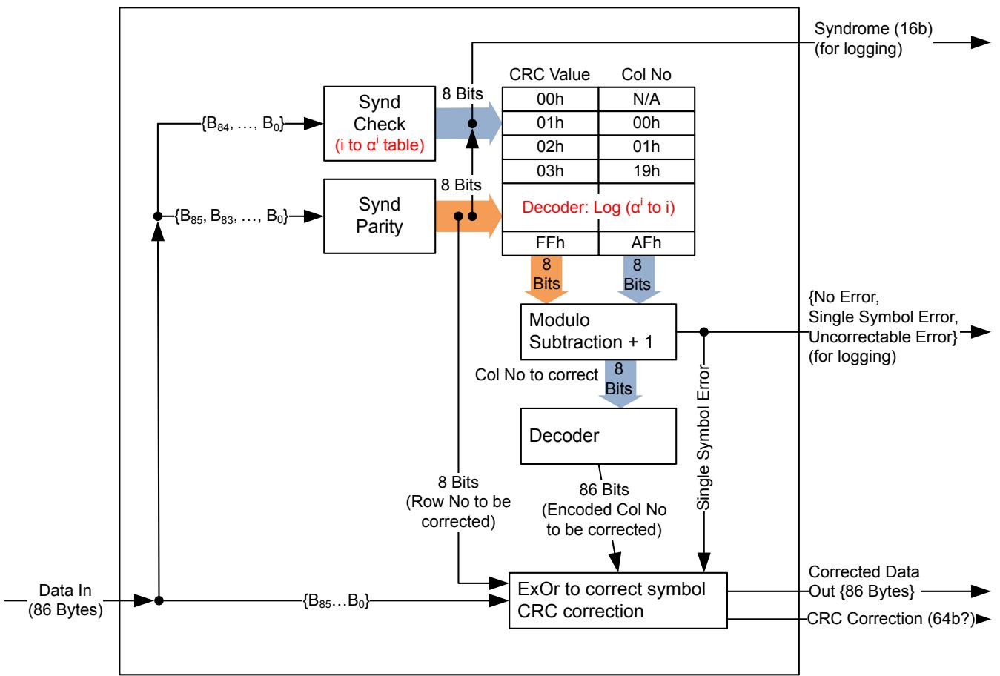

<details>
<summary>flowchart</summary>

```mermaid
graph TD
  A["Synd Check (i to α¹ table)"] -->|8 Bits| B["Decoder: Log (α¹ to i)"]
  C["Synd Parity"] -->|8 Bits| B
  B --> D["Modulo Subtraction + 1"]
  D -->|8 Bits| E["Decoder"]
  E -->|86 Bits Encoded Col No to be corrected| F["ExOr to correct symbol CRC correction"]
  F --> G["Corrected Data Out {86 Bytes}"]
  F --> H["CRC Correction (64b?)"]
  I["Data In (86 Bytes)"] --> J["Synd Check"]
  K["{B₈₄, ..., B₀}"] --> A
  L["{B₈₅, B₈₃, ..., B₀}"] --> C
  M["{No Error, Single Symbol Error, Uncorrectable Error} (for logging)"] --> D
  N["{No Error, Single Symbol Error, Uncorrectable Error}"] --> E
  O["{No Error, Single Symbol Error, Uncorrectable Error}"] --> F
  P["{No Error, Single Symbol Error, Uncorrectable Error}"] --> G
  Q["{No Error, Single Symbol Error, Uncorrectable Error}"] --> H
  R["{No Error, Single Symbol Error, Uncorrectable Error}"] --> F
  S["{No Error, Single Symbol Error, Uncorrectable Error}"] --> G
  T["{No Error, Single Symbol Error, Uncorrectable Error}"] --> H
  U["{No Error, Single Symbol Error, Uncorrectable Error}"] --> F
  V["{No Error, Single Symbol Error, Uncorrectable Error}"] --> G
  W["{No Error, Single Symbol Error, Uncorrectable Error}"] --> H
  X["{No Error, Single Symbol Error, Uncorrectable Error}"] --> F
  Y["{No Error, Single Symbol Error, Uncorrectable Error}"] --> G
  Z["{No Error, Single Symbol Error, Uncorrectable Error}"] --> H
  AA["{No Error, Single Symbol Error, Uncorrectable Error}"] --> F
  AB["{No Error, Single Symbol Error, Uncorrectable Error}"] --> G
  AC["{No Error, Single Symbol Error, Uncorrectable Error}"] --> H
  AD["{No Error, Single Symbol Error, Uncorrectable Error}"] --> F
  AE["{No Error, Single Symbol Error, Uncorrectable Error}"] --> G
  AF["{No Error, Single Symbol Error, Uncorrectable Error}"] --> H
  AG["{No Error, Single Symbol Error, Uncorrectable Error}"] --> F
  AH["{No Error, Single Symbol Error, Uncorrectable Error}"] --> G
  AI["{No Error, Single Symbol Error, Uncorrectable Error}"] --> H
  AJ["{No Error, Single Symbol Error, Uncorrectable Error}"] --> F
  AK["{No Error, Single Symbol Error, Uncorrectable Error}"] --> G
  AL["{No Error, Single Symbol Error, Uncorrectable Error}"] --> H
  AM["{No Error, Single Symbol Error, Uncorrectable Error}"] --> F
  AN["{No Error, Single Symbol Error, Uncorrectable Error}"] --> G
  AO["{No Error, Single Symbol Error, Uncorrectable Error}"] --> H
  AP["{No Error, Single Symbol Error, Uncorrectable Error}"] --> F
  AQ["{No Error, Single Symbol Error, Uncorrectable Error}"] --> G
  AR["{No Error, Single Symbol Error, Uncorrectable Error}"] --> H
  AS["{No Error, Single Symbol Error, Uncorrectable Error}"] --> F
  AT["{No Error, Single Symbol Error, Uncorrectable Error}"] --> G
  AU["{No Error, Single Symbol Error, Uncorrectable Error}"] --> H
  AV["{No Error, Single Symbol Error, Uncorrectable Error}"] --> F
  AW["{No Error, Single Symbol Error, Uncorrectable Error}"] --> G
  AX["{No Error, Single Symbol Error, Uncorrectable Error}"] --> H
  AY["Synd Check"] -->|8 Bits| Z["CRC Value"]
  AZ["Synd Parity"] -->|8 Bits| BA["Decoder: Log (α¹ to i)"]
  BB["Modulo Subtraction + 1"] -->|8 Bits| BC["Decoder"]
  BD["ExOr to correct symbol CRC correction"] -->|8 Bits Row No to be corrected| BE["Decoder"]
  BF["CRC Correction"] -->|Single Symbol Error| BG["Single Symbol Correction"]
```
</details>

§  
Figure 4-39 ECC Decoder function

The Receive side check is as follows on the 256B flit (as shown in § Figure 4-40). Each of the three ECC decoders, performs correction and error reporting as needed. In the final stage of CRC check, a decision is made whether the received flit can be accepted or retried.

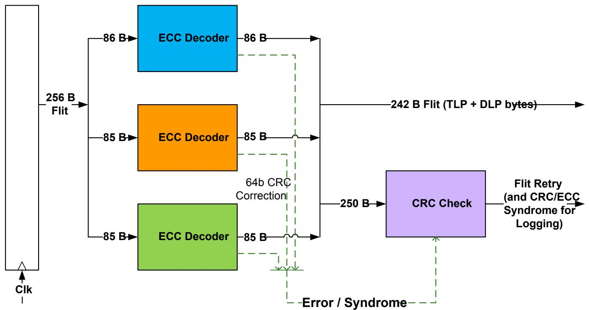

<details>
<summary>flowchart</summary>

```mermaid
graph TD
  A["256 B Flit"] --> B["ECC Decoder"]
  A --> C["ECC Decoder"]
  A --> D["ECC Decoder"]
  B --> E["242 B Flit (TLP + DLP bytes)"]
  C --> F["64b CRC Correction"]
  D --> G["CRC Check"]
  G --> H["Flit Retry (and CRC/ECC Syndrome for Logging)"]
  B --> I["86 B"]
  C --> J["85 B"]
  D --> K["85 B"]
  G --> L["250 B"]
  D --> M["85 B"]
  M --> N["Error / Syndrome"]
  N --> O["CRC Check"]
  O --> P["Error / Syndrome"]
  P --> Q["Clk"]
```
</details>

Figure 4-40 3-way ECC decode followed by CRC check of flit on the Receive side§

## 4.2.3.4.5 Ordered Set insertion in Data Stream in Flit Mode §

For Data Rates of 2.5 GT/s or 5.0 GT/s, the SKP Ordered Set insertion interval does not change (e.g., between 1180 and 1538 Symbols), but occurs at the Flit boundary. The other Ordered Sets that can occur with up-size or down-size with L0p is provided in § Section 4.2.6.7 .

For Data Rates of 8.0 GT/s and above, the following rules apply:

• A Control SKP Ordered Set must immediately follow the SDS Ordered Set sequence marking the start of the Data Stream, irrespective of when the prior Control SKP Ordered Set was transmitted.  
• Once the Data Stream has started, an Ordered Set must be transmitted in fixed intervals, as defined § Table 4-21, as follows:

◦ If the Data Stream will continue, a SKP Ordered Set must be transmitted on all the active (or to be activated) Lanes.

On an up-size with L0p: The Lanes that will be activated to join the active Lanes, an SDS Ordered Set must be transmitted on all the Lanes that will be activated (not in those that are already active) just prior to sending the SKP Ordered Set across all the wider Link, after which Flits will be sent on the wider Link

◦ Else If the Link will enter a low-power state, an EIOSQ must be transmitted on all the active Lanes  
◦ Else (the Link needs to enter Recovery): An EIEOS must be transmitted on all the configured Lanes of the Link  
◦ If the Link enters Recovery, the appropriate SKP Ordered Set must be transmitted immediately after the first Ordered Set (EIEOS).

Table 4-21 Ordered Set insertion interval once Data Stream starts in terms of § number of Flits

<table><tr><td>Link Width and Clocking Modes</td><td>x16</td><td>x8</td><td>x4</td><td>x2</td><td>x1</td></tr><tr><td>Common Clock/SRNS Mode with 1b/1b encoding</td><td>748</td><td>374</td><td>187</td><td>93</td><td>46</td></tr><tr><td>Common Clock/SRNS Mode with 128b/130b encoding</td><td>374</td><td>187</td><td>93</td><td>46</td><td>23</td></tr><tr><td>SRIS Mode with 1b/1b encoding</td><td>74</td><td>37</td><td>18</td><td>9</td><td>4</td></tr><tr><td>SRIS Mode with 128b/130b encoding</td><td>37</td><td>18</td><td>9</td><td>4</td><td>2</td></tr></table>

## IMPLEMENTATION NOTE:

## CONSECUTIVE SKP ORDERED SETS IN FLIT MODE §

Two consecutive SKP Ordered Sets in a Data Stream in Flit Mode are always equidistant for a given width and clocking mode when either 1b/1b encoding or 128b/130b encoding is used. For example, for a x1 Link in SRIS Mode with 128b/130b encoding, a SKP Ordered Set is always sent after two Flits, which will occupy 32 Data Blocks. However, the same spacing cannot be guaranteed with 8b/10b encoding, as the SKPs are “scheduled” every 1180 to 1583 Symbol times in non-SRIS mode and less than 154 Symbol times in SRIS mode. For example, a x1 Link in SRIS mode with 8b/10b encoding sends an average of 1.66 (=256/154) SKP Ordered Sets after every Flit (256 Symbols): sometimes it sends one SKP Ordered Set after every Flit and other times it sends two back-to-back SKP Ordered Sets.

## 4.2.4 Link Equalization Procedure for 8.0 GT/s and Higher Data Rates §

The Link equalization procedure enables components to adjust the Transmitter and the Receiver setup of each Lane to improve the signal quality and meet the requirements specified in § Chapter 8. , when operating at 8.0 GT/s and higher data rates. All the Lanes that are associated with the LTSSM (i.e., those Lanes that are currently operational or may be operational in the future due to Link Upconfigure) must participate in the equalization procedure. The procedure must be executed during the first data rate change to any data rate at 8.0 GT/s or above, unless all components in the Link have advertised that no equalization is needed. Components must arrive at the appropriate Transmitter setup for all the operating conditions and data rates that they will encounter in the future when LinkUp=1b. Components must not require that the equalization procedure be repeated at any data rate for reliable operation, although there is provision to repeat the procedure. Components must store the Transmitter setups that were agreed to during the equalization procedures and use them for future operation at 8.0 GT/s and higher data rates. Components are permitted to fine-tune their Receiver setup even after the equalization procedure is complete as long as doing so does not cause the Link to be unreliable (i.e., does not meet the requirements in § Chapter 8. ) or go to Recovery.

The Link equalization procedure is not required for any data rates and can be completely bypassed if all components in the Link have advertised that no equalization is needed in its TS1/TS2 Ordered Sets or Modified TS1/TS2 Ordered Sets (see § Table 4-25, § Table 4-26, and § Table 4-27). A component may choose to advertise that it does not need equalization at any rates above 5.0 GT/s if it supports 32.0 GT/s or higher data rates and can either operate reliably with equalization settings stored from a prior equalization procedure or does not need equalization for reliable operation.

The equalization procedure can be initiated either autonomously or by software. It is strongly recommended that components use the autonomous mechanism for all the data rates above 5.0 GT/s that they intend to operate in. However, a component that chooses not to participate in the autonomous mechanism for all the data rates above 5.0 GT/s must have its associated software ensure that the software based mechanism is applied to the data rates above 5.0 GT/s where the autonomous mechanism was not applied, prior to operating at that data rate.

Normally, equalization is performed at a higher data rate only if equalization has successfully completed at all lower data rates above 5.0 GT/s. For example, a Link will complete equalization successfully at 8.0 GT/s, followed by 16.0 GT/s, followed by 32.0 GT/s, followed by 64.0 GT/s. However, an optional mechanism to begin the equalization procedures at the highest NRZ rate supported, 32.0 GT/s, is permitted if all components support data rates of 32.0 GT/s or higher and the mechanism is supported by all components in the Link, as advertised in the TS1/TS2 Ordered sets or Modified TS1/ TS2 Ordered Sets. When this optional mechanism is enabled and successfully negotiated between the components, equalization is not performed the 8.0 GT/s and 16.0 GT/s data rates; the equalization procedures are performed at all common data rates above 16.0 GT/s beginning with the 32.0 GT/s data rate For all the data rates above 5.0 GT/s where equalization is not performed (specifically 8.0 GT/s and 16.0 GT/s), the expectation is that the Link will not operate at those data rates and the components will not advertise those data rates (neither 8.0 GT/s nor 16.0 GT/s) as the highest data rate supported. For example, a Link may train to L0 in 2.5 GT/s, enter Recovery and perform equalization at 32.0 GT/ s, and then re-enter Recovery and perform equalization at 64.0 GT/s, skipping equalization at 8.0 GT/s and 16.0 GT/s. In this case, the intended data rates of operation of the Link are 2.5 GT/s, 5.0 GT/s, 32.0 GT/s, or 64.0 GT/s. If any of the equalization procedures attempted at 32.0 GT/s or 64.0 GT/s is unsuccessful even after re-equalization attempts and the Link needs to equalize at lower data rates, the Downstream Port must stop advertising Equalization Bypass to Highest NRZ Rate Support and ensure that the Link returns to operation at 2.5 GT/s or 5.0 GT/s. The required equalization procedures are then performed as they would have been if the optional mechanism to skip over equalization to the highest common data rate(s) was never supported. If the equalization procedure at the highest NRZ rate supported is initially successful but the Link is not able to operate reliably at that data rate, the Downstream Port is permitted to initiate a speed change to any lower data rate followed by an equalization procedure at that rate (when necessary). The requirements of § Table 4-22 must be followed. The Upstream Port must disable Equalization Bypass to Highest NRZ Rate support as soon as an equalization procedure at the 8.0 GT/s data rate is performed. If the equalization procedure at the lower data rates is driven by software, it must set the Equalization Bypass to Highest NRZ Rate Disable and No Equalization Needed Disable register bits to 1b each; set the target Link speed such that the Link will be operational at 2.5 GT/s or 5.0 GT/s; and then set the target Link speed to equalize at the lower rates starting with 8.0 GT/s onwards. A port must not advertise the Equalization Bypass to Highest NRZ Rate Support if the Equalization Bypass to Highest NRZ Rate Disable bit is Set to 1b.

Another optional mechanism to skip the entire equalization process and go directly to the highest common data rate is permitted if all components support data rates of 32.0 GT/s or higher and the No Equalization Needed mechanism is supported by all components in the Link, as advertised in the TS1/TS2 or Modified TS1/TS2 Ordered sets. This is done if a component is either able to retrieve the equalization and other circuit settings at all the data rates from a prior equalization that will work for the component, or it does not need equalization at all in all data rates above 5.0 GT/s. A component must not advertise this capability if the Equalization Bypass to Highest NRZ Rate Disable bit is Set to 1b. Components supporting 64.0 GT/s or higher data rate are strongly encouraged to support this mode, especially after the equalization has been performed at least once since power was applied. This would be helpful for faster resume times after the devices in the Link go through deep power savings states.

If one direction of the Link is advertising No Equalization Needed and the other side is advertising Equalization Bypass to Highest NRZ Rate Support in the TS1/TS2 Ordered Sets, the Link will operate in the Equalization Bypass to Highest NRZ Rate Support since the No Equalization Needed bit also indicates that the device is capable of bypassing Equalization to the highest data rate. In the Modified TS1/TS2 Ordered Sets, a device that sets No Equalization Needed bit to 1b must also set the Equalization Bypass to Highest NRZ Rate Support to 1b. If one direction of the Link is advertising No Equalization Needed bit and the other side is advertising Equalization Bypass to Highest NRZ Rate Support only in the Modified TS1/TS2 Ordered Sets, the Link will operate in the Equalization Bypass to Highest NRZ Rate Support. Link operation is undefined if a device advertises No Equalization Needed bit as 1b and Equalization Bypass to Highest NRZ Rate Support to 0b in the Modified TS1/TS2 Ordered Sets it transmits. Components are permitted to go straight to 64.0 GT/s from any data rate without having to go through 32.0 GT/s data rate if No Equalization Needed has been negotiated, since no equalization is involved.

The autonomous mechanism is executed if both components advertise that they are capable of at least the 8.0 GT/s data rate (via the TS1 and TS2 Ordered Sets) during the initial Link negotiation (when LinkUp is set to 1b) and the Downstream Port chooses to perform the equalization procedure at the intended data rates of operation above 5.0 GT/s. While not recommended, the Downstream Port may choose to perform the autonomous mechanism only on a subset of the

intended data rates of operation above 5.0 GT/s. In that case, the software based mechanism must be executed in order to perform the equalization procedure for the intended data rates of operation above 5.0 GT/s, not covered by the autonomous mechanism. For example, if both components advertised 8.0 GT/s, 16.0 GT/s, and 32.0 GT/s Data Rates but autonomous equalization was performed for only 8.0 GT/s and 16.0 GT/s Data Rates, then software based mechanism must be adopted for equalization at 32.0 GT/s Data Rate.

In the autonomous mechanism, after entering L0, irrespective of the current Link speed, neither component must transmit any DLLP if the equalization procedure must be performed and until the equalization procedure completes. The equalization procedure is considered complete once the Transmitter and Receiver setup of each Lane has been adjusted for each common data rate supported above 5.0 GT/s for which the Downstream Port intends to perform equalization using the autonomous mechanism. The Downstream Port is required to initiate the speed change to the data rate where the equalization needs to be performed. During any equalization (autonomous or software initiated or re-equalization), the Downstream Port must not advertise support for any data rate above the data rate for which equalization needs to be performed in Recovery. The following example is provided to illustrate the equalization flow.

Example: Consider a Link where equalization needs to be performed autonomously at 8.0 GT/s, and 16.0 GT/s. The Downstream Port enters Recovery to perform equalization at 8.0 GT/s by not advertising any data rates above 8.0 GT/s. The 8.0 GT/s equalization procedure is deemed to have been successfully executed if the Equalization 8.0 GT/s Phase 3 Successful bit and Equalization 8.0 GT/s Complete bit of the Link Status 2 register are both set to 1b. Immediately following the transition from Recovery to L0, after the initial data rate change to 8.0 GT/s, the Downstream Port is required to transition from L0 to Recovery, advertise 16.0 GT/s data rate support (but not advertise support for 32.0 GT/s, even if it is capable of supporting 32.0 GT/s), change the data rate to 16.0 GT/s and perform the 16.0 GT/s equalization procedure.

If the Downstream Port detects equalization problems or the Upstream Port made an equalization redo request (by setting the Request Equalization bit to 1b) the Downstream Port may redo equalization prior to proceeding to operate at the data rate where the equalization failed or performing equalization at a higher data rate. The number of back-to-back equalization redos at a given data rate is implementation specific but must be finite. If at the conclusion of the initial or subsequent equalization process and the execution of an implementation specific number of equalization redo’s, the Link is not able to operate reliably at the data rate where equalization was performed, then it must revert back to a lower data rate of operation.

Components using the autonomous mechanism must not initiate any autonomous Link width downsizing until the equalization procedure completes. An Upstream Port must not transmit any DLLP until it receives a DLLP from the Downstream Port. If the Downstream Port performs equalization again, it must not transmit any DLLP until it completes the equalization procedure. A Downstream Port may perform equalization again based on its own needs or based on the request from the Upstream Port, if it can meet its system requirements. Executing equalization multiple times may interfere with software determination of Link and device status, as described in § Section 6.6 .

## IMPLEMENTATION NOTE:

## DLLP BLOCKING DURING AUTONOMOUS EQUALIZATION §

When using the autonomous mechanism for equalization at 8.0 GT/s or higher data rates, the Downstream Port is required to block the transmission of DLLPs until equalization has completed at all data rates for which the autonomous equalization mechanism will be performed, and the Upstream Port is required to block the transmission of DLLPs until a DLLP is received from the Downstream Port. If both components advertise that they are capable of the 16.0 GT/s (or higher) data rate but the Downstream Port only uses the autonomous mechanism for equalization at 8.0 GT/s, the Downstream Port is only required to block DLLP transmission until 8.0 GT/s equalization has completed. Similarly, if both components advertise that they are capable of the 32.0 GT/s data rate but the Downstream Port only uses the autonomous mechanism for equalization at 16.0 GT/s, the Downstream Port is only required to block DLLP transmission until 16.0 GT/s equalization has completed. If the Downstream Port delays entering Recovery from L0 while DLLP transmission is blocked, either the L0 Inferred Electrical Idle timeout (see § Section 4.2.5.4 ) or the DLLP timeout (see § Section 2.6.1.2 ) may expire in the Upstream or Downstream Ports. If either of these two timeouts occurs, it will result in the initiation of an entry to Recovery to perform Link retraining. Neither of these two timeouts is a reportable error condition, and the resulting Link retraining has no impact on proper Link operation.

When using the software based mechanism, software must guarantee that there will be no side-effects for transactions in flight (e.g., no timeout), if any, due to the Link undergoing the equalization procedure. Software can write 1b to the Perform Equalization bit in the Link Control 3 Register, followed by a write to the Target Link Speed field in the Link Control 2 register to enable the Link to run at 8.0 GT/s or higher, followed by a write of 1b to the Retrain Link bit in the Link Control register of the Downstream Port to perform equalization. Software must not enable the Link to run at a data rate above 8.0 GT/s during a software initiated equalization procedure if the equalization procedure at all the lower data rates starting with 8.0 GT/s have not been successfully executed and the Link is not capable of bypassing equalization to higher data rate(s) (i.e., either Equalization Bypass to Highest NRZ Rate Supported is 0b or Equalization Bypass to Highest NRZ Rate Disable is 1b). The equalization procedure is deemed successful as follows for the following data rates:

• 8.0 GT/s: Equalization 8.0 GT/s Phase 3 Successful bit and Equalization 8.0 GT/s Complete bit of the Link Status 2 register are both set to 1b  
• 16.0 GT/s: Equalization 16.0 GT/s Phase 3 Successful bit and Equalization 16.0 GT/s Complete bit of the 16.0 GT/s Status Register are both set to 1b  
• 32.0 GT/s: Equalization 32.0 GT/s Phase 3 Successful bit and Equalization 32.0 GT/s Complete bit of the 32.0 GT/s Link Status Register are both set to 1b  
• 64.0 GT/s: Equalization 64.0 GT/s Phase 3 Successful bit and Equalization 64.0 GT/s Complete bit of the 64.0 GT/s Link Status Register are both set to 1b

Software may set the Hardware Autonomous Width Disable bit of the Link Control register in both components, or use some other mechanism to ensure that the Link is in its full functional width prior to setting the Perform Equalization bit in the Downstream Port. The component that had initiated the autonomous width downsizing is responsible to upconfigure the Link to go to its full functional width by initiating the transition to Recovery and Configuration within 1 ms of the Hardware Autonomous Width Disable bit being set to 1b. If an Upstream Port does not advertise the 8.0 GT/s data rate, the 16.0 GT/s data rate, the 32.0 GT/s, or the 64.0 GT/s data rate initially and did not participate in the autonomous equalization mechanism for the non-advertised rates, its associated software must ensure there will be no side-effects for transactions in flight, if any, during equalization, before it instructs the Upstream Port to go to Recovery and advertise the previously non-advertised data rates and initiate a speed change. The Downstream Port subsequently initiates the equalization procedure during the initial speed change to the data rate advertised by the Upstream Port when it transitions to Recovery.

Upstream Ports are required to check for equalization setting problems in the Recovery.RcvrLock state (see § Section 4.2.7.4.1 ). However, both Downstream and Upstream Ports are permitted to use implementation specific methods to detect equalization problems at any time. A Port that detects a problem with its equalization settings is required to undertake the following actions, for each the following data rates:

• 8.0 GT/s: Link Equalization Request 8.0 GT/s bit in the Link Status 2 Register is set to 1b.  
• 16.0 GT/s: Link Equalization Request 16.0 GT/s bit in the 16.0 GT/s Status Register is set to 1b.  
• 32.0 GT/s: Link Equalization Request 32.0 GT/s bit in the 32.0 GT/s Status Register is set to 1b.  
• 64.0 GT/s: Link Equalization Request 64.0 GT/s bit in the 64.0 GT/s Status Register is set to 1b.

In addition to setting the appropriate Link Equalization Request bit to 1b, an Upstream Port must initiate a transition to Recovery (if necessary) and request equalization at the appropriate data rate in the Recovery.RcvrCfg state by setting the Request Equalization bit of its transmitted TS2 Ordered Sets to 1b and the Equalization Request Data Rate bits to the data rate of the detected problem. If it requests equalization, it must request equalization for each detected problem only once. When requesting equalization, the Upstream Port is also permitted, but not required, to set the Quiesce Guarantee bit to 1b to inform the Downstream Port that an equalization process initiated within 1 ms will not cause any side-effects to its operation.

When a Downstream Port receives an equalization request from an Upstream Port (when it is in the Recovery.RcvrCfg state and receives 8 consecutive TS2 Ordered Sets with the Request Equalization bit set to 1b), it must either initiate an equalization process at the requested data rate (as defined by the received Equalization Request Data Rate bits) within 1 ms of completing the next Recovery to L0 transition, or it must set the appropriate Link Equalization Request 8.0 GT/s in its Link Status 2 register, Link Equalization Request 16.0 GT/s bit in its 16.0 GT/s Status Register, Link Equalization Request 32.0 GT/s bit in its 32.0 GT/s Status Register, or Link Equalization Request 64.0 GT/s bit in its 64.0 GT/s Status Register. It should initiate an equalization process only if it can guarantee that executing the equalization process will not cause any side-effects to either its operation or the Upstream Port's operation. The Downstream Port is permitted, but not required, to use the received Quiesce Guarantee bit to determine the Upstream Port's ability to execute an equalization process without side-effects.

If a Downstream Port wants to initiate an equalization process and can guarantee that it will not cause side-effects to its own operation but is unable to directly determine whether the equalization process will cause side-effects to the Upstream Port's operation, then it is permitted to request that the Upstream Port initiate an equalization request. The Downstream Port does so by transitioning to Recovery and in the Recovery.RcvrCfg state setting the Request Equalization bit of its transmitted TS2 Ordered Sets to 1b, the Equalization Request Data Rate bits to the desired data rate, and the Quiesce Guarantee bit to 1b. When an Upstream Port receives such an equalization request from a Downstream Port (when it is in the Recovery.RcvrCfg state and receives 8 consecutive TS2 Ordered Sets with the Request Equalization and Quiesce Guarantee bits set to 1b), it is permitted, but not required, to quiesce its operation and prepare to execute an equalization process at the data rate requested by the Downstream Port, and then request equalization at that same data rate (using the method described previously for reporting equalization setting problems) and with the Quiesce Guarantee bit set to 1b. There is no time limit on how long the Upstream Port can take to respond, but it should attempt to do so as quickly as possible. If a Downstream Port makes a request and receives such a response from the Upstream Port, then it must either initiate an equalization process at the agreed-upon data rate within 1 ms of completing the next Recovery to L0 transition if it can still guarantee that executing the equalization process will not cause any side-effects to its operation, or it must set the appropriate Link Equalization Request 8.0 GT/s bit in its Link Status 2 register, Link Equalization Request 16.0 GT/s bit in its 16.0 GT/s Status Register, Link Equalization Request 32.0 GT/s bit in its 32.0 GT/s Status Register, or Link Equalization Request 64.0 GT/s bit in its 64.0 GT/s Status Register.

## IMPLEMENTATION NOTE:

## USING QUIESCE GUARANTEE MECHANISM §

Side-effects due to executing equalization after the Data Link Layer is in DL\_Active can occur at the Port, Device, or system level. For example, the time required to execute the equalization process could cause a Completion Timeout error to occur - possibly in a different system component. The Quiesce Guarantee information allows Ports to decide whether to execute a requested equalization or not.

A component may operate at a lower data rate after reporting its equalization problems, either by timing out through Recovery.Speed or by initiating a data rate change to a lower data rate. Any data rate change required to perform the equalization procedure is exempt from the 200 ms requirement in § Section 6.11 . § Table 4-22 describes the mechanism for performing redo Equalization. Sometimes it may be necessary to perform a speed change to an intermediate data rate to redo equalization. For example, if the Downstream Port wants to redo equalization at 16.0 GT/s, bypass equalization is not supported, and the current data rate is either 2.5 GT/s or 5.0 GT/s, the Downstream Port must first initiate a speed change to 8.0 GT/s (the 8.0 GT/s equalization procedure will not be executed unless necessary) from which it will launch the redo equalization for 16.0 GT/s. The equalization procedure can be performed at most once in each trip through the Recovery state.

Table 4-22 Equalization Requirements Under Different Conditions§

<table><tr><td>From 2.5 GT/s or 5.0 GT/s to 8.0 GT/s Equalization</td><td>The mechanisms described here are identical for all flavors of equalization: initial or redo equalization; autonomous or software initiated.The Downstream Port communicates the Transmitter preset values and the Receiver preset hints, if applicable, for each Lane to the Upstream Port using 8b/10b encoding. These values are communicated using the EQ TS2 Ordered Sets (defined in § Section 4.2.5.1) in Recovery.RcvrCfg, when a data rate change to the higher data rate has been negotiated, prior to transitioning to the higher data rate to perform equalization. The preset values sent in the EQ TS2 Ordered Sets are derived as follows:For equalization at 8.0 GT/s: Upstream Port 8.0 GT/s Transmitter Preset and Upstream Port 8.0 GT/s Receiver Preset Hint fields of each Lane Equalization Control Register Entry.After the data rate change to the higher data rate where equalization needs to be performed, the Upstream Port transmits TS1 Ordered Sets with the preset values it received. The preset values must be within the operable range defined in § Section 8.3.3.3 if reduced swing will be used by the Transmitter.After the data rate change to the higher data rate where equalization needs to be performed, the Downstream Port transmits TS1 Ordered Sets with the preset values as follows with the assumption that the preset values must be within the operable range defined in § Section 8.3.3.3 if reduced swing will be used by the Transmitter:For equalization at 8.0 GT/s: Downstream Port 8.0 GT/s Transmitter Preset and optionally Downstream Port 8.0 GT/s Receiver Preset Hint fields of each Lane Equalization Control Register Entry.To perform redo equalization, the Downstream Port must request speed change through EQ TS1 Ordered Sets in Recovery.RcvrLock at 2.5 GT/s or 5.0 GT/s to inform the Upstream Port that it intends to redo equalization at the higher data rate. An Upstream Port should advertise the higher data rate in Recovery if it receives EQ TS1 Ordered Sets with speed change bit set to 1b and if it intends to operate at the higher data rate in the future.</td></tr><tr><td>From 8.0 GT/s to 16.0 GT/s Equalization, from 16.0 GT/s to</td><td>The mechanisms described here are identical for all flavors of equalization: initial or redo equalization; autonomous or software initiated.When negotiating to the higher data rate, the Downstream Port communicates the Transmitter preset values for each Lane to the Upstream Port using 128b/130b encoding. These values are communicated using 128b/130b EQ TS2 Ordered Sets (defined in § Section 4.2.5.1) in Recovery.RcvrCfg, when a data rate change to the higher</td></tr></table>