# PCI Express® Base Specification Revision 6.0

# 16 December 2021

Copyright© 2002-2021 PCI-SIG

PCI-SIG disclaims all warranties and liability for the use of this document and the information contained herein and assumes no responsibility for any errors that may appear in this document, nor does PCI-SIG make a commitment to update the information contained herein.

This PCI Specification is provided “as is” without any warranties of any kind, including any warranty of merchantability, non-infringement, fitness for any particular purpose, or any warranty otherwise arising out of any proposal, specification, or sample. PCI-SIG disclaims all liability for infringement of proprietary rights, relating to use of information in this specification. This document itself may not be modified in any way, including by removing the copyright notice or references to PCI-SIG. No license, express or implied, by estoppel or otherwise, to any intellectual property rights is granted herein. PCI, PCI Express, PCIe, and PCI-SIG are trademarks or registered trademarks of PCI-SIG. All other product names are trademarks, registered trademarks, or servicemarks of their respective owners.

# Table of Contents

# 1. Introduction. . 99

1.1 An Evolving I/O Interconnect... .. 99   
1.2 PCI Express Link ..... ..... 100   
1.3 PCI Express Fabric Topology ........... ...... 102

1.3.1 Root Complex .103   
1.3.2 Endpoints..... .......................................... ........................... .. 104

1.3.2.1 Legacy Endpoint Rules .. ..104   
1.3.2.2 PCI Express Endpoint Rules..... .... 105   
1.3.2.3 Root Complex Integrated Endpoint Rules ...................................................................................................... 105

1.3.3 Switch.. .106   
1.3.4 Root Complex Event Collector ..... .108   
1.3.5 PCI Express to PCI/PCI-X Bridge ..... .108

1.4 Hardware/Software Model for Discovery, Configuration and Operation........... ..... 108   
1.5 PCI Express Layering Overview ....... ..109

1.5.1 Transaction Layer . 110   
1.5.2 Data Link Layer ...... 110   
1.5.3 Physical Layer ....... 111   
1.5.4 Layer Functions and Services ....

1.5.4.1 Transaction Layer Services ...... 111   
1.5.4.2 Data Link Layer Services....... .112   
1.5.4.3 Physical Layer Services ..... .112   
1.5.4.4 Inter-Layer Interfaces ....... ..113

1.5.4.4.1 Transaction/Data Link Interface.. .113   
1.5.4.4.2 Data Link/Physical Interface . 113

# 2. Transaction Layer Specification.... .115

2.1 Transaction Layer Overview........... .. 115   
2.1.1 Address Spaces, Transaction Types, and Usage.. .116

2.1.1.1 Memory Transactions ..... ..... 116   
2.1.1.2 I/O Transactions.... ..116   
2.1.1.3 Configuration Transactions............................................................................................................................. 117   
2.1.1.4 Message Transactions . .117

2.1.2 Packet Format Overview . 17

2.2 Transaction Layer Protocol - Packet Definition ....... .119   
2.2.1 Common Packet Header Fields.. .119

2.2.1.1 Common Packet Header Fields for Non-Flit Mode... .. 119   
2.2.1.2 Common Packet Header Fields for Flit Mode...... .122

2.2.2 TLPs with Data Payloads - Rules . 141   
2.2.3 TLP Digest Rules - Non-Flit Mode Only . 144   
2.2.4 Routing and Addressing Rules ...... .145

2.2.4.1 2.2.4.1 Address-Based Routing Rules . Address-Based Routing Rules ..145 ..145   
  
2.2.4.2 ID Based Routing Rules ...... ...147

2.2.5 First/Last DW Byte Enables Rules.. .149

2.2.5.1 Byte Enable Rules for Non-Flit Mode ...... ...149   
2.2.5.2 Byte Enable Rules for Flit Mode .. 152

2.2.6 Transaction Descriptor . 152

2.2.6.1 Overview ...... ..152

2.2.6.2 Transaction Descriptor - Transaction ID Field .. .. 153   
2.2.6.3 Transaction Descriptor - Attributes Field.. .159   
2.2.6.4 Relaxed Ordering and ID-Based Ordering Attributes ...... .. 160   
2.2.6.5 No Snoop Attribute..... ..161   
2.2.6.6 Transaction Descriptor - Traffic Class Field .. ...161

# 2.2.7 Memory, I/O, and Configuration Request Rules .. .162

2.2.7.1 Non-Flit Mode ...... ..162   
2.2.7.1.1 TPH Rules. .. 165   
2.2.7.2 Flit Mode ...... .... 168

# 2.2.8 Message Request Rules . 170

2.2.8.1 INTx Interrupt Signaling - Rules .. ... 172   
2.2.8.2 Power Management Messages.... .175   
2.2.8.3 Error Signaling Messages . .. 176   
2.2.8.4 Locked Transactions Support .. ..178   
2.2.8.5 Slot Power Limit Support .. .178   
2.2.8.6 Vendor\_Defined Messages .... .. 179

2.2.8.6.1 PCI-SIG Defined VDMs.. .. 181   
2.2.8.6.2 Device Readiness Status (DRS) Message... .. 182   
2.2.8.6.3 Function Readiness Status Message (FRS Message) .. 183   
2.2.8.6.4 Hierarchy ID Message . .. 185

2.2.8.7 Ignored Messages ....... .... 186

2.2.8.8 Latency Tolerance Reporting (LTR) Message ... ..187   
2.2.8.9 Optimized Buffer Flush/Fill (OBFF) Message... ..188   
2.2.8.10 Precision Time Measurement (PTM) Messages ... ..189   
2.2.8.11 Integrity and Data Encryption (IDE) Messages ... .192

# 2.2.9 Completion Rules .. .195

2.2.9.1 Completion Rules for Non-Flit Mode .. .. 196   
2.2.9.2 Completion Rules for Flit Mode .... ..198

# 2.2.10 TLP Prefix Rules . 199

2.2.10.1 TLP Prefix General Rules - Non-Flit Mode.. .. 199   
2.2.10.2 Local TLP Prefix Processing......... .... 200

2.2.10.2.1 Vendor Defined Local TLP Prefix. .. 200

2.2.10.3 Flit Mode Local TLP Prefix .. ..200   
2.2.10.4 End-End TLP Prefix Processing - Non-Flit Mode..... ...201

2.2.10.4.1 Vendor Defined End-End TLP Prefix ........ ...... 203   
2.2.10.4.2 Root Ports with End-End TLP Prefix Supported.. ...... 203

# 2.2.11 OHC-E Rules - Flit Mode.. .203

# 2.3 Handling of Received TLPs....... .... 204

2.3.1 Request Handling Rules . .. 208

2.3.1.1 Data Return for Read Requests . ..214   
2.3.2 Completion Handling Rules . ..219

# 2.4 Transaction Ordering...... .. 222

2.4.1 Transaction Ordering Rules.. .222   
2.4.2 Update Ordering and Granularity Observed by a Read Transaction. .. 228   
2.4.3 Update Ordering and Granularity Provided by a Write Transaction . .. 229

# 2.5 Virtual Channel (VC) Mechanism... .. 229

2.5.1 Virtual Channel Identification (VC ID) . ..232   
2.5.2 TC to VC Mapping....... .233   
2.5.3 VC and TC Rules . .234

# 2.6 Ordering and Receive Buffer Flow Control .. ..... 235

2.6.1 Flow Control (FC) Rules .... .236

2.6.1.1 FC Information Tracked by Transmitter....... ...242   
2.6.1.2 FC Information Tracked by Receiver ............................................................................................................... 246

2.7 End-to-End Data Integrity...... ..252

2.7.1 ECRC Rules ..... .252   
2.7.2 Error Forwarding (Data Poisoning) . ...257

2.7.2.1 Rules For Use of Data Poisoning ....... ..258

2.8 Completion Timeout Mechanism ..... .. 259   
2.9 Link Status Dependencies ... ..260

2.9.1 Transaction Layer Behavior in DL\_Down Status .... .. 260   
2.9.2 Transaction Layer Behavior in DL\_Up Status ..... .261   
2.9.3 Transaction Layer Behavior During Downstream Port Containment.. ..262

3. Data Link Layer Specification. .. 263

3.1 Data Link Layer Overview.... .. 263   
3.2 Data Link Control and Management State Machine... .. 264

3.2.1 Data Link Control and Management State Machine Rules..... .265

3.3 Data Link Feature Exchange ........ .. 268   
3.4 Flow Control Initialization Protocol. .. 270

3.4.1 Flow Control Initialization State Machine Rules...... ..... 270   
3.4.2 Scaled Flow Control..... ..................... ..................... .... 277

3.5 Data Link Layer Packets (DLLPs) .. ..... 278   
3.5.1 Data Link Layer Packet Rules .. 278   
3.6 Data Integrity Mechanisms.. ..287   
3.6.1 Introduction. .287   
3.6.2 LCRC, Sequence Number, and Retry Management (TLP Transmitter) ..288

3.6.2.1 LCRC and Sequence Number Rules (TLP Transmitter) ..... ...288   
3.6.2.2 Handling of Received DLLPs (Non-Flit Mode).. .. 296   
3.6.2.3 Handling of Received DLLPs (Flit Mode). ..299

3.6.3 LCRC and Sequence Number (TLP Receiver) (Non-Flit Mode). ..... 300

3.6.3.1 LCRC and Sequence Number Rules (TLP Receiver)... ...300

4. Physical Layer Logical Block . .. 307

4.1 Introduction ....... ..307   
4.2 Logical Sub-block .. ..307

4.2.1 8b/10b Encoding for 2.5 GT/s and 5.0 GT/s Data Rates.. .. 309

4.2.1.1 Symbol Encoding.... ...309

4.2.1.1.1 Serialization and De-serialization of Data . ..310   
4.2.1.1.2 Special Symbols for Framing and Link Management (K Codes).. ..... 311   
4.2.1.1.3 8b/10b Decode Rules... .. 312

4.2.1.2 Framing and Application of Symbols to Lanes.... .. 313   
4.2.1.2.1 Framing and Application of Symbols to Lanes for TLPs and DLLPs in Non-Flit Mode ....... ..... 313   
4.2.1.3 Data Scrambling ........ .. 316

4.2.2 128b/130b Encoding for 8.0 GT/s, 16.0 GT/s, and 32.0 GT/s Data Rates...... .318

4.2.2.1 Lane Level Encoding.. ..318   
4.2.2.2 Ordered Set Blocks ..... ..320

4.2.2.2.1 Block Alignment ................ ...... 320

4.2.2.3 Data Blocks ... ...321

4.2.2.3.1 Framing Tokens in Non-Flit-Mode. ..322   
4.2.2.3.2 Transmitter Framing Requirements in Non-Flit Mode . ..327

4.2.2.3.3 Receiver Framing Requirements in Non-Flit Mode . ... 328   
4.2.2.3.4 Receiver Framing Requirements in Flit Mode... ...... 330   
4.2.2.3.5 Recovery from Framing Errors in Non-Flit Mode and Flit Mode .... ... 331

4.2.2.4 Scrambling in Non-Flit Mode and Flit Mode.. ..332   
4.2.2.5 Precoding .......... ...337   
4.2.2.5.1 Precoding at 32.0 GT/s Data Rate .. ................... ...... 338   
4.2.2.6 Loopback with 128b/130b Code in Non-Flit Mode and Flit Mode .. .... 340

4.2.3 Flit Mode Operation. .340

4.2.3.1 1b/1b Encoding for 64.0 GT/s and higher Data Rates.... ... 340

4.2.3.1.1 PAM4 Signaling .. .. 342   
4.2.3.1.2 1b/1b Scrambling ..   
4.2.3.1.3 Gray Coding at 64.0 GT/s and Higher Data Rates....... ..... 344   
4.2.3.1.4 Precoding at 64.0 GT/s and Higher Data Rates ... ...... 345   
4.2.3.1.5 Ordered Set Blocks at 64.0 GT/s and Higher Data Rates . .. 347   
4.2.3.1.6 Alignment at Block/ Flit Level for 1b/1b Encoding........ ...... 348

4.2.3.2 Processing of Ordered Sets During Flit Mode Data Stream . .... 349   
4.2.3.3 Data Stream in Flit Mode ..... .. 351   
4.2.3.4 Bytes in Flit Layout .. .. 357   
4.2.3.4.1 TLP Bytes in Flit . ..... 357   
4.2.3.4.2 DLP Bytes in Flit . .. 359

4.2.3.4.2.1 Flit Sequence Number and Retry Mechanism....... .. 362

4.2.3.4.2.1.1 IDLE Flit Handshake Phase .......... ..368   
4.2.3.4.2.1.2 Sequence Number Handshake Phase ... .369   
4.2.3.4.2.1.3 Normal Flit Exchange Phase ......... .370   
4.2.3.4.2.1.4 Received Ack and Nak Processing . .372   
4.2.3.4.2.1.5 Ack, Nak, and Discard Rules..... ...................................................................................... .. 373   
4.2.3.4.2.1.6 Flit Replay Scheduling.. .378   
4.2.3.4.2.1.7 Flit Replay Transmit Rules... .380

4.2.3.4.3 CRC Bytes in Flit .. ..... 384   
4.2.3.4.4 ECC Bytes in Flit ..... ............... ................................ ...... 385   
4.2.3.4.5 Ordered Set insertion in Data Stream in Flit Mode . ..... 391

4.2.4 Link Equalization Procedure for 8.0 GT/s and Higher Data Rates.. .. 392

4.2.4.1 Rules for Transmitter Coefficients ..... ...406   
4.2.4.2 Encoding of Presets ..... ..... 407

4.2.5 Link Initialization and Training ....... .. 408

4.2.5.1 Training Sequences ..... .... 409   
4.2.5.2 Alternate Protocol Negotiation ...... ..... 428   
4.2.5.3 Electrical Idle Sequences (EIOS and EIEOS) .. ...431   
4.2.5.4 Inferring Electrical Idle .................................................................................................................................... 436   
4.2.5.5 Lane Polarity Inversion.................................................................................................................................... 437   
4.2.5.6 Fast Training Sequence (FTS). ...437   
4.2.5.7 Start of Data Stream Ordered Set (SDS Ordered Set)..................................... ........................................ 439   
4.2.5.8 Link Error Recovery ..... ..... 440   
4.2.5.9 Reset.... ...441

4.2.5.9.1 Fundamental Reset . ....... 441   
4.2.5.9.2 Hot Reset. ..441

4.2.5.10 Link Data Rate Negotiation . ..... 441   
4.2.5.11 Link Width and Lane Sequence Negotiation ........ .... 441   
4.2.5.11.1 Required and Optional Port Behavior .. .................. ....... 442   
4.2.5.12 Lane-to-Lane De-skew....... ..442

4.2.5.13 Lane vs. Link Training ........................................................................ .......................................... ...... 443

4.2.6 Link Training and Status State Machine (LTSSM) Descriptions......... ...... 444

4.2.6.1 Detect Overview ....... ..444

4.2.6.2 Polling Overview........ ..444

4.2.6.3 Configuration Overview ......... .... 445

4.2.6.4 Recovery Overview ........ ..445

4.2.6.5 L0 Overview ......... .... 445

4.2.6.6 L0s Overview....... ... 445

4.2.6.7 L0p Overview .......... .... 445

4.2.6.7.1 Link Management DLLP.. .. 448

4.2.6.8 L1 Overview ........ ...451

4.2.6.9 L2 Overview ..... ..451

4.2.6.10 Disabled Overview........ ... 451

4.2.6.11 Loopback Overview........ ..452

4.2.6.12 Hot Reset Overview ..... ... 452

4.2.7 Link Training and Status State Rules . .452

4.2.7.1 Detect .... .. 454

4.2.7.1.1 Detect.Quiet.. .. 455

4.2.7.1.2 Detect.Active....... ...... 456

4.2.7.2 Polling ...... ... 456

4.2.7.2.1 Polling.Active ........ ....... 457

4.2.7.2.2 Polling.Compliance . ..458

4.2.7.2.3 Polling.Configuration . .463

4.2.7.2.4 Polling.Speed.. ....... 463

4.2.7.3 Configuration... .. 464

4.2.7.3.1 Configuration.Linkwidth.Start .. ...... 464

4.2.7.3.1.1 Downstream Lanes..... ..464

4.2.7.3.1.2 Upstream Lanes..... .... 466

4.2.7.3.2 Configuration.Linkwidth.Accept. ..468

4.2.7.3.2.1 Downstream Lanes..... .. 468

4.2.7.3.2.2 Upstream Lanes..... .... 469

4.2.7.3.3 Configuration.Lanenum.Accept. ..471

4.2.7.3.3.1 Downstream Lanes..... ..472

4.2.7.3.3.2 Upstream Lanes..... ...473

4.2.7.3.4 Configuration.Lanenum.Wait... ....... 474

4.2.7.3.4.1 Downstream Lanes...... .... 474

4.2.7.3.4.2 Upstream Lanes..... .. 474

4.2.7.3.5 Configuration.Complete.. ....... 475

4.2.7.3.5.1

4.2.7.3.5.2 Upstream Lanes..... .. 477

4.2.7.3.6 Configuration.Idle.. ..479

4.2.7.4 Recovery...... ... 482

4.2.7.4.1 Recovery.RcvrLock . .482

4.2.7.4.2 Recovery.Equalization. .489

4.2.7.4.2.1 Downstream Lanes...... ...490

4.2.7.4.2.1.1 Phase 1 of Transmitter Equalization.. .490

4.2.7.4.2.1.2 Phase 2 of Transmitter Equalization.. .492

4.2.7.4.2.1.3 Phase 3 of Transmitter Equalization......... .493

4.2.7.4.2.2 Upstream Lanes..... .. 496

4.2.7.4.2.2.1 Phase 0 of Transmitter Equalization.. .496

4.2.7.4.2.2.2 Phase 1 of Transmitter Equalization.. .. 498   
4.2.7.4.2.2.3 Phase 2 of Transmitter Equalization......... ............ 499   
4.2.7.4.2.2.4 Phase 3 of Transmitter Equalization.. .. 501

4.2.7.4.3 Recovery.Speed . ...502   
4.2.7.4.4 Recovery.RcvrCfg..... ..... 503   
4.2.7.4.5 Recovery.Idle ........................... ....................................................................... 510

4.2.7.5 L0 .. .... 513   
4.2.7.6 L0s ..... .. 515

4.2.7.6.1 Receiver L0s . ..515

4.2.7.6.1.1 Rx\_L0s.Entry ...... .. 516   
4.2.7.6.1.2 Rx\_L0s.Idle. ..516   
4.2.7.6.1.3 Rx\_L0s.FTS . ..516

4.2.7.6.2 Transmitter L0s . .517

4.2.7.6.2.1 Tx\_L0s.Entry ....... .517   
4.2.7.6.2.2 Tx\_L0s.Idle . .517   
4.2.7.6.2.3 Tx\_L0s.FTS . .517

4.2.7.7 L1. ..519

4.2.7.7.1 L1.Entry. ... 519   
4.2.7.7.2 L1.Idle....... ...... 519

4.2.7.8 L2. ..520

4.2.7.8.1 L2.Idle...... ..... 520   
4.2.7.8.2 L2.TransmitWake . ...... 521

4.2.7.9 Disabled . ..521   
4.2.7.10 Loopback .. ..522

4.2.7.10.1 Loopback.Entry ......... ......................... ...... 522   
4.2.7.10.2 Loopback.Active .......... ..527

4.2.7.10.3 Loopback.Exit . .. 528

4.2.7.11 Hot Reset..... ..529

4.2.8 Clock Tolerance Compensation ........ ..530

4.2.8.1 SKP Ordered Set for 8b/10b Encoding............................................................................................................ 531   
4.2.8.2 SKP Ordered Set for 128b/130b Encoding... ..531   
4.2.8.3 SKP Ordered Set for 1b/1b Encoding.............................................................................................................. 535   
4.2.8.4 Rules for Transmitters ....... ..539   
4.2.8.5 Rules for Receivers....... ..542

4.2.9 Compliance Pattern in 8b/10b Encoding.. .... 542   
4.2.10 Modified Compliance Pattern in 8b/10b Encoding ........ ..... 543   
4.2.11 Compliance Pattern in 128b/130b Encoding... .545   
4.2.12 Modified Compliance Pattern in 128b/130b Encoding .......... ..547   
4.2.13 Jitter Measurement Pattern in 128b/130b.. .................. ..... 548   
4.2.14 Compliance Pattern in 1b/1b Encoding.... .548   
4.2.15 Modified Compliance Pattern in 1b/1b Encoding ......... ..549   
4.2.16 Jitter Measurement Pattern in 1b/1b Encoding .. .549   
4.2.17 Toggle Patterns in 1b/1b encoding . .550   
4.2.18 Lane Margining at Receiver . .550

4.2.18.1 Receiver Number, Margin Type, Usage Model, and Margin Payload Fields.. .. 551

4.2.18.1.1 Step Margin Execution Status .... .. 556   
4.2.18.1.2 Margin Payload for Step Margin Commands . ..556

4.2.18.2 Margin Command and Response Flow......... ..557   
4.2.18.3 Receiver Margin Testing Requirements ..... ... 560

4.3 Retimers . .. 564

4.3.1 Retimer Requirements .565   
4.3.2 Supported Retimer Topologies..... .566   
4.3.3 Variables.. .567   
4.3.4 Receiver Impedance Propagation Rules. ..568   
4.3.5 Switching Between Modes ...... .568   
4.3.6 Forwarding Rules.. .568

4.3.6.1 Forwarding Type Rules...... ... 569   
4.3.6.2 Orientation, Lane Numbers, and Data Stream Mode Rules.... .... 569   
4.3.6.3 Electrical Idle Exit Rules ....... .... 570   
4.3.6.4 Data Rate Change and Determination Rules ....... ... 573   
4.3.6.5 Electrical Idle Entry Rules......... ....... 573   
4.3.6.6 Transmitter Settings Determination Rules .... .... 574   
4.3.6.7 Ordered Set Modification Rules ...................................................................................................................... 577   
4.3.6.8 DLLP, TLP, Logical Idle, and Flit Modification Rules ....... ............. 579   
4.3.6.9 8b/10b Encoding Rules...... ...579   
4.3.6.10 8b/10b Scrambling Rules ................................................................................................................................ 579   
4.3.6.11 Hot Reset Rules...... .... 580   
4.3.6.12 Disable Link Rules.. ... 580   
4.3.6.13 Loopback ...... .... 580   
4.3.6.14 Compliance Receive Rules ...... .. 582   
4.3.6.15 Enter Compliance Rules ...... .. 583

4.3.7 Execution Mode Rules . .586

4.3.7.1 CompLoadBoard Rules...... ...586

4.3.7.1.1 CompLoadBoard.Entry ........... ..... 586   
4.3.7.1.2 CompLoadBoard.Pattern ......... ...................... ...... 586   
4.3.7.1.3 CompLoadBoard.Exit ........ ..... 587

4.3.7.2 Link Equalization Rules ...... .. 588

4.3.7.2.1 Downstream Lanes ...... ...... 588

4.3.7.2.1.1 Phase 1 ..... ..588   
4.3.7.2.1.2   
4.3.7.2.1.3 Phase 3 Active ...... ..588   
4.3.7.2.1.4

4.3.7.2.2 Upstream Lanes..... ...589

4.3.7.2.2.1 Phase 0 ...... .589   
4.3.7.2.2.2 Phase 1 Active ...... .589   
4.3.7.2.2.3 Phase 2 Active ...... .589   
4.3.7.2.2.4 Phase 2 Passive.. .. 590   
4.3.7.2.2.5 Phase 3 ..... ..590

4.3.7.2.3 Force Timeout.. .590

4.3.7.3 Follower Loopback ... ..591

4.3.7.3.1 Follower Loopback.Entry .......... ..... 591   
4.3.7.3.2 Follower Loopback.Active.. ... 591   
4.3.7.3.3 Follower Loopback.Exit. ..591

4.3.8 Retimer Latency....... .592

4.3.8.1 Measurement ..... ..592   
4.3.8.2 Maximum Limit on Retimer Latency....... .. 592   
4.3.8.3 Impacts on Upstream and Downstream Ports ..... ..592

4.3.9 SRIS . .592   
4.3.10 L1 PM Substates Support .... ................ .... 594   
4.3.11 Retimer Configuration Parameters .. . ..596

4.3.11.1 Global Parameters ...... ..597   
4.3.11.2 Per Physical Pseudo Port Parameters..... ..597

4.3.12 In Band Register Access . .. 598

5. Power Management. ..599

5.1 Overview .......... ... 599   
5.2 Link State Power Management ..... .... 600   
5.3 PCI-PM Software Compatible Mechanisms .. .. 604

5.3.1 Device Power Management States (D-States) of a Function. ..604

5.3.1.1 D0 State .... ...605   
5.3.1.2 D1 State ...... ... 605   
5.3.1.3 D2 State ...... ...605   
5.3.1.4 D3 State ......... ..... 606

5.3.1.4.1 D3Hot State . .607   
5.3.1.4.2 D3Cold State...... ..... 608

5.3.2 PM Software Control of the Link Power Management State.. ..... 609

5.3.2.1 Entry into the L1 State ... ...610   
5.3.2.2 Exit from L1 State... ...613   
5.3.2.3 Entry into the L2/L3 Ready State ...... ..... 614

5.3.3 Power Management Event Mechanisms.. .615

5.3.3.1 Motivation ....... .... 615   
5.3.3.2 Link Wakeup....... ... 615

5.3.3.2.1 PME Synchronization.......... ..... 617

5.3.3.3 PM\_PME Messages... ...619

5.3.3.3.1 PM\_PME “Backpressure” Deadlock Avoidance.. ..619

5.3.3.4 PME Rules...... ..... 619   
5.3.3.5 PM\_PME Delivery State Machine... ... 620

5.4 Native PCI Express Power Management Mechanisms ........ ..621

5.4.1 Active State Power Management (ASPM) . .621

5.4.1.1 L0s ASPM State..... ...623

5.4.1.1.1 Entry into the L0s State . .. 625   
5.4.1.1.2 Exit from the L0s State.. .625

5.4.1.2 ASPM L0p State .. .... 626   
5.4.1.3 ASPM L1 State ...... ... 626

5.4.1.3.1 ASPM Entry into the L1 State.. .627   
5.4.1.3.2 Exit from the L1 State ....... ...... 633

5.4.1.4 ASPM Configuration...... ...636   
5.4.1.4.1 Software Flow for Enabling or Disabling ASPM.. ..... 639

5.5 L1 PM Substates. .. 640

5.5.1 Entry conditions for L1 PM Substates and L1.0 Requirements.. ..644   
5.5.2 L1.1 Requirements... .645

5.5.2.1 Exit from L1.1 .. ...645

5.5.3 L1.2 Requirements.. ..646

5.5.3.1 L1.2.Entry ....... ...647

5.5.3.2 L1.2.Idle.............. ....... 648   
5.5.3.3 L1.2.Exit .... ..... 648

5.5.3.3.1 Exit from L1.2 . .649

5.5.4 L1 PM Substates Configuration ....... ..... 650   
5.5.5 L1 PM Substates Timing Parameters . ..650   
5.5.6 Link Activation . .. 651

5.6 Auxiliary Power Support.. ..... 652   
5.7 Power Management System Messages and DLLPs ....... ..... 653   
5.8 PCI Function Power State Transitions....... ... 654   
5.9 State Transition Recovery Time Requirements ..... ...654   
5.10 SR-IOV Power Management ........ ..... 655

5.10.1 VF Device Power Management States.. .655   
5.10.2 PF Device Power Management States....... ..... 656

5.11 PCI Bridges and Power Management.. .... 656

5.11.1 Switches and PCI Express to PCI Bridges. ..... 657

5.12 Power Management Events..... ..... 658

6. System Architecture .... .... 659   
6.1 Interrupt and PME Support ... ..659

6.1.1 Rationale for PCI Express Interrupt Model.. ..659   
6.1.2 PCI-compatible INTx Emulation.. .660   
6.1.3 INTx Emulation Software Model.. .660   
6.1.4 MSI and MSI-X Operation...... ..... 660

6.1.4.1 MSI Configuration.. ... 661   
6.1.4.2 MSI-X Configuration.... ...662   
6.1.4.3 Enabling Operation ......... ..... 663   
6.1.4.4 Sending Messages .. .... 664   
6.1.4.5 Per-vector Masking and Function Masking.. ...664   
6.1.4.6 Hardware/Software Synchronization .. ...665   
6.1.4.7 Message Transaction Reception and Ordering Requirements .. .... 667

6.1.5 PME Support . .667

6.1.6 Native PME Software Model . .667   
6.1.7 Legacy PME Software Model . .668   
6.1.8 Operating System Power Management Notification.. .. 668   
6.1.9 PME Routing Between PCI Express and PCI Hierarchies.. ..... 668

6.2 Error Signaling and Logging.... ..669

6.2.1 Scope..... .669   
6.2.2 Error Classification .......... .669

6.2.2.1 Correctable Errors .... ... 670   
6.2.2.2 Uncorrectable Errors ....... ..... 671

6.2.2.2.1 Fatal Errors .. .. 671   
6.2.2.2.2 Non-Fatal Errors........... ...... 671

6.2.3 Error Signaling .. .671

6.2.3.1 Completion Status ....... .. 671   
6.2.3.2 Error Messages....... ..... 671

6.2.3.2.1 Uncorrectable Error Severity Programming (Advanced Error Reporting) . .. 673   
6.2.3.2.2 Masking Individual Errors.... ..673   
6.2.3.2.3 Error Pollution . .. 673   
6.2.3.2.4 Advisory Non-Fatal Error Cases..... ..... 674

6.2.3.2.4.1 Completer Sending a Completion with UR/CA Status ... ... 674   
6.2.3.2.4.2 Intermediate Receiver ..... .. 675   
6.2.3.2.4.3 Ultimate PCI Express Receiver of a Poisoned TLP or IDE TLP with PCRC Check Failed................675   
6.2.3.2.4.4 Requester with Completion Timeout ................................. .............................. 676   
6.2.3.2.4.5 Receiver of an Unexpected Completion ...... ..676

6.2.3.2.5 Requester Receiving a Completion with UR/CA Status... ..676

6.2.3.3 Error Forwarding (Data Poisoning) .. .. 677

6.2.3.4 Optional Error Checking..... .............. ...... 677

6.2.4 Error Logging ........ .677

6.2.4.1 Root Complex Considerations (Advanced Error Reporting) .......................................................................... 678

6.2.4.1.1 Error Source Identification. .... 678

6.2.4.1.2 Interrupt Generation ............. ...... 678

6.2.4.2 Multiple Error Handling (Advanced Error Reporting Capability) ................................................................... 679

6.2.4.2.1 Multiple Error Handling in VFs ..... ...... 681

6.2.4.3 Advisory Non-Fatal Error Logging. .. 682

6.2.4.4 End-End TLP Prefix Logging - Non-Flit Mode . ... 682

6.2.5 Sequence of Device Error Signaling and Logging Operations ..... ... 683

6.2.6 Error Message Controls . .. 685

6.2.7 Error Listing and Rules ....... .686

6.2.7.1 Conventional PCI Mapping.............................................................................................................................. 691

6.2.8 Virtual PCI Bridge Error Handling ..... .... 691

6.2.8.1 Error Message Forwarding and PCI Mapping for Bridge - Rules . ..... 692

6.2.9 SR-IOV Baseline Error Handling . .... 692

6.2.10 Internal Errors .... .693

6.2.11 Downstream Port Containment (DPC). .. 694

6.2.11.1 DPC Interrupts ..... .... 697

6.2.11.2 DPC ERR\_COR Signaling... ... 697

6.2.11.3 Root Port Programmed I/O (RP PIO) Error Controls ... .......... 698

6.2.11.4 Software Triggering of DPC .. .... 701

6.2.11.5 DL\_Active ERR\_COR Signaling ........................................................................................................................ 701

6.3 Virtual Channel Support.... ..... 702

6.3.1 Introduction and Scope...... .................. ....... 702

6.3.2 TC/VC Mapping and Example Usage .

6.3.3 VC Arbitration... .705

6.3.3.1 Traffic Flow and Switch Arbitration Model .. .............. 706

6.3.3.2 VC Arbitration - Arbitration Between VCs ...... ..... 709

6.3.3.2.1 Strict Priority Arbitration Model.. ................................ 710

6.3.3.2.2 Round Robin Arbitration Model . ........ 710

6.3.3.3 Port Arbitration - Arbitration Within VC .......................................................................................................... 711

6.3.3.4 Multi-Function Devices and Function Arbitration .......................................................................................... 711

6.3.4 Isochronous Support...... .715

6.3.4.1 Rules for Software Configuration... .... 715

6.3.4.2 Rules for Requesters.... .... 716

6.3.4.3 Rules for Completers ........ ..... 716

6.3.4.4 Rules for Switches and Root Complexes .... 716

6.3.4.5 Rules for Multi-Function Devices .................................................................................................................... 716

6.4 Device Synchronization ................................................................................................................................................... 717

6.5 Locked Transactions........ ..... 718

6.5.1 Introduction ....................................... ....................... ...... 718

6.5.2 Initiation and Propagation of Locked Transactions - Rules... ..718

6.5.3 Switches and Lock - Rules .... .719

6.5.4 PCI Express/PCI Bridges and Lock - Rules ......

6.5.5 Root Complex and Lock - Rules . .. 720

6.5.6 Legacy Endpoints . ...720

6.5.7 PCI Express Endpoints....... .... 720

6.6 PCI Express Reset - Rules ................................................................................................................................................. 721

6.6.1 Conventional Reset . 721

6.6.2 Function Level Reset (FLR) . 724

6.7 PCI Express Native Hot-Plug....... ..727

6.7.1 Elements of Hot-Plug... 727

6.7.1.1 Indicators ........ ..728

6.7.1.1.1 Attention Indicator . ........ ..... ....... 728

6.7.1.1.2 Power Indicator .............................. ......................................................................... 729

6.7.1.2 Manually-operated Retention Latch (MRL).. ..... 730

6.7.1.3 MRL Sensor ........ .... 730

6.7.1.4 Electromechanical Interlock ... .... 730

6.7.1.5 Attention Button ........ ..... 731

6.7.1.6 Software User Interface ......... .......... 731

6.7.1.7 Slot Numbering...... .... 731

6.7.1.8 Power Controller..... ... 731

6.7.2 Registers Grouped by Hot-Plug Element Association .......... ..... 732

6.7.2.1 Attention Button Registers ....... .... 732

6.7.2.2 Attention Indicator Registers . .... 733

6.7.2.3 Power Indicator Registers ..... .. 733

6.7.2.4 Power Controller Registers.. .. 733

6.7.2.5 Presence Detect Registers .... ... 733

6.7.2.6 MRL Sensor Registers .... .. 733

6.7.2.7 Electromechanical Interlock Registers ...... .... 734

6.7.2.8 Command Completed Registers .. ..734

6.7.2.9 Port Capabilities and Slot Information Registers... ...734

6.7.2.10 Hot-Plug Interrupt Control Register.... .... 734

6.7.3 PCI Express Hot-Plug Events . .734

6.7.3.1 Slot Events ...... .... 735

6.7.3.2 Command Completed Events ..... .. 735

6.7.3.3 Data Link Layer State Changed Events ..... .... 736

6.7.3.4 Software Notification of Hot-Plug Events...... .... 736

6.7.4 System Firmware Intermediary (SFI) Support . 737

6.7.4.1 SFI ERR\_COR Event Signaling ...... .... 737

6.7.4.2 SFI Downstream Port Filtering (DPF) .. .. 738

6.7.4.3 SFI CAM... ...738

6.7.4.4 SFI Interactions with Readiness Notifications....... ..... 740

6.7.4.5 SFI Suppression of Hot-Plug Surprise Functionality........ ..... 741

6.7.5 Firmware Support for Hot-Plug . .741

6.7.6 Async Removal. 741

6.8 Power Budgeting Mechanism .......... ..... 742

6.8.1 System Power Budgeting Process Recommendations .. .743

6.8.2 Device Power Considerations .... 744

6.8.3 Power Limit Mechanismsm ...... .744

6.9 Slot Power Limit Control .. ..... 745

6.10 Root Complex Topology Discovery ....... ..... 748

6.11 Link Speed Management... ... 750

6.12 Access Control Services (ACS) . ..751

6.12.1 ACS Component Capability Requirements. .752

6.12.1.1 ACS Downstream Ports...... ..752

6.12.1.2 ACS Functions in SR-IOV Capable and Multi-Function Devices ...... .... 755

6.12.1.3 Functions in Single-Function Devices............................................................................................................. 756

6.12.2 Interoperability. .......................................................................................................................................... 757

6.12.3 ACS Peer-to-Peer Control Interactions.. .. 757   
6.12.4 ACS Enhanced Capability .......... .758   
6.12.5 ACS Violation Error Handling .................................................................................................................................. 759   
6.12.6 ACS Redirection Impacts on Ordering Rules . .760

6.12.6.1 Completions Passing Posted Requests... .... 760   
6.12.6.2 Requests Passing Posted Requests ................................................................................................................. 761

6.13 Alternative Routing-ID Interpretation (ARI) .. ..... 762   
6.14 Multicast Operations . ..... 765

6.14.1 Multicast TLP Processing.. .. 766   
6.14.2 Multicast Ordering .. .768   
6.14.3 Multicast Capability Structure Field Updates. .... 769   
6.14.4 MC Blocked TLP Processing ........ ..... 769   
6.14.5 MC\_Overlay Mechanism........ .................. ...... 769

6.15 Atomic Operations (AtomicOps) ...... ..... 772

6.15.1 AtomicOp Use Models and Benefits.. ..... 773   
6.15.2 AtomicOp Transaction Protocol Summary............................................................................................................. 774   
6.15.3 Root Complex Support for AtomicOps .. .. 775

6.15.3.1 Root Ports with AtomicOp Completer Capabilities.. .. 775   
6.15.3.2 Root Ports with AtomicOp Routing Capability ... .... 775   
6.15.3.3 RCs with AtomicOp Requester Capabilities....... ...... 776

6.15.4 Switch Support for AtomicOps ....... ..... 776

6.16 Dynamic Power Allocation (DPA) Capability . ..777   
6.16.1 DPA Capability with Multi-Function Devices ..... ..... 778

6.17 TLP Processing Hints (TPH)..... ..... 778

6.17.1 Processing Hints ................................ ..................... ...... 778   
6.17.2 Steering Tags............................................................................................................................................................ 779   
6.17.3 ST Modes of Operation .... .. 779   
6.17.4 TPH Capability ......................................................................................................................................................... 780

6.18 Latency Tolerance Reporting (LTR) Mechanism ........... ..... 781   
6.19 Optimized Buffer Flush/Fill (OBFF) Mechanism ............................................................................................................. 787   
6.20 PASID .. ..... 791

6.20.1 Managing PASID Usage.... ................ ...... 791   
6.20.2 PASID Information Layout.. ... 792

6.20.2.1 PASID TLP Prefix - Non-Flit Mode. .... 792   
6.20.2.2 PASID field (Flit Mode and Non-Flit Mode) .. .......... 793   
6.20.2.3 Execute Requested . .... 794   
6.20.2.4 Privileged Mode Requested.. ..... 795

6.21 Precision Time Measurement (PTM) Mechanism .......... ..... 795

6.21.1 Introduction ................................. ..................... ...... 795   
6.21.2 PTM Link Protocol.. ....................... ........................ ...... 797

6.21.3 Configuration and Operational Requirements..... ..... 800

6.21.3.1 PTM Requester Role......................................................................................................................................... 801   
6.21.3.2 PTM Responder Role...... .......... 803   
6.21.3.3 PTM Time Source Role - Rules Specific to Switches.......... ...... 804

6.22 Readiness Notifications (RN).... ... 805

6.22.1 Device Readiness Status (DRS). .. 808   
6.22.2 Function Readiness Status (FRS) ..809   
6.22.3 FRS Queuing.......... ..... 809

6.23 Enhanced Allocation........ ...810   
6.24 Emergency Power Reduction State... ..... 812

6.25 Hierarchy ID Message ...................................................................................................................................................... 815   
6.26 Flattening Portal Bridge (FPB).. ..... 819

6.26.1 Introduction. .819

6.26.2 Hardware and Software Requirements . .823

6.27 Vital Product Data (VPD).. ..... 830   
6.27.1 VPD Format . ..832   
6.27.2 VPD Definitions ............ ..... 833

6.27.2.1 VPD Large and Small Resource Data Tags ....... ... 833   
6.27.2.2 Read-Only Fields..... .... 833   
6.27.2.3 Read/Write Fields.... ...... 835   
6.27.2.4 VPD Example. ...835

6.28 Native PCIe Enclosure Management.. ..836   
6.29 Conventional PCI Advanced Features Operation ..... ... 841   
6.30 Data Object Exchange (DOE) .. ..... 843

6.30.1 Data Objects......... .844

6.30.1.1 DOE Discovery Data Object Protocol .. ...846

6.30.2 Operation ... .. 847   
6.30.3 Interrupt Generation .. 848

6.31 Component Measurement and Authentication (CMA/SPDM) ...... ..... 849

6.31.1 Authenticating Component Firmware Identity Through Measurement . .854   
6.31.2 Authenticating Component Hardware Identity ........... ..... 854   
6.31.3 CMA/SPDM Rules . ..854   
6.31.4 Secured CMA/SPDM. .857

6.32 Deferrable Memory Write .. ..857   
6.33 Integrity & Data Encryption (IDE) .. .. 862

6.33.1 IDE Stream and TEE State Machines ..... ...866   
6.33.2 IDE Stream Establishment. .. 868   
6.33.3 IDE Key Management (IDE\_KM) ..... 869   
6.33.4 IDE TLPs... .881   
6.33.5 IDE TLP Sub-Streams....... .................... .... 892   
6.33.6 IDE TLP Aggregation ......... .896   
6.33.7 Flow-Through Selecive IDE Streams . .. 898   
6.33.8 Other IDE Rules.. ..899

7. Software Initialization and Configuration .. 903

7.1 Configuration Topology........ ... 903   
7.2 PCI Express Configuration Mechanisms ..... ..905

7.2.1 PCI-compatible Configuration Mechanism ..906   
7.2.2 PCI Express Enhanced Configuration Access Mechanism (ECAM).. ..906

7.2.2.1 Host Bridge Requirements . .. 909   
7.2.2.2 PCI Express Device Requirements.. ...909

7.2.3 Root Complex Register Block (RCRB). .910   
7.3 Configuration Transaction Rules....... ...911

7.3.1 Device Number . .911   
7.3.2 Configuration Transaction Addressing .. .912   
7.3.3 Configuration Request Routing Rules...... .912   
7.3.4 PCI Special Cycles.. .. 913

7.4 Configuration Register Types ...... ..913   
7.5 PCI and PCIe Capabilities Required by the Base Spec for all Ports ........ .... 915   
7.5.1 PCI-Compatible Configuration Registers.. .. 915

# 7.5.1.1 Type 0/1 Common Configuration Space...... ....... 916

7.5.1.1.1 Vendor ID Register (Offset 00h) . ..917

7.5.1.1.2 Device ID Register (Offset 02h) .. .................................. ..... 917

7.5.1.1.3 Command Register (Offset 04h). ..917

7.5.1.1.4 Status Register (Offset 06h). ..... 920

7.5.1.1.5 Revision ID Register (Offset 08h). ..... 923

7.5.1.1.6 Class Code Register (Offset 09h) . ..... 923

7.5.1.1.7 Cache Line Size Register (Offset 0Ch) . .. 924

7.5.1.1.8 Latency Timer Register (Offset 0Dh) . ..... 924

7.5.1.1.9 Header Type Register (Offset 0Eh) . .. 924

7.5.1.1.10 BIST Register (Offset 0Fh). ..925

7.5.1.1.11 Capabilities Pointer (Offset 34h). ..... 926

7.5.1.1.12 Interrupt Line Register (Offset 3Ch) . .... 926

7.5.1.1.13 Interrupt Pin Register (Offset 3Dh). ..... 926

7.5.1.1.14 Error Registers....... ..... 927

# 7.5.1.2 Type 0 Configuration Space Header . .... 927

7.5.1.2.1 Base Address Registers (Offset 10h - 24h).. .. 928

7.5.1.2.2 Cardbus CIS Pointer Register (Offset 28h) . .... 931

7.5.1.2.3 Subsystem Vendor ID Register/Subsystem ID Register (Offset 2Ch/2Eh). .. 932

7.5.1.2.4 Expansion ROM Base Address Register (Offset 30h). .. 932

7.5.1.2.5 Min\_Gnt Register/Max\_Lat Register (Offset 3Eh/3Fh). ..... 935

# 7.5.1.3 Type 1 Configuration Space Header ....... .... 935

7.5.1.3.1 Type 1 Base Address Registers (Offset 10h-14h) ....... .... 936

7.5.1.3.2 Primary Bus Number Register (Offset 18h) . ..... 937

7.5.1.3.3 Secondary Bus Number Register (Offset 19h). .. 937

7.5.1.3.4 Subordinate Bus Number Register (Offset 1Ah). ..... 937

7.5.1.3.5 Secondary Latency Timer (Offset 1Bh).. .937

7.5.1.3.6 I/O Base/I/O Limit Registers(Offset 1Ch/1Dh) ..... 937

7.5.1.3.7 Secondary Status Register (Offset 1Eh) . ..... 938

7.5.1.3.8 Memory Base Register/Memory Limit Register(Offset 20h/22h) . .. 940

7.5.1.3.9 Prefetchable Memory Base/Prefetchable Memory Limit Registers (Offset 24h/26h).. .... 940

7.5.1.3.10 Prefetchable Base Upper 32 Bits/Prefetchable Limit Upper 32 Bits Registers (Offset 28h/2Ch) .........941

7.5.1.3.11 I/O Base Upper 16 Bits/I/O Limit Upper 16 Bits Registers (Offset 30h/32h). .941

7.5.1.3.12 Expansion ROM Base Address Register (Offset 38h). ..... 942

7.5.1.3.13 Bridge Control Register (Offset 3Eh). ..... 942

# 7.5.2 PCI Power Management Capability Structure.. ..944

7.5.2.1 Power Management Capabilities Register (Offset 00h)... ... 945

7.5.2.2 Power Management Control/Status Register (Offset 04h).. .... 947

7.5.2.3 Power Management Data Register (Offset 07h)............................................... ....................................... 949

# 7.5.3 PCI Express Capability Structure... ..951

7.5.3.1 PCI Express Capability List Register (Offset 00h)... ...952

7.5.3.2 PCI Express Capabilities Register (Offset 02h).. ... 953

7.5.3.3 Device Capabilities Register (Offset 04h).. ...955

7.5.3.4 Device Control Register (Offset 08h) ... ..... 958

7.5.3.5 Device Status Register (Offset 0Ah).. .... 965

7.5.3.6 Link Capabilities Register (Offset 0Ch) ..... ..... 966

7.5.3.7 Link Control Register (Offset 10h). ...970

7.5.3.8 Link Status Register (Offset 12h) .. ...977

7.5.3.9 Slot Capabilities Register (Offset 14h) ............................................................................................................ 980

7.5.3.10 Slot Control Register (Offset 18h) . ..982

7.5.3.11 Slot Status Register (Offset 1Ah) . .... 985

7.5.3.12 Root Control Register (Offset 1Ch).... .... 986

7.5.3.13 Root Capabilities Register (Offset 1Eh) ........................................................................................................... 988

7.5.3.14 Root Status Register (Offset 20h) . ...988

7.5.3.15 Device Capabilities 2 Register (Offset 24h) .. .... 989

7.5.3.16 Device Control 2 Register (Offset 28h) ............................................................................................................ 994

7.5.3.17 Device Status 2 Register (Offset 2Ah) .. .... 998

7.5.3.18 Link Capabilities 2 Register (Offset 2Ch).. .... 998

7.5.3.19 Link Control 2 Register (Offset 30h) . ..1001

7.5.3.20 Link Status 2 Register (Offset 32h) ..... ..1004

7.5.3.21 Slot Capabilities 2 Register (Offset 34h) . ..1007

7.5.3.22 Slot Control 2 Register (Offset 38h).. ...1008

7.5.3.23 Slot Status 2 Register (Offset 3Ah).. ..1008

7.6 PCI Express Extended Capabilities........ ..... 1008

7.6.1 Extended Capabilities in Configuration Space ...... .1009

7.6.2 Extended Capabilities in the Root Complex Register Block.. ..1009

7.6.3 PCI Express Extended Capability Header.. .1009

7.7 PCI and PCIe Capabilities Required by the Base Spec in Some Situations...... ..1010

7.7.1 MSI Capability Structures .......... ..1010

7.7.1.1 MSI Capability Header (Offset 00h).... ..1012

7.7.1.2 Message Control Register for MSI (Offset 02h) ..... ... 1013

7.7.1.3 Message Address Register for MSI (Offset 04h)... ... 1015

7.7.1.4 Message Upper Address Register for MSI (Offset 08h) .. ..1015

7.7.1.5 Message Data Register for MSI (Offset 08h or 0Ch).. ... 1016

7.7.1.6 Extended Message Data Register for MSI (Optional) ...................................... .................................... 1016

7.7.1.7 Mask Bits Register for MSI (Offset 0Ch or 10h.. ..1017

7.7.1.8 Pending Bits Register for MSI (Offset 10h or 14h).. ..1017

7.7.2 MSI-X Capability and Table Structure ........ .1018

7.7.2.1 MSI-X Capability Header (Offset 00h).. ..1021

7.7.2.2 Message Control Register for MSI-X (Offset 02h) .. ..1022

7.7.2.3 Table Offset/Table BIR Register for MSI-X (Offset 04h).. ... 1023

7.7.2.4 PBA Offset/PBA BIR Register for MSI-X (Offset 08h) .................................... ................................... 1023

7.7.2.5 Message Address Register for MSI-X Table Entries ........ ..1024

7.7.2.6 Message Upper Address Register for MSI-X Table Entries........ ... 1025

7.7.2.7 Message Data Register for MSI-X Table Entries.... ..1025

7.7.2.8 Vector Control Register for MSI-X Table Entries.... ..1025

7.7.2.9 Pending Bits Register for MSI-X PBA Entries ...... ..1026

7.7.3 Secondary PCI Express Extended Capability........ .1027

7.7.3.1 Secondary PCI Express Extended Capability Header (Offset 00h)..

7.7.3.2 Link Control 3 Register (Offset 04h) . ..1029

7.7.3.3 Lane Error Status Register (Offset 08h)... .... 1030

7.7.3.4 Lane Equalization Control Register (Offset 0Ch) ........................................... ..................................... 1031

7.7.4 Data Link Feature Extended Capability.. ..1033

7.7.4.1 Data Link Feature Extended Capability Header (Offset 00h) ..1034

7.7.4.2 Data Link Feature Capabilities Register (Offset 04h). ..1035

7.7.4.3 Data Link Feature Status Register (Offset 08h) ...... ... 1036

7.7.5 Physical Layer 16.0 GT/s Extended Capability .. ..1037

7.7.5.1 Physical Layer 16.0 GT/s Extended Capability Header (Offset 00h).. ... 1039

7.7.5.2 16.0 GT/s Capabilities Register (Offset 04h).. ..1039

7.7.5.3 16.0 GT/s Control Register (Offset 08h). ..1040

7.7.5.4 16.0 GT/s Status Register (Offset 0Ch).. .............................................. ..... 1040   
7.7.5.5 16.0 GT/s Local Data Parity Mismatch Status Register (Offset 10h) ..... ... 1041   
7.7.5.6 16.0 GT/s First Retimer Data Parity Mismatch Status Register (Offset 14h)...... .............. 1042   
7.7.5.7 16.0 GT/s Second Retimer Data Parity Mismatch Status Register (Offset 18h) ...... ..... 1042   
7.7.5.8 Physical Layer 16.0 GT/s Reserved (Offset 1Ch) . ... 1043   
7.7.5.9 16.0 GT/s Lane Equalization Control Register (Offsets 20h to 3Ch) ............... .................... 1043

# 7.7.6 Physical Layer 32.0 GT/s Extended Capability ......... .1044

7.7.6.1 Physical Layer 32.0 GT/s Extended Capability Header (Offset 00h).. ... 1046   
7.7.6.2 32.0 GT/s Capabilities Register (Offset 04h).. ..1046   
7.7.6.3 32.0 GT/s Control Register (Offset 08h).. ..1047   
7.7.6.4 32.0 GT/s Status Register (Offset 0Ch).. ..1048   
7.7.6.5 Received Modified TS Data 1 Register (Offset 10h).. ... 1049   
7.7.6.6 Received Modified TS Data 2 Register (Offset 14h)......................................... .................................... 1050   
7.7.6.7 Transmitted Modified TS Data 1 Register (Offset 18h) .. ... 1051   
7.7.6.8 Transmitted Modified TS Data 2 Register (Offset 1Ch) .... ... 1052   
7.7.6.9 32.0 GT/s Lane Equalization Control Register (Offset 20h) ..1053

# 7.7.7 Physical Layer 64.0 GT/s Extended Capability .. .1055

7.7.7.1 Physical Layer 64.0 GT/s Extended Capability Header (Offset 00h). ..1056   
7.7.7.2 64.0 GT/s Capabilities Register (Offset 04h).. ..1057   
7.7.7.3 64.0 GT/s Control Register (Offset 08h).. ..1057   
7.7.7.4 64.0 GT/s Status Register (Offset 0Ch).. ..1057   
7.7.7.5 64.0 GT/s Lane Equalization Control Register (Offset 20h) . ... 1059

# 7.7.8 Flit Logging Extended Capability . .1060

7.7.8.1 Flit Logging Extended Capability Header (Offset 00h) .. ... 1061   
7.7.8.2 Flit Error Log 1 Register (Offset 04h) ............................................................................................................. 1062   
7.7.8.3 Flit Error Log 2 Register (Offset 08h) . ..1064   
7.7.8.4 Flit Error Counter Control Register (Offset 0Ch)...... ... 1065   
7.7.8.5 Flit Error Counter Status Register (Offset 0Eh) .. ..1066   
7.7.8.6 FBER Measurement Control Register (Offset 10h).. ... 1067   
7.7.8.7 FBER Measurement Status 1 Register (Offset 14h). ..1067   
7.7.8.8 FBER Measurement Status 2 Register (Offset 18h)...... .... 1068   
7.7.8.9 FBER Measurement Status 3 Register (Offset 1Ch)....................................... .................................... 1068   
7.7.8.10 FBER Measurement Status 4 Register (Offset 20h). ..1069   
7.7.8.11 FBER Measurement Status 5 Register (Offset 24h).. ... 1069   
7.7.8.12 FBER Measurement Status 6 Register (Offset 28h). ..1070   
7.7.8.13 FBER Measurement Status 7 Register (Offset 2Ch).. ..1070   
7.7.8.14 FBER Measurement Status 8 Register (Offset 30h)..... ..1071   
7.7.8.15 FBER Measurement Status 9 Register (Offset 34h).. ...1071   
7.7.8.16 FBER Measurement Status 10 Register (Offset 38h) ..................................... .................................... 1071

# 7.7.9 Device 3 Extended Capability Structure . .1072

7.7.9.1 Device 3 Extended Capability Header (Offset 00h).. ... 1072   
7.7.9.2 Device Capabilities 3 Register (Offset 04h) ................................................................................................... 1073   
7.7.9.3 Device Control 3 Register (Offset 08h) . ..1075   
7.7.9.4 Device Status 3 Register (Offset 0Ch) ...... ... 1076

# 7.7.10 Lane Margining at the Receiver Extended Capability.. .1077

7.7.10.1 Lane Margining at the Receiver Extended Capability Header (Offset 00h) . ..1080   
7.7.10.2 Margining Port Capabilities Register (Offset 04h) . ..1080   
7.7.10.3 Margining Port Status Register (Offset 06h)... ..1081   
7.7.10.4 Margining Lane Control Register (Offset 08h) .............................................................................................. 1081   
7.7.10.5 Margining Lane Status Register (Offset 0Ah) . ..1082

7.7.11 ACS Extended Capability .... ... 1083

7.7.11.1 ACS Extended Capability Header (Offset 00h) ..... .... 1084

7.7.11.2 ACS Capability Register (Offset 04h) ............................................................................................................. 1085

7.7.11.3 ACS Control Register (Offset 06h).. ..1086

7.7.11.4 Egress Control Vector Register (Offset 08h)... ... 1088

7.8 Common PCI and PCIe Capabilities... ... 1090

7.8.1 Power Budgeting Extended Capability ........ .1090

7.8.1.1 Power Budgeting Extended Capability Header (Offset 00h).. ..1091

7.8.1.2 Power Budgeting Data Select Register (Offset 04h) .. ... 1091

7.8.1.3 Power Budgeting Control Register (Offset 06h) ..... ..1091

7.8.1.4 Power Budgeting Data Register (Offset 08h) . ..1093

7.8.1.5 Power Budgeting Capability Register (Offset 0Ch)...... ... 1098

7.8.1.6 Power Budgeting Sense Detect Register (Offset 0Dh).. ..1099

7.8.2 Latency Tolerance Reporting (LTR) Extended Capability....... .1101

7.8.2.1 LTR Extended Capability Header (Offset 00h).. ..1102

7.8.2.2 Max Snoop Latency Register (Offset 04h) . ..1102

7.8.2.3 Max No-Snoop Latency Register (Offset 06h) ....... ... 1103

7.8.3 L1 PM Substates Extended Capability.. .1103

7.8.3.1 L1 PM Substates Extended Capability Header (Offset 00h) . ..1104

7.8.3.2 L1 PM Substates Capabilities Register (Offset 04h)..... ..... 1105

7.8.3.3 L1 PM Substates Control 1 Register (Offset 08h) ..... ....1106

7.8.3.4 L1 PM Substates Control 2 Register (Offset 0Ch)..... .... 1108

7.8.3.5 L1 PM Substates Status Register (Offset 10h) ................................................... ............................................ 1109

7.8.4 Advanced Error Reporting Extended Capability......... .1109

7.8.4.1 Advanced Error Reporting Extended Capability Header (Offset 00h).......... .............. 1112

7.8.4.2 Uncorrectable Error Status Register (Offset 04h) .. ..1112

7.8.4.3 Uncorrectable Error Mask Register (Offset 08h) ..... .1114

7.8.4.4 Uncorrectable Error Severity Register (Offset 0Ch).. ..1116

7.8.4.5 Correctable Error Status Register (Offset 10h) ..... ... 1118

7.8.4.6 Correctable Error Mask Register (Offset 14h) . ..1119

7.8.4.7 Advanced Error Capabilities and Control Register (Offset 18h).. ..1120

7.8.4.8 Header Log Register (Offset 1Ch) .................................................................................................................. 1122

7.8.4.9 Root Error Command Register (Offset 2Ch).. ..1123

7.8.4.10 Root Error Status Register (Offset 30h) .. ..1124

7.8.4.11 Error Source Identification Register (Offset 34h) . ..1126

7.8.4.12 TLP Prefix Log Register (Offset 38h). ..1127

7.8.5 Enhanced Allocation Capability Structure (EA). .1128

7.8.5.1 Enhanced Allocation Capability First DW (Offset 00h) .. ... 1128

7.8.5.2 Enhanced Allocation Capability Second DW (Offset 04h) [Type 1 Functions Only].. .1129

7.8.5.3 Enhanced Allocation Per-Entry Format (Offset 04h or 08h).. ..1129

7.8.6 Resizable BAR Extended Capability . 1134

7.8.6.1 Resizable BAR Extended Capability Header (Offset 00h) . ..1137

7.8.6.2 Resizable BAR Capability Register . ..1137

7.8.6.3 Resizable BAR Control Register.... ..1140

7.8.7 VF Resizable BAR Extended Capability ........... .1142

7.8.7.1 VF Resizable BAR Extended Capability Header (Offset 00h) ........................ ........................... 1144

7.8.7.2 VF Resizable BAR Capability Register (Offset 04h) .. ..1144

7.8.7.3 VF Resizable BAR Control Register (Offset 08h)... ... 1144

7.8.8 ARI Extended Capability . .1146

7.8.8.1 ARI Extended Capability Header (Offset 00h) . .......................... ...... 1146   
7.8.8.2 ARI Capability Register (Offset 04h) . ..1147   
7.8.8.3 ARI Control Register (Offset 06h)................................................................................................................... 1148

# 7.8.9 PASID Extended Capability Structure .... .1148

7.8.9.1 PASID Extended Capability Header (Offset 00h)... ... 1149   
7.8.9.2 PASID Capability Register (Offset 04h) .......................................................................................................... 1149   
7.8.9.3 PASID Control Register (Offset 06h) . .... 1150

# 7.8.10 FRS Queueing Extended Capability .1152

7.8.10.1 FRS Queueing Extended Capability Header (Offset 00h) . ..1152   
7.8.10.2 FRS Queueing Capability Register (Offset 04h) ..... ..1153   
7.8.10.3 FRS Queueing Status Register (Offset 08h). ..1153   
7.8.10.4 FRS Queueing Control Register (Offset 0Ah) . ... 1154   
7.8.10.5 FRS Message Queue Register (Offset 0Ch) ................................................... ..................................... 1154

# 7.8.11 Flattening Portal Bridge (FPB) Capability........ .1155

7.8.11.1 FPB Capability Header (Offset 00h) . ...1156   
7.8.11.2 FPB Capabilities Register (Offset 04h) ..   
7.8.11.3 FPB RID Vector Control 1 Register (Offset 08h).... ..... 1158   
7.8.11.4 FPB RID Vector Control 2 Register (Offset 0Ch) ...... ..... 1159   
7.8.11.5 FPB MEM Low Vector Control Register (Offset 10h) . ..1160   
7.8.11.6 FPB MEM High Vector Control 1 Register (Offset 14h)... ..1161   
7.8.11.7 FPB MEM High Vector Control 2 Register (Offset 18h)... ..... 1163   
7.8.11.8 FPB Vector Access Control Register (Offset 1Ch)... .... 1164   
7.8.11.9 FPB Vector Access Data Register (Offset 20h) ................................................ ........................................... 1165

# 7.8.12 Flit Performance Measurement Extended Capability ....... .1166

7.8.12.1 Flit Performance Measurement Extended Capability Header (Offset 00h) ....... ............. 1166   
7.8.12.2 Flit Performance Measurement Capability Register (Offset 04h) . ........... 1167   
7.8.12.3 Flit Performance Measurement Control Register (Offset 08h)... .... 1168   
7.8.12.4 Flit Performance Measurement Status Register (Offset 0Ch) ...... ...... 1170   
7.8.12.5 LTSSM Performance Measurement Status Register (Offsets 10h to 20h) .. ... 1170

# 7.8.13 Flit Error Injection Extended Capability. 1171

7.8.13.1 Flit Error Injection Extended Capability Header (Offset 00h) .... ..1172   
7.8.13.2 Flit Error Injection Capability Register (Offset 04h)....................................... .................................... 1173   
7.8.13.3 Flit Error Injection Control 1 Register (Offset 08h) .......................................... .................................... 1173   
7.8.13.4 Flit Error Injection Control 2 Register (Offset 0Ch)...... ..1175   
7.8.13.5 Flit Error Injection Status Register (Offset 10h) .. ............................... ............................. 1176   
7.8.13.6 Ordered Set Error Injection Control 1 Register (Offset 14h) . ..1177   
7.8.13.7 Ordered Set Error Injection Control 2 Register (Offset 18h) ....... ... 1178   
7.8.13.8 Ordered Set Error Tx Injection Status Register (Offset 1Ch) ......... ..... 1179   
7.8.13.9 Ordered Set Error Rx Injection Status Register (Offset 20h) ........................... ............................. 1180

# 7.9 Additional PCI and PCIe Capabilities.. .1181

# 7.9.1 Virtual Channel Extended Capability . .1181

7.9.1.1 Virtual Channel Extended Capability Header (Offset 00h).......................... ................................. 1183   
7.9.1.2 Port VC Capability Register 1 (Offset 04h)......... ....... 1184   
7.9.1.3 Port VC Capability Register 2 (Offset 08h).... .... 1185   
7.9.1.4 Port VC Control Register (Offset 0Ch)...   
7.9.1.5 Port VC Status Register (Offset 0Eh)... ..1187   
7.9.1.6 VC Resource Capability Register . ..1187   
7.9.1.7 VC Resource Control Register....... ....1189   
7.9.1.8 VC Resource Status Register .......................................................................................................................... 1191   
7.9.1.9 VC Arbitration Table.. ..1192

7.9.1.10 Port Arbitration Table .... ..... 1193

7.9.2 Multi-Function Virtual Channel Extended Capability........ .1194

7.9.2.1 MFVC Extended Capability Header (Offset 00h) ............................................... ............................................ 1195

7.9.2.2 MFVC Port VC Capability Register 1 (Offset 04h)... ..1196

7.9.2.3 MFVC Port VC Capability Register 2 (Offset 08h)... ... 1197

7.9.2.4 MFVC Port VC Control Register (Offset 0Ch).. ..1198

7.9.2.5 MFVC Port VC Status Register (Offset 0Eh)... ... 1199

7.9.2.6 MFVC VC Resource Capability Register ...... ..1199

7.9.2.7 MFVC VC Resource Control Register...... ... 1200

7.9.2.8 MFVC VC Resource Status Register....... ..1203

7.9.2.9 MFVC VC Arbitration Table.. ..1203

7.9.2.10 Function Arbitration Table .. ..1203

7.9.3 Device Serial Number Extended Capability. .1205

7.9.3.1 Device Serial Number Extended Capability Header (Offset 00h).. ... 1206

7.9.3.2 Serial Number Register (Offset 04h) . ..1206

7.9.4 Vendor-Specific Capability. .1207

7.9.5 Vendor-Specific Extended Capability..... .1208

7.9.5.1 Vendor-Specific Extended Capability Header (Offset 00h) . ..1208

7.9.5.2 Vendor-Specific Header (Offset 04h). ..1209

7.9.6 Designated Vendor-Specific Extended Capability (DVSEC).. .1210

7.9.6.1 Designated Vendor-Specific Extended Capability Header (Offset 00h).. ..1210

7.9.6.2 Designated Vendor-Specific Header 1 (Offset 04h) .. .1211

7.9.6.3 Designated Vendor-Specific Header 2 (Offset 08h) .. ..1212

7.9.7 RCRB Header Extended Capability.. .1212

7.9.7.1 RCRB Header Extended Capability Header (Offset 00h) ............................... ................................... 1213

7.9.7.2 RCRB Vendor ID and Device ID register (Offset 04h).. ..1214

7.9.7.3 RCRB Capabilities register (Offset 08h).. .1214

7.9.7.4 RCRB Control register (Offset 0Ch) ..... ..1214

7.9.8 Root Complex Link Declaration Extended Capability .. .1215

7.9.8.1 Root Complex Link Declaration Extended Capability Header (Offset 00h) . ..1216

7.9.8.2 Element Self Description Register (Offset 04h) . ..1217

7.9.8.3 Link Entries . ..1218

7.9.8.3.1 Link Description Register . .1218

7.9.8.3.2 Link Address.. .1219

7.9.8.3.2.1 Link Address for Link Type 0 . ..1220

7.9.8.3.2.2 Link Address for Link Type 1 . ..1220

7.9.9 Root Complex Internal Link Control Extended Capability .. .1221

7.9.9.1 Root Complex Internal Link Control Extended Capability Header (Offset 00h).. .1222

7.9.9.2 Root Complex Link Capabilities Register (Offset 04h) ................................... ................................... 1222

7.9.9.3 Root Complex Link Control Register (Offset 08h).. .1225

7.9.9.4 Root Complex Link Status Register (Offset 0Ah)... ..1226

7.9.10 Root Complex Event Collector Endpoint Association Extended Capability.. .1227

7.9.10.1 Root Complex Event Collector Endpoint Association Extended Capability Header (Offset 00h) ..............1228

7.9.10.2 Association Bitmap for RCiEPs (Offset 04h) ...... ..1229

7.9.10.3 RCEC Associated Bus Numbers Register (Offset 08h) .. ..1229

7.9.11 Multicast Extended Capability.. .1230

7.9.11.1 Multicast Extended Capability Header (Offset 00h) . ..1231

7.9.11.2 Multicast Capability Register (Offset 04h) ..... ..1232

7.9.11.3 Multicast Control Register (Offset 06h) ......................................................................................................... 1233

7.9.11.4 MC\_Base\_Address Register (Offset 08h).. ..1233

7.9.11.5 MC\_Receive Register (Offset 10h) . ... 1234   
7.9.11.6 MC\_Block\_All Register (Offset 18h).. ..1234   
7.9.11.7 MC\_Block\_Untranslated Register (Offset 20h) ................................................ ........................................... 1235   
7.9.11.8 MC\_Overlay\_BAR Register (Offset 28h). ..1236

# 7.9.12 Dynamic Power Allocation Extended Capability (DPA Capability) . .1236

7.9.12.1 DPA Extended Capability Header (Offset 00h).. ..1237   
7.9.12.2 DPA Capability Register (Offset 04h). ..1238   
7.9.12.3 DPA Latency Indicator Register (Offset 08h).. ..1239   
7.9.12.4 DPA Status Register (Offset 0Ch) ..... ..1239   
7.9.12.5 DPA Control Register (Offset 0Eh) .. ..1240   
7.9.12.6 DPA Power Allocation Array..... ..1240

# 7.9.13 TPH Requester Extended Capability . .1241

7.9.13.1 TPH Requester Extended Capability Header (Offset 00h)... ..1242   
7.9.13.2 TPH Requester Capability Register (Offset 04h).. ... 1242   
7.9.13.3 TPH Requester Control Register (Offset 08h) .... ... 1243   
7.9.13.4 TPH ST Table (Starting from Offset 0Ch). ..1244

# 7.9.14 DPC Extended Capability. .1245

7.9.14.1 DPC Extended Capability Header (Offset 00h)... ..1248   
7.9.14.2 DPC Capability Register (Offset 04h). ..1248   
7.9.14.3 DPC Control Register (Offset 06h) . ..1250   
7.9.14.4 DPC Status Register (Offset 08h) ..... .1252   
7.9.14.5 DPC Error Source ID Register (Offset 0Ah) .. ..1253   
7.9.14.6 RP PIO Status Register (Offset 0Ch) . .1254   
7.9.14.7 RP PIO Mask Register (Offset 10h).. ..1255   
7.9.14.8 RP PIO Severity Register (Offset 14h).. .1255   
7.9.14.9 RP PIO SysError Register (Offset 18h) . ..1256   
7.9.14.10 RP PIO Exception Register (Offset 1Ch).. .1257   
7.9.14.11 RP PIO Header Log Register (Offset 20h) . ..1258   
7.9.14.12 RP PIO ImpSpec Log Register (Offset 30h)... .1259   
7.9.14.13 RP PIO TLP Prefix Log Register (Offset 34h).. ..1259

# 7.9.15 Precision Time Management Extended Capability (PTM Capability). .1260

7.9.15.1 PTM Extended Capability Header (Offset 00h) .. .1261   
7.9.15.2 PTM Capability Register (Offset 04h) ..1261   
7.9.15.3 PTM Control Register (Offset 08h).. ..1263

# 7.9.16 Readiness Time Reporting Extended Capability . ..1264

7.9.16.1 Readiness Time Reporting Extended Capability Header (Offset 00h). ..1265   
7.9.16.2 Readiness Time Reporting 1 Register (Offset 04h) . ..1266   
7.9.16.3 Readiness Time Reporting 2 Register (Offset 08h) .. .1267

# 7.9.17 Hierarchy ID Extended Capability . .1268

7.9.17.1 Hierarchy ID Extended Capability Header (Offset 00h) . ..1269   
7.9.17.2 Hierarchy ID Status Register (Offset 04h).. .1270   
7.9.17.3 Hierarchy ID Data Register (Offset 08h) .. .1271   
7.9.17.4 Hierarchy ID GUID 1 Register (Offset 0Ch) . .1272   
7.9.17.5 Hierarchy ID GUID 2 Register (Offset 10h).. .1272   
7.9.17.6 Hierarchy ID GUID 3 Register (Offset 14h). ..1273   
7.9.17.7 Hierarchy ID GUID 4 Register (Offset 18h).. .1273   
7.9.17.8 Hierarchy ID GUID 5 Register (Offset 1Ch) . ..1274

# 7.9.18 Vital Product Data Capability (VPD Capability) . .1274

7.9.18.1 VPD Address Register..... ..1275   
7.9.18.2 VPD Data Register .. ..1276

7.9.19 Native PCIe Enclosure Management Extended Capability (NPEM Extended Capability) . ..1276

7.9.19.1 NPEM Extended Capability Header (Offset 00h)... ..1277

7.9.19.2 NPEM Capability Register (Offset 04h) .............................................................. ............................................ 1277

7.9.19.3 NPEM Control Register (Offset 08h) . ..1279

7.9.19.4 NPEM Status Register (Offset 0Ch) ..... ..1281

7.9.20 Alternate Protocol Extended Capability .1282

7.9.20.1 Alternate Protocol Extended Capability Header (Offset 00h) . ..1282

7.9.20.2 Alternate Protocol Capabilities Register (Offset 04h)... ..1283

7.9.20.3 Alternate Protocol Control Register (Offset 08h)... ... 1283

7.9.20.4 Alternate Protocol Data 1 Register (Offset 0Ch)... ..1284

7.9.20.5 Alternate Protocol Data 2 Register (Offset 10h)... ...... 1285

7.9.20.6 Alternate Protocol Selective Enable Mask Register (Offset 14h) .... ... 1285

7.9.21 Conventional PCI Advanced Features Capability (AF) .1286

7.9.21.1 Advanced Features Capability Header (Offset 00h) . ... 1286

7.9.21.2 AF Capabilities Register (Offset 03h). ..1287

7.9.21.3 Conventional PCI Advanced Features Control Register (Offset 04h)............. ............ 1287

7.9.21.4 AF Status Register (Offset 05h) .... ..1288

7.9.22 SFI Extended Capability.. .1288

7.9.22.1 SFI Extended Capability Header (Offset 00h) .... ..1289

7.9.22.2 SFI Capability Register (Offset 04h)... ..1290

7.9.22.3 SFI Control Register (Offset 06h)..... ... 1290

7.9.22.4 SFI Status Register (Offset 08h). ..1292

7.9.22.5 SFI CAM Address Register (Offset 0Ch).. ..1293

7.9.22.6 SFI CAM Data Register (Offset 10h).. ..1293

7.9.23 Subsystem ID and Subsystem Vendor ID Capability .. ..1293

7.9.23.1 Subsystem ID and Subsystem Vendor ID Capability Header (Offset 00h)... ..1294

7.9.23.2 Subsystem ID and Subsystem Vendor ID Capability Data (Offset 04h) ..... ..1294

7.9.24 Data Object Exchange Extended Capability ........ .1295

7.9.24.1 Extended Capability Header (Offset 00h) ..... ... 1295

7.9.24.2 DOE Capabilities Register (Offset 04h).......................................................................................................... 1296

7.9.24.3 DOE Control Register (Offset 08h).. ..1297

7.9.24.4 DOE Status Register (Offset 0Ch)................................................................................................................... 1297

7.9.24.5 DOE Write Data Mailbox Register (Offset 10h) .............................................. ..................................... 1298

7.9.24.6 DOE Read Data Mailbox Register (Offset 14h).. ..1299

7.9.25 Shadow Functions Extended Capability....... .1299

7.9.25.1 Shadow Functions Extended Capability Header (Offset 00h). ..1301

7.9.25.2 Shadow Functions Capability Register (Offset 04h).. ..1302

7.9.25.3 Shadow Functions Control Register (Offset 08h) .. ... 1302

7.9.25.4 Shadow Functions Instance Register Entry .................................................................................................. 1303

7.9.26 IDE Extended Capability . .1303

7.9.26.1 IDE Extended Capability Header (Offset 00h).. ... 1304

7.9.26.2 IDE Capability Register (Offset 04h) .. ..1305

7.9.26.3 IDE Control Register (Offset 08h) . ..1306

7.9.26.4 Link IDE Register Block..... ..1307

7.9.26.4.1 Link IDE Stream Control Register........... .1307

7.9.26.4.2 Link IDE Stream Status Register.... .1309

7.9.26.5 Selective IDE Stream Register Block . ..1309

7.9.26.5.1 Selective IDE Stream Capability Register .......... .1309

7.9.26.5.2 Selective IDE Stream Control Register....... ..1310

7.9.26.5.3 Selective IDE Stream Status Register..... .1312

7.9.26.5.4 Selective IDE RID Association Register Block . .1313

7.9.26.5.4.1 IDE RID Association Register 1 ..... ....1313

7.9.26.5.4.2 IDE RID Association Register 2 ....................................

7.9.26.5.5 Selective IDE Address Association Register Block.. .1314

7.9.26.5.5.1 IDE Address Association Register 1.. ...1314

7.9.26.5.5.2 IDE Address Association Register 2 ....................................

7.9.26.5.5.3 IDE Address Association Register 3.. ...1315

7.9.27 Null Capability . .1315

7.9.28 Null Extended Capability ............. .1316

8. Electrical Sub-Block .. .1317

8.1 Electrical Specification Introduction ...... .1317

8.2 Interoperability Criteria....... .1317

8.2.1 Data Rates ..... .1317

8.2.2 Refclk Architectures..... .1317

8.3 Transmitter Specification ........ .1318

8.3.1 Measurement Setup for Characterizing Transmitters.... ..1318

8.3.1.1 Breakout and Replica Channels..... ..... 1319

8.3.2 Voltage Level Definitions.. .1320

8.3.3 Tx Voltage Parameters ........ .1321

8.3.3.1 2.5 and 5.0 GT/s Transmitter Equalization ... ..1321

8.3.3.2 8.0, 16.0, 32.0, and 64.0 GT/s Transmitter Equalization .......... ... 1321

8.3.3.3 Tx Equalization Presets for 8.0, 16.0, 32.0, and 64.0 GT/s ....... ... 1323

8.3.3.4 Measuring Tx Equalization for 2.5 GT/s and 5.0 GT/s. ..1325

8.3.3.5 Measuring Presets at 8.0, 16.0, 32.0, and 64.0 GT/s.. ..1325

8.3.3.6 Method for Measuring VTX-DIFF-PP at 2.5 GT/s and 5.0 GT/s . ...1326

8.3.3.7 Method for Measuring VTX-DIFF-PP at 8.0, 16.0, 32.0, and 64.0 GT/s.... ... 1326

8.3.3.8 Coefficient Range and Tolerance for 8.0, 16.0, 32.0, and 64.0 GT/s .... ..... 1327

8.3.3.9 EIEOS and VTX-EIEOS-FS and VTX-EIEOS-RS Limits. .... 1330

8.3.3.10 Reduced Swing Signaling...... ...... 1331

8.3.3.11 Effective Tx Package Loss at 8.0, 16.0, 32.0, and 64.0 GT/s ....... ... 1331

8.3.3.12 Transmitter Signal-to Noise and Distortion Ratio (SNDRTX) for 64.0 GT/s.. ... 1333

8.3.3.13 Transmitter Ratio of Level Mismatch (RLM-TX) for 64.0 GT/s ............................ ..................................... 1334

8.3.4 Transmitter Margining ....... .1335

8.3.5 Tx Jitter Parameters..... .1336

8.3.5.1 Post Processing Steps to Extract Jitter . ... 1336

8.3.5.2 Applying CTLE or De-embedding.. ..1337

8.3.5.3 Independent Refclk Measurement and Post Processing ...... ... 1338

8.3.5.4 Embedded and Non-Embedded Refclk Measurement and Post Processing.... ... 1338

8.3.5.5 Behavioral CDR Characteristics.. ... 1338

8.3.5.6 Data Dependent and Uncorrelated Jitter .... ..1343

8.3.5.7 Data Dependent Jitter ...... ..1343

8.3.5.8 Uncorrelated Total Jitter and Deterministic Jitter (Dual Dirac Model) (TTX-UTJ and TTX-UDJDD) ................1344

8.3.5.9 Random Jitter (TTX-RJ) (informative) ..... ..... 1345

8.3.5.10 Uncorrelated Total and Deterministic PWJ (TTX-UPW-TJ and TTX-UPW-DJDD) . ..1345

8.3.6 Data Rate Dependent Parameters. .1347

8.3.7 Tx and Rx Return Loss for 2.5, 5.0, 8.0, 16.0, and 32.0 GT/s.. .1351

8.3.8 Tx and Rx Return Loss for 64.0 GT/s . .1353

8.3.9 Transmitter PLL Bandwidth and Peaking.. .1355

8.3.9.1 2.5 GT/s and 5.0 GT/s Tx PLL Bandwidth and Peaking... ..... 1355

8.3.9.2 8.0 GT/s, 16.0 GT/s, 32.0 GT/s, and 64.0 GT/s Tx PLL Bandwidth and Peaking......... ..1355   
8.3.9.3 Series Capacitors ....... ...1356   
8.3.10 Data Rate Independent Tx Parameters .. .1356   
8.4 Receiver Specifications ....... .1357   
8.4.1 Receiver Stressed Eye Specification ........ .1357   
8.4.1.1 Breakout and Replica Channels. ..1357   
8.4.1.2 Calibration Channel Insertion Loss Characteristics ...... .... 1358   
8.4.1.3 Post Processing Procedures..... ..1367   
8.4.1.4 Behavioral Rx Package Models.. ..1368   
8.4.1.5 Behavioral CDR Model. ..1368   
8.4.1.6 No Behavioral Rx Equalization for 2.5 and 5.0 GT/s .......... ..... 1368   
8.4.1.7 Behavioral Rx Equalization for 8.0, 16.0, 32.0, and 64.0 GT/s .... .... 1368   
8.4.1.8 Behavioral CTLE (8.0 and 16.0 GT/s) . ..1369   
8.4.1.9 Behavioral CTLE (32.0 and 64.0 GT/s) .... ..1371   
8.4.1.10 Behavioral DFE (8.0, 16.0, 32.0, and 64.0 GT/s Only) .. ... 1374   
8.4.2 Stressed Eye Test . .1376   
8.4.2.1 Procedure for Calibrating a Stressed EH/EW Eye .......... ..... 1376   
8.4.2.1.1 Post Processing Tool Requirements . .1381   
8.4.2.2 Procedure for Testing Rx DUT . ..1382   
8.4.2.2.1 Sj Mask . .1382   
8.4.2.3 Receiver Refclk Modes..... ....1390   
8.4.2.3.1 Common Refclk Mode ...... .1390   
8.4.2.3.2 Independent Refclk Mode .... .................................... ..1391   
8.4.3 Common Receiver Parameters....... .1392   
8.4.3.1 5.0 GT/s Exit From Idle Detect (EFI) ............................................................................................................... 1394   
8.4.3.2 Receiver Return Loss ....... ...1394   
8.4.4 Lane Margining at the Receiver - Electrical Requirements . .1395   
8.4.5 Low Frequency and Miscellaneous Signaling Requirements . ..1398   
8.4.5.1 ESD Standards .. ... 1398   
8.4.5.2 Channel AC Coupling Capacitors .................................................................................................................. 1398   
8.4.5.3 Short Circuit Requirements...... ...1398   
8.4.5.4 Transmitter and Receiver Termination ......................................................................................................... 1399   
8.4.5.5 Electrical Idle ................................................................................................................................................. 1399   
8.4.5.6 DC Common Mode Voltage ........ ..1399  
8.4.5.7 Receiver Detection....... ....1400   
8.5 Channel Tolerancing...... ..1400   
8.5.1 Channel Compliance Testing . .1400   
8.5.1.1 Behavioral Transmitter and Receiver Package Models ..... .... 1402   
8.5.1.2 Measuring Package Performance (16.0 GT/s only) ....................................... .................................... 1412   
8.5.1.3 Simulation Tool Requirements . ..1412   
8.5.1.3.1 Simulation Tool Chain Inputs........ .1413   
8.5.1.3.2 Processing Steps..... .1413   
8.5.1.3.3 Simulation Tool Outputs . .1413   
8.5.1.3.4 Open Source Simulation Tool .1414   
8.5.1.4 Behavioral Transmitter Parameters....... ....1414   
8.5.1.4.1 Deriving Voltage and Jitter Parameters.... .1414   
8.5.1.4.2 Optimizing Tx/Rx Equalization (8.0, 16.0, 32.0, and 64.0 GT/s only). .1416   
8.5.1.4.3 Pass/Fail Eye Characteristics..... .1416   
8.5.1.4.4 Characterizing Channel Common Mode Noise ............... ..1419   
8.5.1.4.5 Verifying VCH-IDLE-DET-DIFF-pp. .1420

8.6 Refclk Specifications ......... ..... 1420

8.6.1 Refclk Test Setup ....... ..1420

8.6.2 REFCLK AC Specifications...... 1421

8.6.3 Data Rate Independent Refclk Parameters.. .1425

8.6.3.1 Low Frequency Refclk Jitter Limits..... ....1425

8.6.4 Refclk Architectures Supported . .1426

8.6.5 Filtering Functions Applied to Raw Data ........ ..1426

8.6.5.1 PLL Filter Transfer Function Example . ..1427

8.6.5.2 CDR Transfer Function Examples .. ....1427

8.6.6 Common Refclk Rx Architecture (CC). ..1428

8.6.6.1 Determining the Number of PLL BW and peaking Combinations .. ..1429

8.6.6.2 CDR and PLL BW and Peaking Limits for Common Refclk .. ..1429

8.6.7 Jitter Limits for Refclk Architectures..... 1430

8.6.8 Form Factor Requirements for RefClock Architectures ............ ..1431

9. Single Root I/O Virtualization and Sharing.... .1433

9.1 SR-IOV Architectural Overview........... ..... 1433

9.2 SR-IOV Initialization and Resource Allocation ............ ..... 1445

9.2.1 SR-IOV Resource Discovery ..... .1445

9.2.1.1 Configuring SR-IOV Capabilities....... ....1445

9.2.1.1.1 Configuring the VF BAR Mechanisms..... .1445

9.2.1.2 VF Discovery ......... ....1446

9.2.1.3 Function Dependency Lists .. ..1449

9.2.1.4 Interrupt Resource Allocation ........ .... 1449

9.2.2 SR-IOV Reset Mechanisms .... .1449

9.2.2.1 SR-IOV Conventional Reset .. ..1449

9.2.2.2 FLR That Targets a VF... .... 1449

9.2.2.3 FLR That Targets a PF .. ..1449

9.2.3 IOV Re-initialization and Reallocation ...... ..1450

9.3 Configuration ........ ..... 1450

9.3.1 SR-IOV Configuration Overview . 1450

9.3.2 Configuration Space .. ..1450

9.3.3 SR-IOV Extended Capability . 1450

9.3.3.1 SR-IOV Extended Capability Header (Offset 00h) . ..1451

9.3.3.2 SR-IOV Capabilities Register (04h) . ..1452

9.3.3.2.1 VF Migration Capable.. .1453

9.3.3.2.2 ARI Capable Hierarchy Preserved . .1453

9.3.3.2.3 VF Larger-Tag Requester Support ... ......................... ..1453

9.3.3.2.4 VF Migration Interrupt Message Number............. ..1454

9.3.3.3 SR-IOV Control Register (Offset 08h).. ..1454

9.3.3.3.1 VF Enable . .1455

9.3.3.3.2 VF Migration Enable.. .1457

9.3.3.3.3 VF Migration Interrupt Enable.. .1457

9.3.3.3.4 VF MSE (Memory Space Enable). ..1457

9.3.3.3.5 ARI Capable Hierarchy. .1457

9.3.3.4 SR-IOV Status Register (Offset 0Ah).. ....1458

9.3.3.4.1 VF Migration Status...... ............................................................ ... 1458

9.3.3.5 InitialVFs (Offset 0Ch) .. ..1459

9.3.3.6 TotalVFs (Offset 0Eh).. ...1459

9.3.3.7 NumVFs (Offset 10h) ...................................................................................................................................... 1459

9.3.3.8 Function Dependency Link (Offset 12h) . .... 1459

9.3.3.9 First VF Offset (Offset 14h).. ....1461

9.3.3.10 VF Stride (Offset 16h) ..................................................................................................................................... 1461

9.3.3.11 VF Device ID (Offset 1Ah) . ..1461

9.3.3.12 Supported Page Sizes (Offset 1Ch) ..... ....1462

9.3.3.13 System Page Size (Offset 20h) ....................................................................................................................... 1462

9.3.3.14 VF BAR0 (Offset 24h), VF BAR1 (Offset 28h), VF BAR2 (Offset 2Ch), VF BAR3 (Offset 30h), VF BAR4 (Offset 34h), VF BAR5 (Offset 38h).. ..1462

9.3.3.15 VF Migration State Array Offset (Deprecated) (Offset 3Ch) ..1463

9.3.4 PF/VF Configuration Space Header....... ..1463

9.3.5 PCI Express Capability Changes..... .................... ..... 1463

9.3.6 PCI Standard Capabilities.. .1464

9.3.7 PCI Express Extended Capabilities Changes...... ..1464

10. Address Translation Services (ATS). ..1469

10.1 ATS Architectural Overview ..... ..1469

10.1.1 Address Translation Services (ATS) Overview ... ..... 1470

10.1.2 Page Request Interface Extension...... .1476

10.1.3 Process Address Space ID (PASID).. .... 1477

10.1.4 ATS Memory Attributes .......................................................................................................................................... 1478

10.2 ATS Translation Services .......... ..... 1478

10.2.1 Memory Requests with Address Type..... ............................................................................................................ 1478

10.2.2 Translation Requests . .1480

10.2.2.1 Attribute Field .. ..1482

10.2.2.2 Length Field . ....1482

10.2.2.3

10.2.2.4 Untranslated Address Field.. ..1483

10.2.2.5 No Write (NW) Flag........ ....1483

10.2.2.6 PASID on Translation Request....................................................................................................................... 1483

10.2.3 Translation Completion...... .1483

10.2.3.1 Translated Address Field .. ... 1487

10.2.3.2 Translation Range Size (S) Field.. ..1487

10.2.3.3 Non-snooped (N) Field .. ... 1488

10.2.3.4 Untranslated Access Only (U) Field. ..1488

10.2.3.5 Read (R) and Write (W) Fields . ... 1489

10.2.3.6 Execute Permitted (Exe) ................................................................................................................................ 1489

10.2.3.7 Privileged Mode Access (Priv).. .... 1490

10.2.3.8 Global Mapping (Global).. ..1491

10.2.3.9 ATS Memory Attributes ...... ..1493

10.2.4 Completions with Multiple Translations .... .1496

10.3 ATS Invalidation ......... ..1497

10.3.1 Invalidate Request. .1497

10.3.2 Invalidate Completion.... .1499

10.3.3 Invalidate Completion Semantics.. .1501

10.3.4 Request Acceptance Rules....... .1501

10.3.5 Invalidate Flow Control . .1502

10.3.6 Invalidate Ordering Semantics ....... .1503

10.3.7 Implicit Invalidation Events ...... .... 1504

10.3.8 PASID and Global Invalidate...... .1505

10.4 Page Request Services.. ..1505

10.4.1 Page Request Message . .1506

10.4.1.1 PASID Usage ........ ...1508

10.4.1.2 Managing PASID Usage on PRG Requests..................................................................................................... 1509

10.4.1.2.1 Stop Marker Messages .. .1509

10.4.2 Page Request Group Response Message .. .1511

10.4.2.1 Response Code Field .

10.4.2.2 PASID Usage on PRG Responses ...... ..1513

10.5 ATS Configuration ....... .1513

10.5.1 ATS Extended Capability....... .1513

10.5.1.1 ATS Extended Capability Header (Offset 00h) ....... ..1514

10.5.1.2 ATS Capability Register (Offset 04h). ..1514

10.5.1.3 ATS Control Register (Offset 06h).. ..1515

10.5.2 Page Request Extended Capability Structure..... .1516

10.5.2.1 Page Request Extended Capability Header (Offset 00h) .. ..1517

10.5.2.2 Page Request Control Register (Offset 04h)... ..1517

10.5.2.3 Page Request Status Register (Offset 06h).. ..1518

10.5.2.4 Outstanding Page Request Capacity (Offset 08h) ...... ..1519

10.5.2.5 Outstanding Page Request Allocation (Offset 0Ch). ..1520

A. Isochronous Applications.......... .1521

A.1 Introduction ....... .1521

A.2 Isochronous Contract and Contract Parameters......... ... 1522

A.2.1 Isochronous Time Period and Isochronous Virtual Timeslot . .1523

A.2.2 Isochronous Payload Size ........ .1523

A.2.3 Isochronous Bandwidth Allocation . .1524

A.2.4 Isochronous Transaction Latency..... ..1525

A.2.5 An Example Illustrating Isochronous Parameters . .1526

A.3 Isochronous Transaction Rules..... .1526

A.4 Transaction Ordering....... .1527

A.5 Isochronous Data Coherency .......... .1527

A.6 Flow Control... .1527

A.7 Considerations for Bandwidth Allocation .......... ..... 1528

A.7.1 Isochronous Bandwidth of PCI Express Links . ................................................................................................. 1528

A.7.2 Isochronous Bandwidth of Endpoints.. ..1528

A.7.3 Isochronous Bandwidth of Switches .. .1528

A.7.4 Isochronous Bandwidth of Root Complex........ .1528

A.8 Considerations for PCI Express Components .. ..1528

A.8.1 An Endpoint as a Requester ....... .1528

A.8.2 An Endpoint as a Completer . .1529

A.8.3 Switches .. .1529

A.8.4 Root Complex .1530

B. Symbol Encoding.. ............................................................................................................................................ ..1531

C. Physical Layer Appendix . .1541

C.1 8b/10b Data Scrambling Example.. .1541

C.2 128b/130b Data Scrambling Example.. ..1546

D. Request Dependencies..... .1549

E. ID-Based Ordering Usage . .............................................................................................................................. ..1553

E.1 Introduction ........ ..... 1553   
E.2 Potential Benefits with IDO Use ........ ..... 1554

E.2.1 Benefits for MFD/RP Direct Connect .. .... 1554   
E.2.2 Benefits for Switched Environments . .1554   
E.2.3 Benefits for Integrated Endpoints.. .1554   
E.2.4 IDO Use in Conjunction with RO . .1555

E.3 When to Use IDO ..... ..1555   
E.4 When Not to Use IDO ... .1555

E.4.1 When Not to Use IDO with Endpoints . ..1555   
E.4.2 When Not to Use IDO with Root Ports.. .1556

E.5 Software Control of IDO Use ..... .1556

E.5.1 Software Control of Endpoint IDO Use . .1556   
E.5.2 Software Control of Root Port IDO Use.. .1557

F. Message Code Usage . .1559

G. Protocol Multiplexing .. .1561

G.1 Protocol Multiplexing Interactions with PCI Express ........... ..... 1563   
G.2 PMUX Packets...... .1567   
G.3 PMUX Packet Layout..... .1568

G.3.1 PMUX Packet Layout for 8b/10b Encoding . .1568   
G.3.2 PMUX Packet Layout at 128b/130b Encoding....... .1570

G.4 PMUX Control. .1573   
G.5 PMUX Extended Capability ...... .1574

G.5.1 PMUX Extended Capability Header (Offset 00h). .1575   
G.5.2 PMUX Capability Register (Offset 04h). .1575   
G.5.3 PMUX Control Register (Offset 08h) .1576   
G.5.4 PMUX Status Register (Offset 0Ch) . .1578   
G.5.5 PMUX Protocol Array (Offsets 10h through 48h). .1579

H. Flow Control Update Latency and ACK Update Latency Calculations ...... .1581

H.1 Flow Control Update Latency...... ... 1581   
H.2 Ack Latency ...... .1583

I. Async Hot-Plug Reference Model .. .1587

I.1 Async Hot-Plug Initial Configuration . ..1589   
I.2 Async Removal Configuration and Interrupt Handling... ..1590   
I.3 Async Hot-Add Configuration and Interrupt Handling .. ... 1592

J. Alpha Power and Reverse lookup assignment. .1595

J.1 Alpha Powers ....... .1596   
J.2 84 Byte to 86 Byte Encoder... .1607   
J.3 250 Byte to 256 Byte Encoder example.. ..1608   
J.4 86 Byte to 84 Byte Decoder.. ... 1611   
J.5 256 Byte to 250 Byte decoder.. ..1615

K. MATLAB created generator matrix for CRC code .. .... .1619   
K.1 Generator Matrix output.. ..1620   
K.2 Flit 8 byte LCRC .. ..1653   
L. Example IDE TLP . .1903

# List of Figures

Figure 1-1 PCI Express Link....

Figure 1-2 Example PCI Express Topology .......... ..... 103

Figure 1-3 Logical Block Diagram of a Switch... ..107

Figure 1-4 High-Level Layering Diagram...... .... 109

Figure 1-5 Packet Flow Through the Layers....... .110

Figure 2-1 Layering Diagram Highlighting the Transaction Layer ...... .. 115

Figure 2-2 Serial View of a TLP . 117

Figure 2-3 Generic TLP Format - Non-Flit Mode .. .. 118

Figure 2-4 Fields Present in All TLPs....... .119

Figure 2-5 Fields Present in All Non-Flit Mode TLP Headers ....................................................................................... 120

Figure 2-6 First DW of Header Base ...... .122

Figure 2-7 OHC-A1 ...... .... 132

Figure 2-8 OHC-A2 ..... .. 132

Figure 2-9 OHC-A3 .. .. 132

Figure 2-10 OHC-A4 ...... .. 133

Figure 2-11 OHC-A5 ....... .... 133

Figure 2-12 OHC-B ..... .. 133

Figure 2-13 OHC-C ....... ..... 134

Figure 2-14 Example Topology Illustrating Multiple Segments and NFM Subtrees ... .. 136

Figure 2-15 Examples of Completer Target Memory Access for FetchAdd .. ... 143

Figure 2-16 64-bit Address Routing - Non-Flit Mode .......... ..... 145

Figure 2-17 32-bit Address Routing - Non-Flit Mode .......... ..... 145

Figure 2-18 64-bit Address Routing - Flit Mode.. ... 146

Figure 2-19 32-bit Address Routing - Flit Mode... .. 146

Figure 2-20 Non-ARI ID Routing with 4 DW Header - Non-Flit Mode.... .. 148

Figure 2-21 ARI ID Routing with 4 DW Header - Non-Flit Mode ........ ..... 148

Figure 2-22 Non-ARI ID Routing with 3 DW Header - Non-Flit Mode.... .. 148

Figure 2-23 ARI ID Routing with 3 DW Header - Non-Flit Mode ........ ..... 149

Figure 2-24 ID Routing with 3 DW Header - Flit Mode........ ..... 149

Figure 2-25 ID Routing with 4 DW Header - Flit Mode.... .. 149

Figure 2-26 Location of Byte Enables in TLP Header - Non-Flit Mode ........ .... 150

Figure 2-27 Transaction Descriptor ....... .. 153

Figure 2-28 Transaction ID ...... .... 153

Figure 2-29 Attributes Field of Transaction Descriptor........... ....... 160

Figure 2-30 Request Header Format for 64-bit Addressing of Memory ........... ..... 163

Figure 2-31 Request Header Format for 32-bit Addressing of Memory ...... ...163

Figure 2-32 Request Header Format for I/O Transactions - Non-Flit Mode .... .. 164

Figure 2-33 Request Header Format for Configuration Transactions - Non-Flit Mode ...... .. 165

Figure 2-34 TPH TLP Prefix ............................................................................................................................................. 165

Figure 2-35 Location of PH[1:0] in a 4 DW Request Header - Non-Flit Mode . .. 166

Figure 2-36 Location of PH[1:0] in a 3 DW Request Header - Non-Flit Mode ....... ... 167

Figure 2-37 Location of ST[7:0] in the Memory Write Request Header - Non-Flit Mode .. .. 167

Figure 2-38 Location of ST[7:0] in Memory Read, DMWr, and AtomicOp Request Headers - Non-Flit Mode ..............168

Figure 2-39 Flit Mode Mem64 Request .. .. 169

Figure 2-40 Flit Mode Mem32 Request ...... ..... 169

Figure 2-41 Flit Mode IO Request.................................................................................................................................... 169

Figure 2-42 Flit Mode Configuration Request . ..... 169

Figure 2-43 Message Request Header - Non-Flit Mode. .171

Figure 2-44 Message Request Header - Flit Mode.. .. 171

Figure 2-45 ERR\_COR Message - Non-Flit Mode ......... ..177

Figure 2-46 ERR\_COR Message - Flit Mode... .177

Figure 2-47 Header for Vendor-Defined Messages - Non-Flit Mode........ ..... 180

Figure 2-48 Header for Vendor-Defined Messages - Flit Mode ...................................................................................... 180

Figure 2-49 Header for PCI-SIG-Defined VDMs - Non-Flit Mode ......... .............. 181

Figure 2-50 Header for PCI-SIG-Defined VDMs - Flit Mode ........ ..... 182

Figure 2-51 DRS Message - Non-Flit Mode ..................................................................................................................... 183

Figure 2-52 DRS Message - Flit Mode...... ...183

Figure 2-53 FRS Message - Non-Flit Mode .......... ................... 184

Figure 2-54 FRS Message - Flit Mode . .. 185

Figure 2-55 Hierarchy ID Message - Non-Flit Mode....... ...... 186

Figure 2-56 Hierarchy ID Message - Flit Mode ...... ..... 186

Figure 2-57 LTR Message - Non-Flit Mode ....... ..... 188

Figure 2-58 LTR Message - Flit Mode............................................................................................................................... 188

Figure 2-59 OBFF Message - Non-Flit Mode ...... .... 189

Figure 2-60 OBFF Message - Flit Mode............................................................................................................................ 189

Figure 2-61 PTM Request/Response Message - Non-Flit Mode ..................................................................................... 190

Figure 2-62 PTM ResponseD Message - Non-Flit Mode...... ...... 191

Figure 2-63 PTM Request/Response Message - Flit Mode ....... .... 191

Figure 2-64 PTM ResponseD Message - Flit Mode.. .. 191

Figure 2-65 IDE Sync Message for Link IDE Stream - Non-Flit Mode ..... .. 193

Figure 2-66 IDE Sync Message for Link IDE Stream - Flit Mode ........ .... 193

Figure 2-67 IDE Sync Message for Selective IDE Stream - Non-Flit Mode ..................................................................... 194

Figure 2-68 IDE Sync Message for Selective IDE Stream - Flit Mode ...... ..194

Figure 2-69 IDE Fail Message for Link IDE Stream - Non-Flit Mode ....... .... 194

Figure 2-70 IDE Fail Message for Link IDE Stream - Flit Mode ....................................................................................... 195

Figure 2-71 IDE Fail Message for Selective IDE Stream - Non-Flit Mode . ... 195

Figure 2-72 IDE Fail Message for Selective IDE Stream - Flit Mode .. .. 195

Figure 2-73 Completion Header Format - Non-Flit Mode... ..... 196

Figure 2-74 (Non-ARI) Completer ID ...... ... 197

Figure 2-75 ARI Completer ID.. .197

Figure 2-76 Completion Header Base Format - Flit Mode ....... ..... 198

Figure 2-77 Flit Mode Local TLP Prefix ........................................................................................................................... 201

Figure 2-78 OHC-E1 .. ..203

Figure 2-79 OHC-E2 ...... .... 204

Figure 2-80 OHC-E4 ....... .... 204

Figure 2-81 Flowchart for Handling of Received TLPs........ ..... 206

Figure 2-82 Flowchart for Switch Handling of TLPs . ... 208

Figure 2-83 Flowchart for Handling of Received Request ... .... 213

Figure 2-84 Example Completion Data when some Byte Enables are 0b ..................................................................... 216

Figure 2-85 Deadlock Examples with Intersystem Interconnects..... ..227

Figure 2-86 Virtual Channel Concept - An Illustration ........... .... 231

Figure 2-87 Virtual Channel Concept - Switch Internals (Upstream Flow) ................................................................... 231

Figure 2-88 An Example of TC/VC Configurations......... ..234

Figure 2-89 Relationship Between Requester and Ultimate Completer.... ... 235

Figure 2-90 Calculation of 32-bit ECRC for TLP End to End Data Integrity Protection.. ... 256

Figure 3-1 Layering Diagram Highlighting the Data Link Layer ....... ... 263

Figure 3-2 Data Link Control and Management State Machine ..... ...265

Figure 3-3 VC0 Flow Control Initialization Example with 8b/10b Encoding-based Framing ......... .. 276

Figure 3-4 DLLP Type and CRC Fields (Non-Flit Mode) ................................................................................................ 278

Figure 3-5 DLLP Type Field (Flit Mode).. .. 279

Figure 3-6 Data Link Layer Packet Format for Ack and Nak (Non-Flit Mode) . ... 282

Figure 3-7 Data Link Layer Packet Format for NOP ..... ..... 282

Figure 3-8 Data Link Layer Packet Format for NOP2 (Flit Mode)... ..282

Figure 3-9 Data Link Layer Packet Format for InitFC1 .... .... 283

Figure 3-10 Data Link Layer Packet Format for InitFC2 ................................................................................................. 284

Figure 3-11 Data Link Layer Packet Format for UpdateFC ... ...284

Figure 3-12 Data Link Layer Packet Format for Power Management... .... 285

Figure 3-13 Data Link Layer Packet Format for Vendor-Specific.. ...285

Figure 3-14 Data Link Layer Packet Format for Data Link Feature DLLP . ... 285

Figure 3-15 Data Link Packet Layer Format for Link Management (Flit Mode) .. ......... 285

Figure 3-16 Diagram of CRC Calculation for DLLPs .... ... 287

Figure 3-17 TLP with LCRC and TLP Sequence Number Applied - Non-Flit Mode ..... ... 288

Figure 3-18 TLP Following Application of TLP Sequence Number and 4 Bits ...... ... 290

Figure 3-19 Calculation of LCRC ..... .... 292

Figure 3-20 Received DLLP Error Check Flowchart ....................................................................................................... 297

Figure 3-21 Ack/Nak DLLP Processing Flowchart....... .... 299

Figure 3-22 Receive Data Link Layer Handling of TLPs Flowchart ................................................................................ 303

Figure 4-1 Layering Diagram Highlighting Physical Layer ....... ..307

Figure 4-2 Character to Symbol Mapping ...... ..310

Figure 4-3 Bit Transmission Order on Physical Lanes - x1 Example ........ .... 310

Figure 4-4 Bit Transmission Order on Physical Lanes - x4 Example . ..311

Figure 4-5 TLP with Framing Symbols Applied... ..314

Figure 4-6 DLLP with Framing Symbols Applied... ..... 315

Figure 4-7 Framed TLP on a x1 Link ... .. 315

Figure 4-8 Framed TLP on a x2 Link .... ..316

Figure 4-9 Framed TLP on a x4 Link ...... ..... 316

Figure 4-10 LFSR with 8b/10b Scrambling Polynomial ................................................................................................. 318

Figure 4-11 Example of Bit Transmission Order in a x1 Link Showing 130 Bits of a Block.. ... 319

Figure 4-12 Example of Bit Placement in a x4 Link with One Block per Lane ....... ... 320

Figure 4-13 Layout of Framing Tokens ......... ...323

Figure 4-14 TLP and DLLP Layout ......... ..... 325

Figure 4-15 Packet Transmission in a x8 Link .. .. 325

Figure 4-16 Nullified TLP Layout in a x8 Link with Other Packets......... .... 326

Figure 4-17 SKP Ordered Set of Length 66-bit in a x8 Link... ..327

Figure 4-18 LFSR with Scrambling Polynomial in 8.0 GT/s and Above Data Rate... ... 334

Figure 4-19 Alternate Implementation of the LFSR for Descrambling........... .... 336

Figure 4-20 Precoding working the scrambler/ de-scrambler ............. .... 338

Figure 4-21 Example of Symbol placement in a x4 Link with 1b/1b encoding...... ... 341

Figure 4-22 Transmit side at 64.0 GT/s ... .. 342

Figure 4-23 Receive side at 64.0 GT/s ........ .... 342

Figure 4-24 PAM4 Signaling at UI level: Voltage levels, 2-bit encoding, and their corresponding DC balance values ... .. 343

Figure 4-25 The Sequence of Grey Coding, Precoding, and PAM4 voltage translation on an aligned 2-bit boundary on a per Lane.. .344

Figure 4-26 Processing of Ordered Sets during or at the end of a Data Stream in Flit mode at 64.0 GT/s Data Rate .351

Figure 4-27 Flit Mode and Not-Flit Mode processing with 8b/10b and 128b/130b encoding on the Transmit side...356

Figure 4-28 Flit Mode and Not-Flit Mode processing with 8b/10b and 128b/130b encoding on the Receive side.....357

Figure 4-29 DLP Byte to Bit Number Assignment .. ..359

Figure 4-30 DLP Bit usage ........ ..... 360

Figure 4-31 Optimized\_Update\_FC.. .. 361

Figure 4-32 Flit\_Marker ....... ... 361

Figure 4-33 Flit Ack/Nak/Replay Example.. .. 383

Figure 4-34 CRC generation/ checking in Flit.. ... 385

Figure 4-35 FEC Table: i to αi.... .. 386

Figure 4-36 FEC Log Table: αi to i .... .. 387

Figure 4-37 H-matrix of the FEC..... .... 387

Figure 4-38 Weight of check bits for different Bytes/bits .. ... 388

Figure 4-39 ECC Decoder function........ .. 390

Figure 4-40 3-way ECC decode followed by CRC check of flit on the Receive side .. .. 391

Figure 4-41 8.0 GT/s Equalization Flow ....... .. 403

Figure 4-42 16.0 GT/s Equalization Flow ........ ..... 404

Figure 4-43 64.0 GT/s Equalization Flow ............. ....... 405

Figure 4-44 Equalization Bypass Example . ...... 406

Figure 4-45 Alternate Protocol Negotiation and Equalization Bypass LTSSM States . ... 429

Figure 4-46 Electrical Idle Exit Ordered Set for 8.0 GT/s to 32.0 GT/s Data Rates (EIEOS) . .... 433

Figure 4-47 Example of L0p flow in a x16 Link .. .... 451

Figure 4-48 Main State Diagram for Link Training and Status State Machine... .. 454

Figure 4-49 Detect Substate Machine..... ..... 456

Figure 4-50 Polling Substate Machine........ ...... 464

Figure 4-51 Configuration Substate Machine ....... ..... 482

Figure 4-52 Recovery Substate Machine ...... ..513

Figure 4-53 L0s Substate Machine......... .... 518

Figure 4-54 L1 Substate Machine...... ..520

Figure 4-55 L2 Substate Machine.. .521

Figure 4-56 Loopback Substate Machine..... .. 529

Figure 4-57 Margin PHY Payload for Control SKP Ordered Set with 1b/1b Encoding... ... 537

Figure 4-58 LFSR PHY Payload for Control SKP Ordered Set with 1b/1b Encoding ..... ... 538

Figure 4-59 Polling.Compliance PHY Payload for Control SKP Ordered Set with 1b/1b Encoding... ... 538

Figure 4-60 Receiver Number Assignment... ..553

Figure 4-61 Supported Retimer Topologies... .. 567

Figure 4-62 Retimer CLKREQ# Connection Topology.......... .... 596

Figure 5-1 Link Power Management State Flow Diagram ........................................................................................... 602

Figure 5-2 Entry into the L1 Link State ........ ..... 611

Figure 5-3 Exit from L1 Link State Initiated by Upstream Component .. .... 614

Figure 5-4 Conceptual Diagrams Showing Two Example Cases of WAKE# Routing.. ..617

Figure 5-5 A Conceptual PME Control State Machine.. ..620

Figure 5-6 L1 Transition Sequence Ending with a Rejection (L0s Enabled) . .... 632

Figure 5-7 L1 Successful Transition Sequence....... ..... 633

Figure 5-8 Example of L1 Exit Latency Computation.. ..635

Figure 5-9 State Diagram for L1 PM Substates ..... ..... 641

Figure 5-10 Downstream Port with a Single PLL.. ..... 642

Figure 5-11 Multiple Downstream Ports with a shared PLL . ..... 643

Figure 5-12 Example: L1.1 Waveforms Illustrating Upstream Port Initiated Exit... .... 645

Figure 5-13 Example: L1.1 Waveforms Illustrating Downstream Port Initiated Exit... ..... 646

Figure 5-14 L1.2 Substates........ ..... 647

Figure 5-15 Example: Illustration of Boundary Condition due to Different Sampling of CLKREQ# ...... ..... 648

Figure 5-16 Example: L1.2 Waveforms Illustrating Upstream Port Initiated Exit... .... 649

Figure 5-17 Example: L1.2 Waveforms Illustrating Downstream Port Initiated Exit... .... 650

Figure 5-18 Function Power Management State Transitions ...... .. 654

Figure 5-19 PCI Express Bridge Power Management Diagram........ ..... 657

Figure 6-1 Error Classification ........ ..... 670

Figure 6-2 Flowchart Showing Sequence of Device Error Signaling and Logging Operations .. ... 684

Figure 6-3 Pseudo Logic Diagram for Selected Error Message Control and Status Bits.. ... 685

Figure 6-4 TC Filtering Example.. .... 704

Figure 6-5 TC to VC Mapping Example.... .... 704

Figure 6-6 An Example of Traffic Flow Illustrating Ingress and Egress........... ....... 706

Figure 6-7 An Example of Differentiated Traffic Flow Through a Switch .. ..707

Figure 6-8 Switch Arbitration Structure .......... ..... 708

Figure 6-9 VC ID and Priority Order - An Example ........................................................................................................ 709

Figure 6-10 Multi-Function Arbitration Model ..... ..... 712

Figure 6-11 Root Complex Represented as a Single Component ...... ..... 749

Figure 6-12 Root Complex Represented as Multiple Components.. ...750

Figure 6-13 Example System Topology with ARI Devices .......... ..... 764

Figure 6-14 Segmentation of the Multicast Address Range ....... ..... 766

Figure 6-15 Latency Fields Format for LTR Messages ...... .... 781

Figure 6-16 CLKREQ# and Clock Power Management... ..... 785

Figure 6-17 Use of LTR and Clock Power Management .. ..... 786

Figure 6-18 Codes and Equivalent WAKE# Patterns ....... ..788

Figure 6-19 Example Platform Topology Showing a Link Where OBFF is Carried by Messages ...... ..789

Figure 6-20 PASID TLP Prefix .......... ..... 792

Figure 6-21 Example System Topologies using PTM ..................................................................................................... 796

Figure 6-22 Precision Time Measurement Link Protocol.. ..797

Figure 6-23 Precision Time Measurement Example . .. 799

Figure 6-24 PTM Requester Operation ........... ..... 802

Figure 6-25 PTM Timestamp Capture Example.. ... 805

Figure 6-26 Example Illustrating Application of Enhanced Allocation ........ ..811

Figure 6-27 Emergency Power Reduction State: Example Add-in Card... ..... 815

Figure 6-28 FPB High Level Diagram and Example Topology .. ... 820

Figure 6-29 Example Illustrating “Flattening” of a Switch ... ..821

Figure 6-30 Vector Mechanism for Address Range Decoding....... .... 822

Figure 6-31 Relationship between FPB and non-FPB Decode Mechanisms... ... 823

Figure 6-32 Routing IDs (RIDs) and Supported Granularities..... ... 825

Figure 6-33 Addresses in Memory Below 4 GB and Effect of Granularity .. .. 827

Figure 6-34 VPD Format ...... ..... 832

Figure 6-35 Example NPEM Configuration using a Downstream Port ........... ....... 837

Figure 6-36 Example NPEM Configuration using an Upstream Port ...... ...838

Figure 6-37 NPEM Command Flow........... ..... 839

Figure 6-38 DOE Data Object Format ..... ..844

Figure 6-39 DOE Data Object Header 1... ...845

Figure 6-40 DOE Data Object Header 2... ..... 845

Figure 6-41 DOE Discovery Request Data Object Contents (1 DW) .. ..... 846

Figure 6-42 DOE Discovery Response Data Object Contents (1 DW).. ....... 846

Figure 6-43 CMA/SPDM as Part of a Layered Architecture....... ... 849

Figure 6-44 Example System Showing Multiple Access Mechanisms ......... ..... 851

Figure 6-45 Example Add-In-Card Supporting CMA/SPDM ........................................................................................... 852

Figure 6-46 Byte Mapping of SPDM Messages Including Example Payload. .. 855

Figure 6-47 Example DMWr Data Payload Template... ..861

Figure 6-48 IDE Secures TLPs Between Ports ....... ...863

Figure 6-49 IDE Stream State Machine .......... ..... 867

Figure 6-50 IDE Stream State Machine ....... ... 868

Figure 6-51 IDE Key Management (IDE\_KM) and Related Specifications & Capabilities . .... 870

Figure 6-52 Query (QUERY) Data Object... ... 875

Figure 6-53 Query Response (QUERY\_RESP) Data Object... ...876

Figure 6-54 Key Programming (KEY\_PROG) Data Object with Example 256b Key.......... ..... 876

Figure 6-55 Key Programming Acknowledgement (KP\_ACK) Data Object... ...877

Figure 6-56 Key Set Go (K\_SET\_GO) Data Object.. .... 877

Figure 6-57 Key Set Stop (K\_SET\_STOP) Data Object... .... 877

Figure 6-58 Key Set Go/Stop Acknowledgement (K\_GOSTOP\_ACK) Data Object.... .... 877

Figure 6-59 IDE\_KM Example.. ...880

Figure 6-60 IDE TLP Prefix (NFM) ..... ..... 881

Figure 6-61 MAC Layout ..... ... 882

Figure 6-62 Example of IDE TLP for a Link IDE Stream without Aggregation (Non-Flit Mode) ..... ... 883

Figure 6-63 IDE TLP – Example Showing Aggregation of Two TLPs for a Link IDE Stream (Non-Flit Mode)................883

Figure 6-64 IDE TLP – Example of IDE TLP for a Selective IDE Stream without Aggregation (Non-Flit Mode) ............883

Figure 6-65 IDE TLP – Example Showing Aggregation of Two TLPs for a Selective IDE Stream (Non-Flit Mode)........884

Figure 6-66 Example of IDE TLP for a Link IDE Stream without Aggregation (Flit Mode).. .. 884

Figure 6-67 IDE TLP – Example Showing Aggregation of Two TLPs for a Link IDE Stream (Flit Mode). .... 884

Figure 6-68 IDE TLP – Example of IDE TLP for a Selective IDE Stream without Aggregation (Flit Mode) .... .... 885

Figure 6-69 IDE TLP – Example Showing Aggregation of Two TLPs for a Selective IDE Stream (Flit Mode)................885

Figure 6-70 High Level Flow For Partial Header Encryption .. ... 886

Figure 6-71 Example Illustrating PCRC Application to Two Aggregated IDE TLPs for a Link IDE Stream (NFM) .........888

Figure 6-72 Example – Posted Requests Allowed to Bypass Non-Posted Requests... ... 895

Figure 6-73 Example – Non-Posted Requests Never Allowed to Bypass Posted Requests ..........................................896

Figure 6-74 Example – Secure Non-Posted Request Reordering Not Allowed Over PCIe Fabric.. ...896

Figure 7-1 PCI Express Root Complex Device Mapping .... .. 904

Figure 7-2 PCI Express Switch Device Mapping .......... .... 904

Figure 7-3 PCI Express Configuration Space Layout.. ... 906

Figure 7-4 Common Configuration Space Header... .. 916

Figure 7-5 Command Register ......... .... 918

Figure 7-6 Status Register ..... .. 921

Figure 7-7 Class Code Register ....... ..923

Figure 7-8 Header Type Register... ..924

Figure 7-9 BIST Register ....... .. 925

Figure 7-10 Type 0 Configuration Space Header .. ... 928

Figure 7-11 Base Address Register for Memory ........ .. 929

Figure 7-12 Base Address Register for I/O ...... .... 929

Figure 7-13 Expansion ROM Base Address Register............. ...... 933

Figure 7-14 Type 1 Configuration Space Header ...... ..936

Figure 7-15 Secondary Status Register .. ..939

Figure 7-16 Bridge Control Register ..... .. 942

Figure 7-17 Power Management Capability Structure ....... .. 944

Figure 7-18 Power Management Capabilities Register........ ..... 945

Figure 7-19 Power Management Control/Status Register........ .... 947

Figure 7-20 Power Management Data Register.... .. 949

Figure 7-21 PCI Express Capability Structure...... .. 952

Figure 7-22 PCI Express Capability List Register ......... .... 953

Figure 7-23 PCI Express Capabilities Register...... .. 953

Figure 7-24 Device Capabilities Register ...... ..955

Figure 7-25 Device Control Register ..... ..959

Figure 7-26 Device Status Register ....... ..965

Figure 7-27 Link Capabilities Register .......... .... 967

Figure 7-28 Link Control Register ...... .. 971

Figure 7-29 Link Status Register .. ... 978

Figure 7-30 Slot Capabilities Register ....... .. 980

Figure 7-31 Slot Control Register.. .. 982

Figure 7-32 Slot Status Register...... ..985

Figure 7-33 Root Control Register ....... .. 987

Figure 7-34 Root Capabilities Register . ... 988

Figure 7-35 Root Status Register ...... ... 988

Figure 7-36 Device Capabilities 2 Register .......... ..... 989

Figure 7-37 Device Control 2 Register ....... ..994

Figure 7-38 Link Capabilities 2 Register ......... .... 998

Figure 7-39 Link Control 2 Register .............................................................................................................................. 1001

Figure 7-40 Link Status 2 Register ......... ..... 1004

Figure 7-41 Slot Capabilities 2 Register........ ..... 1007

Figure 7-42 PCI Express Extended Configuration Space Layout ... ..1009

Figure 7-43 PCI Express Extended Capability Header......... ..... 1009

Figure 7-44 MSI Capability Structure for 32-bit Message Address .............. ................ 1011

Figure 7-45 MSI Capability Structure for 64-bit Message Address .. ..1011

Figure 7-46 MSI Capability Structure for 32-bit Message Address and PVM.. .1011

Figure 7-47 MSI Capability Structure for 64-bit Message Address and PVM... ..1012

Figure 7-48 MSI Capability Header ....... ..... 1012

Figure 7-49 Message Control Register for MSI... .1013

Figure 7-50 Message Address Register for MSI....... ..... 1015

Figure 7-51 Message Upper Address Register for MSI.................................................................................................. 1015

Figure 7-52 Message Data Register for MSI .. .1016

Figure 7-53 Extended Message Data Register for MSI... ..1016

Figure 7-54 Mask Bits Register for MSI ..... ...1017

Figure 7-55 Pending Bits Register for MSI . ..1017

Figure 7-56 MSI-X Capability Structure ........ .1018

Figure 7-57 MSI-X Table Structure .......... ..... 1019

Figure 7-58 MSI-X PBA Structure.... .1019

Figure 7-59 MSI-X Capability Header..... .1021

Figure 7-60 Message Control Register for MSI-X ..... ..... 1022

Figure 7-61 Table Offset/Table BIR Register for MSI-X ................................................................................................. 1023

Figure 7-62 PBA Offset/PBA BIR Register for MSI-X... ..1023

Figure 7-63 Message Address Register for MSI-X Table Entries ........ .1024

Figure 7-64 Message Upper Address Register for MSI-X Table Entries......... ...1025

Figure 7-65 Message Data Register for MSI-X Table Entries........... ..... 1025

Figure 7-66 Vector Control Register for MSI-X Table Entries ........ ..1026

Figure 7-67 Pending Bits Register for MSI-X PBA Entries ........... ..... 1026

Figure 7-68 Secondary PCI Express Extended Capability Structure ........ ..1028

Figure 7-69 Secondary PCI Express Extended Capability Header... ..1029

Figure 7-70 Link Control 3 Register ........ ..... 1029

Figure 7-71 Lane Error Status Register ......... ..... 1030

Figure 7-72 Lane Equalization Control Register ........... ..... 1031

Figure 7-73 Lane Equalization Control Register Entry........ ..1031

Figure 7-74 Data Link Feature Extended Capability......... ..... 1034

Figure 7-75 Data Link Feature Extended Capability Header... ..1034

Figure 7-76 Data Link Feature Capabilities Register....... ..1035

Figure 7-77 Data Link Feature Status Register ........... ..... 1036

Figure 7-78 Physical Layer 16.0 GT/s Extended Capability ....... ..1038

Figure 7-79 Physical Layer 16.0 GT/s Extended Capability Header ....... ..... 1039

Figure 7-80 16.0 GT/s Capabilities Register ...... .1039

Figure 7-81 16.0 GT/s Control Register ..... ..1040

Figure 7-82 16.0 GT/s Status Register ....... .1040

Figure 7-83 16.0 GT/s Local Data Parity Mismatch Status Register ...... ..1041

Figure 7-84 16.0 GT/s First Retimer Data Parity Mismatch Status Register ....... ..... 1042

Figure 7-85 16.0 GT/s Second Retimer Data Parity Mismatch Status Register...... ..1042

Figure 7-86 16.0 GT/s Lane Equalization Control Register Entry.. ..1043

Figure 7-87 Physical Layer 32.0 GT/s Extended Capability ..... ..1045

Figure 7-88 Physical Layer 32.0 GT/s Extended Capability Header ........ ..... 1046

Figure 7-89 32.0 GT/s Capabilities Register ...... ..1046

Figure 7-90 32.0 GT/s Control Register .......... ..... 1047

Figure 7-91 32.0 GT/s Status Register ....... ..1048

Figure 7-92 Received Modified TS Data 1 Register........ ..... 1050

Figure 7-93 Received Modified TS Data 2 Register... .1051

Figure 7-94 Transmitted Modified TS Data 1 Register....... ..1052

Figure 7-95 Transmitted Modified TS Data 2 Register......... ..... 1053

Figure 7-96 32.0 GT/s Lane Equalization Control Register Entry....... ..1054

Figure 7-97 Physical Layer 64.0 GT/s Extended Capability ..... ..1056

Figure 7-98 Physical Layer 64.0 GT/s Extended Capability Header.. ..1056

Figure 7-99 64.0 GT/s Capabilities Register ....... ..... 1057

Figure 7-100 64.0 GT/s Control Register . .1057

Figure 7-101 64.0 GT/s Status Register ....... .1057

Figure 7-102 64.0 GT/s Lane Equalization Control Register Entry............ ..... 1059

Figure 7-103 Flit Logging Extended Capability Structure .............................................................................................. 1061

Figure 7-104 Flit Logging Extended Capability Header ...... ..1061

Figure 7-105 Flit Error Log 1 Register ...... .1062

Figure 7-106 Flit Error Log 2 Register ....... ..... 1064

Figure 7-107 Flit Error Counter Control Register .. ... 1065

Figure 7-108 Flit Error Counter Status Register ....... ..1066

Figure 7-109 FBER Measurement Control Register......... ..... 1067

Figure 7-110 FBER Measurement Status 1 Register... ..1068

Figure 7-111 FBER Measurement Status 2 Register.... ..1068

Figure 7-112 FBER Measurement Status 3 Register ........ ..... 1068

Figure 7-113 FBER Measurement Status 4 Register.... ..1069

Figure 7-114 FBER Measurement Status 5 Register.... ..1069

Figure 7-115 FBER Measurement Status 6 Register.... ..1070

Figure 7-116 FBER Measurement Status 7 Register ........ ...... 1070

Figure 7-117 FBER Measurement Status 8 Register ........... ..... 1071

Figure 7-118 FBER Measurement Status 9 Register.... .1071

Figure 7-119 FBER Measurement Status 10 Register .......... ..... 1071

Figure 7-120 Device 3 Extended Capability Structure ....... ..1072

Figure 7-121 Device 3 Extended Capability Header... ..1072

Figure 7-122 Device Capabilities 3 Register ......... ..... 1073

Figure 7-123 Device Control 3 Register ........ ..... 1075

Figure 7-124 Device Status 3 Register ......... ..... 1076

Figure 7-125 Lane Margining at the Receiver Extended Capability.... ..1079

Figure 7-126 Lane Margining at the Receiver Extended Capability Header....... ..... 1080

Figure 7-127 Margining Port Capabilities Register ........................................................................................................ 1080

Figure 7-128 Margining Port Status Register...... .1081

Figure 7-129 Lane N: Margining Control Register Entry ............. ..... 1082

Figure 7-130 Lane N: Margining Lane Status Register Entry ........ ..1083

Figure 7-131 ACS Extended Capability ........... ..... 1084

Figure 7-132 ACS Extended Capability Header .. .1084

Figure 7-133 ACS Capability Register .... ..1085

Figure 7-134 ACS Control Register...... .1086

Figure 7-135 Egress Control Vector Register ...... .1089

Figure 7-136 Power Budgeting Extended Capability ............. ..... 1090

Figure 7-137 Power Budgeting Extended Capability Header ... ..1091

Figure 7-138 Power Budgeting Control Register.. ..1092

Figure 7-139 Power Budgeting Data Register ..... ..1094

Figure 7-140 Power Budgeting Capability Register ........... ..... 1098

Figure 7-141 Power Budgeting Sense Detect Register ........ ..1099

Figure 7-142 LTR Extended Capability Structure ........ ...1101

Figure 7-143 LTR Extended Capability Header ............................................................................................................... 1102

Figure 7-144 Max Snoop Latency Register ......... ..... 1102

Figure 7-145 Max No-Snoop Latency Register ......... ..... 1103

Figure 7-146 L1 PM Substates Extended Capability...... .1104

Figure 7-147 L1 PM Substates Extended Capability Header....... ..... 1104

Figure 7-148 L1 PM Substates Capabilities Register ........... .................. 1105

Figure 7-149 L1 PM Substates Control 1 Register .... ..1106

Figure 7-150 L1 PM Substates Control 2 Register ...... .1108

Figure 7-151 L1 PM Substates Status Register ......... ..... 1109

Figure 7-152 Advanced Error Reporting Extended Capability - Functions that do not support Flit Mode Structure .. 1110

Figure 7-153 Advanced Error Reporting Extended Capability - Functions that support Flit Mode Structure.............1111

Figure 7-154 Advanced Error Reporting Extended Capability Header... .1112

Figure 7-155 Uncorrectable Error Status Register ...... .1113

Figure 7-156 Uncorrectable Error Mask Register ..... ..1115

Figure 7-157 Uncorrectable Error Severity Register ....... .1117

Figure 7-158 Correctable Error Status Register........ .1119

Figure 7-159 Correctable Error Mask Register ... .1120

Figure 7-160 Advanced Error Capabilities and Control Register....... .1121

Figure 7-161 Header Log Register......... .1123

Figure 7-162 Root Error Command Register .. .1124

Figure 7-163 Root Error Status Register ..... ..1125

Figure 7-164 Error Source Identification Register.... .1126

Figure 7-165 TLP Prefix Log Register ....... ..1128

Figure 7-166 First DW of Enhanced Allocation Capability .......... ...1128

Figure 7-167 Second DW of Enhanced Allocation Capability..... .1129

Figure 7-168 First DW of Each Entry for Enhanced Allocation Capability.......... ..... 1130

Figure 7-169 Format of Entry for Enhanced Allocation Capability .. .1132

Figure 7-170 Example Entry with 64b Base and 64b MaxOffset..... ..1133

Figure 7-171 Example Entry with 64b Base and 32b MaxOffset........ ..... 1134

Figure 7-172 Example Entry with 32b Base and 64b MaxOffset........ ..... 1134

Figure 7-173 Example Entry with 32b Base and 32b MaxOffset.. ..1134

Figure 7-174 Resizable BAR Extended Capability ...... .1136

Figure 7-175 Resizable BAR Extended Capability Header ......... ..1137

Figure 7-176 Resizable BAR Capability Register ............................................................................................................ 1138

Figure 7-177 Resizable BAR Control Register....... .1140

Figure 7-178 VF Resizable BAR Extended Capability ............ ..... 1143

Figure 7-179 VF Resizable BAR Extended Capability Header . .1144

Figure 7-180 VF Resizable BAR Control Register ...... .1145

Figure 7-181 ARI Extended Capability ........... ..... 1146

Figure 7-182 ARI Extended Capability Header ....... ..... 1146

Figure 7-183 ARI Capability Register .......... .1147

Figure 7-184 ARI Control Register..... .1148

Figure 7-185 PASID Extended Capability Structure .......... ..... 1149

Figure 7-186 PASID Extended Capability Header ........................................................................................................... 1149

Figure 7-187 PASID Capability Register ...... .1150

Figure 7-188 PASID Control Register ........ .1151

Figure 7-189 FRS Queueing Extended Capability . ..1152

Figure 7-190 FRS Queueing Extended Capability Header .. ..1152

Figure 7-191 FRS Queueing Capability Register ........... .1153

Figure 7-192 FRS Queueing Status Register..... .1153

Figure 7-193 FRS Queueing Control Register......... ..... 1154

Figure 7-194 FRS Message Queue Register .................................................................................................................... 1154

Figure 7-195 FPB Capability Structure ........... ..1155

Figure 7-196 FPB Capability Header....... ..1156

Figure 7-197 FPB Capabilities Register ...... .1156

Figure 7-198 FPB RID Vector Control 1 Register......... ..... 1158

Figure 7-199 FPB RID Vector Control 2 Register.................... .................. 1160

Figure 7-200 FPB MEM Low Vector Control Register..... ..1160

Figure 7-201 FPB MEM High Vector Control 1 Register ....... .1162

Figure 7-202 FPB MEM High Vector Control 2 Register ........... ..... 1163

Figure 7-203 FPB Vector Access Control Register .......... ...... 1164

Figure 7-204 FPB Vector Access Data Register ....... .1165

Figure 7-205 Flit Performance Measurement Extended Capability Structure......... ..... 1166

Figure 7-206 Flit Performance Measurement Extended Capability Header ................................................................. 1167

Figure 7-207 Flit Performance Measurement Capability Register ...... .1167

Figure 7-208 Flit Performance Measurement Control Register........ ..1168

Figure 7-209 Flit Performance Measurement Status Register............ ..... 1170

Figure 7-210 LTSSM Performance Measurement Status Register... .1171

Figure 7-211 Flit Error Injection Extended Capability Structure ........ .1172

Figure 7-212 Flit Error Injection Extended Capability Header......... ..... 1172

Figure 7-213 Flit Error Injection Capability Register... .1173

Figure 7-214 Flit Error Injection Control 1 Register ...... .1173

Figure 7-215 Flit Error Injection Control 2 Register .......... ..... 1175

Figure 7-216 Flit Error Injection Status Register ...... .1176

Figure 7-217 Ordered Set Error Injection Control 1 Register.... ..1177

Figure 7-218 Ordered Set Error Injection Control 2 Register.... .1178

Figure 7-219 Ordered Set Tx Error Injection Status Register ........ ..... 1179

Figure 7-220 Ordered Set Rx Error Injection Status Register........... ...... 1180

Figure 7-221 Virtual Channel Extended Capability Structure ....... ..1183

Figure 7-222 Virtual Channel Extended Capability Header........ ..... 1184

Figure 7-223 Port VC Capability Register 1.. .1184

Figure 7-224 Port VC Capability Register 2.. .1185

Figure 7-225 Port VC Control Register ........ ..... 1186

Figure 7-226 Port VC Status Register ....... .1187

Figure 7-227 VC Resource Capability Register .......... ...... 1188

Figure 7-228 VC Resource Control Register...... .1189

Figure 7-229 VC Resource Status Register....... ..1191

Figure 7-230 Example VC Arbitration Table with 32 Phases ........ .1192

Figure 7-231 Example Port Arbitration Table with 128 Phases and 2-bit Table Entries..... .1194

Figure 7-232 MFVC Capability Structure .......... ..... 1195

Figure 7-233 MFVC Extended Capability Header .. .1196

Figure 7-234 MFVC Port VC Capability Register 1..... ..... 1196

Figure 7-235 MFVC Port VC Capability Register 2... .1197

Figure 7-236 MFVC Port VC Control Register .... ..1198

Figure 7-237 MFVC Port VC Status Register ...... .1199

Figure 7-238 MFVC VC Resource Capability Register ....... .1200

Figure 7-239 MFVC VC Resource Control Register... .1201

Figure 7-240 MFVC VC Resource Status Register...... .1203

Figure 7-241 Device Serial Number Extended Capability Structure .. ..1205

Figure 7-242 Device Serial Number Extended Capability Header.. ..1206

Figure 7-243 Serial Number Register......... ..1206

Figure 7-244 Vendor-Specific Capability ........ .1207

Figure 7-245 VSEC Capability Structure .......... ..1208

Figure 7-246 Vendor-Specific Extended Capability Header .......................................................................................... 1209

Figure 7-247 Vendor-Specific Header....... .1209

Figure 7-248 Designated Vendor-Specific Extended Capability........... ..1210

Figure 7-249 Designated Vendor-Specific Extended Capability Header.... .1211

Figure 7-250 Designated Vendor-Specific Header 1 ..... .1211

Figure 7-251 Designated Vendor-Specific Header 2 ...... ................. 1212

Figure 7-252 RCRB Header Extended Capability Structure .... ..1213

Figure 7-253 RCRB Header Extended Capability Header ...... .1213

Figure 7-254 RCRB Vendor ID and Device ID register............ ... 1214

Figure 7-255 RCRB Capabilities register........ .1214

Figure 7-256 RCRB Control register ...... .1215

Figure 7-257 Root Complex Link Declaration Extended Capability ........... ... 1216

Figure 7-258 Root Complex Link Declaration Extended Capability Header ................................................................. 1217

Figure 7-259 Element Self Description Register ...... .1217

Figure 7-260 Link Entry ........ .1218

Figure 7-261 Link Description Register ........ .1219

Figure 7-262 Link Address for Link Type 0 . ..1220

Figure 7-263 Link Address for Link Type 1 .... .1221

Figure 7-264 Root Complex Internal Link Control Extended Capability......... .1222

Figure 7-265 Root Complex Internal Link Control Extended Capability Header... ..1222

Figure 7-266 Root Complex Link Capabilities Register....... .1223

Figure 7-267 Root Complex Link Control Register....... .1225

Figure 7-268 Root Complex Link Status Register... .1227

Figure 7-269 Root Complex Event Collector Endpoint Association Extended Capability... ..1228

Figure 7-270 Root Complex Event Collector Endpoint Association Extended Capability Header.... .1228

Figure 7-271 RCEC Associated Bus Numbers Register .......... .1229

Figure 7-272 Multicast Extended Capability Structure ............. ..1231

Figure 7-273 Multicast Extended Capability Header ...... .1231

Figure 7-274 Multicast Capability Register........ .1232

Figure 7-275 Multicast Control Register ....... .1233

Figure 7-276 MC\_Base\_Address Register ....... .1233

Figure 7-277 MC\_Receive Register......... .1234

Figure 7-278 MC\_Block\_All Register........ .1235

Figure 7-279 MC\_Block\_Untranslated Register .......... ..1235

Figure 7-280 MC\_Overlay\_BAR Register....... .1236

Figure 7-281 Dynamic Power Allocation Extended Capability Structure .......... .1237

Figure 7-282 DPA Extended Capability Header .............................................................................................................. 1237

Figure 7-283 DPA Capability Register ..... .1238

Figure 7-284 DPA Latency Indicator Register ....... .1239

Figure 7-285 DPA Status Register...... .1239

Figure 7-286 DPA Control Register......... ..... 1240

Figure 7-287 DPA Power Allocation Array....... .1240

Figure 7-288 Substate Power Allocation Register (0 to Substate\_Max) . ..1241

Figure 7-289 TPH Extended Capability Structure .... .1241

Figure 7-290 TPH Requester Extended Capability Header... .1242

Figure 7-291 TPH Requester Capability Register ........ ..1242

Figure 7-292 TPH Requester Control Register ....... .1243

Figure 7-293 TPH ST Table.... ..1244

Figure 7-294 TPH ST Table Entry ...... ..1245

Figure 7-295 DPC Extended Capability – Non-Flit Mode ......... ..... 1246

Figure 7-296 DPC Extended Capability – Flit Mode.. .1247

Figure 7-297 DPC Extended Capability Header........ ..... 1248

Figure 7-298 DPC Capability Register..... .1248

Figure 7-299 DPC Control Register .......... .1250

Figure 7-300 DPC Status Register .... .1252

Figure 7-301 DPC Error Source ID Register...... .1253

Figure 7-302 RP PIO Status Register ....... .1254

Figure 7-303 RP PIO Mask Register...... .1255

Figure 7-304 RP PIO Severity Register..... ..1256

Figure 7-305 RP PIO SysError Register ....... .1257

Figure 7-306 RP PIO Exception Register .......... .1258

Figure 7-307 RP PIO Header Log Register .. .1259

Figure 7-308 RP PIO ImpSpec Log Register...... .1259

Figure 7-309 RP PIO TLP Prefix Log Register........ ..... 1260

Figure 7-310 PTM Capability Structure .......................................................................................................................... 1261

Figure 7-311 PTM Extended Capability Header ...... .1261

Figure 7-312 PTM Capability Register...... .1262

Figure 7-313 PTM Control Register ........ .1263

Figure 7-314 Readiness Time Reporting Extended Capability .. ..1265

Figure 7-315 Readiness Time Encoding ..... .1265

Figure 7-316 Readiness Time Reporting Extended Capability Header ......... ... 1266

Figure 7-317 Readiness Time Reporting 1 Register .. .1266

Figure 7-318 Readiness Time Reporting 2 Register ..... .1267

Figure 7-319 Hierarchy ID Extended Capability ............ ..1269

Figure 7-320 Hierarchy ID Extended Capability Header ...... .1269

Figure 7-321 Hierarchy ID Status Register.... ..1270

Figure 7-322 Hierarchy ID Data Register...... .1271

Figure 7-323 Hierarchy ID GUID 1 Register ........ ..... 1272

Figure 7-324 Hierarchy ID GUID 2 Register .......... ..1272

Figure 7-325 Hierarchy ID GUID 3 Register ..... .1273

Figure 7-326 Hierarchy ID GUID 4 Register ........ ..1273

Figure 7-327 Hierarchy ID GUID 5 Register ...... .1274

Figure 7-328 VPD Capability Structure ...... .1275

Figure 7-329 VPD Address Register........ ..1275

Figure 7-330 VPD Data Register .......... ..... 1276

Figure 7-331 NPEM Extended Capability............ .1277

Figure 7-332 NPEM Extended Capability Header.. .1277

Figure 7-333 NPEM Capability Register ........ ..... 1278

Figure 7-334 NPEM Control Register ....... .1279

Figure 7-335 NPEM Status Register ....... .1281

Figure 7-336 Alternate Protocol Extended Capability ............ ..1282

Figure 7-337 Alternate Protocol Extended Capability Header ...... .1282

Figure 7-338 Alternate Protocol Capabilities Register.......... ..1283

Figure 7-339 Alternate Protocol Control Register ...... .1283

Figure 7-340 Alternate Protocol Data 1 Register ... ..1284

Figure 7-341 Alternate Protocol Data 2 Register ....... .1285

Figure 7-342 Alternate Protocol Selective Enable Mask Register....... ..1285

Figure 7-343 Conventional PCI Advanced Features Capability (AF) .. ....1286

Figure 7-344 Advanced Features Capability Header... .1286

Figure 7-345 AF Capabilities Register.. .1287

Figure 7-346 Conventional PCI Advanced Features Control Register..... ..1287

Figure 7-347 AF Status Register ....... .1288

Figure 7-348 SFI Extended Capability.. .1289

Figure 7-349 SFI Extended Capability Header........ ..1289

Figure 7-350 SFI Capability Register...... .1290

Figure 7-351 SFI Control Register .......... ..1290

Figure 7-352 SFI Status Register .. .1292

Figure 7-353 SFI CAM Address Register ....... .1293

Figure 7-354 SFI CAM Data Register........ .1293

Figure 7-355 Subsystem ID and Subsystem Vendor ID Capability..... .1294

Figure 7-356 Subsystem ID and Subsystem Vendor ID Capability Header... ..1294

Figure 7-357 Subsystem ID and Subsystem Vendor ID Capability Data ....... .1294

Figure 7-358 Data Object Exchange Extended Capability ............ ..1295

Figure 7-359 DOE Extended Capability Header ... .1295

Figure 7-360 DOE Capabilities Register....... .1296

Figure 7-361 DOE Control Register ........ .1297

Figure 7-362 DOE Status Register ................................................................................................................................... 1297

Figure 7-363 DOE Write Data Mailbox Register ...... .1298

Figure 7-364 DOE Write Data Mailbox Register ...... .1299

Figure 7-365 Shadow Functions Extended Capability Structure ............ ..... 1301

Figure 7-366 Shadow Functions Extended Capability Header... ..1301

Figure 7-367 Shadow Functions Capability Register...... ..1302

Figure 7-368 Shadow Functions Control Register .......... ..... 1302

Figure 7-369 Shadow Functions Instance Register Entry ..... ..1303

Figure 7-370 IDE Extended Capability Structure...... .1304

Figure 7-371 IDE Extended Capability Header ........ ..... 1304

Figure 7-372 IDE Capability Register ...... .1305

Figure 7-373 IDE Control Register..... ..1306

Figure 7-374 Link IDE Stream Control Register....... .1307

Figure 7-375 Link IDE Stream Status Register .......... ..... 1309

Figure 7-376 Selective IDE Stream Capability Register ............ ...... 1309

Figure 7-377 Selective IDE Stream Control Register...... .1310

Figure 7-378 Selective IDE Stream Status Register ........ ..... 1312

Figure 7-379 IDE RID Association Register 1 (Offset +00h) . .1313

Figure 7-380 IDE RID Association Register 2 (Offset +04h) . .1313

Figure 7-381 IDE Address Association Register 1 (Offset +00h).. ..... 1314

Figure 7-382 IDE Address Association Register 2 (Offset +04h).. ..... 1314

Figure 7-383 IDE Address Association Register 3 (Offset +04h)... ....... 1315

Figure 7-384 Null Capability ...... .1315

Figure 7-385 Null Extended Capability ......... ..... 1316

Figure 8-1 Tx Test Board for Non-Embedded Refclk.................................................................................................. 1318

Figure 8-2 Tx Test board for Embedded Refclk . .1319

Figure 8-3 Single-ended and Differential Levels.. .1321

Figure 8-4 Tx Equalization FIR Representation for 8.0, 16.0, and 32.0 GT/s.. .1322

Figure 8-5 Tx Equalization FIR Representation for 64.0 GT/s... ...1323

Figure 8-6 Definition of Tx Voltage Levels and Equalization Ratios ....... .1324

Figure 8-7 Methodology for measuring Tx equalization coefficients and presets . .1326

Figure 8-8 VTX-DIFF-PP and VTX-DIFF-PP-LOW Measurement... .1327

Figure 8-9 Transmit Equalization Coefficient Space Triangular Matrix Example for 8.0, 16.0, and 32.0 GT/s .........1328

Figure 8-10 Transmit Equalization Coefficient Space Triangular Matrix Example for 64.0 GT/s.. .1329

Figure 8-11 Measuring VTX-EIEOS-FS and VTX-EIEOS-RS at 8.0 GT/s.. .1331

Figure 8-12 Compliance Pattern and Resulting Package Loss Test Waveform.. .1332

Figure 8-13 2.5 and 5.0 GT/s Transmitter Margining Voltage Levels and Codes .... ..1336

Figure 8-14 First Order CC Behavioral CDR Transfer Functions............. ........ 1339

Figure 8-15 2nd Order Behavioral SRIS CDR Transfer Functions for 2.5 GT/s and 5.0 GT/s... .1340

Figure 8-16 Behavioral SRIS CDR Function for 8.0 GT/s, and SRIS and CC CDR for 16.0 and 32.0 GT/s .....................1341

Figure 8-17 Behavioral SRIS and CC CDR for 64.0 GT/s...... ..... 1342

Figure 8-18 Relation Between Data Edge PDFs and Recovered Data Clock .. .1344

Figure 8-19 Derivation of TTX-UTJ and TTX-UDJDD........... ....... 1345

Figure 8-20 PWJ Relative to Consecutive Edges 1 UI Apart ......................................................................................... 1346

Figure 8-21 Definition of TTX-UPW-DJDD and TTX-UPW-TJ Data Rate Dependent Transmitter Parameters ...................1347

Figure 8-22 Tx, Rx Differential Return Loss Mask with 50 Ohm Reference.................................................................. 1352

Figure 8-23 Tx, Rx Common Mode Return Loss Mask with 50 Ohm Reference....... .1353

Figure 8-24 64.0 GT/s Tx, Rx Differential Return Loss Mask with 50 Ohm Reference.................................................. 1354

Figure 8-25 64.0 GT/s Tx, Rx Common Mode Return Loss Mask with 50 Ohm Reference.. .1355

Figure 8-26 Rx Test board Topology for 16.0 and 32.0 GT/s....... ...... 1358

Figure 8-27 Example Calibration Channel IL Mask Excluding Rx Package for 8.0 GT/s . ..1359

Figure 8-28 Example 16.0 GT/s Calibration Channel... ..1363

Figure 8-29 Stackup for Example 16.0 GT/s Calibration Channel... ..1363

Figure 8-30 CEM Connector Drill Hole Pad Stack... ...... 1364

Figure 8-31 Pad Stack for SMA Drill Holes ...... .1365

Figure 8-32 Example 32.0 GT/s Calibration Channel.. .1367

Figure 8-33 Stack-up for Example 32.0 GT/s Calibration Channel... ...1367

Figure 8-34 Transfer Function for 8.0 GT/s Behavioral CTLE .. ..1369

Figure 8-35 Loss Curves for 8.0 GT/s Behavioral CTLE.. ....... 1370

Figure 8-36 Loss Curves for 16.0 GT/s Behavioral CTLE.. .1370

Figure 8-37 Loss Curves for 32.0 GT/s Behavioral CTLE.. ..... 1372

Figure 8-38 Loss Curves for 64.0 GT/s Behavioral CTLE ............................................................................................... 1374

Figure 8-39 Variables Definition and Diagram for 1-tap DFE.. ..1375

Figure 8-40 Diagram for 2-tap DFE ..... ..... 1375

Figure 8-41 Layout for Calibrating the Stressed Jitter Eye at 8.0 GT/s...... .1379

Figure 8-42 Layout for Calibrating the Stressed Jitter Eye at 16.0, 32.0, and 64.0 GT/s ... .1379

Figure 8-43 Sj Mask for Receivers Operating in IR mode at 8.0 GT/s ....... ..... 1383

Figure 8-44 Sj Mask for Receivers Operating in SRIS mode at 16.0 GT/s.. ..1384

Figure 8-45 Sj Mask for Receivers Operating in CC mode at 16.0 GT/s...... ..1385

Figure 8-46 Sj Mask for Receivers Operating in SRIS mode at 32.0 GT/s... ..1386

Figure 8-47 Sj Mask for Receivers Operating in CC mode at 32.0 GT/s........ ..1387

Figure 8-48 Sj Mask for Receivers Operating in SRIS mode at 64.0 GT/s... ..1388

Figure 8-49 Sj Mask for Receivers Operating in CC mode at 64.0 GT/s........ ..... 1389

Figure 8-50 Sj Masks for Receivers Operating in CC Mode at 8.0 GT/s...... ..... 1390

Figure 8-51 Layout for Jitter Testing Common Refclk Rx at 16.0 GT/s ...... ..1391

Figure 8-52 Layout for Jitter Testing for Independent Refclk Rx at 16.0 GT/s ........ ..1391

Figure 8-53 Exit from Idle Voltage and Time Margins . ..1394

Figure 8-54 Allowed Ranges for Maximum NRZ Timing and Voltage Margin.. ..1395

Figure 8-55 Allowed Ranges for Maximum PAM4 Timing and Voltage Margins...... ..1396

Figure 8-56 Flow Diagram for Channel Tolerancing at 2.5 and 5.0 GT/s .. ..... 1401

Figure 8-57 Flow Diagram for Channel Tolerancing at 8.0 and 16.0 GT/s .. ..1401

Figure 8-58 Tx/Rx Behavioral Package Models . ..... 1402

Figure 8-59 Behavioral Tx and Rx S-Port Designation for 8.0 and 16.0 GT/s Packages . ..1403

Figure 8-60 SDD21 Plots for Root and Non-Root Packages for 16.0 GT/s... ..1403

Figure 8-61 Insertion Loss for Root Reference Package for 32.0 GT/s...... ..1404

Figure 8-62 Return Loss for Root Reference Package for 32.0 GT/s....... ...... 1404

Figure 8-63 NEXT for Root Reference Package (Worst-Case) for 32.0 GT/s . ..1405

Figure 8-64 FEXT for Root Reference Package (Worst-Case) for 32.0 GT/s .. ..1405

Figure 8-65 Insertion Loss for Non-Root Reference Package for 32.0 GT/s.. ..1406

Figure 8-66 Return Loss for Non-Root Reference Package for 32.0 GT/s ........ ..... 1406

Figure 8-67 NEXT for Non-Root Reference Package (Worst-Case) for 32.0 GT/s ..... ..1407

Figure 8-68 FEXT for Non-Root Reference Package (Worst-Case) for 32.0 GT/s...... ... 1407

Figure 8-69 Insertion Loss for Root Reference Package for 64.0 GT/s ......................................................................... 1408

Figure 8-70 Return Loss for Root Reference Package for 64.0 GT/s.. ..... 1408

Figure 8-71 NEXT for Root Reference Package (Worst Case) for 64.0 GT/s... ..... 1409

Figure 8-72 FEXT for Root Reference Package (Worst Case) for 64.0 GT/s ... ..1409

Figure 8-73 Insertion Loss for Non-Root Reference Package for 64.0 GT/s...... ..... 1410

Figure 8-74 Return Loss for Non-Root Reference Package for 64.0 GT/s ........... ............ 1410

Figure 8-75 NEXT for Non-Root Reference Package (Worst Case) for 64.0 GT/s . ..1411

Figure 8-76 FEXT for Non-Root Reference Package (Worst Case) for 64.0 GT/s .... ..1411

Figure 8-77 32.0 and 64.0 GT/s Reference Package Port Connections for Pin to Pin Channel Evaluation ................1412

Figure 8-78 Example Derivation of 8.0 GT/s Jitter Parameters for ........ ...... 1414

Figure 8-79 EH, EW Mask.... .1417

Figure 8-80 Oscilloscope Refclk Test Setup for All Cases Except Jitter at 32.0 and 64.0 GT/s.. ..1421

Figure 8-81 Single-Ended Measurement Points for Absolute Cross Point and Swing ............................................... 1423

Figure 8-82 Single-Ended Measurement Points for Delta Cross Point.... ..1423

Figure 8-83 Single-Ended Measurement Points for Rise and Fall Time Matching.......... ... 1424

Figure 8-84 Differential Measurement Points for Duty Cycle and Period ... ..... 1424

Figure 8-85 Differential Measurement Points for Rise and Fall Time..... ..1424

Figure 8-86 Differential Measurement Points for Ringback . ..1424

Figure 8-87 Limits for phase jitter from the Reference with 5000 ppm SSC .. ..... 1426

Figure 8-88 5 MHz PLL Transfer Function Example.. ..1427

Figure 8-89 Common Refclk Rx Architecture for all Data Rates Except 32.0 and 64.0 GT/s.. ..1428

Figure 8-90 Common Refclk PLL and CDR Characteristics for 2.5 GT/s ..... ..... 1429

Figure 8-91 Common Refclk PLL and CDR Characteristics for 5.0 GT/s ...................................................................... 1430

Figure 8-92 Common Refclk PLL and CDR Characteristics for 8.0 and 16.0 GT/s ..... ..... 1430

Figure 8-93 Common Refclk PLL and CDR Characteristics for 32.0 GT/s ....... ...... 1430

Figure 8-94 Common Refclk PLL and CDR Characteristics for 64.0 GT/s ....... ..... 1430

Figure 9-1 Generic Platform Configuration........... ...... 1433

Figure 9-2 Generic Platform Configuration with a VI and Multiple SI .. ..1434

Figure 9-3 Generic Platform Configuration with SR-IOV and IOV Enablers ......... ..... 1436

Figure 9-4 Example Multi-Function Device ...... ..1438

Figure 9-5 Example SR-IOV Single PF Capable Device..... ..1439

Figure 9-6 Example SR-IOV Multi-PF Capable Device ......... ...... 1441

Figure 9-7 Example SR-IOV Device with Multiple Bus Numbers........... ..... 1443

Figure 9-8 Example SR-IOV Device with a Mixture of Function Types.......... ...... 1444

Figure 9-9 BAR Space Example for Single BAR Device..... ..1446

Figure 9-10 SR-IOV Extended Capability .......... ..... 1451

Figure 9-11 SR-IOV Extended Capability Header ......................................................................................................... 1451

Figure 9-12 SR-IOV Capabilities Register...... ..1452

Figure 9-13 SR-IOV Control Register ....... ..... 1454

Figure 9-14 SR-IOV Status ........ ..1458

Figure 10-1 Example Illustrating a Platform with TA, ATPT, and ATC Elements ....... ..... 1470

Figure 10-2 Example ATS Translation Request/Completion Exchange.... ..1471

Figure 10-3 Example Multi-Function Device with ATC per Function ..... ... 1473

Figure 10-4 Invalidation Protocol with a Single Invalidation Request and Completion... ..1474

Figure 10-5 Single Invalidate Request with Multiple Invalidate Completions ...... ..1476

Figure 10-6 Memory Request Header with 64-bit Address Highlighting AT Field .. ..... 1479

Figure 10-7 Memory Request Header with 32-bit Address Highlighting AT Field . ..1479

Figure 10-8 Memory Request Header with 64-bit Address Highlighting AT Field - FLIT Mode . ..1479

Figure 10-9 Memory Request Header with 32-bit Address Highlighting AT Field - FLIT Mode . ..1480

Figure 10-10 Translation Request with 64-bit Address - Non-Flit Mode ........ ..... 1481

Figure 10-11 Translation Request with 32-bit Address - Non-Flit Mode .. ..1481

Figure 10-12 Translation Request with 64-bit Address - Flit Mode ........ ..... 1481

Figure 10-13 Translation Request with 32-bit Address - Flit Mode ............................................................................... 1482

Figure 10-14 Translation Completion Data Entry ........... ..... 1485

Figure 10-15 Example Translation Completion with 1 TLP ...... ..... 1492

Figure 10-16 Example Translation Completion with 2 TLPs..... ..1493

Figure 10-17 ATS Memory Attributes Example... ..... 1495

Figure 10-18 Invalidate Request Message - Non-Flit Mode . ..1497

Figure 10-19 Invalidate Request Message - Flit Mode... ..1497

Figure 10-20 Invalidate Request Message Body .. ..1498

Figure 10-21 Invalidate Completion Message Format - Non-Flit Mode ........ ..... 1499

Figure 10-22 Invalidate Completion Message - Flit Mode ...... ..... 1500

Figure 10-23 Page Request Message - Non-Flit Mode... .1507

Figure 10-24 Page Request Message - Flit Mode ...... ..... 1507

Figure 10-25 Stop Marker Message - Non-Flit Mode .. .1510

Figure 10-26 Stop Marker Message - Flit Mode . .1510

Figure 10-27 PRG Response Message - Non-Flit Mode . .1512

Figure 10-28 PRG Response Message - FLIT Mode..... ..... 1512

Figure 10-29 ATS Extended Capability Structure .. ... 1513

Figure 10-30 ATS Extended Capability Header... .1514

Figure 10-31 ATS Capability Register (Offset 04h).. ..... 1514

Figure 10-32 ATS Control Register ...... .1515

Figure 10-33 Page Request Extended Capability Structure...... .1517

Figure 10-34 Page Request Extended Capability Header ......... ..1517

Figure 10-35 Page Request Control Register...... .1518

Figure 10-36 Page Request Status Register..... ..1518

Figure A-1 An Example Showing Endpoint-to-Root-Complex and Peer-to-Peer Communication Models..............1521

Figure A-2 Two Basic Bandwidth Resourcing Problems: Over-Subscription and Congestion ........ .1522

Figure A-3 A Simplified Example Illustrating PCI Express Isochronous Parameters ........ .1526

Figure C-1 Scrambling Spectrum at 2.5 GT/s for Data Value of 0... ..1546

Figure E-1 Reference Topology for IDO Use ......... ..... 1553

Figure G-1 Device and Processor Connected Using a PMUX Link... ..1561

Figure G-2 PMUX Link .... .1562

Figure G-3 PMUX Packet Flow Through the Layers ......... ..... 1563

Figure G-4 PMUX Packet ....... ..... 1568

Figure G-5 TLP and PMUX Packet Framing (8b/10b Encoding)... ..... 1569

Figure G-6 TLP and PMUX Packet Framing (128b/130b Encoding).. ..1571

Figure G-7 PMUX Extended Capability .......... ..... 1574

Figure G-8 PMUX Extended Capability Header.. ..1575

Figure G-9 PMUX Capability Register ....... .1575

Figure G-10 PMUX Control Register ........ ..... 1577

Figure G-11 PMUX Status Register ....... .1578

Figure G-12 PMUX Protocol Array Entry............ ..... 1579

Figure L-1 Example Memory Write TLP .. .1903

Figure L-2 Example Memory Write IDE TLP.. ..1904

# List of Equations

Equation 2-1 CREDITS\_CONSUMED..... ....................................................................................................................... 242

Equation 2-2 SHARED\_CREDITS\_CONSUMED ..... ..... 243

Equation 2-3 SUM\_SHARED\_CREDITS\_CONSUMED ........................................................................................................ 243

Equation 2-4 TLP SHARED\_CREDITS\_CONSUMED\_CURRENTLY ....... .............. 243

Equation 2-5 FC SHARED\_CREDITS\_CONSUMED\_CURRENTLY ...... ...... 243

Equation 2-6 SUM\_SHARED\_CREDIT\_LIMIT..... .... 244

Equation 2-7 SHARED\_CUMULATIVE\_CREDITS\_REQUIRED ..... ...... 245

Equation 2-8 Shared Transmitter Gate ....... .. 245

Equation 2-9 Shared Transmitter Usage Limit Gate........ .... 245

Equation 2-10 CUMULATIVE\_CREDITS\_REQUIRED ............................................................................................................ 245

Equation 2-11 Transmitter Gate .... .. 246

Equation 2-12 CREDITS\_ALLOCATED...... .. 247

Equation 2-13 CREDITS\_RECEIVED ..................................................................................................................................... 247

Equation 2-14 Receiver Overflow Error Check ...... ..... 248

Equation 3-1 Tx SEQ Stall ..... ..... 289

Equation 3-2 Tx SEQ Update ....... .... 290

Equation 4-1 Parity bytes ........ ..... 386

Equation 4-2 Check bytes...... ..... 386

Equation 4-3 Retimer Latency with SRIS .. .. 594

Equation 6-1 MC\_Overlay Transform rules...... .. 770

Equation 6-2 PTM Master Time ........... ..... 797

Equation 7-1 MSI-X Starting Address ........ ..... 1021

Equation 7-2 MSI-X PBA QWORD Access ....... ..... 1021

Equation 7-3 MSI-X PBA DWORD Access ............... ..... 1021

Equation 7-4 Egress Control Vector Access ........ ..1088

Equation 8-1 VDIFFp-p ............. ..... 1320

Equation 8-2 VTX-AC-CM-PP........... ..... 1320

Equation 8-3 σL,i ............... ..1333

Equation 8-4 μL,i .............. ..1334

Equation 8-5 σL .............. .1334

Equation 8-6 σn ............................ ...... 1334

Equation 8-7 SNDR .......................................................................................................................................................... 1334

Equation 8-8 RLM............... ..1335

Equation 8-9

Equation 8-10 Behavioral SRIS CDR at 8.0 GT/s and SRIS and CC Behavioral CDR at 16.0 GT/s .....................................1341

Equation 8-11 SRIS Behavioral CDR Parameters at 8.0 GT/s.. ..1341

Equation 8-12 SRIS and CC Behavioral CDR Parameters at 16.0 GT/s ....... ..... 1342

Equation 8-13 SRIS and CC Behavioral CDR Parameters at 32.0 and 64.0 GT/s . ..1343

Equation 8-14 Behavioral CTLE at 32.0 GT/s...... ..... 1371

Equation 8-15 Behavioral CTLE at 64.0 GT/s... .1373

Equation 8-16 Relationship between 2nd order PLL natural frequency and 3 dB point... ..1427

Equation A-1 Isochronous Bandwidth.... ..1523

Equation A-2 Isochronous Payload Size ......................................................................................................................... 1524

Equation A-3 Nmax ............. .1524

Equation A-4 BWmax ........................................................................................................................................................ 1524

Equation A-5 BWgranularity ............. .1524

Equation A-6 Nlink .... ..1525   
Equation A-7 Max Isochronous Transaction Latency ................. ............. 1525   
Equation H-1 Max UpdateFC Latency .............................................................................................................................. 1581   
Equation H-2 Max Ack Latency ........................................................................................................................................ 1584

# List of Tables

Table 1-1 PCIe Signaling Characteristics .................................................................................................................... 101

Table 2-1 Transaction Types for Different Address Spaces .......... ..... 116

Table 2-2 Fmt[2:0] Field Values ................................................................................................................................... 120

Table 2-3 Fmt[2:0] and Type[4:0] Field Encodings .. .. 120

Table 2-4 Length[9:0] Field Encoding ........... ..122

Table 2-5 Flit Mode TLP Header Type Encodings ...... .. 123

Table 2-6 OHC-A Included Fields for OHC-A1 through OHC-A5 (see through ).... .131

Table 2-7 Address Field Mapping ..... ..... 146

Table 2-8 Header Field Locations for non-ARI ID Routing - Non-Flit Mode ....... .. 147

Table 2-9 Header Field Locations for ARI ID Routing...... .. 148

Table 2-10 Byte Enables Location and Correspondence ..... .. 151

Table 2-11 Tag Enables, Sizes, and Permitted Ranges ......... .... 155

Table 2-12 Ordering Attributes...... .. 160

Table 2-13 Cache Coherency Management Attribute .............. ....... 161

Table 2-14 Definition of TC Field Encodings..... .. 161

Table 2-15 Length Field Values for AtomicOp Requests.. ... 162

Table 2-16 TPH TLP Prefix Bit Mapping .. ..... 166

Table 2-17 Location of PH[1:0] in TLP Header..... ..... 167

Table 2-18 Processing Hint Encoding . .. 167

Table 2-19 Location of ST[7:0] in TLP Headers ..... .. 168

Table 2-20 Message Routing........ .... 171

Table 2-21 INTx Mechanism Messages...... ..172

Table 2-22 Bridge Mapping for INTx Virtual Wires ..... ... 174

Table 2-23 Power Management Messages...... .. 176

Table 2-24 Error Signaling Messages ..... .177

Table 2-25 ERR\_COR Subclass (ECS) Field Encodings... .. 178

Table 2-26 Unlock Message ...... .. 178

Table 2-27 Set\_Slot\_Power\_Limit Message........ ..... 179

Table 2-28 Vendor\_Defined Messages ...... .. 180

Table 2-29 DRS Message ........ .. 182

Table 2-30 FRS Message .......... .... 184

Table 2-31 Hierarchy ID Message .. .. 185

Table 2-32 Ignored Messages ....... ... 187

Table 2-33 LTR Message ...... .187

Table 2-34 OBFF Message........ ..... 189

Table 2-35 Precision Time Measurement Messages.. .. 190

Table 2-36 IDE Messages...... ..... 192

Table 2-37 Completion Status Field Values ..... .. 197

Table 2-38 Local TLP Prefix Types...... .. 200

Table 2-39 End-End TLP Prefix Types ....... .. 201

Table 2-40 Calculating Byte Count from Length and Byte Enables......... ..217

Table 2-41 Calculating Lower Address from First DW BE .. ..... 218

Table 2-42 Ordering Rules Summary....... ... 222

Table 2-43 TC to VC Mapping Example..... .. 233

Table 2-44 Flow Control Credit Types ......... .. 237

Table 2-45 TLP Flow Control Credit Consumption.. .. 237

Table 2-46 Minimum Initial Flow Control Advertisements ....... ... 238

Table 2-47 [Field Size] Values .... .. 241

Table 2-48 Maximum UpdateFC Transmission Latency Guidelines for 2.5 GT/s (Symbol Times) . .. 251

Table 2-49 Maximum UpdateFC Transmission Latency Guidelines for 5.0 GT/s (Symbol Times) ... ... 251

Table 2-50 Maximum UpdateFC Transmission Latency Guidelines for 8.0 GT/s and Higher Data Rates (Symbol Times).... ..252

Table 2-51 Mapping of Bits into ECRC Field.. ..253

Table 3-1 Data Link Feature Supported Bit Definition ........ ..269

Table 3-2 InitFC1 / InitFC2 Options ......... ..... 271

Table 3-3 Scaled Flow Control Scaling Factors ....... .. 277

Table 3-4 DLLP Type Encodings ....... .... 279

Table 3-5 HdrScale and DataScale Encodings............. ..... 281

Table 3-6 Mapping of Bits into CRC Field.. ..286

Table 3-7 Mapping of Bits into LCRC Field ... .... 290

Table 3-9 Maximum Ack Latency Limits for 2.5 GT/s (Symbol Times) (-0%/+0%).. .. 304

Table 3-10 Maximum Ack Latency Limits for 5.0 GT/s (Symbol Times) (-0%/+0%).. ... 305

Table 3-11 Maximum Ack Latency Limits for 8.0 GT/s and higher data rates (Symbol Times) . .. 305

Table 4-1 Valid Encoding and Data Stream Mode Combinations ......... ..308

Table 4-2 Valid Encoding for Ordered Sets ........ ..... 308

Table 4-3 Special Symbols in 8b/10b Encoding ...... .. 311

Table 4-4 Framing Token Encoding.. .. 322

Table 4-6 Effect of +/-1 voltage level error on the wire for various PAM4 voltage levels – at most one bit flips with an error on a UI .. .. 344

Table 4-7 Truth Table for Precoding on the Transmit side....... ..... 345

Table 4-8 Truth Table for Precoding on the Receive side... ..... 345

Table 4-9 Example of precoding with an error in the channel and DFE error propagation at the Receiver ............346

Table 4-10 Flit Layout in a x16 Link.. .. 352

Table 4-11 Flit interleaving in a x8 Link .. 353

Table 4-12 Flit interleaving in a x4 Link .. ..354

Table 4-13 Flit interleaving in a x2 Link ... ..354

Table 4-14 Flit arrangement in a x1 Link..... .... 355

Table 4-15 Example TLP Placement in Flit Mode on a x16 Link... ..... 358

Table 4-16 Flit Types ...... ..... 360

Table 4-17 DLP Bytes in the Flit... ..360

Table 4-18 Optimized\_Update\_FC.. .. 361

Table 4-19 Flit\_Marker ........................................................................................................................................... ..... 362

Table 4-21 Ordered Set insertion interval once Data Stream starts in terms of number of Flits ..... .. 392

Table 4-22 Equalization Requirements Under Different Conditions .......... .... 397

Table 4-23 Transmitter Preset Encoding.......... ...... 407

Table 4-24 Receiver Preset Hint Encoding for 8.0 GT/s ..... ...... 408

Table 4-25 TS1 Ordered Set in 8b/10b and 128b/130b Encoding........ ..... 412

Table 4-26 TS2 Ordered Set in 8b/10b and 128b/130b Encoding... ... 418

Table 4-27 Modified TS1/TS2 Ordered Set (8b/10b encoding) .. ..... 421

Table 4-28 TS1/TS2 Ordered Set with 1b/1b Encoding ........... ....... 423

Table 4-29 TS0 Ordered Set ...... ...... 426

Table 4-30 Modified TS Information 1 field in Modified TS1/TS2 Ordered Sets if Modified TS Usage = 010b (Alternate Protocol)... ...430

Table 4-31 Electrical Idle Ordered Set (EIOS) for 2.5 GT/s and 5.0 GT/s Data Rates ...... ...431

Table 4-32 Electrical Idle Ordered Set (EIOS) for 128b/130b Encoding.......... ..... 431

Table 4-33 Electrical Idle Ordered Set (EIOS) for 1b/1b Encoding............................................................................... 432

Table 4-34 Electrical Idle Exit Ordered Set (EIEOS) for 5.0 GT/s Data Rate ......... ..... 432

Table 4-35 Electrical Idle Exit Ordered Set (EIEOS) for 8.0 GT/s Data Rate .......... ....... 432

Table 4-36 Electrical Idle Exit Ordered Set (EIEOS) for 16.0 GT/s Data Rate ........ .............. 432

Table 4-37 Electrical Idle Exit Ordered Set (EIEOS) for 32.0 GT/s Data Rate... ..432

Table 4-38 Electrical Idle Exit Ordered Set (EIEOS) for 64.0 GT/s Data Rate. ... 433

Table 4-39 Electrical Idle Inference Conditions............ ......... 436

Table 4-40 FTS for 8.0 GT/s and Above Data Rates .......... ...... 438

Table 4-41 SDS Ordered Set (for 8.0 GT/s and 16.0 GT/s Data Rate) . ..... 439

Table 4-42 SDS Ordered Set (for 32.0 GT/s) .................................................................................................................. 440

Table 4-43 SDS Ordered Set (for 64.0 GT/s) ...... ...... 440

Table 4-44 Link Management DLLP.... ....... 448

Table 4-48 Link Status Mapped to the LTSSM ... ...... 453

Table 4-49 Compliance Pattern Settings .......... ...... 459

Table 4-51 Use of TS0 or TS1 Ordered Sets in different phases ... ...... 489

Table 4-52 Standard SKP Ordered Set with 128b/130b Encoding.. ... 533

Table 4-53 Control SKP Ordered Set with 128b/130b Encoding..... .. 534

Table 4-54 Control SKP Ordered Set with 1b/1b Encoding........ ..... 536

Table 4-55 PHY Payload for Control SKP Ordered Set with 1b/1b Encoding ........ .. 539

Table 4-59 Illustration of Modified Compliance Pattern ........ ..544

Table 4-62 Margin Command Related Fields in the Control SKP Ordered Set...... .. 551

Table 4-63 Margin Commands and Corresponding Responses................................................................................... 554

Table 4-64 Maximum Retimer Exit Latency ........ ..572

Table 4-65 Inferring Electrical Idle ..... ..574

Table 4-66 Retimer Latency Limit not SRIS (Symbol times) ....... .... 592

Table 4-67 Retimer Latency Limit SRIS (Symbol times).. ... 593

Table 5-1 Summary of PCI Express Link Power Management States ...... ..... 603

Table 5-2 Relation Between Power Management States of Link and Components ..... .... 609

Table 5-3 Encoding of the ASPM Support Field.. .. 636

Table 5-4 Description of the Slot Clock Configuration Bit ...... ..... 636

Table 5-5 Description of the Common Clock Configuration Bit ..... ..... 636

Table 5-6 Encoding of the L0s Exit Latency Field ....................................................................................................... 637

Table 5-7 Encoding of the L1 Exit Latency Field . ... 637

Table 5-8 Encoding of the Endpoint L0s Acceptable Latency Field.. ..... 638

Table 5-9 Encoding of the Endpoint L1 Acceptable Latency Field... ..... 638

Table 5-10 Encoding of the ASPM Control Field . ....... 638

Table 5-11 L1.2 Timing Parameters...... ...651

Table 5-12 Aux Power Source and Availability ............ ..... 652

Table 5-13 Power Management System Messages and DLLPs ..... ..... 653

Table 5-14 PCI Function State Transition Delays....... ..... 655

Table 6-1 Error Messages......... ..... 672

Table 6-2 General PCI Express Error List ...... ..... 686

Table 6-3 Physical Layer Error List ....... ...... 686

Table 6-4 Data Link Layer Error List ..... ..... 686

Table 6-5 Transaction Layer Error List ...... ..... 687

Table 6-6 Multi-Function Arbitration Error Model Example ....................................................................................... 714

Table 6-7 Elements of Hot-Plug...... ...728

Table 6-8 Attention Indicator States .......... ..... 728

Table 6-9 Power Indicator States ....... ..729

Table 6-10 Power Budgeting Deployments ........ ..... 743

Table 6-11 ACS P2P Request Redirect and ACS P2P Egress Control Interactions ..... .. 757

Table 6-12 ECRC Rules for MC\_Overlay........ ..... 770

Table 6-13 Processing Hint Mapping .... .. 779

Table 6-14 ST Modes of Operation ....... ..779

Table 6-15 PASID TLP Prefix .......... ..... 792

Table 6-16 Emergency Power Reduction Supported Values........................................................................................ 812

Table 6-17 System GUID Authority ID Encoding ... ..816   
Table 6-19 Small Resource Data Type Tag Bit Definitions..... .... 831   
Table 6-20 Large Resource Data Type Tag Bit Definitions............ ....... 831   
Table 6-21 Resource Data Type Flags for a Typical VPD.. ...831   
Table 6-22 Example of Add-in Serial Card Number ............ ..... 832   
Table 6-23 VPD Large and Small Resource Data Tags .................................................................................................. 833   
Table 6-24 VPD Read-Only Fields ...... ..... 833   
Table 6-25 VPD Read/Write Fields ...... ..... 835   
Table 6-26 VPD Example ...... ...835   
Table 6-27 NPEM States .......... ..... 840   
Table 6-28 DOE Data Object Header 1... ... 845   
Table 6-29 DOE Data Object Header 2.. ... 845   
Table 6-30 DOE Discovery Request Data Object Contents (1 DW) .. .... 846   
Table 6-31 DOE Discovery Response Data Object Contents (1 DW).... ..... 846   
Table 6-32 PCI-SIG defined Data Object Types (Vendor ID = 0001h)... .... 847   
Table 6-33 TLP Types for Selective IDE Streams...... ...889   
Table 6-34 IDE Revised Ordering Rules for Flow-Through IDE Streams - Per Stream....... ... 899   
Table 7-1 Enhanced Configuration Address Mapping ................................................................................................ 907   
Table 7-2 Register and Register Bit-Field Types ...... ..914   
Table 7-3 Special Field Types to Indicate VF Attributes ........ .. 915   
Table 7-4 Command Register ......... ..... 918   
Table 7-5 Status Register ... ... 921   
Table 7-6 Class Code Register ....... ..924   
Table 7-7 Header Type Register......... .... 925   
Table 7-8 BIST Register ...... .. 926   
Table 7-9 Memory Base Address Register Bits 2:1 Encoding ........ ..929   
Table 7-10 Expansion ROM Base Address Register............ ..... 933   
Table 7-11 I/O Addressing Capability.. .. 938   
Table 7-12 Secondary Status Register ........ .... 939   
Table 7-13 Bridge Control Register ..... .. 942   
Table 7-14 Power Management Capabilities Register........ ..... 945   
Table 7-15 Power Management Control/Status Register ............ ..... 947   
Table 7-16 Power Management Data Register...... ..949   
Table 7-17 Power Consumption/Dissipation Reporting .......... ..... 949   
Table 7-18 PCI Express Capability List Register ....... .. 953   
Table 7-19 PCI Express Capabilities Register...... ..953   
Table 7-20 Device Capabilities Register ........ .... 955   
Table 7-21 Device Control Register ....... .... 959   
Table 7-22 Device Status Register ......... ..... 965   
Table 7-23 Link Capabilities Register ....... .. 967   
Table 7-24 Link Control Register ......... ..... 971   
Table 7-26 Link Status Register ....... ... 978   
Table 7-27 Slot Capabilities Register ....... ..980   
Table 7-28 Slot Control Register......... .... 983   
Table 7-29 Slot Status Register...... ..985   
Table 7-30 Root Control Register ......... .... 987   
Table 7-31 Root Capabilities Register ....... .. 988   
Table 7-32 Root Status Register .. ... 989   
Table 7-33 Device Capabilities 2 Register ....... .. 989   
Table 7-34 Device Control 2 Register ....... ..995   
Table 7-35 Link Capabilities 2 Register ....... ..998   
Table 7-36 Link Control 2 Register ....... .1001

Table 7-37 Link Status 2 Register .... ..1005

Table 7-38 Slot Capabilities 2 Register.... ..1008

Table 7-39 PCI Express Extended Capability Header.......... ..... 1010

Table 7-40 MSI Capability Header ...... .1013

Table 7-41 Message Control Register for MSI...... ..... 1013

Table 7-42 Message Address Register for MSI ............................................................................................................. 1015

Table 7-43 Message Upper Address Register for MSI....... ..... 1015

Table 7-44 Message Data Register for MSI .. ..... 1016

Table 7-45 Extended Message Data Register for MSI... ..1016

Table 7-46 Mask Bits Register for MSI ..... ...1017

Table 7-47 Pending Bits Register for MSI ...... ................... 1018

Table 7-48 MSI-X Capability Header..... ..1022

Table 7-49 Message Control Register for MSI-X .. .1022

Table 7-50 Table Offset/Table BIR Register for MSI-X ...... ..... 1023

Table 7-51 PBA Offset/PBA BIR Register for MSI-X...... ..... 1024

Table 7-52 Message Address Register for MSI-X Table Entries ........ .1024

Table 7-53 Message Upper Address Register for MSI-X Table Entries......... ...1025

Table 7-54 Message Data Register for MSI-X Table Entries...... .1025

Table 7-55 Vector Control Register for MSI-X Table Entries ........ ..1026

Table 7-56 Pending Bits Register for MSI-X PBA Entries .............. ..1027

Table 7-57 Secondary PCI Express Extended Capability Header........ ..... 1029

Table 7-58 Link Control 3 Register .. ... 1029

Table 7-59 Lane Error Status Register ....... .1031

Table 7-60 Lane Equalization Control Register Entry.......... ..... 1032

Table 7-63 Data Link Feature Extended Capability Header.. ..1034

Table 7-64 Data Link Feature Capabilities Register....... ..1035

Table 7-65 Data Link Feature Status Register ........... ..... 1036

Table 7-66 Physical Layer 16.0 GT/s Extended Capability Header ............................................................................. 1039

Table 7-67 16.0 GT/s Capabilities Register .... ..1039

Table 7-68 16.0 GT/s Control Register ....... .1040

Table 7-69 16.0 GT/s Status Register ......... ..... 1040

Table 7-70 16.0 GT/s Local Data Parity Mismatch Status Register ............. ..... 1041

Table 7-71 16.0 GT/s First Retimer Data Parity Mismatch Status Register ..... ..1042

Table 7-72 16.0 GT/s Second Retimer Data Parity Mismatch Status Register........ ... 1043

Table 7-73 16.0 GT/s Lane Equalization Control Register Entry......... ..1043

Table 7-75 Physical Layer 32.0 GT/s Extended Capability Header.. ..1046

Table 7-76 32.0 GT/s Capabilities Register ....... ..... 1046

Table 7-77 32.0 GT/s Control Register .......... ..... 1047

Table 7-78 32.0 GT/s Status Register ......... ..... 1048

Table 7-79 Received Modified TS Data 1 Register...... ..1050

Table 7-80 Received Modified TS Data 2 Register........ ..... 1051

Table 7-81 Transmitted Modified TS Data 1 Register.................................................................................................. 1052

Table 7-82 Transmitted Modified TS Data 2 Register....... ..1053

Table 7-83 32.0 GT/s Lane Equalization Control Register Entry............ ..... 1054

Table 7-85 Physical Layer 64.0 GT/s Extended Capability Header.. ..1056

Table 7-86 64.0 GT/s Capabilities Register ....... ..... 1057

Table 7-87 64.0 GT/s Control Register ....... .1057

Table 7-88 64.0 GT/s Status Register ..... ..1058

Table 7-89 64.0 GT/s Lane Equalization Control Register Entry....... ..1059

Table 7-91 Flit Logging Extended Capability Header ...... ..1062

Table 7-92 Flit Error Log 1 Register ....... ..... 1062

Table 7-93 Flit Error Log 2 Register ............................................................................................................................. 1064

Table 7-94 Flit Error Counter Control Register .......... ..... 1065   
Table 7-95 Flit Error Counter Status Register . ..1066   
Table 7-96 FBER Measurement Control Register........... ..... 1067   
Table 7-97 FBER Measurement Status 1 Register ...... ..1068   
Table 7-98 FBER Measurement Status 2 Register ........ ..... 1068   
Table 7-99 FBER Measurement Status 3 Register.... .1069   
Table 7-100 FBER Measurement Status 4 Register ........ ..... 1069   
Table 7-101 FBER Measurement Status 5 Register... .1070   
Table 7-102 FBER Measurement Status 6 Register.... ..1070   
Table 7-103 FBER Measurement Status 7 Register ........ ...... 1070   
Table 7-104 FBER Measurement Status 8 Register..... .1071   
Table 7-105 FBER Measurement Status 9 Register.... ..1071   
Table 7-106 FBER Measurement Status 10 Register ....... ..1072   
Table 7-107 Device 3 Extended Capability Header....... ..... 1072   
Table 7-108 Device Capabilities 3 Register ... .1073   
Table 7-109 Device Control 3 Register ....... .1075   
Table 7-110 Device Status 3 Register ........ ..... 1077   
Table 7-111 Lane Margining at the Receiver Extended Capability Header.................................................................. 1080   
Table 7-112 Margining Port Capabilities Register ...... ..1080   
Table 7-113 Margining Port Status Register...... .1081   
Table 7-114 Lane N: Margining Control Register Entry ............. ..... 1082   
Table 7-115 Lane N: Margining Lane Status Register Entry .. ... 1083   
Table 7-116 ACS Extended Capability Header .. .1084   
Table 7-117 ACS Capability Register ....... ..... 1085   
Table 7-118 ACS Control Register.... .1086   
Table 7-119 Egress Control Vector Register ...... .1089   
Table 7-120 Power Budgeting Extended Capability Header ....... ..... 1091   
Table 7-121 Power Budgeting Control Register.... ..1092   
Table 7-122 Power Budgeting Data Register ..... ..1094   
Table 7-123 Power Budgeting Capability Register ...... ..1098   
Table 7-124 Power Budgeting Sense Detect Register .......... ..... 1100   
Table 7-125 Power Budgeting Sense Detect Encodings.............. ...... 1100   
Table 7-126 LTR Extended Capability Header... .1102   
Table 7-127 Max Snoop Latency Register ......... ..... 1102   
Table 7-128 Max No-Snoop Latency Register ...... .1103   
Table 7-129 L1 PM Substates Extended Capability Header... .1104   
Table 7-130 L1 PM Substates Capabilities Register ........ ..... 1105   
Table 7-131 L1 PM Substates Control 1 Register ........... ..... 1106   
Table 7-132 L1 PM Substates Control 2 Register ............. ...... 1108   
Table 7-133 L1 PM Substates Status Register ....... .1109   
Table 7-134 Advanced Error Reporting Extended Capability Header........ .1112   
Table 7-135 Uncorrectable Error Status Register ...... .1113   
Table 7-136 Uncorrectable Error Mask Register ...... .1115   
Table 7-137 Uncorrectable Error Severity Register .......... 1117   
Table 7-138 Correctable Error Status Register...... .1119   
Table 7-139 Correctable Error Mask Register ......... ..1120   
Table 7-140 Advanced Error Capabilities and Control Register....... .1121   
Table 7-141 Header Log Register....... ..1123   
Table 7-142 Root Error Command Register ...... .1124   
Table 7-143 Root Error Status Register ....... .1125   
Table 7-144 Error Source Identification Register... .1127   
Table 7-145 TLP Prefix Log Register ....... .1128

Table 7-146 First DW of Enhanced Allocation Capability .. ..1128

Table 7-147 Second DW of Enhanced Allocation Capability..... ..1129

Table 7-148 First DW of Each Entry for Enhanced Allocation Capability........... ..... 1130

Table 7-150 Enhanced Allocation Entry Field Value Definitions for both the Primary Properties and Secondary Properties Fields.. .1132

Table 7-151 Resizable BAR Extended Capability Header ......... ..1137

Table 7-152 Resizable BAR Capability Register ...... .1138

Table 7-153 Resizable BAR Control Register......... ..... 1140

Table 7-154 VF Resizable BAR Extended Capability Header . .1144

Table 7-155 VF Resizable BAR Control Register ........... ..... 1145

Table 7-156 ARI Extended Capability Header ......... ..... 1146

Table 7-157 ARI Capability Register ...... ..1147

Table 7-158 ARI Control Register..... .1148

Table 7-159 PASID Extended Capability Header... .1149

Table 7-160 PASID Capability Register ......... ..... 1150

Table 7-161 PASID Control Register ........ .1151

Table 7-162 FRS Queueing Extended Capability Header .. ..1152

Table 7-163 FRS Queueing Capability Register ...... .1153

Table 7-164 FRS Queueing Status Register...... .1154

Table 7-165 FRS Queueing Control Register..... ..1154

Table 7-166 FRS Message Queue Register ...... .1155

Table 7-167 FPB Capability Header....... ..1156

Table 7-168 FPB Capabilities Register ...... .1156

Table 7-172 FPB RID Vector Control 1 Register....... .1158

Table 7-175 FPB RID Vector Control 2 Register.......... ..... 1160

Table 7-176 FPB MEM Low Vector Control Register... .1160

Table 7-179 FPB MEM High Vector Control 1 Register ...... ..1162

Table 7-182 FPB MEM High Vector Control 2 Register ....... .1163

Table 7-184 FPB Vector Access Control Register .......... ..... 1164

Table 7-186 FPB Vector Access Data Register ... .1165

Table 7-187 Flit Performance Measurement Extended Capability Header ..... .1167

Table 7-188 Flit Performance Measurement Capability Register ........... ..... 1167

Table 7-189 Flit Performance Measurement Control Register ..................................................................................... 1168

Table 7-190 Flit Performance Measurement Status Register........ .1170

Table 7-191 LTSSM Performance Measurement Status Register........ ...1171

Table 7-192 Flit Error Injection Extended Capability Header......... ..... 1172

Table 7-193 Flit Error Injection Capability Register..... ..1173

Table 7-194 Flit Error Injection Control 1 Register ...... .1173

Table 7-195 Flit Error Injection Control 2 Register .......... ..... 1175

Table 7-196 Flit Error Injection Status Register ............................................................................................................ 1176

Table 7-197 Ordered Set Error Injection Control 1 Register.... .1177

Table 7-198 Ordered Set Error Injection Control 2 Register........ ..... 1179

Table 7-199 Ordered Set Tx Error Injection Status Register ....... .1179

Table 7-200 Ordered Set Rx Error Injection Status Register..... .1180

Table 7-201 Virtual Channel Extended Capability Header .......... ...... 1184

Table 7-202 Port VC Capability Register 1..... ..... 1185

Table 7-203 Port VC Capability Register 2..... ..... 1186

Table 7-204 Port VC Control Register ...... .1186

Table 7-205 Port VC Status Register ....... .1187

Table 7-206 VC Resource Capability Register ............................................................................................................... 1188

Table 7-207 VC Resource Control Register...... .1189

Table 7-208 VC Resource Status Register....... ..1191

Table 7-209 Definition of the 4-bit Entries in the VC Arbitration Table ... ..1192

Table 7-210 Length of the VC Arbitration Table.. ..1193

Table 7-211 Length of Port Arbitration Table ....... ...... 1194

Table 7-212 MFVC Extended Capability Header . .1196

Table 7-213 MFVC Port VC Capability Register 1..... ...1197

Table 7-214 MFVC Port VC Capability Register 2 ........................................................................................................... 1198

Table 7-215 MFVC Port VC Control Register ........ ..... 1198

Table 7-216 MFVC Port VC Status Register .... .1199

Table 7-217 MFVC VC Resource Capability Register ....... .1200

Table 7-218 MFVC VC Resource Control Register....... ..1201

Table 7-219 MFVC VC Resource Status Register...... .1203

Table 7-220 Length of Function Arbitration Table.. ..1205

Table 7-221 Device Serial Number Extended Capability Header... .1206

Table 7-222 Serial Number Register........ .1207

Table 7-223 Vendor-Specific Capability.. .1207

Table 7-224 Vendor-Specific Extended Capability Header ...... .1209

Table 7-225 Vendor-Specific Header....... .1209

Table 7-226 Designated Vendor-Specific Extended Capability Header ....................................................................... 1211

Table 7-227 Designated Vendor-Specific Header 1 ..... .1211

Table 7-228 Designated Vendor-Specific Header 2 .. .1212

Table 7-229 RCRB Header Extended Capability Header ........ ..1213

Table 7-230 RCRB Vendor ID and Device ID register... ..1214

Table 7-231 RCRB Capabilities register....... .1214

Table 7-232 RCRB Control register ........ .1215

Table 7-233 Root Complex Link Declaration Extended Capability Header .. .1217

Table 7-234 Element Self Description Register ...... .1217

Table 7-235 Link Description Register ........ .1219

Table 7-236 Link Address for Link Type 1 ..... .1221

Table 7-237 Root Complex Internal Link Control Extended Capability Header.. ..1222

Table 7-238 Root Complex Link Capabilities Register....... .1223

Table 7-239 Root Complex Link Control Register........ ..1226

Table 7-240 Root Complex Link Status Register ............. .1227

Table 7-241 Root Complex Event Collector Endpoint Association Extended Capability Header.... .1228

Table 7-242 RCEC Associated Bus Numbers Register .......... .1229

Table 7-243 Multicast Extended Capability Header ...... .1231

Table 7-244 Multicast Capability Register...... .1232

Table 7-245 Multicast Control Register .......... .1233

Table 7-246 MC\_Base\_Address Register ......... .1234

Table 7-247 MC\_Receive Register....... .1234

Table 7-248 MC\_Block\_All Register....... .1235

Table 7-249 MC\_Block\_Untranslated Register .......... .1235

Table 7-250 MC\_Overlay\_BAR Register....... .1236

Table 7-251 DPA Extended Capability Header...... .1237

Table 7-252 DPA Capability Register ..... .1238

Table 7-253 DPA Latency Indicator Register ...... .1239

Table 7-254 DPA Status Register....... .1239

Table 7-255 DPA Control Register....... .1240

Table 7-256 Substate Power Allocation Register (0 to Substate\_Max) ..... ..1241

Table 7-257 TPH Requester Extended Capability Header... .1242

Table 7-258 TPH Requester Capability Register . .1242

Table 7-259 TPH Requester Control Register ... .1243

Table 7-260 TPH ST Table Entry ........ .1245

Table 7-261 DPC Extended Capability Header... ..1248

Table 7-262 DPC Capability Register..... ..1249

Table 7-263 DPC Control Register ........... ..1250

Table 7-264 DPC Status Register ....... .1252

Table 7-265 DPC Error Source ID Register......... ..1254

Table 7-266 RP PIO Status Register ............................................................................................................................... 1254

Table 7-267 RP PIO Mask Register........ .1255

Table 7-268 RP PIO Severity Register......... .1256

Table 7-269 RP PIO SysError Register ....... .1257

Table 7-270 RP PIO Exception Register .......... .1258

Table 7-271 RP PIO Header Log Register ...... .1259

Table 7-272 RP PIO ImpSpec Log Register..... ..1259

Table 7-273 RP PIO TLP Prefix Log Register...... .1260

Table 7-274 PTM Extended Capability Header ......... ..1261

Table 7-275 PTM Capability Register....... ..1262

Table 7-276 PTM Control Register ...... .1263

Table 7-278 Readiness Time Reporting Extended Capability Header ......... ... 1266

Table 7-279 Readiness Time Reporting 1 Register ....................................................................................................... 1266

Table 7-280 Readiness Time Reporting 2 Register ..... .1267

Table 7-281 Hierarchy ID Extended Capability Header ...... .1269

Table 7-282 Hierarchy ID Status Register....... ..... 1270

Table 7-283 Hierarchy ID Data Register... ..1271

Table 7-284 Hierarchy ID GUID 1 Register ...... .1272

Table 7-285 Hierarchy ID GUID 2 Register ........ ..... 1272

Table 7-286 Hierarchy ID GUID 3 Register ... .1273

Table 7-287 Hierarchy ID GUID 4 Register ...... .1273

Table 7-288 Hierarchy ID GUID 5 Register ........ ..... 1274

Table 7-289 VPD Address Register...... .1276

Table 7-290 VPD Data Register ...... ..1276

Table 7-291 NPEM Extended Capability Header... .1277

Table 7-292 NPEM Capability Register ......... ..... 1278

Table 7-293 NPEM Control Register .......... ..1279

Table 7-294 NPEM Status Register ....... .1281

Table 7-295 Alternate Protocol Extended Capability Header .......... ... 1282

Table 7-296 Alternate Protocol Capabilities Register....... .1283

Table 7-297 Alternate Protocol Control Register ...... .1284

Table 7-298 Alternate Protocol Data 1 Register ........... ..1284

Table 7-299 Alternate Protocol Data 2 Register ........... ..1285

Table 7-300 Alternate Protocol Selective Enable Mask Register........... ..1285

Table 7-301 Advanced Features Capability Header... .1286

Table 7-302 AF Capabilities Register ....... .1287

Table 7-303 Conventional PCI Advanced Features Control Register....... .1287

Table 7-304 AF Status Register ....... .1288

Table 7-305 SFI Extended Capability Header........ ..1289

Table 7-306 SFI Capability Register...... .1290

Table 7-307 SFI Control Register .......... ..1290

Table 7-308 SFI Status Register ....... .1292

Table 7-309 SFI CAM Address Register .. ..1293

Table 7-310 SFI CAM Data Register....... .1293

Table 7-311 Subsystem ID and Subsystem Vendor ID Capability Header. .1294

Table 7-312 Subsystem ID and Subsystem Vendor ID Capability Data .. .1294

Table 7-313 DOE Extended Capability Header ...... .1295

Table 7-314 DOE Capabilities Register......... ..1296   
Table 7-315 DOE Control Register ..... ..1297   
Table 7-316 DOE Status Register ............. ..1298   
Table 7-317 DOE Write Data Mailbox Register ....... .1298   
Table 7-318 DOE Write Data Mailbox Register ........ ..1299   
Table 7-319 Shadow Functions Extended Capability Header ...................................................................................... 1301   
Table 7-320 Shadow Functions Capability Register ........... ..... 1302   
Table 7-321 Shadow Functions Control Register .......... ..... 1302   
Table 7-322 Shadow Functions Instance Register Entry ........ ..1303   
Table 7-323 IDE Extended Capability Header ........ ..... 1304   
Table 7-324 IDE Capability Register .................... .................... 1305   
Table 7-325 IDE Control Register..... ..1307   
Table 7-326 Link IDE Stream Control Register....... .1307   
Table 7-327 Link IDE Stream Status Register .......... ..... 1309   
Table 7-328 Selective IDE Stream Capability Register ........ ..... 1309   
Table 7-329 Selective IDE Stream Control Register....... .1310   
Table 7-330 Selective IDE Stream Status Register ........ ..... 1312   
Table 7-331 IDE RID Association Register 1 (Offset +00h) ............................................................................................ 1313   
Table 7-332 IDE RID Association Register 2 (Offset +04h) ............................................................................................ 1313   
Table 7-333 IDE Address Association Register 1 (Offset +00h)... ..... 1314   
Table 7-334 IDE Address Association Register 2 (Offset +04h).. ..... 1315   
Table 7-335 IDE Address Association Register 3 (Offset +04h).. ..1315   
Table 7-336 Null Capability ...... .1315   
Table 7-337 Null Extended Capability ......... ..... 1316   
Table 8-1 Tx Preset Ratios and Corresponding Coefficient Values for 8.0, 16.0, and 32.0 GT/s..............................1324   
Table 8-2 Tx Preset Ratios and Corresponding Coefficient Values for 64.0 GT/s .. .1325   
Table 8-3 Cases that the Reference Packages and ps21TX Parameter are Normative ...... .1332   
Table 8-4 Recommended De-embedding Cutoff Frequency ................. ............ 1337   
Table 8-5 Tx Measurement and Post Processing For Different Refclks....... ....1338   
Table 8-6 Data Rate Dependent Transmitter Parameters ........................................................................................ 1347   
Table 8-7 Data Rate Independent Tx Parameters............ ..... 1356   
Table 8-8 Calibration Channel IL Limits........ ..... 1359   
Table 8-10 Stressed Jitter Eye Parameters ........ ...... 1380   
Table 8-11 Common Receiver Parameters.............. ...... 1392   
Table 8-12 Lane Margining ....... ..1396   
Table 8-13 Package Model Capacitance Values... ..1402   
Table 8-14 Jitter/Voltage Parameters for Channel Tolerancing...... ..1414   
Table 8-15 Channel Tolerancing Eye Mask Values........... ..... 1417   
Table 8-16 EIEOS Signaling Parameters...................................................................................................................... 1420   
Table 8-17 REFCLK DC Specifications and AC Timing Requirements...... ..1421   
Table 8-18 Data Rate Independent Refclk Parameters .......... ..... 1425   
Table 8-19 Jitter Limits for CC Architecture ........ ..1431   
Table 8-20 Form Factor Clocking Architecture Requirements......... ...... 1431   
Table 8-21 Form Factor Common Clock Architecture Details..... ...... 1432   
Table 8-22 Form Factor Clocking Architecture Requirements Example... ..... 1432   
Table 8-23 Form Factor Common Clock Architecture Details Example.. ..... 1432   
Table 9-1 VF Routing ID Algorithm ....... ..1447   
Table 9-2 SR-IOV Extended Capability Header ......... ..... 1452   
Table 9-3 SR-IOV Capabilities Register ...................................................................................................................... 1452   
Table 9-4 SR-IOV Control Register ...... ..1454   
Table 9-5 SR-IOV Status ......... ..1458   
Table 9-8 BAR Offsets....... ..... 1463

Table 9-9 SR-IOV Usage of PCI Standard Capabilities .... ..1464   
Table 9-10 SR-IOV Usage of PCI Express Extended Capabilities . ..1465   
Table 10-1 Address Type (AT) Field Encodings ............ ..... 1480   
Table 10-2 Translation Completion with No Data Status Codes..... ..1484   
Table 10-3 Translation Completion Data Fields ...... ..... 1485   
Table 10-5 Examples of Translation Size Using S Fie ld .............................................................................................. 1487   
Table 10-6 Page Request Message Data Fields ... ..... 1507   
Table 10-7 PRG Response Message Data Fields..... ..... 1512   
Table 10-8 Response Codes... .1512   
Table 10-9 ATS Extended Capability Header....... ..... 1514   
Table 10-10 ATS Capability Register (Offset 04h).. ..1515   
Table 10-11 ATS Control Register ...... ..1515   
Table 10-13 Page Request Extended Capability Header ..... .1517   
Table 10-14 Page Request Control Register........ ..... 1518   
Table 10-15 Page Request Status Register.. .1519   
Table A-1 Isochronous Bandwidth Ranges and Granularities ...... .1524   
Table B-1 8b/10b Data Symbol Codes....... ..1531   
Table B-2 8b/10b Special Character Symbol Codes ................................................................................................. 1540   
Table F-1 Message Code Usage ...... .1559   
Table F-2 PCI-SIG-Defined VDM Subtype Usage ...... ..1560   
Table G-1 PCI Express Attribute Impact on Protocol Multiplexing .......... ..... 1563   
Table G-2 PMUX Attribute Impact on PCI Express.. ... 1566   
Table G-3 PMUX Packet Layout (8b/10b Encoding) . .1569   
Table G-4 PMUX Packet Layout (128b/130b Encoding) . ..... 1571   
Table G-5 Symbol 1 Bits [6:3] .. .1572   
Table G-6 PMUX Extended Capability Header.. .1575   
Table G-7 PMUX Capability Register ........... ..... 1576   
Table G-8 PMUX Control Register ....... .1577   
Table G-9 PMUX Status Register .......... ..... 1578   
Table G-10 PMUX Protocol Array Entry........ .1580   
Table H-1 Maximum UpdateFC Transmission Latency Guidelines for 2.5 GT/s Mode Operation by Link Width and Max Payload (Symbol Times) .. .1582   
Table H-2 Maximum UpdateFC Transmission Latency Guidelines for 5.0 GT/s Mode Operation by Link Width and Max Payload (Symbol Times) . .1582   
Table H-3 Maximum UpdateFC Transmission Latency Guidelines for 8.0 GT/s Operation by Link Width and Max Payload (Symbol Times)... .1583   
Table H-5 Maximum Ack Latency Limit and AckFactor for 2.5 GT/s (Symbol Times) . .1584   
Table H-6 Maximum Ack Transmission Latency Limit and AckFactor for 5.0 GT/s (Symbol Times) ....... ..... 1585   
Table H-7 Maximum Ack Transmission Latency Limit and AckFactor for 8.0 GT/s (Symbol Times) ....... ..... 1585   
Table L-1 Inputs and Outputs for Example IDE TLP .. ..1903

# Status of this Document

This section describes the status of this document at the time of its publication. Other documents may supersede this document. A list of current PCISIG publications and the latest revision of this specification can be found at pcisig.com

This is the PCI Express Base 6.0 Specification Revision 1.0.

• The NCB-PCI\_Express\_Base\_6.0.pdf is normative (i.e., the official specification). It contains no changebars.   
• The CB-PCI\_Express\_Base\_6.0.pdf is informative. It contains changebars relative to the PCI Express Base 5.0 Specification.   
• The CB-PCI\_Express\_Base\_6.0-vs-r0.9.pdf is informative. It contains changebars relative to the PCI Express Base 6.0 Specification Revision 0.9.

# NOTE: Background on the new Document Process §

The new PCISIG document system is a variant of the w3c Respec tool (see https://github.com/w3c/respec/wiki). Respec is a widely used tool written to support the World Wide Web specifications. The PCISIG variant is https://github.com/sglaser/respec. Both Respec and the PCISIG variant are open source (MIT License) Javascript libraries. They operate in the author's browser and provide a rapid edit / review cycle without requiring any special tools be installed.

Respec is built on top of HTML5, the document format for the World Wide Web http://www.w3.org/TR/html5/. HTML is a text-based document format that allows us to deploy tools commonly used for software development (git, continuous integration, build scripts, etc.) to better manage and control the spec development process.

PCISIG enhancements to Respec support document formatting closer to existing PCISIG practice as well as automatic creation of register figures (eliminating about half of the manually drawn figures).

Publication as a Draft Spec. does not imply endorsement by the PCI-SIG Membership. This is a draft document and may be updated, replaced or obsoleted by other documents at any time. It is inappropriate to cite this document as other than work in progress.

This document is governed by the PCI-SIG Specification Development Procedures 08/08/2017.

Revision History 

<table><tr><td>Revision</td><td>Revision History</td><td>Date</td></tr><tr><td>1.0</td><td>Initial release.</td><td>07/22/2002</td></tr><tr><td>1.0a</td><td>Incorporated Errata C1-C66 and E1-E4.17.</td><td>04/15/2003</td></tr><tr><td>1.1</td><td>Incorporated approved Errata and ECNs.</td><td>03/28/2005</td></tr><tr><td>2.0</td><td>Added 5.0 GT/s data rate and incorporated approved Errata and ECNs.</td><td>12/20/2006</td></tr><tr><td>2.1</td><td>Incorporated Errata for the PCI Express Base Specification, Rev. 2.0 (February 27, 2009), and added the following ECNs:Internal Error Reporting ECN (April 24, 2008)Multicast ECN (December 14, 2007, approved by PWG May 8, 2008)Atomic Operations ECN (January 15, 2008, approved by PWG April 17, 2008)Resizable BAR Capability ECN (January 22, 2008, updated and approved by PWG April 24, 2008)Dynamic Power Allocation ECN (May 24, 2008)ID-Based Ordering ECN (January 16, 2008, updated 29 May 2008)Latency Tolerance Reporting ECN (22 January 2008, updated 14 August 2008)Alternative Routing-ID Interpretation (ARI) ECN (August 7, 2006, last updated June 4, 2007)Extended Tag Enable Default ECN (September 5, 2008)TLP Processing Hints ECN (September 11, 2008)TLP Prefix ECN (December 15, 2008)</td><td>03/04/2009</td></tr><tr><td>3.0</td><td>Added 8.0 GT/s data rate, latest approved Errata, and the following ECNs:Optimized Buffer Flush/Fill ECN (8 February 2008, updated 30 April 2009)ASPM Optionality ECN (June 19, 2009, approved by the PWG August 20, 2009)Incorporated End-End TLP Changes for RCs ECN (26 May 2010) and Protocol Multiplexing ECN (17 June 2010)</td><td>11/10/2010</td></tr><tr><td>3.1</td><td>Incorporated feedback from Member ReviewIncorporated Errata for the PCI Express® Base Specification Revision 3.0Incorporated M-PCIe Errata (3p1_active_errata_list_mpcie_28Aug2014.doc and 3p1_active_errata_list_mpcie_part2_11Sept2014.doc)Incorporated the following ECNs:ECN: Downstream Port containment (DPC)ECN: Separate Refclk Independent SSC (SRIS) ArchitectureECN: Process Address Space ID (PASID)ECN: Lightweight Notification (LN) ProtocolECN: Precision Time MeasurementECN: Enhanced DPC (eDPC)ECN: 8.0 GT/s Receiver ImpedanceECN: L1 PM Substates with CLKREQECN: Change Root Complex Event Collector Class CodeECN: M-PCIeECN: Readiness Notifications (RN)ECN: Separate Refclk Independent SSC Architecture (SRIS) JTOL and SSC Profile Requirements</td><td>10/8/2014</td></tr><tr><td>3.1a</td><td>Minor update:Corrected: Equation 4.3.9 in Section 4.3.8.5., Separate Refclk With Independent SSC (SRIS) Architecture.Added missing square (exponent=2) in the definition of B.B = 2.2 × 10^12 × (2.π)^2 where ^= exponent.</td><td>12/5/2015</td></tr><tr><td rowspan="2">4.0</td><td>Version 0.3: Based on PCI Express® Base Specification Revision 3.1 (October 8, 2014) with some editorial feedback received in December 2013.Added § Chapter 9., Electrical Sub-block: Added § Chapter 9. (Rev0.3-11-30-13_final.docx)Changes related to Revision 0.3 releaseIncorporated PCIe-relevant material from PCI Bus Power Management Interface Specification(Revision 1.2, dated March 3, 2004). This initial integration of the material will be updated as necessary and will supersede the standalone Power Management Interface specification.Version 0.5 (12/22/14, minor revisions on 1/26/15, minor corrections 2/6/15)Added front matter with notes on expected discussions and changes.Added ECN:Retimer (dated October 6, 2014)Corrected § Chapter 4. title to, “Physical Layer Logical Block”.Added Encoding subteam feedback on § Chapter 4.Added Electrical work group changes from PCIe Electrical Specification Rev 0.5 RC1 into § Chapter 9.</td><td>2/6/2015</td></tr><tr><td>Version 0.7: Based on PCI Express® Base Specification Version 4.0 Revision 0.5 (11/23/2015)Added ECN_DVSEC-2015-08-04Applied ECN PASID-ATS dated 2011-03-31Applied PCIE Base Spec Errata: PCIe_Base_r3 1_Errata_2015-09-18 except:B216; RCIEB256; grammar is not clearChanges to Chapter 7. Software Initialization and Configuration per PCIe_4.0_regs_0-3F_gord_7.docxAdded Chapter SR-IOV Spec Rev 1.2 (Rev 1.1 dated September 8, 2009 plus:SR-IOV_11_errata_table.doc</td><td>11/24/2015</td></tr><tr><td rowspan="6"></td><td>DVSEC3.1 Base Spec errataAdded Chapter ATS Spec Rev 1.2 (Rev 1.1 dated January 26, 2009 plus:ECN-PASID-ATS3.1 Base Spec errata</td><td></td></tr><tr><td>2/18/2016 Changes from the Protocol Working GroupApplied changes from the following documents:FC Init/Revision | scaled-flow-control-pcie-base40-2016-01-07.pdf (Steve.G)Register updates for integrated legacy specs | PCIe_4.0_regs_0-3F_gord_8.docx (GordC)Tag Scaling PCIe 4_0 Tag Field scaling 2015-11-23 clean.docx (JoeC)MSI/MSI-X | PCIe 4_0 MSI &amp; MSI-X 2015-12-18 clean.docx (JoeC); register diagrams TBD on next draft.REPLAY_TIMER/Ack/FC Limits | Ack_FC_Replay_Timers_ver8 (PeterJ)</td><td>2/18/16</td></tr><tr><td>Chapter 10. SR-IOV related changes:Incorporated “SR-IOV and Sharing Specification” Revision 1.1 dated January 20, 2010 (sriov1_1_20Jan10.pdf) as § Chapter 10., with changes from the following documentsErrata for the PCI Express® Base Specification Revision 3.1, Single Root I/O Virtualization and Sharing Revision 1.1, Address Translation and Sharing Revision 1.1, and M.2 Specification Revision 1.0: PCIe_Base_r3 1_Errata_2015-09-18_clean.pdfECN_Integrated_Endpoints_and_IOV_updates__19 Nov 2015_Final.pdfChanges marked “editorial” only in marked PDF: sriov1_1_20Jan10-steve-manning-comments.pdf</td><td>4/26/16 [snapshot]</td></tr><tr><td>Chapter 9. Electrical Sub-Block related changes:Source: WG approved word document from Dan Froelich (FileName: Electrical-PCI_Express_Base_4.0r0.7_April_7_wg_approved_redo_for_figure_corruption.docx.)</td><td>5/23/16[snapshot]</td></tr><tr><td>Version 0.7 continued...Chapter 4. PHY Logical Changes based on:Chapter4-PCI_Express_Base_4 0r0 7_May3_2016_draft.docxChapter 7.. PHY Logical Changes based on:PCI_Express_Base_4 0r0 7_Phy-Logical_Ch7_Delta_28_Apr_2016.docx</td><td></td></tr><tr><td>---- Changes incorporated into the August 2016 4.0 r0.7 Draft PDF----June 16 Feedback from PWG on the May 2016 snapshot</td><td>8/30/16</td></tr><tr><td rowspan="4"></td><td>PWG Feedback on 4.0 r0.7 Feb-Apr-May-2016 Drafts*EWG Feedback:-CB-PCI_Express_Base_4.0r0.7_May-2016 (Final).fdf-EWG f/b:Electrical-PCI_Express_Base_4.0r0.7_April_7_wg_approved_redo_for_figure_corruption_Broadco.docx*PWG Feedback:-PWG 0.7 fix list part1 and part 2.docx-PWG 0 7 fix list part3a.docx-PCI_Express_Base_4.0r0.7_pref_April-2016_chp5_PM_stuff_only_ver3.docx-PCI_Express_Base_4.0r0.7_pref_April-2016_chp5_PM_stuff_only_ver3.docx-scaled-flow-control-pcie-base40-2016-07-07.pdf-ECN_NOP_DLLP-2014-06-11_clean.pdf-ECN_RN_29_Aug_2013.pdf-3p1_active_errata_list_mpcie_28Aug2014.doc-3p1_active_errata_list_mpcie_part2_11Sept2014.doc-lane-margining-capability-snapshot-2016-06-16.pdf-Emergency Power Reduction Mechanism with PWRBRK Signal ECN-PWG 0 7 fix list part4.docx-ECN_Conventional_Adv_Caps_27Jul06.pdf-10-bit Tag related SR-IOV Updates*Other:-Merged Acknowledgements back pages from SR-IOV and ATS specifications into the main base spec.Acknowledgements page.</td><td></td></tr><tr><td>-------- Changes since August 2016 for the September 2016 4.0 r0.7 Draft PDF------Applied:PWG Feedback/Corrections on August draftECN_SR-IOV_Table_Updates_16-June-2016.doc</td><td>9/28/16</td></tr><tr><td>-------- Changes since September 28 2016 for the October 2016 4.0 r0.7 Draft PDF------EWG:Updates to § Chapter 9. - Electrical Sub-block (Sections: 9.4.1.4, 9.6.5.1, 9.6.5.2, 9.6.7)PWG:Updates to Sections: 3.2.1, 3.3, 3.5.1, 7.13, 7.13.3 (Figure: Data Link Status Register)</td><td>10/7/16</td></tr><tr><td>-------- Changes to the October 13 2016 4.0 r0.7 Draft PDF------</td><td>10/21/16</td></tr><tr><td rowspan="4"></td><td>EWG:Updates to § Chapter 9. - Electrical Sub-block (§ Section 9.3.3.9 and Figure 9-9 caption)</td><td></td></tr><tr><td>---- Changes to the November 3 2016 4.0 r0.7 Draft PDF----§ Section 2.6.1 Flow Control Rules: Updated Scaled Flow Control sub-bullet under FC initialization bullet (before Table 2-43)</td><td>11/3/16</td></tr><tr><td>---- Changes to the November 11 2016 4.0 r0.7 Draft PDF----Added M-PCIe statement to the Open Issues pageUpdated date to November 11, 2016</td><td>11/11/16</td></tr><tr><td>----Version 0.9: Based on PCI Express® Base Specification Version 4.0 Revision 0.7 (11/11/2016)Incorporated the following ECNs:-ECN-Hierarchy_ID-2017-02-23-ECN_FPB_9_Feb_2017-ECN Expanded Resizable BARs 2016-04-18-ECN-VF-Resizable-BARs_6-July-2016- § Chapter 7. reorganized:New section 7.6 created per a PWG-approved reorganization to move sections 7.5, 7.6,. and 7.10 to subsections 7.6.1 through 7.6.3 resp.New section 7.7 created per a PWG-approved reorganization to move sections 7.7, 7.8,.7.12, 7.13, 7.40, 7.41 and 7.20 to subsections 7.7.1 through 7.7.7 resp.New section 7.9 created per a PWG-approved reorganization to move sections 7.15, 7.22, 7.16, 7.23, 7.39, 7.24, 7.17, 7.18, 7.21, 7.25, 7.28, 7.30, 7.33, 7.34, 7.35, 7.38, and 7.42 to subsections 7.9.1 through 7.9.17 resp.-Removed § Chapter 8. : M-PCIe Logical Sub-Block-Updated § Chapter 9. (8 now), EWG Updates to § Chapter 9. - Electrical Sub-block per: Chapter9-PCI_Express_Base_4 0r09_March_30-2017_approved.docx-Updated § Chapter 4. : Physical Layer Logical Block per PCI_Express_Base_4 0_r0 9_Chapter4_Final_Draft.docx-Updated Figures in § Chapter 10. : ATS Specification-Removed § Appendix H. : M-PCIe timing Diagrams-Removed Appendix I: M-PCIe Compliance Patterns, pursuant to removing the M-PCIe Chapter this 0.9 version of the 4.0 Base Spec.-Added § Appendix H. : Flow Control Update Latency and ACK Update Latency Calculations-Added Appendix I: Vital Product Data (VPD)</td><td>April 282017</td></tr><tr><td></td><td>-Updated editorial feedback on the Appendix section per:PCI_Express_Base_4.0r0.7_appendixes_November-11-2016_combined-editorial.docx-Deleted references to M-PCIe throughout the document.-Updated § Chapter 9. (8 now), EWG Updates to § Chapter 9. - Electrical Sub-block per:Chapter9-PCI_Express_Base_4 0r09_March_30-2017_approved.docx-Updated § Chapter 4. : Physical Layer Logical Block per PCI_Express_Base_4 0_r09_Chapter4_Final_Draft.docx-Updated Figures in § Chapter 10. : ATS Specification-Added § Appendix H. : Flow Control Update Latency and ACK Update Latency Calculations-Following items that were marked deleted in the Change Bar version of the April  $28^{th}$  snapshot have been “accepted” to no longer show up:pp 1070:Lane Equalization Control 2 Register (Offset TBD)Comment: Deleted per: PCI_Express_Base_4 0r0 7_Phy-Logical_Ch7_Delta_28_Apr_2016.docx pp 1074:Physical Layer 16.0 GT/s Margining Extended Capability sectionComment: Deleted per:PCI_Express_Base_4 0r0 7_Phy-Logical_Ch7_Delta_28_Apr_2016.docx Comment: Replaced by Section Lane Margining at the Receiver Extended Capability per Fix3a #83lane-margining-capability-snapshot-2016-06-16.pdf-Incorporated: PCIe 4_0 Tag Field scaling 2017-03-31.docx-Vital Product Data (VPD)-Added § Section 6.27-Added § Section 7.9.4-Incorporated feedback from April  $28^{th}$  snapshot.[source: 3 fdf files]-Completed editorial feedback on the Appendix section per:PCI_Express_Base_4.0r0.7_appendixes_November-11-2016_combined-editorial.docx-Incorporated ECN EMD for MSI 2016-05-10-Updated per:PWGF2F changesfrom:PCI_Express_Base_4.0r0.7_pref_November-11-2016-F2F-2017-03-16-2017-03-30-sdg.docx-Updated figures per following lists (Gord Caruk): PCIe_4 0_fix_drawing_items.doc PCIe_4 0_fix_drawing_items_part2.doc</td><td>May 26, 2017</td></tr><tr><td></td><td>Version 0.91***Note this version will be used as the base for the PCI Express® Base Specification Revision 5.0***Item numbers are with reference to PWG CheckList (https://members.pcisig.com/wg/PCIe-Protocol/document/10642)-Moved Flattening Portal Bridge Section 7.10 to Section 7.8.10. PWG Checklist Items #12.1-Fixed misc. feedback that needed clarification from the 0.9 version. Issues fall under the categories of figure updates, broken cross references. Also incorporated feedback received from member review of the 4.0 version rev. 0.9 Base Spec.-Updated to reconcile issues related to incorporating the Extended Message Data for MSI ECN. PWG Checklist Items #22-Completed incorporating all resolved editorial items from PWG Checklist Items #14, 14.1,15.1, 36, 42.TBD: Some minor editorial items from #13, #14 and #15 have been deferred to post 0.91 by reviewers.TBD: Errata and NPEM ECN</td><td>August 17, 2017</td></tr><tr><td rowspan="4"></td><td>ECN: ECN_Native_PCIE_Enclosure_Management_v10August2017.docxDeleted Section 5.11.1 through Section 5.14Changes tracked by items 34.01 34.02 34.04 34.05 34.11 in the PWG checklistErrata: B265, C266, 267, 268, B269, A270, A271, B274, C275, B276, B277, B278, B279, B280, B281, B283,B284, B285, B286, B288, B289, B292, B293, B294, B295, B297, B299, B300, B301Other minor edits per: NCB-PCI_Express_Base_4.0r0.91_August-17-2017_dh_sdg_Annot_2.fdf</td><td>August 28,2017</td></tr><tr><td>Applied fixes and corrections captured in NCB-PCI_Express_Base_4.0r1.0_August-28-2017.fdf (Revision8):https://members.pcisig.com/wg/PCIe-Protocol/document/10770Updated contributor list in Appendix section.</td><td>September20, 2017</td></tr><tr><td>Updated contributor list in Appendix section.Inserted correct Figure 6-2.Applied minor fixes and corrections captured in:NCB-PCI_Express_Base_4.0r1.0_September-20-2017 https://members.pcisig.com/wg/PCIe-Protocol/document/10770</td><td>September27, 2017</td></tr><tr><td>“-c” version: Changes to match -b version of the Final NCB PDF approved by PWG and EWG on September29, 2017. See change bars. Details include:EWG Changes:-Typo in Equation 8-3; changed 1.6.0 GT/s to 16.0 GT/s- § Section 8.4.2.1 ; corrected references from Table 8-11 to Table 8-10- § Section 8.5.1.3.3 &amp; § Section 8.5.1.4.3 (Figure 8-47); changed “median” to “mean”PWG Changes:-Sub-Sub-Bullet before Figure 4-27. Added “or higher” after 8.0 GT/s- § Section 5.12 Power Management Events; deleted last two paragraphs and Implementation Note.-Updated Acknowledgements section with additional contacts.</td><td>September29, 2017</td></tr><tr><td rowspan="2">5.0</td><td>Version 0.3Summary of intended changes for 5.0. This was a short document, referencing the PCI Express BaseSpecification but not including it.</td><td>2017-06-01</td></tr><tr><td>Version 0.5</td><td>2017-11-02</td></tr><tr><td rowspan="4"></td><td>Further details on intended changes for 5.0. This was a short document, referencing the PCI Express Base Specification but not including it.</td><td></td></tr><tr><td>Version 0.7This was the first release of Base 5.0 based on the 4.0 Specification text. The 4.0 specification was converted into HTML format during this process. This conversion process was imperfect but does not impact the new 5.0 material.</td><td>2018-06-07</td></tr><tr><td>Version 0.9This includes:Additional details regarding operating at 32.0 GT/sCorrections to match published Base 4.0Redrawing of some figuresPCIe_Base_r4_0_Errata_2018-10-04a.pdfECN-Thermal-Reporting 2017May18.pdfECN-Link-Activation-07-Dec-2017.pdf</td><td>2018-10-18</td></tr><tr><td>Version 1.0This includes:Corrections and clarification for support of the 32.0 GT/s operationEditorial Changes:Rewrite misleading / confusing textUpdate terminology for consistency and accuracyUpdate grammar for readabilityAdd many hotlinks / cross referencesImplement all 4.0 ErrataIncorporate Expansion ROM Validation ECNExpansion ROM Validation ECN.pdfIncorporate Enhanced PCIe Precision Time Measurement (ePTM) ECNECN_ePTM_10_January_2019.pdfIncorporate Root Complex Event Collector Bus Number Association ECNECN_EventCollector 13Sept2018a.pdfIncorporate PCIe Link Activation ECNECN Link Activation 07 Dec 2017.pdfIncorporate Advanced Capabilities for Conventional PCI ECN (updated for PCIe)ECN_Conventional_Adv_Caps_27Jul06.pdfIncorporate Async Hot-Plug Updates ECNECNAsync Hot-Plug Updates 2018-11-29.pdfIncorporate ACS Enhanced Capability ECNECN_ACS_25_Apr_2019 Clean.pdfIncorporate the Subsystem ID and Subsystem Vendor ID Capability, from the PCI-to-PCI Bridge Architecture Specification, Revision 1.2 (updated for PCIe)ppb12 . pdf</td><td>2019-05-16</td></tr><tr><td rowspan="2"></td><td>Version 0.3Initial Release of Base 6.0, Standalone Document</td><td>2019-10-04</td></tr><tr><td>Version 0.5, Standalone DocumentAdd L0pAdd Shared Flow ControlUpdate Physical Layer / Logical Sublayer materialAdd Deprecation items:MR-IOVLightweight Notification (LN)Update new TLP Header materialUpdate Electrical Layer material</td><td>2020-01-30</td></tr><tr><td>6.0</td><td>Version 0.7, Integrated DocumentFirst version relative to Base 5.0 Specification text.Incorporate Base 5.0 Errata Matching Errata document to be published.Incorporate Approved Base 5.0 ECNs:ACS Enhanced CapabilityATS Memory Attributes Shadow FunctionsCMADOEPTM Byte Order AdaptationDMWrPASID for Untranslated AddrSupport Flit Mode changes in Chapter 214 bit Tag supportFlit Mode TLP Format changes, including translation rulesSupport Shared Flow Control, L0p, NULL2 DLLP in Chapter 3Integrate Flit Mode material into Chapter 4Flit Mode changes to Error Handling in Chapter 6TLP Translation Blocked errorIntegrate PAM4 Electrical changes into Chapter 8Refactor SR-IOV Registers from Chapter 9 into Chapter 7Moves “VFs do things this way” material next to the original.Define Shared Flow Control Supported and Shared Flow Control Enable bits in Chapter 7 (removed in Version 0.9)Virtual Channel Extended CapabilityMulti-Function Virtual Channel Extended CapabilityDefine new capabilities associated with 64.0 GT/s and Flit Mode in Chapter 7Physical Layer 64.0 GT/s Extended CapabilityFlit Logging Extended CapabilityDevice 3 Extended Capability StructureFlit Performance Measurement Extended CapabilityFlit Error Injection Extended CapabilityDeprecate material:MR-IOVLightweight Notification (LN)</td><td></td></tr><tr><td rowspan="2"></td><td>Version 0.71, Integrated DocumentIncorporate Combined Power ECINcorporate IDE ECN, plus Partial Header EncryptionIncorporate Errata: B90a, B90b, B90c, B90d, B90g, B90h, B90j, B90k, B90l, B90m, B90n, B90o, B90w, B90x, B90y, B90z, B113, B114L0p updatesShared Flow control UpdatesPAM4, 64.0 GT/s electrical updatesPhysical Layer, Logical Sub-block updatesRework Flit Ack/Nak protocolTraining Set changesMax Payload Supported changesTLP Layout changes14 bit tag updatesSR-IOV updatesData Link Feature DLLP updatesDRS is MUST@FLIT, explain how software should useSpecify additional error behavior</td><td>2021-06-24</td></tr><tr><td>Version 0.9, Integrated DocumentImplement Errata B23, B64, B66-67, B74-75, B77, B78, B80-81, B85-88, B89a, B90f, B93-B95, B98-101, B103-105, B107-111, B112, B115-118, B120-121, B123-125, B127-128, B132, B133a-B133c, B133eSimplified Shared Flow Control (always on in Flit Mode) and improvements to textNumerous Phy Logical updates and issue fixesUpdated and Improved Flit Mode TLP type earmarkingUpdated and Improved OHC contentImprove Segment-related contentImprove Max Payload Size contentMUST@FLIT changes, esp for Completion Timeout mechanismNumerous editorial improvements</td><td>2021-09-23</td></tr><tr><td></td><td>Version 1.0, Published DocumentIncorporate Relaxed Detect Timing ECNNumerous editorial improvementsUpdate errata B117Add missing artworkFix and add cross referencesElectrical section clarificationsAdd Remote L0p Supported bit in Device Status 3Define Null Capability and Null Extended CapabilityUpdate Reference DocumentsUpdate encoding of Flit Mode Local TLP Prefix (was inconsistent in 0.9)</td><td>2021-12-16</td></tr></table>

# Objective of the PCI Express® Architecture

This document defines the “base” specification for the PCI Express architecture, including the electrical, protocol, platform architecture and programming interface elements required to design and build devices and systems. A key goal of the PCI Express architecture is to enable devices from different vendors to inter-operate in an open architecture, spanning multiple market segments including clients, servers, embedded, and communication devices. The architecture provides a flexible framework for product versatility and market differentiation.

This specification describes the PCI Express® architecture, interconnect attributes, fabric management, and the programming interface required to design and build systems and peripherals that are compliant with the PCI Express Specification.

The goal is to enable such devices from different vendors to inter-operate in an open architecture. The specification is intended as an enhancement to the PCI™ architecture spanning multiple market segments; clients (desktops and mobile), servers (standard and enterprise), and embedded and communication devices. The specification allows system OEMs and peripheral developers adequate room for product versatility and market differentiation without the burden of carrying obsolete interfaces or losing compatibility.

# PCI Express Architecture Specification Organization

The PCI Express specifications are organized as a base specification and a set of companion documents.

The PCI Express Base Specification contains the technical details of the architecture, protocol, Data Link Layer, Physical Layer, and software interface. The PCI Express Base Specification (this document) is applicable to all variants of PCI Express.

The companion specifications define a variety of form factors, including mechanical and electrical chapters covering topics including auxiliary signals, power delivery, and the Adapter interconnect electrical budget.

# Documentation Conventions

# Capitalization

Some terms are capitalized to distinguish their definition in the context of this document from their common English meaning. Words not capitalized have their common English meaning. When terms such as “memory write” or “memory read” appear completely in lower case, they include all transactions of that type.

Register names and the names of fields and bits in registers and headers are presented with the first letter capitalized and a mixture of capitalization for the remainder.

# Numbers and Number Bases

Hexadecimal numbers are written with a lower case “h” suffix, e.g., FFFh and 80h. Hexadecimal numbers larger than four digits are represented with a space dividing each group of four digits, as in 1E FFFF FFFFh. Binary numbers are written with a lower case “b” suffix, e.g., 1001b and 10b. Binary numbers larger than four digits are written with a space dividing each group of four digits, as in 1000 0101 0010b.

All other numbers are decimal.

# Implementation Notes

# IMPLEMENTATION NOTE:

Implementation Notes should not be considered to be part of this specification. They are included for clarification§ and illustration only.

# Notes

# NOTE §

Notes pertain to the specification itself as opposed to implementations of the specification. For example, they are used to describe the document process. They are also used for forward looking information describing anticipated changes for a future version of this specification.

# Issues

# ISSUE 1

Issues are outstanding items in the specification. They indicate things like missing, outdated, or lower quality artwork, anticipated changes that are being deferred to a subsequent version of the specification, potential errata items noticed during the editing process, etc.

PCI-SIG's goal is to resolve all notes before the 1.0 published release of the specification (where “resolving” includes deferring an item to later, or determining that the item is not needed or is incorrect).

Implementation Notes , Notes , and Issues can also be inline.

# Terms and Acronyms

# 8b/10b

The data encoding scheme 1 used in the PCI Express Physical Layer for 5.0 GT/s and below.

# 10-Bit Tags

A Tag’s capability that provides a total of 10 bits for the Tag field. See Tag.

# 14-Bit Tags

A Tag’s capability that provides a total of 14 bits for the Tag field. See Tag.

# Access Control Services, ACS

A set of capabilities and control registers used to implement access control over routing within a PCI Express component.

# ACS Violation

An error that applies to a Posted or Non-Posted Request when the Completer detects an access control violation.

# Adapter

Used generically to refer to an add-in card or module.

# Advanced Error Reporting, AER

Advanced Error Reporting (see § Section 7.8.4 ).

# Alternative Routing-ID, ARI

Alternative Routing-ID Interpretation. Applicable to Requester IDs and Completer IDs as well as Routing IDs.

# ARI Device

A Device associated with an Upstream Port, whose Functions each contain an ARI Extended Capability structure.

# ARI Downstream Port

A Switch Downstream Port or Root Port that supports ARI Forwarding.

# ARI Forwarding

Functionality that enables the Downstream Port immediately above an ARI Device to access the Devices extended Functions. Enabling ARI Forwarding ensures the logic that determines when to turn a Type 1 Configuration Request into a Type 0 Configuration Request no longer enforces a restriction on the traditional Device Number field being 0.

# Asserted

The active logical state of a conceptual or actual signal.

# Async Removal

Removal of an adapter or cable from a slot without lock-step synchronization with the operating system (e.g., in an asynchronous manner without button presses).

# Atomic Operation, AtomicOp

One of three architected Atomic Operations where a single PCI Express transaction targeting a location in Memory Space reads the location’s value, potentially writes a new value to the location, and returns the original value. This read-modify-write sequence to the location is performed atomically. AtomicOps include FetchAdd, Swap, and CAS.

# Attribute

Transaction handling preferences indicated by specified Packet header bits and fields (e.g., non-snoop).

# Authentication

A process for determining that an entity is what it appears to be (its identity) using defined data objects and digital signatures.

# Base Address Register, BAR

Base Address Registers exist within Configuration Space and are used to determine the amount of system memory space needed by a Function and to provide the base address for a mapping to Function memory space. A Base Address Register may map to memory space or I/O space.

# Beacon

An optional 30 kHz to 500 MHz in-band signal used to exit the L2 Link Power Management state. One of two defined mechanisms for waking up a Link in L2 (see Wakeup).

# Bridge

One of several defined System Elements. A Function that virtually or actually connects a PCI/PCI-X segment or PCI Express Port with an internal component interconnect or with another PCI/PCI-X bus segment or PCI Express Port. A virtual Bridge in a Root Complex or Switch must use the software configuration interface described in this specification.

# by-1, x1

A Link or Port with one Physical Lane.

# by-8, x8

A Link or Port with eight Physical Lanes.

# by-N, xN

A Link or Port with “N” Physical Lanes.

# Compare and Swap, CAS

An AtomicOp where the value of a target location is compared to a specified value and, if they match, another specified value is written back to the location. Regardless, the original value of the location is returned.

# Character

An 8-bit quantity treated as an atomic entity; a byte.

# Clear

A bit is Clear when its value is 0b.

# Cold Reset

A Fundamental Reset following the application of main power.

# Completer

The Function that terminates or “completes” a given Request, and generates a Completion if appropriate. Generally, the Function targeted by the Request serves as the Completer. For cases when an uncorrectable error prevents the Request from reaching its targeted Function, the Function that detects and handles the error serves as the Completer.

# Completer Abort, CA

1. A status that applies to a posted or non-posted Request that the Completer is permanently unable to complete successfully, due to a violation of the Completer’s programming model or to an unrecoverable error associated with the Completer.   
2. A status indication returned with a Completion for a non-posted Request that suffered a Completer Abort at the Completer.

# Completer ID

The combination of a Completer's Bus Number, Device Number, and Function Number that uniquely identifies the Completer of the Request within a Hierarchy. With an ARI Completer ID, bits traditionally used for the Device Number field are used instead to expand the Function Number field, and the Device Number is implied to be 0.

# Completion

A Packet used to terminate, or to partially terminate, a transaction sequence. A Completion always corresponds to a preceding Request, and, in some cases, includes data.

# component

A physical device (a single package).

# Configuration Software

The component of system software responsible for accessing Configuration Space and configuring the PCI/PCIe bus.

# Configuration Space

One of the four address spaces within the PCI Express architecture. Packets with a Configuration Space address are used to configure Functions.

# Configuration-Ready

A Function is Configuration-Ready when it is guaranteed that the Function will respond to a valid Configuration Request targeting the Function with a Completion indicating Successful Completion status.

# Containment Error Recovery, CER

A general error containment and recovery approach supported by Downstream Port Containment (DPC), where with suitable software/firmware support, many uncorrectable errors can be handled without disrupting applications.

# Conventional PCI

Behaviors or features originally defined in the PCI Local Bus Specification. The PCI Express Base 4.0 and subsequent specifications incorporate the relevant requirements from the PCI Local Bus Specification.

# Conventional Reset

A Hot, Warm, or Cold Reset. Distinct from Function Level Reset (FLR).

# Data Link Layer

The intermediate Layer that is between the Transaction Layer and the Physical Layer.

# Data Link Layer Packet, DLLP

A Packet generated in the Data Link Layer to support Link management functions.

# data payload

Information following the header in some packets that is destined for consumption by the targeted Function receiving the Packet (for example, Write Requests or Read Completions).

# deasserted

The inactive logical state of a conceptual or actual signal.

# Deferrable Memory Write, DMWr

A Memory Write where the Requester attempts to write to a given location in Memory Space using the non-posted DMWr TLP Type. A Completer that supports this TLP Type can accept or decline the Request, indicating this by means of the Completion status returned. See § Section 6.32 .

# Design for Testability, DFT

Design for Testability.

# Device (uppercase 'D')

A collection of one or more Functions within a single hierarchy identified by common Bus Number and Device Number. An SR-IOV Device may have additional Functions accessed via additional Bus Numbers and/or Device Numbers configured through one or more SR-IOV Extended Capability structures.

# device (lowercase 'd')

1. A physical or logical entity that performs a specific type of I/O.   
2. A component on either end of a PCI Express Link.   
3. A common imprecise synonym for Function, particularly when a device has a single Function.

# Device Readiness Status, DRS

A mechanism for indicating that a Device is Configuration-Ready (see § Section 6.22.1 ).

# DLP

In Flit Mode, the Data Link Layer Payload within a Flit.

# Downstream

1. The relative position of an interconnect/System Element (Port/component) that is farther from the Root Complex. The Ports on a Switch that are not the Upstream Port are Downstream Ports. All Ports on a Root Complex are Downstream Ports. The Downstream component on a Link is the component farther from the Root Complex.   
2. A direction of information flow where the information is flowing away from the Root Complex.

# Downstream Path

The flow of data through a Retimer from the Upstream Pseudo Port Receiver to the Downstream Pseudo Port Transmitter.

# Downstream Port Containment, DPC

The automatic disabling of the Link below a Downstream Port following an uncorrectable error, which prevents TLPs subsequent to the error from propagating Upstream or Downstream.

# DWORD, DW

Four bytes. Used in the context of a data payload, the 4 bytes of data must be on a naturally aligned 4-byte boundary (the least significant 2 bits of the byte address are 00b).

# Egress Port

The transmitting Port; that is, the Port that sends outgoing traffic.

# Electrical Idle

A Link state used in a variety of defined cases, with specific requirements defined for the Transmitter and Receiver.

# End-End TLP Prefix

A TLP Prefix that is carried along with a TLP from source to destination. See § Section 2.2.10.4 .

# Endpoint

One of several defined System Elements. A Function that has a Type 00h Configuration Space header.

# error detection

Mechanisms that determine that an error exists, either by the first agent to discover the error (e.g., Malformed TLP) or by the recipient of a signaled error (e.g., receiver of a poisoned TLP).

# error logging

A detector setting one or more bits in architected registers based on the detection of an error. The detector might be the original discoverer of an error or a recipient of a signaled error.

# error reporting

In a broad context, the general notification of errors. In the context of the Device Control register, sending an error Message. In the context of the Root Error Command register, signaling an interrupt as a result of receiving an error Message.

# error signaling

One agent notifying another agent of an error either by (1) sending an error Message, (2) sending a Completion with UR/CA Status, or (3) poisoning a TLP.

# Extension Device

A component whose purpose is to extend the physical length of a Link.

# Extended Function

Within an ARI Device, a Function whose Function Number is greater than 7. Extended Functions are accessible only after ARI-aware software has enabled ARI Forwarding in the Downstream Port immediately above the ARI Device.

# FetchAdd, Fetch and Add

An AtomicOp where the value of a target location is incremented by a specified value using two’s complement arithmetic ignoring any carry or overflow, and the result is written back to the location. The original value of the location is returned.

# Flow Control

The method for communicating receive buffer status from a Receiver to a Transmitter to prevent receive buffer overflow and allow Transmitter compliance with ordering rules.

# Flow Control Packet, FCP

A DLLP used to send Flow Control information from the Transaction Layer in one component to the Transaction Layer in another component.

# Flow-Through

Refers to the behavior, by a Switch or Root Complex supporting peer-to-peer, of passing an IDE TLP associated with a Selective IDE Stream from Ingress Port to Egress Port without modification.

# Function

Within a Device, an addressable entity in Configuration Space associated with a single Function Number. Used to refer to one Function of a Multi-Function Device, or to the only Function in a Single-Function Device. Specifically included are special types of Functions defined in § Chapter 9. , notably Physical Functions and Virtual Functions.

# Function Group

Within an ARI Device, a configurable set of Functions that are associated with a single Function Group Number. Function Groups can optionally serve as the basis for VC arbitration or access control between multiple Functions within the ARI Device.

# Function Level Reset, FLR

A mechanism for resetting a specific Endpoint Function (see § Section 6.6.2 ).

# Function Readiness Status, FRS

A mechanism for indicating that a Function is Configuration-Ready (see § Section 6.22.2 )

# Fundamental Reset

A hardware mechanism for setting or returning all Port states to the initial conditions specified in this document (see § Section 6.6 ).

# GT/s

The number of encoded bits transferred in a second on a direction of a Lane. Short for Giga Transfers per Second.

# header

A set of fields that appear at or near the front of a Packet that contain the information required to determine the characteristics and purpose of the Packet.

# Hierarchy

A PCI Express I/O interconnect topology, wherein the Configuration Space addresses, referred to as the tuple of Bus/ Device/Function Numbers (or just Bus/Function Numbers, for ARI cases), are unique. These addresses are used for Configuration Request routing, Completion routing, some Message routing, and for other purposes. In some contexts a Hierarchy is also called a Segment, and in Flit Mode, the Segment number is sometimes also included in the ID of a Function.

# hierarchy domain

The part of a Hierarchy originating from a single Root Port.

# Host Bridge

Part of a Root Complex that connects a host CPU or CPUs to a Hierarchy.

# Hot Reset

A reset propagated in-band across a Link using a Physical Layer mechanism.

# IDE Partner Port

The remote IDE Terminus for an IDE Stream.

# IDE Stream

A Port to Port connection established using the mechanisms defined by Integrity and Data Encryption (IDE) to secure TLP traffic between the two Ports. The connection may be in the form of a Selective IDE Stream, in which case it is possible for IDE TLPs to flow through Switches without affecting their security, or in the form of a Link IDE Stream, in which case the two Ports must be connected without intervening Switches.

# IDE Terminus

A Port acting as the originator or ultimate destination for IDE TLPs associated with one or more IDE Streams.

# IDE TLP

A TLP associated with an IDE Stream and secured using Integrity and Data Encryption (IDE).

# in-band signaling

A method for signaling events and conditions using the Link between two components, as opposed to the use of separate physical (sideband) signals. All mechanisms defined in this document can be implemented using in-band signaling, although in some form factors sideband signaling may be used instead.

# Ingress Port

Receiving Port; that is, the Port that accepts incoming traffic.

# Internal Error

An error associated with a PCI Express interface that occurs within a component and which may not be attributable to a packet or event on the PCI Express interface itself or on behalf of transactions initiated on PCI Express.

# I/O Space

One of the four address spaces of the PCI Express architecture.

# isochronous

Data associated with time-sensitive applications, such as audio or video applications.

# invariant

A field of a TLP header or TLP Prefix that contains a value that cannot legally be modified as the TLP flows through the PCI Express fabric.

# Lane

A set of differential signal pairs, one pair for transmission and one pair for reception. A by-N Link is composed of N Lanes.

# Layer

A unit of distinction applied to this specification to help clarify the behavior of key elements. The use of the term Layer does not imply a specific implementation.

# Link

The collection of two Ports and their interconnecting Lanes. A Link is a dual-simplex communications path between two components.

# Link IDE Stream

An IDE Stream applied to all TLPs, except those associated with Selective IDE Stream(s), where the two Ports are connected without intervening Switches, although extension devices may be present on the Link.

# Link Segment

The collection of a Port and a Pseudo Port or two Pseudo Ports and their interconnecting Lanes. A Link Segment is a dual simplex communications path between a Component and a Retimer or between two Retimers (two Pseudo Ports).

# Lightweight Notification, LN

This protocol is now deprecated. It was a lightweight protocol that supported notifications to Endpoints via a hardware mechanism when cachelines of interest were updated.

# Local TLP Prefix

A TLP Prefix that is carried along with a TLP on a single Link. See § Section 2.2.10.2 .

# Logical Bus

The logical connection among a collection of Devices that have the same Bus Number in Configuration Space.

# Logical Idle

A period of one or more Symbol Times when no information (TLPs, PMUX Packets, DLLPs, or any special Symbol) is being transmitted or received. Unlike Electrical Idle, during Logical Idle the Idle data Symbol is being transmitted and received.

# LTR

Abbreviation for Latency Tolerance Reporting

# Malformed Packet

A TLP that violates specific TLP formation rules as defined in this specification.

# Measurement

A process for calculating a cryptographic hash value of firmware or other configuration state, applying a digital signature, and returning this information.

# Memory Space

One of the four address spaces of the PCI Express architecture.

# Message

A TLP used to communicate information outside of the Memory, I/O, and Configuration Spaces.

# Message Signaled Interrupt, MSI/MSI-X

Two similar but separate mechanisms that enable a Function to request service by writing a system-specified DWORD of data to a system-specified address using a Memory Write Request. Compared to MSI, MSI-X supports a larger maximum number of vectors and independent message address and data for each vector.

# Message Space

One of the four address spaces of the PCI Express architecture.

# MPS

Abbreviation for Max\_Payload\_Size.

# Multicast, MC

A feature and associated mechanisms that enable a single Posted Request TLP sent by a source to be distributed to multiple targets.

# Multicast Group, MCG

A set of Endpoints that are the target of Multicast TLPs in a particular address range.

# Multicast Hit

The determination by a Receiver that a TLP will be handled as a Multicast TLP.

# Multicast TLP

A TLP that is potentially distributed to multiple targets, as controlled by Multicast Capability structures in the components through which the TLP travels.

# Multicast Window

A region of Memory Space where Posted Request TLPs that target it will be handled as Multicast TLPs.

# Multi-Function Device, MFD

A Device that has multiple Functions.

# Multi-Root I/O Virtualization, MR-IOV

A Function that supports the MR-IOV capability. See [MR-IOV] for additional information.

# MUST@FLIT

MUST@FLIT features are mandatory for components that support Flit Mode (Flit Mode Supported is Set). MUST@FLIT features are strongly recommended for all other components.

# naturally aligned

A data payload with a starting address equal to an integer multiple of a power of two, usually a specific power of two. For example, 64-byte naturally aligned means the least significant 6 bits of the byte address are 00 0000b.

# NPEM

Native PCIe Enclosure Management

# OBFF

Optimized Buffer Flush/Fill

# Operating System

Throughout this specification, the terms operating system and system software refer to the combination of power management services, device drivers, user-mode services, and/or kernel mode services.

# orderly removal

A hot-plug removal model where the OS is notified when a user/operator wishes to remove an adapter, and the OS has the opportunity to prepare for the event (e.g., quiescing adapter activity) before granting permission for removal.

# P2P

Peer-to-peer.

#

The flow of data through a Retimer, in either the Upstream Path or the Downstream Path.

# Packet

A fundamental unit of information transfer consisting of an optional TLP Prefix, followed by a header and, in some cases, followed by a data payload.

# Parts per Million, ppm

Applied to frequency, the difference, in millionths of a Hertz, between a stated ideal frequency, and the measured long-term average of a frequency.

# PCIe®

PCI Express®

# PCI Bridge

See Type 1 Function.

# PCI Software Model

The software model necessary to initialize, discover, configure, and use a PCI-compatible device, as specified in [PCI-3.0], [PCI-X], and [Firmware].

# Phantom Function Number, PFN

An unclaimed Function Number that may be used to expand the number of outstanding transaction identifiers by logically combining the PFN with the Tag identifier to create a unique transaction identifier.

# Physical Function, PF

A PCI Function that contains an SR-IOV Extended Capability structure and supports the SR-IOV capabilities defined in § Chapter 9. .

# Physical Lane

See Lane.

# Physical Layer

The Layer that directly interacts with the communication medium between two components.

# Port

1. Logically, an interface between a component and a PCI Express Link.   
2. Physically, a group of Transmitters and Receivers located on the same chip that define a Link.

# Power Management

Software or Hardware mechanisms used to minimize system power consumption, manage system thermal limits, and maximize system battery life. Power management involves tradeoffs among system speed, noise, battery life, and AC power consumption.

# PMUX Channel

A multiplexed channel on a PMUX Link that is configured to transport a specific multiplexed protocol. See § Appendix G. .

# PMUX Link

A Link where Protocol Multiplexing is supported and enabled. See § Appendix G. .

# PMUX Packet

A non-PCI Express Packet transported over a PCI Express Link. See § Appendix G. .

# Precision Time Measurement, PTM

An optional capability for communicating precise timing information between components.

# Process Address Space ID, PASID

The Process Address Space ID, in conjunction with the Requester ID, uniquely identifies the address space associated with a transaction.

# Programmed I/O, PIO

A transaction sequence that’s initiated by a host processor, often as the result of executing a single load or store instruction that targets a special address range, but can be generated by other mechanisms such as the PCI-Compatible Configuration Mechanism. Notably, host processor loads or stores targeting an ECAM address range generate Configuration Space transactions. Other memory-mapped ranges typically exist to generate Memory Space and I/O Space transactions.

# Pseudo Port

1. Logically, an interface between a Retimer and a PCI Express Link Segment.   
2. Physically, a group of Transmitters and Receivers located on the same Retimer chip that define a Link Segment.

# Quality of Service, QoS

Attributes affecting the bandwidth, latency, jitter, relative priority, etc., for differentiated classes of traffic.

# QWORD, QW

Eight bytes. Used in the context of a data payload, the 8 bytes of data must be on a naturally aligned 8-byte boundary (the least significant 3 bits of the address are 000b).

# RCiEP

Root Complex Integrated Endpoint.

# Receiver, Rx

The component that receives Packet information across a Link.

# Receiving Port

In the context of a specific TLP, PMUX Packet, or DLLP, the Port that receives the Packet on a given Link.

# Re-driver

A non-protocol aware, software transparent, Extension Device.

# repeater

An imprecise term for Extension Device.

# Reported Error

An error subject to the logging and signaling requirements architecturally defined in this document.

# Request

A Packet used to initiate a transaction sequence. A Request includes operation code and, in some cases, address and length, data, or other information.

# Requester

The Function that first introduces a transaction sequence into the PCI Express domain.

# Requester ID

The combination of a Requester's Bus Number, Device Number, and Function Number that uniquely identifies the Requester within a Hierarchy. With an ARI Requester ID, bits traditionally used for the Device Number field are used instead to expand the Function Number field, and the Device Number is implied to be 0.

# Reserved

The contents, states, or information are not defined at this time. Using any Reserved area (for example, packet header bit-fields, configuration register bits) is not permitted. Reserved register fields must be read only and must return 0 (all 0’s for multi-bit fields) when read. Reserved encodings for register and packet fields must not be used. Any implementation dependence on a Reserved field value or encoding will result in an implementation that is not PCI Express-compliant. The functionality of such an implementation cannot be guaranteed in this or any future revision of this specification.

# Refclk

An abbreviation for Reference Clock.

# Retimer

A Physical Layer protocol aware, software transparent, Extension Device that forms two separate electrical Link Segments.

# Root Complex, RC

A defined System Element that includes at least one Host Bridge, Root Port, or Root Complex Integrated Endpoint.

# Root Complex Component

A logical aggregation of Root Ports, Root Complex Register Blocks, Root Complex Integrated Endpoints, and Root Complex Event Collectors.

# Root Port, RP

A PCI Express Port on a Root Complex that maps a portion of a Hierarchy through an associated virtual PCI-PCI Bridge.

# Routing Element

A term referring to a Root Complex, Switch, or Bridge in regard to its ability to route, multicast, or block TLPs.

# Routing ID, RID

Either the Requester ID or Completer ID that identifies a PCI Express Function.

# RP PIO

Root Port Programmed I/O. See § Section 6.2.11.3 .

# Rx\_MPS\_Limit

The computed data payload size limit for a Function receiving a TLP, which is determined by the Rx\_MPS\_Fixed bit value and Max\_Payload\_Size setting in one or more Functions. See § Section 2.2.2 for details.

# Segment

See Hierarchy

# Selective IDE Stream

An IDE Stream applied selectively to TLPs based on ranges of Memory Addresses and RIDs, and where it is possible for secured TLPs to flow through Switches without affecting their security.

# Set

A bit is Set when its value is 1b.

# Shadow Function

An otherwise unimplemented Function, where its Transaction ID space is used by a Function that implements the Shadow Functions Extended Capability structure.

# sideband signaling

A method for signaling events and conditions using physical signals separate from the signals forming the Link between two components. All mechanisms defined in this document can be implemented using in-band signaling, although in some form factors sideband signaling may be used instead.

# Single-Function Device, SFD

A device that has a single Function.

# Single Root I/O Virtualization, SR-IOV

A Function that supports the SR-IOV Extended Capability defined in this specification.

# Single Root PCI Manager, SR-PCIM

Software responsible for configuration and management of the SR-IOV Extended Capability and PF/VF as well as dealing with associated error handling. Multiple implementation options exist; therefore, SR-PCIM implementation is outside the scope of this specification.

# SR-IOV Device

A Device containing one or more Functions that have an SR-IOV Extended Capability structure.

# SSD

Solid State Drive

# Swap, Unconditional Swap

An AtomicOp where a specified value is written to a target location, and the original value of the location is returned.

# Switch

A defined System Element that connects two or more Ports to allow Packets to be routed from one Port to another. To configuration software, a Switch appears as a collection of virtual PCI-to-PCI Bridges [PCI-to-PCI-Bridge].

# Symbol

A 10-bit quantity when using 8b/10b encoding. An 8-bit quantity when using 128b/130b encoding.

# Symbol Time

The period of time required to place a Symbol on a Lane (10 times the Unit Interval when using 8b/10b encoding and 8 times the Unit Interval when using 128b/130b encoding).

# System Element

A defined Device or collection of Devices that operate according to distinct sets of rules. The following System Elements are defined: Root Complex, Endpoint, Switch, and Bridge.

# System Image, SI

A software component running on a virtual system to which specific Functions, PFs, and VFs can be assigned. Specification of the behavior and architecture of an SI is outside the scope of this specification. Examples of SIs include guest operating systems and shared/non-shared protected domain device drivers.

# System Software

Includes System Firmware (BIOS, UEFI), Operating System, VMM, management software, platform vendor’s add-on to the Operating System.

# Tag

A number assigned to a given Non-Posted Request to distinguish Completions for that Request from other Requests.

# TLP Prefix

Additional information that may be optionally prepended to a TLP. TLP Prefixes are either Local or End-End. A TLP can have multiple TLP Prefixes. See § Section 2.2.10 .

# TPH

Abbreviation for TLP Processing Hints

# Transaction Descriptor

An element of a Packet header that, in addition to Address, Length, and Type, describes the properties of the Transaction.

# Transaction ID

A component of the Transaction Descriptor including Requester ID and Tag.

# Transaction Layer

The Layer that operates at the level of transactions (for example, read, write).

# Transaction Layer Packet, TLP

A Packet generated in the Transaction Layer to convey a Request or Completion.

# transaction sequence

A single Request and zero or more Completions associated with carrying out a single logical transfer by a Requester.

# Transceiver

The physical Transmitter and Receiver pair on a single chip.

# Translated Request

A Request using a Translated Memory Address, as indicated by the AT field.

# Transmitter, Tx

The component sending Packet information across a Link.

# Transmitting Port

In the context of a specific TLP, PMUX Packet, or DLLP, the Port that transmits the Packet on a given Link.

# Trusted Execution Environment,TEE

Refers to an environment, which may include only a portion of a device, the whole of a device, or a composition of multiple devices, within which some level of “trust” is established, such that operations (including code execution) that occur within this environment are considered “trustworthy”. It is generally the case that one TEE is isolated from other TEEs that are intended to be distinct, and that all TEEs are isolated from untrusted environments.

# Tx\_MPS\_Limit

The computed data payload size limit for a Function transmitting a TLP, which is determined by the Max\_Payload\_Size setting in one or more Functions. See § Section 2.2.2 for details.

# Type 0 Function

Function with a Type 0 Configuration Space Header (see § Section 7.5.1.2 ).

# Type 1 Function

Function with a Type 1 Configuration Space Header (see § Section 7.5.1.3 ).

# Unconditional Swap, Swap

An AtomicOp where a specified value is written to a target location, and the original value of the location is returned.

# Unit Interval, UI

Given a data stream of a repeating pattern of alternating 1 and 0 values, the Unit Interval is the value measured by averaging the time interval between voltage transitions, over a time interval long enough to make all intentional frequency modulation of the source clock negligible (see RX: UI and TX: UI).

# Unsupported Request, UR

1. A status that applies to a posted or non-posted Request that specifies some action or access to some space that is not supported by the Completer.   
2. A status indication returned with a Completion for a non-posted Request that suffered an Unsupported Request at the Completer.

# Upstream

1. The relative position of an interconnect/System Element (Port/component) that is closer to the Root Complex. The Port on a Switch that is closest topologically to the Root Complex is the Upstream Port. The Port on a component that contains only Endpoint or Bridge Functions is an Upstream Port. The Upstream component on a Link is the component closer to the Root Complex.   
2. A direction of information flow where the information is flowing towards the Root Complex.

# Upstream Path

The flow of data through a Retimer from the Downstream Pseudo Port Receiver to the Upstream Pseudo Port Transmitter.

# variant

A field of a TLP header that contains a value that is subject to possible modification according to the rules of this specification as the TLP flows through the PCI Express fabric.

# Virtual Function, VF

A Function that is associated with a Physical Function. A VF shares one or more physical resources, such as a Link, with the Physical Function and other VFs that are associated with the same PF.

# Virtualization Intermediary, VI

A software component supporting one or more SIs-colloquially known as a hypervisor or virtual machine monitor. Specification of the behavior and architecture of the VI is outside the scope of this specification.

# wakeup

An optional mechanism used by a component to request the reapplication of main power when in the L2 Link state. Two such mechanisms are defined: Beacon (using in-band signaling) and WAKE# (using sideband signaling).

# Warm Reset

A Fundamental Reset without cycling main power.

# Zero

The numerical value of zero in a bit, field, or register, of appropriate width for that bit, field, or register.

# Reference Documents

# PCI

PCI-3.0

PCI Local Bus Specification, Revision 3.0

# PCIe

PCIe-6.0

PCI Express Base Specification, Revision 6.0

# PCIe-5.0

PCI Express Base Specification, Revision 5.0

# PCIe-4.0

PCI Express Base Specification, Revision 4.0

# PCIe-3.1

PCIe-3.1a

PCI Express Base Specification, Revision 3.1a

# PCIe-3.0

PCI Express Base Specification, Revision 3.0

# PCIE-2.1

PCI Express Base Specification, Revision 2.1

# PCIe-2.0

PCI Express Base Specification, Revision 2.0

# PCIe-1.1

PCI Express Base Specification, Revision 1.1

# PCIe-1.0

PCIe-1.0a

PCI Express Base Specification, Revision 1.0a

# CEM

CEM-5.0

PCI Express Card Electromechanical Specification, Revision 5.0

# CEM-4.0

PCI Express Card Electromechanical Specification, Revision 4.0

# CEM-3.0

PCI Express Card Electromechanical Specification, Revision 3.0

# CEM-2.0

PCI Express Card Electromechanical Specification, Revision 2.0

# PCIe-to-PCI-PCI-X-Bridge

PCI Express to PCI/PCI-X Bridge Specification, Revision 1.0

# PCI-to-PCI-Bridge

PCI-to-PCI Bridge Architecture Specification Revision 1.2

# PCI-X

PCI-X Addendum to the PCI Local Bus Specification, Revision 2.0a

# Mini-Card

PCI Express Mini Card Electromechanical Specification, Revision 2.1

# OCuLink

PCI Express OCuLink Specification, Revision 1.1

#

PCI Express M.2 Specification, Revision 4.0

# MR-IOV

MR-IOV Specification, Revision 1.0

# U.2

# SFF-8639

PCI Express SFF-8639 Module Specification, Revision 4.0, Version 1.0

# Ext-Cabling

PCI Express External Cabling Specification, Revision 3.0a

# ExpressModule

PCI Express ExpressModule Electromechanical Specification, Revision 1.0

# PCI-Hot-Plug

# PCI-Hot-Plug-1.1

PCI Hot-Plug Specification, Revision 1.1

# PCI-PM

PCI Bus Power Management Interface Specification, Revision 1.2

# PCI-Code-and-ID

PCI Code and ID Assignment Specification, Revision 1.11 (or later)

# Firmware

PCI Firmware Specification, Revision 3.2

# ACPI

Advanced Configuration and Power Interface Specification, Revision 6.2

# UEFI

Unified Extensible Firmware Interface (UEFI) Specification, Version 2.8

# EUI-48

# EUI-64

Guidelines for Use of Extended Unique Identifier (EUI), Organizationally Unique Identifier (OUI), and Company ID (CID)

# JEDEC-JESD22-C101

JEDEC JESD22-C101F: Field-Induced Charged-Device Model Test Method for Electrostatic Discharge Withstand Thresholds of Microelectronic Components

# JEDEC-JEP155-JEP157

JEDEC JEP155: Recommended ESD Target Levels for HBM/MM Qualification and JEP157 Recommended ESD-CDM Target Levels

# ESDA-JEDEC-JS-001-2010

ESDA/JEDEC JS-001-2010: Joint JEDEC/ESDA Standard for Electrostatic Discharge Sensitivity Test - Human Body Model (HBM) - Component Level

# ITU-T-Rec-X-667

ITU T-Rec. X.667: Information technology - Procedures for the operation of object identifier registration authorities: Generation of universally unique identifiers and their use in object identifiers

# ISO-IEC-9834-8

ISO/IEC 9834-8: Information technology -- Procedures for the operation of object identifier registration authorities -- Part 8: Generation of universally unique identifiers (UUIDs) and their use in object identifiers

# RFC-4122

IETF RFC-4122: A Universally Unique IDentifier (UUID) URN Namespace

# DNS

# RFC-1034

IETF RFC-1034: DOMAIN NAMES - CONCEPTS AND FACILITIES

# PICMG

PICMG

# PLUG-PLAY-ISA-1.0a

Plug and Play ISA Specification, Version 1.0a, May 5, 1994

# PC-Card

PC-Card

# MCTP-VDM

Management Component Transport Protocol (MCTP) PCIe VDM Transport Binding Specification - https://www.dmtf.org/dsp/DSP0238.

# SPDM

DMTF Security Protocol & Data Model (SPDM) Specification - https://www.dmtf.org/dsp/DSP0274. CMA requires SPDM Version 1.0 or above. IDE requires SPDM Version 1.1 or above.

# SPDM-MCTP

Security Protocol and Data Model (SPDM) over MCTP Binding Specification – https://www.dmtf.org/dsp/DSP0275.

# AES-GCM

NIST Special Publication 800-38D Recommendation for Block Cipher Modes of Operation: Galois/Counter Mode (GCM) and GMAC https://nvlpubs.nist.gov/nistpubs/Legacy/SP/nistspecialpublication800-38d.pdf

# Secured SPDM

Secured Messages using SPDM Specification (IDE requires version 1.0 or above) - https://www.dmtf.org/dsp/ DSP0277

# Secured MCTP

Secured Messages using SPDM over MCTP Binding Specification (version 1.0 or above) - https://www.dmtf.org/dsp/ DSP0276

Compute Express Link https://www.computeexpresslink.org

# 1. Introduction §

This chapter presents an overview of the PCI Express architecture and key concepts. PCI Express is a high performance, general purpose I/O interconnect defined for a wide variety of future computing and communication platforms. Key attributes, such as usage model, load-store architecture, and software interfaces, are maintained from PCI Local Bus, whereas PCI Local Bus's parallel bus implementation is replaced by a highly scalable, fully serial interface. PCI Express takes advantage of advances in point-to-point interconnects, Switch-based technology, and packetized protocol to deliver new levels of performance and features. Power Management, Quality of Service (QoS), Hot-Plug/hot-swap support, data integrity, and error handling are among some of the advanced features supported by PCI Express.

# 1.1 An Evolving I/O Interconnect §

The high-level requirements for this evolving I/O interconnect are as follows:

• Supports multiple market segments and emerging applications:

◦ Unifying I/O architecture for desktop, mobile, workstation, server, communications platforms, and embedded devices

• Ability to deliver low cost, high volume solutions:

◦ Cost at or below PCI cost structure at the system level

• Support multiple platform interconnect usages:

◦ Chip-to-chip, board-to-board via connector or cabling

• A variety of mechanical form factors:

◦ [M.2], [CEM] (Card Electro-Mechanical), [U.2], [OCuLink]

• PCI-compatible software model:

◦ Ability to enumerate and configure PCI Express hardware using PCI system configuration software implementations with no modifications   
◦ Ability to boot existing operating systems with no modifications   
◦ Ability to support existing I/O device drivers with no modifications   
◦ Ability to configure/enable new PCI Express functionality by adopting the PCI configuration paradigm

• Performance:

◦ Low-overhead, low-latency communications to maximize application payload bandwidth and Link efficiency   
◦ High-bandwidth per pin to minimize pin count per device and connector interface   
◦ Scalable performance via aggregated Lanes and signaling frequency

• Advanced features:

◦ Comprehend different data types and ordering rules   
◦ Power management and budgeting   
▪ Ability to identify power management capabilities of a Device of a specific Function   
▪ Ability to transition a Device or Function into a specific power state   
▪ Ability to receive notification of the current power state of a Device of Function   
▪ Ability to generate a request to wakeup from a power-off state of the main power supply

▪ Ability to sequence Device power-up to allow graceful platform policy in power budgeting

◦ Ability to support differentiated services, i.e., different (QoS)

▪ Ability to have dedicated Link resources per QoS data flow to improve fabric efficiency and effective application-level performance in the face of head-of-line blocking   
▪ Ability to configure fabric QoS arbitration policies within every component   
▪ Ability to tag end-to-end QoS with each packet   
▪ Ability to create end-to-end isochronous (time-based, injection rate control) solutions

◦ Hot-Plug support

▪ Ability to support existing PCI Hot-Plug solutions   
▪ Ability to support native Hot-Plug solutions (no sideband signals required)   
▪ Ability to support async removal   
▪ Ability to support a unified software model for all form factors

◦ Data Integrity

▪ Ability to support Link-level data integrity for all types of transaction and Data Link packets   
▪ Ability to support end-to-end data integrity for high availability solutions

◦ Error handling

▪ Ability to support PCI-Compatible error handling   
▪ Ability to support advanced error reporting and handling to improve fault isolation and recovery solutions

◦ Process Technology Independence

▪ Ability to support different DC common mode voltages at Transmitter and Receiver

◦ Ease of Testing

▪ Ability to test electrical compliance via simple connection to test equipment

# 1.2 PCI Express Link §

A Link represents a dual-simplex communications channel between two components. The fundamental PCI Express Link consists of two, low-voltage, differentially driven signal pairs: a Transmit pair and a Receive pair as shown in § Figure 1-1. A PCI Express Link consists of a PCIe PHY as defined in § Chapter 4. .

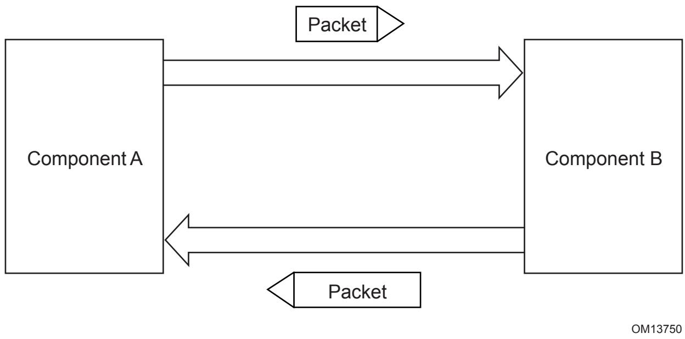

flowchart

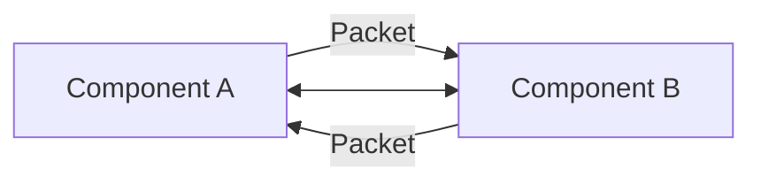
```mermaid
graph LR
    A["Component A"] -->|Packet| B["Component B"]
    B -->|Packet| A
    A <--> B
```

Figure 1-1 PCI Express Link

The primary Link attributes for PCI Express Link are:

• The basic Link - PCI Express Link consists of dual unidirectional differential Links, implemented as a Transmit pair and a Receive pair. A data clock is embedded using an encoding scheme (see § Chapter 4. ) to achieve very high data rates.   
• The Signaling method – Each major revision of PCI Express signaling has evolved one (or more) characteristics to increase bandwidth. Throughout this specification, the term GT/s is used to refer to the number of encoded bits transferred in a second on a direction of a Lane. The actual effective data rate is dependent on a combination of modulation method, encoding method, and data rate. § Table 1-1 provides a summary of Max Data Rate, Modulation Scheme, Encoding Method, and Effective Max Data Rate with the accounting of only encoding overhead for all the six major revisions of PCI Express. 2 See § Chapter 4. for more information about the combined signaling method and § Chapter 8. for electrical specification details for each major PCI Express revision.

Table 1-1 PCIe Signaling Characteristics§ 

<table><tr><td rowspan="2">Data Rate</td><td rowspan="2">Modulation</td><td rowspan="2">Encoding</td><td rowspan="2">Effective Data Rate(after removing Encoding overhead)</td><td colspan="6">Base Specification Revision</td></tr><tr><td>6.x</td><td>5.x</td><td>4.x</td><td>3.0</td><td>2.0</td><td>1.0</td></tr><tr><td>2.5 GT/s</td><td>NRZ</td><td>8b/10b</td><td>2 Gbit/s</td><td>√</td><td>√</td><td>√</td><td>√</td><td>√</td><td>√</td></tr><tr><td>5.0 GT/s</td><td>NRZ</td><td>8b/10b</td><td>4 Gbit/s</td><td>√</td><td>√</td><td>√</td><td>√</td><td>√</td><td></td></tr><tr><td>8.0 GT/s</td><td>NRZ</td><td>128b/130b</td><td>~8 Gbit/s</td><td>√</td><td>√</td><td>√</td><td>√</td><td></td><td></td></tr><tr><td>16.0 GT/s</td><td>NRZ</td><td>128b/130b</td><td>~16 Gbit/s</td><td>√</td><td>√</td><td>√</td><td></td><td></td><td></td></tr><tr><td>32.0 GT/s</td><td>NRZ</td><td>128b/130b</td><td>~32 Gbit/s</td><td>√</td><td>√</td><td></td><td></td><td></td><td></td></tr><tr><td>64.0 GT/s</td><td>PAM4</td><td>1b/1b</td><td>64 Gbit/s</td><td>√</td><td></td><td></td><td></td><td></td><td></td></tr></table>

2. Terms like “PCIe Gen3” are ambiguous and should be avoided. For example, “gen3” could mean (1) compliant with Base 3.0, (2) compliant with Base 3.1 (last revision of 3.x), (3) compliant with Base 3.0 and supporting 8.0 GT/s, (4) compliant with Base 3.0 or later and supporting 8.0 GT/s, ….

Lanes - A Link must support at least one Lane - each Lane represents a set of differential signal pairs (one pair for transmission, one pair for reception). To scale bandwidth, a Link may aggregate multiple Lanes denoted by xN where N may be any of the supported Link widths. A x8 Link operating at the 2.5 GT/s data rate represents an aggregate bandwidth of 20 Gigabits/second of raw bandwidth in each direction. This specification describes operations for x1, x2, x4, x8, and x16 Lane widths.   
• Initialization - During hardware initialization, each PCI Express Link is set up following a negotiation of Lane widths and frequency of operation by the two agents at each end of the Link. No firmware or operating system software is involved.   
• Symmetry - Each Link must support a symmetric number of Lanes in each direction, i.e., a x16 Link indicates there are 16 differential signal pairs in each direction.

# 1.3 PCI Express Fabric Topology §

A fabric is composed of point-to-point Links that interconnect a set of components - an example fabric topology is shown in § Figure 1-2. This figure illustrates a single fabric instance with two Hierarchies composed of a Root Complex (RC), multiple Endpoints, and multiple Switches, interconnected via PCI Express Links.

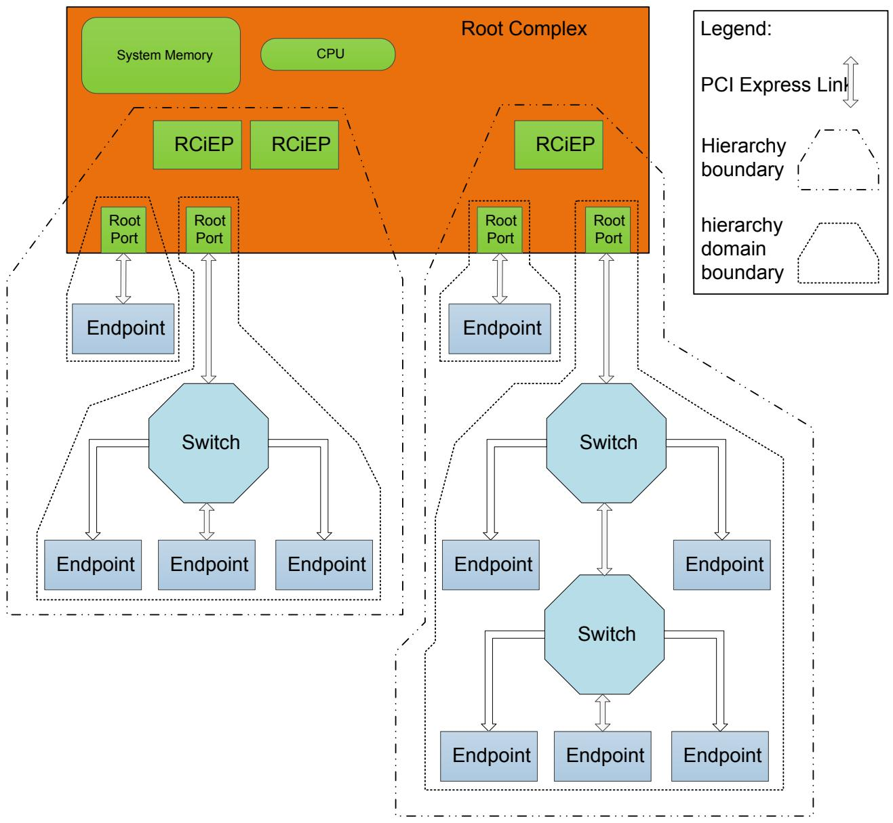

flowchart

```mermaid
graph TD
    subgraph_RootComplex["Root Complex"]
        A["CPU"] --> B["RCiEP"]
        B --> C["RCiEP"]
        C --> D["Root Port"]
        D --> E["Endpoint"]
        F["RCiEP"] --> G["Root Port"]
        G --> H["Switch"]
        I["Root Port"] --> J["Switch"]
        K["Root Port"] --> L["Switch"]
    end

    subgraph_Switch1["Switch"]
        M["Endpoint"] --> N["Switch"]
        O["Endpoint"] --> P["Switch"]
        Q["Endpoint"] --> R["Switch"]
    end

    subgraph_Switch2["Switch"]
        S["Endpoint"] --> T["Switch"]
        U["Endpoint"] --> V["Switch"]
        W["Endpoint"] --> X["Switch"]
    end

    style RootComplex fill:#f9f,stroke:#333
    style Switch1 fill:#bbf,stroke:#333
    style Switch2 fill:#bbf,stroke:#333
```

Figure 1-2 Example PCI Express Topology§

# 1.3.1 Root Complex §

• An RC denotes the root of an I/O hierarchy that connects the CPU/memory subsystem to the I/O.   
• As illustrated in § Figure 1-2, an RC may support one or more PCI Express Ports. Each interface defines a separate hierarchy domain. Each hierarchy domain may be composed of a single Endpoint or a sub-hierarchy containing one or more Switch components and Endpoints.   
The capability to route peer-to-peer transactions between hierarchy domains through an RC is optional and implementation dependent. An RC is permitted to "take ownership" of Requests that pass peer-to-peer between Root Ports, reforming and potentially spliting a Request such that it may appear to the ultimate Completer that the RC was the origin of the Request, and subsequently the RC must reform the Completion(s)

being returned to the original Requester. Alternately, an RC implementation may incorporate a real or virtual Switch internally within the Root Complex to enable full peer-to-peer support in a software transparent way. Unlike the rules for a Switch, an RC is generally permitted to split a packet into smaller packets when routing transactions peer-to-peer between hierarchy domains (except as noted below), e.g., split a single packet with a 256-byte payload into two packets of 128 bytes payload each. The resulting packets are subject to the normal packet formation rules contained in this specification (e.g., Max\_Payload\_Size, Read Completion Boundary (RCB), etc.). Component designers should note that splitting a packet into smaller packets may have negative performance consequences, especially for a transaction addressing a device behind a PCI Express to PCI/PCI-X bridge.

Exception: An RC that supports peer-to-peer routing of Deferrable Memory Write Requests is not permitted to split a Deferrable Memory Write Request packet into smaller packets (see § Section 6.32 ).

Exception: An RC that supports peer-to-peer routing of Vendor\_Defined Messages is not permitted to split a Vendor\_Defined Message packet into smaller packets except at 128-byte boundaries (i.e., all resulting packets except the last must be an integral multiple of 128 bytes in length) in order to retain the ability to forward the Message across a PCI Express to PCI/PCI-X Bridge.

• An RC must support generation of Configuration Requests as a Requester.   
• An RC is permitted to support the generation of I/O Requests as a Requester.

◦ An RC is permitted to generate I/O Requests to either or both of locations 80h and 84h to a selected Root Port, without regard to that Root Port's PCI Bridge I/O decode configuration; it is recommended that this mechanism only be enabled when specifically needed.

• An RC must not support Lock semantics as a Completer.   
• An RC is permitted to support generation of Locked Requests as a Requester.

# 1.3.2 Endpoints §

Endpoint refers to a type of Function that can be the Requester or Completer of a PCI Express transaction either on its own behalf or on behalf of a distinct non-PCI Express device (other than a PCI device or host CPU), e.g., a PCI Express attached graphics controller or a PCI Express-USB host controller. Endpoints are classified as either legacy, PCI Express, or Root Complex Integrated Endpoints (RCiEPs).

# 1.3.2.1 Legacy Endpoint Rules §

• A Legacy Endpoint must be a Function with a Type 00h Configuration Space header.   
• A Legacy Endpoint must support Configuration Requests as a Completer.   
• A Legacy Endpoint may support I/O Requests as a Completer.

◦ A Legacy Endpoint is permitted to accept I/O Requests to either or both of locations 80h and 84h, without regard to that Endpoint's I/O decode configuration.

• A Legacy Endpoint may generate I/O Requests.   
• A Legacy Endpoint may support Lock memory semantics as a Completer if that is required by the device’s legacy software support requirements.   
• A Legacy Endpoint must not issue a Locked Request.   
• A Legacy Endpoint may implement Extended Configuration Space Capabilities, but such Capabilities may be ignored by software.

• A Legacy Endpoint operating as the Requester of a Memory Transaction is not required to be capable of generating addresses 4 GB or greater.   
• A Legacy Endpoint is required to support MSI or MSI-X or both if an interrupt resource is requested. If MSI is implemented, a Legacy Endpoint is permitted to support either the 32-bit or 64-bit Message Address version of the MSI Capability structure.   
• A Legacy Endpoint is permitted to support 32-bit addressing for Base Address Registers that request memory resources.   
• A Legacy Endpoint must appear within one of the hierarchy domains originated by the Root Complex.

# 1.3.2.2 PCI Express Endpoint Rules §

• A PCI Express Endpoint must be a Function with a Type 00h Configuration Space header.   
• A PCI Express Endpoint must support Configuration Requests as a Completer.   
• A PCI Express Endpoint must not depend on operating system allocation of I/O resources claimed through BAR(s).   
• A PCI Express Endpoint must not generate I/O Requests.   
• A PCI Express Endpoint must not support Locked Requests as a Completer or generate them as a Requester. PCI Express-compliant device drivers and applications must be written to prevent the use of lock semantics when accessing a PCI Express Endpoint.   
• A PCI Express Endpoint operating as the Requester of a Memory Transaction is required to be capable of generating addresses greater than 4 GB.   
• A PCI Express Endpoint is required to support MSI or MSI-X or both if an interrupt resource is requested. If MSI is implemented, a PCI Express Endpoint must support the 64-bit Message Address version of the MSI Capability structure.   
• A PCI Express Endpoint requesting memory resources through a BAR must set the BAR’s Prefetchable bit unless the range contains locations with read side-effects or locations in which the Function does not tolerate write merging. See § Section 7.5.1.2.1 for additional guidance on having the Prefetchable bit Set.   
• For a PCI Express Endpoint, 64-bit addressing must be supported for all BARs that have the Prefetchable bit Set. 32-bit addressing is permitted for all BARs that do not have the Prefetchable bit Set.   
• The minimum memory address range requested by a BAR is 128 bytes.   
• A PCI Express Endpoint must appear within one of the hierarchy domains originated by the Root Complex.

# 1.3.2.3 Root Complex Integrated Endpoint Rules §

• A Root Complex Integrated Endpoint (RCiEP) is implemented on internal logic of Root Complexes that contains the Root Ports.   
• An RCiEP must be a Function with a Type 00h Configuration Space header.   
• An RCiEP must support Configuration Requests as a Completer.   
• An RCiEP must not require I/O resources claimed through BAR(s).   
• An RCiEP must not generate I/O Requests.   
• An RCiEP must not support Locked Requests as a Completer or generate them as a Requester. PCI Express-compliant device drivers and applications must be written to prevent the use of lock semantics when accessing an RCiEP.

• An RCiEP operating as the Requester of a Memory Transaction is required to be capable of generating addresses equal to or greater than the Host is capable of handling as a Completer.   
• An RCiEP is required to support MSI or MSI-X or both if an interrupt resource is requested. If MSI is implemented, an RCiEP is permitted to support either the 32-bit or 64-bit Message Address version of the MSI Capability structure.   
• An RCiEP is permitted to support 32-bit addressing for Base Address Registers that request memory resources.   
• An RCiEP must not implement Link Capabilities, Link Status, Link Control, Link Capabilities 2, Link Status 2, and Link Control 2 registers in the PCI Express Extended Capability.   
• If an RCiEP is associated with an optional Root Complex Event Collector it must signal PME and error conditions through the Root Complex Event Collector.   
• An RCiEP must not be associated with more than one Root Complex Event Collector.   
• An RCiEP does not implement Active State Power Management.   
• An RCiEP may not be hot-plugged independent of the Root Complex as a whole.   
• An RCiEP must not appear in any of the hierarchy domains exposed by the Root Complex.   
• An RCiEP must not appear in Switches.

# 1.3.3 Switch §

A Switch is defined as a logical assembly of multiple virtual PCI-to-PCI Bridge devices as illustrated in § Figure 1-3. All Switches are governed by the following base rules.

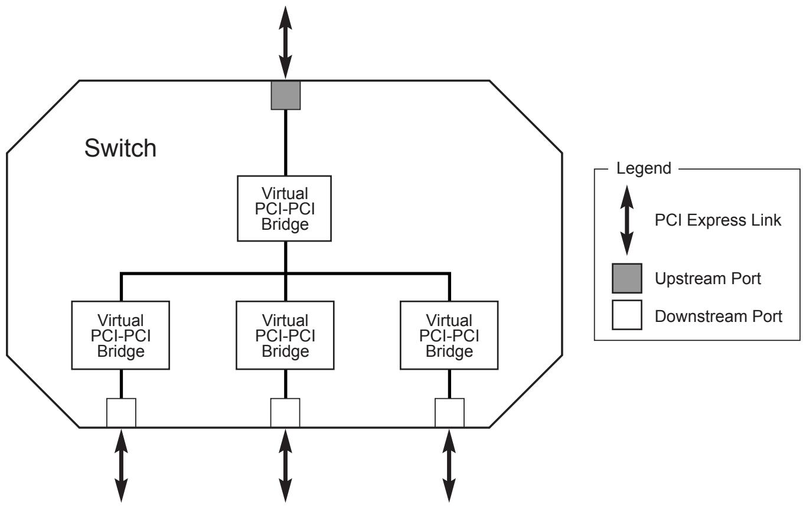

flowchart

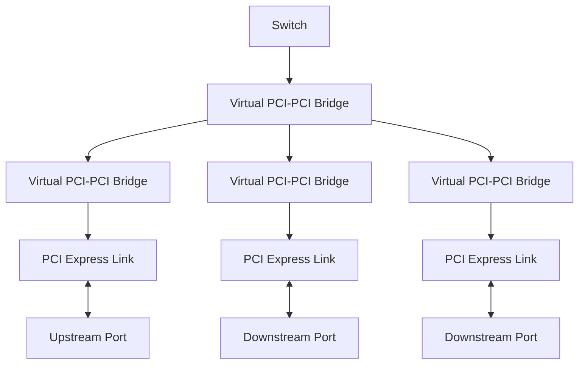
```mermaid
graph TD
    A["Switch"] --> B["Virtual PCI-PCI Bridge"]
    B --> C["Virtual PCI-PCI Bridge"]
    B --> D["Virtual PCI-PCI Bridge"]
    B --> E["Virtual PCI-PCI Bridge"]
    C --> F["PCI Express Link"]
    D --> G["PCI Express Link"]
    E --> H["PCI Express Link"]
    F <--> I["Upstream Port"]
    G <--> J["Downstream Port"]
    H <--> K["Downstream Port"]
```

OM13752

Figure 1-3 Logical Block Diagram of a Switch§

• Switches appear to configuration software as two or more logical PCI-to-PCI Bridges.   
• A Switch forwards transactions using PCI Bridge mechanisms; e.g., address-based routing except when engaged in a Multicast, as defined in § Section 6.14 .   
• Except as noted in this document, a Switch must forward all types of Transaction Layer Packets (TLPs) between any set of Ports.   
• Locked Requests must be supported as specified in § Section 6.5 . Switches are not required to support Downstream Ports as initiating Ports for Locked Requests.   
• Each enabled Switch Port must comply with the Flow Control specification within this document.   
• A Switch is not allowed to split a packet into smaller packets, e.g., a single packet with a 256-byte payload must not be divided into two packets of 128 bytes payload each.   
• Arbitration between Ingress Ports (inbound Link) of a Switch may be implemented using round robin or weighted round robin when contention occurs on the same Virtual Channel. This is described in more detail later within the specification.   
• Endpoints (represented by Type 00h Configuration Space headers) must not appear to configuration software on the Switch’s internal bus as peers of the virtual PCI-to-PCI Bridges representing the Switch Downstream Ports.

# 1.3.4 Root Complex Event Collector §

• A Root Complex Event Collector (RCEC) provides support for terminating error and PME messages from RCiEPs.   
• A Root Complex Event Collector must follow all rules for an RCiEP (unless otherwise specified).   
• A Root Complex Event Collector is not required to decode any memory or I/O resources.   
• A Root Complex Event Collector is identified by its Device/Port Type value (see § Section 7.5.3.2 ).   
• A Root Complex Event Collector has the Base Class 08h, Sub-Class 07h and Programming Interface 00h. 3   
• A Root Complex Event Collector resides on a Bus in the Root Complex. Multiple Root Complex Event Collectors are permitted to reside on a single Bus.   
• A Root Complex Event Collector explicitly declares supported RCiEPs through the Root Complex Event Collector Endpoint Association Extended Capability.   
• Root Complex Event Collectors are optional.

# 1.3.5 PCI Express to PCI/PCI-X Bridge §

• A PCI Express to PCI/PCI-X Bridge provides a connection between a PCI Express fabric and a PCI/PCI-X hierarchy.

# 1.4 Hardware/Software Model for Discovery, Configuration and Operation

The PCI/PCIe hardware/software model includes architectural constructs necessary to discover, configure, and use a Function, without needing Function-specific knowledge. Key elements include:

• A configuration model which provides system software the means to discover hardware Functions available in a system   
• Mechanisms to perform basic resource allocation for addressable resources such as memory space and interrupts   
• Enable/disable controls for Function response to received Requests, and initiation of Requests   
• Well-defined ordering and flow control models to support the consistent and robust implementation of hardware/software interfaces

The PCI Express configuration model supports two mechanisms:

• PCI-compatible configuration mechanism: The PCI-compatible mechanism supports 100% binary compatibility with Conventional PCI aware operating systems and their corresponding bus enumeration and configuration software.   
• PCI Express enhanced configuration mechanism: The enhanced mechanism is provided to increase the size of available Configuration Space and to optimize access mechanisms.

Each PCI Express Link is mapped through a virtual PCI-to-PCI Bridge structure and has a Logical Bus associated with it. The virtual PCI-to-PCI Bridge structure may be part of a PCI Express Root Complex Port, a Switch Upstream Port, or a

Switch Downstream Port. A Root Port is a virtual PCI-to-PCI Bridge structure that originates a PCI Express hierarchy domain from a PCI Express Root Complex. Devices are mapped into Configuration Space such that each will respond to a particular Device Number.

# 1.5 PCI Express Layering Overview §

This document specifies the architecture in terms of three discrete logical layers: the Transaction Layer, the Data Link Layer, and the Physical Layer. Each of these layers is divided into two sections: one that processes outbound (to be transmitted) information and one that processes inbound (received) information, as shown in § Figure 1-4.

The fundamental goal of this layering definition is to facilitate the reader’s understanding of the specification. Note that this layering does not imply a particular PCI Express implementation.

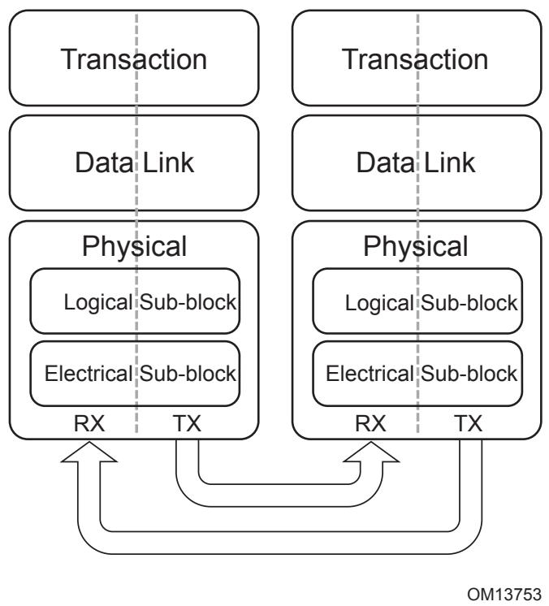

flowchart

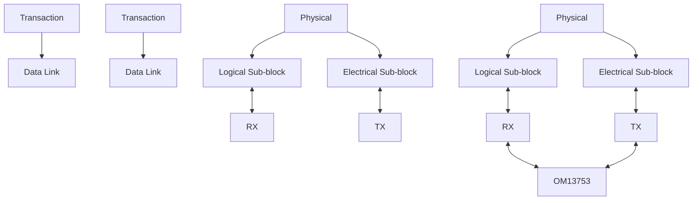
```mermaid
graph TD
    A["Transaction"] --> B["Data Link"]
    C["Transaction"] --> D["Data Link"]
    E["Physical"] --> F["Logical Sub-block"]
    E --> G["Electrical Sub-block"]
    H["Physical"] --> I["Logical Sub-block"]
    H --> J["Electrical Sub-block"]
    F <--> K["RX"]
    G <--> L["TX"]
    I <--> M["RX"]
    J <--> N["TX"]
    M <--> O["OM13753"]
    N <--> O
```

Figure 1-4 High-Level Layering Diagram§

PCI Express uses packets to communicate information between components. Packets are formed in the Transaction and Data Link Layers to carry the information from the transmitting component to the receiving component. As the transmitted packets flow through the other layers, they are extended with additional information necessary to handle packets at those layers. At the receiving side the reverse process occurs and packets get transformed from their Physical Layer representation to the Data Link Layer representation and finally (for Transaction Layer Packets) to the form that can be processed by the Transaction Layer of the receiving device. § Figure 1-5 shows the conceptual flow of transaction level packet information through the layers.

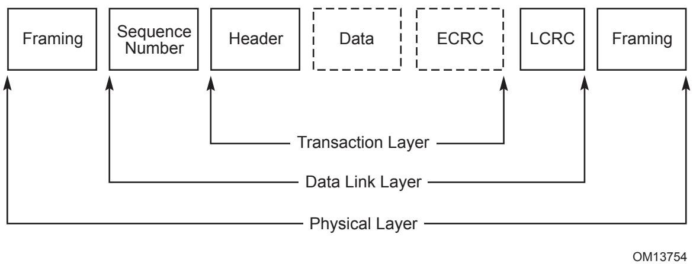

flowchart

```mermaid
graph TD
    A["Framing"] --> B["Sequence Number"]
    B --> C["Header"]
    C --> D["Data"]
    D --> E["ECRC"]
    E --> F["LCRC"]
    F --> G["Framing"]
    G --> H["Physical Layer"]
    H --> I["Transaction Layer"]
    I --> J["Data Link Layer"]
    J --> K["Transaction Layer"]
    K --> L["Transaction Layer"]
    L --> M["Transaction Layer"]
    M --> N["Transaction Layer"]
    N --> O["Transaction Layer"]
    O --> P["Transaction Layer"]
    P --> Q["Transaction Layer"]
    Q --> R["Transaction Layer"]
    R --> S["Transaction Layer"]
    S --> T["Transaction Layer"]
    T --> U["Transaction Layer"]
    U --> V["Transaction Layer"]
    V --> W["Transaction Layer"]
    W --> X["Transaction Layer"]
    X --> Y["Transaction Layer"]
    Y --> Z["Transaction Layer"]
    Z --> AA["Transaction Layer"]
    AA --> AB["Transaction Layer"]
    AB --> AC["Transaction Layer"]
    AC --> AD["Transaction Layer"]
    AD --> AE["Transaction Layer"]
    AE --> AF["Transaction Layer"]
    AF --> AG["Transaction Layer"]
    AG --> AH["Transaction Layer"]
    AH --> AI["Transaction Layer"]
    AI --> AJ["Transaction Layer"]
    AJ --> AK["Transaction Layer"]
    AK --> AL["Transaction Layer"]
    AL --> AM["Transaction Layer"]
    AM --> AN["Transaction Layer"]
    AN --> AO["Transaction Layer"]
    AO --> AP["Transaction Layer"]
    AP --> AQ["Transaction Layer"]
    AQ --> AR["Transaction Layer"]
    AR --> AS["Transaction Layer"]
    AS --> AT["Transaction Layer"]
    AT --> AU["Transaction Layer"]
    AU --> AV["Transaction Layer"]
    AV --> AW["Transaction Layer"]
    AW --> AX["Transaction Layer"]
    AX --> AY["Transaction Layer"]
    AY --> AZ["Transaction Layer"]
    AZ --> BA["Transaction Layer"]
    BA --> BB["Transaction Layer"]
    BB --> BC["Transaction Layer"]
    BC --> BD["Transaction Layer"]
    BD --> BE["Transaction Layer"]
    BE --> BF["Transaction Layer"]
    BF --> BG["Transaction Layer"]
    BG --> BH["Transaction Layer"]
    BH --> BI["Transaction Layer"]
    BI --> BJ["Transaction Layer"]
    BJ --> BK["Transaction Layer"]
    BK --> BL["Transaction Layer"]
    BL --> BM["Transaction Layer"]
    BM --> BN["Transaction Layer"]
    BN --> BO["Transaction Layer"]
    BO --> BP["Transaction Layer"]
    BP --> BQ["Transaction Layer"]
    BQ --> BR["Transaction Layer"]
    BR --> BS["Transaction Layer"]
    BS --> BT["Transaction Layer"]
    BT --> BU["Transaction Layer"]
    BU --> BV["Transaction Layer"]
    BV --> BW["Transaction Layer"]
    BW --> BX["Transaction Layer"]
    BX --> BY["Transaction Layer"]
    BY --> BZ["Transaction Layer"]
    BZ --> CA["Transaction Layer"]
    CA --> CB["Transaction Layer"]
    CB --> CC["Transaction Layer"]
    CC --> CD["Transaction Layer"]
    CD --> CE["Transaction Layer"]
    CE --> CF["Transaction Layer"]
    CF --> CG["Transaction Layer"]
    CG --> CH["Transaction Layer"]
    CH --> CI["Transaction Layer"]
    CI --> CJ["Transaction Layer"]
    CJ --> CK["Transaction Layer"]
    CK --> CR["Transaction Layer"]
    CR --> CS["Transaction Layer"]
    CS --> CT["Transaction Layer"]
    CT --> CU["Transaction Layer"]
    CU --> CV["Transaction Layer"]
    CV --> CW["Transaction Layer"]
    CW --> CX["Transaction Layer"]
    CX --> CY["Transaction Layer"]
    CY --> CZ["Transaction Layer"]
    CZ --> DA["Transaction Layer"]
    DA --> DB["Transaction Layer"]
    DB --> DC["Transaction Layer"]
    DC --> DD["Transaction Layer"]
    DD --> DE["Transaction Layer"]
    DE --> DF["Transaction Layer"]
    DF --> DG["Transaction Layer"]
    DG --> DH["Transaction Layer"]
    DH --> DI["Transaction Layer"]
    DI --> DJ["Transaction Layer"]
    DJ --> DK["Transaction Layer"]
    DK --> DL["Transaction Layer"]
    DL --> DV["Transaction Layer"]
    DV --> DW["Transaction Layer"]
    DW --> DX["Transaction Layer"]
    DX --> DXB["Transaction Layer"]
```

Figure 1-5 Packet Flow Through the Layers§

Note that a simpler form of packet communication is supported between two Data Link Layers (connected to the same Link) for the purpose of Link management.

# 1.5.1 Transaction Layer §

The upper Layer of the architecture is the Transaction Layer. The Transaction Layer’s primary responsibility is the assembly and disassembly of TLPs. TLPs are used to communicate transactions, such as read and write, as well as certain types of events. The Transaction Layer is also responsible for managing credit-based flow control for TLPs.

Every request packet requiring a response packet is implemented as a Split Transaction. Each packet has a unique identifier that enables response packets to be directed to the correct originator. The packet format supports different forms of addressing depending on the type of the transaction (Memory, I/O, Configuration, and Message). The Packets may also have attributes such as No Snoop, Relaxed Ordering, and ID-Based Ordering (IDO).

The Transaction Layer supports four address spaces: it includes the three PCI address spaces (memory, I/O, and configuration) and adds Message Space. This specification uses Message Space to support all prior sideband signals, such as interrupts, power-management requests, and so on, as in-band Message transactions. You could think of PCI Express Message transactions as “virtual wires” since their effect is to eliminate the wide array of sideband signals currently used in a platform implementation.

# 1.5.2 Data Link Layer §

The middle Layer in the stack, the Data Link Layer, serves as an intermediate stage between the Transaction Layer and the Physical Layer. The primary responsibilities of the Data Link Layer include Link management and data integrity, including error detection and error correction.

The transmission side of the Data Link Layer accepts TLPs assembled by the Transaction Layer, calculates and applies a data protection code and TLP sequence number, and submits them to Physical Layer for transmission across the Link. The receiving Data Link Layer is responsible for checking the integrity of received TLPs and for submitting them to the Transaction Layer for further processing. On detection of TLP error(s), this Layer is responsible for requesting retransmission of TLPs until information is correctly received, or the Link is determined to have failed.

The Data Link Layer also generates and consumes packets that are used for Link management functions. To differentiate these packets from those used by the Transaction Layer (TLP), the term Data Link Layer Packet (DLLP) will be used when referring to packets that are generated and consumed at the Data Link Layer.

# 1.5.3 Physical Layer §

The Physical Layer includes all circuitry for interface operation, including driver and input buffers, parallel-to-serial and serial-to-parallel conversion, PLL(s), and impedance matching circuitry. It also includes logical functions related to interface initialization and maintenance. The Physical Layer exchanges information with the Data Link Layer in an implementation specific format. This Layer is responsible for converting information received from the Data Link Layer into an appropriate serialized format and transmitting it across the PCI Express Link at a frequency and width compatible with the component connected to the other side of the Link.

The PCI Express architecture has “hooks” to support future performance enhancements via speed upgrades and advanced encoding techniques. The future speeds, encoding techniques or media may only impact the Physical Layer definition.

# 1.5.4 Layer Functions and Services §

# 1.5.4.1 Transaction Layer Services §

The Transaction Layer, in the process of generating and receiving TLPs, exchanges Flow Control information with its complementary Transaction Layer on the other side of the Link. It is also responsible for supporting both software and hardware-initiated power management.

Initialization and configuration functions require the Transaction Layer to:

• Store Link configuration information generated by the processor or management device,   
• Store Link capabilities generated by Physical Layer hardware negotiation of width and operational frequency.

A Transaction Layer’s Packet generation and processing services require it to:

• Generate TLPs from device core Requests   
• Convert received Request TLPs into Requests for the device core,   
• Convert received Completion Packets into a payload, or status information, deliverable to the core,   
• Detect unsupported TLPs and invoke appropriate mechanisms for handling them,   
• If end-to-end data integrity is supported, generate the end-to-end data integrity CRC and update the TLP header accordingly.

Flow Control services:

• The Transaction Layer tracks Flow Control credits for TLPs across the Link.   
• Transaction credit status is periodically transmitted to the remote Transaction Layer using transport services of the Data Link Layer.   
• Remote Flow Control information is used to throttle TLP transmission.

Ordering rules:

• PCI/PCI-X compliant producer/consumer ordering model,   
• Extensions to support Relaxed Ordering,   
• Extensions to support ID-Based Ordering.

# Power management services:

• Software-controlled power management through mechanisms, as dictated by system software.   
• Hardware-controlled autonomous power management minimizes power during full-on power states.

# Virtual Channels and Traffic Class:

• The combination of Virtual Channel mechanism and Traffic Class identification is provided to support differentiated services and QoS support for certain classes of applications.   
• Virtual Channels: Virtual Channels provide a means to support multiple independent logical data flows over given common physical resources of the Link. Conceptually this involves multiplexing different data flows onto a single physical Link.   
• Traffic Class: The Traffic Class is a Transaction Layer Packet label that is transmitted unmodified end-to-end through the fabric. At every service point (e.g., Switch) within the fabric, Traffic Class labels are used to apply appropriate servicing policies. Each Traffic Class label defines a unique ordering domain - no ordering guarantees are provided for packets that contain different Traffic Class labels.

# 1.5.4.2 Data Link Layer Services §

The Data Link Layer is responsible for reliably exchanging information with its counterpart on the opposite side of the Link.

Initialization and power management services:

• Accept power state Requests from the Transaction Layer and convey to the Physical Layer   
• Convey active/reset/disconnected/power managed state to the Transaction Layer

Data protection, error checking, and retry services:

• CRC generation   
• Transmitted TLP storage for Data Link level retry   
• Error checking   
• TLP acknowledgement and retry Messages   
• Error indication for error reporting and logging

# 1.5.4.3 Physical Layer Services §

Interface initialization, maintenance control, and status tracking:

• Reset/Hot-Plug control/status   
• Interconnect power management   
• Width and Lane mapping negotiation   
• Lane polarity inversion

Symbol and special Ordered Set generation:

• 8b/10b encoding/decoding

• Embedded clock tuning and alignment

Block and special Ordered Set generation:

• 128b/130b encoding/decoding   
• 1b/1b encoding/decoding   
• Link Equalization

Symbol transmission and alignment:

• Transmission circuits   
• Reception circuits   
• Elastic buffer at receiving side   
• Multi-Lane de-skew (for widths > x1) at receiving side

System Design For Testability (DFT) support features:

• Compliance Pattern (see § Section 4.2.9 , § Section 4.2.11 , and § Section 4.2.14 )   
• Modified Compliance Pattern (see § Section 4.2.10 , § Section 4.2.12 , and § Section 4.2.15 )   
• Jitter Measurement Pattern (see § Section 4.2.13 and § Section 4.2.16 )   
• Flit Error Injection

# 1.5.4.4 Inter-Layer Interfaces §

# 1.5.4.4.1 Transaction/Data Link Interface §

The Transaction to Data Link interface provides:

• Byte or multi-byte data to be sent across the Link

◦ Local TLP-transfer handshake mechanism   
◦ TLP boundary information

• Requested power state for the Link

The Data Link to Transaction interface provides:

• Byte or multi-byte data received from the PCI Express Link   
• TLP framing information for the received byte   
• Actual power state for the Link   
• Link status information

# 1.5.4.4.2 Data Link/Physical Interface §

The Data Link to Physical interface provides:

• Byte or multi-byte wide data to be sent across the Link

◦ Data transfer handshake mechanism   
◦ TLP and DLLP boundary information for bytes

• Requested power state for the Link

The Physical to Data Link interface provides:

• Byte or multi-byte wide data received from the PCI Express Link   
• TLP and DLLP framing information for data   
• Indication of errors detected by the Physical Layer   
• Actual power state for the Link   
• Connection status information

# 2. Transaction Layer Specification §

# 2.1 Transaction Layer Overview §

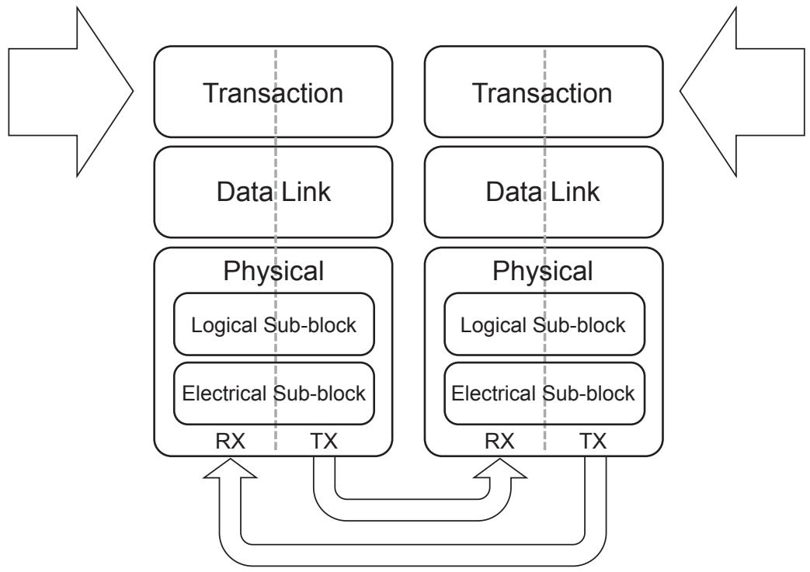

flowchart

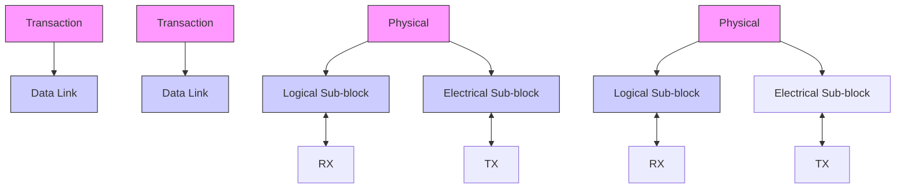
```mermaid
graph TD
    A["Transaction"] --> B["Data Link"]
    C["Transaction"] --> D["Data Link"]
    E["Physical"] --> F["Logical Sub-block"]
    E --> G["Electrical Sub-block"]
    H["Physical"] --> I["Logical Sub-block"]
    H --> J["Electrical Sub-block"]
    F <--> K["RX"]
    G <--> L["TX"]
    I <--> M["RX"]
    J <--> N["TX"]
    style A fill:#f9f,stroke:#333
    style C fill:#f9f,stroke:#333
    style E fill:#f9f,stroke:#333
    style H fill:#f9f,stroke:#333
    style I fill:#f9f,stroke:#333
    style B fill:#ccf,stroke:#333
    style D fill:#ccf,stroke:#333
    style F fill:#ccf,stroke:#333
    style G fill:#ccf,stroke:#333
    style I fill:#ccf,stroke:#333
```

OM14295

Figure 2-1 Layering Diagram Highlighting the Transaction Layer§

At a high level, the key aspects of the Transaction Layer are:

• A pipelined full Split-Transaction protocol   
• Credit-based flow control   
• Optional support for data poisoning and end-to-end data integrity detection.

• Mechanisms for differentiating the ordering and processing requirements of Transaction Layer Packets (TLPs)

The Transaction Layer comprehends the following:

• TLP construction and processing   
• Association of transaction-level mechanisms with device resources including:   
◦ Flow Control   
◦ Virtual Channel management   
• Rules for ordering and management of TLPs ◦ PCI/PCI-X compatible ordering

◦ Including Traffic Class differentiation

This chapter specifies the behaviors associated with the Transaction Layer.

# 2.1.1 Address Spaces, Transaction Types, and Usage

Transactions form the basis for information transfer between a Requester and Completer. Four address spaces are defined, and different Transaction types are defined, each with its own unique intended usage, as shown in § Table 2-1.

Table 2-1 Transaction Types for Different Address Spaces§ 

<table><tr><td>Address Space</td><td>Transaction Types</td><td>Basic Usage</td></tr><tr><td>Memory</td><td>ReadWrite</td><td>Transfer data to/from a memory-mapped location</td></tr><tr><td>I/O</td><td>ReadWrite</td><td>Transfer data to/from an I/O-mapped location</td></tr><tr><td>Configuration</td><td>ReadWrite</td><td>Device Function configuration/setup</td></tr><tr><td>Message</td><td>Baseline(including Vendor-Defined)</td><td>From event signaling mechanism to general purpose messaging</td></tr></table>

Details about the rules associated with usage of these address formats and the associated TLP formats are described later in this chapter.

# 2.1.1.1 Memory Transactions §

Memory Transactions include the following types:

• Read Request/Completion   
• Write Request   
• Deferrable Memory Write Request/Completion   
• AtomicOp Request/Completion

Memory Transactions use two different address formats:

• Short Address Format: 32-bit address   
• Long Address Format: 64-bit address

Certain Memory Transactions can optionally include a PASID TLP Prefix (Non-Flit Mode) or OHC (Flit Mode) containing the Process Address Space ID (PASID). See § Section 6.20 for details.

# 2.1.1.2 I/O Transactions §

PCI Express supports I/O Space for compatibility with legacy devices that require their use. Future revisions of this specification may deprecate the use of I/O Space. I/O Transactions include the following types:

• Read Request/Completion

• Write Request/Completion   
I/O Transactions use a single address format:   
• Short Address Format: 32-bit address

# 2.1.1.3 Configuration Transactions §

Configuration Transactions are used to access configuration registers of Functions within devices.

Configuration Transactions include the following types:

• Read Request/Completion   
• Write Request/Completion

# 2.1.1.4 Message Transactions §

The Message Transactions, or simply Messages, are used to support in-band communication of events between devices.

In addition to specific Messages defined in this document, PCI Express provides support for Vendor-Defined Messages using specified Message codes. Except for Vendor-Defined Messages that use the PCI-SIG® Vendor ID (0001h), the definition of specific Vendor-Defined Messages is outside the scope of this document.

This specification establishes a standard framework within which vendors can specify their own Vendor-Defined Messages tailored to fit the specific requirements of their platforms (see § Section 2.2.8.6 ).

Note that these Vendor-Defined Messages are not guaranteed to be interoperable with components from different vendors.

# 2.1.2 Packet Format Overview §

Transactions consist of Requests and Completions, which are communicated using packets. § Figure 2-2 shows a high level serialized view of a TLP, consisting of one or more optional TLP Prefixes, a TLP header, a data payload (for some types of packets), and an optional TLP Digest. § Figure 2-3 shows a more detailed view of the TLP. The following sections of this chapter define the detailed structure of the packet headers and digest.

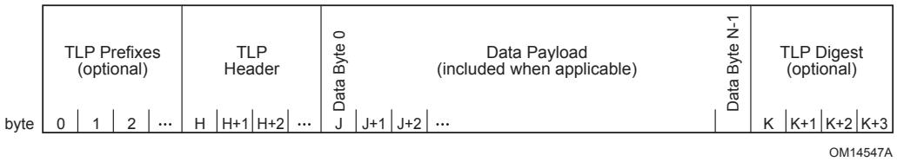

text_image

TLP Prefixes
(optional)
byte 0 | 1 | 2 | ... H | H+1 | H+2 | ... J | J+1 | J+2 | ... Data Byte 0 Data Payload
(included when applicable) Data Byte N-1 Data Byte
(TLP Digest
(optional)
K | K+1 | K+2 | K+3
OM14547A

§   
Figure 2-2 Serial View of a TLP

PCI Express conceptually transfers information as a serialized stream of bytes as shown in § Figure 2-2. Note that at the byte level, information is transmitted/received over the interconnect with the left-most byte of the TLP as shown in § Figure 2-2 being transmitted/received first (byte 0 if one or more optional TLP Prefixes are present else byte H). Refer to § Section 4.2 for details on how individual bytes of the packet are encoded and transmitted over the physical media.

Detailed layouts of the TLP Prefix, TLP Header and TLP Digest (presented in generic form in § Figure 2-3) are drawn with the lower numbered bytes on the left rather than on the right as has traditionally been depicted in other PCI specifications. The header layout is optimized for performance on a serialized interconnect, driven by the requirement that the most time critical information be transferred first. For example, within the TLP header, the most significant byte of the address field is transferred first so that it may be used for early address decode.

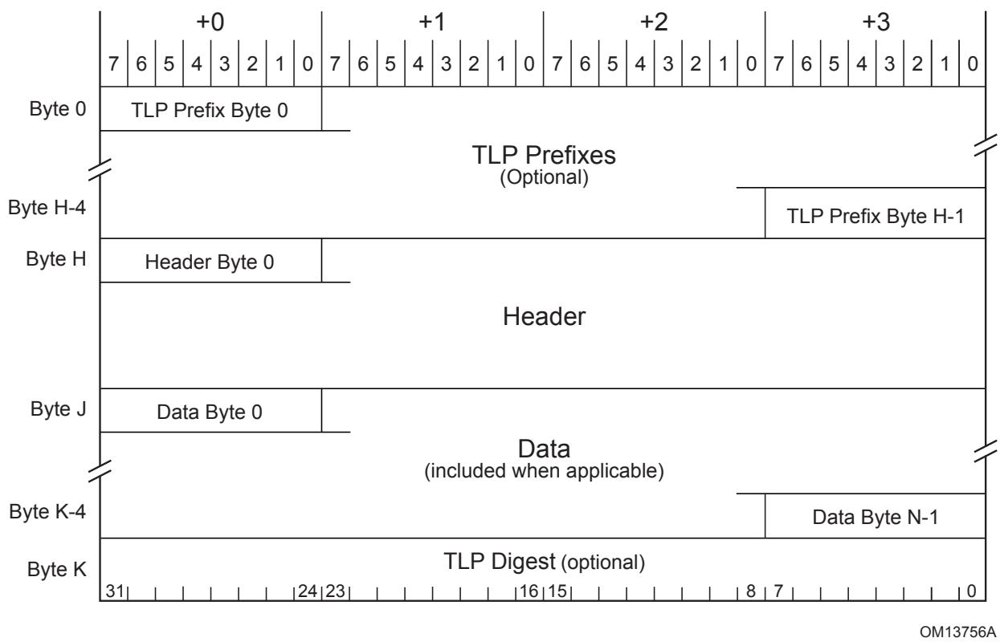  
Figure 2-3 Generic TLP Format - Non-Flit Mode§

The data payload within a TLP is depicted with the lowest addressed byte (byte J in § Figure 2-3) shown to the upper left. Detailed layouts depicting data structure organization (such as the Configuration Space depictions in § Chapter 7. ) retain the traditional PCI byte layout with the lowest addressed byte shown on the right. Regardless of depiction, all bytes are conceptually transmitted over the Link in increasing byte number order.

Depending on the type of a packet, the header for that packet will include some of the following types of fields:

• Format of the packet   
• Type of the packet   
• Length for any associated data   
• Transaction Descriptor, including:   
◦ Transaction ID   
◦ Attributes   
◦ Traffic Class   
• Address/routing information   
• Byte Enables   
• Message encoding

• Completion status

# 2.2 Transaction Layer Protocol - Packet Definition §

PCI Express uses a packet based protocol to exchange information between the Transaction Layers of the two components communicating with each other over the Link. PCI Express supports the following basic transaction types: Memory, I/O, Configuration, and Messages. Two addressing formats for Memory Requests are supported: 32 bit and 64 bit.

Transactions are carried using Requests and Completions. Completions are used only where required, for example, to return read data, or to acknowledge Completion of I/O and Configuration Write Transactions. Completions are associated with their corresponding Requests by the value in the Transaction ID field of the Packet header.

All TLP fields marked Reserved (sometimes abbreviated as R) must be filled with all 0's when a TLP is formed. Values in such fields must be ignored by Receivers and forwarded unmodified by Switches. Note that for certain fields there are both specified and Reserved values - the handling of Reserved values in these cases is specified separately for each case.

There are different header formats for Non-Flit Mode (NFM) and Flit Mode (FM). Routing elements must translate between the FM and NFM TLP formats when the Ingress Port and Egress Port are in different modes. In some cases translation is not possible, and the handling of such cases is also defined in this Chapter.

# 2.2.1 Common Packet Header Fields §

# 2.2.1.1 Common Packet Header Fields for Non-Flit Mode §

All TLP prefixes and headers contain the following fields (see § Figure 2-4):

• Fmt[2:0] - Format of TLP (see § Table 2-2) - bits 7:5 of byte 0   
• Type[4:0] - Type of TLP - bits 4:0 of byte 0

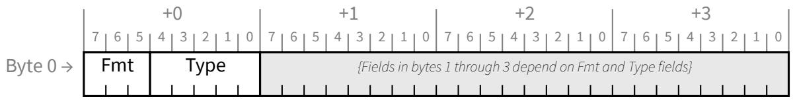

text_image

Byte 0 →
+0
7 | 6 | 5 | 4 | 3 | 2 | 1 | 0
Fmt
Type
+1
7 | 6 | 5 | 4 | 3 | 2 | 1 | 0
+2
7 | 6 | 5 | 4 | 3 | 2 | 1 | 0
+3
7 | 6 | 5 | 4 | 3 | 2 | 1 | 0
{Fields in bytes 1 through 3 depend on Fmt and Type fields}

  
Figure 2-4 Fields Present in All TLPs

The Fmt field(s) indicates the presence of one or more TLP Prefixes and the Type field(s) indicates the associated TLP Prefix type(s).

The Fmt and Type fields of the TLP Header provide the information required to determine the size of the remaining part of the TLP Header, and if the packet contains a data payload following the header.

The Fmt, Type, TD, and Length fields of the TLP Header contain all information necessary to determine the overall size of the non-prefix portion of the TLP. The Type field, in addition to defining the type of the TLP also determines how the TLP is routed by a Switch. Different types of TLPs are discussed in more detail in the following sections.

• Permitted Fmt[2:0] and Type[4:0] field values are shown in § Table 2-3.

◦ All other encodings are Reserved (see § Section 2.3 ).

• TC[2:0] - Traffic Class (see § Section 2.2.6.6 ) - bits [6:4] of byte 1   
• R (byte 1 bit 1) - Reserved; formerly was the Lightweight Notification (LN) bit, but is now available for reassignment.   
• TLP Hints (TH) - 1b indicates the presence of TLP Processing Hints (TPH) in the TLP header and optional TPH TLP Prefix (if present) - bit 0 of byte 1 (see § Section 2.2.7.1.1 )   
• Attr[1:0] - Attributes (see § Section 2.2.6.3 ) - bits [5:4] of byte 2   
• Attr[2] - Attribute (see § Section 2.2.6.3 ) - bit 2 of byte 1 (shown as A2 in figures)   
• TD - 1b indicates presence of TLP Digest in the form of a single Double Word (DW) at the end of the TLP (see § Section 2.2.3 ) - bit 7 of byte 2   
• Error Poisoned (EP) - indicates the TLP is poisoned (see § Section 2.7 ) - bit 6 of byte 2   
• Length[9:0] - Length of data payload in DW (see § Table 2-4) - bits 1:0 of byte 2 concatenated with bits 7:0 of byte 3   
◦ TLP data must be 4-byte naturally aligned and in increments of 4-byte DW.   
◦ Reserved for TLPs that do not contain or refer to data payloads, including Cpl, CplLk, and Messages (except as specified)

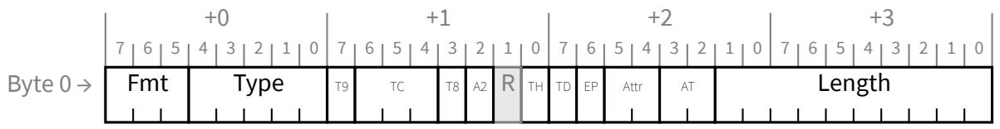

text_image

Byte 0 →
+0
7 6 5 4 3 2 1 0
Fmt Type T9 TC T8 A2 R TH TD EP Attr AT Length
+1
7 6 5 4 3 2 1 0
+2
7 6 5 4 3 2 1 0
+3
7 6 5 4 3 2 1 0

Figure 2-5 Fields Present in All Non-Flit Mode TLP Headers§

Table 2-2 Fmt[2:0] Field Values§ 

<table><tr><td>Fmt[2:0]</td><td>Corresponding TLP Format</td></tr><tr><td>000b</td><td>3 DW header, no data</td></tr><tr><td>001b</td><td>4 DW header, no data</td></tr><tr><td>010b</td><td>3 DW header, with data</td></tr><tr><td>011b</td><td>4 DW header, with data</td></tr><tr><td>100b</td><td>TLP Prefix</td></tr><tr><td></td><td>All encodings not shown above are Reserved (see § Section 2.3).</td></tr></table>

Table 2-3 Fmt[2:0] and Type[4:0] Field Encodings§ 

<table><tr><td>TLP Type</td><td>Fmt [2:0]4(b)</td><td>Type [4:0] (b)</td><td>Description</td></tr><tr><td>MRd</td><td>000001</td><td>0 0000</td><td>Memory Read Request</td></tr><tr><td>TLP Type</td><td>Fmt [2:0] (b)</td><td>Type [4:0] (b)</td><td>Description</td></tr><tr><td>MRdLk</td><td>000001</td><td>0 0001</td><td>Memory Read Request-Locked</td></tr><tr><td>MWr</td><td>010011</td><td>0 0000</td><td>Memory Write Request</td></tr><tr><td>IORd</td><td>000</td><td>0 0010</td><td>I/O Read Request</td></tr><tr><td>IOWr</td><td>010</td><td>0 0010</td><td>I/O Write Request</td></tr><tr><td>CfgRd0</td><td>000</td><td>0 0100</td><td>Configuration Read Type 0</td></tr><tr><td>CfgWr0</td><td>010</td><td>0 0100</td><td>Configuration Write Type 0</td></tr><tr><td>CfgRd1</td><td>000</td><td>0 0101</td><td>Configuration Read Type 1</td></tr><tr><td>CfgWr1</td><td>010</td><td>0 0101</td><td>Configuration Write Type 1</td></tr><tr><td>TCfgRd</td><td>000</td><td>1 1011</td><td>Deprecated TLP  $Type^5$ </td></tr><tr><td>DMWr</td><td>010011</td><td>1 1011</td><td>Deferrable Memory Write  $Request^6$ </td></tr><tr><td>Msg</td><td>001</td><td> $10r_2r_1r_0$ </td><td>Message Request - The sub-field r[2:0] specifies the Message routing mechanism (see § Table 2-20).</td></tr><tr><td>MsgD</td><td>011</td><td> $10r_2r_1r_0$ </td><td>Message Request with data payload - The sub-field r[2:0] specifies the Message routing mechanism (see § Table 2-20).</td></tr><tr><td>Cpl</td><td>000</td><td>0 1010</td><td>Completion without Data - Used for I/O, Configuration Write, and Deferrable Memory Write Completions with any Completion Status. Also used for AtomicOp Completions and Read Completions (I/O, Configuration, or Memory) with Completion Status other than Successful Completion.</td></tr><tr><td>CplD</td><td>010</td><td>0 1010</td><td>Completion with Data - Used for Memory, I/O, and Configuration Read Completions. Also used for AtomicOp Completions.</td></tr><tr><td>CplLk</td><td>000</td><td>0 1011</td><td>Completion for Locked Memory Read without Data - Used only in error case.</td></tr><tr><td>CplDLk</td><td>010</td><td>0 1011</td><td>Completion for Locked Memory Read - Otherwise like CplD.</td></tr><tr><td>FetchAdd</td><td>010011</td><td>0 1100</td><td>Fetch and Add AtomicOp Request</td></tr><tr><td>Swap</td><td>010011</td><td>0 1101</td><td>Unconditional Swap AtomicOp Request</td></tr><tr><td>CAS</td><td>010011</td><td>0 1110</td><td>Compare and Swap AtomicOp Request</td></tr><tr><td>LPrfx</td><td>100</td><td> $0 L_3L_2L_1L_0$ </td><td>Local TLP Prefix - The sub-field L[3:0] specifies the Local TLP Prefix type (see § Table 2-38).</td></tr><tr><td>EPrfx</td><td>100</td><td> $1 E_3E_2E_1E_0$ </td><td>End-End TLP Prefix - The sub-field E[3:0] specifies the End-End TLP Prefix type (see § Table 2-39).</td></tr></table>

5. Deprecated TLP Types: previously used for Trusted Configuration Space (TCS), which is no longer supported by this specification. If a Receiver does not implement TCS, the Receiver must treat such Requests as Malformed Packets.

6. This TLP Type value was previously used for Trusted Configuration Space (TCS) Writes, which are no longer supported by this specification.

<table><tr><td>TLP Type</td><td>Fmt [2:0] (b)</td><td>Type [4:0] (b)</td><td>Description</td></tr><tr><td></td><td></td><td></td><td>All encodings not shown above are Reserved (see § Section 2.3).</td></tr></table>

Table 2-4 Length[9:0] Field Encoding§ 

<table><tr><td>Length[9:0]</td><td>Corresponding TLP Data Payload Size</td></tr><tr><td>00 0000 0001b</td><td>1 DW</td></tr><tr><td>00 0000 0010b</td><td>2 DW</td></tr><tr><td>...</td><td>...</td></tr><tr><td>11 1111 1111b</td><td>1023 DW</td></tr><tr><td>00 0000 0000b</td><td>1024 DW</td></tr></table>

# 2.2.1.2 Common Packet Header Fields for Flit Mode §

The TLP grammar is defined as:

• zero or more 1DW Local Vendor-Defined TLP prefixes   
• TLP Header Base with size indicated by Type[7:0] field, followed by zero to 7 DW of Orthogonal Header Content (OHC) as indicated by OHC[4:0] field   
• TLP data payload of 0 to 1024DW   
• TLP Trailer, if present as indicated by TS[2:0] field   
• zero or more 1DW end-to-end suffixes 7

It is required to transmit NOP TLPs while TLP transmission is active if there are no other TLPs to transmit. NOP TLPs must be discarded without effect by the Receiver. All header fields other than the Type field are Reserved for NOP TLPs.

Other notable differences between Flit Mode and Non-Flit Mode TLPs include the following:

• Content that in Non-Flit Mode is included in End-to-End TLP prefixes is now incorporated within the header, as OHC.   
• In Flit Mode, Steering Tags are not overloaded with the Byte Enables. The PH, Steering Tags, and AMA/AV fields are consolidated in OHC.

All Flit Mode TLPs contain the same fields in the first DW of the Header Base (see § Figure 2-6)

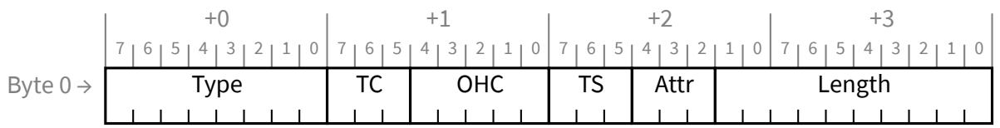

text_image

Byte 0 →
+0
7 6 5 4 3 2 1 0
Type
TC
OHC
TS
Attr
Length
+1
7 6 5 4 3 2 1 0
+2
7 6 5 4 3 2 1 0
+3
7 6 5 4 3 2 1 0

§

Figure 2-6 First DW of Header Base

7. Suffixes are defined as a placeholder for future use.

§ Table 2-5 defines the values for the Type[7:0] field for Flit Mode.

• The Type[7:0] field must be fully decoded by all Recievers regardless of which specific encodings are supported.   
• All Receivers must handle Flow Control for all Type[7:0] field encodings as specified.

◦ Switch Ports must buffer and route TLPs, including Reserved entries, as specified.   
◦ Endpoint Upstream Ports and Root Ports are required to buffer, including for Header Logging, up to the largest Header Base size plus all OHC content supported by the Port, but are permitted, after accounting for Flow Control, to discard Header Base and OHC content that is not supported by the Port.

• For all Reserved entries, TLP routing must be handled as indicated in the Description field, and the Header Base fields used for routing are at the same location within the Header as with the non-Reserved Header Base formats.   
• Endpoint Upstream Ports and Root Ports must handle received TLPs using Reserved Type[7:0] encodings of FC Type PR and NPR as Unsupported Requests, and of FC Type CPL as Unexpected Completions.

In the Translation Rule column, an entry of “1:1” indicates that there is no change in meaning or behavior when translating between Non-Flit Mode and Flit Mode in either direction. TLPs that cannot be translated must result in a TLP Translation Egress Blocked error being reported by the Egress Port.

The TS[2:0] field indicates Trailer Size and use encoded as:   
• 000b – No Trailer   
• 001b – 1DW Trailer containing ECRC   
Table 2-5 Flit Mode TLP Header Type Encodings§ 

<table><tr><td rowspan="2">#</td><td colspan="8">Type</td><td rowspan="2">Description</td><td rowspan="2">Name</td><td rowspan="2">FC Type</td><td rowspan="2">Data Payload?</td><td rowspan="2">Header Base Size (DW)</td><td rowspan="2">New for Flit Mode</td><td rowspan="2">Translation Rule</td></tr><tr><td>7</td><td>6</td><td>5</td><td>4</td><td>3</td><td>2</td><td>1</td><td>0</td></tr><tr><td>0</td><td>0</td><td>0</td><td>0</td><td>0</td><td>0</td><td>0</td><td>0</td><td>0</td><td>No Operation</td><td>NOP</td><td>none</td><td>n</td><td>1</td><td>y</td><td>NFM uses this Type code for MRd (see #3)</td></tr><tr><td>1</td><td>0</td><td>0</td><td>0</td><td>0</td><td>0</td><td>0</td><td>0</td><td>1</td><td>Memory Read Request Locked, 32b address routed</td><td>MRdLk</td><td>NPR</td><td>n</td><td>3</td><td>n</td><td>1:1</td></tr><tr><td>2</td><td>0</td><td>0</td><td>0</td><td>0</td><td>0</td><td>0</td><td>1</td><td>0</td><td>IO Read Request</td><td>IORd</td><td>NPR</td><td>n</td><td>3</td><td>n</td><td>1:1</td></tr><tr><td>3</td><td>0</td><td>0</td><td>0</td><td>0</td><td>0</td><td>0</td><td>1</td><td>1</td><td>Memory Read Request, 32b address routed</td><td>MRd</td><td>NPR</td><td>n</td><td>3</td><td>y/n</td><td>Requires change of Type field value</td></tr><tr><td>4</td><td>0</td><td>0</td><td>0</td><td>0</td><td>0</td><td>1</td><td>0</td><td>0</td><td>Configuration Read Request, Type 0</td><td>CfgRd0</td><td>NPR</td><td>n</td><td>3</td><td>n</td><td>1:1</td></tr><tr><td>5</td><td>0</td><td>0</td><td>0</td><td>0</td><td>0</td><td>1</td><td>0</td><td>1</td><td>Configuration Read Request, Type 1</td><td>CfgRd1</td><td>NPR</td><td>n</td><td>3</td><td>n</td><td>1:1</td></tr><tr><td>6</td><td>0</td><td>0</td><td>0</td><td>0</td><td>0</td><td>1</td><td>1</td><td>0</td><td rowspan="2">Reserved - ID routed</td><td></td><td>CPL</td><td>Length</td><td>4</td><td>y</td><td rowspan="2">Block at NFM Egress - Fatal</td></tr><tr><td>7</td><td>0</td><td>0</td><td>0</td><td>0</td><td>0</td><td>1</td><td>1</td><td>1</td><td></td><td>CPL</td><td>Length</td><td>4</td><td>y</td></tr><tr><td>8</td><td>0</td><td>0</td><td>0</td><td>0</td><td>1</td><td>0</td><td>0</td><td>0</td><td rowspan="2">Reserved - ID routed</td><td></td><td>PR</td><td>n</td><td>3</td><td>y</td><td rowspan="2">Block at NFM Egress - Fatal</td></tr><tr><td>9</td><td>0</td><td>0</td><td>0</td><td>0</td><td>1</td><td>0</td><td>0</td><td>1</td><td></td><td>PR</td><td>n</td><td>3</td><td>y</td></tr><tr><td>10</td><td>0</td><td>0</td><td>0</td><td>0</td><td>1</td><td>0</td><td>1</td><td>0</td><td>Completion without Data</td><td>Cpl</td><td>CPL</td><td>n</td><td>3</td><td>n</td><td>1:1</td></tr><tr><td>11</td><td>0</td><td>0</td><td>0</td><td>0</td><td>1</td><td>0</td><td>1</td><td>1</td><td>Completion without Data, Locked (only for error cases)</td><td>CpILk</td><td>CPL</td><td>n</td><td>3</td><td>n</td><td>1:1</td></tr><tr><td>12-15</td><td>0</td><td>0</td><td>0</td><td>0</td><td>1</td><td>1</td><td>X</td><td>X</td><td>Reserved - ID routed</td><td></td><td>CPL</td><td>n</td><td>3</td><td>y</td><td>Block at NFM Egress - Fatal</td></tr><tr><td>16-19</td><td>0</td><td>0</td><td>0</td><td>1</td><td>0</td><td>0</td><td>X</td><td>X</td><td>Reserved - 64b address routed</td><td></td><td>NPR</td><td>Length</td><td>5</td><td>y</td><td>Block at NFM Egress - Fatal</td></tr><tr><td>20-21</td><td>0</td><td>0</td><td>0</td><td>1</td><td>0</td><td>1</td><td>0</td><td>X</td><td>Reserved - 64b address routed</td><td></td><td>NPR</td><td>Length</td><td>5</td><td>y</td><td>Block at NFM Egress - Fatal</td></tr><tr><td>22-23</td><td>0</td><td>0</td><td>0</td><td>1</td><td>0</td><td>1</td><td>1</td><td>X</td><td>Reserved - 64b address routed</td><td></td><td>NPR</td><td>Length</td><td>7</td><td>y</td><td>Block at NFM Egress - Fatal</td></tr><tr><td>24</td><td>0</td><td>0</td><td>0</td><td>1</td><td>1</td><td>0</td><td>0</td><td>0</td><td rowspan="3">Reserved - ID routed</td><td></td><td>CPL</td><td>n</td><td>7</td><td>y</td><td rowspan="4">Block at NFM Egress - Fatal</td></tr><tr><td>25</td><td>0</td><td>0</td><td>0</td><td>1</td><td>1</td><td>0</td><td>0</td><td>1</td><td></td><td>CPL</td><td>n</td><td>7</td><td>y</td></tr><tr><td>26</td><td>0</td><td>0</td><td>0</td><td>1</td><td>1</td><td>0</td><td>1</td><td>0</td><td></td><td>CPL</td><td>Length</td><td>7</td><td>y</td></tr><tr><td>27</td><td>0</td><td>0</td><td>0</td><td>1</td><td>1</td><td>0</td><td>1</td><td>1</td><td>Reserved - ID routed{was: Trusted Configuration Read (deprecated)}</td><td></td><td>CPL</td><td>Length</td><td>7</td><td>y</td></tr><tr><td>28-29</td><td>0</td><td>0</td><td>0</td><td>1</td><td>1</td><td>1</td><td>0</td><td>X</td><td>Reserved - ID routed</td><td></td><td>NPR</td><td>n</td><td>3</td><td>y</td><td>Block at NFM Egress - Fatal</td></tr><tr><td>30-31</td><td>0</td><td>0</td><td>0</td><td>1</td><td>1</td><td>1</td><td>1</td><td>X</td><td>Reserved - ID routed</td><td></td><td>NPR</td><td>n</td><td>6</td><td>y</td><td>Block at NFM Egress - Fatal</td></tr><tr><td>32</td><td>0</td><td>0</td><td>1</td><td>0</td><td>0</td><td>0</td><td>0</td><td>0</td><td>Memory Read Request, 64b address routed</td><td>MRd</td><td>NPR</td><td>n</td><td>4</td><td>n</td><td>1:1</td></tr><tr><td>33</td><td>0</td><td>0</td><td>1</td><td>0</td><td>0</td><td>0</td><td>0</td><td>1</td><td>Memory Read Request Locked, 64b address routed</td><td>MRdLk</td><td>NPR</td><td>n</td><td>4</td><td>n</td><td>1:1</td></tr><tr><td>34-35</td><td>0</td><td>0</td><td>1</td><td>0</td><td>0</td><td>0</td><td>1</td><td>X</td><td rowspan="2">Reserved - 64b address routed</td><td></td><td>NPR</td><td>n</td><td>4</td><td>y</td><td rowspan="2">Block at NFM Egress - Fatal</td></tr><tr><td>36-39</td><td>0</td><td>0</td><td>1</td><td>0</td><td>0</td><td>1</td><td>X</td><td>X</td><td></td><td>NPR</td><td>n</td><td>4</td><td>y</td></tr><tr><td>40-43</td><td>0</td><td>0</td><td>1</td><td>0</td><td>1</td><td>0</td><td>X</td><td>X</td><td>Reserved - ID routed</td><td></td><td>CPL</td><td>n</td><td>4</td><td>y</td><td>Block at NFM Egress Port - Fatal</td></tr><tr><td>44-45</td><td>0</td><td>0</td><td>1</td><td>0</td><td>1</td><td>1</td><td>0</td><td>X</td><td>Reserved - ID routed</td><td></td><td>PR</td><td>n</td><td>4</td><td>y</td><td>Block at NFM Egress Port - Fatal</td></tr><tr><td>46-47</td><td>0</td><td>0</td><td>1</td><td>0</td><td>1</td><td>1</td><td>1</td><td>X</td><td>Reserved - ID routed</td><td></td><td>PR</td><td>n</td><td>5</td><td>y</td><td>Block at NFM Egress Port - Fatal</td></tr><tr><td>48</td><td>0</td><td>0</td><td>1</td><td>1</td><td>0</td><td>0</td><td>0</td><td>0</td><td>Message w/o Data, Routed to Root Complex</td><td>Msg</td><td>PR</td><td>n</td><td>4</td><td>n</td><td>1:1</td></tr><tr><td>49</td><td>0</td><td>0</td><td>1</td><td>1</td><td>0</td><td>0</td><td>0</td><td>1</td><td>Message w/o Data, Routed by Address (64b) - NONE DEFINED</td><td>Msg</td><td>PR</td><td>n</td><td>4</td><td>n</td><td>1:1</td></tr><tr><td>50</td><td>0</td><td>0</td><td>1</td><td>1</td><td>0</td><td>0</td><td>1</td><td>0</td><td>Message w/o Data, Routed by ID</td><td>Msg</td><td>PR</td><td>n</td><td>4</td><td>n</td><td>1:1</td></tr><tr><td>51</td><td>0</td><td>0</td><td>1</td><td>1</td><td>0</td><td>0</td><td>1</td><td>1</td><td>Message w/o Data, Broadcast from Root Complex</td><td>Msg</td><td>PR</td><td>n</td><td>4</td><td>n</td><td>1:1</td></tr><tr><td>52</td><td>0</td><td>0</td><td>1</td><td>1</td><td>0</td><td>1</td><td>0</td><td>0</td><td>Message w/o Data, Local - terminate at Receiver</td><td>Msg</td><td>PR</td><td>n</td><td>4</td><td>n</td><td>1:1</td></tr><tr><td>53</td><td>0</td><td>0</td><td>1</td><td>1</td><td>0</td><td>1</td><td>0</td><td>1</td><td>Message w/o Data, Gathered and routed to RC (PME_TO_Ack)</td><td>Msg</td><td>PR</td><td>n</td><td>4</td><td>n</td><td>1:1</td></tr><tr><td>54</td><td>0</td><td>0</td><td>1</td><td>1</td><td>0</td><td>1</td><td>1</td><td>0</td><td rowspan="2">Message w/o Data -- RESERVED</td><td>Msg</td><td>PR</td><td>n</td><td>4</td><td>n</td><td rowspan="2">Terminate at FM Ingress Port</td></tr><tr><td>55</td><td>0</td><td>0</td><td>1</td><td>1</td><td>0</td><td>1</td><td>1</td><td>1</td><td>Msg</td><td>PR</td><td>n</td><td>4</td><td>n</td></tr><tr><td>56-59</td><td>0</td><td>0</td><td>1</td><td>1</td><td>1</td><td>0</td><td>X</td><td>X</td><td>Reserved - 64b address routed</td><td></td><td>NPR</td><td>n</td><td>4</td><td>y</td><td rowspan="3">Block at NFM Egress - Fatal</td></tr><tr><td>60-61</td><td>0</td><td>0</td><td>1</td><td>1</td><td>1</td><td>1</td><td>0</td><td>X</td><td>Reserved - ID routed</td><td></td><td>NPR</td><td>n</td><td>4</td><td>y</td></tr><tr><td>62-63</td><td>0</td><td>0</td><td>1</td><td>1</td><td>1</td><td>1</td><td>1</td><td>X</td><td>Reserved - ID routed</td><td></td><td>NPR</td><td>n</td><td>5</td><td>y</td></tr><tr><td>64</td><td>0</td><td>1</td><td>0</td><td>0</td><td>0</td><td>0</td><td>0</td><td>0</td><td>Memory Write Request, 32b address routed</td><td>MWr</td><td>PR</td><td>Length</td><td>3</td><td>n</td><td>1:1</td></tr><tr><td>65</td><td>0</td><td>1</td><td>0</td><td>0</td><td>0</td><td>0</td><td>0</td><td>1</td><td>Reserved - ID routed</td><td></td><td>PR</td><td>Length</td><td>6</td><td>y</td><td>Block at NFM Egress - Fatal</td></tr><tr><td>66</td><td>0</td><td>1</td><td>0</td><td>0</td><td>0</td><td>0</td><td>1</td><td>0</td><td>IO Write Request</td><td>IOWr</td><td>NPR</td><td>Length</td><td>3</td><td>n</td><td>1:1</td></tr><tr><td>67</td><td>0</td><td>1</td><td>0</td><td>0</td><td>0</td><td>0</td><td>1</td><td>1</td><td>Reserved - ID routed</td><td></td><td>PR</td><td>Length</td><td>6</td><td>y</td><td>Block at NFM Egress - Fatal</td></tr><tr><td>68</td><td>0</td><td>1</td><td>0</td><td>0</td><td>0</td><td>1</td><td>0</td><td>0</td><td>Configuration Write Request Type 0,</td><td>CfgWr0</td><td>NPR</td><td>Length</td><td>3</td><td>n</td><td>1:1</td></tr><tr><td>69</td><td>0</td><td>1</td><td>0</td><td>0</td><td>0</td><td>1</td><td>0</td><td>1</td><td>Configuration Write Request Type 1,</td><td>CfgWr1</td><td>NPR</td><td>Length</td><td>3</td><td>n</td><td>1:1</td></tr><tr><td>70</td><td>0</td><td>1</td><td>0</td><td>0</td><td>0</td><td>1</td><td>1</td><td>0</td><td rowspan="2">Reserved - ID routed</td><td></td><td>NPR</td><td>Length</td><td>3</td><td>y</td><td rowspan="2">Block at NFM Egress - Fatal</td></tr><tr><td>71</td><td>0</td><td>1</td><td>0</td><td>0</td><td>0</td><td>1</td><td>1</td><td>1</td><td></td><td>NPR</td><td>Length</td><td>3</td><td>y</td></tr><tr><td>72</td><td>0</td><td>1</td><td>0</td><td>0</td><td>1</td><td>0</td><td>0</td><td>0</td><td rowspan="2">Reserved - ID routed</td><td></td><td>CPL</td><td>Length</td><td>3</td><td>y</td><td rowspan="2">Block at NFM Egress - Fatal</td></tr><tr><td>73</td><td>0</td><td>1</td><td>0</td><td>0</td><td>1</td><td>0</td><td>0</td><td>1</td><td></td><td>CPL</td><td>Length</td><td>3</td><td>y</td></tr><tr><td>74</td><td>0</td><td>1</td><td>0</td><td>0</td><td>1</td><td>0</td><td>1</td><td>0</td><td>Completion with Data</td><td>CplD</td><td>CPL</td><td>Length</td><td>3</td><td>n</td><td>1:1</td></tr><tr><td>75</td><td>0</td><td>1</td><td>0</td><td>0</td><td>1</td><td>0</td><td>1</td><td>1</td><td>Completion with Data, Locked</td><td>CplDLk</td><td>CPL</td><td>Length</td><td>3</td><td>n</td><td>1:1</td></tr><tr><td>76</td><td>0</td><td>1</td><td>0</td><td>0</td><td>1</td><td>1</td><td>0</td><td>0</td><td>Fetch and Add AtomicOp Request, 32b address routed</td><td>FetchAdd</td><td>NPR</td><td>Length</td><td>3</td><td>n</td><td>1:1</td></tr><tr><td>77</td><td>0</td><td>1</td><td>0</td><td>0</td><td>1</td><td>1</td><td>0</td><td>1</td><td>Unconditional Swap AtomicOp Request, 32b address routed</td><td>Swap</td><td>NPR</td><td>Length</td><td>3</td><td>n</td><td>1:1</td></tr><tr><td>78</td><td>0</td><td>1</td><td>0</td><td>0</td><td>1</td><td>1</td><td>1</td><td>0</td><td>Compare and Swap AtomicOp Request, 32b address routed</td><td>CAS</td><td>NPR</td><td>Length</td><td>3</td><td>n</td><td>1:1</td></tr><tr><td>79</td><td>0</td><td>1</td><td>0</td><td>0</td><td>1</td><td>1</td><td>1</td><td>1</td><td>Reserved - 64b address routed</td><td></td><td>PR</td><td>n</td><td>4</td><td>y</td><td>Block at NFM Egress - Fatal</td></tr><tr><td>80-83</td><td>0</td><td>1</td><td>0</td><td>1</td><td>0</td><td>0</td><td>X</td><td>X</td><td>Reserved - 64b address routed</td><td></td><td>NPR</td><td>Length</td><td>6</td><td>y</td><td rowspan="3">Block at NFM Egress Port - Fatal</td></tr><tr><td>84-85</td><td>0</td><td>1</td><td>0</td><td>1</td><td>0</td><td>1</td><td>0</td><td>X</td><td>Reserved - 64b address routed</td><td></td><td>NPR</td><td>Length</td><td>6</td><td>y</td></tr><tr><td>86-87</td><td>0</td><td>1</td><td>0</td><td>1</td><td>0</td><td>1</td><td>1</td><td>X</td><td>Reserved - 64b address routed</td><td></td><td>NPR</td><td>Length</td><td>7</td><td>y</td></tr><tr><td>88-89</td><td>0</td><td>1</td><td>0</td><td>1</td><td>1</td><td>0</td><td>0</td><td>X</td><td>Reserved - ID routed</td><td></td><td>PR</td><td>Length</td><td>3</td><td>y</td><td>Block at NFM Egress - Fatal</td></tr><tr><td>90</td><td>0</td><td>1</td><td>0</td><td>1</td><td>1</td><td>0</td><td>1</td><td>0</td><td>Reserved - 64b address routed</td><td></td><td>PR</td><td>Length</td><td>4</td><td>y</td><td></td></tr><tr><td>91</td><td>0</td><td>1</td><td>0</td><td>1</td><td>1</td><td>0</td><td>1</td><td>1</td><td>Deferrable Memory Write Request, 32b address routed {was: Trusted Configuration Write (deprecated)}</td><td>DMWr</td><td>NPR</td><td>Length</td><td>3</td><td>n</td><td>1:1</td></tr><tr><td>92-93</td><td>0</td><td>1</td><td>0</td><td>1</td><td>1</td><td>1</td><td>0</td><td>X</td><td>Reserved - ID routed</td><td></td><td>PR</td><td>Length</td><td>4</td><td>y</td><td rowspan="2">Block at NFM Egress - Fatal</td></tr><tr><td>94-95</td><td>0</td><td>1</td><td>0</td><td>1</td><td>1</td><td>1</td><td>1</td><td>X</td><td>Reserved - ID routed</td><td></td><td>PR</td><td>Length</td><td>5</td><td>y</td></tr><tr><td>96</td><td>0</td><td>1</td><td>1</td><td>0</td><td>0</td><td>0</td><td>0</td><td>0</td><td>Memory Write Request, 64b address routed</td><td>MWr</td><td>PR</td><td>Length</td><td>4</td><td>n</td><td>1:1</td></tr><tr><td>97</td><td>0</td><td>1</td><td>1</td><td>0</td><td>0</td><td>0</td><td>0</td><td>1</td><td rowspan="3">Reserved - 64b address routed</td><td></td><td>PR</td><td>Length</td><td>4</td><td>y</td><td rowspan="3">Block at NFM Egress - Fatal</td></tr><tr><td>98-99</td><td>0</td><td>1</td><td>1</td><td>0</td><td>0</td><td>0</td><td>1</td><td>X</td><td></td><td>PR</td><td>Length</td><td>4</td><td>y</td></tr><tr><td>100-103</td><td>0</td><td>1</td><td>1</td><td>0</td><td>0</td><td>1</td><td>X</td><td>X</td><td></td><td>PR</td><td>Length</td><td>4</td><td>y</td></tr><tr><td>104-107</td><td>0</td><td>1</td><td>1</td><td>0</td><td>1</td><td>0</td><td>X</td><td>X</td><td>Reserved - 64b address routed</td><td></td><td>PR</td><td>Length</td><td>4</td><td>y</td><td>Block at NFM Egress - Fatal</td></tr><tr><td>108</td><td>0</td><td>1</td><td>1</td><td>0</td><td>1</td><td>1</td><td>0</td><td>0</td><td>Fetch and Add AtomicOp Request, 64b address routed</td><td>FetchAdd</td><td>NPR</td><td>Length</td><td>4</td><td>n</td><td>1:1</td></tr><tr><td>109</td><td>0</td><td>1</td><td>1</td><td>0</td><td>1</td><td>1</td><td>0</td><td>1</td><td>Unconditional Swap AtomicOp Request, 64b address routed</td><td>Swap</td><td>NPR</td><td>Length</td><td>4</td><td>n</td><td>1:1</td></tr><tr><td>110</td><td>0</td><td>1</td><td>1</td><td>0</td><td>1</td><td>1</td><td>1</td><td>0</td><td>Compare and Swap AtomicOp Request, 64b address routed</td><td>CAS</td><td>NPR</td><td>Length</td><td>4</td><td>n</td><td>1:1</td></tr><tr><td>111</td><td>0</td><td>1</td><td>1</td><td>0</td><td>1</td><td>1</td><td>1</td><td>1</td><td>Reserved - 64b address routed</td><td></td><td>NPR</td><td>Length</td><td>4</td><td>y</td><td>Block at NFM Egress - Fatal</td></tr><tr><td>112</td><td>0</td><td>1</td><td>1</td><td>1</td><td>0</td><td>0</td><td>0</td><td>0</td><td>Message with Data, Routed to Root Complex</td><td>MsgD</td><td>PR</td><td>Length</td><td>4</td><td>n</td><td>1:1</td></tr><tr><td>113</td><td>0</td><td>1</td><td>1</td><td>1</td><td>0</td><td>0</td><td>0</td><td>1</td><td>Message with Data, Routed byAddress (64b) - NONE DEFINED</td><td>MsgD</td><td>PR</td><td>Length</td><td>4</td><td>n</td><td>1:1</td></tr><tr><td>114</td><td>0</td><td>1</td><td>1</td><td>1</td><td>0</td><td>0</td><td>1</td><td>0</td><td>Message with Data, Routed by ID</td><td>MsgD</td><td>PR</td><td>Length</td><td>4</td><td>n</td><td>1:1</td></tr><tr><td>115</td><td>0</td><td>1</td><td>1</td><td>1</td><td>0</td><td>0</td><td>1</td><td>1</td><td>Message with Data, Broadcast from Root Complex</td><td>MsgD</td><td>PR</td><td>Length</td><td>4</td><td>n</td><td>1:1</td></tr><tr><td>116</td><td>0</td><td>1</td><td>1</td><td>1</td><td>0</td><td>1</td><td>0</td><td>0</td><td>Message with Data, Local - terminate at Receiver</td><td>MsgD</td><td>PR</td><td>Length</td><td>4</td><td>n</td><td>1:1</td></tr><tr><td>117</td><td>0</td><td>1</td><td>1</td><td>1</td><td>0</td><td>1</td><td>0</td><td>1</td><td>Message with Data, Gathered and routed to RC (MsgD NOT USED)</td><td>MsgD</td><td>PR</td><td>Length</td><td>4</td><td>n</td><td>1:1</td></tr><tr><td>118</td><td>0</td><td>1</td><td>1</td><td>1</td><td>0</td><td>1</td><td>1</td><td>0</td><td rowspan="2">Message with Data -- RESERVED</td><td>MsgD</td><td>PR</td><td>Length</td><td>4</td><td>n</td><td rowspan="2">Terminate at FM Ingress Port</td></tr><tr><td>119</td><td>0</td><td>1</td><td>1</td><td>1</td><td>0</td><td>1</td><td>1</td><td>1</td><td>MsgD</td><td>PR</td><td>Length</td><td>4</td><td>n</td></tr><tr><td>120</td><td>0</td><td>1</td><td>1</td><td>1</td><td>1</td><td>0</td><td>0</td><td>0</td><td rowspan="3">Reserved - 64b address routed</td><td></td><td>NPR</td><td>Length</td><td>4</td><td>y</td><td rowspan="3">Block at NFM Egress - Fatal</td></tr><tr><td>121</td><td>0</td><td>1</td><td>1</td><td>1</td><td>1</td><td>0</td><td>0</td><td>1</td><td></td><td>NPR</td><td>Length</td><td>4</td><td>y</td></tr><tr><td>122</td><td>0</td><td>1</td><td>1</td><td>1</td><td>1</td><td>0</td><td>1</td><td>0</td><td></td><td>NPR</td><td>Length</td><td>4</td><td>y</td></tr><tr><td>123</td><td>0</td><td>1</td><td>1</td><td>1</td><td>1</td><td>0</td><td>1</td><td>1</td><td>Deferrable Memory Write Request, 64b address routed</td><td>DMWr</td><td>NPR</td><td>Length</td><td>4</td><td>n</td><td>1:1</td></tr><tr><td>124-127</td><td>0</td><td>1</td><td>1</td><td>1</td><td>1</td><td>1</td><td>X</td><td>X</td><td>Reserved - 64b address routed</td><td></td><td>NPR</td><td>Length</td><td>4</td><td>y</td><td>Block at NFM Egress - Fatal</td></tr><tr><td>128-135</td><td>1</td><td>0</td><td>0</td><td>0</td><td>0</td><td>X</td><td>X</td><td>X</td><td>Reserved - Local Suffix</td><td></td><td>none</td><td>n</td><td>1</td><td>n</td><td>Terminate at FM Ingress Port Error if follows NOP</td></tr><tr><td>136-139</td><td>1</td><td>0</td><td>0</td><td>0</td><td>1</td><td>0</td><td>X</td><td>X</td><td rowspan="2">Reserved - Local</td><td></td><td>none</td><td>n</td><td>1</td><td>n</td><td rowspan="3">Terminate at FM Ingress Port</td></tr><tr><td>140</td><td>1</td><td>0</td><td>0</td><td>0</td><td>1</td><td>1</td><td>0</td><td>0</td><td></td><td>none</td><td>n</td><td>1</td><td>n</td></tr><tr><td>141</td><td>1</td><td>0</td><td>0</td><td>0</td><td>1</td><td>1</td><td>0</td><td>1</td><td>Flit Mode Local TLP Prefix</td><td>FlitModePrefix</td><td>none</td><td>n</td><td>1</td><td>n</td></tr><tr><td>142</td><td>1</td><td>0</td><td>0</td><td>0</td><td>1</td><td>1</td><td>1</td><td>0</td><td>1 DW Prefix-Vendor Defined Local 0</td><td>VendPrefixL0</td><td>none</td><td>n</td><td>1</td><td>n</td><td>Terminate at FM Ingress Port Vendor-Defined behavior</td></tr><tr><td>143</td><td>1</td><td>0</td><td>0</td><td>0</td><td>1</td><td>1</td><td>1</td><td>1</td><td>1 DW Prefix -Vendor Defined Local 1</td><td>VendPrefixL1</td><td>none</td><td>n</td><td>1</td><td>n</td><td>Terminate at FM Ingress Port Vendor-Defined behavior</td></tr><tr><td>144-147</td><td>1</td><td>0</td><td>0</td><td>1</td><td>0</td><td>0</td><td>X</td><td>X</td><td>Reserved - 64b address routed</td><td></td><td>PR</td><td>n</td><td>4</td><td>y</td><td rowspan="2">Terminate at FM Ingress Port</td></tr><tr><td>148-151</td><td>1</td><td>0</td><td>0</td><td>1</td><td>0</td><td>1</td><td>X</td><td>X</td><td>Reserved - 64b address routed</td><td></td><td>PR</td><td>n</td><td>5</td><td>y</td></tr><tr><td>152-155</td><td>1</td><td>0</td><td>0</td><td>1</td><td>1</td><td>0</td><td>X</td><td>X</td><td>Reserved - 64b address routed</td><td></td><td>PR</td><td>n</td><td>6</td><td>y</td><td rowspan="2">Terminate at FM Ingress Port</td></tr><tr><td>156-159</td><td>1</td><td>0</td><td>0</td><td>1</td><td>1</td><td>1</td><td>X</td><td>X</td><td>Reserved - 64b address routed</td><td></td><td>PR</td><td>n</td><td>7</td><td>y</td></tr><tr><td>160-167</td><td>1</td><td>0</td><td>1</td><td>0</td><td>0</td><td>X</td><td>X</td><td>X</td><td>Reserved - 64b address routed</td><td></td><td>NPR</td><td>n</td><td>5</td><td>y</td><td>Block at NFM Egress - Fatal</td></tr><tr><td>168-169</td><td>1</td><td>0</td><td>1</td><td>0</td><td>1</td><td>0</td><td>0</td><td>X</td><td>Reserved - ID routed</td><td></td><td>PR</td><td>n</td><td>6</td><td>y</td><td>Block at NFM Egress - Fatal</td></tr><tr><td>170-171</td><td>1</td><td>0</td><td>1</td><td>0</td><td>1</td><td>0</td><td>1</td><td>X</td><td>Reserved - ID routed</td><td></td><td>PR</td><td>n</td><td>7</td><td>y</td><td>Block at NFM Egress - Fatal</td></tr><tr><td>172-173</td><td>1</td><td>0</td><td>1</td><td>0</td><td>1</td><td>1</td><td>0</td><td>X</td><td>Reserved - ID routed</td><td></td><td>CPL</td><td>n</td><td>5</td><td>y</td><td>Block at NFM Egress - Fatal</td></tr><tr><td>174-175</td><td>1</td><td>0</td><td>1</td><td>0</td><td>1</td><td>1</td><td>1</td><td>X</td><td>Reserved - ID routed</td><td></td><td>CPL</td><td>n</td><td>6</td><td>y</td><td>Block at NFM Egress - Fatal</td></tr><tr><td>176-183</td><td>1</td><td>0</td><td>1</td><td>1</td><td>0</td><td>X</td><td>X</td><td>X</td><td>Reserved - 64b address routed</td><td></td><td>PR</td><td>Length</td><td>5</td><td>y</td><td>Block at NFM Egress - Fatal</td></tr><tr><td>184-191</td><td>1</td><td>0</td><td>1</td><td>1</td><td>1</td><td>X</td><td>X</td><td>X</td><td>Reserved - 64b address routed</td><td></td><td>PR</td><td>Length</td><td>5</td><td>y</td><td>Block at NFM Egress - Fatal</td></tr><tr><td>192-199</td><td>1</td><td>1</td><td>0</td><td>0</td><td>0</td><td>X</td><td>X</td><td>X</td><td>Reserved - 64b address routed</td><td></td><td>NPR</td><td>n</td><td>6</td><td>y</td><td>Block at NFM Egress - Fatal</td></tr><tr><td>200-201</td><td>1</td><td>1</td><td>0</td><td>0</td><td>1</td><td>0</td><td>0</td><td>X</td><td>Reserved - ID routed</td><td></td><td>NPR</td><td>n</td><td>7</td><td>y</td><td>Block at NFM Egress - Fatal</td></tr><tr><td>202-203</td><td>1</td><td>1</td><td>0</td><td>0</td><td>1</td><td>0</td><td>1</td><td>X</td><td>Reserved - ID routed</td><td></td><td>CPL</td><td>Length</td><td>5</td><td>y</td><td>Block at NFM Egress - Fatal</td></tr><tr><td>204-205</td><td>1</td><td>1</td><td>0</td><td>0</td><td>1</td><td>1</td><td>0</td><td>X</td><td>Reserved - ID routed</td><td></td><td>CPL</td><td>Length</td><td>6</td><td>y</td><td>Block at NFM Egress - Fatal</td></tr><tr><td>206-207</td><td>1</td><td>1</td><td>0</td><td>0</td><td>1</td><td>1</td><td>1</td><td>X</td><td>Reserved - ID routed</td><td></td><td>PR</td><td>Length</td><td>7</td><td>y</td><td>Block at NFM Egress - Fatal</td></tr><tr><td>208-215</td><td>1</td><td>1</td><td>0</td><td>1</td><td>0</td><td>X</td><td>X</td><td>X</td><td>Reserved - 64b address routed</td><td></td><td>PR</td><td>Length</td><td>6</td><td>y</td><td>Block at NFM Egress - Fatal</td></tr><tr><td>216-223</td><td>1</td><td>1</td><td>0</td><td>1</td><td>1</td><td>X</td><td>X</td><td>X</td><td>Reserved - 64b address routed</td><td></td><td>PR</td><td>Length</td><td>6</td><td>y</td><td>Block at NFM Egress - Fatal</td></tr><tr><td>224-225</td><td>1</td><td>1</td><td>1</td><td>0</td><td>0</td><td>0</td><td>0</td><td>X</td><td>Reserved - Local routed (terminate at receiver)</td><td></td><td>none</td><td>n</td><td>4</td><td>y</td><td>Terminate at FM Ingress Port</td></tr><tr><td>226-227</td><td>1</td><td>1</td><td>1</td><td>0</td><td>0</td><td>0</td><td>1</td><td>X</td><td>Reserved - Local routed (terminate at receiver)</td><td></td><td>none</td><td>n</td><td>6</td><td>y</td><td>Terminate at FM Ingress Port</td></tr><tr><td>228-229</td><td>1</td><td>1</td><td>1</td><td>0</td><td>0</td><td>1</td><td>0</td><td>X</td><td>Reserved - Local routed (terminate at receiver)</td><td></td><td>none</td><td>Length</td><td>4</td><td>y</td><td>Terminate at FM Ingress Port</td></tr><tr><td>230-231</td><td>1</td><td>1</td><td>1</td><td>0</td><td>0</td><td>1</td><td>1</td><td>X</td><td>Reserved - Local routed (terminate at receiver)</td><td></td><td>none</td><td>Length</td><td>6</td><td>y</td><td>Terminate at FM Ingress Port</td></tr><tr><td>232-239</td><td>1</td><td>1</td><td>1</td><td>0</td><td>1</td><td>X</td><td>X</td><td>X</td><td>Reserved - 64b address routed</td><td></td><td>NPR</td><td>n</td><td>7</td><td>y</td><td>Block at NFM Egress - Fatal</td></tr><tr><td>240-241</td><td>1</td><td>1</td><td>1</td><td>1</td><td>0</td><td>0</td><td>0</td><td>X</td><td>Reserved - ID routed</td><td></td><td>NPR</td><td>Length</td><td>4</td><td>y</td><td>Block at NFM Egress - Fatal</td></tr><tr><td>242-243</td><td>1</td><td>1</td><td>1</td><td>1</td><td>0</td><td>0</td><td>1</td><td>X</td><td>Reserved - ID routed</td><td></td><td>NPR</td><td>Length</td><td>5</td><td>y</td><td>Block at NFM Egress - Fatal</td></tr><tr><td>244-245</td><td>1</td><td>1</td><td>1</td><td>1</td><td>0</td><td>1</td><td>0</td><td>X</td><td>Reserved - ID routed</td><td></td><td>NPR</td><td>Length</td><td>6</td><td>y</td><td>Block at NFM Egress - Fatal</td></tr><tr><td>246-247</td><td>1</td><td>1</td><td>1</td><td>1</td><td>0</td><td>1</td><td>1</td><td>X</td><td>Reserved - ID routed</td><td></td><td>NPR</td><td>Length</td><td>7</td><td>y</td><td>Block at NFM Egress - Fatal</td></tr><tr><td>248-255</td><td>1</td><td>1</td><td>1</td><td>1</td><td>1</td><td>X</td><td>X</td><td>X</td><td>Reserved - 64b address routed</td><td></td><td>PR</td><td>Length</td><td>7</td><td>y</td><td>Block at NFM Egress - Fatal</td></tr></table>

• 010b – 1DW Trailer – Content Reserved   
• 011b – 2DW Trailer – Content Reserved   
• 100b – 2DW Trailer – Content Reserved   
• 101b – 3DW Trailer with IDE MAC if and only if OHC-C present and indicates IDE TLP; Else 3DW Trailer – Content Reserved   
• 110b – 4DW Trailer with IDE MAC and PCRC if and only if OHC-C present and indicates IDE TLP; Else 4DW Trailer – Content Reserved   
• 111b – 5DW Trailer – Content Reserved

The definitions of the TC, Attr and Length fields in Flit Mode are the same as in Non-Flit Mode.

Bit 1 in byte 1 of Non-Flit Mode is now Reserved, but it was the LN bit associated with the now deprecated Lightweight Notification (LN) protocol. This bit is not supported in Flit Mode. Thus, it must be ignored when translating from Non-Flit Mode to Flit Mode, and it must be set to 0b when translating from Flit Mode to Non-Flit Mode.

The OHC[4:0] field indicates the presence of “Orthogonal Header Content” (OHC) encoded as:

• 0 0000b = No OHC present   
• x xxx1b = OHC-A present   
• x xx1xb = OHC-B present   
• x x1xxb = OHC-C present   
• 0 0xxxb = No OHC-Ex present   
• 0 1xxxb = OHC-E1 present   
• 1 0xxxb = OHC-E2 present   
• 1 1xxxb = OHC-E4 present

When present, OHC must follow the Header Base. It is permitted for any combination of OHC content to be present, but, when present, must follow the Header Base, in A-B-C-E order. The contents of the OHC in some cases varies depending on the TLP type.

For specific TLP types, as defined in this specification, specific OHC content must be included by the Transmitter. Receivers must check for violations of these rules. If a Receiver determines that a Request violates a rule requiring specific OHC content, the Request must be handled as an Unsupported Request. If a Receiver determines that a Completion violates a rule requiring specific OHC content, the Completion must be handled as an Unexpected Completion.

Table 2-6 OHC-A Included Fields for OHC-A1 through OHC-A5 (see § Figure 2-7 through § Figure 2-11)§ 

<table><tr><td>Name</td><td>Required for</td><td>Byte Enables</td><td>PASID, ER, PMR</td><td>Destination Segment, DSV</td><td>Completer Segment</td><td>Completion Status</td><td>Lower Address[1:0]</td><td>NW Flag</td></tr><tr><td>OHC-A1</td><td>Memory Requests with explicit Byte Enables and/or PASID, Translation Requests and Address Routed Messages with PASID</td><td>Y</td><td>Y</td><td></td><td></td><td></td><td></td><td>Y</td></tr><tr><td>OHC-A2</td><td>IO Requests</td><td>Y</td><td></td><td></td><td></td><td></td><td></td><td></td></tr><tr><td>OHC-A3</td><td>Configuration Requests</td><td>Y</td><td></td><td>Y</td><td></td><td></td><td></td><td></td></tr><tr><td>OHC-A4</td><td>ID-Routed Messages that require Destination Segment and/or PASID</td><td></td><td>Y</td><td>Y</td><td></td><td></td><td></td><td></td></tr><tr><td>OHC-A5</td><td>Completions when required as defined in § Section 2.2.9.2 .</td><td></td><td></td><td>Y</td><td>Y</td><td>Y</td><td>Y</td><td></td></tr></table>

In OHC-A1, the ER bit is Execute Requested, and the PMR bit is Privileged Mode Requested (see § Section 6.20 ). When OHC-A1 is included with a TLP, if the PASID is not known or has not been assigned, then the PV ("PASID Valid") bit must be Clear. The ER and PMR bits are Reserved if PV is Clear. The NW bit is No Write (NW), for Translation Requests only, and for otherwise Reserved.

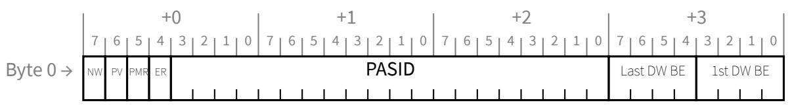

other

| Bit Position | Value |
| ------------ | ----- |
| NW           | +0    |
| PV           | +1    |
| PMR          | +2    |
| ER           | +3    |
| PASID        | Last DW BE |
|          | 1st DW BE |

Figure 2-7 OHC-A1

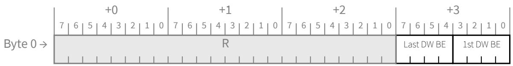

text_image

Byte 0 →
+0
7 | 6 | 5 | 4 | 3 | 2 | 1 | 0
R
+1
7 | 6 | 5 | 4 | 3 | 2 | 1 | 0
+2
7 | 6 | 5 | 4 | 3 | 2 | 1 | 0
+3
7 | 6 | 5 | 4 | 3 | 2 | 1 | 0
Last DW BE
1st DW BE

Figure 2-8 OHC-A2

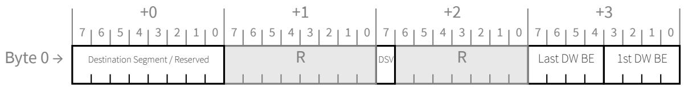

text_image

Byte 0 →
+0
7 | 6 | 5 | 4 | 3 | 2 | 1 | 0
Destination Segment / Reserved
+1
7 | 6 | 5 | 4 | 3 | 2 | 1 | 0
R
DSV
+2
7 | 6 | 5 | 4 | 3 | 2 | 1 | 0
R
+3
7 | 6 | 5 | 4 | 3 | 2 | 1 | 0
Last DW BE
1st DW BE

Figure 2-9 OHC-A3

In OHC-A4, the PMR bit is Privileged Mode Requested (see § Section 6.20 ). When OHC-A4 is included with a TLP, if the PASID is not known or has not been assigned, then the PV ("PASID Valid") bit must be Clear. The PMR bit is Reserved if PV is Clear.

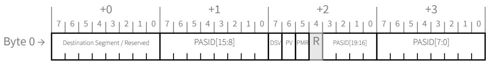

other

| Bit Field | Position | Value |
| --------- | -------- | ----- |
| Destination Segment / Reserved | 7 | 0 |
| Destination Segment / Reserved | 6 | 0 |
| Destination Segment / Reserved | 5 | 0 |
| Destination Segment / Reserved | 4 | 0 |
| Destination Segment / Reserved | 3 | 0 |
| Destination Segment / Reserved | 2 | 0 |
| Destination Segment / Reserved | 1 | 0 |
| Destination Segment / Reserved | 0 | 0 |
| PASID[15:8] | 7 | 0 |
| PASID[15:8] | 6 | 0 |
| PASID[15:8] | 5 | 0 |
| PASID[15:8] | 4 | 0 |
| PASID[15:8] | 3 | 0 |
| PASID[15:8] | 2 | 0 |
| PASID[15:8] | 1 | 0 |
| PASID[15:8] | 0 | 0 |
| DSV | 7 | 0 |
| DSV | 6 | 0 |
| DSV | 5 | 0 |
| DSV | 4 | 0 |
| DSV | 3 | 0 |
| DSV | 2 | 0 |
| DSV | 1 | 0 |
| DSV | 0 | 0 |
| PMR | 7 | 0 |
| PMR | 6 | 0 |
| PMR | 5 | 0 |
| PMR | 4 | 0 |
| PMR | 3 | 0 |
| PMR | 2 | 0 |
| PMR | 1 | 0 |
| PMR | 0 | 0 |
| R | 4 | 0 |
| R | 3 | 0 |
| R | 2 | 0 |
| R | 1 | 0 |
| R | 0 | 0 |
| PASID[19:16] | 7 | 0 |
| PASID[19:16] | 6 | 0 |
| PASID[19:16] | 5 | 0 |
| PASID[19:16] | 4 | 0 |
| PASID[19:16] | 3 | 0 |
| PASID[19:16] | 2 | 0 |
| PASID[19:16] | 1 | 0 |
| PASID[7:0] | 7 | 0 |
| PASID[7:0] | 6 | 0 |
| PASID[7:0] | 5 | 0 |
| PASID[7:0] | 4 | 0 |
| PASID[7:0] | 3 | 0 |
| PASID[7:0] | 2 | 0 |
| PASID[7:0] | 1 | 0 |
| PASID[7:0] | 0 | 0 |

Figure 2-10 OHC-A4

In OHC-A5, LA[1:0] is Lower Address[1:0].

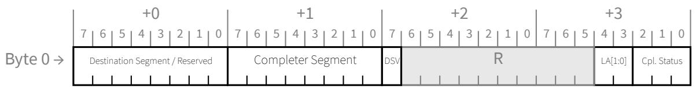  
Figure 2-11 OHC-A5

When TLP Processing Hints (TPH) are used (applicable only for Memory Address Routed Request TLPs) OHC-B must be included with the appropriate PH, ST, AMA and AV values.

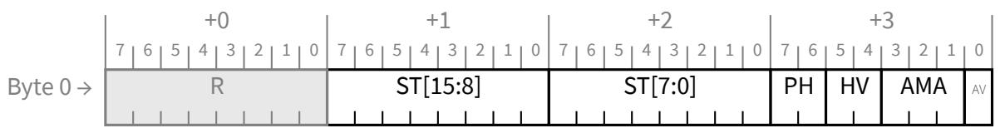

bar_stacked

| Byte | +0 | +1 | +2 | +3 | R | ST[15:8] | ST[7:0] | PH | HV | AMA | AV |
|------|----|----|----|----|---|----------|----------|----|---|-----|----|
| 7    | 6  | 5  | 4  | 3  | | | |  |  |   |   |
| 6    | 5  | 4  | 3  | 2  | | | |  |  |   |   |
| 5    | 4  | 3  | 2  | 1  | | | |  |  |   |   |
| 4    | 3  | 2  | 1  | 0  | | | |  |  |   |   |
| 3    | 2  | 1  | 0  |    | |        |          |    |   |   |   |
| 2    | 1  | 0  |    |    | |        |          |    |   |   |   |
| 1    | 0  |    |    |    | |        |          |    |   |   |   |
| 0    |    |    |    |    |    |        |          |    |   |   |   |
| R    |    |    |    |    |     |          |          |    |   |   |   |
| ST[15:8] |    |    |    |    |     |          |          |    |   |   |   |
| ST[7:0] |    |    |    |    |     |          |          |    |   |   |   |
| PH   |    |    |    |    |     |          |          |    |   |   |   |
| HV   |    |    |    |    |     |          |          |    |   |   |   |
| AMA  |    |    |    |    |     |          |          |    |   |   |   |
| AV   |    |    |    |    |     |          |          |    |   |   |   |
The image displays a schematic representation of byte allocations for each bit. The 'Byte' column indicates the byte positions in the table. The 'Type' column indicates the bit positions in the table.

Figure 2-12 OHC-B

OHC-B includes the PH and ST fields, qualified by the HV[1:0] ("Hints Valid") field, defined as:

• 00b: PH[1:0], ST[15:0] not valid – fields Reserved   
• 01b: PH[1:0] & ST[7:0] valid, ST[15:8] not valid & Reserved   
• 10b: Reserved   
• 11b: PH[1:0] & ST[15:0] valid

The AV qualifies AMA[2:0] independently of HV[1:0].

In Flit Mode, IDE TLPs must include OHC-C as shown in § Figure 2-13. Non-IDE TLPs will, in some cases, also include OHC-C to indicate the Requester Segment (see Segment Rules below). Compared with the IDE Prefix used in Non-Flit Mode, OHC-C does not include the M and P bits because the presence of a MAC/PCRC is indicated using the TS field. When the Requester Segment field is valid the RSV bit must be Set.

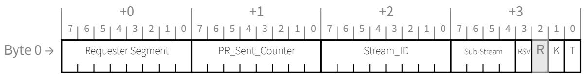  
Figure 2-13 OHC-C

Because IDE TLPs cannot be modified between the two Partner Ports, the IDE Partner Ports and the path between them must operate entirely in Non-Flit Mode or in Flit mode. Root Complexes that support peer-to-peer and Switches cannot modify IDE TLPs associated with Flow-Through Selective IDE Streams, making TLP Translation impossible. If an IDE TLP is directed out an Egress Port operating in a different mode from the Ingress Port, the IDE TLP must be dropped and the result must be reported as a Misrouted IDE TLP error.

It is permitted to configure a Root Complex or Switch such that the Ingress Port is a terminus for an IDE connection and the Egress Port another terminus, such that the TLP is passed through the RC/Switch unprotected by IDE. Doing this requires that the RC/Switch to be trusted, and requires the Root/Switch Ports to have the ability to act as an IDE Terminus, not simply to support Flow-Through IDE.

For IDE Completion TLPs, the Requester Segment field is Reserved and the RSV bit must be Clear.

In Flit Mode, NOP TLPs must never be transmitted as IDE TLPs. Receivers are not required to check for violations of this rule, but, if checked, Receivers must handle NOP TLPs received as IDE TLPs as Malformed TLPs.

# Segment Rules:

In Flit Mode, it is possible, and in some cases required, to include Segment fields in TLPs. One benefit of the Segment fields is to enable routing Route-by-ID TLPs between Hierarchies, which are, by definition, in different Segments. Root Complexes are the only place where peer-to-peer Requests will traverse from one Hierarchy to another. Peer-to-peer Route-by-ID Message Requests can traverse Hierarchies when the Requester includes a valid Destination Segment field. Memory Requests are address routed between Hierarchies, but the associated Completions are ID routed. To aid in Root Complex routing of Completions between Hierarchies, FM Completions can include the Destination Segment field which reflects the value of the Requester Segment field from the associated NP Memory Request. This allows a Root Complex to route Non-Posted Memory Requests between Hierarchies without the need to assume ownership of each outstanding transaction for the purpose of routing the associated Completions back to the Hierarchy of the original Requester. This can lead to performance improvements for peer-to-peer transfers between Hierarchies.

A second use of the Segment fields is to improve error logging. When FM TLP headers are logged in the AER Capability structure the Segment fields will be included. The Segment fields improve traceability when identical Requester/ Completer IDs exist in different Hierarchies. The rules in this section allow the Segment fields to be omitted in some cases to reduce FM TLP overhead. It should be noted that omitting the Segment fields in these cases could forfeit the improved error-logging traceability benefit. It is permitted to use implementation specific mechanisms to select when optional Segment fields are included (e.g., during debug) while still achieving optimal performance during normal operation by omitting non-required Segment fields.

These fields, which exist only in FM, are used to communicate Segment information:

• The Requester Segment field indicates the Hierarchy in which the Requester is located. This field exists in OHC-C and is sometimes included in Memory and Message Requests.   
◦ The Requester Segment Valid (RSV) bit, when Set, indicates that the Requester Segment field is valid.   
◦ When Requester Segment Valid (RSV) is Clear then the Requester Segment field is Reserved.   
◦ For TLPs with OHC-C that are not IDE TLPs, the Sub-Stream[3:0] field must be 0111b, and the Stream ID, PR\_Sent\_Counter, K and T fields/bits are Reserved.

◦ In Flit Mode, IDE Requests (see § Section 6.33 ) other than Configuration Requests must include Requester Segment in OHC-C.

• The Completer Segment field indicates the Hierarchy in which the Completer is located. This field exists in OHC-A5 and is sometimes included in Completions.   
The Destination Segment field indicates the Hierarchy to which the TLP should be routed for ID Based Routing. In Configuration Write Requests this field is also used to configure the Segment of the completing Function. Configuration Requests in FM always include this field in OHC-A3 unless the Request had previously traversed a NFM Link. Route-by-ID Message Requests sometimes include this field in OHC-A4. Completions sometimes include this field in OHC-A5.

◦ The Destination Segment Valid (DSV) bit, when Set, indicates that the Destination Segment field is valid.

◦ When Destination Segment Valid (DSV) is Clear then the Destination Segment field is Reserved.

In addition to the following rules that apply specifically to Root Complexes, Requesters and Completers within Root Complexes must also follow the rules later in this section that apply to Requesters and Completers.

• All Configuration Requests transmitted by a Root Port in Flit Mode, including those initiated through the SFI Configuration Access Method, must include OHC-A3 with the DSV bit set and a valid Destination Segment. The Destination Segment is necessary for the Completer to capture its Segment as described in § Section 2.2.6.2

◦ The Root Complex must indicate the correct Segment value in the Destination Segment field, even if only one Segment is implemented.

• Completions associated with Configuration Requests must be identifiable solely by Transaction ID when received at a RP. Such Completions will not include a Destination Segment field because Configuration Requests do not include a Requester Segment field.

# IMPLEMENTATION NOTE:

# ROOT COMPLEX SUPPORT FOR PEER-TO-PEER NON-POSTED MEMORY TRANSACTIONS THAT TRAVERSE HIERARCHIES §

Because Segment fields aren't communicated across Links in NFM, Root Complexes take on additional burden for peer-to-peer NP Memory Requests that cross from one Hierarchy to another. With the loss of the Requester Segment field when a Request is translated to NFM, the Requester ID that remains in the original NP Memory Request might be indistinguishable from that of other Requesters within the hierarchy domain. Unless all Links along the path from the egress RP to the Completer are known to be in FM, Root Complexes must replace the Requester ID in peer-to-peer NP Memory Requests that cross from one Hierarchy to another. The Requester ID supplied by the Root Complex must be an ID associated with the Root Complex itself. This action is sometimes called "taking ownership" of the NP Request. It is necessary for the Root Complex to take ownership of such Requests to ensure that the Requester ID remains unique within the hierarchy domain of the egress RP, and that the associated Completions can be routed correctly by any Switches within that hierarchy domain. The egress RP also must track all such outstanding NP Memory Requests in order to route the associated Completion(s) to the Hierarchy of the original Requester within the Root Complex, as well as to restore the original Requester ID (Destination BDF/BF in FM) within the Completion(s).

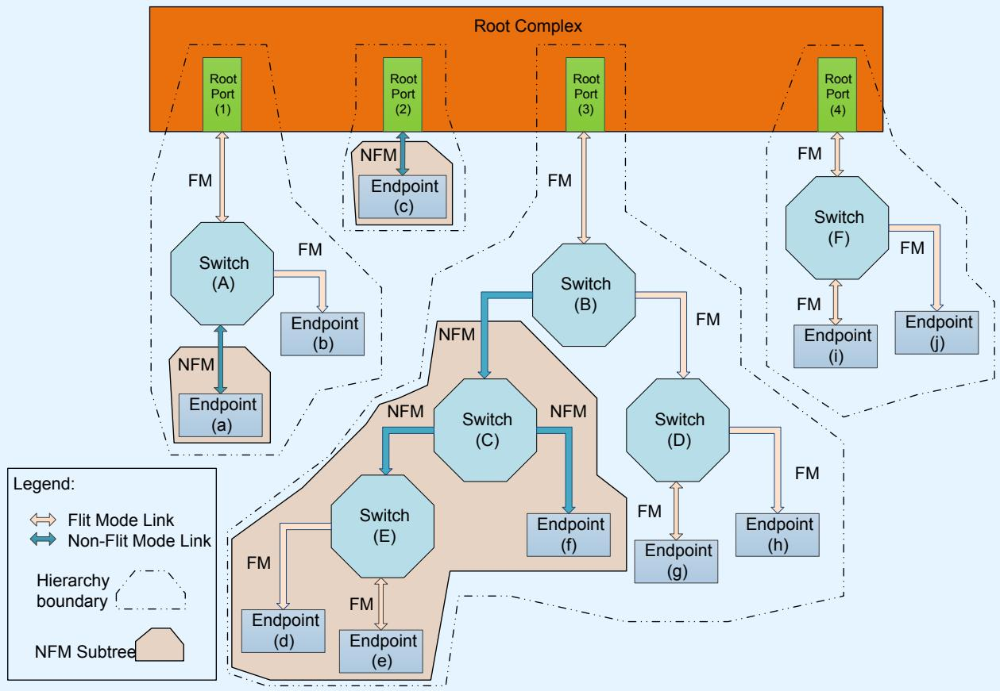

flowchart

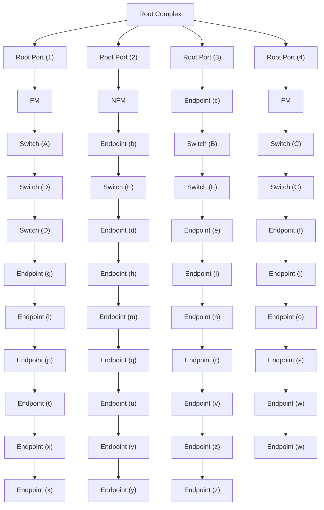
```mermaid
graph TD
    A["Root Complex"] --> B["Root Port (1)"]
    A --> C["Root Port (2)"]
    A --> D["Root Port (3)"]
    A --> E["Root Port (4)"]
    B --> F["FM"]
    C --> G["NFM"]
    D --> H["Endpoint (c)"]
    E --> I["FM"]
    F --> J["Switch (A)"]
    G --> K["Endpoint (b)"]
    H --> L["Switch (B)"]
    I --> M["Switch (C)"]
    J --> N["Switch (D)"]
    K --> O["Switch (E)"]
    L --> P["Switch (F)"]
    M --> Q["Switch (C)"]
    N --> R["Switch (D)"]
    O --> S["Endpoint (d)"]
    P --> T["Endpoint (e)"]
    Q --> U["Endpoint (f)"]
    R --> V["Endpoint (g)"]
    S --> W["Endpoint (h)"]
    T --> X["Endpoint (i)"]
    U --> Y["Endpoint (j)"]
    V --> Z["Endpoint (l)"]
    W --> AA["Endpoint (m)"]
    X --> AB["Endpoint (n)"]
    Y --> AC["Endpoint (o)"]
    Z --> AD["Endpoint (p)"]
    AA --> AE["Endpoint (q)"]
    AB --> AF["Endpoint (r)"]
    AC --> AG["Endpoint (s)"]
    AD --> AH["Endpoint (t)"]
    AE --> AI["Endpoint (u)"]
    AF --> AJ["Endpoint (v)"]
    AG --> AK["Endpoint (w)"]
    AH --> AL["Endpoint (x)"]
    AI --> AM["Endpoint (y)"]
    AJ --> AN["Endpoint (z)"]
    AK --> AO["Endpoint (w)"]
    AL --> AP["Endpoint (x)"]
    AM --> AQ["Endpoint (y)"]
    AN --> AR["Endpoint (z)"]
```

Figure 2-14 Example Topology Illustrating Multiple Segments and NFM Subtrees§

The No NFM Subtree Below This Root Port bit defaults to Clear to indicate that one or more NFM subtree(s) may exist below a Root Port. Referring to the example shown in § Figure 2-14, each Root Port is in a unique Segment/ Hierarchy, and Root Ports 1 through 3 have NFM subtrees below the Root Port. For RP 2, the Link immediately below the RP is in NFM, but for RP 1 and 3 the Root Port cannot directly determine the existence of a NFM subtree within its hierarchy domain, and so the default value of the No NFM Subtree Below This Root Port bit ensures that the Root Complex will take ownership of NP Requests Egressing from those Root Ports. In all cases, it is necessary that system software ensure the No NFM Subtree Below This Root Port bit for a Root Port is Clear in cases where the Root Port has one or more NFM Links or subtrees below it.

However, Root Port 4 does not have any NFM Links below it, and therefore it is not necessary for the Root Complex to take ownership of NP Requests Egressing that Root Port. It is strongly recommended that system software Set the No NFM Subtree Below This Root Port bit in such cases, and it is strongly recommended that Root Complex implementations use the value in the No NFM Subtree Below This Root Port bit to avoid taking ownership of NP Requests when it is not necessary to do so.

Note that for non-IDE Requests directed Upstream to the RC, the existence of a NFM Link between the original Requester and the Root Port is not a factor, because the RC inherently knows the Hierarchy of the Requester based on the Ingress RP of the Request, and can add the Requester Segment if needed.

Regardless of the value of the No NFM Subtree Below This Root Port bit, a Root Complex need not apply NP Memory Request tracking mechanisms for peer-to-peer Selective IDE Stream transactions that cross from one Hierarchy to another, and IDE TLPs cannot in any case be modified between the two IDE Partner Ports. When a Selective IDE Stream is established passing peer-to-peer between Hierarchies, software must ensure that the RC supports such routing, and that the entire path between the two Partner Ports is entirely in FM.

A NFM device could be hot-added into a subtree for which the No NFM Subtree Below This Root Port bit had previously been Set. In such cases it is necessary for system software to Clear the No NFM Subtree Below This Root Port bit prior to allowing the hot-added NFM device to act as a Completer for any NP Memory Request passing peer-to-peer through the RC.

• It is not permitted to configure a Selective IDE Stream passing peer-to-peer between different Hierarchies unless it is known that the RC supports flow-through IDE between the two Root Ports, and that all Links on the path between the two Partner Ports, including both the Root Ports, are in FM.

◦ Root Complexes are not required to support Selective IDE Streams passing peer-to-peer through the RC.

◦ If a condition exists that precludes the RC from passing an IDE TLP associated with a Selective IDE Stream configured to flow-through the RC, then the RC must treat the TLP as a Misrouted IDE TLP error at either the Ingress Port or the Egress Port.

• If a Message or Memory Request received at a RP includes a Requester Segment that does not match the Hierarchy associated with the receiving RP, the Request must be handled by the RP as an Unsupported Request.

A RP is permitted to add a Requester Segment indication to a non-IDE Memory Write Request, or a non-IDE Route by Address Message Request, passing peer-to-peer through the RC if that TLP did not include a Requester Segment at the ingress RP, where the Requester Segment must correspond to the Segment of the Ingress RP.

• Route by ID Message Requests received at a RP without a Destination Segment, or received in NFM, are implied to be destined for a Completer within the same Hierarchy as the Ingress RP.

• When taking ownership of a NP Memory Request passing peer-to-peer through the RC:

◦ The Requester ID in the Request must be replaced with one associated with the Root Complex.

◦ The Request must either use the Requester Segment value associated with the hierarchy domain of the Egress RP, or must not include a Requester Segment.   
◦ The RC is permitted to replace the Tag in the Request, and must ensure the Transaction ID is unique among outstanding NP Requests associated with the same Requester ID used for taking ownership.

▪ The RC is permitted to change the size of the Tag. If this is done, it is permitted to use implementation specific means to determine what size of tag is appropriate.   
▪ The Tag in the Completion(s) must be restored to the Tag from the original Request, as received at the Ingress RP, before returning those Completion(s).

◦ Completions associated with the Request must be identifiable solely by Transaction ID when received at the RP. Such Completions will not include a Destination Segment if the RP did not include a Requester Segment in the Request or if a NFM Link exists between the RP and the Completer.   
◦ The Requester ID value in the Completion(s) must be restored to the Requester ID from the original Request, as received at the Ingress RP, before returning those Completion(s).   
◦ If the RP that received the Request is in FM and OHC-A5 is returned to the Requester with the Completion(s):

▪ The Destination Segment must be set to 00h and the DSV bit must be clear in OHC-A5 that is returned to the original Requester.   
▪ The Completer Segment field must not be modified if the RP receiving the Completion is in FM and OHC-A5 was received with the Completion. The Completer Segment in OHC-A5 returned to the Requester must be set to 00h if the RP receiving the Completion is in NFM or if OHC-A5 was not received with the Completion.

• When passing a NP Memory Request peer-to-peer through the RC without taking ownership:

◦ The Requester ID and Tag in the Request must not be modified.   
◦ For non-IDE NP Memory Requests passing peer-to-peer through the RC that do not include a Requester Segment at the Ingress RP, the RC must add a Requester Segment indication at the Egress RP, using the Segment value associated with the Ingress RP.   
◦ Any Completion received with the DSV bit set and a Destination Segment not matching the value associated with the hierarchy domain of the receiving RP must be routed through the RC to the specified Hierarchy.   
◦ The Requester ID and Tag fields returned to the Requester must not be modified from the values received with the Completion in the destination hierarchy domain.   
◦ If the RP that received the Request is in FM and OHC-A5 is returned to the Requester with the Completion(s) the DSV bit, Destination Segment, and Completer Segment fields must not be modified from the values received with OHC-A5 in the destination hierarchy domain.

There are specific cases where a RP is not required to include Segment information:

◦ A RP is not required to include the Requester Segment field in any non-IDE Memory Request initiated by a Requester within the Root Complex.   
◦ A RP is not required to include a Requester Segment field with Memory Write Requests passing peer-to-peer through the RC.   
◦ A RP is not required to include a Requester Segment field with NP Memory Requests passing peer-to-peer through the RC if the Egress RP is taking ownership of the Request.   
◦ A RP is not required to include the Completer Segment or Destination Segment fields in Completions associated with NP Memory Requests targeting system memory or another element of the Root Complex itself. OHC-A5 must be included if required as described in § Section 2.2.9.2 .

◦ A RP is not required to include the Completer Segment or Destination Segment fields in Completions associated with NP Memory Requests passing peer-to-peer through the RC. OHC-A5 must be included if required as described in § Section 2.2.9.2 .

Each Switch exists entirely within a single Hierarchy by definition. However, Switches are required to comprehend Segment fields in some TLP types for routing purposes. The following rules apply to Switches:

• For TLPs in FM for both the Ingress and Egress Ports, Switches must never modify, add, or remove any Segment field or the DSV/RSV bit(s) within the TLP.   
• For Configuration Requests initiated in FM through the SFI Configuration Access Method on a Switch Downstream Port, the Destination Segment and DSV fields must reflect the values received in the associated Configuration Write or Read Request to the SFI CAM Data Register.   
• A Switch for which Segment Captured is Set must handle as a TLP Translation Egress Blocked Error a NP Memory Request received at the Upstream Port destined for a Downstream Port in NFM that includes a Requester Segment that does not match the Switch’s captured Segment value.

◦ The Request must not be forwarded to the Downstream Port.

• If a condition exists that precludes the Switch from passing an IDE TLP associated with a Selective IDE Stream configured to flow-through the Switch without modification, then the Switch must handle the TLP as a Misrouted IDE TLP error at either the Ingress Port or the Egress Port.

• When a Switch must translate a TLP from NFM to FM:

◦ If Segment Captured is Clear, OHC-C must not be added to a Request.   
◦ If Segment Captured is Set, the Switch is permitted to add OHC-C to Memory and Message Requests with the Requester Segment containing the value established when the Switch itself was configured.   
◦ OHC-C must not be added to Configuration Requests.   
◦ If any OHC-A with DSV and Destination Segment fields is added, the DSV bit must be Clear and the Destination Segment must be 00h.

◦ For a Completion that requires OHC-A5 (see § Section 2.2.9.2 ),

▪ if Segment Captured is Set, then the Switch must apply in the Completer Segment field the Segment value established when the Switch itself was configured,

▪ if Segment Captured is Clear, then the Switch must apply in the Completer Segment field the value 00h.

• Switches must route Configuration Requests solely by the BDF fields (Destination BDF/BF in FM); the Destination Segment field must not be considered for routing.

• A Switch for which Segment Captured is Set must route Completions and Route by ID Message Requests Upstream if DSV Set and the Destination Segment does not match the Switch’s captured Segment value.

• Completions and Route by ID Message Requests must be routed solely by Requester ID / Destination BDF / Destination Device ID if the Ingress Port is in NFM, a Destination Segment is not included (DSV bit is clear), or the included Destination Segment matches the Switch’s captured Segment value.

• A Switch for which Segment Captured is Clear must signal a TLP Translation Egress Blocked error if a Completion or Route by ID Message Request is received with DSV Set, and the TLP must not be forwarded.

• A Switch for which Segment Captured is Clear must signal a TLP Translation Egress Blocked error if a received Message or Memory Request includes a Requester Segment. The Request must not be forwarded.

• A Switch for which Segment Captured is Set must signal a TLP Translation Egress Blocked error if a Message or Memory Request received on a Downstream Port includes a Requester Segment that does not match the Switch’s captured Segment value. The Request must not be forwarded.

• When reordering Completions with other Completions, Switches are permitted to consider Destination Segment fields included in the Completions as effectively part of the Transaction ID. When not included, the Destination Segment is implied to be the same Segment where the Completion exists.   
• When reordering TLPs based on ID Based Ordering (IDO), Switches must consider Requester Segment fields included in Requests, and Destination Segment fields included in Completions, as effectively part of the Transaction ID. When the Destination Segment is not included, for reordering purposes the Destination Segment must be considered to be the same Segment where the Completion exists. When the Requester Segment is not included in a Request, Switches must assume a matching value for IDO purposes.

# The following rules apply to Requesters:

• When the Requester Segment field is included in a Request it must be set to the value captured from a Configuration Write Request as described in § Section 2.2.6.2 .   
• When the Segment Captured bit is Clear all Message and Memory Requests initiated by the Requester must not include OHC-C.   
• When the Segment Captured bit is Set all Message Requests initiated by the Requester must include OHC-C with Requester Segment.   
• When the Segment Captured bit is Set a Requester is permitted to include OHC-C with Requester Segment in Memory Requests.   
• When the Segment Captured bit is Clear, Route by ID Message Requests initiated by the Requester must not include a Destination Segment (the DSV bit must be clear).   
• When the Segment Captured bit is Set a Requester is required to include a Destination Segment, and set the DSV bit, in Route by ID Message Requests destined for a different Hierarchy. Requesters use implementation specific means to determine the Hierarchy to which a Route by ID Message Request should be routed. When the Segment Captured bit is Set the Destination Segment is required in ATS Invalidate Request, Invalidate Completion, and PRG Response Messages even if the target is in the same Hierarchy. For other Route by ID Message Requests the Destination Segment is optional when the Segment Captured bit is Set and the Requester knows, by definition or through programming, that the target of the Request is in the same Hierarchy.   
• Requesters must not qualify the Destination Segment field in received Completions.   
• A Requester is not required to include the Requester Segment field in any non-IDE Memory Request.

# The following rules apply to Completers:

• Completers must capture their Segment value from Configuration Write Requests as described in § Section 2.2.6.2 .   
• When the Segment Captured bit is Clear, Completers must set the Completer Segment field to 00h in any OHC-A5 that is included in a Completion.   
• When the Segment Captured bit is Set, Completers must set the Completer Segment field in any OHC-A5 that is included in a Completion to the Segment value that was captured as described in § Section 2.2.6.2 .   
◦ If the Completion associated with the first Configuration Write Request includes OHC-A5, the Completer Segment field must be set to the value captured from that Request.   
• Completers must clear the DSV bit and set the Destination Segment field to 00h in any OHC-A5 that is included with a Completion associated with a Configuration Request.   
• For a NP Memory Request received without a Requester Segment field, Completers must clear the DSV bit and set the Destination Segment field to 00h in any OHC-A5 that is included with the associated Completion(s).

• For a NP Memory Request received with a Requester Segment field, Completers must set the DSV bit and set the Destination Segment field to the value of the received Requester Segment in any OHC-A5 that is included with the associated Completion(s).   
• When the Segment Captured bit is Set and a NP Memory Request is received with a Requester Segment value not matching the Completer’s captured Segment value, all Completions associated with the Request must include OHC-A5.   
• Completers must not qualify the acceptance of a Route by ID Message Request based on the value of the Destination Segment field in the Request.   
• Completers must not include OHC-A5 with a Completion when all of the following are true:

◦ Completion Status is successful.   
◦ Lower Address[1:0] equal to 00b.   
◦ The Completer’s Segment Captured bit is Clear.

• Completers are permitted to not include OHC-A5 with a Completion when all of the following are true:

◦ Completion Status is successful.   
◦ Lower Address[1:0] equal to 00b.   
◦ The Completer’s Segment Captured bit is Set.   
◦ The associated Request either did not include a Requester Segment field or included a Requester Segment field matching the Completer’s captured Segment value.

# 2.2.2 TLPs with Data Payloads - Rules §

• Length is specified as an integral number of DW   
• Length[9:0] is Reserved for all Messages except those that explicitly refer to a data length

◦ Refer to the Message Code tables in § Section 2.2.8 .

• A Function transmitting a TLP with a data payload must not allow the data payload length as indicated by the TLP's Length field to exceed the Function's applicable MPS setting. If the Function's Mixed\_MPS\_Supported bit is Clear or the target is host memory, the applicable MPS setting must be the Function's computed Tx\_MPS\_Limit, as defined below. If the Mixed\_MPS\_Supported bit is Set, the Function must have an implementation specific mechanism capable of supporting different MPS settings for different targets, and must handle both Request and Completion TLPs. Target-specific MPS settings are permitted to be above or below the Function's Tx\_MPS\_Limit, but they must never exceed the Function's Max\_Payload\_Size Supported field value. The Function's Tx\_MPS\_Limit is determined as follows:

◦ For a single-Function device, the Tx\_MPS\_Limit must be its Max\_Payload\_Size field value, its "MPS setting".   
◦ Otherwise, for an ARI Device, the Tx\_MPS\_Limit must be the MPS setting in Function 0. The MPS settings in other Functions of an MFD must be ignored.   
◦ Otherwise, for a Function in a non-ARI MFD whose MPS settings are identical across all Functions, the Tx\_MPS\_Limit must be the common MPS setting.   
◦ Otherwise, for a Function in a non-ARI MFD whose MPS settings are not identical across all Functions, the Tx\_MPS\_Limit must be the MPS setting in an implementation specific Function.

▪ Transmitter implementations are encouraged to use the MPS setting from the Function that generated the transaction, or else the smallest MPS setting across all Functions.   
▪ Software should not configure the MPS setting in different Functions to different values unless software is aware of the specific implementation.

◦ MPS settings apply only to TLPs with data payloads; Memory Read Requests are not restricted in length by MPS settings. The size of the Memory Read Request is controlled by the TLP's Length field.

• The data payload size in a Received TLP as indicated by the TLP's Length field must not exceed a computed Rx\_MPS\_Limit for the receiving Function, as determined by MPS-related parameters as indicated below.

◦ Receivers must check for violations of this rule. If a Receiver determines that a TLP violates this rule, the TLP must be handled as a Malformed TLP.   
▪ This is a reported error associated with the Receiving Port (see § Section 6.2 ).

◦ In the receiving Function, if the Rx\_MPS\_Fixed bit is Set, the Rx\_MPS\_Limit must be the Max\_Payload\_Size Supported field. Otherwise, the Rx\_MPS\_Limit must be determined by the Max\_Payload\_Size field (the "MPS setting") in one or more Functions as follows:

▪ For a single-Function device, the Rx\_MPS\_Limit must be its MPS setting.   
▪ Otherwise, for an ARI Device, the Rx\_MPS\_Limit must be the MPS setting in Function 0. MPS settings in other Functions must be ignored.   
▪ Otherwise, for an Upstream Port associated with a non-ARI MFD whose MPS settings are identical across all Functions, the Rx\_MPS\_Limit must be the common MPS setting.   
▪ Otherwise, for an Upstream Port associated with a non-ARI MFD whose MPS settings are not identical across all Functions, the Rx\_MPS\_Limit must be the MPS setting in an implementation specific Function.

▪ Receiver implementations are encouraged to use the MPS setting from the Function targeted by the transaction, or else the largest MPS setting across all Functions.   
▪ Software should not configure the MPS setting in different Functions to different values unless software is aware of the specific implementation.

• For TLPs that include data, the value in the Length field and the actual amount of data included in the TLP must match.

◦ In NFM, Receivers must check for violations of this rule. If a Receiver determines that a TLP violates this rule, the TLP is a Malformed TLP.

▪ This is a Reported Error associated with the Receiving Port (see § Section 6.2 ).

• The value in the Length field applies only to data - the TLP Digest is not included in the Length.   
• When a data payload associated with a byte address is included in a TLP other than an AtomicOp Request or an AtomicOp Completion, the first byte of data following the header corresponds to the byte address closest to zero and the succeeding bytes are in increasing byte address sequence.

◦ Example: For a 16-byte write to location 100h, the first byte following the header would be the byte to be written to location 100h, and the second byte would be written to location 101h, and so on, with the final byte written to location 10Fh.

• The data payload in AtomicOp Requests and AtomicOp Completions must be formatted such that the first byte of data following the TLP header is the least significant byte of the first data value, and subsequent bytes of data are strictly increasing in significance. With Compare And Swap (CAS) Requests, the second data value immediately follows the first data value, and must be in the same format.

◦ The endian format used by AtomicOp Completers to read and write data at the target location is implementation specific, and is permitted to be whatever the Completer determines is appropriate for the target memory (e.g., little endian, big endian, etc.). Endian format capability reporting and controls for AtomicOp Completers are outside the scope of this specification.   
◦ Little endian example: For a 64-bit (8-byte) Swap Request targeting location 100h with the target memory in little endian format, the first byte following the header is written to location 100h, the second byte is written to location 101h, and so on, with the final byte written to location 107h. Note that before performing the writes, the Completer first reads the target memory locations so it can

return the original value in the Completion. The byte address correspondence to the data in the Completion is identical to that in the Request.

◦ Big endian example: For a 64-bit (8-byte) Swap Request targeting location 100h with the target memory in big endian format, the first byte following the header is written to location 107h, the second byte is written to location 106h, and so on, with the final byte written to location 100h. Note that before performing the writes, the Completer first reads the target memory locations so it can return the original value in the Completion. The byte address correspondence to the data in the Completion is identical to that in the Request.   
◦ § Figure 2-15 shows little endian and big endian examples of Completer target memory access for a 64-bit (8-byte) FetchAdd. The bytes in the operands and results are numbered 0-7, with byte 0 being least significant and byte 7 being most significant. In each case, the Completer fetches the target memory operand using the appropriate endian format. Next, AtomicOp compute logic in the Completer performs the FetchAdd operation using the original target memory value and the “add” value from the FetchAdd Request. Finally, the Completer stores the FetchAdd result back to target memory using the same endian format used for the fetch.

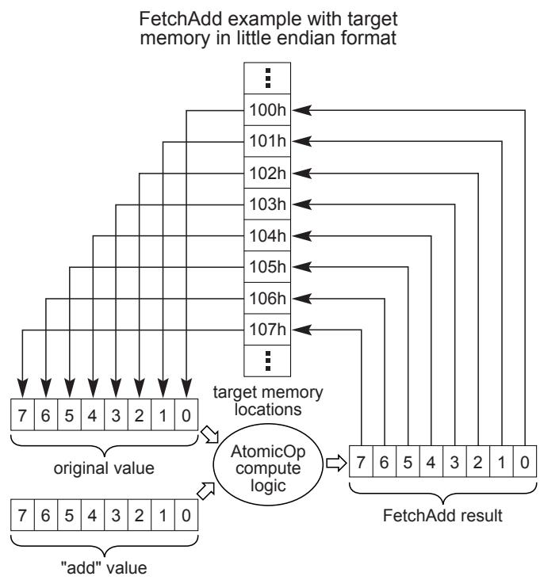

flowchart

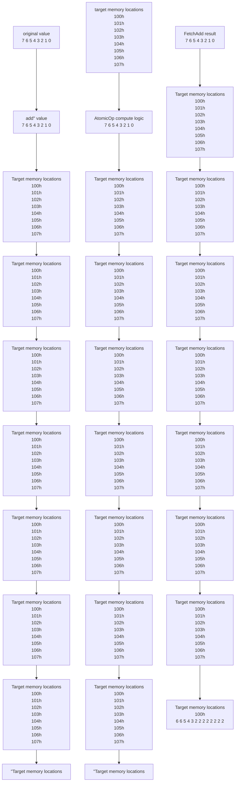
```mermaid
graph TD
    A["original value\n7 6 5 4 3 2 1 0"] --> B["add&quot; value\n7 6 5 4 3 2 1 0"]
    C["target memory locations\n100h\n101h\n102h\n103h\n104h\n105h\n106h\n107h"] --> D["AtomicOp compute logic\n7 6 5 4 3 2 1 0"]
    E["FetchAdd result\n7 6 5 4 3 2 1 0"] --> F["Target memory locations\n100h\n101h\n102h\n103h\n104h\n105h\n106h\n107h"]
    B --> G["Target memory locations\n100h\n101h\n102h\n103h\n104h\n105h\n106h\n107h"]
    D --> H["Target memory locations\n100h\n101h\n102h\n103h\n104h\n105h\n106h\n107h"]
    F --> I["Target memory locations\n100h\n101h\n102h\n103h\n104h\n105h\n106h\n107h"]
    G --> J["Target memory locations\n100h\n101h\n102h\n103h\n104h\n105h\n106h\n107h"]
    H --> K["Target memory locations\n100h\n101h\n102h\n103h\n104h\n105h\n106h\n107h"]
    I --> L["Target memory locations\n100h\n101h\n102h\n103h\n104h\n105h\n106h\n107h"]
    J --> M["Target memory locations\n100h\n101h\n102h\n103h\n104h\n105h\n106h\n107h"]
    K --> N["Target memory locations\n100h\n101h\n102h\n103h\n104h\n105h\n106h\n107h"]
    L --> O["Target memory locations\n100h\n101h\n102h\n103h\n104h\n105h\n106h\n107h"]
    M --> P["Target memory locations\n100h\n101h\n102h\n103h\n104h\n105h\n106h\n107h"]
    N --> Q["Target memory locations\n100h\n101h\n102h\n103h\n104h\n105h\n106h\n107h"]
    O --> R["Target memory locations\n100h\n101h\n102h\n103h\n104h\n105h\n106h\n107h"]
    P --> S["Target memory locations\n100h\n101h\n102h\n103h\n104h\n105h\n106h\n107h"]
    Q --> T["Target memory locations\n100h\n101h\n102h\n103h\n104h\n105h\n106h\n107h"]
    R --> U["Target memory locations\n100h\n101h\n102h\n103h\n104h\n105h\n106h\n107h"]
    S --> V["Target memory locations\n100h\n101h\n102h\n103h\n104h\n105h\n106h\n107h"]
    T --> W["Target memory locations\n100h\n101h\n102h\n103h\n104h\n105h\n106h\n107h"]
    U --> X["Target memory locations\n100h\n101h\n102h\n103h\n104h\n105h\n106h\n107h"]
    V --> Y["Target memory locations\n100h\n101h\n102h\n103h\n104h\n105h\n106h\n107h"]
    W --> Z["Target memory locations\n100h\n101h\n102h\n103h\n104h\n105h\n106h\n107h"]
    X --> AA["Target memory locations\n100h\n6 6 5 4 3 2 2 2 2 2 2 2 2"]
    Y --> AB["&quot;Target memory locations"]
    Z --> AC["&quot;Target memory locations"]
```

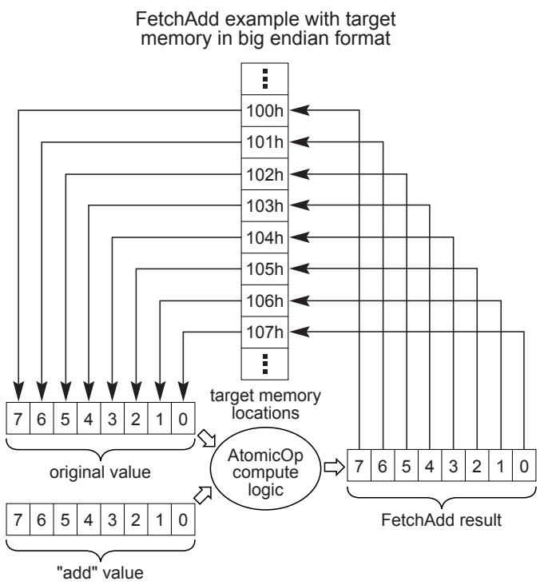

flowchart

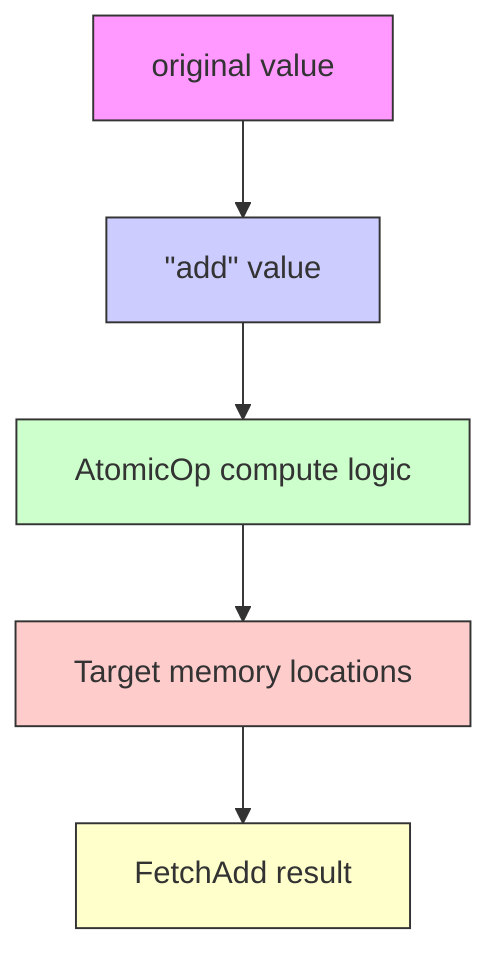
```mermaid
graph TD
    A["original value"] --> B["&quot;add&quot; value"]
    B --> C["AtomicOp compute logic"]
    C --> D["Target memory locations"]
    D --> E["FetchAdd result"]
    style A fill:#f9f,stroke:#333
    style B fill:#ccf,stroke:#333
    style C fill:#cfc,stroke:#333
    style D fill:#fcc,stroke:#333
    style E fill:#ffc,stroke:#333
```

A-0742

Figure 2-15 Examples of Completer Target Memor § y Access for FetchAdd

# IMPLEMENTATION NOTE:

# ENDIAN FORMAT SUPPORT BY RC ATOMICOP COMPLETERS §

One key reason for permitting an AtomicOp Completer to access target memory using an endian format of its choice is so that PCI Express devices targeting host memory with AtomicOps can interoperate with host software that uses atomic operation instructions (or instruction sequences). Some host environments have limited endian format support with atomic operations, and by supporting the “right” endian format(s), an RC AtomicOp Completer may significantly improve interoperability.

For an RC with AtomicOp Completer capability on a platform supporting little-endian-only processors, there is little envisioned benefit for the RC AtomicOp Completer to support any endian format other than little endian. For an RC with AtomicOp Completer capability on a platform supporting bi-endian processors, there may be benefit in supporting both big endian and little endian formats, and perhaps having the endian format configurable for different regions of host memory.

There is no PCI Express requirement that an RC AtomicOp Completer support the host processor's “native” format (if there is one), nor is there necessarily significant benefit to doing so. For example, some processors can use load-link/store-conditional or similar instruction sequences to do atomic operations in non-native endian formats and thus not need the RC AtomicOp Completer to support alternative endian formats.

# IMPLEMENTATION NOTE:

# MAINTAINING ALIGNMENT IN DATA PAYLOADS §

§ Section 2.3.1.1 discusses rules for forming Read Completions respecting certain natural address boundaries. Memory Write performance can be significantly improved by respecting similar address boundaries in the formation of the Write Request. Specifically, forming Write Requests such that natural address boundaries of 64 or 128 bytes are respected will help to improve system performance.

# 2.2.3 TLP Digest Rules - Non-Flit Mode Only §

• For any TLP, a value of 1b in the TD bit indicates the presence of the TLP Digest field including an end-to-end CRC (ECRC) value at the end of the TLP.

◦ A TLP where the TD bit value does not correspond with the observed size (accounting for the data payload, if present) is a Malformed TLP.

▪ This is a reported error associated with the Receiving Port (see § Section 6.2 ).

• If an intermediate or ultimate PCI Express Receiver of the TLP does not support ECRC checking, the Receiver must ignore the TLP Digest 8 .

◦ If the Receiver of the TLP supports ECRC checking, the Receiver interprets the value in the TLP Digest field as an ECRC value, according to the rules in § Section 2.7.1 .

# 2.2.4 Routing and Addressing Rules §

There are three principal mechanisms for TLP routing: address, ID, and implicit. This section defines the rules for the address and ID routing mechanisms. Implicit routing is used only with Message Requests, and is covered in § Section 2.2.8 .

# 2.2.4.1 Address-Based Routing Rules §

• Address routing is used with Memory and I/O Requests.   
• Two address formats are specified, a 64-bit format used with a 4 DW header (see § Figure 2-16 and § Figure 2-18) and a 32-bit format used with a 3 DW header (see § Figure 2-17 and § Figure 2-19).

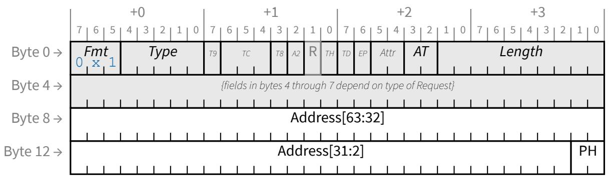  
Figure 2-16 64-bit Address Routing - Non-Flit Mode§

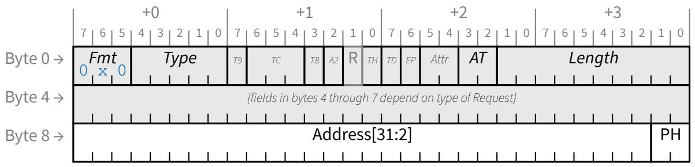

other

| Byte | Value |
|------|-------|
| 0    | Fmt   |
| 0    | Type  |
| T9   | TC    |
| T8   | A2    |
| R    | TH    |
| TD   | EP    |
| Attr | AT    |
| Length | Length |

Figure 2-17 32-bit Address Routing - Non-Flit Mode§

bar_stacked

| Byte | Type | TC | OHC | TS | Attr | Length | Requester ID | EP | R | Tag |
|------|------|----|-----|----|------|--------|--------------|----|----|-----|
| 0    | 7    | 6  | 5   | 4  | 3    | 2      | 1            | 0  | 0  | 0   |
| 1    | 0    | 7  | 6   | 5  | 4    | 3      | 2            | 0  | 0  | 0   |
| 2    | 0    | 7  | 6   | 5  | 4    | 3      | 2            | 0  | 0  | 0   |
| 3    | 0    | 7  | 6   | 5  | 4    | 3      | 2            | 0  | 0  | 0   |
| 4    | 0    | 7  | 6   | 5  | 4    | 3      | 2            | 0  | 0  | 0   |
| 5    | 0    | 7  | 6   | 5  | 4    | 3      | 2            | 0  | 0  | 0   |
| 6    | 0    | 7  | 6   | 5  | 4    | 3      | 2            | 0  | 0  | 0   |
| 7    | +0   | -  | -   | -  | -    | -      | -            | -  | -  | -   |
| 8    | +1   | -  | -   | -  | -    | -      | -            | -  | -  | -   |
| 9    | +2   | -  | -   | -  | -    | -      | -            | -  | -  | -   |
| 10   | +3   | -  | -   | -  | -    | -      | -            | -  | -  | -   |
| 11   | +3   | -  | -   | -  | -    | -      | -            | -  | -  | -   |
| 12   | +3   | -  | -   | -  | -    | -      | -            | -  | -  | AT  |
The image contains a table with the byte values and the corresponding fields used for the table. The 'Address' column contains the hexadecimal addresses and the 'Address[31:2]' column contains the address value.

Figure 2-18 64-bit Address Routing - Flit Mode§

bar_stacked

| Byte | Type | TC | OHC | TS | Attr | Length | Requester ID | EP | R | Tag | Address[31:2] |
|------|------|----|-----|----|------|--------|--------------|----|---|-----|---------------|
| 0    | +0   | 7  | 6   | 5   | 4    | 3      | -            | -  | - | -   | -             |
| →    | -    | -  | -   | -  | -    | -      | -            | -  | - | -   | -             |
| 4    | -    | -  | -   | -  | -    | -      | -            | -  | - | -   | -             |
| →    | -    | -  | -   | -  | -    | -      | -            | -  | - | -   | -             |
| 8    | -    | -  | -   | -  | -    | -      | -            | -  | - | -   | AT            |
| Address[31:2]<lcel><lcel><lcel><lcel><lcel><lcel><lcel><lcel><lcel><lcel><lcel><lcel><lcel><nl>

Figure 2-19 32-bit Address Routing - Flit Mode§

• For Memory Read, Memory Write, DMWr, and AtomicOp Requests, the Address Type (AT) field is encoded as shown in § Table 10-1. For all other Requests, the AT field is Reserved unless explicitly stated otherwise.   
• If TH is Set, the PH field is encoded as shown in § Table 2-18. If TH is Clear, the PH field is Reserved.   
• Address mapping to the TLP header is shown in § Table 2-7.

Table 2-7 Address Field Mapping§ 

<table><tr><td>Address Bits</td><td>32-bit Addressing</td><td>64-bit Addressing</td></tr><tr><td>63:56</td><td>Not Applicable</td><td>Bits 7:0 of Byte 8</td></tr><tr><td>55:48</td><td>Not Applicable</td><td>Bits 7:0 of Byte 9</td></tr><tr><td>47:40</td><td>Not Applicable</td><td>Bits 7:0 of Byte 10</td></tr><tr><td>39:32</td><td>Not Applicable</td><td>Bits 7:0 of Byte 11</td></tr><tr><td>31:24</td><td>Bits 7:0 of Byte 8</td><td>Bits 7:0 of Byte 12</td></tr><tr><td>23:16</td><td>Bits 7:0 of Byte 9</td><td>Bits 7:0 of Byte 13</td></tr><tr><td>15:8</td><td>Bits 7:0 of Byte 10</td><td>Bits 7:0 of Byte 14</td></tr><tr><td>7:2</td><td>Bits 7:2 of Byte 11</td><td>Bits 7:2 of Byte 15</td></tr></table>

• Memory Read, Memory Write, DMWr, and AtomicOp Requests use both formats.

◦ For Addresses below 4 GB, Requesters must use the 32-bit format. The behavior of the Receiver is not specified if a 64-bit format Request addressing below 4 GB (i.e., with the upper 32 bits of address all 0) is received.

• All other address routed requests must use 64-bit addressing.

◦ When addressing below 4 GB the upper 32 address bits must be to 0000 0000h.   
◦ This MUST@FLIT include Address Routed Messages. See § Table 2-20. 9

• I/O Read Requests and I/O Write Requests use the 32-bit format.   
• All agents must decode all address bits in the header - address aliasing is not allowed.

# IMPLEMENTATION NOTE:

# PREVENTION OF ADDRESS ALIASING §

For correct software operation, full address decoding is required even in systems where it may be known to the system hardware architect/designer that fewer than 64 bits of address are actually meaningful in the system.

# 2.2.4.2 ID Based Routing Rules §

• ID routing is used with Configuration Requests, with ID Routed Messages, and with Completions. This specification defines several Messages that are ID Routed (see § Table F-1). Other specifications are permitted to define additional ID Routed Messages.   
• ID routing uses the Bus, Device, and Function Numbers (as applicable) to specify the destination for the TLP:

◦ For non-ARI Routing IDs, Bus, Device, and (3-bit) Function Number to TLP header mapping is shown in § Table 2-8, § Figure 2-20, and § Figure 2-22.

◦ For ARI Routing IDs, the Bus and (8-bit) Function Number to TLP header mapping is shown in § Table 2-9, § Figure 2-21, and § Figure 2-23.

• In FM, Completions and ID Routed Messages with a different destination Hierarchy than the Hierarchy in which they originate must be routed to the destination Hierarchy using the Destination Segment field and then routed within the destination Hierarchy by the destination Bus, Device, and Function Numbers.   
• Two ID routing formats are specified, one used with a 4 DW header (see § Figure 2-20 and § Figure 2-21) and one used with a 3 DW header (see § Figure 2-23 and § Figure 2-21).

◦ Header field locations are the same for both formats (see § Figure 2-5).

Table 2-8 Header Field Locations for non-ARI ID Routing - Non-Flit Mode§ 

<table><tr><td>Field</td><td>Header Location</td></tr><tr><td>Bus Number[7:0]</td><td>Bits 7:0 of Byte 8</td></tr><tr><td>Device Number[4:0]</td><td>Bits 7:3 of Byte 9</td></tr><tr><td>Function Number[2:0]</td><td>Bits 2:0 of Byte 9</td></tr></table>

Table 2-9 Header Field Locations for ARI ID Routing§ 

<table><tr><td>Field</td><td>Header Location</td></tr><tr><td>Bus Number[7:0]</td><td>Bits 7:0 of Byte 8</td></tr><tr><td>Function Number[7:0]</td><td>Bits 7:0 of Byte 9</td></tr></table>

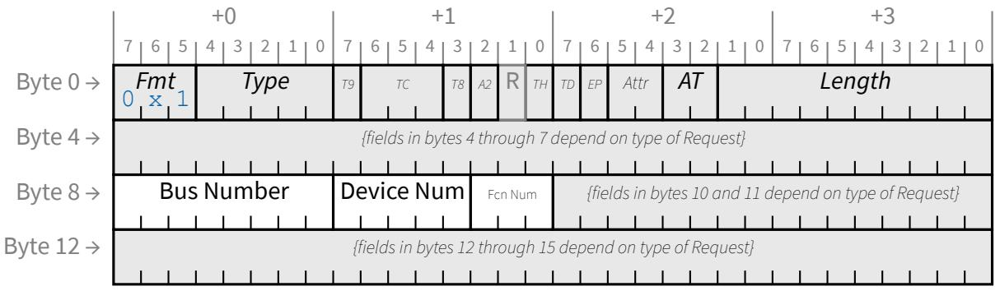

bar_stacked

| Byte | Value |
|------|-------|
| Byte 0 → | Fmt 0 x 1 |
| Byte 4 → | {fields in bytes 4 through 7 depend on type of Request} |
| Byte 8 → | Bus Number |
| Byte 12 → | {fields in bytes 12 through 15 depend on type of Request} |

Figure 2-20 Non-ARI ID Routing with 4 DW Header - Non-Flit Mode§

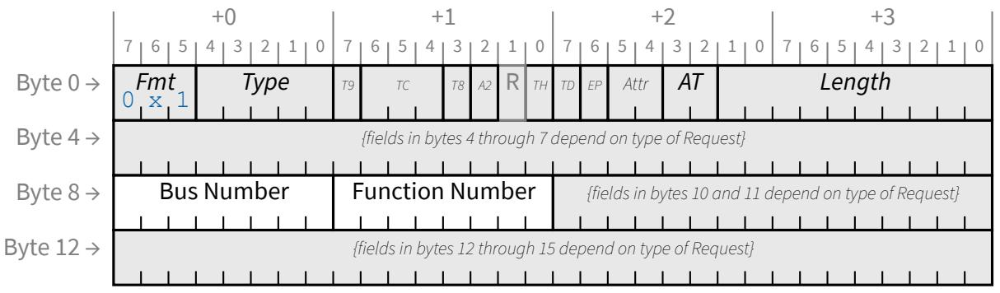

other

| Byte | Value |
|------|-------|
| 0    | Fmt 0 x 1 |
| Type | T9    |
| Type | TC    |
| Type | T8    |
| Type | A2    |
| Type | R     |
| Type | TH    |
| Type | TD    |
| Type | EP    |
| Type | Attr  |
| Type | AT    |
| Type | Length |
| 4    | {fields in bytes 4 through 7 depend on type of Request} |
| 8    | Bus Number |
| 8    | Function Number |
| 10   | {fields in bytes 10 and 11 depend on type of Request} |
| 12   | {fields in bytes 12 through 15 depend on type of Request} |

Figure 2-21 ARI ID Routing with 4 DW Header - Non-Flit Mode§

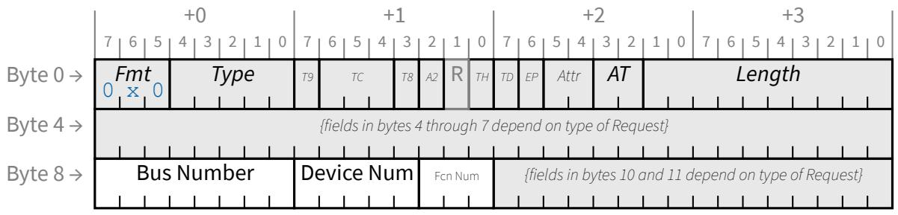

other

| Byte | Value |
|------|-------|
| 0    | Fmt   |
| 0    | Type  |
| T9   | TC    |
| T8   | A2    |
| R    | TH    |
| TD   | EP    |
| Attr | AT    |
| Length | Length |

Figure 2-22 Non-ARI ID Routing with 3 DW Header - Non-Flit Mode§

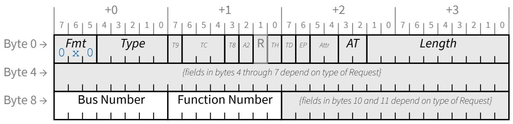

other

| Byte Range | Bit Position | Function Number | Description                     |
|------------|--------------|------------------|---------------------------------|
| Byte 0     | 0            | +0               | Fmt                             |
|          | 0            | ×                | Type                            |
|          |          | T9               | TC                              |
|          |          | T8               | A2                              |
|          |          | R                | TH                              |
|          |          | TD               | EP                              |
|          |          | AT               | Length                          |
| Byte 4     |            | {fields in bytes 4 through 7 depend on type of Request} | |
|          |          | Bus Number       | Function Number                |
|          |          | {fields in bytes 10 and 11 depend on type of Request} | |

Figure 2-23 ARI ID Routing with 3 DW Header - Non-Flit Mode§

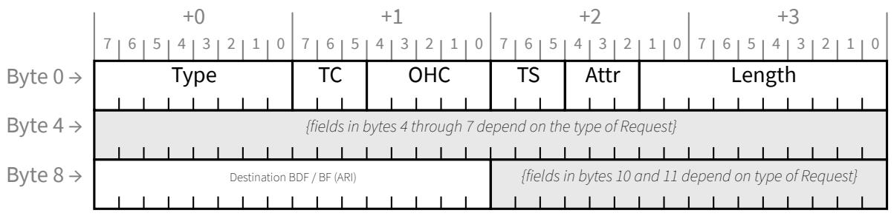  
Figure 2-24 ID Routing with 3 DW Header - Flit Mode§

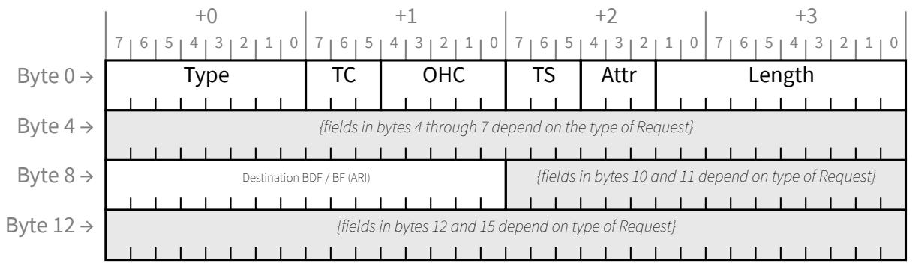

other

| Byte | Type | TC | OHC | TS | Attr | Length |
|------|------|----|-----|----|------|--------|
| 0    | +0   |    |     |    |      |        |
| 4    |    |    |     |    |      |        |
| 8    |    |    |     |    |      |        |
| 12   |    |    |     |    |      |        |

Figure 2-25 ID Routing with 4 DW Header - Flit Mode§

# 2.2.5 First/Last DW Byte Enables Rules §

The general function of TLP Byte Enables is similar in Non-Flit Mode and Flit Mode, however the detailed rules differ.

# 2.2.5.1 Byte Enable Rules for Non-Flit Mode §

Byte Enables are included with Memory, I/O, and Configuration Requests. This section defines the corresponding rules. Byte Enables, when present in the Request header, are located in byte 7 of the header (see § Figure 2-26). For Memory Read Requests and DMWr Requests that have the TH bit Set, the Byte Enable fields are repurposed to carry the ST[7:0] field (refer to § Section 2.2.7.1.1 for details), and values for the Byte Enables are implied as defined below. The TH bit must only be Set in Memory Read Requests and DMWr Requests when it is acceptable to complete those Requests as if all bytes for the requested data were enabled.

• For Memory Read Requests and DMWr Requests that have the TH bit Set, the following values are implied for the Byte Enables. See § Section 2.2.7 for additional requirements.   
◦ If the Length field for this Request indicates a length of 1 DW, then the value for the First DW Byte Enables is implied to be 1111b and the value for the Last DW Byte Enables is implied to be 0000b.   
◦ If the Length field for this Request indicates a length of greater than 1 DW, then the value for the First DW Byte Enables and the Last DW Byte Enables is implied to be 1111b.

# IMPLEMENTATION NOTE:

# READ REQUEST WITH TPH TO NON-PREFETCHABLE SPACE §

Memory Read Requests with the TH bit Set and that target Non-Prefetchable Memory Space should only be issued when it can be guaranteed that completion of such reads will not create undesirable side effects. See § Section 7.5.1.2.1 for consideration of certain BARs that may have the Prefetchable bit Set even though they map some locations with read side-effects.

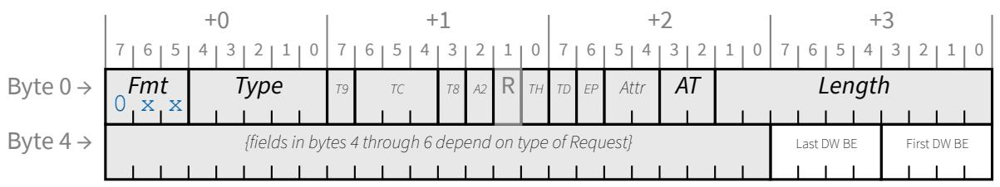

other

| Byte | Value |
|------|-------|
| 0    | Fmt   |
| 1    | Type  |
| 2    | T9    |
| 3    | TC    |
| 4    | T8    |
| 5    | A2    |
| 6    | R     |
| 7    | TH    |
| 8    | TD    |
| 9    | EP    |
| 10   | Attr  |
| 11   | AT    |
| 12   | Length|
| 13   | Last DW BE |
| 14   | First DW BE |

Figure 2-26 Location of Byte Enables in TLP Header - Non-Flit Mode§

• The First DW BE[3:0] field contains Byte Enables for the first (or only) DW referenced by a Request.

◦ If the Length field for a Request indicates a length of greater than 1 DW, this field must not equal 0000b.

• The Last DW BE[3:0] field contains Byte Enables for the last DW of a Request.

◦ If the Length field for a Request indicates a length of 1 DW, this field must equal 0000b.

◦ If the Length field for a Request indicates a length of greater than 1 DW, this field must not equal 0000b.

• For each bit of the Byte Enables fields:

◦ a value of 0b indicates that the corresponding byte of data must not be written or, if non-prefetchable, must not be read at the Completer.

◦ a value of 1b indicates that the corresponding byte of data must be written or read at the Completer.

• Non-contiguous Byte Enables (enabled bytes separated by non-enabled bytes) are permitted in the First DW BE field for all Requests with length of 1 DW.

◦ Non-contiguous Byte Enable examples: 1010b, 0101b, 1001b, 1011b, 1101b

• Non-contiguous Byte Enables are permitted in both Byte Enables fields for Quad Word (QW) aligned Memory Requests with length of 2 DW (1 QW).

• All non-QW aligned Memory Requests with length of 2 DW (1 QW) and Memory Requests with length of 3 DW or more must enable only bytes that are contiguous with the data between the first and last DW of the Request.

◦ Contiguous Byte Enables examples: First DW BE: 1100b, Last DW BE: 0011b

First DW BE: 1000b, Last DW BE: 0111b

• § Table 2-10 shows the correspondence between the bits of the Byte Enables fields, their location in the Request header, and the corresponding bytes of the referenced data.

Table 2-10 Byte Enables Location and Correspondence 

<table><tr><td>Byte Enables</td><td>Header Location</td><td>Affected Data Byte $^{10}$ </td></tr><tr><td>First DW BE[0]</td><td>Bit 0 of Byte 7</td><td>Byte 0</td></tr><tr><td>First DW BE[1]</td><td>Bit 1 of Byte 7</td><td>Byte 1</td></tr><tr><td>First DW BE[2]</td><td>Bit 2 of Byte 7</td><td>Byte 2</td></tr><tr><td>First DW BE[3]</td><td>Bit 3 of Byte 7</td><td>Byte 3</td></tr><tr><td>Last DW BE[0]</td><td>Bit 4 of Byte 7</td><td>Byte N-4</td></tr><tr><td>Last DW BE[1]</td><td>Bit 5 of Byte 7</td><td>Byte N-3</td></tr><tr><td>Last DW BE[2]</td><td>Bit 6 of Byte 7</td><td>Byte N-2</td></tr><tr><td>Last DW BE[3]</td><td>Bit 7 of Byte 7</td><td>Byte N-1</td></tr></table>

• A Write Request with a length of 1 DW with no bytes enabled is permitted, and has no effect at the Completer unless otherwise specified.

# IMPLEMENTATION NOTE: ZERO-LENGTH WRITE §

A Memory Write Request of 1 DW with no bytes enabled, or “zero-length Write,” may be used by devices under certain protocols, in order to achieve an intended side effect.

• If a Read Request of 1 DW specifies that no bytes are enabled to be read (First DW BE[3:0] field = 0000b), the corresponding Completion must specify a length of 1 DW, and include a data payload of 1 DW.

The contents of the data payload within the Completion packet is unspecified and may be any value.

• Receiver/Completer behavior is undefined for a TLP violating the Byte Enables rules specified in this section.

Receivers may optionally check for violations of the Byte Enables rules specified in this section. If a Receiver implementing such checks determines that a TLP violates one or more Byte Enables rules, the TLP is a Malformed TLP. These checks are independently optional (see § Section 6.2.3.4 ).

◦ If Byte Enables rules are checked, a violation is a reported error associated with the Receiving Port (see § Section 6.2 ).

# IMPLEMENTATION NOTE: ZERO-LENGTH READ

A Memory Read Request of 1 DW with no bytes enabled, or “zero-length Read,” may be used by devices as a type of flush Request. For a Requester, the flush semantic allows a device to ensure that previously issued Posted Writes have been completed at their PCI Express destination. To be effective in all cases, the address for the zero-length Read must target the same device as the Posted Writes that are being flushed. One recommended approach is using the same address as one of the Posted Writes being flushed.

The flush semantic has wide application, and all Completers must implement the functionality associated with this semantic. Since a Requester may use the flush semantic without comprehending the characteristics of the Completer, Completers must ensure that zero-length reads do not have side-effects. This is really just a specific case of the rule that in a non-prefetchable space, non-enabled bytes must not be read at the Completer. Note that the flush applies only to traffic in the same Traffic Class as the zero-length Read.

# 2.2.5.2 Byte Enable Rules for Flit Mode §

Except as defined in this section, all Byte Enable Rules in Flit Mode are the same as in Non-Flit Mode.

For all Memory Requests, it is permitted for OHC-A1 (see § Figure 2-7) to be present. OHC-A1 must be included for Requests that require any of the fields included in OHC-A1. For Memory Requests, when OHC-A1 is not present, the value of the Last DW Byte Enable field must be treated as 1111b for Requests with Length greater than or equal to 2 DW, and the value of the 1st DW Byte Enable field must be treated as 1111b. If a Request requires Byte Enables field values other than these, then OHC-A1 must be present. When OHC-A1 is present, the PASID, PMR and ER fields are valid if and only if the PV bit is Set.

OHC-A2 must be included for all IO Requests.

OHC-A3 must be included for all Configuration Requests.

In all cases where OHC-A is present, the Byte Enable fields must be handled as defined in § Section 2.2.5.1 .

# 2.2.6 Transaction Descriptor §

# 2.2.6.1 Overview §

The Transaction Descriptor is a mechanism for carrying Transaction information between the Requester and the Completer. Transaction Descriptors are composed of three fields:

• Transaction ID - identifies outstanding Transactions   
• Attributes field - specifies characteristics of the Transaction   
• Traffic Class (TC) field - associates Transaction with type of required service

§ Figure 2-27 shows the fields of the Transaction Descriptor. Note that these fields are shown together to highlight their relationship as parts of a single logical entity. The fields are not contiguous in the packet header.

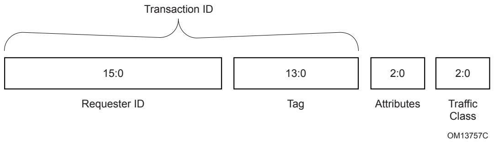

flowchart

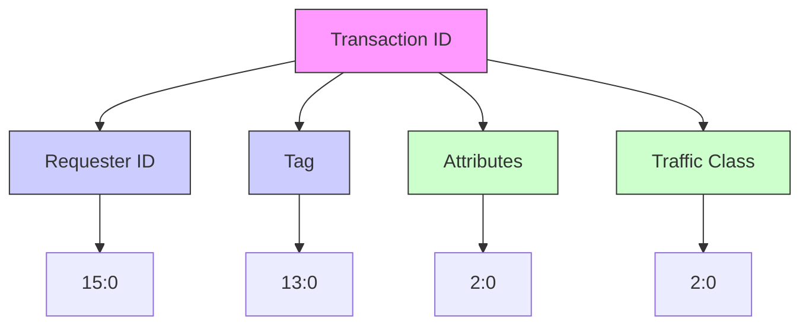
```mermaid
graph TD
    A["Transaction ID"] --> B["Requester ID"]
    A --> C["Tag"]
    A --> D["Attributes"]
    A --> E["Traffic Class"]
    B --> F["15:0"]
    C --> G["13:0"]
    D --> H["2:0"]
    E --> I["2:0"]
    style A fill:#f9f,stroke:#333
    style B fill:#ccf,stroke:#333
    style C fill:#ccf,stroke:#333
    style D fill:#cfc,stroke:#333
    style E fill:#cfc,stroke:#333
```

§   
Figure 2-27 Transaction Descriptor

# 2.2.6.2 Transaction Descriptor - Transaction ID Field §

The Transaction ID field consists of two major sub-fields: Requester ID and Tag as shown in § Figure 2-28.

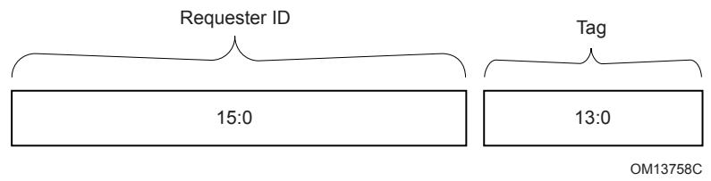

text_image

Requester ID
15:0
Tag
13:0
OM13758C

§   
Figure 2-28 Transaction ID

Architecturally, Tag[13:0] is a 14-bit field generated by each Requester, and it must be unique for all outstanding Requests that require a Completion for that Requester ID, without regard to TC or any other field. Four Tag sizes are architected for operation: 14-bit, 10-bit, 8-Bit and 5-bit. A given Function may support different Tag sizes when operating as a Requester versus operating as a Completer. Below are the rules regarding operational Tag sizes. Also see the “Considerations for Implementing Larger-Tag Capabilities” Implementation Note later in this section.

• 14-Bit Tags and 10-Bit Tags are referred to as “larger” Tags.   
• 8-Bit Tags and 5-Bit Tags are referred to as “smaller” Tags.   
• All Functions must support 8-Bit Tag Completer capability.   
• A Function that supports Flit Mode must support 14-Bit Tag Completer capability, and thus it automatically supports 10-Bit Tag Completer capability.   
• Functions 11 (including those in Switches) that support 16.0 GT/s data rates or greater must support 10-Bit Tag Completer capability.   
• A Function must not support 14-Bit Tag Requester capability unless it supports 14-Bit Tag Completer capability.   
• A Function must not support 10-Bit Tag Requester capability unless it supports 10-Bit Tag Completer capability.

• In Non-Flit Mode, Tag[8] and Tag[9], are not contiguous with other Tag field bits in the TLP Header. These bits were Reserved prior to 10-Bit Tags being architected. Requesters in Non-Flit Mode that do not support 10-Bit Tag Requester capability must set Tag[9:8] to 00b.   
• RCs containing elements that indicate support for 14-Bit Tag Completer capability or 10-Bit Tag Completer capability must handle supported Tag-sized Requests correctly by all registers and memory regions supported as targets of PCIe Requesters; e.g., host memory targeted by DMA Requests or MMIO regions in RCiEPs.

◦ Each RP indicating support must handle such Requests received by its Ingress Port.

◦ Each RCiEP indicating support must handle such Requests coming from supported internal paths, including those coming through RPs.

• If an RC contains RCiEPs that indicate support for 14-Bit Tag Requester capability or 10-Bit Tag Requester capability, the RC must handle Requests from those RCiEPs correctly by all registers and memory regions supported as targets of those RCiEPs; e.g., host memory targeted by DMA Requests or MMIO regions in RCiEPs.   
• Receivers/Completers must handle 8-bit Tag values correctly regardless of the setting of their Extended Tag Field Enable bit (see § Section 7.5.3.4 ). Refer to the PCI Express to PCI/PCI-X Bridge Specification for details on the bridge handling of Extended Tags.   
Receivers/Completers that support 14-Bit Tag Completer capability or 10-Bit Tag Completer capability must handle the supported Tag-size values correctly, regardless of their corresponding Tag Requester Enable bit setting. See § Section 7.5.3.16 .   
• 14-Bit Tag capability and 10-Bit Tag capability are not architected for PCI Express to PCI/PCI-X Bridges, and they must not indicate the associated Tag Requester capability or Tag Completer capability.   
• If one or both larger-Tag Requester Enable bits are Set, the following rules apply.

◦ If both larger-Tag Requester Enable bits are Set in an Endpoint 12 , then 14-Bit Tags are permitted for Requests that target host memory. An implementation specific hardware mechanism in the Endpoint is permitted to limit those Requests to 10-Bit Tags or smaller Tags, but generic software or firmware should not Set the 14-Bit Tag Requester Enable bit unless the host supports 14-Bit Tag Completer capability for host memory.   
◦ If an Endpoint 13 supports sending Requests to other Endpoints (as opposed to host memory), the Endpoint must not send larger-Tag Requests to another given Endpoint unless an implementation specific mechanism determines that the Endpoint supports the corresponding larger Tag Completer capability. Not sending larger-Tag Requests to other Endpoints at all may be acceptable for some implementations. More sophisticated mechanisms are outside the scope of this specification.   
◦ If a PIO Requester has larger-Tag Requester capability, how the Requester determines when to use larger Tags versus smaller Tags is outside the scope of this specification.   
◦ With 14-Bit Tags, all Tag[13:8] values except 00 0000b are valid. 14-Bit Tag values with Tag[13:8] equal to 00 0000b are invalid, and must not be generated by the Requester. This enables a Requester to determine if a Completion it receives that should have a 14-Bit Tag contains an invalid Tag value, usually caused by the Completer not supporting 14-Bit Tag Completer capability.   
◦ With 10-Bit Tags, all Tag[9:8] values except 00b are valid. 10-Bit Tag values with Tag[9:8] equal to 00b are invalid, and must not be generated by the Requester. This enables a Requester to determine if a Completion it receives that should have a 10-Bit Tag contains an invalid Tag value, usually caused by the Completer not supporting 10-Bit Tag Completer capability.   
◦ If a Requester sends a larger-Tag Request to a Completer that lacks the associated larger-Tag Completer capability, the returned Completion(s) will have Tags with invalid Tag values. Such Completions will be

handled as Unexpected Completions 14 , which by default are Advisory Non-Fatal Errors. The Requester must follow standard PCI Express error handling requirements.

◦ When a Requester handles a Completion with an invalid Tag as an Unexpected Completion, the original Request will likely incur a Completion Timeout. If the Requester handles the Completion Timeout condition in some device-specific manner that avoids data corruption, the Requester is permitted to suppress handling the Completion Timeout by standard PCI Express error handling mechanisms as required otherwise.   
◦ If a Requester supports sending larger-Tag Requests to some Completers and smaller-Tag Requests to other Completers concurrently, the Requester must honor the Extended Tag Field Enable bit setting for the smaller-Tag Requests. That is, if the bit is Clear, only the lower 5 bits of the Tag field may be non-Zero; if the bit is Set, only the lower 8 bits of the Tag field may be non-Zero.   
◦ If a Requester supports sending larger-Tag Requests to some Completers and smaller-Tag Requests to other Completers concurrently, the Requester must ensure that no outstanding larger Tags can alias to an outstanding smaller Tag if any larger-Tag Request is completed by a Completer that lacks larger-Tag Completer capability. See the "Using Larger Tags and Smaller Tags Concurrently" Implementation Note later in this section.   
◦ The default value of the Extended Tag Field Enable bit is implementation specific. The default value of the 14-Bit Tag Requester Enable bit and the 10-Bit Tag Requester Enable bit is 0b.   
◦ Receiver/Completer behavior is undefined if multiple uncompleted Requests are issued with non-unique Transaction ID values.   
◦ If Phantom Function Numbers are used to extend the number of outstanding Requests, the combination of the Phantom Function Number and the Tag field must be unique for all outstanding Requests that require a Completion for that Requester, without regard to TC or any other field.   
◦ If Shadow Functions are used to extend the number of outstanding Requests, the combination of the Shadow Function Number and the Tag field must be unique for all outstanding Requests that require a Completion for that Requester, without regard to TC or any other field.

• § Table 2-11 indicates how the three tag enable bits determine the maximum tag size and permitted tag value ranges for different Completers and their associated paths. For a given combination of Tag enable settings, a Requester must use a Tag value within the permitted range corresponding to Tag capabilities of the Completer and its associated path.   
Table 2-11 Tag Enables, Sizes, and Permitted Ranges§ 

<table><tr><td>14-bit Tag Requester Enable</td><td>10-bit Tag Requester Enable</td><td>Extended Tag Field Enable</td><td>Maximum Tag size</td><td>Permitted range for an 8-bit Tag Completer/path</td><td>Permitted range for a 10-bit Tag Completer/path</td><td>Permitted range for a 14-bit Tag Completer/path</td></tr><tr><td>0</td><td>0</td><td>0</td><td>5 bits</td><td>0 to 31</td><td>0 to 31</td><td>0 to 31</td></tr><tr><td>0</td><td>0</td><td>1</td><td>8 bits</td><td>0 to 255</td><td>0 to 255</td><td>0 to 255</td></tr><tr><td>0</td><td>1</td><td>0</td><td>10 bits</td><td>0 to 31</td><td>256 to 1023</td><td>256 to 1023</td></tr><tr><td>0</td><td>1</td><td>1</td><td>10 bits</td><td>0 to 255</td><td>256 to 1023</td><td>256 to 1023</td></tr><tr><td>1</td><td>0</td><td>0</td><td>14 bits</td><td>0 to 31</td><td>0 to 31</td><td>1024 to 16383</td></tr><tr><td>1</td><td>0</td><td>1</td><td>14 bits</td><td>0 to 255</td><td>0 to 255</td><td>1024 to 16383</td></tr><tr><td>1</td><td>1</td><td>0</td><td>14 bits</td><td>0 to 31</td><td>256 to 1023</td><td>1024 to 16383</td></tr><tr><td>1</td><td>1</td><td>1</td><td>14 bits</td><td>0 to 255</td><td>256 to 1023</td><td>1024 to 16383</td></tr></table>

# Notes:

1. The permitted range for a 5-bit Tag Completer/path is always 0 to 31, so there is no column in the table to indicate this.   
2. The "X-bit Tag Completer/path" is the greatest common Tag size capability of the Completer and all routing elements along the path between the Requester and the targeted Completer. If a routing element is not the targeted Completer, but detects an Uncorrectable Error with a Request, the routing element may serve as the Completer for the Request.   
3. If a Requester supports sending larger-Tag Requests to some Completers and smaller-Tag Requests to other Completers concurrently, the Requester must ensure that no outstanding larger Tags can alias to an outstanding smaller Tag if any larger-Tag Request is completed by a Completer that lacks larger-Tag Completer capability.

• For Posted Requests, the Tag[13:8] field is Reserved in Non-Flit Mode, and Tag[13:0] is Reserved in Flit Mode.

◦ An exception to this rule is allowed for the uses defined in [MCTP-VDM].

• In Non-Flit Mode, for Posted Requests with the TH bit Set, the Tag[7:0] field is repurposed for the ST[7:0] field (refer to § Section 2.2.7.1.1 for details). For Posted Requests with the TH bit Clear, the Tag[7:0] field is undefined and may contain any value. (Refer to § Table F-1 for exceptions to this rule for certain Vendor\_Defined Messages.)

◦ For Posted Requests with the TH field Clear, the value in the Tag[7:0] field must not affect Receiver processing of the Request.   
◦ For Posted Requests with the TH bit Set, the value in the ST[7:0] field may affect Completer processing of the Request (refer to 2.2.7.1 for details).

• Requester ID and Tag combined form a global identifier, i.e., Transaction ID for each Transaction within a Hierarchy.   
• Transaction ID is included with all Requests and Completions.   
• The Requester ID is a 16-bit value that is unique for every PCI Express Function within a Hierarchy.   
• Functions must capture the Bus and Device Numbers 15 supplied with all Type 0 Configuration Write Requests completed by the Function and supply these numbers in the Bus and Device Number fields of the Requester ID 16 for all Requests initiated without the use of Shadow Functions by the Device/Function. See § Section 7.9.25 , for details of how the Requester ID may be modified by the use of Shadow Functions. It is recommended that Numbers are captured for successfully completed Requests only.

Exception: The assignment of Bus and Device Numbers to the Devices within a Root Complex, and Device Numbers to the Downstream Ports within a Switch, may be done in an implementation specific way.

Note that the Bus Number and Device Number 17 may be changed at run time, and so it is necessary to re-capture this information with each and every Type 0 Configuration Write Request to the Device.

Configuration Write Requests addressed to unimplemented Functions MUST@FLIT not affect captured Bus and Device Numbers for implemented Functions.

• When generating Requests on their own behalf (for example, for error reporting), Switches must use the Requester ID associated with the primary side of the bridge logically associated with the Port (see § Section 7.1 ) causing the Request generation.   
• Prior to the initial Configuration Write to a Function, the Function is not permitted to initiate Non-Posted Requests. (A valid Requester ID is required to properly route the resulting completions.)

Exception: Functions within a Root Complex are permitted to initiate Requests prior to software-initiated configuration for accesses to system boot device(s). Note that this rule and the exception are consistent with the existing PCI model for system initialization and configuration.

Each Function associated with a Device must be designed to respond to a unique Function Number for Configuration Requests addressing that Device. Note: Each non-ARI Device may contain up to eight Functions. Each ARI Device may contain up to 256 Functions.   
• A Switch must forward Requests without modifying the Transaction ID.   
• In some circumstances, a PCI Express to PCI/PCI-X Bridge is required to generate Transaction IDs for Requests it forwards from a PCI or PCI-X bus.   
In Flit Mode, Functions must capture the value of the Destination Segment supplied with all Type 0 Configuration Write Requests successfully completed by the Function. It is permitted for each Function of a Device to independently capture the Destination Segment value, or for all Functions of a Device to use the value captured by Function 0. All Functions within a Switch share a common Segment value that is captured by Functions associated with the Upstream Port. Functions also must capture the DSV bit in Type 0 Configuration Write Requests as described in the Segment Captured bit description in § Section 7.7.9.4 .

◦ The Segment is effectively an extension of the Requester ID, but is formally defined as a distinct field to avoid confusion with the use of the term Transaction ID in Non-Flit Mode operation.   
◦ In systems that support multiple Segments, each Hierarchy must be associated with a single Segment. It is permitted for multiple hierarchy domains to be associated with a single Segment.

• In Flit-Mode, in some circumstances, the captured Segment is also explicitly indicated in a TLP, which enables the Transaction ID to be unique between Hierarchies.

# IMPLEMENTATION NOTE:

# INCREASING THE NUMBER OF OUTSTANDING REQUESTS USING PHANTOM FUNCTIONS OR SHADOW FUNCTIONS

To increase the maximum possible number of outstanding Requests requiring Completion beyond that possible using Tag bits alone, a device may, if the Phantom Functions Enable bit is Set (see § Section 7.5.3.4 ), or the Shadow Functions Enable bit is Set (see § Section 7.9.25.3 ), use Function Numbers not assigned to implemented Functions to logically extend the Tag identifier. For a single-Function Device, this can allow a significant increase in the maximum number of outstanding Requests.

When the Phantom Functions Enable bit is Set, unclaimed Function Numbers are referred to as Phantom Function Numbers.

Phantom Functions have a number of architectural limitations, including a lack of support by ARI Devices, Virtual Functions (VFs), and Physical Functions (PFs) when VFs are enabled. In addition, Address Translation Services (ATS) and ID-Based Ordering (IDO) do not comprehend Phantom Functions. Shadow Functions have fewer limitations. Thus, for many implementations, the use of larger Tags and Shadow Functions are better ways to increase the number of outstanding Non-Posted Requests.

# IMPLEMENTATION NOTE:

# CONSIDERATIONS FOR IMPLEMENTING LARGER-TAG CAPABILITIES

The use of "larger" (i.e., 10-bit or 14-bit) Tags enables a Requester to increase its number of outstanding Non-Posted Requests (NPRs) substantially, which for very high rates of NPRs or very large round-trip times can avoid Tag availability from becoming a bottleneck. The following formula gives the basic relationship between payload bandwidth, number of outstanding NPRs, and other factors:

BW = S \* N / RTT, where

BW = payload bandwidth

S = transaction payload size

N = number of outstanding NPRs

RTT = transaction round-trip time

Generally only high-speed Requesters on high-speed Links using relatively small transactions will benefit from increasing their number of outstanding NPRs beyond 256, although this can also help maintain performance in configurations where the transaction round-trip time is high.

In configurations where a Requester with larger-Tag Requester capability needs to target multiple Completers, one needs to ensure that the Requester sends larger-Tag Requests only to Completers that have sufficient larger-Tag Completer capability. This is greatly simplified if all Completers have larger-Tag capability.

For general industry enablement of larger Tags, it is strongly recommended that all Functions 18 support larger-Tag Completer capability. With new implementations, Completers that don't need to operate on higher numbers of NPRs concurrently themselves can generally track larger Tags internally and return them in Completions with modest incremental investment.

Completers that actually process higher numbers of NPRs concurrently may require substantial additional hardware resources, but the full performance benefits of larger Tags generally can't be realized unless Completers actually do process higher numbers of NPRs concurrently.

For platforms where the RC supports larger-Tag Completer capability, it is strongly recommended for platform firmware or operating system software that configures PCIe hierarchies to Set one of the larger-Tag Requester Enable bits automatically in Endpoints with larger-Tag Requester capability. This enables the important class of larger-Tag capable adapters that send Memory Read Requests only to host memory.

For Endpoints other than RCiEPs, one can determine if the RC supports larger-Tag Completer capability for each one by checking the larger-Tag Completer Supported bits in its associated RP. RCiEPs have no associated RP, so for this reason they are not permitted to have one of their larger-Tag Requester Supported bits Set unless the RC supports sufficient larger-Tag Completer capability for them. Thus, software does not need to perform a separate check for RCiEPs.

Non-Flit Mode Switches that lack 10-bit Tag Completer capability are still able to forward NPRs and Completions carrying 10-bit Tags correctly, since the two new Tag bits are in TLP Header bits that were formerly Reserved, and Switches are required to forward Reserved TLP Header bits without modification. However, if such a Switch detects an error with an NPR carrying a 10-bit Tag, and that Switch handles the error by acting as the Completer for the NPR, the resulting Completion will have an invalid 10-bit Tag. Thus, it is strongly recommended that Non-Flit Mode Switches between any components using 10-bit Tags support 10-bit Completer capability. Note that Switches supporting 16.0 GT/s data rates or greater must support 10-bit Tag Completer capability.

For configurations where a Requester with larger-Tag Requester capability targets Completers where some do and some do not have sufficient larger-Tag Completer capability, how the Requester determines which NPRs include larger Tags is outside the scope of this specification.

# IMPLEMENTATION NOTE:

# USING LARGER TAGS AND SMALLER TAGS CONCURRENTLY §

As stated earlier in this section, if a Requester supports sending larger-Tag Requests to some Completers and smaller-Tag Requests to other Completers concurrently, the Requester must ensure that no outstanding larger Tags can alias to an outstanding smaller Tag if any larger-Tag Request is completed by a Completer that lacks sufficient larger-Tag Completer capability.

For 10-bit Tags, one implementation approach is to have the Requester partition its 8-bit Tag space into 2 regions: one that will only be used for smaller Tags (8-bit or 5-bit Tags), and one that will only be used for the lower 8 bits of 10-bit Tags. Note that this forces a tradeoff between the Tag space available for 10-bit Tags and smaller Tags.

For example, if a Requester partitions its 8-bit Tag space to use only the lowest 4 bits for smaller Tags, this supports up to 16 outstanding smaller Tags, and it reduces the 10-bit Tag space by 3\*16 values, supporting 768-48=720 outstanding 10-bit Tags. Many other partitioning options are possible, all of which reduce the total number of outstanding Requests. In general, reserving N values for smaller Tags reduces 10-bit Tag space by 3\*N values, and the total for smaller Tags plus 10-bit Tags ends up being 768 - 2\*N.

Similar implementation approaches for 14-Bit Tags are possible, and they are straight-forward if only 14-Bit and 8-Bit/5-Bit Tags are supported. If a Requester implementation needs to handle 14-Bit, 10-Bit, and 8-Bit/5-Bit Tag sizes concurrently, the general approach of partitioning the Requester’s Tag spaces still works, but the complexity increases significantly.

# 2.2.6.3 Transaction Descriptor - Attributes Field §

The Attributes field is used to provide additional information that allows modification of the default handling of Transactions. These modifications apply to different aspects of handling the Transactions within the system, such as:

• Ordering   
• Hardware coherency management (snoop)

Attributes are hints that allow, but do not require, optimizations in the handling of traffic. The level of optimization support is dependent on the target applications of particular PCI Express peripherals and platform building blocks. In Flit Mode the Attributes Field is contiguous in the TLP Header. In Non-Flit Mode, attribute bit 2 is sometimes labeled A2 and is not adjacent to bits 1 and 0 (see § Figure 2-30 and § Figure 2-31).

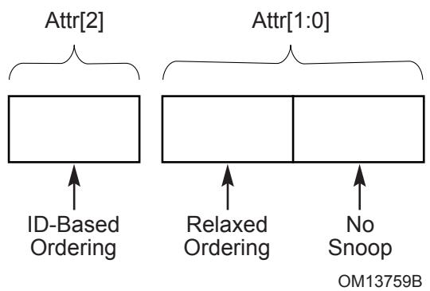

flowchart

```mermaid
graph TD
    A["Attr[2"]] --> B["ID-Based Ordering"]
    C["Attr[1:0"]] --> D["Relaxed Ordering"]
    C --> E["No Snoop"]
```

Figure 2-29 Attributes Field of Transaction Descriptor§

# 2.2.6.4 Relaxed Ordering and ID-Based Ordering Attributes §

§ Table 2-12 defines the states of the Relaxed Ordering and ID-Based Ordering attribute fields. These attributes are discussed in § Section 2.4 . Note that Relaxed Ordering and ID-Based Ordering attributes are not adjacent in location (see § Figure 2-5).

§ Table 2-12 Ordering Attributes 

<table><tr><td>Attribute Bit [2]</td><td>Attribute Bit [1]</td><td>Ordering Type</td><td>Ordering Model</td></tr><tr><td>0</td><td>0</td><td>Default Ordering</td><td>PCI Strongly Ordered Model</td></tr><tr><td>0</td><td>1</td><td>Relaxed Ordering</td><td>PCI-X Relaxed Ordering Model</td></tr><tr><td>1</td><td>0</td><td>ID-Based Ordering</td><td>Independent ordering based on Requester/Completer ID</td></tr><tr><td>1</td><td>1</td><td>Relaxed Ordering plus ID-Based Ordering</td><td>Logical “OR” of Relaxed Ordering and IDO</td></tr></table>

Attribute bit [1] is not applicable and must be Clear for Configuration Requests, I/O Requests, Memory Requests that are Message Signaled Interrupts, and Message Requests (except where specifically permitted).

Attribute bit [2], IDO, is Reserved for Configuration Requests and I/O Requests. IDO is not Reserved for all Memory Requests, including Message Signaled Interrupts (MSI/MSI-X). IDO is not Reserved for Message Requests unless specifically prohibited. A Requester is permitted to Set IDO only if the IDO Request Enable bit in the Device Control 2 register is Set.

The value of the IDO bit must not be considered by Receivers when determining if a TLP is a Malformed Packet.

A Completer is permitted to Set IDO only if the IDO Completion Enable bit in the Device Control 2 register is Set. It is not required to copy the value of IDO from the Request into the Completion(s) for that Request. If the Completer has IDO enabled, it is recommended that the Completer set IDO for all Completions, unless there is a specific reason not to (see § Appendix E. ).

A Root Complex that supports forwarding TLPs peer-to-peer between Root Ports is not required to preserve the IDO bit from the Ingress to Egress Port.

# 2.2.6.5 No Snoop Attribute §

§ Table 2-13 defines the states of the No Snoop attribute field. Note that the No Snoop attribute does not alter Transaction ordering.

Table 2-13 Cache Coherency Management Attribute§ 

<table><tr><td>No Snoop Attribute (b)</td><td>Cache Coherency Management Type</td><td>Coherency Model</td></tr><tr><td>0</td><td>Default</td><td>Hardware enforced cache coherency expected</td></tr><tr><td>1</td><td>No Snoop</td><td>Hardware enforced cache coherency not expected</td></tr></table>

This attribute is not applicable and must be Clear for Configuration Requests, I/O Requests, Memory Requests that are Message Signaled Interrupts, and Message Requests (except where specifically permitted).

# 2.2.6.6 Transaction Descriptor - Traffic Class Field §

The Traffic Class (TC) is a 3-bit field that allows differentiation of transactions into eight traffic classes.

Together with the PCI Express Virtual Channel support, the TC mechanism is a fundamental element for enabling differentiated traffic servicing. Every PCI Express Transaction Layer Packet uses TC information as an Invariant label that is carried end to end within the PCI Express fabric. As the packet traverses across the fabric, this information is used at every Link and within each Switch element to make decisions with regards to proper servicing of the traffic. A key aspect of servicing is the routing of the packets based on their TC labels through corresponding Virtual Channels. § Section 2.5 covers the details of the VC mechanism.

§ Table 2-14 defines the TC encodings.

Table 2-14 Definition of TC Field Encodings§ 

<table><tr><td>TC Field Value (b)</td><td>Definition</td></tr><tr><td>000</td><td>TC0: Best Effort service class (General Purpose I/O)(Default TC - must be supported by every PCI Express device)</td></tr><tr><td>001 to 111</td><td>TC1 toTC7: Differentiated service classes(Differentiation based on Weighted-Round-Robin (WRR) and/or priority)</td></tr></table>

It is up to the system software to determine TC labeling and TC/VC mapping in order to provide differentiated services that meet target platform requirements.

The concept of Traffic Class applies only within the PCI Express interconnect fabric. Specific requirements of how PCI Express TC service policies are translated into policies on non-PCI Express interconnects is outside of the scope of this specification.

# 2.2.7 Memory, I/O, and Configuration Request Rules §

The general requirements for Memory, I/O, and Configuration Requests similar in Non-Flit Mode and Flit Mode, however some specific rules differ. Rules that are common between Non-Flit Mode and Flit-Mode follow, with rules that are specific to each in subsequent sub-sections.

# 2.2.7.1 Non-Flit Mode §

The following rule applies to all Memory, I/O, and Configuration Requests. Additional rules specific to each type of Request follow.

• All Memory, I/O, and Configuration Requests include the following fields in addition to the common header fields:   
◦ Requester ID[15:0] and Tag[9:0], forming the Transaction ID. In Non-Flit Mode, the Tag field is 10 bits.   
◦ Last DW BE[3:0] and First DW BE[3:0]. For Memory Read Requests, DMWr Requests, and AtomicOp Requests with the TH bit Set, the byte location for the Last DW BE[3:0] and First DW BE [3:0] fields in the header are repurposed to carry ST[7:0] field.   
◦ For Memory Read Requests and DMWr Requests with the TH bit Clear, see § Section 2.2.5 for First/Last DW Byte Enable Rules.   
◦ For AtomicOp Requests and DMWr Requests with TH bit Set, the values for the DW BE fields are implied to be Reserved. For AtomicOp Requests with TH bit Clear, the DW BE fields are Reserved.

For Memory Requests, the following rules apply:

• Memory Requests route by address, using either 64-bit or 32-bit Addressing (see § Figure 2-30 and § Figure 2-31).   
• For Memory Read Requests, Length must not exceed the value specified by Max\_Read\_Request\_Size (see § Section 7.5.3.4 ).   
• For AtomicOp Requests, architected operand sizes and their associated Length field values are specified in § Table 2-15. If a Completer supports AtomicOps, the following rules apply. The Completer must check the Length field value. If the value does not match an architected value, the Completer must handle the TLP as a Malformed TLP. Otherwise, if the value does not match an operand size that the Completer supports, the Completer must handle the TLP as an Unsupported Request (UR). This is a reported error associated with the Receiving Port (see § Section 6.2 ).

Table 2-15 Length Field Values for AtomicOp Requests§ 

<table><tr><td rowspan="2">AtomicOp Request</td><td colspan="3">Length Field Value for Architected Operand Sizes</td></tr><tr><td>32 Bits</td><td>64 Bits</td><td>128 Bits</td></tr><tr><td>FetchAdd, Swap</td><td>1 DW</td><td>2 DW</td><td>N/A</td></tr><tr><td>CAS</td><td>2 DW</td><td>4 DW</td><td>8 DW</td></tr></table>

• A FetchAdd Request contains one operand, the “add” value.   
• A Swap Request contains one operand, the “swap” value.   
• A CAS Request contains two operands. The first in the data area is the “compare” value, and the second is the “swap” value.

• For AtomicOp Requests, the Address must be naturally aligned with the operand size. The Completer must check for violations of this rule. If a TLP violates this rule, the TLP is a Malformed TLP. This is a reported error associated with the Receiving Port (see § Section 6.2 ).   
• Requests must not specify an Address/Length combination that causes a Memory Space access to cross a 4-KB boundary.

◦ Receivers may optionally check for violations of this rule. If a Receiver implementing this check determines that a TLP violates this rule, the TLP is a Malformed TLP.

▪ If checked, this is a reported error associated with the Receiving Port (see § Section 6.2 ).

◦ For AtomicOp Requests, the mandatory Completer check for natural alignment of the Address (see above) already guarantees that the access will not cross a 4-KB boundary, so a separate 4-KB boundary check is not necessary.   
◦ If a 4-KB boundary check is performed for AtomicOp CAS Requests, this check must comprehend that the TLP Length value is based on the size of two operands, whereas the access to Memory Space is based on the size of one operand.

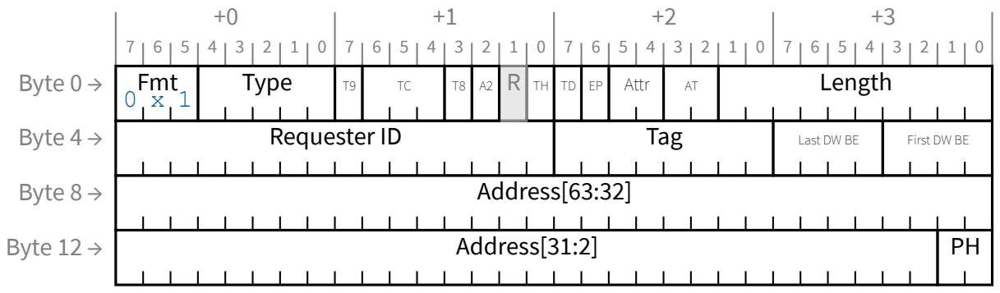

other

| Bit Position | Value |
| ------------ | ----- |
| Byte 0       | 0     |
| Byte 4       | 1     |
| Byte 8       | 31:2  |
| Byte 12      | 0     |

Figure 2-30 Request Header Format for 64-bit Addressing of Memory§

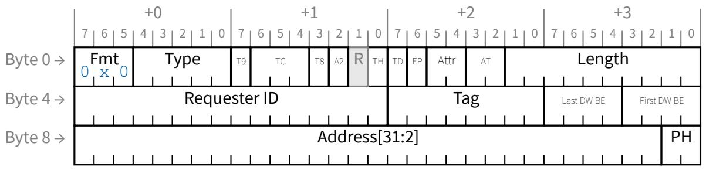

other

| Bit Position | Value |
| ------------ | ----- |
| 0            | +0    |
| 1            | +1    |
| 2            | +2    |
| 3            | +3    |
| 4            | Length |
| 5            | Type  |
| 6            | Text  |
| 7            | TC    |
| 8            | T8    |
| 9            | A2    |
| 10           | R     |
| 11           | TH    |
| 12           | TD    |
| 13           | EP    |
| 14           | Attr  |
| 15           | AT    |
| 16           | Length |
| 17           | Last DW BE |
| 18           | First DW BE |
| 19           | PH    |

Figure 2-31 Request Header Format for 32-bit Addressing of Memory§

# IMPLEMENTATION NOTE:

# GENERATION OF 64-BIT ADDRESSES §

It is strongly recommended that PCI Express Endpoints be capable of generating the full range of 64-bit addresses. However, if a PCI Express Endpoint supports a smaller address range, and is unable to reach the full address range required by a given platform environment, the corresponding device driver must ensure that all Memory Transaction target buffers fall within the address range supported by the Endpoint. The exact means of ensuring this is platform and operating system specific, and beyond the scope of this specification.

For I/O Requests, the following rules apply:

• I/O Requests route by address, using 32-bit Addressing (see § Figure 2-32)   
• I/O Requests have the following restrictions:

◦ TC[2:0] must be 000b   
◦ TH is not applicable to I/O Request and the bit is Reserved   
◦ Attr[2] is Reserved   
◦ Attr[1:0] must be 00b   
◦ AT[1:0] must be 00b. Receivers are not required or encouraged to check this.   
◦ Length[9:0] must be 00 0000 0001b   
◦ Last DW BE[3:0] must be 0000b

Receivers may optionally check for violations of these rules (but must not check Reserved bits). These checks are independently optional (see § Section 6.2.3.4 ). If a Receiver implementing these checks determines that a TLP violates these rules, the TLP is a Malformed TLP.

◦ If checked, this is a reported error associated with the Receiving Port (see § Section 6.2 ).

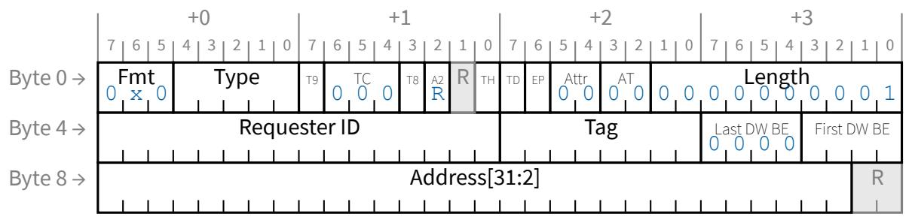

other

| Byte | Value |
|------|-------|
| 0    | +0    |
| 0    | 7     |
| 0    | 6     |
| 0    | 5     |
| 0    | 4     |
| 0    | 3     |
| 0    | 2     |
| 0    | 1     |
| 0    | 0     |
| 0    | 1     |
| 0    | 0     |
| 0    | 1     |
| 0    | 0     |
| 0    | 1     |
| 0    | 0     |
| 0    | 1     |
| 0    | 0     |
| 0    | 1     |
| 0    | 0     |
| 0    | 1       |
| 0    | 0     |
| 0    | 1       |
| 0    | 0     |
| 0    | 1       |
| 0    | 0     |
| 0    | 1       |
| 0    | 0     |
| 0    | 1       |
| 0    | 0     |
| 0    | 1       |
| 0    | 0     |

Figure 2-32 Request Header Format for I/O Transactions - Non-Flit Mode§

For Configuration Requests, the following rules apply:

• Configuration Requests route by ID, and use a 3 DW header.   
• In addition to the header fields included in all Memory, I/O, and Configuration Requests and the ID routing fields, Configuration Requests contain the following additional fields (see § Figure 2-33).

◦ Register Number[5:0]

◦ Extended Register Number[3:0]

• Configuration Requests have the following restrictions:

◦ TC[2:0] must be 000b   
◦ TH is not applicable to Configuration Requests and the bit is Reserved   
◦ Attr[2] is Reserved   
◦ Attr[1:0] must be 00b   
◦ AT[1:0] must be 00b. Receivers are not required or encouraged to check this.   
◦ Length[9:0] must be 00 0000 0001b   
◦ Last DW BE[3:0] must be 0000b

Receivers may optionally check for violations of these rules (but must not check reserved bits). These checks are independently optional (see § Section 6.2.3.4 ). If a Receiver implementing these checks determines that a TLP violates these rules, the TLP is a Malformed TLP.

◦ If checked, this is a reported error associated with the Receiving Port (see § Section 6.2 ).

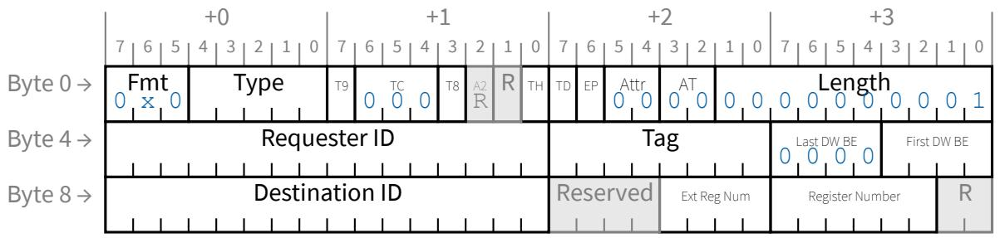

other

| Byte | Position | Value |
|------|----------|-------|
| 0    |          | +0    |
| 0    |          | 6     |
| 0    |          | 5     |
| 0    |          | 4     |
| 0    |          | 3     |
| 0    |          | 2     |
| 0    |          | 1     |
| 0    |          | 0     |
| 0    |          | 0     |
| 0    |          | 0     |
| 0    |          | 0     |
| 0    |          | 0     |
| 0    |          | 0     |
| 0    |          | 0     |
| 0    |          | 0     |
| 0    |          | 0     |
| 0    |          | 0      |
| 0    |          | 0      |
| 0    |          | 0      |
| 0    |          | 0      |
| 0    |          | 0      |
| 0    |          | 0      |
| 0    |          | 0      |
| 0    |          | 0      |
| 0    |          | 0      |
| 0    |          | 0      |

Figure 2-33 Request Header Format for Configuration Transactions - Non-Flit Mode§

MSI/MSI-X mechanisms use Memory Write Requests to represent interrupt Messages (see § Section 6.1.4 ). The Request format used for MSI/MSI-X transactions is identical to the Memory Write Request format defined above, and MSI/MSI-X Requests are indistinguishable from memory writes with regard to ordering, Flow Control, and data integrity.

# 2.2.7.1.1 TPH Rules §

• Two formats are specified for TPH. The Baseline TPH format (see § Figure 2-35 and § Figure 2-36) must be used for all Requests that provide TPH. The format with the optional TPH TLP Prefix extends the TPH fields (see § Figure 2-34) to provide additional bits for the Steering Tag (ST) field.

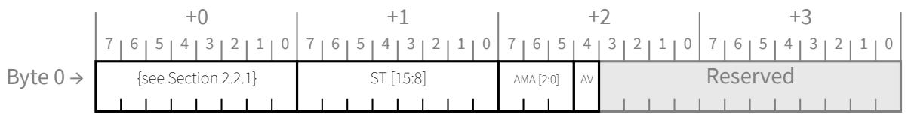

text_image

Byte 0 → {see Section 2.2.1} +0 +1 +2 +3
7 | 6 | 5 | 4 | 3 | 2 | 1 | 0 | 7 | 6 | 5 | 4 | 3 | 2 | 1 | 0
ST [15:8] AMA [2:0] AV Reserved

§

Figure 2-34 TPH TLP Prefix

• The optional TPH TLP Prefix is used to provide additional TPH information.

◦ The presence of a TPH TLP Prefix is determined by decoding byte 0.

Table 2-16 TPH TLP Prefix Bit Mapping§ 

<table><tr><td>Fields</td><td>TPH TLP Prefix</td></tr><tr><td>ST[15:8]</td><td>Bits 7:0 of byte 1</td></tr><tr><td>AMA[2:0]</td><td>Bits 7:5 of byte 2</td></tr><tr><td>AV</td><td>Bit 4 of byte 2</td></tr><tr><td>Reserved</td><td>Bits 3:0 of byte 2</td></tr><tr><td>Reserved</td><td>Bits 7:0 of byte 3</td></tr></table>

• The TPH TLP Prefix is used to send a non-Zero value for any of:

◦ AMA   
◦ ST[15:8]

• For Requests that target Memory Space, a value of 1b in the TH bit indicates the presence of TPH in the TLP header and optional TPH TLP Prefix (if present).

◦ The TH bit must be Set for Requests that provide TPH.   
◦ The TH bit is permitted to be Set for Requests with a TPH TLP Prefix. When the TH bit is 1b, then ST[15:8] is present and meaningful in the TPH TLP Prefix.   
◦ When the TH bit is Clear, the PH field is Reserved.   
◦ The TH bit and the PH field are not applicable and are Reserved for all other Requests.

• For Requests that target Memory Space, the TPH TLP Prefix may be present if the value of the TH bit is 0b. When the AMA Valid (AV) bit is 1b and the TPH TLP Prefix is present, AMA is present and meaningful in the TPH TLP Prefix.   
• For Requests that target Memory Space with the AT field not set to 10b, the AMA field in the TPH TLP Prefix is Reserved.   
• The Processing Hints (PH) fields mapping is shown in § Figure 2-35, § Figure 2-36 and § Table 2-17.

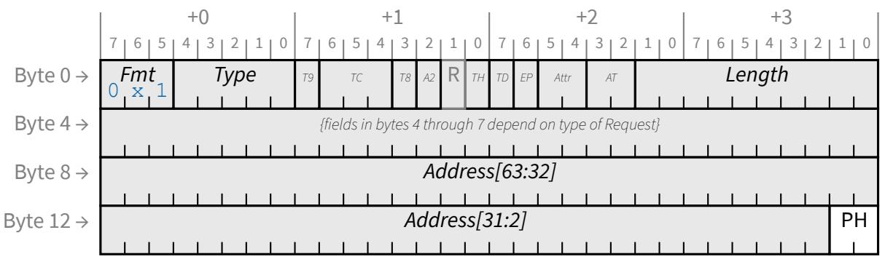

bar_stacked

| Byte | Value |
|------|-------|
| 0    | Fmt   |
| 1    | Type  |
| T9   | TC    |
| T8   | A2    |
| R    | TH    |
| TH   | TD    |
| EP   | Attr  |
| AT   | AT    |
| Length | Length |

Figure 2-35 Location of PH[1:0] in a 4 DW Request Header - Non-Flit Mode§

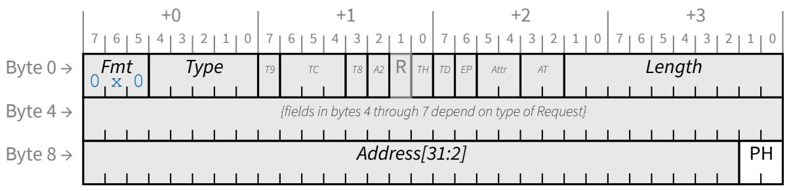

other

| Byte | Value |
|------|-------|
| 0    | +0    |
| 0    | Type  |
| 0    | T9    |
| 0    | TC    |
| 0    | T8    |
| 0    | A2    |
| 0    | R     |
| 0    | TH    |
| 0    | TD    |
| 0    | EP    |
| 0    | Attr  |
| 0    | AT    |
| 0    | Length|
| 4    | {fields in bytes 4 through 7 depend on type of Request}
| 
| 
| 
| 
| 
| 
| 
| 
| 
| 
| 
| 
| 
| 
| 
| 
| 
| 
| 
| 
| 
| 
| 
| 
| 
| 
| 
| 
| 
| 
| 
| 
| 
| 
| 
| 
| 
| 
| 
| 
| 
| 
| 
| 
| 
| 
| 
| 
| 
| 
| |
| 8    | Address[31:2] |
| 8    | PH    |

Figure 2-36 Location of PH[1:0] in a 3 DW Request Header - Non-Flit Mode§

Table 2-17 Location of PH[1:0] in TLP Header 

<table><tr><td>PH</td><td>32-bit Addressing</td><td>64-bit Addressing</td></tr><tr><td>1:0</td><td>Bits 1:0 of Byte 11</td><td>Bits 1:0 of Byte 15</td></tr></table>

• The PH[1:0] field provides information about the data access patterns and is defined as described in § Table 2-18.

§ Table 2-18 Processing Hint Encoding 

<table><tr><td>PH[1:0](b)</td><td>Processing Hint</td><td>Description</td></tr><tr><td>00</td><td>Bi-directional data structure</td><td>Indicates frequent read and/or write access to data by Host and device</td></tr><tr><td>01</td><td>Requester</td><td>Indicates frequent read and/or write access to data by device</td></tr><tr><td>10</td><td>Target</td><td>Indicates frequent read and/or write access to data by Host</td></tr><tr><td>11</td><td>Target with Priority</td><td>Indicates frequent read and/or write access by Host and indicates high temporal locality for accessed data</td></tr></table>

The Steering Tag (ST) fields are mapped to the TLP header as shown in § Figure 2-37, § Figure 2-38 and § Table 2-19.

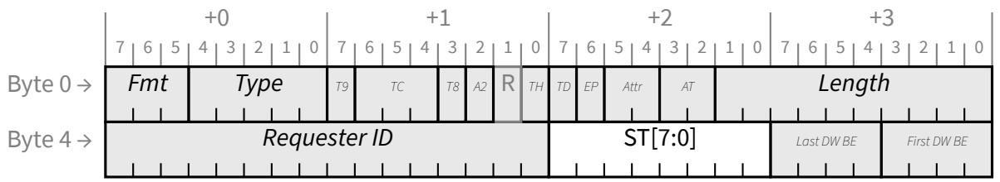

other

| Byte | Position | Value |
|------|--------|-------|
| Byte 0 → | 7 | +0 |
| Byte 0 → | 6 | 5 |
| Byte 0 → | 5 | 4 |
| Byte 0 → | 4 | 3 |
| Byte 0 → | 3 | 2 |
| Byte 0 → | 2 | 1 |
| Byte 0 → | 1 | 0 |
| Byte 0 → | 0 | 7 |
| Byte 0 → | +1 | +1 |
| Byte 0 → | +2 | +2 |
| Byte 0 → | +3 | +3 |
| Byte 4 → | T9 | T9 |
| Byte 4 → | TC | TC |
| Byte 4 → | T8 | T8 |
| Byte 4 → | A2 | A2 |
| Byte 4 → | R | R |
| Byte 4 → | TH | TH |
| Byte 4 → | TD | TD |
| Byte 4 → | EP | EP |
| Byte 4 → | Attr | Attr |
| Byte 4 → | AT | AT |
| Byte 4 → | Length | Length |
| Byte 4 → | Requester ID | ST[7:0] |
| Byte 4 → | Last DW BE | Last DW BE |
| Byte 4 → | First DW BE | First DW BE |

Figure 2-37 Location of ST[7:0] in the Memory Write Request Header - Non-Flit Mode§

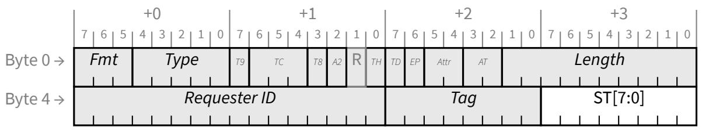  
Figure 2-38 Location of ST[7:0] in Memory Read, DMWr, and AtomicOp Request Headers - Non-Flit Mode§

Table 2-19 Location of ST[7:0] in TLP Headers§ 

<table><tr><td>ST Bits</td><td>Memory Write Request</td><td>Memory Read Request or AtomicOp Request</td></tr><tr><td>7:0</td><td>Bits 7:0 of Byte 6</td><td>Bits 7:0 of Byte 7</td></tr></table>

• ST[7:0] field carries the Steering Tag value

◦ A value of Zero indicates no Steering Tag preference   
◦ A total of 255 unique Steering Tag values are provided

• A Function that does not support the TPH Completer or Routing capability and receives a transaction with the TH bit Set is required to ignore the TH bit and handle the Request in the same way as Requests of the same transaction type without the TH bit Set.

# 2.2.7.2 Flit Mode §

Except as stated, rules that apply in Non-Flit Mode also apply in Flit Mode.

• All Memory, I/O, and Configuration Requests include the following fields in addition to the common header fields:   
◦ A Transaction ID, consisting of Requester ID[15:0] and Tag[13:0], and, for Memory Requests, sometimes also including the Requester Segment[7:0]   
• Byte Enable rules are in § Section 2.2.5.2 .   
• For Memory Requests, including AtomicOp and DMWr, the rules for the formation and processing of Header Fields are the same as in Non-Flit Mode.   
• For IO Requests, the rules for the formation and processing of Header Fields are the same as in Non-Flit Mode.   
• Configuration Requests must include OHC-A3.   
• Configuration Requests must only include OHC-C when they are associated with an IDE stream.

The following figures illustrate Flit Mode Request Headers.

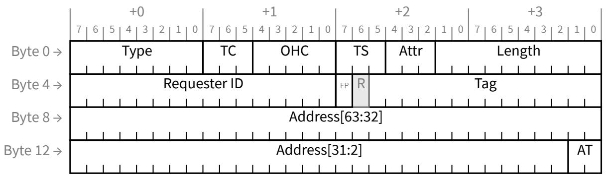

bar_stacked

| Byte | Type | TC | OHC | TS | Attr | Length | Requester ID | EP | R | Tag |
|------|------|----|-----|----|------|--------|--------------|----|----|-----|
| 0    | 7    | 6  | 5   | 4  | 3    | 2      | 1            | 0  | 0  | 0   |
| 1    | 0    | 7  | 6   | 5  | 4    | 3      | 2            | 0  | 0  | 0   |
| 2    | 0    | 7  | 6   | 5  | 4    | 3      | 2            | 0  | 0  | 0   |
| 3    | 0    | 7  | 6   | 5  | 4    | 3      | 2            | 0  | 0  | 0   |
| 4    | 0    | 7  | 6   | 5  | 4    | 3      | 2            | 0  | 0  | 0   |
| 5    | 0    | 7  | 6   | 5  | 4    | 3      | 2            | 0  | 0  | 0   |
| 6    | 0    | 7  | 6   | 5  | 4    | 3      | 2            | 0  | 0  | 0   |
| 7    | +0   | -  | -   | -  | -    | -      | -            | -  | -  | -   |
| 8    | +1   | -  | -   | -  | -    | -      | -            | -  | -  | -   |
| 9    | +2   | -  | -   | -  | -    | -      | -            | -  | -  | -   |
| 10   | +3   | -  | -   | -  | -    | -      | -            | -  | -  | -   |
| 11   | +3   | -  | -   | -  | -    | -      | -            | -  | -  | -   |
| 12   | +3   | -  | -   | -  | -    | -      | -            | -  | -  | AT  |
The image contains a table with the byte values and the corresponding fields used for the table. The 'Address' column contains the hexadecimal addresses and the 'Address[31:2]' column contains the address value.

§ Figure 2-39 Flit Mode Mem64 Request

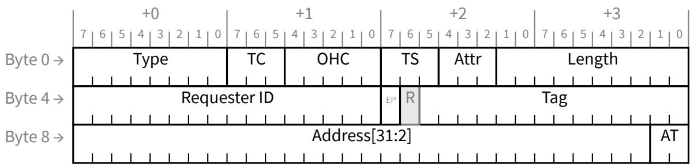  
§ Figure 2-40 Flit Mode Mem32 Request

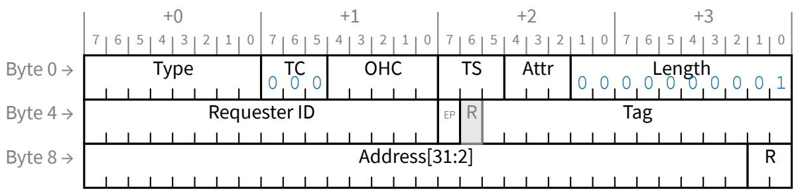

other

| Byte Range | Bit Position | Event Description |
|------------|--------------|-------------------|
| 0 →        | Type         | TC                |
| 0 →        | OHC          | TS                |
| 0 →        | Length       | Attn               |
| 4 →        | Requester ID | EP                |
| 4 →        | Tag          | R                 |
| 8 →        | Address[31:2] |           |
| 8 →        | R            |           |

§ Figure 2-41 Flit Mode IO Request

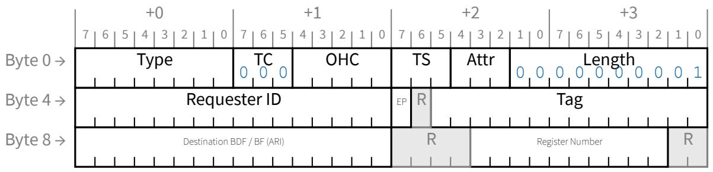

other

| Byte | Position | Value |
|------|----------|-------|
| 0    | Type     | 7     |
| 0    | Type     | 6     |
| 0    | Type     | 5     |
| 0    | Type     | 4     |
| 0    | Type     | 3     |
| 0    | Type     | 2     |
| 0    | Type     | 1     |
| 0    | Type     | 0     |
| 0    | Type     | +0    |
| 0    | Type     | +1    |
| 0    | Type     | +2     |
| 0    | Type     | +3     |
| 4    | Requester ID | TC   |
| 4    | Requester ID | OHC  |
| 4    | Requester ID | TS   |
| 4    | Requester ID | Attr |
| 4    | Requester ID | Length |
| 4    | Requester ID | EP   |
| 4    | Requester ID | R    |
| 4    | Requester ID | Tag   |
| 8    | Destination BDF / BF (ARI) | R    |
| 8    | Destination BDF / BF (ARI) | Register Number |
| 8    | Destination BDF / BF (ARI) | R     |

Figure 2-42 Flit Mode Configuration Request§

# 2.2.8 Message Request Rules §

This document defines the following groups of Messages:

• INTx Interrupt Signaling   
• Power Management   
• Error Signaling   
• Locked Transaction Support   
• Slot Power Limit Support   
• Vendor-Defined Messages   
• Latency Tolerance Reporting (LTR) Messages   
• Optimized Buffer Flush/Fill (OBFF) Messages   
• Device Readiness Status (DRS) Messages   
• Function Readiness Status (FRS) Messages   
• Hierarchy ID Messages   
• Precision Time Measurement (PTM) Messages   
• Integrity and Data Encryption (IDE) Messages

The following rules apply to all Message Requests. Additional rules specific to each type of Message follow.

• All Message Requests include the following fields in addition to the common header fields (see § Figure 2-43 and § Figure 2-44):

◦ Requester ID[15:0]   
◦ Message Code[7:0] - Indicates the particular Message embodied in the Request.   
◦ EP - For Messages with data only, indicates data payload is poisoned (see § Section 2.7 ); Reserved for Messages without data.

• All Message Requests use the Msg or MsgD TLP Type.   
• The Message Code field must be fully decoded (Message aliasing is not permitted).   
• The Attr[2] field is not Reserved unless specifically indicated as Reserved.   
• Except as noted, the Attr[1:0] field is Reserved.   
• Except as noted, TH is not applicable to Message Requests and the bit is Reserved.   
• AT[1:0] must be 00b. Receivers are not required or encouraged to check this.   
• Bytes 8 through 15 are Reserved unless specifically defined.   
• Message Requests are posted and do not require Completion.   
• Message Requests follow the same ordering rules as Memory Write Requests.

Many types of Messages, including Vendor-Defined Messages, are potentially usable in non-D0 states, and it is strongly recommended that the handling of Messages by Ports be the same when the Port's Bridge Function is in D1, D2, and D3Hot as it is in D0. It is strongly recommended that Type 0 Functions support the generation and reception of Messages in non-D0 states.

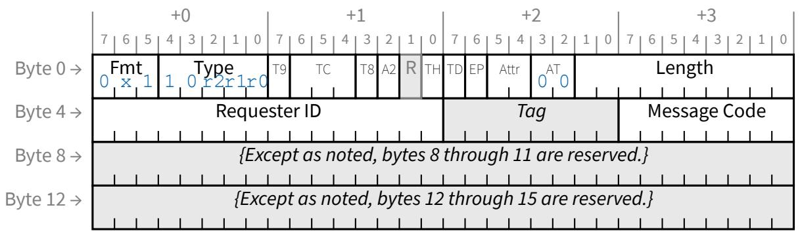

other

| Byte | Value |
|------|-------|
| Byte 0 → | Fmt 0 x 1 |
| Byte 4 → | Requester ID |
| Byte 8 → | Except as noted, bytes 8 through 11 are reserved. |
| Byte 12 → | Except as noted, bytes 12 through 15 are reserved. |

Figure 2-43 Message Request Header - Non-Flit Mode§

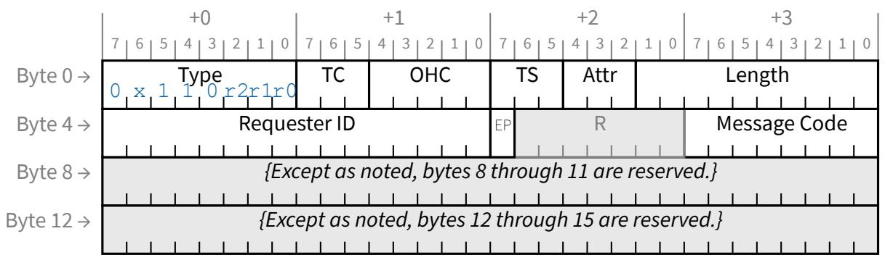

bar_stacked

| Byte | Bit Position | Type | TC | OHC | TS | Attr | Length | Requester ID | EP | R | Message Code |
|------|--------------|------|----|-----|----|------|--------|--------------|----|----|--------------|
| 0    | +0           | 0    | 0  | 0   | 0  | 0    | 0      | 0            | 0  | 0  | 0            |
| 1    | +1           | 0    | 0  | 0   | 0  | 0    | 0      | 0            | 0  | 0  | 0            |
| 2    | +2           | 0    | 0  | 0   | 0  | 0    | 0      | 0            | 0  | 0  | 0            |
| 3    | +3           | 0    | 0  | 0   | 0  | 0    | 0      | 0            | 0  | 0  | 0            |
| 4    | -            | x    | -  | -   | -  | -    | -      | -            | -  | -  | -            |
| 5    | -            | x    | -  | -   | -  | -    | -      | -            | -  | -  | -            |
| 6    | -            | x    | -  | -   | -  | -    | -      | -            | -  | -  | -            |
| 7    | -            | x    | -  | -   | -  | -    | -      | -            | -  | -  | -            |
| 8    | -            | x    | -  | -   | -  | -    | -      | -            | -  | -  | -            |
| 9    | -            | x    | -  | -   | -  | -    | -      | -            | -  | -  | -            |
| 10   | -            | x    | -  | -   | -  | -    | -      | -            | -  | -  | -            |
| 11   | -            | x    | -  | -   | -  | -    | -      | -            | -  | -  | -            |
| 12   | -            | x    | -  | -   | -  | -    | -      | -            | -  | -  | -            |
| ...  | ...          | ...  | ...| ...| ...| ...   | ...    | ...         | ...| ...| ...         |
| Note: The actual values in the 'Type' column are not provided in the code. The 'Requester ID' and 'Message Code' columns are not explicitly provided in the code. The 'Except as noted, bytes 8 through 11 are reserved.' and 'Except as noted, bytes 12 through 15 are reserved.' are marked with brackets and do not correspond to the actual values. There is only an annotation for the 'Type' and 'Requester ID' values. The 'Length' column contains all four bars. The 'Message Code' column contains only one bar. The 'Text' column contains three bars. The 'Text' column contains three bars. The 'Text' column contains three bars. The 'Text' column contains three bars. The 'Text' column contains three bars. The 'Text' column contains three bars. The 'Text' column contains three bars. The 'Text' column contains three bars. The 'Text' column contains three bars. The 'Text' column contains three bars. The 'Text' column contains three bars. The 'Text' column contains three bars, but there is no additional bars. The 'Text' column contains three bars. The 'Text' column contains three bars. The 'Text' column contains three bars. The 'Text' column contains three bars. The 'Text' column contains three bars. The 'Text' column contains three bars. The 'Text' column contains three bars. The 'Text' column contains three bars. The 'Text' column contains three bars. The 'Text' column contains three bars. The 'Text' column contains three bar groups. The 'Text' column contains three bars. The 'Text' column contains three bars. The 'Text' column contains three bars. The 'Text' column contains three bars. The 'Text' column contains three bars. The 'Text' column contains three bars. The 'Text' column contains three bars. The 'Text' column contains three bars. The 'Text' column contains three bars. The 'Text' column contains three bars. The 'Text' column contains three bars.

Figure 2-44 Message Request Header - Flit Mode§

In addition to address and ID routing, Messages support several other routing mechanisms. These mechanisms are referred to as “implicit” because no address or ID specifies the destination, but rather the destination is implied by the routing type. The following rules cover Message routing mechanisms:

• Message routing is determined using the r[2:0] sub-field of the Type field

◦ Message Routing r[2:0] values are defined in § Table 2-20   
◦ Permitted values are defined in the following sections for each Message

Table 2-20 Message Routing§ 

<table><tr><td>r[2:0] (b)</td><td>Description</td><td>Bytes 8 to 15 $^{19}$ </td></tr><tr><td>000</td><td>Routed to Root Complex</td><td>Reserved</td></tr><tr><td>001</td><td>Routed by Address $^{20}$ </td><td>Address</td></tr><tr><td>010</td><td>Routed by ID</td><td>See § Section 2.2.4.2</td></tr><tr><td>011</td><td>Broadcast from Root Complex</td><td>Reserved</td></tr><tr><td>100</td><td>Local - Terminate at Receiver</td><td>Reserved</td></tr><tr><td>r[2:0] (b)</td><td>Description</td><td>Bytes 8 to 15</td></tr><tr><td>101</td><td>Gathered and routed to Root Complex $^{21}$ </td><td>Reserved</td></tr><tr><td>110 to 111</td><td>Reserved - Terminate at Receiver</td><td>Reserved</td></tr></table>

In Flit Mode, when Route by ID is used and the Destination Segment is different from the Requester Segment, OHC-A4 must be present and include the Destination Segment in byte 0 and DSV must be Set. DSV is permitted to be Set when the Destination Segment is the same as the Requester Segment. DSV must be Clear when Route by ID is not used. When DSV is clear, the Destination Segment field must be set to 00h. OHC-A4 must be present for Route by ID Messages that require PASID.

# 2.2.8.1 INTx Interrupt Signaling - Rules §

A Message Signaled Interrupt (MSI or MSI-X) is the preferred interrupt signaling mechanism in PCI Express (see § Section 6.1 ). However, in some systems, there may be Functions that cannot support the MSI or MSI-X mechanisms. The INTx virtual wire interrupt signaling mechanism is used to support Legacy Endpoints and PCI Express/PCI(-X) Bridges in cases where the MSI or MSI-X mechanisms cannot be used. Switches must support this mechanism. The following rules apply to the INTx Interrupt Signaling mechanism:

• The INTx mechanism uses eight distinct Messages (see § Table 2-21).   
• Assert\_INTx/Deassert\_INTx Messages do not include a data payload (TLP Type is Msg).   
• The Length field is Reserved.   
• Assert\_INTx/Deassert\_INTx Messages are only issued by Upstream Ports.

• With Assert\_INTx/Deassert\_INTx Messages, the Function Number field in the Requester ID must be 0. Note that the Function Number field is a different size for non-ARI and ARI Requester IDs.

◦ Receivers may optionally check for violations of this rule. If a Receiver implementing this check determines that an Assert\_INTx/Deassert\_INTx violates this rule, it must handle the TLP as a Malformed TLP.

▪ This is a reported error associated with the Receiving Port (see § Section 6.2 ).

• Assert\_INTx and Deassert\_INTx interrupt Messages must use the default Traffic Class designator (TC0). Receivers must check for violations of this rule. If a Receiver determines that a TLP violates this rule, it must handle the TLP as a Malformed TLP.

◦ This is a reported error associated with the Receiving Port (see § Section 6.2 ).

The Assert\_INTx/Deassert\_INTx Message pairs constitute four “virtual wires” for each of the legacy PCI interrupts designated A, B, C, and D. The following rules describe the operation of these virtual wires:   
§ Table 2-21 INTx Mechanism Messages 

<table><tr><td rowspan="2">Name</td><td rowspan="2">Code[7:0](b)</td><td rowspan="2">Routing r[2:0] (b)</td><td colspan="4"> $Support^{22}$ </td><td rowspan="2">Description/Comments</td></tr><tr><td>RC</td><td>Ep</td><td>Sw</td><td>Br</td></tr><tr><td rowspan="4">Assert_INTA</td><td rowspan="4">00100000</td><td rowspan="4">100</td><td colspan="4">All:</td><td rowspan="4">Assert INTA virtual wireNote: These Messages are used for Conventional PCI-compatible INTx emulation.</td></tr><tr><td>r</td><td></td><td>tr</td><td></td></tr><tr><td colspan="4">As Required:</td></tr><tr><td></td><td>t</td><td></td><td>t</td></tr><tr><td rowspan="2">Name</td><td rowspan="2">Code[7:0](b)</td><td rowspan="2">Routing r[2:0] (b)</td><td colspan="4">Support</td><td rowspan="2">Description/Comments</td></tr><tr><td>RC</td><td>Ep</td><td>Sw</td><td>Br</td></tr><tr><td rowspan="4">Assert_INTB</td><td rowspan="4">00100001</td><td rowspan="4">100</td><td colspan="4">All:</td><td rowspan="4">Assert INTB virtual wire</td></tr><tr><td>r</td><td></td><td>tr</td><td></td></tr><tr><td colspan="4">As Required:</td></tr><tr><td></td><td>t</td><td></td><td>t</td></tr><tr><td rowspan="4">Assert_INTC</td><td rowspan="4">00100010</td><td rowspan="4">100</td><td colspan="4">All:</td><td rowspan="4">Assert INTC virtual wire</td></tr><tr><td>r</td><td></td><td>tr</td><td></td></tr><tr><td colspan="4">As Required:</td></tr><tr><td></td><td>t</td><td></td><td>t</td></tr><tr><td rowspan="4">Assert_INTD</td><td rowspan="4">00100011</td><td rowspan="4">100</td><td colspan="4">All:</td><td rowspan="4">Assert INTD virtual wire</td></tr><tr><td>r</td><td></td><td>tr</td><td></td></tr><tr><td colspan="4">As Required:</td></tr><tr><td></td><td>t</td><td></td><td>t</td></tr><tr><td rowspan="4">Deassert_INTA</td><td rowspan="4">00100100</td><td rowspan="4">100</td><td colspan="4">All:</td><td rowspan="4">Deassert INTA virtual wire</td></tr><tr><td>r</td><td></td><td>tr</td><td></td></tr><tr><td colspan="4">As Required:</td></tr><tr><td></td><td>t</td><td></td><td>t</td></tr><tr><td rowspan="4">Deassert_INTB</td><td rowspan="4">00100101</td><td rowspan="4">100</td><td colspan="4">All:</td><td rowspan="4">Deassert INTB virtual wire</td></tr><tr><td>r</td><td></td><td>tr</td><td></td></tr><tr><td colspan="4">As Required:</td></tr><tr><td></td><td>t</td><td></td><td>t</td></tr><tr><td rowspan="4">Deassert_INTC</td><td rowspan="4">00100110</td><td rowspan="4">100</td><td colspan="4">All:</td><td rowspan="4">Deassert INTC virtual wire</td></tr><tr><td>r</td><td></td><td>tr</td><td></td></tr><tr><td colspan="4">As Required:</td></tr><tr><td></td><td>t</td><td></td><td>t</td></tr><tr><td rowspan="4">Deassert_INTD</td><td rowspan="4">00100111</td><td rowspan="4">100</td><td colspan="4">All:</td><td rowspan="4">Deassert INTD virtual wire</td></tr><tr><td>r</td><td></td><td>tr</td><td></td></tr><tr><td colspan="4">As Required:</td></tr><tr><td></td><td>t</td><td></td><td>t</td></tr></table>

• The components at both ends of each Link must track the logical state of the four virtual wires using the Assert/Deassert Messages to represent the active and inactive transitions (respectively) of each corresponding virtual wire.

◦ An Assert\_INTx represents the active going transition of the INTx $( \mathsf { x } = \mathsf { A } , \mathsf { B } , \mathsf { C } , \mathsf { o r } \mathsf { D } )$ virtual wire   
◦ A Deassert\_INTx represents the inactive going transition of the INTx $( \mathsf { x } = \mathsf { A } , \mathsf { B } , \mathsf { C } , \mathsf { o r } \mathsf { D } )$ virtual wire

• When the local logical state of an INTx virtual wire changes at an Upstream Port, the Port must communicate this change in state to the Downstream Port on the other side of the same Link using the appropriate Assert\_INTx or Deassert\_INTx Message.

Note: Duplicate Assert\_INTx/Deassert\_INTx Messages have no effect, but are not errors.

• INTx Interrupt Signaling is disabled when the Interrupt Disable bit of the Command register (see § Section 7.5.1.1.3 ) is Set.

◦ Any INTx virtual wires that are active when the Interrupt Disable bit is Set must be deasserted by transmitting the appropriate Deassert\_INTx Message(s).

• Virtual and actual PCI to PCI Bridges must map the virtual wires tracked on the secondary side of the Bridge according to the Device Number of the device on the secondary side of the Bridge, as shown in § Table 2-22.   
• Switches must track the state of the four virtual wires independently for each Downstream Port, and present a “collapsed” set of virtual wires on its Upstream Port.   
• If a Switch Downstream Port goes to DL\_Down status, the INTx virtual wires associated with that Port must be deasserted, and the Switch Upstream Port virtual wire state updated accordingly.

◦ If this results in deassertion of any Upstream INTx virtual wires, the appropriate Deassert\_INTx Message(s) must be sent by the Upstream Port.

• The Root Complex must track the state of the four INTx virtual wires independently for each of its Downstream Ports, and map these virtual signals to system interrupt resources.

◦ Details of this mapping are system implementation specific.

• If a Downstream Port of the Root Complex goes to DL\_Down status, the INTx virtual wires associated with that Port must be deasserted, and any associated system interrupt resource request(s) must be discarded.

Table 2-22 Bridge Mapping for INTx Virtual Wires§ 

<table><tr><td>Requester ID[7:3] from the Assert_INTx/Deassert_INTx Message received on Secondary Side of Bridge (Interrupt Source  $^{23}$ )If ARI Forwarding is enabled, the value 0 must be used instead of Requester ID[7:3].</td><td>INTx Virtual Wire on Secondary Side of Bridge</td><td>Mapping to INTx Virtual Wire on Primary Side of Bridge</td></tr><tr><td rowspan="4">0,4,8,12,16,20,24,28</td><td>INTA</td><td>INTA</td></tr><tr><td>INTB</td><td>INTB</td></tr><tr><td>INTC</td><td>INTC</td></tr><tr><td>INTD</td><td>INTD</td></tr><tr><td rowspan="4">1,5,9,13,17,21,25,29</td><td>INTA</td><td>INTB</td></tr><tr><td>INTB</td><td>INTC</td></tr><tr><td>INTC</td><td>INTD</td></tr><tr><td>INTD</td><td>INTA</td></tr></table>

23. The Requester ID of an Assert\_INTx/Deassert\_INTx Message will correspond to the Transmitter of the Message on that Link, and not necessarily to the original source of the interrupt.

<table><tr><td>Requester ID[7:3] from the Assert_INTx/Deassert_INTx Message received on Secondary Side of Bridge (Interrupt Source) If ARI Forwarding is enabled, the value 0 must be used instead of Requester ID[7:3].</td><td>INTx Virtual Wire on Secondary Side of Bridge</td><td>Mapping to INTx Virtual Wire on Primary Side of Bridge</td></tr><tr><td rowspan="4">2,6,10,14,18,22,26,30</td><td>INTA</td><td>INTC</td></tr><tr><td>INTB</td><td>INTD</td></tr><tr><td>INTC</td><td>INTA</td></tr><tr><td>INTD</td><td>INTB</td></tr><tr><td rowspan="4">3,7,11,15,19,23,27,31</td><td>INTA</td><td>INTD</td></tr><tr><td>INTB</td><td>INTA</td></tr><tr><td>INTC</td><td>INTB</td></tr><tr><td>INTD</td><td>INTC</td></tr></table>

# IMPLEMENTATION NOTE:

# SYSTEM INTERRUPT MAPPING §

Note that system software (including BIOS and operating system) needs to comprehend the remapping of legacy interrupts (INTx mechanism) in the entire topology of the system (including hierarchically connected Switches and subordinate PCI Express/PCI Bridges) to establish proper correlation between PCI Express device interrupt and associated interrupt resources in the system interrupt controller. The remapping described by § Table 2-22 is applied hierarchically at every Switch. In addition, PCI Express/PCI and PCI/PCI Bridges perform a similar mapping function.

# IMPLEMENTATION NOTE:

# VIRTUAL WIRE MAPPING FOR INTX INTERRUPTS FROM ARIDEVICES

The implied Device Number for an ARI Device is 0. When ARI-aware software (including BIOS and operating system) enables ARI Forwarding in the Downstream Port immediately above an ARI Device in order to access its Extended Functions, software must comprehend that the Downstream Port will use Device Number 0 for the virtual wire mappings of INTx interrupts coming from all Functions of the ARI Device. If non-ARI-aware software attempts to determine the virtual wire mappings for Extended Functions, it can come up with incorrect mappings by examining the traditional Device Number field and finding it to be non-0.

# 2.2.8.2 Power Management Messages §

These Messages are used to support PCI Express power management, which is described in detail in § Chapter 5. . The following rules define the Power Management Messages:

• § Table 2-23 defines the Power Management Messages.

• Power Management Messages do not include a data payload (TLP Type is Msg).   
• The Length field is Reserved.   
• With PM\_Active\_State\_Nak Messages, the Function Number field in the Requester ID must contain the Function Number of the Downstream Port that sent the Message, or else 000b for compatibility with earlier revisions of this specification.   
With PME\_TO\_Ack Messages, the Function Number field in the Requester ID must be Reserved, or else for compatibility with earlier revisions of this specification must contain the Function Number of one of the Functions associated with the Upstream Port. Note that the Function Number field is a different size for non-ARI and ARI Requester IDs.   
• Power Management Messages must use the default Traffic Class designator (TC0). Receivers must check for violations of this rule. If a Receiver determines that a TLP violates this rule, it must handle the TLP as a Malformed TLP.

◦ This is a reported error associated with the Receiving Port (see § Section 6.2 ).

Table 2-23 Power Management Messages§ 

<table><tr><td rowspan="2">Name</td><td rowspan="2">Code[7:0](b)</td><td rowspan="2">Routing r[2:0] (b)</td><td colspan="4">Support</td><td rowspan="2">Description/Comments</td></tr><tr><td>RC</td><td>Ep</td><td>Sw</td><td>Br</td></tr><tr><td>PM_Active_State_Nak</td><td>00010100</td><td>100</td><td>t</td><td>r</td><td>tr</td><td>r</td><td>Terminate at Receiver</td></tr><tr><td rowspan="4">PM_PME</td><td rowspan="4">00011000</td><td rowspan="4">000</td><td colspan="4">All:</td><td rowspan="4">Sent Upstream by PME-requesting component. Propagates Upstream.</td></tr><tr><td>r</td><td></td><td>tr</td><td>t</td></tr><tr><td colspan="4">If PME supported:</td></tr><tr><td></td><td>t</td><td></td><td></td></tr><tr><td>PME_Turn_Off</td><td>00011001</td><td>011</td><td>t</td><td>r</td><td></td><td>r</td><td>Broadcast Downstream</td></tr><tr><td rowspan="2">PME_TO_Ack</td><td rowspan="2">00011011</td><td rowspan="2">101</td><td>r</td><td>t</td><td></td><td>t</td><td rowspan="2">Sent Upstream by Upstream Port. See § Section 5.3.3.2.1 .</td></tr><tr><td colspan="4">(Note: Switch handling is special)</td></tr></table>

# 2.2.8.3 Error Signaling Messages §

Error Signaling Messages are used to signal errors that occur on specific transactions and errors that are not necessarily associated with a particular transaction. These Messages are initiated by the agent that detected the error.

• § Table 2-24 defines the Error Signaling Messages.   
• Error Signaling Messages do not include a data payload (TLP Type is Msg).   
• The Length field is Reserved.   
• With Error Signaling Messages, the Function Number field in the Requester ID must indicate which Function is signaling the error. Note that the Function Number field is a different size for non-ARI and ARI Requester IDs.   
• Error Signaling Messages must use the default Traffic Class designator (TC0) Receivers must check for violations of this rule. If a Receiver determines that a TLP violates this rule, it must handle the TLP as a Malformed TLP.

◦ This is a reported error associated with the Receiving Port (see § Section 6.2 ).

§ Table 2-24 Error Signaling Messages 

<table><tr><td rowspan="2">Name</td><td rowspan="2">Code[7:0] (b)</td><td rowspan="2">Routing r[2:0] (b)</td><td colspan="4">Support</td><td rowspan="2">Description/Comments</td></tr><tr><td>RC</td><td>Ep</td><td>Sw</td><td>Br</td></tr><tr><td>ERR_COR</td><td>0011 0000</td><td>000</td><td>r</td><td>t</td><td>tr</td><td>t</td><td>This Message is issued when the Function or Device detects a correctable error on the PCI Express interface.</td></tr><tr><td>ERR_NONFATAL</td><td>0011 0001</td><td>000</td><td>r</td><td>t</td><td>tr</td><td>t</td><td>This Message is issued when the Function or Device detects a Non-Fatal, uncorrectable error on the PCI Express interface.</td></tr><tr><td>ERR_FATAL</td><td>0011 0011</td><td>000</td><td>r</td><td>t</td><td>tr</td><td>t</td><td>This Message is issued when the Function or Device detects a Fatal, uncorrectable error on the PCI Express interface.</td></tr></table>

The initiator of the Message is identified with the Requester ID of the Message header. The Root Complex translates these error Messages into platform level events. Refer to § Section 6.2 for details on uses for these Messages.

• ERR\_COR Messages have an ERR\_COR Subclass (ECS) field in the Message header that enables different subclasses to be distinguished from each other. See § Figure 2-45. ERR\_NONFATAL and ERR\_FATAL Messages do not have the ECS field.

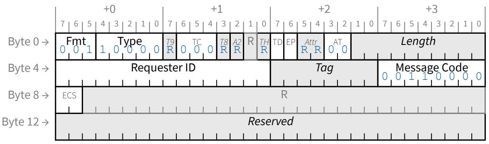

bar_stacked

| Byte | Value |
|------|-------|
| Byte 0 → | Fmt 0 0 1 |
| Byte 0 → | Type 1 0 0 0 0 |
| Byte 0 → | T9 R 0 0 0 |
| Byte 0 → | TC 0 0 0 |
| Byte 0 → | T8 R 0 0 0 |
| Byte 0 → | A2 R |
| Byte 0 → | R |
| Byte 0 → | TH R |
| Byte 4 → | Requester ID |
| Byte 4 → | Tag |
| Byte 4 → | Message Code 0 0 1 1 0 0 0 0 |
| Byte 8 → | ECS |
| Byte 8 → | R |
| Byte 12 → | Reserved |

Figure 2-45 ERR\_COR Message - Non-Flit Mode§

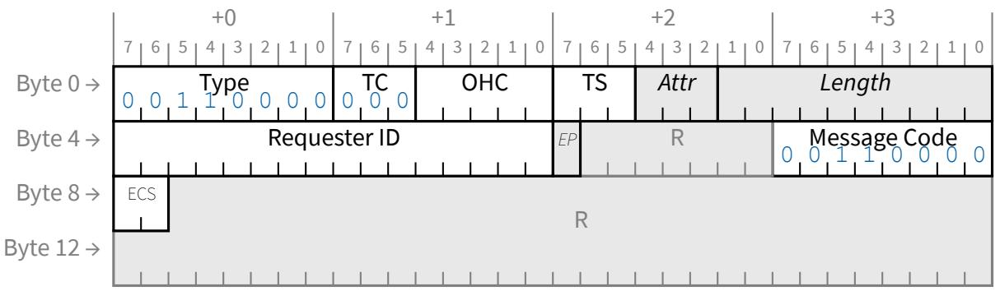

other

| Byte | Value |
|------|-------|
| Type | 0     |
| OHC  | 0     |
| TS   | 7     |
| Attr | 5     |
| Length | 4     |
| Requester ID | 0    |
| Message Code | 0    |
| ECS  | 1     |
| R    | 1     |
| Total | 12    |

Figure 2-46 ERR\_COR Message - Flit Mode§

• The ERR\_COR Subclass (ECS) field is encoded as shown in § Table 2-25, indicating the ERR\_COR Message subclass.

Table 2-25 ERR\_COR Subclass (ECS) Field Encodings§ 

<table><tr><td>ECS Coding</td><td>Description</td></tr><tr><td>00</td><td>ECS Legacy- The value inherently used if a Requester does not support ECS capability. ECS-capable Requesters must not use this value. See see § Section 7.5.3.3 .</td></tr><tr><td>01</td><td>ECS SIG_SFW- Must be used by an ECS-capable Requester when signaling a DPC or SFI event with an ERR_COR Message.</td></tr><tr><td>10</td><td>ECS SIG_OS- Must be used by an ECS-capable Requester when signaling an AER or RP PIO event with an ERR_COR Message.</td></tr><tr><td>11</td><td>ECS Extended- Intended for possible future use. Requesters must not use this value. Receivers must handle the signal internally the same as ECS SIG_OS.</td></tr></table>

# 2.2.8.4 Locked Transactions Support §

The Unlock Message is used to support Lock Transaction sequences. Refer to § Section 6.5 for details on Lock Transaction sequences. The following rules apply to the formation of the Unlock Message:

• § Table 2-26 defines the Unlock Messages.   
• The Unlock Message does not include a data payload (TLP Type is Msg).   
• The Length field is Reserved.   
• With Unlock Messages, the Function Number field in the Requester ID is Reserved.   
◦ This is a reported error associated with the Receiving Port (see § Section 6.2 ).

• The Unlock Message must use the default Traffic Class designator (TC0). Receivers must check for violations of this rule. If a Receiver determines that a TLP violates this rule, it must handle the TLP as a Malformed TLP.

Table 2-26 Unlock Message§ 

<table><tr><td rowspan="2">Name</td><td rowspan="2">Code[7:0] (b)</td><td rowspan="2">Routing r[2:0] (b)</td><td colspan="4">Support</td><td rowspan="2">Description/Comments</td></tr><tr><td>RC</td><td>Ep</td><td>Sw</td><td>Br</td></tr><tr><td>Unlock</td><td>0000 0000</td><td>011</td><td>t</td><td>r</td><td>tr</td><td>r</td><td>Unlock Completer</td></tr></table>

# 2.2.8.5 Slot Power Limit Support §

This Message is used to convey a slot power limitation value from a Downstream Port (of a Root Complex or a Switch) to an Upstream Port of a component (with Endpoint, Switch, or PCI Express-PCI Bridge Functions) attached to the same Link.

• § Table 2-27 defines the Set\_Slot\_Power\_Limit Message.   
• The Set\_Slot\_Power\_Limit Message includes a 1 DW data payload (TLP Type is MsgD).   
• The Set\_Slot\_Power\_Limit Message must use the default Traffic Class designator (TC0). Receivers must check for violations of this rule. If a Receiver determines that a TLP violates this rule, it must handle the TLP as a Malformed TLP.

◦ This is a reported error associated with the Receiving Port (see § Section 6.2 ).

Table 2-27 Set\_Slot\_Power\_Limit Message§ 

<table><tr><td rowspan="2">Name</td><td rowspan="2">Code[7:0] (b)</td><td rowspan="2">Routing r[2:0] (b)</td><td colspan="4">Support</td><td rowspan="2">Description/Comments</td></tr><tr><td>RC</td><td>Ep</td><td>Sw</td><td>Br</td></tr><tr><td>Set_Slot_Power_Limit</td><td>0101 0000</td><td>100</td><td>t</td><td>r</td><td>tr</td><td>r</td><td>Set Slot Power Limit in Upstream Port</td></tr></table>

The Set\_Slot\_Power\_Limit Message includes a one DW data payload. The data payload is copied from the Slot Capabilities register of the Downstream Port and is written into the Device Capabilities register of the Upstream Port on the other side of the Link. Bits 1:0 of Byte 1 of the data payload map to the Slot Power Limit Scale field and bits 7:0 of Byte 0 map to the Slot Power Limit Value field. Bits 7:0 of Byte 3, 7:0 of Byte 2, and 7:2 of Byte 1 of the data payload must all be set to zero by the Transmitter and ignored by the Receiver. This Message must be sent automatically by the Downstream Port (of a Root Complex or a Switch) when one of the following events occurs:

• On a Configuration Write to the Slot Capabilities register (see § Section 7.5.3.9 ) when the Data Link Layer reports DL\_Up status.   
• Any time when a Link transitions from a non-DL\_Up status to a DL\_Up status (see § Section 2.9.2 ) and the Auto Slot Power Limit Disable bit is Clear in the Slot Control Register. This transmission is optional if the Slot Capabilities register has not yet been initialized.

The component on the other side of the Link (with Endpoint, Switch, or Bridge Functions) that receives Set\_Slot\_Power\_Limit Message must copy the values in the data payload into the Device Capabilities register associated with the component's Upstream Port. PCI Express components that are targeted exclusively for integration on the system planar (e.g., system board) as well as components that are targeted for integration on an adapter where power consumption of the entire adapter is below the lowest power limit specified for the adapter form factor (as defined in the corresponding form factor specification) are permitted to hardwire the value of all 0's in the Captured Slot Power Limit Scale and Captured Slot Power Limit Value fields of the Device Capabilities Register, and are not required to copy the Set\_Slot\_Power\_Limit Message payload into that register.

For more details on Power Limit control mechanism see § Section 6.9 .

# 2.2.8.6 Vendor\_Defined Messages §

The Vendor\_Defined Messages allow expansion of PCI Express messaging capabilities, either as a general extension to [PCIe] or a vendor-specific extension. This section defines the rules associated with these Messages generically.

• The Vendor\_Defined Messages (see § Table 2-28) use the header format shown in § Figure 2-47.

◦ The Requester ID is implementation specific. The Requester ID field MUST@FLIT contain the value associated with the Requester. 24   
◦ If the Route by ID routing is used, bytes 8 and 9 form a 16-bit field for the destination ID   
▪ otherwise these bytes are Reserved.   
◦ Bytes 10 and 11 form a 16-bit field for the Vendor ID, as defined by PCI-SIG®, of the vendor defining the Message.   
◦ Bytes 12 through 15 are available for vendor definition.

§ Table 2-28 Vendor\_Defined Messages 

<table><tr><td rowspan="2">Name</td><td rowspan="2">Code[7:0](b)</td><td rowspan="2">Routing r[2:0](b)</td><td colspan="4">Support</td><td rowspan="2">Description/Comments</td></tr><tr><td>RC</td><td>Ep</td><td>Sw</td><td>Br</td></tr><tr><td>Vendor_Defined Type 0</td><td>0111 1110</td><td>000, 010, 011, 100</td><td colspan="4">See Note 1.</td><td>Triggers detection of UR by Completer if not implemented.</td></tr><tr><td>Vendor_Defined Type 1</td><td>0111 1111</td><td>000, 010, 011, 100</td><td colspan="4">See Note 1.</td><td>Silently discarded by Completer if not implemented.</td></tr></table>

1. Note 1: Transmission by Endpoint/Root Complex/Bridge is implementation specific. Switches must forward received Messages using Routing r[2:0] field values of 000b, 010b, and 011b.

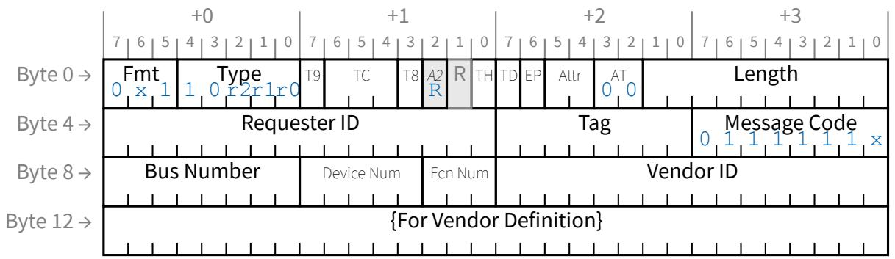  
Figure 2-47 Header for Vendor-Defined Messages - Non-Flit Mode§

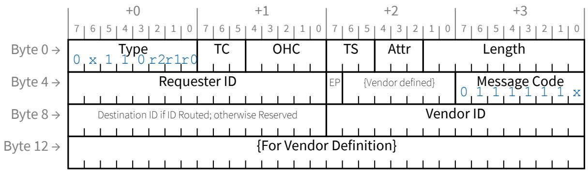  
Figure 2-48 Header for Vendor-Defined Messages - Flit Mode§

• A data payload may be included with either type of Vendor\_Defined Message (TLP type is Msg if no data payload is included or MsgD if a data payload is included).   
• For both types of Vendor\_Defined Messages, the Attr[1:0] and Attr[2] fields are not Reserved.   
• Messages defined by different vendors or by PCI-SIG are distinguished by the value in the Vendor ID field.   
◦ The further differentiation of Messages defined by a particular vendor is beyond the scope of this document.

◦ Support for Messages defined by a particular vendor is implementation specific, and beyond the scope of this document.

• Completers silently discard Vendor\_Defined Type 1 Messages that they are not designed to receive - this is not an error condition.   
• Completers handle the receipt of an unsupported Vendor\_Defined Type 0 Message as an Unsupported Request, and the error is reported according to § Section 6.2 .

[PCIe-to-PCI-PCI-X-Bridge] defines additional requirements for Vendor\_Defined Messages that are designed to be interoperable with PCI-X Device ID Messages. This includes restrictions on the contents of the Tag[7:0] field and the Length[9:0] field as well as specific use of Bytes 12 through 15 of the message header. Vendor\_Defined Messages intended for use solely within a PCI Express environment (i.e., not intended to address targets behind a PCI Express to PCI/PCI-X Bridge) are not subject to the additional rules. Refer to [PCIe-to-PCI-PCI-X-Bridge] for details. Refer to § Section 2.2.6.2 for considerations regarding larger-Tag capabilities.

# 2.2.8.6.1 PCI-SIG Defined VDMs §

PCI-SIG-Defined VDMs are Vendor\_Defined Type 1 Messages that use the PCI-SIG® Vendor ID (0001h). As a Vendor\_Defined Type 1 Message, each is silently discarded by a Completer if the Completer does not implement it.

Beyond the rules for other Vendor\_Defined Type 1 Messages, the following rules apply to the formation of the PCI-SIG-Defined VDMs:

• PCI-SIG-Defined VDMs use the Header format shown in § Figure 2-49.   
• The Requester ID field must contain the value associated with the Requester.   
• The Message Code must be 01111111b.   
• The Vendor ID must be 0001h, which is assigned to the PCI-SIG.   
• The Subtype field distinguishes the specific PCI-SIG-Defined VDMs. See § Appendix F. for a list of PCI-SIG-Defined VDMs.

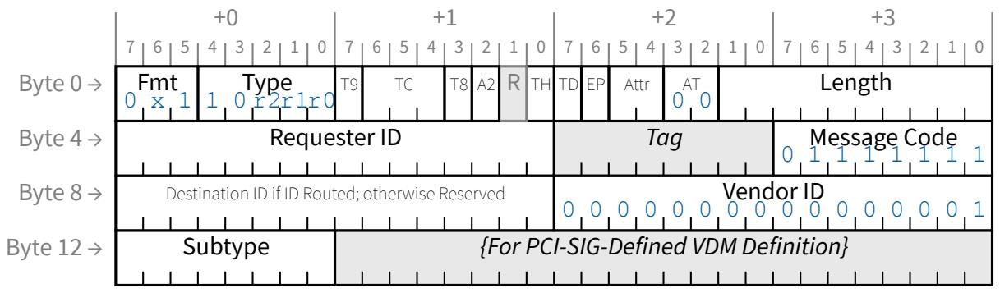  
Figure 2-49 Header for PCI-SIG-Defined VDMs - Non-Flit Mode§

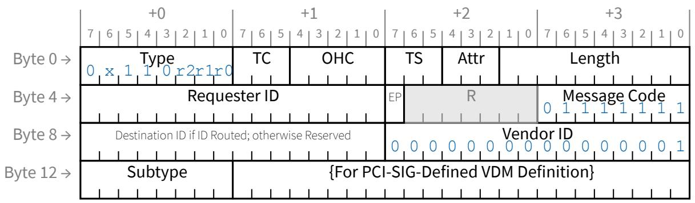  
Figure 2-50 Header for PCI-SIG-Defined VDMs - Flit Mode§

# 2.2.8.6.2 Device Readiness Status (DRS) Message §

The Device Readiness Status (DRS) protocol (see § Section 6.22.1 ) uses the PCI-SIG-Defined VDM mechanism (see § Section 2.2.8.6.1 ). The DRS Message is a PCI-SIG-Defined VDM (Vendor-Defined Type 1 Message) with no payload.

Beyond the rules for other PCI-SIG-Defined VDMs, the following rules apply to the formation of DRS Messages:

• § Table 2-29 and § Figure 2-51 illustrate and define the DRS Message.   
• The TLP Type must be Msg.   
• The TC[2:0] field must be 000b.   
• The Attr[2:0] field is Reserved.   
• The Tag field is Reserved.   
• The Subtype field must be 08h.   
• The Message Routing field must be set to 100b - Local - Terminate at Receiver.

Receivers may optionally check for violations of these rules (but must not check reserved bits). These checks are independently optional (see § Section 6.2.3.4 ). If a Receiver implementing these checks determines that a TLP violates these rules, the TLP is a Malformed TLP.

• If checked, this is a reported error associated with the Receiving Port (see § Section 6.2 ).

§   
$\tau a b l e 2 \ – 2 9 D R S M e s s a g e$ 

<table><tr><td rowspan="2">Name</td><td rowspan="2">Code[7:0] (b)</td><td rowspan="2">Routing r[2:0] (b)</td><td colspan="4">Support</td><td rowspan="2">Description/Comments</td></tr><tr><td>RC</td><td>Ep</td><td>Sw</td><td>Br</td></tr><tr><td>DRS Message</td><td>0111 1111</td><td>100</td><td>r</td><td>t</td><td>tr</td><td></td><td>Device Readiness Status</td></tr></table>

The format of the DRS Message is shown in § Figure 2-51 below:

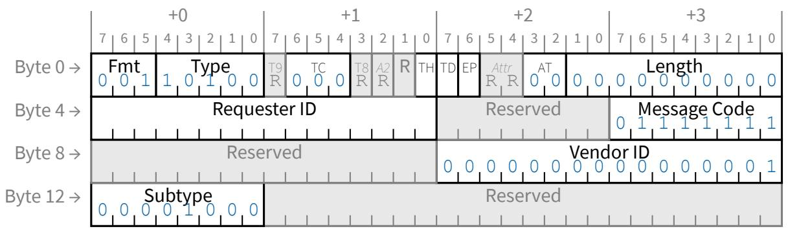

bar_stacked

| Byte | +0 | +1 | +2 | +3 |
|------|----|----|----|----|
| 0    | 7  | 7  | 7  | 7  |
| 1    | 6  | 6  | 6  | 6  |
| 2    | 5  | 5  | 5  | 5  |
| 3    | 4  | 4  | 4  | 4  |
| 4    | 3  | 3  | 3  | 3  |
| 5    | 2  | 2  | 2  | 2  |
| 6    | 1  | 1  | 1  | 1  |
| 7    | 0  | 0  | 0  | 0  |
| Total | +0 | +1 | +2 | +3 |
| Byte 0 → Fmt | Type | T9 R | TC R | TH |
| Byte 4 → Requester ID | Requester ID | Reserved | Reserved | Message Code |
| Byte 8 → Reserved | Reserved | Vendor ID | Reserved | Reserved |
| Byte 12 → Subtype | Subtype | Reserved | Reserved | Reserved |

Figure 2-51 DRS Message - Non-Flit Mode§

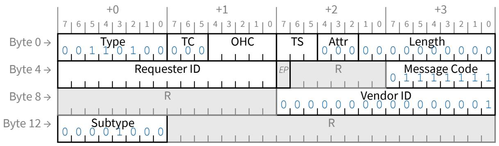  
§ Figure 2-52 DRS Message - Flit Mode

# 2.2.8.6.3 Function Readiness Status Message (FRS Message) §

The Function Readiness Status (FRS) protocol (see § Section 6.22.2 ) uses the PCI-SIG-Defined VDM mechanism (see § Section 2.2.8.6.1 ). The FRS message is a PCI-SIG-Defined VDM (Vendor\_Defined Type 1 Message) with no payload.

Beyond the rules for other PCI-SIG-Defined VDMs, the following rules apply to the formation of FRS Messages:

§ Table 2-30 and § Figure 2-53 illustrate and define the FRS Message.

• The TLP Type must be Msg.   
• The TC[2:0] field must be 000b.   
• The Attr[2:0] field is Reserved.   
• The Tag field is Reserved.   
• The Subtype field must be 09h.

• The FRS Reason[3:0] field indicates why the FRS Message was generated:

# 0001b: DRS Message Received

The Downstream Port indicated by the Message Requester ID received a DRS Message and has the DRS Signaling Control field in the Link Control Register set to DRS to FRS Signaling Enabled

# 0010b: D3Hot to D0 Transition Completed

A D3Hot to D0 transition has completed, and the Function indicated by the Message Requester ID is now Configuration-Ready and has returned to the D0uninitialized or ${ \mathsf { D } } 0 _ { \mathsf { a c t i v e } }$ state depending on the setting of the No\_Soft\_Reset bit (see § Section 7.5.2.2 )

# 0011b: FLR Completed

An FLR has completed, and the Function indicated by the Message Requester ID is now Configuration-Ready

# 1000b: VF Enabled

The Message Requester ID indicates a Physical Function (PF) - All Virtual Functions (VFs) associated with that PF are now Configuration-Ready

# 1001b: VF Disabled

The Message Requester ID indicates a PF - All VFs associated with that PF have been disabled and the Single Root I/O Virtualization (SR-IOV) data structures in that PF may now be accessed.

# Others:

All other values Reserved

• The Message Routing field must be Cleared to 000b - Routed to Root Complex

Receivers may optionally check for violations of these rules (but must not check reserved bits). These checks are independently optional (see § Section 6.2.3.4 ). If a Receiver implementing these checks determines that a TLP violates these rules, the TLP is a Malformed TLP.

• If checked, this is a reported error associated with the Receiving Port (see § Section 6.2 ).

Table 2-30 FRS Message 

<table><tr><td rowspan="2">Name</td><td rowspan="2">Code[7:0] (b)</td><td rowspan="2">Routing r[2:0] (b)</td><td colspan="4">Support</td><td rowspan="2">Description/Comments</td></tr><tr><td>RC</td><td>Ep</td><td>Sw</td><td>Br</td></tr><tr><td>FRS Message</td><td>0111 1111</td><td>000</td><td>r</td><td>t</td><td>tr</td><td></td><td>Function Readiness Status</td></tr></table>

The format of the FRS Message is shown in § Figure 2-53 and § Figure 2-54 below:

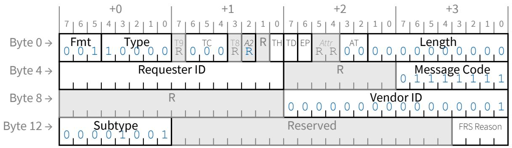  
Figure 2-53 FRS Message - Non-Flit Mode§

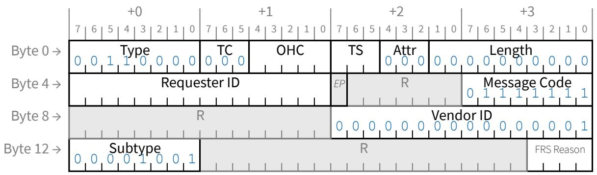  
§ Figure 2-54 FRS Message - Flit Mode

# 2.2.8.6.4 Hierarchy ID Message §

Hierarchy ID uses the PCI-SIG-Defined VDM mechanism (see § Section 2.2.8.6.1 ). The Hierarchy ID Message is a PCI-SIG-Defined VDM (Vendor\_Defined Type 1 Message) with payload (MsgD).

Beyond the rules for other PCI-SIG-Defined VDMs, the following rules apply to the formation of Hierarchy ID Messages:

• § Table 2-31 and § Figure 2-55 illustrate and define the Hierarchy ID Message.   
• The TLP Type must be MsgD.   
• Each Message must include a 4-DWORD data payload.   
• The Length field must be 4.   
• The TC[2:0] field must be 000b.   
• The Attr[2:0] field is Reserved.   
• The Tag field is Reserved.   
• The Subtype field is 01h.   
• The Message Routing field must be 011b - Broadcast from Root Complex.

Receivers may optionally check for violations of these rules (but must not check reserved bits). These checks are independently optional (see § Section 6.2.3.4 ). If a Receiver implementing these checks determines that a TLP violates these rules, the TLP is a Malformed TLP.

• If checked, this is a reported error associated with the Receiving Port (see § Section 6.2 ).

The payload of each Hierarchy ID Message contains the lower 128-bits of the System GUID.

For details of the Hierarchy ID, GUID Authority ID, and System GUID fields see § Section 6.25 .

Table 2-31 Hierarchy ID Message§ 

<table><tr><td rowspan="2">Name</td><td rowspan="2">Code[7:0] (b)</td><td rowspan="2">Routing r[2:0] (b)</td><td colspan="4">Support</td><td rowspan="2">Description/Comments</td></tr><tr><td>RC</td><td>Ep</td><td>Sw</td><td>Br</td></tr><tr><td>Hierarchy ID Message</td><td>0111 1111</td><td>011</td><td>t</td><td>r</td><td>tr</td><td></td><td>Hierarchy ID</td></tr></table>

The format of the Hierarchy ID Message is shown in § Figure 2-55 and § Figure 2-56 below:

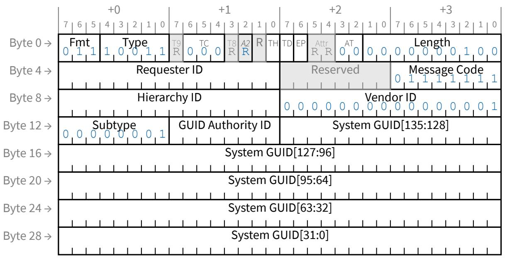

bar_stacked

| Byte | +0 | +1 | +2 | +3 |
|------|----|----|----|----|
| 0    | 7  | 7  | 7  | 7  |
| 1    | 6  | 6  | 6  | 6  |
| 2    | 5  | 5  | 5  | 5  |
| 3    | 4  | 4  | 4  | 4  |
| 4    | 3  | 3  | 3  | 3  |
| 5    | 2  | 2  | 2  | 2  |
| 6    | 1  | 1  | 1  | 1  |
| 7    | 0  | 0  | 0  | 0  |
| Total | +0 | +1 | +2 | +3 |
| Byte 0→ | Fmt | Type | T9 R | TC R |
| Byte 4→ | Requester ID | Requester ID | Reserved | Message Code |
| Byte 8→ | Hierarchy ID | Hierarchy ID | Vendor ID | Vendor ID |
| Byte 12→ | Subtype | GUID Authority ID | System GUID[135:128] | System GUID[127:96] |
| Byte 16→ | System GUID[95:64] | System GUID[63:32] | System GUID[31:0] | System GUID[31:0] |
| Byte 20→ | System GUID[95:64] | System GUID[63:32] | System GUID[31:0] | System GUID[31:0] |
| Byte 24→ | System GUID[63:32] | System GUID[63:32] | System GUID[31:0] | System GUID[31:0] |
| Byte 28→ | System GUID[31:0] | System GUID[63:32] | System GUID[31:0] | System GUID[31:0] |
All four bits are labeled as “Type”, “Hierarchy ID”, “Subtype”, and “Length”. The total bit values sum to each bit of the sum, indicating the total bit count per bit. The byte values are explicitly labeled above each bit.

Figure 2-55 Hierarchy ID Message - Non-Flit Mode§

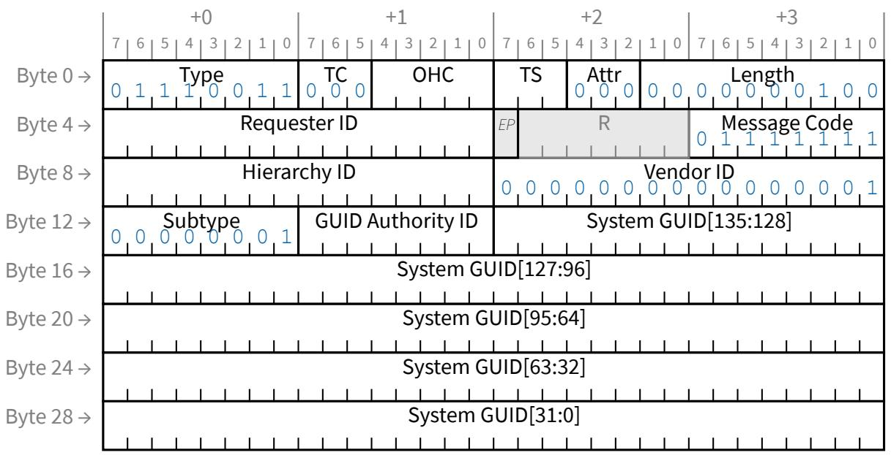  
Figure 2-56 Hierarchy ID Message - Flit Mode§

# 2.2.8.7 Ignored Messages §

The messages listed in § Table 2-32 were previously used for a mechanism (Hot-Plug Signaling) that is no longer supported. Transmitters MUST@FLIT not transmit these messages. If message transmission is implemented, it must conform to the requirements of [PCIe-1.0a].

Beyond normal Link-Layer processing and mandatory checking for properly-formed TLPs, Receivers MUST@FLIT not process these messages further (i.e., carry out their originally architected Transaction-Layer functionality). If complete processing of these messages is implemented, Receivers must process these messages in conformance with the requirements [PCIe-1.0a].

Ignored messages listed in § Table 2-32 are handled by the Receiver as follows:

• The Physical and Data Link Layers must handle these messages identical to handling any other TLP.   
• The Transaction Layer must account for flow control credit but take no other action in response to these messages.

Table 2-32 Ignored Messages§ 

<table><tr><td rowspan="2">Name</td><td rowspan="2">Code[7:0] (b)</td><td rowspan="2">Routing r[2:0] (b)</td><td colspan="4">Support</td><td rowspan="2">Description/Comments</td></tr><tr><td>RC</td><td>Ep</td><td>Sw</td><td>Br</td></tr><tr><td>Ignored Message</td><td>0100 0001</td><td>100</td><td colspan="4"></td><td></td></tr><tr><td>Ignored Message</td><td>0100 0011</td><td>100</td><td colspan="4"></td><td></td></tr><tr><td>Ignored Message</td><td>0100 0000</td><td>100</td><td colspan="4"></td><td></td></tr><tr><td>Ignored Message</td><td>0100 0101</td><td>100</td><td colspan="4"></td><td></td></tr><tr><td>Ignored Message</td><td>0100 0111</td><td>100</td><td colspan="4"></td><td></td></tr><tr><td>Ignored Message</td><td>0100 0100</td><td>100</td><td colspan="4"></td><td></td></tr><tr><td>Ignored Message</td><td>0100 1000</td><td>100</td><td colspan="4"></td><td></td></tr></table>

# 2.2.8.8 Latency Tolerance Reporting (LTR) Message §

The LTR Message is optionally used to report device behaviors regarding its tolerance of Read/Write service latencies. Refer to § Section 6.18 for details on LTR. The following rules apply to the formation of the LTR Message:

• § Table 2-33 defines the LTR Message.   
• The LTR Message does not include a data payload (the TLP Type is Msg).   
• The Length field is Reserved.   
• The LTR Message must use the default Traffic Class designator (TC0). Receivers that implement LTR support must check for violations of this rule. If a Receiver determines that a TLP violates this rule, it must handle the TLP as a Malformed TLP.   
◦ This is a reported error associated with the Receiving Port (see § Section 6.2 ).

§

Table 2-33 LTR Message 

<table><tr><td rowspan="2">Name</td><td rowspan="2">Code[7:0] (b)</td><td rowspan="2">Routing r[2:0] (b)</td><td colspan="4"> $Support^1$ </td><td rowspan="2">Description/Comments</td></tr><tr><td>RC</td><td>Ep</td><td>Sw</td><td>Br</td></tr><tr><td>LTR</td><td>0001 0000</td><td>100</td><td>r</td><td>t</td><td>tr</td><td></td><td>Latency Tolerance Reporting</td></tr></table>

Notes:

<table><tr><td rowspan="2">Name</td><td rowspan="2">Code[7:0] (b)</td><td rowspan="2">Routing r[2:0] (b)</td><td colspan="4"> $Support^1$ </td><td rowspan="2">Description/Comments</td></tr><tr><td>RC</td><td>Ep</td><td>Sw</td><td>Br</td></tr></table>

1. Support for LTR is optional. Functions that support LTR must implement the reporting and enable mechanisms described in § Chapter 7. .

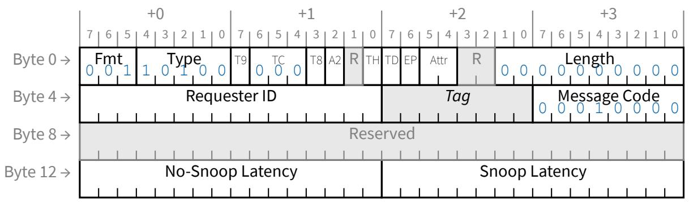  
Figure 2-57 LTR Message - Non-Flit Mode§

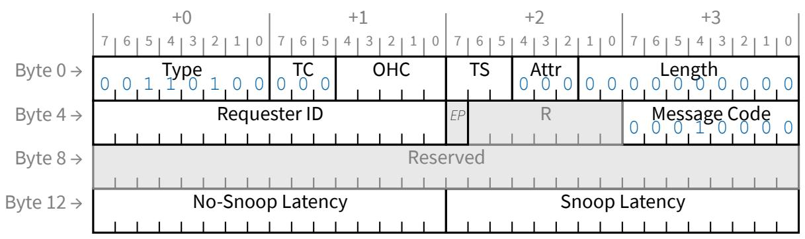  
§ Figure 2-58 LTR Message - Flit Mode

# 2.2.8.9 Optimized Buffer Flush/Fill (OBFF) Message §

The OBFF Message is optionally used to report platform central resource states to Endpoints. This mechanism is described in detail in § Section 6.19 .

The following rules apply to the formation of the OBFF Message:

• § Table 2-34 defines the OBFF Message.   
• The OBFF Message does not include a data payload (TLP Type is Msg).   
• The Length field is Reserved.   
• The Requester ID must be set to the Transmitting Port's ID.

• The OBFF Message must use the default Traffic Class designator (TC0). Receivers that implement OBFF support must check for violations of this rule. If a Receiver determines that a TLP violates this rule, it must handle the TLP as a Malformed TLP.

◦ This is a reported error associated with the Receiving Port (see § Section 6.2 ).

§

Table 2-34 OBFF Message 

<table><tr><td rowspan="2">Name</td><td rowspan="2">Code[7:0] (b)</td><td rowspan="2">Routing r[2:0] (b)</td><td colspan="4"> $Support^1$ </td><td rowspan="2">Description/Comments</td></tr><tr><td>RC</td><td>Ep</td><td>Sw</td><td>Br</td></tr><tr><td>OBFF</td><td>0001 0010</td><td>100</td><td>t</td><td>r</td><td>tr</td><td></td><td>Optimized Buffer Flush/Fill</td></tr></table>

Notes:

1. Support for OBFF is optional. Functions that support OBFF must implement the reporting and enable mechanisms described in § Chapter 7. , Software Initialization and Configuration.

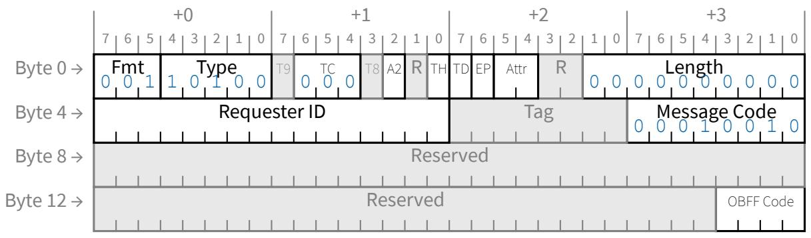

other

| Byte | Value |
|------|-------|
| 0    | +0    |
| 0    | 7     |
| 0    | 6     |
| 0    | 5     |
| 0    | 4     |
| 0    | 3     |
| 0    | 2     |
| 0    | 1     |
| 0    | 0     |
| 0    | 1     |
| 0    | 2     |
| 0    | 3     |
| 0    | 4     |
| 0    | 5     |
| 0    | 6     |
| 0    | 7     |
| 0    | 8     |
| 0    | 9     |
| 0    | 10    |
| 0    | 11    |
| 0    | 12    |
| 0    | 13    |
| 0    | 14    |
| 0    | 15    |
| 0    | 16    |
| 0    | 17    |
| 0    | 18    |
| 0    | 19    |
| 0    | 20    |
| 0    | 21    |
| 0    | 22    |
| 0    | 23    |
| 0    | 24    |
| 0    | 25    |
| 0    | 26    |
| 0    | 27    |
| 0    | 28    |
| 0    | 29    |
| 0    | 30    |
| 0    | 31    |
| 0    | 32    |
| 0    | 33    |
| 0    | 34    |
| 0    | 35    |
| 0    | 36    |
| 0    | 37    |
| 0    | 38    |
| 0    | 39    |
| 0    | 40    |
| 0    | 41    |
| 0    | 42    |
| 0    | 43    |
| 0    | 44    |
| 0    | 45    |
| 0    | 46    |
| 0    | 47    |
| 0    | 48    |
| 0    | 49    |
| 0    | 50    |
| 0    | 51    |
| 0    | 52    |
| 0    | 53    |
| 0    | 54    |
| 0    | 55    |
| 0    | 56    |
| 0    | 57    |
| 0    | 58    |
| 0    | 59    |
| 0    | 60    |
| 0    | 61    |
| 0    | 62    |
| 0    | 63    |
| 0    | 64    |
| 0    | 65    |
| 0    | 66    |
| 0    | 67    |
| 0    | 68    |
| 0    | 69    |
| 0    | 70    |
| 0    | 71    |
| 0    | 72    |
| 0    | 73    |
| 0    | 74    |
| 0    | 75    |
| 0    | 76    |
| 0    | 77    |
| 0    | 78    |
| 0    | 79    |
| 0    | 80    |
| Note: The image contains a diagrammatic representation of a bit field (e.g., bytes or bit positions) that is not explicitly labeled in the code. The text 'Reserved' is not present in the diagram itself. The 'OBFF Code' is shown in the bottom right corner.

Figure 2-59 OBFF Message - Non-Flit Mode§

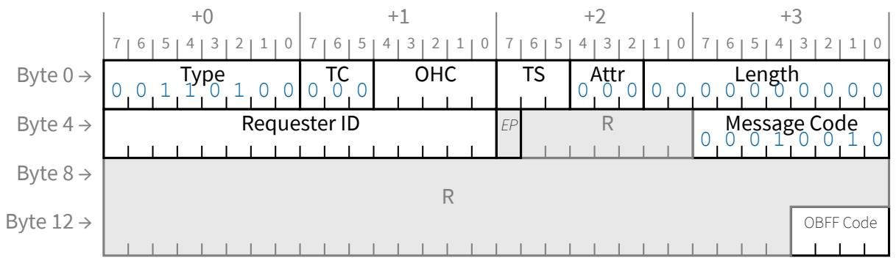

bar_stacked

| Byte | +0 | +1 | +2 | +3 |
|------|----|----|----|----|
| 0    | 7  | 6  | 5  | 4  |
| 1    | 0  | 0  | 0  | 0  |
| 2    | 0  | 0  | 0  | 0  |
| 3    | 0  | 0  | 0  | 0  |
| 4    | 0  | 0  | 0  | 0  |
| 5    | 0  | 0  | 0  | 0  |
| 6    | 0  | 0  | 0  | 0  |
| 7    | 0  | 0  | 0  | 0  |
| 8    | R   |      |      |      |
| 9    |      |      |      |      |
| 10   |      |      |      |      |
| 11   |      |      |      |      |
| 12   |      |      |      |      |
OBFF Code

§

Figure 2-60 OBFF Message - Flit Mode

# 2.2.8.10 Precision Time Measurement (PTM) Messages

§

§ Table 2-35 defines the PTM Messages.

• The PTM Request and PTM Response Messages must use a TLP Type of Msg, and must not include a data payload. The Length field is reserved.   
◦ § Figure 2-61 illustrates the format of the PTM Request and Response Messages.   
• The PTM ResponseD Message must use a TLP Type of MsgD, and must include a 64 bit PTM Master Time field in bytes 8 through 15 of the TLP header and a 1 DW data payload containing the 32 bit Propagation Delay field.   
◦ § Figure 2-62 illustrates the format of the PTM ResponseD Message.   
◦ Refer to § Section 6.21.3.2 for details regarding how to populate the PTM ResponseD Message.

• The Requester ID must be set to the Transmitting Port's ID.

• A PTM dialog is defined as a matched pair of messages consisting of a PTM Request and the corresponding PTM Response or PTM ResponseD message.

• The PTM Messages must use the default Traffic Class designator (TC0). Receivers implementing PTM must check for violations of this rule. If a Receiver determines that a TLP violates this rule, it must handle the TLP as a Malformed TLP.

◦ This is a reported error associated with the Receiving Port (see § Section 6.2 ).

Table 2-35 Precision Time Measurement Messages§ 

<table><tr><td rowspan="2">Name</td><td rowspan="2">TLP Type</td><td rowspan="2">Code[7:0] (b)</td><td rowspan="2">Routing r[2:0] (b)</td><td colspan="4">Support</td><td rowspan="2">Description/Comments</td></tr><tr><td>RC</td><td>EP</td><td>Sw</td><td>Br</td></tr><tr><td>PTM Request</td><td>Msg</td><td>0101 0010</td><td>100</td><td>r</td><td>t</td><td>tr</td><td></td><td>Initiates PTM dialog</td></tr><tr><td>PTM Response</td><td>Msg</td><td>0101 0011</td><td>100</td><td>t</td><td>r</td><td>tr</td><td></td><td>Completes current PTM dialog - does not carry timing information</td></tr><tr><td>PTM ResponseD</td><td>MsgD</td><td>0101 0011</td><td>100</td><td>t</td><td>r</td><td>tr</td><td></td><td>Completes current PTM dialog - carries timing information</td></tr></table>

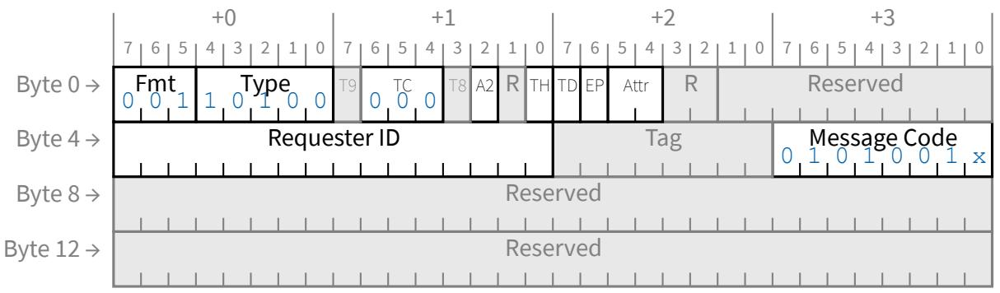

other

| Byte | Value |
|------|-------|
| 0    | Fmt   |
| 1    | Type  |
| 0    | T9    |
| 0    | TC    |
| 0    | T8    |
| 0    | A2    |
| 0    | R     |
| 0    | TH    |
| 0    | TD    |
| 0    | EP    |
| 0    | Attr  |
| 0    | R     |
| 0    | Reserved |
| 4    | Requester ID |
| 8    | Reserved |
| 12   | Reserved |

Figure 2-61 PTM Request/Response Message - Non-Flit Mode§

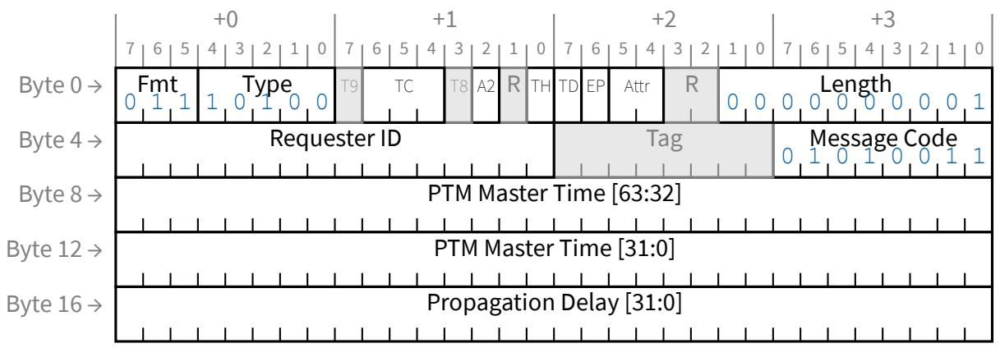

other

| Byte | Value |
|------|-------|
| 0    | +0    |
| 1    | 7     |
| 2    | 6     |
| 3    | 5     |
| 4    | 4     |
| 5    | 3     |
| 6    | 2     |
| 7    | 1     |
| 8    | 0     |
| 9    | +1    |
| 10   | +2    |
| 11   | +3    |
| 12   | +0    |
| 13   | +1    |
| 14   | +2    |
| 15   | +3    |
| 16   | +0    |
| 17   | +1    |
| 18   | +2    |
| 19   | +3    |
| 20   | +0    |
| 21   | +1    |
| 22   | +2    |
| 23   | +3    |
| 24   | +0    |
| 25   | +1    |
| 26   | +2    |
| 27   | +3    |
| 28   | +0    |
| 29   | +1    |
| 30   | +2    |
| 31   | +3    |
| 32   | +0    |
| 33   | +1    |
| 34   | +2    |
| 35   | +3    |
| 36   | +0    |
| 37   | +1    |
| 38   | +2    |
| 39   | +3    |
| 40   | +0    |
| 41   | +1    |
| 42   | +2    |
| 43   | +3    |
| 44   | +0    |
| 45   | +1    |
| 46   | +2    |
| 47   | +3    |
| 48   | +0    |
| 49   | +1    |
| 50   | +2    |
| 51   | +3    |
| 52   | +0    |
| 53   | +1    |
| 54   | +2    |
| 55   | +3    |
| 56   | +0    |
| 57   | +1    |
| 58   | +2    |
| 59   | +3    |
| 60   | +0    |
| 61   | +1    |
| 62   | +2    |
| 63   | +3    |
| 64   | +0    |
| 65   | +1    |
| 66   | +2    |
| 67   | +3    |
| 68   | +0    |
| 69   | +1    |
| 70   | +2    |
| 71   | +3    |
| 72   | +0    |
| 73   | +1    |
| 74   | +2    |
| 75   | +3    |
| 76   | +0    |
| 77   | +1    |
| 78   | +2    |
| 79   | +3    |
| 80   | +0    |
| 81   | +1    |
| 82   | +2    |
| 83   | +3    |
| 84   | +0    |
| 85   | +1    |
| 86   | +2    |
| 87   | +3    |
| 88   | +0    |
| 89   | +1    |
| 90   | +2    |
| 91   | +3    |
| 92   | +0    |
| 93   | +1    |
| 94   | +2    |
| 95   | +3    |
| 96   | +0    |
| 97   | +1    |
| 98   | +2    |
| 99   | +3    |
| 100  | +0    |
| Note: The actual values may vary due to the random nature of the data generation. The code does not output any specific values from the image. Therefore, the correct output is an empty string.

Figure 2-62 PTM ResponseD Message - Non-Flit Mode§

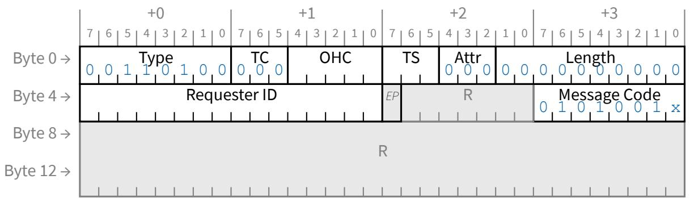

other

| Bit Position | Bit Type | Bit Value |
| ------------ | -------- | --------- |
| 0            | Type     | 0         |
| 0            | TC       | 0         |
| 0            | OHC      | 0         |
| 1            | Type     | 0         |
| 1            | TC       | 0         |
| 1            | OHC      | 0         |
| 2            | Type     | 0         |
| 2            | TC       | 0         |
| 2            | OHC      | 0         |
| 3            | Type     | 0         |
| 3            | TC       | 0         |
| 3            | OHC      | 0         |
| 4            | Type     | 0         |
| 4            | TC       | 0         |
| 4            | OHC      | 0         |
| 5            | Type     | 0         |
| 5            | TC       | 0         |
| 5            | OHC      | 0         |
| 6            | Type     | 0         |
| 6            | TC       | 0         |
| 6            | OHC      | 0         |
| 7            | Type     | 0         |
| 7            | TC       | 0         |
| 7            | OHC      | 0         |
| 8            | Type     | 0         |
| 8            | TC       | 0         |
| 8            | OHC      | 0         |
| 9            | Type     | 0         |
| 9            | TC       | 0         |
| 9            | OHC      | 0         |
| 10           | Type     | 0         |
| 10           | TC       | 0         |
| 10           | OHC      | 0         |
| 11           | Type     | 0         |
| 11           | TC       | 0         |
| 11           | OHC      | 0         |
| 12           | Type     | 0         |
| 12           | TC       | 0         |
| 12           | OHC      | 0         |
| Note: The actual values for 'Type' and 'OHC' are not provided in the code. The 'Length' column is empty in the image.

Figure 2-63 PTM Request/Response Message - Flit Mode§

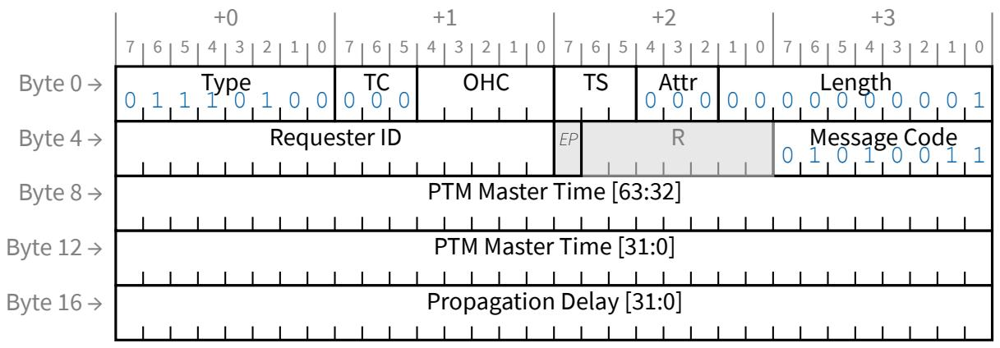  
Figure 2-64 PTM ResponseD Message - Flit Mode§

# IMPLEMENTATION NOTE:

# PROPOGATION DELAY[31:0] ENDIANNESS §

The bytes within the Propagation Delay[31:0] field (shown in § Figure 2-62) are such that:

• Data Byte 0 contains Propagation Delay [31:24]   
• Data Byte 1 contains Propagation Delay [23:16]   
• Data Byte 2 contains Propagation Delay [15:8]   
• Data Byte 3 contains Propagation Delay [7:0]

Due to ambiguity in previous versions of this document, some implementations made this interpretation:

• Data Byte 0 contains Propagation Delay [7:0]   
• Data Byte 1 contains Propagation Delay [15:8]   
• Data Byte 2 contains Propagation Delay [23:16]   
• Data Byte 3 contains Propagation Delay [31:24]

As a result, it is recommended that implementations provide mechanisms for adapting to either byte interpretation. One such mechanism is the optional PTM Propagation Delay Adaptation Capability.

# 2.2.8.11 Integrity and Data Encryption (IDE) Messages

§

IDE Messages are used with the optional Integrity and Data Encryption (IDE) mechanism (see § Section 6.33 ). The following rules apply to the formation of IDE Messages:

• § Table 2-36 defines the IDE Messages.   
• The IDE Messages do not include a data payload (TLP Type is Msg).   
• The Length field is Reserved.   
• The Requester ID must be set to the RID of the Function implementing IDE at the Transmitting Port.   
• IDE Sync and IDE Fail Messages associated with a Link IDE Stream must use Local routing (100b).   
• IDE Sync and IDE Fail Messages associated with a Selective IDE Stream must use Route by ID (010b), and the Destination ID must contain the value in the RID Base field of the Selective IDE RID Association Register Block.   
• IDE Sync and IDE Fail Messages must use the same Traffic Class designator as the associated IDE Stream.   
• IDE Sync Messages are implicitly associated with the same IDE Stream as indicated in the IDE Prefix applied to the IDE Sync Message .

§

Notes:   
1. Support for these messages is required when the optional IDE mechanism is implemented   
Table 2-36 IDE Messages 

<table><tr><td rowspan="2">Name</td><td rowspan="2">TLP Type</td><td rowspan="2">Code[7:0] (b)</td><td rowspan="2">Routing r[2:0] (b)</td><td colspan="4"> $Support^1$ </td><td rowspan="2">Description/Comments</td></tr><tr><td>RC</td><td>EP</td><td>Sw</td><td>Br</td></tr><tr><td>IDE Sync</td><td>Msg</td><td>0101 0100</td><td>100 / 100</td><td>tr</td><td>tr</td><td>tr</td><td></td><td>Synchronization of IDE PR Count for the associated IDE Stream</td></tr><tr><td>IDE Fail</td><td>Msg</td><td>0101 0101</td><td>100 / 100</td><td>tr</td><td>tr</td><td>tr</td><td></td><td>Notification of IDE failure for a specific IDE Stream from the detecting Port to the IDE Partner Port</td></tr></table>

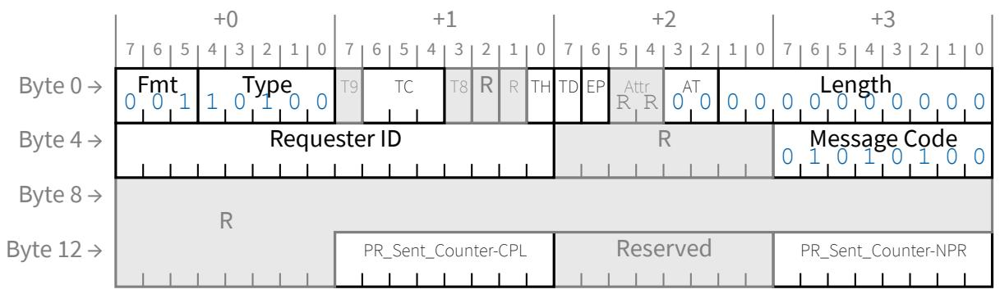

other

| Byte | +0 | +1 | +2 | +3 |
|-------|----|----|----|----|
| 0     | 7  | 7  | 7  | 7  |
| 6     | 6  | 6  | 6  | 6  |
| 5     | 5  | 5  | 5  | 5  |
| 4     | 4  | 4  | 4  | 4  |
| 3     | 3  | 3  | 3  | 3  |
| 2     | 2  | 2  | 2  | 2  |
| 1     | 1  | 1  | 1  | 1  |
| 0     | 0  | 0  | 0  | 0  |
| Total | -0 | -1 | -2 | -3 |
| Byte 0 → Fmt Type T9 TC T8 R R TH TD EP Attr AT Length
          /         /         /         /         /         /         /         /         /         /         /         /         /         /         /         /         /         /         /         /         /         /         /         /         /         /         /         /         /         /         /         /         /         /         /         /         /         /         /         /         /         /         /         /         /         /         /         /         /         /         /           |
| Byte 4 → Requester ID R Message Code
          /         /         /         /         /         /         /         /         /         /         /         /         /         /         /         /         /         /         /         /         /         /         /         /         /         /         /         /         /         /         /         /         /         /         /         /         /         /         /           |
| Byte 8 → R PR_Sent_Counter-CPL Reserved PR_Sent_Counter-NPR        |    |    |    |    |
| Byte 12 → PR_Sent_Counter-CPL Reserved PR_Sent_Counter-NPR        |    |    |    |    |
The total bits sum to each byte from +0 to +3. Each byte represents a bit in the format of the total bits. The bit values are explicitly labeled on the bars. The bits are grouped by byte position within each byte. The bits are grouped as follows: Total, Requester ID, Requester ID, and R.

Figure 2-65 IDE Sync Message for Link IDE Stream - Non-Flit Mode§

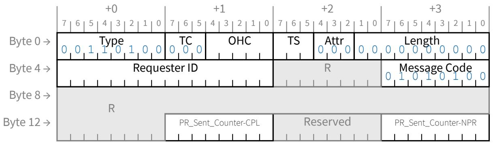  
Figure 2-66 IDE Sync Message for Link IDE Stream - Flit Mode§

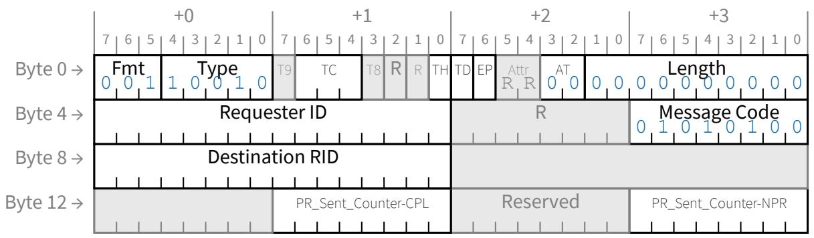

bar_stacked

| Byte | State | Value |
|------|-------|-------|
| 0    | Fmt   | 0     |
| 0    | Type  | 1     |
| 0    | T9    | 0     |
| 0    | TC    | 0     |
| 0    | T8    | 0     |
| 0    | R     | 0     |
| 0    | R     | 0     |
| 0    | TH    | 0     |
| 0    | TD    | 0     |
| 0    | EP    | 0     |
| 0    | R     | 0     |
| 0    | AT    | 0     |
| 0    | 0     | 0     |
| 0    | Length| 0     |
| 4    | Requester ID | 0   |
| 4    | R     | 0     |
| 4    | Message Code | 0   |
| 4    | Destination RID | 0   |
| 8    | Destination RID | 0   |
| 8    | PR_Sent_Counter-CPL | 0   |
| 8    | Reserved | PR_Sent_Counter-NPR |
| 12   | PR_Sent_Counter-CPL | 0   |
| 12   | Reserved | PR_Sent_Counter-NPR |

Figure 2-67 IDE Sync Message for Selective IDE Stream - Non-Flit Mode§

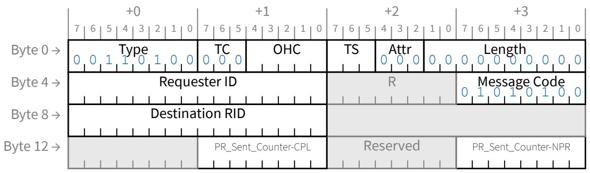  
Figure 2-68 IDE Sync Message for Selective IDE Stream - Flit Mode§

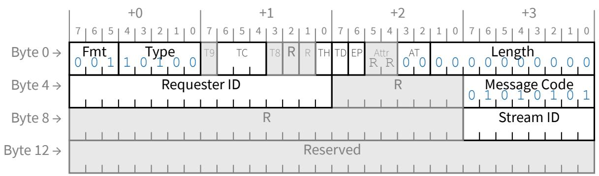

bar_stacked

| Byte | Value |
|------|-------|
| 0    | 7     |
| 0    | 6     |
| 0    | 5     |
| 0    | 4     |
| 0    | 3     |
| 0    | 2     |
| 0    | 1     |
| 0    | 0     |
| 0    | +0    |
| 0    | +1    |
| 0    | +2    |
| 0    | +3    |
| 0    | +3    |
| 1    | 7     |
| 1    | 6     |
| 1    | 5     |
| 1    | 4     |
| 1    | 3     |
| 1    | 2     |
| 1    | 1     |
| 1    | 0     |
| 1    | +1    |
| 1    | +2    |
| 1    | +3    |
| 1    | +3    |
| 2    | 7     |
| 2    | 6     |
| 2    | 5     |
| 2    | 4     |
| 2    | 3     |
| 2    | 2     |
| 2    | 1     |
| 2    | 0     |
| 2    | +2    |
| 2    | +3    |
| 2    | +3    |
| 3    | 7     |
| 3    | 6     |
| 3    | 5     |
| 3    | 4     |
| 3    | 3     |
| 3    | 2     |
| 3    | 1     |
| 3    | 0     |
| 3    | +3    |
| 3    | +3    |
| 4    | 7     |
| 4    | 6     |
| 4    | 5     |
| 4    | 4     |
| 4    | 3     |
| 4    | 2     |
| 4    | 1     |
| 4    | 0     |
| 4    | +3    |
| 4    | +3    |
| 5    | 7     |
| 5    | 6     |
| 5    | 5     |
| 5    | 4     |
| 5    | 3     |
| 5    | 2     |
| 5    | 1     |
| 5    | 0     |
| 5    | +3    |
| 5    | +3    |
| R    |       |
| R    |       |
| R    |       |
| R    |       |
| R    |       |
| R    |       |
| R    |       |
| R    |       |
| R    |       |
| R    |       |
| R    |       |
| R    |       |
| R    |       |
| R    |       |
| R    |       |
| R    |       |
| R    |       |
| R*   |       |
| R*   |       |
| R*   |       |
| R*   |       |
| R*   |       |
| R*   |       |
| R*   |       |
| R*   |       |
| R*   |       |
| R*   |       |
| R*   |       |
| R*   |       |
| R*   |       |
| R*   |       |
| R*   |               |
| R*   |       |
| R*   |       |
| R*   |       |
| R*   |       |
| R*   |       |
| R*   |       |
| R*   |       |
| R*   |       |
| R*   |       |
| R*   |       |
| R*   |       |
| R*   |       |
| R*   |       |
| R*   |       |
|
| R*   |       |
|
| R*   |       |
|
| R*   |       |
|
| R*   |       |
|
| R*   |       |
|
| R*   |       |
|
| R*   |       |
|
| R*   |       |
|
| R*   |       |
|
| R*   |       |
|
| R*   |       |
|
| R*   |       |
|
|
R*   |       |
|
|
R*   |       |
|
|
R*   |       |
|
|
R*   |       |
|
|
R*   |       |
|
|
R*   |       |
|
|
R*   |       |
|
|
R*   |       |
|
|
R*   |       |
|
|
R*   |       |
|
|
R*   |       |
|
|
R*   |       |
|
|
R*   |      nan|
|

Figure 2-69 IDE Fail Message for Link IDE Stream - Non-Flit Mode§

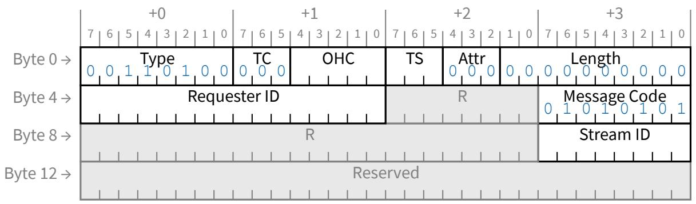  
Figure 2-70 IDE Fail Message for Link IDE Stream - Flit Mode§

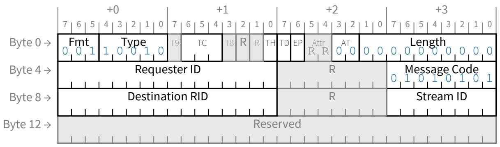

bar_stacked

| Bit        | +0 | +1 | +2 | +3 |
|------------|----|----|----|----|
| Byte 0 →   | 7  | 7  | 7  | 7  |
| Byte 4 →   | 6  | 6  | 6  | 6  |
| Byte 8 →   | 5  | 5  | 5  | 5  |
| Byte 12 →  | 4  | 4  | 4  | 4  |

Figure 2-71 IDE Fail Message for Selective IDE Stream - Non-Flit Mode§

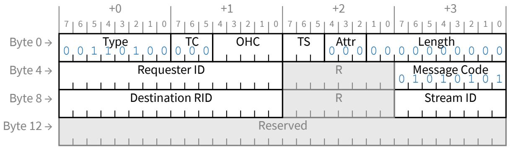  
Figure 2-72 IDE Fail Message for Selective IDE Stream - Flit Mode§

# 2.2.9 Completion Rules §

All Read, Non-Posted Write, DMWR, and AtomicOp Requests require Completion. Completions include a Completion header that, for some types of Completions, will be followed by some number of DWs of data. The rules for each of the fields of the Completion header are defined in the following sections.

# 2.2.9.1 Completion Rules for Non-Flit Mode

• Completions route by ID, and use a 3 DW header.

◦ Note that the routing ID fields correspond directly to the Requester ID supplied with the corresponding Request. Thus, for Completions these fields will be referred to collectively as the Requester ID instead of the distinct fields used generically for ID routing.

• In addition to the header fields included in all TLPs and the ID routing fields, Completions contain the following additional fields (see § Figure 2-73):

◦ Completer ID[15:0] - Identifies the Completer - described in detail below   
◦ Completion Status[2:0] - Indicates the status for a Completion (see § Table 2-37)

▪ Rules for determining the value in the Completion Status[2:0] field are in § Section 2.3.1 .

◦ BCM - Byte Count Modified - this bit must not be set by PCI Express Completers, and may only be set by PCI-X completers   
◦ Byte Count[11:0] - The remaining Byte Count for Request

▪ The Byte Count value is specified as a binary number, with 0000 0000 0001b indicating 1 byte, 1111 1111 1111b indicating 4095 bytes, and 0000 0000 0000b indicating 4096 bytes.   
▪ For Memory Read Completions, Byte Count[11:0] is set according to the rules in § Section 2.3.1.1 .   
▪ For AtomicOp Completions, the Byte Count value must equal the associated AtomicOp operand size in bytes.   
▪ For all other types of Completions, the Byte Count value must be 4.

◦ Tag[9:0] - in combination with the Requester ID field, corresponds to the Transaction ID. In Non-Flit Mode, the Tag field is 10 bits.   
◦ Lower Address[6:0] - lower byte address for starting byte of Completion

▪ For Memory Read Completions, the value in this field is the byte address for the first enabled byte of data returned with the Completion (see the rules in § Section 2.3.1.1 ).   
▪ For AtomicOp Completions, the Lower Address field is Reserved.   
▪ This field is set to all 0's for all remaining types of Completions. Receivers may optionally check for violations of this rule. See § Section 2.3.2 , second bullet, for details.

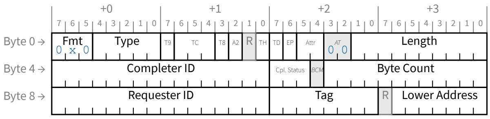

other

| Byte | Value |
|------|-------|
| Byte 0 → | Fmt 0 × 0 |
| Byte 4 → | Completer ID |
| Byte 8 → | Requester ID |

Figure 2-73 Completion Header Format - Non-Flit Mode§

Table 2-37 Completion Status Field Values § 

<table><tr><td>Cpl. Status[2:0]Field Value (b)</td><td>Completion Status</td></tr><tr><td>000</td><td>Successful Completion (SC)</td></tr><tr><td>001</td><td>Unsupported Request (UR)</td></tr><tr><td>010</td><td>Request Retry Status (RRS)</td></tr><tr><td>100</td><td>Completer Abort (CA)</td></tr><tr><td>all others</td><td>Reserved</td></tr></table>

• The Completer ID[15:0] is a 16-bit value that is unique for every PCI Express Function within a Hierarchy (see § Figure 2-74 and § Figure 2-75)

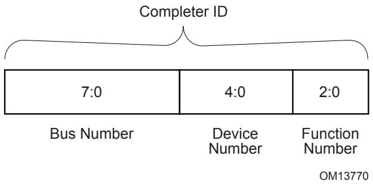

text_image

Completer ID
7:0	4:0	2:0
Bus Number	Device Number	Function Number
OM13770

§   
Figure 2-74 (Non-ARI) Completer ID

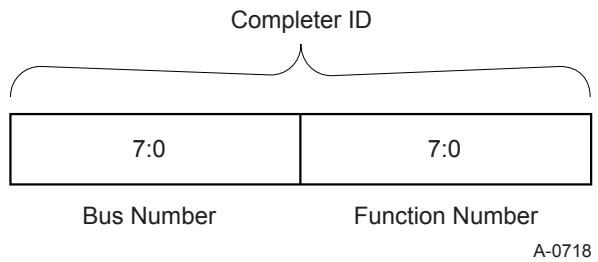

text_image

Completer ID
7:0	7:0
Bus Number Function Number
A-0718

§   
Figure 2-75 ARI Completer ID

• Functions must capture the Bus and Device Numbers 25 supplied with all Type 0 Configuration Write Requests completed by the Function, and supply these numbers in the Bus and Device Number fields of the Completer ID 26 for all Completions generated by the Device/Function.

◦ If a Function must generate a Completion prior to the initial device Configuration Write Request, 0's must be entered into the Bus Number and Device Number fields   
◦ Note that Bus Number and Device Number may be changed at run time, and so it is necessary to re-capture this information with each and every Configuration Write Request.

◦ Exception: The assignment of Bus Numbers to the Devices within a Root Complex may be done in an implementation specific way.

• In some cases, a Completion with UR Completion Status may be generated by an MFD without associating the Completion with a specific Function within the device - in this case, the Function Number field 27 is Reserved.

◦ Example: An MFD receives a Read Request that does not target any resource associated with any of the Functions of the device - the device generates a Completion with UR status and sets a value of all 0's in the Function Number field of the Completer ID.

• Completion headers must supply the same values for the Requester ID, Tag, and Traffic Class as were supplied in the header of the corresponding Request.   
• Completion headers must supply the same values for the Attribute as were supplied in the header of the corresponding Request, except as explicitly allowed:

◦ when IDO is used (see § Section 2.2.6.4 )

◦ when RO is used in a Translation Completion (see § Section 10.2.3 )

• The TH bit is reserved for Completions.   
• AT[1:0] must be 00b. Receivers are not required or encouraged to check this.   
• The Completer ID field is not meaningful prior to the software initialization and configuration of the completing device (using at least one Configuration Write Request), and for this case the Requester must ignore the value returned in the Completer ID field.   
• A Completion including a data payload must specify the actual amount of data returned in that Completion, and must include the amount of data specified.

◦ It is a TLP formation error to include more or less data than specified in the Length field, and the resulting TLP is a Malformed TLP.

Note: This is simply a specific case of the general rule requiring the TLP data payload length to match the value in the Length field.

# 2.2.9.2 Completion Rules for Flit Mode §

In Flit Mode, the rules for Completions are the same as in Non-Flit Mode, except as defined in this section. In Flit Mode, Completions must use the Completion Header Base (see § Figure 2-76)

In Flit Mode, the Tag field is 14 bits.

bar_stacked

| Byte | Type | TC | OHC | TS | Attr | Length |
|------|------|----|-----|----|------|--------|
| 0    | +0   |    |     |    |      |        |
| 0    | 7    |    |     |    |      |        |
| 0    | 6    |    |     |    |      |        |
| 0    | 5    |    |     |    |      |        |
| 0    | 4    |    |     |    |      |        |
| 0    | 3    |    |     |    |      |        |
| 0    | 2    |    |     |    |      |        |
| 0    | 1    |    |     |    |      |        |
| 0    | 0    |    |     |    |      |        |
| 1    | +1   |    |     |    |      |        |
| 1    | 7    |    |     |    |      |        |
| 1    | 6    |    |     |    |      |        |
| 1    | 5    |    |     |    |      |        |
| 1    | 4    |    |     |    |      |        |
| 1    | 3    |    |     |    |      |        |
| 1    | 2    |    |     |    |      |        |
| 1    | 1    |    |     |    |      |        |
| 1    | 0    |    |     |    |      |        |
| 2    | +2   |    |     |    |      |        |
| 2    | 7    |    |     |    |      |        |
| 2    | 6    |    |     |    |      |        |
| 2    | 5    |    |     |    |      |        |
| 2    | 4    |    |     |    |      |        |
| 2    | 3    |    |     |    |      |        |
| 2    | 2    |    |     |    |      |        |
| 2    | 1    |    |     |    |      |        |
| 2    | 0    |    |     |    |      |        |
| 3    | +3   |    |     |    |      |        |
| 3    | 7    |    |     |    |      |        |
| 3    | 6    |    |     |    |      |        |
| 3    | 5    |    |     |    |      |        |
| 3    | 4    |    |     |    |      |        |
| 3    | 3    |    |     |    |      |        |
| 3    | 2    |    |     |    |      |        |
| 3    | 1    |    |     |    |      |        |
| 3    | 0    |    |     |    |      |        |
| Note: The actual values for +0 to +3 are not provided in the code. The actual values for each bit are estimated based on the input data. There is only one data point for the total output.

Figure 2-76 Completion Header Base Format - Flit Mode§

OHC-A5 (see § Figure 2-11) is required for all:

• Unsuccessful Completions   
• Completions with Lower Address[1:0] not equal to 00b   
• Completions that require the Destination Segment due to the associated Non-Posted Request containing a Requester Segment that does not match the Completer's captured Segment.

When OHC-A5 is not present it is implied that the Completion Status is Successful, that Lower Address[1:0] = 00b, and that Completer Segment and Destination Segment need not be explicitly indicated (see Segment rules in § Section 2.2.1.2 ).

When OHC-A5 is present:

• the Completion Status and Lower Address[1:0] fields must contain valid values   
• the Completer Segment field must contain the Segment value captured by the Function as described in § Section 2.2.6.2 ; the Completer Segment field must be 00h if Segment Captured is Clear   
• if the associated Request did not include a Requester Segment, the Destination Segment field must be 00h and the DSV bit must be clear. If the associated Request included a Requester Segment, the Destination Segment field must reflect the value of the Requester Segment and the DSV bit must be Set.

The BCM field, present in Non-Flit Mode Completions, is not supported in Flit Mode.

# 2.2.10 TLP Prefix Rules §

# 2.2.10.1 TLP Prefix General Rules - Non-Flit Mode §

In NFM, the following rules apply to any TLP that contains a TLP Prefix:

• For any TLP, a value of 100b in the Fmt[2:0] field in byte 0 of the TLP indicates the presence of a TLP Prefix and the Type[4] bit indicates the type of TLP Prefix.   
◦ A value of 0b in the Type[4] bit indicates the presence of a Local TLP Prefix   
◦ A value of 1b in the Type[4] bit indicates the presence of an End-End TLP Prefix

• The format for bytes 1 through 3 of a TLP Prefix is defined by its TLP Prefix type.

• A TLP that contains a TLP Prefix must have an underlying TLP Header. A received TLP that violates this rule is handled as a Malformed TLP. This is a reported error associated with the Receiving Port (see § Section 6.2 ).

• It is permitted for a TLP to contain more than one TLP Prefix of any type

◦ When a combination of Local and End-End TLP Prefixes are present in TLP, it is required that all the Local TLP Prefixes precede any End-End TLP Prefixes. A received TLP that violates this rule is handled as a Malformed TLP. This is a reported error associated with the Receiving Port (see § Section 6.2 ).

• The size of each TLP Prefix is 1 DW. A TLP Prefix may be repeated to provide space for additional data.   
• If the value in the Fmt and Type field indicates the presence of a Local TLP Prefix, handle according to the Local TLP Prefix handling (see § Section 2.2.10.2 ).   
• If the value in the Fmt and Type field indicates the presence of an End-End TLP Prefix, handle according to the End-End TLP Prefix handling (see § Section 2.2.10.4 ).

# 2.2.10.2 Local TLP Prefix Processing §

The following rules apply to Local TLP Prefixes:

• In Flit Mode, TLP Prefix types are determined using the Type[7:0] field (see § Table 2-5)   
• In Non-Flit Mode, Local TLP Prefix types are determined using the L[3:0] sub-field of the Type field   
◦ Type[4] must be 0b   
◦ Local TLP Prefix L[3:0] values are defined in § Table 2-38

§ Table 2-38 Local TLP Prefix Types 

<table><tr><td>Local TLP Prefix Type</td><td>L[3:0] (b)</td><td>Description</td></tr><tr><td>MR-IOV</td><td>0000</td><td>MR-IOV TLP Prefix - Refer to [MR-IOV] for details.</td></tr><tr><td>FlitModePrefix</td><td>1101</td><td>Flit Mode Local TLP Prefix - See § Section 2.2.10.3</td></tr><tr><td>VendPrefixL0</td><td>1110</td><td>Vendor Defined Local TLP Prefix - Refer to § Section 2.2.10.2.1 for further details.</td></tr><tr><td>VendPrefixL1</td><td>1111</td><td>Vendor Defined Local TLP Prefix - Refer to § Section 2.2.10.2.1 for further details.</td></tr><tr><td></td><td></td><td>All other encodings are Reserved.</td></tr></table>

• The size, routing, and flow control rules are specific to each Local TLP Prefix type.   
• It is an error to receive a TLP with a Local TLP Prefix type not supported by the Receiver. If the Extended Fmt Field Supported bit is Set, TLPs in violation of this rule are handled as a Malformed TLP unless explicitly stated differently in another specification. This is a reported error associated with the Receiving Port (see § Section 6.2 ). If the Extended Fmt Field Supported bit is Clear, behavior is device specific.   
• No Local TLP Prefixes are protected by ECRC even if the underlying TLP is protected by ECRC.

# 2.2.10.2.1 Vendor Defined Local TLP Prefix §

As described in § Table 2-38, Types VendPrefixL0 and VendPrefixL1 are defined for use as Vendor Defined Local TLP Prefixes. To maximize interoperability and flexibility the following rules are applied to such prefixes:

• Components must not send TLPs containing Vendor Defined Local TLP Prefixes unless this has been explicitly enabled (using vendor-specific mechanisms).   
• Components that support any usage of Vendor Defined Local TLP Prefixes must support the 3-bit definition of the Fmt field and have the Extended Fmt Field Supported bit Set (see § Section 7.5.3.15 ).   
• It is recommended that components be configurable (using vendor-specific mechanisms) so that all vendor defined prefixes can be sent using either of the two Vendor Defined Local TLP Prefix encodings. Such configuration need not be symmetric (for example each end of a Link could transmit the same Prefix using a different encoding).

# 2.2.10.3 Flit Mode Local TLP Prefix §

This prefix (see § Figure 2-77) is only permitted when operating in Flit Mode.