Table 7-210 Length of the VC Arbitration Table§

<table><tr><td>VC Arbitration Select</td><td>VC Arbitration Table Length</td></tr><tr><td>001b</td><td>32 entries</td></tr><tr><td>010b</td><td>64 entries</td></tr><tr><td>011b</td><td>128 entries</td></tr></table>

## 7.9.1.10 Port Arbitration Table §

The Port Arbitration Table register is a read-write register array that is used to store the WRR or time-based WRR arbitration table for Port Arbitration for the VC resource. This register array is valid for all Switch Ports, Root Ports that support peer-to-peer traffic, and RCRBs, but is not valid for Endpoints or Root Ports that do not support peer-to-peer traffic. It is only present when one or more asserted bits in the Port Arbitration Capability field indicate that the component supports a Port Arbitration scheme that uses a programmable arbitration table. Furthermore, it is only valid when one of the above-mentioned bits in the Port Arbitration Capability field is selected by the Port Arbitration Select field.

The Port Arbitration Table represents one Port arbitration period. § Figure 7-231 shows the structure of an example Port Arbitration Table with 128 phases and 2-bit table entries. Each table entry containing a Port Number corresponds to a phase within a Port arbitration period. For example, a table with 2-bit entries can be used by a Switch component with up to four Ports. A Port Number written to a table entry indicates that the phase within the Port Arbitration period is assigned to the selected PCI Express Port (the Port Number must be a valid one).

When the WRR Port Arbitration is used for a VC of any Egress Port, at each arbitration phase, the Port Arbiter serves one transaction from the Ingress Port indicated by the Port Number of the current phase. When finished, it immediately advances to the next phase. A phase is skipped, i.e., the Port Arbiter simply moves to the next phase immediately if the Ingress Port indicated by the phase does not contain any transaction for the VC (note that a phase cannot contain the Egress Port's Port Number).  
• When the Time-based WRR Port Arbitration is used for a VC of any given Port, at each arbitration phase aligning to a virtual timeslot, the Port Arbiter serves one transaction from the Ingress Port indicated by the Port Number of the current phase. It advances to the next phase at the next virtual timeslot. A phase indicates an “idle” timeslot, i.e., the Port Arbiter does not serve any transaction during the phase, if:

◦ the phase contains the Egress Port's Port Number, or

◦ the Ingress Port indicated by the phase does not contain any transaction for the VC.

◦ The Port Arbitration Table Entry Size field in the Port VC Capability Register 1 determines the table entry size. The length of the table is determined by the Port Arbitration Select field as shown in § Table 7-211.

◦ When the Port Arbitration Table is used by the default Port Arbitration for the default VC, the default values for the table entries must contain at least one entry for each of the other PCI Express Ports of the component to ensure forward progress for the default VC for each Port. The table may contain RR or RR-like fair Port Arbitration for the default VC.

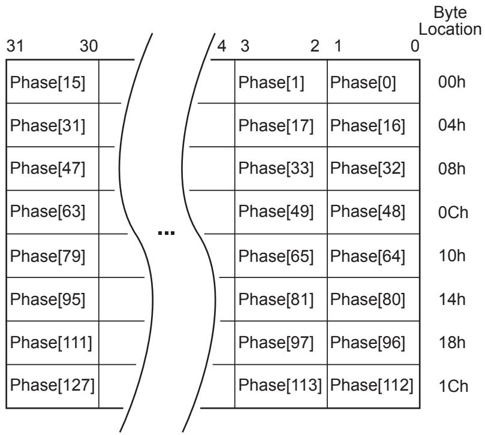

stacked bar chart

| Byte Location | Phase[15] | Phase[31] | Phase[47] | Phase[63] | Phase[79] | Phase[95] | Phase[111] | Phase[127] |
| --- | --- | --- | --- | --- | --- | --- | --- | --- |
| 00h |  |  |  |  |  |  |  |  |
| 04h |  |  |  |  |  |  |  |  |
| 08h |  |  |  |  |  |  |  |  |
| 0Ch |  |  |  |  |  |  |  |  |
| 10h |  |  |  |  |  |  |  |  |
| 14h |  |  |  |  |  |  |  |  |
| 18h |  |  |  |  |  |  |  |  |
| 1Ch |  |  |  |  |  |  |  |  |

OM14490

Figure 7-231 Example Port Arbitration Table with 128 Phases and 2-bit Table Entries§  
Table 7-211 Length of Port Arbitration Table§

<table><tr><td>Port Arbitration Select</td><td>Port Arbitration Table Length</td></tr><tr><td>001b</td><td>32 entries</td></tr><tr><td>010b</td><td>64 entries</td></tr><tr><td>011b</td><td>128 entries</td></tr><tr><td>100b</td><td>128 entries</td></tr><tr><td>101b</td><td>256 entries</td></tr></table>

## 7.9.2 Multi-Function Virtual Channel Extended Capability §

The Multi-Function Virtual Channel Extended Capability (MFVC Capability) is an optional Extended Capability that permits enhanced QoS management in a Multi-Function Device, including TC/VC mapping, optional VC arbitration, and optional Function arbitration for Upstream Requests. When implemented, the MFVC Extended Capability structure must be present in the Extended Configuration Space of Function 0 of the Multi-Function Device’s Upstream Port. § Figure 7-232 provides a high level view of the MFVC Extended Capability structure. This MFVC Extended Capability structure controls Virtual Channel assignment at the PCI Express Upstream Port of the Multi-Function Device, while a VC Extended Capability structure, if present in a Function, controls the Virtual Channel assignment for that individual Function.

The number of (extended) Virtual Channels is indicated by the MFVC Extended VC Count field in the Port VC Capability Register 1. Software must interpret this field to determine the availability of extended MFVC VC Resource registers.

A Multi-Function Device is permitted to have an MFVC Extended Capability structure even if none of its Functions have a VC Extended Capability structure. However, an MFVC Extended Capability structure is permitted only in Function 0 in the Upstream Port of a Multi-Function Device.

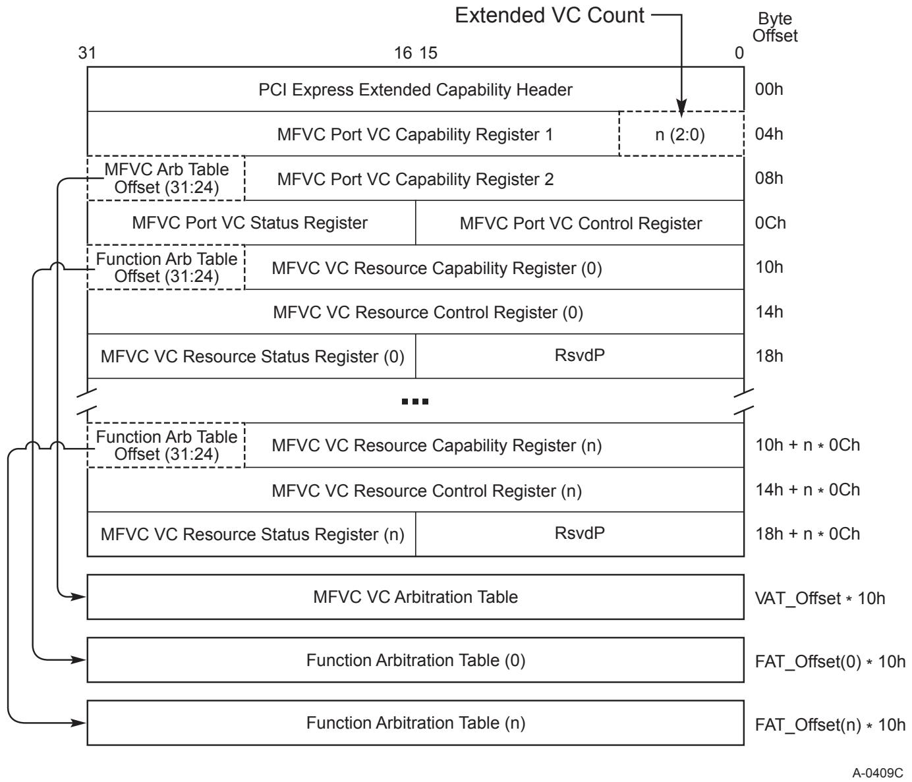

flowchart

```mermaid
graph TD
  A["PCI Express Extended Capability Header"] --> B["MFVC Port VC Capability Register 1"]
  B --> C["n (2:0)"]
  C --> D["MFVC Arb Table Offset (31:24)"]
  D --> E["MFVC Port VC Capability Register 2"]
  E --> F["MFVC Port VC Status Register"]
  F --> G["MFVC Port VC Control Register"]
  G --> H["Function Arb Table Offset (31:24)"]
  H --> I["MFVC VC Resource Capability Register (0)"]
  I --> J["MFVC VC Resource Control Register (0)"]
  J --> K["MFVC VC Resource Status Register (0)"]
  K --> L["RsvdP"]
  L --> M["..."]
  M --> N["Function Arb Table Offset (31:24)"]
  N --> O["MFVC VC Resource Capability Register (n)"]
  O --> P["MFVC VC Resource Control Register (n)"]
  P --> Q["MFVC VC Resource Status Register (n)"]
  Q --> R["RsvdP"]
  R --> S["MFVC VC Arbitration Table"]
  S --> T["FAT_Offset(n) * 10h"]
  T --> U["Function Arbitration Table (0)"]
  U --> V["FAT_Offset(0) * 10h"]
  V --> W["Function Arbitration Table (n)"]
  W --> X["VAT_Offset * 10h"]
  X --> Y["A-0409C"]
```

Figure 7-232 MFVC Capability Structure§

The following sections describe the registers/fields of the MFVC Extended Capability structure.

## 7.9.2.1 MFVC Extended Capability Header (Offset 00h) §

Refer to § Section 7.6.3 for a description of the PCI Express Extended Capability header. The Extended Capability ID for the MFVC Extended Capability is 0008h. § Figure 7-233 details allocation of register fields in the MFVC Extended Capability header; § Table 7-212 provides the respective bit definitions.

line chart

| Time | PCI Express Extended Capability ID | Capability Version |
| ---- | ---------------------------------- | ------------------- |
| 0    | 0                                  | 0                   |
| 19   | 0                                  | 0                   |
| 16   | 0                                  | 0                   |
| 15   | 0                                  | 0                   |
| 0    | 0                                  | 0                   |
| 31   | 0                                  | 0                   |

Figure 7-233 MFVC Extended Capability Header§

Table 7-212 MFVC Extended Capability Header§

<table><tr><td>Bit Location</td><td>Register Description</td><td>Attributes</td></tr><tr><td>15:0</td><td>PCI Express Extended Capability ID- This field is a PCI-SIG defined ID number that indicates the nature and format of the Extended Capability.The Extended Capability ID for the MFVC Extended Capability is 0008h.</td><td>RO</td></tr><tr><td>19:16</td><td>Capability Version- This field is a PCI-SIG defined version number that indicates the version of the Capability structure present.Must be 1h for this version of the specification.</td><td>RO</td></tr><tr><td>31:20</td><td>Next Capability Offset- This field contains the offset to the next PCI Express Capability structure or 000h if no other items exist in the linked list of Capabilities.For Extended Capabilities implemented in Configuration Space, this offset is relative to the beginning of PCI-compatible Configuration Space and thus must always be either 000h (for terminating list of Capabilities) or greater than 0FFh.</td><td>RO</td></tr></table>

## 7.9.2.2 MFVC Port VC Capability Register 1 (Offset 04h) §

The MFVC Port VC Capability Register 1 describes the configuration of the Virtual Channels associated with a PCI Express Port of the Multi-Function Device. § Figure 7-234 details allocation of register fields in the MFVC Port VC Capability Register 1; § Table 7-213 provides the respective bit definitions.

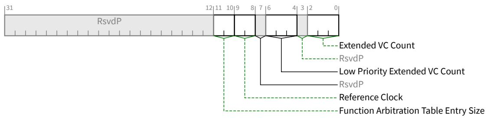

text_image

31
RsvdP
12 11 10 9 8 7 6 4 3 2 0
Extended VC Count
RsvdP
Low Priority Extended VC Count
RsvdP
Reference Clock
Function Arbitration Table Entry Size

Figure 7-234 MFVC Port VC Capability Register 1§

Table 7-213 MFVC Port VC Capability Register 1§

<table><tr><td>Bit Location</td><td>Register Description</td><td>Attributes</td></tr><tr><td>2:0</td><td>Extended VC Count- Indicates the number of (extended) Virtual Channels in addition to the default VC supported by the device.This value indicates the number of (extended) MFVC VC Resource Capability, Control, and Status registers that are present in Configuration Space in addition to the required MFVC VC Resource registers for the default VC.The minimum value of this field is 0 (for devices that only support the default VC and only have 1 set of MFVC VC Resource registers for that VC). The maximum value is 7.</td><td>RO</td></tr><tr><td>6:4</td><td>Low Priority Extended VC Count- Indicates the number of (extended) Virtual Channels in addition to the default VC belonging to the low-priority VC (LPVC) group that has the lowest priority with respect to other VC resources in a strict-priority VC Arbitration.The minimum value of this field is 000b and the maximum value is Extended VC Count.</td><td>RO</td></tr><tr><td>9:8</td><td>Reference Clock- Indicates the reference clock for Virtual Channels that support time-based WRR Function Arbitration.Defined encodings are:00b 100 ns reference clock01b - 11b Reserved</td><td>RO</td></tr><tr><td>11:10</td><td>Function Arbitration Table Entry Size- Indicates the size (in bits) of Function Arbitration table entry in the device.Defined encodings are:00b Size of Function Arbitration table entry is 1 bit01b Size of Function Arbitration table entry is 2 bits10b Size of Function Arbitration table entry is 4 bits11b Size of Function Arbitration table entry is 8 bits</td><td>RO</td></tr></table>

## 7.9.2.3 MFVC Port VC Capability Register 2 (Offset 08h) §

The MFVC Port VC Capability Register 2 provides further information about the configuration of the Virtual Channels associated with a PCI Express Port of the Multi-Function Device. § Figure 7-235 details allocation of register fields in the MFVC Port VC Capability Register 2; § Table 7-214 provides the respective bit definitions.

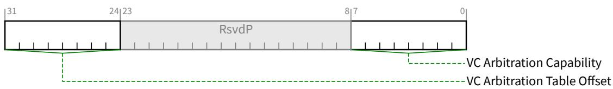

text_image

31 24 23 8 7 0
RsvdP
- VC Arbitration Capability
- VC Arbitration Table Offset

Figure 7-235 MFVC Port VC Capability Register 2§

Table 7-214 MFVC Port VC Capability Register 2§

<table><tr><td>Bit Location</td><td>Register Description</td><td>Attributes</td></tr><tr><td>7:0</td><td>VC Arbitration Capability- Indicates the types of VC Arbitration supported by the device for the LPVC group. This field is valid for all devices that report a Low Priority Extended VC Count greater than 0.Each Bit Location within this field corresponds to a VC Arbitration Capability defined below. When more than 1 bit in this field is Set, it indicates that the device can be configured to provide different VC arbitration services.Defined bit positions are:Bit 0 Hardware fixed arbitration scheme, e.g., Round RobinBit 1 Weighted Round Robin (WRR) arbitration with 32 phasesBit 2 WRR arbitration with 64 phasesBit 3 WRR arbitration with 128 phasesBits 4-7 Reserved</td><td>RO</td></tr><tr><td>31:24</td><td>VC Arbitration Table Offset- Indicates the location of the MFVC VC Arbitration Table.This field contains the zero-based offset of the table in DQWORDS (16 bytes) from the base address of the MFVC Extended Capability structure. A value of 00h indicates that the table is not present.</td><td>RO</td></tr></table>

## 7.9.2.4 MFVC Port VC Control Register (Offset 0Ch) §

§ Figure 7-236 details allocation of register fields in the Port VC Control register; § Table 7-215 provides the respective bit definitions.

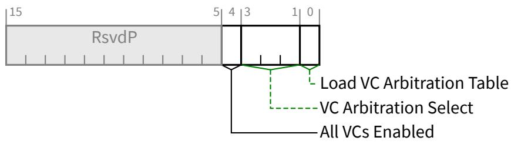

text_image

RsvdP
Load VC Arbitration Table
VC Arbitration Select
All VCs Enabled

Figure 7-236 MFVC Port VC Control Register§

Table 7-215 MFVC Port VC Control Register§

<table><tr><td>Bit Location</td><td>Register Description</td><td>Attributes</td></tr><tr><td>0</td><td>Load VC Arbitration Table- Used by software to update the MFVC VC Arbitration Table. This bit is valid when the selected VC Arbitration uses the MFVC VC Arbitration Table.Software Sets this bit to request hardware to apply new values programmed into MFVC VC Arbitration Table; Clearing this bit has no effect. Software checks the VC Arbitration Table Status bit in the MFVC Port VC Status register to confirm that new values stored in the MFVC VC Arbitration Table are latched by the VC arbitration logic.This bit always returns 0b when read.</td><td>RW</td></tr><tr><td>3:1</td><td>VC Arbitration Select- Used by software to configure the VC arbitration by selecting one of the supported VC Arbitration schemes indicated by the VC Arbitration Capability field in the MFVC Port VC Capability Register 2.The permissible values of this field are numbers corresponding to one of the asserted bits in the VC Arbitration Capability field.This field cannot be modified when more than one VC in the LPVC group is enabled.</td><td>RW</td></tr><tr><td>4</td><td>All VCs Enabled- Seting this bit indicates that all VCs that will be used on the Link have been enabled. Setting this bit allows hardware to allocate assigned buffer resources across the enabled VCs.Setting this bit is optional. If this bit remains Clear and some VC Resources are never enabled, performance may be affected but the Link and all enabled VCs must operate correctly.Behavior is undefined if the Link is up and any VC Enable bit in this capability changes value.</td><td>RW</td></tr></table>

## 7.9.2.5 MFVC Port VC Status Register (Offset 0Eh) §

The MFVC Port VC Status Register provides status of the configuration of Virtual Channels associated with a Port of the Multi-Function Device. § Figure 7-237 details allocation of register fields in the MFVC Port VC Status Register; § Table 7-216 provides the respective bit definitions.

text_image

15
RsvdZ
1 0
VC Arbitration Table Status

Figure 7-237 MFVC Port VC Status Register§

Table 7-216 MFVC Port VC Status Register§

<table><tr><td>Bit Location</td><td>Register Description</td><td>Attributes</td></tr><tr><td>0</td><td>VC Arbitration Table Status- Indicates the coherency status of the MFVC VC Arbitration Table. This bit is valid when the selected VC uses the MFVC VC Arbitration Table.This bit is Set by hardware when any entry of the MFVC VC Arbitration Table is written by software. This bit is Cleared by hardware when hardware finishes loading values stored in the MFVC VC Arbitration Table after software sets the Load VC Arbitration Table bit in the MFVC Port VC Control Register.Default value of this bit is 0b.</td><td>RO</td></tr></table>

## 7.9.2.6 MFVC VC Resource Capability Register §

The MFVC VC Resource Capability Register describes the capabilities and configuration of a particular Virtual Channel resource. § Figure 7-238 details allocation of register fields in the MFVC VC Resource Capability Register; § Table 7-217 provides the respective bit definitions.

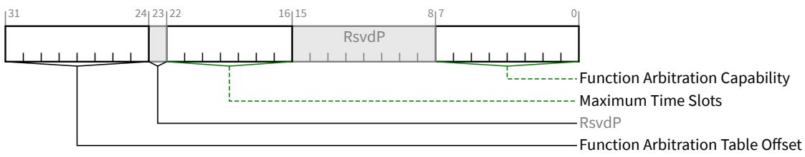

text_image

31 24 23 22 16 15 8 7 0
RsvdP
Function Arbitration Capability
Maximum Time Slots
RsvdP
Function Arbitration Table Offset

Figure 7-238 MFVC VC Resource Capability Register§

Table 7-217 MFVC VC Resource Capability Register§

<table><tr><td>Bit Location</td><td>Register Description</td><td>Attributes</td></tr><tr><td>7:0</td><td>Function Arbitration Capability- Indicates types of Function Arbitration supported by the VC resource.Each Bit Location within this field corresponds to a Function Arbitration Capability defined below. When more than 1 bit in this field is Set, it indicates that the VC resource can be configured to provide different arbitration services.Software selects among these capabilities by writing to the Function Arbitration Select field (see § Section 7.9.2.7).Defined bit positions are:Bit 0 Non-configurable hardware-fixed arbitration scheme, e.g., Round Robin (RR)Bit 1 Weighted Round Robin (WRR) arbitration with 32 phasesBit 2 WRR arbitration with 64 phasesBit 3 WRR arbitration with 128 phasesBit 4 Time-based WRR with 128 phasesBit 5 WRR arbitration with 256 phasesBits 6-7 Reserved</td><td>RO</td></tr><tr><td>22:16</td><td>Maximum Time Slots- Indicates the maximum number of time slots (minus 1) that the VC resource is capable of supporting when it is configured for time-based WRR Function Arbitration. For example, a value of 000 0000b in this field indicates the supported maximum number of time slots is 1 and a value of 111 1111b indicates the supported maximum number of time slots is 128.This field is valid only when the Function Arbitration Capability indicates that the VC resource supports time-based WRR Function Arbitration.</td><td>HwInit</td></tr><tr><td>31:24</td><td>Function Arbitration Table Offset- Indicates the location of the Function Arbitration Table associated with the VC resource.This field contains the zero-based offset of the table in DQWORDS (16 bytes) from the base address of the MFVC Extended Capability structure. A value of 00h indicates that the table is not present.</td><td>RO</td></tr></table>

## 7.9.2.7 MFVC VC Resource Control Register §

§ Figure 7-239 details allocation of register fields in the MFVC VC Resource Control Register; § Table 7-218 provides the respective bit definitions.

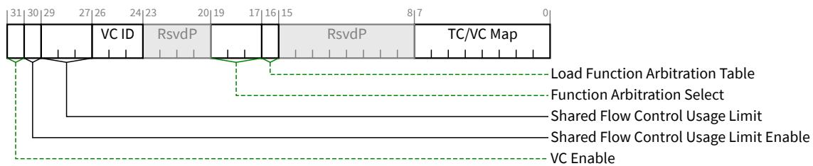

text_image

31 30 29 27 26 24 23 20 19 17 16 15 8 7 TC/VC Map
VC ID RsvdP RsvdP
Load Function Arbitration Table
Function Arbitration Select
Shared Flow Control Usage Limit
Shared Flow Control Usage Limit Enable
VC Enable

Figure 7-239 MFVC VC Resource Control Register§

Table 7-218 MFVC VC Resource Control Register§

<table><tr><td>Bit Location</td><td>Register Description</td><td>Attributes</td></tr><tr><td>7:0</td><td>TC/VC Map- This field indicates the TCs that are mapped to the VC resource.Bit Locations within this field correspond to TC values. For example, when bit 7 is Set in this field, TC7 is mapped to this VC resource. When more than 1 bit in this field is Set, it indicates that multiple TCs are mapped to the VC resource.In order to remove one or more TCs from the TC/VC Map of an enabled VC, software must ensure that no new or outstanding transactions with the TC labels are targeted at the given Link.Default value of this field is FFh for the first VC resource and is 00h for other VC resources.Note:Bit 0 of this field is read-only. It must be hardwired to 1b for the default VC0 and hardwired to 0b for all other enabled VCs.</td><td>RW (see the note for exceptions)</td></tr><tr><td>16</td><td>Load Function Arbitration Table- When Set, this bit updates the Function Arbitration logic from the Function Arbitration Table for the VC resource. This bit is only valid when the Function Arbitration Table is used by the selected Function Arbitration scheme (that is indicated by a Set bit in the Function Arbitration Capability field selected by Function Arbitration Select).Software sets this bit to signal hardware to update Function Arbitration logic with new values stored in the Function Arbitration Table; clearing this bit has no effect. Software uses the Function Arbitration Table Status bit to confirm whether the new values of Function Arbitration Table are completely latched by the arbitration logic.This bit always returns 0b when read.Default value of this bit is 0b.</td><td>RW</td></tr><tr><td>19:17</td><td>Function Arbitration Select- This field configures the VC resource to provide a particular Function Arbitration service.The permissible value of this field is a number corresponding to one of the asserted bits in the Function Arbitration Capability field of the VC resource.</td><td>RW</td></tr><tr><td>26:24</td><td>VC ID- This field assigns a VC ID to the VC resource (see note for exceptions).This field cannot be modified when the VC is already enabled.Note:For the first VC resource (default VC), this field is a read-only field that must be hardwired to 000b.</td><td>RW</td></tr><tr><td>29:27</td><td>Shared Flow Control Usage Limit- this field controls what percentage of the available Shared Flow Control a given FC/VC is permitted to consume.This limit is applied independently for each Flow Control credit type. For example, if this field contains 101b and Shared Flow Control Usage Limit Enable is Set, a Posted TLP may not pass the Tx Gate if doing so would cause that VC to consume more than 62.5% of the available Shared Posted Header credits or if doing so would cause that VC to consume more than 62.5% of the available Shared Data credits.If Shared Flow Control Usage Limit Enable is Clear, this field is ignored and this VC is permitted to consume all of the shared credits.When Shared Flow Control Usage Limit Enable is Set, and this field contains 000b, this VC is not permitted to consume any shared credits.Behavior is undefined when all VCs have Shared Flow Control Usage Limit Enable Set and the sum of the Shared Flow Control Limit values for all VCs is less than 100%.Encodings are:000b 0%001b 12.5%010b 25%011b 37.5%100b 50%101b 62.5%110b 75%111b 87.5%Behavior is undefined if this field changes value while VC Enable and Shared Flow Control Usage Limit Enable are both Set.When Extended VC Count is 0, this field is permitted to be hardwired to 000b.When this field is RW, the default value is implementation specific.</td><td>RW / RO / RsvdP</td></tr><tr><td>30</td><td>Shared Flow Control Usage Limit Enable - When Set, this bit enables use of control of Shared Flow Control consumption at the transmitter for this Virtual Channel.Behavior is undefined of the value of this bit changes while VC Enable is Set.This bit is RsvdP when Flit Mode Supported is Clear.When Extended VC Count is 0, this bit is permitted to be hardwired to 0b.When this bit is RW, the default value is implementation specific.</td><td>RW / RO / RsvdP</td></tr><tr><td>31</td><td>VC Enable - When Set, this bit enables a Virtual Channel. The Virtual Channel is disabled when this bit is cleared.Software must use the VC Negotiation Pending bit to check whether the VC negotiation is complete.For VC0, this field must be 1b and the attribute is HwInit.For other VCs, the default value of this bit is 0b and the attribute is RW.To enable a Virtual Channel, the VC Enable bits for that Virtual Channel must be Set in both components on a Link. To disable a Virtual Channel, the VC Enable bits for that Virtual Channel must be Cleared in both components on a Link. Software must ensure that no traffic is using a Virtual Channel at the time it is disabled. Software must fully disable a Virtual Channel in both components on a Link before re-enabling the Virtual Channel.</td><td>RW/HwInit</td></tr></table>

## 7.9.2.8 MFVC VC Resource Status Register §

§ Figure 7-240 details allocation of register fields in the MFVC VC Resource Status Register; § Table 7-219 provides the respective bit definitions.

text_image

15
RsvdZ
2 1 0
Function Arbitration Table Status
VC Negotiation Pending

Figure 7-240 MFVC VC Resource Status Register§

Table 7-219 MFVC VC Resource Status Register§

<table><tr><td>Bit Location</td><td>Register Description</td><td>Attributes</td></tr><tr><td>0</td><td>Function Arbitration Table Status- This bit indicates the coherency status of the Function Arbitration Table associated with the VC resource. This bit is valid only when the Function Arbitration Table is used by the selected Function Arbitration for the VC resource.This bit is Set by hardware when any entry of the Function Arbitration Table is written to by software. This bit is Cleared by hardware when hardware finishes loading values stored in the Function Arbitration Table after software sets the Load Function Arbitration Table bit.Default value of this bit is 0b.</td><td>RO</td></tr><tr><td>1</td><td>VC Negotiation Pending- This bit indicates whether the Virtual Channel negotiation (initialization or disabling) is in pending state.When this bit is Set by hardware, it indicates that the VC resource is still in the process of negotiation. This bit is Cleared by hardware after the VC negotiation is complete. For a non-default Virtual Channel, software may use this bit when enabling or disabling the VC. For the default VC, this bit indicates the status of the process of Flow Control initialization.Before using a Virtual Channel, software must check whether the VC Negotiation Pending bits for that Virtual Channel are Clear in both components on a Link.</td><td>RO</td></tr></table>

## 7.9.2.9 MFVC VC Arbitration Table §

The definition of the MFVC VC Arbitration Table in the MFVC Extended Capability structure is identical to that in the VC Extended Capability structure (see § Section 7.9.1.9 ).

## 7.9.2.10 Function Arbitration Table §

The Function Arbitration Table register in the MFVC Extended Capability structure takes the same form as the Port Arbitration Table register in the VC Extended Capability structure (see § Section 7.9.1.10 ).

The Function Arbitration Table register is a read-write register array that is used to store the WRR or time-based WRR arbitration table for Function Arbitration for the VC resource. It is only present when one or more asserted bits in the

Function Arbitration Capability field indicate that the Multi-Function Device supports a Function Arbitration scheme that uses a programmable arbitration table. Furthermore, it is only valid when one of the above-mentioned bits in the Function Arbitration Capability field is selected by the Function Arbitration Select field.

The Function Arbitration Table represents one Function arbitration period. Each table entry containing a Function Number or Function Group 168 Number corresponds to a phase within a Function Arbitration period. The table entry size requirements are as follows:

• The table entry size for non-ARI devices must support enough values to specify all implemented Functions plus at least one value that does not correspond to an implemented Function. For example, a table with 2-bit entries can be used by a Multi-Function Device with up to three Functions.  
• The table entry size for ARI Devices must be either 4 bits or 8 bits.

◦ If MFVC Function Groups are enabled, each entry maps to a single Function Group. Arbitration between multiple Functions within a Function Group is implementation specific, but must guarantee forward progress.

◦ If MFVC Function Groups are not enabled and 4-bit entries are implemented, a given entry maps to all Functions whose Function Number modulo 8 matches its value. Similarly, if 8-bit entries are implemented, a given entry maps to all Functions whose Function Number modulo 128 matches its value. If a given entry maps to multiple Functions, arbitration between those Functions is implementation specific, but must guarantee forward progress.

A Function Number or Function Group Number written to a table entry indicates that the phase within the Function Arbitration period is assigned to the selected Function or Function Group (the Function Number or Function Group Number must be a valid one).

When the WRR Function Arbitration is used for a VC of the Egress Port of the Multi-Function Device, at each arbitration phase the Function Arbiter serves one transaction from the Function or Function Group indicated by the Function Number or Function Group Number of the current phase. When finished, it immediately advances to the next phase. A phase is skipped, i.e., the Function Arbiter simply moves to the next phase immediately if the Function or Function Group indicated by the phase does not contain any transaction for the VC.  
When the Time-based WRR Function Arbitration is used for a VC of the Egress Port of the Multi-Function Device, at each arbitration phase aligning to a virtual timeslot, the Function Arbiter serves one transaction from the Function or Function Group indicated by the Function Number or Function Group Number of the current phase. It advances to the next phase at the next virtual timeslot. A phase indicates an “idle” timeslot, i.e., the Function Arbiter does not serve any transaction during the phase, if:

◦ the phase contains the Number of a Function or a Function Group that does not exist, or

◦ the Function or Function Group indicated by the phase does not contain any transaction for the VC.

The Function Arbitration Table Entry Size field in the MFVC Port VC Capability Register 1 determines the table entry size. The length of the table is determined by the Function Arbitration Select field as shown in § Table 7-220.

When the Function Arbitration Table is used by the default Function Arbitration for the default VC, the default values for the table entries must contain at least one entry for each of the active Functions or Function Groups in the Multi-Function Device to ensure forward progress for the default VC for the Multi-Function Device’s Upstream Port. The table may contain RR or RR-like fair Function Arbitration for the default VC.

Table 7-220 Length of Function Arbitration Table§

<table><tr><td>Function Arbitration Select</td><td>Function Arbitration Table Length</td></tr><tr><td>001b</td><td>32 entries</td></tr><tr><td>010b</td><td>64 entries</td></tr><tr><td>011b</td><td>128 entries</td></tr><tr><td>100b</td><td>128 entries</td></tr><tr><td>101b</td><td>256 entries</td></tr></table>

## 7.9.3 Device Serial Number Extended Capability §

The Device Serial Number Extended Capability is an optional Extended Capability that may be implemented by any PCI Express device Function. The Device Serial Number is a read-only 64-bit value that is unique for a given PCI Express device. § Figure 7-241 details allocation of register fields in the Device Serial Number Extended Capability structure.

It is permitted but not recommended for RCiEPs to implement this Capability.

RCiEPs that implement this Capability are permitted but not required to return the same Device Serial Number value as that reported by other RCiEPs of the same Root Complex.

All Multi-Function Devices other than RCiEPs that implement this Capability must implement it for Function 0; other Functions that implement this Capability must return the same Device Serial Number value as that reported by Function 0.

RCiEPs are permitted to implement or not implement this Capability on an individual basis, independent of whether they are part of a Multi-Function Device.

A PCI Express component other than a Root Complex containing multiple Devices such as a PCI Express Switch that implements this Capability must return the same Device Serial Number for each device.

The Device Serial Number Extended Capability is permitted to be present in PFs. If a PF contains the capability, its value applies to all associated VFs. VFs are permitted but not recommended to implement this capability. VFs that implement this capability must return the same Device Serial Number value as that reported by their associated PF.

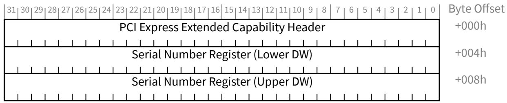

text_image

PCI Express Extended Capability Header
Serial Number Register (Lower DW)
Serial Number Register (Upper DW)
Byte Offset
+000h
+004h
+008h

Figure 7-241 Device Serial Number Extended Capability Structure§

## 7.9.3.1 Device Serial Number Extended Capability Header (Offset 00h) §

§ Figure 7-242 details allocation of register fields in the Device Serial Number Extended Capability Header; § Table 7-221 provides the respective bit definitions. Refer to § Section 7.6.3 for a description of the PCI Express Extended Capability header. The Extended Capability ID for the Device Serial Number Extended Capability is 0003h.

text_image

31
20 19 16 15 0
Next Capability Offset
0003h
PCI Express Extended Capability ID
Capability Version

Figure 7-242 Device Serial Number Extended Capability Header§

Table 7-221 Device Serial Number Extended Capability Header§

<table><tr><td>Bit Location</td><td>Register Description</td><td>Attributes</td></tr><tr><td>15:0</td><td>PCI Express Extended Capability ID- This field is a PCI-SIG defined ID number that indicates the nature and format of the Extended Capability. Extended Capability ID for the Device Serial Number Extended Capability is 0003h.</td><td>RO</td></tr><tr><td>19:16</td><td>Capability Version- This field is a PCI-SIG defined version number that indicates the version of the Capability structure present. Must be 1h for this version of the specification.</td><td>RO</td></tr><tr><td>31:20</td><td>Next Capability Offset- This field contains the offset to the next PCI Express Capability structure or 000h if no other items exist in the linked list of Capabilities. For Extended Capabilities implemented in Configuration Space, this offset is relative to the beginning of PCI-compatible Configuration Space and thus must always be either 000h (for terminating list of Capabilities) or greater than 0FFh.</td><td>RO</td></tr></table>

## 7.9.3.2 Serial Number Register (Offset 04h) §

The Serial Number register is a 64-bit field that contains the IEEE defined 64-bit extended unique identifier [EUI-64]. § Figure 7-243 details allocation of register fields in the Serial Number register; § Table 7-222 provides the respective bit definitions.

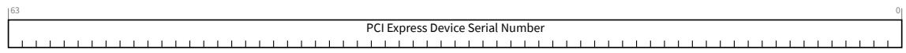

text_image

PCI Express Device Serial Number
63
0

Figure 7-243 Serial Number Register

§

§

Table 7-222 Serial Number Register

<table><tr><td>Bit Location</td><td>Register Description</td><td>Attributes</td></tr><tr><td rowspan="9">63:0</td><td>PCI Express Device Serial Number- This field contains the IEEE defined 64-bit Extended Unique Identifier [EUI-64]. This identifier includes a 24-bit company id value assigned by IEEE registration authority and a 40-bit extension identifier assigned by the manufacturer.</td><td rowspan="9">RO</td></tr><tr><td>PCI Express Device Serial Number[07:00] = EUI[63:56]</td></tr><tr><td>PCI Express Device Serial Number[15:08] = EUI[55:48]</td></tr><tr><td>PCI Express Device Serial Number[23:16] = EUI[47:40]</td></tr><tr><td>PCI Express Device Serial Number[31:24] = EUI[39:32]</td></tr><tr><td>PCI Express Device Serial Number[39:32] = EUI[31:24]</td></tr><tr><td>PCI Express Device Serial Number[47:40] = EUI[23:16]</td></tr><tr><td>PCI Express Device Serial Number[55:48] = EUI[15:08]</td></tr><tr><td>PCI Express Device Serial Number[63:56] = EUI[07:00]</td></tr></table>

## 7.9.4 Vendor-Specific Capability §

The Vendor-Specific Capability is a capability structure in PCI-compatible Configuration Space (first 256 bytes) as shown in § Figure 7-244.

The Vendor-Specific Capability allows device vendors to use the Capability mechanism for vendor-specific information. The layout of the information is vendor-specific, except for the first three bytes, as explained below.

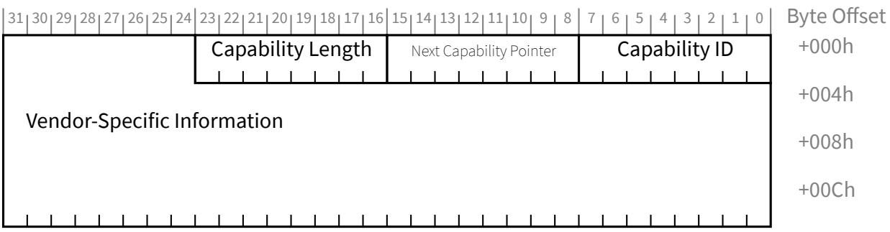

text_image

31 30 29 28 27 26 25 24 23 22 21 20 19 18 17 16 15 14 13 12 11 10 9 8 7 6 5 4 3 2 1 0
Capability Length Next Capability Pointer Capability ID
Vendor-Specific Information
Byte Offset
+000h
+004h
+008h
+00Ch

Figure 7-244 Vendor-Specific Capability§

§

Table 7-223 Vendor-Specific Capability

<table><tr><td>Bit Location</td><td>Register Description</td><td>Attributes</td></tr><tr><td>7:0</td><td>Capability ID - Indicates the PCI Express Capability structure. This field must return a Capability ID of 09h indicating that this is a Vendor-Specific Capability structure.</td><td>RO</td></tr><tr><td>15:8</td><td>Next Capability Pointer - This field contains the offset to the next PCI Capability structure or 00h if no other items exist in the linked list of Capabilities.</td><td>RO</td></tr><tr><td>23:16</td><td>Capability Length - This field provides the number of bytes in the Capability structure (including the three bytes consumed by the Capability ID, Next Capability Pointer, and Capability Length field).</td><td>RO</td></tr><tr><td>31:24</td><td>Vendor Specific Information</td><td>Vendor Specific</td></tr></table>

## 7.9.5 Vendor-Specific Extended Capability §

The Vendor-Specific Extended Capability (VSEC Capability) is an optional Extended Capability that is permitted to be implemented by any PCI Express Function or RCRB. This allows PCI Express component vendors to use the Extended Capability mechanism to expose vendor-specific registers.

A single PCI Express Function or RCRB is permitted to contain multiple VSEC structures.

An example usage is a set of vendor-specific features that are intended to go into an on-going series of components from that vendor. A VSEC structure can tell vendor-specific software which features a particular component supports, including components developed after the software was released.

§ Figure 7-245 details allocation of register fields in the VSEC structure. The structure of the Vendor-Specific Extended Capability Header and the Vendor-Specific Header is architected by this specification.

With a PCI Express Function, the structure and definition of the vendor-specific Registers area is determined by the vendor indicated by the Vendor ID field located at byte offset 00h in PCI-compatible Configuration Space. With an RCRB, a VSEC is permitted only if the RCRB also contains an RCRB Header Extended Capability structure, which contains a Vendor ID field indicating the vendor.

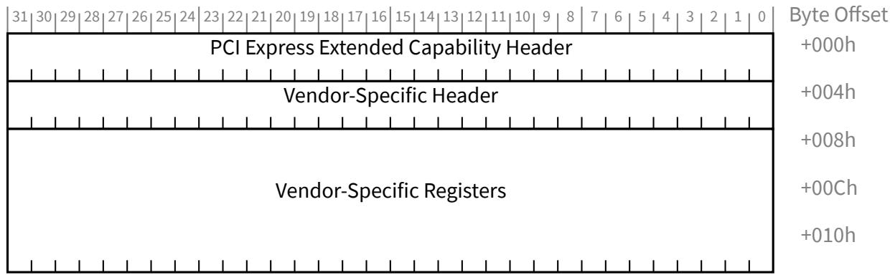

text_image

PCI Express Extended Capability Header
Vendor-Specific Header
Vendor-Specific Registers
Byte Offset
+000h
+004h
+008h
+00Ch
+010h

Figure 7-245 VSEC Capability Structure§

## 7.9.5.1 Vendor-Specific Extended Capability Header (Offset 00h) §

§ Figure 7-246 details allocation of register fields in the Vendor-Specific Extended Capability Header; § Table 7-224 provides the respective bit definitions. Refer to § Section 7.6.3 for a description of the PCI Express Extended Capability Header. The Extended Capability ID for the Vendor-Specific Extended Capability is 000Bh.

line chart

| Position | Value     |
| -------- | --------- |
| 0        | 0         |
| 16       | 000Bh     |
| 20       | 0         |

Figure 7-246 Vendor-Specific Extended Capability Header§

Table 7-224 Vendor-Specific Extended Capability Header§

<table><tr><td>Bit Location</td><td>Register Description</td><td>Attributes</td></tr><tr><td>15:0</td><td>PCI Express Extended Capability ID- This field is a PCI-SIG defined ID number that indicates the nature and format of the Extended Capability. Extended Capability ID for the Vendor-Specific Extended Capability is 000Bh.</td><td>RO</td></tr><tr><td>19:16</td><td>Capability Version- This field is a PCI-SIG defined version number that indicates the version of the Capability structure present. Must be 1h for this version of the specification.</td><td>RO</td></tr><tr><td>31:20</td><td>Next Capability Offset- This field contains the offset to the next PCI Express Capability structure or 000h if no other items exist in the linked list of Capabilities. For Extended Capabilities implemented in Configuration Space, this offset is relative to the beginning of PCI-compatible Configuration Space and thus must always be either 000h (for terminating list of Capabilities) or greater than 0FFh.</td><td>RO</td></tr></table>

## 7.9.5.2 Vendor-Specific Header (Offset 04h) §

§ Figure 7-247 details allocation of register fields in the Vendor-Specific Header; § Table 7-225 provides the respective bit definitions.

Vendor-specific software must qualify the associated Vendor ID of the PCI Express Function or RCRB before attempting to interpret the values in the VSEC ID or VSEC Rev fields.

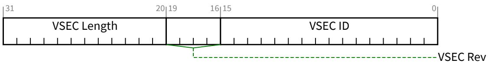

diagram

| Position | Label        |
| -------- | ------------ |
| 0        | 31           |
| 15       | 16           |
| 20       | 19           |
| 31       | 0            |

§ Figure 7-247 Vendor-Specific Header

§ Table 7-225 Vendor-Specific Header

<table><tr><td>Bit Location</td><td>Register Description</td><td>Attributes</td></tr><tr><td>15:0</td><td>VSEC ID - This field is a vendor-defined ID number that indicates the nature and format of the VSEC structure.Software must qualify the Vendor ID before interpreting this field.</td><td>RO</td></tr><tr><td>19:16</td><td>VSEC Rev - This field is a vendor-defined version number that indicates the version of the VSEC structure.Software must qualify the Vendor ID and VSEC ID before interpreting this field.</td><td>RO</td></tr><tr><td>31:20</td><td>VSEC Length - This field indicates the number of bytes in the entire VSEC structure, including the Vendor-Specific Extended Capability Header, the Vendor-Specific Header, and the vendor-specific registers.</td><td>RO</td></tr></table>

## 7.9.6 Designated Vendor-Specific Extended Capability (DVSEC) §

The Designated Vendor-Specific Extended Capability (DVSEC Capability) is an optional Extended Capability that is permitted to be implemented by any PCI Express Function or RCRB. This allows PCI Express component vendors to use the Extended Capability mechanism to expose vendor-specific registers that can be present in components by a variety of vendors.

A single PCI Express Function or RCRB is permitted to contain multiple DVSEC Capability structures.

An example usage is a set of vendor-specific features that are intended to go into an on-going series of components from a collection of vendors. A DVSEC Capability structure can tell vendor-specific software which features a particular component supports, including components developed after the software was released.

§ Figure 7-248 details allocation of register fields in the DVSEC Capability structure. The structure of the PCI Express Extended Capability Header and the Designated Vendor-Specific header is architected by this specification.

The DVSEC Vendor-Specific Register area begins at offset 0Ah.

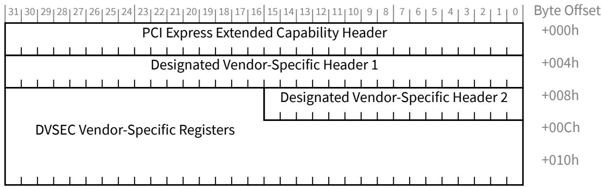

text_image

PCI Express Extended Capability Header
Designated Vendor-Specific Header 1
DVSEC Vendor-Specific Registers
Designated Vendor-Specific Header 2
Byte Offset
+000h
+004h
+008h
+00Ch
+010h

Figure 7-248 Designated Vendor-Specific Extended Capability§

## 7.9.6.1 Designated Vendor-Specific Extended Capability Header (Offset 00h) §

§ Figure 7-249 details allocation of register fields in the Designated Vendor-Specific Extended Capability Header; § Table 7-226 provides the respective bit definitions. Refer to § Section 7.9.3 for a description of the PCI Express Extended Capability Header. The Extended Capability ID for the Designated Vendor-Specific Extended Capability is 0023h.

text_image

Next Capability Offset
0023h
PCI Express Extended Capability ID
Capability Version

Figure 7-249 Designated Vendor-Specific Extended Capability Header§

Table 7-226 Designated Vendor-Specific Extended Capability Header§

<table><tr><td>Bit Location</td><td>Register Description</td><td>Attributes</td></tr><tr><td>15:0</td><td>PCI Express Extended Capability ID- This field is a PCI-SIG defined ID number that indicates the nature and format of the Extended Capability. Extended Capability ID for the Designated Vendor-Specific Extended Capability is 0023h.</td><td>RO</td></tr><tr><td>19:16</td><td>Capability Version- This field is a PCI-SIG defined version number that indicates the version of the Capability structure present. Must be 1h for this version of the specification.</td><td>RO</td></tr><tr><td>31:20</td><td>Next Capability Offset- This field contains the offset to the next PCI Express Capability structure or 000h if no other items exist in the linked list of Capabilities. For Extended Capabilities implemented in Configuration Space, this offset is relative to the beginning of PCI-compatible Configuration Space and thus must always be either 000h (for terminating list of Capabilities) or greater than 0FFh.</td><td>RO</td></tr></table>

## 7.9.6.2 Designated Vendor-Specific Header 1 (Offset 04h) §

§ Figure 7-250 details allocation of register fields in the Designated Vendor-Specific Header 1; § Table 7-227 provides the respective bit definitions.

Vendor-specific software must qualify the DVSEC Vendor ID before attempting to interpret the DVSEC Revision field.

text_image

31
DVSEC Length
20 19
16 15
DVSEC Vendor ID
0
DVSEC Revision

Figure 7-250 Designated Vendor-Specific Header 1§

Table 7-227 Designated Vendor-Specific Header 1§

<table><tr><td>Bit Location</td><td>Register Description</td><td>Attributes</td></tr><tr><td>15:0</td><td>DVSEC Vendor ID - This field is the Vendor ID associated with the vendor that defined the contents of this capability.</td><td>RO</td></tr><tr><td>19:16</td><td>DVSEC Revision- This field is a vendor-defined version number that indicates the version of the DVSEC structure.Software must qualify the DVSEC Vendor ID and DVSEC ID before interpreting this field.</td><td>RO</td></tr><tr><td>31:20</td><td>DVSEC Length- This field indicates the number of bytes in the entire DVSEC structure, including the PCI Express Extended Capability Header, the DVSEC Header 1, DVSEC Header 2, and DVSEC vendor-specific registers.</td><td>RO</td></tr></table>

## 7.9.6.3 Designated Vendor-Specific Header 2 (Offset 08h) §

§ Figure 7-251 details allocation of register fields in the Designated Vendor-Specific Header 2; § Table 7-228 provides the respective bit definitions.

Vendor-specific software must qualify the DVSEC Vendor ID before attempting to interpret the DVSEC ID field.

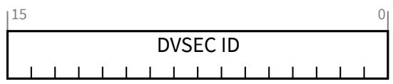

text_image

15
DVSEC ID
0

Figure 7-251 Designated Vendor-Specific Header 2§

Table 7-228 Designated Vendor-Specific Header 2§

<table><tr><td>Bit Location</td><td>Register Description</td><td>Attributes</td></tr><tr><td>15:0</td><td>DVSEC ID - This field is a vendor-defined ID that indicates the nature and format of the DVSEC structure. Software must qualify the DVSEC Vendor ID before interpreting this field.</td><td>RO</td></tr></table>

## 7.9.7 RCRB Header Extended Capability §

The PCI Express RCRB Header Extended Capability is an optional Extended Capability that may be implemented in an RCRB to provide a Vendor ID and Device ID for the RCRB and to permit the management of parameters that affect the behavior of Root Complex functionality associated with the RCRB.

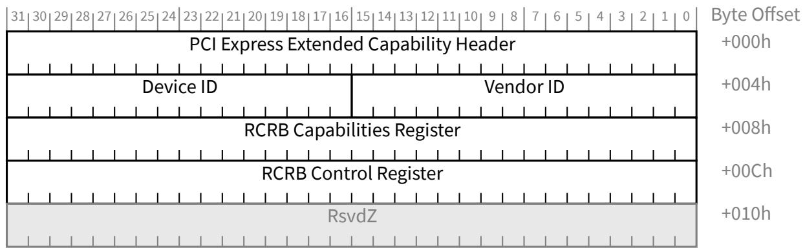

text_image

PCI Express Extended Capability Header
Device ID
Vendor ID
RCRB Capabilities Register
RCRB Control Register
RsvdZ
Byte Offset
+000h
+004h
+008h
+00Ch
+010h

Figure 7-252 RCRB Header Extended Capability Structure§

## 7.9.7.1 RCRB Header Extended Capability Header (Offset 00h) §

§ Figure 7-253 details allocation of register fields in the RCRB Header Extended Capability Header. § Table 7-229 provides the respective bit definitions. Refer to § Section 7.6.3 for a description of the PCI Express Enhanced Capabilities header. The Extended Capability ID for the RCRB Header Extended Capability is 000Ah.

text_image

31
20 19 16 15 0
Next Capability Offset
000Ah
PCI Express Extended Capability ID
Capability Version

Figure 7-253 RCRB Header Extended Capability Header§

Table 7-229 RCRB Header Extended Capability Header§

<table><tr><td>Bit Location</td><td>Register Description</td><td>Attributes</td></tr><tr><td>15:0</td><td>PCI Express Extended Capability ID - This field is a PCI-SIG defined ID number that indicates the nature and format of the Extended Capability. Extended Capability ID for the RCRB Header Extended Capability is 000Ah.</td><td>RO</td></tr><tr><td>19:16</td><td>Capability Version - This field is a PCI-SIG defined version number that indicates the version of the Capability structure present. Must be 1h for this version of the specification.</td><td>RO</td></tr><tr><td>31:20</td><td>Next Capability Offset - This field contains the offset to the next PCI Express Capability structure or 000h if no other items exist in the linked list of Capabilities. For Extended Capabilities implemented in Configuration Space, this offset is relative to the beginning of PCI-compatible Configuration Space and thus must always be either 000h (for terminating list of Capabilities) or greater than 0FFh.</td><td>RO</td></tr></table>

## 7.9.7.2 RCRB Vendor ID and Device ID register (Offset 04h) §

§ Figure 7-254 details allocation of register fields in the RCRB Vendor ID and Device ID register; § Table 7-230 provides the respective bit definitions.

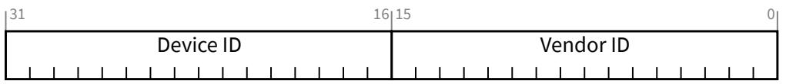

text_image

31
16 15
Device ID Vendor ID
0

Figure 7-254 RCRB Vendor ID and Device ID register§

Table 7-230 RCRB Vendor ID and Device ID register§

<table><tr><td>Bit Location</td><td>Register Description</td><td>Attributes</td></tr><tr><td>15:0</td><td>Vendor ID - PCI-SIG assigned. Analogous to the equivalent field in PCI-compatible Configuration Space. This field provides a means to associate an RCRB with a particular vendor.</td><td>RO</td></tr><tr><td>31:16</td><td>Device ID - Vendor assigned. Analogous to the equivalent field in PCI-compatible Configuration Space. This field provides a means for a vendor to classify a particular RCRB.</td><td>RO</td></tr></table>

## 7.9.7.3 RCRB Capabilities register (Offset 08h) §

§ Figure 7-255 details allocation of register fields in the RCRB Capabilities register; § Table 7-231 provides the respective bit definitions.

text_image

31
RsvdP
1 0
Configuration RRS Software Visibility

Figure 7-255 RCRB Capabilities register§

§ Table 7-231 RCRB Capabilities register

<table><tr><td>Bit Location</td><td>Register Description</td><td>Attributes</td></tr><tr><td>0</td><td>Configuration RRS Software Visibility- When Set, this bit indicates that the Root Complex is capable of returning Request Retry Status (RRS) Completion Status in response to a Configuration Request for all Root Ports and integrated devices associated with this RCRB (see § Section 2.3.1).</td><td>RO</td></tr></table>

## 7.9.7.4 RCRB Control register (Offset 0Ch) §

§ Figure 7-256 details allocation of register fields in the RCRB Control register; § Table 7-232 provides the respective bit definitions.

text_image

31
RsvdP
Configuration RRS Software Visibility Enable

Figure 7-256 RCRB Control register

§

§

Table 7-232 RCRB Control register

<table><tr><td>Bit Location</td><td>Register Description</td><td>Attributes</td></tr><tr><td>0</td><td>Configuration RRS Software Visibility Enable - When Set, this bit enables the Root Complex to return Request Retry Status (RRS) Completion Status in response to a Configuration Reuquest for all Root Ports and integrated devices associated with this RCRB (see § Section 2.3.1).RCRBs that do not implement this capability must hardwire this bit to 0b.Default value of this bit is 0b.</td><td>RW</td></tr></table>

## 7.9.8 Root Complex Link Declaration Extended Capability §

The Root Complex Link Declaration Extended Capability is an optional Capability that is permitted to be implemented by Root Ports, RCiEPs, or RCRBs to declare a Root Complex’s internal topology.

A Root Complex consists of one or more following elements:

• PCI Express Root Port  
• A default system Egress Port or an internal sink unit such as memory (represented by an RCRB)  
• Internal Data Paths/Links (represented by an RCRB on either side of an internal Link)  
• Integrated devices  
• Functions

A Root Complex Component is a logical aggregation of the above described Root Complex elements. No single element can be part of more than one Root Complex Component. Each Root Complex Component must have a unique Component ID.

A Root Complex is represented either as an opaque Root Complex or as a collection of one or more Root Complex Components.

The Root Complex Link Declaration Extended Capability is permitted to be present in a Root Complex element’s Configuration Space or RCRB. It declares Links from the respective element to other elements of the same Root Complex Component or to an element in another Root Complex Component. The Links are required to be declared bidirectional such that each valid data path from one element to another has corresponding Link Entries in the Configuration Space (or RCRB) of both elements.

The Root Complex Link Declaration Extended Capability is permitted to also declare an association between a Configuration Space element (Root Port or RCiEP) and an RCRB Header Extended Capability (see § Section 7.9.7 ) contained in an RCRB that affects the behavior of the Configuration Space element. Note that an RCRB Header association is not declared bidirectional; the association is only declared by the Configuration Space element and not by the target RCRB.

## IMPLEMENTATION NOTE: TOPOLOGIES TO AVOID

Topologies that create more than one data path between any two Root Complex elements (either directly or through other Root Complex elements) may not be able to support bandwidth allocation in a standard manner. The description of how traffic is routed through such a topology is implementation specific, meaning that general purpose-operating systems may not have enough information about such a topology to correctly support bandwidth allocation. In order to circumvent this problem, these operating systems may require that a single RCRB element (of type Internal Link) not declare more than one Link to a Root Complex Component other than the one containing the RCRB element itself.

The Root Complex Link Declaration Extended Capability, as shown in § Figure 7-257, consists of the PCI Express Extended Capability header and Root Complex Element Self Description followed by one or more Root Complex Link Entries.

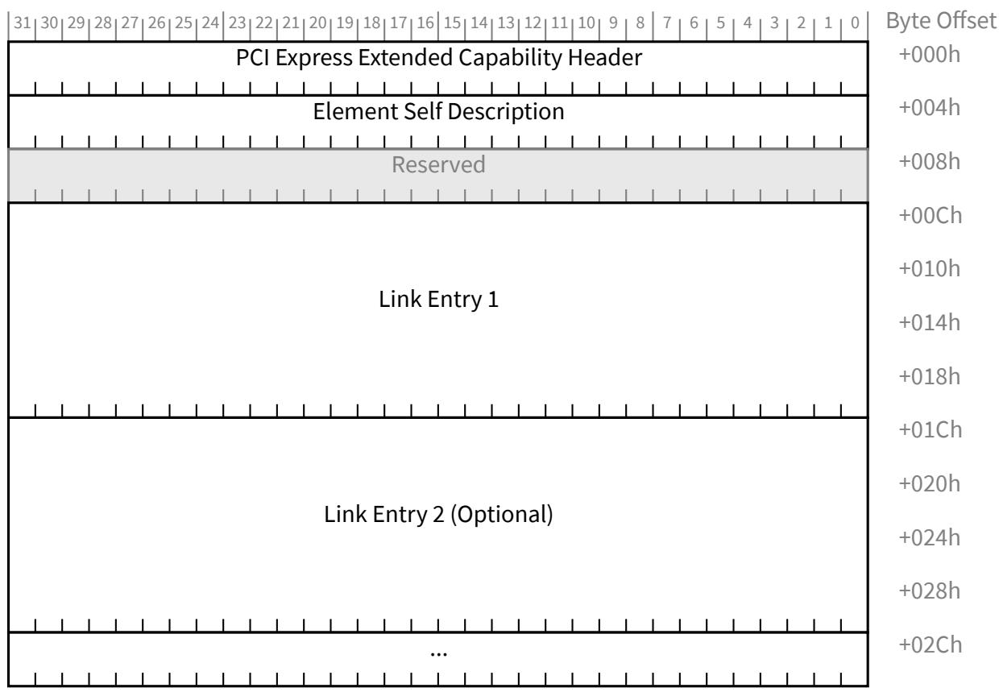

stacked bar chart

| Category                     | Byte Offset |
| ---------------------------- | ----------- |
| PCI Express Extended Capability Header | +000h       |
| Element Self Description      | +004h       |
| Reserved                     | +008h       |
| Link Entry 1                 | +00Ch       |
| Link Entry 2 (Optional)     | +010h       |
| ...                          | +020h       |

Figure 7-257 Root Complex Link Declaration Extended Capability§

## 7.9.8.1 Root Complex Link Declaration Extended Capability Header (Offset 00h) §

The Extended Capability ID for the Root Complex Link Declaration Extended Capability is 0005h.

line chart

| Time | Value |
| ---- | ----- |
| 0    | 0     |
| 15   | 16    |
| 19   | 20    |
| 20   | 31    |
| 31   | 0     |

Figure 7-258 Root Complex Link Declaration Extended Capability Header§

Table 7-233 Root Complex Link Declaration Extended Capability Header§

<table><tr><td>Bit Location</td><td>Register Description</td><td>Attributes</td></tr><tr><td>15:0</td><td>PCI Express Extended Capability ID- This field is a PCI-SIG defined ID number that indicates the nature and format of the Extended Capability.The Extended Capability ID for the Root Complex Link Declaration Extended Capability is 0005h.</td><td>RO</td></tr><tr><td>19:16</td><td>Capability Version- This field is a PCI-SIG defined version number that indicates the version of the Capability structure present.Must be 1h for this version of the specification.</td><td>RO</td></tr><tr><td>31:20</td><td>Next Capability Offset- This field contains the offset to the next PCI Express Capability structure or 000h if no other items exist in the linked list of Capabilities.For Extended Capabilities implemented in Configuration Space, this offset is relative to the beginning of PCI-compatible Configuration Space and thus must always be either 000h (for terminating list of Capabilities) or greater than 0FFh.The bottom 2 bits of this offset are Reserved and must be implemented as 00b although software must mask them to allow for future uses of these bits.</td><td>RO</td></tr></table>

## 7.9.8.2 Element Self Description Register (Offset 04h) §

The Element Self Description Register provides information about the Root Complex element containing the Root Complex Link Declaration Extended Capability.

text_image

Port Number
Component ID
RsvdP
Element Type
Number of Link Entries

Figure 7-259 Element Self Description Register§

Table 7-234 Element Self Description Register§

<table><tr><td>Bit Location</td><td>Register Description</td><td>Attributes</td></tr><tr><td>3:0</td><td>Element Type - This field indicates the type of the Root Complex Element. Defined encodings are:0h Configuration Space Element1h System Egress Port or internal sink (memory)2h Internal Root Complex Link3h-Fh Reserved</td><td>RO</td></tr><tr><td>15:8</td><td>Number of Link Entries - This field indicates the number of Link Entries following the Element Self Description. This field must report a value of 01h or higher.</td><td>HwInit</td></tr><tr><td>23:16</td><td>Component ID - This field identifies the Root Complex Component that contains this Root Complex Element. Component IDs must start at 01h, as a value of 00h is Reserved.</td><td>HwInit</td></tr><tr><td>31:24</td><td>Port Number - This field specifies the Port Number associated with this element with respect to the Root Complex Component that contains this element.An element with a Port Number of 00h indicates the default Egress Port to configuration software.</td><td>HwInit</td></tr></table>

## 7.9.8.3 Link Entries §

Link Entries start at offset 10h of the Root Complex Link Declaration Extended Capability structure. Each Link Entry consists of a Link description followed by a 64-bit Link Address at offset 08h from the start of Link Entry identifying the target element for the declared Link. A Link Entry declares an internal Link to another Root Complex Element.

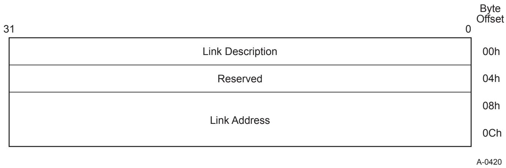

text_image

31
Link Description
Reserved
Link Address
0
Byte Offset
00h
04h
08h
0Ch
A-0420

Figure 7-260 Link Entry

§

## 7.9.8.3.1 Link Description Register §

The Link Description Register is located at offset 00h from the start of a Link Entry and is defined as follows:

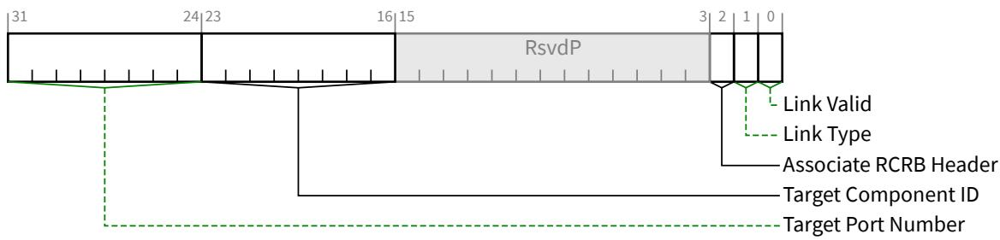

text_image

31 24 23 16 15 3 2 1 0
RsvdP
Link Valid
Link Type
Associate RCRB Header
Target Component ID
Target Port Number

§ Figure 7-261 Link Description Register

§ Table 7-235 Link Description Register

<table><tr><td>Bit Location</td><td>Register Description</td><td>Attributes</td></tr><tr><td>0</td><td>Link Valid- When Set, this bit indicates that the Link Entry specifies a valid Link. Link Entries that do not have either this bit Set or the Associate RCRB Header bit Set (or both) are ignored by software.</td><td>HwInit</td></tr><tr><td>1</td><td>Link Type- This bit indicates the target type of the Link and defines the format of the Link Address field. Defined Link Type values are:0b Link points to memory-mapped space $^{169}$  (for RCRB). The Link Address specifies the 64-bit base address of the target RCRB.1b Link points to Configuration Space (for a Root Port or RCiEP). The Link Address specifies the configuration address (PCI Segment Group, Bus, Device, Function) of the target element.</td><td>HwInit</td></tr><tr><td>2</td><td>Associate RCRB Header- When Set, this bit indicates that the Link Entry associates the declaring element with an RCRB Header Extended Capability in the target RCRB. Link Entries that do not have either this bit Set or the Link Valid bit Set (or both) are ignored by software.The Link Type bit must be Clear when this bit is Set.</td><td>HwInit</td></tr><tr><td>23:16</td><td>Target Component ID- This field identifies the Root Complex Component that is targeted by this Link Entry. Components IDs must start at 01h, as a value of 00h is Reserved</td><td>HwInit</td></tr><tr><td>31:24</td><td>Target Port Number- This field specifies the Port Number associated with the element targeted by this Link Entry; the Target Port Number is with respect to the Root Complex Component (identified by the Target Component ID) that contains the target element.</td><td>HwInit</td></tr></table>

## 7.9.8.3.2 Link Address §

The Link Address is a HwInit field located at offset 08h from the start of a Link Entry that identifies the target element for the Link Entry. For a Link of Link Type 0 in its Link Description, the Link Address specifies the memory-mapped base address of RCRB. For a Link of Link Type 1 in its Link Description, the Link Address specifies the Configuration Space address of a PCI Express Root Port or an RCiEP.

## 7.9.8.3.2.1 Link Address for Link Type 0 §

For a Link pointing to a memory-mapped RCRB (Link Type bit = 0), the first DWORD specifies the lower 32 bits of the RCRB base address of the target element as shown below; bits 11:0 are hardwired to 000h and Reserved for future use. The second DWORD specifies the high order 32 bits (63:32) of the RCRB base address of the target element.

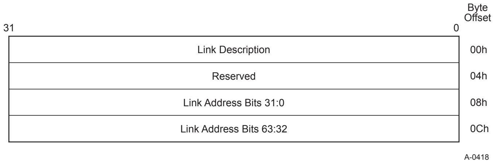

stacked bar chart

| Bit Type                  | Value |
| ------------------------- | ----- |
| Link Description          | 00h   |
| Reserved                  | 04h   |
| Link Address Bits 31:0    | 08h   |
| Link Address Bits 63:32   | 0Ch   |

Figure 7-262 Link Address for Link Type 0§

## 7.9.8.3.2.2 Link Address for Link Type 1 §

For a Link pointing to the Configuration Space of a Root Complex element (Link Type bit = 1), bits in the first DWORD specify the Bus, Device, and Function Number of the target element. As shown in § Figure 7-263, bits 2:0 (N) encode the number of bits n associated with the Bus Number, with N = 000b specifying n = 8 and all other encodings specifying n = <value of N>. Bits 11:3 are Reserved and hardwired to 0. Bits 14:12 specify the Function Number, and bits 19:15 specify the Device Number. Bits (19 + n):20 specify the Bus Number, with 1 ≤ n ≤ 8.

Bits 31:(20 + n) of the first DWORD together with the second DWORD optionally identify the target element’s hierarchy for systems implementing the PCI Express Enhanced Configuration Access Mechanism by specifying bits 63:(20 + n) of the memory-mapped Configuration Space base address of the PCI Express hierarchy associated with the targeted element; single hierarchy systems that do not implement more than one memory mapped Configuration Space are allowed to report a value of zero to indicate default Configuration Space.

A Configuration Space base address [63:(20 + n)] equal to zero indicates that the Configuration Space address defined by bits (19 + n):12 (Bus Number, Device Number, and Function Number) exists in the default PCI Segment Group; any non-zero value indicates a separate Configuration Space base address.

Software must not use n outside the context of evaluating the Bus Number and memory-mapped Configuration Space base address for this specific target element. In particular, n does not necessarily indicate the maximum Bus Number supported by the associated PCI Segment Group.

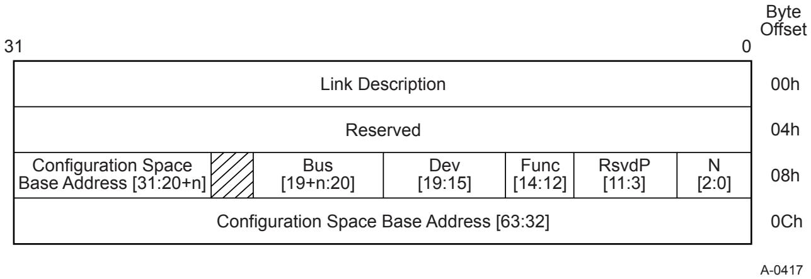

text_image

31
Link Description
Reserved
Configuration Space
Base Address [31:20+n]
Bus
[19+n:20]
Dev
[19:15]
Func
[14:12]
RsvdP
[11:3]
N
[2:0]
Configuration Space Base Address [63:32]
Byte
Offset
00h
04h
08h
0Ch
A-0417

Figure 7-263 Link Address for Link Type 1§

§ Table 7-236 Link Address for Link Type 1

<table><tr><td>Bit Location</td><td>Register Description</td><td>Attributes</td></tr><tr><td>2:0</td><td>N - Encoded number of Bus Number bits</td><td>HwInit</td></tr><tr><td>14:12</td><td>Function Number</td><td>HwInit</td></tr><tr><td>19:15</td><td>Device Number</td><td>HwInit</td></tr><tr><td>(19 + n):20</td><td>Bus Number</td><td>HwInit</td></tr><tr><td>63:(20 + n)</td><td>PCI Express Configuration Space Base Address (1 ≤ n ≤ 8)Note:A Root Complex that does not implement multiple Configuration Spaces is allowed to report this field as 0.</td><td>HwInit</td></tr></table>

## 7.9.9 Root Complex Internal Link Control Extended Capability §

The Root Complex Internal Link Control Extended Capability is an optional Capability that controls an internal Root Complex Link between two distinct Root Complex Components. This Capability is valid for RCRBs that declare an Element Type field as Internal Root Complex Link in the Element Self-Description register of the Root Complex Link Declaration Capability structure.

The Root Complex Internal Link Control Extended Capability structure is defined as shown in § Figure 7-264.

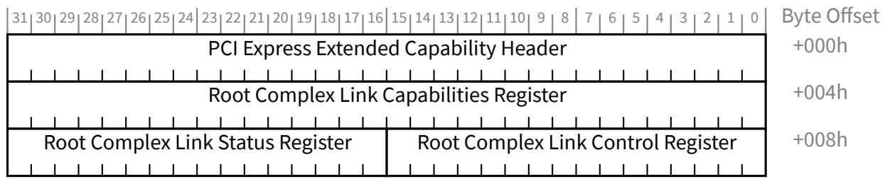

text_image

PCI Express Extended Capability Header
Root Complex Link Capabilities Register
Root Complex Link Status Register
Root Complex Link Control Register
Byte Offset
+000h
+004h
+008h

Figure 7-264 Root Complex Internal Link Control Extended Capability§

# 7.9.9.1 Root Complex Internal Link Control Extended Capability Header (Offset 00h) §

The Extended Capability ID for the Root Complex Internal Link Control Extended Capability is 0006h.

text_image

31
20 19 16 15 0
Next Capability Offset
0006h
PCI Express Extended Capability ID
Capability Version

Figure 7-265 Root Complex Internal Link Control Extended Capability Header§

Table 7-237 Root Complex Internal Link Control Extended Capability Header§

<table><tr><td>Bit Location</td><td>Register Description</td><td>Attributes</td></tr><tr><td>15:0</td><td>PCI Express Extended Capability ID- This field is a PCI-SIG defined ID number that indicates the nature and format of the Extended Capability.The Extended Capability ID for the Root Complex Internal Link Control Extended Capability is 0006h.</td><td>RO</td></tr><tr><td>19:16</td><td>Capability Version- This field is a PCI-SIG defined version number that indicates the version of the Capability structure present.Must be 1h for this version of the specification.</td><td>RO</td></tr><tr><td>31:20</td><td>Next Capability Offset- This field contains the offset to the next PCI Express Capability structure or 000h if no other items exist in the linked list of Capabilities.For Extended Capabilities implemented in Configuration Space, this offset is relative to the beginning of PCI-compatible Configuration Space and thus must always be either 000h (for terminating list of Capabilities) or greater than 0FFh.The bottom 2 bits of this offset are Reserved and must be implemented as 00b although software must mask them to allow for future uses of these bits.</td><td>RO</td></tr></table>

## 7.9.9.2 Root Complex Link Capabilities Register (Offset 04h) §

The Root Complex Link Capabilities Register identifies capabilities for this Link.

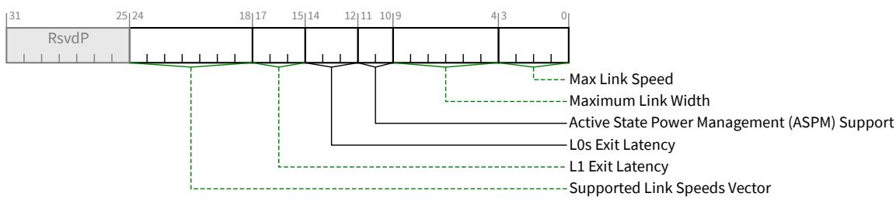

line chart

| RsvdP | Max Link Speed | Maximum Link Width | Active State Power Management (ASPM) Support | L0s Exit Latency | L1 Exit Latency | Supported Link Speeds Vector |
| --- | --- | --- | --- | --- | --- | --- |
| 31 |  |  |  |  |  |  |
| 25 |  |  |  |  |  |  |
| 24 |  |  |  |  |  |  |
| 18 |  |  |  |  |  |  |
| 17 |  |  |  |  |  |  |
| 15 |  |  |  |  |  |  |
| 14 |  |  |  |  |  |  |
| 12 |  |  |  |  |  |  |
| 11 |  |  |  |  |  |  |
| 10 |  |  |  |  |  |  |
| 9 |  |  |  |  |  |  |
| 4 |  |  |  |  |  |  |
| 3 |  |  |  |  |  |  |
| 0 |  |  |  |  |  |  |
|  | Max | Max | Max |  | Max | Max |
|  |  |  |  |  |  |  |
|  |  |  |  |  |  |  |
|  |  |  |  |  |  |  |
|  |  |  |  |  |  |  |
|  |  |  |  |  |  |  |
|  |  |  |  |  |  |  |
|  |  |  |  |  |  |  |
|  |  |  | / / |  |  |  |
|  |  | / | / |  |  |  |
|  |  | / | / |  |  |  |
|  |  | / | / |  |  |  |
|  |  | / | / |  |  |  |
|  |  | / | / |  |  |  |

Figure 7-266 Root Complex Link Capabilities Register§

Table 7-238 Root Complex Link Capabilities Register§

<table><tr><td>Bit Location</td><td>Register Description</td><td>Attributes</td></tr><tr><td>3:0</td><td>Max Link Speed- This field indicates the maximum Link speed of the associated Link.The encoded value specifies a bit location in the Supported Link Speeds Vector (in the Root Complex Link Capabilities Register) that corresponds to the maximum Link speed. Defined encodings are:0001b Supported Link Speeds Vector field bit 0001b Supported Link Speeds Vector field bit 10011b Supported Link Speeds Vector field bit 20100b Supported Link Speeds Vector field bit 30101b Supported Link Speeds Vector field bit 40110b Supported Link Speeds Vector field bit 50111b Supported Link Speeds Vector field bit 6Others All other encodings are reserved.A Root Complex that does not support this feature must report 0000b in this field.</td><td>RO</td></tr><tr><td>9:4</td><td>Maximum Link Width- This field indicates the maximum width of the given Link. Defined encodings are:00 0001b x100 0010b x200 0100b x400 1000b x801 0000b x16All other encodings are Reserved. A Root Complex that does not support this feature must report 00 0000b in this field.</td><td>RO</td></tr><tr><td>11:10</td><td>Active State Power Management (ASPM) Support- This field indicates the level of ASPM supported on the given Link. Defined encodings are:00b No ASPM Support01b L0s Supported10b L1 Supported11b L0s and L1 Supported</td><td>RO</td></tr><tr><td>14:12</td><td>L0s Exit Latency- This field indicates the L0s exit latency for the given Link. The value reported indicates the length of time this Port requires to complete transition from L0s to L0. If L0s is not supported, the value is undefined. Defined encodings are: 000b Less than 64 ns 001b 64 ns to less than 128 ns 010b 128 ns to less than 256 ns 011b 256 ns to less than 512 ns 100b 512 ns to less than 1 μs 101b 1 μs to less than 2 μs 110b 2 μs to 4 μs 111b More than 4 μs</td><td>RO</td></tr><tr><td>17:15</td><td>L1 Exit Latency- This field indicates the L1 exit latency for the given Link. The value reported indicates the length of time this Port requires to complete transition from ASPM L1 to L0. If ASPM L1 is not supported, the value is undefined. Defined encodings are: 000b Less than 1 μs 001b 1 μs to less than 2 μs 010b 2 μs to less than 4 μs 011b 4 μs to less than 8 μs 100b 8 μs to less than 16 μs 101b 16 μs to less than 32 μs 110b 32 μs to 64 μs 111b More than 64 μs</td><td>RO</td></tr><tr><td>24:18</td><td>Supported Link Speeds Vector- This field indicates the supported Link speed(s) of the associated Link. For each bit, a value of 1b indicates that the corresponding Link speed is supported; otherwise, the Link speed is not supported. See § Section 8.2.1 for further requirements. Bit definitions within this field are: Bit 0 2.5 GT/s Bit 1 5.0 GT/s Bit 2 8.0 GT/s Bit 3 16.0 GT/s Bit 4 32.0 GT/s Bit 5 64.0 GT/s Bit 6 RsvdP</td><td>RO</td></tr></table>

## IMPLEMENTATION NOTE:

## SUPPORTED LINK SPEEDS WITH EARLIER HARDWARE §

Hardware components compliant to versions prior to the [PCIe-3.0] did not implement the Supported Link Speeds Vector field and instead returned 0000 000b in bits 24:18.

For software to determine the supported Link speeds for components where this field is contains 0000 000b, software can read bits 3:0 of the Root Complex Link Capabilities Register (now defined to be the Max Link Speed field), and interpret the value as follows:

## 0001b

2.5 GT/s Link speed supported

## 0010b

5.0 GT/s and 2.5 GT/s Link speeds supported

For such components, the same encoding is also used for the values for the Current Link Speed field (in the Root Complex Link Status Register).

## IMPLEMENTATION NOTE:

## SOFTWARE MANAGEMENT OF LINK SPEEDS WITH FUTURE HARDWARE

It is strongly encouraged that software primarily utilize the Supported Link Speeds Vector instead of the Max Link Speed field, so that software can determine the exact set of supported speeds on current and future hardware. This can avoid software being confused if a future specification defines Links that do not require support for all slower speeds.

## 7.9.9.3 Root Complex Link Control Register (Offset 08h) §

The Root Complex Link Control Register controls parameters for this internal Link.

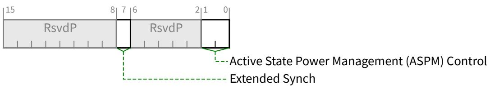

text_image

15
RsvdP 8 7 6 2 1 0
RsvdP
Active State Power Management (ASPM) Control
Extended Synch

Figure 7-267 Root Complex Link Control Register§

Table 7-239 Root Complex Link Control Register§

<table><tr><td>Bit Location</td><td>Register Description</td><td>Attributes</td></tr><tr><td>1:0</td><td>Active State Power Management (ASPM) Control - This field controls the level of ASPM enabled on the given Link. Defined encodings are:00b Disabled01b L0s Entry Enabled10b L1 Entry Enabled11b L0s and L1 Entry EnabledNote: “L0s Entry Enabled” enables the Transmitter to enter L0s. If L0s is supported, the Receiver must be capable of entering L0s even when the Transmitter is disabled from entering L0s (00b or 10b).In Flit Mode, L0s is not supported, bit 0 of this field is ignored and has no effect (i.e., encodings 01b and 00b are equivalent as are encodings 11b and 10b).Default value of this field is implementation specific.Software must not enable L0s in either direction on a given Link unless components on both sides of the Link each support L0s, as indicated by their ASPM Support field values. Otherwise, the result is undefined.ASPM L1 must be enabled by software in the Upstream component on a Link prior to enabling ASPM L1 in the Downstream component on that Link. When disabling ASPM L1, software must disable ASPM L1 in the Downstream component on a Link prior to disabling ASPM L1 in the Upstream component on that Link. ASPM L1 must only be enabled on the Downstream component if both components on a Link support ASPM L1.A Root Complex that does not support this feature for the given internal Link must hardwire this field to 00b.</td><td>RW</td></tr><tr><td>7</td><td>Extended Synch - This bit when Set forces the transmission of additional Ordered Sets when exiting the L0s state (see § Section 4.2.5.6) and when in the Recovery state (see § Section 4.2.7.4.1). This mode provides external devices (e.g., logic analyzers) monitoring the Link time to achieve bit and Symbol lock before the Link enters the L0 state and resumes communication.A Root Complex that does not support this feature for the given internal Link must hardwire this bit to 0b.In Flit Mode, this bit is ignored and has no effect since L0s is not supported.Default value for this bit is 0b.</td><td>RW</td></tr></table>

## 7.9.9.4 Root Complex Link Status Register (Offset 0Ah) §

The Root Complex Link Status Register provides information about Link specific parameters.

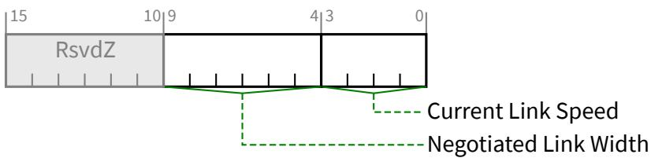

text_image

15 10 9 4 3 0
RsvdZ
Current Link Speed
Negotiated Link Width

Figure 7-268 Root Complex Link Status Register§

Table 7-240 Root Complex Link Status Register§

<table><tr><td>Bit Location</td><td>Register Description</td><td>Attributes</td></tr><tr><td>3:0</td><td>Current Link Speed- This field indicates the negotiated Link speed of the given Link.The encoded value specifies a bit location in the Supported Link Speeds Vector (in the Root Complex Link Capabilities Register) that corresponds to the current Link speed. Defined encodings are:0001b Supported Link Speeds Vector field bit 0001b Supported Link Speeds Vector field bit 10011b Supported Link Speeds Vector field bit 20100b Supported Link Speeds Vector field bit 30101b Supported Link Speeds Vector field bit 40110b Supported Link Speeds Vector field bit 50111b Supported Link Speeds Vector field bit 6All other encodings are Reserved.The value in this field is undefined when the Link is not up. A Root Complex that does not support this feature must report 0000b in this field.</td><td>RO</td></tr><tr><td>9:4</td><td>Negotiated Link Width- This field indicates the negotiated width of the given Link. This includes the Link Width determined during initial link training as well changes that occur after initial link training (e.g., L0p)Defined encodings are:00 0001b x100 0010b x200 0100b x400 1000b x801 0000b x16All other encodings are Reserved. The value in this field is undefined when the Link is not up. A Root Complex that does not support this feature must hardwire this field to 00 0000b.</td><td>RO</td></tr></table>

## 7.9.10 Root Complex Event Collector Endpoint Association Extended Capability

§

The Root Complex Event Collector Endpoint Association Extended Capability is implemented by Root Complex Event Collectors. It declares the RCiEPs supported by the Root Complex Event Collector. A Root Complex Event Collector must implement the Root Complex Event Collector Endpoint Association Extended Capability; no other PCI Express Device Function is permitted to implement this Capability.

The Root Complex Event Collector Endpoint Association Extended Capability, as shown in § Figure 7-269, consists of the PCI Express Extended Capability header followed by a DWORD bitmap enumerating RCiEPs on the same Bus, and optionally an additional range of Bus Numbers that may contain RCiEPs associated with the Root Complex Event Collector. Functions other than RCiEPs (e.g., Root Ports) contained in the range described by this Capability are not associated with this Root Complex Event Collector.

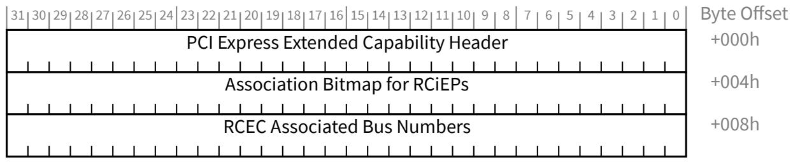

text_image

PCI Express Extended Capability Header
Association Bitmap for RCiEPs
RCEC Associated Bus Numbers
Byte Offset
+000h
+004h
+008h

Figure 7-269 Root Complex Event Collector Endpoint Association Extended Capability§

## 7.9.10.1 Root Complex Event Collector Endpoint Association Extended Capability Header (Offset 00h) §

The Extended Capability ID for the Root Complex Event Collector Endpoint Association Extended Capability is 0007h. § Figure 7-270 details allocation of fields in the Root Complex Event Collector Endpoint Association Extended Capability Header; § Table 7-241 provides the respective bit definitions.

text_image

31 20 19 16 15 0
Next Capability Offset 0007h
PCI Express Extended Capability ID
Capability Version

Figure 7-270 Root Complex Event Collector Endpoint Association Extended Capability Header§

Table 7-241 Root Complex Event Collector Endpoint Association Extended Capability Header§

<table><tr><td>Bit Location</td><td>Register Description</td><td>Attributes</td></tr><tr><td>15:0</td><td>PCI Express Extended Capability ID - This field is a PCI-SIG defined ID number that indicates the nature and format of the Extended Capability.The Extended Capability ID for the Root Complex Event Collector Endpoint Association Extended Capability is 0007h.</td><td>RO</td></tr><tr><td>19:16</td><td>Capability Version - This field is a PCI-SIG defined version number that indicates the version of the Capability structure present.Must be 2h if the Extended Capability contains the RCEC Associated Bus Numbers Register (see § Section 7.9.10.3). Must be 1h otherwise.</td><td>RO</td></tr><tr><td>31:20</td><td>Next Capability Offset- This field contains the offset to the next PCI Express Capability structure or 000h if no other items exist in the linked list of Capabilities.For Extended Capabilities implemented in Configuration Space, this offset is relative to the beginning of PCI-compatible Configuration Space and thus must always be either 000h (for terminating list of Capabilities) or greater than 0FFh.The bottom 2 bits of this offset are Reserved and must be implemented as 00b although software must mask them to allow for future uses of these bits.</td><td>RO</td></tr></table>

## 7.9.10.2 Association Bitmap for RCiEPs (Offset 04h) §

The Association Bitmap for RCiEPs is a read-only register that sets the bits corresponding to the Device Numbers of RCiEPs associated with the Root Complex Event Collector on the same Bus Number as the Event Collector itself. The bit corresponding to the Device Number of the Root Complex Event Collector must always be Set.

## 7.9.10.3 RCEC Associated Bus Numbers Register (Offset 08h) §

The RCEC Associated Bus Numbers Register is a read-only register that indicates an additional range of Bus Numbers containing RCiEPs associated with this Root Complex Event Collector. It is permitted for Functions other than RCiEPs, including Root Ports, to appear within the Association Bus Range. Only RCiEPs in the range are associated with this Root Complex Event Collector. This register is present if the Capability Version is 2h or greater.

This register does not indicate association between an Event Collector and any Virtual Functions within the Association Bus Range (see § Section 9.2.1.2 ). This register does not indicate association between an Event Collector and any Function on the same Bus Number as the Event Collector itself, however it is permitted for the Association Bus Range to include the Bus Number of the Root Complex Event Collector.

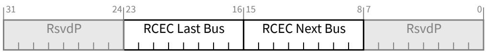

text_image

31 24 23 16 15 8 7 0
RsvdP RCEC Last Bus RCEC Next Bus RsvdP

Figure 7-271 RCEC Associated Bus Numbers Register§

Table 7-242 RCEC Associated Bus Numbers Register§

<table><tr><td>Bit Location</td><td>Register Description</td><td>Attributes</td></tr><tr><td>15:8</td><td>RCEC Next Bus- This field contains the lowest additional bus number containing RCiEPs associated with this Root Complex Event Collector. If all of the Devices associated with this Root Complex Event Collector are on the same bus as the Event Collector, then this field must be set to FFh.</td><td>HwInit</td></tr><tr><td>23:16</td><td>RCEC Last Bus- This field contains the highest additional bus number containing RCiEPs associated with this Root Complex Event Collector.If all of the Devices associated with this Root Complex Event Collector are on the same bus as the Event Collector, then this field must be set to 00h.</td><td>HwInit</td></tr></table>

# IMPLEMENTATION NOTE:

# RCEC ASSOCIATED BUS NUMBER COMPATIBILITY WITH LEGACY SOFTWARE §

Legacy software may not support the use of the RCEC Associated Bus Numbers Register as a mechanism to associate Devices with a RCEC. Such software may see events in the RCEC from Devices on different bus numbers that it does not consider to be associated with the Root Complex Event Collector. System Software is strongly encouraged to report all events seen on the Root Complex Event Collector, regardless of whether or not it can determine association.

## 7.9.11 Multicast Extended Capability §

Multicast is an optional normative functionality that is controlled by the Multicast Extended Capability structure. The Multicast Extended Capability is applicable to Root Ports, RCRBs, Switch Ports, Endpoint Functions, and RCiEPs. It is not applicable to PCI Express to PCI/PCI-X Bridges.

Multicast support is optional in SR-IOV devices. If a VF implements a Multicast capability, its associated PF must implement a Multicast capability.

In the cases of a Switch or Root Complex or a component that contains multiple Functions, multiple copies of this Capability structure are required - one for each Endpoint Function, Switch Port, or Root Port that supports Multicast. To provide implementation efficiencies, certain fields within each of the Multicast Extended Capability structures within a component must be programmed the same and results are indeterminate if this is not the case. The fields and registers that must be configured with the same values include MC\_Enable, MC\_Num\_Group, MC\_Base\_Address and MC\_Index\_Position. These same fields in an Endpoint’s Multicast Extended Capability structure must match those configured into a Multicast Extended Capability structure of the Switch or Root Complex above the Endpoint or in which the RCiEP is integrated.

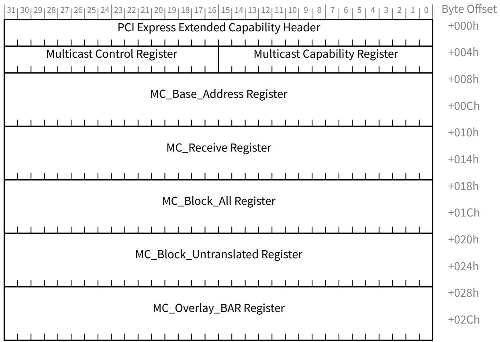

stacked bar chart

| Register Type | Bit Offset |
| --- | --- |
| PCI Express Extended Capability Header | +000h |
| Multicast Control Register | +004h |
| Multicast Capability Register | +008h |
| MC_Base_Address Register | +010h |
| MC_Receive Register | +014h |
| MC_Block_All Register | +018h |
| MC_Block_Untranslated Register | +020h |
| MC_Overlay_BAR Register | +024h |
| MC_Overlay_BAR Register | +028h |
| MC_Overlay_BAR Register | +02Ch |

Figure 7-272 Multicast Extended Capability Structure§

## 7.9.11.1 Multicast Extended Capability Header (Offset 00h) §

§ Figure 7-273 details allocation of the fields in the Multicast Extended Capability Header and § Table 7-243 provides the respective bit definitions.

text_image

31
20 19 16 15 0
Next Capability Offset
0012h
PCI Express Extended Capability ID
Capability Version

Figure 7-273 Multicast Extended Capability Header§

Table 7-243 Multicast Extended Capability Header§

<table><tr><td>Bit Location</td><td>Register Description</td><td>Attributes</td></tr><tr><td>15:0</td><td>PCI Express Extended Capability ID - This field is a PCI-SIG defined ID number that indicates the nature and format of the Extended Capability.PCI Express Extended Capability ID for the Multicast Extended Capability is 0012h.</td><td>RO</td></tr><tr><td>19:16</td><td>Capability Version- This field is a PCI-SIG defined version number that indicates the version of the Capability structure present.Must be 1h for this version of the specification.</td><td>RO</td></tr><tr><td>31:20</td><td>Next Capability Offset- This field contains the offset to the next PCI Express Extended Capability structure or 000h if no other items exist in the linked list of Capabilities.</td><td>RO</td></tr></table>

## 7.9.11.2 Multicast Capability Register (Offset 04h) §

§ Figure 7-274 details allocation of the fields in the Multicast Capability Register and § Table 7-244 provides the respective bit definitions.  
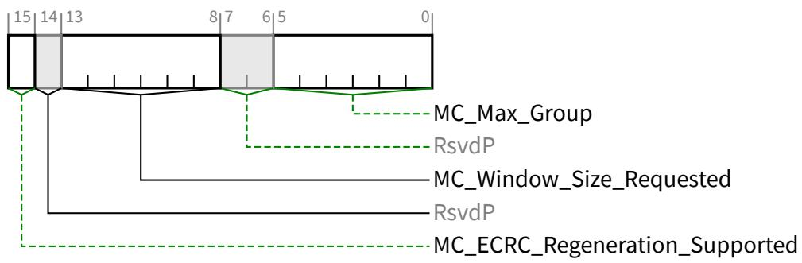

text_image

15 14 13 8 7 6 5 0
MC_Max_Group
RsvdP
MC_Window_Size_Requested
RsvdP
MC_ECRC_Regeneration_Supported

Figure 7-274 Multicast Capability Register§

Table 7-244 Multicast Capability Register§

<table><tr><td>Bit Location</td><td>Register Description</td><td>Attributes</td></tr><tr><td>5:0</td><td>MC_Max_Group- Value indicates the maximum number of Multicast Groups that the component supports, encoded as M-1. A value of 00h indicates that one Multicast Group is supported.For VFs, this field is RsvdP. The value from the associated PF applies.</td><td>ROVF RsvdP</td></tr><tr><td>13:8</td><td>MC_Window_Size_Requested- In Endpoints, the  $\log_{2}$  of the Multicast Window size requested. RsvdP in Switch and Root Ports.For VFs, this field is RsvdP. The value from the associated PF applies.</td><td>ROVF RsvdP</td></tr><tr><td>15</td><td>MC_ECRC_Regeneration_Supported- If Set, indicates that ECRC regeneration is supported.This bit must not be Set unless the Function supports Advanced Error Reporting, and the ECRC Check Capable bit in the Advanced Error Capabilities and Control register is also Set. However, if ECRC regeneration is supported, its operation is not contingent upon the setting of the ECRC Check Enable bit in the Advanced Error Capabilities and Control register. This bit is applicable to Switch and Root Ports and is RsvdP in all other Functions.</td><td>RO/RsvdP</td></tr></table>

## 7.9.11.3 Multicast Control Register (Offset 06h) §

§ Table 7-245 details allocation of the fields in the Multicast Control Register and § Table 7-245 provides the respective bit definitions.

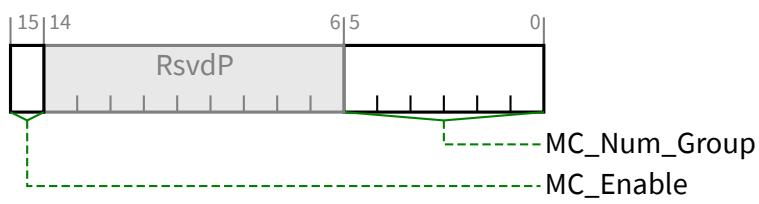

text_image

15 14
RsvdP
6 5 0
MC_Num_Group
MC_Enable

Figure 7-275 Multicast Control Register§

§ Table 7-245 Multicast Control Register

<table><tr><td>Bit Location</td><td>Register Description</td><td>Attributes</td></tr><tr><td>5:0</td><td>MC_Num_Group - Value indicates the number of Multicast Groups configured for use, encoded as N-1. The default value of 00 0000b indicates that one Multicast Group is configured for use. Behavior is undefined if value exceeds MC_Max_Group. This parameter indirectly defines the upper limit of the Multicast address range. This field is ignored if MC_Enable is Clear. Default value is 00 0000b. For VFs, this field is RsvdP. The value from the associated PF applies.</td><td>RWVF RsvdP</td></tr><tr><td>15</td><td>MC_Enable - When Set, the Multicast mechanism is enabled for the component. Default value is 0b.</td><td>RW</td></tr></table>

## 7.9.11.4 MC\_Base\_Address Register (Offset 08h) §

The MC\_Base\_Address Register contains the MC\_Base\_Address and the MC\_Index\_Position. § Figure 7-276 details allocation of the fields in the MC\_Base\_Address Register and § Table 7-246 provides the respective bit definitions.

<table><tr><td>MC_Base_Address [31:12]</td><td>RsvdP</td><td>MC_Index_Position</td></tr><tr><td colspan="3">MC_Base_Address [63:32]</td></tr></table>

A-0751

Figure 7-276 MC\_Base\_Address Register§

§ Table 7-246 MC\_Base\_Address Register

<table><tr><td>Bit Location</td><td>Register Description</td><td>Attributes</td></tr><tr><td>5:0</td><td>MC_Index_Position- The location of the LSB of the Multicast Group number within the address. Behavior is undefined if this value is less than 12 and MC_Enable is Set. Default is 0.For VFs, this field is RsvdP. The value from the associated PF applies.</td><td>RWVF RsvdP</td></tr><tr><td>63:12</td><td>MC_Base_Address- The base address of the Multicast address range. The behavior is undefined if MC_Enable is Set and bits in this field corresponding to address bits that contain the Multicast Group number or address bits less than MC_Index_Position are non-zero. Default is 0.For VFs, this field is RsvdP. The value from the associated PF applies.</td><td>RWVF RsvdP</td></tr></table>

## 7.9.11.5 MC\_Receive Register (Offset 10h) §

The MC\_Receive Register provides a bit vector denoting which Multicast groups the Function should accept, or in the case of Switch and Root Complex Ports, forward Multicast TLPs. This register is required in all Functions that implement the MC Capability structure.

§ Figure 7-277 details allocation of the fields in the MC\_Receive Register and § Table 7-247 provides the respective bit definitions.

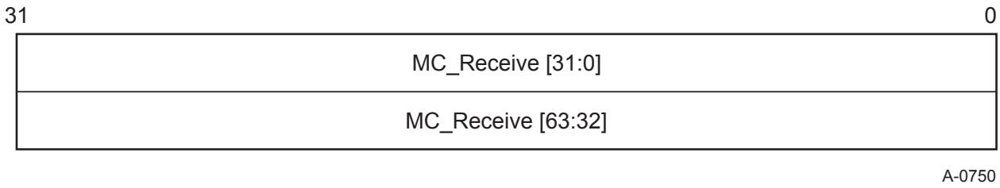

text_image

31
MC_Receive [31:0]
MC_Receive [63:32]
A-0750

§ Figure 7-277 MC\_Receive Register

§ Table 7-247 MC\_Receive Register

<table><tr><td>Bit Location</td><td>Register Description</td><td>Attributes</td></tr><tr><td>MC_Max_Group:0</td><td>MC_Receive- For each bit that&#x27;s Set, this Function gets a copy of any Multicast TLPs for the associated Multicast Group. Bits above MC_Num_Group are ignored by hardware. Default value of each bit is 0b.</td><td>RW</td></tr><tr><td>All other bits</td><td>Reserved</td><td>RsvdP</td></tr></table>

## 7.9.11.6 MC\_Block\_All Register (Offset 18h) §

The MC\_Block\_All Register provides a bit vector denoting which Multicast groups the Function should block. This register is required in all Functions that implement the MC Capability structure.

§ Figure 7-278 details allocation of the fields in the MC\_Block\_All Register and § Table 7-248 provides the respective bit definitions.

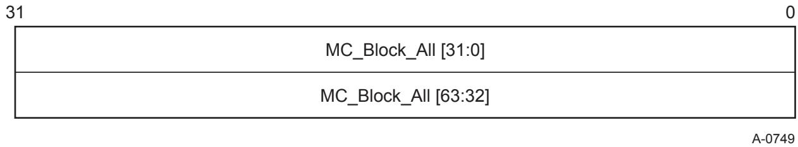

text_image

31
MC_Block_All [31:0]
MC_Block_All [63:32]
A-0749

§ Figure 7-278 MC\_Block\_All Register

§ Table 7-248 MC\_Block\_All Register

<table><tr><td>Bit Location</td><td>Register Description</td><td>Attributes</td></tr><tr><td>MC_Max_Group:0</td><td>MC_Block_All - For each bit that is Set, this Function is blocked from sending TLPs to the associated Multicast Group. Bits above MC_Num_Group are ignored by hardware. Default value of each bit is 0b.</td><td>RW</td></tr><tr><td>All other bits</td><td>Reserved</td><td>RsvdP</td></tr></table>

## 7.9.11.7 MC\_Block\_Untranslated Register (Offset 20h)

The MC\_Block\_Untranslated Register is used to determine whether or not a TLP that includes an Untranslated Address should be blocked. This register is required in all Functions that implement the MC Capability structure. However, an Endpoint Function that does not implement the ATS capability may implement this register as RsvdP.

§ Figure 7-279 details allocation of the fields in the MC\_Block\_Untranslated Register and § Table 7-249 provides the respective bit definitions.

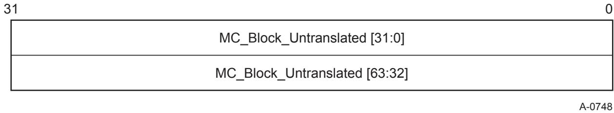

text_image

31
MC_Block_Untranslated [31:0]
MC_Block_Untranslated [63:32]
A-0748

Figure 7-279 MC\_Block\_Untranslated Register§

Table 7-249 MC\_Block\_Untranslated Register§

<table><tr><td>Bit Location</td><td>Register Description</td><td>Attributes</td></tr><tr><td>MC_Max_Group:0</td><td>MC_Block_Untranslated- For each bit that is Set, this Function is blocked from sending TLPs containing Untranslated Addresses to the associated MCG. Bits above MC_Num_Group are ignored by hardware. Default value of each bit is 0b.</td><td>RW</td></tr><tr><td>All other bits</td><td>Reserved</td><td>RsvdP</td></tr></table>

## 7.9.11.8 MC\_Overlay\_BAR Register (Offset 28h) §

The MC\_Overlay\_BAR Register is required in Switch and Root Complex Ports that support the Multicast Extended Capability and not implemented in Endpoints. Software must interpret the Device/Port Type field in the PCI Express Capabilities Register to determine if the MC\_Overlay\_BAR Register is present in a Function.

The MC\_Overlay\_BAR specifies the base address of a window in unicast space onto which Multicast TLPs going out an Egress Port are overlaid by a process of address replacement. This allows a single BAR in an Endpoint attached to the Switch or Root Port to be used for both unicast and Multicast traffic. At a Switch Upstream Port, it allows the Multicast address range, or a portion of it, to be overlayed onto host memory.

§ Figure 7-280 details allocation of the fields in the MC\_Overlay\_BAR Register and § Table 7-250 provides the respective bit definitions.

<table><tr><td>MC_Overlay_BAR [31:6]</td><td>MC_Overlay_Size</td></tr><tr><td colspan="2">MC_Overlay_BAR [63:32]</td></tr></table>

A-0747

Figure 7-280 MC\_Overlay\_BAR Register§  
§ Table 7-250 MC\_Overlay\_BAR Register

<table><tr><td>Bit Location</td><td>Register Description</td><td>Attributes</td></tr><tr><td>5:0</td><td>MC_Overlay_Size - If 6 or greater, specifies the size in bytes of the overlay aperture as a power of 2. If less than 6, disables the overlay mechanism. Default value is 00 0000b.</td><td>RW</td></tr><tr><td>63:6</td><td>MC_Overlay_BAR - Specifies the base address of the window onto which MC TLPs passing through this Function will be overlaid. Default value is 0.</td><td>RW</td></tr></table>

## 7.9.12 Dynamic Power Allocation Extended Capability (DPA Capability) §

The DPA Capability structure is shown in § Figure 7-281.

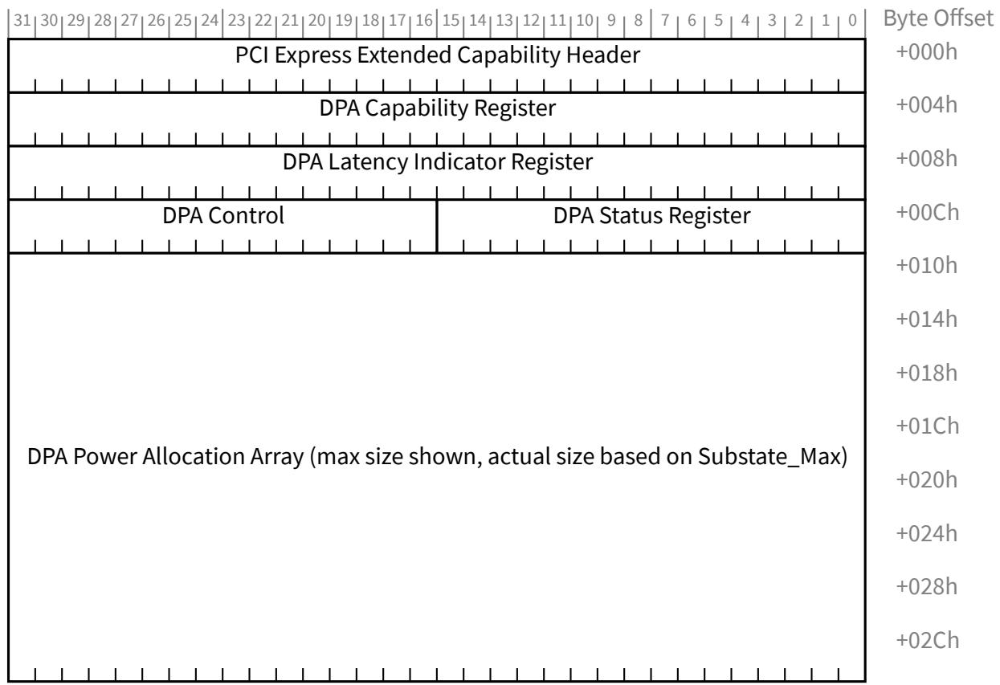

text_image

PCI Express Extended Capability Header
DPA Capability Register
DPA Latency Indicator Register
DPA Control	DPA Status Register
DPA Power Allocation Array (max size shown, actual size based on Substate_Max)
Byte Offset
+000h
+004h
+008h
+00Ch
+010h
+014h
+018h
+01Ch
+020h
+024h
+028h
+02Ch

Figure 7-281 Dynamic Power Allocation Extended Capability Structure§

## 7.9.12.1 DPA Extended Capability Header (Offset 00h) §

text_image

31 20 19 16 15 0
Next Capability Offset 0016h
PCI Express Extended Capability ID
Capability Version

Figure 7-282 DPA Extended Capability Header§

Table 7-251 DPA Extended Capability Header§

<table><tr><td>Bit Location</td><td>Register Description</td><td>Attributes</td></tr><tr><td>15:0</td><td>PCI Express Extended Capability ID - This field is a PCI-SIG defined ID number that indicates the nature and format of the Extended Capability.PCI Express Extended Capability ID for the DPA Extended Capability is 0016h.</td><td>RO</td></tr><tr><td>19:16</td><td>Capability Version - This field is a PCI-SIG defined version number that indicates the version of the Capability structure present.Must be 1h for this version of the specification.</td><td>RO</td></tr><tr><td>31:20</td><td>Next Capability Offset - This field contains the offset to the next PCI Express Extended Capability structure or 000h if no other items exist in the linked list of Capabilities.</td><td>RO</td></tr></table>

## 7.9.12.2 DPA Capability Register (Offset 04h) §

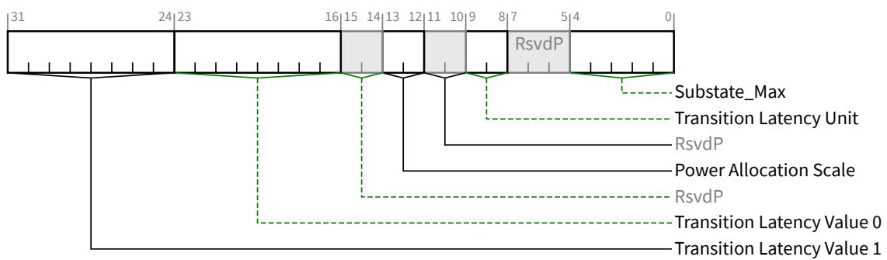

diagram

| Bit Position | Substate_Max | Transition Latency Unit | Power Allocation Scale | RsvdP | Transition Latency Value 0 | Transition Latency Value 1 |
| --- | --- | --- | --- | --- | --- | --- |
| 0 | 0 |  |  |  |  |  |
| 1 | 0 |  |  |  |  |  |
| 2 | 0 |  |  |  |  |  |
| 3 | 0 |  |  |  |  |  |
| 4 | 0 |  |  |  |  |  |
| 5 | 0 |  |  |  |  |  |
| 6 | 0 |  |  |  |  |  |
| 7 | 0 |  |  |  |  |  |
| 8 | 0 |  |  |  |  |  |
| 9 | 0 |  |  |  |  |  |
| 10 | 0 |  |  |  |  |  |
| 11 | 0 |  |  |  |  |  |
| 12 | 0 |  |  |  |  |  |
| 13 | 0 |  |  |  |  |  |
| 14 | 0 |  |  |  |  |  |
| 15 | 0 |  |  |  |  |  |
| 16 | 0 |  |  |  |  |  |
| 17 | 0 |  |  |  |  |  |
| 18 | 0 |  |  |  |  |  |
| 19 | 0 |  |  |  |  |  |
| 20 | 0 |  |  |  |  |  |
| 21 | 0 |  |  |  |  |  |
| 22 | 0 |  |  |  |  |  |
| 23 | 0 |  |  |  |  |  |
| 24 | 0 |  |  |  |  |  |
| 25 | 0 |  |  |  |  |  |
| 26 | 0 |  |  |  |  |  |
| 27 | 0 |  |  |  |  |  |
| 28 | 0 |  |  |  |  |  |
| 29 | 0 |  |  |  |  |  |
| 30 | 0 |  |  |  |  |  |
| 31 | 0 |  |  |  |  |  |

§ Figure 7-283 DPA Capability Register

§ Table 7-252 DPA Capability Register

<table><tr><td>Bit Location</td><td>Register Description</td><td>Attributes</td></tr><tr><td>4:0</td><td>Substate_Max- Value indicates the maximum substate number, which is the total number of supported substates minus one. A value of 0 0000b indicates support for one substate.</td><td>RO</td></tr><tr><td>9:8</td><td>Transition Latency Unit (Tlunit)- A substate's Transition Latency Value is multiplied by the Transition Latency Unit to determine the maximum Transition Latency for the substate. Defined encodings are00b 1 ms01b 10 ms10b 100 ms11b Reserved</td><td>RO</td></tr><tr><td>13:12</td><td>Power Allocation Scale (PAS)- The encodings provide the scale to determine power allocation per substate in Watts. The value corresponding to the substate in the Substate Power Allocation field is multiplied by this field to determine the power allocation for the substate. Defined encodings are00b 10.0x01b 1.0x10b 0.1x11b 0.01x</td><td>RO</td></tr><tr><td>23:16</td><td>Transition Latency Value 0 (Xlcy0)- This value is multiplied by the Transition Latency Unit to determine the maximum Transition Latency for the substate</td><td>RO</td></tr><tr><td>31:24</td><td>Transition Latency Value 1 (Xlcy1) - This value is multiplied by the Transition Latency Unit to determine the maximum Transition Latency for the substate.</td><td>RO</td></tr></table>

## 7.9.12.3 DPA Latency Indicator Register (Offset 08h) §

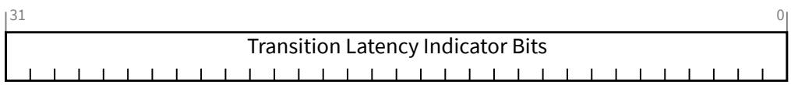

text_image

31
Transition Latency Indicator Bits
0

Figure 7-284 DPA Latency Indicator Register§

Table 7-253 DPA Latency Indicator Register§

<table><tr><td>Bit Location</td><td>Register Description</td><td>Attributes</td></tr><tr><td>31:0</td><td>Transition Latency Indicator Bits - Each bit indicates which Transition Latency Value is associated with the corresponding substate. A value of 0b indicates Transition Latency Value 0; a value of 1b indicates Transition Latency Value 1.Only bits [Substate_Max:0] are defined. Bits above Substate_Max are RsvdP.</td><td>RO</td></tr></table>

## 7.9.12.4 DPA Status Register (Offset 0Ch) §

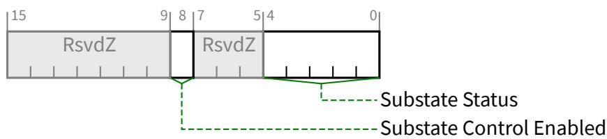

text_image

15
9 8 7 5 4 0
RsvdZ RsvdZ
Substate Status
Substate Control Enabled

Figure 7-285 DPA Status Register

§ Table 7-254 DPA Status Register

<table><tr><td>Bit Location</td><td>Register Description</td><td>Attributes</td></tr><tr><td>4:0</td><td>Substate Status- Indicates current substate for this Function.Default is 0 0000b.</td><td>RO</td></tr><tr><td>8</td><td>Substate Control Enabled- Used by software to disable the Substate Control field in the DPA Control Register. Hardware sets this bit following a Conventional Reset or FLR. Software clears this bit by writing a 1b to it. Software is unable to set this bit directly.When this bit is Set, the Substate Control field determines the current substate.When this bit is Clear, the Substate Control field has no effect on the current substate.Default value is 1b.</td><td>RW1C</td></tr></table>

## 7.9.12.5 DPA Control Register (Offset 0Eh)

text_image

15
RsvdP
5 4 0
Substate Control

Figure 7-286 DPA Control Register

§

§

Table 7-255 DPA Control Register

<table><tr><td>Bit Location</td><td>Register Description</td><td>Attributes</td></tr><tr><td>4:0</td><td>Substate Control- Used by software to configure the Function substate. Software writes the substate value in this field to initiate a substate transition.When the Substate Control Enabled bit in the DPA Status Register is Set, this field determines the Function substate.When the Substate Control Enabled bit in the DPA Status Register is Clear, this field has no effect on the Function substate.Default value is 0 0000b.</td><td>RW</td></tr></table>

## 7.9.12.6 DPA Power Allocation Array

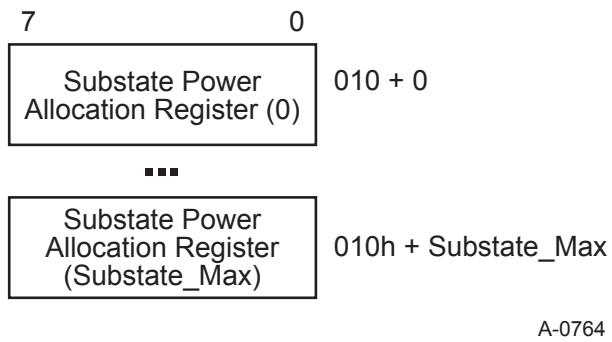

flowchart

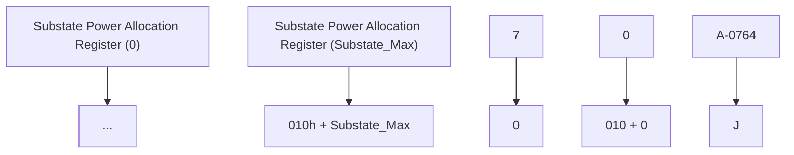
```mermaid
graph TD
  A["Substate Power Allocation Register (0)"] --> B["..."]
  C["Substate Power Allocation Register (Substate_Max)"] --> D["010h + Substate_Max"]
  E["7"] --> F["0"]
  G["0"] --> H["010 + 0"]
  I["A-0764"] --> J
```

Figure 7-287 DPA Power Allocation Array§

Each Substate Power Allocation register indicates the power allocation value for its associated substate. The number of Substate Power Allocation registers implemented must be equal to the number of substates supported by Function, which is Substate\_Max plus one.

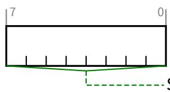

text_image

7
0
S

Substate Power Allocation  
Figure 7-288 Substate Power Allocation Register (0 to Substate\_Max)§

Table 7-256 Substate Power Allocation Register (0 to Substate\_Max)§

<table><tr><td>Bit Location</td><td>Register Description</td><td>Attributes</td></tr><tr><td>7:0</td><td>Substate Power Allocation - The value in this field is multiplied by the Power Allocation Scale to determine power allocation in Watts for the associated substate.</td><td>RO</td></tr></table>

## 7.9.13 TPH Requester Extended Capability §

The TPH Requester Extended Capability structure is required for all Functions that are capable of generating Request TLPs with TPH. For a Multi-Function Device, this capability must be present in each Function that is capable of generating Request TLPs with TPH.

The capability is optional for PFs and VFs. However, if a VF associated with a given PF contains the capability, all VFs associated with that PF must contain the capability.

For fields in the TPH Requester Capability Register (offset 04h), all VFs associated with a given PF must have the same values in all fields, but the PF's fields may have values different from those in its VFs.

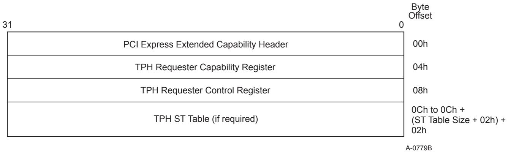

text_image

31
PCI Express Extended Capability Header
TPH Requester Capability Register
TPH Requester Control Register
TPH ST Table (if required)
Byte Offset
0
00h
04h
08h
0Ch to 0Ch +
(ST Table Size + 02h) +
02h
A-0779B

Figure 7-289 TPH Extended Capability Structure§

## 7.9.13.1 TPH Requester Extended Capability Header (Offset 00h)

§

text_image

31
20 19 16 15 0
Next Capability Offset
0017h
PCI Express Extended Capability ID
Capability Version

Figure 7-290 TPH Requester Extended Capability Header§

Table 7-257 TPH Requester Extended Capability Header§

<table><tr><td>Bit Location</td><td>Register Description</td><td>Attributes</td></tr><tr><td>15:0</td><td>PCI Express Extended Capability ID - This field is a PCI-SIG defined ID number that indicates the nature and format of the Extended Capability.PCI Express Extended Capability ID for the TPH Requester Extended Capability is 0017h.</td><td>RO</td></tr><tr><td>19:16</td><td>Capability Version - This field is a PCI-SIG defined version number that indicates the version of the Capability structure present.Must be 1h for this version of the specification.</td><td>RO</td></tr><tr><td>31:20</td><td>Next Capability Offset - This field contains the offset to the next PCI Express Extended Capability structure or 000h if no other items exist in the linked list of Capabilities.</td><td>RO</td></tr></table>

# 7.9.13.2 TPH Requester Capability Register (Offset 04h)

§

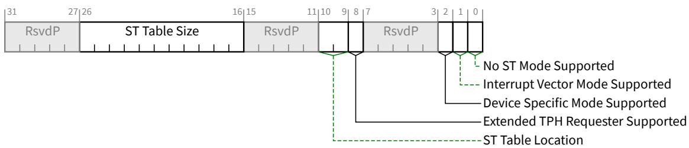

text_image

RsvdP
ST Table Size
RsvdP
No ST Mode Supported
Interrupt Vector Mode Supported
Device Specific Mode Supported
Extended TPH Requester Supported
ST Table Location

Figure 7-291 TPH Requester Capability Register§

Table 7-258 TPH Requester Capability Register§

<table><tr><td>Bit Location</td><td>Register Description</td><td>Attributes</td></tr><tr><td>0</td><td>No ST Mode Supported- If set indicates that the Function supports the No ST Mode of operation.This mode is required to be supported by all Functions that implement this Capability structure. This bit must have a value of 1b.</td><td>RO</td></tr><tr><td>1</td><td>Interrupt Vector Mode Supported- If set indicates that the Function supports the Interrupt Vector Mode of operation.</td><td>RO</td></tr><tr><td>2</td><td>Device Specific Mode Supported- If set indicates that the Function supports the Device Specific Mode of operation.</td><td>RO</td></tr><tr><td>8</td><td>Extended TPH Requester Supported- If Set indicates that the Function is capable of generating Requests with additional TPH information using the TPH TLP Prefix.See § Section 2.2.7.1.1 for additional details.</td><td>RO</td></tr><tr><td>10:9</td><td>ST Table Location- Value indicates if and where the ST Table is located. Defined Encodings are:00b ST Table is not present01b ST Table is located in the TPH Requester Extended Capability structure10b ST Table is located in the MSI-X Table (see § Section 7.7.2)11b ReservedA Function that only supports the No ST Mode of operation must have a value of 00b in this field.A Function may report a value of 10b only if it implements an MSI-X Capability.</td><td>RO</td></tr><tr><td>26:16</td><td>ST Table Size- Value indicates the maximum number of ST Table entries the Function may use. Software reads this field to determine the ST Table Size N, which is encoded as N-1. For example, a returned value of 000 0000 0011b indicates a table size of four entries.There is an upper limit of 64 entries when the ST Table is located in the TPH Requester Extended Capability structure.When the ST Table is located in the MSI-X Table, this value is limited by the size of the MSI-X Table.This field is only applicable for Functions that implement an ST Table as indicated by the ST Table Location field. Otherwise, the value in this field is undefined.</td><td>RO</td></tr></table>

## 7.9.13.3 TPH Requester Control Register (Offset 08h)

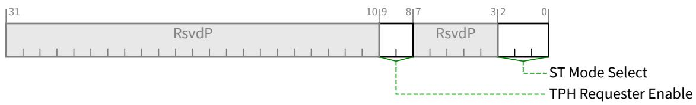

text_image

31
RsvdP
10 9 8 7
RsvdP
3 2 0
ST Mode Select
TPH Requester Enable

Figure 7-292 TPH Requester Control Register§

Table 7-259 TPH Requester Control Register§

<table><tr><td>Bit Location</td><td colspan="2">Register Description</td><td>Attributes</td></tr><tr><td rowspan="4">2:0</td><td colspan="2">ST Mode Select - selects the ST Mode of operation. Defined encodings are:</td><td rowspan="4">RW</td></tr><tr><td>000b</td><td>No ST Mode</td></tr><tr><td>001b</td><td>Interrupt Vector Mode</td></tr><tr><td>010b</td><td>Device Specific Mode</td></tr></table>

<table><tr><td>Bit Location</td><td>Register Description</td><td>Attributes</td></tr><tr><td></td><td>others reserved for future useFunctions that support only the No ST Mode of operation must hardwire this field to 000b.Function operation is undefined if software enables a mode of operation that does not correspond to a mode supported by the Function.The default value of this field is 000b.See § Section 6.17.3 for details on ST modes of operation.</td><td></td></tr><tr><td>9:8</td><td>TPH Requester Enable - Controls the ability to issue Request TLPs using either TPH or Extended TPH. Defined encodings are:00b Function operating as a Requester is not permitted to issue Requests with TPH or Extended TPH01b Function operating as a Requester is permitted to issue Requests with TPH and is not permitted to issue Requests with Extended TPH10b Reserved11b Function operating as a Requester is permitted to issue Requests with TPH and Extended TPHFunctions that advertise that they do not support Extended TPH are permitted to hardwire bit 9 of this field to 0b.The default value of this field is 00b.</td><td>RW</td></tr></table>

## 7.9.13.4 TPH ST Table (Starting from Offset 0Ch) §

<table><tr><td>ST Upper Entry (0)</td><td>ST Lower Entry (0)</td><td>0Ch + 0</td></tr><tr><td>ST Upper Entry (1)</td><td>ST Lower Entry (1)</td><td>0Ch + 02h</td></tr><tr><td>ST Upper Entry
(ST Table Size)</td><td>ST Lower Entry
(ST Table Size)</td><td>0Ch + ST Table Size*02h</td></tr></table>

Figure 7-293 TPH ST Table

§

The TPH ST Table must be implemented in the TPH Requester Extended Capability structure if the value of the ST Table Location field is 01b. For all other values, the ST Entry registers must not be implemented. Each implemented ST Entry is 16 bits. The number of ST Entry registers implemented must be equal to the number of ST Table entries supported by the Function, which is the value of the ST Table Size field plus one.

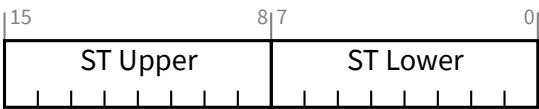

text_image

ST Upper
ST Lower

Figure 7-294 TPH ST Table Entry

§ Table 7-260 TPH ST Table Entry

<table><tr><td>Bit Location</td><td>Register Description</td><td>Attributes</td></tr><tr><td>7:0</td><td>ST Lower- This field contains the lower 8 bits of a Steering Tag.Default value of this field is 00h.</td><td>RW</td></tr><tr><td>15:8</td><td>ST Upper- If the Function’s Extended TPH Requester Supported bit is Set, then this field contains the upper 8 bits of a Steering Tag. Otherwise, this field is RsvdP.Default value of this field is 00h.</td><td>RW</td></tr></table>

## 7.9.14 DPC Extended Capability §

The Downstream Port Containment (DPC) Extended Capability is an optional normative capability that provides a mechanism for Downstream Ports to contain uncorrectable errors and enable software to recover from them. See § Section 6.2.11 . This capability may be implemented by a Root Port or a Switch Downstream Port. It is not applicable to any other Device/Port type.

If a Downstream Port implements the DPC Extended Capability, that Port must also be capable of reporting the DL\_Active state, and indicate so by Setting the Data Link Layer Link Active Reporting Capable bit in the Link Capabilities Register. See § Section 7.5.3.6 .

If a Downstream Port implements the DPC Extended Capability, it is strongly recommended for that Port to support ERR\_COR Subclass capability, and indicate so by Setting the ERR\_COR Subclass Capable bit in the Device Capabilities Register. See § Section 7.5.3.3 .

The various RP PIO registers must be implemented only by Root Ports that support RP Extensions for DPC, as indicated by the RP Extensions for DPC bit in the DPC Capability Register.

<table><tr><td colspan="2">PCI Express Extended Capability Header</td></tr><tr><td>DPC Control Register</td><td>DPC Capability Register</td></tr><tr><td>DPC Error Source ID Register</td><td>DPC Status Register</td></tr><tr><td colspan="2">RP PIO Status Register</td></tr><tr><td colspan="2">RP PIO Mask ID Register</td></tr><tr><td colspan="2">RP PIO Severity Register</td></tr><tr><td colspan="2">RP PIO SysError Register</td></tr><tr><td colspan="2">RP PIO Exception Register</td></tr><tr><td colspan="2">RP PIO Header Log Register</td></tr><tr><td colspan="2">RP PIO ImpSpec Log Register (Optional)</td></tr><tr><td colspan="2">RP PIO TLP Prefix Log Register (Optional) (Variable Size)</td></tr><tr><td colspan="2">RP PIO Severity Register</td></tr><tr><td colspan="2">RP PIO SysError Register</td></tr><tr><td colspan="2">RP PIO Exception Register</td></tr><tr><td colspan="2">RP PIO Header Log Register DW1-4</td></tr><tr><td colspan="2">RP PIO ImpSpec Log Register (Optional)</td></tr><tr><td colspan="2">Header Log Register DW5-14 (text defines implementation requirements)</td></tr></table>

Figure 7-295 DPC Extended Capability – Non-Flit Mode §

Figure 7-296 DPC Ext § ended Capability – Flit Mode

## 7.9.14.1 DPC Extended Capability Header (Offset 00h)

text_image

31 20 19 16 15 0
Next Capability Offset 001Dh
PCI Express Extended Capability ID
Capability Version

Figure 7-297 DPC Extended Capability Header§

Table 7-261 DPC Extended Capability Header§

<table><tr><td>Bit Location</td><td>Register Description</td><td>Attributes</td></tr><tr><td>15:0</td><td>PCI Express Extended Capability ID - This field is a PCI-SIG defined ID number that indicates the nature and format of the extended capability.PCI Express Extended Capability ID for the DPC Extended Capability is 001Dh.</td><td>RO</td></tr><tr><td>19:16</td><td>Capability Version - This field is a PCI-SIG defined version number that indicates the version of the capability structure present.Must be 1h for this version of the specification.</td><td>RO</td></tr><tr><td>31:20</td><td>Next Capability Offset - This field contains the offset to the next PCI Express Extended Capability structure or 000h if no other items exist in the linked list of capabilities.</td><td>RO</td></tr></table>

## 7.9.14.2 DPC Capability Register (Offset 04h)

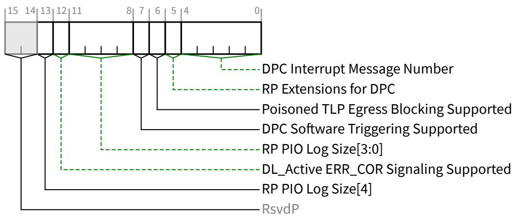

line chart

| Event | Value |
| --- | --- |
| DPC Interrupt Message Number | 15 |
| RP Extensions for DPC | 14 |
| Poisoned TLP Egress Blocking Supported | 13 |
| DPC Software Triggering Supported | 12 |
| RP PIO Log Size[3:0] | 8 |
| DL_Active ERR_COR Signaling Supported | 7 |
| RP PIO Log Size[4] | 6 |
| RsvdP | 4 |

  
Figure 7-298 DPC Capability Register

§ Table 7-262 DPC Capability Register

<table><tr><td>Bit Location</td><td>Register Description</td><td>Attributes</td></tr><tr><td>4:0</td><td>DPC Interrupt Message Number- This field indicates which MSI/MSI-X vector is used for the interrupt message generated in association with the DPC Capability structure.For MSI, the value in this field indicates the offset between the base Message Data and the interrupt message that is generated. Hardware is required to update this field so that it is correct if the number of MSI Messages assigned to the Function changes when software writes to the Multiple Message Enable field in the Message Control Register for MSI.For MSI-X, the value in this field indicates which MSI-X Table entry is used to generate the interrupt message. The entry must be one of the first 32 entries even if the Function implements more than 32 entries. For a given MSI-X implementation, the entry must remain constant.If both MSI and MSI-X are implemented, they are permitted to use different vectors, though software is permitted to enable only one mechanism at a time. If MSI-X is enabled, the value in this field must indicate the vector for MSI-X. If MSI is enabled or neither is enabled, the value in this field must indicate the vector for MSI. If software enables both MSI and MSI-X at the same time, the value in this field is undefined.</td><td>RO</td></tr><tr><td>5</td><td>RP Extensions for DPC- If Set, this bit indicates that a Root Port supports a defined set of DPC Extensions that are specific to Root Ports. Switch Downstream Ports must not Set this bit.</td><td>RO</td></tr><tr><td>6</td><td>Poisoned TLP Egress Blocking Supported- If Set, this bit indicates that the Root Port or Switch Downstream Port supports the ability to block the transmission of a poisoned TLP from its Egress Port. Root Ports that support RP Extensions for DPC must Set this bit.</td><td>RO</td></tr><tr><td>7</td><td>DPC Software Triggering Supported- If Set, this bit indicates that a Root Port or Switch Downstream Port supports the ability for software to trigger DPC. Root Ports that support RP Extensions for DPC must Set this bit.</td><td>RO</td></tr><tr><td>11:8</td><td>RP PIO Log Size[3:0]- This field indicates how many DWORDs are allocated for the RP PIO log registers, comprised by the RP PIO Header Log, the RP PIO ImpSpec Log, and RP PIO TLP Prefix Log.If the Root Port does not support RP Extensions for DPC, the value of this field must be Zero.If the Root Port supports RP Extensions for DPC but does not support Flit Mode, the value of this field must be 4 or greater.If the Root Port supports both RP Extensions for DPC and Flit Mode, see § Section 6.2.11.3 for requirements.See § Section 7.9.14.11, § Section 7.9.14.12, and § Section 7.9.14.13.</td><td>RO</td></tr><tr><td>12</td><td>DL_Active ERR_COR Signaling Supported- If Set, this bit indicates that the Root Port or Switch Downstream Port supports the ability to signal with ERR_COR when the Link transitions to the DL_Active state. Root Ports that support RP Extensions for DPC must Set this bit.</td><td>RO</td></tr><tr><td>13</td><td>RP PIO Log Size[4]- This bit is an extension of RP PIO Log Size[3:0] for use in Flit Mode. If Flit Mode is not supported, this bit is RsvdP.</td><td>RO/RsvdP</td></tr></table>

## 7.9.14.3 DPC Control Register (Offset 06h)

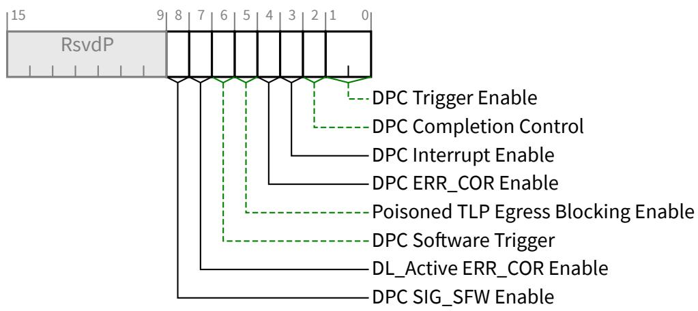

flowchart

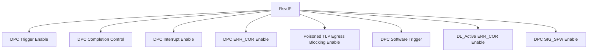
```mermaid
graph TD
  A["RsvdP"] --> B["DPC Trigger Enable"]
  A --> C["DPC Completion Control"]
  A --> D["DPC Interrupt Enable"]
  A --> E["DPC ERR_COR Enable"]
  A --> F["Poisoned TLP Egress Blocking Enable"]
  A --> G["DPC Software Trigger"]
  A --> H["DL_Active ERR_COR Enable"]
  A --> I["DPC SIG_SFW Enable"]
```

  
Figure 7-299 DPC Control Register

Table 7-263 DPC Control Register

<table><tr><td>Bit Location</td><td>Register Description</td><td>Attributes</td></tr><tr><td>1:0</td><td>DPC Trigger Enable- This field enables DPC and controls the conditions that cause DPC to be triggered. Defined encodings are:00b DPC is disabled01b DPC is enabled and is triggered when the Downstream Port detects an unmasked uncorrectable error or when the Downstream Port receives an ERR_FATAL Message10b DPC is enabled and is triggered when the Downstream Port detects an unmasked uncorrectable error or when the Downstream Port receives an ERR_NONFATAL or ERR_FATAL Message11b ReservedDefault value of this field is 00b.</td><td>RW</td></tr><tr><td>2</td><td>DPC Completion Control- This bit controls the Completion Status for Completions formed during DPC.See § Section 2.9.3 .Defined encodings are:0b Completer Abort (CA) Completion Status1b Unsupported Request (UR) Completion StatusDefault value of this bit is 0b.</td><td>RW</td></tr><tr><td>3</td><td>DPC Interrupt Enable- When Set, this bit enables the generation of an interrupt to indicate that DPC has been triggered. See § Section 6.2.11.1 .Default value of this bit is 0b.</td><td>RW</td></tr><tr><td>4</td><td>DPC ERR_COR Enable- When Set, this bit enables the sending of an ERR_COR Message to indicate that DPC has been triggered. See § Section 6.2.11.2 .Default value of this bit is 0b.</td><td>RW</td></tr><tr><td>5</td><td>Poisoned TLP Egress Blocking Enable- This bit must be RW if the Poisoned TLP Egress Blocking Supported bit is Set; otherwise, it is permitted to be hardwired to 0b. Software must not Set this bit unless the Poisoned TLP Egress Blocking Supported bit is Set.When Set, this bit enables the associated Egress Port to block the transmission of poisoned TLPs. See § Section 2.7.2.1.Default value of this bit is 0b.</td><td>RW/RO</td></tr><tr><td>6</td><td>DPC Software Trigger- This bit must be RW if the DPC Software Triggering Supported bit is Set; otherwise, it is permitted to be hardwired to 0b.If DPC is enabled and the DPC Trigger Status bit is Clear, when software writes 1b to this bit, DPC is triggered. Otherwise, software writing a 1b to this bit has no effect.It is permitted to write 1b to this bit while simultaneously writing updated values to other fields in this register, notably the DPC Trigger Enable field. For this case, the DPC Software Trigger semantics are based on the updated value of the DPC Trigger Enable field.This bit always returns 0b when read.</td><td>RW/RO</td></tr><tr><td>7</td><td>DL_Active ERR_COR Enable- This bit must be RW if the DL_Active ERR_COR Signaling Supported bit is Set; otherwise, it is permitted to be hardwired to 0b. Software must not Set this bit unless the DL_Active ERR_COR Signaling Supported bit is Set.When Set, this bit enables the associated Downstream Port to signal with ERR_COR when the Link transitions to the DL_Active state. See § Section 6.2.11.5.Default value of this bit is 0b.</td><td>RW/RO</td></tr><tr><td>8</td><td>DPC SIG_SFW Enable- This bit must be implemented if the ERR_COR Subclass Capable bit in the Device Capabilities Register is Set; otherwise, it is permitted to be hardwired to 0b. If the ERR_COR Subclass Capable bit is Clear and software Sets this bit, the behavior is undefined.When Set, this bit enables sending an ERR_COR Message to indicate a DPC event that's been enabled for ERR_COR signaling. See § Section 6.2.11.2 and § Section 6.2.11.5. This is an additional and alternative way to enable overall DPC ERR_COR signaling beyond the Correctable Error Reporting Enable bit in the Device Control Register. This bit does not affect a Function's ability to send ERR_COR Messages other than the ECS SIG_SFW subclass.Default value of this bit is 0b.</td><td>RW/RO</td></tr></table>

## 7.9.14.4 DPC Status Register (Offset 08h)

§

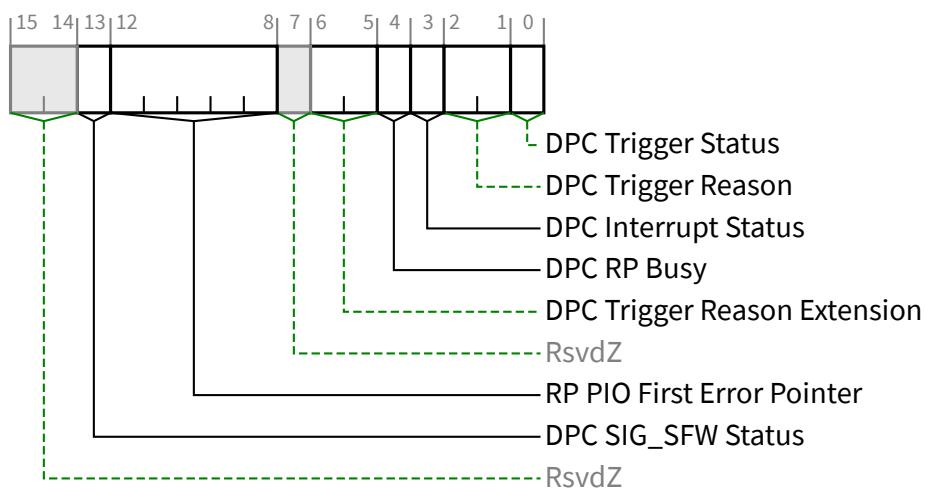

flowchart

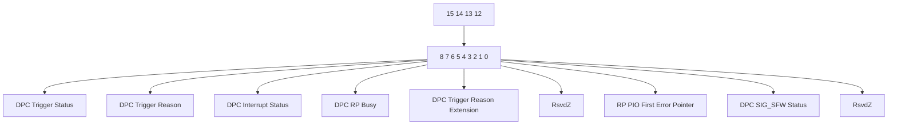
```mermaid
graph TD
  A["15 14 13 12"] --> B["8 7 6 5 4 3 2 1 0"]
  B --> C["DPC Trigger Status"]
  B --> D["DPC Trigger Reason"]
  B --> E["DPC Interrupt Status"]
  B --> F["DPC RP Busy"]
  B --> G["DPC Trigger Reason Extension"]
  B --> H["RsvdZ"]
  B --> I["RP PIO First Error Pointer"]
  B --> J["DPC SIG_SFW Status"]
  B --> K["RsvdZ"]
```

Figure 7-300 DPC Status Register

§

§

Table 7-264 DPC Status Register

<table><tr><td>Bit Location</td><td>Register Description</td><td>Attributes</td></tr><tr><td>0</td><td>DPC Trigger Status- When Set, this bit indicates that DPC has been triggered, and by definition the Port is “in DPC”. DPC is event triggered.While this bit is Set, hardware must direct the LTSSM to the Disabled State. This bit must be cleared before the LTSSM can be released from the Disabled State, after which the Port is no longer in DPC, and the LTSSM must transition to the Detect State. See § Section 6.2.11 for requirements on how long software must leave the Downstream Port in DPC. Once these requirements are met, software is permitted to clear this bit regardless of the state of other status bits associated with the triggering event.After clearing this bit, software must honor timing requirements defined in § Section 6.6.1 with respect to the first Configuration Read following a Conventional Reset.Default value of this bit is 0b.</td><td>RW1CS</td></tr><tr><td>2:1</td><td>DPC Trigger Reason- This field indicates why DPC has been triggered. Defined encodings are:00b DPC was triggered due to an unmasked uncorrectable error01b DPC was triggered due to receiving an ERR_NONFATAL10b DPC was triggered due to receiving an ERR_FATAL11b DPC was triggered due to a reason that is indicated by the DPC Trigger Reason Extension field.This field is valid only when the DPC Trigger Status bit is Set; otherwise the value of this field is undefined.</td><td>ROS</td></tr><tr><td>3</td><td>DPC Interrupt Status- This bit is Set if DPC is triggered while the DPC Interrupt Enable bit is Set. This may cause the generation of an interrupt. See § Section 6.2.11.1.Default value of this bit is 0b.</td><td>RW1CS</td></tr><tr><td>4</td><td>DPC RP Busy- When the DPC Trigger Status bit is Set and this bit is Set, the Root Port is busy with internal activity that must complete before software is permitted to Clear the DPC Trigger Status bit. If software Clears the DPC Trigger Status bit while this bit is Set, the behavior is undefined.This field is valid only when the DPC Trigger Status bit is Set; otherwise the value of this field is undefined.This bit is applicable only for Root Ports that support RP Extensions for DPC, and is Reserved for Switch Downstream Ports.Default value of this bit is undefined.</td><td>RO/RsvdZ</td></tr><tr><td>6:5</td><td>DPC Trigger Reason Extension- This field serves as an extension to the DPC Trigger Reason field. When that field is valid and has a value of 11b, this field indicates why DPC has been triggered. Defined encodings are:00b DPC was triggered due to an RP PIO error01b DPC was triggered due to the DPC Software Trigger bit10b Reserved11b ReservedThis field is valid only when the DPC Trigger Status bit is Set and the value of the DPC Trigger Reason field is 11b; otherwise the value of this field is undefined.</td><td>ROS</td></tr><tr><td>12:8</td><td>RP PIO First Error Pointer- The value of this field identifies a bit position in the RP PIO Status Register, and this field is considered valid when that bit is Set. When this field is valid, and software writes a 1b to the indicated RP PIO Status bit (thus clearing it), this field must revert to its default value.This field is applicable only for Root Ports that support RP Extensions for DPC, and otherwise is Reserved.If this field is not Reserved, its default value is 1 1111b, indicating a permanently Reserved RP PIO Status bit, thus guaranteeing that this field is not considered valid.</td><td>ROS/RsvdZ</td></tr><tr><td>13</td><td>DPC SIG_SFW Status- If the Function supports ERR_COR Subclass capability, this bit must be implemented; otherwise, it must be hardwired to 0b. If implemented, this bit is Set when a SIG_SFW ERR_COR Message is sent to signal a DPC event. See § Section 6.2.11.2 and § Section 6.2.11.5. Default value of this bit is 0b</td><td>RW1CS/RsvdZ</td></tr></table>

## 7.9.14.5 DPC Error Source ID Register (Offset 0Ah) §

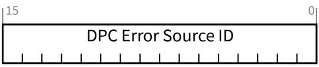

text_image

15
DPC Error Source ID
0

Figure 7-301 DPC Error Source ID Register§

§ Table 7-265 DPC Error Source ID Register

<table><tr><td>Bit Location</td><td>Register Description</td><td>Attributes</td></tr><tr><td>15:0</td><td>DPC Error Source ID - When the DPC Trigger Reason field indicates that DPC was triggered due to the reception of an ERR_NONFATAL or ERR_FATAL, this register contains the Requester ID of the received Message. Otherwise, the value of this register is undefined.</td><td>ROS</td></tr></table>

## 7.9.14.6 RP PIO Status Register (Offset 0Ch) §

This register is present only in Root Ports that support RP Extensions for DPC. See § Section 6.2.11.3 .

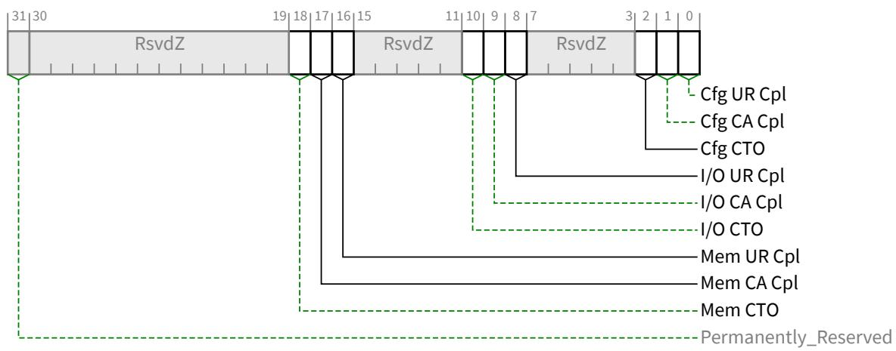

text_image

31 30
RsvdZ 19 18 17 16 15 14 13 12 11 10 9 8 7 6 5 4 3 2 1 0
Cfg UR Cpl
Cfg CA Cpl
Cfg CTO
I/O UR Cpl
I/O CA Cpl
I/O CTO
Mem UR Cpl
Mem CA Cpl
Mem CTO
Permanently_Reserved

§ Figure 7-302 RP PIO Status Register

§ Table 7-266 RP PIO Status Register

<table><tr><td>Bit Location</td><td>Register Description</td><td>Attributes</td><td>Default</td></tr><tr><td>0</td><td>Cfg UR Cpl - Configuration Request received UR Completion</td><td>RW1CS</td><td>0b</td></tr><tr><td>1</td><td>Cfg CA Cpl - Configuration Request received CA Completion</td><td>RW1CS</td><td>0b</td></tr><tr><td>2</td><td>Cfg CTO - Configuration Request Completion Timeout</td><td>RW1CS</td><td>0b</td></tr><tr><td>8</td><td>I/O UR Cpl - I/O Request received UR Completion</td><td>RW1CS</td><td>0b</td></tr><tr><td>9</td><td>I/O CA Cpl - I/O Request received CA Completion</td><td>RW1CS</td><td>0b</td></tr><tr><td>10</td><td>I/O CTO - I/O Request Completion Timeout</td><td>RW1CS</td><td>0b</td></tr><tr><td>16</td><td>Mem UR Cpl - Memory Request received UR Completion</td><td>RW1CS</td><td>0b</td></tr><tr><td>17</td><td>Mem CA Cpl - Memory Request received CA Completion</td><td>RW1CS</td><td>0b</td></tr><tr><td>18</td><td>Mem CTO - Memory Request Completion Timeout</td><td>RW1CS</td><td>0b</td></tr><tr><td>31</td><td>Permanently_Reserved Permanently_Reserved, since the default RP PIO First Error Pointer field value points to it.</td><td>RsvdZ</td><td>0b</td></tr></table>

## 7.9.14.7 RP PIO Mask Register (Offset 10h) §

This register is present only in Root Ports that support RP Extensions for DPC. See § Section 6.2.11.3 .

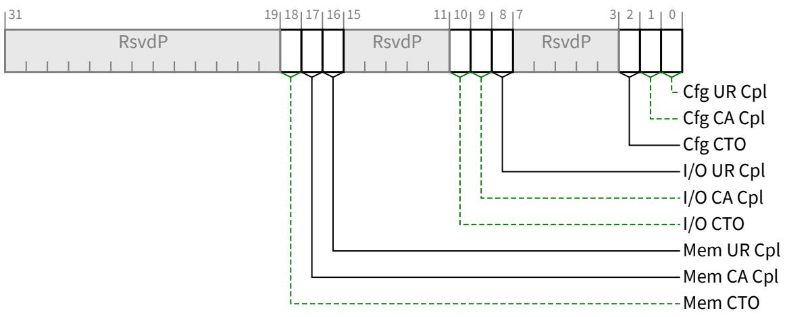

text_image

31
RsvdP 19 18 17 16 15 11 10 9 8 7 3 2 1 0
RsvdP RsvdP RsvdP
Cfg UR Cpl
Cfg CA Cpl
Cfg CTO
I/O UR Cpl
I/O CA Cpl
I/O CTO
Mem UR Cpl
Mem CA Cpl
Mem CTO

§  
Figure 7-303 RP PIO Mask Register

§  
Table 7-267 RP PIO Mask Register

<table><tr><td>Bit Location</td><td>Register Description</td><td>Attributes</td><td>Default</td></tr><tr><td>0</td><td>Cfg UR Cpl - Configuration Request received UR Completion</td><td>RWS</td><td>1b</td></tr><tr><td>1</td><td>Cfg CA Cpl - Configuration Request received CA Completion</td><td>RWS</td><td>1b</td></tr><tr><td>2</td><td>Cfg CTO - Configuration Request Completion Timeout</td><td>RWS</td><td>1b</td></tr><tr><td>8</td><td>I/O UR Cpl - I/O Request received UR Completion</td><td>RWS</td><td>1b</td></tr><tr><td>9</td><td>I/O CA Cpl - I/O Request received CA Completion</td><td>RWS</td><td>1b</td></tr><tr><td>10</td><td>I/O CTO - I/O Request Completion Timeout</td><td>RWS</td><td>1b</td></tr><tr><td>16</td><td>Mem UR Cpl - Memory Request received UR Completion</td><td>RWS</td><td>1b</td></tr><tr><td>17</td><td>Mem CA Cpl - Memory Request received CA Completion</td><td>RWS</td><td>1b</td></tr><tr><td>18</td><td>Mem CTO - Memory Request Completion Timeout</td><td>RWS</td><td>1b</td></tr></table>

## 7.9.14.8 RP PIO Severity Register (Offset 14h) §

This register is present only in Root Ports that support RP Extensions for DPC. See § Section 6.2.11.3 .

text_image

31
RsvdP 19 18 17 16 15 11 10 9 8 7 3 2 1 0
RsvdP RsvdP RsvdP
Cfg UR Cpl
Cfg CA Cpl
Cfg CTO
I/O UR Cpl
I/O CA Cpl
I/O CTO
Mem UR Cpl
Mem CA Cpl
Mem CTO

§ Figure 7-304 RP PIO Severity Register

§ Table 7-268 RP PIO Severity Register

<table><tr><td>Bit Location</td><td>Register Description</td><td>Attributes</td><td>Default</td></tr><tr><td>0</td><td>Cfg UR Cpl - Configuration Request received UR Completion</td><td>RWS</td><td>0b</td></tr><tr><td>1</td><td>Cfg CA Cpl - Configuration Request received CA Completion</td><td>RWS</td><td>0b</td></tr><tr><td>2</td><td>Cfg CTO - Configuration Request Completion Timeout</td><td>RWS</td><td>0b</td></tr><tr><td>8</td><td>I/O UR Cpl - I/O Request received UR Completion</td><td>RWS</td><td>0b</td></tr><tr><td>9</td><td>I/O CA Cpl - I/O Request received CA Completion</td><td>RWS</td><td>0b</td></tr><tr><td>10</td><td>I/O CTO - I/O Request Completion Timeout</td><td>RWS</td><td>0b</td></tr><tr><td>16</td><td>Mem UR Cpl - Memory Request received UR Completion</td><td>RWS</td><td>0b</td></tr><tr><td>17</td><td>Mem CA Cpl - Memory Request received CA Completion</td><td>RWS</td><td>0b</td></tr><tr><td>18</td><td>Mem CTO - Memory Request Completion Timeout</td><td>RWS</td><td>0b</td></tr></table>

## 7.9.14.9 RP PIO SysError Register (Offset 18h) §

This register is present only in Root Ports that support RP Extensions for DPC. See § Section 6.2.11.3 .

text_image

31
RsvdP 19 18 17 16 15 11 10 9 8 7 3 2 1 0
RsvdP RsvdP RsvdP
Cfg UR Cpl
Cfg CA Cpl
Cfg CTO
I/O UR Cpl
I/O CA Cpl
I/O CTO
Mem UR Cpl
Mem CA Cpl
Mem CTO

§ Figure 7-305 RP PIO SysError Register

§ Table 7-269 RP PIO SysError Register

<table><tr><td>Bit Location</td><td>Register Description</td><td>Attributes</td><td>Default</td></tr><tr><td>0</td><td>Cfg UR Cpl - Configuration Request received UR Completion</td><td>RWS</td><td>0b</td></tr><tr><td>1</td><td>Cfg CA Cpl - Configuration Request received CA Completion</td><td>RWS</td><td>0b</td></tr><tr><td>2</td><td>Cfg CTO - Configuration Request Completion Timeout</td><td>RWS</td><td>0b</td></tr><tr><td>8</td><td>I/O UR Cpl - I/O Request received UR Completion</td><td>RWS</td><td>0b</td></tr><tr><td>9</td><td>I/O CA Cpl - I/O Request received CA Completion</td><td>RWS</td><td>0b</td></tr><tr><td>10</td><td>I/O CTO - I/O Request Completion Timeout</td><td>RWS</td><td>0b</td></tr><tr><td>16</td><td>Mem UR Cpl - Memory Request received UR Completion</td><td>RWS</td><td>0b</td></tr><tr><td>17</td><td>Mem CA Cpl - Memory Request received CA Completion</td><td>RWS</td><td>0b</td></tr><tr><td>18</td><td>Mem CTO - Memory Request Completion Timeout</td><td>RWS</td><td>0b</td></tr></table>

## 7.9.14.10 RP PIO Exception Register (Offset 1Ch) §

This register is present only in Root Ports that support RP Extensions for DPC. See § Section 6.2.11.3 .

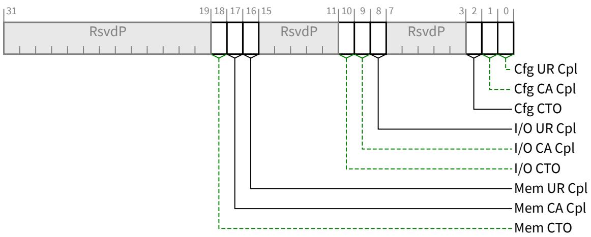

text_image

31
RsvdP 19 18 17 16 15 11 10 9 8 7 3 2 1 0
RsvdP RsvdP RsvdP
Cfg UR Cpl
Cfg CA Cpl
Cfg CTO
I/O UR Cpl
I/O CA Cpl
I/O CTO
Mem UR Cpl
Mem CA Cpl
Mem CTO

Figure 7-306 RP PIO Exception Register§

§ Table 7-270 RP PIO Exception Register

<table><tr><td>Bit Location</td><td>Register Description</td><td>Attributes</td><td>Default</td></tr><tr><td>0</td><td>Cfg UR Cpl - Configuration Request received UR Completion</td><td>RWS</td><td>0b</td></tr><tr><td>1</td><td>Cfg CA Cpl - Configuration Request received CA Completion</td><td>RWS</td><td>0b</td></tr><tr><td>2</td><td>Cfg CTO - Configuration Request Completion Timeout</td><td>RWS</td><td>0b</td></tr><tr><td>8</td><td>I/O UR Cpl - I/O Request received UR Completion</td><td>RWS</td><td>0b</td></tr><tr><td>9</td><td>I/O CA Cpl - I/O Request received CA Completion</td><td>RWS</td><td>0b</td></tr><tr><td>10</td><td>I/O CTO - I/O Request Completion Timeout</td><td>RWS</td><td>0b</td></tr><tr><td>16</td><td>Mem UR Cpl - Memory Request received UR Completion</td><td>RWS</td><td>0b</td></tr><tr><td>17</td><td>Mem CA Cpl - Memory Request received CA Completion</td><td>RWS</td><td>0b</td></tr><tr><td>18</td><td>Mem CTO - Memory Request Completion Timeout</td><td>RWS</td><td>0b</td></tr></table>

## 7.9.14.11 RP PIO Header Log Register (Offset 20h) §

This register is implemented only in Root Ports that support RP Extensions for DPC. The RP PIO Header Log Register contains the header from the Request TLP associated with a recorded RP PIO error. Refer to § Section 6.2.11.3 for further details. In Non-Flit Mode, this register is 16 bytes. In Flit Mode, this register is between 52 and 76 bytes and is split into two portions at Offset 20h and Offset 34h. In both Flit Mode and Non-Flit Mode, this register is formatted identically to the Header Log register in AER. See § Section 7.8.4.8 .

<table><tr><td>31</td><td>24</td><td>23</td><td>16</td><td>15</td><td>8</td><td>7</td><td>0</td></tr><tr><td colspan="3"></td><td colspan="5">RP PIO Header Log Register (1st DW)</td></tr><tr><td colspan="2">Byte 0</td><td colspan="2">Byte 1</td><td colspan="2">Byte 2</td><td colspan="2">Byte 3</td></tr><tr><td colspan="3"></td><td colspan="5">RP PIO Header Log Register (2nd DW)</td></tr><tr><td colspan="2">Byte 0</td><td colspan="2">Byte 1</td><td colspan="2">Byte 2</td><td colspan="2">Byte 3</td></tr><tr><td colspan="3"></td><td colspan="5">RP PIO Header Log Register (3rd DW)</td></tr><tr><td colspan="2">Byte 0</td><td colspan="2">Byte 1</td><td colspan="2">Byte 2</td><td colspan="2">Byte 3</td></tr><tr><td colspan="3"></td><td colspan="5">RP PIO Header Log Register (4th DW)</td></tr><tr><td colspan="2">Byte 0</td><td colspan="2">Byte 1</td><td colspan="2">Byte 2</td><td colspan="2">Byte 3</td></tr></table>

RP-PIO-Header-Log

Figure 7-307 RP PIO Header Log Register§  
§ Table 7-271 RP PIO Header Log Register

<table><tr><td>Bit Location</td><td>Register Description</td><td>Attributes</td><td>Default</td></tr><tr><td>127:0</td><td>TLP Header - of the TLP associated with the error</td><td>ROS</td><td>0</td></tr></table>

## 7.9.14.12 RP PIO ImpSpec Log Register (Offset 30h) §

This register is permitted to be implemented only in Root Ports that support RP Extensions for DPC. The RP PIO ImpSpec Log Register, if implemented, contains implementation specific information associated with the recorded error, e.g., indicating the source of the Request TLP. Space is allocated for this register if the value of the RP PIO Log Size field is 5 or greater. If space is allocated for the register, but the register is not implemented, the bits must be hardwired to 0b.

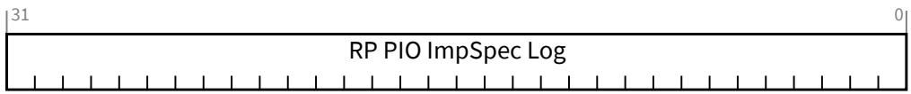

text_image

31
RP PIO ImpSpec Log
0

Figure 7-308 RP PIO ImpSpec Log Register§

Table 7-272 RP PIO ImpSpec Log Register§

<table><tr><td>Bit Location</td><td>Register Description</td><td>Attributes</td><td>Default</td></tr><tr><td>31:0</td><td>RP PIO ImpSpec Log</td><td>ROS</td><td>0</td></tr></table>

## 7.9.14.13 RP PIO TLP Prefix Log Register (Offset 34h) §

This register is permitted to be implemented only in Root Ports that support RP Extensions for DPC.

In Non-Flit Mode, the RP PIO TLP Prefix Log Register contains any End-End TLP Prefixes from the TLP corresponding to a recorded RP PIO error. Refer to § Section 6.2.11.3 for further details.

In Flit Mode, the RP PIO TLP Prefix Log Register does not exist and this configration space is a contination of the RP PIO TLP Header Log Register.

If the Root Port supports tracking Non-Posted Requests that contain End-End TLP Prefixes, this register must be implemented, and must be of sufficient size to record the maximum number of End-End TLP Prefixes for any tracked Request. See § Section 2.9.3 . The allocated size in DWORDs of the RP PIO TLP Prefix Log Register is the RP PIO Log Size minus 5 if the RP PIO Log Size is 9 or less, or 4 if the RP PIO Log Size is greater than 9. The implemented size of the TLP Prefix Log must be less than or equal to the Root Port’s Max End-End TLP Prefixes field value. For the case where the Root Port never transmits Non-Posted Requests containing End-End TLP Prefixes, the allocated and implemented size of the TLP Prefix Log is permitted to be 0. Any DWORDs allocated but not implemented must be hardwired to zero.

This register is formatted identically to the TLP Prefix Log register in AER, although this register’s allocated size is variable, whereas the register in AER is always 4 DWORDs. See § Section 7.8.4.12 . The First TLP Prefix Log register contains the first End-End TLP Prefix from the TLP, the Second TLP Prefix Log register contains the second End-End TLP Prefix, and so forth. If the TLP contains fewer TLP Prefixes than this register accommodates, any remaining TLP Prefix Log registers must contain zero.

<table><tr><td>31</td><td colspan="2">24 23</td><td colspan="2">16 15</td><td colspan="2">8 7</td><td>0</td></tr><tr><td></td><td></td><td colspan="3">First PIO TLP Prefix Log Register</td><td></td><td></td><td></td></tr><tr><td>Byte 0</td><td></td><td colspan="2">Byte 1</td><td>Byte 2</td><td></td><td>Byte 3</td><td></td></tr><tr><td></td><td></td><td colspan="3">Second PIO TLP Prefix Log Register</td><td></td><td></td><td></td></tr><tr><td>Byte 0</td><td></td><td colspan="2">Byte 1</td><td>Byte 2</td><td></td><td>Byte 3</td><td></td></tr><tr><td></td><td></td><td colspan="3">Third PIO TLP Prefix Log Register</td><td></td><td></td><td></td></tr><tr><td>Byte 0</td><td></td><td colspan="2">Byte 1</td><td>Byte 2</td><td></td><td>Byte 3</td><td></td></tr><tr><td></td><td></td><td colspan="3">Fourth PIO TLP Prefix Log Register</td><td></td><td></td><td></td></tr><tr><td>Byte 0</td><td></td><td colspan="2">Byte 1</td><td>Byte 2</td><td></td><td>Byte 3</td><td></td></tr></table>

RP-PIO-TLP-Prefix-Log

Figure 7-309 RP PIO TLP Prefix Log Register§  
Table 7-273 RP PIO TLP Prefix Log Register§

<table><tr><td>Bit Location</td><td>Register Description</td><td>Attributes</td><td>Default</td></tr><tr><td>127:0</td><td>RP PIO TLP Prefix Log</td><td>ROS</td><td>0</td></tr></table>

## 7.9.15 Precision Time Management Extended Capability (PTM Capability) §

The Precision Time Management Extended Capability is an optional Extended Capability for discovering and controlling the distribution of a PTM Hierarchy. For Root Complexes, this Capability is required in any Root Port, RCiEP, or RCRB that supports PTM. For Endpoints and Switch Upstream Ports that support PTM, this Capability is required in exactly one Function of the Upstream Port and that Capability controls the PTM behavior of all PTM capable Functions associated with that Upstream Port. For Switch Downstream Ports, PTM behavior is controlled by the same PTM Capability that controls the associated Switch Upstream Port. The PTM Capability is not permitted in Bridges, Switch Downstream Ports, and Root Complex Event Collectors.

For Switches, a single instance of this Capability controls behavior for the entire Switch. If the Upstream Port of the Switch is associated with an MFD, it is not required that the controlling Function be the Function corresponding to the Switch Upstream Port. For a given Switch, if this Capability is present, all Downstream Ports of the Switch must implement the requirements defined in § Section 6.21.3.2 .

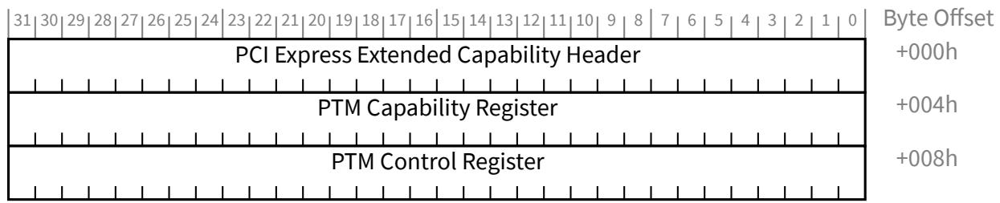

text_image

PCI Express Extended Capability Header
PTM Capability Register
PTM Control Register
Byte Offset
+000h
+004h
+008h

§ Figure 7-310 PTM Capability Structure

## 7.9.15.1 PTM Extended Capability Header (Offset 00h) §

text_image

31 20 19 16 15 0
Next Capability Offset 001Fh
PCI Express Extended Capability ID
Capability Version

Figure 7-311 PTM Extended Capability Header§

Table 7-274 PTM Extended Capability Header§

<table><tr><td>Bit Location</td><td>Register Description</td><td>Attributes</td></tr><tr><td>15:0</td><td>PCI Express Extended Capability ID - This field is a PCI-SIG defined ID number that indicates the nature and format of the Extended Capability.PCI Express Extended Capability ID for the Precision Time Measurement Capability is 001Fh.</td><td>RO</td></tr><tr><td>19:16</td><td>Capability Version - This field is a PCI-SIG defined version number that indicates the version of the Capability structure present.Must be 1h for this version of the specification.</td><td>RO</td></tr><tr><td>31:20</td><td>Next Capability Offset - This field contains the offset to the next PCI Express Extended Capability structure or 000h if no other items exist in the linked list of Capabilities.</td><td>RO</td></tr></table>

## 7.9.15.2 PTM Capability Register (Offset 04h) §

This register describes a Function’s support for Precision Time Measurement. Not all fields within this register apply to all Functions capable of implementing PTM.

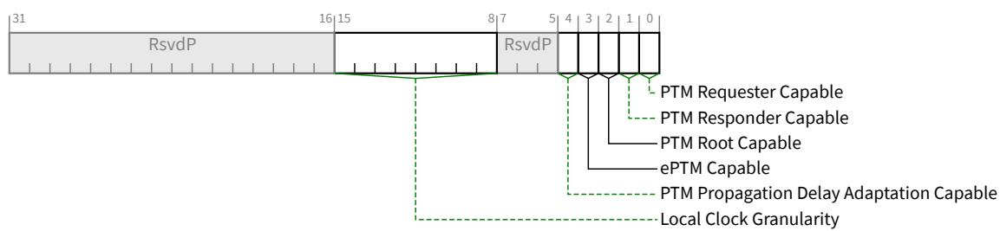

text_image

31
RsvdP
16 15
8 7
5 4 3 2 1 0
RsvdP
PTM Requester Capable
PTM Responder Capable
PTM Root Capable
ePTM Capable
PTM Propagation Delay Adaptation Capable
Local Clock Granularity

§ Figure 7-312 PTM Capability Register

§ Table 7-275 PTM Capability Register

<table><tr><td>Bit Location</td><td>Register Description</td><td>Attributes</td></tr><tr><td>0</td><td>PTM Requester Capable- Indicates the Function implements the PTM Requester role (see § Section 6.21.3.1).Endpoints and RCIEPs are permitted to Set this bit to indicate that they implement the PTM Requester role.Switch Upstream Ports must Set this bit if the Switch contains one or more of the following:A Downstream Port that implements the PTM Responder role.An additional Function that implements the PTM Requester role.If a Device contains multiple Upstream Port Functions, the value of this bit must be consistent across all such Functions.</td><td>HwInit</td></tr><tr><td>1</td><td>PTM Responder Capable- Root Ports and RCRBs are permitted to, and Switches supporting PTM must, Set this bit to indicate they implement the PTM Responder role (see § Section 6.21.3.2).If PTM Root Capable is Set, then this bit must be Set.</td><td>HwInit</td></tr><tr><td>2</td><td>PTM Root Capable- Root Ports, RCRBs, and Switches are permitted to Set this bit if they are capable of being a source of PTM Master Time (see § Section 6.21.1).All other Functions must hardwire this bit to 0b.</td><td>HwInit</td></tr><tr><td>3</td><td>ePTM Capable- If Set, indicates that this device supports Enhanced Precision Time Management (ePTM). This bit MUST@FLIT be Set in all PTM Devices.</td><td>HwInit</td></tr><tr><td>4</td><td>PTM Propagation Delay Adaptation Capable- When Set, this field indicates the Port supports the PTM Propagation Delay Adaptation Capability, controlled via the PTM Propagation Delay Adaptation Interpretation B bit in the Link Control Register. For a Switch, when Set in the Upstream Port of the Switch, indicates that the Upstream Port and all Downstream Ports of the Switch support the PTM Propagation Delay Adaptation Capability, controlled per Port via the PTM Propagation Delay Adaptation Interpretation B bit in the Link Control Register of each Port.</td><td>HwInit</td></tr><tr><td>15:8</td><td>Local Clock Granularity- Encodings are:0000 0000b Time Source does not implement a local clock. It simply propagates timing information obtained from further Upstream in the PTM Hierarchy when responding to PTM Request messages.0000 0001b to 1111 1110b Indicates the period of this Time Source’s local clock in ns.1111 1111b Indicates the period of this Time Source’s local clock is greater than 254 ns.If the PTM Root Select bit is Set, this local clock is used to provide PTM Master Time. Otherwise, the Time Source uses this local clock to locally track PTM Master Time received from further Upstream within a PTM Hierarchy.This field is RsvdP if the PTM Root Capable bit is 0b.</td><td>HwInit/RsvdP</td></tr></table>

## 7.9.15.3 PTM Control Register (Offset 08h) §

This register controls a Function’s participation in the Precision Time Measurement mechanism. Not all fields within this register apply to all Functions capable of implementing PTM.

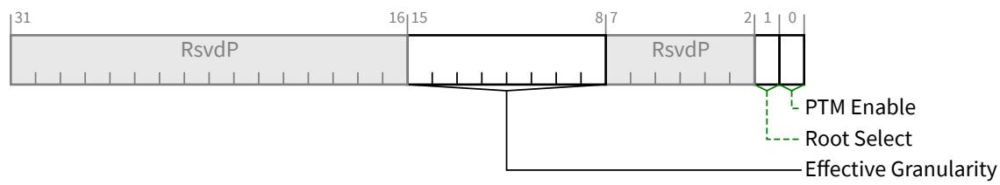

text_image

31
RsvdP 16 15 8 7 2 1 0
RsvdP
PTM Enable
Root Select
Effective Granularity

Figure 7-313 PTM Control Register

§ Table 7-276 PTM Control Register

<table><tr><td>Bit Location</td><td colspan="2">Register Description</td><td>Attributes</td></tr><tr><td>0</td><td colspan="2">PTM Enable- When Set, this Function is permitted to participate in the PTM mechanism according to its selected role(s) (see § Section 6.21.2).Default value is 0b.</td><td>RW</td></tr><tr><td>1</td><td colspan="2">Root Select- When Set, if the PTM Enable bit is also Set, this Time Source is the PTM Root.Within each PTM Hierarchy, it is recommended that system software select only the furthest Upstream Time Source to be the PTM Root.Default value is 0b.If the value of the PTM Root Capable bit is 0b, this bit is permitted to be hardwired to 0b.</td><td>RW/RO</td></tr><tr><td>15:8</td><td colspan="2">Effective Granularity- For Functions implementing the PTM Requester Role, this field provides information relating to the expected accuracy of the PTM clock, but does not otherwise affect the PTM mechanism.For Endpoints, system software must program this field to the value representing the maximum Local Clock Granularity reported by the PTM Root and all intervening PTM Time Sources.For RCiEPs, system software must set this field to the value reported in the Local Clock Granularity field by the associated PTM Time Source.Permitted values:0000 0000bUnknown PTM granularity - one or more Switches between this Function and the PTM Root reported a Local Clock Granularity value of 0000 0000b.0000 0001b to 1111 1110bIndicates the effective PTM granularity in ns.1111 1111b Indicates the effective PTM granularity is greater than 254 ns.Default value is 0000 0000b. If PTM Requester Capable is Clear, this field is permitted to be hardwired to 0000 0000b.</td><td>RW/RO</td></tr></table>

## 7.9.16 Readiness Time Reporting Extended Capability

§

The Readiness Time Reporting Extended Capability provides an optional mechanism for describing the time required for a Device or Function to become Configuration-Ready. In the indicated situations, software is permitted to issue Requests to the Device or Function after waiting for the time advertised in this capability and need not wait for the (longer) times required elsewhere.

Software is permitted to issue requests upon the earliest of:

• Receiving a Readiness Notifications message (see § Section 6.22 ).  
• Waiting the appropriate time as specified in this document or in applicable specifications including the [PCI] and the [PCI-PM].  
• Waiting the time indicated in the associated field of this capability.  
• Waiting the time defined by system software or firmware 170

Software is permitted to cache values from this capability and to use those cached values as long as the same device operating in the same manner has not changed.

This capability is permitted to be implemented in all Functions.

The capability is optional for PFs and VFs. However, if a VF associated with a given PF contains the capability, all VFs associated with that PF must contain the capability and report the same time values.

For VFs, see § Section 5.10.1 ). Other Functions must be Configuration-Ready if:

• The Immediate Readiness bit is Clear and at least Reset Time has elapsed after the completion of Conventional Reset

◦ If the Immediate Readiness bit is Set, Reset Time does not apply, and is Reserved

• The Function is associated with an Upstream Port and at least DL\_Up Time has elapsed after the Downstream Port above that Function reported Data Link Layer Link Active (see § Section 7.5.3.8 ).  
• The Function supports Function Level Reset and at least FLR Time has elapsed after that Function was issued a Function Level Reset.  
• Immediate\_Readiness\_on\_Return\_to\_D0 is Clear and at least D3Hot to D0 Time has elapsed after that Function was directed to the D0 state from D3Hot.

◦ If the Immediate\_Readiness\_on\_Return\_to\_D0 bit is Set, D3Hot to D0 Time does not apply, and is Reserved

When Immediate\_Readiness\_on\_Return\_to\_D0 is Clear, a Function must be Configuration-Ready when at least D3Hot to D0 Time has elapsed after the Function was directed to the D0 state from D3Hot. In addition, the Function must be in either the D0uninitialized or D0active state, depending on the value of the No\_Soft\_Reset bit.

If the above conditions do not apply, Function behavior is not determined by the Readiness Time Reporting Extended Capability, and the Function must respond as defined elsewhere (including, for example, no response or a response with Configuration Retry Status).

The time values reported are determined by implementation specific mechanisms. A Valid bit is defined in this capability to permit a device to defer reporting time values, for example to allow hardware initialization through driver-based mechanisms. If the Valid bit remains Clear and 1 minute has elapsed after device driver(s) have started, software is permitted to assume that no values will be reported.

Registers and fields in the Readiness Time Reporting Extended Capability are shown in § Figure 7-314. Time values are encoded in floating point as shown in § Figure 7-315. The actual time value is Value × Multiplier[Scale]. For example, the value A1Eh represents about 1 second (actually 1.006 sec) and the value 80Ah represents about 10 ms (actually 10.240 ms).

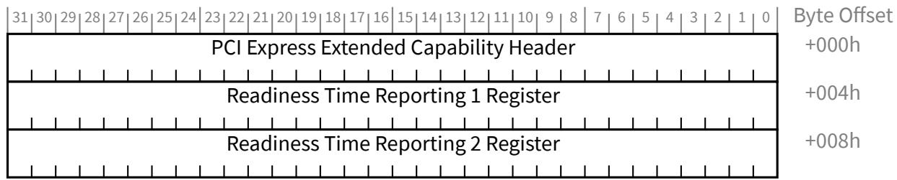

text_image

PCI Express Extended Capability Header
Readiness Time Reporting 1 Register
Readiness Time Reporting 2 Register
Byte Offset
+000h
+004h
+008h

Figure 7-314 Readiness Time Reporting Extended Capability§

<table><tr><td>Scale</td><td>Multiplier</td></tr><tr><td>0</td><td>1 ns</td></tr><tr><td>1</td><td>32 ns</td></tr><tr><td>2</td><td>1,024 ns</td></tr><tr><td>3</td><td>32,768 ns</td></tr><tr><td>4</td><td>1,048,576 ns</td></tr><tr><td>5</td><td>33,554,432 m</td></tr><tr><td>6</td><td>Reserved</td></tr><tr><td>7</td><td>Reserved</td></tr><tr><td colspan="2">Multiplier =  $32^{Scale}$ </td></tr></table>

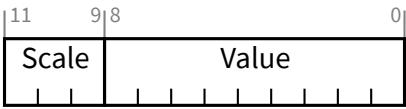

text_image

11 98 0
Scale Value

Figure 7-315 Readiness Time Encoding§

## 7.9.16.1 Readiness Time Reporting Extended Capability Header (Offset 00h) §

§ Figure 7-316 and § Table 7-278 detail allocation of fields in the Extended Capability header.

line chart

| Time (h) | Value |
| -------- | ----- |
| 0        | 0     |
| 16       | 16    |
| 20       | 20    |
| 31       | 31    |

Figure 7-316 Readiness Time Reporting Extended Capability Header§

Table 7-278 Readiness Time Reporting Extended Capability Header§

<table><tr><td>Bit Location</td><td>Register Description</td><td>Attributes</td></tr><tr><td>15:0</td><td>PCI Express Extended Capability ID - This field is a PCI-SIG defined ID number that indicates the nature and format of the Extended Capability. Extended Capability ID for the Readiness Time Reporting Extended Capability is 0022h.</td><td>RO</td></tr><tr><td>19:16</td><td>Capability Version - This field is a PCI-SIG defined version number that indicates the version of the Capability structure present. Must be 1h for this version of the specification.</td><td>RO</td></tr><tr><td>31:20</td><td>Next Capability Offset - This field contains the offset to the next PCI Express Capability structure or 000h if no other items exist in the linked list of Capabilities. For Extended Capabilities implemented in Configuration Space, this offset is relative to the beginning of PCI-compatible Configuration Space and thus must always be either 000h (for terminating list of Capabilities) or greater than 0FFh.</td><td>RO</td></tr></table>

## 7.9.16.2 Readiness Time Reporting 1 Register (Offset 04h) §

§ Figure 7-317 and § Table 7-279 detail allocation of fields in the Readiness Time Reporting 1 Register.

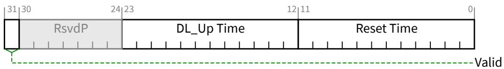

text_image

31 30 24 23 12 11 0
RsvdP DL_Up Time Reset Time
Valid

Figure 7-317 Readiness Time Reporting 1 Register§

Table 7-279 Readiness Time Reporting 1 Register§

<table><tr><td>Bit Location</td><td>Register Description</td><td>Attributes</td></tr><tr><td>11:0</td><td>Reset Time- is the time a non-VF Function requires to become Configuration-Ready after the completion of Conventional Reset. For VF semantics, see § Section 9.3.3.3.1.This field is RsvdP if the Immediate Readiness bit is Set.This field is undefined when the Valid bit is Clear.This field must be less than or equal to the encoded value A1Eh.</td><td>HwInit/RsvdP</td></tr><tr><td>23:12</td><td>DL_Up Time- is the time the Function requires to become Configuration-Ready after the Downstream Port above the Function reports Data Link Layer Link Active.This field is RsvdP in Functions that are not associated with an Upstream Port.For VFs, this field is not applicable and is RsvdP.This field is undefined when the Valid bit is Clear.This field must be less than or equal to the encoded value A1Eh.</td><td>HwInit/RsvdPVF RsvdP</td></tr><tr><td>31</td><td>Valid- If Set, indicates that all time values in this capability are valid. If Clear, indicates that the time values in this capability are not yet available.Time values may depend on device configuration. Device specific mechanisms, possibly involving the device driver(s), could be involved in determining time values.If this bit remains Clear and 1 minute has elapsed after all associated device driver(s) have started, software is permitted to assume that this bit will never be set.</td><td>HwInit</td></tr></table>

## 7.9.16.3 Readiness Time Reporting 2 Register (Offset 08h) §

§ Figure 7-318 and § Table 7-280 detail allocation of fields in the Readiness Time Reporting 2 Register.  
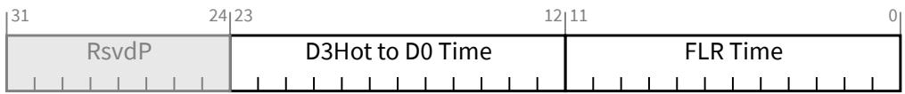

text_image

31
24 23 12 11 0
RsvdP D3Hot to D0 Time FLR Time

Figure 7-318 Readiness Time Reporting 2 Register§

Table 7-280 Readiness Time Reporting 2 Register§

<table><tr><td>Bit Location</td><td>Register Description</td><td>Attributes</td></tr><tr><td>11:0</td><td>FLR Time- is the time that the Function requires to become Configuration-Ready after it was issued an FLR.This field is RsvdP when the Function Level Reset Capability bit is Clear (see § Section 7.5.3.3).This field is undefined when the Valid bit is Clear.This field must be less than or equal to the encoded value A1Eh.</td><td>HwInit/RsvdP</td></tr><tr><td>23:12</td><td> $D3_{Hot\ to\ D0\ Time}$  - If Immediate_Readiness_on_Return_to_D0 is Clear,  $D3_{Hot}$  to D0 Time is the time that a non-VF Function requires after it is directed from  $D3_{Hot}$  to D0 before it is Configuration-Ready and has returned to either  $D0_{uninitialized}$  or  $D0_{active}$  state. For VF semantics, see § Section 5.10.1. This field is RsvdP if the Immediate_Readiness_on_Return_to_D0 bit is Set.For a VF that does not implement the PCI Power Management Capability, this field is undefined.This field is undefined when the Valid bit is Clear.This field must be less than or equal to the encoded value 80Ah.</td><td>HwInit/RsvdP</td></tr></table>

## 7.9.17 Hierarchy ID Extended Capability §

The Hierarchy ID Extended Capability provides an optional mechanism for passing a unique identifier to Functions within a Hierarchy. At most one instance of this capability is permitted in a Function. This capability is not applicable to Bridges, Root Complex Event Collectors, and RCRBs.

This capability takes three forms:

In Upstream Ports:

• This capability is permitted any Function associated with an Upstream Port.  
• This capability is optional in Switch Upstream Ports. Support in Switch Upstream and Downstream Ports is independently optional.  
• This capability is mandatory in Functions that use the Hierarchy ID Message. This includes use by the Function’s driver.  
Functions, other than VFs, that have Hierarchy ID Writeable Clear, must report the Message Requester ID, Hierarchy ID, System GUID Authority ID, and System GUID fields from the most recently received Hierarchy ID Message.  
• All VFs that have Hierarchy ID Writeable Clear, must report the same Hierarchy ID Valid, Message Requester ID, Hierarchy ID, System GUID Authority ID, and System GUID values as their associated PF.  
• PFs must implement this capability if any of their VFs implement this capability.  
• Functions that have Hierarchy ID Writeable Set must report the Hierarchy ID Valid, Message Requester ID, Hierarchy ID, System GUID Authority ID, and System GUID values programmed by software.

In Downstream Ports:

• This capability is permitted in any Downstream Port. It is recommended that it be implemented in Root Ports.  
• When present in a Switch Downstream Port, this capability must be implemented in all Downstream Ports of the Switch. Support in Switch Upstream and Downstream Ports is independently optional.  
• In Downstream Ports, the Hierarchy ID, System GUID Authority ID, and System GUID fields are Read / Write and contain the values to send in the Hierarchy ID Message.  
• A Hierarchy ID capability is not affected by Hierarchy ID Messages forwarded through the associated Downstream Port.

In RCiEPs:

• VFs that have Hierarchy ID Writeable Clear must report the same Message Requester ID, Hierarchy ID, System GUID Authority ID, and System GUID values as their associated PF.  
• PFs must implement this capability if any of their VFs implement this capability.  
Functions, other than VFs, that have Hierarchy ID Writeable Clear, must report the same Hierarchy ID Valid, Message Requester ID, Hierarchy ID, System GUID Authority ID, and System GUID values. The source of this information is outside the scope of this specification.  
• Functions that have Hierarchy ID Writeable Set must report the Hierarchy ID Valid, Message Requester ID, Hierarchy ID, System GUID Authority ID, and System GUID values programmed by software.

§ Figure 7-319 details the layout of the Hierarchy ID Extended Capability.

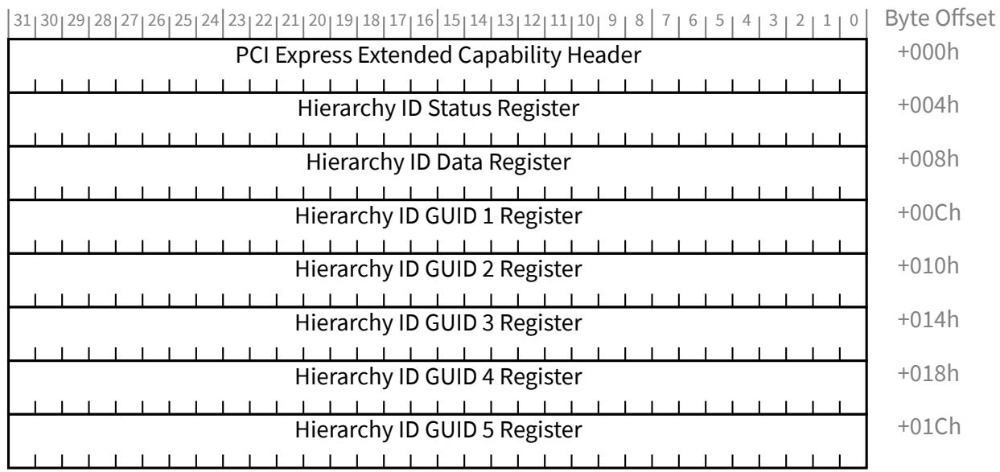

text_image

PCI Express Extended Capability Header
Hierarchy ID Status Register
Hierarchy ID Data Register
Hierarchy ID GUID 1 Register
Hierarchy ID GUID 2 Register
Hierarchy ID GUID 3 Register
Hierarchy ID GUID 4 Register
Hierarchy ID GUID 5 Register
Byte Offset
+000h
+004h
+008h
+00Ch
+010h
+014h
+018h
+01Ch

Figure 7-319 Hierarchy ID Extended Capability§

## 7.9.17.1 Hierarchy ID Extended Capability Header (Offset 00h) §

§ Figure 7-320 and § Table 7-281 detail allocation of fields in the Hierarchy ID Extended Capability Header.

text_image

31
20 19 16 15 0
Next Capability Offset
Extended Capability ID
Capability Version

Figure 7-320 Hierarchy ID Extended Capability Header§

Table 7-281 Hierarchy ID Extended Capability Header§

<table><tr><td>Bit Location</td><td>Description</td><td>Attributes</td></tr><tr><td>15:0</td><td>Extended Capability ID- This field is a PCI-SIG defined ID number that indicates the nature and format of the Extended Capability.PCI Express Extended Capability ID for the Hierarchy ID Extended Capability is 0028h.</td><td>RO</td></tr><tr><td>19:16</td><td>Capability Version- This field is a PCI-SIG defined version number that indicates the version of the Capability structure present.Must be 1h for this version of the specification.</td><td>RO</td></tr><tr><td>31:20</td><td>Next Capability Offset- This field contains the offset to the next PCI Express Extended Capability structure or 000h if no other items exist in the linked list of Capabilities. For Extended Capabilities in configuration space, this offset is relative to the beginning of PCI-compatible Configuration Space and thus must always be either 000h (for terminating the list of Capabilities) or greater than 0FFh.</td><td>RO</td></tr></table>

## 7.9.17.2 Hierarchy ID Status Register (Offset 04h)

  
§ Figure 7-321 and § Table 7-282 detail allocation of fields in the Hierarchy ID Status Register.

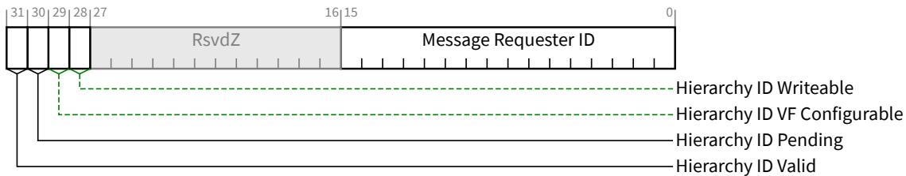

text_image

RsvdZ
Message Requester ID
Hierarchy ID Writeable
Hierarchy ID VF Configurable
Hierarchy ID Pending
Hierarchy ID Valid

Figure 7-321 Hierarchy ID Status Register§

§ Table 7-282 Hierarchy ID Status Register

<table><tr><td>Bit Location</td><td>Description</td><td>Attributes</td></tr><tr><td>15:0</td><td>Message Requester ID - In an Upstream Port, this field contains the Requester ID from the most recently received Hierarchy ID Message. This field is meaningful only if Hierarchy ID Valid is 1b. This value identifies the Downstream Port (within this Hierarchy) that sent the Hierarchy ID Message. This information is not considered part of the Hierarchy ID as it can vary within the Hierarchy (e.g., different Root Ports of one Root Complex), but helps in debug situations to identify the provenance of the Hierarchy ID information.In a Downstream Port, this field is RsvdZ.For RCiEPs, this field is RsvdZ.This field defaults to 0000h.</td><td>RO/RsvdZ</td></tr><tr><td>28</td><td>Hierarchy ID Writeable - This bit is Set to indicate that the Hierarchy ID Data and GUID registers are read/write. This bit is Clear to indicate that the Hierarchy ID and GUID registers are read only.In Downstream Ports this bit is hardwired to 1b.In Upstream Ports, Functions that are not VFs must hardwire this bit to 0b.RCiEPs that are not VFs, must hardwire this bit to either 0b or 1b.VFs in an Upstream Port and Root Complex Integrated VFs are permitted to either:hardwire this bit to 0b orimplement this bit as read / write with a default value of 0b.</td><td>RW/RO</td></tr><tr><td>29</td><td>Hierarchy ID VF Configurable - This bit indicates that Hierarchy ID Writeable can be configured.If Hierarchy ID Writeable is implemented as read / write, this bit is 1b. Otherwise this bit is 0b.</td><td>RO</td></tr><tr><td>30</td><td>Hierarchy ID Pending - In Downstream Ports this requests the transmission of a Hierarchy ID Message. Setting it requests transmission of a message based on the Hierarchy Data and GUID registers in this capability. This bit is cleared when either the transmit request is satisfied or the Link enters DL_Down. Behavior is undefined if the Hierarchy Data or GUID registers in this capability are written while this bit is Set.In Downstream Ports, this bit is Read / Write defaulting to 0b.In all other Functions, this bit is RsvdZ.</td><td>RW/RsvdZ</td></tr><tr><td>31</td><td>Hierarchy ID Valid- This bit indicates that the remaining fields in this capability are meaningful.In Downstream Ports, this bit is hardwired to 1b.In all other Functions, the following rules apply:If Hierarchy ID Writeable is Set, this bit is read/write, default 0b.If Hierarchy ID Writeable is Clear, this bit is read only, default 0b.In VFs, this bit contains the same value as the associated PF.In Functions other than VFs that are associated with an Upstream Port, this bit is Set when a Hierarchy ID Message is received, and Cleared when the Link is DL_Down.In RCiEPs other than VFs, this bit contains a system provided value. The mechanism for determining this value is outside the scope of this specification.</td><td>RW/RO</td></tr></table>

## 7.9.17.3 Hierarchy ID Data Register (Offset 08h) §

§ Figure 7-322 and § Table 7-283 detail allocation of fields in the Hierarchy ID Data Register.  

text_image

31
Hierarchy ID
16 15
RsvdP
8 7
0
System GUID Authority ID

Figure 7-322 Hierarchy ID Data Register§

§ Table 7-283 Hierarchy ID Data Register

<table><tr><td>Bit Location</td><td>Description</td><td>Attributes</td></tr><tr><td>7:0</td><td>System GUID Authority ID- This field corresponds to the System GUID Authority ID field in the Hierarchy ID Message. See § Section 6.25 for details.This field is meaningful only if Hierarchy ID Valid is 1b.If Hierarchy ID Writeable is Set, this field is read-write and contains the value programmed by software.If Hierarchy ID Writeable is Clear, this field is read only. The value is determined using the rules defined in § Section 7.9.17 .This field defaults to 00h.</td><td>RO/RW</td></tr><tr><td>31:16</td><td>Hierarchy ID- This field corresponds to the Hierarchy ID field in the Hierarchy ID Message. See § Section 6.25 for details.This field is meaningful only if Hierarchy ID Valid is 1b.If Hierarchy ID Writeable is Set, this field is read-write and contains the value programmed by software.If Hierarchy ID Writeable is Clear, this field is read only. The value is determined using the rules defined in § Section 7.9.17 .This field defaults to 0000h.</td><td>RO/RW</td></tr></table>

## 7.9.17.4 Hierarchy ID GUID 1 Register (Offset 0Ch) §

§ Figure 7-323 and § Table 7-284 detail allocation of fields in the Hierarchy ID GUID 1 Register.

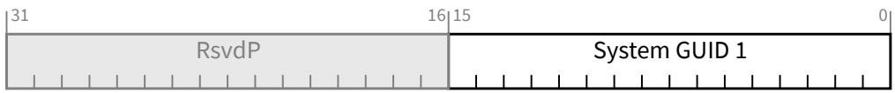

text_image

31
RsvdP
16
15
0
System GUID 1

Figure 7-323 Hierarchy ID GUID 1 Register§

§ Table 7-284 Hierarchy ID GUID 1 Register

<table><tr><td>Bit Location</td><td>Description</td><td>Attributes</td></tr><tr><td>15:0</td><td>System GUID 1- This field corresponds to bits [143:128] of the System GUID in the Hierarchy ID Message. See § Section 6.25 for details.This field is meaningful only if Hierarchy ID Valid is 1b.If Hierarchy ID Writeable is Set, this field is read-write and contains the value programmed by software.If Hierarchy ID Writeable is Clear, this field is read only. The value is determined using the rules defined in § Section 7.9.17 .This field defaults to 0000h.</td><td>RO/RW</td></tr></table>

## 7.9.17.5 Hierarchy ID GUID 2 Register (Offset 10h) §

§ Figure 7-324 and § Table 7-285 detail allocation of fields in the Hierarchy ID GUID 2 Register.

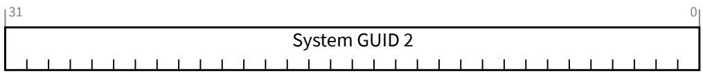

text_image

31
System GUID 2
0

Figure 7-324 Hierarchy ID GUID 2 Register§

§ Table 7-285 Hierarchy ID GUID 2 Register

<table><tr><td>Bit Location</td><td>Description</td><td>Attributes</td></tr><tr><td>31:0</td><td>System GUID 2 - This field corresponds to bits [127:96] of the System GUID field in the Hierarchy ID Message. See § Section 6.25 for details.This field is meaningful only if Hierarchy ID Valid is 1b.If Hierarchy ID Writeable is Set, this field is read-write and contains the value programmed by software.If Hierarchy ID Writeable is Clear, this field is read only. The value is determined using the rules defined in § Section 7.9.17 .This field defaults to 0000 0000h.</td><td>RO/RW</td></tr></table>

## 7.9.17.6 Hierarchy ID GUID 3 Register (Offset 14h) §

§ Figure 7-325 and § Table 7-286 detail allocation of fields in the Hierarchy ID GUID 3 Register.

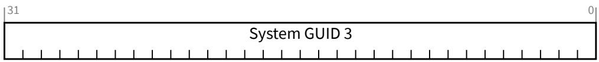

text_image

31
System GUID 3
0

Figure 7-325 Hierarchy ID GUID 3 Register§

§ Table 7-286 Hierarchy ID GUID 3 Register

<table><tr><td>Bit Location</td><td>Description</td><td>Attributes</td></tr><tr><td>31:0</td><td>System GUID 3 - This field corresponds to bits [95:64] of the System GUID field in the Hierarchy ID Message. See § Section 6.25 for details.This field is meaningful only if Hierarchy ID Valid is 1b.If Hierarchy ID Writeable is Set, this field is read-write and contains the value programmed by software.If Hierarchy ID Writeable is Clear, this field is read only. The value is determined using the rules defined in § Section 7.9.17 .This field defaults to 0000 0000h.</td><td>RO/RW</td></tr></table>

## 7.9.17.7 Hierarchy ID GUID 4 Register (Offset 18h) §

§ Figure 7-326 and § Table 7-287 detail allocation of fields in the Hierarchy ID GUID 4 Register.

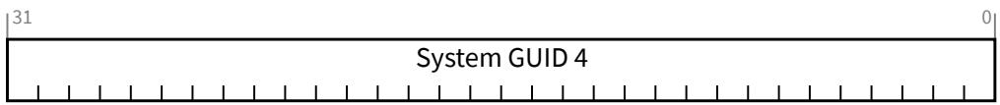

text_image

31
System GUID 4
0

Figure 7-326 Hierarchy ID GUID 4 Register§

§ Table 7-287 Hierarchy ID GUID 4 Register

<table><tr><td>Bit Location</td><td>Description</td><td>Attributes</td></tr><tr><td>31:0</td><td>System GUID 4 - This field corresponds to bits [63:32] of the System GUID field in the Hierarchy ID Message. See § Section 6.25 for details.This field is meaningful only if Hierarchy ID Valid is 1b.If Hierarchy ID Writeable is Set, this field is read-write and contains the value programmed by software.If Hierarchy ID Writeable is Clear, this field is read only. The value is determined using the rules defined in § Section 7.9.17 .This field defaults to 0000 0000h.</td><td>RO/RW</td></tr></table>

## 7.9.17.8 Hierarchy ID GUID 5 Register (Offset 1Ch) §

§ Figure 7-327 and § Table 7-288 detail allocation of fields in the Hierarchy ID GUID 5 Register.

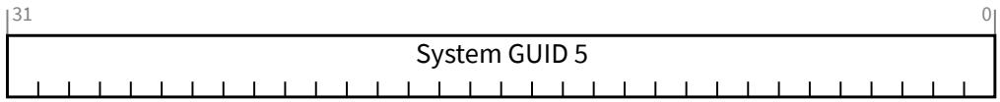

text_image

31
System GUID 5
0

Figure 7-327 Hierarchy ID GUID 5 Register§

§ Table 7-288 Hierarchy ID GUID 5 Register

<table><tr><td>Bit Location</td><td>Description</td><td>Attributes</td></tr><tr><td>31:0</td><td>System GUID 5- This field corresponds to bits [31:0] of the System GUID field in the Hierarchy ID Message. See § Section 6.25 for details.This field is meaningful only if Hierarchy ID Valid is 1b.If Hierarchy ID Writeable is Set, this field is read-write and contains the value programmed by software.If Hierarchy ID Writeable is Clear, this field is read only. The value is determined using the rules defined in § Section 7.9.17 .This field defaults to 0000 0000h.</td><td>RO/RW</td></tr></table>

## 7.9.18 Vital Product Data Capability (VPD Capability) §

Support of VPD is optional. All Functions are permitted to contain the capability. This includes all Functions of a Multi-Function Device associated with an Upstream Port as well as RCiEPs. This also includes PFs and VFs.

Vital Product Data (VPD) is information that uniquely identifies hardware and, potentially, software elements of a system. The VPD can provide the system with information on various Field Replaceable Units such as part number, serial number, and other detailed information. The objective from a system point of view is to make this information available to the system owner and service personnel. VPD typically resides in a storage device (for example, a serial EEPROM) associated with the Function.

VFs and PFs that implement the VPD Capability must ensure that there can be no “data leakage” between VFs and/or PFs via the VPD Capability.

Details of the VPD Data is defined in § Section 6.27 .

Access to the VPD is provided using the Capabilities List in Configuration Space. The VPD Capability structure is shown in § Figure 7-328.

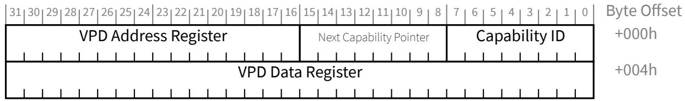

text_image

31 30 29 28 27 26 25 24 23 22 21 20 19 18 17 16 15 14 13 12 11 10 9 8 7 6 5 4 3 2 1 0
Byte Offset
+000h
VPD Address Register
Next Capability Pointer
Capability ID
VPD Data Register
+004h

§ Figure 7-328 VPD Capability Structure

The following protocols are used transfer data between the VPD Data field and the VPD storage component.

• To read VPD information:

1. Issue single write to the VPD Address Register writing the flag bit (F) to 0b and VPD Address with the address to read.  
2. The hardware device will set F to 1b when 4 bytes of data from the storage component have been transferred to VPD Data.  
3. Software can monitor F and, after it becomes 1b, read the VPD information from VPD Data.

Behavior is undefined if either the VPD Address or VPD Data is written, prior to the flag bit becoming 1b.

• To write VPD information to the read/write portion of the VPD space:

1. Write the data to VPD Data  
2. Then issue a single write to the VPD Address Register with F set to 1b and VPD Address set to the address where the VPD Data is to be stored.  
3. The software then monitors F and when it is set to 0b (by device hardware), the VPD Data (all 4 bytes) has been transferred from VPD Data to the storage component.

If either the VPD Address or VPD Data is written, prior to F being becoming 0b, the results of the write operation to the storage component are unpredictable.

Behavior is undefined if a read or write of the storage component is requested and VPD Address is outside the range of the storage component.

The VPD (both the read only items and the read/write fields) is stored information and will have no direct control of any device operations.

## 7.9.18.1 VPD Address Register §

The VPD Address Register is used to request a read or write of the VPD storage component.

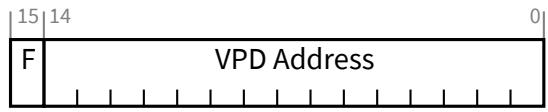

text_image

15 14
F VPD Address 0

Figure 7-329 VPD Address Register

§

Table 7-289 VPD Address Register

<table><tr><td>Bit Location</td><td>Description</td><td>Attributes</td></tr><tr><td>14:0</td><td>VPD Address - DWORD-aligned byte address of the VPD to be accessed. Behavior is undefined if the lowest 2 bits of this field are non-zero. The lowest two bits of the field must be either RW, or RO with a value of 00b. The remaining bits of the field must be RW.Default is implementation specific.</td><td>RW/RO (see description)</td></tr><tr><td>15</td><td>F - The F bit is always written along with VPD Address. The value of F indicates the direction of transfer being requested (0b = read, 1b = write). When the transfer is complete, the F bit value changes to indicate completion (1b = read complete, 0b = write complete).Default is implementation specific.</td><td>RW</td></tr></table>

## 7.9.18.2 VPD Data Register §

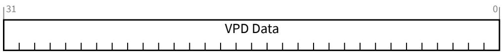

text_image

31
VPD Data
0

Figure 7-330 VPD Data Register

§

§

Table 7-290 VPD Data Register

<table><tr><td>Bit Location</td><td>Description</td><td>Attributes</td></tr><tr><td>31:0</td><td>VPD Data - VPD Data can be read through this register. The least significant byte of this register (at offset 04h in this capability structure) corresponds to the byte of VPD at the address specified by VPD Address. Behavior is undefined for any read or write of this register with Byte Enables other than 1111b. Default is implementation specific.</td><td>RW</td></tr></table>

## 7.9.19 Native PCIe Enclosure Management Extended Capability (NPEM Extended Capability)

The Native PCIe Enclosure Management Extended (NPEM) Capability is an optional extended capability that is permitted to be implemented by Root Ports, Switch Downstream Ports, and Endpoints.

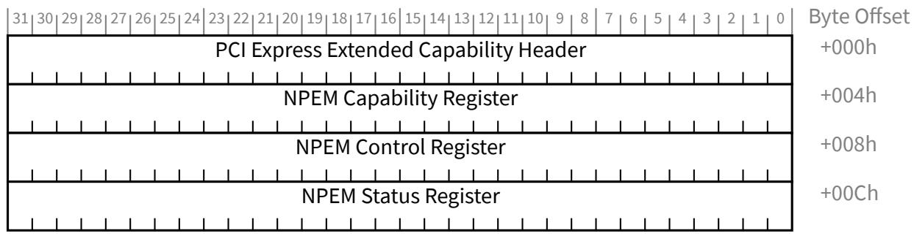

text_image

PCI Express Extended Capability Header
NPEM Capability Register
NPEM Control Register
NPEM Status Register
Byte Offset
+000h
+004h
+008h
+00Ch

Figure 7-331 NPEM Extended Capability§

## 7.9.19.1 NPEM Extended Capability Header (Offset 00h)

§

text_image

31
20 19 16 15 0
Next Capability Offset
0029h
PCI Express Extended Capability ID
Capability Version

Figure 7-332 NPEM Extended Capability Header§

Table 7-291 NPEM Extended Capability Header§

<table><tr><td>Bit Location</td><td>Register Description</td><td>Attributes</td></tr><tr><td>15:0</td><td>PCI Express Extended Capability ID- This field is a PCI-SIG defined ID number that indicates the nature and format of the extended capability.PCI Express Extended Capability ID for the NPEM Extended Capability is 0029h.</td><td>RO</td></tr><tr><td>19:16</td><td>Capability Version- This field is a PCI-SIG defined version number that indicates the version of the capability structure present.Must be 1h for this version of the specification.</td><td>RO</td></tr><tr><td>31:20</td><td>Next Capability Offset- This field contains the offset to the next PCI Express Extended Capability structure or 000h if no other items exist in the linked list of capabilities.</td><td>RO</td></tr></table>

## 7.9.19.2 NPEM Capability Register (Offset 04h) §

The NPEM Capability Register contains an overall NPEM Capable bit and a bit map of states supported in the implementation. Implementations are required to support OK, Locate, Fail, and Rebuild states if NPEM Capable bit is Set. All other states are optional.

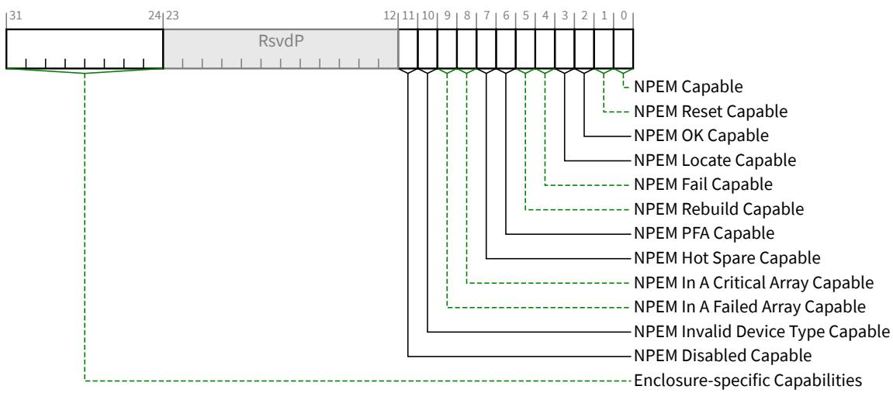

bar chart

| Category | Value |
| -------- | ----- |
| Enclosure-specific Capabilities | 31 |
| NPEM Disabled Capable | 24 |
| NPEM Invalid Device Type Capable | 23 |
| NPEM In A Failed Array Capable | 12 |
| NPEM In A Critical Array Capable | 11 |
| NPEM Hot Spare Capable | 9 |
| NPEM PFA Capable | 8 |
| NPEM Rebuild Capable | 7 |
| NPEM Fail Capable | 6 |
| NPEM Locate Capable | 5 |
| NPEM OK Capable | 4 |
| NPEM Reset Capable | 3 |
| NPEM Capable | 2 |
| 0 | 1 |
| 1 | 0 |

§ Figure 7-333 NPEM Capability Register

§ Table 7-292 NPEM Capability Register

<table><tr><td>Bit Location</td><td>Register Description</td><td>Attributes</td></tr><tr><td>0</td><td>NPEM Capable - When Set, this bit indicates that the enclosure has NPEM functionality.</td><td>HwInit</td></tr><tr><td>1</td><td>NPEM Reset Capable - A value of 1b indicates support for the optional NPEM Reset mechanism described in § Section 6.28 . This capability is independently optional.</td><td>HwInit</td></tr><tr><td>2</td><td>NPEM OK Capable - When Set, this bit indicates that enclosure has the ability to indicate the NPEM OK state. This bit must be Set if NPEM Capable is also Set.</td><td>HwInit</td></tr><tr><td>3</td><td>NPEM Locate Capable - When Set, this bit indicates that enclosure has the ability to indicate the NPEM Locate state. This bit must be Set if NPEM Capable is also Set.</td><td>HwInit</td></tr><tr><td>4</td><td>NPEM Fail Capable - When Set, this bit indicates that enclosure has the ability to indicate the NPEM Fail state. This bit must be Set if NPEM Capable is also Set.</td><td>HwInit</td></tr><tr><td>5</td><td>NPEM Rebuild Capable - When Set, this bit indicates that enclosure has the ability to indicate the NPEM Rebuild state. This bit must be Set if NPEM Capable is also Set.</td><td>HwInit</td></tr><tr><td>6</td><td>NPEM PFA Capable - When Set, this bit indicates that enclosure has the ability to indicate the NPEM PFA state. This capability is independently optional.</td><td>HwInit</td></tr><tr><td>7</td><td>NPEM Hot Spare Capable - When Set, this bit indicates that enclosure has the ability to indicate the NPEM Hot Spare state. This capability is independently optional.</td><td>HwInit</td></tr><tr><td>8</td><td>NPEM In A Critical Array Capable - When Set, this bit indicates that enclosure has the ability to indicate the NPEM In A Critical Array state. This capability is independently optional.</td><td>HwInit</td></tr><tr><td>9</td><td>NPEM In A Failed Array Capable - When Set, this bit indicates that enclosure has the ability to indicate the NPEM In A Failed Array state. This capability is independently optional.</td><td>HwInit</td></tr><tr><td>10</td><td>NPEM Invalid Device Type Capable - When Set, this bit indicates that enclosure has the ability to indicate the NPEM_Invalid_Device_Type state. This capability is independently optional.</td><td>HwInit</td></tr><tr><td>11</td><td>NPEM Disabled Capable - When Set, this bit indicates that enclosure has the ability to indicate the NPEM_Disabled state. This capability is independently optional.</td><td>HwInit</td></tr><tr><td>31:24</td><td>Enclosure-specific Capabilities - The definition of enclosure-specific bits is outside the scope of this specification.</td><td>HwInit</td></tr></table>

## 7.9.19.3 NPEM Control Register (Offset 08h) §

The NPEM Control Register contains an overall NPEM Enable bit and a bit map of states that software controls.

Use of Enclosure-specific bits is outside the scope of this specification.

All writes to this register, including writes that do not change the register value, are NPEM commands and should eventually result in a command completion indication in the NPEM Status Register.

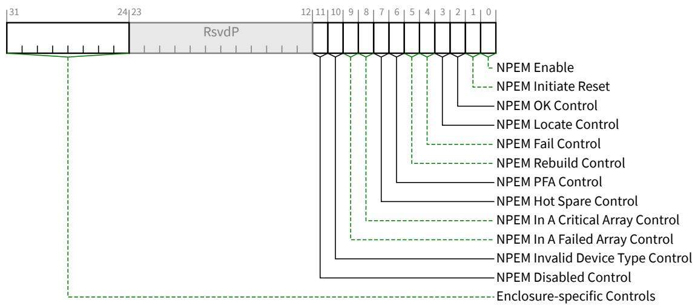

line chart

| Category                     | Value |
| ---------------------------- | ----- |
| NPEM Enable                  | 31    |
| NPEM Initiate Reset          | 24    |
| NPEM OK Control              | 23    |
| NPEM Locate Control           | 12    |
| NPEM Fail Control            | 11    |
| NPEM Rebuild Control         | 9     |
| NPEM PFA Control             | 8     |
| NPEM Hot Spare Control       | 7     |
| NPEM In A Critical Array Control | 6     |
| NPEM In A Failed Array Control | 5     |
| NPEM Invalid Device Type Control | 4     |
| NPEM Disabled Control        | 3     |
| Enclosure-specific Controls | 2     |
| Enclosure-specific Controls | 1     |
| Enclosure-specific Controls | 0     |

§ Figure 7-334 NPEM Control Register

§ Table 7-293 NPEM Control Register

<table><tr><td>Bit Location</td><td>Register Description</td><td>Attributes</td></tr><tr><td>0</td><td>NPEM Enable- When Set, this bit enables the NPEM capability. When Clear, this bit disables the NPEM capability.Default value of this bit is 0b.When enabled, this capability operates as defined in this specification. When disabled, the other bits in this capability have no effect and any associated indications are outside the scope of this specification.</td><td>RW</td></tr><tr><td>1</td><td>NPEM Initiate Reset- If NPEM Reset Capable bit is 1b, then a write of 1b to this bit initiates NPEM Reset. If NPEM Reset Capable bit is 0b, then this bit is permitted to be read-only with a value of 0b.The value read by software from this bit must always be 0b.</td><td>RW/RO</td></tr><tr><td>2</td><td>NPEM OK Control- When Set, this bit specifies that the NPEM OK indication be turned ON. When Clear, this bit specifies that the NPEM OK indication be turned OFF.If NPEM OK Capable bit in NPEM Capability Register is 0b, this bit is permitted to be read-only with a value of 0b.Default value of this bit is 0b</td><td>RW/RO</td></tr><tr><td>3</td><td>NPEM Locate Control - When Set, this bit specifies that the NPEM Locate indication be turned ON. When Clear, this bit specifies that the NPEM Locate indication be turned OFF.If NPEM Locate Capable bit in the NPEM Capability Register is 0b, this bit is permitted to be read-only with a value of 0b.Default value of this bit is 0b</td><td>RW/RO</td></tr><tr><td>4</td><td>NPEM Fail Control - When Set, this bit specifies that the NPEM Fail indication be turned ON. When Clear, this bit specifies that the NPEM Fail indication be turned OFF.If NPEM Fail Capable bit in the NPEM Capability Register is 0b, this bit is permitted to be read-only with a value of 0b.Default value of this bit is 0b</td><td>RW/RO</td></tr><tr><td>5</td><td>NPEM Rebuild Control - When Set, this bit specifies that the NPEM Rebuild indication be turned ON.When Clear, this bit specifies that the NPEM Rebuild indication be turned OFF.If NPEM Rebuild Capable bit in NPEM Capability Register is 0b, this bit is permitted to be read-only with a value of 0b.Default value of this bit is 0b</td><td>RW/RO</td></tr><tr><td>6</td><td>NPEM PFA Control - When Set, this bit specifies that the NPEM PFA indication be turned ON. When Clear, this bit specifies that the NPEM PFA indication be turned OFF.If NPEM PFA Capable bit in NPEM Capability Register is 0b, this bit is permitted to be read-only with a value of 0b.Default value of this bit is 0b</td><td>RW/RO</td></tr><tr><td>7</td><td>NPEM Hot Spare Control - When Set, this bit specifies that the NPEM Hot Spare indication be turned ON.When Clear, this bit specifies that the NPEM Hot Spare indication be turned OFF.If NPEM Hot Spare Capable bit in NPEM Capability Register is 0b, this bit is permitted to be read-only with a value of 0b.Default value of this bit is 0b</td><td>RW/RO</td></tr><tr><td>8</td><td>NPEM In A Critical Array Control - When Set, this bit specifies that the NPEM In A Critical Array indication be turned ON. When Clear, this bit specifies that the NPEM In A Critical Array indication be turned OFF.If NPEM In A Critical Array Capable bit in NPEM Capability Register is 0b, this bit is permitted to be read-only with a value of 0b.Default value of this bit is 0b</td><td>RW/RO</td></tr><tr><td>9</td><td>NPEM In A Failed Array Control - When Set, this bit specifies that the NPEM In A Failed Array indication be turned ON. When Clear, this bit specifies that the NPEM In A Failed Array indication be turned OFF.If NPEM In A Failed Array Capable bit in NPEM Capability Register is 0b, this bit is permitted to be read-only with a value of 0b.Default value of this bit is 0b</td><td>RW/RO</td></tr><tr><td>10</td><td>NPEM Invalid Device Type Control - When Set, this bit specifies that the NPEM Invalid Device Type indication be turned ON. When Clear, this bit specifies that the NPEM Invalid Device Type indication be turned OFF.If NPEM Invalid Device Type Capable bit in NPEM Capability Register is 0b, this bit is permitted to be read-only with a value of 0b.Default value of this bit is 0b</td><td>RW/RO</td></tr><tr><td>11</td><td>NPEM Disabled Control - When Set, this bit specifies that the NPEM Disabled indication be turned ON. When Clear, this bit specifies that the NPEM Disabled indication be turned OFF.If NPEM Disabled Capable bit in NPEM Capability Register is 0b, this bit is permitted to be read-only with a value of 0b.Default value of this bit is 0b</td><td>RW/RO</td></tr><tr><td>31:24</td><td>Enclosure-specific Controls - The definition of enclosure-specific bits is outside the scope of this specification. Enclosure-specific software is permitted to change the value of this field. Other software must preserve the existing value when writing this register.Default value of this field is 00h</td><td>RW/RO</td></tr></table>

## 7.9.19.4 NPEM Status Register (Offset 0Ch) §

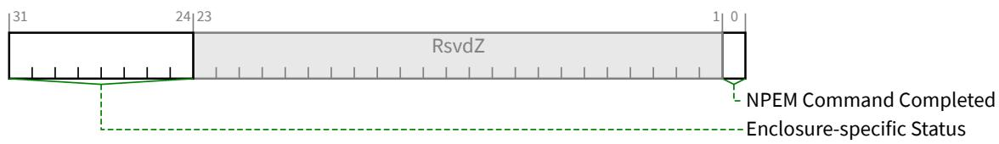

text_image

31 24 23
RsvdZ
1 0
NPEM Command Completed
Enclosure-specific Status

Figure 7-335 NPEM Status Register

§ Table 7-294 NPEM Status Register

<table><tr><td>Bit Location</td><td>Register Description</td><td>Attributes</td></tr><tr><td>0</td><td>NPEM Command Completed- This bit is Set when an NPEM command has completed, and the NPEM controller is ready to accept a subsequent command.This bit is permitted to be hardwired to 1b if the enclosure is able to accept writes that update any portion of the NPEM Control register without any delay between successive writes.Default value of this bit is 0b.Software must wait for an NPEM command to complete before issuing the next NPEM command. However, if this bit is not set within 1 second limit on command execution, software is permitted to repeat the NPEM command or issue the next NPEM command. If software issues a write before the Port has completed processing of the previous command and before the 1 second time limit has expired, the Port is permitted to either accept or discard the write. Such a write is considered a programming error, and could result in a discrepancy between the NPEM Control Register and the enclosure element state. To recover from such a programming error and return the enclosure to a consistent state, software must issue a write to the NPEM Control Register which conforms to the NPEM command completion rules.</td><td>RW1C / RO</td></tr><tr><td>31:24</td><td>Enclosure-specific Status- The definition of enclosure specific bits is outside the scope of this specification. Enclosure specific software is permitted to write non-zero values to this field. Other software must write 00h to this field.The default value of this field is enclosure-specific.This field is permitted to be hardwired to 00h.</td><td>RsvdZ/RO/RW1C</td></tr></table>

## 7.9.20 Alternate Protocol Extended Capability §

The Alternate Protocol Extended Capability structure is optional in components that implement Alternate Protocol Negotiation. It is only permitted in:

• A Function associated with a Downstream Port.  
• Function 0 (and only Function 0) of a Device associated with an Upstream Port.

§ Figure 7-336 details allocation of register fields in the Alternate Protocol Extended Capability structure.  
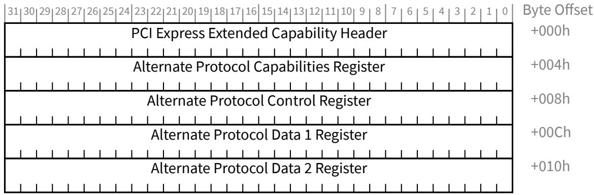

text_image

PCI Express Extended Capability Header
Alternate Protocol Capabilities Register
Alternate Protocol Control Register
Alternate Protocol Data 1 Register
Alternate Protocol Data 2 Register
Byte Offset
+000h
+004h
+008h
+00Ch
+010h

Figure 7-336 Alternate Protocol Extended Capability§

## 7.9.20.1 Alternate Protocol Extended Capability Header (Offset 00h) §

text_image

31
20 19 16 15 0
Next Capability Offset
002Bh
PCI Express Extended Capability ID
Capability Version

Figure 7-337 Alternate Protocol Extended Capability Header§

Table 7-295 Alternate Protocol Extended Capability Header§

<table><tr><td>Bit Location</td><td>Register Description</td><td>Attributes</td></tr><tr><td>15:0</td><td>PCI Express Extended Capability ID - This field is a PCI-SIG defined ID number that indicates the nature and format of the Extended Capability.The Extended Capability ID for the Alternate Protocol Capability is 002Bh.</td><td>RO</td></tr><tr><td>19:16</td><td>Capability Version- This field is a PCI-SIG defined version number that indicates the version of the Capability structure present.Must be 1h for this version of the specification.</td><td>RO</td></tr><tr><td>31:20</td><td>Next Capability Offset- This field contains the offset to the next PCI Express Capability structure or 000h if no other items exist in the linked list of Capabilities.For Extended Capabilities implemented in Configuration Space, this offset is relative to the beginning of PCI-compatible Configuration Space and thus must always be either 000h (for terminating list of Capabilities) or greater than 0FFh.</td><td>RO</td></tr></table>

## 7.9.20.2 Alternate Protocol Capabilities Register (Offset 04h) §

text_image

31
RsvdP
9 8 7 0
Alternate Protocol Count
Alternate Protocol Selective Enable Supported

Figure 7-338 Alternate Protocol Capabilities Register§

Table 7-296 Alternate Protocol Capabilities Register§

<table><tr><td>Bit Location</td><td>Register Description</td><td>Attributes</td></tr><tr><td>7:0</td><td>Alternate Protocol Count- Indicates the number of Alternate Protocols supported by one or more Lanes of this Link.Since support for PCI Express is mandatory, the value of this field must be greater than or equal to 1.</td><td>HwInit</td></tr><tr><td>8</td><td>Alternate Protocol Selective Enable Supported- If Set, the Alternate Protocol Selective Enable Mask Register is present. If Clear, the Alternate Protocol Selective Enable Mask Register is not present and Alternate Protocol Negotiation is controlled solely by the Alternate Protocol Negotiation Global Enable bit.In Upstream Ports, this bit is hardwired to 0b.In Downstream Ports, this bit is HwInit with an implementation specific default value.</td><td>RO/HwInit</td></tr></table>

## 7.9.20.3 Alternate Protocol Control Register (Offset 08h) §

text_image

31
RsvdP
9 8 7 0
Alternate Protocol Index Select
Alternate Protocol Negotiation Global Enable

Figure 7-339 Alternate Protocol Control Register§

Table 7-297 Alternate Protocol Control Register§

<table><tr><td>Bit Location</td><td>Register Description</td><td>Attributes</td></tr><tr><td>7:0</td><td>Alternate Protocol Index Select- This field determines which Lane and which Alternate Protocol of that Lane is visible in Alternate Protocol Data 1 Register and Alternate Protocol Data 2 Register.The default value of this field is 00h. Unused bits in this field are permitted to be hardwired to 0b.If Alternate Protocol Count is 01h, this field is permitted to be hardwired to 00h.Behavior is undefined if this field is greater than Alternate Protocol Count.Specific Alternate Protocol Index Select values are permitted to be disabled without renumbering other protocol index values. Disabled entries return an Alternate Protocol Vendor ID of FFFFh.</td><td>RW</td></tr><tr><td>8</td><td>Alternate Protocol Negotiation Global Enable- When this bit is Set, Alternate Protocol Negotiation is enabled for this Link. When this bit is Clear, Alternate Protocol Negotiation is disabled for this Link.This bit is RW for Downstream Ports. It is HwInit for Upstream Ports.Default is 0b.</td><td>RW/HwInit (see description)</td></tr></table>

# 7.9.20.4 Alternate Protocol Data 1 Register (Offset 0Ch) §

text_image

Alternate Protocol Vendor ID
31 16 15 5 4 3 2 0
Alternate Protocol Usage Information
RsvdP
Alternate Protocol Details

Figure 7-340 Alternate Protocol Data 1 Register§

Table 7-298 Alternate Protocol Data 1 Register§

<table><tr><td>Bit Location</td><td>Register Description</td><td>Attributes</td></tr><tr><td>2:0</td><td>Alternate Protocol Usage Information- This field contains the Modified TS Usage associated alternate protocol associated with the Alternate Protocol Index Select value.If Alternate Protocol Vendor ID is FFFFh, the value of this field is undefined.</td><td>RO</td></tr><tr><td>15:5</td><td>Alternate Protocol Details- This field contains the Alternate Protocol Details associated alternate protocol associated with the Alternate Protocol Index Select value.If Alternate Protocol Vendor ID is FFFFh, the value of this field is undefined.</td><td>RO</td></tr><tr><td>31:16</td><td>Alternate Protocol Vendor ID- This field contains the Vendor ID associated alternate protocol associated with the Alternate Protocol Index Select value.Bits 7:0 of this field contain bits 7:0 of Vendor ID (Symbol 10).Bits 15:8 of this field contain bits 15:8 of Vendor ID (Symbol 11).If Alternate Protocol Index Select is greater than or equal to Alternate Protocol Count, this field contains FFFFh.If Alternate Protocol Index Select is associated with a disabled alternate protocol, this field contains FFFFh.</td><td>RO</td></tr></table>

## 7.9.20.5 Alternate Protocol Data 2 Register (Offset 10h) §

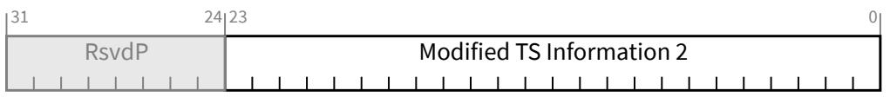

text_image

RsvdP
Modified TS Information 2

Figure 7-341 Alternate Protocol Data 2 Register§

Table 7-299 Alternate Protocol Data 2 Register§

<table><tr><td>Bit Location</td><td>Register Description</td><td>Attributes</td></tr><tr><td>23:0</td><td>Modified TS Information 2 - This field contains the value for symbols 12 through 14 for the alternate protocol associated with the Alternate Protocol Index Select value.If Alternate Protocol Vendor ID is FFFFh, the value of this field is undefined.Bits 7:0 contain the value of Symbol 12.Bits 16:8 contain the value of Symbol 13.Bits 23:16 contain the value of Symbol 14.</td><td>RO</td></tr></table>

## 7.9.20.6 Alternate Protocol Selective Enable Mask Register (Offset 14h) §

This register is present if Alternate Protocol Selective Enable Supported is Set.

This register consists of a bit mask of size Alternate Protocol Count bits. Each bit corresponds to a valid value of Alternate Protocol Index Select. This register is an integral number of DWORDs in size.

When Alternate Protocol Negotiation Global Enable is Set, a particular bit in this register is Set, and the corresponding Alternate Protocol is not disabled (see Alternate Protocol Index Select), the next Alternate Protocol negotiation is permitted to consider using that Alternate Protocol. When a particular bit in this register is Clear, the next Alternate Protocol negotiation is not permitted to consider using the corresponding Alternate Protocol.

Changes to this field will affect the next Alternate Protocol negotiation and have no effect on current operation of the Link (regardless of current protocol).

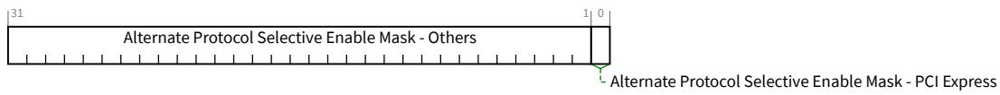

text_image

Alternate Protocol Selective Enable Mask - Others
Alternate Protocol Selective Enable Mask - PCI Express

Figure 7-342 Alternate Protocol Selective Enable Mask Register§

Table 7-300 Alternate Protocol Selective Enable Mask Register§

<table><tr><td>Bit Location</td><td>Register Description</td><td>Attributes</td></tr><tr><td>0</td><td>Alternate Protocol Selective Enable Mask - PCI Express - The PCI Express Protocol is always index 00h. The default value of this bit is 1b (i.e., PCI Express is always enabled by default).This bit is permitted to be hardwired to 1b.</td><td>RWS</td></tr><tr><td>31:1</td><td>Alternate Protocol Selective Enable Mask - Others - Other bits in this register represent protocols other than PCI Express. The default values of these “other” bits is implementation specific.The width of this field is shown here as 32 bits. The actual width depends on Alternate Protocol Count.Bits in this field corresponding to disabled Alternate Protocol Index values are permitted to be hardwired to 0b.Bits in this field corresponding to Alternate Protocol Index Select values above Alternate Protocol Count are permitted to be hardwired to 0b.</td><td>RWS</td></tr></table>

## 7.9.21 Conventional PCI Advanced Features Capability (AF) §

This capability is optional. It is permitted only in Conventional PCI Functions that are integrated into a Root Complex. A Function may contain at most one instance of this capability.

§ Figure 7-343 shows the layout of this capability.

Note: Due to document production limitations, this figure shows an 8 byte capability while the actual capability is only 6 bytes long. Bytes 6 and 7 in the figure are not part of the capability.

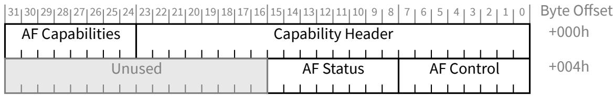

text_image

31 30 29 28 27 26 25 24 23 22 21 20 19 18 17 16 15 14 13 12 11 10 9 8 7 6 5 4 3 2 1 0
AF Capabilities	Capability Header
Unused	AF Status	AF Control
Byte Offset
+000h
+004h

Figure 7-343 Conventional PCI Advanced Features Capability (AF)§

## 7.9.21.1 Advanced Features Capability Header (Offset 00h) §

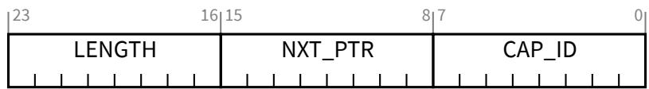

text_image

23 16 15 8 7 0
LENGTH NXT_PTR CAP_ID

Figure 7-344 Advanced Features Capability Header§

Table 7-301 Advanced Features Capability Header§

<table><tr><td>Bit Location</td><td>Register Description</td><td>Attributes</td></tr><tr><td>7:0</td><td>CAP_ID - The value of 13h in this field identifies the Function as being AF capable.</td><td>RO</td></tr><tr><td>15:8</td><td>NXT_PTR - Pointer to the next item in the capabilities list. Must be 00h for the final item in the list.</td><td>RO</td></tr><tr><td>23:16</td><td>LENGTH - AF Structure Length (Bytes). Shall return a value of 06h.</td><td>RO</td></tr></table>

## 7.9.21.2 AF Capabilities Register (Offset 03h) §

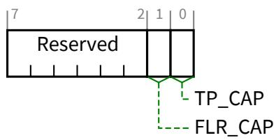

text_image

Reserved
TP_CAP
FLR_CAP

§ Figure 7-345 AF Capabilities Register

§ Table 7-302 AF Capabilities Register

<table><tr><td>Bit Location</td><td>Register Description</td><td>Attributes</td></tr><tr><td>0</td><td>TP_CAP- Set to indicate support for the Transactions Pending (TP) bit. TP_CAP must be Set if FLR_CAP is Set.</td><td>HwInit</td></tr><tr><td>1</td><td>FLR_CAP- Set to indicate support for Function Level Reset (INITIATE_FLR).</td><td>HwInit</td></tr><tr><td>7:2</td><td>ReservedReserved - Shall be implemented as read only returning a value of 000 0000b.</td><td>RO</td></tr></table>

## 7.9.21.3 Conventional PCI Advanced Features Control Register (Offset 04h) §

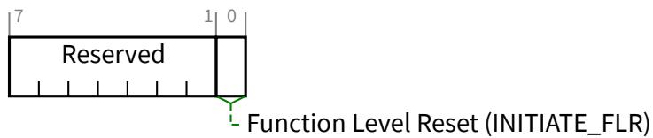

text_image

Reserved
Function Level Reset (INITIATE_FLR)

Figure 7-346 Conventional PCI Advanced Features Control Register§

Table 7-303 Conventional PCI Advanced Features Control Register§

<table><tr><td>Bit Location</td><td>Register Description</td><td>Attributes</td></tr><tr><td>07:1</td><td>Function Level Reset (INITIATE_FLR) - A write of 1b initiates a Function Level Reset (FLR). Registers and state information that do not apply to Conventional PCI are exempt from the FLR requirements in this specification (see § Section 6.6.2 ).The value read by software from this bit shall always be 0b.Reserved Reserved - Shall be implemented as read only returning a value of 000 0000b.</td><td>RWRO</td></tr></table>

## 7.9.21.4 AF Status Register (Offset 05h) §

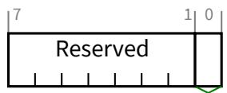

Transactions Pending (TP)

§

Figure 7-347 AF Status Register

§

Table 7-304 AF Status Register

<table><tr><td>Bit Location</td><td>Register Description</td><td>Attributes</td></tr><tr><td>0</td><td>Transactions Pending (TP) - A value of 1b indicates that the Function has issued one or more non-posted transactions which have not been completed, including non-posted transactions that a target has terminated with Retry.A value 0b indicates that all non-posted transactions have been completed.</td><td>RO</td></tr><tr><td>7:1</td><td>Reserved Reserved - Shall be implemented as read only returning a value of 000 0000b.</td><td>RO</td></tr></table>

## 7.9.22 SFI Extended Capability §

The SFI (System Firmware Intermediary) Extended Capability is an optional capability that provides system firmware with enhanced control over primarily hot-plug mechanisms, and enables system firmware to operate as an intermediary between certain events and the operating system (see § Section 6.7.4 ). This capability may be implemented by a Root Port or a Switch Downstream Port. It is not applicable to any other Device/Port type.

If a Downstream Port implements the SFI Extended Capability, that Port must support ERR\_COR Subclass capability, and indicate so by Setting the ERR\_COR Subclass Capable bit in the Device Capabilities Register. See see § Section 7.5.3.3 .

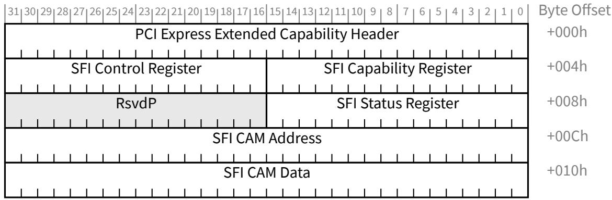

text_image

PCI Express Extended Capability Header
SFI Control Register
SFI Capability Register
RsvdP
SFI Status Register
SFI CAM Address
SFI CAM Data
Byte Offset
+000h
+004h
+008h
+00Ch
+010h

§ Figure 7-348 SFI Extended Capability

## 7.9.22.1 SFI Extended Capability Header (Offset 00h)

§ Figure 7-349 and § Table 7-305 detail allocation of fields in the Extended Capability header.

text_image

31
20 19 16 15 0
Next Capability Offset
002Ch
PCI Express Extended Capability ID
Capability Version

Figure 7-349 SFI Extended Capability Header§

Table 7-305 SFI Extended Capability Header§

<table><tr><td>Bit Location</td><td>Register Description</td><td>Attributes</td></tr><tr><td>15:0</td><td>PCI Express Extended Capability ID- This field is a PCI-SIG defined ID number that indicates the nature and format of the Extended Capability. Extended Capability ID for the SFI Extended Capability is 002Ch.</td><td>RO</td></tr><tr><td>19:16</td><td>Capability Version- This field is a PCI-SIG defined version number that indicates the version of the Capability structure present. Must be 1h for this version of the specification.</td><td>RO</td></tr><tr><td>31:20</td><td>Next Capability Offset- This field contains the offset to the next PCI Express Capability structure or 000h if no other items exist in the linked list of Capabilities. For Extended Capabilities implemented in Configuration Space, this offset is relative to the beginning of PCI-compatible Configuration Space and thus must always be either 000h (for terminating list of Capabilities) or greater than 0FFh.</td><td>RO</td></tr></table>

## 7.9.22.2 SFI Capability Register (Offset 04h) §

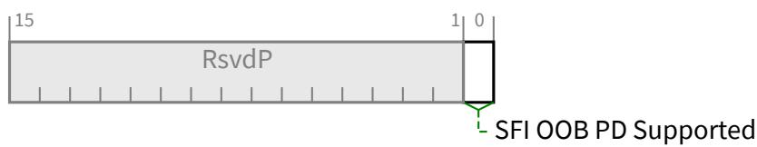

text_image

15
RsvdP
1 0
SFI OOB PD Supported

§ Figure 7-350 SFI Capability Register

§ Table 7-306 SFI Capability Register

<table><tr><td>Bit Location</td><td>Register Description</td><td>Attributes</td></tr><tr><td>0</td><td>SFI OOB PD Supported - When Set, this bit indicates that this slot supports reporting the out-of-band presence detect state. If this Downstream Port has no implemented slot (as indicated by the Slot Implemented bit in the PCI Express Capabilities Register), then the value of this bit must be 0b.</td><td>HwInit</td></tr></table>

## 7.9.22.3 SFI Control Register (Offset 06h) §

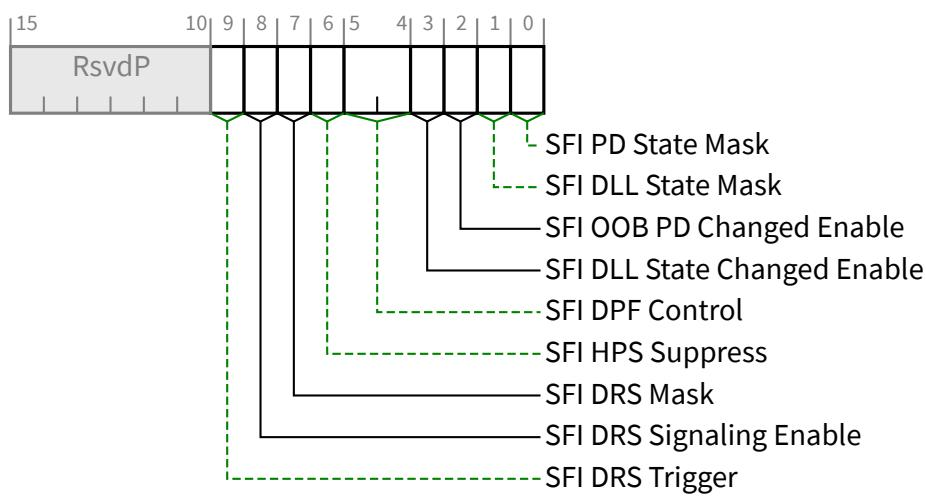

text_image

RsvdP
15 10 9 8 7 6 5 4 3 2 1 0
SFI PD State Mask
SFI DLL State Mask
SFI OOB PD Changed Enable
SFI DLL State Changed Enable
SFI DPF Control
SFI HPS Suppress
SFI DRS Mask
SFI DRS Signaling Enable
SFI DRS Trigger

§ Figure 7-351 SFI Control Register

§ Table 7-307 SFI Control Register

<table><tr><td>Bit Location</td><td>Register Description</td><td>Attributes</td></tr><tr><td>0</td><td>SFI PD State Mask - When Set, this bit masks the Presence Detect State bit in the Slot Status Register, making its value 0b, regardless of the actual presence detect state. Otherwise, its value indicates the actual state.If the value of the Presence Detect State bit changes when the SFI PD State Mask bit value changes, this must cause a Presence Detect Changed event (see § Section 6.7.3).Default value of this bit is 0b.</td><td>RW</td></tr><tr><td>1</td><td>SFI DLL State Mask - When Set, this bit masks the Data Link Layer Link Active bit in the Link Status Register, making its value 0b, regardless of the actual Data Link Layer state. Otherwise, its value indicates the actual state.If the value of the Data Link Layer Link Active State bit changes when the SFI DLL State Mask bit value changes, this must cause a Data Link Layer State Changed event (see § Section 6.7.3).Default value of this bit is 0b.</td><td>RW</td></tr><tr><td>2</td><td>SFI OOB PD Changed Enable - When Set, this bit enables sending an ERR_COR Message for the SFI OOB PD Changed event. See § Section 6.7.4.1 for other necessary conditions.This bit must be RW if the SFI OOB PD Supported bit is Set; otherwise, it is permitted to be hardwired to 0b. If the SFI OOB PD Supported bit is Clear and software Sets this bit, the behavior is undefined.Default value of this bit is 0b.</td><td>RW/RO</td></tr><tr><td>3</td><td>SFI DLL State Changed Enable - When Set, this bit enables sending an ERR_COR Message for the SFI DLL State Changed event. See § Section 6.7.4.1 for other necessary conditions.Default value of this bit is 0b.</td><td>RW</td></tr><tr><td>5:4</td><td>SFI DPF Control - This field controls the level of Downstream Port Filtering (DPF) enabled on the Downstream Port, governing which Request TLPs targeting Downstream Components get filtered; that is, handled as if the Link is in DL_Down. See § Section 6.7.4.2 .Defined encodings are:00b Disabled01b Filter all Request TLPs10b Filter only Configuration Request TLPs11b ReservedDefault value of this field is 00b.</td><td>RW</td></tr><tr><td>6</td><td>SFI HPS Suppress - When Set, this bit forces the Hot-Plug Surprise (HPS) bit in the Slot Capabilities Register to be Clear and disables associated Hot-Plug Surprise functionality. See § Section 6.7.4.4 .Default value of this bit is 0b.</td><td>RW</td></tr><tr><td>7</td><td>SFI DRS Mask - When Set, this bit masks the DRS Message Received bit in the Link Status 2 Register, making its value 0b, regardless of the actual DRS Message Received state. Otherwise, its value indicates the actual state.If the value of the DRS Message Received bit changes from Clear to Set when the SFI DRS Mask bit is Cleared, this must trigger any notification enabled by the DRS Signaling Control field in the Link Control Register (see § Section 7.5.3.7 ).Default value of this bit is 0b.</td><td>RW</td></tr><tr><td>8</td><td>SFI DRS Signaling Enable - When Set, this bit enables sending an ERR_COR Message for the SFI DRS Received event. See § Section 6.7.4.1 for other necessary conditions.Default value of this bit is 0b.</td><td>RW</td></tr><tr><td>9</td><td>SFI DRS Trigger - If the SFI DRS Mask bit is Clear, when software writes a 1b to this bit, the Downstream Port must behave as if a DRS Message was received. Otherwise, software writing a 1b to this bit has no effect.It is permitted to write 1b to this bit while simultaneously writing updated values to other fields in this register, notably the SFI DRS Mask bit. For this case, the SFI DRS Trigger semantics are based on the updated value of the SFI DRS Mask bit.This bit always returns 0b when read.</td><td>RW</td></tr></table>

## 7.9.22.4 SFI Status Register (Offset 08h) §

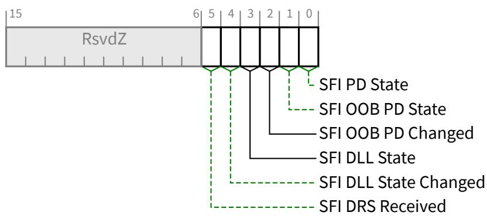

text_image

15
RsvdZ
6 5 4 3 2 1 0
SFI PD State
SFI OOB PD State
SFI OOB PD Changed
SFI DLL State
SFI DLL State Changed
SFI DRS Received

Figure 7-352 SFI Status Register

§

§

Table 7-308 SFI Status Register

<table><tr><td>Bit Location</td><td>Register Description</td><td>Attributes</td></tr><tr><td>0</td><td>SFI PD State- This bit always indicates the actual presence detect state associated with the Presence Detect State bit in the Slot Status Register, even when the value of that bit is being masked by the SFI PD State Mask bit.</td><td>RO</td></tr><tr><td>1</td><td>SFI OOB PD State- This bit indicates the out-of-band presence detect state, independent of the in-band presence detect state.This bit must be implemented if the SFI OOB PD Supported bit is Set; otherwise, it is permitted to be hardwired to 0b.</td><td>RO</td></tr><tr><td>2</td><td>SFI OOB PD Changed- This bit is Set when the value reported in the SFI OOB PD State bit is changed.</td><td>RW1C</td></tr><tr><td>3</td><td>SFI DLL State- This bit always indicates the actual link state associated with the Data Link Layer Link Active bit in the Link Status Register, even when the value of that bit is being masked by the SFI DLL State Mask bit.</td><td>RO</td></tr><tr><td>4</td><td>SFI DLL State Changed- This bit is Set when the value reported in the SFI DLL State bit is changed.</td><td>RW1C</td></tr><tr><td>5</td><td>SFI DRS Received- This bit always indicates the actual state associated with the DRS Message Received bit in the Link Status 2 Register, even when the value of that bit is being masked by the SFI PD State Mask bit.Clearing the SFI DRS Received bit (by writing a 1b to it) must also cause the actual state associated with the DRS Message Received bit to be Cleared.</td><td>RW1C</td></tr></table>

## 7.9.22.5 SFI CAM Address Register (Offset 0Ch) §

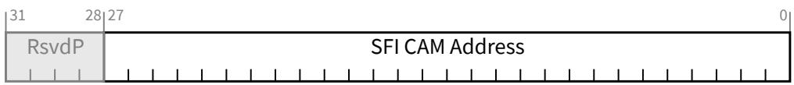

text_image

RsvdP
SFI CAM Address

§ Figure 7-353 SFI CAM Address Register

§ Table 7-309 SFI CAM Address Register

<table><tr><td>Bit Location</td><td>Register Description</td><td>Attributes</td></tr><tr><td>27:0</td><td>SFI CAM Address - This field specifies the target Bus, Device, and Function Numbers, along with the Extended Register Number and Register Number, in the format specified by § Table 7-1.</td><td>RW</td></tr></table>

# 7.9.22.6 SFI CAM Data Register (Offset 10h) §

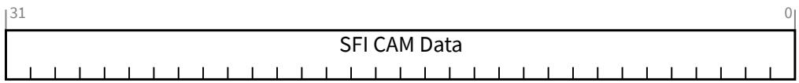

text_image

31
SFI CAM Data
0

§ Figure 7-354 SFI CAM Data Register

§ Table 7-310 SFI CAM Data Register

<table><tr><td>Bit Location</td><td>Register Description</td><td>Attributes</td></tr><tr><td>31:0</td><td>SFI CAM Data - When this field is read, the SFI CAM generates and transmits a Configuration Read Request on the Link below this Port. When this field is written, the SFI CAM generates and transmits a Configuration Write Request on the Link below this Port. In both cases, the target of the Configuration Request is determined by the value of the SFI CAM Address Register. See § Section 6.7.4.3 .</td><td>RW</td></tr></table>

## 7.9.23 Subsystem ID and Subsystem Vendor ID Capability §

The Subsystem ID and Subsystem Vendor ID Capability is an optional capability used to uniquely identify the add-in card or subsystem where the PCI device resides. It provides a mechanism for add-in card vendors to distinguish their add-in cards from one another even though the add-in cards may have the same PCI bridge on them (and, therefore, the same Vendor ID and Device ID). The format of the capability is shown in § Figure 7-355. The fields are described in § Table 7-311 and § Table 7-312.

This capability is only permitted in Functions with Type 1 Configuration Space Headers.

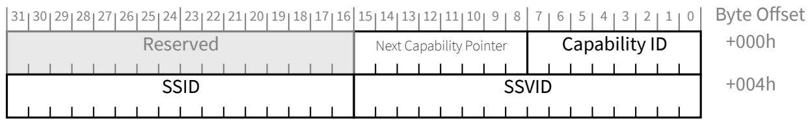

text_image

31 30 29 28 27 26 25 24 23 22 21 20 19 18 17 16
Reserved
Next Capability Pointer
Capability ID
SSID
SSVID
Byte Offset
+000h
+004h

Figure 7-355 Subsystem ID and Subsystem Vendor ID Capability§

# 7.9.23.1 Subsystem ID and Subsystem Vendor ID Capability Header (Offset 00h) §

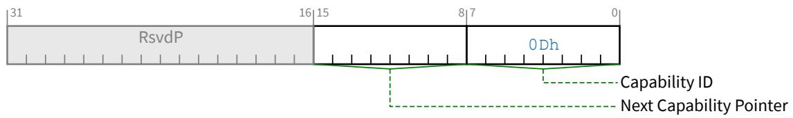

text_image

31
RsvdP
16 15
8 7
0
0Dh
Capability ID
Next Capability Pointer

Figure 7-356 Subsystem ID and Subsystem Vendor ID Capability Header§

Table 7-311 Subsystem ID and Subsystem Vendor ID Capability Header§

<table><tr><td>Bit Location</td><td>Register Description</td><td>Attributes</td></tr><tr><td>7:0</td><td>Capability ID - Indicates the PCI Express Capability structure. This field must return a Capability ID of 0Dh indicating that this is a Subsystem ID and Subsystem Vendor ID Capability structure.</td><td>RO</td></tr><tr><td>15:8</td><td>Next Capability Pointer - This field contains the offset to the next PCI Capability structure or 00h if no other items exist in the linked list of Capabilities.</td><td>RO</td></tr></table>

## 7.9.23.2 Subsystem ID and Subsystem Vendor ID Capability Data (Offset 04h) §

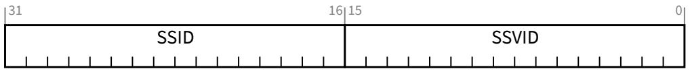

text_image

31
16 15
SSID SSVID
0

Figure 7-357 Subsystem ID and Subsystem Vendor ID Capability Data§

Table 7-312 Subsystem ID and Subsystem Vendor ID Capability Data§

<table><tr><td>Bit Location</td><td>Register Description</td><td>Attributes</td></tr><tr><td>15:0</td><td>SSVID - The SSVID identifies the manufacturer of the add-in card or subsystem. The SSVID is assigned by PCI-SIG to insure uniqueness (the Vendor ID is used as the SSVID also). This field is read-only.</td><td>HwInit</td></tr><tr><td>31:16</td><td>SSID - The SSID identifies the particular add-in card or subsystem and is assigned by the vendor. This field is read-only.</td><td>HwInit</td></tr></table>

## 7.9.24 Data Object Exchange Extended Capability §

The Data Object Exchange (DOE) Extended Capability is an optional Extended Capability for discovering and controlling a mechanism for the exchange of data objects (see § Section 6.30 ). It is permitted for a Function to implement more than one instance of this Extended Capability.

§ Figure 7-358 illustrates the Data Object Exchange Extended Capability structure.

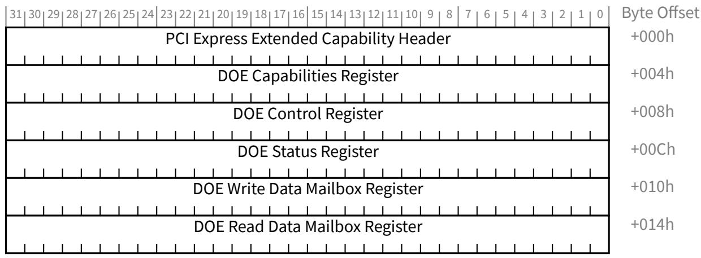

stacked bar chart

| Component                     | Byte Offset |
| ----------------------------- | ----------- |
| PCI Express Extended Capability Header | +000h       |
| DOE Capabilities Register       | +004h       |
| DOE Control Register           | +008h       |
| DOE Status Register            | +00Ch       |
| DOE Write Data Mailbox Register | +010h       |
| DOE Read Data Mailbox Register  | +014h       |

Figure 7-358 Data Object Exchange Extended Capability§

## 7.9.24.1 Extended Capability Header (Offset 00h) §

text_image

31
20 19 16 15 0
Next Capability Offset
002Eh
PCI Express Extended Capability ID
Capability Version

Figure 7-359 DOE Extended Capability Header§

Table 7-313 DOE Extended Capability Header§

<table><tr><td>Bit Location</td><td>Register Description</td><td>Attributes</td></tr><tr><td>15:0</td><td>PCI Express Extended Capability ID – This field is a PCI-SIG defined ID number that indicates the nature and format of the Extended Capability.The Extended Capability ID for the Data Object Exchange Extended Capability is 002Eh.</td><td>RO</td></tr><tr><td>19:16</td><td>Capability Version – This field is a PCI-SIG defined version number that indicates the version of the Capability structure present.Must be 1h for this version of the specification.</td><td>RO</td></tr><tr><td>31:20</td><td>Next Capability Offset – This field contains the offset to the next PCI Express Extended Capability structure or 000h if no other items exist in the linked list of Capabilities.</td><td>RO</td></tr></table>

## 7.9.24.2 DOE Capabilities Register (Offset 04h) §

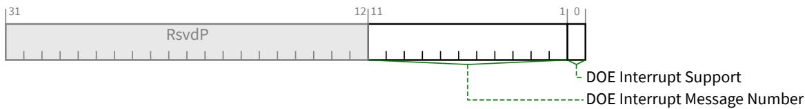

text_image

31
RsvdP
12 11
1 0
DOE Interrupt Support
DOE Interrupt Message Number

Figure 7-360 DOE Capabilities Register§

§ Table 7-314 DOE Capabilities Register

<table><tr><td>Bit Location</td><td>Register Description</td><td>Attributes</td></tr><tr><td>0</td><td>DOE Interrupt Support – When Set, this bit indicates DOE support for using MSI/MSI-X to indicate the availability of a data object.</td><td>HwInit</td></tr><tr><td>11:1</td><td>DOE Interrupt Message Number - When the Interrupt Support bit is Set, this field indicates which MSI/MSI-X vector is used for the interrupt message generated in association with DOE.For MSI, the value in this field indicates the offset between the base Message Data and the interrupt message that is generated. Hardware is required to update this field so that it is correct if the number of MSI Messages assigned to the Function changes when software writes to the Multiple Message Enable field in the Message Control Register for MSI.For MSI-X, the value in this field indicates which MSI-X Table entry is used to generate the interrupt message. For a given MSI-X implementation, the entry must remain constant.If both MSI and MSI-X are implemented, they are permitted to use different vectors, though software is permitted to enable only one mechanism at a time. If MSI-X is enabled, the value in this field must indicate the vector for MSI-X. If MSI is enabled or neither is enabled, the value in this field must indicate the vector for MSI. If software enables both MSI and MSI-X at the same time, the value in this field is undefined.When the Interrupt Support bit is Clear the value in this field is undefined.</td><td>RO</td></tr></table>

## 7.9.24.3 DOE Control Register (Offset 08h)

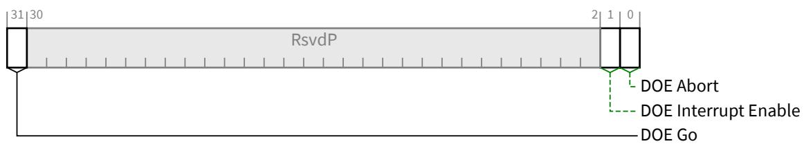

text_image

31 30
RsvdP
2 1 0
DOE Abort
DOE Interrupt Enable
DOE Go

§  
Figure 7-361 DOE Control Register

§  
Table 7-315 DOE Control Register

<table><tr><td>Bit Location</td><td>Register Description</td><td>Attributes</td></tr><tr><td>0</td><td>DOE Abort– A write of 1b to this bit must cause all data object transfer operations associated with this DOE instance to be aborted.Reads from this bit must always return 0b.</td><td>RW (see description)</td></tr><tr><td>1</td><td>DOE Interrupt Enable– When Set, and MSI/MSI-X is enabled, the DOE instance must issue an MSI/MSI-X interrupt as defined in § Section 6.30.3.Default value of this bit is 0b.</td><td>RW</td></tr><tr><td>31</td><td>DOE Go– A write of 1b to this bit indicates to the DOE instance that it can start consuming the data object transferred through the DOE Write Data Mailbox Register.Behavior is undefined if the DOE Go bit is Set before the entire data object has been written to the DOE Write Data Mailbox Register.Behavior is undefined if the DOE Go bit is written with 1b when the DOE Busy bit is Set.Reads from this bit must always return 0b.</td><td>RW (see description)</td></tr></table>

## 7.9.24.4 DOE Status Register (Offset 0Ch)

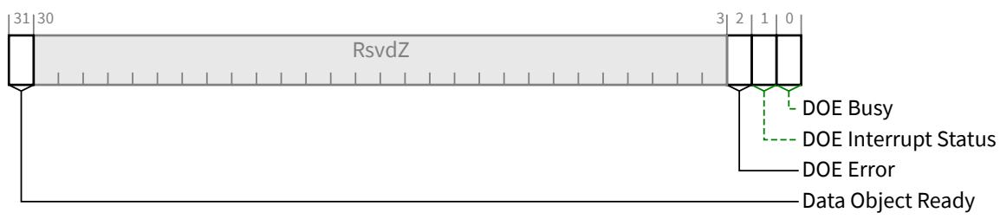

text_image

31 30
RsvdZ
3 2 1 0
DOE Busy
DOE Interrupt Status
DOE Error
Data Object Ready

§  
Figure 7-362 DOE Status Register

§

Table 7-316 DOE Status Register

<table><tr><td>Bit Location</td><td>Register Description</td><td>Attributes</td></tr><tr><td>0</td><td>DOE Busy — When Set, this bit indicates the DOE instance is temporarily unable to receive a new data object through the DOE Write Data Mailbox Register.The DOE instance must Set this bit when processing a received data object, and Clear this bit when it is able to receive a new data object.The DOE instance must Set this bit following an abort if, as a result of the abort, it is temporarily unable to receive a data object, and then must Clear this bit when it is able to receive a new data object.</td><td>RO</td></tr><tr><td>1</td><td>DOE Interrupt Status – This bit must be Set when an interrupt is generated to indicate that the Data Object Ready bit or the DOE Error bit has been Set. or that the DOE Busy bit has been Cleared.Default value of this bit is 0b.</td><td>RW1C</td></tr><tr><td>2</td><td>DOE Error – This bit, when Set, indicates that there has been an internal error associated with data object received, or that a data object has been received for which the DOE instance is unable to provide a response.The DOE instance must Clear this bit, if it is not already Clear, when 1b is written to the DOE Abort bit in the DOE Control Register. Writing 1b to the DOE Abort bit is the only mechanism for software to Clear this bit.Default value of this bit is 0b.</td><td>RO</td></tr><tr><td>31</td><td>Data Object Ready – When Set, this bit indicates the DOE instance has a data object available to be read by system firmware/software.If there is no additional data object ready for transfer, the DOE instance must clear this bit after the entire data object has been transferred, as indicated by software writing to the DOE Read Data Mailbox Register after reading the final DW of the data object.The DOE instance must clear this bit, if not already clear, upon a write of 1b to the DOE Abort bit in the DOE Control Register.Default value of this bit is 0b.</td><td>RO</td></tr></table>

## 7.9.24.5 DOE Write Data Mailbox Register (Offset 10h)

§

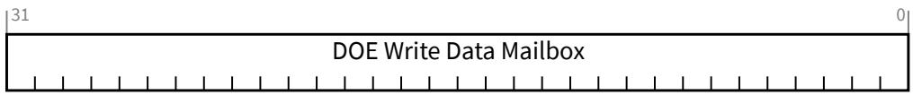

text_image

31
DOE Write Data Mailbox
0

Figure 7-363 DOE Write Data Mailbox Register§

Table 7-317 DOE Write Data Mailbox Register§

<table><tr><td>Bit Location</td><td>Register Description</td><td>Attributes</td></tr><tr><td>31:0</td><td>DOE Write Data Mailbox – The DOE instance receives data objects via writes to this register.A successfully completed write to this register adds one DW to the incoming data object.Setting the DOE Go bit in the DOE Control Register indicates to the DOE Instance that the final DW of the data object has been written to this register.Reads of this register must return all 0’s.</td><td>RW (see description)</td></tr></table>

## 7.9.24.6 DOE Read Data Mailbox Register (Offset 14h) §

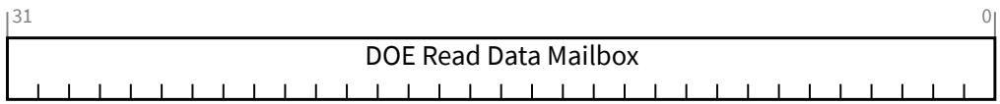

text_image

31
DOE Read Data Mailbox
0

Figure 7-364 DOE Write Data Mailbox Register§

Table 7-318 DOE Write Data Mailbox Register§

<table><tr><td>Bit Location</td><td>Register Description</td><td>Attributes</td></tr><tr><td>31:0</td><td>DOE Read Data Mailbox – If the Data Object Ready bit is Set, a read of this register returns the current DW of the data object.A write of any value to this register indicates a successful transfer of the current data object DW, and the DOE instance must return the next DW in the data object upon the next read of this register as long as the Data Object Ready bit remains Set.It is permitted for multiple data objects to be read from this register back-to-back. When this scenario occurs the Data Object Ready bit will remain Set until the final DW is read.A write of any value to this register when the Data Object Ready bit is Clear must have no effect.The value read from this register when Data Object Ready is Clear must be 0000 0000h.</td><td>RW (see description)</td></tr></table>

## 7.9.25 Shadow Functions Extended Capability §

Unimplemented Functions possess Transaction ID resources by virtue of their Bus/Device/Function Number space, and therefore associated Requester ID space, and associated Tags, even though there is no Function implemented there to use them. The Shadow Functions Extended Capability is an optional capability that permits a Requester to use the Transaction ID resources of another otherwise unimplemented Function to generate more outstanding Requests than it would otherwise be able to using only the Transaction ID resources of the Function it is associated with. The Requester generates some of its Requests via the Function it is associated with and generates other Requests via the Shadow Function. If the Requester exceeds the Transaction ID resources of a single Function, it is permitted to implement this capability and split its Transaction ID space across that Function and additional Shadow Functions defined by this capability.

A Requester implementing a Shadow Function uses the characteristics and attributes of the Function containing this capability. Requests made via the associated Function will use the associated Function’s BDF to populate the Requester ID. Requests made via the Shadow Function will use the BDF calculated from the value in the Shadow Function Number field of the corresponding Shadow Function Instance register entry to populate the Requester ID. Other characteristics and attributes of the Shadow Function are taken from the associated Function’s Configuration Space.

The Shadow Function Number field in the Shadow Function Instance register entry for each Shadow Function is used to calculate the value of the Bus/Device/Function number (Bus/Function number for ARI devices) (BDF) for that Shadow Function. That BDF space assigned to the Shadow Function must be available, that is it corresponds to an otherwise unimplemented Function.

Additional requirements for implementing Shadow Functions are:

• Any access to the Configuration Space region of the BDF associated with the Shadow Function, without errors that would have different behavior, must be responded to with a Completion with UR status.  
• For non-ARI Devices, the Shadow Function must reside in the same Device as the Function it is shadowing. ARI must be supported if the Shadow Function Number is greater than 7.  
• A Function is permitted to have more than one Shadow Function.  
• A Function is permitted to have at most one instance of this capability.  
• This capability is permitted to be implemented in any Function capable of operating as a Requester.  
• For VFs, the Shadow Functions must be assigned in a manner that accommodates the VF Discovery algorithm (see § Section 9.2.1.2 ).  
• Requesters are permitted to generate Posted Requests that are not Message Signaled Interrupt (MSI/MSI-X) Requests using the Transaction ID space of a Shadow Function.  
• Requesters are not permitted to generate Message Signaled Interrupt (MSI/MSI-X) Requests using the Transaction ID space of a Shadow Function.  
Functions utilizing Shadow Functions must be aware that accesses utilizing the Shadow Function’s Transaction ID resources appear to the rest of the system with the same semantics as if the access was from any independent Function and deal with those implications.  
• The software for the Translation Agent is responsible for maintaining the integrity of address translation resources. Behavior is undefined if address translation resources are not updated before the Shadow Function’s Requester makes a Request.  
• Translation Requests issued by a Shadow Function are cached in the ATC associated with the main Function. When enabled, Functions are permitted to use translations across the “main” and Shadow Functions regardless of which Function issued the associated Translation Request. See § Section 10.2 .  
• The software for handling Page Request Messages is responsible for coordinating usage across Shadow Functions. See § Section 10.4.1 and § Section 10.5.2.5 .  
• Behavior is undefined if software enabling FPB configures a Shadow Function to use the same Requester ID as another Function.  
• For a Multi-Function Device that supports ACS P2P Egress Control, any enabled Shadow Functions must be taken into account when configuring the Egress Control Vector to allow P2P traffic between the Requester and its Shadow Functions, and other Functions in the Device.

## IMPLEMENTATION NOTE:

## SHADOW FUNCTION NUMBER PROGRAMMING §

The value programmed into the Shadow Function Number field should place the Shadow Function on the same Bus Number as the Function declaring it. Otherwise, ACS Source Validation might not operate appropriately, Completions targeting the Shadow Function might not be routed correctly, or other misbehaviors might occur.

Multiple Shadow Functions for a Function are permitted to be assigned by this Capability. The Number of Shadow Functions field in the Shadow Functions Capability register defines the number of Shadow Functions assigned and the number of Shadow Function Instance register entries in the Capability and therefore the length of the Capability structure.

§ Figure 7-365 shows the Shadow Functions Extended Capability structure.

N = the value of the Number of Shadow Functions field.

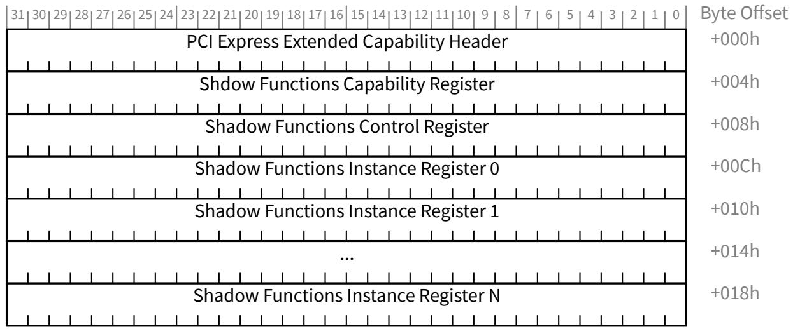

stacked bar chart

| Function | Byte Offset |
| -------- | ----------- |
| PCI Express Extended Capability Header | +000h |
| Shadow Functions Capability Register | +004h |
| Shadow Functions Control Register | +008h |
| Shadow Functions Instance Register 0 | +00Ch |
| Shadow Functions Instance Register 1 | +010h |
| ... | +014h |
| Shadow Functions Instance Register N | +018h |

Figure 7-365 Shadow Functions Extended Capability Structure§

## 7.9.25.1 Shadow Functions Extended Capability Header (Offset 00h) §

§ Figure 7-366 details allocation of the register fields in the Shadow Functions Extended Capability Header; § Table 7-319 provides the respective bit definitions.

text_image

31 20 19 16 15 0
Next Capability Offset 002Dh
Shadow Functions Extended Capability ID
Capability Version

Figure 7-366 Shadow Functions Extended Capability Header§

Table 7-319 Shadow Functions Extended Capability Header§

<table><tr><td>Bit Location</td><td>Register Description</td><td>Attributes</td></tr><tr><td>15:0</td><td>Shadow Functions Extended Capability ID - Indicates the Shadow Functions Extended Capability structure. This field must return a Capability ID of 002Dh indicating that this is a Shadow Functions Extended Capability structure.</td><td>RO</td></tr><tr><td>19:16</td><td>Capability Version - This field is a PCI-SIG defined version number that indicates the version of the Capability structure present.Must be 1h for this version of the specification.</td><td>RO</td></tr><tr><td>31:20</td><td>Next Capability Offset - The offset to the next PCI Extended Capability structure or 000h if no other items exist in the linked list of capabilities.</td><td>RO</td></tr></table>

## 7.9.25.2 Shadow Functions Capability Register (Offset 04h) §

§ Figure 7-367 details the allocation of register bits of the Shadow Functions Capability register; § Table 7-320 provides the respective bit definitions.

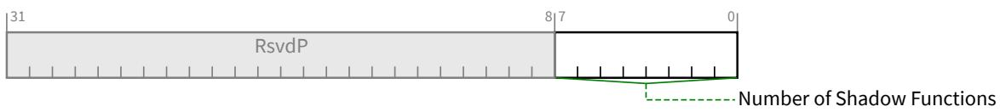

text_image

31
RsvdP
8 7 0
Number of Shadow Functions

Figure 7-367 Shadow Functions Capability Register§

Table 7-320 Shadow Functions Capability Register§

<table><tr><td>Bit Location</td><td>Register Description</td><td>Attributes</td></tr><tr><td>7:0</td><td>Number of Shadow Functions – This is one less than the number of Shadow Functions implemented by this Function. This defines the number of Shadow Function Instance register entries that are in the Capability, and therefore the length of the Capability structure.The default value for this field is 00h.</td><td>HwInit</td></tr></table>

## 7.9.25.3 Shadow Functions Control Register (Offset 08h) §

§ Figure 7-368 details the allocation of register bits of the Shadow Functions Control register; § Table 7-321 provides the respective bit definitions.

text_image

31
RsvdP
1 0
Shadow Functions Enable

Figure 7-368 Shadow Functions Control Register§

Table 7-321 Shadow Functions Control Register§

<table><tr><td>Bit Location</td><td>Register Description</td><td>Attributes</td></tr><tr><td>0</td><td>Shadow Functions Enable- When Set, permits the Requester to generate Requests using the Transaction ID resources of all of the Shadow Functions defined by this Capability. Seesect-shadow-functions-extended-capabilityfor limitations on the type of Requests permitted.When Clear, the Requester is not permitted to generate Requests using the Transaction ID resources of any of the Shadow Functions defined by this Capability.Behavior is undefined when this bit is Set in Functions with the Phantom Functions Enabled bit Set.Behavior is undefined if the value of this bit is changed while the Function has outstanding Non-Posted Requests.Default is 0b.</td><td>RW</td></tr></table>

## 7.9.25.4 Shadow Functions Instance Register Entry §

§ Figure 7-369 details the allocation of register bits of the Shadow Functions Control register; § Table 7-322 provides the respective bit definitions.

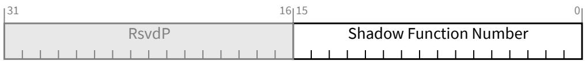

text_image

31
RsvdP
16 15
0
Shadow Function Number

Figure 7-369 Shadow Functions Instance Register Entry§

Table 7-322 Shadow Functions Instance Register Entry§

<table><tr><td>Bit Location</td><td>Register Description</td><td>Attributes</td></tr><tr><td>15:0</td><td>Shadow Function Number- This is the Bus/Device/Function offset (Bus/Function offset for ARI Devices) of the Shadow Function. Add this value to BDF of the Function with this capability using unsigned, 16-bit arithmetic, ignoring any carry.</td><td>HwInit</td></tr></table>

## 7.9.26 IDE Extended Capability §

All Ports that implement IDE must implement the IDE Extended Capability. The IDE Extended Capability must consist of the IDE Extended Capability Header, the IDE Capability Register, and the IDE Control Register, followed by zero to 8 Link IDE register blocks, followed by zero to 255 Selective IDE register blocks (see § Figure 7-370).

It is permitted to implement this extended capability in Functions associated with Downstream Ports, and in Function 0 associated with an Upstream Port. Multi-Function Devices associated with Upstream Ports, including cases where one or more Functions represent the Upstream Port of a Switch, must be implemented such that Function 0 implements this extended capability representing the Multi-Function Device as a whole.

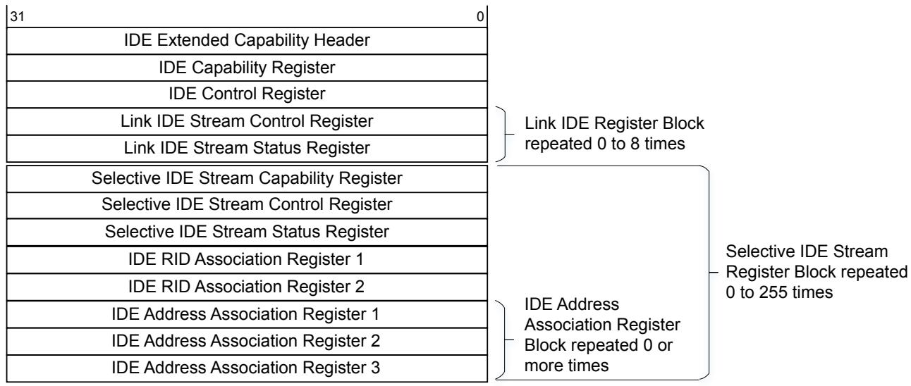

flowchart

```mermaid
graph TD
  A["31"] --> B["IDE Extended Capability Header"]
  A --> C["IDE Capability Register"]
  A --> D["IDE Control Register"]
  A --> E["Link IDE Stream Control Register"]
  A --> F["Link IDE Stream Status Register"]
  G["0"] --> H["Link IDE Register Block repeated 0 to 8 times"]
  G --> I["Selective IDE Stream Register"]
  G --> J["Selective IDE Stream Control Register"]
  G --> K["Selective IDE Stream Status Register"]
  L["1"] --> M["IDE RID Association Register 1"]
  L --> N["IDE RID Association Register 2"]
  O["2"] --> P["IDE Address Association Register 1"]
  O --> Q["IDE Address Association Register 2"]
  R["3"] --> S["IDE Address Association Register 3"]
  T["0"] --> U["Selective IDE Stream Register Block repeated 0 to 255 times"]
  T --> V["IDE Address Association Register Block repeated 0 or more times"]
```

Figure 7-370 IDE Extended Capability Structure§

## 7.9.26.1 IDE Extended Capability Header (Offset 00h) §

text_image

31
20 19 16 15 0
Next Capability Offset
0030h
PCI Express Extended Capability ID
Capability Version

Figure 7-371 IDE Extended Capability Header§

Table 7-323 IDE Extended Capability Header§

<table><tr><td>Bit Location</td><td>Register Description</td><td>Attributes</td></tr><tr><td>15:0</td><td>PCI Express Extended Capability ID – This field is a PCI-SIG defined ID number that indicates the nature and format of the Extended Capability.The Extended Capability ID for the Integrity and Data Encryption (IDE) Exchange Extended Capability is 0030h.</td><td>HwInit</td></tr><tr><td>19:16</td><td>Capability Version – This field is a PCI-SIG defined version number that indicates the version of the Capability structure present.Must be 1h for this version of the specification.</td><td>HwInit</td></tr><tr><td>31:20</td><td>Next Capability Offset – This field contains the offset to the next PCI Express Extended Capability structure or 000h if no other items exist in the linked list of Capabilities.</td><td>HwInit</td></tr></table>

## 7.9.26.2 IDE Capability Register (Offset 04h) §

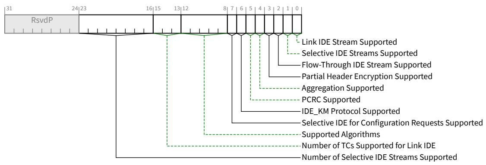

diagram

| Category | Bit Position | Count |
| -------- | ------------ | ----- |
| Link IDE Stream Supported | 0 | 0 |
| Selective IDE Streams Supported | 1 | 0 |
| Flow-Through IDE Stream Supported | 2 | 0 |
| Partial Header Encryption Supported | 3 | 0 |
| Aggregation Supported | 4 | 0 |
| PCRC Supported | 5 | 0 |
| IDE_KM Protocol Supported | 6 | 0 |
| Selective IDE for Configuration Requests Supported | 7 | 0 |
| Supported Algorithms | 8 | 0 |
| Number of TCs Supported for Link IDE | 9 | 0 |
| Number of Selective IDE Streams Supported | 10 | 0 |

§ Figure 7-372 IDE Capability Register

§ Table 7-324 IDE Capability Register

<table><tr><td>Bit Location</td><td>Register Description</td><td>Attributes</td></tr><tr><td>0</td><td>Link IDE Stream Supported– When Set, indicates that the Port supports Link IDE Streams, and that one or more Link IDE Stream Registers block(s) immediately follow the IDE Control Register, per the value in the Number of TCs Supported for Link IDE field.When Clear, there must be no Link IDE Stream Register blocks present.</td><td>HwInit / RsvdP</td></tr><tr><td>1</td><td>Selective IDE Streams Supported– When Set, indicates that the Port support Selective IDE Streams, and that one or more Selective IDE Stream Register block(s) are implemented, per the value in the Number of Selective IDE Streams Supported field.When Clear, there must be no Selective IDE Stream Register blocks present.</td><td>HwInit / RsvdP</td></tr><tr><td>2</td><td>Flow-Through IDE Stream Supported– For a Switch or Root Port, when Set indicates support for passing Selective IDE Streams to all other Switch or Root Ports.If this bit is Set and both Link IDE Stream Supported and Selective IDE Streams Supported are Clear, then no Link IDE register blocks or Selective IDE register blocks are required.Reserved for Endpoints.</td><td>HwInit / RsvdP</td></tr><tr><td>3</td><td>Partial Header Encryption Supported– If Link IDE Stream Supported or Selective IDE Streams Supported are Set, then this bit, when Set, indicates the Port supports partial header encryption.Undefined if Link IDE Stream Supported and Selective IDE Streams Supported are both Clear.</td><td>HwInit</td></tr><tr><td>4</td><td>Aggregation Supported– If Link IDE Stream Supported or Selective IDE Streams Supported are Set, then this bit, when Set, indicates the Port supports aggregation.Undefined if Link IDE Stream Supported and Selective IDE Streams Supported are both Clear.</td><td>HwInit</td></tr><tr><td>5</td><td>PCRC Supported– When Set, indicates that the Port supports the generation and checking of PCRC.</td><td>HwInit</td></tr><tr><td>6</td><td>IDE_KM Protocol Supported– When Set, indicates that the Port supports the IDE_KM protocol in the resopnder role as defined in § Section 6.33.3</td><td>HwInit</td></tr><tr><td>7</td><td>Selective IDE for Configuration Requests Supported- For a Root Port, Switch Upstream Port, or Endpoint Upstream Port, if Selective IDE Streams Supported is Set, then this bit, if Set, indicates that the Port supports the association of Configuration Requests with Selective IDE Streams.For a Switch Upstream Port, when Set, this bit indicates the Switch supports Selective IDE for Configuration Requests targeting all Functions of the Switch.This bit is Reserved for Switch Downstream Ports.If Selective IDE Streams Supported is Clear, this bit is Reserved.</td><td>HwInit / RsvdP</td></tr><tr><td>12:8</td><td>Supported Algorithms- Indicates the supported algorithms for securing IDE TLPs, encoded as:0 0000b AES-GCM 256 key size, 96b MACOthers Reserved</td><td>HwInit</td></tr><tr><td>15:13</td><td>Number of TCs Supported for Link IDE- If Link IDE Stream Supported is Set, indicates the number of TCs supported for Link IDE Streams encoded as:000b One TC supported001b 2 TCs supported010b 3 TCs supported011b 4 TCs supported100b 5 TCs supported101b 6 TCs supported110b 7 TCs supported111b 8 TCs supportedIf Link IDE Stream Supported is Clear, this field is undefined.</td><td>HwInit</td></tr><tr><td>23:16</td><td>Number of Selective IDE Streams Supported- If Selective IDE Streams Supported is Set then this field indicates number of Selective IDE Streams Supported such that 0=1 Stream.A corresponding number of Selective IDE Stream Register Block(s) must be implemented. If Link IDE Stream Supported is Clear, then these blocks must immediately follow the IDE Control Register. If Link IDE Stream Supported is Set, then these blocks must immediately follow the Link IDE Stream Control and Status Registers.If Selective IDE Streams Supported is Clear, this field is undefined.</td><td>HwInit / RsvdP</td></tr></table>

## 7.9.26.3 IDE Control Register (Offset 08h) §

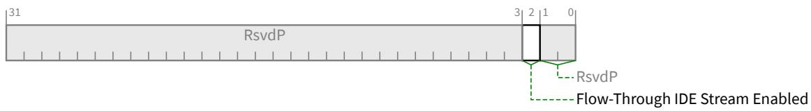

text_image

31
RsvdP
3 2 1 0
RsvdP
Flow-Through IDE Stream Enabled

Figure 7-373 IDE Control Register

§

Table 7-325 IDE Control Register

<table><tr><td>Bit Location</td><td>Register Description</td><td>Attributes</td></tr><tr><td>2</td><td>Flow-Through IDE Stream Enabled – For Switch Ports and Root Ports, Enables the Port for flow-through operation of TLPs associated with Selective IDE Streams.Reserved for Upstream Ports associated with Endpoints.</td><td>RW / RsvdP</td></tr></table>

## 7.9.26.4 Link IDE Register Block §

A Link IDE register block must consist of one Link IDE Stream Control Register followed by one Link IDE Stream Status Register. If the Link IDE Stream Supported bit in the IDE Capability Register is Set, then this register block must be instantiated once for each Traffic Class (TC) supported as indicated in the Number of TCs Supported for Link IDE field.

## 7.9.26.4.1 Link IDE Stream Control Register §

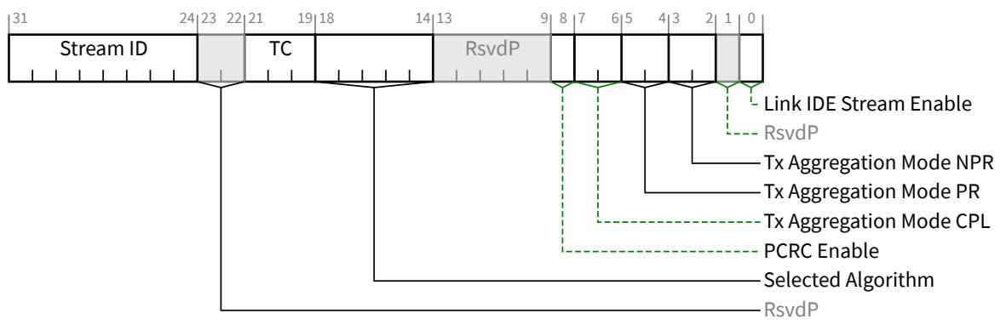

text_image

Stream ID
TC
RsvdP
Link IDE Stream Enable
RsvdP
Tx Aggregation Mode NPR
Tx Aggregation Mode PR
Tx Aggregation Mode CPL
PCRC Enable
Selected Algorithm
RsvdP

Figure 7-374 Link IDE Stream Control Register§

Table 7-326 Link IDE Stream Control Register§

<table><tr><td>Bit Location</td><td>Register Description</td><td>Attributes</td></tr><tr><td>0</td><td>Link IDE Stream Enable – When Set, enables Link IDE Stream such that IDE operation will start when triggered by means of the IDE_KM protocol (see § Section 6.33.3). When Cleared, must immediately transition the Stream to Insecure.Software must not modify the PCRC Enable bit while this bit is Set; otherwise, the result is undefined.It is permitted for the default value to be 1b if and only if implementation specific means can ensure that the Link IDE Stream will default into a state where operation in the Secure state is possible, otherwise the default value must be 0b.</td><td>RW</td></tr><tr><td>3:2</td><td>Tx Aggregation Mode NPR – If Aggregation Supported is Set then this field selects the level of aggregation for Transmitted Non-Posted Requests for this Stream, encoded as:00b No aggregation01b Up to 2 Non-Posted Requests10b Up to 4 Non-Posted Requests11b Up to 8 Non-Posted RequestsReserved If Aggregation Supported is Clear.Default value is 00b</td><td>RW / RsvdP</td></tr><tr><td>5:4</td><td>Tx Aggregation Mode PR – If Aggregation Supported is Set then this field selects the level of aggregation for Transmitted Posted Requests for this Stream, encoded as:00b No aggregation01b Up to 2 Posted Requests10b Up to 4 Posted Requests11b Up to 8 Posted RequestsReserved If Aggregation Supported is Clear.Default value is 00b</td><td>RW / RsvdP</td></tr><tr><td>7:6</td><td>Tx Aggregation Mode CPL – If Aggregation Supported is Set then this field selects the level of aggregation for Trasmitted Completions for this Stream, encoded as:00b No aggregation01b Up to 2 Completions10b Up to 4 Completions11b Up to 8 CompletionsReserved If Aggregation Supported is Clear.Default value is 00b</td><td>RW / RsvdP</td></tr><tr><td>8</td><td>PCRC Enable – When Set, Transmitted IDE TLPs associated with this Stream that include P content must include PCRC, and Received TLPs must be checked for PCRC failure.Reserved if PCRC Supported is Clear.Default value is 0b.</td><td>RW / RsvdP</td></tr><tr><td>18:14</td><td>Selected Algorithm – Selects the algorithm to be used for securing IDE TLPs for this IDE Stream. Must be programmed to the same value in both the Upstream and Downstream Ports. Must be configured while Link IDE Stream Enable is Clear. When Link IDE Stream Enable is Set, the setting is sampled, and this field becomes RO with reads returning the sampled value.0 0000b AES-GCM 256 key size, 96b MACOthers Reserved</td><td>RW / RO</td></tr><tr><td>21:19</td><td>TC – System firmware/software must program this field to indicate the TC associated with this Link IDE Register block.Default value is 000b</td><td>RW / RsvdP</td></tr><tr><td>31:24</td><td>Stream ID – Indicates the Stream ID associated with this Link IDE Stream. Software must program the same Stream ID into both Ports associated with a given Link IDE Stream. Default value is 00h.</td><td>RW</td></tr></table>

## 7.9.26.4.2 Link IDE Stream Status Register §

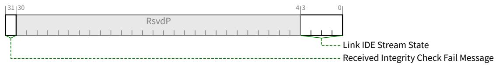

text_image

31 30
RsvdP
4 3 0
Link IDE Stream State
Received Integrity Check Fail Message

Figure 7-375 Link IDE Stream Status Register§

Table 7-327 Link IDE Stream Status Register§

<table><tr><td>Bit Location</td><td>Register Description</td><td>Attributes</td></tr><tr><td>3:0</td><td>Link IDE Stream State – When Link IDE Stream Enable is Set, this field indicates the state of the Port. Encodings:0000b Insecure0010b SecureOthers Reserved – Software must handle reserved values as indicating unknown stateWhen Link IDE Stream Enable is Clear, the value of this field must be 0000b.</td><td>RO</td></tr><tr><td>31</td><td>Received Integrity Check Fail Message – When Set, indicates that one or more Integrity Check Fail Message(s) have been Received for this Stream.</td><td>RW1C</td></tr></table>

## 7.9.26.5 Selective IDE Stream Register Block §

A Selective IDE Stream register block must consist of one Selective IDE Stream Capability Register, followed by one Selective IDE Stream Control Register, followed by one Selective IDE Stream Status Register, followed by one Selective IDE RID Association register Block, followed by zero or more Selective IDE Address Association Register Block(s) . If the Selective IDE Streams Supported bit in the IDE Capability Register is Set, then this register block must be instantiated once for each Selective IDE Stream supported as indicated in the Number of Selective IDE Streams Supported field.

## 7.9.26.5.1 Selective IDE Stream Capability Register §

text_image

RsvdP
4 3 0
Number of Address Association Register Blocks

Figure 7-376 Selective IDE Stream Capability Register§

Table 7-328 Selective IDE Stream Capability Register§

<table><tr><td>Bit Location</td><td>Register Description</td><td>Attributes</td></tr><tr><td>3:0</td><td>Number of Address Association Register Blocks – Indicates the number of Selective IDE Address Association register blocks for this Selective IDE Stream.The number of Selective IDE Address Association register blocks for a given IDE Stream is hardware implementation specific, and is permitted to be any number between 0 and 15.</td><td>RO</td></tr></table>

## 7.9.26.5.2 Selective IDE Stream Control Register §

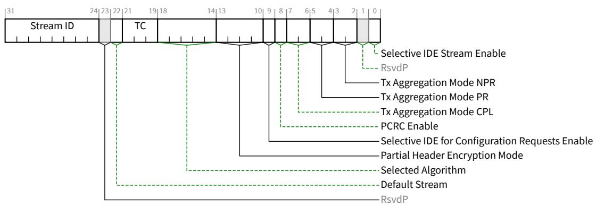

flowchart

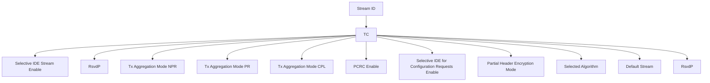
```mermaid
graph TD
  A["Stream ID"] --> B["TC"]
  B --> C["Selective IDE Stream Enable"]
  B --> D["RsvdP"]
  B --> E["Tx Aggregation Mode NPR"]
  B --> F["Tx Aggregation Mode PR"]
  B --> G["Tx Aggregation Mode CPL"]
  B --> H["PCRC Enable"]
  B --> I["Selective IDE for Configuration Requests Enable"]
  B --> J["Partial Header Encryption Mode"]
  B --> K["Selected Algorithm"]
  B --> L["Default Stream"]
  B --> M["RsvdP"]
```

Figure 7-377 Selective IDE Stream Control Register§

Table 7-329 Selective IDE Stream Control Register§

<table><tr><td>Bit Location</td><td>Register Description</td><td>Attributes</td></tr><tr><td>0</td><td>Selective IDE Stream Enable – When Set, enables this IDE Stream such that IDE operation will start when triggered by means of the IDE_KM protocol (see § Section 6.33.3). When Cleared, must immediately transition the Stream to Insecure. Software must configure the following before Setting this bit, and must not modify them while this bit is Set; otherwise, the result is undefined:Selected Algorithm (below)PCRC EnableRequester ID Limit in IDE RID Association Register 1Requester ID Base in IDE RID Association Register 2V bit in IDE RID Association Register 2If this bit is Set when the V bit is Clear, the IDE Stream must transition to Insecure.When Cleared, must immediately transition the Stream to Insecure.It is strongly recommended that the IDE Address Association Registers, and the Default Stream bit (if applicable), also be programmed prior to Setting this bit.Default value is 0b.</td><td>RW</td></tr><tr><td>3:2</td><td>Tx Aggregation Mode NPR – If Aggregation Supported is Set then this field selects the level of aggregation for Transmitted Non-Posted Requests for this Stream, encoded as:00b No aggregation01b Up to 2 Non-Posted Requests10b Up to 4 Non-Posted Requests11b Up to 8 Non-Posted RequestsReserved If Aggregation Supported is Clear.Default value is 00b</td><td>RW / RsvdP</td></tr><tr><td>5:4</td><td>Tx Aggregation Mode PR – If Aggregation Supported is Set then this field selects the level of aggregation for Transmitted Posted Requests for this Stream, encoded as:00b No aggregation01b Up to 2 Posted Requests10b Up to 4 Posted Requests11b Up to 8 Posted RequestsReserved If Aggregation Supported is Clear.Default value is 00b</td><td>RW / RsvdP</td></tr><tr><td>7:6</td><td>Tx Aggregation Mode CPL – If Aggregation Supported is Set then this field selects the level of aggregation for Trasmitted Completions for this Stream, encoded as:00b No aggregation01b Up to 2 Completions10b Up to 4 Completions11b Up to 8 CompletionsReserved If Aggregation Supported is Clear.Default value is 00b</td><td>RW / RsvdP</td></tr><tr><td>8</td><td>PCRC Enable – When Set, Transmitted IDE TLPs associated with this Stream that include P content must include PCRC, and Received TLPs must be checked for PCRC failure.Reserved if PCRC Supported is Clear.Default value is 0b.</td><td>RW / RsvdP</td></tr><tr><td>9</td><td>Selective IDE for Configuration Requests Enable –For Root Ports, if Selective IDE for Configuration Requests Supported is Set, then this bit, when Set, must cause the Port to transmit as IDE TLPs associated with this Selective IDE Stream all Configuration Requests for which the destination RID is greater than or equal to the RID Base and less than or equal to the RID Limit in the Selective IDE RID Association Register Block.For Ports other than Root Ports, this bit is Reserved.If Selective IDE for Configuration Requests Supported is Clear, this bit is Reserved.Default value is 0b.</td><td>RWRsvdP</td></tr><tr><td>13:10</td><td>Partial Header Encryption Mode – Selects the mode to be used for partial header encryption of IDE TLPs for this IDE Stream. Must be programmed to the same value in both the Partner Ports. Must be configured while Selective IDE Stream Enable is Clear. When Selective IDE Stream Enable is Set, the setting is sampled, and this field becomes RO with reads returning the sampled value.0000b No partial header encryption0001b Address[19:2] Encrypted, and, if present, the First DW BE and Last DW BE fields0010b Address[23:2] Encrypted, and, if present, the First DW BE and Last DW BE fields0011b Address[27:2] Encrypted, and, if present, the First DW BE and Last DW BE fields0100b Address[31:2] Encrypted, and, if present, the First DW BE and Last DW BE fields0101b Address[35:2] Encrypted, and, if present, the First DW BE and Last DW BE fields0110b Address[39:2] Encrypted, and, if present, the First DW BE and Last DW BE fields0111b Address[43:2] Encrypted, and, if present, the First DW BE and Last DW BE fieldsOthers Reserved</td><td>RW / RO</td></tr><tr><td>18:14</td><td>Selected Algorithm – Selects the algorithm to be used for securing IDE TLPs for this IDE Stream. Must be programmed to the same value in both Partner Ports. Must be configured while Selective IDE Stream Enable is Clear. When Selective IDE Stream Enable is Set, the setting is sampled, and this field becomes RO with reads returning the sampled value.0 0000b AES-GCM 256 key size, 96b MACOthers Reserved</td><td>RW / RO</td></tr><tr><td>21:19</td><td>TC – System firmware/software must program this field to indicate the TC associated with this Selective IDE Register block.Default value is 000b</td><td>RW</td></tr><tr><td>22</td><td>Default Stream – When Set, TLPs using the Traffic Class indicated in the TC field are associated with this Stream, unless the TLP matches some other Stream for the indicated TC. A Default Stream must have the hierarchy domain’s Root Port as its Partner Port; otherwise, the result is undefinedIt is not permitted to configure more than one Default Stream to be associated with the same TC. If this is done, hardware must select one of the Streams to be associated with the TC – the selection is implementation specific.Applicable for Endpoint Upstream Ports only. Reserved for other Port types.Default value is 0b.</td><td>RWRsvdP</td></tr><tr><td>31:24</td><td>Stream ID – Indicates the Stream ID associated with this Selective IDE Stream. Software must program the same Stream ID into both Ports associated with a given Selective IDE Stream. Default value is 00h.</td><td>RW</td></tr></table>

## 7.9.26.5.3 Selective IDE Stream Status Register §

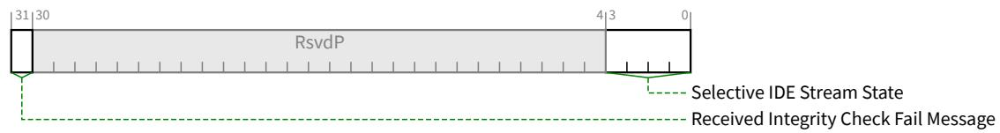

text_image

31 30
RsvdP
4 3 0
Selective IDE Stream State
Received Integrity Check Fail Message

Figure 7-378 Selective IDE Stream Status Register§

Table 7-330 Selective IDE Stream Status Register§

<table><tr><td>Bit Location</td><td>Register Description</td><td>Attributes</td></tr><tr><td>3:0</td><td>Selective IDE Stream State – When Selective IDE Stream Enable is Set, this field indicates the state of the Port. Encodings:0000b Insecure0010b SecureOthersReserved – Software must handle reserved values as indicating unknown stateWhen Selective IDE Stream Enable is Clear, the value of this field must be 0000b.</td><td>RO</td></tr><tr><td>31</td><td>Received Integrity Check Fail Message– When Set, indicates that one or more Integrity Check Fail Message(s) have been Received for this Stream.</td><td>RW1C</td></tr></table>

## 7.9.26.5.4 Selective IDE RID Association Register Block §

A Selective IDE RID Association register must consist of one IDE RID Association Register 1 followed by one IDE RID Association Register 2.

## 7.9.26.5.4.1 IDE RID Association Register 1 §

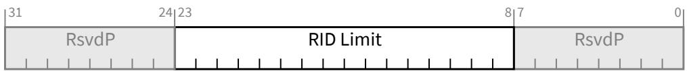

text_image

31
24 23
8 7
0
RsvdP RID Limit RsvdP

Figure 7-379 IDE RID Association Register 1 (Offset +00h)§

Table 7-331 IDE RID Association Register 1 (Offset +00h)§

<table><tr><td>Bit Location</td><td>Register Description</td><td>Attributes</td></tr><tr><td>23:8</td><td>RID Limit – Indicates the highest value RID in the range associated with this Stream ID at the IDE Partner Port.</td><td>RW</td></tr></table>

## 7.9.26.5.4.2 IDE RID Association Register 2 §

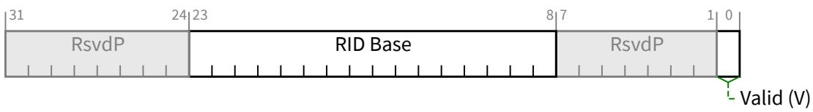

text_image

31 24 23 8 7 1 0
RsvdP RID Base RsvdP
Valid (V)

Figure 7-380 IDE RID Association Register 2 (Offset +04h)§

Table 7-332 IDE RID Association Register 2 (Offset +04h)§

<table><tr><td>Bit Location</td><td>Register Description</td><td>Attributes</td></tr><tr><td>0</td><td>Valid (V) – When Set, indicates the RID Base and RID Limit fields have been programmed. Default is 0b</td><td>RW</td></tr><tr><td>23:8</td><td>RID Base – Indicates the lowest value RID in the range associated with this Stream ID at the IDE Partner Port.</td><td>RW</td></tr></table>

## 7.9.26.5.5 Selective IDE Address Association Register Block §

A Selective IDE Address Association register must consist of one IDE Address Association Register 1, followed by one IDE Address Association Register 2, followed by one IDE Address Association Register 3.

## 7.9.26.5.5.1 IDE Address Association Register 1 §

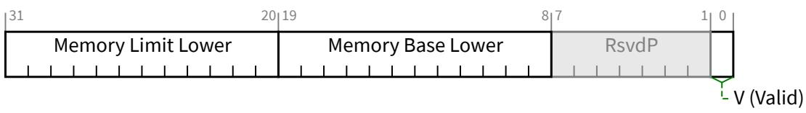

text_image

31 20 19 8 7 1 0
Memory Limit Lower Memory Base Lower RsvdP
V (Valid)

Figure 7-381 IDE Address Association Register 1 (Offset +00h)§

Table 7-333 IDE Address Association Register 1 (Offset +00h)§

<table><tr><td>Bit Location</td><td>Register Description</td><td>Attributes</td></tr><tr><td>31:20</td><td>Memory Limit Lower – Corresponds to Address bits [31:20]. Address bits [19:0] are implicitly F_FFFFh.</td><td>RW</td></tr><tr><td>19:8</td><td>Memory Base Lower – Corresponds to Address bits [31:20]. Address[19:0] bits are implicitly 0_0000h.</td><td>RW</td></tr><tr><td>0</td><td>V (Valid) – When Set, indicates this IDE Stream Association Block is valid, that the address range defined by Memory Base and Memory Limit corresponding to a range of memory addresses assigned to the IDE Partner Port, and that all Transmitted Address Routed TLPs within this address range must be associated with this IDE Stream.Hardware behavior is undefined if overlapping address ranges are assigned for different IDE Streams.Default is 0b</td><td>RW</td></tr></table>

## 7.9.26.5.5.2 IDE Address Association Register 2 §

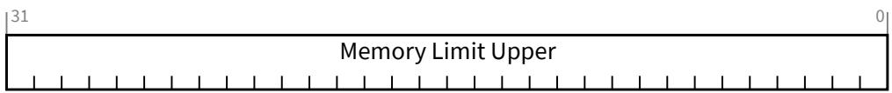

text_image

31
Memory Limit Upper
0

Figure 7-382 IDE Address Association Register 2 (Offset +04h)§

Table 7-334 IDE Address Association Register 2 (Offset +04h)§

<table><tr><td>Bit Location</td><td>Register Description</td><td>Attributes</td></tr><tr><td>31:0</td><td>Memory Limit Upper – Corresponds to Address bits [63:32]</td><td>RW</td></tr></table>

# 7.9.26.5.5.3 IDE Address Association Register 3 §

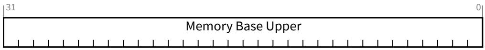

text_image

31
Memory Base Upper
0

Figure 7-383 IDE Address Association Register 3 (Offset +04h)§

Table 7-335 IDE Address Association Register 3 (Offset +04h)§

<table><tr><td>Bit Location</td><td>Register Description</td><td>Attributes</td></tr><tr><td>31:0</td><td>Memory Base Upper – Corresponds to Address bits [63:32]</td><td>RW</td></tr></table>

## 7.9.27 Null Capability §

The Null Capability is a capability structure in PCI-compatible Configuration Space (first 256 bytes) as shown in § Figure 7-384.

The Null Capability contains no registers. This capability is present in the linked list (Next Capability Pointer), but should otherwise be ignored by software. The layout of the information is shown in § Figure 7-384.

A single PCI Express Function is permitted to contain multiple Null Capability structures.

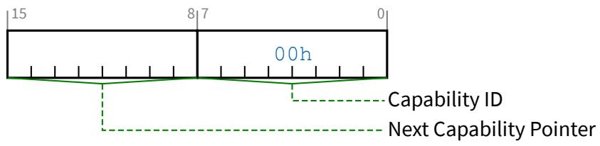

text_image

15
8
7
0
00h
Capability ID
Next Capability Pointer

Figure 7-384 Null Capability

§ Table 7-336 Null Capability

<table><tr><td>Bit Location</td><td>Register Description</td><td>Attributes</td></tr><tr><td>7:0</td><td>Capability ID - Indicates the PCI Express Capability structure. This field must return a Capability ID of 00h indicating that this is a Null Capability structure.</td><td>RO</td></tr><tr><td>15:8</td><td>Next Capability Pointer - This field contains the offset to the next PCI Capability structure or 00h if no other items exist in the linked list of Capabilities.</td><td>RO</td></tr></table>

## 7.9.28 Null Extended Capability §

The Null Extended Capability is an optional Extended Capability that is permitted to be implemented by any PCI Express Function or RCRB. This capability contains no registers. This capability is present in the linked list (Next Capability Offset) but should otherwise be ignored by software.

A single PCI Express Function or RCRB is permitted to contain multiple Null Extended Capability structures.

§ Figure 7-385 details allocation of register fields in the Null Extended Capability; § Table 7-337 provides the respective bit definitions. The Extended Capability ID for the Null Extended Capability is 0000h.

text_image

31 20 19 16 15 0
Next Capability Offset 0000h
PCI Express Extended Capability ID
Capability Version

§ Figure 7-385 Null Extended Capability

§ Table 7-337 Null Extended Capability

<table><tr><td>Bit Location</td><td>Register Description</td><td>Attributes</td></tr><tr><td>15:0</td><td>PCI Express Extended Capability ID- This field is a PCI-SIG defined ID number that indicates the nature and format of the Extended Capability. Extended Capability ID for the Null Extended Capability is 0000h.</td><td>RO</td></tr><tr><td>19:16</td><td>Capability Version- This field is a PCI-SIG defined version number that indicates the version of the Capability structure present. this value is permitted to contain any value.</td><td>RO</td></tr><tr><td>31:20</td><td>Next Capability Offset- This field contains the offset to the next PCI Express Capability structure or 000h if no other items exist in the linked list of Capabilities. For Extended Capabilities implemented in Configuration Space, this offset is relative to the beginning of PCI-compatible Configuration Space and thus must always be either 000h (for terminating list of Capabilities) or greater than 0FFh.</td><td>RO</td></tr></table>

## 8. Electrical Sub-Block §

## 8.1 Electrical Specification Introduction §

Key attributes of the Electrical Specification Include:

• Support for NRZ signaling at 2.5, 5.0, 8.0, 16.0, 32.0 GT/s, and PAM4 signaling at 64.0 GT/s data rates  
• Support for common and separate independent reference clock architectures  
• Support for Spread Spectrum clocking  
• Reduced swing mode for lower power Link operation  
• In-band receiver detection and electrical idle detection  
• Channel compliance methodology  
• Adaptive transmitter equalization and reference receiver equalization allowing closed eye channel support at 8.0, 16.0, and 32.0 GT/s, and 64.0 GT/s  
• Lane margining  
• AC coupled channel

Please note that throughout this specification, the term GT/s is used to refer to the number of encoded bits transferred in a second on a direction of a lane. In PAM4 signaling, two bits are encoded in one UI with four voltage levels § Section 4.2.3.1.1 . Consequently, the Nyquist frequency is 16 GHz for both 32.0 GT/s NRZ and 64.0 GT/s PAM4.

Because of four voltage levels and reduced amplitude for each voltage level, 64.0 GT/s PAM4 signaling is sensitive to noise and burst errors. The Bit Error Rate (BER), also referred as First Bit Error Rate (FBER) in § Chapter 4. for 64.0 GT/s is 10-6. FBER refers to Bit Error Rate without accounting for any burst error. For 2.5, 5.0, 8.0, 16.0, and 32.0 GT/s data rates, BER of 10-12 implicitly assumes FBER of 10-12 and do not account for any types of burst error.

The 6.0 version of the PCI Express Electrical Specification is organized into separate sections for the Transmitter, Receiver, the Channel, and the Refclk. In this version most parameters have been regularized such that a common set of parameters is used to define compliance at all data rates.

## 8.2 Interoperability Criteria §

## 8.2.1 Data Rates §

A device must support 2.5 GT/s and is not permitted to skip support for any data rates between 2.5 GT/s and the highest supported rate.

## 8.2.2 Refclk Architectures §

PCIe supports two Refclk data architectures: Common Refclk, and Independent Refclk. These are described in detail in § Section 8.6 . A PCIe device may support one or more of these architectures.

## 8.3 Transmitter Specification §

## 8.3.1 Measurement Setup for Characterizing Transmitters §

The PCI Express electrical specification references all measurements to the device’s pin. However, the pin of a device under test (DUT) is not generally accessible, and the closest accessible point is usually a pair of microwave-type coaxial connectors separated from the DUT pins by several inches of PCB trace, called the breakout channel on a silicon test board. On a test board with many Lanes the minimum breakout channel length is constrained by the need to route to many coaxial connectors. Typically, this limitation holds true for both the Tx and the Rx pins. § Figure 8-1 illustrates a typical test connection to a DUT, showing a single Tx Lane breakout.

A low jitter Refclk source is used when the silicon supports using an external reference clock in order that the jitter measurements for the DUT include only contributions from the Transmitter.

When testing a Transmitter it is desirable to have as many other PCI Express Lanes sending or receiving the compliance pattern as is feasible. Similarly, if the device supports other I/O it should also be sending or receiving on these interfaces. The goal is to have the Tx test environment replicate that found in a real system as closely as possible.

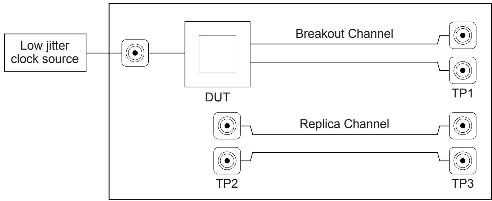

flowchart

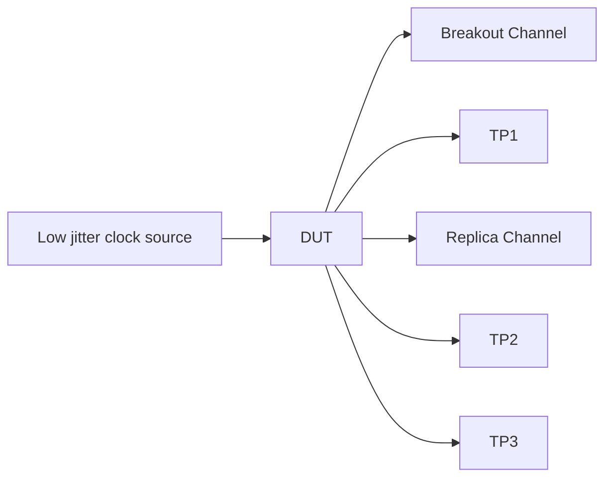
```mermaid
graph LR
  A["Low jitter clock source"] --> B["DUT"]
  B --> C["Breakout Channel"]
  B --> D["TP1"]
  B --> E["Replica Channel"]
  B --> F["TP2"]
  B --> G["TP3"]
```

A-0811

Figure 8-1 Tx Test Board for Non-Embedded Refclk§

The 6.0 version of the Tx specification also includes explicit support for Transmitters utilizing embedded Refclks. In this case the Tx under test is not driven with a low jitter clock source, and both the Tx data and Tx Refclk out must be sampled simultaneously by means of a 2-port measurement as shown in § Figure 8-2. For more details consult § Section 8.3.5.3 . When an implementation is tested that is configured for the independent reference clock architecture only the data is sampled for both the Non-Embedded and Embedded reference clock cases.

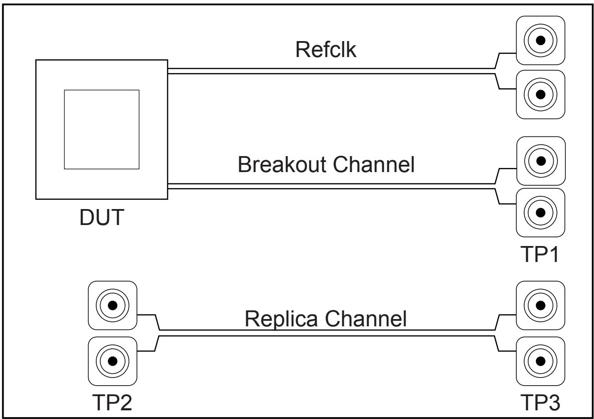

flowchart

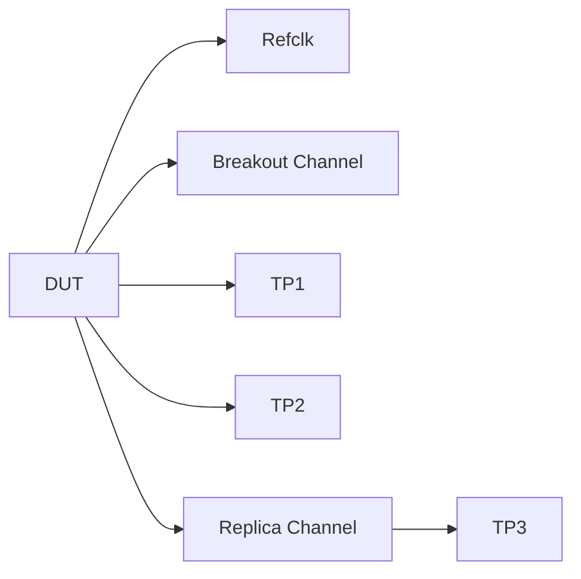
```mermaid
graph LR
  A["DUT"] --> B["Refclk"]
  A --> C["Breakout Channel"]
  A --> D["TP1"]
  A --> E["TP2"]
  A --> F["Replica Channel"]
  F --> G["TP3"]
```

A-0811-Embedded

Figure 8-2 Tx Test board for Embedded Refclk§

## 8.3.1.1 Breakout and Replica Channels §

In order to specify a Transmitter with a uniform set of Tx parameters it is necessary to establish a one-to-one correspondence between what is measurable at TP1 and the corresponding Tx voltage or jitter at the pin. This may be achieved by means of a breakout channel and a replica channel. The replica channel reproduces the electrical characteristics of the breakout channel as closely as possible, matching its length, layer transitions, etc., making it possible to de-embed Tx measurements to the pin of the DUT. All voltage parameters are de-embedded to the pins unless otherwise specified. While the specification does not define precise electrical characteristics for the replica and breakout channels, it is advisable to adhere to the following guidelines:

• Breakout channels should be the same length for each Lane and routed on as few layers as possible, thereby reducing the number of replica channels that need to be built and measured.  
• Each routing layer on a test board should have a separate breakout channel where the via and pad structures of the breakout and replica channels on respective layers match as closely as possible.  
• Breakout and replica channels should be designed to have an insertion loss of less than 2 dB at the Nyquist frequency for the signaling rate (4 dB at Nyquist if the maximum signaling rate is 16.0 GT/s, 32.0 GT/s, and 64.0 GT/s) and a return loss of greater than 15 dB to Nyquist when measured from either TP2 or TP3, which may

require use of low loss dielectric, wide signal traces and back-drilling of break-out vias or use of micro-via technology.

• The impedance targets for the breakout channel are 100 Ω differential and 50 Ω single-ended. For best accuracy the actual breakout channel impedance should be within ±5% of these values. For larger deviations a more complex de-embedding technique may be required.

## 8.3.2 Voltage Level Definitions §

A differential voltage is defined by taking the voltage difference between two conductors. In this specification, a differential signal or differential pair is comprised of a voltage on a positive conductor, $V _ { D + }$ , and a negative conductor, $V _ { D } .$ . The differential voltage (VDIFF) is defined as the difference of the positive conductor voltage and the negative conductor voltage $( \mathsf { V } _ { \mathsf { D } 1 \mathsf { F } \mathsf { F } } = \mathsf { V } _ { \mathsf { D } + } - \mathsf { V } _ { \mathsf { D } - } )$ . The Common Mode Voltage $( V _ { C M } )$ is defined as the average or mean voltage present on the same differential pair $( \mathsf { V } _ { \mathsf { C M } } = [ \mathsf { V } _ { \mathsf { D } + } + \mathsf { V } _ { \mathsf { D } - } ] / 2 )$ . This document’s electrical specifications often refer to common mode peak-to-peak measurements or peak measurements, which are defined by the following equations.

$$
V _ {D I F F p - p} = \left(2 ^ {*} \max \left| V _ {D +} - V _ {D -} \right|\right) (T h i s a p p l i e s t o a s y m m e t r i c d i f f e r e n t i a l s w i n g)
$$

§

Equation 8-1 VDIFFp-p

$$
V _ {T X - A C - C M - P P} = \max \left(V _ {D +} + V _ {D -}\right) / 2 - \min \left(V _ {D +} + V _ {D -}\right) / 2
$$

§

Equation 8-2 VTX-AC-CM-PP

Note: The maximum value is calculated on a per unit interval evaluation with unit interval boundaries determined by the behavioral CDR. The maximum function as described is implicit for all peak-to-peak and peak common mode equations throughout the rest of this chapter.

In this section, DC is defined as all frequency components below $F _ { D C } = 3 0 ~ \mathsf { k H z } .$ . AC is defined as all frequency components at or above $F _ { D C } = 3 0 k H z$ . These definitions pertain to all voltage and current specifications.

An example waveform is shown in § Figure 8-3. In this waveform the differential voltage (defined as D+ - D-) is approximately 800 mVPP, and the single-ended voltage for both D+ and D- is approximately 400 mVPP for each. Note that while the center crossing point for both D+ and D- is nominally at 200 mV, the corresponding crossover point for the differential voltage is at 0.0 V.

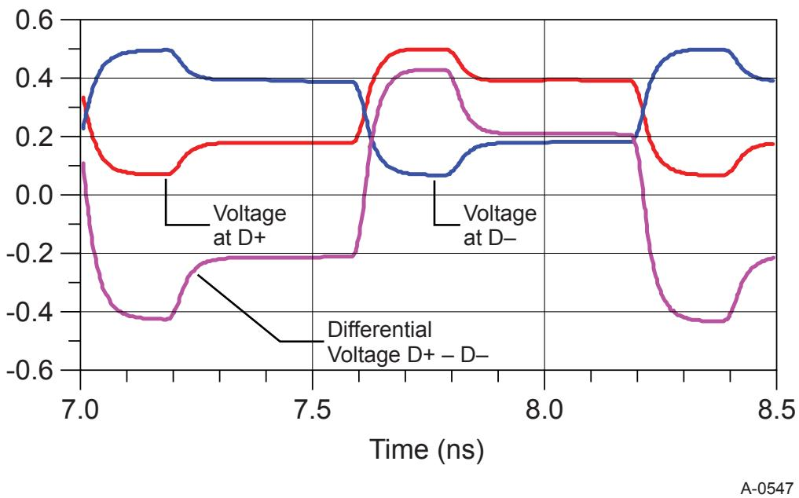

line chart

| Time (ns) | Voltage at D+ | Voltage at D- | Differential Voltage D+ - D- |
| --------- | ------------- | ------------- | ---------------------------- |
| 7.0       | 0.3           | 0.2           | 0.1                          |
| 7.5       | 0.1           | 0.4           | -0.2                         |
| 8.0       | 0.4           | 0.2           | 0.2                          |
| 8.5       | 0.1           | 0.4           | -0.2                         |

Figure 8-3 Single-ended and Differential Levels§

## 8.3.3 Tx Voltage Parameters §

Tx voltage parameters include equalization coefficients, equalization presets, and min/max voltage swings.

## 8.3.3.1 2.5 and 5.0 GT/s Transmitter Equalization §

Tx equalization at 2.5 and 5.0 GT/s is only de-emphasis. Tx equalization de-emphasis values at 2.5 and 5.0 GT/s are measured using the average ratio of transition to non-transition average eye amplitude at the 0.5 UI location using 500 repetitions of the compliance pattern.

## 8.3.3.2 8.0, 16.0, 32.0, and 64.0 GT/s Transmitter Equalization §

Tx voltage swing and equalization presets at 8.0, 16.0, 32.0, and 64.0 GT/s are measured by means of a low frequency pattern within the compliance pattern. The pattern consists of a sequence of 64 zeros followed by 64 ones, for 8.0, 16.0, and 32.0 GT/s and it consists of a sequence of 64 voltage level 0’s followed by 64 voltage level 3’s for 64.0 GT/s. The low frequency pattern permits an accurate measurement of voltage since ISI effects will have decayed and the signal will have approached a steady state. 8.0, 16.0, 32.0, and 64.0 GT/s transmitters must implement a coefficient-based equalization mode in order to support fine grained control over Tx equalization resolution. Additionally, a Transmitter must support a specified number of presets that give a coarser control over Tx equalization resolution. Both coefficient space and preset space are controllable via messaging from the Receiver via an equalization procedure. The equalization procedure operates on the same physical path as normal signaling and is implemented via extensions to the existing protocol Link layer.

All 8.0, 16.0, 32.0, and 64.0 GT/s Transmitters must implement support for the equalization procedure, whereas 8.0, 16.0, 32.0, and 64.0 GT/s Receivers may optionally make use of requests for the Transmitter on the Link partner to update Transmitter equalization. Details of the equalization procedure may be found in the Physical Layer Logical Block chapter.

Tx equalization coefficients for 8.0, 16.0, and 32.0 GT/s are based on the following FIR filter relationship as shown in § Figure 8-4. Equalization coefficients are subject to constraints limiting their max swing to ±unity with $c _ { - 1 }$ and $c _ { + 1 }$ being zero or negative. The inclusion of the unity condition means that only two of the three coefficients need to be specified to fully define v\_outn. In this specification for 8.0, 16.0, and 32.0 GT/s the two coefficients so specified are $c _ { - 1 }$ and $c _ { + 1 }$ , where $c _ { 0 }$ is implied. Note that the coefficient magnitude is not the same as the Tx voltage swing magnitude.

Tx equalization coefficients for 64.0 GT/s are based on the following FIR filter relationship as shown in § Figure 8-5. Equalization coefficients are subject to constraints limiting their max swing to ±unity with ${ \tt C } _ { - 2 }$ being zero or positive, c-1 and ${ \mathsf { C } } { + } 1$ being zero or negative.

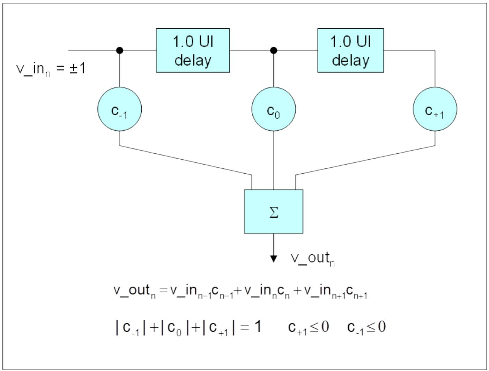

flowchart

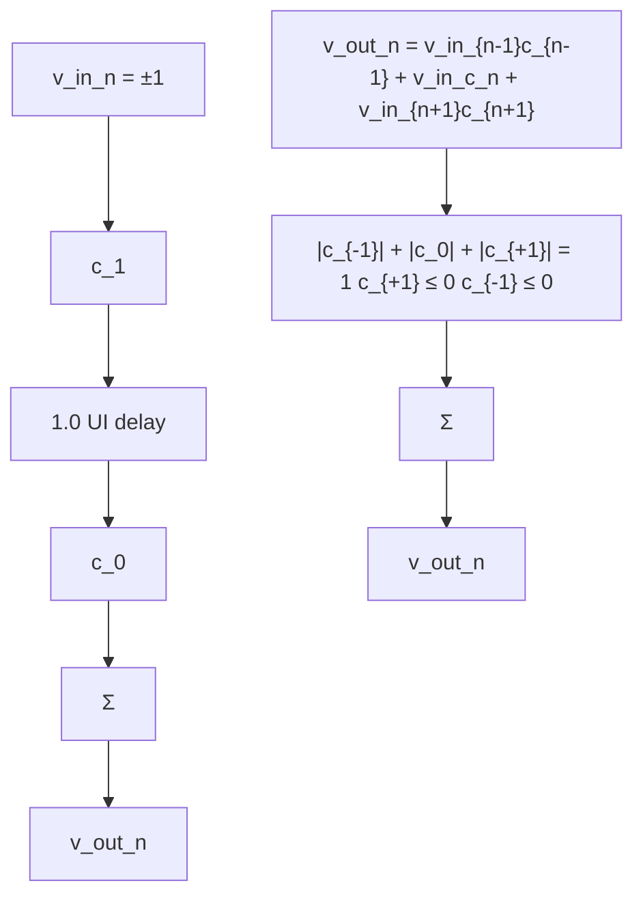
```mermaid
graph TD
  A["v_in_n = ±1"] --> B["c_1"]
  B --> C["1.0 UI delay"]
  C --> D["c_0"]
  D --> E["Σ"]
  E --> F["v_out_n"]
  G["v_out_n = v_in_{n-1}c_{n-1} + v_in_c_n + v_in_{n+1}c_{n+1}"] --> H["|c_{-1}| + |c_0| + |c_{+1}| = 1 c_{+1} ≤ 0 c_{-1} ≤ 0"]
  H --> I["Σ"]
  I --> J["v_out_n"]
```

Figure 8-4 Tx Equalization FIR Representation for 8.0, 16.0, and 32.0 § GT/s

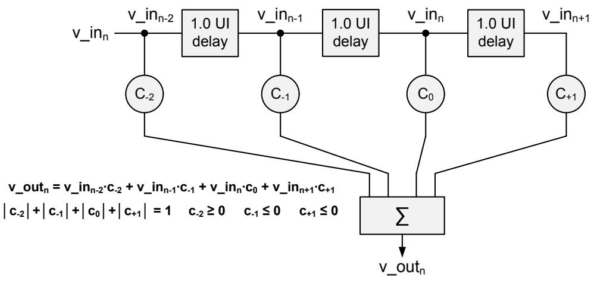

flowchart

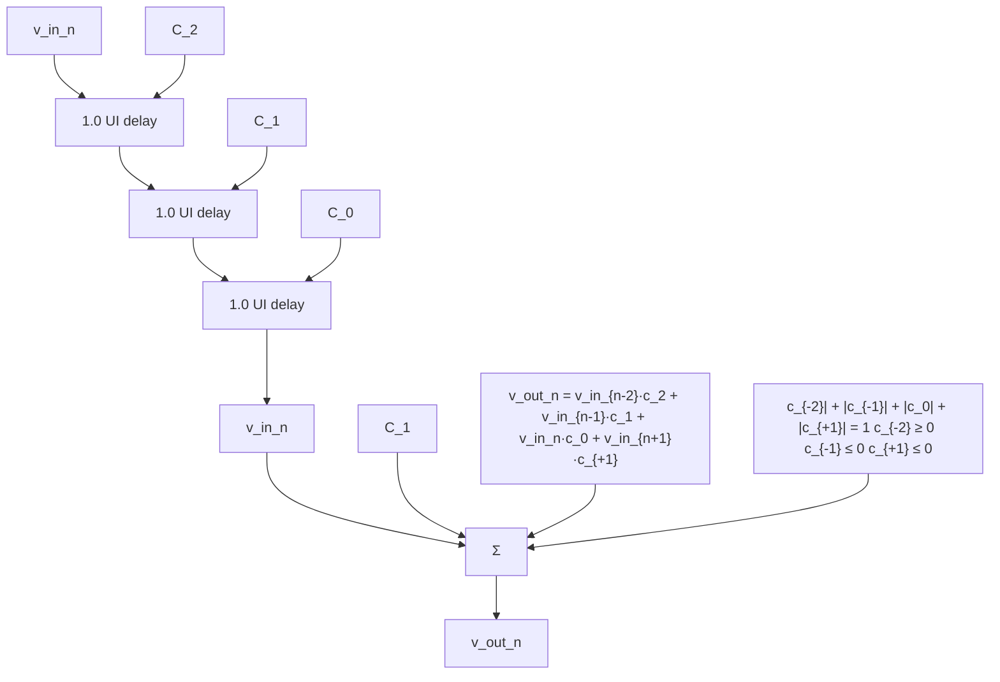
```mermaid
graph TD
  A["v_in_n"] --> B["1.0 UI delay"]
  B --> C["1.0 UI delay"]
  C --> D["1.0 UI delay"]
  D --> E["v_in_n"]
  E --> F["Σ"]
  F --> G["v_out_n"]
  H["C_2"] --> B
  I["C_1"] --> C
  J["C_0"] --> D
  K["C_1"] --> F
  L["v_out_n = v_in_{n-2}·c_2 + v_in_{n-1}·c_1 + v_in_n·c_0 + v_in_{n+1}·c_{+1}"] --> F
  M["c_{-2}| + |c_{-1}| + |c_0| + |c_{+1}| = 1 c_{-2} ≥ 0 c_{-1} ≤ 0 c_{+1} ≤ 0"] --> F
```

Figure 8-5 Tx Equalization FIR Representation for 64.0 GT/s§

## 8.3.3.3 Tx Equalization Presets for 8.0, 16.0, 32.0, and 64.0 GT/s §

When operating at 8.0 GT/s, 16.0 GT/s and 32.0 GT/s the Tx must support the full range of presets given in § Table 8-1. When operating at 64.0 GT/s, the Tx must support the full range of presets given in § Table 8-2. The data rate dependent encoding of presets has been defined in § Section 4.2.4.2 . Presets are defined in terms of ratios, relating the pre-cursor and post-cursor equalization voltages. The pre-cursors (Vc1) and (Vc2) are referred to as pre-shoots, while the post-cursor (Vb) is referred to as de-emphasis. This convention permits the specification to retain the existing 2.5 GT/s and 5.0 GT/s definitions for Tx equalization, where only de-emphasis is defined, and it allows pre-shoots and de-emphasis to be defined such that each is independent of the other. The tolerances in § Table 8-1 also apply to 2.5 and 5.0 GT/s de-emphasis. The maximum swing, Vd, is also shown to illustrate that, when c+1, c-2, and c-1 are non-zero, the swing of Va does not reach the maximum as defined by Vd. § Figure 8-6 is shown as an example of transmitter equalization, but it is not intended to represent the signal as it would appear for measurement purposes. The high frequency nature of PCIe signaling makes measurement of single UI pulse heights impractical.

The presets defined in § Table 8-1 and § Table 8-2 are numbered to match the designations in § Table 4-23.

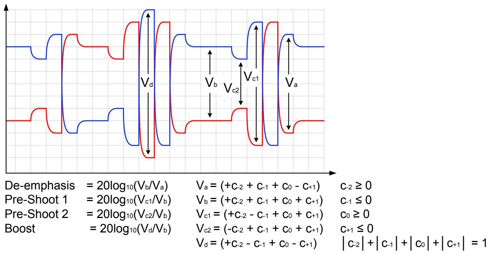

line chart

| Condition       | Value        |
| --------------- | ------------ |
| De-emphasis     | 20log₁₀(Vb/Va) |
| Pre-Shoot 1     | 20log₁₀(Vc1/Vb) |
| Pre-Shoot 2     | 20log₁₀(Vc2/Vb) |
| Boost           | 20log₁₀(Vd/Vb) |

Figure 8-6 Definition of Tx Voltage Levels and Equalization Ratios§

§ Table 8-1 lists the values for presets; at 8.0 GT/s, 16.0 GT/s and 32.0 GT/s. All preset values must be supported for full swing signaling.

Table 8-1 Tx Preset Ratios and Corresponding Coefficient Values for 8.0, 16.0, and 32.0 GT/s§

<table><tr><td>Preset #</td><td>Preshoot 2 (dB)</td><td>Preshoot 1 (dB)</td><td>De-emphasis (dB)</td><td> $c_{-2}$ </td><td> $c_{-1}$ </td><td> $c_{+1}$ </td><td>Va/Vd</td><td>Vb/Vd</td><td>Vc1/Vd</td><td>Vc2/Vd</td></tr><tr><td>P4</td><td>0.0</td><td>0.0 ±1 dB</td><td>0.0 ±1 dB</td><td>0.000</td><td>0.000</td><td>0.000</td><td>1.000</td><td>1.000</td><td>1.000</td><td>1.000</td></tr><tr><td>P1</td><td>0.0</td><td>0.0 ±1 dB</td><td>-3.5 ±1 dB</td><td>0.000</td><td>0.000</td><td>-0.167</td><td>1.000</td><td>0.666</td><td>0.666</td><td>0.666</td></tr><tr><td>P0</td><td>0.0</td><td>0.0 ±1 dB</td><td>-6.0 ±1.5 dB</td><td>0.000</td><td>0.000</td><td>-0.250</td><td>1.000</td><td>0.500</td><td>0.500</td><td>0.500</td></tr><tr><td>P9</td><td>0.0</td><td>3.5 ±1 dB</td><td>0.0 ±1 dB</td><td>0.000</td><td>-0.167</td><td>0.000</td><td>0.666</td><td>0.666</td><td>1.000</td><td>0.666</td></tr><tr><td>P8</td><td>0.0</td><td>3.5 ±1 dB</td><td>-3.5 ±1 dB</td><td>0.000</td><td>-0.125</td><td>-0.125</td><td>0.750</td><td>0.500</td><td>0.750</td><td>0.500</td></tr><tr><td>P7</td><td>0.0</td><td>3.5 ±1 dB</td><td>-6.0 ±1.5 dB</td><td>0.000</td><td>-0.100</td><td>-0.200</td><td>0.800</td><td>0.400</td><td>0.600</td><td>0.400</td></tr><tr><td>P5</td><td>0.0</td><td>1.9 ±1 dB</td><td>0.0 ±1 dB</td><td>0.000</td><td>-0.100</td><td>0.000</td><td>0.800</td><td>0.800</td><td>1.000</td><td>0.800</td></tr><tr><td>P6</td><td>0.0</td><td>2.5 ±1 dB</td><td>0.0 ±1 dB</td><td>0.000</td><td>-0.125</td><td>0.000</td><td>0.750</td><td>0.750</td><td>1.000</td><td>0.750</td></tr><tr><td>P3</td><td>0.0</td><td>0.0 ±1 dB</td><td>-2.5 ±1 dB</td><td>0.000</td><td>0.000</td><td>-0.125</td><td>1.000</td><td>0.750</td><td>0.750</td><td>0.750</td></tr><tr><td>P2</td><td>0.0</td><td>0.0 ±1 dB</td><td>-4.4 ±1.5 dB</td><td>0.000</td><td>0.000</td><td>-0.200</td><td>1.000</td><td>0.600</td><td>0.600</td><td>0.600</td></tr><tr><td>P10</td><td>0.0</td><td>0.0 ±1 dB</td><td>Note 2</td><td>0.000</td><td>0.000</td><td>Note 2</td><td>1.000</td><td>Note 2</td><td>Note 2</td><td>Note 2</td></tr></table>

Notes:

<table><tr><td>Preset #</td><td>Preshoot 2 (dB)</td><td>Preshoot 1 (dB)</td><td>De-emphasis (dB)</td><td> $c_{-2}$ </td><td> $c_{-1}$ </td><td> $c_{+1}$ </td><td>Va/Vd</td><td>Vb/Vd</td><td>Vc1/Vd</td><td>Vc2/Vd</td></tr></table>

1. Reduced swing signaling must implement presets P4, P1, P9, P5, P6, and P3. Full swing signaling must implement all the above presets.  
2. P10 boost limits are not fixed, since its de-emphasis level is a function of the LF level that the Tx advertises during training (see § Section 4.2.4.1 ). P10 is used for testing the boost limit of Transmitter at full swing. P1 is used for testing the boost limit of Transmitter at reduced swing.

§ Table 8-2 lists the values for presets at 64.0 GT/s. All preset values must be supported for full swing signaling.  
Table 8-2 Tx Preset Ratios and Corresponding Coefficient Values for 64.0 GT/s§

<table><tr><td>Preset #</td><td>Preshoot 2 (dB)</td><td>Preshoot 1 (dB)</td><td>De-emphasis (dB)</td><td> $C_{-2}$ </td><td> $C_{-1}$ </td><td> $C_{+1}$ </td><td>Va/Vd</td><td>Vb/Vd</td><td>Vc1/Vd</td><td>Vc2/Vd</td></tr><tr><td>Q0</td><td>0.0 ±0.5 dB</td><td>0.0 ±0.5 dB</td><td>0.0 ±0.5 dB</td><td>0.000</td><td>0.000</td><td>0.000</td><td>1.000</td><td>1.000</td><td>1.000</td><td>1.000</td></tr><tr><td>Q1</td><td>0.0 ±0.5 dB</td><td>1.6 ±0.5 dB</td><td>0.0 ±0.5 dB</td><td>0.000</td><td>-0.083</td><td>0.000</td><td>0.834</td><td>0.834</td><td>1.000</td><td>0.834</td></tr><tr><td>Q2</td><td>0.0 ±0.5 dB</td><td>3.5 ±0.5 dB</td><td>0.0 ±0.5 dB</td><td>0.000</td><td>-0.167</td><td>0.000</td><td>0.666</td><td>0.666</td><td>1.000</td><td>0.666</td></tr><tr><td>Q3</td><td>0.0 ±0.5 dB</td><td>0.0 ±0.5 dB</td><td>-1.6 ±0.5 dB</td><td>0.000</td><td>0.000</td><td>-0.083</td><td>1.000</td><td>0.834</td><td>0.834</td><td>0.834</td></tr><tr><td>Q4</td><td>0.0 ±0.5 dB</td><td>0.0 ±0.5 dB</td><td>-3.5 ±0.5 dB</td><td>0.000</td><td>0.000</td><td>-0.167</td><td>1.000</td><td>0.666</td><td>0.666</td><td>0.666</td></tr><tr><td>Q5</td><td>-1.3 ±0.5 dB</td><td>4.7 ±1.0 dB</td><td>0.0 ±0.5 dB</td><td>0.042</td><td>-0.208</td><td>0.000</td><td>0.584</td><td>0.584</td><td>1.000</td><td>0.500</td></tr><tr><td>Q6</td><td>-1.6 ±0.5 dB</td><td>3.5 ±0.5 dB</td><td>-3.5 ±0.5 dB</td><td>0.042</td><td>-0.125</td><td>-0.125</td><td>0.750</td><td>0.500</td><td>0.750</td><td>0.416</td></tr><tr><td>Q7</td><td>-2.9 ±0.5 dB</td><td>4.7 ±1.0 dB</td><td>0.0 ±0.5 dB</td><td>0.083</td><td>-0.208</td><td>0.000</td><td>0.584</td><td>0.584</td><td>1.000</td><td>0.418</td></tr><tr><td>Q8</td><td>-3.5 ±0.5 dB</td><td>6.0 ±1.0 dB</td><td>0.0 ±0.5 dB</td><td>0.083</td><td>-0.250</td><td>0.000</td><td>0.500</td><td>0.500</td><td>1.000</td><td>0.334</td></tr><tr><td>Q9</td><td>-4.4 ±1.0 dB</td><td>6.9 ±1.0 dB</td><td>-1.6 ±0.5 dB</td><td>0.083</td><td>-0.250</td><td>-0.042</td><td>0.500</td><td>0.416</td><td>0.916</td><td>0.250</td></tr><tr><td>Q10</td><td>0.0 ±0.5 dB</td><td>0.0 ±0.5 dB</td><td>Note 2</td><td>0.000</td><td>0.000</td><td>Note 2</td><td>1.000</td><td>Note 2</td><td>Note 2</td><td>Note 2</td></tr></table>

Notes:  
1. Reduced swing signaling must implement presets Q0, Q1, Q2, Q3, and Q4. Full swing signaling must implement all the above presets.  
2. Q10 boost limits are not fixed, since its de-emphasis level is a function of the LF level that the Tx advertises during training. Q10 is used for testing the boost limit of Transmitter at full swing. Q4 is used for testing the boost limit of Transmitter at reduced swing.

## 8.3.3.4 Measuring Tx Equalization for 2.5 GT/s and 5.0 GT/s §

Tx equalization de-emphasis values at 2.5 and 5.0 GT/s are measured using the average ratio of transition to non-transition eye heights at the 0.5 UI location using 500 repetitions of the compliance pattern.

## 8.3.3.5 Measuring Presets at 8.0, 16.0, 32.0, and 64.0 GT/s §

§ Figure 8-7 illustrate the methodology for measuring Tx equalization coefficients and presets. For a Tx preset to be measured, the DUT Tx transmits a Compliance Pattern with the corresponding Tx equalization coefficients. The

equalized Compliance Pattern is captured by a real-time oscilloscope and the post-processing software extracts an equalized step response waveform. The DUT Tx also transmits a Compliance Pattern with no Tx equalization. The unequalized Compliance Pattern is captured by the real-time oscilloscope and the post-processing software applies Tx equalization coefficients c-2, c-1, c0, and c+1 to construct an equalized step response waveform. The Tx preset coefficients are the best fit Tx equalization coefficients c-2, c-1, c0, and c+1 that minimize the Mean Square Error (MSE) between the measured equalized step response waveform and the reconstructed equalized step response waveform.

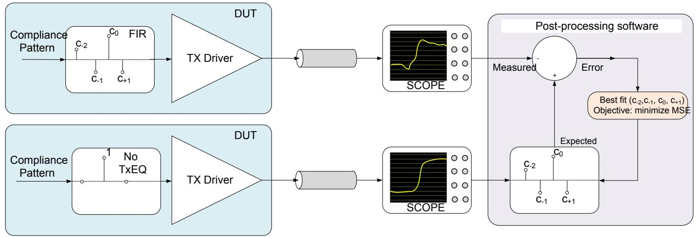

flowchart

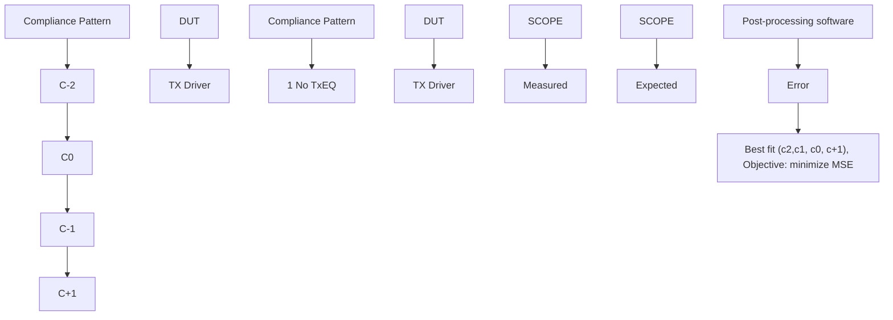
```mermaid
graph TD
  A["Compliance Pattern"] --> B["C-2"]
  B --> C["C0"]
  C --> D["C-1"]
  D --> E["C+1"]
  F["DUT"] --> G["TX Driver"]
  H["Compliance Pattern"] --> I["1 No TxEQ"]
  J["DUT"] --> K["TX Driver"]
  L["SCOPE"] --> M["Measured"]
  N["SCOPE"] --> O["Expected"]
  P["Post-processing software"] --> Q["Error"]
  Q --> R["Best fit (c2,c1, c0, c+1), Objective: minimize MSE"]
```

Figure 8-7 Methodology for measuring Tx equalization coefficients and presets§

## 8.3.3.6 Method for Measuring VTX-DIFF-PP at 2.5 GT/s and 5.0 GT/s

VTX-DIFF-PP (VTX-DIFF-PP-LOW for reduced swing) at 2.5 GTs and 5.0 GT/s are measured using the average transition eye amplitude at the 0.5 UI location using 500 repetitions of the compliance pattern.

## 8.3.3.7 Method for Measuring VTX-DIFF-PP at 8.0, 16.0, 32.0, and 64.0 GT/s §

The range for a Transmitter’s output voltage swing, (specified by Vd) with no equalization is defined by VTX-DIFF-PP (VTX-DIFF-PP-LOW for reduced swing), and is obtained by setting $c _ { - 2 } , c _ { - 1 }$ and $c _ { + 1 }$ to zero and measuring the peak-peak voltage on the 64-ones (64 PAM4 voltage level 3’s at 64.0 GT/s)/64-zeros (64 PAM4 voltage level 0’s at 64.0 GT/s) segment of the compliance pattern. The resulting signal effectively measures at the die pad, minus any low frequency package loss. ISI and switching effects are minimized by restricting the portion of the curve over which voltage is measured to the last few UI of each half cycle, as illustrated in § Figure 8-8. High frequency noise is mitigated by averaging over 500 repetitions of the compliance pattern.

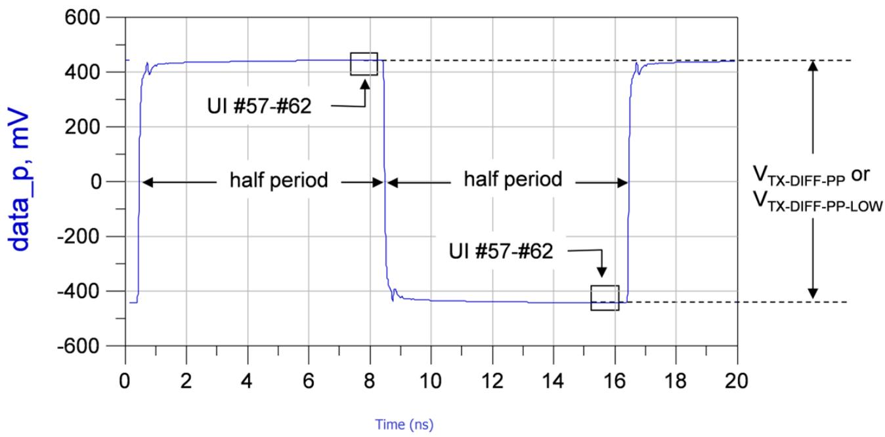

line chart

| Time (ns) | data_p, mV |
| --------- | ---------- |
| 0         | -400       |
| 8         | 400        |
| 16        | -400       |
| 20        | 400        |

Figure 8-8 VTX-DIFF-PP and VTX-DIFF-PP-LOW Measurement§

## 8.3.3.8 Coefficient Range and Tolerance for 8.0, 16.0, 32.0, and 64.0 GT/s §

8.0, 16.0, 32.0, and 64.0 GT/s Transmitters are required to inform the Receiver of their coefficient range and tolerance. Coefficient range and tolerance are constrained by the following requirements.

• Coefficients must support all eleven presets and their respective tolerances as defined in § Table 8-1 and § Table 8-2  
• All Transmitters must meet the full swing signaling VTX-EIEOS-FS limits.  
• Transmitters may optionally support reduced swing, and if they do, they must meet the VTX-EIEOS-RS limits.  
• The coefficients must meet the boost and resolution (VTX-BOOST-FS, VTX-BOOST-RS and EQTX-COEFF-RES) limits defined in § Table 8-6.

When the above constraints are applied the resulting coefficient space for 8.0, 16.0, and 32.0 GT/s with pre-shoot2 coefficient c-2 = 0 may be mapped onto a triangular matrix, an example of which is shown in § Figure 8-9. The matrix may be interpreted as follows: pre-shoot1 and de-emphasis coefficients are mapped onto the Y-axis and X-axes, respectively. In both cases the maximum granularity of 1/24 is assumed. Each matrix cell, corresponding to a valid combination of pre-shoot1 and de-emphasis coefficients, has three entries corresponding to pre-shoot1 (PS1), de-emphasis (DE), and boost (as shown in the upper left-hand corner). Diagonal elements are defined by the maximum boost ratio. Those cells highlighted in blue are presets required for reduced swing, while cells in either blue or orange represent presets required for full swing signaling. Note that this figure is informative only and is not intended to imply any specific Tx implementation or to alter requirements for nominal preset equalization values and allowed ranges.

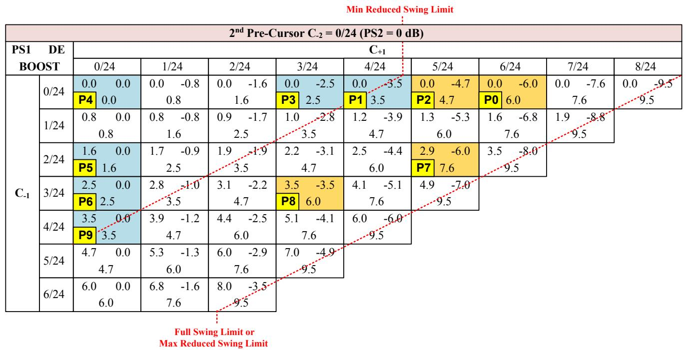

heatmap

Min Reduced Swing Limit
| PS1 DE BOOST | 2nd Pre-Cursor C-2 = 0/24 (PS2 = 0 dB) | C+1 | 0/24 | 1/24 | 2/24 | 3/24 | 4/24 | 5/24 | 6/24 | 7/24 | 8/24 |
|---|---|---|---|---|---|---|---|---|---|---|---|
| C-1 | 0/24 | 0.0 P4 | 0.0 0.0 | 0.0 -0.8 0.8 | 0.0 -1.6 1.6 | 0.0 -2.5 P3 | 0.0 -3.5 P1 | 0.0 -4.7 P2 | 0.0 -6.0 P0 | 0.0 -7.6 7.6 | 0.0 -9.5 9.5 |
|---|---|---|---|---|---|---|---|---|---|---|---|
| | 1/24 | 0.8 0.8 | 0.0 0.8 | 0.8 -0.8 1.6 | 0.9 -1.7 2.5 | 1.0 -2.8 3.5 | 1.2 -3.9 4.7 | 1.3 -5.3 6.0 | 1.6 -6.8 7.6 | 1.9 -8.8 9.5 | |
|---|---|---|---|---|---|---|---|---|---|---|---|
| | 2/24 | 1.6 P5 | 0.0 1.6 | 1.7 -0.9 2.5 | 1.9 -1.9 3.5 | 2.2 -3.1 4.7 | 2.5 -4.4 6.0 | 2.9 -6.0 P7 | 3.5 -8.0 9.5 | | |
|---|---|---|---|---|---|---|---|---|---|---|---|
| | 3/24 | 2.5 P6 | 0.0 2.5 | 2.8 -1.0 3.5 | 3.1 -2.2 4.7 | 3.5 -3.5 P8 | 4.1 -5.1 7.6 | 4.9 -7.0 9.5 | | | |
|---|---|---|---|---|---|---|---|---|---|---|---|
| | 4/24 | 3.5 P9 | 0.0 3.5 | 3.9 -1.2 4.7 | 4.4 -2.5 6.0 | 5.1 -4.1 7.6 | 6.0 -6.0 -9.5 | | | | |
|---|---|---|---|---|---|---|---| | | | |
| | 5/24 | 4.7 4.7 | 0.0 4.7 | 5.3 -1.3 6.0 | 6.0 -2.9 7.6 | 7.0 -4.9 -9.5 | | | | | |
|---|---|---|---|---|---|---|---| | | | |
| | 6/24 | 6.0 6.0 | 0.0 6.0 | 6.8 -1.6 7.6 | 8.0 -3.5 -9.5 | | | | | | |
Full Swing Limit or Max Reduced Swing Limit

Figure 8-9 Transmit Equalization Coefficient Space Triangular Matrix Example for 8.0, 16.0, and 32.0 GT/s§

The coefficient space for 64.0 GT/s with each pre-shoot2 coefficient may be mapped onto a triangular matrix, an example of which is shown in § Figure 8-10. Maximum granularity of 1/24 is assumed for Tx equalization coefficient. Those cells highlighted in blue are presets required for reduced swing, while cells in either blue or orange represent presets required for full swing signaling. Note that this figure is informative only and is not intended to imply any specific Tx implementation or to alter requirements for nominal preset equalization values and allowed ranges.

<table><tr><td colspan="19"> $2^{nd}$ Pre-Cursor  $C_{-2}=0/24$ </td><td></td></tr><tr><td colspan="2">PS2 PS1 DE</td><td colspan="17"> $C_{+1}$ </td><td></td></tr><tr><td>PRESET</td><td>BOOST</td><td colspan="2">0/24</td><td colspan="2">1/24</td><td colspan="2">2/24</td><td colspan="2">3/24</td><td colspan="2">4/24</td><td colspan="2">5/24</td><td colspan="2">6/24</td><td colspan="2">7/24</td><td>8/24</td><td></td></tr><tr><td rowspan="14"> $C_{-1}$ </td><td rowspan="2">0/24</td><td>0.0</td><td>0.0</td><td>0.0</td><td>0.0</td><td>0.0</td><td>-0.8</td><td>0.0</td><td>0.0</td><td>-1.6</td><td>0.0</td><td>0.0</td><td>-2.5</td><td>0.0</td><td>0.0</td><td>-3.5</td><td>0.0</td><td>0.0</td><td>-4.7</td></tr><tr><td>Q0</td><td>0.0</td><td></td><td>0.8</td><td></td><td>Q3</td><td>1.6</td><td></td><td>2.5</td><td></td><td>Q4</td><td>3.5</td><td></td><td>4.7</td><td></td><td>6.0</td><td></td><td>7.6</td></tr><tr><td rowspan="2">1/24</td><td>0.0</td><td>0.8</td><td>0.0</td><td>0.0</td><td>0.8</td><td>-0.8</td><td>0.0</td><td>0.9</td><td>-1.7</td><td>0.0</td><td>1.0</td><td>-2.8</td><td>0.0</td><td>1.2</td><td>-3.9</td><td>0.0</td><td>1.3</td><td>-5.3</td></tr><tr><td></td><td>0.8</td><td></td><td>1.6</td><td></td><td></td><td>2.5</td><td></td><td>3.5</td><td></td><td></td><td>4.7</td><td></td><td>6.0</td><td></td><td>7.6</td><td></td><td>9.5</td></tr><tr><td rowspan="2">2/24</td><td>0.0</td><td>1.6</td><td>0.0</td><td>0.0</td><td>1.7</td><td>-0.9</td><td>0.0</td><td>1.9</td><td>-1.9</td><td>0.0</td><td>2.2</td><td>-3.1</td><td>0.0</td><td>2.5</td><td>-4.4</td><td>0.0</td><td>2.9</td><td>-6.0</td></tr><tr><td>Q1</td><td>1.6</td><td></td><td>2.5</td><td></td><td></td><td>3.5</td><td></td><td>4.7</td><td></td><td></td><td>6.0</td><td></td><td>7.6</td><td></td><td>9.5</td><td></td><td></td></tr><tr><td rowspan="2">3/24</td><td>0.0</td><td>2.5</td><td>0.0</td><td>0.0</td><td>2.8</td><td>-1.0</td><td>0.0</td><td>3.1</td><td>-2.2</td><td>0.0</td><td>3.5</td><td>-3.5</td><td>0.0</td><td>4.1</td><td>-5.1</td><td>0.0</td><td>4.9</td><td>-7.0</td></tr><tr><td></td><td>2.5</td><td></td><td>3.5</td><td></td><td></td><td>4.7</td><td></td><td>6.0</td><td></td><td></td><td>7.6</td><td></td><td>9.5</td><td></td><td></td><td></td><td></td></tr><tr><td rowspan="2">4/24</td><td>0.0</td><td>3.5</td><td>0.0</td><td>0.0</td><td>3.9</td><td>-1.2</td><td>0.0</td><td>4.4</td><td>-2.5</td><td>0.0</td><td>5.1</td><td>-4.1</td><td>0.0</td><td>6.0</td><td>-6.0</td><td></td><td></td><td></td></tr><tr><td>Q2</td><td>3.5</td><td></td><td>4.7</td><td></td><td></td><td>6.0</td><td></td><td>7.6</td><td></td><td></td><td>9.5</td><td></td><td></td><td></td><td></td><td></td><td></td></tr><tr><td rowspan="2">5/24</td><td>0.0</td><td>4.7</td><td>0.0</td><td>0.0</td><td>5.3</td><td>-1.3</td><td>0.0</td><td>6.0</td><td>-2.9</td><td>0.0</td><td>7.0</td><td>-4.9</td><td></td><td></td><td></td><td></td><td></td><td></td></tr><tr><td></td><td>4.7</td><td></td><td>6.0</td><td></td><td></td><td>7.6</td><td></td><td>9.5</td><td></td><td></td><td></td><td></td><td></td><td></td><td></td><td></td><td></td></tr><tr><td rowspan="2">6/24</td><td>0.0</td><td>6.0</td><td>0.0</td><td>0.0</td><td>6.9</td><td>-1.6</td><td>0.0</td><td>8.0</td><td>-3.5</td><td></td><td></td><td></td><td></td><td></td><td></td><td></td><td></td><td></td></tr><tr><td></td><td>6.0</td><td></td><td>7.6</td><td></td><td></td><td>9.5</td><td></td><td></td><td></td><td></td><td></td><td></td><td></td><td></td><td></td><td></td><td></td></tr></table>

Min Reduced Swing Limit

<table><tr><td colspan="20"> $2^{nd}$ Pre-Cursor  $C_{-2}=1/24$ </td></tr><tr><td colspan="2">PS2 PS1 DE</td><td colspan="18"> $C_{+1}$ </td></tr><tr><td>PRESET</td><td>BOOST</td><td colspan="2">0/24</td><td colspan="2">1/24</td><td colspan="2">2/24</td><td colspan="2">3/24</td><td colspan="2">4/24</td><td colspan="2">5/24</td><td colspan="2">6/24</td><td colspan="2">7/24</td><td colspan="2">8/24</td></tr><tr><td rowspan="7"> $C_{-1}$ </td><td>0/24</td><td colspan="2">-0.80.00.00.0</td><td colspan="2">-0.80.00.8</td><td colspan="2">-0.90.01.6</td><td colspan="2">-1.00.02.5</td><td colspan="2">-1.20.03.5</td><td colspan="2">-1.30.04.7</td><td colspan="2">-1.60.06.0</td><td colspan="2">-1.90.07.6</td><td colspan="2">-2.50.09.5</td></tr><tr><td>1/24</td><td colspan="2">-0.80.80.00.8</td><td colspan="2">-0.90.81.6</td><td colspan="2">-1.00.92.5</td><td colspan="2">-1.21.03.5</td><td colspan="2">-1.31.24.7</td><td colspan="2">-1.61.36.0</td><td colspan="2">-1.91.67.6</td><td colspan="2">-2.51.99.5</td><td colspan="2"></td></tr><tr><td>2/24</td><td colspan="2">-0.91.61.6</td><td colspan="2">-1.01.72.5</td><td colspan="2">-1.21.93.5</td><td colspan="2">-1.32.24.7</td><td colspan="2">-1.62.56.0</td><td colspan="2">-1.92.97.6</td><td colspan="2">-2.53.59.5</td><td colspan="2"></td><td colspan="2"></td></tr><tr><td>3/24</td><td colspan="2">-1.02.52.5</td><td colspan="2">-1.22.83.5</td><td colspan="2">-1.33.14.7</td><td colspan="2">-1.63.5Q66.0</td><td colspan="2">-1.94.17.6</td><td colspan="2">-2.54.99.5</td><td colspan="2"></td><td colspan="2"></td><td colspan="2"></td></tr><tr><td>4/24</td><td colspan="2">-1.23.53.5</td><td colspan="2">-1.33.94.7</td><td colspan="2">-1.64.46.0</td><td colspan="2">-1.95.17.6</td><td colspan="2">-2.56.09.5</td><td colspan="2"></td><td colspan="2"></td><td colspan="2"></td><td colspan="2"></td></tr><tr><td>5/24</td><td colspan="2">-1.34.7Q54.7</td><td colspan="2">-1.65.36.0</td><td colspan="2">-1.96.07.6</td><td colspan="2">-2.57.09.5</td><td colspan="2"></td><td colspan="2"></td><td colspan="2"></td><td colspan="2"></td><td colspan="2"></td></tr><tr><td>6/24</td><td colspan="2">-1.66.06.0</td><td colspan="2">-1.96.97.6</td><td colspan="2">-2.58.09.5</td><td colspan="2"></td><td colspan="2"></td><td colspan="2"></td><td colspan="2"></td><td colspan="2"></td><td colspan="2"></td></tr></table>

Min Reduced Swing Limit

<table><tr><td colspan="20"> $2^{nd}$ Pre-Cursor  $C_{-2}=2/24$ </td></tr><tr><td colspan="2">PS2 PS1 DE</td><td colspan="18"> $C_{+1}$ </td></tr><tr><td>PRESET</td><td>BOOST</td><td colspan="2">0/24</td><td colspan="2">1/24</td><td colspan="2">2/24</td><td colspan="2">3/24</td><td colspan="2">4/24</td><td colspan="2">5/24</td><td colspan="2">6/24</td><td colspan="2">7/24</td><td colspan="2">8/24</td></tr><tr><td rowspan="7"> $C_{-1}$ </td><td>0/24</td><td colspan="2">-1.60.00.00.0</td><td colspan="2">-1.70.00.8</td><td colspan="2">-1.90.01.6</td><td colspan="2">-2.20.02.5</td><td colspan="2">-2.50.03.5</td><td colspan="2">-2.90.04.7</td><td colspan="2">-3.50.06.0</td><td colspan="2">-4.40.07.6</td><td colspan="2">-6.00.09.5</td></tr><tr><td>1/24</td><td colspan="2">-1.70.80.00.8</td><td colspan="2">-1.90.81.6</td><td colspan="2">-2.20.92.5</td><td colspan="2">-2.51.03.5</td><td colspan="2">-2.91.24.7</td><td colspan="2">-3.51.36.0</td><td colspan="2">-4.41.67.6</td><td colspan="2">-6.01.99.5</td><td colspan="2"></td></tr><tr><td>2/24</td><td colspan="2">-1.91.60.01.6</td><td colspan="2">-2.21.72.5</td><td colspan="2">-2.51.93.5</td><td colspan="2">-2.92.24.7</td><td colspan="2">-3.52.56.0</td><td colspan="2">-4.42.97.6</td><td colspan="2">-6.03.59.5</td><td colspan="2"></td><td colspan="2"></td></tr><tr><td>3/24</td><td colspan="2">-2.22.50.02.5</td><td colspan="2">-2.52.83.5</td><td colspan="2">-2.93.14.7</td><td colspan="2">-3.53.56.0</td><td colspan="2">-4.44.17.6</td><td colspan="2">-6.04.99.5</td><td colspan="2"></td><td colspan="2"></td><td colspan="2"></td></tr><tr><td>4/24</td><td colspan="2">-2.53.50.03.5</td><td colspan="2">-2.93.94.7</td><td colspan="2">-3.54.46.0</td><td colspan="2">-4.45.17.6</td><td colspan="2">-6.06.09.5</td><td colspan="2"></td><td colspan="2"></td><td colspan="2"></td><td colspan="2"></td></tr><tr><td>5/24</td><td colspan="2">-2.94.70.0Q74.7</td><td colspan="2">-3.55.36.0</td><td colspan="2">-4.46.07.6</td><td colspan="2">-6.07.09.5</td><td colspan="2"></td><td colspan="2"></td><td colspan="2"></td><td colspan="2"></td><td colspan="2"></td></tr><tr><td>6/24</td><td colspan="2">-3.56.00.0Q86.0</td><td colspan="2">-4.46.97.6</td><td colspan="2">-6.08.09.5</td><td colspan="2"></td><td colspan="2"></td><td colspan="2"></td><td colspan="2"></td><td colspan="2"></td><td colspan="2"></td></tr></table>

Figure 8-10 Transmit Equalization Coefficient Space Triangular Matrix Example for 64.0 GT/s§

## 8.3.3.9 EIEOS and VTX-EIEOS-FS and VTX-EIEOS-RS Limits §

EIEOS signaling is defined for 5.0, 8.0, 16.0, 32.0, and 64.0 GT/s only. At 5.0 GT/s the K28.7 Symbol is used. VTX-EIEOS-FS and VTX-EIEOS-RS are measured using the EIEOS sequence contained within the compliance pattern for 8.0, 16.0, 32.0, and 64.0 GT/s. At 8.0 GT/s the EIEOS pattern consists of eight consecutive ones followed by the same number of consecutive zeros, where the pattern is repeated for a total of 128 UI. At 16.0 GT/s the EIEOS pattern consists of 16 consecutive ones followed by the same number of consecutive zeros, where the pattern is repeated for a total of 128 UI. At 32.0 GT/s the EIEOS pattern consists of 32 consecutive ones followed by the same number of consecutive zeros, where the pattern is repeated for a total of 128 UI. At 32.0 GT/s the pattern is repeated for two consecutive blocks. At 64.0 GT/s the EIEOS pattern consists of 32 UI consecutive voltage level 3’s followed by 32 UI consecutive voltage level 0’s (see § Section 4.2.5.3 ).

A transmitter sends an EIEOS to cause an exit of Electrical Idle at the Receiver. This pattern guarantees the Receiver will properly detect the EI Exit condition with its squelch exit detect circuit, something not otherwise guaranteed by scrambled data. The Tx EIEOS launch voltage is defined by VTX-EIEOS-FS for full swing signaling and by VTX-EIEOS-RS for reduced swing signaling. VTX-EIEOS-RS is smaller than VTX-EIEOS-FS to reflect the fact that reduced swing is typically supported only for lower loss channels where there is less attenuation at the EIEOS signaling rate.

For full swing signaling VTX-EIEOS-FS is measured with a preset number P10 for 8.0, 16.0, and 32.0 GT/s, and with a preset number Q10 for 64.0 GT/s. This is equivalent to a maximum nominal boost of 9.5 dB and represents the maximum boost attainable in coefficient space. When a tolerance of ±1.5 dB is factored in this yields the minimum boost limit of 8.0 dB appearing in § Table 8-6. For reduced swing signaling VTX-EIEOS-RS is measured with preset P1 for 8.0, 16.0, and 32.0 GT/s, and with a preset number Q4 for 64.0 GT/s.

A Transmitter is not always permitted to generate the maximum boost level noted above. A Transmitter that cannot drive significantly more than 800 mVPP is limited by the need to meet VTX-EIEOS-FS. The Tx must reject any adjustments to its presets or coefficients that would violate the VTX-EIEOS-FS or VTX-EIEOS-RS limits. The EIEOS voltage limits are imposed to guarantee the EIEOS threshold of 175 mVPP at the Rx pin.

§ Figure 8-11 illustrates the de-emphasis peak as observed at the pin of a Tx for VTX-EIEOS-FS. At the far end of a lossy channel the de-emphasis peak will be attenuated; this is why the measurement interval includes only the middle five UI at 8.0 GT/s, UI number 5-14 at 16.0 GT/s, and UI number 9-28 at 32.0 and 64.0 GT/s. The voltage is averaged over this interval for both the negative and positive halves of the waveform over 500 repetitions of the compliance pattern. VTX-EIEOS-FS and VTX-EIEOS-RS are defined as the difference between the negative and positive waveform segment averages. UI boundaries are defined with respect to the edge of the recovered data clock.

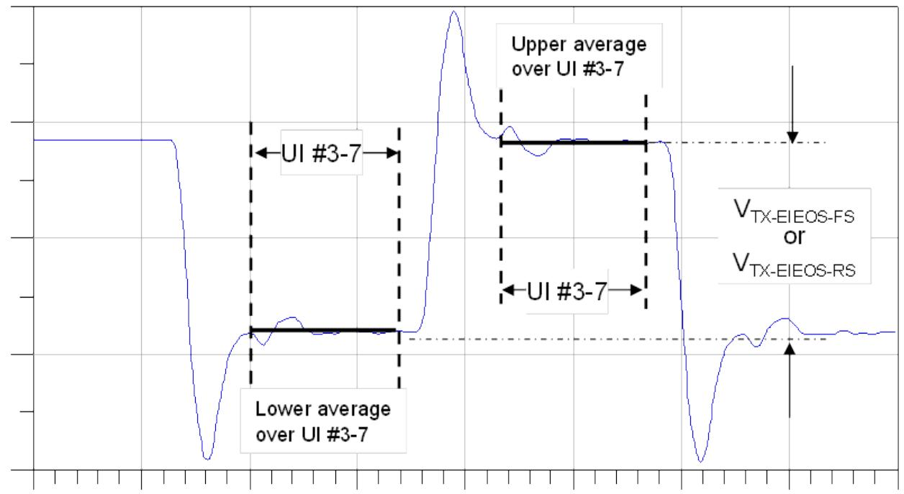

line chart

| Time Segment | Voltage Level |
| ------------ | ------------- |
| Upper Average | over UI #3-7 |
| Lower Average | over UI #3-7 |
| V_TX-EIEOS-FS or V_TX-EIEOS-RS | < V_TX-EIEOS-FS or V_TX-EIEOS-RS |

Figure 8-11 Measuring VTX-EIEOS-FS and VTX-EIEOS-RS at 8.0 GT/s§

## 8.3.3.10 Reduced Swing Signaling §

PCI Express Transmitters may optionally support a reduced swing signaling. It is left as an implementation option to define the maximum reduced swing voltage value for VTX-DIFF-PP-LOW anywhere up to the maximum full swing voltage. The minimum for VTX-DIFF-PP-LOW is captured indirectly by the constraint imposed by VTX-EIEOS-RS, so there is no need to define a separate minimum limit for VTX-DIFF-PP-LOW. Reduced swing limits the range of presets and the maximum boost. The boost for reduced swing must be in the region shown in § Figure 8-9 and § Figure 8-10 between the Max reduced swing limit and minimum reduced swing boost limit.

Form factors are permitted to disallow, optionally allow, or require Reduced Swing Signaling, depending on the channel requirements for the form factor. When Reduced Swing Signaling is allowed or required it is required that form factor specifications provide any additional details necessary to support interoperability.

## 8.3.3.11 Effective Tx Package Loss at 8.0, 16.0, 32.0, and 64.0 GT/s §

Package loss (including silicon driver bandwidth) is represented by the ps21TX parameter. Since both package IL and driver bandwidth affect the signal as observed at the Tx pin, the ps21TX parameter has the advantage of representing both of these effects, while permitting the measurement to be made at a point (TP1) that can easily be probed. It is necessary to include a package loss parameter in the Tx specification, since the voltage swing parameters (VTX-DIFF-PP and VTX-DIFF-PP-LOW) are defined at an equivalent pulse frequency of 1/128 UI and purposely do not capture high frequency driver or package loss effects.

At 16.0 GT/s and 32.0 GT/s, separate ps21TX parameters are defined for packages containing Root Ports (Root Package) and for all other packages (Non-Root Package), based on the assumption that the former tend to be large and require socketing, while the latter are smaller and usually not socketed.

The ps21TX parameter is informative for 16.0 GT/s Root Package devices and for Non-Root Package devices that only support PCI Express standard form factors (i.e., CEM, M.2, etc.). The ps21TX parameter is normative for all 8.0, 32.0, and 64.0 GT/s devices and for 16.0 GT/s Non-Root Package devices that support captive channels. (See § Table 8-3 below).

Table 8-3 Cases that the Reference Packages and $p s 2 1 \tau \chi$ Parameter are Normative§

<table><tr><td rowspan="2"></td><td colspan="2">8.0, 32.0, and 64.0 GT/s</td><td colspan="2">16.0 GT/s</td></tr><tr><td>Root Package Device</td><td>Non-Root Package Device</td><td>Root Package Device</td><td>Non-Root Package Device</td></tr><tr><td>Device supports captive channels</td><td>Normative</td><td>Normative</td><td>Informative</td><td>Normative</td></tr><tr><td>Device does not support captive channels</td><td>Normative</td><td>Normative</td><td>Informative</td><td>Informative</td></tr></table>

All implementations of PCI Express standard form factors must still meet form factor requirements. Devices for which the ps21TX parameter is informative, as defined above must provide a package model for use in channel compliance if they do not meet the informative ps21TX parameter.

Package loss is measured by comparing the 64-zeros/64-ones voltage swing $( \mathsf { V } _ { 1 1 1 } )$ against a 1010 pattern $( \mathsf { V } _ { 1 0 1 } )$ . Tx package loss measurement is made with $c _ { - 2 } , c _ { - 1 }$ , and $c _ { + 1 }$ set to zero. Measurements shall be made averaging over 500 repetitions of the compliance pattern.

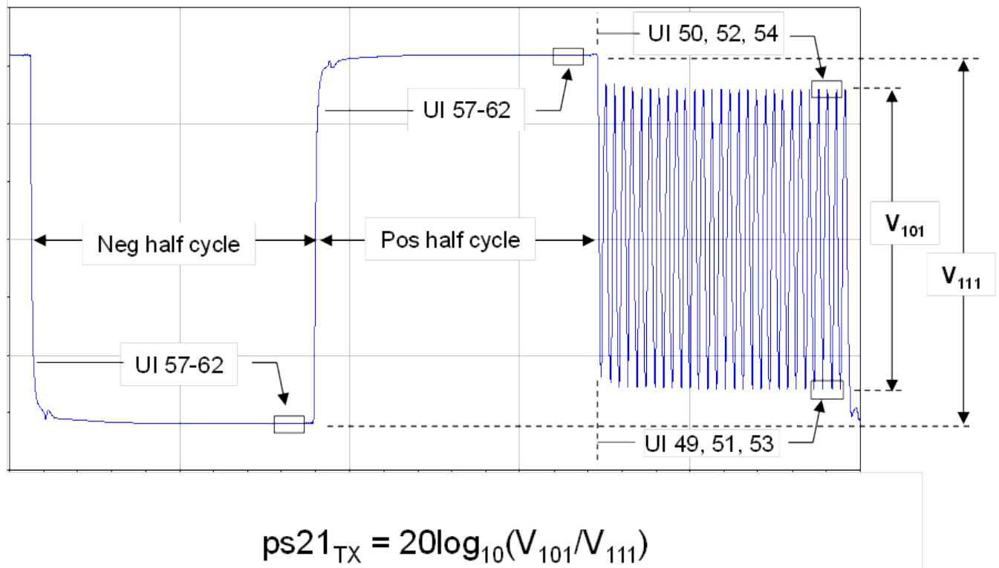

line chart

| Phase          | Value |
| -------------- | ----- |
| UI 57-62       | -     |
| UI 50, 52, 54 | -     |
| UI 49, 51, 53 | -     |
| UI 57-62       | -     |
| UI 50, 52, 54 | -     |
| UI 57-62       | -     |
| UI 50, 52, 54 | -     |
| UI 57-62       | -     |
| UI 50, 52, 54 | -     |
| UI 57-62       | -     |
| UI 50, 52, 54 | -     |
| UI 57, 62       | -     |
| UI 50, 52, 54 | -     |
| UI 57, 62       | -     |
| UI 50, 52, 54 | -     |
| UI 57, 62       | -     |
| UI 50, 52, 54 | -     |
| UI 57, 62       | -     |

Figure 8-12 Compliance Pattern and Resulting Package Loss Test Waveform§

Measurement of $\mathsf { V } _ { 1 0 1 }$ and $\mathsf { V } _ { 1 1 1 }$ is made towards the end of each interval to minimize ISI and low frequency effects. $V _ { 1 0 1 }$ is defined as the peak-peak voltage between minima and maxima of the clock pattern. $\pmb { V _ { 1 1 1 } }$ is defined as the average voltage difference between the positive and negative levels of the two half cycles. The measurement should be averaged over 500 repetitions of the compliance pattern.

At 32.0 GT/s only the ps21TX parameter is calculated by filtering the captured voltage waveforms normally used for ps21TX measurements as follows:

• $\mathsf { V } _ { 1 1 1 }$ is measured from a filtered voltage waveform with a first order (20 dB/decade) low pass filter with a -3 dB corner frequency at 1 GHz applied.  
• V101 is measured from a filtered voltage waveform with a first order (20 dB/decade) high pass filter with a -3 dB corner frequency at 7 GHz applied.

Since the Nyquist frequency for 64.0 GT/s PAM4 signaling is $1 6 . 0 \mathsf { G H z } ,$ no additional measurement is necessary for 64.0 GT/s ps21TX spec compliance. For a PCIe 6.0 device that supports maximum data rate of 64.0 GT/s, the ps21TX spec parameter measured for 32.0 GT/s must be lower than the ps21TX spec values provided under the 64.0 GT/s column in § Table 8-6.

## 8.3.3.12 Transmitter Signal-to Noise and Distortion Ratio $( S N D R _ { T X } )$ for 64.0 GT/s §

Signal-to-noise and distortion ratio (SNDR) is measured at the transmitter output using the Compliance Pattern (see § Section 4.2.14 ) with preset $\mathsf { Q } _ { 0 }$ (no Tx equalization), and the lanes not under test also transmitting the Compliance Pattern with preset $\mathsf { Q 0 } .$ . The recorded waveform must have a minimum of 250 repetitions of the compliance pattern. Measurements should be made with a 4th order Bessel-Thomson filter with a roll-off from DC value by 3 dB at 33 GHz to minimize the impact of scope high-frequency noise. The minimum scope bandwidth is 50 GHz.

A linear fit to the captured waveform and the linear fit pulse response, $p ( k )$ , and error vector, $e ( k ) _ { \mathrm { { i } } }$ , are computed. The standard deviation of $e ( k )$ is denoted by $\sigma _ { \mathsf { e } } .$ . The linear fit pulse response $p ( k )$ and the error vector $e ( k )$ shall be computed with the pulse length of $N p = 6 0 0$ and pulse delay $D p = 4$ . For these computations, the number of samples per PAM4 symbol, $\mathsf { M } ,$ must be equal to or greater than 32 and resampling can be used to meet this requirement. The standard deviation of $e ( k )$ is obtained from the measured PRBS portion of the compliance pattern.

The parameter $\sigma _ { n }$ measures the uncorrelated RMS amplitude noise of each symbol level (including random noise and uncorrelated bounded noise effects), while not including ISI and jitter effects. Noise for each of the four PAM4 voltage levels, $\sigma _ { L } ,$ is measured by using the PAM4 symbol 61 of the 64-UI long slow pattern for the corresponding voltage level that appears once in every repeat of the Compliance Pattern. When measuring $\sigma _ { L } ,$ , an adjustment for uncorrelated random noise contributed by the instrumentation such as uncorrelated random scope noise shall be applied. Equivalent oscilloscope settings used for noise characterization shall be consistent with the oscilloscope settings used for waveform capture when calculating SNDR. For each voltage level L (where $\mathsf { L } = 0 , 1 , 2 , 3 )$ , the $\sigma _ { L }$ measurement is the result of eight independent measurements on eight evenly spaced sample points within the Unit Interval of symbol 61 in the run of 64 identical symbols. Each of the eight measurements denoted as $\sigma _ { L , i }$ (where i=1..8) is calculated by using the following equations.

$$
\sigma_ {L, i} ^ {2} = \frac {1}{N _ {k}} \sum_ {k = 1} ^ {N _ {k}} \left(V _ {L, i, k} - \mu_ {L, i}\right) ^ {2}
$$

Equation 8-3 $\sigma _ { L , i }$

$$
\mu_ {L, i} = \frac {1}{N _ {k}} \sum_ {k = 1} ^ {N _ {k}} V _ {L, i, k}
$$

Equation 8-4 $\mu _ { L , i }$

In the above equations, $N _ { k }$ is the number of repetitions of the compliance pattern in the recorded waveform, $V _ { L , i , k }$ is the waveform voltage at the ith data sample location within the $6 1 ^ { \mathrm { s t } }$ symbol UI in the $\boldsymbol { \mathsf { k } } ^ { \mathsf { t h } }$ repetition of the compliance pattern for each voltage level, and $\mu _ { L , i }$ is the mean of $N _ { k }$ waveform voltage samples for the $\mathsf { i } ^ { \mathsf { t h } }$ data sample location for the corresponding voltage level.

$\sigma _ { L }$ is obtained via the following equation:

$$
\sigma_ {L} = \sqrt {\frac {\sum_ {i = 1} ^ {8} \sigma_ {L , i} ^ {2}}{8}}
$$

Equation $8 - 5 \sigma _ { L }$

$\sigma _ { n }$ is the average of the four $\sigma _ { L }$ measurements, one for each PAM4 voltage level, denoted as

$$
\sigma_ {n} = \frac {1}{4} \left(\sigma_ {0} + \sigma_ {1} + \sigma_ {2} + \sigma_ {3}\right)
$$

Equation 8-6 $\sigma _ { n }$

The Tx SNDR is defined by the following Equation, where pmax is the maximum value of p(k).

$$
S N D R = 1 0 \times \log_ {1 0} \left(\frac {p _ {\max} ^ {2}}{\sigma_ {e} ^ {2} + \sigma_ {n} ^ {2}}\right)
$$

Equation 8-7 SNDR

## 8.3.3.13 Transmitter Ratio of Level Mismatch $\left( R _ { L M - T X } \right)$ for 64.0 GT/s

Transmitter linearity is defined as a function of the mean signal levels $( \mathsf { V } _ { 0 } , \mathsf { V } _ { 1 } , \mathsf { V } _ { 2 } ;$ , and $\mathsf { V } _ { 3 } )$ transmitted for PAM4 2-bit symbols (see § Section 4.2.3.1.1 ). The ratio of level mismatch, ${ \mathsf { R L M } } ,$ is defined as shown below:

$$
V _ {m i d} = \left(V _ {0} + V _ {3}\right) / 2
$$

$$
E S _ {1} = \left(V _ {1} - V _ {m i d}\right) \Bigg / \left(V _ {0} - V _ {m i d}\right)
$$

$$
E S _ {2} = \left(V _ {2} - V _ {m i d}\right) / \left(V _ {3} - V _ {m i d}\right)
$$

$$
R _ {L M} = \min \left(\left(3 \times E S _ {1}\right), \left(3 \times E S _ {2}\right), \left(2 - 3 \times E S _ {1}\right), \left(2 - 3 \times E S _ {2}\right)\right)
$$

Equation 8-8 RLM

The mean signal levels (VL where L = 0, 1, 2, and 3) described above are measured by following the same procedure described in § Section 8.3.3.12 and by using the following equation.

$$
V _ {L} = \frac {\sum_ {i = 1} ^ {8} \mu_ {L , i}}{8}
$$

Equation 8-9 VL

## 8.3.4 Transmitter Margining §

Transmitters shall implement a margining procedure that allows the Tx launch voltage to be adjusted. Margining is enabled by programming a register set. Due to the larger range of Transmitter equalization, 8.0, 16.0, 32.0, and 64.0 GT/s Tx margining is subject to additional constraints: Tx margining at these speeds shall not require any coefficient or preset resolution finer than can be generated with 1/24 coefficient resolution defined for normal operation, and shall not require more Tx accuracy or capability than is required to support normal operation. It is acceptable that Vb fall below the limit set by VTX-EIEOS-FS or VTX-EIEOS-RS, although proper end to-end operation is no longer guaranteed. Transmitter equalization accuracy requirements do not need to be met during margining. A Transmitter is not required to change the FS/LF values it sends in TS1 Ordered Sets during margining from the values used in normal operation.

There are 8 encoded values for transmit margin from 000b to 111b. Encoding 000b represents the normal operating range. For all supported data rates and Tx signalling mode (full swing or reduced swing), encoding 001b must produce a VTX-DIFF-PP compliant with the specification limits. At least three additional encodings with monotonically decreasing values for VTX-DIFF-PP must be supported for each data rate and Tx swing mode. For full swing signalling there must be at least one encoding with index 100b or higher that produces a VTX-DIFF-PP between 200 and 400 mV. For reduced swing signalling there must be at least one encoding with value 100b or higher that produces a VTX-DIFF-PP between 100 and 200 mV.

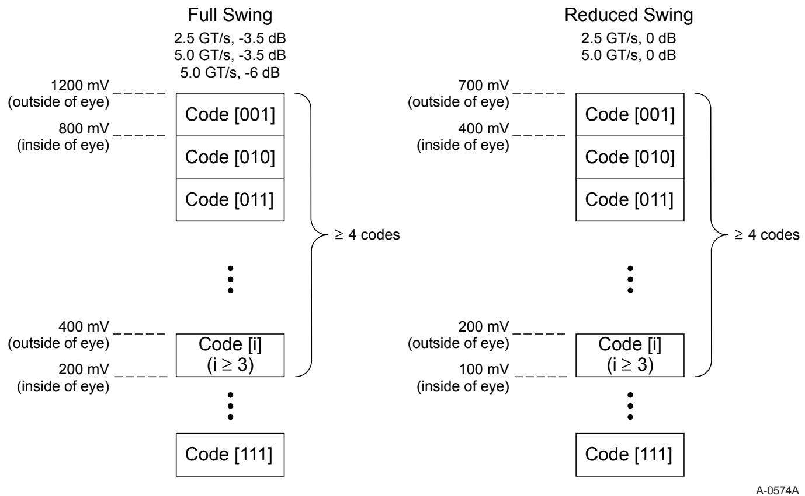

flowchart

```mermaid
graph TD
  A["Full Swing"] --> B["Code [001"]]
  A --> C["Code [010"]]
  A --> D["Code [011"]]
  B --> E["≥ 4 codes"]
  C --> F["≥ 4 codes"]
  D --> G["≥ 4 codes"]
  H["Reduced Swing"] --> I["Code [001"]]
  H --> J["Code [010"]]
  H --> K["Code [011"]]
  I --> L["≥ 4 codes"]
  J --> M["≥ 4 codes"]
  N["Full Swing"] --> O["Code [i"]]
  N --> P["Code [i"]]
  Q["Reduced Swing"] --> R["Code [i"]]
  Q --> S["Code [i"]]
  T["Full Swing"] --> U["Code [111"]]
  T --> V["Code [111"]]
    style A fill:#f9f,stroke:#333
    style H fill:#ccf,stroke:#333
    style Q fill:#cfc,stroke:#333
```

Figure 8-13 2.5 and 5.0 GT/s Transmitter Margining Voltage Levels and Codes§

## 8.3.5 Tx Jitter Parameters §

Jitter limits are defined identically for all data rates, although their respective values will vary with data rate. Jitter is measured at the zero-crossing point at full speed using the Compliance Pattern for 2.5, 5.0, 8.0, and 16.0 GT/s. When measuring jitter, the preset yielding the lowest jitter value should be selected. At 32.0 GT/s, the Tx under test must transmit Jitter Measurement Pattern (see § Section 4.2.13 ) with no Tx equalization. At 64.0 GT/s, the Tx under test must transmit Jitter Measurement Pattern (see § Section 4.2.16 ) with no Tx equalization for measuring the uncorrelated total jitter and deterministic jitter for all twelve transitions between the four PAM4 voltage levels. At 64.0 GT/s, the Tx under test must transmit High Swing Toggle Pattern (see § Section 4.2.17 ) with no Tx equalization for measuring the uncorrelated total pulse width jitter and deterministic pulse width jitter for the transitions between voltage level 0 and voltage level 3. When measuring a particular Tx Lane, it is necessary to ensure that all other PCI Express Lanes are transmitting Compliance Pattern in order to capture Tx die and package crosstalk effects. When measuring Tx jitter, it is required for the DUT to drive as many of its outputs as would occur during normal operation in a system environment. The minimum oscilloscope bandwidth for Tx jitter measurements at 32.0 and 64.0 GT/s is 50 GHz. The jitter measurements at 64.0 GT/s should be made with a 4th order Bessel-Thomson filter with a roll-off from DC value by 3 dB at 33 GHz to minimize the impact of scope high-frequency noise.

## 8.3.5.1 Post Processing Steps to Extract Jitter §

Measured Tx jitter is referenced to the Tx pin, and depending on what type of jitter is being measured and what reference clock architecture is being tested, is subsequently referenced to a recovered data clock, an embedded reference clock captured simultaneously with the data, or to a data edge. Data captured at TP1 requires post processing in order to

remove the effects of the breakout channel and to regenerate a data clock (when an embedded reference clock is not captured simultaneously with the data).

## 8.3.5.2 Applying CTLE or De-embedding §

Direct probing at a Transmitter’s pins is not generally feasible, so data is instead measured at TP1 of the breakout channel. By means of the replica channel it is possible to determine the loss vs. frequency characteristics of the breakout channel and de-embed this channel, resulting in measurements that are effectively referenced to the DUT’s pins. Note that since de-embedding amplifies HF noise there is a practical frequency cutoff limit to de-embedding. As de-embedding amplifies HF channel and measurement noise, an HF cutoff limit must be applied to de-embedding, depending on data rate as shown in § Table 8-4.

Table 8-4 Recommended De-embedding Cutoff Frequency§

<table><tr><td>Data Rate</td><td>HF Cutoff limit for de-embedding</td></tr><tr><td>8.0 GT/s</td><td>8 GHz - 12 GHz</td></tr><tr><td>16.0 GT/s</td><td>20 GHz</td></tr></table>

Jitter is decomposed into data dependent and uncorrelated terms. This separation process effectively separates the jitter caused by package effects from that caused by silicon effects such as PLL jitter and power supply noise that cannot be mitigated by equalization. As a result, the uncorrelated jitter terms define jitter as it would appear at the die pad.

As an alternative to de-embedding at 16.0 GT/s the -12 dB CTLE in the reference equalizer can be applied to the data measured at TP1 for measuring all uncorrelated jitter parameters (not DDJ).

It is recommended that s-parameters for de-embedding are measured to at least 3 times the Nyquist frequency with a frequency step size of 10 MHz.

If both de-embedding and CTLE approaches are used and given different answers only the lower values for the uncorrelated jitter parameters are used.

For 32.0 GT/s, Jitter Measurement Pattern (see § Section 4.2.13 ) with no Tx equalization is used to minimize the breakout channel ISI impact and avoid pessimism in jitter measurement from de-embedding and associated high frequency scope noise amplification. For further reduction of channel loss impact on jitter at 32.0 GT/s, any CTLE curve in the reference equalizer or no CTLE curve can be applied to the data measured at TP1 for measuring all uncorrelated jitter parameters (not DDJ). The CTLE or no CTLE curve that gives the lowest result for TTX-UPW-TJ is used.

For 64.0 GT/s, the Jitter Measurement Pattern (see § Section 4.2.16 ) with no Tx equalization is used for measuring the uncorrelated total jitter and the uncorrelated deterministic jitter for all twelve transitions between the four PAM4 voltage levels. The 64.0 GT/s Jitter Measurement Pattern is 52-UI long and all 12 PAM4 transitions repeat four times within the pattern resulting in 48 edge transitions. Jitter must be measured on each of the 48 edges individually and then averaged. The Q-scale associated with the 64.0 GT/s Jitter Measurement Pattern for BER of ${ { 1 0 } ^ { - 6 } }$ is 4.8759. For mitigating channel ISI impact on jitter at 64.0 GT/s, any CTLE curve in the reference equalizer or no CTLE curve can be applied to the data measured at TP1 for measuring all uncorrelated jitter parameters (not DDJ). The CTLE or no CTLE curve that gives the lowest result for the average TTX-RJ of the 48 edges is used. The uncorrelated jitter parameters for all 48 transitions must be measured and corrected for the scope noise impact. The average uncorrelated total jitter and the average uncorrelated deterministic jitter are obtained by averaging the jitter parameters of all 48 edge transitions.

For 64.0 GT/s, the High Swing Toggle Pattern (see § Section 4.2.17 ) with no Tx equalization is used for measuring the uncorrelated total pulse width jitter and deterministic pulse width jitter for transitions between voltage level 0 and voltage level 3. The Q-scale associated with the 64.0 GT/s High Swing Toggle Pattern for BER of 10-6 is 4.8916. The High Swing Toggle Pattern minimizes the breakout channel ISI impact and avoids pessimism in jitter measurement from de-embedding and associated high frequency scope noise amplification. For further reduction of channel loss impact on pulse width jitter at 64.0 GT/s, any CTLE curve in the reference equalizer or no CTLE curve can be applied to the data measured at TP1 for measuring all uncorrelated jitter parameters (not DDJ). The CTLE or no CTLE curve that gives the lowest result for TTX-UPW-TJ is used. The uncorrelated pulse width jitter parameters must be corrected for the scope noise impact.

## 8.3.5.3 Independent Refclk Measurement and Post Processing §

A Transmitter may operate in the Independent Refclk (IR) mode, in which case the Transmitter may not provide a Refclk output. In this case a single-port jitter measurement is required. The post processing algorithm must employ the appropriate model CDR for the reference clock architecture being tested.

## 8.3.5.4 Embedded and Non-Embedded Refclk Measurement and Post Processing §

When the transmitting PCIe device is driven from an external source to its Refclk pin it permits the Tx under test to be driven with a clean Refclk as shown in § Figure 8-1.

The specification now explicitly supports the complete matrix of Refclk options, including where the Refclk is embedded, where the reference clock is external, where the reference clock is available at the DUT’s pins, and where the reference clock is not available at the DUT’s pins. § Table 8-5 lists the post processing requirements for each of the four possible combinations. Embedded Refclk with Refclk available at the DUT’s pin represents a special case where any jitter common to both the Refclk and the data must be removed via a two-port measurement.

If the DUT supports multiple Refclk modes, as described in § Table 8-5 then the Tx needs to be tested in each of the Refclk modes it supports.

Table 8-5 Tx Measurement and Post Processing For Different Refclks§

<table><tr><td></td><td>Embedded Refclk</td><td>Non-Embedded Refclk</td></tr><tr><td>Refclk available at DUT pin and not testing SRIS mode</td><td>2-port measurement, CC CDR, PLL $^{1}$ and 10 ns transport delay $^{2}$ </td><td>1-port measurement, CC CDR, clean external Refclk</td></tr><tr><td>Refclk not available at DUT pin or testing SRIS mode</td><td>1-port measurement, SRIS CDR</td><td>1-port measurement, CC CDR, clean external Refclk</td></tr></table>

Notes:  
1. PLL characteristics are defined in Refclk section for each data rate.  
2. Refer to § Section 8.6.6 for a discussion of the transport delay

## 8.3.5.5 Behavioral CDR Characteristics §

A behavioral CDR filter is applied to reject low frequency jitter that would normally be tracked by the CDR in a Receiver. As such, the behavioral CDR represents a bounding function for actual CDR implementations. Roll-off characteristics of the behavioral CDR are dependent on whether the corresponding DUT supports an embedded vs. non-embedded Refclk, is operating in CC or IR mode, and whether the Refclk pin is available for probing (see § Table 8-5). In all cases the behavioral CDR represents a high pass filter function where the corner frequency depends on the Tx data rate. § Figure 8-14 shows the CC first-order CDR transfer functions for an f3dB of 1.5 MHz, 5.0 MHz, and 10 MHz that corresponds to 2.5 GT/s, 5.0 GT/s, and 8.0 GT/s, respectively. The 10 MHz behavioral CDR is also used for CC Transmitter and CC Reference Clock testing for 16.0 GT/s and, optionally, for Receiver Stressed Eye calibration when 32.0 GT/s is not supported.

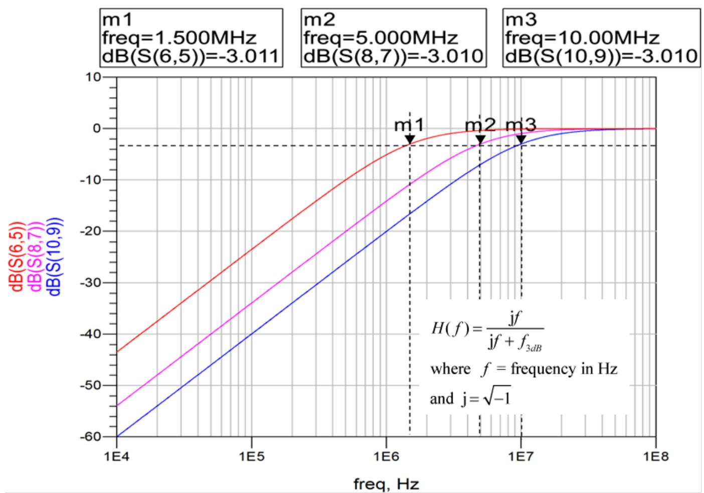

line chart

| Frequency (Hz) | m1 dB(S(6,5)) | m1 dB(S(8,7)) | m1 dB(S(10,9)) | m2 dB(S(6,5)) | m2 dB(S(8,7)) | m2 dB(S(10,9)) | m3 dB(S(6,5)) | m3 dB(S(8,7)) | m3 dB(S(10,9)) |
| -------------- | ------------- | ------------- | -------------- | ------------- | ------------- | -------------- | ------------- | ------------- | -------------- |
| 1E4            | -45           | -55           | -60            | -45           | -55           | -60            | -45           | -55           | -60            |
| 1E5            | -25           | -35           | -40            | -25           | -35           | -40            | -25           | -35           | -40            |
| 1E6            | -5            | -10           | -15            | -5            | -10           | -15            | -5            | -10           | -15            |
| 1E7            | 0             | 0             | 0              | 0             | 0             | 0              | 0             | 0             | 0              |
| 1E8            | 0             | 0             | 0              | 0             | 0             | 0              | 0             | 0             | 0              |

Figure 8-14 First Order CC Behavioral CDR Transfer Functions§

§ Figure 8-15 illustrates second order CDR transfer functions corresponding to 2.5 GT/s and 5.0 GT/s. These functions are defined by a ζ of 0.707 and an f3dB of 1.5 MHz and 5.0 MHz, respectively. Behavioral transfer functions for 8.0 GT/s, 16.0 GT/s, 32.0 GT/s, and 64.0 GT/s approximate the piecewise linear sinusoidal jitter (Sj) masks shown in § Section 8.4.2.2.1 . SRIS capable Transmitters must be evaluated using these behavioral transfer functions.

Note: The common clock (CC) and independent reference clock (IR) architectures are not interoperable - although it is possible to design a single Receiver that meets both sets of electrical requirements.

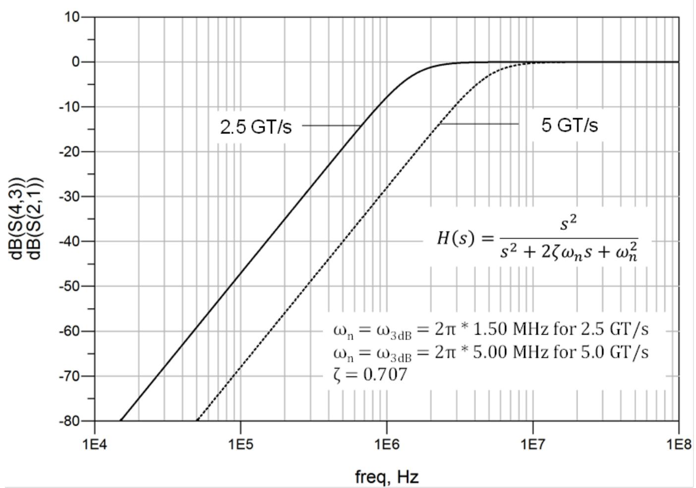

line chart

| freq, Hz | dB(S(4,3)) dB(S(2,1)) | dB(S(4,3)) dB(S(2,1)) |
| -------- | ---------------------- | ---------------------- |
| 1E4      | -80                    | -80                    |
| 1E5      | -50                    | -60                    |
| 1E6      | -10                    | -30                    |
| 1E7      | 0                      | 0                      |
| 1E8      | 0                      | 0                      |

Figure 8-15 2nd Order Behavioral SRIS CDR Transfer Functions for 2.5 GT/s and 5.0 GT/s §

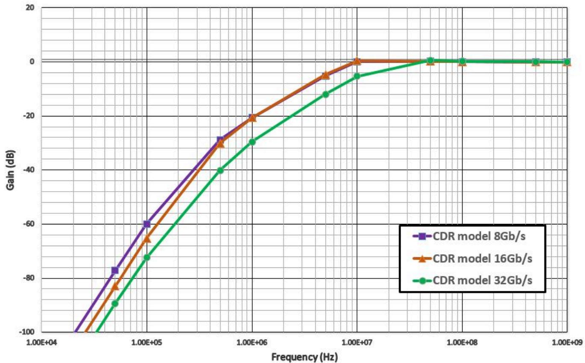

line chart

| Frequency (Hz) | CDR model 8Gb/s | CDR model 16Gb/s | CDR model 32Gb/s |
| -------------- | --------------- | ---------------- | ---------------- |
| 1.00E+04       | -100            | -100             | -100             |
| 1.00E+05       | -60             | -65              | -75              |
| 1.00E+06       | -25             | -20              | -30              |
| 1.00E+07       | 0               | 0                | -5               |
| 1.00E+08       | 0               | 0                | 0                |
| 1.00E+09       | 0               | 0                | 0                |

Figure 8-16 Behavioral SRIS CDR Function for 8.0 GT/s, and SRIS and CC CDR for 16.0 and 32.0 GT/s§

$$
H (s) = \frac {s ^ {2}}{s ^ {2} + s A + B} \times \frac {s ^ {2} + 2 \zeta_ {2} \omega_ {0} s + \omega_ {0} ^ {2}}{s ^ {2} + 2 \zeta_ {1} \omega_ {0} s + \omega_ {0} ^ {2}} \times \frac {s}{s + \omega_ {1}}
$$

$$
\zeta_ {1} = \frac {1}{\sqrt {2}}
$$

$$
\zeta_ {2} = 1
$$

$$
\omega_ {0} = 1 0 ^ {7} \times 2 \pi
$$

$$
\omega_ {1} = 4 \times 1 0 ^ {5} \times 2 \pi
$$

Equation 8-10 Behavioral SRIS CDR at 8.0 GT/s and SRIS and CC Behavioral CDR at 16.0 GT/s§

$$
A = 1 0 ^ {7} \times 2 \pi
$$

$$
B = 2. 2 \times 1 0 ^ {1 2} \times (2 \pi) ^ {2}
$$

Equation 8-11 SRIS Behavioral CDR Parameters at 8.0 GT/s

$$
A = 9. 5 \times 1 0 ^ {6} \times 2 \pi
$$

$$
B = 4. 3 6 \times 1 0 ^ {1 2} \times (2 \pi) ^ {2}
$$

Equation 8-12 SRIS and CC Behavioral CDR Parameters at 16.0 GT/s§

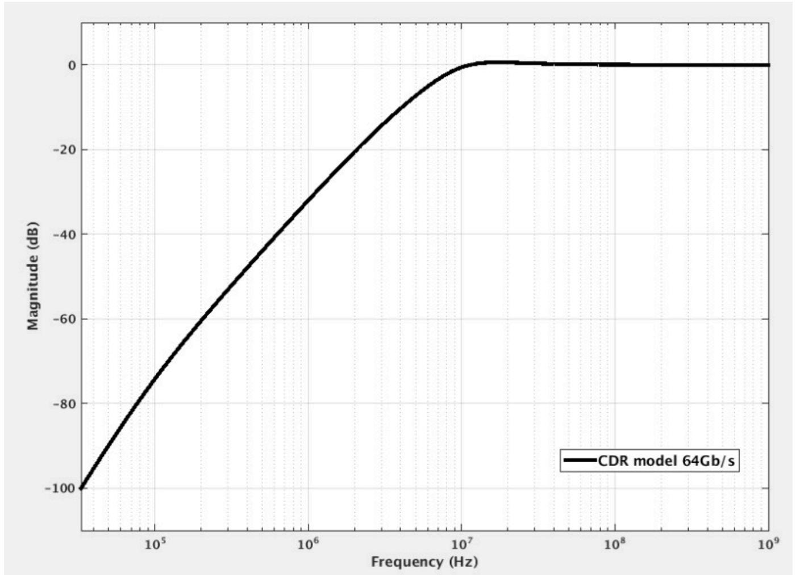

line chart

| Frequency (Hz) | Magnitude (dB) |
| -------------- | -------------- |
| 10^5           | -100           |
| 10^6           | -30            |
| 10^7           | 0              |
| 10^8           | 0              |
| 10^9           | 0              |

Figure 8-17 Behavioral SRIS and CC CDR for 64.0 GT/s§

$$
H (s) = \frac {s ^ {2}}{(s + \omega_ {0}) \times (s + \omega_ {1})} \times \frac {s ^ {2} + 2 \zeta_ {2} \omega_ {0} s + \omega_ {0} ^ {2}}{s ^ {2} + 2 \zeta_ {1} \omega_ {0} s + \omega_ {0} ^ {2}} \times \frac {s}{s + \omega_ {L F}}
$$

$$
\zeta_ {1} = \frac {1}{\sqrt {2}}
$$

$$
\zeta_ {2} = 1
$$

32.0 GT/s

$$
\omega_ {0} = 2 0 \times 1 0 ^ {6} \times 2 \pi
$$

$$
\omega_ {1} = 1. 1 \times 1 0 ^ {6} \times 2 \pi
$$

$$
\omega_ {L F} = 1 6 0 \times 1 0 ^ {3} \times 2 \pi
$$

64.0 GT/s

$$
\omega_ {0} = 1 0 \times 1 0 ^ {6} \times 2 \pi
$$

$$
\omega_ {1} = 3. 8 8 \times 1 0 ^ {6} \times 2 \pi
$$

$$
\omega_ {L F} = 8 7 \times 1 0 ^ {3} \times 2 \pi
$$

Equation 8-13 SRIS and CC Behavioral CDR Parameters at 32.0 and 64.0 GT/s§

## 8.3.5.6 Data Dependent and Uncorrelated Jitter §

Measured at TP1 and de-embedded back to the pin, a Transmitter’s jitter contains both data dependent and uncorrelated components. The data dependent components occur principally due to package loss and reflection. Uncorrelated jitter sources include PLL jitter, power supply noise, and crosstalk. The specification separates jitter into uncorrelated and data dependent bins, because such a separation matches well with the Tx and Rx equalization capabilities. Uncorrelated jitter is not mitigated by Tx or Rx equalization and represents timing margin that cannot be recovered via equalization. It is important that margin recoverable by means of equalization (data dependent) is not budgeted as non-recoverable jitter.

Once data dependent jitter has been removed from the Tx measurement it becomes possible to resolve the remaining jitter into Tj and deterministic jitter (Dual Dirac Model) (DJDD) components. High frequency jitter (which is subject to jitter amplification in the channel) is accounted for by separate TTX-UPW-DJDD and TTX-UPW-TJ parameters.

## 8.3.5.7 Data Dependent Jitter §

While DDJ is not explicitly defined as a parameter in the specification, it is necessary to separate DDJ in order to eliminate package loss effects and reference the jitter parameters of interest to the Tx die pad. Separation of jitter into data dependent and uncorrelated components may be achieved by averaging techniques; for example, by having the Tx repeatedly drive the compliance test pattern which is a repeating pattern.

§ Figure 8-18 illustrates the relation between Tx data, recovered clock, and the data’s PDF. Data dependent jitter is defined as the time delta between the PDF’s mean for each zero-crossing point and the corresponding recovered clock edge. A sufficient number of repeated patterns must be accumulated to yield stable mean values and PDF profiles for each transition. These PDFs are then utilized to extract uncorrelated jitter parameters.

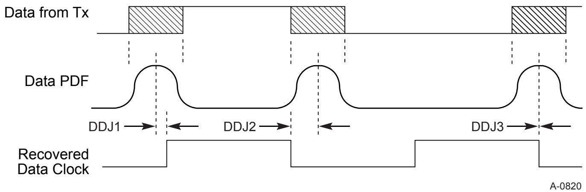

timing diagram

| Signal          | Time Segment | Label             |
|-----------------|--------------|-------------------|
| Data from Tx    | Top          |                   |
| Data from Tx    | Middle       |                   |
| Data from Tx    | Bottom       |                   |
| Data PDF        | Top          |                   |
| Data PDF        | Middle       |                   |
| Data PDF        | Bottom       |                   |
| Recovered Data Clock | Top          | DDJ1              |
| Recovered Data Clock | Middle       | DDJ2              |
| Recovered Data Clock | Bottom       | DDJ3              |
| A-0820          | End          |                   |

Figure 8-18 Relation Between Data Edge PDFs and Recovered Data Clock§

## 8.3.5.8 Uncorrelated Total Jitter and Deterministic Jitter (Dual Dirac Model) (TTX-UTJ and TTX-UDJDD)

Uncorrelated Total Jitter (UTJ) and uncorrelated deterministic jitter (Dual Dirac model) (UDJDD) are referenced to a recovered data clock generated by means of a CDR tracking function. Uncorrelated jitter may be derived after removing the DDJ component from each PDF and combining the PDFs for all edges in the pattern. By appropriately converting the PDF to a Q-scale it is possible to obtain the graphical relation shown in § Figure 8-19, from which TTX-UTJ and TTX-UDJDD may be derived. In § Figure 8-19 note that the two PDF curves are identical but that the fitted slopes, defined by 1/RJLH and 1/RJRH, may differ.

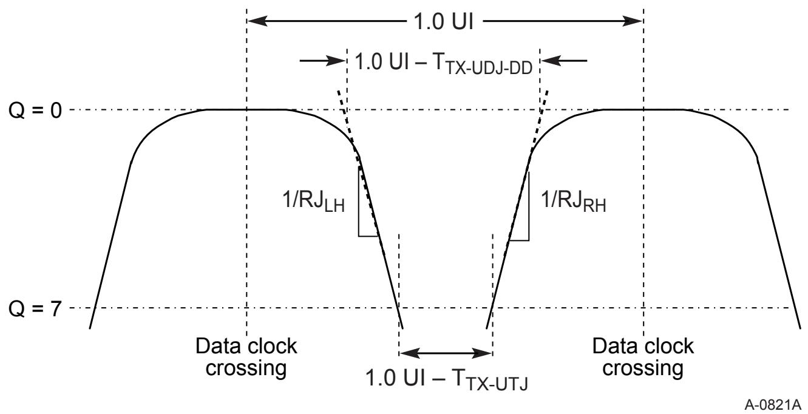

line chart

| Time Interval | Description                     |
| ------------- | -------------------------------- |
| Q = 0         | Data clock crossing            |
| Q = 7         | Data clock crossing            |
| 1.0 UI        | 1.0 UI – T_TX-UDJ-DD           |
| 1.0 UI        | 1.0 UI – T_TX-UTJ               |
| 1/RJ_LH       | 1/RJ_LH                          |
| 1/RJ_RH       | 1/RJ_RH                          |

Figure 8-19 Derivation of§ $T _ { T X - U T J }$ and TTX-UDJDD

## 8.3.5.9 Random Jitter $( T _ { T X - R J } )$ (informative) §

Random jitter is uncorrelated with respect to data dependent jitter. TTX-RJ may be obtained by subtracting TTX-UDJDD from TTX-UTJ and is included in the specification as an informative parameter only. It is typically used as a benchmark to characterize PLL performance.

## 8.3.5.10 Uncorrelated Total and Deterministic PWJ (TTX-UPW-TJ and TTX-UPW-DJDD) §

Pulse width jitter is defined as an edge to edge phenomenon on consecutive edges nominally 1.0 UI apart. § Figure 8-20 illustrates how PWJ is defined, showing that it is typically present on both data edges of consecutive UI. To accurately quantify PWJ it is first necessary to remove the ISI contributions to PWJ. The shaded areas on either side of the unjittered edges represent the maximum amount of jitter about that edge. Note the jitter for one edge is assumed to be independent from the other.

An equivalent description of PWJ may be obtained by referencing to a fixed leading edge and having jitter contributions from both edges appear at the trailing edge. This approach yields a single PDF as shown below. Each 1 UI wide pulse in the pattern will have a different median for this PDF which is caused by ISI and F/2 jitter. The average of the medians for 1 UI wide pulses at odd and even UI numbers within the pattern are calculated, and the odd and even PDF's are normalized to the appropriate average of medians and summed to form an odd UI PDF and an even UI PDF. The final PDF is calculated from the sum of the summed odd and even UI PDFs. The key idea here is that the final PDF for uncorrelated PWJ should include F/2 or odd/even UI jitter

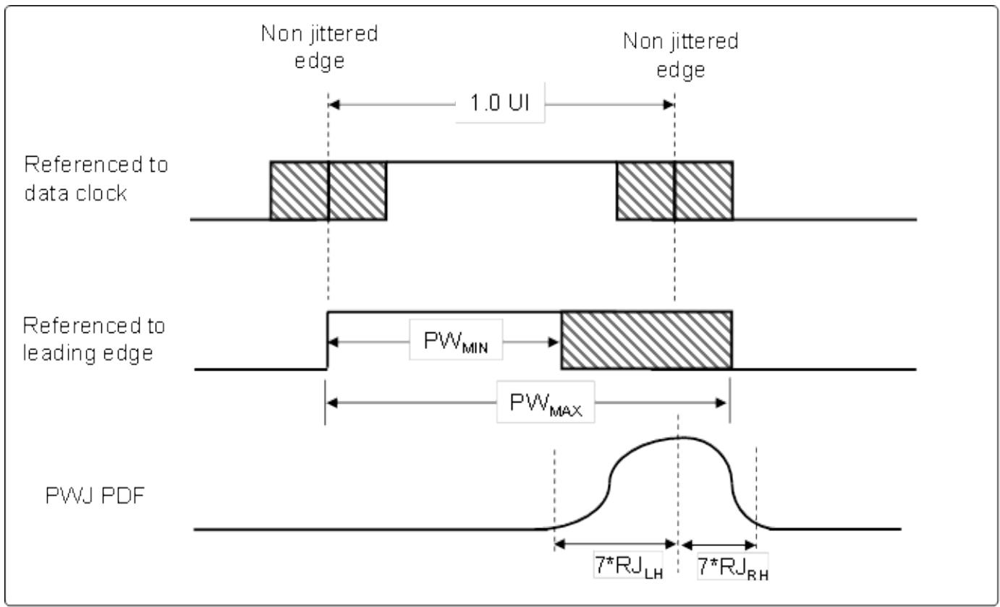

timing diagram

| Signal Type             | Description                     |
| ----------------------- | --------------------------------- |
| Reference to data clock | Non jittered edge                 |
| Reference to leading edge | PW_MIN                            |
| Reference to leading edge | PW_MAX                           |
| PWJ PDF                 | 7*RJ_LH                           |
| PWJ PDF                 | 7*RJ_RH                           |

Figure 8-20 PWJ Relative to Consecutive Edges 1 UI Apart§

The PDF of jitter around each non-jittered edge may be converted into the Q-scale (see § Figure 8-21) from which TTX-UPW-TJ and TTX-UPW-DJDD may be derived in a manner analogous to TTX-UTJ and TTX-UDJDD. Note that the PDF may not be symmetric, and the tail of interest is ${ \mathsf { R J } } _ { \mathsf { L H } } ,$ since it represents pulse compression.

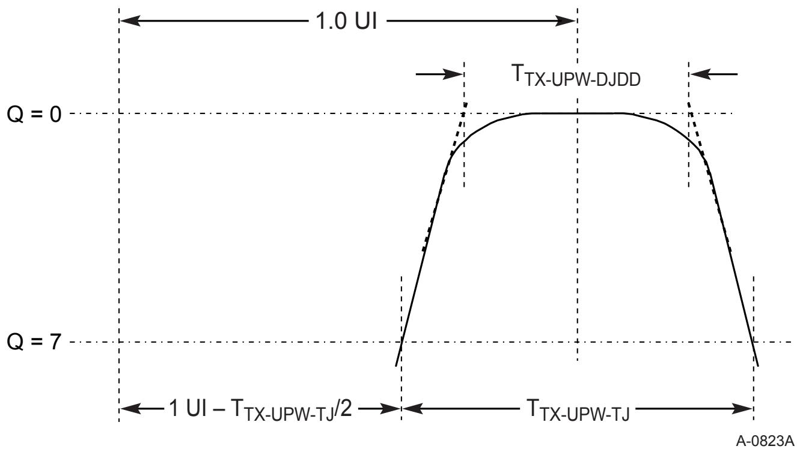

line chart

| Time Interval | Value |
| ------------- | ----- |
| Q             | 0     |
| T_TX-UPW-TJ   | 0     |
| T_TX-UPW-TJ/2 | 0     |
| 1 UI          | -     |
| 1.0 UI        | 0     |
| Q = 7         | 7     |

Figure 8-21 Definition of TTX-UPW-DJDD and TTX-UPW-TJ Data Rate Dependent Transmitter Parameters§

## 8.3.6 Data Rate Dependent Parameters §

Note: the jitter margins for 2.5 GT/s and 5.0 GT/s were previously defined at the device’s pins. For 2.5 GT/s the jitter was defined via a single parameter that lumped DDJ, UDJDD, UTJ, PWJ-DDJ and PWJ-TJ into a single quantity. Consequently, it is necessary to first remove the DDj jitter component. Since there was no previous UDj-UTj separation TTX-UTJ and TTX-UDJDD are set equal to each other. Similarly, there was no UTj-PWj separation, so it is necessary to assume that the entirety of the uncorrelated jitter is PWJ that occurs oppositely on consecutive edges of a 1 UI wide pulse.

For 5.0 GT/s a similar removal of DDj must be performed to obtain UTj. However, [PCIe-3.0] for 5.0 GT/s did specify Rj, so a distinct value for TTX-UDJDD can be obtained. Similarly, [PCIe-3.0] for 5.0 GT/s defined a minimum pulse width, assumed to be 100% Dj, from which TTX-UPW-TJ and TTX-UPW-DJDD may be derived. For 64,0 GT/s PAM4 signaling, the voltage parameters such as differential peak-to-peak Tx voltage swing correspond to the swing between PAM4 voltage level 0 and voltage level 3.

Table 8-6 Data Rate Dependent Transmitter Parameters§

<table><tr><td>Symbol</td><td>Parameter description</td><td>2.5 GT/s</td><td>5.0 GT/s</td><td>8.0 GT/s</td><td>16.0 GT/s</td><td>32.0 GT/s</td><td>64.0 GT/s</td><td>Units</td><td>Notes</td></tr><tr><td>UI (Tx)</td><td>Unit Interval</td><td>(min) 399.88 (max) 400.12 (300 PPM)</td><td>(min) 199.94 (max) 200.06 (300 PPM)</td><td>(min) 124.9625 (max) 125.0375 (300 PPM)</td><td>(min) 62.48125 (max) 62.51875 (300 PPM)</td><td>(min) 31.246875 (max) 31.253125 (100 PPM)</td><td>(min) 31.246875 (max) 31.253125 (100 PPM)</td><td>ps</td><td>Does not include SSC variations</td></tr><tr><td> $BW_{TX-PKG-PLL1}$ </td><td>Tx PLL bandwidth corre-sponding to PKGTX-PLL1</td><td>(min) 1.5(max) 22.0</td><td>(min) 8.0(max) 16.0</td><td>(min) 0.5(max) 4.0</td><td>(min) 0.5(max) 4.0</td><td>(min) 0.5(max) 1.8</td><td>(min) 0.5(max) 1.0</td><td>MHz</td><td>Second order PLL jitter transferbounding function. Notes 1, 2, 9.</td></tr><tr><td> $BW_{TX-PKG-PLL2}$ </td><td>Tx PLL bandwidth corresponding to PKGTX-PLL2</td><td>N/A</td><td>(min) 5.0 (max) 16.0</td><td>(min) 0.5 (max) 5.0</td><td>(min) 0.5 (max) 5.0</td><td>N/A</td><td>N/A</td><td>MHz</td><td>2.5 and 32.0 GT/s specify only one combination of PLL BW and jitter. Notes 1, 2, 9.</td></tr><tr><td> $PKG_{TX-PLL1}$ </td><td>Tx PLL peaking corresponding to  $BWTX-PKG-PLL1$ </td><td>(max) 3.0</td><td>(max) 3.0</td><td>(max) 2.0</td><td>(max) 2.0</td><td>(max) 2.0</td><td>(max) 2.0</td><td>dB</td><td>Second order PLL jitter transfer bounding function. Notes 1, 2.</td></tr><tr><td> $PKG_{TX-PLL2}$ </td><td>Tx PLL peaking corresponding to  $BWTX-PKG-PLL2$ </td><td>N/A</td><td>(max) 1.0</td><td>(max) 1.0</td><td>(max) 1.0</td><td>N/A</td><td>N/A</td><td>dB</td><td>2.5 and 32.0 GT/s specify only one combination of PLL BW and jitter. Notes 1, 2.</td></tr><tr><td> $V_{TX-DIFF-PP}$ </td><td>Differential peak-peak Tx voltage swing for full swing operation</td><td>(min) 800 (max) 1000</td><td>(min) 800 (max) 1000</td><td>(min) 800 (max) 1000</td><td>(min) 800 (max) 1000</td><td>(min) 800 (max) 1000</td><td>(min) 800 (max) 1000</td><td>mVPP</td><td>As measured with compliance test load. Defined as  $2 \times |V_{TXD+} - V_{TXD-}|$  Note 3.</td></tr><tr><td> $V_{TX-DIFF-PP-LOW}$ </td><td>Differential peak-peak Tx voltage swing for low swing operation</td><td>(min) 400 (max) 1000</td><td>(min) 400 (max) 1000</td><td>(min) 400 (max) 1000</td><td>(min) 400 (max) 1000</td><td>(min) 400 (max) 1000</td><td>(min) 400 (max) 1000</td><td>mVPP</td><td>As measured with compliance test load. Defined as  $2 \times |V_{TXD+} - V_{TXD-}|$  Note 3.</td></tr><tr><td> $V_{TX-EIEOS-FS}$ </td><td>Minimum voltage swing during EIEOS for full swing signaling</td><td>N/A</td><td>N/A</td><td>250 (min)</td><td>250 (min)</td><td>250 (min)</td><td>250 (min)</td><td>mVPP</td><td>Note 4</td></tr><tr><td> $V_{TX-EIEOS-RS}$ </td><td>Minimum voltage swing during EIEOS for reduced swing signaling</td><td>N/A</td><td>N/A</td><td>232 (min)</td><td>232 (min)</td><td>232 (min)</td><td>232 (min)</td><td>mVPP</td><td>Note 4</td></tr><tr><td> $ps21_{TX-ROOT-DEVICE}$ </td><td>Pseudo package loss of a device containing root port</td><td>N/A</td><td>N/A</td><td>(max) 3.0</td><td>(max) 5.0</td><td>(max) 8.5</td><td>(max) 7.5</td><td>dB</td><td>Note 5.</td></tr><tr><td> $ps21_{TX-NON-ROOT-DEVICE}$ </td><td>Pseudo package loss for all devices notcontaining root ports</td><td>N/A</td><td>N/A</td><td>(max) 3.0</td><td>(max) 3.0</td><td>(max) 3.7</td><td>(max) 3.7</td><td>dB</td><td>Note 5.</td></tr><tr><td> $ILfit_{TX-ROOT-DEVICE}$ </td><td>Fitted insertion loss at Nyquist</td><td>N/A</td><td>N/A</td><td>N/A</td><td>N/A</td><td>(max) 9.0</td><td>(max) 8.0</td><td>dB</td><td>Note 8</td></tr><tr><td> $ILfit_{TX-NON-ROOT-DEVICE}$ </td><td>Fitted insertion loss at Nyquist</td><td>N/A</td><td>N/A</td><td>N/A</td><td>N/A</td><td>(max) 4.0</td><td>(max) 4.0</td><td>dB</td><td>Note 8</td></tr><tr><td> $V_{TX-BOOST-FS}$ </td><td>Maximum nominal Tx boost ratio for full swing</td><td>N/A</td><td>N/A</td><td>8.0</td><td>8.0 (min)</td><td>8.0 (min)</td><td>8.0 (min)</td><td>dB</td><td>Nominal boost beyond 8.0 dB is limited to guarantee that ps21 $_{TX}$  limits are satisfied.</td></tr><tr><td> $V_{TX-BOOST-RS}$ </td><td>Maximum nominal Tx boost ratio for reduced swing</td><td>N/A</td><td>N/A</td><td>2.5</td><td>~2.5 (min)</td><td>~2.5 (min)</td><td>~2.5 (min)</td><td>dB</td><td>Assumes ±1.0 dB tolerance from diagonal elements in § Figure 8-9.</td></tr><tr><td> $EQ_{TX-CO-EFF-RES}$ </td><td>Tx coefficient resolution</td><td>N/A</td><td>N/A</td><td>1/(min) 63 1/(max) 24</td><td>1/(min) 63 1/(max) 24</td><td>1/(min) 63 1/(max) 24</td><td>1/(min) 63 1/(max) 24</td><td>N/A</td><td></td></tr><tr><td> $V_{TX-DE-RA-TIO-3.5dB}$ </td><td>Tx de-emphasis ratio for 2.5 and 5.0 GT/s</td><td>(min) 2.5 (max) 4.5</td><td>(min) 2.5 (max) 4.5</td><td>N/A</td><td>N/A</td><td>N/A</td><td>N/A</td><td>dB</td><td></td></tr><tr><td> $V_{TX-DE-RA-TIO-6dB}$ </td><td>Tx de-emphasis ratio for 5.0 GT/s</td><td>N/A</td><td>(min) 4.5 (max) 7.5</td><td>N/A</td><td>N/A</td><td>N/A</td><td>N/A</td><td>dB</td><td></td></tr><tr><td> $T_{TX-UTJ}$ </td><td>Tx uncorrelated total jitter</td><td>(max) 100</td><td>(max) 50</td><td>(max) 27.55</td><td>(max) 11.8</td><td>(max) 6.25</td><td>(max) 4.00 at  $10^{-6}$ </td><td>ps PP at  $10^{-12}$ </td><td>See and § Section 8.3.5.8 for details.</td></tr><tr><td> $T_{TX-UTJ-SRIS}$ </td><td>Tx uncorrelated total jitter when testing for the IR clock mode with SSC</td><td>(max) 100</td><td>(max) 66.51</td><td>(max) 33.83</td><td>(max) 15.85</td><td>(max) 7.15</td><td>(max) 4.389 at  $10^{-6}$ </td><td>ps PP at  $10^{-12}$ </td><td>See and § Section 8.3.5.8 for details.</td></tr><tr><td> $T_{TX-UDJDD}$ </td><td>Tx uncorrelated Dj for non-embedded Refclk</td><td>(max) 100</td><td>(max) 30</td><td>(max) 12</td><td>(max) 6.25</td><td>(max) 3.125</td><td>(max) 1.563</td><td>ps PP</td><td>See and § Section 8.3.5.8 for details.</td></tr><tr><td> $T_{TX-UPW-TJ}$ </td><td>Total uncorrelated pulse width jitter</td><td>N/A</td><td>(max) 40</td><td>(max) 24</td><td>(max) 12.5</td><td>(max) 6.25</td><td>(max) 4.00 at  $10^{-6}$ </td><td>ps PP at  $10^{-12}$ </td><td>See and § Section 8.3.5.8 for details.</td></tr><tr><td> $T_{TX-RJ}$ </td><td>Tx Random jitter</td><td>N/A</td><td>1.4 - 3.6</td><td>1.17 - 1.97</td><td>0.40 - 0.84</td><td>0.23 - 0.45</td><td>0.26 - 0.42</td><td>ps RMS</td><td>Informative parameter only. Range of Rj possible with zero to maximum allowed  $T_{TX-UD-JDD}$ .</td></tr><tr><td> $T_{TX-UPW-DJDD}$ </td><td>Deterministic DjDD uncorrelated pulse width jitter</td><td>N/A</td><td>(max) 40</td><td>(max) 10</td><td>(max) 5</td><td>(max) 2.5</td><td>(max 1.25</td><td>ps PP</td><td>See and § Section 8.3.5.8 for details.</td></tr><tr><td> $R_{LM-TX}$ </td><td>Level Separation Mismatch Ratio</td><td>N/A</td><td>N/A</td><td>N/A</td><td>N/A</td><td>N/A</td><td>(min) 0.95</td><td></td><td>See § Section 8.3.3.13 for details</td></tr><tr><td> $SNDR_{TX}$ </td><td>Signal-to-Noise-Distortion Ratio</td><td>NA</td><td>NA</td><td>NA</td><td>NA</td><td>NA</td><td>(min) 34</td><td>dB</td><td>See § Section 8.3.3.12 for details</td></tr><tr><td> $V_{TX-AC-CM-PP}$ </td><td>Tx AC peak-peak common mode voltage over 0.03-500 MHz range</td><td>(max) 150</td><td>(max) 100</td><td>(max) 50</td><td>(max) 50</td><td>(max) 50</td><td>(max) 25</td><td>mVPP</td><td>Tx ACCM noise measurement analysis is done without any de-embedding.</td></tr><tr><td> $V_{TX-AC-CM-PP-filtered}$ </td><td>Tx AC peak-peak common mode voltage filtered with a simple low-pass filter (-3 dB roll-off at Nyquist frequency)</td><td>(max) 150</td><td>(max) 150</td><td>(max) 150</td><td>(max) 150</td><td>(max) 150</td><td>(max) 75</td><td>mVPP</td><td>Tx ACCM noise measurement analysis is done without any de-embedding.</td></tr><tr><td> $L_{TX-SKEW}$ </td><td>Lane-to-Lane Output Skew</td><td>(max) 2.5</td><td>(max) 2.0</td><td>(max) 1.5</td><td>(max) 1.25</td><td>(max) 1.25</td><td>(max) 1.25</td><td>ns</td><td>Between any two Lanes within a single Transmitter.</td></tr><tr><td> $RL_{TX-DIFF}$ </td><td>Tx package plus die differential return loss</td><td colspan="5">See § Figure 8-24</td><td>See § Figure 8-24</td><td>dB</td><td>Note 6</td></tr><tr><td> $RL_{TX-CM}$ </td><td>Tx package plus die common mode return loss</td><td colspan="5">See § Figure 8-23</td><td>See § Figure 8-25</td><td>dB</td><td>Note 6</td></tr></table>

Notes:  
1. A single combination of PLL BW and peaking is specified for 2.5, 32.0, and 64.0 GT/s implementations. For other data rates, two combinations of PLL BW and peaking are specified to permit designers to make a tradeoff between the two parameters.

<table><tr><td>Symbol</td><td>Parameter description</td><td>2.5 GT/s</td><td>5.0 GT/s</td><td>8.0 GT/s</td><td>16.0 GT/s</td><td>32.0 GT/s</td><td>64.0 GT/s</td><td>Units</td><td>Notes</td></tr></table>

2. The Tx PLL Bandwidth must lie between the min and max ranges given in the above table. PLL peaking must lie below the value listed above. Note: the PLL B/W extends from zero up to the value(s) specified in the above table. The PLL BW is defined at the point where its transfer function crosses the -3dB point.  
3. See § Section 8.3.3.6 and § Section 8.3.3.7 for measurement details.  
4. VTX-EIEOS-FS and VTX-EIEOS-RS are measured at the device pin and include package loss. Voltage limits comprehend both full swing and reduced swing modes. A Transmitter must advertise a value for LF during TS1 at 8.0, 16.0, 32.0, and 64.0 GT/s that ensures that these parameters are met.  
5. The numbers above consider measurement error. For some Tx package/driver combinations ps21TX may be greater than 0 dB. The channel compliance methodology at 2.5 and 5.0 GT/s assumes the 8.0 GT/s package model.  
6. The DUT must be powered up and DC isolated, and its data+/data- outputs must be in the low-Z state at a static value.  
7. The reference plane for all parameters at 2.5 and 5.0 GT/s is the package pins.  
8. These are design parameter requirements - a specific test methodology for them is not defined.  
9. For PCIe 6.0 devices that do not support 32.0 and 64.0 GT/s have the option to use 2 MHz as min of BWTX-PKG-PLL1 and BWTX-PKG-PLL2 for both 8.0 and 16.0 GT/s. The corresponding TTX-UTJ max value is 31.25 ps at 8.0 GT/s and 12.5 ps at 16.0 GT/s. The range of TTX-RJ is 1.4-2.2 ps at 8.0 GT/s and 0.45-0.89 ps at 16.0 GT/s. Such devices also have the option to use 1st-order, 10 MHz CDR filter for testing Tx, Reference clock, and CC Rx.

## 8.3.7 Tx and Rx Return Loss for 2.5, 5.0, 8.0, 16.0, and 32.0 GT/s

Return loss measurements for the Tx and Rx are essentially identical, so both are included in the Transmitter section. Return loss measurements are made at the end of the respective breakout channels and require that the breakout channel’s contribution to RL be de-embedded, thereby associating the return loss with the Tx or Rx pin. Return loss measurements are made with a reference impedance of 50 ohms. § Figure 8-22 defines the pass/fail mask for differential return loss for 2.5, 5.0, 8.0, 16.0, and 32.0 GT/s. Both differential and common mode are defined over a frequency range of 50 MHz to 16.0 GHz.

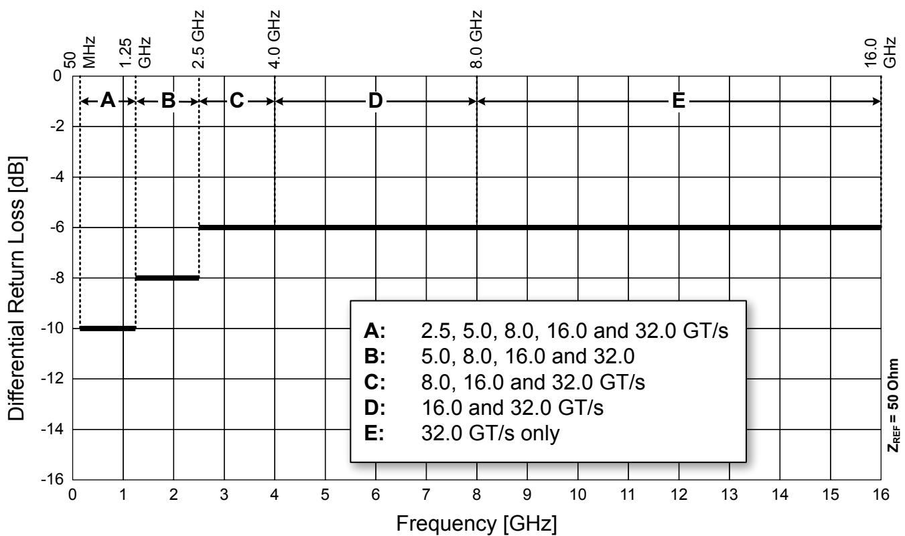

line chart

| Frequency Range       | Value     |
| --------------------- | --------- |
| 0-1                   | -10.0     |
| 1-2                   | -8.0      |
| 2-3                   | -6.0      |
| 3-4                   | -6.0      |
| 4-5                   | -6.0      |
| 5-6                   | -6.0      |
| 6-7                   | -6.0      |
| 7-8                   | -6.0      |
| 8-9                   | -6.0      |
| 9-10                  | -6.0      |
| 10-11                 | -6.0      |
| 11-12                 | -6.0      |
| 12-13                 | -6.0      |
| 13-14                 | -6.0      |
| 14-15                 | -6.0      |
| 15-16                 | -6.0      |

Figure 8-22 Tx, Rx Differential Return Loss Mask with 50 Ohm Reference§

The pass/fail mask for common mode return loss is shown in § Figure 8-23 for 2.5, 5.0, 8.0, 16.0, and 32.0 GT/s. Return loss measurements require that both the Tx and Rx are powered up and that their respective termination circuits are enabled.

Microprobing the package may be required to measure RL accurately.

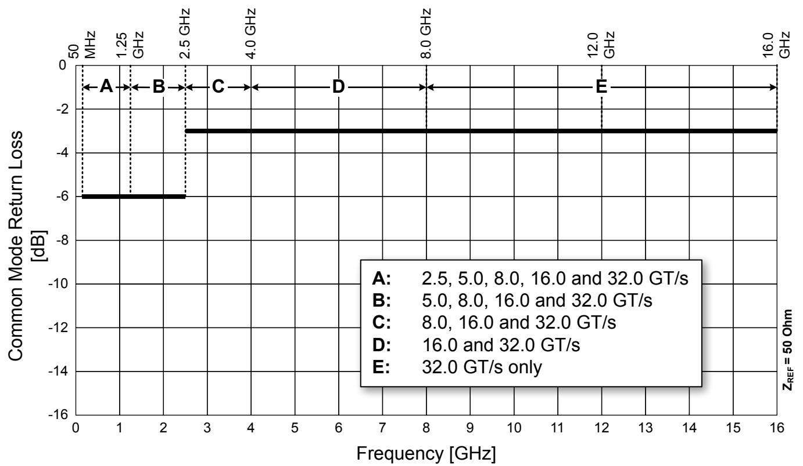

line chart

| Frequency [GHz] | Common Mode Return Loss [dB] |
| --------------- | ---------------------------- |
| 0               | -6                           |
| 2.5             | -6                           |
| 4.0             | -3                           |
| 8.0             | -3                           |
| 12.0            | -3                           |
| 16.0            | -3                           |

Figure 8-23 Tx, Rx Common Mode Return Loss Mask with 50 Ohm Reference§

## 8.3.8 Tx and Rx Return Loss for 64.0 GT/s §

§ Figure 8-24 defines the pass/fail mask for differential return loss for 64.0 GT/s with a single-ended reference impedance of 50 ohms.

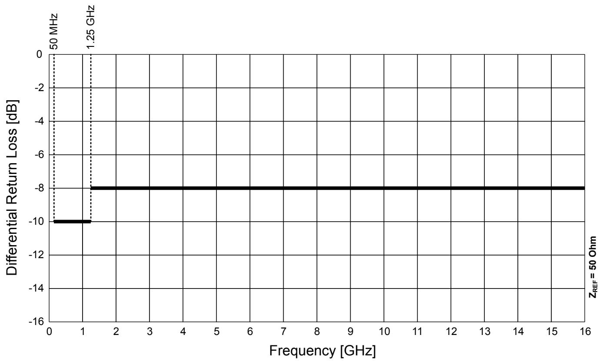

line chart

| Frequency [GHz] | Differential Return Loss [dB] |
| --------------- | ----------------------------- |
| 0               | -10                           |
| 1.25            | -8                            |
| 16              | -8                            |

Figure 8-24 64.0 GT/s Tx, Rx Differential Return Loss Mask with 50 Ohm Reference§

§ Figure 8-25 defines the pass/fail mask for 64.0 GT/s common mode return loss with a single-ended reference impedance of 50 ohms. Return loss measurements require that both the Tx and Rx are powered up and that their respective termination circuits are enabled. Microprobing the package may be required to measure RL accurately.

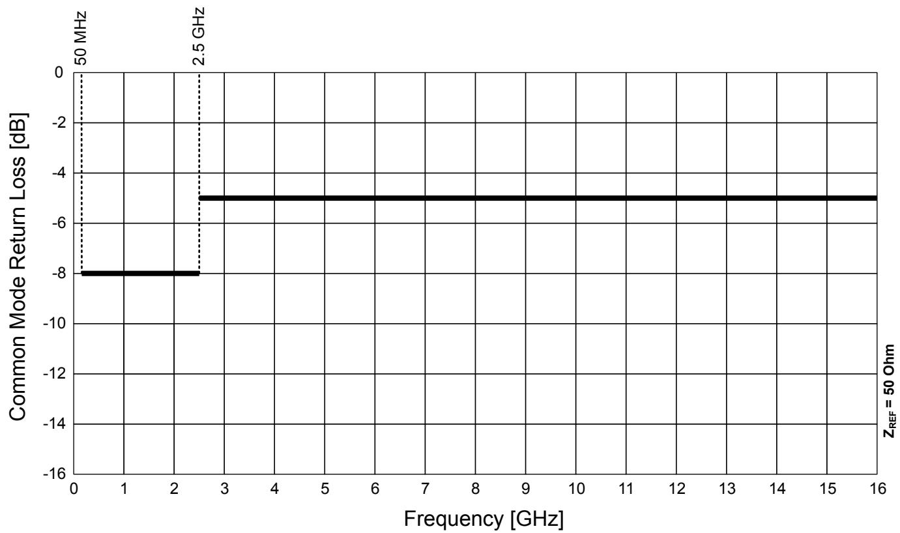

line chart

| Frequency [GHz] | Common Mode Return Loss [dB] |
| --------------- | ---------------------------- |
| 0               | -8                           |
| 2.5             | -5                           |

Figure 8-25 64.0 GT/s Tx, Rx Common Mode Return Loss Mask with 50 Ohm Reference§

## 8.3.9 Transmitter PLL Bandwidth and Peaking §

## 8.3.9.1 2.5 GT/s and 5.0 GT/s Tx PLL Bandwidth and Peaking §

PLL bandwidth and peaking are defined for both the Transmitter and Receiver in order to place an upper limit on the amount of Refclk jitter that is propagated to the transmitted data and to the CDR. Defining PLL BW and peaking limits also guarantees a minimum degree of Tx/Rx jitter tracking in those systems utilizing a Common Refclk Rx architecture.

The 2.5 GT/s PLL characteristics have been moved from the 3.0 CEM spec to the Electrical Base Spec. A single PLL bandwidth range from 1.5 to 22 MHz is given, which is identical to that defined in the CEM spec. No range of peaking was given in the CEM spec for the 2.5 GT/s PLL. However, for the Electrical Base Spec a peaking range of 0.01 dB to 3 dB is now defined. It is necessary to place a non-zero lower limit on the peaking, both to define a corner case as well as to maintain a common mathematical expression for the PLL transfer function in terms of ωn and ζ.

Two sets of bandwidth and peaking are defined for 5.0 GT/s: 8-16 MHz with 3 dB of peaking and 5.0-16.0 MHz with 1 dB of peaking. This gives the designer the option of trading off between a low peaking PLL design vs. a low bandwidth design.

## 8.3.9.2 8.0 GT/s, 16.0 GT/s, 32.0 GT/s, and 64.0 GT/s Tx PLL Bandwidth and Peaking §

The Tx and Rx PLL bandwidth for 8.0 and 16.0 GT/s is 0.5-5 MHz with 1.0 dB of peaking or 0.5-4 MHz with 2.0 dB of peaking. The Tx and Rx PLL bandwidth for 32.0 GT/s is 0.5 to 1.8 MHz with 2.0 dB of peaking. The Tx and Rx PLL bandwidth for 64.0 GT/s is 0.5 to 1.0 MHz with 2.0 dB of peaking. The 8.0 GT/s PLL BW range is substantially lower than the PLL bandwidths specified for 5.0 GT/s or 2.5 GT/s to reduce the amount of Refclk jitter at the sample latch of the Receiver. A non-zero value of 0.01 dB is given for the lower limit of the peaking to define all the peaking corners.

## 8.3.9.3 Series Capacitors §

PCI Express requires series capacitors to provide a DC block between Tx and Rx. The min/max capacitance spread has been decreased from that of the 2.5 and 5.0 GT/s standards, while the maximum value has been slightly increased. This change is necessary to minimize DC wander effects due to data scrambling implemented at 8.0 GT/s, 16.0 GT/s, 32.0 GT/s, and 64.0 GT/s. Note that 2.5 GT/s and 5.0 GT/s signaling must also propagate through these larger value capacitors, but the small increase in capacitor size has no adverse impact on either 2.5 GT/s or 5.0 GT/signaling or low frequency in-band signaling such as Receiver detect.

## 8.3.10 Data Rate Independent Tx Parameters §

Table 8-7 Data Rate Independent Tx Parameters§

<table><tr><td>Symbol</td><td>Parameter Description</td><td>Value</td><td>Units</td><td>Notes</td></tr><tr><td> $V_{TX-DC-CM}$ </td><td>Tx DC peak-peak common mode voltage</td><td>(min)0(max)3.6</td><td>V</td><td>Total single-ended voltage a Tx can supply under any conditions with respect to ground. See also the  $I_{TX-SHORT}$ . See Note 1</td></tr><tr><td> $V_{TX-CM-DC-ACTIVE-IDLE-DELTA}$ </td><td>Absolute delta of DC Common Mode Voltage during L0 and Electrical Idle</td><td>(min)0(max)100</td><td>mV</td><td> $|V_{TX-CM-DC} [during L0] - V_{TX-CM-Idle-DC} [during Electrical Idle] | \leq 100\ mV$  $V_{TX-CM-DC} = DC_{(avg)}\ of\ |V_{TX-D+} + V_{TX-D-}| /2$  $V_{TX-CM-Idle-DC} = DC_{(avg)}\ of\ |V_{TX-D+} + V_{TX-D-}| /2 [Electrical Idle]$ </td></tr><tr><td> $V_{TX-CM-DC-LINE-DELTA}$ </td><td>Absolute Delta of DC Common Mode Voltage between D+ and D-</td><td>(min)0(max)25</td><td>mV</td><td> $|V_{TX-CM-DC-D+} [during L0] - V_{TX-CM-DC-D-} [during L0]| \leq 25\ mV$  $V_{TX-CM-DC-D+} = DC_{(avg)}\ of\ |V_{TX-D+} [during L0]|$  $V_{TX-CM-DC-D-} = DC_{(avg)}\ of\ |V_{TX-D-} [during L0]|$ </td></tr><tr><td> $V_{TX-IDLE-DIFF-AC-p}$ </td><td>Electrical Idle Differential Peak Output Voltage</td><td>(min)0(max)20</td><td>mV</td><td> $V_{TX-IDLE-DIFF-AC-p} = |V_{TX-Idle-D+} - V_{TX-Idle-D-}| \leq 20\ mV. Voltage must be band pass filtered to remove any DC component and HF noise. The bandpass is constructed from two first-order filters, the high pass and low pass 3 dB bandwidths are 10 kHz and 1.25 GHz, respectively.$ </td></tr><tr><td> $V_{TX-IDLE-DIFF-DC}$ </td><td>DC Electrical Idle Differential Output Voltage</td><td>(min)0(max)5</td><td>mV</td><td> $V_{TX-IDLE-DIFF-DC} = |V_{TX-Idle-D+} - V_{TX-Idle-D-}| \leq 5\ mV. Voltage must be low pass filtered to remove any AC component. The low pass filter is first-order with a 3 dB bandwidth of 10 kHz.$ </td></tr><tr><td> $V_{TX-RCV-DETECT}$ </td><td>The amount of voltage change allowed during Receiver Detection</td><td>(max)600</td><td>mV</td><td>The total amount of voltage change in a positive direction that a Transmitter can apply to sense whether a low impedance Receiver is present. Note: Receivers display substantially different impedance for  $V_{IN} < 0$  vs.  $V_{IN} > 0$ .</td></tr><tr><td> $T_{TX-IDLE-MIN}$ </td><td>Minimum time spent in Electrical Idle</td><td>20 (min)</td><td>ns</td><td>The time a Tx must spend in Electrical Idle before transitioning to another state</td></tr><tr><td> $T_{TX-IDLE-SET-TO-IDLE}$ </td><td>Maximum time to transition to a valid Electrical Idle after sending an EIOS</td><td>(max)8</td><td>ns</td><td>After sending the required number of EIOSs, the Transmitter must meet all Electrical Idle specifications within this time. This is measured from the end of the last UI of the last EIOS to the Transmitter in Electrical Idle.</td></tr><tr><td> $T_{TX-IDLE-TO-DIFF-DATA}$ </td><td>Maximum time to transition to valid diff signaling after leaving Electrical Idle</td><td>(max)8</td><td>ns</td><td>Maximum time to transition to valid diff signaling after leaving Electrical Idle. This is considered a debounce time to the Tx.</td></tr><tr><td> $T_{CROSSLINK}$ </td><td>Crosslink random timeout</td><td>(max)1.0</td><td>ms</td><td>This random timeout helps resolve potential conflicts in the crosslink configuration.</td></tr><tr><td> $C_{TX}$ </td><td>AC Coupling Capacitor</td><td>(min)176 (max)265</td><td>nF</td><td>All Transmitters shall be AC coupled. The AC coupling is required either within the media or within the transmitting component itself.</td></tr><tr><td> $Z_{TX-DIFF-DC}$ </td><td>DC differential Tx impedance</td><td>(max)120</td><td>Ω</td><td>Low impedance defined during signaling. The minimum value is bounded by RL $_{TX-DIFF}$ .</td></tr><tr><td> $I_{TX-SHORT}$ </td><td>Tx short circuit current</td><td>(max)90</td><td>ma</td><td>Tx short circuit current. Note 1</td></tr></table>

Notes:  
1. ITX-SHORT and VTX-DC-CM stipulate the maximum current/voltage levels that a Transmitter can generate and therefore define the worst case transients that a Receiver must tolerate.

## 8.4 Receiver Specifications §

## 8.4.1 Receiver Stressed Eye Specification §

All Receiver speeds are tested by means of a stressed eye applied over a calibration channel that approximates the near worst-case loss characteristics encountered in an actual channel. The recovered eye is defined at the input to the Receiver’s latch. For 2.5 GT/s and 5.0 GT/s this point is equivalent to the Rx pins; for 8.0 GT/s, 16.0 GT/s, 32.0 GT/s, and 64.0 GT/s it is equivalent to the signal at the Rx die pad after behavioral Rx equalization has been applied.

## 8.4.1.1 Breakout and Replica Channels §

The closest practical measurement points to the Rx DUT are the coaxial connectors at the end of a breakout channel, while the Rx reference point of interest is the pin of the Rx. By constructing a replica channel that closely matches the electrical characteristics of the breakout channel it is possible to measure the signal as it would appear at the DUT’s pin, if the DUT were an ideal termination. Impedance targets for the Rx breakout and replica channels are 85 Ω differential and 42.5 Ω single-ended, and the impedance tolerance should be maintained within ±5% or better. Note that the impedance target for the Tx test breakout and replica channels is still 100 Ω differential and 50 Ω single-ended

In § Figure 8-26 the stressed eye is observed at TP2 with the signal sources connected to the calibration channel. A calibration channel will be required for each data rate. Once the stressed eye has been calibrated, the signal source is applied to the DUT. Note that TP1-TP2 encompasses all the components between the signal source and the equivalent of the DUT pin, thereby capturing all non-ideal characteristics in the overall insertion loss due to cabling and replica/ breakout channel, excluding Rx package. The AC and DC loss from generator to TP1 are assumed to be zero or must be otherwise de-embedded. The VRX-LAUNCH (differential voltage swing) and Tx Equalization of the Signal Generator are calibrated at TP3 as shown in § Figure 8-26. Some Signal Generators do factory calibration with a cable and trying to de-embed to TP1 for these calibrations can cause inaccuracies. Only the loss from TP3 onward is counted in overall calibration channel loss.

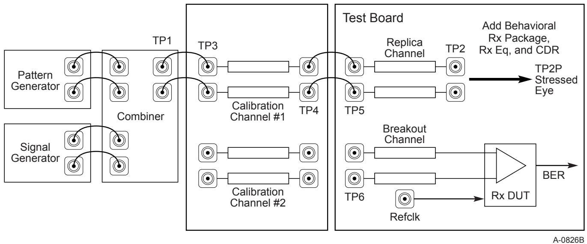

flowchart

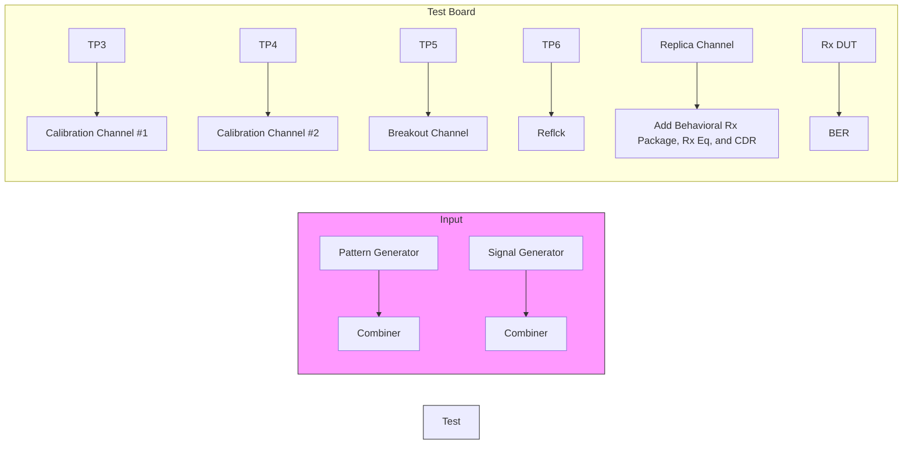
```mermaid
graph LR
    subgraph Input
  A["Pattern Generator"] --> B["Combiner"]
  C["Signal Generator"] --> D["Combiner"]
    end

    subgraph Test Board
  E["TP3"] --> F["Calibration Channel #1"]
  G["TP4"] --> H["Calibration Channel #2"]
  I["TP5"] --> J["Breakout Channel"]
  K["TP6"] --> L["Reflck"]
  M["Replica Channel"] --> N["Add Behavioral Rx Package, Rx Eq, and CDR"]
  O["Rx DUT"] --> P["BER"]
    end

    style Input fill:#f9f,stroke:#333
    style Test Board fill:#bbf,stroke:#333
```

Figure 8-26 Rx Test board Topology for 16.0 and 32.0 GT/s§

## 8.4.1.2 Calibration Channel Insertion Loss Characteristics §

Calibration channels, each with a specified differential insertion loss at one of the PCIe data rates, provide the means of generating prescribed amounts of ISI that approximates a worst-case channel. For each data rate a single calibration channel loss mask is defined by means of two pairs of IL limits at a high and a low frequency. It is not acceptable to generate IL by means other than physical channel (PCB traces, cables, switches, small compensation delays, etc. are acceptable), such as specialized filters. The Calibration Channel needs to include all physical loss after TP3 as shown in § Figure 8-26 within the IL mask.

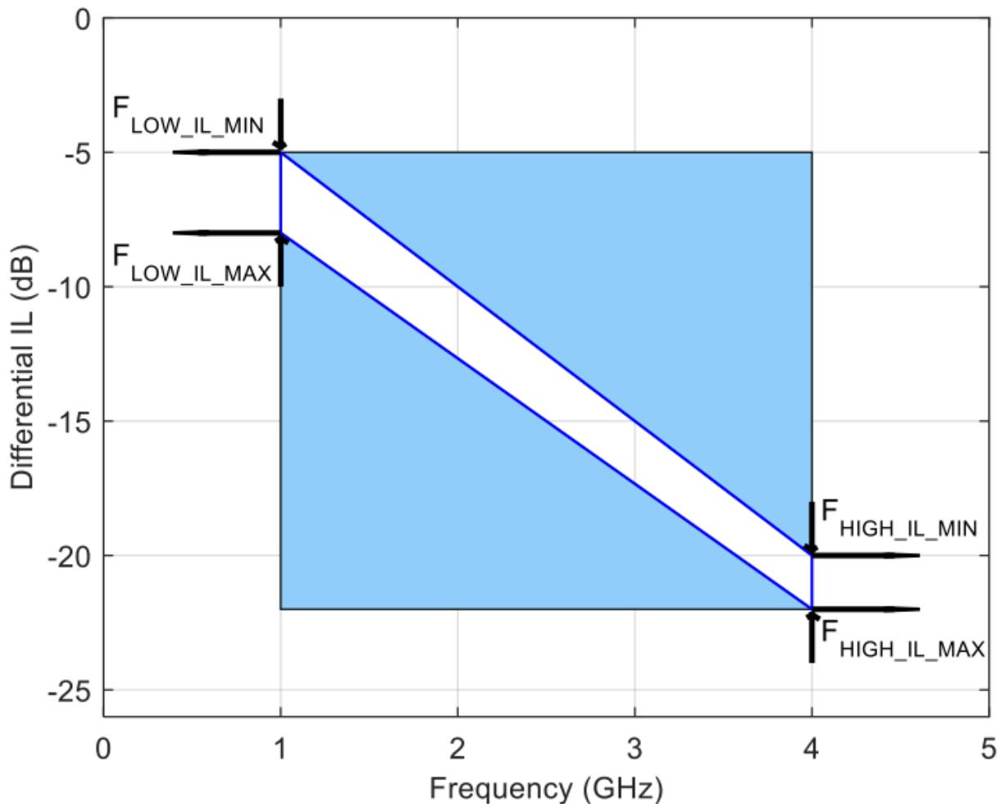

line chart

| Frequency (GHz) | Differential IL (dB) |
| --------------- | -------------------- |
| 1               | -5                   |
| 4               | -20                  |

Figure 8-27 Example Calibration Channel IL Mask Excluding Rx Package for 8.0 GT/s§

The following table defines the calibration channel IL masks by means of four loss points at two frequency limits, thereby creating a quadrilateral shaped solution area. The calibration channel IL mask is provided as a guideline to minimize reflection so that the channel represents mostly ISI stress for the receiver test.

Table 8-8 Calibration Channel IL Limits§

<table><tr><td>Data Rate</td><td> $F_{LOW-IL-MIN}$ </td><td> $F_{LOW-IL-MAX}$ </td><td> $F_{HIGH-IL-MIN}$ </td><td> $F_{HIGH-IL-MAX}$ </td></tr><tr><td>2.5 GT/s</td><td>4.5 dB @ 1 GHz</td><td>5.0 dB @ 1 GHz</td><td>4.7 dB @ 1.25 GHz</td><td>5.2 dB @ 1.25 GHz</td></tr><tr><td>5.0 GT/s</td><td>4.5 dB @ 1 GHz</td><td>5.0 dB @ 1 GHz</td><td>10.0 dB @ 2.5 GHz</td><td>11.0 dB @ 2.5 GHz</td></tr><tr><td>8.0 GT/s</td><td>5 dB @ 1 GHz</td><td>8 dB @ 1 GHz</td><td>20 dB @ 4 GHz</td><td>22 dB @ 4 GHz</td></tr><tr><td>16.0 GT/s Root Port</td><td>4.2 dB @ 1 GHz</td><td>5.2 dB @ 1 GHz</td><td>22.5 dB @ 8 GHz</td><td>23.5 dB @ 8 GHz</td></tr><tr><td>16.0 GT/s Non-Root Port</td><td>4.2 dB @ 1 GHz</td><td>5.2 dB @ 1 GHz</td><td>24.5 dB @ 8 GHz</td><td>25.5 dB @ 8 GHz</td></tr><tr><td>32.0 GT/s Root Port</td><td>3.2 dB @ 1 GHz</td><td>4.2 dB @ 1 GHz</td><td>26.5 dB @ 16 GHz</td><td>27.5 dB @ 16 GHz</td></tr><tr><td>32.0 GT/s Non-Root Port</td><td>3.9 dB @ 1 GHz</td><td>4.9 dB @ 1 GHz</td><td>31.5 dB @ 16 GHz</td><td>32.5 dB @ 16 GHz</td></tr><tr><td>64.0 GT/s Root Port</td><td>3.0 dB @ 1 GHz</td><td>4.0 dB @ 1 GHz</td><td>23.5 dB @ 16 GHz</td><td>24.5 dB @ 16 GHz</td></tr><tr><td>64.0 GT/s Non-Root Port</td><td>3.6 dB @ 1 GHz</td><td>4.6 dB @ 1 GHz</td><td>27.5 dB @ 16 GHz</td><td>28.5 dB @ 16 GHz</td></tr></table>

## Notes:

• Calibration channel plus Rx package is 28 dB nominally (informative) for 16.0 GT/s.  
• Calibration channel plus Rx package is 36 dB nominally (informative) for 32.0 GT/s.  
• Calibration channel plus Rx package is 32 dB nominally (informative) for 64.0 GT/s.  
• Different reference packages are defined for devices containing Root Ports and all other device types at 16.0 GT/s, 32.0 GT/ s, and 64.0 GT/s.  
• It is recommended that some validation be done with shorter channels at 16.0 GT/s, 32.0 GT/s, and 64.0 GT/s.  
• For 32.0 GT/s, a material at least as good as a Megtron-6 class material with loss of approximately 1.0 dB/inch at 16 GHz at typical room conditions must be used.  
For 64.0 GT/s, a material at least as good as a Megtron-6 class material with loss of approximately 1.0 dB/inch at 16 GHz under worst-case temperature and humidity conditions must be used to achieve system routing length of 13” for 1-connector server topologies.

The impedance targets for the Rx tolerancing interconnect environment are 100 Ω differential and 50 Ω single-ended for the 2.5, 5.0, and 8.0 GT/s channels and 85 Ω differential and 42.5 Ω single-ended for the 16.0 GT/s, 32.0 GT/s, and 64.0 GT/ s channels; the impedance tolerance should be maintained within ±5% or better.

The calibration channel for 16.0 GT/s must meet the following return loss mask when measured from either end of the calibration channel:

• ≤ -12 dB for < 4 GHz  
• ≤ -8 dB for ≥ 4 GHz and < 12 GHz  
• ≤ -6 dB for ≥ 12 GHz and ≤ 16 GHz

The calibration channel for 32.0 GT/s and 64.0 GT/s must meet the following return loss mask when measured from either end of the calibration channel:

• ≤ -12 dB for < 4 GHz  
• ≤ - 10 dB for ≥ 4 GHz and < 16 GHz  
• ≤ -6 dB for ≥ 16 GHz and ≤ 32 GHz

A calibration channel consists of a differential pair of PCB traces terminated at both ends by coaxial connectors. For 16.0 GT/s, 32.0 GT/s, and 64.0 GT/s the calibration channel includes a 4.0 (16.0 GT/s), 5.0 (32.0 GT/s), or 6.0 (64.0 GT/s) Card Electromechanical Specification compliant connector and edge finger placed at least 4 dB at Nyquist away from the coaxial connectors where the signal generator is connected. The calibration channel’s electrical characteristics are defined in terms of differential insertion loss masks as shown in § Figure 8-27, where SDD21 is measured between TP3 (See § Figure 8-26) and TP2. Connections between TP4-TP5 represent cabling and are included in the SDD21 measurement. Loss before TP3 is effectively calibrated out by calibrating differential voltage swing and TX EQ at TP3 and is not included in the SDD21 measurement.

While the 8.0 GT/s, 16.0 GT/s, 32.0 GT/s, and 64.0 GT/s S-parameter masks do not extend below 1.0 GHz, all calibration channels must be well behaved below 1.0 GHz and must not have a DC resistance in excess of 7.5 ohms, as measured by the sum of the resistances of the D+ and D- traces. This limitation on DC resistance guarantees that the calibration channel low frequency characteristic is consistent with the extrapolations of the SDD21 masks to DC. The calibration loss targets for devices containing Root Ports and other devices are different because the reference package models have different losses. For 16.0 GT/s, 32.0 GT/s, and 64.0 GT/s the insertion loss range FHIGH-IL-MIN to FHIGH-IL-MAX is the nominal loss. The calibration channel must have a series of loss options covering a range from at least 2 dB below FHIGH-IL-MIN to 3 dB above FHIGH-IL-MAX (for example for the non-root case this means a loss range from -22.5 to -28.5 dB) with loss delta between consecutive options of 0.5 dB or less.

## IMPLEMENTATION NOTE:

## 16.0 GT/S CALIBRATION CHANNEL REFERENCE DESIGN §

This section gives an example of a 16.0 GT/s calibration channel that was built and tested to meet the requirements in this specification. A high-level block diagram of the calibration channel is shown in § Figure 8-28. Note that this example fixture covers a wider loss range then required by the specification and can cover both root and non-root cases. The test fixture includes four PCBs:

## 16.0 GT/s Rx Calibration Base Boards

Sixteen differential pairs (85 Ohm Nominal Impedance) routed from SMA connectors to a CEM through-hole connector. There are three different base boards to achieve the following insertion loss ranges – The insertion loss of the differential pairs for the base board is varied as follows @ 8.0 GHz in 0.5 dB steps.

Low-Loss Base Board: 4-11.5 dB

Mid-Loss Base Board: 12-19.5 dB

High-Loss Base Board: 20-27.5 dB

All traces are routed as microstrip on the bottom layer. The SMA connectors and CEM connectors are optimized with layout techniques at 8.0 GHz.

## 16.0 GT/s Rx Calibration Riser Board

Sixteen differential pairs (85 Ohm Nominal Impedance) routed from SMA connectors to Gold Edge Fingers. The insertion loss of the differential pairs is fixed at 4 dB nominal @ 8.0 GHz for all sixteen pairs. All traces are routed as microstrip on the bottom layer. The SMA connectors and CEM connectors are optimized with layout techniques at 8.0 GHz.

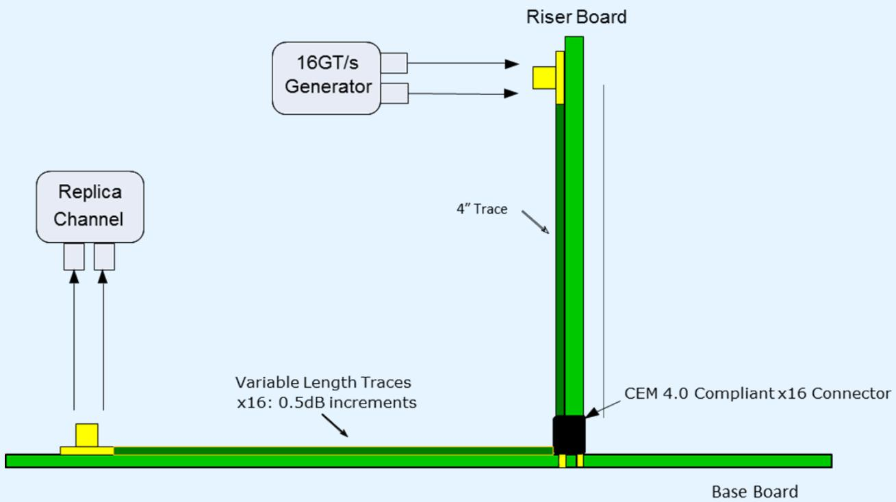

flowchart

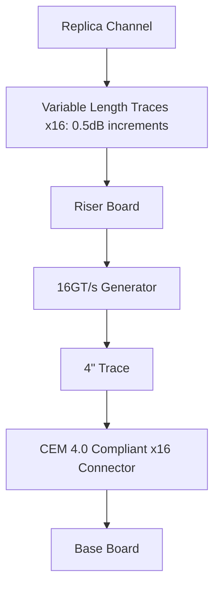
```mermaid
graph TD
  A["Replica Channel"] --> B["Variable Length Traces x16: 0.5dB increments"]
  B --> C["Riser Board"]
  C --> D["16GT/s Generator"]
  D --> E["4&quot; Trace"]
  E --> F["CEM 4.0 Compliant x16 Connector"]
  F --> G["Base Board"]
```

Figure 8-28 Example 16.0 GT/s Calibration Channel§

The stackup for both boards is shown in § Figure 8-29 where 65% is the estimated copper fill percentage. § Figure 8-29 includes stackups for both nominal 85 Ω and 100 Ω stackups - the 85 Ω stackup is used for the calibration channel example.

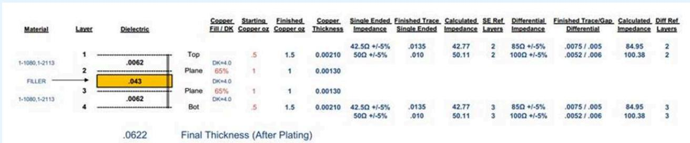

table

| Material | Layer | Dielectric | Copper Fill / DK | Starting Copper oz | Finished Copper oz | Copper Thickness | Single Ended Impedance | Finished Trace Single Ended | Calculated Impedance | SE Ref Layers | Differential Impedance | Finished Trace/Gap Differential | Calculated Impedance | Diff Ref Layers |
| :--- | :--- | :--- | :--- | :--- | :--- | :--- | :--- | :--- | :--- | :--- | :--- | :--- | :--- | :--- |
| 1-1080,1-2113 | 1 | .0062 | DK=4.0 | .5 | 1.5 | 0.00210 | 42.5Ω +/-5% | .0135 | 42.77 | 2 | 85Ω +/-5% | .0075 / .005 | 84.95 | 2 |
| FILLER | 2 | .043 | 65% | 1 | 1 | 0.00130 | 50Ω +/-5% | .010 | 50.11 | 2 | 100Ω +/-5% | .0052 / .006 | 100.38 | 2 |
| 1-1080,1-2113 | 3 | .0062 | DK=4.0 | 1 | 1 | 0.00130 | 65% | 1 | 1 | 1 | 1 | 1 | 1 | 1 |
| 1-1080,1-2113 | 4 | 0.0622 | DK=4.0 | .5 | 1.5 | 0.00210 | 42.5Ω +/-5% | .0135 | 42.77 | 3 | 85Ω +/-5% | .0075 / .005 | 84.95 | 3 |
| Final Thickness (After Plating)

Figure 8-29 Stackup for Example 16.0 GT/s Calibration Channel§

The pad stack for the CEM connector drill holes is shown in § Figure 8-30 and the pad stack for the SMA drill holes is shown in § Figure 8-31.

Padstack:C40P28P3M3-A59 Tvpe:through Innerpads:Optional

<table><tr><td>Layer</td><td>Pad Type</td><td>Geometry</td><td>Width</td><td>Height</td><td>Offset X</td><td>Offset Y</td><td>Flash Name</td><td>Shape Name</td></tr><tr><td>TOP</td><td>ANTI</td><td>CIRCLE</td><td>59.00</td><td>59.00</td><td>0.00</td><td>0.00</td><td></td><td></td></tr><tr><td>TOP</td><td>THERMAL</td><td>RECTANGLE</td><td>80.00</td><td>80.00</td><td>0.00</td><td>0.00</td><td>TH80X60X15_4X45</td><td></td></tr><tr><td>TOP</td><td>REGULAR</td><td>CIRCLE</td><td>40.00</td><td>40.00</td><td>0.00</td><td>0.00</td><td></td><td></td></tr><tr><td>GND-2</td><td>ANTI</td><td>CIRCLE</td><td>59.00</td><td>59.00</td><td>0.00</td><td>0.00</td><td></td><td></td></tr><tr><td>GND-2</td><td>THERMAL</td><td>RECTANGLE</td><td>80.00</td><td>80.00</td><td>0.00</td><td>0.00</td><td>TH80X60X15_4X45</td><td></td></tr><tr><td>GND-2</td><td>REGULAR</td><td>CIRCLE</td><td>40.00</td><td>40.00</td><td>0.00</td><td>0.00</td><td></td><td></td></tr><tr><td>GND-3</td><td>ANTI</td><td>CIRCLE</td><td>59.00</td><td>59.00</td><td>0.00</td><td>0.00</td><td></td><td></td></tr><tr><td>GND-3</td><td>THERMAL</td><td>RECTANGLE</td><td>80.00</td><td>80.00</td><td>0.00</td><td>0.00</td><td>TH80X60X15_4X45</td><td></td></tr><tr><td>GND-3</td><td>REGULAR</td><td>CIRCLE</td><td>40.00</td><td>40.00</td><td>0.00</td><td>0.00</td><td></td><td></td></tr><tr><td>BOTTOM</td><td>ANTI</td><td>CIRCLE</td><td>59.00</td><td>59.00</td><td>0.00</td><td>0.00</td><td></td><td></td></tr><tr><td>BOTTOM</td><td>THERMAL</td><td>RECTANGLE</td><td>80.00</td><td>80.00</td><td>0.00</td><td>0.00</td><td>TH80X60X15_4X45</td><td></td></tr><tr><td>BOTTOM</td><td>REGULAR</td><td>CIRCLE</td><td>40.00</td><td>40.00</td><td>0.00</td><td>0.00</td><td></td><td></td></tr><tr><td>internal_pad_def</td><td>ANTI</td><td>CIRCLE</td><td>59.00</td><td>59.00</td><td>0.00</td><td>0.00</td><td></td><td></td></tr><tr><td>internal_pad_def</td><td>THERMAL</td><td>RECTANGLE</td><td>80.00</td><td>80.00</td><td>0.00</td><td>0.00</td><td>TH80X60X15_4X45</td><td></td></tr><tr><td>internal_pad_def</td><td>REGULAR</td><td>CIRCLE</td><td>40.00</td><td>40.00</td><td>0.00</td><td>0.00</td><td></td><td></td></tr><tr><td>SOLDERMASK_TOP</td><td>REGULAR</td><td>CIRCLE</td><td>40.00</td><td>40.00</td><td>0.00</td><td>0.00</td><td></td><td></td></tr><tr><td>SOLDERMASK_BOTTOM</td><td>REGULAR</td><td>CIRCLE</td><td>40.00</td><td>40.00</td><td>0.00</td><td>0.00</td><td></td><td></td></tr><tr><td>PASTEMASK_TOP</td><td>REGULAR</td><td>NULL</td><td>0.00</td><td>0.00</td><td>0.00</td><td>0.00</td><td></td><td></td></tr><tr><td>PASTEMASK_BOTTOM</td><td>REGULAR</td><td>NULL</td><td>0.00</td><td>0.00</td><td>0.00</td><td>0.00</td><td></td><td></td></tr><tr><td>FILMMASKTOP</td><td>REGULAR</td><td>NULL</td><td>0.00</td><td>0.00</td><td>0.00</td><td>0.00</td><td></td><td></td></tr><tr><td>FILMMASKBOTTOM</td><td>REGULAR</td><td>NULL</td><td>0.00</td><td>0.00</td><td>0.00</td><td>0.00</td><td></td><td></td></tr></table>

DrillDataforC40P28P3M3-A59

<table><tr><td>Hole Type</td><td>Drill Dia</td><td>Plating</td><td>Figure</td><td>Characters</td><td>Width</td><td>Height</td><td>Offset X</td><td>Offset Y</td><td>Pos Tolerance</td><td>Neg Tolerance</td><td>Non-Standard</td></tr><tr><td>CIRCLE DRILL</td><td>28.00</td><td>PLATED</td><td>DIAMOND</td><td></td><td>50.00</td><td>50.00</td><td>0.00</td><td>0.00</td><td>3.00</td><td>3.00</td><td></td></tr></table>

Figure 8-30 CEM Connect § or Drill Hole Pad Stack

Padstack:C60 BOT75P20 SSM40P3M3 Type:through Innerpads:Optional

<table><tr><td>Layer</td><td>Pad Type</td><td>Geometry</td><td>Width</td><td>Height</td><td>Offset X</td><td>Offset Y</td><td>Flash Name</td><td>Shape Name</td></tr><tr><td>TOP</td><td>ANTI</td><td>CIRCLE</td><td>45.00</td><td>45.00</td><td>0.00</td><td>0.00</td><td></td><td></td></tr><tr><td>TOP</td><td>THERMAL</td><td>RECTANGLE</td><td>5.00</td><td>5.00</td><td>0.00</td><td>0.00</td><td>5MIL_PAD</td><td></td></tr><tr><td>TOP</td><td>REGULAR</td><td>CIRCLE</td><td>60.00</td><td>60.00</td><td>0.00</td><td>0.00</td><td></td><td></td></tr><tr><td>GND-2</td><td>ANTI</td><td>CIRCLE</td><td>45.00</td><td>45.00</td><td>0.00</td><td>0.00</td><td></td><td></td></tr><tr><td>GND-2</td><td>THERMAL</td><td>RECTANGLE</td><td>5.00</td><td>5.00</td><td>0.00</td><td>0.00</td><td>5MIL_PAD</td><td></td></tr><tr><td>GND-2</td><td>REGULAR</td><td>CIRCLE</td><td>60.00</td><td>60.00</td><td>0.00</td><td>0.00</td><td></td><td></td></tr><tr><td>GND-3</td><td>ANTI</td><td>CIRCLE</td><td>45.00</td><td>45.00</td><td>0.00</td><td>0.00</td><td></td><td></td></tr><tr><td>GND-3</td><td>THERMAL</td><td>RECTANGLE</td><td>5.00</td><td>5.00</td><td>0.00</td><td>0.00</td><td>5MIL_PAD</td><td></td></tr><tr><td>GND-3</td><td>REGULAR</td><td>CIRCLE</td><td>60.00</td><td>60.00</td><td>0.00</td><td>0.00</td><td></td><td></td></tr><tr><td>BOTTOM</td><td>ANTI</td><td>CIRCLE</td><td>45.00</td><td>45.00</td><td>0.00</td><td>0.00</td><td></td><td></td></tr><tr><td>BOTTOM</td><td>THERMAL</td><td>RECTANGLE</td><td>5.00</td><td>5.00</td><td>0.00</td><td>0.00</td><td>5MIL_PAD</td><td></td></tr><tr><td>BOTTOM</td><td>REGULAR</td><td>CIRCLE</td><td>75.00</td><td>75.00</td><td>0.00</td><td>0.00</td><td></td><td></td></tr><tr><td>internal_pad_def</td><td>ANTI</td><td>CIRCLE</td><td>45.00</td><td>45.00</td><td>0.00</td><td>0.00</td><td></td><td></td></tr><tr><td>internal_pad_def</td><td>THERMAL</td><td>RECTANGLE</td><td>5.00</td><td>5.00</td><td>0.00</td><td>0.00</td><td>5MIL_PAD</td><td></td></tr><tr><td>internal_pad_def</td><td>REGULAR</td><td>CIRCLE</td><td>60.00</td><td>60.00</td><td>0.00</td><td>0.00</td><td></td><td></td></tr><tr><td>SOLDERMASK_TOP</td><td>REGULAR</td><td>CIRCLE</td><td>60.00</td><td>60.00</td><td>0.00</td><td>0.00</td><td></td><td></td></tr><tr><td>SOLDERMASK_BOTTOM</td><td>REGULAR</td><td>CIRCLE</td><td>40.00</td><td>40.00</td><td>0.00</td><td>0.00</td><td></td><td></td></tr><tr><td>PASTEMASK_TOP</td><td>REGULAR</td><td>NULL</td><td>0.00</td><td>0.00</td><td>0.00</td><td>0.00</td><td></td><td></td></tr><tr><td>PASTEMASK_BOTTOM</td><td>REGULAR</td><td>NULL</td><td>0.00</td><td>0.00</td><td>0.00</td><td>0.00</td><td></td><td></td></tr><tr><td>FILMMASKTOP</td><td>REGULAR</td><td>NULL</td><td>0.00</td><td>0.00</td><td>0.00</td><td>0.00</td><td></td><td></td></tr><tr><td>FILMMASKBOTTOM</td><td>REGULAR</td><td>NULL</td><td>0.00</td><td>0.00</td><td>0.00</td><td>0.00</td><td></td><td></td></tr></table>

DrillDataforC60 BOT75P20 SSM40P3M3

<table><tr><td>Hole Type</td><td>Drill Dia</td><td>Plating</td><td>Figure</td><td>Characters</td><td>Width</td><td>Height</td><td>Offset X</td><td>Offset Y</td><td>Pos Tolerance</td><td>Neg Tolerance</td><td>Non-Standard</td></tr><tr><td>CIRCLE DRILL</td><td>20.00</td><td>PLATED</td><td>CIRCLE</td><td>E</td><td>60.00</td><td>60.00</td><td>0.00</td><td>0.00</td><td>3.00</td><td>3.00</td><td></td></tr></table>

Figur§e 8-31 Pad Stack for SMA Drill Holes

# IMPLEMENTATION NOTE:

## 32.0 GT/S CALIBRATION CHANNEL REFERENCE DESIGN §

This section gives an example of a 32.0 GT/s calibration channel that was built and tested to meet the requirements in this specification. A high-level block diagram of the calibration channel is shown in § Figure 8-32. Note this example fixture covers a wider loss range then required by the specification and can cover both root and non-root cases. The test fixture includes two PCBs:

## 32.0 GT/s Rx Calibration Base Boards

Sixteen differential pairs (85 Ohm Nominal Impedance) routed on a Megtron-6 PCB from MMPX connectors to a CEM surface mount connector. There are three different base boards to achieve the following insertion loss ranges - The insertion loss of the differential pairs for the base board is varied as follows @ 16.0 GHz in 0.5 dB steps.

Low-Loss Base 4.0 - 11.5 dB

Board:

Mid-Loss Base 12.0 - 19.5 dB

Board:

High-Loss Base 20.0 - 27.5 dB

Board:

All traces are routed as

microstrip on the top layer. The MMPX connectors and CEM connectors are optimized with layout techniques at 16.0 GHz

For information on MMPX connectors refer to Huber+Suhner microminiature connectors.

## 32.0 GT/s Rx Calibration Riser Board

Sixteen differential pairs (85 Ohm Nominal Impedance) routed on a Megtron-6 PCB from MMPX connectors to Gold Edge Fingers. The insertion loss of the differential pairs is fixed at 8 dB nominal @ 16.0 GHz for all sixteen pairs. All traces are routed as microstrip on the top layer. The MMPX connectors and CEM connectors are optimized with layout techniques at 16.0 GHz.

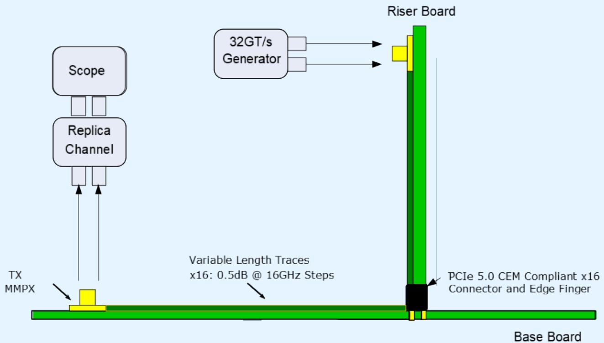

flowchart

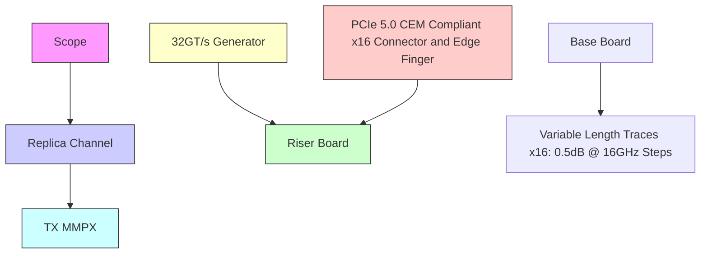
```mermaid
graph TD
  A["Scope"] --> B["Replica Channel"]
  B --> C["TX MMPX"]
  D["32GT/s Generator"] --> E["Riser Board"]
  F["PCIe 5.0 CEM Compliant x16 Connector and Edge Finger"] --> E
    style A fill:#f9f,stroke:#333
    style B fill:#ccf,stroke:#333
    style C fill:#cff,stroke:#333
    style D fill:#ffc,stroke:#333
    style E fill:#cfc,stroke:#333
    style F fill:#fcc,stroke:#333
  style_G["Base Board"] --> H["Variable Length Traces x16: 0.5dB @ 16GHz Steps"]
```

Figure 8-32 Example 32.0 GT/s Calibration Channel§

The stack-up for both 85 Ohm boards is shown in § Figure 8-33 where 65% is the estimated copper fill percentage.

<table><tr><td>Material</td><td colspan="2">Layer</td><td>Starting Cu oz</td><td>Finished Cu oz</td><td>Dielectric</td><td></td><td>Lyr</td><td>Single Ended Impedance</td><td>Designed Trace Width</td><td>Finished Trace Width</td><td>Calculated Impedance</td><td>Ref Lyr A</td><td>Ref Lyr B</td><td>Lyr</td><td>Differential Impedance</td><td>Designed Trace/Space</td><td>Finished Trace/Space</td><td>Calculated Impedance</td><td>Ref Lyr A</td><td>Ref Lyr B</td></tr><tr><td></td><td></td><td></td><td></td><td></td><td></td><td></td><td></td><td>42.5 Ω</td><td>.00945</td><td>.0155</td><td>42.18 Ω</td><td></td><td></td><td></td><td>85 Ω</td><td>.00675/.00525</td><td>.0115/.0095</td><td>85.94 Ω</td><td>2</td><td></td></tr><tr><td rowspan="3">1-3313(54%), 1-1078(75%)</td><td rowspan="2">1</td><td rowspan="2">Signal</td><td rowspan="2">.5</td><td rowspan="2">1.5</td><td></td><td></td><td></td><td>50 Ω</td><td>.008</td><td>.0115</td><td>49.7 Ω</td><td></td><td></td><td></td><td>100 Ω</td><td>.005/.007</td><td>.006/.006</td><td>100.45 Ω</td><td>2</td><td></td></tr><tr><td>.0065</td><td>+/- 0.001</td><td></td><td></td><td></td><td></td><td></td><td></td><td></td><td></td><td></td><td></td><td></td><td></td><td></td><td></td></tr><tr><td>2</td><td>Plane</td><td>1</td><td>1</td><td></td><td></td><td></td><td></td><td></td><td></td><td></td><td></td><td></td><td></td><td></td><td></td><td></td><td></td><td></td><td></td></tr><tr><td rowspan="2">Filler Material</td><td rowspan="2">3</td><td rowspan="2">Plane</td><td rowspan="2">1</td><td rowspan="2">1</td><td></td><td></td><td></td><td></td><td></td><td></td><td></td><td></td><td></td><td></td><td></td><td></td><td></td><td></td><td></td><td></td></tr><tr><td>.042</td><td>+/-0.003</td><td></td><td></td><td></td><td></td><td></td><td></td><td></td><td></td><td></td><td></td><td></td><td></td><td></td><td></td></tr><tr><td rowspan="2">1-3313(54%), 1-1078(75%)</td><td rowspan="2">4</td><td rowspan="2">Signal</td><td rowspan="2">.5</td><td rowspan="2">1.5</td><td rowspan="2"></td><td rowspan="2"></td><td rowspan="2"></td><td>50 Ω</td><td>.008</td><td>.0115</td><td>49.7 Ω</td><td></td><td></td><td></td><td>100 Ω</td><td>.005/.007</td><td>.006/.006</td><td>100.45 Ω</td><td>2</td><td></td></tr><tr><td>42.5 Ω</td><td>.00945</td><td>.0155</td><td>42.18 Ω</td><td></td><td></td><td></td><td>85 Ω</td><td>.00675/.00525</td><td>.0115/.0095</td><td>85.94 Ω</td><td>2</td><td></td></tr><tr><td colspan="21">Final Thickness (After Plating): 0.062</td></tr></table>

Figure 8-33 Stack-up for Example 32.0 GT/s Calibration Channel§

64.0 GT/s Calibration channel reference design may be added in Rev 0.9.

## 8.4.1.3 Post Processing Procedures §

The Receiver test requires that the stressed eye characteristics be measured at TP2 (which is accessible) and then post-processed to yield a signal as it would appear at test point two post-processed (TP2P) (which is not accessible) for 8.0, 16.0, 32.0, and 64.0 GT/s. TP2P defines a reference point that comprehends the effects of the behavioral Rx package plus Rx equalization and represents the only location where a meaningful EH and EW limits can be defined.

## 8.4.1.4 Behavioral Rx Package Models §

Behavioral Rx package models are included as part of the post processing to allow the calibrated eye to comprehend package insertion loss. A separate pair of package models is defined for 8.0, 16.0, 32.0, and 64.0 GT/s eye calibration. At 8.0 GT/s, separate package models are defined for TX and RX ports to reflect the smaller CPAD capacitance typical in most receiver implementations. At 16.0, 32.0, and 64.0 GT/s, separate package models are defined for devices containing Root Ports and all other devices. This is necessary to allow a reasonable channel solution space and assumes that devices containing Root Complexes are usually large and socketed, while all other devices tend to be unsocketed and smaller. The 16.0 GT/s Root and Non-Root behavioral Rx package models have been constructed to represent respective package loss characteristics for high loss, but not worst-case loss, packages. The 32.0 and 64.0 GT/s Root and Non-Root behavioral Rx package models have been constructed to represent package loss characteristics for worst case packages.

The 8.0, 32.0, and 64.0 GT/s stressed eye test for all devices and the 16.0 GT/s stressed eye test for Non-Root Package devices that support captive channels are required to use the appropriate behavioral package (see § Section 8.3.3.11 ). For all other device types, if the actual Rx package performance is worse than that of the behavioral package, then the actual package models are permitted to be used. If the actual package models are used, the calibration channel must be adjusted such that the total channel loss including the embedded actual package remains at 28 dB nominal. Note that form factor overall requirements still need to be met. The Rx package performance is assessed using the methodology defined in § Section 8.5.1.2 .

Details of the behavioral Rx packages are provided in § Section 8.5.1.1 of the Channel Tolerancing section. S-parameter models for the behavioral Rx package models are available as design collateral. The reference impedance at the pad side of the packages model is assumed to be 2 × 50 Ω.

## 8.4.1.5 Behavioral CDR Model §

Post processing shall include a behavioral CDR model with a data rate dependent transfer function. A first order CDR transfer function is utilized for Receivers operating with a CC Refclk architecture except for 32.0 GT/s and 64.0 GT/s. For Receivers operating in IR Refclk mode an alternate CDR transfer function is required. For a given data rate the behavioral CDR used for Rx testing is the same as the corresponding CDR used for Tx testing. For details on behavioral CDR functions refer to § Section 8.3.5.5 .

## 8.4.1.6 No Behavioral Rx Equalization for 2.5 and 5.0 GT/s §

The combination of worst-case channel, behavioral Rx package, and Tx jitter at 2.5 and 5.0 GT/s will yield open eyes, when the appropriate Tx presets are set. Therefore, there is no need to define a behavioral Rx equalization or to adjust the Tx equalization setting. Actual implementations of 2.5 and 5.0 GT/s receivers may, of course, include equalization.

## 8.4.1.7 Behavioral Rx Equalization for 8.0, 16.0, 32.0, and 64.0 GT/s

As measured at TP2, stressed eyes at 8.0, 16.0, 32.0, and 64.0 GT/s will usually be closed, making direct measurement of the stressed eye jitter parameters unfeasible. This problem is overcome by employing a behavioral Receiver equalizer that implements both CTLE and a 1-tap DFE (8.0 GT/s) or a 2-tap DFE (16.0 GT/s) or a 3-tap DFE (32.0 GT/s) or a 16-tap DFE (64.0 GT/s).

Rx equalization algorithms of CTLE and DFE are only intended to be a means for obtaining an open eye in the presence of calibration channel ISI plus the other signal impairment terms and for channel compliance. The behavioral Rx equalization algorithms are not intended to serve as a guideline for implementing actual Receiver equalization. For example, additional DFE taps can have significant benefit in actual implementations where the CTLE may differ from the behaviorial equalizer and/or CTLE selection may not always be optimal. Channel loss characteristics can vary significantly with temperature and humidity and a real Receiver must be able to continue to function at the target BER through such variations.

## 8.4.1.8 Behavioral CTLE (8.0 and 16.0 GT/s) §

8.0 and 16.0 GT/s behavioral Rx equalization defines a $1 ^ { \mathsf { s t } }$ order CTLE with fixed LF and HF poles, and an adjustable DC gain (ADC) specified according to the family of curves shown in § Figure 8-35. For the 8.0 GT/s rates ADC is adjustable over a minimum range of -6 to -12 dB in steps of 1.0 dB.

$$
\begin{array}{l} H (s) = \omega_ {P 2} \times \frac {s + \omega_ {P 1} \times A _ {D C}}{(s + \omega_ {P 1}) \times (s + \omega_ {P 2})} \\ \omega_ {P 1} = \text { pole } 1 = 2 \pi \times 2 \mathrm{GHz} \\ \omega_ {P 2} = \text { pole } 2 = 2 \pi \times 8 \mathrm{GHz} \\ A _ {D C} = \mathrm{dcgain} \\ \end{array}
$$

Figure 8-34 Transfer Function for 8.0 GT/s Behavioral CTLE§

The following diagram illustrates the gain vs. frequency behavior of the CTLE as ADC is varied over its minimum to maximum range in 1.0 dB steps.

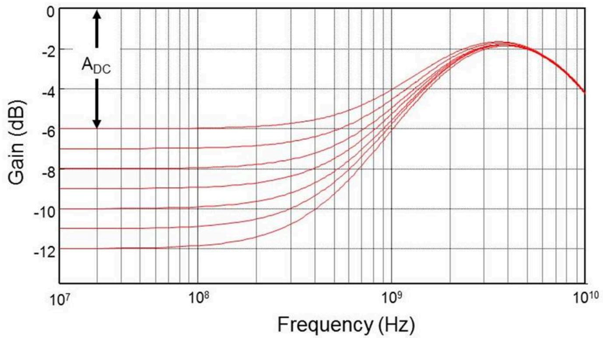

line chart

| Frequency (Hz) | Gain (dB) |
| -------------- | --------- |
| 10^7           | -12       |
| 10^8           | -8        |
| 10^9           | -4        |
| 10^10          | -2        |

Figure 8-35 Loss Curves for 8.0 GT/s Behavioral CTLE§

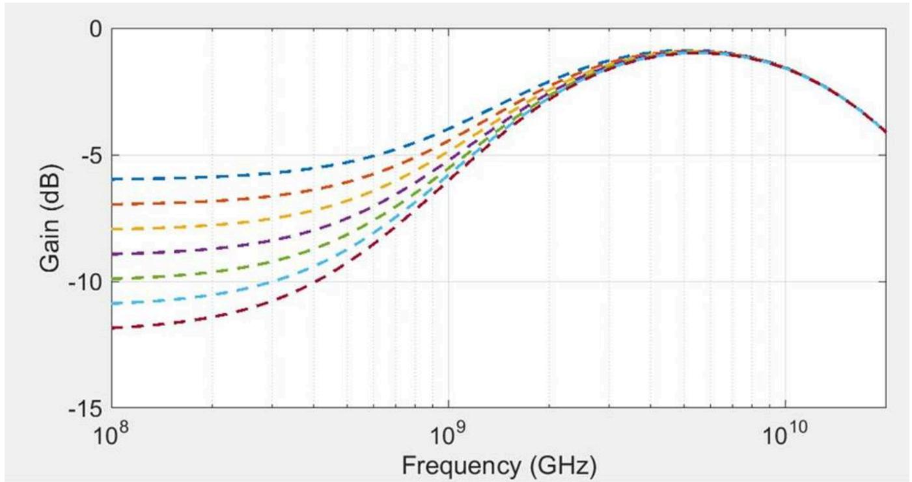

line chart

| Frequency (GHz) | Gain (dB) - Line 1 | Gain (dB) - Line 2 | Gain (dB) - Line 3 | Gain (dB) - Line 4 | Gain (dB) - Line 5 | Gain (dB) - Line 6 | Gain (dB) - Line 7 |
| --------------- | ------------------ | ------------------ | ------------------ | ------------------ | ------------------ | ------------------ | ------------------ |
| 10^8            | -6.0               | -7.0               | -8.0               | -9.0               | -10.0              | -11.0              | -12.0              |
| 10^9            | -2.0               | -3.0               | -4.0               | -5.0               | -6.0               | -7.0               | -8.0               |
| 10^10           | -4.0               | -5.0               | -6.0               | -7.0               | -8.0               | -9.0               | -10.0              |

Figure 8-36 Loss Curves for 16.0 GT/s Behavioral CTLE§

A Receiver operating at 16.0 GT/s utilizes a similar set of CTLE curves with different pole locations. The difference is that $\omega _ { \mathsf { p } 1 }$ =pole $1 = 2 \pi ^ { \star } 2$ GHz and $\omega _ { \mathrm { p 2 } } = \mathsf { p o l e } 2 = 2 \pi \mathrm { ~ } ^ { \star } 1 6 . 0$ GHz. The range for ADC remains the same as that for 8.0 GT/s.

## 8.4.1.9 Behavioral CTLE (32.0 and 64.0 GT/s) §

32.0 GT/s behavioral Rx equalization defines a $2 ^ { \mathsf { n d } }$ order CTLE with fixed poles, and an adjustable DC gain (ADC) specified according to the family of curves shown in § Figure 8-37. The $\mathsf { A D C }$ is adjustable over a range of -5 to -15 dB in steps of 1.0 dB.

$$
H (s) = \frac {\omega_ {P 1} \times \omega_ {P 3} \times \omega_ {P 4}}{\omega_ {Z 1}} \times \frac {(s + \omega_ {Z 1}) (s + \omega_ {P 2} \times A _ {D C})}{(s + \omega_ {P 1}) (s + \omega_ {P 2}) (s + \omega_ {P 3}) (s + \omega_ {P 4})}
$$

$$
\omega_ {x} = 2 \pi \times F _ {x}
$$

$$
F _ {P 1} = 1. 6 5 \times F _ {Z 1}
$$

$$
F _ {P 2} = 9. 5 \mathrm{GHz}
$$

$$
F _ {P 3} = 2 8 \mathrm{GHz}
$$

$$
F _ {P 4} = 2 8 \mathrm{GHz}
$$

$$
F _ {Z 1} = 4 5 0 \mathrm{MHz}
$$

$$
F _ {Z 2} = \operatorname{mag} (\mathrm{DCgain}) \times F _ {P 2}
$$

§

Equation 8-14 Behavioral CTLE at 32.0 GT/s

§ Figure 8-37 illustrates the gain vs. frequency behavior of the CTLE as ADC is varied over its minimum to maximum range in 1.0 dB steps. Note that the maximum frequency of the CTLE curves is 200 GHz which ensures accuracy in the time-domain post-processing simulation tools.

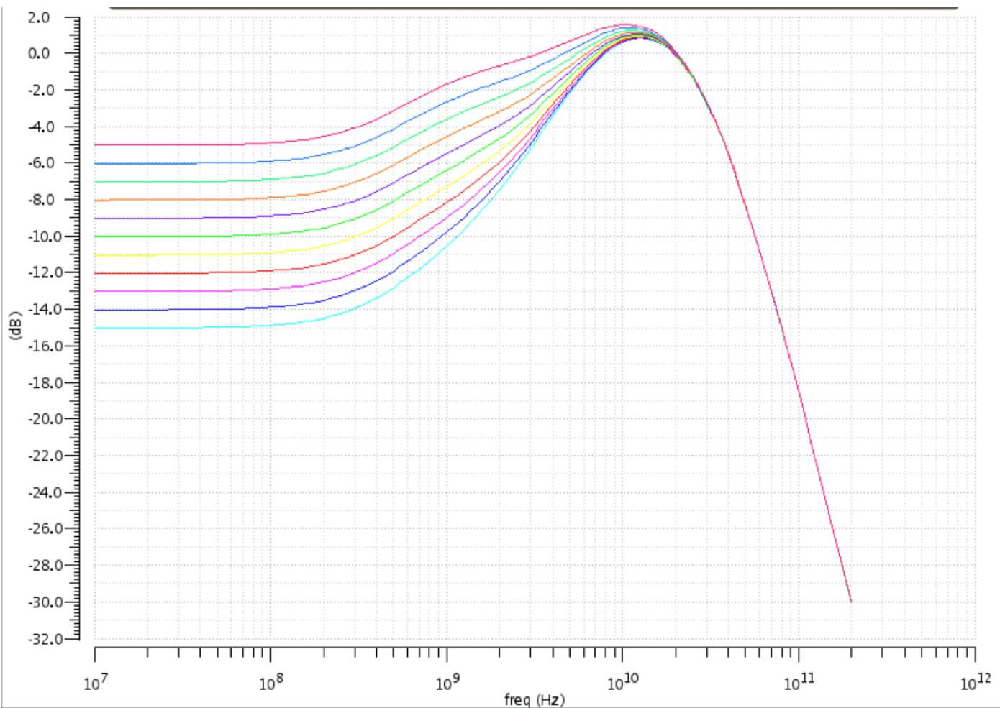

line chart

| freq (Hz) | Series 1 | Series 2 | Series 3 | Series 4 | Series 5 | Series 6 | Series 7 | Series 8 | Series 9 | Series 10 |
| --------- | -------- | -------- | -------- | -------- | -------- | -------- | -------- | -------- | -------- | --------- |
| 10^7      | -5.0     | -6.0     | -7.0     | -8.0     | -9.0     | -10.0    | -11.0    | -12.0    | -13.0    | -14.0     |
| 10^8      | -4.5     | -5.5     | -6.5     | -7.5     | -8.5     | -9.5     | -10.5    | -11.5    | -12.5    | -13.5     |
| 10^9      | -2.0     | -3.0     | -4.0     | -5.0     | -6.0     | -7.0     | -8.0     | -9.0     | -10.0    | -11.0     |
| 10^10     | 0.5      | 0.8      | 1.0      | 1.2      | 1.4      | 1.6      | 1.8      | 2.0      | 2.2      | 2.4       |
| 10^11     | -15.0    | -14.0    | -13.0    | -12.0    | -11.0    | -10.0    | -9.0     | -8.0     | -7.0     | -6.0      |
| 10^12     | -30.0    | -28.0    | -26.0    | -24.0    | -22.0    | -20.0    | -18.0    | -16.0    | -14.0    | -12.0     |

Figure 8-37 Loss Curves for 32.0 GT/s Behavioral CTLE§

64.0 GT/s behavioral Rx equalization defines a CTLE with six poles and three zeros, and an adjustable DC gain (ADC) specified according to the family of curves shown in § Figure 8-38. The ADC is adjustable over a range of -5 to -15 dB in steps of 1.0 dB. The maximum frequency of the CTLE curves is 250 GHz.

$$
H (s) = \frac {\omega_ {p 1} \times \omega_ {p 3} \times \omega_ {p 4} \times \omega_ {p 5} \times \omega_ {p 6}}{\omega_ {z 1} \times \omega_ {z 3}} \times \frac {(s + \omega_ {z 1}) \times (s + \omega_ {p 2} \times A _ {D C}) \times (s + \omega_ {z 3})}{(s + \omega_ {p 1}) \times (s + \omega_ {p 2}) \times (s + \omega_ {p 3}) \times (s + \omega_ {p 4}) \times (s + \omega_ {p 5}) \times (s + \omega_ {p 6})}
$$

$$
\omega_ {x} = 2 \pi \times F _ {x}
$$

$$
F _ {P 1} = 1. 3 0 \times F _ {z 1}
$$

$$
F _ {P 2} = 7. 7 \mathrm{GHz}
$$

$$
F _ {P 3} = 2 2. 0 \mathrm{GHz}
$$

$$
F _ {P 4} = 2 8. 0 \mathrm{GHz}
$$

$$
F _ {P 5} = 3 2. 0 \mathrm{GHz}
$$

$$
F _ {P 6} = 3 2. 0 \mathrm{GHz}
$$

$$
F _ {Z 1} = 2 5 0 \mathrm{MHz}
$$

$$
F _ {Z 2} = \operatorname{mag} (\mathrm{DCgain}) \times F _ {P 2}
$$

$$
F _ {Z 3} = 7. 7 \mathrm{GHz}
$$

§

Equation 8-15 Behavioral CTLE at 64.0 GT/s

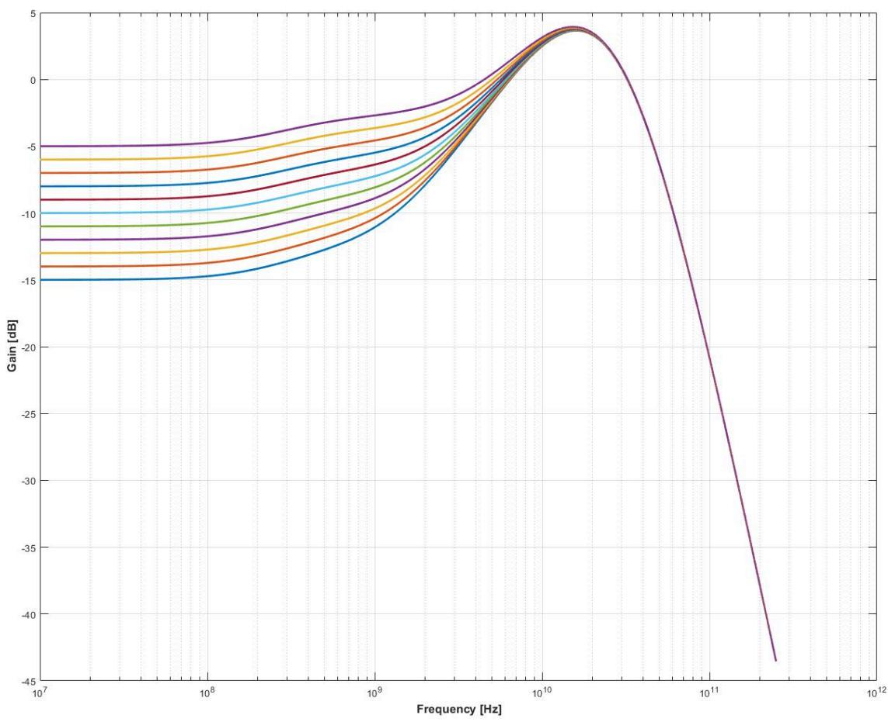

line chart

| Frequency [Hz] | Gain [dB] (Line 1) | Gain [dB] (Line 2) | Gain [dB] (Line 3) | Gain [dB] (Line 4) | Gain [dB] (Line 5) | Gain [dB] (Line 6) | Gain [dB] (Line 7) | Gain [dB] (Line 8) | Gain [dB] (Line 9) | Gain [dB] (Line 10) |
| -------------- | ------------------ | ------------------ | ------------------ | ------------------ | ------------------ | ------------------ | ------------------ | ------------------ | ------------------ | ------------------- |
| 10^7           | -15.0              | -14.5              | -14.0              | -13.5              | -13.0              | -12.5              | -12.0              | -11.5              | -11.0              | -10.5               |
| 10^8           | -14.0              | -13.5              | -13.0              | -12.5              | -12.0              | -11.5              | -11.0              | -10.5              | -10.0              | -9.5                |
| 10^9           | -10.0              | -9.5               | -9.0               | -8.5               | -8.0               | -7.5               | -7.0               | -6.5               | -6.0               | -5.5                |
| 10^10          | 4.0                | 3.8                | 3.6                | 3.4                | 3.2                | 3.0                | 2.8                | 2.6                | 2.4                | 2.2                 |
| 10^11          | -20.0              | -18.0              | -16.0              | -14.0              | -12.0              | -10.0              | -8.0               | -6.0               | -4.0               | -2.0                |
| 10^12          | -45.0              | -42.0              | -39.0              | -36.0              | -33.0              | -30.0              | -27.0              | -24.0              | -21.0              | -18.0               |

Figure 8-38 Loss Curves for 64.0 GT/s Behavioral CTLE§

## 8.4.1.10 Behavioral DFE (8.0, 16.0, 32.0, and 64.0 GT/s Only) §

At 8.0 GT/s the combination of a 1st order CTLE and a one-tap DFE algorithm is required for calibrating the stressed eye when employing the max length calibration channel. The DFE may be represented by the following equation and flow diagram. For 8.0 GT/s and 16.0 GT/s the limits on d1 are ±30 mV. For 32.0 GT/s the limit on d1 is defined as a ratio of the tap magnitude (h1) to the cursor strength (h0). The h1/h0 ratio must be less than or equal to 0.8. Note that the h1/h0 limit of 0.8 is only to bound the behavior of the reference receiver and does not indicate that real implementations will be safe from error bursts due to large h1/h0 causing undetected data errors if the h1/h0 ratio is below 0.8. Implementers must do their own analysis for their specific designs on the largest safe h1/h0 ratio. Note that an optional precoding mechanism is provided at 32.0 GT/s that receivers can optionally enable to reduce the risk of DFE related error bursts in high transition data patterns causing silent data corruption. For 16.0 GT/s the limits on d2 are ±20 mV. For 32.0 GT/s the limits on d2 and d3 are ±20 mV.

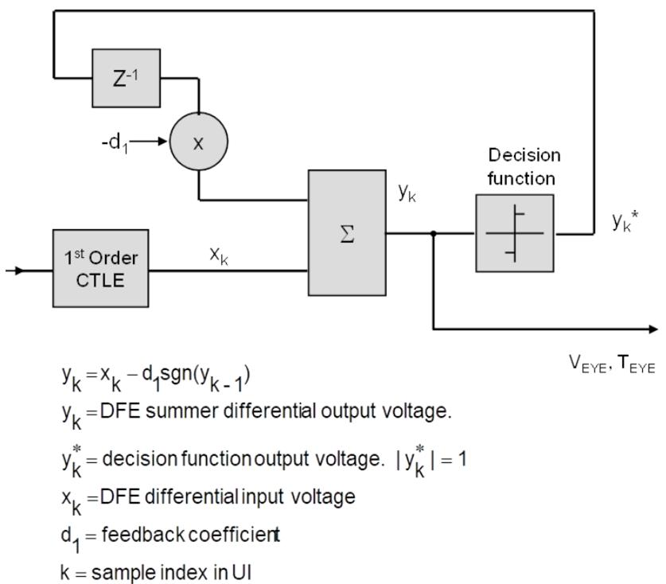

flowchart

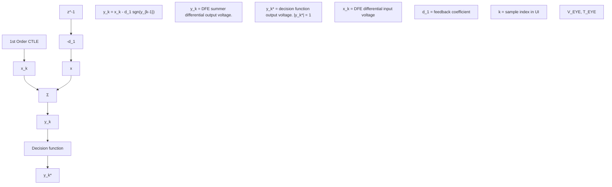
```mermaid
graph TD
  A["1st Order CTLE"] --> B["x_k"]
  B --> C["Σ"]
  C --> D["y_k"]
  D --> E["Decision function"]
  E --> F["y_k*"]
  G["z^-1"] --> H["-d_1"]
  H --> I["x"]
  I --> C
    J["y_k = x_k - d_1 sgn(y_{k-1})"]
    K["y_k = DFE summer differential output voltage."]
    L["y_k* = decision function output voltage. |y_k*| = 1"]
    M["x_k = DFE differential input voltage"]
    N["d_1 = feedback coefficient"]
    O["k = sample index in UI"]
    P["V_EYE, T_EYE"]
```

Figure 8-39 Variables Definition and Diagram for 1-tap DFE§

16.0 GT/s Receiver tolerancing utilizes a CTLE and a 2-tap behavioral DFE as illustrated below. Other than the inclusion of the second tap, it is identical to the 1-tap DFE shown above. The 32.0 GT/s Receiver tolerancing utilizes a CTLE and a 3-tap behavior DFE.

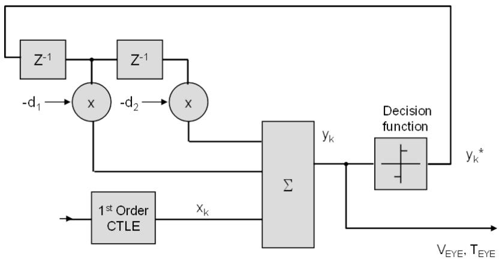

flowchart

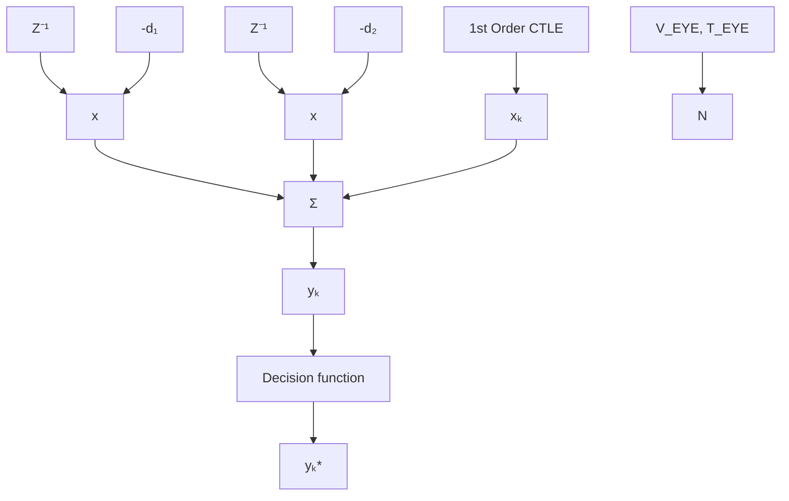
```mermaid
graph TD
  A["Z⁻¹"] --> B["x"]
  C["Z⁻¹"] --> D["x"]
  E["-d₁"] --> B
  F["-d₂"] --> D
  B --> G["Σ"]
  D --> G
  G --> H["yₖ"]
  H --> I["Decision function"]
  I --> J["yₖ*"]
  K["1st Order CTLE"] --> L["xₖ"]
  L --> G
  M["V_EYE, T_EYE"] --> N
```

§  
Figure 8-40 Diagram for 2-tap DFE

For 64.0 GT/s, the feedback signal yk\* can take values of -1, -1/3, +1/3 and +1. In this case, the limit on d1 is defined as a ratio of the tap magnitude (|d1|) to the cursor magnitude at the input of the DFE (h0). To constrain DFE burst errors, the |d1/h0| ratio must be less than 0.55 and the weighted-sum of the tap magnitudes defined as (|d1| + |d2| + 0.85\*|d3| + 0.60\*|d4| + 0.25\*|d5| + 0.10\*|d6| + 0.05\*|d7| + 0.05\*|d8| + 0.05\*|d9| + 0.05\*|d10| + 0.05\*|d11| + 0.05\*|d12| + 0.05\*|d13| + 0.05\*|d14| + 0.05\*|d15| + 0.05\*|d16|)/h0 must be less than 0.85. The limits on DFE tap magnitudes are only to bound the behavior of the reference receiver and do not indicate that real implementations will be safe from error bursts by

ensuring the DFE tap magnitude limits specified for the reference receiver. Implementers must do their own analysis for their specific designs on the largest safe DFE tap magnitudes.

## 8.4.2 Stressed Eye Test §

Rx testing at 16.0, 32.0, and 64.0 GT/s requires only a single stressed voltage/stressed jitter test per data rate.

When testing a Receiver, it is required to have other PCI Express Lanes on the DUT sending or receiving data. Similarly, if the device supports other I/O, it should also be sending or receiving on these interfaces. The goal is to have the Rx test environment replicate the noise environment found in a real system as closely as possible.

## 8.4.2.1 Procedure for Calibrating a Stressed EH/EW Eye §

The goal of calibrating a stressed voltage/jitter eye is to present the Receiver under test with simultaneously worst case margins whose distortion characteristics are like an eye produced by a real channel. Much of the distortion consists of the ISI produced by the calibration channel. Incremental changes of Rj and differential voltage are allowed to adjust the EW and EH, respectively at 8.0 GT/s. Incremental changes of Sj, VRX-DIFF-INT, and differential voltage swing from nominal values may be used to adjust the EW and EH at 16.0, 32.0, and 64.0 GT/s. Refer to § Table 8-10 for initial values of various stress parameters for all data rates.

The reference point where EH/EW is defined corresponds to input to the Receiver latch at 8.0, 16.0, 32.0, and 64.0 GT/s. Since this point is not physically accessible it is necessary to construct its equivalent by means of a post-processing procedure. A two million unit interval data record of compliance pattern or a step that has been averaged 1024 times at TP2 is first post processed to mathematically include the additional signal distortion caused by the behavioral Receiver package. If a compliance pattern waveform is used then all stresses except VRX-CM-INT are turned on if a step is used then all stresses are turned off. Then the resulting signal is recovered by means of Rx equalization, and a behavioral CDR function, resulting in an equivalent eye. The requirements for the waveform post processing tool used for the EH/EW calibration are described further in § Section 8.4.2.1.1 . If the receiver calibration eye margin simulation tool uses a step response, the Rj, Sj, and VRx-DIFF-INT are input parameters to the simulation tool. If the receiver calibration eye margin simulation tool uses compliance pattern waveform, the Rj, Sj, and VRx-DIFF-INT are inputs to the waveform. In either case, the stress parameters must be calibrated.

As the calibration procedure of the signal generator output contains steps where the generator is connected directly to measurement instrumentation, the transition time of the output waveform can be very fast. Therefore, it is important that the bandwidth of instrumentation used to calibrate the generator be matched appropriately to the edge rate of the generator output. This specification requires the use of a generator for 16.0 GT/s testing whose outputs have a rise time of 14 ps-19 ps (20% / 80%) which also requires a minimum oscilloscope bandwidth of 25 GHz. This oscilloscope bandwidth is also the minimum required bandwidth for transmitter measurements at 16.0 GT/s. For 32.0 and 64.0 GT/s testing the specification requires the use of a generator whose outputs have a rise time of 7.5 - 15.0 ps (20%/80% measured with P4) which requires a minimum oscilloscope bandwidth of 50 GHz. This oscilloscope bandwidth is also the minimum required for transmitter measurements at 32.0 and 64.0 GT/s. A minimum oscilloscope sampling rate that captures at least 4 samples per unit interval is required for all data rates.

For the eye calibration process, the Tx equalization is fixed to the preset that gives the optimal eye area with the post processing tool being used for calibration. Once the testing procedure is under way the Tx preset may be adjusted to yield the best eye margins with the DUT. During EH/EW calibration Sj is initially set to 100 MHz with a nominal amplitude of 0.1 UI for 8.0, 16.0, and 32.0 GT/s, with a nominal amplitude of 0.05 UI for 64.0 GT/s. The 100 MHz Sj amplitude will be swept during the stressed eye calibration. Tx EQ and differential voltage swing calibration are done at TP3 as shown in § Figure 8-26. The coaxial cable from TP1 to TP3 is considered part of the generator and not included in the channel insertion loss measurements for 32.0 GT/s and 64.0 GT/s stressed eye calibration, but the coaxial cable is included in the total channel insertion loss measurement at 16.0 GT/s to keep consistency with the 16.0 GT/s measurement methodology adopted in PCIe 4.0. For calibration at 16.0 GT/s the following process is used to calibrate the eye:

1. Calibrate the stress values to the nominal values in § Table 8-10.  
2. Select an initial test channel length that gives a loss at TP2P at 8 GHz of 27 dB±0.5 dB.  
3. Measure the eye diagram for each TX EQ preset using the nominal TX Eq for the preset +/- 0.1 dB and select the TX EQ preset that gives the largest eye area.

For all EH, EW and eye area measurements performed in receiver calibration the ADC in the reference receiver CTLE is varied over its minimum to maximum range in 0.25 dB steps. This is done to improve repeatability and accuracy in automated Rx calibration software and is only done for stressed eye calibration (not for channel compliance, etc.)

4. Increase the calibration channel loss to the next available length/loss and measure the new eye diagram at the selected preset. Continue to increase the length/loss until either the height or width have fallen below the targets in § Table 8-10 then the previous calibration channel length/loss is selected. If neither the height or width have fallen below the targets and the TP3 (§ Figure 8-26) to TP2P loss at 8 GHz has reached 30.0 dB then advance to the next step.

5. For the selected calibration channel length/loss, measure the eye diagram for each TX EQ preset and select the preset that gives the largest eye area. Note that this may be a different preset than step 3 due to the length/loss change.

6. Adjust Sj, VRX-DIFF-INT, and Voltage Swing to make final adjustments to the eye by sweeping them through the following ranges:

a. Sj 5 to 10 ps PP.  
b. VRX-DIFF-INT 10 to 25 mV at TP2.  
c. Differential Voltage Swing 720 to 800 mV PP at TP1.

7. If the final Sj value is less then 0.1 UI then the Rj level is reduced so the eye width meets the target eye width with 0.1 UI of 100 MHz Sj.

8. If there are multiple combinations of Sj, VRX-DIFF-INT, and Voltage Swing that give valid solutions first pick the combination that is closest to the target eye width (18.75 ps). If there are multiple Sj, VRX-DIFF-INT, and Voltage Swing combinations that are equally close to the target eye width then pick the one with Sj closest to nominal. The selected values must give a mean eye height and width (over at least 5 measurements exact number of measurements needed for stable values will depend on lab set-up and tools) within the following ranges at BER E-12:

a. Eye height 15 mV +/- 1.5 mV  
b. Eye width 18.75 ps +/- 0.5 ps

For calibration at 32.0 GT/s the following process is used to calibrate the eye:

1. Measure the eye diagram for each TX EQ preset using the nominal TX Eq for the preset +/- 0.3 dB and select the TX EQ preset that gives the largest eye area.

For all EH, EW and eye area measurements performed in receiver calibration the ADC in the reference receiver CTLE is varied over its minimum to maximum range in 1.0 dB steps. Measure the eye diagram varying the following parameters with the maximum indicated step size for each variable parameter:

a. Calibrate the stress values to the initial values in § Table 8-10. The Rj stress is kept constant.  
b. Channel loss from TP3 to TP2P varied from 34.0 to 37.0 dB with a maximum 0.5 dB step size.  
Note that if your actual channel loss comes out to slightly above 37 or slightly below 34 that these cases are excluded (loss must be between 34.0 and 37.0 dB)  
c. Sj varied from 1 to 5 ps PP with a maximum 0.25 ps step size with Sj measured at TP3

d. VRX-DIFF-INT 5 to 30 mV at TP2 with a maximum 2.5 mV step size

2. If the final Sj value is less then 0.1 UI then the Rj level is reduced so the eye width meets the target eye width with 0.1 UI of 100 MHz Sj.  
3. If there are multiple combinations of Sj, VRX-DIFF-INT, and channel loss that give valid solutions first pick the combination with the highest channel loss. If there are multiple combinations that work with the highest channel loss, then select the combination that is closest to the target eye height (15.0 mV). The selected values must give a mean eye height and width (over at least 5 measurements exact number of measurements needed for stable values will depend on lab set-up and tools) within the following ranges at BER E-12. A specific method for finding the combination of stress values that meet these criteria is outside the scope of this specification. If and only if no stress combinations can be found, then the voltage swing may also be varied from 720 to 800 mV:

Note that because the first tiebreaker is highest loss - most approaches will start with the highest allowed channel loss.

a. Eye height 15 mV +/- 1.5 mV  
b. Eye width 9.375 ps +/- 0.5 ps

For calibration at 64.0 GT/s the following process is used to calibrate the eye:

1. Measure the PAM4 eye diagrams for each TX EQ preset of Q0-Q9 using the nominal TX Eq for the preset +/- 0.3 dB and select the TX EQ preset that gives the largest top eye area.

For all EH, EW and eye area measurements performed in receiver calibration the ADC in the reference receiver CTLE is varied over its minimum to maximum range in 1.0 dB steps. Measure the eye diagrams varying the following parameters with the maximum indicated step size for each variable parameter:

a. Calibrate the stress values to the initial values in § Table 8-10. The Rj stress is kept constant.  
b. Channel loss from TP3 to TP2P varied from 30.0 to 33.0 dB with a maximum 0.5 dB step size.

Note that if your actual channel loss comes out to slightly above 33 or slightly below 30 that these cases are excluded (loss must be between 30.0 and 33.0 dB)

c. Sj varied from 1 to 3 ps PP with a maximum 0.25 ps step size with Sj measured at TP3  
d. VRX-DIFF-INT 5 to 25 mV at TP2 with a maximum 2.0 mV step size

2. If the final Sj value is less than 0.05 UI then the Rj level is reduced so the eye width meets the target eye width with 0.05 UI of 100 MHz Sj.  
3. If there are multiple combinations of Sj, VRX-DIFF-INT, and channel loss that give valid solutions first pick the combination with the highest channel loss. If there are multiple combinations that work with the highest channel loss, then select the combination that is closest to the target top eye height (6.0 mV). The selected values must give a mean eye height and width (over at least 5 measurements exact number of measurements needed for stable values will depend on lab set-up and tools) within the following ranges at BER of 10-6. A specific method for finding the combination of stress values that meet these criteria is outside the scope of this specification. If and only if no stress combinations can be found, then the voltage swing between PAM4 voltage level 0 and level 3 may also be varied from 720 to 800 mV:

Note that because the first tiebreaker is highest loss - most approaches will start with the highest allowed channel loss.

a. Top eye height 6 mV +/- 0.5 mV  
b. Top eye width 3.125 ps +/- 0.3 ps

For calibration at 64.0 GT/s, if the Differential Noise and/or Common Mode Noise are generated using an external source, any broadband differential noise introduced by the noise source should be characterized and added to the step response based calibration procedure through inclusion of SNDR in the modeling of the BERT transmitter.

Based upon the data rate at which the Rx is being tested, Rj or Sj and differential interference sources are adjusted to fall within the VRX-ST and TRX-ST limits. The EH and EW ranges are designed to account for post processing or measurement errors. § Figure 8-41 shows the process for calibrating the stressed jitter eye at 8.0 GT/s.

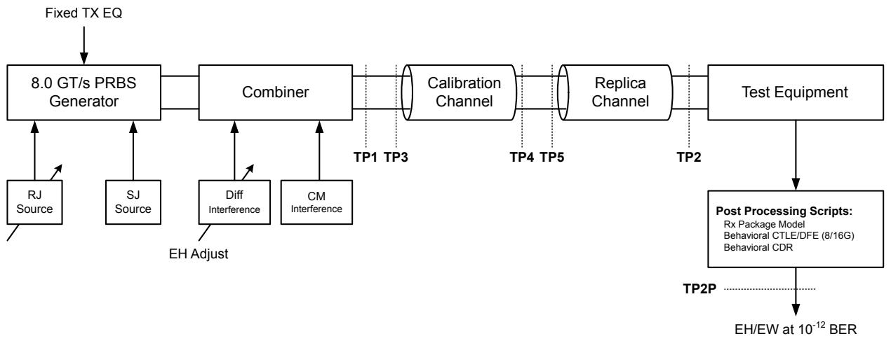

flowchart

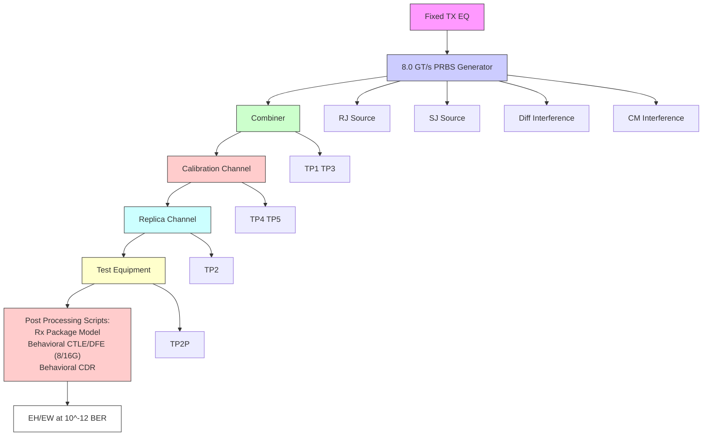
```mermaid
graph TD
  A["Fixed TX EQ"] --> B["8.0 GT/s PRBS Generator"]
  B --> C["Combiner"]
  C --> D["Calibration Channel"]
  D --> E["Replica Channel"]
  E --> F["Test Equipment"]
  F --> G["Post Processing Scripts:<br>Rx Package Model<br>Behavioral CTLE/DFE (8/16G)<br>Behavioral CDR"]
  G --> H["EH/EW at 10^-12 BER"]
  B --> I["RJ Source"]
  B --> J["SJ Source"]
  B --> K["Diff Interference"]
  B --> L["CM Interference"]
  C --> M["TP1 TP3"]
  D --> N["TP4 TP5"]
  E --> O["TP2"]
  F --> P["TP2P"]
    style A fill:#f9f,stroke:#333
    style B fill:#ccf,stroke:#333
    style C fill:#cfc,stroke:#333
    style D fill:#fcc,stroke:#333
    style E fill:#cff,stroke:#333
    style F fill:#ffc,stroke:#333
    style G fill:#fcc,stroke:#333
    style H fill:#fff,stroke:#333
```

Figure 8-41 Layout for Calibrating the Stressed Jitter Eye at 8.0 GT/s§

§ Figure 8-42 shows the process for calibrating the stressed jitter eye common for 16.0, 32.0, and 64.0 GT/s data rates. The PRBS Generator provides the required data rate and the eye is calibrated to the data rate specific target EH and EW at the corresponding BER.

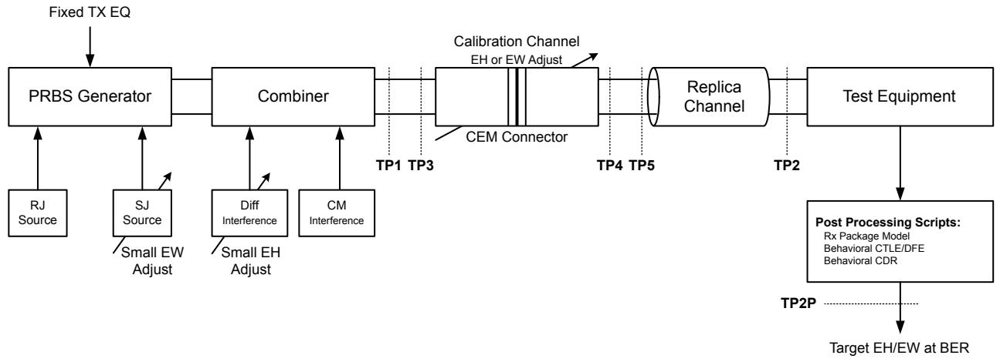

flowchart

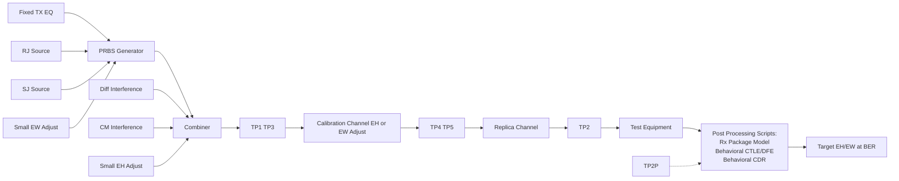
```mermaid
graph LR
  A["Fixed TX EQ"] --> B["PRBS Generator"]
  B --> C["Combiner"]
  C --> D["TP1 TP3"]
  D --> E["Calibration Channel EH or EW Adjust"]
  E --> F["TP4 TP5"]
  F --> G["Replica Channel"]
  G --> H["TP2"]
  H --> I["Test Equipment"]
  I --> J["Post Processing Scripts:<br>Rx Package Model<br>Behavioral CTLE/DFE<br>Behavioral CDR"]
  J --> K["Target EH/EW at BER"]
  L["RJ Source"] --> B
  M["SJ Source"] --> B
  N["Diff Interference"] --> C
  O["CM Interference"] --> C
  P["Small EW Adjust"] --> B
  Q["Small EH Adjust"] --> C
    R["TP2P"] -.-> J
```

Figure 8-42 Layout for Calibrating the Stressed Jitter Eye at 16.0, 32.0, and 64.0 GT/s§

Table 8-10 Stressed Jitter Eye Parameters§

<table><tr><td>Symbol</td><td>Parameter</td><td>2.5 GT/s</td><td>5.0 GT/s</td><td>8.0 GT/s</td><td>16.0 GT/s</td><td>32.0 GT/s</td><td>64.0 GT/s</td><td>Units</td><td>Details</td></tr><tr><td> $V_{RX-LAUNCH}$ </td><td>Generator launch voltage</td><td>800 to 1200</td><td>800 to 1200</td><td>800 to 1200</td><td>800</td><td>800</td><td>800</td><td>mV PP</td><td>Note 1</td></tr><tr><td> $T_{RX-UI}$ </td><td>Unit Interval</td><td>400</td><td>200</td><td>125</td><td>62.5</td><td>31.25</td><td>31.25</td><td>ps</td><td></td></tr><tr><td> $T_{RX-ST}$ </td><td>Target Eye width (Top Eye for PAM4)</td><td>0.4</td><td>0.32</td><td>0.30</td><td>0.30</td><td>0.30</td><td>0.10</td><td>UI</td><td>Note 3, 4, 8, 10</td></tr><tr><td> $V_{RX-ST}$ </td><td>Target Eye height (Top Eye for PAM4)</td><td>175</td><td>100</td><td>25</td><td>15</td><td>15</td><td>6</td><td>mV PP</td><td>Note 2, 4, 8, 9</td></tr><tr><td> $T_{RX-ST-SJ}$ </td><td>Swept Sj</td><td>N/A</td><td>75 ps (max)See Note 11</td><td colspan="4">See § Section 8.4.2.2.1</td><td>ps</td><td>Note 5</td></tr><tr><td> $T_{RX-ST-RJ}$ </td><td>Random Jitter</td><td>N/A</td><td>3.4</td><td>(max)3.0</td><td>1.0</td><td>0.5</td><td>0.25</td><td>ps RMS</td><td>Note 6, 7</td></tr><tr><td> $V_{RX-DIFF-INT}$ </td><td>Differential noise</td><td>N/A</td><td>N/A</td><td>14</td><td>14</td><td>20</td><td>15</td><td>mV PP</td><td>Note 7, 12Adjust to set EH.Frequency = 2.1 GHz</td></tr><tr><td> $V_{RX-CM-INT}$ </td><td>Common mode noise</td><td>150</td><td>150</td><td>150</td><td>150</td><td>150</td><td>75</td><td>mV PP</td><td>Note 8</td></tr><tr><td> $V_{SSC-RES}$ </td><td>SSC Residual</td><td>N/A</td><td>75</td><td>N/A</td><td>500</td><td>N/A</td><td>N/A</td><td>ps</td><td>Note 11, 13</td></tr></table>

Notes:  
1. VRX-LAUNCH may be adjusted to meet VRX-ST as long as the outside eye voltage at TP2 does not exceed 1300 mVPP for calibration at 2.5, 5.0, and 8.0 GT/s. VRX-LAUNCH is adjusted from 800 to 720 mV for 16.0, 32.0, and 64.0 GT/s calibration with 800 mV as the nominal value.  
2. Voltages shown for 2.5 GT/s and 5.0 GT/s are at the Rx pins.  
3. Eye widths shown for 2.5 GT/s and 5.0 GT/s are at the Rx pins.  
4. VRX-ST and TRX-ST are referenced to TP2P for 8.0, 16.0, 32.0, and 64.0 GT/s and TP2 for 2.5 and 5.0 GT/s. For 8.0, 16.0, 32.0, and 64.0 GT/s behavioral equalization are applied to the data at TP2. At 64.0 GT/s, VRX-ST and TRX-ST correspond to top eye height and eye width at 10-6 BER.  
5. TRX-ST-SJ may be measured at either TP1 or TP2. Only 8.0, 16.0, 32.0 and 64.0 GT/s receivers are tested with Sj mask.  
6. TRX-ST-RJ may be adjusted to meet the target value for TRX-ST at 8.0 GT/s. Rj is measured at TP1 to prevent data-channel interaction from adversely affecting the accuracy of the Rj calibration. Rj is applied over the following range: The low frequency limit may be between 1.5 and 10 MHz, and the upper limit is 1.0 GHz.  
7. Both TRX-ST-RJ and VRX-DIFF-INT are limited to prevent the stressed eye from containing excessive amounts of jitter or noise distortion that are unrepresentative of a real channel. Too many of these distortion components produces a signal that cannot be equalized by an actual Receiver.  
8. Defined as a single tone at 120 MHz. Measurement made at TP2 without post-processing. Common mode is turned off during TRX-ST and VRX-ST calibration and then turned on for the stressed eye jitter test.  
9. For 2.5 GT/s and 5.0 GT/s Rx calibration variable channel loss is used to achieve the target eye height.

<table><tr><td>Symbol</td><td>Parameter</td><td>2.5 GT/s</td><td>5.0 GT/s</td><td>8.0 GT/s</td><td>16.0 GT/s</td><td>32.0 GT/s</td><td>64.0 GT/s</td><td>Units</td><td>Details</td></tr></table>

10. For 2.5 GT/s Rx calibration 100 MHz Sj is used to achieve the target eye width.  
11. For 33 kHz SSC residual for common clock architecture testing only when testing at 5 GT/s.  
12. Frequency for VRX-DIFF-INT is chosen to be slightly above the first pole of the reference CTLE.  
13. Applied for CC testing only as a triangular phase modulation with a frequency between 30 kHz to 33 kHz when testing at 16.0 GT/s with no 32.0 GT/s and no 64.0 GT/s support and when the Sj mask of § Figure 8-50 and a first order CDR transfer function are used.

## 8.4.2.1.1 Post Processing Tool Requirements §

A waveform post processing tool or a channel compliance methodology tool may be used for Rx stressed eye calibration at 16.0, 32.0, or 64.0 GT/s. If a waveform post processing tool is used to calibrate the EH/EW for the RX stressed eye testing, the tool must be consistent with the channel compliance methodology tool based on a consistency test defined as follows:

• The test channel is the long Rx calibration channel with the Root reference package applied in post-processing to give a total loss of 28.0 dB at 8 GHz (16.0 GT/s), 36.0 dB at 16 GHz (32.0 GT/s), or 32.0 dB at 16 GHz (64.0 GT/s). This means that the physical channel loss is 23.0 dB (16.0 GT/s), 27.0 dB (32.0 GT/s), or 24.0 dB (64.0 GT/s).  
• All measurements are done at TP2.  
• A step pattern with 512 ones and zeros is captured through the test channel by averaging 1024 times on a real time oscilloscope. The step is saved with an x-axis resolution of 1 ps or less to be used as the transmit waveform for the channel compliance methdology. The step pattern is captured for each preset using the nominal Tx EQ for each preset.  
• The channel compliance methodology is run with no Tx EQ applied in simulation using the nominal stress values for Rx stressed eye calibration for each of the captured steps. The Tx EQ preset that produced the largest eye area is selected for exact eye height and width calibration.  
• The channel compliance methodology is used with the selected Tx EQ preset to produce an EH/EW of

◦ 15 mV and 0.3 UI @ 10-12 BER (16.0 GT/s),  
◦ 15 mV and 0.3 UI @ 10-12 BER (32.0 GT/s), or  
◦ top eye height of 6.0 mV and top eye width of 0.1 UI @ ${ { 1 0 } ^ { - 6 } }$ BER (64.0 GT/s)

by adjusting the Sj, VRX-DIFF-INT and voltage swing at the Transmitter output.

• A pattern generator is calibrated to have the same jitter stress levels and Tx Swing as those used in the channel compliance simulations that produced the target eye height and eye width.  
• 2 million unit interval waveforms with compliance pattern are captured at each Tx EQ at the end of the channel. The Tx EQ is calibrated to the nominal values for each preset at the pattern generator output before doing the captures.  
• For the preset that gives the largest eye area with the waveform post procesing tool the EH and EW (@ 10-12 BER for 8.0, 16.0, and 32.0 GT/s and $\varpi { 1 0 } ^ { - 6 }$ BER for 64.0 GT/s) & must match the target EH and EW from the channel compliance methodology within +/- 15%.

## 8.4.2.2 Procedure for Testing Rx DUT §

## 8.4.2.2.1 Sj Mask §

Once a calibrated EH and EW have been obtained, the cables are moved to connect the Rx DUT to the far end of calibration channel. For the testing of the Rx DUT, the BERT Tx must transmit Modified Compliance Pattern. The Tx equalization may then be optimized with the assumption that the DUT Rx will also optimize its equalization. Sj is set to an initial value of 0.1 UI at 100 MHz and the Receiver CDR must achieve lock. For 64.0 GT/s, Sj is set to an initial value of 0.05 UI at 100 MHz and the Receiver CDR must achieve lock. At 8.0, 16.0, 32.0, and 64.0 GT/s the 100 MHz Sj initial tone is removed and then the appropriate swept Sj profile is tested. At 16.0, 32.0, and 64.0 GT/s an additional Sj tone at 210 MHz is present for all testing. At 16.0 and 32.0 GT/s, the amplitude of this additional tone is equal to the amplitude of the 100 MHz Sj required to achieve the target eye width minus 0.1 UI. If the calibration Sj level was less than 0.1 UI then no additional tone at 210 MHz is used. At 64.0 GT/s, the amplitude of this additional tone is equal to the amplitude of the 100 MHz Sj required to achieve the target eye width minus 0.05 UI. If the calibration Sj level was less than 0.05 UI then no additional tone at 210 MHz is used. Different Sj profiles are used, depending on data rate and whether the Rx under test operates in the CC mode or the IR Refclk mode. See § Table 8-10.

The SJ (pp value) profiles shown in § Figure 8-43, § Figure 8-44, § Figure 8-45, § Figure 8-46, § Figure 8-47, § Figure 8-48, and § Figure 8-49 consist of swept tones at 33 kHz and from 400 kHz to 100 MHz, representing the swept Sj frequency range. For 8.0 and 16.0 GT/s SRIS mode with 5000 ppm SSC, the magnitude of the 33 kHz spur is 25 ns pp. For 32.0 and 64.0 GT/s SRIS mode with 3000 ppm SSC, the magnitude of the 33 kHz spur is 15 ns pp. A Receiver must meet the target BER (10-6 for 64.0 GT/s and 10-12 for all other data rates) over the entire swept Sj frequency range. It is not necessary to test a Receiver over the entire Sj frequency range, but a sufficient number of frequency points should be tested to guarantee that the Rx does not fail the target BER at some resonance frequency. The 33 kHz frequency point must be tested and treated as another frequency point. The 33 kHz frequency will not be kept on during other frequency measurements. Note that no SSC is applied at the source. Swept Sj is required only for testing Receivers at 8.0, 16.0, 32.0, and 64.0 GT/s. Receiver operation at 2.5 GT/s and 5.0 GT/s is tested using a single 33 kHz Sj tone.

Receivers operating at 8.0 GT/s in the IR mode use the Sj mask profile shown in § Figure 8-43. The magnitude of the 33 kHz spur is 25 ns pp, or 200 UIpp. The equation of the swept Sj curve is shown on § Figure 8-43.

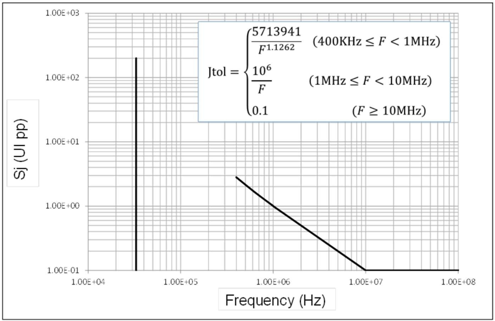

line chart

| Frequency (Hz) | Sj (UI pp) |
| -------------- | ---------- |
| 1.00E+04       | 1.00E+03   |
| 1.00E+05       | 1.00E+01   |
| 1.00E+06       | 1.00E+00   |
| 1.00E+07       | 1.00E-01   |
| 1.00E+08       | 1.00E-01   |

Figure 8-43 Sj Mask for Receivers Operating in IR mode at 8.0 GT/s§

Receivers operating at 16.0 GT/s in the Independent Refclk (IR) mode use the Sj mask profile shown in § Figure 8-44. The magnitude of the 33 kHz spur is 25 ns pp, or 400 UIpp. The equation of the swept Sj curve is shown on the § Figure 8-44.

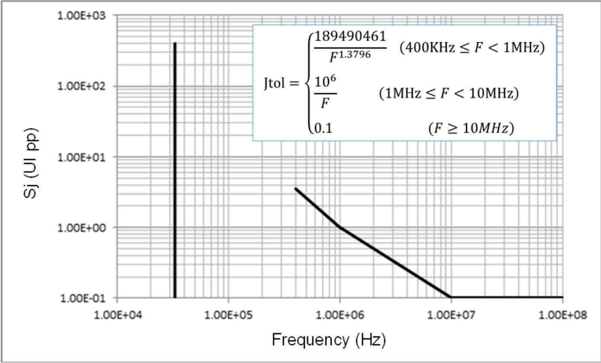

line chart

| Frequency (Hz) | Sj (UI pp) |
| -------------- | ---------- |
| 1.00E+04       | 1.00E+03   |
| 1.00E+05       | 1.00E+01   |
| 1.00E+06       | 1.00E+00   |
| 1.00E+07       | 1.00E-01   |
| 1.00E+08       | 1.00E-01   |

Figure 8-44 Sj Mask for Receivers Operating in SRIS mode at 16.0 GT/s§

Receivers operating at 16.0 GT/s in the Common Clock (CC) Refclk mode use the Sj mask profile shown in § Figure 8-45. The magnitude of the 33 kHz spur is 1 ns pp, or 16 UIpp. The equation of the swept Sj curve is shown on the § Figure 8-45. Devices that do not support 32.0 GT/s have the option to use the Sj mask defined in § Figure 8-50. In this case, a 500 ps-pp triangular SSC modulation has to be applied at the source for both channel calibration and RX compliance, as specified in § Table 8-10.

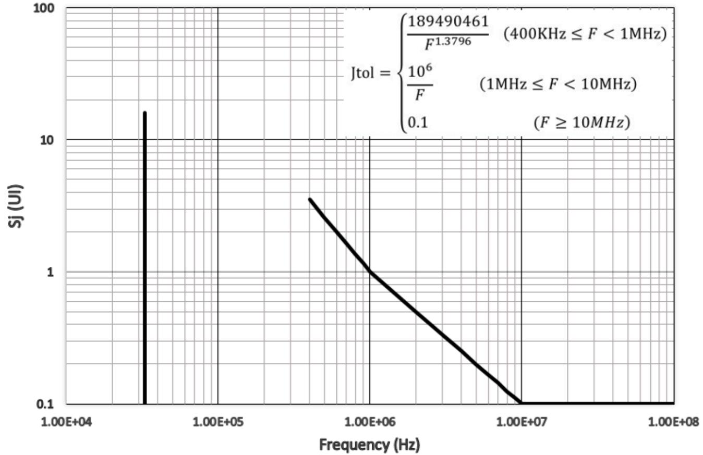

line chart

| Frequency (Hz) | Sj (UI) |
| -------------- | ------- |
| 1.00E+04       | 20.0    |
| 1.00E+05       | 5.0     |
| 1.00E+06       | 1.0     |
| 1.00E+07       | 0.1     |
| 1.00E+08       | 0.1     |

Figure 8-45 Sj Mask for Receivers Operating in CC mode at 16.0 GT/s§

Receivers operating at 32.0 GT/s in the IR mode use the Sj mask profile shown in § Figure 8-46. The magnitude of the 33 kHz spur is 15 ns pp, or 480 UIpp. The equation of the swept Sj curve is shown on the § Figure 8-46.

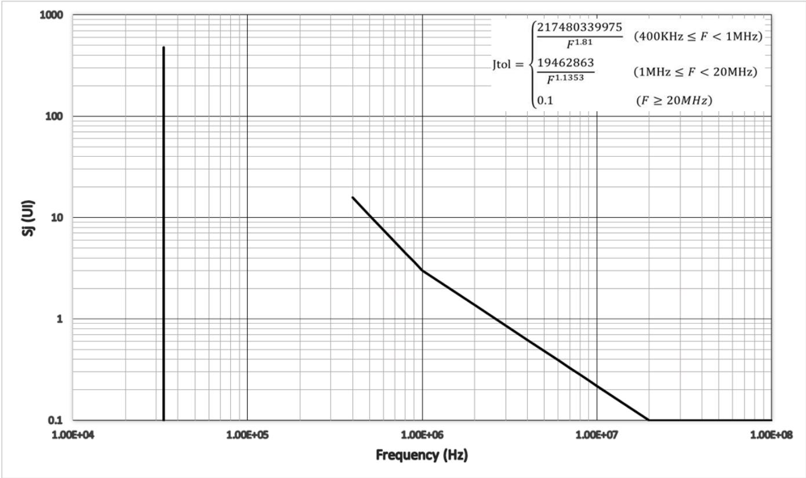

line chart

| Frequency (Hz) | Sj (UI) |
| -------------- | ------- |
| 1.00E+04       | ~500    |
| 1.00E+05       | ~15     |
| 1.00E+06       | ~3      |
| 1.00E+07       | ~0.5    |
| 1.00E+08       | ~0.1    |

Figure 8-46 Sj Mask for Receivers Operating in SRIS mode at 32.0 GT/s§

Receivers operating at 32.0 GT/s in the CC Refclk mode use the Sj mask profile shown in § Figure 8-47. The magnitude of the 33 kHz spur is 1 ns pp, or 32 UIpp. The equation of the swept Sj curve is shown on the § Figure 8-47.

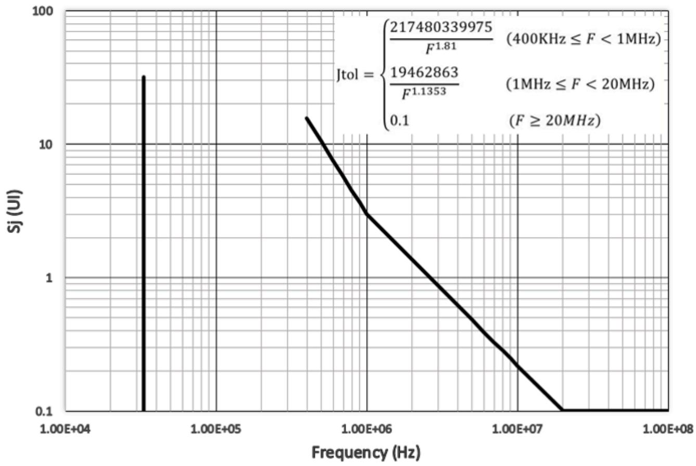

line chart

| Frequency (Hz) | Sj (UI) |
| -------------- | ------- |
| 1.00E+04       | ~30     |
| 1.00E+05       | ~15     |
| 1.00E+06       | ~3      |
| 1.00E+07       | ~0.1    |
| 1.00E+08       | ~0.1    |

Figure 8-47 Sj Mask for Receivers Operating in CC mode at 32.0 GT/s§

Receivers operating at 64.0 GT/s in the IR mode use the Sj mask profile shown in § Figure 8-48. The magnitude of the 33 kHz spur is 15 ns pp, or 480 UI pp. The equation of the swept Sj curve is shown on the § Figure 8-48.

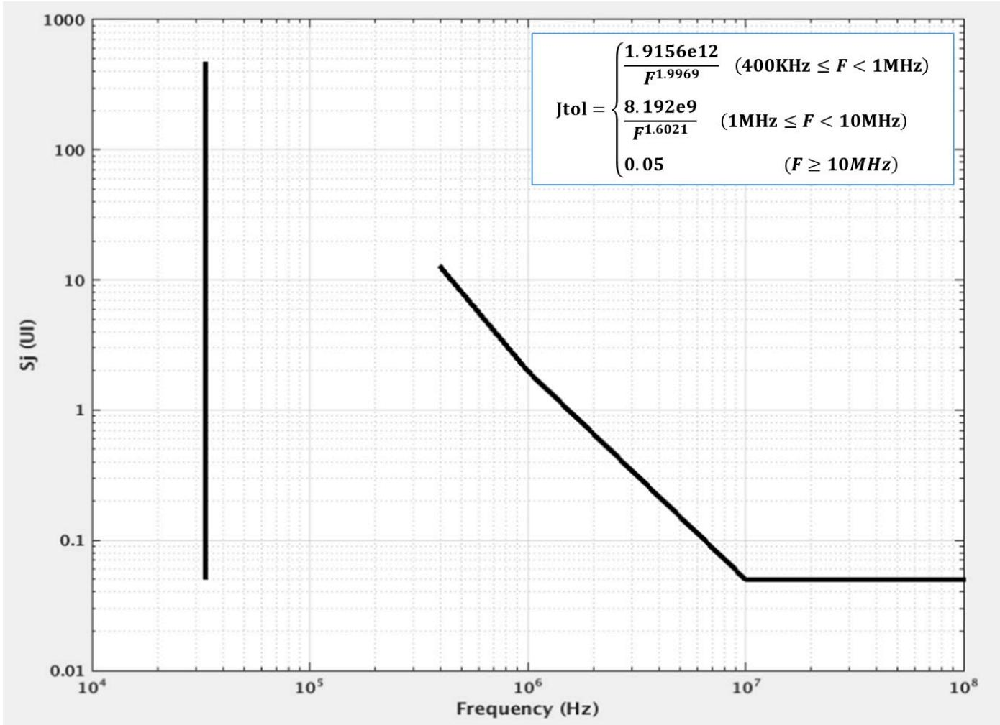

line chart

| Frequency (Hz) | Sj (UI) |
| -------------- | ------- |
| 10^4           | ~500    |
| 10^5           | ~0.05   |
| 10^6           | ~1.5    |
| 10^7           | ~0.05   |
| 10^8           | ~0.05   |

Figure 8-48 Sj Mask for Receivers Operating in SRIS mode at 64.0 GT/s§

Receivers operating at 64.0 GT/s in the CC Refclk mode use the Sj mask profile shown in § Figure 8-49. The magnitude of the 33 kHz spur is 1 ns pp, or 32 UIpp. The equation of the swept Sj curve is shown on the § Figure 8-49.

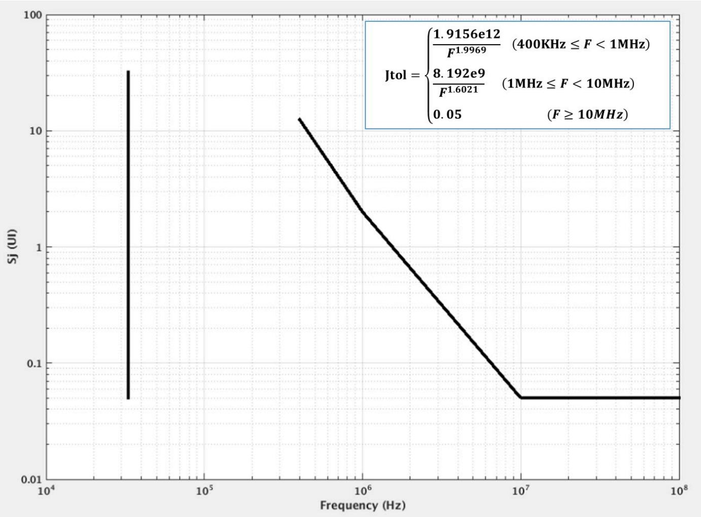

line chart

| Frequency (Hz) | Sj (UI) |
| -------------- | ------- |
| 10^4           | ~30     |
| 10^5           | ~12     |
| 10^6           | ~3      |
| 10^7           | ~0.05   |
| 10^8           | ~0.05   |

Figure 8-49 Sj Mask for Receivers Operating in CC mode at 64.0 GT/s§

Receivers operating in the CC Refclk mode at 8.0 GT/s shall utilize the Sj profile shown in § Figure 8-50. The testing procedure is identical to that used for the IR mode, except that the clock topology differs. See § Section 8.4.2.3 for details. Receivers operating at 16.0 GT/s in the CC Refclk mode in devices that do not support 32.0 GT/s also have the option to use the Sj mask profile shown in § Figure 8-50, with additional residual SSC applied per § Table 8-10.

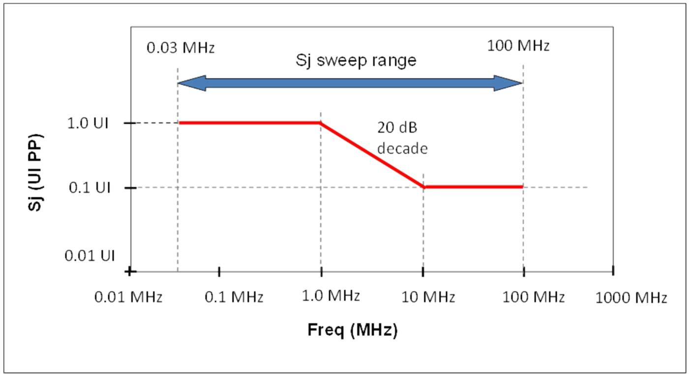

line chart

| Freq (MHz) | SJ (UI PP) |
| ---------- | ---------- |
| 0.01 MHz   | 1.0        |
| 1.0 MHz     | 1.0        |
| 10 MHz     | 0.1        |
| 100 MHz    | 0.1        |
| 1000 MHz   | 0.1        |

Figure 8-50 Sj Masks for Receivers Operating in CC Mode at 8.0 GT/s§

## 8.4.2.3 Receiver Refclk Modes §

A Rx is permitted to support one or both of two clock modes: CC and IR although only one clock mode may be operational at a given time. Receivers can support more than one Refclk mode by selecting a mode at power-up or by means of strapping pins, etc.

## 8.4.2.3.1 Common Refclk Mode §

§ Figure 8-51 shows the Refclk connection for a receiver in the Common Clock Refclk mode. A single Refclk source drives both the Generator and the DUT. This test utilizes the Sj mask specified in § Section 8.4.2.2.1 .

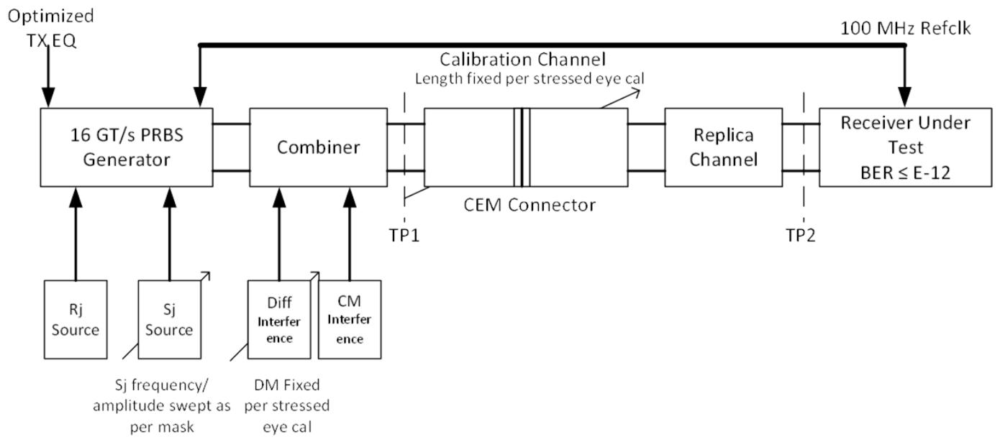

flowchart

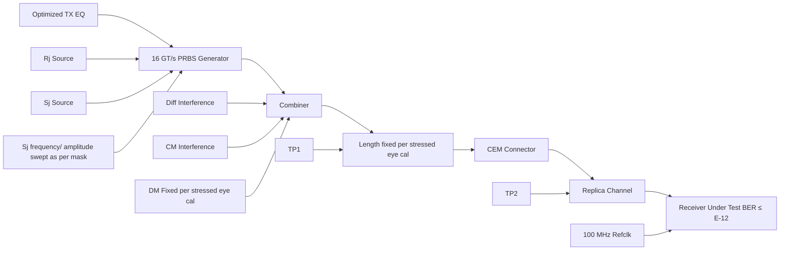
```mermaid
graph LR
  A["Optimized TX EQ"] --> B["16 GT/s PRBS Generator"]
  B --> C["Combiner"]
  C --> D["Length fixed per stressed eye cal"]
  D --> E["CEM Connector"]
  E --> F["Replica Channel"]
  F --> G["Receiver Under Test BER ≤ E-12"]
  H["Rj Source"] --> B
  I["Sj Source"] --> B
  J["Diff Interference"] --> C
  K["CM Interference"] --> C
  L["TP1"] --> D
  M["TP2"] --> F
  N["Sj frequency/ amplitude swept as per mask"] --> B
  O["DM Fixed per stressed eye cal"] --> C
  P["100 MHz Refclk"] --> G
```

Figure 8-51 Layout for Jitter Testing Common Refclk Rx at 16.0 GT/s§

## 8.4.2.3.2 Independent Refclk Mode §

§ Figure 8-52 illustrates the configuration for testing a Receiver in the IR Refclk mode. A Refclk source with SSC is required for the DUT. The test utilizes the Sj mask specified in § Section 8.4.2.2.1 . The generator must be able to produce a large 33 KHz Sj tone while Sj is swept as shown in § Section 8.4.2.2.1 .

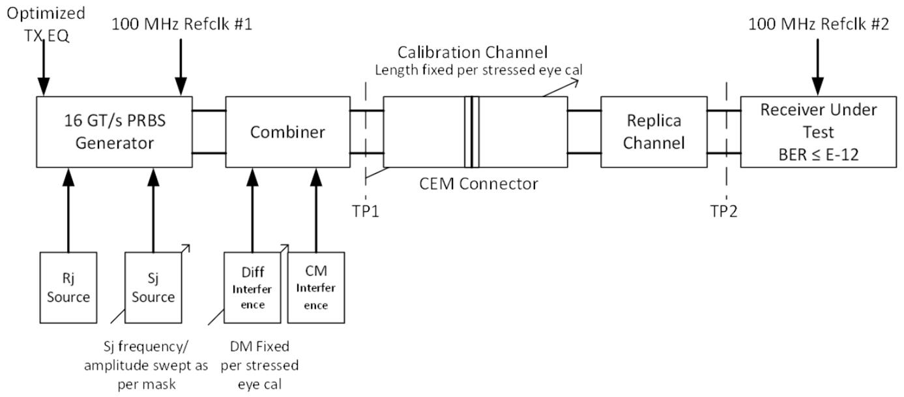

flowchart

```mermaid
graph LR
  A["Optimized TX EQ"] --> B["16 GT/s PRBS Generator"]
  C["100 MHz Refclk #1"] --> B
  D["Rj Source"] --> B
  E["Sj Source"] --> B
  F["Sj frequency/ amplitude swept as per mask"] --> B
  G["DM Fixed per stressed eye cal"] --> B
  H["Diff Interfer ence"] --> B
  I["CM Interfer ence"] --> B
  B --> J["Combiner"]
  J --> K["TP1"]
  K --> L["Calibration Channel"]
  L --> M["Length fixed per stressed eye cal"]
  M --> N["CEM Connector"]
  N --> O["Replica Channel"]
  O --> P["TP2"]
  P --> Q["Receiver Under Test BER ≤ E-12"]
  Q --> R["100 MHz Refclk #2"]
```

Figure 8-52 Layout for Jitter Testing for Independent Refclk Rx at 16.0 GT/s§

## 8.4.3 Common Receiver Parameters §

§ Table 8-11 lists the common Receiver parameters that are not directly associated with stressed eye tolerancing. Values are separately defined for the four data rates.

Table 8-11 Common Receiver Parameters§

<table><tr><td>Symbol</td><td>Parameter</td><td>2.5 GT/s value</td><td>5.0 GT/s value</td><td>8.0 GT/s value</td><td>16.0 GT/s value</td><td>32.0 GT/s value</td><td>64.0 GT/s value</td><td>Units</td><td>Notes</td></tr><tr><td>UI (Rx)</td><td>Unit Interval</td><td>(min)399.88(max)400.12(300 PPM)</td><td>(min)199.94(max)200.06(300 PPM)</td><td>(min)124.9625(max)125.0375(300 PPM)</td><td>(min)62.48125(max)62.51875(300 PPM)</td><td>(min)31.246875(max)31.253125(100 PPM)</td><td>(min)31.246875(max)31.253125(100 PPM)</td><td>ps</td><td>UI tolerance does not include SSC effects</td></tr><tr><td> $BW_{RX-PKG-PLL1}$ </td><td>Rx PLL bandwidth corresponding to  $PKG_{RX-PLL1}$ </td><td>(max)22(min)1.5</td><td>(max)16.0(min)8</td><td>(max)4.0(min)0.5</td><td>(max)4.0(min)0.5</td><td>(max)1.8(min)0.5</td><td>(max)1.0(min)0.5</td><td>MHz</td><td>Second order PLL transfer bounding function. See Note 1.</td></tr><tr><td> $BW_{RX-PKG-PLL2}$ </td><td>Rx PLL bandwidth corresponding to  $PKG_{RX-PLL2}$ </td><td>Not Speci-fied</td><td>(max)16.0(min)5.0</td><td>(max)5.0(min)0.5</td><td>(max)5.0(min)0.5</td><td>N/A</td><td>N/A</td><td>MHz</td><td>Second order PLL transfer bounding function. See Note 1.</td></tr><tr><td> $PKG_{RX-PLL1}$ </td><td>Maximum Rx PLL peaking corresponding to  $BW_{RX-PKG-PLL1}$ </td><td>(max)3.0</td><td>3.0</td><td>2.0</td><td>2.0</td><td>2.0</td><td>2.0</td><td>dB</td><td>Second order PLL transfer bounding function. See Note 1.</td></tr><tr><td> $PKG_{RX-PLL2}$ </td><td>Maximum Rx PLL peaking corresponding to  $BW_{RX-PKG-PLL2}$ </td><td>Not speci-fied</td><td>1.0</td><td>1.0</td><td>1.0</td><td>N/A</td><td>N/A</td><td>dB</td><td>Second order PLL transfer bounding function. See Note 1.</td></tr><tr><td> $RL_{RX-DIFF}$ </td><td>Differential receiver return loss</td><td colspan="5">See § Figure 8-22</td><td>See § Figure 8-24</td><td>dB</td><td>Note 2</td></tr><tr><td> $RL_{RX-CM}$ </td><td>Common mode receiver return loss</td><td colspan="5">See § Figure 8-23</td><td>See § Figure 8-25</td><td>dB</td><td>Note 2</td></tr><tr><td> $T_{RX-GND-FLOAT}$ </td><td>Rx termination float time</td><td></td><td></td><td>(max)500</td><td>(max)500</td><td>(max)500</td><td>(max)500</td><td>μs</td><td>Note 5</td></tr><tr><td> $V_{RX-CM-AC-P}$ </td><td>Rx AC common Mode Voltage</td><td>(max)150</td><td>(max)150</td><td>(max)75</td><td>(max)75</td><td>(max)75</td><td>(max)37.5</td><td>mVP</td><td>Measured at Rx pins into a pair of 50Ω terminations to ground</td></tr><tr><td> $Z_{RX-DC}$ </td><td>Receiver DC single ended impedance</td><td>(min)40(max)60</td><td>(min)40(max)60</td><td>Not speci-fied</td><td>Not speci-fied</td><td>Not speci-fied</td><td>Not speci-fied</td><td>Ω</td><td>DC impedance lim-its are needed to guarantee Receiver detect. For 8.0,</td></tr></table>